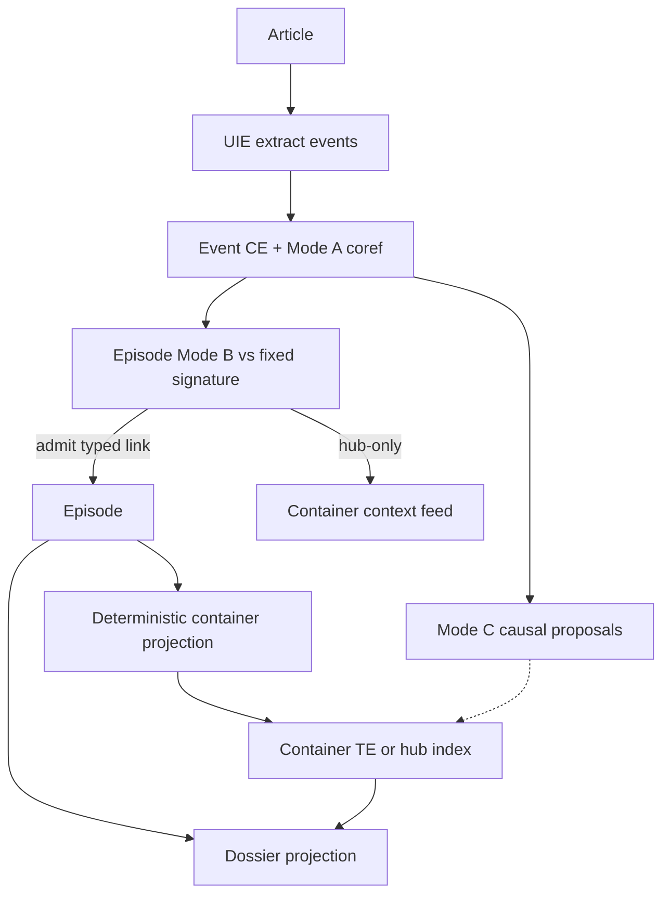
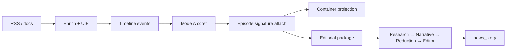

# Assembly model (operator SSOT)

**Purpose:** One plain-language mental model for how News Intelligence turns articles into **events**, **episodes**, **containers**, and **dossiers** (then editorial packages).

**Status:** Binding intent as of 2026-07-30. Prefer this doc over chemistry / beaker / protein metaphors and over the prior “TE = megathread / storyline = facet” lock.

**Code note:** Table `{domain}.storylines` still stores **episode** rows; product language is episode. Legacy symbols may still say `storyline_*`, `protein_harden`, etc. Do not expand bag absorb; attach SSOT is **event → episode** via fixed anchor signature.

See also: [STORYLINE_CANONICAL_MODEL.md](STORYLINE_CANONICAL_MODEL.md), [AGENTS.md](../AGENTS.md), [decision_synthesis_pack](reviews/decision_synthesis_pack/).

---

## Locked object model

| Tier | Object | Identity question | Primary artifact | Rule |
|------|--------|-------------------|------------------|------|
| **Event** | One bounded occurrence | Mode A coreference | `public.chronological_events` + `intelligence.event_coreference_links` | Sources coref into clusters; **primary** fact row |
| **Episode** | Bounded arc with **fixed anchor signature** | Mode B typed anchor match | `{domain}.storylines` (episode rows) | **Events** join episodes; articles never attach directly |
| **Container** | High-level lens / index | Deterministic facet projection | `tracked_events` + `hub_facets` + demoted megas | **Never owns articles**; indexes episodes + major-event timeline |
| **Dossier** | Entity-centric read model | Projection over graph | `knowledge_profiles` / entity profiles | Rebuild-only; **no membership writes** |

**Two hard rules:**

1. Articles → evidence of events; events → episodes; episodes → containers.
2. Hub anchors only grant **container** association, never episode membership.

**Supersedes (2026-07-30):** Earlier event-core lock that made TE the megathread and storylines facet projections. Now: storylines = **episodes**; TE / hubs / demoted megas = **containers**.

---

## The loop in one paragraph

Articles are enriched and extracted into **timeline events**. Same-world occurrences cluster (Mode A). Events attach to **episodes** only when they match a **fixed anchor signature** (hubs stripped). Episodes project into **containers** (hub lenses / tracked indexes) without giving containers article ownership. Eligible episodes feed the **Research → Narrative → Reduction → Editor** package loop until a publishable `news_story` is ready. **Dossiers** / knowledge profiles are read-only projections.

**Research subjects** (medicine, neurodiversity, artificial-intelligence) follow a parallel path: literature appraisals → entity-seeded Research package → auto-merge into `knowledge_profile`. Profile merge does **not** require Reduction or Editor and must **not** write storyline/episode membership.

---

## Building blocks

### 1. Events — `public.chronological_events`

| Operator term | Meaning |
|---|---|
| **Event** / **timeline event** | A dated occurrence extracted from article content (and catchup restore). Main timeline SSOT. |

- Written by UIE (`save_events`) and restored by `chronological_events_catchup`.
- Same-event clustering: `intelligence.event_coreference_links` / `event_cluster_id`.
- Owning services: UIE fan-out, `chronological_events_catchup_service`, `event_coreference_service`, `event_deduplication_service`.

### 2. Episodes — `{domain}.storylines` (product: episode)

| Operator term | Meaning |
|---|---|
| **Episode** | Bounded narrative arc with a **locked** `anchor_signature` `{identity:[], supporting:[]}`. |

- Shape via `story_kind` (`event_narrative`, `research_topic`, `matter_docket`, …).
- Membership SSOT: `intelligence.event_episode_links` (typed: founding / continuation / development). Legacy `{domain}.storyline_articles` is **derived** from successful event→episode links (and discovery seed rows) — keep `article_count` in sync with membership, but do not treat bag absorb as the admit path.
- Lifecycle: `episode_state` ∈ `forming|active|cooling|dormant|concluded` (late events can reactivate).
- Admit gate: `api/shared/episode_attach_gate.py` under feature `episode_container_assembly`.
- Hub-only overlap → **reject** episode admit; may feed container context only.
- **Discovery seeds** thin locked episodes (≤`EPISODE_DISCOVERY_SEED_ARTICLES`, default 5) with `anchor_signature` locked from article NER / title fallback. Oversized discovery clusters (≥`EPISODE_DISCOVERY_MEGA_THRESHOLD`, default 40) also emit a **`container_index`** (no membership) — size alone is not “wrong” for organic growth.
- Owning services: `story_continuation_service` (Mode B), `ai_storyline_discovery` (seed), assembly multi-window discovery (12h@0.78 → 24h@0.75 → lookback).

### 3. Containers — tracked events + hub facets (+ demoted megas)

| Operator term | Meaning |
|---|---|
| **Container** | High-level who/what/where **index** — never an article bag. |
| **Hub facet** | Configured institution / place-class / magnet-person lens (`hub_facets` in YAML). |

- Primary: `intelligence.tracked_events` with `container_kind` / hub keys; browse hub facets APIs.
- Demoted mega-storylines (`is_mega_storyline` or oversized bags) reclassify as `story_kind='container_index'` and **drop** article membership.
- Projection: hub facet set ⊆ episode signature → index the episode; hub-only articles → **context feed** only (not timeline).
- Do **not** create one mega episode per hub.

Browse:

- `GET /api/intelligence/hub_facets/{domain}`
- `GET /api/intelligence/hub_facets/{domain}/{hub_key}/articles` (context)
- `GET /api/intelligence/hub_facets/{domain}/{hub_key}/storylines` (episodes under lens)
- Episode / container timelines: `/api/intelligence/episodes/...`, `/api/intelligence/containers/...`

### 4. Dossiers — projections only

| Operator term | Meaning |
|---|---|
| **Dossier** / **knowledge profile** | Entity-centric read model rebuilt from events, episodes, and containers. |

- No absorb, no silent membership writes.
- Research-subject auto-merge updates assertions from packages — still not episode membership.

### 5. Editorial hand-off — packages → `news_story`

1. Admit episode (or curated set) into an **`editorial_package`**.
2. Cycle **Research → Narrative → Reduction → Editor**.
3. Editor produces a cited **`news_story`**.

Owning services: `editorial_package_*`, `modal_handoff_service`, `news_story_service`.

---

## Decision tree (per article / event)

1. UIE → chronological event
2. Mode A coref (SQL funnel ≤K) — cluster, not episode membership
3. Episode attach vs **fixed signature** (hubs stripped): identity match needs ≥2 anchors (magnet guard); supporting-only needs ≥2; hub-only → skip
4. **Founding is off by default** (`CONTINUATION_FOUNDING_ENABLED=false`). Unmatched events back off. Re-enable only with arc evidence (repeated particular / editorial), never “no Mode B match ⇒ mint episode”.
5. Prefer **discovery-seeded** thin signed episodes for Mode B to grow against.
6. Container projection (deterministic); hub-only → context feed; soft magnets (title↔signature mismatch / extreme EEL pile) demote via `quarantine_soft_magnet_episodes.py`
7. Mode C causal: event↔event **proposals only** — never membership
8. Dossier rebuild as projection

**Scoring:** `blend_link_score` **ranks** candidates only. Dead YAML relevance/keyword/quality weights and automation relevance×quality proxies are **not** admit rules. Bag absorb (`ILIKE` → `_auto_add_articles`) is **retired** (`STORYLINE_AUTOMATION_AUTO_ATTACH` defaults off; suggestions/context only).

Interim seatbelt (until signature gate is the sole path): `allow_storyline_membership_attach` still blocks hub-only / low-blend silent article attaches on legacy paths.

---

## Critical path (6h loop)

`RSS → content_enrichment → unified_intake_extraction → chronological_events → Mode A coref → episode signature attach → container projection → Briefings / editorial packages`

Park expanding chemistry-named phases as product work. Mode C proposals only.

---

## Retired metaphors glossary

| Do not say (product / operator) | Say instead |
|---|---|
| Chemistry / beaker | Matching / event→episode attach |
| Protein | Episode (or domain shape via `story_kind`) |
| Atom | Timeline event |
| Megathread | **Container** (TE / hub index) — never an article bag |
| Storyline bag / mega bag | Episode (typed event links) or demoted container |
| Bonds | Provisional → established links |
| Collision / harden / stimulus (product) | Legacy phase names; matching / evidence pull / link confidence only |

---

## Implementation alignment

| Stage | Owner |
|---|---|
| Extract → events | UIE; restore: `chronological_events_catchup_service` |
| Same-event clustering | `event_coreference_service` / `event_deduplication_service` |
| **Event → episode attach (SSOT)** | `episode_attach_gate` + `story_continuation_service` when `episode_container_assembly` on |
| Container projection | hub facets + TE `container_kind`; demoted megas as indexes |
| Legacy bag absorb | **Off** — suggestions / context only |
| Mega seatbelt | Daily cron `migrate_megas_to_containers.py --min-articles 80 --protect-signed` — size alone ≠ wrong; signed episodes can grow ([WIDOW_DB_ADJACENT_CRON.md](WIDOW_DB_ADJACENT_CRON.md)) |
| Continuation hygiene | Never candidacy/stamp containers; clear with `clear_container_ce_stamps.py` if CE was mislinked |
| Package loop | `editorial_package_*`, `news_story_service` |
| Dossier / knowledge profile | Projection / Research auto-merge — no membership |

### Feature flags

| Flag | Role |
|------|------|
| `episode_container_assembly` | Staged: signature gate + `event_episode_links` on continuation |
| `STORYLINE_AUTOMATION_AUTO_ATTACH` | Default **off** — no silent `storyline_articles` from automation |
| `EVENT_CORE_MEMBERSHIP_ENABLED` | Legacy TE typed evidence; superseded for attach SSOT by episode model |

### Phase handoffs

| After | Requests |
|---|---|
| `unified_intake_extraction` | `chronological_events_catchup` when needed; `event_deduplication` |
| `chronological_events_catchup` | `event_deduplication` |
| `event_deduplication` | `story_continuation` |
| `story_continuation` | `editorial_research_pass` (+ package ensure on link) |

---

*Binding note for agents and operators. Prefer this doc over OPERATOR_ANSWERS TE-as-megathread locks.*
