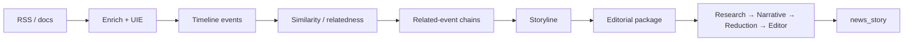

# Assembly model (operator SSOT)

**Purpose:** One plain-language mental model for how News Intelligence turns articles into timeline events, related-event chains, storylines, and editorial packages.

**Status:** Binding intent as of 2026-07-25. Prefer this doc over chemistry / beaker / protein metaphors in operator language, audits, and new docs.

**Code note:** Python symbols, phase names, and some feature flags may still say `protein_harden`, `collision_sampling`, `CHEMISTRY_BEAKER_*`, etc. Those are **legacy internal names** until a later rename pass. Do not expand those features; meld their jobs into the matching → storyline path below.

See also: [STORYLINE_CANONICAL_MODEL.md](STORYLINE_CANONICAL_MODEL.md) (object tables; older chemistry wording), [FEATURE_AUDIT_V11_2026-07.md](generated/FEATURE_AUDIT_V11_2026-07.md), [AGENTS.md](../AGENTS.md).

---

## The loop in one paragraph

Articles are enriched and extracted. Extracted events are **timestamped onto the main timeline**. Similar or continuing events are **linked into short related-event chains**. As evidence repeats, links strengthen and membership grows until a **storyline** is sustainable. Eligible storylines enter the **Research → Narrative → Reduction → Editor** package loop until a publishable `news_story` is ready.

---

## Building blocks

### 1. Timeline events — `public.chronological_events`

| Operator term | Meaning |
|---|---|
| **Timeline event** | A dated event extracted from article content (and catchup restore). This is the main timeline SSOT. |

- Written by unified intake extraction (`save_events`) and restored by `chronological_events_catchup` when markers exist but rows were lost.
- Domain comes via the source article; do not invent a second “atom” product name.
- Owning services: `event_extraction_service` / UIE fan-out, `chronological_events_catchup_service`.

### 2. Related-event chains (not a separate product)

Relatedness is how timeline events find each other. Existing mechanisms map as follows — **no new systems**:

| Mechanism | Role in plain language |
|---|---|
| `intelligence.event_coreference_links` / `event_cluster_id` | Same real-world occurrence reported by multiple sources → one cluster |
| `story_continuation` | “This new event continues that storyline / prior event” matching (entities, canonical IDs, hub guards) |
| `event_article_membership` / event-core membership | Article ↔ event membership for evidence, not a second timeline |
| Graph proposals / links (`graph_connection_*`) | Optional similarity proposals; treat as **matching support**, not a chemistry product |

Owning services: `event_coreference_service`, `event_deduplication_service`, `story_continuation_service`, `event_core_membership_service` (when enabled).

### 3. Tracked events — `intelligence.tracked_events`

| Operator term | Meaning |
|---|---|
| **Tracked event** | A longer-lived narrative object operators follow across sources and domains (Investigate / tracking). |

- Not a second timeline and not a “megathread.” Timeline events stay in `chronological_events`; tracked events are the **durable follow object** that can bind storylines, lenses, and membership over time.
- Reconciliation: `GET /api/event_reconciliation` (tracked ↔ chronological ↔ storyline).

### 4. Storylines — `{domain}.storylines`

A **storyline** is the sustainable cluster formed when related-event chains plus article membership are strong enough to keep updating.

- Shape per domain uses `story_kind` (`event_narrative`, `research_topic`, `matter_docket`, …) — say **domain storyline shape**, not “protein.”
- Attach / create paths today include `storyline_assembly`, `storyline_automation`, `narrative_first_linking`, and scoring via `blend_link_score`. Intent: **one matching mental model**, multiple call-sites converging — not three product names.
- Owning services: `storyline_assembly_service`, `storyline_automation_service`, `narrative_first_linking_service`, `story_continuation_service`, shared `blend_link_score`.

### 5. Editorial hand-off — packages → `news_story`

Once a storyline (or curated set) is ready for desk work:

1. Admit into an **`editorial_package`** (`intelligence.editorial_packages` + members/links).
2. Cycle **Research → Narrative → Reduction → Editor** (`post_processing_modals.yaml`).
3. Editor produces a cited **`news_story`** bound to `package_id`.

Owning services: `editorial_package_service`, `editorial_package_research_service`, `editorial_package_narrative_service`, `editorial_package_reduction_service`, `news_story_service`, `modal_handoff_service`.

---

## The hard problem: matching

Everything between “we processed an article” and “we have a trustworthy connected storyline” is **matching**:

1. **Similarity search** — find nearby events/articles/entities that look related (embeddings, entity overlap, canonical IDs, time windows).
2. **Provisional links** — soft suggestions that should not silently dominate membership.
3. **Stronger links** — repeated corroboration, continuation hits, coreference, human/LLM review → durable membership and edges.
4. **Storyline formation** — chain of events + articles becomes a living storyline that keeps accepting good continuations and rejecting glue.

### Operator-facing confidence vs DB enums

DB / code may still store `inference_stage` as `hypothesized` / `candidate` / `established` / `quarantined`. Prefer operator language:

| Operator language | Typical DB enum (if present) |
|---|---|
| Provisional / exploratory | `hypothesized` |
| Promising | `candidate` |
| Established | `established` |
| Quarantined / rejected | `quarantined` |

Do not invent a fourth product around these stages; they are **confidence labels on the matching path**.

---

## Critical path (6h loop)

Prefer this path for ops and engineering priority:

`RSS → content_enrichment → unified_intake_extraction → chronological_events → matching (continuation / coreference / attach) → storyline update → Briefings / editorial packages`

Park expanding chemistry-named phases (`collision_sampling`, `stimulus_rag`, `protein_harden`) as product work. Their useful jobs fold into matching / evidence pull; do not grow them.

---

## Retired metaphors glossary

| Do not say (product / operator) | Say instead |
|---|---|
| Chemistry / beaker | Matching / related-event search → storyline formation |
| Protein | Storyline (or domain storyline shape via `story_kind`) |
| Atom | Timeline event (`chronological_events`) |
| Megathread | Tracked event or oversized storyline (be specific which) |
| Bonds / loose bonds / solid bonds | Provisional links → established links |
| Collision (product sense) | Exploratory pair sampling (legacy phase `collision_sampling`) |
| Harden | Strengthen links / promote confidence (legacy phase `protein_harden`) |
| Stimulus (product sense) | Selective evidence pull when a link needs more source text (`stimulus_rag`) |

Internal code/flag names may lag; document them as legacy when they appear in Monitor phase lists.

---

## Implementation alignment (minimal meld)

### Service ownership (existing)

| Stage | Owner (existing) |
|---|---|
| Extract → timeline events | UIE / `event_extraction_service`; restore: `chronological_events_catchup_service` |
| Same-event clustering | `event_deduplication_service` / `event_coreference_service` (`event_coreference_links`) |
| **Event → storyline attach (SSOT)** | **`story_continuation_service`** — entity / canonical ID / hub-guard matching onto storylines |
| Article ↔ event membership (support) | `event_core_membership_service` when enabled — **not** a second attach product |
| Storyline form / article attach helpers | `storyline_assembly_service`, `narrative_first_linking_service` + `blend_link_score` (scoring helpers) |
| Package admission + modal loop | `editorial_package_*`, `modal_handoff_service`, `news_story_service` |

### Attach SSOT decision (2026-07-25)

- **Winner for “does this timeline event belong on this storyline?”:** `story_continuation`.
- **`event_core_membership`:** keep for tracked-event / article membership hygiene; do not treat as parallel storyline-attach product.
- **`narrative_first_linking` / `blend_link_score`:** remain helpers for article↔storyline scoring, not competing event-attach owners.

### Stop treating as separate products

- Do **not** document or schedule chemistry phases as a parallel insight product.
- Do **not** expand collision / harden / stimulus features.
- Soften registry `notes:` to “legacy name; part of matching / storyline formation.”

### How tracked events fit (plain wording)

Keep **both** CE and TE. Timeline events are the dated facts on the main rail; tracked events are the longer-lived objects operators follow. Linking them is reconciliation and membership — not a chemistry layer.

### Ordered next engineering steps (serve &lt;6h; no chemistry expansion)

1. **Keep CE healthy** — unique-index / save_events reliability + catchup until timeline volume matches UIE-cleared articles.
2. **Single matching path** — converge `story_continuation`, `narrative_first_linking`, and attach scoring behind one operator story (shared helpers, one Monitor label family); stop advertising three products.
3. **Exercise coreference** — populate `event_coreference_links` / clusters from real multi-source events so chains form without bag-only similarity.
4. **Storyline growth quality** — continuation + SEI/entity guards so chains become storylines without kitchen-sink absorb; keep member caps / prune as hygiene, not chemistry.
5. **Package loop live** — ensure storyline → package admission writes `editorial_package_links` / members so Research→Narrative→Reduction→Editor can run on real connections (not seeded shells only).

### Phase handoffs (scheduler + inline)

Flat scheduling is **backlog-polled**; `depends_on` remains advisory for operator warnings. Critical-path stages also **request the next owner** after a successful batch (`api/shared/pipeline_handoffs.py`):

| After | Requests |
|---|---|
| `unified_intake_extraction` (articles processed) | `chronological_events_catchup` when CE watchdog &gt; 0; always `event_deduplication` |
| `chronological_events_catchup` (rows saved) | `event_deduplication` |
| `event_deduplication` (merges / soft links) | `story_continuation` |
| `story_continuation` (links) | `editorial_research_pass` (+ `ensure_package_from_storyline` on each link) |
| `editorial_research_pass` / `editorial_narrative_pass` | `editorial_reduction_pass` |
| `editorial_reduction_pass` | `editorial_research_pass` + `editorial_narrative_pass` |

Catchup / coref / continuation / editorial passes are in `RAW_PENDING_COUNT_KEYS`, flat postprocess/maintenance priority, structure band, and `_CATCHUP_DRIVER_PHASES` so they schedule when backlog &gt; 0 (not interval-only).

---

*Binding note for agents and operators. Code renames are deferred.*
