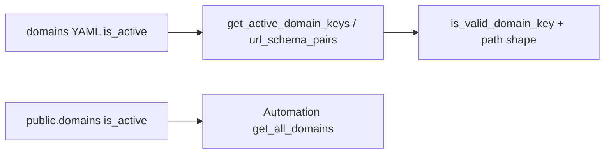

# Domain extension template

**Concept:** One **onboarding YAML** per optional domain (`api/config/domains/{domain_key}.yaml`) plus a **mechanical path**: SQL migration, [`api/scripts/provision_domain.py`](../api/scripts/provision_domain.py), and verification. The web app discovers domains from **`GET /api/system_monitoring/registry_domains`** (backed by [`domain_registry`](../api/shared/domain_registry.py)); built-ins **politics**, **finance**, **science-tech** are always present.

**Onboarding YAML is not Docker or Kubernetes.** These files are **application configuration** read by Python (**`get_domain_entries()`** re-reads YAML on each call). They do not start containers or sidecars. Think of a domain as an **isolated silo** (Postgres schema + declared metadata), not a separate runtime unit.

**`public.domains` shape** (constraints evolved from archived [`122_domain_silo_infrastructure.sql`](../api/database/migrations/archive/historical/122_domain_silo_infrastructure.sql); **new silos** should follow a migration in the style of [`180_legal_domain_silo.sql`](../api/database/migrations/180_legal_domain_silo.sql)):

| Column / concept | Rule |
|------------------|------|
| `domain_key` | Required. `^[a-z0-9-]+$` — hyphens in the **URL** key; **no** underscores. |
| `schema_name` | Required. `^[a-z0-9_]+$` — e.g. `science-tech` → `science_tech`. |
| `name` | `VARCHAR(100)` — **display_name** in YAML must be **≤ 100 characters.** |
| `description` | `TEXT` — recommend keeping under ~4k chars. |
| `display_order` | Integer; lower = earlier when UIs sort. |
| `is_active` | DB flag used by automation paths that call `get_all_domains()` on **`public.domains`**. Must stay aligned with YAML when you want the silo to run end-to-end. |

**Operator entry points**

- **Field rules & loader:** [`api/config/domains/README.md`](../api/config/domains/README.md)
- **Example YAML:** [`api/config/domains/_template.example.yaml`](../api/config/domains/_template.example.yaml)
- **Registry (Python):** [`api/shared/domain_registry.py`](../api/shared/domain_registry.py)
- **Topic / synthesis bias (separate file):** [`api/config/domain_synthesis_config.yaml`](../api/config/domain_synthesis_config.yaml) — not created by migration; add a block when you want clustering / narrative bias for the new key (see [`domain_synthesis_config.py`](../api/services/domain_synthesis_config.py)).

---

## Post–legal lessons: two sources of “active”

Several subsystems read **different** flags:

| Source | Effect |
|--------|--------|
| **YAML `is_active: true`** in `api/config/domains/*.yaml` | Domain is merged into `domain_registry`; **`get_active_domain_keys()`** / **`is_valid_domain_key()`**, RSS over **`url_schema_pairs()`**, and **`get_schema_names_active()`** include it (read fresh each call). FastAPI **`DOMAIN_PATH_PATTERN`** is shape-only. |
| **`public.domains.is_active = TRUE`** | Used by `get_all_domains()` in [`domain_aware_service`](../api/shared/services/domain_aware_service.py) for automation that keys off the DB catalog. |

**Risk:** YAML on and DB off (or the reverse) → registry/RSS vs **`DomainAwareService`** / **`get_all_domains()`** disagree. **Treat activation as one runbook step:** after verify, set YAML **`is_active: true`**; **`provision_domain.py`** sets **`public.domains.is_active = TRUE`** by default (**`--no-activate-in-db`** to skip).



**Filling onboarding YAML alone** does not: seed **`domain_synthesis_config.yaml`**, guarantee **`rss_feeds`** rows (unless you use **`data_sources.rss.seed_feed_urls`** and run the provisioner without **`--skip-rss-seed`**), or remove every **hardcoded** three-domain loop in the repo. See README **“Known code touchpoints”** and grep patterns there.

---

## YAML conventions

- Use **UTF-8**; quote scalars that contain `:` or `#`.
- **Unknown keys** are safe for runbooks; see README **“What code consumes today”**.
- Keys starting with **`_`** are **human-only** and stripped by `domain_registry`.

## Validate onboarding YAML (before migrate)

From the **repository root**:

```bash
uv run python -c "
import yaml, pathlib
p = pathlib.Path('api/config/domains/your-domain.yaml')
yaml.safe_load(p.read_text(encoding='utf-8'))
print('OK:', p)
"
```

---

## Order of operations (high level)

1. Copy `_template.example.yaml` → `{domain_key}.yaml`, set **`is_active: false`**.
2. Run the YAML validation snippet above.
3. **Author a SQL migration** (active dir: `api/database/migrations/`) modeled on **`180_legal_domain_silo.sql`**: `INSERT` into `public.domains` / `public.domain_metadata` (`ON CONFLICT DO NOTHING`), `CREATE SCHEMA`, `create_domain_table('<schema>', '<table>', 'science_tech')` for each core table, `add_domain_foreign_keys` / `create_domain_indexes` / `create_domain_triggers`, then **manual FK fixes** where `LIKE` does not copy references (e.g. `article_entities` → `articles` / `entity_canonical`), plus any table not covered by the generic helpers (e.g. `story_entity_index`). Prefer **looping over `public.domains`** in *future* migrations that alter every silo — avoid hardcoding `legal.*` only when the change applies to all domains (see migration `177_*` style).
4. Apply the migration (your usual runner / DBA process), then register it in **`public.applied_migrations`** if your ops use the ledger ([`register_applied_migration.py`](../api/scripts/register_applied_migration.py)).
5. Run **`provision_domain.py`** with **`--config`**, **`--sql`**, and **`--verify-cmd`** (see script docstring). Order inside the script: **apply SQL → commit → RSS seed → commit → verify**. **`data_sources.rss.seed_feed_urls`** (list of URL strings or `{feed_name, feed_url, fetch_interval_seconds?}` objects) is inserted into **`{schema_name}.rss_feeds`** unless you pass **`--no-seed-rss`** or **`--skip-rss-seed`**. Optional **`data_sources.rss.seed_feed_category`** sets **`rss_feeds.category`** (required NOT NULL on silo tables). For an already-provisioned silo, use **`api/scripts/seed_domain_rss_from_yaml.py`**.
6. On success: set **`is_active: true`** in YAML; **`provision_domain.py`** activates **`public.domains`** by default; add **`domain_synthesis_config.yaml`** block if needed.
7. **Restart** only if a long-lived process still caches domains at import (see README *Process restart*); RSS and most iterators read YAML each run.
8. Confirm **`GET /api/system_monitoring/registry_domains`** lists the key; run your grep pass from the checklist below for any remaining literals.

### Registry vs `public.domains`

- **`domain_registry` (YAML + built-ins):** operational routing, RSS URLs, many iterators (`get_schema_names_active()`, `url_schema_pairs()`).
- **`public.domains`:** canonical DB catalog; **`get_all_domains()`** for automation that uses the table.
- Keep **`domain_key`**, **`schema_name`**, and **active flags** aligned between them.

---

## Operator checklist (new optional domain)

| Step | Action |
|------|--------|
| YAML | `{domain_key}.yaml` with `is_active: false` until verified; valid `domain_key` / `schema_name` / `display_name` (≤100). |
| Synthesis | Add `domain_synthesis_config.yaml` entry if topic/narrative bias matters. |
| SQL | Migration like **180**: domains row, metadata, schema, `create_domain_table` from `science_tech`, FK/index/trigger helpers, extra FKs / `story_entity_index` as needed. |
| Ledger | Register migration if your environment uses **`applied_migrations`**. |
| Provision | `provision_domain.py --config … --sql … --verify-cmd "PYTHONPATH=api uv run python api/scripts/verify_migrations_160_167.py"`; omit **`--skip-rss-seed`** if you want YAML RSS URLs inserted. |
| Verify | Script checks **167** enrichment columns and **177–179** pipeline objects for **every** `public.domains` schema that has **`articles`**, not only built-ins. |
| Activate | YAML **`is_active: true`**; **`public.domains.is_active`** (default from **`provision_domain.py`**, or **`--no-activate-in-db`** to leave unchanged). |
| Restart | Only if needed for stale import-time caches (see domains README). |
| Audit | Grep for `science_tech`, `("politics", "finance"`, and your URL key; fix stragglers or extend shared helpers (see domains README). |
| Reserved | After the silo exists, consider adding **`schema_name`** to **`RESERVED_SCHEMA_NAMES`** in `domain_registry.py` so a future mistaken provision cannot reuse it (optional hardening). |

---

## Related documentation

- **Agent / terminology:** [`AGENTS.md`](../AGENTS.md)
- **Deployment & DB:** [`docs/SETUP_ENV_AND_RUNTIME.md`](SETUP_ENV_AND_RUNTIME.md), [`docs/ARCHITECTURE_AND_OPERATIONS.md`](ARCHITECTURE_AND_OPERATIONS.md), [`docs/SECURITY_OPERATIONS.md`](SECURITY_OPERATIONS.md)

---

## Out of scope here

Domain-specific product features belong in feature docs. Optional domains need the **silo shell**, YAML, synthesis (if desired), and the checklist above — not container orchestration per file.
