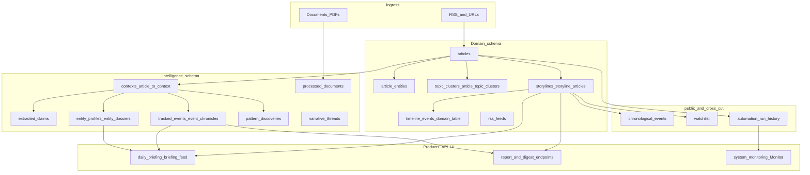

# Knowledge map, rollup model, and Version 9 planning

**Audience:** Operators and contributors who need a single rolled-up view of *where data enters*, *what artifacts exist after processing*, *how those artifacts feed digest-style products*, and *what is weakly connected (“orphan”) today*.  
**Companion docs (depth, not duplicated here):**

- [DATA_FLOW_ARCHITECTURE.md](DATA_FLOW_ARCHITECTURE.md) — stage semantics, preservation table, content-loss chain.
- [PIPELINE_AND_ORDER_OF_OPERATIONS.md](PIPELINE_AND_ORDER_OF_OPERATIONS.md) — when automation phases run; workload vs collection windows.
- [PIPELINE_INGESTION_AND_PROCESS_METHODOLOGY.md](PIPELINE_INGESTION_AND_PROCESS_METHODOLOGY.md) — per-phase selection rules and inputs/outputs.
- [SYSTEM_OVERVIEW.md](SYSTEM_OVERVIEW.md) — schema layout, key JSONB fields, service index.
- [PIPELINE_QUALITY_AND_IDEMPOTENCY_REVIEW_CHECKLIST.md](PIPELINE_QUALITY_AND_IDEMPOTENCY_REVIEW_CHECKLIST.md) — backlog/monitor semantics for phases (including digest-related).

**Source of truth in code:** [api/services/automation_manager.py](../api/services/automation_manager.py) (`schedules`: intervals, `depends_on`, phase grouping).

---

## 1. Data sources (ingress)

| Source                     | Typical path                       | Primary landing                    | Notes                                                                                                                             |
| -------------------------- | ---------------------------------- | ---------------------------------- | --------------------------------------------------------------------------------------------------------------------------------- |
| RSS / web articles         | `rss_collector` / collection cycle | `{domain}.articles`                | Full `content` is critical; title-only feeds starve downstream ([DATA_FLOW_ARCHITECTURE.md](DATA_FLOW_ARCHITECTURE.md)).          |
| PDFs / documents           | `document_processing` / collection | `intelligence.processed_documents` | Extracted sections feed doc intelligence and cross-links; see ingestion methodology.                                              |
| Domain-specific collectors | Finance / other domains            | Domain tables + intelligence       | Keep domain-specific detail in domain docs; this map treats **politics-like** `{domain}` + `intelligence` as the default pattern. |

---

## 2. Processing spine → artifact types (rollup view)

High-level flow from ingress to editorial products. Service names are indicative; exact workers live under `api/services/`, `api/domains/*/services/`, and `api/modules/ml/`.

### 2.1 Major artifacts (inputs → outputs → consumers)

Abbreviations: **UI** = primary React surfaces; **API** = stable HTTP consumers.

| Artifact                                   | Primary inputs                                                                                                                                                                                                                                                                                                                                                     | Key persisted fields / tables                                                                 | Main consumers (today)                                                                                                    |
| ------------------------------------------ | ------------------------------------------------------------------------------------------------------------------------------------------------------------------------------------------------------------------------------------------------------------------------------------------------------------------------------------------------------------------ | --------------------------------------------------------------------------------------------- | ------------------------------------------------------------------------------------------------------------------------- |
| Raw article                                | RSS / fetch                                                                                                                                                                                                                                                                                                                                                        | `{domain}.articles` (`content`, `url`, `source_domain`, `published_at`, `enrichment_status`)  | Context sync, ML, entity extraction, storylines, Monitor dimensions                                                       |
| Article ML envelope                        | `articles.content`                                                                                                                                                                                                                                                                                                                                                 | `articles.ml_data`, `articles.summary`, `quality_score`, sentiment fields                     | Topics, storyline automation, briefing prompts ([daily_briefing_service.py](../api/modules/ml/daily_briefing_service.py)) |
| Entities (mentions)                        | Article text                                                                                                                                                                                                                                                                                                                                                       | `{domain}.article_entities`, `articles.entities`                                              | Profiles, storylines, search, collision-style analytics                                                                   |
| Topics / clusters                          | ML + embeddings                                                                                                                                                                                                                                                                                                                                                    | `{domain}.topic_clusters`, `article_topic_clusters`, article topic JSON                       | Topics UI, storyline discovery                                                                                            |
| Context unit                               | Article + metadata                                                                                                                                                                                                                                                                                                                                                 | `intelligence.contexts`, `intelligence.article_to_context`                                    | Claims, events, profiles, pattern pipeline                                                                                |
| Claims                                     | Context text                                                                                                                                                                                                                                                                                                                                                       | `intelligence.extracted_claims`                                                               | Fact pipelines, investigations (where wired)                                                                              |
| Tracked event + chronicle                  | Grouped contexts                                                                                                                                                                                                                                                                                                                                                   | `intelligence.tracked_events`, `intelligence.event_chronicles`, `editorial_briefing*`         | Investigate event pages, editorial phases, briefings                                                                      |
| Entity profile / dossier                   | Contexts by entity                                                                                                                                                                                                                                                                                                                                                 | `intelligence.entity_profiles`, `intelligence.entity_dossiers`                                | Entity list / dossier UI, power-narrative inputs                                                                          |
| Storyline cluster                          | Articles + scores                                                                                                                                                                                                                                                                                                                                                  | `{domain}.storylines`, `storyline_articles`, `editorial_document`, synthesis fields           | Storylines UI, Report, digest, watchlist                                                                                  |
| Pattern discovery                          | Context / watch pipeline                                                                                                                                                                                                                                                                                                                                           | `intelligence.pattern_discoveries`                                                            | Context-centric search tab; not central to daily briefing assembly                                                        |
| Narrative threads                          | Contexts / events                                                                                                                                                                                                                                                                                                                                                  | `intelligence.narrative_threads`                                                              | [NarrativeThreadsPage.tsx](../web/src/pages/Investigate/NarrativeThreadsPage.tsx); optional rollup                        |
| Chronological timeline                     | Storyline / temporal NLP                                                                                                                                                                                                                                                                                                                                           | `public.chronological_events`                                                                 | Watchlist alerts, dedupe, storyline timeline services                                                                     |
| Storyline timeline rows (split-brain risk) | Article extraction inserts into `**{domain}.timeline_events`** ([storyline_management.py](../api/domains/storyline_management/routes/storyline_management.py) `_extract_timeline_events_from_articles`), while `**GET .../storylines/{id}/timeline**` queries unqualified `**timeline_events**` (comment says “public schema for now”) — depends on `search_path`. | Storyline timeline UI when paths align; **easy empty UI** if writer and reader schemas differ | **v9 merge**: one table + domain column, or always qualify schema in SELECT/INSERT                                        |
| `public.chronological_events`              | Chronological NLP / storyline services                                                                                                                                                                                                                                                                                                                             | Separate pipeline from domain `timeline_events`                                               | Watchlist, dedupe; **parallel** mental model to storyline timeline                                                        |
| Watchlist                                  | User / operator                                                                                                                                                                                                                                                                                                                                                    | `public.watchlist`, `watchlist_alerts`                                                        | Watchlist page, digest/alert products, processing governor prioritization                                                 |
| Ops telemetry                              | Schedulers / DB                                                                                                                                                                                                                                                                                                                                                    | `public.automation_run_history`, Monitor `processing_progress`                                | Monitor, operator scripts                                                                                                 |

---

## 3. Rollup: “Domain Daily” lenses vs existing products

The four lenses are **editorial packaging** choices. Today’s **implemented** products that approximate them:

| Lens                                               | Intent                                     | Primary data *today*                                                                                                                                        | Implemented surfaces                                                                                                                                                                                                                                                      | Target (v9)                                                                                       |
| -------------------------------------------------- | ------------------------------------------ | ----------------------------------------------------------------------------------------------------------------------------------------------------------- | ------------------------------------------------------------------------------------------------------------------------------------------------------------------------------------------------------------------------------------------------------------------------- | ------------------------------------------------------------------------------------------------- |
| **Domain pulse** — what moved recently             | Rank “whole domain” salience               | Recent `articles`; storyline titles / `editorial_document` ledes; optional `tracked_events` headlines; `automation_run_history` for “did the machine move?” | [products.py](../api/domains/intelligence_hub/routes/products.py) (`_build_llm_lead_prompt`, `_brief_to_content`), `POST` daily briefing ([daily_briefing_service.py](../api/modules/ml/daily_briefing_service.py)), [ReportPage](../web/src/pages/Report/ReportPage.tsx) | Explicit **thread** objects with **material-change** vs chatter; tie pulse lines to thread detail |
| **Collision map** — patterns as actors/events meet | Recurring co-mentions, clusters, weak ties | `article_entities`, `topic_clusters`, `pattern_discoveries`, cross-domain entity links (where enabled)                                                      | Search / context-centric APIs ([contextCentric.ts](../web/src/services/api/contextCentric.ts)); thin in Report                                                                                                                                                            | First-class **pattern** section in Domain Daily with time slider + confidence                     |
| **Power ledger** — who/where matters and why       | Evidence-heavy influence                   | `entity_profiles.sections`, dossiers, claims                                                                                                                | Entity dossier UI; partial briefing context                                                                                                                                                                                                                               | Split **ledger** (facts) vs **one-paragraph synthesis** (interpretation) with citations           |
| **Quiet-but-watch** — resurfacing                  | Dormant threads that twitch                | Watchlist rows, storylines with stale narratives but new articles, low-velocity tracked events                                                              | Watchlist alerts phase (`watchlist_alerts`), weekly/alert digest endpoints in products                                                                                                                                                                                    | Rule engine: “quiet X days + structural update → digest slot”                                     |

**Digest / briefing pipeline (automation names, not exhaustive):** `digest_generation`, `daily_briefing_synthesis`, `editorial_document_generation`, `editorial_briefing_generation` — see [PIPELINE_QUALITY_AND_IDEMPOTENCY_REVIEW_CHECKLIST.md](PIPELINE_QUALITY_AND_IDEMPOTENCY_REVIEW_CHECKLIST.md) for pending-row semantics.

---

## 4. Orphan and weak-link inventory

*Orphan* here means: **written or maintained by the system** but **not reliably rolled up** into the four lenses or the primary “daily operator” path (briefing → report → investigate follow-up). **Recommendation** is directional for v9 planning, not a commitment to delete data.

| Item                                                                                                                            | Evidence it exists                                                                                                                                     | Who might use it today                                                                                       | Recommendation                                                                                 |
| ------------------------------------------------------------------------------------------------------------------------------- | ------------------------------------------------------------------------------------------------------------------------------------------------------ | ------------------------------------------------------------------------------------------------------------ | ---------------------------------------------------------------------------------------------- |
| `intelligence.pattern_discoveries`                                                                                              | Populated by pattern pipeline; API `/api/pattern_discoveries`                                                                                          | Investigate **Search** tab shows counts/list ([SearchPage.tsx](../web/src/pages/Investigate/SearchPage.tsx)) | **Keep**; **merge** into Domain Daily “Collisions” once query + copy exist                     |
| `intelligence.narrative_threads`                                                                                                | Build/synthesize APIs in context-centric client                                                                                                        | Dedicated [NarrativeThreadsPage](../web/src/pages/Investigate/NarrativeThreadsPage.tsx)                      | **Keep**; optional digest inclusion; clarify vs storyline “narrative”                          |
| **Timeline split** (`chronological_events` vs `timeline_events`, plus **domain vs public** qualification for `timeline_events`) | See artifact row above; [storyline_timeline.py](../api/domains/storyline_management/routes/storyline_timeline.py) also branches on column availability | Storyline timeline vs watchlist reactivation                                                                 | **Merge** in v9: single timeline contract + qualified SQL everywhere                           |
| `public.watchlist` + unqualified `storylines` in [watchlist_service.py](../api/services/watchlist_service.py)                   | Global watchlist not namespaced by `{domain}` in service SQL                                                                                           | Watchlist page, governor                                                                                     | **Keep** for now; v9 **domain-key** column or schema-per-domain alignment to avoid wrong joins |
| `storylines.timeline_summary` (automation)                                                                                      | Written by automation batch                                                                                                                            | Mostly operator/debug                                                                                        | **Keep** as ops signal; **surface** only if tied to thread pulse                               |
| GPU metric samples / heavy Monitor tiles                                                                                        | Migration `209_gpu_metric_samples.sql`, monitoring routes                                                                                              | Monitor                                                                                                      | **Keep** (ops); not part of editorial rollup                                                   |
| Graph connection queue / proposals (if enabled in your branch)                                                                  | Services under `api/services/graph_connection_`*                                                                                                       | Future intelligence graph UI                                                                                 | **TBD** — classify when feature flag stable                                                    |
| Under-filled `editorial_document` / `editorial_briefing` (historical risk)                                                      | Documented in [DATA_FLOW_ARCHITECTURE.md](DATA_FLOW_ARCHITECTURE.md) + implementation status section                                                   | Briefings fall back to headlines/metrics                                                                     | **Pipeline priority** — primary **rollup blocker** for narrative-first Domain Daily            |

---

## 5. Version 9 — planning themes (UI + pipeline)

Themes tie back to user goals: **domain pulse**, **long-horizon threads**, **resurfacing**, **searchable learning library**.

### 5.1 Unify “thread” across storyline, watchlist, tracked event

| User outcome                           | Deliverables (examples)                                            | Tables / services                                                                                                 |
| -------------------------------------- | ------------------------------------------------------------------ | ----------------------------------------------------------------------------------------------------------------- |
| One mental model for “follow this arc” | Shared **Thread** hub route; cross-links from Report and Briefings | `storylines`, `storyline_articles`, `watchlist`, `tracked_events`, `event_chronicles`                             |
| Digest lines always deep-link          | Stable URLs + anchors per thread                                   | Web router + API payloads ([products.py](../api/domains/intelligence_hub/routes/products.py), briefing assembler) |

### 5.2 Material-change and resurfacing

| User outcome                                    | Deliverables                                                                          | Tables / services                                                                |
| ----------------------------------------------- | ------------------------------------------------------------------------------------- | -------------------------------------------------------------------------------- |
| “Back after silence” without `updated_at` noise | Signals: new `storyline_articles.added_at`, filings/chronicle entries, pattern spikes | Storyline services, `event_chronicles`, `chronological_events`, watchlist alerts |
| Digest section **Quiet-but-watch**              | Rule config + scoring; avoid headline-only churn                                      | Briefing builder, optional new materialized view                                 |

### 5.3 Monitor as ops lens on pinned threads

| User outcome                                          | Deliverables                                                                                                  | Tables / services                                                                                                                                  |
| ----------------------------------------------------- | ------------------------------------------------------------------------------------------------------------- | -------------------------------------------------------------------------------------------------------------------------------------------------- |
| Operators see backlog **for threads they care about** | Pin threads → filter `processing_progress` / backlog_status by domain + entity/storyline id (where supported) | [processing_progress.py](../api/domains/system_monitoring/routes/processing_progress.py), [backlog_metrics.py](../api/services/backlog_metrics.py) |

### 5.4 Pipeline: narrative-first rollups

| User outcome                                | Deliverables                                                                                | Tables / services                                                             |
| ------------------------------------------- | ------------------------------------------------------------------------------------------- | ----------------------------------------------------------------------------- |
| Domain Daily reads like journalism, not SQL | Ensure editorial JSONB paths run **before** digest assembly; quality gates on empty content | `editorial_document_service`, `digest_generation`, `daily_briefing_synthesis` |

---

## 6. Maintenance

Update this document when:

- A new **automation phase** is added or renamed in [automation_manager.py](../api/services/automation_manager.py).
- A new `**intelligence.`* or `{domain}.*` product table** is introduced for user-visible output.
- A UI surface becomes the **primary** consumer of a previously “orphan” artifact (move rows out of section 4).

**Changelog:** 2026-04-17 — Initial knowledge map, rollup mapping, orphan inventory, v9 themes (agent-authored from plan).