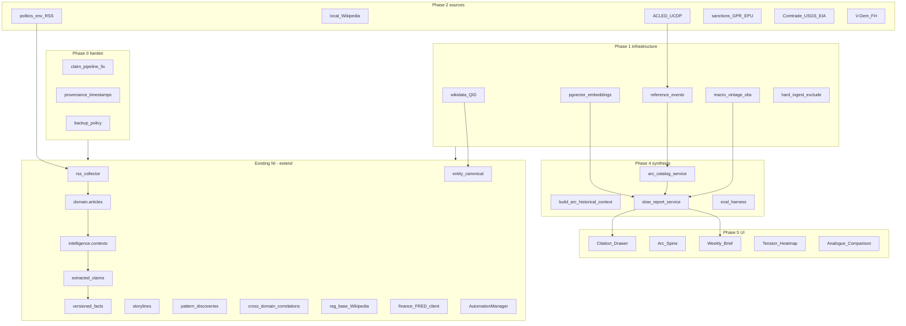

## Mission

Build a **slow-journalism engine** that:

1. Ingests current events (RSS, documents, structured APIs)
2. Accumulates them as **durable facts** over time (living corpus)
3. Anchors them against **curated reference history** spanning decades
4. Produces **cited, pattern-aware long-form reports** on a weekly cadence

With an obsessive commitment to **chronological accuracy at every layer**.

---

## The chronological accuracy doctrine

Four rules govern **every** change in this plan:

### 1. Every fact carries three timestamps

| Field | Meaning |
|-------|---------|
| **event_date** | When the thing happened in the world |
| **ingestion_date** | When NI first recorded it |
| **vintage_date** | When the underlying source last revised the value |

Reports cite **event_date** to readers; the system tracks all three internally. Without this, FRED/ALFRED revisions silently rewrite history and arc reports become unreliable.

### 2. Reference and living layers never blur

- **Reference events:** human-curated, dated to the historical moment, visually distinct in UI
- **Living facts:** RSS `published_at` as event_date, extraction/insert as ingestion_date
- **LLMs never narrate dates** — dates come from structured fields only

### 3. Point-in-time queries are first-class

"What did we know about X as of date D?" must be answerable:

- `versioned_facts.valid_from` / `valid_to` (extend with vintage)
- ALFRED macro vintages
- Append-only reference events with audit links for corrections

### 4. Chapter and arc boundaries are explicit and dated

"We're in the sanctions-era chapter of `resource_geopolitics`, starting 2022-02" is a **stored, citeable row** — not an inference at render time.

**Doc:** [`docs/CHRONOLOGICAL_ACCURACY_DOCTRINE.md`](docs/CHRONOLOGICAL_ACCURACY_DOCTRINE.md) (to create in Phase 0)

---

## How this maps onto current NI architecture



### Existing assets to leverage (do not rebuild)

| Asset | Path / table | Execution use |
|-------|--------------|-----------------|
| Living fact pipeline | `extracted_claims` → `versioned_facts` | Phase 0 fix; add provenance columns |
| Storyline memory | [`storyline_historical_context_service.py`](api/services/storyline_historical_context_service.py) | Extend → `build_arc_historical_context` |
| Entity seeds | [`seed_world_entities.yaml`](api/config/seed_world_entities.yaml), [`wikidata_sparql_seed.py`](api/scripts/wikidata_sparql_seed.py) | Phase 1 QID backfill |
| Wikipedia RAG | [`api/services/rag/base.py`](api/services/rag/base.py) | Repoint to Kiwix (Phase 2) |
| FRED / commodities | [`evidence_collector.py`](api/domains/finance/evidence_collector.py), [`commodity_registry.yaml`](api/config/commodity_registry.yaml) | Extend to ALFRED vintages |
| Embeddings (JSON) | `articles.embedding_vector`, consolidation service | Migrate to **pgvector** (Phase 1) |
| Patterns | `pattern_discoveries`, `cross_domain_correlations` | Phase 4 analogue sections |
| Narrative finisher | [`storyline_narrative_finisher_service.py`](api/services/storyline_narrative_finisher_service.py) | LLM containment rules shared with slow reports |
| DB backup | [`scripts/db_backup_single_latest.sh`](scripts/db_backup_single_latest.sh) | Extend to weekly + cold archive policy |
| Domain specs | [`api/config/domains/specs/`](api/config/domains/specs/) | RSS + `arc_relevance` hints |
| Monitor / automation | [`automation_manager.py`](api/services/automation_manager.py), [`pipeline_schedule_service.py`](api/services/pipeline_schedule_service.py) | Nightly-only arc generation; embeddings yield to ingest |

### New schema (planned migrations)

| Table | Purpose |
|-------|---------|
| `intelligence.reference_events` | Append-only curated history |
| `intelligence.reference_event_corrections` | Audit trail (new row links to superseded) |
| `intelligence.arc_definitions` | Arc + chapter boundaries (stored dates) |
| `intelligence.arc_reports` | Generated weekly briefs + citations JSON |
| `intelligence.macro_series_observations` | value + observation_date + vintage_date |
| `intelligence.external_events` | ACLED/UCDP normalized events |
| `intelligence.sanctions_actions` | OFAC/EU/UN with action_date |
| `intelligence.embedding_chunks` | pgvector chunks + source_type + vintage |
| `{domain}.entity_canonical.wikidata_qid` | Universal join key |

Provenance columns added to: `articles`, `intelligence.contexts`, `intelligence.extracted_claims`, `intelligence.versioned_facts`, `public.chronological_events`.

---

## Phase 0: Foundation hardening (Weeks 1–2)

**Goal:** Fix compounding structural issues before expanding ingest 3×.

### 0.1 Backlog diagnosis and throughput check

- Investigate ~19k contexts without claims; ~100k+ entity/topic/story pending
- Classify blockers: pass-marker logic (`no_claims_after_filters`), `CLAIM_EXTRACTION_REQUIRE_SEEDED_DOMAIN_KEYS`, schedule windows, LLM throughput
- **Exit criteria:** Sustained claim→fact promotion rate measured over 72h; not full drain, but proof system can keep up

**Files:** [`automation_manager.py`](api/services/automation_manager.py), [`backlog_metrics.py`](api/services/backlog_metrics.py), claim extraction services, Monitor endpoints

### 0.2 Claim extraction unblocking

- Fix specific bottleneck preventing `extracted_claims` → `versioned_facts`
- Align Monitor pending counts with automation selection SQL
- Optional one-time pass-marker cleanup for falsely skipped contexts

### 0.3 Backup and archival policy

- Weekly Postgres dumps to **separate physical disk** (extend [`docs/DATABASE_BACKUP.md`](docs/DATABASE_BACKUP.md))
- Monthly cold archive off-site
- Living corpus treated as irreplaceable before volume growth

### 0.4 Provenance schema audit

- Migration `221_provenance_timestamps.sql`: add `event_date`, `ingestion_date`, `vintage_date` where applicable
- Backfill best-available: `articles.published_at` → event_date, `created_at` → ingestion_date; flag rows needing review
- [`docs/CHRONOLOGICAL_ACCURACY_DOCTRINE.md`](docs/CHRONOLOGICAL_ACCURACY_DOCTRINE.md)

**Chronology gate:** No Phase 2 source ships without three-timestamp schema ready.

---

## Phase 1: Chronological infrastructure (Weeks 2–4)

### 1.1 Wikidata QID enforcement

- Add `wikidata_qid` to `entity_canonical` (all domain schemas + intelligence entity profiles where linked)
- Require QID at creation for new entities; backfill via [`wikidata_sparql_seed.py`](api/scripts/wikidata_sparql_seed.py)
- Review queue for unresolved entities
- **Join key** for ACLED, Comtrade, V-Dem, OFAC, sanctions

### 1.2 pgvector and embeddings pipeline

- Install **pgvector** on Widow PostgreSQL
- New worker phase: chunk articles, reference summaries, Wikipedia paragraphs → `intelligence.embedding_chunks` with `(embedding vector, source_id, source_type, event_date, vintage_date)`
- Yield to ingest priority; run heavily in nightly window
- **Blocker:** slow reports must not ship until retrieval exists (no keyword groping)

### 1.3 Reference events table

Migration `222_reference_historical_layer.sql`:

```text
reference_events: id, event_date, end_date?, title, summary (≤200 words),
  category, entity_qids[], sources[], confidence='reference', curator,
  created_at, superseded_by_id? (append-only corrections)
```

- Loader: [`api/config/reference_events_seed.yaml`](api/config/reference_events_seed.yaml) idempotent
- API: read-only list + operator create (Phase 6)

### 1.4 Macro series infrastructure

- `intelligence.macro_series_observations(series_id, observation_date, value, vintage_date, source)`
- **FRED/ALFRED client** — vintage-aware pulls, not latest-only
- Nightly refresh automation phase; rate-limit respect

### 1.5 Hard exclusion at ingest

- Move sports/entertainment from briefing demotion → **ingest rejection** in [`rss_collector`](api/collectors/rss_collector.py) / [`is_excluded_content`](api/scripts/prune_articles_failing_ingest_filters.py)
- Merge rules from [`briefing_filters.yaml`](api/config/briefing_filters.yaml) + [`domain_synthesis_config.yaml`](api/config/domain_synthesis_config.yaml) defaults
- Matching articles **never** insert into `articles`

---

## Phase 2: Data sources (Weeks 4–7)

Each integration must pass **chronology gates** (event_date ≠ ingestion_date, UTC storage, documented vintage policy, 5 hand-checked date sanity tests).

### 2.1 Politics and environment RSS

- Update domain specs (not hand-edited YAML): **15–25 politics** (Reuters World, AP, FT World, Foreign Policy, ICG, Lawfare, CSIS, …), **8–10 environment/resources** (E&E News, Carbon Brief, IEA news, USGS minerals, …)
- Feed metadata: `arc_relevance` hints in spec JSON
- Article `event_date` = publication date from feed, never ingestion time

**Workflow:** `validate_domain_spec.py` → `generate_domain_artifacts.py` → `provision_domain.py` / seed RSS

### 2.2 Local Wikipedia mirror

- Kiwix ZIM `wikipedia_en_all_nopic` (~50 GB) on Widow
- ZIM HTTP server dedicated port
- Repoint [`rag/base.py`](api/services/rag/base.py) `_get_wikipedia_context` to local mirror
- Embed into pgvector; store **ZIM dump date** as citation vintage

### 2.3 ACLED + UCDP

- ACLED: academic/non-commercial registration; backfill 1997→present; incremental updates
- UCDP: pre-1997 conflict back to 1946
- Normalize to `intelligence.external_events`; map actors → Wikidata QID; strict `event_date`

### 2.4 GPR + EPU indices

- Caldara-Iacoviello GPR + Baker-Bloom-Davis EPU as monthly CSV imports
- Full history backfill → macro observations table
- Powers tension heatmap quantitative axis (Phase 5)

### 2.5 Sanctions feeds

- OFAC SDN, EU Consolidated, UN SCR — daily refresh
- `intelligence.sanctions_actions` with **action_date**, entity QIDs

### 2.6 Resource and trade data (tiered rollout)

| Tier | Source | Notes |
|------|--------|-------|
| A | USGS Mineral Commodity Summaries, EIA | Annual/period reference |
| B | UN Comtrade | Respect 100k/month free tier |
| C | FAOSTAT agriculture | Statistical period + pub date |
| D | Federal Register, Treasury TIC, BIS, IMF IFS, World Bank | Extend macro spine beyond FRED |

### 2.7 Political legitimacy

- V-Dem (1789–present), Freedom House — annual series → macro/legitimacy tables

**Scope note:** Phase 2 is parallelizable; ship Tier A + RSS + Kiwix + ACLED before Comtrade bulk if rate limits threaten timeline.

---

## Phase 3: Curated reference history (Weeks 5–7, parallel with Phase 2)

**Journalism work**, not pure engineering.

### MVP arcs (only two for 14-week MVP)

| Arc ID | Span | Focus |
|--------|------|-------|
| `resource_geopolitics` | 1973–present | OPEC, commodities, supply chains, climate/resource stress |
| `political_tensions_multipolar` | 1945–present | Cold War → unipolar → multipolar; ACLED/UCDP spine |

**Add** [`api/config/historical_arcs.yaml`](api/config/historical_arcs.yaml):

- Arc metadata, primary entity QIDs, primary macro series IDs
- **Chapters** with stored `start_date`, optional `end_date`, name, summary, qualifying conditions

Example chapters (`resource_geopolitics`):

- OPEC era 1973–1985
- China supercycle 2001–2014
- Sanctions era 2022–present

### Seed 25–30 reference events

- Hand-curated; day > month > year precision hierarchy
- Each cites Wikipedia + one academic/government source
- Each maps to entity QIDs
- Loaded via Phase 1 loader

---

## Phase 4: Synthesis layer (Weeks 7–10)

### 4.1 Arc catalog service

[`api/services/arc_catalog_service.py`](api/services/arc_catalog_service.py):

- Load arc definitions + chapters
- Link arcs ↔ reference events, QIDs, macro series, active storylines (QID overlap)
- Schedule slow report generation (weekly + material-change trigger)
- Maintain chapter timeline per arc

### 4.2 Extended historical context

Extend [`storyline_historical_context_service.py`](api/services/storyline_historical_context_service.py):

```python
build_arc_historical_context(arc_id, as_of_date) -> ArcContextBundle
```

Merges reference events, living facts, chronological events, external events (ACLED/UCDP), storylines — **scoped to as_of_date** for point-in-time queries.

### 4.3 Slow report service

[`api/services/slow_report_service.py`](api/services/slow_report_service.py):

- Retrieval via pgvector + structured SQL (not keyword-only)
- **LLM containment:** connective tissue only; dates/numbers from structured fields
- Every assertion cites: fact ID, event ID, article URL, reference event ID, macro observation ID
- Store in `intelligence.arc_reports(arc_id, generated_at, living_cutoff_date, content, citations[])`
- Post-generation validation: citation density threshold; reject and log failures

### 4.4 Pattern recurrence wiring

- `pattern_discoveries` + `cross_domain_correlations` → "Prior analogues" section
- Language locked: **"rhymes with / analogous to"** — never predictive

### 4.5 Evaluation harness

[`tests/eval/arc_report_golden_questions.yaml`](tests/eval/arc_report_golden_questions.yaml) — 15–20 questions:

- Expected entities, reference events, date ranges, source diversity
- Run after every synthesis change; block deploy on regression

**Automation:** Arc reports run in **nightly window only** (except manual trigger); embeddings worker yields to ingest.

---

## Phase 5: Presentation layer (Weeks 9–13)

Build in this order (Citation Drawer is dependency for all views):

### 5.1 Citation Drawer (first)

- Right-side drawer on footnote click
- Shows: source, extracted quote, confidence, **event_date / ingestion_date / vintage_date**
- Shared component: [`web/src/components/citations/CitationDrawer.tsx`](web/src/components/citations/CitationDrawer.tsx) (new)
- API: `GET /api/intelligence/citation/{citation_id}` resolving all provenance fields

### 5.2 Arc Spine

- Hero view: horizontal decades chart
- Reference events = labeled dots; chapter bands = colored regions; current chapter callout pinned right
- One spine per arc; replaces daily-feed mental model
- Route: `/{domain}/arcs/{arc_id}/spine` or global `/arcs/{arc_id}`

### 5.3 Weekly Brief

- 800–1200 words per active arc
- Sections: **What changed / Where this fits / The numbers / Prior analogues / Open questions**
- Permalink, printable, RSS-feedable, optional Sunday email
- `GET /api/intelligence/arc_report/{arc_id}/latest`

### 5.4 Tension Heatmap

- Rows: dyads/regions; columns: months (24); color: composite tension (ACLED + article volume + GPR slice)
- Cell click → drawer with that month's storylines
- Row sparkline: decade baseline

### 5.5 Analogue Comparison

- 2×2 normalized charts (T=0) across 3–4 rhyming moments from pattern engine
- Macro series overlays; vignettes below

**Performance:** UI reads **materialized views** for heatmap/spine aggregates, not live joins across millions of rows.

---

## Phase 6: Operator workflow (Weeks 12–14)

### Weekly ritual (Sunday)

1. Review delivered Weekly Briefs
2. Mark useful sections (feedback API)
3. Flag missed reference events
4. Optional ad-hoc arc regeneration

### Reference event curation UI

- Add reference events from books/papers/documentaries
- Required: source citation, curator stamp, event_date precision
- Append-only corrections with audit link

### Feedback weighting

- Extend [`briefing_filter_helper`](api/services/briefing_filter_helper.py) / content feedback
- Useful sections → higher priority for deeper synthesis next week

---

## Cross-cutting concerns

| Concern | Rule |
|---------|------|
| **Chronology gates** | No production source without three timestamps + UTC + vintage policy + 5 sanity tests |
| **LLM containment** | Finisher/slow-report prompts locked; post-validation on citations |
| **Schema discipline** | `created_at`, `updated_at`, soft-delete; reference/chapters append-only |
| **Performance budgets** | Arc gen nightly; embeddings yield; UI uses mat views |
| **Pipeline scope** | Consider `PIPELINE_INCLUDE_DOMAIN_KEYS=politics,finance,environment-climate,artificial-intelligence` during MVP |

---

## 14-week sequencing

| Weeks | Track | Deliverables |
|-------|-------|--------------|
| **1–2** | Phase 0 | Backlog diagnosis, claim fix, backup policy, provenance migration, doctrine doc |
| **2–4** | Phase 1 | QIDs, pgvector, reference_events, macro vintage, hard ingest exclude |
| **4–7** | Phase 2 + 3 | RSS, Kiwix, ACLED/UCDP, GPR/EPU, sanctions; parallel arc YAML + 25–30 reference events + chapters |
| **4–7** | Phase 2 (tiered) | USGS/EIA → Comtrade/FAOSTAT → gov APIs; V-Dem/FH |
| **7–10** | Phase 4 | Arc catalog, historical context, slow reports, patterns, eval harness |
| **9–13** | Phase 5 | Citation Drawer → Arc Spine → Weekly Brief → Heatmap → Analogue |
| **12–14** | Phase 6 | Curation UI, feedback weighting, operator docs |

---

## Definition of done (MVP shipped)

An operator can, on a **Sunday morning**:

1. Open **`resource_geopolitics`** arc
2. Read a **~1000-word Weekly Brief** (what changed, where on the 50-year arc)
3. Click any claim → **Citation Drawer** with source + three timestamps
4. View **Arc Spine** with macro series + reference events overlaid
5. See **prior analogues** for the current moment
6. Trust that **every date and number** traces to structured data—not LLM hallucination

Reliable weekly production + growing reference depth as operator curates = **win condition**.

---

## Verification checklist

- [ ] Claim→fact promotion sustained 72h after Phase 0
- [ ] Article rejected at ingest never appears in DB
- [ ] Reference event displays distinct from living fact in UI
- [ ] Macro chart shows vintage_date in drawer
- [ ] `build_arc_historical_context(arc_id, as_of='2020-01-01')` excludes post-cutoff facts
- [ ] Slow report fails validation when citation density below threshold
- [ ] Golden eval harness passes for both MVP arcs
- [ ] ACLED event dates match hand-checked sample (n=5)

---

## Appendix — Current NI state (May 2026)

See prior sections in this file for deployment topology, intelligence cascade, domain model, automation phases, and known gaps (politics empty RSS, claim backlog, orphan patterns, editorial_document thin output).

**Deferred:** Homelab MCP, daily World Pulse ticker, real-time scorecard, pop culture/sports coverage.

---

## Appendix — Key new files (execution index)

| Phase | New / major touch files |
|-------|-------------------------|
| 0 | `221_provenance_timestamps.sql`, `docs/CHRONOLOGICAL_ACCURACY_DOCTRINE.md` |
| 1 | `222_reference_historical_layer.sql`, pgvector migration, `embeddings_worker_service.py`, `alfred_client.py`, `reference_events_seed.yaml` |
| 2 | `acled_client.py`, `ucdp_client.py`, `sanctions_ingest_service.py`, domain spec RSS updates, Kiwix config |
| 3 | `historical_arcs.yaml`, curated reference event YAML (25–30) |
| 4 | `arc_catalog_service.py`, `slow_report_service.py`, `tests/eval/arc_report_golden_questions.yaml` |
| 5 | `CitationDrawer.tsx`, `ArcSpine.tsx`, `WeeklyBrief.tsx`, `TensionHeatmap.tsx`, `AnalogueComparison.tsx` |
| 6 | Reference event curation routes + UI form |
