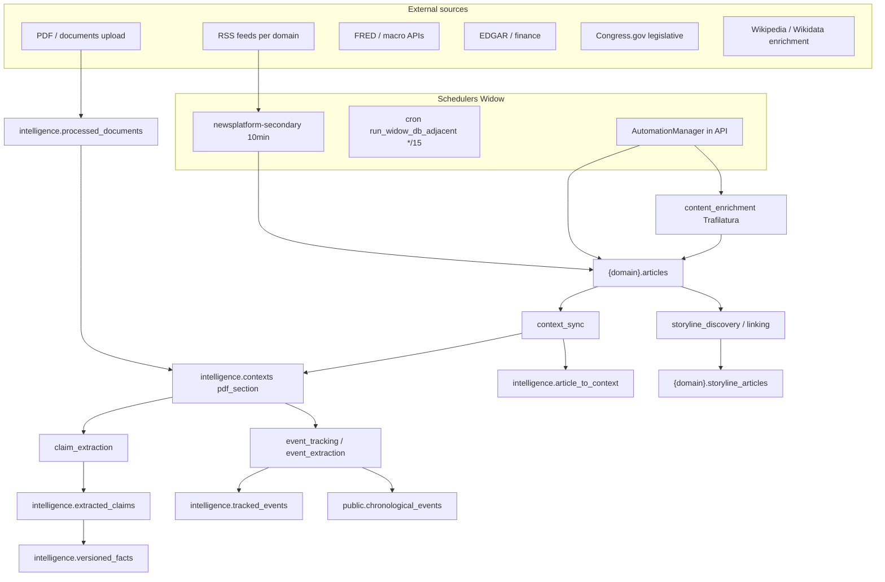
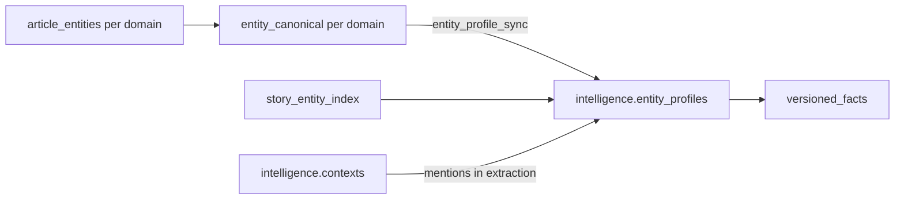

# News Intelligence — Data Inventory & Connection Model

**Purpose:** Full view of what NI collects, where it lives, how entities/events/facts/storylines connect today, and what that implies for new tools and connection features.

**Audience:** Development planning — expanding graph-like links between data points, distinct events, and entities.

**As-of:** 2026-06-08 (live counts from Widow `news_intel` @ `192.168.93.101:5432`, ~7.2 GB)

**Sources used:**

| Source | Role |
|--------|------|
| **Widow PostgreSQL** | Live row counts, domain registry, bridge coverage (primary ground truth) |
| **MemPalace** (`News Intelligence` wing, 12 drawers) | Operator baselines, pipeline handoffs, known bottlenecks (May–Jun 2026) |
| **Repomix** (`repomix-output.md`) | Schema/migration corpus from Widow prod tree |
| **Repo docs** | `PIPELINE_OPERATIONS_WIDOW.md`, `PIPELINE_AND_AUTOMATION.md`, `LONGITUDINAL_INTELLIGENCE_EXECUTION.md`, `AGENTS.md` |
| **Postgres MCP** | Unavailable this session (`pool closed`); counts via SSH `psql` instead |

---

## 1. Executive summary

News Intelligence is a **multi-domain news corpus** with a **context-centric intelligence layer** on top:

1. **Ingest** — RSS (primary), PDFs/documents, finance/market APIs, legislative APIs.
2. **Per-domain silos** — `{schema}.articles`, `storylines`, `topics`, `rss_feeds`, `entity_canonical`.
3. **Global intelligence schema** — `intelligence.contexts` bridged to articles; **claims → facts**; **entity_profiles**; **tracked_events**; editorial queues.
4. **Products** — Storylines, synthesis, briefings, finance research, Monitor/automation visibility.

**Pipeline-active domains** (RSS automation + backlog metrics): **`politics`**, **`finance`** only.

**Registered active domains** (UI + schema): **legal**, **medicine**, **artificial-intelligence**, **politics**, **finance** (science-tech retired).

**Largest connection surfaces for new features:**

- `intelligence.article_to_context` — article ↔ context bridge (46k links; ~51% of article contexts bridged for politics/finance).
- `{schema}.storyline_articles` — storyline ↔ article (3k links).
- `intelligence.entity_profiles` ↔ `{schema}.entity_canonical` — cross-domain entity identity (40k profiles; 10k canonical rows per major silo, capped).
- `intelligence.extracted_claims` → `intelligence.versioned_facts` — structured knowledge (771k claims → 68k facts; promotion bottleneck).
- `intelligence.tracked_events` — multi-domain “macro events” (2k rows) vs `public.chronological_events` — timeline atoms (9k rows).

---

## 2. Data sources & intake paths



| Source | Entry | Storage | Notes |
|--------|-------|---------|-------|
| **RSS** | `collect_rss_feeds` (systemd + optional `collection_cycle`) | `{schema}.articles` | 64 politics + 18 finance feeds registered; 17+18 active. Quality/credibility at ingest via `orchestrator_governance.yaml`. |
| **Full-text enrichment** | `content_enrichment` | `articles.content`, `enrichment_status` | Politics: ~19.5k enriched, ~6.3k removed. Finance: ~13.1k enriched, ~3.7k removed. |
| **PDF / documents** | `document_processing` | `processed_documents`, `contexts` (`pdf_section`) | 868 documents; **58.8k** `pdf_section` contexts (no article bridge by design). |
| **Context bridge** | `context_sync` (cron + AM) | `intelligence.contexts`, `article_to_context` | Article-sourced contexts: politics 24.9k, finance 16.3k, legal 1.5k. |
| **Finance APIs** | Finance orchestrator | SQLite/Chroma + `finance` schema | Commodities, FRED, research tasks — parallel track to RSS politics/finance. |
| **Legislative** | `legislative_references` phase | Per-domain legislative snapshot tables | Congress.gov rate-limited; domain-gated. |
| **Reference history** | Manual / migration 222+ | `intelligence.reference_events` | **28** curated reference rows (longitudinal layer seed). |
| **External entity IDs** | `entity_enrichment`, Wikidata | `entity_canonical.wikidata_qid` | Migration 226; enrichment batch per profile. |

---

## 3. Domain silos & topic coverage

### 3.1 Registry (`public.domains`)

| domain_key | Schema | Active | display_order | Pipeline RSS |
|------------|--------|--------|---------------|--------------|
| legal | legal | yes | 4 | feeds only (8 active) |
| medicine | medicine | yes | 20 | feeds only (13 active) |
| artificial-intelligence | artificial_intelligence | yes | 25 | feeds only (15 active) |
| politics | politics | yes | 25 | **full pipeline** |
| finance | finance | yes | 26 | **full pipeline** |

science-tech schema dropped (migration 212); residual `tracked_events` domain_keys may still list `science-tech` (11 events).

### 3.2 Volume by domain (2026-06-08)

| Domain | Articles | Storylines | Topics | RSS feeds | entity_canonical |
|--------|----------|------------|--------|-----------|------------------|
| politics | 25,775 | 611 | 6,138 | 64 (17 active) | 10,000 |
| finance | 16,849 | 285 | 4,776 | 18 (18 active) |
| legal | 1,406 | — | — | 8 (8 active) | — |
| medicine | 4,150 | — | — | 15 (13 active) | — |
| artificial-intelligence | 6,825 | — | — | 16 (15 active) | — |

**Topics** are per-domain clusters from topic_clustering (LLM + queue); used in UI Topics pages and storyline discovery signals.

**Storyline ↔ article links:**

| Domain | storyline_articles rows |
|--------|-------------------------|
| politics | 1,235 |
| finance | 1,751 |

Storylines hold synthesized markdown, timelines, refinement queue jobs, and entity indexes (`story_entity_index`: 750 rows politics).

---

## 4. Storage layers (where data lives)

### 4.1 Per-domain schema (`politics`, `finance`, …)

Typical tables (each active silo):

| Table | Role |
|-------|------|
| `articles` | Canonical news rows (URL-deduped); `content`, `summary`, sentiment, quality, `processing_status`, `enrichment_status`, `metadata.pipeline.*` pass markers |
| `rss_feeds` | Source config |
| `storylines` | Evolving story clusters |
| `storyline_articles` | M:N article ↔ storyline |
| `topics` | Topic clusters |
| `article_entities` / `entities` JSONB | Per-article NER |
| `entity_canonical` | Domain-local canonical entity rows (resolver input) |
| `story_entity_index` | Entities tied to storylines |
| `topic_extraction_queue` | Async topic worker backlog |

### 4.2 Global `intelligence` schema

| Table | Rows (approx) | Role |
|-------|---------------|------|
| `contexts` | **113,327** | Normalized text units for LLM extraction (article, pdf_section, …) |
| `article_to_context` | **46,272** | Bridge: `(domain_key, article_id)` → `context_id` |
| `extracted_claims` | **770,961** | SPO triples + confidence + provenance timestamps |
| `versioned_facts` | **68,178** | Promoted durable facts (`entity_profile_id` always set) |
| `entity_profiles` | **40,439** | Cross-domain entity cards (sections, relationships) |
| `tracked_events` | **2,046** | Operator-facing “events” spanning `domain_keys[]` |
| `processed_documents` | **868** | PDF pipeline |
| `content_refinement_queue` | **151** pending | 70B narrative finisher, headline refine, etc. |
| `narrative_threads` | **1,201** | Cross-context narrative stitching |
| `reference_events` | **28** | Curated historical anchor events |
| `claim_subject_gap_catalog` | **9,047** | Unresolved claim subjects blocking promotion |
| `storyline_states` | **0** | Story state snapshots (schema ready) |
| `embedding_chunks` | **0** | pgvector chunks (migration 223; not populated at scale) |

### 4.3 `public` global

| Table | Rows | Role |
|-------|------|------|
| `chronological_events` | **9,994** | Fine-grained timeline events (v5 event stack) |
| `domains` | 5 active | Registry |
| `automation_run_history` | (ops) | Phase run audit |
| `storyline_article_suggestions` | (per migration 232) | ML suggestions for storyline linking |

---

## 5. How data connects today

### 5.1 Article → intelligence cascade (primary path)

```
{domain}.articles
    │ context_sync (readiness gates: content length + enrichment_status)
    ▼
intelligence.contexts  (source_type=article, domain_key)
    │ intelligence.article_to_context
    ▼
claim_extraction → intelligence.extracted_claims
    │ claims_to_facts (entity resolution)
    ▼
intelligence.versioned_facts  (valid_from / valid_to / event_date / ingestion_date / vintage_date)

Parallel from contexts:
    event_tracking / event_extraction → intelligence.tracked_events
                                    → public.chronological_events
```

**Bridge coverage (politics + finance):**

| Metric | Politics | Finance |
|--------|----------|---------|
| Article contexts | 24,908 | 16,324 |
| article_to_context links | 19,642 | 14,096 |
| Unbridged article contexts | ~5,266 | ~2,228 |

**Orphan contexts (MemPalace audit baseline, May 2026):** ~73k total without `article_to_context` — predominantly **`pdf_section`** (~58k, expected) plus legacy domain_key buckets after politics_2/finance_2 consolidation.

**Contexts without claims (June 2026, ~145k total contexts):** ~122k have at least one `extracted_claims` row. The remaining ~23k are mostly **terminal inventory** — `claim_extraction` already ran and recorded an outcome (`parsed_empty`, pass marker, or text too short). Only **~300–500** rows match automation backlog (`actionable_no_claims` in `get_context_claim_backlog_stats()`). Monitor **`backlog_status`** and **`processing_progress`** use actionable counts for queue depth and steady-state; `total_no_claims` in `backlog_breakdown` is completeness/diagnostics only.

### 5.2 Entity connection model



| Link | Mechanism | Gap |
|------|-----------|-----|
| Article → entity | `entity_extraction` → `article_entities` | Strict domains skip unresolved mentions |
| Canonical → profile | `entity_profile_sync` copies/maps `entity_canonical` → `entity_profiles` | 10k cap per domain canonical table |
| Profile → fact | `claims_to_facts` resolves **subject** to `entity_profile_id` | **9,047** subject gaps in catalog; ~316k claims missing object (May audit) |
| Entity → storyline | `story_entity_index`, storyline enrichment | Sparse vs article volume |
| Wikidata | `entity_canonical.wikidata_qid`, `entity_enrichment` | Not universal |

**There is no deployed `graph_connection_links` table in prod** (migrations 215–216 in repo; not present in live DB). Relationship discovery today is **profile sections**, **pattern_recognition**, **cross_domain_synthesis**, and **narrative_threads** — not a unified graph edge store.

### 5.3 Event connection model

Two parallel event systems:

| Layer | Table | Count | Scope | Typical use |
|-------|-------|-------|-------|-------------|
| **Tracked events** | `intelligence.tracked_events` | 2,046 | Multi-domain (`domain_keys[]`), milestones, narratives | Dashboard, Investigate, cross-domain briefings |
| **Chronological events** | `public.chronological_events` | 9,994 | Finer timeline atoms, temporal_status | Story timelines, event extraction v5 |
| **Reference events** | `intelligence.reference_events` | 28 | Human-curated historical anchors | Longitudinal / arc reports (Phase 1+) |

**tracked_events by domain_key (unnest):** finance 1,579 · legal 1,119 · politics 1,401 · artificial-intelligence 1,148 · medicine 1,082 · documents 1,094 · science-tech 11.

Events connect to contexts/articles **indirectly** through extraction phases — not a single universal `event_id` FK on every article.

### 5.4 Storyline connection model

```
{domain}.articles ←→ {domain}.storyline_articles ←→ {domain}.storylines
                              │
                              ├→ content_refinement_queue (narrative finisher 70B on PopOS)
                              ├→ synthesized_content / synthesized_markdown on storyline row
                              ├→ story_entity_index
                              └→ intelligence.versioned_facts (via synthesis context)
```

**Distinct “storyline” vs “tracked event”:** Storylines are **domain-scoped evolving clusters** with articles and synthesis products. Tracked events are **cross-domain intelligence objects** with their own lifecycle and validation — overlap is semantic, not a strict FK graph.

---

## 6. Claims → facts funnel (knowledge layer)

| Stage | Volume | Notes |
|-------|--------|-------|
| Contexts (all sources) | 113k | 48% article, 52% pdf_section |
| Extracted claims | **771k** | SPO + confidence + provenance columns (migration 221) |
| Versioned facts | **68k** | **100%** have `entity_profile_id` |
| Claim subject gaps | **9,047** catalog rows | Blocks promotion for unknown subjects |
| Dedupe groups (audit sample) | 0 | Dedupe not the main bottleneck |

**MemPalace lean_storage (May 2026):** Promotion bottleneck is **entity resolution**, not claim dedupe. Phases `extracted_claims_dedupe` and retention pruning exist but retention env defaults OFF.

**Implication for new tools:** Any “connect claims to entities/events” feature should prioritize **subject/object resolution** and **entity_profile** linking before graph visualization.

---

## 7. Automation & freshness

Phases that **materially change** connection graph:

| Tier | Phases |
|------|--------|
| Ingest | `collection_cycle`, `content_enrichment`, `document_processing` |
| Bridge | `context_sync`, `entity_profile_sync`, `entity_profile_build` |
| Extract | `claim_extraction`, `claims_to_facts`, `event_tracking`, `event_extraction`, `entity_extraction` |
| Structure | `storyline_discovery`, `storyline_processing`, `topic_clustering`, `timeline_generation` |
| Product | `content_refinement_queue`, `storyline_synthesis`, `editorial_*`, `daily_briefing_synthesis` |

Widow split (June 2026): RSS via **newsplatform-secondary**; **context_sync / entity_profile_sync / pending_db_flush** via **cron** — must stay in `AUTOMATION_DISABLED_SCHEDULES` on API to avoid duplicate work.

Pass markers: `metadata.pipeline.<phase>.last_pass_at` on articles/contexts drive backlog metrics — connection features should respect the same gates in `article_processing_gates.py`.

---

## 8. API & UI surfaces (read paths)

| Concern | API / UI |
|---------|----------|
| Articles | `GET /api/{domain}/articles` |
| Contexts | `GET /api/contexts` (context_centric) |
| Entity profiles | `GET /api/entity_profiles`, entity dossier routes |
| Tracked events | `GET /api/tracked_events` |
| Storylines | `GET /api/{domain}/storylines/...` |
| Synthesis | `POST /api/{domain}/synthesis/storyline/{id}`; stream `GET .../stream` |
| Monitor / backlog | `GET /api/system_monitoring/processing_progress` |
| Finance evidence | `/api/finance/...` orchestrator tasks |

Frontend shells: Dashboard (contexts + events), Discover (contexts), Investigate (entities, events, documents, narrative threads), Storylines, Monitor.

---

## 9. Gaps & bottlenecks (planning inputs)

From MemPalace + live DB + pipeline docs:

| Gap | Impact on “connecting data points” |
|-----|-----------------------------------|
| **~58k pdf_section contexts** without article bridge | Large corpus invisible to article-centric graph UIs |
| **~5–7k unbridged article contexts** per major silo | Incomplete article ↔ extraction join |
| **771k claims vs 68k facts** | Knowledge graph edges exist in claims but not promoted |
| **9k subject gap catalog** | Entity linking stalls at promotion |
| **No live graph edge table** | No first-class “entity A related_to entity B” store queried by UI |
| **embedding_chunks empty** | Semantic similarity search across corpus not operational |
| **reference_events = 28** | Longitudinal arc spine thin vs living corpus |
| **storyline_states = 0** | No persisted storyline state machine snapshots |
| **Dual event models** | tracked_events vs chronological_events need explicit merge/join strategy |
| **Non-pipeline domains** | legal/medicine/AI ingest RSS but skip most automation phases |

---

## 10. Recommended development axes

For a **development plan** focused on connecting data points, distinct events, and entities:

### 10.1 Short-term (reuse existing tables)

1. **Unified entity view** — Join `entity_profiles` + per-domain `entity_canonical` + `story_entity_index` + fact counts; expose “coverage score” per entity.
2. **Event reconciliation layer** — Map `tracked_events.id` ↔ `chronological_events` clusters ↔ storyline IDs (view or service, even before schema merge).
3. **Bridge completeness dashboard** — articles without contexts, contexts without **actionable** claims (not terminal no-claim inventory), claims without resolvable subjects (extend Monitor).
4. **Subject gap workflow** — UI/ops on `claim_subject_gap_catalog` to seed `entity_profiles` and unblock `claims_to_facts`.

### 10.2 Medium-term (schema-light)

1. **Graph edge projection** — Materialize from `entity_profiles.relationships`, `narrative_threads`, `cross_domain_correlations` into queryable edges (apply migrations 215–216 if not yet on Widow).
2. **Context↔event linkage table** — Explicit FK `(context_id, event_id, role)` instead of inferring from extraction metadata.
3. **Point-in-time API** — `as_of_date` queries over `versioned_facts` + `reference_events` (per chronological doctrine).

### 10.3 Long-term (longitudinal product)

1. Populate **reference_events** + macro vintages + external feeds (ACLED, sanctions, Comtrade per `LONGITUDINAL_INTELLIGENCE_EXECUTION.md`).
2. **Arc catalog** linking storylines + tracked_events + reference chapters.
3. **pgvector** on `embedding_chunks` for cross-corpus similarity (“find related entities/events/articles”).

---

## 11. Key code entry points

| Concern | Module |
|---------|--------|
| Article → context | `api/services/context_processor_service.py` |
| Claims | `api/services/claim_extraction_service.py`, `claims_to_facts` in automation_manager |
| Facts lifecycle | `api/services/versioned_facts_lifecycle_service.py` |
| Entity sync | `api/services/entity_profile_sync_service.py` |
| Events | `api/services/event_extraction_service.py`, `event_tracking`, `story_continuation_service.py` |
| Storylines | `api/domains/storyline_management/`, `ai_storyline_discovery.py` |
| Context-centric API | `api/domains/intelligence_hub/routes/context_centric.py` |
| Backlog / gates | `api/services/backlog_metrics.py`, `api/shared/article_processing_gates.py` |
| Data quality audit | `scripts/diagnostics/run_data_quality_audit.py` |

---

## 12. Re-run inventory

```bash
# On Widow
cd /opt/news-intelligence
PYTHONPATH=api .venv/bin/python scripts/diagnostics/run_data_quality_audit.py --packs 2

# Quick domain counts
psql -h 127.0.0.1 -U newsapp -d news_intel -c \
  "SELECT domain_key, schema_name FROM public.domains WHERE is_active ORDER BY display_order;"
```

MemPalace: search `News Intelligence` wing drawers `audit_baseline`, `pipeline_handoff`, `context_hygiene`, `lean_storage` for operator notes.

---

*This document supersedes ad-hoc inventory notes for planning. Update row counts quarterly or after major migrations.*
