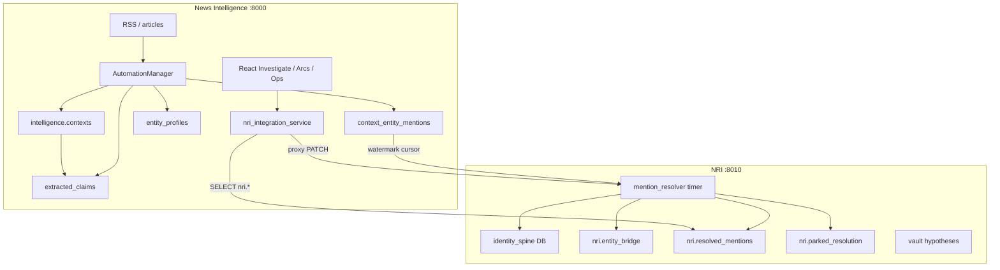

# NI + NRI System Audit — June 2026

**Date:** 2026-06-15  
**Scope:** Read-only architecture audit across News Intelligence (NI) and News Review Investigator (NRI).  
**Sources:** Fresh Repomix packs (NI + NRI), MemPalace drawers, Widow Postgres (`news_intel`), SSH runtime checks on Widow (`192.168.93.101`).  
**Out of scope:** Code/schema changes; MemPalace search repair.

---

## 1. System overview

### 1.1 Architecture

### 1.2 Boundary rules (authoritative)

| Rule | Detail |
|------|--------|
| NI reads | `SELECT` on `nri.*` via `nri_integration_service` |
| NI writes to NRI | Proxy to NRI API (`:8010`) — e.g. `PATCH /api/nri/parked/{id}` |
| NRI reads | `intelligence.*` evidence contract (`context_entity_mentions`, etc.) |
| NRI writes | Only `nri.*` (+ resolver side effects) |
| Runtimes | `/opt/news-intelligence` (NI) vs `/opt/nri` (NRI); separate venvs |

Docs: `News-Review-Investigation/docs/NI_NRI_BOUNDARIES.md`, `NI_EVIDENCE_CONTRACT.md`.

### 1.3 Repomix corpus (structural truth)

| Pack | Path | Files | Tokens | Generated |
|------|------|-------|--------|-----------|
| NI | `repomix-output.md` | 1,050 | ~841k | 2026-06-15 (dev workspace) |
| NRI | `News-Review-Investigation/repomix-nri-output.md` | 101 | ~22k | 2026-06-15 |

NI config: `repomix-widow.config.json`. NRI config added at `News-Review-Investigation/repomix.config.json` (excludes `vault/**`, venv).

---

## 2. Runtime scorecard

Checks run on Widow via SSH + Postgres MCP (read-only).

| Subsystem | Check | Result | Status |
|-----------|-------|--------|--------|
| NI API | `systemctl is-active news-intelligence-api-public` | **active** | 🟢 |
| NI health | `GET localhost:8000/api/health` | `status: healthy`, LLM models listed | 🟢 |
| NI health | `GET localhost:8000/health` | 404 (use `/api/health`) | 🟡 |
| NRI API | `systemctl is-active nri-api` | **inactive** | 🔴 |
| NRI health | `GET localhost:8010/health` | No response (service down) | 🔴 |
| NRI mention resolver | `nri-mention-resolver.timer` | Last run **2026-06-14 13:30** EDT (~20h before audit) | 🟡 |
| NRI loop | `nri-loop.timer` | Last run **2026-06-14 02:30** EDT | 🟡 |
| NI automation | `automation_run_history` (7d) | `claim_extraction`, `collection_cycle`, storylines active | 🟢 |
| Claims → facts | `claims_to_facts` last run | **2026-06-02** (13 days stale) | 🔴 |
| Context sync | `context_sync` last run | **2026-05-18** | 🔴 |
| Entity profile sync | `entity_profile_sync` last run | **2026-04-17** | 🔴 |
| MemPalace search | `mempalace_search` | `Error finding id` | 🔴 |

**Resolver batch (journal, 2026-06-14 13:31):** 500 processed; 46 auto_linked, 69 parked, 1 provisional, 384 non_entity_topic; `last_id` 143823682.

### 2.1 Key database counts (`pg_stat_user_tables` estimates)

| Table / area | Rows | Notes |
|--------------|------|-------|
| `intelligence.contexts` | 139,364 | Core corpus |
| `intelligence.context_entity_mentions` | 282,613 | NRI input |
| `intelligence.extracted_claims` | 899,912 | Heavy extraction |
| `intelligence.versioned_facts` | 30 | **Severe promote backlog** |
| `intelligence.entity_profiles` | 46,170 | Active |
| `intelligence.tracked_events` | 0 | Phase runs but table empty |
| `intelligence.arc_definitions` | 0 | Longitudinal not fed |
| `intelligence.entity_dossiers` | 0 | Compile phase runs; no rows |
| `intelligence.cross_domain_links` | 0 | Designed, unused |
| `intelligence.sanctions_actions` | 0 | Refresh runs; no rows |
| `intelligence.*` tables at 0 rows | **41** | Schema ahead of data |
| `orchestration.*` | all 0 | Orchestrator unused |
| `nri.resolved_mentions` | 121,498 | ~43% of CEM row count |
| `nri.parked_resolution` (open) | 48,012 | Review backlog |
| `nri.provisional_mints` | 4,582 | No review UI |
| `nri.entity_bridge` | 2,739 | FtM links |
| `nri.ftm_entity_cache` | 2,305 | See dataset split below |
| `nri.loop_run` | 5 | Shadow loop history |
| `nri.watermarks` (`mention_resolver`) | `last_value` 143,823,682 | Max CEM id 146,876,762 (~98% cursor) |

**FtM cache by dataset:** `wikidata_lazy` 1,376; `wikidata` 463; `edgar` 311; `congress` 155. GLEIF **not** in cache.

**Backfill interpretation:** Watermark is near max mention **id** (monotonic ingest), but only ~43% of mention **rows** appear in `resolved_mentions` — many mentions classified `non_entity_topic` or parked without row-per-row 1:1 mapping.

---

## 3. MemPalace design intent vs repo

**Search outage:** `mempalace_search` returns `Error finding id` — audits must use `mempalace_list_drawers` / `mempalace_get_drawer`. `mempalace_kg_query` has host/URL facts only; no NRI graph edges.

### 3.1 `News Intelligence` / `pipeline_handoff` (5 drawers)

| Drawer theme | MemPalace says | Repo / DB shows |
|--------------|----------------|-----------------|
| Handoff index | Phases 1–3 **SHIPPED** (context hygiene, lean storage, fact lifecycle); Phase 4 **editorial_handoff NOT SHIPPED** | Code exists for phases 1–3 (`claim_extraction`, `extracted_claims_dedupe`, `claims_to_facts`, `fact_verification`); editorial phases run (`editorial_document_generation`) but Phase 4 handoff drawer still “not shipped” |
| Longitudinal plan | 14-week arcs, chronological accuracy doctrine, MVP arcs | API + Arc UI routes exist; **`arc_definitions` / `arc_reports` empty** — product not fed |
| Phase 0 Widow | Migration 221, claim marker cleanup | Historical; claims still ~900k vs 30 facts |
| Code cleanup (2026-06-02) | Legacy domain routes removed; 11 docs deleted | Confirmed in git history; `FRONTEND_UPGRADE_DEVELOPMENT_PLAN.md` partially stale |

### 3.2 `news_intelligence` / `documentation` (844 drawers)

Sample of first 15: mostly legacy Cursor enforcement guides and PDF ingestion docs — **not** a reliable feature registry. Prefer `PROJECT_STATUS.md`, `AGENTS.md`, and repo docs over MemPalace file corpus for current intent.

### 3.3 MemPalace → reality checklist

| MemPalace X | Repo/DB Y | Match? |
|-------------|-----------|--------|
| Phase 3 fact lifecycle shipped | `claims_to_facts` enabled but last run 2026-06-02; 30 `versioned_facts` | ❌ Under-running |
| Phase 4 editorial not shipped | `editorial_*` automation runs | ⚠️ Partial — automation without handoff product |
| Longitudinal arcs MVP | Empty arc tables; UI wired | ⚠️ Built shell, no data |
| NRI M7 integration | Resolver timer runs; **NRI API down** | ⚠️ Read path via NI DB; write proxy broken |

---

## 4. Designed / built / wired / running matrix

### 4.1 NI automation (67 scheduled phases in `automation_manager.py`)

Grouped by operator concern. **Running** = at least one successful run in last 30 days (`automation_run_history`).

| Group | Phases (sample) | Designed | Built | Running (30d) | Notes |
|-------|-----------------|----------|-------|---------------|-------|
| **Ingest** | `collection_cycle`, `content_enrichment`, `document_processing`, `nightly_enrichment_context` | ✓ | ✓ | ✓ | Healthy |
| **Context / claims** | `context_sync`, `claim_extraction`, `claims_to_facts`, `extracted_claims_dedupe`, `fact_verification` | ✓ | ✓ | Mixed | `context_sync` stale since May; `claims_to_facts` stale since Jun 2 |
| **Entities** | `entity_profile_sync`, `entity_profile_build`, `entity_extraction`, `entity_organizer`, `entity_dossier_compile` | ✓ | ✓ | Mixed | `entity_profile_sync` stale Apr 17; dossiers table 0 rows |
| **Events** | `event_tracking`, `event_coherence_review`, `cross_domain_synthesis` | ✓ | ✓ | Partial | `tracked_events` = 0 despite `event_tracking` runs |
| **Storylines** | `storyline_*`, `topic_clustering`, `timeline_generation` | ✓ | ✓ | ✓ | Active |
| **Longitudinal** | `embeddings_worker`, `arc_report_generation`, `longitudinal_matview_refresh`, `macro_series_refresh` | ✓ | ✓ | ✓ | **DB tables empty** — reports generate into void |
| **Ops** | `health_check`, `data_cleanup`, `cache_cleanup`, `digest_generation` | ✓ | ✓ | ✓ | |
| **Orchestration schema** | `orchestration.*` tables | Designed | Migrated | ✗ | All 0 rows — parallel orchestrator unused |

Phases defined in schedules but **no run in 30d** (sample): none fully dead — 58 distinct phase names ran in 30d; gap is **staleness** on upstream sync/promote paths, not total absence.

### 4.2 NRI capabilities

| Capability | Designed | Built (NRI repo) | NI proxy / UI | Running |
|------------|----------|------------------|---------------|---------|
| mention_resolver | Docs + timer | `evidence/mention_resolver.py` | `NriOpsPage`, stats | Timer ✓; API ✗ |
| entity_bridge + QA | Bridge contract + QA | `evidence/bridge_qa.py`, `entity_bridge.py` | `FtmBridgePanel`, `EntityDetailPage` | DB 2.7k bridges; QA audit API **no UI** |
| parked review | PATCH proxy | `api/main.py` | `EntityResolutionPage` | 48k open; NRI API down blocks PATCH |
| provisional_mints | Contract | `lazy_mint.py` | **None** | 4.5k rows |
| spine browser | Phase A | `spine/api` | `SpineBrowserPage` | Proxied ✓ |
| hypotheses / vault | loop + vault | `loop/`, vault git | `HypothesesPage` | 5 `loop_run`; shadow branch not shown |
| GLEIF ingest | Planned | `spine/ingest/gleif/` | **None** | Not loaded |
| vault facts / leads | Writer | vault dirs | **No NI routes** | N/A |
| loop promotion | `loop/promote/gate.py` | Built | **None** | Manual only |

### 4.3 NI `/api/nri/*` routes vs frontend

| Route | `contextCentric.ts` | Page / component |
|-------|---------------------|------------------|
| `GET /nri/health` | ✓ | NriOpsPage, EntityResolutionPage |
| `GET /nri/resolved_mentions` | ✓ | EntityResolutionPage |
| `GET /nri/parked` | ✓ | EntityResolutionPage |
| `PATCH /nri/parked/{id}` | ✓ | EntityResolutionPage |
| `GET /nri/entity_bridge/{id}` | ✓ | EntityDetailPage, EntityDossierPage |
| `GET /nri/bridge_qa/audit` | ✓ | **Orphan API client** — no page |
| `GET /nri/entity_claims` | ✓ | EntityDetailPage |
| `GET /nri/context_intel/{id}` | ✓ | ContextDetailPage |
| `GET /nri/parked_cross_domain` | ✓ | NriOpsPage, EntityResolutionPage |
| `GET /nri/hypotheses` | ✓ | HypothesesPage |
| `GET /nri/spine/entities`, `POST /nri/spine/match` | ✓ | SpineBrowserPage |
| `GET /nri/resolution_stats` | ✓ | NriOpsPage, EntityResolutionPage |
| `GET /nri/loop_runs` | ✓ | NriOpsPage, HypothesesPage |
| `GET /nri/ftm_cache_stats` | ✓ | NriOpsPage |

### 4.4 UI routes — recent vs orphan

**Wired since `FRONTEND_UPGRADE_DEVELOPMENT_PLAN.md` (2026-06-09):**

- `/{domain}/arcs`, `arcs/:arcId/spine`, `arcs/:arcId/heatmap`, `arcs/reports`
- `/{domain}/investigate/spine-browser`
- `/{domain}/operations/nri-ops`

**Orphan pages** (file exists, no `App.tsx` import/route):

| Page | Notes |
|------|-------|
| `Finance/EvidenceExplorer.tsx` | Unrouted |
| `Finance/FactCheckViewer.tsx` | Unrouted |
| `Finance/GoldCommodity.tsx` | Unrouted |
| `Finance/RefreshSchedule.tsx` | Unrouted |
| `Finance/SourceHealth.tsx` | Unrouted |
| `Report/ReportPage.tsx` | Re-exported via Briefings — false positive in naive basename grep |

**Demo-guarded only:** `MLProcessing.tsx` (routed under monitor path with `DemoRouteGuard`).

**Orphan component:** `CitationDrawer.tsx` — created, not imported by any page.

**Deleted / superseded (git status):** `AnalyzePage`, `Monitoring`, `Settings`, `StorylineTracking`, `FilteredArticles`, `StoryControlDashboard` — cleanup in progress; good.

---

## 5. Orphan & underdeveloped register (prioritized)

| Priority | Item | Evidence | Recommendation |
|----------|------|----------|----------------|
| **P0** | NRI API (`nri-api.service`) down | `inactive`; `:8010` empty; PATCH proxy fails | `systemctl start nri-api`; verify after deploy |
| **P0** | Claims → facts pipeline stalled | 899k claims, 30 facts; `claims_to_facts` last run Jun 2 | Investigate gate/env; run catchup; align with MemPalace Phase 3 intent |
| **P1** | `tracked_events` always empty | 0 rows; `event_tracking` runs | Debug write path / filters; blocks event coherence chain |
| **P1** | `context_sync` / `entity_profile_sync` stale | Last May/Apr | Unblock upstream entity/NRI freshness |
| **P1** | 48k open parked resolutions | `parked_resolution.review_status = open` | Resolver QA gates (recent work) + triage UI; cross-domain panel exists |
| **P1** | `wikidata_lazy` dominant in bridges | 1,376 / 2,305 cache rows lazy | Bridge QA audit (`/api/nri/bridge_qa/audit`); wire UI on NriOpsPage |
| **P2** | Provisional mints (4.5k) | No review UI | Queue page or extend EntityResolution |
| **P2** | Longitudinal tables empty | 41 zero-row `intelligence.*` tables | Defer matview/report CPU until arc backfill; or gate phases |
| **P2** | Vault facts/leads | No NI routes | Proxy read-only or defer |
| **P2** | GLEIF | Loader only | Load on NAS path or hide from ops docs |
| **P3** | Finance orphan pages (5) | Unrouted | Archive or single Finance ops hub |
| **P3** | `CitationDrawer` | No imports | Wire to arc/spine pages or remove |
| **P3** | `orchestration.*` | All empty | Document as retired or remove migrations from mental model |
| **P3** | MemPalace search | Broken | Fix indexer; use drawers until then |

---

## 6. Complexity scorecard (1 = lean, 5 = concerning)

| Dimension | Score | Rationale |
|-----------|-------|-----------|
| Automation surface | **4** | 67 scheduled phases in one manager; 58 ran in 30d but many overlap (storyline variants) |
| Schema sprawl | **4** | 41 empty `intelligence` tables; 6 domain schemas; politics/finance only active |
| DB pools | **3** | Worker + UI + SQLAlchemy + pressure gates — justified on Widow but operator-heavy |
| Dual LLM hosts | **2** | PopOS overflow documented; not primary risk if single-host default |
| Intelligence tables | **4** | Large extraction (`claims`) vs tiny promote (`facts`) — complexity without downstream value |
| Cross-stack coupling | **2** | Clean read boundary; NI does not write `nri.*` directly — **good** |
| Frontend IA | **3** | New Arc/NRI ops routes help; orphan Finance pages and unwired APIs add noise |

**Overall:** Architecture is **directionally sound** but **operationally overweight** — many phases and tables exist ahead of data products and operator workflows.

### 6.1 Simplification recommendations

1. **Restart and monitor NRI API** — unblocks PATCH proxy; verify with `EntityResolutionPage` “mark reviewed”.
2. **Gate or pause longitudinal automation** until `arc_definitions` backfill starts — stops CPU on empty matviews/reports.
3. **Force `claims_to_facts` + `context_sync` catchup** — single operator script/session; measure `versioned_facts` delta.
4. **Archive or route Finance orphan pages** — one hub or delete to reduce IA drift.
5. **Consolidate MemPalace wings** (`News Intelligence` vs `news_intelligence`) and fix search — audits currently manual.

---

## 7. Documentation drift list

| Document | Section | Issue | Action |
|----------|---------|-------|--------|
| `docs/FRONTEND_UPGRADE_DEVELOPMENT_PLAN.md` | §3.1 | Says arc routes “not added” | **Update** — `App.tsx` has arcs + heatmap + reports |
| Same | §3.4 | Spine match “not proxied” | **Update** — `SpineBrowserPage` + `/api/nri/spine/match` |
| Same | §4.1 | Watermark / loop_run “none” in UI | **Update** — `NriOpsPage` |
| Same | §3.5 / §4.1 | Lists deleted pages as orphans | **Prune** Monitoring, StorylineTracking, Settings |
| Same | §2.2 | NRI UI “minimal v1” | **Expand** — dossier claims, context intel, cross-domain parked |
| `docs/SYSTEM_OVERVIEW.md` | §4 routes | Stale vs `App.tsx` | Cross-check Arcs, NRI ops, spine browser |
| MemPalace `pipeline_handoff` | Phase 4 | “NOT SHIPPED” vs editorial automation | Clarify product vs automation definition |
| `PROJECT_STATUS.md` | NRI bridge QA | May lag Jun 2026 work | Add bridge QA + entity_claims routes |

---

## 8. Audit methodology log

| Phase | Deliverable | Status |
|-------|-------------|--------|
| Repomix dual-pack | `repomix-output.md`, `repomix-nri-output.md` | Done |
| Route grep | 17 `/api/nri/*` routes; 16 wired in `contextCentric.ts`; 1 API-only (`bridge_qa/audit`) | Done |
| MemPalace | 5 pipeline_handoff drawers; search broken | Done |
| Runtime | SSH Widow + Postgres MCP | Done |
| Matrix + complexity | This document §4–6 | Done |

---

## 9. Follow-up tasks (operator approval required)

No code changes were made in this audit. Suggested next steps:

1. Start `nri-api.service` on Widow and confirm `curl localhost:8010/health`.
2. Run `claims_to_facts` / `context_sync` manually or via automation monitor; record row deltas.
3. Add `NriOpsPage` panel for `GET /api/nri/bridge_qa/audit` (optional small UI task).
4. Refresh `FRONTEND_UPGRADE_DEVELOPMENT_PLAN.md` §3–4 per drift table above.
5. Decide fate of Finance orphan pages and empty `orchestration` schema.

---

*Generated by NI+NRI system audit plan (2026-06-15). Repomix headers: NI 1,050 files; NRI 101 files.*
