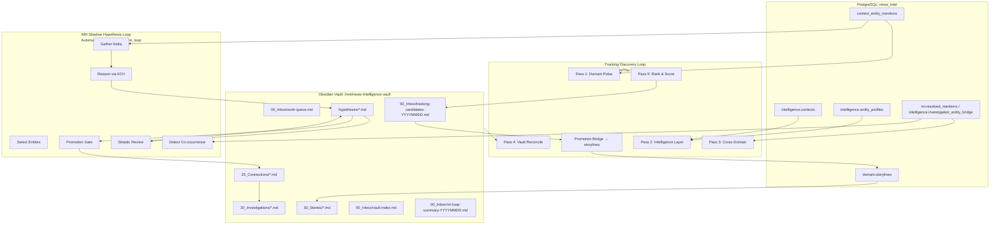

# NRI / Investigation Loop Operator Guide

> **Unified manual for the Tracking Discovery Loop and Shadow Hypothesis Loop**  
> Version 1.0 — News Intelligence System v10.1

---

## 1. Architecture Overview

The News Intelligence system runs **two complementary investigative loops** that both write to the same Obsidian vault on Widow (`/mnt/news-intelligence-vault`). They serve different purposes but share infrastructure.



### Key Differences

| Aspect | Tracking Discovery Loop | NRI Shadow Hypothesis Loop |
|--------|------------------------|----------------------------|
| **Trigger** | Cron (Mon/Thu 06:00) | AutomationManager (configurable tick) |
| **Output** | `tracking-candidates-YYYYMMDD.md` | `hypotheses/hyp-*.md` |
| **Method** | 5 deterministic SQL passes | ACH-structured LLM reasoning |
| **Review** | Human promotes top-N to storylines | Skeptic agent auto-downgrades/refutes |
| **Promotion** | `tracking_promotion_service` → storylines | `check_promotion` → connections → investigations |
| **Focus** | "What should we track?" | "What patterns might be real?" |
| **Vault Section** | `00_Inbox/tracking-candidates-*` | `hypotheses/`, `20_Investigations/` |

---

## 2. Quick Start Checklist

### 2.1 Environment Variables (Widow `.env`)

```bash
# =========================
# VAULT CONFIG (both loops)
# =========================
NEWS_INTEL_VAULT_PATH=/mnt/news-intelligence-vault
NEWS_INTEL_VAULT_WRITE=true

# =========================
# TRACKING DISCOVERY LOOP
# =========================
TRACKING_PROMOTION_TOP_N=5
TRACKING_PROMOTE_STORYLINE_MIN_SCORE=20
AUTOMATION_DISABLED_SCHEDULES=...,proactive_detection,storyline_discovery,narrative_thread_build
STORYLINE_ASSEMBLY_RUN_PROACTIVE=false

# =========================
# NRI SHADOW HYPOTHESIS LOOP
# =========================
NRI_LOOP_ENABLED=true                    # Master switch
NRI_VAULT_WRITE=true                     # Write hypotheses to vault
NRI_VAULT_PATH=/mnt/news-intelligence-vault
NRI_ALLOW_PROD_NEWS_INTEL=true           # Safety gate (must be true on Widow)
NRI_LOOP_SHADOW=true                     # Write to shadow/ branch
NRI_RESEARCH_FOCUS_DOMAINS=politics,finance  # Optional: limit entity selection
# NRI_RESEARCH_ENTITY_FTM_IDS=           # Optional: comma-seeded FTM IDs
FTM_AUTO_LINK_THRESHOLD=0.92             # Auto-link confidence
FTM_PARK_THRESHOLD=0.85                  # Park for review threshold
```

### 2.2 Enable the Loops

**Tracking Discovery** (cron on Widow):
```bash
# Install cron (runs Mon/Thu 06:00)
crontab -l 2>/dev/null | cat - infrastructure/widow-tracking-discovery.cron | crontab -

# Manual run
cd /opt/news-intelligence
set -a && . ./.env && set +a
PYTHONPATH=api .venv/bin/python3 api/scripts/run_tracking_discovery_loop.py --top-n 5
PYTHONPATH=api .venv/bin/python3 api/scripts/run_tracking_discovery_loop.py --dry-run  # preview
```

**NRI Shadow Loop** (runs via AutomationManager):
```bash
# Ensure NRI_LOOP_ENABLED=true in .env
# AutomationManager picks up phase 'nri_loop' on its scheduler tick
# Check status:
curl -H "Authorization: Bearer $API_KEY" http://localhost:8000/api/system_monitoring/automation/status
```

### 2.3 Verify It's Working

```bash
# 1. Check vault writes
ls -la /mnt/news-intelligence-vault/00_Inbox/tracking-candidates-*.md
ls -la /mnt/news-intelligence-vault/hypotheses/hyp-*.md

# 2. Check DB loop runs
psql -h localhost -U newsapp -d news_intel -c "
  SELECT * FROM nri.loop_run ORDER BY iteration DESC LIMIT 5;
"

# 3. Check tracking candidates via API
curl -H "Authorization: Bearer $API_KEY" http://localhost:8000/api/investigation/tracking_candidates

# 4. Check hypotheses via API
curl -H "Authorization: Bearer $API_KEY" http://localhost:8000/api/investigation/hypotheses?status=open
```

---

## 3. Directing Research

### 3.1 Domain Focus (Both Loops)

**Tracking Discovery**: Set `PIPELINE_INCLUDE_DOMAIN_KEYS` or rely on `get_pipeline_active_domain_keys()` (default: `legal,medicine,artificial-intelligence,politics,finance`).

**NRI Loop**: Use `NRI_RESEARCH_FOCUS_DOMAINS` in `.env`:
```bash
NRI_RESEARCH_FOCUS_DOMAINS=politics,finance,artificial-intelligence
```
This filters `select_entities()` to only pick entities whose mentions fall in those domains.

### 3.2 Entity Seeding (NRI Loop Only)

Pre-seed specific FTM entities for investigation:
```bash
NRI_RESEARCH_ENTITY_FTM_IDS=ftm-12345678,ftm-87654321
```
Or via API (one-off):
```bash
curl -X POST -H "Authorization: Bearer $API_KEY" \
  http://localhost:8000/api/investigation/research_seeds \
  -d '{"ftm_ids": ["ftm-12345678"], "domains": ["politics"]}'
```

### 3.3 Time Windows

**Tracking Discovery**: `--since` argument or `last_tracking_scan_at` cursor in `work-queue.md`. Defaults to 7 days.

**NRI Loop**: `since_context_id` in `detect_cooccurrence()` defaults to 0 (all time). Control via watermark `nri_loop_last_context_id`.

### 3.4 Promoting a Hypothesis to Investigation

1. Find hypothesis in `hypotheses/hyp-*.md` with `status: open` and promising `confidence`
2. Run disconfirming test (see `cheapest_test` field)
3. If test passes → change frontmatter: `status: promoted`, add `promoted_to_investigation: inv-<slug>`
4. Create `20_Investigations/inv-<slug>.md` with full context
5. Skeptic will continue reviewing; promotion gate checks `test_status: passed`

---

## 4. Reading Vault Outputs

### 4.1 Tracking Candidates (`00_Inbox/tracking-candidates-YYYYMMDD.md`)

| Column | Meaning |
|--------|---------|
| **Rank** | 1–40 by composite score (max 25) |
| **Type** | `storyline`, `context_thread`, `entity_hub`, `cross_domain_bridge`, `investigation_lead` |
| **Domain(s)** | Source domain(s) |
| **Title** | Human-readable summary |
| **IDs** | `sl=storyline_id`, `ctx=context_id`, `ftm=ftm_id` |
| **Score** | Momentum(5) + Coherence(5) + Vault Gap(5) + Cross-Domain(5) + Editorial(5) |
| **Why** | One-line rationale |
| **Action** | `30_Stories brief`, `open investigation`, `entity hub`, `cross_domain_synthesis` |

**Status values**:
- `candidate` — new, not in vault, score ≥ 12
- `deferred` — score < 12
- `already_tracked` — matches existing vault note

### 4.2 Hypotheses (`hypotheses/hyp-*.md`)

Frontmatter fields:
```yaml
hyp_id: hyp-abc12345-42-cooccurrence
claim: Pattern cooccurrence for ftm-abc12345
status: open | refuted | promoted | dormant
confidence: 0.35          # Epistemic uncertainty (0-1)
supports: []              # Evidence IDs supporting
competing_hypotheses:     # Including mundane explanation
  - "Mundane: both entities appear in finance news independently"
  - "Entity A influences Entity B via regulatory capture"
disconfirming_test: "Check if co-occurrence drops when controlling for sector news volume"
test_status: pending | passed | failed
mundane_explanation: "Both entities frequently mentioned in SEC filings and earnings calls"
iteration_introduced: 42
subject_ftm_id: ftm-abc12345
causal_language_flags: []  # Populated by skeptic
skeptic_review: []         # Skeptic findings if refuted
```

Body: The `mundane_explanation` expanded with reasoning.

### 4.3 Session Logs (`00_Inbox/nri-loop-summary-YYYYMMDD.md`)

Generated by `nri_loop_summarizer.py` after each run:
```markdown
# NRI Loop Summary — Iteration 42 (2026-07-13)

## Entities Processed
- ftm-abc12345 (politics)
- ftm-def67890 (finance)

## Metrics
| Metric | Count |
|--------|-------|
| Hypotheses added | 3 |
| Hypotheses killed | 1 |
| Hypotheses demoted | 0 |
| Hypotheses dormant | 2 |

## Skeptic Review
| Hypothesis | Confidence Δ | Refuted? | Causal Flags |
|------------|--------------|----------|--------------|
| hyp-abc12345-42-cooccurrence | 0.45 → 0.30 | No | ["caused", "led to"] |

## Vault Coverage
- New hypotheses written: 3
- Already covered (skipped): 1
```

### 4.4 Vault Index (`00_Inbox/vault-index.md`)

Generated by `generate_vault_index.py`:
```markdown
# Vault Index — 2026-07-13

## Hypotheses (27 total)
| ID | Status | Confidence | FTM ID | Pattern | Iteration |
|----|--------|------------|--------|---------|-----------|
| hyp-abc12345-42-cooccurrence | open | 0.35 | ftm-abc12345 | cooccurrence | 42 |
| hyp-def67890-41-velocity_spike | refuted | 0.10 | ftm-def67890 | velocity_spike | 41 |

## Tracking Candidates (last 3 runs)
| Date | Type | Title | Score | Status |
|------|------|-------|-------|--------|
| 2026-07-13 | storyline | "Semiconductor sanctions escalation" | 22 | candidate |
| 2026-07-10 | cross_domain_bridge | "Energy-politics nexus: LNG exports" | 18 | candidate |

## Investigations (5 active)
| ID | Source | FTM ID | Status |
|----|--------|--------|--------|
| inv-semiconductor-sanctions | hyp-abc12345-42 | ftm-abc12345 | active |
```

---

## 5. Interpreting Results

### 5.1 What "Good" Looks Like

**Tracking Discovery**:
- Candidate scores 20+ with `vault_gap=5` (not already tracked)
- Type = `storyline` or `cross_domain_bridge` with clear `suggested_action`
- Promotes cleanly to storyline via `tracking_promotion_service`

**NRI Loop**:
- Hypothesis `confidence` 0.3–0.6 (not overconfident)
- `competing_hypotheses` includes plausible mundane explanation
- `cheapest_test` is concrete and executable (SQL query, API call)
- Skeptic finds minor issues (downgrades confidence 0.05–0.15) but doesn't refute

### 5.2 Red Flags

| Signal | Meaning | Action |
|--------|---------|--------|
| Many hypotheses `refuted` in one run | Detection too noisy / base rates wrong | Tune `FTM_AUTO_LINK_THRESHOLD`, `DEFAULT_BASE_RATES` |
| All hypotheses `dormant` | No new evidence for entities | Check `gather_delta()` — may need mention resolution catch-up |
| `causal_language_flags` frequent | Reasoner overclaiming | Tighten `ACH_SCHEMA` prompt, add few-shot examples |
| Tracking candidates all `deferred` | Scoring too strict / vault already comprehensive | Lower `TRACKING_PROMOTE_STORYLINE_MIN_SCORE` or increase `vault_gap` weight |
| `vault_covered=true` for everything | Vault sync broken or coverage scan failing | Check `vault_bridge.build_coverage_set()` paths |

### 5.3 Skeptic Review Interpretation

The skeptic agent (`nri_core/loop/skeptic/agent.py`) outputs:
- **confidence_downgrade**: New max confidence (e.g., 0.30). Applied as `min(current, downgrade)`
- **refutation_recommended**: If true, sets `status: refuted` and logs findings
- **causal_language_flags**: Phrases like "caused", "led to" without temporal evidence
- **findings**: Human-readable critique list

**Do not ignore skeptic output.** It's the primary quality gate.

---

## 6. Common Operations

### 6.1 Run a Single NRI Iteration Manually

```bash
cd /opt/news-intelligence
PYTHONPATH=api .venv/bin/python3 -c "
from nri_core.loop.scheduler.run_loop import run_iteration
result = run_iteration(iteration=99, shadow=True)
print(result)
"
```

### 6.2 Inspect a Specific Hypothesis

```bash
# Via API
curl -H "Authorization: Bearer $API_KEY" \
  http://localhost:8000/api/investigation/hypotheses/hyp-abc12345-42-cooccurrence

# Or read vault directly
cat /mnt/news-intelligence-vault/hypotheses/hyp-abc12345-42-cooccurrence.md
```

### 6.3 Promote Hypothesis to Investigation

```bash
# 1. Edit hypothesis frontmatter
#    status: promoted
#    promoted_to_investigation: inv-semiconductor-sanctions
#    test_status: passed

# 2. Create investigation note
cat > /mnt/news-intelligence-vault/20_Investigations/inv-semiconductor-sanctions.md << 'EOF'
---
inv_id: inv-semiconductor-sanctions
source_hypothesis: hyp-abc12345-42-cooccurrence
ftm_id: ftm-abc12345
status: active
created: 2026-07-13T14:00:00Z
---
# Investigation: Semiconductor Sanctions Escalation

## Hypothesis Chain
- hyp-abc12345-42-cooccurrence (confidence 0.35, test passed)
- Competing: mundane SEC filing co-occurrence (refuted by test)

## Evidence
- [ ] Context 12345: CHIPS Act funding announcement
- [ ] Context 12346: Export control rule update
- [ ] Context 12347: TSMC Arizona expansion

## Next Steps
- [ ] Cross-reference with congressional trading data (Quiver)
- [ ] Map to storyline SL-456 (US-China tech competition)
EOF
```

### 6.4 Seed Research Focus for Next Run

```bash
# Edit .env and restart API, or use API:
curl -X POST -H "Authorization: Bearer $API_KEY" \
  http://localhost:8000/api/investigation/research_seeds \
  -d '{
    "ftm_ids": ["ftm-newentity123", "ftm-another456"],
    "domains": ["finance", "politics"],
    "priority_boost": 2.0
  }'
```

---

## 7. Troubleshooting

### 7.1 NRI Loop Not Running

| Check | Command |
|-------|---------|
| `NRI_LOOP_ENABLED=true`? | `grep NRI_LOOP_ENABLED /opt/news-intelligence/.env` |
| AutomationManager healthy? | `curl /api/system_monitoring/automation/status` |
| Phase `nri_loop` in schedule? | Check `api/config/schedulers.yaml` |
| Vault write enabled? | `NRI_VAULT_WRITE=true` and path exists |

### 7.2 Vault Writes Failing

```bash
# Check mount
ls -la /mnt/news-intelligence-vault/

# Check permissions
touch /mnt/news-intelligence-vault/test-write && rm /mnt/news-intelligence-vault/test-write

# Check NEWS_INTEL_VAULT_WRITE
grep NEWS_INTEL_VAULT_WRITE /opt/news-intelligence/.env
```

### 7.3 No Entities Selected

```bash
# Check resolved_mentions has auto_linked rows
psql -c "SELECT COUNT(*) FROM nri.resolved_mentions WHERE status='auto_linked';"

# Check FTM cache populated
psql -c "SELECT COUNT(*) FROM nri.ftm_entity_cache;"

# Verify selector query
PYTHONPATH=api .venv/bin/python3 -c "
from nri_core.loop.queue.selector import select_entities
print(select_entities(limit=5, prune_slots=2))
"
```

### 7.4 Hypotheses Not Written to Vault

| Cause | Fix |
|-------|-----|
| `NRI_VAULT_WRITE=false` | Set to `true` |
| `cfg.vault_write` false in config | Check `nri_vault_write` in runtime config |
| Vault path wrong | Verify `NRI_VAULT_PATH` matches mount |
| Shadow branch commit failed | Check git repo at vault root, `git status` |

### 7.5 Tracking Discovery Empty

```bash
# Check cursors
cat /mnt/news-intelligence-vault/00_Inbox/work-queue.md

# Run with debug
PYTHONPATH=api .venv/bin/python3 -c "
from services.tracking_discovery_service import run_tracking_discovery
from services import vault_bridge_service as vault
cursors = vault.read_cursors()
print('Cursors:', cursors)
result = run_tracking_discovery(since=cursors.get('last_tracking_scan_at'), include_vault_reconcile=True)
print('Raw:', result.get('raw_candidate_count'))
print('Ranked:', result.get('ranked_candidate_count'))
"
```

---

## 8. API Reference

### Investigation Endpoints

| Method | Endpoint | Purpose |
|--------|----------|---------|
| GET | `/api/investigation/health` | Service health |
| GET | `/api/investigation/hypotheses` | List hypotheses (filter: `status`, `ftm_id`, `limit`) |
| GET | `/api/investigation/hypotheses/{hyp_id}` | Get single hypothesis |
| GET | `/api/investigation/loop_runs` | Loop run history |
| GET | `/api/investigation/loop_summary` | **NEW** Aggregated summary (last N runs) |
| GET | `/api/investigation/tracking_candidates` | Latest tracking candidates |
| GET | `/api/investigation/research_seeds` | **NEW** Suggested research targets |
| POST | `/api/investigation/research_seeds` | **NEW** Seed research focus |
| GET | `/api/investigation/vault_index` | **NEW** Generated vault index |

### Vault Bridge Endpoints

| Method | Endpoint | Purpose |
|--------|----------|---------|
| GET | `/api/system_monitoring/vault/work_queue` | Read cursors |
| POST | `/api/system_monitoring/vault/update_cursors` | Update cursors |
| GET | `/api/system_monitoring/vault/coverage` | Vault coverage scan |

---

## 9. Configuration Reference

### Tracking Discovery (`api/config/schedulers.yaml`)

```yaml
tracking_discovery_loop:
  owner: cron
  schedule: "0 6 * * 1,4"  # Mon/Thu 06:00
  note: Widow cron — run_tracking_discovery_loop.py
```

### NRI Loop (`api/config/schedulers.yaml`)

```yaml
nri_loop:
  owner: automation_manager
  interval_seconds: 3600  # 1 hour tick
  enabled: true
  condition: "NRI_LOOP_ENABLED"
  domains: ["politics", "finance", "artificial-intelligence", "legal", "medicine"]
```

### Key Runtime Config (`api/config/runtime.py`)

| Variable | Default | Description |
|----------|---------|-------------|
| `nri_loop_enabled` | false | Master switch |
| `nri_vault_write` | false | Write hypotheses to vault |
| `nri_vault_path` | "" | Vault mount point |
| `nri_allow_prod_news_intel` | true | Safety gate (must be true on Widow) |
| `ftm_auto_link_threshold` | 0.92 | Auto-link confidence |
| `ftm_park_threshold` | 0.85 | Park for review threshold |
| `nri_research_focus_domains` | [] | Optional domain filter |
| `nri_research_entity_ftm_ids` | [] | Optional entity seed list |

---

## 10. Related Documentation

| Document | Purpose |
|----------|---------|
| `VAULT_AUTOMATION_LOOP.md` | Tracking Discovery Loop detail |
| `INVESTIGATION.md` | API routes, schema, UI pages |
| `UNIFICATION_CUTOVER.md` | NI+NRI merge history |
| `STORYLINE_CANONICAL_MODEL.md` | Storyline ↔ Investigation object model |
| `CHRONOLOGICAL_ACCURACY_DOCTRINE.md` | Date handling rules |
| `LONGITUDINAL_INTELLIGENCE_EXECUTION.md` | 14-week roadmap (Phases 0–6) |

---

## 11. Appendix: Loop Internals (For Debugging)

### NRI Loop Step-by-Step (`run_iteration`)

1. **Config check** — `NRI_LOOP_ENABLED`, `NRI_ALLOW_PROD_NEWS_INTEL`
2. **Select entities** — `select_entities(limit=5, prune_slots=2)` → returns FTM IDs
3. **For each entity**:
   - `gather_delta(ftm_id)` → new facts, hypotheses since last run
   - `detect_cooccurrence([ftm_id])` → candidate patterns (filtered by base rate)
   - `reassess_hypotheses(ftm_id, new_evidence)` → kill/demote/dormant existing
   - For top 3 candidates:
     - Build dossier (facts + hypotheses)
     - `reason_candidate(cand, dossier)` → ACHResult (mundane, competing, test, confidence)
     - Write `hypotheses/hyp-*.md` to vault (shadow branch)
     - `review_note()` → SkepticFinding
     - `apply_skeptic_corrections()` → downgrade confidence, maybe refute
     - `check_promotion()` → if test passed, mark promotable
4. **Commit iteration** — `commit_iteration()` to vault git
5. **Record loop run** — INSERT into `nri.loop_run`

### Tracking Discovery Passes

| Pass | Function | Output |
|------|----------|--------|
| 1 | `_pass1_domain_pulse` | Active storylines + recent article volume per domain |
| 2 | `_pass2_intelligence_layer` | High-claim contexts, entity hubs (≥3 contexts) |
| 3 | `_pass3_cross_domain` | Entities spanning ≥2 domains |
| 4 | `_reconcile_vault` | Vault coverage check → `vault_gap` score |
| 5 | Scoring + ranking | Composite score (max 25), status assignment |

---

*Last updated: 2026-07-13*  
*See `docs/INVESTIGATION.md` for API details and `docs/VAULT_AUTOMATION_LOOP.md` for tracking discovery cron operations.*