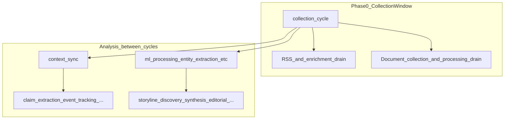

# Pipeline and order of operations

**Purpose:** Follow-along map of **what runs when** in the v8 **collect-then-analyze** design. For **data** semantics (what each stage means), read [DATA_FLOW_ARCHITECTURE.md](DATA_FLOW_ARCHITECTURE.md) and [SYSTEM_OVERVIEW.md](SYSTEM_OVERVIEW.md); extended product narrative (archived): [_archive/retired_root_docs_2026_03/PROJECT_OVERVIEW.md](_archive/retired_root_docs_2026_03/PROJECT_OVERVIEW.md).

**Source of truth in code:** [`api/services/automation_manager.py`](../api/services/automation_manager.py) — the `self.schedules` dict (task name → interval, `depends_on`, `phase`). Intervals and budgets are also influenced by `api/config/orchestrator_governance.yaml`.

---

## Big picture (v8)

- **`collection_cycle`** — Periodic window (often ~2h from config/env) that **loads new raw data** (RSS, enrichment backlog, documents, pending URLs). Downstream work generally assumes **new articles/contexts** appear after this.
- **Between cycles** — **Workload-driven** scheduling runs analysis phases when there is backlog; dependencies (`depends_on`) prevent running e.g. `claim_extraction` before `context_sync` has fed contexts.

---

## Conceptual phase groups

These **phase numbers** in `automation_manager` are **logical buckets** (not strictly sequential wall-clock order for every task):

| Group | Examples | Role |
|-------|-----------|------|
| **0** | `collection_cycle`, `document_processing` | Ingest new content and drain document backlog. |
| **1** | `context_sync`, `entity_profile_sync`, `entity_profile_build` | Bridge domain content into **`intelligence`** contexts and entity profiles. |
| **2–3** | `claim_extraction`, `claims_to_facts`, `event_tracking`, `pattern_recognition`, `cross_domain_synthesis`, … | Extract structured intelligence (claims, events, patterns). |
| **4–5** | `entity_extraction`, `ml_processing`, `topic_clustering`, `quality_scoring`, `sentiment_analysis` | Per-article ML and entity/topic enrichment on domain tables. |
| **6–9+** | `storyline_discovery`, `storyline_processing`, `rag_enhancement`, `event_extraction`, editorial generators, `data_cleanup`, … | Storylines, RAG, timeline events, editorial outputs, housekeeping. |

Exact **intervals** and **dependencies** change over time — always confirm in `schedules` in code.

---

## How to trace execution

1. **Find the task name** in the Monitor UI or `public.automation_run_history` (if enabled).
2. **Search** `automation_manager.py` for `_execute_<task_name>` or the task name in the scheduler loop.
3. **Follow imports** into `api/services/*` or `api/domains/*/services/*` for the implementation.

---

## Related docs

- **Per-phase ingestion logic (selection rules, inputs/outputs):** [PIPELINE_INGESTION_AND_PROCESS_METHODOLOGY.md](PIPELINE_INGESTION_AND_PROCESS_METHODOLOGY.md).
- Coordinator / health expectations (archived): [_archive/retired_root_docs_2026_03/ORCHESTRATION_REQUIREMENTS.md](_archive/retired_root_docs_2026_03/ORCHESTRATION_REQUIREMENTS.md).
- Last-24h operator narrative (archived): [_archive/retired_root_docs_2026_03/AUTOMATION_AND_LAST_24H_ACTIVITY.md](_archive/retired_root_docs_2026_03/AUTOMATION_AND_LAST_24H_ACTIVITY.md); scripts: `scripts/run_last_24h_report.sh`, `public.automation_run_history`.
- Timeline/event extraction gates (archived): [_archive/retired_root_docs_2026_03/EXTRACTED_EVENTS_AND_ENTITY_PIPELINE.md](_archive/retired_root_docs_2026_03/EXTRACTED_EVENTS_AND_ENTITY_PIPELINE.md).
