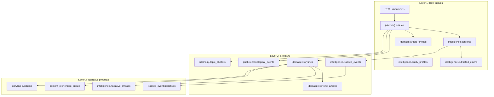
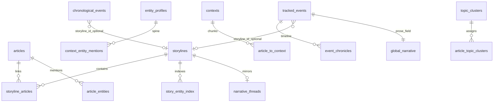
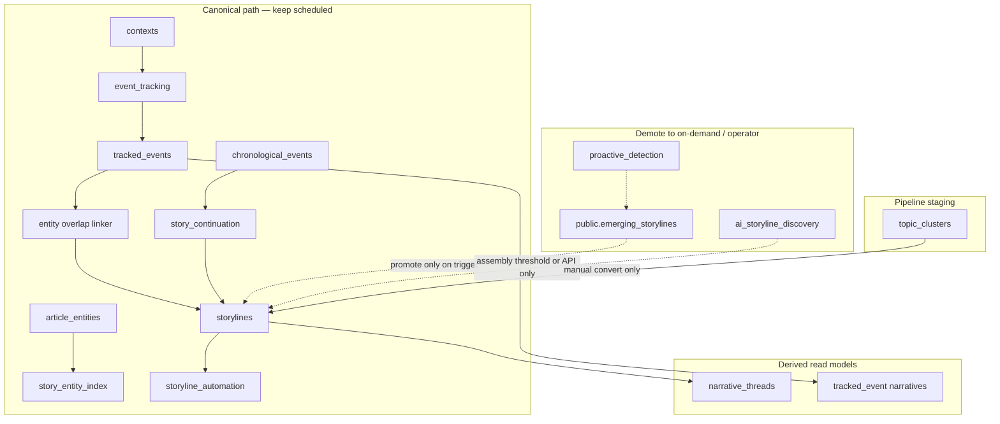

# Storyline canonical object model

> **Mental model (one sentence):** Articles and other atoms form **domain-kind proteins** (`story_kind`) via many loose **connection proposals**; stimuli (score, review, selective RAG) harden survivors into durable edges and storylines — not every domain is a political narrative cluster.

This document is the authoritative reference for Phase 2 simplification (June 2026) and the chemistry-style connection model (July 2026). See also [PIPELINE_AND_AUTOMATION.md](PIPELINE_AND_AUTOMATION.md), [GRAPH_EDGE_PROVENANCE.md](GRAPH_EDGE_PROVENANCE.md), and [VAULT_AUTOMATION_LOOP.md](VAULT_AUTOMATION_LOOP.md).

---

## Object roles

| Object | Canonical role | Scope | User-facing home |
|--------|----------------|-------|------------------|
| `{domain}.storylines` | **Domain-kind protein** — shape set by `story_kind` (event narrative, research topic, docket, …) | Per-domain silo | **Stories** shell |
| `intelligence.tracked_events` | **Investigative thread anchor** — multi-context real-world event | Cross-domain (`domain_keys[]`) | **Investigate** shell |
| `{domain}.topic_clusters` | **Pipeline staging cluster** — pre-storyline grouping | Per-domain | **Topics** (Corpus/Signals) |
| `public.chronological_events` | **Timeline atom** — per-article extracted event row | Global; domain via article | **Events** (subordinate to tracked_event) |
| `intelligence.narrative_threads` | **Derived prose lens** — mirror/synthesis from storylines | Global | **Investigate → Narrative Threads** |
| `public.emerging_storylines` | **Staging queue** for proactive promote | Global | Internal / Monitor only |
| `intelligence.graph_connection_proposals` | **Loose bonds** — hypothesized/candidate collisions | Global | Monitor / Connections |
| `intelligence.graph_connection_links` | **Solid edges** — established proteins | Global | Graph / Connections |
| `intelligence.rag_evidence_pull_queue` | **RAG stimulus tickets** — pull fuller source when a bond needs evidence | Global | Monitor (`stimulus_rag`) |

---

## Story kinds (`story_kind`)

Configured in `api/config/domain_synthesis_config.yaml` via `link_score_profile`:

| Domain | `story_kind` | What “fits” means |
|--------|--------------|-------------------|
| politics | `event_narrative` | Same actors/issue/time → predictive event links |
| finance | `market_regulatory_arc` | Instrument/issuer + catalyst |
| legal | `matter_docket` | Case/bill/agency identity |
| medicine | `evidence_thread` | Condition/intervention/finding lineage |
| artificial-intelligence | `research_topic` | Problem + method family + claim/benchmark |

Chemistry kinds (`research_topic`, `evidence_thread`, `matter_docket`) prefer **edge-first** behavior: softer membership, no aggressive storyline merge, optional event hard-bind.

### Connection inference stages

`hypothesized` → `candidate` → `established` | `quarantined` on proposals (and links when materialized). Phases: `collision_sampling`, `stimulus_rag`, `protein_harden`.

---

## Layer diagram



---

## Entity relationship (canonical)



---

## Scheduled path vs demoted paths



---

## Deprecation / demotion table

| Path / object | Verdict | Rationale |
|---------------|---------|-----------|
| `proactive_detection` + `emerging_storylines` | **Demote** — on-demand / outbreak trigger | Keyword clustering duplicates embedding discovery |
| `storyline_discovery` as standalone automation phase | **Removed** — only inside `storyline_assembly` | Assembly already runs discovery on threshold |
| `ai_storyline_discovery` | **On-demand + threshold** | Catch-up for unlinked articles, not a second always-on detector |
| `topic_clusters` auto → storyline | **Never** | Manual `convert_to_storyline` only |
| `chronological_events` as storyline driver | **Subordinate** | Atoms feed timelines; spine object is `tracked_events` |
| `narrative_thread_build` automation | **On-demand** | Build when user opens Narrative Threads or post-synthesis |
| `StorylineService.evolve_storyline_with_new_content` | **Implemented** | Delegates to `storyline_automation` article attach |
| Legacy `{domain}.topics` | **Read-only** | Superseded by `topic_clusters` |

---

## Automation schedule (target)

| Phase | Today | Target |
|-------|-------|--------|
| `proactive_detection` | Every 2h | **Disabled** in default `AUTOMATION_DISABLED_SCHEDULES`; API/on-demand only |
| `storyline_discovery` | Every 4h | **Removed** as standalone; only inside `storyline_assembly` |
| `storyline_assembly` | 30m + post-enrichment | **Keep** — sole scheduled bulk creator |
| `event_tracking` | Scheduled | **Keep** — primary spine signal |
| `story_continuation` | Per schema | **Keep** — chronological linker |
| `narrative_thread_build` | Every 2h | **On-demand** (UI build + post-synthesis) |

Recommended env (Widow prod):

```bash
AUTOMATION_DISABLED_SCHEDULES=...,proactive_detection,storyline_discovery,narrative_thread_build
STORYLINE_ASSEMBLY_RUN_PROACTIVE=false
```

Outbreak fast-path: `PROACTIVE_OUTBREAK_ONLY=true` enables proactive pass inside assembly only when keyword gate fires.

### Post-spine assembly (June 2026)

| Phase group | Verdict |
|-------------|---------|
| `link_indexer` (spine tail) | **Keep** — passive programmatic edges |
| `assembly_conductor` | **Keep** — ordered post-spine SQL steps |
| `editorial_room_loop` | **Keep** — vault editorial room (replaces batch narrative scanners) |
| `pattern_recognition`, `pattern_matching`, `relationship_extraction` | **Retired** — logic in link indexer + proposals |
| `storyline_synthesis`, `rag_enhancement`, `editorial_*`, `arc_report`, `digest` | **Retired** — vault until promotion |
| `investigation_report_refresh` | **Retired** — vault `20_Investigations/` + `GET /api/investigation/graph_neighbors` |

Core products unchanged: **storylines**, **tracked_events**, **entity dossiers**.

---

## UI ownership

| Shell section | Owns (write) | Owns (read) | Does **not** own |
|---------------|--------------|-------------|------------------|
| **Stories** | `storylines`, suggestions, synthesis triggers, membership review actions | `storyline_articles`, editorial fields | `tracked_events`, `topic_clusters` as products |
| **Investigate** | `tracked_events`, entity dossiers, hypotheses | `entity_profiles`, contexts | Creating storylines (link only) |
| **Narrative Threads** | Build/synthesize thread prose | `narrative_threads` | Detection — never creates clusters |
| **Topics** | Topic cluster CRUD | `article_topic_clusters` | Storylines except **Convert to storyline** |
| **Events** | — | `chronological_events` | Top-level product — fold into Investigate after reconciliation |

### Membership review vs suggestion review

| Concern | Suggestion review (`storyline_review_agent`) | Membership review (`storyline_membership_review`) |
|---------|-----------------------------------------------|---------------------------------------------------|
| Queue table | `public.storyline_article_suggestions` | `intelligence.storyline_membership_actions` |
| Question | Should this **new** article join? | Should this **existing** member stay / stay core? |
| Hard remove | N/A (reject suggestion) | Unlink via `storyline_articles` DELETE |
| Soft path | Reject / skip | Lower `relevance_score`; quarantine graph; demote SEI core; NULL weak tracked_event link |
| Feature flag | `STORYLINE_REVIEW_AGENT_ENABLED` (default on) | `STORYLINE_MEMBERSHIP_REVIEW_ENABLED` (default **off**) |

UI: Stories → Review Queue → **Suggestions** tab vs **Membership** tab.

### Self-reviewing graph (Postgres)

Link inference and drift review stay in Postgres (`graph_connection_proposals` / `_links`, `embedding_chunks`). See [GRAPH_EDGE_PROVENANCE.md](GRAPH_EDGE_PROVENANCE.md).

| Capability | Phase / flag |
|------------|--------------|
| Embedding-ranked candidates | `embedding_link_candidates` / `EMBEDDING_LINK_CANDIDATES_ENABLED` |
| Cross-domain associates | `link_indexer_cross_domain` + `associated_cross_domain` links |
| Membership LLM mid-band | `STORYLINE_MEMBERSHIP_LLM_ENABLED` |
| Drift re-score | `graph_link_drift_review` / `GRAPH_LINK_DRIFT_REVIEW_ENABLED` |

### Continuous desk assembler (vault + OWUI)

Long-form curated prose is **not** generated on demand by a batch synthesizer. Flow:

1. **Headless detective** (`editorial_room_loop`) drafts `25_Connections/` and optionally `20_Investigations/` (`EDITORIAL_ROOM_INVESTIGATION_ROUND_ENABLED`).
2. **Editor lens** tags notes (`needs_review` / `ready_to_promote`) — never writes Postgres long-form (`EDITORIAL_ROOM_EDITOR_LENS_ENABLED`).
3. **OWUI `news-investigator`** deepens vault notes (MCP) and **promotes** via `DESK_AGENT_WRITEBACK_ENABLED` into existing products:
   - `storylines.editorial_document` / `canonical_narrative`
   - `tracked_events.global_narrative` / `editorial_briefing` / `narrative_lenses`
   - graph proposal accept/reject
4. Audit row: `intelligence.saved_intel_outputs` (`content_type=desk_promotion`).

See [VAULT_AUTOMATION_LOOP.md](VAULT_AUTOMATION_LOOP.md).

---

## Event reconciliation (read-only v1)

Before merging `tracked_events` and `chronological_events`, use:

- **Service:** `api/services/event_reconciliation_service.py`
- **API:** `GET /api/event_reconciliation`

Rows expose `tracked_event_id`, `chronological_event_ids[]`, `storyline_refs[]`, `entity_overlap_score`, `confidence`, `linker_sources`.

---

## Review checklist (operator)

Confirm this matches how you use the product:

- [ ] **Stories** is where you manage domain clusters and synthesis — not investigative threads.
- [ ] **Investigate** is where you create/edit `tracked_events` and entity dossiers.
- [ ] **Narrative Threads** is a derived read/synthesis lens — not a detector.
- [ ] **Topics** are staging until you explicitly convert to a storyline.
- [ ] Scheduled creation should be **spine-first** (event_tracking + story_continuation + assembly threshold), not four parallel creators.

---

*Last updated: 2026-07-19 — membership review / decoupling documented.*
