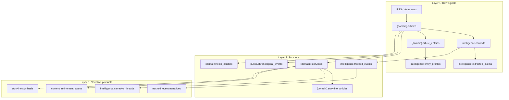
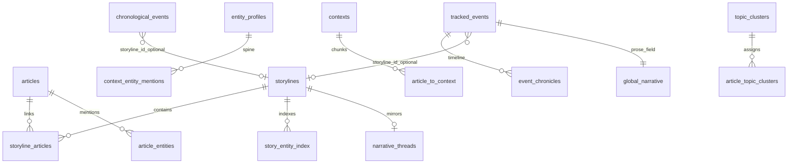
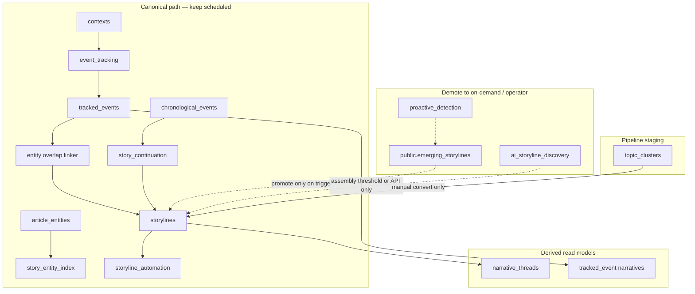

# Storyline canonical object model

> **Operator mental model (binding):** Timeline events → related-event chains → storylines → editorial packages. Prefer [ASSEMBLY_MODEL.md](ASSEMBLY_MODEL.md) for plain language. Chemistry / beaker / protein / atom / megathread wording below is **legacy**; map it via the retired-metaphors glossary in that doc. Code symbols may still use old names until a rename pass.

> **Historical one-liner (July 2026):** Articles and timeline events form domain-kind storylines (`story_kind`) via connection proposals that strengthen with evidence — not every domain is a political narrative cluster.

This document remains the object-role / table reference for Phase 2 simplification (June 2026). Prefer [ASSEMBLY_MODEL.md](ASSEMBLY_MODEL.md) for assembly intent. See also [PIPELINE_AND_AUTOMATION.md](PIPELINE_AND_AUTOMATION.md), [GRAPH_EDGE_PROVENANCE.md](GRAPH_EDGE_PROVENANCE.md), and [VAULT_AUTOMATION_LOOP.md](VAULT_AUTOMATION_LOOP.md).

---

## Object roles

| Object | Canonical role | Scope | User-facing home |
|--------|----------------|-------|------------------|
| `{domain}.storylines` | **Domain storyline** — shape set by `story_kind` (event narrative, research topic, docket, …) | Per-domain silo | **Stories** shell |
| `intelligence.tracked_events` | **Tracked event** — longer-lived follow object across sources/domains | Cross-domain (`domain_keys[]`) | **Investigate** shell |
| `{domain}.topic_clusters` | **Pipeline staging cluster** — pre-storyline grouping | Per-domain | **Topics** (Corpus/Signals) |
| `public.chronological_events` | **Timeline event** — dated extracted event on the main timeline | Global; domain via article | **Events** (reconciles with tracked_event) |
| `intelligence.narrative_threads` | **Derived prose lens** — mirror/synthesis from storylines | Global | **Investigate → Narrative Threads** |
| `public.emerging_storylines` | **Staging queue** for proactive promote | Global | Internal / Monitor only |
| `intelligence.graph_connection_proposals` | **Provisional / promising links** — matching support (`inference_stage`) | Global | Monitor / Connections |
| `intelligence.graph_connection_links` | **Established links** — durable graph edges | Global | Graph / Connections |
| `intelligence.rag_evidence_pull_queue` | **Evidence-pull tickets** — fuller source when a link needs text (legacy phase `stimulus_rag`) | Global | Monitor |

---

## Story kinds (`story_kind`)

Configured in `api/config/domain_synthesis_config.yaml` via `link_score_profile`:

| Domain | `story_kind` | What “fits” means |
|--------|--------------|-------------------|
| politics | `event_narrative` | Same actors/issue/time → predictive event links |
| finance | `market_regulatory_arc` | Instrument/issuer + catalyst |
| legal | `matter_docket` | Case/bill/agency identity |
| medicine | `evidence_thread` | Condition/intervention/finding lineage |
| artificial-intelligence | `research_topic` | Problem + method family + claim/benchmark |

**Foodborne / public-health outbreaks in politics RSS:** Guardian-style US politics feeds often carry CDC/FDA recall arcs (e.g. cyclospora / Taylor Farms lettuce). Those remain **`politics.event_narrative` storylines** — do not require moving articles into the medicine silo. Medicine `outbreak_keywords` / promote-on-pair tooling is complementary when the feed is medical; politics now has its own `storyline_development.narrative.outbreak_keywords` (cyclospora, lettuce recall, foodborne, …) plus `allow_promote_pair_on_outbreak: true`. Cross-domain Investigate anchors use `intelligence.tracked_events` (e.g. `storyline_id = politics:3716`), not cross-schema `storyline_articles`.

Automation attach under politics `aggressive_membership` must not glue disease-specific articles onto kitchen-sink mega-storylines: if an article’s distinctive subject entities (e.g. Cyclospora) do not overlap the target storyline’s entity fingerprint, silent auto-add is rejected (`StorylineAutomationService._subject_specificity_blocks_attach`).

Chemistry kinds (`research_topic`, `evidence_thread`, `matter_docket`) prefer **edge-first** behavior: softer membership, no aggressive storyline merge, optional event hard-bind.

**Member cap:** chemistry proteins refuse silent attach above `max_member_articles` (default **48**, YAML/`STORYLINE_CHEMISTRY_MEMBER_CAP`). Oversize evidence threads are pruned via core dissimilar drop even when `aggressive_membership: false`. See `api/shared/storyline_attach_caps.py`.

### Domain-shaped explain surfaces (do not conflate)

| Stack | Domains / kinds | Operator home | Do not |
|-------|-----------------|---------------|--------|
| **Linear arc chronicle** | politics `event_narrative`, finance `market_regulatory_arc`, curated arcs in `historical_arcs.yaml` | `/{domain}/arcs/:id/chronicle` | Call it a “spine”; force medicine/legal/AI into chapters |
| **Research subject ledger** | medicine `evidence_thread`, AI `research_topic` | Entity-rooted subject page + claim verdicts | Invent geopolitics-style curated arcs |
| **Matter docket ledger** | legal `matter_docket` | Case page + procedural rulings + `legal_status` | Use world-history arc chapters |

**Spine glossary (three meanings):**

| Term | Meaning |
|------|---------|
| **Intake spine** | Article preprocess: enrich → unified intake → SQL tail |
| **Identity spine** | Investigation FtM / Wikidata entity resolution |
| **Arc chronicle** | Linear longitudinal timeline for curated geopolitics/politics/finance frames (formerly “arc spine”) |

Bare “spine” is forbidden in operator UI unless prefixed.

### Connection inference stages

DB enum `hypothesized` → `candidate` → `established` | `quarantined` on proposals (and links when materialized). Operator language: provisional → promising → established / quarantined (see [ASSEMBLY_MODEL.md](ASSEMBLY_MODEL.md)). Legacy phases: `collision_sampling`, `stimulus_rag`, `protein_harden` — matching support only; do not expand as a chemistry product.

Timescales: hours = intake + matching/assembly → storylines; hours–days = link confidence strengthening; weeks–decades = arc chronicles (linear only) or research/docket ledgers.

---

## Layer diagram



---

## Entity relationship (canonical)



---

## Scheduled path vs demoted paths



---

## Deprecation / demotion table

| Path / object | Verdict | Rationale |
|---------------|---------|-----------|
| `proactive_detection` + `emerging_storylines` | **Demote** — on-demand / outbreak trigger | Keyword clustering duplicates embedding discovery |
| `storyline_discovery` as standalone automation phase | **Removed** — only inside `storyline_assembly` | Assembly already runs discovery on threshold |
| `ai_storyline_discovery` | **On-demand + threshold** | Catch-up for unlinked articles, not a second always-on detector |
| `topic_clusters` auto → storyline | **Never** | Manual `convert_to_storyline` only |
| `chronological_events` as storyline driver | **Subordinate** | Atoms feed timelines; spine object is `tracked_events` |
| `narrative_thread_build` automation | **On-demand** | Build when user opens Narrative Threads or post-synthesis |
| `StorylineService.evolve_storyline_with_new_content` | **Implemented** | Delegates to `storyline_automation` article attach |
| Legacy `{domain}.topics` | **Read-only** | Superseded by `topic_clusters` |

---

## Automation schedule (target)

| Phase | Today | Target |
|-------|-------|--------|
| `proactive_detection` | Every 2h | **Disabled** in default `AUTOMATION_DISABLED_SCHEDULES`; API/on-demand only |
| `storyline_discovery` | Every 4h | **Removed** as standalone; only inside `storyline_assembly` |
| `storyline_assembly` | 30m + post-enrichment | **Keep** — sole scheduled bulk creator |
| `event_tracking` | Scheduled | **Keep** — primary spine signal |
| `story_continuation` | Per schema | **Keep** — chronological linker |
| `narrative_thread_build` | Every 2h | **On-demand** (UI build + post-synthesis) |

Recommended env (Widow prod):

```bash
AUTOMATION_DISABLED_SCHEDULES=...,proactive_detection,storyline_discovery,narrative_thread_build
STORYLINE_ASSEMBLY_RUN_PROACTIVE=false
```

Outbreak fast-path: `PROACTIVE_OUTBREAK_ONLY=true` enables proactive pass inside assembly only when keyword gate fires.

### Post-spine assembly (June 2026)

| Phase group | Verdict |
|-------------|---------|
| `link_indexer` (spine tail) | **Keep** — passive programmatic edges |
| `assembly_conductor` | **Keep** — ordered post-spine SQL steps |
| `editorial_room_loop` | **Keep** — vault editorial room (replaces batch narrative scanners) |
| `pattern_recognition`, `pattern_matching`, `relationship_extraction` | **Retired** — logic in link indexer + proposals |
| `storyline_synthesis`, `rag_enhancement`, `editorial_*`, `arc_report`, `digest` | **Retired** — vault until promotion |
| `investigation_report_refresh` | **Retired** — vault `20_Investigations/` + `GET /api/investigation/graph_neighbors` |

Core products unchanged: **storylines**, **tracked_events**, **entity dossiers**.

---

## Event-core (accepted, 2026-07-24)

**Verdict:** The unit of connection must be **co-reference to a bounded real-world event**, not similarity-to-an-accumulating bag. Full review: [`docs/reviews/assembly_connection_pack/CONCEPTUAL_REVIEW.md`](reviews/assembly_connection_pack/CONCEPTUAL_REVIEW.md). Operator locks: [`OPERATOR_ANSWERS.md`](reviews/assembly_connection_pack/OPERATOR_ANSWERS.md).

| Concept | Rule |
|---------|------|
| Megathread identity | **`intelligence.tracked_events`** owns anchors, particulars, arc state |
| Domain storylines | **Facet projections** (clinical / regulatory / market / legal) — not the event boundary |
| Membership | Typed (`same_event`, `causal_link`, `same_instrument`, `actor_episode`) with named anchor + provenance; anonymous `related` is inadmissible for new event-core writes |
| Founding | Rare unowned distinctive anchor → mint TE **before** any mega absorb |
| Evidence surface | Membership is evidence; summaries select among typed members; RAG is background only |
| Flag | `EVENT_CORE_MEMBERSHIP_ENABLED` |

**Technical debt to collapse:** Article↔TE today often goes `article_to_context` → `event_chronicle_contexts`, while Stories membership is `{domain}.storyline_articles`. Event-core introduces `intelligence.event_article_membership` as TE-first evidence membership. Single soft `tracked_events.storyline_id` remains 1:1 legacy; multi-facet links use `intelligence.tracked_event_storyline_facets`.

**Invariants:** (I1) no anonymous membership; (I2) membership is evidence; (I3) absorb must not widen the match surface (no SEI merge on silent event-core attach); (I4) titles/summaries never feed attach; (I5) one event instance → one megathread.

Chemistry/graph bonds remain **non-arbitrating** for Stories evidence membership until a later reconcile phase.

---

## UI ownership

| Shell section | Owns (write) | Owns (read) | Does **not** own |
|---------------|--------------|-------------|------------------|
| **Stories** | `storylines`, suggestions, synthesis triggers, membership review actions | `storyline_articles`, editorial fields | `tracked_events`, `topic_clusters` as products |
| **Investigate** | `tracked_events`, entity dossiers, hypotheses | `entity_profiles`, contexts | Creating storylines (link only) |
| **Narrative Threads** | Build/synthesize thread prose | `narrative_threads` | Detection — never creates clusters |
| **Topics** | Topic cluster CRUD | `article_topic_clusters` | Storylines except **Convert to storyline** |
| **Events** | — | `chronological_events` | Top-level product — fold into Investigate after reconciliation |

### Membership review vs suggestion review

| Concern | Suggestion review (`storyline_review_agent`) | Membership review (`storyline_membership_review`) |
|---------|-----------------------------------------------|---------------------------------------------------|
| Queue table | `public.storyline_article_suggestions` | `intelligence.storyline_membership_actions` |
| Question | Should this **new** article join? | Should this **existing** member stay / stay core? |
| Hard remove | N/A (reject suggestion) | Unlink via `storyline_articles` DELETE |
| Soft path | Reject / skip | Lower `relevance_score`; quarantine graph; demote SEI core; NULL weak tracked_event link |
| Feature flag | `STORYLINE_REVIEW_AGENT_ENABLED` (default on) | `STORYLINE_MEMBERSHIP_REVIEW_ENABLED` (default **on**); mega auto-apply via `STORYLINE_MEMBERSHIP_MEGA_AUTO_APPLY` (default on) |

UI: Stories → Review Queue → **Suggestions** tab vs **Membership** tab.

### Self-reviewing graph (Postgres)

Link inference and drift review stay in Postgres (`graph_connection_proposals` / `_links`, `embedding_chunks`). See [GRAPH_EDGE_PROVENANCE.md](GRAPH_EDGE_PROVENANCE.md).

| Capability | Phase / flag |
|------------|--------------|
| Embedding-ranked candidates | `embedding_link_candidates` / `EMBEDDING_LINK_CANDIDATES_ENABLED` |
| Cross-domain associates | `link_indexer_cross_domain` + `associated_cross_domain` links |
| Membership LLM mid-band | `STORYLINE_MEMBERSHIP_LLM_ENABLED` |
| Drift re-score | `graph_link_drift_review` / `GRAPH_LINK_DRIFT_REVIEW_ENABLED` |

### Continuous desk assembler (vault + OWUI)

Long-form curated prose is **not** generated on demand by a batch synthesizer. Flow:

1. **Headless detective** (`editorial_room_loop`) drafts `25_Connections/` and optionally `20_Investigations/` (`EDITORIAL_ROOM_INVESTIGATION_ROUND_ENABLED`).
2. **Editor lens** tags notes (`needs_review` / `ready_to_promote`) — never writes Postgres long-form (`EDITORIAL_ROOM_EDITOR_LENS_ENABLED`).
3. **OWUI `news-investigator`** deepens vault notes (MCP) and **promotes** via `DESK_AGENT_WRITEBACK_ENABLED` into existing products:
   - `storylines.editorial_document` / `canonical_narrative`
   - `tracked_events.global_narrative` / `editorial_briefing` / `narrative_lenses`
   - graph proposal accept/reject
4. Audit row: `intelligence.saved_intel_outputs` (`content_type=desk_promotion`).

See [VAULT_AUTOMATION_LOOP.md](VAULT_AUTOMATION_LOOP.md).

---

## Event reconciliation (read-only v1)

Before merging `tracked_events` and `chronological_events`, use:

- **Service:** `api/services/event_reconciliation_service.py`
- **API:** `GET /api/event_reconciliation`

Rows expose `tracked_event_id`, `chronological_event_ids[]`, `storyline_refs[]`, `entity_overlap_score`, `confidence`, `linker_sources`.

---

## Review checklist (operator)

Confirm this matches how you use the product:

- [ ] **Stories** is where you manage domain clusters and synthesis — not investigative threads.
- [ ] **Investigate** is where you create/edit `tracked_events` and entity dossiers.
- [ ] **Narrative Threads** is a derived read/synthesis lens — not a detector.
- [ ] **Topics** are staging until you explicitly convert to a storyline.
- [ ] Scheduled creation should be **spine-first** (event_tracking + story_continuation + assembly threshold), not four parallel creators.

---

*Last updated: 2026-07-22 — membership review default ON (aligned with code / features.yaml).*
