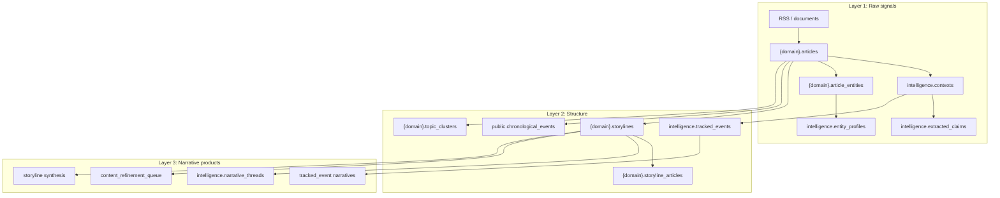
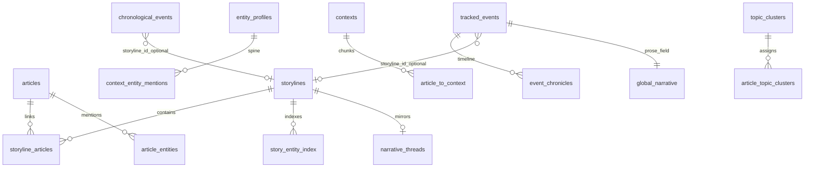
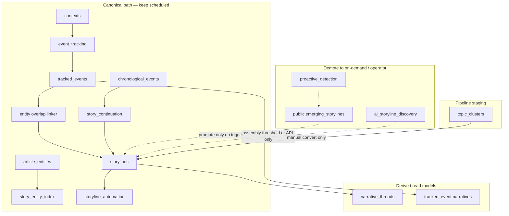

# Storyline canonical object model

> **Mental model (one sentence):** Articles cluster into domain **storylines**; entities index those clusters; **tracked events** and **chronological events** attach back via entity overlap; **narrative threads** and synthesis describe what already exists — they do not decide what to track.

This document is the authoritative reference for Phase 2 simplification (June 2026). See also [PIPELINE_AND_AUTOMATION.md](PIPELINE_AND_AUTOMATION.md) and [VAULT_AUTOMATION_LOOP.md](VAULT_AUTOMATION_LOOP.md).

---

## Object roles

| Object | Canonical role | Scope | User-facing home |
|--------|----------------|-------|------------------|
| `{domain}.storylines` | **Domain narrative cluster** — evolving bundle of articles + synthesis | Per-domain silo | **Stories** shell |
| `intelligence.tracked_events` | **Investigative thread anchor** — multi-context real-world event | Cross-domain (`domain_keys[]`) | **Investigate** shell |
| `{domain}.topic_clusters` | **Pipeline staging cluster** — pre-storyline grouping | Per-domain | **Topics** (Corpus/Signals) |
| `public.chronological_events` | **Timeline atom** — per-article extracted event row | Global; domain via article | **Events** (subordinate to tracked_event) |
| `intelligence.narrative_threads` | **Derived prose lens** — mirror/synthesis from storylines | Global | **Investigate → Narrative Threads** |
| `public.emerging_storylines` | **Staging queue** for proactive promote | Global | Internal / Monitor only |

---

## Layer diagram



---

## Entity relationship (canonical)



---

## Scheduled path vs demoted paths



---

## Deprecation / demotion table

| Path / object | Verdict | Rationale |
|---------------|---------|-----------|
| `proactive_detection` + `emerging_storylines` | **Demote** — on-demand / outbreak trigger | Keyword clustering duplicates embedding discovery |
| `storyline_discovery` as standalone automation phase | **Removed** — only inside `storyline_assembly` | Assembly already runs discovery on threshold |
| `ai_storyline_discovery` | **On-demand + threshold** | Catch-up for unlinked articles, not a second always-on detector |
| `topic_clusters` auto → storyline | **Never** | Manual `convert_to_storyline` only |
| `chronological_events` as storyline driver | **Subordinate** | Atoms feed timelines; spine object is `tracked_events` |
| `narrative_thread_build` automation | **On-demand** | Build when user opens Narrative Threads or post-synthesis |
| `StorylineService.evolve_storyline_with_new_content` | **Implemented** | Delegates to `storyline_automation` article attach |
| Legacy `{domain}.topics` | **Read-only** | Superseded by `topic_clusters` |

---

## Automation schedule (target)

| Phase | Today | Target |
|-------|-------|--------|
| `proactive_detection` | Every 2h | **Disabled** in default `AUTOMATION_DISABLED_SCHEDULES`; API/on-demand only |
| `storyline_discovery` | Every 4h | **Removed** as standalone; only inside `storyline_assembly` |
| `storyline_assembly` | 30m + post-enrichment | **Keep** — sole scheduled bulk creator |
| `event_tracking` | Scheduled | **Keep** — primary spine signal |
| `story_continuation` | Per schema | **Keep** — chronological linker |
| `narrative_thread_build` | Every 2h | **On-demand** (UI build + post-synthesis) |

Recommended env (Widow prod):

```bash
AUTOMATION_DISABLED_SCHEDULES=...,proactive_detection,storyline_discovery,narrative_thread_build
STORYLINE_ASSEMBLY_RUN_PROACTIVE=false
```

Outbreak fast-path: `PROACTIVE_OUTBREAK_ONLY=true` enables proactive pass inside assembly only when keyword gate fires.

### Post-spine assembly (June 2026)

| Phase group | Verdict |
|-------------|---------|
| `link_indexer` (spine tail) | **Keep** — passive programmatic edges |
| `assembly_conductor` | **Keep** — ordered post-spine SQL steps |
| `editorial_room_loop` | **Keep** — vault editorial room (replaces batch narrative scanners) |
| `pattern_recognition`, `pattern_matching`, `relationship_extraction` | **Retired** — logic in link indexer + proposals |
| `storyline_synthesis`, `rag_enhancement`, `editorial_*`, `arc_report`, `digest` | **Retired** — vault until promotion |
| `investigation_report_refresh` | **Retired** — vault `20_Investigations/` + `GET /api/investigation/graph_neighbors` |

Core products unchanged: **storylines**, **tracked_events**, **entity dossiers**.

---

## UI ownership

| Shell section | Owns (write) | Owns (read) | Does **not** own |
|---------------|--------------|-------------|------------------|
| **Stories** | `storylines`, suggestions, synthesis triggers | `storyline_articles`, editorial fields | `tracked_events`, `topic_clusters` as products |
| **Investigate** | `tracked_events`, entity dossiers, hypotheses | `entity_profiles`, contexts | Creating storylines (link only) |
| **Narrative Threads** | Build/synthesize thread prose | `narrative_threads` | Detection — never creates clusters |
| **Topics** | Topic cluster CRUD | `article_topic_clusters` | Storylines except **Convert to storyline** |
| **Events** | — | `chronological_events` | Top-level product — fold into Investigate after reconciliation |

---

## Event reconciliation (read-only v1)

Before merging `tracked_events` and `chronological_events`, use:

- **Service:** `api/services/event_reconciliation_service.py`
- **API:** `GET /api/event_reconciliation`

Rows expose `tracked_event_id`, `chronological_event_ids[]`, `storyline_refs[]`, `entity_overlap_score`, `confidence`, `linker_sources`.

---

## Review checklist (operator)

Confirm this matches how you use the product:

- [ ] **Stories** is where you manage domain clusters and synthesis — not investigative threads.
- [ ] **Investigate** is where you create/edit `tracked_events` and entity dossiers.
- [ ] **Narrative Threads** is a derived read/synthesis lens — not a detector.
- [ ] **Topics** are staging until you explicitly convert to a storyline.
- [ ] Scheduled creation should be **spine-first** (event_tracking + story_continuation + assembly threshold), not four parallel creators.

---

*Last updated: 2026-06-28 — Phase 2 implementation.*
