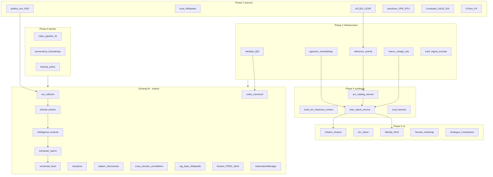
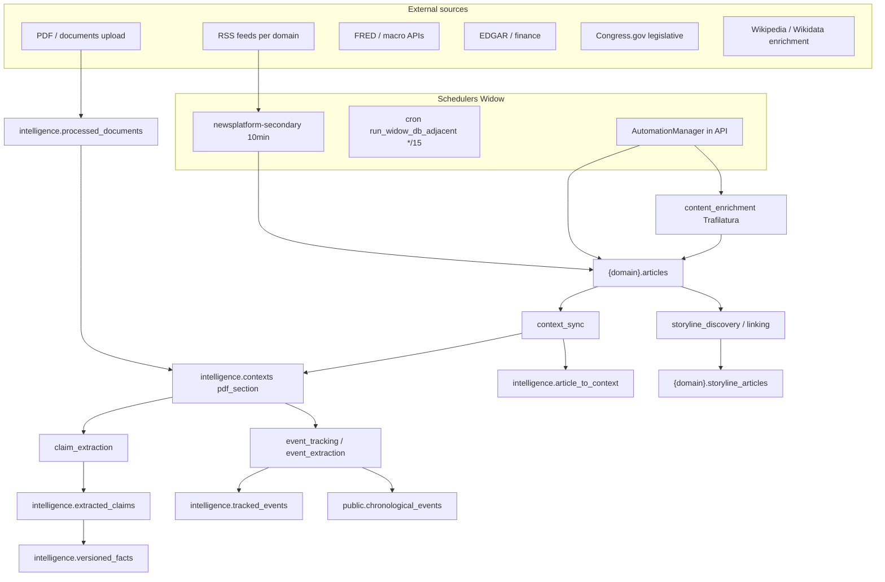
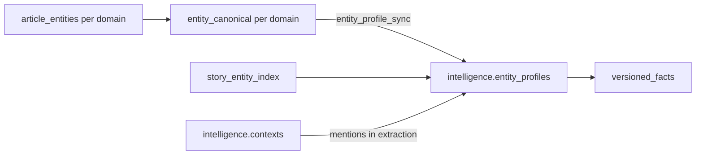
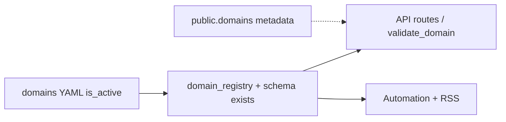

This file is a merged representation of a subset of the codebase, containing specifically included files and files not matching ignore patterns, combined into a single document by Repomix.
The content has been processed where line numbers have been added, content has been compressed (code blocks are separated by ⋮---- delimiter).

# File Summary

## Purpose
This file contains a packed representation of a subset of the repository's contents that is considered the most important context.
It is designed to be easily consumable by AI systems for analysis, code review,
or other automated processes.

## File Format
The content is organized as follows:
1. This summary section
2. Repository information
3. Directory structure
4. Repository files (if enabled)
5. Multiple file entries, each consisting of:
  a. A header with the file path (## File: path/to/file)
  b. The full contents of the file in a code block

## Usage Guidelines
- This file should be treated as read-only. Any changes should be made to the
  original repository files, not this packed version.
- When processing this file, use the file path to distinguish
  between different files in the repository.
- Be aware that this file may contain sensitive information. Handle it with
  the same level of security as you would the original repository.
- Pay special attention to the Repository Description. These contain important context and guidelines specific to this project.

## Notes
- Some files may have been excluded based on .gitignore rules and Repomix's configuration
- Binary files are not included in this packed representation. Please refer to the Repository Structure section for a complete list of file paths, including binary files
- Only files matching these patterns are included: **/*.py, **/*.ts, **/*.tsx, **/*.mts, **/*.jsx, **/*.js, **/*.css, **/*.yaml, **/*.yml, **/*.toml, **/*.sh, **/*.sql, **/Dockerfile, docker-compose*.yml, requirements*.txt, pyproject.toml, package.json, README.md, AGENTS.md, PROJECT_STATUS.md, docs/**/*.md
- Files matching these patterns are excluded: docs/archive/**, docs/_archive/**, diagnostics/**, scripts/archive/**, scripts/ni_review/**, api/database/migrations/archive/**, **/__pycache__/**, **/.venv/**, **/venv/**, **/node_modules/**, **/dist/**, **/build/**, backups/**, logs/**, chroma_data/**, data/**, archive/**, web/_archived_duplicates/**, *.jsonl, *.log, *.bak*, .env*, repomix-output.*
- Files matching patterns in .gitignore are excluded
- Files matching default ignore patterns are excluded
- Line numbers have been added to the beginning of each line
- Content has been compressed - code blocks are separated by ⋮---- delimiter
- Files are sorted by Git change count (files with more changes are at the bottom)

# User Provided Header
News Intelligence — Repomix bundle from Widow production source (/opt/news-intelligence on 192.168.93.101). Generated for AI context; excludes secrets, venv, node_modules, logs, and backups.

# Directory Structure
```
.continue/
  mcpServers/
    filesystem.yaml
    git.yaml
    homelab-mcp-stack.yaml
  config.yaml
.cursor/
  ai-workflow.js
api/
  archive/
    legacy_api/
      legacy_global_api.py
  collectors/
    enhanced_rss_collector.py
    rss_collector.py
  config/
    domains/
      specs/
        generated/
          environment-climate.synthesis.stub.yaml
          politics.synthesis.stub.yaml
      _template.example.yaml
      artificial-intelligence.yaml
      finance.yaml
      legal.yaml
      medicine.yaml
      politics.yaml
    __init__.py
    briefing_filters.yaml
    commodity_map_overlays.yaml
    commodity_registry.yaml
    content_quality_config.py
    context_centric_config.py
    context_centric.yaml
    database.py
    domain_synthesis_config.yaml
    finance_schedule.yaml
    government_sources.yaml
    historical_arcs.yaml
    import_standards.py
    logging_config.py
    monitoring_devices.yaml
    newsroom.yaml
    nri_resolution_config.py
    orchestrator_governance.py
    orchestrator_governance.yaml
    paths.py
    reference_events_seed.yaml
    seed_world_entities.yaml
    settings.py
    sources.yaml
  database/
    init/
      01_schema.sql
    init.sql/
      20250909_151521_unified_schema_v3_1_0.sql
    migrations/
      176_applied_migrations_ledger.sql
      177_domain_articles_timeline_and_entities.sql
      178_domain_articles_timeline_events_generated.sql
      179_story_entity_index_per_domain.sql
      180_legal_domain_silo.sql
      181_content_refinement_queue_and_storyline_narratives.sql
      182_add_domain_foreign_keys_skip_missing_topic_learning.sql
      183_chronological_events_temporal_status.sql
      184_processed_documents_file_provenance.sql
      185_storylines_master_summary.sql
      186_tracked_events_domain_keys_gin.sql
      187_medicine_domain_silo.sql
      188_artificial_intelligence_domain_silo.sql
      189_pg_trgm_claim_resolution.sql
      190_ml_processing_queue_schema_name.sql
      191_ml_processing_queue_table.sql
      192_rss_feed_url_refresh_reviewed.sql
      193_article_topic_clusters_optional_domains.sql
      194_domain_articles_timeline_pending_partial_index.sql
      195_storylines_timeline_summary.sql
      196_tracked_event_narrative_lenses.sql
      197_legislative_references.sql
      198_claim_subject_gap_catalog.sql
      199_entity_family_type.sql
      200_story_entity_index_family_type.sql
      201_politics2_finance2_domain_silos.sql
      202_rss_feed_url_corrections_mar2026.sql
      203_rss_feeds_deactivate_bad_urls_all_schemas.sql
      204_rss_deactivate_politics2_dead_feeds.sql
      205_rss_cbc_url_update_politics2.sql
      206_add_rss_caught_up_flags.sql
      206_finance_2_legacy_silo_extensions.sql
      207_article_duplicate_sources.sql
      208_article_topic_clusters_politics2_finance2.sql
      209_gpu_metric_samples.sql
      210_retire_legacy_domain_keys.sql
      211_rename_template_domain_keys_to_politics_finance.sql
      212_drop_science_tech_schema.sql
      213_topic_clustering_pass_backfill.sql
      214_pipeline_pass_backfill.sql
      215_graph_connection_proposals.sql
      216_graph_connection_links.sql
      217_public_web_auth_user_profiles_roles.sql
      218_storyline_historical_indexes.sql
      219_consolidate_politics_finance_schemas.sql
      221_provenance_timestamps.sql
      222_longitudinal_reference_layer.sql
      223_pgvector_embedding_chunks.sql
      224_arc_operator_feedback.sql
      225_longitudinal_schema_alignment.sql
      226_entity_canonical_wikidata_all_schemas.sql
      227_drop_politics_finance_2_stubs.sql
      228_entity_table_id_sequences.sql
      229_entity_extraction_aux_tables.sql
      230_pipeline_alerts.sql
      231_storylines_material_updated_at.sql
      232_storyline_article_suggestions_domain_key.sql
      233_enrichment_backlog_partial_indexes.sql
      234_saved_intel_outputs.sql
      235_pipeline_phase_heartbeats.sql
      236_topic_extraction_queue_all_domains.sql
    scripts/
      flush_storylines_and_topics.sql
    __init__.py
  domains/
    content_analysis/
      routes/
        __init__.py
        article_deduplication.py
        content_analysis.py
        deduplication_api.py
        llm_activity_monitoring.py
        topic_management.py
        topic_queue_management.py
      services/
        __init__.py
        advanced_topic_extractor.py
        llm_activity_tracker.py
        llm_topic_extractor.py
        topic_clustering_service.py
        topic_extraction_queue_worker.py
        topic_filter_rules.py
        topic_intelligence_service.py
        topic_merge_suggestions.py
    finance/
      data_sources/
        __init__.py
        base.py
        edgar.py
        fred_commodity.py
        fred.py
        metals_dev.py
      gold_sources/
        __init__.py
        fred_gold.py
        freegoldapi.py
      routes/
        __init__.py
        finance.py
      __init__.py
      commodity_fetcher.py
      commodity_registry.py
      commodity_store.py
      embedding.py
      evidence_collector.py
      gold_amalgamator.py
      history_staleness.py
      llm.py
      news_orchestrator.py
      orchestrator_logger.py
      orchestrator_types.py
      orchestrator_utils.py
      orchestrator.py
      stats.py
    intelligence_hub/
      routes/
        __init__.py
        content_synthesis.py
        context_centric.py
        cross_domain.py
        enrichment.py
        intelligence_analysis.py
        intelligence_hub.py
        longitudinal.py
        products.py
        quality.py
        rag_queries.py
        report.py
      __init__.py
    news_aggregation/
      routes/
        __init__.py
        news_aggregation.py
        rss_duplicate_management.py
      services/
        article_service.py
    politics/
      routes/
        __init__.py
        official.py
      __init__.py
    public_auth/
      routes/
        __init__.py
        auth.py
      __init__.py
    storyline_management/
      routes/
        __init__.py
        storyline_analysis.py
        storyline_articles.py
        storyline_assembly.py
        storyline_automation_bulk.py
        storyline_automation.py
        storyline_consolidation.py
        storyline_crud.py
        storyline_discovery.py
        storyline_evolution.py
        storyline_helpers.py
        storyline_management.py
        storyline_timeline.py
        storyline_watchlist.py
      schemas/
        __init__.py
        storyline_schemas.py
      services/
        content_extraction_service.py
        proactive_detection_service.py
        quality_assessment_service.py
        rag_analysis_service.py
        storyline_service.py
    system_monitoring/
      routes/
        __init__.py
        diagnostics_events.py
        ml_monitoring.py
        orchestrator.py
        processing_progress.py
        realtime.py
        resource_dashboard.py
        route_supervisor.py
        sql_explorer.py
        system_monitoring.py
      __init__.py
    user_management/
      routes/
        __init__.py
        user_management.py
      __init__.py
    __init__.py
  middleware/
    __init__.py
    error_handling.py
    logging.py
    metrics.py
    security.py
  modules/
    deduplication/
      __init__.py
      advanced_deduplication_service.py
    ml/
      __init__.py
      advanced_clustering.py
      background_processor.py
      content_analyzer.py
      daily_briefing_service.py
      entity_extractor.py
      gdelt_rag_service.py
      iterative_rag_service.py
      local_monitoring.py
      ml_pipeline_queue.py
      ml_pipeline.py
      ml_queue_manager.py
      ml_rag_service.py
      quality_scorer.py
      rag_external_services.py
      readability_analyzer.py
      sentiment_analyzer.py
      storyline_tracker.py
      summarization_service.py
      timeline_generator.py
      trend_analyzer.py
    __init__.py
  schemas/
    api_documentation.py
    generated_models.py
    response_schemas.py
    robust_schemas.py
  scripts/
    sql/
      reset_pdf_parser_failed_documents.sql
    utilities/
      create_clusters.py
      manage_ingestion.py
      manage_intelligence_database.py
      manage_intelligence.py
      populate_db.py
      process_articles.py
      scheduler.py
    add_official_feeds_via_api.sh
    add_official_feeds.py
    analyze_automation_failures.py
    analyze_existing_articles.py
    article_deduplication.py
    audit_api_route_alignment.py
    audit_nri_bridge_qa.py
    audit_politics_finance_schemas.py
    automated_cleanup.py
    automated_collection.py
    backfill_editorial_ledes.py
    backfill_embedding_chunks.py
    backfill_story_entity_index.py
    backfill_tracked_events_finance_domain_keys.py
    backfill_wikidata_qids.py
    bootstrap_domain_storylines.py
    bulk_catchup_status.py
    bulk_catchup.py
    catchup_entity_profiles_claim_resolution.py
    catchup_stale_fact_change_log.py
    check_database_schema.sh
    check_domain_suffix_cruft.py
    check_entity_extraction_pipeline.py
    check_rss_feed_http_status.py
    claim_subject_gap_bulk_ignore.py
    copy_domain_silo_table_data.py
    daily_batch_processor.py
    delete_stuck_entity_extraction_articles.py
    diagnose_claim_extraction_backlog.py
    diagnose_db_legacy_data.py
    diagnose_pipeline_pathways.py
    disconnect_v3_tables.py
    ensure_domain_silo_alignment.py
    finance_storyline_dedup.py
    fix_database_config.py
    fix_imports.py
    flush_entity_extraction_retries.py
    force_rss_collection.py
    generate_domain_artifacts.py
    import_domain_yaml_to_spec.py
    init_domain_spec.py
    init_domain_yaml_from_template.py
    load_longitudinal_seeds.py
    migration_ledger_report.py
    ml_worker.py
    optimized_ml_worker.py
    process_articles.py
    provision_domain.py
    prune_articles_failing_ingest_filters.py
    prune_blank_spine_chronological_events.py
    reconcile_false_pass_markers.py
    register_applied_migration.py
    remove_corrupted_platinum_research_topics.py
    remove_test_feeds.py
    repair_duplicate_mega_storylines.py
    report_context_claim_pipeline_backlog.py
    report_metadata_enrichment_status.py
    requeue_claim_extraction_pass_markers.py
    reset_pdf_parser_failed_documents.py
    restcountries_seed.py
    rss_duplicate_detector.py
    run_arc_report_eval.py
    run_collection.sh
    run_diagnostics_collect.py
    run_entity_extraction_catchup.py
    run_migration_138.py
    run_migration_139.py
    run_migration_140_141.py
    run_migration_142_143_144.py
    run_migration_145.py
    run_migration_146.py
    run_migration_148.py
    run_migration_149.py
    run_migration_155.py
    run_migration_156.py
    run_migration_157.py
    run_migration_158.py
    run_migration_166.py
    run_migration_167.py
    run_migration_168.py
    run_migration_169.py
    run_migration_170.py
    run_migration_171.py
    run_migration_172.py
    run_migration_173.py
    run_migration_174.py
    run_migration_175.py
    run_migration_176.py
    run_migration_177.py
    run_migration_178.py
    run_migration_179.py
    run_migration_180.py
    run_migration_181.py
    run_migration_182.py
    run_migration_183.py
    run_migration_184.py
    run_migration_185.py
    run_migration_188.py
    run_migration_189.py
    run_migration_190.py
    run_migration_191.py
    run_migration_192.py
    run_migration_193.py
    run_migration_195.py
    run_migration_198.py
    run_migration_199.py
    run_migration_200.py
    run_migration_201.py
    run_migration_202.py
    run_migration_203.py
    run_migration_204.py
    run_migration_205.py
    run_migration_206.py
    run_migration_207.py
    run_migration_217.py
    run_migration_219.py
    run_migration_221.py
    run_migration_222.py
    run_migration_223.py
    run_migration_224.py
    run_migration_225.py
    run_migration_226.py
    run_migration_227.py
    run_migration_228.py
    run_migration_229.py
    run_migration.py
    run_migrations_140_to_152.py
    run_migrations_155_to_160.py
    run_migrations_161_164_165_167.py
    run_migrations_161_164_165_only.py
    run_reset_pdf_docs_psql.sh
    run_rss_and_process_all.py
    run_storyline_discovery_catchup.py
    run_widow_db_adjacent.py
    second_pass_frequent_subjects.py
    seed_domain_rss_from_yaml.py
    seed_entities_from_csv.py
    seed_public_web_auth_users.py
    seed_world_entities_from_yaml.py
    setup_v4_0_database.sh
    setup_v4_database.sh
    switch_domain_rss_ingest.py
    system_monitor.py
    test_entity_extraction.py
    test_orchestrator_api.py
    tidy_public_legacy_tables.py
    v4_api_column_fix.py
    validate_architecture.py
    validate_domain_spec.py
    validate_pipeline_rss_alignment.py
    validate_sources_yaml.py
    verify_arc_point_in_time.py
    verify_domain_provision.py
    verify_domain_schema_resolution.py
    verify_domain_spec_parity.py
    verify_domain_storyline_config.py
    verify_dual_lane_catchup.py
    verify_longitudinal_schema.py
    verify_migrations_160_167.py
    verify_storyline_historical_context.py
    wikidata_sparql_seed.py
  services/
    rag/
      __init__.py
      base.py
      domain.py
      generation.py
      retrieval.py
    rss/
      __init__.py
      base.py
      fetching.py
      processing.py
    __init__.py
    acled_client.py
    activity_feed_service.py
    advanced_monitoring_service.py
    ai_processing_service.py
    ai_storyline_discovery.py
    alfred_client.py
    api_usage_monitor.py
    arc_analogue_service.py
    arc_catalog_service.py
    arc_feedback_service.py
    arc_historical_context_service.py
    article_content_enrichment_service.py
    article_duplicate_source_service.py
    article_entity_extraction_service.py
    article_processing_service.py
    automation_manager.py
    backlog_metrics.py
    backlog_trend_service.py
    bias_detection_service.py
    briefing_filter_helper.py
    chronological_timeline_service.py
    circuit_breaker_service.py
    citation_marker_service.py
    claim_extraction_service.py
    claim_subject_gap_service.py
    collection_governor.py
    commodity_event_bridge.py
    consolidation_scheduler.py
    content_feedback_service.py
    content_quality_service.py
    content_refinement_queue_service.py
    content_synthesis_service.py
    content_validation_service.py
    context_bundle_service.py
    context_grouping_feedback_service.py
    context_processor_service.py
    cross_domain_service.py
    deduplication_api_service.py
    deduplication_integration_service.py
    deep_content_synthesis.py
    diagnostics_event_collector_service.py
    digest_automation_service.py
    distributed_cache_service.py
    document_acquisition_service.py
    document_collector_service.py
    document_download_service.py
    document_pipeline_metrics.py
    document_processing_service.py
    domain_knowledge_service.py
    domain_synthesis_config.py
    dossier_compiler_service.py
    dynamic_resource_service.py
    early_quality_service.py
    editorial_document_service.py
    embeddings_worker_service.py
    enhancement_orchestrator_service.py
    entity_cleanup_service.py
    entity_enrichment_service.py
    entity_knowledge_connector.py
    entity_organizer_service.py
    entity_position_tracker_service.py
    entity_profile_builder_service.py
    entity_profile_sync_service.py
    entity_relational_expansion_service.py
    entity_resolution_service.py
    entity_seed_catalog_service.py
    event_chronicle_builder_service.py
    event_coherence_reviewer.py
    event_deduplication_service.py
    event_extraction_service.py
    event_tracking_service.py
    expert_analysis_service.py
    extracted_claims_dedupe_service.py
    fact_verification_service.py
    gpr_epu_import_service.py
    graph_connection_processor_service.py
    graph_connection_queue_service.py
    health_monitor_orchestrator.py
    historic_context_orchestrator.py
    historic_context_sources.py
    historical_context_service.py
    impact_assessment_service.py
    intelligence_analysis_service.py
    intelligence_cleanup_controller.py
    investigation_consolidation_service.py
    investigation_report_service.py
    learning_governor.py
    legislative_reference_service.py
    log_storage_service.py
    macro_series_service.py
    maintenance_monitor.py
    metadata_enrichment_service.py
    ml_processing_service.py
    ml_summarization_service.py
    multi_perspective_analyzer.py
    narrative_synthesis_service.py
    narrative_thread_service.py
    nightly_ingest_window_service.py
    nightly_phase_idle.py
    nlp_classifier_service.py
    nri_bridge_qa_service.py
    nri_entity_claims_service.py
    nri_integration_service.py
    orchestrator_coordinator.py
    orchestrator_state.py
    pattern_entity_extractor.py
    pattern_recognition_service.py
    pipeline_deduplication_service.py
    pipeline_logger.py
    pipeline_monitoring_service.py
    pipeline_phase_heartbeat_service.py
    pipeline_schedule_service.py
    predictive_analysis_service.py
    predictive_scaling_service.py
    processing_governor.py
    quality_assessment_service.py
    quality_feedback_service.py
    quality_monitoring_service.py
    realtime_urgent_service.py
    reference_event_curation_service.py
    reference_events_loader.py
    relationship_extraction_service.py
    resource_governor.py
    sanctions_ingest_service.py
    saved_intel_service.py
    shared_extraction_service.py
    slow_report_service.py
    smart_cache_service.py
    startup_readiness.py
    story_continuation_service.py
    story_state_service.py
    story_state_trigger_service.py
    story_timeline_service.py
    storyline_assembly_service.py
    storyline_automation_service.py
    storyline_coherence_guardrails.py
    storyline_consolidation_service.py
    storyline_historical_context_service.py
    storyline_narrative_finisher_service.py
    temporal_nlp_service.py
    temporal_parser.py
    timeline_builder_service.py
    topic_clustering_service.py
    tracked_event_narrative_service.py
    trade_resources_import_service.py
    trend_predictions_service.py
    ucdp_client.py
    user_guidance_service.py
    vdem_freedomhouse_import_service.py
    versioned_facts_lifecycle_service.py
    watch_pattern_service.py
    watchlist_service.py
    wikidata_review_service.py
    wikipedia_knowledge_service.py
    workload_balancer.py
  shared/
    auth/
      __init__.py
      public_web_dependencies.py
    database/
      __init__.py
      connection.py
      db_availability.py
      health_check.py
      pending_db_writes.py
      storyline_merger.py
    llm/
      __init__.py
      resource_manager.py
    logging/
      __init__.py
      activity_logger.py
      decision_logger.py
      llm_logger.py
      trace_logger.py
    middleware/
      __init__.py
      demo_readonly.py
      public_web_auth.py
    services/
      __init__.py
      api_request_tracker.py
      automation_run_history_writer.py
      congress_gov_client.py
      domain_aware_service.py
      domain_rss_seed.py
      domain_silo_post_migration.py
      llm_service.py
      optional_llm_redis_cache.py
      pipeline_trace_writer.py
      public_web_auth_service.py
      response_cache.py
      route_supervisor.py
      source_credibility_service.py
      spacy_ner_service.py
    __init__.py
    article_processing_gates.py
    bulk_catchup_llm_routing.py
    bulk_catchup_pause.py
    constants.py
    data_result.py
    domain_onboarding_estimates.py
    domain_registry_constants.py
    domain_registry.py
    domain_silo_contract.py
    domain_spec.py
    entity_identity.py
    gpu_metrics.py
    llm_text_sanitize.py
    migration_sql_paths.py
    migration_sql_runner.py
    pipeline_article_selection.py
    pipeline_pass_marker.py
  utils/
    module_reloader.py
    text_formatter.py
    timeout_utils.py
  main.py
  start_dev_api.py
  start_prod_api.py
configs/
  doc_obfuscation.example.yaml
docs/
  generated/
    INTELLIGENCE_PHASES_PRODUCTIVITY_REPORT.md
    PIPELINE_DB_ALIGNMENT_REPORT.md
    README.md
    STORYLINE_EVENT_ENTITY_CHAINS_REPORT.md
  pipeline_repair/
    ROOT_CAUSE_REPORT.md
  vault/
    10_Runbooks/
      06-longitudinal-phase-progress.md
    20_Projects/
      news-intelligence-longitudinal-execution.md
      news-intelligence.md
    30_Decisions/
      2026-06-06-ni-widow-migration-complete.md
      2026-06-06-public-https-caddy-routing.md
    40_Reference/
      news-intelligence-chronological-doctrine.md
      project-boundaries-ni-homelab.md
      secrets-and-settings-index.md
    README.md
  API_REFERENCE.md
  API_TESTING_GUIDE.md
  ARCHITECTURE_AND_OPERATIONS.md
  CHRONOLOGICAL_ACCURACY_DOCTRINE.md
  CLAIMS_TO_FACTS_ENTITY_RESOLUTION.md
  CODE_REVIEW_AND_RUN_CAVEATS.md
  CODEBASE_MAP.md
  CODING_STYLE_GUIDE.md
  DATABASE_BACKUP.md
  DATABASE.md
  DB_PRODUCTION_MAINTENANCE_RUNBOOK.md
  DIAGNOSTICS_EVENT_COLLECTOR.md
  DOCS_INDEX.md
  DOMAIN_CUTOVER_POLITICS_FINANCE.md
  DOMAIN_EXTENSION_TEMPLATE.md
  DOMAIN_REGISTRY_AND_PROVISIONING_2026_03.md
  DYNAMIC_DNS_WIDOW.md
  EVENTS_ZERO_AND_HOW_TO_POPULATE.md
  EXTERNAL_ENTITY_SEEDS.md
  FRONTEND_MIGRATION_NOTE.md
  FRONTEND_UPGRADE_DEVELOPMENT_PLAN.md
  GITIGNORE.md
  LEGACY_DOMAIN_RETIREMENT.md
  LONGITUDINAL_INTELLIGENCE_EXECUTION.md
  LONGITUDINAL_OPERATOR_RUNBOOK.md
  MONITOR_REPORTING_AND_METRICS.md
  MONITORING_SSH_SETUP.md
  NAS_LEGACY_AND_STORAGE.md
  NETWORK_REGISTRY.md
  NI_DATA_INVENTORY_AND_CONNECTIONS.md
  OBFUSCATION.md
  PDF_INGESTION_PIPELINE.md
  PGBOUNCER_AND_CONNECTION_BUDGET.md
  PIPELINE_AND_AUTOMATION.md
  PIPELINE_INGESTION_AND_PROCESS_METHODOLOGY.md
  PIPELINE_OPERATIONS_WIDOW.md
  PIPELINE_QUALITY_AND_IDEMPOTENCY_REVIEW_CHECKLIST.md
  PUBLIC_DEPLOYMENT.md
  RAG_AND_WIKIPEDIA.md
  README.md
  REMOTE_CLINE_ACCESS.md
  REPO_MAINTENANCE.md
  RESOURCE_BUDGETS_AND_LEAN_PIPELINE.md
  RSS_FEED_HTTP_CHECK_SCRIPT.md
  SECRETS_AND_SETTINGS_INDEX.md
  SECURITY_OPERATIONS.md
  SETUP_ENV_AND_RUNTIME.md
  STORYLINE_AUTOMATION_GUIDE.md
  STORYLINE_HISTORICAL_MEMORY.md
  SYSTEM_OVERVIEW.md
  TROUBLESHOOTING.md
  WEB_API_CONNECTIONS.md
  WIDOW_BOOT_RESILIENCE.md
  WIDOW_DB_ADJACENT_CRON.md
  WIDOW_DEVELOPMENT_MOUNT.md
  WIDOW_PUBLIC_STACK.md
  WIDOW_SERVER_MIGRATION_2026_06.md
migrations/
  007_wikipedia_negative_cache.sql
  008_rss_caught_up_tracking.sql
scripts/
  devtools/
    smoke_filesystem_mcp.sh
  diagnostics/
    data_quality_audit.sql
    run_data_quality_audit.py
  mcp_servers/
    repomix_mcp_server.py
  analyze_entity_overlap.py
  archive_logs_to_nas.sh
  automation_run_analysis.py
  backfill_entity_descriptions.py
  backlog_burndown.sh
  backlog_eta.py
  backup_database_for_widow_migration.sh
  backup_database.sh
  backup_project_for_widow_migration.sh
  bulk_cleanup_garbage_entities.py
  bulk_prefilter.py
  bulk_status.sh
  check_data_collection_health.py
  compare_backlog_snapshots.py
  configure_widow_no_sleep.sh
  cron_wikipedia_preseed.sh
  db_backup_cold_archive.sh
  db_backup_monthly.sh
  db_backup_single_latest.sh
  db_backup_weekly_retained.sh
  db_backup_weekly.sh
  db_backup.sh
  db_full_inventory.py
  db_maintenance_analyze.py
  db_persistence_gates.py
  ddns_update_duckdns.sh
  decommission_nas_postgresql.sh
  deploy_public_demo_to_widow.sh
  deploy_to_widow.sh
  diagnose_claims_to_facts.py
  enable_all_storyline_automation.py
  export_cold_data_to_nas.sh
  finish_longitudinal_widow_setup.sh
  fix_entity_extraction_garbage_filter.sh
  full_system_status_check.py
  host_resource_watch.py
  install_pgbouncer_widow.sh
  install_weekly_backup_cron.sh
  investigate_widow_crash.sh
  last_24h_activity_report.py
  load_wikipedia_dump.py
  log_archive_to_nas.py
  merge_duplicate_extracted_claims.py
  morning_data_pipeline.sh
  mount_widow_project.sh
  pause_for_bulk_catchup.sh
  pipeline_db_review.py
  poll_extracted_events_and_pipeline.py
  populate_wikipedia_aliases.py
  preseed_wikipedia_cache.py
  refresh_claim_subject_gaps.py
  repomix_mcp_server.py
  resolve_entities_wikipedia.py
  restart_api_and_start_resource_watch.sh
  restart_api_with_db_manual.sh
  restart_api_with_db.sh
  restore_news_intelligence_on_widow.sh
  resume_after_bulk_catchup.sh
  resume_longitudinal_widow.sh
  rss_collection_with_health_check.sh
  run_backfill_on_widow.sh
  run_consolidation_and_decouple_on_widow.sh
  run_consolidation_on_widow.sh
  run_daily_analytics_rollup.py
  run_decouple_on_widow.sh
  run_decouple_role_merges.py
  run_entity_consolidation.py
  run_event_pipeline_manual.py
  run_last_24h_report.sh
  run_pipeline_db_review.sh
  run_resource_router_ramp.py
  run_secondary_worker.py
  run_spacy_entity_cleanup.py
  run_widow_updates.sh
  setup_autostart.sh
  setup_diagnostics_cron.sh
  setup_log_archive_cron.sh
  setup_log_cleanup_cron.sh
  setup_morning_data_pipeline.sh
  setup_nas_ssh_tunnel.sh
  setup_rss_cron_with_health_check.sh
  setup_widow_app.sh
  setup_widow_boot_stack.sh
  setup_widow_mount.sh
  setup_widow_ssh.sh
  snapshot_backlog_status.sh
  sync-homelab-mcp.sh
  systemd_db_probe.py
  systemd_wait_readiness.sh
  validate_claims_to_facts.py
  verify_caddy_ni_upstream.sh
  verify_connections.py
  verify_dual_lane.sh
  verify_gpu.py
  verify_intelligence_phases_productivity.py
  verify_pipeline_db_alignment.py
  verify_pipeline_e2e_flow.py
  verify_storyline_event_entity_chains.py
  verify_widow_boot.sh
  widow_dev_aliases.sh
  widow_disable_public_api.sh
  widow_setup_public_nginx.sh
tests/
  api/
    test_cross_domain_report_helpers.py
  e2e/
    test_complete_workflow.py
    test_performance_and_load.py
  eval/
    arc_report_golden_questions.yaml
  integration/
    test_article_workflow.py
    test_error_handling.py
    test_orchestrator_sequential.py
    test_storyline_workflow.py
    test_topic_clustering.py
  root-tests/
    debug_api_endpoints.py
    test_enhanced_timeline.py
    test_improved_summary.py
  unit/
    test_api_endpoints.py
    test_article_body_paragraphs.py
    test_article_processing_gates.py
    test_automation_resource_router.py
    test_claims_to_facts_drain_config.py
    test_consolidation_pipeline_domains.py
    test_database_operations.py
    test_domain_spec.py
    test_domain_storyline_development_config.py
    test_entity_identity.py
    test_finance_api_cache.py
    test_finance_data_source_loader.py
    test_finance_evidence_ledger.py
    test_finance_fred_adapter.py
    test_finance_gold_amalgamator.py
    test_finance_market_data_store.py
    test_finance_orchestrator.py
    test_history_staleness.py
    test_llm_lane_routing.py
    test_llm_text_sanitize.py
    test_mega_storyline_title.py
    test_monitor_activity_run_estimate.py
    test_nri_bridge_qa.py
    test_orchestrator_core.py
    test_orchestrator_logger.py
    test_orchestrator_refresh.py
    test_orchestrator_types.py
    test_orchestrator_utils.py
    test_orchestrator_workers.py
    test_pipeline_schedule_service.py
    test_politics2_finance2_domain_integration.py
    test_proactive_outbreak_promote.py
    test_rss_collector_financial_ads.py
    test_save_storyline_suggestion.py
    test_storyline_coherence_guardrails.py
    test_storyline_historical_context.py
    test_timeline_builder_domain_scope.py
  __init__.py
  conftest.py
  run_tests.py
  setup_test_environment.sh
  test_article_service.py
  test_basic.py
  test_content_prioritization.py
  test_db_endpoint.py
  test_deduplication.py
  test_functionality_comprehensive.py
  test_processing.py
  test_rss_collection.py
  test_rss_deduplication.py
  v4_comprehensive_test_suite.py
web/
  scripts/
    convert-to-arrow-functions.js
    deploy-web-dist.sh
    dev-server-optimized.sh
    replace-console-logs.js
  src/
    components/
      Analytics/
        SystemAnalytics.tsx
      APIConnectionStatus/
        APIConnectionStatus.tsx
      ArticleTopics/
        ArticleTopics.jsx
      charts/
        GoldChoropleth.tsx
      citations/
        CitationDrawer.tsx
      ContextGroupingFeedback/
        ContextGroupingFeedbackCard.tsx
      DemoRouteGuard/
        DemoRouteGuard.tsx
      DomainSelector/
        DomainSelector.css
        DomainSelector.tsx
      EntityCard/
        EntityCard.tsx
      ErrorBoundary/
        ErrorBoundary.tsx
      Footer/
        Footer.css
        Footer.tsx
      Header/
        Header.css
        Header.tsx
      Monitoring/
        RealtimeMonitor.tsx
      Navigation/
        Navigation.css
        Navigation.tsx
      Notifications/
        NotificationSystem.jsx
      nri/
        FtmBridgePanel.tsx
      ProvenancePanel/
        ProvenancePanel.tsx
      shared/
        DomainBreadcrumb/
          DomainBreadcrumb.tsx
        DomainIndicator/
          DomainIndicator.tsx
        DomainRouteGuard/
          DomainRouteGuard.tsx
        LegacyRedirect/
          LegacyRedirect.tsx
        OrchestratorTagsEditor/
          OrchestratorTagsEditor.tsx
        EmptyState.tsx
        LoadingState.tsx
      StorylineAuditCard/
        StorylineAuditCard.tsx
      Storylines/
        ConsolidationPanel.jsx
      Thread/
        ThreadCard.tsx
      ui/
        Badge.tsx
        DataTable.tsx
        DetailDrawer.tsx
        ErrorState.tsx
        index.ts
        LoadingState.tsx
        PageShell.tsx
        StatCard.tsx
        tokens.ts
        UiCard.tsx
        UiTabs.tsx
      ArticleReader.jsx
      ArticleSuggestionsDialog.jsx
      StorylineAutomationDialog.jsx
      StorylineConfirmationDialog.jsx
      StorylineCreationDialog.jsx
      StorylineManagementDialog.jsx
      StorylineManagementTest.jsx
    config/
      apiConfig.ts
    contexts/
      DomainContext.tsx
      PublicDemoContext.tsx
      ShellStatusContext.tsx
    domains/
      Finance/
        CorporateAnnouncements/
          CorporateAnnouncements.tsx
        MarketPatterns/
          MarketPatterns.tsx
        MarketResearch/
          MarketResearch.tsx
    hooks/
      useDomainNavigation.ts
      useDomainRoute.ts
      useNotification.tsx
      usePinnedThreads.ts
      useTaskPolling.ts
    layout/
      AppNav.tsx
      HeroStatusBar.tsx
      MainLayout.tsx
    pages/
      Arcs/
        ArcCatalogPage.tsx
        ArcHeatmapPage.tsx
        ArcSpinePage.tsx
        ArcWeeklyBriefsPage.tsx
      Articles/
        ArticleDeduplicationManager.jsx
        ArticleDetail.tsx
        Articles.css
        Articles.tsx
      Audit/
        AuditChecklistPage.tsx
      Briefings/
        Briefings.tsx
      Dashboard/
        Dashboard.css
        Dashboard.tsx
      Discover/
        ContextDetailPage.tsx
        DiscoverPage.tsx
      Events/
        Events.tsx
      Finance/
        CommodityDashboard.tsx
        EvidenceExplorer.tsx
        FactCheckViewer.tsx
        FinancialAnalysis.tsx
        FinancialAnalysisResult.tsx
        GoldCommodity.tsx
        RefreshSchedule.tsx
        SourceHealth.tsx
        TaskTraceViewer.tsx
      Investigate/
        EntitiesListPage.tsx
        EntityDetailPage.tsx
        EntityDossierPage.tsx
        EntityResolutionPage.tsx
        EventDetailPage.tsx
        HypothesesPage.tsx
        InvestigatePage.tsx
        NarrativeThreadsPage.tsx
        ProcessedDocumentDetailPage.tsx
        ProcessedDocumentsPage.tsx
        SearchPage.tsx
        SpineBrowserPage.tsx
      MLProcessing/
        MLProcessing.tsx
      Monitor/
        MonitorPage.tsx
        SqlExplorerPage.tsx
      Monitoring/
        Monitoring.css
      Operations/
        NriOpsPage.tsx
      Report/
        ReportPage.tsx
      RSSFeeds/
        RSSDuplicateManager.jsx
        RSSFeeds.css
        RSSFeeds.tsx
      Settings/
        Settings.css
      Storylines/
        StorylineDetail.tsx
        StorylineDiscovery.tsx
        StorylineReviewQueue.tsx
        Storylines.css
        Storylines.tsx
        SynthesizedView.tsx
      StoryTimeline/
        StoryTimeline.tsx
      Topics/
        TopicArticles.jsx
        TopicManagement.jsx
        Topics.tsx
      Watchlist/
        Watchlist.tsx
    services/
      api/
        articles.ts
        client.ts
        contextCentric.ts
        financeAnalysis.ts
        index.ts
        intelligence.ts
        monitoring.ts
        rss.ts
        storylines.ts
        topics.ts
        watchlist.ts
      apiConnectionManager.ts
      apiService.ts
      errorHandler.ts
      frontendHealthService.ts
      loggingService.ts
    types/
      api.ts
      components.ts
      editorial.ts
      finance.ts
      index.ts
      utils.ts
    utils/
      articleUtils.js
      debugHelper.ts
      domainHelper.ts
      errorHandler.ts
      featureTestHelper.ts
      logger.ts
      safeServiceCall.ts
      sanitizeDisplayText.ts
      sanitizeSnippet.ts
    App.css
    App.tsx
    index.css
    index.tsx
  .eslintrc.js
  build-react.sh
  start-dev.sh
  start-frontend.sh
  vite-env.d.ts
  vite.config.mts
.pre-commit-config.yaml
activate.sh
AGENTS.md
fix_monitoring_timeout.sh
mempalace.yaml
migration_audit_widow.sh
package.json
PROJECT_STATUS.md
README.md
restart_system.sh
start_system.sh
status_system.sh
stop_system.sh
```

# Files

## File: .cursor/ai-workflow.js
````javascript
// Cursor AI Workflow Integration
// This file provides automation for AI development methodology
⋮----
class AIWorkflowEnforcer
⋮----
// Check if AI session is active
isSessionActive()
⋮----
// Get current system status
getSystemStatus()
⋮----
// Start AI session
startSession(description)
⋮----
// End AI session
endSession()
⋮----
// Promote session to master
promoteSession()
⋮----
// Rollback session
rollbackSession()
⋮----
// Validate changes
validateChanges()
⋮----
// Get session log
getSessionLog()
⋮----
// Check for port conflicts
checkPortConflicts()
⋮----
// Port not in use
⋮----
// Get enforcement status
getEnforcementStatus()
⋮----
// Export for use in Cursor
⋮----
// Global access for Cursor
````

## File: api/config/__init__.py
````python
# Config package for News Intelligence System
````

## File: api/config/nri_resolution_config.py
````python
"""NRI resolver triage constants (parked cross-domain noise, bridge QA captions)."""
⋮----
# Parked mentions that recur across domains but are poor alias candidates.
PARKED_GENERIC_MENTIONS: frozenset[str] = frozenset(
⋮----
# FtM captions that often indicate non-entity topic resolution, not a person/org.
GENERIC_FTM_CAPTIONS: frozenset[str] = frozenset(
⋮----
# Similarity thresholds for bridge QA (pure-Python path when pg_trgm unavailable).
BRIDGE_QA_OK_SIMILARITY = 0.85
BRIDGE_QA_SUSPECT_SIMILARITY = 0.60
````

## File: api/database/init/01_schema.sql
````sql
-- Migration: unified_schema_v3_1_0
-- Generated: 2025-09-09T15:15:21.750278
-- Version: 3.1.0

-- Drop existing tables if they exist (in reverse dependency order)
DROP TABLE IF EXISTS storylines CASCADE;
DROP TABLE IF EXISTS articles CASCADE;
DROP TABLE IF EXISTS rss_feeds CASCADE;

-- Create tables
CREATE TABLE rss_feeds (
    id integer PRIMARY KEY GENERATED ALWAYS AS IDENTITY,
    name varchar(200) NOT NULL,
    url varchar(1000) NOT NULL,
    is_active boolean NOT NULL DEFAULT True,
    last_fetched timestamp,
    fetch_interval integer NOT NULL DEFAULT 300,
    created_at timestamp NOT NULL DEFAULT CURRENT_TIMESTAMP,
    updated_at timestamp NOT NULL DEFAULT CURRENT_TIMESTAMP,
    error_count integer NOT NULL DEFAULT 0,
    last_error text
);

CREATE TABLE articles (
    id integer PRIMARY KEY GENERATED ALWAYS AS IDENTITY,
    title varchar(500) NOT NULL,
    content text,
    url varchar(1000),
    published_at timestamp,
    source varchar(200),
    category varchar(100),
    status varchar(50) NOT NULL DEFAULT 'pending',
    tags json,
    created_at timestamp NOT NULL DEFAULT CURRENT_TIMESTAMP,
    updated_at timestamp NOT NULL DEFAULT CURRENT_TIMESTAMP,
    sentiment_score decimal(3,2),
    entities json,
    readability_score decimal(3,2),
    quality_score decimal(3,2) DEFAULT 0.0,
    summary text,
    ml_data json,
    language varchar(10) DEFAULT 'en',
    word_count integer DEFAULT 0,
    reading_time integer DEFAULT 0,
    feed_id integer
);

CREATE TABLE storylines (
    id integer PRIMARY KEY GENERATED ALWAYS AS IDENTITY,
    title varchar(300) NOT NULL,
    description text,
    status varchar(50) NOT NULL DEFAULT 'active',
    created_at timestamp NOT NULL DEFAULT CURRENT_TIMESTAMP,
    updated_at timestamp NOT NULL DEFAULT CURRENT_TIMESTAMP,
    created_by varchar(100)
);

CREATE INDEX idx_articles_published_at ON articles (published_at);
CREATE INDEX idx_articles_source ON articles (source);
CREATE INDEX idx_articles_status ON articles (status);
CREATE INDEX idx_articles_category ON articles (category);
CREATE INDEX idx_articles_created_at ON articles (created_at);
CREATE INDEX idx_rss_feeds_active ON rss_feeds (is_active);
CREATE INDEX idx_rss_feeds_url ON rss_feeds (url);
CREATE INDEX idx_storylines_status ON storylines (status);
CREATE INDEX idx_storylines_created_at ON storylines (created_at);
ALTER TABLE articles ADD CONSTRAINT fk_articles_feed_id FOREIGN KEY (feed_id) REFERENCES rss_feeds(id);

-- Insert sample RSS feed
INSERT INTO rss_feeds (name, url, is_active, fetch_interval) VALUES
('Hacker News Test Feed', 'https://hnrss.org/frontpage', true, 300);

-- Insert sample articles
INSERT INTO articles (title, content, url, published_at, source, category, status, tags, quality_score, language, word_count, reading_time) VALUES
('Sample Article 1', 'This is sample content for testing.', 'https://example.com/1', NOW(), 'Hacker News Test Feed', 'Technology', 'processed', '["tech", "sample"]', 0.8, 'en', 50, 2),
('Sample Article 2', 'Another sample article for testing.', 'https://example.com/2', NOW(), 'Hacker News Test Feed', 'Technology', 'processed', '["tech", "sample"]', 0.7, 'en', 75, 3);
````

## File: api/database/migrations/234_saved_intel_outputs.sql
````sql
-- Append-only reading history for generated intel outputs (reports, synthesis, dossiers).
-- Apply: PYTHONPATH=api uv run python api/scripts/run_migration.py 234

CREATE TABLE IF NOT EXISTS intelligence.saved_intel_outputs (
    id SERIAL PRIMARY KEY,
    content_type VARCHAR(64) NOT NULL,
    domain_key VARCHAR(64),
    subject_type VARCHAR(64),
    subject_id INTEGER NOT NULL,
    title TEXT,
    content_md TEXT NOT NULL,
    metadata JSONB DEFAULT '{}',
    generated_at TIMESTAMPTZ NOT NULL DEFAULT NOW(),
    created_at TIMESTAMPTZ DEFAULT NOW()
);

CREATE INDEX IF NOT EXISTS idx_saved_intel_domain
    ON intelligence.saved_intel_outputs(domain_key, created_at DESC);

CREATE INDEX IF NOT EXISTS idx_saved_intel_subject
    ON intelligence.saved_intel_outputs(subject_type, subject_id);
````

## File: api/database/migrations/235_pipeline_phase_heartbeats.sql
````sql
-- Pipeline phase heartbeats for cron + nightly drain visibility (Operations / backlog_status).

CREATE TABLE IF NOT EXISTS public.pipeline_phase_heartbeats (
    phase_name VARCHAR(128) PRIMARY KEY,
    scheduler_path VARCHAR(32) NOT NULL DEFAULT 'automation',
    last_run_at TIMESTAMPTZ NOT NULL DEFAULT NOW(),
    last_success BOOLEAN NOT NULL DEFAULT true,
    items_processed INTEGER NOT NULL DEFAULT 0,
    detail JSONB NOT NULL DEFAULT '{}'::jsonb,
    updated_at TIMESTAMPTZ NOT NULL DEFAULT NOW()
);

CREATE INDEX IF NOT EXISTS idx_pipeline_phase_heartbeats_updated
    ON public.pipeline_phase_heartbeats (updated_at DESC);

COMMENT ON TABLE public.pipeline_phase_heartbeats IS
    'Last-run timestamps for pipeline phases (automation, cron, nightly_unified).';
````

## File: api/database/migrations/236_topic_extraction_queue_all_domains.sql
````sql
-- topic_extraction_queue for domains that ingest RSS but never received migration 130/206 pattern.

DO $$
DECLARE
    sch TEXT;
BEGIN
    FOREACH sch IN ARRAY ARRAY['legal', 'medicine', 'artificial_intelligence'] LOOP
        IF NOT EXISTS (
            SELECT 1 FROM information_schema.tables
            WHERE table_schema = sch AND table_name = 'topic_extraction_queue'
        ) THEN
            EXECUTE format($SQL$
                CREATE TABLE %I.topic_extraction_queue (
                    id SERIAL PRIMARY KEY,
                    article_id INTEGER NOT NULL REFERENCES %I.articles(id) ON DELETE CASCADE,
                    status VARCHAR(20) DEFAULT 'pending'
                        CHECK (status IN ('pending', 'processing', 'completed', 'failed')),
                    priority INTEGER DEFAULT 2 CHECK (priority >= 1 AND priority <= 4),
                    retry_count INTEGER DEFAULT 0,
                    max_retries INTEGER DEFAULT 10,
                    last_attempt_at TIMESTAMPTZ,
                    next_retry_at TIMESTAMPTZ,
                    error_message TEXT,
                    last_error TEXT,
                    created_at TIMESTAMPTZ DEFAULT CURRENT_TIMESTAMP,
                    started_at TIMESTAMPTZ,
                    completed_at TIMESTAMPTZ,
                    metadata JSONB DEFAULT '{}'::jsonb,
                    UNIQUE(article_id)
                )
            $SQL$, sch, sch);
            EXECUTE format(
                'CREATE INDEX IF NOT EXISTS idx_%I_topic_queue_status ON %I.topic_extraction_queue(status)',
                sch, sch
            );
            EXECUTE format(
                'CREATE INDEX IF NOT EXISTS idx_%I_topic_queue_priority ON %I.topic_extraction_queue(priority DESC, created_at ASC)',
                sch, sch
            );
            RAISE NOTICE 'Created %.topic_extraction_queue', sch;
        END IF;
    END LOOP;
END $$;
````

## File: api/domains/content_analysis/services/__init__.py
````python
# Content Analysis Services Package
````

## File: api/domains/intelligence_hub/__init__.py
````python
# Intelligence Hub Domain Package
````

## File: api/domains/system_monitoring/__init__.py
````python
# System Monitoring Domain Package
````

## File: api/domains/user_management/routes/__init__.py
````python
# User Management Routes Package
````

## File: api/domains/user_management/__init__.py
````python
# User Management Domain Package
````

## File: api/domains/__init__.py
````python
# Domain-driven architecture modules
````

## File: api/scripts/audit_nri_bridge_qa.py
````python
#!/usr/bin/env python3
"""Read-only audit of suspect nri.entity_bridge rows (QA export for ops)."""
⋮----
_API_ROOT = Path(__file__).resolve().parents[1]
⋮----
from services.nri_integration_service import audit_bridge_qa  # noqa: E402
⋮----
def main() -> int
⋮----
parser = argparse.ArgumentParser(description="Audit NRI entity bridges for QA issues")
⋮----
args = parser.parse_args()
⋮----
result = audit_bridge_qa(
⋮----
items = result.get("items") or []
⋮----
flags = ",".join(row.get("qa_flags") or [])
⋮----
ids = [str(i["entity_profile_id"]) for i in items if i.get("entity_profile_id")]
````

## File: api/scripts/backfill_embedding_chunks.py
````python
#!/usr/bin/env python3
"""
Backfill intelligence.embedding_chunks for contexts/articles (resumable).

  PYTHONPATH=api python3 api/scripts/backfill_embedding_chunks.py --dry-run
  PYTHONPATH=api python3 api/scripts/backfill_embedding_chunks.py --limit 500
"""
⋮----
_API_ROOT = Path(__file__).resolve().parent.parent
⋮----
CHECKPOINT = Path(__file__).resolve().parents[2] / "data" / "embedding_backfill_state.json"
⋮----
def main() -> int
⋮----
parser = argparse.ArgumentParser(description="Backfill embedding_chunks")
⋮----
args = parser.parse_args()
⋮----
state = {}
⋮----
state = json.loads(CHECKPOINT.read_text(encoding="utf-8"))
⋮----
before = int(cur.fetchone()[0] or 0)
⋮----
total = 0
⋮----
n = int(run_embeddings_worker_batch(limit=args.limit) or 0)
⋮----
after = int(cur.fetchone()[0] or 0)
````

## File: api/scripts/bulk_catchup_status.py
````python
#!/usr/bin/env python3
"""
One-line bulk / pipeline catch-up status for a second terminal.

  cd /opt/news-intelligence
  PYTHONPATH=api .venv/bin/python3 api/scripts/bulk_catchup_status.py
  PYTHONPATH=api .venv/bin/python3 api/scripts/bulk_catchup_status.py --watch 60
"""
⋮----
_API_ROOT = Path(__file__).resolve().parent.parent
_REPO_ROOT = _API_ROOT.parent
⋮----
CHECKPOINT = _REPO_ROOT / "data" / "bulk_catchup_state.json"
PAUSE_MARKER = _REPO_ROOT / "data" / "bulk_catchup_competition_pause.json"
BULK_SINCE = "2026-06-10T14:00:00"
⋮----
def _load_env() -> None
⋮----
env_file = _REPO_ROOT / ".env"
⋮----
def _bulk_pid() -> str | None
⋮----
out = subprocess.check_output(["pgrep", "-f", "bulk_catchup.py"], text=True).strip()
⋮----
def _bulk_elapsed(pid: str | None) -> str
⋮----
out = subprocess.check_output(["ps", "-p", pid, "-o", "etime="], text=True).strip()
⋮----
def _checkpoint() -> dict
⋮----
def _backlog() -> dict[str, int]
⋮----
path = _API_ROOT / "services" / "backlog_metrics.py"
spec = importlib.util.spec_from_file_location("_bulk_status_bm", path)
⋮----
mod = importlib.util.module_from_spec(spec)
⋮----
def _entity_stats() -> dict
⋮----
schemas = ("politics", "finance", "legal", "medicine", "artificial_intelligence")
parts = []
⋮----
sql = f"""
⋮----
row = cur.fetchone()
⋮----
def _recent_errors(limit: int = 5) -> list[tuple[str, int]]
⋮----
def render() -> str
⋮----
now = datetime.now(timezone.utc).strftime("%Y-%m-%d %H:%M:%S UTC")
pid = _bulk_pid()
running = "RUNNING" if pid else "STOPPED"
ck = _checkpoint()
phase = ck.get("current_phase") or "-"
phase_info = (ck.get("phases") or {}).get(phase) or {}
pending = _backlog()
ent = _entity_stats()
lines = [
⋮----
eta_h = pending["entity_extraction"] / max(ent["stored_1h"], 1)
⋮----
errs = _recent_errors()
⋮----
def main() -> int
⋮----
parser = argparse.ArgumentParser(description="Bulk catch-up status snapshot")
⋮----
args = parser.parse_args()
````

## File: api/scripts/bulk_catchup.py
````python
#!/usr/bin/env python3
"""
One-time bulk pipeline catch-up (operator-run, resumable, idempotent).

Bypasses quiet-hour gating with --force (one-time historical drain only).

  PYTHONPATH=api python3 api/scripts/bulk_catchup.py --dry-run
  PYTHONPATH=api python3 api/scripts/bulk_catchup.py --force --phase entity_extraction
  PYTHONPATH=api python3 api/scripts/bulk_catchup.py --force

Checkpoint: data/bulk_catchup_state.json
"""
⋮----
_API_ROOT = Path(__file__).resolve().parent.parent
⋮----
_REPO_ROOT = _API_ROOT.parent
CHECKPOINT_PATH = _REPO_ROOT / "data" / "bulk_catchup_state.json"
⋮----
logger = logging.getLogger(__name__)
⋮----
def _load_env() -> None
⋮----
"""Load /opt/news-intelligence/.env before DB imports (localhost:6432 PgBouncer on Widow)."""
env_file = _REPO_ROOT / ".env"
⋮----
def _get_backlog_metrics_module()
⋮----
"""Import backlog_metrics without loading services/__init__.py (pulls AutomationManager)."""
⋮----
path = _API_ROOT / "services" / "backlog_metrics.py"
spec = importlib.util.spec_from_file_location("_bulk_backlog_metrics", path)
⋮----
mod = importlib.util.module_from_spec(spec)
⋮----
BULK_PHASE_ORDER: tuple[str, ...] = (
⋮----
def _load_checkpoint() -> dict
⋮----
def _save_checkpoint(state: dict) -> None
⋮----
def _schedule_allowed(force: bool) -> bool
⋮----
def _pending_for_phase(phase: str) -> int
⋮----
mod = _get_backlog_metrics_module()
⋮----
def _log_nri_watermark_lag() -> None
⋮----
"""PR6: log NRI mention_resolver lag after entity batches (read-only)."""
⋮----
row = cur.fetchone()
wm = int(row[0]) if row else 0
⋮----
max_id = int(cur.fetchone()[0] or 0)
lag = max_id - wm
⋮----
def _run_content_enrichment(batch: int) -> int
⋮----
def _run_context_sync(limit: int) -> int
⋮----
total = 0
⋮----
async def _run_entity_extraction(domains: list[str] | None, max_articles: int, parallel: int) -> dict
⋮----
spec = importlib.util.spec_from_file_location(
⋮----
rec = importlib.util.module_from_spec(spec)
⋮----
keys = domains or list(get_pipeline_active_domain_keys())
per_domain = max(50, max_articles // max(len(keys), 1))
⋮----
batches: list[tuple[str, str, list]] = []
offset = 0
⋮----
schema = resolve_domain_schema(dk)
rows = rec._fetch_batch(schema, limit=per_domain)
⋮----
async def _domain_batch(i: int, dk: str, schema: str, rows: list) -> dict
⋮----
row_offset = sum(len(b[2]) for b in batches[:i])
⋮----
results = await asyncio.gather(
stats: dict = {"ok": 0, "fail": 0}
lane_totals = {"gpu": 0, "cpu": 0}
⋮----
def _run_claim_extraction(limit: int) -> int
⋮----
async def _drain()
⋮----
def _run_event_tracking(limit: int) -> int
⋮----
async def _go()
⋮----
r = await discover_events_from_contexts(domain_key=None, limit=limit)
⋮----
def _run_embeddings(batch: int) -> int
⋮----
def _run_storyline_discovery(domain: str) -> int
⋮----
svc = get_discovery_service()
r = svc.discover_storylines(domain=domain, hours=None, save_to_db=True)
⋮----
def _run_topic_clustering() -> int
⋮----
"""Best-effort single pass — automation owns steady-state clustering."""
⋮----
def _execute_phase(phase: str, args: argparse.Namespace) -> dict
⋮----
n = _run_content_enrichment(args.enrich_batch)
⋮----
n = _run_context_sync(args.context_sync_limit)
⋮----
stats = asyncio.run(
⋮----
n = _run_claim_extraction(args.claim_limit)
⋮----
n = _run_event_tracking(args.event_limit)
⋮----
n = _run_embeddings(args.embed_batch)
⋮----
def main() -> int
⋮----
parser = argparse.ArgumentParser(description="Bulk pipeline catch-up (one-time operator job)")
⋮----
args = parser.parse_args()
⋮----
skip_phases = frozenset(args.skip_phases or [])
env_skip = os.environ.get("BULK_SKIP_PHASES", "").strip()
⋮----
skip_phases = skip_phases | frozenset(p.strip() for p in env_skip.split(",") if p.strip())
phases = [args.phase] if args.phase else [p for p in BULK_PHASE_ORDER if p not in skip_phases]
state = _load_checkpoint()
⋮----
pending = _pending_for_phase(phase)
⋮----
loops = 0
stall_count = 0
last_pending = pending
⋮----
result = _execute_phase(phase, args)
⋮----
processed = int(
⋮----
pause = float(os.environ.get("BULK_NRI_MENTION_BATCH_PAUSE", "2"))
````

## File: api/scripts/delete_stuck_entity_extraction_articles.py
````python
#!/usr/bin/env python3
"""
Delete articles stuck in entity_extraction failed_needs_retry (bulk catch-up churn).

Reads IDs from CSV (schema_name,id,...) or queries DB when --from-db.

  PYTHONPATH=api .venv/bin/python3 api/scripts/delete_stuck_entity_extraction_articles.py --dry-run
  PYTHONPATH=api .venv/bin/python3 api/scripts/delete_stuck_entity_extraction_articles.py --csv docs/pipeline_repair/stuck_entity_extraction_articles_20260611.csv
"""
⋮----
_API_ROOT = Path(__file__).resolve().parent.parent
⋮----
_REPO_ROOT = _API_ROOT.parent
BULK_SINCE = "2026-06-10T14:00:00"
⋮----
def _load_env() -> None
⋮----
env_file = _REPO_ROOT / ".env"
⋮----
def _schema_has_table(cur, schema: str, table: str) -> bool
⋮----
def _fetch_from_db() -> dict[str, list[int]]
⋮----
schemas = (
out: dict[str, list[int]] = defaultdict(list)
⋮----
def _load_csv(path: Path) -> dict[str, list[int]]
⋮----
reader = csv.DictReader(f)
⋮----
schema = (row.get("schema_name") or row.get("schema") or "").strip()
aid = int(row["id"])
⋮----
def _delete_schema(cur, schema: str, ids: list[int], *, dry_run: bool) -> int
⋮----
ph = ",".join(["%s"] * len(ids))
⋮----
def main() -> int
⋮----
parser = argparse.ArgumentParser(description="Delete stuck entity-extraction articles")
⋮----
args = parser.parse_args()
⋮----
by_schema = _load_csv(args.csv)
⋮----
by_schema = _fetch_from_db()
⋮----
default_csv = _REPO_ROOT / "docs/pipeline_repair/stuck_entity_extraction_articles_20260611.csv"
by_schema = _load_csv(default_csv) if default_csv.is_file() else _fetch_from_db()
⋮----
total_ids = sum(len(v) for v in by_schema.values())
⋮----
deleted = 0
⋮----
n = _delete_schema(cur, schema, ids, dry_run=False)
````

## File: api/scripts/diagnose_pipeline_pathways.py
````python
#!/usr/bin/env python3
"""
Pipeline pathway diagnostic — collection → enrichment → context → claims → storylines.

Writes NDJSON to .cursor/debug-c062dd.log and prints JSON summary to stdout.

  PYTHONPATH=api python3 api/scripts/diagnose_pipeline_pathways.py
  DEBUG_RUN_ID=baseline-before PYTHONPATH=api python3 api/scripts/diagnose_pipeline_pathways.py > docs/pipeline_repair/snapshot.json
"""
⋮----
_API_ROOT = Path(__file__).resolve().parent.parent
⋮----
LOG_PATH = Path(__file__).resolve().parents[2] / ".cursor" / "debug-c062dd.log"
INGEST_URL = "http://127.0.0.1:7678/ingest/79eeed92-cd4a-41d4-872f-8f142138548b"
SESSION_ID = "c062dd"
WIDOW_ADJACENT_LOG = Path("/opt/news-intelligence/logs/widow_db_adjacent.log")
⋮----
def _log(hypothesis_id: str, location: str, message: str, data: dict) -> None
⋮----
payload = {
line = json.dumps(payload, default=str) + "\n"
⋮----
req = urllib.request.Request(
⋮----
def _scalar(cur, sql: str, params=()) -> int
⋮----
row = cur.fetchone()
⋮----
def _tail_log(path: Path, lines: int = 5) -> list[str]
⋮----
text = path.read_text(encoding="utf-8", errors="replace").splitlines()
⋮----
def main() -> int
⋮----
summary: dict = {"ts": datetime.now(timezone.utc).isoformat()}
⋮----
automation = {r[0]: {"last_run": str(r[1]), "success_count": r[2]} for r in cur.fetchall()}
⋮----
cron_tail = _tail_log(WIDOW_ADJACENT_LOG, 8)
⋮----
gaps = {}
⋮----
total = _scalar(cur, f"SELECT COUNT(*) FROM {schema}.articles")
matched = _scalar(
recent_gap = _scalar(
⋮----
entity = {}
⋮----
needs = _scalar(
false_legacy = _scalar(
⋮----
arrival_7d: dict[str, int] = {}
⋮----
phase_runs_7d = {r[0]: int(r[1]) for r in cur.fetchall()}
entity_batch = int(os.environ.get("ENTITY_EXTRACTION_ARTICLES_PER_DOMAIN", "40"))
⋮----
n_domains = len(get_pipeline_active_domain_keys())
⋮----
n_domains = 3
⋮----
claim_outcomes = {str(r[0]): r[1] for r in cur.fetchall()}
⋮----
emb = _scalar(cur, "SELECT COUNT(*) FROM intelligence.embedding_chunks")
orphan = {}
⋮----
t = _scalar(cur, f"SELECT COUNT(*) FROM {schema}.articles")
u = _scalar(
⋮----
wm = int(row[1]) if row else 0
max_mention = _scalar(
⋮----
hc_fail = {str(r[0]): r[1] for r in cur.fetchall()}
⋮----
pending = get_all_pending_counts()
backlog = get_all_backlog_counts()
top = sorted(
⋮----
bl = json.loads(resp.read().decode())
````

## File: api/scripts/finance_storyline_dedup.py
````python
#!/usr/bin/env python3
"""Merge finance storylines that share identical article sets (one-off dedup)."""
⋮----
_API = Path(__file__).resolve().parent.parent
⋮----
GENERIC = re.compile(r"^Ongoing:\s*(Pbc|Apy|Cd|Ai|Year_2026)\s*$", re.I)
⋮----
def score_title(title: str) -> int
⋮----
t = (title or "").strip()
⋮----
CLUSTER_SQL = """
⋮----
def merge_secondary(cur, primary_id: int, secondary_id: int) -> bool
⋮----
def main() -> int
⋮----
log_lines: list[str] = [
merged = 0
⋮----
clusters = cur.fetchall()
⋮----
ranked = sorted(zip(ids, titles), key=lambda x: (-score_title(x[1]), x[0]))
⋮----
log_path = Path(__file__).resolve().parent / "finance_storyline_dedup_20260609.log"
````

## File: api/scripts/flush_entity_extraction_retries.py
````python
#!/usr/bin/env python3
"""
Mark entity_extraction failed_needs_retry articles as processed_empty_legitimate (bulk flush).

Stops bulk/automation from re-attempting empty-extraction / transient-error rows.

  PYTHONPATH=api .venv/bin/python3 api/scripts/flush_entity_extraction_retries.py --dry-run
  PYTHONPATH=api .venv/bin/python3 api/scripts/flush_entity_extraction_retries.py
"""
⋮----
_API_ROOT = Path(__file__).resolve().parent.parent
⋮----
_REPO_ROOT = _API_ROOT.parent
ARCHIVE = _REPO_ROOT / "docs/pipeline_repair"
⋮----
def _load_env() -> None
⋮----
env_file = _REPO_ROOT / ".env"
⋮----
def _fetch_retries() -> dict[str, list[tuple[int, str, str, int]]]
⋮----
"""schema -> [(id, title, outcome, content_len)]"""
⋮----
out: dict[str, list[tuple[int, str, str, int]]] = defaultdict(list)
⋮----
schema = resolve_domain_schema(dk)
⋮----
def main() -> int
⋮----
parser = argparse.ArgumentParser(description="Flush entity_extraction retry backlog")
⋮----
args = parser.parse_args()
⋮----
by_schema = _fetch_retries()
total = sum(len(v) for v in by_schema.values())
⋮----
stamp = datetime.now(timezone.utc).strftime("%Y%m%d")
csv_path = ARCHIVE / f"flushed_entity_retries_{stamp}.csv"
⋮----
w = csv.writer(f)
⋮----
flushed = 0
````

## File: api/scripts/reconcile_false_pass_markers.py
````python
#!/usr/bin/env python3
"""
Re-queue articles/contexts that were falsely marked processed (legacy outcomes without output).

Never deletes intelligence rows — only clears metadata.pipeline.<phase> markers.

  PYTHONPATH=api python3 api/scripts/reconcile_false_pass_markers.py --dry-run
  PYTHONPATH=api python3 api/scripts/reconcile_false_pass_markers.py --phase entity_extraction --limit 5000
"""
⋮----
_API_ROOT = Path(__file__).resolve().parent.parent
⋮----
def _reconcile_entity_extraction(dry_run: bool, limit: int) -> int
⋮----
total = 0
⋮----
schema = resolve_domain_schema(domain_key)
⋮----
ids = [r[0] for r in cur.fetchall()]
⋮----
def _reconcile_claim_extraction(dry_run: bool, limit: int) -> int
⋮----
def main() -> int
⋮----
parser = argparse.ArgumentParser(description="Reconcile false pipeline pass markers")
⋮----
args = parser.parse_args()
⋮----
action = "would re-queue" if args.dry_run else "re-queued"
````

## File: api/scripts/run_collection.sh
````bash
#!/bin/bash
# Run automated collection inside Docker container

echo "Starting automated RSS collection and ML processing..."

# Run the collection script inside the news-system-app container
docker exec news-system-app python3 /app/scripts/automated_collection.py

echo "Collection completed."
````

## File: api/scripts/run_storyline_discovery_catchup.py
````python
#!/usr/bin/env python3
"""
Bulk storyline discovery after entity/claim enrichment (resumable).

Gates on articles with terminal entity_extraction pass (output or legitimate empty).

  PYTHONPATH=api python3 api/scripts/run_storyline_discovery_catchup.py --dry-run
  PYTHONPATH=api python3 api/scripts/run_storyline_discovery_catchup.py --domains politics finance
"""
⋮----
_API_ROOT = Path(__file__).resolve().parent.parent
⋮----
CHECKPOINT = Path(__file__).resolve().parents[2] / "data" / "storyline_catchup_state.json"
⋮----
def _eligible_article_count(schema: str) -> int
⋮----
cleared = "', '".join(sorted(CLEARED_TERMINAL_STATES))
⋮----
def main() -> int
⋮----
parser = argparse.ArgumentParser(description="Storyline discovery catch-up")
⋮----
args = parser.parse_args()
⋮----
domains = args.domains or list(get_pipeline_active_domain_keys())
counts = {dk: _eligible_article_count(resolve_domain_schema(dk)) for dk in domains}
⋮----
svc = get_discovery_service()
saved_total = 0
⋮----
result = svc.discover_storylines(domain=dk, hours=None, save_to_db=True)
saved = len(result.get("saved_storylines") or [])
⋮----
state = {
````

## File: api/scripts/setup_v4_0_database.sh
````bash
#!/bin/bash

# News Intelligence System v4.0 - Complete Database Setup Script
# Applies comprehensive schema overhaul with consistent naming, pipeline processing, and topic clustering
# Created: October 22, 2025

set -e  # Exit on any error

# ============================================================================
# CONFIGURATION
# ============================================================================

DB_HOST="${DB_HOST:-localhost}"
DB_NAME="${DB_NAME:-news_intelligence}"
DB_USER="${DB_USER:-newsapp}"
DB_PASSWORD="${DB_PASSWORD:-newsapp_password}"
DB_PORT="${DB_PORT:-5432}"

MIGRATION_FILE="./database/migrations/100_v4_0_complete_schema_overhaul.sql"
BACKUP_DIR="./database/backups"
TIMESTAMP=$(date +"%Y%m%d_%H%M%S")

# Colors for output
RED='\033[0;31m'
GREEN='\033[0;32m'
YELLOW='\033[1;33m'
BLUE='\033[0;34m'
NC='\033[0m' # No Color

# ============================================================================
# FUNCTIONS
# ============================================================================

log_info() {
    echo -e "${BLUE}INFO:${NC} $1"
}

log_success() {
    echo -e "${GREEN}SUCCESS:${NC} $1"
}

log_warning() {
    echo -e "${YELLOW}WARNING:${NC} $1"
}

log_error() {
    echo -e "${RED}ERROR:${NC} $1" >&2
}

check_dependencies() {
    log_info "Checking dependencies..."
    
    if ! command -v psql &> /dev/null; then
        log_error "psql command not found. Please install PostgreSQL client tools."
        exit 1
    fi
    
    if ! command -v pg_dump &> /dev/null; then
        log_error "pg_dump command not found. Please install PostgreSQL client tools."
        exit 1
    fi
    
    log_success "Dependencies check passed"
}

check_database_connection() {
    log_info "Testing database connection to $DB_HOST:$DB_PORT/$DB_NAME as user $DB_USER..."
    
    if PGPASSWORD=$DB_PASSWORD psql -h "$DB_HOST" -p "$DB_PORT" -U "$DB_USER" -d "$DB_NAME" -c "\q" &> /dev/null; then
        log_success "Database connection successful"
    else
        log_error "Failed to connect to database. Please check your connection parameters."
        log_error "Host: $DB_HOST, Port: $DB_PORT, Database: $DB_NAME, User: $DB_USER"
        exit 1
    fi
}

create_backup() {
    log_info "Creating database backup before migration..."
    
    mkdir -p "$BACKUP_DIR"
    BACKUP_FILE="$BACKUP_DIR/news_intelligence_backup_$TIMESTAMP.sql"
    
    if PGPASSWORD=$DB_PASSWORD pg_dump -h "$DB_HOST" -p "$DB_PORT" -U "$DB_USER" -d "$DB_NAME" > "$BACKUP_FILE"; then
        log_success "Database backup created: $BACKUP_FILE"
    else
        log_error "Failed to create database backup"
        exit 1
    fi
}

apply_migration() {
    log_info "Applying v4.0 complete schema overhaul migration..."
    
    if [ ! -f "$MIGRATION_FILE" ]; then
        log_error "Migration file not found: $MIGRATION_FILE"
        exit 1
    fi
    
    if PGPASSWORD=$DB_PASSWORD psql -h "$DB_HOST" -p "$DB_PORT" -U "$DB_USER" -d "$DB_NAME" -f "$MIGRATION_FILE"; then
        log_success "Migration applied successfully"
    else
        log_error "Migration failed"
        exit 1
    fi
}

verify_schema() {
    log_info "Verifying schema changes..."
    
    # Check core tables
    local tables_to_check=(
        "rss_feeds"
        "articles" 
        "storylines"
        "processing_stages"
        "article_processing_log"
        "storyline_processing_log"
        "topic_clusters"
        "article_topic_clusters"
        "topic_keywords"
        "storyline_articles"
        "system_metrics"
        "system_alerts"
        "user_profiles"
        "intelligence_reports"
    )
    
    local missing_tables=0
    
    for table in "${tables_to_check[@]}"; do
        if PGPASSWORD=$DB_PASSWORD psql -h "$DB_HOST" -p "$DB_PORT" -U "$DB_USER" -d "$DB_NAME" -t -c "SELECT EXISTS (SELECT FROM pg_tables WHERE schemaname = 'public' AND tablename = '$table');" | grep -q "t"; then
            log_success "Table '$table' exists"
        else
            log_error "Table '$table' not found"
            missing_tables=$((missing_tables + 1))
        fi
    done
    
    if [ $missing_tables -eq 0 ]; then
        log_success "All required tables verified"
    else
        log_error "Schema verification failed: $missing_tables tables missing"
        exit 1
    fi
}

verify_indexes() {
    log_info "Verifying critical indexes..."
    
    local indexes_to_check=(
        "idx_articles_processing_status"
        "idx_articles_processing_stage"
        "idx_topic_clusters_type"
        "idx_article_topic_clusters_article_id"
        "idx_storyline_articles_storyline_id"
        "idx_system_metrics_name"
        "idx_system_alerts_severity"
    )
    
    local missing_indexes=0
    
    for index in "${indexes_to_check[@]}"; do
        if PGPASSWORD=$DB_PASSWORD psql -h "$DB_HOST" -p "$DB_PORT" -U "$DB_USER" -d "$DB_NAME" -t -c "SELECT EXISTS (SELECT FROM pg_indexes WHERE indexname = '$index');" | grep -q "t"; then
            log_success "Index '$index' exists"
        else
            log_error "Index '$index' not found"
            missing_indexes=$((missing_indexes + 1))
        fi
    done
    
    if [ $missing_indexes -eq 0 ]; then
        log_success "All critical indexes verified"
    else
        log_warning "Some indexes missing: $missing_indexes"
    fi
}

verify_processing_stages() {
    log_info "Verifying processing stages data..."
    
    local stage_count=$(PGPASSWORD=$DB_PASSWORD psql -h "$DB_HOST" -p "$DB_PORT" -U "$DB_USER" -d "$DB_NAME" -t -c "SELECT COUNT(*) FROM processing_stages;" | tr -d ' ')
    
    if [ "$stage_count" -ge 8 ]; then
        log_success "Processing stages verified: $stage_count stages found"
    else
        log_error "Processing stages verification failed: Expected 8+, got $stage_count"
        exit 1
    fi
}

verify_jsonb_columns() {
    log_info "Verifying JSONB column consistency..."
    
    # Check that all JSON columns are now JSONB
    local jsonb_columns=$(PGPASSWORD=$DB_PASSWORD psql -h "$DB_HOST" -p "$DB_PORT" -U "$DB_USER" -d "$DB_NAME" -t -c "
        SELECT COUNT(*) 
        FROM information_schema.columns 
        WHERE table_schema = 'public' 
        AND data_type = 'jsonb'
        AND table_name IN ('articles', 'storylines', 'topic_clusters', 'system_metrics', 'system_alerts');
    " | tr -d ' ')
    
    if [ "$jsonb_columns" -ge 20 ]; then
        log_success "JSONB columns verified: $jsonb_columns JSONB columns found"
    else
        log_warning "JSONB verification: Found $jsonb_columns JSONB columns (expected 20+)"
    fi
}

test_pipeline_functionality() {
    log_info "Testing pipeline functionality..."
    
    # Test inserting a processing stage
    if PGPASSWORD=$DB_PASSWORD psql -h "$DB_HOST" -p "$DB_PORT" -U "$DB_USER" -d "$DB_NAME" -c "
        INSERT INTO processing_stages (stage_name, stage_description, stage_order) 
        VALUES ('test_stage', 'Test processing stage', 999) 
        ON CONFLICT (stage_name) DO NOTHING;
    " &> /dev/null; then
        log_success "Processing stages functionality verified"
    else
        log_error "Processing stages functionality test failed"
        exit 1
    fi
    
    # Test topic cluster functionality
    if PGPASSWORD=$DB_PASSWORD psql -h "$DB_HOST" -p "$DB_PORT" -U "$DB_USER" -d "$DB_NAME" -c "
        INSERT INTO topic_clusters (cluster_name, cluster_description, cluster_type) 
        VALUES ('test_cluster', 'Test topic cluster', 'semantic') 
        ON CONFLICT DO NOTHING;
    " &> /dev/null; then
        log_success "Topic clustering functionality verified"
    else
        log_error "Topic clustering functionality test failed"
        exit 1
    fi
}

generate_schema_report() {
    log_info "Generating schema report..."
    
    local report_file="./database/schema_report_$TIMESTAMP.txt"
    
    {
        echo "News Intelligence System v4.0 - Database Schema Report"
        echo "Generated: $(date)"
        echo "=================================================="
        echo ""
        
        echo "Database Connection:"
        echo "  Host: $DB_HOST"
        echo "  Port: $DB_PORT"
        echo "  Database: $DB_NAME"
        echo "  User: $DB_USER"
        echo ""
        
        echo "Table Counts:"
        PGPASSWORD=$DB_PASSWORD psql -h "$DB_HOST" -p "$DB_PORT" -U "$DB_USER" -d "$DB_NAME" -c "
            SELECT 
                schemaname,
                COUNT(*) as table_count
            FROM pg_tables 
            WHERE schemaname = 'public'
            GROUP BY schemaname;
        "
        
        echo ""
        echo "Index Counts:"
        PGPASSWORD=$DB_PASSWORD psql -h "$DB_HOST" -p "$DB_PORT" -U "$DB_USER" -d "$DB_NAME" -c "
            SELECT 
                schemaname,
                COUNT(*) as index_count
            FROM pg_indexes 
            WHERE schemaname = 'public'
            GROUP BY schemaname;
        "
        
        echo ""
        echo "JSONB Columns:"
        PGPASSWORD=$DB_PASSWORD psql -h "$DB_HOST" -p "$DB_PORT" -U "$DB_USER" -d "$DB_NAME" -c "
            SELECT 
                table_name,
                column_name,
                data_type
            FROM information_schema.columns 
            WHERE table_schema = 'public' 
            AND data_type = 'jsonb'
            ORDER BY table_name, column_name;
        "
        
    } > "$report_file"
    
    log_success "Schema report generated: $report_file"
}

# ============================================================================
# MAIN EXECUTION
# ============================================================================

main() {
    echo "=================================================="
    echo "News Intelligence System v4.0 - Database Setup"
    echo "Complete Schema Overhaul with Pipeline Processing"
    echo "=================================================="
    echo ""
    
    log_info "Starting v4.0 database setup..."
    
    check_dependencies
    check_database_connection
    create_backup
    apply_migration
    verify_schema
    verify_indexes
    verify_processing_stages
    verify_jsonb_columns
    test_pipeline_functionality
    generate_schema_report
    
    echo ""
    echo "=================================================="
    log_success "v4.0 Database Setup Completed Successfully!"
    echo "=================================================="
    echo ""
    echo "Key Features Implemented:"
    echo "✅ Consistent naming conventions (snake_case)"
    echo "✅ Robust metadata tracking (JSONB columns)"
    echo "✅ Pipeline processing stages"
    echo "✅ Topic clustering system"
    echo "✅ Scalable architecture"
    echo "✅ Performance-optimized indexes"
    echo "✅ Automatic timestamp updates"
    echo "✅ Comprehensive monitoring tables"
    echo ""
    echo "Next Steps:"
    echo "1. Update API code to use new schema"
    echo "2. Test pipeline processing functionality"
    echo "3. Verify topic clustering integration"
    echo "4. Update frontend to handle new data structures"
    echo ""
}

# Run main function
main "$@"
````

## File: api/scripts/setup_v4_database.sh
````bash
#!/bin/bash
# News Intelligence System v4.0 - Database Setup Script
# Applies v4.0 schema migration to existing database

set -e

echo "🚀 News Intelligence System v4.0 - Database Migration"
echo "=================================================="

# Configuration
DB_HOST=${DB_HOST:-localhost}
DB_PORT=${DB_PORT:-5432}
DB_NAME=${DB_NAME:-news_intelligence}
DB_USER=${DB_USER:-postgres}
DB_PASSWORD=${DB_PASSWORD:-password}

# Migration file
MIGRATION_FILE="database/migrations/050_v4_0_schema_compatibility.sql"

echo "📊 Database Configuration:"
echo "  Host: $DB_HOST"
echo "  Port: $DB_PORT"
echo "  Database: $DB_NAME"
echo "  User: $DB_USER"
echo ""

# Check if migration file exists
if [ ! -f "$MIGRATION_FILE" ]; then
    echo "❌ Migration file not found: $MIGRATION_FILE"
    exit 1
fi

echo "✅ Migration file found: $MIGRATION_FILE"

# Test database connection
echo "🔍 Testing database connection..."
PGPASSWORD="$DB_PASSWORD" psql -h "$DB_HOST" -p "$DB_PORT" -U "$DB_USER" -d "$DB_NAME" -c "SELECT 1;" > /dev/null 2>&1

if [ $? -eq 0 ]; then
    echo "✅ Database connection successful"
else
    echo "❌ Database connection failed"
    echo "Please check your database configuration and ensure PostgreSQL is running"
    exit 1
fi

# Check if tables exist
echo "🔍 Checking existing tables..."
EXISTING_TABLES=$(PGPASSWORD="$DB_PASSWORD" psql -h "$DB_HOST" -p "$DB_PORT" -U "$DB_USER" -d "$DB_NAME" -t -c "
SELECT COUNT(*) FROM information_schema.tables 
WHERE table_schema = 'public' 
AND table_name IN ('articles', 'storylines', 'rss_feeds');
")

if [ "$EXISTING_TABLES" -eq 3 ]; then
    echo "✅ Core tables found (articles, storylines, rss_feeds)"
else
    echo "❌ Core tables missing. Please run the initial schema setup first."
    exit 1
fi

# Check if v4.0 tables already exist
echo "🔍 Checking for existing v4.0 tables..."
V4_TABLES=$(PGPASSWORD="$DB_PASSWORD" psql -h "$DB_HOST" -p "$DB_PORT" -U "$DB_USER" -d "$DB_NAME" -t -c "
SELECT COUNT(*) FROM information_schema.tables 
WHERE table_schema = 'public' 
AND table_name = 'storyline_articles';
")

if [ "$V4_TABLES" -eq 1 ]; then
    echo "⚠️  v4.0 tables already exist. Skipping migration."
    echo "If you need to re-run the migration, please drop the v4.0 tables first."
    exit 0
fi

# Apply migration
echo "🔄 Applying v4.0 schema migration..."
PGPASSWORD="$DB_PASSWORD" psql -h "$DB_HOST" -p "$DB_PORT" -U "$DB_USER" -d "$DB_NAME" -f "$MIGRATION_FILE"

if [ $? -eq 0 ]; then
    echo "✅ Migration applied successfully"
else
    echo "❌ Migration failed"
    exit 1
fi

# Verify migration
echo "🔍 Verifying migration..."
PGPASSWORD="$DB_PASSWORD" psql -h "$DB_HOST" -p "$DB_PORT" -U "$DB_USER" -d "$DB_NAME" -c "
SELECT 
    table_name,
    CASE 
        WHEN table_name IN ('articles', 'storylines', 'rss_feeds', 'storyline_articles', 'timeline_events', 'user_profiles', 'system_metrics') 
        THEN 'EXISTS' 
        ELSE 'MISSING' 
    END as status
FROM information_schema.tables 
WHERE table_schema = 'public' 
AND table_name IN ('articles', 'storylines', 'rss_feeds', 'storyline_articles', 'timeline_events', 'user_profiles', 'system_metrics')
ORDER BY table_name;
"

# Check new columns
echo "🔍 Verifying new columns..."
PGPASSWORD="$DB_PASSWORD" psql -h "$DB_HOST" -p "$DB_PORT" -U "$DB_USER" -d "$DB_NAME" -c "
SELECT 'articles' as table_name, column_name, data_type 
FROM information_schema.columns 
WHERE table_name = 'articles' 
AND column_name IN ('analysis_updated_at', 'sentiment_label', 'bias_score', 'bias_indicators')
UNION ALL
SELECT 'storylines' as table_name, column_name, data_type 
FROM information_schema.columns 
WHERE table_name = 'storylines' 
AND column_name IN ('article_count', 'quality_score', 'analysis_summary')
ORDER BY table_name, column_name;
"

echo ""
echo "🎉 v4.0 Database Migration Complete!"
echo "====================================="
echo ""
echo "✅ New tables created:"
echo "  - storyline_articles (junction table)"
echo "  - timeline_events (timeline generation)"
echo "  - user_profiles (user management)"
echo "  - user_preferences (personalization)"
echo "  - system_metrics (monitoring)"
echo "  - system_alerts (alerting)"
echo "  - intelligence_insights (intelligence hub)"
echo "  - trend_predictions (predictive analytics)"
echo ""
echo "✅ New columns added:"
echo "  - articles: analysis_updated_at, sentiment_label, bias_score, bias_indicators"
echo "  - storylines: article_count, quality_score, analysis_summary"
echo ""
echo "✅ Indexes and views created for optimal performance"
echo ""
echo "🚀 The database is now ready for v4.0 API deployment!"
````

## File: api/scripts/verify_dual_lane_catchup.py
````python
#!/usr/bin/env python3
"""Verify dual-lane bulk catch-up: PopOS GPU + Widow local Ollama."""
⋮----
_API_ROOT = Path(__file__).resolve().parent.parent
⋮----
_REPO_ROOT = _API_ROOT.parent
⋮----
def _load_env() -> None
⋮----
env_file = _REPO_ROOT / ".env"
⋮----
def _ollama_ps(url: str) -> dict
⋮----
def main() -> int
⋮----
pop = os.environ.get("OLLAMA_GPU_HOST") or os.environ.get("OLLAMA_POP_OS_HOST", "http://192.168.93.99:11434")
local = os.environ.get("OLLAMA_CPU_HOST") or os.environ.get("OLLAMA_HOST", "http://localhost:11434")
dual = bulk_dual_lane_catchup_active()
⋮----
svc = LLMService()
⋮----
token = push_llm_execution_lane(lane)
⋮----
resolved = OllamaModelCaller._execution_lane_for_kind(InvocationKind.STRUCTURED_EXTRACTION)
⋮----
ok = True
⋮----
ps = _ollama_ps(url)
models = ps.get("models") or []
⋮----
vram = m.get("size_vram") or 0
⋮----
ok = False
````

## File: api/services/backlog_trend_service.py
````python
"""Daily backlog snapshots for steady-state trend alerts."""
⋮----
logger = logging.getLogger(__name__)
⋮----
_STATE_KEY = "backlog_daily_snapshots"
⋮----
def record_daily_snapshot(pending: dict[str, int]) -> None
⋮----
"""Append today's pending totals to automation_state (keep 14 days)."""
⋮----
today = datetime.now(timezone.utc).strftime("%Y-%m-%d")
⋮----
row = cur.fetchone()
hist: list[dict[str, Any]] = []
⋮----
raw = row[0]
⋮----
hist = list(raw)
⋮----
hist = json.loads(raw)
⋮----
hist = raw.get("days") or []
hist = [h for h in hist if h.get("date") != today]
⋮----
hist = hist[-14:]
⋮----
def backlog_trend_alert(pending: dict[str, int]) -> list[str]
⋮----
"""
    Return alert strings when any major phase backlog grew over 7-day window.
    Skipped during BULK_CATCHUP_ACTIVE.
    """
⋮----
alerts: list[str] = []
watch = (
⋮----
hist = row[0] if isinstance(row[0], list) else json.loads(row[0])
⋮----
oldest = hist[0].get("pending") or {}
⋮----
old_v = int(oldest.get(ph) or 0)
new_v = int(pending.get(ph) or 0)
````

## File: api/services/nri_bridge_qa_service.py
````python
"""Read-only QA assessment for nri.entity_bridge rows."""
⋮----
QaStatus = Literal["ok", "suspect", "mismatch", "unknown"]
⋮----
_ORG_TYPES = frozenset({"organization", "company", "legalentity", "legal_entity"})
_PERSON_TYPES = frozenset({"person", "family"})
_FTM_ORG_SCHEMAS = frozenset({"legalentity", "company", "organization"})
_FTM_PERSON_SCHEMAS = frozenset({"person"})
⋮----
def _norm_name(value: str | None) -> str
⋮----
def _python_name_similarity(a: str, b: str) -> float
⋮----
def _qid_from_anchors(anchors: dict[str, Any] | None) -> str | None
⋮----
qid = anchors.get("qid")
⋮----
text = str(qid).strip()
⋮----
ni = (ni_entity_type or "").strip().lower()
schema = (ftm_schema_name or "").strip().lower()
⋮----
"""
    Compute QA status for an entity_bridge without mutating storage.

    Returns dict with qa_status, name_similarity, qa_flags.
    """
flags: list[str] = []
sim = name_similarity
⋮----
sim = _python_name_similarity(ni_canonical_name, ftm_caption)
⋮----
na = _norm_name(ni_canonical_name)
caption_norm = _norm_name(ftm_caption)
⋮----
sim = 1.0
⋮----
anchor_qid = _qid_from_anchors(anchors if isinstance(anchors, dict) else None)
⋮----
sim = max(sim, 1.0)
⋮----
mention = (mention_text or ni_canonical_name or "").strip()
⋮----
status: QaStatus = "ok"
⋮----
status = "suspect"
⋮----
status = "mismatch"
⋮----
status = "mismatch" if sim < BRIDGE_QA_SUSPECT_SIMILARITY else "suspect"
⋮----
status = "unknown"
⋮----
def pg_trgm_similarity(cur, a: str, b: str) -> float | None
⋮----
"""Return pg_trgm similarity when extension is available."""
⋮----
row = cur.fetchone()
⋮----
"""Merge QA fields into a bridge dict."""
caption = bridge.get("caption")
sim = None
⋮----
sim = pg_trgm_similarity(cur, ni_canonical_name, caption)
⋮----
qa = assess_bridge_qa(
````

## File: api/services/nri_entity_claims_service.py
````python
"""Claims linked to FtM-resolved entity mentions."""
⋮----
logger = logging.getLogger(__name__)
⋮----
NRI_SCHEMA = __import__("os").environ.get("NRI_SCHEMA", "nri")
⋮----
conn = get_db_connection()
⋮----
where = ["rm.entity_profile_id = %s", "rm.status = 'auto_linked'"]
params: list[Any] = [entity_profile_id]
⋮----
items = []
````

## File: api/services/pipeline_phase_heartbeat_service.py
````python
"""Record and query pipeline phase last-run heartbeats."""
⋮----
logger = logging.getLogger(__name__)
⋮----
# Expected interval seconds for stall detection (2× triggers alert).
PHASE_EXPECTED_INTERVAL_SEC: dict[str, int] = {
⋮----
"""Upsert heartbeat row (best-effort if migration not applied)."""
⋮----
def list_phase_heartbeats() -> list[dict[str, Any]]
⋮----
"""All heartbeats with lag hours for backlog_status."""
now = datetime.now(timezone.utc)
out: list[dict[str, Any]] = []
⋮----
cols = [d[0] for d in cur.description]
⋮----
d = dict(zip(cols, row))
lr = d.get("last_run_at")
lag_h = None
stalled = False
⋮----
lr = lr.replace(tzinfo=timezone.utc)
lag_h = round((now - lr).total_seconds() / 3600.0, 2)
expected = PHASE_EXPECTED_INTERVAL_SEC.get(d["phase_name"], 86400)
stalled = (now - lr).total_seconds() > expected * 2
⋮----
def stalled_phases() -> list[str]
````

## File: api/services/saved_intel_service.py
````python
"""
Append-only persistence for generated intel outputs (reading history).

Never deletes or overwrites on regenerate — each generation appends a row.
"""
⋮----
logger = logging.getLogger(__name__)
⋮----
"""Append one generated intel output. Returns new row id or None on failure."""
⋮----
ts = generated_at
⋮----
ts = datetime.fromisoformat(ts.replace("Z", "+00:00"))
⋮----
ts = None
⋮----
ts = datetime.now(timezone.utc)
meta_json = json.dumps(metadata or {})
⋮----
row = cur.fetchone()
⋮----
"""List saved intel outputs, newest first. Optional domain_key filter."""
limit = max(1, min(limit, 200))
offset = max(0, offset)
conditions: list[str] = []
params: list[Any] = []
⋮----
where = ("WHERE " + " AND ".join(conditions)) if conditions else ""
⋮----
rows = cur.fetchall()
items = []
````

## File: api/shared/__init__.py
````python
# Shared services and utilities
````

## File: api/shared/bulk_catchup_llm_routing.py
````python
"""Dual-lane LLM routing for bulk catch-up (PopOS GPU + Widow local Ollama/GPU)."""
⋮----
logger = logging.getLogger(__name__)
⋮----
def is_retryable_bulk_llm_error(exc_or_msg: str) -> bool
⋮----
"""Transient LLM errors worth retrying during bulk catch-up."""
err = (exc_or_msg or "").lower()
⋮----
def bulk_dual_lane_catchup_active() -> bool
⋮----
"""
    Return (gpu_parallel, cpu_parallel, dual_lane).

    When dual lane is off, returns (0, 0, False) — caller uses ``parallel`` only.
    """
⋮----
gpu = gpu_parallel
⋮----
gpu = int(os.environ.get("BULK_GPU_PARALLEL", str(parallel)))
⋮----
gpu = parallel
cpu = cpu_parallel
⋮----
cpu = int(os.environ.get("BULK_CPU_PARALLEL", "2"))
⋮----
cpu = 2
gpu = max(0, gpu)
cpu = max(0, cpu)
⋮----
"""
    Shared lane semaphores for cross-domain bulk extraction.

    Returns (gpu_sem, cpu_sem, single_sem, gpu_parallel, cpu_parallel, dual_lane).
    """
⋮----
def assign_extraction_lane(index: int, *, gpu_parallel: int, cpu_parallel: int) -> str
⋮----
"""Weighted round-robin: PopOS (gpu lane) + Widow local Ollama (cpu lane)."""
cycle = gpu_parallel + cpu_parallel
⋮----
"""
    Catch-up extraction routing.

    - ``use_popos_gpu``: enable dual-host mode with PopOS as GPU lane.
    - ``dual_lane``: when true, STRUCTURED_EXTRACTION uses both PopOS GPU and local CPU.
      When false, all extraction LLM calls go to PopOS only (legacy bulk behaviour).
    """
⋮----
pop = os.environ.get("OLLAMA_POP_OS_HOST", "http://192.168.93.99:11434").rstrip("/")
local = os.environ.get("OLLAMA_HOST", "http://localhost:11434").rstrip("/")
⋮----
ollama_timeout = int(os.environ.get("BULK_OLLAMA_TIMEOUT", "600"))
⋮----
ollama_timeout = 600
bulk_timeout = max(120, ollama_timeout)
⋮----
gpu_parallel = max(1, gpu_parallel)
cpu_parallel = max(0, cpu_parallel) if dual_lane else 0
⋮----
cpu_parallel = max(1, cpu_parallel)
⋮----
extraction_model = os.environ.get("BULK_EXTRACTION_MODEL", "llama3.1:8b").strip()
⋮----
tags = json.loads(resp.read().decode())
names = {m.get("name", "") for m in tags.get("models") or []}
````

## File: api/shared/bulk_catchup_pause.py
````python
"""Detect operator pause while bulk_catchup.py runs (NI + NRI competition avoidance)."""
⋮----
_PAUSE_ENV = "AUTOMATION_BULK_CATCHUP_PAUSE"
_PAUSE_FILE = Path(__file__).resolve().parents[2] / "data" / "bulk_catchup_competition_pause.json"
⋮----
# Phases that may still run during bulk catch-up (pool safety / spill replay only).
BULK_PAUSE_ALLOW_PHASES: frozenset[str] = frozenset(
⋮----
def bulk_catchup_competition_pause_active() -> bool
⋮----
def bulk_catchup_pause_allows_phase(phase_name: str) -> bool
⋮----
def write_pause_marker(*, reason: str = "bulk_catchup", by: str = "operator") -> Path
⋮----
payload = {
⋮----
def clear_pause_marker() -> None
````

## File: api/shared/entity_identity.py
````python
"""Entity identity helpers — canonical vs profile grain."""
⋮----
logger = logging.getLogger(__name__)
⋮----
"""
    Map domain entity_canonical.id → intelligence.entity_profiles.id.

    Note: intelligence.entity_positions.entity_id is canonical_entity_id,
    NOT entity_profiles.id — never join positions.entity_id to profiles.id.
    """
own_conn = conn is None
⋮----
conn = get_db_connection()
⋮----
row = cur.fetchone()
⋮----
"""Return (domain_key, canonical_entity_id) for an entity profile."""
````

## File: docs/pipeline_repair/ROOT_CAUSE_REPORT.md
````markdown
# Pipeline Root-Cause Report (PR0)

**Date:** 2026-06-10  
**Host:** Widow (`192.168.93.101`)  
**Baseline:** `docs/pipeline_repair/baseline-20260610-before.json`  
**After PR1 reconcile:** `docs/pipeline_repair/baseline-20260610-after-pr1.json`

---

## Summary

Collection (RSS / `collection_cycle`) is healthy. Digestion lags due to **combined** factors: false pass markers hiding backlog, low nightly throughput caps, split scheduling (cron vs nightly unified), and connection pool pressure — not a single hard reject gate.

---

## Cause 1 — Stalled orchestration (CONFIRMED, nuanced)

### Mechanism

| Path | Code | Behavior |
|------|------|----------|
| Nightly unified drain | [`api/services/nightly_ingest_window_service.py`](../api/services/nightly_ingest_window_service.py) L418–655 | Runs 00:00–07:00 ET; drains enrichment → context_sync → sequential phases; exits with `stopped_reason=all_idle` when `get_all_pending_counts()` shows zero |
| Nightly scheduling gate | [`api/services/automation_manager.py`](../api/services/automation_manager.py) L2526–2527 | `nightly_enrichment_context` only schedules inside nightly window |
| Standalone context_sync | [`api/services/automation_manager.py`](../api/services/automation_manager.py) L3812–3818 | Returns early during nightly window (delegates to unified drain) |
| Widow cron path | [`api/scripts/run_widow_db_adjacent.py`](../api/scripts/run_widow_db_adjacent.py) L157–166 | **Authoritative** `context_sync` on Widow when `AUTOMATION_DISABLED_SCHEDULES` includes `context_sync` |

### Evidence

- `automation_run_history` last `nightly_enrichment_context`: **2026-06-02** (full drain stale).
- `automation_run_history` last `context_sync`: **2026-05-18** — **misleading** on Widow; cron runs do not write to this table.
- `widow_db_adjacent.log` (2026-06-10): `context_sync` active — politics/finance/legal/medicine batches succeeding.
- Env: `AUTOMATION_DISABLED_SCHEDULES=context_sync,entity_profile_sync,pending_db_flush,...`

### Root cause

1. **False `all_idle` exits** when pass markers clear backlog without output (Cause 5).
2. **Historical gap** persists because cron sync is **100 contexts/domain/15min** — insufficient for 6k+ article gap at current rate.
3. Nightly unified drain has not completed a full sequential sweep since early June.

### Fix (PR2)

- Phase heartbeats (`pipeline_phase_heartbeats` + cron/nightly recording).
- Re-run nightly drain after PR1 reconciliation.

---

## Cause 2 — Throughput debt (CONFIRMED)

### Mechanism

| Setting | Location | Default |
|---------|----------|---------|
| `ENTITY_EXTRACTION_ARTICLES_PER_DOMAIN` | [`automation_manager.py`](../api/services/automation_manager.py) L5811 | **20** |
| `ENTITY_EXTRACTION_PARALLEL` | L5857 | 4 |
| Nightly loop cap `entity_extraction:8` | [`nightly_ingest_window_service.py`](../api/services/nightly_ingest_window_service.py) L271–285 | ~160 articles/night max |
| `context_sync` batch | [`run_widow_db_adjacent.py`](../api/scripts/run_widow_db_adjacent.py) L57 | 100/domain |

### Evidence

- ~42k articles with pass-null entity extraction (pre-PR1; includes false passes).
- 45 `entity_extraction` automation runs / 14 days.

### Fix (PR4 / PR4b)

- `bulk_catchup.py` with `--force` (one-time, no quiet-hour limit).
- Tune steady-state caps after bulk completes.

---

## Cause 3 — Schedule gating (CONFIRMED, by design)

### Mechanism

[`api/services/pipeline_schedule_service.py`](../api/services/pipeline_schedule_service.py) L125–135, L145–149:

- **Quiet:** 16:00–00:00 daily + weekend daytime — only `health_check`, `pending_db_flush`.
- **Nightly heavy:** 00:00–07:00 — unified drain + allowed phases.
- **Weekday daytime:** 07:00–16:00 Mon–Fri — full automation.

### Fix

- Do **not** remove quiet hours.
- Bulk catch-up uses explicit `--force` (operator one-time exception per plan).

---

## Cause 4 — Connection pool exhaustion (CONFIRMED)

### Mechanism

| Pool | [`connection.py`](../api/shared/database/connection.py) | Default max |
|------|-----------------------------------------------------------|-------------|
| worker | L204–209 | 28 |
| ui | L198–199 | 16 |
| health | L201–202 | 2 → **4** (PR3) |

Stale connections: L296–301 — `conn.close()` without `putconn` exhausts pool.

### Evidence

- 81× `health_check` failures / 24h: `connection pool exhausted`.
- Monitor `backlog_status` holds UI pool connections during long queries.

### Fix (PR3)

- Entity extraction fetch uses `get_db_connection_context()` (PR3).
- Health pool default raised to 4.
- Existing cron `terminate-idle-in-tx` remains safety net.

---

## Cause 5 — False pass markers (CONFIRMED, primary metric corruption)

### Mechanism

[`automation_manager.py`](../api/services/automation_manager.py) L5874–5883 (pre-PR1):

```python
record_article_phase_pass(..., "no_entities_stored")  # even when len(content) > 400
```

[`shared/pipeline_pass_marker.py`](../api/shared/pipeline_pass_marker.py) — backlog SQL treated any `last_pass_at` as cleared.

[`claim_extraction_service.py`](../api/services/claim_extraction_service.py) L675–677 — `no_claims_after_filters` without claims rows.

### Evidence

- politics: 21 articles with `no_entities_stored` pass but no `article_entities` (sample query).
- `nightly_phase_idle.phase_has_pending_work` reads corrupted counts → `all_idle`.

### Fix (PR1)

- Tri-state: `processed_with_output`, `processed_empty_legitimate`, `failed_needs_retry`.
- `reconcile_false_pass_markers.py` re-queues without deleting intelligence.
- Backlog SQL updated to treat legacy false outcomes as pending.

---

## Cause 6 — Embeddings + storylines (CONFIRMED downstream)

- `embedding_chunks`: **0** — semantic search inoperative.
- ~99% articles unlinked to storylines — clustering runs on thin enrichment.

### Fix (PR5)

- `backfill_embedding_chunks.py`
- Storyline discovery after entity/claim catch-up in `bulk_catchup.py`.

---

## NRI handoff (Phase 6)

- Watermark: `nri.watermarks.mention_resolver` vs `max(context_entity_mentions.id)` — tracked in diagnostic H8.
- NI writes mentions only; NRI resolves (boundary preserved).

---

## Deliverables map

| PR | Deliverable |
|----|-------------|
| PR0 | This report + baseline JSON |
| PR1 | Pass-marker tri-state + reconciliation |
| PR2 | Heartbeats + stall alerts in `backlog_status` |
| PR3 | Pool leak fix + health pool size |
| PR4 | `bulk_catchup.py` + runbook |
| PR4b | `backlog_trend_service` alerts |
| PR5 | Embedding + storyline scripts |
| PR6 | NRI watermark in diagnostic |
````

## File: docs/FRONTEND_MIGRATION_NOTE.md
````markdown
# Frontend migration note — June 2026 overhaul

**Date:** 2026-06-09  
**Scope:** Sidebar IA rewrite, NRI investigation UX, longitudinal arc pages, orphan cleanup.

---

## Deleted files

| Removed | Reason | Functionality moved to |
|---------|--------|----------------------|
| `web/src/pages/Monitoring/Monitoring.tsx` | Superseded | `web/src/pages/Monitor/MonitorPage.tsx` |
| `web/src/pages/StorylineTracking/StorylineTracking.tsx` (+ `.css`) | Unrouted orphan | `web/src/pages/Storylines/Storylines.tsx`, storyline detail routes |
| `web/src/pages/StoryManagement/StoryControlDashboard.tsx` | Unrouted orphan | Storylines + review queue + discovery |
| `web/src/pages/FilteredArticles/FilteredArticles.tsx` | Unrouted orphan | `web/src/pages/Articles/Articles.tsx` |
| `web/src/pages/Settings/Settings.tsx` | Stub, no API | — (no user settings UI yet) |
| `web/src/pages/Analyze/AnalyzePage.tsx` | Removed from nav/product | Finance analysis at `/{domain}/analysis`; investigate hub for intelligence |

**Kept (finance orphans, still unrouted):** `EvidenceExplorer`, `FactCheckViewer`, `SourceHealth`, `RefreshSchedule`, `GoldCommodity`, etc.

---

## New pages

| Route | File |
|-------|------|
| `/{domain}/investigate/spine-browser` | `web/src/pages/Investigate/SpineBrowserPage.tsx` |
| `/{domain}/arcs` | `web/src/pages/Arcs/ArcCatalogPage.tsx` |
| `/{domain}/arcs/:arcId/spine` | `web/src/pages/Arcs/ArcSpinePage.tsx` |
| `/{domain}/arcs/:arcId/heatmap` | `web/src/pages/Arcs/ArcHeatmapPage.tsx` |
| `/{domain}/arcs/reports` | `web/src/pages/Arcs/ArcWeeklyBriefsPage.tsx` |
| `/{domain}/operations/nri-ops` | `web/src/pages/Operations/NriOpsPage.tsx` |
| `/{domain}/operations/llm-activity` | `web/src/pages/MLProcessing/MLProcessing.tsx` (routed) |

---

## Upgraded pages

| Page | Changes |
|------|---------|
| `EntityResolutionPage` | v2 tabs (auto_linked / parked / provisional / non_entity_topic), park-rate StatCards, context/entity links, parked approve with FtM ID (hidden in demo) |
| `HypothesesPage` | Loop run timeline, shadow/main badge, ACH frontmatter in drawer |
| `EntityDetailPage` / `EntityDossierPage` | Full FtM bridge panel (`FtmBridgePanel`) from `/api/nri/entity_bridge/{id}` |
| `InvestigatePage` | All NRI nav buttons (entities, search, documents, narrative threads, entity resolution, spine browser, hypotheses) |
| `AppNav.tsx` | Full IA: Overview, Corpus, Stories, Signals, Investigate, Arcs, Outputs, Finance, Operations |

---

## API client additions

`web/src/services/api/contextCentric.ts`:

- NRI: `getNriSpineEntities`, `matchNriSpine`, `getNriResolutionStats`, `getNriLoopRuns`, `getNriFtMCacheStats`
- Arcs: `listArcs`, `getArcSpine`, `getArcHeatmap`, `getArcAnalogues`, `getLatestArcReport`

---

## Routes preserved but hidden from nav

- `/{domain}/discover` — context discovery (nav removed; route kept)
- `/{domain}/watchlist` — demo-guarded

---

## Deploy

Run `web/scripts/deploy-web-dist.sh` on Widow to build and rsync to:

- `/opt/news-intelligence/web/dist`
- `/var/www/news-intelligence/web/dist` (nginx public root)

See `docs/FRONTEND_UPGRADE_DEVELOPMENT_PLAN.md` §6.
````

## File: docs/FRONTEND_UPGRADE_DEVELOPMENT_PLAN.md
````markdown
# Frontend upgrade development plan — documentation audit

**Purpose:** Guide for upgrading the News Intelligence web UI. Summarizes current state, planned designs, and backend outputs not yet visualized.

**Date:** 2026-06-09  
**Authoritative routing:** `web/src/App.tsx`, `web/src/layout/AppNav.tsx` (not `SYSTEM_OVERVIEW.md` §4 — stale)

---

## 1. Documentation map

### News Intelligence (NI) — processing & UI

| Doc | Focus |
|-----|-------|
| [DOCS_INDEX.md](DOCS_INDEX.md) | Master index |
| [CODEBASE_MAP.md](CODEBASE_MAP.md) | API / web / scripts layout |
| [PIPELINE_AND_AUTOMATION.md](PIPELINE_AND_AUTOMATION.md) | Automation phases, scheduling, ingestion→storylines |
| [PIPELINE_OPERATIONS_WIDOW.md](PIPELINE_OPERATIONS_WIDOW.md) | Operator checklist, manual triggers |
| [PIPELINE_INGESTION_AND_PROCESS_METHODOLOGY.md](PIPELINE_INGESTION_AND_PROCESS_METHODOLOGY.md) | Per-phase ingest methodology |
| [SYSTEM_OVERVIEW.md](SYSTEM_OVERVIEW.md) | System map (routes partially stale) |
| [API_REFERENCE.md](API_REFERENCE.md) | Endpoint catalog |
| [WEB_API_CONNECTIONS.md](WEB_API_CONNECTIONS.md) | React → `/api` wiring |
| [NI_DATA_INVENTORY_AND_CONNECTIONS.md](NI_DATA_INVENTORY_AND_CONNECTIONS.md) | Tables, pipeline markers, planned graph edges |
| [CLAIMS_TO_FACTS_ENTITY_RESOLUTION.md](CLAIMS_TO_FACTS_ENTITY_RESOLUTION.md) | Claims→facts, entity resolution |
| [LONGITUDINAL_INTELLIGENCE_EXECUTION.md](LONGITUDINAL_INTELLIGENCE_EXECUTION.md) | **Phase 5 UI specs** (arcs, citations, heatmap) |
| [LONGITUDINAL_OPERATOR_RUNBOOK.md](LONGITUDINAL_OPERATOR_RUNBOOK.md) | Longitudinal ops |
| [CHRONOLOGICAL_ACCURACY_DOCTRINE.md](CHRONOLOGICAL_ACCURACY_DOCTRINE.md) | Event / ingestion / vintage timestamps |
| [STORYLINE_AUTOMATION_GUIDE.md](STORYLINE_AUTOMATION_GUIDE.md) | Storyline RAG, review queue |
| [PDF_INGESTION_PIPELINE.md](PDF_INGESTION_PIPELINE.md) | Document ingest |
| [PUBLIC_DEPLOYMENT.md](PUBLIC_DEPLOYMENT.md) | Demo mode, read-only guards |

### News Review Investigator (NRI) — processing & NI integration

| Doc | Focus |
|-----|-------|
| [../../News-Review-Investigation/docs/PROJECT_READINESS_HANDOFF.md](../../News-Review-Investigation/docs/PROJECT_READINESS_HANDOFF.md) | M7 handoff, architecture, metrics |
| [../../News-Review-Investigation/docs/M7_CUTOVER_RUNBOOK.md](../../News-Review-Investigation/docs/M7_CUTOVER_RUNBOOK.md) | Cutover / rollback |
| [../../News-Review-Investigation/docs/NI_NRI_BOUNDARIES.md](../../News-Review-Investigation/docs/NI_NRI_BOUNDARIES.md) | Read/proxy write rules |
| [../../News-Review-Investigation/docs/NI_EVIDENCE_CONTRACT.md](../../News-Review-Investigation/docs/NI_EVIDENCE_CONTRACT.md) | Tables NRI reads/writes |
| [../../News-Review-Investigation/docs/EVIDENCE_SUBJECT_GATE.md](../../News-Review-Investigation/docs/EVIDENCE_SUBJECT_GATE.md) | Subject vs entity filtering |
| [../../News-Review-Investigation/docs/DATA_SOURCE_TOU.md](../../News-Review-Investigation/docs/DATA_SOURCE_TOU.md) | Spine data licensing |
| [../../News-Review-Investigation/docs/NRI_PORTS.md](../../News-Review-Investigation/docs/NRI_PORTS.md) | Port registry |

---

## 2. What we have today

### 2.1 Data processing pipelines (backend)

#### NI automation (`automation_manager.py` + cron)

```
RSS → articles → enrichment → contexts → claims/events
     → entity_profiles + mentions → storylines → editorial/report
```

Key stores: `intelligence.contexts`, `entity_profiles`, `context_entity_mentions`, `extracted_claims`, `tracked_events`, domain `storylines`, `articles`.

#### NRI layer (post-M7)

```
context_entity_mentions → mention_resolver (15 min)
  → identity_spine match / lazy mint
  → nri.resolved_mentions + parked_resolution + entity_bridge

nri-loop (daily 02:30, shadow) → vault/hypotheses/*.md + nri.loop_run
```

Spine datasets loaded: Wikidata (23.5k), EDGAR, Congress, wikidata_lazy. GLEIF **not** loaded.

### 2.2 Current web UI (routed pages)

| Area | Routes | Data source |
|------|--------|-------------|
| **Overview** | `dashboard` | Contexts, tracked events |
| **Corpus** | `articles`, `rss_feeds` | Domain articles, feeds |
| **Stories** | `storylines`, review-queue, discovery, timeline, synthesized | Storylines API, synthesis |
| **Signals** | `topics`, `events` | Topics, domain events |
| **Investigate** | `investigate`, entities, search, documents, narrative-threads, **entity-resolution**, **hypotheses** | `contextCentricApi` + **NRI** `/api/nri/*` |
| **Outputs** | `briefings` | Report, briefing feed |
| **Operations** | `monitor`, sql-explorer, audit-checklist | Monitoring, orchestrator |
| **Finance** | `analysis`, commodity, trace | Finance analysis APIs |

**NRI UI (minimal v1):**

- `EntityResolutionPage` — resolved table + parked queue; “Mark reviewed” only
- `HypothesesPage` — vault hypothesis list + detail drawer
- FtM chip on `EntityDetailPage` / `EntityDossierPage` when `entity_bridge` exists

**Demo-guarded** (hidden on public read-only): RSS, watchlist, storyline write paths, monitor, finance, analyze placeholder.

### 2.3 NI ↔ NRI API bridge (implemented)

| NI route | NRI backing |
|----------|-------------|
| `GET /api/nri/health` | `:8010/health` |
| `GET /api/nri/resolved_mentions` | `nri.resolved_mentions` |
| `GET /api/nri/parked` | `nri.parked_resolution` |
| `PATCH /api/nri/parked/{id}` | Proxied to NRI |
| `GET /api/nri/entity_bridge/{id}` | `nri.entity_bridge` + cache |
| `GET /api/nri/hypotheses` | Vault reader |
| `GET /api/nri/hypotheses/{id}` | Vault detail |

---

## 3. Scheduled / designed (not fully built in UI)

### 3.1 Longitudinal intelligence — Phase 5 (spec in `LONGITUDINAL_INTELLIGENCE_EXECUTION.md`)

Backend routes exist under `/api/intelligence/arcs/*`, `arc_report/*`, `reference_events/*`, `citation/*`. **No App.tsx routes.**

| Designed UI | API | Status |
|-------------|-----|--------|
| Citation Drawer | `GET /api/intelligence/citation/{id}` | Component not created |
| Arc Spine view | `GET /api/intelligence/arcs/{arc_id}/spine` | Route `/{domain}/arcs/{id}/spine` not added |
| Arc weekly brief | `GET /api/intelligence/arc_report/{arc_id}/latest` | Distinct from domain `briefings` |
| Tension heatmap | `GET /api/intelligence/arcs/{arc_id}/heatmap` | Not built |
| Analogue comparison | `GET /api/intelligence/analogues/{arc_id}` | Not built |
| Reference event curation | `POST /api/intelligence/reference_events/*` | Phase 6 — no form UI |

### 3.2 Analyze product (`AnalyzePage`)

Sidebar shows **“Analyze (planned)”**. Placeholder text: trend analysis, network graphs, timeline builder, report generator. Finance redirects to `/analysis` instead.

### 3.3 Cross-domain & graph intelligence

APIs exist; no dedicated visualization pages:

- `network_graph`, `unified_timeline`, `meta_storylines`, `cross_domain_*`, `predictions`
- Materialized **graph edge projection** (`NI_DATA_INVENTORY`) — backend plan, no UI

### 3.4 NRI planned (backend ready, UI thin or missing)

| Feature | Backend | UI gap |
|---------|---------|--------|
| GLEIF spine ingest | CLI + manual systemd | No ingest status / entity source breakdown |
| Loop promotion (shadow→main) | `loop/promote/gate.py` | No promotion UI; hypotheses list doesn’t show branch |
| Vault facts / leads / entities | Writer + firewall | **No NI routes or pages** |
| Provisional mint review | `nri.provisional_mints` | No review queue |
| Interactive spine lookup | `POST /api/spine/match` | Not proxied to NI |
| Lead inbox JSON | Mentioned in NRI_PORTS | Not implemented |
| Parked review with FtM link | `PATCH /api/parked/{id}` | UI only marks “reviewed”; no candidate selection / bridge creation |

### 3.5 Orphan frontend (built, not in router)

Pages exist under `web/src/pages/` but lack `App.tsx` routes:

- `MLProcessing`, `Monitoring` (superseded by `MonitorPage`)
- `StorylineTracking`, `StoryControlDashboard`, `FilteredArticles`
- Finance: `EvidenceExplorer`, `FactCheckViewer`, `SourceHealth`, `RefreshSchedule`
- `Settings` (stub, no user-management API wiring)

---

## 4. Outputs NOT visually represented in the frontend

### 4.1 NRI / investigation layer

| Output | Table / artifact | UI today |
|--------|------------------|----------|
| Resolver watermark / backlog | `nri.watermarks` | None |
| `non_entity_topic` mentions | `nri.resolved_mentions` | No tab (inflates “parked” perception) |
| `provisional` resolutions | `nri.resolved_mentions` | No tab |
| Provisional mint audit | `nri.provisional_mints` | None |
| Loop iteration metrics | `nri.loop_run` | None (killed/demoted/dormant/added) |
| FtM entity cache detail | `nri.ftm_entity_cache` | Partial (bridge chip only) |
| Identity spine browser | `identity_spine.*` | None (NRI `:8010` only) |
| Spine match preview | `POST /api/spine/match` | None |
| Vault facts / leads | `vault/facts/`, `vault/leads/` | None |
| ACH / skeptic artifacts | Inside hypothesis markdown | Not structured in UI |
| Shadow vs main vault | Git branches | Not indicated |
| Resolver batch trigger | `POST /api/evidence/resolve` | Ops CLI only |

### 4.2 NI intelligence layer (API exists, no or weak UI)

| Output | API area | UI gap |
|--------|----------|--------|
| Arc catalog & spine | `/api/intelligence/arcs/*` | No pages |
| Arc reports & feedback | `/api/intelligence/arc_report/*` | No pages |
| Reference events & flags | `/api/intelligence/reference_events/*` | No curation UI |
| Citation provenance | `/api/intelligence/citation/{id}` | No drawer |
| Wikidata review queue | `/api/intelligence/wikidata/review_queue` | None |
| Intelligence hub insights/trends | `/api/intelligence_hub/*` | No hub dashboard |
| Quality metrics | `/api/quality/*` | No quality dashboard |
| Enrichment status | `/api/enrichment/*` | Partial (entity pages only) |
| Cross-domain network | `network_graph`, `unified_timeline` | Watchlist mentions; no graph view |
| Congress.gov bills | `/api/politics/official/congress_gov/*` | No bill browser |
| LLM activity | `/api/content_analysis/llm/*` | `MLProcessing` unrouted |
| User preferences | `/api/user_management/*` | `Settings` stub |
| Public auth login | `/api/public/auth/*` | No login page in SPA |
| Realtime urgent ingest | `/api/realtime/*` | None |
| Content dedup P3 | `/api/deduplication/*` | Separate from article dedup page |
| Storyline bulk synthesis / hierarchy | synthesis APIs | Underused vs API surface |

### 4.3 Processing health (ops visibility)

| Signal | Where | UI |
|--------|-------|-----|
| NRI resolver timer last run | systemd / logs | Entity resolution health chip only |
| Park rate KPI (excl. subjects) | SQL per `EVIDENCE_SUBJECT_GATE` | Not charted |
| Spine dataset counts | `identity_spine` | Not shown |
| Automation phase status | `MonitorPage` | Partial |
| GPU / Ollama lanes | monitoring API | Monitor page |

---

## 5. Recommended frontend upgrade phases

### Phase A — NRI investigation UX (highest ROI, APIs exist)

1. **Entity resolution v2** — tabs for `auto_linked` / `parked` / `provisional` / `non_entity_topic`; link to context + entity profile; park-rate KPI excluding subjects
2. **Parked review workflow** — show spine candidates; approve with `candidate_ftm_id`; wire bridge creation on approve
3. **Spine browser** — proxy `GET /api/spine/entities`, `POST /api/spine/match` through NI; dataset filters (wikidata, edgar, congress)
4. **Hypotheses v2** — loop_run timeline; shadow/main badge; structured ACH fields from frontmatter
5. **Investigate hub** — surface NRI nav on `InvestigatePage` (already in code; verify deploy path `/var/www/...`)

### Phase B — Longitudinal product (Phase 5 spec)

1. Citation drawer (reusable component)
2. Arc list + spine route
3. Arc weekly brief page
4. Tension heatmap + analogue comparison
5. Reference event curation forms

### Phase C — Cross-domain & analytics

1. Network graph + unified timeline views
2. Intelligence hub dashboard (insights, trends, topic clusters)
3. Quality / enrichment dashboards
4. Analyze page or merge into Investigate

### Phase D — Ops & finance cleanup

1. Route orphan pages or delete (`MLProcessing`, finance sub-views)
2. Congress.gov bill browser (politics)
3. User settings + public auth login UI
4. Loop / resolver ops panel (read-only metrics, no direct POST in demo)

---

## 6. Deploy note

Production nginx serves **`/var/www/news-intelligence/web/dist`**, not `/opt/news-intelligence/web/dist`. Frontend releases must rsync to both or symlink.

---

## 7. Key metrics to surface in upgraded UI

| Metric | Source | Why |
|--------|--------|-----|
| auto_link rate (person/org) | `nri.resolved_mentions` excl. `non_entity_topic` | Resolver health |
| parked queue depth | `nri.parked_resolution` open | Analyst workload |
| entity_bridge count | `nri.entity_bridge` | FtM coverage |
| spine dataset breakdown | `identity_spine.spine_entities` | Ingest completeness |
| loop iteration summary | `nri.loop_run` | Investigation cadence |
| watermark lag | `nri.watermarks` vs max mention id | Backlog |

---

*Cross-reference: NRI handoff complete 2026-06-09; NI `172f7ec` on `origin/main`.*
````

## File: scripts/bulk_status.sh
````bash
#!/usr/bin/env bash
# Quick bulk / pipeline status (run from any terminal on Widow).
ROOT="${NEWS_INTEL_ROOT:-/opt/news-intelligence}"
cd "$ROOT" || exit 1
exec .venv/bin/python3 api/scripts/bulk_catchup_status.py "$@"
````

## File: scripts/pause_for_bulk_catchup.sh
````bash
#!/usr/bin/env bash
# Pause NI/NRI work that competes with api/scripts/bulk_catchup.py on Widow.
set -euo pipefail

ROOT="${NEWS_INTEL_ROOT:-/opt/news-intelligence}"
MARKER="$ROOT/data/bulk_catchup_competition_pause.json"
STATE="$ROOT/data/bulk_catchup_pause_services.json"

cd "$ROOT"
mkdir -p "$ROOT/data"

if [[ -f "$MARKER" ]]; then
  echo "Pause marker already present: $MARKER"
else
  PYTHONPATH=api .venv/bin/python3 - <<'PY'
from shared.bulk_catchup_pause import write_pause_marker
write_pause_marker(reason="pause_for_bulk_catchup.sh", by="operator")
print("Wrote competition pause marker")
PY
fi

# Record service states for resume
was_active() { systemctl is-active --quiet "$1" 2>/dev/null; }
timer_enabled() { systemctl is-enabled --quiet "$1" 2>/dev/null; }

RSS_ACTIVE=false
NRI_MENTION_TIMER=false
NRI_LOOP_TIMER=false
was_active newsplatform-secondary && RSS_ACTIVE=true
timer_enabled nri-mention-resolver.timer && NRI_MENTION_TIMER=true
timer_enabled nri-loop.timer && NRI_LOOP_TIMER=true

python3 - <<PY
import json
from pathlib import Path
state = {
    "newsplatform_secondary_was_active": $([ "$RSS_ACTIVE" = true ] && echo True || echo False),
    "nri_mention_resolver_timer_enabled": $([ "$NRI_MENTION_TIMER" = true ] && echo True || echo False),
    "nri_loop_timer_enabled": $([ "$NRI_LOOP_TIMER" = true ] && echo True || echo False),
}
Path("$STATE").write_text(json.dumps(state, indent=2))
print("Saved service state to $STATE")
PY

# Stop ingest / NRI batch timers (API stays up for Monitor; automation defers via marker)
for unit in newsplatform-secondary nri-mention-resolver.service; do
  if systemctl is-active --quiet "$unit" 2>/dev/null; then
    echo "Stopping $unit"
    sudo systemctl stop "$unit" || systemctl --user stop "$unit" 2>/dev/null || true
  fi
done
for timer in nri-mention-resolver.timer nri-loop.timer; do
  if systemctl is-enabled --quiet "$timer" 2>/dev/null; then
    echo "Stopping $timer"
    sudo systemctl stop "$timer" || true
  fi
done

# Backfill mode pauses RSS inside collection_cycle if API restarts before marker is read
if ! grep -q '^PIPELINE_BACKFILL_MODE=' "$ROOT/.env" 2>/dev/null; then
  echo "PIPELINE_BACKFILL_MODE=true" >> "$ROOT/.env"
elif ! grep -q '^PIPELINE_BACKFILL_MODE=true' "$ROOT/.env"; then
  sed -i 's/^PIPELINE_BACKFILL_MODE=.*/PIPELINE_BACKFILL_MODE=true/' "$ROOT/.env"
fi
RESUME_AT="$(date -u -d '+7 days' +%Y-%m-%dT%H:%M:%S+00:00 2>/dev/null || date -u -v+7d +%Y-%m-%dT%H:%M:%S+00:00)"
if grep -q '^PIPELINE_BACKFILL_COLLECTION_RESUME_AT=' "$ROOT/.env"; then
  sed -i "s|^PIPELINE_BACKFILL_COLLECTION_RESUME_AT=.*|PIPELINE_BACKFILL_COLLECTION_RESUME_AT=$RESUME_AT|" "$ROOT/.env"
else
  echo "PIPELINE_BACKFILL_COLLECTION_RESUME_AT=$RESUME_AT" >> "$ROOT/.env"
fi

# Block GNOME/logind idle suspend while bulk runs (logind idle=ignore is set on Widow).
INHIBIT_PID_FILE="$ROOT/data/bulk_catchup_sleep_inhibit.pid"
if [[ -f "$INHIBIT_PID_FILE" ]] && kill -0 "$(cat "$INHIBIT_PID_FILE")" 2>/dev/null; then
  echo "Sleep inhibit already active (pid $(cat "$INHIBIT_PID_FILE"))"
elif command -v systemd-inhibit >/dev/null 2>&1; then
  if systemd-inhibit --what=sleep:idle:shutdown --who=news-intelligence-bulk \
      --why="bulk catch-up in progress" --mode=block true 2>/dev/null; then
    systemd-inhibit --what=sleep:idle:shutdown --who=news-intelligence-bulk \
      --why="bulk catch-up in progress" --mode=block sleep infinity &
    echo $! > "$INHIBIT_PID_FILE"
    echo "Started sleep inhibit (pid $(cat "$INHIBIT_PID_FILE"))"
  else
    rm -f "$INHIBIT_PID_FILE"
    echo "Note: systemd-inhibit not permitted (idle suspend already disabled via logind/GNOME)"
  fi
fi

echo "Done. Cron db-adjacent skips sync while marker exists."
echo "Run bulk: cd $ROOT && PYTHONPATH=api .venv/bin/python3 api/scripts/bulk_catchup.py --force"
echo "Resume:   $ROOT/scripts/resume_after_bulk_catchup.sh"
````

## File: scripts/resume_after_bulk_catchup.sh
````bash
#!/usr/bin/env bash
# Resume NI/NRI services after bulk catch-up.
set -euo pipefail

ROOT="${NEWS_INTEL_ROOT:-/opt/news-intelligence}"
MARKER="$ROOT/data/bulk_catchup_competition_pause.json"
STATE="$ROOT/data/bulk_catchup_pause_services.json"

cd "$ROOT"

INHIBIT_PID_FILE="$ROOT/data/bulk_catchup_sleep_inhibit.pid"
if [[ -f "$INHIBIT_PID_FILE" ]]; then
  pid="$(cat "$INHIBIT_PID_FILE" 2>/dev/null || true)"
  if [[ -n "${pid:-}" ]] && kill -0 "$pid" 2>/dev/null; then
    kill "$pid" 2>/dev/null || true
    echo "Stopped sleep inhibit (pid $pid)"
  fi
  rm -f "$INHIBIT_PID_FILE"
fi

PYTHONPATH=api .venv/bin/python3 - <<'PY'
from shared.bulk_catchup_pause import clear_pause_marker
clear_pause_marker()
print("Cleared competition pause marker")
PY

if [[ -f "$ROOT/.env" ]]; then
  sed -i 's/^PIPELINE_BACKFILL_MODE=true/PIPELINE_BACKFILL_MODE=false/' "$ROOT/.env" 2>/dev/null || true
  sed -i '/^PIPELINE_BACKFILL_COLLECTION_RESUME_AT=/d' "$ROOT/.env" 2>/dev/null || true
fi

restore_bool() {
  local key="$1" val="$2"
  [[ "$val" == "true" ]]
}

if [[ -f "$STATE" ]]; then
  eval "$(python3 - <<PY
import json
from pathlib import Path
d = json.loads(Path("$STATE").read_text())
for k, v in d.items():
    print(f'{k}={str(v).lower()}')
PY
)"
  if restore_bool newsplatform_secondary_was_active "${newsplatform_secondary_was_active:-false}"; then
    echo "Starting newsplatform-secondary"
    sudo systemctl start newsplatform-secondary || true
  fi
  if restore_bool nri_mention_resolver_timer_enabled "${nri_mention_resolver_timer_enabled:-false}"; then
    echo "Starting nri-mention-resolver.timer"
    sudo systemctl start nri-mention-resolver.timer || true
  fi
  if restore_bool nri_loop_timer_enabled "${nri_loop_timer_enabled:-false}"; then
    echo "Starting nri-loop.timer"
    sudo systemctl start nri-loop.timer || true
  fi
  rm -f "$STATE"
fi

echo "Resume complete. Consider: sudo systemctl restart news-intelligence-api-public"
````

## File: scripts/verify_dual_lane.sh
````bash
#!/usr/bin/env bash
# Verify PopOS GPU + Widow local lanes for bulk catch-up.
set -euo pipefail
ROOT="$(cd "$(dirname "$0")/.." && pwd)"
cd "$ROOT"
export BULK_DUAL_LANE_CATCHUP=1
export OLLAMA_DUAL_HOST_ROUTING_ENABLED=true
export OLLAMA_GPU_HOST="${OLLAMA_POP_OS_HOST:-http://192.168.93.99:11434}"
export OLLAMA_CPU_HOST="${OLLAMA_HOST:-http://localhost:11434}"
export BULK_USE_POPOS_EXTRACTION=1
PYTHONPATH=api .venv/bin/python3 api/scripts/verify_dual_lane_catchup.py "$@"
````

## File: tests/unit/test_entity_identity.py
````python
"""Unit tests for entity identity grain helpers."""
⋮----
_API = Path(__file__).resolve().parents[2] / "api"
_PATH = _API / "shared" / "entity_identity.py"
_spec = importlib.util.spec_from_file_location("entity_identity", _PATH)
_mod = importlib.util.module_from_spec(_spec)
⋮----
canonical_entity_id_to_profile_id = _mod.canonical_entity_id_to_profile_id
⋮----
def test_canonical_to_profile_docstring_grain()
⋮----
"""entity_positions.entity_id is canonical_entity_id — not profile id."""
````

## File: tests/unit/test_nri_bridge_qa.py
````python
"""Unit tests for NRI bridge QA heuristics."""
⋮----
_API = Path(__file__).resolve().parents[2] / "api"
_QA_PATH = _API / "services" / "nri_bridge_qa_service.py"
_spec = importlib.util.spec_from_file_location("nri_bridge_qa_service", _QA_PATH)
_mod = importlib.util.module_from_spec(_spec)
⋮----
assess_bridge_qa = _mod.assess_bridge_qa
⋮----
def test_exact_name_match_ok()
⋮----
qa = assess_bridge_qa(
⋮----
def test_wrong_person_mismatch()
⋮----
def test_schema_type_swap_suspect()
⋮----
def test_generic_caption_suspect()
⋮----
def test_short_mention_flag()
````

## File: tests/__init__.py
````python
# Tests package for News Intelligence System
````

## File: web/scripts/convert-to-arrow-functions.js
````javascript
/**
 * Script to convert function declarations to arrow functions
 * Run with: node scripts/convert-to-arrow-functions.js
 */
⋮----
// Directory to process
⋮----
// Files to process
⋮----
// Function to get all files recursively
function getAllFiles(dir, extensions)
⋮----
// Function to convert function declarations to arrow functions
function convertToArrowFunctions(content)
⋮----
// Pattern 1: export default function ComponentName() { ... }
⋮----
// Pattern 2: function ComponentName() { ... }
⋮----
// Skip if it's already an arrow function or if it's a class method
⋮----
// Pattern 3: export function functionName() { ... }
⋮----
// Pattern 4: function functionName() { ... } (not at start of line)
⋮----
// Function to process a single file
function processFile(filePath)
⋮----
// Main execution
````

## File: web/scripts/deploy-web-dist.sh
````bash
#!/usr/bin/env bash
# Build the News Intelligence web SPA and deploy dist to both Widow locations.
#
# Production nginx serves /var/www/news-intelligence/web/dist (public HTTPS).
# The dev/runtime tree also keeps /opt/news-intelligence/web/dist — sync both.
#
# Usage (on Widow):
#   ./web/scripts/deploy-web-dist.sh
#
# Optional env:
#   SKIP_BUILD=1   — rsync existing web/dist only
#   DEPLOY_HOST=   — default localhost (run on Widow)

set -euo pipefail

ROOT="$(cd "$(dirname "${BASH_SOURCE[0]}")/.." && pwd)"
DIST="${ROOT}/dist"
OPT_TARGET="/opt/news-intelligence/web/dist"
WWW_TARGET="/var/www/news-intelligence/web/dist"

echo "==> News Intelligence web deploy"
echo "    source: ${DIST}"

if [[ "${SKIP_BUILD:-0}" != "1" ]]; then
  echo "==> Building (vite production)…"
  (cd "${ROOT}" && npm ci --silent 2>/dev/null || true)
  (cd "${ROOT}" && npx vite build)
fi

if [[ ! -d "${DIST}" ]]; then
  echo "ERROR: ${DIST} not found. Run vite build first." >&2
  exit 1
fi

for TARGET in "${OPT_TARGET}" "${WWW_TARGET}"; do
  echo "==> Rsync → ${TARGET}"
  mkdir -p "${TARGET}"
  rsync -a --delete "${DIST}/" "${TARGET}/"
done

echo "==> Deploy complete ($(date -Is))"
echo "    ${OPT_TARGET}"
echo "    ${WWW_TARGET}"
````

## File: web/scripts/replace-console-logs.js
````javascript
/**
 * Script to replace console statements with Logger utility
 * Run with: node scripts/replace-console-logs.js
 */
⋮----
// Directory to process
⋮----
// Files to process
⋮----
// Console methods to replace
⋮----
// Function to get all files recursively
function getAllFiles(dir, extensions)
⋮----
// Function to replace console statements in a file
function replaceConsoleInFile(filePath)
⋮----
// Check if file already imports Logger
⋮----
// Replace console statements
⋮----
// Add Logger import if needed and file was modified
⋮----
// Find the last import statement
⋮----
// Add Logger import after the last import
⋮----
// No imports found, add at the top
⋮----
// Write the modified content back
⋮----
// Main execution
````

## File: web/src/components/citations/CitationDrawer.tsx
````typescript
import React, { useEffect, useState } from 'react';
import { Typography, Box, Link } from '@mui/material';
import { DetailDrawer, LoadingState, ErrorState } from '../ui';
import { getApi } from '../../services/apiConnectionManager';
⋮----
type CitationData = {
  citation_id?: string;
  source_title?: string;
  source_url?: string;
  excerpt?: string;
  context_id?: number;
  vintage_date?: string;
  [key: string]: unknown;
};
⋮----
<Link href=
⋮----
Vintage:
````

## File: web/src/components/Footer/Footer.css
````css
.footer {
⋮----
.footer-content {
⋮----
.footer-left p,
⋮----
.footer-right p {
````

## File: web/src/components/Header/Header.css
````css
.header {
⋮----
.header-content {
⋮----
.header-left h1 {
⋮----
.header-left p {
⋮----
.header-right {
⋮----
.status-indicator {
⋮----
.status-dot {
⋮----
.status-dot.online {
````

## File: web/src/components/nri/FtmBridgePanel.tsx
````typescript
/** FtM identity spine bridge + cache detail from NRI entity_bridge API. */
import React from 'react';
import { Alert, Box, Button, Stack, Typography } from '@mui/material';
import { Link as RouterLink } from 'react-router-dom';
import type { NriEntityBridge } from '@/services/api/contextCentric';
import { UiBadge, UiCard } from '@/components/ui';
import { useDomain } from '@/contexts/DomainContext';
````

## File: web/src/components/ui/Badge.tsx
````typescript
import React from 'react';
import { Chip, type ChipProps } from '@mui/material';
⋮----
export function UiBadge(
````

## File: web/src/components/ui/DataTable.tsx
````typescript
import React from 'react';
import {
  Table,
  TableBody,
  TableCell,
  TableContainer,
  TableHead,
  TableRow,
  Paper,
} from '@mui/material';
⋮----
export type DataTableColumn<T> = {
  key: string;
  header: string;
  render: (row: T) => React.ReactNode;
  width?: string | number;
};
⋮----
key=
⋮----
onClick=
````

## File: web/src/components/ui/DetailDrawer.tsx
````typescript
import React from 'react';
import { Drawer, Box, Typography, IconButton, Divider } from '@mui/material';
import CloseIcon from '@mui/icons-material/Close';
⋮----
export type DetailDrawerProps = {
  open: boolean;
  onClose: () => void;
  title: string;
  subtitle?: string;
  width?: number;
  children: React.ReactNode;
};
⋮----
/** Reusable right-side panel for citations, hypothesis detail, etc. */
````

## File: web/src/components/ui/ErrorState.tsx
````typescript
import React from 'react';
import { Alert, Button, Box } from '@mui/material';
````

## File: web/src/components/ui/index.ts
````typescript

````

## File: web/src/components/ui/LoadingState.tsx
````typescript
import React from 'react';
import { Box, CircularProgress, Typography } from '@mui/material';
````

## File: web/src/components/ui/PageShell.tsx
````typescript
import React from 'react';
import { Box, Typography, Breadcrumbs, Link } from '@mui/material';
import { Link as RouterLink } from 'react-router-dom';
⋮----
export type PageShellProps = {
  title: string;
  subtitle?: string;
  breadcrumbs?: { label: string; to?: string }[];
  actions?: React.ReactNode;
  children: React.ReactNode;
};
````

## File: web/src/components/ui/StatCard.tsx
````typescript
import React from 'react';
import { Box, Typography, Paper } from '@mui/material';
import { uiTokens } from './tokens';
⋮----
export type StatCardProps = {
  label: string;
  value: string | number;
  hint?: string;
  tone?: 'default' | 'success' | 'warning' | 'error';
};
````

## File: web/src/components/ui/tokens.ts
````typescript
/** Shared visual tokens (MUI sx / theme extensions). */
````

## File: web/src/components/ui/UiCard.tsx
````typescript
import React from 'react';
import { Card, CardContent, CardHeader, type CardProps } from '@mui/material';
⋮----
export function UiCard({
  title,
  subheader,
  children,
  ...props
}: CardProps &
````

## File: web/src/components/ui/UiTabs.tsx
````typescript
import React from 'react';
import { Tabs, Tab, Box } from '@mui/material';
⋮----
export type UiTabItem = { id: string; label: string };
````

## File: web/src/pages/Arcs/ArcCatalogPage.tsx
````typescript
/**
 * Longitudinal arc catalog — links to spine, heatmap, and reports per arc.
 */
import React, { useCallback, useEffect, useState } from 'react';
import { Link as RouterLink, useNavigate } from 'react-router-dom';
import { Button, Link, Stack, Typography } from '@mui/material';
import { contextCentricApi, type ArcSummary } from '@/services/api/contextCentric';
import { useDomain } from '@/contexts/DomainContext';
import { PageShell, DataTable, LoadingState } from '@/components/ui';
⋮----
rows=
````

## File: web/src/pages/Arcs/ArcHeatmapPage.tsx
````typescript
/**
 * Arc tension heatmap — monthly composite scores with analogue comparison.
 */
import React, { useCallback, useEffect, useState } from 'react';
import { useNavigate, useParams } from 'react-router-dom';
import { Box, Button, Stack, Typography } from '@mui/material';
import ArrowBack from '@mui/icons-material/ArrowBack';
import { contextCentricApi } from '@/services/api/contextCentric';
import { useDomain } from '@/contexts/DomainContext';
import { PageShell, DataTable, LoadingState, UiCard } from '@/components/ui';
⋮----
type HeatCell = {
  month_start?: string;
  region_key?: string;
  event_count?: number;
  fatalities_sum?: number;
  gpr_index?: number;
  composite_score?: number;
  sources?: string[];
};
⋮----
export default function ArcHeatmapPage()
````

## File: web/src/pages/Arcs/ArcSpinePage.tsx
````typescript
/**
 * Arc spine view — reference events + macro series for a longitudinal arc.
 */
import React, { useCallback, useEffect, useState } from 'react';
import { useNavigate, useParams } from 'react-router-dom';
import { Box, Button, Stack, Typography } from '@mui/material';
import ArrowBack from '@mui/icons-material/ArrowBack';
import { contextCentricApi } from '@/services/api/contextCentric';
import { useDomain } from '@/contexts/DomainContext';
import { PageShell, DataTable, LoadingState, UiCard } from '@/components/ui';
⋮----
type RefEvent = {
  id?: number;
  event_date?: string;
  title?: string;
  summary?: string;
  category?: string;
};
````

## File: web/src/pages/Arcs/ArcWeeklyBriefsPage.tsx
````typescript
/**
 * Arc weekly briefs — catalog of arcs with links to latest generated report.
 */
import React, { useCallback, useEffect, useState } from 'react';
import { useNavigate } from 'react-router-dom';
import {
  Box,
  Button,
  Dialog,
  DialogContent,
  DialogTitle,
  Stack,
  Typography,
} from '@mui/material';
import ReactMarkdown from 'react-markdown';
import { contextCentricApi, type ArcReport, type ArcSummary } from '@/services/api/contextCentric';
import { useDomain } from '@/contexts/DomainContext';
import { PageShell, DataTable, LoadingState, UiBadge } from '@/components/ui';
⋮----
type ArcRow = ArcSummary & { id: string; hasReport?: boolean; reportTitle?: string };
⋮----
const openReport = async (arcId: string) =>
⋮----
onClick=
````

## File: web/src/pages/Articles/Articles.css
````css
.articles {
⋮----
.articles-header {
⋮----
.articles-header h1 {
⋮----
.articles-stats {
⋮----
.stat-card {
⋮----
.stat-card h3 {
⋮----
.stat-number {
⋮----
.articles-list {
⋮----
.article-card {
⋮----
.article-card:hover {
⋮----
.article-header {
⋮----
.article-title {
⋮----
.article-meta {
⋮----
.article-source {
⋮----
.article-content {
⋮----
.article-actions {
````

## File: web/src/pages/Dashboard/Dashboard.css
````css
.dashboard {
⋮----
.dashboard-header {
⋮----
.dashboard-header h1 {
⋮----
.dashboard-grid {
⋮----
.dashboard-card {
⋮----
.health-status {
⋮----
.status-indicator {
⋮----
.status-indicator.healthy {
⋮----
.status-indicator.unhealthy {
⋮----
.status-dot {
⋮----
.stat-number {
⋮----
.dashboard-content {
⋮----
.articles-list,
⋮----
.article-item,
⋮----
.article-item:hover,
⋮----
.article-item h4,
⋮----
.article-meta,
````

## File: web/src/pages/Investigate/SpineBrowserPage.tsx
````typescript
/**
 * Identity spine browser — proxy to NRI spine entities + match preview.
 */
import React, { useCallback, useEffect, useState } from 'react';
import { useNavigate } from 'react-router-dom';
import {
  Box,
  Button,
  FormControl,
  InputLabel,
  MenuItem,
  Select,
  Stack,
  TextField,
  Typography,
} from '@mui/material';
import ArrowBack from '@mui/icons-material/ArrowBack';
import SearchIcon from '@mui/icons-material/Search';
import {
  contextCentricApi,
  type NriSpineEntity,
} from '@/services/api/contextCentric';
import { useDomain } from '@/contexts/DomainContext';
import {
  PageShell,
  DataTable,
  LoadingState,
  UiBadge,
  UiCard,
} from '@/components/ui';
⋮----
const runMatch = async () =>
⋮----
rows=
````

## File: web/src/pages/Monitoring/Monitoring.css
````css
.monitoring {
⋮----
.monitoring-header {
⋮----
.monitoring-header h1 {
````

## File: web/src/pages/Operations/NriOpsPage.tsx
````typescript
/**
 * NRI operations dashboard — read-only resolver, loop, and FtM cache metrics.
 */
import React, { useCallback, useEffect, useState } from 'react';
import { useNavigate } from 'react-router-dom';
import { Alert, Button, Stack, Typography } from '@mui/material';
import ArrowBack from '@mui/icons-material/ArrowBack';
import {
  contextCentricApi,
  type NriLoopRun,
  type NriResolutionStats,
  type NriParkedCrossDomain,
} from '@/services/api/contextCentric';
import { useDomain } from '@/contexts/DomainContext';
import {
  PageShell,
  StatCard,
  StatCardRow,
  UiCard,
  LoadingState,
  DataTable,
  UiBadge,
} from '@/components/ui';
⋮----
export default function NriOpsPage()
````

## File: web/src/pages/RSSFeeds/RSSFeeds.css
````css
.rss-feeds {
⋮----
.rss-feeds-header {
⋮----
.rss-feeds-header h1 {
⋮----
.rss-feeds-stats {
⋮----
.rss-feeds-list {
⋮----
.feed-card {
⋮----
.feed-card:hover {
⋮----
.feed-header {
⋮----
.feed-name {
⋮----
.feed-status {
⋮----
.feed-status.active {
⋮----
.feed-status.inactive {
⋮----
.feed-url {
⋮----
.feed-url a {
⋮----
.feed-url a:hover {
⋮----
.feed-meta {
````

## File: web/src/pages/Settings/Settings.css
````css
.settings {
⋮----
.settings-header {
⋮----
.settings-header h1 {
````

## File: web/src/pages/Storylines/Storylines.css
````css
.storylines {
⋮----
.storylines-header {
⋮----
.storylines-header h1 {
⋮----
.storylines-stats {
⋮----
.storylines-list {
⋮----
.storyline-card {
⋮----
.storyline-card:hover {
⋮----
.storyline-header {
⋮----
.storyline-title {
⋮----
.storyline-meta {
⋮----
.storyline-count {
⋮----
.storyline-description {
⋮----
.storyline-actions {
````

## File: web/src/types/components.ts
````typescript
/**
 * Component-specific type definitions
 */
⋮----
import React, { ReactNode } from 'react';
⋮----
// ============================================================================
// Base Component Types
// ============================================================================
⋮----
export interface BaseComponentProps {
  className?: string;
  children?: ReactNode;
  id?: string;
  'data-testid'?: string;
}
⋮----
export interface ClickableProps extends BaseComponentProps {
  onClick?: (event: React.MouseEvent) => void;
  disabled?: boolean;
}
⋮----
export interface FormProps extends BaseComponentProps {
  onSubmit?: (event: React.FormEvent) => void;
  onReset?: (event: React.FormEvent) => void;
}
⋮----
// ============================================================================
// Layout Component Types
// ============================================================================
⋮----
export interface LayoutProps extends BaseComponentProps {
  title?: string;
  subtitle?: string;
  actions?: ReactNode;
  loading?: boolean;
  error?: string | null;
}
⋮----
export interface CardProps extends BaseComponentProps {
  title?: string;
  subtitle?: string;
  actions?: ReactNode;
  elevation?: number;
  variant?: 'elevation' | 'outlined';
}
⋮----
export interface ModalProps extends BaseComponentProps {
  open: boolean;
  onClose: () => void;
  title?: string;
  size?: 'small' | 'medium' | 'large' | 'fullscreen';
  fullWidth?: boolean;
  maxWidth?: 'xs' | 'sm' | 'md' | 'lg' | 'xl';
}
⋮----
export interface DialogProps extends ModalProps {
  onConfirm?: () => void;
  onCancel?: () => void;
  confirmText?: string;
  cancelText?: string;
  confirmColor?:
    | 'primary'
    | 'secondary'
    | 'error'
    | 'warning'
    | 'info'
    | 'success';
  loading?: boolean;
}
⋮----
// ============================================================================
// Data Display Component Types
// ============================================================================
⋮----
export interface TableProps<T = any> extends BaseComponentProps {
  data: T[];
  columns: TableColumn<T>[];
  loading?: boolean;
  error?: string | null;
  pagination?: PaginationProps;
  sorting?: SortingProps;
  filtering?: FilteringProps;
  selection?: SelectionProps<T>;
  onRowClick?: (row: T) => void;
  onRowDoubleClick?: (row: T) => void;
}
⋮----
export interface TableColumn<T = any> {
  key: string;
  title: string;
  dataIndex: keyof T;
  render?: (value: any, record: T, index: number) => ReactNode;
  sortable?: boolean;
  filterable?: boolean;
  width?: number | string;
  align?: 'left' | 'center' | 'right';
  fixed?: 'left' | 'right';
}
⋮----
export interface PaginationProps {
  current: number;
  pageSize: number;
  total: number;
  showSizeChanger?: boolean;
  showQuickJumper?: boolean;
  showTotal?: (total: number, range: [number, number]) => ReactNode;
  onChange?: (page: number, pageSize: number) => void;
}
⋮----
export interface SortingProps {
  sortBy?: string;
  sortOrder?: 'asc' | 'desc';
  onSort?: (sortBy: string, sortOrder: 'asc' | 'desc') => void;
}
⋮----
export interface FilteringProps {
  filters?: Record<string, any>;
  onFilter?: (filters: Record<string, any>) => void;
  filterOptions?: Record<string, FilterOption[]>;
}
⋮----
export interface FilterOption {
  label: string;
  value: any;
  count?: number;
}
⋮----
export interface SelectionProps<T = any> {
  selectedKeys?: string[];
  onSelectionChange?: (selectedKeys: string[], selectedRows: T[]) => void;
  rowSelection?: boolean;
  getRowKey?: (record: T) => string;
}
⋮----
// ============================================================================
// Form Component Types
// ============================================================================
⋮----
export interface FormFieldProps extends BaseComponentProps {
  name: string;
  label?: string;
  placeholder?: string;
  required?: boolean;
  disabled?: boolean;
  error?: string | null;
  helperText?: string;
  value?: any;
  onChange?: (value: any) => void;
  onBlur?: (event: React.FocusEvent) => void;
  onFocus?: (event: React.FocusEvent) => void;
}
⋮----
export interface InputProps extends FormFieldProps {
  type?: 'text' | 'email' | 'password' | 'number' | 'tel' | 'url';
  multiline?: boolean;
  rows?: number;
  maxLength?: number;
  minLength?: number;
  pattern?: string;
}
⋮----
export interface SelectProps extends FormFieldProps {
  options: SelectOption[];
  multiple?: boolean;
  searchable?: boolean;
  clearable?: boolean;
  loading?: boolean;
}
⋮----
export interface SelectOption {
  label: string;
  value: any;
  disabled?: boolean;
  group?: string;
}
⋮----
export interface CheckboxProps extends FormFieldProps {
  checked?: boolean;
  indeterminate?: boolean;
  label?: string;
}
⋮----
export interface RadioProps extends FormFieldProps {
  options: RadioOption[];
  direction?: 'horizontal' | 'vertical';
}
⋮----
export interface RadioOption {
  label: string;
  value: any;
  disabled?: boolean;
}
⋮----
export interface DatePickerProps extends FormFieldProps {
  format?: string;
  minDate?: Date;
  maxDate?: Date;
  showTime?: boolean;
  timeFormat?: string;
}
⋮----
// ============================================================================
// Navigation Component Types
// ============================================================================
⋮----
export interface NavigationProps extends BaseComponentProps {
  items: NavigationItem[];
  activeKey?: string;
  onSelect?: (key: string) => void;
  mode?: 'horizontal' | 'vertical' | 'inline';
  theme?: 'light' | 'dark';
}
⋮----
export interface NavigationItem {
  key: string;
  label: string;
  icon?: ReactNode;
  path?: string;
  children?: NavigationItem[];
  disabled?: boolean;
  badge?: number | string;
}
⋮----
export interface BreadcrumbProps extends BaseComponentProps {
  items: BreadcrumbItem[];
  separator?: ReactNode;
  maxItems?: number;
}
⋮----
export interface BreadcrumbItem {
  label: string;
  path?: string;
  icon?: ReactNode;
}
⋮----
// ============================================================================
// Feedback Component Types
// ============================================================================
⋮----
export interface AlertProps extends BaseComponentProps {
  type: 'success' | 'info' | 'warning' | 'error';
  title?: string;
  message: string;
  closable?: boolean;
  showIcon?: boolean;
  action?: ReactNode;
  onClose?: () => void;
}
⋮----
export interface LoadingProps extends BaseComponentProps {
  loading: boolean;
  text?: string;
  size?: 'small' | 'medium' | 'large';
  overlay?: boolean;
}
⋮----
export interface ProgressProps extends BaseComponentProps {
  percent: number;
  status?: 'success' | 'exception' | 'active' | 'normal';
  strokeColor?: string;
  trailColor?: string;
  strokeWidth?: number;
  showInfo?: boolean;
  format?: (percent: number) => string;
}
⋮----
// ============================================================================
// Data Visualization Component Types
// ============================================================================
⋮----
export interface ChartProps extends BaseComponentProps {
  data: any[];
  type: 'line' | 'bar' | 'pie' | 'area' | 'scatter' | 'radar' | 'gauge';
  width?: number | string;
  height?: number | string;
  title?: string;
  subtitle?: string;
  legend?: boolean;
  tooltip?: boolean;
  animation?: boolean;
  responsive?: boolean;
}
⋮----
export interface MetricCardProps extends BaseComponentProps {
  title: string;
  value: string | number;
  change?: {
    value: number;
    type: 'increase' | 'decrease' | 'neutral';
    period?: string;
  };
  icon?: ReactNode;
  color?: string;
  loading?: boolean;
}
⋮----
// ============================================================================
// Utility Component Types
// ============================================================================
⋮----
export interface TooltipProps extends BaseComponentProps {
  title: string;
  placement?: 'top' | 'bottom' | 'left' | 'right';
  trigger?: 'hover' | 'click' | 'focus';
  arrow?: boolean;
  delay?: number;
}
⋮----
export interface PopoverProps extends BaseComponentProps {
  content: ReactNode;
  title?: string;
  placement?: 'top' | 'bottom' | 'left' | 'right';
  trigger?: 'hover' | 'click' | 'focus';
  visible?: boolean;
  onVisibleChange?: (visible: boolean) => void;
}
⋮----
export interface DropdownProps extends BaseComponentProps {
  items: DropdownItem[];
  trigger?: 'hover' | 'click' | 'contextMenu';
  placement?: 'top' | 'bottom' | 'left' | 'right';
  disabled?: boolean;
}
⋮----
export interface DropdownItem {
  key: string;
  label: string;
  icon?: ReactNode;
  disabled?: boolean;
  danger?: boolean;
  onClick?: () => void;
  children?: DropdownItem[];
}
````

## File: web/src/types/utils.ts
````typescript
/**
 * Utility type definitions
 */
⋮----
import React from 'react';
⋮----
// ============================================================================
// Generic Utility Types
// ============================================================================
⋮----
export type Optional<T, K extends keyof T> = Omit<T, K> & Partial<Pick<T, K>>;
⋮----
export type Required<T, K extends keyof T> = T & { [P in K]-?: T[P] };
⋮----
export type PartialExcept<T, K extends keyof T> = Partial<T> & Pick<T, K>;
⋮----
export type NonNullable<T> = T extends null | undefined ? never : T;
⋮----
export type DeepPartial<T> = {
  [P in keyof T]?: T[P] extends object ? DeepPartial<T[P]> : T[P];
};
⋮----
export type DeepRequired<T> = {
  [P in keyof T]-?: T[P] extends object ? DeepRequired<T[P]> : T[P];
};
⋮----
// ============================================================================
// Function Types
// ============================================================================
⋮----
export type AsyncFunction<T = any, R = any> = (...args: T[]) => Promise<R>;
⋮----
export type EventHandler<T = any> = (event: T) => void;
⋮----
export type ChangeHandler<T = any> = (value: T) => void;
⋮----
export type ClickHandler = (event: React.MouseEvent) => void;
⋮----
export type SubmitHandler = (event: React.FormEvent) => void;
⋮----
export type KeyboardHandler = (event: React.KeyboardEvent) => void;
⋮----
export type FocusHandler = (event: React.FocusEvent) => void;
⋮----
export type BlurHandler = (event: React.FocusEvent) => void;
⋮----
// ============================================================================
// State Management Types
// ============================================================================
⋮----
export interface StateAction<T = any> {
  type: string;
  payload?: T;
  meta?: Record<string, any>;
}
⋮----
export type StateReducer<T, A = StateAction> = (state: T, action: A) => T;
⋮----
export interface StateSlice<T = any> {
  state: T;
  actions: Record<string, (...args: any[]) => void>;
  selectors: Record<string, (state: T) => any>;
}
⋮----
// ============================================================================
// API Types
// ============================================================================
⋮----
export interface RequestConfig {
  method: 'GET' | 'POST' | 'PUT' | 'DELETE' | 'PATCH';
  url: string;
  data?: any;
  params?: Record<string, any>;
  headers?: Record<string, string>;
  timeout?: number;
}
⋮----
export interface ResponseConfig<T = any> {
  data: T;
  status: number;
  statusText: string;
  headers: Record<string, string>;
  config: RequestConfig;
}
⋮----
export interface ErrorConfig {
  message: string;
  status?: number;
  data?: any;
  config?: RequestConfig;
}
⋮----
// ============================================================================
// Validation Types
// ============================================================================
⋮----
export interface ValidationRule<T = any> {
  required?: boolean;
  min?: number;
  max?: number;
  minLength?: number;
  maxLength?: number;
  pattern?: RegExp;
  custom?: (value: T) => boolean | string;
  message?: string;
}
⋮----
export interface ValidationResult {
  isValid: boolean;
  errors: Record<string, string>;
}
⋮----
export interface FormValidation<T = any> {
  rules: Record<keyof T, ValidationRule<T[keyof T]>[]>;
  validate: (data: T) => ValidationResult;
  validateField: (field: keyof T, value: T[keyof T]) => string | null;
}
⋮----
// ============================================================================
// Date and Time Types
// ============================================================================
⋮----
export type DateInput = string | number | Date;
⋮----
export interface DateRange {
  start: DateInput;
  end: DateInput;
}
⋮----
export interface TimeRange {
  start: string; // HH:mm format
  end: string; // HH:mm format
}
⋮----
start: string; // HH:mm format
end: string; // HH:mm format
⋮----
export interface DateTimeRange {
  start: DateInput;
  end: DateInput;
  timezone?: string;
}
⋮----
// ============================================================================
// File Types
// ============================================================================
⋮----
export interface FileUpload {
  file: File;
  name: string;
  size: number;
  type: string;
  lastModified: number;
}
⋮----
export interface FileUploadProgress {
  file: FileUpload;
  progress: number;
  status: 'uploading' | 'completed' | 'error';
  error?: string;
}
⋮----
export interface FileValidation {
  allowedTypes: string[];
  maxSize: number; // in bytes
  maxFiles?: number;
}
⋮----
maxSize: number; // in bytes
⋮----
// ============================================================================
// Search and Filter Types
// ============================================================================
⋮----
export interface SearchConfig {
  query: string;
  fields: string[];
  operator: 'AND' | 'OR';
  caseSensitive?: boolean;
  fuzzy?: boolean;
}
⋮----
export interface FilterConfig {
  field: string;
  operator:
    | 'equals'
    | 'contains'
    | 'startsWith'
    | 'endsWith'
    | 'gt'
    | 'lt'
    | 'gte'
    | 'lte'
    | 'in'
    | 'notIn';
  value: any;
}
⋮----
export interface SortConfig {
  field: string;
  direction: 'asc' | 'desc';
}
⋮----
export interface PaginationConfig {
  page: number;
  limit: number;
  offset?: number;
}
⋮----
export interface QueryConfig {
  search?: SearchConfig;
  filters?: FilterConfig[];
  sort?: SortConfig[];
  pagination?: PaginationConfig;
}
⋮----
// ============================================================================
// Event Types
// ============================================================================
⋮----
export interface CustomEvent<T = any> {
  type: string;
  payload: T;
  timestamp: number;
  source?: string;
}
⋮----
export interface EventListener<T = any> {
  (event: CustomEvent<T>): void;
}
⋮----
export interface EventEmitter {
  on: <T = any>(event: string, listener: EventListener<T>) => void;
  off: <T = any>(event: string, listener: EventListener<T>) => void;
  emit: <T = any>(event: string, payload: T) => void;
}
⋮----
// ============================================================================
// Performance Types
// ============================================================================
⋮----
export interface PerformanceMetric {
  name: string;
  value: number;
  unit: string;
  timestamp: number;
  metadata?: Record<string, any>;
}
⋮----
export interface PerformanceObserver {
  observe: (metric: PerformanceMetric) => void;
  disconnect: () => void;
}
⋮----
// ============================================================================
// Storage Types
// ============================================================================
⋮----
export interface StorageItem<T = any> {
  key: string;
  value: T;
  expires?: number;
  created: number;
}
⋮----
export interface StorageConfig {
  prefix?: string;
  expiration?: number; // in milliseconds
  encryption?: boolean;
}
⋮----
expiration?: number; // in milliseconds
⋮----
// ============================================================================
// Theme Types
// ============================================================================
⋮----
export interface ThemeColors {
  primary: string;
  secondary: string;
  success: string;
  warning: string;
  error: string;
  info: string;
  background: string;
  surface: string;
  text: string;
  textSecondary: string;
  border: string;
  divider: string;
}
⋮----
export interface ThemeSpacing {
  xs: number;
  sm: number;
  md: number;
  lg: number;
  xl: number;
}
⋮----
export interface ThemeTypography {
  fontFamily: string;
  fontSize: {
    xs: number;
    sm: number;
    md: number;
    lg: number;
    xl: number;
  };
  fontWeight: {
    light: number;
    normal: number;
    medium: number;
    bold: number;
  };
  lineHeight: {
    tight: number;
    normal: number;
    relaxed: number;
  };
}
⋮----
export interface ThemeConfig {
  mode: 'light' | 'dark';
  colors: ThemeColors;
  spacing: ThemeSpacing;
  typography: ThemeTypography;
  breakpoints: {
    xs: number;
    sm: number;
    md: number;
    lg: number;
    xl: number;
  };
}
⋮----
// ============================================================================
// Export all utility types
// ============================================================================
````

## File: web/src/index.css
````css
body {
⋮----
code {
⋮----
* {
⋮----
html,
````

## File: web/build-react.sh
````bash
#!/bin/bash

# React Build Script for Node.js v12 Compatibility
echo "🔨 Building React app for Node.js v12 compatibility..."

# Set environment variables for compatibility
export NODE_OPTIONS="--max-old-space-size=4096"
export SKIP_PREFLIGHT_CHECK=true
export TSC_COMPILE_ON_ERROR=true

# Try to build
echo "📦 Running npm build..."
if npm run build; then
    echo "✅ React build successful!"
    echo "📁 Build output: web/build/"
    echo "🌐 Serve with: python3 -m http.server 3000 -d build/"
else
    echo "❌ React build failed - using HTML fallback"
    echo "🌐 HTML interfaces available at:"
    echo "   - Main: http://localhost:3001/web/index.html"
    echo "   - Admin: http://localhost:3001/web/admin.html"
    echo "   - API: http://localhost:3001/web/api.html"
fi
````

## File: web/start-frontend.sh
````bash
#!/bin/bash

# News Intelligence System - Dual Frontend Starter
# Serves both React and HTML versions

echo "🚀 Starting News Intelligence System Frontend"
echo "=============================================="

# Check if we're in the right directory
if [ ! -f "package.json" ]; then
    echo "❌ Error: Must run from web directory"
    exit 1
fi

# Check Node.js version
NODE_VERSION=$(node --version)
echo "📋 Node.js version: $NODE_VERSION"

# Start React development server in background
echo "⚛️  Starting React development server..."
npm start &
REACT_PID=$!

# Wait a moment for React to start
sleep 5

# Start Python HTTP server for HTML fallback
echo "🌐 Starting HTML fallback server..."
cd ..
python3 -m http.server 3001 &
HTML_PID=$!

echo ""
echo "✅ Frontend servers started!"
echo "================================"
echo "⚛️  React App:     http://localhost:3000/"
echo "🌐 HTML Fallback: http://localhost:3001/web/index.html"
echo "🔧 Admin Panel:   http://localhost:3001/web/admin.html"
echo "📊 API Testing:   http://localhost:3001/web/api.html"
echo ""
echo "Press Ctrl+C to stop all servers"

# Function to cleanup on exit
cleanup() {
    echo ""
    echo "🛑 Stopping servers..."
    kill $REACT_PID 2>/dev/null
    kill $HTML_PID 2>/dev/null
    echo "✅ Servers stopped"
    exit 0
}

# Set up signal handlers
trap cleanup SIGINT SIGTERM

# Wait for user to stop
wait
````

## File: .continue/mcpServers/homelab-mcp-stack.yaml
````yaml
name: homelab-mcp-stack
version: 1.0.0
schema: v1
# Generated by scripts/sync-agent-mcp.sh — MCPO is OpenAPI-only; mempalace/obsidian use docker exec stdio.

mcpServers:
  - name: postgres-mcp
    type: sse
    url: http://127.0.0.1:18090/sse

  - name: mempalace
    command: docker
    args:
      - exec
      - -i
      - ai-lab-mcp-gateway
      - mempalace-mcp
      - --palace
      - /palace

  - name: obsidian-vault
    command: docker
    args:
      - exec
      - -i
      - -e
      - OBSIDIAN_VAULT_PATH=/vault
      - ai-lab-mcp-gateway
      - python3
      - -u
      - /opt/obsidian-vault-mcp/src/server.py
````

## File: api/archive/legacy_api/legacy_global_api.py
````python
"""
**ARCHIVED — not imported by `main.py`.** Reference-only copy; see `README.md` in this directory.

Legacy **global** (non-domain-prefixed) API routes.

These URLs predate the current domain-scoped surface (``/api/{domain}/...``) used by the
v8 pipeline and SPA. They remain for external scripts and old clients that still call
flat paths such as ``/api/storylines/`` or ``/api/topics/``.

**Prefer** domain-scoped routers under ``api/domains/*/routes`` for new work.

**Removed here (pruned 2026-04):** ``/api/health/``, ``/api/articles/``, ``/api/articles/{id}``,
and ``/api/topics/categories/stats`` — the first two duplicated ``content_analysis`` routes
(registered earlier in ``main.py`` and never won route resolution). Category stats now live
only on ``GET /api/topics/categories/stats`` in ``content_analysis`` (single implementation).
"""
⋮----
logger = logging.getLogger(__name__)
⋮----
def _compat_schemas() -> tuple[str, ...]
⋮----
"""Active domain silo schemas (registry + DB)."""
⋮----
def _validate_compat_domain(domain: str | None) -> str
⋮----
"""Return schema name for v3 legacy domain key; default first active registry domain."""
⋮----
key = (domain or first_active_domain_key()).strip()
sch = normalize_domain_to_schema(key)
⋮----
allowed = ", ".join(get_active_domain_keys())
⋮----
legacy_global_router = APIRouter(
⋮----
# ============================================================================
# STORYLINES — legacy flat /api/storylines/... (no {domain} prefix)
⋮----
@legacy_global_router.get("/storylines/")
async def get_storylines_v3()
⋮----
"""v3.0 compatible storylines endpoint"""
⋮----
conn = get_db_connection()
⋮----
parts = []
⋮----
storylines = []
⋮----
],  # processing_status mapped to status for v3 compatibility
⋮----
],  # created_by_user mapped to created_by for v3 compatibility
⋮----
@legacy_global_router.post("/storylines/")
async def create_storyline_v3(request: dict[str, Any])
⋮----
"""v3.0 compatible storyline creation"""
⋮----
sch = _validate_compat_domain(request.get("domain"))
⋮----
storyline_id = cur.fetchone()[0]
⋮----
@legacy_global_router.get("/storylines/{storyline_id}")
async def get_storyline_v3(storyline_id: int)
⋮----
"""v3.0 compatible single storyline endpoint"""
⋮----
sch = resolve_storyline_id_to_schema(storyline_id)
⋮----
storyline = cur.fetchone()
⋮----
articles = []
⋮----
# storyline_articles table doesn't exist yet
⋮----
# RSS FEEDS ENDPOINTS - v3.0 Compatible
⋮----
@legacy_global_router.get("/rss-feeds/")
async def get_rss_feeds_v3()
⋮----
"""v3.0 compatible RSS feeds endpoint"""
⋮----
feeds = []
⋮----
"name": row[1],  # feed_name mapped to name for v3 compatibility
"url": row[2],  # feed_url mapped to url for v3 compatibility
⋮----
else None,  # last_fetched_at mapped to last_fetched
⋮----
],  # fetch_interval_seconds mapped to fetch_interval
⋮----
"last_error": row[9],  # last_error_message mapped to last_error
⋮----
# DASHBOARD ENDPOINTS - v3.0 Compatible
⋮----
@legacy_global_router.get("/dashboard/stats")
async def get_dashboard_stats_v3()
⋮----
"""v3.0 compatible dashboard stats endpoint"""
⋮----
total_articles = 0
today_articles = 0
total_feeds = 0
active_feeds = 0
total_storylines = 0
active_storylines = 0
today = datetime.now().date()
⋮----
recent_parts = []
⋮----
recent_activity = []
⋮----
# ADDITIONAL COMPATIBILITY ENDPOINTS
⋮----
@legacy_global_router.post("/storylines/{storyline_id}/add-article")
async def add_article_to_storyline_v3(storyline_id: int, request: dict[str, Any])
⋮----
"""v3.0 compatible add article to storyline endpoint"""
⋮----
article_id = request.get("article_id")
⋮----
sch_s = resolve_storyline_id_to_schema(storyline_id)
sch_a = resolve_article_id_to_schema(article_id)
⋮----
# TOPIC CLUSTERING COMPATIBILITY ENDPOINTS
⋮----
"""v3.0 compatible topics endpoint"""
⋮----
# Build query with filters
where_conditions = ["tc.is_active = true"]
params = []
⋮----
where_clause = "WHERE " + " AND ".join(where_conditions)
⋮----
branch_sqls = []
⋮----
union_inner = " UNION ALL ".join(branch_sqls)
per_branch_params = params * len(_compat_schemas())
⋮----
list_query = f"""
⋮----
topics = []
⋮----
count_query = f"SELECT COUNT(*) FROM ({union_inner}) c"
⋮----
total_count = cur.fetchone()[0]
⋮----
"""v3.0 compatible intelligence topic clusters endpoint"""
⋮----
# Calculate time filter
⋮----
time_filter = datetime.now() - timedelta(hours=24)
⋮----
time_filter = datetime.now() - timedelta(days=7)
⋮----
time_filter = datetime.now() - timedelta(days=30)
⋮----
branches = []
⋮----
union_inner = " UNION ALL ".join(branches)
topic_params = [time_filter, min_articles] * len(_compat_schemas())
⋮----
clusters = []
⋮----
else 0.0,  # Map avg_relevance to avg_confidence for frontend compatibility
⋮----
"category": row[3],  # Map type to category for frontend compatibility
"subcategory": None,  # Add subcategory field for frontend compatibility
⋮----
else None,  # Map latest_article_date to latest_article for frontend compatibility
⋮----
@legacy_global_router.get("/intelligence/trending-topics")
async def get_trending_topics_v3(time_period: str = "24h", limit: int = 10)
⋮----
"""v3.0 compatible trending topics endpoint"""
⋮----
tr_branches = []
⋮----
tr_union = " UNION ALL ".join(tr_branches)
tr_params = [time_filter] * len(_compat_schemas()) + [limit]
⋮----
trending_topics = []
⋮----
* (float(row[4]) if row[4] else 0.0),  # Simple trend calculation
"category": row[2],  # Map type to category for frontend compatibility
⋮----
@legacy_global_router.get("/topics/{topic_name}/articles")
async def get_topic_articles_v3(topic_name: str, limit: int = 20, offset: int = 0)
⋮----
"""v3.0 compatible topic articles endpoint"""
⋮----
found_topic = False
⋮----
found_topic = True
⋮----
ta_branches = []
⋮----
ta_union = " UNION ALL ".join(ta_branches)
tp = [topic_name] * len(_compat_schemas())
⋮----
raw_content = row[2] or ""
⋮----
@legacy_global_router.get("/topics/{topic_name}/summary")
async def get_topic_summary_v3(topic_name: str)
⋮----
"""v3.0 compatible topic summary endpoint"""
⋮----
topic_result = None
⋮----
topic_result = cur.fetchone()
⋮----
sum_branches = []
⋮----
sum_union = " UNION ALL ".join(sum_branches)
⋮----
articles = cur.fetchall()
⋮----
# Generate summary using LLM (simplified for compatibility)
summary_text = f"Topic: {cluster_name}\\n\\nDescription: {description}\\n\\nRecent articles:\\n"
⋮----
),  # Simplified count
"breaking_news": 0,  # Default value
"avg_confidence": 0.8,  # Default confidence
⋮----
@legacy_global_router.post("/topics/cluster")
async def cluster_articles_v3(request: dict[str, Any])
⋮----
"""v3.0 compatible article clustering endpoint"""
⋮----
limit = request.get("limit", 100)
⋮----
# For now, return success without actual clustering
# In a real implementation, this would trigger background clustering
⋮----
@legacy_global_router.post("/topics/{topic_name}/convert-to-storyline")
async def convert_topic_to_storyline_v3(topic_name: str, request: dict[str, Any])
⋮----
"""v3.0 compatible topic to storyline conversion endpoint"""
⋮----
storyline_title = request.get("storyline_title", f"Storyline: {topic_name}")
⋮----
topic_sch = None
⋮----
topic_sch = sch
````

## File: api/config/domains/specs/generated/environment-climate.synthesis.stub.yaml
````yaml
# Copy into api/config/domain_synthesis_config.yaml under domains:
#   environment-climate:
#     # TODO: storyline_development / topic bias for Environment & Climate
````

## File: api/config/domains/specs/generated/politics.synthesis.stub.yaml
````yaml
# Copy into api/config/domain_synthesis_config.yaml under domains:
#   politics:
#     # TODO: storyline_development / topic bias for Politics
````

## File: api/config/commodity_map_overlays.yaml
````yaml
# Static reference overlays for the finance commodity choropleth (not live shipping data).
# Coordinates are [lon, lat] per GeoJSON.

overlays:
  - id: strait_of_hormuz
    label: Strait of Hormuz (reference)
    layer: chokepoint
    commodities: [oil, gas]
    geometry:
      type: Point
      coordinates: [56.5, 26.5]

  - id: strait_of_malacca
    label: Strait of Malacca (reference)
    layer: chokepoint
    commodities: [oil, gas]
    geometry:
      type: Point
      coordinates: [100.5, 4.0]

  - id: suez_canal
    label: Suez Canal (reference)
    layer: chokepoint
    commodities: [oil, gas]
    geometry:
      type: Point
      coordinates: [32.35, 30.05]

  - id: panama_canal
    label: Panama Canal (reference)
    layer: chokepoint
    commodities: [oil, gas]
    geometry:
      type: Point
      coordinates: [-79.92, 9.08]

  - id: johannesburg_mining_belt_ref
    label: Southern Africa mining (reference)
    layer: region
    commodities: [gold, platinum]
    geometry:
      type: Point
      coordinates: [28.0, -26.0]

  # Simplified corridor — great-circle style polyline for UI only
  - id: middle_east_to_asia_oil_route
    label: Middle East → Asia (illustrative route)
    layer: corridor
    commodities: [oil, gas]
    geometry:
      type: LineString
      coordinates:
        - [56.5, 26.5]
        - [65.0, 20.0]
        - [78.0, 12.0]
        - [100.5, 4.0]
````

## File: api/config/government_sources.yaml
````yaml
# Official U.S. government data sources — politics & legal (reference for operators).
# Keys are listed in configs/env.example; wire each in shared services as needed.

congress_gov:
  name: Congress.gov API v3
  purpose: Federal bill metadata, CRS summaries, text version URLs, member/committee data
  base_url: https://api.congress.gov/v3
  env_key: CONGRESS_GOV_API_KEY
  signup_url: https://api.congress.gov/sign-up/
  notes: >-
    Primary anchor for “what the bill says” vs media claims. Fetch bill + summaries + text,
    store snippets or hashes, then align extracted_claims (intelligence.extracted_claims)
    using retrieval + entailment.

fec_open_data:
  name: FEC Open Data API
  purpose: Committees, candidates, filings (campaign finance ground truth)
  base_url: https://api.open.fec.gov/v1/
  env_key: FEC_API_KEY
  notes: Optional; register at fec.gov for key.

usaspending:
  name: USAspending.gov API
  purpose: Federal awards, sub-awards, agency obligations
  base_url: https://api.usaspending.gov/api/v2/
  env_key: null
  notes: Many endpoints require no key; rate-limit friendly batching recommended.

regulations_gov:
  name: Regulations.gov API v4
  purpose: Federal rulemaking dockets, comments (compare to press on “EPA rule”, etc.)
  env_key: REGULATIONS_GOV_API_KEY
  notes: Key required for higher quotas.

courtlistener:
  name: CourtListener / Free Law Project
  purpose: Federal and state court opinions search (legal domain corroboration)
  base_url: https://www.courtlistener.com/api/rest/v4/
  env_key: COURTLISTENER_API_TOKEN
  notes: Useful for legal silo; cite opinions vs news characterization of holdings.

federal_register:
  name: Federal Register API
  purpose: Published rules, notices, presidential documents
  base_url: https://www.federalregister.gov/api/v1/
  env_key: null
  notes: RSS already used in legal domain seed_feed_urls; API for structured fetch.
````

## File: api/config/historical_arcs.yaml
````yaml
# MVP longitudinal arcs — chapter boundaries are stored and dated (doctrine rule 4).
# Sync to DB: arc_catalog_service.sync_arc_definitions_from_yaml()

arcs:
  - arc_id: resource_geopolitics
    display_name: Resource Geopolitics
    description: >
      Commodity shocks, supply chains, energy transitions, and climate-resource stress
      from the 1973 oil crisis through the present sanctions era.
    start_date: "1973-10-01"
    end_date: null
    is_active: true
    primary_entity_qids:
      - Q796                                    # OPEC
      - Q851                                    # Saudi Arabia
      - Q148                                    # China
      - Q30                                     # United States
      - Q159                                    # Russia
    primary_macro_series_ids:
      - DCOILWTICO                              # WTI crude
      - DTWEXBGS                                # Trade-weighted USD
      - CPIAUCSL                                # US CPI
      - GPRHICU                                 # GPR historical (when imported)
    chapters:
      - name: OPEC era
        start_date: "1973-10-01"
        end_date: "1985-12-31"
        summary: Oil embargo, stagflation, and petrodollar recycling reshape global finance.
      - name: Post-Cold War liberalization
        start_date: "1986-01-01"
        end_date: "2000-12-31"
        summary: Market integration, Gulf War supply shock, Asian industrialization accelerates.
      - name: China supercycle
        start_date: "2001-01-01"
        end_date: "2014-12-31"
        summary: Commodity demand surge, resource nationalism, and pre-shale US energy dynamics.
      - name: Shale and energy transition
        start_date: "2015-01-01"
        end_date: "2021-12-31"
        summary: US shale revolution, Paris Agreement implementation, green industrial policy emerges.
      - name: Sanctions era
        start_date: "2022-02-01"
        end_date: null
        summary: Russia-Ukraine war, weaponized interdependence, critical minerals race intensifies.

  - arc_id: political_tensions_multipolar
    display_name: Political Tensions & Multipolar Order
    description: >
      Cold War bipolarity through unipolar moment to contested multipolar competition;
      conflict data spine from UCDP/ACLED where available.
    start_date: "1945-09-02"
    end_date: null
    is_active: true
    primary_entity_qids:
      - Q30                                     # United States
      - Q159                                    # Russia / USSR successor
      - Q148                                    # China
      - Q142                                    # France
      - Q145                                    # United Kingdom
      - Q183                                    # Germany
    primary_macro_series_ids:
      - FEDFUNDS
      - UNRATE
      - GEPUCURRENT
      - GPRTOT
    chapters:
      - name: Cold War bipolarity
        start_date: "1945-09-02"
        end_date: "1991-12-26"
        summary: US-Soviet rivalry, decolonization, proxy wars, nuclear deterrence architecture.
      - name: Unipolar moment
        start_date: "1991-12-27"
        end_date: "2001-09-10"
        summary: US primacy, EU expansion, globalization consensus, humanitarian intervention debates.
      - name: War on terror & revisionism
        start_date: "2001-09-11"
        end_date: "2013-12-31"
        summary: 9/11 wars, color revolutions, financial crisis, emerging power assertiveness.
      - name: Great power competition
        start_date: "2014-01-01"
        end_date: "2021-12-31"
        summary: Crimea, South China Sea tensions, trade wars, democratic backsliding wave.
      - name: Multipolar friction
        start_date: "2022-01-01"
        end_date: null
        summary: Ukraine war, Indo-Pacific alignment blocs, Global South hedging, institutional fragmentation.
````

## File: api/config/monitoring_devices.yaml
````yaml
# Monitoring: devices (Legion, Widow, NAS, Pi) and health feeds for the health monitor orchestrator.
# Used by resource dashboard and health monitor orchestrator.
# Remote devices: disk and processes are collected via SSH (df + ps). Set up passwordless SSH
# from the API host to each remote; see docs/MONITORING_SSH_SETUP.md.

devices:
  - name: Legion
    type: local
    description: "Development/client machine (API and web run here)"
    # project_path: optional; if set, disk usage for this path is reported as project_usage
  - name: Widow
    type: remote
    host: "192.168.93.101"
    description: "Database server (PostgreSQL)"
    # ssh_user: optional; default from env MONITORING_SSH_USER or $USER
    # agent_url: optional; when set, HTTP agent is used instead of SSH
  - name: NAS
    type: remote
    host: "192.168.93.100"
    description: "NAS storage / legacy DB tunnel target"
  - name: Pi
    type: remote
    host: "192.168.93.104"
    description: "Raspberry Pi (monitoring, document source, etc.)"
    # ssh_user: optional; e.g. pi or your user on the Pi

# Health feeds: the health monitor orchestrator polls these and creates an alert when one fails.
# URLs are relative to the API base (e.g. same origin). Full URL can be used if needed.
health_feeds:
  - name: System Monitoring
    url: "/api/system_monitoring/health"
    method: GET
    # Consider failed if status != 200 or body.status not in ["healthy", "degraded", "warning"]
  - name: Route Supervisor
    url: "/api/system_monitoring/route_supervisor/health"
    method: GET
  - name: Orchestrator
    url: "/api/orchestrator/status"
    method: GET
    # Consider failed if status != 200

# How often the health monitor runs (seconds)
health_check_interval_seconds: 60

# SSH timeout for remote device disk/process fetch (seconds)
# ssh_timeout_seconds: 12
````

## File: api/config/reference_events_seed.yaml
````yaml
# Curated reference events — append-only historical layer (Phase 3 seed).
# Loader: api/scripts/load_longitudinal_seeds.py (idempotent via metadata.seed_id)

events:
  - id: ref_opec_embargo_1973
    event_date: "1973-10-17"
    date_precision: day
    title: OAPEC oil embargo begins
    summary: >
      Arab oil producers announce export cuts and embargo targeting states supporting Israel
      in the Yom Kippur War, triggering the first oil shock and stagflation in OECD economies.
    category: energy
    arc_ids: [resource_geopolitics]
    entity_qids: [Q796, Q851, Q30]
    sources:
      - { label: "Wikipedia", url: "https://en.wikipedia.org/wiki/1973_oil_crisis" }
      - { label: "US EIA", url: "https://www.eia.gov/energyexplained/oil-and-petroleum-products/oil-imports-and-exports.php" }

  - id: ref_nixon_gold_window_1971
    event_date: "1971-08-15"
    title: Nixon closes gold window
    summary: >
      United States suspends dollar convertibility to gold, ending Bretton Woods fixed
      exchange rates and accelerating fiat monetary regime globally.
    category: macro
    arc_ids: [resource_geopolitics, political_tensions_multipolar]
    entity_qids: [Q30]
    sources:
      - { label: "Wikipedia", url: "https://en.wikipedia.org/wiki/Nixon_shock" }

  - id: ref_iran_revolution_1979
    event_date: "1979-02-11"
    title: Iranian Revolution consolidates
    summary: >
      Islamic Republic established after Shah's fall; second oil shock follows hostage crisis
      and regional realignment affecting Gulf supply security.
    category: geopolitics
    arc_ids: [resource_geopolitics, political_tensions_multipolar]
    entity_qids: [Q794, Q851]
    sources:
      - { label: "Wikipedia", url: "https://en.wikipedia.org/wiki/Iranian_Revolution" }

  - id: ref_soviet_afghan_1979
    event_date: "1979-12-24"
    title: Soviet invasion of Afghanistan
    summary: >
      USSR deploys forces to support Kabul regime; US responds with grain embargo, Olympic
      boycott, and expanded support to mujahideen — late Cold War escalation node.
    category: conflict
    arc_ids: [political_tensions_multipolar]
    entity_qids: [Q159, Q30, Q889]
    sources:
      - { label: "Wikipedia", url: "https://en.wikipedia.org/wiki/Soviet–Afghan_War" }

  - id: ref_berlin_wall_1989
    event_date: "1989-11-09"
    title: Berlin Wall falls
    summary: >
      East German border opens; symbolic end of Cold War division in Europe precedes
      German reunification and Warsaw Pact dissolution.
    category: geopolitics
    arc_ids: [political_tensions_multipolar]
    entity_qids: [Q183, Q159]
    sources:
      - { label: "Wikipedia", url: "https://en.wikipedia.org/wiki/Fall_of_the_Berlin_Wall" }

  - id: ref_ussr_dissolution_1991
    event_date: "1991-12-26"
    title: Soviet Union formally dissolved
    summary: >
      USSR ceases to exist; Russia inherits seat and nuclear arsenal; unipolar moment
      begins with US as sole superpower.
    category: geopolitics
    arc_ids: [political_tensions_multipolar]
    entity_qids: [Q159, Q30]
    sources:
      - { label: "Wikipedia", url: "https://en.wikipedia.org/wiki/Dissolution_of_the_Soviet_Union" }

  - id: ref_gulf_war_1991
    event_date: "1991-01-17"
    title: Operation Desert Storm begins
    summary: >
      US-led coalition air campaign against Iraq after Kuwait invasion; demonstrates
      post-Cold War US military reach and Gulf energy security priority.
    category: conflict
    arc_ids: [resource_geopolitics, political_tensions_multipolar]
    entity_qids: [Q30, Q796, Q851]
    sources:
      - { label: "Wikipedia", url: "https://en.wikipedia.org/wiki/Gulf_War" }

  - id: ref_wto_china_2001
    event_date: "2001-12-11"
    title: China joins WTO
    summary: >
      PRC accession completes long negotiation; accelerates export-led industrialization
      and commodity supercycle demand for energy, metals, and agriculture.
    category: trade
    arc_ids: [resource_geopolitics, political_tensions_multipolar]
    entity_qids: [Q148]
    sources:
      - { label: "WTO", url: "https://www.wto.org/english/thewto_e/countries_e/china_e.htm" }

  - id: ref_911_2001
    event_date: "2001-09-11"
    title: September 11 attacks
    summary: >
      Al-Qaeda strikes US homeland; catalyzes Global War on Terror, homeland security
      state expansion, and Middle East military interventions.
    category: conflict
    arc_ids: [political_tensions_multipolar]
    entity_qids: [Q30]
    sources:
      - { label: "9/11 Commission", url: "https://www.9-11commission.gov/report/" }

  - id: ref_iraq_invasion_2003
    event_date: "2003-03-20"
    title: US-led invasion of Iraq
    summary: >
      Coalition forces topple Saddam Hussein; prolonged insurgency and regional power
      vacuum reshape Gulf geopolitics and oil market risk premia.
    category: conflict
    arc_ids: [resource_geopolitics, political_tensions_multipolar]
    entity_qids: [Q30, Q796]
    sources:
      - { label: "Wikipedia", url: "https://en.wikipedia.org/wiki/Iraq_War" }

  - id: ref_financial_crisis_2008
    event_date: "2008-09-15"
    title: Lehman Brothers bankruptcy
    summary: >
      Global financial crisis peak; commodity prices collapse then rebound with stimulus,
      reshaping central bank policy and resource demand cycles.
    category: macro
    arc_ids: [resource_geopolitics, political_tensions_multipolar]
    entity_qids: [Q30]
    sources:
      - { label: "Federal Reserve history", url: "https://www.federalreservehistory.org/essays/great-recession-of-200709" }

  - id: ref_shale_revolution_2010
    event_date: "2010-01-01"
    date_precision: year
    title: US shale oil production inflection
    summary: >
      Hydraulic fracturing and horizontal drilling unlock vast tight oil/gas reserves;
      US approaches net exporter status, altering OPEC+ bargaining dynamics.
    category: energy
    arc_ids: [resource_geopolitics]
    entity_qids: [Q30]
    sources:
      - { label: "EIA", url: "https://www.eia.gov/todayinenergy/detail.php?id=4430" }

  - id: ref_crimea_2014
    event_date: "2014-03-18"
    title: Russia annexes Crimea
    summary: >
      Moscow incorporates Crimea after Euromaidan; Western sanctions begin, marking
      post-Cold War European security order fracture.
    category: geopolitics
    arc_ids: [political_tensions_multipolar]
    entity_qids: [Q159, Q212, Q30]
    sources:
      - { label: "Wikipedia", url: "https://en.wikipedia.org/wiki/Annexation_of_Crimea_by_the_Russian_Federation" }

  - id: ref_paris_agreement_2015
    event_date: "2015-12-12"
    title: Paris Agreement adopted
    summary: >
      UNFCCC parties adopt binding framework to limit warming; accelerates energy transition
      policy, carbon markets debate, and critical minerals demand planning.
    category: climate
    arc_ids: [resource_geopolitics]
    entity_qids: [Q30, Q148, Q142]
    sources:
      - { label: "UNFCCC", url: "https://unfccc.int/process-and-meetings/the-paris-agreement" }

  - id: ref_china_trade_war_2018
    event_date: "2018-07-06"
    title: US-China tariff escalation begins
    summary: >
      Major bilateral tariffs implemented; technology decoupling and supply chain
      reshoring narratives intensify across strategic sectors.
    category: trade
    arc_ids: [political_tensions_multipolar, resource_geopolitics]
    entity_qids: [Q30, Q148]
    sources:
      - { label: "USTR", url: "https://ustr.gov/issue-areas/enforcement/section-301-investigations/tariff-actions" }

  - id: ref_covid_shock_2020
    event_date: "2020-03-11"
    title: WHO declares COVID-19 pandemic
    summary: >
      Global demand shock and supply chain disruption; oil briefly negative WTI;
      fiscal/monetary expansion precedes inflation surge and energy volatility.
    category: macro
    arc_ids: [resource_geopolitics, political_tensions_multipolar]
    entity_qids: [Q30, Q148]
    sources:
      - { label: "WHO", url: "https://www.who.int/emergencies/diseases/novel-coronavirus-2019" }

  - id: ref_aukus_2021
    event_date: "2021-09-15"
    title: AUKUS security pact announced
    summary: >
      US, UK, Australia announce trilateral pact including nuclear submarine technology;
      Indo-Pacific alignment hardens amid China competition.
    category: geopolitics
    arc_ids: [political_tensions_multipolar]
    entity_qids: [Q30, Q145, Q408]
    sources:
      - { label: "White House", url: "https://www.whitehouse.gov/briefing-room/statements-releases/2021/09/15/joint-leaders-statement-on-aukus/" }

  - id: ref_ukraine_invasion_2022
    event_date: "2022-02-24"
    title: Russia full-scale invasion of Ukraine
    summary: >
      Largest European land war since WWII; energy weaponization, sanctions coalition,
      and food/fertilizer export disruptions reshape resource geopolitics chapter.
    category: conflict
    arc_ids: [resource_geopolitics, political_tensions_multipolar]
    entity_qids: [Q159, Q212, Q30]
    sources:
      - { label: "Wikipedia", url: "https://en.wikipedia.org/wiki/Russian_invasion_of_Ukraine" }

  - id: ref_eu_russia_oil_embargo_2022
    event_date: "2022-12-05"
    title: EU Russian crude embargo effective
    summary: >
      EU bans seaborne Russian crude imports; price cap mechanism attempts to limit
      revenue while keeping barrels flowing — sanctions-era energy architecture.
    category: energy
    arc_ids: [resource_geopolitics]
    entity_qids: [Q142, Q159]
    sources:
      - { label: "European Council", url: "https://www.consilium.europa.eu/en/policies/sanctions-against-russia/" }

  - id: ref_ira_opec_plus_2023
    event_date: "2023-04-02"
    title: OPEC+ surprise production cut
    summary: >
      Saudi-led voluntary cuts surprise markets; underscores producer cartel leverage
      in post-shale, post-sanctions supply management era.
    category: energy
    arc_ids: [resource_geopolitics]
    entity_qids: [Q796, Q851]
    sources:
      - { label: "OPEC", url: "https://www.opec.org/" }

  - id: ref_brics_expansion_2024
    event_date: "2024-01-01"
    date_precision: year
    title: BRICS expanded membership wave
    summary: >
      Global South powers join BRICS framework; hedging against dollar-centric institutions
      and Western sanctions toolkits accelerates multipolar finance experiments.
    category: geopolitics
    arc_ids: [political_tensions_multipolar]
    entity_qids: [Q148, Q155, Q851]
    sources:
      - { label: "Wikipedia", url: "https://en.wikipedia.org/wiki/BRICS" }

  - id: ref_cold_war_start_1947
    event_date: "1947-03-12"
    title: Truman Doctrine announced
    summary: >
      US commits to contain Soviet expansion; formalizes bipolar Cold War geopolitical
      competition across Europe and developing world.
    category: geopolitics
    arc_ids: [political_tensions_multipolar]
    entity_qids: [Q30, Q159]
    sources:
      - { label: "US State Dept", url: "https://history.state.gov/milestones/1945-1952/truman-doctrine" }

  - id: ref_cuban_missile_1962
    event_date: "1962-10-16"
    title: Cuban Missile Crisis begins
    summary: >
      US-Soviet nuclear brinkmanship over missiles in Cuba; closest Cold War nuclear
      escalation episode establishes crisis management precedents.
    category: conflict
    arc_ids: [political_tensions_multipolar]
    entity_qids: [Q30, Q159, Q241]
    sources:
      - { label: "JFK Library", url: "https://www.jfklibrary.org/learn/about-jfk/jfk-in-history/cuban-missile-crisis" }

  - id: ref_plaza_accord_1985
    event_date: "1985-09-22"
    title: Plaza Accord signed
    summary: >
      G5 agrees to coordinated dollar depreciation; reshapes trade balances and
      contributes to Japan asset bubble dynamics — macro coordination landmark.
    category: macro
    arc_ids: [resource_geopolitics, political_tensions_multipolar]
    entity_qids: [Q30, Q17]
    sources:
      - { label: "Wikipedia", url: "https://en.wikipedia.org/wiki/Plaza_Accord" }

  - id: ref_asian_financial_crisis_1997
    event_date: "1997-07-02"
    title: Thai baht devaluation — Asian financial crisis
    summary: >
      Currency crisis spreads across East Asia; IMF programs and capital control debates
      influence emerging market macro policy for decades.
    category: macro
    arc_ids: [political_tensions_multipolar]
    entity_qids: [Q869, Q148]
    sources:
      - { label: "IMF", url: "https://www.imf.org/en/About/Factsheets/Sheets/2023/Asian-Financial-Crisis" }

  - id: ref_critical_minerals_2022
    event_date: "2022-08-16"
    title: US Inflation Reduction Act signed
    summary: >
      Massive climate-industrial subsidy package including critical minerals sourcing
      requirements; accelerates reshoring and friend-shoring of supply chains.
    category: climate
    arc_ids: [resource_geopolitics]
    entity_qids: [Q30]
    sources:
      - { label: "Congress.gov", url: "https://www.congress.gov/bill/117th-congress/house-bill/5376" }

  - id: ref_red_sea_disruption_2024
    event_date: "2024-01-12"
    title: US-UK strikes on Houthi targets in Yemen
    summary: >
      Response to Red Sea shipping attacks; Suez route disruption raises freight and
      energy transit risk premia amid Gaza war spillover.
    category: conflict
    arc_ids: [resource_geopolitics, political_tensions_multipolar]
    entity_qids: [Q30, Q145, Q805]
    sources:
      - { label: "Reuters", url: "https://www.reuters.com/world/middle-east/" }

  - id: ref_dollar_gold_standard_end_memo
    event_date: "1973-03-01"
    date_precision: month
    title: Smithsonian Agreement erodes — float intensifies
    summary: >
      Fixed-rate adjustments fail to stabilize Bretton Woods remnants; major currencies
      move toward generalized floating ahead of 1973 oil shock.
    category: macro
    arc_ids: [resource_geopolitics]
    entity_qids: [Q30]
    sources:
      - { label: "Federal Reserve", url: "https://www.federalreservehistory.org/essays/smithsonian-agreement" }
````

## File: api/database/init.sql/20250909_151521_unified_schema_v3_1_0.sql
````sql
-- Migration: unified_schema_v3_1_0
-- Generated: 2025-09-09T15:15:21.750278
-- Version: 3.1.0

-- Drop existing tables if they exist (in reverse dependency order)
DROP TABLE IF EXISTS storylines CASCADE;
DROP TABLE IF EXISTS articles CASCADE;
DROP TABLE IF EXISTS rss_feeds CASCADE;

-- Create tables
CREATE TABLE rss_feeds (
    id integer PRIMARY KEY GENERATED ALWAYS AS IDENTITY,
    name varchar(200) NOT NULL,
    url varchar(1000) NOT NULL,
    is_active boolean NOT NULL DEFAULT True,
    last_fetched timestamp,
    fetch_interval integer NOT NULL DEFAULT 300,
    created_at timestamp NOT NULL DEFAULT CURRENT_TIMESTAMP,
    updated_at timestamp NOT NULL DEFAULT CURRENT_TIMESTAMP,
    error_count integer NOT NULL DEFAULT 0,
    last_error text,
    is_caught_up boolean DEFAULT false,
    caught_up_since timestamp,
    last_caught_up_check timestamp
);

CREATE TABLE articles (
    id integer PRIMARY KEY GENERATED ALWAYS AS IDENTITY,
    title varchar(500) NOT NULL,
    content text,
    url varchar(1000),
    published_at timestamp,
    source varchar(200),
    category varchar(100),
    status varchar(50) NOT NULL DEFAULT 'pending',
    tags json,
    created_at timestamp NOT NULL DEFAULT CURRENT_TIMESTAMP,
    updated_at timestamp NOT NULL DEFAULT CURRENT_TIMESTAMP,
    sentiment_score decimal(3,2),
    entities json,
    readability_score decimal(3,2),
    quality_score decimal(3,2) DEFAULT 0.0,
    summary text,
    ml_data json,
    language varchar(10) DEFAULT 'en',
    word_count integer DEFAULT 0,
    reading_time integer DEFAULT 0,
    feed_id integer
);

CREATE TABLE storylines (
    id integer PRIMARY KEY GENERATED ALWAYS AS IDENTITY,
    title varchar(300) NOT NULL,
    description text,
    status varchar(50) NOT NULL DEFAULT 'active',
    created_at timestamp NOT NULL DEFAULT CURRENT_TIMESTAMP,
    updated_at timestamp NOT NULL DEFAULT CURRENT_TIMESTAMP,
    created_by varchar(100)
);

CREATE INDEX idx_articles_published_at ON articles (published_at);
CREATE INDEX idx_articles_source ON articles (source);
CREATE INDEX idx_articles_status ON articles (status);
CREATE INDEX idx_articles_category ON articles (category);
CREATE INDEX idx_articles_created_at ON articles (created_at);
CREATE INDEX idx_rss_feeds_active ON rss_feeds (is_active);
CREATE INDEX idx_rss_feeds_url ON rss_feeds (url);
CREATE INDEX idx_storylines_status ON storylines (status);
CREATE INDEX idx_storylines_created_at ON storylines (created_at);
ALTER TABLE articles ADD CONSTRAINT fk_articles_feed_id FOREIGN KEY (feed_id) REFERENCES rss_feeds(id);

-- Insert sample RSS feed
INSERT INTO rss_feeds (name, url, is_active, fetch_interval) VALUES
('Hacker News Test Feed', 'https://hnrss.org/frontpage', true, 300);

-- Insert sample articles
INSERT INTO articles (title, content, url, published_at, source, category, status, tags, quality_score, language, word_count, reading_time) VALUES
('Sample Article 1', 'This is sample content for testing.', 'https://example.com/1', NOW(), 'Hacker News Test Feed', 'Technology', 'processed', '["tech", "sample"]', 0.8, 'en', 50, 2),
('Sample Article 2', 'Another sample article for testing.', 'https://example.com/2', NOW(), 'Hacker News Test Feed', 'Technology', 'processed', '["tech", "sample"]', 0.7, 'en', 75, 3);
````

## File: api/database/migrations/176_applied_migrations_ledger.sql
````sql
-- Migration 176: Applied migrations ledger (operational record of what ran where)
-- Reduces drift when SQL files exist but a database never executed them.
-- Populate via api/scripts/register_applied_migration.py or INSERT after manual runs.

CREATE TABLE IF NOT EXISTS public.applied_migrations (
    migration_id TEXT PRIMARY KEY,
    applied_at TIMESTAMPTZ NOT NULL DEFAULT NOW(),
    checksum TEXT,
    environment TEXT,
    notes TEXT
);

CREATE INDEX IF NOT EXISTS idx_applied_migrations_applied_at ON public.applied_migrations (applied_at DESC);

COMMENT ON TABLE public.applied_migrations IS 'Human- or script-recorded migration applications; not auto-run by the API.';

DO $$
BEGIN
    GRANT SELECT, INSERT, UPDATE, DELETE ON public.applied_migrations TO newsapp;
EXCEPTION
    WHEN OTHERS THEN
        RAISE NOTICE 'Grant applied_migrations skipped: %', SQLERRM;
END $$;
````

## File: api/database/migrations/177_domain_articles_timeline_and_entities.sql
````sql
-- Migration 177: Per-domain articles.timeline_processed + ensure entity_canonical / article_entities
-- Fixes event_extraction / timeline gating that expects timeline_processed on domain articles.
-- Idempotent: safe if migration 138 already ran (CREATE IF NOT EXISTS / ADD COLUMN IF NOT EXISTS).

DO $$
DECLARE
    schema_name TEXT;
BEGIN
    FOR schema_name IN SELECT d.schema_name FROM public.domains d WHERE d.is_active = true
    LOOP
        EXECUTE format(
            'ALTER TABLE %I.articles ADD COLUMN IF NOT EXISTS timeline_processed BOOLEAN DEFAULT false',
            schema_name
        );
        EXECUTE format(
            'CREATE INDEX IF NOT EXISTS idx_%I_articles_timeline_processed ON %I.articles(timeline_processed)',
            schema_name,
            schema_name
        );

        EXECUTE format('
            CREATE TABLE IF NOT EXISTS %I.entity_canonical (
                id SERIAL PRIMARY KEY,
                canonical_name VARCHAR(255) NOT NULL,
                entity_type VARCHAR(50) NOT NULL CHECK (entity_type IN (
                    ''person'', ''organization'', ''subject'', ''recurring_event''
                )),
                aliases TEXT[] DEFAULT ''{}'',
                created_at TIMESTAMP WITH TIME ZONE DEFAULT CURRENT_TIMESTAMP,
                updated_at TIMESTAMP WITH TIME ZONE DEFAULT CURRENT_TIMESTAMP,
                UNIQUE(canonical_name, entity_type)
            )', schema_name);
        EXECUTE format('CREATE INDEX IF NOT EXISTS idx_%I_entity_canonical_name ON %I.entity_canonical (LOWER(canonical_name))', schema_name, schema_name);
        EXECUTE format('CREATE INDEX IF NOT EXISTS idx_%I_entity_canonical_aliases ON %I.entity_canonical USING GIN(aliases)', schema_name, schema_name);

        EXECUTE format('
            CREATE TABLE IF NOT EXISTS %I.article_entities (
                id SERIAL PRIMARY KEY,
                article_id INTEGER NOT NULL REFERENCES %I.articles(id) ON DELETE CASCADE,
                entity_name VARCHAR(255) NOT NULL,
                entity_type VARCHAR(50) NOT NULL CHECK (entity_type IN (
                    ''person'', ''organization'', ''subject'', ''recurring_event''
                )),
                mention_source VARCHAR(20) DEFAULT ''body'' CHECK (mention_source IN (''headline'', ''body'', ''both'')),
                confidence DECIMAL(3,2) DEFAULT 0.8 CHECK (confidence >= 0.0 AND confidence <= 1.0),
                canonical_entity_id INTEGER REFERENCES %I.entity_canonical(id) ON DELETE SET NULL,
                source_text_snippet TEXT,
                created_at TIMESTAMP WITH TIME ZONE DEFAULT CURRENT_TIMESTAMP,
                UNIQUE(article_id, entity_name, entity_type)
            )', schema_name, schema_name, schema_name);
        EXECUTE format('CREATE INDEX IF NOT EXISTS idx_%I_article_entities_article ON %I.article_entities(article_id)', schema_name, schema_name);
        EXECUTE format('CREATE INDEX IF NOT EXISTS idx_%I_article_entities_entity ON %I.article_entities(LOWER(entity_name), entity_type)', schema_name, schema_name);
        EXECUTE format('CREATE INDEX IF NOT EXISTS idx_%I_article_entities_type ON %I.article_entities(entity_type)', schema_name, schema_name);
        EXECUTE format('CREATE INDEX IF NOT EXISTS idx_%I_article_entities_canonical ON %I.article_entities(canonical_entity_id)', schema_name, schema_name);

        RAISE NOTICE 'Migration 177: timeline_processed + entity tables ensured for schema %', schema_name;
    END LOOP;
END $$;
````

## File: api/database/migrations/178_domain_articles_timeline_events_generated.sql
````sql
-- Migration 178: timeline_events_generated on domain articles (required by event_extraction UPDATE)
-- Migration 007 only targeted legacy public.articles; automation_manager sets this column per domain.

DO $$
DECLARE
    schema_name TEXT;
BEGIN
    FOR schema_name IN SELECT d.schema_name FROM public.domains d WHERE d.is_active = true
    LOOP
        EXECUTE format(
            'ALTER TABLE %I.articles ADD COLUMN IF NOT EXISTS timeline_events_generated INTEGER DEFAULT 0',
            schema_name
        );
        RAISE NOTICE 'Migration 178: timeline_events_generated on %.articles', schema_name;
    END LOOP;
END $$;
````

## File: api/database/migrations/179_story_entity_index_per_domain.sql
````sql
-- 179: story_entity_index in each domain schema (v5 story continuation).
-- Migration 135 created the table in whatever schema was current; silo DBs need
-- politics / finance / science_tech copies with FK to that schema's storylines.

-- politics
CREATE TABLE IF NOT EXISTS politics.story_entity_index (
    id SERIAL PRIMARY KEY,
    storyline_id INTEGER NOT NULL REFERENCES politics.storylines(id) ON DELETE CASCADE,
    entity_name VARCHAR(255) NOT NULL,
    entity_role VARCHAR(100),
    entity_type VARCHAR(50) NOT NULL CHECK (entity_type IN (
        'person', 'organization', 'location', 'case_number',
        'legislation_id', 'event', 'other'
    )),
    first_seen_at TIMESTAMP WITH TIME ZONE DEFAULT CURRENT_TIMESTAMP,
    last_seen_at TIMESTAMP WITH TIME ZONE DEFAULT CURRENT_TIMESTAMP,
    mention_count INTEGER DEFAULT 1,
    is_core_entity BOOLEAN DEFAULT FALSE,
    UNIQUE (storyline_id, entity_name, entity_type)
);
CREATE INDEX IF NOT EXISTS idx_politics_sei_entity_name ON politics.story_entity_index (LOWER(entity_name));
CREATE INDEX IF NOT EXISTS idx_politics_sei_storyline ON politics.story_entity_index (storyline_id);
CREATE INDEX IF NOT EXISTS idx_politics_sei_core ON politics.story_entity_index (is_core_entity) WHERE is_core_entity = TRUE;
CREATE INDEX IF NOT EXISTS idx_politics_sei_entity_type ON politics.story_entity_index (entity_type);

-- finance
CREATE TABLE IF NOT EXISTS finance.story_entity_index (
    id SERIAL PRIMARY KEY,
    storyline_id INTEGER NOT NULL REFERENCES finance.storylines(id) ON DELETE CASCADE,
    entity_name VARCHAR(255) NOT NULL,
    entity_role VARCHAR(100),
    entity_type VARCHAR(50) NOT NULL CHECK (entity_type IN (
        'person', 'organization', 'location', 'case_number',
        'legislation_id', 'event', 'other'
    )),
    first_seen_at TIMESTAMP WITH TIME ZONE DEFAULT CURRENT_TIMESTAMP,
    last_seen_at TIMESTAMP WITH TIME ZONE DEFAULT CURRENT_TIMESTAMP,
    mention_count INTEGER DEFAULT 1,
    is_core_entity BOOLEAN DEFAULT FALSE,
    UNIQUE (storyline_id, entity_name, entity_type)
);
CREATE INDEX IF NOT EXISTS idx_finance_sei_entity_name ON finance.story_entity_index (LOWER(entity_name));
CREATE INDEX IF NOT EXISTS idx_finance_sei_storyline ON finance.story_entity_index (storyline_id);
CREATE INDEX IF NOT EXISTS idx_finance_sei_core ON finance.story_entity_index (is_core_entity) WHERE is_core_entity = TRUE;
CREATE INDEX IF NOT EXISTS idx_finance_sei_entity_type ON finance.story_entity_index (entity_type);

-- science_tech
CREATE TABLE IF NOT EXISTS science_tech.story_entity_index (
    id SERIAL PRIMARY KEY,
    storyline_id INTEGER NOT NULL REFERENCES science_tech.storylines(id) ON DELETE CASCADE,
    entity_name VARCHAR(255) NOT NULL,
    entity_role VARCHAR(100),
    entity_type VARCHAR(50) NOT NULL CHECK (entity_type IN (
        'person', 'organization', 'location', 'case_number',
        'legislation_id', 'event', 'other'
    )),
    first_seen_at TIMESTAMP WITH TIME ZONE DEFAULT CURRENT_TIMESTAMP,
    last_seen_at TIMESTAMP WITH TIME ZONE DEFAULT CURRENT_TIMESTAMP,
    mention_count INTEGER DEFAULT 1,
    is_core_entity BOOLEAN DEFAULT FALSE,
    UNIQUE (storyline_id, entity_name, entity_type)
);
CREATE INDEX IF NOT EXISTS idx_science_tech_sei_entity_name ON science_tech.story_entity_index (LOWER(entity_name));
CREATE INDEX IF NOT EXISTS idx_science_tech_sei_storyline ON science_tech.story_entity_index (storyline_id);
CREATE INDEX IF NOT EXISTS idx_science_tech_sei_core ON science_tech.story_entity_index (is_core_entity) WHERE is_core_entity = TRUE;
CREATE INDEX IF NOT EXISTS idx_science_tech_sei_entity_type ON science_tech.story_entity_index (entity_type);

COMMENT ON TABLE politics.story_entity_index IS 'v5: entity mentions per storyline for event→storyline matching (story_continuation)';
COMMENT ON TABLE finance.story_entity_index IS 'v5: entity mentions per storyline for event→storyline matching (story_continuation)';
COMMENT ON TABLE science_tech.story_entity_index IS 'v5: entity mentions per storyline for event→storyline matching (story_continuation)';
````

## File: api/database/migrations/180_legal_domain_silo.sql
````sql
-- Migration 180: Legal domain silo (schema legal, public.domains row, table parity with science_tech).
-- Idempotent: safe to re-run with IF NOT EXISTS / ON CONFLICT DO NOTHING.
-- Prerequisites: create_domain_table, add_domain_foreign_keys, create_domain_indexes, create_domain_triggers (migration 122).

INSERT INTO public.domains (domain_key, name, schema_name, display_order, description)
VALUES (
    'legal',
    'Legal',
    'legal',
    4,
    'Court decisions, legislation, regulatory enforcement, and legal industry news.'
)
ON CONFLICT (domain_key) DO NOTHING;

INSERT INTO public.domain_metadata (domain_id, article_count, topic_count, storyline_count, feed_count)
SELECT d.id, 0, 0, 0, 0
FROM public.domains d
WHERE d.domain_key = 'legal'
ON CONFLICT (domain_id) DO NOTHING;

CREATE SCHEMA IF NOT EXISTS legal;

GRANT USAGE ON SCHEMA legal TO newsapp;
GRANT CREATE ON SCHEMA legal TO newsapp;
ALTER DEFAULT PRIVILEGES IN SCHEMA legal GRANT ALL ON TABLES TO newsapp;

-- Clone core silo from science_tech (current shape includes migrations through 179-era columns).
SELECT public.create_domain_table('legal', 'articles', 'science_tech');
SELECT public.create_domain_table('legal', 'topics', 'science_tech');
SELECT public.create_domain_table('legal', 'storylines', 'science_tech');
SELECT public.create_domain_table('legal', 'rss_feeds', 'science_tech');
SELECT public.create_domain_table('legal', 'article_topic_assignments', 'science_tech');
SELECT public.create_domain_table('legal', 'storyline_articles', 'science_tech');
SELECT public.create_domain_table('legal', 'topic_clusters', 'science_tech');
SELECT public.create_domain_table('legal', 'topic_cluster_memberships', 'science_tech');
SELECT public.create_domain_table('legal', 'topic_learning_history', 'science_tech');
SELECT public.create_domain_table('legal', 'entity_canonical', 'science_tech');
SELECT public.create_domain_table('legal', 'article_entities', 'science_tech');

SELECT public.add_domain_foreign_keys('legal');
SELECT public.create_domain_indexes('legal');
SELECT public.create_domain_triggers('legal');

-- Foreign keys for entity tables (LIKE does not copy FKs to legal.articles / legal.entity_canonical).
DO $$
BEGIN
  IF EXISTS (SELECT 1 FROM information_schema.tables WHERE table_schema = 'legal' AND table_name = 'article_entities') THEN
    EXECUTE 'ALTER TABLE legal.article_entities DROP CONSTRAINT IF EXISTS article_entities_article_id_fkey';
    EXECUTE 'ALTER TABLE legal.article_entities ADD CONSTRAINT article_entities_article_id_fkey
      FOREIGN KEY (article_id) REFERENCES legal.articles(id) ON DELETE CASCADE';
    EXECUTE 'ALTER TABLE legal.article_entities DROP CONSTRAINT IF EXISTS article_entities_canonical_entity_id_fkey';
    EXECUTE 'ALTER TABLE legal.article_entities ADD CONSTRAINT article_entities_canonical_entity_id_fkey
      FOREIGN KEY (canonical_entity_id) REFERENCES legal.entity_canonical(id) ON DELETE SET NULL';
  END IF;
END $$;

-- story_entity_index (same as migration 179 pattern)
CREATE TABLE IF NOT EXISTS legal.story_entity_index (
    id SERIAL PRIMARY KEY,
    storyline_id INTEGER NOT NULL REFERENCES legal.storylines(id) ON DELETE CASCADE,
    entity_name VARCHAR(255) NOT NULL,
    entity_role VARCHAR(100),
    entity_type VARCHAR(50) NOT NULL CHECK (entity_type IN (
        'person', 'organization', 'location', 'case_number',
        'legislation_id', 'event', 'other'
    )),
    first_seen_at TIMESTAMP WITH TIME ZONE DEFAULT CURRENT_TIMESTAMP,
    last_seen_at TIMESTAMP WITH TIME ZONE DEFAULT CURRENT_TIMESTAMP,
    mention_count INTEGER DEFAULT 1,
    is_core_entity BOOLEAN DEFAULT FALSE,
    UNIQUE (storyline_id, entity_name, entity_type)
);
CREATE INDEX IF NOT EXISTS idx_legal_sei_entity_name ON legal.story_entity_index (LOWER(entity_name));
CREATE INDEX IF NOT EXISTS idx_legal_sei_storyline ON legal.story_entity_index (storyline_id);
CREATE INDEX IF NOT EXISTS idx_legal_sei_core ON legal.story_entity_index (is_core_entity) WHERE is_core_entity = TRUE;
CREATE INDEX IF NOT EXISTS idx_legal_sei_entity_type ON legal.story_entity_index (entity_type);
COMMENT ON TABLE legal.story_entity_index IS 'v5: entity mentions per storyline for event→storyline matching (story_continuation)';

DO $$
BEGIN
  RAISE NOTICE 'Migration 180: legal domain silo ensured (schema legal, domains row, core tables)';
END $$;
````

## File: api/database/migrations/181_content_refinement_queue_and_storyline_narratives.sql
````sql
-- Migration 181: Durable storyline narratives + content refinement queue
-- - Domain storylines: canonical 70B narrative, cached timeline narratives (8B path)
-- - intelligence.content_refinement_queue: user/automation requests processed by workers (not ad-hoc HTTP LLM)

CREATE SCHEMA IF NOT EXISTS intelligence;

CREATE TABLE IF NOT EXISTS intelligence.content_refinement_queue (
    id SERIAL PRIMARY KEY,
    domain_key VARCHAR(50) NOT NULL,
    storyline_id INTEGER NOT NULL,
    job_type VARCHAR(80) NOT NULL,
    priority VARCHAR(20) NOT NULL DEFAULT 'medium'
        CHECK (priority IN ('high', 'medium', 'low')),
    status VARCHAR(30) NOT NULL DEFAULT 'pending'
        CHECK (status IN ('pending', 'processing', 'completed', 'failed')),
    error_message TEXT,
    metadata JSONB NOT NULL DEFAULT '{}'::jsonb,
    created_at TIMESTAMP WITH TIME ZONE DEFAULT CURRENT_TIMESTAMP,
    started_at TIMESTAMP WITH TIME ZONE,
    completed_at TIMESTAMP WITH TIME ZONE
);

CREATE INDEX IF NOT EXISTS idx_content_refinement_queue_pending
    ON intelligence.content_refinement_queue (status, priority, created_at)
    WHERE status = 'pending';

CREATE INDEX IF NOT EXISTS idx_content_refinement_queue_domain_story
    ON intelligence.content_refinement_queue (domain_key, storyline_id, created_at DESC);

-- At most one pending row per (domain, storyline, job_type)
CREATE UNIQUE INDEX IF NOT EXISTS idx_content_refinement_pending_unique
    ON intelligence.content_refinement_queue (domain_key, storyline_id, job_type)
    WHERE status = 'pending';

COMMENT ON TABLE intelligence.content_refinement_queue IS
    'Background jobs for storyline RAG analysis, 70B narrative finisher, and timeline narrative synthesis; API/UI enqueue only.';

GRANT SELECT, INSERT, UPDATE, DELETE ON intelligence.content_refinement_queue TO newsapp;
GRANT USAGE, SELECT ON SEQUENCE intelligence.content_refinement_queue_id_seq TO newsapp;

-- Per-domain storyline columns (politics, finance, science_tech)
DO $$
DECLARE
    s text;
BEGIN
    FOREACH s IN ARRAY ARRAY['politics', 'finance', 'science_tech']
    LOOP
        EXECUTE format(
            'ALTER TABLE %I.storylines ADD COLUMN IF NOT EXISTS canonical_narrative TEXT',
            s
        );
        EXECUTE format(
            'ALTER TABLE %I.storylines ADD COLUMN IF NOT EXISTS narrative_finisher_model VARCHAR(120)',
            s
        );
        EXECUTE format(
            'ALTER TABLE %I.storylines ADD COLUMN IF NOT EXISTS narrative_finisher_at TIMESTAMP WITH TIME ZONE',
            s
        );
        EXECUTE format(
            'ALTER TABLE %I.storylines ADD COLUMN IF NOT EXISTS narrative_finisher_meta JSONB DEFAULT ''{}''::jsonb',
            s
        );
        EXECUTE format(
            'ALTER TABLE %I.storylines ADD COLUMN IF NOT EXISTS timeline_narrative_chronological TEXT',
            s
        );
        EXECUTE format(
            'ALTER TABLE %I.storylines ADD COLUMN IF NOT EXISTS timeline_narrative_briefing TEXT',
            s
        );
        EXECUTE format(
            'ALTER TABLE %I.storylines ADD COLUMN IF NOT EXISTS timeline_narrative_chronological_at TIMESTAMP WITH TIME ZONE',
            s
        );
        EXECUTE format(
            'ALTER TABLE %I.storylines ADD COLUMN IF NOT EXISTS timeline_narrative_briefing_at TIMESTAMP WITH TIME ZONE',
            s
        );
    END LOOP;
END $$;
````

## File: api/database/migrations/182_add_domain_foreign_keys_skip_missing_topic_learning.sql
````sql
-- Migration 182: add_domain_foreign_keys — skip optional topic tables when absent
-- Fixes legal silo (180) when template schema never had topic_learning_history /
-- topic_cluster_memberships (create_domain_table skips missing sources).

CREATE OR REPLACE FUNCTION add_domain_foreign_keys(schema_name TEXT)
RETURNS VOID AS $$
BEGIN
    EXECUTE format('
        ALTER TABLE %I.article_topic_assignments
        DROP CONSTRAINT IF EXISTS article_topic_assignments_article_id_fkey;

        ALTER TABLE %I.article_topic_assignments
        ADD CONSTRAINT article_topic_assignments_article_id_fkey
        FOREIGN KEY (article_id) REFERENCES %I.articles(id) ON DELETE CASCADE;

        ALTER TABLE %I.article_topic_assignments
        DROP CONSTRAINT IF EXISTS article_topic_assignments_topic_id_fkey;

        ALTER TABLE %I.article_topic_assignments
        ADD CONSTRAINT article_topic_assignments_topic_id_fkey
        FOREIGN KEY (topic_id) REFERENCES %I.topics(id) ON DELETE CASCADE;
    ', schema_name, schema_name, schema_name, schema_name, schema_name, schema_name);

    EXECUTE format('
        ALTER TABLE %I.storyline_articles
        DROP CONSTRAINT IF EXISTS storyline_articles_storyline_id_fkey;

        ALTER TABLE %I.storyline_articles
        ADD CONSTRAINT storyline_articles_storyline_id_fkey
        FOREIGN KEY (storyline_id) REFERENCES %I.storylines(id) ON DELETE CASCADE;

        ALTER TABLE %I.storyline_articles
        DROP CONSTRAINT IF EXISTS storyline_articles_article_id_fkey;

        ALTER TABLE %I.storyline_articles
        ADD CONSTRAINT storyline_articles_article_id_fkey
        FOREIGN KEY (article_id) REFERENCES %I.articles(id) ON DELETE CASCADE;
    ', schema_name, schema_name, schema_name, schema_name, schema_name, schema_name);

    IF EXISTS (
        SELECT 1
        FROM information_schema.tables
        WHERE table_schema = schema_name
          AND table_name = 'topic_learning_history'
    ) THEN
        EXECUTE format('
            ALTER TABLE %I.topic_learning_history
            DROP CONSTRAINT IF EXISTS topic_learning_history_topic_id_fkey;

            ALTER TABLE %I.topic_learning_history
            ADD CONSTRAINT topic_learning_history_topic_id_fkey
            FOREIGN KEY (topic_id) REFERENCES %I.topics(id) ON DELETE CASCADE;
        ', schema_name, schema_name, schema_name);
    END IF;

    IF EXISTS (
        SELECT 1
        FROM information_schema.tables
        WHERE table_schema = schema_name
          AND table_name = 'topic_cluster_memberships'
    ) THEN
        EXECUTE format('
            ALTER TABLE %I.topic_cluster_memberships
            DROP CONSTRAINT IF EXISTS topic_cluster_memberships_topic_id_fkey;

            ALTER TABLE %I.topic_cluster_memberships
            ADD CONSTRAINT topic_cluster_memberships_topic_id_fkey
            FOREIGN KEY (topic_id) REFERENCES %I.topics(id) ON DELETE CASCADE;

            ALTER TABLE %I.topic_cluster_memberships
            DROP CONSTRAINT IF EXISTS topic_cluster_memberships_cluster_id_fkey;

            ALTER TABLE %I.topic_cluster_memberships
            ADD CONSTRAINT topic_cluster_memberships_cluster_id_fkey
            FOREIGN KEY (cluster_id) REFERENCES %I.topic_clusters(id) ON DELETE CASCADE;
        ', schema_name, schema_name, schema_name, schema_name, schema_name, schema_name);
    END IF;
END;
$$ LANGUAGE plpgsql;

COMMENT ON FUNCTION add_domain_foreign_keys(TEXT) IS
    'Adds intra-domain FKs; optional topic_learning_history / topic_cluster_memberships only if tables exist (182).';
````

## File: api/database/migrations/183_chronological_events_temporal_status.sql
````sql
-- 183: Distinguish scheduled (event date after source article publication) vs occurred.
-- Values: unknown | occurred | scheduled

ALTER TABLE public.chronological_events
  ADD COLUMN IF NOT EXISTS temporal_status TEXT;

UPDATE public.chronological_events
SET temporal_status = 'unknown'
WHERE temporal_status IS NULL;

-- Backfill from source article published_at (first match across built-in domain article tables).
UPDATE public.chronological_events ce
SET temporal_status = CASE
  WHEN ce.actual_event_date IS NULL THEN 'unknown'
  WHEN COALESCE(
    (SELECT published_at FROM politics.articles WHERE id = ce.source_article_id LIMIT 1),
    (SELECT published_at FROM finance.articles WHERE id = ce.source_article_id LIMIT 1),
    (SELECT published_at FROM science_tech.articles WHERE id = ce.source_article_id LIMIT 1)
  ) IS NULL THEN 'unknown'
  WHEN ce.actual_event_date > (
    COALESCE(
      (SELECT published_at FROM politics.articles WHERE id = ce.source_article_id LIMIT 1),
      (SELECT published_at FROM finance.articles WHERE id = ce.source_article_id LIMIT 1),
      (SELECT published_at FROM science_tech.articles WHERE id = ce.source_article_id LIMIT 1)
    )::date
  ) THEN 'scheduled'
  ELSE 'occurred'
END;

ALTER TABLE public.chronological_events
  ALTER COLUMN temporal_status SET DEFAULT 'unknown';

ALTER TABLE public.chronological_events
  ALTER COLUMN temporal_status SET NOT NULL;

ALTER TABLE public.chronological_events
  DROP CONSTRAINT IF EXISTS chronological_events_temporal_status_check;

ALTER TABLE public.chronological_events
  ADD CONSTRAINT chronological_events_temporal_status_check
  CHECK (temporal_status IN ('unknown', 'occurred', 'scheduled'));

COMMENT ON COLUMN public.chronological_events.temporal_status IS
  'occurred: event date on/before source article publication date; scheduled: event date after publication; unknown: no date or no source article';
````

## File: api/database/migrations/184_processed_documents_file_provenance.sql
````sql
-- 184: Provenance for PDF bytes used during extraction (Phase A).
-- file_hash: SHA-256 hex of raw PDF; file_size_bytes: len(bytes); extraction_method: pdfplumber | pymupdf | pdfminer
-- Populated on successful URL/upload processing only; no historical backfill.

ALTER TABLE intelligence.processed_documents
  ADD COLUMN IF NOT EXISTS file_hash TEXT,
  ADD COLUMN IF NOT EXISTS file_size_bytes BIGINT,
  ADD COLUMN IF NOT EXISTS extraction_method TEXT;

COMMENT ON COLUMN intelligence.processed_documents.file_hash IS 'SHA-256 hex of raw PDF bytes last used for successful extraction';
COMMENT ON COLUMN intelligence.processed_documents.file_size_bytes IS 'Size of raw PDF bytes last used for successful extraction';
COMMENT ON COLUMN intelligence.processed_documents.extraction_method IS 'Backend used for text extraction: pdfplumber, pymupdf, or pdfminer';
````

## File: api/database/migrations/185_storylines_master_summary.sql
````sql
-- Migration 185: ML / storyline master summary column on domain storylines
-- Code paths (storyline CRUD, automation storyline_processing, backlog_metrics) expect
-- politics/finance/science_tech.storylines.master_summary (TEXT, nullable).

DO $$
DECLARE
    s text;
BEGIN
    FOREACH s IN ARRAY ARRAY['politics', 'finance', 'science_tech']
    LOOP
        EXECUTE format(
            'ALTER TABLE %I.storylines ADD COLUMN IF NOT EXISTS master_summary TEXT',
            s
        );
        EXECUTE format(
            'COMMENT ON COLUMN %I.storylines.master_summary IS %L',
            s,
            'Narrative summary from ML pipeline; UI/API also use analysis_summary.'
        );
    END LOOP;

    IF EXISTS (
        SELECT 1
        FROM information_schema.tables
        WHERE table_schema = 'legal'
          AND table_name = 'storylines'
    ) THEN
        ALTER TABLE legal.storylines
            ADD COLUMN IF NOT EXISTS master_summary TEXT;
        COMMENT ON COLUMN legal.storylines.master_summary IS
            'Narrative summary from ML pipeline; UI/API also use analysis_summary.';
    END IF;
END $$;
````

## File: api/database/migrations/186_tracked_events_domain_keys_gin.sql
````sql
-- Speed domain_keys overlap queries (report, commodity geo, cross-domain jobs).
CREATE INDEX IF NOT EXISTS idx_tracked_events_domain_keys_gin
  ON intelligence.tracked_events USING GIN (domain_keys);
````

## File: api/database/migrations/187_medicine_domain_silo.sql
````sql
-- Migration 187: Medicine domain silo (schema medicine, public.domains row, table parity with science_tech).
-- Idempotent: safe to re-run with IF NOT EXISTS / ON CONFLICT DO NOTHING.
-- Prerequisites: create_domain_table, add_domain_foreign_keys, create_domain_indexes, create_domain_triggers (migration 122).

INSERT INTO public.domains (domain_key, name, schema_name, display_order, description)
VALUES (
    'medicine',
    'Medicine & Health Research',
    'medicine',
    20,
    'Medical research, clinical trials, epidemiology, public health, and biomedical advances.'
)
ON CONFLICT (domain_key) DO NOTHING;

INSERT INTO public.domain_metadata (domain_id, article_count, topic_count, storyline_count, feed_count)
SELECT d.id, 0, 0, 0, 0
FROM public.domains d
WHERE d.domain_key = 'medicine'
ON CONFLICT (domain_id) DO NOTHING;

CREATE SCHEMA IF NOT EXISTS medicine;

GRANT USAGE ON SCHEMA medicine TO newsapp;
GRANT CREATE ON SCHEMA medicine TO newsapp;
ALTER DEFAULT PRIVILEGES IN SCHEMA medicine GRANT ALL ON TABLES TO newsapp;

SELECT public.create_domain_table('medicine', 'articles', 'science_tech');
SELECT public.create_domain_table('medicine', 'topics', 'science_tech');
SELECT public.create_domain_table('medicine', 'storylines', 'science_tech');
SELECT public.create_domain_table('medicine', 'rss_feeds', 'science_tech');
SELECT public.create_domain_table('medicine', 'article_topic_assignments', 'science_tech');
SELECT public.create_domain_table('medicine', 'storyline_articles', 'science_tech');
SELECT public.create_domain_table('medicine', 'topic_clusters', 'science_tech');
SELECT public.create_domain_table('medicine', 'topic_cluster_memberships', 'science_tech');
SELECT public.create_domain_table('medicine', 'topic_learning_history', 'science_tech');
SELECT public.create_domain_table('medicine', 'entity_canonical', 'science_tech');
SELECT public.create_domain_table('medicine', 'article_entities', 'science_tech');

SELECT public.add_domain_foreign_keys('medicine');
SELECT public.create_domain_indexes('medicine');
SELECT public.create_domain_triggers('medicine');

DO $$
BEGIN
  IF EXISTS (SELECT 1 FROM information_schema.tables WHERE table_schema = 'medicine' AND table_name = 'article_entities') THEN
    EXECUTE 'ALTER TABLE medicine.article_entities DROP CONSTRAINT IF EXISTS article_entities_article_id_fkey';
    EXECUTE 'ALTER TABLE medicine.article_entities ADD CONSTRAINT article_entities_article_id_fkey
      FOREIGN KEY (article_id) REFERENCES medicine.articles(id) ON DELETE CASCADE';
    EXECUTE 'ALTER TABLE medicine.article_entities DROP CONSTRAINT IF EXISTS article_entities_canonical_entity_id_fkey';
    EXECUTE 'ALTER TABLE medicine.article_entities ADD CONSTRAINT article_entities_canonical_entity_id_fkey
      FOREIGN KEY (canonical_entity_id) REFERENCES medicine.entity_canonical(id) ON DELETE SET NULL';
  END IF;
END $$;

CREATE TABLE IF NOT EXISTS medicine.story_entity_index (
    id SERIAL PRIMARY KEY,
    storyline_id INTEGER NOT NULL REFERENCES medicine.storylines(id) ON DELETE CASCADE,
    entity_name VARCHAR(255) NOT NULL,
    entity_role VARCHAR(100),
    entity_type VARCHAR(50) NOT NULL CHECK (entity_type IN (
        'person', 'organization', 'location', 'case_number',
        'legislation_id', 'event', 'other'
    )),
    first_seen_at TIMESTAMP WITH TIME ZONE DEFAULT CURRENT_TIMESTAMP,
    last_seen_at TIMESTAMP WITH TIME ZONE DEFAULT CURRENT_TIMESTAMP,
    mention_count INTEGER DEFAULT 1,
    is_core_entity BOOLEAN DEFAULT FALSE,
    UNIQUE (storyline_id, entity_name, entity_type)
);
CREATE INDEX IF NOT EXISTS idx_medicine_sei_entity_name ON medicine.story_entity_index (LOWER(entity_name));
CREATE INDEX IF NOT EXISTS idx_medicine_sei_storyline ON medicine.story_entity_index (storyline_id);
CREATE INDEX IF NOT EXISTS idx_medicine_sei_core ON medicine.story_entity_index (is_core_entity) WHERE is_core_entity = TRUE;
CREATE INDEX IF NOT EXISTS idx_medicine_sei_entity_type ON medicine.story_entity_index (entity_type);
COMMENT ON TABLE medicine.story_entity_index IS 'v5: entity mentions per storyline for event→storyline matching (story_continuation)';

DO $$
BEGIN
  RAISE NOTICE 'Migration 187: medicine domain silo ensured (schema medicine, domains row, core tables)';
END $$;
````

## File: api/database/migrations/188_artificial_intelligence_domain_silo.sql
````sql
-- Migration 188: Artificial Intelligence domain silo (schema artificial_intelligence, public.domains row, table parity with science_tech).
-- Pairs with api/config/domains/artificial-intelligence.yaml (domain_key artificial-intelligence).
-- Idempotent: safe to re-run with IF NOT EXISTS / ON CONFLICT DO NOTHING.
-- Prerequisites: create_domain_table, add_domain_foreign_keys, create_domain_indexes, create_domain_triggers (migration 122).

INSERT INTO public.domains (domain_key, name, schema_name, display_order, description)
VALUES (
    'artificial-intelligence',
    'Artificial Intelligence & Machine Learning',
    'artificial_intelligence',
    25,
    'AI research breakthroughs, model comparisons, practical applications, enterprise adoption, and emerging AI careers. Covers LLMs, computer vision, robotics, and AI governance.'
)
ON CONFLICT (domain_key) DO NOTHING;

INSERT INTO public.domain_metadata (domain_id, article_count, topic_count, storyline_count, feed_count)
SELECT d.id, 0, 0, 0, 0
FROM public.domains d
WHERE d.domain_key = 'artificial-intelligence'
ON CONFLICT (domain_id) DO NOTHING;

CREATE SCHEMA IF NOT EXISTS artificial_intelligence;

GRANT USAGE ON SCHEMA artificial_intelligence TO newsapp;
GRANT CREATE ON SCHEMA artificial_intelligence TO newsapp;
ALTER DEFAULT PRIVILEGES IN SCHEMA artificial_intelligence GRANT ALL ON TABLES TO newsapp;

SELECT public.create_domain_table('artificial_intelligence', 'articles', 'science_tech');
SELECT public.create_domain_table('artificial_intelligence', 'topics', 'science_tech');
SELECT public.create_domain_table('artificial_intelligence', 'storylines', 'science_tech');
SELECT public.create_domain_table('artificial_intelligence', 'rss_feeds', 'science_tech');
SELECT public.create_domain_table('artificial_intelligence', 'article_topic_assignments', 'science_tech');
SELECT public.create_domain_table('artificial_intelligence', 'storyline_articles', 'science_tech');
SELECT public.create_domain_table('artificial_intelligence', 'topic_clusters', 'science_tech');
SELECT public.create_domain_table('artificial_intelligence', 'topic_cluster_memberships', 'science_tech');
SELECT public.create_domain_table('artificial_intelligence', 'topic_learning_history', 'science_tech');
SELECT public.create_domain_table('artificial_intelligence', 'entity_canonical', 'science_tech');
SELECT public.create_domain_table('artificial_intelligence', 'article_entities', 'science_tech');

SELECT public.add_domain_foreign_keys('artificial_intelligence');
SELECT public.create_domain_indexes('artificial_intelligence');
SELECT public.create_domain_triggers('artificial_intelligence');

DO $$
BEGIN
  IF EXISTS (
    SELECT 1 FROM information_schema.tables
    WHERE table_schema = 'artificial_intelligence' AND table_name = 'article_entities'
  ) THEN
    EXECUTE 'ALTER TABLE artificial_intelligence.article_entities DROP CONSTRAINT IF EXISTS article_entities_article_id_fkey';
    EXECUTE 'ALTER TABLE artificial_intelligence.article_entities ADD CONSTRAINT article_entities_article_id_fkey
      FOREIGN KEY (article_id) REFERENCES artificial_intelligence.articles(id) ON DELETE CASCADE';
    EXECUTE 'ALTER TABLE artificial_intelligence.article_entities DROP CONSTRAINT IF EXISTS article_entities_canonical_entity_id_fkey';
    EXECUTE 'ALTER TABLE artificial_intelligence.article_entities ADD CONSTRAINT article_entities_canonical_entity_id_fkey
      FOREIGN KEY (canonical_entity_id) REFERENCES artificial_intelligence.entity_canonical(id) ON DELETE SET NULL';
  END IF;
END $$;

CREATE TABLE IF NOT EXISTS artificial_intelligence.story_entity_index (
    id SERIAL PRIMARY KEY,
    storyline_id INTEGER NOT NULL REFERENCES artificial_intelligence.storylines(id) ON DELETE CASCADE,
    entity_name VARCHAR(255) NOT NULL,
    entity_role VARCHAR(100),
    entity_type VARCHAR(50) NOT NULL CHECK (entity_type IN (
        'person', 'organization', 'location', 'case_number',
        'legislation_id', 'event', 'other'
    )),
    first_seen_at TIMESTAMP WITH TIME ZONE DEFAULT CURRENT_TIMESTAMP,
    last_seen_at TIMESTAMP WITH TIME ZONE DEFAULT CURRENT_TIMESTAMP,
    mention_count INTEGER DEFAULT 1,
    is_core_entity BOOLEAN DEFAULT FALSE,
    UNIQUE (storyline_id, entity_name, entity_type)
);
CREATE INDEX IF NOT EXISTS idx_artificial_intelligence_sei_entity_name ON artificial_intelligence.story_entity_index (LOWER(entity_name));
CREATE INDEX IF NOT EXISTS idx_artificial_intelligence_sei_storyline ON artificial_intelligence.story_entity_index (storyline_id);
CREATE INDEX IF NOT EXISTS idx_artificial_intelligence_sei_core ON artificial_intelligence.story_entity_index (is_core_entity) WHERE is_core_entity = TRUE;
CREATE INDEX IF NOT EXISTS idx_artificial_intelligence_sei_entity_type ON artificial_intelligence.story_entity_index (entity_type);
COMMENT ON TABLE artificial_intelligence.story_entity_index IS 'v5: entity mentions per storyline for event→storyline matching (story_continuation)';

DO $$
BEGIN
  RAISE NOTICE 'Migration 188: artificial_intelligence domain silo ensured (schema artificial_intelligence, domains row, core tables)';
END $$;
````

## File: api/database/migrations/189_pg_trgm_claim_resolution.sql
````sql
-- pg_trgm for claim subject → entity_profile fuzzy matching (similarity()).
-- Safe if already created by historical migrations; required on fresh DBs without them.
CREATE EXTENSION IF NOT EXISTS pg_trgm;
````

## File: api/database/migrations/190_ml_processing_queue_schema_name.sql
````sql
-- Migration 190: Store silo schema on ml_processing_queue so workers do not resolve article_id
-- by scanning domains (IDs are not unique across per-domain articles tables).
-- Idempotent.

DO $$
BEGIN
  IF EXISTS (
    SELECT 1 FROM information_schema.tables
    WHERE table_schema = 'public' AND table_name = 'ml_processing_queue'
  ) THEN
    ALTER TABLE public.ml_processing_queue
      ADD COLUMN IF NOT EXISTS schema_name VARCHAR(128);
    COMMENT ON COLUMN public.ml_processing_queue.schema_name IS
      'Postgres silo schema (e.g. politics, science_tech). Set for all new rows; legacy rows may be NULL (resolved at runtime by scanning active schemas).';
  END IF;
END $$;
````

## File: api/database/migrations/191_ml_processing_queue_table.sql
````sql
-- Migration 191: Ensure public.ml_processing_queue exists (BackgroundMLProcessor + automation).
-- 190 only ALTERs when the table already exists; greenfield or partial DBs may lack the table.
-- Idempotent: CREATE IF NOT EXISTS + ADD COLUMN for schema_name if an old table lacked it.

CREATE TABLE IF NOT EXISTS public.ml_processing_queue (
    queue_id SERIAL PRIMARY KEY,
    article_id INTEGER NOT NULL,
    operation_type VARCHAR(100) NOT NULL,
    model_name VARCHAR(255),
    priority INTEGER NOT NULL DEFAULT 0,
    status VARCHAR(50) NOT NULL DEFAULT 'queued',
    queued_at TIMESTAMPTZ NOT NULL DEFAULT CURRENT_TIMESTAMP,
    started_at TIMESTAMPTZ,
    completed_at TIMESTAMPTZ,
    result_data JSONB,
    error_message TEXT
);

ALTER TABLE public.ml_processing_queue
    ADD COLUMN IF NOT EXISTS schema_name VARCHAR(128);

COMMENT ON COLUMN public.ml_processing_queue.schema_name IS
    'Postgres silo schema (e.g. politics, science_tech). Set for new rows; legacy NULL rows resolved by scanning active schemas.';

CREATE INDEX IF NOT EXISTS idx_ml_processing_queue_queued
    ON public.ml_processing_queue (status, priority DESC, queued_at ASC)
    WHERE status = 'queued';

DO $$
BEGIN
    RAISE NOTICE 'Migration 191: public.ml_processing_queue ensured';
END $$;
````

## File: api/database/migrations/192_rss_feed_url_refresh_reviewed.sql
````sql
-- Migration 192: Refresh RSS feed URLs / deactivate dead feeds (operator review, Mar 2026).
-- Uses id + feed_name pattern match so mis-numbered environments skip safely.
-- Idempotent: UPDATE only when name matches; INSERT uses WHERE NOT EXISTS.

-- ---------------------------------------------------------------------------
-- politics
-- ---------------------------------------------------------------------------

-- Use table alias + NOT EXISTS so unique(feed_url) is never violated (idempotent re-runs, shared URLs).
UPDATE politics.rss_feeds AS t
SET feed_url = 'https://www.japantimes.co.jp/feed/'
WHERE t.id = 3 AND t.feed_name ILIKE '%japan times%'
  AND NOT EXISTS (
    SELECT 1 FROM politics.rss_feeds o
    WHERE o.feed_url = 'https://www.japantimes.co.jp/feed/' AND o.id <> t.id
  );

UPDATE politics.rss_feeds AS t
SET feed_url = 'https://news.yahoo.com/rss/'
WHERE t.id = 4 AND t.feed_name ILIKE '%associated press%' AND t.feed_name NOT ILIKE '%politic%'
  AND NOT EXISTS (
    SELECT 1 FROM politics.rss_feeds o
    WHERE o.feed_url = 'https://news.yahoo.com/rss/' AND o.id <> t.id
  );

UPDATE politics.rss_feeds AS t
SET feed_url = 'https://www.reuters.com/arc/outboundfeeds/v3/all/?outputType=xml'
WHERE t.id = 5 AND t.feed_name ILIKE '%reuters%' AND t.feed_url ILIKE '%feeds.reuters.com%'
  AND NOT EXISTS (
    SELECT 1 FROM politics.rss_feeds o
    WHERE o.feed_url = 'https://www.reuters.com/arc/outboundfeeds/v3/all/?outputType=xml' AND o.id <> t.id
  );

UPDATE politics.rss_feeds AS t
SET feed_url = 'https://www.pbs.org/newshour/feeds/rss/headlines'
WHERE t.id = 7 AND t.feed_name ILIKE '%pbs%'
  AND NOT EXISTS (
    SELECT 1 FROM politics.rss_feeds o
    WHERE o.feed_url = 'https://www.pbs.org/newshour/feeds/rss/headlines' AND o.id <> t.id
  );

-- USA Today: dedicated feed (Yahoo RSS is often already taken by another row — unique feed_url).
UPDATE politics.rss_feeds AS t
SET feed_url = 'https://rssfeeds.usatoday.com/usatoday-NewsTopStories'
WHERE t.id = 8 AND t.feed_name ILIKE '%usa today%'
  AND NOT EXISTS (
    SELECT 1 FROM politics.rss_feeds o
    WHERE o.feed_url = 'https://rssfeeds.usatoday.com/usatoday-NewsTopStories' AND o.id <> t.id
  );

-- AP politics: distinct URL from id 4 / 8 (avoid duplicate Yahoo).
UPDATE politics.rss_feeds AS t
SET feed_url = 'https://feeds.npr.org/1001/rss.xml'
WHERE t.id = 10 AND t.feed_name ILIKE '%associated press%' AND t.feed_name ILIKE '%politic%'
  AND NOT EXISTS (
    SELECT 1 FROM politics.rss_feeds o
    WHERE o.feed_url = 'https://feeds.npr.org/1001/rss.xml' AND o.id <> t.id
  );

UPDATE politics.rss_feeds
SET is_active = false
WHERE id = 11 AND feed_name ILIKE '%c-span%';

UPDATE politics.rss_feeds AS t
SET feed_url = 'http://rss.cnn.com/rss/cnn_allpolitics.rss'
WHERE t.id = 12 AND t.feed_name ILIKE '%cnn%' AND t.feed_name ILIKE '%politic%'
  AND NOT EXISTS (
    SELECT 1 FROM politics.rss_feeds o
    WHERE o.feed_url = 'http://rss.cnn.com/rss/cnn_allpolitics.rss' AND o.id <> t.id
  );

UPDATE politics.rss_feeds AS t
SET
    feed_name = 'BBC UK Politics',
    feed_url = 'https://feeds.bbci.co.uk/news/politics/rss.xml'
WHERE t.id = 13 AND (t.feed_name ILIKE '%times%uk%' OR t.feed_name ILIKE '%the times%')
  AND NOT EXISTS (
    SELECT 1 FROM politics.rss_feeds o
    WHERE o.feed_url = 'https://feeds.bbci.co.uk/news/politics/rss.xml' AND o.id <> t.id
  );

UPDATE politics.rss_feeds
SET is_active = false
WHERE id = 14 AND feed_name ILIKE '%blaze%';

UPDATE politics.rss_feeds
SET is_active = false
WHERE id = 15 AND (feed_name ILIKE '%financial times%' OR feed_name ILIKE '%ft %');

UPDATE politics.rss_feeds AS t
SET feed_url = 'https://www.reuters.com/arc/outboundfeeds/v3/politics/?outputType=xml'
WHERE t.id = 35 AND t.feed_name ILIKE '%reuters%'
  AND NOT EXISTS (
    SELECT 1 FROM politics.rss_feeds o
    WHERE o.feed_url = 'https://www.reuters.com/arc/outboundfeeds/v3/politics/?outputType=xml' AND o.id <> t.id
  );

UPDATE politics.rss_feeds AS t
SET feed_url = 'https://rss.politico.com/politics-news.xml'
WHERE t.id = 36 AND t.feed_name ILIKE '%politico%'
  AND NOT EXISTS (
    SELECT 1 FROM politics.rss_feeds o
    WHERE o.feed_url = 'https://rss.politico.com/politics-news.xml' AND o.id <> t.id
  );

UPDATE politics.rss_feeds AS t
SET feed_url = 'https://slate.com/feeds/all.rss'
WHERE t.id = 37 AND t.feed_name ILIKE '%slate%'
  AND NOT EXISTS (
    SELECT 1 FROM politics.rss_feeds o
    WHERE o.feed_url = 'https://slate.com/feeds/all.rss' AND o.id <> t.id
  );

-- Replacement for The Blaze (no longer has RSS)
INSERT INTO politics.rss_feeds (feed_name, feed_url, is_active, fetch_interval_seconds, created_at, category)
SELECT 'Daily Caller', 'https://dailycaller.com/feed/', true, 3600, NOW(), 'General'
WHERE NOT EXISTS (
    SELECT 1 FROM politics.rss_feeds WHERE feed_url = 'https://dailycaller.com/feed/'
);

-- ---------------------------------------------------------------------------
-- finance
-- ---------------------------------------------------------------------------

UPDATE finance.rss_feeds
SET feed_url = 'https://www.sec.gov/news/pressreleases/rss.xml'
WHERE id = 76 AND (feed_name ILIKE '%sec%' OR feed_url ILIKE '%sec.gov%');

UPDATE finance.rss_feeds
SET feed_url = 'https://home.treasury.gov/rss/press-releases'
WHERE id = 78 AND feed_name ILIKE '%treasury%';

UPDATE finance.rss_feeds
SET feed_url = 'https://www.fdic.gov/news/feed/'
WHERE id = 79 AND feed_name ILIKE '%fdic%';

UPDATE finance.rss_feeds
SET is_active = false
WHERE id IN (81, 82, 83) AND feed_name ILIKE '%kitco%';

INSERT INTO finance.rss_feeds (feed_name, feed_url, is_active, fetch_interval_seconds, created_at, category)
SELECT 'MarketWatch Commodities', 'https://feeds.marketwatch.com/marketwatch/commodities/', true, 3600, NOW(), 'General'
WHERE NOT EXISTS (
    SELECT 1 FROM finance.rss_feeds WHERE feed_url = 'https://feeds.marketwatch.com/marketwatch/commodities/'
);

UPDATE finance.rss_feeds
SET feed_url = 'https://www.reuters.com/arc/outboundfeeds/v3/business/?outputType=xml'
WHERE id = 85 AND feed_name ILIKE '%reuters%';

-- ---------------------------------------------------------------------------
-- medicine
-- ---------------------------------------------------------------------------

-- PubMed: saved-search RSS (tune term in PubMed “Create RSS” if needed)
UPDATE medicine.rss_feeds
SET feed_url = 'https://pubmed.ncbi.nlm.nih.gov/rss/create/saved_searches/?term=medicine%5BMeSH+Major+Topic%5D&limit=100'
WHERE id = 95 AND (feed_name ILIKE '%pubmed%' OR feed_url ILIKE '%pubmed%');

UPDATE medicine.rss_feeds
SET feed_url = 'https://jamanetwork.com/feeds/journals/jama'
WHERE id = 98 AND feed_name ILIKE '%jama%';

UPDATE medicine.rss_feeds
SET feed_url = 'https://www.bmj.com/content/current.rss'
WHERE id = 99 AND feed_name ILIKE '%bmj%';

UPDATE medicine.rss_feeds
SET feed_url = 'https://www.fda.gov/news-events/fda-newsroom/rss.xml'
WHERE id = 102 AND feed_name ILIKE '%fda%';

UPDATE medicine.rss_feeds
SET feed_url = 'https://connect.medrxiv.org/medrxiv_xml.php'
WHERE id = 104 AND feed_name ILIKE '%medrxiv%';

UPDATE medicine.rss_feeds
SET feed_url = 'https://connect.biorxiv.org/biorxiv_xml.php?subject=all'
WHERE id = 105 AND feed_name ILIKE '%biorxiv%';

-- ---------------------------------------------------------------------------
-- artificial_intelligence
-- ---------------------------------------------------------------------------

UPDATE artificial_intelligence.rss_feeds
SET is_active = false
WHERE id = 113 AND feed_name ILIKE '%anthropic%';

UPDATE artificial_intelligence.rss_feeds
SET feed_url = 'https://blog.google/technology/ai/rss/'
WHERE id = 114 AND (feed_name ILIKE '%google%ai%' OR feed_name ILIKE '%google blog%');

UPDATE artificial_intelligence.rss_feeds
SET feed_url = 'https://hai.stanford.edu/rss.xml'
WHERE id = 119 AND feed_name ILIKE '%stanford%hai%';

DO $$
BEGIN
  RAISE NOTICE 'Migration 192: RSS feed URL refresh applied (verify ids vs SELECT id, feed_name FROM *.rss_feeds)';
END $$;
````

## File: api/database/migrations/193_article_topic_clusters_optional_domains.sql
````sql
-- Migration 193: article_topic_clusters for optional domain silos (artificial_intelligence, medicine, legal).
-- Silo migrations 180/187/188 called create_domain_table for topic_clusters but omitted article_topic_clusters.
-- GET /api/{domain}/content_analysis/topics joins {schema}.article_topic_clusters — without it Route Supervisor
-- and the UI error with "relation ... article_topic_clusters does not exist".
-- Idempotent: create_domain_table is safe to re-run; FK/index/trigger helpers are defensive in newer migrations.

SELECT public.create_domain_table('artificial_intelligence', 'article_topic_clusters', 'science_tech');
SELECT public.create_domain_table('medicine', 'article_topic_clusters', 'science_tech');
SELECT public.create_domain_table('legal', 'article_topic_clusters', 'science_tech');

SELECT public.add_domain_foreign_keys('artificial_intelligence');
SELECT public.add_domain_foreign_keys('medicine');
SELECT public.add_domain_foreign_keys('legal');

SELECT public.create_domain_indexes('artificial_intelligence');
SELECT public.create_domain_indexes('medicine');
SELECT public.create_domain_indexes('legal');

SELECT public.create_domain_triggers('artificial_intelligence');
SELECT public.create_domain_triggers('medicine');
SELECT public.create_domain_triggers('legal');

DO $$
BEGIN
  RAISE NOTICE 'Migration 193: article_topic_clusters ensured for artificial_intelligence, medicine, legal';
END $$;
````

## File: api/database/migrations/194_domain_articles_timeline_pending_partial_index.sql
````sql
-- Migration 194: Partial index on domain articles for event-extraction backlog
-- (timeline_processed = false) ordered by published_at — complements migration 177 btree on (timeline_processed).

DO $$
DECLARE
    schema_name TEXT;
BEGIN
    FOR schema_name IN SELECT d.schema_name FROM public.domains d WHERE d.is_active = true
    LOOP
        EXECUTE format(
            'CREATE INDEX IF NOT EXISTS idx_%I_articles_timeline_pending ON %I.articles (published_at DESC NULLS LAST) WHERE timeline_processed = false',
            schema_name,
            schema_name
        );
    END LOOP;
    RAISE NOTICE 'Migration 194: partial timeline backlog indexes ensured for active domain schemas';
END $$;
````

## File: api/database/migrations/195_storylines_timeline_summary.sql
````sql
-- Migration 195: timeline_summary on domain storylines (timeline_generation automation, backlog_metrics)
-- Prior code referenced s.timeline_summary; column was never added.

DO $$
DECLARE
    schema_name TEXT;
BEGIN
    FOR schema_name IN SELECT d.schema_name FROM public.domains d WHERE d.is_active = true
    LOOP
        IF EXISTS (
            SELECT 1 FROM information_schema.tables
            WHERE table_schema = schema_name AND table_name = 'storylines'
        ) THEN
            EXECUTE format(
                'ALTER TABLE %I.storylines ADD COLUMN IF NOT EXISTS timeline_summary TEXT',
                schema_name
            );
            EXECUTE format(
                'COMMENT ON COLUMN %I.storylines.timeline_summary IS %L',
                schema_name,
                'Short narrative built from chronological_events for timeline_generation; optional.'
            );
        END IF;
    END LOOP;
    RAISE NOTICE 'Migration 195: timeline_summary column ensured for active domain storylines';
END $$;
````

## File: api/database/migrations/196_tracked_event_narrative_lenses.sql
````sql
-- Domain-agnostic narrative + per-domain lens text for intelligence.tracked_events.
-- Flow: one LLM pass writes global_narrative; lens passes read only that artifact (+ metadata).

ALTER TABLE intelligence.tracked_events
  ADD COLUMN IF NOT EXISTS global_narrative TEXT,
  ADD COLUMN IF NOT EXISTS narrative_lenses JSONB NOT NULL DEFAULT '{}'::jsonb,
  ADD COLUMN IF NOT EXISTS global_narrative_version INTEGER NOT NULL DEFAULT 0,
  ADD COLUMN IF NOT EXISTS global_narrative_updated_at TIMESTAMPTZ,
  ADD COLUMN IF NOT EXISTS narrative_lenses_updated_at TIMESTAMPTZ;

COMMENT ON COLUMN intelligence.tracked_events.global_narrative IS
  'Cross-domain storyline for this event; domain-specific angles go in narrative_lenses.';
COMMENT ON COLUMN intelligence.tracked_events.narrative_lenses IS
  'JSON object: domain key -> lens text, e.g. {"politics":"...","finance":"..."}.';
````

## File: api/database/migrations/197_legislative_references.sql
````sql
-- Migration 197: Official legislative anchors for politics/legal — Congress.gov bill snapshots
-- linked to domain articles when bill citations are detected (automation: legislative_references).

CREATE TABLE IF NOT EXISTS intelligence.legislative_article_scans (
    domain_key TEXT NOT NULL,
    article_id INTEGER NOT NULL,
    bills_found INTEGER NOT NULL DEFAULT 0,
    scanned_at TIMESTAMPTZ NOT NULL DEFAULT NOW(),
    PRIMARY KEY (domain_key, article_id)
);

CREATE INDEX IF NOT EXISTS idx_legislative_article_scans_scanned
    ON intelligence.legislative_article_scans (scanned_at DESC);

COMMENT ON TABLE intelligence.legislative_article_scans IS
    'One row per article after bill-citation scan (including zero bills) to avoid reprocessing.';

CREATE TABLE IF NOT EXISTS intelligence.legislative_references (
    id SERIAL PRIMARY KEY,
    domain_key TEXT NOT NULL,
    article_id INTEGER NOT NULL,
    congress INTEGER NOT NULL,
    bill_type TEXT NOT NULL,
    bill_number INTEGER NOT NULL,
    bill_metadata JSONB,
    summaries JSONB,
    text_versions JSONB,
    fetch_status TEXT NOT NULL DEFAULT 'ok',
    fetch_error TEXT,
    fetched_at TIMESTAMPTZ,
    created_at TIMESTAMPTZ NOT NULL DEFAULT NOW(),
    updated_at TIMESTAMPTZ NOT NULL DEFAULT NOW(),
    CONSTRAINT uq_legislative_ref_article_bill UNIQUE (domain_key, article_id, congress, bill_type, bill_number)
);

CREATE INDEX IF NOT EXISTS idx_legislative_ref_domain_article
    ON intelligence.legislative_references (domain_key, article_id);

CREATE INDEX IF NOT EXISTS idx_legislative_ref_bill
    ON intelligence.legislative_references (congress, bill_type, bill_number);

CREATE INDEX IF NOT EXISTS idx_legislative_ref_updated
    ON intelligence.legislative_references (updated_at DESC);

COMMENT ON TABLE intelligence.legislative_references IS
    'Congress.gov bill metadata + CRS summaries + text version pointers for a cited bill in an article; '
    'compare with intelligence.extracted_claims for media-vs-statute analysis.';

GRANT SELECT, INSERT, UPDATE, DELETE ON intelligence.legislative_article_scans TO newsapp;
GRANT SELECT, INSERT, UPDATE, DELETE ON intelligence.legislative_references TO newsapp;
GRANT USAGE, SELECT ON SEQUENCE intelligence.legislative_references_id_seq TO newsapp;
````

## File: api/database/migrations/198_claim_subject_gap_catalog.sql
````sql
-- Unpromoted high-confidence claim subjects that still lack entity_profiles / domain canonical coverage.
-- Operators refresh snapshots via API or script; seed rows into {domain}.entity_canonical then run entity_profile_sync.

CREATE TABLE IF NOT EXISTS intelligence.claim_subject_gap_catalog (
    id BIGSERIAL PRIMARY KEY,
    subject_norm TEXT NOT NULL,
    sample_subject TEXT NOT NULL,
    domain_key VARCHAR(64) NOT NULL,
    unpromoted_claim_count INTEGER NOT NULL DEFAULT 0,
    last_refreshed_at TIMESTAMPTZ NOT NULL DEFAULT NOW(),
    status VARCHAR(24) NOT NULL DEFAULT 'open',
    notes TEXT,
    CONSTRAINT claim_subject_gap_status_chk CHECK (status IN ('open', 'seeded', 'ignored'))
);

CREATE UNIQUE INDEX IF NOT EXISTS uq_claim_subject_gap_norm_domain
    ON intelligence.claim_subject_gap_catalog (subject_norm, domain_key);

CREATE INDEX IF NOT EXISTS idx_claim_subject_gap_refreshed
    ON intelligence.claim_subject_gap_catalog (last_refreshed_at DESC);

CREATE INDEX IF NOT EXISTS idx_claim_subject_gap_status_count
    ON intelligence.claim_subject_gap_catalog (status, unpromoted_claim_count DESC);

COMMENT ON TABLE intelligence.claim_subject_gap_catalog IS
    'Research list: unpromoted claim subject strings (per domain) lacking profile/canonical; refresh replaces stale open rows.';

GRANT SELECT, INSERT, UPDATE, DELETE ON intelligence.claim_subject_gap_catalog TO newsapp;
GRANT USAGE, SELECT ON SEQUENCE intelligence.claim_subject_gap_catalog_id_seq TO newsapp;
````

## File: api/database/migrations/199_entity_family_type.sql
````sql
-- Add entity_type `family` for surname umbrella entities (e.g. "Trump family") linking distinct persons.
-- Widens existing CHECK constraints on per-domain entity_canonical and article_entities.

DO $$
DECLARE
  sch TEXT;
  r   RECORD;
  has_ae BOOLEAN;
BEGIN
  FOR sch IN
    SELECT DISTINCT table_schema
    FROM information_schema.tables
    WHERE table_name = 'entity_canonical'
      AND table_schema NOT IN ('pg_catalog', 'information_schema', 'pg_toast')
  LOOP
    BEGIN
      FOR r IN
        SELECT c.conname AS cn
        FROM pg_constraint c
        JOIN pg_class t ON t.oid = c.conrelid
        JOIN pg_namespace n ON n.oid = t.relnamespace
        WHERE n.nspname = sch
          AND t.relname = 'entity_canonical'
          AND c.contype = 'c'
          AND pg_get_constraintdef(c.oid) LIKE '%entity_type%'
      LOOP
        EXECUTE format('ALTER TABLE %I.entity_canonical DROP CONSTRAINT IF EXISTS %I', sch, r.cn);
      END LOOP;
      EXECUTE format(
        $f$
        ALTER TABLE %I.entity_canonical
          ADD CONSTRAINT entity_canonical_entity_type_check
          CHECK (entity_type IN (
            'person', 'organization', 'subject', 'recurring_event', 'family'
          ))
        $f$,
        sch
      );

      SELECT EXISTS (
        SELECT 1 FROM information_schema.tables
        WHERE table_schema = sch AND table_name = 'article_entities'
      ) INTO has_ae;
      IF has_ae THEN
        FOR r IN
          SELECT c.conname AS cn
          FROM pg_constraint c
          JOIN pg_class t ON t.oid = c.conrelid
          JOIN pg_namespace n ON n.oid = t.relnamespace
          WHERE n.nspname = sch
            AND t.relname = 'article_entities'
            AND c.contype = 'c'
            AND pg_get_constraintdef(c.oid) LIKE '%entity_type%'
        LOOP
          EXECUTE format('ALTER TABLE %I.article_entities DROP CONSTRAINT IF EXISTS %I', sch, r.cn);
        END LOOP;
        EXECUTE format(
          $f$
          ALTER TABLE %I.article_entities
            ADD CONSTRAINT article_entities_entity_type_check
            CHECK (entity_type IN (
              'person', 'organization', 'subject', 'recurring_event', 'family'
            ))
          $f$,
          sch
        );
      END IF;
    EXCEPTION
      WHEN OTHERS THEN
        RAISE NOTICE '199_entity_family_type: skip schema % — %', sch, SQLERRM;
    END;
  END LOOP;
END $$;
````

## File: api/database/migrations/200_story_entity_index_family_type.sql
````sql
-- Add entity_type `family` to per-domain story_entity_index (aligns with article_entities / entity_canonical migration 199).

DO $$
DECLARE
  sch TEXT;
  r   RECORD;
BEGIN
  FOR sch IN
    SELECT DISTINCT table_schema
    FROM information_schema.tables
    WHERE table_name = 'story_entity_index'
      AND table_schema NOT IN ('pg_catalog', 'information_schema', 'pg_toast')
  LOOP
    BEGIN
      FOR r IN
        SELECT c.conname AS cn
        FROM pg_constraint c
        JOIN pg_class t ON t.oid = c.conrelid
        JOIN pg_namespace n ON n.oid = t.relnamespace
        WHERE n.nspname = sch
          AND t.relname = 'story_entity_index'
          AND c.contype = 'c'
          AND pg_get_constraintdef(c.oid) LIKE '%entity_type%'
      LOOP
        EXECUTE format('ALTER TABLE %I.story_entity_index DROP CONSTRAINT IF EXISTS %I', sch, r.cn);
      END LOOP;
      EXECUTE format(
        $f$
        ALTER TABLE %I.story_entity_index
          ADD CONSTRAINT story_entity_index_entity_type_check
          CHECK (entity_type IN (
            'person', 'organization', 'location', 'case_number',
            'legislation_id', 'event', 'other', 'family'
          ))
        $f$,
        sch
      );
    EXCEPTION
      WHEN OTHERS THEN
        RAISE NOTICE '200_story_entity_index_family_type: skip schema % — %', sch, SQLERRM;
    END;
  END LOOP;
END $$;
````

## File: api/database/migrations/201_politics2_finance2_domain_silos.sql
````sql
-- Migration 201: Template-style silos politics-2 / finance-2 (schemas politics_2, finance_2).
-- Parallel to legacy politics / finance for gradual data migration. Idempotent.
-- Clone core tables from science_tech; story_entity_index CHECK includes ``family`` (post-200 shape).

-- ---------- politics-2 ----------
INSERT INTO public.domains (domain_key, name, schema_name, display_order, description)
VALUES (
    'politics-2',
    'Politics (template)',
    'politics_2',
    25,
    'YAML-onboarded politics silo; ingest target while legacy politics schema is phased out.'
)
ON CONFLICT (domain_key) DO NOTHING;

INSERT INTO public.domain_metadata (domain_id, article_count, topic_count, storyline_count, feed_count)
SELECT d.id, 0, 0, 0, 0
FROM public.domains d
WHERE d.domain_key = 'politics-2'
ON CONFLICT (domain_id) DO NOTHING;

CREATE SCHEMA IF NOT EXISTS politics_2;

GRANT USAGE ON SCHEMA politics_2 TO newsapp;
GRANT CREATE ON SCHEMA politics_2 TO newsapp;
ALTER DEFAULT PRIVILEGES IN SCHEMA politics_2 GRANT ALL ON TABLES TO newsapp;

SELECT public.create_domain_table('politics_2', 'articles', 'science_tech');
SELECT public.create_domain_table('politics_2', 'topics', 'science_tech');
SELECT public.create_domain_table('politics_2', 'storylines', 'science_tech');
SELECT public.create_domain_table('politics_2', 'rss_feeds', 'science_tech');
SELECT public.create_domain_table('politics_2', 'article_topic_assignments', 'science_tech');
SELECT public.create_domain_table('politics_2', 'storyline_articles', 'science_tech');
SELECT public.create_domain_table('politics_2', 'topic_clusters', 'science_tech');
SELECT public.create_domain_table('politics_2', 'topic_cluster_memberships', 'science_tech');
SELECT public.create_domain_table('politics_2', 'topic_learning_history', 'science_tech');
SELECT public.create_domain_table('politics_2', 'entity_canonical', 'science_tech');
SELECT public.create_domain_table('politics_2', 'article_entities', 'science_tech');

SELECT public.add_domain_foreign_keys('politics_2');
SELECT public.create_domain_indexes('politics_2');
SELECT public.create_domain_triggers('politics_2');

DO $$
BEGIN
  IF EXISTS (SELECT 1 FROM information_schema.tables WHERE table_schema = 'politics_2' AND table_name = 'article_entities') THEN
    EXECUTE 'ALTER TABLE politics_2.article_entities DROP CONSTRAINT IF EXISTS article_entities_article_id_fkey';
    EXECUTE 'ALTER TABLE politics_2.article_entities ADD CONSTRAINT article_entities_article_id_fkey
      FOREIGN KEY (article_id) REFERENCES politics_2.articles(id) ON DELETE CASCADE';
    EXECUTE 'ALTER TABLE politics_2.article_entities DROP CONSTRAINT IF EXISTS article_entities_canonical_entity_id_fkey';
    EXECUTE 'ALTER TABLE politics_2.article_entities ADD CONSTRAINT article_entities_canonical_entity_id_fkey
      FOREIGN KEY (canonical_entity_id) REFERENCES politics_2.entity_canonical(id) ON DELETE SET NULL';
  END IF;
END $$;

CREATE TABLE IF NOT EXISTS politics_2.story_entity_index (
    id SERIAL PRIMARY KEY,
    storyline_id INTEGER NOT NULL REFERENCES politics_2.storylines(id) ON DELETE CASCADE,
    entity_name VARCHAR(255) NOT NULL,
    entity_role VARCHAR(100),
    entity_type VARCHAR(50) NOT NULL CHECK (entity_type IN (
        'person', 'organization', 'location', 'case_number',
        'legislation_id', 'event', 'other', 'family'
    )),
    first_seen_at TIMESTAMP WITH TIME ZONE DEFAULT CURRENT_TIMESTAMP,
    last_seen_at TIMESTAMP WITH TIME ZONE DEFAULT CURRENT_TIMESTAMP,
    mention_count INTEGER DEFAULT 1,
    is_core_entity BOOLEAN DEFAULT FALSE,
    UNIQUE (storyline_id, entity_name, entity_type)
);
CREATE INDEX IF NOT EXISTS idx_politics_2_sei_entity_name ON politics_2.story_entity_index (LOWER(entity_name));
CREATE INDEX IF NOT EXISTS idx_politics_2_sei_storyline ON politics_2.story_entity_index (storyline_id);
CREATE INDEX IF NOT EXISTS idx_politics_2_sei_core ON politics_2.story_entity_index (is_core_entity) WHERE is_core_entity = TRUE;
CREATE INDEX IF NOT EXISTS idx_politics_2_sei_entity_type ON politics_2.story_entity_index (entity_type);
COMMENT ON TABLE politics_2.story_entity_index IS 'v5: entity mentions per storyline (politics-2 template silo)';

-- ---------- finance-2 ----------
INSERT INTO public.domains (domain_key, name, schema_name, display_order, description)
VALUES (
    'finance-2',
    'Finance (template)',
    'finance_2',
    26,
    'YAML-onboarded finance silo; ingest target while legacy finance schema is phased out.'
)
ON CONFLICT (domain_key) DO NOTHING;

INSERT INTO public.domain_metadata (domain_id, article_count, topic_count, storyline_count, feed_count)
SELECT d.id, 0, 0, 0, 0
FROM public.domains d
WHERE d.domain_key = 'finance-2'
ON CONFLICT (domain_id) DO NOTHING;

CREATE SCHEMA IF NOT EXISTS finance_2;

GRANT USAGE ON SCHEMA finance_2 TO newsapp;
GRANT CREATE ON SCHEMA finance_2 TO newsapp;
ALTER DEFAULT PRIVILEGES IN SCHEMA finance_2 GRANT ALL ON TABLES TO newsapp;

SELECT public.create_domain_table('finance_2', 'articles', 'science_tech');
SELECT public.create_domain_table('finance_2', 'topics', 'science_tech');
SELECT public.create_domain_table('finance_2', 'storylines', 'science_tech');
SELECT public.create_domain_table('finance_2', 'rss_feeds', 'science_tech');
SELECT public.create_domain_table('finance_2', 'article_topic_assignments', 'science_tech');
SELECT public.create_domain_table('finance_2', 'storyline_articles', 'science_tech');
SELECT public.create_domain_table('finance_2', 'topic_clusters', 'science_tech');
SELECT public.create_domain_table('finance_2', 'topic_cluster_memberships', 'science_tech');
SELECT public.create_domain_table('finance_2', 'topic_learning_history', 'science_tech');
SELECT public.create_domain_table('finance_2', 'entity_canonical', 'science_tech');
SELECT public.create_domain_table('finance_2', 'article_entities', 'science_tech');

SELECT public.add_domain_foreign_keys('finance_2');
SELECT public.create_domain_indexes('finance_2');
SELECT public.create_domain_triggers('finance_2');

DO $$
BEGIN
  IF EXISTS (SELECT 1 FROM information_schema.tables WHERE table_schema = 'finance_2' AND table_name = 'article_entities') THEN
    EXECUTE 'ALTER TABLE finance_2.article_entities DROP CONSTRAINT IF EXISTS article_entities_article_id_fkey';
    EXECUTE 'ALTER TABLE finance_2.article_entities ADD CONSTRAINT article_entities_article_id_fkey
      FOREIGN KEY (article_id) REFERENCES finance_2.articles(id) ON DELETE CASCADE';
    EXECUTE 'ALTER TABLE finance_2.article_entities DROP CONSTRAINT IF EXISTS article_entities_canonical_entity_id_fkey';
    EXECUTE 'ALTER TABLE finance_2.article_entities ADD CONSTRAINT article_entities_canonical_entity_id_fkey
      FOREIGN KEY (canonical_entity_id) REFERENCES finance_2.entity_canonical(id) ON DELETE SET NULL';
  END IF;
END $$;

CREATE TABLE IF NOT EXISTS finance_2.story_entity_index (
    id SERIAL PRIMARY KEY,
    storyline_id INTEGER NOT NULL REFERENCES finance_2.storylines(id) ON DELETE CASCADE,
    entity_name VARCHAR(255) NOT NULL,
    entity_role VARCHAR(100),
    entity_type VARCHAR(50) NOT NULL CHECK (entity_type IN (
        'person', 'organization', 'location', 'case_number',
        'legislation_id', 'event', 'other', 'family'
    )),
    first_seen_at TIMESTAMP WITH TIME ZONE DEFAULT CURRENT_TIMESTAMP,
    last_seen_at TIMESTAMP WITH TIME ZONE DEFAULT CURRENT_TIMESTAMP,
    mention_count INTEGER DEFAULT 1,
    is_core_entity BOOLEAN DEFAULT FALSE,
    UNIQUE (storyline_id, entity_name, entity_type)
);
CREATE INDEX IF NOT EXISTS idx_finance_2_sei_entity_name ON finance_2.story_entity_index (LOWER(entity_name));
CREATE INDEX IF NOT EXISTS idx_finance_2_sei_storyline ON finance_2.story_entity_index (storyline_id);
CREATE INDEX IF NOT EXISTS idx_finance_2_sei_core ON finance_2.story_entity_index (is_core_entity) WHERE is_core_entity = TRUE;
CREATE INDEX IF NOT EXISTS idx_finance_2_sei_entity_type ON finance_2.story_entity_index (entity_type);
COMMENT ON TABLE finance_2.story_entity_index IS 'v5: entity mentions per storyline (finance-2 template silo)';

DO $$
BEGIN
  RAISE NOTICE 'Migration 201: politics_2 + finance_2 silos ensured';
END $$;
````

## File: api/database/migrations/202_rss_feed_url_corrections_mar2026.sql
````sql
-- Migration 202: Correct RSS URLs that fail due to wrong paths or retired endpoints (Mar 2026).
-- Complements 192: some URLs there were verified at the time but now 404, or paths were incorrect.
-- Idempotent: match on exact feed_url (or LIKE only where noted).

-- ---------------------------------------------------------------------------
-- finance
-- ---------------------------------------------------------------------------

-- SEC: `rss.xml` returns 403; canonical working feed uses `pressreleases.rss`.
UPDATE finance.rss_feeds
SET feed_url = 'https://www.sec.gov/news/pressreleases.rss'
WHERE feed_url = 'https://www.sec.gov/news/pressreleases/rss.xml';

-- FDIC: `/news/feed/` is 404; press releases syndicate via GovDelivery (same pattern as FDIC site links).
UPDATE finance.rss_feeds AS t
SET feed_url = 'https://public.govdelivery.com/topics/USFDIC_26/feed.rss'
WHERE feed_url = 'https://www.fdic.gov/news/feed/'
  AND NOT EXISTS (
    SELECT 1 FROM finance.rss_feeds o
    WHERE o.feed_url = 'https://public.govdelivery.com/topics/USFDIC_26/feed.rss' AND o.id <> t.id
  );

-- Treasury: `home.treasury.gov/rss/press-releases` is 404; no stable replacement XML verified in-repo.
-- Deactivate until an operator wires GovDelivery or a documented Treasury RSS endpoint.
UPDATE finance.rss_feeds
SET is_active = false
WHERE feed_url = 'https://home.treasury.gov/rss/press-releases';

-- Reuters Arc outbound feeds return 404 (public Arc endpoints retired).
UPDATE finance.rss_feeds
SET is_active = false
WHERE feed_url LIKE 'https://www.reuters.com/arc/outboundfeeds/v3/%';

-- ---------------------------------------------------------------------------
-- politics
-- ---------------------------------------------------------------------------

UPDATE politics.rss_feeds
SET is_active = false
WHERE feed_url LIKE 'https://www.reuters.com/arc/outboundfeeds/v3/%';

-- ---------------------------------------------------------------------------
-- medicine
-- ---------------------------------------------------------------------------

-- FDA: newsroom root `rss.xml` is 404; press-releases feed lives under about-fda/stay-informed.
UPDATE medicine.rss_feeds AS t
SET feed_url = 'https://www.fda.gov/about-fda/contact-fda/stay-informed/rss-feeds/press-releases/rss.xml'
WHERE feed_url = 'https://www.fda.gov/news-events/fda-newsroom/rss.xml'
  AND NOT EXISTS (
    SELECT 1 FROM medicine.rss_feeds o
    WHERE o.feed_url = 'https://www.fda.gov/about-fda/contact-fda/stay-informed/rss-feeds/press-releases/rss.xml'
      AND o.id <> t.id
  );

-- BMJ: `content/current.rss` is 404; no drop-in replacement verified for automated fetch here.
UPDATE medicine.rss_feeds
SET is_active = false
WHERE feed_url = 'https://www.bmj.com/content/current.rss';

DO $$
BEGIN
  RAISE NOTICE 'Migration 202: RSS URL corrections applied (SEC, FDIC, Treasury deactivate, FDA path, Reuters Arc deactivate, BMJ deactivate)';
END $$;
````

## File: api/database/migrations/203_rss_feeds_deactivate_bad_urls_all_schemas.sql
````sql
-- Migration 203: Deactivate or fix RSS rows in every domain schema (not only politics/finance).
-- 202 targeted finance/politics by exact URL; clones and slight URL variants may still be active.

-- Reuters Arc outbound feeds (404)
UPDATE artificial_intelligence.rss_feeds
SET is_active = false
WHERE feed_url ILIKE '%reuters.com/arc/outboundfeeds%';

UPDATE politics_2.rss_feeds
SET is_active = false
WHERE feed_url ILIKE '%reuters.com/arc/outboundfeeds%';

UPDATE finance_2.rss_feeds
SET is_active = false
WHERE feed_url ILIKE '%reuters.com/arc/outboundfeeds%';

-- Legacy politics/finance: catch any variant (http, trailing slash, etc.)
UPDATE politics.rss_feeds
SET is_active = false
WHERE feed_url ILIKE '%reuters.com/arc/outboundfeeds%';

UPDATE finance.rss_feeds
SET is_active = false
WHERE feed_url ILIKE '%reuters.com/arc/outboundfeeds%';

-- AP News RSS host no longer resolves — deactivate (avoid duplicate Yahoo URL vs existing rows)
UPDATE politics.rss_feeds SET is_active = false WHERE feed_url ILIKE '%feeds.apnews.com%';
UPDATE politics_2.rss_feeds SET is_active = false WHERE feed_url ILIKE '%feeds.apnews.com%';

-- Google AI: old Blogger atom URL (404); canonical from migration 192
UPDATE artificial_intelligence.rss_feeds AS t
SET feed_url = 'https://blog.google/technology/ai/rss/'
WHERE feed_url ILIKE '%ai.googleblog.com%'
  AND NOT EXISTS (
    SELECT 1 FROM artificial_intelligence.rss_feeds o
    WHERE o.feed_url = 'https://blog.google/technology/ai/rss/' AND o.id <> t.id
  );

-- The Blaze / C-SPAN: dead feeds (migration 192 deactivated in politics by id; catch by URL)
UPDATE politics.rss_feeds SET is_active = false WHERE feed_url ILIKE '%theblaze.com%feed%';
UPDATE politics.rss_feeds SET is_active = false WHERE feed_url ILIKE '%c-span.org/rss%';

-- Chronic HTTP 403/404 from automated fetch (operator may replace URLs later)
UPDATE finance.rss_feeds SET is_active = false WHERE feed_url ILIKE '%feeds.marketwatch.com%commodities%';
UPDATE finance.rss_feeds SET is_active = false WHERE feed_url ILIKE '%mining.com/feed%';
UPDATE medicine.rss_feeds SET is_active = false WHERE feed_url ILIKE '%jamanetwork.com/feeds%';
UPDATE politics.rss_feeds SET is_active = false WHERE feed_url ILIKE '%ft.com/rss%';

DO $$
BEGIN
  RAISE NOTICE 'Migration 203: RSS cleanup (all schemas) applied';
END $$;
````

## File: api/database/migrations/204_rss_deactivate_politics2_dead_feeds.sql
````sql
-- Migration 204: Deactivate dead/403 feeds in politics + politics_2 (broader URL match than 203).

UPDATE politics.rss_feeds SET is_active = false WHERE feed_url ILIKE '%theblaze.com%';
UPDATE politics.rss_feeds SET is_active = false WHERE feed_url ILIKE '%c-span.org%rss%';
UPDATE politics.rss_feeds SET is_active = false WHERE feed_url ILIKE '%ft.com/rss%';

UPDATE politics_2.rss_feeds SET is_active = false WHERE feed_url ILIKE '%theblaze.com%';
UPDATE politics_2.rss_feeds SET is_active = false WHERE feed_url ILIKE '%c-span.org%rss%';
UPDATE politics_2.rss_feeds SET is_active = false WHERE feed_url ILIKE '%ft.com/rss%';

DO $$
BEGIN
  RAISE NOTICE 'Migration 204: politics_2 dead feeds deactivated';
END $$;
````

## File: api/database/migrations/205_rss_cbc_url_update_politics2.sql
````sql
-- Migration 205: Update CBC RSS endpoints in politics_2 (old rss.cbc.ca endpoints retired)
-- Ensures active feed URLs use stable CBC webfeed endpoints.
-- Idempotent: only updates when target URL doesn't already exist; otherwise deactivates old row.

-- CBC world news
UPDATE politics_2.rss_feeds AS t
SET feed_url = 'https://www.cbc.ca/webfeed/rss/rss-world'
WHERE t.feed_url = 'https://rss.cbc.ca/rss/cbcworldnews.xml'
  AND NOT EXISTS (
    SELECT 1 FROM politics_2.rss_feeds o
    WHERE o.feed_url = 'https://www.cbc.ca/webfeed/rss/rss-world' AND o.id <> t.id
  );

UPDATE politics_2.rss_feeds
SET is_active = false
WHERE feed_url = 'https://rss.cbc.ca/rss/cbcworldnews.xml'
  AND EXISTS (
    SELECT 1 FROM politics_2.rss_feeds o
    WHERE o.feed_url = 'https://www.cbc.ca/webfeed/rss/rss-world'
  );

-- CBC top stories
UPDATE politics_2.rss_feeds AS t
SET feed_url = 'https://www.cbc.ca/webfeed/rss/rss-topstories'
WHERE t.feed_url = 'https://rss.cbc.ca/rss/topstories.xml'
  AND NOT EXISTS (
    SELECT 1 FROM politics_2.rss_feeds o
    WHERE o.feed_url = 'https://www.cbc.ca/webfeed/rss/rss-topstories' AND o.id <> t.id
  );

UPDATE politics_2.rss_feeds
SET is_active = false
WHERE feed_url = 'https://rss.cbc.ca/rss/topstories.xml'
  AND EXISTS (
    SELECT 1 FROM politics_2.rss_feeds o
    WHERE o.feed_url = 'https://www.cbc.ca/webfeed/rss/rss-topstories'
  );

DO $$
BEGIN
  RAISE NOTICE 'Migration 205: politics_2 CBC RSS URL updates applied';
END $$;
````

## File: api/database/migrations/206_add_rss_caught_up_flags.sql
````sql
-- Migration: Add RSS caught-up flags
-- Date: 2026-05-11

-- Add caught-up tracking columns to rss_feeds tables in all domain schemas
DO $$
DECLARE
    schema_name text;
BEGIN
    -- Get all domain schemas
    FOR schema_name IN 
        SELECT schema_name 
        FROM information_schema.schemata 
        WHERE schema_name NOT IN ('information_schema', 'pg_catalog', 'public')
        AND schema_name NOT LIKE 'pg_toast%'
        AND schema_name NOT LIKE 'pg_temp%'
        AND schema_name LIKE '%_domain'
    LOOP
        -- Check if rss_feeds table exists in this schema
        IF EXISTS (
            SELECT 1 
            FROM information_schema.tables 
            WHERE table_schema = schema_name 
            AND table_name = 'rss_feeds'
        ) THEN
            -- Add the new columns if they don't exist
            EXECUTE format('
                ALTER TABLE %I.rss_feeds 
                ADD COLUMN IF NOT EXISTS is_caught_up BOOLEAN DEFAULT FALSE;
            ', schema_name);
            
            EXECUTE format('
                ALTER TABLE %I.rss_feeds 
                ADD COLUMN IF NOT EXISTS caught_up_since TIMESTAMP;
            ', schema_name);
            
            EXECUTE format('
                ALTER TABLE %I.rss_feeds 
                ADD COLUMN IF NOT EXISTS last_caught_up_check TIMESTAMP;
            ', schema_name);
            
            -- Create indexes for better performance
            EXECUTE format('
                CREATE INDEX IF NOT EXISTS idx_%I_rss_feeds_caught_up ON %I.rss_feeds(is_caught_up);
            ', schema_name, schema_name);
            
            EXECUTE format('
                CREATE INDEX IF NOT EXISTS idx_%I_rss_feeds_caught_up_since ON %I.rss_feeds(caught_up_since);
            ', schema_name, schema_name);
            
            RAISE NOTICE 'Added caught-up flags to % schema', schema_name;
        END IF;
    END LOOP;
END $$;

-- Add indexes to public schema if they don't exist
ALTER TABLE public.rss_feeds 
ADD COLUMN IF NOT EXISTS is_caught_up BOOLEAN DEFAULT FALSE;

ALTER TABLE public.rss_feeds 
ADD COLUMN IF NOT EXISTS caught_up_since TIMESTAMP;

ALTER TABLE public.rss_feeds 
ADD COLUMN IF NOT EXISTS last_caught_up_check TIMESTAMP;

-- Create indexes for public schema
CREATE INDEX IF NOT EXISTS idx_rss_feeds_caught_up ON public.rss_feeds(is_caught_up);
CREATE INDEX IF NOT EXISTS idx_rss_feeds_caught_up_since ON public.rss_feeds(caught_up_since);

-- Add comments for documentation
COMMENT ON COLUMN public.rss_feeds.is_caught_up IS 'Flag indicating if feed has caught up with no new articles';
COMMENT ON COLUMN public.rss_feeds.caught_up_since IS 'Timestamp when feed was marked as caught up';
COMMENT ON COLUMN public.rss_feeds.last_caught_up_check IS 'Timestamp of last caught-up status check';
````

## File: api/database/migrations/206_finance_2_legacy_silo_extensions.sql
````sql
-- Migration 206: finance_2 — tables that exist on legacy ``finance`` but not on the
-- migration-201 template clone (science_tech-shaped core only).
--
-- Rationale: New template silos (201) stay minimal; per-silo deltas live in follow-on
-- migrations like this so future domains are not forced to carry finance-only objects.
-- After apply, ``copy_domain_silo_table_data.py`` can copy rows for the intersection
-- of table names (see preferred order in that script).
--
-- Idempotent: CREATE IF NOT EXISTS / IF NOT EXISTS indexes and triggers.

-- UUID defaults: gen_random_uuid() is built-in PostgreSQL 13+ (no uuid-ossp).

-- ---------- Finance-specific analytics tables (parity with archived 122) ----------

CREATE TABLE IF NOT EXISTS finance_2.market_patterns (
    id SERIAL PRIMARY KEY,
    pattern_uuid UUID DEFAULT gen_random_uuid(),

    pattern_type VARCHAR(50) NOT NULL,
    pattern_name VARCHAR(200) NOT NULL,
    description TEXT,

    detected_at TIMESTAMP WITH TIME ZONE DEFAULT CURRENT_TIMESTAMP,
    time_window_days INTEGER NOT NULL,
    confidence_score DECIMAL(3,2) CHECK (confidence_score >= 0.0 AND confidence_score <= 1.0),

    pattern_data JSONB DEFAULT '{}',
    affected_companies TEXT[],
    affected_articles INTEGER[],
    market_impact DECIMAL(5,2),

    pattern_strength DECIMAL(3,2),
    pattern_duration_days INTEGER,
    predicted_outcome TEXT,
    actual_outcome TEXT,

    created_at TIMESTAMP WITH TIME ZONE DEFAULT CURRENT_TIMESTAMP,
    updated_at TIMESTAMP WITH TIME ZONE DEFAULT CURRENT_TIMESTAMP,
    created_by VARCHAR(100)
);

CREATE TABLE IF NOT EXISTS finance_2.corporate_announcements (
    id SERIAL PRIMARY KEY,
    announcement_uuid UUID DEFAULT gen_random_uuid(),

    company_name VARCHAR(200) NOT NULL,
    ticker_symbol VARCHAR(10),
    company_sector VARCHAR(100),
    company_industry VARCHAR(100),

    announcement_type VARCHAR(50) NOT NULL,
    announcement_date DATE NOT NULL,
    title VARCHAR(500) NOT NULL,
    content TEXT,
    summary TEXT,

    source_url TEXT,
    source_type VARCHAR(50),
    filing_type VARCHAR(50),
    filing_date DATE,

    sentiment_score DECIMAL(3,2),
    sentiment_label VARCHAR(20),
    market_impact DECIMAL(5,2),
    impact_duration_days INTEGER,

    article_id INTEGER,
    related_announcements INTEGER[],

    raw_data JSONB,

    created_at TIMESTAMP WITH TIME ZONE DEFAULT CURRENT_TIMESTAMP,
    updated_at TIMESTAMP WITH TIME ZONE DEFAULT CURRENT_TIMESTAMP,
    processed_at TIMESTAMP WITH TIME ZONE
);

ALTER TABLE finance_2.corporate_announcements
    DROP CONSTRAINT IF EXISTS corporate_announcements_article_id_fkey;
ALTER TABLE finance_2.corporate_announcements
    ADD CONSTRAINT corporate_announcements_article_id_fkey
    FOREIGN KEY (article_id) REFERENCES finance_2.articles(id) ON DELETE SET NULL;

CREATE TABLE IF NOT EXISTS finance_2.financial_indicators (
    id SERIAL PRIMARY KEY,
    indicator_uuid UUID DEFAULT gen_random_uuid(),

    company_name VARCHAR(200),
    ticker_symbol VARCHAR(10),

    indicator_type VARCHAR(50) NOT NULL,
    value DECIMAL(15,2),
    currency VARCHAR(10) DEFAULT 'USD',
    unit VARCHAR(20),

    period_start DATE,
    period_end DATE,
    period_type VARCHAR(20),
    fiscal_year INTEGER,
    fiscal_quarter INTEGER,

    reported_at TIMESTAMP WITH TIME ZONE,
    report_source VARCHAR(100),
    report_url TEXT,

    previous_value DECIMAL(15,2),
    change_percentage DECIMAL(5,2),
    consensus_estimate DECIMAL(15,2),

    created_at TIMESTAMP WITH TIME ZONE DEFAULT CURRENT_TIMESTAMP,
    updated_at TIMESTAMP WITH TIME ZONE DEFAULT CURRENT_TIMESTAMP
);

CREATE INDEX IF NOT EXISTS idx_finance_2_market_patterns_type ON finance_2.market_patterns(pattern_type);
CREATE INDEX IF NOT EXISTS idx_finance_2_market_patterns_detected_at ON finance_2.market_patterns(detected_at DESC);
CREATE INDEX IF NOT EXISTS idx_finance_2_market_patterns_confidence ON finance_2.market_patterns(confidence_score DESC);
CREATE INDEX IF NOT EXISTS idx_finance_2_market_patterns_companies ON finance_2.market_patterns USING GIN(affected_companies);

CREATE INDEX IF NOT EXISTS idx_finance_2_corporate_announcements_company ON finance_2.corporate_announcements(company_name);
CREATE INDEX IF NOT EXISTS idx_finance_2_corporate_announcements_ticker ON finance_2.corporate_announcements(ticker_symbol);
CREATE INDEX IF NOT EXISTS idx_finance_2_corporate_announcements_type ON finance_2.corporate_announcements(announcement_type);
CREATE INDEX IF NOT EXISTS idx_finance_2_corporate_announcements_date ON finance_2.corporate_announcements(announcement_date DESC);
CREATE INDEX IF NOT EXISTS idx_finance_2_corporate_announcements_sentiment ON finance_2.corporate_announcements(sentiment_score);

CREATE INDEX IF NOT EXISTS idx_finance_2_financial_indicators_company ON finance_2.financial_indicators(company_name);
CREATE INDEX IF NOT EXISTS idx_finance_2_financial_indicators_ticker ON finance_2.financial_indicators(ticker_symbol);
CREATE INDEX IF NOT EXISTS idx_finance_2_financial_indicators_type ON finance_2.financial_indicators(indicator_type);
CREATE INDEX IF NOT EXISTS idx_finance_2_financial_indicators_period ON finance_2.financial_indicators(period_start, period_end);

DROP TRIGGER IF EXISTS update_finance_2_market_patterns_updated_at ON finance_2.market_patterns;
CREATE TRIGGER update_finance_2_market_patterns_updated_at
    BEFORE UPDATE ON finance_2.market_patterns
    FOR EACH ROW EXECUTE PROCEDURE update_updated_at_column();

DROP TRIGGER IF EXISTS update_finance_2_corporate_announcements_updated_at ON finance_2.corporate_announcements;
CREATE TRIGGER update_finance_2_corporate_announcements_updated_at
    BEFORE UPDATE ON finance_2.corporate_announcements
    FOR EACH ROW EXECUTE PROCEDURE update_updated_at_column();

DROP TRIGGER IF EXISTS update_finance_2_financial_indicators_updated_at ON finance_2.financial_indicators;
CREATE TRIGGER update_finance_2_financial_indicators_updated_at
    BEFORE UPDATE ON finance_2.financial_indicators
    FOR EACH ROW EXECUTE PROCEDURE update_updated_at_column();

COMMENT ON TABLE finance_2.market_patterns IS 'Detected market patterns (finance-2; parity with finance.market_patterns).';
COMMENT ON TABLE finance_2.corporate_announcements IS 'Corporate announcements (finance-2; parity with finance.corporate_announcements).';
COMMENT ON TABLE finance_2.financial_indicators IS 'Financial indicators (finance-2; parity with finance.financial_indicators).';

-- ---------- Research topics (archived 150) ----------

CREATE TABLE IF NOT EXISTS finance_2.research_topics (
    id SERIAL PRIMARY KEY,
    name VARCHAR(255) NOT NULL,
    query TEXT NOT NULL,
    topic VARCHAR(50) NOT NULL DEFAULT 'gold',
    date_range_start DATE,
    date_range_end DATE,
    summary TEXT,
    source_task_id VARCHAR(64),
    last_refined_task_id VARCHAR(64),
    last_refined_at TIMESTAMP WITH TIME ZONE,
    created_at TIMESTAMP WITH TIME ZONE DEFAULT CURRENT_TIMESTAMP,
    updated_at TIMESTAMP WITH TIME ZONE DEFAULT CURRENT_TIMESTAMP
);

CREATE INDEX IF NOT EXISTS idx_finance_2_research_topics_updated
    ON finance_2.research_topics(updated_at DESC);
CREATE INDEX IF NOT EXISTS idx_finance_2_research_topics_name
    ON finance_2.research_topics(name);

COMMENT ON TABLE finance_2.research_topics IS 'Saved finance analyses for refinement (finance-2; parity with finance.research_topics).';

-- ---------- Topic extraction queue (archived 130 pattern; domain-scoped) ----------

CREATE TABLE IF NOT EXISTS finance_2.topic_extraction_queue (
    id SERIAL PRIMARY KEY,
    article_id INTEGER NOT NULL REFERENCES finance_2.articles(id) ON DELETE CASCADE,

    status VARCHAR(20) DEFAULT 'pending' CHECK (status IN ('pending', 'processing', 'completed', 'failed')),
    priority INTEGER DEFAULT 2 CHECK (priority >= 1 AND priority <= 4),

    retry_count INTEGER DEFAULT 0,
    max_retries INTEGER DEFAULT 10,
    last_attempt_at TIMESTAMP WITH TIME ZONE,
    next_retry_at TIMESTAMP WITH TIME ZONE,

    error_message TEXT,
    last_error TEXT,

    created_at TIMESTAMP WITH TIME ZONE DEFAULT CURRENT_TIMESTAMP,
    started_at TIMESTAMP WITH TIME ZONE,
    completed_at TIMESTAMP WITH TIME ZONE,

    metadata JSONB DEFAULT '{}',

    UNIQUE(article_id)
);

CREATE INDEX IF NOT EXISTS idx_finance_2_topic_queue_status ON finance_2.topic_extraction_queue(status);
CREATE INDEX IF NOT EXISTS idx_finance_2_topic_queue_priority ON finance_2.topic_extraction_queue(priority DESC, created_at ASC);
CREATE INDEX IF NOT EXISTS idx_finance_2_topic_queue_retry ON finance_2.topic_extraction_queue(next_retry_at) WHERE status = 'pending';
CREATE INDEX IF NOT EXISTS idx_finance_2_topic_queue_article ON finance_2.topic_extraction_queue(article_id);

DO $$
BEGIN
  RAISE NOTICE 'Migration 206: finance_2 legacy silo extensions (market_patterns, corporate_announcements, financial_indicators, research_topics, topic_extraction_queue)';
END $$;
````

## File: api/database/migrations/207_article_duplicate_sources.sql
````sql
-- Migration 207: Keep duplicate-source evidence without reprocessing duplicate articles.
-- Stores duplicate links to a canonical article so verification/reporting can use source_count
-- while heavy pipeline phases process the canonical row only.

CREATE TABLE IF NOT EXISTS intelligence.article_duplicate_sources (
    id BIGSERIAL PRIMARY KEY,
    domain_key VARCHAR(64) NOT NULL,
    schema_name VARCHAR(64) NOT NULL,
    canonical_article_id INTEGER NOT NULL,
    duplicate_url TEXT NOT NULL DEFAULT '',
    duplicate_source_domain VARCHAR(255) NOT NULL DEFAULT '',
    duplicate_title TEXT NOT NULL DEFAULT '',
    duplicate_published_at TIMESTAMPTZ,
    match_method VARCHAR(64) NOT NULL DEFAULT 'title_source',
    first_seen_at TIMESTAMPTZ NOT NULL DEFAULT NOW(),
    last_seen_at TIMESTAMPTZ NOT NULL DEFAULT NOW(),
    seen_count INTEGER NOT NULL DEFAULT 1
);

CREATE UNIQUE INDEX IF NOT EXISTS uq_article_dup_source_link
    ON intelligence.article_duplicate_sources (
        domain_key, canonical_article_id, duplicate_url, duplicate_source_domain, duplicate_title
    );

CREATE INDEX IF NOT EXISTS idx_article_dup_source_domain
    ON intelligence.article_duplicate_sources (domain_key, canonical_article_id);

COMMENT ON TABLE intelligence.article_duplicate_sources IS
    'Duplicate-source links to canonical per-domain articles; used for trust/verification reporting without reprocessing duplicate rows.';
````

## File: api/database/migrations/208_article_topic_clusters_politics2_finance2.sql
````sql
-- Migration 208: article_topic_clusters for template silos politics_2 / finance_2.
-- Migration 201 created topic_clusters (and related) but omitted article_topic_clusters, same gap as
-- optional silos fixed in 193. GET /api/{domain}/content_analysis/topics joins {schema}.article_topic_clusters.
-- Idempotent: create_domain_table is safe to re-run.

SELECT public.create_domain_table('politics_2', 'article_topic_clusters', 'science_tech');
SELECT public.create_domain_table('finance_2', 'article_topic_clusters', 'science_tech');

SELECT public.add_domain_foreign_keys('politics_2');
SELECT public.add_domain_foreign_keys('finance_2');

SELECT public.create_domain_indexes('politics_2');
SELECT public.create_domain_indexes('finance_2');

SELECT public.create_domain_triggers('politics_2');
SELECT public.create_domain_triggers('finance_2');

DO $$
BEGIN
  RAISE NOTICE 'Migration 208: article_topic_clusters ensured for politics_2, finance_2';
END $$;
````

## File: api/database/migrations/209_gpu_metric_samples.sql
````sql
-- Rolling GPU telemetry for Monitor (nvidia-smi–derived samples, aggregated hourly in API).
-- Apply on news_intel; register with api/scripts/register_applied_migration.py when deployed.

CREATE TABLE IF NOT EXISTS public.gpu_metric_samples (
    id BIGSERIAL PRIMARY KEY,
    sampled_at TIMESTAMPTZ NOT NULL DEFAULT NOW(),
    gpu_utilization_percent REAL,
    gpu_vram_percent REAL,
    gpu_memory_used_mb INTEGER,
    gpu_memory_total_mb INTEGER,
    gpu_temperature_c INTEGER
);

CREATE INDEX IF NOT EXISTS idx_gpu_metric_samples_sampled_at
    ON public.gpu_metric_samples (sampled_at DESC);

COMMENT ON TABLE public.gpu_metric_samples IS
    'Throttled snapshots from shared.gpu_metrics (nvidia-smi). Used for Monitor GPU/VRAM history.';
````

## File: api/database/migrations/210_retire_legacy_domain_keys.sql
````sql
-- Migration 210: Repoint intelligence / public references from legacy domain keys
-- (politics, finance, science-tech) to template silos and split default for science-tech.
--
-- Run **after** copying silo data you need from politics → politics_2, finance → finance_2
-- (see api/scripts/copy_domain_silo_table_data.py). This migration does **not** move rows between
-- Postgres schemas — only updates ``domain_key`` / array tokens in shared tables.
--
-- science-tech → artificial-intelligence (navigation default); reclassify ``science_tech`` articles
-- into other silos with a separate script if needed.
--
-- Deactivates legacy rows in ``public.domains`` so the API registry (DB-backed) no longer lists them.

BEGIN;

UPDATE intelligence.contexts SET domain_key = 'politics-2' WHERE domain_key = 'politics';
UPDATE intelligence.contexts SET domain_key = 'finance-2' WHERE domain_key = 'finance';
UPDATE intelligence.contexts SET domain_key = 'artificial-intelligence' WHERE domain_key = 'science-tech';

-- UNIQUE (domain_key, article_id): skip updates that would duplicate an existing target row
UPDATE intelligence.article_to_context a SET domain_key = 'politics-2'
WHERE domain_key = 'politics'
  AND NOT EXISTS (
    SELECT 1 FROM intelligence.article_to_context x
    WHERE x.domain_key = 'politics-2' AND x.article_id = a.article_id
  );
DELETE FROM intelligence.article_to_context WHERE domain_key = 'politics';

UPDATE intelligence.article_to_context a SET domain_key = 'finance-2'
WHERE domain_key = 'finance'
  AND NOT EXISTS (
    SELECT 1 FROM intelligence.article_to_context x
    WHERE x.domain_key = 'finance-2' AND x.article_id = a.article_id
  );
DELETE FROM intelligence.article_to_context WHERE domain_key = 'finance';

UPDATE intelligence.article_to_context a SET domain_key = 'artificial-intelligence'
WHERE domain_key = 'science-tech'
  AND NOT EXISTS (
    SELECT 1 FROM intelligence.article_to_context x
    WHERE x.domain_key = 'artificial-intelligence' AND x.article_id = a.article_id
  );
DELETE FROM intelligence.article_to_context WHERE domain_key = 'science-tech';

UPDATE intelligence.entity_profiles SET domain_key = 'politics-2'
WHERE domain_key = 'politics'
  AND NOT EXISTS (
    SELECT 1 FROM intelligence.entity_profiles e2
    WHERE e2.domain_key = 'politics-2' AND e2.canonical_entity_id = intelligence.entity_profiles.canonical_entity_id
  );
DELETE FROM intelligence.entity_profiles WHERE domain_key = 'politics';

UPDATE intelligence.entity_profiles SET domain_key = 'finance-2'
WHERE domain_key = 'finance'
  AND NOT EXISTS (
    SELECT 1 FROM intelligence.entity_profiles e2
    WHERE e2.domain_key = 'finance-2' AND e2.canonical_entity_id = intelligence.entity_profiles.canonical_entity_id
  );
DELETE FROM intelligence.entity_profiles WHERE domain_key = 'finance';

UPDATE intelligence.entity_profiles SET domain_key = 'artificial-intelligence'
WHERE domain_key = 'science-tech'
  AND NOT EXISTS (
    SELECT 1 FROM intelligence.entity_profiles e2
    WHERE e2.domain_key = 'artificial-intelligence' AND e2.canonical_entity_id = intelligence.entity_profiles.canonical_entity_id
  );
DELETE FROM intelligence.entity_profiles WHERE domain_key = 'science-tech';

UPDATE intelligence.article_duplicate_sources a SET domain_key = 'politics-2'
WHERE domain_key = 'politics'
  AND NOT EXISTS (
    SELECT 1 FROM intelligence.article_duplicate_sources x
    WHERE x.domain_key = 'politics-2'
      AND x.canonical_article_id = a.canonical_article_id
      AND x.duplicate_url IS NOT DISTINCT FROM a.duplicate_url
      AND x.duplicate_source_domain IS NOT DISTINCT FROM a.duplicate_source_domain
      AND x.duplicate_title IS NOT DISTINCT FROM a.duplicate_title
  );
DELETE FROM intelligence.article_duplicate_sources WHERE domain_key = 'politics';

UPDATE intelligence.article_duplicate_sources a SET domain_key = 'finance-2'
WHERE domain_key = 'finance'
  AND NOT EXISTS (
    SELECT 1 FROM intelligence.article_duplicate_sources x
    WHERE x.domain_key = 'finance-2'
      AND x.canonical_article_id = a.canonical_article_id
      AND x.duplicate_url IS NOT DISTINCT FROM a.duplicate_url
      AND x.duplicate_source_domain IS NOT DISTINCT FROM a.duplicate_source_domain
      AND x.duplicate_title IS NOT DISTINCT FROM a.duplicate_title
  );
DELETE FROM intelligence.article_duplicate_sources WHERE domain_key = 'finance';

UPDATE intelligence.article_duplicate_sources a SET domain_key = 'artificial-intelligence'
WHERE domain_key = 'science-tech'
  AND NOT EXISTS (
    SELECT 1 FROM intelligence.article_duplicate_sources x
    WHERE x.domain_key = 'artificial-intelligence'
      AND x.canonical_article_id = a.canonical_article_id
      AND x.duplicate_url IS NOT DISTINCT FROM a.duplicate_url
      AND x.duplicate_source_domain IS NOT DISTINCT FROM a.duplicate_source_domain
      AND x.duplicate_title IS NOT DISTINCT FROM a.duplicate_title
  );
DELETE FROM intelligence.article_duplicate_sources WHERE domain_key = 'science-tech';

UPDATE intelligence.claim_subject_gap_catalog a SET domain_key = 'politics-2'
WHERE domain_key = 'politics'
  AND NOT EXISTS (
    SELECT 1 FROM intelligence.claim_subject_gap_catalog x
    WHERE x.domain_key = 'politics-2' AND x.subject_norm = a.subject_norm
  );
DELETE FROM intelligence.claim_subject_gap_catalog WHERE domain_key = 'politics';

UPDATE intelligence.claim_subject_gap_catalog a SET domain_key = 'finance-2'
WHERE domain_key = 'finance'
  AND NOT EXISTS (
    SELECT 1 FROM intelligence.claim_subject_gap_catalog x
    WHERE x.domain_key = 'finance-2' AND x.subject_norm = a.subject_norm
  );
DELETE FROM intelligence.claim_subject_gap_catalog WHERE domain_key = 'finance';

UPDATE intelligence.claim_subject_gap_catalog a SET domain_key = 'artificial-intelligence'
WHERE domain_key = 'science-tech'
  AND NOT EXISTS (
    SELECT 1 FROM intelligence.claim_subject_gap_catalog x
    WHERE x.domain_key = 'artificial-intelligence' AND x.subject_norm = a.subject_norm
  );
DELETE FROM intelligence.claim_subject_gap_catalog WHERE domain_key = 'science-tech';

UPDATE intelligence.content_refinement_queue a SET domain_key = 'politics-2'
WHERE domain_key = 'politics'
  AND NOT EXISTS (
    SELECT 1 FROM intelligence.content_refinement_queue x
    WHERE x.domain_key = 'politics-2'
      AND x.storyline_id = a.storyline_id
      AND x.job_type IS NOT DISTINCT FROM a.job_type
  );
DELETE FROM intelligence.content_refinement_queue WHERE domain_key = 'politics';

UPDATE intelligence.content_refinement_queue a SET domain_key = 'finance-2'
WHERE domain_key = 'finance'
  AND NOT EXISTS (
    SELECT 1 FROM intelligence.content_refinement_queue x
    WHERE x.domain_key = 'finance-2'
      AND x.storyline_id = a.storyline_id
      AND x.job_type IS NOT DISTINCT FROM a.job_type
  );
DELETE FROM intelligence.content_refinement_queue WHERE domain_key = 'finance';

UPDATE intelligence.content_refinement_queue a SET domain_key = 'artificial-intelligence'
WHERE domain_key = 'science-tech'
  AND NOT EXISTS (
    SELECT 1 FROM intelligence.content_refinement_queue x
    WHERE x.domain_key = 'artificial-intelligence'
      AND x.storyline_id = a.storyline_id
      AND x.job_type IS NOT DISTINCT FROM a.job_type
  );
DELETE FROM intelligence.content_refinement_queue WHERE domain_key = 'science-tech';

UPDATE intelligence.narrative_threads SET domain_key = 'politics-2' WHERE domain_key = 'politics';
UPDATE intelligence.narrative_threads SET domain_key = 'finance-2' WHERE domain_key = 'finance';
UPDATE intelligence.narrative_threads SET domain_key = 'artificial-intelligence' WHERE domain_key = 'science-tech';

DO $$
BEGIN
  IF EXISTS (
    SELECT 1 FROM information_schema.tables
    WHERE table_schema = 'intelligence' AND table_name = 'legislative_article_scans'
  ) THEN
    UPDATE intelligence.legislative_article_scans SET domain_key = 'politics-2' WHERE domain_key = 'politics';
    UPDATE intelligence.legislative_article_scans SET domain_key = 'finance-2' WHERE domain_key = 'finance';
    UPDATE intelligence.legislative_article_scans SET domain_key = 'artificial-intelligence' WHERE domain_key = 'science-tech';
  END IF;
END $$;

DO $$
BEGIN
  IF EXISTS (
    SELECT 1 FROM information_schema.tables
    WHERE table_schema = 'intelligence' AND table_name = 'legislative_references'
  ) THEN
    UPDATE intelligence.legislative_references lr SET domain_key = 'politics-2'
    WHERE domain_key = 'politics'
      AND NOT EXISTS (
        SELECT 1 FROM intelligence.legislative_references x
        WHERE x.domain_key = 'politics-2' AND x.article_id = lr.article_id
      );
    DELETE FROM intelligence.legislative_references WHERE domain_key = 'politics';

    UPDATE intelligence.legislative_references lr SET domain_key = 'finance-2'
    WHERE domain_key = 'finance'
      AND NOT EXISTS (
        SELECT 1 FROM intelligence.legislative_references x
        WHERE x.domain_key = 'finance-2' AND x.article_id = lr.article_id
      );
    DELETE FROM intelligence.legislative_references WHERE domain_key = 'finance';

    UPDATE intelligence.legislative_references lr SET domain_key = 'artificial-intelligence'
    WHERE domain_key = 'science-tech'
      AND NOT EXISTS (
        SELECT 1 FROM intelligence.legislative_references x
        WHERE x.domain_key = 'artificial-intelligence' AND x.article_id = lr.article_id
      );
    DELETE FROM intelligence.legislative_references WHERE domain_key = 'science-tech';
  END IF;
END $$;

-- tracked_events.domain_keys: text[] — replace tokens (may appear multiple times)
UPDATE intelligence.tracked_events
SET domain_keys =
  array_replace(
    array_replace(
      array_replace(
        array_replace(
          COALESCE(domain_keys, '{}'::text[]),
          'politics'::text,
          'politics-2'::text
        ),
        'finance'::text,
        'finance-2'::text
      ),
      'science-tech'::text,
      'artificial-intelligence'::text
    ),
    'science_tech'::text,
    'artificial_intelligence'::text
  )
WHERE domain_keys && ARRAY['politics', 'finance', 'science-tech', 'science_tech']::text[];

-- storyline_rag_context if present
DO $$
BEGIN
  IF EXISTS (
    SELECT 1 FROM information_schema.tables
    WHERE table_schema = 'intelligence' AND table_name = 'storyline_rag_context'
  ) THEN
    UPDATE intelligence.storyline_rag_context SET domain_key = 'politics-2' WHERE domain_key = 'politics';
    UPDATE intelligence.storyline_rag_context SET domain_key = 'finance-2' WHERE domain_key = 'finance';
    UPDATE intelligence.storyline_rag_context SET domain_key = 'artificial-intelligence' WHERE domain_key = 'science-tech';
  END IF;
END $$;

-- ml_processing_queue: schema_name column (migration 190)
UPDATE public.ml_processing_queue SET schema_name = 'politics_2' WHERE schema_name = 'politics';
UPDATE public.ml_processing_queue SET schema_name = 'finance_2' WHERE schema_name = 'finance';
UPDATE public.ml_processing_queue SET schema_name = 'artificial_intelligence' WHERE schema_name = 'science_tech';

-- Deactivate legacy domain registry rows (schemas may still exist for archival dumps)
UPDATE public.domains SET is_active = false
WHERE domain_key IN ('politics', 'finance', 'science-tech');

COMMIT;
````

## File: api/database/migrations/211_rename_template_domain_keys_to_politics_finance.sql
````sql
-- Migration 211: Canonical domain keys ``politics`` and ``finance`` for template silos
-- (schemas stay ``politics_2`` and ``finance_2``).
--
-- Prerequisites:
--   1. Migration **210** applied (legacy ``politics`` / ``finance`` / ``science-tech`` rows inactive).
--   2. Data copied into ``politics_2`` / ``finance_2`` as needed; feeds cut over.
--
-- This migration:
--   - Deletes inactive stub rows that still hold domain_key ``politics`` / ``finance`` (from legacy era).
--   - Renames ``politics-2`` → ``politics`` and ``finance-2`` → ``finance`` in ``public.domains``.
--   - Repoints ``domain_key`` strings and ``tracked_events.domain_keys`` tokens app-wide.

BEGIN;

-- Remove inactive legacy registry rows so ``politics`` / ``finance`` keys are free
DELETE FROM public.domain_metadata
WHERE domain_id IN (
  SELECT id FROM public.domains
  WHERE domain_key IN ('politics', 'finance') AND is_active = false
);
DELETE FROM public.domains
WHERE domain_key IN ('politics', 'finance') AND is_active = false;

UPDATE public.domains
SET domain_key = 'politics',
    name = 'Politics',
    description = COALESCE(NULLIF(description, ''), 'Politics silo (schema politics_2).')
WHERE domain_key = 'politics-2';

UPDATE public.domains
SET domain_key = 'finance',
    name = 'Finance',
    description = COALESCE(NULLIF(description, ''), 'Finance silo (schema finance_2).')
WHERE domain_key = 'finance-2';

-- Intelligence: template keys → canonical
UPDATE intelligence.contexts SET domain_key = 'politics' WHERE domain_key = 'politics-2';
UPDATE intelligence.contexts SET domain_key = 'finance' WHERE domain_key = 'finance-2';

UPDATE intelligence.article_to_context a SET domain_key = 'politics'
WHERE domain_key = 'politics-2'
  AND NOT EXISTS (
    SELECT 1 FROM intelligence.article_to_context x
    WHERE x.domain_key = 'politics' AND x.article_id = a.article_id
  );
DELETE FROM intelligence.article_to_context WHERE domain_key = 'politics-2';

UPDATE intelligence.article_to_context a SET domain_key = 'finance'
WHERE domain_key = 'finance-2'
  AND NOT EXISTS (
    SELECT 1 FROM intelligence.article_to_context x
    WHERE x.domain_key = 'finance' AND x.article_id = a.article_id
  );
DELETE FROM intelligence.article_to_context WHERE domain_key = 'finance-2';

UPDATE intelligence.entity_profiles SET domain_key = 'politics'
WHERE domain_key = 'politics-2'
  AND NOT EXISTS (
    SELECT 1 FROM intelligence.entity_profiles e2
    WHERE e2.domain_key = 'politics' AND e2.canonical_entity_id = intelligence.entity_profiles.canonical_entity_id
  );
DELETE FROM intelligence.entity_profiles WHERE domain_key = 'politics-2';

UPDATE intelligence.entity_profiles SET domain_key = 'finance'
WHERE domain_key = 'finance-2'
  AND NOT EXISTS (
    SELECT 1 FROM intelligence.entity_profiles e2
    WHERE e2.domain_key = 'finance' AND e2.canonical_entity_id = intelligence.entity_profiles.canonical_entity_id
  );
DELETE FROM intelligence.entity_profiles WHERE domain_key = 'finance-2';

UPDATE intelligence.article_duplicate_sources a SET domain_key = 'politics'
WHERE domain_key = 'politics-2'
  AND NOT EXISTS (
    SELECT 1 FROM intelligence.article_duplicate_sources x
    WHERE x.domain_key = 'politics'
      AND x.canonical_article_id = a.canonical_article_id
      AND x.duplicate_url IS NOT DISTINCT FROM a.duplicate_url
      AND x.duplicate_source_domain IS NOT DISTINCT FROM a.duplicate_source_domain
      AND x.duplicate_title IS NOT DISTINCT FROM a.duplicate_title
  );
DELETE FROM intelligence.article_duplicate_sources WHERE domain_key = 'politics-2';

UPDATE intelligence.article_duplicate_sources a SET domain_key = 'finance'
WHERE domain_key = 'finance-2'
  AND NOT EXISTS (
    SELECT 1 FROM intelligence.article_duplicate_sources x
    WHERE x.domain_key = 'finance'
      AND x.canonical_article_id = a.canonical_article_id
      AND x.duplicate_url IS NOT DISTINCT FROM a.duplicate_url
      AND x.duplicate_source_domain IS NOT DISTINCT FROM a.duplicate_source_domain
      AND x.duplicate_title IS NOT DISTINCT FROM a.duplicate_title
  );
DELETE FROM intelligence.article_duplicate_sources WHERE domain_key = 'finance-2';

UPDATE intelligence.claim_subject_gap_catalog a SET domain_key = 'politics'
WHERE domain_key = 'politics-2'
  AND NOT EXISTS (
    SELECT 1 FROM intelligence.claim_subject_gap_catalog x
    WHERE x.domain_key = 'politics' AND x.subject_norm = a.subject_norm
  );
DELETE FROM intelligence.claim_subject_gap_catalog WHERE domain_key = 'politics-2';

UPDATE intelligence.claim_subject_gap_catalog a SET domain_key = 'finance'
WHERE domain_key = 'finance-2'
  AND NOT EXISTS (
    SELECT 1 FROM intelligence.claim_subject_gap_catalog x
    WHERE x.domain_key = 'finance' AND x.subject_norm = a.subject_norm
  );
DELETE FROM intelligence.claim_subject_gap_catalog WHERE domain_key = 'finance-2';

UPDATE intelligence.content_refinement_queue a SET domain_key = 'politics'
WHERE domain_key = 'politics-2'
  AND NOT EXISTS (
    SELECT 1 FROM intelligence.content_refinement_queue x
    WHERE x.domain_key = 'politics'
      AND x.storyline_id = a.storyline_id
      AND x.job_type IS NOT DISTINCT FROM a.job_type
  );
DELETE FROM intelligence.content_refinement_queue WHERE domain_key = 'politics-2';

UPDATE intelligence.content_refinement_queue a SET domain_key = 'finance'
WHERE domain_key = 'finance-2'
  AND NOT EXISTS (
    SELECT 1 FROM intelligence.content_refinement_queue x
    WHERE x.domain_key = 'finance'
      AND x.storyline_id = a.storyline_id
      AND x.job_type IS NOT DISTINCT FROM a.job_type
  );
DELETE FROM intelligence.content_refinement_queue WHERE domain_key = 'finance-2';

UPDATE intelligence.narrative_threads SET domain_key = 'politics' WHERE domain_key = 'politics-2';
UPDATE intelligence.narrative_threads SET domain_key = 'finance' WHERE domain_key = 'finance-2';

DO $$
BEGIN
  IF EXISTS (
    SELECT 1 FROM information_schema.tables
    WHERE table_schema = 'intelligence' AND table_name = 'legislative_article_scans'
  ) THEN
    UPDATE intelligence.legislative_article_scans SET domain_key = 'politics' WHERE domain_key = 'politics-2';
    UPDATE intelligence.legislative_article_scans SET domain_key = 'finance' WHERE domain_key = 'finance-2';
  END IF;
END $$;

DO $$
BEGIN
  IF EXISTS (
    SELECT 1 FROM information_schema.tables
    WHERE table_schema = 'intelligence' AND table_name = 'legislative_references'
  ) THEN
    UPDATE intelligence.legislative_references lr SET domain_key = 'politics'
    WHERE domain_key = 'politics-2'
      AND NOT EXISTS (
        SELECT 1 FROM intelligence.legislative_references x
        WHERE x.domain_key = 'politics' AND x.article_id = lr.article_id
      );
    DELETE FROM intelligence.legislative_references WHERE domain_key = 'politics-2';

    UPDATE intelligence.legislative_references lr SET domain_key = 'finance'
    WHERE domain_key = 'finance-2'
      AND NOT EXISTS (
        SELECT 1 FROM intelligence.legislative_references x
        WHERE x.domain_key = 'finance' AND x.article_id = lr.article_id
      );
    DELETE FROM intelligence.legislative_references WHERE domain_key = 'finance-2';
  END IF;
END $$;

UPDATE intelligence.tracked_events
SET domain_keys =
  array_replace(
    array_replace(
      COALESCE(domain_keys, '{}'::text[]),
      'politics-2'::text,
      'politics'::text
    ),
    'finance-2'::text,
    'finance'::text
  )
WHERE domain_keys && ARRAY['politics-2', 'finance-2']::text[];

DO $$
BEGIN
  IF EXISTS (
    SELECT 1 FROM information_schema.tables
    WHERE table_schema = 'intelligence' AND table_name = 'storyline_rag_context'
  ) THEN
    UPDATE intelligence.storyline_rag_context SET domain_key = 'politics' WHERE domain_key = 'politics-2';
    UPDATE intelligence.storyline_rag_context SET domain_key = 'finance' WHERE domain_key = 'finance-2';
  END IF;
END $$;

COMMIT;
````

## File: api/database/migrations/212_drop_science_tech_schema.sql
````sql
-- Migration 212: Remove retired science-tech Postgres silo (schema science_tech).
-- Prerequisites: migration 210 applied (intelligence.domain_key strings repointed off science-tech).
-- Destructive: DROP SCHEMA CASCADE removes all tables/data in science_tech.

BEGIN;

DELETE FROM public.domain_metadata
WHERE domain_id IN (SELECT id FROM public.domains WHERE domain_key = 'science-tech');

DELETE FROM public.domains WHERE domain_key = 'science-tech';

DROP SCHEMA IF EXISTS science_tech CASCADE;

COMMIT;
````

## File: api/database/migrations/213_topic_clustering_pass_backfill.sql
````sql
-- Migration 213: Backfill metadata.pipeline.topic_clustering.last_pass_at for articles that already
-- have topic assignments, so Monitor "unprocessed" counts match "never attempted" after enabling
-- pass-marker semantics (see TOPIC_CLUSTERING_BACKLOG_USE_PASS_MARKER).

BEGIN;

DO $$
DECLARE
  r RECORD;
  stmt TEXT;
BEGIN
  FOR r IN
    SELECT schema_name
    FROM public.domains
    WHERE is_active = true
      AND schema_name IS NOT NULL
      AND schema_name <> ''
  LOOP
    stmt := format(
      $sql$
      UPDATE %I.articles a
      SET metadata = jsonb_set(
        COALESCE(metadata, '{}'::jsonb),
        '{pipeline}',
        COALESCE(metadata->'pipeline', '{}'::jsonb)
          || jsonb_build_object(
               'topic_clustering',
               COALESCE(metadata->'pipeline'->'topic_clustering', '{}'::jsonb)
                 || jsonb_build_object(
                      'last_pass_at', to_jsonb(NOW()::text),
                      'backfilled', 'true'::jsonb
                    )
             ),
        true
      )
      WHERE EXISTS (
        SELECT 1 FROM %I.article_topic_assignments ata
        WHERE ata.article_id = a.id
      )
        AND (metadata->'pipeline'->'topic_clustering'->>'last_pass_at') IS NULL
      $sql$,
      r.schema_name,
      r.schema_name
    );
    BEGIN
      EXECUTE stmt;
    EXCEPTION
      WHEN undefined_table THEN
        RAISE NOTICE '213 skip schema % (missing tables)', r.schema_name;
    END;
  END LOOP;
END $$;

COMMIT;
````

## File: api/database/migrations/214_pipeline_pass_backfill.sql
````sql
-- Migration 214: Backfill metadata.pipeline.<phase>.last_pass_at for articles/contexts that already
-- satisfy completion signals, so Monitor pending counts align with pass-marker semantics
-- (PIPELINE_BACKLOG_USE_PASS_MARKERS, default true).

BEGIN;

DO $$
DECLARE
  r RECORD;
  stmt TEXT;
BEGIN
  FOR r IN
    SELECT schema_name
    FROM public.domains
    WHERE is_active = true
      AND schema_name IS NOT NULL
      AND schema_name <> ''
  LOOP
    -- entity_extraction: rows with stored article_entities
    stmt := format(
      $sql$
      UPDATE %I.articles a
      SET metadata = jsonb_set(
        COALESCE(metadata, '{}'::jsonb),
        '{pipeline}',
        COALESCE(metadata->'pipeline', '{}'::jsonb)
          || jsonb_build_object(
               'entity_extraction',
               COALESCE(metadata->'pipeline'->'entity_extraction', '{}'::jsonb)
                 || jsonb_build_object(
                      'last_pass_at', to_jsonb(NOW()::text),
                      'backfilled', 'true'::jsonb
                    )
             ),
        true
      )
      WHERE EXISTS (
        SELECT 1 FROM %I.article_entities ae WHERE ae.article_id = a.id
      )
        AND (a.metadata::jsonb->'pipeline'->'entity_extraction'->>'last_pass_at') IS NULL
      $sql$,
      r.schema_name,
      r.schema_name
    );
    BEGIN
      EXECUTE stmt;
    EXCEPTION
      WHEN undefined_table THEN
        RAISE NOTICE '214 skip entity_extraction schema % (missing tables)', r.schema_name;
    END;

    -- sentiment_analysis: scored articles
    stmt := format(
      $sql$
      UPDATE %I.articles a
      SET metadata = jsonb_set(
        COALESCE(metadata, '{}'::jsonb),
        '{pipeline}',
        COALESCE(metadata->'pipeline', '{}'::jsonb)
          || jsonb_build_object(
               'sentiment_analysis',
               COALESCE(metadata->'pipeline'->'sentiment_analysis', '{}'::jsonb)
                 || jsonb_build_object(
                      'last_pass_at', to_jsonb(NOW()::text),
                      'backfilled', 'true'::jsonb
                    )
             ),
        true
      )
      WHERE a.sentiment_score IS NOT NULL
        AND (a.metadata::jsonb->'pipeline'->'sentiment_analysis'->>'last_pass_at') IS NULL
      $sql$,
      r.schema_name
    );
    BEGIN
      EXECUTE stmt;
    EXCEPTION
      WHEN undefined_table THEN
        RAISE NOTICE '214 skip sentiment schema %', r.schema_name;
    END;

    -- event_extraction (v5): timeline_processed
    stmt := format(
      $sql$
      UPDATE %I.articles a
      SET metadata = jsonb_set(
        COALESCE(metadata, '{}'::jsonb),
        '{pipeline}',
        COALESCE(metadata->'pipeline', '{}'::jsonb)
          || jsonb_build_object(
               'event_extraction',
               COALESCE(metadata->'pipeline'->'event_extraction', '{}'::jsonb)
                 || jsonb_build_object(
                      'last_pass_at', to_jsonb(NOW()::text),
                      'backfilled', 'true'::jsonb
                    )
             ),
        true
      )
      WHERE a.timeline_processed = true
        AND (a.metadata::jsonb->'pipeline'->'event_extraction'->>'last_pass_at') IS NULL
      $sql$,
      r.schema_name
    );
    BEGIN
      EXECUTE stmt;
    EXCEPTION
      WHEN undefined_table THEN
        RAISE NOTICE '214 skip event_extraction schema %', r.schema_name;
    END;

    -- metadata_enrichment: enrichment_done
    stmt := format(
      $sql$
      UPDATE %I.articles a
      SET metadata = jsonb_set(
        COALESCE(metadata, '{}'::jsonb),
        '{pipeline}',
        COALESCE(metadata->'pipeline', '{}'::jsonb)
          || jsonb_build_object(
               'metadata_enrichment',
               COALESCE(metadata->'pipeline'->'metadata_enrichment', '{}'::jsonb)
                 || jsonb_build_object(
                      'last_pass_at', to_jsonb(NOW()::text),
                      'backfilled', 'true'::jsonb
                    )
             ),
        true
      )
      WHERE (a.metadata->>'enrichment_done') = 'true'
        AND (a.metadata::jsonb->'pipeline'->'metadata_enrichment'->>'last_pass_at') IS NULL
      $sql$,
      r.schema_name
    );
    BEGIN
      EXECUTE stmt;
    EXCEPTION
      WHEN undefined_table THEN
        RAISE NOTICE '214 skip metadata_enrichment schema %', r.schema_name;
    END;

    -- storyline_discovery: on any storyline
    stmt := format(
      $sql$
      UPDATE %I.articles a
      SET metadata = jsonb_set(
        COALESCE(metadata, '{}'::jsonb),
        '{pipeline}',
        COALESCE(metadata->'pipeline', '{}'::jsonb)
          || jsonb_build_object(
               'storyline_discovery',
               COALESCE(metadata->'pipeline'->'storyline_discovery', '{}'::jsonb)
                 || jsonb_build_object(
                      'last_pass_at', to_jsonb(NOW()::text),
                      'backfilled', 'true'::jsonb
                    )
             ),
        true
      )
      WHERE EXISTS (
        SELECT 1 FROM %I.storyline_articles sa WHERE sa.article_id = a.id
      )
        AND (a.metadata::jsonb->'pipeline'->'storyline_discovery'->>'last_pass_at') IS NULL
      $sql$,
      r.schema_name,
      r.schema_name
    );
    BEGIN
      EXECUTE stmt;
    EXCEPTION
      WHEN undefined_table THEN
        RAISE NOTICE '214 skip storyline_discovery schema %', r.schema_name;
    END;
  END LOOP;
END $$;

-- intelligence.contexts: claim_extraction pass where claims exist
UPDATE intelligence.contexts c
SET metadata = jsonb_set(
  COALESCE(c.metadata::jsonb, '{}'::jsonb),
  '{pipeline}',
  COALESCE(c.metadata::jsonb->'pipeline', '{}'::jsonb)
    || jsonb_build_object(
         'claim_extraction',
         COALESCE(c.metadata::jsonb->'pipeline'->'claim_extraction', '{}'::jsonb)
           || jsonb_build_object(
                'last_pass_at', to_jsonb(NOW()::text),
                'backfilled', 'true'::jsonb
              )
       ),
  true
)
WHERE EXISTS (SELECT 1 FROM intelligence.extracted_claims ec WHERE ec.context_id = c.id)
  AND ((COALESCE(c.metadata::jsonb, '{}'::jsonb))->'pipeline'->'claim_extraction'->>'last_pass_at') IS NULL;

-- intelligence.contexts: event_tracking pass where already linked in a chronicle
UPDATE intelligence.contexts c
SET metadata = jsonb_set(
  COALESCE(c.metadata::jsonb, '{}'::jsonb),
  '{pipeline}',
  COALESCE(c.metadata::jsonb->'pipeline', '{}'::jsonb)
    || jsonb_build_object(
         'event_tracking',
         COALESCE(c.metadata::jsonb->'pipeline'->'event_tracking', '{}'::jsonb)
           || jsonb_build_object(
                'last_pass_at', to_jsonb(NOW()::text),
                'backfilled', 'true'::jsonb
              )
       ),
  true
)
WHERE EXISTS (
    SELECT 1 FROM intelligence.event_chronicles ec,
    LATERAL jsonb_array_elements(ec.developments) AS dev
    WHERE (dev->>'context_id')::int = c.id
  )
  AND ((COALESCE(c.metadata::jsonb, '{}'::jsonb))->'pipeline'->'event_tracking'->>'last_pass_at') IS NULL;

COMMIT;
````

## File: api/database/migrations/215_graph_connection_proposals.sql
````sql
-- Migration 215: Queue for high-level graph connections (merge / associate / hyperedge).
-- Supports many-to-many style endpoints via JSONB; dedupe_key keeps one live row per logical edge/cluster.
-- Used by storyline consolidation first; entity/topic/cross-domain writers can reuse the same table.

CREATE TABLE IF NOT EXISTS intelligence.graph_connection_proposals (
    id BIGSERIAL PRIMARY KEY,
    created_at TIMESTAMPTZ NOT NULL DEFAULT NOW(),
    updated_at TIMESTAMPTZ NOT NULL DEFAULT NOW(),
    status TEXT NOT NULL DEFAULT 'pending'
        CHECK (status IN ('pending', 'auto_applied', 'applied_manual', 'rejected', 'superseded')),
    proposal_kind TEXT NOT NULL
        CHECK (proposal_kind IN ('merge', 'associate', 'hyperedge')),
    domain_key TEXT,
    confidence REAL NOT NULL CHECK (confidence >= 0::real AND confidence <= 1::real),
    min_confidence_for_auto REAL NOT NULL DEFAULT 0.72,
    source TEXT NOT NULL DEFAULT 'unknown',
    subject_summary TEXT,
    endpoints JSONB NOT NULL,
    evidence JSONB,
    dedupe_key TEXT NOT NULL,
    resolved_at TIMESTAMPTZ,
    resolution_note TEXT
);

COMMENT ON TABLE intelligence.graph_connection_proposals IS
    'Distillation queue: possible merges/links/hyperedges between storylines, topics, entities, events. '
    'endpoints JSONB holds typed id lists (e.g. storyline_ids, topic_ids, entity_ids). '
    'Many-to-many: one row can represent a cluster (hyperedge) or a pairwise merge; dedupe_key prevents spam.';

COMMENT ON COLUMN intelligence.graph_connection_proposals.proposal_kind IS
    'merge = collapse toward one canonical; associate = soft link without merge; hyperedge = multi-endpoint cluster.';

COMMENT ON COLUMN intelligence.graph_connection_proposals.min_confidence_for_auto IS
    'Policy hint for workers: auto-apply when confidence >= this (storyline consolidation still uses its own thresholds).';

CREATE UNIQUE INDEX IF NOT EXISTS uq_graph_connection_proposals_dedupe_key
    ON intelligence.graph_connection_proposals (dedupe_key);

CREATE INDEX IF NOT EXISTS idx_graph_connection_proposals_pending_confidence
    ON intelligence.graph_connection_proposals (status, confidence DESC, created_at DESC)
    WHERE status = 'pending';

CREATE INDEX IF NOT EXISTS idx_graph_connection_proposals_domain_kind
    ON intelligence.graph_connection_proposals (domain_key, proposal_kind, created_at DESC);

CREATE INDEX IF NOT EXISTS idx_graph_connection_proposals_endpoints_gin
    ON intelligence.graph_connection_proposals USING gin (endpoints jsonb_path_ops);

DO $$
BEGIN
    RAISE NOTICE 'Migration 215: intelligence.graph_connection_proposals created';
END $$;
````

## File: api/database/migrations/216_graph_connection_links.sql
````sql
-- Migration 216: Applied high-level links (many-to-many) materialized from proposals.
-- Pairwise rows for hyperedges and soft associates; merge outcomes stay on domain tables + proposal status.

CREATE TABLE IF NOT EXISTS intelligence.graph_connection_links (
    id BIGSERIAL PRIMARY KEY,
    created_at TIMESTAMPTZ NOT NULL DEFAULT NOW(),
    domain_key TEXT,
    source_proposal_id BIGINT REFERENCES intelligence.graph_connection_proposals (id) ON DELETE SET NULL,
    left_kind TEXT NOT NULL,
    left_id BIGINT NOT NULL,
    right_kind TEXT NOT NULL,
    right_id BIGINT NOT NULL,
    link_role TEXT NOT NULL DEFAULT 'associated',
    confidence REAL,
    CONSTRAINT uq_graph_connection_link_endpoints UNIQUE (
        left_kind,
        left_id,
        right_kind,
        right_id,
        link_role
    )
);

COMMENT ON TABLE intelligence.graph_connection_links IS
    'Undirected logical edges between graph objects (storyline, topic, entity, tracked_event). '
    'Canonical pair order: (left_kind, left_id) lexicographically before (right_kind, right_id).';

CREATE INDEX IF NOT EXISTS idx_graph_connection_links_left
    ON intelligence.graph_connection_links (left_kind, left_id);

CREATE INDEX IF NOT EXISTS idx_graph_connection_links_right
    ON intelligence.graph_connection_links (right_kind, right_id);

CREATE INDEX IF NOT EXISTS idx_graph_connection_links_proposal
    ON intelligence.graph_connection_links (source_proposal_id);

DO $$
BEGIN
    RAISE NOTICE 'Migration 216: intelligence.graph_connection_links created';
END $$;
````

## File: api/database/migrations/217_public_web_auth_user_profiles_roles.sql
````sql
-- Public web auth: user_profiles roles + minimal table if missing.
-- Apply: PYTHONPATH=api uv run python api/scripts/run_migration_217.py
-- Ledger: PYTHONPATH=api uv run python api/scripts/register_applied_migration.py 217 ...

CREATE TABLE IF NOT EXISTS public.user_profiles (
    id SERIAL PRIMARY KEY,
    username VARCHAR(255) NOT NULL UNIQUE,
    email VARCHAR(255) NOT NULL DEFAULT '',
    password_hash VARCHAR(255),
    full_name VARCHAR(255),
    created_at TIMESTAMPTZ DEFAULT NOW(),
    updated_at TIMESTAMPTZ DEFAULT NOW(),
    last_login TIMESTAMPTZ,
    is_active BOOLEAN DEFAULT TRUE,
    roles JSONB NOT NULL DEFAULT '["guest"]'::jsonb
);

ALTER TABLE public.user_profiles
    ADD COLUMN IF NOT EXISTS roles JSONB NOT NULL DEFAULT '["guest"]'::jsonb;

ALTER TABLE public.user_profiles
    ADD COLUMN IF NOT EXISTS last_login TIMESTAMPTZ;

CREATE INDEX IF NOT EXISTS idx_user_profiles_username ON public.user_profiles (username);
CREATE INDEX IF NOT EXISTS idx_user_profiles_email ON public.user_profiles (email);
````

## File: api/database/migrations/218_storyline_historical_indexes.sql
````sql
-- Indexes for storyline_historical_context (entity facts + chronological spine lookups).

CREATE INDEX IF NOT EXISTS idx_versioned_facts_entity_valid_from
    ON intelligence.versioned_facts (entity_profile_id, valid_from DESC NULLS LAST)
    WHERE superseded_by_id IS NULL;

CREATE INDEX IF NOT EXISTS idx_chronological_events_storyline_date
    ON public.chronological_events (storyline_id, actual_event_date ASC NULLS LAST)
    WHERE canonical_event_id IS NULL;

COMMENT ON INDEX intelligence.idx_versioned_facts_entity_valid_from IS
    'Fast per-entity fact timeline for storyline_historical_context (non-superseded facts).';

COMMENT ON INDEX public.idx_chronological_events_storyline_date IS
    'Storyline chronological spine reads (canonical events only).';

ALTER TABLE intelligence.storyline_states
    ADD COLUMN IF NOT EXISTS metadata JSONB NOT NULL DEFAULT '{}'::jsonb;
````

## File: api/database/migrations/219_consolidate_politics_finance_schemas.sql
````sql
-- Migration 219: Canonical Postgres schemas ``politics`` and ``finance`` (drop legacy stubs, rename ``*_2``).
--
-- Prerequisites:
--   1. Full DB backup.
--   2. PYTHONPATH=api uv run python api/scripts/audit_politics_finance_schemas.py
--   3. If legacy ``politics`` / ``finance`` have rows, copy into ``politics_2`` / ``finance_2`` first
--      (api/scripts/copy_domain_silo_table_data.py), then re-run audit.
--
-- Idempotent: skips rename when target schema already exists.

BEGIN;

-- Defensive cleanup of retired template domain_key strings (211 should have applied).
UPDATE intelligence.contexts SET domain_key = 'politics' WHERE domain_key IN ('politics-2', 'politics2');
UPDATE intelligence.contexts SET domain_key = 'finance' WHERE domain_key IN ('finance-2', 'finance2');

DELETE FROM intelligence.article_to_context WHERE domain_key IN ('politics-2', 'politics2', 'finance-2', 'finance2');
DELETE FROM intelligence.entity_profiles WHERE domain_key IN ('politics-2', 'politics2', 'finance-2', 'finance2');
DELETE FROM intelligence.article_duplicate_sources WHERE domain_key IN ('politics-2', 'politics2', 'finance-2', 'finance2');
DELETE FROM intelligence.claim_subject_gap_catalog WHERE domain_key IN ('politics-2', 'politics2', 'finance-2', 'finance2');
DELETE FROM intelligence.content_refinement_queue WHERE domain_key IN ('politics-2', 'politics2', 'finance-2', 'finance2');
UPDATE intelligence.narrative_threads SET domain_key = 'politics' WHERE domain_key IN ('politics-2', 'politics2');
UPDATE intelligence.narrative_threads SET domain_key = 'finance' WHERE domain_key IN ('finance-2', 'finance2');

UPDATE intelligence.tracked_events
SET domain_keys = array_replace(
    array_replace(
      array_replace(
        array_replace(COALESCE(domain_keys, '{}'::text[]), 'politics-2', 'politics'),
        'finance-2', 'finance'
      ),
      'politics2', 'politics'
    ),
    'finance2', 'finance'
  )
WHERE domain_keys && ARRAY['politics-2', 'finance-2', 'politics2', 'finance2']::text[];

-- Queue / catalog columns that store schema names (migration 210 used *_2).
DO $$
BEGIN
  IF EXISTS (
    SELECT 1 FROM information_schema.tables
    WHERE table_schema = 'public' AND table_name = 'ml_processing_queue'
  ) THEN
    UPDATE public.ml_processing_queue SET schema_name = 'politics' WHERE schema_name = 'politics_2';
    UPDATE public.ml_processing_queue SET schema_name = 'finance' WHERE schema_name = 'finance_2';
  END IF;
END $$;

UPDATE public.domains
SET schema_name = 'politics',
    description = regexp_replace(COALESCE(description, ''), 'politics_2', 'politics', 'gi')
WHERE domain_key = 'politics';

UPDATE public.domains
SET schema_name = 'finance',
    description = regexp_replace(COALESCE(description, ''), 'finance_2', 'finance', 'gi')
WHERE domain_key = 'finance';

-- Drop retired legacy silos so names are free for RENAME (data must already live in *_2).
DROP SCHEMA IF EXISTS politics CASCADE;
DROP SCHEMA IF EXISTS finance CASCADE;

DO $$
BEGIN
  IF EXISTS (SELECT 1 FROM information_schema.schemata WHERE schema_name = 'politics_2')
     AND NOT EXISTS (SELECT 1 FROM information_schema.schemata WHERE schema_name = 'politics') THEN
    ALTER SCHEMA politics_2 RENAME TO politics;
  END IF;
  IF EXISTS (SELECT 1 FROM information_schema.schemata WHERE schema_name = 'finance_2')
     AND NOT EXISTS (SELECT 1 FROM information_schema.schemata WHERE schema_name = 'finance') THEN
    ALTER SCHEMA finance_2 RENAME TO finance;
  END IF;
END $$;

DO $$
BEGIN
  RAISE NOTICE 'Migration 219: politics/finance schemas unified (politics_2→politics, finance_2→finance)';
END $$;

COMMIT;
````

## File: api/database/migrations/221_provenance_timestamps.sql
````sql
-- Migration 221: Provenance timestamps (event_date, ingestion_date, vintage_date)
-- Phase 0 — NI Longitudinal Intelligence / chronological accuracy doctrine.
-- See docs/CHRONOLOGICAL_ACCURACY_DOCTRINE.md

BEGIN;

-- intelligence.contexts
ALTER TABLE intelligence.contexts
    ADD COLUMN IF NOT EXISTS event_date timestamptz,
    ADD COLUMN IF NOT EXISTS ingestion_date timestamptz,
    ADD COLUMN IF NOT EXISTS vintage_date timestamptz;

UPDATE intelligence.contexts
SET ingestion_date = COALESCE(ingestion_date, created_at),
    event_date = COALESCE(event_date, created_at)
WHERE ingestion_date IS NULL OR event_date IS NULL;

-- intelligence.extracted_claims
ALTER TABLE intelligence.extracted_claims
    ADD COLUMN IF NOT EXISTS event_date timestamptz,
    ADD COLUMN IF NOT EXISTS ingestion_date timestamptz,
    ADD COLUMN IF NOT EXISTS vintage_date timestamptz;

UPDATE intelligence.extracted_claims ec
SET ingestion_date = COALESCE(ec.ingestion_date, ec.created_at),
    event_date = COALESCE(
        ec.event_date,
        (SELECT c.event_date FROM intelligence.contexts c WHERE c.id = ec.context_id),
        ec.created_at
    )
WHERE ec.ingestion_date IS NULL OR ec.event_date IS NULL;

-- intelligence.versioned_facts (valid_from remains; event_date mirrors for API uniformity)
ALTER TABLE intelligence.versioned_facts
    ADD COLUMN IF NOT EXISTS event_date timestamptz,
    ADD COLUMN IF NOT EXISTS ingestion_date timestamptz,
    ADD COLUMN IF NOT EXISTS vintage_date timestamptz;

UPDATE intelligence.versioned_facts vf
SET event_date = COALESCE(vf.event_date, vf.valid_from),
    ingestion_date = COALESCE(
        vf.ingestion_date,
        vf.created_at,
        vf.valid_from,
        NOW()
    )
WHERE vf.event_date IS NULL OR vf.ingestion_date IS NULL;

-- public.chronological_events
ALTER TABLE public.chronological_events
    ADD COLUMN IF NOT EXISTS event_date timestamptz,
    ADD COLUMN IF NOT EXISTS ingestion_date timestamptz,
    ADD COLUMN IF NOT EXISTS vintage_date timestamptz;

UPDATE public.chronological_events ce
SET event_date = COALESCE(ce.event_date, ce.actual_event_date, ce.created_at),
    ingestion_date = COALESCE(ce.ingestion_date, ce.created_at)
WHERE ce.event_date IS NULL OR ce.ingestion_date IS NULL;

-- Per-domain articles
DO $$
DECLARE
  r RECORD;
  stmt TEXT;
BEGIN
  FOR r IN
    SELECT DISTINCT schema_name
    FROM public.domains
    WHERE schema_name IS NOT NULL AND schema_name <> ''
  LOOP
    stmt := format(
      $sql$
      ALTER TABLE %I.articles
          ADD COLUMN IF NOT EXISTS event_date timestamptz,
          ADD COLUMN IF NOT EXISTS ingestion_date timestamptz,
          ADD COLUMN IF NOT EXISTS vintage_date timestamptz;
      UPDATE %I.articles
      SET ingestion_date = COALESCE(ingestion_date, created_at),
          event_date = COALESCE(event_date, published_at, created_at)
      WHERE ingestion_date IS NULL OR event_date IS NULL;
      $sql$,
      r.schema_name,
      r.schema_name
    );
    EXECUTE stmt;
  END LOOP;
END $$;

COMMENT ON COLUMN intelligence.contexts.event_date IS
    'When the underlying news event occurred (usually article published_at).';
COMMENT ON COLUMN intelligence.contexts.ingestion_date IS
    'When NI first stored this context row.';
COMMENT ON COLUMN intelligence.contexts.vintage_date IS
    'When the source last revised content (nullable until enrichment).';

COMMIT;
````

## File: api/database/migrations/222_longitudinal_reference_layer.sql
````sql
-- Migration 222: Longitudinal intelligence reference layer + wikidata QID
-- Phase 1 — NI Longitudinal Intelligence. See docs/LONGITUDINAL_INTELLIGENCE_EXECUTION.md

BEGIN;

-- Wikidata QID on all domain entity_canonical tables
DO $$
DECLARE
  r RECORD;
  stmt TEXT;
BEGIN
  FOR r IN
    SELECT DISTINCT schema_name
    FROM public.domains
    WHERE schema_name IS NOT NULL AND schema_name <> ''
  LOOP
    stmt := format(
      $sql$
      ALTER TABLE %I.entity_canonical
          ADD COLUMN IF NOT EXISTS wikidata_qid text;
      CREATE INDEX IF NOT EXISTS idx_%I_entity_canonical_wikidata_qid
          ON %I.entity_canonical (wikidata_qid)
          WHERE wikidata_qid IS NOT NULL AND wikidata_qid <> '';
      $sql$,
      r.schema_name, r.schema_name, r.schema_name
    );
    EXECUTE stmt;
  END LOOP;
END $$;

-- Reference events (append-only curated history)
CREATE TABLE IF NOT EXISTS intelligence.reference_events (
    id bigserial PRIMARY KEY,
    event_date timestamptz NOT NULL,
    end_date timestamptz,
    date_precision text NOT NULL DEFAULT 'day'
        CHECK (date_precision IN ('day', 'month', 'year')),
    title text NOT NULL,
    summary text NOT NULL,
    category text,
    entity_qids text[] NOT NULL DEFAULT '{}',
    sources jsonb NOT NULL DEFAULT '[]'::jsonb,
    confidence text NOT NULL DEFAULT 'reference'
        CHECK (confidence IN ('reference', 'curated', 'verified')),
    curator text,
    arc_ids text[] NOT NULL DEFAULT '{}',
    metadata jsonb NOT NULL DEFAULT '{}'::jsonb,
    superseded_by_id bigint REFERENCES intelligence.reference_events(id),
    created_at timestamptz NOT NULL DEFAULT NOW(),
    updated_at timestamptz NOT NULL DEFAULT NOW(),
    ingestion_date timestamptz NOT NULL DEFAULT NOW(),
    vintage_date timestamptz
);

CREATE INDEX IF NOT EXISTS idx_reference_events_event_date
    ON intelligence.reference_events (event_date DESC);
CREATE INDEX IF NOT EXISTS idx_reference_events_arc_ids
    ON intelligence.reference_events USING gin (arc_ids);
CREATE INDEX IF NOT EXISTS idx_reference_events_entity_qids
    ON intelligence.reference_events USING gin (entity_qids);
CREATE UNIQUE INDEX IF NOT EXISTS idx_reference_events_slug
    ON intelligence.reference_events ((metadata->>'seed_id'))
    WHERE metadata->>'seed_id' IS NOT NULL AND metadata->>'seed_id' <> '';

CREATE TABLE IF NOT EXISTS intelligence.reference_event_corrections (
    id bigserial PRIMARY KEY,
    reference_event_id bigint NOT NULL REFERENCES intelligence.reference_events(id),
    correction_type text NOT NULL DEFAULT 'supersede'
        CHECK (correction_type IN ('supersede', 'date_fix', 'summary_fix', 'entity_fix')),
    prior_snapshot jsonb NOT NULL,
    new_reference_event_id bigint REFERENCES intelligence.reference_events(id),
    curator text,
    notes text,
    created_at timestamptz NOT NULL DEFAULT NOW()
);

-- Arc definitions (YAML sync + DB cache for queries)
CREATE TABLE IF NOT EXISTS intelligence.arc_definitions (
    arc_id text PRIMARY KEY,
    display_name text NOT NULL,
    description text,
    start_date date,
    end_date date,
    primary_entity_qids text[] NOT NULL DEFAULT '{}',
    primary_macro_series_ids text[] NOT NULL DEFAULT '{}',
    chapters jsonb NOT NULL DEFAULT '[]'::jsonb,
    metadata jsonb NOT NULL DEFAULT '{}'::jsonb,
    is_active boolean NOT NULL DEFAULT true,
    created_at timestamptz NOT NULL DEFAULT NOW(),
    updated_at timestamptz NOT NULL DEFAULT NOW()
);

-- Generated arc reports (weekly briefs)
CREATE TABLE IF NOT EXISTS intelligence.arc_reports (
    id bigserial PRIMARY KEY,
    arc_id text NOT NULL REFERENCES intelligence.arc_definitions(arc_id),
    generated_at timestamptz NOT NULL DEFAULT NOW(),
    living_cutoff_date timestamptz NOT NULL,
    report_type text NOT NULL DEFAULT 'weekly_brief'
        CHECK (report_type IN ('weekly_brief', 'material_change', 'manual')),
    title text,
    content_markdown text NOT NULL DEFAULT '',
    sections jsonb NOT NULL DEFAULT '{}'::jsonb,
    citations jsonb NOT NULL DEFAULT '[]'::jsonb,
    validation jsonb NOT NULL DEFAULT '{}'::jsonb,
    metadata jsonb NOT NULL DEFAULT '{}'::jsonb,
    created_at timestamptz NOT NULL DEFAULT NOW()
);

CREATE INDEX IF NOT EXISTS idx_arc_reports_arc_generated
    ON intelligence.arc_reports (arc_id, generated_at DESC);

-- Macro series with vintage (FRED/ALFRED, GPR, EPU, V-Dem)
CREATE TABLE IF NOT EXISTS intelligence.macro_series_observations (
    id bigserial PRIMARY KEY,
    series_id text NOT NULL,
    observation_date date NOT NULL,
    value numeric,
    vintage_date timestamptz NOT NULL DEFAULT NOW(),
    source text NOT NULL DEFAULT 'fred',
    metadata jsonb NOT NULL DEFAULT '{}'::jsonb,
    created_at timestamptz NOT NULL DEFAULT NOW(),
    UNIQUE (series_id, observation_date, vintage_date, source)
);

CREATE INDEX IF NOT EXISTS idx_macro_series_obs_series_date
    ON intelligence.macro_series_observations (series_id, observation_date DESC);

-- External events (ACLED, UCDP normalized)
CREATE TABLE IF NOT EXISTS intelligence.external_events (
    id bigserial PRIMARY KEY,
    source text NOT NULL,
    external_id text NOT NULL,
    event_date timestamptz NOT NULL,
    end_date timestamptz,
    title text NOT NULL,
    summary text,
    country_code text,
    region text,
    event_type text,
    fatalities integer,
    entity_qids text[] NOT NULL DEFAULT '{}',
    raw jsonb NOT NULL DEFAULT '{}'::jsonb,
    ingestion_date timestamptz NOT NULL DEFAULT NOW(),
    vintage_date timestamptz,
    created_at timestamptz NOT NULL DEFAULT NOW(),
    UNIQUE (source, external_id)
);

CREATE INDEX IF NOT EXISTS idx_external_events_event_date
    ON intelligence.external_events (event_date DESC);
CREATE INDEX IF NOT EXISTS idx_external_events_source
    ON intelligence.external_events (source);

-- Sanctions actions (OFAC, EU, UN)
CREATE TABLE IF NOT EXISTS intelligence.sanctions_actions (
    id bigserial PRIMARY KEY,
    source text NOT NULL,
    external_id text NOT NULL,
    action_date timestamptz NOT NULL,
    action_type text,
    entity_qids text[] NOT NULL DEFAULT '{}',
    entity_names text[] NOT NULL DEFAULT '{}',
    program text,
    summary text,
    raw jsonb NOT NULL DEFAULT '{}'::jsonb,
    ingestion_date timestamptz NOT NULL DEFAULT NOW(),
    vintage_date timestamptz,
    created_at timestamptz NOT NULL DEFAULT NOW(),
    UNIQUE (source, external_id)
);

CREATE INDEX IF NOT EXISTS idx_sanctions_actions_action_date
    ON intelligence.sanctions_actions (action_date DESC);

-- Citation registry for drawer lookups (maps citation_id → provenance)
CREATE TABLE IF NOT EXISTS intelligence.citation_registry (
    citation_id text PRIMARY KEY,
    source_type text NOT NULL,
    source_table text,
    source_row_id bigint,
    source_url text,
    quote text,
    confidence numeric,
    event_date timestamptz,
    ingestion_date timestamptz,
    vintage_date timestamptz,
    metadata jsonb NOT NULL DEFAULT '{}'::jsonb,
    created_at timestamptz NOT NULL DEFAULT NOW()
);

-- Materialized view stubs for Phase 5 UI aggregates (refresh via automation)
CREATE MATERIALIZED VIEW IF NOT EXISTS intelligence.mv_arc_spine_events AS
SELECT
    re.id AS reference_event_id,
    re.event_date,
    re.title,
    re.category,
    re.entity_qids,
    unnest(re.arc_ids) AS arc_id
FROM intelligence.reference_events re
WHERE re.superseded_by_id IS NULL
WITH NO DATA;

CREATE UNIQUE INDEX IF NOT EXISTS idx_mv_arc_spine_events_pk
    ON intelligence.mv_arc_spine_events (reference_event_id, arc_id);

CREATE MATERIALIZED VIEW IF NOT EXISTS intelligence.mv_tension_heatmap_monthly AS
SELECT
    date_trunc('month', ee.event_date AT TIME ZONE 'UTC')::date AS month_start,
    COALESCE(ee.country_code, 'XX') AS region_key,
    ee.source,
    COUNT(*)::integer AS event_count,
    COALESCE(SUM(ee.fatalities), 0)::integer AS fatalities_sum
FROM intelligence.external_events ee
GROUP BY 1, 2, 3
WITH NO DATA;

CREATE UNIQUE INDEX IF NOT EXISTS idx_mv_tension_heatmap_monthly_pk
    ON intelligence.mv_tension_heatmap_monthly (month_start, region_key, source);

COMMIT;
````

## File: api/database/migrations/223_pgvector_embedding_chunks.sql
````sql
-- Migration 223: pgvector extension + embedding_chunks for longitudinal retrieval
-- Phase 1 — requires pgvector on PostgreSQL host. See docs/LONGITUDINAL_INTELLIGENCE_EXECUTION.md

BEGIN;

CREATE EXTENSION IF NOT EXISTS vector;

CREATE TABLE IF NOT EXISTS intelligence.embedding_chunks (
    id bigserial PRIMARY KEY,
    source_type text NOT NULL
        CHECK (source_type IN (
            'article', 'reference_event', 'wikipedia', 'context', 'arc_report'
        )),
    source_id text NOT NULL,
    domain_key text,
    chunk_index integer NOT NULL DEFAULT 0,
    chunk_text text NOT NULL,
    embedding vector(768),
    event_date timestamptz,
    ingestion_date timestamptz NOT NULL DEFAULT NOW(),
    vintage_date timestamptz,
    metadata jsonb NOT NULL DEFAULT '{}'::jsonb,
    created_at timestamptz NOT NULL DEFAULT NOW(),
    UNIQUE (source_type, source_id, chunk_index)
);

CREATE INDEX IF NOT EXISTS idx_embedding_chunks_source
    ON intelligence.embedding_chunks (source_type, source_id);

-- IVFFlat index — build after initial backfill on production; lists=100 is a starting point
CREATE INDEX IF NOT EXISTS idx_embedding_chunks_embedding_cosine
    ON intelligence.embedding_chunks
    USING ivfflat (embedding vector_cosine_ops)
    WITH (lists = 100);

COMMENT ON TABLE intelligence.embedding_chunks IS
  'Chunked embeddings for slow-report retrieval (nomic-embed-text, 768 dims)';

COMMIT;
````

## File: api/database/migrations/224_arc_operator_feedback.sql
````sql
-- Migration 224: Operator workflow — arc report feedback (Phase 6)
-- See docs/LONGITUDINAL_OPERATOR_RUNBOOK.md

BEGIN;

CREATE TABLE IF NOT EXISTS intelligence.arc_report_feedback (
    id bigserial PRIMARY KEY,
    arc_id text NOT NULL REFERENCES intelligence.arc_definitions(arc_id),
    report_id bigint REFERENCES intelligence.arc_reports(id) ON DELETE SET NULL,
    section_key text NOT NULL DEFAULT 'overall',
    rating integer CHECK (rating IS NULL OR (rating >= 1 AND rating <= 5)),
    useful boolean,
    notes text,
    curator text,
    metadata jsonb NOT NULL DEFAULT '{}'::jsonb,
    created_at timestamptz NOT NULL DEFAULT NOW()
);

CREATE INDEX IF NOT EXISTS idx_arc_report_feedback_arc
    ON intelligence.arc_report_feedback (arc_id, created_at DESC);
CREATE INDEX IF NOT EXISTS idx_arc_report_feedback_report
    ON intelligence.arc_report_feedback (report_id);

CREATE TABLE IF NOT EXISTS intelligence.reference_event_flags (
    id bigserial PRIMARY KEY,
    reference_event_id bigint REFERENCES intelligence.reference_events(id) ON DELETE CASCADE,
    flag_type text NOT NULL DEFAULT 'missed_coverage'
        CHECK (flag_type IN ('missed_coverage', 'needs_correction', 'high_value')),
    notes text,
    curator text,
    created_at timestamptz NOT NULL DEFAULT NOW()
);

CREATE INDEX IF NOT EXISTS idx_reference_event_flags_event
    ON intelligence.reference_event_flags (reference_event_id);

COMMIT;
````

## File: api/database/migrations/225_longitudinal_schema_alignment.sql
````sql
-- Migration 225: Longitudinal schema alignment after P0 trust fixes
-- - quarantine report_type for failed slow-report validation
-- - sanctions entity_qids GIN index for arc context queries
-- Note: cross_domain_correlations already exists (context-centric schema); do not recreate.

BEGIN;

-- arc_reports.report_type: add quarantine (validation-failed briefs)
ALTER TABLE intelligence.arc_reports
    DROP CONSTRAINT IF EXISTS arc_reports_report_type_check;

ALTER TABLE intelligence.arc_reports
    ADD CONSTRAINT arc_reports_report_type_check
    CHECK (report_type IN ('weekly_brief', 'material_change', 'manual', 'quarantine'));

COMMENT ON CONSTRAINT arc_reports_report_type_check ON intelligence.arc_reports IS
    'weekly_brief=published; quarantine=validation failed (excluded from latest API)';

-- Sanctions overlap with arc primary_entity_qids
CREATE INDEX IF NOT EXISTS idx_sanctions_actions_entity_qids
    ON intelligence.sanctions_actions USING gin (entity_qids);

-- Arc-scoped correlation lookup (existing table from context-centric pipeline)
CREATE INDEX IF NOT EXISTS idx_cross_domain_correlations_metadata_arc
    ON intelligence.cross_domain_correlations ((metadata->>'arc_id'))
    WHERE metadata->>'arc_id' IS NOT NULL;

COMMIT;
````

## File: api/database/migrations/226_entity_canonical_wikidata_all_schemas.sql
````sql
-- Migration 226: wikidata_qid on every domain entity_canonical (not only public.domains rows)
-- Migration 222 iterated public.domains; when schema_name is stale (e.g. politics_2 while
-- politics holds live data), primary silos miss the column. This backfills all silos.

BEGIN;

DO $$
DECLARE
  r RECORD;
  stmt TEXT;
BEGIN
  FOR r IN
    SELECT DISTINCT table_schema AS schema_name
    FROM information_schema.tables
    WHERE table_name = 'entity_canonical'
      AND table_schema NOT IN ('pg_catalog', 'information_schema', 'pg_toast')
      AND table_schema NOT LIKE 'pg_%'
  LOOP
    stmt := format(
      $sql$
      ALTER TABLE %I.entity_canonical
          ADD COLUMN IF NOT EXISTS wikidata_qid text;
      CREATE INDEX IF NOT EXISTS idx_%I_entity_canonical_wikidata_qid
          ON %I.entity_canonical (wikidata_qid)
          WHERE wikidata_qid IS NOT NULL AND wikidata_qid <> '';
      $sql$,
      r.schema_name, r.schema_name, r.schema_name
    );
    EXECUTE stmt;
  END LOOP;
END $$;

COMMIT;
````

## File: api/database/migrations/227_drop_politics_finance_2_stubs.sql
````sql
-- Migration 227: Canonical politics/finance schemas — drop politics_2 / finance_2 stubs
--
-- Widow state: live row counts live in ``politics`` and ``finance`` (legacy silos).
-- ``public.domains`` still pointed at ``politics_2`` / ``finance_2`` (partial forks).
-- Do NOT apply 219 DROP+RENAME here — that destroys the primary silos.
--
-- Prerequisite: backup. Optional audit:
--   PYTHONPATH=api uv run python api/scripts/audit_politics_finance_schemas.py

BEGIN;

-- Retired URL/domain_key strings (same as migration 219)
UPDATE intelligence.contexts SET domain_key = 'politics' WHERE domain_key IN ('politics-2', 'politics2');
UPDATE intelligence.contexts SET domain_key = 'finance' WHERE domain_key IN ('finance-2', 'finance2');

DELETE FROM intelligence.article_to_context WHERE domain_key IN ('politics-2', 'politics2', 'finance-2', 'finance2');
DELETE FROM intelligence.entity_profiles WHERE domain_key IN ('politics-2', 'politics2', 'finance-2', 'finance2');
DELETE FROM intelligence.article_duplicate_sources WHERE domain_key IN ('politics-2', 'politics2', 'finance-2', 'finance2');
DELETE FROM intelligence.claim_subject_gap_catalog WHERE domain_key IN ('politics-2', 'politics2', 'finance-2', 'finance2');
DELETE FROM intelligence.content_refinement_queue WHERE domain_key IN ('politics-2', 'politics2', 'finance-2', 'finance2');
UPDATE intelligence.narrative_threads SET domain_key = 'politics' WHERE domain_key IN ('politics-2', 'politics2');
UPDATE intelligence.narrative_threads SET domain_key = 'finance' WHERE domain_key IN ('finance-2', 'finance2');

UPDATE intelligence.tracked_events
SET domain_keys = array_replace(
    array_replace(
      array_replace(
        array_replace(COALESCE(domain_keys, '{}'::text[]), 'politics-2', 'politics'),
        'finance-2', 'finance'
      ),
      'politics2', 'politics'
    ),
    'finance2', 'finance'
  )
WHERE domain_keys && ARRAY['politics-2', 'finance-2', 'politics2', 'finance2']::text[];

DO $$
BEGIN
  IF EXISTS (
    SELECT 1 FROM information_schema.tables
    WHERE table_schema = 'public' AND table_name = 'ml_processing_queue'
  ) THEN
    UPDATE public.ml_processing_queue SET schema_name = 'politics' WHERE schema_name = 'politics_2';
    UPDATE public.ml_processing_queue SET schema_name = 'finance' WHERE schema_name = 'finance_2';
  END IF;
END $$;

UPDATE public.domains
SET schema_name = 'politics',
    description = regexp_replace(COALESCE(description, ''), 'politics_2', 'politics', 'gi')
WHERE domain_key = 'politics';

UPDATE public.domains
SET schema_name = 'finance',
    description = regexp_replace(COALESCE(description, ''), 'finance_2', 'finance', 'gi')
WHERE domain_key = 'finance';

-- Remove partial fork silos (canonical data remains in politics / finance)
DROP SCHEMA IF EXISTS politics_2 CASCADE;
DROP SCHEMA IF EXISTS finance_2 CASCADE;

DO $$
BEGIN
  RAISE NOTICE 'Migration 227: public.domains → politics/finance; dropped politics_2 and finance_2';
END $$;

COMMIT;
````

## File: api/database/migrations/228_entity_table_id_sequences.sql
````sql
-- Migration 228: Restore SERIAL id defaults on legal/medicine/artificial_intelligence entity tables.
-- Cloned silos were missing sequences on entity_canonical and article_entities (and article_topic_clusters),
-- causing entity extraction INSERT failures (null id).

DO $$
DECLARE
    sch text;
    tbl text;
BEGIN
    FOREACH sch IN ARRAY ARRAY['legal', 'medicine', 'artificial_intelligence'] LOOP
        FOREACH tbl IN ARRAY ARRAY['entity_canonical', 'article_entities', 'article_topic_clusters'] LOOP
            IF NOT EXISTS (
                SELECT 1 FROM information_schema.tables
                WHERE table_schema = sch AND table_name = tbl
            ) THEN
                CONTINUE;
            END IF;

            EXECUTE format(
                'CREATE SEQUENCE IF NOT EXISTS %I.%I_id_seq',
                sch,
                tbl
            );

            EXECUTE format(
                'SELECT setval(%L, COALESCE((SELECT MAX(id) FROM %I.%I), 0) + 1, false)',
                sch || '.' || tbl || '_id_seq',
                sch,
                tbl
            );

            EXECUTE format(
                'ALTER TABLE %I.%I ALTER COLUMN id SET DEFAULT nextval(%L)',
                sch,
                tbl,
                sch || '.' || tbl || '_id_seq'
            );

            EXECUTE format(
                'ALTER SEQUENCE %I.%I_id_seq OWNED BY %I.%I.id',
                sch,
                tbl,
                sch,
                tbl
            );
        END LOOP;
    END LOOP;
END $$;

COMMENT ON SCHEMA legal IS 'Migration 228: entity table id sequences restored for extraction pipeline';
````

## File: api/database/migrations/229_entity_extraction_aux_tables.sql
````sql
-- Migration 229: Entity extraction auxiliary tables for legal/medicine/artificial_intelligence.
-- politics has article_extracted_* / article_keywords; newer silos were missing them,
-- causing entity extraction transactions to abort after article_entities insert.

DO $$
DECLARE
    sch text;
    tbl text;
BEGIN
    FOREACH sch IN ARRAY ARRAY['legal', 'medicine', 'artificial_intelligence'] LOOP
        FOREACH tbl IN ARRAY ARRAY[
            'article_extracted_dates',
            'article_extracted_times',
            'article_extracted_countries',
            'article_keywords'
        ] LOOP
            IF EXISTS (
                SELECT 1 FROM information_schema.tables
                WHERE table_schema = sch AND table_name = tbl
            ) THEN
                CONTINUE;
            END IF;
            IF NOT EXISTS (
                SELECT 1 FROM information_schema.tables
                WHERE table_schema = 'politics' AND table_name = tbl
            ) THEN
                RAISE NOTICE 'politics.% missing — skip clone for %.%', tbl, sch, tbl;
                CONTINUE;
            END IF;
            EXECUTE format(
                'CREATE TABLE %I.%I (LIKE politics.%I INCLUDING DEFAULTS INCLUDING CONSTRAINTS INCLUDING INDEXES)',
                sch,
                tbl,
                tbl
            );
            EXECUTE format(
                'CREATE SEQUENCE IF NOT EXISTS %I.%I_id_seq',
                sch,
                tbl
            );
            EXECUTE format(
                'SELECT setval(%L, COALESCE((SELECT MAX(id) FROM %I.%I), 0) + 1, false)',
                sch || '.' || tbl || '_id_seq',
                sch,
                tbl
            );
            EXECUTE format(
                'ALTER TABLE %I.%I ALTER COLUMN id SET DEFAULT nextval(%L)',
                sch,
                tbl,
                sch || '.' || tbl || '_id_seq'
            );
            EXECUTE format(
                'ALTER SEQUENCE %I.%I_id_seq OWNED BY %I.%I.id',
                sch,
                tbl,
                sch,
                tbl
            );
        END LOOP;
    END LOOP;
END $$;
````

## File: api/database/migrations/230_pipeline_alerts.sql
````sql
-- Pipeline monitoring alerts (pipeline_monitoring_service._log_alert_to_database)
CREATE TABLE IF NOT EXISTS pipeline_alerts (
    id BIGSERIAL PRIMARY KEY,
    alert_id TEXT NOT NULL,
    alert_type TEXT NOT NULL,
    alert_level TEXT NOT NULL,
    message TEXT NOT NULL,
    timestamp TIMESTAMPTZ NOT NULL DEFAULT NOW(),
    process_name TEXT,
    severity_score DOUBLE PRECISION,
    metadata JSONB DEFAULT '{}'::jsonb,
    resolved BOOLEAN NOT NULL DEFAULT FALSE,
    created_at TIMESTAMPTZ NOT NULL DEFAULT NOW()
);

CREATE INDEX IF NOT EXISTS idx_pipeline_alerts_timestamp ON pipeline_alerts (timestamp DESC);
CREATE INDEX IF NOT EXISTS idx_pipeline_alerts_resolved ON pipeline_alerts (resolved) WHERE NOT resolved;
````

## File: api/database/migrations/231_storylines_material_updated_at.sql
````sql
-- Migration 231: storylines.updated_at only on material changes (not RAG/review/automation metadata).
-- Replaces blind update_updated_at_column() triggers on domain storylines tables.

BEGIN;

CREATE OR REPLACE FUNCTION public.update_storylines_updated_at_material_only()
RETURNS TRIGGER AS $$
BEGIN
  IF TG_OP = 'INSERT' THEN
    NEW.updated_at = CURRENT_TIMESTAMP;
    RETURN NEW;
  END IF;
  IF (
    OLD.title IS DISTINCT FROM NEW.title
    OR OLD.description IS DISTINCT FROM NEW.description
    OR OLD.status IS DISTINCT FROM NEW.status
    OR OLD.article_count IS DISTINCT FROM NEW.article_count
    OR OLD.merged_into_id IS DISTINCT FROM NEW.merged_into_id
  ) THEN
    NEW.updated_at = CURRENT_TIMESTAMP;
  ELSIF NEW.updated_at IS DISTINCT FROM OLD.updated_at THEN
    -- Honor explicit updated_at (article link backfill, manual correction)
    NULL;
  ELSE
    NEW.updated_at = OLD.updated_at;
  END IF;
  RETURN NEW;
END;
$$ LANGUAGE plpgsql;

DO $$
DECLARE
  tr RECORD;
BEGIN
  FOR tr IN
    SELECT t.tgname AS tgname, n.nspname AS nspname, c.relname AS relname
    FROM pg_trigger t
    JOIN pg_class c ON c.oid = t.tgrelid
    JOIN pg_namespace n ON n.oid = c.relnamespace
    WHERE c.relname = 'storylines'
      AND NOT t.tgisinternal
      AND pg_get_triggerdef(t.oid) LIKE '%update_updated_at_column%'
  LOOP
    EXECUTE format('DROP TRIGGER IF EXISTS %I ON %I.%I', tr.tgname, tr.nspname, tr.relname);
    EXECUTE format(
      'CREATE TRIGGER %I BEFORE UPDATE ON %I.%I FOR EACH ROW EXECUTE FUNCTION public.update_storylines_updated_at_material_only()',
      tr.tgname, tr.nspname, tr.relname
    );
  END LOOP;
END $$;

-- Align historical updated_at with last linked article (review passes inflated updated_at).
DO $$
DECLARE
  r RECORD;
  stmt TEXT;
BEGIN
  FOR r IN
    SELECT DISTINCT schema_name
    FROM public.domains
    WHERE schema_name IS NOT NULL AND schema_name <> ''
  LOOP
    stmt := format(
      $sql$
      UPDATE %I.storylines s
      SET updated_at = COALESCE(
        (SELECT MAX(sa.added_at) FROM %I.storyline_articles sa WHERE sa.storyline_id = s.id),
        s.created_at
      )
      WHERE s.merged_into_id IS NULL;
      $sql$,
      r.schema_name,
      r.schema_name
    );
    EXECUTE stmt;
  END LOOP;
END $$;

COMMIT;
````

## File: api/database/migrations/232_storyline_article_suggestions_domain_key.sql
````sql
-- Migration 232: Fix storyline_article_suggestions for per-domain silos.
--
-- The table lived in public with FKs to public.storylines/articles (empty stubs).
-- Domain data lives in politics/finance/etc. schemas — inserts failed silently.
-- Add domain_key, drop invalid FKs, enforce uniqueness per domain.

BEGIN;

ALTER TABLE public.storyline_article_suggestions
    ADD COLUMN IF NOT EXISTS domain_key VARCHAR(64);

UPDATE public.storyline_article_suggestions
SET domain_key = 'politics'
WHERE domain_key IS NULL;

ALTER TABLE public.storyline_article_suggestions
    ALTER COLUMN domain_key SET DEFAULT 'politics';

ALTER TABLE public.storyline_article_suggestions
    ALTER COLUMN domain_key SET NOT NULL;

ALTER TABLE public.storyline_article_suggestions
    DROP CONSTRAINT IF EXISTS storyline_article_suggestions_storyline_id_fkey;

ALTER TABLE public.storyline_article_suggestions
    DROP CONSTRAINT IF EXISTS storyline_article_suggestions_article_id_fkey;

ALTER TABLE public.storyline_article_suggestions
    DROP CONSTRAINT IF EXISTS storyline_article_suggestions_storyline_id_article_id_key;

ALTER TABLE public.storyline_article_suggestions
    ADD CONSTRAINT storyline_article_suggestions_domain_storyline_article_key
    UNIQUE (domain_key, storyline_id, article_id);

DROP INDEX IF EXISTS public.idx_storyline_article_suggestions_pending;
DROP INDEX IF EXISTS public.idx_storyline_article_suggestions_score;
DROP INDEX IF EXISTS public.idx_storyline_article_suggestions_storyline;

CREATE INDEX IF NOT EXISTS idx_storyline_suggestions_domain_pending
    ON public.storyline_article_suggestions (domain_key, suggested_at DESC)
    WHERE status = 'pending';

CREATE INDEX IF NOT EXISTS idx_storyline_suggestions_domain_storyline
    ON public.storyline_article_suggestions (domain_key, storyline_id, status);

CREATE INDEX IF NOT EXISTS idx_storyline_suggestions_domain_score
    ON public.storyline_article_suggestions (domain_key, storyline_id, combined_score DESC);

DO $$
BEGIN
    RAISE NOTICE 'Migration 232: storyline_article_suggestions domain_key + FK fix applied';
END $$;

COMMIT;
````

## File: api/database/migrations/233_enrichment_backlog_partial_indexes.sql
````sql
-- Migration 233: Partial indexes for content_enrichment backlog COUNT queries
-- Aligns with backlog_metrics._count_content_enrichment_backlog and enrich_articles_batch selection.

DO $$
DECLARE
    schema_name TEXT;
BEGIN
    FOR schema_name IN SELECT d.schema_name FROM public.domains d WHERE d.is_active = true
    LOOP
        EXECUTE format(
            'CREATE INDEX IF NOT EXISTS idx_%I_articles_enrichment_backlog ON %I.articles (enrichment_attempts ASC NULLS FIRST, created_at DESC) WHERE (enrichment_status IS NULL OR enrichment_status IN (''pending'', ''failed'')) AND url IS NOT NULL AND url <> ''''',
            schema_name,
            schema_name
        );
    END LOOP;
    RAISE NOTICE 'Migration 233: enrichment backlog partial indexes ensured for active domain schemas';
END $$;
````

## File: api/database/scripts/flush_storylines_and_topics.sql
````sql
-- Flush all storylines and topics for a clean slate
-- Run per domain schema. Keeps: articles, rss_feeds, banned_topics.
-- Clears: storylines, storyline_articles, topic_clusters, article_topic_clusters, topic_keywords,
--         topic_extraction_queue, chronological_events, etc.

DO $$
DECLARE
    schema_name TEXT;
BEGIN
    FOR schema_name IN SELECT domains.schema_name FROM domains WHERE is_active = true
    LOOP
        RAISE NOTICE 'Flushing storylines and topics for schema: %', schema_name;

        -- 1. Storyline article suggestions (references storylines)
        BEGIN
            EXECUTE format('DELETE FROM %I.storyline_article_suggestions', schema_name);
            RAISE NOTICE '  - Deleted storyline_article_suggestions';
        EXCEPTION WHEN undefined_table THEN
            NULL;
        END;

        -- 2. Storyline automation log (references storylines)
        BEGIN
            EXECUTE format('DELETE FROM %I.storyline_automation_log', schema_name);
            RAISE NOTICE '  - Deleted storyline_automation_log';
        EXCEPTION WHEN undefined_table THEN
            NULL;
        END;

        -- 3. Storyline articles (references storylines)
        EXECUTE format('DELETE FROM %I.storyline_articles', schema_name);
        RAISE NOTICE '  - Deleted storyline_articles';

        -- 3b. Timeline events (references storylines) - must run before storylines
        BEGIN
            EXECUTE format('DELETE FROM %I.timeline_events', schema_name);
            RAISE NOTICE '  - Deleted timeline_events';
        EXCEPTION WHEN undefined_table THEN
            NULL;
        END;

        -- 4. Storylines
        EXECUTE format('DELETE FROM %I.storylines', schema_name);
        RAISE NOTICE '  - Deleted storylines';

        -- 5. Topic keywords (references topic_clusters)
        BEGIN
            EXECUTE format('DELETE FROM %I.topic_keywords', schema_name);
            RAISE NOTICE '  - Deleted topic_keywords';
        EXCEPTION WHEN undefined_table THEN
            NULL;
        END;

        -- 6. Article-topic cluster assignments (references topic_clusters)
        EXECUTE format('DELETE FROM %I.article_topic_clusters', schema_name);
        RAISE NOTICE '  - Deleted article_topic_clusters';

        -- 7. Topic clusters
        EXECUTE format('DELETE FROM %I.topic_clusters', schema_name);
        RAISE NOTICE '  - Deleted topic_clusters';

        -- 8. Topic extraction queue (so articles get re-processed)
        BEGIN
            EXECUTE format('DELETE FROM %I.topic_extraction_queue', schema_name);
            RAISE NOTICE '  - Deleted topic_extraction_queue';
        EXCEPTION WHEN undefined_table THEN
            NULL;
        END;

        -- 9. Story entity index (references storylines) - if exists
        BEGIN
            EXECUTE format('DELETE FROM %I.story_entity_index', schema_name);
            RAISE NOTICE '  - Deleted story_entity_index';
        EXCEPTION WHEN undefined_table THEN
            NULL;
        END;

        RAISE NOTICE '  Done with %', schema_name;
    END LOOP;

    -- 10. Public chronological_events (timeline events; no schema prefix = public)
    BEGIN
        TRUNCATE chronological_events CASCADE;
        RAISE NOTICE 'Cleared chronological_events';
    EXCEPTION WHEN undefined_table THEN
        NULL;
    END;

    -- 11. Public watchlist (references storylines - may be domain-scoped via app)
    BEGIN
        DELETE FROM watchlist;
        RAISE NOTICE 'Cleared public.watchlist';
    EXCEPTION WHEN undefined_table THEN
        NULL;
    END;

    -- 12. Public storyline_insights (has storyline_id)
    BEGIN
        DELETE FROM storyline_insights;
        RAISE NOTICE 'Cleared storyline_insights';
    EXCEPTION WHEN undefined_table THEN
        NULL;
    END;

    -- 13. Public storyline_correlations
    BEGIN
        DELETE FROM storyline_correlations;
        RAISE NOTICE 'Cleared storyline_correlations';
    EXCEPTION WHEN undefined_table THEN
        NULL;
    END;

    RAISE NOTICE '========================================';
    RAISE NOTICE 'Flush complete. Run topic clustering to rebuild topics.';
END $$;
````

## File: api/database/__init__.py
````python
"""
News Intelligence System v3.0 - Database Package
Database connection and models for the News Intelligence System
"""
⋮----
__all__ = ["get_db", "get_db_config", "engine", "SessionLocal", "Base"]
````

## File: api/domains/finance/gold_sources/__init__.py
````python
# Gold price source adapters — each returns normalized observations
# Schema: {"date": str, "value": float, "unit": str, "source_id": str, "metadata": dict}
````

## File: api/domains/finance/routes/__init__.py
````python

````

## File: api/domains/finance/__init__.py
````python

````

## File: api/domains/finance/history_staleness.py
````python
"""
Shared rules for commodity price history freshness (GET history, gold amalgamator).
"""
⋮----
# Latest observation start-of-day UTC older than this → trigger a bounded refresh
DEFAULT_STALE_MAX_AGE_HOURS = 24.0
# When refreshing stale history, only re-fetch this many days (bounded API cost)
STALE_REFRESH_LOOKBACK_DAYS = 14
⋮----
def latest_observation_date(observations: list[dict[str, Any]]) -> date | None
⋮----
"""Max YYYY-MM-DD from observations; None if none parse."""
best: date | None = None
⋮----
d = o.get("date")
⋮----
parsed = datetime.strptime(d[:10], "%Y-%m-%d").date()
⋮----
best = parsed
⋮----
"""
    True when the newest observation is older than max_age_hours relative to UTC now
    (using start-of-day UTC for the observation date).
    Empty or unparseable observations → False.
    """
⋮----
latest = latest_observation_date(observations)
⋮----
utc = now or datetime.now(timezone.utc)
⋮----
utc = utc.replace(tzinfo=timezone.utc)
latest_start = datetime.combine(latest, datetime.min.time(), tzinfo=timezone.utc)
⋮----
"""
    Return (start, end) YYYY-MM-DD for a stale refresh: last `lookback_days` through window end,
    clipped to not start before the client's requested window start.
    """
⋮----
end_d = datetime.strptime(window_end[:10], "%Y-%m-%d").date()
start_d = datetime.strptime(window_start[:10], "%Y-%m-%d").date()
tail_start = end_d - timedelta(days=max(1, lookback_days))
bounded_start = max(start_d, tail_start)
````

## File: api/domains/intelligence_hub/routes/longitudinal.py
````python
"""
Longitudinal intelligence API — arcs, reports, citations, spine, heatmap (Phases 4–5).
"""
⋮----
logger = logging.getLogger(__name__)
⋮----
router = APIRouter(prefix="/api/intelligence", tags=["Longitudinal Intelligence"])
⋮----
class GenerateReportRequest(BaseModel)
⋮----
report_type: str = Field(default="weekly_brief")
as_of_date: str | None = None
retrieval_query: str | None = None
⋮----
class ReferenceEventCreate(BaseModel)
⋮----
event_date: str
title: str
summary: str
date_precision: str = "day"
end_date: str | None = None
category: str | None = None
entity_qids: list[str] = Field(default_factory=list)
sources: list[dict[str, Any]] = Field(default_factory=list)
arc_ids: list[str] = Field(default_factory=list)
curator: str = "operator"
⋮----
class ReferenceEventSupersede(BaseModel)
⋮----
title: str | None = None
summary: str | None = None
event_date: str | None = None
⋮----
notes: str | None = None
⋮----
class ReferenceEventFlag(BaseModel)
⋮----
flag_type: str = "missed_coverage"
⋮----
class ArcReportFeedback(BaseModel)
⋮----
report_id: int | None = None
section_key: str = "overall"
rating: int | None = Field(default=None, ge=1, le=5)
useful: bool | None = None
⋮----
@router.get("/arcs")
async def list_arcs()
⋮----
@router.get("/arcs/{arc_id}")
async def get_arc(arc_id: str)
⋮----
arc = get_arc_definition(arc_id)
⋮----
chapter = resolve_current_chapter(arc_id)
⋮----
@router.post("/arcs/sync")
async def sync_arcs()
⋮----
result = sync_arc_definitions_from_yaml()
⋮----
as_of_dt = None
⋮----
as_of_dt = datetime.fromisoformat(as_of.replace("Z", "+00:00"))
⋮----
bundle = build_arc_historical_context(arc_id, as_of_dt)
⋮----
@router.get("/arcs/{arc_id}/spine")
async def arc_spine(arc_id: str)
⋮----
events = list_reference_events(arc_id=arc_id, limit=500)
⋮----
macro_ids = arc.get("primary_macro_series_ids") or []
macro: list[dict[str, Any]] = []
⋮----
macro = get_macro_series_for_arc(macro_ids, limit=300)
⋮----
@router.get("/arcs/{arc_id}/heatmap")
async def tension_heatmap(arc_id: str, months: int = Query(24, ge=6, le=60))
⋮----
macro_ids = (arc or {}).get("primary_macro_series_ids") or []
gpr_series = next(
⋮----
cols = [d[0] for d in cur.description]
rows = []
⋮----
d = dict(zip(cols, row))
⋮----
gpr_by_month: dict[str, float] = {}
⋮----
# Aggregate per month/region; composite = normalized events + GPR z-score proxy
month_totals: dict[str, int] = {}
⋮----
mk = str(cell.get("month_start", ""))[:10]
⋮----
max_events = max(month_totals.values()) if month_totals else 1
max_gpr = max(gpr_by_month.values()) if gpr_by_month else 1.0
⋮----
aggregated: dict[str, dict[str, Any]] = {}
⋮----
rk = str(cell.get("region_key") or "XX")
key = f"{mk}|{rk}"
agg = aggregated.setdefault(
⋮----
src = cell.get("source")
⋮----
composite_cells = []
⋮----
mk = str(agg.get("month_start", ""))[:10]
event_norm = (agg["event_count"] / max_events) if max_events else 0
gpr_norm = (gpr_by_month.get(mk, 0) / max_gpr) if max_gpr else 0
⋮----
@router.get("/arc_report/{arc_id}/latest")
async def latest_arc_report(arc_id: str)
⋮----
report = get_latest_arc_report(arc_id)
⋮----
@router.post("/arc_report/{arc_id}/generate")
async def trigger_arc_report(arc_id: str, body: GenerateReportRequest | None = None)
⋮----
body = body or GenerateReportRequest()
⋮----
as_of_dt = datetime.fromisoformat(body.as_of_date.replace("Z", "+00:00"))
result = await generate_slow_report_async(
⋮----
detail = result.get("error", "Generation failed")
⋮----
detail = {"error": detail, "validation": result["validation"]}
⋮----
@router.get("/citation/{citation_id}")
async def citation_detail(citation_id: str)
⋮----
prov = get_citation_provenance(citation_id)
⋮----
@router.get("/analogues/{arc_id}")
async def arc_analogues(arc_id: str, limit: int = Query(4, ge=1, le=10))
⋮----
patterns = load_arc_pattern_discoveries(cur, arc_id, limit=limit)
correlations = load_arc_cross_domain_correlations(cur, arc_id, limit=limit)
⋮----
events = list_reference_events(arc_id=arc_id, limit=limit)
⋮----
@router.post("/reference_events")
async def post_reference_event(body: ReferenceEventCreate)
⋮----
result = create_reference_event(body.model_dump())
⋮----
@router.post("/reference_events/{event_id}/supersede")
async def post_supersede_reference_event(event_id: int, body: ReferenceEventSupersede)
⋮----
result = supersede_reference_event(event_id, body.model_dump(exclude_unset=True))
⋮----
@router.post("/reference_events/{event_id}/flag")
async def post_flag_reference_event(event_id: int, body: ReferenceEventFlag)
⋮----
result = flag_reference_event(
⋮----
@router.get("/reference_events/flags")
async def get_reference_event_flags(limit: int = Query(100, ge=1, le=200))
⋮----
flags = list_reference_event_flags(limit=limit)
⋮----
@router.post("/arc_report/{arc_id}/feedback")
async def post_arc_report_feedback(arc_id: str, body: ArcReportFeedback)
⋮----
result = submit_arc_report_feedback(
⋮----
data = list_entities_missing_wikidata_qid(domain_key=domain, limit=limit)
⋮----
@router.get("/arc_report/{arc_id}/feedback")
async def get_arc_report_feedback(arc_id: str)
⋮----
summary = get_arc_feedback_summary(arc_id)
````

## File: api/domains/politics/routes/__init__.py
````python
"""Politics routes — official U.S. government data (Congress.gov, etc.)."""
⋮----
router = APIRouter()
⋮----
__all__ = ["router"]
````

## File: api/domains/politics/routes/official.py
````python
"""
Politics — official government sources (Congress.gov bill API).

Paths: ``/api/politics/official/...`` — global read-only; API key stays server-side.
"""
⋮----
logger = logging.getLogger(__name__)
⋮----
router = APIRouter(
⋮----
_BILL_TYPE_RE = re.compile(r"^[a-z]{1,8}$")
⋮----
def _bill_type_norm(bill_type: str) -> str
⋮----
bt = (bill_type or "").strip().lower()
⋮----
def _require_congress_gov() -> None
⋮----
def _wrap(result: dict[str, Any]) -> dict[str, Any]
⋮----
err = result.get("error") or "Congress.gov request failed"
code = result.get("status_code")
⋮----
@router.get("/congress_gov/status")
async def congress_gov_status() -> dict[str, Any]
⋮----
"""Whether Congress.gov credentials are configured (does not expose the key)."""
⋮----
bt = _bill_type_norm(bill_type)
````

## File: api/domains/politics/__init__.py
````python
"""Politics domain — official government sources and future legislation-oriented routes."""
````

## File: api/domains/public_auth/routes/__init__.py
````python
__all__ = ["public_auth_router"]
````

## File: api/domains/public_auth/routes/auth.py
````python
"""Login / logout / session introspection for public web deployments."""
⋮----
logger = logging.getLogger(__name__)
⋮----
router = APIRouter(prefix="/api/public/auth", tags=["Public auth"])
⋮----
class LoginBody(BaseModel)
⋮----
username: str = Field(..., min_length=1, max_length=255)
password: str = Field(..., min_length=1, max_length=1024)
⋮----
@router.get("/me")
async def auth_me(request: Request)
⋮----
auth_on = news_intel_public_web_auth_enabled()
⋮----
@router.post("/login")
async def auth_login(request: Request, response: Response, body: LoginBody)
⋮----
conn = get_db_connection()
⋮----
row = cur.fetchone()
⋮----
role = resolve_session_role(roles)
new_hash = None
⋮----
new_hash = hash_password(body.password)
⋮----
now = datetime.now()
⋮----
max_age = news_intel_auth_cookie_max_age_seconds()
⋮----
samesite=news_intel_auth_cookie_samesite(),  # type: ignore[arg-type]
⋮----
@router.post("/logout")
async def auth_logout(response: Response)
````

## File: api/domains/public_auth/__init__.py
````python
"""Public-facing auth routes (session cookie / JWT)."""
⋮----
__all__ = ["public_auth_router"]
````

## File: api/domains/storyline_management/routes/storyline_assembly.py
````python
"""
Storyline assembly API — run proactive detection + discovery + automation for one domain.
"""
⋮----
logger = logging.getLogger(__name__)
⋮----
router = APIRouter(tags=["Storyline Assembly"])
⋮----
"""
    Tie together storyline assembly for a domain: detect new clusters, discover storylines,
    and attach incoming articles to existing automation-enabled storylines.
    """
⋮----
result = await run_storyline_assembly_for_domain(
⋮----
"""Unlinked-article count and whether assembly is recommended for this domain."""
⋮----
unlinked = count_unlinked_articles(domain)
⋮----
cfg = get_domain_synthesis_config(domain)
threshold = cfg.storyline_development.automation.unlinked_article_threshold
mode = cfg.storyline_development.automation.default_mode
⋮----
threshold = 25
mode = "auto_approve"
````

## File: api/domains/storyline_management/routes/storyline_automation_bulk.py
````python
"""Bulk review-queue and domain discovery routes (included by storyline_automation router)."""
⋮----
logger = logging.getLogger(__name__)
⋮----
class BulkSuggestionBody(BaseModel)
⋮----
suggestion_ids: list[int] = Field(default_factory=list)
all: bool = False
storyline_id: Optional[int] = None
reason_code: Optional[str] = None
review_notes: Optional[str] = None
⋮----
result = cur.fetchone()
⋮----
svc = StorylineAutomationService(domain=domain)
⋮----
def register_bulk_routes(router) -> None
⋮----
schema = resolve_domain_schema(domain)
conn = get_db_connection()
⋮----
approved = 0
failed: list[dict[str, Any]] = []
⋮----
ids: list[tuple[int, int]] = []
⋮----
where = "WHERE domain_key = %s AND status = 'pending'"
params: list[Any] = [domain]
⋮----
ids = [(int(r[0]), int(r[1])) for r in cur.fetchall()]
⋮----
row = cur.fetchone()
⋮----
notes = body.review_notes or body.reason_code or "rejected"
⋮----
rejected = 0
⋮----
target_ids = list(body.suggestion_ids)
⋮----
target_ids = [int(r[0]) for r in cur.fetchall()]
⋮----
"""Run article discovery for automation-enabled storylines in this domain."""
⋮----
storyline_ids = [int(r[0]) for r in cur.fetchall()]
⋮----
results: list[dict[str, Any]] = []
total_suggested = 0
⋮----
result = await svc.discover_articles_for_storyline(
suggested = int(result.get("articles_suggested") or 0)
````

## File: api/middleware/__init__.py
````python
"""
News Intelligence System v3.0 - Middleware Package
Custom middleware for logging, metrics, and security
"""
⋮----
__all__ = ["LoggingMiddleware", "MetricsMiddleware", "SecurityMiddleware"]
````

## File: api/middleware/error_handling.py
````python
"""
News Intelligence System v3.3.0 - Comprehensive Error Handling Middleware
Provides centralized error handling, logging, and recovery mechanisms
"""
⋮----
class ErrorHandler
⋮----
"""
    Comprehensive error handling system
    Provides centralized error processing, logging, and recovery
    """
⋮----
def __init__(self)
⋮----
"""
        Handle any exception with comprehensive logging and context

        Args:
            exception: The exception that occurred
            context: Additional context information
            request: FastAPI request object (if available)

        Returns:
            Dict containing error response information
        """
error_type = type(exception).__name__
error_message = str(exception)
⋮----
# Create comprehensive error context
error_context = {
⋮----
# Log the error
⋮----
# Check for error patterns
⋮----
# Determine error response
⋮----
def _extract_request_info(self, request: Request) -> dict[str, Any]
⋮----
"""Extract relevant information from FastAPI request"""
⋮----
def _log_error(self, exception: Exception, error_context: dict[str, Any])
⋮----
"""Log error with comprehensive context"""
# Create log entry
log_entry = LogEntry(
⋮----
# Store in log storage
⋮----
# Log to standard logger
⋮----
def _check_error_patterns(self, error_type: str, error_context: dict[str, Any])
⋮----
"""Check for error patterns and alert if thresholds exceeded"""
# Count errors by type
⋮----
# Check thresholds
threshold = self.error_thresholds.get(error_type, 10)
⋮----
# Reset counter after alerting
⋮----
"""Create appropriate error response based on exception type"""
⋮----
# Database errors
⋮----
# SQLAlchemy errors
⋮----
# Validation errors
⋮----
# HTTP errors
⋮----
# ML processing errors
⋮----
# Generic errors
⋮----
"""Handle database-specific errors"""
error_code = getattr(exception, "pgcode", "UNKNOWN")
⋮----
if error_code == "23505":  # Unique constraint violation
⋮----
elif error_code == "23503":  # Foreign key constraint violation
⋮----
elif error_code == "23502":  # Not null constraint violation
⋮----
"""Handle SQLAlchemy-specific errors"""
⋮----
"""Handle validation errors"""
⋮----
errors = exception.errors()
⋮----
"""Handle HTTP errors"""
⋮----
"""Handle ML processing errors"""
⋮----
"""Handle generic errors"""
⋮----
class ErrorRecoveryService
⋮----
"""
    Service for handling error recovery and retry mechanisms
    """
⋮----
"""
        Attempt to recover from an error by retrying the operation

        Args:
            error_type: Type of error to recover from
            operation: Function to retry
            *args: Arguments for the operation
            max_retries: Maximum number of retry attempts
            **kwargs: Keyword arguments for the operation

        Returns:
            Result of the operation or raises the last exception
        """
retry_strategy = self.retry_strategies.get(error_type, self._retry_generic)
⋮----
def _retry_database_connection(self, attempt: int, exception: Exception)
⋮----
"""Retry strategy for database connection errors"""
⋮----
time.sleep(2**attempt)  # Exponential backoff
⋮----
def _retry_external_api(self, attempt: int, exception: Exception)
⋮----
"""Retry strategy for external API errors"""
⋮----
time.sleep(1 + attempt)  # Linear backoff
⋮----
def _retry_ml_processing(self, attempt: int, exception: Exception)
⋮----
"""Retry strategy for ML processing errors"""
⋮----
time.sleep(5 + (attempt * 2))  # Longer backoff for ML operations
⋮----
def _retry_file_operation(self, attempt: int, exception: Exception)
⋮----
"""Retry strategy for file operation errors"""
⋮----
time.sleep(0.5 + attempt)  # Short backoff
⋮----
def _retry_generic(self, attempt: int, exception: Exception)
⋮----
"""Generic retry strategy"""
⋮----
# Global error handler instance
_error_handler_instance = None
⋮----
def get_error_handler() -> ErrorHandler
⋮----
"""Get global error handler instance"""
⋮----
_error_handler_instance = ErrorHandler()
⋮----
def get_error_recovery() -> ErrorRecoveryService
⋮----
"""Get global error recovery service instance"""
````

## File: api/middleware/logging.py
````python
"""
Logging Middleware for News Intelligence System v3.0
Provides request/response logging and tracing
"""
⋮----
logger = logging.getLogger(__name__)
⋮----
class LoggingMiddleware(BaseHTTPMiddleware)
⋮----
"""Middleware for logging HTTP requests and responses"""
⋮----
async def dispatch(self, request: Request, call_next: Callable) -> Response
⋮----
# Generate unique request ID
request_id = str(uuid.uuid4())
⋮----
# Log request start
start_time = time.time()
⋮----
# Process request
⋮----
response = await call_next(request)
⋮----
# Calculate processing time
process_time = time.time() - start_time
⋮----
# Log successful response
⋮----
# Add request ID to response headers
⋮----
# Calculate processing time for failed requests
⋮----
# Log error
⋮----
# Re-raise the exception
````

## File: api/middleware/metrics.py
````python
"""
Metrics Middleware for News Intelligence System v3.0
Provides Prometheus metrics integration
"""
⋮----
PROMETHEUS_AVAILABLE = True
⋮----
PROMETHEUS_AVAILABLE = False
⋮----
# Prometheus metrics
⋮----
# HTTP request metrics
http_requests_total = Counter(
⋮----
http_request_duration_seconds = Histogram(
⋮----
http_requests_in_progress = Gauge(
⋮----
# Application metrics
articles_processed_total = Counter(
⋮----
ml_processing_duration_seconds = Histogram(
⋮----
active_connections = Gauge("active_connections", "Number of active connections")
⋮----
class MetricsMiddleware(BaseHTTPMiddleware)
⋮----
"""Middleware for collecting Prometheus metrics"""
⋮----
def __init__(self, app)
⋮----
async def dispatch(self, request: Request, call_next: Callable) -> Response
⋮----
# Extract endpoint name (remove query parameters and path parameters)
endpoint = self._extract_endpoint(request.url.path)
method = request.method
⋮----
# Increment requests in progress
⋮----
# Start timing
start_time = time.time()
⋮----
# Process request
response = await call_next(request)
⋮----
# Calculate duration
duration = time.time() - start_time
⋮----
# Record metrics
⋮----
# Calculate duration for failed requests
⋮----
# Record error metrics
⋮----
# Re-raise the exception
⋮----
# Decrement requests in progress
⋮----
def _extract_endpoint(self, path: str) -> str
⋮----
"""Extract endpoint name from path, removing parameters"""
# Remove common path parameters
path = path.replace("/api/", "")
⋮----
# Remove trailing slashes
path = path.rstrip("/")
⋮----
# Replace path parameters with placeholders
⋮----
path = re.sub(r"/\d+", "/{id}", path)
path = re.sub(r"/[a-f0-9-]{36}", "/{uuid}", path)
⋮----
@staticmethod
    def get_metrics()
⋮----
"""Get Prometheus metrics in text format"""
⋮----
@staticmethod
    def record_article_processed(status: str)
⋮----
"""Record article processing metric"""
⋮----
@staticmethod
    def record_ml_processing(model: str, operation: str, duration: float)
⋮----
"""Record ML processing metric"""
⋮----
@staticmethod
    def set_active_connections(count: int)
⋮----
"""Set active connections metric"""
````

## File: api/middleware/security.py
````python
"""
Security Middleware for News Intelligence System v3.0
Provides rate limiting, security headers, and request validation
"""
⋮----
class SecurityMiddleware(BaseHTTPMiddleware)
⋮----
"""Middleware for security features including rate limiting"""
⋮----
def __init__(self, app, rate_limit_per_minute: int = 100)
⋮----
async def dispatch(self, request: Request, call_next: Callable) -> Response
⋮----
# Get client IP
client_ip = self._get_client_ip(request)
⋮----
# Apply rate limiting
⋮----
# Process request
response = await call_next(request)
⋮----
# Add security headers
⋮----
def _get_client_ip(self, request: Request) -> str
⋮----
"""Extract client IP address from request"""
# Check for forwarded headers first
forwarded_for = request.headers.get("X-Forwarded-For")
⋮----
real_ip = request.headers.get("X-Real-IP")
⋮----
# Fall back to direct client IP
⋮----
def _check_rate_limit(self, client_ip: str) -> bool
⋮----
"""Check if client is within rate limit"""
current_time = time.time()
minute_ago = current_time - 60
⋮----
# Clean old entries
⋮----
# Check if under limit
⋮----
# Add current request
⋮----
def _add_security_headers(self, response: Response)
⋮----
"""Add security headers to response"""
# Prevent clickjacking
⋮----
# Prevent MIME type sniffing
⋮----
# Enable XSS protection
⋮----
# Strict transport security (HTTPS only)
⋮----
# Content security policy
⋮----
# Referrer policy
⋮----
# Permissions policy
````

## File: api/modules/deduplication/__init__.py
````python
"""
Deduplication Module
Provides deduplication services and utilities
"""
⋮----
class DeduplicationManager
⋮----
"""
    Deduplication Manager for RSS collector
    Provides a simple interface for deduplication operations
    """
⋮----
def __init__(self, db_config: dict)
⋮----
"""Initialize the deduplication manager"""
⋮----
async def is_duplicate(self, title: str, url: str, source: str) -> bool
⋮----
"""Check if an article is a duplicate"""
# Basic implementation - check URL hash
⋮----
url_hash = hashlib.md5(url.encode()).hexdigest()
⋮----
# In a real implementation, this would check against the database
# For now, return False to allow new articles
⋮----
async def get_similarity_score(self, title1: str, title2: str) -> float
⋮----
"""Get similarity score between two titles"""
````

## File: api/modules/__init__.py
````python

````

## File: api/schemas/api_documentation.py
````python
"""
News Intelligence System v3.3.0 - Comprehensive API Documentation Schemas
Provides detailed schemas for all API endpoints with examples and validation
"""
⋮----
# Enums for API documentation
class LogLevel(str, Enum)
⋮----
DEBUG = "DEBUG"
INFO = "INFO"
WARNING = "WARNING"
ERROR = "ERROR"
CRITICAL = "CRITICAL"
⋮----
class ArticleStatus(str, Enum)
⋮----
RAW = "raw"
PROCESSING = "processing"
PROCESSED = "processed"
FAILED = "failed"
⋮----
class StorylineStatus(str, Enum)
⋮----
ACTIVE = "active"
ARCHIVED = "archived"
DRAFT = "draft"
⋮----
class DuplicateType(str, Enum)
⋮----
EXACT = "exact"
NEAR = "near"
CROSS_SOURCE = "cross-source"
⋮----
class ProcessingStatus(str, Enum)
⋮----
PENDING = "pending"
⋮----
COMPLETED = "completed"
⋮----
# Base response models
class BaseResponse(BaseModel)
⋮----
"""Base response model for all API endpoints"""
⋮----
success: bool = Field(..., description="Whether the operation was successful")
message: str = Field(..., description="Human-readable message about the operation")
timestamp: datetime = Field(default_factory=datetime.now, description="Response timestamp")
error: str | None = Field(None, description="Error message if operation failed")
meta: dict[str, Any] | None = Field(None, description="Additional metadata")
⋮----
class APIResponse(BaseResponse)
⋮----
"""Standard API response with data field"""
⋮----
data: dict[str, Any] | list[Any] | None = Field(None, description="Response data")
⋮----
# Article models
class ArticleBase(BaseModel)
⋮----
"""Base article model"""
⋮----
title: str = Field(..., description="Article title", max_length=500)
content: str = Field(..., description="Article content")
url: str | None = Field(None, description="Article URL", max_length=1000)
published_at: datetime | None = Field(None, description="Publication timestamp")
source: str | None = Field(None, description="News source", max_length=100)
author: str | None = Field(None, description="Article author", max_length=255)
tags: list[str] | None = Field(default=[], description="Article tags")
language: str = Field(default="en", description="Article language", max_length=10)
⋮----
class ArticleCreate(ArticleBase)
⋮----
"""Model for creating new articles"""
⋮----
class ArticleUpdate(BaseModel)
⋮----
"""Model for updating articles"""
⋮----
title: str | None = Field(None, description="Article title", max_length=500)
content: str | None = Field(None, description="Article content")
tags: list[str] | None = Field(None, description="Article tags")
status: ArticleStatus | None = Field(None, description="Processing status")
⋮----
class ArticleResponse(ArticleBase)
⋮----
"""Complete article response model"""
⋮----
id: int = Field(..., description="Unique article identifier")
status: ArticleStatus = Field(..., description="Processing status")
quality_score: float | None = Field(None, description="Content quality score (0-1)")
sentiment_score: float | None = Field(None, description="Sentiment score (-1 to 1)")
readability_score: float | None = Field(None, description="Readability score (0-1)")
summary: str | None = Field(None, description="AI-generated summary")
entities: dict[str, Any] | None = Field(None, description="Extracted entities")
ml_data: dict[str, Any] | None = Field(None, description="ML processing data")
word_count: int = Field(default=0, description="Word count")
reading_time: int = Field(default=0, description="Estimated reading time in minutes")
content_hash: str | None = Field(None, description="Content hash for deduplication")
deduplication_status: str | None = Field(None, description="Deduplication status")
similarity_score: float | None = Field(None, description="Similarity score with other articles")
cluster_id: int | None = Field(None, description="Article cluster ID")
created_at: datetime = Field(..., description="Creation timestamp")
updated_at: datetime = Field(..., description="Last update timestamp")
⋮----
# RSS Feed models
class RSSFeedBase(BaseModel)
⋮----
"""Base RSS feed model"""
⋮----
name: str = Field(..., description="Feed name", max_length=200)
url: str = Field(..., description="Feed URL", max_length=500)
description: str | None = Field(None, description="Feed description")
category: str | None = Field(None, description="Feed category", max_length=100)
subcategory: str | None = Field(None, description="Feed subcategory", max_length=100)
country: str | None = Field(None, description="Feed country", max_length=50)
tier: int = Field(default=1, description="Feed priority tier (1-5)")
priority: int = Field(default=1, description="Feed priority (1-10)")
max_articles: int = Field(default=50, description="Maximum articles per fetch")
update_frequency: int = Field(default=30, description="Update frequency in minutes")
⋮----
class RSSFeedCreate(RSSFeedBase)
⋮----
"""Model for creating new RSS feeds"""
⋮----
class RSSFeedUpdate(BaseModel)
⋮----
"""Model for updating RSS feeds"""
⋮----
name: str | None = Field(None, description="Feed name", max_length=200)
⋮----
tier: int | None = Field(None, description="Feed priority tier (1-5)")
priority: int | None = Field(None, description="Feed priority (1-10)")
max_articles: int | None = Field(None, description="Maximum articles per fetch")
update_frequency: int | None = Field(None, description="Update frequency in minutes")
is_active: bool | None = Field(None, description="Whether feed is active")
⋮----
class RSSFeedResponse(RSSFeedBase)
⋮----
"""Complete RSS feed response model"""
⋮----
id: int = Field(..., description="Unique feed identifier")
is_active: bool = Field(default=True, description="Whether feed is active")
last_fetched: datetime | None = Field(None, description="Last fetch timestamp")
⋮----
# Storyline models
class StorylineBase(BaseModel)
⋮----
"""Base storyline model"""
⋮----
title: str = Field(..., description="Storyline title", max_length=500)
description: str | None = Field(None, description="Storyline description")
status: StorylineStatus = Field(default=StorylineStatus.ACTIVE, description="Storyline status")
category: str | None = Field(None, description="Storyline category", max_length=100)
tags: list[str] | None = Field(default=[], description="Storyline tags")
priority: int = Field(default=1, description="Storyline priority (1-10)")
⋮----
class StorylineCreate(StorylineBase)
⋮----
"""Model for creating new storylines"""
⋮----
class StorylineUpdate(BaseModel)
⋮----
"""Model for updating storylines"""
⋮----
title: str | None = Field(None, description="Storyline title", max_length=500)
⋮----
status: StorylineStatus | None = Field(None, description="Storyline status")
⋮----
tags: list[str] | None = Field(None, description="Storyline tags")
priority: int | None = Field(None, description="Storyline priority (1-10)")
⋮----
class StorylineResponse(StorylineBase)
⋮----
"""Complete storyline response model"""
⋮----
id: str = Field(..., description="Unique storyline identifier")
master_summary: str | None = Field(None, description="Master summary")
timeline_summary: str | None = Field(None, description="Timeline summary")
key_entities: dict[str, Any] | None = Field(None, description="Key entities")
sentiment_trend: dict[str, Any] | None = Field(None, description="Sentiment trend")
source_diversity: dict[str, Any] | None = Field(None, description="Source diversity")
last_article_added: datetime | None = Field(None, description="Last article added timestamp")
article_count: int = Field(default=0, description="Number of articles in storyline")
ml_processed: bool = Field(default=False, description="Whether storyline has been ML processed")
ml_processing_status: ProcessingStatus = Field(
rag_content: dict[str, Any] | None = Field(None, description="RAG content")
metadata: dict[str, Any] | None = Field(None, description="Additional metadata")
⋮----
# Storyline Article models
class StorylineArticleBase(BaseModel)
⋮----
"""Base storyline article model"""
⋮----
storyline_id: str = Field(..., description="Storyline identifier")
article_id: str = Field(..., description="Article identifier")
relevance_score: float | None = Field(None, description="Relevance score (0-1)")
importance_score: float | None = Field(None, description="Importance score (0-1)")
temporal_order: int | None = Field(None, description="Temporal order in storyline")
notes: str | None = Field(None, description="Additional notes")
⋮----
class StorylineArticleCreate(StorylineArticleBase)
⋮----
"""Model for adding articles to storylines"""
⋮----
class StorylineArticleResponse(StorylineArticleBase)
⋮----
"""Complete storyline article response model"""
⋮----
id: str = Field(..., description="Unique storyline article identifier")
added_at: datetime = Field(..., description="Addition timestamp")
added_by: str | None = Field(None, description="User who added the article")
ml_analysis: dict[str, Any] | None = Field(None, description="ML analysis data")
⋮----
# Deduplication models
class DuplicatePairResponse(BaseModel)
⋮----
"""Duplicate pair response model"""
⋮----
id: int = Field(..., description="Unique duplicate pair identifier")
article1_id: int = Field(..., description="First article ID")
article2_id: int = Field(..., description="Second article ID")
similarity_score: float = Field(..., description="Similarity score (0-1)")
duplicate_type: DuplicateType = Field(..., description="Type of duplicate")
algorithm: str = Field(..., description="Algorithm used for detection")
status: str = Field(..., description="Duplicate status")
detected_at: datetime = Field(..., description="Detection timestamp")
⋮----
class ClusterResponse(BaseModel)
⋮----
"""Article cluster response model"""
⋮----
id: int = Field(..., description="Unique cluster identifier")
article_ids: list[int] = Field(..., description="Article IDs in cluster")
cluster_size: int = Field(..., description="Number of articles in cluster")
similarity_threshold: float = Field(..., description="Similarity threshold used")
storyline_suggestion: str | None = Field(None, description="Suggested storyline title")
created_at: datetime = Field(..., description="Cluster creation timestamp")
⋮----
class DeduplicationStatsResponse(BaseModel)
⋮----
"""Deduplication statistics response model"""
⋮----
total_articles: int = Field(..., description="Total articles processed")
articles_with_content_hash: int = Field(..., description="Articles with content hash")
total_clusters: int = Field(..., description="Total clusters created")
total_duplicate_pairs: int = Field(..., description="Total duplicate pairs found")
system_status: str = Field(..., description="Deduplication system status")
⋮----
# Log management models
class LogEntryResponse(BaseModel)
⋮----
"""Log entry response model"""
⋮----
timestamp: datetime = Field(..., description="Log entry timestamp")
level: LogLevel = Field(..., description="Log level")
logger: str = Field(..., description="Logger name")
message: str = Field(..., description="Log message")
module: str | None = Field(None, description="Module name")
function: str | None = Field(None, description="Function name")
line: int | None = Field(None, description="Line number")
exception: dict[str, Any] | None = Field(None, description="Exception information")
extra_data: dict[str, Any] | None = Field(None, description="Additional data")
⋮----
class LogStatsResponse(BaseModel)
⋮----
"""Log statistics response model"""
⋮----
period_days: int = Field(..., description="Analysis period in days")
total_entries: int = Field(..., description="Total log entries")
error_count: int = Field(..., description="Error count")
warning_count: int = Field(..., description="Warning count")
info_count: int = Field(..., description="Info count")
debug_count: int = Field(..., description="Debug count")
time_range: dict[str, str] = Field(..., description="Time range of analysis")
top_loggers: list[dict[str, str | int]] = Field(..., description="Top loggers by count")
top_errors: list[dict[str, str | int]] = Field(..., description="Top errors by count")
⋮----
class SystemHealthResponse(BaseModel)
⋮----
"""System health response model"""
⋮----
error_rate_last_hour: float = Field(..., description="Error rate in last hour")
total_errors_last_24h: int = Field(..., description="Total errors in last 24 hours")
hourly_error_trend: list[int] = Field(..., description="Hourly error trend (24 hours)")
system_health_score: float = Field(..., description="System health score (0-100)")
timestamp: datetime = Field(..., description="Health check timestamp")
⋮----
# Monitoring models
class SystemMetricsResponse(BaseModel)
⋮----
"""System metrics response model"""
⋮----
cpu_percent: float = Field(..., description="CPU usage percentage")
memory_percent: float = Field(..., description="Memory usage percentage")
disk_percent: float = Field(..., description="Disk usage percentage")
load_average: list[float] = Field(..., description="System load average")
uptime: str = Field(..., description="System uptime")
last_health_check: datetime = Field(..., description="Last health check timestamp")
⋮----
class DatabaseMetricsResponse(BaseModel)
⋮----
"""Database metrics response model"""
⋮----
total_articles: int = Field(..., description="Total articles count")
recent_articles: int = Field(..., description="Recent articles count (24h)")
total_rss_feeds: int = Field(..., description="Total RSS feeds count")
total_storylines: int = Field(..., description="Total storylines count")
database_size: str = Field(..., description="Database size")
connection_status: str = Field(..., description="Database connection status")
⋮----
# ML Processing models
class MLPipelineRequest(BaseModel)
⋮----
"""ML pipeline request model"""
⋮----
pipeline_id: str = Field(..., description="Pipeline identifier")
force: bool = Field(default=False, description="Force pipeline execution")
parameters: dict[str, Any] | None = Field(None, description="Pipeline parameters")
⋮----
class MLPipelineResponse(BaseModel)
⋮----
"""ML pipeline response model"""
⋮----
status: str = Field(..., description="Pipeline status")
progress: float = Field(..., description="Progress percentage (0-100)")
started_at: datetime = Field(..., description="Pipeline start timestamp")
estimated_completion: datetime | None = Field(None, description="Estimated completion time")
processed_items: int = Field(..., description="Number of processed items")
total_items: int = Field(..., description="Total items to process")
errors: list[str] = Field(default=[], description="Pipeline errors")
⋮----
# Error response models
class ErrorResponse(BaseModel)
⋮----
"""Error response model"""
⋮----
success: bool = Field(default=False, description="Operation success status")
message: str = Field(..., description="Error message")
error_type: str = Field(..., description="Error type")
details: str = Field(..., description="Error details")
recoverable: bool = Field(..., description="Whether error is recoverable")
timestamp: datetime = Field(default_factory=datetime.now, description="Error timestamp")
⋮----
# Pagination models
class PaginationParams(BaseModel)
⋮----
"""Pagination parameters"""
⋮----
page: int = Field(default=1, ge=1, description="Page number")
limit: int = Field(default=20, ge=1, le=100, description="Items per page")
offset: int = Field(default=0, ge=0, description="Offset for pagination")
⋮----
class PaginatedResponse(BaseModel)
⋮----
"""Paginated response model"""
⋮----
items: list[Any] = Field(..., description="Response items")
total: int = Field(..., description="Total number of items")
page: int = Field(..., description="Current page number")
limit: int = Field(..., description="Items per page")
pages: int = Field(..., description="Total number of pages")
has_next: bool = Field(..., description="Whether there is a next page")
has_prev: bool = Field(..., description="Whether there is a previous page")
⋮----
# Filter models
class ArticleFilters(BaseModel)
⋮----
"""Article filtering parameters"""
⋮----
status: ArticleStatus | None = Field(None, description="Filter by status")
source: str | None = Field(None, description="Filter by source")
category: str | None = Field(None, description="Filter by category")
date_from: datetime | None = Field(None, description="Filter from date")
date_to: datetime | None = Field(None, description="Filter to date")
quality_min: float | None = Field(None, ge=0, le=1, description="Minimum quality score")
quality_max: float | None = Field(None, ge=0, le=1, description="Maximum quality score")
⋮----
class StorylineFilters(BaseModel)
⋮----
"""Storyline filtering parameters"""
⋮----
status: StorylineStatus | None = Field(None, description="Filter by status")
⋮----
min_articles: int | None = Field(None, ge=0, description="Minimum article count")
max_articles: int | None = Field(None, ge=0, description="Maximum article count")
ml_processed: bool | None = Field(None, description="Filter by ML processing status")
````

## File: api/schemas/generated_models.py
````python
"""
Generated API Models from Unified Schema
Version: 3.1.0
Generated: 2025-09-09T15:15:21.750428
"""
⋮----
class Article(BaseModel)
⋮----
"""Article model"""
⋮----
id: int
title: str
content: str | None
url: str | None
published_at: datetime | None
source: str | None
category: str | None
status: str
tags: list[str] | None
created_at: datetime
updated_at: datetime
sentiment_score: float | None
entities: dict[str, Any] | None
readability_score: float | None
quality_score: float | None
summary: str | None
ml_data: dict[str, Any] | None
language: str | None
word_count: int | None
reading_time: int | None
feed_id: int | None
⋮----
class RSSFeed(BaseModel)
⋮----
"""RSSFeed model"""
⋮----
name: str
url: str
is_active: bool
last_fetched: datetime | None
fetch_interval: int | None
⋮----
error_count: int | None
last_error: str | None
⋮----
class ArticleCreate(BaseModel)
⋮----
"""Article creation model"""
⋮----
content: str | None = None
url: str | None = None
published_at: datetime | None = None
source: str | None = None
category: str | None = None
status: str = "pending"
tags: list[str] | None = None
sentiment_score: float | None = None
entities: dict[str, Any] | None = None
readability_score: float | None = None
quality_score: float | None = 0.0
summary: str | None = None
ml_data: dict[str, Any] | None = None
language: str | None = "en"
word_count: int | None = 0
reading_time: int | None = 0
feed_id: int | None = None
⋮----
class ArticleUpdate(BaseModel)
⋮----
"""Article update model"""
⋮----
title: str | None = None
⋮----
status: str | None = None
⋮----
quality_score: float | None = None
⋮----
language: str | None = None
word_count: int | None = None
reading_time: int | None = None
````

## File: api/schemas/response_schemas.py
````python
"""
Standardized API Response Schemas for News Intelligence System v3.0
Provides consistent response formats across all API endpoints
"""
⋮----
T = TypeVar("T")
⋮----
class PaginationMeta(BaseModel)
⋮----
"""Pagination metadata"""
⋮----
page: int = Field(..., description="Current page number")
per_page: int = Field(..., description="Items per page")
total: int = Field(..., description="Total number of items")
total_pages: int = Field(..., description="Total number of pages")
has_next: bool = Field(..., description="Whether there is a next page")
has_prev: bool = Field(..., description="Whether there is a previous page")
⋮----
class FilterMeta(BaseModel)
⋮----
"""Filter metadata"""
⋮----
applied_filters: dict[str, Any] = Field(default_factory=dict, description="Applied filters")
available_filters: dict[str, list[str]] = Field(
⋮----
class APIResponse(BaseModel, Generic[T])
⋮----
"""Standardized API response format"""
⋮----
success: bool = Field(..., description="Whether the request was successful")
data: T = Field(..., description="Response data")
message: str | None = Field(None, description="Success or informational message")
error: str | None = Field(None, description="Error message if unsuccessful")
meta: dict[str, Any] | None = Field(None, description="Additional metadata")
timestamp: datetime = Field(default_factory=datetime.utcnow, description="Response timestamp")
⋮----
class Config
⋮----
json_encoders = {datetime: lambda v: v.isoformat() if v else None}
⋮----
class PaginatedResponse(BaseModel, Generic[T])
⋮----
"""Paginated response format"""
⋮----
data: list[T] = Field(..., description="List of items")
pagination: PaginationMeta = Field(..., description="Pagination metadata")
filters: FilterMeta | None = Field(None, description="Filter metadata")
⋮----
class ErrorResponse(BaseModel)
⋮----
"""Standardized error response format"""
⋮----
success: bool = Field(False, description="Always false for errors")
data: Any | None = Field(None, description="Null for errors")
error: str = Field(..., description="Error message")
error_code: str | None = Field(None, description="Error code for programmatic handling")
details: dict[str, Any] | None = Field(None, description="Additional error details")
timestamp: datetime = Field(default_factory=datetime.utcnow, description="Error timestamp")
⋮----
# Utility functions for creating responses
⋮----
"""Create a standardized success response"""
⋮----
"""Create a standardized error response"""
⋮----
"""Create a standardized paginated response"""
total_pages = (total + per_page - 1) // per_page  # Ceiling division
has_next = page < total_pages
has_prev = page > 1
⋮----
pagination = PaginationMeta(
````

## File: api/schemas/robust_schemas.py
````python
"""
News Intelligence System v3.0 - Robust API Schemas
Production-ready schemas aligned with database requirements
"""
⋮----
# Base Response Schema - Standardized for all API endpoints
class APIResponse(BaseModel)
⋮----
success: bool = Field(..., description="Request success status")
data: Any | None = Field(None, description="Response data")
message: str = Field(..., description="Response message")
error: str | None = Field(None, description="Error message if any")
meta: dict[str, Any] | None = Field(None, description="Additional metadata")
timestamp: datetime = Field(default_factory=datetime.utcnow, description="Response timestamp")
⋮----
class Config
⋮----
json_encoders = {datetime: lambda v: v.isoformat() if v else None}
⋮----
# Pagination metadata for list endpoints
class PaginationMeta(BaseModel)
⋮----
page: int = Field(..., description="Current page number")
per_page: int = Field(..., description="Items per page")
total: int = Field(..., description="Total number of items")
total_pages: int = Field(..., description="Total number of pages")
has_next: bool = Field(..., description="Whether there is a next page")
has_prev: bool = Field(..., description="Whether there is a previous page")
⋮----
# Filter metadata
class FilterMeta(BaseModel)
⋮----
applied_filters: dict[str, Any] = Field(default_factory=dict, description="Applied filters")
available_filters: dict[str, list[str]] = Field(
⋮----
# Standardized error response
class ErrorResponse(BaseModel)
⋮----
success: bool = Field(False, description="Always false for errors")
data: Any | None = Field(None, description="Null for errors")
error: str = Field(..., description="Error message")
error_code: str | None = Field(None, description="Error code for programmatic handling")
details: dict[str, Any] | None = Field(None, description="Additional error details")
timestamp: datetime = Field(default_factory=datetime.utcnow, description="Error timestamp")
⋮----
# Utility functions for creating standardized responses
⋮----
"""Create a standardized success response"""
⋮----
"""Create a standardized error response"""
⋮----
"""Create a standardized paginated response"""
total_pages = (total + per_page - 1) // per_page  # Ceiling division
has_next = page < total_pages
has_prev = page > 1
⋮----
pagination = PaginationMeta(
⋮----
meta = {"pagination": pagination.dict()}
⋮----
# Article Schemas (aligned with articles table)
class ArticleBase(BaseModel)
⋮----
title: str = Field(..., min_length=1, max_length=1000, description="Article title")
content: str | None = Field(None, description="Article content")
url: str | None = Field(None, description="Article URL")
source: str | None = Field(None, description="Article source")
published_at: datetime | None = Field(None, description="Publication timestamp")
category: str | None = Field(None, description="Article category")
tags: list[str] | None = Field(default=[], description="Article tags")
language: str = Field(default="en", max_length=10, description="Article language")
⋮----
class ArticleCreate(ArticleBase)
⋮----
class ArticleUpdate(BaseModel)
⋮----
title: str | None = Field(None, min_length=1, max_length=1000)
content: str | None = None
url: str | None = None
source: str | None = None
published_at: datetime | None = None
category: str | None = None
tags: list[str] | None = None
language: str | None = Field(None, max_length=10)
⋮----
class Article(ArticleBase)
⋮----
id: str = Field(..., description="Article ID")
status: str = Field(default="active", description="Article status")
sentiment_score: float | None = Field(None, ge=-1, le=1, description="Sentiment score")
entities: dict[str, Any] | None = Field(None, description="Extracted entities")
readability_score: float | None = Field(None, ge=0, le=100, description="Readability score")
quality_score: float | None = Field(None, ge=0, le=1, description="Quality score")
processing_status: str = Field(default="pending", description="Processing status")
created_at: datetime = Field(..., description="Creation timestamp")
updated_at: datetime = Field(..., description="Last update timestamp")
processing_completed_at: datetime | None = Field(
summary: str | None = Field(None, description="AI-generated summary")
ml_data: dict[str, Any] | None = Field(None, description="ML processing data")
word_count: int = Field(default=0, ge=0, description="Word count")
reading_time: int = Field(default=0, ge=0, description="Reading time in minutes")
⋮----
class ArticleSearch(BaseModel)
⋮----
query: str | None = Field(None, description="Search query")
source: str | None = Field(None, description="Filter by source")
category: str | None = Field(None, description="Filter by category")
date_from: datetime | None = Field(None, description="Start date filter")
date_to: datetime | None = Field(None, description="End date filter")
tags: list[str] | None = Field(None, description="Filter by tags")
min_quality_score: float | None = Field(None, ge=0, le=1, description="Minimum quality score")
page: int = Field(1, ge=1, description="Page number")
limit: int = Field(20, ge=1, le=100, description="Items per page")
⋮----
class ArticleList(BaseModel)
⋮----
items: list[Article] = Field(..., description="List of articles")
total: int = Field(..., description="Total number of articles")
page: int = Field(..., description="Current page")
limit: int = Field(..., description="Items per page")
pages: int = Field(..., description="Total pages")
⋮----
# Story Timeline Schemas (aligned with story_threads table)
class StoryTimelineBase(BaseModel)
⋮----
title: str = Field(..., min_length=1, max_length=255, description="Story title")
summary: str | None = Field(None, description="Story summary")
status: str = Field(default="active", description="Story status")
priority_level_id: int | None = Field(None, description="Priority level ID")
⋮----
class StoryTimelineCreate(StoryTimelineBase)
⋮----
class StoryTimelineUpdate(BaseModel)
⋮----
title: str | None = Field(None, min_length=1, max_length=255)
summary: str | None = None
status: str | None = None
priority_level_id: int | None = None
⋮----
class StoryTimeline(StoryTimelineBase)
⋮----
id: int = Field(..., description="Story thread ID")
⋮----
# Storyline-Article Relationship Schema
class StorylineArticleBase(BaseModel)
⋮----
storyline_id: int = Field(..., description="Storyline ID")
article_id: int = Field(..., description="Article ID")
relevance_score: float = Field(default=0.0, ge=0.0, le=1.0, description="Relevance score")
importance_score: float = Field(default=0.0, ge=0.0, le=1.0, description="Importance score")
⋮----
class StorylineArticleCreate(StorylineArticleBase)
⋮----
class StorylineArticle(StorylineArticleBase)
⋮----
id: int = Field(..., description="Relationship ID")
⋮----
# Story Consolidation Schemas (aligned with story_consolidations table)
class StoryConsolidationBase(BaseModel)
⋮----
story_timeline_id: int | None = Field(None, description="Associated timeline ID")
headline: str = Field(..., min_length=1, max_length=500, description="Consolidated headline")
consolidated_summary: str = Field(..., min_length=1, description="Consolidated summary")
key_points: list[str] | None = Field(default=[], description="Key points")
professional_report: str | None = Field(None, description="Professional report")
executive_summary: str | None = Field(None, description="Executive summary")
recommendations: list[str] | None = Field(default=[], description="Recommendations")
ai_analysis: dict[str, Any] | None = Field(default={}, description="AI analysis data")
sources: list[dict[str, Any]] | None = Field(default=[], description="Source information")
⋮----
class StoryConsolidationCreate(StoryConsolidationBase)
⋮----
class StoryConsolidationUpdate(BaseModel)
⋮----
headline: str | None = Field(None, min_length=1, max_length=500)
consolidated_summary: str | None = Field(None, min_length=1)
key_points: list[str] | None = None
professional_report: str | None = None
executive_summary: str | None = None
recommendations: list[str] | None = None
ai_analysis: dict[str, Any] | None = None
sources: list[dict[str, Any]] | None = None
⋮----
class StoryConsolidation(StoryConsolidationBase)
⋮----
id: int = Field(..., description="Consolidation ID")
⋮----
# RSS Feed Schemas (aligned with rss_feeds table)
class RSSFeedBase(BaseModel)
⋮----
name: str = Field(..., min_length=1, max_length=255, description="Feed name")
url: str = Field(..., description="Feed URL")
description: str | None = Field(None, description="Feed description")
tier: int = Field(
priority: int = Field(
language: str = Field(default="en", max_length=10, description="Feed language")
country: str | None = Field(None, max_length=100, description="Feed country")
category: str = Field(..., max_length=50, description="Feed category")
subcategory: str | None = Field(None, max_length=50, description="Feed subcategory")
is_active: bool = Field(default=True, description="Feed active status")
status: str = Field(default="active", max_length=20, description="Feed status")
update_frequency: int = Field(
max_articles_per_update: int = Field(
⋮----
class RSSFeedCreate(RSSFeedBase)
⋮----
class RSSFeedUpdate(BaseModel)
⋮----
name: str | None = Field(None, min_length=1, max_length=255)
⋮----
description: str | None = None
tier: int | None = Field(None, ge=1, le=3)
priority: int | None = Field(None, ge=1, le=10)
⋮----
country: str | None = Field(None, max_length=100)
category: str | None = Field(None, max_length=50)
subcategory: str | None = Field(None, max_length=50)
is_active: bool | None = None
status: str | None = Field(None, max_length=20)
update_frequency: int | None = Field(None, ge=5, le=1440)
max_articles_per_update: int | None = Field(None, ge=1, le=1000)
⋮----
class RSSFeed(RSSFeedBase)
⋮----
id: int = Field(..., description="Feed ID")
success_rate: float = Field(
avg_response_time: int = Field(default=0, ge=0, description="Average response time in seconds")
reliability_score: float = Field(default=0.0, ge=0.0, le=1.0, description="Reliability score")
⋮----
# AI Analysis Schemas (aligned with ai_analysis table)
class AIAnalysisBase(BaseModel)
⋮----
model_config = {"protected_namespaces": ()}
⋮----
analysis_type: str = Field(..., min_length=1, max_length=50, description="Analysis type")
analysis_data: dict[str, Any] = Field(..., description="Analysis data")
confidence: float = Field(default=0.0, ge=0.0, le=1.0, description="Analysis confidence")
model_used: str | None = Field(None, max_length=100, description="Model used")
processing_time_ms: int | None = Field(
⋮----
class AIAnalysisCreate(AIAnalysisBase)
⋮----
class AIAnalysis(AIAnalysisBase)
⋮----
id: int = Field(..., description="Analysis ID")
⋮----
# Health Check Schemas
class HealthStatus(str, Enum)
⋮----
HEALTHY = "healthy"
DEGRADED = "degraded"
UNHEALTHY = "unhealthy"
⋮----
class HealthCheck(BaseModel)
⋮----
status: HealthStatus = Field(..., description="Health status")
timestamp: datetime = Field(default_factory=datetime.utcnow, description="Check timestamp")
services: dict[str, HealthStatus] = Field(..., description="Service statuses")
details: dict[str, Any] | None = Field(None, description="Additional details")
⋮----
# Statistics Schemas
class ArticleStats(BaseModel)
⋮----
total_articles: int = Field(..., ge=0, description="Total articles")
articles_by_source: dict[str, int] = Field(..., description="Articles by source")
articles_by_category: dict[str, int] = Field(..., description="Articles by category")
avg_quality_score: float | None = Field(None, ge=0, le=1, description="Average quality score")
processing_success_rate: float | None = Field(
last_updated: datetime = Field(
⋮----
# Search Schemas
class SearchRequest(BaseModel)
⋮----
query: str = Field(..., min_length=1, max_length=500, description="Search query")
filters: dict[str, Any] | None = Field(None, description="Search filters")
⋮----
class SearchResult(BaseModel)
⋮----
items: list[Article] = Field(..., description="Search results")
total: int = Field(..., ge=0, description="Total results")
query: str = Field(..., description="Search query")
filters: dict[str, Any] | None = Field(None, description="Applied filters")
page: int = Field(..., ge=1, description="Current page")
limit: int = Field(..., ge=1, description="Items per page")
pages: int = Field(..., ge=1, description="Total pages")
⋮----
class StorylineResponse(BaseModel)
⋮----
"""Response model for storyline operations"""
⋮----
success: bool
message: str
data: dict[str, Any] | None = None
error: str | None = None
⋮----
class CreateStorylineRequest(BaseModel)
⋮----
"""Request model for creating storylines"""
⋮----
title: str
⋮----
class AddArticleRequest(BaseModel)
⋮----
"""Request model for adding articles to storylines"""
⋮----
article_id: str
relevance_score: float | None = 0.5
importance_score: float | None = 0.5
````

## File: api/scripts/sql/reset_pdf_parser_failed_documents.sql
````sql
-- Re-queue processed_documents that failed with missing PDF stack (pdfplumber / pdfminer).
-- Matches by error text — includes rows that never got permanent_failure set (common on Widow).
--
-- Run:
--   PGPASSWORD=... psql -h HOST -p 5432 -U newsapp -d news_intel -v ON_ERROR_STOP=1 -f reset_pdf_parser_failed_documents.sql
--
-- Via SSH to Widow (example):
--   cat api/scripts/sql/reset_pdf_parser_failed_documents.sql | ssh pete@192.168.93.101 \
--     "psql -h 127.0.0.1 -U newsapp -d news_intel -v ON_ERROR_STOP=1"

BEGIN;

SELECT id, title,
  (metadata->'processing'->>'permanent_failure') AS was_permanent,
  LEFT(metadata->'processing'->>'error', 90) AS err
FROM intelligence.processed_documents
WHERE COALESCE(metadata->'processing'->>'error', '') ILIKE '%no pdf parser%'
   OR COALESCE(metadata->'processing'->>'error', '') ILIKE '%install pdfplumber%'
ORDER BY id;

UPDATE intelligence.processed_documents
SET
  metadata = jsonb_set(
    COALESCE(metadata, '{}'::jsonb),
    '{processing}',
    (COALESCE(metadata->'processing', '{}'::jsonb) - 'permanent_failure' - 'error')
    || jsonb_build_object(
      'attempts',
      0,
      'retry_reset_reason',
      'pdf_parser_dependencies_installed_sql'
    )
  ),
  updated_at = NOW()
WHERE COALESCE(metadata->'processing'->>'error', '') ILIKE '%no pdf parser%'
   OR COALESCE(metadata->'processing'->>'error', '') ILIKE '%install pdfplumber%';

COMMIT;
````

## File: api/scripts/analyze_automation_failures.py
````python
#!/usr/bin/env python3
"""
Summarize automation_run_history failures for the last N hours (real schema: no severity column).

Usage (repo root):

  PYTHONPATH=api uv run python api/scripts/analyze_automation_failures.py
  PYTHONPATH=api uv run python api/scripts/analyze_automation_failures.py --hours 48 --limit 25
"""
⋮----
_API = Path(__file__).resolve().parent.parent
⋮----
def main() -> int
⋮----
p = argparse.ArgumentParser()
⋮----
args = p.parse_args()
⋮----
since = datetime.now(timezone.utc) - timedelta(hours=args.hours)
⋮----
conn = get_db_connection()
⋮----
rows = cur.fetchall() or []
⋮----
health = cur.fetchall() or []
⋮----
tot = ok + failed
pct = (100.0 * ok / tot) if tot else 0.0
````

## File: api/scripts/article_deduplication.py
````python
#!/usr/bin/env python3
"""
Article Deduplication System
Comprehensive system for detecting and managing duplicate articles using URL and content analysis
"""
⋮----
# Add the project root to the Python path
project_root = Path(__file__).parent.parent
⋮----
# Configure logging
⋮----
logger = logging.getLogger(__name__)
⋮----
class ArticleDeduplicationSystem
⋮----
"""Comprehensive Article Deduplication System"""
⋮----
def __init__(self)
⋮----
self.content_similarity_threshold = 0.85  # 85% similarity threshold
self.title_similarity_threshold = 0.90  # 90% similarity threshold
⋮----
def connect_database(self)
⋮----
"""Connect to the database"""
⋮----
def normalize_url(self, url: str) -> str
⋮----
"""Normalize URL for comparison"""
⋮----
parsed = urlparse(url)
# Remove common tracking parameters
normalized = f"{parsed.scheme}://{parsed.netloc}{parsed.path}"
⋮----
# Keep only essential query parameters
query_params = []
⋮----
def generate_content_hash(self, content: str) -> str
⋮----
"""Generate hash for article content"""
⋮----
# Clean and normalize content
cleaned = self.clean_content(content)
⋮----
# Generate hash
⋮----
def clean_content(self, content: str) -> str
⋮----
"""Clean and normalize content for comparison"""
⋮----
# Remove HTML tags
content = re.sub(r"<[^>]+>", " ", content)
⋮----
# Normalize whitespace
content = re.sub(r"\s+", " ", content)
⋮----
# Remove common noise words and phrases
noise_patterns = [
⋮----
r"\b(by\s+\w+\s+\w+)\b",  # Author bylines
⋮----
content = re.sub(pattern, "", content, flags=re.IGNORECASE)
⋮----
# Remove extra whitespace again
content = re.sub(r"\s+", " ", content).strip()
⋮----
def detect_url_duplicates(self) -> list[dict[str, Any]]
⋮----
"""Detect articles with duplicate URLs"""
⋮----
duplicates = []
⋮----
duplicate_info = {
⋮----
def detect_normalized_url_duplicates(self) -> list[dict[str, Any]]
⋮----
"""Detect articles with similar normalized URLs"""
⋮----
articles = cur.fetchall()
⋮----
# Group by normalized URL
normalized_groups = defaultdict(list)
⋮----
normalized_url = self.normalize_url(url)
⋮----
# Find groups with multiple articles
⋮----
def detect_content_duplicates(self) -> list[dict[str, Any]]
⋮----
"""Detect articles with duplicate content using hashes"""
⋮----
# Generate content hashes
content_hashes = defaultdict(list)
⋮----
content_hash = self.generate_content_hash(content)
⋮----
def detect_title_similarities(self) -> list[dict[str, Any]]
⋮----
"""Detect articles with similar titles"""
⋮----
# Group articles by cleaned title
title_groups = defaultdict(list)
⋮----
cleaned_title = self.clean_content(title)
⋮----
def detect_content_similarities(self) -> list[dict[str, Any]]
⋮----
"""Detect articles with similar content using text analysis"""
⋮----
similarities = []
processed = set()
⋮----
cleaned_content1 = self.clean_content(content1)
⋮----
similar_articles = []
⋮----
cleaned_content2 = self.clean_content(content2)
⋮----
# Calculate content similarity
similarity = SequenceMatcher(None, cleaned_content1, cleaned_content2).ratio()
⋮----
def generate_deduplication_report(self) -> dict[str, Any]
⋮----
"""Generate comprehensive deduplication report"""
⋮----
url_duplicates = self.detect_url_duplicates()
normalized_url_duplicates = self.detect_normalized_url_duplicates()
content_duplicates = self.detect_content_duplicates()
title_similarities = self.detect_title_similarities()
content_similarities = self.detect_content_similarities()
⋮----
report = {
⋮----
# Generate recommendations
⋮----
"""Merge duplicate articles"""
⋮----
merge_results = {"merged": [], "errors": [], "total_processed": 0}
⋮----
# Keep the article with the most content or the oldest
article_ids = duplicate["article_ids"]
⋮----
# Get article details
⋮----
# Keep the first article (most content/oldest)
keep_article = articles[0]
remove_articles = articles[1:]
⋮----
# Delete duplicate articles
remove_ids = [article[0] for article in remove_articles]
⋮----
error_msg = f"Error merging duplicates: {e}"
⋮----
def add_deduplication_constraints(self) -> bool
⋮----
"""Add database constraints to prevent future duplicates"""
⋮----
# Add unique constraint on URL
⋮----
# Add index for faster duplicate detection
⋮----
# Add index for content hash (we'll add this column)
⋮----
def populate_content_hashes(self) -> int
⋮----
"""Populate content_hash column for existing articles"""
⋮----
# Get articles without content hash
⋮----
updated_count = 0
⋮----
def close_connection(self)
⋮----
"""Close database connection"""
⋮----
def main()
⋮----
"""Main function for article deduplication"""
⋮----
deduplicator = ArticleDeduplicationSystem()
⋮----
# Add constraints and populate hashes
⋮----
# Generate comprehensive report
report = deduplicator.generate_deduplication_report()
⋮----
for dup in report["url_duplicates"][:5]:  # Show first 5
⋮----
for dup in report["content_duplicates"][:3]:  # Show first 3
⋮----
# Auto-merge URL duplicates (dry run first)
⋮----
merge_results = deduplicator.merge_duplicates(report["url_duplicates"], dry_run=True)
⋮----
# Ask for confirmation to actually merge
response = input("\nDo you want to proceed with actual merging? (y/N): ")
⋮----
merge_results = deduplicator.merge_duplicates(
````

## File: api/scripts/audit_api_route_alignment.py
````python
#!/usr/bin/env python3
"""
Compare FastAPI registered routes with frontend /api/... paths (web/src).

Exit 0 when every frontend path matches at least one backend route (method + path pattern).
Exit 1 and print misses when gaps exist.

Usage:
  PYTHONPATH=api uv run python api/scripts/audit_api_route_alignment.py
  PYTHONPATH=api uv run python api/scripts/audit_api_route_alignment.py --write-docs
"""
⋮----
REPO = Path(__file__).resolve().parents[2]
WEB_SRC = REPO / "web" / "src"
⋮----
# getApi().get|post|put|delete|patch(`...`) or ('...')
HTTP_CALL = re.compile(
⋮----
# fetch(`...`, { method: 'POST' })
FETCH_CALL = re.compile(
⋮----
# api.post(`...`) in legacy jsx (axios instance named api)
LEGACY_API = re.compile(
⋮----
def _norm_path(p: str) -> str
⋮----
p = p.strip()
⋮----
p = p.split("?", 1)[0]
p = re.sub(r"\$\{[^}]+\}", "{param}", p)
p = re.sub(r":\w+", "{param}", p)
p = re.sub(r"/+", "/", p)
⋮----
p = "/" + p
⋮----
def _path_match(fe: str, be: str) -> bool
⋮----
fe_parts = _norm_path(fe).split("/")
be_parts = _norm_path(be).split("/")
⋮----
def collect_backend_routes() -> list[tuple[str, str]]
⋮----
out: list[tuple[str, str]] = []
⋮----
methods = getattr(r, "methods", None) or set()
path = getattr(r, "path", None)
⋮----
def collect_frontend_calls() -> list[tuple[str, str, str]]
⋮----
calls: list[tuple[str, str, str]] = []
⋮----
text = p.read_text(encoding="utf-8", errors="ignore")
⋮----
rel = str(p.relative_to(REPO))
⋮----
method = m.group(1).upper()
path = m.group(2) or m.group(3) or m.group(4)
⋮----
seen: set[tuple[str, str]] = set()
unique: list[tuple[str, str, str]] = []
⋮----
key = (item[1], _norm_path(item[2]))
⋮----
def main() -> int
⋮----
parser = argparse.ArgumentParser()
⋮----
args = parser.parse_args()
⋮----
backend = collect_backend_routes()
frontend = collect_frontend_calls()
⋮----
misses: list[tuple[str, str, str, str]] = []
⋮----
np = _norm_path(path)
⋮----
ok = any(m == method and _path_match(path, bp) for m, bp in backend)
⋮----
path_ok = any(_path_match(path, bp) for _, bp in backend)
hint = "path exists, method mismatch" if path_ok else "no matching route"
⋮----
lines = [
⋮----
report = "\n".join(lines)
⋮----
out = REPO / "diagnostics" / "api_route_audit.txt"
````

## File: api/scripts/audit_politics_finance_schemas.py
````python
#!/usr/bin/env python3
"""
Row-count audit for politics / finance canonical schemas (migration 227).

After 227, ``politics`` and ``finance`` are the only silos; ``politics_2`` / ``finance_2``
must not exist. Exit 1 if ``*_2`` stubs remain or legacy keys point at wrong schemas.

  PYTHONPATH=api uv run python api/scripts/audit_politics_finance_schemas.py
  PYTHONPATH=api uv run python api/scripts/audit_politics_finance_schemas.py --strict
"""
⋮----
_API = Path(__file__).resolve().parent.parent
⋮----
_CORE_TABLES = (
⋮----
def _schemas(cur) -> set[str]
⋮----
def _count_table(cur, schema: str, table: str) -> int | None
⋮----
def main() -> None
⋮----
parser = argparse.ArgumentParser(description="Audit politics/finance schemas before migration 219")
⋮----
args = parser.parse_args()
⋮----
conn = get_db_connection()
⋮----
pairs = [
stub_schemas = ("politics_2", "finance_2")
legacy_has_rows = False
stubs_present = False
⋮----
existing = _schemas(cur)
⋮----
n = _count_table(cur, sch, table)
⋮----
stubs_present = True
⋮----
legacy_has_rows = True
````

## File: api/scripts/automated_cleanup.py
````python
#!/usr/bin/env python3
"""
Automated Cleanup System for News Intelligence System v3.0
Prevents data drift and garbage buildup through proactive monitoring and cleanup
Follows architectural standards and naming conventions
"""
⋮----
# Add the project root to the path
⋮----
# Import centralized path configuration
⋮----
logger = logging.getLogger(__name__)
⋮----
@dataclass
class CleanupTarget
⋮----
name: str
path: str
max_size_gb: float
current_size_gb: float
cleanup_priority: int  # 1=high, 2=medium, 3=low
cleanup_type: str  # 'delete', 'archive', 'compress'
retention_days: int
description: str
⋮----
@dataclass
class CleanupResult
⋮----
target: CleanupTarget
action_taken: str
space_freed_gb: float
success: bool
error_message: str | None = None
timestamp: datetime = None
⋮----
class AutomatedCleanupSystem
⋮----
def __init__(self, config_path: str = None)
⋮----
# Initialize Docker client
⋮----
# Load configuration
⋮----
# Setup logging
⋮----
def _load_config(self) -> dict
⋮----
"""Load cleanup configuration from file or create default"""
default_config = {
⋮----
"disk_usage_warning": 80.0,  # Percentage
"disk_usage_critical": 90.0,  # Percentage
"cleanup_trigger_size_gb": 1.0,  # Minimum size to trigger cleanup
"max_cleanup_time_seconds": 300,  # Maximum time for cleanup operations
⋮----
config = json.load(f)
# Merge with defaults
⋮----
# Create default config file
⋮----
def _save_config(self, config: dict)
⋮----
"""Save configuration to file"""
⋮----
def _setup_logging(self)
⋮----
"""Setup logging to file"""
log_dir = os.path.dirname(self.config["notifications"]["log_file"])
⋮----
file_handler = logging.FileHandler(self.config["notifications"]["log_file"])
⋮----
formatter = logging.Formatter("%(asctime)s - %(name)s - %(levelname)s - %(message)s")
⋮----
def get_disk_usage(self, path: str = "/") -> tuple[float, float, float]
⋮----
"""Get disk usage statistics for a path"""
⋮----
stat = shutil.disk_usage(path)
total_gb = stat.total / (1024**3)
used_gb = (stat.total - stat.free) / (1024**3)
free_gb = stat.free / (1024**3)
usage_percent = (used_gb / total_gb) * 100
⋮----
def get_directory_size(self, path: str) -> float
⋮----
"""Get directory size in GB"""
⋮----
total_size = 0
⋮----
filepath = os.path.join(dirpath, filename)
⋮----
return total_size / (1024**3)  # Convert to GB
⋮----
def cleanup_docker(self) -> CleanupResult
⋮----
"""Clean up Docker resources"""
⋮----
# Get current Docker usage
docker_df = self.docker_client.containers.prune()
containers_freed = docker_df.get("SpaceReclaimed", 0) / (1024**3)
⋮----
docker_df = self.docker_client.images.prune()
images_freed = docker_df.get("SpaceReclaimed", 0) / (1024**3)
⋮----
docker_df = self.docker_client.networks.prune()
networks_freed = docker_df.get("SpaceReclaimed", 0) / (1024**3)
⋮----
docker_df = self.docker_client.volumes.prune()
volumes_freed = docker_df.get("SpaceReclaimed", 0) / (1024**3)
⋮----
# Clean build cache
⋮----
result = subprocess.run(
⋮----
total_freed = containers_freed + images_freed + networks_freed + volumes_freed
⋮----
def cleanup_directory(self, target: CleanupTarget) -> CleanupResult
⋮----
"""Clean up a specific directory based on cleanup type"""
⋮----
current_size = self.get_directory_size(target.path)
⋮----
space_to_free = current_size - target.max_size_gb
⋮----
freed_space = self._cleanup_delete(target, space_to_free)
⋮----
freed_space = self._cleanup_archive(target, space_to_free)
⋮----
freed_space = self._cleanup_compress(target, space_to_free)
⋮----
freed_space = self._cleanup_delete_duplicates(target, space_to_free)
⋮----
freed_space = 0.0
⋮----
def _cleanup_delete(self, target: CleanupTarget, space_to_free: float) -> float
⋮----
"""Delete old files to free space"""
⋮----
cutoff_time = datetime.now() - timedelta(days=target.retention_days)
⋮----
filepath = os.path.join(root, file)
⋮----
file_time = datetime.fromtimestamp(os.path.getmtime(filepath))
⋮----
file_size = os.path.getsize(filepath) / (1024**3)  # GB
⋮----
# Remove empty directories
⋮----
dirpath = os.path.join(root, dir)
⋮----
def _cleanup_archive(self, target: CleanupTarget, space_to_free: float) -> float
⋮----
"""Archive old files to free space"""
⋮----
archive_dir = os.path.join(target.path, "archived")
⋮----
# Create archive filename
rel_path = os.path.relpath(filepath, target.path)
archive_path = os.path.join(archive_dir, rel_path.replace("/", "_"))
⋮----
# Move to archive
⋮----
def _cleanup_compress(self, target: CleanupTarget, space_to_free: float) -> float
⋮----
"""Compress old files to free space"""
⋮----
continue  # Already compressed
⋮----
# Compress file
compressed_path = filepath + ".gz"
⋮----
# Remove original
⋮----
freed_space += file_size * 0.7  # Assume 30% compression
⋮----
def _cleanup_delete_duplicates(self, target: CleanupTarget, space_to_free: float) -> float
⋮----
"""Remove duplicate configuration files based on architectural standards"""
⋮----
# Define duplicate patterns based on architectural standards
duplicate_patterns = ["robust_database.py", "unified_database.py", "connection.py"]
⋮----
# Keep only the main database.py file
main_file = os.path.join(target.path, "database.py")
⋮----
file_path = os.path.join(target.path, pattern)
⋮----
file_size = os.path.getsize(file_path) / (1024**3)  # GB
⋮----
# Check for duplicate docker-compose files
compose_files = [
⋮----
file_path = os.path.join(PROJECT_ROOT, compose_file)
⋮----
def run_cleanup(self, cleanup_type: str = "auto") -> dict
⋮----
"""Run cleanup based on type or automatically"""
start_time = time.time()
results = []
total_freed = 0.0
⋮----
# Check disk usage first
⋮----
# Determine what to clean
⋮----
cleanup_targets = ["logs", "temp_files", "docker_cache", "backups", "exports"]
⋮----
cleanup_targets = ["logs", "temp_files", "docker_cache"]
⋮----
cleanup_targets = ["logs", "temp_files"]
⋮----
cleanup_targets = self.config["cleanup_schedule"]["daily"]
⋮----
cleanup_targets = self.config["cleanup_schedule"]["weekly"]
⋮----
cleanup_targets = self.config["cleanup_schedule"]["monthly"]
⋮----
cleanup_targets = [cleanup_type]
⋮----
# Run cleanup for each target
⋮----
target_config = self.config["targets"][target_name]
target = CleanupTarget(
⋮----
result = self.cleanup_docker()
⋮----
result = self.cleanup_directory(target)
⋮----
# Check timeout
⋮----
# Update statistics
⋮----
# Log results
cleanup_time = time.time() - start_time
⋮----
# Save cleanup history
⋮----
if len(self.cleanup_history) > 1000:  # Keep last 1000 results
⋮----
def get_cleanup_stats(self) -> dict
⋮----
"""Get cleanup statistics"""
⋮----
def create_cleanup_script(self, script_path: str = None) -> str
⋮----
"""Create a shell script for automated cleanup"""
⋮----
script_path = os.path.join(SCRIPTS_DIR, "run_cleanup.sh")
⋮----
script_content = f"""#!/bin/bash
⋮----
# Make executable
⋮----
def main()
⋮----
"""Main function for command line usage"""
⋮----
parser = argparse.ArgumentParser(description="Automated Cleanup System")
⋮----
args = parser.parse_args()
⋮----
# Initialize cleanup system
cleanup_system = AutomatedCleanupSystem(args.config)
⋮----
script_path = cleanup_system.create_cleanup_script()
⋮----
stats = cleanup_system.get_cleanup_stats()
⋮----
# Run cleanup
⋮----
result = cleanup_system.run_cleanup(args.cleanup_type)
````

## File: api/scripts/backfill_editorial_ledes.py
````python
#!/usr/bin/env python3
"""One-time backfill: re-sanitize editorial_document lede fields in active domain schemas.

Uses a direct Postgres session (not the API connection pools). On Widow, when ``DB_PORT=6432``
(PgBouncer), connects to ``5432`` unless ``DB_MAINTENANCE_PORT`` is set — avoids
``max_client_conn`` errors while the API is running.
"""
⋮----
_API_ROOT = os.path.join(os.path.dirname(__file__), "..")
⋮----
logger = logging.getLogger(__name__)
⋮----
def _maintenance_connect()
⋮----
"""Direct psycopg2 session — bypasses ThreadedConnectionPool and PgBouncer when local."""
⋮----
host = os.getenv("DB_HOST", "127.0.0.1")
env_port = os.getenv("DB_PORT", "5432")
⋮----
port = int(os.getenv("DB_MAINTENANCE_PORT", "5432"))
⋮----
port = 5432
⋮----
port = int(env_port)
⋮----
def _pipeline_schema_names(conn) -> list[str]
⋮----
"""Active pipeline schemas from public.domains (no domain_registry import)."""
exclude_raw = os.getenv("PIPELINE_EXCLUDE_DOMAIN_KEYS", "").strip()
exclude = frozenset(x.strip().lower() for x in exclude_raw.split(",") if x.strip())
include_raw = os.getenv("PIPELINE_INCLUDE_DOMAIN_KEYS", "").strip()
include: frozenset[str] | None = None
⋮----
include = frozenset(
⋮----
schemas: list[str] = []
⋮----
rows = cur.fetchall()
⋮----
dk = str(domain_key or "").strip().lower()
sch = str(schema_name or "").strip()
⋮----
fallback: list[str] = []
⋮----
def main() -> int
⋮----
conn = _maintenance_connect()
updated = 0
⋮----
schemas = _pipeline_schema_names(conn)
⋮----
schema_updates = 0
⋮----
raw_lede = ed.get("lede") or ""
clean = sanitize_briefing_lede(raw_lede, max_length=500)
⋮----
new_ed = dict(ed)
````

## File: api/scripts/backfill_story_entity_index.py
````python
#!/usr/bin/env python3
"""
One-time backfill: seed {schema}.story_entity_index from storyline_articles + article_entities.

Usage:
  PYTHONPATH=api uv run python api/scripts/backfill_story_entity_index.py
  PYTHONPATH=api uv run python api/scripts/backfill_story_entity_index.py --domain politics
  PYTHONPATH=api uv run python api/scripts/backfill_story_entity_index.py --dry-run
"""
⋮----
logger = logging.getLogger(__name__)
⋮----
def backfill_domain(domain_key: str, *, dry_run: bool = False) -> int
⋮----
schema = resolve_domain_schema(domain_key)
inserted = 0
⋮----
rows = cur.fetchall()
⋮----
def main() -> int
⋮----
parser = argparse.ArgumentParser(description="Backfill story_entity_index from article entities")
⋮----
args = parser.parse_args()
domains = [args.domain] if args.domain else list(get_pipeline_active_domain_keys())
total = 0
````

## File: api/scripts/backfill_tracked_events_finance_domain_keys.py
````python
#!/usr/bin/env python3
"""
One-off: append 'finance' to intelligence.tracked_events.domain_keys when text matches
macro/commodity signals (see services.commodity_event_bridge).
Safe to re-run (idempotent per row).
"""
⋮----
from services.commodity_event_bridge import text_suggests_macro_commodity_link  # noqa: E402
from shared.database.connection import get_db_connection  # noqa: E402
⋮----
def main(limit: int = 500) -> None
⋮----
conn = get_db_connection()
⋮----
updated = 0
⋮----
rows = cur.fetchall() or []
⋮----
keys = list(dkeys) if dkeys else []
⋮----
blob = f"{name or ''} {geo or ''} {briefing or ''}"
⋮----
new_keys = list(dict.fromkeys(keys + ["finance"]))
⋮----
lim = int(sys.argv[1]) if len(sys.argv) > 1 else 500
````

## File: api/scripts/backfill_wikidata_qids.py
````python
#!/usr/bin/env python3
"""Backfill wikidata_qid on entity_canonical from Wikidata SPARQL label lookup.

  PYTHONPATH=api uv run python api/scripts/backfill_wikidata_qids.py --domain politics --limit 200
"""
⋮----
_API_ROOT = os.path.dirname(os.path.dirname(os.path.abspath(__file__)))
⋮----
logger = logging.getLogger(__name__)
_WD_SPARQL = "https://query.wikidata.org/sparql"
⋮----
def _lookup_qid(label: str) -> str | None
⋮----
query = f"""
⋮----
r = requests.get(
⋮----
bindings = (r.json().get("results") or {}).get("bindings") or []
⋮----
uri = bindings[0].get("item", {}).get("value", "")
m = re.search(r"(Q\d+)$", uri)
⋮----
def backfill_domain(domain_key: str, *, limit: int = 200, dry_run: bool = False) -> dict
⋮----
schema = resolve_domain_schema(domain_key)
updated = 0
skipped = 0
⋮----
rows = cur.fetchall()
⋮----
qid = _lookup_qid(name)
⋮----
def main() -> int
⋮----
p = argparse.ArgumentParser()
⋮----
args = p.parse_args()
````

## File: api/scripts/bootstrap_domain_storylines.py
````python
#!/usr/bin/env python3
"""
Run storyline discovery + proactive detection for one domain (operator backfill).

  PYTHONPATH=api uv run python api/scripts/bootstrap_domain_storylines.py --domain medicine
  PYTHONPATH=api uv run python api/scripts/bootstrap_domain_storylines.py --domain medicine --dry-run
"""
⋮----
_root = Path(__file__).resolve().parent.parent.parent
⋮----
from domains.storyline_management.services.proactive_detection_service import (  # noqa: E402
⋮----
from services.ai_storyline_discovery import get_discovery_service  # noqa: E402
from shared.database.connection import get_db_connection_context  # noqa: E402
from shared.domain_registry import resolve_domain_schema  # noqa: E402
⋮----
def _storyline_count(schema: str) -> int
⋮----
row = cur.fetchone()
⋮----
async def _run_proactive(domain: str, hours: int | None) -> dict
⋮----
svc = ProactiveDetectionService(domain=domain)
⋮----
def main() -> int
⋮----
parser = argparse.ArgumentParser(description="Bootstrap domain storylines via discovery + proactive")
⋮----
args = parser.parse_args()
⋮----
domain = args.domain.strip()
schema = resolve_domain_schema(domain)
before = _storyline_count(schema)
⋮----
dev = get_storyline_development_config(domain)
⋮----
discovery = get_discovery_service()
disc = discovery.discover_storylines(domain=domain, hours=None, save_to_db=True)
summary = disc.get("summary") or {}
⋮----
proactive_hours = args.hours
proactive = asyncio.run(_run_proactive(domain, proactive_hours))
pdata = proactive.get("data") or {}
⋮----
after = _storyline_count(schema)
````

## File: api/scripts/catchup_entity_profiles_claim_resolution.py
````python
#!/usr/bin/env python3
"""
Catch up entity profiles on politics/finance to improve claim→fact subject resolution.

Steps per domain:
  1. backfill entity_canonical from article_entities
  2. sync intelligence.entity_profiles + old_entity_to_new
  3. backfill context_entity_mentions (via sync)
  4. optional Wikidata QID backfill
  5. sample unpromoted claim resolution before/after
  6. optional small promote batch

  PYTHONPATH=api uv run python api/scripts/catchup_entity_profiles_claim_resolution.py
  PYTHONPATH=api uv run python api/scripts/catchup_entity_profiles_claim_resolution.py --promote-limit 100
"""
⋮----
_API_ROOT = Path(__file__).resolve().parent.parent
⋮----
from services.claim_extraction_service import (  # noqa: E402
⋮----
from services.entity_profile_sync_service import (  # noqa: E402
⋮----
def _profile_counts(domain_key: str) -> dict[str, int]
⋮----
schema = resolve_domain_schema(domain_key)
out = {"entity_canonical": 0, "entity_profiles": 0, "old_entity_to_new": 0}
⋮----
def main() -> int
⋮----
parser = argparse.ArgumentParser(description="Catch up politics/finance entity profiles for claims")
⋮----
args = parser.parse_args()
⋮----
domains = [d.strip() for d in args.domains.split(",") if d.strip()]
⋮----
before = sample_unpromoted_claim_resolution_stats(limit=args.resolution_sample)
⋮----
before_counts = _profile_counts(dk)
⋮----
canonical_new = backfill_entity_canonical(dk)
synced = sync_domain_entity_profiles(dk)
after_counts = _profile_counts(dk)
⋮----
_wd_path = _API_ROOT / "scripts" / "backfill_wikidata_qids.py"
_spec = importlib.util.spec_from_file_location("backfill_wikidata_qids", _wd_path)
⋮----
_mod = importlib.util.module_from_spec(_spec)
⋮----
q = _mod.backfill_domain(dk, limit=args.wikidata_limit)
⋮----
after = sample_unpromoted_claim_resolution_stats(limit=args.resolution_sample)
⋮----
br = (before.get("resolved") or 0) / max(1, before["candidates"])
ar = (after.get("resolved") or 0) / max(1, after["candidates"])
⋮----
stats = promote_claims_to_versioned_facts(limit=args.promote_limit)
````

## File: api/scripts/catchup_stale_fact_change_log.py
````python
#!/usr/bin/env python3
"""
Mark stale unprocessed fact_change_log rows as processed (one-time backlog cut).

Does not run story updates; only clears the queue counter so story_enhancement
can focus on recent facts. Preview with --dry-run first.

  PYTHONPATH=api uv run python api/scripts/catchup_stale_fact_change_log.py --dry-run
  PYTHONPATH=api uv run python api/scripts/catchup_stale_fact_change_log.py --days 30
"""
⋮----
_root = Path(__file__).resolve().parent.parent.parent
⋮----
from shared.database.connection import get_db_connection_context  # noqa: E402
⋮----
def main() -> int
⋮----
parser = argparse.ArgumentParser(description="Mark stale fact_change_log rows processed")
⋮----
args = parser.parse_args()
days = max(1, args.days)
⋮----
total = int(cur.fetchone()[0])
⋮----
stale = int(cur.fetchone()[0])
⋮----
span = cur.fetchone()
⋮----
updated = cur.rowcount
````

## File: api/scripts/check_database_schema.sh
````bash
#!/bin/bash
# Script to check database schema for RSS feeds
# Run this after SSHing into the NAS

echo "🔍 Checking Database Schema for RSS Feeds"
echo "=========================================="
echo ""

# Check which schemas have rss_feeds tables
echo "1. Checking for rss_feeds tables in domain schemas..."
psql -d news_intelligence -c "
SELECT table_schema, table_name 
FROM information_schema.tables 
WHERE table_name = 'rss_feeds' 
AND table_schema IN ('finance', 'politics', 'science_tech')
ORDER BY table_schema;
"

echo ""
echo "2. Checking table structure (finance schema)..."
psql -d news_intelligence -c "\d finance.rss_feeds"

echo ""
echo "3. Current feed counts by domain..."
psql -d news_intelligence -c "
SELECT 'finance' as domain, COUNT(*) as feed_count FROM finance.rss_feeds
UNION ALL
SELECT 'politics', COUNT(*) FROM politics.rss_feeds
UNION ALL
SELECT 'science_tech', COUNT(*) FROM science_tech.rss_feeds;
"

echo ""
echo "4. Checking for existing official government feeds..."
psql -d news_intelligence -c "
SELECT 'finance' as domain, feed_name 
FROM finance.rss_feeds 
WHERE feed_name LIKE '%SEC%' OR feed_name LIKE '%Federal Reserve%' 
   OR feed_name LIKE '%Treasury%' OR feed_name LIKE '%FDIC%'
UNION ALL
SELECT 'politics', feed_name 
FROM politics.rss_feeds 
WHERE feed_name LIKE '%White House%' OR feed_name LIKE '%Department%' 
   OR feed_name LIKE '%Congressional%' OR feed_name LIKE '%GAO%' OR feed_name LIKE '%CBO%'
UNION ALL
SELECT 'science_tech', feed_name 
FROM science_tech.rss_feeds 
WHERE feed_name LIKE '%NASA%' OR feed_name LIKE '%NIST%' 
   OR feed_name LIKE '%Department of Energy%' OR feed_name LIKE '%NIH%';
"

echo ""
echo "5. Checking unique constraints on feed_url..."
psql -d news_intelligence -c "
SELECT constraint_name, constraint_type
FROM information_schema.table_constraints
WHERE table_schema = 'finance' 
AND table_name = 'rss_feeds'
AND constraint_type IN ('UNIQUE', 'PRIMARY KEY');
"

echo ""
echo "✅ Schema check complete!"
````

## File: api/scripts/check_domain_suffix_cruft.py
````python
#!/usr/bin/env python3
"""Fail if politics_2, finance_2, politics-2, or finance-2 appear outside historical migrations."""
⋮----
_REPO = Path(__file__).resolve().parent.parent.parent
_PATTERNS = (
_SCAN_ROOTS = (_REPO / "api", _REPO / "web", _REPO / "tests", _REPO / "docs")
_SKIP_PARTS = frozenset(
⋮----
def _should_scan(path: Path) -> bool
⋮----
rel = path.relative_to(_REPO).as_posix()
⋮----
def main() -> int
⋮----
hits: list[str] = []
⋮----
text = path.read_text(encoding="utf-8", errors="replace")
````

## File: api/scripts/check_entity_extraction_pipeline.py
````python
#!/usr/bin/env python3
"""
Per-domain entity_extraction pipeline status (articles missing article_entities).

Confirms medicine/legal are in pipeline_url_schema_pairs() and reports backlog depth.

  PYTHONPATH=api uv run python api/scripts/check_entity_extraction_pipeline.py
  PYTHONPATH=api uv run python api/scripts/check_entity_extraction_pipeline.py --domain medicine
"""
⋮----
_root = Path(__file__).resolve().parent.parent.parent
⋮----
from shared.database.connection import get_db_connection_context  # noqa: E402
from shared.domain_registry import (  # noqa: E402
⋮----
def _pending_without_entities(schema: str) -> tuple[int, int, int]
⋮----
total = int(cur.fetchone()[0])
⋮----
pending = int(cur.fetchone()[0])
⋮----
entities = int(cur.fetchone()[0])
⋮----
def main() -> int
⋮----
parser = argparse.ArgumentParser(description="Entity extraction pipeline status by domain")
⋮----
args = parser.parse_args()
⋮----
pairs = pipeline_url_schema_pairs()
⋮----
pairs = [(dk, sch) for dk, sch in pairs if dk == args.domain]
⋮----
exit_code = 0
⋮----
in_pipeline = domain_key in get_pipeline_active_domain_keys()
⋮----
exit_code = 1
````

## File: api/scripts/check_rss_feed_http_status.py
````python
#!/usr/bin/env python3
"""
HTTP probe every RSS feed URL stored in domain silos ({schema}.rss_feeds).

For each feed, performs several GET requests (like repeated curls), records status code,
latency, and errors. Use to find dead URLs, 403/451 blocks, or TLS issues.

  cd /path/to/repo && PYTHONPATH=api uv run python api/scripts/check_rss_feed_http_status.py
  PYTHONPATH=api uv run python api/scripts/check_rss_feed_http_status.py -o /tmp/rss_probe.csv
  PYTHONPATH=api uv run python api/scripts/check_rss_feed_http_status.py --attempts 5 --timeout 25

Requires DB_* in env (same as API). Feeds come from registry domains via url_schema_pairs().
"""
⋮----
_api = Path(__file__).resolve().parent.parent
⋮----
DEFAULT_UA = (
⋮----
def _fetch_once(url: str, timeout: float, session) -> dict
⋮----
"""Single GET; returns keys: http_status, ok, elapsed_ms, error, content_type, bytes_len."""
t0 = time.perf_counter()
out = {
⋮----
r = session.get(
⋮----
ct = r.headers.get("Content-Type", "")
⋮----
body = r.content or b""
⋮----
def main() -> int
⋮----
parser = argparse.ArgumentParser(
⋮----
args = parser.parse_args()
⋮----
pairs = list(url_schema_pairs())
⋮----
rows_out: list[dict] = []
session = requests.Session()
⋮----
conn = get_db_connection()
⋮----
active_clause = "" if args.include_inactive else "WHERE is_active = true"
⋮----
feeds = cur.fetchall()
⋮----
url_s = str(url).strip()
⋮----
res = _fetch_once(url_s, args.timeout, session)
⋮----
fieldnames = [
⋮----
w = csv.DictWriter(f, fieldnames=fieldnames)
⋮----
w = csv.DictWriter(sys.stdout, fieldnames=fieldnames)
⋮----
# Summary: last attempt per feed
bad = 0
by_feed: dict[tuple, dict] = {}
⋮----
key = (r["domain_key"], r["schema"], r["feed_id"], r["feed_url"])
````

## File: api/scripts/diagnose_claim_extraction_backlog.py
````python
#!/usr/bin/env python3
"""
Phase 0 — diagnose claim extraction backlog vs pass markers vs automation selection.

  PYTHONPATH=api uv run python api/scripts/diagnose_claim_extraction_backlog.py
"""
⋮----
_API_ROOT = Path(__file__).resolve().parent.parent
⋮----
_ce_path = _API_ROOT / "services" / "claim_extraction_service.py"
_spec = importlib.util.spec_from_file_location("claim_extraction_service", _ce_path)
⋮----
_ce = importlib.util.module_from_spec(_spec)
⋮----
def main() -> int
⋮----
stats = _ce.get_context_claim_backlog_stats()
⋮----
strict = sorted(_ce._claim_extraction_strict_seeded_domain_keys())
⋮----
pending = get_all_pending_counts()
⋮----
claims_24h = cur.fetchone()[0]
⋮----
claims_72h = cur.fetchone()[0]
⋮----
facts_24h_created = cur.fetchone()[0]
⋮----
facts_24h_ingestion = cur.fetchone()[0]
⋮----
facts_72h = cur.fetchone()[0]
⋮----
facts_24h_claim = cur.fetchone()[0]
⋮----
pass_outcomes = cur.fetchall()
⋮----
facts_by_day = cur.fetchall()
⋮----
avg_per_day = facts_72h / 3.0 if facts_72h else 0.0
````

## File: api/scripts/generate_domain_artifacts.py
````python
#!/usr/bin/env python3
"""Generate slim onboarding YAML and silo SQL migration from a domain spec JSON file."""
⋮----
_API = Path(__file__).resolve().parent.parent
_REPO = _API.parent
_DOMAINS = _API / "config" / "domains"
_MIGRATIONS = _API / "database" / "migrations"
_SPECS = _DOMAINS / "specs"
_GENERATED = _SPECS / "generated"
⋮----
from shared.domain_spec import DomainSpec  # noqa: E402
⋮----
def main() -> None
⋮----
parser = argparse.ArgumentParser(description="Generate YAML + SQL from domain spec")
⋮----
args = parser.parse_args()
⋮----
spec_path = args.spec.resolve()
spec = DomainSpec.from_json_file(spec_path)
⋮----
out_yaml = args.out_yaml or (_DOMAINS / f"{spec.domain_key}.yaml")
⋮----
out_sql = args.out_sql or (
⋮----
out_sql = args.out_sql
⋮----
yaml_text = spec.render_yaml()
sql_text = spec.render_sql_migration(args.migration_number) if args.migration_number else None
⋮----
stub_path = _GENERATED / f"{spec.domain_key}.synthesis.stub.yaml"
````

## File: api/scripts/import_domain_yaml_to_spec.py
````python
#!/usr/bin/env python3
"""Import hand-authored api/config/domains/*.yaml into specs/{domain_key}.domain.json."""
⋮----
_API = Path(__file__).resolve().parent.parent
_DOMAINS = _API / "config" / "domains"
_SPECS = _DOMAINS / "specs"
⋮----
from shared.services.domain_rss_seed import extract_seed_feed_entries, extract_seed_feed_category  # noqa: E402
⋮----
# Known applied silo migrations (metadata only).
_MIGRATION_REF_BY_KEY: dict[str, str] = {
⋮----
_ARTICLE_TOPIC_CLUSTERS_KEYS = frozenset(
⋮----
def _yaml_to_spec_dict(data: dict[str, Any]) -> dict[str, Any]
⋮----
dk = str(data.get("domain_key") or "").strip()
feeds_raw = []
⋮----
item: dict[str, Any] = {"feed_url": entry.feed_url}
⋮----
wa = data.get("workload_assumptions")
workload = None
⋮----
workload = {
⋮----
focus = data.get("focus_areas")
focus_list = [str(x) for x in focus] if isinstance(focus, list) else []
⋮----
def main() -> None
⋮----
parser = argparse.ArgumentParser(description="YAML onboarding → domain spec JSON")
⋮----
args = parser.parse_args()
⋮----
paths: list[Path] = []
⋮----
paths = sorted(p for p in _DOMAINS.glob("*.yaml") if not p.name.startswith("_"))
⋮----
paths = [args.yaml.resolve()]
⋮----
data = yaml.safe_load(ypath.read_text(encoding="utf-8"))
⋮----
dk = str(data.get("domain_key") or ypath.stem).strip()
out = _SPECS / f"{dk}.domain.json"
⋮----
spec_dict = _yaml_to_spec_dict(data)
````

## File: api/scripts/init_domain_spec.py
````python
#!/usr/bin/env python3
"""Create specs/{domain_key}.domain.json from _template.domain.json."""
⋮----
_API = Path(__file__).resolve().parent.parent
_SPECS = _API / "config" / "domains" / "specs"
_TEMPLATE = _SPECS / "_template.domain.json"
⋮----
from shared.domain_spec import DomainSpec  # noqa: E402
⋮----
def main() -> None
⋮----
parser = argparse.ArgumentParser(description="Initialize a new domain spec JSON file")
⋮----
args = parser.parse_args()
⋮----
data = json.loads(_TEMPLATE.read_text(encoding="utf-8"))
⋮----
spec = DomainSpec.model_validate(data)
out = _SPECS / f"{spec.domain_key}.domain.json"
````

## File: api/scripts/load_longitudinal_seeds.py
````python
#!/usr/bin/env python3
"""Load reference_events_seed.yaml and sync historical_arcs.yaml to DB.

  PYTHONPATH=api uv run python api/scripts/load_longitudinal_seeds.py
  PYTHONPATH=api uv run python api/scripts/load_longitudinal_seeds.py --dry-run
"""
⋮----
_API_ROOT = os.path.dirname(os.path.dirname(os.path.abspath(__file__)))
⋮----
def main() -> int
⋮----
p = argparse.ArgumentParser()
⋮----
args = p.parse_args()
⋮----
ev = load_reference_events_from_yaml(dry_run=args.dry_run)
⋮----
arcs = sync_arc_definitions_from_yaml()
````

## File: api/scripts/prune_blank_spine_chronological_events.py
````python
#!/usr/bin/env python3
"""
Remove chronological_events with blank storyline_id (orphan spine rows).

These rows are not used by build_storyline_spine / historical context.

  PYTHONPATH=api uv run python api/scripts/prune_blank_spine_chronological_events.py --dry-run
  PYTHONPATH=api uv run python api/scripts/prune_blank_spine_chronological_events.py
"""
⋮----
_root = Path(__file__).resolve().parent.parent.parent
⋮----
from shared.database.connection import get_db_connection_context  # noqa: E402
⋮----
_WHERE = """
⋮----
def main() -> int
⋮----
parser = argparse.ArgumentParser(description="Prune blank-spine chronological_events")
⋮----
args = parser.parse_args()
⋮----
n = int(cur.fetchone()[0])
⋮----
deleted = cur.rowcount
````

## File: api/scripts/register_applied_migration.py
````python
#!/usr/bin/env python3
"""Record a migration as applied in public.applied_migrations (after successful run).

From project root:
  PYTHONPATH=api uv run python api/scripts/register_applied_migration.py 176 --notes "run_migration_176.py"
"""
⋮----
api_dir = os.path.dirname(os.path.dirname(os.path.abspath(__file__)))
⋮----
pw_path = os.path.join(os.path.dirname(os.path.dirname(__file__)), "..", ".db_password_widow")
⋮----
def main() -> int
⋮----
p = argparse.ArgumentParser()
⋮----
args = p.parse_args()
⋮----
checksum = None
⋮----
checksum = hashlib.sha256(f.read()).hexdigest()[:64]
⋮----
conn = get_db_connection()
⋮----
env = args.env.strip() or None
notes = args.notes.strip() or None
````

## File: api/scripts/repair_duplicate_mega_storylines.py
````python
#!/usr/bin/env python3
"""
One-shot repair: fold duplicate is_mega_storyline rows (same title) and fix article_count
from COUNT(DISTINCT storyline_articles). Safe to re-run.
"""
⋮----
logger = logging.getLogger(__name__)
⋮----
def main() -> int
⋮----
parser = argparse.ArgumentParser(description="Fold duplicate mega-storylines by title")
⋮----
args = parser.parse_args()
⋮----
domains = args.domain or list(get_pipeline_active_domain_keys())
svc = get_consolidation_service()
total_folded = 0
total_refreshed = 0
⋮----
schema = _schema_for_domain(domain_key)
conn = svc.get_db_connection()
⋮----
dup_groups = cur.fetchall()
⋮----
canonical_id = int(ids[0])
dup_ids = [int(x) for x in ids[1:]]
⋮----
tkey = (title or "").strip().lower()
new_title = _BAD_MEGA_TITLE_RENAMES.get(tkey)
````

## File: api/scripts/report_context_claim_pipeline_backlog.py
````python
#!/usr/bin/env python3
"""
Operator report: context-centric claim extraction and claims→facts pressure.

Shows automation backlog keys (same family as Monitor) plus optional breakdown of
contexts still missing extracted_claims by article domain_key.

Usage (from repo root)::

  PYTHONPATH=api uv run python api/scripts/report_context_claim_pipeline_backlog.py

Env: same DB credentials as other api/scripts (DB_*, or .db_password_widow).
"""
⋮----
API_ROOT = os.path.dirname(os.path.dirname(os.path.abspath(__file__)))
PROJECT_ROOT = os.path.dirname(API_ROOT)
⋮----
def main() -> int
⋮----
conn = get_db_connection()
⋮----
pending = get_all_pending_counts()
keys = (
⋮----
v = int(pending.get(k) or 0)
⋮----
min_conf = get_claims_to_facts_min_confidence()
extra_ign = CLAIM_PROMOTION_GAP_IGNORED_EXCLUDE_SQL
⋮----
by_dk = cur.fetchall()
⋮----
prom_row = cur.fetchone()
````

## File: api/scripts/report_metadata_enrichment_status.py
````python
#!/usr/bin/env python3
"""
Report metadata enrichment coverage vs the same definition as backlog_metrics
``_count_metadata_enrichment_pending`` and ``run_metadata_enrichment_batch_for_domains``:

  Eligible: content IS NOT NULL AND LENGTH(content) > 50
  Done:     metadata->>'enrichment_done' = 'true' (set by enrich_article_for_schema)

Usage (repo root):

  PYTHONPATH=api uv run python api/scripts/report_metadata_enrichment_status.py

Optional:

  PYTHONPATH=api uv run python api/scripts/report_metadata_enrichment_status.py --schema politics
"""
⋮----
_api = Path(__file__).resolve().parent.parent
⋮----
_API = Path(__file__).resolve().parent.parent
⋮----
def main() -> None
⋮----
parser = argparse.ArgumentParser(
⋮----
args = parser.parse_args()
⋮----
conn = get_db_connection()
⋮----
schemas = [args.schema.strip()] if args.schema.strip() else list(get_schema_names_active())
⋮----
grand = {"total": 0, "eligible": 0, "pending": 0, "done": 0, "done_qs": 0, "done_sent": 0}
⋮----
row = cur.fetchone()
⋮----
pct = (100.0 * done_eligible / eligible) if eligible else 0.0
⋮----
ge = grand["eligible"]
gd = grand["done"]
gp = grand["pending"]
pct_all = (100.0 * gd / ge) if ge else 0.0
````

## File: api/scripts/requeue_claim_extraction_pass_markers.py
````python
#!/usr/bin/env python3
"""
Clear claim_extraction pass markers for contexts that exited with no_claims_after_filters
so automation can retry (e.g. after narrowing CLAIM_EXTRACTION_REQUIRE_SEEDED_DOMAIN_KEYS).

  PYTHONPATH=api uv run python api/scripts/requeue_claim_extraction_pass_markers.py --dry-run
  PYTHONPATH=api uv run python api/scripts/requeue_claim_extraction_pass_markers.py --limit 5000
"""
⋮----
_API_ROOT = os.path.dirname(os.path.dirname(os.path.abspath(__file__)))
⋮----
def main() -> int
⋮----
parser = argparse.ArgumentParser(description="Requeue claim_extraction pass markers")
⋮----
args = parser.parse_args()
⋮----
conn = get_db_connection()
⋮----
total = int(cur.fetchone()[0] or 0)
⋮----
updated = cur.rowcount
````

## File: api/scripts/restcountries_seed.py
````python
#!/usr/bin/env python3
"""
Fetch ISO country list from restcountries.com (public JSON, no API key) and seed
``entity_canonical`` as ``subject`` for each active domain — strong alias coverage
(cca2, cca3, common name, native names).

  PYTHONPATH=api uv run python api/scripts/restcountries_seed.py
  PYTHONPATH=api uv run python api/scripts/restcountries_seed.py --domains legal,medicine
  PYTHONPATH=api uv run python api/scripts/restcountries_seed.py --dry-run
"""
⋮----
API_ROOT = os.path.dirname(os.path.dirname(os.path.abspath(__file__)))
PROJECT_ROOT = os.path.dirname(API_ROOT)
⋮----
RESTCOUNTRIES_URL = "https://restcountries.com/v3.1/all?fields=name,cca2,cca3,altSpellings"
⋮----
def _resolve_seed_domain_keys(domains_arg: str) -> set[str]
⋮----
"""``all`` or empty = every key from ``get_active_domain_keys()`` (all onboarded silos)."""
⋮----
raw = (domains_arg or "").strip()
⋮----
def _aliases_from_country(obj: dict) -> list[str]
⋮----
out: list[str] = []
name = obj.get("name") or {}
common = (name.get("common") or "").strip()
official = (name.get("official") or "").strip()
⋮----
nat = name.get("nativeName") or {}
⋮----
v = (blob.get(k) or "").strip()
⋮----
cca2 = (obj.get("cca2") or "").strip().upper()
cca3 = (obj.get("cca3") or "").strip().upper()
⋮----
t = a.strip()
⋮----
# canonical is common name
primary = common or official or (out[0] if out else "")
aliases = [a for a in out if primary and a.lower() != primary.lower()]
⋮----
def main() -> int
⋮----
p = argparse.ArgumentParser()
⋮----
args = p.parse_args()
⋮----
want = _resolve_seed_domain_keys(args.domains)
⋮----
r = requests.get(
⋮----
data = r.json()
⋮----
entries: list[dict] = []
⋮----
total_ins = 0
⋮----
out = bulk_seed_canonical_entries(
````

## File: api/scripts/run_arc_report_eval.py
````python
#!/usr/bin/env python3
"""Run arc report golden-question eval harness (structure checks, no LLM judge).

  PYTHONPATH=api uv run python api/scripts/run_arc_report_eval.py
  PYTHONPATH=api uv run python api/scripts/run_arc_report_eval.py --arc resource_geopolitics
"""
⋮----
_API_ROOT = os.path.dirname(os.path.dirname(os.path.abspath(__file__)))
⋮----
_EVAL_PATH = Path(__file__).resolve().parents[2] / "tests" / "eval" / "arc_report_golden_questions.yaml"
_CIT = re.compile(r"\[CIT:[^\]]+\]")
⋮----
def main() -> int
⋮----
p = argparse.ArgumentParser()
⋮----
args = p.parse_args()
⋮----
spec = yaml.safe_load(f) or {}
⋮----
arcs = spec.get("arcs") or {}
failed = 0
passed = 0
⋮----
report = get_latest_arc_report(arc_id)
⋮----
content = report.get("content_markdown") or ""
words = len(content.split())
citations = report.get("citations") or []
validation = report.get("validation") or {}
⋮----
qid = q.get("id") or "?"
ok = True
reasons: list[str] = []
⋮----
min_markers = q.get("min_citation_markers") or 0
markers = len(_CIT.findall(content))
⋮----
ok = False
⋮----
key = f"REF-{ref_id}"
found = key in content or any(
````

## File: api/scripts/run_diagnostics_collect.py
````python
#!/usr/bin/env python3
"""
Run diagnostics event collection (same logic as GET /api/system_monitoring/diagnostics/events).

Usage (repo root):

  PYTHONPATH=api uv run python api/scripts/run_diagnostics_collect.py
  PYTHONPATH=api uv run python api/scripts/run_diagnostics_collect.py --since-hours 48 --json > /tmp/diag.json

Cron example (hourly):

  0 * * * * cd /path/to/News\\ Intelligence && PYTHONPATH=api uv run python api/scripts/run_diagnostics_collect.py --summary >> /var/log/news_intel_diagnostics.log 2>&1
"""
⋮----
# Ensure api/ on path
_API = Path(__file__).resolve().parent.parent
⋮----
def main() -> int
⋮----
p = argparse.ArgumentParser(description="Collect diagnostic events from DB + logs")
⋮----
args = p.parse_args()
⋮----
out = collect_diagnostic_events(
⋮----
payload = {
⋮----
payload = out
````

## File: api/scripts/run_entity_extraction_catchup.py
````python
#!/usr/bin/env python3
"""
Bulk entity extraction + entity profile sync for pipeline domains.

Mirrors automation_manager._execute_entity_extraction with post-sync profiles.

  PYTHONPATH=api uv run python api/scripts/run_entity_extraction_catchup.py
  PYTHONPATH=api uv run python api/scripts/run_entity_extraction_catchup.py --domains legal,medicine --max-articles 200
  PYTHONPATH=api uv run python api/scripts/run_entity_extraction_catchup.py --sync-only
"""
⋮----
_API_ROOT = Path(__file__).resolve().parent.parent
⋮----
logger = logging.getLogger(__name__)
⋮----
def _pending_count(schema: str) -> int
⋮----
def _fetch_batch(schema: str, *, limit: int) -> list[tuple[int, str, str]]
⋮----
pass_clause = ""
⋮----
pass_clause = f" AND ({sql_article_pass_null('entity_extraction', 'a')}) "
_ord = sql_order_created_at()
⋮----
extractor = ArticleEntityExtractionService()
⋮----
gpu_sem = asyncio.Semaphore(max(1, gpu_parallel))
⋮----
cpu_sem = asyncio.Semaphore(max(1, cpu_parallel))
⋮----
sem = asyncio.Semaphore(max(1, parallel))
ok = 0
fail = 0
lane_stats: dict[str, int] = {"gpu": 0, "cpu": 0}
⋮----
max_retries = max(0, int(os.environ.get("BULK_ENTITY_LLM_RETRIES", "4")))
⋮----
gpu_retries_before_fallback = max(
⋮----
gpu_retries_before_fallback = 1
lane_fallback = os.environ.get("BULK_LANE_FALLBACK_ON_TIMEOUT", "true").lower() in (
⋮----
execution_lane = lane
⋮----
execution_lane = assign_extraction_lane(
lanes_to_try: list[str | None] = [execution_lane]
⋮----
result: dict = {}
success = False
used_lane = execution_lane
⋮----
lane_sem_try = (
⋮----
lane_token = push_llm_execution_lane(try_lane) if try_lane else None
⋮----
lane_max_retries = max_retries
⋮----
lane_max_retries = min(max_retries, gpu_retries_before_fallback)
⋮----
result = await extractor.extract_and_store(
⋮----
wait = min(45.0, (2**attempt) + random.uniform(0, 2))
⋮----
err_msg = str(result.get("error") or "")
⋮----
success = bool(result.get("success"))
used_lane = try_lane
⋮----
cnt = int((result.get("counts") or {}).get("entities") or 0)
⋮----
out = {"ok": ok, "fail": fail, "batch_size": len(rows)}
⋮----
def _sync_domain(domain_key: str) -> dict[str, int]
⋮----
canonical_new = backfill_entity_canonical(domain_key)
mappings_new = sync_domain_entity_profiles(domain_key)
schema = resolve_domain_schema(domain_key)
⋮----
canonical = cur.fetchone()[0] or 0
⋮----
profiles = cur.fetchone()[0] or 0
⋮----
pairs = [(dk, sch) for dk, sch in pipeline_url_schema_pairs() if dk in domains]
summary: dict[str, object] = {}
⋮----
processed = 0
rounds = 0
domain_stats: list[dict] = []
pending_start = _pending_count(schema)
⋮----
pending = _pending_count(schema)
⋮----
lim = min(batch_size, max_articles - processed, pending)
rows = _fetch_batch(schema, limit=lim)
⋮----
batch = await _extract_batch(domain_key, schema, rows, parallel=parallel)
⋮----
sync = _sync_domain(domain_key)
⋮----
def main() -> int
⋮----
parser = argparse.ArgumentParser(description="Entity extraction catch-up + profile sync")
⋮----
args = parser.parse_args()
⋮----
domains = [d.strip() for d in args.domains.split(",") if d.strip()]
max_articles = args.max_articles if args.max_articles > 0 else 10_000_000
⋮----
out = {}
⋮----
summary = asyncio.run(
````

## File: api/scripts/run_migration_217.py
````python
#!/usr/bin/env python3
"""Run migration 217: user_profiles roles + table bootstrap for public web auth.

  PYTHONPATH=api uv run python api/scripts/run_migration_217.py
  PYTHONPATH=api uv run python api/scripts/register_applied_migration.py 217 \\
    --notes "run_migration_217.py" \\
    --file api/database/migrations/217_public_web_auth_user_profiles_roles.sql
"""
⋮----
_API_ROOT = os.path.dirname(os.path.dirname(os.path.abspath(__file__)))
````

## File: api/scripts/run_migration_219.py
````python
#!/usr/bin/env python3
"""Apply migration 219: consolidate politics_2/finance_2 → politics/finance schemas.

From project root (after backup + audit_politics_finance_schemas.py):

  PYTHONPATH=api uv run python api/scripts/run_migration_219.py

Then record:

  PYTHONPATH=api uv run python api/scripts/register_applied_migration.py 219 \\
    --notes run_migration_219.py --file api/database/migrations/219_consolidate_politics_finance_schemas.sql
"""
⋮----
_API_ROOT = os.path.dirname(os.path.dirname(os.path.abspath(__file__)))
````

## File: api/scripts/run_migration_221.py
````python
#!/usr/bin/env python3
"""Apply migration 221: provenance timestamps on articles, contexts, claims, facts, events.

  PYTHONPATH=api uv run python api/scripts/run_migration_221.py

Then register:

  PYTHONPATH=api uv run python api/scripts/register_applied_migration.py 221 \\
    --notes run_migration_221.py --file api/database/migrations/221_provenance_timestamps.sql
"""
⋮----
_API_ROOT = os.path.dirname(os.path.dirname(os.path.abspath(__file__)))
````

## File: api/scripts/run_migration_222.py
````python
#!/usr/bin/env python3
"""Apply migration 222: longitudinal reference layer + wikidata QID.

  PYTHONPATH=api uv run python api/scripts/run_migration_222.py

Then register:

  PYTHONPATH=api uv run python api/scripts/register_applied_migration.py 222 \\
    --notes run_migration_222.py --file api/database/migrations/222_longitudinal_reference_layer.sql
"""
⋮----
_API_ROOT = os.path.dirname(os.path.dirname(os.path.abspath(__file__)))
````

## File: api/scripts/run_migration_223.py
````python
#!/usr/bin/env python3
"""Apply migration 223: pgvector + embedding_chunks.

  PYTHONPATH=api uv run python api/scripts/run_migration_223.py

Then register:

  PYTHONPATH=api uv run python api/scripts/register_applied_migration.py 223 \\
    --notes run_migration_223.py --file api/database/migrations/223_pgvector_embedding_chunks.sql
"""
⋮----
_API_ROOT = os.path.dirname(os.path.dirname(os.path.abspath(__file__)))
````

## File: api/scripts/run_migration_224.py
````python
#!/usr/bin/env python3
"""Apply migration 224: arc operator feedback tables."""
⋮----
_API_ROOT = os.path.dirname(os.path.dirname(os.path.abspath(__file__)))
````

## File: api/scripts/run_migration_225.py
````python
#!/usr/bin/env python3
"""Apply migration 225: longitudinal schema alignment (quarantine, analogues, indexes).

  PYTHONPATH=api uv run python api/scripts/run_migration_225.py

Then register:

  PYTHONPATH=api uv run python api/scripts/register_applied_migration.py 225 \\
    --notes run_migration_225.py --file api/database/migrations/225_longitudinal_schema_alignment.sql
"""
⋮----
_API_ROOT = os.path.dirname(os.path.dirname(os.path.abspath(__file__)))
````

## File: api/scripts/run_migration_226.py
````python
#!/usr/bin/env python3
"""Apply migration 226: wikidata_qid on all domain entity_canonical tables."""
⋮----
_API_ROOT = os.path.dirname(os.path.dirname(os.path.abspath(__file__)))
````

## File: api/scripts/run_migration_227.py
````python
#!/usr/bin/env python3
"""Apply migration 227: point domains at politics/finance; drop *_2 stub schemas."""
⋮----
_API_ROOT = os.path.dirname(os.path.dirname(os.path.abspath(__file__)))
````

## File: api/scripts/run_migration_228.py
````python
#!/usr/bin/env python3
"""Apply migration 228: entity_canonical/article_entities id sequences on legal/medicine/AI silos."""
⋮----
_API_ROOT = os.path.dirname(os.path.dirname(os.path.abspath(__file__)))
````

## File: api/scripts/run_migration_229.py
````python
#!/usr/bin/env python3
"""Apply migration 229: article_extracted_* / article_keywords on legal/medicine/AI."""
⋮----
_API_ROOT = os.path.dirname(os.path.dirname(os.path.abspath(__file__)))
````

## File: api/scripts/run_migration.py
````python
#!/usr/bin/env python3
"""Apply a single-file migration by id or exact SQL basename.

Canonical entry (replaces per-number boilerplate for simple NNN_*.sql files):

  PYTHONPATH=api uv run python api/scripts/run_migration.py 206
  PYTHONPATH=api uv run python api/scripts/run_migration.py --file 206_finance_2_legacy_silo_extensions.sql

Special cases (post-SQL hooks, multiple files in one run) keep their own scripts, e.g.
``run_migration_180.py``, ``run_migration_140_141.py``, ``run_migrations_140_to_152.py``.
"""
⋮----
_API_ROOT = os.path.dirname(os.path.dirname(os.path.abspath(__file__)))
````

## File: api/scripts/run_reset_pdf_docs_psql.sh
````bash
#!/usr/bin/env bash
# Run reset_pdf_parser_failed_documents.sql using DB_* from repo-root .env.
# Usage (from repo root):
#   bash api/scripts/run_reset_pdf_docs_psql.sh
#
# Requires: psql client installed, network path to DB, valid .env.

set -euo pipefail
ROOT="$(cd "$(dirname "${BASH_SOURCE[0]}")/../.." && pwd)"
SQL="$ROOT/api/scripts/sql/reset_pdf_parser_failed_documents.sql"
if [[ ! -f "$SQL" ]]; then
  echo "Missing $SQL" >&2
  exit 1
fi
if [[ ! -f "$ROOT/.env" ]]; then
  echo "Missing $ROOT/.env (need DB_HOST, DB_PORT, DB_NAME, DB_USER, DB_PASSWORD)" >&2
  exit 1
fi
set -a
# shellcheck disable=SC1091
source "$ROOT/.env"
set +a
: "${DB_HOST:?DB_HOST not set}"
: "${DB_PORT:?DB_PORT not set}"
: "${DB_NAME:?DB_NAME not set}"
: "${DB_USER:?DB_USER not set}"
: "${DB_PASSWORD:?DB_PASSWORD not set}"
export PGPASSWORD="$DB_PASSWORD"
exec psql -h "$DB_HOST" -p "$DB_PORT" -U "$DB_USER" -d "$DB_NAME" -v ON_ERROR_STOP=1 -f "$SQL"
````

## File: api/scripts/second_pass_frequent_subjects.py
````python
#!/usr/bin/env python3
"""
Second pass: high-frequency strings from extracted_claims.subject_text or article_entities.entity_name
that are not yet good canonicals — seed as ``subject`` (or chosen type) to improve matching.

Skips very short strings, numeric-only, and common junk fragments.

  PYTHONPATH=api uv run python api/scripts/second_pass_frequent_subjects.py --source claims --min-count 8 --limit 200
  PYTHONPATH=api uv run python api/scripts/second_pass_frequent_subjects.py --source article_entities --schema politics
"""
⋮----
API_ROOT = os.path.dirname(os.path.dirname(os.path.abspath(__file__)))
PROJECT_ROOT = os.path.dirname(API_ROOT)
⋮----
SKIP_SUBSTRINGS = frozenset(
⋮----
STOPWORDS = frozenset(
⋮----
def _is_candidate(s: str) -> bool
⋮----
t = (s or "").strip()
⋮----
low = t.lower()
⋮----
def main() -> int
⋮----
p = argparse.ArgumentParser()
⋮----
args = p.parse_args()
⋮----
conn = get_db_connection()
⋮----
rows: list[tuple[str, int]] = []
⋮----
rows = [(r[0], int(r[1])) for r in cur.fetchall() if r and r[0]]
⋮----
sch = (args.schema or "").strip() or resolve_domain_schema(args.domain)
⋮----
picked: list[str] = []
⋮----
display = (text or "").strip()
⋮----
entries = [{"name": p, "entity_type": args.type} for p in picked]
out = bulk_seed_canonical_entries(
````

## File: api/scripts/seed_domain_rss_from_yaml.py
````python
#!/usr/bin/env python3
"""
Insert ``data_sources.rss.seed_feed_urls`` from a domain YAML into ``{schema}.rss_feeds``.

Use when the silo was provisioned before RSS seeding ran, or after editing seed URLs.

  PYTHONPATH=api uv run python api/scripts/seed_domain_rss_from_yaml.py \\
    --config api/config/domains/medicine.yaml
"""
⋮----
_api_dir = Path(__file__).resolve().parent.parent
⋮----
import yaml  # noqa: E402
from shared.database.connection import get_db_connection  # noqa: E402
from shared.services.domain_rss_seed import seed_from_domain_config  # noqa: E402
⋮----
def _load_config(path: Path) -> dict
⋮----
data = yaml.safe_load(path.read_text(encoding="utf-8"))
⋮----
def main() -> None
⋮----
parser = argparse.ArgumentParser(
⋮----
args = parser.parse_args()
⋮----
cfg = _load_config(args.config)
schema_name = cfg.get("schema_name")
domain_key = cfg.get("domain_key")
⋮----
urls = extract_seed_feed_urls(cfg)
⋮----
conn = get_db_connection()
````

## File: api/scripts/seed_entities_from_csv.py
````python
#!/usr/bin/env python3
"""
Import entity seeds from CSV into bulk_seed_canonical_entries.

CSV columns (header row required):
  domain_key — e.g. politics
  name — canonical display name
  type — person | organization | subject | ORG | PERSON | …
  aliases — optional; semicolon-separated alternate strings

  PYTHONPATH=api uv run python api/scripts/seed_entities_from_csv.py --csv path/to/entities.csv
"""
⋮----
API_ROOT = os.path.dirname(os.path.dirname(os.path.abspath(__file__)))
PROJECT_ROOT = os.path.dirname(API_ROOT)
⋮----
def main() -> int
⋮----
p = argparse.ArgumentParser()
⋮----
args = p.parse_args()
⋮----
path = os.path.abspath(args.csv)
⋮----
by_domain: dict[str, list[dict]] = defaultdict(list)
⋮----
r = csv.DictReader(f)
⋮----
dk = (row.get("domain_key") or row.get("domain") or "").strip()
name = (row.get("name") or row.get("canonical_name") or "").strip()
⋮----
et = (row.get("type") or row.get("entity_type") or "organization").strip()
aliases_raw = row.get("aliases") or ""
aliases = [a.strip() for a in str(aliases_raw).split(";") if a.strip()]
⋮----
out = bulk_seed_canonical_entries(
````

## File: api/scripts/seed_public_web_auth_users.py
````python
#!/usr/bin/env python3
"""Create or update admin + guest users for NEWS_INTEL_PUBLIC_WEB_AUTH (bcrypt passwords).

Reads passwords from env (never logged):
  NEWS_INTEL_BOOTSTRAP_ADMIN_PASSWORD
  NEWS_INTEL_BOOTSTRAP_GUEST_PASSWORD (optional)

Example:
  NEWS_INTEL_BOOTSTRAP_ADMIN_PASSWORD='...' \\
  NEWS_INTEL_BOOTSTRAP_GUEST_PASSWORD='...' \\
  PYTHONPATH=api uv run python api/scripts/seed_public_web_auth_users.py

Requires migration 217 applied (user_profiles.roles).
"""
⋮----
_API_ROOT = os.path.dirname(os.path.dirname(os.path.abspath(__file__)))
⋮----
def upsert_user(cur, *, username: str, email: str, password: str, roles: list[str], full_name: str) -> None
⋮----
ph = hash_password(password)
roles_json = json.dumps(roles)
now = datetime.now()
⋮----
row = cur.fetchone()
⋮----
def main() -> int
⋮----
admin_pw = os.environ.get("NEWS_INTEL_BOOTSTRAP_ADMIN_PASSWORD", "").strip()
guest_pw = os.environ.get("NEWS_INTEL_BOOTSTRAP_GUEST_PASSWORD", "").strip()
⋮----
conn = get_db_connection()
````

## File: api/scripts/seed_world_entities_from_yaml.py
````python
#!/usr/bin/env python3
"""Load api/config/seed_world_entities.yaml and bulk-seed entity_canonical + entity_profiles per domain."""
⋮----
API_ROOT = os.path.dirname(os.path.dirname(os.path.abspath(__file__)))
PROJECT_ROOT = os.path.dirname(API_ROOT)
⋮----
def main() -> int
⋮----
parser = argparse.ArgumentParser()
⋮----
args = parser.parse_args()
⋮----
path = os.path.abspath(args.yaml)
⋮----
data = yaml.safe_load(f) or {}
⋮----
domains = args.domains
total = 0
⋮----
dk = domain_key.strip()
⋮----
normalized: list[dict] = []
⋮----
out = bulk_seed_canonical_entries(
````

## File: api/scripts/system_monitor.py
````python
#!/usr/bin/env python3
"""
System Monitor for News Intelligence System v2.1.3
Monitors system health and triggers cleanup when needed
"""
⋮----
# Add the project root to the path
⋮----
# Import centralized path configuration
⋮----
logger = logging.getLogger(__name__)
⋮----
class SystemMonitor
⋮----
def __init__(self)
⋮----
"disk_usage_warning": 80.0,  # Percentage
"disk_usage_critical": 90.0,  # Percentage
"memory_usage_warning": 85.0,  # Percentage
"memory_usage_critical": 95.0,  # Percentage
"docker_usage_warning": 10.0,  # GB
"docker_usage_critical": 20.0,  # GB
"cleanup_trigger_size": 5.0,  # GB
⋮----
# Initialize Docker client
⋮----
def get_system_stats(self) -> dict
⋮----
"""Get comprehensive system statistics"""
⋮----
# Disk usage
disk_usage = psutil.disk_usage("/")
disk_total_gb = disk_usage.total / (1024**3)
disk_used_gb = (disk_usage.total - disk_usage.free) / (1024**3)
disk_free_gb = disk_usage.free / (1024**3)
disk_usage_percent = (disk_used_gb / disk_total_gb) * 100
⋮----
# Memory usage
memory = psutil.virtual_memory()
memory_total_gb = memory.total / (1024**3)
memory_used_gb = memory.used / (1024**3)
memory_free_gb = memory.available / (1024**3)
memory_usage_percent = (memory.used / memory.total) * 100
⋮----
# CPU usage
cpu_percent = psutil.cpu_percent(interval=1)
cpu_count = psutil.cpu_count()
⋮----
# Docker usage
docker_usage = self.get_docker_usage()
⋮----
# Process count
process_count = len(psutil.pids())
⋮----
# Load average (Linux only)
⋮----
load_avg = os.getloadavg()
⋮----
load_avg = (0, 0, 0)
⋮----
stats = {
⋮----
def get_docker_usage(self) -> dict
⋮----
"""Get Docker resource usage"""
⋮----
# Get Docker system info
docker_df = self.docker_client.containers.prune()
containers_freed = docker_df.get("SpaceReclaimed", 0) / (1024**3)
⋮----
docker_df = self.docker_client.images.prune()
images_freed = docker_df.get("SpaceReclaimed", 0) / (1024**3)
⋮----
docker_df = self.docker_client.networks.prune()
networks_freed = docker_df.get("SpaceReclaimed", 0) / (1024**3)
⋮----
docker_df = self.docker_client.volumes.prune()
volumes_freed = docker_df.get("SpaceReclaimed", 0) / (1024**3)
⋮----
# Get Docker system df
⋮----
result = subprocess.run(
⋮----
docker_info = json.loads(result.stdout)
⋮----
docker_info = {}
⋮----
def get_system_uptime(self) -> str
⋮----
"""Get system uptime in human readable format"""
⋮----
uptime_seconds = time.time() - psutil.boot_time()
days = int(uptime_seconds // 86400)
hours = int((uptime_seconds % 86400) // 3600)
minutes = int((uptime_seconds % 3600) // 60)
⋮----
def check_thresholds(self, stats: dict) -> list[dict]
⋮----
"""Check if any thresholds are exceeded"""
alerts = []
⋮----
# Disk usage alerts
disk_usage = stats.get("disk", {}).get("usage_percent", 0)
⋮----
# Memory usage alerts
memory_usage = stats.get("memory", {}).get("usage_percent", 0)
⋮----
# Docker usage alerts
docker_info = stats.get("docker", {})
⋮----
total_docker_gb = sum(
⋮----
def should_trigger_cleanup(self, stats: dict) -> bool
⋮----
"""Determine if cleanup should be triggered"""
# Check if disk usage is critical
⋮----
# Check if Docker usage is high
⋮----
def trigger_cleanup(self) -> bool
⋮----
"""Trigger the cleanup system"""
⋮----
# Run cleanup script
script_dir = os.path.dirname(__file__)
cleanup_script = os.path.join(script_dir, "automated_cleanup.py")
⋮----
def run_monitoring_cycle(self) -> dict
⋮----
"""Run one monitoring cycle"""
# Get system stats
stats = self.get_system_stats()
⋮----
# Check thresholds
alerts = self.check_thresholds(stats)
⋮----
# Add alerts to stats
⋮----
# Store in history
⋮----
if len(self.monitoring_history) > 1000:  # Keep last 1000 entries
⋮----
# Check if cleanup should be triggered
⋮----
cleanup_triggered = self.trigger_cleanup()
⋮----
# Log alerts
⋮----
def get_monitoring_summary(self) -> dict
⋮----
"""Get monitoring summary and trends"""
⋮----
recent_stats = self.monitoring_history[-24:]  # Last 24 entries
⋮----
# Calculate trends
disk_trend = []
memory_trend = []
cpu_trend = []
⋮----
# Calculate averages
avg_disk = sum(disk_trend) / len(disk_trend) if disk_trend else 0
avg_memory = sum(memory_trend) / len(memory_trend) if memory_trend else 0
avg_cpu = sum(cpu_trend) / len(cpu_trend) if cpu_trend else 0
⋮----
# Count alerts by level
alert_counts = {"CRITICAL": 0, "WARNING": 0}
⋮----
level = alert.get("level", "UNKNOWN")
⋮----
def save_monitoring_data(self, filepath: str = None)
⋮----
"""Save monitoring data to file"""
⋮----
filepath = os.path.join(LOGS_DIR, "monitoring_data.json")
⋮----
data = {
⋮----
"recent_history": self.monitoring_history[-100:],  # Last 100 entries
⋮----
def main()
⋮----
"""Main function for command line usage"""
⋮----
parser = argparse.ArgumentParser(description="System Monitor")
⋮----
args = parser.parse_args()
⋮----
monitor = SystemMonitor()
⋮----
summary = monitor.get_monitoring_summary()
⋮----
time.sleep(60)  # Wait before retrying
⋮----
# Run single cycle
result = monitor.run_monitoring_cycle()
````

## File: api/scripts/v4_api_column_fix.py
````python
#!/usr/bin/env python3
"""
News Intelligence System 4.0 API Column Fix Script
Fixes API routes to use correct v4 table columns
"""
⋮----
def backup_file(file_path)
⋮----
"""Create backup of file before modification"""
backup_path = f"{file_path}.backup_columns_{datetime.now().strftime('%Y%m%d_%H%M%S')}"
⋮----
def fix_news_aggregation_routes()
⋮----
"""Fix news aggregation routes to use correct v4 columns"""
⋮----
file_path = "api/domains/news_aggregation/routes/news_aggregation.py"
⋮----
content = f.read()
⋮----
# Fix column references for articles_v4
replacements = [
⋮----
# Remove non-existent columns
⋮----
# Fix field mappings
⋮----
content = content.replace(old, new)
⋮----
def fix_storyline_management_routes()
⋮----
"""Fix storyline management routes to use correct v4 columns"""
⋮----
file_path = "api/domains/storyline_management/routes/storyline_management.py"
⋮----
# Fix column references for storylines_v4
⋮----
def fix_rss_feeds_routes()
⋮----
"""Fix RSS feeds routes to use correct v4 columns"""
⋮----
# Fix column references for rss_feeds_v4
⋮----
def main()
⋮----
"""Main function"""
````

## File: api/scripts/validate_architecture.py
````python
#!/usr/bin/env python3
"""
Architecture Validation Script for News Intelligence System v3.0
Validates compliance with architectural standards and naming conventions
"""
⋮----
# Add the project root to the path
⋮----
logger = logging.getLogger(__name__)
⋮----
class ArchitectureValidator
⋮----
"""Validates architectural compliance and naming conventions"""
⋮----
def __init__(self)
⋮----
def check_database_configuration(self) -> bool
⋮----
"""Check database configuration compliance"""
⋮----
# Check for single database configuration file
config_dir = self.project_root / "api" / "config"
database_files = list(config_dir.glob("*database*.py"))
⋮----
# Check for removed duplicate files
duplicate_files = ["robust_database.py", "unified_database.py", "connection.py"]
⋮----
def check_docker_configuration(self) -> bool
⋮----
"""Check Docker configuration compliance"""
⋮----
# Check for single docker-compose.yml file
compose_files = list(self.project_root.glob("docker-compose*.yml"))
⋮----
# Check for removed duplicate compose files
duplicate_compose_files = [
⋮----
def check_service_naming(self) -> bool
⋮----
"""Check Docker service naming compliance"""
⋮----
compose_file = self.project_root / "docker-compose.yml"
⋮----
content = f.read()
⋮----
# Check for proper service naming convention
expected_services = [
⋮----
# Check for incorrect naming patterns
incorrect_patterns = [
⋮----
def check_environment_variables(self) -> bool
⋮----
"""Check environment variable compliance"""
⋮----
# Check for .env file
env_file = self.project_root / ".env"
⋮----
# Check for required environment variables in docker-compose.yml
⋮----
required_env_vars = [
⋮----
def check_file_structure(self) -> bool
⋮----
"""Check file structure compliance"""
⋮----
# Check for required directories
required_dirs = [
⋮----
full_path = self.project_root / dir_path
⋮----
# Check for documentation files
required_docs = [
⋮----
full_path = self.project_root / doc_path
⋮----
def check_import_consistency(self) -> bool
⋮----
"""Check import consistency across the codebase"""
⋮----
# Check for consistent database imports
api_dir = self.project_root / "api"
python_files = list(api_dir.rglob("*.py"))
⋮----
incorrect_imports = []
⋮----
# Skip validation script itself
⋮----
# Check for old database import patterns
old_imports = [
⋮----
def run_validation(self) -> dict
⋮----
"""Run all validation checks"""
⋮----
# Run all checks
checks = [
⋮----
# Calculate compliance score
compliance_score = (
⋮----
# Determine overall status
⋮----
status = "non_compliant"
⋮----
status = "compliant_with_warnings"
⋮----
status = "fully_compliant"
⋮----
result = {
⋮----
def main()
⋮----
"""Main function for command line usage"""
⋮----
parser = argparse.ArgumentParser(description="Architecture Validation Script")
⋮----
args = parser.parse_args()
⋮----
# Run validation
validator = ArchitectureValidator()
results = validator.run_validation()
⋮----
# Output results
⋮----
output = json.dumps(results, indent=2, default=str)
⋮----
# Text output
output = f"""
⋮----
# Exit with appropriate code
````

## File: api/scripts/validate_domain_spec.py
````python
#!/usr/bin/env python3
"""Validate a domain onboarding JSON manifest (Pydantic + optional JSON Schema)."""
⋮----
_API = Path(__file__).resolve().parent.parent
⋮----
from shared.domain_registry_constants import RESERVED_SCHEMA_NAMES  # noqa: E402
from shared.domain_spec import DomainSpec, load_json_schema  # noqa: E402
⋮----
def main() -> None
⋮----
parser = argparse.ArgumentParser(description="Validate api/config/domains/specs/*.domain.json")
⋮----
args = parser.parse_args()
spec_path = args.spec.resolve()
⋮----
raw = json.loads(spec_path.read_text(encoding="utf-8"))
schema = load_json_schema()
⋮----
spec = DomainSpec.model_validate(raw)
⋮----
pw_file = _API.parent / ".db_password_widow"
⋮----
conn = get_db_connection()
⋮----
row = cur.fetchone()
````

## File: api/scripts/verify_arc_point_in_time.py
````python
#!/usr/bin/env python3
"""
Verify arc historical context respects as_of cutoff (point-in-time doctrine).

Usage:
  PYTHONPATH=api uv run python api/scripts/verify_arc_point_in_time.py
  PYTHONPATH=api uv run python api/scripts/verify_arc_point_in_time.py --arc resource_geopolitics
"""
⋮----
def _parse_dt(iso: str | None) -> datetime | None
⋮----
dt = datetime.fromisoformat(str(iso).replace("Z", "+00:00"))
⋮----
dt = dt.replace(tzinfo=timezone.utc)
⋮----
def verify_arc(arc_id: str, as_of: datetime) -> list[str]
⋮----
errors: list[str] = []
bundle = build_arc_historical_context(arc_id, as_of)
⋮----
ed = _parse_dt(ev.get("event_date"))
⋮----
ing = _parse_dt(ev.get("ingestion_date"))
⋮----
ing = _parse_dt(fact.get("ingestion_date"))
⋮----
ed = _parse_dt(ext.get("event_date"))
⋮----
def main() -> int
⋮----
parser = argparse.ArgumentParser(description="Verify arc point-in-time context")
⋮----
args = parser.parse_args()
as_of = datetime.fromisoformat(args.as_of.replace("Z", "+00:00"))
⋮----
as_of = as_of.replace(tzinfo=timezone.utc)
⋮----
errors = verify_arc(args.arc, as_of)
⋮----
bundle = build_arc_historical_context(args.arc, as_of)
n_ref = len(bundle.get("reference_events") or [])
n_facts = len(bundle.get("living_facts") or [])
````

## File: api/scripts/verify_domain_schema_resolution.py
````python
#!/usr/bin/env python3
"""Verify URL domain keys resolve to schemas that contain live storyline data."""
⋮----
def main() -> int
⋮----
errors: list[str] = []
⋮----
schema = resolve_domain_schema(domain_key)
naive = domain_key.replace("-", "_")
⋮----
live_count = cur.fetchone()[0]
naive_count = None
⋮----
naive_count = cur.fetchone()[0]
⋮----
naive_count = -1
⋮----
sample = cur.fetchone()
⋮----
sid = sample[0]
````

## File: api/scripts/verify_domain_spec_parity.py
````python
#!/usr/bin/env python3
"""Verify generated onboarding YAML matches domain spec (runtime fields)."""
⋮----
_API = Path(__file__).resolve().parent.parent
_DOMAINS = _API / "config" / "domains"
_SPECS = _DOMAINS / "specs"
⋮----
from shared.domain_spec import DomainSpec  # noqa: E402
from shared.services.domain_rss_seed import extract_seed_feed_category, extract_seed_feed_urls  # noqa: E402
⋮----
def _norm_urls(cfg: dict[str, Any]) -> set[str]
⋮----
def _compare(spec: DomainSpec, yaml_dict: dict[str, Any]) -> list[str]
⋮----
errors: list[str] = []
expected = spec.to_yaml_dict()
⋮----
ycat = extract_seed_feed_category(yaml_dict)
scat = spec.rss.seed_feed_category
⋮----
yfa = yaml_dict.get("focus_areas") or []
⋮----
yllm = (yaml_dict.get("llm_prompt_guidance") or "").strip()
⋮----
ywa = yaml_dict.get("workload_assumptions")
⋮----
def main() -> None
⋮----
parser = argparse.ArgumentParser(description="Spec vs generated YAML parity")
⋮----
args = parser.parse_args()
⋮----
spec_paths: list[Path] = []
⋮----
spec_paths = sorted(_SPECS.glob("*.domain.json"))
spec_paths = [p for p in spec_paths if not p.name.startswith("_")]
⋮----
spec_paths = [args.spec.resolve()]
⋮----
failed = 0
⋮----
spec = DomainSpec.from_json_file(sp)
ypath = _DOMAINS / f"{spec.domain_key}.yaml"
⋮----
text = ypath.read_text(encoding="utf-8")
⋮----
body = text.split("\n", 1)[-1] if "\n" in text else text
yaml_dict = yaml.safe_load(body)
⋮----
errs = _compare(spec, yaml_dict)
````

## File: api/scripts/verify_domain_storyline_config.py
````python
#!/usr/bin/env python3
"""
Print resolved storyline_development profiles for pipeline-active domains.

  PYTHONPATH=api uv run python api/scripts/verify_domain_storyline_config.py
  PYTHONPATH=api uv run python api/scripts/verify_domain_storyline_config.py --domain medicine
"""
⋮----
from services.domain_synthesis_config import get_storyline_development_config  # noqa: E402
from shared.domain_registry import get_pipeline_active_domain_keys  # noqa: E402
⋮----
def _profile_dict(domain: str) -> dict
⋮----
dev = get_storyline_development_config(domain)
⋮----
def main() -> int
⋮----
parser = argparse.ArgumentParser(description="Verify per-domain storyline development config")
⋮----
args = parser.parse_args()
⋮----
domains = [args.domain] if args.domain else list(get_pipeline_active_domain_keys())
profiles = [_profile_dict(d) for d in domains]
````

## File: api/scripts/verify_longitudinal_schema.py
````python
#!/usr/bin/env python3
"""
Verify longitudinal intelligence DB objects (migrations 221–225).

Exit 0 when all required objects exist; 1 lists missing items.

  PYTHONPATH=api uv run python api/scripts/verify_longitudinal_schema.py
"""
⋮----
REQUIRED_TABLES = (
⋮----
REQUIRED_COLUMNS = (
⋮----
REQUIRED_MATVIEWS = (
⋮----
REQUIRED_EXTENSION = "vector"
⋮----
def _table_exists(cur, qualified: str) -> bool
⋮----
def _column_exists(cur, qualified: str, column: str) -> bool
⋮----
def _matview_exists(cur, qualified: str) -> bool
⋮----
def _extension_exists(cur, name: str) -> bool
⋮----
def _cross_domain_table_ok(cur) -> bool
⋮----
def _quarantine_allowed(cur) -> bool
⋮----
row = cur.fetchone()
⋮----
def main() -> int
⋮----
missing: list[str] = []
⋮----
ref_count = cur.fetchone()[0] or 0
⋮----
arc_count = cur.fetchone()[0] or 0
````

## File: api/scripts/verify_storyline_historical_context.py
````python
#!/usr/bin/env python3
"""
Print storyline historical memory stats (entities, facts, events, article span).

Usage:
  PYTHONPATH=api uv run python api/scripts/verify_storyline_historical_context.py politics 123
"""
⋮----
def main() -> int
⋮----
domain_key = sys.argv[1]
storyline_id = int(sys.argv[2])
ctx = build_storyline_historical_context(domain_key, storyline_id)
⋮----
out = {
````

## File: api/scripts/wikidata_sparql_seed.py
````python
#!/usr/bin/env python3
"""
Run Wikidata SPARQL (query.wikidata.org) and seed entity_canonical via bulk_seed_canonical_entries.

Presets (English labels):
  countries       — instance of country (Q6256)
  central_banks   — instance of central bank (Q66344)
  universities    — instance of university (Q3918), limit 400
  us_senate       — current US senators (position held P39 = US senator Q4416090)

  PYTHONPATH=api uv run python api/scripts/wikidata_sparql_seed.py --preset countries --domain politics
  PYTHONPATH=api uv run python api/scripts/wikidata_sparql_seed.py --sparql-file ./my.rq --domain politics --type organization

Respect https://wikimediafoundation.org/wiki/Policy:User-Agent — a descriptive UA is set below.
"""
⋮----
API_ROOT = os.path.dirname(os.path.dirname(os.path.abspath(__file__)))
PROJECT_ROOT = os.path.dirname(API_ROOT)
⋮----
WD_SPARQL = "https://query.wikidata.org/sparql"
USER_AGENT = "NewsIntelligence-wikidata-seed/1.0 (https://github.com/; entity resolution)"
⋮----
PRESETS: dict[str, str] = {
⋮----
def _run_sparql(query: str) -> list[tuple[str, str]]
⋮----
r = requests.get(
⋮----
js = r.json()
bindings = (js.get("results") or {}).get("bindings") or []
out: list[tuple[str, str]] = []
⋮----
label = None
uri = None
⋮----
label = str(v["value"]).strip()
⋮----
uri = v.get("value")
⋮----
def main() -> int
⋮----
p = argparse.ArgumentParser()
⋮----
args = p.parse_args()
⋮----
query = f.read()
⋮----
query = PRESETS[args.preset]
⋮----
rows = _run_sparql(query)
# Dedupe by label case-insensitive
seen: set[str] = set()
unique: list[str] = []
⋮----
k = lab.lower()
⋮----
w = csv.writer(f)
⋮----
et_default = args.type
⋮----
et_default = "subject"
⋮----
et_default = "person"
⋮----
et_default = "organization"
⋮----
entries = [{"name": lab, "entity_type": et_default} for lab in unique]
⋮----
out = bulk_seed_canonical_entries(
````

## File: api/services/acled_client.py
````python
"""
ACLED client — normalized conflict events into intelligence.external_events.

Requires ACLED_API_KEY + ACLED_EMAIL (academic/non-commercial registration).
When credentials absent, returns empty batch (no-op).
"""
⋮----
logger = logging.getLogger(__name__)
⋮----
ACLED_API = "https://api.acleddata.com/acled/read"
⋮----
def _credentials() -> tuple[str, str] | None
⋮----
key = (os.environ.get("ACLED_API_KEY") or "").strip()
email = (os.environ.get("ACLED_EMAIL") or "").strip()
⋮----
creds = _credentials()
⋮----
params: dict[str, Any] = {
⋮----
r = requests.get(ACLED_API, params=params, timeout=60)
⋮----
data = r.json()
⋮----
def normalize_acled_row(row: dict[str, Any]) -> dict[str, Any]
⋮----
ed = row.get("event_date") or row.get("event_date_clean")
event_dt = datetime.now(timezone.utc)
⋮----
event_dt = datetime.strptime(str(ed)[:10], "%Y-%m-%d").replace(tzinfo=timezone.utc)
⋮----
fatalities = row.get("fatalities")
⋮----
fatalities_int = int(fatalities) if fatalities not in (None, "") else None
⋮----
fatalities_int = None
external_id = str(row.get("event_id") or row.get("data_id") or "")
⋮----
def upsert_external_events(rows: list[dict[str, Any]]) -> int
⋮----
n = 0
⋮----
def run_acled_incremental_sync(*, max_pages: int = 3) -> dict[str, Any]
⋮----
total = 0
⋮----
raw_rows = fetch_acled_page(page=page)
⋮----
normalized = [normalize_acled_row(r) for r in raw_rows]
````

## File: api/services/alfred_client.py
````python
"""
ALFRED (Archival FRED) client — vintage-aware macro series pulls.

FRED returns latest revised values; ALFRED preserves observation vintages for
point-in-time macro queries. Falls back to FRED when ALFRED unavailable.
"""
⋮----
logger = logging.getLogger(__name__)
⋮----
ALFRED_BASE = "https://api.stlouisfed.org/fred/series/observations"
FRED_BASE = "https://api.stlouisfed.org/fred/series/observations"
⋮----
_last_call_ts = 0.0
⋮----
def _rate_limit() -> None
⋮----
min_interval = 60.0 / max(1, int(FRED_RATE_LIMIT_PER_MINUTE or 120))
elapsed = time.monotonic() - _last_call_ts
⋮----
_last_call_ts = time.monotonic()
⋮----
"""
    Fetch observations with ALFRED vintage parameters (realtime_start/end).
    Returns list of dicts: observation_date, value, vintage_date (realtime_end).
    """
key = api_key or FRED_API_KEY
⋮----
params: dict[str, Any] = {
⋮----
r = requests.get(ALFRED_BASE, params=params, timeout=45)
⋮----
data = r.json()
obs = data.get("observations") or []
out: list[dict[str, Any]] = []
⋮----
val = row.get("value")
⋮----
numeric = float(val)
⋮----
vintage_raw = row.get("realtime_end") or row.get("realtime_start")
vintage_dt = None
⋮----
vintage_dt = datetime.strptime(str(vintage_raw)[:10], "%Y-%m-%d").replace(
⋮----
vintage_dt = datetime.now(timezone.utc)
⋮----
def default_longitudinal_series() -> list[str]
⋮----
"""Core macro series for MVP arcs (resource_geopolitics + tensions)."""
raw = os.environ.get(
````

## File: api/services/arc_analogue_service.py
````python
"""
Arc analogue queries — adapt context-centric pattern/correlation tables for longitudinal UI.
"""
⋮----
def load_arc_pattern_discoveries(cur, arc_id: str, *, limit: int = 10) -> list[dict[str, Any]]
⋮----
needle = f"%{arc_id.replace('_', ' ')}%"
⋮----
cols = [d[0] for d in cur.description]
rows = []
⋮----
d = dict(zip(cols, row))
⋮----
def load_arc_cross_domain_correlations(cur, arc_id: str, *, limit: int = 10) -> list[dict[str, Any]]
⋮----
def load_arc_prior_analogues(cur, arc_id: str, *, limit: int = 10) -> list[dict[str, Any]]
⋮----
"""Merge pattern_discoveries and cross_domain_correlations for arc reports and UI."""
patterns = [
correlations = [
merged: list[dict[str, Any]] = []
seen: set[str] = set()
⋮----
desc = (row.get("description") or "").strip()
````

## File: api/services/arc_catalog_service.py
````python
"""
Arc catalog — load historical_arcs.yaml, sync arc_definitions, schedule reports.
"""
⋮----
logger = logging.getLogger(__name__)
⋮----
_ARCS_PATH = Path(__file__).resolve().parent.parent / "config" / "historical_arcs.yaml"
⋮----
def _load_arcs_yaml() -> dict[str, Any]
⋮----
def sync_arc_definitions_from_yaml() -> dict[str, Any]
⋮----
"""Upsert arc_definitions from historical_arcs.yaml."""
data = _load_arcs_yaml()
arcs = data.get("arcs") or []
synced = 0
⋮----
arc_id = (arc.get("arc_id") or "").strip()
⋮----
def get_arc_definition(arc_id: str) -> dict[str, Any] | None
⋮----
row = cur.fetchone()
⋮----
cols = [d[0] for d in cur.description]
d = dict(zip(cols, row))
⋮----
def list_active_arcs() -> list[dict[str, Any]]
⋮----
out = []
⋮----
def resolve_current_chapter(arc_id: str, as_of: date | None = None) -> dict[str, Any] | None
⋮----
arc = get_arc_definition(arc_id)
⋮----
ref = as_of or datetime.now(timezone.utc).date()
chapters = arc.get("chapters") or []
⋮----
chapters = yaml.safe_load(chapters) or []
⋮----
chapters = []
current = None
⋮----
start = ch.get("start_date")
end = ch.get("end_date")
⋮----
sd = date.fromisoformat(str(start)[:10])
⋮----
ed = None
⋮----
ed = date.fromisoformat(str(end)[:10])
⋮----
current = ch
````

## File: api/services/arc_feedback_service.py
````python
"""
Arc report feedback — operator ratings on weekly brief sections (Phase 6).

High-rated sections boost priority in the next slow_report generation pass.
"""
⋮----
logger = logging.getLogger(__name__)
⋮----
SECTION_KEYS = (
⋮----
fid = cur.fetchone()[0]
⋮----
def get_arc_feedback_summary(arc_id: str, *, limit: int = 50) -> dict[str, Any]
⋮----
by_section = []
⋮----
cols = [d[0] for d in cur.description]
recent = []
⋮----
d = dict(zip(cols, row))
⋮----
def get_feedback_prompt_boost(arc_id: str) -> str
⋮----
"""Text block for slow_report prompt — sections operators rated highly."""
summary = get_arc_feedback_summary(arc_id)
boosts = [
⋮----
lines = ["Operator feedback (prioritize these sections in depth):"]
````

## File: api/services/arc_historical_context_service.py
````python
"""
Arc historical context — point-in-time bundle for slow reports.

Extends storyline historical memory to arc scope: reference events, living facts,
external events, macro series, active storylines (entity QID overlap).
"""
⋮----
logger = logging.getLogger(__name__)
⋮----
"""
    Merge reference + living layers scoped to as_of_date (UTC).
    Post-cutoff versioned_facts and reference events are excluded.
    """
as_of = as_of_date or datetime.now(timezone.utc)
arc = get_arc_definition(arc_id)
⋮----
entity_qids = list(arc.get("primary_entity_qids") or [])
macro_ids = list(arc.get("primary_macro_series_ids") or [])
⋮----
reference_events = [
⋮----
macro_observations = get_macro_series_for_arc(macro_ids, as_of_date=as_of)
⋮----
living_facts = _load_living_facts(entity_qids, as_of, limit=max_facts)
external_events = _load_external_events(as_of, limit=max_external_events)
storylines = _load_linked_storylines(entity_qids, as_of)
chronological_events = _load_chronological_events(entity_qids, as_of)
sanctions_actions = _load_sanctions_actions(entity_qids, as_of)
⋮----
chapter = resolve_current_chapter(arc_id, as_of.date())
⋮----
def _parse_iso_dt(iso: str | datetime | None) -> datetime | None
⋮----
dt = iso
⋮----
dt = datetime.fromisoformat(str(iso).replace("Z", "+00:00"))
⋮----
dt = dt.replace(tzinfo=timezone.utc)
⋮----
def _event_on_or_before(iso: str | datetime | None, as_of: datetime) -> bool
⋮----
dt = _parse_iso_dt(iso)
⋮----
def _ingestion_on_or_before(iso: str | datetime | None, as_of: datetime) -> bool
⋮----
"""Allow rows without ingestion_date; otherwise enforce point-in-time."""
⋮----
out: list[dict[str, Any]] = []
seen: set[int] = set()
⋮----
schema = resolve_domain_schema(dk)
⋮----
cols = [d[0] for d in cur.description]
⋮----
d = dict(zip(cols, row))
fid = d.get("id")
⋮----
def _load_external_events(as_of: datetime, *, limit: int) -> list[dict[str, Any]]
⋮----
rows = []
⋮----
"""Storylines whose entities overlap arc QIDs (via canonical wikidata_qid)."""
⋮----
cid = d.get("id")
````

## File: api/services/article_duplicate_source_service.py
````python
"""Track duplicate-source links for canonical articles."""
⋮----
logger = logging.getLogger(__name__)
⋮----
conn = get_db_connection()
````

## File: api/services/citation_marker_service.py
````python
"""
Citation marker normalization — map LLM [CIT:...] keys to registered cit_* IDs.

LLMs often drop the ``ref_`` prefix from reference seed IDs (e.g. REF-eu_russia_* vs REF-ref_eu_russia_*).
"""
⋮----
_CITATION_MARKER = re.compile(r"\[CIT:([^\]]+)\]")
⋮----
def expand_citation_key_aliases(citation_key: str) -> set[str]
⋮----
"""All marker strings that should resolve to one registered citation."""
key = (citation_key or "").strip()
⋮----
aliases: set[str] = {key, key.lower()}
⋮----
prefix_u = prefix.upper()
⋮----
short = rest[4:]
⋮----
"""Map citation marker strings (exact + aliases) → cit_* id."""
lookup: dict[str, str] = {}
⋮----
cid = item.get(id_field)
ckey = item.get(key_field)
⋮----
def resolve_marker_to_citation_id(marker: str, lookup: dict[str, str]) -> str | None
⋮----
raw = (marker or "").strip()
⋮----
lower = raw.lower()
lower_lookup = {k.lower(): v for k, v in lookup.items()}
⋮----
# Suffix match: REF-eu_russia_* → REF-ref_eu_russia_*
⋮----
norm_suffix = suffix[4:] if suffix.startswith("ref_") else suffix
norm_suffix_l = norm_suffix.lower()
matches: list[tuple[str, str]] = []
⋮----
ks_norm = ks[4:] if ks.startswith("ref_") else ks
⋮----
exact = [cid for k, cid in matches if k.lower() == lower]
⋮----
def rewrite_citation_markers(content: str, lookup: dict[str, str]) -> tuple[str, list[str]]
⋮----
"""
    Rewrite [CIT:KEY] → [CIT:cit_*]. Returns (new_content, unresolved_marker_strings).
    """
unresolved: list[str] = []
⋮----
def repl(match: re.Match[str]) -> str
⋮----
raw = match.group(1).strip()
cid = resolve_marker_to_citation_id(raw, lookup)
⋮----
def count_citation_markers(content: str) -> int
````

## File: api/services/content_validation_service.py
````python
"""
Content Validation Service
Ensures data integrity throughout the pipeline by validating article content availability
before proceeding with downstream processing.
"""
⋮----
logger = logging.getLogger(__name__)
⋮----
class ContentValidationService
⋮----
"""Service to validate content availability and pipeline integrity."""
⋮----
@staticmethod
    async def validate_article_content_availability(domain: str, article_ids: List[int]) -> Dict[str, any]
⋮----
"""
        Validate that articles have full content available.
        
        Args:
            domain: The domain/schema to check
            article_ids: List of article IDs to validate
            
        Returns:
            Dict with validation results and counts
        """
schema = resolve_domain_schema(domain)
valid_articles = []
missing_content_articles = []
⋮----
conn = get_db_connection()
⋮----
# Check which articles have content available
placeholders = ",".join(["%s"] * len(article_ids))
⋮----
articles = cursor.fetchall()
⋮----
if content and content_length and content_length > 100:  # 100 chars minimum
⋮----
@staticmethod
    async def validate_storyline_content_requirements(domain: str, storyline_id: int) -> Dict[str, any]
⋮----
"""
        Validate that a storyline has sufficient content for processing.
        
        Args:
            domain: The domain/schema to check
            storyline_id: The storyline ID to validate
            
        Returns:
            Dict with validation results
        """
⋮----
# Check storyline articles and their content
⋮----
result = cursor.fetchone()
⋮----
has_sufficient_content = articles_with_content > 0
⋮----
@staticmethod
    async def get_pipeline_content_health(domain: str) -> Dict[str, any]
⋮----
"""
        Get overall content health for a pipeline domain.
        
        Args:
            domain: The domain/schema to check
            
        Returns:
            Dict with content health metrics
        """
⋮----
# Get content health metrics
⋮----
# Global instance for easy access
content_validation_service = ContentValidationService()
````

## File: api/services/context_bundle_service.py
````python
"""
Unified context bundle for storyline/arc synthesis — structured SQL memory + pgvector retrieval.
"""
⋮----
logger = logging.getLogger(__name__)
⋮----
def _parse_metadata(val: Any) -> dict[str, Any]
⋮----
parsed = json.loads(val)
⋮----
def _build_storyline_structured_citations(historical_context: dict[str, Any]) -> list[dict[str, Any]]
⋮----
citations: list[dict[str, Any]] = []
⋮----
spine = historical_context.get("chronological_spine") or {}
⋮----
def _build_retrieval_citations(retrieval_chunks: list[dict[str, Any]]) -> list[dict[str, Any]]
⋮----
meta = _parse_metadata(chunk.get("metadata"))
source_type = chunk.get("source_type") or "embedding_chunk"
source_id = chunk.get("source_id") or ""
row_id = meta.get("article_id") or meta.get("reference_event_id") or meta.get("context_id")
⋮----
row_id = int(source_id.split(":", 1)[1])
⋮----
row_id = None
⋮----
key_parts = [source_type, str(source_id), str(chunk.get("chunk_index", idx))]
⋮----
def _load_storyline_article_ids(domain_key: str, storyline_id: int) -> list[int]
⋮----
schema = resolve_domain_schema(domain_key)
conn = get_db_connection()
⋮----
q = (query or "").strip()
⋮----
title = historical_context.get("storyline_title") or ""
entities = historical_context.get("entities") or []
names = " ".join(e.get("name", "") for e in entities[:5] if e.get("name"))
⋮----
parts: list[str] = []
⋮----
rendered = historical_context.get("rendered") or render_historical_context_for_llm(
⋮----
cite_lines = [
⋮----
retrieval_lines = [
⋮----
class ContextBundleService
⋮----
"""Build unified context for briefing and storyline synthesis prompts."""
⋮----
historical_context: dict[str, Any] | None = None
structured_citations: list[dict[str, Any]] = []
⋮----
historical_context = build_storyline_historical_context(
⋮----
historical_context = build_arc_historical_context(arc_id, datetime.now(timezone.utc))
⋮----
retrieval_query = _default_retrieval_query(query=query, historical_context=historical_context)
storyline_article_ids: list[int] | None = None
⋮----
ids = _load_storyline_article_ids(domain_key, storyline_id)
storyline_article_ids = ids or None
⋮----
retrieval_chunks: list[dict[str, Any]] = []
⋮----
retrieval_chunks = search_embedding_chunks(
⋮----
rendered_for_prompt = _render_for_prompt(
⋮----
def build_context_bundle_sync(**kwargs: Any) -> dict[str, Any]
⋮----
"""Sync entry for callers without a running event loop."""
````

## File: api/services/diagnostics_event_collector_service.py
````python
"""
Aggregate diagnostic events from stored history: automation failures, pipeline traces,
checkpoints, pending DB spill, structured activity logs, and optional plain-log tail scans.

Used by GET /api/system_monitoring/diagnostics/events and scripts/run_diagnostics_collect.py.
"""
⋮----
logger = logging.getLogger(__name__)
⋮----
@dataclass
class DiagnosticEvent
⋮----
"""Normalized event for review (JSON-serializable)."""
⋮----
event_type: str
severity: str  # critical | high | medium | low | info
source: str
occurred_at: str | None
summary: str
detail: dict[str, Any] = field(default_factory=dict)
⋮----
def as_dict(self) -> dict[str, Any]
⋮----
def _iso(dt: Any) -> str | None
⋮----
dt = dt.replace(tzinfo=timezone.utc)
⋮----
out: list[DiagnosticEvent] = []
⋮----
# success=false is common (phase error); reserve critical for likely infra/DB loss.
err_l = (err or "").lower()
sev = "high"
⋮----
sev = "critical"
⋮----
sev = "medium"
⋮----
def _collect_pending_db_spill() -> list[DiagnosticEvent]
⋮----
n = pending_line_count()
⋮----
sev = "critical" if n >= 500 else ("high" if n >= 100 else "medium")
⋮----
def _tail_lines_from_file(path: Path, max_bytes: int = 512_000, max_lines: int = 800) -> list[str]
⋮----
size = f.tell()
start = max(0, size - max_bytes)
⋮----
raw = f.read().decode("utf-8", errors="replace")
lines = raw.splitlines()
⋮----
path = log_dir / "activity.jsonl"
lines = _tail_lines_from_file(path, max_bytes=768_000, max_lines=2000)
since_ts = since.timestamp()
⋮----
line = line.strip()
⋮----
rec = json.loads(line)
⋮----
ts = rec.get("timestamp")
⋮----
t = datetime.fromisoformat(ts.replace("Z", "+00:00"))
⋮----
status = (rec.get("status") or "").lower()
status_code = rec.get("status_code")
level = (rec.get("level") or "").lower()
component = rec.get("component") or ""
event_type = rec.get("event_type") or ""
⋮----
bad = False
sev: str = "medium"
⋮----
bad = True
⋮----
sev = "low"
⋮----
sev = "high" if component in ("rss", "orchestrator") else "medium"
⋮----
msg = rec.get("message") or f"{component} {event_type}"
detail = {
d_extra = rec.get("detail")
⋮----
_ERROR_LINE = re.compile(r"\b(ERROR|CRITICAL|FATAL)\b", re.IGNORECASE)
⋮----
"""Heuristic: last chunk of pipeline.log / api.log lines mentioning ERROR/CRITICAL/FATAL."""
⋮----
since_iso = since.isoformat()
⋮----
path = log_dir / name
⋮----
lines = _tail_lines_from_file(path, max_bytes=384_000, max_lines=1200)
⋮----
"""
    Pull normalized events from DB + local files. Safe to call on a schedule.

    Returns dict with keys: generated_at_utc, since_hours, events, counts_by_severity, counts_by_source.
    """
since = datetime.now(timezone.utc) - timedelta(hours=since_hours)
⋮----
log_dir = Path(LOG_DIR)
⋮----
log_dir = Path(__file__).resolve().parents[2] / "logs"
⋮----
events: list[DiagnosticEvent] = []
⋮----
conn = get_ui_db_connection()
⋮----
# Dedupe: automation + activity might overlap conceptually; keep all for now (different sources)
⋮----
by_sev: dict[str, int] = {}
by_src: dict[str, int] = {}
````

## File: api/services/document_download_service.py
````python
"""
PDF download and URL resolution (HTTP + optional Playwright).

Used by document_processing_service (fetch/download) and document_collector_service
(landing-page PDF discovery). Behaviour matches docs/PDF_INGESTION_PIPELINE.md.
"""
⋮----
logger = logging.getLogger(__name__)
⋮----
def normalize_source_url(url: str) -> str
⋮----
"""Normalize URL for dedupe (strip fragments + common tracking params). Shared with collector insert path."""
⋮----
p = urlparse(url.strip())
⋮----
query = [
clean = p._replace(fragment="", query=urlencode(query, doseq=True))
⋮----
MAX_PDF_SIZE_MB = 50
DOWNLOAD_TIMEOUT = 45
DOWNLOAD_RETRIES = 2
RETRY_BACKOFF_SEC = 5
# Don't retry these; mark document as permanently failed so we stop re-queuing.
# 403 is intentionally excluded: many sources return temporary bot/WAF blocks.
PERMANENT_HTTP_CODES = (404, 410)
ENABLE_BROWSER_PDF_FALLBACK = os.getenv("ENABLE_BROWSER_PDF_FALLBACK", "1").strip().lower() not in {
⋮----
"""
    Download PDF from URL. Returns (bytes, None) or (None, error).
    - Optional HEAD request first to fail fast on 404/403/410.
    - Retries with backoff for timeouts and 5xx (not for 4xx except where we retry).
    """
⋮----
headers = {
⋮----
# Fail fast on permanent HTTP errors (saves bandwidth and time)
⋮----
head_resp = requests.head(
⋮----
# HEAD can fail (e.g. 405 Method Not Allowed); proceed to GET
⋮----
# GET with retries for timeout and 5xx only
last_error: str | None = None
⋮----
resp = requests.get(url, timeout=DOWNLOAD_TIMEOUT, stream=True, headers=headers)
⋮----
content = resp.content
content_type = resp.headers.get("Content-Type", "")
⋮----
size = len(content)
⋮----
# 5xx: retry
last_error = f"HTTP {e.response.status_code}" if e.response else str(e)
⋮----
last_error = f"Download timeout ({DOWNLOAD_TIMEOUT}s)"
⋮----
last_error = f"Download failed: {e}"
⋮----
def resolve_pdf_url_from_landing_page(url: str, timeout: int = 20) -> str | None
⋮----
"""
    Resolve a direct PDF URL from an HTML landing page (GET + href scan).
    Returns a normalized URL. Used by document_collector_service and fetch_pdf_from_url.
    """
⋮----
resp = requests.get(
⋮----
html = resp.text or ""
base = resp.url or url
# First: explicit .pdf links
⋮----
# Second: common download endpoints that imply file payload
⋮----
candidate = urljoin(base, m.group(1))
⋮----
def _resolve_pdf_url_via_browser(url: str, timeout_ms: int = 20000) -> str | None
⋮----
"""Browser-based fallback: render page and discover PDF links/network responses."""
⋮----
found: list[str] = []
⋮----
browser = p.chromium.launch(headless=True)
⋮----
page = browser.new_page()
⋮----
def _on_response(resp)
⋮----
ct = (resp.headers.get("content-type") or "").lower()
⋮----
ct = ""
rurl = resp.url or ""
⋮----
links = (
⋮----
html = page.content() or ""
⋮----
"""
    Download PDF bytes from a URL, with landing-page and browser resolution fallbacks.

    Returns (pdf_bytes, error, final_pdf_url, resolved_via) where resolved_via is
    \"html\", \"browser\", or None. On failure, pdf_bytes is None and error is set.
    Mirrors the former _process_from_url download phase in document_processing_service.
    """
pdf_url = url
resolved_via: str | None = None
⋮----
should_try_resolution = bool(download_error) and any(
⋮----
resolved = resolve_pdf_url_from_landing_page(url)
⋮----
pdf_url = resolved
resolved_via = "html"
⋮----
resolved_browser = _resolve_pdf_url_via_browser(url)
⋮----
pdf_url = resolved_browser
resolved_via = "browser"
````

## File: api/services/document_pipeline_metrics.py
````python
"""
PDF / document ingest metrics for monitoring (`intelligence.processed_documents`).

Aligns with `backlog_metrics._count_document_processing_backlog` for pending rows.
"""
⋮----
logger = logging.getLogger(__name__)
⋮----
def get_document_pipeline_metrics() -> dict[str, Any]
⋮----
"""
    Snapshot: pending extraction, recently completed extractions, permanent failures.

    Safe on error (returns zeros + error string).
    """
out: dict[str, Any] = {
⋮----
conn = get_db_connection()
⋮----
since = datetime.now(timezone.utc) - timedelta(hours=24)
````

## File: api/services/embeddings_worker_service.py
````python
"""
Embeddings worker — chunk articles and reference events into intelligence.embedding_chunks.

Runs in nightly window; yields when ingest backlog is high.
"""
⋮----
logger = logging.getLogger(__name__)
⋮----
def _chunk_text(text: str, max_chars: int = 1200) -> list[str]
⋮----
text = (text or "").strip()
⋮----
chunks: list[str] = []
start = 0
⋮----
end = min(len(text), start + max_chars)
⋮----
break_at = text.rfind(". ", start, end)
⋮----
end = break_at + 1
⋮----
start = end
⋮----
def _get_embedding(text: str) -> list[float] | None
⋮----
vec = get_embedding_single(text[:4000])
⋮----
parsed = json.loads(vec)
⋮----
def _format_vector(vec: list[float]) -> str
⋮----
def _embeddings_should_yield() -> bool
⋮----
"""Skip embedding when claim extraction backlog is high (pipeline priority)."""
threshold = int(os.environ.get("EMBEDDINGS_YIELD_CLAIM_BACKLOG", "5000"))
⋮----
stats = get_context_claim_backlog_stats()
backlog = int(stats.get("actionable_no_claims") or 0)
⋮----
def _embed_reference_events(cur, *, limit: int) -> tuple[int, int]
⋮----
embedded = 0
skipped = 0
⋮----
body = f"{title or ''}\n\n{summary or ''}".strip()
chunks = _chunk_text(body)
⋮----
source_id = str(rid)
any_ok = False
⋮----
vec = _get_embedding(chunk)
⋮----
any_ok = True
⋮----
def _fetch_wikipedia_summary(title: str) -> dict[str, Any] | None
⋮----
base = (os.environ.get("KIWIX_WIKIPEDIA_REST_URL") or "").strip().rstrip("/")
api_base = base or "https://en.wikipedia.org/api/rest_v1"
url = f"{api_base}/page/summary/{quote(title.replace(' ', '_'))}"
⋮----
r = requests.get(url, timeout=15, headers={"User-Agent": "NewsIntelligence/1.0 embeddings"})
⋮----
data = r.json()
extract = (data.get("extract") or "").strip()
⋮----
def _embed_wikipedia_topics(cur, *, limit: int) -> tuple[int, int]
⋮----
"""Embed Wikipedia summaries for reference-event titles not yet chunked."""
⋮----
vintage_raw = (os.environ.get("KIWIX_ZIM_VINTAGE_DATE") or "").strip()
vintage_date = None
⋮----
vintage_date = datetime.fromisoformat(vintage_raw[:10]).replace(tzinfo=timezone.utc)
⋮----
wiki = _fetch_wikipedia_summary(title)
⋮----
body = f"{wiki['title']}\n\n{wiki['extract']}"
⋮----
source_id = f"ref:{rid}"
⋮----
meta = {
⋮----
def _embed_contexts(cur, *, limit: int) -> tuple[int, int]
⋮----
"""Chunk intelligence.contexts rows into embedding_chunks (source_type=context)."""
⋮----
body = f"{title or ''}\n\n{content or ''}".strip()
⋮----
meta: dict[str, Any] = {"context_id": cid}
⋮----
metadata = json.loads(metadata)
⋮----
metadata = {}
⋮----
storyline_id = meta.get("storyline_id")
⋮----
schema = resolve_domain_schema(domain_key)
⋮----
srow = cur.fetchone()
⋮----
source_id = str(cid)
⋮----
"""Embed unchunked articles and reference events across pipeline domains."""
⋮----
limit = batch_limit or int(os.environ.get("EMBEDDINGS_WORKER_BATCH_LIMIT", "50"))
ref_limit = int(os.environ.get("EMBEDDINGS_REFERENCE_EVENT_BATCH_LIMIT", "20"))
wiki_limit = int(os.environ.get("EMBEDDINGS_WIKIPEDIA_BATCH_LIMIT", "10"))
ctx_limit = int(os.environ.get("EMBEDDINGS_CONTEXT_BATCH_LIMIT", "30"))
domains = domain_keys or list(get_pipeline_active_domain_keys())
⋮----
ref_embedded = 0
wiki_embedded = 0
ctx_embedded = 0
⋮----
schema = resolve_domain_schema(dk)
⋮----
has_event_date = cur.fetchone() is not None
event_date_col = "a.event_date" if has_event_date else "a.published_at"
⋮----
rows = cur.fetchall()
⋮----
ev_dt = event_date or published_at
source_id = f"{dk}:{aid}"
⋮----
# Backward-compatible alias for automation/docs referencing run_embeddings_worker
run_embeddings_worker = run_embeddings_worker_batch
⋮----
"""Cosine similarity search over embedding_chunks with optional structured filters."""
vec = _get_embedding(query)
⋮----
vec_str = _format_vector(vec)
types = source_types or ["article", "reference_event", "wikipedia"]
conditions: list[str] = [
params: list[Any] = [types]
⋮----
id_list = [int(x) for x in storyline_article_ids]
⋮----
where_sql = " AND ".join(conditions)
⋮----
cols = [d[0] for d in cur.description]
out = []
⋮----
d = dict(zip(cols, row))
⋮----
meta = d.get("metadata")
````

## File: api/services/expert_analysis_service.py
````python
"""
Expert Analysis Service for News Intelligence System v3.0
Provides comprehensive expert analysis integration and academic research synthesis
"""
⋮----
logger = logging.getLogger(__name__)
⋮----
class ExpertSourceType(Enum)
⋮----
"""Available expert analysis sources"""
⋮----
ACADEMIC_RESEARCH = "academic_research"
THINK_TANK_REPORTS = "think_tank_reports"
EXPERT_OPINIONS = "expert_opinions"
POLICY_PAPERS = "policy_papers"
INDUSTRY_ANALYSIS = "industry_analysis"
INTERNATIONAL_ORGS = "international_organizations"
⋮----
class ExpertCredibility(Enum)
⋮----
"""Expert credibility levels"""
⋮----
HIGH = "high"
MEDIUM = "medium"
LOW = "low"
UNKNOWN = "unknown"
⋮----
@dataclass
class ExpertSource
⋮----
"""Expert source data structure"""
⋮----
source_id: str
source_name: str
source_type: str
credibility_level: str
expertise_areas: list[str]
institutional_affiliation: str
publication_date: str
source_url: str
metadata: dict[str, Any]
⋮----
@dataclass
class ExpertAnalysis
⋮----
"""Expert analysis data structure"""
⋮----
analysis_id: str
source: ExpertSource
analysis_content: str
key_insights: list[str]
methodology: str
confidence_score: float
relevance_score: float
credibility_score: float
supporting_evidence: list[dict[str, Any]]
limitations: list[str]
⋮----
@dataclass
class ExpertSynthesis
⋮----
"""Expert synthesis data structure"""
⋮----
synthesis_id: str
storyline_id: str
expert_analyses: list[ExpertAnalysis]
consensus_analysis: str
key_disagreements: list[dict[str, Any]]
expert_consensus_score: float
synthesis_quality_score: float
methodology_notes: str
synthesis_metadata: dict[str, Any]
⋮----
@dataclass
class ComprehensiveExpertResult
⋮----
"""Result of comprehensive expert analysis"""
⋮----
expert_synthesis: ExpertSynthesis
source_coverage: dict[str, int]
credibility_distribution: dict[str, int]
expertise_areas_covered: list[str]
⋮----
expert_recommendations: list[dict[str, Any]]
⋮----
class ExpertAnalysisService
⋮----
"""
    Expert analysis service that integrates academic research, think tank reports, and expert opinions
    """
⋮----
def __init__(self, ml_service=None, rag_service=None)
⋮----
"""
        Initialize the Expert Analysis Service

        Args:
            ml_service: ML summarization service instance
            rag_service: RAG service instance
        """
⋮----
# Expert source configurations
⋮----
# Expertise area mappings
⋮----
"""
        Generate comprehensive expert analysis for a storyline

        Args:
            storyline_id: ID of the storyline
            storyline_title: Title of the storyline
            articles: List of articles in the storyline
            rag_context: Optional RAG context for enhanced analysis

        Returns:
            ComprehensiveExpertResult with expert analysis synthesis
        """
⋮----
# Identify relevant expertise areas
expertise_areas = self._identify_expertise_areas(storyline_title, articles, rag_context)
⋮----
# Search for expert sources
expert_sources = await self._search_expert_sources(
⋮----
# Generate expert analyses
expert_analyses = []
⋮----
analysis = await self._generate_expert_analysis_for_source(
⋮----
# Synthesize expert analyses
expert_synthesis = await self._synthesize_expert_analyses(
⋮----
# Calculate source coverage and credibility distribution
source_coverage = self._calculate_source_coverage(expert_analyses)
credibility_distribution = self._calculate_credibility_distribution(expert_analyses)
⋮----
# Generate expert recommendations
expert_recommendations = self._generate_expert_recommendations(
⋮----
# Calculate synthesis quality score
synthesis_quality_score = self._calculate_synthesis_quality_score(
⋮----
# Create result
result = ComprehensiveExpertResult(
⋮----
# Store expert analysis
⋮----
"""Identify relevant expertise areas for the storyline"""
expertise_areas = []
⋮----
# Extract from storyline title and articles
text_content = storyline_title + " "
for article in articles[:5]:  # Limit to first 5 articles
⋮----
# Add RAG context
⋮----
# Match against expertise area keywords
⋮----
keywords = area_config["keywords"]
keyword_matches = sum(
⋮----
if keyword_matches >= 2:  # At least 2 keyword matches
⋮----
# Ensure we have at least some expertise areas
⋮----
expertise_areas = ["public_policy", "political_science"]  # Default areas
⋮----
return expertise_areas[:6]  # Limit to 6 areas
⋮----
"""Search for relevant expert sources"""
expert_sources = []
⋮----
# This is a simplified implementation - in production, you would integrate with actual APIs
⋮----
# Check if source type is relevant to expertise areas
⋮----
# Generate mock expert source
source = ExpertSource(
⋮----
expertise_areas=source_config["expertise_areas"][:3],  # Top 3 areas
⋮----
return expert_sources[:8]  # Limit to 8 sources
⋮----
"""Generate expert analysis for a specific source"""
⋮----
source_config = self.expert_sources[ExpertSource(source.source_type)]
⋮----
# Prepare analysis context
analysis_context = self._prepare_analysis_context(
⋮----
# Create analysis prompt
system_prompt = source_config["system_prompt"]
user_prompt = self._create_expert_analysis_prompt(
⋮----
# Generate analysis using ML service
⋮----
analysis_result = await self._call_ml_service(system_prompt, user_prompt)
analysis_content = analysis_result.get("summary", "")
confidence_score = analysis_result.get("confidence_score", 0.5)
⋮----
# Fallback analysis
analysis_content = await self._generate_fallback_expert_analysis(
confidence_score = 0.3
⋮----
# Extract key insights
key_insights = self._extract_key_insights(analysis_content)
⋮----
# Generate methodology notes
methodology = self._generate_methodology_notes(source, source_config)
⋮----
# Calculate relevance and credibility scores
relevance_score = self._calculate_relevance_score(analysis_content, storyline_title)
credibility_score = source_config["credibility_weight"]
⋮----
# Extract supporting evidence
supporting_evidence = self._extract_supporting_evidence(articles, analysis_content)
⋮----
# Identify limitations
limitations = self._identify_limitations(source, analysis_content)
⋮----
# Create analysis metadata
analysis_metadata = {
⋮----
"""Synthesize multiple expert analyses into a comprehensive synthesis"""
⋮----
# Generate consensus analysis
consensus_analysis = await self._generate_consensus_analysis(
⋮----
# Identify key disagreements
key_disagreements = self._identify_key_disagreements(expert_analyses)
⋮----
# Calculate expert consensus score
expert_consensus_score = self._calculate_expert_consensus_score(expert_analyses)
⋮----
# Generate synthesis quality score
synthesis_quality_score = self._calculate_synthesis_quality_score_from_analyses(
⋮----
methodology_notes = self._generate_synthesis_methodology_notes(expert_analyses)
⋮----
# Create synthesis metadata
synthesis_metadata = {
⋮----
def _determine_credibility_level(self, source_type: ExpertSourceType) -> str
⋮----
"""Determine credibility level for a source type"""
credibility_mapping = {
⋮----
def _generate_publication_date(self) -> str
⋮----
"""Generate a random publication date"""
⋮----
# Generate date between 6 months ago and 2 years ago
end_date = datetime.now() - timedelta(days=180)
start_date = end_date - timedelta(days=365)
⋮----
random_days = random.randint(0, (end_date - start_date).days)
random_date = start_date + timedelta(days=random_days)
⋮----
"""Prepare analysis context for expert analysis"""
context = {
⋮----
# Add article summaries
⋮----
"""Create analysis prompt for expert analysis"""
prompt = f"""
⋮----
"""Generate fallback expert analysis when ML service is not available"""
analysis = f"""# Expert Analysis: {source.source_name}
⋮----
def _extract_key_insights(self, analysis_content: str) -> list[str]
⋮----
"""Extract key insights from analysis content"""
insights = []
⋮----
# Simple extraction - look for bullet points and key phrases
lines = analysis_content.split("\n")
⋮----
line = line.strip()
⋮----
return insights[:10]  # Limit to 10 insights
⋮----
"""Generate methodology notes for the analysis"""
methodology_notes = f"""
⋮----
def _calculate_relevance_score(self, analysis_content: str, storyline_title: str) -> float
⋮----
"""Calculate relevance score for the analysis"""
# Simple relevance calculation based on content overlap
storyline_words = set(storyline_title.lower().split())
analysis_words = set(analysis_content.lower().split())
⋮----
overlap = len(storyline_words.intersection(analysis_words))
total_words = len(storyline_words.union(analysis_words))
⋮----
return 0.5  # Default relevance score
⋮----
"""Extract supporting evidence from articles"""
evidence = []
⋮----
for article in articles[:3]:  # Limit to first 3 articles
⋮----
"relevance_score": 0.5,  # Placeholder
⋮----
"supporting_quotes": [],  # Could be enhanced with quote extraction
⋮----
def _identify_limitations(self, source: ExpertSource, analysis_content: str) -> list[str]
⋮----
"""Identify limitations of the analysis"""
limitations = []
⋮----
# Generic limitations based on source type
⋮----
return limitations[:5]  # Limit to 5 limitations
⋮----
"""Generate consensus analysis from multiple expert analyses"""
⋮----
# Use ML service for consensus analysis
⋮----
result = await self._call_ml_service(
⋮----
# Fallback consensus analysis
⋮----
"""Identify key disagreements among expert analyses"""
disagreements = []
⋮----
# Simple disagreement identification based on content analysis
⋮----
# Look for contrasting keywords or phrases
⋮----
disagreement = {
⋮----
return disagreements[:5]  # Limit to 5 disagreements
⋮----
def _calculate_expert_consensus_score(self, expert_analyses: list[ExpertAnalysis]) -> float
⋮----
"""Calculate expert consensus score"""
⋮----
return 1.0  # Perfect consensus with only one analysis
⋮----
# Calculate based on source type diversity and credibility
source_types = set(analysis.source.source_type for analysis in expert_analyses)
credibility_scores = [analysis.credibility_score for analysis in expert_analyses]
⋮----
# Higher diversity and credibility = higher consensus score
diversity_factor = len(source_types) / len(expert_analyses)
credibility_factor = sum(credibility_scores) / len(credibility_scores)
⋮----
"""Calculate synthesis quality score from expert analyses"""
⋮----
quality_factors = []
⋮----
# Analysis count factor
count_factor = min(len(expert_analyses) / 5, 1.0)  # More analyses = better
⋮----
# Average confidence factor
avg_confidence = sum(analysis.confidence_score for analysis in expert_analyses) / len(
⋮----
# Average credibility factor
avg_credibility = sum(analysis.credibility_score for analysis in expert_analyses) / len(
⋮----
# Source diversity factor
⋮----
diversity_factor = len(source_types) / len(ExpertSourceType)
⋮----
def _generate_synthesis_methodology_notes(self, expert_analyses: list[ExpertAnalysis]) -> str
⋮----
"""Generate methodology notes for synthesis"""
⋮----
source_types = [analysis.source.source_type for analysis in expert_analyses]
expertise_areas = set(
⋮----
methodology = f"""
⋮----
def _calculate_source_coverage(self, expert_analyses: list[ExpertAnalysis]) -> dict[str, int]
⋮----
"""Calculate source coverage statistics"""
coverage = {}
⋮----
source_type = analysis.source.source_type
⋮----
"""Calculate credibility distribution statistics"""
distribution = {}
⋮----
credibility_level = analysis.source.credibility_level
⋮----
"""Generate expert recommendations"""
recommendations = []
⋮----
# Generate recommendations based on synthesis
⋮----
# Generate recommendations based on individual analyses
for analysis in expert_analyses[:3]:  # Top 3 analyses
⋮----
# Generate general recommendations
⋮----
return recommendations[:8]  # Limit to 8 recommendations
⋮----
"""Calculate overall synthesis quality score"""
⋮----
# Synthesis quality factor
⋮----
# Expert consensus factor
⋮----
count_factor = min(len(expert_analyses) / 5, 1.0)
⋮----
diversity_factor = len(source_types) / len(ExpertSource)
⋮----
async def _call_ml_service(self, system_prompt: str, user_prompt: str) -> dict[str, Any]
⋮----
"""Call ML service for expert analysis generation"""
⋮----
result = self.ml_service.generate_summary(user_prompt, system_prompt)
⋮----
async def _store_expert_analysis(self, result: ComprehensiveExpertResult)
⋮----
"""Store expert analysis result in database"""
⋮----
db_gen = get_db()
db = next(db_gen)
⋮----
# Store expert synthesis
insert_query = text("""
⋮----
# Store individual expert analyses
⋮----
analysis_query = text("""
⋮----
# Global instance
_expert_analysis_service = None
⋮----
def get_expert_analysis_service(ml_service=None, rag_service=None) -> ExpertAnalysisService
⋮----
"""Get global expert analysis service instance"""
⋮----
_expert_analysis_service = ExpertAnalysisService(ml_service, rag_service)
````

## File: api/services/extracted_claims_dedupe_service.py
````python
"""
Deduplicate ``intelligence.extracted_claims`` rows that share the same context and
normalized subject/predicate/object. Keeps highest confidence (then lowest id).
Skips rows referenced by ``versioned_facts.metadata.source_claim_id``.

Used by ``scripts/merge_duplicate_extracted_claims.py`` and AutomationManager phase
``extracted_claims_dedupe``.
"""
⋮----
logger = logging.getLogger(__name__)
⋮----
def count_duplicate_extracted_claim_rows() -> int
⋮----
"""Rows that would be removed (rn > 1 in partition), excluding versioned_fact-backed ids."""
conn = get_db_connection()
⋮----
def delete_duplicate_extracted_claims_batch(batch_size: int) -> int
⋮----
"""Delete up to ``batch_size`` duplicate rows; returns number deleted."""
bs = max(100, min(50_000, int(batch_size)))
⋮----
n = cur.rowcount or 0
⋮----
def run_dedupe_cycle() -> dict[str, Any]
⋮----
"""
    Delete duplicates in bounded batches (one automation tick).

    Env:
      EXTRACTED_CLAIMS_DEDUPE_BATCH_SIZE (default 8000)
      EXTRACTED_CLAIMS_DEDUPE_MAX_BATCHES (default 5, 0 = unlimited until empty)
    """
⋮----
batch = int(os.environ.get("EXTRACTED_CLAIMS_DEDUPE_BATCH_SIZE", "8000"))
⋮----
batch = 8000
⋮----
max_batches = int(os.environ.get("EXTRACTED_CLAIMS_DEDUPE_MAX_BATCHES", "5"))
⋮----
max_batches = 5
⋮----
before = count_duplicate_extracted_claim_rows()
deleted_total = 0
batches = 0
⋮----
n = delete_duplicate_extracted_claims_batch(batch)
⋮----
after = count_duplicate_extracted_claim_rows()
out = {
````

## File: api/services/gpr_epu_import_service.py
````python
"""
GPR + EPU CSV import into intelligence.macro_series_observations.

Expects CSV files at paths configured via env or api/config/macro_csv_imports.yaml.
"""
⋮----
logger = logging.getLogger(__name__)
⋮----
_DEFAULT_GPR = Path(__file__).resolve().parent.parent / "config" / "imports" / "gpr_export.csv"
_DEFAULT_EPU = Path(__file__).resolve().parent.parent / "config" / "imports" / "epu_export.csv"
⋮----
rows: list[dict[str, Any]] = []
⋮----
reader = csv.DictReader(f)
⋮----
raw_date = (row.get(date_col) or row.get("date") or "").strip()
raw_val = row.get(value_col) or row.get(series_id)
⋮----
val = float(raw_val)
⋮----
obs_date = raw_date[:10] if len(raw_date) >= 10 else f"{raw_date[:7]}-01"
⋮----
def import_gpr_epu_from_config() -> dict[str, Any]
⋮----
gpr_path = Path(os.environ.get("GPR_CSV_PATH", str(_DEFAULT_GPR)))
epu_path = Path(os.environ.get("EPU_CSV_PATH", str(_DEFAULT_EPU)))
gpr_rows = _parse_monthly_csv(gpr_path, series_id="GPRTOT", value_col="GPR", source="gpr_csv")
epu_rows = _parse_monthly_csv(epu_path, series_id="GEPUCURRENT", value_col="EPU", source="epu_csv")
n = upsert_macro_observations(gpr_rows + epu_rows)
````

## File: api/services/graph_connection_processor_service.py
````python
"""
Apply pending rows from intelligence.graph_connection_proposals.

- Storyline merge: DB merge when confidence >= MERGE_SIMILARITY_THRESHOLD (same bar as consolidation).
- Entity merge: repoint article_entities + drop duplicate canonical when confidence is high enough.
- Associate / hyperedge: materialize pairwise rows in intelligence.graph_connection_links (many-to-many).
"""
⋮----
logger = logging.getLogger(__name__)
⋮----
ENTITY_MERGE_EXECUTE_MIN = float(os.environ.get("GRAPH_CONNECTION_ENTITY_MERGE_MIN", "0.88") or 0.88)
STORYLINE_LINK_ONLY_BELOW_MERGE = float(
⋮----
"""
    Drain up to ``limit`` pending proposals (highest confidence first).
    """
⋮----
lim = limit if limit is not None else int(os.environ.get("GRAPH_CONNECTION_DISTILLATION_BATCH", "12") or 12)
lim = max(1, min(lim, 100))
⋮----
rows = fetch_pending_proposals(limit=lim, min_confidence=0.0)
stats: dict[str, Any] = {
⋮----
svc = get_consolidation_service()
⋮----
pid = int(row["id"])
kind = str(row.get("proposal_kind") or "")
conf = float(row.get("confidence") or 0.0)
ep = row.get("endpoints") or {}
domain_key = row.get("domain_key") or ep.get("domain_key")
⋮----
sids = [int(x) for x in ep["storyline_ids"]]
⋮----
evp = row.get("evidence") or {}
⋮----
out = svc.merge_storylines_by_ids(
⋮----
eids = [int(x) for x in ep["entity_ids"]]
⋮----
ev = row.get("evidence") or {}
⋮----
keep = int(ev["keep_canonical_id"])
drop = int(ev["merge_canonical_id"])
⋮----
tids = [int(x) for x in ep["topic_ids"]]
⋮----
sids = sorted(set(int(x) for x in ep["storyline_ids"]))
⋮----
pairs = 0
⋮----
def _apply_entity_merge(domain_key: str, keep_id: int, drop_id: int) -> bool
⋮----
"""Repoint article_entities then remove duplicate canonical (same transaction pattern as cleanup)."""
⋮----
schema = resolve_domain_schema(domain_key)
conn = get_db_connection()
````

## File: api/services/graph_connection_queue_service.py
````python
"""
Queue for high-level graph connections (merge, associate, hyperedge).

Persists proposals into intelligence.graph_connection_proposals so we can:
- track many-to-many / multi-endpoint clusters (JSONB endpoints),
- dedupe repeated signals (dedupe_key),
- auto-merge or auto-link later via confidence thresholds (min_confidence_for_auto).

Storyline consolidation is the first writer; entity/topic/cross-domain paths can enqueue here too.
"""
⋮----
logger = logging.getLogger(__name__)
⋮----
DEFAULT_MIN_CONFIDENCE_FOR_AUTO = float(
⋮----
def storyline_pair_dedupe_key(domain_key: str, id_a: int, id_b: int) -> str
⋮----
def storyline_hyperedge_dedupe_key(domain_key: str, storyline_ids: list[int]) -> str
⋮----
s = ",".join(str(x) for x in sorted(set(storyline_ids)))
h = hashlib.sha256(s.encode()).hexdigest()[:24]
⋮----
ep: dict[str, Any] = {"domain_key": domain_key}
⋮----
"""
    Insert or update one proposal (confidence/evidence monotonic on conflict).
    Returns proposal id, or None if DB unavailable.
    """
⋮----
conn = get_db_connection()
⋮----
mca = (
⋮----
row = cur.fetchone()
⋮----
def mark_storyline_merge_applied(domain_key: str, primary_id: int, secondary_id: int) -> None
⋮----
"""Mark pairwise storyline merge proposal as auto_applied after DB merge succeeds."""
dk = storyline_pair_dedupe_key(domain_key, primary_id, secondary_id)
⋮----
"""Upsert one proposal per merge candidate (pairwise). Returns count attempted."""
n = 0
⋮----
dk = storyline_pair_dedupe_key(domain_key, pid, sid)
ep = _normalize_endpoints(domain_key, storyline_ids=[pid, sid])
ev = {k: float(v) for k, v in similarity.items() if isinstance(v, (int, float))}
⋮----
"""
    Record mega-style clusters as hyperedge proposals (many storylines, one high-level connection).

    pairwise_confidence_fn(a, b) -> float overall similarity in [0,1].
    """
⋮----
ids = [int(s.id) for s in group]
⋮----
best = 0.0
⋮----
sim = pairwise_confidence_fn(group[i], group[j])
⋮----
best = max(best, float(sim.get("overall", 0.0) or 0.0))
⋮----
best = max(best, float(sim or 0.0))
⋮----
dk = storyline_hyperedge_dedupe_key(domain_key, ids)
ep = _normalize_endpoints(domain_key, storyline_ids=ids)
evidence = {
⋮----
def entity_pair_dedupe_key(domain_key: str, canonical_id_a: int, canonical_id_b: int) -> str
⋮----
"""
    Enqueue a canonical entity merge / unify signal (per-domain ``entity_canonical`` silo).
    Evidence should include ``keep_canonical_id`` and ``merge_canonical_id`` when direction matters.
    """
⋮----
dk = entity_pair_dedupe_key(domain_key, lo, hi)
ep = _normalize_endpoints(domain_key, entity_ids=[lo, hi])
⋮----
def topic_pair_dedupe_key(domain_key: str, topic_id_a: int, topic_id_b: int) -> str
⋮----
"""
    Enqueue soft link or future merge between two topics in a domain silo.
    proposal_kind 'associate' keeps many-to-many until an auto-merge policy applies.
    """
dk = topic_pair_dedupe_key(domain_key, topic_id_a, topic_id_b)
ep = _normalize_endpoints(domain_key, topic_ids=[topic_id_a, topic_id_b])
⋮----
"""Return pending proposals for workers / review APIs."""
⋮----
out: list[dict[str, Any]] = []
⋮----
q = """
args: list[Any] = [min_confidence]
⋮----
cols = [d[0] for d in cur.description]
⋮----
rec = dict(zip(cols, row))
⋮----
"""Set proposal status (auto_applied, applied_manual, rejected, superseded)."""
⋮----
status = "applied_manual"
⋮----
"""Insert one undirected link (canonical endpoint order). Returns True if attempted OK."""
⋮----
def count_pending_graph_connection_proposals() -> int
⋮----
def finalize_entity_merges_in_queue(domain_key: str, pairs: list[tuple[int, int]]) -> None
⋮----
"""
    After duplicate canonicals are merged in DB, mark matching proposals auto_applied
    or insert a resolved audit row (so the graph queue reflects completed merges).
    """
⋮----
dk = entity_pair_dedupe_key(domain_key, keep_id, merge_id)
⋮----
ep = json.dumps(_normalize_endpoints(domain_key, entity_ids=[keep_id, merge_id]))
ev = json.dumps(
note = f"entity_merged_into={keep_id}"
````

## File: api/services/impact_assessment_service.py
````python
"""
Impact Assessment Service for News Intelligence System v3.0
Provides comprehensive impact assessment across multiple dimensions
"""
⋮----
logger = logging.getLogger(__name__)
⋮----
class ImpactDimension(Enum)
⋮----
"""Available impact assessment dimensions"""
⋮----
POLITICAL = "political"
ECONOMIC = "economic"
SOCIAL = "social"
ENVIRONMENTAL = "environmental"
TECHNOLOGICAL = "technological"
INTERNATIONAL = "international"
⋮----
@dataclass
class ImpactAssessment
⋮----
"""Result of impact assessment for a specific dimension"""
⋮----
dimension: str
impact_score: float
impact_description: str
subcategory_impacts: dict[str, Any]
supporting_evidence: list[dict[str, Any]]
confidence_level: float
risk_level: str
mitigation_strategies: list[str]
assessment_metadata: dict[str, Any]
⋮----
@dataclass
class ComprehensiveImpactResult
⋮----
"""Result of comprehensive impact assessment"""
⋮----
storyline_id: str
dimension_assessments: dict[str, ImpactAssessment]
overall_impact_score: float
high_impact_scenarios: list[dict[str, Any]]
risk_assessment: dict[str, Any]
mitigation_recommendations: list[dict[str, Any]]
assessment_quality_score: float
⋮----
class ImpactAssessmentService
⋮----
"""
    Impact assessment service that analyzes potential impacts across multiple dimensions
    """
⋮----
def __init__(self, ml_service=None)
⋮----
"""
        Initialize the Impact Assessment Service

        Args:
            ml_service: ML summarization service instance
        """
⋮----
# Impact dimension configurations
⋮----
"""
        Assess potential impacts across all dimensions

        Args:
            storyline_id: ID of the storyline to assess
            articles: List of articles in the storyline
            rag_context: Optional RAG context for enhanced analysis

        Returns:
            ComprehensiveImpactResult with all dimension assessments
        """
⋮----
# Generate individual dimension assessments
dimension_assessments = {}
⋮----
assessment = await self._assess_dimension_impact(
⋮----
# Store in database
⋮----
# Calculate overall impact score
overall_impact_score = self._calculate_overall_impact_score(dimension_assessments)
⋮----
# Identify high-impact scenarios
high_impact_scenarios = self._identify_high_impact_scenarios(dimension_assessments)
⋮----
# Generate risk assessment
risk_assessment = self._generate_risk_assessment(dimension_assessments)
⋮----
# Generate mitigation recommendations
mitigation_recommendations = self._generate_mitigation_recommendations(
⋮----
# Calculate assessment quality score
assessment_quality_score = self._calculate_assessment_quality_score(
⋮----
# Create result
result = ComprehensiveImpactResult(
⋮----
# Store comprehensive assessment
⋮----
"""Assess impact for a specific dimension"""
⋮----
config = self.impact_dimensions[dimension]
⋮----
# Prepare context
storyline_title = "Storyline Analysis"  # Default title
⋮----
storyline_title = articles[0].get("title", "Storyline Analysis")
⋮----
articles_context = self._prepare_articles_context(articles)
rag_context_str = (
⋮----
# Create prompts
system_prompt = config["system_prompt"]
user_prompt = config["user_prompt_template"].format(
⋮----
# Generate analysis using ML service
⋮----
analysis_result = await self._call_ml_service(system_prompt, user_prompt)
impact_description = analysis_result.get("summary", "")
confidence_level = analysis_result.get("confidence_score", 0.5)
⋮----
# Fallback to basic analysis
impact_description = await self._generate_fallback_impact_analysis(
confidence_level = 0.3
⋮----
# Extract impact metrics
impact_score = self._extract_impact_score(impact_description)
subcategory_impacts = self._extract_subcategory_impacts(
supporting_evidence = self._extract_supporting_evidence(articles, impact_description)
risk_level = self._determine_risk_level(impact_score, confidence_level)
mitigation_strategies = self._generate_mitigation_strategies(
⋮----
# Create assessment metadata
assessment_metadata = {
⋮----
# Return minimal assessment on error
⋮----
async def _call_ml_service(self, system_prompt: str, user_prompt: str) -> dict[str, Any]
⋮----
"""Call ML service for impact analysis generation"""
⋮----
# Use existing ML service
result = self.ml_service.generate_summary(user_prompt, system_prompt)
⋮----
# Fallback
⋮----
"""Generate fallback impact analysis when ML service is not available"""
⋮----
# Basic analysis based on article titles and content
article_summaries = []
for article in articles[:5]:  # Limit to first 5 articles
title = article.get("title", "")
content = article.get("content", "")[:200]  # First 200 chars
⋮----
articles_text = "\n".join(article_summaries)
⋮----
def _prepare_articles_context(self, articles: list[dict]) -> str
⋮----
"""Prepare articles context for impact analysis"""
context_parts = []
⋮----
for i, article in enumerate(articles[:10], 1):  # Limit to 10 articles
title = article.get("title", "No title")
content = article.get("content", "")[:500]  # First 500 chars
source = article.get("source", "Unknown source")
published_at = article.get("published_at", "Unknown date")
⋮----
def _prepare_rag_context(self, rag_context: dict[str, Any]) -> str
⋮----
"""Prepare RAG context for impact analysis"""
⋮----
# Wikipedia context
⋮----
wiki = rag_context["wikipedia"]
⋮----
# GDELT context
⋮----
gdelt = rag_context["gdelt"]
⋮----
# Extracted entities and topics
⋮----
def _extract_impact_score(self, impact_description: str) -> float
⋮----
"""Extract impact score from analysis description"""
# Simple extraction - look for impact score mentions
⋮----
# Look for explicit impact score mentions
score_patterns = [
⋮----
match = re.search(pattern, impact_description.lower())
⋮----
# Default to medium impact if no explicit score found
⋮----
"""Extract subcategory-specific impacts"""
subcategory_impacts = {}
⋮----
# Simple keyword matching for subcategory impacts
subcategory_keywords = {
⋮----
keywords = subcategory_keywords.get(subcategory, [])
impact_level = 0.0
⋮----
"""Extract supporting evidence from articles"""
evidence = []
⋮----
"relevance_score": 0.5,  # Placeholder
⋮----
"supporting_quotes": [],  # Could be enhanced with quote extraction
⋮----
def _determine_risk_level(self, impact_score: float, confidence_level: float) -> str
⋮----
"""Determine risk level based on impact score and confidence"""
# Weighted risk assessment
weighted_score = (impact_score * 0.7) + (confidence_level * 0.3)
⋮----
"""Generate mitigation strategies based on impact analysis"""
strategies = []
⋮----
# Generic mitigation strategies based on dimension
dimension_strategies = {
⋮----
# Add specific strategies based on impact description
⋮----
return strategies[:8]  # Limit to 8 strategies
⋮----
"""Calculate overall impact score across all dimensions"""
⋮----
# Weight different dimensions differently
dimension_weights = {
⋮----
weighted_score = 0.0
total_weight = 0.0
⋮----
weight = dimension_weights.get(dimension, 0.1)
⋮----
"""Identify high-impact scenarios across dimensions"""
high_impact_scenarios = []
⋮----
"""Generate comprehensive risk assessment"""
risk_levels = [assessment.risk_level for assessment in dimension_assessments.values()]
impact_scores = [assessment.impact_score for assessment in dimension_assessments.values()]
⋮----
# Calculate overall risk level
critical_count = risk_levels.count("critical")
high_count = risk_levels.count("high")
medium_count = risk_levels.count("medium")
low_count = risk_levels.count("low")
⋮----
overall_risk = "critical"
⋮----
overall_risk = "high"
⋮----
overall_risk = "medium"
⋮----
overall_risk = "low"
⋮----
"""Generate comprehensive mitigation recommendations"""
recommendations = []
⋮----
# Collect all mitigation strategies
all_strategies = []
⋮----
# Prioritize strategies based on risk levels
high_risk_dimensions = [
⋮----
for strategy in set(all_strategies):  # Remove duplicates
priority = (
⋮----
"""Calculate overall assessment quality score"""
⋮----
quality_factors = []
⋮----
# Combine confidence level with content quality indicators
content_quality = min(len(assessment.impact_description) / 1000, 1.0)  # Length factor
evidence_quality = min(len(assessment.supporting_evidence) / 3, 1.0)  # Evidence factor
strategy_quality = min(
⋮----
)  # Strategy factor
⋮----
overall_quality = (
⋮----
async def _store_impact_assessment(self, storyline_id: str, assessment: ImpactAssessment)
⋮----
"""Store impact assessment in database"""
⋮----
db_gen = get_db()
db = next(db_gen)
⋮----
insert_query = text("""
⋮----
async def _store_comprehensive_impact_assessment(self, result: ComprehensiveImpactResult)
⋮----
"""Store comprehensive impact assessment result"""
⋮----
# Store in a comprehensive impact assessments table (if it exists)
# For now, we'll store the overall metrics in the analysis_quality_metrics table
⋮----
"timeliness_score": 1.0,  # Assume current analysis is timely
"user_engagement_score": 0.5,  # Placeholder
⋮----
# Global instance
_impact_assessment_service = None
⋮----
def get_impact_assessment_service(ml_service=None) -> ImpactAssessmentService
⋮----
"""Get global impact assessment service instance"""
⋮----
_impact_assessment_service = ImpactAssessmentService(ml_service)
````

## File: api/services/log_storage_service.py
````python
"""
News Intelligence System v3.3.0 - Log Storage and Management Service
Handles log storage, rotation, retention, and analysis
"""
⋮----
@dataclass
class LogEntry
⋮----
"""Structured log entry"""
⋮----
timestamp: datetime
level: str
logger: str
message: str
module: str
function: str
line: int
exception: dict[str, Any] | None = None
extra_data: dict[str, Any] | None = None
⋮----
@dataclass
class LogStats
⋮----
"""Log statistics"""
⋮----
total_entries: int
error_count: int
warning_count: int
info_count: int
debug_count: int
time_range: tuple[datetime, datetime]
top_loggers: list[tuple[str, int]]
top_errors: list[tuple[str, int]]
⋮----
class LogStorageService
⋮----
"""
    Comprehensive log storage and management service
    Provides log storage, analysis, and cleanup capabilities
    """
⋮----
"""
        Initialize log storage service

        Args:
            log_dir: Directory containing log files
            db_path: Path to SQLite database for log analysis
            retention_days: Number of days to retain logs
            compression_enabled: Enable log compression for old files
        """
⋮----
# Create directories
⋮----
# Setup database
⋮----
# Setup logger
⋮----
def _setup_database(self)
⋮----
"""Setup SQLite database for log analysis"""
conn = sqlite3.connect(self.db_path)
cursor = conn.cursor()
⋮----
# Create log entries table
⋮----
# Create log statistics table
⋮----
# Create indexes
⋮----
def store_log_entry(self, log_entry: LogEntry)
⋮----
"""Store a log entry in the database"""
⋮----
"""Retrieve log entries with filtering"""
⋮----
query = "SELECT * FROM log_entries WHERE 1=1"
params = []
⋮----
rows = cursor.fetchall()
⋮----
# Convert to LogEntry objects
entries = []
⋮----
entry = LogEntry(
⋮----
"""Get log statistics for a date range"""
⋮----
# Calculate statistics
total_entries = len(rows)
error_count = sum(1 for row in rows if row[2] == "ERROR")
warning_count = sum(1 for row in rows if row[2] == "WARNING")
info_count = sum(1 for row in rows if row[2] == "INFO")
debug_count = sum(1 for row in rows if row[2] == "DEBUG")
⋮----
# Time range
timestamps = [datetime.fromisoformat(row[1]) for row in rows]
time_range = (min(timestamps), max(timestamps))
⋮----
# Top loggers
logger_counts = defaultdict(int)
⋮----
top_loggers = sorted(logger_counts.items(), key=lambda x: x[1], reverse=True)[:10]
⋮----
# Top errors
error_counts = defaultdict(int)
⋮----
top_errors = sorted(error_counts.items(), key=lambda x: x[1], reverse=True)[:10]
⋮----
def compress_old_logs(self)
⋮----
"""Compress old log files to save space"""
⋮----
cutoff_date = datetime.now() - timedelta(days=7)
⋮----
compressed_file = log_file.with_suffix(".log.gz")
⋮----
# Remove original file
⋮----
def cleanup_old_logs(self)
⋮----
"""Clean up old log files and database entries"""
# Clean up compressed files older than retention period
cutoff_date = datetime.now() - timedelta(days=self.retention_days)
⋮----
# Clean up database entries older than retention period
⋮----
deleted_count = cursor.rowcount
⋮----
def analyze_error_patterns(self, days: int = 7) -> dict[str, Any]
⋮----
"""Analyze error patterns in recent logs"""
start_date = datetime.now() - timedelta(days=days)
⋮----
# Get error patterns
⋮----
error_patterns = cursor.fetchall()
⋮----
# Get error frequency by hour
⋮----
hourly_errors = cursor.fetchall()
⋮----
"""Export logs to file"""
⋮----
entries = self.get_log_entries(start_time, end_time, limit=10000)
⋮----
writer = csv.writer(f)
⋮----
def get_system_health_metrics(self) -> dict[str, Any]
⋮----
"""Get system health metrics based on logs"""
now = datetime.now()
last_hour = now - timedelta(hours=1)
last_24h = now - timedelta(hours=24)
⋮----
# Get recent error rate
recent_errors = self.get_log_entries(start_time=last_hour, level="ERROR")
recent_total = self.get_log_entries(start_time=last_hour)
⋮----
error_rate = len(recent_errors) / len(recent_total) if recent_total else 0
⋮----
# Get error trends
hourly_errors = []
⋮----
hour_start = now - timedelta(hours=i + 1)
hour_end = now - timedelta(hours=i)
hour_errors = self.get_log_entries(
⋮----
"system_health_score": max(0, 100 - (error_rate * 1000)),  # Simple health score
⋮----
# Global log storage instance
_log_storage_instance = None
⋮----
def get_log_storage() -> LogStorageService
⋮----
"""Get global log storage instance"""
⋮----
_log_storage_instance = LogStorageService()
````

## File: api/services/macro_series_service.py
````python
"""
Macro series observation store — vintage-aware upserts from FRED/ALFRED and CSV imports.
"""
⋮----
logger = logging.getLogger(__name__)
⋮----
def upsert_macro_observations(rows: list[dict[str, Any]]) -> int
⋮----
"""Insert macro observations; skip duplicates on unique constraint."""
⋮----
inserted = 0
⋮----
obs_date = row.get("observation_date")
⋮----
vintage = row.get("vintage_date")
⋮----
vintage_ts = vintage
⋮----
vintage_ts = datetime.now(timezone.utc)
⋮----
"""Pull ALFRED/FRED for configured series and upsert."""
ids = series_ids or default_longitudinal_series()
total_inserted = 0
per_series: dict[str, int] = {}
⋮----
rows = fetch_series_vintage(sid, observation_start=observation_start)
n = upsert_macro_observations(rows)
⋮----
"""Latest vintage per observation_date on or before as_of_date."""
⋮----
as_of = as_of_date or datetime.now(timezone.utc)
⋮----
cols = [d[0] for d in cur.description]
````

## File: api/services/maintenance_monitor.py
````python
#!/usr/bin/env python3
"""
Maintenance Monitor for News Intelligence System v3.0
Proactive monitoring and alerting for resource management
"""
⋮----
# Add project root to path
⋮----
logger = logging.getLogger(__name__)
⋮----
class MaintenanceMonitor
⋮----
"""Proactive monitoring system for maintenance and resource management"""
⋮----
def __init__(self)
⋮----
"disk_usage_warning": 75.0,  # 75% disk usage
"disk_usage_critical": 85.0,  # 85% disk usage
"file_count_warning": 10000,  # 10k files in any directory
"file_count_critical": 20000,  # 20k files in any directory
"log_size_warning": 100,  # 100MB log files
"log_size_critical": 500,  # 500MB log files
"node_modules_warning": 1000,  # 1GB node_modules
"node_modules_critical": 2000,  # 2GB node_modules
"archive_size_warning": 3000,  # 3GB archive
"archive_size_critical": 5000,  # 5GB archive
⋮----
# Initialize Docker client
⋮----
def check_disk_usage(self) -> dict
⋮----
"""Check disk usage and return status"""
⋮----
disk_usage = psutil.disk_usage("/")
total_gb = disk_usage.total / (1024**3)
used_gb = (disk_usage.total - disk_usage.free) / (1024**3)
free_gb = disk_usage.free / (1024**3)
usage_percent = (used_gb / total_gb) * 100
⋮----
status = {
⋮----
def check_file_counts(self) -> dict
⋮----
"""Check file counts in key directories"""
directories = {
⋮----
file_counts = {}
⋮----
count = sum(1 for _ in Path(path).rglob("*") if _.is_file())
⋮----
def check_log_sizes(self) -> dict
⋮----
"""Check log file sizes"""
log_sizes = {}
⋮----
size_mb = log_file.stat().st_size / (1024**2)
⋮----
def check_node_modules_size(self) -> dict
⋮----
"""Check node_modules directory size"""
node_modules_path = os.path.join(WEB_DIR, "node_modules")
⋮----
total_size = sum(
size_gb = total_size / (1024**3)
⋮----
status = {"size_gb": round(size_gb, 2), "path": node_modules_path, "status": "OK"}
⋮----
def check_docker_resources(self) -> dict
⋮----
"""Check Docker resource usage"""
⋮----
# Get Docker system info
docker_df = self.docker_client.containers.prune()
containers_freed = docker_df.get("SpaceReclaimed", 0) / (1024**3)
⋮----
docker_df = self.docker_client.images.prune()
images_freed = docker_df.get("SpaceReclaimed", 0) / (1024**3)
⋮----
docker_df = self.docker_client.networks.prune()
networks_freed = docker_df.get("SpaceReclaimed", 0) / (1024**3)
⋮----
docker_df = self.docker_client.volumes.prune()
volumes_freed = docker_df.get("SpaceReclaimed", 0) / (1024**3)
⋮----
total_freed = containers_freed + images_freed + networks_freed + volumes_freed
⋮----
def run_full_monitoring(self) -> dict
⋮----
"""Run complete monitoring check"""
⋮----
self.alerts = []  # Reset alerts
⋮----
monitoring_data = {
⋮----
# Log alerts
⋮----
def save_monitoring_report(self, filepath: str = None) -> str
⋮----
"""Save monitoring report to file"""
⋮----
filepath = os.path.join(
⋮----
def main()
⋮----
"""Main function for command line usage"""
⋮----
parser = argparse.ArgumentParser(description="Maintenance Monitor")
⋮----
args = parser.parse_args()
⋮----
monitor = MaintenanceMonitor()
⋮----
result = monitor.run_full_monitoring()
⋮----
alerts = result.get("alerts", [])
⋮----
report_path = monitor.save_monitoring_report()
````

## File: api/services/ml_summarization_service.py
````python
"""
News Intelligence System v3.0 - ML Summarization Service
Handles AI-powered content summarization using Ollama
"""
⋮----
logger = logging.getLogger(__name__)
⋮----
class MLSummarizationService
⋮----
def __init__(self, ollama_host: str = "localhost", ollama_port: int = 11434)
⋮----
async def summarize_content(self, content: str, max_length: int = 200) -> dict[str, Any]
⋮----
"""Summarize content using Ollama"""
⋮----
prompt = f"""Summarize the following content in {max_length} words or less. Focus on key facts and main points:
⋮----
response = requests.post(
⋮----
result = response.json()
summary = result.get("response", "").strip()
⋮----
async def analyze_sentiment(self, text: str) -> dict[str, Any]
⋮----
"""Analyze sentiment of text using Ollama"""
⋮----
prompt = f"""Analyze the sentiment of the following text. Respond with only one word: "positive", "negative", or "neutral":
⋮----
sentiment = result.get("response", "").strip().lower()
⋮----
# Validate sentiment
⋮----
sentiment = "neutral"
````

## File: api/services/multi_perspective_analyzer.py
````python
"""
Multi-Perspective Analysis Service for News Intelligence System v3.0
Provides comprehensive multi-perspective analysis for storylines
"""
⋮----
logger = logging.getLogger(__name__)
⋮----
class PerspectiveType(Enum)
⋮----
"""Available analysis perspectives"""
⋮----
GOVERNMENT_OFFICIAL = "government_official"
OPPOSITION_CRITICAL = "opposition_critical"
EXPERT_ACADEMIC = "expert_academic"
INTERNATIONAL = "international"
ECONOMIC = "economic"
SOCIAL_CIVIL = "social_civil"
⋮----
@dataclass
class PerspectiveAnalysis
⋮----
"""Result of perspective analysis"""
⋮----
perspective_type: str
analysis_content: str
confidence_score: float
key_points: list[str]
supporting_evidence: list[dict[str, Any]]
source_articles: list[int]
analysis_metadata: dict[str, Any]
⋮----
@dataclass
class MultiPerspectiveResult
⋮----
"""Result of multi-perspective analysis"""
⋮----
storyline_id: str
individual_perspectives: dict[str, PerspectiveAnalysis]
synthesized_analysis: str
perspective_agreement: dict[str, float]
key_disagreements: list[dict[str, Any]]
consensus_score: float
analysis_quality_score: float
⋮----
class MultiPerspectiveAnalyzer
⋮----
"""
    Multi-perspective analysis service that analyzes storylines from different viewpoints
    """
⋮----
def __init__(self, ml_service=None, rag_service=None)
⋮----
"""
        Initialize the Multi-Perspective Analyzer

        Args:
            ml_service: ML summarization service instance
            rag_service: RAG service instance
        """
⋮----
# Perspective templates with specialized prompts
⋮----
"""
        Generate comprehensive multi-perspective analysis for a storyline

        Args:
            storyline_id: ID of the storyline to analyze
            rag_context: RAG context from external sources

        Returns:
            MultiPerspectiveResult with all perspective analyses
        """
⋮----
# Get storyline data
storyline_data = await self._get_storyline_data(storyline_id)
⋮----
storyline_title = storyline_data.get("title", "Untitled Storyline")
articles = storyline_data.get("articles", [])
⋮----
# Generate individual perspective analyses
individual_perspectives = {}
⋮----
perspective_analysis = await self._analyze_from_perspective(
⋮----
# Store in database
⋮----
# Synthesize perspectives into unified analysis
synthesized_analysis = await self._synthesize_perspectives(individual_perspectives)
⋮----
# Calculate agreement levels and identify disagreements
perspective_agreement = self._calculate_agreement_levels(individual_perspectives)
key_disagreements = self._identify_key_disagreements(individual_perspectives)
⋮----
# Calculate overall scores
consensus_score = self._calculate_consensus_score(perspective_agreement)
analysis_quality_score = self._calculate_analysis_quality_score(individual_perspectives)
⋮----
# Create result
result = MultiPerspectiveResult(
⋮----
# Store synthesized analysis
⋮----
"""Analyze storyline from a specific perspective"""
⋮----
template = self.perspective_templates[perspective_type]
⋮----
# Prepare articles context
articles_context = self._prepare_articles_context(articles)
⋮----
# Prepare RAG context
rag_context_str = self._prepare_rag_context(rag_context)
⋮----
# Create prompts
system_prompt = template["system_prompt"]
user_prompt = template["user_prompt_template"].format(
⋮----
# Generate analysis using ML service
⋮----
analysis_result = await self._call_ml_service(system_prompt, user_prompt)
analysis_content = analysis_result.get("summary", "")
confidence_score = analysis_result.get("confidence_score", 0.5)
⋮----
# Fallback to basic analysis
analysis_content = await self._generate_fallback_analysis(
confidence_score = 0.3
⋮----
# Extract key points and supporting evidence
key_points = self._extract_key_points(analysis_content)
supporting_evidence = self._extract_supporting_evidence(articles, analysis_content)
source_articles = [article.get("id", 0) for article in articles]
⋮----
# Create analysis metadata
analysis_metadata = {
⋮----
# Return minimal analysis on error
⋮----
async def _call_ml_service(self, system_prompt: str, user_prompt: str) -> dict[str, Any]
⋮----
"""Call ML service for analysis generation"""
⋮----
# Use existing ML service
result = self.ml_service.generate_summary(user_prompt, system_prompt)
⋮----
# Fallback
⋮----
"""Generate fallback analysis when ML service is not available"""
⋮----
# Basic analysis based on article titles and content
article_summaries = []
for article in articles[:5]:  # Limit to first 5 articles
title = article.get("title", "")
content = article.get("content", "")[:200]  # First 200 chars
⋮----
articles_text = "\n".join(article_summaries)
⋮----
def _prepare_articles_context(self, articles: list[dict]) -> str
⋮----
"""Prepare articles context for analysis"""
context_parts = []
⋮----
for i, article in enumerate(articles[:10], 1):  # Limit to 10 articles
title = article.get("title", "No title")
content = article.get("content", "")[:500]  # First 500 chars
source = article.get("source", "Unknown source")
published_at = article.get("published_at", "Unknown date")
⋮----
def _prepare_rag_context(self, rag_context: dict[str, Any]) -> str
⋮----
"""Prepare RAG context for analysis"""
⋮----
# Wikipedia context
⋮----
wiki = rag_context["wikipedia"]
⋮----
# GDELT context
⋮----
gdelt = rag_context["gdelt"]
⋮----
# Extracted entities and topics
⋮----
def _extract_key_points(self, analysis_content: str) -> list[str]
⋮----
"""Extract key points from analysis content"""
# Simple extraction - look for bullet points and numbered lists
lines = analysis_content.split("\n")
key_points = []
⋮----
line = line.strip()
⋮----
# Remove bullet/number and clean up
clean_line = line.lstrip("-*•0123456789. ").strip()
⋮----
return key_points[:10]  # Limit to 10 key points
⋮----
"""Extract supporting evidence from articles"""
evidence = []
⋮----
"relevance_score": 0.5,  # Placeholder
⋮----
"""Synthesize individual perspectives into unified analysis"""
⋮----
# Prepare synthesis prompt
perspectives_summary = []
⋮----
synthesis_prompt = f"""
⋮----
synthesis_result = await self._call_ml_service(
⋮----
"""Generate fallback synthesis when ML service is not available"""
synthesis_parts = ["Multi-Perspective Analysis Synthesis:\n"]
⋮----
"""Calculate agreement levels between perspectives"""
# Simple implementation - can be enhanced with more sophisticated analysis
agreement_levels = {}
⋮----
perspective_types = list(individual_perspectives.keys())
⋮----
agreement_scores = []
⋮----
# Simple similarity based on key points overlap
similarity = self._calculate_perspective_similarity(
⋮----
"""Calculate similarity between two perspectives"""
# Simple implementation based on key points overlap
key_points1 = set(perspective1.key_points)
key_points2 = set(perspective2.key_points)
⋮----
intersection = key_points1.intersection(key_points2)
union = key_points1.union(key_points2)
⋮----
"""Identify key disagreements between perspectives"""
disagreements = []
⋮----
type1 = perspective_types[i]
type2 = perspective_types[j]
⋮----
perspective1 = individual_perspectives[type1]
perspective2 = individual_perspectives[type2]
⋮----
# Calculate disagreement level
disagreement_level = 1.0 - self._calculate_perspective_similarity(
⋮----
if disagreement_level > 0.3:  # Threshold for significant disagreement
⋮----
def _calculate_consensus_score(self, perspective_agreement: dict[str, float]) -> float
⋮----
"""Calculate overall consensus score"""
⋮----
"""Calculate overall analysis quality score"""
⋮----
quality_scores = []
⋮----
# Combine confidence score with content quality indicators
content_quality = min(len(analysis.analysis_content) / 1000, 1.0)  # Length factor
key_points_quality = min(len(analysis.key_points) / 5, 1.0)  # Key points factor
evidence_quality = min(len(analysis.supporting_evidence) / 3, 1.0)  # Evidence factor
⋮----
overall_quality = (
⋮----
async def _get_storyline_data(self, storyline_id: str) -> dict[str, Any] | None
⋮----
"""Get storyline data from database"""
⋮----
db_gen = get_db()
db = next(db_gen)
⋮----
# Get storyline basic info
storyline_query = text("""
storyline_result = db.execute(
⋮----
# Get articles for this storyline
articles_query = text("""
articles_result = db.execute(
⋮----
articles = []
⋮----
async def _store_perspective_analysis(self, storyline_id: str, analysis: PerspectiveAnalysis)
⋮----
"""Store perspective analysis in database"""
⋮----
insert_query = text("""
⋮----
async def _store_multi_perspective_analysis(self, result: MultiPerspectiveResult)
⋮----
"""Store multi-perspective analysis result in database"""
⋮----
# Global instance
_multi_perspective_analyzer = None
⋮----
def get_multi_perspective_analyzer(ml_service=None, rag_service=None) -> MultiPerspectiveAnalyzer
⋮----
"""Get global multi-perspective analyzer instance"""
⋮----
_multi_perspective_analyzer = MultiPerspectiveAnalyzer(ml_service, rag_service)
````

## File: api/services/nlp_classifier_service.py
````python
"""
NLP Classifier Service for News Intelligence System v3.0
Local zero-shot classification for content filtering using HuggingFace transformers
"""
⋮----
# Try to import transformers, fall back to basic text analysis if not available
⋮----
TRANSFORMERS_AVAILABLE = True
⋮----
TRANSFORMERS_AVAILABLE = False
⋮----
logger = logging.getLogger(__name__)
⋮----
@dataclass
class ClassificationResult
⋮----
"""Result of content classification"""
⋮----
label: str
confidence: float
is_relevant: bool
reasoning: str
⋮----
class NLPClassifierService
⋮----
"""Local NLP classifier for content filtering and categorization"""
⋮----
def __init__(self)
⋮----
def _initialize_classifier(self)
⋮----
"""Initialize the HuggingFace classifier"""
⋮----
# Use a lightweight model for zero-shot classification
model_name = "facebook/bart-large-mnli"
⋮----
device=-1,  # Use CPU for now
⋮----
async def classify_article(self, title: str, content: str) -> ClassificationResult
⋮----
"""Classify an article and determine if it's relevant"""
⋮----
# Combine title and content for classification
text = f"{title} {content}".strip()
⋮----
async def _classify_with_transformers(self, text: str) -> ClassificationResult
⋮----
"""Classify using HuggingFace transformers"""
⋮----
# Run classification in thread pool to avoid blocking
loop = asyncio.get_event_loop()
result = await loop.run_in_executor(None, self.classifier, text, self.categories)
⋮----
# Get the best classification
best_label = result["labels"][0]
best_confidence = result["scores"][0]
⋮----
# Determine if relevant
is_relevant = (
⋮----
reasoning = f"Classified as '{best_label}' with {best_confidence:.2f} confidence"
⋮----
async def _classify_with_basic_analysis(self, text: str) -> ClassificationResult
⋮----
"""Fallback classification using basic text analysis"""
⋮----
text_lower = text.lower()
⋮----
# Define keyword patterns for each category
category_keywords = {
⋮----
# Calculate scores for each category
category_scores = {}
⋮----
score = sum(1 for keyword in keywords if keyword in text_lower)
⋮----
# Find the category with the highest score
⋮----
best_category = max(category_scores, key=category_scores.get)
best_score = category_scores[best_category]
⋮----
# Normalize confidence (basic heuristic)
max_possible_score = len(category_keywords[best_category])
confidence = min(best_score / max_possible_score, 1.0)
⋮----
is_relevant = best_category in self.relevant_categories and confidence >= 0.3
⋮----
reasoning = f"Basic analysis: '{best_category}' category with {best_score} keyword matches (confidence: {confidence:.2f})"
⋮----
"""Classify multiple articles in batch"""
⋮----
tasks = []
⋮----
title = article.get("title", "")
content = article.get("content", "")
task = asyncio.create_task(self.classify_article(title, content))
⋮----
results = await asyncio.gather(*tasks, return_exceptions=True)
⋮----
# Handle any exceptions
processed_results = []
⋮----
async def get_classification_stats(self) -> dict[str, Any]
⋮----
"""Get statistics about classification performance"""
⋮----
async def update_classification_config(self, config: dict[str, Any]) -> dict[str, Any]
⋮----
"""Update classification configuration"""
⋮----
# Global classifier instance
_classifier_instance = None
⋮----
async def get_classifier() -> NLPClassifierService
⋮----
"""Get or create global classifier instance"""
⋮----
_classifier_instance = NLPClassifierService()
````

## File: api/services/nri_integration_service.py
````python
"""Read nri.* tables and proxy NRI API for Investigate UI."""
⋮----
logger = logging.getLogger(__name__)
⋮----
NRI_API_URL = os.environ.get("NRI_API_URL", "http://127.0.0.1:8010").rstrip("/")
NRI_SCHEMA = os.environ.get("NRI_SCHEMA", "nri")
⋮----
def _nri_proxy(method: str, path: str, body: dict | None = None) -> dict[str, Any]
⋮----
url = f"{NRI_API_URL}{path}"
data = json.dumps(body).encode() if body is not None else None
req = urllib.request.Request(
⋮----
detail = e.read().decode() if e.fp else str(e)
⋮----
conn = get_db_connection()
⋮----
where: list[str] = []
params: list[Any] = []
⋮----
where_sql = ("WHERE " + " AND ".join(where)) if where else ""
⋮----
rows = cur.fetchall()
items = [
⋮----
def get_entity_bridge(entity_profile_id: int) -> dict[str, Any]
⋮----
row = cur.fetchone()
⋮----
bridge = {
bridge = enrich_bridge_with_qa(
⋮----
where = ["1=1"]
⋮----
items = []
⋮----
enriched = enrich_bridge_with_qa(
⋮----
page = items[offset : offset + limit]
⋮----
def get_context_intel(context_id: int, claims_limit: int = 100) -> dict[str, Any]
⋮----
mentions = []
status_counts: dict[str, int] = {}
⋮----
status = row[5] or "unknown"
⋮----
qa = assess_bridge_qa(
⋮----
claims = [
⋮----
mention = row[0]
⋮----
def review_parked(parked_id: int, review_status: str, candidate_ftm_id: str | None = None) -> dict[str, Any]
⋮----
params = []
⋮----
qs = "&".join(params)
⋮----
def get_hypothesis(hyp_id: str) -> dict[str, Any]
⋮----
def get_nri_health() -> dict[str, Any]
⋮----
def list_spine_entities(dataset: str | None = None, limit: int = 50) -> dict[str, Any]
⋮----
qs = f"limit={limit}"
⋮----
qs = f"dataset={dataset}&{qs}"
data = _nri_proxy("GET", f"/api/spine/entities?{qs}")
⋮----
def match_spine(text: str, schema_name: str | None = None) -> dict[str, Any]
⋮----
qs = f"text={urllib.parse.quote(text)}"
⋮----
def get_resolution_stats(domain_key: str | None = None) -> dict[str, Any]
⋮----
domain_filter = ""
⋮----
domain_filter = "AND ep.domain_key = %s"
⋮----
by_status = {r[0]: r[1] for r in cur.fetchall()}
⋮----
bridge_count = cur.fetchone()[0]
⋮----
wm = cur.fetchone()
watermark = int(wm[0]) if wm else 0
⋮----
max_mention = int(cur.fetchone()[0])
⋮----
total_cem = int(cur.fetchone()[0])
⋮----
resolved_total = int(cur.fetchone()[0])
⋮----
person_org = {k: v for k, v in by_status.items() if k != "non_entity_topic"}
po_total = sum(person_org.values()) or 1
auto_linked = by_status.get("auto_linked", 0)
parked = by_status.get("parked", 0)
backfill_pct = round(resolved_total / total_cem, 4) if total_cem else 0.0
watermark_pct = round(watermark / max_mention, 4) if max_mention else 0.0
⋮----
def list_loop_runs(limit: int = 20) -> dict[str, Any]
⋮----
cols = [d[0] for d in cur.description]
⋮----
d = dict(zip(cols, row))
⋮----
def get_ftm_cache_dataset_counts() -> dict[str, Any]
⋮----
bridged = {r[0]: r[1] for r in cur.fetchall()}
````

## File: api/services/pipeline_deduplication_service.py
````python
"""
Pipeline Deduplication Service
Automatically runs deduplication after article import in the RSS processing pipeline
"""
⋮----
logger = logging.getLogger(__name__)
⋮----
class PipelineDeduplicationService
⋮----
"""Pipeline service for automatic article deduplication"""
⋮----
def __init__(self)
⋮----
"""Run deduplication pipeline after article import"""
⋮----
# Log pipeline checkpoint
⋮----
# Connect deduplicator to database
⋮----
# Get recently imported articles (last 10 minutes)
recent_articles = await self._get_recent_articles(feed_id)
⋮----
# Run deduplication analysis
deduplication_results = await self._run_deduplication_analysis(
⋮----
# Log results
⋮----
# Log error checkpoint
⋮----
async def _get_recent_articles(self, feed_id: str | None = None) -> list[dict[str, Any]]
⋮----
"""Get recently imported articles for deduplication"""
⋮----
# Get articles from last 10 minutes
query_params = {"time_threshold": datetime.now() - timedelta(minutes=10)}
base_query = """
⋮----
query = text(base_query)
result = self.session.execute(query, query_params)
⋮----
articles = []
⋮----
"""Run deduplication analysis on recent articles"""
⋮----
duplicates_found = 0
duplicates_merged = 0
⋮----
# Check for URL duplicates
url_duplicates = self.deduplicator.detect_url_duplicates()
⋮----
# Auto-merge URL duplicates (dry run first to log)
merge_results = self.deduplicator.merge_duplicates(url_duplicates, dry_run=True)
⋮----
# Actually merge URL duplicates
merge_results = self.deduplicator.merge_duplicates(url_duplicates, dry_run=False)
⋮----
# Log merge results
⋮----
# Check for content duplicates
content_duplicates = self.deduplicator.detect_content_duplicates()
⋮----
# Log content duplicates (don't auto-merge, require manual review)
⋮----
# Check for content similarities (only for recent articles)
content_similarities = await self._check_recent_similarities(articles)
⋮----
# Log similarities (don't auto-merge, require manual review)
⋮----
"""Check for content similarities in recent articles"""
⋮----
similarities = []
⋮----
# Only check if we have enough articles
⋮----
# Compare recent articles with each other
⋮----
# Check content similarity
content1 = self.deduplicator.clean_content(article1.get("content", ""))
content2 = self.deduplicator.clean_content(article2.get("content", ""))
⋮----
similarity = SequenceMatcher(None, content1, content2).ratio()
⋮----
async def get_deduplication_metrics(self) -> dict[str, Any]
⋮----
"""Get deduplication metrics for pipeline monitoring"""
⋮----
# Get deduplication statistics
⋮----
# Total articles
⋮----
total_articles = cur.fetchone()[0]
⋮----
# Articles with content hash
⋮----
articles_with_hash = cur.fetchone()[0]
⋮----
# URL duplicates
⋮----
url_duplicates = cur.fetchone()[0]
⋮----
# Content duplicates
⋮----
content_duplicates = cur.fetchone()[0]
⋮----
# Recent deduplication activity (last 24 hours)
⋮----
recent_activity = cur.fetchone()[0]
````

## File: api/services/pipeline_monitoring_service.py
````python
"""
Pipeline Monitoring and Alerting Service
Provides comprehensive monitoring, alerting, and quality control for the entire pipeline
"""
⋮----
logger = logging.getLogger(__name__)
⋮----
class AlertLevel(Enum)
⋮----
"""Alert severity levels"""
INFO = "info"
WARNING = "warning"
ERROR = "error"
CRITICAL = "critical"
⋮----
class AlertType(Enum)
⋮----
"""Types of pipeline alerts"""
QUALITY_DEGRADATION = "quality_degradation"
PROCESS_FAILURE = "process_failure"
PERFORMANCE_DEGRADATION = "performance_degradation"
RESOURCE_LIMIT = "resource_limit"
DATA_INTEGRITY = "data_integrity"
CONFIGURATION_ERROR = "configuration_error"
SECURITY_ISSUE = "security_issue"
⋮----
@dataclass
class Alert
⋮----
"""Pipeline alert structure"""
alert_id: str
alert_type: AlertType
alert_level: AlertLevel
message: str
timestamp: datetime
process_name: str
severity_score: int
metadata: Dict[str, Any]
resolved: bool = False
resolved_at: Optional[datetime] = None
⋮----
@dataclass
class PipelineHealth
⋮----
"""Pipeline health status"""
⋮----
overall_health: str  # "healthy", "warning", "critical"
health_score: float
process_health: Dict[str, Any]
quality_metrics: Dict[str, Any]
performance_metrics: Dict[str, Any]
alert_count: int
last_alerts: List[Alert]
⋮----
class PipelineMonitoringService
⋮----
"""Comprehensive pipeline monitoring and alerting service"""
⋮----
def __init__(self)
⋮----
"performance_degradation_threshold": 10000,  # 10 seconds
"resource_usage_threshold": 0.8,  # 80% usage
⋮----
"health_check_interval": 300,  # 5 minutes
⋮----
def check_pipeline_health(self) -> PipelineHealth
⋮----
"""
        Check overall pipeline health
        
        Returns:
            PipelineHealth object with current status
        """
now = datetime.now(timezone.utc)
⋮----
# Check cache
⋮----
# Get quality report
quality_report = self.quality_service.generate_quality_report()
⋮----
# Get performance metrics
performance_metrics = self._get_performance_metrics()
⋮----
# Calculate health score
health_score = 100.0
process_health = {}
alert_count = len(self.alerts)
⋮----
# Quality-based health
⋮----
# Failure rate health
⋮----
failure_rate = quality_report.quality_failed / quality_report.total_processed
⋮----
# Performance health
avg_duration = performance_metrics.get("average_duration_ms", 0)
⋮----
# Ensure health score is within bounds
health_score = max(0, min(100, health_score))
⋮----
# Determine overall health status
⋮----
overall_health = "healthy"
⋮----
overall_health = "warning"
⋮----
overall_health = "critical"
⋮----
# Get recent alerts
recent_alerts = [a for a in self.alerts if not a.resolved and
⋮----
health = PipelineHealth(
⋮----
last_alerts=recent_alerts[:10]  # Last 10 alerts
⋮----
# Cache result
⋮----
def _get_performance_metrics(self) -> Dict[str, Any]
⋮----
"""Get performance metrics from pipeline logger"""
⋮----
# This would typically query the database for performance data
# For now, return a mock structure
⋮----
def check_for_alerts(self) -> List[Alert]
⋮----
"""
        Check for pipeline issues that should trigger alerts
        
        Returns:
            List of new alerts to be triggered
        """
new_alerts = []
⋮----
# Get current health
health = self.check_pipeline_health()
⋮----
# Check quality degradation
⋮----
alert = Alert(
⋮----
# Check failure rate
⋮----
# Check performance degradation
avg_duration = health.performance_metrics.get("average_duration_ms", 0)
⋮----
def _is_alert_active(self, alert_type: AlertType) -> bool
⋮----
"""Check if an alert of this type is already active"""
⋮----
cooldown = timedelta(minutes=self.monitoring_config["alert_cooldown_minutes"])
⋮----
def _add_alert(self, alert: Alert)
⋮----
"""Add alert to active alerts list"""
⋮----
# Keep only last 1000 alerts
⋮----
def resolve_alert(self, alert_id: str) -> bool
⋮----
"""
        Resolve an alert
        
        Args:
            alert_id: ID of alert to resolve
            
        Returns:
            True if alert was found and resolved, False otherwise
        """
⋮----
def get_active_alerts(self) -> List[Alert]
⋮----
"""Get all currently active alerts"""
⋮----
def get_alert_history(self, limit: int = 100) -> List[Alert]
⋮----
"""Get alert history"""
⋮----
def send_alert(self, alert: Alert)
⋮----
"""
        Send alert through configured channels
        
        Args:
            alert: Alert to send
        """
⋮----
# Log alert
⋮----
# In a real implementation, this would send to:
# - Email notifications
# - Slack/Teams channels
# - SMS alerts
# - Database logging
# - External monitoring systems
⋮----
# For now, just log to console and database
⋮----
def _log_alert_to_database(self, alert: Alert)
⋮----
"""Log alert to database"""
⋮----
conn = get_db_connection()
⋮----
def run_health_check(self)
⋮----
"""Run periodic health check and alerting"""
⋮----
# Check pipeline health
⋮----
# Check for new alerts
new_alerts = self.check_for_alerts()
⋮----
# Send alerts
⋮----
# Log health status
⋮----
def get_pipeline_status_report(self) -> Dict[str, Any]
⋮----
"""
        Generate comprehensive pipeline status report
        
        Returns:
            Dictionary with pipeline status information
        """
⋮----
alerts = self.get_active_alerts()
⋮----
for a in self.alert_history[-5:]  # Last 5 alerts
⋮----
# Global instance
_pipeline_monitoring_service = None
⋮----
def get_pipeline_monitoring_service() -> PipelineMonitoringService
⋮----
"""Get global pipeline monitoring service instance"""
⋮----
_pipeline_monitoring_service = PipelineMonitoringService()
⋮----
# Periodic monitoring task
async def periodic_health_check()
⋮----
"""Periodic health check task"""
service = get_pipeline_monitoring_service()
⋮----
await asyncio.sleep(300)  # Check every 5 minutes
⋮----
await asyncio.sleep(60)  # Wait 1 minute before retry
⋮----
# Start monitoring task in background
def start_pipeline_monitoring()
⋮----
"""Start the pipeline monitoring service"""
⋮----
# Start periodic health check in background
````

## File: api/services/pipeline_schedule_service.py
````python
"""
Three-window pipeline schedule (local timezone, default America/New_York).

Windows (half-open [start, end) on the hour):
  - **nightly_heavy**: daily backlog drain + GPU synthesis (default 00:00–07:00)
  - **weekday_daytime**: Mon–Fri full RSS + automation (default 07:00–16:00)
  - **quiet**: daily 16:00–00:00 and Sat/Sun 07:00–16:00 — pipeline paused, site stays up

Env:
  PIPELINE_SCHEDULE_TZ (or NIGHTLY_PIPELINE_TZ)
  PIPELINE_NIGHTLY_START_HOUR / PIPELINE_NIGHTLY_END_HOUR (fallback: NIGHTLY_PIPELINE_*)
  PIPELINE_DAYTIME_START_HOUR / PIPELINE_DAYTIME_END_HOUR (default 7 / 16)
  PIPELINE_QUIET_ALLOWED_PHASES (default health_check,pending_db_flush)
"""
⋮----
_DEFAULT_QUIET_ALLOWED = frozenset({"health_check", "pending_db_flush"})
⋮----
def pipeline_schedule_tz() -> ZoneInfo
⋮----
tz_name = (
⋮----
def _hour_env(primary: str, fallback: str, default: int) -> int
⋮----
raw = os.environ.get(primary)
⋮----
raw = os.environ.get(fallback)
⋮----
def nightly_start_hour() -> int
⋮----
def nightly_end_hour() -> int
⋮----
def daytime_start_hour() -> int
⋮----
def daytime_end_hour() -> int
⋮----
def _in_hour_window(now_local: datetime, start_h: int, end_h: int) -> bool
⋮----
start = now_local.replace(hour=start_h, minute=0, second=0, microsecond=0)
end = now_local.replace(hour=end_h, minute=0, second=0, microsecond=0)
⋮----
# Wrap midnight (not used by default schedule)
⋮----
def in_nightly_heavy_window(now_local: datetime | None = None) -> bool
⋮----
"""Daily heavy backlog + synthesis window (default 00:00–07:00 local)."""
⋮----
now_local = datetime.now(pipeline_schedule_tz())
⋮----
def in_weekday_daytime_window(now_local: datetime | None = None) -> bool
⋮----
"""Mon–Fri full ops window (default 07:00–16:00 local)."""
⋮----
def in_pipeline_quiet_window(now_local: datetime | None = None) -> bool
⋮----
"""
    Pipeline paused: daily 16:00–00:00 and weekend 07:00–16:00.
    Mutually exclusive with nightly_heavy and weekday_daytime when configured as 0–7 / 7–16.
    """
⋮----
hour = now_local.hour
⋮----
def active_pipeline_window(now_local: datetime | None = None) -> str
⋮----
"""One of nightly_heavy, weekday_daytime, quiet."""
⋮----
def _quiet_allowed_phases() -> frozenset[str]
⋮----
raw = os.environ.get(
⋮----
def automation_phase_allowed(phase_name: str, *, now_local: datetime | None = None) -> bool
⋮----
"""Whether AutomationManager may schedule this phase under the operating schedule."""
name = (phase_name or "").strip()
⋮----
window = active_pipeline_window(now_local)
⋮----
def rss_collection_allowed(*, now_local: datetime | None = None) -> bool
⋮----
"""Widow RSS + nightly kickoff: weekday daytime or nightly heavy, not quiet-only."""
⋮----
def db_adjacent_sync_allowed(*, now_local: datetime | None = None) -> bool
⋮----
"""context_sync / entity_profile_sync on Widow — same gates as pipeline automation."""
⋮----
def pipeline_schedule_info(*, now_local: datetime | None = None) -> dict[str, Any]
⋮----
"""Snapshot for Monitor / validation scripts."""
⋮----
zi = pipeline_schedule_tz()
start_n = nightly_start_hour()
end_n = nightly_end_hour()
start_d = daytime_start_hour()
end_d = daytime_end_hour()
active = active_pipeline_window(now_local)
⋮----
next_transition: str | None = None
next_window: str | None = None
⋮----
next_at = now_local.replace(hour=end_n, minute=0, second=0, microsecond=0)
next_window = "weekday_daytime" if now_local.weekday() < 5 else "quiet"
next_transition = next_at.isoformat()
⋮----
next_at = now_local.replace(hour=end_d, minute=0, second=0, microsecond=0)
next_window = "quiet"
⋮----
next_day = now_local + timedelta(days=1)
next_at = next_day.replace(hour=start_n, minute=0, second=0, microsecond=0)
next_window = "nightly_heavy"
⋮----
next_at = now_local.replace(hour=start_d, minute=0, second=0, microsecond=0)
next_window = "weekday_daytime"
````

## File: api/services/predictive_analysis_service.py
````python
"""
Predictive Analysis Service for News Intelligence System v3.0
Provides comprehensive predictive analysis and future outlook
"""
⋮----
logger = logging.getLogger(__name__)
⋮----
class PredictionHorizon(Enum)
⋮----
"""Available prediction time horizons"""
⋮----
SHORT_TERM = "short_term"  # 1-6 months
MEDIUM_TERM = "medium_term"  # 6-24 months
LONG_TERM = "long_term"  # 2+ years
⋮----
@dataclass
class PredictionScenario
⋮----
"""Prediction scenario data structure"""
⋮----
scenario_id: str
scenario_name: str
description: str
probability: float
confidence_level: float
key_factors: list[str]
potential_outcomes: list[str]
risk_factors: list[str]
opportunities: list[str]
metadata: dict[str, Any]
⋮----
@dataclass
class UncertaintyFactor
⋮----
"""Uncertainty factor data structure"""
⋮----
factor_id: str
factor_name: str
⋮----
impact_level: str  # low, medium, high, critical
probability_of_change: float
potential_impact: str
monitoring_indicators: list[str]
⋮----
@dataclass
class PredictiveAnalysis
⋮----
"""Predictive analysis data structure"""
⋮----
horizon: str
prediction_content: str
⋮----
key_scenarios: list[PredictionScenario]
uncertainty_factors: list[UncertaintyFactor]
⋮----
prediction_metadata: dict[str, Any]
⋮----
@dataclass
class ComprehensivePredictionResult
⋮----
"""Result of comprehensive predictive analysis"""
⋮----
storyline_id: str
predictions: dict[str, PredictiveAnalysis]
overall_confidence: float
key_uncertainties: list[UncertaintyFactor]
scenario_planning: dict[str, Any]
monitoring_recommendations: list[dict[str, Any]]
prediction_quality_score: float
⋮----
class PredictiveAnalysisService
⋮----
"""
    Predictive analysis service that provides future outlook and scenario planning
    """
⋮----
def __init__(self, ml_service=None, historical_service=None)
⋮----
"""
        Initialize the Predictive Analysis Service

        Args:
            ml_service: ML summarization service instance
            historical_service: Historical context service instance
        """
⋮----
# Prediction horizon configurations
⋮----
# Scenario types
⋮----
"""
        Generate comprehensive predictive analysis for a storyline

        Args:
            storyline_id: ID of the storyline
            current_analysis: Current analysis data (multi-perspective, impact assessment, etc.)

        Returns:
            ComprehensivePredictionResult with all prediction horizons
        """
⋮----
# Generate predictions for each horizon
predictions = {}
⋮----
prediction = await self._generate_horizon_predictions(
⋮----
# Store in database
⋮----
# Identify key uncertainties
key_uncertainties = self._identify_key_uncertainties(predictions)
⋮----
# Generate scenario planning
scenario_planning = await self._generate_scenario_planning(
⋮----
# Generate monitoring recommendations
monitoring_recommendations = self._generate_monitoring_recommendations(
⋮----
# Calculate overall confidence
overall_confidence = self._calculate_overall_confidence(predictions)
⋮----
# Calculate prediction quality score
prediction_quality_score = self._calculate_prediction_quality_score(
⋮----
# Create result
result = ComprehensivePredictionResult(
⋮----
"""Generate predictions for a specific time horizon"""
⋮----
config = self.prediction_horizons[horizon]
⋮----
# Prepare analysis context
analysis_context = self._prepare_analysis_context(current_analysis)
⋮----
# Create prediction prompt
system_prompt = config["system_prompt"]
user_prompt = self._create_prediction_prompt(storyline_id, analysis_context, horizon)
⋮----
# Generate prediction using ML service
⋮----
prediction_result = await self._call_ml_service(system_prompt, user_prompt)
prediction_content = prediction_result.get("summary", "")
confidence_level = prediction_result.get("confidence_score", 0.5)
⋮----
# Fallback prediction
prediction_content = await self._generate_fallback_prediction(
confidence_level = 0.3
⋮----
# Generate key scenarios
key_scenarios = await self._generate_key_scenarios(horizon, analysis_context)
⋮----
# Identify uncertainty factors
uncertainty_factors = self._identify_uncertainty_factors(horizon, analysis_context)
⋮----
# Generate monitoring indicators
monitoring_indicators = self._generate_monitoring_indicators(horizon, analysis_context)
⋮----
# Create prediction metadata
prediction_metadata = {
⋮----
# Return minimal prediction on error
⋮----
def _prepare_analysis_context(self, current_analysis: dict[str, Any]) -> dict[str, Any]
⋮----
"""Prepare current analysis context for prediction"""
context = {
⋮----
# Extract key insights
⋮----
# From multi-perspective analysis
⋮----
consensus_score = context["multi_perspective"].get("consensus_score", 0.0)
⋮----
# From impact assessment
⋮----
overall_impact = context["impact_assessment"].get("overall_impact_score", 0.0)
⋮----
# From historical context
⋮----
patterns_count = context["historical_context"].get("patterns_identified", 0)
⋮----
"""Create prediction prompt for ML service"""
⋮----
prompt = f"""
⋮----
"""Generate fallback prediction when ML service is not available"""
⋮----
prediction = f"""# {config["name"]}
⋮----
"""Generate key scenarios for the prediction horizon"""
scenarios = []
⋮----
# Calculate probability based on current analysis
probability = self._calculate_scenario_probability(scenario_type, analysis_context)
⋮----
if probability > 0.1:  # Only include scenarios with >10% probability
scenario = PredictionScenario(
⋮----
"""Calculate probability for a scenario type"""
base_probabilities = {
⋮----
base_prob = base_probabilities.get(scenario_type, 0.1)
⋮----
# Adjust based on current analysis
⋮----
impact_score = analysis_context["impact_assessment"].get("overall_impact_score", 0.5)
⋮----
return min(base_prob, 0.8)  # Cap at 80%
⋮----
"""Identify key factors for a scenario"""
factors = []
⋮----
# Common factors
⋮----
# Scenario-specific factors
⋮----
return factors[:8]  # Limit to 8 factors
⋮----
"""Generate potential outcomes for a scenario"""
outcomes = []
⋮----
outcomes = [
⋮----
"""Identify risks for a scenario"""
risks = []
⋮----
# Common risks
⋮----
# Scenario-specific risks
⋮----
return risks[:6]  # Limit to 6 risks
⋮----
"""Identify opportunities for a scenario"""
opportunities = []
⋮----
# Common opportunities
⋮----
# Scenario-specific opportunities
⋮----
return opportunities[:6]  # Limit to 6 opportunities
⋮----
"""Identify uncertainty factors for the prediction horizon"""
⋮----
# Common uncertainty factors
common_factors = [
⋮----
factor = UncertaintyFactor(
⋮----
"""Generate monitoring indicators for the prediction horizon"""
indicators = []
⋮----
# Common monitoring indicators
⋮----
# Horizon-specific indicators
⋮----
return indicators[:10]  # Limit to 10 indicators
⋮----
"""Identify key uncertainties across all prediction horizons"""
all_uncertainties = []
⋮----
# Sort by impact level and probability
⋮----
return all_uncertainties[:15]  # Top 15 uncertainties
⋮----
"""Generate comprehensive scenario planning"""
scenario_planning = {
⋮----
# Create scenario matrix
⋮----
# Generate contingency plans
for uncertainty in key_uncertainties[:5]:  # Top 5 uncertainties
⋮----
# Generate decision points
⋮----
"""Generate monitoring recommendations"""
recommendations = []
⋮----
# Generate recommendations for each horizon
⋮----
# Generate recommendations for key uncertainties
⋮----
def _calculate_overall_confidence(self, predictions: dict[str, PredictiveAnalysis]) -> float
⋮----
"""Calculate overall confidence across all predictions"""
⋮----
confidence_scores = [prediction.confidence_level for prediction in predictions.values()]
⋮----
"""Calculate overall prediction quality score"""
⋮----
quality_factors = []
⋮----
# Prediction coverage factor
coverage_factor = len(predictions) / 3  # 3 horizons
⋮----
# Confidence factor
⋮----
avg_confidence = sum(p.confidence_level for p in predictions.values()) / len(
⋮----
# Scenario diversity factor
total_scenarios = sum(len(p.key_scenarios) for p in predictions.values())
scenario_factor = min(total_scenarios / 12, 1.0)  # 12 scenarios across all horizons
⋮----
# Uncertainty coverage factor
uncertainty_factor = min(len(key_uncertainties) / 10, 1.0)  # 10 uncertainties
⋮----
async def _call_ml_service(self, system_prompt: str, user_prompt: str) -> dict[str, Any]
⋮----
"""Call ML service for prediction generation"""
⋮----
result = self.ml_service.generate_summary(user_prompt, system_prompt)
⋮----
async def _store_predictive_analysis(self, storyline_id: str, prediction: PredictiveAnalysis)
⋮----
"""Store predictive analysis in database"""
⋮----
db_gen = get_db()
db = next(db_gen)
⋮----
insert_query = text("""
⋮----
# Global instance
_predictive_analysis_service = None
⋮----
"""Get global predictive analysis service instance"""
⋮----
_predictive_analysis_service = PredictiveAnalysisService(ml_service, historical_service)
````

## File: api/services/quality_assessment_service.py
````python
"""
Quality Assessment Service
Provides comprehensive quality assessment and validation for all pipeline processes
"""
⋮----
logger = logging.getLogger(__name__)
⋮----
class QualityMetric(Enum)
⋮----
"""Types of quality metrics"""
CONTENT_QUALITY = "content_quality"
VALIDATION_SCORE = "validation_score"
COMPLETENESS = "completeness"
CONSISTENCY = "consistency"
ACCURACY = "accuracy"
RELEVANCE = "relevance"
READABILITY = "readability"
⋮----
@dataclass
class QualityAssessment
⋮----
"""Quality assessment result"""
assessment_id: str
process_name: str
item_id: str
quality_score: float
quality_tier: int
metrics: Dict[str, Any]
issues: List[str]
recommendations: List[str]
timestamp: datetime
status: str  # "passed", "failed", "warning", "review_needed"
confidence: float
⋮----
class QualityAssessmentService
⋮----
"""Comprehensive quality assessment service for pipeline processes"""
⋮----
def __init__(self)
⋮----
"""
        Assess quality of generated content
        
        Args:
            content_data: Content to assess (title, content, source, etc.)
            process_name: Name of the process that generated the content
            item_id: ID of the item being assessed
            
        Returns:
            QualityAssessment object with results
        """
⋮----
# Perform quality analysis
quality_result = self.quality_service.analyze_content_quality(content_data)
⋮----
# Extract key metrics
quality_score = quality_result.get("quality_score", 0)
quality_tier = quality_result.get("quality_tier", 0)
⋮----
# Determine status based on thresholds
status = "passed"
issues = []
recommendations = []
⋮----
status = "failed"
⋮----
status = "warning"
⋮----
# Additional quality checks based on content type
⋮----
# Check for minimum content requirements
content = content_data.get("content", "")
⋮----
status = "failed" if status == "passed" else status
⋮----
# Check briefing structure
title = content_data.get("title", "")
⋮----
# Generate recommendations
⋮----
# Log quality metrics
⋮----
assessment = QualityAssessment(
⋮----
def validate_generated_content(self, content: Any, content_type: str) -> Dict[str, Any]
⋮----
"""
        Validate generated content structure and integrity
        
        Args:
            content: Generated content to validate
            content_type: Type of content (editorial_document, briefing, etc.)
            
        Returns:
            Validation results
        """
⋮----
validation_results = {
⋮----
required_fields = ["lede", "who", "what", "when", "where", "why", "how"]
⋮----
# Check content length
total_length = sum(len(str(v)) for v in content.values() if isinstance(v, str))
⋮----
required_fields = ["headline", "summary"]
⋮----
# Calculate completeness score
⋮----
total_fields = len(content)
present_fields = sum(1 for v in content.values() if v is not None and str(v).strip())
⋮----
def get_process_quality_report(self, process_name: str, time_window_hours: int = 24) -> Dict[str, Any]
⋮----
"""
        Generate quality report for a specific process
        
        Args:
            process_name: Name of the process to report on
            time_window_hours: Time window for reporting (default 24 hours)
            
        Returns:
            Quality report
        """
⋮----
conn = get_db_connection()
⋮----
# This would query the database for quality metrics
# For now, return a mock structure
report = {
⋮----
# In a real implementation, this would query the database for:
# - Quality metrics from pipeline_logger
# - Assessment results from quality_assessment table
# - Process performance data
⋮----
def log_quality_assessment(self, assessment: QualityAssessment)
⋮----
"""
        Log quality assessment to database
        
        Args:
            assessment: QualityAssessment object to log
        """
⋮----
# Global instance
_quality_assessment_service = None
⋮----
def get_quality_assessment_service() -> QualityAssessmentService
⋮----
"""Get global quality assessment service instance"""
⋮----
_quality_assessment_service = QualityAssessmentService()
⋮----
"""
    Convenience function to validate and assess content
    
    Args:
        content: Content to validate and assess
        content_type: Type of content
        process_name: Process that generated content
        item_id: Item ID
        
    Returns:
        QualityAssessment result
    """
service = get_quality_assessment_service()
⋮----
# Create content data structure for quality assessment
content_data = {
⋮----
# Perform quality assessment
assessment = service.assess_content_quality(content_data, process_name, item_id)
⋮----
# Perform structural validation
validation = service.validate_generated_content(content, content_type)
⋮----
# Update assessment with validation results
⋮----
# Log the assessment
````

## File: api/services/quality_monitoring_service.py
````python
"""
Quality Monitoring Service for News Intelligence System
Provides comprehensive quality assessment and monitoring across all pipeline processes
"""
⋮----
logger = logging.getLogger(__name__)
⋮----
class QualityStatus(Enum)
⋮----
"""Quality assessment status"""
PASS = "pass"
WARNING = "warning"
FAIL = "fail"
PENDING = "pending"
⋮----
class QualityMetricType(Enum)
⋮----
"""Types of quality metrics"""
FACT_DENSITY = "fact_density"
SOURCE_QUALITY = "source_quality"
CLICKBAIT_SCORE = "clickbait_score"
EMOTIONAL_MANIPULATION = "emotional_manipulation"
INFORMATION_DEPTH = "information_depth"
CLAIM_SPECIFICITY = "claim_specificity"
COMPOSITE_SCORE = "composite_score"
⋮----
@dataclass
class QualityAssessment
⋮----
"""Quality assessment result for a piece of content"""
content_id: str
content_type: str
quality_score: float
quality_tier: int
scores: Dict[str, float]
flags: List[str]
recommendation: str
status: QualityStatus
assessment_time: datetime
process_name: str
metadata: Dict[str, Any]
⋮----
@dataclass
class QualityReport
⋮----
"""Comprehensive quality report for a pipeline process"""
⋮----
timestamp: datetime
total_processed: int
quality_passed: int
quality_failed: int
average_quality_score: float
quality_metrics: Dict[str, Any]
warning_flags: List[str]
error_details: List[str]
success_rate: float
⋮----
class QualityMonitoringService
⋮----
"""Comprehensive quality monitoring service for the pipeline"""
⋮----
def __init__(self)
⋮----
"low_quality_threshold": 0.4,  # Below this, flag as low quality
"clickbait_threshold": 0.7,    # Above this, flag as clickbait
"warning_threshold": 0.6,      # Above this, flag as warning
⋮----
"""
        Assess quality of content using the content quality service
        
        Args:
            content_data: Dictionary containing content to assess
            process_name: Name of the process that generated this content
            
        Returns:
            QualityAssessment object with results
        """
⋮----
# Prepare article data for quality assessment
article = {
⋮----
# Run quality analysis
quality_result = self.content_quality_service.analyze_content_quality(article)
⋮----
# Determine overall status
quality_score = quality_result.get("quality_score", 0.0)
quality_tier = quality_result.get("quality_tier", 4)
⋮----
# Determine status based on thresholds
status = QualityStatus.PASS
⋮----
status = QualityStatus.FAIL
⋮----
status = QualityStatus.WARNING
⋮----
# Check for specific flags
flags = quality_result.get("flags", [])
recommendation = quality_result.get("recommendation", "standard_reporting")
⋮----
# Create assessment object
assessment = QualityAssessment(
⋮----
# Update metrics
⋮----
# Return a basic assessment with error status
⋮----
def _update_metrics(self, assessment: QualityAssessment)
⋮----
"""Update quality metrics based on assessment"""
⋮----
# Calculate running average quality score
⋮----
# Keep process history
⋮----
# Keep only last 1000 entries
⋮----
def generate_quality_report(self, process_name: str = None) -> QualityReport
⋮----
"""
        Generate a comprehensive quality report
        
        Args:
            process_name: Specific process to report on, or None for all
            
        Returns:
            QualityReport object with comprehensive metrics
        """
total = self.quality_metrics["total_processed"]
passed = self.quality_metrics["quality_passed"]
failed = self.quality_metrics["quality_failed"]
success_rate = (passed / total * 100) if total > 0 else 0.0
⋮----
# Analyze warning flags from process history
warning_flags = []
error_details = []
⋮----
# Check recent process history for issues
recent_history = self.quality_metrics["process_history"][-100:] if len(self.quality_metrics["process_history"]) > 100 else self.quality_metrics["process_history"]
⋮----
if entry.get("quality_tier", 4) >= 3:  # Low quality tier
⋮----
def check_quality_alerts(self) -> List[str]
⋮----
"""
        Check for quality alerts based on thresholds
        
        Returns:
            List of alert messages
        """
alerts = []
⋮----
# Check overall quality score
⋮----
# Check for too many failures
⋮----
if total > 0 and (failed / total) > 0.3:  # More than 30% failures
⋮----
# Check for recent quality issues
recent_history = self.quality_metrics["process_history"][-50:] if len(self.quality_metrics["process_history"]) > 50 else self.quality_metrics["process_history"]
recent_failures = [entry for entry in recent_history if entry.get("status", "") == "fail"]
⋮----
def get_quality_trend(self, window_hours: int = 24) -> Dict[str, Any]
⋮----
"""
        Get quality trend over time
        
        Args:
            window_hours: Time window in hours
            
        Returns:
            Dictionary with quality trend data
        """
⋮----
cutoff_time = datetime.now(timezone.utc) - timedelta(hours=window_hours)
⋮----
# Filter history by time window
recent_history = [
⋮----
# Calculate metrics for the window
total = len(recent_history)
passed = sum(1 for entry in recent_history if entry.get("status", "") == "pass")
avg_score = sum(entry.get("quality_score", 0) for entry in recent_history) / total if total > 0 else 0
⋮----
"""
        Validate pipeline output quality
        
        Args:
            output_data: Data to validate
            process_name: Name of the process
            
        Returns:
            True if output passes quality checks, False otherwise
        """
⋮----
# Basic validation
⋮----
# If content has quality metrics, check them
⋮----
score = output_data["quality_score"]
⋮----
# Run full quality assessment
assessment = self.assess_content_quality(output_data, process_name)
⋮----
# Return True if assessment passes quality gates
⋮----
# Global instance
_quality_monitoring_service = None
⋮----
def get_quality_monitoring_service() -> QualityMonitoringService
⋮----
"""Get global quality monitoring service instance"""
⋮----
_quality_monitoring_service = QualityMonitoringService()
⋮----
def quality_assessment_middleware(process_func)
⋮----
"""
    Middleware decorator for adding quality assessment to pipeline processes
    
    Args:
        process_func: Function to wrap with quality assessment
        
    Returns:
        Wrapped function with quality assessment
    """
def wrapper(*args, **kwargs)
⋮----
# Get service instance
service = get_quality_monitoring_service()
⋮----
# Call the original function
result = process_func(*args, **kwargs)
⋮----
# If result contains content, assess quality
⋮----
assessment = service.assess_content_quality(result, process_func.__name__)
````

## File: api/services/reference_event_curation_service.py
````python
"""
Reference event curation — operator create and append-only corrections (Phase 6).
"""
⋮----
logger = logging.getLogger(__name__)
⋮----
def create_reference_event(payload: dict[str, Any], *, curator: str = "operator") -> dict[str, Any]
⋮----
title = (payload.get("title") or "").strip()
summary = (payload.get("summary") or "").strip()
⋮----
precision = (payload.get("date_precision") or "day").strip().lower()
⋮----
event_dt = _parse_event_date(str(payload.get("event_date") or ""), precision)
⋮----
end_dt = None
⋮----
end_dt = _parse_event_date(str(payload["end_date"]), precision)
⋮----
new_id = cur.fetchone()[0]
⋮----
row = cur.fetchone()
⋮----
cols = [d[0] for d in cur.description]
prior = dict(zip(cols, row))
⋮----
merged = {**prior, **{k: v for k, v in payload.items() if v is not None}}
created = create_reference_event(
⋮----
new_id = created["id"]
⋮----
fid = cur.fetchone()[0]
⋮----
def list_reference_event_flags(*, limit: int = 100) -> list[dict[str, Any]]
⋮----
out = []
⋮----
d = dict(zip(cols, row))
````

## File: api/services/reference_events_loader.py
````python
"""
Reference events loader — idempotent seed from YAML into intelligence.reference_events.
"""
⋮----
logger = logging.getLogger(__name__)
⋮----
_DEFAULT_SEED = Path(__file__).resolve().parent.parent / "config" / "reference_events_seed.yaml"
⋮----
def _parse_event_date(raw: str, precision: str = "day") -> datetime
⋮----
s = (raw or "").strip()
⋮----
seed_path = Path(path) if path else _DEFAULT_SEED
⋮----
data = yaml.safe_load(f) or {}
events = data.get("events") or []
inserted = 0
skipped = 0
⋮----
seed_id = (ev.get("id") or ev.get("seed_id") or "").strip()
title = (ev.get("title") or "").strip()
summary = (ev.get("summary") or "").strip()
⋮----
precision = (ev.get("date_precision") or "day").strip().lower()
⋮----
event_dt = _parse_event_date(str(ev.get("event_date") or ""), precision)
⋮----
end_dt = None
⋮----
end_dt = _parse_event_date(str(ev["end_date"]), precision)
⋮----
sources = ev.get("sources") or []
metadata = {"seed_id": seed_id} if seed_id else {}
⋮----
cols = [d[0] for d in cur.description]
rows = []
⋮----
d = dict(zip(cols, row))
````

## File: api/services/sanctions_ingest_service.py
````python
"""
Sanctions ingest — OFAC SDN, EU Consolidated, UN SCR into intelligence.sanctions_actions.

Daily refresh when SANCTIONS_INGEST_ENABLED=true.
"""
⋮----
logger = logging.getLogger(__name__)
⋮----
OFAC_SDN_CSV = "https://www.treasury.gov/ofac/downloads/sdn.csv"
EU_FSF_XML = "https://webgate.ec.europa.eu/fsd/fsf/public/files/xmlFullSanctionsList_1_1/content"
UN_CONSOLIDATED_XML = "https://scsanctions.un.org/resources/xml/en/consolidated.xml"
⋮----
def _parse_http_date(resp: requests.Response) -> datetime
⋮----
raw = resp.headers.get("Last-Modified")
⋮----
dt = parsedate_to_datetime(raw)
⋮----
def fetch_ofac_sdn_csv() -> tuple[str, datetime]
⋮----
r = requests.get(OFAC_SDN_CSV, timeout=120)
⋮----
def parse_ofac_rows(csv_text: str, *, file_vintage: datetime, limit: int = 500) -> list[dict[str, Any]]
⋮----
rows: list[dict[str, Any]] = []
reader = csv.reader(io.StringIO(csv_text))
⋮----
ent_num = parts[0].strip()
name = parts[1].strip() if len(parts) > 1 else ""
prog = parts[2].strip() if len(parts) > 2 else ""
⋮----
def parse_eu_sanctions_xml(xml_text: str, *, file_vintage: datetime, limit: int = 500) -> list[dict[str, Any]]
⋮----
root = ET.fromstring(xml_text)
⋮----
ns = {"eu": "http://eu.europa.eu/ec/dgs/jrc/fatf/schemas/sanctionlist"}
entities = root.findall(".//eu:sanctionEntity", ns) or root.findall(".//sanctionEntity")
⋮----
eid = ent.get("logicalId") or ent.get("euReferenceNumber") or f"eu_{i}"
name_el = ent.find(".//eu:nameAlias", ns) or ent.find(".//nameAlias")
name = (name_el.get("wholeName") if name_el is not None else None) or eid
prog_el = ent.find(".//eu:regulation", ns) or ent.find(".//regulation")
prog = prog_el.get("programme") if prog_el is not None else ""
action_date = file_vintage
⋮----
d_el = ent.find(f".//{date_tag}", ns if date_tag.startswith("eu:") else None)
⋮----
action_date = datetime.fromisoformat(d_el.text[:10]).replace(tzinfo=timezone.utc)
⋮----
def parse_un_sanctions_xml(xml_text: str, *, file_vintage: datetime, limit: int = 500) -> list[dict[str, Any]]
⋮----
uid = ind.findtext("DATAID") or f"un_ind_{i}"
name = " ".join(
listed = ind.findtext("LISTED_ON")
⋮----
action_date = datetime.fromisoformat(listed[:10]).replace(tzinfo=timezone.utc)
⋮----
uid = ent.findtext("DATAID") or f"un_ent_{i}"
name = ent.findtext("FIRST_NAME") or uid
listed = ent.findtext("LISTED_ON")
⋮----
def upsert_sanctions_actions(rows: list[dict[str, Any]]) -> int
⋮----
n = 0
⋮----
def _resolve_entity_qids(cur, names: list[str]) -> list[str]
⋮----
qids: list[str] = []
⋮----
row = cur.fetchone()
⋮----
def run_sanctions_refresh(*, limit: int = 500) -> dict[str, Any]
⋮----
all_rows: list[dict[str, Any]] = []
sources: dict[str, int] = {}
⋮----
ofac_rows = parse_ofac_rows(csv_text, file_vintage=ofac_vintage, limit=limit)
⋮----
eu_resp = requests.get(EU_FSF_XML, timeout=120)
⋮----
eu_vintage = _parse_http_date(eu_resp)
eu_rows = parse_eu_sanctions_xml(eu_resp.text, file_vintage=eu_vintage, limit=limit)
⋮----
un_resp = requests.get(UN_CONSOLIDATED_XML, timeout=120)
⋮----
un_vintage = _parse_http_date(un_resp)
un_rows = parse_un_sanctions_xml(un_resp.text, file_vintage=un_vintage, limit=limit)
⋮----
n = upsert_sanctions_actions(all_rows)
````

## File: api/services/shared_extraction_service.py
````python
"""
Shared Extraction Service — News Intelligence

Unified entry point for all AI-powered content extraction:
- Entity extraction (people, organizations, subjects, recurring events, dates, etc.)
- Event extraction (chronicle events with entities, timeframe, description)
- Sentiment analysis
- Quality scoring

This service consolidates extraction logic from multiple sources:
- ai_processing_service.py (deprecated shim)
- orchestrator_coordinator.py (inline extraction)
- Various pipeline phases

Benefits:
- Single entry point for all extraction operations
- Consistent return types via dataclasses
- Easy to test (mock the service, not multiple implementations)
- Extensible (add new extraction types without touching callers)

See docs/CODING_STYLE_GUIDE.md for API patterns.
"""
⋮----
logger = logging.getLogger(__name__)
⋮----
@dataclass
class EntityExtractionResult
⋮----
"""
    Structured entity extraction result.
    
    Contains all entity types extracted from content:
    - people: Person entities with mentions and canonical IDs
    - organizations: Organization entities
    - subjects: Subject/topic entities
    - recurring_events: Recurring event entities (e.g., "earnings season")
    - dates: Date mentions
    - times: Time mentions
    - countries: Country entities
    - keywords: Extracted keywords
    """
people: list[dict[str, Any]] = field(default_factory=list)
organizations: list[dict[str, Any]] = field(default_factory=list)
subjects: list[dict[str, Any]] = field(default_factory=list)
recurring_events: list[dict[str, Any]] = field(default_factory=list)
dates: list[dict[str, Any]] = field(default_factory=list)
times: list[dict[str, Any]] = field(default_factory=list)
countries: list[dict[str, Any]] = field(default_factory=list)
keywords: list[dict[str, Any]] = field(default_factory=list)
success: bool = True
error: str | None = None
⋮----
@dataclass
class EventExtractionResult
⋮----
"""
    Event extraction result.
    
    Contains chronicle events extracted from content:
    - events: List of event dicts with description, timeframe, entities, source
    """
events: list[dict[str, Any]] = field(default_factory=list)
⋮----
@dataclass
class SentimentResult
⋮----
"""
    Sentiment analysis result.
    
    - score: Float 0.0–1.0 (0.5 = neutral, <0.5 negative, >0.5 positive)
    - label: String "positive", "negative", or "neutral"
    - confidence: Float 0.0–1.0
    """
score: float = 0.5
label: str = "neutral"
confidence: float = 0.5
⋮----
@dataclass
class QualityResult
⋮----
"""
    Article quality score.
    
    - score: Float 0.0–1.0
    - factors: Dict of contributing factors (readability, depth, source_credibility, etc.)
    """
⋮----
factors: dict[str, float] = field(default_factory=dict)
⋮----
class SharedExtractionService
⋮----
"""
    Unified extraction service for all AI-powered content analysis.
    
    Centralizes:
    - Entity extraction (delegates to article_entity_extraction_service)
    - Event extraction (delegates to event_extraction_service)
    - Sentiment analysis (uses LLMService directly)
    - Quality scoring (uses content_quality_service)
    
    Provides a clean interface for orchestrator_coordinator.py and
    all pipeline phases.
    
    Example usage:
        extraction = SharedExtractionService()
        entities = await extraction.extract_entities(content, title)
        sentiment = await extraction.analyze_sentiment(content, title)
        quality = await extraction.score_quality(content, title)
        events = await extraction.extract_events(content, title, article_id=123)
    """
⋮----
def __init__(self)
⋮----
"""Initialize extraction service with dependency injection."""
# LLM service for direct model calls
⋮----
# Entity extraction service
⋮----
# Event extraction service
⋮----
# Quality scoring service
⋮----
# =========================================================================
# Entity Extraction
⋮----
"""
        Extract structured entities from content.
        
        Extracts people, organizations, subjects, recurring events, dates,
        times, countries, and keywords from article content.
        
        Args:
            content: Article text content
            title: Article title (optional, improves extraction)
            article_id: Optional article ID for storing entities to DB
            schema: Database schema name (default: "politics")
        
        Returns:
            EntityExtractionResult with all extracted entity types.
        
        Example:
            result = await extraction.extract_entities(content, title)
            for person in result.people:
                print(person["name"], person["canonical_entity_id"])
        """
⋮----
# Delegate to the entity extraction service
result = await self._entity_service.extract_entities_from_text(
⋮----
# Event Extraction
⋮----
"""
        Extract chronicle events from content.
        
        Extracts events with description, timeframe, entities, and source
        attribution for chronological tracking.
        
        Args:
            content: Article text content
            title: Article title (optional)
            article_id: Optional article ID for storing events to DB
            schema: Database schema name (default: "politics")
        
        Returns:
            EventExtractionResult with list of extracted events.
        
        Example:
            result = await extraction.extract_events(content, title, article_id=123)
            for event in result.events:
                print(event["description"], event["timeframe"])
        """
⋮----
# Delegate to event extraction service
result = await self._event_service.extract_events_from_article(
⋮----
# Sentiment Analysis
⋮----
"""
        Analyze sentiment of content.
        
        Returns sentiment score (0.0–1.0), label ("positive"/"negative"/"neutral"),
        and confidence (0.0–1.0).
        
        Args:
            content: Article text content
            title: Article title (optional, improves analysis)
        
        Returns:
            SentimentResult with score, label, and confidence.
        
        Example:
            result = await extraction.analyze_sentiment(content, title)
            if result.score > 0.6:
                print("Positive sentiment!")
            elif result.score < 0.4:
                print("Negative sentiment!")
        """
⋮----
# Use LLM service directly for sentiment analysis
sentiment_data = await self._llm.analyze_sentiment(content, title or "")
⋮----
score = sentiment_data.get("score", 0.5)
⋮----
# Determine label based on score
⋮----
label = "positive"
⋮----
label = "negative"
⋮----
label = "neutral"
⋮----
# Quality Scoring
⋮----
"""
        Score article quality.
        
        Computes quality score based on content analysis, readability, depth,
        and source credibility tier.
        
        Args:
            content: Article text content
            title: Article title (optional)
            source_credibility_tier: Source tier (1=high, 2=medium, 3=low)
            article_id: Optional article ID for full quality analysis
        
        Returns:
            QualityResult with score and contributing factors.
        
        Example:
            result = await extraction.score_quality(content, title, tier=1)
            print(f"Quality: {result.score:.2f}")
            print(f"Factors: {result.factors}")
        """
⋮----
# Use content quality service
quality_data = await self._quality_service.score_article_quality(
⋮----
# Batch Operations
⋮----
"""
        Extract all entity types, events, sentiment, and quality in one call.
        
        Runs all extraction operations in parallel for efficiency.
        
        Args:
            content: Article text content
            title: Article title (optional)
            article_id: Optional article ID for storing to DB
            schema: Database schema name (default: "politics")
            source_credibility_tier: Source tier for quality scoring
        
        Returns:
            Dict with keys: entities, events, sentiment, quality
        """
⋮----
# Run all extractions in parallel
entities_task = self.extract_entities(content, title, article_id, schema)
events_task = self.extract_events(content, title, article_id, schema)
sentiment_task = self.analyze_sentiment(content, title)
quality_task = self.score_quality(content, title, source_credibility_tier, article_id)
⋮----
# Singleton instance for convenience
_extraction_service_instance: SharedExtractionService | None = None
⋮----
def get_shared_extraction_service() -> SharedExtractionService
⋮----
"""Get or create the shared extraction service singleton."""
⋮----
_extraction_service_instance = SharedExtractionService()
````

## File: api/services/slow_report_service.py
````python
"""
Slow report service — weekly arc briefs with citation density validation.

LLM writes connective prose only; dates/numbers come from structured context bundle.
Citation keys (REF-/VF-/MACRO-) are rewritten to registered cit_* IDs for the drawer.
"""
⋮----
logger = logging.getLogger(__name__)
⋮----
_MIN_CITATION_DENSITY = float(os.environ.get("SLOW_REPORT_MIN_CITATION_DENSITY", "0.08"))
_REJECT_ON_FAIL = os.environ.get("SLOW_REPORT_REJECT_ON_VALIDATION_FAIL", "true").lower() in (
_SKIP_RETRIEVAL = os.environ.get("SLOW_REPORT_SKIP_RETRIEVAL", "false").lower() in ("1", "true", "yes")
⋮----
cid = f"cit_{uuid.uuid4().hex[:16]}"
⋮----
def _parse_sources_url(sources: Any) -> str | None
⋮----
def _build_structured_citations(bundle: dict[str, Any]) -> list[dict[str, Any]]
⋮----
citations: list[dict[str, Any]] = []
⋮----
meta = ev.get("metadata") or {}
⋮----
meta = json.loads(meta)
⋮----
meta = {}
seed_id = meta.get("seed_id") or ev.get("id")
sources = ev.get("sources")
⋮----
sources = json.loads(sources)
⋮----
sources = []
⋮----
def _validate_citation_density(content: str, citations: list[dict]) -> dict[str, Any]
⋮----
words = max(1, len(content.split()))
markers = count_citation_markers(content)
density = markers / words
min_markers = max(3, len(citations) // 15)
passed = density >= _MIN_CITATION_DENSITY or markers >= min_markers
⋮----
def _default_retrieval_query(arc_id: str, bundle: dict[str, Any], chapter_name: str) -> str
⋮----
arc = bundle.get("arc") or {}
display = arc.get("display_name") or arc_id.replace("_", " ")
⋮----
"""Generate arc report (async); quarantine when validation fails unless force_persist."""
as_of = as_of_date or datetime.now(timezone.utc)
bundle = build_arc_historical_context(arc_id, as_of)
⋮----
structured_citations = _build_structured_citations(bundle)
chapter = bundle.get("current_chapter") or {}
chapter_name = chapter.get("name") or "current period"
feedback_boost = get_feedback_prompt_boost(arc_id)
⋮----
retrieval: list[dict[str, Any]] = []
⋮----
q = retrieval_query or _default_retrieval_query(arc_id, bundle, chapter_name)
⋮----
retrieval = search_embedding_chunks(q, limit=8)
⋮----
prompt = _build_prompt(
⋮----
caller = get_ollama_model_caller()
result = await caller.generate(
raw_content = (result.text or "").strip()
⋮----
key_to_cid: dict[str, str] = {}
registered: list[dict[str, Any]] = []
⋮----
cid = _register_citation(
⋮----
marker_lookup = build_marker_lookup(registered)
⋮----
validation = _validate_citation_density(content, structured_citations)
⋮----
analogues = _load_prior_analogues(cur, arc_id)
⋮----
analogue_text = ""
⋮----
analogue_text = "\n".join(
⋮----
content = content.replace(
⋮----
sections = {
⋮----
persist_type = report_type
⋮----
persist_type = "quarantine"
⋮----
row = cur.fetchone()
report_id = row[0] if row else None
⋮----
"""Sync wrapper for automation/scripts (no running event loop)."""
⋮----
cite_lines = "\n".join(
retrieval_lines = "\n".join(
⋮----
def _extract_section(content: str, heading: str) -> str
⋮----
pattern = rf"(?i)^{re.escape(heading)}\s*\n(.*?)(?=\n[A-Za-z].+\n|\Z)"
m = re.search(pattern, content, re.DOTALL | re.MULTILINE)
⋮----
def _load_prior_analogues(cur, arc_id: str) -> list[dict[str, Any]]
⋮----
def get_latest_arc_report(arc_id: str, *, include_quarantine: bool = False) -> dict[str, Any] | None
⋮----
cols = [d[0] for d in cur.description]
d = dict(zip(cols, row))
⋮----
def get_citation_provenance(citation_id: str) -> dict[str, Any] | None
⋮----
lookup_keys = {citation_id}
⋮----
meta = d.get("metadata")
````

## File: api/services/startup_readiness.py
````python
"""Startup readiness checks for systemd and monitoring."""
⋮----
logger = logging.getLogger(__name__)
⋮----
def _ollama_local_status() -> str
⋮----
"""Return ok, degraded, or unavailable for local Ollama."""
⋮----
host = os.getenv("OLLAMA_HOST", "http://localhost:11434").rstrip("/")
req = urllib.request.Request(f"{host}/api/tags", method="GET")
⋮----
def _disabled_schedules() -> list[str]
⋮----
raw = os.getenv("AUTOMATION_DISABLED_SCHEDULES", "").strip()
⋮----
def _is_phase_disabled(phase: str) -> bool
⋮----
def build_startup_readiness(request: Request) -> dict[str, Any]
⋮----
"""Build readiness payload; ready=true only when core pipeline subsystems are live."""
⋮----
automation = getattr(request.app.state, "automation", None)
automation_thread = getattr(request.app.state, "automation_thread", None)
coordinator_thread = getattr(request.app.state, "coordinator_thread", None)
⋮----
db_ok = is_automation_db_ready()
thread_alive = bool(automation_thread and automation_thread.is_alive())
automation_running = bool(automation and getattr(automation, "is_running", False))
coordinator_alive = bool(coordinator_thread and coordinator_thread.is_alive())
⋮----
schedule_info = pipeline_schedule_info()
pipeline_window = schedule_info.get("active_window", "unknown")
⋮----
schedule_info = {}
pipeline_window = "unknown"
⋮----
checks = {
⋮----
ready = db_ok and thread_alive and automation_running
````

## File: api/services/story_timeline_service.py
````python
"""
Story Timeline Service
Automatically tracks story evolution and creates timelines
"""
⋮----
logger = logging.getLogger(__name__)
⋮----
class StoryTimelineService
⋮----
def __init__(self, db: Session)
⋮----
def generate_story_id(self, title: str, content: str = None) -> str
⋮----
"""Generate a unique story ID based on title and content"""
# Create a hash from title and first 200 chars of content
text_to_hash = title
⋮----
# Remove common words and create hash
cleaned_text = re.sub(
story_hash = hashlib.md5(cleaned_text.encode()).hexdigest()[:12]
⋮----
def find_related_stories(self, title: str, content: str = None) -> list[str]
⋮----
"""Find related stories based on title and content similarity"""
⋮----
# Extract key terms from title
key_terms = self._extract_key_terms(title)
⋮----
# Search for stories with similar terms
query = text("""
⋮----
terms = [f"%{term}%" for term in key_terms]
cutoff_date = datetime.now() - timedelta(days=7)
⋮----
result = self.db.execute(query, {"terms": terms, "cutoff_date": cutoff_date})
⋮----
related_stories = []
⋮----
def _extract_key_terms(self, text: str) -> list[str]
⋮----
"""Extract key terms from text for similarity matching"""
# Remove common words and extract meaningful terms
stop_words = {
⋮----
# Extract words longer than 3 characters
words = re.findall(r"\b\w{4,}\b", text.lower())
key_terms = [word for word in words if word not in stop_words]
⋮----
# Return top 5 most relevant terms
⋮----
def create_or_update_timeline(self, article_data: dict[str, Any]) -> str | None
⋮----
"""Create or update a story timeline based on article data"""
⋮----
title = article_data.get("title", "")
content = article_data.get("content", "")
⋮----
# Generate story ID
story_id = self.generate_story_id(title, content)
⋮----
# Check if timeline exists
existing_query = text(
existing = self.db.execute(existing_query, {"story_id": story_id}).fetchone()
⋮----
# Update existing timeline
⋮----
# Create new timeline
⋮----
# Add event for this article
⋮----
def _create_timeline(self, story_id: str, article_data: dict[str, Any])
⋮----
"""Create a new story timeline"""
⋮----
# Find related stories
related_stories = self.find_related_stories(title, content)
⋮----
# Create summary from content
summary = self._create_summary(content)
⋮----
insert_query = text("""
⋮----
now = datetime.now()
⋮----
def _update_timeline(self, story_id: str, article_data: dict[str, Any])
⋮----
"""Update existing story timeline"""
⋮----
# Update counts and last_updated
update_query = text("""
⋮----
def _add_article_event(self, story_id: str, article_data: dict[str, Any])
⋮----
"""Add an event for this article"""
⋮----
source = article_data.get("source", "")
url = article_data.get("url", "")
⋮----
# Determine event type based on source
event_type = "new_source" if source else "update"
event_title = f"New article from {source}" if source else "Story update"
⋮----
# Calculate significance score based on source and content
significance_score = self._calculate_significance_score(article_data)
⋮----
def _create_summary(self, content: str) -> str
⋮----
"""Create a summary from article content"""
⋮----
# Simple extractive summary - take first 200 characters
summary = content[:200].strip()
⋮----
def _calculate_significance_score(self, article_data: dict[str, Any]) -> float
⋮----
"""Calculate significance score for an article"""
score = 0.0
⋮----
# Base score
⋮----
# Source credibility bonus
source = article_data.get("source", "").lower()
credible_sources = ["reuters", "ap", "bbc", "cnn", "fox news", "nytimes", "washington post"]
⋮----
# Content length bonus
⋮----
# Title keywords bonus
title = article_data.get("title", "").lower()
important_keywords = [
⋮----
return min(score, 1.0)  # Cap at 1.0
⋮----
def get_trending_stories(self, hours_back: int = 24, limit: int = 10) -> list[dict[str, Any]]
⋮----
"""Get trending stories based on recent activity"""
⋮----
cutoff_time = datetime.now() - timedelta(hours=hours_back)
⋮----
result = self.db.execute(query, {"cutoff_time": cutoff_time, "limit": limit})
⋮----
trending_stories = []
````

## File: api/services/storyline_assembly_service.py
````python
"""
Per-domain storyline assembly — tie proactive detection, AI discovery, and automation together.

Runs when new articles arrive (post-enrichment hook) or when operators/API request assembly
so each domain keeps storylines current as RSS and detection add material.
"""
⋮----
logger = logging.getLogger(__name__)
⋮----
_VALID_MODES = frozenset({"auto_approve", "suggest_only", "manual"})
⋮----
def get_storyline_automation_mode(domain_key: str) -> str
⋮----
"""Domain-configured automation_mode for new/promoted storylines."""
⋮----
mode = get_domain_synthesis_config(domain_key).storyline_development.automation.default_mode
⋮----
env_mode = (os.environ.get("STORYLINE_DEFAULT_AUTOMATION_MODE") or "auto_approve").strip()
⋮----
def count_unlinked_articles(domain_key: str, *, lookback_hours: int | None = None) -> int
⋮----
"""Articles in lookback window with no storyline_articles link."""
schema = resolve_domain_schema(domain_key)
⋮----
lookback_hours = get_domain_synthesis_config(
⋮----
lookback_hours = 72
⋮----
def domains_needing_assembly() -> list[str]
⋮----
"""Pipeline domains with unlinked-article count above per-domain threshold."""
out: list[str] = []
⋮----
cfg = get_domain_synthesis_config(dk)
⋮----
threshold = cfg.storyline_development.automation.unlinked_article_threshold
⋮----
threshold = int(os.environ.get("STORYLINE_ASSEMBLY_UNLINKED_THRESHOLD", "25"))
⋮----
"""
    Full storyline assembly for one domain:
    1. Proactive detection (promote emerging clusters)
    2. AI storyline discovery (save new clusters)
    3. Storyline automation (attach new articles to enabled storylines)
    """
⋮----
steps: dict[str, Any] = {}
unlinked_before = count_unlinked_articles(domain_key)
⋮----
svc = ProactiveDetectionService(domain=domain_key)
result = await svc.detect_emerging_storylines()
⋮----
loop = asyncio.get_event_loop()
discovery = await loop.run_in_executor(
⋮----
max_automation_storylines = get_domain_synthesis_config(
⋮----
max_automation_storylines = int(
⋮----
svc = StorylineAutomationService(domain=domain_key)
linked = 0
scanned = 0
⋮----
storyline_ids = [int(r[0]) for r in cur.fetchall()]
⋮----
result = await svc.discover_articles_for_storyline(sid, force_refresh=False)
articles = result.get("articles") or []
⋮----
unlinked_after = count_unlinked_articles(domain_key)
⋮----
async def run_storyline_assembly_all_domains(**kwargs: Any) -> dict[str, Any]
⋮----
"""Run assembly for every active pipeline domain."""
results: dict[str, Any] = {}
````

## File: api/services/storyline_coherence_guardrails.py
````python
"""
Guardrails for storyline creation: reject overly generic titles/clusters and
require minimum subject coherence before promote, save, or mega-parent merge.

Finance pain point: bare "reports" / "earnings" megathreads from unrelated company
filings. Valid earnings-season arcs need shared theme (sector misses, guidance cuts)
or multiple named actors — not keyword overlap on generic filing vocabulary.
"""
⋮----
# Align with claim_extraction_service._GENERIC_SUBJECTS (avoid importing that module at package load).
_GENERIC_SUBJECTS = frozenset(
⋮----
def _subject_norm(text: str | None) -> str
⋮----
def _is_overly_generic_subject(subject_text: str | None) -> bool
⋮----
s = _subject_norm(subject_text)
⋮----
# Storyline-specific generics (extends claim-extraction set via helper above).
_STORYLINE_GENERIC_TITLE_WORDS = frozenset(
⋮----
# Finance entity extraction noise (not sufficient alone for coherence).
_FINANCE_ENTITY_STOPWORDS = frozenset(
⋮----
# Bare finance topic titles (whole title or "Ongoing: …" mega prefix).
_FINANCE_BARE_TOPIC_RE = re.compile(
⋮----
_EARNINGS_REPORT_CHILD_TITLE_RE = re.compile(
⋮----
# Shared theme signals for valid cross-company earnings arcs.
_EARNINGS_COHERENCE_THEME_RE = re.compile(
⋮----
def guardrails_enabled() -> bool
⋮----
def min_distinct_specific_entities() -> int
⋮----
def _norm_title(title: str | None) -> str
⋮----
def _title_content_words(title: str) -> list[str]
⋮----
def is_overly_generic_storyline_title(title: str | None, domain: str = "") -> bool
⋮----
"""True when title is too vague to stand alone as a storyline label."""
t = _norm_title(title)
⋮----
lower = t.lower()
⋮----
lower = lower[len("ongoing:") :].strip()
⋮----
# Single-token or all-generic multi-word titles
words = _title_content_words(lower)
⋮----
dk = (domain or "").lower().replace("_", "-")
⋮----
# "Emerging Story" / keyword fallback titles from proactive detection
⋮----
def _article_text_blob(article: dict[str, Any]) -> str
⋮----
def extract_specific_entities_from_text(text: str) -> set[str]
⋮----
"""Capitalized phrases + acronyms, minus generic finance/storyline noise."""
entities: set[str] = set()
⋮----
phrase = match.group(1).strip()
key = phrase.lower()
⋮----
key = match.group(1).lower()
⋮----
def extract_cluster_specific_entities(articles: list[dict[str, Any]]) -> Counter[str]
⋮----
"""Count specific entities per article (each article contributes at most once per entity)."""
counts: Counter[str] = Counter()
⋮----
blob = _article_text_blob(article)
⋮----
def _cluster_has_earnings_report_vocabulary(articles: list[dict[str, Any]]) -> bool
⋮----
hits = 0
⋮----
blob = _article_text_blob(article).lower()
⋮----
def _cluster_has_shared_theme(articles: list[dict[str, Any]]) -> bool
⋮----
theme_hits = 0
⋮----
"""
    Return (coherent, reason). When guardrails disabled, always (True, "disabled").
    """
⋮----
entity_counts = extract_cluster_specific_entities(articles)
⋮----
key = (ent or "").strip().lower()
⋮----
recurring_entities = sum(1 for _, n in entity_counts.items() if n >= 2)
⋮----
distinct_specific = sum(1 for _, n in entity_counts.items() if n >= 1)
min_distinct = min_distinct_specific_entities()
⋮----
# Strong single-subject: one entity in most articles
⋮----
def assess_mega_group_coherence(domain: str, children: list[Any]) -> tuple[bool, str]
⋮----
"""
    Gate mega-storyline parent creation. ``children`` are StorylineInfo-like objects
    with ``title`` and optional ``entities`` set.
    """
⋮----
titles = [(getattr(c, "title", None) or "").strip() for c in children]
⋮----
er_hits = sum(1 for t in titles if _EARNINGS_REPORT_CHILD_TITLE_RE.search(t))
⋮----
all_entities: Counter[str] = Counter()
⋮----
recurring = sum(1 for _, n in all_entities.items() if n >= 2)
⋮----
def storyline_metadata_prompt_suffix(domain: str) -> str
⋮----
"""Extra LLM instructions for title/description generation."""
⋮----
base = (
⋮----
def post_process_storyline_description(description: str | None, domain: str) -> str
⋮----
"""Trim boilerplate from stored descriptions when guardrails are on."""
d = (description or "").strip()
⋮----
lower = d.lower()
boilerplate_markers = (
````

## File: api/services/storyline_historical_context_service.py
````python
"""
Storyline historical memory — durable context for long-arc narratives.

Separates **memory** (query on demand from versioned_facts, chronological_events,
story_entity_index, articles) from the **hot queue** (fact_change_log / story_update_queue).

Consumers: content_synthesis, narrative finisher, narrative_synthesis, story_state snapshots.
"""
⋮----
logger = logging.getLogger(__name__)
⋮----
_CHRONO_EVENTS = "public.chronological_events"
⋮----
def _int_env(name: str, default: int, lo: int, hi: int) -> int
⋮----
def _schema(domain_key: str) -> str
⋮----
def _load_storyline_entities(cur, schema: str, storyline_id: int) -> list[dict[str, Any]]
⋮----
entities: list[dict[str, Any]] = []
seen: set[str] = set()
⋮----
n = (name or "").strip()
⋮----
key = n.lower()
⋮----
names = [e["name"] for e in entities if e.get("name")][:60]
⋮----
superseded_clause = "" if include_superseded else "AND vf.superseded_by_id IS NULL"
⋮----
out: list[dict[str, Any]] = []
⋮----
articles = []
⋮----
"""
    Assemble durable historical memory for one storyline (no age cutoff on facts/events).
    """
max_facts = max_facts if max_facts is not None else _int_env("STORYLINE_HISTORICAL_MAX_FACTS", 40, 5, 200)
max_articles = max_articles if max_articles is not None else _int_env(
⋮----
schema = _schema(domain_key)
own_conn = conn is None
⋮----
conn = get_db_connection()
⋮----
srow = cur.fetchone()
⋮----
entities = _load_storyline_entities(cur, schema, storyline_id)
facts = _load_versioned_facts_for_entities(
articles = _load_storyline_articles(cur, schema, storyline_id, max_articles=max_articles)
⋮----
spine = build_storyline_spine(domain_key, storyline_id, conn=conn)
events = list(spine.get("events") or [])
⋮----
events = events[-max_events:] if len(events) > max_events else events
spine = {**spine, "events": events, "event_count": len(events)}
⋮----
fact_dates = [f["valid_from"] for f in facts if f.get("valid_from")]
spine_summary = {
⋮----
ctx = {
⋮----
"""Render historical context block for LLM prompts."""
⋮----
max_chars = max_chars if max_chars is not None else _int_env(
⋮----
parts: list[str] = []
summary = ctx.get("spine_summary") or {}
⋮----
facts = ctx.get("versioned_facts") or []
⋮----
line = f"- [{f.get('valid_from', '?')}] {f.get('entity_name', '?')}: {f.get('fact_text', '')[:400]}"
⋮----
spine = ctx.get("chronological_spine") or {}
events = spine.get("events") or []
⋮----
d = ev.get("event_date")
dstr = d.isoformat() if hasattr(d, "isoformat") else (str(d) if d else "?")
⋮----
gaps = spine.get("gaps") or []
⋮----
milestones = spine.get("milestones") or []
⋮----
articles = ctx.get("articles") or []
⋮----
text = "\n".join(parts)
⋮----
text = text[: max_chars - 40] + "\n\n[... historical context truncated ...]"
````

## File: api/services/temporal_nlp_service.py
````python
"""
Temporal NLP Service for Chronological Event Extraction
Handles recognition and parsing of temporal expressions in article content
"""
⋮----
logger = logging.getLogger(__name__)
⋮----
@dataclass
class TemporalExpression
⋮----
"""Represents a temporal expression found in text"""
⋮----
raw_expression: str
normalized_date: date | None
expression_type: str  # 'relative', 'absolute', 'duration', 'period'
confidence: float
context_sentence: str
character_start: int
character_end: int
parsed_components: dict[str, Any]
⋮----
@dataclass
class ChronologicalEvent
⋮----
"""Represents a chronological event extracted from text"""
⋮----
title: str
description: str
actual_event_date: date | None
relative_expression: str | None
source_text: str
source_paragraph: int
source_sentence_start: int
source_sentence_end: int
⋮----
event_type: str
importance_score: float
entities: list[str]
historical_context: str | None
⋮----
class TemporalNLPService
⋮----
"""Service for extracting temporal expressions and chronological events from text"""
⋮----
def __init__(self)
⋮----
def _compile_temporal_patterns(self) -> dict[str, re.Pattern]
⋮----
"""Compile regex patterns for temporal expression recognition"""
patterns = {
⋮----
# Relative time expressions
⋮----
# Numeric relative expressions
⋮----
# Specific time periods
⋮----
# Duration expressions
⋮----
# Absolute date patterns
⋮----
# Time expressions
⋮----
def _compile_historical_patterns(self) -> dict[str, re.Pattern]
⋮----
"""Compile patterns for historical references"""
⋮----
def _compile_event_indicators(self) -> list[str]
⋮----
"""Compile indicators that suggest an event occurred"""
⋮----
"""Extract all temporal expressions from text"""
⋮----
anchor_date = date.today()
⋮----
expressions = []
⋮----
# Split text into sentences for better context
sentences = self._split_into_sentences(text)
⋮----
sentence_expressions = self._extract_from_sentence(sentence, anchor_date, sentence_idx)
⋮----
def _split_into_sentences(self, text: str) -> list[str]
⋮----
"""Split text into sentences"""
# Simple sentence splitting - could be improved with more sophisticated NLP
sentences = re.split(r"[.!?]+", text)
⋮----
"""Extract temporal expressions from a single sentence"""
⋮----
character_offset = 0
⋮----
raw_expression = match.group(0)
character_start = match.start() + character_offset
character_end = match.end() + character_offset
⋮----
# Parse the expression
⋮----
expression = TemporalExpression(
⋮----
"""Parse a temporal expression and return normalized date and metadata"""
expression = expression.lower().strip()
components = {}
confidence = 0.8
⋮----
normalized_date = anchor_date - timedelta(days=1)
expression_type = "relative"
components = {"direction": "past", "unit": "day", "amount": 1}
⋮----
normalized_date = anchor_date
⋮----
components = {"direction": "present", "unit": "day", "amount": 0}
⋮----
normalized_date = anchor_date + timedelta(days=1)
⋮----
components = {"direction": "future", "unit": "day", "amount": 1}
⋮----
normalized_date = anchor_date - timedelta(weeks=1)
⋮----
components = {"direction": "past", "unit": "week", "amount": 1}
⋮----
# Start of current week
days_since_monday = anchor_date.weekday()
normalized_date = anchor_date - timedelta(days=days_since_monday)
⋮----
components = {"direction": "present", "unit": "week", "amount": 0}
⋮----
normalized_date = anchor_date + timedelta(weeks=1)
⋮----
components = {"direction": "future", "unit": "week", "amount": 1}
⋮----
# Approximate - could be more precise
⋮----
normalized_date = anchor_date.replace(year=anchor_date.year - 1, month=12)
⋮----
normalized_date = anchor_date.replace(month=anchor_date.month - 1)
⋮----
components = {"direction": "past", "unit": "month", "amount": 1}
⋮----
normalized_date = anchor_date.replace(year=anchor_date.year - 1)
⋮----
components = {"direction": "past", "unit": "year", "amount": 1}
⋮----
match = re.search(r"(\d+)\s+days?\s+ago", expression)
⋮----
days = int(match.group(1))
normalized_date = anchor_date - timedelta(days=days)
⋮----
components = {"direction": "past", "unit": "day", "amount": days}
⋮----
normalized_date = None
expression_type = "unknown"
confidence = 0.0
⋮----
match = re.search(r"(\d+)\s+weeks?\s+ago", expression)
⋮----
weeks = int(match.group(1))
normalized_date = anchor_date - timedelta(weeks=weeks)
⋮----
components = {"direction": "past", "unit": "week", "amount": weeks}
⋮----
match = re.search(r"(\d+)\s+months?\s+ago", expression)
⋮----
months = int(match.group(1))
⋮----
normalized_date = anchor_date.replace(
⋮----
normalized_date = anchor_date.replace(month=anchor_date.month - months)
⋮----
components = {"direction": "past", "unit": "month", "amount": months}
⋮----
match = re.search(r"(\d+)\s+years?\s+ago", expression)
⋮----
years = int(match.group(1))
normalized_date = anchor_date.replace(year=anchor_date.year - years)
⋮----
components = {"direction": "past", "unit": "year", "amount": years}
⋮----
match = re.search(
⋮----
month_map = {
month = month_map[month_name.lower()]
normalized_date = date(int(year), month, int(day))
expression_type = "absolute"
components = {"month": month, "day": int(day), "year": int(year)}
confidence = 0.95
⋮----
# Try to parse as absolute date
⋮----
normalized_date = datetime.strptime(expression, "%Y-%m-%d").date()
⋮----
components = {
confidence = 0.9
⋮----
"""Extract chronological events from text"""
events = []
⋮----
# Extract temporal expressions first
temporal_expressions = self.extract_temporal_expressions(text)
⋮----
# Split text into paragraphs and sentences
paragraphs = text.split("\n\n")
⋮----
sentences = self._split_into_sentences(paragraph)
⋮----
# Check if sentence contains event indicators
⋮----
# Find temporal expressions in this sentence
sentence_temporals = [
⋮----
# Extract event details
event = self._extract_event_from_sentence(
⋮----
def _contains_event_indicator(self, sentence: str) -> bool
⋮----
"""Check if sentence contains event indicators"""
sentence_lower = sentence.lower()
⋮----
"""Extract event details from a sentence with temporal expression"""
⋮----
# Determine event type based on content
event_type = self._classify_event_type(sentence)
⋮----
# Calculate importance score based on various factors
importance_score = self._calculate_importance_score(sentence, temporal_expression)
⋮----
# Extract entities (simplified - could use more sophisticated NER)
entities = self._extract_entities(sentence)
⋮----
# Look for historical context
historical_context = self._extract_historical_context(sentence)
⋮----
# Create event title from sentence
event_title = self._create_event_title(sentence, temporal_expression)
⋮----
# Create event description
event_description = self._create_event_description(sentence, temporal_expression)
⋮----
source_sentence_start=0,  # Would need character position calculation
⋮----
def _classify_event_type(self, sentence: str) -> str
⋮----
"""Classify the type of event based on sentence content"""
⋮----
"""Calculate importance score for an event"""
score = 0.5  # Base score
⋮----
# Boost for high-confidence temporal expressions
⋮----
# Boost for important keywords
⋮----
# Boost for specific event types
⋮----
def _extract_entities(self, sentence: str) -> list[str]
⋮----
"""Extract entities from sentence (simplified version)"""
entities = []
⋮----
# Look for capitalized words that might be entities
words = sentence.split()
⋮----
# Clean up the word
clean_word = re.sub(r"[^\w\s]", "", word)
⋮----
return entities[:5]  # Limit to 5 entities
⋮----
def _extract_historical_context(self, sentence: str) -> str | None
⋮----
"""Extract historical context references from sentence"""
⋮----
match = pattern.search(sentence)
⋮----
year = match.group(1)
⋮----
def _create_event_title(self, sentence: str, temporal_expression: TemporalExpression) -> str
⋮----
"""Create a concise event title from sentence"""
# Take first part of sentence, clean it up
words = sentence.split()[:10]  # First 10 words
title = " ".join(words)
⋮----
# Remove common prefixes
title = re.sub(r"^(The|A|An)\s+", "", title)
⋮----
# Capitalize first letter
title = title[0].upper() + title[1:] if title else "Timeline Event"
⋮----
# Add temporal context if available
⋮----
"""Create event description from sentence"""
# Use the full sentence as description
description = sentence.strip()
⋮----
# Add temporal context if not already present
⋮----
# Global instance
temporal_nlp_service = TemporalNLPService()
````

## File: api/services/trade_resources_import_service.py
````python
"""
Trade and resource data imports (Phase 2 tier A/B) into macro_series_observations.

Tier A: EIA petroleum/energy series (API key optional), USGS news already via RSS.
Tier B: UN Comtrade placeholder — respects rate limits when COMTRADE_API_KEY set.
"""
⋮----
logger = logging.getLogger(__name__)
⋮----
_EIA_BASE = "https://api.eia.gov/v2"
⋮----
api_key = (os.environ.get("EIA_API_KEY") or "").strip()
⋮----
url = f"{_EIA_BASE}/{route}/"
params = {
⋮----
r = requests.get(url, params=params, timeout=60)
⋮----
payload = r.json()
rows: list[dict[str, Any]] = []
vintage = datetime.now(timezone.utc)
⋮----
period = item.get("period")
val = item.get("value")
⋮----
obs_date = str(period)[:10] if len(str(period)) >= 10 else f"{period}-01"
⋮----
def fetch_federal_register_energy_notices(*, limit: int = 50) -> list[dict[str, Any]]
⋮----
"""Lightweight Federal Register API sample — counts as macro metadata spine."""
url = "https://www.federalregister.gov/api/v1/documents.json"
⋮----
pub = doc.get("publication_date")
⋮----
def run_trade_resources_import() -> dict[str, Any]
⋮----
eia_rows = fetch_eia_series("WTI_SPOT", route="petroleum/pri/spt/data")
fed_rows = fetch_federal_register_energy_notices()
n = upsert_macro_observations(eia_rows + fed_rows)
````

## File: api/services/ucdp_client.py
````python
"""
UCDP GED client — pre-1997 conflict backfill into intelligence.external_events.

Uses UCDP open API; no key required for basic GED downloads.
"""
⋮----
logger = logging.getLogger(__name__)
⋮----
UCDP_GED_API = "https://ucdpapi.pcr.uu.se/api/gedevents/1"
⋮----
def fetch_ucdp_events(*, pagesize: int = 100, page: int = 0) -> list[dict[str, Any]]
⋮----
r = requests.get(
⋮----
data = r.json()
⋮----
def normalize_ucdp_row(row: dict[str, Any]) -> dict[str, Any]
⋮----
ed = row.get("date_start") or row.get("date_prec")
event_dt = datetime.now(timezone.utc)
⋮----
event_dt = datetime.strptime(str(ed)[:10], "%Y-%m-%d").replace(tzinfo=timezone.utc)
⋮----
deaths = row.get("best") or row.get("deaths_a") or row.get("deaths_b")
⋮----
fatalities = int(deaths) if deaths is not None else None
⋮----
fatalities = None
eid = str(row.get("id") or row.get("relid") or "")
⋮----
def run_ucdp_backfill_batch(*, pages: int = 2, pagesize: int = 100) -> dict[str, Any]
⋮----
total = 0
⋮----
rows = fetch_ucdp_events(page=page, pagesize=pagesize)
⋮----
normalized = [normalize_ucdp_row(r) for r in rows]
````

## File: api/services/vdem_freedomhouse_import_service.py
````python
"""
V-Dem and Freedom House CSV imports into intelligence.macro_series_observations.

Drop CSV exports at:
  api/config/imports/vdem_export.csv  (columns: year, country, v2x_polyarchy)
  api/config/imports/freedom_house_export.csv  (columns: year, country, score)
"""
⋮----
logger = logging.getLogger(__name__)
⋮----
_DEFAULT_VDEM = Path(__file__).resolve().parent.parent / "config" / "imports" / "vdem_export.csv"
_DEFAULT_FH = Path(__file__).resolve().parent.parent / "config" / "imports" / "freedom_house_export.csv"
⋮----
rows: list[dict[str, Any]] = []
vintage = datetime.now(timezone.utc)
⋮----
reader = csv.DictReader(f)
⋮----
year = (row.get(year_col) or "").strip()
country = (row.get(country_col) or "global").strip().upper().replace(" ", "_")[:32]
raw_val = row.get(value_col)
⋮----
val = float(raw_val)
⋮----
obs_date = f"{year[:4]}-01-01"
⋮----
def import_vdem_freedom_house_from_config() -> dict[str, Any]
⋮----
vdem_path = Path(os.environ.get("VDEM_CSV_PATH", str(_DEFAULT_VDEM)))
fh_path = Path(os.environ.get("FREEDOM_HOUSE_CSV_PATH", str(_DEFAULT_FH)))
vdem_rows = _parse_annual_csv(
fh_rows = _parse_annual_csv(
n = upsert_macro_observations(vdem_rows + fh_rows)
````

## File: api/services/versioned_facts_lifecycle_service.py
````python
"""
Versioned facts lifecycle — verification writeback and near-duplicate supersession.

Phase 3 handoff: closes the loop between fact_verification (read-only) and
intelligence.versioned_facts (append-only promote path). All flags are env-gated.
"""
⋮----
logger = logging.getLogger(__name__)
⋮----
def _env_bool(name: str, default: bool = False) -> bool
⋮----
raw = os.environ.get(name, "").strip().lower()
⋮----
def _fact_ids_for_claim(cur, claim_id: int) -> list[int]
⋮----
"""versioned_facts rows whose metadata references this extracted_claim id."""
cid = str(int(claim_id))
⋮----
"""
    Merge verification fields into versioned_facts.metadata for facts promoted from claim_id.
    Returns number of fact rows updated.
    """
⋮----
conn = get_db_connection()
⋮----
payload = {
updated = 0
⋮----
fact_ids = _fact_ids_for_claim(cur, claim_id)
⋮----
def writeback_verification_batch(verify_results: list[dict[str, Any]]) -> dict[str, int]
⋮----
"""Apply writeback for each entry with claim_id + verification payload."""
⋮----
total = 0
⋮----
cid = row.get("claim_id")
⋮----
verification = {
⋮----
verification = row
⋮----
def supersede_near_duplicate_versioned_facts(batch_size: int | None = None) -> int
⋮----
"""
    Mark duplicate facts (same entity_profile_id + normalized fact_text) as superseded.
    Keeps highest confidence (then lowest id). Does not DELETE rows.
    """
⋮----
bs = batch_size
⋮----
bs = int(os.environ.get("VERSIONED_FACTS_SUPERSESSION_BATCH_SIZE", "200"))
⋮----
bs = 200
bs = max(10, min(2000, int(bs)))
⋮----
superseded = 0
⋮----
superseded = max(0, cur.rowcount or 0)
````

## File: api/services/wikidata_review_service.py
````python
"""
Wikidata QID review queue — entities missing QIDs for longitudinal join keys.
"""
⋮----
domains = [domain_key] if domain_key else list(get_pipeline_active_domain_keys())
out: list[dict[str, Any]] = []
⋮----
schema = resolve_domain_schema(dk)
⋮----
cols = [d[0] for d in cur.description]
⋮----
item = dict(zip(cols, row))
⋮----
def wikidata_qid_required_for_domain(domain_key: str) -> bool
⋮----
required = {
````

## File: api/shared/auth/__init__.py
````python
"""Shared auth helpers (FastAPI dependencies)."""
````

## File: api/shared/auth/public_web_dependencies.py
````python
"""FastAPI dependencies for NEWS_INTEL_PUBLIC_WEB_AUTH."""
⋮----
async def require_public_web_admin(request: Request) -> None
⋮----
role = getattr(request.state, "ni_role", None)
````

## File: api/shared/database/__init__.py
````python
"""
Database utilities for the News Intelligence system.

This package provides database connection management and utilities
for the News Intelligence application.
"""
⋮----
# Import all necessary database utilities
⋮----
# Package version
__version__ = "1.0.0"
⋮----
# Package metadata
__all__ = [
⋮----
# Connection utilities
⋮----
# Availability utilities
⋮----
# Health check utilities
⋮----
# Storyline merger
````

## File: api/shared/database/health_check.py
````python
"""
Database health check utilities for the News Intelligence system.

This module provides functions to check database health and manage
the automation phases of the system.
"""
⋮----
logger = logging.getLogger(__name__)
⋮----
def check_system_health() -> Dict[str, Any]
⋮----
"""
    Check overall system health including database and other components.
    
    Returns:
        Dict containing system health status information
    """
⋮----
# Check database health
db_health = check_database_health()
⋮----
# Check if database is ready for automation
automation_ready = is_automation_db_ready()
⋮----
# Check if database server is reachable
server_reachable = probe_database_server_reachable()
⋮----
def check_automation_phase_health(phase_name: str) -> Dict[str, Any]
⋮----
"""
    Check health for a specific automation phase.
    
    Args:
        phase_name (str): Name of the automation phase to check
        
    Returns:
        Dict containing phase health status information
    """
⋮----
def is_database_healthy() -> bool
⋮----
"""
    Simple check if database is healthy.
    
    Returns:
        bool: True if database is healthy, False otherwise
    """
⋮----
health = check_database_health()
⋮----
def wait_for_database_ready(timeout_seconds: int = 60, check_interval: int = 5) -> bool
⋮----
"""
    Wait for database to become ready for automation.
    
    Args:
        timeout_seconds (int): Maximum time to wait in seconds
        check_interval (int): Time between checks in seconds
        
    Returns:
        bool: True if database became ready within timeout, False otherwise
    """
start_time = time.time()
````

## File: api/shared/database/storyline_merger.py
````python
"""
Storyline merger utilities for the News Intelligence system.

This module provides functions to merge and update existing storylines
instead of creating new ones for the same topic.
"""
⋮----
logger = logging.getLogger(__name__)
⋮----
class StorylineMerger
⋮----
"""
    A class to handle merging and updating storylines in the database.
    """
⋮----
def __init__(self)
⋮----
"""Initialize the StorylineMerger."""
⋮----
def find_existing_storyline(self, topic: str, source: str = None) -> Optional[Dict[str, Any]]
⋮----
"""
        Find an existing storyline for a given topic.
        
        Args:
            topic (str): The topic to search for
            source (str, optional): Specific source to filter by
            
        Returns:
            Dict containing existing storyline data or None if not found
        """
⋮----
# Search for existing storyline by topic
query = """
⋮----
result = cur.fetchone()
⋮----
"""
        Update an existing storyline with new content.
        
        Args:
            storyline_id (int): ID of the storyline to update
            new_content (str): New content to add to the storyline
            new_source (str): Source of the new content
            update_time (datetime, optional): Time of update
            
        Returns:
            bool: True if update successful, False otherwise
        """
⋮----
# Update the storyline content
⋮----
update_time = update_time or datetime.utcnow()
⋮----
"""
        Create a new storyline for a topic.
        
        Args:
            topic (str): The topic for the storyline
            content (str): Initial content for the storyline
            source (str): Source of the content
            created_time (datetime, optional): Time of creation
            
        Returns:
            int: ID of the created storyline or None if failed
        """
⋮----
# Create new storyline
⋮----
created_time = created_time or datetime.utcnow()
⋮----
def merge_storylines(self, topic: str, new_content: str, new_source: str) -> Dict[str, Any]
⋮----
"""
        Merge new content into existing storyline or create a new one if none exists.
        
        Args:
            topic (str): The topic to merge/update
            new_content (str): New content to add
            new_source (str): Source of the new content
            
        Returns:
            Dict containing merge result information
        """
⋮----
# Find existing storyline
existing_storyline = self.find_existing_storyline(topic)
⋮----
# Update existing storyline
success = self.update_existing_storyline(
⋮----
storyline_id = self.create_new_storyline(topic, new_content, new_source)
⋮----
def get_storyline_status(self, storyline_id: int) -> Optional[Dict[str, Any]]
⋮----
"""
        Get status information for a specific storyline.
        
        Args:
            storyline_id (int): ID of the storyline
            
        Returns:
            Dict containing storyline status or None if not found
        """
⋮----
def get_recent_storylines(self, limit: int = 10) -> List[Dict[str, Any]]
⋮----
"""
        Get a list of recent storylines.
        
        Args:
            limit (int): Maximum number of storylines to return
            
        Returns:
            List of recent storyline dictionaries
        """
⋮----
results = cur.fetchall()
````

## File: api/shared/llm/__init__.py
````python
# LLM utilities: resource manager, inference helpers
````

## File: api/shared/middleware/__init__.py
````python
# Shared HTTP middleware (e.g. demo read-only mode).
````

## File: api/shared/middleware/demo_readonly.py
````python
"""
Read-only demo mode for public HTTPS deployments.

When NEWS_INTEL_DEMO_READ_ONLY=true and the request Host matches NEWS_INTEL_DEMO_HOSTS
(or NEWS_INTEL_DEMO_READ_ONLY_ALL=true with empty hosts), block mutating HTTP methods.

See docs/PUBLIC_DEPLOYMENT.md and docs/SECURITY_OPERATIONS.md.
"""
⋮----
logger = logging.getLogger(__name__)
⋮----
def _parse_host_header(host: str | None) -> str
⋮----
def news_intel_demo_readonly_enabled() -> bool
⋮----
def news_intel_demo_hosts_list() -> list[str]
⋮----
raw = os.environ.get("NEWS_INTEL_DEMO_HOSTS", "").strip()
out: list[str] = []
⋮----
p = part.strip()
⋮----
def news_intel_demo_readonly_all_hosts() -> bool
⋮----
"""If true with empty DEMO_HOSTS, apply read-only to every Host (single-purpose demo server)."""
⋮----
def news_intel_demo_post_allowlist_prefixes() -> tuple[str, ...]
⋮----
raw = os.environ.get("NEWS_INTEL_DEMO_POST_ALLOWLIST", "").strip()
⋮----
def should_apply_demo_readonly(request: Request) -> bool
⋮----
hosts = news_intel_demo_hosts_list()
h = _parse_host_header(request.headers.get("host"))
⋮----
def demo_readonly_response() -> JSONResponse
⋮----
class DemoReadOnlyMiddleware(BaseHTTPMiddleware)
⋮----
async def dispatch(self, request: Request, call_next: Callable) -> Response
⋮----
method = (request.method or "GET").upper()
path = request.url.path or "/"
````

## File: api/shared/middleware/public_web_auth.py
````python
"""
Optional guest vs admin enforcement for browser-facing deployments.

When NEWS_INTEL_PUBLIC_WEB_AUTH is enabled, attaches role to request.state and
blocks guests from ops routes and mutating methods.

Middleware order: register *before* DemoReadOnlyMiddleware so outer stack runs
DemoReadOnly first, then this runs closer to routes (inner). Starlette: last
registered wraps outer — DemoReadOnly added last = outermost.

Actually: last added = outermost. DemoReadOnly is added last → runs first on request.

This middleware is added *before* DemoReadOnly → runs *after* DemoReadOnly on request.

Incoming: DemoReadOnly → … → PublicWebAuth (inner). Good: login POST passes DemoReadOnly via allowlist, then auth middleware runs.
"""
⋮----
logger = logging.getLogger(__name__)
⋮----
# Paths starting with these are denied for guests (403).
_GUEST_DENY_PREFIXES: tuple[str, ...] = (
⋮----
def _json_401() -> JSONResponse
⋮----
def _json_403_guest() -> JSONResponse
⋮----
def _unauthenticated_allowlisted(method: str, path: str) -> bool
⋮----
def _guest_post_allowed(path: str) -> bool
⋮----
p = path.rstrip("/")
⋮----
def _guest_denied_path(path: str) -> bool
⋮----
def attach_public_web_auth_state(request: Request) -> None
⋮----
"""Populate request.state ni_* fields (call from handlers if middleware skipped)."""
⋮----
cookie_name = news_intel_auth_cookie_name()
raw = request.cookies.get(cookie_name)
payload = decode_session_token(raw)
⋮----
raw_sub = payload.get("sub")
⋮----
class PublicWebAuthRbacMiddleware(BaseHTTPMiddleware)
⋮----
async def dispatch(self, request: Request, call_next: Callable[[Request], Awaitable[Response]]) -> Response
⋮----
method = (request.method or "GET").upper()
path = request.url.path or "/"
⋮----
auth_enabled = True
anon_guest = news_intel_allow_anonymous_guest()
authenticated = request.state.ni_authenticated
⋮----
role = request.state.ni_role
````

## File: api/shared/services/__init__.py
````python

````

## File: api/shared/services/congress_gov_client.py
````python
"""
Congress.gov API v3 — bill metadata, CRS summaries, and text version listings.

Official legislative text is the anchor for comparing media claims to statutory language.
Register for a free key: https://api.congress.gov/sign-up/

Environment: CONGRESS_GOV_API_KEY (sent as header X-API-Key).

Downstream: pair responses with ``intelligence.extracted_claims`` (subject/predicate/object)
via entity resolution + optional LLM entailment; not implemented in this module.
"""
⋮----
logger = logging.getLogger(__name__)
⋮----
CONGRESS_GOV_V3_BASE = "https://api.congress.gov/v3"
USER_AGENT = "NewsIntelligence/1.0 (https://github.com/)"
DEFAULT_TIMEOUT = 45
⋮----
def congress_gov_api_key() -> str
⋮----
def is_congress_gov_configured() -> bool
⋮----
def _headers() -> dict[str, str]
⋮----
h = {"User-Agent": USER_AGENT, "Accept": "application/json"}
key = congress_gov_api_key()
⋮----
"""
    GET ``/v3/{subpath}``. Returns:
    ``{"success": True, "data": <parsed JSON>}`` or
    ``{"success": False, "error": str, "status_code": int | None}``.
    """
⋮----
path = subpath.strip().lstrip("/")
url = f"{CONGRESS_GOV_V3_BASE}/{path}"
⋮----
r = requests.get(url, headers=_headers(), params=params or {}, timeout=timeout)
⋮----
err_txt = (r.text or "")[:500]
⋮----
def fetch_bill(congress: int, bill_type: str, bill_number: int) -> dict[str, Any]
⋮----
"""Bill detail (metadata, titles, actions, committees, etc.)."""
bt = (bill_type or "").strip().lower()
⋮----
def fetch_bill_summaries(congress: int, bill_type: str, bill_number: int) -> dict[str, Any]
⋮----
"""CRS-written summaries when published for the bill."""
⋮----
def fetch_bill_text_versions(congress: int, bill_type: str, bill_number: int) -> dict[str, Any]
⋮----
"""List of text versions (links to full text; use ``url`` from items to retrieve HTML/PDF)."""
⋮----
"""
    List/search bills within a Congress session (API path ``bill/{congress}``).
    Optional ``q`` is passed through when supported by the API for the session list.
    """
limit = max(1, min(250, limit))
offset = max(0, offset)
params: dict[str, Any] = {"limit": limit, "offset": offset}
````

## File: api/shared/services/domain_silo_post_migration.py
````python
"""
After a domain silo SQL migration: seed RSS from onboarding YAML and activate public.domains.

Pure SQL migrations cannot write Git-tracked YAML or insert ``rss_feeds`` from URLs; migration
runners (e.g. ``api/scripts/run_migration_NNN.py``) call this module after ``execute(sql)``.

YAML ``is_active`` is not modified here — operators set ``is_active: true`` when the silo should
appear in ``domain_registry`` / RSS ``url_schema_pairs()`` (see api/config/domains/README.md).
"""
⋮----
logger = logging.getLogger(__name__)
⋮----
def load_domain_onboarding_yaml(path: Path) -> dict[str, Any]
⋮----
data = yaml.safe_load(path.read_text(encoding="utf-8"))
⋮----
def activate_domain_row(conn, domain_key: str) -> int
⋮----
"""UPDATE public.domains SET is_active = TRUE. Returns cursor.rowcount."""
⋮----
n = cur.rowcount
⋮----
"""
    On an open psycopg2 connection (caller may have just applied silo SQL):
    optionally insert seed RSS feeds, optionally UPDATE public.domains SET is_active = TRUE.

    Returns a small status dict for logging.
    """
domain_key = cfg.get("domain_key")
schema_name = cfg.get("schema_name")
⋮----
out: dict[str, Any] = {"domain_key": domain_key, "schema_name": schema_name}
````

## File: api/shared/services/optional_llm_redis_cache.py
````python
"""
Optional Redis cache for idempotent LLM text results (content-hash + model + kind).

Enable with NEWS_INTEL_LLM_CACHE_REDIS=true and REDIS_HOST (or REDIS_URL).
Bust cache when prompts/models change by bumping NEWS_INTEL_LLM_CACHE_VERSION (default 1).

Used by hot paths only when explicitly wired — not a global middleware.
"""
⋮----
logger = logging.getLogger(__name__)
⋮----
_CACHE_VERSION = os.environ.get("NEWS_INTEL_LLM_CACHE_VERSION", "1").strip() or "1"
_ENABLED = os.environ.get("NEWS_INTEL_LLM_CACHE_REDIS", "").lower() in ("1", "true", "yes")
⋮----
_redis = None  # lazy
⋮----
def _client()
⋮----
import redis  # type: ignore
⋮----
_redis = False
⋮----
url = (os.environ.get("REDIS_URL") or "").strip()
⋮----
_redis = redis.Redis.from_url(url, decode_responses=True, socket_timeout=2.0)
⋮----
host = (os.environ.get("REDIS_HOST") or "").strip()
⋮----
port = int(os.environ.get("REDIS_PORT", "6379") or "6379")
password = os.environ.get("REDIS_PASSWORD") or None
⋮----
_redis = redis.Redis(
⋮----
def cache_key(*, prompt: str, model: str, kind: str) -> str
⋮----
h = hashlib.sha256()
⋮----
def cache_get(*, prompt: str, model: str, kind: str) -> Optional[str]
⋮----
r = _client()
⋮----
k = cache_key(prompt=prompt, model=model, kind=kind)
v = r.get(k)
⋮----
def cache_set(*, prompt: str, model: str, kind: str, text: str, ttl_seconds: int = 86400) -> None
````

## File: api/shared/services/pipeline_trace_writer.py
````python
"""
Write pipeline_traces + pipeline_checkpoints (same schema as Monitoring \"Trigger pipeline\").
Used by system_monitoring routes and OrchestratorCoordinator RSS runs.
"""
⋮----
logger = logging.getLogger(__name__)
⋮----
"""Log pipeline trace to database. Uses pipeline_traces + pipeline_checkpoints schema."""
⋮----
conn = get_ui_db_connection()
⋮----
metadata = metadata or {}
checkpoint_status = "failed" if status == "error" else status
error_msg = str(metadata.get("error", "")) if status == "error" else None
perf_json = json.dumps(metadata)
⋮----
checkpoint_id = f"{trace_id}_{stage}_{uuid.uuid4().hex[:12]}"
````

## File: api/shared/services/public_web_auth_service.py
````python
"""
JWT session cookie + password helpers for NEWS_INTEL_PUBLIC_WEB_AUTH.

See docs/PUBLIC_DEPLOYMENT.md and docs/SECURITY_OPERATIONS.md.
"""
⋮----
logger = logging.getLogger(__name__)
⋮----
JWT_ALG = "HS256"
JWT_ISS = "news-intelligence"
⋮----
def hash_password(plain: str) -> str
⋮----
def verify_password(plain: str, stored: str | None) -> bool
⋮----
legacy = hashlib.sha256(plain.encode("utf-8")).hexdigest()
⋮----
def normalize_roles(roles_val: Any) -> list[str]
⋮----
def roles_include_admin(roles_val: Any) -> bool
⋮----
def resolve_session_role(roles_val: Any) -> str
⋮----
def decode_session_token(token: str | None) -> dict[str, Any] | None
⋮----
secret = news_intel_auth_jwt_secret()
⋮----
def issue_session_token_with_exp(*, user_id: int, username: str, role: str) -> tuple[str, int]
⋮----
"""Return (encoded_jwt, expires_at_unix)."""
⋮----
max_age = news_intel_auth_cookie_max_age_seconds()
⋮----
now = int(time.time())
exp = now + max_age
token = jwt.encode(
````

## File: api/shared/services/spacy_ner_service.py
````python
"""
spaCy NER validation service — validates entity names against spaCy's NER model
to filter out garbage entries that should never have been stored.
"""
⋮----
logger = logging.getLogger(__name__)
⋮----
_GARBAGE_PATTERNS = [
⋮----
re.compile(r"^\d+$"),                          # Pure numbers
re.compile(r"^[\W_]+$"),                        # Pure punctuation / symbols
re.compile(r"^.{1}$"),                           # Single char strings
re.compile(r"^.{200,}$"),                       # Absurdly long
re.compile(r"^\s+$"),                            # Whitespace only
⋮----
re.compile(r"^https?://", re.IGNORECASE),       # URLs
re.compile(r"^@\w+$"),                           # Bare twitter/social handles only
re.compile(r"^\d{1,2}/\d{1,2}/\d{2,4}$"),      # Dates
re.compile(r"^\d{4}-\d{2}-\d{2}"),              # ISO dates
re.compile(r"[\x00-\x1f]"),                      # Control characters
⋮----
_GARBAGE_EXACT = {
⋮----
def is_garbage_entity_name(name: str) -> bool
⋮----
"""Quick heuristic check — returns True if name is obviously garbage."""
⋮----
stripped = name.strip()
⋮----
class SpacyNERService
⋮----
"""Lazy-loading spaCy NER service for entity validation."""
⋮----
def __init__(self)
⋮----
def _ensure_loaded(self)
⋮----
@property
    def is_available(self) -> bool
⋮----
@property
    def model_name(self) -> str | None
⋮----
def validate_entity_name(self, name: str, entity_type: str | None = None) -> bool
⋮----
"""
        Returns True if the name looks like a valid named entity.
        Uses spaCy NER if available, otherwise falls back to heuristics.
        """
⋮----
doc = self._nlp(name.strip())
⋮----
tokens = [t for t in doc if not t.is_punct and not t.is_space]
⋮----
_service = None
⋮----
def get_spacy_ner_service() -> SpacyNERService
⋮----
_service = SpacyNERService()
````

## File: api/shared/data_result.py
````python
"""
Lightweight result type to distinguish "no data" from "error".
Enables callers to branch on success and include error_type in evidence ledger.
"""
⋮----
T = TypeVar("T")
⋮----
@dataclass
class DataResult(Generic[T])
⋮----
"""Result from data fetch/store operations."""
⋮----
success: bool
data: T | None = None
error: str | None = None
error_type: str | None = None  # "no_data", "network", "parse", "rate_limit", "auth", "storage"
⋮----
@classmethod
    def ok(cls, data: T) -> "DataResult[T]"
⋮----
@classmethod
    def fail(cls, error: str, error_type: str | None = None) -> "DataResult[T]"
````

## File: api/shared/domain_registry_constants.py
````python
"""Constants for domain registry / onboarding (no DB access at import)."""
⋮----
# Schemas that must never be targeted by provision_domain as a *new* YAML silo (system + legacy dumps).
RESERVED_SCHEMA_NAMES: frozenset[str] = frozenset(
````

## File: api/shared/domain_silo_contract.py
````python
"""
Canonical Postgres silo surface for YAML-onboarded domains (migration 180/187 pattern).

Shared by verify_domain_provision.py, generate_domain_artifacts.py, and operators.
"""
⋮----
# Tables created via create_domain_table(..., 'science_tech') in order.
SILO_CORE_TABLES: tuple[str, ...] = (
⋮----
# Added in migration 193 for optional silos; default ON for new domains via manifest.
SILO_OPTIONAL_TABLES: tuple[str, ...] = ("article_topic_clusters",)
⋮----
# Minimum for pipeline + UI smoke checks.
SILO_CRITICAL_TABLES: frozenset[str] = frozenset({"articles", "rss_feeds", "storylines", "topics"})
⋮----
# Full parity with create_domain_table + story_entity_index (migration 180).
SILO_EXTENDED_TABLES: frozenset[str] = frozenset(
⋮----
DEFAULT_CLONE_FROM_SCHEMA = "science_tech"
````

## File: api/shared/domain_spec.py
````python
"""
Domain onboarding manifest (JSON) — validation, YAML projection, SQL generation.
"""
⋮----
SPECS_DIR = Path(__file__).resolve().parent.parent / "config" / "domains" / "specs"
SCHEMA_PATH = SPECS_DIR / "domain.spec.schema.json"
GENERATED_YAML_HEADER = "# Generated from specs/{domain_key}.domain.json — do not edit by hand\n"
⋮----
_DOMAIN_KEY_RE = re.compile(r"^[a-z0-9-]+$")
_SCHEMA_NAME_RE = re.compile(r"^[a-z0-9_]+$")
⋮----
class RssFeedSpec(BaseModel)
⋮----
feed_url: str
feed_name: str | None = None
fetch_interval_seconds: int | None = None
arc_relevance: list[str] = Field(default_factory=list)
⋮----
@field_validator("feed_url")
@classmethod
    def _url_non_empty(cls, v: str) -> str
⋮----
s = (v or "").strip()
⋮----
class RssSpec(BaseModel)
⋮----
seed_feed_category: str = "General"
feeds: list[RssFeedSpec] = Field(default_factory=list)
⋮----
class DatabaseSpec(BaseModel)
⋮----
clone_from: str = DEFAULT_CLONE_FROM_SCHEMA
include_article_topic_clusters: bool = True
migration_ref: str | None = None
⋮----
class WorkloadAssumptionsSpec(BaseModel)
⋮----
expected_active_feeds: int = 0
rough_new_articles_per_day: int = 0
llm_heavy_phases_enabled: bool = True
⋮----
class DomainSpec(BaseModel)
⋮----
version: int = 1
domain_key: str
schema_name: str
display_name: str
description: str = ""
display_order: int = 99
is_active: bool = False
database: DatabaseSpec = Field(default_factory=DatabaseSpec)
rss: RssSpec = Field(default_factory=RssSpec)
focus_areas: list[str] = Field(default_factory=list)
llm_prompt_guidance: str = ""
workload_assumptions: WorkloadAssumptionsSpec | None = None
⋮----
@field_validator("domain_key")
@classmethod
    def _domain_key_pattern(cls, v: str) -> str
⋮----
@field_validator("schema_name")
@classmethod
    def _schema_name_pattern(cls, v: str) -> str
⋮----
@field_validator("display_name")
@classmethod
    def _display_name_len(cls, v: str) -> str
⋮----
@model_validator(mode="after")
    def _reserved_schema(self) -> DomainSpec
⋮----
allowed_reserved = {
⋮----
@classmethod
    def from_json_file(cls, path: Path) -> DomainSpec
⋮----
data = json.loads(path.read_text(encoding="utf-8"))
⋮----
def to_yaml_dict(self) -> dict[str, Any]
⋮----
"""Runtime onboarding YAML shape (provision_domain / domain_registry merge)."""
seed_urls: list[str | dict[str, Any]] = []
⋮----
obj: dict[str, Any] = {"feed_url": f.feed_url}
⋮----
out: dict[str, Any] = {
⋮----
rss: dict[str, Any] = {"seed_feed_urls": seed_urls}
⋮----
def render_yaml(self) -> str
⋮----
body = yaml.safe_dump(
⋮----
def render_sql_migration(self, migration_number: int) -> str
⋮----
"""Generate silo migration SQL (187-style + optional article_topic_clusters)."""
sch = self.schema_name
dk = self.domain_key
clone = self.database.clone_from
desc = (self.description or "").replace("'", "''")
name = self.display_name.replace("'", "''")
n = migration_number
lines: list[str] = [
⋮----
def synthesis_stub_yaml(self) -> str
⋮----
def load_json_schema() -> dict[str, Any]
````

## File: api/shared/migration_sql_runner.py
````python
"""
Apply a single migration SQL file using pooled DB config (.env, optional .db_password_widow).

Used by ``api/scripts/run_migration.py`` and thin ``run_migration_NNN.py`` wrappers so
bootstrap + execute logic lives in one place.
"""
⋮----
def bootstrap_migration_env() -> None
⋮----
"""Load dotenv from api/ and repo root; optional Widow password file."""
⋮----
api_dir = Path(__file__).resolve().parent.parent
⋮----
repo_root = Path(__file__).resolve().parent.parent.parent
pw_path = repo_root / ".db_password_widow"
⋮----
def apply_sql_at_path(sql_path: str) -> int
⋮----
"""
    Read SQL from path, execute with statement_timeout=0, commit.
    Returns 0 on success, 1 on failure.
    """
⋮----
api_root = str(Path(__file__).resolve().parent.parent)
⋮----
conn = get_db_connection()
⋮----
sql = f.read()
⋮----
def run_by_basename(filename: str) -> int
⋮----
"""Resolve ``filename`` via active migrations + archive, then apply."""
⋮----
path = resolve_migration_sql_file(filename)
⋮----
def run_by_migration_number(migration_id: str) -> int
⋮----
"""
    Find ``NNN_*.sql`` for three-digit ``migration_id`` (active dir first), then apply.
    """
⋮----
path = find_migration_sql_by_prefix(migration_id)
⋮----
def cli_main(argv: list[str] | None = None) -> int
⋮----
argv = list(argv if argv is not None else sys.argv[1:])
parser = argparse.ArgumentParser(
⋮----
ns = parser.parse_args(argv)
````

## File: api/shared/pipeline_article_selection.py
````python
"""
Article batch ordering for automation (FIFO vs LIFO) and optional backfill collection pause.

Env:
- ``PIPELINE_ARTICLE_SELECTION_ORDER`` — ``fifo`` (default, oldest first) or ``lifo`` / ``newest_first``
  (restore previous newest-first behavior).
- ``PIPELINE_BACKFILL_MODE`` — ``true`` enables backlog catch-up semantics alongside optional
  external-ingest pause (see below).
- ``PIPELINE_BACKFILL_COLLECTION_RESUME_AT`` — ISO-8601 UTC instant; while ``now`` is before this
  time and backfill mode is on, RSS + document discovery are skipped in ``collection_cycle`` and
  nightly kickoff RSS is skipped. Overrides the file-based default window.
- ``PIPELINE_BACKFILL_PAUSE_HOURS`` — when ``RESUME_AT`` is not set, first activation writes
  ``.local/pipeline_backfill_pause_until`` with ``now + hours`` (default 48).
"""
⋮----
logger = logging.getLogger(__name__)
⋮----
_LOCAL_STATE_NAME = "pipeline_backfill_pause_until"
⋮----
def _workspace_root() -> Path
⋮----
def _pause_state_path() -> Path
⋮----
def article_selection_newest_first() -> bool
⋮----
"""True = LIFO (newest batches first); False = FIFO (oldest first). Default FIFO."""
raw = os.environ.get("PIPELINE_ARTICLE_SELECTION_ORDER", "fifo").strip().lower()
⋮----
def pipeline_article_selection_mode_report() -> dict[str, str]
⋮----
"""Resolved mode for logs, Monitor, or health payloads (env string may be empty)."""
raw = (os.environ.get("PIPELINE_ARTICLE_SELECTION_ORDER") or "fifo").strip()
⋮----
def sql_order_created_at(_column: str = "created_at") -> str
⋮----
"""Direction for ``ORDER BY ... created_at`` (column name is for documentation only)."""
⋮----
def sql_order_id(_column: str = "id") -> str
⋮----
"""Direction for ``ORDER BY ... id`` when ids correlate with ingestion time."""
⋮----
def sql_order_coalesce_pub_created(alias: str = "a") -> str
⋮----
"""``ORDER BY`` fragment using published_at with created_at fallback."""
direction = "DESC" if article_selection_newest_first() else "ASC"
⋮----
def _parse_iso_utc(s: str) -> datetime | None
⋮----
s = (s or "").strip().replace("Z", "+00:00")
⋮----
dt = datetime.fromisoformat(s)
⋮----
dt = dt.replace(tzinfo=timezone.utc)
⋮----
def pipeline_backfill_mode_enabled() -> bool
⋮----
def _ensure_pause_until_from_file() -> datetime | None
⋮----
"""Persist ``now + PIPELINE_BACKFILL_PAUSE_HOURS`` on first use when resume env is unset."""
path = _pause_state_path()
⋮----
raw_hours = os.environ.get("PIPELINE_BACKFILL_PAUSE_HOURS", "48").strip()
⋮----
hours = float(raw_hours)
⋮----
hours = 48.0
hours = max(1.0, min(8760.0, hours))
⋮----
text = path.read_text(encoding="utf-8").strip()
dt = _parse_iso_utc(text)
⋮----
end = datetime.now(timezone.utc) + timedelta(hours=hours)
⋮----
def pipeline_backfill_collection_should_pause() -> bool
⋮----
"""
    When True, skip ingesting new data from RSS and document discovery (not processing of existing rows).
    """
⋮----
ex = os.environ.get("PIPELINE_BACKFILL_COLLECTION_RESUME_AT", "").strip()
⋮----
end = _parse_iso_utc(ex)
⋮----
end = _ensure_pause_until_from_file()
⋮----
def pipeline_backfill_status_line() -> str
⋮----
end: datetime | None = _parse_iso_utc(ex) if ex else None
⋮----
p = _pause_state_path()
⋮----
end = _parse_iso_utc(p.read_text(encoding="utf-8").strip())
⋮----
end = None
tail = end.isoformat() if end else "unknown"
⋮----
def log_terminal_skip_stub_candidate(schema: str, article_id: int, phase_name: str) -> None
⋮----
"""Opt-in log when a phase hits terminal skip (possible stub row). No deletion."""
````

## File: api/shared/pipeline_pass_marker.py
````python
"""
Record one successful pipeline phase attempt per row (articles or intelligence.contexts).

Monitor ``pending`` counts treat terminal states under ``metadata.pipeline.<phase>`` as cleared
only when output is real or legitimately empty — not on errors or suspicious empty outcomes.

Terminal states:
  - ``processed_with_output`` — phase produced intelligence (entities, claims, etc.)
  - ``processed_empty_legitimate`` — genuinely nothing to extract (stub/short/filtered)
  - ``failed_needs_retry`` — attempted but should re-queue (error, timeout, suspicious empty)

Env:
- ``PIPELINE_BACKLOG_USE_PASS_MARKERS`` — default ``true``
- ``<PHASE>_BACKLOG_USE_PASS_MARKER`` — per-phase override
"""
⋮----
logger = logging.getLogger(__name__)
⋮----
TERMINAL_PROCESSED_WITH_OUTPUT = "processed_with_output"
TERMINAL_PROCESSED_EMPTY_LEGITIMATE = "processed_empty_legitimate"
TERMINAL_FAILED_NEEDS_RETRY = "failed_needs_retry"
⋮----
CLEARED_TERMINAL_STATES: frozenset[str] = frozenset(
⋮----
# Legacy outcomes that cleared backlog without terminal_state — reconciliation targets.
LEGACY_FALSE_CLEAR_OUTCOMES: frozenset[str] = frozenset(
⋮----
# Outcomes that map to legitimate empty when terminal_state was not set (migration helper).
LEGITIMATE_EMPTY_OUTCOMES: frozenset[str] = frozenset(
⋮----
"no_entities_stored",  # only when content below threshold at record time
⋮----
def _norm_phase(phase: str) -> str
⋮----
def phase_backlog_uses_pass_marker(phase: str) -> bool
⋮----
"""Whether backlog_metrics / selection SQL should filter by terminal pass state."""
p = _norm_phase(phase)
explicit = os.environ.get(f"{p.upper()}_BACKLOG_USE_PASS_MARKER", "").strip()
⋮----
def _pipe_json_path(phase: str, alias: str, table: str = "article") -> str
⋮----
"""JSON path to metadata.pipeline.<phase> for SQL fragments."""
⋮----
base = f"(COALESCE({alias}.metadata::jsonb, '{{}}'::jsonb))->'pipeline'->'{p}'"
⋮----
base = f"{alias}.metadata::jsonb->'pipeline'->'{p}'"
⋮----
def sql_article_pass_null(phase: str, alias: str = "a") -> str
⋮----
"""SQL fragment: article still needs processing for ``phase``."""
pipe = _pipe_json_path(phase, alias, "article")
cleared = "', '".join(sorted(CLEARED_TERMINAL_STATES))
legacy = "', '".join(sorted(LEGACY_FALSE_CLEAR_OUTCOMES))
⋮----
def sql_context_pass_null(phase: str, alias: str = "c") -> str
⋮----
"""SQL fragment: context still needs processing for ``phase``."""
pipe = _pipe_json_path(phase, alias, "context")
⋮----
"""Return (terminal_state, outcome) for entity extraction."""
⋮----
short_threshold = int(os.environ.get("ENTITY_EXTRACTION_LEGITIMATE_EMPTY_MAX_CHARS", "400"))
⋮----
def infer_claim_extraction_terminal(*, inserted: int, outcome_hint: str) -> tuple[str, str]
⋮----
"""Return (terminal_state, outcome) for claim extraction."""
⋮----
"""Merge pass marker under ``metadata.pipeline.<phase>`` for a domain article."""
⋮----
iso = datetime.now(timezone.utc).isoformat()
ts = terminal_state or TERMINAL_PROCESSED_WITH_OUTPUT
⋮----
conn = get_db_connection()
⋮----
"""Set pass marker for many articles."""
⋮----
def clear_article_phase_pass(schema: str, article_id: int, phase: str) -> None
⋮----
"""Remove pass marker so article re-enters backlog (reconciliation)."""
⋮----
"""Merge pass marker into ``intelligence.contexts.metadata``."""
⋮----
row = cur.fetchone()
raw = row[0] if row else None
md: dict[str, Any] = {}
⋮----
md = dict(raw)
⋮----
md = json.loads(raw)
⋮----
md = {}
⋮----
pipe = md.get("pipeline") if isinstance(md.get("pipeline"), dict) else {}
inner = pipe.get(p, {}) if isinstance(pipe.get(p), dict) else {}
⋮----
def clear_context_phase_pass(context_id: int, phase: str) -> None
⋮----
"""Remove pass marker from context (reconciliation)."""
⋮----
def bulk_record_context_phase_pass(context_ids: list[int], phase: str, outcome: str) -> None
````

## File: api/utils/module_reloader.py
````python
"""
Module Reloader Utility
Provides functions to force reload modules during development
"""
⋮----
logger = logging.getLogger(__name__)
⋮----
def reload_project_modules()
⋮----
"""Reload all project modules"""
⋮----
# List of modules to reload
modules_to_reload = [
⋮----
reloaded_count = 0
⋮----
def clear_module_cache()
⋮----
"""Clear module cache for project modules"""
⋮----
modules_to_remove = []
⋮----
def force_import_reload(module_name)
⋮----
"""Force reload a specific module"""
````

## File: api/utils/text_formatter.py
````python
"""
News Intelligence System v3.0 - Text Formatting Utility
Improves readability of articles and storylines with proper formatting
"""
⋮----
def format_article_content(content: str) -> str
⋮----
"""Format article content for better readability"""
⋮----
# Clean up the content
formatted = content.strip()
⋮----
# Split into paragraphs
paragraphs = re.split(r"\n\s*\n", formatted)
⋮----
# Process each paragraph
formatted_paragraphs = []
⋮----
# Clean up paragraph
paragraph = paragraph.strip()
⋮----
# Add proper spacing around sentences
paragraph = re.sub(r"\.([A-Z])", r". \1", paragraph)
⋮----
# Add spacing around common punctuation
paragraph = re.sub(r"([.!?])([A-Z])", r"\1 \2", paragraph)
⋮----
# Clean up multiple spaces
paragraph = re.sub(r"\s+", " ", paragraph)
⋮----
# Add paragraph break
⋮----
# Join paragraphs with double line breaks
⋮----
def format_storyline_summary(summary: str) -> str
⋮----
"""Format storyline summary for better readability"""
⋮----
# Clean up the summary
formatted = summary.strip()
⋮----
# Split into sentences
sentences = re.split(r"(?<=[.!?])\s+", formatted)
⋮----
# Process each sentence
formatted_sentences = []
⋮----
# Clean up sentence
sentence = sentence.strip()
⋮----
# Add proper spacing
sentence = re.sub(r"\s+", " ", sentence)
⋮----
# Capitalize first letter
⋮----
sentence = sentence[0].upper() + sentence[1:]
⋮----
# Join sentences with proper spacing
⋮----
def format_storyline_timeline(timeline: str) -> str
⋮----
"""Format storyline timeline for better readability"""
⋮----
# Clean up the timeline
formatted = timeline.strip()
⋮----
# Split into timeline entries
entries = re.split(r"\n(?=\d{4}-\d{2}-\d{2}|\d{2}/\d{2}/\d{4})", formatted)
⋮----
# Process each entry
formatted_entries = []
⋮----
# Clean up entry
entry = entry.strip()
⋮----
entry = re.sub(r"\s+", " ", entry)
⋮----
# Add entry break
⋮----
# Join entries with line breaks
⋮----
def format_article_title(title: str) -> str
⋮----
"""Format article title for better readability"""
⋮----
# Clean up the title
formatted = title.strip()
⋮----
# Remove extra spaces
formatted = re.sub(r"\s+", " ", formatted)
⋮----
formatted = formatted[0].upper() + formatted[1:]
⋮----
def format_source_name(source: str) -> str
⋮----
"""Format source name for better readability"""
⋮----
# Clean up the source
formatted = source.strip()
````

## File: api/utils/timeout_utils.py
````python
"""
News Intelligence System v3.0 - Timeout Utilities
Provides timeout protection for all external calls
"""
⋮----
logger = logging.getLogger(__name__)
⋮----
def timeout_protection(timeout_seconds: int = 30)
⋮----
"""Decorator to add timeout protection to async functions"""
⋮----
def decorator(func: Callable) -> Callable
⋮----
@wraps(func)
        async def wrapper(*args, **kwargs) -> Any
⋮----
async def safe_api_call(url: str, timeout: int = 10) -> dict | None
⋮----
"""Make a safe API call with timeout"""
⋮----
async def safe_database_call(query_func: Callable, timeout: int = 5) -> Any | None
⋮----
"""Execute database call with timeout"""
````

## File: api/start_dev_api.py
````python
#!/usr/bin/env python3
"""
Development API Server with Hot Reloading
Fixes persistent code loading issues by forcing module reloading
"""
⋮----
# Add project paths
project_root = Path(__file__).parent.parent
api_root = Path(__file__).parent
⋮----
# Configure logging
⋮----
logger = logging.getLogger(__name__)
⋮----
def clear_python_cache()
⋮----
"""Clear all Python cache files"""
⋮----
# Clear __pycache__ directories
⋮----
for dir_name in dirs[:]:  # Use slice to avoid modifying list while iterating
⋮----
cache_path = os.path.join(root, dir_name)
⋮----
dirs.remove(dir_name)  # Don't recurse into removed directory
⋮----
# Clear .pyc files
⋮----
pyc_path = os.path.join(root, file)
⋮----
def force_module_reload()
⋮----
"""Force reload of all project modules"""
⋮----
# Clear sys.modules for project modules
modules_to_remove = []
⋮----
def start_api_server()
⋮----
"""Start the API server with proper module loading"""
⋮----
# Clear cache and force reload
⋮----
# Import and start the app
⋮----
# Start uvicorn with proper configuration
⋮----
"main_v4:app",  # Use import string for proper reload
⋮----
reload=True,  # Enable hot reloading
reload_dirs=[str(api_root)],  # Watch API directory for changes
````

## File: api/start_prod_api.py
````python
#!/usr/bin/env python3
"""
Production API Server
Optimized for performance without hot reloading
"""
⋮----
# Add project paths
project_root = Path(__file__).parent.parent
api_root = Path(__file__).parent
⋮----
# Configure logging
⋮----
logger = logging.getLogger(__name__)
⋮----
def start_api_server()
⋮----
"""Start the API server in production mode"""
⋮----
reload=False,  # No hot reloading in production
````

## File: configs/doc_obfuscation.example.yaml
````yaml
# Copy to doc_obfuscation.local.yaml (gitignored) and fill `private` with your real values.
# Never commit doc_obfuscation.local.yaml.
#
# Public docs in the repo use the `public` tokens (angle brackets). Locally you can:
#   PYTHONPATH=api uv run python scripts/doc_obfuscation.py expand --paths docs AGENTS.md
# to write docs/_local_expanded/ with private values for reading (still gitignored).
#
# Or run scrub (before sharing a snippet) if you pasted real IPs into a temp file:
#   python scripts/doc_obfuscation.py scrub --in draft.md --out safe.md
#
# Order: longer private strings are applied first to avoid partial replacements.

substitutions:
  # `private` values here are placeholders — put your real LAN values only in doc_obfuscation.local.yaml
  - public: "<PRIMARY_HOST_IP>"
    private: "10.0.0.10"
  - public: "<WIDOW_HOST_IP>"
    private: "10.0.0.11"
  - public: "<NAS_HOST_IP>"
    private: "10.0.0.12"
  - public: "<MONITORING_PI_IP>"
    private: "10.0.0.13"
  - public: "<OLLAMA_LAN_IP>"
    private: "10.0.0.14"
  # Optional: home directory path in examples (set in .local only)
  - public: "<EXAMPLE_PROJECT_ROOT>"
    private: "/home/youruser/Documents/projects/News Intelligence"
````

## File: docs/generated/INTELLIGENCE_PHASES_PRODUCTIVITY_REPORT.md
````markdown
<!-- Auto-generated by scripts/verify_intelligence_phases_productivity.py -->

# Intelligence phases productivity (2026-03-21T00:10:50.580342+00:00)

Window: last **48 hours** (since 2026-03-19T00:10:50.580342+00:00)

## Automation run history (are phases executing?)

| Phase | Runs (48h) | Success | Failed | Last run |
|-------|------------|---------|--------|----------|
| `cross_domain_synthesis` | 118 | 118 | 0 | 2026-03-21T00:02:31.589613+00:00 |
| `entity_enrichment` | 62 | 62 | 0 | 2026-03-21T00:02:31.830893+00:00 |
| `claims_to_facts` | 1293 | 1293 | 0 | 2026-03-21T00:02:36.967284+00:00 |
| `pattern_recognition` | 111 | 111 | 0 | 2026-03-21T00:02:37.118584+00:00 |
| `event_coherence_review` | 26 | 26 | 0 | 2026-03-20T20:19:15.773240+00:00 |
| `pattern_matching` | 43 | 43 | 0 | 2026-03-20T23:36:26.870551+00:00 |

## Output tables (are phases writing data?)

### `cross_domain_synthesis`

**Output:** `intelligence.cross_domain_correlations`

- **Status:** ✅
- **Total rows:** 363
- **Rows in last 48h:** 118
- **Most recent:** 2026-03-21T00:02:31.524867+00:00

### `entity_enrichment`

**Output:** `intelligence.entity_profiles`

- **Status:** ⚠️
- **Total rows:** 29,657
- **Rows in last 48h:** 0
- **Most recent:** never

  > ⚠️ **No recent activity** — phase may be idle or only processing when conditions are met.

### `claims_to_facts`

**Output:** `intelligence.versioned_facts`

- **Status:** ❌
- **Total rows:** 0
- **Rows in last 48h:** 0
- **Most recent:** never

### `pattern_recognition`

**Output:** `intelligence.pattern_discoveries`

- **Status:** ✅
- **Total rows:** 5,220
- **Rows in last 48h:** 2,300
- **Most recent:** 2026-03-21T00:02:36.973220+00:00

### `event_coherence_review`

**Output:** `intelligence.tracked_events`
*Note: Removes contexts; hard to measure directly — check automation runs + context_ids array lengths*

- **Status:** ⚠️
- **Total rows:** 302
- **Rows in last 48h:** 0
- **Most recent:** 2026-03-16T16:28:02.479519+00:00

  > ⚠️ **No recent activity** — phase may be idle or only processing when conditions are met.

### `pattern_matching`

**Output:** `intelligence.pattern_matches`

- **Status:** ✅
- **Total rows:** 1,873
- **Rows in last 48h:** 923
- **Most recent:** 2026-03-20T23:36:26.802350+00:00

## Cross-checks

- **`versioned_facts`** (last 48h): 0 from `claims_to_facts`, 0 from `entity_enrichment`
- **`pattern_matches` with alerts created:** 0 (last 48h)

## Findings & Issues

### ❌ `claims_to_facts` — Not Producing Output

**Problem:** Phase runs 1,293 times in 48h with 100% success rate, but `versioned_facts` table is empty.

**Root Cause:** Entity resolution bottleneck. The `_resolve_claim_to_entity_profile()` function requires exact lowercase matches between claim subjects and:
1. `entity_profiles.display_name` (via `old_entity_to_new` join)
2. `context_entity_mentions.mention_text`

**Diagnostics:**
- **Total extracted_claims:** 323,490
- **High confidence (>=0.7):** 322,367
- **Unpromoted high confidence:** 322,367 (100% blocked)
- **Unique unpromoted subjects:** 95,034
- **Subjects matching entity_profiles:** 8,103 (8.5% match rate)

**Impact:** 322,367 high-confidence claims are stuck, unable to be promoted to `versioned_facts`, which blocks the story state chain.

**Recommendation:** Improve entity resolution in `claim_extraction_service._resolve_claim_to_entity_profile()`:
- Use fuzzy matching (e.g., Levenshtein distance)
- Check `entity_canonical` aliases
- Use `entity_profiles.metadata->>'canonical_name'` as fallback
- Consider creating entity_profiles on-the-fly for high-confidence claims with no match

### ⚠️ `entity_enrichment` — No Recent Updates

**Status:** Running (62 runs, 100% success) but no `entity_profiles.sections` updates in 48h.

**Possible Causes:**
- All eligible entities already enriched
- Wikipedia API rate limits or failures
- Queue empty or processing only new entities

**Recommendation:** Check `entity_enrichment_service.run_enrichment_batch()` logs to see if it's finding candidates or hitting errors.

### ⚠️ `event_coherence_review` — No Recent Activity

**Status:** Running (26 runs, 100% success) but no `tracked_events` updates in 48h.

**Note:** This phase *removes* contexts from events, so measuring by `updated_at` may not reflect activity. The phase may be running but finding all events already coherent.

**Recommendation:** Check if `event_coherence_reviewer.review_all_open_events()` is finding events to review or if all events are already marked coherent.

## Interpretation

- **✅ = productive:** Phase is running and writing data in the window.
- **⚠️ = idle or conditional:** Phase runs but produced no output recently (may require specific conditions, thresholds, or backlog).
- **❌ = no data ever:** Table is empty — phase may not have run successfully or output format changed.

**Note:** Some phases are **conditional** (e.g. `event_coherence_review` only when contexts change, `pattern_matching` only when watchlists exist). Check automation_run_history success rate to confirm they're executing even if output is sparse.
````

## File: docs/generated/PIPELINE_DB_ALIGNMENT_REPORT.md
````markdown
<!-- Auto-generated by scripts/verify_pipeline_db_alignment.py -->

This report compares **live PostgreSQL objects** to tables/columns the v8 automation pipeline expects for collection, enrichment, entities, events, contexts, documents, and automation history. Regenerate after migrations or pipeline changes.

# Pipeline ↔ database alignment (2026-03-20T19:24:23.865050+00:00 UTC)

## Required tables and columns (merged per object)

| `schema.table` | Status | Rows | Required by (pipeline areas) |
|------------------|--------|------|------------------------------|
| `finance.article_entities` | OK | 24,797 | entity_extraction [finance] |
| `finance.articles` | OK | 5,440 | RSS / collection → articles [finance]; content_enrichment [finance]; event_extraction gates + UPDATE [finance] |
| `finance.entity_canonical` | OK | 10,005 | entity_extraction [finance] |
| `finance.rss_feeds` | OK | 17 | RSS / collection [finance] |
| `finance.topic_extraction_queue` | OK | 4,283 | topic_extraction_queue (after enrich) [finance] |
| `intelligence.article_to_context` | OK | 30,827 | context_sync |
| `intelligence.contexts` | OK | 36,117 | context_sync |
| `intelligence.processed_documents` | OK | 136 | document_processing |
| `politics.article_entities` | OK | 88,491 | entity_extraction [politics] |
| `politics.articles` | OK | 22,500 | RSS / collection → articles [politics]; content_enrichment [politics]; event_extraction gates + UPDATE [politics] |
| `politics.entity_canonical` | OK | 10,000 | entity_extraction [politics] |
| `politics.rss_feeds` | OK | 47 | RSS / collection [politics] |
| `politics.topic_extraction_queue` | OK | 17,425 | topic_extraction_queue (after enrich) [politics] |
| `public.applied_migrations` | OK | 2 | applied_migrations ledger |
| `public.automation_run_history` | OK | 16,968 | automation_run_history |
| `public.automation_state` | OK | 1 | automation_state |
| `public.chronological_events` | OK | 342 | event_deduplication; event_extraction INSERT |
| `science_tech.article_entities` | OK | 10,629 | entity_extraction [science_tech] |
| `science_tech.articles` | OK | 2,470 | RSS / collection → articles [science_tech]; content_enrichment [science_tech]; event_extraction gates + UPDATE [science_tech] |
| `science_tech.entity_canonical` | OK | 9,521 | entity_extraction [science_tech] |
| `science_tech.rss_feeds` | OK | 8 | RSS / collection [science_tech] |
| `science_tech.topic_extraction_queue` | OK | 2,331 | topic_extraction_queue (after enrich) [science_tech] |

## Persistence signals (processed data landing)

| Check | Meaning |
|-------|---------|
| `politics.articles` timeline | processed=60 pending=22,440 |
| `finance.articles` timeline | processed=37 pending=5,403 |
| `science_tech.articles` timeline | processed=30 pending=2,440 |
| `chronological_events` last 7d | 342 rows with recent extraction_timestamp |
| `automation_run_history` 24h | 1,993 successful phase finishes |

## Code ↔ DB risks (manual follow-up)

- **`MetadataEnrichmentService._update_article_metadata`** — `UPDATE articles` without schema; safe only if DB `search_path` includes the target domain. Prefer `enrich_article_for_schema`.
- **`RSSFetchingModule._save_article`** — `INSERT INTO articles` via SQLAlchemy; confirm session search_path matches the feed's domain.
- **Deduplication `checked=0`** — normal when `chronological_events` is empty; run extraction first.
````

## File: docs/generated/STORYLINE_EVENT_ENTITY_CHAINS_REPORT.md
````markdown
<!-- Auto-generated by scripts/verify_storyline_event_entity_chains.py -->

# Storyline ↔ events ↔ entities (verification) (2026-03-20T19:29:44.128456+00:00)

## Domain storylines & entity index

| Schema | `storylines` | `storyline_articles` | `story_entity_index` (see note) |
|--------|--------------|------------------------|----------------------------------|
| `politics` | 5 | 98 | 0 (`politics.story_entity_index`) |
| `finance` | 0 | 0 | 0 (`finance.story_entity_index`) |
| `science_tech` | 0 | 0 | 0 (`science_tech.story_entity_index`) |

> **Note:** If `story_entity_index` lives only in `public`, counts are rows whose `storyline_id` matches a storyline in that domain.

## `public.chronological_events` vs domain articles

Events are global; `source_article_id` is resolved per domain by joining to that schema's `articles` (IDs are per-schema).

| Schema | events tied to this domain's articles | with non-empty `storyline_id` |
|--------|----------------------------------------|--------------------------------|
| `politics` | 138 | 0 |
| `finance` | 237 | 0 |
| `science_tech` | 53 | 0 |

## Event → storyline integrity (numeric `storyline_id` → domain `storylines`)

For events whose `storyline_id` is numeric, verify a matching row exists in the same domain as `source_article_id`.

| Schema | events with numeric `storyline_id` | matching `storylines.id` | orphan (no row) |
|--------|--------------------------------------|---------------------------|-----------------|
| `politics` | 0 | 0 | 0 |
| `finance` | 0 | 0 | 0 |
| `science_tech` | 0 | 0 | 0 |

## Storylines with multiple linked events (event chains)

- Storylines (global numeric id) with **≥2** extracted events: **0**

## Entity overlap: storylines with articles + entities

Sample check: storylines that have both `storyline_articles` and `article_entities` on those articles (feeds continuation / discovery).

| Schema | storylines with ≥1 SA row & ≥1 entity on those articles |
|--------|-----------------------------------------------------------|
| `politics` | 3 |
| `finance` | 0 |
| `science_tech` | 0 |

## Interpretation

- **Linked events** depend on `story_continuation` finding ≥2 entity overlaps in `story_entity_index` for an existing storyline — cold events stay unlinked until storylines are seeded (discovery/automation) and indexed.
- **Orphans** (numeric `storyline_id` with no `storylines` row) usually mean deleted storylines or ID/schema mismatch; investigate if non-zero.

**Result:** OK — no orphan event→storyline references.
````

## File: docs/vault/10_Runbooks/06-longitudinal-phase-progress.md
````markdown
# Longitudinal intelligence — phase progress

**Last updated:** 2026-05-26  
**Owner:** operator + Cursor agents  
**MemPalace:** wing `News Intelligence`, room `pipeline_handoff`

---

## Phase 0 — Foundation hardening ✅

| Task | Status |
|------|--------|
| Backlog diagnosis + monitor alignment | done |
| Migration 221 provenance | applied Widow |
| Claim requeue (15,315) | done |
| Backup policy doc + cold archive script | done |
| Weekly backup cron | **installed** Widow (Sun 04:30 UTC) |
| Claim→fact chunked promotion (`CLAIMS_TO_FACTS_CHUNK_SIZE`) | done |
| 72h throughput in diagnose script | done |

---

## Phases 1–5 — Infrastructure through UI ✅

| Area | Status |
|------|--------|
| Migrations 221–227 | applied Widow |
| Seeds: 28 reference events, 2 arcs | loaded |
| Politics RSS (17 feeds) + environment (10 feeds) with `arc_relevance` | specs + YAML |
| pgvector + embeddings (articles, reference, Wikipedia) | done |
| Wikidata QID backfill + review queue API | done |
| Services + automation phases | done |
| API `/api/intelligence/*` | live |
| Web: Spine, Brief, Heatmap, Analogues, CitationDrawer | built |
| Golden eval harness (18 questions) | done |

---

## Phase 6 — Operator workflow ✅

| Task | Status |
|------|--------|
| `arc_report_feedback` + reference flags (migration 224) | applied |
| Reference event create / supersede / flag API | done |
| Arc report section feedback API + slow_report boost | done |
| Briefing filter arc feedback re-ranking | done |
| **Arc curation UI** (`/{domain}/arcs/curation`) | done |
| **Weekly Brief useful-section buttons** | done |
| Operator runbook | [`docs/LONGITUDINAL_OPERATOR_RUNBOOK.md`](../../LONGITUDINAL_OPERATOR_RUNBOOK.md) |

---

## Phase 2 external data — env-gated runtime

| Item | Notes |
|------|--------|
| ACLED ingest | set `ACLED_API_KEY`, `ACLED_EMAIL` |
| UCDP API | client ready |
| Sanctions OFAC + EU + UN | `SANCTIONS_INGEST_ENABLED=true` |
| GPR/EPU CSV | drop files in `api/config/imports/` |
| V-Dem / Freedom House CSV | `vdem_export.csv`, `freedom_house_export.csv` |
| EIA / Federal Register | `TRADE_RESOURCES_IMPORT_ENABLED=true`, optional `EIA_API_KEY` |
| Kiwix | `KIWIX_WIKIPEDIA_REST_URL` |

---

## Quick links

- Execution plan: [`docs/LONGITUDINAL_INTELLIGENCE_EXECUTION.md`](../../LONGITUDINAL_INTELLIGENCE_EXECUTION.md)
- Operator Sunday ritual: [`docs/LONGITUDINAL_OPERATOR_RUNBOOK.md`](../../LONGITUDINAL_OPERATOR_RUNBOOK.md)
- Widow setup: `./scripts/finish_longitudinal_widow_setup.sh`
````

## File: docs/vault/20_Projects/news-intelligence-longitudinal-execution.md
````markdown
# News Intelligence — Longitudinal execution plan

**Status:** Phase 0 in progress (started 2026-05-26)  
**Progress log:** [[10_Runbooks/06-longitudinal-phase-progress]]  
**Repo:** `docs/LONGITUDINAL_INTELLIGENCE_EXECUTION.md` (full plan)  
**Doctrine:** [[40_Reference/news-intelligence-chronological-doctrine]] → `docs/CHRONOLOGICAL_ACCURACY_DOCTRINE.md`

---

## Mission

Slow-journalism engine: ingest → filter → accumulate durable facts → merge with **reference history** (decades) → **cited weekly arc reports**. Not real-time breaking news.

## MVP arcs (14 weeks)

| Arc | Span |
|-----|------|
| `resource_geopolitics` | 1973–present |
| `political_tensions_multipolar` | 1945–present |

## Dual-layer memory

- **Living corpus** — RSS/PDF forward from ingest (`versioned_facts`, storylines)
- **Reference corpus** — seeded events, FRED/ALFRED vintages, Wikipedia (Kiwix), ACLED/UCDP

## Phase timeline

| Weeks | Phase | Deliverables |
|-------|-------|--------------|
| 1–2 | 0 Foundation | Claim pipeline, backlog diagnosis, backup policy, provenance migration 221 |
| 2–4 | 1 Infrastructure | Wikidata QIDs, pgvector, reference_events, macro vintages, hard ingest exclude |
| 4–7 | 2 Data + 3 Curation | RSS, Kiwix, ACLED/UCDP, sanctions, trade; 25–30 reference events |
| 7–10 | 4 Synthesis | Arc catalog, slow reports, eval harness |
| 9–13 | 5 UI | Citation drawer, Arc Spine, Weekly Brief, Heatmap, Analogues |
| 12–14 | 6 Operator | Curation UI, feedback weighting |

## Definition of done

Sunday: open `resource_geopolitics`, read ~1000-word Weekly Brief, click any claim for source + three timestamps, view Arc Spine with macro + reference events, see prior analogues — every date/number from structured data.

## Deferred

Homelab MCP / Open WebUI; daily World Pulse ticker; pop culture/sports.
````

## File: docs/vault/20_Projects/news-intelligence.md
````markdown
---
created: 2026-04-20
updated: 2026-06-06
tags: [project, news-intelligence, production, fastapi, postgres, widow]
status: production-on-widow
---

# News Intelligence

> Multi-domain news ingestion, storyline tracking, entity resolution, and intelligence delivery.

## Status (June 2026)

- **Migration PopOS → Widow: COMPLETE AND FINAL**
- **Authoritative host:** Widow `192.168.93.101`
- **Dev workspace:** `/home/pete/Documents/projects/News Intelligence` on Widow
- **Production runtime:** `/opt/news-intelligence` on Widow (API `:8000`)
- **PopOS local copy:** cold storage → `/mnt/nas/News-Intelligence-Archive-2026-06-03`
- **Do not develop on PopOS local copy**

## Stack

- FastAPI + PostgreSQL (`news_intel`) + React frontend
- Ollama on Widow; 70B narrative finisher offloaded to `192.168.93.100`
- AutomationManager, RSS pipeline, per-domain schemas

## Database

- **Owns** `news_intel` on Widow `:5432` (user `newsapp`)
- HomeLab Postgres MCP on PopOS reads this **read-only** — not Homelab `:15432`

## Key entry points (Widow)

- `api/main.py` — API
- `api/shared/database/connection.py` — DB single source
- `api/services/automation_manager.py` — background automation
- `AGENTS.md`, `PROJECT_STATUS.md` — agent and ops authority

## Cross-project

- [[../40_Reference/project-boundaries-ni-homelab]]
- [[../30_Decisions/2026-06-06-ni-widow-migration-complete]]
- HomeLab integration: Postgres MCP, shared Ollama, MemPalace wing `news_intelligence`

## Longitudinal / execution

- [[news-intelligence-longitudinal-execution]] (if mirrored in vault)
- [[../10_Runbooks/06-longitudinal-phase-progress]]
````

## File: docs/vault/30_Decisions/2026-06-06-ni-widow-migration-complete.md
````markdown
---
created: 2026-06-06
tags: [decision, news-intelligence, migration, widow, infrastructure]
status: accepted
---

# ADR — News Intelligence Widow migration complete

## Context

News Intelligence ran on the main PopOS/GPU server. June 2026 migration moved the full stack to Widow (`192.168.93.101`) with 70B Ollama offload to the main server (`192.168.93.100`).

## Decision

1. **Migration is complete and final.** All NI development and queries use Widow.
2. **Canonical dev path:** `/home/pete/Documents/projects/News Intelligence` on Widow
3. **Production runtime:** `/opt/news-intelligence` on Widow until dev/prod reconciled
4. **PopOS local NI copy** moves to NAS cold storage (`/mnt/nas/News-Intelligence-Archive-2026-06-03`)
5. **PopOS retains HomeLab only** — no local NI repo after cold storage

## Deprecated

- `/home/pete/projects/News Intelligence` on Widow (stale duplicate)
- Pre-migration three-machine split (Primary API + Widow Postgres only)

## Consequences

- Agents must read `PROJECT_STATUS.md` and `PROJECT_BOUNDARIES.md` before NI work
- Homelab postgres-mcp remains read-only consumer of `news_intel`
- Obsidian and MemPalace updated with post-migration facts

## Related

- [[../20_Projects/news-intelligence]]
- [[../40_Reference/project-boundaries-ni-homelab]]
````

## File: docs/vault/30_Decisions/2026-06-06-public-https-caddy-routing.md
````markdown
# Decision: Public HTTPS via PopOS Caddy (June 2026)

## Context

Two public DuckDNS hostnames on one WAN IP (`73.167.39.74`):

- `legion-agent.duckdns.org` — HomeLab Open WebUI
- `news-intelligence-ag.duckdns.org` — News Intelligence public demo

## Decision

- **Router** forwards WAN **80/443 → PopOS** (`192.168.93.99`).
- **`ai-lab-caddy`** terminates **Let's Encrypt** TLS and routes by hostname.
- **News Intelligence** backend stays on **Widow** (`192.168.93.101` nginx → uvicorn `:8000`).
- **Do not** forward WAN 443 to Widow separately.

## Config

- Caddy: `HomeLab-AI-Stack/ai-lab/config/caddy/Caddyfile`
- Widow nginx: `/etc/nginx/sites-available/news-intelligence-public` (upstream `127.0.0.1:8000`)

## Docs

- NI: [WIDOW_PUBLIC_STACK.md](../../WIDOW_PUBLIC_STACK.md)
- HomeLab: [PUBLIC_HTTPS_ROUTING.md](../../../../HomeLab-AI-Stack/docs/PUBLIC_HTTPS_ROUTING.md)
````

## File: docs/vault/40_Reference/news-intelligence-chronological-doctrine.md
````markdown
# Chronological accuracy doctrine (reference)

Full text: **`docs/CHRONOLOGICAL_ACCURACY_DOCTRINE.md`** in the News Intelligence repo.

Summary:

1. **Three timestamps:** event_date, ingestion_date, vintage_date  
2. **Reference ≠ living** — LLMs never narrate dates  
3. **Point-in-time** queries (`as_of_date`)  
4. **Arc chapters** stored with explicit start/end dates  

Production gate: five hand-checked date sanity tests per new data source.
````

## File: docs/vault/40_Reference/project-boundaries-ni-homelab.md
````markdown
---
created: 2026-06-06
tags: [reference, boundaries, news-intelligence, homelab, postgres]
---

# Project boundaries — News Intelligence vs HomeLab

Mirror of `~/Documents/projects/PROJECT_BOUNDARIES.md`.

## Quick rule

> When **postgres-mcp** returns SQL rows, you are reading **News Intelligence** data on Widow — not the Homelab app layer.

## Postgres ports

| Port | What |
|------|------|
| **5432** Widow | NI `news_intel` (NI owns) |
| **18090** PopOS | Homelab Postgres MCP (read-only bridge) |
| **15432** PopOS | Homelab local Postgres (Open WebUI only) |

## Ownership

| | News Intelligence | HomeLab |
|--|-------------------|---------|
| Host | Widow `.101` | PopOS `.99` |
| Repo | Widow `Documents/projects/News Intelligence` | `HomeLab-AI-Stack/` |
| Postgres | Owns `news_intel` | Reads via MCP; local `:15432` separate |

## Env cross-reference (names only)

- Homelab: `NEWS_INTEL_DATABASE_URI`
- NI (Widow): `DB_HOST`, `DB_PORT`, `DB_NAME`, `DB_USER`, `DB_PASSWORD`

Full index: [[secrets-and-settings-index]]
````

## File: docs/vault/40_Reference/secrets-and-settings-index.md
````markdown
---
created: 2026-06-06
tags: [reference, secrets, settings, env]
---

# Secrets and settings index (paths only)

**No live passwords in this note.**

## Authoritative `.env` files

| Project | Host | Path |
|---------|------|------|
| HomeLab | PopOS | `~/Documents/projects/HomeLab-AI-Stack/.env` |
| News Intelligence | Widow | `News Intelligence/configs/.env` |

## Password files

| File | Location |
|------|----------|
| `.db_password_widow` | Widow NI project root |

## Cross-project DB

| Var (Homelab) | Target |
|---------------|--------|
| `NEWS_INTEL_DATABASE_URI` | Widow `192.168.93.101:5432/news_intel` |

Homelab `POSTGRES_*` on `:15432` is **not** NI.

## MCP sync

- `HomeLab-AI-Stack/config/mcp-stack.json`
- `HomeLab-AI-Stack/scripts/sync-agent-mcp.sh`

## Vault / palace

- Obsidian: `/mnt/obsidian-vault`
- MemPalace: `ai-lab/brain/palace`

Canonical doc: `HomeLab-AI-Stack/docs/SECRETS_AND_SETTINGS_INDEX.md`
````

## File: docs/vault/README.md
````markdown
# Obsidian vault sync (News Intelligence)

The Obsidian MCP server reads **`/vault`** inside its container. Canonical vault root on this setup:

```bash
VAULT_ROOT="/mnt/obsidian-vault"
```

This repo keeps **mirrored** notes under `docs/vault/` for git tracking.

## Sync to vault

```bash
VAULT_ROOT="/mnt/obsidian-vault"

cp docs/vault/20_Projects/*.md "$VAULT_ROOT/20_Projects/" 2>/dev/null || true
cp docs/vault/30_Decisions/*.md "$VAULT_ROOT/30_Decisions/" 2>/dev/null || true
cp docs/vault/40_Reference/*.md "$VAULT_ROOT/40_Reference/" 2>/dev/null || true
cp docs/vault/10_Runbooks/*.md "$VAULT_ROOT/10_Runbooks/" 2>/dev/null || true
```

After external edits, run **`mempalace_reconnect`** if you mine vault content into MemPalace.

## MemPalace

- **Wing:** `News Intelligence` or `news_intelligence`
- **Search:** `mempalace_search` with query `widow migration` or `project boundaries`

## Key vault notes (June 2026)

| Path | Content |
|------|---------|
| `20_Projects/news-intelligence.md` | Production on Widow, cold storage |
| `30_Decisions/2026-06-06-ni-widow-migration-complete.md` | Migration ADR |
| `40_Reference/project-boundaries-ni-homelab.md` | NI vs Homelab split |
````

## File: docs/CHRONOLOGICAL_ACCURACY_DOCTRINE.md
````markdown
# Chronological accuracy doctrine

Governance for NI Longitudinal Intelligence. Every ingest path, migration, and synthesis feature must comply before production.

**Related:** [LONGITUDINAL_INTELLIGENCE_EXECUTION.md](LONGITUDINAL_INTELLIGENCE_EXECUTION.md) · [DATA_FLOW_ARCHITECTURE.md](DATA_FLOW_ARCHITECTURE.md)

---

## Four rules

### 1. Three timestamps on every fact

| Field | Meaning | Reader-facing |
|-------|---------|---------------|
| `event_date` | When the event happened in the world | Yes (primary cite) |
| `ingestion_date` | When NI first stored the row | Internal / drawer |
| `vintage_date` | When the source last revised the value | Internal / drawer |

Without `vintage_date`, macro series (FRED/ALFRED) and revised Wikipedia dumps silently rewrite history.

### 2. Reference vs living layers never blur

- **Reference** (`intelligence.reference_events`): human-curated, append-only, visually distinct in UI.
- **Living**: RSS `published_at` → `event_date`; row `created_at` → `ingestion_date`.
- **LLMs never assign dates** — only structured fields and approved importers.

### 3. Point-in-time queries are first-class

APIs and synthesis must accept `as_of_date` (UTC). `versioned_facts.valid_from` / `valid_to` remain authoritative for living facts; reference events use `event_date` / `end_date`.

### 4. Arc chapter boundaries are stored and dated

Chapter transitions (e.g. sanctions era starting 2022-02) are rows in arc config, not LLM inference at render time.

---

## Chronology gates (production checklist)

Before a new data source ships:

1. `event_date` ≠ `ingestion_date` on sample rows
2. Timestamps stored as `timestamptz` (UTC)
3. Documented vintage policy (when `vintage_date` updates)
4. Five hand-checked historical date sanity tests pass
5. Citation drawer can show all three timestamps

---

## Schema (Phase 0)

Migration **221** adds provenance columns to:

- `{domain}.articles`
- `intelligence.contexts`
- `intelligence.extracted_claims`
- `intelligence.versioned_facts`
- `public.chronological_events`

Backfill uses best-available fields; rows with uncertain dates set `metadata.provenance_needs_review = true`.

---

## LLM containment (Phase 4+)

Slow reports and narrative finisher:

- Connective prose only
- Dates and numbers from structured IDs
- Post-generation citation density validation
- Predictive language forbidden; use “rhymes with / analogous to”
````

## File: docs/DIAGNOSTICS_EVENT_COLLECTOR.md
````markdown
# Diagnostics event collector

**Purpose:** One place to gather **actionable signals** for operators: failed automation runs, failed pipeline traces/checkpoints, **pending DB spill** (deferred `automation_run_history`), structured errors from **`logs/activity.jsonl`**, and heuristic **ERROR/CRITICAL/FATAL** lines from common log files.

**Code:** `api/services/diagnostics_event_collector_service.py`

**API (cached ~30s):**

- `GET /api/system_monitoring/diagnostics/events` — full normalized event list + counts  
- `GET /api/system_monitoring/diagnostics/summary` — counts only (smaller payload)

Query params include `since_hours` (default 24), `max_per_source`, and toggles for activity JSONL / plain log scan.

**CLI / cron:**

```bash
PYTHONPATH=api uv run python api/scripts/run_diagnostics_collect.py --json
PYTHONPATH=api uv run python api/scripts/run_diagnostics_collect.py --summary
```

**Install cron (every 4 hours, summary to `logs/diagnostics_cron.log`):**

```bash
./scripts/setup_diagnostics_cron.sh
```

Schedule: `0 */4 * * *` (at :00 past every 4th hour). Re-run the installer to update; it removes any previous `run_diagnostics_collect.py` line for this repo before adding the new one.

**Note:** Plain log scanning is **heuristic** (keyword match); use full log aggregation on the host for forensics. Activity JSONL depends on middleware calling `shared.logging.activity_logger` (e.g. `log_api_request`).

**Interpreting severity**

- **`automation_run_history`:** Rows with `success = false` are normal **phase-level** failures (bad data, LLM error, etc.). Diagnostics label most as **`high`**, not **`critical`**. **`critical`** is reserved for rows whose `error_message` looks like **connectivity/DB/pool** issues.
- **Large “critical” counts** in older builds were often **every** `success=false` mis-tagged as critical — compare with `PYTHONPATH=api uv run python api/scripts/analyze_automation_failures.py`.

**Related:** `docs/SECURITY_OPERATIONS.md` if exposing Monitor on untrusted networks — diagnostics can include error text and paths.
````

## File: docs/EXTERNAL_ENTITY_SEEDS.md
````markdown
# External entity seeds (quick matching coverage)

Use these **before or alongside** gap-catalog seeding so `entity_canonical` / `entity_profiles` align with common news strings.

| Script | Source | Notes |
|--------|--------|--------|
| `api/scripts/restcountries_seed.py` | [REST Countries](https://restcountries.com/) JSON | All ISO countries + aliases (`cca2`, native names). Seeds **subject** rows; default **`--domains all`** = every active silo from **`domain_registry`** (override with a comma list). |
| `api/scripts/wikidata_sparql_seed.py` | [Wikidata Query Service](https://query.wikidata.org/) | Presets: `countries`, `central_banks`, `universities`, `us_senate`. Set `--domain` per silo. Use `--output-csv` to export without DB. **Respect** Wikimedia [User-Agent policy](https://meta.wikimedia.org/wiki/User-Agent_policy) (script sends a descriptive UA). |
| `api/scripts/seed_entities_from_csv.py` | Your CSV | Columns: `domain_key`, `name`, `type`, `aliases` (semicolon-separated). |
| `api/scripts/second_pass_frequent_subjects.py` | Local DB | Top `extracted_claims.subject_text` or `article_entities.entity_name` by frequency; seeds `subject` (default) to tighten matching. Review `--dry-run` first. |

**GeoNames / OSM / SEC:** not automated here (bulk downloads + licensing). Import via CSV or extend `seed_world_entities.yaml`.

**Suggested order**

1. `restcountries_seed.py` (broad country coverage).
2. `wikidata_sparql_seed.py --preset central_banks --domain finance` (and `universities` → `science-tech`).
3. `wikidata_sparql_seed.py --preset us_senate --domain politics` (verify SPARQL results).
4. `second_pass_frequent_subjects.py --dry-run` on **claims**, then run without `--dry-run` with a conservative `--limit`.

All paths call `bulk_seed_canonical_entries` in `api/services/entity_seed_catalog_service.py` (idempotent; syncs profiles unless `--no-sync`).
````

## File: docs/LONGITUDINAL_INTELLIGENCE_EXECUTION.md
````markdown
## Mission

Build a **slow-journalism engine** that:

1. Ingests current events (RSS, documents, structured APIs)
2. Accumulates them as **durable facts** over time (living corpus)
3. Anchors them against **curated reference history** spanning decades
4. Produces **cited, pattern-aware long-form reports** on a weekly cadence

With an obsessive commitment to **chronological accuracy at every layer**.

---

## The chronological accuracy doctrine

Four rules govern **every** change in this plan:

### 1. Every fact carries three timestamps

| Field | Meaning |
|-------|---------|
| **event_date** | When the thing happened in the world |
| **ingestion_date** | When NI first recorded it |
| **vintage_date** | When the underlying source last revised the value |

Reports cite **event_date** to readers; the system tracks all three internally. Without this, FRED/ALFRED revisions silently rewrite history and arc reports become unreliable.

### 2. Reference and living layers never blur

- **Reference events:** human-curated, dated to the historical moment, visually distinct in UI
- **Living facts:** RSS `published_at` as event_date, extraction/insert as ingestion_date
- **LLMs never narrate dates** — dates come from structured fields only

### 3. Point-in-time queries are first-class

"What did we know about X as of date D?" must be answerable:

- `versioned_facts.valid_from` / `valid_to` (extend with vintage)
- ALFRED macro vintages
- Append-only reference events with audit links for corrections

### 4. Chapter and arc boundaries are explicit and dated

"We're in the sanctions-era chapter of `resource_geopolitics`, starting 2022-02" is a **stored, citeable row** — not an inference at render time.

**Doc:** [`docs/CHRONOLOGICAL_ACCURACY_DOCTRINE.md`](docs/CHRONOLOGICAL_ACCURACY_DOCTRINE.md) (to create in Phase 0)

---

## How this maps onto current NI architecture



### Existing assets to leverage (do not rebuild)

| Asset | Path / table | Execution use |
|-------|--------------|-----------------|
| Living fact pipeline | `extracted_claims` → `versioned_facts` | Phase 0 fix; add provenance columns |
| Storyline memory | [`storyline_historical_context_service.py`](api/services/storyline_historical_context_service.py) | Extend → `build_arc_historical_context` |
| Entity seeds | [`seed_world_entities.yaml`](api/config/seed_world_entities.yaml), [`wikidata_sparql_seed.py`](api/scripts/wikidata_sparql_seed.py) | Phase 1 QID backfill |
| Wikipedia RAG | [`api/services/rag/base.py`](api/services/rag/base.py) | Repoint to Kiwix (Phase 2) |
| FRED / commodities | [`evidence_collector.py`](api/domains/finance/evidence_collector.py), [`commodity_registry.yaml`](api/config/commodity_registry.yaml) | Extend to ALFRED vintages |
| Embeddings (JSON) | `articles.embedding_vector`, consolidation service | Migrate to **pgvector** (Phase 1) |
| Patterns | `pattern_discoveries`, `cross_domain_correlations` | Phase 4 analogue sections |
| Narrative finisher | [`storyline_narrative_finisher_service.py`](api/services/storyline_narrative_finisher_service.py) | LLM containment rules shared with slow reports |
| DB backup | [`scripts/db_backup_single_latest.sh`](scripts/db_backup_single_latest.sh) | Extend to weekly + cold archive policy |
| Domain specs | [`api/config/domains/specs/`](api/config/domains/specs/) | RSS + `arc_relevance` hints |
| Monitor / automation | [`automation_manager.py`](api/services/automation_manager.py), [`pipeline_schedule_service.py`](api/services/pipeline_schedule_service.py) | Nightly-only arc generation; embeddings yield to ingest |

### New schema (planned migrations)

| Table | Purpose |
|-------|---------|
| `intelligence.reference_events` | Append-only curated history |
| `intelligence.reference_event_corrections` | Audit trail (new row links to superseded) |
| `intelligence.arc_definitions` | Arc + chapter boundaries (stored dates) |
| `intelligence.arc_reports` | Generated weekly briefs + citations JSON |
| `intelligence.macro_series_observations` | value + observation_date + vintage_date |
| `intelligence.external_events` | ACLED/UCDP normalized events |
| `intelligence.sanctions_actions` | OFAC/EU/UN with action_date |
| `intelligence.embedding_chunks` | pgvector chunks + source_type + vintage |
| `{domain}.entity_canonical.wikidata_qid` | Universal join key |

Provenance columns added to: `articles`, `intelligence.contexts`, `intelligence.extracted_claims`, `intelligence.versioned_facts`, `public.chronological_events`.

---

## Phase 0: Foundation hardening (Weeks 1–2)

**Goal:** Fix compounding structural issues before expanding ingest 3×.

### 0.1 Backlog diagnosis and throughput check

- Investigate ~19k contexts without claims; ~100k+ entity/topic/story pending
- Classify blockers: pass-marker logic (`no_claims_after_filters`), `CLAIM_EXTRACTION_REQUIRE_SEEDED_DOMAIN_KEYS`, schedule windows, LLM throughput
- **Exit criteria:** Sustained claim→fact promotion rate measured over 72h; not full drain, but proof system can keep up

**Files:** [`automation_manager.py`](api/services/automation_manager.py), [`backlog_metrics.py`](api/services/backlog_metrics.py), claim extraction services, Monitor endpoints

### 0.2 Claim extraction unblocking

- Fix specific bottleneck preventing `extracted_claims` → `versioned_facts`
- Align Monitor pending counts with automation selection SQL
- Optional one-time pass-marker cleanup for falsely skipped contexts

### 0.3 Backup and archival policy

- Weekly Postgres dumps to **separate physical disk** (extend [`docs/DATABASE_BACKUP.md`](docs/DATABASE_BACKUP.md))
- Monthly cold archive off-site
- Living corpus treated as irreplaceable before volume growth

### 0.4 Provenance schema audit

- Migration `221_provenance_timestamps.sql`: add `event_date`, `ingestion_date`, `vintage_date` where applicable
- Backfill best-available: `articles.published_at` → event_date, `created_at` → ingestion_date; flag rows needing review
- [`docs/CHRONOLOGICAL_ACCURACY_DOCTRINE.md`](docs/CHRONOLOGICAL_ACCURACY_DOCTRINE.md)

**Chronology gate:** No Phase 2 source ships without three-timestamp schema ready.

---

## Phase 1: Chronological infrastructure (Weeks 2–4)

### 1.1 Wikidata QID enforcement

- Add `wikidata_qid` to `entity_canonical` (all domain schemas + intelligence entity profiles where linked)
- Require QID at creation for new entities; backfill via [`wikidata_sparql_seed.py`](api/scripts/wikidata_sparql_seed.py)
- Review queue for unresolved entities
- **Join key** for ACLED, Comtrade, V-Dem, OFAC, sanctions

### 1.2 pgvector and embeddings pipeline

- Install **pgvector** on Widow PostgreSQL
- New worker phase: chunk articles, reference summaries, Wikipedia paragraphs → `intelligence.embedding_chunks` with `(embedding vector, source_id, source_type, event_date, vintage_date)`
- Yield to ingest priority; run heavily in nightly window
- **Blocker:** slow reports must not ship until retrieval exists (no keyword groping)

### 1.3 Reference events table

Migration `222_reference_historical_layer.sql`:

```text
reference_events: id, event_date, end_date?, title, summary (≤200 words),
  category, entity_qids[], sources[], confidence='reference', curator,
  created_at, superseded_by_id? (append-only corrections)
```

- Loader: [`api/config/reference_events_seed.yaml`](api/config/reference_events_seed.yaml) idempotent
- API: read-only list + operator create (Phase 6)

### 1.4 Macro series infrastructure

- `intelligence.macro_series_observations(series_id, observation_date, value, vintage_date, source)`
- **FRED/ALFRED client** — vintage-aware pulls, not latest-only
- Nightly refresh automation phase; rate-limit respect

### 1.5 Hard exclusion at ingest

- Move sports/entertainment from briefing demotion → **ingest rejection** in [`rss_collector`](api/collectors/rss_collector.py) / [`is_excluded_content`](api/scripts/prune_articles_failing_ingest_filters.py)
- Merge rules from [`briefing_filters.yaml`](api/config/briefing_filters.yaml) + [`domain_synthesis_config.yaml`](api/config/domain_synthesis_config.yaml) defaults
- Matching articles **never** insert into `articles`

---

## Phase 2: Data sources (Weeks 4–7)

Each integration must pass **chronology gates** (event_date ≠ ingestion_date, UTC storage, documented vintage policy, 5 hand-checked date sanity tests).

### 2.1 Politics and environment RSS

- Update domain specs (not hand-edited YAML): **15–25 politics** (Reuters World, AP, FT World, Foreign Policy, ICG, Lawfare, CSIS, …), **8–10 environment/resources** (E&E News, Carbon Brief, IEA news, USGS minerals, …)
- Feed metadata: `arc_relevance` hints in spec JSON
- Article `event_date` = publication date from feed, never ingestion time

**Workflow:** `validate_domain_spec.py` → `generate_domain_artifacts.py` → `provision_domain.py` / seed RSS

### 2.2 Local Wikipedia mirror

- Kiwix ZIM `wikipedia_en_all_nopic` (~50 GB) on Widow
- ZIM HTTP server dedicated port
- Repoint [`rag/base.py`](api/services/rag/base.py) `_get_wikipedia_context` to local mirror
- Embed into pgvector; store **ZIM dump date** as citation vintage

### 2.3 ACLED + UCDP

- ACLED: academic/non-commercial registration; backfill 1997→present; incremental updates
- UCDP: pre-1997 conflict back to 1946
- Normalize to `intelligence.external_events`; map actors → Wikidata QID; strict `event_date`

### 2.4 GPR + EPU indices

- Caldara-Iacoviello GPR + Baker-Bloom-Davis EPU as monthly CSV imports
- Full history backfill → macro observations table
- Powers tension heatmap quantitative axis (Phase 5)

### 2.5 Sanctions feeds

- OFAC SDN, EU Consolidated, UN SCR — daily refresh
- `intelligence.sanctions_actions` with **action_date**, entity QIDs

### 2.6 Resource and trade data (tiered rollout)

| Tier | Source | Notes |
|------|--------|-------|
| A | USGS Mineral Commodity Summaries, EIA | Annual/period reference |
| B | UN Comtrade | Respect 100k/month free tier |
| C | FAOSTAT agriculture | Statistical period + pub date |
| D | Federal Register, Treasury TIC, BIS, IMF IFS, World Bank | Extend macro spine beyond FRED |

### 2.7 Political legitimacy

- V-Dem (1789–present), Freedom House — annual series → macro/legitimacy tables

**Scope note:** Phase 2 is parallelizable; ship Tier A + RSS + Kiwix + ACLED before Comtrade bulk if rate limits threaten timeline.

---

## Phase 3: Curated reference history (Weeks 5–7, parallel with Phase 2)

**Journalism work**, not pure engineering.

### MVP arcs (only two for 14-week MVP)

| Arc ID | Span | Focus |
|--------|------|-------|
| `resource_geopolitics` | 1973–present | OPEC, commodities, supply chains, climate/resource stress |
| `political_tensions_multipolar` | 1945–present | Cold War → unipolar → multipolar; ACLED/UCDP spine |

**Add** [`api/config/historical_arcs.yaml`](api/config/historical_arcs.yaml):

- Arc metadata, primary entity QIDs, primary macro series IDs
- **Chapters** with stored `start_date`, optional `end_date`, name, summary, qualifying conditions

Example chapters (`resource_geopolitics`):

- OPEC era 1973–1985
- China supercycle 2001–2014
- Sanctions era 2022–present

### Seed 25–30 reference events

- Hand-curated; day > month > year precision hierarchy
- Each cites Wikipedia + one academic/government source
- Each maps to entity QIDs
- Loaded via Phase 1 loader

---

## Phase 4: Synthesis layer (Weeks 7–10)

### 4.1 Arc catalog service

[`api/services/arc_catalog_service.py`](api/services/arc_catalog_service.py):

- Load arc definitions + chapters
- Link arcs ↔ reference events, QIDs, macro series, active storylines (QID overlap)
- Schedule slow report generation (weekly + material-change trigger)
- Maintain chapter timeline per arc

### 4.2 Extended historical context

Extend [`storyline_historical_context_service.py`](api/services/storyline_historical_context_service.py):

```python
build_arc_historical_context(arc_id, as_of_date) -> ArcContextBundle
```

Merges reference events, living facts, chronological events, external events (ACLED/UCDP), storylines — **scoped to as_of_date** for point-in-time queries.

### 4.3 Slow report service

[`api/services/slow_report_service.py`](api/services/slow_report_service.py):

- Retrieval via pgvector + structured SQL (not keyword-only)
- **LLM containment:** connective tissue only; dates/numbers from structured fields
- Every assertion cites: fact ID, event ID, article URL, reference event ID, macro observation ID
- Store in `intelligence.arc_reports(arc_id, generated_at, living_cutoff_date, content, citations[])`
- Post-generation validation: citation density threshold; reject and log failures

### 4.4 Pattern recurrence wiring

- `pattern_discoveries` + `cross_domain_correlations` → "Prior analogues" section
- Language locked: **"rhymes with / analogous to"** — never predictive

### 4.5 Evaluation harness

[`tests/eval/arc_report_golden_questions.yaml`](tests/eval/arc_report_golden_questions.yaml) — 15–20 questions:

- Expected entities, reference events, date ranges, source diversity
- Run after every synthesis change; block deploy on regression

**Automation:** Arc reports run in **nightly window only** (except manual trigger); embeddings worker yields to ingest.

---

## Phase 5: Presentation layer (Weeks 9–13)

Build in this order (Citation Drawer is dependency for all views):

### 5.1 Citation Drawer (first)

- Right-side drawer on footnote click
- Shows: source, extracted quote, confidence, **event_date / ingestion_date / vintage_date**
- Shared component: [`web/src/components/citations/CitationDrawer.tsx`](web/src/components/citations/CitationDrawer.tsx) (new)
- API: `GET /api/intelligence/citation/{citation_id}` resolving all provenance fields

### 5.2 Arc Spine

- Hero view: horizontal decades chart
- Reference events = labeled dots; chapter bands = colored regions; current chapter callout pinned right
- One spine per arc; replaces daily-feed mental model
- Route: `/{domain}/arcs/{arc_id}/spine` or global `/arcs/{arc_id}`

### 5.3 Weekly Brief

- 800–1200 words per active arc
- Sections: **What changed / Where this fits / The numbers / Prior analogues / Open questions**
- Permalink, printable, RSS-feedable, optional Sunday email
- `GET /api/intelligence/arc_report/{arc_id}/latest`

### 5.4 Tension Heatmap

- Rows: dyads/regions; columns: months (24); color: composite tension (ACLED + article volume + GPR slice)
- Cell click → drawer with that month's storylines
- Row sparkline: decade baseline

### 5.5 Analogue Comparison

- 2×2 normalized charts (T=0) across 3–4 rhyming moments from pattern engine
- Macro series overlays; vignettes below

**Performance:** UI reads **materialized views** for heatmap/spine aggregates, not live joins across millions of rows.

---

## Phase 6: Operator workflow (Weeks 12–14)

### Weekly ritual (Sunday)

1. Review delivered Weekly Briefs
2. Mark useful sections (feedback API)
3. Flag missed reference events
4. Optional ad-hoc arc regeneration

### Reference event curation UI

- Add reference events from books/papers/documentaries
- Required: source citation, curator stamp, event_date precision
- Append-only corrections with audit link

### Feedback weighting

- Extend [`briefing_filter_helper`](api/services/briefing_filter_helper.py) / content feedback
- Useful sections → higher priority for deeper synthesis next week

---

## Cross-cutting concerns

| Concern | Rule |
|---------|------|
| **Chronology gates** | No production source without three timestamps + UTC + vintage policy + 5 sanity tests |
| **LLM containment** | Finisher/slow-report prompts locked; post-validation on citations |
| **Schema discipline** | `created_at`, `updated_at`, soft-delete; reference/chapters append-only |
| **Performance budgets** | Arc gen nightly; embeddings yield; UI uses mat views |
| **Pipeline scope** | Consider `PIPELINE_INCLUDE_DOMAIN_KEYS=politics,finance,environment-climate,artificial-intelligence` during MVP |

---

## 14-week sequencing

| Weeks | Track | Deliverables |
|-------|-------|--------------|
| **1–2** | Phase 0 | Backlog diagnosis, claim fix, backup policy, provenance migration, doctrine doc |
| **2–4** | Phase 1 | QIDs, pgvector, reference_events, macro vintage, hard ingest exclude |
| **4–7** | Phase 2 + 3 | RSS, Kiwix, ACLED/UCDP, GPR/EPU, sanctions; parallel arc YAML + 25–30 reference events + chapters |
| **4–7** | Phase 2 (tiered) | USGS/EIA → Comtrade/FAOSTAT → gov APIs; V-Dem/FH |
| **7–10** | Phase 4 | Arc catalog, historical context, slow reports, patterns, eval harness |
| **9–13** | Phase 5 | Citation Drawer → Arc Spine → Weekly Brief → Heatmap → Analogue |
| **12–14** | Phase 6 | Curation UI, feedback weighting, operator docs |

---

## Definition of done (MVP shipped)

An operator can, on a **Sunday morning**:

1. Open **`resource_geopolitics`** arc
2. Read a **~1000-word Weekly Brief** (what changed, where on the 50-year arc)
3. Click any claim → **Citation Drawer** with source + three timestamps
4. View **Arc Spine** with macro series + reference events overlaid
5. See **prior analogues** for the current moment
6. Trust that **every date and number** traces to structured data—not LLM hallucination

Reliable weekly production + growing reference depth as operator curates = **win condition**.

---

## Verification checklist

- [ ] Claim→fact promotion sustained 72h after Phase 0
- [ ] Article rejected at ingest never appears in DB
- [ ] Reference event displays distinct from living fact in UI
- [ ] Macro chart shows vintage_date in drawer
- [ ] `build_arc_historical_context(arc_id, as_of='2020-01-01')` excludes post-cutoff facts
- [ ] Slow report fails validation when citation density below threshold
- [ ] Golden eval harness passes for both MVP arcs
- [ ] ACLED event dates match hand-checked sample (n=5)

---

## Appendix — Current NI state (May 2026)

See prior sections in this file for deployment topology, intelligence cascade, domain model, automation phases, and known gaps (politics empty RSS, claim backlog, orphan patterns, editorial_document thin output).

**Deferred:** Homelab MCP, daily World Pulse ticker, real-time scorecard, pop culture/sports coverage.

---

## Appendix — Key new files (execution index)

| Phase | New / major touch files |
|-------|-------------------------|
| 0 | `221_provenance_timestamps.sql`, `docs/CHRONOLOGICAL_ACCURACY_DOCTRINE.md` |
| 1 | `222_reference_historical_layer.sql`, pgvector migration, `embeddings_worker_service.py`, `alfred_client.py`, `reference_events_seed.yaml` |
| 2 | `acled_client.py`, `ucdp_client.py`, `sanctions_ingest_service.py`, domain spec RSS updates, Kiwix config |
| 3 | `historical_arcs.yaml`, curated reference event YAML (25–30) |
| 4 | `arc_catalog_service.py`, `slow_report_service.py`, `tests/eval/arc_report_golden_questions.yaml` |
| 5 | `CitationDrawer.tsx`, `ArcSpine.tsx`, `WeeklyBrief.tsx`, `TensionHeatmap.tsx`, `AnalogueComparison.tsx` |
| 6 | Reference event curation routes + UI form |
````

## File: docs/LONGITUDINAL_OPERATOR_RUNBOOK.md
````markdown
# Longitudinal intelligence — operator runbook (Phase 6)

Sunday ritual and day-to-day curation for MVP arcs `resource_geopolitics` and `political_tensions_multipolar`.

**Related:** [LONGITUDINAL_INTELLIGENCE_EXECUTION.md](LONGITUDINAL_INTELLIGENCE_EXECUTION.md) · [CHRONOLOGICAL_ACCURACY_DOCTRINE.md](CHRONOLOGICAL_ACCURACY_DOCTRINE.md)

---

## Weekly ritual (Sunday)

1. Open **Outputs → Arc: Resources** or **Arc: Geopolitics** spine view.
2. Read the **Weekly Brief** (`/{domain}/arcs/{arc_id}/brief`).
3. Click citation markers → **Citation Drawer** (event / ingestion / vintage dates).
4. Mark **Useful** on sections that should drive next week's synthesis depth.
5. Open **Operations → Arc curation** to add missed reference events or flag gaps.
6. Optional: **Regenerate** brief after major living-corpus changes (Monitor backlog idle).

Automation runs `arc_report_generation` weekly; manual regenerate uses the same `slow_report_service`.

---

## Reference event curation

- **UI:** `/{domain}/arcs/curation`
- **API:** `POST /api/intelligence/reference_events`
- **Corrections:** append-only — `POST /api/intelligence/reference_events/{id}/supersede` (audit row in `reference_event_corrections`)
- **Flags:** `POST /api/intelligence/reference_events/{id}/flag` for missed coverage notes

Required fields: `event_date`, `title`, `summary`, at least one `sources[]` entry with URL, `arc_ids[]`.

Never edit dates via LLM — only structured fields and approved importers.

---

## Arc report feedback

- **UI:** Useful buttons on Weekly Brief page
- **API:** `POST /api/intelligence/arc_report/{arc_id}/feedback`
- **Storage:** `intelligence.arc_report_feedback`
- **Effect:** high-rated sections appear in the next `slow_report_service` prompt as operator boost text

Section keys: `overall`, `what_changed`, `where_this_fits`, `the_numbers`, `prior_analogues`, `open_questions`.

---

## External data (optional env)

| Source | Env | Automation phase |
|--------|-----|------------------|
| FRED/ALFRED | `FRED_API_KEY` | `macro_series_refresh` |
| ACLED | `ACLED_API_KEY`, `ACLED_EMAIL` | `external_events_sync` |
| OFAC SDN | `SANCTIONS_INGEST_ENABLED=true` | `sanctions_refresh` |
| GPR/EPU CSV | `GPR_CSV_PATH`, `EPU_CSV_PATH` | `macro_series_refresh` |
| Kiwix Wikipedia | `KIWIX_WIKIPEDIA_REST_URL` | RAG + embeddings worker |

After external_events ingest, `longitudinal_matview_refresh` updates heatmap aggregates.

---

## Widow setup (one-time)

```bash
# pgvector (Postgres superuser once)
sudo -u postgres psql -d news_intel -c 'CREATE EXTENSION IF NOT EXISTS vector;'
PYTHONPATH=api .venv/bin/python api/scripts/run_migration_223.py
PYTHONPATH=api .venv/bin/python api/scripts/register_applied_migration.py 223 ...

PYTHONPATH=api .venv/bin/python api/scripts/run_migration_224.py
PYTHONPATH=api .venv/bin/python api/scripts/register_applied_migration.py 224 ...

# Politics RSS from spec
PYTHONPATH=api .venv/bin/python api/scripts/generate_domain_artifacts.py \
  --spec api/config/domains/specs/politics.domain.json --force
PYTHONPATH=api .venv/bin/python api/scripts/seed_domain_rss_from_yaml.py \
  --config api/config/domains/politics.yaml

# Weekly DB backup (Sundays 04:30 UTC)
./scripts/install_weekly_backup_cron.sh
```

Or run bundled: `./scripts/finish_longitudinal_widow_setup.sh`

**After Widow maintenance:** `./scripts/resume_longitudinal_widow.sh` (applies 221–225, verifies schema, seeds, matviews).

Migration **225** adds `quarantine` to `arc_reports.report_type` and creates `cross_domain_correlations` for analogue API — required before slow-report validation quarantine works.

---

## Evaluation

```bash
PYTHONPATH=api uv run python api/scripts/run_arc_report_eval.py
PYTHONPATH=api uv run python api/scripts/run_arc_report_eval.py --arc resource_geopolitics
```

Golden questions: `tests/eval/arc_report_golden_questions.yaml`

---

## Definition of done (MVP)

Operator can on Sunday morning: open an arc, read ~1000-word brief, click citations with three timestamps, view spine + analogues, and trust dates/numbers trace to structured data — with feedback and curation closing the loop.
````

## File: docs/NETWORK_REGISTRY.md
````markdown
# Network / port registry pointer

News Intelligence binds the **FastAPI** server to host **`8000`** by default (**`frontend` → `3000`**). Homelab Postgres MCP SSE is published on **`18090`** by default so it does **not** take **`8000`**.

Canonical **published ports**, **Docker `ai-lab-net` internal ports**, **MCP SSE URLs**, and **cross-project overlaps** with this repo are maintained under the Home AI Lab stack:

[**`HomeLab-AI-Stack/docs/PORTS.md`**](../../HomeLab-AI-Stack/docs/PORTS.md)

News Intelligence defaults (backend **`8000`**, frontend **`3000`**, etc.) are summarized there beside HomeLab compose. Update **`configs/.env`** locally after any coordinated migration.
````

## File: docs/NI_DATA_INVENTORY_AND_CONNECTIONS.md
````markdown
# News Intelligence — Data Inventory & Connection Model

**Purpose:** Full view of what NI collects, where it lives, how entities/events/facts/storylines connect today, and what that implies for new tools and connection features.

**Audience:** Development planning — expanding graph-like links between data points, distinct events, and entities.

**As-of:** 2026-06-08 (live counts from Widow `news_intel` @ `192.168.93.101:5432`, ~7.2 GB)

**Sources used:**

| Source | Role |
|--------|------|
| **Widow PostgreSQL** | Live row counts, domain registry, bridge coverage (primary ground truth) |
| **MemPalace** (`News Intelligence` wing, 12 drawers) | Operator baselines, pipeline handoffs, known bottlenecks (May–Jun 2026) |
| **Repomix** (`repomix-output.md`) | Schema/migration corpus from Widow prod tree |
| **Repo docs** | `PIPELINE_OPERATIONS_WIDOW.md`, `PIPELINE_AND_AUTOMATION.md`, `LONGITUDINAL_INTELLIGENCE_EXECUTION.md`, `AGENTS.md` |
| **Postgres MCP** | Unavailable this session (`pool closed`); counts via SSH `psql` instead |

---

## 1. Executive summary

News Intelligence is a **multi-domain news corpus** with a **context-centric intelligence layer** on top:

1. **Ingest** — RSS (primary), PDFs/documents, finance/market APIs, legislative APIs.
2. **Per-domain silos** — `{schema}.articles`, `storylines`, `topics`, `rss_feeds`, `entity_canonical`.
3. **Global intelligence schema** — `intelligence.contexts` bridged to articles; **claims → facts**; **entity_profiles**; **tracked_events**; editorial queues.
4. **Products** — Storylines, synthesis, briefings, finance research, Monitor/automation visibility.

**Pipeline-active domains** (RSS automation + backlog metrics): **`politics`**, **`finance`** only.

**Registered active domains** (UI + schema): **legal**, **medicine**, **artificial-intelligence**, **politics**, **finance** (science-tech retired).

**Largest connection surfaces for new features:**

- `intelligence.article_to_context` — article ↔ context bridge (46k links; ~51% of article contexts bridged for politics/finance).
- `{schema}.storyline_articles` — storyline ↔ article (3k links).
- `intelligence.entity_profiles` ↔ `{schema}.entity_canonical` — cross-domain entity identity (40k profiles; 10k canonical rows per major silo, capped).
- `intelligence.extracted_claims` → `intelligence.versioned_facts` — structured knowledge (771k claims → 68k facts; promotion bottleneck).
- `intelligence.tracked_events` — multi-domain “macro events” (2k rows) vs `public.chronological_events` — timeline atoms (9k rows).

---

## 2. Data sources & intake paths



| Source | Entry | Storage | Notes |
|--------|-------|---------|-------|
| **RSS** | `collect_rss_feeds` (systemd + optional `collection_cycle`) | `{schema}.articles` | 64 politics + 18 finance feeds registered; 17+18 active. Quality/credibility at ingest via `orchestrator_governance.yaml`. |
| **Full-text enrichment** | `content_enrichment` | `articles.content`, `enrichment_status` | Politics: ~19.5k enriched, ~6.3k removed. Finance: ~13.1k enriched, ~3.7k removed. |
| **PDF / documents** | `document_processing` | `processed_documents`, `contexts` (`pdf_section`) | 868 documents; **58.8k** `pdf_section` contexts (no article bridge by design). |
| **Context bridge** | `context_sync` (cron + AM) | `intelligence.contexts`, `article_to_context` | Article-sourced contexts: politics 24.9k, finance 16.3k, legal 1.5k. |
| **Finance APIs** | Finance orchestrator | SQLite/Chroma + `finance` schema | Commodities, FRED, research tasks — parallel track to RSS politics/finance. |
| **Legislative** | `legislative_references` phase | Per-domain legislative snapshot tables | Congress.gov rate-limited; domain-gated. |
| **Reference history** | Manual / migration 222+ | `intelligence.reference_events` | **28** curated reference rows (longitudinal layer seed). |
| **External entity IDs** | `entity_enrichment`, Wikidata | `entity_canonical.wikidata_qid` | Migration 226; enrichment batch per profile. |

---

## 3. Domain silos & topic coverage

### 3.1 Registry (`public.domains`)

| domain_key | Schema | Active | display_order | Pipeline RSS |
|------------|--------|--------|---------------|--------------|
| legal | legal | yes | 4 | feeds only (8 active) |
| medicine | medicine | yes | 20 | feeds only (13 active) |
| artificial-intelligence | artificial_intelligence | yes | 25 | feeds only (15 active) |
| politics | politics | yes | 25 | **full pipeline** |
| finance | finance | yes | 26 | **full pipeline** |

science-tech schema dropped (migration 212); residual `tracked_events` domain_keys may still list `science-tech` (11 events).

### 3.2 Volume by domain (2026-06-08)

| Domain | Articles | Storylines | Topics | RSS feeds | entity_canonical |
|--------|----------|------------|--------|-----------|------------------|
| politics | 25,775 | 611 | 6,138 | 64 (17 active) | 10,000 |
| finance | 16,849 | 285 | 4,776 | 18 (18 active) |
| legal | 1,406 | — | — | 8 (8 active) | — |
| medicine | 4,150 | — | — | 15 (13 active) | — |
| artificial-intelligence | 6,825 | — | — | 16 (15 active) | — |

**Topics** are per-domain clusters from topic_clustering (LLM + queue); used in UI Topics pages and storyline discovery signals.

**Storyline ↔ article links:**

| Domain | storyline_articles rows |
|--------|-------------------------|
| politics | 1,235 |
| finance | 1,751 |

Storylines hold synthesized markdown, timelines, refinement queue jobs, and entity indexes (`story_entity_index`: 750 rows politics).

---

## 4. Storage layers (where data lives)

### 4.1 Per-domain schema (`politics`, `finance`, …)

Typical tables (each active silo):

| Table | Role |
|-------|------|
| `articles` | Canonical news rows (URL-deduped); `content`, `summary`, sentiment, quality, `processing_status`, `enrichment_status`, `metadata.pipeline.*` pass markers |
| `rss_feeds` | Source config |
| `storylines` | Evolving story clusters |
| `storyline_articles` | M:N article ↔ storyline |
| `topics` | Topic clusters |
| `article_entities` / `entities` JSONB | Per-article NER |
| `entity_canonical` | Domain-local canonical entity rows (resolver input) |
| `story_entity_index` | Entities tied to storylines |
| `topic_extraction_queue` | Async topic worker backlog |

### 4.2 Global `intelligence` schema

| Table | Rows (approx) | Role |
|-------|---------------|------|
| `contexts` | **113,327** | Normalized text units for LLM extraction (article, pdf_section, …) |
| `article_to_context` | **46,272** | Bridge: `(domain_key, article_id)` → `context_id` |
| `extracted_claims` | **770,961** | SPO triples + confidence + provenance timestamps |
| `versioned_facts` | **68,178** | Promoted durable facts (`entity_profile_id` always set) |
| `entity_profiles` | **40,439** | Cross-domain entity cards (sections, relationships) |
| `tracked_events` | **2,046** | Operator-facing “events” spanning `domain_keys[]` |
| `processed_documents` | **868** | PDF pipeline |
| `content_refinement_queue` | **151** pending | 70B narrative finisher, headline refine, etc. |
| `narrative_threads` | **1,201** | Cross-context narrative stitching |
| `reference_events` | **28** | Curated historical anchor events |
| `claim_subject_gap_catalog` | **9,047** | Unresolved claim subjects blocking promotion |
| `storyline_states` | **0** | Story state snapshots (schema ready) |
| `embedding_chunks` | **0** | pgvector chunks (migration 223; not populated at scale) |

### 4.3 `public` global

| Table | Rows | Role |
|-------|------|------|
| `chronological_events` | **9,994** | Fine-grained timeline events (v5 event stack) |
| `domains` | 5 active | Registry |
| `automation_run_history` | (ops) | Phase run audit |
| `storyline_article_suggestions` | (per migration 232) | ML suggestions for storyline linking |

---

## 5. How data connects today

### 5.1 Article → intelligence cascade (primary path)

```
{domain}.articles
    │ context_sync (readiness gates: content length + enrichment_status)
    ▼
intelligence.contexts  (source_type=article, domain_key)
    │ intelligence.article_to_context
    ▼
claim_extraction → intelligence.extracted_claims
    │ claims_to_facts (entity resolution)
    ▼
intelligence.versioned_facts  (valid_from / valid_to / event_date / ingestion_date / vintage_date)

Parallel from contexts:
    event_tracking / event_extraction → intelligence.tracked_events
                                    → public.chronological_events
```

**Bridge coverage (politics + finance):**

| Metric | Politics | Finance |
|--------|----------|---------|
| Article contexts | 24,908 | 16,324 |
| article_to_context links | 19,642 | 14,096 |
| Unbridged article contexts | ~5,266 | ~2,228 |

**Orphan contexts (MemPalace audit baseline, May 2026):** ~73k total without `article_to_context` — predominantly **`pdf_section`** (~58k, expected) plus legacy domain_key buckets after politics_2/finance_2 consolidation.

### 5.2 Entity connection model



| Link | Mechanism | Gap |
|------|-----------|-----|
| Article → entity | `entity_extraction` → `article_entities` | Strict domains skip unresolved mentions |
| Canonical → profile | `entity_profile_sync` copies/maps `entity_canonical` → `entity_profiles` | 10k cap per domain canonical table |
| Profile → fact | `claims_to_facts` resolves **subject** to `entity_profile_id` | **9,047** subject gaps in catalog; ~316k claims missing object (May audit) |
| Entity → storyline | `story_entity_index`, storyline enrichment | Sparse vs article volume |
| Wikidata | `entity_canonical.wikidata_qid`, `entity_enrichment` | Not universal |

**There is no deployed `graph_connection_links` table in prod** (migrations 215–216 in repo; not present in live DB). Relationship discovery today is **profile sections**, **pattern_recognition**, **cross_domain_synthesis**, and **narrative_threads** — not a unified graph edge store.

### 5.3 Event connection model

Two parallel event systems:

| Layer | Table | Count | Scope | Typical use |
|-------|-------|-------|-------|-------------|
| **Tracked events** | `intelligence.tracked_events` | 2,046 | Multi-domain (`domain_keys[]`), milestones, narratives | Dashboard, Investigate, cross-domain briefings |
| **Chronological events** | `public.chronological_events` | 9,994 | Finer timeline atoms, temporal_status | Story timelines, event extraction v5 |
| **Reference events** | `intelligence.reference_events` | 28 | Human-curated historical anchors | Longitudinal / arc reports (Phase 1+) |

**tracked_events by domain_key (unnest):** finance 1,579 · legal 1,119 · politics 1,401 · artificial-intelligence 1,148 · medicine 1,082 · documents 1,094 · science-tech 11.

Events connect to contexts/articles **indirectly** through extraction phases — not a single universal `event_id` FK on every article.

### 5.4 Storyline connection model

```
{domain}.articles ←→ {domain}.storyline_articles ←→ {domain}.storylines
                              │
                              ├→ content_refinement_queue (narrative finisher 70B on PopOS)
                              ├→ synthesized_content / synthesized_markdown on storyline row
                              ├→ story_entity_index
                              └→ intelligence.versioned_facts (via synthesis context)
```

**Distinct “storyline” vs “tracked event”:** Storylines are **domain-scoped evolving clusters** with articles and synthesis products. Tracked events are **cross-domain intelligence objects** with their own lifecycle and validation — overlap is semantic, not a strict FK graph.

---

## 6. Claims → facts funnel (knowledge layer)

| Stage | Volume | Notes |
|-------|--------|-------|
| Contexts (all sources) | 113k | 48% article, 52% pdf_section |
| Extracted claims | **771k** | SPO + confidence + provenance columns (migration 221) |
| Versioned facts | **68k** | **100%** have `entity_profile_id` |
| Claim subject gaps | **9,047** catalog rows | Blocks promotion for unknown subjects |
| Dedupe groups (audit sample) | 0 | Dedupe not the main bottleneck |

**MemPalace lean_storage (May 2026):** Promotion bottleneck is **entity resolution**, not claim dedupe. Phases `extracted_claims_dedupe` and retention pruning exist but retention env defaults OFF.

**Implication for new tools:** Any “connect claims to entities/events” feature should prioritize **subject/object resolution** and **entity_profile** linking before graph visualization.

---

## 7. Automation & freshness

Phases that **materially change** connection graph:

| Tier | Phases |
|------|--------|
| Ingest | `collection_cycle`, `content_enrichment`, `document_processing` |
| Bridge | `context_sync`, `entity_profile_sync`, `entity_profile_build` |
| Extract | `claim_extraction`, `claims_to_facts`, `event_tracking`, `event_extraction`, `entity_extraction` |
| Structure | `storyline_discovery`, `storyline_processing`, `topic_clustering`, `timeline_generation` |
| Product | `content_refinement_queue`, `storyline_synthesis`, `editorial_*`, `daily_briefing_synthesis` |

Widow split (June 2026): RSS via **newsplatform-secondary**; **context_sync / entity_profile_sync / pending_db_flush** via **cron** — must stay in `AUTOMATION_DISABLED_SCHEDULES` on API to avoid duplicate work.

Pass markers: `metadata.pipeline.<phase>.last_pass_at` on articles/contexts drive backlog metrics — connection features should respect the same gates in `article_processing_gates.py`.

---

## 8. API & UI surfaces (read paths)

| Concern | API / UI |
|---------|----------|
| Articles | `GET /api/{domain}/articles` |
| Contexts | `GET /api/contexts` (context_centric) |
| Entity profiles | `GET /api/entity_profiles`, entity dossier routes |
| Tracked events | `GET /api/tracked_events` |
| Storylines | `GET /api/{domain}/storylines/...` |
| Synthesis | `POST /api/{domain}/synthesis/storyline/{id}`; stream `GET .../stream` |
| Monitor / backlog | `GET /api/system_monitoring/processing_progress` |
| Finance evidence | `/api/finance/...` orchestrator tasks |

Frontend shells: Dashboard (contexts + events), Discover (contexts), Investigate (entities, events, documents, narrative threads), Storylines, Monitor.

---

## 9. Gaps & bottlenecks (planning inputs)

From MemPalace + live DB + pipeline docs:

| Gap | Impact on “connecting data points” |
|-----|-----------------------------------|
| **~58k pdf_section contexts** without article bridge | Large corpus invisible to article-centric graph UIs |
| **~5–7k unbridged article contexts** per major silo | Incomplete article ↔ extraction join |
| **771k claims vs 68k facts** | Knowledge graph edges exist in claims but not promoted |
| **9k subject gap catalog** | Entity linking stalls at promotion |
| **No live graph edge table** | No first-class “entity A related_to entity B” store queried by UI |
| **embedding_chunks empty** | Semantic similarity search across corpus not operational |
| **reference_events = 28** | Longitudinal arc spine thin vs living corpus |
| **storyline_states = 0** | No persisted storyline state machine snapshots |
| **Dual event models** | tracked_events vs chronological_events need explicit merge/join strategy |
| **Non-pipeline domains** | legal/medicine/AI ingest RSS but skip most automation phases |

---

## 10. Recommended development axes

For a **development plan** focused on connecting data points, distinct events, and entities:

### 10.1 Short-term (reuse existing tables)

1. **Unified entity view** — Join `entity_profiles` + per-domain `entity_canonical` + `story_entity_index` + fact counts; expose “coverage score” per entity.
2. **Event reconciliation layer** — Map `tracked_events.id` ↔ `chronological_events` clusters ↔ storyline IDs (view or service, even before schema merge).
3. **Bridge completeness dashboard** — articles without contexts, contexts without claims, claims without resolvable subjects (extend Monitor).
4. **Subject gap workflow** — UI/ops on `claim_subject_gap_catalog` to seed `entity_profiles` and unblock `claims_to_facts`.

### 10.2 Medium-term (schema-light)

1. **Graph edge projection** — Materialize from `entity_profiles.relationships`, `narrative_threads`, `cross_domain_correlations` into queryable edges (apply migrations 215–216 if not yet on Widow).
2. **Context↔event linkage table** — Explicit FK `(context_id, event_id, role)` instead of inferring from extraction metadata.
3. **Point-in-time API** — `as_of_date` queries over `versioned_facts` + `reference_events` (per chronological doctrine).

### 10.3 Long-term (longitudinal product)

1. Populate **reference_events** + macro vintages + external feeds (ACLED, sanctions, Comtrade per `LONGITUDINAL_INTELLIGENCE_EXECUTION.md`).
2. **Arc catalog** linking storylines + tracked_events + reference chapters.
3. **pgvector** on `embedding_chunks` for cross-corpus similarity (“find related entities/events/articles”).

---

## 11. Key code entry points

| Concern | Module |
|---------|--------|
| Article → context | `api/services/context_processor_service.py` |
| Claims | `api/services/claim_extraction_service.py`, `claims_to_facts` in automation_manager |
| Facts lifecycle | `api/services/versioned_facts_lifecycle_service.py` |
| Entity sync | `api/services/entity_profile_sync_service.py` |
| Events | `api/services/event_extraction_service.py`, `event_tracking`, `story_continuation_service.py` |
| Storylines | `api/domains/storyline_management/`, `ai_storyline_discovery.py` |
| Context-centric API | `api/domains/intelligence_hub/routes/context_centric.py` |
| Backlog / gates | `api/services/backlog_metrics.py`, `api/shared/article_processing_gates.py` |
| Data quality audit | `scripts/diagnostics/run_data_quality_audit.py` |

---

## 12. Re-run inventory

```bash
# On Widow
cd /opt/news-intelligence
PYTHONPATH=api .venv/bin/python scripts/diagnostics/run_data_quality_audit.py --packs 2

# Quick domain counts
psql -h 127.0.0.1 -U newsapp -d news_intel -c \
  "SELECT domain_key, schema_name FROM public.domains WHERE is_active ORDER BY display_order;"
```

MemPalace: search `News Intelligence` wing drawers `audit_baseline`, `pipeline_handoff`, `context_hygiene`, `lean_storage` for operator notes.

---

*This document supersedes ad-hoc inventory notes for planning. Update row counts quarterly or after major migrations.*
````

## File: docs/OBFUSCATION.md
````markdown
# Documentation obfuscation (public repo hygiene)

**Purpose:** The committed **markdown** uses placeholders such as `<WIDOW_HOST_IP>` instead of fixed LAN addresses, so a public clone does not embed your network layout. Passwords must **never** appear in docs; use `DB_PASSWORD` in `.env` (gitignored) only.

---

## What is tokenized in docs

Common tokens (angle brackets, searchable):

| Token | Typical meaning |
|-------|------------------|
| `<PRIMARY_HOST_IP>` | Machine where the API / frontend run |
| `<WIDOW_HOST_IP>` | PostgreSQL host |
| `<NAS_HOST_IP>` | NAS / storage host |
| `<MONITORING_PI_IP>` | Optional Pi or edge device for monitoring SSH |
| `<OLLAMA_LAN_IP>` | Example LAN address for Ollama (if referenced) |
| `<EXAMPLE_PROJECT_ROOT>` | Example clone path in shell snippets |

Runtime config under `api/config/` (for example `monitoring_devices.yaml`) may still list **real** IPs so SSH and dashboards work on your LAN. Treat that file as **deployment-specific**; forks should replace hosts with their own addresses.

---

## Local mapping file (gitignored)

1. Copy `configs/doc_obfuscation.example.yaml` to **`configs/doc_obfuscation.local.yaml`** (this path is in `.gitignore`).
2. Set each `private` value to your real LAN IP or path. **Do not commit** this file.

The example file ships with **fictional** `private` values so the template is safe to commit.

---

## Scripts: expand vs scrub

From the project root (with `pyyaml` available, e.g. `uv sync`):

**Expand** — write a **read-only copy** under `docs/_local_expanded/` with `<TOKENS>` replaced by your local `private` values (useful for printing or internal notes). Output is gitignored.

```bash
PYTHONPATH=api uv run python scripts/doc_obfuscation.py expand --paths docs AGENTS.md QUICK_START.md
```

**Scrub** — replace real values with public tokens in a **single** file you pasted into (e.g. before sharing a snippet):

```bash
PYTHONPATH=api uv run python scripts/doc_obfuscation.py scrub --in draft.md --out safe.md
```

---

## Code and shell scripts

Many `.py` and `.sh` files still use **defaults or examples** with private LAN addresses or usernames. Before treating the repo as fully “sanitized,” run:

```bash
git grep -E '192\\.168\\.|10\\.0\\.' -- '*.py' '*.sh' '*.yaml' '*.yml'
```

Longer-term, prefer **`DB_HOST` in `.env`** and env-driven deploy scripts instead of hardcoded hosts.

---

## Related

- [SECURITY_OPERATIONS.md](SECURITY_OPERATIONS.md) — secrets and exposure
- [REPO_MAINTENANCE.md](REPO_MAINTENANCE.md) — what belongs in Git
````

## File: docs/PDF_INGESTION_PIPELINE.md
````markdown
# PDF fetching, processing, and ingestion (through text extraction)

This document describes **how PDFs enter the system and how bytes are fetched and turned into text**. Anything **after** usable text exists (section heuristics, entity/finding LLM calls, `document_intelligence`, context creation) is the **regular document pipeline** and is only summarized at the end.

**Future / larger redesign (not implemented):** [PDF_INGESTION_ENHANCEMENT_PLAN.md](archive/planning_incubator/PDF_INGESTION_ENHANCEMENT_PLAN.md) — DB-backed sources, discovery queue, multi-format extraction, QA; phased rollout recommended.

---

## 1. Configuration

| Location | Role |
|----------|------|
| `api/config/orchestrator_governance.yaml` → `document_sources` | **automated_sources**: which built-in collectors run (`crs`, `gao`, `cbo`, `arxiv`). **ingest_urls**: optional list of strings or `{url, title, source_type, ...}` for manual ingestion (no RSS). |

Runtime loader: `config.orchestrator_governance.get_orchestrator_governance_config()`.

Default **automated_sources** (as shipped): `crs`, `gao`, `cbo`, `arxiv`.  
Default **ingest_urls**: `[]`.

---

## 2. How rows get into `intelligence.processed_documents`

A row is **metadata + `source_url`** (and optional title, `source_type`, `source_name`, etc.). **No PDF is downloaded at insert time** for automated collectors or `ingest_urls`.

### 2.1 Automation — PDF discovery inside `collection_cycle` (v8)

- **Scheduler**: There is **no** standalone `document_collection` entry in `AutomationManager.schedules`. RSS-style PDF discovery runs as a **sub-step** of **`collection_cycle`** (interval from `orchestrator_governance.yaml` → `collection_cycle.interval_seconds`, default **7200 s** ≈ 2h, overridable via env).
- **Implementation**: `_execute_collection_cycle` → `_execute_document_collection` → `document_collector_service.collect_documents(max_per_source=15)`.
- **Behaviour**: For each key in `document_sources.automated_sources` that exists in `SOURCES`, runs the matching fetcher, normalizes/dedupes URLs, inserts new rows.

### 2.2 Config — `ingest_urls`

- **API**: `POST /api/context_centric/processed_documents/ingest_from_config` → `document_acquisition_service.ingest_from_config()`.
- **Behaviour**: Inserts one row per entry (string URL or dict with `url` / `source_url`). **No** PDF fetch.

### 2.3 API — single document create

- **API**: `POST /api/context_centric/processed_documents` → `document_acquisition_service.create_document(...)`.
- **Behaviour**: Inserts one row from the JSON body (`source_url` required).

### 2.4 Standalone `document_processing` schedule

**`document_processing`** also has its **own** schedule (interval **600 s** in `automation_manager.py`) so the PDF backlog can drain between collection cycles. **`PHASE_ESTIMATED_DURATION_SECONDS["document_processing"]`** is **180** (used for run-history estimates / UI), not the 600 s tick interval.

---

## 3. Built-in PDF sources (automated collectors)

All fetchers live in **`api/services/document_collector_service.py`**.  
**User-Agent** for RSS/HTML requests: `NewsIntelligence/1.0` (feedparser) or the string below for HTTP resolution.

### 3.1 Source table

| Key (`source_type` on row) | Display name (`source_name`) | Domain filter* | Feed / API URL | How PDF URL is obtained |
|----------------------------|------------------------------|----------------|----------------|-------------------------|
| **crs** | Congressional Research Service | `politics` | `https://crsreports.congress.gov/rss/reports` | `feedparser`; PDF from entry links/enclosures/summary; base URL `https://crsreports.congress.gov` for relatives. |
| **gao** | Government Accountability Office | *(none — all domains)* | `https://www.gao.gov/rss/reports.xml` | Same; base `https://www.gao.gov`. |
| **cbo** | Congressional Budget Office | *(none)* | `https://www.cbo.gov/publications/all/rss.xml` | Same; base `https://www.cbo.gov`. |
| **arxiv** | arXiv | `science-tech` | `http://export.arxiv.org/api/query?search_query=cat:cs.AI+OR+cat:cs.CL&sortBy=submittedDate&max_results=<N>` | Atom XML; PDF built as `http://arxiv.org/pdf/{arxiv_id}.pdf`. |

\*When `collect_documents(domain=...)` is called with a domain, only sources whose filter matches **or** is `None` run. Automation uses **`collect_documents(max_per_source=15)`** with **no** domain → all enabled sources run.

### 3.2 URL normalization (collector)

- **`document_collector_service._normalize_url`** delegates to **`document_download_service.normalize_source_url`**: strips fragments, drops common tracking query params (`utm_*`, `gclid`, etc.).
- **Dedupe**: skip insert if `source_url` already exists in `intelligence.processed_documents`.

### 3.3 Landing pages at collection time

If the candidate URL does **not** contain `.pdf` (case-insensitive):

- **`_resolve_pdf_url_from_page`** calls **`document_download_service.resolve_pdf_url_from_landing_page`**: same `GET`, UA, timeout **20 s**, first `.pdf` `href` then `download`/`attachment`/`file` hrefs containing `pdf`; result URL is **normalized**.
- **GAO / CBO exception**: if resolution fails, the collector may still insert the **non-PDF** URL with `metadata.collection`: `resolver_needed`, `source_url_kind: landing_page`, so **`document_processing`** can try heavier resolution (including Playwright) later.

### 3.4 Library

- **RSS/Atom**: `feedparser` (CRS, GAO, CBO); **urllib** + **ElementTree** (arXiv API).

---

## 4. Download and resolution — `document_processing` phase

### 4.1 When it runs

- **Automation**: task **`document_processing`** — schedule interval **600 s** (10 min) in `automation_manager.py`; **`PHASE_ESTIMATED_DURATION_SECONDS["document_processing"]`** is **180** for duration estimates. Also invoked from **`collection_cycle`** when draining backlog.
- **Implementation**: `_execute_document_processing` → `process_unprocessed_documents(limit)` with dynamic **limit** 10 / 15 / 25 from backlog.
- **Selection** (`process_unprocessed_documents`): rows with `source_url` set, `extracted_sections` null or `[]`, and **not** `metadata.processing.permanent_failure = true`.

### 4.2 Pipeline entry for a single document

- **`process_document(document_id)`** (also used by API) loads the row, then **`_process_from_url(source_url, title)`** unless sections are supplied manually.

### 4.3 Primary download — `download_pdf`

**File**: `document_download_service.py` (`fetch_pdf_from_url` / `download_pdf`). **`document_processing_service._process_from_url`** calls **`fetch_pdf_from_url`**.

| Step | Behaviour |
|------|-----------|
| **Headers** | `User-Agent: Mozilla/5.0 (compatible; NewsIntelligence/1.0; +https://news-intel/document-bot)`, `Accept: application/pdf,*/*` |
| **HEAD** (optional, `head_first=True` on first attempt) | Timeout **10 s**. **404 / 410** → immediate permanent-style failure string. Other **4xx** → fail with `HTTP {code}` (not necessarily permanent). **405 / errors** → fall through to GET. |
| **GET** | `stream=True`, timeout **45 s** (`DOWNLOAD_TIMEOUT`), up to **`DOWNLOAD_RETRIES + 1`** attempts, **`RETRY_BACKOFF_SEC`** between tries. **5xx** / timeout / generic errors → retry. **404/410** on GET → permanent. |
| **Size** | Max **50 MB** (`MAX_PDF_SIZE_MB`). |
| **Validation** | If URL does not end with `.pdf` and `Content-Type` lacks `pdf`, body must start with **`%PDF-`**. |

**Permanent HTTP codes** (no endless retry for these): **404, 410**. **403** is *not* in that tuple (treated as potentially transient), but repeated failures can still hit **`MAX_PROCESSING_ATTEMPTS`** (5) and become **`permanent_failure`**.

### 4.4 If the first download fails — resolution chain

Only if `download_error` matches loose markers: **`not a pdf`**, **`http 4`**, **`timeout`**, **`download failed`** (`_process_from_url`).

1. **`resolve_pdf_url_from_landing_page`** (`document_download_service`): plain **`requests.get`** (same Mozilla UA as download), timeout **20 s**, parse HTML for `.pdf` links and some `download`/`attachment`/`file` hrefs containing `pdf`.
2. If still failing: **`_resolve_pdf_url_via_browser`** (same module) — **Playwright** Chromium, **unless** `ENABLE_BROWSER_PDF_FALLBACK` is `0`/`false`/`no` (default **on**). Listens for responses with PDF `Content-Type` or `.pdf` URL; also scans `a[href]` and HTML regex for `.pdf`.

After a new `pdf_url` is found, **`download_pdf(..., head_first=False)`** is used for the resolved URL.

**Stored on success**: `metadata.processing.resolved_url`, `resolved_via` (`html` | `browser`) when applicable.

### 4.5 Text extraction (end of “ingestion” scope for this doc)

Once bytes are valid:

1. **`pdfplumber`** (primary).
2. On import or runtime failure: **PyMuPDF** (`fitz`) — **`pymupdf`** is a core dependency in `pyproject.toml`.
3. Else **`pdfminer.six`**.

If all fail or produce no text, errors are recorded under **`metadata.processing`** (`method: pdf_failed`, `error`, `attempts`, possibly **`permanent_failure`**).

### 4.6 Row provenance (migration 184, Phase A)

On **successful** PDF processing from a URL or upload, `intelligence.processed_documents` is updated with:

- **`file_hash`** — SHA-256 (hex) of the **raw PDF bytes** used for extraction.
- **`file_size_bytes`** — length of those bytes.
- **`extraction_method`** — `pdfplumber`, `pymupdf`, or `pdfminer` (whichever produced the text).

Older rows and failures keep these columns **NULL** until a successful reprocess. No btree index on `file_hash` in 184 (optional follow-up migration for duplicate detection).

---

## 5. Operational references

| Need | Where |
|------|--------|
| Failure mix by source (403/404 vs parser) | `GET /api/system_monitoring/document_sources/health?window_days=30` |
| Disable a bad collector | Remove key from `document_sources.automated_sources` in **`orchestrator_governance.yaml`** |
| Re-queue “no PDF parser” rows after fixing deps | `api/scripts/reset_pdf_parser_failed_documents.py` |

---

## 6. After text (out of scope for this report)

Downstream steps include: **`_identify_sections`**, heuristic/LLM **entities** and **key findings**, **`processed_documents` / `document_intelligence` updates**, and **context** rows for the intelligence pipeline. Treat that as the **standard analysis pipeline**, not part of **source acquisition**.

---

## 7. Source files (quick index)

| Area | File(s) |
|------|---------|
| YAML config | `api/config/orchestrator_governance.yaml` |
| RSS/API collectors + insert | `api/services/document_collector_service.py` |
| Config / API ingest (metadata only) | `api/services/document_acquisition_service.py` |
| Automation scheduling | `api/services/automation_manager.py` (`collection_cycle`, `document_processing`) |
| PDF download + URL resolution | `api/services/document_download_service.py` |
| Text extraction, sections, persist | `api/services/document_processing_service.py` |
| HTTP routes | `api/domains/intelligence_hub/routes/context_centric.py` (`processed_documents*`) |
| Source health endpoint | `api/domains/system_monitoring/routes/resource_dashboard.py` (`/document_sources/health`) |
````

## File: docs/PIPELINE_AND_AUTOMATION.md
````markdown
# Pipeline and Automation — Unified Reference

**Purpose:** Single reference for **what each automation phase ingests, how it selects work, what it writes**, **how work is scheduled**, **how `schedules[*].last_run` behaves**, and **how CPU vs GPU lanes relate to Ollama**.

---

## Source of Truth in Code

| Concern | Location |
|---------|----------|
| Task names, `depends_on`, phase numbers, default intervals | `api/services/automation_manager.py` → `self.schedules` |
| Per-task implementation | Same file → `async def _execute_<task_name>` (grep `_execute_`) |
| Pending / backlog counts (what "has work" means) | `api/services/backlog_metrics.py` → `_count_*` helpers, `BATCH_SIZE_PER_TASK`, `SKIP_WHEN_EMPTY` |
| Orchestrator budgets / collection interval overrides | `api/config/orchestrator_governance.yaml` |
| Domain silos — **processing / backlog** | `shared.domain_registry` → `pipeline_url_schema_pairs()`, `get_pipeline_schema_names_active()`, `get_pipeline_active_domain_keys()` (`PIPELINE_INCLUDE` / `PIPELINE_EXCLUDE`) |
| Domain silos — **RSS** (default full registry) | `collect_rss_feeds` → `url_schema_pairs()` unless `RSS_INGEST_MIRROR_PIPELINE=true` (then pipeline pairs); minus `RSS_INGEST_EXCLUDE_DOMAIN_KEYS` |
| Shared article readiness (ML vs context) | `api/shared/article_processing_gates.py` |
| Scheduling semantics | `api/services/automation_manager.py` module docstring |

---

## Scheduling Model (How Tasks Actually Run)

### Entry Paths

| Path | Behavior |
|------|----------|
| **Scheduler tick** | Builds runnable sequential phases and **parallel-group** members; each runnable phase is enqueued via `_create_and_queue_task` → `task_queue` → a **phase worker** dequeues and runs `_execute_task`. Parallel groups use the **same queue** (scheduler no longer blocks on `gather`). |
| **`request_phase` / governor** | Pushes to `_requested_task_queue`; phase workers **prefer** this queue over the scheduled `PriorityQueue`. Does **not** go through `_should_run_task` (execute-time gates still apply). |
| **`run_nightly_sequential_phase`** | `await _execute_task(...)` from the nightly unified drain coroutine (not the worker pool); metadata `nightly_sequential_drain` bypasses several deferrals and per-phase caps as documented in code. |

### Workload-Driven Scheduling

- **Workload-driven scheduling** (default path): phases with pending work (per `backlog_metrics`) are eligible every tick (subject to cooldown), not only on wall-clock intervals. Idle phases use their `interval` from `schedules`.
- **Collection throttle:** When downstream pending (enrichment + `context_sync` + `document_processing`, minus `COLLECTION_THROTTLE_EXCLUDE_PHASES`, plus optional `COLLECTION_THROTTLE_EXTRA_PHASES`) exceeds `COLLECTION_THROTTLE_PENDING_THRESHOLD`, workload-driven scheduling **does not enqueue `collection_cycle`** (the whole cycle, not RSS only). Standalone `content_enrichment` and nightly unified drain still run so rows can catch up.
- **Queue soft cap:** When `AUTOMATION_QUEUE_SOFT_CAP` is exceeded (default 100), new enqueues are skipped except phases in `AUTOMATION_QUEUE_PAUSE_ALLOW`. **`nightly_enrichment_context` is not allowlisted** (it would stack redundant drains). **`AUTOMATION_NIGHTLY_ENRICHMENT_MAX_QUEUED`** caps running+queued nightly tasks (default 5).
- **Widow / split hosts:** `AUTOMATION_SKIP_RSS_IN_COLLECTION_CYCLE` on the main host when RSS runs elsewhere; `content_enrichment` still drains `{domain}.articles` rows that need full text. See `AGENTS.md` and `docs/WIDOW_DB_ADJACENT_CRON.md`.

### `schedules[phase_name]["last_run"]` — Two Moments, One Field

The same field is updated in different situations:

1. **After a successful scheduled enqueue** (`_create_and_queue_task` → `_enqueue_scheduled_task` returns true): `last_run` is set to **enqueue time**. Workload-driven cooldown uses this so the scheduler does not enqueue the same phase every tick.
2. **When a run finishes** (success or failure in `_execute_task`): `last_run` is set to **`completed_at` / `finished_at`**.

**Dependency settling** (`_are_dependencies_satisfied`) compares dependents against **`dep_schedule["last_run"]`**. After an enqueue, that timestamp reflects **enqueue**, not "dependency output visible in DB," until completion overwrites it. In normal operation completion updates dominate; when debugging "dependent never ran," remember **enqueue vs completion** on the dependency.

**Bootstrap**: `last_run is None` is treated specially so first-ever runs can queue together with dependencies (see comments in `_are_dependencies_satisfied`).

### Parallel Groups

Members of a parallel group are **not** run inline on the scheduler with `asyncio.gather`. They are **enqueued like sequential phases** when the group is eligible (`_should_run_parallel_group`) and each member passes `_should_run_task`. Actual overlap is determined by **worker count**, **per-phase concurrent caps**, and **queue ordering**—not by a dedicated "parallel burst" on the scheduler coroutine.

### Worker Model and Status Fields

- **`_phase_worker_tasks`**: asyncio tasks running `_worker` (dequeue loop). Count is driven by **`max_concurrent_tasks`** and **`_sync_phase_worker_tasks`** after startup, scale up/down, or dynamic resource allocation.
- **`_background_automation_tasks`**: scheduler, standalone DB health loop, health monitor, metrics collector, entity organizer downtime loop.
- **`get_status()`**:
  - **`active_workers`**: phase workers **still running** (not done).
  - **`phase_workers_configured`**: `len(_phase_worker_tasks)` (target matches `max_concurrent_tasks` after sync).
  - **`max_concurrent_tasks`**: configured cap.
  - **`automation_background_tasks_active`**: non-done background tasks.

### Throughput vs Wasted Work

| Mechanism | Role |
|-----------|------|
| **`AUTOMATION_MAX_SCHEDULED_DEPTH_PER_PHASE`** (default 1) | Stops the scheduler from stacking many **scheduled** copies of the same phase while earlier copies are still queued. **Defer/retry** paths use `bypass_schedule_depth_cap` so work is not dropped; under sustained yield-to-API / GPU defer, scheduled depth can still grow—watch queue if the UI is busy 24/7. |
| **`AUTOMATION_PER_PHASE_CONCURRENT_CAP`** (default 2) + phase list | Limits how many workers may **run** the same capped phase at once (scheduler gate + **reserved slot** before `ollama_semaphore.acquire()` so the cap cannot be exceeded while tasks wait on the semaphore). **`0`** disables. |
| **`WORKLOAD_MIN_COOLDOWN`** (~10s) × resource-router multipliers | Spreads ticks; large pending + **`WORKLOAD_BALANCER_ENABLED`** shortens cooldown for listed backfill phases. |
| **`MAX_CONCURRENT_OLLAMA_TASKS`** | Global ceiling on phases that passed the Ollama gate—complements per-phase caps. |
| **Requested queue** | **`request_phase`** does not use scheduled depth caps; execute-time caps and the semaphore still apply. |
| **`AUTOMATION_QUEUE_SOFT_CAP`** (default 0) | Optional emergency brake on total scheduled depth; prefer tuning the knobs above first. |

**`last_run` on failed enqueue:** If scheduled enqueue is skipped (e.g. depth cap), `last_run` is **not** advanced, so the next tick can retry—no permanent stall.

---

## Quality-First Phase Contracts (Success, Skip, Handoff)

This section states **what "good" means per layer**, **what we deliberately ignore**, and **how work flows forward** — aligned with code, not aspiration.

### Cross-Cutting Rules

| Mechanism | Role |
|-----------|------|
| **`SKIP_WHEN_EMPTY`** (`backlog_metrics.py`) | Phases in this set **do not enqueue** when pending count is 0 — avoids empty LLM/DB cycles. Omitted phases (e.g. `document_processing`, `content_refinement_queue`) still tick on interval so stuck work or "idle completion" is visible. |
| **Workload-driven scheduling** (`automation_manager`) | If a phase has pending work (`get_all_pending_counts`), it becomes eligible every tick (subject to cooldown + `depends_on`), not only on its idle interval. |
| **`depends_on`** | **Scheduling order only**: a task is not eligible until dependencies have run at least once in the manager's history window; it does *not* mean "upstream must be empty." Downstream backlog counts are the real "is there work?" signal. |
| **Collection throttle** | When the configured downstream pending sum exceeds `COLLECTION_THROTTLE_PENDING_THRESHOLD`, **`collection_cycle` is not scheduled** (entire cycle) so quality-sensitive steps can drain — **quality before volume**. Standalone enrichment and nightly drain still run. |
| **Pipeline domain scope** | Per-domain automation loops use **`get_pipeline_active_domain_keys()`** / **`pipeline_url_schema_pairs()`** so paused legacy silos are not enriched, synced, or story-processed. |
| **`BATCH_SIZE_PER_TASK`** | Defines "normal" batch per run; pending **above** this is treated as backlog (shorter effective interval in backlog mode). |
| **`BATCH_PHASES_CONTINUOUS`** + `MAX_REQUEUE_PER_WINDOW` | After `collection_cycle`, some phases may re-enqueue in the same analysis window up to a cap so one pass does not starve others. |
| **Nightly unified window** | When `in_nightly_pipeline_window_est()` is true, `content_enrichment` / `context_sync` standalone tasks defer to **`nightly_enrichment_context`** (single orchestrated drain). When `NIGHTLY_UNIFIED_PIPELINE_ENABLED=false`, the normal `collection_cycle` + interval phases own enrichment again. |

### Tier A — Ingestion (Reject Early)

| Step | Success / "counts as done" | Skipped or ignored (low quality / irrelevant) | Feeds next phase |
|------|-------|-----------------------------------------------|------------------|
| **RSS** (`collect_rss_feeds`) | Items persisted or dedup-updated; activity count reflects touches. | Empty title/URL, ingest gates (`rss_item_passes_ingest_gates`), dedup, clickbait/ads/financial promo filters where configured, domains in **`RSS_INGEST_EXCLUDE_*`**, domains outside RSS list when **`RSS_INGEST_MIRROR_PIPELINE`**. | Rows in `{schema}.articles`; optional inline body fetch sets `enrichment_status` / length. |
| **Content enrichment** | Batch promotes `enrichment_status` toward terminal states (`enriched` / `failed` / `inaccessible`) where URL fetch applies. | Rows over attempt cap, no URL, or not selected by enrichment query; **skipped inside nightly window** except via nightly drain. | Longer `content` → ML gate + `context_sync` candidates. |
| **`collection_cycle` overall** | RSS (if not skipped) + bounded enrichment iterations + document drain + queue drain. | RSS skipped when `AUTOMATION_SKIP_RSS_IN_COLLECTION_CYCLE` or throttle; enrichment loop capped. | Downstream phases see new/updated articles and lower enrichment backlog. |

**Source credibility** (`orchestrator_governance.yaml` → `source_credibility`) scales **`quality_score`** and metadata at RSS ingest — upstream **quality signal** for later scoring and claims weighting.

### Tier B — Shared Article Readiness (Single Source of Truth)

All of the following use **`api/shared/article_processing_gates.py`** so **backlog counts match `_execute_*` SQL**.

| Gate | Purpose | Rough rule |
|------|---------|------------|
| **ML / sentiment / quality** (`sql_ml_ready_and_content_bounds`) | Do not run expensive passes on stub text. | `LENGTH(content) > 100` and (`enrichment_status = 'enriched'` **or** legacy `NULL` + long body ≥ 500). **Strict mode** (`STRICT_ARTICLE_ENRICHMENT_GATES_SINCE`): requires **`enriched`** for new rows. |
| **Context sync** (`sql_context_sync_article_ready`) | Do not create `intelligence.contexts` for thin or not-yet-enriched bodies. | `LENGTH(content) > 100` and (long body **or** terminal enrichment status). Stricter under strict cutoff. |

### Tier C — Automation Phases (Success = "Processed Batch or Correctly No-Op")

For each run, **success** means: *the phase consumed a bounded batch of eligible rows, or had zero eligible rows and exited quickly* (if in `SKIP_WHEN_EMPTY`, it was not scheduled when pending was 0).

| Phase group | What "has work" means (backlog) | Ignored / not selected | Typical handoff |
|-------------|----------------------------------|------------------------|-----------------|
| **`context_sync`** | Articles in pipeline silos passing **context SQL** not yet linked to contexts. | Short content, pending enrichment (under strict rules), wrong domain. | **`intelligence.contexts`**, `article_to_context` → claim/event/pattern phases. |
| **`entity_profile_sync`** | Canonical / profile drift per pipeline domain. | Inactive domains (not in pipeline). | Profiles for resolver, RAG, claims. |
| **`metadata_enrichment`** | Articles with content length > 50 and metadata not marked done. | Below threshold; domain not in pipeline counts. | `quality_score`, categories, `metadata.enrichment_done`. |
| **`ml_processing`** | Same readiness as ML gate; `ml_processed` false. | Fails gate; missing columns handled gracefully. | Summaries / features for storylines and UI. |
| **`entity_extraction`** | Articles without `article_entities` rows, with sufficient content and enrichment timing rules (`automation_manager` SQL). | **Strict domains** (`ENTITY_EXTRACTION_RESOLVE_STRICT_DOMAIN_KEYS`): mentions that do not resolve to existing `entity_canonical` are skipped (no new canonical from extraction). | `article_entities` → context mentions / entity graph. |
| **`claim_extraction` / `claims_to_facts`** | Contexts without claims; high-confidence claims for promotion. | Low confidence, missing subjects; batch limits. | `versioned_facts` after resolution. |
| **`event_tracking` / v5 event stack** | Unlinked contexts or articles for event pipeline; schema from pipeline list. | Domains outside pipeline; rows failing extraction heuristics. | Tracked events → briefings, cross-domain, watchlist. |
| **Storyline family** (`discovery`, `proactive_detection`, `processing`, `automation`, `enrichment`, `rag_enhancement`) | Per-phase SQL/backlog (see `_count_*`); **only pipeline domains** in batch loops. | Inactive storylines, automation off, cooldowns, caps per domain. | Richer storylines → editorial, digest, refinement queue. |
| **`legislative_references`** | Unscanned articles in configured **legislative** domain keys; Congress.gov configured. | No bill mentions; API key missing; rate limits (`SLEEP_BETWEEN_*`). | `legislative_references` snapshots. |

### Operator Validation

- **Config vs DB:** `PYTHONPATH=api uv run python api/scripts/validate_pipeline_rss_alignment.py` — pipeline vs RSS vs active feeds.
- **Metadata coverage:** `api/scripts/report_metadata_enrichment_status.py`.
- **Phase completions:** `public.automation_run_history`; Monitor backlog — compare pending to `BATCH_SIZE_PER_TASK` for "healthy throughput vs backlog."

---

## Resource Lanes vs Ollama

- **`OLLAMA_AUTOMATION_PHASES`** (module frozenset): phases that pass through the **Ollama yield-to-API**, **GPU temperature throttle**, and **`ollama_semaphore`** gate at the start of `_execute_task`.
- **`GPU_LANE_PHASES`**: **equals `OLLAMA_AUTOMATION_PHASES`**. Used for `_phase_default_lane`, `_phase_resource_class` (**gpu_heavy** vs **cpu_light**), and Monitor **`resource_router.phase_lane_defaults`**.

Phases that are **DB-heavy** and also call the LLM stack (e.g. some extraction phases) may appear in **`DB_HEAVY_PHASES`** as well; **`_phase_resource_class`** checks **GPU lane first**, then DB-heavy, then CPU-light—so a phase in both sets is classified **gpu_heavy** for router/cooldown purposes.

Phases **not** in `OLLAMA_AUTOMATION_PHASES` (e.g. `collection_cycle`, `context_sync`, `claims_to_facts`, `health_check`) do **not** take the semaphore/yield path at the top of `_execute_task` unless they are added to the frozenset.

**To add or remove an Ollama-gated phase:** update **`OLLAMA_AUTOMATION_PHASES`** only; **`GPU_LANE_PHASES`** follows automatically.

---

## `collection_cycle` (Master Ingest Window)

Implemented in `_execute_collection_cycle`. Typical **ordered** sub-steps (exact branches depend on env and nightly window):

1. **RSS** — `_execute_rss_processing` → `collectors.rss_collector.collect_rss_feeds()` unless `AUTOMATION_SKIP_RSS_IN_COLLECTION_CYCLE`. Reads all active `{schema}.rss_feeds` (via `url_schema_pairs()`), inserts/updates `{schema}.articles` with deduplication, filtering (quality, clickbait, ads, etc.). **Body text:** `_extract_rss_entry_body` picks the **longest plaintext** among `entry.content` blocks (content:encoded) and summary/description so snippets do not win over full feed HTML when both exist. **Inline full-text fetch:** if visible text is shorter than **`RSS_FULLTEXT_FETCH_THRESHOLD_CHARS`** (default 900), trafilatura fetches the article URL at ingest (and on same-URL updates when content changes); set **`RSS_ALWAYS_FETCH_FULLTEXT=true`** to always fetch. Secondary helper **`collect_rss_feed`** uses the same extraction path as the main collector.
2. **Content enrichment drain** — Loops `content_enrichment` batches until cap or empty (skipped in nightly window when `nightly_enrichment_context` owns the drain). Uses `article_content_enrichment_service` / trafilatura-style fetch for URLs with thin RSS body (`enrichment_status` pending/failed, attempts < cap).
3. **Document collection / processing** — PDFs and `intelligence.processed_documents` pipeline as configured.
4. **Pending collection queue** — Any URL queue drained after RSS.

**Ingestion logic (articles):** RSS path is domain-scoped; article rows are **create or update by URL** within each schema; downstream phases assume **`content` length** drives ML and `context_sync` quality.

### Content Readiness Gates (Shared Rules)

Single source of truth: `api/shared/article_processing_gates.py`.

- **Optional strict enrichment (new articles):** Set **`STRICT_ARTICLE_ENRICHMENT_GATES_SINCE`** to an ISO-8601 UTC instant (e.g. `2026-03-24T00:00:00+00:00`). Rows with **`created_at` ≥ that time** use stricter rules; older rows keep legacy behavior (no backfill required). When strict: **ML** requires **`enrichment_status = 'enriched'`** (no `NULL` + 500-char RSS shortcut). **Context backfill** requires **`LENGTH(content) > 100`** and a **terminal** enrichment status (`enriched` / `failed` / `inaccessible`), not `NULL` + long body alone. **RSS** inserts long feed-only bodies as **`pending`**; **`content_enrichment`** fast-path promotes them to **`enriched`** without a second fetch so the pipeline is not penalized.
- **`ml_processing`, `quality_scoring`, `sentiment_analysis`:** Only articles with **`enrichment_status = 'enriched'`**, or **legacy** rows with `enrichment_status IS NULL` and **`LENGTH(content) >= 500`** (same bar as RSS "substantial body" / pre-tracking data). **Minimum** `LENGTH(content) > 100` is still part of the SQL fragment.
- **`context_sync` / `ensure_context_for_article`:** Create `intelligence.contexts` only when **`LENGTH(content) > 100`** and either **`LENGTH(content) >= 500`** or **`enrichment_status IN ('enriched', 'failed', 'inaccessible')`** (terminal or substantial body), so thin rows are not linked until enrichment catches up. After enrichment succeeds, batch enrichment calls **`sync_context_from_article_after_content_change`** (update existing context or create if missing).
- **`context_sync` scheduling:** `depends_on` includes **`content_enrichment`** as well as **`collection_cycle`** so a drain pass can settle before backfill (when `content_enrichment` is disabled via `AUTOMATION_DISABLED_SCHEDULES`, `depends_on` is stripped as today).
- **RSS ingest:** `rss_item_passes_ingest_gates` rejects empty titles, missing URLs, or extremely thin items before insert. Full-body behavior: see **`RSS_FULLTEXT_FETCH_THRESHOLD_CHARS`**, **`RSS_ALWAYS_FETCH_FULLTEXT`** in `configs/env.example` and `_extract_rss_entry_body` / `_maybe_inline_fetch_article_body` in `api/collectors/rss_collector.py`.

---

## Phase Reference: Automation Tasks

Below: **Task** = scheduler key in `schedules`. **Backlog key** = name in `backlog_metrics` / `get_all_pending_counts` when applicable. **"Selection logic"** is a short summary — see `_execute_*` and linked services for exact SQL.

### Phase 0 — Ingestion and Drains

| Task | Default interval (idle) | depends_on | Primary implementation | Inputs / selection | Outputs / side effects |
|------|-------------------------|------------|------------------------|--------------------|------------------------|
| `collection_cycle` | `COLLECTION_CYCLE_INTERVAL_SECONDS` or governance (often ~2h) | — | `_execute_collection_cycle` | All active domain RSS feeds; optional skip RSS | New/updated rows in `{schema}.articles`; triggers enrichment loops |
| `content_enrichment` | 300s | — | `_execute_content_enrichment` | Articles with `enrichment_status` null/pending/failed, `enrichment_attempts` under cap, URL present | Full `content`, `enrichment_status` enriched/failed |
| `document_processing` | 600s | — | `_execute_document_processing` | `intelligence.processed_documents` (and related) backlog | Sections, entities, extraction fields |
| `nightly_enrichment_context` | 60s | — | `_execute_nightly_enrichment_context` | Within local **NIGHTLY_PIPELINE_*** window: coordinates RSS kickoff + enrichment + `context_sync` + refinement drain | Sequential drain of night batch |
| `health_check` | 120s | — | `_execute_health_check` | System / DB checks | Metrics only |
| `pending_db_flush` | 45s | — | `_execute_pending_db_flush` | Spill file when DB was down | Replays `automation_run_history` (or related) writes |

### Phase 1 — Bridge to Intelligence Schema

| Task | Default interval | depends_on | Primary implementation | Inputs / selection | Outputs |
|------|------------------|------------|------------------------|--------------------|---------|
| `context_sync` | 900s | `collection_cycle`, `content_enrichment` | `_execute_context_sync` | Domain articles not yet linked, passing content readiness gate | `intelligence.contexts`, `intelligence.article_to_context` |
| `entity_profile_sync` | 21600s | — | `_execute_entity_profile_sync` | `entity_canonical` vs `entity_profiles` drift | Updates `intelligence.entity_profiles` |
| `entity_profile_build` | 900s | `context_sync`, `entity_profile_sync` | `_execute_entity_profile_build` | Contexts / profiles needing sections & relationships | Richer `entity_profiles` |

### Phase 2 — Intelligence Extraction (Context-Centric)

| Task | Default interval | depends_on | Primary implementation | Inputs / selection | Outputs |
|------|------------------|------------|------------------------|--------------------|---------|
| `claim_extraction` | 1800s | `context_sync` | `_execute_claim_extraction` | Batches of contexts without claims / backlog | `intelligence.extracted_claims` (and related) |
| `claims_to_facts` | 3600s | `claim_extraction` | `_execute_claims_to_facts` | High-confidence claims | `intelligence.versioned_facts` (subject resolution) |
| `event_tracking` | 900s | `context_sync` | `_execute_event_tracking` | Contexts → events backlog | `tracked_events`, chronicles |
| `event_coherence_review` | 7200s | `event_tracking` | `_execute_event_coherence_review` | Events needing LLM coherence pass | Updated event metadata |
| `investigation_report_refresh` | 7200s | `event_tracking` | `_execute_investigation_report_refresh` | Stale investigation reports | Refreshed reports |
| `cross_domain_synthesis` | 1800s | `event_tracking` | `_execute_cross_domain_synthesis` | Cross-domain event pairs | `cross_domain_correlations` / meta outputs |
| `pattern_recognition` | 7200s | `context_sync`, `entity_profile_sync` | `_execute_pattern_recognition` | Context + profile signals | Pattern tables / scores |
| `entity_dossier_compile` | 3600s | `entity_profile_sync` | `_execute_entity_dossier_compile` | Entities missing/stale dossiers | `entity_dossiers` |
| `entity_position_tracker` | 7200s | `entity_profile_sync` | `_execute_entity_position_tracker` | Article-derived stance signals | `entity_positions` |
| `metadata_enrichment` | 900s | `collection_cycle` | `_execute_metadata_enrichment` | `articles` with `LENGTH(content)>50` and `metadata.enrichment_done` not set (per domain batch) | `quality_score`, `sentiment_score`, `categories`, `metadata.enrichment_done` |
| `entity_organizer` | 600s | `entity_profile_sync` | `_execute_entity_organizer` | Entity graph cleanup / relationships | Merged entities, relationships |

### Phase 3–5 — Per-Article ML and Topics (Domain Tables)

| Task | Default interval | depends_on | Primary implementation | Inputs / selection | Outputs |
|------|------------------|------------|------------------------|--------------------|---------|
| `ml_processing` | 300s | `collection_cycle` | `_execute_ml_processing` | `ml_processed = false`, enriched or legacy long-body, `LENGTH(content) > 100` | `summary`, `ml_processing_metadata`, flags |
| `entity_extraction` | 300s | `collection_cycle` | `_execute_entity_extraction` | Articles pending entity phase | `{schema}.article_entities`, `articles.entities` JSONB |
| `quality_scoring` | 300s | `collection_cycle` | `_execute_quality_scoring` | Same content-readiness gate as ML | `quality_score` |
| `sentiment_analysis` | 300s | `collection_cycle` | `_execute_sentiment_analysis` | Same content-readiness gate as ML | Sentiment fields |
| `topic_clustering` | 300s | `collection_cycle` | `_execute_topic_clustering` | Articles for clustering / topic backlog | `topics`, assignments, clusters |

### Phase 6–8 — Storylines and RAG

| Task | Default interval | depends_on | Primary implementation | Inputs / selection | Outputs |
|------|------------------|------------|------------------------|--------------------|---------|
| `storyline_discovery` | 14400s | `collection_cycle` | `_execute_storyline_discovery` | Embeddings + similarity clusters | New `storylines` candidates |
| `proactive_detection` | 7200s | `collection_cycle` | `_execute_proactive_detection` | Unlinked article clusters | New storylines / promotions |
| `fact_verification` | 14400s | `collection_cycle` | `_execute_fact_verification` | Recent claims | Verification flags |
| `storyline_processing` | 300s | `ml_processing`, `sentiment_analysis` | `_execute_storyline_processing` | Storylines needing summaries | Storyline narrative fields |
| `storyline_automation` | 300s | — | `_execute_storyline_automation` | Recent articles vs automation storylines | `storyline_articles` links |
| `storyline_enrichment` | 43200s | `storyline_automation` | `_execute_storyline_enrichment` | Full-history enrichment | Richer storyline fields |
| `rag_enhancement` | 300s | `storyline_processing` | `_execute_rag_enhancement` | Storylines in RAG queue | RAG chunks / enhanced retrieval fields |

### Phase 9 — Events v5, Timeline, Refinement

| Task | Default interval | depends_on | Primary implementation | Inputs / selection | Outputs |
|------|------------------|------------|------------------------|--------------------|---------|
| `event_extraction` | 300s | `entity_extraction` | `_execute_event_extraction_v5` | Articles / entities for events | Domain + global event tables |
| `event_deduplication` | 600s | `event_extraction` | `_execute_event_deduplication_v5` | Duplicate event candidates | Deduplicated events |
| `story_continuation` | 600s | `event_deduplication` | `_execute_story_continuation_v5` | Events + storylines | Continuation links |
| `timeline_generation` | 300s | `rag_enhancement` | `_execute_timeline_generation` | Storylines / events for chronological_events | `chronological_events` |
| `entity_enrichment` | 1800s | `entity_profile_sync` | `_execute_entity_enrichment` | Profile IDs to enrich (e.g. Wikipedia) | `entity_profiles` external fields |
| `story_enhancement` | 300s | — | `_execute_story_enhancement` | Story update queues | Story enhancement records |
| `content_refinement_queue` | 120s | — | `_execute_content_refinement_queue` | `intelligence.content_refinement_queue` | Deep storyline narratives / finisher jobs |

### Phase 10–12 — Editorial, Digests, Watchlist

| Task | Default interval | depends_on | Primary implementation | Inputs / selection | Outputs |
|------|------------------|------------|------------------------|--------------------|---------|
| `editorial_document_generation` | 1800s | `storyline_processing` | `_execute_editorial_document_generation` | Storylines missing editorial doc | `editorial_document` JSONB |
| `editorial_briefing_generation` | 1800s | `event_tracking` | `_execute_editorial_briefing_generation` | Tracked events | `editorial_briefing` on events |
| `storyline_synthesis` | 3600s | `storyline_processing` | `_execute_storyline_synthesis` | Storylines for long-form synthesis | Synthesis artifacts |
| `digest_generation` | 3600s | `editorial_document_generation` | `_execute_digest_generation` | Digest inputs | Digest records |
| `daily_briefing_synthesis` | 14400s | `storyline_synthesis` | `_execute_daily_briefing_synthesis` | Breaking / domain briefings | Briefing content |
| `narrative_thread_build` | 7200s | `storyline_processing`, `editorial_document_generation` | `_execute_narrative_thread_build` | Cross-storyline arcs | Narrative threads |
| `watchlist_alerts` | 1200s | `story_continuation` | `_execute_watchlist_alerts_v5` | Pattern / watch rules | Alerts |
| `pattern_matching` | 1800s | — | `_execute_pattern_matching` | Watch patterns vs new content | `pattern_matches` |

### Maintenance

| Task | Default interval | depends_on | Primary implementation | Inputs / selection | Outputs |
|------|------------------|------------|------------------------|--------------------|---------|
| `cache_cleanup` | 3600s | — | `_execute_cache_cleanup` | Expired cache keys | Deleted cache rows |
| `data_cleanup` | 86400s | — | `_execute_data_cleanup` | Stale / orphaned rows policy | Cleanup |
| `research_topic_refinement` | 3600s | — (idle_only) | `_execute_research_topic_refinement` | Finance research topics when idle | Refined topic artifacts |

---

## RSS Collector (Ingestion Detail)

**Entry:** `api/collectors/rss_collector.py` → `collect_rss_feeds()`.

**Feed discovery:** Default **`url_schema_pairs()`** minus **`RSS_INGEST_EXCLUDE_DOMAIN_KEYS`**. If **`RSS_INGEST_MIRROR_PIPELINE=true`**, use **`pipeline_url_schema_pairs()`** instead (same silos as processing), then apply RSS exclude. For each pair, query `{schema}.rss_feeds WHERE is_active = true`.

**Per-item logic (conceptual):** fetch feed → parse entries → deduplicate (URL / content hash per project rules) → exclude low-quality / clickbait / ads where configured → insert or update `{schema}.articles` with `feed_name`, `published_at`, `content` (inline enrichment if body short), `enrichment_status`, `metadata` (e.g. source tier from governance).

**Failure / partial:** Empty fetch, HTTP errors, and excluded items are logged; activity may be logged via `log_rss_pull`.

---

## Methodology Notes for Improvement Analysis

1. **Define "success" per phase** using the [Quality-first phase contracts](#quality-first-phase-contracts-success-skip-handoff) section and the same predicates as `backlog_metrics` (pending counts must match `_execute_*` selection SQL). Use **`api/scripts/report_metadata_enrichment_status.py`** for metadata coverage.
2. **Batch sizes** in `BATCH_SIZE_PER_TASK` define "normal throughput" vs "backlog" — tuning analysis should compare pending counts to these floors.
3. **Dependencies** prevent upstream starvation (e.g. `claim_extraction` after `context_sync`); removing a dependency in code without shifting data flow can cause empty extracts.
4. **Cross-domain vs silo:** Domain tables hold raw + ML; **`intelligence.*`** holds cross-cutting claims/events/contexts — improvement work should state which layer is targeted.
5. **Observability:** `public.automation_run_history` (phase completions), `pipeline_traces` / `pipeline_checkpoints` (stage timing), Monitor UI backlog — use for before/after comparisons when changing methodology.

---

## Operator mental model (June 2026 repair)

Three **separate queues** operators should not conflate:

| Signal | Meaning | Where to act |
|--------|---------|--------------|
| **`storyline_automation` pending** | Storylines with `automation_enabled` eligible for scheduler discovery ticks | AutomationManager; not human review |
| **`storyline_review_queue_pending`** | Rows in `public.storyline_article_suggestions` with `status='pending'` | **Storyline Review Queue** UI — approve/reject/bulk |
| **`entity_extraction` pending** | Articles missing entities — upstream blocker for discovery quality | Monitor processing progress; nightly drain |

**Controlled catch-up:** Run domain discovery in small batches (`limit=10–20`, `force_refresh=true`) from Review Queue — not mass `auto_approve`. After deploy, run `api/scripts/backfill_editorial_ledes.py` once to re-sanitize persisted ledes.

**`schedules[*].last_run`:** Enqueue time vs completion time both write the same field — see [Scheduling Model](#scheduling-model-how-tasks-actually-run). Dependent phases may appear blocked briefly after enqueue until the dependency run finishes.

**Legacy UI:** ML feedback loop routes (`/api/system_monitoring/ml/feedback_loop/*`) are deprecated — use Monitor → Processing progress with `include_pending_metrics=true` for `operator_metrics.storyline_review_queue_pending`.

---

## Related Documentation

- [AGENTS.md](../AGENTS.md) — terminology, domain registry, Widow split.
- [docs/CODEBASE_MAP.md](CODEBASE_MAP.md) — navigation.
- [api/services/automation_manager.py](../api/services/automation_manager.py) — implementation.
- [api/services/backlog_metrics.py](../api/services/backlog_metrics.py) — backlog counts and selection predicates.
- [api/shared/article_processing_gates.py](../api/shared/article_processing_gates.py) — shared SQL predicates.
- [api/shared/domain_registry.py](../api/shared/domain_registry.py) — pipeline vs RSS domain selection.
- Operator report: `scripts/run_last_24h_report.sh` and `docs/AUTOMATION_AND_LAST_24H_ACTIVITY.md` (if present).

---

*Intervals and `depends_on` evolve; confirm `self.schedules` in `automation_manager.py` for your checkout.*

*Related env and docs:*
- Caps and cooldowns: `configs/env.example`, module docstring at top of `automation_manager.py`.
- Nightly window: `api/services/nightly_ingest_window_service.py`, `AGENTS.md` (nightly section).
````

## File: docs/PIPELINE_OPERATIONS_WIDOW.md
````markdown
# Pipeline Operations — Widow (June 2026)

**Purpose:** Operator checklist for the full News Intelligence data pipeline on **Widow** — schedulers, phases, and known split-host patterns after PopOS→Widow migration.

**Deep reference:** [PIPELINE_AND_AUTOMATION.md](PIPELINE_AND_AUTOMATION.md) · [WIDOW_DB_ADJACENT_CRON.md](WIDOW_DB_ADJACENT_CRON.md) · `api/services/automation_manager.py`

---

## End-to-end flow (intake → product)

```
┌─────────────────────────────────────────────────────────────────────────────┐
│ TIER 0 — INGEST (Widow, outside AutomationManager or inside collection_cycle) │
├─────────────────────────────────────────────────────────────────────────────┤
│ newsplatform-secondary.service  →  collect_rss_feeds  →  {domain}.articles │
│   (10 min; quiet window weekday daytime)                                      │
│ cron */15 run_widow_db_adjacent.py  →  context_sync*, entity_profile_sync*, │
│                                         pending_db_flush                    │
│ AutomationManager: collection_cycle  →  enrichment + docs + queue drain     │
│ AutomationManager: content_enrichment  →  full-text (Trafilatura)           │
│ AutomationManager: document_processing  →  PDFs                             │
└─────────────────────────────────────────────────────────────────────────────┘
                                    ↓
┌─────────────────────────────────────────────────────────────────────────────┐
│ TIER 1 — FOUNDATION (AutomationManager on Widow API)                          │
├─────────────────────────────────────────────────────────────────────────────┤
│ context_sync*           articles → intelligence.contexts                     │
│ entity_profile_sync*    canonical entity maps                               │
│ metadata_enrichment     article metadata                                    │
│ ml_processing           ML batch passes                                     │
│ entity_extraction       article_entities                                    │
│ entity_profile_build    entity_profiles                                     │
│ embeddings_worker       vector embeddings                                   │
└─────────────────────────────────────────────────────────────────────────────┘
                                    ↓
┌─────────────────────────────────────────────────────────────────────────────┐
│ TIER 2 — EXTRACTION & EVENTS                                                  │
├─────────────────────────────────────────────────────────────────────────────┤
│ claim_extraction → claims_to_facts → extracted_claims_dedupe                  │
│ event_tracking → event_coherence_review → investigation_report_refresh      │
│ event_extraction → event_deduplication → story_continuation                 │
│ legislative_references · cross_domain_synthesis · pattern_recognition       │
│ quality_scoring · sentiment_analysis · topic_clustering                      │
└─────────────────────────────────────────────────────────────────────────────┘
                                    ↓
┌─────────────────────────────────────────────────────────────────────────────┐
│ TIER 3 — STORYLINES & INTELLIGENCE PRODUCTS                                   │
├─────────────────────────────────────────────────────────────────────────────┤
│ storyline_discovery → storyline_processing → storyline_automation           │
│ storyline_enrichment → content_refinement_queue → narrative finisher (5090) │
│ storyline_synthesis · story_enhancement · timeline_generation               │
│ editorial_* · daily_briefing_synthesis · digest_generation · watchlist_alerts│
│ arc_report_generation · rag_enhancement · entity_dossier_compile              │
└─────────────────────────────────────────────────────────────────────────────┘
                                    ↓
┌─────────────────────────────────────────────────────────────────────────────┐
│ TIER 4 — MAINTENANCE & NIGHTLY                                                │
├─────────────────────────────────────────────────────────────────────────────┤
│ nightly_enrichment_context  (02:00–07:00 local unified drain)               │
│ cache_cleanup · data_cleanup · health_check · longitudinal_matview_refresh  │
│ macro_series_refresh · sanctions_refresh · external_events_sync             │
└─────────────────────────────────────────────────────────────────────────────┘
```

\* **`context_sync`, `entity_profile_sync`, `pending_db_flush`** run via **cron** on Widow and must be **disabled** in AutomationManager (`AUTOMATION_DISABLED_SCHEDULES`) to avoid duplicate work.

---

## Schedulers on Widow (what must be running)

| Scheduler | Location | Schedule | Role |
|-----------|----------|----------|------|
| **API + AutomationManager** | `uvicorn` / `news-intelligence-api-public.service` | Always on | All phases except disabled list |
| **newsplatform-secondary** | systemd | Every 10 min | RSS when not in quiet window |
| **widow-db-adjacent** | `/etc/cron.d/news-intelligence-widow-db` | `*/15 * * * *` | context_sync, entity_profile_sync, pending_db_flush |
| **log archive** | user crontab | Daily 05:00 | `archive_logs_to_nas.sh` |
| **DB backup** | user crontab | Sun 04:30 | `db_backup_weekly_retained.sh` |
| **nightly_enrichment_context** | AutomationManager | 02:00–07:00 EST window | Unified enrichment + context drain |

### Required `.env` on Widow (`/opt/news-intelligence/.env`)

```bash
# RSS on secondary worker — skip duplicate fetch in collection_cycle
AUTOMATION_SKIP_RSS_IN_COLLECTION_CYCLE=true

# Cron runs these on Widow — disable in AutomationManager
AUTOMATION_DISABLED_SCHEDULES=context_sync,entity_profile_sync,pending_db_flush

# GTX 1080 8GB — lower parallelism (defaults were sized for 5090)
AUTOMATION_MAX_CONCURRENT_TASKS=6
# Align with OLLAMA_CONCURRENCY in llm_service.py (code default 6); tune down on 1080 if needed
MAX_CONCURRENT_OLLAMA_TASKS=6
# Backlog metrics cache for Monitor pending columns (code default 90s)
BACKLOG_CACHE_TTL_SECONDS=90
# 70B narrative finisher concurrency (content_refinement_queue_service)
NARRATIVE_FINISHER_MAX_INFLIGHT=1

# DB via PgBouncer
DB_HOST=127.0.0.1
DB_PORT=6432

# Ollama — Widow is primary (CPU + GPU lanes on local :11434); PopOS 5090 only for heavy models (70B finisher)
OLLAMA_HOST=http://localhost:11434
OLLAMA_POP_OS_HOST=http://192.168.93.99:11434
# Leave dual-host OFF unless you intentionally split lanes across two Ollama servers (not the default NI policy).
OLLAMA_DUAL_HOST_ROUTING_ENABLED=false
OLLAMA_MODEL_PRIMARY=llama3.1:8b
OLLAMA_MODEL_SECONDARY=llama3.1:8b
OLLAMA_MODEL_EXTRACTION=qwen2.5:7b
```

---

## AutomationManager phases (complete list)

Source: `automation_manager.py` → `self.schedules` (phase 0–4 + maintenance).

| Phase | Task name | Typical interval |
|-------|-----------|------------------|
| 0 | `collection_cycle` | ~2h (orchestrator config) |
| 0 | `nightly_enrichment_context` | 60s (active in nightly window) |
| 0 | `document_processing` | 10 min |
| 0 | `content_enrichment` | 5 min |
| 1 | `context_sync` | 15 min *(cron on Widow)* |
| 1 | `entity_profile_sync` | 6h *(cron on Widow)* |
| 1 | `entity_profile_build` | 15 min |
| 1 | `metadata_enrichment` | varies |
| 2 | `claim_extraction` | 30 min |
| 2 | `legislative_references` | 1h |
| 2 | `claims_to_facts` | 1h |
| 2 | `claim_subject_gap_refresh` | 6h |
| 2 | `extracted_claims_dedupe` | 12h |
| 2 | `event_tracking` | 15 min |
| 2 | `cross_domain_synthesis` | 30 min |
| 2 | `pattern_recognition` | 2h |
| 2 | `embeddings_worker` | 1h |
| 2 | `macro_series_refresh` | varies |
| 2 | `external_events_sync` | varies |
| 2 | `sanctions_refresh` | varies |
| 3 | `event_coherence_review` | 2h |
| 3 | `investigation_report_refresh` | 2h |
| 3 | `ml_processing` | varies |
| 3 | `entity_extraction` | parallel group |
| 3 | `quality_scoring` | parallel group |
| 3 | `sentiment_analysis` | parallel group |
| 3 | `topic_clustering` | varies |
| 3+ | `storyline_*`, `editorial_*`, `event_*`, `rag_*`, … | see code |
| — | `health_check` | manual / monitor |
| — | `pending_db_flush` | *(cron on Widow)* |

---

## Quiet windows (expected “no RSS” behavior)

Both **RSS secondary worker** and **db-adjacent cron** honor `pipeline_schedule_service` quiet windows:

- **Weekday daytime:** RSS/context often **skipped** (logged as `pipeline quiet window`)
- **Active windows:** weekday 07:00–16:00 and nightly 00:00–07:00 local (see `api/services/pipeline_schedule_service.py`)

This is **not** a failure — intake resumes in the active window.

---

## Orchestrator

- **Config:** `api/config/orchestrator_governance.yaml`
- **Coordinator:** `api/services/orchestrator_coordinator.py` — can `request_phase` based on governance
- **Dashboard API:** `/api/orchestrator/dashboard` (Monitor UI)

Collection interval and throttle thresholds are driven by orchestrator governance + `COLLECTION_THROTTLE_*` env vars.

---

## Boot resilience (systemd)

Production API **must** run via systemd — not manual nohup. See **[WIDOW_BOOT_RESILIENCE.md](WIDOW_BOOT_RESILIENCE.md)**.

```bash
# Install / enable (once)
cd /opt/news-intelligence && ./scripts/setup_widow_boot_stack.sh
sudo systemctl enable --now news-intelligence.target

# After reboot
/opt/news-intelligence/scripts/verify_widow_boot.sh
curl -s http://127.0.0.1:8000/api/system_monitoring/startup/readiness | jq .ready
```

---

## Operator commands (Widow)

```bash
# Readiness + health
curl -s http://127.0.0.1:8000/api/system_monitoring/startup/readiness | jq .
curl -s http://127.0.0.1:8000/api/system_monitoring/health | jq .
curl -s http://127.0.0.1:8000/api/system_monitoring/automation/status | jq '.data | {startup_ready, workers: .active_workers, window: .pipeline_schedule.active_window}'

# Manually queue a phase (Monitor API)
curl -X POST http://127.0.0.1:8000/api/system_monitoring/monitoring/trigger_phase \
  -H 'Content-Type: application/json' \
  -d '{"phase":"content_enrichment"}'

# Restart API after .env changes
sudo systemctl restart news-intelligence-api-public
# or: cd /opt/news-intelligence && bash scripts/restart_api_with_db.sh

# RSS worker
sudo systemctl status newsplatform-secondary

# DB-adjacent cron log
tail -f /opt/news-intelligence/logs/widow_db_adjacent.log

# Ollama models (1080 — one large model at a time)
ollama list
```

---

## Interruptions found (June 2026 audit) — remediated

| Issue | Evidence | Fix applied |
|-------|----------|-------------|
| **DB pool exhausted** | 648k+ errors in `/tmp/uvicorn_start.log` | Restart API; `DB_POOL_UI/WORKER_MAX=24`; `AUTOMATION_MAX_CONCURRENT_TASKS=6` |
| **Missing automation env** | No `AUTOMATION_SKIP_RSS` / `DISABLED_SCHEDULES` | Added Widow-unified settings to `.env` |
| **Ollama partial** | Only `llama3.1:8b` pulled | Pull `qwen2.5:7b`, `nomic-embed-text` in progress |
| **API not systemd** | Manual nohup since Jun 5 | **Fixed Jun 6:** `setup_widow_boot_stack.sh` + `news-intelligence-api-public` enabled |
| **Stale ML phases** | `topic_clustering`, `ml_processing` last run Jun 2 | Lower concurrency + restart; trigger via Monitor or wait for workload-driven scheduling |

---

## Bulk catch-up (one-time historical drain)

Use when steady automation cannot close a large backlog (false pass markers reconciled, pool healthy).

**Warning:** `--force` bypasses quiet-hour gating. Run off-peak; monitor pool and NRI watermark lag.

```bash
cd /opt/news-intelligence

# 1. Baseline
DEBUG_RUN_ID=baseline-before PYTHONPATH=api python3 api/scripts/diagnose_pipeline_pathways.py \
  | tee docs/pipeline_repair/baseline-$(date +%Y%m%d)-before.json

# 2. Reconcile false pass markers (dry-run first)
PYTHONPATH=api python3 api/scripts/reconcile_false_pass_markers.py --dry-run --phase all
PYTHONPATH=api python3 api/scripts/reconcile_false_pass_markers.py --phase all --limit 50000

# 3. Apply migration 235 (phase heartbeats) if not applied
PYTHONPATH=api python3 api/scripts/apply_migrations.py  # or psql -f api/database/migrations/235_*.sql

# 3b. Pause competing NI/NRI work (RSS, cron sync, AutomationManager phases, NRI mention resolver)
bash scripts/pause_for_bulk_catchup.sh
sudo systemctl restart news-intelligence-api-public

# 4. Bulk catch-up (checkpoint: data/bulk_catchup_state.json)
# Script auto-loads .env (DB_HOST=127.0.0.1 DB_PORT=6432). Use .venv/bin/python on Widow.
# bulk_catchup.py also writes data/bulk_catchup_competition_pause.json if not already set.
PYTHONPATH=api .venv/bin/python3 api/scripts/bulk_catchup.py --dry-run
# Widow 1080 only (slow, avoid 503 — keep parallel ≤2):
BULK_ENTITY_PARALLEL=2 OLLAMA_GPU_CONCURRENCY=2 \
  PYTHONPATH=api .venv/bin/python3 api/scripts/bulk_catchup.py --force --no-use-popos-gpu

# PopOS RTX 5090 offload (recommended for entity extraction throughput):
BULK_ENTITY_EXTRACTION_PER_DOMAIN=500 BULK_ENTITY_PARALLEL=4 BULK_NRI_MENTION_BATCH_PAUSE=3 \
  BULK_EXTRACTION_MODEL=llama3.1:8b \
  PYTHONPATH=api .venv/bin/python3 api/scripts/bulk_catchup.py --force --use-popos-gpu
# Optional: on PopOS run `ollama pull qwen2.5:7b` then BULK_EXTRACTION_MODEL=qwen2.5:7b

# 5. Embeddings + storylines (after entity/claim phases)
PYTHONPATH=api python3 api/scripts/backfill_embedding_chunks.py --limit 200 --loops 50
PYTHONPATH=api python3 api/scripts/run_storyline_discovery_catchup.py

# 6. After snapshot
DEBUG_RUN_ID=baseline-after PYTHONPATH=api python3 api/scripts/diagnose_pipeline_pathways.py \
  | tee docs/pipeline_repair/baseline-$(date +%Y%m%d)-after.json

# 7. Resume normal NI/NRI scheduling
bash scripts/resume_after_bulk_catchup.sh
sudo systemctl restart news-intelligence-api-public

# Monitor in another terminal:
scripts/bulk_status.sh
scripts/bulk_status.sh --watch 60   # refresh every 60s
```

Env tunables: `BULK_CONTEXT_SYNC_LIMIT`, `BULK_ENTITY_EXTRACTION_PER_DOMAIN`, `BULK_CLAIM_LIMIT`, `BULK_NRI_MENTION_BATCH_PAUSE`, `BULK_STEADY_STATE_FLOOR` (default 50).

Steady-state defaults (post bulk): `ENTITY_EXTRACTION_ARTICLES_PER_DOMAIN=40`, nightly `entity_extraction:12` in `NIGHTLY_SEQUENTIAL_PHASE_LOOP_CAPS`.

---

## Related

- [WIDOW_BOOT_RESILIENCE.md](WIDOW_BOOT_RESILIENCE.md) — reboot / systemd runbook
- [pipeline_repair/ROOT_CAUSE_REPORT.md](pipeline_repair/ROOT_CAUSE_REPORT.md) — June 2026 audit
- [ARCHITECTURE_AND_OPERATIONS.md](ARCHITECTURE_AND_OPERATIONS.md) — hosts & GPU
- HomeLab [PUBLIC_HTTPS_ROUTING.md](../../HomeLab-AI-Stack/docs/PUBLIC_HTTPS_ROUTING.md)
````

## File: docs/PIPELINE_QUALITY_AND_IDEMPOTENCY_REVIEW_CHECKLIST.md
````markdown
# Pipeline quality and idempotency — review checklist

**Goal:** Improve **output quality** and **efficiency** by preventing unnecessary rework at each step (lower latency, fewer redundant LLM/DB passes, stable artifacts).

**Scope:** All tasks in `AutomationManager.schedules` (`api/services/automation_manager.py`) plus **cross-cutting** ingest and metrics behavior. Methodology context: [PIPELINE_INGESTION_AND_PROCESS_METHODOLOGY.md](PIPELINE_INGESTION_AND_PROCESS_METHODOLOGY.md), order map: [PIPELINE_AND_ORDER_OF_OPERATIONS.md](PIPELINE_AND_ORDER_OF_OPERATIONS.md).

**How to use this doc**

1. Complete **§0 Cross-cutting** once before deep-diving individual phases.
2. Work through **§1 Master checklist** in order (roughly collect → bridge → extract → ML → storylines → events → editorial → maintenance).
3. For each phase, open `**_execute_<name>`** in `api/services/automation_manager.py` (see §3) and the **service** it calls; compare **selection SQL / exit conditions** to `**backlog_metrics`** (`api/services/backlog_metrics.py`) if this phase has a pending count.
4. Record findings in the **Review log** table at the bottom (or your own doc).

**Legend — `SKIP_WHEN_EMPTY`**

- **Y** — Phase is in `SKIP_WHEN_EMPTY`: scheduler skips when **raw** `get_all_pending_counts()[phase] == 0` *before* interval fallback. A missing key behaves like permanent zero → **starvation**.
- **N** — Not in set: **interval ticks even at zero pending**; higher risk of empty cycles unless `_execute_*` exits cheaply.

**Structural guard (code):** `SKIP_WHEN_EMPTY ⊆ RAW_PENDING_COUNT_KEYS` is enforced at import in `api/services/backlog_metrics.py`, and a successful `_get_raw_pending_counts()` must return **exactly** `RAW_PENDING_COUNT_KEYS` — prevents the “in `SKIP` but no pending row” class of bugs from returning.

---

## §0 Cross-cutting (do these first)

Four themes cover the former 0.1–0.8 list; each points to **root cause** (single source / contract) rather than symptoms.


| #     | Theme                             | Root contract                                                                                                                                                                                                                                                                                                                                                                                                                                                                                                                                                                                   | What to verify / long-term                                                                                                                                           |
| ----- | --------------------------------- | ----------------------------------------------------------------------------------------------------------------------------------------------------------------------------------------------------------------------------------------------------------------------------------------------------------------------------------------------------------------------------------------------------------------------------------------------------------------------------------------------------------------------------------------------------------------------------------------------- | -------------------------------------------------------------------------------------------------------------------------------------------------------------------- |
| **A** | **One backlog truth**             | `SKIP_WHEN_EMPTY` phases **must** appear in `_get_raw_pending_counts()` with the **same eligibility** as `_execute_*` SQL (`backlog_metrics.py` + `automation_manager.py`).                                                                                                                                                                                                                                                                                                                                                                                                                     | Predicate drift → false backlog, starvation, or idle LLM ticks. Prefer **shared SQL fragments** (`article_processing_gates`, pass markers) over duplicated literals. |
| **B** | **Ingest & scheduling ownership** | **RSS domain list** (`RSS_INGEST_MIRROR_PIPELINE`, `RSS_INGEST_EXCLUDE_DOMAIN_KEYS`) matches **pipeline** silos; **one RSS writer** per DB when using `AUTOMATION_SKIP_RSS_IN_COLLECTION_CYCLE` + Widow. **Collection throttle** defers the **entire** `collection_cycle` (not RSS alone) when downstream sum > `COLLECTION_THROTTLE_PENDING_THRESHOLD`; standalone `content_enrichment` still drains. **Nightly:** `NIGHTLY_UNIFIED_PIPELINE_ENABLED` + `NIGHTLY_PIPELINE_*` — unified drain owns enrichment/context/GPU refinement; `NIGHTLY_PIPELINE_EXCLUSIVE` blocks duplicate schedulers. | Misconfig → duplicate articles or double-drains → full downstream rework.                                                                                            |
| **C** | **Row-level stability**           | `article_processing_gates`: ML + `context_sync` share `sql_*` helpers with backlog; optional `STRICT_ARTICLE_ENRICHMENT_GATES_SINCE`. `entity_extraction` uses its **own** SQL (not `sql_ml_ready`) — document or align if you want strict cutoff there too. `metadata.pipeline_skip` (`*_MAX_FAILURES`) for entity/sentiment/quality/event extraction — terminal skip stops poison-pill loops.                                                                                                                                                                                         | Rework / flip-flop / wasted LLM on rows that cannot succeed.                                                                                                         |
| **D** | **Observability & pressure**      | `automation_run_history` = run-level only (no row counts); `/processing_progress` merges history + `backlog_metrics` for `pending_records`, pass %, duration. **Graph distillation:** `graph_connection_distillation` + `intelligence.graph_connection_proposals` / `_links` ([GRAPH_CONNECTION_DISTILLATION.md](GRAPH_CONNECTION_DISTILLATION.md)). **Queue caps + DB gate** (`AUTOMATION_MAX_SCHEDULED_DEPTH_PER_PHASE`, `AUTOMATION_PER_PHASE_CONCURRENT_CAP`, `CLAIM_EXTRACTION_DRAIN`, `AUTOMATION_DB_POOL_*`) prevent stacked duplicate tasks.                                                                                                                                                                                                                           | “Success but no-op”: high pass % + low duration + flat pending. Oscillating pending: cache TTL + boundary rows + continuous re-queue.                                |


### §0.1 backlog_metrics vs `_execute_*` (predicate alignment)

**Rule:** For **every** phase in **`SKIP_WHEN_EMPTY`**, `get_all_pending_counts()[phase]` (raw pending from `_get_raw_pending_counts`) must reflect the same **“needs work”** predicate as the **batch selector** inside **`_execute_<phase>`** in `automation_manager.py`. **`_should_run_task`** skips `SKIP_WHEN_EMPTY` phases when **raw pending == 0** before interval fallback — so a **missing** pending key behaves like **permanent zero** → the phase **never schedules**.

**Sources:** `_get_raw_pending_counts()` → `_count_*` in `api/services/backlog_metrics.py`; executors `_execute_*` in `api/services/automation_manager.py`.

**Structural guards (already in code):** `SKIP_WHEN_EMPTY ⊆ RAW_PENDING_COUNT_KEYS` at import; after a successful `_get_raw_pending_counts`, returned keys must equal **`RAW_PENDING_COUNT_KEYS`** (catches key drift). Phases with counts but **not** in `SKIP_WHEN_EMPTY` (e.g. `document_processing`, `content_refinement_queue`) still use backlog for limits/UI but **interval** can tick at zero pending.

**Reference table:** Each row is a reminder of where alignment must hold; the **`SKIP_WHEN_EMPTY`** rows are the starvation-critical set.


| Phase (pending key)            | Backlog helper                                      | Execute selector (summary)                                                                 | Notes                                                                                                                                             |
| ------------------------------ | --------------------------------------------------- | ------------------------------------------------------------------------------------------ | ------------------------------------------------------------------------------------------------------------------------------------------------- |
| `content_enrichment`           | `_count_content_enrichment_backlog`                 | `enrich_articles_batch`                                                                    | Status/attempts/URL align with count.                                                                                                             |
| `context_sync`                 | `_count_context_sync_backlog`                       | `sync_domain_articles_to_contexts(..., limit=100)`                                         | Uses `sql_context_sync_article_ready`; nightly defers to `nightly_enrichment_context`.                                                            |
| `event_tracking`               | `_count_event_tracking_backlog`                     | `discover_events_from_contexts` (service)                                                  | Window + min length + NOT EXISTS chronicle + optional **context pass marker**.                                                                    |
| `claim_extraction`             | `_count_claim_extraction_backlog`                   | `drain_claim_extraction_for_automation_task` / `run_claim_extraction_batch`                | Min text length env; optional **context pass marker**.                                                                                            |
| `entity_profile_build`         | `_count_entity_profile_build_backlog`               | `get_entity_profile_ids_to_build` path                                                     | Count requires context mentions; avoids empty builds.                                                                                             |
| `investigation_report_refresh` | `_count_investigation_report_backlog`               | `_execute_investigation_report_refresh`                                                    | Events without `event_reports`.                                                                                                                   |
| `document_processing`          | `_count_document_processing_backlog`                | `process_unprocessed_documents`                                                            | **Not** `SKIP_WHEN_EMPTY`; limit scales with backlog.                                                                                             |
| `content_refinement_queue`     | `_count_content_refinement_queue_pending`           | Queue worker                                                                               | **Not** `SKIP_WHEN_EMPTY`.                                                                                                                        |
| `metadata_enrichment`          | `_count_metadata_enrichment_pending`                | `run_metadata_enrichment_batch_for_domains`                                                | `LENGTH(content) > 50`, `enrichment_done`, optional **article pass marker**.                                                                      |
| `ml_processing`                | `_count_ml_processing_pending`                      | `ml_processed = false` + `sql_ml_ready_and_content_bounds`                                 | Execute LIMIT 50/schema vs count = all pending (OK).                                                                                              |
| `entity_extraction`            | `_count_entity_extraction_pending`                  | Same join + skip + length + enrichment gate + optional **article pass marker**             | Aligned with `_execute_entity_extraction`.                                                                                                        |
| `sentiment_analysis`           | `_count_sentiment_analysis_pending`                 | `sentiment_score IS NULL` + skip + `ml_ready` + pass marker                                | Execute records pass on success.                                                                                                                  |
| `quality_scoring`              | `_count_quality_scoring_pending`                    | `quality_score IS NULL` + skip + `ml_ready`                                                | **No** pass marker in count or execute — backlog = rows never scored.                                                                             |
| `storyline_processing`         | `_count_storyline_processing_pending`               | Storylines with articles + short `analysis_summary`/`master_summary`                       | Aligns with narrative backlog concept.                                                                                                            |
| `topic_clustering`             | `_count_topic_clustering_pending`                   | Pass-marker vs legacy confidence mode                                                      | Must match `topic_clustering` service / `_execute_topic_clustering`.                                                                              |
| `timeline_generation`          | `_count_timeline_generation_pending`                | Storylines missing short `timeline_summary`                                                | Matches `_execute_timeline_generation` WHERE clause.                                                                                              |
| `storyline_discovery`          | `_count_storyline_discovery_pending`                | Newest-N articles not on any storyline + pass marker                                       | Proxy cap matches discovery service limit.                                                                                                        |
| `proactive_detection`          | `_count_proactive_detection_pending`                | 72h articles without `storyline_articles`                                                  | **Differs from discovery** (window + no newest-N cap) — intentional different horizons.                                                           |
| `storyline_automation`         | `_count_storyline_automation_pending`               | Count = **all** `automation_enabled` storylines                                            | Execute rotates a small batch; pending is **pool depth**, not “unlinked articles”.                                                                |
| `rag_enhancement`              | `_count_rag_enhancement_pending`                    | `rag_enhanced_at` null or **> 1h** stale                                                   | Matches `_execute_rag_enhancement` **3600s** skip when recently enhanced.                                                                         |
| `event_extraction`             | `_count_event_extraction_pending`                   | `timeline_processed`, skips, content, status/enrichment gate + pass marker                 | Matches `_execute_event_extraction_v5` WHERE (LIMIT 30 vs full count).                                                                            |
| `claims_to_facts`              | `_count_claims_to_facts_pending`                    | `build_claims_to_facts_backlog_where_suffix`                                               | Count mode env (`CLAIMS_TO_FACTS_BACKLOG_COUNT_MODE`).                                                                                            |
| `legislative_references`       | `_count_legislative_references_backlog`             | `run_legislative_reference_batch` domain list + scan table                                 | Uses `LEGISLATIVE_SCAN_DOMAIN_KEYS` + `SCAN_ARTICLE_DAYS`.                                                                                        |
| `entity_profile_sync`          | `_count_entity_profile_sync_pending`                | `sync_domain_entity_profiles`                                                              | Canonical without `old_entity_to_new` mapping.                                                                                                    |
| `entity_enrichment`            | `_count_entity_enrichment_pending`                  | **0/1** via `get_entity_profile_ids_to_enrich(limit=1)`                                    | Binary presence, not row count — Monitor “pending” is coarse.                                                                                     |
| `entity_dossier_compile`       | `_count_entity_dossier_compile_pending`             | `_execute_entity_dossier_compile`                                                          | Covered by `RAW_PENDING_COUNT_KEYS` / import invariant.                                                                                           |
| `story_enhancement`            | `_count_story_enhancement_pending`                  | `run_enhancement_cycle`: queues **+** enrich batch **+** profile build batch               | Count includes the same three backlog signals as the cycle (queues + `_count_entity_enrichment_pending` + `_count_entity_profile_build_backlog`). |
| `storyline_synthesis`          | `_count_storyline_synthesis_pending`                | 3+ articles and (`synthesized_content IS NULL` **or** article newer than `synthesized_at`) | Matches `_execute_storyline_synthesis` selector (fallback: NULL content only if `synthesized_at` path unavailable).                               |
| `nightly_enrichment_context`   | Sum of enrichment + context_sync + refinement queue | `_execute_nightly_enrichment_context`                                                      | Composite pending for throttle/nightly UI.                                                                                                        |
| `graph_connection_distillation` | `_count_graph_connection_distillation_pending`     | `process_graph_connection_proposals_batch` → merges + `graph_connection_links`            | Pending = rows in `intelligence.graph_connection_proposals` with `status = 'pending'`; align batch behavior with [GRAPH_CONNECTION_DISTILLATION.md](GRAPH_CONNECTION_DISTILLATION.md). |


**Phases with no row in `_get_raw_pending_counts`:** Everything else (`event_coherence_review`, `cross_domain_synthesis`, `editorial_`*, `digest_generation`, `event_deduplication`, …) relies on **interval-only** scheduling (`SKIP_WHEN_EMPTY` = N) or manual `request_phase` — not a pending/backlog mismatch, but Monitor will show **0** pending for them.

---

## §1 Master checklist (all automation phases)

Check each line when the **idempotency + quality** review for that process is done.

### Collection and infrastructure

- **§0 themes A–D** Cross-cutting
- **collection_cycle** — RSS, enrichment loop, document drain, pending URL queue; sub-steps `_execute_rss_processing`, `_execute_content_enrichment`, … inside cycle
- **nightly_enrichment_context** — Local night window orchestration vs standalone phases
- **document_processing** — PDF / `processed_documents` drain; **SKIP empty: N** (ticks on interval)
- **content_enrichment** — Trafilatura / URL fetch; idempotent promote `enrichment_status`
- **health_check** — Metrics only; **SKIP empty: N** — ensure cheap when healthy
- **pending_db_flush** — Spill replay when DB was down

### Bridge and profiles

- **context_sync** — Article → `intelligence.contexts`; no duplicate contexts per article; content gates
- **entity_profile_sync** — Canonical → `entity_profiles` drift
- **entity_profile_build** — Sections / relationships from contexts

### Intelligence extraction (context-centric)

- **claim_extraction** — Contexts → claims; cap / drain behavior; no duplicate claims for same signal
- **legislative_references** — Bill scan + Congress.gov; rate limits; skip when no API key / no candidates
- **claims_to_facts** — Promotion to `versioned_facts`; idempotent on same claim
- **claim_subject_gap_refresh** — Catalog rebuild; **SKIP empty: N** — full refresh vs delta?
- **extracted_claims_dedupe** — Same context + normalized triple; bounded batch; **SKIP empty: N**
- **event_tracking** — Contexts → tracked events / chronicles
- **event_coherence_review** — LLM fit check; **SKIP empty: N** — only rows needing review?
- **investigation_report_refresh** — Stale reports when events gain context
- **cross_domain_synthesis** — Cross-domain correlation; **SKIP empty: N** — avoid re-synthesizing unchanged pairs
- **pattern_recognition** — Network/temporal/behavioral; **SKIP empty: N**
- **entity_dossier_compile** — Dossiers stale/missing; “stale” definition clear?
- **entity_position_tracker** — Positions from articles; **SKIP empty: N**
- **metadata_enrichment** — `metadata.enrichment_done`; single-writer semantics
- **entity_organizer** — Merge/prune; **SKIP empty: N** — avoid merge thrash / repeated same merge
- **graph_connection_distillation** — Proposal queue → storyline/entity merges and M2M `graph_connection_links`; **SKIP empty: Y** — depends on `entity_organizer`; see [GRAPH_CONNECTION_DISTILLATION.md](GRAPH_CONNECTION_DISTILLATION.md)

### Per-article ML and topics (domain tables)

- **ml_processing** — `ml_processed`; summary regeneration only when needed
- **entity_extraction** — `article_entities`; strict domains; pipeline_skip integration
- **quality_scoring** — Only when gate passes; no flip-flop on identical content
- **sentiment_analysis** — Same as quality_scoring for stability
- **topic_clustering** — Assignments/clusters; avoid re-clustering unchanged article sets without version/hash

### Storylines and discovery

- **storyline_discovery** — New cluster → storyline; duplicate storyline guard
- **proactive_detection** — Emerging / unlinked promotions
- **fact_verification** — Recent claims; **SKIP empty: N** — verify only if not already verified / unchanged inputs
- **storyline_processing** — Summaries / narratives; **content version or updated_at** before LLM regen?
- **storyline_automation** — Match articles to automation storylines; idempotent links
- **storyline_enrichment** — Full-history pass (12h); **highest rework risk** — boundary for “already enriched”
- **rag_enhancement** — RAG chunks / enhanced fields; skip if chunk hash unchanged
- **story_enhancement** — Story enhancement queue; cap per run

### Events v5 and timeline

- **event_extraction** — v5 extraction; entity dependency
- **event_deduplication** — **SKIP empty: N** — cheap no-op when nothing to merge
- **story_continuation** — **SKIP empty: N**
- **timeline_generation** — `chronological_events`; depends on rag_enhancement per schedule

### RAG entity and refinement queue

- **entity_enrichment** — Wikipedia / external; skip already enriched; queue depth cap
- **content_refinement_queue** — DB queue + finisher; **SKIP empty: N** — must be fast when queue empty

### Editorial, digests, watchlist

- **editorial_document_generation** — **SKIP empty: N** — only if missing/stale editorial doc (hash / `updated_at` / source rev)
- **editorial_briefing_generation** — Tracked events narrative stack; same staleness rules
- **digest_generation** — **SKIP empty: N** — digest key per day/domain? avoid duplicate digests
- **storyline_synthesis** — Long-form synthesis; staleness / once-per-storyline-version
- **daily_briefing_synthesis** — Breaking briefing; idempotent per window
- **watchlist_alerts** — **SKIP empty: N** — alert dedup / same fingerprint
- **pattern_matching** — **SKIP empty: N** — pattern_matches idempotency

### Idle / maintenance

- **research_topic_refinement** — Finance; `idle_only`; **SKIP empty: N**
- **narrative_thread_build** — Cross-storyline arcs; **SKIP empty: N** — LLM cost
- **data_cleanup** — **SKIP empty: N** — destructive ops only on true orphans; bounded
- **cache_cleanup** — Expired keys only; **SKIP empty: N**

---

## §2 Per-phase review template (copy for each deep-dive)

Use one block per phase when reviewing in detail.

```
Phase name:
Primary implementation: automation_manager._execute_* → … (services / modules)

Scheduling:
  - depends_on:
  - Default interval (idle):
  - SKIP_WHEN_EMPTY: Y / N

Inputs (what rows / entities are selected?):
Outputs (what tables / JSON fields change?):

Idempotency / rework prevention:
  - [ ] Selection query matches backlog_metrics (if applicable)
  - [ ] “Already done” flag, hash, or version on source row prevents repeat LLM
  - [ ] Upserts / unique constraints prevent duplicate artifacts
  - [ ] Empty batch exits in O(1) or cheap query (especially if SKIP_WHEN_EMPTY = N)

Quality:
  - [ ] Output stable when re-run on unchanged input (or intentional refresh only when stale)
  - [ ] Failure path does not reset progress in a way that causes infinite retries

Efficiency notes:
  - Batch size vs env caps
  - LLM calls per row (minimize)

Reviewed by:     Date:
Outcome (keep / tune / code change follow-up):
```

---

## §3 Quick reference — `_execute_*` entry points


| Schedule key                    | Handler in `automation_manager.py`                             |
| ------------------------------- | -------------------------------------------------------------- |
| `collection_cycle`              | `_execute_collection_cycle` (includes RSS / enrichment / docs) |
| `nightly_enrichment_context`    | `_execute_nightly_enrichment_context`                          |
| `document_processing`           | `_execute_document_processing`                                 |
| `content_enrichment`            | `_execute_content_enrichment`                                  |
| `context_sync`                  | `_execute_context_sync`                                        |
| `entity_profile_sync`           | `_execute_entity_profile_sync`                                 |
| `claim_extraction`              | `_execute_claim_extraction`                                    |
| `legislative_references`        | `_execute_legislative_references`                              |
| `claims_to_facts`               | `_execute_claims_to_facts`                                     |
| `claim_subject_gap_refresh`     | `_execute_claim_subject_gap_refresh`                           |
| `extracted_claims_dedupe`       | `_execute_extracted_claims_dedupe`                             |
| `event_tracking`                | `_execute_event_tracking`                                      |
| `event_coherence_review`        | `_execute_event_coherence_review`                              |
| `investigation_report_refresh`  | `_execute_investigation_report_refresh`                        |
| `cross_domain_synthesis`        | `_execute_cross_domain_synthesis`                              |
| `entity_profile_build`          | `_execute_entity_profile_build`                                |
| `pattern_recognition`           | `_execute_pattern_recognition`                                 |
| `entity_dossier_compile`        | `_execute_entity_dossier_compile`                              |
| `entity_position_tracker`       | `_execute_entity_position_tracker`                             |
| `metadata_enrichment`           | `_execute_metadata_enrichment`                                 |
| `entity_organizer`              | `_execute_entity_organizer`                                    |
| `graph_connection_distillation` | `_execute_graph_connection_distillation`                       |
| `ml_processing`                 | `_execute_ml_processing`                                       |
| `topic_clustering`              | `_execute_topic_clustering`                                    |
| `entity_extraction`             | `_execute_entity_extraction`                                   |
| `quality_scoring`               | `_execute_quality_scoring`                                     |
| `sentiment_analysis`            | `_execute_sentiment_analysis`                                  |
| `storyline_discovery`           | `_execute_storyline_discovery`                                 |
| `proactive_detection`           | `_execute_proactive_detection`                                 |
| `fact_verification`             | `_execute_fact_verification`                                   |
| `storyline_processing`          | `_execute_storyline_processing`                                |
| `storyline_automation`          | `_execute_storyline_automation`                                |
| `storyline_enrichment`          | `_execute_storyline_enrichment`                                |
| `rag_enhancement`               | `_execute_rag_enhancement`                                     |
| `event_extraction`              | `_execute_event_extraction_v5`                                 |
| `event_deduplication`           | `_execute_event_deduplication_v5`                              |
| `story_continuation`            | `_execute_story_continuation_v5`                               |
| `timeline_generation`           | `_execute_timeline_generation`                                 |
| `entity_enrichment`             | `_execute_entity_enrichment`                                   |
| `story_enhancement`             | `_execute_story_enhancement`                                   |
| `content_refinement_queue`      | `_execute_content_refinement_queue`                            |
| `cache_cleanup`                 | `_execute_cache_cleanup`                                       |
| `editorial_document_generation` | `_execute_editorial_document_generation`                       |
| `editorial_briefing_generation` | `_execute_editorial_briefing_generation`                       |
| `digest_generation`             | `_execute_digest_generation`                                   |
| `storyline_synthesis`           | `_execute_storyline_synthesis`                                 |
| `daily_briefing_synthesis`      | `_execute_daily_briefing_synthesis`                            |
| `watchlist_alerts`              | `_execute_watchlist_alerts_v5`                                 |
| `pattern_matching`              | `_execute_pattern_matching`                                    |
| `research_topic_refinement`     | `_execute_research_topic_refinement`                           |
| `narrative_thread_build`        | `_execute_narrative_thread_build`                              |
| `data_cleanup`                  | `_execute_data_cleanup`                                        |
| `health_check`                  | `_execute_health_check`                                        |
| `pending_db_flush`              | `_execute_pending_db_flush`                                    |


RSS-only path: `_execute_rss_processing` (invoked from collection cycle).

---

## §4 `SKIP_WHEN_EMPTY` membership (from `backlog_metrics.py`)

**Y — in `SKIP_WHEN_EMPTY`:**  
`content_enrichment`, `context_sync`, `event_tracking`, `claim_extraction`, `entity_profile_build`, `investigation_report_refresh`, `pending_db_flush`, `nightly_enrichment_context`, `metadata_enrichment`, `ml_processing`, `entity_extraction`, `sentiment_analysis`, `quality_scoring`, `storyline_processing`, `topic_clustering`, `timeline_generation`, `storyline_discovery`, `proactive_detection`, `storyline_automation`, `rag_enhancement`, `event_extraction`, `claims_to_facts`, `legislative_references`, `entity_profile_sync`, `entity_enrichment`, `entity_dossier_compile`, `story_enhancement`, `storyline_synthesis`, `graph_connection_distillation`

**N — not in set (interval can fire at zero pending):**  
`collection_cycle`, `document_processing`, `claim_subject_gap_refresh`, `extracted_claims_dedupe`, `event_coherence_review`, `cross_domain_synthesis`, `pattern_recognition`, `entity_position_tracker`, `entity_organizer`, `fact_verification`, `storyline_enrichment`, `event_deduplication`, `story_continuation`, `content_refinement_queue`, `cache_cleanup`, `editorial_document_generation`, `editorial_briefing_generation`, `digest_generation`, `daily_briefing_synthesis`, `watchlist_alerts`, `pattern_matching`, `research_topic_refinement`, `narrative_thread_build`, `data_cleanup`, `health_check`

---

## §5 Suggested review order (highest impact on rework first)

Prioritize **LLM-heavy** and `**SKIP_WHEN_EMPTY: N`** phases, then **full-history / synthesis**, then **dedupe/catalog**, then **high-frequency ML**.

1. `editorial_briefing_generation`, `editorial_document_generation`, `narrative_thread_build`, `daily_briefing_synthesis`, `storyline_synthesis`
2. `storyline_enrichment`, `rag_enhancement`, `storyline_processing`, `content_refinement_queue`
3. `event_coherence_review`, `cross_domain_synthesis`, `fact_verification`
4. `claim_subject_gap_refresh`, `extracted_claims_dedupe`, `entity_organizer`, `graph_connection_distillation`, `pattern_recognition`
5. `event_deduplication`, `story_continuation`, `digest_generation`, `watchlist_alerts`, `pattern_matching`
6. `entity_extraction`, `claim_extraction`, `event_tracking`, `topic_clustering` (volume + strict gates)
7. Remaining phases and §0 cross-cutting

---

## §6 Review log (optional)


| Phase                  | Date | Reviewer | SKIP_Y/N | Outcome |
| ---------------------- | ---- | -------- | -------- | ------- |
| *(add rows as you go)* |      |          |          |         |


---

*Intervals and `depends_on` change over time; confirm `self.schedules` in `automation_manager.py` for your branch.*
````

## File: docs/RAG_AND_WIKIPEDIA.md
````markdown
# RAG retrieval and Wikipedia in News Intelligence

This is how the **application** (not MemPalace) pulls external context. MemPalace holds **operator/process** memory mined into drawers; RAG+Wikipedia runs inside the API services.

## Wikipedia

- **Service:** `api/services/rag/base.py` — **`(BaseRAGService`)**.
- **API:** Wikipedia **REST v1** at `https://en.wikipedia.org/api/rest_v1` (e.g. **`/page/summary/{title}`** with URL-encoded titles).
- **Flow:** Storyline enhancement **`enhance_storyline_context`** loads entities from **`article_entities`** / **`entity_canonical`** (includes **`wikipedia_page_id`** → **`wikipedia_url`**), falls back to extracted names from articles, derives **topics**, then **`_get_wikipedia_context`** fetches summaries. Results are merged with **GDELT** context and **saved** against the storyline (see **`_save_rag_context`** in the same module).
- **Caching:** Uses **`smart_cache_service`** when available (cache key namespace **`wikipedia`** per search term).
- **Local Kiwix mirror (Phase 2):** Set **`KIWIX_WIKIPEDIA_REST_URL`** to a Kiwix ZIM HTTP endpoint on Widow (e.g. `http://<WIDOW_HOST_IP>:8080/wikipedia_en_all_nopic/A`). Set **`KIWIX_ZIM_VINTAGE_DATE`** (ISO date of the ZIM dump) for citation vintage in the Citation Drawer. When unset, the service falls back to live Wikipedia REST v1.
- **Embeddings:** The **`embeddings_worker`** phase chunks Wikipedia summaries for reference-event titles into **`intelligence.embedding_chunks`** (`source_type='wikipedia'`) when pgvector is installed.
- **Related:** **`historical_context_service.py`** references a **`wikipedia_timeline`** module descriptor; entity seeds may use **Wikidata** via **`docs/EXTERNAL_ENTITY_SEEDS.md`** scripts (separate from REST summary RAG).

## “RAG” in this codebase

- **Not** a single Open WebUI-style vector chat file. It is **storyline-scoped enrichment**: Wikipedia + GDELT + extracted entities/topics, persisted for downstream narrative and monitoring flows.
- **Finance / evidence:** Routes can request optional RAG in evidence bundles (see e.g. **`api/domains/finance/routes/finance.py`** `include_rag` / `deep` analysis).
- **Embeddings / clustering:** Article and storyline embeddings live in **Postgres**-backed flows (e.g. consolidation service, topic clustering) — see **AGENTS.md** and **`docs/RESOURCE_BUDGETS_AND_LEAN_PIPELINE.md`**.

## MemPalace’s role

Use MemPalace to recall **how the team runs the pipeline** and **handoff notes**, not to replace Wikipedia HTTP calls.

- **Wing:** `News Intelligence` (see **AGENTS.md**).
- **Search:** MCP tool **`mempalace_search`** with `query` about RAG/Wikipedia and optional **`wing`**: `News Intelligence`.
````

## File: docs/REMOTE_CLINE_ACCESS.md
````markdown
# Remote Cline/VS Code Access via code-server

## Overview

A remote VS Code-like coding environment is now available via the internet, allowing you to code on your local machine from any personal device. This is exposed through Caddy reverse proxy with password protection.

## Access URL

```
https://cline-local-agent.duckdns.org
```

## Authentication

| Credential | Value |
|------------|-------|
| Password | `e17024f3147e557a53ebbd6c` |

## Architecture

```
┌─────────────────────────────────────────────────────────────┐
│                    INTERNET / YOUR DEVICE                    │
│                    (phone, tablet, etc.)                    │
└──────────────────────────────────┬──────────────────────────┘
                                   │
                                   ▼
                    https://cline-local-agent.duckdns.org
                                   │
                                   ▼
                    ┌───────────────────────┐
                    │    Caddy (Docker)     │
                    │  (TLS termination)    │
                    │  homelab-ai-stack     │
                    └───────────┬───────────┘
                                │
                                ▼
                    ┌───────────────────────┐
                    │   code-server         │
                    │   (port 12345)        │
                    │   systemd service     │
                    │   code-server@pete    │
                    └───────────┬───────────┘
                                │
                                ▼
                    ┌───────────────────────┐
                    │   Your VS Code        │
                    │   workspace & files   │
                    │   /home/pete          │
                    └───────────────────────┘
```

## Configuration Files

### 1. code-server config
Location: `/home/pete/.config/code-server/config.yaml`
```yaml
bind-addr: 127.0.0.1:12345
auth: password
password: e17024f3147e557a53ebbd6c
cert: false
```

### 2. systemd service
Location: `/etc/systemd/system/code-server@pete.service`
```ini
[Unit]
Description=code-server for Pete
After=network-online.target
Wants=network-online.target

[Service]
Type=simple
User=pete
WorkingDirectory=/home/pete
ExecStart=/usr/bin/code-server --config /home/pete/.config/code-server/config.yaml
Restart=always
RestartSec=5
Environment=HOME=/home/pete

[Install]
WantedBy=default.target
```

### 3. Caddy configuration
Location: `/home/pete/Documents/projects/HomeLab-AI-Stack/ai-lab/config/caddy/Caddyfile`
```caddyfile
cline-local-agent.duckdns.org {
    encode gzip
    reverse_proxy host.docker.internal:12345
}
```

## Service Management

```bash
# Check status
sudo systemctl status code-server@pete

# Restart service
sudo systemctl restart code-server@pete

# View logs
sudo journalctl -u code-server@pete -f

# Stop service
sudo systemctl stop code-server@pete

# Start service
sudo systemctl start code-server@pete
```

## Caddy Management

```bash
# Reload Caddy configuration (if modified)
# Note: Caddy runs in Docker, configuration is auto-reloaded when file changes
docker logs -f ai-lab-caddy
```

## Security Notes

1. **Password protection** - code-server requires password authentication (configured in config.yaml)
2. **TLS encryption** - Caddy automatically provides HTTPS via Let's Encrypt
3. **Local binding** - code-server binds to 127.0.0.1 only, not exposed directly to network
4. **Reverse proxy** - All traffic goes through Caddy, which handles TLS termination

## Features

- Full VS Code interface in your browser
- Access to your local files at `/home/pete`
- Terminal access within the browser
- Extensions support (via code-server extension marketplace)
- Works on any device with a modern browser

## Troubleshooting

### Service not responding
```bash
sudo systemctl status code-server@pete
sudo journalctl -u code-server@pete --no-pager -n 50
```

### Caddy not routing
```bash
docker logs ai-lab-caddy --tail 50
```

### Port already in use
Check if port 12345 is available:
```bash
ss -tlnp | grep 12345
```

## Updating the Password

To change the password, edit `/home/pete/.config/code-server/config.yaml`:
```bash
nano /home/pete/.config/code-server/config.yaml
```
Then restart:
```bash
sudo systemctl restart code-server@pete
```

---

**Setup Date:** May 28, 2026  
**Purpose:** Remote Cline/VS Code access for coding from personal devices
````

## File: docs/RESOURCE_BUDGETS_AND_LEAN_PIPELINE.md
````markdown
# Resource budgets and lean pipeline discipline

This document operationalizes **explicit limits**, **avoiding wasted work**, and **periodic review**—the same habits that made small-machine code reliable—applied to the News Intelligence stack (Python, asyncio, Postgres, Ollama).

---

## 1. Treat RAM and connections as explicit budgets

### Database (per process)

Each process that imports `shared.database.connection` holds **up to**:

| Pool | Env (typical) | Purpose |
|------|----------------|--------|
| Worker | `DB_POOL_WORKER_MIN` / `DB_POOL_WORKER_MAX` | Automation, batch, RSS, enrichment |
| UI | `DB_POOL_UI_MIN` / `DB_POOL_UI_MAX` | Page loads, monitoring |
| Health | `DB_POOL_HEALTH_MIN` / `DB_POOL_HEALTH_MAX` | `health_check` + `automation_run_history` for that phase |
| SQLAlchemy | `DB_POOL_SA_SIZE` / `DB_POOL_SA_OVERFLOW` | ORM paths |

**Footprint rule:** sum, over **every** running process (API workers, automation host, scripts, cron), each pool’s **max** connections. That total must stay under PostgreSQL `max_connections` and any **PgBouncer** server pool limit.

See `docs/PGBOUNCER_AND_CONNECTION_BUDGET.md` and `docs/CODING_STYLE_GUIDE.md` (connection pools).

### Automation / LLM (per API host)

Relevant env vars (see `configs/env.example` and `api/services/automation_manager.py`):

- `AUTOMATION_MAX_CONCURRENT_TASKS` — asyncio phase workers (fixed at process start).
- `AUTOMATION_EXECUTOR_MAX_WORKERS` — `ThreadPoolExecutor` for sync CPU work.
- `MAX_CONCURRENT_OLLAMA_TASKS` — global semaphore for Ollama-backed phase execution.
- `OLLAMA_CPU_CONCURRENCY` / `OLLAMA_GPU_CONCURRENCY` — per-lane HTTP concurrency when dual-host routing is on (`api/shared/services/llm_service.py`).
- `AUTOMATION_QUEUE_SOFT_CAP` — `0` = off (recommended); set only as a safety valve.

**Rule:** raising one knob without headroom elsewhere (DB, GPU VRAM, Ollama queue) just moves the queue.

---

## 2. Prefer streaming and chunking for huge text

**Principles:**

- Pass **slices** into LLM prompts (already common in extractors); avoid keeping multiple full copies of the same article in memory.
- **Do not** hold a DB connection open across LLM or HTTP (see `AGENTS.md` database rules).
- When adding new phases, prefer **one read → process chunk → write → release** over loading entire corpora into Python lists.

**Existing patterns to mirror:** prompt truncation in claim/event extraction services; batch limits via env (`CLAIM_EXTRACTION_BATCH_LIMIT`, etc.).

---

## 3. Centralize “expensive once” work

**Expensive:** embeddings, parsed HTML, normalized body text, cross-phase entity resolution results.

**Discipline:**

- One **canonical** stored representation (e.g. in `articles` or `intelligence.contexts`) where possible.
- If a cache is in-memory, use a **bounded** structure or TTL; unbounded dicts are debt.
- **Cache keys** should include domain, content hash or version, and model id when applicable.

Before adding a second code path that recomputes the same embedding for the same row, extend the first path or read from stored artifacts.

---

## 4. Keep scheduling honest (bounded tick + cooldown + backpressure)

Scheduling is **not** “as fast as possible”; it is **controlled** so DB and Ollama stay stable.

| Mechanism | Role |
|-----------|------|
| `AUTOMATION_SCHEDULER_TICK_SECONDS` | How often the scheduler loop enqueues candidates. |
| `AUTOMATION_WORKLOAD_MIN_COOLDOWN_SECONDS` | Min time before the same phase can enqueue again when it has backlog. |
| `WORKLOAD_BALANCER_ENABLED` | Optional extra variable cooldown for some phases (default off in code). |
| Resource router multipliers | `AUTOMATION_ROUTER_COOLDOWN_MULT_*` — soften or tighten backoff when CPU/GPU/DB look hot. |
| `COLLECTION_THROTTLE_PENDING_THRESHOLD` | Slows RSS when downstream enrichment/context work is heavy. |
| `AUTOMATION_QUEUE_SOFT_CAP` | Optional pause on most scheduled enqueues when queue depth is high (`0` = disabled). |

**Unbounded enqueue** (infinite pending `Task` objects) is **debt**—use `0` soft cap only with monitoring, or a very high cap as a last-resort safety valve.

---

## 5. Periodic audits (hot loops today)

**Wall time:** completed runs in `public.automation_run_history`:

```bash
PYTHONPATH=api uv run python scripts/automation_run_analysis.py --hours 24
```

**Rows / backlog:** `GET /api/system_monitoring/backlog_status` and per-phase pending in automation status.

**Interpretation:** phases with **high average duration** or **few completions but huge backlog** are candidates for batching, parallelism inside the phase, or removing serial bottlenecks—not only raising global worker counts.

---

## Checklist for changes

- [ ] Updated pool or worker counts? Recompute **footprint × processes** vs Postgres/PgBouncer.
- [ ] New LLM path? Confirm **lane** (CPU vs GPU) and **semaphore** limits.
- [ ] New long-running loop? Confirm **no** DB connection held across LLM/HTTP.
- [ ] Duplicated expensive computation? **Merge** or **read from store** instead.

---

## See also

- `AGENTS.md` — Database connection rules
- `docs/CODING_STYLE_GUIDE.md` — **Core principle 5** (resource budgets), **Connection pool architecture**, **Resource discipline and lean pipeline**
- `docs/PGBOUNCER_AND_CONNECTION_BUDGET.md`
- `scripts/automation_run_analysis.py` — Phase duration and run counts
````

## File: docs/RSS_FEED_HTTP_CHECK_SCRIPT.md
````markdown
# RSS feed HTTP check script — summary for link review

Hand this document to a reviewer (e.g. Claude) along with the CSV produced by the script. The reviewer can validate or replace URLs against current publisher RSS/Atom endpoints.

---

## What RSS feeds are used for (News Intelligence)

| Role | Description |
|------|-------------|
| **Primary news intake** | Scheduled **`collect_rss_feeds()`** (automation `collection_cycle` and/or orchestrator) reads every **active** row in **`{domain}.rss_feeds`** for each domain in **`shared.domain_registry`** (built-ins + active YAML under `api/config/domains/*.yaml`). |
| **Per-domain silos** | Each domain has its own Postgres schema (e.g. `politics`, `finance`, `science_tech`). Feeds in `politics.rss_feeds` populate **`politics.articles`** only — not mixed with other domains. |
| **Downstream pipeline** | New rows drive content enrichment, optional **`ensure_context_for_article`** at ingest, entity extraction, storylines, events, etc. **If a feed URL returns nothing useful, that silo gets no new articles from that feed.** |
| **Seeding** | Initial URLs often come from **`data_sources.rss.seed_feed_urls`** in domain YAML, applied by **`provision_domain.py`** or **`seed_domain_rss_from_yaml.py`**. Live URLs live in **`{schema}.rss_feeds`** (`feed_url`, `is_active`). |

**Not covered by this script:** Finance-specific collectors, PDF/document sources, or manual article APIs — only **HTTP checks for URLs stored in `rss_feeds`**.

---

## Script: `api/scripts/check_rss_feed_http_status.py`

**Purpose:** For every active RSS feed row in the database, perform several **GET** requests (default **3**) with a browser-like **User-Agent**, same as “curling” the link multiple times. Record **HTTP status**, **success flag**, **latency**, **errors** (DNS, TLS, timeout), **Content-Type**, and **response body size**.

**Requirements:** Database env vars as for the API (`DB_*`). **`PYTHONPATH=api`**.

**Typical run:**

```bash
cd /path/to/News Intelligence
PYTHONPATH=api uv run python api/scripts/check_rss_feed_http_status.py \
  --attempts 3 --timeout 20 -o rss_feed_probe.csv
```

**Useful flags:**

| Flag | Meaning |
|------|---------|
| `--attempts N` | Number of GETs per feed (default 3). |
| `--timeout SEC` | Per-request timeout (default 20). |
| `--pause SEC` | Delay between attempts for the same feed (default 0.4). |
| `--include-inactive` | Also probe rows with `is_active = false`. |
| `-o FILE` | Write CSV to `FILE`. |
| `--csv-only` | With `-o`, suppress stderr summary. |

Optional env: **`RSS_FEED_CHECK_USER_AGENT`** — custom User-Agent if sites block the default.

---

## Output format (CSV columns)

| Column | Meaning |
|--------|---------|
| `domain_key` | URL/API domain key (e.g. `politics`, `science-tech`, `artificial-intelligence`). |
| `schema` | Postgres schema for that silo (e.g. `science_tech`). |
| `feed_id` | Primary key in `{schema}.rss_feeds`. |
| `feed_name` | Human label in DB. |
| `feed_url` | Stored URL probed. |
| `is_active` | Whether the row is active in DB (`true`/`false`). |
| `attempt` | 1..N for the Nth GET for that feed. |
| `http_status` | Numeric status if a response was received (e.g. `200`, `404`); may be empty on connection errors. |
| `ok` | `True` if `requests` considers the response successful (typically **2xx–3xx**). |
| `elapsed_ms` | Round-trip time in milliseconds. |
| `error` | Exception message if no normal HTTP response (e.g. DNS, SSL, timeout). Empty if none. |
| `content_type` | `Content-Type` header (truncated). |
| `bytes_len` | Size of response body in bytes. |

**Stderr summary (unless `--csv-only`):** number of feeds probed and how many were **problematic on the last attempt** (non-OK HTTP, 4xx/5xx, or any `error` string).

---

## How a reviewer should interpret results

1. **`ok=True` + `text/xml` or `application/rss+xml` / `atom+xml` + reasonable `bytes_len`** — Strong signal the URL is a real feed endpoint (still verify items parse in a reader if unsure).
2. **`ok=True` + `text/html`** — Server returned a web page, not necessarily RSS. May still be a redirect or wrong path; **flag for manual check** or replace with the site’s documented RSS URL.
3. **`http_status` 404 / 410** — Endpoint removed or retired; **replace the URL** or deactivate the feed in DB.
4. **`error` contains `NameResolutionError` / DNS** — Hostname did not resolve on the machine that ran the script. Can be local network/DNS; **retry from the production collector host** (e.g. Widow) before deleting a URL that works elsewhere.
5. **`SSLError` / TLS errors** — Certificate, interception, or outdated TLS; **network or client** issue as well as bad URL.
6. **Inconsistent results across `attempt` 1..N** — Rate limiting or transient failures; consider increasing `--pause` or `--timeout`.

---

## What to return after review

For each problematic row, ideally note:

- **`feed_id` + `schema` (or `domain_key`)** — to update the correct DB row.
- **Recommended replacement `feed_url`** (or “deactivate — no public RSS”).
- **Short reason** (404, HTML landing page, DNS from test host only, etc.).

Updates can be done via SQL on `{schema}.rss_feeds`, or by editing domain YAML and re-seeding per `docs/DOMAIN_EXTENSION_TEMPLATE.md` / `api/config/domains/README.md`.

---

## Bulk refresh (Mar 2026 operator review)

A reviewed set of replacements (working URLs, Yahoo fallbacks for dead AP/Reuters hostnames, Reuters `arc/outboundfeeds` paths, deactivations for discontinued feeds, medicine/AI URL fixes) is in:

- **`api/database/migrations/192_rss_feed_url_refresh_reviewed.sql`**
- Runner: **`PYTHONPATH=api uv run python api/scripts/run_migration_192.py`**

The migration matches **`id` + `feed_name` ILIKE** so rows that do not match (different `id` order on another DB) are skipped safely. After apply, register ledger id **192** if you use `applied_migrations`.

**YAML aligned for new seeds:** `api/config/domains/medicine.yaml`, `api/config/domains/artificial-intelligence.yaml`.

**Politics / finance** feeds are not in domain YAML in this repo (DB-only history); use the migration or manual SQL for those silos.
````

## File: docs/SECRETS_AND_SETTINGS_INDEX.md
````markdown
# Secrets and settings index (News Intelligence)

**Paths only — no live passwords.**

NI env authority is on **Widow** (`configs/.env`, `.db_password_widow`). Cross-project settings (Homelab Postgres MCP, shared Ollama) are documented in the Homelab canonical index.

**Full cross-project index:** [../../HomeLab-AI-Stack/docs/SECRETS_AND_SETTINGS_INDEX.md](../../HomeLab-AI-Stack/docs/SECRETS_AND_SETTINGS_INDEX.md)

---

## NI authoritative files (Widow)

| Path | Purpose |
|------|---------|
| `configs/.env` | `DB_*`, API keys, Ollama routing |
| `.env` | Project-root overrides |
| `.db_password_widow` | DB password file fallback |

---

## NI database env vars

| Variable | Typical value (Widow) |
|----------|----------------------|
| `DB_HOST` | `localhost` or `192.168.93.101` |
| `DB_PORT` | `5432` |
| `DB_NAME` | `news_intel` |
| `DB_USER` | `newsapp` |
| `DB_PASSWORD` | In `.env` or `.db_password_widow` |

Homelab reads the same database via `NEWS_INTEL_DATABASE_URI` (read-only MCP).

---

## Related

- [DATABASE.md](DATABASE.md)
- [../../PROJECT_BOUNDARIES.md](../../PROJECT_BOUNDARIES.md)
- [../PROJECT_STATUS.md](../PROJECT_STATUS.md)
````

## File: docs/STORYLINE_HISTORICAL_MEMORY.md
````markdown
# Storyline historical memory

## Philosophy

Separate **memory** (query on demand) from **signals** (small hot queues).

| Role | Stores | Used for |
|------|--------|----------|
| Memory | `intelligence.versioned_facts`, `{schema}.story_entity_index`, `public.chronological_events`, storyline articles | Synthesis, ~70B finisher, timeline narratives, story state snapshots |
| Hot queue | `intelligence.fact_change_log`, `intelligence.story_update_queue` | Trigger story-state refresh; drain via `story_enhancement` |

Never use `fact_change_log` row count as “how much history we have.” Bulk marking old log rows `processed = TRUE` only shrinks the **queue**; promoted facts remain in `versioned_facts`.

## Entry points

- **Build bundle:** `build_storyline_historical_context(domain_key, storyline_id)` in `api/services/storyline_historical_context_service.py`
- **LLM render:** `render_historical_context_for_llm(ctx)` — cap via `STORYLINE_HISTORICAL_CONTEXT_MAX_CHARS` (default 6000)
- **Chronological spine:** `build_storyline_spine()` in `api/services/timeline_builder_service.py` (domain-scoped `EXISTS` join on `{schema}.storylines`)
- **Operators:** `api/scripts/verify_storyline_historical_context.py`, `api/scripts/backfill_story_entity_index.py`
- **Migration indexes:** `api/database/migrations/218_storyline_historical_indexes.sql`

## Consumers

- `content_synthesis_service.synthesize_storyline_context` → `historical_context` / `historical_context_rendered`
- `storyline_narrative_finisher_service` finisher prompt
- `narrative_synthesis_service` + `content_refinement_queue` timeline jobs
- `story_state_service.update_story_state` → `intelligence.storyline_states.metadata` snapshot counts
- RAG analysis prepends historical block when the new service returns data

## Env (optional)

- `STORYLINE_HISTORICAL_MAX_FACTS`, `STORYLINE_HISTORICAL_MAX_ARTICLES`, `STORYLINE_HISTORICAL_CONTEXT_MAX_CHARS`
- `STORYLINE_HISTORICAL_IN_TIMELINE_SUMMARY=1` — fold facts into `timeline_generation` summary text
- `LEGACY_TIMELINE_EVENTS_WRITES=0` (default) — disable RAG writes to `{schema}.timeline_events`
- `STORY_STATE_FACT_CHANGE_REFINEMENT=0` — enqueue `narrative_finisher` when snapshot has facts
````

## File: docs/WIDOW_BOOT_RESILIENCE.md
````markdown
# Widow Boot Resilience — Operator Runbook

**Purpose:** Single checklist for making News Intelligence survive reboots on **Widow** (`192.168.93.101`).

**Related:** [PIPELINE_OPERATIONS_WIDOW.md](PIPELINE_OPERATIONS_WIDOW.md) · [WIDOW_DB_ADJACENT_CRON.md](WIDOW_DB_ADJACENT_CRON.md) · [ARCHITECTURE_AND_OPERATIONS.md](ARCHITECTURE_AND_OPERATIONS.md)

---

## Boot order

```text
network-online
  → postgresql.service
  → pgbouncer.service          (DB_PORT=6432 in .env)
  → ollama.service             (local GTX 1080, :11434)
  → nginx.service              (public demo SPA + /api proxy)
  → news-intelligence-api-public.service   (single uvicorn + AutomationManager)
  → newsplatform-secondary.service         (RSS every ~10 min)
  → cron (systemd)             → db-adjacent, backups, log archive
```

Optional: `mnt-nas.mount` before backup cron — see [infrastructure/mnt-nas.mount.example](../infrastructure/mnt-nas.mount.example).

---

## One-time install

Run on Widow from production tree:

```bash
cd /opt/news-intelligence
./scripts/setup_widow_boot_stack.sh
```

This installs:

| Component | systemd / cron |
|-----------|----------------|
| API + AutomationManager | `news-intelligence-api-public.service` |
| RSS worker | `newsplatform-secondary.service` |
| Meta-target | `news-intelligence.target` |
| Boot verify (optional) | `news-intelligence-boot-check.service` |
| DB-adjacent sync | `/etc/cron.d/news-intelligence-widow-db` (`*/15`) |
| Daily DB backup | `/etc/cron.d/newsplatform-backup` (`03:00`) |
| Log archive | `/etc/cron.d/news-intelligence-log-archive` (`05:00`) |
| Weekly retained backup | `/etc/cron.d/news-intelligence-weekly-backup` (Sun `04:30`) |

Enable and start:

```bash
sudo fuser -k 8000/tcp 2>/dev/null || true   # stop manual nohup if present
sudo systemctl enable --now news-intelligence.target
```

---

## Required `.env` (production)

Path: `/opt/news-intelligence/.env`

```bash
AUTOMATION_SKIP_RSS_IN_COLLECTION_CYCLE=true
AUTOMATION_DISABLED_SCHEDULES=context_sync,entity_profile_sync,pending_db_flush
AUTOMATION_MAX_CONCURRENT_TASKS=6
MAX_CONCURRENT_OLLAMA_TASKS=3
DB_HOST=127.0.0.1
DB_PORT=6432
OLLAMA_HOST=http://localhost:11434
OLLAMA_POP_OS_HOST=http://192.168.93.99:11434
```

After `.env` changes:

```bash
sudo systemctl restart news-intelligence-api-public
# or: ./scripts/restart_api_with_db.sh  (delegates to systemd when enabled)
```

---

## Post-reboot verification

```bash
/opt/news-intelligence/scripts/verify_widow_boot.sh
curl -s http://127.0.0.1:8000/api/system_monitoring/startup/readiness | jq .
journalctl -u news-intelligence-api-public --since "10 min ago" | grep BOOT_SUMMARY
```

**Ready** when readiness returns `"ready": true` (DB + automation thread alive + `is_running`).

---

## API endpoints (startup / ops)

| Endpoint | Use |
|----------|-----|
| `GET /api/system_monitoring/startup/readiness` | systemd `ExecStartPost`, boot verify (200=ready, 503=warming up) |
| `GET /api/system_monitoring/automation/status` | workers, `startup_ready`, `pipeline_schedule`, `disabled_schedules` |
| `POST /api/system_monitoring/monitoring/trigger_phase` | manual phase (409 if phase is cron-disabled) |

---

## Do NOT use on production Widow

| Path | Why |
|------|-----|
| `start_system.sh` | Spawns a **second** AutomationManager alongside the API |
| `restart_api_with_db_manual.sh` | nohup uvicorn — use systemd instead |
| `news-intelligence-widow.service` with `--workers 4` | Multiple AutomationManagers (dev unit is single-worker only) |

---

## External dependencies (degraded, not blocking)

| Dependency | Host | If down |
|------------|------|---------|
| PopOS Ollama 70B | `192.168.93.99:11434` | Narrative finisher degraded; local 8B still runs |
| PopOS Caddy | WAN `:443` | Public URL down; LAN API still works |
| NAS `/mnt/nas` | CIFS mount | Backups/log archive skip gracefully |

PopOS: `systemctl enable --now ollama` and `ollama pull llama3.1:70b`.

---

## Troubleshooting

| Symptom | Check |
|---------|--------|
| API not up after reboot | `systemctl status news-intelligence-api-public`; `journalctl -u news-intelligence-api-public -n 80` |
| Readiness 503 | Wait ~60s for automation preflight; check PgBouncer + postgres |
| Automation thread died | Readiness shows `automation_thread_alive: false`; restart API unit |
| trigger_phase 409 | Phase in `AUTOMATION_DISABLED_SCHEDULES` — use cron / `run_widow_db_adjacent.py` |
| Duplicate automation | `pgrep -af uvicorn` — must be **one** listener on `:8000` |

---

## Deploy code updates

```bash
# From dev machine (rsync dev → prod on Widow)
rsync -av --exclude=.venv --exclude=node_modules \
  "/home/pete/Documents/projects/News Intelligence/api/" \
  widow:/opt/news-intelligence/api/
rsync -av "/home/pete/Documents/projects/News Intelligence/scripts/" \
  widow:/opt/news-intelligence/scripts/
sudo systemctl restart news-intelligence-api-public
```

Apply DB migrations as usual under `api/database/migrations/`.

---

## Success criteria (controlled reboot)

- All systemd units active within ~3 minutes
- `startup/readiness` → `"ready": true`
- `automation/status` → workers ≤ `AUTOMATION_MAX_CONCURRENT_TASKS`
- Single uvicorn on `:8000`
- Public URL returns 200 when PopOS Caddy + Widow nginx are up
````

## File: docs/WIDOW_DEVELOPMENT_MOUNT.md
````markdown
# Widow Server Development Mount

Quick access to the Widow server's News Intelligence project without SSH overhead.

## Quick Start

### Option 1: VS Code Remote SSH (Recommended for Coding)

The easiest solution for editing files and running commands:

```bash
# Open VS Code connected to Widow
code --remote ssh-remote+widow

# Or use the command palette:
# Ctrl+Shift+P → "Remote-SSH: Connect to Host..." → select "widow"
```

**Benefits:**
- Edit files directly on Widow
- Terminal automatically runs on Widow
- Full IntelliSense, debugging on the remote server
- No setup required (VS Code Remote SSH extension)

---

### Option 2: SSHFS Mount (Recommended for CLI/Scripts)

Mount Widow's project folder locally for seamless access:

```bash
# Mount the project
./scripts/mount_widow_project.sh

# Access files locally
cd ~/widow-news-intel
ls  # Shows the News Intelligence project from Widow

# Unmount when done
./scripts/mount_widow_project.sh unmount
```

---

### Option 3: Auto-Mount at Login

Add this to your `~/.bashrc` or `~/.zshrc`:

```bash
# Add Widow project mount and aliases
source ~/Documents/projects/News\ Intelligence/scripts/widow_dev_aliases.sh
```

Then reload your shell:
```bash
source ~/.bashrc  # or source ~/.zshrc
```

---

## Configuration Details

| Setting | Value |
|-|---|
| **Widow Host** | `192.168.93.101` |
| **Username** | `pete` |
| **Project Path (on Widow)** | `/home/pete/Documents/projects/News Intelligence` (canonical dev) |
| **Production runtime** | `/opt/news-intelligence` (API may run from here) |
| **Deprecated** | `/home/pete/projects/News Intelligence` — do not use |
| **Local Mount Point** | `~/widow-news-intel` |
| **SSH Alias** | `widow` |

---

## Commands Reference

### Mount Commands
```bash
# Mount Widow project
./scripts/mount_widow_project.sh

# Check mount status
./scripts/mount_widow_project.sh status

# Unmount
./scripts/mount_widow_project.sh unmount
```

### Quick Access Aliases (after sourcing widow_dev_aliases.sh)
```bash
# Mount Widow project
widow-mount

# Unmount Widow project
widow-unmount

# Check status
widow-status

# CD to mounted project (if mounted)
widow-cd

# SSH directly into project directory
widow-project

# Open VS Code Remote to Widow
widow-code
```

---

## Performance Considerations

### SSHFS (Used by default)
- **Pros:** Easy setup, works over SSH, no server configuration
- **Cons:** Slower for large file operations, not ideal for heavy writes
- **Best for:** Occasional file edits, running scripts, CLI access

### NFS (Optional, faster for heavy use)

If you need better performance for frequent file operations:

**On Widow (run once):**
```bash
# Install NFS server
sudo apt install nfs-kernel-server

# Export the project directory
echo "/home/pete/projects/News Intelligence 192.168.93.0/24(rw,sync,no_subtree_check)" | sudo tee -a /etc/exports
sudo exportfs -ra

# Verify
showmount -e localhost
```

**On your development machine:**
```bash
# Install NFS client
sudo apt install nfs-common

# Create mount point
mkdir -p ~/widow-news-intel

# Mount
sudo mount -t nfs 192.168.93.101:/home/pete/projects/News\ Intelligence ~/widow-news-intel

# Auto-mount on boot (add to /etc/fstab)
echo "192.168.93.101:/home/pete/projects/News Intelligence ~/widow-news-intel nfs rw,vers=4 0 0" | sudo tee -a /etc/fstab
```

---

## Troubleshooting

### SSHFS: Connection refused
```bash
# Verify SSH connection works
ssh widow "cd ~/projects/News\ Intelligence && pwd"

# Check if SSHFS is installed
which sshfs
# If not installed:
sudo apt install sshfs
```

### SSHFS: Permission denied
```bash
# The mount script uses allow_other flag
# If issues persist, check /etc/fuse.conf for user_allow_other
```

### NFS: Client cannot resolve hostname
```bash
# Add Widow to /etc/hosts if DNS not configured
echo "192.168.93.101 widow" | sudo tee -a /etc/hosts
```

### Stale mount point
```bash
# If mount fails because directory is not empty or stale
fusermount -u ~/widow-news-intel
# Or
umount -l ~/widow-news-intel  # Lazy unmount
```

---

## Architecture Overview

```
┌─────────────────────────────────────────────────────────────┐
│  Your Development Machine (192.168.93.99)                   │
├─────────────────────────────────────────────────────────────┤
│                                                             │
│  ┌──────────────────────────────────────────────────────┐  │
│  │  ~/widow-news-intel  ← SSHFS Mount Point             │  │
│  │     ├── api/                                           │  │
│  │     ├── scripts/                                       │  │
│  │     ├── docs/                                          │  │
│  │     └── ...                                            │  │
│  └──────────────┬───────────────────────────────────────┘  │
│                 │                                            │
│                 │ SSHFS (over SSH)                           │
│                 ▼                                            │
└─────────────────────────────────────────────────────────────┘
                         │
                         │ 192.168.93.0/24 Network
                         │
                         ▼
┌─────────────────────────────────────────────────────────────┐
│  Widow Server (192.168.93.101)                              │
├─────────────────────────────────────────────────────────────┤
│  /home/pete/projects/News Intelligence/                     │
│     ├── api/ (live database, processing)                    │
│     ├── scripts/                                            │
│     └── ...                                                 │
└─────────────────────────────────────────────────────────────┘
```

---

## Recommended Workflow

### For Daily Development

**Primary: VS Code Remote SSH**
1. Open VS Code: `code --remote ssh-remote+widow`
2. Navigate to project or use Favorites
3. Edit, debug, run commands all on Widow

**Secondary: SSHFS for specific tasks**
- Running local scripts that need file access
- Using tools that expect local paths
- Backup/migration operations

### For One-Time Tasks

```bash
# Quick SSH into project directory
widow-project

# Or mount temporarily
widow-mount
cd ~/widow-news-intel
# ... do your work ...
widow-unmount
````

## File: docs/WIDOW_SERVER_MIGRATION_2026_06.md
````markdown
# Widow Server Migration — Completed June 2026

**Status: COMPLETE AND FINAL**

The News Intelligence system has been migrated from the main (5090) server to Widow. The 5090 main server is retained for the 70B narrative finisher only. See [PROJECT_STATUS.md](../PROJECT_STATUS.md) for current host/path authority.

---

## Current architecture (post-migration)

| Host | IP | Role |
|------|-----|------|
| **Widow** | `192.168.93.101` | Full NI stack: API, frontend, Postgres, automation, local Ollama (8B, 7B, Phi-3.5, Mistral-Nemo) |
| **Main / NAS GPU** | `192.168.93.100` | Ollama 70B narrative finisher only — GPU offload for Widow |
| **PopOS dev machine** | `192.168.93.99` | HomeLab AI Stack only; NI local copy → NAS cold storage |
| **NAS** | CIFS `/mnt/nas` | Archives, backups, Obsidian vault |

### Widow paths

| Path | Purpose |
|------|---------|
| `/home/pete/Documents/projects/News Intelligence` | **Canonical dev workspace** |
| `/opt/news-intelligence` | **Production runtime** (API currently served from here) |
| `/home/pete/projects/News Intelligence` | **Deprecated duplicate** — do not use; archive/remove when convenient |

**Deploy note:** Reconcile dev tree → `/opt/news-intelligence` before production deploys to avoid drift.

### Ollama dual-host routing

| Server | Models | VRAM |
|--------|--------|------|
| **Widow (3060)** | `llama3.1:8b`, `qwen2.5:7b`, `phi3.5`, `mistral-nemo` | 5–9 GB |
| **Main (5090)** | `llama3.1:70b` (narrative finisher only) | 45+ GB |

Routing is handled by `api/shared/services/ollama_model_caller.py`:

| Invocation Kind | Model | Location |
|-----------------|-------|----------|
| `STORYLINE_NARRATIVE_FINISH` | Llama 70B | Main (`192.168.93.100`) |
| `REAL_TIME_UI` | Llama 8B | Widow |
| `BACKGROUND_BATCH` | Llama 8B | Widow |
| `STRUCTURED_EXTRACTION` | Qwen 7B | Widow |
| `FAST_SIMPLE` | Phi-3.5 | Widow |
| `LONG_SYNTHESIS` | Llama 8B | Widow (or Main) |

---

## Migration record (historical)

The steps below were executed during June 2026 migration.

### Phase 1: Backup creation (main server)

```bash
cd "/home/pete/Documents/projects/News Intelligence"
bash scripts/archive_for_migration.sh
bash scripts/backup_project_for_widow_migration.sh
bash scripts/backup_database_for_widow_migration.sh
ls -lh "/mnt/nas/Data Lake Storage/news-intelligence/migration-2026-06/"
```

### Phase 2: Widow preparation

- PostgreSQL, Python 3.11+ (`uv`), Node.js 18+, Ollama installed
- NAS mounted at `/mnt/nas`
- RTX 3060 verified (`nvidia-smi`)

### Phase 3: Restore on Widow

```bash
cd "/home/pete/Documents/projects/News Intelligence"
bash scripts/restore_news_intelligence_on_widow.sh
```

### Phase 4: Configuration (Widow `.env`)

```bash
SERVER_ROLE="widow"
SERVER_HOSTNAME="widow"
DB_HOST="localhost"
DB_PORT="5432"
OLLAMA_HOST="http://localhost:11434"
OLLAMA_DUAL_HOST_ROUTING_ENABLED="true"
OLLAMA_CPU_HOST="http://localhost:11434"
OLLAMA_GPU_HOST="http://192.168.93.100:11434"
```

### Phase 5: Verification

```bash
curl http://localhost:8000/api/system_monitoring/health
psql -h localhost -d news_intel -c "SELECT COUNT(*) FROM public.domains;"
ollama run llama3.1:8b "Test"
curl http://192.168.93.100:11434/api/tags
```

---

## Monitoring

```bash
# Widow resources
watch -n2 nvidia-smi
watch -n2 free -m

# Main server (70B only)
watch -n5 nvidia-smi

# API / automation
journalctl -u news-intelligence-widow -f
curl http://localhost:8000/api/system_monitoring/automation/status
```

## Troubleshooting

### 70B calls failing

```bash
curl http://192.168.93.100:11434/api/tags
ollama list | grep 70b
ping 192.168.93.100
```

### Database connection errors

```bash
pg_isready -h localhost -p 5432
psql -h localhost -d news_intel -c "SELECT count(*) FROM pg_stat_activity;"
```

### Ollama VRAM on Widow

```bash
nvidia-smi
ollama stop mistral-nemo
# Reduce concurrency: OLLAMA_CPU_CONCURRENCY="2" in .env
```

## Scripts reference

| Script | Purpose |
|--------|---------|
| `archive_for_migration.sh` | Archive unnecessary files |
| `backup_project_for_widow_migration.sh` | Compressed project backup |
| `backup_database_for_widow_migration.sh` | Database backup |
| `restore_news_intelligence_on_widow.sh` | Full restore to Widow |

## Notes

- **NAS backups:** `/mnt/nas/Data Lake Storage/news-intelligence/migration-2026-06/`
- **Database:** `localhost:5432/news_intel` on Widow
- **Access:** [WIDOW_DEVELOPMENT_MOUNT.md](WIDOW_DEVELOPMENT_MOUNT.md)

---

## Checklist (completed)

- [x] Archive unnecessary files on main server
- [x] Create project backup (tar.gz to NAS)
- [x] Create database backup (sql.gz to NAS)
- [x] Verify backups on NAS
- [x] Prepare Widow (PostgreSQL, Python, Node, Ollama)
- [x] Mount NAS on Widow
- [x] Run restore script on Widow
- [x] Verify API health on Widow
- [x] Test Ollama dual-host routing
- [x] Update DNS/hosts to point to Widow
- [x] Verify web frontend
- [x] Check automation is running
- [x] Monitor resources (VRAM, RAM, CPU)
- [x] Confirm 70B routing to main server works
- [x] Archive old main server installation
````

## File: migrations/007_wikipedia_negative_cache.sql
````sql
BEGIN;

CREATE TABLE IF NOT EXISTS intelligence.wikipedia_negative_cache (
    title_lower         TEXT PRIMARY KEY,
    entity_type         TEXT,
    reason              TEXT NOT NULL,
    methods_tried       TEXT[] NOT NULL DEFAULT '{}',
    attempts            INTEGER NOT NULL DEFAULT 1,
    sample_source_id    BIGINT,
    first_seen          TIMESTAMPTZ NOT NULL DEFAULT now(),
    last_attempted      TIMESTAMPTZ NOT NULL DEFAULT now()
);

COMMENT ON TABLE intelligence.wikipedia_negative_cache IS
    'Entities that have been tried and confirmed unresolvable to Wikipedia.';

COMMENT ON COLUMN intelligence.wikipedia_negative_cache.reason IS
    'Why this entity was blocklisted: no_results, too_ambiguous, generic_term, ner_artifact, too_short, manual_block';

CREATE INDEX IF NOT EXISTS idx_neg_cache_reason
    ON intelligence.wikipedia_negative_cache (reason);
CREATE INDEX IF NOT EXISTS idx_neg_cache_last_attempted
    ON intelligence.wikipedia_negative_cache (last_attempted);

COMMIT;
````

## File: migrations/008_rss_caught_up_tracking.sql
````sql
BEGIN;

-- Add columns to rss_feeds table for caught-up tracking
ALTER TABLE rss_feeds 
ADD COLUMN IF NOT EXISTS is_caught_up BOOLEAN DEFAULT FALSE;

ALTER TABLE rss_feeds 
ADD COLUMN IF NOT EXISTS caught_up_since TIMESTAMPTZ;

ALTER TABLE rss_feeds 
ADD COLUMN IF NOT EXISTS last_caught_up_check TIMESTAMPTZ;

-- Add indexes for better performance of caught-up queries
CREATE INDEX IF NOT EXISTS idx_rss_feeds_is_caught_up 
ON rss_feeds (is_caught_up);

CREATE INDEX IF NOT EXISTS idx_rss_feeds_caught_up_since 
ON rss_feeds (caught_up_since);

CREATE INDEX IF NOT EXISTS idx_rss_feeds_last_caught_up_check 
ON rss_feeds (last_caught_up_check);

COMMENT ON COLUMN rss_feeds.is_caught_up IS 
    'Whether this feed has processed all available content and is caught up';

COMMENT ON COLUMN rss_feeds.caught_up_since IS 
    'Timestamp when this feed became caught up';

COMMENT ON COLUMN rss_feeds.last_caught_up_check IS 
    'Timestamp of the last caught-up status check';

COMMIT;
````

## File: scripts/diagnostics/run_data_quality_audit.py
````python
#!/usr/bin/env python3
"""
Run read-only data quality audit packs against news_intel.

Writes:
  diagnostics/data_quality_report.json
  diagnostics/DATA_QUALITY_AUDIT_REPORT.md

Usage (from repo root):
  PYTHONPATH=api uv run python scripts/diagnostics/run_data_quality_audit.py
  PYTHONPATH=api uv run python scripts/diagnostics/run_data_quality_audit.py --packs 0,1,2
"""
⋮----
ROOT = os.path.abspath(os.path.join(os.path.dirname(__file__), "..", ".."))
⋮----
def _json_default(obj: Any) -> Any
⋮----
def _rollback(cur) -> None
⋮----
def _table_exists(cur, schema: str, table: str) -> bool
⋮----
def _safe_count(cur, sql: str, params: tuple = ()) -> int | None
⋮----
row = cur.fetchone()
⋮----
def _fetch_all(cur, sql: str, params: tuple = ()) -> list[dict[str, Any]]
⋮----
cols = [d[0] for d in cur.description]
⋮----
def _section_in_packs(section_name: str, packs: set[str]) -> bool
⋮----
m = re.match(r"pack_(\d+)", section_name)
⋮----
def _run_sql_file_sections(path: str, packs: set[str]) -> dict[str, str]
⋮----
text = open(path, encoding="utf-8").read()
pattern = re.compile(r"-- @section (\S+)\n(.*?)(?=\n-- @section |\Z)", re.S)
out: dict[str, str] = {}
⋮----
sql = "\n".join(
⋮----
def _column_exists(cur, schema: str, table: str, column: str) -> bool
⋮----
def _articles_where_clause(cur, schema: str) -> str
⋮----
def _domain_inventory(cur, domain_key: str, schema: str) -> dict[str, Any]
⋮----
inv: dict[str, Any] = {"domain_key": domain_key, "schema_name": schema, "errors": []}
⋮----
where = _articles_where_clause(cur, schema)
has_enrichment = _column_exists(cur, schema, "articles", "enrichment_status")
⋮----
enriched_expr = (
summary_expr = (
quality_expr = (
ml_expr = (
⋮----
total = int(inv["coverage_funnel"].get("articles_total") or 0)
enriched = int(inv["coverage_funnel"].get("enriched") or 0)
⋮----
def _domain_duplicates(cur, domain_key: str, schema: str) -> dict[str, Any]
⋮----
out: dict[str, Any] = {"domain_key": domain_key, "schema_name": schema, "errors": []}
⋮----
src_col = "source_domain" if _table_exists(cur, schema, "articles") else None
⋮----
def _domain_pipeline(cur, schema: str) -> dict[str, Any]
⋮----
out: dict[str, Any] = {"schema_name": schema, "errors": []}
⋮----
has_metadata = _column_exists(cur, schema, "articles", "metadata")
⋮----
def _cross_domain_url_dupes(cur) -> dict[str, Any]
⋮----
"""URLs appearing in 2+ active domain schemas (syndication vs accidental dup)."""
⋮----
domains = cur.fetchall()
url_to_domains: dict[str, set[str]] = {}
⋮----
multi = {u: sorted(dks) for u, dks in url_to_domains.items() if len(dks) > 1}
⋮----
def _build_dashboard(report: dict[str, Any]) -> dict[str, Any]
⋮----
dash: dict[str, Any] = {}
⋮----
rows = report["audit_dashboard"]
⋮----
articles_total = 0
enriched = 0
context_linked = 0
url_dup_extra = 0
⋮----
funnel = inv.get("coverage_funnel") or {}
⋮----
art = inv.get("articles") or {}
⋮----
def _build_actions(report: dict[str, Any]) -> list[dict[str, str]]
⋮----
actions: list[dict[str, str]] = []
⋮----
gi = report.get("pack_1a_global_intelligence")
⋮----
dup = report.get("pack_2_duplicates", {})
⋮----
extra = d.get("url_duplicate_extra_rows") or 0
⋮----
claims = report.get("pack_2_global", {})
claim_rows = claims.get("pack_2c_claim_duplicates") or []
claim_dup_count = claims.get("claim_duplicate_groups")
⋮----
auto = report.get("pack_3_automation", [])
⋮----
cross = report.get("pack_2_duplicates", {}).get("cross_domain_urls", {})
⋮----
errs = inv.get("errors") or []
⋮----
def run_audit(packs: set[str]) -> dict[str, Any]
⋮----
sql_path = os.path.join(os.path.dirname(__file__), "data_quality_audit.sql")
report: dict[str, Any] = {
⋮----
conn = get_db_connection()
⋮----
sections = _run_sql_file_sections(sql_path, {"0"})
⋮----
sections = _run_sql_file_sections(sql_path, {"1"})
⋮----
sections = _run_sql_file_sections(sql_path, {"2"})
⋮----
rows = _fetch_all(cur, sql)
⋮----
domains_dup = cur.fetchall()
⋮----
sections = _run_sql_file_sections(sql_path, {"3"})
⋮----
sections = _run_sql_file_sections(sql_path, {"5"})
⋮----
sections = _run_sql_file_sections(sql_path, {"all"})
⋮----
def _write_markdown(report: dict[str, Any], path: str) -> None
⋮----
lines = [
⋮----
dash = report.get("audit_dashboard_summary") or {}
⋮----
total = funnel.get("articles_total") or art.get("total")
⋮----
g = report.get("pack_2_global", {})
⋮----
def main() -> int
⋮----
parser = argparse.ArgumentParser(description="Run News Intelligence data quality audit")
⋮----
args = parser.parse_args()
⋮----
packs = {"all"}
⋮----
packs = {p.strip() for p in args.packs.split(",")}
⋮----
report = run_audit(packs)
out_dir = os.path.join(ROOT, "diagnostics")
⋮----
json_path = os.path.join(out_dir, "data_quality_report.json")
md_path = os.path.join(out_dir, "DATA_QUALITY_AUDIT_REPORT.md")
````

## File: scripts/mcp_servers/repomix_mcp_server.py
````python
#!/usr/bin/env python3
"""
Repomix MCP Server

Provides tools for:
- Packing codebases into compressed XML/Markdown format
- Searching packed repomix output
- Managing workspace configurations

Run with: python3 scripts/mcp_servers/repomix_mcp_server.py
"""
⋮----
# Constants
WORKSPACE_CONFIG_PATH = Path.home() / ".repomix" / "workspaces.json"
DEFAULT_OUTPUT_DIR = Path.home() / ".repomix" / "output"
⋮----
# Default workspace configuration
DEFAULT_WORKSPACES = {
⋮----
def load_workspaces() -> dict
⋮----
"""Load workspace configurations."""
⋮----
def get_workspace_path(workspace_key: str) -> Optional[Path]
⋮----
"""Get the path for a workspace by key."""
workspaces = load_workspaces()
workspace = workspaces.get(workspace_key)
⋮----
"""
    Pack a codebase using repomix.
    
    Args:
        directory: Path to the directory to pack
        compress: Whether to compress output (gzipped)
        output_format: Output format - 'xml' or 'markdown'
    
    Returns:
        dict with result status, output path, and statistics
    """
dir_path = Path(directory)
⋮----
# Check for repomix config
repomix_config = dir_path / "repomix.config.json"
config_flag = f"--config={repomix_config}" if repomix_config.exists() else ""
⋮----
# Determine output path
timestamp = subprocess.run(
⋮----
workspace_name = dir_path.name.replace(" ", "_").lower()
ext = ".xml.gz" if compress and output_format == "xml" else ".xml"
ext = ".md.gz" if compress and output_format == "markdown" else ".md"
ext = ext.replace(".", f".{timestamp}.")
⋮----
output_file = DEFAULT_OUTPUT_DIR / f"repomix_{workspace_name}{ext}"
⋮----
# Build command
cmd = [
⋮----
# Execute repomix
⋮----
result = subprocess.run(
⋮----
timeout=300  # 5 minute timeout
⋮----
# Parse output for statistics
output_text = result.stdout + result.stderr
file_count = 0
total_size = 0
⋮----
# Try to extract stats from output
file_match = re.search(r"(\d+)\s+files?", output_text)
⋮----
file_count = int(file_match.group(1))
⋮----
# Get actual file size
⋮----
total_size = output_file.stat().st_size
⋮----
"""
    Search a repomix packed output file.
    
    Args:
        query: Search query (supports basic regex)
        workspace_key: Workspace identifier
        context_lines: Number of context lines to show
        max_results: Maximum results to return
    
    Returns:
        dict with matches and metadata
    """
workspace_path = get_workspace_path(workspace_key)
⋮----
# Find the latest repomix output for this workspace
workspace_name = workspace_path.name.replace(" ", "_").lower()
output_files = sorted(
⋮----
output_file = output_files[0]
⋮----
# Read the file (handle gzip)
⋮----
content = f.read()
⋮----
# Search for matches
⋮----
pattern = re.compile(query, re.IGNORECASE)
⋮----
pattern = re.compile(re.escape(query), re.IGNORECASE)
⋮----
lines = content.split('\n')
matches = []
⋮----
start = max(0, i - context_lines)
end = min(len(lines), i + context_lines + 1)
⋮----
context = '\n'.join(lines[start:end])
⋮----
# Count total potential matches
total_matches = len(list(pattern.finditer(content)))
⋮----
def extract_file_hint(lines: list, match_idx: int, context: int) -> Optional[str]
⋮----
"""Try to extract which file a match came from."""
# Look for file markers in context
search_start = max(0, match_idx - 20)
search_end = min(len(lines), match_idx + 1)
⋮----
line = lines[i]
# XML format: <file path="...">
file_match = re.search(r'<file\s+path="([^"]+)"', line)
⋮----
# Markdown format: ## File: path
md_match = re.search(r'##\s*File:\s*(.+)', line)
⋮----
"""
    List files in a workspace that would be included in repomix pack.
    
    Args:
        workspace_key: Workspace identifier
        file_pattern: Glob pattern to filter files
        max_files: Maximum files to return
    
    Returns:
        dict with file list and metadata
    """
⋮----
# Get include patterns from repomix config if exists
config_path = workspace_path / "repomix.config.json"
include_patterns = ["**/*"]
⋮----
config = json.load(f)
⋮----
include_patterns = config["include"]
⋮----
# Collect files
files = []
⋮----
rel_path = str(file_path.relative_to(workspace_path))
⋮----
# Sort by path and limit
⋮----
files = files[:max_files]
⋮----
def get_workspace_info(workspace_key: Optional[str] = None) -> dict
⋮----
"""
    Get information about configured workspaces.
    
    Args:
        workspace_key: Optional specific workspace to get info for
    
    Returns:
        dict with workspace information
    """
⋮----
ws = workspaces[workspace_key]
path = Path(ws.get("path", workspace_key))
⋮----
# Return all workspaces
workspace_list = []
⋮----
path = Path(ws.get("path", key))
⋮----
# MCP Server Setup
server = Server("repomix-mcp")
⋮----
@server.list_tools()
async def list_tools() -> list[Tool]
⋮----
"""List available repomix tools."""
⋮----
@server.call_tool()
async def call_tool(name: str, arguments: dict) -> list[TextContent]
⋮----
"""Handle tool calls."""
⋮----
directory = arguments.get("directory", "news_intelligence")
compress = arguments.get("compress", True)
output_format = arguments.get("format", "xml")
⋮----
# Resolve workspace key to path if needed
⋮----
workspace_path = get_workspace_path(directory)
⋮----
directory = str(workspace_path)
⋮----
result = run_repomix_pack(directory, compress, output_format)
⋮----
query = arguments.get("query", "")
workspace = arguments.get("workspace", "news_intelligence")
context_lines = arguments.get("context_lines", 3)
max_results = arguments.get("max_results", 50)
⋮----
result = grep_repomix_output(query, workspace, context_lines, max_results)
⋮----
max_files = arguments.get("max_files", 200)
⋮----
result = list_workspace_files(workspace, "*", max_files)
⋮----
workspace = arguments.get("workspace")
⋮----
result = get_workspace_info(workspace)
⋮----
result = {
⋮----
async def main()
⋮----
"""Run the MCP server."""
⋮----
# Verify repomix is installed
````

## File: scripts/analyze_entity_overlap.py
````python
#!/usr/bin/env python3
"""
Script to analyze entity overlap distributions and validate threshold assumptions.
This script analyzes actual data patterns to determine optimal threshold values
for entity overlap detection rather than using fixed rules of thumb.
"""
⋮----
# Add project root to path
ROOT = os.path.abspath(os.path.join(os.path.dirname(__file__), ".."))
⋮----
SCHEMAS = ("politics", "finance", "science_tech")
⋮----
def get_db_connection()
⋮----
"""Get database connection"""
⋮----
def analyze_entity_overlap_distribution(cur, schema: str) -> dict
⋮----
"""
    Analyze entity overlap distributions for a domain schema.
    Returns statistics about entity overlap counts.
    """
⋮----
# Query to get entity overlap counts between storylines and events
query = f"""
⋮----
results = cur.fetchall()
⋮----
# Convert to distribution data
overlap_counts = [row[0] for row in results]
frequencies = [row[1] for row in results]
⋮----
total_events = sum(frequencies)
total_storylines = len(overlap_counts)
⋮----
# Calculate statistics
mean_overlap = statistics.mean(overlap_counts) if overlap_counts else 0
median_overlap = statistics.median(overlap_counts) if overlap_counts else 0
std_dev = statistics.stdev(overlap_counts) if len(overlap_counts) > 1 else 0
⋮----
# Create distribution
distribution = dict(zip(overlap_counts, frequencies))
⋮----
def analyze_storyline_entity_stats(cur, schema: str) -> dict
⋮----
"""Analyze overall entity statistics for storylines in a domain"""
⋮----
result = cur.fetchone()
⋮----
def main() -> int
⋮----
p = argparse.ArgumentParser()
⋮----
args = p.parse_args()
⋮----
conn = get_db_connection()
⋮----
cur = conn.cursor()
⋮----
# Get overall statistics for each domain
domain_stats = []
overlap_analysis = []
⋮----
# Get entity statistics for storylines
storyline_stats = analyze_storyline_entity_stats(cur, schema)
⋮----
# Get overlap distribution
overlap_dist = analyze_entity_overlap_distribution(cur, schema)
⋮----
# Calculate overall statistics
total_events = sum(dist['total_events'] for dist in overlap_analysis)
total_storylines = sum(dist['total_storylines'] for dist in overlap_analysis)
⋮----
# Create summary
summary = {
⋮----
# Print results
⋮----
# Write to file if specified
⋮----
output_path = args.output_file if os.path.isabs(args.output_file) else os.path.join(ROOT, args.output_file)
⋮----
def generate_recommendations(overlap_analysis: list) -> list
⋮----
"""Generate data-driven recommendations based on overlap analysis"""
recommendations = []
⋮----
# Check if we have sufficient data
⋮----
# Analyze overlap patterns
all_min_overlaps = [dist['min_overlap'] for dist in overlap_analysis]
all_max_overlaps = [dist['max_overlap'] for dist in overlap_analysis]
all_mean_overlaps = [dist['mean_overlap'] for dist in overlap_analysis]
⋮----
# Determine if current threshold of 2 is appropriate
mean_of_means = statistics.mean(all_mean_overlaps) if all_mean_overlaps else 0
⋮----
# Check for distribution patterns
⋮----
max_overlap = max(dist['distribution'].keys())
⋮----
# Suggest statistical approach
````

## File: scripts/archive_logs_to_nas.sh
````bash
#!/usr/bin/env bash
# Archive log files from Widow (or project) to NAS and trim local copies so Widow stays clean.
# Run on Widow: ensure NAS is mounted at NAS_MOUNT (e.g. /mnt/nas).
# Cron example: 0 5 * * * /opt/news-intelligence/scripts/archive_logs_to_nas.sh >> /opt/news-intelligence/logs/archive_logs.log 2>&1

set -euo pipefail

SCRIPT_DIR="$(cd "$(dirname "${BASH_SOURCE[0]}")" && pwd)"
PROJECT_ROOT="$(cd "$SCRIPT_DIR/.." && pwd)"
LOG_DIR="${LOG_DIR:-$PROJECT_ROOT/logs}"

# Where to archive on NAS (must be writable; create if missing)
NAS_MOUNT="${NAS_MOUNT:-/mnt/nas}"
NAS_LOG_ARCHIVE="${NAS_LOG_ARCHIVE:-$NAS_MOUNT/news-intelligence/logs}"
# Keep this many days of local logs before archiving (only files older than this are moved)
ARCHIVE_OLDER_THAN_DAYS="${ARCHIVE_OLDER_THAN_DAYS:-7}"

if [ ! -d "$LOG_DIR" ]; then
  echo "[$(date)] No log dir: $LOG_DIR"
  exit 0
fi

if [ ! -d "$NAS_MOUNT" ] || ! mountpoint -q "$NAS_MOUNT" 2>/dev/null; then
  echo "[$(date)] NAS not mounted at $NAS_MOUNT — skipping log archive"
  exit 0
fi

mkdir -p "$NAS_LOG_ARCHIVE"
YMD=$(date +%Y-%m-%d)
ARCHIVE_SUBDIR="$NAS_LOG_ARCHIVE/$YMD"
mkdir -p "$ARCHIVE_SUBDIR"

count=0
while IFS= read -r -d '' f; do
  b="$(basename "$f")"
  dest="$ARCHIVE_SUBDIR/$b"
  if [ -f "$dest" ]; then
    dest="$ARCHIVE_SUBDIR/${b%.*}_$(date +%H%M%S).${b##*.}"
  fi
  cp -a "$f" "$dest" && { : > "$f"; count=$((count + 1)); }
done < <(find "$LOG_DIR" -maxdepth 1 -type f \( -name '*.jsonl' -o -name '*.log' \) -mtime +"$ARCHIVE_OLDER_THAN_DAYS" -print0 2>/dev/null)

echo "[$(date)] Archived $count log file(s) to $ARCHIVE_SUBDIR"

# Optional: remove NAS archive dirs older than 90 days to cap NAS usage
find "$NAS_LOG_ARCHIVE" -maxdepth 1 -type d -mtime +90 -exec rm -rf {} \; 2>/dev/null || true
````

## File: scripts/backfill_entity_descriptions.py
````python
#!/usr/bin/env python3
"""
Backfill entity_canonical.description and wikipedia_page_id from local Wikipedia knowledge.

Run after migration 170. If intelligence.wikipedia_knowledge is empty, use --api-fallback to
fill descriptions via the Wikipedia API.
Usage (from project root; DB credentials in local .env or .db_password_widow):
  PYTHONPATH=api python scripts/backfill_entity_descriptions.py [--limit N] [--batch 500] [--api-fallback]
"""
⋮----
ROOT = os.path.abspath(os.path.join(os.path.dirname(__file__), ".."))
# Load local .env and .db_password_widow so DB credentials work when run locally (DB may be on Widow)
⋮----
line = line.strip()
⋮----
def main()
⋮----
parser = argparse.ArgumentParser(description="Backfill entity_canonical description from local wiki")
⋮----
args = parser.parse_args()
⋮----
conn = get_db_connection()
⋮----
schemas = ["politics", "finance", "science_tech"]
total_updated = 0
⋮----
rows = cur.fetchall()
⋮----
ids = [r[0] for r in rows]
names = [r[1] for r in rows]
found = lookup_batch(names)
⋮----
summary = lookup_entity_with_fallback(name)
⋮----
rec = found[name]
extract = (rec.get("extract") or "")[:500]
page_id = rec.get("page_id")
````

## File: scripts/backlog_burndown.sh
````bash
#!/usr/bin/env bash
# Burndown workflow: snapshot API JSON, pair diff, or 4-snapshot timeline table.
# Usage:
#   ./scripts/backlog_burndown.sh snapshot          # same as snapshot_backlog_status.sh
#   ./scripts/backlog_burndown.sh diff               # last two backlog_status_*.json
#   ./scripts/backlog_burndown.sh diff OLD.json NEW.json
#   ./scripts/backlog_burndown.sh timeline           # up to 4 most recent snapshots, one table (oldest→newest)
set -euo pipefail
ROOT="$(cd "$(dirname "$0")/.." && pwd)"
OUT_DIR="${ROOT}/.local/backlog_snapshots"
CMD="${1:-snapshot}"

case "$CMD" in
  snapshot)
    exec bash "${ROOT}/scripts/snapshot_backlog_status.sh"
    ;;
  timeline)
    mkdir -p "$OUT_DIR"
    mapfile -t files < <(ls -1 "$OUT_DIR"/backlog_status_*.json 2>/dev/null | sort || true)
    n="${#files[@]}"
    if [[ "$n" -lt 2 ]]; then
      echo "Need at least two backlog_status_*.json files in $OUT_DIR (run: $0 snapshot)" >&2
      exit 1
    fi
    start=$((n >= 4 ? n - 4 : 0))
    args=()
    for ((i = start; i < n; i++)); do
      args+=("${files[i]}")
    done
    exec uv run python "${ROOT}/scripts/compare_backlog_snapshots.py" timeline "${args[@]}"
    ;;
  diff)
    shift || true
    if [[ $# -eq 2 ]]; then
      exec uv run python "${ROOT}/scripts/compare_backlog_snapshots.py" "$1" "$2"
    fi
    if [[ $# -ne 0 ]]; then
      echo "usage: $0 diff [BACKLOG_OLD.json BACKLOG_NEW.json]" >&2
      exit 2
    fi
    mkdir -p "$OUT_DIR"
    mapfile -t files < <(ls -1 "$OUT_DIR"/backlog_status_*.json 2>/dev/null | sort || true)
    n="${#files[@]}"
    if [[ "$n" -lt 2 ]]; then
      echo "Need at least two backlog_status_*.json files in $OUT_DIR (run: $0 snapshot)" >&2
      exit 1
    fi
    older="${files[$((n - 2))]}"
    newer="${files[$((n - 1))]}"
    echo "older: $older"
    echo "newer: $newer"
    echo ""
    exec uv run python "${ROOT}/scripts/compare_backlog_snapshots.py" "$older" "$newer"
    ;;
  help|-h|--help)
    echo "Usage: $0 snapshot | timeline | diff [BACKLOG_OLD.json BACKLOG_NEW.json]"
    exit 0
    ;;
  *)
    echo "Unknown command: $CMD (use snapshot, diff, or help)" >&2
    exit 2
    ;;
esac
````

## File: scripts/backlog_eta.py
````python
#!/usr/bin/env python3
"""
Estimate ETA to clear current backlogs (articles, documents, storylines).
Uses same DB/env as full_system_status_check. Run: uv run python scripts/backlog_eta.py
"""
⋮----
ROOT = os.path.abspath(os.path.join(os.path.dirname(__file__), ".."))
SCRIPTS = os.path.join(ROOT, "scripts")
API = os.path.join(ROOT, "api")
⋮----
env_path = os.path.join(ROOT, ".env")
⋮----
line = line.strip()
⋮----
key = key.strip()
⋮----
def get_conn()
⋮----
def main()
⋮----
conn = get_conn()
⋮----
cur = conn.cursor()
⋮----
# Backlog: articles to enrich (enrichment_status null/pending/failed, attempts < 3, url set)
article_backlog = 0
⋮----
# Documents: unprocessed or without extracted_sections
doc_backlog = 0
⋮----
doc_backlog = cur.fetchone()[0] or 0
⋮----
# Storylines: 3+ articles, no synthesis or stale
storyline_backlog = 0
⋮----
# Throughput: content_enrichment batch=60, every 5 min, 10s timeout/URL, 0.4s between fetches.
# Re-enqueue when backlog remains. Inline enrichment at RSS means new articles rarely add to backlog.
articles_per_hour = 500
# Document processing: 10 per run, every 30 min → 20/hour
docs_per_hour = 20
# Storyline synthesis: 4 per domain per run, every 60 min → 12/hour
storylines_per_hour = 12
⋮----
def eta_hours(backlog: int, per_hour: float) -> float
⋮----
h_articles = eta_hours(article_backlog, articles_per_hour)
h_docs = eta_hours(doc_backlog, docs_per_hour)
h_storylines = eta_hours(storyline_backlog, storylines_per_hour)
⋮----
now = datetime.now(timezone.utc)
eta_articles = now + timedelta(hours=h_articles) if article_backlog else now
eta_docs = now + timedelta(hours=h_docs) if doc_backlog else now
eta_storylines = now + timedelta(hours=h_storylines) if storyline_backlog else now
eta_overall = max(eta_articles, eta_docs, eta_storylines) if (article_backlog or doc_backlog or storyline_backlog) else now
````

## File: scripts/backup_database_for_widow_migration.sh
````bash
#!/bin/bash
# scripts/backup_database_for_widow_migration.sh
# Creates compressed backup of PostgreSQL database for migration to Widow server

set -e

# ==============================
# CONFIGURATION
# ==============================

BACKUP_DIR="/mnt/nas/Data Lake Storage/news-intelligence/migration-2026-06"
TIMESTAMP=$(date +%Y%m%d-%H%M%S)

# Database connection (Widow — where DB currently runs)
DB_HOST="192.168.93.101"
DB_PORT="5432"
DB_NAME="news_intel"
DB_USER="newsintel_user"

# ==============================
# FUNCTIONS
# ==============================

log() {
    echo "[$(date '+%Y-%m-%d %H:%M:%S')] $*"
}

error() {
    log "❌ ERROR: $*"
    exit 1
}

# ==============================
# START
# ==============================

log "=========================================="
log "  News Intelligence — Database Backup"
log "=========================================="
log ""
log "Source:    PostgreSQL on $DB_HOST:$DB_PORT"
log "Database:  $DB_NAME"
log "Backup:    $BACKUP_DIR"
log ""

# Check if NAS mount point exists
if [ ! -d "/mnt/nas" ]; then
    error "NAS mount point not found at /mnt/nas"
fi

# Create backup directory
log "📁 Creating backup directory..."
mkdir -p "$BACKUP_DIR/db-backups"

# Get database stats first
log "📊 Gathering database statistics..."
DB_SIZE=$(psql -h "$DB_HOST" -p "$DB_PORT" -U "$DB_USER" -d "$DB_NAME" -t -c \
    "SELECT pg_size_pretty(pg_database_size('$DB_NAME'));" 2>/dev/null | tr -d ' ' || echo "Unknown")

SCHEMA_COUNT=$(psql -h "$DB_HOST" -p "$DB_PORT" -U "$DB_USER" -d "$DB_NAME" -t -c \
    "SELECT COUNT(*) FROM information_schema.schemata WHERE schema_name NOT LIKE 'pg_%' AND schema_name != 'information_schema';" 2>/dev/null | tr -d ' ' || echo "Unknown")

log "   Database size: $DB_SIZE"
log "   Schemas: $SCHEMA_COUNT"

# Dump database to SQL file
log "📄 Creating SQL dump..."
SQL_DUMP="$BACKUP_DIR/db-backups/news-intel-database-$TIMESTAMP.sql"

log "   Dumping to: $SQL_DUMP"
log "   This may take several minutes..."

pg_dump \
    -h "$DB_HOST" \
    -p "$DB_PORT" \
    -U "$DB_USER" \
    -d "$DB_NAME" \
    -F p \
    -f "$SQL_DUMP" \
    --verbose 2>/dev/null

SQL_SIZE=$(du -h "$SQL_DUMP" | cut -f1)
log "   ✅ SQL dump created: ${SQL_SIZE}"

# Compress SQL dump
log "🗜️  Compressing SQL dump..."
gzip -f "$SQL_DUMP"
COMPRESSED_SIZE=$(du -h "${SQL_DUMP}.gz" | cut -f1)
log "   ✅ Compressed: ${SQL_SIZE} → ${COMPRESSED_SIZE}"

# Create domain inventory (list of active domains)
log "📋 Creating domain inventory..."
DOMAIN_LIST="$BACKUP_DIR/db-backups/domain-inventory-$TIMESTAMP.txt"
psql -h "$DB_HOST" -p "$DB_PORT" -U "$DB_USER" -d "$DB_NAME" -t -c \
    "SELECT schema_name FROM information_schema.schemata 
     WHERE schema_name NOT LIKE 'pg_%' 
     AND schema_name != 'information_schema'
     AND schema_name != 'public'
     ORDER BY schema_name;" 2>/dev/null | sed 's/^/   - /' > "$DOMAIN_LIST"
log "   Active domains:"
cat "$DOMAIN_LIST"

# Create table count summary
log "📊 Creating table count summary..."
TABLE_SUMMARY="$BACKUP_DIR/db-backups/table-counts-$TIMESTAMP.txt"

cat > "$TABLE_SUMMARY" << EOF
Database Table Counts Report
Generated: $(date)

EOF

for TABLE in articles storylines topics rss_feeds events; do
    for DOMAIN in $(cat "$DOMAIN_LIST" | sed 's/   - //' | tr '\n' ' '); do
        if [ -n "$DOMAIN" ]; then
            COUNT=$(psql -h "$DB_HOST" -p "$DB_PORT" -U "$DB_USER" -d "$DB_NAME" -t -c \
                "SELECT COUNT(*) FROM \"$DOMAIN\".\"$TABLE\";" 2>/dev/null | tr -d ' ')
            echo "   ${DOMAIN}.${TABLE}: $COUNT" >> "$TABLE_SUMMARY"
        fi
    done
done

log "   ✅ Table counts saved"

# Create schema definitions (CREATE TABLE statements for reference)
log "📐 Exporting schema definitions..."
SCHEMA_EXPORT="$BACKUP_DIR/db-backups/schema-definitions-$TIMESTAMP.sql"
pg_dump \
    -h "$DB_HOST" \
    -p "$DB_PORT" \
    -U "$DB_USER" \
    -d "$DB_NAME" \
    --schema-only \
    -F p \
    -f "$SCHEMA_EXPORT" \
    2>/dev/null
log "   ✅ Schema definitions saved"

# Create manifest
log "📄 Creating database manifest..."
cat > "$BACKUP_DIR/db-backups/MANIFEST-db-$TIMESTAMP.txt" << EOF
Database Backup Manifest
=========================
Timestamp: $TIMESTAMP
Date Created: $(date)
Source Host: $DB_HOST:$DB_PORT (Widow — Current DB Location)
Target Host: 192.168.93.101:$DB_PORT (Widow — Same server, new installation)

Database Information:
  Name: $DB_NAME
  User: $DB_USER
  Port: $DB_PORT
  Size: $DB_SIZE (before compression)

Backup Files:
  1. news-intel-database-$TIMESTAMP.sql.gz
     - Full database dump (compressed)
     - Contains: All schemas, tables, data, indexes, constraints
     - Restore with: gunzip && psql

  2. schema-definitions-$TIMESTAMP.sql
     - Schema-only dump (CREATE TABLE statements)
     - Useful for: Documentation, migration verification

  3. domain-inventory-$TIMESTAMP.txt
     - List of all active domain schemas

  4. table-counts-$TIMESTAMP.txt
     - Row counts per table per domain

Restore Instructions:
  1. Ensure PostgreSQL is running on target
  2. Create database: createdb -h localhost -p 5432 -U newsintel_user news_intel
  3. Restore: gunzip < file.sql.gz | psql -h localhost -p 5432 -U newsintel_user news_intel

Verification:
EOF

# Verify compressed file
if [ -f "${SQL_DUMP}.gz" ]; then
    echo "✅ Compressed dump exists: YES" >> "$BACKUP_DIR/db-backups/MANIFEST-db-$TIMESTAMP.txt"
    echo "📦 Compressed size: $(du -h "${SQL_DUMP}.gz" | cut -f1)" >> "$BACKUP_DIR/db-backups/MANIFEST-db-$TIMESTAMP.txt"
    log "   ✅ Backup files verified"
else
    echo "❌ Compressed dump exists: NO" >> "$BACKUP_DIR/db-backups/MANIFEST-db-$TIMESTAMP.txt"
    error "Backup file not found!"
fi

# Summary
log ""
log "=========================================="
log "  ✅ Database Backup Complete!"
log "=========================================="
log ""
log "📍 Backup Location: $BACKUP_DIR/db-backups"
log ""
log "📋 Files Created:"
ls -lh "$BACKUP_DIR/db-backups"/*"$TIMESTAMP"* 2>/dev/null | awk '{print "   " $9 " (" $5 ")"}'
log ""
log "📄 Manifest: $BACKUP_DIR/db-backups/MANIFEST-db-$TIMESTAMP.txt"
log ""
log "📝 Summary:"
log "   Database:     $DB_NAME"
log "   Original Size: $DB_SIZE"
log "   Compressed:   ${COMPRESSED_SIZE}"
log ""
log "📝 Next Steps:"
log "   1. Verify project backup exists: ls $BACKUP_DIR"
log "   2. Test restore on a clean database (optional but recommended)"
log "   3. When ready, run: restore_news_intelligence_on_widow.sh"
log ""
````

## File: scripts/backup_database.sh
````bash
#!/bin/bash

# Database Backup Script
# Creates a full backup of the database before cleanup

set -euo pipefail

# Colors
RED='\033[0;31m'
GREEN='\033[0;32m'
YELLOW='\033[1;33m'
BLUE='\033[0;34m'
NC='\033[0m'

# Error handling function
error_exit() {
    echo -e "${RED}❌ ERROR: $1${NC}" >&2
    exit 1
}

# Get timestamp for backup filename
TIMESTAMP=$(date +%Y%m%d_%H%M%S)
BACKUP_DIR="$HOME/Documents/projects/News Intelligence/backups"
BACKUP_FILE="$BACKUP_DIR/news_intelligence_backup_$TIMESTAMP.sql.gz"

echo "💾 DATABASE BACKUP"
echo "================="
echo ""

# Set environment variables
export PGPASSWORD=newsapp_password

# Create backup directory if it doesn't exist
mkdir -p "$BACKUP_DIR"

echo "📂 Backup directory: $BACKUP_DIR"
echo "📄 Backup file: $(basename $BACKUP_FILE)"
echo ""
echo "🔄 Creating backup using Python..."
cd "$(dirname "$0")/../api"

if python3 << PYEOF
import sys
import gzip
from datetime import datetime
from config.database import get_db_connection
import psycopg2

try:
    conn = get_db_connection()
    cur = conn.cursor()
    
    # Get all tables
    cur.execute("""
        SELECT table_name 
        FROM information_schema.tables 
        WHERE table_schema = 'public'
        ORDER BY table_name
    """)
    
    tables = [row[0] for row in cur.fetchall()]
    
    backup_file = "$BACKUP_FILE"
    
    with open(backup_file, 'w') as f:
        f.write(f"-- News Intelligence Database Backup\\n")
        f.write(f"-- Generated: {datetime.now().isoformat()}\\n")
        f.write(f"-- Total Tables: {len(tables)}\\n\\n")
        
        # Backup each table
        for table_name in tables:
            try:
                # Get table structure
                cur.execute(f"SELECT * FROM {table_name} LIMIT 0")
                columns = [desc[0] for desc in cur.description]
                
                # Get all data
                cur.execute(f"SELECT * FROM {table_name}")
                rows = cur.fetchall()
                
                f.write(f"\\n-- Table: {table_name}\\n")
                f.write(f"-- Rows: {len(rows)}\\n\\n")
                
                # Write data (basic format)
                for row in rows:
                    values = []
                    for val in row:
                        if val is None:
                            values.append("NULL")
                        elif isinstance(val, str):
                            values.append(f"'{val.replace(chr(39), chr(39)+chr(39))}'")
                        else:
                            values.append(str(val))
                    
                    f.write(f"INSERT INTO {table_name} VALUES ({','.join(values)});\\n")
                
                f.write(f"\\n")
                
            except Exception as e:
                f.write(f"-- Error backing up {table_name}: {e}\\n")
    
    conn.close()
    print(f"Backup completed: {backup_file}")
    sys.exit(0)
    
except Exception as e:
    print(f"Backup failed: {e}")
    sys.exit(1)
PYEOF
then
    # Get backup file size
    BACKUP_SIZE=$(du -h "$BACKUP_FILE" | cut -f1)
    echo ""
    echo -e "${GREEN}✅ Backup created successfully!${NC}"
    echo "   File: $BACKUP_FILE"
    echo "   Size: $BACKUP_SIZE"
    
    # Verify backup integrity
    echo ""
    echo "🔍 Verifying backup integrity..."
    if gunzip -t "$BACKUP_FILE" 2>/dev/null; then
        echo -e "${GREEN}   ✅ Backup file is valid${NC}"
    else
        error_exit "Backup file is corrupt!"
    fi
    
    # Count tables in backup
    TABLE_COUNT=$(gunzip -c "$BACKUP_FILE" | grep -c "^CREATE TABLE" || true)
    echo "   Tables in backup: $TABLE_COUNT"
    
    echo ""
    echo -e "${GREEN}✅ BACKUP COMPLETE${NC}"
    echo "=================="
    echo ""
    echo "Backup is ready at:"
    echo "  $BACKUP_FILE"
    echo ""
    echo "You can restore this backup with:"
    echo "  gunzip -c $BACKUP_FILE | psql -h localhost -U newsapp -d news_intelligence"
    
    exit 0
else
    error_exit "Backup failed!"
fi
````

## File: scripts/backup_project_for_widow_migration.sh
````bash
#!/bin/bash
# scripts/backup_project_for_widow_migration.sh
# Creates compressed backup of News Intelligence project for migration to Widow server

set -e

# ==============================
# CONFIGURATION
# ==============================

BACKUP_DIR="/mnt/nas/Data Lake Storage/news-intelligence/migration-2026-06"
PROJECT_ROOT="/home/pete/Documents/projects/News Intelligence"
TIMESTAMP=$(date +%Y%m%d-%H%M%S)
LATEST_BACKUP_NAME="project-source-$TIMESTAMP.tar.gz"

# ==============================
# FUNCTIONS
# ==============================

log() {
    echo "[$(date '+%Y-%m-%d %H:%M:%S')] $*"
}

error() {
    log "❌ ERROR: $*"
    exit 1
}

# ==============================
# START
# ==============================

log "==============================================="
log "  News Intelligence — Project Backup Script"
log "==============================================="
log ""
log "Source:     $PROJECT_ROOT"
log "Destination: $BACKUP_DIR"
log "Backup file: $LATEST_BACKUP_NAME"
log ""

# Check if project root exists
if [ ! -d "$PROJECT_ROOT" ]; then
    error "Project root not found: $PROJECT_ROOT"
fi

# Check if NAS mount point exists
if [ ! -d "/mnt/nas" ]; then
    error "NAS mount point not found at /mnt/nas"
    log "Please mount NAS first:"
    log "  sudo mount -t cifs //192.168.93.100/public/Data\ Lake\ Storage /mnt/nas -o user=pete"
fi

# Create backup directory
log "📁 Creating backup directory..."
mkdir -p "$BACKUP_DIR"

# Create exclusion patterns file
EXCLUDE_FILE=$(mktemp)
cat > "$EXCLUDE_FILE" << 'EOF'
*.pyc
__pycache__
node_modules
.venv
logs/*
reports/output/*
reports/manifests/*
*.pid
repomix-*.json
repomix-*.md
repomix-*.txt
EOF

log "📋 Exclusion patterns created"

# Compress project folder (preserving structure, including .git)
log "📦 Compressing project files..."
log "   This may take a few minutes..."

# Navigate to parent directory for proper path handling
cd /home/pete/Documents/projects

# Create tarball - .git is included by default (not in exclusion list)
tar --exclude-from="$EXCLUDE_FILE" \
    -czf "$BACKUP_DIR/$LATEST_BACKUP_NAME" \
    "News Intelligence"

TARBALL_SIZE=$(du -h "$BACKUP_DIR/$LATEST_BACKUP_NAME" | cut -f1)
log "   ✅ Project compressed: ${TARBALL_SIZE}"

# Backup config files separately (with secrets)
log "⚙️  Backing up configuration files..."
CONFIG_BACKUP_DIR="$BACKUP_DIR/configs-$TIMESTAMP"
mkdir -p "$CONFIG_BACKUP_DIR"

# Copy main .env
if [ -f "$PROJECT_ROOT/.env" ]; then
    cp "$PROJECT_ROOT/.env" "$CONFIG_BACKUP_DIR/"
    log "   ✅ .env copied"
fi

# Copy Widow password file
if [ -f "$PROJECT_ROOT/.db_password_widow" ]; then
    cp "$PROJECT_ROOT/.db_password_widow" "$CONFIG_BACKUP_DIR/"
    log "   ✅ .db_password_widow copied"
fi

# Copy configs/.env
if [ -f "$PROJECT_ROOT/configs/.env" ]; then
    mkdir -p "$CONFIG_BACKUP_DIR/configs"
    cp "$PROJECT_ROOT/configs/.env" "$CONFIG_BACKUP_DIR/configs/"
    log "   ✅ configs/.env copied"
fi

# Copy .gitconfig if exists
if [ -f "$PROJECT_ROOT/.gitconfig" ]; then
    cp "$PROJECT_ROOT/.gitconfig" "$CONFIG_BACKUP_DIR/"
    log "   ✅ .gitconfig copied"
fi

# Create manifest
log "📄 Creating manifest..."
cat > "$BACKUP_DIR/MANIFEST-$TIMESTAMP.txt" << EOF
Migration Backup Manifest
========================
Timestamp: $TIMESTAMP
Date Created: $(date)
Source Host: 5090 (Primary / Main Machine)
Target Host: Widow (192.168.93.101)

Project Information:
  Source Path: $PROJECT_ROOT
  Git Remote: $(cd "$PROJECT_ROOT" && git remote get-url origin 2>/dev/null || echo "Not set")
  Latest Commit: $(cd "$PROJECT_ROOT" && git log -1 --format='%H %s' 2>/dev/null || echo "Not available")

Backup Files:
  1. project-source-$TIMESTAMP.tar.gz
     - Main project codebase
     - Includes .git for version history
     - Excludes: node_modules, .venv, logs, pid files, temp diagnostics

  2. configs-$TIMESTAMP/
     - .env (main environment)
     - .db_password_widow (Widow database credentials)
     - configs/.env (config directory environment)

Exclusions (will be regenerated on restore):
  - node_modules/ (npm install)
  - .venv/ (python venv)
  - uv.lock (uv lock)
  - package-lock.json (npm install)
  - logs/* (runtime logs)
  - reports/output/* (generated reports)
  - *.pid (process ID files)
  - repomix-*.json, repomix-*.md (diagnostic files)

Verification:
EOF

# Verify tarball integrity
if tar -tzf "$BACKUP_DIR/$LATEST_BACKUP_NAME" > /dev/null 2>&1; then
    echo "✅ Tarball integrity: PASSED" >> "$BACKUP_DIR/MANIFEST-$TIMESTAMP.txt"
    log "   ✅ Tarball integrity verified"
else
    echo "❌ Tarball integrity: FAILED" >> "$BACKUP_DIR/MANIFEST-$TIMESTAMP.txt"
    error "Tarball integrity check failed!"
fi

# Count files and directories
FILE_COUNT=$(tar -tzf "$BACKUP_DIR/$LATEST_BACKUP_NAME" | wc -l)
echo "📦 Total files/directories: $FILE_COUNT" >> "$BACKUP_DIR/MANIFEST-$TIMESTAMP.txt"
log "   📦 Total files/directories: $FILE_COUNT"

# Cleanup temp file
rm -f "$EXCLUDE_FILE"

# Summary
log ""
log "==============================================="
log "  ✅ Backup Complete!"
log "==============================================="
log ""
log "📍 Backup Location: $BACKUP_DIR"
log ""
log "📋 Files Created:"
ls -lh "$BACKUP_DIR"/*"$TIMESTAMP"* 2>/dev/null | awk '{print "   " $9 " (" $5 ")"}'
log ""
log "📄 Manifest: $BACKUP_DIR/MANIFEST-$TIMESTAMP.txt"
log ""
log "📝 Next Steps:"
log "   1. Run: backup_database_for_widow_migration.sh"
log "   2. Verify both backups exist on NAS"
log "   3. Prepare Widow server for restore"
log ""
````

## File: scripts/bulk_cleanup_garbage_entities.py
````python
#!/usr/bin/env python3
"""
One-time bulk cleanup: remove garbage entity names from entity_canonical
and article_entities across all domain schemas.

Run AFTER taking a database snapshot.
"""
⋮----
GARBAGE_NAMES_SQL = (
⋮----
GARBAGE_IN_LIST = ", ".join(GARBAGE_NAMES_SQL)
⋮----
# Targeted regex: catches "None found in ...", "Not yet ...", etc.
# without matching real entities like "No Kings", "No 10"
GARBAGE_REGEX = r"'^(None (found|provided|specified|mentioned|identified|listed|given|available|applicable)|Not (found|provided|specified|mentioned|identified|listed|given|available|applicable)|None$)'"
⋮----
def get_domain_schemas(conn)
⋮----
def cleanup_schema(conn, schema, dry_run=True)
⋮----
prefix = "[DRY RUN] " if dry_run else ""
⋮----
# 1. Count garbage in entity_canonical
⋮----
garbage_canonicals = cur.fetchall()
⋮----
# 2. Get IDs of garbage canonicals
⋮----
garbage_ids = [(r[0], r[1]) for r in cur.fetchall()]
⋮----
id_list = [g[0] for g in garbage_ids]
⋮----
# 3. Count article_entities that reference them
⋮----
ae_count = cur.fetchone()[0]
⋮----
# 4. Count article_entities with garbage names (no canonical)
⋮----
ae_garbage_direct = cur.fetchone()[0]
⋮----
# 5. Delete article_entities referencing garbage canonicals
⋮----
# 6. Delete article_entities with garbage names directly
⋮----
# 7. Delete garbage canonical entities
⋮----
def main()
⋮----
dry_run = "--execute" not in sys.argv
⋮----
conn = get_db_connection()
⋮----
schemas = get_domain_schemas(conn)
⋮----
total = 0
````

## File: scripts/bulk_prefilter.py
````python
"""
One-shot pass: apply pre-filters to all unresolved entity strings
in extracted_claims and write negative-cache entries so the resolver
skips them.
"""
⋮----
log = logging.getLogger(__name__)
⋮----
def main()
⋮----
parser = argparse.ArgumentParser()
⋮----
args = parser.parse_args()
⋮----
conn = psycopg2.connect(
cur = conn.cursor()
⋮----
# Fetch all unresolved entity strings (same query the resolver uses)
⋮----
rows = cur.fetchall()
⋮----
filtered = 0
passed = 0
sample_passed = []
⋮----
reason = classify_bad_entity(entity, None)
````

## File: scripts/check_data_collection_health.py
````python
#!/usr/bin/env python3
"""
Data collection / pipeline health: articles, key automation phases, documents, storylines, contexts.

Run from project root:
  uv run python scripts/check_data_collection_health.py

Or with api on path:
  cd api && python -c "import sys; sys.path.insert(0,'.'); exec(open('../scripts/check_data_collection_health.py').read())"
"""
⋮----
# Allow running from project root or api
ROOT = os.path.abspath(os.path.join(os.path.dirname(__file__), ".."))
⋮----
API = os.path.join(ROOT, "api")
⋮----
# Load .env for DB
env_path = os.path.join(ROOT, ".env")
⋮----
line = line.strip()
⋮----
key = key.strip()
⋮----
# Widow password file fallback
⋮----
def get_conn()
⋮----
def run_checks(conn)
⋮----
"""
    Run data quality checks; returns list of lines to print (no header/footer).
    Used by this script and by full_system_status_check.py.
    """
lines = []
now = datetime.now(timezone.utc)
last24 = now - timedelta(hours=24)
cur = conn.cursor()
⋮----
# 1) Articles: total vs short vs enriched (content length)
⋮----
# 2) Last 24h runs for selected automation phases (optional: table may not exist yet)
⋮----
monitored_phases = [
⋮----
rows = {r[0]: (r[1], r[2]) for r in cur.fetchall()}
⋮----
# 3) Processed documents
⋮----
# 4) Storylines with synthesis
⋮----
# 5) Contexts (article + pdf_section)
⋮----
def main()
⋮----
conn = get_conn()
````

## File: scripts/db_backup_cold_archive.sh
````bash
#!/bin/bash
# Copy latest monthly backup to cold archive path (off-site / second disk).
# Run after db_backup_monthly.sh on the 1st, or weekly as operator policy allows.

set -euo pipefail

_REPO_ROOT="$(cd "$(dirname "$0")/.." && pwd)"
if [ -f "$_REPO_ROOT/.env" ]; then
  set -a
  # shellcheck disable=SC1091
  . "$_REPO_ROOT/.env"
  set +a
fi

BACKUP_MONTHLY_DIR="${BACKUP_MONTHLY_DIR:-/opt/news-intelligence/backups/monthly}"
BACKUP_COLD_DIR="${BACKUP_COLD_DIR:-${NAS_BACKUP_PATH:-}/database-backup/cold}"

if [ -z "${BACKUP_COLD_DIR}" ] || [ "${BACKUP_COLD_DIR}" = "/database-backup/cold" ]; then
  echo "Set BACKUP_COLD_DIR or NAS_BACKUP_PATH for cold archive destination" >&2
  exit 1
fi

LATEST="$(ls -1t "${BACKUP_MONTHLY_DIR}"/news_intel_*.pgdump 2>/dev/null | head -1 || true)"
if [ -z "${LATEST}" ]; then
  echo "No monthly backup found in ${BACKUP_MONTHLY_DIR}" >&2
  exit 1
fi

mkdir -p "${BACKUP_COLD_DIR}"
DEST="${BACKUP_COLD_DIR}/$(basename "${LATEST}")"
echo "[$(date -Iseconds)] Cold archive copy ${LATEST} → ${DEST}"
cp -a "${LATEST}" "${DEST}.tmp.$$"
mv -f "${DEST}.tmp.$$" "${DEST}"
echo "[$(date -Iseconds)] Done $(du -h "${DEST}" | awk '{print $1}')"
````

## File: scripts/db_backup_monthly.sh
````bash
#!/bin/bash
# Monthly retained Postgres backup (longitudinal ops — 12-month rolling window).
# Writes news_intel_YYYY-MM.pgdump under BACKUP_MONTHLY_DIR; prunes to BACKUP_MONTHLY_KEEP files.

set -euo pipefail

_REPO_ROOT="$(cd "$(dirname "$0")/.." && pwd)"
if [ -f "$_REPO_ROOT/.env" ]; then
  set -a
  # shellcheck disable=SC1091
  . "$_REPO_ROOT/.env"
  set +a
fi

BACKUP_MONTHLY_DIR="${BACKUP_MONTHLY_DIR:-/opt/news-intelligence/backups/monthly}"
BACKUP_MONTHLY_KEEP="${BACKUP_MONTHLY_KEEP:-12}"

PGHOST="${PGHOST:-${DB_HOST:-127.0.0.1}}"
PGPORT="${PGPORT:-${DB_PORT:-5432}}"
PGUSER="${PGUSER:-${DB_USER:-newsapp}}"
PGDATABASE="${PGDATABASE:-${DB_NAME:-news_intel}}"
if [ -n "${PGPASSWORD:-}" ]; then
  export PGPASSWORD
elif [ -n "${DB_PASSWORD:-}" ]; then
  export PGPASSWORD="$DB_PASSWORD"
fi

mkdir -p "${BACKUP_MONTHLY_DIR}"
STAMP="$(date -u +%Y-%m)"
OUT="${BACKUP_MONTHLY_DIR}/news_intel_${STAMP}.pgdump"
TMP="${OUT}.tmp.$$"

echo "[$(date -Iseconds)] Monthly backup → ${OUT}"
pg_dump -h "$PGHOST" -p "$PGPORT" -U "$PGUSER" -d "$PGDATABASE" -F custom -Z 5 -f "$TMP"
mv -f "$TMP" "$OUT"
echo "[$(date -Iseconds)] Done $(du -h "$OUT" | awk '{print $1}')"

mapfile -t _files < <(ls -1t "${BACKUP_MONTHLY_DIR}"/news_intel_*.pgdump 2>/dev/null || true)
if [ "${#_files[@]}" -gt "${BACKUP_MONTHLY_KEEP}" ]; then
  for _old in "${_files[@]:BACKUP_MONTHLY_KEEP}"; do
    echo "[$(date -Iseconds)] Prune ${_old}"
    rm -f "${_old}"
  done
fi
````

## File: scripts/db_backup_single_latest.sh
````bash
#!/bin/bash
# News Intelligence — Single rolling DB backup for NAS cold storage (homelab)
#
# Policy: ONE file on cold storage, replaced each run (no dated retention → minimal wasted space).
# RPO ≈ time since last successful run (~24h with daily cron). Restore = consistent snapshot at
# dump start; commits after that moment are not in the file.
#
# Default destination: Data Lake share (CIFS //192.168.93.100/public/.../Data Lake Storage/...)
#
# Env:
#   BACKUP_BASE — output directory (default below)
#   DB_HOST DB_PORT DB_USER DB_PASSWORD DB_NAME — from project .env (optional auto-load)
#   PGHOST PGPORT PGUSER PGPASSWORD PGDATABASE — standard libpq overrides
#
# Optional: NEWS_INTEL_BACKUP_FALLBACK_LOCAL=1 — if Data Lake path is missing, use
#   /opt/news-intelligence/backups/single (Widow local).
#
# Cron example (03:15 daily):
#   15 3 * * * user /opt/news-intelligence/scripts/db_backup_single_latest.sh >> /opt/news-intelligence/logs/backup.log 2>&1

set -euo pipefail

_REPO_ROOT="$(cd "$(dirname "$0")/.." && pwd)"
if [ -f "$_REPO_ROOT/.env" ]; then
  set -a
  # shellcheck disable=SC1091
  . "$_REPO_ROOT/.env"
  set +a
fi

# Default NAS path: smb://192.168.93.100/public/Data Lake Storage/... → /mnt/nas/Data Lake Storage/...
# configs/env.example: NAS_BACKUP_PATH
_DEFAULT_DL="/mnt/nas/Data Lake Storage/news-intelligence/database-backup"
BACKUP_BASE="${BACKUP_BASE:-${NAS_BACKUP_PATH:-$_DEFAULT_DL}}"
if [ "${NEWS_INTEL_BACKUP_FALLBACK_LOCAL:-}" = "1" ] && [ ! -d "/mnt/nas/Data Lake Storage" ]; then
  BACKUP_BASE="/opt/news-intelligence/backups/single"
fi

PGHOST="${PGHOST:-${DB_HOST:-127.0.0.1}}"
PGPORT="${PGPORT:-${DB_PORT:-5432}}"
PGUSER="${PGUSER:-${DB_USER:-newsapp}}"
PGDATABASE="${PGDATABASE:-${DB_NAME:-news_intel}}"
if [ -n "${PGPASSWORD:-}" ]; then
  export PGPASSWORD
elif [ -n "${DB_PASSWORD:-}" ]; then
  export PGPASSWORD="$DB_PASSWORD"
else
  unset PGPASSWORD 2>/dev/null || true
fi

FINAL="${BACKUP_BASE}/news_intel_latest.pgdump"
TMP="${FINAL}.tmp.$$"

mkdir -p "${BACKUP_BASE}"

echo "[$(date -Iseconds)] Starting single-file backup → ${FINAL} (host=${PGHOST} db=${PGDATABASE})"

pg_dump -h "$PGHOST" -p "$PGPORT" -U "$PGUSER" -d "$PGDATABASE" \
  -F custom -Z 5 \
  -f "$TMP"

mv -f -- "$TMP" "$FINAL"

echo "[$(date -Iseconds)] Backup complete: ${FINAL} ($(du -h "${FINAL}" | cut -f1))"
````

## File: scripts/db_backup_weekly_retained.sh
````bash
#!/bin/bash
# Weekly retained Postgres backup (Phase 0 longitudinal policy).
# Writes news_intel_YYYY-MM-DD.pgdump under BACKUP_WEEKLY_DIR; prunes to BACKUP_WEEKLY_KEEP files.

set -euo pipefail

_REPO_ROOT="$(cd "$(dirname "$0")/.." && pwd)"
if [ -f "$_REPO_ROOT/.env" ]; then
  set -a
  # shellcheck disable=SC1091
  . "$_REPO_ROOT/.env"
  set +a
fi

BACKUP_WEEKLY_DIR="${BACKUP_WEEKLY_DIR:-/opt/news-intelligence/backups/weekly}"
BACKUP_WEEKLY_KEEP="${BACKUP_WEEKLY_KEEP:-4}"

PGHOST="${PGHOST:-${DB_HOST:-127.0.0.1}}"
PGPORT="${PGPORT:-${DB_PORT:-5432}}"
PGUSER="${PGUSER:-${DB_USER:-newsapp}}"
PGDATABASE="${PGDATABASE:-${DB_NAME:-news_intel}}"
if [ -n "${PGPASSWORD:-}" ]; then
  export PGPASSWORD
elif [ -n "${DB_PASSWORD:-}" ]; then
  export PGPASSWORD="$DB_PASSWORD"
fi

mkdir -p "${BACKUP_WEEKLY_DIR}"
STAMP="$(date -u +%Y-%m-%d)"
OUT="${BACKUP_WEEKLY_DIR}/news_intel_${STAMP}.pgdump"
TMP="${OUT}.tmp.$$"

echo "[$(date -Iseconds)] Weekly backup → ${OUT}"
pg_dump -h "$PGHOST" -p "$PGPORT" -U "$PGUSER" -d "$PGDATABASE" -F custom -Z 5 -f "$TMP"
mv -f "$TMP" "$OUT"
echo "[$(date -Iseconds)] Done $(du -h "$OUT" | awk '{print $1}')"

# Prune oldest beyond KEEP (by mtime)
mapfile -t _files < <(ls -1t "${BACKUP_WEEKLY_DIR}"/news_intel_*.pgdump 2>/dev/null || true)
if [ "${#_files[@]}" -gt "${BACKUP_WEEKLY_KEEP}" ]; then
  for f in "${_files[@]:BACKUP_WEEKLY_KEEP}"; do
    echo "[$(date -Iseconds)] Prune ${f}"
    rm -f "$f"
  done
fi
````

## File: scripts/db_backup_weekly.sh
````bash
#!/bin/bash
# News Intelligence — Weekly database backup (run on Widow)
# Writes to /mnt/nas/backups/weekly or local fallback.

set -euo pipefail

BACKUP_BASE="${BACKUP_BASE:-/mnt/nas/backups}"
if [ ! -d "$BACKUP_BASE" ]; then
  BACKUP_BASE="/opt/news-intelligence/backups"
fi
BACKUP_DIR="${BACKUP_BASE}/weekly"
TIMESTAMP=$(date +%Y%m%d_%H%M%S)
BACKUP_FILE="${BACKUP_DIR}/news_intel_weekly_${TIMESTAMP}.pgdump"

mkdir -p "${BACKUP_DIR}"

echo "[$(date)] Starting weekly database backup..."

pg_dump -h 127.0.0.1 -U newsapp -d news_intel \
  -F custom -Z 9 \
  -f "${BACKUP_FILE}"

echo "[$(date)] Weekly backup complete: ${BACKUP_FILE} ($(du -h "${BACKUP_FILE}" | cut -f1))"

# Remove weekly backups older than 30 days
find "${BACKUP_DIR}" -name "*.pgdump" -mtime +30 -delete 2>/dev/null || true
echo "[$(date)] Old weekly backups cleaned up."
````

## File: scripts/db_backup.sh
````bash
#!/bin/bash
# News Intelligence — Daily database backup (run on Widow)
# Writes to /mnt/nas/backups/daily or local fallback.

set -euo pipefail

BACKUP_BASE="${BACKUP_BASE:-/mnt/nas/backups}"
if [ ! -d "$BACKUP_BASE" ]; then
  BACKUP_BASE="/opt/news-intelligence/backups"
fi
BACKUP_DIR="${BACKUP_BASE}/daily"
TIMESTAMP=$(date +%Y%m%d_%H%M%S)
BACKUP_FILE="${BACKUP_DIR}/news_intel_${TIMESTAMP}.pgdump"

mkdir -p "${BACKUP_DIR}"

echo "[$(date)] Starting daily database backup..."

pg_dump -h 127.0.0.1 -U newsapp -d news_intel \
  -F custom -Z 5 \
  -f "${BACKUP_FILE}"

echo "[$(date)] Backup complete: ${BACKUP_FILE} ($(du -h "${BACKUP_FILE}" | cut -f1))"

# Remove daily backups older than 7 days
find "${BACKUP_DIR}" -name "*.pgdump" -mtime +7 -delete 2>/dev/null || true
echo "[$(date)] Old daily backups cleaned up."
````

## File: scripts/db_full_inventory.py
````python
#!/usr/bin/env python3
"""
Full database inventory: schemas, table row counts, empty tables, key expected objects.

Read-only. From repo root:
  PYTHONPATH=api uv run python scripts/db_full_inventory.py
  PYTHONPATH=api uv run python scripts/db_full_inventory.py --json > reports/db_inventory.json

Uses DB from env (same as api shared.database.connection).
"""
⋮----
ROOT = os.path.abspath(os.path.join(os.path.dirname(__file__), ".."))
⋮----
DEFAULT_SCHEMAS = (
⋮----
EXPECTED_TABLES = [
⋮----
def main() -> int
⋮----
parser = argparse.ArgumentParser(description="DB full inventory (read-only)")
⋮----
args = parser.parse_args()
⋮----
conn = get_db_connection()
⋮----
now = datetime.now(timezone.utc).isoformat()
out: dict = {"generated_at_utc": now, "schemas": {}, "expected_tables": [], "missing_expected": []}
⋮----
names = [r[0] for r in cur.fetchall()]
schema_info: dict = {"tables": []}
⋮----
# Identifiers from pg_tables only
⋮----
cnt = cur.fetchone()[0]
⋮----
empty = [t["name"] for t in schema_info["tables"] if t["row_count"] == 0]
⋮----
ok = cur.fetchone() is not None
⋮----
n_tables = len(info["tables"])
n_empty = len(info["empty_table_names"])
⋮----
status = "OK" if et["present"] else "MISSING"
````

## File: scripts/db_maintenance_analyze.py
````python
#!/usr/bin/env python3
"""
Run ANALYZE on high-churn tables to refresh planner statistics (safe, non-blocking).

Optional VACUUM (reclaims space; use during maintenance window only):
  PYTHONPATH=api uv run python scripts/db_maintenance_analyze.py --vacuum

From repo root:
  PYTHONPATH=api uv run python scripts/db_maintenance_analyze.py
"""
⋮----
ROOT = os.path.abspath(os.path.join(os.path.dirname(__file__), ".."))
⋮----
TARGETS = [
⋮----
def main() -> int
⋮----
parser = argparse.ArgumentParser()
⋮----
args = parser.parse_args()
⋮----
conn = get_db_connection()
⋮----
cmd = "VACUUM ANALYZE" if args.vacuum else "ANALYZE"
⋮----
sql = f'{cmd} "{schema}"."{table}"'
````

## File: scripts/db_persistence_gates.py
````python
#!/usr/bin/env python3
"""
Persistence verification gates: critical tables exist; automation history has recent activity.

Read-only. From repo root:
  PYTHONPATH=api uv run python scripts/db_persistence_gates.py
  PYTHONPATH=api uv run python scripts/db_persistence_gates.py --hours 48 --require-automation

Exit 1 if a gate fails.
"""
⋮----
ROOT = os.path.abspath(os.path.join(os.path.dirname(__file__), ".."))
⋮----
def main() -> int
⋮----
parser = argparse.ArgumentParser()
⋮----
args = parser.parse_args()
⋮----
conn = get_db_connection()
⋮----
ok = True
cutoff = datetime.now(timezone.utc) - timedelta(hours=args.hours)
⋮----
checks = [
⋮----
n = cur.fetchone()[0]
⋮----
ok = False
⋮----
recent_ok = cur.fetchone()[0]
````

## File: scripts/ddns_update_duckdns.sh
````bash
#!/usr/bin/env bash
# Dynamic DNS update for DuckDNS — run on Widow (or any host on the LAN that shares the WAN IP).
# See docs/DYNAMIC_DNS_WIDOW.md
set -euo pipefail

SCRIPT_DIR="$(cd "$(dirname "${BASH_SOURCE[0]}")" && pwd)"
REPO_ROOT="$(cd "${SCRIPT_DIR}/.." && pwd)"
ENV_FILE="${DDNS_ENV_FILE:-${REPO_ROOT}/configs/ddns.env}"

if [[ -f "${ENV_FILE}" ]]; then
  # shellcheck source=/dev/null
  set -a
  source "${ENV_FILE}"
  set +a
fi

if [[ -z "${DUCKDNS_DOMAIN:-}" || -z "${DUCKDNS_TOKEN:-}" ]]; then
  echo "ddns_update_duckdns: set DUCKDNS_DOMAIN and DUCKDNS_TOKEN in ${ENV_FILE} or environment." >&2
  exit 1
fi

# Omit ip= so DuckDNS uses the request source address (your WAN IP when egress is via the home router).
url="https://www.duckdns.org/update?domains=${DUCKDNS_DOMAIN}&token=${DUCKDNS_TOKEN}"
out="$(curl -fsS --max-time 30 "${url}")" || {
  echo "ddns_update_duckdns: curl failed" >&2
  exit 1
}

echo "$(date -Iseconds) duckdns: ${out}"
if [[ "${out}" == "OK" ]]; then
  exit 0
fi
if [[ "${out}" == "KO" ]]; then
  echo "ddns_update_duckdns: DuckDNS returned KO (check domain/token)" >&2
  exit 1
fi
echo "ddns_update_duckdns: unexpected response: ${out}" >&2
exit 1
````

## File: scripts/decommission_nas_postgresql.sh
````bash
#!/bin/bash
# News Intelligence — Phase 7.5: Decommission PostgreSQL on NAS
# Run from primary. Stops and disables PostgreSQL on NAS (192.168.93.100).
# NAS becomes storage-only. Rollback: see docs/MIGRATION_TODO.md

set -e

NAS_HOST="${NAS_HOST:-192.168.93.100}"
NAS_SSH_PORT="${NAS_SSH_PORT:-9222}"
NAS_USER="${NAS_USER:-Admin}"

echo "=== Decommissioning PostgreSQL on NAS ($NAS_HOST) ==="
echo "Ensure News Intelligence is fully migrated to Widow before continuing."
if [[ "${1:-}" != "-y" ]] && [[ "${1:-}" != "--yes" ]]; then
    read -p "Proceed? (yes/no): " confirm
    [[ "$confirm" != "yes" ]] && echo "Aborted." && exit 0
fi

echo "Killing any NAS SSH tunnel on primary..."
pkill -f "ssh -L 5433:localhost:5432.*${NAS_HOST}" 2>/dev/null || true
sleep 1
echo "Tunnel stopped."

echo "Stopping PostgreSQL on NAS..."
if ssh -o ConnectTimeout=5 -p "$NAS_SSH_PORT" "${NAS_USER}@${NAS_HOST}" "
    if command -v docker &>/dev/null; then
        docker stop news-system-postgres 2>/dev/null || docker stop postgres 2>/dev/null || true
        docker ps -a | grep -i postgres || true
    fi
    sudo systemctl stop postgresql 2>/dev/null || true
    sudo systemctl disable postgresql 2>/dev/null || true
    echo 'PostgreSQL stopped on NAS.'
" 2>/dev/null; then
    echo "✅ NAS PostgreSQL decommissioned."
else
    echo "⚠️  Could not SSH to NAS. Stop PostgreSQL manually via NAS admin interface:"
    echo "   - Synology: Package Center → PostgreSQL → Stop"
    echo "   - QNAP: App Center → PostgreSQL → Stop"
    echo "   - Or SSH: ssh -p $NAS_SSH_PORT ${NAS_USER}@${NAS_HOST}"
fi
````

## File: scripts/deploy_public_demo_to_widow.sh
````bash
#!/usr/bin/env bash
# Build the SPA (Vite bundle) and rsync web/dist to Widow nginx document root.
# Run from project root on your dev machine (same network as Widow).
set -euo pipefail

SCRIPT_DIR="$(cd "$(dirname "${BASH_SOURCE[0]}")" && pwd)"
ROOT="$(cd "${SCRIPT_DIR}/.." && pwd)"
WIDOW_HOST="${WIDOW_HOST:-192.168.93.101}"
WIDOW_USER="${WIDOW_USER:-pete}"
REMOTE_DIST="${REMOTE_DIST:-/var/www/news-intelligence/web/dist}"

cd "${ROOT}/web"
if [[ "${SKIP_BUILD:-}" != "1" ]]; then
  npm run build:bundle
fi

echo "Rsync dist/ → ${WIDOW_USER}@${WIDOW_HOST}:${REMOTE_DIST}/"
rsync -avz --delete "${ROOT}/web/dist/" "${WIDOW_USER}@${WIDOW_HOST}:${REMOTE_DIST}/"
echo "Done. Open https://<your-public-hostname>/ on the LAN with curl -k for self-signed tests."
````

## File: scripts/enable_all_storyline_automation.py
````python
#!/usr/bin/env python3
"""
Enable RAG storyline automation for **all** storylines in each domain schema.

The automation manager picks rows with `automation_enabled = true` for:
  - `storyline_automation` — discover related articles (feeds the suggestions queue unless auto_approve)
  - `storyline_enrichment` — full-history discovery (requires at least one `storyline_articles` row)

Non-`auto_approve` modes call `_store_suggestions` → `public.storyline_article_suggestions` (pending review).

From repo root:
  PYTHONPATH=api uv run python scripts/enable_all_storyline_automation.py
  PYTHONPATH=api uv run python scripts/enable_all_storyline_automation.py --dry-run
  PYTHONPATH=api uv run python scripts/enable_all_storyline_automation.py --mode suggest_only --no-reset-schedule
  # --no-reset-schedule keeps last_automation_run (respects automation_frequency_hours until due)

See also: PUT /api/{domain}/storylines/{id}/automation/settings
"""
⋮----
ROOT = os.path.abspath(os.path.join(os.path.dirname(__file__), ".."))
⋮----
SCHEMAS = ("politics", "finance", "science_tech")
VALID_MODES = ("suggest_only", "review_queue", "manual", "auto_approve")
⋮----
def main() -> int
⋮----
p = argparse.ArgumentParser(description="Enable storyline automation flags for all storylines.")
⋮----
args = p.parse_args()
⋮----
conn = get_db_connection()
⋮----
settings_merge = json.dumps({"min_quality_tier": 2})
reset_schedule = not args.no_reset_schedule
⋮----
total = cur.fetchone()[0]
⋮----
already = cur.fetchone()[0]
⋮----
reset_sql = "last_automation_run = NULL, " if reset_schedule else ""
⋮----
updated = cur.rowcount
````

## File: scripts/export_cold_data_to_nas.sh
````bash
#!/usr/bin/env bash
# Export "cold" (old) data from Widow PostgreSQL to NAS for long-term storage.
# Does NOT delete from the database by default — use for safety. Prune separately if desired.
# Run on Widow; NAS must be mounted at NAS_MOUNT.
#
# Usage:
#   export COLD_DAYS=90 NAS_MOUNT=/mnt/nas
#   ./scripts/export_cold_data_to_nas.sh
#
# Optional: set PRUNE_AFTER_EXPORT=1 to run a prune step (removes exported articles older than COLD_DAYS).
# Prune is destructive; ensure exports are verified first.

set -euo pipefail

SCRIPT_DIR="$(cd "$(dirname "${BASH_SOURCE[0]}")" && pwd)"
PROJECT_ROOT="$(cd "$SCRIPT_DIR/.." && pwd)"

COLD_DAYS="${COLD_DAYS:-90}"
NAS_MOUNT="${NAS_MOUNT:-/mnt/nas}"
COLD_EXPORT_BASE="${COLD_EXPORT_BASE:-$NAS_MOUNT/news-intelligence/cold-export}"
PRUNE_AFTER_EXPORT="${PRUNE_AFTER_EXPORT:-0}"

DB_HOST="${DB_HOST:-127.0.0.1}"
DB_PORT="${DB_PORT:-5432}"
DB_NAME="${DB_NAME:-news_intel}"
DB_USER="${DB_USER:-newsapp}"
export PGPASSWORD="${DB_PASSWORD:-}"

if [ -f "$PROJECT_ROOT/.db_password_widow" ]; then
  PGPASSWORD=$(cat "$PROJECT_ROOT/.db_password_widow")
  export PGPASSWORD
fi

if [ ! -d "$NAS_MOUNT" ] || ! mountpoint -q "$NAS_MOUNT" 2>/dev/null; then
  echo "[$(date)] NAS not mounted at $NAS_MOUNT — aborting cold export"
  exit 1
fi

mkdir -p "$COLD_EXPORT_BASE"
YMD=$(date +%Y%m%d)
OUT_DIR="$COLD_EXPORT_BASE/$YMD"
mkdir -p "$OUT_DIR"

echo "[$(date)] Exporting data older than $COLD_DAYS days to $OUT_DIR"

# Export per-domain articles older than COLD_DAYS (schema: politics, finance, science_tech)
for schema in politics finance science_tech; do
  TABLE="${schema}.articles"
  FILE="$OUT_DIR/${schema}_articles_older_than_${COLD_DAYS}d.csv"
  # Check table exists
  if ! psql -h "$DB_HOST" -p "$DB_PORT" -U "$DB_USER" -d "$DB_NAME" -tAc "SELECT 1 FROM information_schema.tables WHERE table_schema='$schema' AND table_name='articles'" | grep -q 1; then
    echo "  Skipping $TABLE (no such table)"
    continue
  fi
  psql -h "$DB_HOST" -p "$DB_PORT" -U "$DB_USER" -d "$DB_NAME" -c "\COPY (SELECT * FROM $TABLE WHERE published_at < NOW() - INTERVAL '$COLD_DAYS days') TO STDOUT WITH CSV HEADER" > "$FILE" 2>/dev/null || true
  if [ -s "$FILE" ]; then
    echo "  Exported $TABLE -> $FILE ($(wc -l < "$FILE") lines)"
  else
    rm -f "$FILE"
  fi
done

# Optional: export intelligence.contexts older than COLD_DAYS
if psql -h "$DB_HOST" -p "$DB_PORT" -U "$DB_USER" -d "$DB_NAME" -tAc "SELECT 1 FROM information_schema.tables WHERE table_schema='intelligence' AND table_name='contexts'" | grep -q 1; then
  FILE="$OUT_DIR/intelligence_contexts_older_than_${COLD_DAYS}d.csv"
  psql -h "$DB_HOST" -p "$DB_PORT" -U "$DB_USER" -d "$DB_NAME" -c "\COPY (SELECT id, source_type, domain_key, title, LEFT(content, 500) AS content_preview, created_at FROM intelligence.contexts WHERE created_at < NOW() - INTERVAL '$COLD_DAYS days') TO STDOUT WITH CSV HEADER" > "$FILE" 2>/dev/null || true
  if [ -s "$FILE" ]; then
    echo "  Exported intelligence.contexts (preview) -> $FILE"
  else
    rm -f "$FILE"
  fi
fi

echo "[$(date)] Cold export done"

# Prune: optional and destructive
if [ "$PRUNE_AFTER_EXPORT" = "1" ]; then
  echo "[$(date)] WARNING: PRUNE_AFTER_EXPORT=1 — deleting exported rows from DB"
  for schema in politics finance science_tech; do
    if psql -h "$DB_HOST" -p "$DB_PORT" -U "$DB_USER" -d "$DB_NAME" -tAc "SELECT 1 FROM information_schema.tables WHERE table_schema='$schema' AND table_name='articles'" | grep -q 1; then
      psql -h "$DB_HOST" -p "$DB_PORT" -U "$DB_USER" -d "$DB_NAME" -c "DELETE FROM $schema.articles WHERE published_at < NOW() - INTERVAL '$COLD_DAYS days'"
      echo "  Pruned $schema.articles"
    fi
  done
  echo "[$(date)] Run VACUUM on Widow if you need to reclaim disk: psql -c 'VACUUM ANALYZE' per schema"
fi
````

## File: scripts/finish_longitudinal_widow_setup.sh
````bash
#!/bin/bash
# Finish longitudinal setup on Widow — migrations, seeds, RSS, matviews, pgvector.
set -euo pipefail
REPO="$(cd "$(dirname "$0")/.." && pwd)"
cd "$REPO"
set -a && . ./.env && set +a
export DB_HOST="${DB_HOST:-127.0.0.1}"
export DB_PORT="${DB_PORT:-6432}"
PY="${REPO}/.venv/bin/python"
export PYTHONPATH="${REPO}/api"

echo "=== pgvector extension (may need sudo postgres) ==="
if ! sudo -n -u postgres psql -d "${DB_NAME:-news_intel}" -c 'CREATE EXTENSION IF NOT EXISTS vector;' 2>/dev/null; then
  echo "WARN: could not CREATE EXTENSION vector — run manually as postgres superuser"
else
  "$PY" api/scripts/run_migration_223.py && \
    "$PY" api/scripts/register_applied_migration.py 223 \
      --notes finish_longitudinal_widow_setup.sh \
      --file api/database/migrations/223_pgvector_embedding_chunks.sql || true
fi

echo "=== migration 224 ==="
"$PY" api/scripts/run_migration_224.py
"$PY" api/scripts/register_applied_migration.py 224 \
  --notes finish_longitudinal_widow_setup.sh \
  --file api/database/migrations/224_arc_operator_feedback.sql

echo "=== migration 225 (quarantine + analogues) ==="
"$PY" api/scripts/run_migration_225.py
"$PY" api/scripts/register_applied_migration.py 225 \
  --notes finish_longitudinal_widow_setup.sh \
  --file api/database/migrations/225_longitudinal_schema_alignment.sql

echo "=== schema verify ==="
"$PY" api/scripts/verify_longitudinal_schema.py

echo "=== seeds ==="
"$PY" api/scripts/load_longitudinal_seeds.py

echo "=== politics RSS ==="
"$PY" api/scripts/generate_domain_artifacts.py \
  --spec api/config/domains/specs/politics.domain.json --force
"$PY" api/scripts/seed_domain_rss_from_yaml.py --config api/config/domains/politics.yaml

echo "=== external events + matviews ==="
"$PY" -c "
from services.ucdp_client import run_ucdp_backfill_batch
from services.sanctions_ingest_service import run_sanctions_refresh
print('ucdp', run_ucdp_backfill_batch(pages=1, pagesize=50))
print('sanctions', run_sanctions_refresh(limit=100))
"
"$PY" -c "
from shared.database.connection import get_db_connection_context
with get_db_connection_context() as conn:
    with conn.cursor() as cur:
        cur.execute('REFRESH MATERIALIZED VIEW intelligence.mv_arc_spine_events')
        cur.execute('REFRESH MATERIALIZED VIEW intelligence.mv_tension_heatmap_monthly')
    conn.commit()
print('matviews refreshed')
"

echo "=== weekly backup cron ==="
bash "${REPO}/scripts/install_weekly_backup_cron.sh" || true

echo "Done. Restart main API + rebuild web on the host that serves the UI."
````

## File: scripts/fix_entity_extraction_garbage_filter.sh
````bash
#!/usr/bin/env bash
set -euo pipefail

TARGET="api/services/article_entity_extraction_service.py"

if [[ ! -f "$TARGET" ]]; then
    echo "ERROR: $TARGET not found"
    exit 1
fi

BACKUP="${TARGET}.bak.$(date +%Y%m%d_%H%M%S)"
cp "$TARGET" "$BACKUP"
echo "Backup: $BACKUP"

python3 << 'PYEOF'
import sys

path = "api/services/article_entity_extraction_service.py"
with open(path, "r") as f:
    content = f.read()

original = content
fixes = []

if '    "united arab emirates": "AE",\n}\n\n}\n' in content:
    content = content.replace(
        '    "united arab emirates": "AE",\n}\n\n}\n',
        '    "united arab emirates": "AE",\n}\n\n',
    )
    fixes.append("Removed stray duplicate } after COUNTRY_ALIASES")

if "class ArticleEntityExtractionService:\nclass ArticleEntityExtractionService:" in content:
    content = content.replace(
        "class ArticleEntityExtractionService:\nclass ArticleEntityExtractionService:",
        "class ArticleEntityExtractionService:",
    )
    fixes.append("Removed duplicate class definition line")

old_check = '    if n.startswith("none ") or n.startswith("no ") or n.startswith("not "):\n        return True'
new_check = '''    if n.startswith("none ") or n.startswith("not "):
        return True
    NO_GARBAGE_PHRASES = ("no results", "no data", "no information", "no details",
                          "no name", "no names", "no persons", "no organizations")
    if n in NO_GARBAGE_PHRASES:
        return True'''
if old_check in content:
    content = content.replace(old_check, new_check)
    fixes.append("Replaced broad startswith('no ') with targeted phrases")

if content == original:
    print("No changes needed")
    sys.exit(0)

with open(path, "w") as f:
    f.write(content)

for i, fix in enumerate(fixes, 1):
    print(f"  {i}. {fix}")
print(f"Applied {len(fixes)} fix(es)")
PYEOF

echo ""
python3 -c "import ast; ast.parse(open('$TARGET').read()); print('Syntax OK')"
````

## File: scripts/host_resource_watch.py
````python
#!/usr/bin/env python3
"""
Long-run CPU/GPU sampling (what you would watch in htop / nvidia-smi) with a
summary and conservative .env tuning hints for the News Intelligence stack.

Also samples **network**: established TCP connections toward ``DB_HOST:DB_PORT``
(via ``ss``) and, optionally, **PostgreSQL** session counts from ``pg_stat_activity``
(one short query per interval when ``--db-stats`` is set).

htop is interactive and cannot be driven by this script; we use psutil for CPU
and RAM and optional nvidia-smi for GPU utilization.

Examples:
  uv run python scripts/host_resource_watch.py --minutes 45 --interval 5
  uv run python scripts/host_resource_watch.py --minutes 120 --csv .local/host_resource_watch.csv
  uv run python scripts/host_resource_watch.py --minutes 60 --db-stats

See docs/RESOURCE_BUDGETS_AND_LEAN_PIPELINE.md and configs/env.example for the
variables referenced in the recommendations section.
"""
⋮----
psutil = None
⋮----
psycopg2 = None
⋮----
# --- .env bootstrap (same idea as full_system_status_check.py; no api imports) ---
⋮----
ROOT = os.path.abspath(os.path.join(os.path.dirname(__file__), ".."))
⋮----
def _load_dotenv_db_keys() -> None
⋮----
env_path = os.path.join(ROOT, ".env")
⋮----
line = line.strip()
⋮----
key = key.strip()
⋮----
def _db_connect_kwargs_lightweight() -> dict[str, Any]
⋮----
"""Minimal kwargs for monitoring queries; avoids importing api connection pools."""
host = os.getenv("DB_HOST", "localhost")
port = int(os.getenv("DB_PORT", "5432"))
⋮----
def _resolve_host_to_ip(host: str) -> set[str]
⋮----
"""IPs and normalized forms to match ``ss`` peer addresses."""
out: set[str] = set()
host = host.strip()
⋮----
inner = host[1 : host.index("]")]
⋮----
infos = socket.getaddrinfo(host, None, type=socket.SOCK_STREAM)
⋮----
ip = info[4][0]
⋮----
ip_obj = ipaddress.ip_address(ip)
⋮----
def _parse_ss_peer_address(line: str) -> tuple[str | None, int | None]
⋮----
"""
    Parse ``ss -tn`` line; return (peer_host, peer_port) for the remote endpoint.
    """
⋮----
parts = line.split()
⋮----
peer = parts[-1]
# peer like 192.168.1.1:5432 or [2001:db8::1]:5432
⋮----
m = re.match(r"^\[([^\]]+)\]:(\d+)$", peer)
⋮----
def _count_tcp_established_to_db(db_host: str, db_port: int) -> int | None
⋮----
"""
    Count established TCP connections from this host whose **peer** is db_host:db_port.
    Uses ``ss`` (Linux). Returns None if ``ss`` is unavailable.
    """
⋮----
p = subprocess.run(
⋮----
want_hosts = _resolve_host_to_ip(db_host)
count = 0
⋮----
def _pg_stat_sample() -> tuple[int | None, int | None, int | None]
⋮----
"""
    Return (sessions_total, sessions_active, max_connections_server) or Nones on failure.
    """
⋮----
kw = _db_connect_kwargs_lightweight()
conn = None
⋮----
conn = psycopg2.connect(**kw)
⋮----
row = cur.fetchone()
⋮----
def _pool_budget_hint() -> tuple[int, int, int, int]
⋮----
"""Approximate max psycopg2 + SA slots per process from env (same defaults as connection.py)."""
ui = int(os.getenv("DB_POOL_UI_MAX", "16"))
legacy = int(os.getenv("DB_POOL_MAX", "28"))
worker = int(os.getenv("DB_POOL_WORKER_MAX", str(legacy)))
health = int(os.getenv("DB_POOL_HEALTH_MAX", "2"))
sa = int(os.getenv("DB_POOL_SA_SIZE", "3")) + int(os.getenv("DB_POOL_SA_OVERFLOW", "8"))
⋮----
def _process_is_stack_relevant(name: str, cmd: str) -> bool
⋮----
"""True for Python API, Ollama, Postgres, Node/Vite — avoid false positives."""
nl = (name or "").lower()
cl = (cmd or "").lower()
blob = f"{nl} {cl}"
⋮----
# Linux often reports comm as "python3" for systemd Python services — exclude known noise.
_py_noise = (
⋮----
# Do not use \\bnode\\b on full cmdline — Electron passes node.mojom.* (false positive).
parts = cl.split()
⋮----
base = parts[0].rsplit("/", 1)[-1]
⋮----
def _top_relevant_processes(limit: int = 8) -> list[tuple[int, str, float, float]]
⋮----
"""
    Snapshot: PID, name, CPU%, RSS MB for python/uvicorn/ollama/node/postgres-related.
    """
⋮----
# prime CPU counters
⋮----
rows: list[tuple[int, str, float, float]] = []
⋮----
info = p.info
name = info.get("name") or ""
cmd = " ".join(info.get("cmdline") or [])
⋮----
cpu = p.cpu_percent(interval=None)
rss = p.memory_info().rss / (1024 * 1024)
⋮----
@dataclass
class Sample
⋮----
ts: float
cpu_pct: float | None
mem_pct: float | None
load_1: float | None
gpu_util: float | None
gpu_mem_pct: float | None
tcp_to_db: int | None
pg_sessions: int | None
pg_active: int | None
pg_max_conn: int | None
⋮----
@dataclass
class RunStats
⋮----
cpu: list[float] = field(default_factory=list)
mem: list[float] = field(default_factory=list)
load_1: list[float] = field(default_factory=list)
gpu_util: list[float] = field(default_factory=list)
gpu_mem_pct: list[float] = field(default_factory=list)
tcp_to_db: list[int] = field(default_factory=list)
pg_sessions: list[int] = field(default_factory=list)
pg_active: list[int] = field(default_factory=list)
pg_max_conn: int | None = None
⋮----
def _nvidia_sample() -> tuple[float | None, float | None]
⋮----
"""Return (gpu_util_0_100, vram_used_ratio_0_1) or (None, None)."""
⋮----
line = p.stdout.strip().splitlines()[0]
parts = [x.strip() for x in line.split(",")]
⋮----
util = float(parts[0])
used = float(parts[1])
total = float(parts[2])
mem_pct = (used / total * 100.0) if total > 0 else None
⋮----
def _percentile(sorted_vals: list[float], p: float) -> float
⋮----
k = (len(sorted_vals) - 1) * (p / 100.0)
f = int(k)
c = min(f + 1, len(sorted_vals) - 1)
⋮----
cpu = mem = None
load_1 = None
⋮----
cpu = psutil.cpu_percent(interval=interval_s)
mem = psutil.virtual_memory().percent
⋮----
load_1 = os.getloadavg()[0]
⋮----
tcp_n = _count_tcp_established_to_db(db_host, db_port)
pg_tot = pg_act = pg_mc = None
⋮----
def _recommendations(st: RunStats) -> list[str]
⋮----
"""Conservative text lines; operator edits .env manually."""
out: list[str] = []
cpu = st.cpu
gpu_u = [x for x in st.gpu_util if x is not None]
mem = st.mem
tcp = [x for x in st.tcp_to_db if x is not None]
pg_s = [x for x in st.pg_sessions if x is not None]
⋮----
per_proc_cap = ui_m + w_m + h_m + sa_budget
api_workers = max(1, int(os.getenv("API_WORKERS", "4")))
rough_tcp_ceiling = api_workers * per_proc_cap
⋮----
tavg = statistics.mean(tcp)
tp95 = _percentile(sorted(tcp), 95)
tmax = max(tcp)
⋮----
savg = statistics.mean(pg_s)
sp95 = _percentile(sorted(pg_s), 95)
⋮----
avg = statistics.mean(cpu)
p95 = _percentile(sorted(cpu), 95)
⋮----
mavg = statistics.mean(mem)
⋮----
gavg = statistics.mean(gpu_u)
gp95 = _percentile(sorted(gpu_u), 95)
⋮----
def main() -> int
⋮----
parser = argparse.ArgumentParser(description=__doc__)
⋮----
args = parser.parse_args()
⋮----
db_host = os.getenv("DB_HOST", "localhost")
db_port = int(os.getenv("DB_PORT", "5432"))
⋮----
total = max(0.0, args.minutes * 60.0)
interval = max(0.5, args.interval)
deadline = time.time() + total
⋮----
st = RunStats()
writer: Any = None
csv_path = args.csv
⋮----
new_file = not os.path.isfile(csv_path)
fh = open(csv_path, "a", newline="", encoding="utf-8")
writer = csv.writer(fh)
⋮----
s = _collect_one(
⋮----
s = Sample(
iso = datetime.now(timezone.utc).strftime("%Y-%m-%dT%H:%M:%SZ")
⋮----
procs = _top_relevant_processes(12)
⋮----
short = (name or "?")[:40]
````

## File: scripts/install_pgbouncer_widow.sh
````bash
#!/usr/bin/env bash
# Install and configure PgBouncer on Widow (Debian/Ubuntu) for news_intel.
# Run as root: sudo ./scripts/install_pgbouncer_widow.sh
#
# - Builds /etc/pgbouncer/userlist.txt from PostgreSQL pg_authid (SCRAM) for role newsapp.
# - Listens on 0.0.0.0:6432 → PostgreSQL 127.0.0.1:5432
# - Sets newsapp statement_timeout at ROLE level (app startup "options" ignored by PgBouncer).
#
# After install: set DB_PORT=6432 (and pool env vars) in /opt/news-intelligence/.env, then
#   sudo systemctl restart news-intelligence-api-public newsplatform-secondary

set -euo pipefail

if [[ "${EUID:-0}" -ne 0 ]]; then
  echo "Run as root: sudo $0"
  exit 1
fi

STATEMENT_TIMEOUT_MS="${STATEMENT_TIMEOUT_MS:-120000}"
if ! [[ "$STATEMENT_TIMEOUT_MS" =~ ^[0-9]+$ ]]; then
  echo "STATEMENT_TIMEOUT_MS must be numeric (milliseconds)"
  exit 1
fi

export DEBIAN_FRONTEND=noninteractive
apt-get update -qq
apt-get install -y pgbouncer

install -d -m 0755 /etc/pgbouncer

USERLIST_LINE="$(runuser -u postgres -- psql -d postgres -v ON_ERROR_STOP=1 -tAc \
  "SELECT format('\"%s\" \"%s\"', rolname, replace(rolpassword, '\"', '')) FROM pg_authid WHERE rolname='newsapp' AND rolpassword IS NOT NULL;")"
if [[ -z "${USERLIST_LINE// /}" ]]; then
  echo "ERROR: Could not read SCRAM secret for newsapp from pg_authid (role missing or empty password?)."
  exit 1
fi
printf '%s\n' "$USERLIST_LINE" > /etc/pgbouncer/userlist.txt
chown root:postgres /etc/pgbouncer/userlist.txt
chmod 0640 /etc/pgbouncer/userlist.txt

tee /etc/pgbouncer/pgbouncer.ini > /dev/null <<'INI'
[databases]
news_intel = host=127.0.0.1 port=5432 dbname=news_intel

[pgbouncer]
listen_addr = 0.0.0.0
listen_port = 6432
unix_socket_dir = /var/run/postgresql
auth_type = scram-sha-256
auth_file = /etc/pgbouncer/userlist.txt
pool_mode = transaction
max_client_conn = 200
default_pool_size = 18
reserve_pool_size = 5
min_pool_size = 2
ignore_startup_parameters = extra_float_digits,options
admin_users = postgres
stats_users = postgres
logfile = /var/log/postgresql/pgbouncer.log
pidfile = /var/run/postgresql/pgbouncer.pid
server_reset_query = DISCARD ALL
INI
chown root:postgres /etc/pgbouncer/pgbouncer.ini
chmod 0644 /etc/pgbouncer/pgbouncer.ini

touch /var/log/postgresql/pgbouncer.log
chown postgres:postgres /var/log/postgresql/pgbouncer.log

# Preserve statement_timeout after ignoring startup "options" from clients.
runuser -u postgres -- psql -d postgres -v ON_ERROR_STOP=1 -c \
  "ALTER ROLE newsapp SET statement_timeout = '${STATEMENT_TIMEOUT_MS}ms';"

systemctl daemon-reload
systemctl enable pgbouncer
systemctl restart pgbouncer
sleep 1
systemctl --no-pager --full status pgbouncer || true

echo ""
echo "PgBouncer listening on :6432 (transaction pool → 127.0.0.1:5432)."
echo "Point apps at DB_PORT=6432. Restart API and secondary worker when ready."
echo "Admin: psql -h 127.0.0.1 -p 6432 -U postgres pgbouncer -c 'SHOW POOLS;'"
````

## File: scripts/install_weekly_backup_cron.sh
````bash
#!/bin/bash
# Install Sunday weekly retained Postgres backup cron on Widow (Phase 0/6).
set -euo pipefail
REPO="$(cd "$(dirname "$0")/.." && pwd)"
CRON_LINE="30 4 * * 0 cd ${REPO} && ${REPO}/scripts/db_backup_weekly_retained.sh >> ${REPO}/logs/weekly_backup.log 2>&1"
mkdir -p "${REPO}/logs"
( crontab -l 2>/dev/null | grep -v 'db_backup_weekly_retained.sh' || true; echo "$CRON_LINE" ) | crontab -
echo "Installed weekly backup cron:"
echo "  $CRON_LINE"
````

## File: scripts/investigate_widow_crash.sh
````bash
#!/bin/bash
# Investigate Widow crash - run AFTER Widow comes back online
# Execute via: ssh 192.168.93.101 "bash -s" < scripts/investigate_widow_crash.sh

set -e

echo "=============================================="
echo "  WIDOW CRASH INVESTIGATION"
echo "  $(date)"
echo "=============================================="

# --- CONNECTION POOL INVESTIGATION ---
echo -e "\n[1] CONNECTION POOL SETTINGS"
echo "---"
sudo -u postgres psql -c "SHOW max_connections;" 2>/dev/null || echo "Could not query PostgreSQL"

echo -e "\nCurrent pool usage:"
sudo -u postgres psql -c "SELECT count(*) as active_connections FROM pg_stat_activity;" 2>/dev/null || echo "Could not query"

# --- PGBOUNCER SETTINGS (if configured) ---
echo -e "\n[2] PGBOUNCER SETTINGS"
echo "---"
if pgrep -x pgbouncer > /dev/null 2>&1; then
    echo "PgBouncer is running"
    # Check pgbouncer.ini location
    for loc in /etc/pgbouncer/pgbouncer.ini /opt/pgbouncer/pgbouncer.ini; do
        if [ -f "$loc" ]; then
            echo "Config found at: $loc"
            grep -E "(max_client_conn|default_pool_size|reserve_pool_size)" "$loc" 2>/dev/null || true
        fi
    done
else
    echo "PgBouncer NOT running"
fi

# --- CHECK FOR OOM / CONNECTION ISSUES IN LOGS ---
echo -e "\n[3] POSTGRESQL LOGS - ERROR SEARCH"
echo "---"
LOG_DIR="/var/log/postgresql"
if [ -d "$LOG_DIR" ]; then
    echo "Searching PostgreSQL logs for connection/OOM errors..."
    grep -riE "(too many connections|out of memory|cannot allocate memory|pgbouncer: pooling)" "$LOG_DIR" 2>/dev/null | tail -50 || echo "No matches found or logs not accessible"
else
    echo "PostgreSQL log directory not found at $LOG_DIR"
fi

# --- SYSTEM KERNEL LOGS FOR OOM ---
echo -e "\n[4] KERNEL LOGS - OOM KILLER"
echo "---"
grep -i "out of memory" /var/log/kern.log 2>/dev/null | tail -30 || \
grep -i "out of memory" /var/log/syslog 2>/dev/null | tail -30 || \
echo "No OOM messages found in kernel logs"

# --- HARD DRIVE HEALTH ---
echo -e "\n[5] HARD DRIVE SMART STATUS"
echo "---"
if command -v smartctl &> /dev/null; then
    for drive in /dev/sda /dev/sdb; do
        if [ -b "$drive" ]; then
            echo "Drive: $drive"
            smartctl -H "$drive" 2>/dev/null || echo "  Cannot read SMART data"
            smartctl -A "$drive" 2>/dev/null | grep -E "(Reallocated_Sector|Current_Pending_Sector|Offline_Uncorrectable|Raw_Read_Error)" || true
            echo ""
        fi
    done
else
    echo "smartctl not installed"
fi

# --- FILESYSTEM ERRORS ---
echo -e "\n[6] FILESYSTEM ERRORS (dmesg)"
echo "---"
dmesg 2>/dev/null | grep -iE "(error|warn|ext4|i/o)" | tail -30 || \
echo "Could not read dmesg"

# --- SYSTEM SHUTDOWN/RESTART LOGS ---
echo -e "\n[7] SYSTEM JOURNAL - LAST BOOT"
echo "---"
if command -v journalctl &> /dev/null; then
    echo "Last boot time:"
    journalctl -b -1 --no-pager 2>/dev/null | head -5 || echo "Could not access previous boot logs"
    echo ""
    echo "Errors/warnings from last boot:"
    journalctl -b -1 --no-pager 2>/dev/null | grep -iE "(error|fail|crash)" | tail -30 || true
else
    echo "journalctl not available"
fi

# --- CHECK IF SYSTEM WAS REBOOTED (not graceful shutdown) ---
echo -e "\n[8] UPTIME / REBOOT CHECK"
echo "---"
uptime
echo ""
echo "Last reboot timestamp:"
last reboot 2>/dev/null | head -5 || who -b 2>/dev/null || echo "Could not determine"

# --- POSTGRESQL PROCESS TERMINATION ---
echo -e "\n[9] POSTGRESQL PROCESS TERMINATION CHECKS"
echo "---"
grep -i "postgres" /var/log/syslog 2>/dev/null | grep -iE "(killed|segfault|term)" | tail -20 || \
grep -i "postgres" /var/log/kern.log 2>/dev/null | grep -iE "(killed|segfault|term)" | tail -20 || \
echo "No process termination found"

echo -e "\n=============================================="
echo "  INVESTIGATION COMPLETE"
echo "=============================================="
echo ""
echo "Review the output above for:"
echo "  - OOM killer messages (connection pool too high)"
echo "  - SMART drive errors (hard drive failing)"
echo "  - Filesystem I/O errors (storage issues)"
echo "  - PostgreSQL 'too many connections' errors"
````

## File: scripts/load_wikipedia_dump.py
````python
#!/usr/bin/env python3
"""
Load Wikipedia abstract dump into intelligence.wikipedia_knowledge.

Downloads enwiki-latest-abstract.xml.gz from dumps.wikimedia.org, parses it,
and batch-inserts into PostgreSQL. Run migration 170 first.

Usage (from project root):
  PYTHONPATH=api python scripts/load_wikipedia_dump.py [--limit N] [--batch-size 5000] [--url URL]

Optional:
  --limit       Max number of articles to load (default: no limit)
  --batch-size  Rows per INSERT batch (default: 5000)
  --url         Override dump URL (default may 404; abstract dumps were discontinued)
  --file        Use local .xml.gz file instead of downloading (recommended if you have a dump)
  --dry-run     Parse and print sample, do not connect to DB

After loading, run scripts/populate_wikipedia_aliases.py to fill aliases from redirects
for smarter matching (e.g. "GOP" -> "Republican Party (United States)").

Alternate if default URL 404s: (1) Use backfill with --api-fallback (no dump). (2) Use --file
with a local abstract-format .xml.gz if you have one. (3) Cirrus/search dumps use a different
format and would need a separate parser; full enwiki pages-articles are large (~20GB+ bz2).
"""
⋮----
logger = logging.getLogger(__name__)
⋮----
# Abstract dump was discontinued; use --file with a local dump or another source.
DEFAULT_URL = "https://dumps.wikimedia.org/enwiki/latest/enwiki-latest-abstract.xml.gz"
BATCH_SIZE_DEFAULT = 5000
⋮----
def _normalize_title(raw: str) -> str
⋮----
"""Strip 'Wikipedia: ' prefix and strip whitespace."""
t = (raw or "").strip()
⋮----
t = t[10:].strip()
⋮----
def _title_to_page_id(title_lower: str) -> int
⋮----
"""Deterministic stable integer from title for use as page_id when dump has no id."""
h = hashlib.sha256(title_lower.encode("utf-8")).hexdigest()
⋮----
def _stream_download(url: str, dest: str) -> str
⋮----
"""Download url to dest; return path to local file."""
⋮----
"""Insert rows into intelligence.wikipedia_knowledge. UPSERT by page_id."""
⋮----
conn = get_db_connection()
⋮----
cur = conn.cursor()
total = 0
batch = []
⋮----
def _upsert_batch(cur, batch: list) -> None
⋮----
"""Execute INSERT ... ON CONFLICT (page_id) DO UPDATE for batch."""
⋮----
sql = """
⋮----
def main()
⋮----
parser = argparse.ArgumentParser(description="Load Wikipedia abstract dump into PostgreSQL")
⋮----
args = parser.parse_args()
⋮----
path = args.file
⋮----
dest = os.path.join(os.path.dirname(__file__), "..", "data", "enwiki-latest-abstract.xml.gz")
⋮----
path = _stream_download(args.url, dest)
⋮----
path = dest
⋮----
# Parse abstract dump: <doc> or <page> with <title>, <url>, <abstract>
def parse_iterparse()
⋮----
open_fn = gzip.open if path.endswith(".gz") else open
count = 0
limit = args.limit
⋮----
title_el = elem.find("title")
url_el = elem.find("url")
abstract_el = elem.find("abstract")
⋮----
title = _normalize_title(title_el.text)
⋮----
title_lower = title.lower()
abstract = (abstract_el.text or "").strip() if abstract_el is not None and abstract_el.text else title
page_url = (url_el.text or "").strip() if url_el is not None and url_el.text else ""
page_id = _title_to_page_id(title_lower)
⋮----
rows = parse_iterparse()
⋮----
total = load_into_db(rows, batch_size=args.batch_size)
````

## File: scripts/mount_widow_project.sh
````bash
#!/bin/bash
# Mount Widow server's News Intelligence project via SSHFS
# Usage: ./scripts/mount_widow_project.sh [mount|unmount|status]

set -e

WIDOW_HOST="192.168.93.101"
WIDOW_USER="pete"
WIDOW_PROJECT_PATH="/home/pete/projects/News Intelligence"
DEFAULT_MOUNT_POINT="$HOME/widow-news-intel"

MOUNT_POINT="${1:-$DEFAULT_MOUNT_POINT}"
ACTION="${2:-mount}"

echo "Widow Project Mount Manager"
echo "================================"
echo "Host: ${WIDOW_USER}@${WIDOW_HOST}"
echo "Project: ${WIDOW_PROJECT_PATH}"
echo "Mount Point: ${MOUNT_POINT}"
echo ""

# Check if SSHFS is installed
if ! command -v sshfs &> /dev/null; then
    echo "❌ SSHFS is not installed. Installing..."
    sudo apt-get update && sudo apt-get install -y sshfs
    echo "✅ SSHFS installed successfully"
fi

case "$ACTION" in
    mount)
        echo "📀 Mounting Widow project..."
        
        # Create mount point if it doesn't exist
        mkdir -p "$MOUNT_POINT"
        
        # Check if already mounted
        if mountpoint -q "$MOUNT_POINT" 2>/dev/null; then
            echo "⚠️  Already mounted at ${MOUNT_POINT}"
            echo "Unmounting first..."
            fusermount -u "$MOUNT_POINT" 2>/dev/null || umount "$MOUNT_POINT" 2>/dev/null || true
            sleep 1
        fi
        
        # Mount using SSHFS
        sshfs "pete@192.168.93.101:/home/pete/projects/News Intelligence" "$MOUNT_POINT"
        
        if [ $? -eq 0 ]; then
            echo "✅ Mounted successfully at ${MOUNT_POINT}"
            echo ""
            echo "Quick access:"
            echo "  cd ${MOUNT_POINT}"
            echo ""
            echo "To unmount later:"
            echo "  ${0} unmount"
            exit 0
        else
            echo "❌ Failed to mount"
            exit 1
        fi
        ;;
    
    unmount)
        echo "📀 Unmounting..."
        
        if mountpoint -q "$MOUNT_POINT" 2>/dev/null; then
            fusermount -u "$MOUNT_POINT" 2>/dev/null || umount "$MOUNT_POINT" 2>/dev/null
            echo "✅ Unmounted"
        else
            echo "ℹ️  Not mounted"
        fi
        ;;
    
    status)
        if mountpoint -q "$MOUNT_POINT" 2>/dev/null; then
            echo "✅ Mounted at ${MOUNT_POINT}"
            df -h "$MOUNT_POINT" | tail -1
        else
            echo "❌ Not mounted"
        fi
        ;;
    
    *)
        echo "Usage: $0 [mount|unmount|status] [mount-point]"
        exit 1
        ;;
esac
````

## File: scripts/pipeline_db_review.py
````python
#!/usr/bin/env python3
"""
Pull pipeline automation history and related tables from PostgreSQL using credentials
from the project root ``.env`` (``DB_*``), and print ASCII tables.

Paths with spaces (e.g. ``News Intelligence``) must be quoted when you ``cd``.

**From the repository root** (recommended)::

  cd "/path/to/News Intelligence"
  ./scripts/run_pipeline_db_review.sh
  uv run python scripts/pipeline_db_review.py --days 7 --top-errors 25

**From the ``scripts/`` directory**, do not prefix ``scripts/`` again — use::

  uv run python pipeline_db_review.py

Requires ``psycopg2-binary`` in the active environment (``uv sync`` / project ``.venv``).
Running ``./pipeline_db_review.py`` directly uses system Python and will fail unless
you use the launcher or ``uv run`` as above.
"""
⋮----
PROJECT_ROOT = os.path.abspath(os.path.join(os.path.dirname(__file__), ".."))
⋮----
def _get_db_config()
⋮----
"""Load DB config from ``.env`` (same pattern as ``automation_run_analysis.py``)."""
env_file = os.path.join(PROJECT_ROOT, ".env")
⋮----
line = line.strip()
⋮----
def _fmt_num(v, nd: int = 1) -> str
⋮----
def _print_table(headers: list[str], rows: list[tuple], col_widths: list[int] | None = None) -> None
⋮----
"""Fixed-width table; ``rows`` are tuples of stringifiable cells."""
⋮----
n = len(headers)
str_rows: list[list[str]] = []
⋮----
cells = list(r) + [""] * max(0, n - len(r))
⋮----
col_widths = [len(h) for h in headers]
⋮----
sep = "  "
head = sep.join(headers[i].ljust(col_widths[i]) for i in range(n))
⋮----
def main() -> int
⋮----
ap = argparse.ArgumentParser(description="Pipeline DB review tables (automation_run_history, traces)")
⋮----
args = ap.parse_args()
days = max(1, min(args.days, 366))
⋮----
cfg = _get_db_config()
connect_kw = {k: v for k, v in cfg.items() if k != "connect_timeout"}
⋮----
since = datetime.now(timezone.utc) - timedelta(days=days)
⋮----
conn = psycopg2.connect(**connect_kw)
⋮----
# --- Summary: total phase completions ---
⋮----
total_runs = (cur.fetchone() or {}).get("total", 0)
⋮----
# --- Per-phase stats ---
⋮----
phase_rows = cur.fetchall() or []
hdr = ["phase_name", "runs", "ok", "failed", "fail_pct", "avg_s", "min_s", "max_s"]
tbl: list[tuple] = []
⋮----
# --- Failure buckets ---
⋮----
fb = cur.fetchall() or []
⋮----
# --- Possibly empty / very fast cycles ---
⋮----
fast = cur.fetchall() or []
⋮----
# --- pipeline_traces ---
⋮----
pt = cur.fetchone() or {}
⋮----
# --- Checkpoint failures by stage ---
⋮----
cp = cur.fetchall() or []
````

## File: scripts/populate_wikipedia_aliases.py
````python
#!/usr/bin/env python3
"""
Populate intelligence.wikipedia_knowledge.aliases from Wikipedia redirects.

Pages that redirect to a Wikipedia article (e.g. "GOP" → "Republican Party (United States)")
are stored as aliases so lookup_entity() can match by redirect name. Run after
load_wikipedia_dump.py so the local table has rows. Uses MediaWiki API
list=backlinks&blfilterredir=redirects (rate-limited).

Usage (from project root; DB from .env):
  PYTHONPATH=api python scripts/populate_wikipedia_aliases.py [--limit N] [--delay 1.0]

  --limit   Max number of wiki rows to process (default: 500)
  --delay   Seconds between API calls (default: 1.0)
  --dry-run Print would-be aliases, do not update DB
"""
⋮----
ROOT = os.path.abspath(os.path.join(os.path.dirname(__file__), ".."))
⋮----
line = line.strip()
⋮----
WIKI_API = "https://en.wikipedia.org/w/api.php"
HEADERS = {"User-Agent": "NewsIntelligenceSystem/1.0 (https://newsintelligence.com)"}
⋮----
def fetch_redirects(title: str, limit: int = 100) -> list[str]
⋮----
"""Return list of page titles that redirect to the given title (lowercased)."""
out = []
⋮----
params = {
r = requests.get(WIKI_API, params=params, headers=HEADERS, timeout=15)
⋮----
data = r.json()
⋮----
t = (item.get("title") or "").strip()
⋮----
pass  # skip on error
⋮----
def main()
⋮----
parser = argparse.ArgumentParser(description="Populate wikipedia_knowledge.aliases from redirects")
⋮----
args = parser.parse_args()
⋮----
conn = get_db_connection()
⋮----
rows = cur.fetchall()
⋮----
updated = 0
⋮----
redirects = fetch_redirects(title)
⋮----
# Dedupe and keep lowercased
aliases = list(dict.fromkeys(r.lower() for r in redirects))
````

## File: scripts/preseed_wikipedia_cache.py
````python
#!/usr/bin/env python3
"""
Pre-seed intelligence.wikipedia_knowledge via MediaWiki action=query API.
Fetches up to 20 page extracts per request (batch mode).
Optional --search-fallback does a second pass with opensearch for misses.

Usage:
  DB_PASSWORD='xxx' python scripts/preseed_wikipedia_cache.py --types person organization --dry-run
  DB_PASSWORD='xxx' python scripts/preseed_wikipedia_cache.py --types person --limit 200 --randomize
  DB_PASSWORD='xxx' python scripts/preseed_wikipedia_cache.py --types person organization --search-fallback
"""
⋮----
logger = logging.getLogger(__name__)
⋮----
WIKIPEDIA_API  = "https://en.wikipedia.org/w/api.php"
WIKIPEDIA_REST = "https://en.wikipedia.org/api/rest_v1/page/summary"
USER_AGENT     = "NewsIntelligenceBot/1.0 (pre-seed; mailto:admin@localhost)"
BATCH_SIZE     = 20   # max extracts per request with exintro
VALID_TYPES    = ("person", "organization", "recurring_event", "family", "subject")
⋮----
DB_CONFIG = {
⋮----
_conn = None
⋮----
def get_conn()
⋮----
_conn = psycopg2.connect(**DB_CONFIG)
⋮----
def get_uncached_names(types, limit=0, randomize=False)
⋮----
conn = get_conn()
⋮----
base = """
⋮----
sql = f"SELECT name FROM ({base}) sub ORDER BY random()"
⋮----
sql = f"{base} ORDER BY name"
⋮----
names = [r[0] for r in cur.fetchall()]
⋮----
# ── HTTP helper ───────────────────────────────────────────────────────
⋮----
def _http_json(url, timeout=20)
⋮----
req = Request(url, headers={"User-Agent": USER_AGENT, "Accept": "application/json"})
⋮----
# ── Batch fetch via action=query ──────────────────────────────────────
⋮----
def _title_case(name)
⋮----
def fetch_batch(names)
⋮----
"""
    Query Wikipedia for up to BATCH_SIZE names at once using action=query
    with prop=extracts|info. Returns {original_name: summary_dict}.
    """
⋮----
# Map title-cased version -> list of original lower-cased names
tc_map = {}
⋮----
tc = _title_case(n)
⋮----
params = urlencode({
⋮----
data = _http_json(f"{WIKIPEDIA_API}?{params}")
⋮----
q = data["query"]
⋮----
# Reverse maps for normalization and redirects
norm  = {n["to"]: n["from"] for n in q.get("normalized", [])}
redir = {r["to"]: r["from"] for r in q.get("redirects", [])}
⋮----
results = {}
⋮----
extract = (page.get("extract") or "").strip()
⋮----
wiki_title = page["title"]
url = page.get("fullurl") or \
⋮----
# Trace back through redirects and normalization to our key
src = redir.get(wiki_title, wiki_title)
src = norm.get(src, src)
⋮----
orig_names = tc_map.get(src)
⋮----
# Case-insensitive fallback
⋮----
orig_names = ns
⋮----
summary = {
⋮----
# ── Cache one result ──────────────────────────────────────────────────
⋮----
def cache_one(name, summary)
⋮----
title   = (summary.get("title") or "").strip()
extract = (summary.get("extract") or "").strip()
⋮----
page_id = summary.get("pageid")
⋮----
page_id = int(hashlib.sha256(title.lower().encode()).hexdigest()[:8], 16) % (2**31 - 1)
⋮----
url = summary.get("url") or \
⋮----
# Alias row so the entity's own lower-cased name also hits cache
⋮----
alias_id = int(
⋮----
# ── Main batch runner ─────────────────────────────────────────────────
⋮----
def run_batches(names)
⋮----
cached = skipped = 0
missed = []
n_batches = (len(names) + BATCH_SIZE - 1) // BATCH_SIZE
⋮----
chunk = names[i:i + BATCH_SIZE]
⋮----
hits = fetch_batch(chunk)
⋮----
# ── Search fallback for misses ────────────────────────────────────────
⋮----
def search_one(name)
⋮----
"""opensearch -> REST summary -> cache."""
⋮----
found = data[1][0]
enc = quote(found.replace(" ", "_"), safe="")
s = _http_json(f"{WIKIPEDIA_REST}/{enc}")
⋮----
def run_search_fallback(missed)
⋮----
found = 0
⋮----
# ── CLI ───────────────────────────────────────────────────────────────
⋮----
def main()
⋮----
ap = argparse.ArgumentParser(description="Pre-seed Wikipedia cache")
⋮----
args = ap.parse_args()
⋮----
names = get_uncached_names(args.types, args.limit, args.randomize)
⋮----
est = (len(names) + BATCH_SIZE - 1) // BATCH_SIZE
⋮----
t0 = time.time()
⋮----
extra = run_search_fallback(missed)
⋮----
elapsed = time.time() - t0
total = cached + skipped
````

## File: scripts/refresh_claim_subject_gaps.py
````python
#!/usr/bin/env python3
"""Rebuild intelligence.claim_subject_gap_catalog (same logic as POST /api/context_centric/claim_subject_gaps/refresh)."""
⋮----
ROOT = os.path.abspath(os.path.join(os.path.dirname(__file__), ".."))
⋮----
def main() -> None
⋮----
p = argparse.ArgumentParser()
⋮----
args = p.parse_args()
⋮----
out = refresh_claim_subject_gap_catalog(
````

## File: scripts/repomix_mcp_server.py
````python
#!/usr/bin/env python3
"""
Repomix MCP Server for Cline

Provides codebase packing and search capabilities via the Model Context Protocol.
"""
⋮----
# Add the api directory to path for imports
PROJECT_ROOT = Path(__file__).parent.parent
⋮----
# Initialize MCP server
mcp = FastMCP("repomix")
⋮----
# Default config path
DEFAULT_REPOMIX_CONFIG = PROJECT_ROOT / "repomix.config.json"
⋮----
def get_default_config()
⋮----
"""Load default Repomix configuration."""
⋮----
"""
    Pack a codebase into a condensed format for context-aware analysis.
    
    Args:
        directory: Directory to pack (default: current working directory)
        compress: Whether to compress the output
        output_format: Output format ('text', 'xml', 'md') - auto-detects if not specified
        include_patterns: File patterns to include (default from config)
        ignore_patterns: File patterns to ignore (default from config)
        max_file_size: Maximum file size in bytes to include (default: 1MB)
        max_context_window: Max tokens for context window estimation (default: 45000)
    
    Returns:
        The packed codebase content
    """
# Use default directory if not specified
⋮----
directory = str(PROJECT_ROOT)
⋮----
dir_path = Path(directory)
⋮----
# Get config defaults
config = get_default_config()
⋮----
# Merge config with provided arguments
include = include_patterns or config.get("includePatterns", ["**/*.py", "**/*.yaml", "**/*.yml"])
ignore = ignore_patterns or config.get("ignorePatterns", ["**/__pycache__/**", ".git/**"])
⋮----
# Build repomix command
cmd = [
⋮----
# Execute repomix
result = subprocess.run(
⋮----
# Try to read the output file
output_file = dir_path / ".repomix" / "repomix-output.md" if compress else dir_path / ".repomix" / "repomix-output.txt"
⋮----
content = f.read()
return content[:max_context_window * 4]  # Rough character limit
⋮----
# Return summary from stdout
⋮----
"""
    Search the repomix output for a specific pattern.
    
    Args:
        search_pattern: Pattern to search for (regex or plain text)
        output_file: Path to repomix output file (default: auto-detect)
        max_results: Maximum results to return (default: 20)
        context_lines: Number of context lines before/after each match (default: 3)
    
    Returns:
        Search results with context
    """
# Auto-detect output file
⋮----
output_file = str(PROJECT_ROOT / "repomix-output.md")
⋮----
file_path = Path(output_file)
⋮----
lines = content.split('\n')
⋮----
results = []
⋮----
# Try regex first, fall back to plain text
⋮----
pattern = re.compile(search_pattern, re.IGNORECASE)
⋮----
pattern = re.compile(re.escape(search_pattern), re.IGNORECASE)
⋮----
start = max(0, i - context_lines)
end = min(len(lines), i + context_lines + 1)
context = '\n'.join(lines[start:end])
⋮----
# Format results
output_lines = [f"Found {len(results)} match(es) for pattern: {search_pattern}\n"]
⋮----
"""
    Read a specific file from the repomix output.
    
    Args:
        file_path: Path to the file to read from repomix output
        start_line: Starting line number (1-based, default: 1)
        end_line: Ending line number (default: start_line + 1000)
        max_lines: Maximum lines to return (default: 1000)
    
    Returns:
        The file content from repomix output
    """
⋮----
output_file = PROJECT_ROOT / "repomix-output.md"
⋮----
# Find the file section in repomix output
⋮----
pattern = rf'## File: {re.escape(file_path)}\s*\n(.*?)(?=\n## File:|\Z)'
match = re.search(pattern, content, re.DOTALL)
⋮----
file_content = match.group(1)
lines = file_content.split('\n')
⋮----
# Apply line range
⋮----
start_line = 1
⋮----
end_line = start_line + max_lines
⋮----
start_idx = max(0, start_line - 1)
end_idx = min(len(lines), end_line)
⋮----
selected_lines = lines[start_idx:end_idx]
⋮----
@mcp.tool()
def get_repomix_stats() -> str
⋮----
"""
    Get statistics about the repomix output.
    
    Returns:
        Statistics including file count, total size, etc.
    """
⋮----
# Parse stats
file_count = content.count("## File: ")
char_count = len(content)
line_count = content.count('\n') + 1
⋮----
@mcp.resource("repomix://config")
def get_config_resource() -> str
⋮----
"""Get the repomix configuration as a resource."""
⋮----
def main()
⋮----
"""Main entry point for the MCP server."""
parser = argparse.ArgumentParser(description="Repomix MCP Server")
⋮----
args = parser.parse_args()
````

## File: scripts/resolve_entities_wikipedia.py
````python
"""
Multi-strategy Wikipedia entity resolver.

Pipeline per entity:
  1. Check negative cache  -> already processed (resolved or failed), skip
  2. Pre-filter patterns   -> obvious junk, negative-cache immediately
  3. Exact title lookup    -> hit? cache it  (trust Wikipedia redirects)
  4. Search API            -> hit? validate relevance, then cache
  5. Quoted search API     -> hit? validate relevance, then cache
  6. All failed            -> negative-cache  (unless rate-limited)

Successfully resolved entities go into wikipedia_knowledge (keyed by page_id)
AND into wikipedia_negative_cache with reason='resolved' to track the entity
string. This avoids needing a unique constraint on title_lower in the
knowledge table, since multiple entity strings can map to the same page.
"""
⋮----
log = logging.getLogger(__name__)
⋮----
WIKI_API = "https://en.wikipedia.org/w/api.php"
SESSION = requests.Session()
⋮----
class APIUnavailable(Exception)
⋮----
"""All retries exhausted (rate-limited or server error)."""
⋮----
# ── HTTP helper ──────────────────────────────────────────────────
⋮----
def wiki_get(params, max_retries=4)
⋮----
resp = SESSION.get(WIKI_API, params=params, timeout=15)
⋮----
retry_after = int(resp.headers.get("Retry-After", 2 ** attempt))
⋮----
# ── Wikipedia lookups ────────────────────────────────────────────
⋮----
def lookup_exact(title)
⋮----
"""Exact title lookup with redirect following."""
data = wiki_get({
⋮----
pages = data.get("query", {}).get("pages", [])
⋮----
page = pages[0]
⋮----
categories = [
⋮----
def search_wiki(term, quoted=False)
⋮----
"""Search Wikipedia. Returns list of (page_id, title, snippet)."""
query = f'"{term}"' if quoted else term
⋮----
results = data.get("query", {}).get("search", [])
⋮----
def fetch_page_detail(page_id)
⋮----
"""Fetch extract, URL, and categories for a known page ID."""
⋮----
# ── Relevance heuristic ─────────────────────────────────────────
⋮----
def is_relevant(entity, candidate_title, candidate_snippet="")
⋮----
e_low = entity.lower()
t_low = candidate_title.lower()
⋮----
e_tokens = set(re.findall(r"\w+", e_low))
t_tokens = set(re.findall(r"\w+", t_low))
⋮----
# ── Database helpers ─────────────────────────────────────────────
⋮----
def fetch_unresolved(cur, limit, neg_cache_days)
⋮----
"""
    Return distinct entity names not yet in the negative cache.
    Resolved entities stay cached forever. Failed entities expire
    after neg_cache_days so they can be retried.
    """
⋮----
"""
    Store the Wikipedia article (ON CONFLICT page_id -> update),
    add the entity input as an alias, and mark the entity string
    as 'resolved' in the negative cache for tracking.
    """
# Upsert the Wikipedia article
⋮----
# Track this entity string as resolved
⋮----
def upsert_negative(cur, entity_lower, reason, methods)
⋮----
# ── Resolve one entity ───────────────────────────────────────────
⋮----
def resolve_one(entity_name, request_delay=0.1)
⋮----
methods = []
⋮----
# Pre-filter
bad_reason = classify_bad_entity(entity_name)
⋮----
# Exact title lookup
⋮----
hit = lookup_exact(entity_name)
⋮----
# Title-cased fallback (entities come in lowercase from query)
⋮----
hit = lookup_exact(entity_name.title())
⋮----
# Search (unquoted)
⋮----
# Quoted search
⋮----
# ── Main ─────────────────────────────────────────────────────────
⋮----
def main()
⋮----
parser = argparse.ArgumentParser(
⋮----
args = parser.parse_args()
⋮----
conn = psycopg2.connect(
⋮----
cur = conn.cursor()
⋮----
entities = fetch_unresolved(cur, args.limit, args.neg_cache_days)
⋮----
resolved = 0
failed = 0
api_errors = 0
⋮----
result = resolve_one(name, request_delay=args.delay)
````

## File: scripts/restart_api_and_start_resource_watch.sh
````bash
#!/usr/bin/env bash
# Restart the FastAPI process (uvicorn main:app) and start host_resource_watch in the background.
# Default watch: 4 hours, 30s interval, DB stats + CSV under .local/
#
# Usage:
#   ./scripts/restart_api_and_start_resource_watch.sh
#   MINUTES=120 INTERVAL=60 ./scripts/restart_api_and_start_resource_watch.sh

set -euo pipefail

SCRIPT_DIR="$(cd "$(dirname "${BASH_SOURCE[0]}")" && pwd)"
ROOT="$(cd "$SCRIPT_DIR/.." && pwd)"
API_DIR="$ROOT/api"
LOG_DIR="$ROOT/logs"
LOCAL_DIR="$ROOT/.local"
MINUTES="${MINUTES:-240}"
INTERVAL="${INTERVAL:-30}"
VENV_PY="$ROOT/.venv/bin/python"
API_UVICORN_PGREP='uvicorn.*(main|main_v4):app'

mkdir -p "$LOG_DIR" "$LOCAL_DIR"

if [[ ! -x "$VENV_PY" ]]; then
  echo "ERROR: expected venv at $VENV_PY" >&2
  exit 1
fi

echo "Stopping API (uvicorn)..."
if pgrep -f "$API_UVICORN_PGREP" >/dev/null 2>&1; then
  pkill -f "$API_UVICORN_PGREP" || true
  sleep 2
  if pgrep -f "$API_UVICORN_PGREP" >/dev/null 2>&1; then
    echo "Forcing kill..."
    pkill -9 -f "$API_UVICORN_PGREP" || true
    sleep 1
  fi
else
  echo "(no matching uvicorn process)"
fi

if command -v fuser >/dev/null 2>&1; then
  fuser -k 8000/tcp 2>/dev/null || true
  sleep 1
fi

echo "Starting API..."
cd "$API_DIR"
nohup "$VENV_PY" -m uvicorn main:app --host 0.0.0.0 --port 8000 >> "$LOG_DIR/api_server.log" 2>&1 &
API_PID=$!
echo "$API_PID" > "$LOG_DIR/api.pid"
echo "  PID $API_PID (logs: $LOG_DIR/api_server.log)"

echo "Waiting for health..."
for _ in $(seq 1 30); do
  if curl -sf "http://127.0.0.1:8000/api/system_monitoring/health" >/dev/null 2>&1; then
    echo "  Health OK"
    break
  fi
  sleep 2
done
if ! curl -sf "http://127.0.0.1:8000/api/system_monitoring/health" >/dev/null 2>&1; then
  echo "WARNING: health check still failing; see $LOG_DIR/api_server.log" >&2
fi

STAMP="$(date -u +%Y%m%dT%H%MZ)"
CSV="$LOCAL_DIR/host_resource_watch_${STAMP}.csv"
LOG_OUT="$LOCAL_DIR/host_resource_watch_${STAMP}.log"
PID_FILE="$LOCAL_DIR/host_resource_watch_${STAMP}.pid"

echo "Starting host_resource_watch (${MINUTES} min, interval ${INTERVAL}s)..."
echo "  CSV: $CSV"
echo "  Log: $LOG_OUT"
cd "$ROOT"
nohup uv run python scripts/host_resource_watch.py \
  --minutes "$MINUTES" \
  --interval "$INTERVAL" \
  --db-stats \
  --csv "$CSV" >"$LOG_OUT" 2>&1 &
WATCH_PID=$!
echo "$WATCH_PID" >"$PID_FILE"
echo "  Watch PID $WATCH_PID (stop: kill $WATCH_PID)"
echo ""
echo "Review in ~${MINUTES} minutes:"
echo "  tail -80 $LOG_OUT"
echo "  column -t -s, $CSV | tail -20   # optional"
````

## File: scripts/restart_api_with_db_manual.sh
````bash
#!/bin/bash
#
# Manual API restart (dev / pre-systemd). Production Widow should use systemd instead.
# Called from restart_api_with_db.sh when news-intelligence-api-public is not enabled.
#

set -e

SCRIPT_DIR="$(cd "$(dirname "${BASH_SOURCE[0]}")" && pwd)"
PROJECT_ROOT="$(cd "$SCRIPT_DIR/.." && pwd)"
API_DIR="$PROJECT_ROOT/api"
PYTHON_BIN="$PROJECT_ROOT/.venv/bin/python"
[ -x "$PYTHON_BIN" ] || PYTHON_BIN="python3"

echo "🔄 Manual API restart (no systemd unit enabled)"
echo "===================================================="
echo ""

if [ -f "$PROJECT_ROOT/.env" ]; then
    set -a
    # shellcheck source=/dev/null
    source "$PROJECT_ROOT/.env"
    set +a
    echo "   ✅ Loaded .env"
fi

NI_API_PORT="${NI_API_PORT:-${API_PORT:-8000}}"

echo "Stopping API on port ${NI_API_PORT}..."
if command -v fuser >/dev/null 2>&1; then
    fuser -k "${NI_API_PORT}/tcp" 2>/dev/null || true
elif command -v lsof >/dev/null 2>&1; then
    pids=$(lsof -ti:"${NI_API_PORT}" -sTCP:LISTEN 2>/dev/null || true)
    if [ -n "${pids}" ]; then
        kill ${pids} 2>/dev/null || true
    fi
else
    pkill -f 'uvicorn main:app --host' 2>/dev/null || true
fi
sleep 2

export DB_HOST="${DB_HOST:-127.0.0.1}"
export DB_PORT="${DB_PORT:-5432}"
export DB_NAME="${DB_NAME:-news_intel}"
export DB_USER="${DB_USER:-newsapp}"
export DB_PASSWORD="${DB_PASSWORD:-}"

echo "Testing database..."
cd "$API_DIR"
"$PYTHON_BIN" << 'PYTHON_EOF'
import sys
sys.path.insert(0, '.')
from shared.database.connection import get_db_connection
conn = get_db_connection()
if not conn:
    sys.exit(1)
with conn.cursor() as cur:
    cur.execute("SELECT 1")
conn.close()
print("   ✅ Database OK")
PYTHON_EOF

mkdir -p "$PROJECT_ROOT/logs"
cd "$API_DIR"
export DB_HOST DB_PORT DB_NAME DB_USER DB_PASSWORD
nohup "$PYTHON_BIN" -m uvicorn main:app --host 127.0.0.1 --port "${NI_API_PORT}" \
  > "$PROJECT_ROOT/logs/api_server.log" 2>&1 &
echo "✅ API started (PID $!) — no --reload (single AutomationManager)"
echo "   Prefer: sudo systemctl enable --now news-intelligence-api-public"
````

## File: scripts/restore_news_intelligence_on_widow.sh
````bash
#!/bin/bash
# scripts/restore_news_intelligence_on_widow.sh
# Restores News Intelligence from backup to Widow server

set -e

# ==============================
# CONFIGURATION
# ==============================

# Backup location (NAS)
BACKUP_NAS_PATH="/mnt/nas/Data Lake Storage/news-intelligence/migration-2026-06"

# Target installation paths on Widow
TARGET_PROJECT_ROOT="/home/pete/Documents/projects/News Intelligence"
TARGET_DB_HOST="localhost"
TARGET_DB_PORT="5432"
TARGET_DB_NAME="news_intel"
TARGET_DB_USER="newsintel_user"

# Main/5090 server (for Ollama GPU calls)
MAIN_SERVER_HOST="192.168.93.100"  # Update with actual IP

# ==============================
# FUNCTIONS
# ==============================

log() {
    echo "[$(date '+%Y-%m-%d %H:%M:%S')] $*"
}

error() {
    log "❌ ERROR: $*"
    exit 1
}

confirm() {
    read -p "$* (y/N): " reply
    if [ "$reply" != "y" ] && [ "$reply" != "Y" ]; then
        log "Cancelled by user."
        exit 0
    fi
}

# ==============================
# START
# ==============================

log "============================================="
log "  News Intelligence — Restore to Widow"
log "============================================="
log ""
log "This script will:"
log "   1. Extract project files to: $TARGET_PROJECT_ROOT"
log "   2. Restore database to: $TARGET_DB_HOST:$TARGET_DB_PORT"
log "   3. Update environment configuration for Widow"
log "   4. Install dependencies (Python + Node)"
log "   5. Pull required Ollama models"
log "   6. Configure systemd service"
log ""
log "⚠️  WARNING: This will overwrite any existing installation!"
log ""

# Check NAS mount
if [ ! -d "/mnt/nas" ]; then
    log "Checking if NAS needs to be mounted..."
    if ! mountpoint -q /mnt/nas; then
        log "Mounting NAS..."
        sudo mount -t cifs //192.168.93.100/public/Data\ Lake\ Storage /mnt/nas -o user=pete
        if [ $? -ne 0 ]; then
            error "Failed to mount NAS. Please mount manually:"
            log "  sudo mount -t cifs //192.168.93.100/public/Data\ Lake\ Storage /mnt/nas -o user=pete"
        fi
    fi
fi

# Find latest backup
log "📁 Finding latest backup..."
PROJECT_BACKUP=$(ls -t "$BACKUP_NAS_PATH"/project-source-*.tar.gz 2>/dev/null | head -1)
DB_BACKUP=$(ls -t "$BACKUP_NAS_PATH"/db-backups/news-intel-database-*.sql.gz 2>/dev/null | head -1)

if [ -z "$PROJECT_BACKUP" ]; then
    error "No project backup found in $BACKUP_NAS_PATH"
fi

if [ -z "$DB_BACKUP" ]; then
    error "No database backup found in $BACKUP_NAS_PATH/db-backups"
fi

log "   Project backup: $PROJECT_BACKUP"
log "   Database backup: $DB_BACKUP"
log ""

confirm "Proceed with restore?"

# ==============================
# PHASE 1: Extract Project Files
# ==============================

log ""
log "============================================="
log "  PHASE 1: Extracting Project Files"
log "============================================="
log ""

# Backup existing installation if any
if [ -d "$TARGET_PROJECT_ROOT" ]; then
    log "⚠️  Existing installation found!"
    CONFIRM_BACKUP=$(echo -n "Create backup of existing? (y/N): " && read reply && [ "$reply" = "y" ] || [ "$reply" = "Y" ])
    if [ "$CONFIRM_BACKUP" = true ]; then
        BACKUP_EXISTING="$TARGET_PROJECT_ROOT.backup-$(date +%Y%m%d-%H%M%S)"
        log "   Moving existing to: $BACKUP_EXISTING"
        mv "$TARGET_PROJECT_ROOT" "$BACKUP_EXISTING"
    else
        log "   Removing existing installation..."
        rm -rf "$TARGET_PROJECT_ROOT"
    fi
fi

# Create target directory
mkdir -p "$TARGET_PROJECT_ROOT"

# Extract project
log "📦 Extracting project files..."
tar -xzf "$PROJECT_BACKUP" -C /home/pete/Documents/projects/
log "   ✅ Project extracted"

# ==============================
# PHASE 2: Restore Database
# ==============================

log ""
log "============================================="
log "  PHASE 2: Restoring Database"
log "============================================="
log ""

log "📊 Checking PostgreSQL..."
if ! pg_isready -h "$TARGET_DB_HOST" -p "$TARGET_DB_PORT"; then
    error "PostgreSQL is not running on $TARGET_DB_HOST:$TARGET_DB_PORT"
    log "Please start PostgreSQL first:"
    log "  sudo systemctl start postgresql"
fi

log "✅ PostgreSQL is ready"

# Check if database exists
DB_EXISTS=$(psql -h "$TARGET_DB_HOST" -p "$TARGET_DB_PORT" -t -c \
    "SELECT 1 WHERE pg_database_exists('$TARGET_DB_NAME');" 2>/dev/null | tr -d ' ')

if [ "$DB_EXISTS" = "1" ]; then
    log "⚠️  Database '$TARGET_DB_NAME' already exists!"
    confirm "Drop and recreate database? (This will delete all existing data!)"
    log "   Dropping existing database..."
    dropdb -h "$TARGET_DB_HOST" -p "$TARGET_DB_PORT" -U "$TARGET_DB_USER" "$TARGET_DB_NAME"
fi

log "📄 Creating fresh database..."
createdb -h "$TARGET_DB_HOST" -p "$TARGET_DB_PORT" -U "$TARGET_DB_USER" "$TARGET_DB_NAME"
log "   ✅ Database created"

log "📥 Restoring database from backup..."
log "   This may take several minutes..."
gunzip -c "$DB_BACKUP" | psql -h "$TARGET_DB_HOST" -p "$TARGET_DB_PORT" -U "$TARGET_DB_USER" -d "$TARGET_DB_NAME" --verbose
log "   ✅ Database restored"

# Verify restoration
TABLE_COUNT=$(psql -h "$TARGET_DB_HOST" -p "$TARGET_DB_PORT" -U "$TARGET_DB_USER" -d "$TARGET_DB_NAME" -t -c \
    "SELECT COUNT(*) FROM information_schema.tables WHERE table_schema NOT LIKE 'pg_%';" 2>/dev/null | tr -d ' ')
log "   📊 Tables restored: $TABLE_COUNT"

# ==============================
# PHASE 3: Configure Environment
# ==============================

log ""
log "============================================="
log "  PHASE 3: Configuring Environment"
log "============================================="
log ""

log "⚙️  Updating environment variables for Widow..."

# Create/update main .env
cat > "$TARGET_PROJECT_ROOT/.env" << EOF
# News Intelligence — Widow Server Configuration
# Generated: $(date)

# ============= Server Identity =============
SERVER_ROLE="widow"
SERVER_HOSTNAME="widow"

# ============= Database Configuration =============
DB_HOST="localhost"
DB_PORT="5432"
DB_NAME="news_intel"
DB_USER="newsintel_user"
DB_POOL_WORKER_MIN="2"
DB_POOL_WORKER_MAX="20"
DB_POOL_UI_MIN="5"
DB_POOL_UI_MAX="30"
DB_POOL_HEALTH_MIN="1"
DB_POOL_HEALTH_MAX="5"

# ============= Ollama Configuration =============
# Widow runs its own Ollama (8B, 7B models)
# But calls main server for 70B narrative finisher
OLLAMA_HOST="http://localhost:11434"
OLLAMA_MODEL_PRIMARY="llama3.1:8b"
OLLAMA_MODEL_SECONDARY="mistral-nemo"

# Dual-host routing for 70B finisher
OLLAMA_DUAL_HOST_ROUTING_ENABLED="true"
OLLAMA_CPU_HOST="http://localhost:11434"       # Widow local
OLLAMA_GPU_HOST="http://$MAIN_SERVER_HOST:11434"  # Main server (5090)
OLLAMA_CPU_CONCURRENCY="4"
OLLAMA_GPU_CONCURRENCY="8"

# ============= Server Configuration =============
UVICORN_HOST="0.0.0.0"
UVICORN_PORT="8000"
UVICORN_WORKERS="4"

# ============= Feature Flags =============
AUTOMATION_ENABLED="true"
STRICT_ARTICLE_ENRICHMENT_GATES_SINCE=""

# ============= Logging =============
LOG_LEVEL="INFO"
EOF

log "   ✅ Main .env configured"

# Create Widow password file
cat > "$TARGET_PROJECT_ROOT/.db_password_widow" << EOF
$TARGET_DB_USER:$NEWS_INTEL_DB_PASSWORD
EOF
chmod 600 "$TARGET_PROJECT_ROOT/.db_password_widow"
log "   ✅ Database password file created"

# ==============================
# PHASE 4: Install Dependencies
# ==============================

log ""
log "============================================="
log "  PHASE 4: Installing Dependencies"
log "============================================="
log ""

cd "$TARGET_PROJECT_ROOT"

# Python dependencies
log "🐍 Installing Python dependencies..."
uv sync
log "   ✅ Python dependencies installed"

# Node dependencies (if needed)
if [ -f "package.json" ]; then
    log "📦 Installing Node.js dependencies..."
    npm install
    log "   ✅ Node.js dependencies installed"
fi

# ==============================
# PHASE 5: Pull Ollama Models
# ==============================

log ""
log "============================================="
log "  PHASE 5: Pulling Ollama Models"
log "============================================="
log ""

log "📥 Checking Ollama connection..."
if ! curl -s http://localhost:11434/api/tags > /dev/null; then
    log "⚠️  Ollama is not running locally"
    log "   Please install and start Ollama first:"
    log "   curl -fsSL https://ollama.com/install.sh | sh"
    log "   ollama serve"
    log ""
    log "   Skipping model pull. Run manually after Ollama is installed."
else
    log "✅ Ollama is running"
    log ""
    log "📥 Pulling models for Widow (this may take a while)..."
    
    log "   Pulling llama3.1:8b (primary, ~5GB)..."
    ollama pull llama3.1:8b
    
    log "   Pulling qwen2.5:7b (extraction, ~4GB)..."
    ollama pull qwen2.5:7b
    
    log "   Pulling phi3.5 (fast/simple, ~2GB)..."
    ollama pull phi3.5
    
    log "   Pulling mistral-nemo (secondary, ~8GB)..."
    ollama pull mistral-nemo
    
    log "   ✅ All models pulled"
fi

# ==============================
# PHASE 6: Systemd Service
# ==============================

log ""
log "============================================="
log "  PHASE 6: Configuring Systemd Service"
log "============================================="
log ""

log "📝 Creating systemd service file..."
cat > /tmp/news-intelligence-widow.service << EOF
[Unit]
Description=News Intelligence API (Widow Server)
After=network.target postgresql.service

[Service]
Type=simple
User=pete
Group=pete
WorkingDirectory=$TARGET_PROJECT_ROOT
Environment="PATH=$TARGET_PROJECT_ROOT/.venv/bin:/usr/local/bin:/usr/bin:/bin"
ExecStart=$TARGET_PROJECT_ROOT/.venv/bin/uvicorn api.main:app --host 0.0.0.0 --port 8000 --workers 4
Restart=always
RestartSec=10
StandardOutput=journal
StandardError=journal
SyslogIdentifier=news-intelligence-widow

# Security
NoNewPrivileges=true
PrivateTmp=true

[Install]
WantedBy=multi-user.target
EOF

sudo cp /tmp/news-intelligence-widow.service /etc/systemd/system/
sudo systemctl daemon-reload
log "   ✅ Service file installed"

# ==============================
# SUMMARY
# ==============================

log ""
log "============================================="
log "  ✅ Restore Complete!"
log "============================================="
log ""
log "📍 Installation Path: $TARGET_PROJECT_ROOT"
log ""
log "📝 Configuration Summary:"
log "   Database:     localhost:5432/$TARGET_DB_NAME"
log "   Ollama Local: localhost:11434 (8B, 7B models)"
log "   Ollama Main:  $MAIN_SERVER_HOST:11434 (70B finisher)"
log "   API Port:     8000"
log ""
log "🚀 To Start the System:"
log "   Option 1 — Systemd (recommended):"
log "     sudo systemctl enable news-intelligence-widow"
log "     sudo systemctl start news-intelligence-widow"
log ""
log "   Option 2 — Manual:"
log "     cd $TARGET_PROJECT_ROOT"
log "     source .venv/bin/activate"
log "     uvicorn api.main:app --host 0.0.0.0 --port 8000 --workers 4"
log ""
log "📊 To Verify:"
log "     curl http://localhost:8000/api/system_monitoring/health"
log ""
log "⚙️  To Check Logs (systemd):"
log "     sudo journalctl -u news-intelligence-widow -f"
log ""
log "🔗 Next Steps:"
log "   1. Update DNS or /etc/hosts to point to Widow"
log "   2. Configure reverse proxy (Caddy/Nginx) if needed"
log "   3. Test all endpoints"
log ""
````

## File: scripts/resume_longitudinal_widow.sh
````bash
#!/bin/bash
# Resume longitudinal stack after Widow maintenance (run on Widow or via PgBouncer tunnel).
#
# Idempotent: skips migrations already in public.applied_migrations when runners succeed.
# Requires: repo .env, .venv, postgres reachable at DB_HOST:DB_PORT.
#
# Usage:
#   ./scripts/resume_longitudinal_widow.sh
#   ./scripts/resume_longitudinal_widow.sh --skip-seeds
#   ./scripts/resume_longitudinal_widow.sh --skip-external

set -euo pipefail
REPO="$(cd "$(dirname "$0")/.." && pwd)"
cd "$REPO"
SKIP_SEEDS=false
SKIP_EXTERNAL=false
for arg in "$@"; do
  case "$arg" in
    --skip-seeds) SKIP_SEEDS=true ;;
    --skip-external) SKIP_EXTERNAL=true ;;
  esac
done

set -a && . ./.env && set +a
export DB_HOST="${DB_HOST:-127.0.0.1}"
export DB_PORT="${DB_PORT:-6432}"
PY="${REPO}/.venv/bin/python"
export PYTHONPATH="${REPO}/api"

echo "=== 1. Migration ledger (before) ==="
"$PY" api/scripts/migration_ledger_report.py --active-only || true

apply_migration() {
  local num="$1"
  local runner="api/scripts/run_migration_${num}.py"
  local sql_file
  sql_file="$(ls api/database/migrations/${num}_*.sql 2>/dev/null | head -1)"
  if [ ! -f "$runner" ]; then
    echo "WARN: no runner for migration ${num}"
    return 0
  fi
  echo "--- migration ${num} ---"
  if "$PY" "$runner"; then
    if [ -n "$sql_file" ]; then
      "$PY" api/scripts/register_applied_migration.py "$num" \
        --notes resume_longitudinal_widow.sh \
        --file "$sql_file" || true
    fi
  else
    echo "ERROR: migration ${num} failed — fix and re-run"
    exit 1
  fi
}

echo "=== 2. Apply migrations 221–225 (221/222 may already be applied) ==="
for n in 221 222 223 224 225 226; do
  apply_migration "$n"
done

echo "=== 3. pgvector extension (superuser if 223 failed on extension) ==="
if ! sudo -n -u postgres psql -d "${DB_NAME:-news_intel}" -c 'CREATE EXTENSION IF NOT EXISTS vector;' 2>/dev/null; then
  echo "WARN: CREATE EXTENSION vector needs postgres superuser — run manually if verify fails"
fi

echo "=== 4. Schema verify ==="
"$PY" api/scripts/verify_longitudinal_schema.py

echo "=== 5. Arc YAML → DB + reference seeds ==="
"$PY" -c "from services.arc_catalog_service import sync_arc_definitions_from_yaml; print(sync_arc_definitions_from_yaml())"
if [ "$SKIP_SEEDS" = false ]; then
  "$PY" api/scripts/load_longitudinal_seeds.py
fi

echo "=== 6. Politics RSS from spec (idempotent seed) ==="
"$PY" api/scripts/generate_domain_artifacts.py \
  --spec api/config/domains/specs/politics.domain.json --force
"$PY" api/scripts/seed_domain_rss_from_yaml.py --config api/config/domains/politics.yaml || true

echo "=== 7. Point-in-time sanity check ==="
"$PY" api/scripts/verify_arc_point_in_time.py --arc resource_geopolitics

if [ "$SKIP_EXTERNAL" = false ]; then
  echo "=== 8. External events + sanctions (optional creds) ==="
  "$PY" -c "
from services.ucdp_client import run_ucdp_backfill_batch
from services.sanctions_ingest_service import run_sanctions_refresh
try:
    print('ucdp', run_ucdp_backfill_batch(pages=1, pagesize=50))
except Exception as e:
    print('ucdp skip:', e)
try:
    print('sanctions', run_sanctions_refresh(limit=100))
except Exception as e:
    print('sanctions skip:', e)
" || true
fi

echo "=== 9. Refresh materialized views ==="
"$PY" -c "
from shared.database.connection import get_db_connection_context
with get_db_connection_context() as conn:
    with conn.cursor() as cur:
        try:
            cur.execute('REFRESH MATERIALIZED VIEW CONCURRENTLY intelligence.mv_arc_spine_events')
            cur.execute('REFRESH MATERIALIZED VIEW CONCURRENTLY intelligence.mv_tension_heatmap_monthly')
        except Exception:
            cur.execute('REFRESH MATERIALIZED VIEW intelligence.mv_arc_spine_events')
            cur.execute('REFRESH MATERIALIZED VIEW intelligence.mv_tension_heatmap_monthly')
    conn.commit()
print('matviews refreshed')
"

echo "=== 10. Migration ledger (after) ==="
"$PY" api/scripts/migration_ledger_report.py --active-only || true

echo ""
echo "Done. Next steps on the API host:"
echo "  1. git pull (this repo)"
echo "  2. Restart API + automation worker"
echo "  3. Rebuild web if UI changed: cd web && npm run build"
echo "  4. Optional: generate first brief at /{domain}/arcs/resource_geopolitics/brief"
echo "  5. Monitor: GET /api/system_monitoring/backlog_status → longitudinal_pipeline"
````

## File: scripts/run_backfill_on_widow.sh
````bash
#!/bin/bash
# Run entity description backfill on Widow (runs Python on Widow; Widow .env must have DB credentials).
# If your DB credentials are in local .env only, run locally instead:
#   PYTHONPATH=api uv run python scripts/backfill_entity_descriptions.py --api-fallback [--limit N]
# From project root: ./scripts/run_backfill_on_widow.sh [--deploy] [--limit N]

set -euo pipefail

SCRIPT_DIR="$(cd "$(dirname "${BASH_SOURCE[0]}")" && pwd)"
PROJECT_DIR="$(cd "$SCRIPT_DIR/.." && pwd)"
REMOTE_DIR="${REMOTE_DIR:-/opt/news-intelligence}"

WIDOW_HOST="${WIDOW_HOST:-192.168.93.101}"
WIDOW_USER="${WIDOW_USER:-pete}"
DEPLOY_FIRST=false
LIMIT=""

while [[ $# -gt 0 ]]; do
  case $1 in
    --deploy) DEPLOY_FIRST=true; shift ;;
    --limit)  LIMIT="$2"; shift 2 ;;
    *) shift ;;
  esac
done

if grep -q "Host widow" ~/.ssh/config 2>/dev/null; then
  SSH_TARGET="widow"
else
  SSH_TARGET="${WIDOW_USER}@${WIDOW_HOST}"
fi

if [[ "$DEPLOY_FIRST" == true ]]; then
  echo "Deploying to Widow..."
  "$SCRIPT_DIR/deploy_to_widow.sh"
fi

EXTRA_ARGS="--api-fallback"
[[ -n "$LIMIT" ]] && EXTRA_ARGS="$EXTRA_ARGS --limit $LIMIT"

echo "Running backfill on Widow (${SSH_TARGET})..."
# On Widow, .env has DB_HOST=127.0.0.1; must source it so the backfill connects locally.
ssh "$SSH_TARGET" "cd ${REMOTE_DIR} && set -a && [ -f .env ] && . ./.env && set +a && source .venv/bin/activate && PYTHONPATH=api python scripts/backfill_entity_descriptions.py $EXTRA_ARGS"
````

## File: scripts/run_consolidation_and_decouple_on_widow.sh
````bash
#!/bin/bash
# Run entity consolidation then decouple on Widow (one SSH session, updates DB).
# From project root: ./scripts/run_consolidation_and_decouple_on_widow.sh [--dry-run] [--confidence 0.6]

set -euo pipefail

SCRIPT_DIR="$(cd "$(dirname "${BASH_SOURCE[0]}")" && pwd)"
REMOTE_DIR="${REMOTE_DIR:-/opt/news-intelligence}"
WIDOW_HOST="${WIDOW_HOST:-192.168.93.101}"
WIDOW_USER="${WIDOW_USER:-pete}"
CONF="0.6"
DRY=""

while [[ $# -gt 0 ]]; do
  case $1 in
    --dry-run)   DRY="--dry-run"; shift ;;
    --confidence) CONF="$2"; shift 2 ;;
    *) shift ;;
  esac
done

if grep -q "Host widow" ~/.ssh/config 2>/dev/null; then
  SSH_TARGET="widow"
else
  SSH_TARGET="${WIDOW_USER}@${WIDOW_HOST}"
fi

echo "Running consolidation then decouple on Widow (${SSH_TARGET}), confidence=${CONF}..."
ssh "$SSH_TARGET" "cd ${REMOTE_DIR} && set -a && [ -f .env ] && . ./.env && set +a && source .venv/bin/activate && PYTHONPATH=api python scripts/run_entity_consolidation.py --confidence $CONF $DRY && PYTHONPATH=api python scripts/run_decouple_role_merges.py"
echo "Done."
````

## File: scripts/run_consolidation_on_widow.sh
````bash
#!/bin/bash
# Run entity consolidation on Widow (runs Python on Widow; Widow .env must have DB credentials).
# If your DB credentials are in local .env only, run locally instead:
#   PYTHONPATH=api uv run python scripts/run_entity_consolidation.py [--confidence 0.6]
# From project root: ./scripts/run_consolidation_on_widow.sh [--dry-run] [--confidence 0.6]

set -euo pipefail

SCRIPT_DIR="$(cd "$(dirname "${BASH_SOURCE[0]}")" && pwd)"
PROJECT_DIR="$(cd "$SCRIPT_DIR/.." && pwd)"
REMOTE_DIR="${REMOTE_DIR:-/opt/news-intelligence}"

WIDOW_HOST="${WIDOW_HOST:-192.168.93.101}"
WIDOW_USER="${WIDOW_USER:-pete}"
CONF="0.6"
DRY=""

while [[ $# -gt 0 ]]; do
  case $1 in
    --dry-run)   DRY="--dry-run"; shift ;;
    --confidence) CONF="$2"; shift 2 ;;
    *) shift ;;
  esac
done

if grep -q "Host widow" ~/.ssh/config 2>/dev/null; then
  SSH_TARGET="widow"
else
  SSH_TARGET="${WIDOW_USER}@${WIDOW_HOST}"
fi

echo "Running entity consolidation on Widow (${SSH_TARGET}), confidence=${CONF}..."
ssh "$SSH_TARGET" "cd ${REMOTE_DIR} && set -a && [ -f .env ] && . ./.env && set +a && source .venv/bin/activate && PYTHONPATH=api python scripts/run_entity_consolidation.py --confidence $CONF $DRY"
````

## File: scripts/run_decouple_on_widow.sh
````bash
#!/bin/bash
# Run entity decouple (split role-word merges) on Widow.
# From project root: ./scripts/run_decouple_on_widow.sh [--domain DOMAIN]
# Uses SSH config Host "widow" if present, else WIDOW_USER@WIDOW_HOST.

set -euo pipefail

SCRIPT_DIR="$(cd "$(dirname "${BASH_SOURCE[0]}")" && pwd)"
REMOTE_DIR="${REMOTE_DIR:-/opt/news-intelligence}"
WIDOW_HOST="${WIDOW_HOST:-192.168.93.101}"
WIDOW_USER="${WIDOW_USER:-pete}"
DOMAIN=""

while [[ $# -gt 0 ]]; do
  case $1 in
    --domain) DOMAIN="--domain $2"; shift 2 ;;
    *) shift ;;
  esac
done

if grep -q "Host widow" ~/.ssh/config 2>/dev/null; then
  SSH_TARGET="widow"
else
  SSH_TARGET="${WIDOW_USER}@${WIDOW_HOST}"
fi

echo "Running decouple (split role-word merges) on Widow (${SSH_TARGET})..."
ssh "$SSH_TARGET" "cd ${REMOTE_DIR} && set -a && [ -f .env ] && . ./.env && set +a && source .venv/bin/activate && PYTHONPATH=api python scripts/run_decouple_role_merges.py $DOMAIN"
````

## File: scripts/run_decouple_role_merges.py
````python
#!/usr/bin/env python3
"""
Decouple bad merges (role-word and future steps) via the shared pipeline.
Routine data cleanliness: split entity_canonical rows that incorrectly merged
distinct entities (e.g. "X executives" + "Y executives" → separate canonicals).

Also runs automatically as part of data_cleanup (intelligence cleanup) when
entity_bad_merge_decouple is True in policy.

From project root:
  PYTHONPATH=api uv run python scripts/run_decouple_role_merges.py [--domain DOMAIN] [--dry-run] [--max-splits N]
"""
⋮----
def main()
⋮----
parser = argparse.ArgumentParser(
⋮----
args = parser.parse_args()
⋮----
domain_keys = [args.domain] if args.domain else None
⋮----
result = run_entity_decouple_pipeline(
total = result.get("total_splits", 0)
⋮----
rw = dr.get("role_word") or {}
⋮----
n = dr.get("split_count", 0)
⋮----
new_id = d.get("new_canonical_id")
id_str = f"id={new_id}" if new_id is not None else "(would create)"
````

## File: scripts/run_entity_consolidation.py
````python
#!/usr/bin/env python3
"""
Run entity consolidation: populate aliases from article mentions, then merge
duplicate canonicals (e.g. Donald Trump, Donald J Trump, Trump, King Trump)
into a single primary entity per person/org. Variants become aliases.

From project root (DB credentials in local .env or .db_password_widow):
  PYTHONPATH=api uv run python scripts/run_entity_consolidation.py [--domain DOMAIN] [--confidence 0.6] [--dry-run]
"""
⋮----
ROOT = os.path.abspath(os.path.join(os.path.dirname(__file__), ".."))
# Load local .env and .db_password_widow so DB credentials work when run locally (DB may be on Widow)
⋮----
line = line.strip()
⋮----
def main()
⋮----
parser = argparse.ArgumentParser(
⋮----
args = parser.parse_args()
⋮----
domains = [args.domain] if args.domain else ALL_DOMAINS
⋮----
result = split_role_merged_canonicals(domain_key)
⋮----
domains = []
⋮----
# 1. Populate aliases from article mentions so we have more overlap for matching
r = populate_aliases_from_mentions(domain_key)
⋮----
# 2. Find merge candidates
candidates = find_merge_candidates(
⋮----
clist = candidates.get("candidates", [])
⋮----
# 3. Auto-merge (keeps primary/full name, merges variants into it)
⋮----
merge_result = auto_merge_high_confidence(
⋮----
result = run_resolution_batch(
⋮----
merges = (dr.get("merges") or {}).get("merges_performed", 0)
⋮----
cd = result.get("cross_domain", {})
````

## File: scripts/run_event_pipeline_manual.py
````python
#!/usr/bin/env python3
"""
Manually run v5 event extraction (and optional deduplication) to validate commits.

Use after migrations **177** (timeline_processed, article_entities) and **178**
(timeline_events_generated). Compare `public.chronological_events` counts before/after.

From repo root:
  PYTHONPATH=api uv run python scripts/run_event_pipeline_manual.py
  PYTHONPATH=api uv run python scripts/run_event_pipeline_manual.py --domain finance --limit 2
  PYTHONPATH=api uv run python scripts/run_event_pipeline_manual.py --dry-run   # LLM only, no DB writes

Requires a working **Ollama** endpoint (same as the API) for non-dry-run extraction.

API alternative (enqueue automation task):
  curl -s -X POST http://localhost:8000/api/system_monitoring/monitoring/trigger_phase \\
    -H "Content-Type: application/json" -d '{"phase":"event_extraction"}'
  # then event_deduplication:
  curl -s -X POST ... -d '{"phase":"event_deduplication"}'
"""
⋮----
ROOT = os.path.abspath(os.path.join(os.path.dirname(__file__), ".."))
⋮----
DOMAIN_TO_SCHEMA = {
⋮----
def _count_events(cur) -> int
⋮----
"""Returns (articles_tried, events_extracted, events_saved)."""
⋮----
conn = get_db_connection()
⋮----
svc = EventExtractionService()
articles_tried = 0
events_extracted = 0
events_saved = 0
⋮----
cur = conn.cursor()
⋮----
rows = cur.fetchall()
⋮----
pub_date = datetime.now(timezone.utc)
events = await svc.extract_events_from_article(
⋮----
saved = await svc.save_events(events, conn)
⋮----
async def run_dedup() -> dict
⋮----
svc = EventDeduplicationService(conn)
stats = await svc.deduplicate_recent(limit=100)
⋮----
async def async_main(args: argparse.Namespace) -> int
⋮----
schema = DOMAIN_TO_SCHEMA.get(args.domain)
⋮----
before = _count_events(cur)
⋮----
cols = {r[0] for r in cur.fetchall()}
⋮----
need = {"timeline_processed", "timeline_events_generated"}
missing = need - cols
⋮----
stats = await run_dedup()
⋮----
after = _count_events(cur)
⋮----
def main() -> int
⋮----
p = argparse.ArgumentParser(description="Manual event extraction + dedup validation")
⋮----
args = p.parse_args()
````

## File: scripts/run_last_24h_report.sh
````bash
#!/bin/bash
# Run last-24h activity report using a minimal venv (no system pip / uv sync needed).
# Usage: from project root:  ./scripts/run_last_24h_report.sh

set -e
cd "$(dirname "$0")/.."
REPORT_VENV="${REPORT_VENV:-.venv-report}"

if [ ! -d "$REPORT_VENV" ]; then
  echo "Creating minimal venv at $REPORT_VENV for the report script..."
  python3 -m venv "$REPORT_VENV"
  "$REPORT_VENV/bin/pip" install --quiet psycopg2-binary
  echo "Done. Next runs will reuse this venv."
fi

[ -f .env ] && source .env
exec "$REPORT_VENV/bin/python3" scripts/last_24h_activity_report.py "$@"
````

## File: scripts/run_pipeline_db_review.sh
````bash
#!/usr/bin/env bash
# Run pipeline_db_review.py with a Python that has psycopg2 (project venv, uv, or minimal .venv-review).
# Usage from anywhere:
#   ./scripts/run_pipeline_db_review.sh
#   ./scripts/run_pipeline_db_review.sh --days 7

set -e
ROOT="$(cd "$(dirname "$0")/.." && pwd)"
cd "$ROOT"

if [ -x "$ROOT/.venv/bin/python3" ]; then
  exec "$ROOT/.venv/bin/python3" "$ROOT/scripts/pipeline_db_review.py" "$@"
fi

if command -v uv >/dev/null 2>&1; then
  exec uv run python "$ROOT/scripts/pipeline_db_review.py" "$@"
fi

REVIEW_VENV="${REVIEW_VENV:-$ROOT/.venv-review}"
if [ ! -d "$REVIEW_VENV" ]; then
  echo "Creating minimal venv at $REVIEW_VENV (psycopg2-binary only)..."
  python3 -m venv "$REVIEW_VENV"
  "$REVIEW_VENV/bin/pip" install --quiet psycopg2-binary python-dotenv
  echo "Done. Re-run this script or sync the main project venv: uv sync"
fi

exec "$REVIEW_VENV/bin/python3" "$ROOT/scripts/pipeline_db_review.py" "$@"
````

## File: scripts/run_resource_router_ramp.py
````python
#!/usr/bin/env python3
"""
Apply staged CPU/GPU/DB gateway profiles for hybrid resource routing.

Usage examples (from repo root):
  PYTHONPATH=api uv run python scripts/run_resource_router_ramp.py --list
  PYTHONPATH=api uv run python scripts/run_resource_router_ramp.py --step baseline
  PYTHONPATH=api uv run python scripts/run_resource_router_ramp.py --step step1 --apply
  PYTHONPATH=api uv run python scripts/run_resource_router_ramp.py --step step2 --apply --restart
  PYTHONPATH=api uv run python scripts/run_resource_router_ramp.py --step step3 --apply --status-url http://localhost:8000/api/system_monitoring/automation/status
  PYTHONPATH=api uv run python scripts/run_resource_router_ramp.py --step step4 --apply --restart
  PYTHONPATH=api uv run python scripts/run_resource_router_ramp.py --step step5 --apply --restart
"""
⋮----
ROOT = Path(__file__).resolve().parents[1]
ENV_PATH = ROOT / ".env"
⋮----
_ENV_LINE_RE = re.compile(r"^([A-Za-z_][A-Za-z0-9_]*)=(.*)$")
⋮----
# Staged profiles: conservative -> aggressive.
PROFILES: dict[str, Dict[str, str]] = {
⋮----
# Allow more GPU work first.
⋮----
# Then open CPU lane.
⋮----
# Finally permit more DB-heavy progression.
⋮----
# Optional max ramp: all lanes + allocator slightly tighter (more eager scheduling).
⋮----
# CPU emphasis: more CPU-lane Ollama concurrency + workers; GPU concurrency unchanged from step4.
# Router: harder to spill cpu_light → gpu (raise GPU bar, require hotter CPU before spill).
⋮----
# Scheduling + throughput (matches code defaults / env hints)
⋮----
PROFILE_ORDER = ("baseline", "step1", "step2", "step3", "step4", "step5")
⋮----
def _load_env_lines(path: Path) -> list[str]
⋮----
def _apply_env_updates(lines: list[str], updates: Dict[str, str]) -> list[str]
⋮----
out = list(lines)
seen: set[str] = set()
⋮----
m = _ENV_LINE_RE.match(line.strip())
⋮----
key = m.group(1)
⋮----
missing = [k for k in updates.keys() if k not in seen]
⋮----
def _merge_profiles(target: str) -> Dict[str, str]
⋮----
merged: Dict[str, str] = {}
⋮----
def _print_profile(name: str, updates: Dict[str, str]) -> None
⋮----
def _restart_services() -> int
⋮----
restart_script = ROOT / "restart_system.sh"
⋮----
result = subprocess.run(["bash", str(restart_script)], cwd=str(ROOT))
⋮----
def _print_status(url: str) -> int
⋮----
raw = resp.read().decode("utf-8")
⋮----
payload = json.loads(raw)
⋮----
data = payload.get("data") or {}
router = data.get("resource_router") or {}
headroom = router.get("headroom") or {}
queued = data.get("queued_tasks_by_lane") or {}
active = data.get("active_tasks_by_lane") or {}
runs = data.get("runs_last_60m_by_lane") or {}
⋮----
def main() -> int
⋮----
ap = argparse.ArgumentParser(description="Apply staged resource-router ramp profiles")
⋮----
args = ap.parse_args()
⋮----
merged = _merge_profiles(args.step)
⋮----
lines = _load_env_lines(ENV_PATH)
new_lines = _apply_env_updates(lines, merged)
⋮----
backup = ENV_PATH.with_suffix(".env.backup")
⋮----
rc = _restart_services()
````

## File: scripts/run_spacy_entity_cleanup.py
````python
#!/usr/bin/env python3
"""
Batch spaCy entity cleanup — validates existing entity_canonical rows
and removes garbage that should never have been stored.

Usage:
    # Dry run (report only):
    PYTHONPATH=api uv run python scripts/run_spacy_entity_cleanup.py --dry-run

    # Live cleanup:
    PYTHONPATH=api uv run python scripts/run_spacy_entity_cleanup.py

    # Single domain:
    PYTHONPATH=api uv run python scripts/run_spacy_entity_cleanup.py --domain politics

    # Skip spaCy (heuristics only, fast):
    PYTHONPATH=api uv run python scripts/run_spacy_entity_cleanup.py --heuristics-only

    # Test with a small batch first:
    PYTHONPATH=api uv run python scripts/run_spacy_entity_cleanup.py --dry-run --limit 200
"""
⋮----
logger = logging.getLogger(__name__)
⋮----
CHUNK_SIZE = 200
⋮----
def main()
⋮----
parser = argparse.ArgumentParser(description="Batch entity cleanup with spaCy NER validation")
⋮----
args = parser.parse_args()
⋮----
ner = get_spacy_ner_service()
use_spacy = not args.heuristics_only and ner.is_available
⋮----
domains = [args.domain] if args.domain else list(get_active_domain_keys())
grand_total = 0
grand_garbage = 0
⋮----
schema = domain_key_to_schema(domain_key)
⋮----
conn = get_db_connection()
⋮----
total = cur.fetchone()[0]
⋮----
effective_total = min(total, args.limit) if args.limit else total
⋮----
all_garbage_ids = []
processed = 0
offset = 0
⋮----
chunk_limit = min(args.chunk_size, effective_total - processed)
⋮----
rows = cur.fetchall()
⋮----
chunk_garbage = []
chunk_remaining = []
⋮----
to_validate = [
⋮----
sample_ids = all_garbage_ids[:30]
⋮----
samples = cur.fetchall()
⋮----
delete_batch_size = 500
total_deleted = 0
total_unlinked = 0
⋮----
batch_ids = all_garbage_ids[i : i + delete_batch_size]
````

## File: scripts/run_widow_updates.sh
````bash
#!/bin/bash
# Run apt update and upgrade on Widow (secondary machine) via SSH.
# Uses 'widow' from SSH config if available, else pete@192.168.93.101.
# Execute from PRIMARY machine.

set -e

WIDOW_HOST="${WIDOW_HOST:-192.168.93.101}"
WIDOW_USER="${WIDOW_USER:-pete}"
SSH_PORT="${SSH_PORT:-22}"

# Prefer SSH config Host "widow" if it exists
if grep -q "Host widow" ~/.ssh/config 2>/dev/null; then
    SSH_TARGET="widow"
else
    SSH_TARGET="${WIDOW_USER}@${WIDOW_HOST}"
fi

echo "Running apt update and upgrade on Widow (${SSH_TARGET})..."
echo ""

ssh -p "${SSH_PORT}" "${SSH_TARGET}" "sudo apt update && sudo apt upgrade -y"

echo ""
echo "✅ Updates complete on Widow"
````

## File: scripts/setup_autostart.sh
````bash
#!/bin/bash
# News Intelligence — enable auto-start on boot
#
# What this does:
#   1. Enables "linger" for your user so systemd user services start at boot
#      (not just on login). Requires sudo once.
#   2. Creates the logs directory.
#   3. Enables both services (API + frontend).
#
# After running this, the system will auto-start on every reboot.
# You can still use start_system.sh for manual restarts.
#
# Usage:  bash scripts/setup_autostart.sh

set -e

RED='\033[0;31m'
GREEN='\033[0;32m'
CYAN='\033[0;36m'
NC='\033[0m'

SCRIPT_DIR="$(cd "$(dirname "${BASH_SOURCE[0]}")/.." && pwd)"

echo -e "${CYAN}[1/4]${NC} Creating logs directory..."
mkdir -p "$SCRIPT_DIR/logs"

echo -e "${CYAN}[2/4]${NC} Enabling linger for user '$USER' (starts services at boot, not just login)..."
echo "      This requires sudo — you may be prompted for your password."
sudo loginctl enable-linger "$USER"

echo -e "${CYAN}[3/4]${NC} Reloading systemd user daemon..."
systemctl --user daemon-reload

echo -e "${CYAN}[4/4]${NC} Enabling services..."
systemctl --user enable news-intel-api.service
systemctl --user enable news-intel-web.service

echo ""
echo -e "${GREEN}Done.${NC} Both services are enabled and will start on next boot."
echo ""
echo "Useful commands:"
echo "  systemctl --user status news-intel-api    # API status"
echo "  systemctl --user status news-intel-web    # Frontend status"
echo "  systemctl --user restart news-intel-api   # Restart API"
echo "  systemctl --user restart news-intel-web   # Restart frontend"
echo "  systemctl --user stop news-intel-api      # Stop API"
echo "  journalctl --user -u news-intel-api -f    # Tail API logs"
echo "  journalctl --user -u news-intel-web -f    # Tail frontend logs"
echo ""
echo "To start the services NOW (without rebooting):"
echo "  systemctl --user start news-intel-api"
echo "  systemctl --user start news-intel-web"
echo ""
echo "To disable auto-start later:"
echo "  systemctl --user disable news-intel-api news-intel-web"
````

## File: scripts/setup_diagnostics_cron.sh
````bash
#!/bin/bash
# Install cron: run diagnostics collector every 4 hours (same machine as the repo / API).
# Run once; paths are quoted for spaces (e.g. "News Intelligence").
# Requires: repo-root .venv with dependencies (uv sync / pip install).

set -e

PROJECT_DIR="$(cd "$(dirname "${BASH_SOURCE[0]}")/.." && pwd)"
LOG_FILE="${PROJECT_DIR}/logs/diagnostics_cron.log"
PY="${PROJECT_DIR}/.venv/bin/python"
SCRIPT="${PROJECT_DIR}/api/scripts/run_diagnostics_collect.py"

if [[ ! -x "$PY" ]]; then
  echo "❌ Expected venv python not found or not executable: $PY"
  echo "   Create venv and install deps (e.g. uv sync from repo root), then re-run."
  exit 1
fi

if [[ ! -f "$SCRIPT" ]]; then
  echo "❌ Script not found: $SCRIPT"
  exit 1
fi

mkdir -p "${PROJECT_DIR}/logs"

# Every 4 hours at minute 0: 00:00, 04:00, 08:00, 12:00, 16:00, 20:00
CRON_LINE="0 */4 * * * cd \"${PROJECT_DIR}\" && PYTHONPATH=api \"${PY}\" \"${SCRIPT}\" --summary >> \"${LOG_FILE}\" 2>&1"

CURRENT=$(crontab -l 2>/dev/null || true)
FILTERED=$(echo "$CURRENT" | grep -v "run_diagnostics_collect.py" | grep -v "News Intelligence.*diagnostics_cron.log" || true)

{
  echo "$FILTERED"
  echo ""
  echo "# News Intelligence — diagnostics summary every 4h (see docs/DIAGNOSTICS_EVENT_COLLECTOR.md)"
  echo "$CRON_LINE"
} | crontab -

echo "✅ Diagnostics cron installed (every 4 hours, --summary → logs/diagnostics_cron.log)."
echo "   Project: $PROJECT_DIR"
echo "   Verify:  crontab -l"
````

## File: scripts/setup_log_cleanup_cron.sh
````bash
#!/bin/bash
# Setup cron to delete old pipeline_trace.log files (older than 7 days).
# Run once; path is quoted so "News Intelligence" is not split by cron.

set -e

PROJECT_DIR="$(cd "$(dirname "${BASH_SOURCE[0]}")/.." && pwd)"
LOGS_DIR="${PROJECT_DIR}/logs"

CRON_LINE="0 2 * * * find \"${LOGS_DIR}\" -name 'pipeline_trace.log*' -mtime +7 -delete"

# Remove any existing News Intelligence log cleanup line
CURRENT=$(crontab -l 2>/dev/null || true)
FILTERED=$(echo "$CURRENT" | grep -v "pipeline_trace.log" | grep -v "News Intelligence.*logs.*delete" || true)

# Add our line (with comment)
(echo "$FILTERED"; echo ""; echo "# News Intelligence - delete old pipeline_trace.log (7+ days)"; echo "$CRON_LINE") | crontab -

echo "✅ Log cleanup cron installed (daily at 2 AM)."
echo "   Deletes: $LOGS_DIR/pipeline_trace.log* older than 7 days"
echo "   Crontab: crontab -l"
````

## File: scripts/setup_widow_app.sh
````bash
#!/bin/bash
# News Intelligence — Setup application on Widow (secondary machine)
# Run ON Widow, or via: ssh widow "cd /opt/news-intelligence && ./scripts/setup_widow_app.sh"
# Creates venv, installs deps, writes .env, installs systemd + cron.

set -euo pipefail

SCRIPT_DIR="$(cd "$(dirname "${BASH_SOURCE[0]}")" && pwd)"
PROJECT_DIR="$(cd "$SCRIPT_DIR/.." && pwd)"
cd "$PROJECT_DIR"

WIDOW_USER="${WIDOW_USER:-$(whoami)}"

echo "Setting up News Intelligence on Widow at $PROJECT_DIR"

# 1. Python venv
if [ ! -d ".venv" ]; then
  echo "Creating Python venv..."
  python3 -m venv .venv
fi
source .venv/bin/activate
pip install --upgrade pip -q
pip install -r api/requirements.txt -q
echo "✅ Python environment ready"

# 2. .env for Widow (DB local; no Ollama)
ENV_FILE="$PROJECT_DIR/.env"
if [ ! -f "$ENV_FILE" ]; then
  echo "Creating .env for secondary..."
  cat > "$ENV_FILE" << 'ENVEOF'
# Widow (secondary) — DB is local
DB_HOST=127.0.0.1
DB_PORT=5432
DB_NAME=news_intel
DB_USER=newsapp
DB_PASSWORD=
ENVIRONMENT=production
LOG_LEVEL=INFO
ENVEOF
  echo "⚠️  Edit .env and set DB_PASSWORD from .db_password_widow (or copy from primary)"
else
  echo "✅ .env exists (ensure DB_PASSWORD is set)"
fi

# 3. Load password if available
if [ -f "$PROJECT_DIR/.db_password_widow" ]; then
  PW=$(cat "$PROJECT_DIR/.db_password_widow")
  if grep -q '^DB_PASSWORD=$' "$ENV_FILE" 2>/dev/null || grep -q '^DB_PASSWORD=""$' "$ENV_FILE" 2>/dev/null; then
    sed -i "s|^DB_PASSWORD=.*|DB_PASSWORD=$PW|" "$ENV_FILE"
    echo "✅ DB_PASSWORD set from .db_password_widow"
  fi
fi

# 4. Backup scripts executable
chmod +x "$SCRIPT_DIR/db_backup.sh" "$SCRIPT_DIR/db_backup_weekly.sh" 2>/dev/null || true
mkdir -p "$PROJECT_DIR/logs"

# 5. .pgpass for backup scripts (passwordless pg_dump)
if [ -f "$PROJECT_DIR/.db_password_widow" ]; then
  PW=$(cat "$PROJECT_DIR/.db_password_widow")
  echo "127.0.0.1:5432:news_intel:newsapp:$PW" > "$HOME/.pgpass"
  chmod 600 "$HOME/.pgpass"
  echo "✅ .pgpass created for backups"
fi

# 6. Systemd service
SVC_SRC="$PROJECT_DIR/infrastructure/newsplatform-secondary.service"
SVC_DEST="/etc/systemd/system/newsplatform-secondary.service"
if [ -f "$SVC_SRC" ]; then
  # Substitute REMOTE_DIR and USER in unit file
  sed "s|/opt/news-intelligence|$PROJECT_DIR|g; s|WIDOW_USER|$WIDOW_USER|g" "$SVC_SRC" | sudo tee "$SVC_DEST" > /dev/null
  sudo systemctl daemon-reload
  sudo systemctl enable newsplatform-secondary
  echo "✅ Systemd service installed (not started yet — Phase 6)"
else
  echo "⚠️  $SVC_SRC not found; skipping systemd"
fi

# 7. Cron for backups (if cron.d template exists)
CRON_SRC="$PROJECT_DIR/infrastructure/newsplatform-backup.cron"
if [ -f "$CRON_SRC" ]; then
  sed "s|/opt/news-intelligence|$PROJECT_DIR|g; s|WIDOW_USER|$WIDOW_USER|g" "$CRON_SRC" | sudo tee /etc/cron.d/newsplatform-backup > /dev/null
  echo "✅ Backup cron installed"
fi

echo ""
echo "Setup complete. Verify:"
echo "  .venv/bin/python api/collectors/rss_collector.py  # Quick DB test"
echo "  ./scripts/db_backup.sh                            # Backup test"
````

## File: scripts/setup_widow_boot_stack.sh
````bash
#!/bin/bash
# News Intelligence — install full Widow boot stack (systemd + cron).
# Run ON Widow: cd /opt/news-intelligence && ./scripts/setup_widow_boot_stack.sh
# Or: ssh widow "cd /opt/news-intelligence && ./scripts/setup_widow_boot_stack.sh"
#
# Idempotent: safe to re-run after pulling repo updates.

set -euo pipefail

SCRIPT_DIR="$(cd "$(dirname "${BASH_SOURCE[0]}")" && pwd)"
PROJECT_DIR="$(cd "$SCRIPT_DIR/.." && pwd)"
cd "$PROJECT_DIR"

WIDOW_USER="${WIDOW_USER:-$(whoami)}"
DEPLOY_DIR="${DEPLOY_DIR:-$PROJECT_DIR}"

echo "=== News Intelligence Widow boot stack setup ==="
echo "Deploy dir: $DEPLOY_DIR"
echo "User:       $WIDOW_USER"
echo ""

install_unit() {
  local src="$1"
  local dest_name="$2"
  if [ ! -f "$src" ]; then
    echo "⚠️  Missing $src — skipping"
    return
  fi
  sed "s|/opt/news-intelligence|$DEPLOY_DIR|g; s|WIDOW_USER|$WIDOW_USER|g" "$src" \
    | sudo tee "/etc/systemd/system/$dest_name" > /dev/null
  echo "✅ Installed /etc/systemd/system/$dest_name"
}

install_cron() {
  local src="$1"
  local dest_name="$2"
  if [ ! -f "$src" ]; then
    echo "⚠️  Missing $src — skipping cron"
    return
  fi
  sed "s|/opt/news-intelligence|$DEPLOY_DIR|g; s|WIDOW_USER|$WIDOW_USER|g" "$src" \
    | sudo tee "/etc/cron.d/$dest_name" > /dev/null
  sudo chmod 644 "/etc/cron.d/$dest_name"
  echo "✅ Installed /etc/cron.d/$dest_name"
}

# Executable helper scripts
chmod +x "$SCRIPT_DIR/systemd_db_probe.py" \
         "$SCRIPT_DIR/systemd_wait_readiness.sh" \
         "$SCRIPT_DIR/verify_widow_boot.sh" \
         "$SCRIPT_DIR/archive_logs_to_nas.sh" \
         "$SCRIPT_DIR/db_backup_weekly_retained.sh" \
         "$SCRIPT_DIR/db_backup_single_latest.sh" 2>/dev/null || true
mkdir -p "$DEPLOY_DIR/logs"

# Systemd units
install_unit "$PROJECT_DIR/infrastructure/news-intelligence-api-public.service" "news-intelligence-api-public.service"
install_unit "$PROJECT_DIR/infrastructure/newsplatform-secondary.service" "newsplatform-secondary.service"
install_unit "$PROJECT_DIR/infrastructure/news-intelligence.target" "news-intelligence.target"
install_unit "$PROJECT_DIR/infrastructure/news-intelligence-boot-check.service" "news-intelligence-boot-check.service"

sudo systemctl daemon-reload

# Cron jobs
install_cron "$PROJECT_DIR/infrastructure/widow-db-adjacent.cron" "news-intelligence-widow-db"
install_cron "$PROJECT_DIR/infrastructure/newsplatform-backup.cron" "newsplatform-backup"
install_cron "$PROJECT_DIR/infrastructure/news-intelligence-log-archive.cron" "news-intelligence-log-archive"
install_cron "$PROJECT_DIR/infrastructure/news-intelligence-weekly-backup.cron" "news-intelligence-weekly-backup"

# Enable infrastructure services (ignore if not installed on this host)
for svc in postgresql pgbouncer ollama nginx; do
  if systemctl list-unit-files "$svc.service" &>/dev/null; then
    sudo systemctl enable "$svc" 2>/dev/null && echo "✅ Enabled $svc" || echo "⚠️  Could not enable $svc"
  fi
done

# Enable News Intelligence stack
sudo systemctl enable news-intelligence.target
sudo systemctl enable news-intelligence-api-public
sudo systemctl enable newsplatform-secondary
sudo systemctl enable news-intelligence-boot-check 2>/dev/null || true

echo ""
echo "=== Setup complete ==="
echo ""
echo "To start (stops conflicting manual uvicorn on :8000 first):"
echo "  sudo fuser -k 8000/tcp 2>/dev/null || true"
echo "  sudo systemctl start news-intelligence.target"
echo ""
echo "Verify:"
echo "  $SCRIPT_DIR/verify_widow_boot.sh"
echo "  systemctl status news-intelligence-api-public newsplatform-secondary"
echo ""
echo "NAS mount (optional, for backups): see infrastructure/mnt-nas.mount.example"
````

## File: scripts/setup_widow_mount.sh
````bash
#!/bin/bash
# Setup script for Widow development environment
# Installs SSHFS, sets up mount point, and configures aliases

set -e

echo "========================================="
echo "Widow Development Environment Setup"
echo "========================================="
echo ""

# Colors
RED='\033[0;31m'
GREEN='\033[0;32m'
YELLOW='\033[1;33m'
NC='\033[0m' # No Color

# Check if SSHFS is installed
echo -n "${YELLOW}Checking for SSHFS... ${NC}"
if ! command -v sshfs &> /dev/null; then
    echo "${RED}Not found${NC}"
    echo "${YELLOW}Installing SSHFS...${NC}"
    sudo apt-get update -qq
    sudo apt-get install -y -qq sshfs
    echo "${GREEN}✅ SSHFS installed${NC}"
else
    echo "${GREEN}Already installed${NC}"
fi

# Make scripts executable
echo ""
echo -n "${YELLOW}Making scripts executable... ${NC}"
chmod +x scripts/mount_widow_project.sh
chmod +x scripts/widow_dev_aliases.sh
echo "${GREEN}✅ Done${NC}"

# Create mount point directory
echo ""
echo -n "${YELLOW}Creating mount point directory... ${NC}"
mkdir -p "$HOME/widow-news-intel"
echo "${GREEN}✅ ~/widow-news-intel created${NC}"

# Ask user if they want to add aliases to .bashrc
echo ""
echo -n "${YELLOW}Would you like to add quick access aliases to ~/.bashrc? (y/n) ${NC}"
read -r answer
if [[ "$answer" == "y" || "$answer" == "Y" ]]; then
    echo "${YELLOW}Adding aliases to ~/.bashrc...${NC}"
    
    # Check if already added
    if ! grep -q "widow_dev_aliases.sh" ~/.bashrc 2>/dev/null; then
        echo "" >> ~/.bashrc
        echo "# Widow Development Environment - Added $(date)" >> ~/.bashrc
        echo "source ~/Documents/projects/News\ Intelligence/scripts/widow_dev_aliases.sh" >> ~/.bashrc
        echo "${GREEN}✅ Aliases added to ~/.bashrc${NC}"
        echo "${GREEN}   Run 'source ~/.bashrc' to activate them now${NC}"
    else
        echo "${GREEN}✅ Aliases already in ~/.bashrc${NC}"
    fi
fi

# Verify SSH connection to Widow
echo ""
echo -n "${YELLOW}Verifying SSH connection to Widow... ${NC}"
if ssh -o ConnectTimeout=5 -o BatchMode=yes widow "echo Connected" &>/dev/null; then
    echo "${GREEN}✅ Connected${NC}"
else
    echo "${RED}❌ Cannot connect to Widow via SSH${NC}"
    echo "   Please ensure:"
    echo "   - Widow server is on (192.168.93.101)"
    echo "   - SSH is running on Widow"
    echo "   - 'widow' is in your SSH known_hosts or configured"
fi

# Test if SSHFS can see the project directory
echo ""
echo -n "${YELLOW}Testing SSHFS visibility of project directory... ${NC}"
if sshfs -o allow_other,defer_permission_checks -o auto_unmount \
       "pete@192.168.93.101:/home/pete/projects/News\ Intelligence" \
       "$HOME/widow-news-intel" &>/dev/null; then
    echo "${GREEN}✅ SSHFS can see project directory${NC}"
else
    echo "${YELLOW}⚠️  SSHFS test inconclusive (may still work normally)${NC}"
fi

# Summary
echo ""
echo "========================================="
echo "${GREEN}Setup Complete!${NC}"
echo "========================================="
echo ""
echo "Commands available:"
echo ""
echo "  ${YELLOW}Mount Widow project:${NC}"
echo "    ./scripts/mount_widow_project.sh"
echo ""
echo "  ${YELLOW}Unmount:${NC}"
echo "    ./scripts/mount_widow_project.sh unmount"
echo ""
echo "  ${YELLOW}Check status:${NC}"
echo "    ./scripts/mount_widow_project.sh status"
echo ""
echo "After running 'source ~/.bashrc', you can also use:"
echo "  - ${YELLOW}widow-mount${NC}     : Mount Widow project"
echo "  - ${YELLOW}widow-unmount${NC}   : Unmount"
echo "  - ${YELLOW}widow-status${NC}    : Check status"
echo "  - ${YELLOW}widow-project${NC}   : SSH into project directory"
echo "  - ${YELLOW}widow-code${NC}      : Open VS Code Remote to Widow"
echo ""
echo "Or use VS Code Remote SSH:"
echo "  code --remote ssh-remote+widow"
echo ""
````

## File: scripts/setup_widow_ssh.sh
````bash
#!/bin/bash
# News Intelligence — Widow (secondary machine) SSH setup
# Provides: SSH config, persistent connection, and remote update script.
# Run from PRIMARY machine. Widow = 192.168.93.101

set -e

SCRIPT_DIR="$(cd "$(dirname "${BASH_SOURCE[0]}")" && pwd)"
PROJECT_DIR="$(cd "$SCRIPT_DIR/.." && pwd)"

WIDOW_HOST="${WIDOW_HOST:-192.168.93.101}"
WIDOW_USER="${WIDOW_USER:-pete}"
SSH_PORT="${SSH_PORT:-22}"

# Ensure ~/.ssh exists
mkdir -p "$HOME/.ssh"
chmod 700 "$HOME/.ssh"

# SSH config snippet for Widow
CONFIG_SNIPPET="# News Intelligence — Widow (secondary machine)
Host widow
  HostName ${WIDOW_HOST}
  User ${WIDOW_USER}
  Port ${SSH_PORT}
  ServerAliveInterval 60
  ServerAliveCountMax 3
  ControlMaster auto
  ControlPath ~/.ssh/cm-widow-%r@%h:%p
  ControlPersist 10m
"

CONFIG_FILE="$HOME/.ssh/config"
MARKER_START="# BEGIN News Intelligence Widow"
MARKER_END="# END News Intelligence Widow"

[[ -f "$CONFIG_FILE" ]] || touch "$CONFIG_FILE"
if ! grep -q "$MARKER_START" "$CONFIG_FILE" 2>/dev/null; then
    echo "Adding Widow SSH config to $CONFIG_FILE"
    echo "" >> "$CONFIG_FILE"
    echo "$MARKER_START" >> "$CONFIG_FILE"
    echo "$CONFIG_SNIPPET" >> "$CONFIG_FILE"
    echo "$MARKER_END" >> "$CONFIG_FILE"
    echo "✅ SSH config added. Use: ssh widow"
else
    echo "Widow SSH config already present. Use: ssh widow"
fi

# Ensure ControlPath directory exists for multiplexing
mkdir -p ~/.ssh
echo ""
echo "Usage:"
echo "  ssh widow                    # Connect to Widow"
echo "  ./scripts/run_widow_updates.sh   # Run apt update/upgrade on Widow via SSH"
echo ""
````

## File: scripts/sync-homelab-mcp.sh
````bash
#!/usr/bin/env bash
# Sync HomeLab MCP stack into Cursor, Cline, code-server, and Continue (News Intelligence).
set -euo pipefail
HOMELAB="${HOMELAB_ROOT:-/home/pete/Documents/projects/HomeLab-AI-Stack}"
exec "$HOMELAB/scripts/sync-agent-mcp.sh"
````

## File: scripts/systemd_db_probe.py
````python
#!/usr/bin/env python3
"""Pre-start DB probe for systemd (news-intelligence-api-public.service)."""
⋮----
# Load project .env when run from repo root on Widow
_root = Path(__file__).resolve().parent.parent
_api = _root / "api"
⋮----
conn = get_db_connection()
````

## File: scripts/systemd_wait_readiness.sh
````bash
#!/bin/bash
# Post-start readiness wait for news-intelligence-api-public.service
set -euo pipefail

URL="${NI_READINESS_URL:-http://127.0.0.1:8000/api/system_monitoring/startup/readiness}"
MAX_ATTEMPTS="${NI_READINESS_ATTEMPTS:-36}"
SLEEP_SEC="${NI_READINESS_SLEEP_SEC:-5}"

for i in $(seq 1 "$MAX_ATTEMPTS"); do
  if response=$(curl -sf --max-time 5 "$URL" 2>/dev/null); then
    if echo "$response" | grep -q '"ready"[[:space:]]*:[[:space:]]*true'; then
      echo "systemd_wait_readiness: ready after ${i} attempt(s)"
      exit 0
    fi
  fi
  sleep "$SLEEP_SEC"
done

echo "systemd_wait_readiness: API did not become ready within $((MAX_ATTEMPTS * SLEEP_SEC))s" >&2
exit 1
````

## File: scripts/validate_claims_to_facts.py
````python
#!/usr/bin/env python3
"""
Validate claims → versioned_facts after resolver / pg_trgm work.

Loads DB env like diagnose_claims_to_facts.py (api/.env, .env, .db_password_widow).

  PYTHONPATH=api uv run python scripts/validate_claims_to_facts.py
  PYTHONPATH=api uv run python scripts/validate_claims_to_facts.py --limit 1000 --dry-run

Then re-check productivity:

  PYTHONPATH=api uv run python scripts/verify_intelligence_phases_productivity.py --hours 24
"""
⋮----
ROOT = os.path.abspath(os.path.join(os.path.dirname(__file__), ".."))
⋮----
def main() -> int
⋮----
p = argparse.ArgumentParser(description=__doc__)
⋮----
args = p.parse_args()
⋮----
conn = get_db_connection()
⋮----
stats = promote_claims_to_versioned_facts(args.min_confidence, args.limit)
promoted = int(stats.get("promoted", 0))
````

## File: scripts/verify_caddy_ni_upstream.sh
````bash
#!/usr/bin/env bash
# Verify FastAPI is reachable from Docker Caddy (host.docker.internal).
# Run on the homelab host where News Intelligence API + ai-lab-caddy run.
set -euo pipefail

echo "== TCP listeners on :8000 (Docker Caddy needs non-loopback bind or firewall allow) =="
ss -tlnp | grep ':8000' || echo "(nothing listening on 8000)"

echo "== Health via host loopback (127.0.0.1:8000) =="
code="$(curl -sS -o /dev/null -w '%{http_code}' --connect-timeout 5 http://127.0.0.1:8000/api/system_monitoring/health || echo fail)"
echo "HTTP $code"

echo "== Same via host LAN IP (pick first non-loopback IPv4) — optional =="
ip -4 addr show scope global | awk '/inet /{print $2}' | cut -d/ -f1 | head -1 | while read -r HIP; do
  [[ -z "${HIP:-}" ]] && continue
  code2="$(curl -sS -o /dev/null -w '%{http_code}' --connect-timeout 5 "http://${HIP}:8000/api/system_monitoring/health" || echo fail)"
  echo "HTTP $code2 (via $HIP:8000)"
done

NET_SUBNET=""
NET_BRIDGE=""
if docker network inspect ai-lab-net &>/dev/null; then
  NET_SUBNET="$(docker network inspect ai-lab-net -f '{{range .IPAM.Config}}{{.Subnet}} {{end}}' 2>/dev/null | awk '{print $1}')"
  NET_BRIDGE="$(docker network inspect ai-lab-net -f '{{ index .Options "com.docker.network.bridge.name" }}' 2>/dev/null)"
fi
echo "== Compose network ai-lab-net (Caddy uses this — traffic is NOT necessarily on docker0) =="
echo "    subnet: ${NET_SUBNET:-unknown}"
echo "    linux bridge name (if set): ${NET_BRIDGE:-unknown}"

echo "== From ai-lab-caddy container → host.docker.internal:8000 =="
if docker exec ai-lab-caddy true 2>/dev/null; then
  if docker exec ai-lab-caddy wget -qO- --timeout=8 http://host.docker.internal:8000/api/system_monitoring/health 2>/dev/null | head -c 400; then
    echo
    echo "(wget succeeded — upstream OK from container)"
  else
    echo "wget FAILED — bind is OK if loopback/LAN curls above are 200; this is almost always UFW INPUT from the compose bridge subnet."
    echo "Fix (narrow — preferred if subnet is known):"
    if [[ -n "${NET_SUBNET}" ]]; then
      echo "    sudo ufw allow from ${NET_SUBNET} to any port 8000 proto tcp comment 'NI API from Docker ai-lab-net'"
    fi
    echo "Fix (broader — typical Docker internal ranges 172.16–172.31):"
    echo "    sudo ufw allow from 172.16.0.0/12 to any port 8000 proto tcp comment 'NI API from Docker nets'"
    if [[ -n "${NET_BRIDGE}" ]]; then
      echo "Fix (interface — if UFW supports your bridge name):"
      echo "    sudo ufw allow in on ${NET_BRIDGE} to any port 8000 proto tcp"
    fi
    echo "Then: sudo ufw reload"
    echo "(docker0-only rules miss custom networks like ai-lab-net.)"
  fi
else
  echo "container ai-lab-caddy not found — skip"
fi
````

## File: scripts/verify_connections.py
````python
#!/usr/bin/env python3
"""
Verify all external connections from the News Intelligence venv:
- NAS database (via SSH tunnel)
- Internet (outbound HTTPS)
- Ollama (LLM service)
- Redis (optional)
"""
⋮----
_SCRIPT_DIR = os.path.dirname(os.path.abspath(__file__))
_PROJECT_ROOT = os.path.dirname(_SCRIPT_DIR)
⋮----
# Ensure DB env for tunnel
⋮----
def check_nas_database()
⋮----
"""Verify connection to NAS PostgreSQL via SSH tunnel."""
⋮----
conn = get_db_connection()
⋮----
def check_internet()
⋮----
"""Verify outbound HTTPS connectivity."""
⋮----
def check_ollama()
⋮----
"""Verify Ollama API is reachable."""
⋮----
req = urllib.request.Request("http://localhost:11434/api/version")
⋮----
data = resp.read().decode()
⋮----
def check_redis()
⋮----
"""Verify Redis (optional - used for caching)."""
⋮----
r = subprocess.run(
⋮----
return True  # Non-blocking
⋮----
def main()
⋮----
results = {
⋮----
status = "PASS" if passed else "FAIL"
⋮----
critical = ["nas_database", "internet"]
````

## File: scripts/verify_gpu.py
````python
"""
GPU verification and benchmark script.
Run after environment setup to confirm everything works.
"""
⋮----
# Add api to path for imports when run from project root
_SCRIPT_DIR = os.path.dirname(os.path.abspath(__file__))
_PROJECT_ROOT = os.path.dirname(_SCRIPT_DIR)
⋮----
def check_nvidia_smi()
⋮----
"""Verify nvidia-smi works and reports the RTX 5090."""
⋮----
result = subprocess.run(
⋮----
def check_cuda_toolkit()
⋮----
"""Verify CUDA toolkit is installed."""
⋮----
result = subprocess.run(["nvcc", "--version"], capture_output=True, text=True, check=True)
⋮----
def check_pytorch_cuda()
⋮----
"""Verify PyTorch can access the GPU."""
⋮----
props = torch.cuda.get_device_properties(0)
⋮----
# Quick compute test
⋮----
a = torch.randn(4096, 4096, device="cuda")
b = torch.randn(4096, 4096, device="cuda")
⋮----
start = time.time()
⋮----
c = torch.matmul(a, b)
⋮----
elapsed = time.time() - start
⋮----
tflops = (2 * 4096**3 * 10) / elapsed / 1e12
⋮----
def check_ollama()
⋮----
"""Verify Ollama is running and accessible."""
⋮----
resp = requests.get("http://localhost:11434/api/version", timeout=5)
⋮----
def check_sentence_transformers()
⋮----
"""Verify sentence-transformers works on GPU."""
⋮----
device = "cuda" if torch.cuda.is_available() else "cpu"
model = SentenceTransformer("BAAI/bge-large-en-v1.5", device=device)
⋮----
test_texts = [
⋮----
embeddings = model.encode(test_texts, normalize_embeddings=True)
⋮----
def main()
⋮----
results = {
⋮----
all_critical_passed = True
⋮----
status = "PASSED" if passed else "FAILED"
⋮----
all_critical_passed = False
````

## File: scripts/verify_pipeline_e2e_flow.py
````python
#!/usr/bin/env python3
"""
End-to-end pipeline flow verification — real data, not just automation success flags.

Checks that each major phase:
  1. Is enabled (context_centric / automation schedules)
  2. Has recent automation_run_history (or explains SKIP_WHEN_EMPTY)
  3. Writes to expected tables with recent rows

From repo root:
  PYTHONPATH=api uv run python scripts/verify_pipeline_e2e_flow.py
  PYTHONPATH=api uv run python scripts/verify_pipeline_e2e_flow.py --json
"""
⋮----
ROOT = Path(__file__).resolve().parent.parent
⋮----
# Pipeline stages in rough ingest→intelligence order
STAGES: list[dict] = [
⋮----
def _load_orchestrator_phases() -> set[str]
⋮----
path = ROOT / "api" / "config" / "orchestrator_governance.yaml"
⋮----
data = yaml.safe_load(path.read_text()) or {}
phases = (data.get("processing") or {}).get("phases") or []
⋮----
def _context_centric_enabled(phase: str) -> bool | None
⋮----
path = ROOT / "api" / "config" / "context_centric.yaml"
⋮----
tasks = (yaml.safe_load(path.read_text()) or {}).get("tasks") or {}
⋮----
where = f"{ts_col} >= NOW() - INTERVAL '{interval}'"
⋮----
def _phase_runs(cur, phase: str, days: int = 7) -> dict
⋮----
def main() -> int
⋮----
parser = argparse.ArgumentParser(description="Verify E2E pipeline data flow")
⋮----
args = parser.parse_args()
⋮----
orch_phases = _load_orchestrator_phases()
domains = list(get_pipeline_active_domain_keys())
schemas = [resolve_domain_schema(d) for d in domains]
⋮----
report: dict = {
⋮----
# Preflight
⋮----
ollama = os.environ.get("OLLAMA_HOST", "http://127.0.0.1:11434")
r = requests.get(f"{ollama.rstrip('/')}/api/tags", timeout=5)
⋮----
# Domain funnel
⋮----
sch = resolve_domain_schema(dk)
funnel = {"domain_key": dk, "schema": sch}
⋮----
# Pass-marker empty outcomes (claim extraction)
⋮----
pass_empty = int(cur.fetchone()[0] or 0)
⋮----
marked_no_claims = int(cur.fetchone()[0] or 0)
⋮----
phase = stage["phase"]
entry = {
⋮----
runs = entry["automation_runs_7d"]["runs"]
recent_total = 0
⋮----
extra = spec[4] if len(spec) > 4 else ""
⋮----
counts = {}
⋮----
n = _count_recent(cur, schema_tok, table, ts_col, interval, extra)
⋮----
n = f"error:{e}"
⋮----
runs = s["automation_runs_7d"]
flag = {"ok": "✓", "warn": "!", "idle": "○", "disabled": "×"}.get(s["status"], "?")
⋮----
rc = s.get("recent_row_counts") or {}
⋮----
warn_count = sum(1 for s in report["stages"] if s["status"] in ("warn", "disabled"))
idle_count = sum(1 for s in report["stages"] if s["status"] == "idle")
````

## File: scripts/verify_widow_boot.sh
````bash
#!/bin/bash
# Post-boot verification for News Intelligence on Widow.
# Exit 0 when core services and API readiness checks pass.

set -euo pipefail

SCRIPT_DIR="$(cd "$(dirname "${BASH_SOURCE[0]}")" && pwd)"
PROJECT_DIR="$(cd "$SCRIPT_DIR/.." && pwd)"
if [ -f "$PROJECT_DIR/.env" ]; then
  set -a
  # shellcheck disable=SC1091
  source "$PROJECT_DIR/.env"
  set +a
fi

API_BASE="${API_BASE_URL:-http://127.0.0.1:8000}"
READINESS_URL="${API_BASE}/api/system_monitoring/startup/readiness"
AUTOMATION_URL="${API_BASE}/api/system_monitoring/automation/status"
FAIL=0

check_systemd() {
  local unit="$1"
  if systemctl is-active --quiet "$unit" 2>/dev/null; then
    echo "✅ $unit active"
  else
    echo "❌ $unit not active"
    FAIL=1
  fi
}

echo "=== News Intelligence boot verification ==="
echo ""

for unit in postgresql pgbouncer ollama nginx news-intelligence-api-public newsplatform-secondary; do
  if systemctl list-unit-files "${unit}.service" &>/dev/null 2>&1; then
    check_systemd "$unit" || true
  else
    echo "⚠️  $unit not installed — skipped"
  fi
done

echo ""
echo "Waiting for API readiness..."
ready=0
for i in $(seq 1 12); do
  if response=$(curl -sf --max-time 5 "$READINESS_URL" 2>/dev/null); then
    if echo "$response" | grep -q '"ready"[[:space:]]*:[[:space:]]*true'; then
      echo "✅ Readiness OK (attempt $i)"
      ready=1
      break
    fi
  fi
  sleep 5
done
if [ "$ready" -ne 1 ]; then
  echo "❌ Readiness endpoint did not report ready"
  FAIL=1
fi

echo ""
if curl -sf --max-time 10 "$AUTOMATION_URL" >/dev/null 2>&1; then
  workers=$(curl -sf --max-time 10 "$AUTOMATION_URL" | python3 -c "import sys,json; d=json.load(sys.stdin).get('data',{}); print(d.get('active_workers',0), d.get('max_concurrent_tasks','?'))" 2>/dev/null || echo "? ?")
  echo "✅ Automation status: workers $workers"
else
  echo "❌ Automation status unreachable"
  FAIL=1
fi

echo ""
if command -v ollama >/dev/null 2>&1; then
  for model in llama3.1:8b nomic-embed-text qwen2.5:7b; do
    if ollama list 2>/dev/null | grep -q "$model"; then
      echo "✅ Ollama model: $model"
    else
      echo "⚠️  Ollama model missing: $model"
    fi
  done
fi

echo ""
LOG_FILE="${PROJECT_DIR}/logs/widow_db_adjacent.log"
if [ -f "$LOG_FILE" ]; then
  echo "Recent db-adjacent cron (last 3 lines):"
  tail -3 "$LOG_FILE" || true
else
  echo "⚠️  No widow_db_adjacent.log yet"
fi

POPOS_HOST="${OLLAMA_POP_OS_HOST:-http://192.168.93.99:11434}"
if curl -sf --max-time 3 "${POPOS_HOST}/api/tags" >/dev/null 2>&1; then
  echo "✅ PopOS Ollama reachable at $POPOS_HOST"
else
  echo "⚠️  PopOS Ollama unreachable (70B finisher degraded)"
fi

echo ""
if [ "$FAIL" -eq 0 ]; then
  echo "=== Boot verification PASSED ==="
  exit 0
fi
echo "=== Boot verification FAILED ==="
exit 1
````

## File: scripts/widow_dev_aliases.sh
````bash
#!/bin/bash
# Widow Development Environment Setup
# Add this to your ~/.bashrc or ~/.zshrc:
#   source ~/Documents/projects/News\ Intelligence/scripts/widow_dev_aliases.sh

# Configuration
export WIDOW_HOST="192.168.93.101"
export WIDOW_USER="pete"
export WIDOW_PROJECT_PATH="/home/pete/projects/News Intelligence"
export WIDOW_MOUNT_POINT="${HOME}/widow-news-intel"

# Alias: Quick SSH to Widow with automatic project navigation
alias widow-project='ssh widow "cd ~/projects/News\ Intelligence && exec bash"'

# Alias: Mount Widow project (uses the mount script)
alias widow-mount='source ~/Documents/projects/News\ Intelligence/scripts/mount_widow_project.sh mount'

# Alias: Unmount Widow project
alias widow-unmount='source ~/Documents/projects/News\ Intelligence/scripts/mount_widow_project.sh unmount'

# Alias: Check if mounted
alias widow-status='source ~/Documents/projects/News\ Intelligence/scripts/mount_widow_project.sh status'

# Alias: Quick CD to mounted project (if mounted)
widow-cd() {
    if mountpoint -q "$WIDOW_MOUNT_POINT" 2>/dev/null; then
        cd "$WIDOW_MOUNT_POINT"
    else
        echo "❌ Not mounted. Run 'widow-mount' first."
        return 1
    fi
}

# Function: Quick development session on Widow
widow-dev() {
    echo "🚀 Starting development session on Widow..."
    ssh widow "cd ~/projects/News\ Intelligence && exec bash"
}

# Function: Open VS Code Remote to Widow
widow-code() {
    echo "Opening VS Code Remote SSH to Widow..."
    code --ssh-remote=ssh://widow
}

# Print helpful message
echo "🔧 Widow development environment configured."
echo "   - 'widow-mount'  : Mount project via SSHFS"
echo "   - 'widow-cd'     : CD to mounted project"
echo "   - 'widow-project': SSH into project directory"
echo "   - 'widow-code'   : Open VS Code Remote to Widow"
````

## File: scripts/widow_disable_public_api.sh
````bash
#!/usr/bin/env bash
# On Widow: stop and disable the optional public FastAPI unit (AutomationManager belongs on main GPU host only).
# nginx on Widow can still proxy /api to the main PC (PUBLIC_API_UPSTREAM).
set -euo pipefail
if [[ "$(id -u)" -ne 0 ]]; then
  echo "Run with sudo on Widow." >&2
  exit 1
fi
systemctl disable --now news-intelligence-api-public.service 2>/dev/null || true
echo "news-intelligence-api-public disabled. Point nginx upstream at main host:8000 if needed."
````

## File: scripts/widow_setup_public_nginx.sh
````bash
#!/usr/bin/env bash
# Install nginx on Widow for public HTTPS demo: HTTP only redirects + ACME path; HTTPS serves SPA + /api.
# Run ON Widow with sudo, or: ssh pete@widow 'sudo bash -s' < scripts/widow_setup_public_nginx.sh
#
# Before first run, set your DuckDNS (or other) hostname:
#   export PUBLIC_DEMO_HOSTNAME=mydemo.duckdns.org
#
# After your router forwards 80/443 and DNS points here, replace the self-signed cert with Let's Encrypt:
#   sudo certbot --nginx -d "$PUBLIC_DEMO_HOSTNAME" --non-interactive --agree-tos --register-unsafely-without-email
# (Or provide -m you@example.com instead of --register-unsafely-without-email.)
#
set -euo pipefail

PUBLIC_DEMO_HOSTNAME="${PUBLIC_DEMO_HOSTNAME:-}"
if [[ -z "${PUBLIC_DEMO_HOSTNAME}" ]]; then
  echo "Set PUBLIC_DEMO_HOSTNAME, e.g. export PUBLIC_DEMO_HOSTNAME=mydemo.duckdns.org" >&2
  exit 1
fi

# Where uvicorn listens: 127.0.0.1:8000 on this host, OR e.g. 192.168.93.99:8000 if API runs on another machine.
PUBLIC_API_UPSTREAM="${PUBLIC_API_UPSTREAM:-127.0.0.1:8000}"

if [[ "$(id -u)" -ne 0 ]]; then
  echo "Run with sudo." >&2
  exit 1
fi

export DEBIAN_FRONTEND=noninteractive
apt-get update -qq
apt-get install -y -qq nginx openssl

install -d -m 755 /var/www/news-intelligence/web/dist
install -d -m 755 /var/www/certbot
# Allow deploy user (e.g. pete) to rsync SPA builds without sudo
if [[ -n "${SUDO_USER:-}" ]] && id -u "${SUDO_USER}" &>/dev/null; then
  chown -R "${SUDO_USER}:${SUDO_USER}" /var/www/news-intelligence/web
fi

if [[ ! -f /var/www/news-intelligence/web/dist/index.html ]]; then
  cat > /var/www/news-intelligence/web/dist/index.html << 'HTML'
<!DOCTYPE html><html><head><meta charset="utf-8"><title>News Intelligence</title></head>
<body><p>SPA build not deployed yet. From dev: <code>cd web &amp;&amp; npm run build:bundle</code> then sync <code>web/dist</code> here.</p></body></html>
HTML
fi

CERT="/etc/ssl/certs/news-intelligence-demo-selfsigned.crt"
KEY="/etc/ssl/private/news-intelligence-demo-selfsigned.key"
if [[ ! -f "${CERT}" ]]; then
  openssl req -x509 -nodes -days 825 -newkey rsa:2048 \
    -keyout "${KEY}" \
    -out "${CERT}" \
    -subj "/CN=${PUBLIC_DEMO_HOSTNAME}/O=News Intelligence Demo"
  chmod 640 "${KEY}"
fi

SCRIPT_DIR="$(cd "$(dirname "${BASH_SOURCE[0]}")" && pwd)"
REPO_ROOT="$(cd "${SCRIPT_DIR}/.." && pwd)"
TEMPLATE="${WIDOW_PUBLIC_NGINX_TEMPLATE:-${REPO_ROOT}/nginx/widow-public-demo-site.conf.template}"
if [[ ! -f "${TEMPLATE}" ]]; then
  echo "Missing nginx template. Set WIDOW_PUBLIC_NGINX_TEMPLATE=/path/to/widow-public-demo-site.conf.template" >&2
  exit 1
fi

sed -e "s/PUBLIC_DEMO_HOSTNAME/${PUBLIC_DEMO_HOSTNAME}/g" \
    -e "s|SSL_CERT_PATH|${CERT}|g" \
    -e "s|SSL_KEY_PATH|${KEY}|g" \
    -e "s|API_UPSTREAM|${PUBLIC_API_UPSTREAM}|g" \
    "${TEMPLATE}" > /etc/nginx/sites-available/news-intelligence-public

rm -f /etc/nginx/sites-enabled/default
ln -sf /etc/nginx/sites-available/news-intelligence-public /etc/nginx/sites-enabled/news-intelligence-public

nginx -t
systemctl enable nginx
systemctl restart nginx

echo ""
echo "nginx is listening on 80 (redirect + ACME) and 443 (HTTPS, self-signed for now)."
echo "Set NEWS_INTEL_TRUSTED_HOSTS / CORS to: ${PUBLIC_DEMO_HOSTNAME}"
echo "Upstream for /api/: ${PUBLIC_API_UPSTREAM} — ensure that process is reachable from this host."
echo "After router + DNS: sudo apt-get install -y certbot python3-certbot-nginx && sudo certbot --nginx -d ${PUBLIC_DEMO_HOSTNAME}"
````

## File: tests/api/test_cross_domain_report_helpers.py
````python
"""Sanity checks for report route domain-key helpers (no DB)."""
⋮----
def test_domain_keys_matching_path_science_tech()
⋮----
keys = report_mod._domain_keys_matching_path("science-tech")
⋮----
def test_path_segment_for_db_domain_key()
````

## File: tests/eval/arc_report_golden_questions.yaml
````yaml
version: 1
# Golden questions for arc report eval harness (Phase 4.5)
# Run: PYTHONPATH=api uv run python api/scripts/run_arc_report_eval.py

arcs:
  resource_geopolitics:
    questions:
      - id: rg_oil_1973
        prompt: "What happened in October 1973 that reshaped global energy markets?"
        must_include_reference_ids: [ref_opec_embargo_1973]
        must_include_entities: [OPEC, Saudi Arabia]
        date_range: { start: "1973-01-01", end: "1974-12-31" }
        min_citation_markers: 2
      - id: rg_nixon_gold
        prompt: "When did the US end dollar-gold convertibility and why does it matter for commodities?"
        must_include_reference_ids: [ref_nixon_gold_window_1971]
        date_range: { start: "1971-01-01", end: "1972-12-31" }
      - id: rg_ukraine_energy
        prompt: "How did the 2022 Ukraine invasion affect European energy sanctions architecture?"
        must_include_reference_ids: [ref_ukraine_invasion_2022, ref_eu_russia_oil_embargo_2022]
        min_source_types: [reference_event]
      - id: rg_china_supercycle
        prompt: "What WTO accession milestone accelerated the commodity supercycle?"
        must_include_reference_ids: [ref_wto_china_2001]
      - id: rg_ira_minerals
        prompt: "Which 2022 US legislation linked climate subsidies to critical minerals sourcing?"
        must_include_reference_ids: [ref_critical_minerals_2022]
      - id: rg_opec_1973_chapter
        prompt: "Which arc chapter covers the first OPEC shock era?"
        must_include_entities: [OPEC]
        min_citation_markers: 1
      - id: rg_sanctions_2022
        prompt: "When did the sanctions-era chapter of resource geopolitics begin?"
        date_range: { start: "2022-01-01", end: "2022-12-31" }
        must_include_reference_ids: [ref_ukraine_invasion_2022]
      - id: rg_arctic_climate
        prompt: "How do climate stress and resource access interact in the Arctic narrative?"
        min_citation_markers: 2
      - id: rg_supply_chain
        prompt: "What reference events mark semiconductor or supply-chain chokepoints since 2020?"
        min_citation_markers: 1

  political_tensions_multipolar:
    questions:
      - id: pt_cold_war_start
        prompt: "What 1947 policy speech formalized Cold War containment?"
        must_include_reference_ids: [ref_cold_war_start_1947]
      - id: pt_ussr_end
        prompt: "When did the Soviet Union formally dissolve?"
        must_include_reference_ids: [ref_ussr_dissolution_1991]
        date_range: { start: "1991-01-01", end: "1992-12-31" }
      - id: pt_crimea
        prompt: "When did Russia annex Crimea and what followed in Western policy?"
        must_include_reference_ids: [ref_crimea_2014]
      - id: pt_911
        prompt: "What event on 2001-09-11 shifted US grand strategy?"
        must_include_reference_ids: [ref_911_2001]
      - id: pt_brics
        prompt: "What recent BRICS expansion signals Global South institutional hedging?"
        must_include_reference_ids: [ref_brics_expansion_2024]
      - id: pt_unipolar_moment
        prompt: "What reference event marks the end of the short unipolar moment?"
        min_citation_markers: 1
      - id: pt_nato_expansion
        prompt: "How did NATO enlargement feature in post-Cold War tensions?"
        min_citation_markers: 1
      - id: pt_multipolar_2020s
        prompt: "Which living-fact themes define multipolar competition in the 2020s?"
        min_citation_markers: 2
      - id: pt_acled_spine
        prompt: "Does the report cite external conflict events without inventing dates?"
        forbid_predictive_language: true
        min_citation_markers: 1

global_rules:
  forbid_predictive_language: true
  required_sections:
    - What changed
    - Where this fits
  min_words: 400
  max_words: 1500
````

## File: tests/root-tests/test_improved_summary.py
````python
#!/usr/bin/env python3
"""
Test script to demonstrate improved narrative-focused summarization
"""
⋮----
def test_improved_summary()
⋮----
"""Test the improved summarization approach"""
⋮----
# Get current storyline
response = requests.get("http://localhost:8000/api/storyline/4/")
⋮----
storyline_data = response.json()
articles = storyline_data["data"]["storyline"]["articles"]
⋮----
# Show current approach (full content dumping)
⋮----
for i, article in enumerate(articles[:2], 1):  # Show first 2 articles
⋮----
content = (
⋮----
# Show improved approach (key points extraction)
⋮----
# Extract key narrative elements
content = article.get("content", "")
⋮----
# Take first 2-3 sentences as key points
sentences = content.split(". ")[:3]
⋮----
clean_sentence = sentence.strip()
````

## File: tests/unit/test_article_body_paragraphs.py
````python
"""Tests for article body paragraph formatting."""
⋮----
def test_single_newline_after_sentence_becomes_paragraph_break()
⋮----
raw = (
out = format_article_body_paragraphs(raw)
⋮----
def test_wall_of_text_splits_into_paragraphs()
⋮----
def test_video_player_boilerplate_sentences_removed()
⋮----
def test_only_video_boilerplate_returns_empty()
````

## File: tests/unit/test_consolidation_pipeline_domains.py
````python
"""Consolidation uses the same domain scope as discovery/proactive."""
⋮----
def test_run_all_domains_uses_pipeline_keys()
⋮----
svc = StorylineConsolidationService(db_config={})
⋮----
out = svc.run_all_domains()
````

## File: tests/unit/test_database_operations.py
````python
"""
Unit tests for database operations
Tests database connectivity and basic operations
"""
⋮----
class TestDatabaseOperations
⋮----
"""Test database operations"""
⋮----
def test_database_connection(self, db_connection)
⋮----
"""Test database connection"""
⋮----
def test_basic_query(self, db_connection)
⋮----
"""Test basic database query"""
⋮----
result = cur.fetchone()
⋮----
def test_tables_exist(self, db_connection)
⋮----
"""Test that all required tables exist"""
required_tables = [
⋮----
existing_tables = [row[0] for row in cur.fetchall()]
⋮----
def test_articles_table_structure(self, db_connection)
⋮----
"""Test articles table structure"""
⋮----
columns = {row[0]: row[1] for row in cur.fetchall()}
⋮----
required_columns = ["id", "title", "url", "content", "source_domain", "published_at"]
⋮----
def test_storylines_table_structure(self, db_connection)
⋮----
"""Test storylines table structure"""
⋮----
required_columns = ["id", "title", "description", "processing_status"]
⋮----
def test_data_integrity_constraints(self, db_connection)
⋮----
"""Test data integrity constraints"""
⋮----
# Test foreign key constraints
⋮----
constraints = cur.fetchall()
⋮----
# Should have foreign key constraints
fk_constraints = [c for c in constraints if c[1] == "FOREIGN KEY"]
````

## File: tests/unit/test_domain_spec.py
````python
"""Unit tests for domain onboarding JSON specs."""
⋮----
_SPECS = Path(__file__).resolve().parents[2] / "api" / "config" / "domains" / "specs"
⋮----
def test_silo_contract_covers_verify_critical()
⋮----
def test_medicine_spec_round_trip()
⋮----
path = _SPECS / "medicine.domain.json"
⋮----
spec = DomainSpec.from_json_file(path)
y = yaml.safe_load(spec.render_yaml().split("\n", 1)[-1])
⋮----
def test_generated_sql_includes_topic_clusters()
⋮----
spec = DomainSpec(
sql = spec.render_sql_migration(999)
⋮----
def test_all_committed_specs_validate(name: str)
````

## File: tests/unit/test_domain_storyline_development_config.py
````python
"""Per-domain storyline_development config resolution."""
⋮----
def setup_function() -> None
⋮----
def test_politics_discovery_stricter_than_medicine()
⋮----
politics = get_storyline_development_config("politics")
medicine = get_storyline_development_config("medicine")
⋮----
def test_medicine_outbreak_promote_enabled()
⋮----
med = get_storyline_development_config("medicine")
⋮----
def test_legacy_top_level_clustering_keys_merged()
⋮----
legal = get_domain_synthesis_config("legal")
⋮----
def test_narrative_prompt_context_includes_patterns()
⋮----
med = get_domain_synthesis_config("medicine")
ctx = med.narrative_prompt_context()
⋮----
def test_politics_finance_storyline_config_present()
⋮----
pol = get_storyline_development_config("politics")
fin = get_storyline_development_config("finance")
````

## File: tests/unit/test_history_staleness.py
````python
"""Unit tests for commodity history staleness helpers."""
⋮----
def test_latest_observation_date_empty()
⋮----
def test_latest_observation_date_picks_max()
⋮----
def test_observations_stale_false_when_recent()
⋮----
now = datetime(2025, 3, 21, 12, 0, 0, tzinfo=timezone.utc)
⋮----
def test_observations_stale_true_when_older_than_24h()
⋮----
now = datetime(2025, 3, 22, 15, 0, 0, tzinfo=timezone.utc)
⋮----
def test_bounded_refresh_start_end()
````

## File: tests/unit/test_llm_text_sanitize.py
````python
"""Tests for LLM output sanitization used in briefing titles and ledes."""
⋮----
def test_strip_json_object_title()
⋮----
raw = '{"title": "Fed holds rates steady amid inflation"}'
⋮----
def test_strip_key_echo_prefix()
⋮----
raw = '"title": "Congress passes budget deal",'
⋮----
def test_strip_code_fence_lede()
⋮----
raw = '```json\n{"lede": "Markets rallied on the news."}\n```'
⋮----
def test_sanitize_briefing_title_first_line_only()
⋮----
raw = '"summary": "Line one headline"\n"who": ["Alice"]'
⋮----
def test_strip_professional_summary_preamble()
⋮----
raw = (
⋮----
def test_strip_article_summary_meta_header()
⋮----
raw = "Here's a professional summary of the article:\n\n**ARTICLE SUMMARY**\n\n**Senate confirms nominee**"
⋮----
def test_bold_headline_without_preamble()
⋮----
raw = "**Senate Confirms Markwayne Mullin as Homeland Security Secretary**\n\nIn a party-line vote..."
⋮----
def test_parse_llm_json_response_valid()
⋮----
raw = '```json\n{"lede": "Markets rallied.", "analysis": "Fed held rates."}\n```'
⋮----
def test_parse_llm_json_response_invalid()
⋮----
def test_sanitize_on_persist_lede()
⋮----
raw = "Here's a professional summary of the article:\n\n**Headline Here**"
⋮----
def test_sanitize_on_persist_narrative_truncates()
⋮----
long_text = "word " * 900
out = sanitize_on_persist(long_text, "narrative", max_length=100)
````

## File: tests/unit/test_mega_storyline_title.py
````python
"""Mega-storyline title derivation."""
⋮----
_NOW = datetime.now(timezone.utc)
⋮----
def _child(title: str, entities: set[str] | None = None) -> StorylineInfo
⋮----
def test_rate_roundup_cluster_not_named_apy()
⋮----
children = [
title = derive_mega_storyline_title(children)
⋮----
def test_earnings_reports_mega_title_not_bare_reports()
````

## File: tests/unit/test_monitor_activity_run_estimate.py
````python
"""Typical phase duration resolution for Monitor current activity estimates."""
````

## File: tests/unit/test_pipeline_schedule_service.py
````python
"""Unit tests for pipeline_schedule_service three-window schedule."""
⋮----
ET = ZoneInfo("America/New_York")
⋮----
def _et(year: int, month: int, day: int, hour: int, minute: int = 0) -> datetime
⋮----
class TestPipelineWindows
⋮----
def test_nightly_heavy_midnight_to_seven(self, monkeypatch)
⋮----
def test_weekday_daytime_monday_noon(self, monkeypatch)
⋮----
# Monday 2026-05-18
⋮----
def test_weekend_daytime_is_quiet_not_active(self, monkeypatch)
⋮----
# Saturday 2026-05-16
⋮----
def test_evening_quiet_weekday(self, monkeypatch)
⋮----
def test_automation_phase_allowed_in_quiet(self, monkeypatch)
⋮----
quiet = _et(2026, 5, 18, 20)
⋮----
def test_automation_phase_allowed_weekday_daytime(self, monkeypatch)
⋮----
daytime = _et(2026, 5, 18, 11)
⋮----
def test_rss_allowed_daytime_and_nightly_not_quiet(self, monkeypatch)
⋮----
def test_db_adjacent_sync_blocked_in_quiet(self, monkeypatch)
⋮----
def test_pipeline_schedule_info_keys(self, monkeypatch)
⋮----
info = pipeline_schedule_info(now_local=_et(2026, 5, 18, 11))
````

## File: tests/unit/test_proactive_outbreak_promote.py
````python
"""Proactive detection outbreak fast-path."""
⋮----
def test_outbreak_articles_link_despite_low_keyword_jaccard()
⋮----
svc = ProactiveDetectionService(domain="medicine")
a = {
b = {
kw_a = svc._extract_keywords(a["title"])
kw_b = svc._extract_keywords(b["title"])
sim = svc._calculate_keyword_similarity(kw_a, kw_b)
⋮----
def test_outbreak_signal_two_who_articles()
⋮----
articles = [
⋮----
def test_outbreak_cluster_gets_confidence_floor()
⋮----
emerging = asyncio.run(svc._create_emerging_storyline({"articles": articles}))
⋮----
def test_politics_no_outbreak_pair_promote()
⋮----
svc = ProactiveDetectionService(domain="politics")
emerging = {
````

## File: tests/unit/test_save_storyline_suggestion.py
````python
"""Discovery storyline INSERT aligned to silo DDL."""
⋮----
_NOW = datetime.now(timezone.utc)
⋮----
def _db_available() -> bool
⋮----
@pytest.mark.skipif(not _db_available(), reason="database not available")
def test_save_storyline_suggestion_medicine_schema()
⋮----
discovery = get_discovery_service()
title = f"pytest discovery save {uuid.uuid4().hex[:8]}"
cluster = StorylineCluster(
storyline_id = discovery.save_storyline_suggestion(cluster, "medicine")
⋮----
row = cur.fetchone()
⋮----
def test_cluster_matches_existing_by_article_overlap()
⋮----
existing = [{"id": 55, "title": "Other", "entity_names": [], "topic_ids": [], "article_ids": [101, 102]}]
````

## File: tests/unit/test_storyline_coherence_guardrails.py
````python
"""Storyline coherence guardrails — generic titles and finance earnings clusters."""
⋮----
_ROOT = Path(__file__).resolve().parents[2]
_GUARDRAILS_PATH = _ROOT / "api" / "services" / "storyline_coherence_guardrails.py"
⋮----
def _load_guardrails()
⋮----
name = "storyline_coherence_guardrails"
⋮----
spec = importlib.util.spec_from_file_location(name, _GUARDRAILS_PATH)
mod = importlib.util.module_from_spec(spec)
⋮----
g = _load_guardrails()
_NOW = datetime.now(timezone.utc)
⋮----
def _article(title: str, summary: str = "") -> dict
⋮----
class _Child
⋮----
def __init__(self, title: str, entities: set[str])
⋮----
def test_generic_finance_reports_title_rejected()
⋮----
def test_specific_finance_title_allowed()
⋮----
def test_unrelated_company_reports_cluster_rejected()
⋮----
articles = [
⋮----
def test_sector_earnings_theme_cluster_allowed()
⋮----
def test_mega_earnings_children_without_shared_entities_blocked()
⋮----
children = [
````

## File: tests/unit/test_storyline_historical_context.py
````python
"""Unit tests for storyline_historical_context_service."""
⋮----
def test_render_historical_context_includes_facts_and_events()
⋮----
ctx = {
text = render_historical_context_for_llm(ctx, max_chars=8000)
⋮----
@patch("services.storyline_historical_context_service.get_db_connection")
@patch("services.storyline_historical_context_service.resolve_domain_schema", return_value="politics")
@patch("services.timeline_builder_service.build_storyline_spine")
def test_build_storyline_historical_context_success(mock_spine, _schema, mock_conn)
⋮----
conn = MagicMock()
⋮----
cur = MagicMock()
⋮----
(42, "Test Story"),  # storyline
⋮----
[("Alice", "person", 3)],  # entities index
[],  # article_entities supplement
[],  # versioned_facts
[],  # articles
⋮----
ctx = build_storyline_historical_context("politics", 42)
````

## File: tests/unit/test_timeline_builder_domain_scope.py
````python
"""TimelineBuilder domain-scoped event load."""
⋮----
def test_load_events_sql_includes_domain_storylines_exists()
⋮----
conn = MagicMock()
cur = MagicMock()
⋮----
cur.fetchone.return_value = (False,)  # no temporal_status column
⋮----
tbs = TimelineBuilderService(conn, schema_name="politics")
⋮----
sql = cur.execute.call_args_list[-1][0][0]
````

## File: tests/run_tests.py
````python
#!/usr/bin/env python3
"""
Comprehensive test runner for News Intelligence System v4.0
Runs all tests with detailed reporting and analysis
"""
⋮----
class TestRunner
⋮----
"""Comprehensive test runner with detailed reporting"""
⋮----
def __init__(self)
⋮----
def run_test_suite(self, suite_name, test_path, description)
⋮----
"""Run a specific test suite"""
⋮----
start_time = time.time()
⋮----
# Run pytest with detailed output
result = pytest.main(
⋮----
"-v",  # Verbose output
"--tb=short",  # Short traceback format
"--durations=10",  # Show 10 slowest tests
⋮----
end_time = time.time()
duration = end_time - start_time
⋮----
# Store results
⋮----
status_emoji = "✅" if result == 0 else "❌"
⋮----
def run_all_tests(self)
⋮----
"""Run all test suites"""
⋮----
# Define test suites
test_suites = [
⋮----
passed_suites = 0
total_suites = len(test_suites)
⋮----
# Generate summary
⋮----
# Print final summary
⋮----
# Save results
⋮----
def print_final_summary(self)
⋮----
"""Print comprehensive test summary"""
⋮----
summary = self.results["summary"]
⋮----
status_emoji = "✅" if suite_data["status"] == "PASSED" else "❌"
⋮----
def calculate_total_duration(self)
⋮----
"""Calculate total test duration"""
total = 0
⋮----
def save_results(self)
⋮----
"""Save test results to file"""
results_file = self.test_dir / "test_results.json"
⋮----
def run_specific_tests(self, test_pattern)
⋮----
"""Run specific tests matching a pattern"""
⋮----
result = pytest.main([str(self.test_dir), "-k", test_pattern, "-v", "--tb=short"])
⋮----
def main()
⋮----
"""Main test runner entry point"""
runner = TestRunner()
⋮----
success = runner.run_specific_tests(sys.argv[2])
⋮----
success = runner.run_all_tests()
````

## File: tests/setup_test_environment.sh
````bash
#!/bin/bash
"""
Setup script for test environment
"""

echo "🔧 SETTING UP TEST ENVIRONMENT"
echo "=============================="

# Install test requirements
echo "📦 Installing test requirements..."
pip install -r requirements.txt

# Set up test database (if needed)
echo "🗄️ Setting up test database..."
# Add database setup commands here if needed

# Verify API is running
echo "🌐 Verifying API is running..."
if curl -s http://localhost:8001/api/system_monitoring/status > /dev/null; then
    echo "✅ API is running on port 8001"
else
    echo "❌ API is not running. Please start the API server first."
    exit 1
fi

# Verify database is accessible
echo "🗄️ Verifying database connection..."
python3 -c "
import psycopg2
try:
    conn = psycopg2.connect(
        host='localhost',
        database='news_intelligence',
        user='newsapp',
        password='newsapp_password',
        port='5432'
    )
    print('✅ Database connection successful')
    conn.close()
except Exception as e:
    print(f'❌ Database connection failed: {e}')
    exit(1)
"

echo "✅ Test environment setup complete!"
echo ""
echo "🚀 Ready to run tests:"
echo "  python3 run_tests.py                    # Run all tests"
echo "  python3 run_tests.py --pattern <pattern> # Run specific tests"
````

## File: tests/test_article_service.py
````python
#!/usr/bin/env python3
"""
Test ArticleService to debug the issue
"""
⋮----
def test_article_service()
⋮----
"""Test ArticleService directly"""
⋮----
# Get database session directly
db = get_db_session()
⋮----
# Create ArticleService
service = ArticleService(db)
⋮----
# Test get_stats method
⋮----
stats = asyncio.run(service.get_stats())
````

## File: tests/test_basic.py
````python
#!/usr/bin/env python3
"""
Basic functionality tests for News Intelligence System v2.5
"""
⋮----
# Add the parent directory to the path so we can import modules
⋮----
def test_imports()
⋮----
"""Test that all major modules can be imported."""
⋮----
def test_database_connection()
⋮----
"""Test database connectivity."""
⋮----
# This is a basic test - actual connection would require database setup
⋮----
def test_requirements()
⋮----
"""Test that required packages are available."""
required_packages = [
⋮----
# Run basic tests
⋮----
tests = [
⋮----
passed = 0
total = len(tests)
````

## File: tests/test_content_prioritization.py
````python
#!/usr/bin/env python3
"""
Test script for the Content Prioritization and Story Tracking System
"""
⋮----
# Configure logging
⋮----
logger = logging.getLogger(__name__)
⋮----
def test_content_prioritization_manager()
⋮----
"""Test the content prioritization manager"""
⋮----
db_config = {
⋮----
manager = ContentPrioritizationManager(db_config)
⋮----
# Test statistics
stats = manager.get_manager_statistics()
⋮----
def test_story_thread_creation()
⋮----
"""Test story thread creation"""
⋮----
# Create a test story thread
thread_result = manager.create_story_thread(
⋮----
def test_user_interest_rules()
⋮----
"""Test user interest rule creation"""
⋮----
# Add a user interest rule
rule_result = manager.add_user_interest_rule(
⋮----
def test_article_priority_processing()
⋮----
"""Test article priority processing"""
⋮----
# Test article 1: High priority (AI-related)
article1 = {
⋮----
result1 = manager.process_article_with_priority(article1, profile_name="test_profile")
⋮----
# Test article 2: Lower priority (general news)
article2 = {
⋮----
result2 = manager.process_article_with_priority(article2, profile_name="test_profile")
⋮----
def test_rag_context_building()
⋮----
"""Test RAG context building"""
⋮----
# Get story threads
threads = manager.get_story_threads(status="active")
⋮----
# Test building context for the first thread
thread_id = threads[0]["id"]
thread_title = threads[0]["title"]
⋮----
# Build historical context
historical_context = manager.build_rag_context(thread_id, "historical", max_articles=5)
⋮----
# Build timeline context
timeline_context = manager.build_rag_context(thread_id, "timeline", max_articles=5)
⋮----
def test_priority_statistics()
⋮----
"""Test priority statistics retrieval"""
⋮----
# Get priority statistics
priority_stats = manager.get_priority_statistics()
⋮----
# Display priority level breakdown
⋮----
def test_existing_articles_priority()
⋮----
"""Test priority processing for existing articles"""
⋮----
# Process existing articles for priority
result = manager.process_existing_articles_priority(batch_size=10, max_articles=20)
⋮----
return True  # Not a critical failure
⋮----
def main()
⋮----
"""Run all tests"""
⋮----
tests = [
⋮----
passed = 0
total = len(tests)
````

## File: tests/test_db_endpoint.py
````python
#!/usr/bin/env python3
"""
Test database endpoint to debug the issue
"""
⋮----
app = FastAPI()
⋮----
@app.get("/test-db")
async def test_db(db: Session = Depends(get_db))
⋮----
"""Test database connection"""
⋮----
# Test if db is a generator or session
⋮----
# Try to use it as a session
result = db.execute("SELECT 1 as test").fetchone()
⋮----
@app.get("/test-db-direct")
async def test_db_direct()
⋮----
"""Test direct database connection"""
⋮----
db = get_db_session()
````

## File: tests/test_deduplication.py
````python
#!/usr/bin/env python3
"""
Test script for the advanced deduplication system
"""
⋮----
# Configure logging
⋮----
logger = logging.getLogger(__name__)
⋮----
def test_content_normalizer()
⋮----
"""Test the content normalizer"""
⋮----
normalizer = ContentNormalizer()
⋮----
# Test HTML content
html_content = """
⋮----
# Test content metrics
metrics = normalizer.get_content_metrics(cleaned)
⋮----
# Test content segmentation
segments = normalizer.segment_content(cleaned, max_sentences=3)
⋮----
def test_deduplication_engine()
⋮----
"""Test the deduplication engine"""
⋮----
db_config = {
⋮----
engine = DeduplicationEngine(db_config)
⋮----
# Test configuration loading
⋮----
def test_deduplication_manager()
⋮----
"""Test the deduplication manager"""
⋮----
manager = DeduplicationManager(db_config)
⋮----
# Test stats
stats = manager.get_deduplication_stats()
⋮----
def test_duplicate_detection()
⋮----
"""Test duplicate detection with sample articles"""
⋮----
# Test article 1
article1 = {
⋮----
result1 = manager.process_new_article(article1)
⋮----
# Test article 2 (similar content)
article2 = {
⋮----
result2 = manager.process_new_article(article2)
⋮----
def test_batch_processing()
⋮----
"""Test batch deduplication processing"""
⋮----
# Process existing articles
result = manager.process_existing_articles(batch_size=10, max_articles=20)
⋮----
def main()
⋮----
"""Run all tests"""
⋮----
tests = [
⋮----
passed = 0
total = len(tests)
````

## File: tests/test_processing.py
````python
#!/usr/bin/env python3
"""
Test script for article processing pipeline
"""
⋮----
def test_article_processing()
⋮----
"""Test the article processing pipeline"""
⋮----
# Database configuration
db_config = {"host": "postgres", "database": "news_system", "user": "newsapp", "password": ""}
⋮----
# Test article processor
⋮----
# Test content clusterer
⋮----
# Test entity extractor
⋮----
success = test_article_processing()
````

## File: tests/test_rss_collection.py
````python
#!/usr/bin/env python3
"""
Test RSS Collection
Simple script to test RSS feed collection and verify it works
"""
⋮----
def test_rss_collection()
⋮----
"""Test RSS collection functionality"""
api_base = "http://localhost:8000"
⋮----
# Get current feeds
⋮----
feeds_response = requests.get(f"{api_base}/api/rss/feeds/")
⋮----
feeds_data = feeds_response.json()
feeds = feeds_data.get("data", {}).get("feeds", [])
⋮----
# Get current article count
⋮----
articles_response = requests.get(f"{api_base}/api/articles/?limit=10")
⋮----
articles_data = articles_response.json()
articles = articles_data.get("data", {}).get("articles", [])
⋮----
# Test RSS collection by trying to refresh a feed
⋮----
test_feed_id = 2  # Fox News Politics
⋮----
refresh_response = requests.post(f"{api_base}/api/rss/feeds/{test_feed_id}/refresh")
⋮----
refresh_data = refresh_response.json()
⋮----
# Check if articles were added
⋮----
articles_response_after = requests.get(f"{api_base}/api/articles/?limit=10")
⋮----
articles_data_after = articles_response_after.json()
articles_after = articles_data_after.get("data", {}).get("articles", [])
⋮----
# Test ML processing
⋮----
# Try to process the first article
first_article = articles_after[0]
article_id = first_article.get("id")
⋮----
ml_response = requests.post(f"{api_base}/api/storylines/1/process-ml")
⋮----
ml_data = ml_response.json()
````

## File: web/scripts/dev-server-optimized.sh
````bash
#!/bin/bash

# Optimized React Development Server
# This script ensures proper hot reloading and prevents caching issues

set -e

echo "🚀 Starting Optimized React Development Server"
echo "================================================"

# Check if we're in the right directory
if [ ! -f "package.json" ]; then
    echo "❌ Error: Must run from web directory"
    exit 1
fi

# Clear any cached builds
echo "🧹 Clearing build cache..."
rm -rf node_modules/.cache
rm -rf build

# Set optimal environment variables for development
export NODE_ENV=development
export GENERATE_SOURCEMAP=true
export FAST_REFRESH=true
export CHOKIDAR_USEPOLLING=true
export CHOKIDAR_INTERVAL=1000
export WDS_SOCKET_HOST=localhost
export WDS_SOCKET_PORT=3000
export BROWSER=none

# Disable service worker
export SKIP_SERVICE_WORKER=true

# React Scripts optimizations
export TSC_COMPILE_ON_ERROR=true
export SKIP_PREFLIGHT_CHECK=true

echo "📋 Configuration:"
echo "   - Hot Module Replacement: ENABLED"
echo "   - Fast Refresh: ENABLED"
echo "   - File Watching: POLLING MODE"
echo "   - Cache: DISABLED"
echo ""

# Start the development server
echo "⚛️  Starting React development server..."
echo "   Open http://localhost:3000 in your browser"
echo ""
echo "   💡 TIP: If changes don't appear:"
echo "      1. Check browser console for HMR messages"
echo "      2. Look for 'webpackHotUpdate' in Network tab"
echo "      3. Hard refresh only if HMR fails (Ctrl+Shift+R)"
echo ""

npm start
````

## File: web/src/components/Footer/Footer.tsx
````typescript
import React from 'react';
⋮----
const Footer: React.FC = () =>
````

## File: web/src/components/Thread/ThreadCard.tsx
````typescript
/**
 * Unified “thread” card — storyline, watched, tracked event, or context (discover).
 * Used on Dashboard, Briefing, Investigate, Watchlist for consistent navigation.
 */
import React from 'react';
import { useNavigate } from 'react-router-dom';
import {
  Card,
  CardActionArea,
  CardContent,
  Typography,
  Box,
  Chip,
} from '@mui/material';
import ChevronRight from '@mui/icons-material/ChevronRight';
⋮----
export type ThreadKind = 'storyline' | 'watched' | 'event' | 'context';
⋮----
export interface ThreadCardProps {
  kind: ThreadKind;
  title: string;
  /** Last activity / timestamp label */
  subtitle?: string | null;
  /** One-line “why it matters” */
  why?: string | null;
  href: string;
  ctaLabel?: string;
  badge?: string | null;
  chip?: string | null;
}
⋮----
/** Last activity / timestamp label */
⋮----
/** One-line “why it matters” */
⋮----
onClick=
````

## File: web/src/contexts/PublicDemoContext.tsx
````typescript
/**
 * Public read-only demo mode — mirrors API NEWS_INTEL_DEMO_* for this Host.
 * Build with VITE_PUBLIC_DEMO=true to force readonly without calling the API.
 */
import React, {
  createContext,
  useContext,
  useEffect,
  useMemo,
  useState,
} from 'react';
⋮----
type PublicDemoValue = {
  readonly: boolean;
  loading: boolean;
};
⋮----
export const PublicDemoProvider: React.FC<{ children: React.ReactNode }> = ({
  children,
}) =>
⋮----
export function usePublicDemoMode(): PublicDemoValue
````

## File: web/src/contexts/ShellStatusContext.tsx
````typescript
/**
 * Single shell-level poller for health, orchestrator status, and context-centric counts.
 * Hero, APIConnectionStatus, and Monitor reuse this instead of duplicate 60s intervals.
 */
import React, {
  createContext,
  useCallback,
  useContext,
  useEffect,
  useState,
  type ReactNode,
} from 'react';
import {
  contextCentricApi,
  type ContextCentricStatus,
} from '../services/api/contextCentric';
import apiService from '../services/apiService';
⋮----
export type ShellHealth = {
  status?: string;
  services?: Record<string, string>;
};
⋮----
export type ShellOrchStatus = {
  running?: boolean;
  last_collection_times?: Record<string, string>;
  collection_sources?: string[];
};
⋮----
type ShellStatusContextValue = {
  health: ShellHealth | null;
  orchStatus: ShellOrchStatus | null;
  ctxStatus: ContextCentricStatus | null;
  lastFetch: Date | null;
  apiConnected: boolean;
  refresh: () => Promise<void>;
};
⋮----
export const ShellStatusProvider: React.FC<{ children: ReactNode }> = ({
  children,
}) =>
⋮----
const run = async () =>
⋮----
export function useShellStatus(): ShellStatusContextValue
⋮----
/** Optional hook for components outside MainLayout (e.g. login) — returns null when absent. */
export function useShellStatusOptional(): ShellStatusContextValue | null
````

## File: web/src/hooks/usePinnedThreads.ts
````typescript
import { useCallback, useMemo, useState } from 'react';
⋮----
function readIds(domain: string):
⋮----
function writeIds(
  domain: string,
  storylineIds: Set<number>,
  eventIds: Set<number>
)
⋮----
/* ignore quota */
⋮----
/**
 * Per-domain pinned storyline / event IDs for Monitor (client-only; phase 2: API filters).
 */
export function usePinnedThreads(domain: string)
````

## File: web/src/hooks/useTaskPolling.ts
````typescript
/**
 * Poll task status until complete or failed. Used by Finance Analysis flow.
 */
import { useState, useEffect, useCallback } from 'react';
import apiService from '../services/apiService';
import type { TaskStatus } from '../types/finance';
⋮----
export function useTaskPolling(
  taskId: string | null,
  domain?: string,
  options?: { intervalMs?: number; maxDurationMs?: number }
)
⋮----
const maxDurationMs = options?.maxDurationMs ?? 300000; // 5 min
⋮----
const poll = async () =>
````

## File: web/src/pages/Investigate/EntityResolutionPage.tsx
````typescript
/**
 * NRI entity resolution v2 — status tabs, park-rate KPIs, context/entity links, parked review.
 */
import React, { useCallback, useEffect, useMemo, useState } from 'react';
import { Link as RouterLink, useNavigate } from 'react-router-dom';
import {
  Alert,
  Box,
  Button,
  Checkbox,
  FormControlLabel,
  Link,
  Stack,
  TextField,
  Typography,
} from '@mui/material';
import ArrowBack from '@mui/icons-material/ArrowBack';
import {
  contextCentricApi,
  type NriParkedResolution,
  type NriParkedCrossDomain,
  type NriResolvedMention,
  type NriResolutionStats,
} from '@/services/api/contextCentric';
import { useDomain } from '@/contexts/DomainContext';
import { usePublicDemoMode } from '@/contexts/PublicDemoContext';
import {
  PageShell,
  StatCard,
  StatCardRow,
  UiTabs,
  DataTable,
  LoadingState,
  UiBadge,
} from '@/components/ui';
⋮----
type StatusTab = (typeof STATUS_TABS)[number]['id'];
⋮----
export default function EntityResolutionPage()
⋮----
const handleApprove = async (parkedId: number, candidateFtmId?: string | null) =>
⋮----
setApproveFtm(prev => (
````

## File: web/src/pages/Investigate/HypothesesPage.tsx
````typescript
/**
 * NRI vault hypotheses v2 — loop timeline, shadow badge, ACH frontmatter fields.
 */
import React, { useCallback, useEffect, useMemo, useState } from 'react';
import { useNavigate } from 'react-router-dom';
import { Box, Button, Stack, Typography } from '@mui/material';
import ArrowBack from '@mui/icons-material/ArrowBack';
import {
  contextCentricApi,
  type NriHypothesis,
  type NriHypothesisDetail,
  type NriLoopRun,
} from '@/services/api/contextCentric';
import { useDomain } from '@/contexts/DomainContext';
import {
  PageShell,
  DataTable,
  DetailDrawer,
  LoadingState,
  UiBadge,
  UiCard,
  StatCard,
  StatCardRow,
} from '@/components/ui';
⋮----
function parseFrontmatter(body?: string): Record<string, string>
⋮----
function isShadowHypothesis(h: NriHypothesis, fm?: Record<string, string>): boolean
⋮----
export default function HypothesesPage()
⋮----
const openDetail = async (hypId: string) =>
````

## File: web/src/pages/Storylines/StorylineReviewQueue.tsx
````typescript
import React, { useCallback, useEffect, useState } from 'react';
import { Link as RouterLink } from 'react-router-dom';
import {
  Alert,
  Box,
  Button,
  Card,
  CardContent,
  Checkbox,
  Chip,
  CircularProgress,
  Dialog,
  DialogActions,
  DialogContent,
  DialogTitle,
  FormControl,
  IconButton,
  InputLabel,
  LinearProgress,
  Link,
  MenuItem,
  Select,
  Stack,
  TextField,
  Tooltip,
  Typography,
} from '@mui/material';
import {
  Check as CheckIcon,
  Close as RejectIcon,
  OpenInNew as OpenInNewIcon,
  PlayArrow as DiscoverIcon,
  Refresh as RefreshIcon,
} from '@mui/icons-material';
⋮----
import apiService from '../../services/apiService';
import { useDomainRoute } from '../../hooks/useDomainRoute';
import { useNotification } from '../../hooks/useNotification';
import { getUserFriendlyError } from '../../utils/errorHandler';
import LoadingState from '../../components/shared/LoadingState';
import EmptyState from '../../components/shared/EmptyState';
⋮----
interface ReviewSuggestion {
  suggestion_id: number;
  storyline_id: number;
  storyline_title: string;
  article: {
    id: number;
    title: string;
    summary?: string;
    url?: string;
    source_domain?: string;
    published_at?: string;
  };
  scores: {
    combined: number;
    relevance: number;
    quality: number;
    semantic: number;
  };
  reasoning?: string;
  suggested_at?: string;
}
⋮----
const toggleSelect = (id: number) =>
⋮----
const selectAllFiltered = () =>
⋮----
const clearSelection = ()
⋮----
const handleApprove = async (item: ReviewSuggestion) =>
⋮----
const openRejectDialog = (item: ReviewSuggestion | null, bulk: boolean) =>
⋮----
const confirmReject = async () =>
⋮----
const handleBulkApprove = async () =>
⋮----
const handleDiscover = async () =>
⋮----
const scoreColor = (score: number) =>
⋮----
onChange=
````

## File: web/src/types/api.ts
````typescript
/**
 * API-specific type definitions
 */
⋮----
export interface APIEndpoint {
  method: 'GET' | 'POST' | 'PUT' | 'DELETE' | 'PATCH';
  path: string;
  description: string;
  parameters?: Record<string, any>;
  response: any;
}
⋮----
export interface APIErrorResponse {
  success: false;
  error: string;
  message: string;
  status_code: number;
  details?: Record<string, any>;
}
⋮----
export interface APISuccessResponse<T = any> {
  success: true;
  data: T;
  message?: string;
  status_code: number;
}
⋮----
export type APIResponse<T = any> = APISuccessResponse<T> | APIErrorResponse;
⋮----
export interface PaginationParams {
  page?: number;
  limit?: number;
  offset?: number;
}
⋮----
export interface SortParams {
  sort_by?: string;
  sort_order?: 'asc' | 'desc';
}
⋮----
export interface FilterParams {
  [key: string]: any;
}
⋮----
export interface QueryParams
  extends PaginationParams,
    SortParams,
    FilterParams {}
⋮----
export interface HealthCheckResponse {
  status: 'healthy' | 'degraded' | 'error';
  message: string;
  timestamp: string;
  version: string;
  uptime: number;
  services: {
    database: 'healthy' | 'degraded' | 'error';
    redis: 'healthy' | 'degraded' | 'error' | 'not_used';
    api: 'healthy' | 'degraded' | 'error';
  };
}
````

## File: web/src/utils/articleUtils.js
````javascript
/**
 * Utility functions for article-related calculations and formatting
 */
⋮----
/**
 * Calculate reading time in minutes based on word count
 * Average reading speed: 200-250 words per minute
 * @param {string|number} content - Article content or word count
 * @returns {number} Reading time in minutes (rounded up)
 */
export const calculateReadingTime = content => {
  if (!content) return 0;
⋮----
// Remove HTML tags and calculate word count
⋮----
// Average reading speed: 225 words per minute
⋮----
return Math.max(1, readingTime); // Minimum 1 minute
⋮----
/**
 * Format reading time as a human-readable string
 * @param {number} minutes - Reading time in minutes
 * @returns {string} Formatted reading time (e.g., "3 min read")
 */
export const formatReadingTime = minutes => {
  if (!minutes || minutes < 1) return '1 min read';
⋮----
/**
 * Get reading time from article (calculate if not present)
 * @param {object} article - Article object
 * @returns {number} Reading time in minutes
 */
export const getArticleReadingTime = article => {
if (article.reading_time)
⋮----
/**
 * Format date for display
 * @param {string} dateString - ISO date string
 * @returns {string} Formatted date
 */
export const formatArticleDate = dateString => {
  if (!dateString) return 'No date';
````

## File: web/src/App.css
````css
* {
⋮----
body {
⋮----
.App {
⋮----
.app-container {
⋮----
margin-top: 105px; /* Account for fixed header (padding + h1 + tagline) */
⋮----
.main-content {
⋮----
min-height: calc(100vh - 185px); /* 105px header + 80px footer-ish */
⋮----
/* Utility classes */
.loading {
⋮----
.error {
⋮----
.success {
⋮----
.card {
⋮----
.card-header {
⋮----
.card-title {
⋮----
.button {
⋮----
.button:hover {
⋮----
.button:disabled {
⋮----
.button.secondary {
⋮----
.button.secondary:hover {
⋮----
.button.danger {
⋮----
.button.danger:hover {
⋮----
.input {
⋮----
.input:focus {
⋮----
.table {
⋮----
.table th,
⋮----
.table th {
⋮----
.table tr:hover {
⋮----
/* Responsive design */
````

## File: web/.eslintrc.js
````javascript
// Function declaration preferences
⋮----
// Console logging — prefer Logger (see web/FRONTEND_STYLE_GUIDE.md); warn only
⋮----
// Variable and function rules
⋮----
// React specific rules
⋮----
// Import rules
⋮----
// Formatting is enforced by Prettier (`npm run format`); avoid conflicting ESLint style rules here.
⋮----
// Best practices
⋮----
// React Hooks rules
````

## File: web/start-dev.sh
````bash
#!/bin/bash

# Vite Development Server Starter
# Optimized for fast HMR and native file watching

set -e

echo "🚀 Starting News Intelligence System Frontend (Vite)"
echo "===================================================="

# Check if we're in the right directory
if [ ! -f "package.json" ]; then
    echo "❌ Error: Must run from web directory"
    exit 1
fi

# Check Node.js version
NODE_VERSION=$(node --version)
echo "📋 Node.js version: $NODE_VERSION"

# Check if dependencies are installed
if [ ! -d "node_modules" ]; then
    echo "📦 Installing dependencies..."
    npm install
fi

# Clear any cached builds
echo "🧹 Clearing build cache..."
rm -rf node_modules/.vite
rm -rf dist

echo ""
echo "⚡ Starting Vite development server..."
echo "   - Fast HMR enabled"
echo "   - Native file watching"
echo "   - Proxy: http://localhost:8000"
echo ""
echo "   Open http://localhost:3000 in your browser"
echo ""

# Start Vite dev server
npm run dev
````

## File: .pre-commit-config.yaml
````yaml
# Install: uv tool install pre-commit && pre-commit install
# Run manually: pre-commit run --all-files
repos:
  - repo: https://github.com/astral-sh/ruff-pre-commit
    rev: v0.15.7
    hooks:
      - id: ruff
        files: ^(api|tests)/
      - id: ruff-format
        files: ^(api|tests)/
````

## File: activate.sh
````bash
#!/bin/bash
# Activate the News Intelligence virtual environment
# Source this file: source activate.sh

SCRIPT_DIR="$(cd "$(dirname "${BASH_SOURCE[0]}")" && pwd)"
export VIRTUAL_ENV="$SCRIPT_DIR/.venv"
export PATH="$VIRTUAL_ENV/bin:$PATH"

# CUDA paths (if toolkit is installed)
if [ -d /usr/local/cuda ]; then
    export CUDA_HOME=/usr/local/cuda
    export PATH="$CUDA_HOME/bin:$PATH"
    export LD_LIBRARY_PATH="$CUDA_HOME/lib64:${LD_LIBRARY_PATH:-}"
fi

# Verify GPU is accessible (if torch installed)
python -c "
try:
    import torch
    if torch.cuda.is_available():
        print(f'GPU: {torch.cuda.get_device_name(0)} — {torch.cuda.get_device_properties(0).total_memory / 1e9:.1f} GB VRAM')
    else:
        print('GPU: Not available (torch installed without CUDA)')
except ImportError:
    pass
" 2>/dev/null

echo "Environment activated: news-intelligence"
echo "Python: $(python --version 2>/dev/null)"
````

## File: fix_monitoring_timeout.sh
````bash
#!/usr/bin/env bash
#
# fix_monitoring_timeout.sh
#
# Patches the system monitoring routes to wrap all automation.get_status() calls
# in a timeout-protected helper, preventing the overview endpoint from hanging
# when the pipeline holds a lock.
#
# Usage:
#   ./fix_monitoring_timeout.sh [path/to/monitoring_routes.py]
#
# If no path is given, the script searches the working directory tree.

set -euo pipefail

RED='\033[0;31m'
GREEN='\033[0;32m'
YELLOW='\033[1;33m'
NC='\033[0m'

info()  { echo -e "${GREEN}[INFO]${NC}  $*"; }
warn()  { echo -e "${YELLOW}[WARN]${NC}  $*"; }
error() { echo -e "${RED}[ERROR]${NC} $*"; }

# ── Locate the file ──────────────────────────────────────────────────────────

TARGET="${1:-}"

if [ -z "$TARGET" ]; then
    info "No file path provided — searching for monitoring routes file..."
    CANDIDATES=$(find . -type f -name "*.py" \
        | xargs grep -l 'prefix="/api/system_monitoring"' 2>/dev/null || true)

    COUNT=$(echo "$CANDIDATES" | grep -c '[^[:space:]]' || true)

    if [ "$COUNT" -eq 0 ]; then
        error "Could not find the monitoring routes file."
        error "Please provide the path as an argument:"
        error "  $0 path/to/system_monitoring_routes.py"
        exit 1
    elif [ "$COUNT" -gt 1 ]; then
        warn "Found multiple candidates:"
        echo "$CANDIDATES"
        TARGET=$(echo "$CANDIDATES" | head -1)
        warn "Using first match: $TARGET"
    else
        TARGET="$CANDIDATES"
    fi
fi

if [ ! -f "$TARGET" ]; then
    error "File not found: $TARGET"
    exit 1
fi

info "Target file: $TARGET"

# ── Back up ──────────────────────────────────────────────────────────────────

BACKUP="${TARGET}.bak.$(date +%Y%m%d_%H%M%S)"
cp "$TARGET" "$BACKUP"
info "Backup created: $BACKUP"

# ── Apply patches via Python ─────────────────────────────────────────────────

python3 - "$TARGET" << 'PATCH_SCRIPT'
import sys

filepath = sys.argv[1]

with open(filepath, "r") as f:
    content = f.read()

original = content  # keep a copy to verify changes happened
errors = []

# ─────────────────────────────────────────────────────────────────────────────
# PATCH 1: Insert _safe_get_automation_status() before
#           _synthesize_current_activities_from_automation()
# ─────────────────────────────────────────────────────────────────────────────

NEW_HELPER = '''\
def _safe_get_automation_status(automation: Any | None, timeout: float = 2.0) -> dict[str, Any]:
    """Get automation status with timeout protection — never blocks the overview endpoint."""
    import queue as queue_module
    import threading

    mgr = _resolve_automation_for_monitor(automation)
    if mgr is None:
        return {}

    result_queue: queue_module.Queue = queue_module.Queue()

    def _run():
        try:
            result_queue.put(mgr.get_status())
        except Exception as e:
            logger.debug("_safe_get_automation_status: %s", e)
            result_queue.put({})

    t = threading.Thread(target=_run, daemon=True)
    t.start()
    t.join(timeout=timeout)
    if not result_queue.empty():
        try:
            return result_queue.get_nowait()
        except Exception:
            return {}
    logger.debug("_safe_get_automation_status timed out after %.1fs", timeout)
    return {}


'''

INSERTION_MARKER = "def _synthesize_current_activities_from_automation(automation: Any | None) -> list[dict[str, Any]]:"

if INSERTION_MARKER in content:
    # Only insert if the helper doesn't already exist (idempotent)
    if "def _safe_get_automation_status(" not in content:
        content = content.replace(INSERTION_MARKER, NEW_HELPER + INSERTION_MARKER, 1)
        print("[PATCH 1] Inserted _safe_get_automation_status()")
    else:
        print("[PATCH 1] _safe_get_automation_status() already present — skipped insertion")
else:
    errors.append("PATCH 1: Could not find _synthesize_current_activities_from_automation definition")

# ─────────────────────────────────────────────────────────────────────────────
# PATCH 2: Fix _synthesize_current_activities_from_automation to use the helper
# ─────────────────────────────────────────────────────────────────────────────

OLD_SYNTH = '''\
    mgr = _resolve_automation_for_monitor(automation)
    if mgr is None:
        return []
    try:
        st = mgr.get_status()
    except Exception:
        return []
    active = st.get("active_tasks_by_phase") or {}'''

NEW_SYNTH = '''\
    st = _safe_get_automation_status(automation, timeout=2.0)
    if not st:
        return []
    active = st.get("active_tasks_by_phase") or {}'''

if OLD_SYNTH in content:
    content = content.replace(OLD_SYNTH, NEW_SYNTH, 1)
    print("[PATCH 2] Fixed _synthesize_current_activities_from_automation()")
else:
    # Check if already patched
    if NEW_SYNTH in content:
        print("[PATCH 2] _synthesize_current_activities_from_automation() already patched — skipped")
    else:
        errors.append("PATCH 2: Could not find original code block in _synthesize_current_activities_from_automation")

# ─────────────────────────────────────────────────────────────────────────────
# PATCH 3: Fix _merge_current_activities_with_run_counts to use the helper
# ─────────────────────────────────────────────────────────────────────────────

OLD_MERGE = '''\
    active_by_phase: dict[str, int] = {}
    try:
        mgr = _resolve_automation_for_monitor(automation)
        if mgr is not None:
            active_by_phase = dict(mgr.get_status().get("active_tasks_by_phase") or {})
    except Exception:
        pass'''

NEW_MERGE = '''\
    active_by_phase: dict[str, int] = {}
    try:
        st = _safe_get_automation_status(automation, timeout=2.0)
        active_by_phase = dict(st.get("active_tasks_by_phase") or {})
    except Exception:
        pass'''

if OLD_MERGE in content:
    content = content.replace(OLD_MERGE, NEW_MERGE, 1)
    print("[PATCH 3] Fixed _merge_current_activities_with_run_counts()")
else:
    if NEW_MERGE in content:
        print("[PATCH 3] _merge_current_activities_with_run_counts() already patched — skipped")
    else:
        errors.append("PATCH 3: Could not find original code block in _merge_current_activities_with_run_counts")

# ─────────────────────────────────────────────────────────────────────────────
# PATCH 4: Simplify _get_processing_history_for_monitor to use the helper
# ─────────────────────────────────────────────────────────────────────────────

OLD_HISTORY = '''\
def _get_processing_history_for_monitor() -> dict[str, Any] | None:
    import queue as queue_module
    import threading

    result_queue: queue_module.Queue = queue_module.Queue()

    def _run():
        try:
            from services.automation_manager import get_automation_manager

            mgr = get_automation_manager()
            if mgr is None:
                result_queue.put(None)
                return
            status = mgr.get_status()
            metrics = status.get("metrics") or {}
            hist = metrics.get("processing_history")
            result_queue.put(hist if isinstance(hist, dict) else None)
        except Exception as e:
            logger.debug("monitor overview processing_history: %s", e)
            result_queue.put(None)

    t = threading.Thread(target=_run, daemon=True)
    t.start()
    t.join(timeout=MONITOR_OVERVIEW_AUTOMATION_HISTORY_TIMEOUT)
    if not result_queue.empty():
        try:
            return result_queue.get_nowait()
        except Exception:
            return None
    return None'''

NEW_HISTORY = '''\
def _get_processing_history_for_monitor() -> dict[str, Any] | None:
    st = _safe_get_automation_status(None, timeout=MONITOR_OVERVIEW_AUTOMATION_HISTORY_TIMEOUT)
    if not st:
        return None
    metrics = st.get("metrics") or {}
    hist = metrics.get("processing_history")
    return hist if isinstance(hist, dict) else None'''

if OLD_HISTORY in content:
    content = content.replace(OLD_HISTORY, NEW_HISTORY, 1)
    print("[PATCH 4] Simplified _get_processing_history_for_monitor()")
else:
    if NEW_HISTORY in content:
        print("[PATCH 4] _get_processing_history_for_monitor() already patched — skipped")
    else:
        errors.append("PATCH 4: Could not find original code block in _get_processing_history_for_monitor")

# ─────────────────────────────────────────────────────────────────────────────
# Write result
# ─────────────────────────────────────────────────────────────────────────────

if errors:
    print()
    for e in errors:
        print(f"ERROR: {e}")
    print()
    print("Aborting — no changes written. The file may have already been modified")
    print("or the code doesn't match what was expected. Check the backup and apply manually.")
    sys.exit(1)

if content == original:
    print("\nNo changes needed — file already up to date.")
    sys.exit(0)

with open(filepath, "w") as f:
    f.write(content)

print("\nAll patches applied successfully.")
PATCH_SCRIPT

PATCH_EXIT=$?

if [ $PATCH_EXIT -ne 0 ]; then
    error "Patch script failed (exit $PATCH_EXIT). Restoring backup..."
    cp "$BACKUP" "$TARGET"
    error "Original file restored from $BACKUP"
    exit 1
fi

# ── Verify syntax ────────────────────────────────────────────────────────────

info "Verifying Python syntax..."
if python3 -c "
import ast, sys
try:
    with open(sys.argv[1]) as f:
        ast.parse(f.read())
    print('Syntax OK')
except SyntaxError as e:
    print(f'Syntax error: {e}')
    sys.exit(1)
" "$TARGET"; then
    info "Syntax check passed."
else
    error "Syntax check FAILED. Restoring backup..."
    cp "$BACKUP" "$TARGET"
    error "Original file restored from $BACKUP"
    exit 1
fi

# ── Verify the patches are present ──────────────────────────────────────────

info "Verifying patches..."
VERIFY_OK=true

if ! grep -q "def _safe_get_automation_status" "$TARGET"; then
    error "Missing: _safe_get_automation_status function"
    VERIFY_OK=false
fi

if grep -q "mgr = _resolve_automation_for_monitor(automation)" "$TARGET"; then
    # This line should only appear inside _safe_get_automation_status now,
    # not in the two consumer functions. Count occurrences.
    COUNT=$(grep -c "mgr = _resolve_automation_for_monitor(automation)" "$TARGET" || true)
    if [ "$COUNT" -gt 1 ]; then
        error "Found $COUNT direct _resolve_automation_for_monitor calls (expected 1 in _safe_get_automation_status only)"
        VERIFY_OK=false
    fi
fi

if grep -q "mgr.get_status().get(\"active_tasks_by_phase\")" "$TARGET"; then
    error "Found unprotected mgr.get_status() call still in _merge function"
    VERIFY_OK=false
fi

if [ "$VERIFY_OK" = false ]; then
    error "Verification failed. Restoring backup..."
    cp "$BACKUP" "$TARGET"
    error "Original file restored from $BACKUP"
    exit 1
fi

info "All verifications passed."

# ── Summary ──────────────────────────────────────────────────────────────────

echo ""
info "═══════════════════════════════════════════════════════════════"
info " Fix applied successfully"
info "═══════════════════════════════════════════════════════════════"
info ""
info " What changed:"
info "  1. Added _safe_get_automation_status() — wraps get_status()"
info "     in a daemon thread with a 2-second timeout"
info "  2. _synthesize_current_activities_from_automation() now uses"
info "     the safe helper instead of calling get_status() directly"
info "  3. _merge_current_activities_with_run_counts() now uses"
info "     the safe helper instead of calling get_status() directly"
info "  4. _get_processing_history_for_monitor() simplified to use"
info "     the same safe helper (was already timeout-wrapped but"
info "     duplicated the logic)"
info ""
info " Backup: $BACKUP"
info ""
info " To verify in production:"
info "   1. Restart the API server"
info "   2. Trigger a heavy pipeline phase (e.g. entity_extraction)"
info "   3. Load the Monitor page — it should respond in <6s even"
info "      while the pipeline is busy"
info ""
info " To revert:"
info "   cp $BACKUP $TARGET"
info ""
````

## File: mempalace.yaml
````yaml
wing: news_intelligence
rooms:
- name: schema
  description: Files from schema/
  keywords:
  - schema
  - schema
- name: backups
  description: Files from backups/
  keywords:
  - backups
  - backups
- name: documentation
  description: Files from docs/
  keywords:
  - documentation
  - docs
- name: reports
  description: Files from reports/
  keywords:
  - reports
  - reports
- name: scripts
  description: Files from scripts/
  keywords:
  - scripts
  - scripts
- name: nginx
  description: Files from nginx/
  keywords:
  - nginx
  - nginx
- name: configuration
  description: Files from configs/
  keywords:
  - configuration
  - configs
- name: diagnostics
  description: Files from diagnostics/
  keywords:
  - diagnostics
  - diagnostics
- name: backend
  description: Files from api/
  keywords:
  - backend
  - api
- name: data
  description: Files from data/
  keywords:
  - data
  - data
- name: migrations
  description: Files from migrations/
  keywords:
  - migrations
  - migrations
- name: testing
  description: Files from tests/
  keywords:
  - testing
  - tests
- name: archive
  description: Files from archive/
  keywords:
  - archive
  - archive
- name: web
  description: Files from web/
  keywords:
  - web
  - web
- name: logs
  description: Files from logs/
  keywords:
  - logs
  - logs
- name: costs
  description: Files from finance/
  keywords:
  - costs
  - finance
- name: general
  description: Files that don't fit other rooms
  keywords: []
````

## File: migration_audit_widow.sh
````bash
#!/usr/bin/env bash
# News Intelligence - Widow Migration Audit Script
# Run this on the Widow server to verify the migration

set -euo pipefail

echo "=============================================="
echo "News Intelligence - Widow Migration Audit"
echo "=============================================="
echo ""

# Colors for output
RED='\033[0;31m'
GREEN='\033[0;32m'
YELLOW='\033[1;33m'
NC='\033[0m' # No Color

PASS_COUNT=0
FAIL_COUNT=0

check_pass() {
    echo -e "${GREEN}✓${NC} $1"
    ((PASS_COUNT++))
}

check_fail() {
    echo -e "${RED}✗${NC} $1"
    ((FAIL_COUNT++))
}

check_warn() {
    echo -e "${YELLOW}⚠${NC} $1"
}

# ==============================================
# 1. Python Environment Check
# ==============================================
echo "=== 1. Python Environment ==="

if command -v python3 &> /dev/null; then
    PYTHON_VERSION=$(python3 --version)
    check_pass "Python installed: $PYTHON_VERSION"
else
    check_fail "Python not installed"
fi

if command -v uv &> /dev/null; then
    check_pass "UV package manager installed"
else
    check_warn "UV not found - using pip"
fi

# Check if venv exists
if [ -d "venv" ] || [ -d ".venv" ]; then
    check_pass "Virtual environment exists"
else
    check_warn "No virtual environment found - may need to create"
fi

echo ""

# ==============================================
# 2. Environment File Check
# ==============================================
echo "=== 2. Environment Configuration ==="

if [ -f ".env" ]; then
    check_pass ".env file exists"
    
    # Check for database configuration
    if grep -q "DATABASE_URL" .env; then
        DB_URL=$(grep "^DATABASE_URL=" .env | head -1)
        echo "   Database URL: $DB_URL"
        
        # Check if using localhost (correct for Widow) vs remote IP
        if echo "$DB_URL" | grep -q "localhost\|127\.0\.0\.1"; then
            check_pass "Database using local connection (correct for Widow)"
        elif echo "$DB_URL" | grep -q "192\.168"; then
            check_warn "Database using LAN IP - may need to change to localhost"
        else
            check_pass "Database URL format found"
        fi
    else
        check_fail "DATABASE_URL not found in .env"
    fi
    
    # Check data directory
    if grep -q "NEWS_INTEL_DATA_DIR" .env; then
        DATA_DIR=$(grep "^NEWS_INTEL_DATA_DIR=" .env | head -1)
        echo "   Data Directory: $DATA_DIR"
        check_pass "NEWS_INTEL_DATA_DIR configured"
    else
        check_warn "NEWS_INTEL_DATA_DIR not in .env"
    fi
    
else
    check_fail ".env file not found"
fi

echo ""

# ==============================================
# 3. Database Connection Test
# ==============================================
echo "=== 3. Database Connection ==="

if [ -f ".env" ]; then
    source .env 2>/dev/null || true
    
    if [ -n "${DATABASE_URL:-}" ]; then
        # Extract host and port from DATABASE_URL
        DB_HOST=$(echo "$DATABASE_URL" | sed -n 's/.*\/\/\([^:]*\):.*/\1/p')
        DB_PORT=$(echo "$DATABASE_URL" | sed -n 's/.*\/\/[^:]*:\([0-9]*\).*/\1/p')
        
        echo "   Attempting connection to: $DB_HOST:$DB_PORT"
        
        if command -v psql &> /dev/null; then
            if psql -h "$DB_HOST" -p "$DB_PORT" -U newsintel -d news_intel -c "SELECT 1;" &>/dev/null; then
                check_pass "Database connection successful"
                
                # Check table count
                TABLE_COUNT=$(psql -h "$DB_HOST" -p "$DB_PORT" -U newsintel -d news_intel -t -c "SELECT count(*) FROM information_schema.tables WHERE table_schema = 'public';" 2>/dev/null | tr -d ' ')
                echo "   Tables in database: $TABLE_COUNT"
                
                if [ "$TABLE_COUNT" -gt "50" ]; then
                    check_pass "Database appears to have data migrated"
                else
                    check_warn "Low table count - verify migration completed"
                fi
            else
                check_fail "Database connection failed"
                echo "   Try: psql -h $DB_HOST -p $DB_PORT -U newsintel -d news_intel"
            fi
        else
            check_warn "psql not available for testing"
        fi
    else
        check_warn "DATABASE_URL not set in environment"
    fi
else
    check_warn "Cannot test database - .env not found"
fi

echo ""

# ==============================================
# 4. Docker Containers Check
# ==============================================
echo "=== 4. Docker Containers ==="

if command -v docker &> /dev/null; then
    check_pass "Docker is available"
    
    # Check for news_intelligence container
    NI_CONTAINERS=$(docker ps -a --format "{{.Names}}" | grep -iE "news|intelligence" || true)
    if [ -n "$NI_CONTAINERS" ]; then
        echo "   Found containers:"
        echo "$NI_CONTAINERS" | while read -r container; do
            STATUS=$(docker inspect --format='{{.State.Status}}' "$container" 2>/dev/null || echo "unknown")
            echo "   - $container: $STATUS"
        done
    else
        check_warn "No News Intelligence containers found"
    fi
    
    # Check for ChromaDB
    CHROMA_STATUS=$(docker ps --format "{{.Names}}: {{.Status}}" | grep -i chroma || echo "Not running")
    echo "   ChromaDB: $CHROMA_STATUS"
    
else
    check_warn "Docker not available"
fi

echo ""

# ==============================================
# 5. File Paths Verification
# ==============================================
echo "=== 5. File Paths & Data Directories ==="

# Check paths.py
if [ -f "api/config/paths.py" ]; then
    check_pass "paths.py exists"
    cat api/config/paths.py
else
    check_fail "paths.py not found"
fi

# Check data directories
DATA_DIRS=("data" "data/chroma" "reports" "backups" "configs")
for dir in "${DATA_DIRS[@]}"; do
    if [ -d "$dir" ]; then
        SIZE=$(du -sh "$dir" 2>/dev/null | cut -f1)
        check_pass "$dir exists ($SIZE)"
    else
        check_warn "$dir not found"
    fi
done

echo ""

# ==============================================
# 6. API Import Test
# ==============================================
echo "=== 6. Python Import Test ==="

# Try importing main modules
python3 -c "
import sys
try:
    sys.path.insert(0, 'api')
    from config.settings import get_settings
    print('Settings import: OK')
except Exception as e:
    print(f'Settings import: FAILED - {e}')
    sys.exit(1)
" 2>&1 || check_fail "Settings import failed"

echo ""

# ==============================================
# 7. Summary
# ==============================================
echo "=============================================="
echo "AUDIT SUMMARY"
echo "=============================================="
echo -e "${GREEN}Passed:${NC} $PASS_COUNT"
echo -e "${RED}Failed:${NC} $FAIL_COUNT"
echo ""

if [ $FAIL_COUNT -eq 0 ]; then
    echo -e "${GREEN}All critical checks passed!${NC}"
    exit 0
else
    echo -e "${RED}Some checks failed. Please review above.${NC}"
    exit 1
fi
````

## File: package.json
````json
{
  "dependencies": {
    "n": "^10.2.0"
  }
}
````

## File: PROJECT_STATUS.md
````markdown
# News Intelligence — Project Status

> **MIGRATION COMPLETE AND FINAL (June 2026)**  
> PopOS → Widow migration is done. **Do not develop on the PopOS local copy** — it is headed for NAS cold storage. All active development, queries, and operations belong on **Widow**.

---

## Where to work

| Item | Value |
|------|-------|
| **Authoritative host** | Widow — `192.168.93.101` |
| **Dev workspace (Widow)** | `/home/pete/Documents/projects/News Intelligence` |
| **Production runtime (Widow)** | `/opt/news-intelligence` (currently serving API on `:8000`; may drift from dev tree — sync before deploys) |
| **Deprecated duplicate (Widow)** | `/home/pete/projects/News Intelligence` — stale; do not use |
| **PopOS local copy** | `/home/pete/Documents/projects/News Intelligence` on this device — **cold storage only** after NAS move |
| **NAS cold storage** | `/mnt/nas/News-Intelligence-Archive-2026-06-03` |

## Access methods

- **VS Code Remote SSH:** `code --remote ssh-remote+widow` (see [docs/WIDOW_DEVELOPMENT_MOUNT.md](docs/WIDOW_DEVELOPMENT_MOUNT.md))
- **SSH:** `ssh widow` or `ssh pete@192.168.93.101`
- **SSHFS mount:** `./scripts/mount_widow_project.sh` (from PopOS, before cold storage)

## Host roles (post-migration)

| Host | IP | Role |
|------|-----|------|
| **Widow** | `192.168.93.101` | Full NI stack: API, frontend, Postgres (`news_intel`), automation, local Ollama (GTX 1080 8 GB) |
| **PopOS** | `192.168.93.99` | HomeLab AI Stack + **Caddy WAN entry** (`:80/:443`); Ollama **5090** for 70B offload |
| **NAS** | `192.168.93.100` (CIFS `/mnt/nas`) | Storage, backups, Obsidian vault — **no GPU, no Ollama** |

## Public URLs (June 2026)

| URL | Entry | Backend |
|-----|-------|---------|
| `https://news-intelligence-ag.duckdns.org` | PopOS **Caddy** → Widow nginx | NI SPA + API on Widow |
| `https://legion-agent.duckdns.org` | PopOS **Caddy** | Open WebUI |

See [docs/WIDOW_PUBLIC_STACK.md](docs/WIDOW_PUBLIC_STACK.md) and HomeLab [PUBLIC_HTTPS_ROUTING.md](../HomeLab-AI-Stack/docs/PUBLIC_HTTPS_ROUTING.md).

## Database

- **Canonical database:** `news_intel` on Widow `localhost:5432`
- **User:** `newsapp` (password in Widow `configs/.env` or `.db_password_widow`)
- **Homelab Postgres MCP** on PopOS reads this DB read-only via `NEWS_INTEL_DATABASE_URI` — it is **not** the Homelab local Postgres on `:15432`

## Production vs dev tree

Production runs from `/opt/news-intelligence` via **`news-intelligence-api-public.service`** (enabled June 2026). Sync dev → prod before deploys; restart with `sudo systemctl restart news-intelligence-api-public`. See [docs/WIDOW_BOOT_RESILIENCE.md](docs/WIDOW_BOOT_RESILIENCE.md).

**Dev fix ≠ prod fix** until `./scripts/deploy_to_widow.sh` completes successfully (migrations 196/231/232, schema audit, API restart, smoke curls). Editorial lede backfill after deploy: `PYTHONPATH=api python3 api/scripts/backfill_editorial_ledes.py`.

## Cold storage handoff checklist

Complete before removing the PopOS local copy:

1. [ ] Obsidian vault notes updated ([`/mnt/obsidian-vault`](../News%20Intelligence.COLD_STORAGE.md))
2. [ ] MemPalace drawers updated and searchable
3. [ ] Homelab docs reference Widow (not local NI path)
4. [ ] Final doc rsync to Widow complete
5. [ ] `rsync` PopOS folder to `/mnt/nas/News-Intelligence-Archive-2026-06-03`
6. [ ] Verify NAS copy; remove PopOS local folder
7. [ ] Leave stub: [`../News Intelligence.COLD_STORAGE.md`](../News%20Intelligence.COLD_STORAGE.md)

## Related docs

- [WIDOW_SERVER_MIGRATION_2026_06.md](docs/WIDOW_SERVER_MIGRATION_2026_06.md) — migration record (completed)
- [ARCHITECTURE_AND_OPERATIONS.md](docs/ARCHITECTURE_AND_OPERATIONS.md) — current architecture
- [PROJECT_BOUNDARIES.md](../PROJECT_BOUNDARIES.md) — NI vs HomeLab split (monorepo level)
- [docs/DOCS_INDEX.md](docs/DOCS_INDEX.md) — documentation index
````

## File: .continue/mcpServers/filesystem.yaml
````yaml
name: local-filesystem
version: 0.1.0
schema: v1

# Filesystem MCP — explicit allowlist.
#
# Security posture:
#   The @modelcontextprotocol/server-filesystem package only permits read/write
#   operations under the directory arguments listed below. Anything outside
#   these roots (including ~/.ssh, ~/.config, /etc, /opt/security-ops, sibling
#   projects, system data, ~/Documents that is not explicitly listed) MUST be
#   refused by the server.
#
# Refusal smoke test (run from the workspace root):
#   bash scripts/devtools/smoke_filesystem_mcp.sh
#
# To add a new path, append it to args. Do NOT add $HOME, /, /etc, or any
# project root that contains secrets.

mcpServers:
  - name: Filesystem
    type: stdio
    command: npx
    args:
      - "-y"
      - "@modelcontextprotocol/server-filesystem"
      # --- News Intelligence: code surfaces only -----------------------------
      - "/home/pete/Documents/projects/News Intelligence/api"
      - "/home/pete/Documents/projects/News Intelligence/scripts"
      - "/home/pete/Documents/projects/News Intelligence/migrations"
      - "/home/pete/Documents/projects/News Intelligence/lib"
      - "/home/pete/Documents/projects/News Intelligence/diagnostics"
      - "/home/pete/Documents/projects/News Intelligence/docs"
      - "/home/pete/Documents/projects/News Intelligence/configs"
      - "/home/pete/Documents/projects/News Intelligence/.continue"
      # --- HomeLab AI Stack: docs + scripts only -----------------------------
      - "/home/pete/Documents/projects/HomeLab-AI-Stack/docs"
      - "/home/pete/Documents/projects/HomeLab-AI-Stack/scripts"
      - "/home/pete/Documents/projects/HomeLab-AI-Stack/configs"
````

## File: .continue/mcpServers/git.yaml
````yaml
name: local-git
version: 0.1.0
schema: v1

# Git MCP — official Python server (mcp-server-git), launched via uvx so it is
# isolated from the project venv and auto-installed on first run.
#
# Scope: only the News Intelligence repo. To add HomeLab-AI-Stack, copy this
# file or extend Continue with a second mcpServers entry pointed at that repo.

mcpServers:
  - name: Git
    type: stdio
    command: /home/pete/.local/bin/uvx
    args:
      - "mcp-server-git"
      - "--repository"
      - "/home/pete/Documents/projects/News Intelligence"
````

## File: api/config/domains/finance.yaml
````yaml
# Generated from specs/finance.domain.json — do not edit by hand
domain_key: finance
schema_name: finance
display_name: Finance
is_active: true
description: Finance and markets coverage; URL key and Postgres schema both finance (migration 219).
display_order: 2
focus_areas:
- Commodities, markets, macro — same scope as historical finance silo
llm_prompt_guidance: Same as production finance silo for markets and macro narrative.
workload_assumptions:
  expected_active_feeds: 0
  rough_new_articles_per_day: 0
  llm_heavy_phases_enabled: true
````

## File: api/config/domains/politics.yaml
````yaml
# Generated from specs/politics.domain.json — do not edit by hand
domain_key: politics
schema_name: politics
display_name: Politics
is_active: true
description: Politics coverage; URL key and Postgres schema both politics (migration 219).
display_order: 1
data_sources:
  rss:
    seed_feed_urls:
    - feed_url: https://feeds.reuters.com/Reuters/worldNews
      feed_name: Reuters World
      arc_relevance:
      - resource_geopolitics
      - political_tensions_multipolar
    - feed_url: https://rsshub.app/apnews/topics/apf-topnews
      feed_name: AP Top News
      arc_relevance:
      - political_tensions_multipolar
    - feed_url: https://www.foreignaffairs.com/rss.xml
      feed_name: Foreign Affairs
      arc_relevance:
      - political_tensions_multipolar
      - resource_geopolitics
    - feed_url: https://foreignpolicy.com/feed/
      feed_name: Foreign Policy
      arc_relevance:
      - political_tensions_multipolar
      - resource_geopolitics
    - feed_url: https://www.lawfaremedia.org/rss.xml
      feed_name: Lawfare
      arc_relevance:
      - political_tensions_multipolar
    - feed_url: https://www.csis.org/analysis/feed
      feed_name: CSIS Analysis
      arc_relevance:
      - political_tensions_multipolar
      - resource_geopolitics
    - feed_url: https://www.crisisgroup.org/rss
      feed_name: International Crisis Group
      arc_relevance:
      - political_tensions_multipolar
    - feed_url: https://www.chathamhouse.org/rss.xml
      feed_name: Chatham House
      arc_relevance:
      - political_tensions_multipolar
    - feed_url: https://www.atlanticcouncil.org/feed/
      feed_name: Atlantic Council
      arc_relevance:
      - political_tensions_multipolar
      - resource_geopolitics
    - feed_url: https://warontherocks.com/feed/
      feed_name: War on the Rocks
      arc_relevance:
      - political_tensions_multipolar
    - feed_url: https://www.politico.com/rss/politics08.xml
      feed_name: Politico
      arc_relevance:
      - political_tensions_multipolar
    - feed_url: https://feeds.bbci.co.uk/news/world/rss.xml
      feed_name: BBC World
      arc_relevance:
      - political_tensions_multipolar
    - feed_url: https://www.theguardian.com/world/rss
      feed_name: Guardian World
      arc_relevance:
      - political_tensions_multipolar
    - feed_url: https://www.ft.com/world?format=rss
      feed_name: FT World
      arc_relevance:
      - resource_geopolitics
      - political_tensions_multipolar
    - feed_url: https://www.economist.com/the-world-this-week/rss.xml
      feed_name: Economist World
      arc_relevance:
      - resource_geopolitics
      - political_tensions_multipolar
    - feed_url: https://www.aljazeera.com/xml/rss/all.xml
      feed_name: Al Jazeera
      arc_relevance:
      - political_tensions_multipolar
    - feed_url: https://carnegieendowment.org/rss/solr/?fa=topics
      feed_name: Carnegie Endowment
      arc_relevance:
      - political_tensions_multipolar
focus_areas:
- Geopolitics, institutions, and slow-moving structural conflict
- Resource and sanctions policy intersections
llm_prompt_guidance: Align with institutional politics, diplomacy, and structural geopolitical analysis — not breaking sports
  or entertainment.
workload_assumptions:
  expected_active_feeds: 17
  rough_new_articles_per_day: 120
  llm_heavy_phases_enabled: true
````

## File: api/config/commodity_registry.yaml
````yaml
# Commodity registry — single source of truth for finance commodity tracking.
# Used by news_orchestrator (relevance), finance routes (validation), FRED/price, and dashboard.
# relevance_anchors: at least one must match in text for that commodity's news/supply-chain/geo views
# (shared topic_keywords like "ounce" / "precious metal" are for scoring only after the anchor gate).
# FRED: set fred_series_id here or via env FRED_{COMMODITY_ID}_SERIES_ID (e.g. FRED_OIL_SERIES_ID).

# Shared financial context signals (market/trading/regulatory). Content matching these is boosted.
financial_signals_default:
  - price
  - trading
  - market
  - ETF
  - reserve
  - reserves
  - mining
  - tariff
  - supply
  - demand
  - central bank
  - ounce
  - refinery
  - LBMA
  - spot
  - futures
  - import
  - export
  - holdings

commodities:
  - id: gold
    label: Gold
    unit: USD/oz
    metals_dev: true
    fred_series_id: "IQ12260"
    # At least one anchor must match for news/supply-chain/geo relevance (avoids silver/copper via "ounce"/"precious metal").
    relevance_anchors:
      - gold
      - bullion
      - yellow metal
    topic_keywords:
      - gold
      - bullion
      - precious metal
      - yellow metal
      - ounce
      - oz
    word_boundary_terms:
      - gold
    non_financial_exclude:
      - jewelry
      - fashion
      - wedding band
      - celebrity
      - buy now
      - style guide
      - gift guide
      - gold medal
      - gold color

  - id: silver
    label: Silver
    unit: USD/oz
    metals_dev: true
    fred_series_id: ""
    relevance_anchors:
      - silver
      - xag
    topic_keywords:
      - silver
      - precious metal
      - industrial metal
      - ounce
      - oz
    word_boundary_terms:
      - silver
    non_financial_exclude:
      - jewelry
      - silverware
      - fashion
      - wedding
      - celebrity
      - gift guide
      - silver medal
      - silver screen

  - id: platinum
    label: Platinum
    unit: USD/oz
    metals_dev: true
    fred_series_id: ""
    relevance_anchors:
      - platinum
      - palladium
      - pgm
      - xpt
      - xpd
    topic_keywords:
      - platinum
      - pgm
      - palladium
      - precious metal
      - catalyst
      - automotive
    word_boundary_terms:
      - platinum
    non_financial_exclude:
      - jewelry
      - wedding band
      - fashion
      - celebrity
      - platinum album
      - gift guide

  - id: oil
    label: Oil
    unit: USD/bbl
    metals_dev: false
    # WTI Cushing, OK — daily ($/bbl). Override: FRED_OIL_SERIES_ID (e.g. DCOILBRENTEU for Brent).
    fred_series_id: "DCOILWTICO"
    relevance_anchors:
      - crude oil
      - oil price
      - oil prices
      - oil market
      - brent
      - wti
      - opec
      - oil production
      - oil demand
    topic_keywords:
      - crude oil
      - oil price
      - oil market
      - brent
      - wti
      - barrel
      - bbl
      - opec
      - oil production
      - oil demand
    word_boundary_terms: []
    non_financial_exclude:
      - cooking oil
      - olive oil
      - oil painting
      - oil change
      - essential oil
      - motor oil

  - id: gas
    label: Natural gas
    unit: USD/mmbtu
    metals_dev: false
    # Henry Hub spot — daily ($/MMBtu). Override: FRED_GAS_SERIES_ID.
    fred_series_id: "DHHNGSP"
    relevance_anchors:
      - natural gas
      - gas price
      - gas prices
      - gas market
      - henry hub
      - lng
      - gas demand
      - gas production
    topic_keywords:
      - natural gas
      - gas price
      - gas market
      - henry hub
      - lng
      - gas demand
      - gas production
    word_boundary_terms: []
    non_financial_exclude:
      - gas station
      - fuel pump
      - gas grill
      - cooking gas
````

## File: api/config/content_quality_config.py
````python
"""
Content quality thresholds for briefings, storylines, and events.
See docs/CONTENT_QUALITY_STANDARDS.md.
"""
⋮----
# Minimum quality tier for inclusion (1=best, 4=clickbait)
MIN_TIER_FOR_STORYLINES = 3  # Tier 3 and above eligible for storyline discovery
MIN_TIER_FOR_BRIEFINGS = 2  # Tier 2 and above preferred for briefing lead/key developments
MIN_TIER_FOR_EVENTS = 2  # Tier 2 and above for event extraction
⋮----
# Clickbait: score >= this (0-1) → treat as Tier 4
AUTO_REJECT_CLICKBAIT_THRESHOLD = 0.8
⋮----
# Analysis
MIN_WORD_COUNT_FOR_ANALYSIS = 200
EMOTION_WORD_DENSITY_THRESHOLD = 0.3
⋮----
# When True, Tier 1 requires named sources in content
REQUIRE_NAMED_SOURCES_FOR_TIER_1 = True
````

## File: api/config/finance_schedule.yaml
````yaml
# Finance orchestrator scheduled tasks
# Simple asyncio timer; low priority. User requests preempt.

schedule:
  gold_refresh:
    task_type: refresh
    parameters: { topic: gold }
    interval_hours: 24
    description: "Daily gold price refresh"
  silver_refresh:
    task_type: refresh
    parameters: { topic: silver }
    interval_hours: 24
    description: "Daily silver price refresh"
  platinum_refresh:
    task_type: refresh
    parameters: { topic: platinum }
    interval_hours: 24
    description: "Daily platinum price refresh"
  edgar_ingest:
    task_type: ingest
    parameters: { source: edgar, filings_per_company: 1 }
    interval_hours: 168  # Weekly
    description: "Weekly EDGAR 10-K ingest"
````

## File: api/config/import_standards.py
````python
"""
News Intelligence System v3.3.0 - Import Standards and Path Configuration
Provides standardized import paths and configuration for all services
"""
⋮----
# Add the project root to Python path
PROJECT_ROOT = Path(__file__).parent.parent
⋮----
# Standard import paths for the News Intelligence System
IMPORT_PATHS = {
⋮----
# Core configuration
⋮----
# Database and models
⋮----
# Services
⋮----
# Storylines: use domain-scoped StorylineService (legacy services.storyline_service removed).
⋮----
# Routes
⋮----
# Schemas
⋮----
# Middleware
⋮----
# Modules
⋮----
# Utils
⋮----
# Standard import patterns
STANDARD_IMPORTS = {
⋮----
# Standard library imports (should come first)
⋮----
# Third-party imports (should come second)
⋮----
# Local imports (should come last)
⋮----
# Import validation rules
IMPORT_RULES = {
⋮----
"from ..",  # Relative imports beyond parent
"from ...",  # Relative imports beyond grandparent
"import *",  # Wildcard imports
⋮----
"from config.",  # Should use config imports
"from services.",  # Should use services imports
"from routes.",  # Should use routes imports
⋮----
"from config.database import",  # Database imports
"from config.logging_config import",  # Logging imports
"from services.",  # Service imports
"from schemas.",  # Schema imports
⋮----
def validate_imports(file_path: str) -> dict[str, Any]
⋮----
"""
    Validate imports in a Python file against standards

    Args:
        file_path: Path to the Python file to validate

    Returns:
        Dict containing validation results
    """
results = {
⋮----
lines = f.readlines()
⋮----
import_lines = []
⋮----
stripped = line.strip()
⋮----
# Check for forbidden patterns
⋮----
# Check for relative imports
⋮----
# Check import order
standard_imports = []
third_party_imports = []
local_imports = []
⋮----
# Check if imports are in correct order
⋮----
last_third_party = max(third_party_imports, key=lambda x: x[0])[0]
first_local = min(local_imports, key=lambda x: x[0])[0]
⋮----
def fix_imports(file_path: str) -> dict[str, Any]
⋮----
"""
    Fix imports in a Python file to match standards

    Args:
        file_path: Path to the Python file to fix

    Returns:
        Dict containing fix results
    """
results = {"file_path": file_path, "fixed": False, "changes": [], "errors": []}
⋮----
content = f.read()
⋮----
original_content = content
⋮----
# Fix relative imports
⋮----
# Fix relative imports to absolute imports
relative_pattern = r"from \.([a-zA-Z_][a-zA-Z0-9_]*) import"
matches = re.findall(relative_pattern, content)
⋮----
# Determine the correct absolute import based on file location
⋮----
new_import = f"from services.{match} import"
⋮----
new_import = f"from routes.{match} import"
⋮----
new_import = f"from config.{match} import"
⋮----
new_import = f"from schemas.{match} import"
⋮----
new_import = f"from middleware.{match} import"
⋮----
new_import = f"from modules.{match} import"
⋮----
new_import = f"from {match} import"
⋮----
old_pattern = f"from .{match} import"
content = content.replace(old_pattern, new_import)
⋮----
# Fix double relative imports
double_relative_pattern = r"from \.\.([a-zA-Z_][a-zA-Z0-9_]*) import"
matches = re.findall(double_relative_pattern, content)
⋮----
old_pattern = f"from ..{match} import"
⋮----
# Write back if changes were made
⋮----
def get_standard_imports(module_type: str) -> list[str]
⋮----
"""
    Get standard imports for a specific module type

    Args:
        module_type: Type of module (service, route, schema, etc.)

    Returns:
        List of standard import statements
    """
base_imports = [
⋮----
def create_import_template(module_type: str, module_name: str) -> str
⋮----
"""
    Create a template with standard imports for a new module

    Args:
        module_type: Type of module (service, route, schema, etc.)
        module_name: Name of the module

    Returns:
        Template string with standard imports
    """
imports = get_standard_imports(module_type)
⋮----
template = f'''"""
⋮----
# Global import validation function
def validate_all_imports(project_root: str = None) -> dict[str, Any]
⋮----
"""
    Validate imports across the entire project

    Args:
        project_root: Root directory of the project

    Returns:
        Dict containing validation results for all files
    """
⋮----
project_root = str(PROJECT_ROOT)
⋮----
# Find all Python files
python_files = []
⋮----
# Skip certain directories
⋮----
# Validate each file
⋮----
file_result = validate_imports(file_path)
⋮----
# Create summary
````

## File: api/config/newsroom.yaml
````yaml
# Newsroom Orchestrator v6 — optional config
# Override with env: NEWSROOM_ORCHESTRATOR_ENABLED=true
newsroom:
  enabled: false
  reporter:
    poll_interval_seconds: 600
    new_article_window_minutes: 15
    breaking_news_keywords: []
    priority_entities: []
  journalist:
    investigation_triggers:
      multiple_entity_mentions: 3
      pattern_confidence: 0.8
      user_watchlist_hit: true
    max_concurrent_investigations: 5
  editor:
    quality_threshold: 0.7
    narrative_update_frequency: 3600
  event_handling:
    max_retries: 3
    backoff_base_seconds: 2
    dead_letter_after_retries: true
  circuit_breaker:
    failure_threshold: 5
    recovery_minutes: 15
````

## File: api/config/seed_world_entities.yaml
````yaml
# Curated entities for faster claim / resolution matching (not exhaustive — extend freely).
# Keys = domain_key (politics, finance, artificial-intelligence, …). Each entry:
#   name: canonical display string (required)
#   type: person | organization | subject | recurring_event  (or ORG / PERSON / GPE legacy)
#   aliases: optional list of alternate strings seen in news text
#
# Run: PYTHONPATH=api uv run python api/scripts/seed_world_entities_from_yaml.py
# Re-run is safe (idempotent inserts; merges new aliases onto existing rows).

politics:
  - name: "United Nations"
    type: organization
    aliases: ["UN", "U.N."]
  - name: "NATO"
    type: organization
    aliases: ["North Atlantic Treaty Organization"]
  - name: "European Union"
    type: organization
    aliases: ["EU", "E.U."]
  - name: "World Health Organization"
    type: organization
    aliases: ["WHO", "W.H.O."]
  - name: "International Monetary Fund"
    type: organization
    aliases: ["IMF"]
  - name: "World Bank"
    type: organization
  - name: "United States"
    type: subject
    aliases: ["U.S.", "US", "USA", "America"]
  - name: "China"
    type: subject
    aliases: ["PRC", "People's Republic of China"]
  - name: "Russia"
    type: subject
    aliases: ["Russian Federation"]
  - name: "Ukraine"
    type: subject
  - name: "Israel"
    type: subject
  - name: "Iran"
    type: subject
  - name: "United Kingdom"
    type: subject
    aliases: ["UK", "U.K.", "Britain", "Great Britain"]
  - name: "France"
    type: subject
  - name: "Germany"
    type: subject
  - name: "Japan"
    type: subject
  - name: "India"
    type: subject
  - name: "Donald Trump"
    type: person
    aliases: ["Trump", "President Trump"]
  - name: "Joe Biden"
    type: person
    aliases: ["Biden", "President Biden"]
  - name: "Kamala Harris"
    type: person
    aliases: ["Harris", "Vice President Harris"]
  - name: "Volodymyr Zelenskyy"
    type: person
    aliases: ["Zelensky", "Zelenskyy"]
  - name: "Benjamin Netanyahu"
    type: person
    aliases: ["Netanyahu"]
  - name: "Xi Jinping"
    type: person
    aliases: ["Xi"]
  - name: "Vladimir Putin"
    type: person
    aliases: ["Putin"]
  - name: "J.D. Vance"
    type: person
    aliases: ["JD Vance", "J. D. Vance"]
  - name: "Marco Rubio"
    type: person
  - name: "Antony Blinken"
    type: person
    aliases: ["Blinken"]
  - name: "Congress"
    type: organization
    aliases: ["U.S. Congress", "US Congress"]
  - name: "Senate"
    type: organization
    aliases: ["U.S. Senate", "US Senate"]
  - name: "House of Representatives"
    type: organization
    aliases: ["House", "U.S. House"]
  - name: "Supreme Court of the United States"
    type: organization
    aliases: ["Supreme Court", "SCOTUS"]
  - name: "Federal Bureau of Investigation"
    type: organization
    aliases: ["FBI"]
  - name: "Central Intelligence Agency"
    type: organization
    aliases: ["CIA"]
  - name: "Pentagon"
    type: organization
    aliases: ["U.S. Department of Defense", "Department of Defense"]
  - name: "OPEC"
    type: organization
  - name: "G7"
    type: organization
  - name: "G20"
    type: organization

finance:
  - name: "Federal Reserve"
    type: organization
    aliases: ["Fed", "Federal Reserve System", "the Fed"]
  - name: "European Central Bank"
    type: organization
    aliases: ["ECB"]
  - name: "Bank of England"
    type: organization
    aliases: ["BoE"]
  - name: "Bank of Japan"
    type: organization
    aliases: ["BoJ"]
  - name: "U.S. Securities and Exchange Commission"
    type: organization
    aliases: ["SEC", "Securities and Exchange Commission"]
  - name: "U.S. Department of the Treasury"
    type: organization
    aliases: ["Treasury", "US Treasury"]
  - name: "International Monetary Fund"
    type: organization
    aliases: ["IMF"]
  - name: "World Bank"
    type: organization
  - name: "Goldman Sachs"
    type: organization
  - name: "JPMorgan Chase"
    type: organization
    aliases: ["JPMorgan", "JP Morgan"]
  - name: "Bank of America"
    type: organization
  - name: "Morgan Stanley"
    type: organization
  - name: "Citigroup"
    type: organization
    aliases: ["Citi"]
  - name: "Wells Fargo"
    type: organization
  - name: "BlackRock"
    type: organization
  - name: "Berkshire Hathaway"
    type: organization
  - name: "Jerome Powell"
    type: person
    aliases: ["Powell"]
  - name: "Christine Lagarde"
    type: person
  - name: "Jamie Dimon"
    type: person
  - name: "Warren Buffett"
    type: person
  - name: "Bloomberg"
    type: organization
  - name: "Reuters"
    type: organization
  - name: "S&P 500"
    type: subject
    aliases: ["S&P", "SP500"]
  - name: "Nasdaq"
    type: organization
  - name: "New York Stock Exchange"
    type: organization
    aliases: ["NYSE"]

artificial-intelligence:
  - name: "OpenAI"
    type: organization
  - name: "Google"
    type: organization
    aliases: ["Alphabet", "Google LLC"]
  - name: "Microsoft"
    type: organization
  - name: "Apple"
    type: organization
    aliases: ["Apple Inc."]
  - name: "Amazon"
    type: organization
    aliases: ["Amazon.com"]
  - name: "Meta"
    type: organization
    aliases: ["Facebook", "Meta Platforms"]
  - name: "NVIDIA"
    type: organization
  - name: "Intel"
    type: organization
  - name: "AMD"
    type: organization
  - name: "TSMC"
    type: organization
    aliases: ["Taiwan Semiconductor"]
  - name: "Samsung"
    type: organization
  - name: "SpaceX"
    type: organization
  - name: "Tesla"
    type: organization
    aliases: ["Tesla Inc."]
  - name: "IBM"
    type: organization
  - name: "Oracle"
    type: organization
  - name: "Salesforce"
    type: organization
  - name: "Palantir"
    type: organization
  - name: "Sam Altman"
    type: person
  - name: "Sundar Pichai"
    type: person
  - name: "Satya Nadella"
    type: person
  - name: "Tim Cook"
    type: person
  - name: "Jensen Huang"
    type: person
  - name: "Elon Musk"
    type: person
  - name: "European Commission"
    type: organization
  - name: "CERN"
    type: organization
````

## File: api/config/sources.yaml
````yaml
# Finance domain data source definitions
# Loaded by data source orchestrator. Add series without touching Python.
# scope: finance = finance-only; scope: shared = would be used by politics macro (when built)

fred:
  name: "Federal Reserve Economic Data"
  type: api
  module_path: "domains.finance.data_sources.fred"
  credentials:
    - FRED_API_KEY
  rate_limit:
    per_minute: 120
  datasets:
    # Gold: GOLDAMGBD228NLBM was removed from FRED Jan 2022 (IBA). Use index or external source.
    IQ12260:
      description: "Export Price Index (End Use): Nonmonetary Gold (index, Dec 2024=100)"
      scope: finance
    DCOILWTICO:
      description: "Crude Oil WTI - Cushing OK (USD per barrel, daily)"
      scope: shared
    FEDFUNDS:
      description: "Federal Funds Effective Rate"
      scope: shared
    DGS10:
      description: "10-Year Treasury Constant Maturity Rate"
      scope: shared
    CPIAUCSL:
      description: "Consumer Price Index for All Urban Consumers"
      scope: shared
    DTWEXBGS:
      description: "Trade Weighted U.S. Dollar Index"
      scope: shared
    T10YIE:
      description: "10-Year Breakeven Inflation Rate"
      scope: shared
    M2SL:
      description: "M2 Money Supply"
      scope: shared

metals_dev:
  name: "Metals.dev"
  type: api
  module_path: "domains.finance.data_sources.metals_dev"
  credentials:
    - METALS_DEV_API_KEY
  rate_limit:
    per_minute: 10

# Placeholder for future sources (uncomment when implemented)
# gdelt:
#   name: "GDELT"
#   type: bigquery
#   module_path: "domains.finance.data_sources.gdelt"
#   credentials:
#     - BIGQUERY_PROJECT_ID
#   rate_limit:
#     per_minute: 60

edgar:
  name: "SEC EDGAR"
  type: api
  module_path: "domains.finance.data_sources.edgar"
  credentials:
    - EDGAR_USER_AGENT
  rate_limit:
    per_second: 10
````

## File: api/domains/content_analysis/routes/deduplication_api.py
````python
"""
Deduplication API (P3): consolidate_articles, merge_claims.
POST /api/deduplication/consolidate_articles, POST /api/deduplication/merge_claims.
"""
⋮----
logger = logging.getLogger(__name__)
⋮----
router = APIRouter(prefix="/api/deduplication", tags=["Deduplication (P3)"])
⋮----
"""Merge duplicate articles (domain, limit, dry_run). Returns merged count and clusters."""
result = run_consolidate_articles(domain=domain, limit=limit, dry_run=dry_run)
⋮----
"""Merge claims: first id is canonical, others merged into it. Returns merged count and unified_claim_ids."""
result = run_merge_claims(claim_ids=claim_ids, similarity_threshold=similarity_threshold)
````

## File: api/domains/content_analysis/services/llm_activity_tracker.py
````python
"""
LLM Activity Tracker
Tracks real-time LLM usage and current processing status
"""
⋮----
logger = logging.getLogger(__name__)
⋮----
class LLMActivityTracker
⋮----
"""
    Tracks LLM activity in real-time
    Provides visibility into what's currently being processed
    """
⋮----
def __init__(self)
⋮----
# Active tasks being processed right now
⋮----
# Task history (last 100 tasks)
⋮----
# Statistics
⋮----
"""Record that a task has started"""
⋮----
def complete_task(self, task_id: str, success: bool = True, error: str | None = None)
⋮----
"""Record that a task has completed"""
task_info = None
⋮----
task_info = self.active_tasks[task_id].copy()
⋮----
# Add to history
⋮----
# Keep only last max_history
⋮----
status = "✅" if success else "❌"
⋮----
def update_llm_availability(self, available: bool)
⋮----
"""Update LLM availability status"""
⋮----
def get_active_tasks(self) -> list[dict[str, Any]]
⋮----
"""Get list of currently active tasks"""
⋮----
tasks = []
⋮----
task_copy = task_info.copy()
# Calculate current duration
⋮----
def get_stats(self) -> dict[str, Any]
⋮----
"""Get overall statistics"""
⋮----
stats_copy = self.stats.copy()
⋮----
# Add active task details
active_tasks = self.get_active_tasks()
⋮----
def get_recent_history(self, limit: int = 20) -> list[dict[str, Any]]
⋮----
"""Get recent task history"""
⋮----
# Global tracker instance
_llm_activity_tracker = LLMActivityTracker()
⋮----
def get_llm_activity_tracker() -> LLMActivityTracker
⋮----
"""Get the global LLM activity tracker"""
````

## File: api/domains/content_analysis/services/topic_filter_rules.py
````python
"""
Topic filter rules — exclude dates, days, months, and country identifiers from topic clouds.
Used by word_cloud and trending endpoints to present meaningful topics only.
"""
⋮----
# Days of the week (full and abbreviated)
_DAYS = {
⋮----
# Months (full and abbreviated)
_MONTHS = {
⋮----
# Date-related terms
_DATE_TERMS = {
⋮----
# Date/time phrase extensions (slipped through filters: "on friday", "last week", etc.)
_DATE_PHRASES: set[str] = {
⋮----
# Country names and common identifiers (lowercase)
# Includes sovereign states + common news variants (e.g. "usa", "uk")
_COUNTRIES: set[str] = {
⋮----
# Common abbreviations and variants
⋮----
"roc",  # North Korea, China, Taiwan
⋮----
# Regex: 4-digit year (e.g. 2024, 2025)
_YEAR_PATTERN = re.compile(r"^\d{4}$")
⋮----
# Regex: date-like (e.g. "01-01", "jan 15", "15th")
_DATE_LIKE_PATTERN = re.compile(
⋮----
# News organization / source names — exclude from topic clusters (these are sources, not topics)
_NEWS_SOURCES: set[str] = {
⋮----
# Major US
⋮----
# Major UK & international
⋮----
# Tech & business
⋮----
# Wire services and agencies
⋮----
def should_exclude_from_topic_cloud(text: str, banned_topics: set[str] | None = None) -> bool
⋮----
"""
    Return True if the topic/keyword should be excluded from the topic cloud.
    Excludes: days of week, months, date terms, country names, years, date-like strings,
    date/time phrase extensions (e.g. "on friday", "last week"), manually banned topics,
    and news organization/source names (e.g. Breitbart, CNN, Reuters).
    """
⋮----
t = text.lower().strip()
⋮----
# Manually banned topics (domain-specific, passed from API)
⋮----
# Date/time phrase extensions
⋮----
# Days of week
⋮----
# Months
⋮----
# Country names (exact match)
⋮----
# 4-digit year
⋮----
# Date-like patterns
⋮----
# News sources / organizations (exact match; strip leading "the " for "The Guardian" etc.)
t_normalized = re.sub(r"^the\s+", "", t)
⋮----
"""
    Filter a list of topic dicts or objects, removing those whose name matches exclusion rules.
    Supports both dicts (t.get) and objects with attributes (e.g. TopicInsight).
    Use for trending_topics, topic_distribution, topic clusters, etc.
    """
result = []
⋮----
name = t.get(name_key, "") if isinstance(t, dict) else getattr(t, name_key, "")
⋮----
"""
    Filter a list of word cloud entries, removing those that match exclusion rules.
    Each entry is a dict; text_key is the key containing the display text (default "text").
    """
````

## File: api/domains/finance/data_sources/__init__.py
````python
"""
Finance data sources — FRED, (future) GDELT, EDGAR.

Dynamic loader reads sources.yaml and instantiates adapters from module_path.
Registry keyed by source name; adding a source = write adapter + YAML entry.
"""
⋮----
logger = get_component_logger("finance")
⋮----
logger = logging.getLogger(__name__)
⋮----
_REGISTRY: dict[str, DataSourceBase] = {}
_LOADED = False
⋮----
def _load_registry() -> None
⋮----
"""Read sources.yaml, instantiate adapters, populate registry. Fail loudly on error."""
⋮----
_LOADED = True
⋮----
cfg = yaml.safe_load(f) or {}
⋮----
module_path = entry.get("module_path")
⋮----
mod = importlib.import_module(module_path)
get_client = getattr(mod, "get_client", None)
⋮----
client = get_client(entry)
⋮----
def get_source(source_id: str) -> DataSourceBase | None
⋮----
"""Get data source by id. Loads registry on first access."""
⋮----
def get_all_sources() -> dict[str, DataSourceBase]
⋮----
"""Return full registry. Loads on first access."""
⋮----
def list_source_ids() -> list[str]
⋮----
"""List registered source ids."""
````

## File: api/domains/finance/data_sources/base.py
````python
"""
Base class for finance data sources.
Subclasses implement fetch_observations() returning DataResult[list[dict]].
"""
⋮----
logger = get_component_logger("finance")
⋮----
logger = logging.getLogger(__name__)
⋮----
class DataSourceBase(ABC)
⋮----
"""Abstract base for FRED, EDGAR, etc."""
⋮----
def __init__(self, config: dict)
⋮----
@abstractmethod
    def fetch_observations(self, series_id: str, **kwargs)
⋮----
"""
        Fetch time series observations.
        Returns DataResult[list[dict]] with {"date": str, "value": float, "metadata": dict}
        """
⋮----
def fetch_series_info(self, series_id: str) -> dict | None
⋮----
"""Optional: metadata for a series."""
````

## File: api/domains/finance/commodity_store.py
````python
"""
Generic commodity store for non-gold metals (silver, platinum, future metals).
Backed by market_data_store, using source=\"commodity_manual\" and symbol=<metal>.

Used to:
- Import long-range history from CSV/other sources (manual backfill).
- Append daily spot observations (from metals.dev or other providers).
- Serve history for /finance/commodity/{commodity}/history without hitting external APIs.
"""
⋮----
SOURCE_COMMODITY_MANUAL = "commodity_manual"
⋮----
def normalize_observation(obs: dict) -> dict
⋮----
"""
    Normalize a raw observation to market_data_store format:
    {\"date\": str, \"value\": float, \"metadata\": dict}.
    """
date_str = obs.get("date")
value = obs.get("value")
⋮----
metadata = obs.get("metadata") or {}
⋮----
def upsert_manual_observations(metal: str, observations: list[dict]) -> DataResult[bool]
⋮----
"""
    Upsert one or more observations for a commodity into the manual store.
    Metal is the symbol; observations should include date/value/unit.
    """
⋮----
to_store = [normalize_observation(o) for o in observations]
⋮----
"""
    Get historical observations for a commodity from the manual store.
    Returns list of {\"date\": str, \"value\": float, \"unit\": str, \"source_id\": str}.
    """
end_dt = datetime.now(timezone.utc).date()
start_dt = end_dt - timedelta(days=max(1, days))
start = start_dt.strftime("%Y-%m-%d")
end = end_dt.strftime("%Y-%m-%d")
res = get_series(
⋮----
out: list[dict] = []
⋮----
meta = row.get("metadata") or {}
````

## File: api/domains/finance/embedding.py
````python
"""
Finance domain — embedding pipeline for evidence chunks.
Uses bge-large-en-v1.5 (1024-dim) when available; optional Ollama fallback.
"""
⋮----
logger = get_component_logger("finance")
⋮----
logger = logging.getLogger(__name__)
⋮----
# Approximate: 1 token ~ 4 chars for English
CHARS_PER_TOKEN = 4
CHUNK_SIZE_CHARS = CHUNK_SIZE_TOKENS * CHARS_PER_TOKEN
CHUNK_OVERLAP_CHARS = CHUNK_OVERLAP_TOKENS * CHARS_PER_TOKEN
⋮----
"""Split text into overlapping chunks. Simple word-boundary aware."""
⋮----
text = text.strip()
chunks = []
start = 0
⋮----
end = min(start + chunk_size, len(text))
# Try to break at word boundary
⋮----
last = text.rfind(sep, start, end + 1)
⋮----
end = last + len(sep)
⋮----
chunk = text[start:end].strip()
⋮----
start = end - overlap
⋮----
def _get_sentence_transformer_model()
⋮----
"""Lazy load bge-large. Returns None if unavailable."""
⋮----
model_name = FINANCE_MODELS.get("embedding", "BAAI/bge-large-en-v1.5")
⋮----
_model = None
⋮----
def get_embedding_model()
⋮----
"""Singleton embedding model for finance."""
⋮----
_model = _get_sentence_transformer_model()
⋮----
def embed_texts(texts: list[str]) -> list[list[float]]
⋮----
"""Generate embeddings for a list of texts. Returns 1024-dim vectors or [] on failure."""
model = get_embedding_model()
⋮----
embeddings = model.encode(texts, convert_to_numpy=True)
⋮----
def embed_text(text: str) -> list[float] | None
⋮----
"""Generate embedding for single text."""
result = embed_texts([text])
⋮----
"""
    Embed EvidenceChunk list, upsert to ChromaDB, optionally record in ledger.
    Returns (count_embedded, list of chunk_ids that were stored).
    """
⋮----
texts = [c.text for c in chunks]
embeddings = embed_texts(texts)
⋮----
ids = [c.chunk_id() for c in chunks]
metadatas = [
docs = [c.text for c in chunks]
⋮----
report_id = f"evidence_ingest_{datetime.now(timezone.utc).strftime('%Y%m%d_%H%M%S')}"
⋮----
def embed_with_ollama_fallback(text: str) -> tuple[list[float], str] | None
⋮----
"""Try sentence-transformers first; fallback to Ollama nomic-embed-text (768-dim).
    Returns (embedding, model_name) so vector store can use the correct collection.
    Ollama produces 768-dim → use finance_evidence_nomic_embed collection."""
vec = embed_text(text)
⋮----
model = FINANCE_MODELS.get("embedding", "BAAI/bge-large-en-v1.5")
⋮----
r = requests.post(
⋮----
emb = r.json().get("embedding")
````

## File: api/domains/finance/orchestrator_logger.py
````python
"""
Structured logging for Finance Orchestrator.
Every orchestrator action produces a traceable log entry with task_id and event type.
Also writes to shared activity log for consolidated storage.
"""
⋮----
LOG = get_component_logger("finance")
⋮----
LOG = logging.getLogger("finance.orchestrator")
⋮----
# Event types — every log must include one
TASK_ACCEPTED = "TASK_ACCEPTED"
TASK_PLANNED = "TASK_PLANNED"
WORKER_DISPATCHED = "WORKER_DISPATCHED"
WORKER_COMPLETED = "WORKER_COMPLETED"
WORKER_FAILED = "WORKER_FAILED"
EVAL_PASSED = "EVAL_PASSED"
EVAL_FAILED = "EVAL_FAILED"
TASK_COMPLETED = "TASK_COMPLETED"
TASK_FAILED = "TASK_FAILED"
SOURCE_SKIPPED = "SOURCE_SKIPPED"
QUEUE_STATUS = "QUEUE_STATUS"
⋮----
"""
    Log a structured orchestrator event. All entries include task_id for traceability.
    detail carries event-specific data: source name, error, duration_ms, counts, etc.
    """
payload = {
msg = json.dumps(payload, default=str)
log_fn = getattr(LOG, level.lower(), LOG.info)
⋮----
"""
    Log what activity is being queued and why. Writes to shared activity logger
    for consolidated storage (logs/activity.log, logs/activity.jsonl).
    """
````

## File: api/domains/finance/orchestrator_utils.py
````python
"""
Orchestrator utilities — DataResult normalization and evidence ledger helpers.
Bulletproof normalization between inconsistent source returns and orchestrator logic.
"""
⋮----
logger = get_component_logger("finance")
⋮----
logger = logging.getLogger(__name__)
⋮----
def normalize_to_data_result(raw: Any, source_id: str = "") -> DataResult
⋮----
"""
    Normalize any source return to DataResult. Handles:
    - DataResult: passthrough
    - list: wrap as success with data
    - dict: wrap as success with data
    - None: failure
    - str (error message): failure
    - Exception: failure with message
    """
⋮----
# Fallback: wrap as success (e.g. int count)
````

## File: api/domains/finance/stats.py
````python
"""
Finance domain — statistical engine for price analysis and validation.
"""
⋮----
logger = get_component_logger("finance")
⋮----
logger = logging.getLogger(__name__)
⋮----
def price_change_pct(values: list[tuple[str, float]]) -> float | None
⋮----
"""
    Percent change from first to last observation.
    values: list of (date_str, value). Returns None if < 2 points.
    """
⋮----
first = values[0][1]
last = values[-1][1]
⋮----
"""
    Check value is within expected range.
    Returns (valid: bool, reason: str).
    """
⋮----
def latest_value(observations: list[dict]) -> float | None
⋮----
"""Extract latest value from observations (expect {'date': str, 'value': float})."""
⋮----
sorted_obs = sorted(observations, key=lambda o: o.get("date", ""), reverse=True)
⋮----
v = o.get("value")
````

## File: api/domains/intelligence_hub/routes/enrichment.py
````python
"""
Enrichment API (P3): enrich_entity, verify_claim.
POST /api/enrichment/enrich_entity, POST /api/enrichment/verify_claim.
"""
⋮----
logger = logging.getLogger(__name__)
⋮----
router = APIRouter(prefix="/api/enrichment", tags=["Enrichment (P3)"])
⋮----
"""Enrich one entity profile (e.g. Wikipedia). Returns updated, sections_added, facts_added."""
⋮----
updated = enrich_entity_profile(entity_profile_id)
⋮----
"""Record claim verification (internal or external). Persists to claim_validations; returns status, verified_at."""
result = submit_claim_feedback(
````

## File: api/domains/intelligence_hub/routes/quality.py
````python
"""
Quality API — claim/event feedback and source rankings (pipeline enhancements P0).
Routes: POST claim_feedback, POST event_validation, GET extraction_metrics, GET source_rankings, POST source_feedback.
See docs/DATA_PIPELINE_ENHANCEMENTS_ROADMAP.md.
"""
⋮----
router = APIRouter(prefix="/api", tags=["Quality (feedback & source reliability)"])
⋮----
"""Persist validation/correction for an extracted claim. Feeds extraction pattern tuning."""
result = submit_claim_feedback(
⋮----
"""Persist validation/correction for a tracked event. Feeds event_tracking / detection tuning."""
result = submit_event_validation(
⋮----
"""Per-source and per-phase quality scores (sample sizes, accurate/corrected/rejected, avg accuracy)."""
result = get_extraction_metrics(source=source, phase=phase, since_days=since)
⋮----
"""Sources ranked by reliability (accuracy_score, exclusive_stories_count). For Collection Governor prioritization."""
result = get_source_rankings(domain=domain, limit=limit)
⋮----
"""Update source_reliability with a single metric (accuracy 0–1, exclusive count delta, correction rate 0–1)."""
result = submit_source_feedback(source_name=source_name, metric=metric, value=value)
````

## File: api/domains/news_aggregation/routes/__init__.py
````python
# News Aggregation — consolidated router
⋮----
router = APIRouter(tags=["News Aggregation"])
⋮----
__all__ = ["router"]
````

## File: api/domains/storyline_management/routes/storyline_watchlist.py
````python
"""
Watchlist Routes for News Intelligence v5.0 (Phase 5)
Manage watched storylines, alerts, and monitoring dashboard data.
"""
⋮----
logger = logging.getLogger(__name__)
⋮----
router = APIRouter(
⋮----
# ------------------------------------------------------------------
# Watchlist CRUD
⋮----
@router.get("/watchlist")
async def get_watchlist()
⋮----
"""Get all watched storylines with unread alert counts."""
⋮----
conn = get_db_connection()
⋮----
svc = WatchlistService(conn)
⋮----
"""Add a storyline to the watchlist."""
⋮----
result = svc.add_to_watchlist(
⋮----
@router.delete("/watchlist/{storyline_id}")
async def remove_from_watchlist(storyline_id: int = Path(...))
⋮----
"""Remove a storyline from the watchlist."""
⋮----
result = svc.remove_from_watchlist(storyline_id)
⋮----
# Alerts
⋮----
"""Get watchlist alerts."""
⋮----
@router.post("/watchlist/alerts/{alert_id}/read")
async def mark_alert_read(alert_id: int = Path(...))
⋮----
"""Mark a single alert as read."""
⋮----
@router.post("/watchlist/alerts/read-all")
async def mark_all_alerts_read()
⋮----
"""Mark all alerts as read."""
⋮----
count = svc.mark_all_read()
⋮----
# Dashboard / monitoring data
⋮----
@router.get("/monitoring/activity-feed")
async def get_activity_feed(limit: int = Query(30, ge=1, le=100))
⋮----
"""Real-time feed of storyline event activity."""
⋮----
@router.get("/monitoring/dormant-alerts")
async def get_dormant_alerts(days: int = Query(30, ge=7, le=365))
⋮----
"""Watched storylines that have been dormant beyond threshold."""
⋮----
@router.get("/monitoring/coverage-gaps")
async def get_coverage_gaps(days: int = Query(7, ge=1, le=90))
⋮----
"""Active storylines missing recent source coverage."""
⋮----
@router.get("/monitoring/cross-domain-connections")
async def get_cross_domain_connections()
⋮----
"""Storylines sharing core entities across different topics."""
````

## File: api/domains/storyline_management/schemas/__init__.py
````python
"""Storyline Management Schemas"""
````

## File: api/domains/storyline_management/services/content_extraction_service.py
````python
#!/usr/bin/env python3
"""
Content Extraction Service
Intelligently extracts and structures information from articles for storyline integration
"""
⋮----
logger = logging.getLogger(__name__)
⋮----
class ContentExtractionService(DomainAwareService)
⋮----
"""Service for extracting structured information from articles"""
⋮----
def __init__(self, domain: str = "politics")
⋮----
"""
        Initialize content extraction service with domain context.

        Args:
            domain: Domain key (e.g., 'politics', 'finance', 'science-tech')
        """
⋮----
async def extract_article_information(self, article: dict[str, Any]) -> dict[str, Any]
⋮----
"""
        Extract structured information from an article.

        Args:
            article: Article dictionary with title, content, summary, etc.

        Returns:
            Dictionary with extracted information:
            - key_facts: List of key facts/claims
            - entities: List of entities (people, organizations, locations)
            - dates: List of dates mentioned
            - quotes: List of quotes
            - new_information: New information not in existing context
            - themes: List of themes/topics
        """
⋮----
# Combine article text
article_text = f"{article.get('title', '')}\n\n{article.get('summary', '')}\n\n{article.get('content', '')}"
⋮----
# Use LLM to extract structured information
extraction_prompt = f"""
⋮----
# Get LLM extraction
llm_result = await llm_service.generate_text(
⋮----
# Fallback to basic extraction
⋮----
extracted_text = llm_result.get("text", "")
⋮----
# Parse LLM response into structured format
extracted_info = self._parse_extraction(extracted_text, article_text)
⋮----
def _basic_extraction(self, text: str) -> dict[str, Any]
⋮----
"""Basic extraction using pattern matching (fallback)"""
# Extract dates
date_pattern = r"\b\d{1,2}[/-]\d{1,2}[/-]\d{2,4}\b|\b(?:January|February|March|April|May|June|July|August|September|October|November|December)\s+\d{1,2},?\s+\d{4}\b"
dates = re.findall(date_pattern, text)
⋮----
# Extract quotes (simple pattern)
quote_pattern = r'["\']([^"\']{20,200})["\']'
quotes = re.findall(quote_pattern, text)
⋮----
# Extract potential entities (capitalized words)
entity_pattern = r"\b[A-Z][a-z]+(?:\s+[A-Z][a-z]+)*\b"
potential_entities = list(set(re.findall(entity_pattern, text)))[:20]
⋮----
# Extract key sentences (sentences with important keywords)
sentences = re.split(r"[.!?]+", text)
key_sentences = [
⋮----
def _parse_extraction(self, llm_text: str, original_text: str) -> dict[str, Any]
⋮----
"""Parse LLM extraction response into structured format"""
# Try to extract structured sections from LLM response
facts = []
entities = []
dates = []
quotes = []
themes = []
significance = ""
⋮----
# Look for sections in LLM response
⋮----
facts_section = self._extract_section(llm_text, ["Key Facts:", "1.", "Facts:"])
facts = [
⋮----
entities_section = self._extract_section(
entities = [e.strip() for e in entities_section.split("\n") if e.strip()][:20]
⋮----
dates_section = self._extract_section(llm_text, ["Dates:", "3.", "Timeline:"])
dates = [d.strip() for d in dates_section.split("\n") if d.strip()][:10]
⋮----
quotes_section = self._extract_section(llm_text, ["Quotes:", "4."])
quotes = [q.strip() for q in quotes_section.split("\n") if q.strip() and '"' in q][:10]
⋮----
themes_section = self._extract_section(llm_text, ["Themes:", "5.", "Topics:"])
themes = [t.strip() for t in themes_section.split("\n") if t.strip()][:10]
⋮----
significance = self._extract_section(llm_text, ["Significance:", "6.", "Importance:"])
⋮----
# Fallback: if parsing failed, use basic extraction
⋮----
def _extract_section(self, text: str, markers: list[str]) -> str
⋮----
"""Extract a section from text based on markers"""
⋮----
start_idx = text.find(marker) + len(marker)
# Find next section or end
next_section = len(text)
⋮----
next_idx = text.find(next_marker, start_idx + 10)
⋮----
next_section = next_idx
⋮----
"""
        Identify what information is new compared to existing storyline context.

        Args:
            extracted_info: Information extracted from new article
            existing_context: Existing storyline context (summary, facts, entities)

        Returns:
            Dictionary with:
            - new_facts: Facts not in existing context
            - new_entities: Entities not previously mentioned
            - new_dates: New dates/timeline information
            - updated_facts: Facts that update or contradict existing information
            - context_changes: Summary of what changed
        """
⋮----
existing_facts = set(existing_context.get("key_facts", []))
existing_entities = set(existing_context.get("entities", []))
existing_dates = set(existing_context.get("dates", []))
⋮----
new_facts = []
new_entities = []
new_dates = []
updated_facts = []
⋮----
# Check for new facts
⋮----
fact_lower = fact.lower()
is_new = True
⋮----
# Check similarity (simple word overlap)
fact_words = set(fact_lower.split())
existing_words = set(existing_fact.lower().split())
overlap = len(fact_words & existing_words) / max(len(fact_words), 1)
if overlap > 0.6:  # 60% word overlap = similar fact
is_new = False
# Check if it's an update
⋮----
# Check for new entities
⋮----
entity_lower = entity.lower()
⋮----
# Check for new dates
⋮----
# Generate context changes summary
context_changes = []
⋮----
"""
        Merge new information into existing storyline context.

        Args:
            existing_summary: Current storyline summary
            existing_context: Current storyline context
            new_information: New information from article
            article: The new article being added

        Returns:
            Dictionary with:
            - updated_summary: Enhanced summary with new information
            - updated_context: Updated context dictionary
            - merge_notes: Notes about what was merged
        """
⋮----
# Use LLM to intelligently merge contexts
merge_prompt = f"""
⋮----
updated_summary = llm_result.get("text", "").strip()
⋮----
# Fallback: simple concatenation
updated_summary = f"{existing_summary}\n\nNEW: {article.get('summary', '')}"
⋮----
# Update context
updated_context = existing_context.copy()
⋮----
# Remove duplicates
⋮----
)  # Preserve order
⋮----
merge_notes = {
````

## File: api/domains/system_monitoring/routes/diagnostics_events.py
````python
"""
Diagnostics: aggregate errors and signals from automation history, pipeline DB, spill file, and logs.
"""
⋮----
logger = logging.getLogger(__name__)
⋮----
router = APIRouter(
⋮----
"""
    Collect normalized diagnostic events for operator review: failed automation runs,
    failed pipeline traces/checkpoints, pending DB spill, API/RSS errors from activity.jsonl,
    and keyword hits in plain log tails.

    Safe to call on a schedule (cron or automation). Responses are cached briefly.
    """
⋮----
ld: Path | None = Path(log_dir) if log_dir else None
⋮----
data = collect_diagnostic_events(
⋮----
"""Same collection as /diagnostics/events but returns counts only (smaller payload)."""
⋮----
full = collect_diagnostic_events(
````

## File: api/domains/system_monitoring/routes/ml_monitoring.py
````python
"""ML processing queue monitoring — aligns with web ML Processing / Monitor UI."""
⋮----
logger = logging.getLogger(__name__)
⋮----
router = APIRouter(prefix="/api/system_monitoring", tags=["System Monitoring"])
⋮----
class MLQueueRequest(BaseModel)
⋮----
article_id: int = Field(..., ge=1)
operation: str = Field(..., min_length=1, max_length=100)
priority: str = Field("normal", max_length=32)
model: str | None = None
⋮----
def _priority_value(priority: str) -> int
⋮----
mapping = {"low": 0, "normal": 5, "high": 10, "urgent": 20}
⋮----
@router.get("/ml/queue_status")
async def ml_queue_status() -> dict[str, Any]
⋮----
"""Queue aggregates from public.ml_processing_queue."""
⋮----
queue_stats = [
⋮----
@router.get("/ml/processing_status")
async def ml_processing_status(limit: int = 25) -> dict[str, Any]
⋮----
"""Recent ML queue rows for the processing activity table."""
limit = max(1, min(limit, 100))
⋮----
articles = [
⋮----
total = int(cur.fetchone()[0] or 0)
⋮----
@router.get("/ml/timing_stats")
async def ml_timing_stats() -> dict[str, Any]
⋮----
"""Average processing duration by operation (completed rows only)."""
⋮----
timing_stats = [
⋮----
recent_logs = [
⋮----
@router.post("/ml/queue")
async def ml_queue_article(body: MLQueueRequest) -> dict[str, Any]
⋮----
"""Enqueue an article for ML processing."""
⋮----
queue_id = cur.fetchone()[0]
⋮----
@router.get("/feedback_loop/status")
async def feedback_loop_status() -> dict[str, Any]
⋮----
"""Deprecated — use Monitor → Processing progress (include_pending_metrics) for pipeline health."""
⋮----
@router.post("/feedback_loop/start")
async def feedback_loop_start() -> dict[str, Any]
⋮----
@router.post("/feedback_loop/stop")
async def feedback_loop_stop() -> dict[str, Any]
⋮----
@router.post("/ai-analysis/run")
async def ai_analysis_run() -> dict[str, Any]
⋮----
"""On-demand sentiment batch placeholder — use Monitor → Trigger pipeline for phases."""
````

## File: api/domains/system_monitoring/routes/realtime.py
````python
"""
Realtime / urgent ingest API (P2). Request time-bound (e.g. 30s).
POST /api/realtime/process_urgent, GET /api/realtime/streaming_status.
"""
⋮----
logger = logging.getLogger(__name__)
⋮----
router = APIRouter(prefix="/api/realtime", tags=["Realtime / urgent ingest"])
⋮----
"""
    Ingest urgent content (streaming/webhook). Creates a context; optionally runs event detection (time-bound).
    Payload should include title, content, and optionally domain, url, metadata.
    """
result = process_urgent_payload(
⋮----
event_ids = list(result.get("event_ids") or [])
⋮----
ev_result = await asyncio.wait_for(
⋮----
event_ids = [e.get("event_id") for e in ev_result["events"] if e.get("event_id")]
⋮----
@router.get("/streaming_status")
def get_realtime_streaming_status() -> dict[str, Any]
⋮----
"""Return active_streams, last_urgent_at, queue_depth."""
status = get_streaming_status()
````

## File: api/domains/system_monitoring/routes/sql_explorer.py
````python
"""
Read-only SQL explorer for local / trusted networks.

Enable with NEWS_INTEL_SQL_EXPLORER=true. Uses a dedicated short-lived connection
with default_transaction_read_only=on, statement timeout, and row cap.
"""
⋮----
logger = logging.getLogger(__name__)
⋮----
router = APIRouter(prefix="/api/system_monitoring/sql_explorer", tags=["System Monitoring"])
⋮----
_MAX_SQL_CHARS = 20_000
_MAX_ROWS_CAP = 2000
_DEFAULT_MAX_ROWS = 500
_STATEMENT_TIMEOUT_MS = 45_000
⋮----
def _semicolon_outside_strings(sql: str) -> bool
⋮----
"""True if there is a semicolon not inside a single-quoted literal (SQL standard '' escape)."""
s = sql.rstrip().rstrip(";").strip()
in_quote = False
i = 0
⋮----
c = s[i]
⋮----
in_quote = not in_quote
⋮----
class SqlExplorerQueryBody(BaseModel)
⋮----
sql: str = Field(..., max_length=_MAX_SQL_CHARS)
max_rows: int = Field(_DEFAULT_MAX_ROWS, ge=1, le=_MAX_ROWS_CAP)
⋮----
def _reject_if_disabled() -> None
⋮----
def _validate_sql(sql: str) -> str
⋮----
s = (sql or "").strip()
⋮----
core = s.rstrip().rstrip(";").strip()
low = core.lower()
⋮----
@router.get("/enabled")
def sql_explorer_enabled() -> dict[str, Any]
⋮----
"""Always 200 — lets the UI show setup instructions when disabled."""
⋮----
@router.get("/schema")
def sql_explorer_schema() -> dict[str, Any]
⋮----
"""Columns for user schemas (excludes pg_catalog / information_schema)."""
⋮----
kwargs = get_db_connect_kwargs()
⋮----
conn = psycopg2.connect(**kwargs)
⋮----
rows = cur.fetchall()
⋮----
tables: dict[str, dict[str, Any]] = {}
⋮----
key = f"{table_schema}.{table_name}"
⋮----
@router.post("/query")
def sql_explorer_query(body: SqlExplorerQueryBody) -> dict[str, Any]
⋮----
sql = _validate_sql(body.sql)
⋮----
columns: list[str] = []
rows: list[list[Any]] = []
truncated = False
rowcount: int | None = None
⋮----
columns = [d[0] for d in cur.description]
rowcount = cur.rowcount
limit = min(body.max_rows, _MAX_ROWS_CAP)
batch = cur.fetchmany(limit + 1)
⋮----
truncated = True
batch = batch[:limit]
rows = [list(r) for r in batch]
````

## File: api/modules/ml/advanced_clustering.py
````python
"""
Advanced Clustering Module for News Intelligence System v3.0
Uses local LLM models via Ollama for intelligent document clustering
"""
⋮----
logger = logging.getLogger(__name__)
⋮----
@dataclass
class ClusterResult
⋮----
"""Structured clustering result"""
cluster_id: int
articles: List[Dict[str, Any]]
centroid: List[float]
size: int
keywords: List[str]
summary: str
coherence_score: float
local_processing: bool = True
⋮----
@dataclass
class ClusteringAnalysis
⋮----
"""Complete clustering analysis result"""
clusters: List[ClusterResult]
total_articles: int
num_clusters: int
algorithm_used: str
silhouette_score: float
processing_time: float
model_used: str
⋮----
class LocalAdvancedClustering
⋮----
"""
    Local advanced clustering using Ollama models
    No training required - uses pre-trained embeddings and clustering algorithms
    """
⋮----
def __init__(self, ollama_url: str = "http://localhost:11434")
⋮----
self.default_model = "nomic-embed-text"  # Best for embeddings (8b/405b available for LLM)
self.cache = {}  # Simple in-memory cache
self.cache_ttl = 3600  # 1 hour cache TTL
⋮----
# Clustering algorithms
⋮----
"""
        Cluster articles using advanced algorithms
        
        Args:
            articles: List of articles to cluster
            algorithm: Clustering algorithm to use
            num_clusters: Number of clusters (auto-determined if None)
            model: Specific model to use (optional)
            use_cache: Whether to use cached results
            
        Returns:
            ClusteringAnalysis with cluster results
        """
⋮----
start_time = time.time()
⋮----
# Check cache first
⋮----
cache_key = f"{hash(str(articles))}_{algorithm}_{num_clusters}_{model or self.default_model}"
⋮----
cached_result = self.cache[cache_key]
⋮----
# Select model
selected_model = model or self.default_model
⋮----
selected_model = self.default_model
⋮----
# Prepare text data
texts = [self._prepare_article_text(article) for article in articles]
⋮----
# Generate embeddings
embeddings = self._generate_embeddings(texts, selected_model)
⋮----
# Determine optimal number of clusters
⋮----
num_clusters = self._find_optimal_clusters(embeddings, algorithm)
⋮----
# Perform clustering
cluster_labels = self._perform_clustering(embeddings, algorithm, num_clusters)
⋮----
# Create cluster results
clusters = self._create_cluster_results(articles, cluster_labels, embeddings, selected_model)
⋮----
# Calculate silhouette score
silhouette = self._calculate_silhouette_score(embeddings, cluster_labels)
⋮----
# Create analysis result
processing_time = time.time() - start_time
⋮----
result = ClusteringAnalysis(
⋮----
# Cache result
⋮----
# Return empty result on error
⋮----
def _prepare_article_text(self, article: Dict[str, Any]) -> str
⋮----
"""Prepare article text for clustering"""
# Combine title, content, and summary
text_parts = []
⋮----
# Clean and truncate content
content = re.sub(r'<[^>]+>', '', str(article['content']))
content = content[:1000]  # Limit length
⋮----
def _generate_embeddings(self, texts: List[str], model: str) -> np.ndarray
⋮----
"""Generate embeddings using local LLM"""
⋮----
# Use specialized embedding model
embeddings = self._call_embedding_model(texts, model)
⋮----
# Use general LLM for embeddings
embeddings = self._call_llm_for_embeddings(texts, model)
⋮----
# Fallback to TF-IDF
⋮----
def _call_embedding_model(self, texts: List[str], model: str) -> List[List[float]]
⋮----
"""Call specialized embedding model"""
⋮----
embeddings = []
⋮----
response = requests.post(
⋮----
data = response.json()
embedding = data.get('embedding', [])
⋮----
def _call_llm_for_embeddings(self, texts: List[str], model: str) -> List[List[float]]
⋮----
"""Use general LLM to generate embeddings"""
⋮----
# Create prompt for embedding generation
prompt = f"""
⋮----
# Parse response to extract embedding
result = ""
⋮----
data = json.loads(line)
⋮----
# Extract embedding from response
embedding = self._parse_embedding_response(result)
⋮----
def _parse_embedding_response(self, response: str) -> List[float]
⋮----
"""Parse LLM response to extract embedding"""
⋮----
# Try to find JSON array in response
json_start = response.find('[')
json_end = response.rfind(']') + 1
⋮----
json_str = response[json_start:json_end]
embedding = json.loads(json_str)
⋮----
# Ensure it's a list of numbers
⋮----
# Normalize to -1 to 1 range
embedding = [max(-1, min(1, float(x))) for x in embedding]
⋮----
# Fallback: generate random embedding
⋮----
def _generate_tfidf_embeddings(self, texts: List[str]) -> np.ndarray
⋮----
"""Generate TF-IDF embeddings as fallback"""
⋮----
vectorizer = TfidfVectorizer(
⋮----
tfidf_matrix = vectorizer.fit_transform(texts)
⋮----
# Return random embeddings as last resort
⋮----
def _find_optimal_clusters(self, embeddings: np.ndarray, algorithm: str) -> int
⋮----
"""Find optimal number of clusters using silhouette score"""
⋮----
max_clusters = min(10, len(embeddings) // 2)
⋮----
best_k = 2
best_score = -1
⋮----
clusterer = KMeans(n_clusters=k, random_state=42)
⋮----
clusterer = AgglomerativeClustering(n_clusters=k)
⋮----
cluster_labels = clusterer.fit_predict(embeddings)
score = silhouette_score(embeddings, cluster_labels)
⋮----
best_score = score
best_k = k
⋮----
return 3  # Default fallback
⋮----
def _perform_clustering(self, embeddings: np.ndarray, algorithm: str, num_clusters: int) -> np.ndarray
⋮----
"""Perform clustering using specified algorithm"""
⋮----
clusterer = KMeans(n_clusters=num_clusters, random_state=42)
⋮----
clusterer = DBSCAN(eps=0.5, min_samples=2)
⋮----
clusterer = AgglomerativeClustering(n_clusters=num_clusters)
⋮----
# Return single cluster as fallback
⋮----
"""Create cluster results from clustering output"""
⋮----
clusters = []
unique_labels = np.unique(cluster_labels)
⋮----
if label == -1:  # Skip noise points in DBSCAN
⋮----
# Get articles in this cluster
cluster_indices = np.where(cluster_labels == label)[0]
cluster_articles = [articles[i] for i in cluster_indices]
cluster_embeddings = embeddings[cluster_indices]
⋮----
# Calculate centroid
centroid = np.mean(cluster_embeddings, axis=0).tolist()
⋮----
# Generate keywords and summary
⋮----
# Calculate coherence score
coherence = self._calculate_cluster_coherence(cluster_embeddings)
⋮----
cluster_result = ClusterResult(
⋮----
def _analyze_cluster_content(self, articles: List[Dict[str, Any]], model: str) -> Tuple[List[str], str]
⋮----
"""Analyze cluster content to generate keywords and summary"""
⋮----
# Combine all article texts
combined_text = " ".join([
⋮----
# Create prompt for analysis
⋮----
# Parse response
json_start = result.find('{')
json_end = result.rfind('}') + 1
⋮----
json_str = result[json_start:json_end]
data = json.loads(json_str)
⋮----
# Fallback
⋮----
def _calculate_cluster_coherence(self, embeddings: np.ndarray) -> float
⋮----
"""Calculate cluster coherence score"""
⋮----
# Calculate average pairwise cosine similarity
similarities = []
⋮----
similarity = np.dot(embeddings[i], embeddings[j]) / (
⋮----
def _calculate_silhouette_score(self, embeddings: np.ndarray, cluster_labels: np.ndarray) -> float
⋮----
"""Calculate silhouette score for clustering quality"""
⋮----
def clear_cache(self)
⋮----
"""Clear the clustering cache"""
⋮----
def get_cache_stats(self) -> Dict[str, Any]
⋮----
"""Get cache statistics"""
⋮----
# Global instance
advanced_clustering = LocalAdvancedClustering()
````

## File: api/modules/ml/content_analyzer.py
````python
"""
Content Analyzer for News Intelligence System
Provides content analysis, deduplication, and quality assessment
"""
⋮----
logger = logging.getLogger(__name__)
⋮----
class ContentAnalyzer
⋮----
"""
    Content analysis and processing utilities
    """
⋮----
def __init__(self)
⋮----
"""Initialize the Content Analyzer"""
self.min_content_length = 100  # Minimum content length for processing
self.max_content_length = 50000  # Maximum content length for processing
⋮----
def generate_content_hash(self, content: str) -> str
⋮----
"""
        Generate a hash for content deduplication
        
        Args:
            content: The content to hash
            
        Returns:
            SHA256 hash of the normalized content
        """
⋮----
# Normalize content for consistent hashing
normalized = self._normalize_content(content)
⋮----
# Generate hash
content_hash = hashlib.sha256(normalized.encode('utf-8')).hexdigest()
⋮----
def _normalize_content(self, content: str) -> str
⋮----
"""
        Normalize content for consistent processing
        
        Args:
            content: Raw content
            
        Returns:
            Normalized content
        """
⋮----
# Convert to lowercase
normalized = content.lower()
⋮----
# Remove extra whitespace
normalized = re.sub(r'\s+', ' ', normalized)
⋮----
# Remove common punctuation variations
normalized = re.sub(r'[""''`]', '"', normalized)
normalized = re.sub(r'[–—]', '-', normalized)
⋮----
# Remove extra spaces around punctuation
normalized = re.sub(r'\s+([.,!?;:])', r'\1', normalized)
⋮----
def is_duplicate_content(self, content1: str, content2: str, threshold: float = 0.8) -> bool
⋮----
"""
        Check if two pieces of content are duplicates using simple similarity
        
        Args:
            content1: First content piece
            content2: Second content piece
            threshold: Similarity threshold (0.0 to 1.0)
            
        Returns:
            True if content is considered duplicate
        """
⋮----
# Normalize both contents
norm1 = self._normalize_content(content1)
norm2 = self._normalize_content(content2)
⋮----
# Check exact match first
⋮----
# Simple similarity check using word overlap
words1 = set(norm1.split())
words2 = set(norm2.split())
⋮----
# Calculate Jaccard similarity
intersection = len(words1.intersection(words2))
union = len(words1.union(words2))
⋮----
similarity = intersection / union if union > 0 else 0
⋮----
def extract_metadata(self, content: str, title: str = None) -> Dict[str, any]
⋮----
"""
        Extract metadata from content
        
        Args:
            content: The content to analyze
            title: Optional title for context
            
        Returns:
            Dictionary containing extracted metadata
        """
⋮----
metadata = {
⋮----
# Word count
words = content.split()
⋮----
# Sentence count (simple heuristic)
sentences = re.split(r'[.!?]+', content)
⋮----
# Paragraph count
paragraphs = content.split('\n\n')
⋮----
# Reading time (average 200 words per minute)
⋮----
# Check for numbers
⋮----
# Check for URLs
url_pattern = r'http[s]?://(?:[a-zA-Z]|[0-9]|[$-_@.&+]|[!*\\(\\),]|(?:%[0-9a-fA-F][0-9a-fA-F]))+'
⋮----
# Check for emails
email_pattern = r'\b[A-Za-z0-9._%+-]+@[A-Za-z0-9.-]+\.[A-Z|a-z]{2,}\b'
⋮----
# Language indicators (simple heuristics)
language_indicators = []
⋮----
def clean_content(self, content: str) -> Dict[str, any]
⋮----
"""
        Clean and normalize content
        
        Args:
            content: Raw content to clean
            
        Returns:
            Dictionary containing cleaned content and cleaning metadata
        """
⋮----
original_length = len(content)
cleaned = content
changes = []
⋮----
# Remove HTML tags
⋮----
cleaned = re.sub(r'<[^>]+>', '', cleaned)
⋮----
cleaned = re.sub(r'\s{3,}', ' ', cleaned)
⋮----
# Remove common artifacts
if '\xa0' in cleaned:  # Non-breaking spaces
cleaned = cleaned.replace('\xa0', ' ')
⋮----
if '\u2019' in cleaned:  # Smart quotes
cleaned = cleaned.replace('\u2019', "'")
⋮----
# Remove leading/trailing whitespace
cleaned = cleaned.strip()
⋮----
cleaned_length = len(cleaned)
⋮----
def validate_content_quality(self, content: str, title: str = None) -> Dict[str, any]
⋮----
"""
        Validate content quality and provide recommendations
        
        Args:
            content: Content to validate
            title: Optional title for context
            
        Returns:
            Dictionary containing quality assessment
        """
⋮----
quality_assessment = {
⋮----
# Check minimum length
⋮----
# Check maximum length
⋮----
# Check for meaningful content
⋮----
# Check for repetitive content
if len(set(words)) < len(words) * 0.3:  # Less than 30% unique words
⋮----
# Check for proper sentence structure
⋮----
valid_sentences = [s for s in sentences if len(s.strip()) > 10]
⋮----
# Calculate quality score
quality_score = 1.0
````

## File: api/modules/ml/gdelt_rag_service.py
````python
"""
GDELT API Integration for RAG Enhancement
Provides additional context and timeline data for news articles
"""
⋮----
logger = logging.getLogger(__name__)
⋮----
class GDELTRAGService
⋮----
"""Service for integrating GDELT API data into RAG context"""
⋮----
def __init__(self)
⋮----
self.rate_limit_delay = 1  # seconds between requests
⋮----
def get_event_timeline(self, query: str, days_back: int = 7) -> Dict[str, Any]
⋮----
"""
        Get GDELT event timeline for a query
        
        Args:
            query: Search query (keywords, entities, etc.)
            days_back: Number of days to look back
            
        Returns:
            Dict containing timeline data and events
        """
⋮----
# Calculate date range
end_date = datetime.now()
start_date = end_date - timedelta(days=days_back)
⋮----
# Format dates for GDELT API
start_str = start_date.strftime("%Y%m%d%H%M%S")
end_str = end_date.strftime("%Y%m%d%H%M%S")
⋮----
# Build GDELT query
gdelt_query = f"{query} STARTDATE:{start_str} ENDDATE:{end_str}"
⋮----
# Make request to GDELT API
url = f"{self.base_url}/doc/doc"
params = {
⋮----
response = requests.get(url, params=params, timeout=self.timeout)
⋮----
# Rate limiting
⋮----
data = response.json()
⋮----
# Process and structure the data
timeline_data = {
⋮----
def get_entity_context(self, entity: str, entity_type: str = "person") -> Dict[str, Any]
⋮----
"""
        Get GDELT context for a specific entity
        
        Args:
            entity: Entity name (person, organization, location, etc.)
            entity_type: Type of entity (person, org, location, theme)
            
        Returns:
            Dict containing entity context and related events
        """
⋮----
# Build entity-specific query
⋮----
query = f"person:{entity}"
⋮----
query = f"org:{entity}"
⋮----
query = f"location:{entity}"
⋮----
query = entity
⋮----
# Get timeline data
timeline_data = self.get_event_timeline(query, days_back=14)
⋮----
# Enhance with entity-specific analysis
entity_context = {
⋮----
def get_background_context(self, keywords: List[str], article_date: str = None) -> Dict[str, Any]
⋮----
"""
        Get background context for an article using GDELT data
        
        Args:
            keywords: List of keywords from the article
            article_date: Publication date of the article
            
        Returns:
            Dict containing background context and historical events
        """
⋮----
# Combine keywords into query
query = " ".join(keywords[:5])  # Use top 5 keywords
⋮----
# Get timeline data (30 days back for background context)
timeline_data = self.get_event_timeline(query, days_back=30)
⋮----
# Analyze the timeline for background context
background_context = {
⋮----
def _process_gdelt_events(self, articles: List[Dict]) -> List[Dict]
⋮----
"""Process raw GDELT articles into structured events"""
processed_events = []
⋮----
event = {
⋮----
def _generate_timeline_summary(self, events: List[Dict]) -> Dict[str, Any]
⋮----
"""Generate a summary of the timeline events"""
⋮----
# Count events by date
date_counts = {}
⋮----
date = event.get("published_date", "")[:8]  # YYYYMMDD
⋮----
# Get top themes
all_themes = []
⋮----
theme_counts = {}
⋮----
top_themes = sorted(theme_counts.items(), key=lambda x: x[1], reverse=True)[:5]
⋮----
def _extract_sources(self, events: List[Dict]) -> List[Dict]
⋮----
"""Extract and analyze source information"""
source_counts = {}
⋮----
source = event.get("source", "")
⋮----
def _count_entity_mentions(self, events: List[Dict], entity: str) -> int
⋮----
"""Count mentions of a specific entity across events"""
mentions = 0
⋮----
entities = event.get("entities", [])
⋮----
def _extract_related_entities(self, events: List[Dict]) -> List[str]
⋮----
"""Extract related entities from events"""
all_entities = []
⋮----
# Count entity frequency
entity_counts = {}
⋮----
# Return top entities
⋮----
def _analyze_entity_sentiment(self, events: List[Dict]) -> Dict[str, Any]
⋮----
"""Analyze sentiment for entity mentions"""
sentiments = [event.get("tone", 0) for event in events if event.get("tone")]
⋮----
avg_sentiment = sum(sentiments) / len(sentiments)
positive = len([s for s in sentiments if s > 0])
negative = len([s for s in sentiments if s < 0])
neutral = len([s for s in sentiments if s == 0])
⋮----
def _analyze_geographic_distribution(self, events: List[Dict]) -> Dict[str, Any]
⋮----
"""Analyze geographic distribution of events"""
countries = {}
⋮----
country = event.get("country", "")
⋮----
def _identify_key_events(self, events: List[Dict]) -> List[Dict]
⋮----
"""Identify key events based on relevance and tone"""
# Sort by relevance score and tone magnitude
key_events = sorted(events, key=lambda x: (x.get("relevance_score", 0), abs(x.get("tone", 0))), reverse=True)
return key_events[:5]  # Top 5 key events
⋮----
def _analyze_trends(self, events: List[Dict]) -> Dict[str, Any]
⋮----
"""Analyze trends in the timeline"""
⋮----
# Group events by date
daily_events = {}
⋮----
date = event.get("published_date", "")[:8]
⋮----
# Analyze trend
dates = sorted(daily_events.keys())
⋮----
# Calculate trend
early_count = len(daily_events[dates[0]])
late_count = len(daily_events[dates[-1]])
⋮----
trend = "increasing"
⋮----
trend = "decreasing"
⋮----
trend = "stable"
⋮----
def _generate_background_summary(self, timeline_data: Dict[str, Any]) -> str
⋮----
"""Generate a background summary from timeline data"""
summary = timeline_data.get("summary", {})
total_events = summary.get("total_events", 0)
top_themes = summary.get("top_themes", [])
⋮----
theme_list = ", ".join([theme["theme"] for theme in top_themes[:3]])
⋮----
def _identify_related_stories(self, events: List[Dict]) -> List[Dict]
⋮----
"""Identify related stories from the timeline"""
# Sort by relevance and return top stories
related_stories = sorted(events, key=lambda x: x.get("relevance_score", 0), reverse=True)
return related_stories[:10]  # Top 10 related stories
````

## File: api/modules/ml/iterative_rag_service.py
````python
"""
Iterative RAG Service for News Intelligence System v3.0
Production-ready iterative retrieval-augmented generation
"""
⋮----
logger = logging.getLogger(__name__)
⋮----
class IterativeRAGService
⋮----
def __init__(self, db_connection=None)
⋮----
async def enhance_article_with_context(self, article_id: str, max_iterations: int = 3) -> Dict[str, Any]
⋮----
"""Enhance article with iterative context building"""
⋮----
# Simulate iterative context building
context_data = {
⋮----
async def build_context_iteratively(self, query: str, max_iterations: int = 3) -> Dict[str, Any]
⋮----
"""Build context iteratively for better results"""
````

## File: api/modules/ml/quality_scorer.py
````python
"""
Quality Scorer for News Intelligence System
Provides content quality assessment and scoring
"""
⋮----
logger = logging.getLogger(__name__)
⋮----
class QualityScorer
⋮----
"""
    Content quality assessment and scoring system
    """
⋮----
def __init__(self)
⋮----
"""Initialize the Quality Scorer"""
⋮----
def score_content(self, content: str, title: str = None, metadata: Dict = None) -> Dict[str, any]
⋮----
"""
        Score content quality across multiple dimensions
        
        Args:
            content: The content to score
            title: Optional title for context
            metadata: Optional metadata from content analysis
            
        Returns:
            Dictionary containing quality scores and analysis
        """
⋮----
# Calculate individual scores
length_score = self._score_content_length(content)
readability_score = self._score_readability(content)
structure_score = self._score_structure(content)
uniqueness_score = self._score_uniqueness(content)
completeness_score = self._score_completeness(content, title)
language_score = self._score_language_quality(content)
⋮----
# Calculate weighted overall score
overall_score = (
⋮----
# Determine quality grade
grade = self._determine_grade(overall_score)
⋮----
def _score_content_length(self, content: str) -> float
⋮----
"""Score based on content length"""
word_count = len(content.split())
⋮----
# Optimal range: 200-1000 words
⋮----
return max(0.3, 1.0 - (word_count - 1000) / 5000)  # Penalty for very long content
⋮----
def _score_readability(self, content: str) -> float
⋮----
"""Score based on readability (simplified Flesch Reading Ease)"""
⋮----
sentences = re.split(r'[.!?]+', content)
sentences = [s.strip() for s in sentences if s.strip()]
⋮----
words = content.split()
syllables = sum(self._count_syllables(word) for word in words)
⋮----
# Simplified Flesch Reading Ease
avg_sentence_length = len(words) / len(sentences)
avg_syllables_per_word = syllables / len(words)
⋮----
# Simplified formula (not exact Flesch)
score = 206.835 - (1.015 * avg_sentence_length) - (84.6 * avg_syllables_per_word)
⋮----
# Normalize to 0-1 scale
if score >= 80:  # Very easy
⋮----
elif score >= 60:  # Easy
⋮----
elif score >= 40:  # Moderate
⋮----
elif score >= 20:  # Difficult
⋮----
else:  # Very difficult
⋮----
def _score_structure(self, content: str) -> float
⋮----
"""Score based on content structure"""
score = 0.0
⋮----
# Check for paragraphs
paragraphs = content.split('\n\n')
⋮----
# Check for proper sentence structure
⋮----
valid_sentences = [s for s in sentences if len(s.strip()) > 10]
⋮----
# Check for variety in sentence length
sentence_lengths = [len(s.split()) for s in valid_sentences]
⋮----
avg_length = sum(sentence_lengths) / len(sentence_lengths)
variance = sum((l - avg_length) ** 2 for l in sentence_lengths) / len(sentence_lengths)
if variance > 10:  # Good variety
⋮----
# Check for proper capitalization
⋮----
def _score_uniqueness(self, content: str) -> float
⋮----
"""Score based on content uniqueness"""
words = content.lower().split()
⋮----
# Remove common words
common_words = {'the', 'a', 'an', 'and', 'or', 'but', 'in', 'on', 'at', 'to', 'for', 'of', 'with', 'by', 'is', 'are', 'was', 'were', 'be', 'been', 'have', 'has', 'had', 'do', 'does', 'did', 'will', 'would', 'could', 'should', 'may', 'might', 'can', 'this', 'that', 'these', 'those', 'i', 'you', 'he', 'she', 'it', 'we', 'they'}
⋮----
unique_words = [w for w in words if w not in common_words and len(w) > 2]
⋮----
# Calculate uniqueness ratio
unique_ratio = len(set(unique_words)) / len(unique_words)
⋮----
# Penalize repetitive content
⋮----
def _score_completeness(self, content: str, title: str = None) -> float
⋮----
"""Score based on content completeness"""
⋮----
# Check for title
⋮----
# Check for introduction (first sentence/paragraph)
first_paragraph = content.split('\n\n')[0] if '\n\n' in content else content
⋮----
# Check for conclusion (last sentence/paragraph)
last_paragraph = content.split('\n\n')[-1] if '\n\n' in content else content
⋮----
# Check for substantive content
⋮----
# Check for multiple topics/points
⋮----
def _score_language_quality(self, content: str) -> float
⋮----
"""Score based on language quality"""
⋮----
# Check for proper punctuation
⋮----
# Check for spelling (basic heuristic - no obvious typos)
⋮----
# Simple check for repeated characters (likely typos)
typo_count = sum(1 for word in words if re.search(r'(.)\1{2,}', word))
⋮----
elif typo_count <= len(words) * 0.01:  # Less than 1% typos
⋮----
valid_sentences = [s for s in sentences if len(s.strip()) > 5]
⋮----
# Check for variety in vocabulary
unique_words = set(word.lower() for word in words if len(word) > 3)
⋮----
def _count_syllables(self, word: str) -> int
⋮----
"""Count syllables in a word (approximation)"""
word = word.lower()
vowels = 'aeiouy'
syllable_count = 0
prev_was_vowel = False
⋮----
is_vowel = char in vowels
⋮----
prev_was_vowel = is_vowel
⋮----
# Handle silent 'e'
⋮----
def _determine_grade(self, score: float) -> str
⋮----
"""Determine quality grade based on score"""
⋮----
def _get_length_details(self, content: str) -> Dict
⋮----
"""Get details about content length"""
⋮----
char_count = len(content)
⋮----
def _get_readability_details(self, content: str) -> Dict
⋮----
"""Get readability details"""
⋮----
def _get_structure_details(self, content: str) -> Dict
⋮----
"""Get structure details"""
⋮----
def _get_uniqueness_details(self, content: str) -> Dict
⋮----
"""Get uniqueness details"""
⋮----
unique_words = set(words)
⋮----
def _get_completeness_details(self, content: str, title: str = None) -> Dict
⋮----
"""Get completeness details"""
⋮----
def _get_language_details(self, content: str) -> Dict
⋮----
"""Get language quality details"""
⋮----
def _generate_recommendations(self, overall_score: float, dimension_scores: Dict) -> List[str]
⋮----
"""Generate improvement recommendations"""
recommendations = []
⋮----
def _create_empty_score(self, reason: str, error: str = None) -> Dict
⋮----
"""Create empty score result"""
````

## File: api/modules/ml/rag_external_services.py
````python
"""
External Services Integration for Enhanced RAG
Integrates Wikipedia, NewsAPI, Knowledge Graph, and other services for rich context
"""
⋮----
logger = logging.getLogger(__name__)
⋮----
class WikipediaService
⋮----
"""Wikipedia API integration for historical context and background information"""
⋮----
def __init__(self)
⋮----
def search_articles(self, query: str, limit: int = 5) -> List[Dict[str, Any]]
⋮----
"""Search Wikipedia for relevant articles"""
⋮----
params = {
⋮----
response = self.session.get(self.search_url, params=params, timeout=10)
⋮----
data = response.json()
⋮----
articles = []
⋮----
def get_article_summary(self, title: str) -> Optional[Dict[str, Any]]
⋮----
"""Get article summary from Wikipedia"""
⋮----
url = f"{self.base_url}/page/summary/{quote(title)}"
response = self.session.get(url, timeout=10)
⋮----
def get_related_articles(self, title: str, limit: int = 10) -> List[Dict[str, Any]]
⋮----
"""Get related articles from Wikipedia"""
⋮----
pages = data.get('query', {}).get('pages', {})
links = []
⋮----
class NewsAPIService
⋮----
"""NewsAPI integration for recent related articles and trending topics"""
⋮----
def __init__(self, api_key: str = None)
⋮----
self.api_key = api_key or "your_newsapi_key_here"  # Replace with actual key
⋮----
def search_articles(self, query: str, days: int = 7, limit: int = 20) -> List[Dict[str, Any]]
⋮----
"""Search for recent articles related to query"""
⋮----
# Calculate date range
to_date = datetime.now()
from_date = to_date - timedelta(days=days)
⋮----
response = self.session.get(f"{self.base_url}/everything", params=params, timeout=15)
⋮----
def get_trending_topics(self, category: str = 'general', limit: int = 10) -> List[Dict[str, Any]]
⋮----
"""Get trending topics from NewsAPI"""
⋮----
response = self.session.get(f"{self.base_url}/top-headlines", params=params, timeout=15)
⋮----
topics = []
⋮----
class KnowledgeGraphService
⋮----
"""Google Knowledge Graph API integration for entity relationships"""
⋮----
self.api_key = api_key or "your_kg_api_key_here"  # Replace with actual key
⋮----
def search_entities(self, query: str, limit: int = 10) -> List[Dict[str, Any]]
⋮----
"""Search for entities in Knowledge Graph"""
⋮----
response = self.session.get(self.base_url, params=params, timeout=15)
⋮----
entities = []
⋮----
entity = item.get('result', {})
⋮----
class SemanticSearchService
⋮----
"""Semantic search using sentence transformers for better article matching"""
⋮----
def _load_model(self)
⋮----
"""Load sentence transformer model"""
⋮----
# Use a lightweight model for better performance
⋮----
def compute_similarity(self, query: str, articles: List[Dict[str, Any]]) -> List[Tuple[Dict[str, Any], float]]
⋮----
"""Compute semantic similarity between query and articles"""
⋮----
# Fallback to simple keyword matching
⋮----
# Prepare texts for encoding
query_text = query.lower()
article_texts = []
⋮----
text = f"{article.get('title', '')} {article.get('content', '')} {article.get('summary', '')}"
⋮----
# Encode query and articles
query_embedding = self.model.encode([query_text])
article_embeddings = self.model.encode(article_texts)
⋮----
# Compute similarities
⋮----
similarities = cosine_similarity(query_embedding, article_embeddings)[0]
⋮----
# Pair articles with similarities
results = list(zip(articles, similarities))
⋮----
def _fallback_similarity(self, query: str, articles: List[Dict[str, Any]]) -> List[Tuple[Dict[str, Any], float]]
⋮----
"""Fallback similarity using keyword matching"""
query_words = set(query.lower().split())
results = []
⋮----
article_words = set(text.lower().split())
⋮----
# Simple Jaccard similarity
intersection = len(query_words.intersection(article_words))
union = len(query_words.union(article_words))
similarity = intersection / union if union > 0 else 0
⋮----
class TimelineAnalysisService
⋮----
"""Timeline analysis for story evolution tracking"""
⋮----
r'\b\d{4}-\d{2}-\d{2}\b',  # YYYY-MM-DD
r'\b\d{1,2}/\d{1,2}/\d{4}\b',  # MM/DD/YYYY
r'\b\w+ \d{1,2}, \d{4}\b',  # Month DD, YYYY
r'\b\d{1,2} \w+ \d{4}\b'  # DD Month YYYY
⋮----
def extract_timeline_events(self, articles: List[Dict[str, Any]]) -> List[Dict[str, Any]]
⋮----
"""Extract timeline events from articles"""
⋮----
events = []
⋮----
# Extract dates from content
content = f"{article.get('title', '')} {article.get('content', '')}"
dates = self._extract_dates(content)
⋮----
# Create timeline event
event = {
⋮----
# Sort by published date
⋮----
def _extract_dates(self, text: str) -> List[str]
⋮----
"""Extract dates from text using regex patterns"""
dates = []
⋮----
matches = re.findall(pattern, text)
⋮----
return list(set(dates))  # Remove duplicates
⋮----
def build_story_timeline(self, articles: List[Dict[str, Any]], story_keywords: List[str]) -> Dict[str, Any]
⋮----
"""Build comprehensive timeline for a story"""
⋮----
events = self.extract_timeline_events(articles)
⋮----
# Group events by time periods
timeline = {
⋮----
def _group_by_time_periods(self, events: List[Dict[str, Any]]) -> Dict[str, List[Dict[str, Any]]]
⋮----
"""Group events by time periods"""
periods = {
⋮----
now = datetime.now()
⋮----
pub_date = event.get('published_date')
⋮----
event_date = datetime.fromisoformat(pub_date.replace('Z', '+00:00'))
time_diff = now - event_date
⋮----
def _identify_milestones(self, events: List[Dict[str, Any]], keywords: List[str]) -> List[Dict[str, Any]]
⋮----
"""Identify key milestones in the story"""
milestones = []
⋮----
milestone_keywords = [
⋮----
title_lower = event.get('title', '').lower()
⋮----
return milestones[:10]  # Limit to 10 milestones
⋮----
def _identify_evolution_phases(self, events: List[Dict[str, Any]]) -> List[Dict[str, Any]]
⋮----
"""Identify evolution phases of the story"""
phases = []
⋮----
phases = [
⋮----
class EntityRelationshipService
⋮----
"""Entity relationship mapping for connected stories"""
⋮----
def extract_entities(self, articles: List[Dict[str, Any]]) -> Dict[str, List[Dict[str, Any]]]
⋮----
"""Extract entities from articles and find relationships"""
⋮----
entities = {
⋮----
# Simple entity extraction (can be enhanced with NER)
text = f"{article.get('title', '')} {article.get('content', '')}"
⋮----
# Extract capitalized words (potential entities)
words = re.findall(r'\b[A-Z][a-z]+(?:\s+[A-Z][a-z]+)*\b', text)
⋮----
# Categorize entities (simplified)
⋮----
# Remove duplicates and count occurrences
⋮----
entity_counts = {}
⋮----
name = entity['name']
⋮----
"""Find stories related through shared entities"""
⋮----
related_stories = []
⋮----
# Find articles that share entities
⋮----
for entity in entity_list[:5]:  # Top 5 entities per category
entity_name = entity['name']
⋮----
# Find articles mentioning this entity
related_articles = []
⋮----
if len(related_articles) > 1:  # Multiple articles mention this entity
⋮----
'articles': related_articles[:5],  # Limit to 5 articles
⋮----
# Sort by connection strength
⋮----
return related_stories[:10]  # Top 10 related stories
⋮----
class RAGExternalServicesManager
⋮----
"""Manager for all external RAG services"""
⋮----
def __init__(self, config: Dict[str, str] = None)
⋮----
# Initialize services
⋮----
# Rate limiting
⋮----
'wikipedia': 1.0,  # 1 second between requests
'newsapi': 2.0,    # 2 seconds between requests
'knowledge_graph': 1.5  # 1.5 seconds between requests
⋮----
def _rate_limit(self, service: str) -> None
⋮----
"""Apply rate limiting for external services"""
⋮----
time_since_last = time.time() - self.last_request_times[service]
⋮----
"""Gather comprehensive context from all external services"""
⋮----
context = {
⋮----
# Wikipedia context
⋮----
wiki_articles = self.wikipedia.search_articles(query, limit=5)
⋮----
# Get detailed summary for top article
⋮----
top_article = self.wikipedia.get_article_summary(wiki_articles[0]['title'])
⋮----
# NewsAPI context
⋮----
news_articles = self.newsapi.search_articles(query, days=30, limit=10)
⋮----
# Knowledge Graph context
⋮----
kg_entities = self.knowledge_graph.search_entities(query, limit=5)
⋮----
# Timeline analysis
⋮----
all_articles = []
⋮----
timeline = self.timeline_analysis.build_story_timeline(all_articles, story_keywords)
⋮----
# Entity relationships
⋮----
entities = self.entity_relationships.extract_entities(all_articles)
related_stories = self.entity_relationships.find_related_stories(entities, all_articles)
⋮----
# Summary
⋮----
def _generate_context_summary(self, context: Dict[str, Any]) -> str
⋮----
"""Generate a summary of the gathered context"""
⋮----
sources = context.get('sources', {})
summary_parts = []
⋮----
wiki_count = sources['wikipedia']['count']
⋮----
news_count = sources['newsapi']['count']
⋮----
kg_count = sources['knowledge_graph']['count']
⋮----
timeline = context['timeline_analysis']
⋮----
entities = context['entity_analysis']['entities']
total_entities = sum(len(entities[cat]) for cat in entities)
````

## File: api/modules/ml/sentiment_analyzer.py
````python
"""
Sentiment Analysis Module for News Intelligence System v3.0
Uses local LLM models via Ollama for reliable sentiment analysis
"""
⋮----
logger = logging.getLogger(__name__)
⋮----
@dataclass
class SentimentResult
⋮----
"""Structured sentiment analysis result"""
sentiment_score: float  # -1.0 to 1.0
confidence: float  # 0.0 to 1.0
emotions: Dict[str, float]  # Emotion breakdown
context: str  # Explanation of the sentiment
model_used: str
processing_time: float
local_processing: bool = True
⋮----
class LocalSentimentAnalyzer
⋮----
"""
    Local sentiment analyzer using Ollama models
    No training required - uses pre-trained models with structured prompts
    """
⋮----
def __init__(self, ollama_url: str = "http://localhost:11434")
⋮----
self.default_model = "llama3.1:8b"  # Fast model (405b available for higher quality)
self.cache = {}  # Simple in-memory cache
self.cache_ttl = 3600  # 1 hour cache TTL
⋮----
"""
        Analyze sentiment of text using local LLM
        
        Args:
            text: Text to analyze
            model: Specific model to use (optional)
            use_cache: Whether to use cached results
            
        Returns:
            SentimentResult with detailed analysis
        """
⋮----
start_time = time.time()
⋮----
# Check cache first
⋮----
cache_key = f"{hash(text)}_{model or self.default_model}"
⋮----
cached_result = self.cache[cache_key]
⋮----
# Select model
selected_model = model or self.default_model
⋮----
selected_model = self.default_model
⋮----
# Create structured prompt
prompt = self._create_sentiment_prompt(text)
⋮----
# Call Ollama
response = self._call_ollama(prompt, selected_model)
⋮----
# Parse response
sentiment_data = self._parse_sentiment_response(response)
⋮----
# Create result
processing_time = time.time() - start_time
result = SentimentResult(
⋮----
# Cache result
⋮----
# Return neutral result on error
⋮----
"""
        Analyze sentiment for multiple texts
        
        Args:
            texts: List of texts to analyze
            model: Specific model to use (optional)
            
        Returns:
            List of SentimentResult objects
        """
results = []
⋮----
result = self.analyze_sentiment(text, model)
⋮----
"""
        Analyze sentiment trends over time
        
        Args:
            articles: List of articles with sentiment data
            time_window_hours: Time window for trend analysis
            
        Returns:
            Dictionary with trend analysis
        """
⋮----
# Filter articles by time window
cutoff_time = datetime.now().timestamp() - (time_window_hours * 3600)
recent_articles = [
⋮----
# Calculate trend metrics
sentiment_scores = [article.get('sentiment_score', 0) for article in recent_articles]
avg_sentiment = sum(sentiment_scores) / len(sentiment_scores)
⋮----
# Calculate trend direction
⋮----
first_half = sentiment_scores[:len(sentiment_scores)//2]
second_half = sentiment_scores[len(sentiment_scores)//2:]
trend_direction = "improving" if sum(second_half)/len(second_half) > sum(first_half)/len(first_half) else "declining"
⋮----
trend_direction = "stable"
⋮----
# Calculate emotion distribution
emotion_totals = {}
⋮----
emotions = article.get('emotions', {})
⋮----
# Normalize emotions
total_emotion_score = sum(emotion_totals.values())
emotion_distribution = {
⋮----
def _create_sentiment_prompt(self, text: str) -> str
⋮----
"""Create structured prompt for sentiment analysis"""
⋮----
def _call_ollama(self, prompt: str, model: str) -> str
⋮----
"""Call Ollama API for sentiment analysis"""
⋮----
response = requests.post(
⋮----
"temperature": 0.3,  # Lower temperature for more consistent analysis
⋮----
# Parse streaming response
result = ""
⋮----
data = json.loads(line)
⋮----
def _parse_sentiment_response(self, response: str) -> Dict[str, Any]
⋮----
"""Parse Ollama response and extract sentiment data"""
⋮----
# Try to find JSON in response
json_start = response.find('{')
json_end = response.rfind('}') + 1
⋮----
json_str = response[json_start:json_end]
data = json.loads(json_str)
⋮----
# Validate and normalize data
sentiment_score = max(-1.0, min(1.0, float(data.get('sentiment_score', 0))))
confidence = max(0.0, min(1.0, float(data.get('confidence', 0.5))))
⋮----
emotions = data.get('emotions', {})
# Normalize emotions to sum to 1.0
emotion_sum = sum(emotions.values())
⋮----
emotions = {k: v/emotion_sum for k, v in emotions.items()}
⋮----
emotions = {'neutral': 1.0}
⋮----
context = data.get('context', 'Analysis completed')
⋮----
# Fallback parsing if JSON not found
⋮----
def _fallback_parse(self, response: str) -> Dict[str, Any]
⋮----
"""Fallback parsing when JSON parsing fails"""
# Simple keyword-based fallback
response_lower = response.lower()
⋮----
# Determine sentiment based on keywords
positive_words = ['positive', 'good', 'great', 'excellent', 'happy', 'joy']
negative_words = ['negative', 'bad', 'terrible', 'angry', 'sad', 'fear']
⋮----
positive_count = sum(1 for word in positive_words if word in response_lower)
negative_count = sum(1 for word in negative_words if word in response_lower)
⋮----
sentiment_score = 0.3
⋮----
sentiment_score = -0.3
⋮----
sentiment_score = 0.0
⋮----
def clear_cache(self)
⋮----
"""Clear the sentiment analysis cache"""
⋮----
def get_cache_stats(self) -> Dict[str, Any]
⋮----
"""Get cache statistics"""
⋮----
# Global instance
sentiment_analyzer = LocalSentimentAnalyzer()
````

## File: api/modules/ml/summarization_service.py
````python
"""
ML Summarization Service for News Intelligence System
Provides AI-powered summarization using Ollama and Llama 3.1
"""
⋮----
logger = logging.getLogger(__name__)
⋮----
class MLSummarizationService
⋮----
"""
    AI-powered summarization service using Ollama and Llama 3.1
    """
⋮----
def __init__(self, ollama_url: str = "http://localhost:11434", model_name: str = "llama3.1:8b")
⋮----
"""
        Initialize the ML Summarization Service
        
        Args:
            ollama_url: URL of the Ollama service
            model_name: Name of the model to use for summarization
        """
⋮----
self.timeout = 300  # 5 minutes timeout for large models
⋮----
# Test connection on initialization
⋮----
def _test_connection(self) -> bool
⋮----
"""Test connection to Ollama service"""
⋮----
response = requests.get(f"{self.ollama_url}/api/tags", timeout=10)
⋮----
models = response.json().get('models', [])
model_names = [model['name'] for model in models]
⋮----
def _call_ollama(self, prompt: str, system_prompt: str = None) -> str
⋮----
"""
        Make a call to Ollama API
        
        Args:
            prompt: The user prompt
            system_prompt: Optional system prompt for context
            
        Returns:
            Generated text response
        """
⋮----
payload = {
⋮----
"temperature": 0.3,  # Lower temperature for more consistent summaries
⋮----
"num_predict": 2000,  # Significantly increased for comprehensive analysis
⋮----
start_time = time.time()
⋮----
response = requests.post(
⋮----
result = response.json()
response_text = result.get('response', '').strip()
generation_time = time.time() - start_time
⋮----
def generate_summary(self, article_content: str, article_title: str = None) -> Dict[str, any]
⋮----
"""
        Generate a concise summary of an article
        
        Args:
            article_content: The full article content
            article_title: Optional article title for context
            
        Returns:
            Dictionary containing summary and metadata
        """
⋮----
# Truncate content if too long (models have token limits)
max_content_length = 4000  # Approximate token limit
⋮----
article_content = article_content[:max_content_length] + "..."
⋮----
# Create system prompt for detailed, comprehensive analysis
system_prompt = """You are a professional intelligence analyst and news summarizer. Create comprehensive, detailed summaries that capture all key information without bias. Focus on facts, main events, important details, and provide thorough analysis.
⋮----
# Create user prompt for detailed analysis
⋮----
prompt = f"Article Title: {article_title}\n\nArticle Content: {article_content}\n\nProvide a comprehensive, detailed analysis of this news article. Structure your response as follows:\n\n**EXECUTIVE SUMMARY** (2-3 sentences)\nProvide a brief overview of the main story.\n\n**DETAILED ANALYSIS**\nProvide thorough coverage including:\n- Complete breakdown of all key facts and events\n- Detailed analysis of different perspectives and arguments (if applicable)\n- Comprehensive assessment of argument strength and evidence quality\n- Rich context about controversies, debates, or disagreements\n- Historical background and implications\n- Expert opinions and stakeholder perspectives\n- Potential future developments or consequences\n\n**KEY TAKEAWAYS**\nSummarize the most important points for decision-making.\n\nBe comprehensive and detailed. Use the full analytical capacity to provide thorough coverage."
⋮----
prompt = f"Article Content: {article_content}\n\nProvide a comprehensive, detailed analysis of this news article. Structure your response as follows:\n\n**EXECUTIVE SUMMARY** (2-3 sentences)\nProvide a brief overview of the main story.\n\n**DETAILED ANALYSIS**\nProvide thorough coverage including:\n- Complete breakdown of all key facts and events\n- Detailed analysis of different perspectives and arguments (if applicable)\n- Comprehensive assessment of argument strength and evidence quality\n- Rich context about controversies, debates, or disagreements\n- Historical background and implications\n- Expert opinions and stakeholder perspectives\n- Potential future developments or consequences\n\n**KEY TAKEAWAYS**\nSummarize the most important points for decision-making.\n\nBe comprehensive and detailed. Use the full analytical capacity to provide thorough coverage."
⋮----
# Generate summary
summary = self._call_ollama(prompt, system_prompt)
⋮----
def extract_key_points(self, article_content: str, article_title: str = None) -> Dict[str, any]
⋮----
"""
        Extract key points from an article
        
        Args:
            article_content: The full article content
            article_title: Optional article title for context
            
        Returns:
            Dictionary containing key points and metadata
        """
⋮----
# Truncate content if too long
max_content_length = 4000
⋮----
system_prompt = """You are a professional news analyst. Extract the most important key points from news articles. Focus on facts, events, people, and significant details."""
⋮----
prompt = f"Article Title: {article_title}\n\nArticle Content: {article_content}\n\nExtract 3-5 key points from this article. Format each point as a bullet point starting with '•'."
⋮----
prompt = f"Article Content: {article_content}\n\nExtract 3-5 key points from this article. Format each point as a bullet point starting with '•'."
⋮----
key_points_text = self._call_ollama(prompt, system_prompt)
⋮----
# Parse bullet points
key_points = []
⋮----
line = line.strip()
⋮----
def analyze_arguments(self, article_content: str, article_title: str = None) -> Dict[str, any]
⋮----
"""
        Analyze arguments and perspectives in controversial content
        
        Args:
            article_content: The article content to analyze
            article_title: Optional article title for context
            
        Returns:
            Dictionary containing argument analysis results
        """
⋮----
max_content_length = 3000
⋮----
system_prompt = """You are a professional debate analyst and fact-checker. Analyze arguments objectively, identifying different perspectives, assessing evidence quality, and evaluating argument strength. Maintain neutrality while providing clear analysis of competing viewpoints."""
⋮----
prompt = f"Article Title: {article_title}\n\nArticle Content: {article_content}\n\nAnalyze this article for arguments and perspectives. Provide:\n\n1. **Main Arguments**: What are the key arguments presented?\n2. **Different Perspectives**: What viewpoints or sides are represented?\n3. **Evidence Quality**: How well-supported are the arguments with evidence?\n4. **Argument Strength**: Which arguments appear stronger and why?\n5. **Controversy Level**: How controversial or debated is this topic?\n6. **Missing Perspectives**: Are there important viewpoints not represented?\n\nFormat your response clearly with headings for each section."
⋮----
prompt = f"Article Content: {article_content}\n\nAnalyze this article for arguments and perspectives. Provide:\n\n1. **Main Arguments**: What are the key arguments presented?\n2. **Different Perspectives**: What viewpoints or sides are represented?\n3. **Evidence Quality**: How well-supported are the arguments with evidence?\n4. **Argument Strength**: Which arguments appear stronger and why?\n5. **Controversy Level**: How controversial or debated is this topic?\n6. **Missing Perspectives**: Are there important viewpoints not represented?\n\nFormat your response clearly with headings for each section."
⋮----
analysis_response = self._call_ollama(prompt, system_prompt)
⋮----
def analyze_sentiment(self, article_content: str) -> Dict[str, any]
⋮----
"""
        Analyze sentiment of an article
        
        Args:
            article_content: The article content to analyze
            
        Returns:
            Dictionary containing sentiment analysis results
        """
# Check if ML service is available
⋮----
system_prompt = """You are a sentiment analysis expert. Analyze the sentiment of news articles and provide objective assessments."""
⋮----
prompt = f"Article Content: {article_content}\n\nAnalyze the sentiment of this article. Respond with only one word: 'positive', 'negative', or 'neutral', followed by a brief explanation in one sentence."
⋮----
sentiment_response = self._call_ollama(prompt, system_prompt)
⋮----
# Parse sentiment
sentiment = "neutral"  # default
⋮----
sentiment = "positive"
⋮----
sentiment = "negative"
⋮----
def get_service_status(self) -> Dict[str, any]
⋮----
"""
        Get the current status of the ML service
        
        Returns:
            Dictionary containing service status information
        """
⋮----
def summarize_articles(self, articles: List[Dict]) -> Dict[str, any]
⋮----
"""
        Summarize multiple articles for storyline analysis
        
        Args:
            articles: List of article dictionaries with title, content, source
            
        Returns:
            Dictionary containing summary and analysis results
        """
⋮----
# Combine articles for analysis
combined_content = []
⋮----
title = article.get('title', '')
content = article.get('content', '')
source = article.get('source', 'Unknown')
⋮----
full_content = "\n\n".join(combined_content)
⋮----
# Generate comprehensive summary
summary_result = self.generate_summary(full_content, "Storyline Analysis")
⋮----
# Extract key points
key_points_result = self.extract_key_points(full_content, "Storyline Analysis")
⋮----
# Analyze sentiment
sentiment_result = self.analyze_sentiment(full_content)
````

## File: api/modules/ml/trend_analyzer.py
````python
"""
Trend Analysis Module for News Intelligence System v3.0
Uses local LLM models via Ollama for intelligent trend detection and analysis
"""
⋮----
logger = logging.getLogger(__name__)
⋮----
@dataclass
class TrendData
⋮----
"""Structured trend data point"""
timestamp: datetime
value: float
confidence: float
metadata: Dict[str, Any]
⋮----
@dataclass
class TrendPattern
⋮----
"""Structured trend pattern"""
pattern_type: str  # 'rising', 'falling', 'stable', 'volatile', 'cyclical'
strength: float  # 0.0 to 1.0
duration_hours: float
start_time: datetime
end_time: datetime
peak_value: float
valley_value: float
volatility: float
description: str
⋮----
@dataclass
class TrendAnalysis
⋮----
"""Complete trend analysis result"""
trends: List[TrendPattern]
overall_trend: str
trend_strength: float
volatility_score: float
key_events: List[Dict[str, Any]]
predictions: List[Dict[str, Any]]
analysis_period: Dict[str, datetime]
processing_time: float
model_used: str
local_processing: bool = True
⋮----
class LocalTrendAnalyzer
⋮----
"""
    Local trend analyzer using Ollama models
    No training required - uses statistical analysis and LLM insights
    """
⋮----
def __init__(self, ollama_url: str = "http://localhost:11434")
⋮----
self.default_model = "llama3.1:8b"  # Fast model (405b available for higher quality)
self.cache = {}  # Simple in-memory cache
self.cache_ttl = 1800  # 30 minutes cache TTL
⋮----
# Trend detection parameters
self.MIN_TREND_DURATION = 2  # hours
⋮----
"""
        Analyze trends in article data
        
        Args:
            articles: List of articles with timestamps and metrics
            metric: Metric to analyze ('sentiment', 'engagement', 'volume', 'quality')
            time_window_hours: Time window for analysis
            model: Specific model to use (optional)
            use_cache: Whether to use cached results
            
        Returns:
            TrendAnalysis with trend patterns and insights
        """
⋮----
start_time = time.time()
⋮----
# Check cache first
⋮----
cache_key = f"{hash(str(articles))}_{metric}_{time_window_hours}_{model or self.default_model}"
⋮----
cached_result = self.cache[cache_key]
⋮----
# Select model
selected_model = model or self.default_model
⋮----
selected_model = self.default_model
⋮----
# Prepare time series data
time_series = self._prepare_time_series(articles, metric, time_window_hours)
⋮----
# Detect trend patterns
trends = self._detect_trend_patterns(time_series)
⋮----
# Analyze overall trend
⋮----
# Calculate volatility
volatility_score = self._calculate_volatility(time_series)
⋮----
# Identify key events
key_events = self._identify_key_events(articles, time_series)
⋮----
# Generate predictions
predictions = self._generate_predictions(time_series, selected_model)
⋮----
# Create analysis result
processing_time = time.time() - start_time
⋮----
result = TrendAnalysis(
⋮----
# Cache result
⋮----
# Return empty result on error
⋮----
"""Prepare time series data from articles"""
⋮----
# Filter articles by time window
cutoff_time = datetime.now() - timedelta(hours=time_window_hours)
recent_articles = [
⋮----
# Group articles by hour
hourly_data = defaultdict(list)
⋮----
timestamp = self._parse_timestamp(article.get('created_at', 0))
hour_key = timestamp.replace(minute=0, second=0, microsecond=0)
⋮----
# Extract metric value
value = self._extract_metric_value(article, metric)
⋮----
# Create time series data points
time_series = []
⋮----
avg_value = np.mean(values)
confidence = min(1.0, len(values) / 10.0)  # More articles = higher confidence
⋮----
def _extract_metric_value(self, article: Dict[str, Any], metric: str) -> Optional[float]
⋮----
"""Extract metric value from article"""
⋮----
return 1.0  # Each article counts as 1
⋮----
def _parse_timestamp(self, timestamp) -> datetime
⋮----
"""Parse timestamp from various formats"""
⋮----
def _detect_trend_patterns(self, time_series: List[TrendData]) -> List[TrendPattern]
⋮----
"""Detect trend patterns in time series data"""
⋮----
patterns = []
values = [point.value for point in time_series]
timestamps = [point.timestamp for point in time_series]
⋮----
# Detect rising trends
rising_trends = self._detect_rising_trends(values, timestamps)
⋮----
# Detect falling trends
falling_trends = self._detect_falling_trends(values, timestamps)
⋮----
# Detect volatility patterns
volatility_patterns = self._detect_volatility_patterns(values, timestamps)
⋮----
# Detect cyclical patterns
cyclical_patterns = self._detect_cyclical_patterns(values, timestamps)
⋮----
def _detect_rising_trends(self, values: List[float], timestamps: List[datetime]) -> List[TrendPattern]
⋮----
"""Detect rising trend patterns"""
⋮----
# Check for consistent rise over 3+ points
⋮----
# Find end of trend
end_idx = i + 2
⋮----
if end_idx - i >= 2:  # Minimum 3 points
duration = (timestamps[end_idx] - timestamps[i]).total_seconds() / 3600
⋮----
strength = (values[end_idx] - values[i]) / max(values[i], 0.001)
⋮----
def _detect_falling_trends(self, values: List[float], timestamps: List[datetime]) -> List[TrendPattern]
⋮----
"""Detect falling trend patterns"""
⋮----
# Check for consistent fall over 3+ points
⋮----
strength = (values[i] - values[end_idx]) / max(values[i], 0.001)
⋮----
def _detect_volatility_patterns(self, values: List[float], timestamps: List[datetime]) -> List[TrendPattern]
⋮----
"""Detect high volatility patterns"""
⋮----
# Check for high volatility over 5+ points
window_values = values[i:i+5]
volatility = self._calculate_volatility_in_range(window_values)
⋮----
duration = (timestamps[i+4] - timestamps[i]).total_seconds() / 3600
⋮----
def _detect_cyclical_patterns(self, values: List[float], timestamps: List[datetime]) -> List[TrendPattern]
⋮----
"""Detect cyclical patterns"""
⋮----
# Simple cyclical detection - look for repeating patterns
⋮----
# Check for cycles of 3-6 hours
⋮----
duration = (timestamps[-1] - timestamps[0]).total_seconds() / 3600
⋮----
strength=0.7,  # Moderate strength for detected cycles
⋮----
break  # Only detect one cycle type
⋮----
def _is_cyclical(self, values: List[float], cycle_length: int) -> bool
⋮----
"""Check if values show cyclical pattern"""
⋮----
# Compare first cycle with second cycle
first_cycle = values[:cycle_length]
second_cycle = values[cycle_length:cycle_length*2]
⋮----
# Calculate correlation
correlation = np.corrcoef(first_cycle, second_cycle)[0, 1]
⋮----
def _analyze_overall_trend(self, time_series: List[TrendData]) -> Tuple[str, float]
⋮----
"""Analyze overall trend direction and strength"""
⋮----
first_value = values[0]
last_value = values[-1]
⋮----
# Calculate trend strength
⋮----
strength = 0.0
⋮----
strength = abs(last_value - first_value) / abs(first_value)
⋮----
# Determine trend direction
if last_value > first_value * 1.1:  # 10% increase
⋮----
elif last_value < first_value * 0.9:  # 10% decrease
⋮----
def _calculate_volatility(self, time_series: List[TrendData]) -> float
⋮----
"""Calculate overall volatility score"""
⋮----
def _calculate_volatility_in_range(self, values: List[float]) -> float
⋮----
"""Calculate volatility for a range of values"""
⋮----
# Calculate coefficient of variation
mean_val = np.mean(values)
std_val = np.std(values)
⋮----
"""Identify key events that might explain trends"""
⋮----
key_events = []
⋮----
# Find articles with high engagement or unusual metrics
⋮----
# Sort by timestamp
⋮----
return key_events[:10]  # Return top 10 events
⋮----
def _generate_predictions(self, time_series: List[TrendData], model: str) -> List[Dict[str, Any]]
⋮----
"""Generate trend predictions using LLM"""
⋮----
# Prepare data for prediction
recent_values = [point.value for point in time_series[-10:]]  # Last 10 points
recent_timestamps = [point.timestamp.isoformat() for point in time_series[-10:]]
⋮----
# Create prediction prompt
prompt = f"""
⋮----
response = requests.post(
⋮----
result = ""
⋮----
data = json.loads(line)
⋮----
# Parse response
json_start = result.find('{')
json_end = result.rfind('}') + 1
⋮----
json_str = result[json_start:json_end]
data = json.loads(json_str)
⋮----
# Fallback predictions
⋮----
def clear_cache(self)
⋮----
"""Clear the trend analysis cache"""
⋮----
def get_cache_stats(self) -> Dict[str, Any]
⋮----
"""Get cache statistics"""
⋮----
# Global instance
trend_analyzer = LocalTrendAnalyzer()
````

## File: api/scripts/utilities/create_clusters.py
````python
#!/usr/bin/env python3
"""
Create basic clusters from existing articles
"""
⋮----
def _get_db_config()
⋮----
"""Database config from shared source. Run from api/ or PYTHONPATH=api."""
⋮----
_api = os.path.abspath(os.path.join(os.path.dirname(__file__), "..", ".."))
⋮----
def create_basic_clusters()
⋮----
"""Create basic clusters from existing articles"""
⋮----
conn = get_db_connection()
cursor = conn.cursor()
⋮----
# Get articles by source to create basic clusters
⋮----
sources = cursor.fetchall()
⋮----
clusters_created = 0
⋮----
if article_count >= 2:  # Only create clusters for sources with multiple articles
# Create cluster
⋮----
result = cursor.fetchone()
⋮----
cluster_id = result[0]
⋮----
# Add articles to cluster
⋮----
# Create category-based clusters
⋮----
categories = cursor.fetchall()
⋮----
if article_count >= 2:  # Only create clusters for categories with multiple articles
⋮----
# Show final cluster count
⋮----
total_clusters = cursor.fetchone()[0]
⋮----
success = create_basic_clusters()
````

## File: api/scripts/utilities/manage_ingestion.py
````python
#!/usr/bin/env python3
"""
Simple Ingestion Manager for News Intelligence System v2.0.0
Orchestrates RSS collection and article pruning operations.
"""
⋮----
# Configure logging
⋮----
logger = logging.getLogger(__name__)
⋮----
# Import working modules
⋮----
RSS_AVAILABLE = True
⋮----
RSS_AVAILABLE = False
⋮----
PRUNER_AVAILABLE = True
⋮----
PRUNER_AVAILABLE = False
⋮----
def _get_db_config() -> dict[str, str]
⋮----
"""Database config from shared source. Run from api/ or with PYTHONPATH=api."""
_api = os.path.abspath(os.path.join(os.path.dirname(__file__), "..", ".."))
⋮----
def run_rss_collection() -> bool
⋮----
"""Run RSS collection from all active feeds"""
⋮----
def run_enhanced_rss_collection() -> bool
⋮----
"""Run enhanced RSS collection with full content extraction"""
⋮----
def run_article_pruning() -> bool
⋮----
"""Run article pruning pipeline"""
⋮----
db_config = _get_db_config()
pruner = ArticlePruner(db_config)
⋮----
# Run pruning with dry run first to show what would be done
⋮----
results = pruner.run_pruning_pipeline(dry_run=True)
⋮----
# Show results
⋮----
# Run actual pruning
⋮----
results = pruner.run_pruning_pipeline(dry_run=False)
⋮----
def run_basic_pipeline() -> bool
⋮----
"""Run basic pipeline (RSS collection + pruning)"""
⋮----
# Run RSS collection
⋮----
# Run article pruning
⋮----
def show_status() -> None
⋮----
"""Show system status"""
⋮----
# Check module availability
⋮----
# Check database connection
⋮----
conn = get_db_connection()
cur = conn.cursor()
⋮----
# Get basic stats
⋮----
article_count = cur.fetchone()[0]
⋮----
active_feeds = cur.fetchone()[0]
⋮----
def main()
⋮----
"""Main entry point"""
⋮----
command = sys.argv[1].lower()
⋮----
success = run_rss_collection()
⋮----
success = run_enhanced_rss_collection()
⋮----
success = run_article_pruning()
⋮----
success = run_basic_pipeline()
````

## File: api/scripts/utilities/manage_intelligence_database.py
````python
#!/usr/bin/env python3
"""
Intelligence Database Management Script for News Intelligence System v2.1.0
Handles database schema updates, status management, and system configuration
"""
⋮----
# Add the project root to the path
project_root = os.path.dirname(os.path.dirname(os.path.dirname(os.path.dirname(__file__))))
⋮----
# Import centralized path configuration
⋮----
SmartArticlePruner = None
⋮----
# Configure logging
⋮----
logger = logging.getLogger(__name__)
⋮----
class IntelligenceDatabaseManager
⋮----
"""Manages the intelligence system database schema and operations."""
⋮----
def __init__(self, db_config: dict = None)
⋮----
"""Initialize the database manager. Uses shared DB config when db_config is None."""
⋮----
_api = os.path.abspath(os.path.join(os.path.dirname(__file__), "..", ".."))
⋮----
db_config = get_db_config()
db_config = {**db_config, "connect_timeout": 10, "statement_timeout": 30000}
⋮----
def get_db_connection(self)
⋮----
"""Get database connection from shared pool."""
⋮----
conn = _get_conn()
⋮----
def update_database_schema(self, schema_file: str = None) -> bool
⋮----
"""Update the database schema for the intelligence system."""
⋮----
# Try to find the latest schema file in migrations directory
schema_file = os.path.join(MIGRATIONS_DIR, "001_base_schema.sql")
⋮----
# Fallback to any .sql file in migrations
sql_files = [f for f in os.listdir(MIGRATIONS_DIR) if f.endswith(".sql")]
⋮----
schema_file = os.path.join(MIGRATIONS_DIR, sorted(sql_files)[-1])
⋮----
# Read the schema file
⋮----
schema_sql = f.read()
⋮----
# Execute the schema update
conn = self.get_db_connection()
cursor = conn.cursor()
⋮----
# Split the SQL into individual statements
statements = schema_sql.split(";")
⋮----
statement = statement.strip()
⋮----
# Commit changes
⋮----
def get_system_status(self) -> dict
⋮----
"""Get comprehensive system status."""
⋮----
# Check if new schema tables exist
⋮----
new_tables = [row[0] for row in cursor.fetchall()]
⋮----
# Check if new columns exist in articles table
⋮----
new_columns = [row[0] for row in cursor.fetchall()]
⋮----
# Get basic article counts
⋮----
total_articles = cursor.fetchone()[0]
⋮----
status_counts = cursor.fetchone()
⋮----
"""Mark articles for processing by updating their status."""
⋮----
# Mark specific articles
placeholders = ",".join(["%s"] * len(article_ids))
query = f"""
⋮----
# Mark all raw articles
query = """
⋮----
updated_count = cursor.rowcount
⋮----
"""Mark articles for RAG processing and protection."""
⋮----
pruner = SmartArticlePruner(self.db_config)
success_count = 0
⋮----
def run_smart_cleanup(self, max_age_days: int = 30, dry_run: bool = True) -> dict
⋮----
"""Run the smart cleanup process."""
⋮----
def get_cleanup_recommendations(self) -> list[dict]
⋮----
"""Get cleanup recommendations."""
⋮----
def main()
⋮----
"""Main function for command-line interface."""
parser = argparse.ArgumentParser(
⋮----
subparsers = parser.add_subparsers(dest="command", help="Available commands")
⋮----
# Update schema command
⋮----
# Status command
⋮----
# Mark processing command
⋮----
# Mark RAG command
rag_parser = subparsers.add_parser("mark-rag", help="Mark articles for RAG processing")
⋮----
# Cleanup command
cleanup_parser = subparsers.add_parser("cleanup", help="Run smart cleanup process")
⋮----
# Cleanup recommendations command
⋮----
args = parser.parse_args()
⋮----
manager = IntelligenceDatabaseManager()
⋮----
success = manager.update_database_schema()
⋮----
status = manager.get_system_status()
⋮----
schema_status = status.get("schema_status", {})
⋮----
article_status = status.get("article_status", {})
⋮----
success = manager.mark_articles_for_processing()
⋮----
article_ids = [int(id.strip()) for id in args.article_ids.split(",")]
⋮----
success = manager.mark_articles_for_rag(
⋮----
result = manager.run_smart_cleanup(args.max_age, args.dry_run)
⋮----
recommendations = manager.get_cleanup_recommendations()
````

## File: api/scripts/utilities/manage_intelligence.py
````python
#!/usr/bin/env python3
"""
News Intelligence System v2.1.0 - Intelligence Management Script
Manages the intelligence processing pipeline
"""
⋮----
# Add api to path so shared.database.connection is available
_API_ROOT = os.path.abspath(os.path.join(os.path.dirname(__file__), "..", ".."))
⋮----
def _get_db_config()
⋮----
"""Database config from shared source (DB_* env / .env)."""
⋮----
# Configure logging
⋮----
logger = logging.getLogger(__name__)
⋮----
def run_intelligence_pipeline(batch_size: int = 100)
⋮----
"""Run the complete intelligence processing pipeline"""
⋮----
db_config = _get_db_config()
⋮----
orchestrator = IntelligenceOrchestrator(db_config)
results = orchestrator.run_full_intelligence_pipeline(batch_size)
⋮----
def get_intelligence_status()
⋮----
"""Get current status of intelligence processing"""
⋮----
status = orchestrator.get_intelligence_status()
⋮----
stats = status.get("processing_stats", {})
⋮----
# Show recent activity
recent = status.get("recent_activity", [])
⋮----
for activity in recent[:5]:  # Show last 5
⋮----
def process_single_article(article_id: int)
⋮----
"""Process a single article through the intelligence pipeline"""
⋮----
result = orchestrator.process_single_article(article_id)
⋮----
def create_custom_dataset(dataset_name: str, filters_str: str)
⋮----
"""Create a custom ML dataset"""
⋮----
# Parse filters
⋮----
filters = json.loads(filters_str) if filters_str else {}
⋮----
# Database configuration
⋮----
dataset = orchestrator.create_custom_dataset(dataset_name, filters)
⋮----
# Show statistics if available
stats = dataset.get("statistics", {})
⋮----
def export_dataset(dataset_id: int, format_type: str = "csv")
⋮----
"""Export a dataset"""
⋮----
result = orchestrator.export_dataset(dataset_id, format_type)
⋮----
def main()
⋮----
"""Main function"""
parser = argparse.ArgumentParser(description="News Intelligence System Management")
⋮----
args = parser.parse_args()
⋮----
success = False
⋮----
success = run_intelligence_pipeline(args.batch_size)
⋮----
success = get_intelligence_status()
⋮----
success = process_single_article(args.article_id)
⋮----
success = create_custom_dataset(args.dataset_name, args.filters)
⋮----
success = export_dataset(args.dataset_id, args.format)
⋮----
# Test functionality moved to tests/test_basic.py
# from test_intelligence_system import main as run_tests
# success = run_tests()  # Test functionality moved to tests/test_basic.py
success = True  # Placeholder - tests are now in separate module
⋮----
# Summary
````

## File: api/scripts/utilities/populate_db.py
````python
#!/usr/bin/env python3
"""
Database Population Script for News Intelligence System v2.7.0
This script adds sample data to the database for testing and validation.
"""
⋮----
def get_db_connection()
⋮----
"""Get database connection. Uses shared DB config (run from api/ or PYTHONPATH=api)."""
⋮----
_api = os.path.abspath(os.path.join(os.path.dirname(__file__), "..", ".."))
⋮----
def populate_articles(conn)
⋮----
"""Populate articles table with sample data"""
⋮----
cursor = conn.cursor()
⋮----
# Sample articles data
articles_data = [
⋮----
# Insert articles
⋮----
published_date = datetime.now() - timedelta(hours=2 + i * 2)
⋮----
def populate_entities(conn)
⋮----
"""Populate entities table with sample data"""
⋮----
entities_data = [
⋮----
# Insert entities
⋮----
def populate_clusters(conn)
⋮----
"""Populate article clusters table with sample data"""
⋮----
clusters_data = [
⋮----
# Insert clusters
⋮----
def link_articles_to_entities(conn)
⋮----
"""Link articles to entities"""
⋮----
# Get article and entity IDs
⋮----
article_ids = [row[0] for row in cursor.fetchall()]
⋮----
entity_ids = [row[0] for row in cursor.fetchall()]
⋮----
# Create some random links
links = []
⋮----
# Link each article to 2-3 entities
⋮----
confidence = 0.85 + (i * 0.02)  # Varying confidence scores
⋮----
# Insert links
⋮----
def link_articles_to_clusters(conn)
⋮----
"""Link articles to clusters"""
⋮----
# Get article and cluster IDs
⋮----
cluster_ids = [row[0] for row in cursor.fetchall()]
⋮----
# Distribute articles across clusters
⋮----
cluster_id = cluster_ids[i % len(cluster_ids)]
relevance = 0.8 + (i * 0.02)
⋮----
def main()
⋮----
"""Main function to populate database"""
⋮----
# Connect to database
conn = get_db_connection()
⋮----
# Populate tables
success = True
⋮----
# Show summary
⋮----
article_count = cursor.fetchone()[0]
⋮----
entity_count = cursor.fetchone()[0]
⋮----
cluster_count = cursor.fetchone()[0]
⋮----
success = False
⋮----
success = main()
````

## File: api/scripts/utilities/scheduler.py
````python
#!/usr/bin/env python3
"""
Simple Scheduler for News Intelligence System v2.0.0
Automates RSS collection and article pruning operations.
"""
⋮----
# Configure logging
⋮----
logger = logging.getLogger(__name__)
⋮----
# Import working modules
⋮----
RSS_AVAILABLE = True
⋮----
RSS_AVAILABLE = False
⋮----
PRUNER_AVAILABLE = True
⋮----
PRUNER_AVAILABLE = False
⋮----
def _get_db_config() -> dict[str, str]
⋮----
"""Database config from shared source (DB_* env). Run with api as cwd or PYTHONPATH=api."""
⋮----
_api = os.path.abspath(os.path.join(os.path.dirname(__file__), "..", ".."))
⋮----
def run_rss_collection() -> bool
⋮----
"""Run RSS collection from all active feeds"""
⋮----
def run_article_pruning() -> bool
⋮----
"""Run article pruning pipeline"""
⋮----
db_config = _get_db_config()
pruner = ArticlePruner(db_config)
⋮----
# Run pruning
results = pruner.run_pruning_pipeline(dry_run=False)
⋮----
def run_scheduled_service()
⋮----
"""Run the scheduled service with configurable intervals"""
# Configuration
rss_interval = int(os.getenv("RSS_INTERVAL_MINUTES", 60))  # RSS collection every X minutes
pruning_interval = int(os.getenv("PRUNING_INTERVAL_HOURS", 12))  # Pruning every X hours
max_runtime = int(os.getenv("MAX_RUNTIME_HOURS", 24))  # Maximum runtime in hours
⋮----
# Initialize timestamps
start_time = time.time()
last_rss_run = start_time - (rss_interval * 60)  # Allow immediate RSS run
last_pruning_run = start_time - (pruning_interval * 3600)  # Allow immediate pruning run
⋮----
current_time = time.time()
⋮----
# Check if RSS collection is due
⋮----
last_rss_run = current_time
⋮----
# Check if pruning is due
⋮----
last_pruning_run = current_time
⋮----
# Sleep for 1 minute before next check
⋮----
# Log status every hour
⋮----
elapsed_hours = (current_time - start_time) / 3600
⋮----
def run_test_mode()
⋮----
"""Run in test mode (single execution)"""
⋮----
# Test RSS collection
⋮----
# Test article pruning
⋮----
def show_status()
⋮----
"""Show service status"""
⋮----
# Check module availability
⋮----
# Check database connection
⋮----
conn = get_db_connection()
cur = conn.cursor()
⋮----
# Get basic stats
⋮----
article_count = cur.fetchone()[0]
⋮----
active_feeds = cur.fetchone()[0]
⋮----
# Show configuration
⋮----
def main()
⋮----
"""Main entry point"""
⋮----
command = sys.argv[1].lower()
````

## File: api/scripts/add_official_feeds_via_api.sh
````bash
#!/bin/bash
# Add official government and SEC RSS feeds via API

BASE_URL="http://localhost:8000/api"

echo "📰 Adding Official Government and SEC RSS Feeds"
echo "============================================================"

# Finance Domain Feeds
echo ""
echo "📂 FINANCE Domain:"
echo "------------------"

# SEC Press Releases
echo "Adding SEC Press Releases..."
curl -s -X POST "${BASE_URL}/rss_feeds" \
  -H "Content-Type: application/json" \
  -d '{
    "feed_name": "SEC Press Releases",
    "feed_url": "https://www.sec.gov/cgi-bin/browse-edgar?action=getcurrent&type=&company=&dateb=&owner=include&start=0&count=100&output=atom",
    "is_active": true,
    "fetch_interval_seconds": 3600
  }' | python3 -m json.tool | grep -E "(success|message|feed_id)" | head -3

sleep 1

# Federal Reserve
echo "Adding Federal Reserve Press Releases..."
curl -s -X POST "${BASE_URL}/rss_feeds" \
  -H "Content-Type: application/json" \
  -d '{
    "feed_name": "Federal Reserve Press Releases",
    "feed_url": "https://www.federalreserve.gov/feeds/press_all.xml",
    "is_active": true,
    "fetch_interval_seconds": 3600
  }' | python3 -m json.tool | grep -E "(success|message|feed_id)" | head -3

sleep 1

# Treasury Direct
echo "Adding Treasury Direct Announcements..."
curl -s -X POST "${BASE_URL}/rss_feeds" \
  -H "Content-Type: application/json" \
  -d '{
    "feed_name": "Treasury Direct Announcements",
    "feed_url": "https://www.treasurydirect.gov/rss/announcements.xml",
    "is_active": true,
    "fetch_interval_seconds": 3600
  }' | python3 -m json.tool | grep -E "(success|message|feed_id)" | head -3

sleep 1

# Politics Domain Feeds
echo ""
echo "📂 POLITICS Domain:"
echo "-------------------"

# White House
echo "Adding White House Briefings..."
curl -s -X POST "${BASE_URL}/rss_feeds" \
  -H "Content-Type: application/json" \
  -d '{
    "feed_name": "White House Briefings",
    "feed_url": "https://www.whitehouse.gov/briefing-room/feed/",
    "is_active": true,
    "fetch_interval_seconds": 3600
  }' | python3 -m json.tool | grep -E "(success|message|feed_id)" | head -3

sleep 1

# State Department
echo "Adding Department of State Press Releases..."
curl -s -X POST "${BASE_URL}/rss_feeds" \
  -H "Content-Type: application/json" \
  -d '{
    "feed_name": "Department of State Press Releases",
    "feed_url": "https://www.state.gov/rss-feed/press-releases/feed/",
    "is_active": true,
    "fetch_interval_seconds": 3600
  }' | python3 -m json.tool | grep -E "(success|message|feed_id)" | head -3

sleep 1

# DOJ
echo "Adding Department of Justice Press Releases..."
curl -s -X POST "${BASE_URL}/rss_feeds" \
  -H "Content-Type: application/json" \
  -d '{
    "feed_name": "Department of Justice Press Releases",
    "feed_url": "https://www.justice.gov/opa/rss/doj-press-releases.xml",
    "is_active": true,
    "fetch_interval_seconds": 3600
  }' | python3 -m json.tool | grep -E "(success|message|feed_id)" | head -3

sleep 1

# Science-Tech Domain Feeds
echo ""
echo "📂 SCIENCE-TECH Domain:"
echo "------------------------"

# NASA
echo "Adding NASA News..."
curl -s -X POST "${BASE_URL}/rss_feeds" \
  -H "Content-Type: application/json" \
  -d '{
    "feed_name": "NASA News",
    "feed_url": "https://www.nasa.gov/rss/dyn/breaking_news.rss",
    "is_active": true,
    "fetch_interval_seconds": 3600
  }' | python3 -m json.tool | grep -E "(success|message|feed_id)" | head -3

sleep 1

# NSF
echo "Adding NSF News..."
curl -s -X POST "${BASE_URL}/rss_feeds" \
  -H "Content-Type: application/json" \
  -d '{
    "feed_name": "NSF News",
    "feed_url": "https://www.nsf.gov/news/news_summ.jsp?cntn_id=&org=NSF&from=news",
    "is_active": true,
    "fetch_interval_seconds": 3600
  }' | python3 -m json.tool | grep -E "(success|message|feed_id)" | head -3

echo ""
echo "✅ Feed addition complete!"
echo "============================================================"
````

## File: api/scripts/automated_collection.py
````python
#!/usr/bin/env python3
"""
Automated RSS Collection and ML Processing Script
Runs RSS collection and immediately processes articles through ML pipeline
"""
⋮----
# Add the project root to the Python path
project_root = Path(__file__).parent.parent
⋮----
# Configure logging
⋮----
logger = logging.getLogger(__name__)
⋮----
class AutomatedCollection
⋮----
def __init__(self)
⋮----
def collect_rss_feeds(self)
⋮----
"""Collect articles from all active RSS feeds"""
⋮----
# Use the existing collect_rss_feeds function
articles_collected = collect_rss_feeds()
⋮----
def trigger_ml_processing(self)
⋮----
"""Trigger ML processing for raw articles"""
⋮----
# Get count of raw articles using direct database connection
⋮----
conn = psycopg2.connect(
cursor = conn.cursor()
⋮----
raw_count = cursor.fetchone()[0]
⋮----
# Trigger ML processing via API
response = requests.post(
⋮----
result = response.json()
⋮----
def run_collection_cycle(self)
⋮----
"""Run a complete collection and processing cycle"""
⋮----
# Step 1: Collect RSS feeds
articles_collected = self.collect_rss_feeds()
⋮----
# Step 2: Trigger ML processing if articles were collected
⋮----
def main()
⋮----
"""Main entry point"""
collection = AutomatedCollection()
⋮----
articles_collected = collection.run_collection_cycle()
````

## File: api/scripts/claim_subject_gap_bulk_ignore.py
````python
#!/usr/bin/env python3
"""
Mark many (subject_norm, domain_key) pairs as ``ignored`` in intelligence.claim_subject_gap_catalog
so claims→facts skips them (same logic as single-row POST .../ignore).

Reads one normalized subject per line from a file (or stdin). Lines starting with # are skipped.

  PYTHONPATH=api uv run python api/scripts/claim_subject_gap_bulk_ignore.py --domain-key politics --file subjects.txt
  cat subjects.txt | PYTHONPATH=api uv run python api/scripts/claim_subject_gap_bulk_ignore.py --domain-key finance --stdin

Use POST /api/context_centric/claim_subject_gaps/bulk_ignore for the same from the API.
"""
⋮----
API_ROOT = os.path.dirname(os.path.dirname(os.path.abspath(__file__)))
PROJECT_ROOT = os.path.dirname(API_ROOT)
⋮----
def _read_lines(path: str | None, use_stdin: bool) -> list[str]
⋮----
def main() -> int
⋮----
p = argparse.ArgumentParser()
⋮----
args = p.parse_args()
⋮----
raw = _read_lines(args.file, args.stdin)
norms = []
⋮----
s = (line or "").strip()
⋮----
out = bulk_ignore_subjects(
````

## File: api/scripts/disconnect_v3_tables.py
````python
#!/usr/bin/env python3
"""
Disconnect V3 Database Tables
Safely removes legacy tables after confirming v4 data integrity.
Run from api/ or with PYTHONPATH=api. Uses shared DB config (DB_* env / .env).
"""
⋮----
def connect_database()
⋮----
"""Connect to the database using shared config."""
_api = os.path.abspath(os.path.join(os.path.dirname(__file__), ".."))
⋮----
def verify_v4_data_integrity()
⋮----
"""Verify v4 data is complete before removing v3 tables"""
⋮----
conn = connect_database()
⋮----
# Check v4 tables exist
⋮----
v4_count = cur.fetchone()[0]
⋮----
# Check data in v4 tables
⋮----
articles_count = cur.fetchone()[0]
⋮----
feeds_count = cur.fetchone()[0]
⋮----
storylines_count = cur.fetchone()[0]
⋮----
def get_legacy_tables()
⋮----
"""Get list of legacy tables to remove"""
⋮----
def disconnect_legacy_tables()
⋮----
"""Disconnect legacy tables"""
⋮----
legacy_tables = get_legacy_tables()
⋮----
# Drop legacy tables
⋮----
def verify_disconnection()
⋮----
"""Verify legacy tables have been disconnected"""
⋮----
# Check remaining tables
⋮----
total_tables = cur.fetchone()[0]
⋮----
v4_tables = cur.fetchone()[0]
⋮----
def main()
⋮----
"""Main function"""
````

## File: api/scripts/ensure_domain_silo_alignment.py
````python
#!/usr/bin/env python3
"""
Align YAML-onboarded silos across registry and ``public.domains``.

Use after migrations + ``provision_domain`` so automation (``get_all_domains()``) and RSS
(``url_schema_pairs()``) see the same silos on **every host** (main GPU, dev PC, Widow worker)
that shares this repo and DB.

  PYTHONPATH=api uv run python api/scripts/ensure_domain_silo_alignment.py
  PYTHONPATH=api uv run python api/scripts/ensure_domain_silo_alignment.py --dry-run

By default (unless ``--dry-run`` or ``--no-activate-db``): ``UPDATE public.domains SET is_active = TRUE``
for each YAML-active domain_key that has a ``public.domains`` row. Safe to run repeatedly.
"""
⋮----
# Project root / api on path (same pattern as provision_domain.py)
_API = Path(__file__).resolve().parent.parent
_ROOT = _API.parent
⋮----
def main() -> None
⋮----
parser = argparse.ArgumentParser(
⋮----
args = parser.parse_args()
⋮----
env_file = _ROOT / ".env"
⋮----
conn = get_db_connection()
⋮----
activate_db = not args.no_activate_db and not args.dry_run
⋮----
existing = {r[0] for r in cur.fetchall()}
⋮----
any_warn = False
⋮----
dk = e["domain_key"]
schema = str(e["schema_name"])
⋮----
any_warn = True
⋮----
row = cur.fetchone()
⋮----
n_feeds = cur.fetchone()[0]
⋮----
issues: list[str] = []
⋮----
tag = "ok" if not issues else "warn"
⋮----
n = activate_domain_row(conn, dk)
````

## File: api/scripts/fix_imports.py
````python
#!/usr/bin/env python3
"""
News Intelligence System v3.3.0 - Import Path Fixer
Automatically fixes import paths across the project to match standards
"""
⋮----
# Add the project root to Python path
PROJECT_ROOT = Path(__file__).parent.parent
⋮----
def fix_all_imports(project_root: str = None) -> dict[str, Any]
⋮----
"""
    Fix imports across the entire project

    Args:
        project_root: Root directory of the project

    Returns:
        Dict containing fix results
    """
⋮----
project_root = str(PROJECT_ROOT)
⋮----
results = {
⋮----
# Find all Python files
python_files = []
⋮----
# Skip certain directories
⋮----
# Fix each file
⋮----
file_result = fix_imports(file_path)
⋮----
# Create summary
⋮----
def fix_specific_imports()
⋮----
"""
    Fix specific known import issues
    """
fixes = [
⋮----
file_path = os.path.join(PROJECT_ROOT, fix["file"])
⋮----
content = f.read()
⋮----
content = content.replace(fix["old"], fix["new"])
⋮----
def main()
⋮----
"""Main function to run import fixes"""
⋮----
# First, validate current state
⋮----
validation_results = validate_all_imports()
⋮----
# Fix specific known issues
⋮----
# Run general import fixes
⋮----
fix_results = fix_all_imports()
⋮----
# Validate again
⋮----
final_validation = validate_all_imports()
````

## File: api/scripts/migration_ledger_report.py
````python
#!/usr/bin/env python3
"""Compare public.applied_migrations to SQL files on disk (active + archive/historical).

From project root:
  PYTHONPATH=api uv run python api/scripts/migration_ledger_report.py
  PYTHONPATH=api uv run python api/scripts/migration_ledger_report.py --json
  PYTHONPATH=api uv run python api/scripts/migration_ledger_report.py --active-only

Exit code 0 always (reporting tool). Missing ledger table is printed as a warning.
"""
⋮----
api_dir = os.path.dirname(os.path.dirname(os.path.abspath(__file__)))
⋮----
pw_path = os.path.join(os.path.dirname(os.path.dirname(__file__)), "..", ".db_password_widow")
⋮----
def _stem(filename: str) -> str
⋮----
def _num3(filename: str) -> str | None
⋮----
m = re.match(r"^(\d{3})_", filename)
⋮----
def _files_by_prefix(files: list[tuple[str, str]]) -> dict[str, list[str]]
⋮----
"""prefix (3 digits) -> list of filenames."""
d: dict[str, list[str]] = defaultdict(list)
⋮----
p = _num3(name)
⋮----
def main() -> int
⋮----
p = argparse.ArgumentParser(description=__doc__)
⋮----
args = p.parse_args()
⋮----
files = list_sql_migrations(include_archive=True)
stems = {_stem(name) for name, _p in files}
by_prefix = _files_by_prefix(files)
ambiguous_nums = {k for k, v in by_prefix.items() if len(v) > 1}
⋮----
active_names = {n for n, path in list_sql_migrations(include_archive=False)}
⋮----
conn = get_db_connection()
⋮----
ledger_rows: list[tuple[str, str | None, str | None]] = []
ledger_ok = True
err: str | None = None
⋮----
ledger_rows = [(r[0], r[1], r[2]) for r in cur.fetchall()]
⋮----
ledger_ok = False
err = str(e)
⋮----
ledger_ids = {r[0] for r in ledger_rows}
⋮----
missing_ledger: list[dict] = []
⋮----
stem = _stem(name)
num = _num3(name)
loc = "active" if name in active_names else "archive/historical"
⋮----
orphan_ledger: list[dict] = []
⋮----
stem_key = _stem(mid)
matched = stem_key in stems
⋮----
matched = True
⋮----
missing_for_report = missing_ledger
⋮----
missing_for_report = [m for m in missing_ledger if m.get("location") == "active"]
⋮----
payload = {
⋮----
label = "Files with no matching ledger row"
````

## File: api/scripts/ml_worker.py
````python
#!/usr/bin/env python3
"""
ML Processing Worker
Processes articles from the ml_task_queue
"""
⋮----
# Add the project root to the Python path
project_root = Path(__file__).parent.parent
⋮----
# Configure logging
⋮----
logger = logging.getLogger(__name__)
⋮----
class MLWorker
⋮----
def __init__(self)
⋮----
def get_db_connection(self)
⋮----
"""Get database connection from shared pool (DB_* env / .env)."""
⋮----
def process_article(self, article_id: int)
⋮----
"""Process a single article with basic ML operations"""
⋮----
conn = self.get_db_connection()
cursor = conn.cursor()
⋮----
# Get article data
⋮----
article = cursor.fetchone()
⋮----
# Basic processing - update quality score and processing status
# This is a simplified version - in production you'd use actual ML models
⋮----
# Calculate basic quality score based on content length and source
quality_score = 0.5  # Base score
⋮----
# Cap at 1.0
quality_score = min(quality_score, 1.0)
⋮----
# Extract basic entities (simplified)
entities = []
⋮----
# Simple keyword extraction
⋮----
common_entities = [
⋮----
# Update article with processing results
⋮----
def process_pending_tasks(self)
⋮----
"""Process all pending tasks in the queue"""
⋮----
# Get pending tasks
⋮----
tasks = cursor.fetchall()
⋮----
processed_count = 0
⋮----
# Update task status to running
⋮----
# Process the article
success = self.process_article(article_id)
⋮----
# Mark task as completed
⋮----
# Mark task as failed
⋮----
def run_worker_loop(self)
⋮----
"""Run the worker in a continuous loop"""
⋮----
processed = self.process_pending_tasks()
⋮----
def main()
⋮----
"""Main entry point"""
worker = MLWorker()
````

## File: api/scripts/optimized_ml_worker.py
````python
#!/usr/bin/env python3
"""
Optimized ML Processing Worker
Processes articles in parallel with multiple threads for maximum efficiency
"""
⋮----
# Add the project root to the Python path
project_root = Path(__file__).parent.parent
⋮----
# Configure logging
⋮----
logger = logging.getLogger(__name__)
⋮----
class OptimizedMLWorker
⋮----
def __init__(self, worker_id=1, max_workers=4, batch_size=20)
⋮----
def get_db_connection(self)
⋮----
"""Get database connection from shared pool (DB_* env / .env)."""
⋮----
def process_article_batch(self, articles)
⋮----
"""Process a batch of articles in parallel"""
⋮----
# Submit all articles for processing
future_to_article = {
⋮----
# Process completed articles
⋮----
article = future_to_article[future]
⋮----
success = future.result()
⋮----
def process_single_article(self, article)
⋮----
"""Process a single article with enhanced ML operations"""
article_id = article["id"]
title = article["title"]
content = article["content"]
source = article["source"]
⋮----
conn = self.get_db_connection()
cursor = conn.cursor()
⋮----
# Enhanced quality scoring
quality_score = self.calculate_enhanced_quality_score(title, content, source)
⋮----
# Enhanced entity extraction
entities = self.extract_enhanced_entities(title, content)
⋮----
# Enhanced topic extraction
topics = self.extract_enhanced_topics(title, content)
⋮----
# Calculate readability score
readability_score = self.calculate_readability_score(content)
⋮----
# Calculate engagement score
engagement_score = self.calculate_engagement_score(title, content, source)
⋮----
# Extract key points
key_points = self.extract_key_points(content)
⋮----
# Update article with enhanced processing results
⋮----
def calculate_enhanced_quality_score(self, title, content, source)
⋮----
"""Calculate enhanced quality score"""
score = 0.3  # Base score
⋮----
# Content length scoring
⋮----
# Title quality
⋮----
# Source reputation
source_scores = {
⋮----
# Content quality indicators
⋮----
quality_indicators = ["analysis", "report", "investigation", "study", "research"]
⋮----
def extract_enhanced_entities(self, title, content)
⋮----
"""Extract enhanced entities from title and content"""
entities = []
text = f"{title} {content or ''}".lower()
⋮----
# Technology entities
tech_entities = [
⋮----
# Business entities
business_entities = [
⋮----
# News entities
news_entities = ["government", "politics", "policy", "election", "law", "regulation"]
⋮----
return list(set(entities))  # Remove duplicates
⋮----
def extract_enhanced_topics(self, title, content)
⋮----
"""Extract enhanced topics from title and content"""
topics = []
⋮----
# Topic categories
topic_categories = {
⋮----
def calculate_readability_score(self, content)
⋮----
"""Calculate readability score based on content complexity"""
⋮----
# Simple readability calculation
words = content.split()
sentences = content.split(".")
⋮----
avg_words_per_sentence = len(words) / len(sentences)
⋮----
# Score based on sentence length (shorter = more readable)
⋮----
def calculate_engagement_score(self, title, content, source)
⋮----
"""Calculate engagement score based on content appeal"""
score = 0.5  # Base score
⋮----
# Title engagement
⋮----
engaging_words = [
⋮----
# Content length (longer articles often more engaging)
⋮----
# Source engagement
engaging_sources = ["BBC News", "TechCrunch", "The Verge"]
⋮----
def extract_key_points(self, content)
⋮----
"""Extract key points from content"""
⋮----
# Simple key point extraction (first few sentences)
sentences = content.split(".")[:3]
key_points = [s.strip() for s in sentences if len(s.strip()) > 20]
⋮----
def get_pending_articles(self)
⋮----
"""Get pending articles for processing"""
⋮----
articles = []
⋮----
def run_worker_loop(self)
⋮----
"""Run the optimized worker in a continuous loop"""
⋮----
articles = self.get_pending_articles()
⋮----
def main()
⋮----
"""Main entry point"""
⋮----
parser = argparse.ArgumentParser(description="Optimized ML Worker")
⋮----
args = parser.parse_args()
⋮----
worker = OptimizedMLWorker(
````

## File: api/scripts/prune_articles_failing_ingest_filters.py
````python
#!/usr/bin/env python3
"""
Delete (or preview) articles that would be rejected by the *current* RSS ingest filters.

Uses the same predicates as api/collectors/rss_collector.py:
  - is_excluded_content (sports/entertainment + merged domain_synthesis defaults)
  - is_clickbait_title
  - is_advertisement (affiliate URLs, financial native ads, title roundups, etc.)

This keeps pruning behavior aligned with ingestion. Child rows tied to articles are removed
via ON DELETE CASCADE on domain schemas.

Typical workflow
----------------
  1. Dry-run one domain and inspect counts + samples::

       cd api && PYTHONPATH=. python scripts/prune_articles_failing_ingest_filters.py \\
         --domain politics --dry-run --limit 5000

  2. Take a DB snapshot/backup if the counts look right.

  3. Execute (batched commits)::

       cd api && PYTHONPATH=. python scripts/prune_articles_failing_ingest_filters.py \\
         --domain politics --execute --batch-size 500

  4. Optional: VACUUM ANALYZE the affected schemas (or whole DB) after a large purge.

Notes
-----
- Does **not** re-apply quality_score / impact_score gates (those can differ per run and need
  full feed context). For stricter cleanup, run with ``--also-low-quality`` which drops rows
  whose stored title+content+url score below 0.3 using calculate_article_quality_score
  (approximation of the RSS quality filter when body text exists).

- The automation task ``data_cleanup`` deletes by **age** only; it does not use these filters.
  Prefer this script for filter-aligned pruning.

Advertisement check and long bodies
-------------------------------------
``is_advertisement`` uses naive substrings like ``sale`` / ``deal`` on the **full** text. That
matches legitimate news (e.g. "Al **Sale**m air base", "no **deal** struck"). For **prune**,
the default is ``--ad-scope title-url``: run the ad check on **title + URL only** (empty body),
which matches thin RSS-at-ingest behavior and avoids mass false positives. Use
``--ad-scope full-text`` only if you accept aggressive deletion.
"""
⋮----
# api/ on path (parent of scripts/)
_API_ROOT = Path(__file__).resolve().parent.parent
⋮----
from collectors.rss_collector import (  # noqa: E402
⋮----
from shared.database.connection import get_db_connection  # noqa: E402
from shared.domain_registry import url_schema_pairs  # noqa: E402
⋮----
logger = logging.getLogger(__name__)
⋮----
def _pairs_for_domains(domain_keys: list[str] | None) -> list[tuple[str, str]]
⋮----
pairs = list(url_schema_pairs())
⋮----
want = {k.strip().lower().replace("_", "-") for k in domain_keys if k.strip()}
out = [(dk, sch) for dk, sch in pairs if dk.strip().lower() in want]
⋮----
"""Return (should_delete, reason_code)."""
t = title or ""
c = content or ""
u = url or ""
src = source_domain or ""
⋮----
ad_body = c if ad_scope == "full-text" else ""
⋮----
q = calculate_article_quality_score(t, c, src, u)
⋮----
def _schema_has_table(cur, schema: str, table: str) -> bool
⋮----
def _delete_articles_chunk(cur, schema: str, chunk: list[int]) -> int
⋮----
"""Delete articles; remove topic-assignment rows first if FK is not CASCADE."""
⋮----
ph = ",".join(["%s"] * len(chunk))
⋮----
def _fetch_batch(cur, schema: str, last_id: int, batch_size: int) -> list[tuple]
⋮----
def run() -> int
⋮----
parser = argparse.ArgumentParser(description=__doc__, formatter_class=argparse.RawDescriptionHelpFormatter)
⋮----
args = parser.parse_args()
⋮----
pairs = _pairs_for_domains(args.domains)
total_deleted = 0
overall_reasons: Counter[str] = Counter()
⋮----
conn = get_db_connection()
⋮----
scanned = 0
last_id = 0
to_delete: list[int] = []
reasons: Counter[str] = Counter()
sample: list[tuple[int, str, str]] = []
⋮----
rows = _fetch_batch(cur, schema, last_id, args.batch_size)
⋮----
hit_limit = False
⋮----
hit_limit = True
⋮----
last_id = aid
⋮----
bucket = "low_quality" if reason.startswith("low_quality") else reason
⋮----
chunk = to_delete[i : i + args.delete_chunk]
````

## File: api/scripts/reset_pdf_parser_failed_documents.py
````python
#!/usr/bin/env python3
"""
Clear permanent_failure for processed_documents that failed only because PDF
libraries were missing. Run after installing PDF deps (see below).

**Project root:** use your clone path (e.g. ~/Documents/projects/News Intelligence).
`/opt/news-intelligence` is only the default on some servers (e.g. Widow).

**Install PDF deps (PEP 668 / Pop!_OS — do not use system pip):**
  cd "<repo-root>"
  uv pip install -r api/requirements.txt
  # or: .venv/bin/python -m pip install -r api/requirements.txt

**Database:** this script loads repo-root `.env` (same as the API). You need
`DB_HOST`, `DB_PORT`, `DB_NAME`, `DB_USER`, `DB_PASSWORD` (and any tunnel vars you use).

Usage (from repo root):
  PYTHONPATH=api uv run python api/scripts/reset_pdf_parser_failed_documents.py --dry-run
  PYTHONPATH=api uv run python api/scripts/reset_pdf_parser_failed_documents.py
"""
⋮----
def _load_dotenv_from_repo_root() -> None
⋮----
"""Load project-root .env so DB_* are set when not running under uvicorn."""
⋮----
repo_root = Path(__file__).resolve().parents[2]
env_path = repo_root / ".env"
⋮----
def main() -> int
⋮----
parser = argparse.ArgumentParser(
⋮----
args = parser.parse_args()
⋮----
sql_select = """
⋮----
rows = cur.fetchall()
⋮----
et = (err or "")[:120]
tshort = repr((title or "")[:60])
⋮----
updated = 0
⋮----
one = cur.fetchone()
⋮----
raw_meta = one[0]
⋮----
meta = dict(raw_meta)
⋮----
meta = json.loads(raw_meta)
⋮----
meta = dict(raw_meta) if hasattr(raw_meta, "keys") else {}
⋮----
proc = meta.get("processing")
⋮----
proc = {}
⋮----
err = str(e).lower()
````

## File: api/scripts/run_migration_180.py
````python
#!/usr/bin/env python3
"""Run migration 180: legal domain silo (schema legal + table parity).

From project root:
  PYTHONPATH=api uv run python api/scripts/run_migration_180.py

After SQL (default): seeds ``data_sources.rss.seed_feed_urls`` from ``api/config/domains/legal.yaml``
into ``legal.rss_feeds`` and sets ``public.domains.is_active = TRUE`` for ``legal`` (same as
``provision_domain.py`` defaults). YAML ``is_active`` is unchanged — set it true when you want
registry/RSS to include this silo.

  --sql-only           Only run the SQL file (no RSS seed, no domains update).
  --skip-rss-seed      Run SQL + activate ``public.domains`` only.
  --no-activate-in-db  Run SQL + RSS seed; do not UPDATE ``public.domains``.
  --domain-config PATH Override onboarding YAML (default: api/config/domains/legal.yaml).
"""
⋮----
api_dir = os.path.dirname(os.path.dirname(os.path.abspath(__file__)))
⋮----
pw_path = os.path.join(os.path.dirname(os.path.dirname(__file__)), "..", ".db_password_widow")
⋮----
_API_DIR = Path(__file__).resolve().parent.parent
_DEFAULT_LEGAL_YAML = _API_DIR / "config" / "domains" / "legal.yaml"
⋮----
def main()
⋮----
parser = argparse.ArgumentParser(description="Run migration 180 (legal domain silo)")
⋮----
args = parser.parse_args()
⋮----
path = resolve_migration_sql_file("180_legal_domain_silo.sql")
⋮----
conn = get_db_connection()
⋮----
sql = f.read()
⋮----
cfg_path = args.domain_config.resolve()
⋮----
cfg = load_domain_onboarding_yaml(cfg_path)
⋮----
status = apply_domain_silo_post_sql(
````

## File: api/scripts/run_migration_181.py
````python
#!/usr/bin/env python3
"""Run migration 181: content_refinement_queue + storyline narrative columns.

From project root:
  PYTHONPATH=api uv run python api/scripts/run_migration_181.py
"""
⋮----
_API_ROOT = os.path.dirname(os.path.dirname(os.path.abspath(__file__)))
````

## File: api/scripts/run_migration_182.py
````python
#!/usr/bin/env python3
"""Run migration 182: add_domain_foreign_keys skips missing topic_learning_history.

From project root:
  PYTHONPATH=api uv run python api/scripts/run_migration_182.py
"""
⋮----
_API_ROOT = os.path.dirname(os.path.dirname(os.path.abspath(__file__)))
````

## File: api/scripts/run_migration_183.py
````python
#!/usr/bin/env python3
"""Run migration 183: chronological_events.temporal_status (scheduled vs occurred).

From project root:
  PYTHONPATH=api uv run python api/scripts/run_migration_183.py
"""
⋮----
_API_ROOT = os.path.dirname(os.path.dirname(os.path.abspath(__file__)))
````

## File: api/scripts/run_migration_184.py
````python
#!/usr/bin/env python3
"""Run migration 184: processed_documents file_hash, file_size_bytes, extraction_method.

From project root:
  PYTHONPATH=api uv run python api/scripts/run_migration_184.py
"""
⋮----
_API_ROOT = os.path.dirname(os.path.dirname(os.path.abspath(__file__)))
````

## File: api/scripts/run_migration_185.py
````python
#!/usr/bin/env python3
"""Run migration 185: domain storylines.master_summary (ML pipeline / API).

From project root:
  PYTHONPATH=api uv run python api/scripts/run_migration_185.py
"""
⋮----
_API_ROOT = os.path.dirname(os.path.dirname(os.path.abspath(__file__)))
````

## File: api/scripts/run_migration_188.py
````python
#!/usr/bin/env python3
"""Run migration 188: artificial_intelligence domain silo (schema + table parity).

From project root:
  PYTHONPATH=api uv run python api/scripts/run_migration_188.py

Pairs with api/config/domains/artificial-intelligence.yaml and provision_domain.py.
"""
⋮----
_API_ROOT = os.path.dirname(os.path.dirname(os.path.abspath(__file__)))
````

## File: api/scripts/run_migration_189.py
````python
#!/usr/bin/env python3
"""Run migration 189: enable pg_trgm for claim → entity_profile fuzzy matching.

From project root:
  PYTHONPATH=api uv run python api/scripts/run_migration_189.py
"""
⋮----
_API_ROOT = os.path.dirname(os.path.dirname(os.path.abspath(__file__)))
````

## File: api/scripts/run_migration_190.py
````python
#!/usr/bin/env python3
"""Run migration 190: ml_processing_queue.schema_name for per-silo article routing.

From project root:
  PYTHONPATH=api uv run python api/scripts/run_migration_190.py
"""
⋮----
_API_ROOT = os.path.dirname(os.path.dirname(os.path.abspath(__file__)))
````

## File: api/scripts/run_migration_191.py
````python
#!/usr/bin/env python3
"""Run migration 191: ensure public.ml_processing_queue exists (+ schema_name).

From project root:
  PYTHONPATH=api uv run python api/scripts/run_migration_191.py
"""
⋮----
_API_ROOT = os.path.dirname(os.path.dirname(os.path.abspath(__file__)))
````

## File: api/scripts/run_migration_192.py
````python
#!/usr/bin/env python3
"""Run migration 192: RSS feed URL refresh (politics, finance, medicine, AI silos).

From project root:
  PYTHONPATH=api uv run python api/scripts/run_migration_192.py

Then register (if you use the ledger):
  PYTHONPATH=api uv run python api/scripts/register_applied_migration.py 192 --notes "run_migration_192.py" \\
    --file api/database/migrations/192_rss_feed_url_refresh_reviewed.sql

If feed id/name pairs differ on your DB, adjust the SQL or run targeted UPDATEs by feed_url.
"""
⋮----
_API_ROOT = os.path.dirname(os.path.dirname(os.path.abspath(__file__)))
````

## File: api/scripts/run_migration_195.py
````python
#!/usr/bin/env python3
"""Run migration 195: domain storylines.timeline_summary (timeline_generation, backlog_metrics).

From project root:
  PYTHONPATH=api uv run python api/scripts/run_migration_195.py
"""
⋮----
_API_ROOT = os.path.dirname(os.path.dirname(os.path.abspath(__file__)))
````

## File: api/scripts/run_migration_198.py
````python
#!/usr/bin/env python3
"""Run migration 198: intelligence.claim_subject_gap_catalog.

From project root:
  PYTHONPATH=api uv run python api/scripts/run_migration_198.py
"""
⋮----
_API_ROOT = os.path.dirname(os.path.dirname(os.path.abspath(__file__)))
````

## File: api/scripts/run_migration_199.py
````python
#!/usr/bin/env python3
"""Run migration 199: entity_type ``family`` on per-domain entity_canonical + article_entities.

From project root:
  PYTHONPATH=api uv run python api/scripts/run_migration_199.py
Then record:
  PYTHONPATH=api uv run python api/scripts/register_applied_migration.py 199 \\
    --notes run_migration_199.py --file api/database/migrations/199_entity_family_type.sql
"""
⋮----
_API_ROOT = os.path.dirname(os.path.dirname(os.path.abspath(__file__)))
````

## File: api/scripts/run_migration_200.py
````python
#!/usr/bin/env python3
"""Run migration 200: entity_type ``family`` on per-domain story_entity_index.

From project root:
  PYTHONPATH=api uv run python api/scripts/run_migration_200.py
Then record:
  PYTHONPATH=api uv run python api/scripts/register_applied_migration.py 200 \\
    --notes run_migration_200.py --file api/database/migrations/200_story_entity_index_family_type.sql
"""
⋮----
_API_ROOT = os.path.dirname(os.path.dirname(os.path.abspath(__file__)))
````

## File: api/scripts/run_migration_201.py
````python
#!/usr/bin/env python3
"""Run migration 201: politics-2 / finance-2 silos (schemas politics_2, finance_2).

From project root:
  PYTHONPATH=api uv run python api/scripts/run_migration_201.py
Then record:
  PYTHONPATH=api uv run python api/scripts/register_applied_migration.py 201 \\
    --notes run_migration_201.py --file api/database/migrations/201_politics2_finance2_domain_silos.sql

Enable ``api/config/domains/politics-2.yaml`` and ``finance-2.yaml`` (already in repo), run
``seed_domain_rss_from_yaml.py`` or ``provision_domain.py`` to seed feeds. Set env
``RSS_INGEST_EXCLUDE_DOMAIN_KEYS=politics,finance`` when new feeds are ready so RSS targets the -2 silos only.
"""
⋮----
_API_ROOT = os.path.dirname(os.path.dirname(os.path.abspath(__file__)))
````

## File: api/scripts/run_migration_202.py
````python
#!/usr/bin/env python3
"""Run migration 202: RSS feed URL corrections (SEC, FDIC, FDA, Treasury deactivate, Reuters Arc, BMJ).

From project root:
  PYTHONPATH=api uv run python api/scripts/run_migration_202.py

Then register (if you use the ledger):
  PYTHONPATH=api uv run python api/scripts/register_applied_migration.py 202 --notes "run_migration_202.py" \\
    --file api/database/migrations/202_rss_feed_url_corrections_mar2026.sql
"""
⋮----
_API_ROOT = os.path.dirname(os.path.dirname(os.path.abspath(__file__)))
````

## File: api/scripts/run_migration_203.py
````python
#!/usr/bin/env python3
"""Run migration 203: RSS bad-URL cleanup across all domain schemas.

  PYTHONPATH=api uv run python api/scripts/run_migration_203.py
  PYTHONPATH=api uv run python api/scripts/register_applied_migration.py 203 --notes run_migration_203.py \\
    --file api/database/migrations/203_rss_feeds_deactivate_bad_urls_all_schemas.sql
"""
⋮----
_API_ROOT = os.path.dirname(os.path.dirname(os.path.abspath(__file__)))
````

## File: api/scripts/run_migration_204.py
````python
#!/usr/bin/env python3
"""Run migration 204: deactivate dead FT/Blaze/C-SPAN rows in politics_2."""
⋮----
_API_ROOT = os.path.dirname(os.path.dirname(os.path.abspath(__file__)))
````

## File: api/scripts/run_migration_205.py
````python
#!/usr/bin/env python3
"""Run migration 205: Update CBC RSS endpoints in politics_2.

  PYTHONPATH=api uv run python api/scripts/run_migration_205.py
  PYTHONPATH=api uv run python api/scripts/register_applied_migration.py 205 \\
    --notes \"run_migration_205.py\" \\
    --file api/database/migrations/205_rss_cbc_url_update_politics2.sql
"""
⋮----
_API_ROOT = os.path.dirname(os.path.dirname(os.path.abspath(__file__)))
````

## File: api/scripts/run_migration_206.py
````python
#!/usr/bin/env python3
"""Run migration 206: finance_2 extension tables (parity with legacy finance silo).

  PYTHONPATH=api uv run python api/scripts/run_migration_206.py
  PYTHONPATH=api uv run python api/scripts/register_applied_migration.py 206 \\
    --notes \"run_migration_206.py\" \\
    --file api/database/migrations/206_finance_2_legacy_silo_extensions.sql
"""
⋮----
_API_ROOT = os.path.dirname(os.path.dirname(os.path.abspath(__file__)))
````

## File: api/scripts/run_migration_207.py
````python
#!/usr/bin/env python3
"""Run migration 207: article duplicate source links table.

  PYTHONPATH=api uv run python api/scripts/run_migration_207.py
  PYTHONPATH=api uv run python api/scripts/register_applied_migration.py 207 \
    --notes "run_migration_207.py" \
    --file api/database/migrations/207_article_duplicate_sources.sql
"""
⋮----
_API_ROOT = os.path.dirname(os.path.dirname(os.path.abspath(__file__)))
````

## File: api/scripts/test_entity_extraction.py
````python
#!/usr/bin/env python3
"""Test entity extraction: run on one article and show results."""
⋮----
async def main()
⋮----
conn = get_db_connection()
⋮----
row = cur.fetchone()
⋮----
svc = get_article_entity_extraction_service()
result = await svc.extract_and_store(article_id, title, content, schema="politics")
⋮----
c = result.get("counts", {})
⋮----
# Show stored entities
⋮----
rows = cur.fetchall()
````

## File: api/scripts/test_orchestrator_api.py
````python
#!/usr/bin/env python3
"""
Test orchestrator coordinator and API endpoints.
Run from project root: PYTHONPATH=api python3 api/scripts/test_orchestrator_api.py
Or from api/: PYTHONPATH=. python3 scripts/test_orchestrator_api.py

Uses httpx.AsyncClient with ASGITransport. For full test with coordinator running,
start the API (e.g. uvicorn main_v4:app --port 8000) and:
  curl http://localhost:8000/api/orchestrator/status
  curl http://localhost:8000/api/orchestrator/metrics
"""
⋮----
# Ensure api is on path
api_dir = Path(__file__).resolve().parent.parent
⋮----
async def main()
⋮----
transport = ASGITransport(app=app)
errors = []
⋮----
# GET /api/orchestrator/status
⋮----
r = await client.get("/api/orchestrator/status")
⋮----
data = r.json()
⋮----
# GET /api/orchestrator/metrics
⋮----
r = await client.get("/api/orchestrator/metrics")
````

## File: api/scripts/tidy_public_legacy_tables.py
````python
#!/usr/bin/env python3
"""
Back up public.articles and public.rss_feeds (legacy after migration 125), then truncate them.
Domain data lives in politics/finance/science_tech; this tidies the public schema.

Run from project root:
  .venv/bin/python api/scripts/tidy_public_legacy_tables.py

Or with full paths (e.g. from home):
  "/path/to/News Intelligence/.venv/bin/python" "/path/to/News Intelligence/api/scripts/tidy_public_legacy_tables.py"
"""
⋮----
api_dir = os.path.dirname(os.path.dirname(os.path.abspath(__file__)))
⋮----
pw_path = os.path.join(os.path.dirname(os.path.dirname(__file__)), "..", ".db_password_widow")
⋮----
def main()
⋮----
backup_dir = os.path.join(api_dir, "scripts", "backups")
⋮----
stamp = datetime.now().strftime("%Y%m%d_%H%M%S")
backup_file = os.path.join(backup_dir, f"public_legacy_articles_rss_feeds_{stamp}.sql")
⋮----
cfg = get_db_config()
env = os.environ.copy()
⋮----
cmd = [
r = subprocess.run(cmd, env=env, capture_output=True, text=True)
⋮----
conn = get_db_connection()
⋮----
# CASCADE truncates tables that FK to these (e.g. public.storyline_articles -> public.articles)
````

## File: api/scripts/validate_pipeline_rss_alignment.py
````python
#!/usr/bin/env python3
"""
Pre-flight: registry vs pipeline vs RSS vs DB silos.

  PYTHONPATH=api uv run python api/scripts/validate_pipeline_rss_alignment.py
  PYTHONPATH=api uv run python api/scripts/validate_pipeline_rss_alignment.py --strict

Exits 1 if --strict and there are errors (empty pipeline, RSS collects outside pipeline when mirror off, missing schema).
"""
⋮----
_API = Path(__file__).resolve().parent.parent
_ROOT = _API.parent
⋮----
def main() -> None
⋮----
parser = argparse.ArgumentParser(description=__doc__)
⋮----
args = parser.parse_args()
⋮----
env_file = _ROOT / ".env"
⋮----
reg = {dk: sch for dk, sch in url_schema_pairs()}
pipe = {dk: sch for dk, sch in pipeline_url_schema_pairs()}
skip_rss = get_rss_ingest_excluded_domain_keys()
mirror = rss_ingest_mirror_pipeline_enabled()
base_for_rss = pipe if mirror else reg
rss_effective = {
⋮----
include = get_pipeline_included_domain_keys()
nightly = nightly_pipeline_window_info()
⋮----
_pex = [x.strip() for x in os.environ.get("PIPELINE_EXCLUDE_DOMAIN_KEYS", "").split(",") if x.strip()]
⋮----
schedule = pipeline_schedule_info()
⋮----
strict_env = os.environ.get("ENTITY_EXTRACTION_RESOLVE_STRICT_DOMAIN_KEYS", "").strip()
⋮----
errs: list[str] = []
warns: list[str] = []
⋮----
outside = set(rss_effective) - set(pipe)
⋮----
inside_pipe_no_rss = set(pipe) - set(rss_effective)
⋮----
conn = None
⋮----
conn = get_db_connection()
⋮----
existing = {r[0] for r in cur.fetchall()}
⋮----
n = cur.fetchone()[0]
````

## File: api/scripts/validate_sources_yaml.py
````python
#!/usr/bin/env python3
"""
Validate config/sources.yaml — required fields, credentials, dataset structure.
Run: python scripts/validate_sources_yaml.py (from api/ directory)
"""
⋮----
API_DIR = Path(__file__).resolve().parent.parent
SOURCES_PATH = API_DIR / "config" / "sources.yaml"
REQUIRED_KEYS = {"name", "type", "module_path", "credentials", "rate_limit", "datasets"}
⋮----
def main()
⋮----
data = yaml.safe_load(f)
⋮----
errors = []
⋮----
missing = REQUIRED_KEYS - set(source_val.keys())
⋮----
datasets = source_val.get("datasets") or {}
creds = source_val.get("credentials") or []
````

## File: api/services/rss/__init__.py
````python
"""
RSS Service - Consolidated RSS Feed Management
Combines feed management, async fetching, and pipeline processing

This service consolidates:
- rss_service.py (basic CRUD)
- enhanced_rss_service.py (enhanced management)
- rss_fetcher_service.py (async fetching)
- rss_processing_service.py (pipeline processing)

All functionality is now available through a single RSSService class.
"""
⋮----
logger = logging.getLogger(__name__)
⋮----
class RSSService(BaseRSSService)
⋮----
"""
    Consolidated RSS Service

    Provides all RSS feed functionality:
    - Feed management (CRUD, stats, configuration)
    - Async feed fetching with filtering
    - Pipeline-integrated processing

    Usage:
        from services.rss import RSSService

        service = RSSService()

        # Management operations
        feeds = await service.get_feeds(active_only=True)
        stats = await service.get_feed_stats()

        # Async fetching
        async with service.fetching as fetcher:
            result = await fetcher.fetch_all_feeds(max_concurrent=5)

        # Pipeline processing
        result = await service.processing.process_all_feeds()
    """
⋮----
def __init__(self)
⋮----
"""Initialize consolidated RSS service"""
⋮----
@property
    def fetching(self) -> RSSFetchingModule
⋮----
"""Get fetching module (lazy initialization)"""
⋮----
@property
    def processing(self) -> RSSProcessingModule
⋮----
"""Get processing module (lazy initialization)"""
⋮----
# Global instance for backward compatibility
_rss_service_instance = None
⋮----
def get_rss_service() -> RSSService
⋮----
"""Get global RSS service instance (backward compatibility)"""
⋮----
_rss_service_instance = RSSService()
⋮----
def get_rss_processor() -> RSSProcessingModule
⋮----
"""
    Get RSS processor instance (backward compatibility)

    Note: This maintains compatibility with code that uses:
    from services.rss_processing_service import get_rss_processor
    """
service = get_rss_service()
⋮----
# Convenience function for async fetching (backward compatibility)
async def fetch_all_rss_feeds(max_concurrent: int = 5) -> dict
⋮----
"""
    Fetch all RSS feeds with concurrency control (backward compatibility)

    Note: This maintains compatibility with code that uses:
    from services.rss_fetcher_service import fetch_all_rss_feeds
    """
⋮----
# Export all public classes and functions
__all__ = [
````

## File: api/services/rss/base.py
````python
"""
RSS Service Base - Feed Management
Core RSS feed CRUD operations, statistics, and configuration management
Consolidated from enhanced_rss_service.py
"""
⋮----
logger = logging.getLogger(__name__)
⋮----
class FeedTier(Enum)
⋮----
"""RSS feed tier classification"""
⋮----
WIRE_SERVICES = 1  # Reuters, AP, AFP
INSTITUTIONS = 2  # BBC, CNN, NYT
SPECIALIZED = 3  # TechCrunch, Ars Technica
⋮----
class FeedStatus(Enum)
⋮----
"""RSS feed status"""
⋮----
ACTIVE = "active"
INACTIVE = "inactive"
ERROR = "error"
WARNING = "warning"
MAINTENANCE = "maintenance"
⋮----
@dataclass
class FeedConfig
⋮----
"""Configuration for RSS feed management"""
⋮----
name: str
url: str
tier: int
priority: int
category: str
language: str = "en"
country: str = None
description: str = None
update_frequency: int = 30  # minutes
max_articles: int = 50
tags: list[str] = None
custom_headers: dict[str, str] = None
filters: dict[str, Any] = None
⋮----
class BaseRSSService
⋮----
"""
    Base RSS Service - Core feed management operations

    Provides:
    - Feed CRUD operations
    - Feed statistics
    - Filtering configuration management
    - URL validation
    """
⋮----
def __init__(self)
⋮----
def _load_filtering_config(self)
⋮----
"""Load global filtering configuration from database"""
⋮----
db_gen = get_db()
db = next(db_gen)
⋮----
result = db.execute(
⋮----
async def create_feed(self, feed_config: FeedConfig) -> dict[str, Any]
⋮----
"""Create a new RSS feed in the registry with URL validation"""
⋮----
# Validate feed URL
⋮----
# Insert feed
⋮----
feed_id = result.fetchone()[0]
⋮----
"""Get RSS feeds with filtering options"""
⋮----
# Build query with filters
where_conditions = []
params = {}
⋮----
where_clause = " AND ".join(where_conditions) if where_conditions else "1=1"
⋮----
query = f"""
⋮----
result = db.execute(text(query), params).fetchall()
⋮----
feeds = []
⋮----
async def update_feed(self, feed_id: int, updates: dict[str, Any]) -> dict[str, Any]
⋮----
"""Update RSS feed configuration with dynamic field updates"""
⋮----
# Build dynamic update query
update_fields = []
params = {"feed_id": feed_id}
⋮----
allowed_fields = [
⋮----
result = db.execute(text(query), params)
⋮----
async def delete_feed(self, feed_id: int) -> dict[str, Any]
⋮----
"""Delete RSS feed and associated data"""
⋮----
# Get feed name for logging
feed_result = db.execute(
⋮----
feed_name = feed_result[0]
⋮----
# Delete feed and cascade to related tables
⋮----
async def _validate_feed_url(self, url: str) -> bool
⋮----
"""Validate that the RSS feed URL is accessible and contains valid RSS content"""
⋮----
headers = {"User-Agent": "News Intelligence RSS Validator/1.0"}
⋮----
response = requests.get(url, headers=headers, timeout=10)
⋮----
# Try to parse as RSS
feed = feedparser.parse(response.content)
⋮----
# Check if it's a valid RSS feed
⋮----
async def get_feed_stats(self, feed_id: int = None) -> dict[str, Any]
⋮----
"""Get comprehensive statistics for RSS feeds"""
⋮----
# Single feed stats
⋮----
# Overall stats
total_feeds = db.execute(text("SELECT COUNT(*) FROM rss_feeds")).fetchone()[0]
active_feeds = db.execute(
⋮----
tier_stats = db.execute(
⋮----
category_stats = db.execute(
⋮----
async def get_stats_overview(self) -> dict[str, Any]
⋮----
"""Get RSS feed statistics overview (backward compatibility)"""
stats = await self.get_feed_stats()
⋮----
# Transform to old format for backward compatibility
⋮----
async def get_filtering_config(self) -> dict[str, Any]
⋮----
"""Get current filtering configuration"""
⋮----
"""Update global filtering configuration"""
⋮----
# Reload config
````

## File: api/services/rss/processing.py
````python
"""
RSS Processing Module - Pipeline Integration
Automated RSS feed processing with pipeline integration and deduplication
Extracted from rss_processing_service.py
"""
⋮----
logger = logging.getLogger(__name__)
⋮----
class RSSProcessingModule
⋮----
"""
    RSS Processing Module - Pipeline-integrated feed processing

    Provides:
    - Automated feed processing with pipeline logging
    - Batch article processing
    - Deduplication integration
    - Feed status management
    """
⋮----
def __init__(self, base_service: BaseRSSService)
⋮----
"""
        Initialize processing module

        Args:
            base_service: Base RSS service for feed management
        """
⋮----
async def process_all_feeds(self) -> dict[str, Any]
⋮----
"""Process all active RSS feeds with pipeline integration"""
⋮----
# Start pipeline trace
trace_id = self.pipeline_logger.start_trace(rss_feed_id="all_feeds")
⋮----
# Get all active feeds using base service
feeds_result = await self.base_service.get_feeds(active_only=True)
feeds = feeds_result.get("feeds", [])
⋮----
processed_count = 0
error_count = 0
⋮----
# Run deduplication pipeline after article import
⋮----
deduplication_results = await self.deduplication_service.run_deduplication_pipeline(
⋮----
# End pipeline trace
⋮----
async def _process_feed(self, feed: dict[str, Any]) -> None
⋮----
"""Process a single RSS feed"""
⋮----
# Parse RSS feed
feed_data = feedparser.parse(feed["url"])
⋮----
# Extract articles
articles = []
⋮----
article = {
⋮----
# Save articles to database
⋮----
# Run deduplication for this feed's articles
⋮----
# Update feed last_checked timestamp
⋮----
# Update feed status to error
⋮----
async def _save_articles(self, articles: list[dict[str, Any]]) -> None
⋮----
"""Save articles to database with deduplication"""
⋮----
deduplicator = ArticleDeduplicationSystem()
⋮----
# Generate content hash for deduplication
content_hash = deduplicator.generate_content_hash(article.get("content", ""))
⋮----
# Check if article exists by url first (since we may not have unique constraint)
check_query = text("""
existing = self.session.execute(check_query, {"url": article.get("url")}).fetchone()
⋮----
# Update existing article
query = text("""
⋮----
# Insert new article
⋮----
article_data = {**article, "content_hash": content_hash}
⋮----
async def _update_feed_timestamp(self, feed_id: int) -> None
⋮----
"""Update feed last_checked timestamp"""
⋮----
async def _update_feed_status(self, feed_id: int, status: str) -> None
⋮----
"""Update feed status"""
⋮----
is_active = status == "active"
⋮----
def _parse_date(self, date_str: str) -> datetime | None
⋮----
"""Parse date string to datetime object"""
⋮----
# Try to parse common date formats
````

## File: api/services/__init__.py
````python
"""
News Intelligence System v3.0 - Services Package
All service modules for the News Intelligence System
"""
⋮----
# Import all services for easy access
# Note: api_cache_service consolidated into smart_cache_service
⋮----
# Note: monitoring_service and health_service consolidated into advanced_monitoring_service
⋮----
__all__ = [
````

## File: api/services/activity_feed_service.py
````python
"""
Activity feed service — thread-safe in-memory store of current and recent backend activities.
Used by AutomationManager (and optionally RSS/LLM) to expose "what the system is doing"
for the enhanced monitoring UI. Call add_current when starting work, complete when done.
"""
⋮----
logger = logging.getLogger(__name__)
⋮----
_MAX_RECENT = 100
⋮----
class ActivityFeedService
⋮----
"""Thread-safe store of current and recent activities for monitoring UI."""
⋮----
def __init__(self, max_recent: int = _MAX_RECENT)
⋮----
def add_current(self, activity_id: str, message: str, **meta: Any) -> None
⋮----
"""Record that an activity has started. Replaces any existing with same id."""
⋮----
"""Mark activity as done; move from current to recent."""
⋮----
entry = self._current.pop(activity_id, None)
⋮----
def get_snapshot(self, recent_limit: int = 50) -> dict[str, Any]
⋮----
"""Return current activities and recent completed (for API)."""
⋮----
current_list = list(self._current.values())
recent_list = list(self._recent)[:recent_limit]
⋮----
# Singleton for use by AutomationManager and API
_feed: ActivityFeedService | None = None
_feed_lock = threading.Lock()
⋮----
def get_activity_feed() -> ActivityFeedService
⋮----
_feed = ActivityFeedService()
````

## File: api/services/api_usage_monitor.py
````python
"""
API Usage Monitor for News Intelligence System
Tracks API usage to stay within free tier limits
"""
⋮----
logger = logging.getLogger(__name__)
⋮----
class APIUsageMonitor
⋮----
"""Monitor API usage to prevent exceeding free tier limits"""
⋮----
def __init__(self, db_config: dict[str, str])
⋮----
# Free tier limits (requests per day)
⋮----
"wikipedia": 10000,  # Very generous limit
"gdelt": 10000,  # Very generous limit
"newsapi": 1000,  # Actual NewsAPI free tier
"rag_context": 1000,  # Custom limit for RAG operations
⋮----
# Rate limiting (requests per minute)
⋮----
"wikipedia": 60,  # 1 per second
"gdelt": 30,  # 1 per 2 seconds
"newsapi": 30,  # 1 per 2 seconds
"rag_context": 10,  # 1 per 6 seconds
⋮----
# Current usage tracking
⋮----
def _get_db_connection(self)
⋮----
"""Get database connection from shared pool."""
⋮----
async def check_rate_limit(self, service: str) -> bool
⋮----
"""Check if service is within rate limits"""
⋮----
current_time = time.time()
minute_key = f"{service}_{int(current_time // 60)}"
⋮----
rate_limit = self.rate_limits.get(service, 60)
⋮----
return True  # Allow on error
⋮----
async def check_daily_limit(self, service: str) -> bool
⋮----
"""Check if service is within daily limits"""
⋮----
conn = self._get_db_connection()
cursor = conn.cursor(cursor_factory=RealDictCursor)
⋮----
# Get today's usage
⋮----
result = cursor.fetchone()
⋮----
current_usage = result["request_count"] if result else 0
daily_limit = self.daily_limits.get(service, 1000)
⋮----
"""Record API call for monitoring"""
⋮----
cursor = conn.cursor()
⋮----
# Update in-memory tracking
⋮----
async def get_usage_stats(self, service: str = None, days: int = 7) -> dict[str, Any]
⋮----
"""Get usage statistics"""
⋮----
# Get stats for specific service
⋮----
# Get stats for all services
⋮----
stats = cursor.fetchall()
⋮----
# Add limit information
result = {
⋮----
# Add usage percentages
⋮----
service_name = stat["service"]
daily_limit = self.daily_limits.get(service_name, 1000)
⋮----
async def get_service_status(self, service: str) -> dict[str, Any]
⋮----
"""Get current status of a service"""
⋮----
# Check rate limit
rate_ok = await self.check_rate_limit(service)
⋮----
# Check daily limit
daily_ok = await self.check_daily_limit(service)
⋮----
# Get current usage
stats = await self.get_usage_stats(service, 1)  # Today only
today_usage = (
⋮----
# Global instance
_usage_monitor = None
⋮----
def get_usage_monitor() -> APIUsageMonitor
⋮----
"""Get global usage monitor instance. Uses shared DB config (DB_* env / .env)."""
⋮----
db_config = get_db_config()
_usage_monitor = APIUsageMonitor(db_config)
````

## File: api/services/chronological_timeline_service.py
````python
"""
Chronological Timeline Service for Event Extraction
Integrates temporal NLP with ML to create comprehensive chronological timelines
"""
⋮----
logger = logging.getLogger(__name__)
⋮----
@dataclass
class TimelineReconstruction
⋮----
"""Represents a reconstructed timeline narrative"""
⋮----
reconstruction_id: str
storyline_id: str
narrative_text: str
event_sequence: list[str]
coherence_score: float
completeness_score: float
accuracy_score: float
reconstruction_type: str
⋮----
class ChronologicalTimelineService
⋮----
"""Service for creating comprehensive chronological timelines from storylines"""
⋮----
def __init__(self)
⋮----
"""Extract chronological events from all articles in a storyline"""
⋮----
# Get storyline articles
articles = self._get_storyline_articles(storyline_id)
⋮----
all_events = []
⋮----
# Extract events from each article
article_events = self._extract_events_from_article(article)
⋮----
# Store events in database
stored_events = self._store_chronological_events(storyline_id, all_events)
⋮----
# Find relationships between events
⋮----
def _get_storyline_articles(self, storyline_id: str) -> list[dict[str, Any]]
⋮----
"""Get articles for a storyline"""
⋮----
db_gen = get_db()
db = next(db_gen)
⋮----
query = text("""
⋮----
result = db.execute(query, {"storyline_id": storyline_id}).fetchall()
⋮----
def _extract_events_from_article(self, article: dict[str, Any]) -> list[ChronologicalEvent]
⋮----
"""Extract chronological events from a single article"""
⋮----
content = article.get("content", "") or article.get("summary", "")
⋮----
# Use temporal NLP service to extract events
events = self.temporal_nlp.extract_chronological_events(
⋮----
# Enhance events with article context
enhanced_events = []
⋮----
enhanced_event = self._enhance_event_with_context(event, article)
⋮----
"""Enhance event with additional context from article"""
# Add article metadata
⋮----
# Enhance importance score based on article quality
article_quality = self._calculate_article_quality(article)
⋮----
# Add article entities to event entities
article_entities = article.get("entities", [])
⋮----
article_entities = json.loads(article_entities)
⋮----
article_entities = []
⋮----
event.entities.extend(article_entities[:3])  # Add top 3 article entities
event.entities = list(set(event.entities))  # Remove duplicates
⋮----
def _calculate_article_quality(self, article: dict[str, Any]) -> float
⋮----
"""Calculate article quality score"""
score = 0.5  # Base score
⋮----
# Boost for engagement metrics
engagement_score = article.get("engagement_score", 0)
⋮----
# Boost for sentiment score (neutral to positive)
sentiment_score = article.get("sentiment_score", 0)
⋮----
# Boost for content length
content_length = len(article.get("content", ""))
⋮----
# Boost for reputable sources
source = article.get("source", "").lower()
⋮----
"""Store chronological events in database"""
⋮----
stored_events = []
⋮----
# Generate unique event ID
event_id = (
⋮----
# Insert chronological event
insert_query = text("""
⋮----
now = datetime.now()
event_data = {
⋮----
"location": None,  # Could be extracted from content
⋮----
"tags": [],  # Could be generated based on content
⋮----
result = db.execute(insert_query, event_data).fetchone()
⋮----
def _find_event_relationships(self, storyline_id: str, events: list[ChronologicalEvent])
⋮----
"""Find relationships between chronological events"""
⋮----
# Sort events by date
sorted_events = sorted(
⋮----
relationships = []
⋮----
# Calculate relationship
relationship = self._calculate_event_relationship(event1, event2)
⋮----
# Store relationships
⋮----
"""Calculate relationship between two events"""
⋮----
# Calculate time gap
time_gap = (event2.actual_event_date - event1.actual_event_date).days
⋮----
# Determine relationship type
relationship_type = None
temporal_relationship = None
⋮----
temporal_relationship = "before"
⋮----
relationship_type = "follows"
⋮----
temporal_relationship = "simultaneous"
relationship_type = "parallel"
⋮----
temporal_relationship = "after"
⋮----
relationship_type = "causes"
⋮----
# Calculate relationship strength
strength = self._calculate_relationship_strength(event1, event2, time_gap)
⋮----
if strength > 0.3:  # Only store significant relationships
⋮----
"""Calculate strength of relationship between events"""
strength = 0.0
⋮----
# Time proximity factor
⋮----
# Entity overlap
entities1 = set(event1.entities)
entities2 = set(event2.entities)
⋮----
overlap = len(entities1 & entities2) / len(entities1 | entities2)
⋮----
# Event type similarity
⋮----
# Importance factor
avg_importance = (event1.importance_score + event2.importance_score) / 2
⋮----
def _store_event_relationships(self, relationships: list[dict[str, Any]])
⋮----
"""Store event relationships in database"""
⋮----
relationship_id = f"rel_{rel['source_event_id']}_{rel['target_event_id']}_{rel['relationship_type']}"
⋮----
def reconstruct_timeline_narrative(self, storyline_id: str) -> TimelineReconstruction
⋮----
"""Reconstruct a cohesive timeline narrative from chronological events"""
⋮----
# Get chronological events
events = self._get_chronological_events(storyline_id)
⋮----
# Sort events chronologically
⋮----
# Generate narrative using ML
narrative = self._generate_timeline_narrative(sorted_events, storyline_id)
⋮----
# Calculate quality scores
coherence_score = self._calculate_coherence_score(narrative)
completeness_score = self._calculate_completeness_score(events)
accuracy_score = self._calculate_accuracy_score(events)
⋮----
# Create reconstruction
reconstruction = TimelineReconstruction(
⋮----
# Store reconstruction
⋮----
def _get_chronological_events(self, storyline_id: str) -> list[dict[str, Any]]
⋮----
"""Get chronological events from database"""
⋮----
def _generate_timeline_narrative(self, events: list[dict[str, Any]], storyline_id: str) -> str
⋮----
"""Generate timeline narrative using ML"""
⋮----
# Prepare context for ML
context = self._prepare_timeline_context(events, storyline_id)
⋮----
# Generate narrative using ML service
result = self.ml_service.generate_summary(context)
⋮----
def _prepare_timeline_context(self, events: list[dict[str, Any]], storyline_id: str) -> str
⋮----
"""Prepare context for timeline narrative generation"""
context = f"""
⋮----
event_date = (
⋮----
def _generate_fallback_narrative(self, events: list[dict[str, Any]]) -> str
⋮----
"""Generate fallback narrative without ML"""
⋮----
narrative = f"# Timeline Narrative\n\nThis storyline contains {len(events)} chronological events:\n\n"
⋮----
def _calculate_coherence_score(self, narrative: str) -> float
⋮----
"""Calculate coherence score for narrative"""
# Simple heuristic - could be more sophisticated
⋮----
# Check for temporal indicators
temporal_indicators = [
indicator_count = sum(
⋮----
# Check for transition words
transition_words = ["however", "furthermore", "additionally", "consequently", "therefore"]
transition_count = sum(1 for word in transition_words if word in narrative.lower())
⋮----
# Calculate score
⋮----
score += min(indicator_count * 0.1, 0.3)  # Temporal indicators
score += min(transition_count * 0.05, 0.2)  # Transition words
⋮----
def _calculate_completeness_score(self, events: list[dict[str, Any]]) -> float
⋮----
"""Calculate completeness score based on event coverage"""
⋮----
# Check for date coverage
events_with_dates = sum(1 for e in events if e["actual_event_date"])
date_coverage = events_with_dates / len(events)
⋮----
# Check for importance distribution
high_importance_events = sum(1 for e in events if e["importance_score"] > 0.7)
importance_distribution = high_importance_events / len(events)
⋮----
score = date_coverage * 0.6 + importance_distribution * 0.4
⋮----
def _calculate_accuracy_score(self, events: list[dict[str, Any]]) -> float
⋮----
"""Calculate accuracy score based on confidence levels"""
⋮----
# Average confidence score
avg_confidence = sum(e["temporal_confidence"] for e in events) / len(events)
⋮----
# Check for verified events
verified_events = sum(1 for e in events if e.get("verified", False))
verification_rate = verified_events / len(events)
⋮----
score = avg_confidence * 0.7 + verification_rate * 0.3
⋮----
def _create_empty_timeline(self, storyline_id: str) -> TimelineReconstruction
⋮----
"""Create empty timeline when no events are available"""
⋮----
def _store_timeline_reconstruction(self, reconstruction: TimelineReconstruction)
⋮----
"""Store timeline reconstruction in database"""
⋮----
# Global instance
chronological_timeline_service = ChronologicalTimelineService()
⋮----
# Backward compatibility alias
enhanced_timeline_service = chronological_timeline_service
````

## File: api/services/circuit_breaker_service.py
````python
"""
Circuit Breaker Service for News Intelligence System v3.0
Advanced error handling with circuit breakers, retry logic, and fallback mechanisms
"""
⋮----
logger = logging.getLogger(__name__)
⋮----
class CircuitState(Enum)
⋮----
"""Circuit breaker states"""
⋮----
CLOSED = "closed"  # Normal operation
OPEN = "open"  # Circuit is open, failing fast
HALF_OPEN = "half_open"  # Testing if service is back
⋮----
@dataclass
class CircuitBreakerConfig
⋮----
"""Circuit breaker configuration"""
⋮----
failure_threshold: int = 5  # Failures before opening circuit
recovery_timeout: int = 60  # Seconds before trying half-open
success_threshold: int = 3  # Successes needed to close circuit
timeout: int = 30  # Request timeout in seconds
retry_attempts: int = 3  # Number of retry attempts
retry_delay: float = 1.0  # Base delay between retries
max_retry_delay: float = 60.0  # Maximum retry delay
backoff_multiplier: float = 2.0  # Exponential backoff multiplier
jitter: bool = True  # Add random jitter to retries
⋮----
@dataclass
class CircuitBreakerStats
⋮----
"""Circuit breaker statistics"""
⋮----
state: CircuitState
failure_count: int
success_count: int
last_failure_time: datetime | None
last_success_time: datetime | None
total_requests: int
total_failures: int
total_successes: int
circuit_opened_count: int
circuit_closed_count: int
⋮----
class CircuitBreaker
⋮----
"""Circuit breaker implementation with retry logic"""
⋮----
def __init__(self, name: str, config: CircuitBreakerConfig = None)
⋮----
async def call(self, func: Callable, *args, **kwargs) -> Any
⋮----
"""Execute function with circuit breaker protection"""
⋮----
# Check if circuit should be opened
⋮----
# Check if circuit should be half-opened
⋮----
# Handle different circuit states
⋮----
# Execute with retry logic
⋮----
def _should_open_circuit(self) -> bool
⋮----
"""Check if circuit should be opened"""
⋮----
def _should_attempt_reset(self) -> bool
⋮----
"""Check if circuit should attempt reset"""
⋮----
time_since_failure = (datetime.now(timezone.utc) - self.last_failure_time).total_seconds()
⋮----
async def _open_circuit(self)
⋮----
"""Open the circuit breaker"""
⋮----
async def _half_open_circuit(self)
⋮----
"""Move circuit to half-open state"""
⋮----
async def _close_circuit(self)
⋮----
"""Close the circuit breaker"""
⋮----
async def _execute_with_retry(self, func: Callable, *args, **kwargs) -> Any
⋮----
"""Execute function with retry logic"""
last_exception = None
⋮----
# Execute function with timeout
result = await asyncio.wait_for(func(*args, **kwargs), timeout=self.config.timeout)
⋮----
# Success - update circuit breaker
⋮----
last_exception = Exception(f"Request timeout after {self.config.timeout}s")
⋮----
last_exception = e
⋮----
# If not the last attempt, wait before retrying
⋮----
delay = self._calculate_retry_delay(attempt)
⋮----
# All retries failed
⋮----
def _calculate_retry_delay(self, attempt: int) -> float
⋮----
"""Calculate retry delay with exponential backoff and jitter"""
delay = min(
⋮----
# Add random jitter (±25%)
jitter = delay * 0.25 * (2 * random.random() - 1)
⋮----
async def _record_success(self)
⋮----
"""Record successful operation"""
⋮----
# If in half-open state and enough successes, close circuit
⋮----
async def _record_failure(self)
⋮----
"""Record failed operation"""
⋮----
# If in half-open state, open circuit immediately
⋮----
def get_stats(self) -> CircuitBreakerStats
⋮----
"""Get circuit breaker statistics"""
⋮----
def reset(self)
⋮----
"""Reset circuit breaker to initial state"""
⋮----
class CircuitBreakerException(Exception)
⋮----
"""Circuit breaker specific exception"""
⋮----
def __init__(self, message: str, original_exception: Exception = None)
⋮----
class CircuitBreakerOpenException(CircuitBreakerException)
⋮----
"""Exception raised when circuit breaker is open"""
⋮----
class CircuitBreakerService
⋮----
"""Service for managing multiple circuit breakers"""
⋮----
def __init__(self)
⋮----
def get_circuit_breaker(self, service_name: str) -> CircuitBreaker
⋮----
"""Get or create circuit breaker for service"""
⋮----
config = self.service_configs.get(service_name, self.default_config)
⋮----
"""Call function with circuit breaker protection"""
circuit_breaker = self.get_circuit_breaker(service_name)
⋮----
def get_all_stats(self) -> dict[str, CircuitBreakerStats]
⋮----
"""Get statistics for all circuit breakers"""
⋮----
def reset_all(self)
⋮----
"""Reset all circuit breakers"""
⋮----
def get_health_status(self) -> dict[str, Any]
⋮----
"""Get overall health status of circuit breakers"""
stats = self.get_all_stats()
⋮----
total_requests = sum(s.total_requests for s in stats.values())
total_failures = sum(s.total_failures for s in stats.values())
open_circuits = sum(1 for s in stats.values() if s.state == CircuitState.OPEN)
⋮----
health_score = 1.0
⋮----
health_score = 1.0 - (total_failures / total_requests)
⋮----
# Global instance
_circuit_breaker_service = None
⋮----
def get_circuit_breaker_service() -> CircuitBreakerService
⋮----
"""Get global circuit breaker service instance"""
⋮----
_circuit_breaker_service = CircuitBreakerService()
````

## File: api/services/claim_subject_gap_service.py
````python
"""
Claim subject gap catalog — unpromoted high-confidence claims whose subjects are not yet in the
entity pool (no matching entity_profile canonical_name, no entity_canonical in that domain).

Refresh builds a research snapshot for operators; seed inserts a placeholder row into
``{domain}.entity_canonical`` and runs ``sync_domain_entity_profiles`` for that domain.
"""
⋮----
logger = logging.getLogger(__name__)
⋮----
def _min_confidence(confidence: float | None) -> float
⋮----
"""
    Recompute per-domain aggregates of unpromoted claim subjects that lack catalog coverage,
    upsert into ``intelligence.claim_subject_gap_catalog``, and delete rows not touched this run
    (so the table stays aligned with the latest snapshot).

    Returns counts: domains_processed, rows_upserted, rows_deleted_stale.
    """
conf = _min_confidence(min_confidence)
⋮----
cap = max(100, min(50_000, int(max_per_domain)))
⋮----
cap = 2000
⋮----
ts = datetime.now(timezone.utc)
conn = get_db_connection()
⋮----
upserted_total = 0
domains_processed = 0
⋮----
schema = resolve_domain_schema(domain_key)
⋮----
deleted = cur.rowcount or 0
⋮----
lim = max(1, min(2000, int(limit)))
where: list[str] = ["1=1"]
params: list[Any] = []
⋮----
sql = f"""
⋮----
rows = cur.fetchall()
out: list[dict[str, Any]] = []
⋮----
"""
    Upsert ``ignored`` rows so ``promote_claims_to_versioned_facts`` skips those subjects
    (same predicate as ``CLAIM_PROMOTION_GAP_IGNORED_EXCLUDE_SQL``).

    ``subject_norms`` are lowercased/stripped; entries shorter than 2 chars are dropped.
    """
⋮----
norms: list[str] = []
seen: set[str] = set()
⋮----
n = (raw or "").strip().lower()
⋮----
note_val = (notes or "").strip() or None
⋮----
total = 0
⋮----
chunk = norms[i : i + 500]
⋮----
def set_gap_status(gap_id: int, status: str, notes: str | None = None) -> bool
⋮----
"""
    Insert ``entity_canonical`` if missing (case-insensitive name + type), then
    ``sync_domain_entity_profiles`` for that domain.
    """
⋮----
name = (canonical_name or "").strip()
et = normalize_seed_entity_type(entity_type or "ORG")
⋮----
inserted = cur.rowcount or 0
⋮----
mapped = sync_domain_entity_profiles(domain_key)
⋮----
conn2 = get_db_connection()
````

## File: api/services/consolidation_scheduler.py
````python
"""
Consolidation scheduler — staggered runs for storylines, entities, investigations, and events.

Runs 4 consolidation types in rotation so that roughly every N hours one type runs.
Target: 2 runs per type per day, with runs spread so consolidation happens regularly.

Default: interval = 3 hours (8 runs per day, 4 types × 2 = 2x per type per day).
"""
⋮----
logger = logging.getLogger(__name__)
⋮----
# Seconds between consolidation runs (1h = ~6x per type per day; use 10800 for 2x per type per day)
CONSOLIDATION_INTERVAL_SECONDS = 3600  # 1 hour — stagger so ~every hour one type runs
⋮----
# Delay before first run after startup (seconds) so we don't hammer the system
CONSOLIDATION_STARTUP_DELAY_SECONDS = 60
⋮----
# Rotation: 0=storylines, 1=entities, 2=investigations, 3=events (investigation superset again)
CONSOLIDATION_TYPES = ["storylines", "entities", "investigations", "events"]
⋮----
def run_consolidation_step(step_name: str) -> dict[str, Any]
⋮----
"""
    Run one consolidation step by name. Returns a result dict for logging.
    """
result: dict[str, Any] = {"step": step_name, "success": False, "message": "", "details": {}}
⋮----
service = get_consolidation_service()
out = service.run_all_domains()
⋮----
out = run_cycle(domain_key=None)
⋮----
out = run_consolidation(limit_events=200)
⋮----
def get_rotation_index(run_count: int) -> int
⋮----
"""Return 0..3 for the next step in the rotation."""
⋮----
def get_next_step_name(run_count: int) -> str
⋮----
"""Name of the consolidation type for this run count."""
````

## File: api/services/content_feedback_service.py
````python
"""
Content feedback service — persist and read user feedback (usefulness 1-5, not interested)
for articles, storylines, and whole briefings. Used to reorder briefing feed and demote items.
"""
⋮----
logger = logging.getLogger(__name__)
⋮----
"""
    Record feedback for an article, storyline, or whole briefing.
    item_type: 'article' | 'storyline' | 'briefing'
    item_id: required for article/storyline; None for briefing.
    rating: 1-5 usefulness (optional).
    not_interested: if True, item is demoted/excluded from lead in future.
    """
⋮----
conn = get_db_connection()
⋮----
def get_not_interested_ids(domain: str, item_type: str) -> set[int]
⋮----
"""Return set of article_id or storyline_id that user marked not interested."""
out: set[int] = set()
⋮----
def get_ratings_for_items(domain: str, item_type: str, item_ids: list[int]) -> dict[int, int]
⋮----
"""Return mapping item_id -> latest rating (1-5) for given ids. Used to boost high-rated in ordering."""
⋮----
out: dict[int, int] = {}
````

## File: api/services/content_quality_service.py
````python
"""
Content Quality Service — clickbait/sensationalism detection and 4-tier quality classification.
Prioritizes factual, substantive content for briefings and storylines.
See docs/CONTENT_QUALITY_STANDARDS.md.
"""
⋮----
logger = logging.getLogger(__name__)
⋮----
# Default thresholds (override via config)
QUALITY_CONFIG = {
⋮----
class ContentQualityService
⋮----
"""Analyze article quality: clickbait, fact density, source quality, emotional manipulation."""
⋮----
def __init__(self, config: dict[str, Any] | None = None)
⋮----
def analyze_content_quality(self, article: dict[str, Any]) -> dict[str, Any]
⋮----
"""
        Comprehensive quality analysis including clickbait detection.
        article: dict with title, content (or summary), source_domain/source, url (optional).
        Returns: quality_score (0-1), quality_tier (1-4), scores dict, flags list, recommendation.
        """
title = (article.get("title") or "").strip()
content = (article.get("content") or article.get("summary") or "").strip()
source = (article.get("source_domain") or article.get("source") or "").strip()
⋮----
scores = {
⋮----
# Weighted composite (0-1); lower clickbait and emotion = better
quality_score = (
quality_score = max(0.0, min(1.0, quality_score))
⋮----
tier = self._assign_quality_tier(quality_score, scores)
flags = self._generate_quality_flags(scores)
recommendation = self._generate_recommendation(tier, scores)
⋮----
def _detect_clickbait(self, title: str, content: str) -> float
⋮----
"""Return 0-1 clickbait score (higher = more clickbait)."""
⋮----
def is_clickbait_title(t)
⋮----
score = 0.0
content_lower = (content or "").lower()
⋮----
words = (content or "").split()
⋮----
emotional_count = sum(
⋮----
word_count = len((content or "").split())
⋮----
def _calculate_fact_density(self, content: str) -> float
⋮----
"""Heuristic fact density: named sources, numbers, dates, quotes."""
⋮----
words = content.split()
⋮----
fact_signals = 0
# Named attribution
⋮----
# Numbers and dates
⋮----
# Quotes
⋮----
# Normalize by length (cap so long fluff doesn't score too low)
density = min(1.0, fact_signals / max(len(words) / 80, 1) * 0.4)
⋮----
def _assess_source_quality(self, source: str, content: str) -> float
⋮----
"""Source reliability 0-1: known outlets + named/institutional sources in text."""
score = 0.3  # base for unknown
source_lower = (source or "").lower()
⋮----
tier1_sources = [
tier2_sources = [
⋮----
score = 0.9
⋮----
score = 0.75
⋮----
text = (content or "").lower()
# Named/institutional in body boosts slightly
⋮----
score = min(1.0, score + 0.1)
⋮----
score = min(1.0, score + 0.05)
⋮----
def _detect_emotional_manipulation(self, title: str, content: str) -> float
⋮----
"""0-1: density of emotional/sensational language."""
text = ((title or "") + " " + (content or "")).lower()
words = text.split()
⋮----
count = sum(1 for w in self.clickbait_patterns["emotional_words"] if w in text)
⋮----
def _measure_information_depth(self, content: str) -> float
⋮----
"""0-1: length and structure (paragraphs, completeness)."""
⋮----
score = min(1.0, len(words) / 600) * 0.5  # length cap at ~600 words
paragraphs = len([p for p in content.split("\n") if p.strip()])
⋮----
# Who/what/when/where
text_lower = content.lower()
⋮----
def _evaluate_claim_specificity(self, content: str) -> float
⋮----
"""0-1: numbers, names, quotes."""
⋮----
specificity = 0.0
⋮----
if re.findall(r"[A-Z][a-z]+ [A-Z][a-z]+", content):  # rough "Name Name"
⋮----
def _assign_quality_tier(self, quality_score: float, scores: dict[str, float]) -> int
⋮----
"""Map 0-1 score to tier 1-4. Tier 4 = low-value/clickbait."""
⋮----
def _generate_quality_flags(self, scores: dict[str, float]) -> list[str]
⋮----
flags = []
⋮----
def _generate_recommendation(self, tier: int, scores: dict[str, float]) -> str
⋮----
def get_content_quality_service(config: dict[str, Any] | None = None) -> ContentQualityService
⋮----
"""Return a new ContentQualityService instance."""
⋮----
"""
    Persist quality result to articles.quality_tier, quality_scores, etc.
    Call after analyze_content_quality(). Returns True on success.
    """
⋮----
conn = get_db_connection()
````

## File: api/services/context_grouping_feedback_service.py
````python
"""Persist and list human judgments on context ↔ grouping (topic/storyline/pattern)."""
⋮----
logger = logging.getLogger(__name__)
⋮----
GROUPING_TYPES = frozenset({"topic", "storyline", "pattern", "other"})
JUDGMENTS = frozenset({"belongs", "does_not_belong", "unsure"})
⋮----
conn = get_db_connection()
⋮----
row = cur.fetchone()
⋮----
rows = cur.fetchall()
items: list[dict[str, Any]] = []
````

## File: api/services/deduplication_api_service.py
````python
"""
Deduplication API backend (P3): consolidate_articles, merge_claims.
"""
⋮----
logger = logging.getLogger(__name__)
⋮----
"""
    Run article consolidation (merge duplicates). Uses ArticleDeduplicationSystem when available.
    Returns merged count and clusters.
    """
⋮----
dedup = ArticleDeduplicationSystem()
⋮----
report = dedup.generate_deduplication_report()
url_dups = report.get("url_duplicates", [])[:limit]
⋮----
merge_results = dedup.merge_duplicates(url_dups, dry_run=dry_run)
merged = merge_results.get("total_processed", 0)
clusters = merge_results.get("merged", [])
⋮----
"""
    Record claim merges: first claim in list is canonical; others are merged into it.
    Persists to intelligence.claim_merges.
    """
⋮----
canonical = claim_ids[0]
merged_ids = claim_ids[1:]
conn = get_db_connection()
⋮----
inserted = 0
````

## File: api/services/deduplication_integration_service.py
````python
"""
Deduplication Integration Service
Integrates advanced deduplication with the article processing pipeline
"""
⋮----
logger = logging.getLogger(__name__)
⋮----
class DeduplicationIntegrationService
⋮----
"""
    Service that integrates deduplication with the article processing pipeline
    """
⋮----
def __init__(self, db_config: dict)
⋮----
"""Initialize the integration service"""
⋮----
# Configuration
⋮----
async def process_new_article(self, article_data: dict[str, Any]) -> dict[str, Any]
⋮----
"""
        Process a new article through the deduplication pipeline

        Args:
            article_data: Article data from RSS processing

        Returns:
            Dictionary with processing results and recommendations
        """
start_time = datetime.now()
⋮----
# Create ArticleMetadata object
article_meta = ArticleMetadata(
⋮----
id=0,  # Will be set after insertion
⋮----
# Generate content hash
⋮----
# Step 1: Check same-source duplicates
same_source_result = None
⋮----
same_source_result = self.deduplication_service.check_same_source_duplicates(
⋮----
# Step 2: Check cross-source duplicates
cross_source_result = None
⋮----
cross_source_result = self.deduplication_service.check_cross_source_duplicates(
⋮----
# Step 3: Find storyline candidates
storyline_candidates = []
⋮----
storyline_candidates = self.deduplication_service.find_storyline_candidates(
⋮----
# Step 4: Prepare for database insertion
⋮----
processing_time = (datetime.now() - start_time).total_seconds() * 1000
⋮----
# Log the deduplication operation
⋮----
article_id=None,  # Will be set after insertion
⋮----
# Log the error
⋮----
async def batch_process_articles(self, article_ids: list[int]) -> dict[str, Any]
⋮----
"""
        Process multiple articles for clustering and storyline suggestions

        Args:
            article_ids: List of article IDs to process

        Returns:
            Dictionary with clustering results
        """
⋮----
# Get articles from database
articles = await self._get_articles_by_ids(article_ids)
⋮----
# Perform clustering
clusters = self.deduplication_service.cluster_similar_articles(articles)
⋮----
# Store clustering results in database
stored_clusters = await self._store_clustering_results(clusters)
⋮----
# Log the operation
⋮----
async def find_duplicates_for_article(self, article_id: int) -> dict[str, Any]
⋮----
"""
        Find all duplicates for a specific article

        Args:
            article_id: ID of the article to check

        Returns:
            Dictionary with duplicate information
        """
⋮----
# Get article from database
article = await self._get_article_by_id(article_id)
⋮----
# Check for duplicates
same_source_result = self.deduplication_service.check_same_source_duplicates(article)
cross_source_result = self.deduplication_service.check_cross_source_duplicates(article)
⋮----
# Get existing duplicate pairs from database
existing_duplicates = await self._get_existing_duplicates(article_id)
⋮----
async def get_storyline_suggestions(self, limit: int = 10) -> dict[str, Any]
⋮----
"""
        Get storyline suggestions from recent clusters

        Args:
            limit: Maximum number of suggestions to return

        Returns:
            Dictionary with storyline suggestions
        """
⋮----
conn = get_db_connection()
cursor = conn.cursor(cursor_factory=RealDictCursor)
⋮----
# Get recent clusters with storyline suggestions
⋮----
clusters = cursor.fetchall()
⋮----
suggestions = []
⋮----
"article_titles": cluster["article_titles"][:5],  # Limit to 5 titles
⋮----
async def _get_articles_by_ids(self, article_ids: list[int]) -> list[ArticleMetadata]
⋮----
"""Get articles by IDs from database"""
⋮----
placeholders = ",".join(["%s"] * len(article_ids))
⋮----
rows = cursor.fetchall()
⋮----
articles = []
⋮----
article = ArticleMetadata(
⋮----
async def _get_article_by_id(self, article_id: int) -> ArticleMetadata | None
⋮----
"""Get single article by ID"""
articles = await self._get_articles_by_ids([article_id])
⋮----
async def _store_clustering_results(self, clusters: list[ClusterResult]) -> list[ClusterResult]
⋮----
"""Store clustering results in database"""
⋮----
cursor = conn.cursor()
⋮----
stored_clusters = []
⋮----
# Store cluster metadata
⋮----
# Store article-cluster relationships
⋮----
cluster.similarity_threshold,  # Use threshold as similarity score
i,  # Rank within cluster
⋮----
# Update article with cluster_id
⋮----
async def _get_existing_duplicates(self, article_id: int) -> list[dict]
⋮----
"""Get existing duplicate pairs for an article"""
⋮----
duplicates = cursor.fetchall()
⋮----
"""Log deduplication operation"""
````

## File: api/services/document_acquisition_service.py
````python
"""
Document acquisition — T3.1.
Ingest document metadata + URL from config (document_sources.ingest_urls) or from explicit
payload; insert into intelligence.processed_documents. No heavy PDF fetch/parse yet.
See docs/V6_QUALITY_FIRST_UPGRADE_PLAN.md, V6_QUALITY_FIRST_TODO.md Tier 3.
"""
⋮----
logger = logging.getLogger(__name__)
⋮----
def ingest_from_config(config: dict[str, Any] | None = None) -> dict[str, Any]
⋮----
"""
    Read document_sources.ingest_urls from config; for each entry (url or {url, title, ...}),
    insert a row into processed_documents (metadata only). Returns { inserted: int, errors: [] }.
    """
⋮----
config = get_orchestrator_governance_config()
⋮----
doc_sources = config.get("document_sources") or {}
urls = doc_sources.get("ingest_urls") or []
⋮----
conn = get_db_connection()
⋮----
inserted = 0
errors: list[str] = []
⋮----
row = {"source_url": entry, "title": None, "source_type": None}
⋮----
row = {
⋮----
url = row.get("source_url")
⋮----
pub = row.get("publication_date")
⋮----
pub = datetime.fromisoformat(pub.replace("Z", "+00:00")).date()
⋮----
pub = None
⋮----
"""
    Insert one processed_document from given metadata. Returns { success, document_id, error }.
    publication_date can be date or ISO date string via publication_date_str.
    """
⋮----
publication_date = datetime.fromisoformat(
⋮----
doc_id = cur.fetchone()[0]
````

## File: api/services/early_quality_service.py
````python
"""
Early Quality Validation Service for News Intelligence System v3.0
Implements fail-fast quality gates before expensive ML processing
"""
⋮----
logger = logging.getLogger(__name__)
⋮----
@dataclass
class QualityScore
⋮----
"""Quality score breakdown"""
⋮----
overall_score: float
content_length_score: float
source_reliability_score: float
readability_score: float
freshness_score: float
language_score: float
spam_score: float
is_passing: bool
rejection_reasons: list[str]
⋮----
class EarlyQualityService
⋮----
"""Early quality validation service with fail-fast principles"""
⋮----
def __init__(self, db_config: dict[str, str])
⋮----
self.quality_threshold = 0.3  # Base threshold
⋮----
def _load_source_reliability(self) -> dict[str, float]
⋮----
"""Load source reliability scores from database"""
⋮----
conn = get_db_connection()
cursor = conn.cursor(cursor_factory=RealDictCursor)
⋮----
results = cursor.fetchall()
⋮----
reliability_scores = {}
⋮----
async def validate_article_quality(self, article: dict[str, Any]) -> QualityScore
⋮----
"""Comprehensive early quality validation"""
⋮----
# Extract article data
title = article.get("title", "")
content = article.get("content", "")
source = article.get("source", "")
url = article.get("url", "")
published_at = article.get("published_at")
⋮----
# Calculate individual quality scores
content_length_score = self._calculate_content_length_score(content)
source_reliability_score = self._calculate_source_reliability_score(source)
readability_score = self._calculate_readability_score(content)
freshness_score = self._calculate_freshness_score(published_at)
language_score = self._calculate_language_score(content)
spam_score = self._calculate_spam_score(title, content, url)
⋮----
# Calculate overall score (weighted average)
overall_score = self._calculate_overall_score(
⋮----
# Determine if passing
⋮----
spam_score=1.0,  # Assume spam if error
⋮----
def _calculate_content_length_score(self, content: str) -> float
⋮----
"""Calculate content length quality score"""
⋮----
word_count = len(content.split())
⋮----
# Optimal range: 200-2000 words
⋮----
return 0.1  # Too short
⋮----
return 0.3 + (word_count - 50) / 150 * 0.4  # 0.3-0.7
⋮----
return 0.7 + (word_count - 200) / 1800 * 0.3  # 0.7-1.0
⋮----
return 1.0 - (word_count - 2000) / 3000 * 0.2  # 1.0-0.8
⋮----
return 0.8  # Very long but acceptable
⋮----
def _calculate_source_reliability_score(self, source: str) -> float
⋮----
"""Calculate source reliability score"""
⋮----
return 0.5  # Unknown source
⋮----
# Check cached reliability score
⋮----
# Default scores for known sources
known_sources = {
⋮----
return known_sources.get(source, 0.5)  # Default for unknown sources
⋮----
def _calculate_readability_score(self, content: str) -> float
⋮----
"""Calculate readability quality score"""
⋮----
# Simple readability metrics
sentences = len(re.findall(r"[.!?]+", content))
words = len(content.split())
syllables = self._count_syllables(content)
⋮----
# Flesch Reading Ease approximation
avg_sentence_length = words / sentences
avg_syllables_per_word = syllables / words
⋮----
# Simplified Flesch score
flesch_score = 206.835 - (1.015 * avg_sentence_length) - (84.6 * avg_syllables_per_word)
⋮----
# Convert to 0-1 scale (higher is better)
⋮----
return 1.0  # Very easy
⋮----
return 0.9  # Easy
⋮----
return 0.8  # Standard
⋮----
return 0.6  # Difficult
⋮----
return 0.3  # Very difficult
⋮----
def _count_syllables(self, text: str) -> int
⋮----
"""Count syllables in text (approximation)"""
words = text.lower().split()
syllable_count = 0
⋮----
# Remove punctuation
word = re.sub(r"[^a-z]", "", word)
⋮----
# Simple syllable counting
vowels = "aeiouy"
⋮----
# Remove silent 'e'
⋮----
# Ensure at least one syllable
⋮----
syllable_count = 1
⋮----
def _calculate_freshness_score(self, published_at) -> float
⋮----
"""Calculate content freshness score"""
⋮----
return 0.5  # Unknown age
⋮----
published_date = datetime.fromisoformat(published_at.replace("Z", "+00:00"))
⋮----
published_date = published_at
⋮----
# Ensure timezone awareness
⋮----
published_date = published_date.replace(tzinfo=timezone.utc)
⋮----
now = datetime.now(timezone.utc)
age_hours = (now - published_date).total_seconds() / 3600
⋮----
# Freshness scoring
⋮----
return 1.0  # Very fresh
⋮----
return 0.9  # Fresh
⋮----
return 0.8  # Recent
⋮----
return 0.6  # Somewhat old
elif age_hours <= 168:  # 1 week
return 0.4  # Old
⋮----
return 0.2  # Very old
⋮----
return 0.5  # Default for parsing errors
⋮----
def _calculate_language_score(self, content: str) -> float
⋮----
"""Calculate language quality score"""
⋮----
# Check for English content
english_words = re.findall(r"\b[a-zA-Z]+\b", content)
total_words = len(content.split())
⋮----
english_ratio = len(english_words) / total_words
⋮----
# Check for proper capitalization
proper_caps = len(re.findall(r"\b[A-Z][a-z]+\b", content))
proper_cap_ratio = proper_caps / max(len(english_words), 1)
⋮----
# Check for excessive repetition
words = content.lower().split()
word_counts = {}
⋮----
if len(word) > 3:  # Only count meaningful words
⋮----
max_repetition = max(word_counts.values()) if word_counts else 0
repetition_penalty = min(max_repetition / len(words), 0.5) if words else 0
⋮----
# Combine metrics
language_score = (english_ratio * 0.6 + proper_cap_ratio * 0.4) - repetition_penalty
⋮----
def _calculate_spam_score(self, title: str, content: str, url: str) -> float
⋮----
"""Calculate spam/quality score (lower is better)"""
spam_indicators = 0
total_checks = 0
⋮----
# Check title for spam indicators
⋮----
title_lower = title.lower()
⋮----
# Excessive caps
⋮----
# Spam keywords
spam_keywords = [
⋮----
# Excessive punctuation
⋮----
# Check content for spam indicators
⋮----
content_lower = content.lower()
⋮----
# Excessive repetition
words = content.split()
⋮----
if max_repetition > len(words) * 0.1:  # More than 10% repetition
⋮----
# Spam phrases
spam_phrases = [
⋮----
# Check URL for spam indicators
⋮----
url_lower = url.lower()
⋮----
# Suspicious domains
suspicious_domains = [".tk", ".ml", ".ga", ".cf", "bit.ly", "tinyurl"]
⋮----
# Excessive parameters
⋮----
# Convert to 0-1 scale (lower is better)
spam_ratio = spam_indicators / total_checks
return 1.0 - spam_ratio  # Invert so higher is better
⋮----
"""Calculate weighted overall quality score"""
weights = {
⋮----
overall_score = (
⋮----
"""Evaluate if article passes quality threshold"""
rejection_reasons = []
⋮----
# Overall score threshold
⋮----
# Individual score thresholds
⋮----
is_passing = len(rejection_reasons) == 0
⋮----
def adjust_quality_threshold(self, current_volume: int, system_load: float) -> None
⋮----
"""Adjust quality threshold based on system load and volume"""
base_threshold = 0.3
⋮----
# Adjust for volume (stricter for high volume)
volume_factor = min(current_volume / 1000, 0.1)
⋮----
# Adjust for system load (stricter for high load)
load_factor = min(system_load, 0.1)
⋮----
)  # Clamp between 0.1 and 0.8
⋮----
async def batch_validate_articles(self, articles: list[dict[str, Any]]) -> dict[str, Any]
⋮----
"""Validate a batch of articles with parallel processing"""
⋮----
validation_tasks = []
⋮----
task = self.validate_article_quality(article)
⋮----
# Process in parallel
quality_scores = await asyncio.gather(*validation_tasks)
⋮----
# Separate passing and failing articles
passing_articles = []
failing_articles = []
⋮----
"failing_articles": articles,  # Fail safe - reject all on error
⋮----
# Global instance
_early_quality_service = None
⋮----
def get_early_quality_service() -> EarlyQualityService
⋮----
"""Get global early quality service instance"""
⋮----
_early_quality_service = EarlyQualityService(get_db_config())
````

## File: api/services/enhancement_orchestrator_service.py
````python
"""
Enhancement orchestrator — Phase 3 RAG. Runs iterative enhancement stages on a schedule:
(1) Process fact_change_log and story_update_queue (story state refresh),
(2) Entity enrichment batch (Wikipedia → entity_profiles + versioned_facts),
(3) Entity profile builder batch (contexts → sections).
Can be invoked by AutomationManager (story_enhancement task) or API.
See docs/RAG_ENHANCEMENT_ROADMAP.md.
"""
⋮----
logger = logging.getLogger(__name__)
⋮----
"""
    Run one enhancement cycle: story state triggers, then entity enrichment, then profile build.
    Production: 100 fact changes, max 10 stories/run (queue_batch), 60s budget; enrich/build 10 each.
    Returns counts for each stage.
    """
loop = asyncio.get_event_loop()
result: dict[str, Any] = {
````

## File: api/services/entity_knowledge_connector.py
````python
"""
High-level entity–knowledge connector: one entry point to resolve an entity name
to a description and link from multiple sources (local Wikipedia, Wikipedia API,
Knowledge Graph, optional Wikidata). Call this instead of calling Wikipedia/KG
services directly so we can add or reorder sources in one place.

Usage:
  from services.entity_knowledge_connector import resolve_entity_knowledge

  result = resolve_entity_knowledge("Federal Reserve", entity_type="organization")
  if result:
      description = result["description"]
      url = result["url"]
      source = result["source"]  # "wikipedia" | "knowledge_graph" | ...
"""
⋮----
logger = logging.getLogger(__name__)
⋮----
# Source keys callers can pass to resolve_entity_knowledge(sources=(...))
SOURCE_WIKIPEDIA = "wikipedia"
SOURCE_KNOWLEDGE_GRAPH = "knowledge_graph"
⋮----
"""
    Resolve an entity name to a description and link using configured sources.

    Tries each source in order; returns the first non-empty result so callers
    get a single, consistent shape. Use this for entity enrichment, backfill,
    and dossier synthesis instead of calling Wikipedia/KG services directly.

    Args:
        name: Entity canonical name or alias (e.g. "Federal Reserve", "GOP").
        entity_type: Optional hint ("person", "organization", etc.) for future
            disambiguation or source preference; not yet used.
        sources: Which sources to try, in order. Default: ("wikipedia", "knowledge_graph").
            Use ("wikipedia",) to avoid KG API calls.

    Returns:
        Dict with: description (str), url (str), title (str), source (str),
        wikipedia_page_id (int | None if from Wikipedia), raw (dict from source).
        None if no source returned a usable result.
    """
⋮----
name_clean = str(name).strip()
⋮----
sources = (SOURCE_WIKIPEDIA, SOURCE_KNOWLEDGE_GRAPH)
⋮----
out = _resolve_wikipedia(name_clean)
⋮----
out = _resolve_knowledge_graph(name_clean)
⋮----
def _normalize_result(raw_out: dict[str, Any], source: str) -> dict[str, Any]
⋮----
"""Map source-specific dict to a common shape."""
description = raw_out.get("description") or raw_out.get("extract") or ""
⋮----
description = description[:5000].rsplit(" ", 1)[0] + "…"
⋮----
def _resolve_wikipedia(name: str) -> dict[str, Any] | None
⋮----
"""Local wikipedia_knowledge first, then API search fallback."""
⋮----
summary = lookup_entity_with_fallback(name)
⋮----
def _resolve_knowledge_graph(name: str) -> dict[str, Any] | None
⋮----
"""First hit from Google Knowledge Graph API (if key configured)."""
⋮----
api_key = os.environ.get("KG_API_KEY") or os.environ.get("GOOGLE_KNOWLEDGE_GRAPH_API_KEY")
⋮----
kg = KnowledgeGraphService(api_key)
entities = kg.search_entities(name, limit=1)
⋮----
e = entities[0]
desc = e.get("detailed_description") or e.get("description") or ""
⋮----
"""
    Batch version: resolve multiple names. Returns dict name -> result (same shape
    as resolve_entity_knowledge). Only includes names that resolved; missing names
    are omitted. Uses local Wikipedia batch where possible to reduce API calls.
    """
⋮----
# Prefer Wikipedia batch for Wikipedia source when it's first
use_sources = sources or (SOURCE_WIKIPEDIA, SOURCE_KNOWLEDGE_GRAPH)
result = {}
⋮----
found = lookup_batch(names)
⋮----
names = [n for n in names if n.strip() and n not in result]
⋮----
resolved = resolve_entity_knowledge(name, sources=use_sources)
````

## File: api/services/entity_relational_expansion_service.py
````python
"""
Entity relational expansion — resolve phrases like "Zohran Mamdani's wife" to real names.

Detects relational person phrases (X's wife, spouse of X, X's spokesperson, etc.),
looks up the related person's name via LLM (or Wikipedia when available), and returns
the expanded name so we store real people/places instead of concepts.

Used at article entity extraction (before resolve_to_canonical) and optionally in
batch jobs to normalize existing entity_canonical rows.
"""
⋮----
logger = logging.getLogger(__name__)
⋮----
# Patterns: (anchor_group, relation_group). Anchor is the known person; relation is wife/husband/etc.
# "X's wife" -> anchor=X, relation=wife
PERSON_RELATIONAL_PATTERNS = [
⋮----
# For "wife of X" we get (relation, anchor) from group 2 and 1
INVERTED_RELATION_GROUPS = (1, 2)  # group 2 = anchor, group 1 = relation
⋮----
def is_relational_person_phrase(name: str) -> bool
⋮----
"""Return True if name looks like a relational phrase (e.g. "X's wife")."""
⋮----
name = name.strip()
⋮----
def _parse_relational_phrase(name: str) -> tuple[str, str] | None
⋮----
"""
    If name matches a relational pattern, return (anchor_name, relation).
    E.g. "Zohran Mamdani's wife" -> ("Zohran Mamdani", "wife").
    "wife of Zohran Mamdani" -> ("Zohran Mamdani", "wife").
    """
⋮----
m = pat.search(name)
⋮----
groups = m.groups()
⋮----
# "X's wife" -> group0=X, group1=wife. "wife of X" -> group0=wife, group1=X
⋮----
def _normalize_llm_name(raw: str) -> str | None
⋮----
"""Extract a single full name from LLM response; return None if unknown or invalid."""
⋮----
raw = raw.strip()
# Use first line only (LLM may add explanation)
first_line = raw.split("\n")[0].strip()
raw = first_line.rstrip(".")
# Single word "unknown" or "n/a" etc.
⋮----
# Strip quotes and "the" prefix
raw = re.sub(r"^['\"]|['\"]$", "", raw)
raw = re.sub(r"^(the)\s+", "", raw, flags=re.IGNORECASE)
# Should look like a name: at least 2 chars, no obvious sentence
⋮----
"""
    If entity_name is a relational phrase (e.g. "Zohran Mamdani's wife"),
    try to resolve it to the actual person's name via LLM.

    llm_call: async (prompt: str) -> str (e.g. llm._call_ollama(model, prompt)).

    Returns (name_to_use, original_phrase_if_expanded).
    - If not relational or expansion fails: (entity_name, None).
    - If expanded: (resolved_name, entity_name) so caller can use resolved_name for
      canonical resolution and add entity_name as alias.
    """
name = (entity_name or "").strip()
⋮----
parsed = _parse_relational_phrase(name)
⋮----
prompt = (
⋮----
response = await asyncio.wait_for(llm_call(prompt), timeout=timeout_seconds)
resolved = _normalize_llm_name(response)
⋮----
"""
    Synchronous helper: if you already have a cache of (phrase -> resolved_name),
    use it. Otherwise returns (entity_name, None) so callers can skip expansion
    when not in an async context or when expansion is disabled.

    expanded_cache: optional dict mapping relational phrase -> resolved name.
    """
⋮----
resolved = expanded_cache.get(name)
⋮----
def get_relational_patterns_help() -> str
⋮----
"""Return a short description of detected patterns for docs."""
````

## File: api/services/entity_seed_catalog_service.py
````python
"""
Curated bulk seeding for ``{domain}.entity_canonical`` + ``entity_profiles`` (via sync).

Use when you want **matching** against known world actors instead of waiting for gap discovery.
YAML: ``api/config/seed_world_entities.yaml`` — run ``api/scripts/seed_world_entities_from_yaml.py``.
"""
⋮----
logger = logging.getLogger(__name__)
⋮----
def normalize_seed_entity_type(raw: str | None) -> str
⋮----
"""
    Map API / spreadsheet labels to ``entity_canonical.entity_type`` CHECK values.

    Accepts: person, organization, subject, recurring_event, family (snake_case)
    or legacy: PERSON, ORG, GPE, ORGANIZATION, LOCATION, EVENT, etc.
    """
⋮----
s = str(raw).strip()
low = s.lower()
⋮----
up = s.upper()
⋮----
"""
    Insert ``entity_canonical`` rows (idempotent) and optional alias lists.

    Each entry: ``canonical_name`` or ``name`` (required), ``entity_type`` (optional), ``aliases`` (optional list[str]).
    """
⋮----
schema = resolve_domain_schema(domain_key)
inserted = 0
skipped = 0
aliases_updated = 0
⋮----
conn = get_db_connection()
⋮----
name = (ent.get("canonical_name") or ent.get("name") or "").strip()
⋮----
et = normalize_seed_entity_type(ent.get("entity_type"))
wikidata_qid = (ent.get("wikidata_qid") or ent.get("qid") or "").strip() or None
aliases_raw = ent.get("aliases") or []
⋮----
aliases_raw = [a.strip() for a in aliases_raw.split(",") if a.strip()]
aliases = [a.strip() for a in aliases_raw if isinstance(a, str) and len(a.strip()) >= 2]
aliases = [a for a in aliases if a.lower() != name.lower()]
⋮----
row = cur.fetchone()
⋮----
seen = {x.lower() for x in existing if x}
merged = list(existing)
⋮----
mapped = 0
⋮----
mapped = sync_domain_entity_profiles(domain_key)
````

## File: api/services/event_coherence_reviewer.py
````python
"""
Event coherence reviewer — periodically reviews tracked events to ensure
each linked context actually belongs. Uses LLM to compare each context
against the event's core topic and removes mismatches.

Designed to be called by the automation_manager or newsroom orchestrator.
As events gain more contexts, the reviewer gets better signal for what
belongs and what doesn't.
"""
⋮----
logger = logging.getLogger(__name__)
⋮----
COHERENCE_PROMPT = """You are an intelligence analyst reviewing whether articles belong to a specific tracked event.
⋮----
"""
    Review a single tracked event: ask the LLM whether each linked context
    actually belongs. Returns review results and optionally removes mismatches.
    """
conn = get_db_connection()
⋮----
ev_row = cur.fetchone()
⋮----
event_name = ev_row[2]
event_type = ev_row[1]
event_scope = ev_row[3] or ""
⋮----
chron_row = cur.fetchone()
⋮----
chronicle_id = chron_row[0]
developments = chron_row[1] or []
analysis = chron_row[2] or {}
event_summary = analysis.get("summary", "") if isinstance(analysis, dict) else ""
⋮----
context_ids = [
⋮----
placeholders = ",".join(["%s"] * len(context_ids))
⋮----
ctx_rows = cur.fetchall()
⋮----
articles_text = "\n".join(
⋮----
prompt = COHERENCE_PROMPT.format(
⋮----
llm = LLMService()
⋮----
raw = await llm._call_ollama(ModelType.LLAMA_8B, prompt)
⋮----
reviews = _parse_reviews(raw)
⋮----
irrelevant_ids = []
review_details = []
⋮----
cid = rev.get("context_id")
relevant = rev.get("relevant", True)
confidence = rev.get("confidence", 1.0)
reason = rev.get("reason", "")
⋮----
is_match = relevant and confidence >= relevance_threshold
⋮----
removed = 0
⋮----
new_devs = [
⋮----
kept_count = len(new_devs)
new_analysis = dict(analysis) if isinstance(analysis, dict) else {}
⋮----
removed = len(irrelevant_ids)
⋮----
"""Review all open (no end_date) tracked events."""
⋮----
event_ids = [r[0] for r in cur.fetchall()]
⋮----
results = []
total_removed = 0
⋮----
r = await review_event_coherence(
⋮----
def _strip_html(text: str) -> str
⋮----
def _parse_reviews(raw: str) -> list[dict[str, Any]]
⋮----
text = raw.strip()
⋮----
part = part.strip()
⋮----
part = part[4:].strip()
⋮----
text = part
⋮----
start = text.find("[")
end = text.rfind("]")
⋮----
data = json.loads(text[start : end + 1])
⋮----
def _safe_close(conn) -> None
````

## File: api/services/historic_context_orchestrator.py
````python
"""
Historic context orchestrator — multi-source parallel fetch, relevance filter, agreement scoring,
and iterative expansion when a prior significant event is discovered.
"""
⋮----
logger = get_component_logger("historic_context")
⋮----
logger = logging.getLogger(__name__)
⋮----
# Relevance: minimum term-match score (query + topic words in title/snippet) to keep a finding
RELEVANCE_MIN_TERMS = 1
# Agreement: minimum sources mentioning same event to consider it "agreed"
AGREEMENT_MIN_SOURCES = 2
# Expansion: if an event's date is before request start_date and agreement_count >= 2, expand search
EXPANSION_PRIOR_DAYS = 365  # expand back 1 year for prior significant event
⋮----
def _terms_from_query_and_topic(query: str | None, topic: str | None) -> set[str]
⋮----
"""Build set of lowercase terms for relevance scoring."""
terms = set()
⋮----
def _relevance_score(finding: Finding, terms: set[str]) -> float
⋮----
"""Score 0.0–1.0 from term matches in title and snippet."""
⋮----
text = f"{finding.get('title') or ''} {finding.get('snippet') or ''}".lower()
⋮----
hits = sum(1 for t in terms if t in text)
⋮----
"""Keep findings that meet minimum relevance; add relevance_score to each."""
terms = _terms_from_query_and_topic(query, topic)
out = []
⋮----
score = _relevance_score(f, terms)
⋮----
f = dict(f)
⋮----
def _date_from_finding(f: Finding) -> str | None
⋮----
"""Return YYYY-MM-DD string for finding's source_date or None."""
d = f.get("source_date")
⋮----
def _event_key(date_str: str | None, snippet: str, source_id: str) -> str
⋮----
"""Simple key for grouping: date + first 3 significant words of snippet."""
words = re.findall(r"[a-z0-9]{3,}", (snippet or "").lower())[:5]
⋮----
"""
    Group findings that refer to the same event (same date) across sources.
    One event per date bucket; agreement_count = number of distinct sources that had a finding on that date.
    Returns list of { event_summary, date_approx, source_ids, agreement_count, finding_ids }.
    """
all_f: list[tuple[str, Finding, int]] = []
fid = 0
⋮----
by_date: dict[str, list[tuple[str, Finding, int]]] = defaultdict(list)
⋮----
date_str = _date_from_finding(f)
⋮----
events: list[dict[str, Any]] = []
⋮----
source_ids_in = list(set(g[0] for g in group))
snippets = [g[1].get("snippet") or g[1].get("title") or "" for g in group]
event_summary = snippets[0][:400] if snippets else ""
⋮----
event_summary = " | ".join(s[:200] for s in snippets[:3])
date_approx = None
⋮----
date_approx = datetime.strptime(date_str, "%Y-%m-%d").date()
⋮----
"""
    If any event has date before request_start_date and agreement_count >= 2,
    return that event so caller can expand search (e.g. 2021 event when query was 2022-2024).
    """
⋮----
start_d = datetime.strptime(request_start_date, "%Y-%m-%d").date()
⋮----
d = e.get("date_approx")
⋮----
"""Build a short search-friendly query for external APIs (News API, Wikipedia) to improve relevance."""
parts = []
⋮----
# Add salient terms from user query (skip long question words)
⋮----
stop = {
words = re.findall(r"[a-z0-9]+", query.lower())
⋮----
# Add year from date range so news/Wikipedia search is date-relevant
⋮----
def _get_db()
⋮----
conn = _get_db()
⋮----
row = cur.fetchone()
⋮----
def _update_request_status(request_id: int, status: str, summary: str | None = None) -> None
⋮----
"""Insert findings; return mapping placeholder_id -> real finding id for event linking."""
⋮----
placeholder_to_real: dict[int, int] = {}
⋮----
def _store_events(request_id: int, events: list[dict[str, Any]]) -> None
⋮----
finding_ids = list(e.get("finding_ids") or [])
⋮----
"""
    Main entry: fetch all sources in parallel, relevance filter, build events and summary.
    If DB is available (migration 149), also persist requests/findings/events. If not, still
    return summary and events so the analysis prompt gets historic context.
    """
request_id = _create_request(query, topic, start_date, end_date, trigger_type, trigger_id)
⋮----
# Build a search-friendly query for News API / Wikipedia (topic + key terms + year)
search_query = _build_search_query(query, topic, start_date, end_date)
⋮----
# Parallel fetch from all sources (no DB required)
raw_by_source = fetch_all_sources_parallel(
counts = {sid: len(flist) for sid, flist in raw_by_source.items()}
⋮----
# Relevance filter per source
findings_by_source: dict[str, list[Finding]] = {}
⋮----
filtered = _filter_relevant(flist, query, topic)
⋮----
filtered_counts = {sid: len(flist) for sid, flist in findings_by_source.items()}
⋮----
# Persist findings only if we have a request_id
⋮----
placeholder_to_real = _store_findings(request_id, findings_by_source)
⋮----
# Cluster into events (agreement by date)
events = _cluster_findings_by_agreement(findings_by_source)
⋮----
pids = e.get("finding_ids") or []
⋮----
# Summary: concatenate top events by agreement
top_events = sorted(
summary_parts = [e.get("event_summary", "") for e in top_events]
summary = (
⋮----
# Expansion: prior significant event? (only when DB available)
prior = _detect_prior_significant_event(events, start_date)
⋮----
exp_start = (prior["date_approx"] - timedelta(days=EXPANSION_PRIOR_DAYS)).strftime(
exp_end = (prior["date_approx"] + timedelta(days=90)).strftime("%Y-%m-%d")
child_id = _create_request(query, topic, exp_start, exp_end, trigger_type, trigger_id)
⋮----
"""
    Convenience: run orchestrator and return only the summary string for inclusion in analysis prompt.
    """
result = run_historic_context(
````

## File: api/services/historic_context_sources.py
````python
"""
Historic context source adapters — fetch from news API, Wikipedia, EDGAR, FRED in a common shape.
Each adapter returns list of findings; run in parallel so one failure does not block others.
Findings: title, snippet, url, source_id, source_date, raw (optional).
"""
⋮----
logger = get_component_logger("historic_context")
⋮----
logger = logging.getLogger(__name__)
⋮----
# Common finding shape
Finding = dict[str, Any]  # title, snippet, url, source_id, source_date (date or None), raw
⋮----
def fetch_news_api(query: str, start_date: str, end_date: str, limit: int = 20) -> list[Finding]
⋮----
"""NewsAPI everything endpoint with date range. Returns list of findings or empty on error."""
⋮----
params = {
r = requests.get(
⋮----
data = r.json()
articles = data.get("articles") or []
out: list[Finding] = []
⋮----
pub = a.get("publishedAt") or ""
⋮----
dt = datetime.fromisoformat(pub.replace("Z", "+00:00")).date() if pub else None
⋮----
dt = None
snippet = (a.get("description") or a.get("content") or "")[:500]
⋮----
snippet = a.get("title", "")
⋮----
def fetch_wikipedia(query: str, start_date: str, end_date: str, limit: int = 15) -> list[Finding]
⋮----
"""Wikipedia search + summary for query. Date range used for relevance hint; API has no date filter."""
⋮----
session = requests.Session()
⋮----
# Search
⋮----
r = session.get("https://en.wikipedia.org/w/api.php", params=params, timeout=10)
⋮----
items = data.get("query", {}).get("search") or []
⋮----
title = item.get("title", "")
snippet = (
ts = item.get("timestamp", "")
⋮----
source_date = (
⋮----
source_date = None
url = f"https://en.wikipedia.org/wiki/{quote(title)}" if title else ""
⋮----
def fetch_edgar(query: str, start_date: str, end_date: str, limit: int = 15) -> list[Finding]
⋮----
"""EDGAR: fetch 10-K index for mining companies, filter by filing date in range, return as findings."""
⋮----
start_d = datetime.strptime(start_date, "%Y-%m-%d").date()
end_d = datetime.strptime(end_date, "%Y-%m-%d").date()
⋮----
idx_result = fetch_filing_index(cik, form_filter="10-K")
⋮----
filing_date_s = f.get("filing_date")
⋮----
filing_d = datetime.strptime(filing_date_s, "%Y-%m-%d").date()
⋮----
acc = f.get("accession_number", "")
form = f.get("form", "10-K")
title = f"{name} ({ticker}) {form} filed {filing_date_s}"
url = f"https://www.sec.gov/cgi-bin/browse-edgar?action=getcompany&CIK={cik}&type=10-K&dateb=&owner=include&count=40"
⋮----
def fetch_fred(query: str, start_date: str, end_date: str, limit: int = 30) -> list[Finding]
⋮----
"""FRED: commodity history in range; format as findings (e.g. platinum price on date)."""
⋮----
query_lower = (query or "").lower()
metals = ["gold", "silver", "platinum"] if not query_lower else []
⋮----
metals = [m]
⋮----
metals = list(FRED_SERIES_BY_METAL.keys())
⋮----
res = fetch_commodity_history_from_fred(
⋮----
obs = res.data[-limit:]
⋮----
d = o.get("date", "")
v = o.get("value")
unit = o.get("unit", "USD/toz")
⋮----
# Registry: source_id -> (callable, description)
SOURCE_ADAPTERS: dict[str, tuple[Any, str]] = {
⋮----
"""
    Call each enabled source in parallel. Returns { source_id: [findings] }.
    One source failing does not affect others.
    """
⋮----
ids = source_ids or list(SOURCE_ADAPTERS.keys())
results: dict[str, list[Finding]] = {}
⋮----
futures = {}
⋮----
sid = futures[future]
⋮----
findings = future.result()
````

## File: api/services/historical_context_service.py
````python
"""
Historical Context Service for News Intelligence System v3.0
Provides comprehensive historical context and pattern recognition.

Deprecated for per-storyline durable memory: prefer
``services.storyline_historical_context_service`` (versioned_facts + chronological spine).
This module remains for legacy pattern/cycle helpers until callers migrate.
"""
⋮----
logger = logging.getLogger(__name__)
⋮----
class PatternType(Enum)
⋮----
"""Available historical pattern types"""
⋮----
POLITICAL_CYCLE = "political_cycle"
ECONOMIC_CYCLE = "economic_cycle"
SOCIAL_MOVEMENT = "social_movement"
TECHNOLOGICAL_ADOPTION = "technological_adoption"
DIPLOMATIC_CRISIS = "diplomatic_crisis"
ENVIRONMENTAL_EVENT = "environmental_event"
⋮----
@dataclass
class HistoricalEvent
⋮----
"""Historical event data structure"""
⋮----
event_id: str
title: str
description: str
date: str
category: str
significance_score: float
similarity_score: float
source: str
metadata: dict[str, Any]
⋮----
@dataclass
class HistoricalPattern
⋮----
"""Historical pattern data structure"""
⋮----
pattern_id: str
pattern_type: str
⋮----
historical_events: list[HistoricalEvent]
⋮----
confidence_level: float
precedent_analysis: str
lessons_learned: list[str]
⋮----
@dataclass
class HistoricalContextResult
⋮----
"""Result of historical context analysis"""
⋮----
storyline_id: str
historical_timeline: list[HistoricalEvent]
identified_patterns: list[HistoricalPattern]
similar_events: list[HistoricalEvent]
precedent_analysis: dict[str, Any]
trend_analysis: dict[str, Any]
context_quality_score: float
⋮----
class HistoricalContextService
⋮----
"""
    Historical context service that provides historical analysis and pattern recognition
    """
⋮----
def __init__(self, ml_service=None, rag_service=None)
⋮----
"""
        Initialize the Historical Context Service

        Args:
            ml_service: ML summarization service instance
            rag_service: RAG service instance
        """
⋮----
# Historical data sources configuration
⋮----
"time_range": 365,  # days
⋮----
"time_range": 730,  # days
⋮----
"time_range": 1095,  # days
⋮----
# Pattern recognition templates
⋮----
"""
        Generate comprehensive historical context for a storyline

        Args:
            storyline_id: ID of the storyline
            storyline_title: Title of the storyline
            articles: List of articles in the storyline
            rag_context: Optional RAG context for enhanced analysis

        Returns:
            HistoricalContextResult with comprehensive historical analysis
        """
⋮----
# Build historical timeline
historical_timeline = await self._build_historical_timeline(
⋮----
# Identify historical patterns
identified_patterns = await self._identify_historical_patterns(
⋮----
# Find similar historical events
similar_events = await self._find_similar_events(
⋮----
# Analyze historical precedents
precedent_analysis = await self._analyze_precedents(similar_events, identified_patterns)
⋮----
# Generate trend analysis
trend_analysis = await self._analyze_trends(historical_timeline, identified_patterns)
⋮----
# Calculate context quality score
context_quality_score = self._calculate_context_quality_score(
⋮----
# Create result
result = HistoricalContextResult(
⋮----
# Store historical context
⋮----
"""Build historical timeline for the storyline"""
⋮----
timeline_events = []
⋮----
# Extract key entities and topics for historical search
key_entities = self._extract_key_entities(articles, rag_context)
key_topics = self._extract_key_topics(articles, rag_context)
⋮----
# Search for historical events using different sources
⋮----
events = await self._search_historical_events(
⋮----
# Sort events by date and significance
⋮----
# Remove duplicates and limit to most relevant events
unique_events = self._deduplicate_events(timeline_events)
return unique_events[:50]  # Limit to 50 most relevant events
⋮----
"""Search for historical events from a specific source"""
⋮----
# This is a simplified implementation - in production, you would integrate with actual APIs
events = []
⋮----
# Generate mock historical events based on storyline title and entities
for i, entity in enumerate(key_entities[:5]):  # Limit to 5 entities
event = HistoricalEvent(
⋮----
"""Identify historical patterns in the events"""
⋮----
patterns = []
⋮----
# Check if events match this pattern type
matching_events = self._find_matching_events(historical_events, pattern_config)
⋮----
# Calculate pattern similarity and confidence
similarity_score = self._calculate_pattern_similarity(
confidence_level = self._calculate_pattern_confidence(
⋮----
# Generate pattern analysis
precedent_analysis = await self._generate_precedent_analysis(
⋮----
lessons_learned = self._extract_lessons_learned(
⋮----
pattern = HistoricalPattern(
⋮----
"""Find similar historical events to current storyline"""
⋮----
similar_events = []
⋮----
# Extract current storyline characteristics
current_characteristics = self._extract_storyline_characteristics(articles)
⋮----
# Find events with high similarity to current storyline
⋮----
similarity = self._calculate_event_similarity(event, current_characteristics)
if similarity > 0.6:  # Threshold for similarity
⋮----
# Sort by similarity score
⋮----
return similar_events[:20]  # Limit to 20 most similar events
⋮----
"""Analyze historical precedents and their implications"""
⋮----
precedent_analysis = {
⋮----
# Analyze similar events
⋮----
outcomes = [event.metadata.get("outcome", "unknown") for event in similar_events]
⋮----
# Extract lessons from similar events
for event in similar_events[:5]:  # Top 5 most similar
lesson = f"Historical precedent: {event.title} - {event.description[:100]}..."
⋮----
# Analyze patterns
⋮----
# Extract risk and success factors
⋮----
"""Analyze historical trends and their implications"""
⋮----
trend_analysis = {
⋮----
# Analyze temporal distribution
⋮----
dates = [event.date for event in historical_events if event.date]
⋮----
# Group by decade or year
decade_counts = {}
⋮----
year = int(date.split("-")[0])
decade = (year // 10) * 10
⋮----
# Analyze category distribution
category_counts = {}
⋮----
category = event.category
⋮----
# Analyze significance trends
⋮----
significance_scores = [event.significance_score for event in historical_events]
⋮----
# Analyze pattern trends
⋮----
def _extract_key_entities(self, articles: list[dict], rag_context: dict[str, Any]) -> list[str]
⋮----
"""Extract key entities from articles and RAG context"""
entities = []
⋮----
# Extract from RAG context
⋮----
# Extract from article titles and content
for article in articles[:10]:  # Limit to first 10 articles
title = article.get("title", "")
content = article.get("content", "")[:500]  # First 500 chars
⋮----
# Simple entity extraction (in production, use NLP libraries)
words = (title + " " + content).split()
# Look for capitalized words (simple heuristic)
⋮----
# Remove duplicates and return top entities
unique_entities = list(set(entities))
return unique_entities[:20]  # Limit to 20 entities
⋮----
def _extract_key_topics(self, articles: list[dict], rag_context: dict[str, Any]) -> list[str]
⋮----
"""Extract key topics from articles and RAG context"""
topics = []
⋮----
# Extract from article content
⋮----
# Simple topic extraction (in production, use NLP libraries)
# Look for common topic keywords
topic_keywords = [
⋮----
# Remove duplicates and return top topics
unique_topics = list(set(topics))
return unique_topics[:15]  # Limit to 15 topics
⋮----
def _generate_historical_date(self) -> str
⋮----
"""Generate a random historical date"""
⋮----
# Generate date between 1 year ago and 10 years ago
end_date = datetime.now() - timedelta(days=365)
start_date = end_date - timedelta(days=3650)  # 10 years ago
⋮----
random_days = random.randint(0, (end_date - start_date).days)
random_date = start_date + timedelta(days=random_days)
⋮----
"""Find events that match a specific pattern"""
matching_events = []
keywords = pattern_config["keywords"]
⋮----
# Check if event title or description contains pattern keywords
event_text = (event.title + " " + event.description).lower()
keyword_matches = sum(1 for keyword in keywords if keyword.lower() in event_text)
⋮----
if keyword_matches >= 2:  # At least 2 keyword matches
⋮----
"""Calculate similarity score for a pattern"""
⋮----
# Calculate based on keyword matches and event significance
total_score = 0.0
⋮----
keyword_matches = sum(
keyword_score = keyword_matches / len(pattern_config["keywords"])
significance_score = event.significance_score
⋮----
"""Calculate confidence level for a pattern"""
⋮----
# Base confidence on similarity score and number of matching events
event_count_factor = min(len(events) / 5, 1.0)  # More events = higher confidence
⋮----
"""Generate precedent analysis for a pattern"""
⋮----
# Use ML service for analysis
prompt = f"""
⋮----
result = await self._call_ml_service(
⋮----
# Fallback analysis
⋮----
"""Extract lessons learned from historical events"""
lessons = []
⋮----
# Generic lessons based on pattern type
pattern_lessons = {
⋮----
# Add specific lessons based on events
for event in events[:3]:  # Top 3 events
lesson = f"From {event.title}: {event.description[:100]}..."
⋮----
return lessons[:10]  # Limit to 10 lessons
⋮----
def _extract_storyline_characteristics(self, articles: list[dict]) -> dict[str, Any]
⋮----
"""Extract characteristics of current storyline for similarity matching"""
characteristics = {
⋮----
# Extract topics and entities from articles
for article in articles[:5]:  # Limit to first 5 articles
⋮----
content = article.get("content", "")[:200]
source = article.get("source", "")
⋮----
# Simple extraction (in production, use NLP)
⋮----
# Remove duplicates
⋮----
"""Calculate similarity between historical event and current storyline"""
similarity_score = 0.0
⋮----
# Check entity overlap
event_entities = set(event.title.split() + event.description.split())
current_entities = set(characteristics["entities"])
⋮----
entity_overlap = len(event_entities.intersection(current_entities)) / len(
⋮----
# Check category relevance
⋮----
# Check significance
⋮----
def _deduplicate_events(self, events: list[HistoricalEvent]) -> list[HistoricalEvent]
⋮----
"""Remove duplicate events from timeline"""
unique_events = []
seen_titles = set()
⋮----
"""Calculate overall quality score for historical context"""
⋮----
quality_factors = []
⋮----
# Timeline quality
⋮----
timeline_quality = min(len(timeline) / 20, 1.0)  # More events = better
⋮----
# Pattern quality
⋮----
pattern_quality = min(len(patterns) / 5, 1.0)  # More patterns = better
avg_confidence = sum(p.confidence_level for p in patterns) / len(patterns)
⋮----
# Similar events quality
⋮----
similar_quality = min(len(similar_events) / 10, 1.0)  # More similar events = better
avg_similarity = sum(e.similarity_score for e in similar_events) / len(
⋮----
async def _call_ml_service(self, system_prompt: str, user_prompt: str) -> dict[str, Any]
⋮----
"""Call ML service for historical analysis generation"""
⋮----
result = self.ml_service.generate_summary(user_prompt, system_prompt)
⋮----
async def _store_historical_context(self, result: HistoricalContextResult)
⋮----
"""Store historical context result in database"""
⋮----
db_gen = get_db()
db = next(db_gen)
⋮----
# Store historical patterns
⋮----
insert_query = text("""
⋮----
# Global instance
_historical_context_service = None
⋮----
def get_historical_context_service(ml_service=None, rag_service=None) -> HistoricalContextService
⋮----
"""Get global historical context service instance"""
⋮----
_historical_context_service = HistoricalContextService(ml_service, rag_service)
````

## File: api/services/investigation_consolidation_service.py
````python
"""
Investigation consolidation — group related tracked_events into superset events.

Finds events that are about the same theme (e.g. "war in Iran" from different angles)
and creates one superset event whose sub_event_ids list the component events.
Each component event keeps its own investigation report; the superset can have
a separate combined report (optional, via investigation_report_service).

Uses existing schema: event_type='superset', sub_event_ids = [child_id, ...].
"""
⋮----
logger = logging.getLogger(__name__)
⋮----
# Event types we treat as "superset" container (not a leaf to cluster)
SUPERSET_EVENT_TYPE = "superset"
⋮----
# Minimum events in a cluster to create a superset
MIN_CLUSTER_SIZE = 2
⋮----
# Max superset events to create per run (avoid overload)
MAX_SUPERSETS_PER_RUN = 10
⋮----
def _normalize_for_clustering(text: str) -> str
⋮----
t = re.sub(r"[^\w\s]", " ", (text or "").lower())
⋮----
def _significant_tokens(event_name: str, geographic_scope: str) -> set[str]
⋮----
"""Tokens that can be used to cluster (skip very short and stopwords)."""
stop = {
name_tokens = set(_normalize_for_clustering(event_name).split())
scope_tokens = set(_normalize_for_clustering(geographic_scope or "").split())
combined = (name_tokens | scope_tokens) - stop
⋮----
def run_consolidation(limit_events: int = 200) -> dict[str, Any]
⋮----
"""
    Cluster tracked_events by theme and create superset events where appropriate.

    - Events that are already listed in another event's sub_event_ids are skipped (already in a superset).
    - Events with event_type='superset' are skipped (they are containers).
    - Remaining "leaf" events are clustered by overlapping keywords (event_name + geographic_scope).
    - For each cluster of 2+ events, creates one new tracked_event with event_type='superset'
      and sub_event_ids = [id1, id2, ...].

    Returns summary: clusters_found, supersets_created, event_ids_consumed, errors.
    """
result: dict[str, Any] = {
conn = get_db_connection()
⋮----
# All events: id, event_type, event_name, geographic_scope, sub_event_ids
⋮----
rows = cur.fetchall()
⋮----
# Child IDs = any event whose id appears in some other event's sub_event_ids
child_ids: set[int] = set()
superset_ids: set[int] = set()
events_by_id: dict[int, dict[str, Any]] = {}
⋮----
# Leaf events = not a child, not a superset
leaf_events = [
⋮----
# Cluster by shared significant tokens (event_name + geographic_scope)
# Each event gets a "signature" set of tokens; we group events that share at least 2 tokens.
token_to_events: dict[str, set[int]] = defaultdict(set)
⋮----
tokens = _significant_tokens(ev["event_name"], ev["geographic_scope"])
⋮----
# Build clusters: connected components of events that share tokens
leaf_ids = {e["id"] for e in leaf_events}
assigned: set[int] = set()
clusters: list[list[int]] = []
⋮----
eid = ev["id"]
⋮----
# Collect all leaf event IDs that share any token with this event (BFS)
cluster_ids: set[int] = set()
stack = [eid]
⋮----
cur_id = stack.pop()
⋮----
cur_ev = events_by_id.get(cur_id)
⋮----
cur_tokens = _significant_tokens(cur_ev["event_name"], cur_ev["geographic_scope"])
⋮----
cluster_list = list(cluster_ids)
⋮----
# Avoid duplicate clusters (same set)
cluster_set = set(cluster_list)
⋮----
# Create superset event per cluster (up to MAX_SUPERSETS_PER_RUN)
created = 0
⋮----
# Derive superset name from first event (e.g. "War in Iran (superset)")
first = events_by_id.get(cluster_ids[0], {})
base_name = (first.get("event_name") or "Event").strip()
⋮----
superset_name = f"{base_name} (superset)"
⋮----
superset_name = base_name
# Geographic scope from first or combined
scopes = {events_by_id.get(i, {}).get("geographic_scope") or "" for i in cluster_ids}
⋮----
geographic_scope = (
# domain_keys: union of all in cluster
all_domains: set[str] = set()
⋮----
domain_keys_list = (
⋮----
new_id = cur.fetchone()[0]
````

## File: api/services/learning_governor.py
````python
"""
Learning Governor — pattern detection from decision_history and performance_metrics.
Writes summaries to orchestrator_learned_patterns. Feedback loop: outcomes already
recorded in decision_history by the coordinator.
"""
⋮----
logger = get_component_logger("orchestrator")
⋮----
logger = logging.getLogger(__name__)
⋮----
class LearningGovernor
⋮----
"""
    Consumes decision_history and performance_metrics; produces learned_patterns
    (e.g. source_patterns, outcome_patterns). Run run_pattern_analysis() periodically.
    """
⋮----
def __init__(self, config: dict[str, Any] | None = None)
⋮----
config = get_orchestrator_governance_config()
⋮----
config = {}
⋮----
learning = config.get("learning") or {}
⋮----
def run_pattern_analysis(self) -> dict[str, Any]
⋮----
"""
        Read recent decision_history, derive patterns, save to learned_patterns.
        Returns summary dict (counts, patterns_saved) for learning_stats.
        """
⋮----
since = (
log = orchestrator_state.get_decision_log(limit=500, offset=0, since=since)
entries = log.get("entries", [])
⋮----
# Outcome counts by decision type (e.g. collect_rss, collect_gold, no_action)
decision_outcomes: dict[str, dict[str, int]] = defaultdict(lambda: defaultdict(int))
⋮----
dec = e.get("decision") or "unknown"
out = (e.get("outcome") or "unknown").strip()
⋮----
out = "error"
⋮----
out = "rss_collected"
⋮----
out = "gold_submitted"
⋮----
# Source success pattern: from collect_* decisions, success vs error
source_pattern = {
success_count = sum(
error_count = sum(out_dict.get("error", 0) for out_dict in decision_outcomes.values())
⋮----
confidence = (
⋮----
def get_learning_stats(self) -> dict[str, Any]
⋮----
"""Stats for API: pattern counts by type, last analysis summary."""
⋮----
counts = orchestrator_state.get_learned_pattern_counts_by_type()
patterns = orchestrator_state.get_learned_patterns(limit=5)
⋮----
def get_predictions(self) -> dict[str, Any]
⋮----
"""
        Predictions for API: next source update times (from source_profiles),
        optional breaking_news_likelihood placeholder from recent activity.
        """
⋮----
now = datetime.now(timezone.utc)
next_updates: dict[str, str | None] = {}
⋮----
profile = orchestrator_state.get_source_profile(source_id)
⋮----
last_times = profile.get("historical_update_times") or []
avg_sec = profile.get("average_interval_seconds")
⋮----
last = datetime.fromisoformat(last_times[-1].replace("Z", "+00:00"))
next_ts = last + timedelta(seconds=float(avg_sec))
⋮----
# Placeholder: breaking news likelihood from recent decision outcomes (idle vs activity)
state = orchestrator_state.get_controller_state()
last_times = state.get("last_collection_times") or {}
log = orchestrator_state.get_decision_log(limit=20, offset=0)
recent = log.get("entries", [])
idle_count = sum(1 for e in recent if (e.get("outcome") or "").strip() == "idle")
activity_count = len(recent) - idle_count
total = len(recent) or 1
breaking_news_likelihood = round(min(1.0, activity_count / total + 0.1), 2)
````

## File: api/services/legislative_reference_service.py
````python
"""
Scan politics/legal articles for federal bill citations; fetch Congress.gov snapshots.

Requires CONGRESS_GOV_API_KEY. Stores rows in intelligence.legislative_references
and marks scans in intelligence.legislative_article_scans.
"""
⋮----
logger = logging.getLogger(__name__)
⋮----
# Domains that use federal bill citations (schema must exist). Override with LEGISLATIVE_SCAN_DOMAIN_KEYS.
LEGISLATIVE_SCAN_DOMAIN_KEYS: tuple[str, ...] = ("politics", "legal")
⋮----
def legislative_scan_domain_keys() -> tuple[str, ...]
⋮----
"""Comma-separated URL domain keys, e.g. ``politics,legal``. Invalid keys are skipped."""
raw = os.environ.get("LEGISLATIVE_SCAN_DOMAIN_KEYS", "").strip()
⋮----
out: list[str] = []
⋮----
p = part.strip().lower().replace("_", "-")
⋮----
DEFAULT_CONGRESS = int(os.environ.get("LEGISLATIVE_DEFAULT_CONGRESS", "118"))
SCAN_ARTICLE_DAYS = int(os.environ.get("LEGISLATIVE_SCAN_ARTICLE_DAYS", "90"))
MAX_TEXT_CHARS = 80000
SLEEP_BETWEEN_CONGRESS_GOV_CALLS = float(
⋮----
# Longer patterns first (H.J.Res before H.R.).
_BILL_PATTERNS: list[tuple[re.Pattern[str], str]] = [
⋮----
def infer_congress_from_text(text: str) -> int | None
⋮----
m = re.search(r"(?i)(\d{1,3})(?:st|nd|rd|th)\s+Congress", text)
⋮----
def extract_bill_mentions(text: str) -> list[tuple[int, str, int]]
⋮----
"""
    Extract (congress, bill_type, bill_number) tuples; deduped.
    Congress from explicit 'Nth Congress' or LEGISLATIVE_DEFAULT_CONGRESS.
    """
⋮----
congress_base = infer_congress_from_text(text) or DEFAULT_CONGRESS
seen: set[tuple[int, str, int]] = set()
out: list[tuple[int, str, int]] = []
⋮----
num = int(m.group(1))
⋮----
key = (congress_base, btype, num)
⋮----
def _article_body(row: dict[str, Any]) -> str
⋮----
parts = [
⋮----
def _select_unscanned_articles(domain_key: str, limit: int) -> list[dict[str, Any]]
⋮----
schema = resolve_domain_schema(domain_key)
q = f"""
⋮----
def _mark_scan(domain_key: str, article_id: int, bills_found: int) -> None
⋮----
"""
    Process unscanned articles in each domain; fetch Congress.gov for each detected bill.
    Returns stats dict for automation logging.
    """
⋮----
domains = domain_keys or legislative_scan_domain_keys()
articles_scanned = 0
references_upserted = 0
⋮----
rows = _select_unscanned_articles(domain_key, article_limit_per_domain)
⋮----
aid = int(row["id"])
body = _article_body(row)
mentions = extract_bill_mentions(body)
⋮----
n_ok = 0
⋮----
bill_r = fetch_bill(congress, btype, bnum)
⋮----
sum_r = fetch_bill_summaries(congress, btype, bnum)
⋮----
txt_r = fetch_bill_text_versions(congress, btype, bnum)
⋮----
summaries_data = sum_r.get("data") if sum_r.get("success") else None
text_data = txt_r.get("data") if txt_r.get("success") else None
err_parts = []
⋮----
fetch_status = "ok" if not err_parts else "partial"
fetch_error = "; ".join(err_parts) if err_parts else None
````

## File: api/services/ml_processing_service.py
````python
"""
Improved ML Processing Service for News Intelligence System
Focuses on narrative building rather than content dumping
"""
⋮----
logger = logging.getLogger(__name__)
⋮----
class MLProcessingService
⋮----
"""Service for managing ML processing with narrative-focused summarization"""
⋮----
def __init__(self)
⋮----
def start_processing(self)
⋮----
"""Start the ML processing service"""
⋮----
def stop_processing(self)
⋮----
"""Stop the ML processing service"""
⋮----
def get_stats(self) -> dict[str, Any]
⋮----
"""Get processing statistics"""
⋮----
def get_processing_status(self) -> dict[str, Any]
⋮----
"""Get current processing status"""
⋮----
def _processing_loop(self)
⋮----
"""Main processing loop"""
⋮----
time.sleep(30)  # Check every 30 seconds
⋮----
def _process_storylines(self)
⋮----
"""Process storylines that need ML analysis"""
⋮----
db_gen = get_db()
db = next(db_gen)
⋮----
# Get storylines that need processing
query = text("""
⋮----
storylines = db.execute(query).fetchall()
⋮----
def _process_storyline_with_ml(self, storyline)
⋮----
"""Process a single storyline with improved ML summarization"""
⋮----
start_time = time.time()
storyline_id = storyline.id
⋮----
# Get articles for this storyline
articles = self._get_storyline_articles(storyline_id)
⋮----
# Import ML service
⋮----
ml_service = MLSummarizationService()
⋮----
# Generate narrative-focused summary
master_summary = self._generate_narrative_summary(ml_service, articles, storyline)
⋮----
# Update storyline with ML results
⋮----
processing_time = time.time() - start_time
⋮----
def _get_storyline_articles(self, storyline_id: int) -> list[dict[str, Any]]
⋮----
"""Get articles for a storyline"""
⋮----
result = db.execute(query, {"storyline_id": storyline_id}).fetchall()
⋮----
"""Generate narrative-focused summary using improved approach"""
⋮----
# Create narrative-focused input
narrative_input = self._create_narrative_input(articles, storyline)
⋮----
# Create focused prompt for narrative building
narrative_prompt = self._create_narrative_prompt(narrative_input, articles, storyline)
⋮----
# Generate summary using ML service
summary_result = ml_service.generate_summary(narrative_prompt)
⋮----
raw_summary = summary_result.get("summary", "Summary generation failed.")
⋮----
def _create_narrative_input(self, articles: list[dict[str, Any]], storyline) -> str
⋮----
"""Create input focused on narrative building rather than content dumping"""
⋮----
# Sort articles by publication date for chronological context
sorted_articles = sorted(articles, key=lambda x: x.get("published_at", ""))
⋮----
narrative_input = []
⋮----
published_date = article.get("published_at", "Unknown date")
source = article.get("source", "Unknown source")
title = article.get("title", "Untitled")
content = article.get("content") or article.get("summary", "")
⋮----
# Extract key narrative elements instead of full content
narrative_elements = self._extract_narrative_elements(content, title)
⋮----
def _extract_narrative_elements(self, content: str, title: str) -> list[str]
⋮----
"""Extract key narrative elements from article content"""
⋮----
# Limit content to first 300 characters to focus on key points
content_preview = content[:300] + "..." if len(content) > 300 else content
⋮----
# Extract key sentences that contain important information
sentences = content_preview.split(". ")
narrative_elements = []
⋮----
# Look for sentences that contain key information (quotes, facts, developments)
⋮----
# Clean up the sentence
clean_sentence = sentence.strip().replace("\n", " ").replace("\r", " ")
⋮----
# If we don't have enough elements, add the title as context
⋮----
return narrative_elements[:4]  # Limit to 4 elements max
⋮----
"""Create a focused prompt for narrative building"""
sources = list(set(article.get("source", "Unknown") for article in articles))
date_range = self._get_date_range(articles)
⋮----
prompt = f"""
⋮----
"""Post-process summary for narrative quality"""
⋮----
# Extract core metadata
⋮----
article_count = len(articles)
⋮----
# Create enhanced narrative structure
enhanced_summary = f"""# {storyline.title}
⋮----
def _generate_narrative_fallback(self, articles: list[dict[str, Any]], storyline) -> str
⋮----
"""Generate a narrative-focused fallback summary"""
⋮----
# Create a narrative-focused fallback
fallback_summary = f"""# {storyline.title}
⋮----
def _get_date_range(self, articles: list[dict[str, Any]]) -> str
⋮----
"""Get date range for articles"""
⋮----
dates = [article.get("published_at") for article in articles if article.get("published_at")]
⋮----
min_date = min(dates)
max_date = max(dates)
⋮----
def _update_storyline_ml_results(self, storyline_id: int, master_summary: str)
⋮----
"""Update storyline with ML results"""
⋮----
# Create global instance
ml_processing_service = MLProcessingService()
````

## File: api/services/nightly_phase_idle.py
````python
"""
Nightly sequential drain — definitive idle detection per automation phase.

* **Backlog-backed phases** — ``phase_has_pending_work`` reads ``get_all_pending_counts()`` (same
  source as the daytime scheduler). When a phase’s raw count is 0, that phase is done for this drain.
* **Single-pass phases** — exploratory or best-effort work with no cheap global count (e.g.
  ``pattern_matching``). Exactly **one** invocation per sweep (see
  ``NIGHTLY_SEQUENTIAL_SINGLE_PASS_PHASES``); the drain does not spin waiting for a backlog metric.
"""
⋮----
_DEFAULT_SINGLE_PASS = (
⋮----
def _single_pass_phases() -> frozenset[str]
⋮----
raw = os.environ.get(
⋮----
def is_single_pass_phase(phase_name: str) -> bool
⋮----
"""Phases that run at most once per nightly sweep (no backlog spin)."""
⋮----
def phase_has_pending_work(phase_name: str) -> bool
⋮----
"""
    True when backlog metrics indicate this phase still has pending items.

    Not used for single-pass phases (see ``is_single_pass_phase``). Unknown phase names return
    False so the drain does not loop forever.
    """
⋮----
counts = get_all_pending_counts()
⋮----
def sequential_metric_backlog(phase_names: list[str], pending: dict[str, Any]) -> bool
⋮----
"""True if any non-single-pass sequential phase has pending work in ``pending`` snapshot."""
````

## File: api/services/pattern_entity_extractor.py
````python
"""
Pattern-Based Entity Extraction Service
Uses pattern matching techniques for entity extraction including:
- Regex pattern matching
- Context-aware extraction
- Entity type classification
- Entity relationship detection
"""
⋮----
logger = logging.getLogger(__name__)
⋮----
class PatternEntityExtractor
⋮----
"""Pattern-based entity extraction using regex patterns"""
⋮----
def __init__(self)
⋮----
# Common entity patterns
⋮----
r"\b[A-Z][a-z]+ [A-Z][a-z]+\b",  # First Last
r"\b[A-Z][a-z]+, [A-Z][a-z]+\b",  # Last, First
r"\b(?:Mr|Mrs|Ms|Dr|Prof|President|Senator|Governor|Mayor|CEO|CFO|CTO)\s+[A-Z][a-z]+\s+[A-Z][a-z]+\b",  # Titles
⋮----
r"\b(?:New|Old|North|South|East|West|Upper|Lower|Greater|Lesser)\s+[A-Z][a-z]+\b",  # New York, North Korea
⋮----
r"\b[A-Z][a-z]+\s+(?:Street|Avenue|Boulevard|Road|Drive|Lane|Parkway)\b",  # Addresses
⋮----
# Stop words to filter out
⋮----
# Common non-entities
⋮----
def extract_entities(self, text: str, context: str | None = None) -> dict[str, list[str]]
⋮----
"""
        Extract entities from text with type classification

        Args:
            text: Text to extract entities from
            context: Optional context to improve extraction

        Returns:
            Dictionary with entity types as keys and lists of entities as values
        """
⋮----
entities = {
⋮----
# Extract people
⋮----
# Extract organizations
⋮----
# Extract locations
⋮----
# Extract topics/keywords
⋮----
# Extract products/technologies
⋮----
# Extract events
⋮----
# Filter and deduplicate
⋮----
def _extract_people(self, text: str) -> list[str]
⋮----
"""Extract person names"""
⋮----
people = set()
⋮----
# Use patterns
⋮----
matches = re.findall(pattern, text)
⋮----
# Clean and validate
cleaned = match.strip()
⋮----
# Also look for "X said", "according to X" patterns
said_pattern = r"(?:said|according to|told|reported by|quoted|interviewed)\s+([A-Z][a-z]+(?:\s+[A-Z][a-z]+)+)"
matches = re.findall(said_pattern, text)
⋮----
return list(people)[:20]  # Limit to 20
⋮----
def _extract_organizations(self, text: str) -> list[str]
⋮----
"""Extract organization names"""
⋮----
organizations = set()
⋮----
# Look for common organization indicators
org_indicators = [
⋮----
match = match[0] if match else ""
⋮----
def _extract_locations(self, text: str) -> list[str]
⋮----
"""Extract location names"""
⋮----
locations = set()
⋮----
def _extract_topics(self, text: str) -> list[str]
⋮----
"""Extract topic keywords"""
⋮----
# Common topic indicators
topic_keywords = [
⋮----
text_lower = text.lower()
topics = []
⋮----
# Also extract capitalized phrases that might be topics
capitalized_phrases = re.findall(r"\b([A-Z][a-z]+(?:\s+[A-Z][a-z]+)+)\b", text)
⋮----
def _extract_products(self, text: str) -> list[str]
⋮----
"""Extract product/technology names"""
⋮----
products = set()
⋮----
# Look for quoted names (often products)
quoted = re.findall(r'"([^"]+)"', text)
⋮----
# Look for trademark/copyright indicators
tm_pattern = r"([A-Z][a-zA-Z0-9]+(?:\s+[A-Z][a-zA-Z0-9]+)*)\s+(?:TM|®|™)"
matches = re.findall(tm_pattern, text)
⋮----
# Technology terms
tech_patterns = [
⋮----
def _extract_events(self, text: str) -> list[str]
⋮----
"""Extract event names"""
⋮----
events = set()
⋮----
# Event indicators
event_patterns = [
⋮----
def _is_valid_person(self, name: str) -> bool
⋮----
"""Validate if string is likely a person name"""
⋮----
# Must have at least first and last name (2 words)
words = name.split()
⋮----
# Check against stop words
⋮----
# Must start with capital letter
⋮----
# Should not contain numbers or special chars (except hyphens, apostrophes)
⋮----
# Length check
⋮----
def _is_valid_organization(self, org: str) -> bool
⋮----
"""Validate if string is likely an organization"""
⋮----
# Should start with capital
⋮----
def _is_valid_location(self, location: str) -> bool
⋮----
"""Validate if string is likely a location"""
⋮----
def _filter_and_deduplicate(self, entities: list[str]) -> list[str]
⋮----
"""Filter and deduplicate entity list"""
⋮----
# Remove empty strings
filtered = [e for e in entities if e and len(e.strip()) > 0]
⋮----
# Deduplicate (case-insensitive)
seen = set()
unique = []
⋮----
entity_lower = entity.lower()
⋮----
# Sort by length (longer entities often more specific)
````

## File: api/services/pipeline_logger.py
````python
"""
Pipeline Logger Service for News Intelligence System v3.0
Comprehensive logging and tracking for RSS feeds and articles through the entire pipeline
"""
⋮----
logger = logging.getLogger(__name__)
⋮----
class PipelineStage(Enum)
⋮----
"""Pipeline stages for tracking"""
⋮----
RSS_FEED_DISCOVERY = "rss_feed_discovery"
RSS_FEED_FETCH = "rss_feed_fetch"
ARTICLE_EXTRACTION = "article_extraction"
CONTENT_VALIDATION = "content_validation"
DEDUPLICATION = "deduplication"
EARLY_QUALITY_GATE = "early_quality_gate"
ML_SUMMARIZATION = "ml_summarization"
STORY_CLASSIFICATION = "story_classification"
SENTIMENT_ANALYSIS = "sentiment_analysis"
ENTITY_EXTRACTION = "entity_extraction"
RAG_ENHANCEMENT = "rag_enhancement"
MULTI_PERSPECTIVE_ANALYSIS = "multi_perspective_analysis"
EXPERT_ANALYSIS = "expert_analysis"
IMPACT_ASSESSMENT = "impact_assessment"
HISTORICAL_CONTEXT = "historical_context"
PREDICTIVE_ANALYSIS = "predictive_analysis"
STORYLINE_CREATION = "storyline_creation"
TIMELINE_GENERATION = "timeline_generation"
COMPREHENSIVE_SUMMARY = "comprehensive_summary"
DATABASE_STORAGE = "database_storage"
CACHE_UPDATE = "cache_update"
NOTIFICATION = "notification"
⋮----
class LogLevel(Enum)
⋮----
"""Log levels for pipeline tracking"""
⋮----
DEBUG = "debug"
INFO = "info"
WARNING = "warning"
ERROR = "error"
CRITICAL = "critical"
⋮----
@dataclass
class PipelineCheckpoint
⋮----
"""Individual checkpoint in the pipeline"""
⋮----
checkpoint_id: str
stage: PipelineStage
article_id: str | None
storyline_id: str | None
rss_feed_id: str | None
timestamp: datetime
duration_ms: float
status: str  # "started", "completed", "failed", "skipped"
input_data: dict[str, Any]
output_data: dict[str, Any]
error_message: str | None
metadata: dict[str, Any]
⋮----
@dataclass
class PipelineTrace
⋮----
"""Complete pipeline trace for an article or RSS feed"""
⋮----
trace_id: str
⋮----
start_time: datetime
end_time: datetime | None
total_duration_ms: float
checkpoints: list[PipelineCheckpoint]
success: bool
error_stage: PipelineStage | None
performance_metrics: dict[str, Any]
⋮----
class PipelineLogger
⋮----
"""
    Comprehensive pipeline logger for tracking RSS feeds and articles through the entire system
    """
⋮----
def __init__(self, db_connection=None)
⋮----
"""
        Initialize the pipeline logger

        Args:
            db_connection: Database connection for persistent logging
        """
⋮----
self.active_traces = {}  # In-memory trace tracking
⋮----
# Configure logging
⋮----
def _setup_logging(self)
⋮----
"""Setup comprehensive logging configuration"""
# Create pipeline-specific logger
⋮----
# Try to create file handler for pipeline logs, fallback to console if permission denied
⋮----
pipeline_handler = logging.FileHandler("logs/pipeline_trace.log")
⋮----
# Create formatter
formatter = logging.Formatter(
⋮----
# Add handler to pipeline logger
⋮----
# Fallback to console logging if file logging fails
⋮----
console_handler = logging.StreamHandler()
⋮----
"""
        Start a new pipeline trace

        Args:
            rss_feed_id: ID of the RSS feed being processed
            article_id: ID of the article being processed
            storyline_id: ID of the storyline being processed

        Returns:
            trace_id: Unique identifier for this trace
        """
trace_id = str(uuid.uuid4())
start_time = datetime.now(timezone.utc)
⋮----
trace = PipelineTrace(
⋮----
"""
        Add a checkpoint to a pipeline trace

        Args:
            trace_id: ID of the trace
            stage: Pipeline stage
            status: Checkpoint status
            input_data: Input data for this stage
            output_data: Output data from this stage
            error_message: Error message if failed
            metadata: Additional metadata

        Returns:
            checkpoint_id: Unique identifier for this checkpoint
        """
⋮----
# Trace may have been completed or not started yet
# Log as debug instead of warning to reduce noise
⋮----
trace = self.active_traces[trace_id]
⋮----
# Check if trace is already completed
⋮----
# Allow checkpoints for a short grace period after completion
# This handles race conditions where checkpoints arrive just after completion
completed_at = getattr(trace, "_completed_at", trace.end_time)
grace_period = timedelta(seconds=getattr(trace, "_cleanup_after", 60))
⋮----
# Within grace period, allow checkpoint but log as debug
⋮----
checkpoint_id = str(uuid.uuid4())
timestamp = datetime.now(timezone.utc)
⋮----
# Calculate duration from last checkpoint
duration_ms = 0.0
⋮----
last_checkpoint = trace.checkpoints[-1]
duration_ms = (timestamp - last_checkpoint.timestamp).total_seconds() * 1000
⋮----
checkpoint = PipelineCheckpoint(
⋮----
# Log checkpoint
log_level = self._get_log_level(status)
⋮----
"""
        End a pipeline trace

        Args:
            trace_id: ID of the trace
            success: Whether the trace completed successfully
            error_stage: Stage where error occurred if failed

        Returns:
            Completed trace object
        """
⋮----
# Calculate performance metrics
⋮----
# Log completion
status_emoji = "✅" if success else "❌"
⋮----
# Store trace in database
⋮----
# Keep trace in active traces for a short period to allow late checkpoints
# This prevents warnings when checkpoints are added just after completion
# Mark as completed but keep for 60 seconds
⋮----
trace._cleanup_after = 60  # seconds
# Note: Trace will be cleaned up by periodic cleanup task or when memory is needed
⋮----
def _get_log_level(self, status: str) -> int
⋮----
"""Get log level based on status"""
status_levels = {
⋮----
def _calculate_performance_metrics(self, trace: PipelineTrace) -> dict[str, Any]
⋮----
"""Calculate performance metrics for a trace"""
metrics = {
⋮----
# Calculate stage durations
⋮----
stage = (
⋮----
# Identify bottlenecks (stages taking >20% of total time)
total_time = trace.total_duration_ms
⋮----
# Calculate efficiency score
⋮----
successful_ratio = metrics["successful_checkpoints"] / len(trace.checkpoints)
⋮----
async def _store_trace(self, trace: PipelineTrace)
⋮----
"""Store trace in database"""
⋮----
db_gen = get_db()
db = next(db_gen)
⋮----
# Store trace
trace_query = text("""
⋮----
# Store checkpoints
⋮----
checkpoint_query = text("""
⋮----
def get_trace(self, trace_id: str) -> PipelineTrace | None
⋮----
"""Get a trace by ID"""
⋮----
def get_all_active_traces(self) -> dict[str, PipelineTrace]
⋮----
"""Get all active traces"""
⋮----
def get_performance_summary(self) -> dict[str, Any]
⋮----
"""Get performance summary of all traces"""
⋮----
total_traces = len(self.active_traces)
successful_traces = len([t for t in self.active_traces.values() if t.success])
⋮----
avg_duration = sum(t.total_duration_ms for t in self.active_traces.values()) / total_traces
⋮----
"""
        Log ML processing step with detailed metrics

        Args:
            trace_id: ID of the trace
            stage: Pipeline stage
            model_name: Name of the ML model used
            input_tokens: Number of input tokens
            output_tokens: Number of output tokens
            processing_time_ms: Processing time in milliseconds
            success: Whether the step was successful
            error: Error message if failed
        """
metadata = {
⋮----
status = "completed" if success else "failed"
error_message = error if not success else None
⋮----
"""
        Log database operation with metrics

        Args:
            trace_id: ID of the trace
            operation: Database operation (INSERT, UPDATE, DELETE, SELECT)
            table: Database table name
            record_count: Number of records affected
            duration_ms: Operation duration in milliseconds
            success: Whether the operation was successful
            error: Error message if failed
        """
⋮----
# Map to appropriate pipeline stage
stage_mapping = {
⋮----
stage = stage_mapping.get(operation, PipelineStage.DATABASE_STORAGE)
⋮----
"""
        Log API call with metrics

        Args:
            trace_id: ID of the trace
            api_endpoint: API endpoint called
            method: HTTP method
            status_code: HTTP status code
            duration_ms: Call duration in milliseconds
            success: Whether the call was successful
            error: Error message if failed
        """
⋮----
# Map to appropriate pipeline stage based on endpoint
⋮----
stage = PipelineStage.RAG_ENHANCEMENT
⋮----
stage = PipelineStage.EXPERT_ANALYSIS
⋮----
stage = PipelineStage.IMPACT_ASSESSMENT
⋮----
stage = PipelineStage.HISTORICAL_CONTEXT
⋮----
stage = PipelineStage.PREDICTIVE_ANALYSIS
⋮----
stage = PipelineStage.DATABASE_STORAGE
⋮----
# Global instance
_pipeline_logger = None
⋮----
def get_pipeline_logger(db_connection=None) -> PipelineLogger
⋮----
"""Get global pipeline logger instance"""
⋮----
_pipeline_logger = PipelineLogger(db_connection)
````

## File: api/services/predictive_scaling_service.py
````python
"""
Predictive Scaling Service for News Intelligence System v3.0
Machine learning-based load prediction and proactive scaling
"""
⋮----
logger = logging.getLogger(__name__)
⋮----
@dataclass
class LoadPrediction
⋮----
"""Load prediction result"""
⋮----
predicted_cpu: float
predicted_memory: float
predicted_queue_length: int
confidence: float
prediction_horizon: int  # minutes ahead
recommended_parallel_tasks: int
scaling_action: str  # 'scale_up', 'scale_down', 'maintain'
urgency: str  # 'low', 'medium', 'high', 'critical'
⋮----
@dataclass
class HistoricalDataPoint
⋮----
"""Historical data point for training"""
⋮----
timestamp: datetime
cpu_percent: float
memory_percent: float
queue_length: int
parallel_tasks: int
articles_processed: int
processing_time: float
error_rate: float
⋮----
class PredictiveScalingService
⋮----
"""Predictive scaling service with ML-based load prediction"""
⋮----
def __init__(self, db_config: dict[str, str])
⋮----
# Model parameters
self.feature_window = 60  # minutes of historical data
self.prediction_horizon = 15  # minutes ahead
⋮----
# Scaling thresholds
⋮----
async def predict_load(self, current_metrics: dict[str, Any]) -> LoadPrediction
⋮----
"""Predict future load based on current metrics and historical data"""
⋮----
# Get historical data
historical_data = await self._get_historical_data()
⋮----
# Not enough data for prediction, use simple heuristics
⋮----
# Train/retrain model if needed
⋮----
# Extract features
features = self._extract_features(current_metrics, historical_data)
⋮----
# Make prediction
prediction = await self._make_prediction(features, current_metrics)
⋮----
# Store prediction for accuracy tracking
⋮----
# Keep only recent predictions
⋮----
async def _get_historical_data(self) -> list[HistoricalDataPoint]
⋮----
"""Get historical system metrics for training"""
⋮----
conn = get_db_connection()
cursor = conn.cursor(cursor_factory=RealDictCursor)
⋮----
# Get historical data from monitoring tables
⋮----
results = cursor.fetchall()
⋮----
historical_data = []
⋮----
def _should_retrain(self) -> bool
⋮----
"""Check if model should be retrained"""
⋮----
time_since_training = (
⋮----
async def _train_model(self, historical_data: list[HistoricalDataPoint])
⋮----
"""Train the predictive model using historical data"""
⋮----
# Prepare training data
⋮----
# Simple linear regression model (in production, use scikit-learn)
⋮----
# Calculate model accuracy
⋮----
"""Prepare training data for the model"""
# Extract features and targets
features = []
targets = []
⋮----
# Current features
current = historical_data[i]
feature_vector = [
⋮----
# Add trend features (difference from previous point)
⋮----
prev = historical_data[i - 1]
⋮----
# Add time-based features
hour = current.timestamp.hour
day_of_week = current.timestamp.weekday()
⋮----
np.sin(2 * np.pi * hour / 24),  # Hour of day (cyclical)
⋮----
np.sin(2 * np.pi * day_of_week / 7),  # Day of week (cyclical)
⋮----
# Target: future CPU and memory (15 minutes ahead)
future = historical_data[i + self.prediction_horizon]
⋮----
def _train_linear_regression(self, X: np.ndarray, y: np.ndarray) -> np.ndarray
⋮----
"""Train a simple linear regression model"""
# Add bias term
X_with_bias = np.column_stack([np.ones(X.shape[0]), X])
⋮----
# Normal equation: weights = (X^T * X)^-1 * X^T * y
⋮----
weights = np.linalg.solve(X_with_bias.T @ X_with_bias, X_with_bias.T @ y)
⋮----
# Fallback to pseudo-inverse if matrix is singular
weights = np.linalg.pinv(X_with_bias) @ y
⋮----
def _calculate_model_accuracy(self, X: np.ndarray, y: np.ndarray) -> float
⋮----
"""Calculate model accuracy using R-squared"""
⋮----
y_pred = X_with_bias @ self.model_weights
⋮----
# Calculate R-squared
ss_res = np.sum((y - y_pred) ** 2)
ss_tot = np.sum((y - np.mean(y, axis=0)) ** 2)
⋮----
r_squared = 1 - (ss_res / ss_tot)
⋮----
"""Extract features for prediction"""
# Current metrics
⋮----
# Trend features (if we have historical data)
⋮----
current = historical_data[-1]
prev = historical_data[-2]
⋮----
# Time-based features
now = datetime.now(timezone.utc)
hour = now.hour
day_of_week = now.weekday()
⋮----
"""Make load prediction using trained model"""
⋮----
features_with_bias = np.concatenate([[1], features])
⋮----
prediction = features_with_bias @ self.model_weights
⋮----
predicted_cpu = max(0, min(100, prediction[0]))
predicted_memory = max(0, min(100, prediction[1]))
predicted_queue_length = max(0, int(prediction[2]))
⋮----
# Calculate confidence based on model accuracy and data recency
confidence = self.model_accuracy * 0.8  # Base confidence from model accuracy
⋮----
# Determine recommended scaling action
⋮----
def _simple_load_prediction(self, current_metrics: dict[str, Any]) -> LoadPrediction
⋮----
"""Simple heuristic-based load prediction when ML model is not available"""
cpu = current_metrics.get("cpu_percent", 50.0)
memory = current_metrics.get("memory_percent", 50.0)
queue_length = current_metrics.get("queue_length", 0)
⋮----
# Simple trend-based prediction
predicted_cpu = min(100, cpu * 1.1)  # Assume 10% increase
predicted_memory = min(100, memory * 1.05)  # Assume 5% increase
predicted_queue_length = max(0, int(queue_length * 1.2))  # Assume 20% increase
⋮----
confidence=0.5,  # Lower confidence for heuristic prediction
⋮----
"""Determine recommended scaling action based on predictions"""
current_parallel_tasks = current_metrics.get("parallel_tasks", 5)
⋮----
# Determine urgency
urgency = "low"
⋮----
urgency = "critical"
⋮----
urgency = "high"
⋮----
urgency = "medium"
⋮----
# Determine scaling action
⋮----
# Scale down
recommended_tasks = max(1, current_parallel_tasks - 1)
scaling_action = "scale_down"
⋮----
# Scale up
recommended_tasks = min(10, current_parallel_tasks + 1)
scaling_action = "scale_up"
⋮----
# Maintain current level
recommended_tasks = current_parallel_tasks
scaling_action = "maintain"
⋮----
async def get_prediction_accuracy(self) -> dict[str, Any]
⋮----
"""Calculate prediction accuracy from historical predictions"""
⋮----
# Calculate accuracy for recent predictions
recent_predictions = self.prediction_history[-100:]  # Last 100 predictions
⋮----
cpu_errors = []
memory_errors = []
queue_errors = []
⋮----
prediction = pred_data["prediction"]
actual = pred_data["actual_metrics"]
⋮----
# Calculate errors (simplified - in production, you'd need actual future values)
cpu_error = abs(prediction.predicted_cpu - actual.get("cpu_percent", 0))
memory_error = abs(prediction.predicted_memory - actual.get("memory_percent", 0))
queue_error = abs(prediction.predicted_queue_length - actual.get("queue_length", 0))
⋮----
# Calculate mean absolute errors
cpu_mae = np.mean(cpu_errors) if cpu_errors else 0
memory_mae = np.mean(memory_errors) if memory_errors else 0
queue_mae = np.mean(queue_errors) if queue_errors else 0
⋮----
# Calculate overall accuracy (lower error = higher accuracy)
overall_accuracy = max(0, 1 - (cpu_mae + memory_mae + queue_mae) / 300)  # Normalize to 0-1
⋮----
async def get_scaling_recommendations(self, current_metrics: dict[str, Any]) -> dict[str, Any]
⋮----
"""Get comprehensive scaling recommendations"""
⋮----
prediction = await self.predict_load(current_metrics)
accuracy = await self.get_prediction_accuracy()
⋮----
# Global instance
_predictive_scaling_service = None
⋮----
def get_predictive_scaling_service() -> PredictiveScalingService
⋮----
"""Get global predictive scaling service instance"""
⋮----
_predictive_scaling_service = PredictiveScalingService(get_db_config())
````

## File: api/services/quality_feedback_service.py
````python
"""
Quality feedback service — persist and read claim/event validations and source reliability.
Feeds extraction_metrics and source_rankings; supports Collection Governor prioritization.
See docs/DATA_PIPELINE_ENHANCEMENTS_ROADMAP.md.
"""
⋮----
logger = logging.getLogger(__name__)
⋮----
"""Return latest validation_status per claim_id (for use when listing claims). Ids with no validation are omitted."""
⋮----
close_conn = False
⋮----
conn = get_db_connection()
close_conn = conn is not None
⋮----
"""Return latest validation_status per event_id (for use when listing events). Ids with no validation are omitted."""
⋮----
"""Persist claim validation feedback. Returns { success, validation_id?, error? }."""
⋮----
row = cur.fetchone()
⋮----
"""Persist event validation feedback. Returns { success, validation_id?, error? }."""
⋮----
"""Update source_reliability with a single metric (accuracy, exclusive, correction). Returns { success, error? }."""
⋮----
else:  # correction
⋮----
"""Return sources ranked by reliability (accuracy_score, then exclusive_stories_count)."""
⋮----
rows = cur.fetchall()
rankings = [
⋮----
"""Per-source and per-phase quality scores from claim_validations (and optionally event_validations)."""
⋮----
since_clause = ""
args: list[Any] = []
⋮----
since_clause = "AND cv.validated_at >= NOW() - INTERVAL '1 day' * %s"
⋮----
sample_size = row[0] or 0
accurate = row[1] or 0
corrected = row[2] or 0
rejected = row[3] or 0
avg_accuracy = float(row[4]) if row[4] is not None else None
metrics = [
````

## File: api/services/resource_governor.py
````python
"""
Resource Governor — track LLM token and API call usage, enforce budgets.
Used by OrchestratorCoordinator to decide if a task can run (can_run, remaining_llm_budget).
"""
⋮----
logger = get_component_logger("orchestrator")
⋮----
logger = logging.getLogger(__name__)
⋮----
RESOURCE_LLM_TOKENS = "llm_tokens"
RESOURCE_API_CALLS = "api_calls"
⋮----
class ResourceGovernor
⋮----
"""
    Tracks resource usage and exposes budget checks. Reads config for
    daily_llm_tokens and max_api_calls_per_hour; persists usage via orchestrator_state.
    """
⋮----
def __init__(self, config: dict[str, Any] | None = None)
⋮----
config = get_orchestrator_governance_config()
⋮----
config = {}
⋮----
resources = config.get("resources") or {}
⋮----
def record_usage(self, resource_type: str, amount: float, limit: float | None = None) -> None
⋮----
"""Record usage snapshot (e.g. llm_tokens or api_calls)."""
⋮----
def remaining_llm_budget(self) -> float
⋮----
"""Remaining LLM token budget for today (UTC)."""
⋮----
now = datetime.now(timezone.utc)
today_start = now.replace(hour=0, minute=0, second=0, microsecond=0).isoformat()
used = orchestrator_state.get_resource_usage_sum(RESOURCE_LLM_TOKENS, today_start)
⋮----
def api_calls_used_last_hour(self) -> float
⋮----
"""Sum of api_calls usage in the last 60 minutes."""
⋮----
since = (now - timedelta(hours=1)).isoformat()
⋮----
def can_run(self, task_type: str) -> bool
⋮----
"""
        True if there is budget to run the task. High-priority tasks can be
        allowed even when over budget (caller can pass priority).
        task_type: e.g. "collection", "analysis", "processing".
        """
# For Phase 2 we only check API rate; LLM budget can be checked for analysis tasks
⋮----
used = self.api_calls_used_last_hour()
⋮----
def get_budget_status(self) -> dict[str, Any]
⋮----
"""Current budget status for API/metrics."""
````

## File: api/services/temporal_parser.py
````python
"""
Temporal Parser for News Intelligence v5.0
Resolves relative date expressions against article publication dates.
Handles phrases like "yesterday", "last Tuesday", "three months ago",
"early 2024", and "following last month's ruling".
"""
⋮----
logger = logging.getLogger(__name__)
⋮----
WEEKDAYS = {
⋮----
MONTHS = {
⋮----
WORD_NUMBERS = {
⋮----
def _parse_number(text: str) -> int | None
⋮----
"""Parse a number from text, supporting both digits and words."""
text = text.strip().lower()
⋮----
def _most_recent_weekday(anchor: date, weekday: int) -> date
⋮----
"""Return the most recent occurrence of *weekday* before *anchor*."""
days_back = (anchor.weekday() - weekday) % 7
⋮----
days_back = 7
⋮----
def resolve_date(expression: str, anchor: datetime) -> tuple[date | None, str]
⋮----
"""
    Resolve a date expression relative to an anchor (article publication date).

    Returns (resolved_date, date_precision).
    Precision is one of: exact, week, month, quarter, year, unknown.
    """
⋮----
expr = expression.strip().lower()
anchor_date = anchor.date() if isinstance(anchor, datetime) else anchor
⋮----
# --- absolute ISO-style dates ---
iso = re.match(r"(\d{4})-(\d{1,2})-(\d{1,2})", expr)
⋮----
# "January 5, 2024" / "5 January 2024" / "Jan 2024"
m = re.match(r"(\d{1,2})\s+(" + "|".join(MONTHS) + r")[,.]?\s+(\d{4})", expr)
⋮----
m = re.match(r"(" + "|".join(MONTHS) + r")\s+(\d{1,2})[,.]?\s+(\d{4})", expr)
⋮----
m = re.match(r"(" + "|".join(MONTHS) + r")\s+(\d{4})", expr)
⋮----
# --- simple relative tokens ---
⋮----
# "last week" / "this week"
⋮----
# "last month" / "this month"
⋮----
first = anchor_date.replace(day=1)
prev = first - timedelta(days=1)
⋮----
# "last year" / "this year"
⋮----
# "last <weekday>" / "on <weekday>"
⋮----
# "N days/weeks/months/years ago"
m = re.match(r"(\w+)\s+(days?|weeks?|months?|years?)\s+ago", expr)
⋮----
n = _parse_number(m.group(1))
unit = m.group(2).rstrip("s")
⋮----
month = anchor_date.month - n
year = anchor_date.year
⋮----
# "earlier this month" / "earlier this year"
⋮----
# "early/mid/late <year>"
m = re.match(r"(early|mid|late)\s+(\d{4})", expr)
⋮----
year = int(m.group(2))
period = m.group(1)
⋮----
# "Q1/Q2/Q3/Q4 <year>"
m = re.match(r"q([1-4])\s+(\d{4})", expr)
⋮----
q = int(m.group(1))
⋮----
# bare year "2024" / "in 2024"
m = re.match(r"(?:in\s+)?(\d{4})$", expr)
⋮----
def extract_temporal_expressions(text: str) -> list[str]
⋮----
"""
    Pull candidate temporal expressions out of raw text.
    Returns a list of raw expression strings for further resolution.
    """
patterns = [
⋮----
found: list[str] = []
````

## File: api/services/topic_clustering_service.py
````python
"""
News Intelligence System v3.0 - Simplified Topic Clustering Service
Uses Ollama LLM to extract topics from headlines and content
"""
⋮----
logger = logging.getLogger(__name__)
⋮----
class TopicClusteringService
⋮----
"""Service for topic extraction and clustering using Ollama LLM"""
⋮----
def __init__(self, ollama_host: str = "localhost", ollama_port: int = 11434)
⋮----
async def extract_topics_from_article(self, title: str, content: str = None) -> dict[str, Any]
⋮----
"""Extract topics from a single article using Ollama"""
⋮----
# Prepare content for analysis
analysis_content = f"Title: {title}"
⋮----
content_preview = content[:2000] if len(content) > 2000 else content
⋮----
prompt = f"""Analyze the following news article and extract the main topics and themes.
⋮----
response = requests.post(
⋮----
result = response.json()
response_text = result.get("response", "").strip()
⋮----
# Try to extract JSON from response
⋮----
json_start = response_text.find("{")
json_end = response_text.rfind("}") + 1
⋮----
json_str = response_text[json_start:json_end]
topic_data = json.loads(json_str)
⋮----
# Validate and clean the data
topic_data = self._validate_topic_data(topic_data)
⋮----
def _validate_topic_data(self, data: dict[str, Any]) -> dict[str, Any]
⋮----
"""Validate and clean topic data"""
validated = {
⋮----
# Ensure lists are properly formatted
⋮----
def _extract_fallback_topics(self, title: str, content: str = None) -> dict[str, Any]
⋮----
"""Fallback topic extraction when Ollama fails"""
# Simple keyword-based extraction
keywords = []
⋮----
# Extract basic keywords from title
title_words = title.lower().split()
common_words = {
keywords = [word for word in title_words if word not in common_words and len(word) > 3]
⋮----
# Basic category detection
category = "General"
⋮----
category = "Politics"
⋮----
category = "Climate"
⋮----
category = "Technology"
⋮----
category = "Economy"
⋮----
async def cluster_articles_by_topic(self, articles: list[dict[str, Any]]) -> dict[str, Any]
⋮----
"""Cluster multiple articles by topic using Ollama"""
⋮----
# Prepare articles for clustering
articles_text = ""
for i, article in enumerate(articles[:10]):  # Limit to 10 articles for clustering
⋮----
content_preview = (
⋮----
prompt = f"""Analyze the following articles and group them into topics.
⋮----
cluster_data = json.loads(json_str)
⋮----
def _fallback_clustering(self, articles: list[dict[str, Any]]) -> dict[str, Any]
⋮----
"""Fallback clustering when Ollama fails"""
# Simple keyword-based clustering
topics = []
topic_keywords = {}
⋮----
title = article.get("title", "").lower()
⋮----
# Simple topic detection
⋮----
topic_name = "Election 2024"
⋮----
topic_name = "Climate Change"
⋮----
topic_name = "Technology"
⋮----
topic_name = "General News"
⋮----
# Convert to expected format
⋮----
"""Save topic clustering results to database"""
db = None
⋮----
db = next(get_db())
⋮----
topic_name = topic_info["topic_name"]
article_indices = topic_info["article_indices"]
⋮----
# Create cluster ID
cluster_id = hash(topic_name) % 1000000
⋮----
# Insert cluster assignments for articles in this topic
⋮----
# Update articles with cluster_id
⋮----
# Global instance
topic_clustering_service = TopicClusteringService()
````

## File: api/services/trend_predictions_service.py
````python
"""
Trend and predictions API backend (P3). Thin layer over context/event data; extend with Learning Governor later.
"""
⋮----
logger = logging.getLogger(__name__)
⋮----
"""
    Return trends (volume over time, direction) and optional leading_indicators.
    Uses intelligence.contexts and domain articles when available.
    """
conn = get_db_connection()
⋮----
trends: list[dict[str, Any]] = []
leading_indicators: list[dict[str, Any]] = []
⋮----
domain_clause = "AND domain_key = %s" if domain else ""
args = [time_window_days]
⋮----
rows = cur.fetchall()
⋮----
counts = [r[1] for r in rows]
days = [str(r[0]) for r in rows]
avg = sum(counts) / len(counts) if counts else 0
recent = counts[-1] if counts else 0
older = counts[0] if len(counts) > 1 else recent
direction = (
⋮----
"""
    Return predictions for domain (and optionally entity) from learned patterns and decision history.
    When no patterns exist yet, returns a single fallback prediction so callers always get a useful response.
    """
horizon = horizon_days or 7
predictions: list[dict[str, Any]] = []
based_on: list[str] = ["decision_history", "learned_patterns"]
confidence = 0.0
⋮----
patterns = get_learned_patterns("source_patterns", limit=1)
pattern = patterns[0] if patterns else None
⋮----
success_rate = pattern["pattern_data"].get("success_rate")
⋮----
confidence = float(success_rate)
````

## File: api/services/watchlist_service.py
````python
"""
Watchlist Service for News Intelligence v5.0 (Phase 5)

Allows users to mark storylines for long-term tracking, generates alerts
when dormant stories reactivate, and produces weekly digests.
"""
⋮----
logger = logging.getLogger(__name__)
⋮----
class WatchlistService
⋮----
"""Manages the watchlist and alert lifecycle."""
⋮----
def __init__(self, conn)
⋮----
# ------------------------------------------------------------------
# CRUD
⋮----
cursor = self.conn.cursor()
⋮----
row = cursor.fetchone()
⋮----
def remove_from_watchlist(self, storyline_id: int) -> dict[str, Any]
⋮----
def get_watchlist(self) -> list[dict[str, Any]]
⋮----
items = []
⋮----
# Alerts
⋮----
def get_alerts(self, unread_only: bool = False, limit: int = 50) -> list[dict[str, Any]]
⋮----
where = "WHERE wa.is_read = FALSE" if unread_only else ""
⋮----
alerts = []
⋮----
def mark_alert_read(self, alert_id: int) -> bool
⋮----
def mark_all_read(self) -> int
⋮----
# Alert generation (called by automation)
⋮----
def generate_reactivation_alerts(self) -> int
⋮----
"""Create alerts for watched storylines that were recently reactivated."""
⋮----
generated = 0
⋮----
def generate_new_event_alerts(self) -> int
⋮----
"""Create alerts for new events on watched storylines."""
⋮----
# Dashboard helpers
⋮----
def get_story_activity_feed(self, limit: int = 30) -> list[dict[str, Any]]
⋮----
"""Recent storyline activity across all watched storylines."""
⋮----
feed = []
⋮----
def get_dormant_story_alerts(self, days: int = 30) -> list[dict[str, Any]]
⋮----
"""Watched storylines that have been dormant for N+ days."""
⋮----
cutoff = datetime.now(timezone.utc) - timedelta(days=days)
⋮----
def get_coverage_gaps(self, days: int = 7) -> list[dict[str, Any]]
⋮----
"""Active storylines that haven't had new sources recently."""
⋮----
def get_cross_domain_connections(self) -> list[dict[str, Any]]
⋮----
"""Find storylines that share entities across different domains."""
````

## File: api/services/wikipedia_knowledge_service.py
````python
"""
Local Wikipedia knowledge base service for entity background lookups.

Uses intelligence.wikipedia_knowledge (populated by load_wikipedia_dump.py).
Lookup order: exact title → alias match (redirects) → title prefix → full-text search,
with person/org preferred when page_type is set. For better mapping of redirects
(e.g. "GOP" → "Republican Party (United States)"), run scripts/populate_wikipedia_aliases.py
after loading the dump. Falls back to Wikipedia API when no local match is found.
"""
⋮----
logger = logging.getLogger(__name__)
⋮----
def _get_wikipedia_api_service()
⋮----
"""Lazy import to avoid circular deps."""
⋮----
def lookup_entity(name: str) -> dict[str, Any] | None
⋮----
"""
    Look up an entity by name in the local Wikipedia knowledge base.
    Tries: exact title_lower → alias match (if aliases populated) → title prefix →
    full-text search (preferring person/org page_type when set).
    Returns None if not found (caller can fall back to API).
    """
⋮----
name_clean = name.strip()
name_lower = name_clean.lower()
conn = get_db_connection()
⋮----
# 1. Exact match on title_lower
⋮----
row = cur.fetchone()
⋮----
# 2. Alias match (when aliases are populated, e.g. from redirects)
⋮----
# 3. Title prefix: title_lower LIKE name%
⋮----
# 4. Full-text search; prefer person then organization when page_type is set
⋮----
def _row_to_summary(row: tuple) -> dict[str, Any]
⋮----
"""Convert DB row to API-style summary dict."""
⋮----
def search_entities(query: str, limit: int = 10) -> list[dict[str, Any]]
⋮----
"""Full-text search over local Wikipedia knowledge. Prefers person/org when page_type is set."""
⋮----
def lookup_batch(names: list[str]) -> dict[str, dict[str, Any]]
⋮----
"""
    Batch lookup by list of names. Returns dict mapping name (original) -> summary.
    Uses the same logic as lookup_entity for each name (exact → alias → prefix → FTS)
    so we get intelligent matching from the local dump, not just exact title match.
    Only includes names that were found locally; missing names are omitted.
    """
⋮----
result = {}
seen = set()
⋮----
summary = lookup_entity(name_clean)
⋮----
def lookup_entity_with_fallback(name: str) -> dict[str, Any] | None
⋮----
"""
    Look up entity in local DB first; if not found, call Wikipedia API.
    Returns API-style summary (title, extract, url, etc.) for use by entity_enrichment and RAG.
    On API success, caches the result into intelligence.wikipedia_knowledge
    so subsequent lookups are local hits.
    """
local = lookup_entity(name)
⋮----
wiki = _get_wikipedia_api_service()
summary = wiki.get_article_summary(name)
⋮----
results = wiki.search_articles(name, limit=1)
⋮----
summary = wiki.get_article_summary(results[0]["title"])
⋮----
def _cache_api_result(summary: dict[str, Any]) -> None
⋮----
"""Upsert a Wikipedia API result into local intelligence.wikipedia_knowledge.

    The tsv tsvector column is maintained by a DB trigger, so we only need
    to supply the text columns.  Silently skips on any error so the caller
    always gets the result regardless of caching success.
    """
title = (summary.get("title") or "").strip()
extract = (summary.get("extract") or "").strip()
⋮----
page_id = summary.get("pageid") or summary.get("page_id")
⋮----
page_id = int(hashlib.md5(title.encode()).hexdigest()[:8], 16)
page_url = summary.get("url") or ""
⋮----
def cache_knowledge_graph_result(name: str, result: dict[str, Any]) -> None
⋮----
"""
    Store a Knowledge Graph API result in intelligence.wikipedia_knowledge so
    subsequent lookups hit local first. Uses synthetic negative page_id to avoid
    collisions with Wikipedia page IDs.
    """
title = (result.get("title") or name or "").strip()
description = (result.get("description") or "").strip()
url = (result.get("url") or "").strip()
⋮----
synthetic_page_id = -abs(int(hashlib.md5(title.encode()).hexdigest()[:8], 16))
````

## File: api/shared/database/pending_db_writes.py
````python
"""
Local spill file for DB writes that fail during outages (automation_run_history first).

Writes JSON lines under DB_PENDING_WRITES_DIR (default: <project>/.local/db_pending_writes).
The `pending_db_flush` automation phase replays and removes successful rows.

This does **not** buffer arbitrary application writes — extend with new record `type` values carefully.
"""
⋮----
logger = logging.getLogger(__name__)
⋮----
_lock = threading.Lock()
⋮----
def _project_root() -> Path
⋮----
# api/shared/database -> api -> project
⋮----
def _queue_dir() -> Path
⋮----
raw = os.getenv("DB_PENDING_WRITES_DIR")
⋮----
def _queue_file() -> Path
⋮----
d = _queue_dir()
⋮----
"""Append one automation_run_history-equivalent row for later flush."""
rec = {
⋮----
def _append_record(rec: dict[str, Any]) -> None
⋮----
line = json.dumps(rec, default=str) + "\n"
path = _queue_file()
⋮----
def pending_line_count() -> int
⋮----
def flush_pending_writes() -> dict[str, Any]
⋮----
"""
    Replay queued records. Returns stats dict.
    """
⋮----
lines = path.read_text(encoding="utf-8").splitlines()
⋮----
remaining: list[str] = []
flushed = failed = skipped = 0
⋮----
conn = None
⋮----
conn = get_db_connection()
⋮----
line = line.strip()
⋮----
rec = json.loads(line)
⋮----
rtype = rec.get("type")
````

## File: api/shared/logging/__init__.py
````python
"""
Standardized activity logging — unified format and storage.
"""
⋮----
__all__ = [
````

## File: api/shared/services/domain_rss_seed.py
````python
"""
Insert RSS feeds from onboarded-domain YAML ``data_sources.rss.seed_feed_urls``.

Used by ``provision_domain.py`` after the silo exists, and by ``seed_domain_rss_from_yaml.py``
for one-off backfill (e.g. medicine already provisioned before seeding existed).

``seed_feed_urls`` may be a list of URL strings or objects
``{feed_name, feed_url, fetch_interval_seconds?}`` (``url`` / ``name`` aliases allowed).
"""
⋮----
logger = logging.getLogger(__name__)
⋮----
# Domain silo rss_feeds (cloned from science_tech) requires category NOT NULL.
DEFAULT_SEED_FEED_CATEGORY = "General"
⋮----
@dataclass(frozen=True)
class SeedFeedEntry
⋮----
feed_url: str
feed_name: str | None = None
fetch_interval_seconds: int | None = None
⋮----
def _schema_sql_identifier(schema_name: str) -> bool
⋮----
def _feed_name_from_url(url: str, idx: int) -> str
⋮----
url = (url or "").strip()
⋮----
p = urlparse(url)
host = (p.netloc or "").lower().removeprefix("www.")
path = (p.path or "").strip("/")
slug = path.split("/")[0][:50] if path else ""
parts = [x for x in (host, slug) if x]
name = " — ".join(parts) if len(parts) > 1 else (parts[0] if parts else "feed")
name = re.sub(r"\s+", " ", name).strip()
⋮----
def extract_seed_feed_entries(cfg: dict[str, Any]) -> list[SeedFeedEntry]
⋮----
"""Parse ``data_sources.rss.seed_feed_urls`` into structured entries."""
ds = cfg.get("data_sources")
⋮----
rss = ds.get("rss")
⋮----
raw = rss.get("seed_feed_urls")
⋮----
out: list[SeedFeedEntry] = []
⋮----
url = (item.get("feed_url") or item.get("url") or "").strip()
⋮----
name = item.get("feed_name") or item.get("name")
name_s = name.strip()[:200] if isinstance(name, str) and name.strip() else None
interval: int | None = None
⋮----
interval = int(item["fetch_interval_seconds"])
⋮----
interval = None
⋮----
interval = int(item["update_interval"]) * 60
⋮----
def extract_seed_feed_urls(cfg: dict[str, Any]) -> list[str]
⋮----
"""Backward-compatible list of URLs only."""
⋮----
def extract_seed_feed_category(cfg: dict[str, Any]) -> str
⋮----
"""Label for ``rss_feeds.category`` (VARCHAR, NOT NULL on silo tables)."""
⋮----
raw = rss.get("seed_feed_category")
⋮----
"""
    Insert feeds; skip rows where feed_url already exists.
    Returns (inserted_count, skipped_count).
    """
⋮----
inserted = 0
skipped = 0
cat = feed_category[:100] if feed_category else DEFAULT_SEED_FEED_CATEGORY
⋮----
feed_url = ent.feed_url
feed_name = ent.feed_name or _feed_name_from_url(feed_url, idx)
fetch_iv = ent.fetch_interval_seconds or default_fetch_interval_seconds
⋮----
entries = extract_seed_feed_entries(cfg)
category = extract_seed_feed_category(cfg)
````

## File: api/shared/services/source_credibility_service.py
````python
"""
Source credibility tiers from orchestrator_governance.yaml (section source_credibility).

Used at RSS ingest to tag feeds and optionally scale heuristic quality_score.
Tiers are matched in order: first matching tier wins, else default_tier applies.
"""
⋮----
logger = logging.getLogger(__name__)
⋮----
@dataclass(frozen=True)
class SourceCredibilityResult
⋮----
"""Resolved tier for a feed URL + feed name."""
⋮----
tier_id: str
label: str
multiplier: float
requires_corroboration: bool
matched_rule: str  # e.g. "host_suffix:.gov", "host_contains:reuters", "default"
⋮----
def to_metadata_dict(self, feed_url: str) -> dict[str, Any]
⋮----
def _cfg() -> dict[str, Any]
⋮----
raw = get_orchestrator_governance_config().get("source_credibility") or {}
⋮----
def _host(feed_url: str) -> str
⋮----
p = urlparse(feed_url.strip())
h = (p.hostname or "").lower()
⋮----
def _norm_name(feed_name: str) -> str
⋮----
def resolve_source_credibility(feed_url: str, feed_name: str = "") -> SourceCredibilityResult
⋮----
"""
    Resolve credibility tier from governance YAML.

    Matching (per tier, in tier_order):
    - host_suffixes: hostname ends with entry (e.g. ".gov")
    - host_contains: substring of hostname
    - name_keywords: substring of feed_name (case-insensitive)

    If no tier matches, uses default_tier definition (must exist under tiers).
    """
c = _cfg()
⋮----
tiers: dict[str, Any] = c.get("tiers") or {}
tier_order: list[str] = list(c.get("tier_order") or list(tiers.keys()))
default_id = str(c.get("default_tier") or "tier_2")
⋮----
host = _host(feed_url)
name = _norm_name(feed_name)
⋮----
def _check_tier(tier_id: str) -> SourceCredibilityResult | None
⋮----
spec = tiers.get(tier_id)
⋮----
label = str(spec.get("label") or tier_id)
mult = float(spec.get("multiplier", 1.0))
req = bool(spec.get("requires_corroboration", False))
⋮----
s = str(suf).lower().strip()
⋮----
sub_l = str(sub).lower().strip()
⋮----
kw_l = str(kw).lower().strip()
⋮----
hit = _check_tier(str(tid))
⋮----
# Explicit default tier (no pattern match — use tier's multiplier/flags only)
dspec = tiers.get(default_id)
⋮----
"""
    Optionally scale quality_score by tier multiplier when apply_to_quality_score is true.
    Returns (adjusted_quality, result).
    """
⋮----
result = resolve_source_credibility(feed_url, feed_name)
⋮----
q = float(quality_score) * float(result.multiplier)
````

## File: api/shared/article_processing_gates.py
````python
"""
Shared selection rules for pipeline phases (ML, quality scoring, intelligence.contexts).

Aligns automation_manager queries, backlog_metrics, and context_processor_service so
backlog counts match what each phase actually processes.

**Strict enrichment (optional):** set env ``STRICT_ARTICLE_ENRICHMENT_GATES_SINCE`` to an
ISO-8601 UTC instant (e.g. ``2026-03-24T00:00:00+00:00``). Articles with ``created_at >=``
that time no longer qualify for ML on ``NULL enrichment_status + long RSS body`` alone;
context backfill requires a terminal enrichment status (enriched / failed / inaccessible),
not merely LENGTH >= 500. Older rows keep legacy rules.

See docs/PIPELINE_INGESTION_AND_PROCESS_METHODOLOGY.md (section **Quality-first phase contracts** for success, skip, and handoff semantics).
"""
⋮----
logger = logging.getLogger(__name__)
⋮----
# Match RSS inline rule: substantial body without a separate fetch (legacy path)
SUBSTANTIAL_CONTENT_LENGTH = 500
MIN_CONTENT_LENGTH_ML = 100
MIN_CONTENT_LENGTH_CONTEXT = 100
⋮----
def strict_enrichment_cutoff_utc() -> datetime | None
⋮----
"""
    If ``STRICT_ARTICLE_ENRICHMENT_GATES_SINCE`` is set to a valid ISO-8601 datetime,
    articles at or after this instant use stricter enrichment gates. Unset = legacy only.
    """
raw = os.getenv("STRICT_ARTICLE_ENRICHMENT_GATES_SINCE", "").strip()
⋮----
s = raw.replace("Z", "+00:00")
⋮----
dt = datetime.fromisoformat(s)
⋮----
dt = dt.replace(tzinfo=timezone.utc)
⋮----
def strict_enrichment_applies(created_at: datetime | None) -> bool
⋮----
"""True when ``created_at`` is on or after the strict cutoff (and cutoff is configured)."""
cutoff = strict_enrichment_cutoff_utc()
⋮----
ca = created_at
⋮----
ca = ca.replace(tzinfo=timezone.utc)
⋮----
ca = ca.astimezone(timezone.utc)
⋮----
def _legacy_ml_inner(table_alias: str) -> str
⋮----
a = f"{table_alias}." if table_alias else ""
⋮----
def _strict_ml_inner(table_alias: str) -> str
⋮----
def _legacy_context_inner(alias: str) -> str
⋮----
def _strict_context_inner(alias: str) -> str
⋮----
def sql_ml_ready_and_content_bounds(table_alias: str = "") -> str
⋮----
"""SQL fragment: enrichment gate + LENGTH(content) > MIN (for WHERE on articles)."""
⋮----
lit = cutoff.isoformat().replace("'", "''")
ts = f"{table_alias}.created_at" if table_alias else "created_at"
⋮----
def sql_context_sync_article_ready(alias: str = "a") -> str
⋮----
"""SQL fragment for articles eligible for first-time context backfill."""
⋮----
ts = f"{alias}.created_at"
⋮----
"""
    ML / heavy analysis: legacy allows ``NULL`` enrichment + long body; strict cutoff requires
    ``enriched``. If ``created_at`` is omitted, legacy rules apply (callers with a row should pass it).
    """
c = (content or "").strip()
⋮----
es = (enrichment_status or "").strip()
⋮----
"""
    Create or expose intelligence.contexts only when we have usable text and (legacy) either
    substantial body or terminal enrichment; strict cutoff requires terminal enrichment status
    (or enriched) — not ``NULL`` + 500 chars alone.
    """
⋮----
"""
    After RSS inline enrichment attempt: (enrichment_status, enrichment_attempts).

    When strict gates apply and the feed already provided a long body without a fetch,
    status is ``pending`` so ``content_enrichment`` can fast-path to ``enriched`` without
    re-fetching. Short bodies without a successful fetch remain ``failed`` when a fetch
    was attempted, else legacy ``enriched`` for edge cases (no URL).
    """
b = (body or "").strip()
⋮----
# Short body and no trafilatura attempt (e.g. missing URL) — match historical default
⋮----
"""
    Minimal ingest validation before insert. Returns (ok, reason_code).
    Quality/impact filters in the collector still apply first.
    """
t = (title or "").strip()
⋮----
u = (url or "").strip()
````

## File: api/shared/constants.py
````python
"""
Shared constants for cache TTLs and other tunables.
Use these instead of magic numbers when adding or tuning cache/interval values.
"""
⋮----
# Cache TTLs (seconds)
DEFAULT_CACHE_TTL_SECONDS = 3600  # 1 hour
CACHE_TTL_30MIN = 1800  # 30 minutes
CACHE_TTL_24H = 86400  # 24 hours
````

## File: api/shared/domain_onboarding_estimates.py
````python
"""
Catch-up / workload snapshots for new domains (template core).

Uses backlog-style counts per automation phase where available. See
docs/DOMAIN_EXTENSION_TEMPLATE.md § Catch-up and workload.
"""
⋮----
logger = logging.getLogger(__name__)
⋮----
def peer_article_counts() -> dict[str, int]
⋮----
"""Return approximate article counts per URL domain_key for peer comparison."""
⋮----
except Exception as e:  # pragma: no cover
⋮----
out: dict[str, int] = {}
conn = get_db_connection()
⋮----
schema = domain_key_to_schema(key)
⋮----
f"SELECT COUNT(*) FROM {schema}.articles"  # noqa: S608 — schema from registry
⋮----
row = cur.fetchone()
⋮----
def build_catchup_summary(domain_key: str) -> dict[str, Any]
⋮----
"""
    Lightweight summary for monitoring / onboarding UI.
    Extend with backlog_metrics integration in a follow-up.
    """
peers = peer_article_counts()
self_count = peers.get(domain_key, 0)
others = [c for k, c in peers.items() if k != domain_key]
median_peer = sorted(others)[len(others) // 2] if others else 0
````

## File: api/shared/llm_text_sanitize.py
````python
"""
Strip common LLM output noise (JSON fences, echoed keys) from strings shown as headlines or ledes.
"""
⋮----
FieldKind = Literal["lede", "title", "summary", "narrative", "analysis", "description"]
⋮----
_FIELD_MAX_LENGTH: dict[str, int] = {
⋮----
def strip_json_fence(text: str) -> str
⋮----
"""Remove markdown code fences from LLM output."""
s = text.strip()
⋮----
parts = s.split("\n", 1)
⋮----
s = parts[1]
⋮----
s = s.rsplit("```", 1)[0].strip()
⋮----
def parse_llm_json_response(text: Optional[str]) -> tuple[dict[str, Any] | None, str]
⋮----
"""
    Parse LLM JSON object after fence strip.
    Returns (parsed dict or None, cleaned raw text).
    """
⋮----
cleaned = strip_json_fence(str(text).strip())
⋮----
parsed = json.loads(cleaned)
⋮----
"""Write-time cleanup for LLM strings before DB persist."""
cap = max_length if max_length is not None else _FIELD_MAX_LENGTH.get(field_kind, 500)
⋮----
# LLM preambles echoed from generate_summary and similar prompts
_PREAMBLE_LINE_RE = re.compile(
_PREAMBLE_INLINE_RE = re.compile(
_META_HEADER_LABELS = frozenset(
⋮----
def _unwrap_markdown_bold(line: str) -> str | None
⋮----
m = re.fullmatch(r"\*\*(.+?)\*\*", line.strip())
⋮----
def _is_meta_header_label(text: str) -> bool
⋮----
t = re.sub(r"^\*+|\*+$", "", text.strip()).strip().lower().rstrip(":")
⋮----
def _strip_llm_prose_preamble(text: str) -> str
⋮----
"""Drop echoed prompt intros, **ARTICLE SUMMARY** labels, and unwrap **headline** lines."""
s = _PREAMBLE_INLINE_RE.sub("", text.strip()).strip()
lines = s.split("\n")
kept: list[str] = []
headline_from_bold: str | None = None
⋮----
t = line.strip()
⋮----
bold = _unwrap_markdown_bold(t)
⋮----
headline_from_bold = bold
⋮----
def strip_llm_wrapping_artifacts(text: Optional[str], *, max_length: Optional[int] = None) -> str
⋮----
"""
    Remove markdown code fences, extract plain string from a lone JSON object when the model
    returns structured output in a field we display as prose, and drop obvious JSON key echoes.
    """
⋮----
s = str(text).strip()
⋮----
# Fenced blocks ```json ... ```
⋮----
# Whole value is JSON with a single narrative field
⋮----
obj: Any = json.loads(s)
⋮----
v = obj.get(key)
⋮----
s = v.strip()
⋮----
# Avoid dumping raw dict into UI
s = ""
⋮----
# Embedded JSON fragment: "title": "Headline here"
frag = re.search(
⋮----
s = frag.group(1).replace('\\"', '"').replace("\\'", "'").strip()
⋮----
# Leading key echo without full JSON object (common in single-line titles)
s = re.sub(
⋮----
# Line-by-line: drop lines that look like JSON key declarations or opening braces only
lines_out: list[str] = []
⋮----
s = "\n".join(lines_out).strip()
⋮----
# Trailing JSON junk and stray quotes
s = re.sub(r'["\']?\s*[,}\]]+\s*["\']?$', "", s).strip()
⋮----
s = s[1:-1].strip()
s = re.sub(r'^["\']+', "", s)
s = re.sub(r'["\']+$', "", s).strip()
⋮----
s = _strip_llm_prose_preamble(s)
⋮----
# Collapse repeated whitespace for single-line headlines
⋮----
s = re.sub(r"\s+", " ", s).strip()
⋮----
s = s[: max_length - 1].rsplit(" ", 1)[0] + "…" if " " in s[:max_length] else s[:max_length]
⋮----
def sanitize_briefing_title(text: Optional[str], *, max_length: int = 220) -> str
⋮----
"""Single-line headline/title cleanup for briefing cards and section headers."""
s = sanitize_briefing_lede(text, max_length=max_length)
⋮----
s = s.split("\n", 1)[0].strip()
⋮----
def sanitize_briefing_lede(text: Optional[str], *, max_length: int = 500) -> str
⋮----
"""Headline/lede cleanup for briefing cards — strips prompt echo and uses first substantive line."""
s = strip_llm_wrapping_artifacts(text, max_length=None)
⋮----
s = s.split("\n\n", 1)[0].strip()
````

## File: api/shared/migration_sql_paths.py
````python
"""
Resolve SQL migration file paths: active `api/database/migrations/` first,
then `api/database/migrations/archive/historical/` (archived, pre–ledger era).

Used by `api/scripts/run_migration_*.py` so runners keep working after archival.
"""
⋮----
# api/ (parent of shared/)
_API_ROOT = Path(__file__).resolve().parent.parent
_MIGRATIONS = _API_ROOT / "database" / "migrations"
_ARCHIVE_HISTORICAL = _MIGRATIONS / "archive" / "historical"
⋮----
def migrations_root() -> Path
⋮----
def archive_historical_dir() -> Path
⋮----
def resolve_migration_sql_file(filename: str) -> str
⋮----
"""
    Return absolute path to filename in active migrations or archive/historical.
    Raises FileNotFoundError if missing.
    """
⋮----
p = base / filename
⋮----
def find_migration_sql_by_prefix(migration_id: str) -> str
⋮----
"""
    Find a single .sql file whose name starts with migration_id + '_'
    (e.g. '167' -> 167_enrichment_tracking.sql). Searches active then archive.
    Raises FileNotFoundError or ValueError if ambiguous.
    """
⋮----
matches: list[Path] = []
⋮----
def list_sql_migrations(include_archive: bool = True) -> list[tuple[str, Path]]
⋮----
"""
    Return sorted (filename, path) for NNN_*.sql under active and optionally archive.
    Active files are listed before archive when both exist (dedupe by filename: prefer active).
    """
seen: dict[str, Path] = {}
dirs: list[Path] = [_MIGRATIONS]
````

## File: docs/generated/README.md
````markdown
# Generated documentation files

These Markdown files under `docs/` (or here) are **produced by scripts**, not hand-edited canon. Regenerate after pipeline or schema changes.

| File | Producer |
|------|----------|
| [PIPELINE_DB_ALIGNMENT_REPORT.md](./PIPELINE_DB_ALIGNMENT_REPORT.md) | `scripts/verify_pipeline_db_alignment.py --write-report docs/generated/PIPELINE_DB_ALIGNMENT_REPORT.md` |
| [STORYLINE_EVENT_ENTITY_CHAINS_REPORT.md](./STORYLINE_EVENT_ENTITY_CHAINS_REPORT.md) | `scripts/verify_storyline_event_entity_chains.py --write-report docs/generated/STORYLINE_EVENT_ENTITY_CHAINS_REPORT.md` |
| [INTELLIGENCE_PHASES_PRODUCTIVITY_REPORT.md](./INTELLIGENCE_PHASES_PRODUCTIVITY_REPORT.md) | `scripts/verify_intelligence_phases_productivity.py --write-report docs/generated/INTELLIGENCE_PHASES_PRODUCTIVITY_REPORT.md` |

Human-authored guides (archived): [_archive/retired_root_docs_2026_03/UI_PIPELINE_AUDIT_GUIDE.md](../_archive/retired_root_docs_2026_03/UI_PIPELINE_AUDIT_GUIDE.md), [_archive/retired_root_docs_2026_03/STORYLINE_EVENT_ENTITY_CHAINS.md](../_archive/retired_root_docs_2026_03/STORYLINE_EVENT_ENTITY_CHAINS.md).
````

## File: docs/DATABASE_BACKUP.md
````markdown
# Database backup (homelab)

## Policy (Phase 0 — longitudinal intelligence)

| Tier | Cadence | Retention | Location |
|------|---------|-----------|----------|
| **Hot rolling** | Daily (03:00) | Single latest file replaced each run | NAS `news_intel_latest.pgdump` |
| **Weekly local** | Sunday | Keep **4** weekly files on separate disk | `BACKUP_WEEKLY_DIR` (default: `/opt/news-intelligence/backups/weekly`) |
| **Monthly cold** | 1st of month | **12** months then prune | NAS `database-backup/monthly/` or off-site copy |

**RPO:** ~24h for daily hot copy; weekly/monthly are disaster-recovery anchors.  
**Not** WAL/PITR — appropriate for homelab; living corpus is irreplaceable once longitudinal facts accumulate.

## Daily single-file (existing)

| Item | Choice |
|------|--------|
| **Method** | Nightly `pg_dump` **custom format** (`-F custom`), **single file** replaced each run |
| **File** | `news_intel_latest.pgdump` |
| **Script** | [`scripts/db_backup_single_latest.sh`](../scripts/db_backup_single_latest.sh) |

## Weekly archive

Use [`scripts/db_backup_weekly_retained.sh`](../scripts/db_backup_weekly_retained.sh) (Sunday cron):

```bash
# Example crontab (Widow, Sunday 04:00 ET)
0 4 * * 0 pete /opt/news-intelligence/scripts/db_backup_weekly_retained.sh >> /opt/news-intelligence/logs/backup-weekly.log 2>&1
```

Env: `BACKUP_WEEKLY_DIR`, `BACKUP_WEEKLY_KEEP=4`

## Monthly cold archive

On the 1st of each month, copy the latest weekly (or run dedicated dump) to:

`$NAS_BACKUP_PATH/monthly/news_intel_YYYY-MM.pgdump`

Prune monthly files older than 12 months. Copy to off-site cold storage with:

[`scripts/db_backup_cold_archive.sh`](../scripts/db_backup_cold_archive.sh) (`BACKUP_COLD_DIR` or `NAS_BACKUP_PATH/database-backup/cold`).

## Restore (outline)

## NAS location

On hosts where the share is mounted (typical Linux path):

- **SMB:** `smb://192.168.93.100/public/Data Lake Storage/...`
- **Filesystem:** `/mnt/nas/Data Lake Storage/news-intelligence/database-backup/`

Override with `BACKUP_BASE` if your mount differs.

## Script

- **`scripts/db_backup_single_latest.sh`** — writes `news_intel_latest.pgdump` under `BACKUP_BASE`, using a temp file then `mv` for atomic replace.
- Loads **`../.env`** when present so `DB_HOST`, `DB_USER`, `DB_PASSWORD`, `DB_NAME` match the app.
- **`configs/env.example`** documents `NAS_BACKUP_PATH` / related vars for reference; the script default path matches the Data Lake layout above.

## Scheduling

- **Template:** `infrastructure/newsplatform-backup.cron` — single daily job (03:00) calling `db_backup_single_latest.sh`.
- **Older scripts** `db_backup.sh` / `db_backup_weekly.sh` kept for reference; they retain **multiple** files—do **not** run alongside this policy if you want only one NAS copy.

## Restore (outline)

1. Create an empty database (or drop objects in a scratch DB).
2. `pg_restore --no-owner --role=... -d news_intel path/to/news_intel_latest.pgdump`  
   (Exact flags depend on ownership and extensions—test on a non-prod DB first.)

## First-time checklist

- [ ] CIFS mount active (`/mnt/nas/Data Lake Storage` reachable).
- [ ] `.env` credentials allow `pg_dump` (same as app DB user).
- [ ] Cron on the machine that can reach PostgreSQL **and** the NAS (usually Widow for DB on Widow; or Primary with `DB_HOST` pointing at Widow).

## Related automation (different purpose)

The **`data_cleanup`** phase in `automation_manager` can delete **old articles by age** (`_execute_data_cleanup`). That is **not** this backup policy—keep that phase disabled or reviewed separately so it does not fight with your NAS retention goals.

---

**See also:** [ARCHITECTURE_AND_OPERATIONS.md](ARCHITECTURE_AND_OPERATIONS.md) · [DB_PRODUCTION_MAINTENANCE_RUNBOOK.md](DB_PRODUCTION_MAINTENANCE_RUNBOOK.md)
````

## File: docs/DOMAIN_CUTOVER_POLITICS_FINANCE.md
````markdown
# Politics & finance domain cutover (completed)

**Status (migrations 219 / 227):** URL keys **`politics`** and **`finance`** use Postgres schemas **`politics`** and **`finance`** — no `politics_2`, `finance_2`, `politics-2`, or `finance-2`.

## Historical context

Migrations **201**–**211** introduced template silos (`politics_2` / `finance_2`) while retiring legacy keys. Migration **219** drops empty legacy schemas and renames `*_2` → canonical names when the fork silo was authoritative.

**Widow / homelab (2026):** Live data remained in **`politics`** / **`finance`**; **`227_drop_politics_finance_2_stubs.sql`** updates `public.domains` and drops the partial `politics_2` / `finance_2` forks without destroying primary silos.

## Operator steps

### Path A — fork silo was canonical (219)

1. Full database backup.
2. `PYTHONPATH=api uv run python api/scripts/audit_politics_finance_schemas.py`
3. If legacy `politics` / `finance` still have rows, copy into `politics_2` / `finance_2` with `copy_domain_silo_table_data.py`, then re-audit.
4. `PYTHONPATH=api uv run python api/scripts/run_migration_219.py`

### Path B — primary silo was canonical (227, Widow)

1. Full database backup.
2. Audit shows row counts in `politics` / `finance` and stubs in `politics_2` / `finance_2`.
3. `PYTHONPATH=api uv run python api/scripts/run_migration_227.py`
4. Register in `public.applied_migrations`.

### After either path

5. Restart API + workers; `verify_domain_provision.py --domain-key politics` and `finance`.
6. `check_domain_suffix_cruft.py` should pass.

## Config

- Domain specs: `api/config/domains/specs/politics.domain.json`, `finance.domain.json` (`schema_name` matches `domain_key` mapping).
- `POLITICS_PG_CONTENT_DOMAIN_KEY` / `FINANCE_PG_CONTENT_DOMAIN_KEY` default to **`politics`** / **`finance`**.

See also [`DOMAIN_EXTENSION_TEMPLATE.md`](DOMAIN_EXTENSION_TEMPLATE.md) and [`LEGACY_DOMAIN_RETIREMENT.md`](LEGACY_DOMAIN_RETIREMENT.md).
````

## File: docs/DYNAMIC_DNS_WIDOW.md
````markdown
# Home network: router as entry point (DDNS + port forwarding)

**Purpose:** Reach your demo from the internet when your **public IP changes**. The **router** is the normal **main entry point**: it owns the WAN address, receives **80/443**, and forwards to one internal machine running the reverse proxy.

**Terminology:** You need **Dynamic DNS (DDNS)** so a hostname (e.g. `mydemo.duckdns.org`) tracks your WAN IP. That is **not** the same as running a **recursive DNS resolver** on a server (Unbound/dnsmasq) — those don’t publish your home IP to the world.

---

## 1. Router-first layout (recommended)

| Role | Device |
|------|--------|
| **Internet entry point** | **Router** — only it has your public (WAN) IP on the outside. |
| **DDNS updates** | Prefer **router firmware** if it supports DuckDNS (or your provider). One place, no cron elsewhere. |
| **Port forwarding** | **Router:** WAN **TCP 80** and **443** → LAN IP of **PopOS** (`192.168.93.99`) where **Caddy** listens. |
| **TLS + SPA + `/api` proxy** | **PopOS Caddy** terminates public TLS; **`news-intelligence-ag.duckdns.org`** → Widow nginx. **Widow** serves SPA + local `/api` on LAN. |
| **PostgreSQL / Ollama** | **Not** forwarded; LAN-only. |

Visitors: `https://mydemo.duckdns.org` → DNS → your **WAN IP** → **router** → forwarded to **proxy host:443**.

---

## 2. Configure the router (your steps)

1. **DDNS (on the router)**  
   In the admin UI, find **Dynamic DNS** / **DDNS** (sometimes under *Internet*, *WAN*, or *Advanced*).  
   - Provider: **DuckDNS** (or as close as the menu offers).  
   - Enter **subdomain** + **token** from [duckdns.org](https://www.duckdns.org/).  
   - Save; confirm the router shows “success” or updated IP.

2. **Port forwarding (on the same router)**  
   Find **Port forwarding** / **Virtual server** / **NAT**. Add:

   | WAN / external | Protocol | LAN IP | LAN port |
   |----------------|----------|--------|----------|
   | **80** | TCP | IP of **PopOS** (Caddy) | **80** |
   | **443** | TCP | IP of **PopOS** (Caddy) | **443** |

   Use **`192.168.93.99`** (PopOS), not Widow — Caddy proxies to Widow for NI. Open WebUI and NI share this entry point via hostname routing ([WIDOW_PUBLIC_STACK.md](WIDOW_PUBLIC_STACK.md)).

3. **Do not** forward **5432**, **11434**, or **8000** to the internet for this pattern.

4. **Double-updates:** If the router runs DDNS, **do not** also run the Widow DuckDNS script on a schedule — pick **one** updater.

---

## 3. Fallback: DDNS from Widow (no router DDNS)

If your router **does not** support DuckDNS (or DDNS fails):

1. Create `mydemo.duckdns.org` at [DuckDNS](https://www.duckdns.org/) and copy the token.
2. On Widow:

   ```bash
   cp configs/ddns.env.example configs/ddns.env
   chmod 600 configs/ddns.env
   # DUCKDNS_DOMAIN=mydemo  DUCKDNS_TOKEN=...
   ./scripts/ddns_update_duckdns.sh
   ```

3. Cron every 5 minutes — see script header. **Still** use the **router** for port forwarding **80/443** to the proxy host.

**Security:** `configs/ddns.env` is gitignored; never commit tokens.

---

## 4. App env alignment

Match your public hostname:

- `NEWS_INTEL_TRUSTED_HOSTS=mydemo.duckdns.org`
- `NEWS_INTEL_CORS_ORIGINS=https://mydemo.duckdns.org`

TLS (Caddy/certbot) on the **proxy host** once DNS points to your WAN IP and **80/443** reach that host through the router.

---

## 5. Troubleshooting

| Symptom | Check |
|---------|--------|
| Hostname doesn’t resolve or wrong IP | Router DDNS status; or run Widow script manually and confirm DuckDNS `OK`. |
| HTTPS timeout | Port-forward targets wrong LAN IP; proxy not listening on 443; ISP blocking 80/443 (rare). |
| Double DDNS conflict | Disable one of router DDNS vs Widow cron. |

TLS (Let's Encrypt via **PopOS Caddy**) on the **WAN entry host** once DNS points to your WAN IP and **80/443** reach PopOS. Widow nginx uses an internal cert for the Caddy→Widow hop; public browsers trust Caddy's certificate.

## 6. HTTPS — PopOS Caddy + Widow nginx (current)

**Public TLS:** `ai-lab-caddy` on PopOS — see HomeLab [PUBLIC_HTTPS_ROUTING.md](../../HomeLab-AI-Stack/docs/PUBLIC_HTTPS_ROUTING.md).

**Widow backend (LAN):** nginx serves **`web/dist`** and proxies **`/api/`** to **`127.0.0.1:8000`**. Optional initial setup:

```bash
# On Widow — LAN backend only (public cert is on PopOS Caddy)
export PUBLIC_DEMO_HOSTNAME=news-intelligence-ag.duckdns.org
export PUBLIC_API_UPSTREAM=127.0.0.1:8000
sudo bash ./scripts/widow_setup_public_nginx.sh
./scripts/deploy_public_demo_to_widow.sh
```

**Do not** run certbot on Widow for the public hostname unless Caddy is removed from the WAN path.

**Related:** [PUBLIC_DEPLOYMENT.md](PUBLIC_DEPLOYMENT.md) · [WIDOW_DB_ADJACENT_CRON.md](WIDOW_DB_ADJACENT_CRON.md) · [SECURITY_OPERATIONS.md](SECURITY_OPERATIONS.md)
````

## File: docs/GITIGNORE.md
````markdown
# Git ignore reference

**Source of truth:** project root [`.gitignore`](../.gitignore) and [`web/.gitignore`](../web/.gitignore).

This page explains **why** paths are ignored so you can add new patterns consistently. When you introduce a new secret file or generated tree, update the root `.gitignore` and extend this doc if the pattern is non-obvious.

---

## Root `.gitignore` (summary)

| Category | Patterns (representative) | Why |
|----------|---------------------------|-----|
| Data / DB | `db_data/`, `*.db`, `postgres_data/`, `redis_data/`, `.local/`, `data/` | Local databases, dumps, and runtime spill (e.g. `db_pending_writes`) must not enter Git. |
| Docker / volumes | `docker/data/`, `volumes/` | Ephemeral container state. |
| Python | `.venv/`, `.venv.backup/`, `__pycache__/`, `*.pyc`, `.coverage`, `htmlcov/`, `.pytest_cache/` | Environments and build/cache artifacts. |
| Secrets | `.env`, `.env.local`, `.env.production`, `configs/ddns.env`, `config/.secrets`, `api/config/.secrets`, `.db_password_widow` | Credentials and tokens. |
| Logs | `*.log`, `logs/`, `log/` | Runtime noise and possibly sensitive paths. |
| Temp | `temp/`, `tmp/`, `*.tmp`, `api/temp/` | Scratch space. |
| IDE / OS | `.vscode/`, `.idea/`, `.DS_Store`, `Thumbs.db` | Machine-specific. |
| Legacy assistant dirs | `.aider/`, patterns with `*aider*` | Old tooling; keep out of clones. |
| Backups | `backups/`, `*.backup`, `*.bak` | Large and often sensitive. |
| Node (repo-wide) | `node_modules/`, `npm-debug.log*` | JS dependencies and debug logs. |
| Large binaries / exports | `*.csv`, `models/`, `news-system-backup-*/`, `*.zip`, `*.tar`, `*.tar.gz`, `*.7z` | Size and noise. |
| **External archive** | `/archive/` | **Repo-root only** — huge or historical trees kept outside Git (does **not** match `api/database/migrations/archive/`). |
| Ops / local | `scripts/pi_reports/`, `infrastructure/*.local.json`, `infrastructure/migration-state.local.json`, `my_docker.txt`, `my_pihole.txt` | Machine-specific or secret-bearing state. |
| Doc privacy | `configs/doc_obfuscation.local.yaml`, `configs/doc_obfuscation.local.yml`, `docs/_local_expanded/` | Real LAN IPs after obfuscation expand. |

---

## `web/.gitignore`

| Category | Patterns | Why |
|----------|----------|-----|
| Dependencies | `/node_modules` | Installed packages. |
| Build output | `/build`, `/dist` | Vite production output (rebuild for deploy). |
| Vite cache | `/.vite` | Local dev cache. |
| Env | `.env.local`, `*.local` | Frontend env overrides. |

---

## Related

- [REPO_MAINTENANCE.md](REPO_MAINTENANCE.md) — commit practice, `.cursorignore`, where to put retired docs/scripts.
- [OBFUSCATION.md](OBFUSCATION.md) — placeholders and local mapping files (gitignored).
- [SECURITY_OPERATIONS.md](SECURITY_OPERATIONS.md) — never commit secrets; extend `.gitignore` when adding new secret filenames.
````

## File: docs/LEGACY_DOMAIN_RETIREMENT.md
````markdown
# Retiring legacy domains (politics, finance; science-tech silo removed)

The application registry is driven by **`public.domains`** (merged with `api/config/domains/*.yaml`).

## Cutover sequence for politics & finance

See **`docs/DOMAIN_CUTOVER_POLITICS_FINANCE.md`**: migrations **210**–**211** repointed URL keys; migration **219** unified Postgres schemas to **`politics`** and **`finance`**.

## Defaults

- `POLITICS_PG_CONTENT_DOMAIN_KEY` defaults to **`politics`** (schema **`politics`**).
- `FINANCE_PG_CONTENT_DOMAIN_KEY` defaults to **`finance`** (schema **`finance`**).

## Science & technology (retired `science-tech` / `science_tech`)

Shared metadata is repointed in migration **210**. After reclassifying any remaining `science_tech.articles` rows into **`artificial_intelligence`**, **`medicine`**, **`environment_climate`**, etc., apply migration **212** to **`DROP SCHEMA science_tech`** and remove the stale `public.domains` row.
````

## File: docs/MONITORING_SSH_SETUP.md
````markdown
# Monitoring SSH Setup — Passwordless Access to Remote Devices

The resource dashboard (Monitoring tab) can collect **disk usage** and **process list** from remote devices (Widow, NAS, Pi) by SSH-ing from the **API host** (Legion/Primary) and running `df` and `ps`. This requires **passwordless SSH** (key-based) so the API can run commands without a prompt.

---

## 1. Overview

| Machine   | IP            | Role                          |
|-----------|---------------|-------------------------------|
| **Legion** (API host) | <PRIMARY_HOST_IP> (or your dev machine) | Where the API runs; must be able to `ssh user@remote` without password |
| **Widow** | <WIDOW_HOST_IP> | Database server               |
| **NAS**   | <NAS_HOST_IP> | Storage / legacy DB target    |
| **Pi**    | <MONITORING_PI_IP> | Raspberry Pi (monitoring, etc.) |

The API uses:

- `ssh -o BatchMode=yes {user}@{host} "df ..."` and `"ps ..."` to get disk and processes.
- User: per-device `ssh_user` in `api/config/monitoring_devices.yaml`, or env **`MONITORING_SSH_USER`**, or the API process user (e.g. `newsapp`).

---

## 2. Set up SSH keys on the Pi (<MONITORING_PI_IP>)

These steps are for the **Pi**; the same idea applies to Widow and NAS.

### 2.1 On the API host (Legion)

1. **Create an SSH key** (if you don’t already have one for this purpose):

   ```bash
   ssh-keygen -t ed25519 -C "monitoring-api" -f ~/.ssh/monitoring_ed25519 -N ""
   ```

   Or reuse an existing key, e.g. `~/.ssh/id_ed25519`.

2. **Copy the public key to the Pi** (one-time; you’ll need the Pi’s password this time):

   ```bash
   ssh-copy-id -i ~/.ssh/monitoring_ed25519.pub pi@<MONITORING_PI_IP>
   ```

   If the Pi uses a different user, replace `pi` (e.g. `newsapp@<MONITORING_PI_IP>`).  
   If you use a non-default key:

   ```bash
   ssh-copy-id -i ~/.ssh/monitoring_ed25519.pub -o IdentitiesOnly=yes pi@<MONITORING_PI_IP>
   ```

3. **Test passwordless login**:

   ```bash
   ssh -i ~/.ssh/monitoring_ed25519 -o BatchMode=yes pi@<MONITORING_PI_IP> "echo ok"
   ```

   You should see `ok` with no password prompt.

### 2.2 Make the API use this key when calling the Pi

The API runs as a user (e.g. the same user you use on Legion, or `newsapp`). That user must be able to SSH to the Pi without a password.

- **Option A — Same user on Legion and Pi:**  
  If you ran `ssh-copy-id` as the same user that runs the API, and the default key is `~/.ssh/id_ed25519` (or `id_rsa`), the API will usually pick it up automatically.

- **Option B — Dedicated key for monitoring:**  
  If you use a key like `~/.ssh/monitoring_ed25519`, configure SSH to use it for the Pi (and optionally Widow/NAS). As the user that runs the API, create or edit `~/.ssh/config`:

  ```
  Host <MONITORING_PI_IP>
      User pi
      IdentityFile ~/.ssh/monitoring_ed25519
      IdentitiesOnly yes

  Host <WIDOW_HOST_IP>
      User newsapp
      IdentityFile ~/.ssh/monitoring_ed25519
      IdentitiesOnly yes
  ```

  Then test again:

  ```bash
  ssh <MONITORING_PI_IP> "echo ok"
  ```

### 2.3 Configure the monitoring config for the Pi

In `api/config/monitoring_devices.yaml`, set the Pi `host` to the same LAN IP you use above (the Overview table uses placeholders like `<MONITORING_PI_IP>` in docs; the YAML file must contain a **real routable IP** for SSH). If the Pi user is not the same as `MONITORING_SSH_USER` or the API user, set `ssh_user` for the Pi:

```yaml
  - name: Pi
    type: remote
    host: "192.0.2.3"
    description: "Raspberry Pi (monitoring, document source, etc.)"
    ssh_user: pi
```

Use your Pi’s actual IP instead of the documentation example `192.0.2.3`.

Restart the API (or wait for the next dashboard request). The Monitoring tab should show disk and processes for the Pi.

---

## 3. Widow and NAS

Same idea:

1. On the API host, ensure you have a key and copy it to Widow/NAS:
   - Widow: `ssh-copy-id -i ~/.ssh/monitoring_ed25519.pub newsapp@<WIDOW_HOST_IP>` (or whatever user runs there).
   - NAS: `ssh-copy-id ... user@<NAS_HOST_IP>` (user depends on NAS OS).

2. Add `Host` entries in `~/.ssh/config` if you use a non-default key.

3. In `monitoring_devices.yaml`, set `ssh_user` per device if the username differs from the default.

---

## 4. Troubleshooting

| Symptom | What to check |
|--------|----------------|
| Dashboard shows Pi (or other remote) as **error** / **unavailable** | From the API host, run `ssh -o BatchMode=yes pi@<MONITORING_PI_IP> "df -B1"`. If it prompts for a password, key-based login is not in place. |
| Permission denied (publickey) | `ssh-copy-id` not done for that user/host, or wrong key in `~/.ssh/config`, or wrong `ssh_user` in config. |
| Connection timed out | Firewall, or host down, or wrong IP. Ping `<MONITORING_PI_IP>`. |
| `df` or `ps` not found on remote | API uses `df -B1` and `ps -o pid,comm,%mem,%cpu` (Linux). BusyBox/small distros may have different `df`; the code has a fallback. If `ps` format differs, parsing may need adjustment. |

---

## 5. Security notes

- Use a **dedicated key** for monitoring (e.g. `monitoring_ed25519`) with no passphrase so the API can run non-interactively.
- Restrict that key on the Pi (and other remotes) if possible, e.g. in `~/.ssh/authorized_keys`:
  ```
  command="echo read-only" ssh-ed25519 AAAA... monitoring-api
  ```
  Note: the API only runs `df` and `ps` (and optionally `du` for a path). Restricting the key to a single command is possible but more involved; for many setups, key-based access with a limited user is acceptable.
- Ensure the API host’s SSH private key is not readable by other users or services.

---

*After keys are set up, the Monitoring tab’s “Devices” section will show disk usage and top processes for Legion (local), Widow, NAS, and Pi without deploying an HTTP agent on each.*
````

## File: docs/PGBOUNCER_AND_CONNECTION_BUDGET.md
````markdown
# PgBouncer and connection budget

PostgreSQL has a hard **`max_connections`** ceiling. Many application pools (each holding idle sessions), multiple hosts (Widow API, desktop dev, cron), and a small `max_connections` (e.g. 60) combine into “remaining slots reserved for superuser” errors. **PgBouncer** sits between apps and Postgres and multiplexes many **client** connections onto fewer **server** connections (especially in **transaction** pooling mode).

This doc aligns with the project priority: **frontend and monitoring stay responsive first**; **automation keeps moving** second. Tuning is iterative: use `pg_stat_activity` (and PgBouncer `SHOW POOLS` / `SHOW STATS`) to rebalance after you observe real load.

---

## Roles

| Layer | Role |
|-------|------|
| **PgBouncer** | Caps how many sessions hit Postgres; queues or rejects at the pooler when the server budget is exhausted. Prefer **transaction pooling** for stateless request/transaction patterns (typical API + short automation steps). |
| **App UI pool** (`get_ui_db_connection*`, `DomainAwareService.get_read_db_connection`) | Reserved for page loads, monitoring, and hot read paths (e.g. article listings); **3 s** checkout so the browser does not hang when the worker pool is busy with automation. |
| **App worker pool** (`get_db_connection*`) | Automation, RSS, enrichment, batch paths; **30 s** checkout timeout. |
| **SQLAlchemy pool** | ORM services only; separate budget. |
| **Ephemeral connections** | Infrequent jobs (briefing, digest, narrative finisher) open a short-lived session and **fully disconnect**—they still count against PgBouncer/Postgres **while active**. |

---

## Recommended topology

```
[Browser / API clients]
        → FastAPI (one or more processes)
              → psycopg2 UI pool  ──┐
              → psycopg2 worker pool ─┼→ PgBouncer :6432 (or similar)
              → SQLAlchemy pool   ──┘         → PostgreSQL :5432
[Widow cron / scripts] ───────────────────────→ (same PgBouncer DSN)
```

- Point **`DB_HOST` / `DB_PORT`** at **PgBouncer**, not Postgres, for routine app and cron traffic.
- Keep **admin / migrations** connecting **directly** to Postgres (or a separate PgBouncer database entry with session pooling) when you need prepared statements across transactions or long sessions.

---

## PgBouncer (outline)

Exact file paths depend on the OS (Debian: often `/etc/pgbouncer/pgbouncer.ini`). Illustrative settings:

```ini
[databases]
news_intel = host=127.0.0.1 port=5432 dbname=news_intel

[pgbouncer]
listen_addr = 0.0.0.0
listen_port = 6432
auth_type = scram-sha-256
pool_mode = transaction
default_pool_size = 15
reserve_pool_size = 4
max_client_conn = 200
```

- **`pool_mode = transaction`**: server connection returned after each transaction; best fit for most API and automation **short** transactions. Avoid long transactions and session-level features that break with pooling (some `SET`, `LISTEN`, temp tables per session).
- **`default_pool_size`**: real backends to Postgres **per user+database** (roughly). Size from your **Postgres budget**, not from app pool maxes summed blindly.
- **`max_client_conn`**: how many app-side sockets PgBouncer accepts; can be larger than Postgres `max_connections` because of multiplexing.

Match **`auth_type`** and user passwords to PostgreSQL (`newsapp` etc.). Reload PgBouncer after changes.

**App `.env` example (via pooler):**

```env
DB_HOST=<WIDOW_OR_POOLER_LAN_IP>
DB_PORT=6432
DB_NAME=news_intel
DB_USER=newsapp
DB_PASSWORD=...
# Optional documentation-only: set to pgbouncer when DB_PORT=6432 (for runbooks / validation scripts)
# NEWS_INTEL_PGBOUNCER_TARGET=pgbouncer
```

There is no separate `PGBOUNCER_ENABLED` code path — routing is entirely `DB_HOST` + `DB_PORT`.

---

## Connection budget worksheet

Work in **max concurrent server backends** (Postgres or PgBouncer→Postgres), not “number of app pool slots” alone.

1. **`SHOW max_connections;`** and **`SHOW superuser_reserved_connections;`** on Postgres. Effective ceiling for normal roles:  
   `max_connections - superuser_reserved_connections` (approximate guardrail).

2. **Subtract** direct connections: replication, admin, one-off `psql`, other services **bypassing** PgBouncer.

3. **PgBouncer → Postgres:** set **`default_pool_size`** (and related) so total backends used by the pooler stays inside what remains.

4. **Per application process** (each uvicorn worker counts separately):

   - **UI pool max** + **worker pool max** + **SA size + SA overflow** = worst-case **client** connections from that process to PgBouncer.
   - With transaction pooling, many idle app slots do **not** map 1:1 to Postgres backends; under load, concurrent **active** transactions drive server use.

5. **Priority rule (this project):**

   - Prefer **enough UI cap** that monitoring and main UI routes rarely wait on the worker pool (they already use `get_ui_db_connection*` where wired).
   - Size **worker max** for sustained automation **without** starving the UI pool on the same host; if automation backs up, increase worker max **only after** PgBouncer/Postgres headroom allows it, or scale workers / split processes.

6. **Observe and rebalance:**

   - Postgres: `pg_stat_activity` counts by `application_name`, `state`, `usename`.
   - PgBouncer: `SHOW POOLS;`, `SHOW STATS;`, `SHOW CLIENTS;`.
   - App: automation queue depth, `GET /api/system_monitoring/automation/status`, API latency.

Defaults in `shared.database.connection` are **conservative** for small Postgres `max_connections`; raise **`DB_POOL_WORKER_MAX`** (and PgBouncer pool size) when metrics show headroom and backlog.

---

## Env vars (quick reference)

| Variable | Purpose |
|----------|---------|
| `DB_HOST`, `DB_PORT` | Set to PgBouncer when deployed. |
| `DB_POOL_UI_MIN` / `DB_POOL_UI_MAX` | UI/monitoring psycopg2 pool. |
| `DB_POOL_WORKER_MIN` / `DB_POOL_WORKER_MAX` | Worker psycopg2 pool. |
| `DB_POOL_SA_SIZE` / `DB_POOL_SA_OVERFLOW` | SQLAlchemy. |
| `DB_UI_GETCONN_TIMEOUT_SECONDS` | Default **3** — fail fast for UI. |
| `DB_WORKER_GETCONN_TIMEOUT_SECONDS` | Default **30** — automation can wait slightly longer. |

Legacy **`DB_POOL_MIN` / `DB_POOL_MAX`** still map to worker min/max when the worker-specific vars are unset (see `connection.py`).

---

## Install on Widow (Debian)

- Template: `configs/pgbouncer/pgbouncer.ini.example`
- **Script (run on Widow as root):** `scripts/install_pgbouncer_widow.sh` — installs the package, writes `userlist.txt` from `pg_authid` (SCRAM) for `newsapp`, sets `ALTER ROLE newsapp SET statement_timeout` (default 120000 ms, override with `STATEMENT_TIMEOUT_MS`), enables `pgbouncer.service`.
- After install: set **`DB_PORT=6432`** and pool env vars in `/opt/news-intelligence/.env`, then restart `news-intelligence-api-public` and `newsplatform-secondary`.

## Related docs

- `AGENTS.md` — database rules and pool env vars.
- `docs/CODING_STYLE_GUIDE.md` — connection pool architecture table.
- `docs/TROUBLESHOOTING.md` — pool exhaustion and timeouts.
````

## File: docs/PUBLIC_DEPLOYMENT.md
````markdown
# Public HTTPS demo (self-hosted)

**Purpose:** Run a **read-only** public beta: TLS, same-origin SPA + `/api`, production env hardening, and **server-enforced** demo mode so visitors cannot mutate data or enqueue jobs.

**Related:** [SECURITY_OPERATIONS.md](SECURITY_OPERATIONS.md) · [configs/env.example](../configs/env.example) · [DYNAMIC_DNS_WIDOW.md](DYNAMIC_DNS_WIDOW.md) · [WIDOW_PUBLIC_STACK.md](WIDOW_PUBLIC_STACK.md) (nginx + API upstream + deploy SPA)

---

## 1. Hosting choice (operator decision)

Pick one pattern; the app does not require a specific provider.

| Option | When to use |
|--------|-------------|
| **Home + PopOS Caddy front door** (**current**) | Router **80/443 → PopOS**; Caddy routes `news-intelligence-ag.duckdns.org` → Widow nginx. See [WIDOW_PUBLIC_STACK.md](WIDOW_PUBLIC_STACK.md). |
| **VPS / always-on host with public IP** | Stable `A`/`AAAA` DNS to that IP; simplest mental model. |
| **Cloudflare Tunnel (or similar)** | No inbound port forwarding; origin still uses TLS or terminates at Cloudflare. |

Use a **single public hostname** (e.g. `news.example.com`) for the UI and API (same origin).

---

## 2. TLS and reverse proxy

Serve the built SPA from disk and proxy `/api/` to FastAPI. Vite outputs to **`web/dist`** — point `root` / volume mount there.

### nginx (Widow LAN backend)

Widow nginx serves the SPA and proxies `/api/` to local uvicorn. **Public TLS** is on **PopOS Caddy** — see [WIDOW_PUBLIC_STACK.md](WIDOW_PUBLIC_STACK.md).

- **`try_files`** for SPA: `$uri $uri/ /index.html`.
- **`location /api/`** → `proxy_pass` to `http://127.0.0.1:8000/api/`.
- Set `proxy_set_header Host $host;` and `X-Forwarded-Proto` so `NEWS_INTEL_TRUSTED_HOSTS` matches the public hostname.

See **[nginx/public-demo-site.conf.example](../nginx/public-demo-site.conf.example)** and **[nginx/widow-public-demo-site.conf.template](../nginx/widow-public-demo-site.conf.template)**.

### Caddy (PopOS WAN entry — production)

**Let's Encrypt** for `news-intelligence-ag.duckdns.org` is managed by **`ai-lab-caddy`** on PopOS. Config: **`HomeLab-AI-Stack/ai-lab/config/caddy/Caddyfile`**. See HomeLab [PUBLIC_HTTPS_ROUTING.md](../../HomeLab-AI-Stack/docs/PUBLIC_HTTPS_ROUTING.md).

### Bind API on localhost (recommended)

If the only client to port **8000** is the reverse proxy, bind Uvicorn to **`127.0.0.1:8000`** so **8000** is not exposed on the WAN. The plan’s firewall guidance assumes this pattern.

---

## 3. Firewall

- Allow **22** (SSH; optionally restrict source to your admin IP), **80**, **443**.
- **Do not** expose **5432** (PostgreSQL), **11434** (Ollama), or raw **8000** to the whole internet if the API is localhost-only behind the proxy.

---

## 4. Production API environment

Set at least:

| Variable | Notes |
|----------|--------|
| `NEWS_INTEL_ENV` | `production` |
| `NEWS_INTEL_CORS_ORIGINS` | `https://your-hostname` (same-origin SPA: one origin). |
| `NEWS_INTEL_TRUSTED_HOSTS` | Your public hostname (and `127.0.0.1,localhost` if health checks use them). |
| `NEWS_INTEL_ENABLE_API_DOCS` | Leave **unset** (docs off on the public process). |
| `NEWS_INTEL_SQL_EXPLORER` | Leave **unset** or `false`. |
| `LOG_LLM_FULL_TEXT` | **Off** if logs may leave the machine. |

See **§2** in [SECURITY_OPERATIONS.md](SECURITY_OPERATIONS.md) for the full table.

---

## 5. Read-only public demo (API)

Server middleware blocks **PUT**, **PATCH**, **DELETE**, and **POST** (except optional allowlist) when demo mode applies.

| Variable | Effect |
|----------|--------|
| `NEWS_INTEL_DEMO_READ_ONLY` | `true` / `1` — enable demo rules when Host matches (see below). |
| `NEWS_INTEL_DEMO_HOSTS` | Comma-separated hostnames **without port** (e.g. `demo.example.com`). Must match `Host` from the proxy. |
| `NEWS_INTEL_DEMO_READ_ONLY_ALL` | If `true` and `NEWS_INTEL_DEMO_HOSTS` is empty, apply read-only to **all** hosts (single-purpose demo server only). |
| `NEWS_INTEL_DEMO_POST_ALLOWLIST` | Optional comma-separated **path prefixes** allowing POST in demo (default: none). If **`NEWS_INTEL_PUBLIC_WEB_AUTH`** is on and demo read-only is on, include **`/api/public/auth/login`** and **`/api/public/auth/logout`** so admins can sign in. |

Implementation: `api/shared/middleware/demo_readonly.py`, registered in `api/main.py`.

**Discovery for the SPA:** `GET /api/public/demo_config` returns `{ success, data: { readonly, auth_enabled, role, authenticated, username, hint } }` so the UI can hide mutations and ops surfaces without a separate build flag.

---

## 5b. Guest vs admin session auth (optional)

When **`NEWS_INTEL_PUBLIC_WEB_AUTH=true`**, unauthenticated visitors default to **guest** (unless **`NEWS_INTEL_ALLOW_ANONYMOUS_GUEST=false`**). Guests cannot call **`/api/system_monitoring/*`**, **`/api/orchestrator/*`**, **`/api/user_management/*`**, or use mutating methods except **`POST /api/public/auth/login`** and **`POST /api/public/auth/logout`**. An **admin** session (JWT in an HTTP-only cookie after login) has full API access, still subject to demo read-only host rules.

| Variable | Effect |
|----------|--------|
| `NEWS_INTEL_PUBLIC_WEB_AUTH` | `true` / `1` — enable guest/admin RBAC + `/api/public/auth/*`. |
| `NEWS_INTEL_JWT_SECRET` | HS256 signing secret for the session cookie (falls back to **`JWT_SECRET`** if unset). Required when auth is on — the API refuses to start without it. |
| `NEWS_INTEL_ALLOW_ANONYMOUS_GUEST` | Default **true** — no login required for guest read UX. **false** forces login for API use (except auth bootstrap paths). |
| `NEWS_INTEL_AUTH_COOKIE_NAME` | Cookie name (default **`ni_session`**). |
| `NEWS_INTEL_AUTH_COOKIE_MAX_AGE_SECONDS` | Session lifetime (default **604800**). |
| `NEWS_INTEL_AUTH_COOKIE_SECURE` | Default **true** in production. |
| `NEWS_INTEL_AUTH_COOKIE_SAMESITE` | **`lax`** (default), **`strict`**, or **`none`**. |

**Database:** apply migration **`217`** (`api/scripts/run_migration_217.py`), then create users with **`api/scripts/seed_public_web_auth_users.py`** and **`NEWS_INTEL_BOOTSTRAP_ADMIN_PASSWORD`** (optional guest password env). Roles live in **`public.user_profiles.roles`** JSONB (`["admin"]` or `["guest"]`).

Implementation: `api/domains/public_auth/routes/auth.py`, `api/shared/middleware/public_web_auth.py`.

---

## 6. Frontend build

- **Same origin:** Omit **`VITE_API_URL`** so the browser calls `/api/...` on the same host.
- Output directory: **`web/dist`** (Vite default).
- Run **`npm ci`** then **`npm run build`** in `web/`. If **`tsc`** fails on your branch (type drift), use **`npm run build:bundle`** to run Vite only — output is still **`web/dist`**.
- Optional **demo UI at build time:** **`npm run build:demo`** (runs `tsc` + Vite) or **`npm run build:demo:bundle`** (Vite only, sets `VITE_PUBLIC_DEMO=true`).

Cosmetic UI hiding must **mirror** API rules; enforcement is always on the server.

---

## 7. Background workers

RSS, automation, and refinement **continue on the server**; the public site only **reads** stored articles and storylines. Demo mode does not require a second database if this process is demo-only.

---

## 8. Smoke test and kill switch

- From **outside LAN** (mobile data or another network): load `https://your-hostname`, confirm dashboard and a storyline load.
- Confirm a mutating action returns **403** with `demo_readonly` when demo env is active.
- **Kill switch:** point DNS away, stop the proxy, or firewall **443** — no schema migration required.

---

## 9. Proxy-level extras

HTTP Basic Auth, Cloudflare Access, or IP allowlists are optional **defense in depth** on top of in-app guest/admin auth (**§5b**) if abuse risk increases.
````

## File: docs/STORYLINE_AUTOMATION_GUIDE.md
````markdown
# Storyline Automation & RAG Enhancement Guide

## Overview

The Storyline Automation system provides **RAG-enhanced article discovery** with **configurable automation controls**, allowing you to balance automation with manual oversight.

## Key Features

### 1. **RAG-Enhanced Article Discovery**
- **Semantic Search**: Finds articles based on meaning, not just keywords
- **Hybrid Search**: Combines keyword and semantic matching
- **Query Expansion**: Automatically expands search terms with related concepts
- **Multi-Signal Re-Ranking**: Scores articles using relevance, quality, recency, and credibility

### 2. **Automation Modes**

#### **Disabled** (default)
- No automation
- Manual article addition only

#### **Manual** (Suggestions Only)
- Discovers relevant articles
- Adds them to a **review queue**
- Requires manual approval before adding

#### **Auto-Approve** (High Confidence)
- Discovers relevant articles
- Automatically adds articles above threshold
- Lower threshold articles still go to review queue

#### **Review Queue** (Full Control)
- All discovered articles go to review queue
- You review and approve/reject each one
- Maximum control over content quality

### 3. **Configurable Controls**

Each storyline has its own automation settings:

```json
{
  "min_relevance_score": 0.6,      // Minimum relevance to suggest
  "min_quality_score": 0.5,         // Minimum article quality
  "min_semantic_score": 0.55,       // Minimum semantic similarity
  "max_articles_per_run": 20,       // Max articles to suggest per run
  "date_range_days": 30,            // Look back this many days
  "source_diversity": true,         // Prefer diverse sources
  "exclude_duplicates": true,       // Skip duplicate content
  "use_rag_expansion": true,        // Use RAG query expansion
  "rerank_results": true            // Re-rank with multiple signals
}
```

### 4. **Search Parameters**

- **Keywords**: Specific terms to search for
- **Entities**: People, organizations, locations to track
- **Exclude Keywords**: Terms to filter out
- **Frequency**: How often to run automation (hours)

## Usage

All automation endpoints use `/api/{domain}/storylines/...` where `{domain}` is one of `politics`, `finance`, or `science-tech`.

### Setting Up Automation

1. **Enable Automation for a Storyline**

```bash
PUT /api/{domain}/storylines/{storyline_id}/automation/settings
```

```json
{
  "automation_enabled": true,
  "automation_mode": "manual",
  "search_keywords": ["Ukraine", "Russia", "conflict"],
  "search_entities": ["Volodymyr Zelensky", "Vladimir Putin"],
  "search_exclude_keywords": ["advertisement", "sponsored"],
  "frequency_hours": 24,
  "settings": {
    "min_relevance_score": 0.6,
    "min_quality_score": 0.5,
    "max_articles_per_run": 20,
    "date_range_days": 30
  }
}
```

### Discovering Articles

2. **Trigger Article Discovery**

```bash
POST /api/{domain}/storylines/{storyline_id}/automation/discover?force_refresh=true
```

This will:
- Use RAG to find relevant articles
- Score them using multiple signals
- Store suggestions in review queue (or auto-add if mode is `auto_approve`)

### Managing Suggestions

3. **View Pending Suggestions**

```bash
GET /api/{domain}/storylines/{storyline_id}/automation/suggestions
```

Returns:
- Articles sorted by combined score
- Relevance, semantic, keyword, and quality scores
- Matched keywords and entities
- Reasoning for why article was suggested

4. **Approve a Suggestion**

```bash
POST /api/{domain}/storylines/{storyline_id}/automation/suggestions/{suggestion_id}/approve
```

Adds the article to the storyline.

5. **Reject a Suggestion**

```bash
POST /api/{domain}/storylines/{storyline_id}/automation/suggestions/{suggestion_id}/reject?reason=Not relevant
```

Marks the suggestion as rejected.

## Automation Workflow

### Example: Ukraine Storyline

1. **Initial Setup:
   ```json
   {
     "automation_enabled": true,
     "automation_mode": "manual",
     "search_keywords": ["Ukraine", "Russia", "war", "conflict"],
     "search_entities": ["Zelensky", "Putin", "Kyiv", "Moscow"],
     "frequency_hours": 12
   }
   ```

2. **System Runs Discovery** (every 12 hours):
   - Searches articles from last 30 days
   - Uses semantic similarity to "Ukraine conflict"
   - Scores each article
   - Adds high-scoring articles to review queue

3. **You Review Suggestions**:
   - View pending suggestions in UI
   - See scores and reasoning
   - Approve relevant articles
   - Reject off-topic articles

4. **System Learns** (future):
   - Tracks your approval/rejection patterns
   - Adjusts scoring weights
   - Improves relevance over time

## Database Schema

### New Tables

- **`storyline_article_suggestions`**: Review queue for suggested articles
- **`storyline_automation_log`**: History of automation runs

### New Columns on `storylines`

- `automation_enabled`: Boolean
- `automation_mode`: 'disabled' | 'manual' | 'auto_approve' | 'review_queue'
- `automation_settings`: JSONB configuration
- `search_keywords`: TEXT[] keywords to search
- `search_entities`: TEXT[] entities to track
- `search_exclude_keywords`: TEXT[] terms to exclude
- `automation_frequency_hours`: How often to run
- `last_automation_run`: Timestamp of last run

## Best Practices

### For Maximum Control
- Use `automation_mode: "manual"` or `"review_queue"`
- Set higher thresholds (`min_relevance_score: 0.7+`)
- Review suggestions regularly
- Update exclude keywords based on rejections

### For Balanced Automation
- Use `automation_mode: "auto_approve"`
- Set moderate thresholds (`min_relevance_score: 0.65`)
- Periodically review auto-added articles
- Monitor storyline quality

### For Maximum Automation
- Use `automation_mode: "auto_approve"`
- Set lower thresholds (`min_relevance_score: 0.55`)
- Set shorter frequency (6-12 hours)
- Monitor closely for off-topic articles

## Troubleshooting

### Too Many Suggestions
- Increase `min_relevance_score`
- Add more `search_exclude_keywords`
- Reduce `max_articles_per_run`

### Too Few Suggestions
- Decrease `min_relevance_score`
- Add more `search_keywords`
- Increase `date_range_days`
- Check if articles exist in database

### Poor Quality Suggestions
- Increase `min_quality_score`
- Review and refine `search_keywords`
- Add better `search_entities`
- Check RAG service status

## Migration

Run the migration to add automation support:

```bash
psql -U newsapp -d news_intelligence -f api/database/migrations/120_storyline_automation_settings.sql
```

## API Endpoints Summary

- `GET /storylines/{id}/automation/settings` - Get settings
- `PUT /storylines/{id}/automation/settings` - Update settings
- `POST /storylines/{id}/automation/discover` - Trigger discovery
- `GET /storylines/{id}/automation/suggestions` - View suggestions
- `POST /storylines/{id}/automation/suggestions/{id}/approve` - Approve
- `POST /storylines/{id}/automation/suggestions/{id}/reject` - Reject
````

## File: docs/WIDOW_PUBLIC_STACK.md
````markdown
# Widow + public HTTPS (PopOS Caddy → Widow nginx)

**Current production pattern (June 2026):** Both public hostnames share one **WAN IP** (`73.167.39.74`). **PopOS Caddy** (`ai-lab-caddy`) is the **only** WAN entry on **:80/:443**. It terminates **Let's Encrypt** TLS and routes by hostname:

| Public hostname | Caddy upstream | Serves |
|-----------------|----------------|--------|
| `legion-agent.duckdns.org` | `http://ai-lab-openwebui:8080` | HomeLab **Open WebUI** |
| `news-intelligence-ag.duckdns.org` | `https://192.168.93.101` (Widow LAN) | **News Intelligence** SPA + `/api` |

**Do not** port-forward WAN **:443** to both PopOS and Widow — only PopOS receives public HTTPS. Widow nginx is a **LAN backend** behind Caddy.

---

## Request flow (News Intelligence)

```
Browser → DNS (DuckDNS) → WAN :443 → PopOS ai-lab-caddy
  → TLS (Let's Encrypt, Caddy-managed)
  → reverse_proxy https://192.168.93.101  (tls_insecure_skip_verify — Widow uses internal self-signed cert)
    → Widow nginx :443
      → /           → /var/www/news-intelligence/web/dist  (React SPA)
      → /api/       → http://127.0.0.1:8000/api/  (uvicorn on Widow)
```

**Verified:** `https://news-intelligence-ag.duckdns.org/` and `/api/system_monitoring/health` return **200 / healthy** through this path.

---

## Where components run

| Component | Host | Notes |
|-----------|------|-------|
| **Public TLS** | PopOS Caddy | Config: `HomeLab-AI-Stack/ai-lab/config/caddy/Caddyfile` |
| **SPA + nginx `/api` proxy** | Widow | `/etc/nginx/sites-available/news-intelligence-public` |
| **FastAPI (AutomationManager)** | Widow | `/opt/news-intelligence` — `:8000` |
| **PostgreSQL `news_intel`** | Widow | `:5432` LAN-only |
| **Local Ollama (8B-class)** | Widow | GTX 1080 8 GB — see [ARCHITECTURE_AND_OPERATIONS.md](ARCHITECTURE_AND_OPERATIONS.md) |
| **70B narrative finisher** | PopOS `.99` | RTX 5090 — `OLLAMA_POP_OS_HOST=http://192.168.93.99:11434` |

---

## Router / DNS

| Setting | Value |
|---------|-------|
| **DDNS** | DuckDNS on router or single updater (not both router + Widow cron) |
| **Port forward WAN 80** | → **PopOS** LAN IP (`192.168.93.99`) |
| **Port forward WAN 443** | → **PopOS** LAN IP (`192.168.93.99`) |
| **Do not forward** | 5432, 11434, 8000 to WAN |

Both DuckDNS names (`legion-agent`, `news-intelligence-ag`) point at the **same WAN IP**; Caddy distinguishes them by **SNI / Host**.

---

## Widow nginx (LAN backend)

Widow nginx still serves the SPA and proxies `/api/` to local uvicorn. Public visitors never hit Widow's certificate — Caddy presents the Let's Encrypt cert.

```bash
# On Widow — upstream must be localhost (API on same host)
grep upstream /etc/nginx/sites-available/news-intelligence-public
# expect: server 127.0.0.1:8000;

# Deploy SPA build
./scripts/deploy_public_demo_to_widow.sh
```

**certbot on Widow is optional** when Caddy terminates public TLS. Widow may keep a self-signed cert for the PopOS→Widow hop (Caddy uses `tls_insecure_skip_verify`).

---

## PopOS Caddy config (authoritative)

File: **`HomeLab-AI-Stack/ai-lab/config/caddy/Caddyfile`**

After edits:

```bash
cd ~/Documents/projects/HomeLab-AI-Stack
docker exec ai-lab-caddy caddy validate --config /etc/caddy/Caddyfile
docker exec ai-lab-caddy caddy reload --config /etc/caddy/Caddyfile
```

Caddy obtains/renews Let's Encrypt certificates automatically for each hostname block.

---

## API env on Widow (public hostname)

In `/opt/news-intelligence/.env` (or `configs/.env`):

```bash
NEWS_INTEL_TRUSTED_HOSTS=news-intelligence-ag.duckdns.org,127.0.0.1,localhost
NEWS_INTEL_CORS_ORIGINS=https://news-intelligence-ag.duckdns.org
# Optional demo read-only:
# NEWS_INTEL_DEMO_READ_ONLY=true
# NEWS_INTEL_DEMO_HOSTS=news-intelligence-ag.duckdns.org
```

Restart API after changes.

---

## Anti-patterns (caused prior outages)

| Mistake | Symptom |
|---------|---------|
| Port-forward **443 → Widow** while Caddy on PopOS also binds 443 | Only one host can receive WAN 443; breaks Open WebUI or NI |
| **`news-intelligence-ag` block commented out** in Caddyfile | TLS internal error — Caddy has no cert/site for that hostname |
| nginx upstream **`192.168.93.99:8000`** (old PopOS API) | Public site hits dead API |
| Expecting Widow **certbot** for public trust while Caddy fronts WAN | Browser sees Caddy's cert, not Widow's self-signed |

---

## Commands (cheat sheet)

```bash
# Verify public endpoints (from any LAN machine)
curl -sf https://news-intelligence-ag.duckdns.org/api/system_monitoring/health
curl -sf -o /dev/null -w '%{http_code}\n' https://legion-agent.duckdns.org/

# Verify Widow backend directly
curl -sfk https://192.168.93.101/ -H 'Host: news-intelligence-ag.duckdns.org'

# Reload Caddy after Caddyfile change (on PopOS)
docker exec ai-lab-caddy caddy reload --config /etc/caddy/Caddyfile
```

**Related:** [PUBLIC_DEPLOYMENT.md](PUBLIC_DEPLOYMENT.md) · [DYNAMIC_DNS_WIDOW.md](DYNAMIC_DNS_WIDOW.md) · [ARCHITECTURE_AND_OPERATIONS.md](ARCHITECTURE_AND_OPERATIONS.md) · HomeLab [PUBLIC_HTTPS_ROUTING.md](../../HomeLab-AI-Stack/docs/PUBLIC_HTTPS_ROUTING.md)
````

## File: scripts/devtools/smoke_filesystem_mcp.sh
````bash
#!/usr/bin/env bash
# Smoke test for the Filesystem MCP allowlist defined in
# .continue/mcpServers/filesystem.yaml.
#
# Exits 0 if:
#   - read_file on an in-allowlist file SUCCEEDS, AND
#   - read_file on an out-of-allowlist file is REFUSED.
#
# Run from the workspace root:
#   bash scripts/devtools/smoke_filesystem_mcp.sh
set -euo pipefail

# Prefer a real node toolchain over any IDE-bundled helpers/node that may
# land first on PATH (Cursor ships its own node under
# /usr/share/cursor/resources/app/resources/helpers which breaks `npm config
# get prefix` for non-Cursor packages).
if [[ -d /home/pete/.nvm/versions/node ]]; then
  NVM_NODE_BIN="$(ls -1d /home/pete/.nvm/versions/node/*/bin 2>/dev/null | tail -1 || true)"
  if [[ -n "${NVM_NODE_BIN}" ]]; then
    PATH="${NVM_NODE_BIN}:${PATH}"
  fi
fi
PATH="${PATH//\/usr\/share\/cursor\/resources\/app\/resources\/helpers:/}"
export PATH

WORKSPACE="/home/pete/Documents/projects/News Intelligence"
ALLOWED_FILE="${WORKSPACE}/api/main.py"
DENIED_FILE="/etc/passwd"

if [[ ! -f "${ALLOWED_FILE}" ]]; then
  echo "FAIL: expected allowlisted file missing: ${ALLOWED_FILE}" >&2
  exit 2
fi

# Build a minimal MCP stdio session: initialize -> tools/call read_file allowed -> tools/call read_file denied
read -r -d '' REQUESTS <<'JSON' || true
{"jsonrpc":"2.0","id":1,"method":"initialize","params":{"protocolVersion":"2024-11-05","capabilities":{},"clientInfo":{"name":"smoke","version":"0.1"}}}
{"jsonrpc":"2.0","method":"notifications/initialized","params":{}}
{"jsonrpc":"2.0","id":2,"method":"tools/call","params":{"name":"read_file","arguments":{"path":"__ALLOWED__"}}}
{"jsonrpc":"2.0","id":3,"method":"tools/call","params":{"name":"read_file","arguments":{"path":"__DENIED__"}}}
JSON

REQUESTS="${REQUESTS//__ALLOWED__/${ALLOWED_FILE}}"
REQUESTS="${REQUESTS//__DENIED__/${DENIED_FILE}}"

OUTPUT="$(printf '%s\n' "${REQUESTS}" | npx -y @modelcontextprotocol/server-filesystem \
  "${WORKSPACE}/api" \
  "${WORKSPACE}/scripts" \
  "${WORKSPACE}/migrations" \
  "${WORKSPACE}/lib" \
  "${WORKSPACE}/diagnostics" \
  "${WORKSPACE}/docs" \
  "${WORKSPACE}/configs" \
  "${WORKSPACE}/.continue" \
  /home/pete/Documents/projects/HomeLab-AI-Stack/docs \
  /home/pete/Documents/projects/HomeLab-AI-Stack/scripts \
  /home/pete/Documents/projects/HomeLab-AI-Stack/configs \
  2>&1 || true)"

echo "----- raw MCP output -----"
echo "${OUTPUT}" | head -40
echo "--------------------------"

# Pass conditions:
#  - id:2 has "result" with non-empty content (allowed read succeeded)
#  - id:3 has "isError":true OR "error":{ ... access ... } (denied read refused)
ALLOWED_OK="false"
DENIED_OK="false"

if echo "${OUTPUT}" | grep -E '"id":2' | grep -q '"result"'; then
  ALLOWED_OK="true"
fi
if echo "${OUTPUT}" | grep -E '"id":3' | grep -qiE '"(isError"|error").*?(access|not allowed|outside|denied)'; then
  DENIED_OK="true"
fi
# Looser fallback: any error / isError on id 3 is acceptable refusal
if [[ "${DENIED_OK}" == "false" ]] && echo "${OUTPUT}" | grep -E '"id":3' | grep -qE '"(isError":true|error":\{)'; then
  DENIED_OK="true"
fi

echo "allowed_read_succeeded=${ALLOWED_OK}"
echo "denied_read_refused=${DENIED_OK}"

if [[ "${ALLOWED_OK}" == "true" && "${DENIED_OK}" == "true" ]]; then
  echo "PASS"
  exit 0
fi
echo "FAIL" >&2
exit 1
````

## File: scripts/diagnostics/data_quality_audit.sql
````sql
-- News Intelligence — read-only data quality audit (packs 0–5)
-- Run via: psql, Postgres MCP execute_sql, or scripts/diagnostics/run_data_quality_audit.py
-- Database: news_intel (Widow). Do not run writes in this file.

-- =============================================================================
-- PACK 0 — Environment and catalog
-- =============================================================================

-- @section pack_0_1_database
-- Interpretation: confirms target DB and total size.
SELECT current_database() AS db_name,
       pg_size_pretty(pg_database_size(current_database())) AS db_size;

-- @section pack_0_2_domains
-- Interpretation: active silos drive all per-domain loops (use is_active = true).
SELECT domain_key, schema_name, is_active, display_order
FROM public.domains
ORDER BY display_order, domain_key;

-- @section pack_0_3_schema_table_counts
-- Interpretation: table count per schema; unexpected schemas may be legacy residue.
SELECT table_schema, count(*) AS table_count
FROM information_schema.tables
WHERE table_schema NOT IN ('pg_catalog', 'information_schema')
  AND table_type = 'BASE TABLE'
GROUP BY table_schema
ORDER BY table_count DESC;

-- @section pack_0_4_largest_relations
-- Interpretation: storage hotspots; large JSONB/text tables are dedupe candidates.
SELECT n.nspname AS schema_name,
       c.relname AS relation_name,
       pg_size_pretty(pg_total_relation_size(c.oid)) AS total_size,
       pg_total_relation_size(c.oid) AS total_bytes
FROM pg_class c
JOIN pg_namespace n ON n.oid = c.relnamespace
WHERE c.relkind IN ('r', 'm')
  AND n.nspname NOT IN ('pg_catalog', 'information_schema')
ORDER BY pg_total_relation_size(c.oid) DESC
LIMIT 30;

-- =============================================================================
-- PACK 1 — Data inventory and freshness
-- =============================================================================

-- @section pack_1a_global_intelligence
-- Interpretation: row counts and date span for global intelligence tables.
SELECT 'contexts' AS relation_name,
       count(*)::bigint AS row_count,
       min(created_at) AS min_ts,
       max(created_at) AS max_ts
FROM intelligence.contexts
UNION ALL
SELECT 'article_to_context', count(*), min(created_at), max(created_at)
FROM intelligence.article_to_context
UNION ALL
SELECT 'extracted_claims', count(*), min(created_at), max(created_at)
FROM intelligence.extracted_claims
UNION ALL
SELECT 'tracked_events', count(*), min(created_at), max(created_at)
FROM intelligence.tracked_events
UNION ALL
SELECT 'entity_profiles', count(*), min(created_at), max(created_at)
FROM intelligence.entity_profiles
UNION ALL
SELECT 'processed_documents', count(*), min(created_at), max(created_at)
FROM intelligence.processed_documents
UNION ALL
SELECT 'versioned_facts', count(*), min(created_at), max(created_at)
FROM intelligence.versioned_facts
UNION ALL
SELECT 'content_refinement_queue', count(*), min(created_at), max(created_at)
FROM intelligence.content_refinement_queue
UNION ALL
SELECT 'article_duplicate_sources', count(*), min(first_seen_at), max(last_seen_at)
FROM intelligence.article_duplicate_sources
UNION ALL
SELECT 'automation_run_history', count(*), min(started_at), max(started_at)
FROM public.automation_run_history
ORDER BY relation_name;

-- @section pack_1a_contexts_by_domain
-- Interpretation: context volume per domain_key.
SELECT domain_key, count(*) AS contexts,
       max(created_at) AS latest_context
FROM intelligence.contexts
GROUP BY domain_key
ORDER BY contexts DESC;

-- @section pack_1a_tracked_events_narratives
-- Interpretation: share of tracked events with generated narrative spine/lenses.
SELECT count(*) AS events_total,
       count(*) FILTER (WHERE global_narrative IS NOT NULL AND btrim(global_narrative) <> '') AS has_global_narrative,
       count(*) FILTER (WHERE narrative_lenses IS NOT NULL AND narrative_lenses::text NOT IN ('null', '{}', '[]')) AS has_lenses
FROM intelligence.tracked_events;

-- @section pack_1a_refinement_queue_status
-- Interpretation: backlog vs completed refinement jobs.
SELECT status, count(*) AS jobs, min(created_at) AS oldest, max(created_at) AS newest
FROM intelligence.content_refinement_queue
GROUP BY status
ORDER BY jobs DESC;

-- @section pack_1c_coverage_funnel_template
-- Replace :schema with active schema_name (e.g. politics). Repeat per domain.
-- Interpretation: pipeline-stage coverage for one silo.
/*
SELECT
  count(*) AS articles_total,
  count(*) FILTER (WHERE url IS NOT NULL AND btrim(url) <> '') AS has_url,
  count(*) FILTER (WHERE content IS NOT NULL AND length(btrim(content)) > 100) AS has_body_100,
  count(*) FILTER (WHERE enrichment_status = 'enriched') AS enriched,
  count(*) FILTER (WHERE summary IS NOT NULL AND length(btrim(summary)) > 50) AS has_summary,
  count(*) FILTER (WHERE quality_score IS NOT NULL) AS has_quality_score,
  count(*) FILTER (WHERE ml_data IS NOT NULL) AS has_ml_data,
  count(*) FILTER (WHERE entities IS NOT NULL AND entities::text NOT IN ('[]', 'null')) AS has_entities_json
FROM politics.articles
WHERE enrichment_status IS DISTINCT FROM 'removed';
*/

-- =============================================================================
-- PACK 2 — Duplicates and redundant storage
-- =============================================================================

-- @section pack_2b_multi_context_per_article
-- Interpretation: articles linked to more than one context (bridge redundancy).
SELECT domain_key, article_id, count(*) AS context_links
FROM intelligence.article_to_context
GROUP BY domain_key, article_id
HAVING count(*) > 1
ORDER BY context_links DESC
LIMIT 50;

-- @section pack_2b_orphan_contexts
-- Interpretation: contexts with no article_to_context row.
SELECT count(*) AS orphan_contexts
FROM intelligence.contexts c
WHERE NOT EXISTS (
  SELECT 1 FROM intelligence.article_to_context m WHERE m.context_id = c.id
);

-- @section pack_2b_orphan_context_classification
-- Interpretation: orphan buckets — pdf_section is often by design; legacy domain_key from migrations 210/211.
SELECT
  c.source_type,
  c.domain_key,
  count(*) AS orphan_count
FROM intelligence.contexts c
WHERE NOT EXISTS (
  SELECT 1 FROM intelligence.article_to_context m WHERE m.context_id = c.id
)
GROUP BY c.source_type, c.domain_key
ORDER BY orphan_count DESC;

-- @section pack_2b_orphan_legacy_domain_keys
-- Interpretation: orphans on retired silo keys (investigate bridge cleanup, not new contexts).
SELECT domain_key, count(*) AS orphan_count
FROM intelligence.contexts c
WHERE NOT EXISTS (
  SELECT 1 FROM intelligence.article_to_context m WHERE m.context_id = c.id
)
  AND domain_key IN ('politics', 'finance', 'science-tech')
GROUP BY domain_key
ORDER BY orphan_count DESC;

-- @section pack_2c_claim_duplicates
-- Interpretation: duplicate claim triples per context (dedupe phase target).
SELECT context_id,
       lower(btrim(subject_text)) AS subject_n,
       lower(btrim(predicate_text)) AS predicate_n,
       lower(btrim(object_text)) AS object_n,
       count(*) AS dup_count
FROM intelligence.extracted_claims
WHERE subject_text IS NOT NULL AND object_text IS NOT NULL
GROUP BY 1, 2, 3, 4
HAVING count(*) > 1
ORDER BY dup_count DESC
LIMIT 50;

-- @section pack_2c_entity_profile_duplicates
-- Interpretation: multiple profiles for same canonical in a domain.
SELECT domain_key, canonical_entity_id, count(*) AS profile_rows
FROM intelligence.entity_profiles
WHERE canonical_entity_id IS NOT NULL
GROUP BY domain_key, canonical_entity_id
HAVING count(*) > 1
ORDER BY profile_rows DESC
LIMIT 50;

-- @section pack_2c_claims_missing_fields
-- Interpretation: low-quality extracted claims.
SELECT count(*) FILTER (WHERE subject_text IS NULL OR btrim(subject_text) = '') AS missing_subject,
       count(*) FILTER (WHERE object_text IS NULL OR btrim(object_text) = '') AS missing_object,
       count(*) AS total
FROM intelligence.extracted_claims;

-- @section pack_2e_processed_documents_failures
-- Interpretation: dead weight in document pipeline.
SELECT count(*) AS docs_total,
       count(*) FILTER (WHERE metadata->'processing'->>'permanent_failure' = 'true') AS permanent_failures,
       count(*) FILTER (WHERE extracted_sections IS NULL OR extracted_sections = '[]'::jsonb) AS no_sections
FROM intelligence.processed_documents;

-- =============================================================================
-- PACK 3 — Pipeline efficiency
-- =============================================================================

-- @section pack_3a_automation_phase_stats
-- Interpretation: run volume, success rate, duration by phase (7d window).
SELECT phase,
       count(*) FILTER (WHERE started_at > now() - interval '24 hours') AS runs_24h,
       count(*) FILTER (WHERE started_at > now() - interval '7 days') AS runs_7d,
       round(100.0 * avg(CASE WHEN success THEN 1.0 ELSE 0.0 END)
             FILTER (WHERE started_at > now() - interval '24 hours'))::numeric, 1) AS success_pct_24h,
       round(avg(extract(epoch FROM (completed_at - started_at)))
             FILTER (WHERE started_at > now() - interval '24 hours' AND completed_at IS NOT NULL))::numeric, 1)
           AS avg_duration_s_24h
FROM public.automation_run_history
WHERE started_at > now() - interval '7 days'
GROUP BY phase
ORDER BY runs_24h DESC NULLS LAST, runs_7d DESC;

-- @section pack_3a_automation_recent_failures
-- Interpretation: phases failing in last 24h.
SELECT phase, count(*) AS failures_24h
FROM public.automation_run_history
WHERE started_at > now() - interval '24 hours'
  AND NOT success
GROUP BY phase
ORDER BY failures_24h DESC
LIMIT 20;

-- =============================================================================
-- PACK 4 — Output quality
-- =============================================================================

-- @section pack_4a_quality_score_distribution_template
-- Per schema; replace politics.
/*
SELECT width_bucket(quality_score::float, 0, 1, 10) AS bucket,
       count(*) AS articles
FROM politics.articles
WHERE quality_score IS NOT NULL
GROUP BY 1
ORDER BY 1;
*/

-- @section pack_4b_storylines_missing_summary_template
/*
SELECT count(*) AS storylines_total,
       count(*) FILTER (WHERE analysis_summary IS NULL OR length(btrim(analysis_summary)) < 200) AS short_or_missing_summary,
       count(*) FILTER (WHERE master_summary IS NULL OR length(btrim(master_summary)) < 200) AS short_or_missing_master
FROM politics.storylines;
*/

-- =============================================================================
-- PACK 5 — Structural / schema drift
-- =============================================================================

-- @section pack_5_applied_migrations
-- Interpretation: recent migration ledger entries.
SELECT migration_id, applied_at, environment, left(notes, 80) AS notes_preview
FROM public.applied_migrations
ORDER BY applied_at DESC NULLS LAST
LIMIT 25;

-- @section pack_5_core_tables_per_active_domain
-- Interpretation: missing expected tables per active silo.
WITH expected AS (
  SELECT unnest(ARRAY[
    'articles', 'storylines', 'storyline_articles', 'rss_feeds', 'article_entities'
  ]) AS table_name
),
domains AS (
  SELECT domain_key, schema_name FROM public.domains WHERE is_active = true
)
SELECT d.domain_key,
       d.schema_name,
       e.table_name,
       EXISTS (
         SELECT 1
         FROM information_schema.tables t
         WHERE t.table_schema = d.schema_name
           AND t.table_name = e.table_name
       ) AS table_exists
FROM domains d
CROSS JOIN expected e
ORDER BY d.domain_key, e.table_name;

-- @section pack_5d_legal_storylines_health
-- Interpretation: post-fsck integrity spot-check for legal silo.
SELECT count(*) AS legal_storylines FROM legal.storylines;

-- =============================================================================
-- AUDIT DASHBOARD — single-row KPI summary (compare to Monitor backlog)
-- =============================================================================

-- @section audit_dashboard
-- Interpretation: global headline KPIs; per-domain totals from run_data_quality_audit.py.
SELECT
  (SELECT count(*)::bigint FROM intelligence.contexts) AS contexts_total,
  (SELECT count(DISTINCT (domain_key, article_id))::bigint FROM intelligence.article_to_context)
    AS articles_with_context_link,
  (SELECT count(*)::bigint FROM intelligence.extracted_claims) AS extracted_claims_total,
  (SELECT count(*)::bigint FROM (
     SELECT 1 FROM intelligence.extracted_claims
     WHERE subject_text IS NOT NULL AND object_text IS NOT NULL
     GROUP BY context_id,
              lower(btrim(subject_text)),
              lower(btrim(predicate_text)),
              lower(btrim(object_text))
     HAVING count(*) > 1
   ) g) AS claim_duplicate_groups,
  (SELECT round(100.0 * avg(CASE WHEN success THEN 1.0 ELSE 0.0 END), 1)
   FROM public.automation_run_history
   WHERE started_at > now() - interval '24 hours') AS automation_success_pct_24h,
  (SELECT max(started_at) FROM public.automation_run_history) AS latest_automation_run;
````

## File: scripts/automation_run_analysis.py
````python
#!/usr/bin/env python3
"""
Analyze automation_run_history for the last N hours: run counts per phase,
actual vs estimated duration, and phases that should have run in a 2h window but didn't.
Use to tune schedule intervals and PHASE_ESTIMATED_DURATION_SECONDS.

  cd /path/to/News Intelligence
  PYTHONPATH=api uv run python scripts/automation_run_analysis.py [--hours 3] [--window-2h]

Output: per-phase runs, avg duration (actual vs estimated), and recommendations.
"""
⋮----
PROJECT_ROOT = os.path.abspath(os.path.join(os.path.dirname(__file__), ".."))
⋮----
def _get_db_config()
⋮----
"""Load DB config from .env (same pattern as last_24h_activity_report)."""
env_file = os.path.join(PROJECT_ROOT, ".env")
⋮----
line = line.strip()
⋮----
# Schedule interval (seconds) and estimated duration (seconds) — from automation_manager
# Phases with interval <= 7200 (2h) are expected to run at least once per 2h window.
SCHEDULE_INTERVAL_SECONDS: dict[str, int] = {
⋮----
PHASE_ESTIMATED_DURATION_SECONDS: dict[str, int] = {
⋮----
def main() -> int
⋮----
ap = argparse.ArgumentParser(description="Analyze automation_run_history for schedule tuning")
⋮----
args = ap.parse_args()
⋮----
hours = max(1, args.hours)
cutoff = datetime.now(timezone.utc) - timedelta(hours=hours)
two_hours_ago = datetime.now(timezone.utc) - timedelta(hours=2)
⋮----
cfg = _get_db_config()
⋮----
connect_kw = {k: v for k, v in cfg.items() if k != "connect_timeout"}
⋮----
conn = psycopg2.connect(**connect_kw)
⋮----
# Query all runs in window
runs: list[dict] = []
⋮----
runs = [dict(row) for row in cur.fetchall()]
⋮----
# Aggregate by phase: count, total_sec, success_count
by_phase: dict[str, dict] = defaultdict(lambda: {"count": 0, "total_sec": 0.0, "success": 0})
⋮----
name = r["phase_name"]
started = r["started_at"]
finished = r["finished_at"]
⋮----
delta = (finished - started).total_seconds()
⋮----
# All phase names we care about (scheduled + any that ran)
all_phases = sorted(set(SCHEDULE_INTERVAL_SECONDS.keys()) | set(by_phase.keys()))
⋮----
# Table: phase, interval (2h?), runs, avg_duration, estimated, ratio, success_rate
⋮----
not_run_in_2h: list[tuple[str, int]] = []  # (phase, interval)
duration_tweaks: list[tuple[str, float, float]] = []  # (phase, actual_avg, estimated)
⋮----
interval = SCHEDULE_INTERVAL_SECONDS.get(name)
est = PHASE_ESTIMATED_DURATION_SECONDS.get(name)
data = by_phase.get(name, {"count": 0, "total_sec": 0.0, "success": 0})
count = data["count"]
total_sec = data["total_sec"]
success = data["success"]
avg_sec = total_sec / count if count else 0
ratio = (avg_sec / est) if (est and est > 0 and count) else 0
ok_pct = (100 * success / count) if count else 0
intv_str = f"{interval // 60}m" if interval else "—"
⋮----
# Phases that should run in 2h but didn't run in the analysis window
⋮----
expected_in_2h = [
⋮----
# Duration recommendations (actual vs estimated)
⋮----
ratio = actual_avg / estimated
⋮----
# Summary: any phase with high run count (might need longer interval) or zero runs (might need shorter or dependency check)
⋮----
high_freq = [(name, by_phase[name]["count"]) for name in all_phases if by_phase[name]["count"] >= 10 and hours <= 6]
⋮----
intv = SCHEDULE_INTERVAL_SECONDS.get(name)
⋮----
zero_runs = [name for name in all_phases if name in SCHEDULE_INTERVAL_SECONDS and by_phase[name]["count"] == 0]
````

## File: scripts/compare_backlog_snapshots.py
````python
#!/usr/bin/env python3
"""Compare backlog_status JSON files (from snapshot_backlog_status.sh).

Pair mode:  two files, older then newer.
Timeline:  ``timeline`` then 2+ paths in chronological order (oldest first) for a single progress table.
"""
⋮----
METRICS: tuple[tuple[tuple[str, ...], str], ...] = (
⋮----
def _validate_json_paths(paths: list[Path], *, pair: bool) -> bool
⋮----
missing = [p for p in paths if not p.is_file()]
⋮----
def _load(path: Path) -> dict
⋮----
raw = json.load(f)
⋮----
def _n(d: dict, *keys: str)
⋮----
x: object = d
⋮----
x = x.get(k)
⋮----
def _short_ts_from_name(path: Path) -> str
⋮----
m = re.match(r"^backlog_status_(\d{8})_(\d{6})\.json$", path.name)
⋮----
def _fmt_cell(v: object) -> str
⋮----
if v != v:  # NaN
⋮----
def _numeric_delta(first: object, last: object) -> str
⋮----
a = float(first)
b = float(last)
⋮----
d = b - a
⋮----
di = int(d)
arrow = "↓" if di < 0 else "↑" if di > 0 else "="
⋮----
arrow = "↓" if d < 0 else "↑" if d > 0 else "="
⋮----
def _pair_compare(older: Path, newer: Path) -> int
⋮----
def _fmt_pair_line(old, new, label: str) -> str
⋮----
o = old if old is not None else "—"
n = new if new is not None else "—"
⋮----
d = ni - oi
⋮----
def _timeline(paths: list[Path]) -> int
⋮----
datas = [_load(p) for p in paths]
⋮----
# Column widths: label + each snapshot + delta
label_w = max(len(lbl) for _, lbl in METRICS) + 1
ncols = len(paths)
⋮----
def row(metric_label: str, cells: list[str], delta_s: str) -> None
⋮----
pad = metric_label.ljust(label_w)
body = "".join(c.rjust(14) for c in cells)
⋮----
hdr_cells = [f"[{i + 1}]" for i in range(ncols)]
⋮----
raw_vals = [_n(d, *path_keys) for d in datas]
cells = [_fmt_cell(v) for v in raw_vals]
delta_s = _numeric_delta(raw_vals[0], raw_vals[-1])
⋮----
def main() -> int
⋮----
argv = sys.argv[1:]
⋮----
paths = [Path(x) for x in argv[1:]]
````

## File: scripts/configure_widow_no_sleep.sh
````bash
#!/bin/bash
# News Intelligence — Keep server on full time (no suspend/hibernate/power-saver shutdown)
# Run ON the server (Widow or any Linux box you want always-on):
#   sudo ./scripts/configure_widow_no_sleep.sh
# Or from your dev machine (if you have ssh access):
#   ssh your-server "curl -sL https://... | sudo bash"
#   ssh your-server "cd /path/to/News\ Intelligence && sudo ./scripts/configure_widow_no_sleep.sh"

set -e

echo "=========================================="
echo "Configure server to stay on (no sleep/suspend)"
echo "=========================================="

# 1. systemd-logind: block user- and system-triggered suspend/hibernate
echo "[1/4] Configuring logind (no suspend/hibernate)..."
sudo mkdir -p /etc/systemd/logind.conf.d/
sudo tee /etc/systemd/logind.conf.d/no-suspend.conf << 'EOF'
[Login]
# Optional: if this is a laptop, keep it on when lid is closed
HandleLidSwitch=ignore
HandleLidSwitchDocked=ignore

[Sleep]
AllowSuspend=no
AllowHibernation=no
AllowSuspendThenHibernate=no
EOF

echo "[2/4] Restarting systemd-logind..."
sudo systemctl restart systemd-logind

# 2. Mask sleep targets so nothing can trigger system sleep
echo "[3/4] Masking systemd sleep targets..."
for t in sleep suspend hibernate hybrid-sleep; do
  sudo systemctl mask "${t}.target" 2>/dev/null || true
done

# 3. Disable automatic suspend via D-Bus (common on desktops/servers with GUI)
echo "[4/4] Disabling org.freedesktop.login1 sleep (if present)..."
if command -v systemctl &>/dev/null && systemctl is-active -q systemd-logind 2>/dev/null; then
  # Already handled by logind config above
  true
fi

echo ""
echo "=========================================="
echo "Done. This machine is configured to stay on:"
echo "  - Suspend/hibernate disabled (logind)"
echo "  - Sleep targets masked (nothing can request system sleep)"
echo "  - Lid switch ignored (if applicable)"
echo ""
echo "Optional: reboot once to apply everywhere:  sudo reboot"
echo "=========================================="
````

## File: scripts/cron_wikipedia_preseed.sh
````bash
#!/usr/bin/env bash
set -euo pipefail

PROJECT_DIR="/home/pete/Documents/projects/News Intelligence"
VENV="${PROJECT_DIR}/.venv/bin/python"
SCRIPT="${PROJECT_DIR}/scripts/preseed_wikipedia_cache.py"
LOG_DIR="${PROJECT_DIR}/logs"
LOG_FILE="${LOG_DIR}/wikipedia_preseed_$(date +%Y%m%d_%H%M%S).log"

export DB_HOST="192.168.93.101"
export DB_PORT="5432"
export DB_NAME="news_intel"
export DB_USER="newsapp"
export DB_PASSWORD="v4xB--yiRtQ5b1eact_l5K7jnq6mVPtw"

mkdir -p "${LOG_DIR}"

echo "=== Wikipedia pre-seed started at $(date) ===" >> "${LOG_FILE}"
"${VENV}" "${SCRIPT}" --types person organization --search-fallback >> "${LOG_FILE}" 2>&1
EXIT_CODE=$?
echo "=== Finished at $(date) with exit code ${EXIT_CODE} ===" >> "${LOG_FILE}"

find "${LOG_DIR}" -name "wikipedia_preseed_*.log" -mtime +30 -delete 2>/dev/null || true
exit ${EXIT_CODE}
````

## File: scripts/deploy_to_widow.sh
````bash
#!/bin/bash
# News Intelligence — Phase 5: Deploy application to Widow (secondary)
# Run from PRIMARY machine. Rsyncs code to Widow and runs setup.

set -euo pipefail

SCRIPT_DIR="$(cd "$(dirname "${BASH_SOURCE[0]}")" && pwd)"
PROJECT_DIR="$(cd "$SCRIPT_DIR/.." && pwd)"

WIDOW_HOST="${WIDOW_HOST:-192.168.93.101}"
WIDOW_USER="${WIDOW_USER:-pete}"
REMOTE_DIR="${REMOTE_DIR:-/opt/news-intelligence}"

echo "=========================================="
echo "Phase 5: Deploy to Widow (${WIDOW_HOST})"
echo "=========================================="
echo "Source: $PROJECT_DIR"
echo "Target: ${WIDOW_USER}@${WIDOW_HOST}:${REMOTE_DIR}"
echo ""

# Ensure remote directory exists
ssh "${WIDOW_USER}@${WIDOW_HOST}" "sudo mkdir -p ${REMOTE_DIR} && sudo chown ${WIDOW_USER}:${WIDOW_USER} ${REMOTE_DIR}"

# Rsync exclude patterns (match start_system.sh exclusions where relevant)
rsync -avz --progress \
  --exclude='.venv' \
  --exclude='.venv.backup' \
  --exclude='__pycache__' \
  --exclude='*.pyc' \
  --exclude='.git' \
  --exclude='node_modules' \
  --exclude='.env' \
  --exclude='*.db' \
  --exclude='logs/' \
  --exclude='chroma_data' \
  --exclude='News-Intelligence-Archive' \
  "${PROJECT_DIR}/" "${WIDOW_USER}@${WIDOW_HOST}:${REMOTE_DIR}/"

# Copy DB password if present (for .env and .pgpass on Widow)
if [ -f "$PROJECT_DIR/.db_password_widow" ]; then
  scp "$PROJECT_DIR/.db_password_widow" "${WIDOW_USER}@${WIDOW_HOST}:${REMOTE_DIR}/"
  echo "✅ .db_password_widow copied"
else
  echo "⚠️  .db_password_widow not found — run setup manually and set DB_PASSWORD in .env"
fi

echo ""
echo "✅ Code deployed. Running setup on Widow..."
ssh "${WIDOW_USER}@${WIDOW_HOST}" "cd ${REMOTE_DIR} && ./scripts/setup_widow_app.sh"

echo ""
echo "=========================================="
echo "Post-deploy: migrations, schema audit, API restart"
echo "=========================================="

ssh "${WIDOW_USER}@${WIDOW_HOST}" "bash -s" <<REMOTE
set -euo pipefail
cd ${REMOTE_DIR}
export PYTHONPATH=api

if [ -f .db_password_widow ]; then
  export PGPASSWORD="\$(cat .db_password_widow | tr -d '\\n')"
elif [ -f .env.public_demo ]; then
  export PGPASSWORD="\$(grep -E '^DB_PASSWORD=' .env.public_demo | cut -d= -f2- | tr -d '\"' | tr -d \"'\")"
fi

echo "Schema audit (politics/finance)..."
python3 api/scripts/audit_politics_finance_schemas.py --strict || exit 1

echo "Checking tracked_events.global_narrative column..."
psql -h 127.0.0.1 -U newsapp -d news_intel -tAc \\
  "SELECT 1 FROM information_schema.columns WHERE table_schema='intelligence' AND table_name='tracked_events' AND column_name='global_narrative'" \\
  | grep -q 1 || { echo "FAIL: migration 196 (global_narrative) not applied"; exit 1; }

echo "Ensuring tracked_events(updated_at) index..."
psql -h 127.0.0.1 -U newsapp -d news_intel -v ON_ERROR_STOP=1 -c \\
  "CREATE INDEX IF NOT EXISTS idx_tracked_events_updated_at ON intelligence.tracked_events (updated_at DESC)"

for mig in 196 231 232; do
  if [ -f "api/database/migrations/\${mig}"*.sql ]; then
    file=\$(ls api/database/migrations/\${mig}*.sql | head -1)
    applied=\$(psql -h 127.0.0.1 -U newsapp -d news_intel -tAc "SELECT 1 FROM public.applied_migrations WHERE migration_id='\${mig}'" 2>/dev/null || true)
    if [ "\${applied}" != "1" ]; then
      echo "Applying migration \${mig}..."
      python3 api/scripts/run_migration.py "\${mig}" || psql -h 127.0.0.1 -U newsapp -d news_intel -v ON_ERROR_STOP=1 -f "\$file"
      python3 api/scripts/register_applied_migration.py "\${mig}" --notes "deploy_to_widow.sh" --file "\$file" 2>/dev/null || true
    fi
  fi
done

sudo systemctl restart news-intelligence-api-public || true
sleep 4

echo "Smoke tests..."
curl -sf http://127.0.0.1:8000/api/ping | head -c 80
curl -sf "http://127.0.0.1:8000/api/politics/report?lead_limit=1" | head -c 80
curl -sf "http://127.0.0.1:8000/api/tracked_events?limit=1" | head -c 80
echo ""
echo "Post-deploy checks OK"
REMOTE

echo ""
echo "=========================================="
echo "Phase 5 deployment complete."
echo "Dev fix ≠ prod fix until this script succeeds (see PROJECT_STATUS.md)."
echo "Next: bash scripts/deploy_public_demo_to_widow.sh for SPA"
echo "=========================================="
````

## File: scripts/diagnose_claims_to_facts.py
````python
#!/usr/bin/env python3
"""Diagnose claims_to_facts backlog: pending counts, resolution sample, gap catalog, entity coverage."""
⋮----
ROOT = os.path.abspath(os.path.join(os.path.dirname(__file__), ".."))
⋮----
def main() -> int
⋮----
parser = argparse.ArgumentParser(
⋮----
args = parser.parse_args()
⋮----
min_conf = get_claims_to_facts_min_confidence()
batch_lim = get_claims_to_facts_batch_limit()
⋮----
conn = get_db_connection()
⋮----
cur = conn.cursor()
⋮----
total = cur.fetchone()[0]
⋮----
unpromoted = cur.fetchone()[0]
⋮----
promoted_vf = cur.fetchone()[0]
⋮----
stats = sample_unpromoted_claim_resolution_stats(limit=args.sample_limit, min_confidence=min_conf)
⋮----
c = int(stats.get("candidates", 0))
r = int(stats.get("resolved", 0))
u = int(stats.get("unresolved", 0))
rate = stats.get("resolve_rate", 0.0)
⋮----
rows = cur.fetchall()
⋮----
top = cur.fetchall()
⋮----
sch = resolve_domain_schema(dk)
⋮----
n_can = cur.fetchone()[0]
⋮----
n_unl = cur.fetchone()[0]
⋮----
n_ae = cur.fetchone()[0]
⋮----
tot_ctx = cur.fetchone()[0]
⋮----
with_m = cur.fetchone()[0]
pct = round(100.0 * with_m / tot_ctx, 1) if tot_ctx else 0.0
````

## File: scripts/full_system_status_check.py
````python
#!/usr/bin/env python3
"""
Full system status: resource usage (CPU, RAM, disk, optional GPU) and data quality (articles, phases, storylines, contexts).
Run from project root: uv run python scripts/full_system_status_check.py
"""
⋮----
# Paths: project root and api for DB/GPU; scripts dir for check_data_collection_health
ROOT = os.path.abspath(os.path.join(os.path.dirname(__file__), ".."))
SCRIPTS = os.path.join(ROOT, "scripts")
API = os.path.join(ROOT, "api")
⋮----
env_path = os.path.join(ROOT, ".env")
⋮----
line = line.strip()
⋮----
key = key.strip()
⋮----
psutil = None
⋮----
def _resource_section()
⋮----
"""Return list of lines for resource usage (CPU, RAM, disk; GPU if available)."""
lines = []
⋮----
# CPU
⋮----
cpu_pct = psutil.cpu_percent(interval=1)
cpu_per_cpu = psutil.cpu_percent(interval=None, percpu=True)
⋮----
# RAM
⋮----
v = psutil.virtual_memory()
⋮----
# Disk (root)
⋮----
d = psutil.disk_usage("/")
⋮----
# Optional: GPU (ResourceManager from api)
⋮----
rm = ResourceManager()
snap = rm.monitor()
gpu = snap["gpu"]
ram = snap["ram"]
⋮----
def main()
⋮----
now = datetime.now(timezone.utc).strftime("%Y-%m-%d %H:%M:%S UTC")
⋮----
# 1) Resource usage
⋮----
# 2) Data quality (shared health check script)
⋮----
conn = get_conn()
````

## File: scripts/last_24h_activity_report.py
````python
#!/usr/bin/env python3
r"""
Last 24 hours activity report for News Intelligence.
Shows what was collected, what ran (pipeline/orchestrator), and highlights areas
that may have been neglected or have no recorded runs.

Minimal deps: psycopg2-binary only. On externally-managed Python (PEP 668), use the wrapper script so no system pip is needed:

  cd /path/to/News Intelligence
  ./scripts/run_last_24h_report.sh

That creates .venv-report (once), installs psycopg2-binary there, and runs this script. .env is read from project root.
"""
⋮----
PROJECT_ROOT = os.path.abspath(os.path.join(os.path.dirname(__file__), ".."))
⋮----
def _load_schedule_interval_seconds()
⋮----
"""Single source: scripts/automation_run_analysis.py SCHEDULE_INTERVAL_SECONDS."""
path = os.path.join(PROJECT_ROOT, "scripts", "automation_run_analysis.py")
⋮----
spec = importlib.util.spec_from_file_location("_automation_run_analysis", path)
⋮----
mod = importlib.util.module_from_spec(spec)
⋮----
def _get_db_config()
⋮----
"""Load DB config from .env / os.environ (same defaults as shared.database.connection)."""
env_file = os.path.join(PROJECT_ROOT, ".env")
⋮----
# No dotenv: parse .env by hand for DB_* only
⋮----
line = line.strip()
⋮----
def main()
⋮----
cfg = _get_db_config()
⋮----
since = datetime.now(timezone.utc) - timedelta(hours=24)
⋮----
# psycopg2 expects port as int; config may have it as string
connect_kw = {k: v for k, v in cfg.items() if k != "connect_timeout"}
⋮----
conn = psycopg2.connect(**connect_kw)
⋮----
gaps = []
schedule = _load_schedule_interval_seconds()
⋮----
# --- Automation phases (DB: survives API restart) ---
⋮----
automation_rows = []
⋮----
automation_rows = cur.fetchall()
⋮----
ok = r["ok_runs"] or 0
tot = r["runs"] or 0
⋮----
# Phases scheduled at most once per 24h should have at least one successful run in the window
phases_ok = {r["phase_name"] for r in automation_rows if (r["ok_runs"] or 0) > 0}
expected_24h = {
missing_ok = sorted(expected_24h - phases_ok)
⋮----
intv = schedule.get(name, 0)
⋮----
# --- Articles collected (last 24h) per domain ---
⋮----
row = cur.fetchone()
count = row["c"] if row else 0
⋮----
# --- RSS feed last fetch (feeds not fetched in 24h) ---
⋮----
# --- Pipeline traces (triggered from UI or API) ---
⋮----
rows = cur.fetchall()
⋮----
status = "ok" if r["success"] else "error"
⋮----
# --- Pipeline checkpoints (stages) ---
⋮----
cp_rows = cur.fetchall()
⋮----
orch_n = sum(r["c"] for r in cp_rows if r.get("stage") == "orchestrator_rss_collection")
⋮----
# --- System alerts (last 24h) ---
⋮----
alert_rows = cur.fetchall()
⋮----
# --- Orchestrator state (SQLite) ---
⋮----
state_path = os.path.join(PROJECT_ROOT, "data", "orchestrator_state.db")
⋮----
db = sqlite3.connect(state_path)
row = db.execute("SELECT state_json, updated_at FROM orchestrator_controller_state WHERE id = 1").fetchone()
⋮----
state = json.loads(row[0])
updated = row[1]
last_times = state.get("last_collection_times") or {}
⋮----
# --- Cron / log file (RSS collection with health check) ---
⋮----
log_path = os.path.expanduser("~/logs/news_intelligence/rss_collection.log")
⋮----
log_path = os.path.join(PROJECT_ROOT, "logs", "rss_collection.log")
⋮----
lines = f.readlines()
# show last N lines that are from last 24h (by timestamp in log)
recent = [ln for ln in lines if ln.strip()][-50:]
⋮----
# --- Gaps / recommendations ---
````

## File: scripts/log_archive_to_nas.py
````python
#!/usr/bin/env python3
"""
Move local log files to PostgreSQL database (Widow or NAS).
Runs 2x/day via cron (6 AM, 6 PM). Load .env for DB_* (default: Widow).
NAS rollback: DB_HOST=localhost, DB_PORT=5433 + setup_nas_ssh_tunnel.sh.

Usage:
  ./scripts/log_archive_to_nas.py [--dry-run] [--keep-local]
"""
⋮----
# Project root
PROJECT_ROOT = Path(__file__).resolve().parents[1]
LOG_DIR = PROJECT_ROOT / "logs"
⋮----
# Log files to archive (source name -> path)
LOG_FILES = {
⋮----
def load_env()
⋮----
"""Load .env for DB_* vars. Cron has minimal env; script loads from .env."""
env_path = PROJECT_ROOT / ".env"
⋮----
line = line.strip()
⋮----
v = v.strip().strip('"').strip("'")
⋮----
def get_connection()
⋮----
"""Connect to NAS PostgreSQL via SSH tunnel."""
⋮----
def parse_timestamp(entry: dict) -> datetime | None
⋮----
"""Extract timestamp from log entry."""
ts = entry.get("timestamp")
⋮----
def archive_file(conn, source: str, path: Path, dry_run: bool, keep_local: bool) -> int
⋮----
"""Read JSONL, insert into log_archive, optionally truncate file."""
⋮----
rows = []
⋮----
entry = json.loads(line)
⋮----
logged_at = parse_timestamp(entry)
⋮----
cur = conn.cursor()
⋮----
def main()
⋮----
ap = argparse.ArgumentParser(description="Archive local logs to NAS PostgreSQL")
⋮----
args = ap.parse_args()
⋮----
total = 0
⋮----
conn = get_connection()
⋮----
path = LOG_DIR / fname
n = archive_file(conn, source, path, args.dry_run, args.keep_local)
⋮----
action = "would archive" if args.dry_run else "archived"
⋮----
ts = datetime.now(timezone.utc).isoformat()
````

## File: scripts/merge_duplicate_extracted_claims.py
````python
#!/usr/bin/env python3
"""
Remove duplicate rows in intelligence.extracted_claims that share the same context and
normalized subject/predicate/object. Keeps the row with highest confidence (then lowest id).

Skips any claim id already referenced by intelligence.versioned_facts.metadata.source_claim_id.

Default is dry-run. Use --apply to delete in batches.

  PYTHONPATH=api uv run python scripts/merge_duplicate_extracted_claims.py
  PYTHONPATH=api uv run python scripts/merge_duplicate_extracted_claims.py --apply --batch-size 8000
"""
⋮----
ROOT = os.path.abspath(os.path.join(os.path.dirname(__file__), ".."))
⋮----
def main() -> int
⋮----
p = argparse.ArgumentParser()
⋮----
args = p.parse_args()
⋮----
total_dup = count_duplicate_extracted_claim_rows()
⋮----
batch = max(100, min(50_000, int(args.batch_size)))
max_batches = max(0, int(args.max_batches))
deleted_total = 0
batches = 0
⋮----
n = delete_duplicate_extracted_claims_batch(batch)
````

## File: scripts/morning_data_pipeline.sh
````bash
#!/bin/bash
# Morning Data Pipeline: RSS collection + entity extraction + topic extraction

PROJECT_DIR="$(cd "$(dirname "${BASH_SOURCE[0]}")/.." && pwd)"
API_DIR="$PROJECT_DIR/api"
LOG_DIR="${LOG_DIR:-$HOME/logs/news_intelligence}"
PYTHON_BIN="${PROJECT_DIR}/.venv/bin/python"
[ -x "$PYTHON_BIN" ] || PYTHON_BIN="python3"

mkdir -p "$LOG_DIR"
LOG_FILE="$LOG_DIR/morning_pipeline_$(date '+%Y%m%d').log"

echo "[$(date '+%Y-%m-%d %H:%M:%S')] ========== Morning Data Pipeline Starting ==========" >> "$LOG_FILE"
echo "[$(date '+%Y-%m-%d %H:%M:%S')] Project: $PROJECT_DIR" >> "$LOG_FILE"

cd "$API_DIR"

# DB: for Widow use DB_HOST=192.168.93.101 DB_PORT=5432 (or set in .env)
export DB_HOST="${DB_HOST:-localhost}"
export DB_PORT="${DB_PORT:-5433}"
export DB_NAME="${DB_NAME:-news_intelligence}"
export DB_USER="${DB_USER:-newsapp}"
export DB_PASSWORD="${DB_PASSWORD:-newsapp_password}"

# Run RSS + entity + topic processing (using venv if available)
"$PYTHON_BIN" scripts/run_rss_and_process_all.py >> "$LOG_FILE" 2>&1
RESULT=$?

if [ $RESULT -eq 0 ]; then
    echo "[$(date '+%Y-%m-%d %H:%M:%S')] ========== Pipeline completed successfully ==========" >> "$LOG_FILE"
else
    echo "[$(date '+%Y-%m-%d %H:%M:%S')] ========== Pipeline exited with code $RESULT ==========" >> "$LOG_FILE"
fi

exit $RESULT
````

## File: scripts/poll_extracted_events_and_pipeline.py
````python
#!/usr/bin/env python3
"""
Poll the database for extracted timeline events (public.chronological_events) and
trace why generation might be idle: article gates, entity rows, recent automation runs.

This is about **discrete extracted events** (Events page / GET /api/{domain}/events),
not intelligence.tracked_events (Investigate / dashboard "Events" count).

Run from project root:
  PYTHONPATH=api uv run python scripts/poll_extracted_events_and_pipeline.py
  # or: cd api && PYTHONPATH=. python ../scripts/poll_extracted_events_and_pipeline.py
"""
⋮----
ROOT = os.path.abspath(os.path.join(os.path.dirname(__file__), ".."))
⋮----
# Load .env for DB (same pattern as check_data_collection_health.py)
env_path = os.path.join(ROOT, ".env")
⋮----
line = line.strip()
⋮----
key = key.strip()
⋮----
def get_conn()
⋮----
def table_columns(cur, schema: str, table: str) -> set[str]
⋮----
def table_exists(cur, schema: str, table: str) -> bool
⋮----
def main() -> int
⋮----
conn = get_conn()
⋮----
cur = conn.cursor()
now = datetime.now(timezone.utc)
since = now - timedelta(hours=48)
⋮----
total = cur.fetchone()[0]
⋮----
schemas = [
⋮----
n = cur.fetchone()[0]
⋮----
acols = table_columns(cur, schema, "articles")
need = {"id", "content", "published_at"}
⋮----
has_tp = "timeline_processed" in acols
has_ps = "processing_status" in acols
has_es = "enrichment_status" in acols
⋮----
where_parts = [
⋮----
where_sql = " AND ".join(where_parts)
⋮----
eligible = cur.fetchone()[0]
⋮----
backlog_note = ""
⋮----
backlog_note = " (no timeline_processed column — migration may be missing; automation may skip events)"
⋮----
# Entity extraction footprint (optional table)
⋮----
ent_arts = cur.fetchone()[0]
⋮----
ent_rows = cur.fetchone()[0]
⋮----
hist_cols = table_columns(cur, "public", "automation_run_history")
⋮----
phases = (
⋮----
last_s = last_fin.isoformat() if last_fin else "never"
````

## File: scripts/run_daily_analytics_rollup.py
````python
#!/usr/bin/env python3
"""
Daily analytics rollup for long-term analytics.

Rolls up:
  1) automation_run_history -> automation_run_history_daily (per UTC day + phase)
  2) log_archive -> log_archive_daily_rollup (per UTC day + source)

This supports weekly/monthly analytics from summarized daily data without querying
every raw per-run/per-log row.

Usage:
  cd "/home/pete/Documents/projects/News Intelligence"
  PYTHONPATH=api uv run python scripts/run_daily_analytics_rollup.py --date 2026-03-18
  # Default: yesterday UTC
"""
⋮----
def _parse_date(d: str) -> date
⋮----
def _utc_day_bounds(d: date) -> tuple[datetime, datetime]
⋮----
start = datetime(d.year, d.month, d.day, tzinfo=timezone.utc)
end = start + timedelta(days=1)
⋮----
def _run_rollups(conn, day: date) -> None
⋮----
# 1) automation_run_history -> automation_run_history_daily
⋮----
# 2) log_archive -> log_archive_daily_rollup
⋮----
def main() -> int
⋮----
ap = argparse.ArgumentParser(description="Daily analytics rollup for automation runs and log volume")
⋮----
args = ap.parse_args()
⋮----
rollup_day = _parse_date(args.date)
⋮----
rollup_day = (datetime.now(timezone.utc) - timedelta(days=1)).date()
⋮----
conn = None
⋮----
conn = get_db_connection()
⋮----
# Some pooled connections may already be in autocommit; ignore.
````

## File: scripts/setup_log_archive_cron.sh
````bash
#!/bin/bash
# Setup cron job to archive local logs to NAS PostgreSQL 2x/day
# Runs at 6 AM and 6 PM. Requires SSH tunnel (setup_nas_ssh_tunnel.sh).
# Uses DB_* from .env; tunnel must be active for DB connection.

set -e

PROJECT_DIR="$(cd "$(dirname "${BASH_SOURCE[0]}")/.." && pwd)"
LOG_DIR="${LOG_DIR:-$HOME/logs/news_intelligence}"
mkdir -p "$LOG_DIR"

# Python: prefer .venv
PYTHON="${PROJECT_DIR}/.venv/bin/python"
if [[ ! -x "$PYTHON" ]]; then
    PYTHON="$(which python3)"
fi

# Load .env for display
if [[ -f "${PROJECT_DIR}/.env" ]]; then
    set -a
    source "${PROJECT_DIR}/.env"
    set +a
fi

echo "Setting up log archive cron (2x daily: 6 AM and 6 PM)..."
echo "  Project: $PROJECT_DIR"
echo "  Log:     $LOG_DIR/log_archive.log"
echo "  DB:      ${DB_HOST:-localhost}:${DB_PORT:-5433} (via SSH tunnel)"
echo ""

CRON_JOBS="
# News Intelligence Log Archive - Twice daily (6 AM and 6 PM)
# Moves activity.jsonl, llm_interactions.jsonl, etc. to NAS PostgreSQL
0 6 * * * cd $PROJECT_DIR && DB_HOST=\${DB_HOST:-localhost} DB_PORT=\${DB_PORT:-5433} DB_NAME=\${DB_NAME:-news_intelligence} DB_USER=\${DB_USER:-newsapp} DB_PASSWORD=\${DB_PASSWORD:-newsapp_password} $PYTHON scripts/log_archive_to_nas.py >> $LOG_DIR/log_archive.log 2>&1
0 18 * * * cd $PROJECT_DIR && DB_HOST=\${DB_HOST:-localhost} DB_PORT=\${DB_PORT:-5433} DB_NAME=\${DB_NAME:-news_intelligence} DB_USER=\${DB_USER:-newsapp} DB_PASSWORD=\${DB_PASSWORD:-newsapp_password} $PYTHON scripts/log_archive_to_nas.py >> $LOG_DIR/log_archive.log 2>&1
"

# Ensure .env is sourced in cron (cron has minimal env)
ENV_CRON="
# News Intelligence - Source .env for log archive
0 6 * * * cd $PROJECT_DIR && [ -f .env ] && export \$(grep -v '^#' .env | xargs) && $PYTHON scripts/log_archive_to_nas.py >> $LOG_DIR/log_archive.log 2>&1
0 18 * * * cd $PROJECT_DIR && [ -f .env ] && export \$(grep -v '^#' .env | xargs) && $PYTHON scripts/log_archive_to_nas.py >> $LOG_DIR/log_archive.log 2>&1
"

# Script loads .env internally; just ensure we're in project dir. Quote paths for names with spaces.
CRON_FINAL="
# News Intelligence Log Archive - 2x daily (6 AM, 6 PM)
0 6 * * * cd \"$PROJECT_DIR\" && \"$PYTHON\" scripts/log_archive_to_nas.py >> \"$LOG_DIR/log_archive.log\" 2>&1
0 18 * * * cd \"$PROJECT_DIR\" && \"$PYTHON\" scripts/log_archive_to_nas.py >> \"$LOG_DIR/log_archive.log\" 2>&1
"

# Replace existing log archive cron with new entries
CURRENT=$(crontab -l 2>/dev/null || true)
FILTERED=$(echo "$CURRENT" | grep -v "News Intelligence Log Archive" | grep -v "log_archive_to_nas.py" || true)
(echo "$FILTERED"; echo "$CRON_FINAL") | crontab -

echo "✅ Cron installed."
echo ""
echo "Schedule: 6:00 AM and 6:00 PM"
echo "Prerequisite: SSH tunnel must be running (start_system.sh or setup_nas_ssh_tunnel.sh)"
echo ""
echo "Test run:  cd $PROJECT_DIR && $PYTHON scripts/log_archive_to_nas.py --dry-run"
echo "View log:  tail -f $LOG_DIR/log_archive.log"
echo "Crontab:   crontab -l"
````

## File: scripts/setup_morning_data_pipeline.sh
````bash
#!/bin/bash
# Setup cron jobs for morning data pipeline
# Runs: RSS collection + entity extraction + topic extraction
# Schedule: Multiple batches overnight/early morning for fresh data by breakfast

set -e

echo "Setting up morning data pipeline cron jobs..."

# Create log directory
mkdir -p "$HOME/logs/news_intelligence"
LOG_DIR="$HOME/logs/news_intelligence"

# Get the project directory
PROJECT_DIR="$(cd "$(dirname "${BASH_SOURCE[0]}")/.." && pwd)"
API_DIR="$PROJECT_DIR/api"

# Create wrapper script that runs full pipeline
WRAPPER_SCRIPT="$PROJECT_DIR/scripts/morning_data_pipeline.sh"

cat > "$WRAPPER_SCRIPT" << WRAPPER_EOF
#!/bin/bash
# Morning Data Pipeline: RSS collection + entity extraction + topic extraction

PROJECT_DIR="\$(cd "\$(dirname "\${BASH_SOURCE[0]}")/.." && pwd)"
API_DIR="\$PROJECT_DIR/api"
LOG_DIR="\${LOG_DIR:-\$HOME/logs/news_intelligence}"
PYTHON_BIN="\$PROJECT_DIR/.venv/bin/python"
[ -x "\$PYTHON_BIN" ] || PYTHON_BIN="python3"

mkdir -p "\$LOG_DIR"
LOG_FILE="\$LOG_DIR/morning_pipeline_\$(date '+%Y%m%d').log"

echo "[\$(date '+%Y-%m-%d %H:%M:%S')] ========== Morning Data Pipeline Starting ==========" >> "\$LOG_FILE"
echo "[\$(date '+%Y-%m-%d %H:%M:%S')] Project: \$PROJECT_DIR" >> "\$LOG_FILE"

cd "\$API_DIR"
export DB_HOST="\${DB_HOST:-localhost}"
export DB_PORT="\${DB_PORT:-5433}"

# Run RSS + entity + topic processing (using venv if available)
"\$PYTHON_BIN" scripts/run_rss_and_process_all.py >> "\$LOG_FILE" 2>&1
RESULT=\$?

if [ \$RESULT -eq 0 ]; then
    echo "[\$(date '+%Y-%m-%d %H:%M:%S')] ========== Pipeline completed successfully ==========" >> "\$LOG_FILE"
else
    echo "[\$(date '+%Y-%m-%d %H:%M:%S')] ========== Pipeline exited with code \$RESULT ==========" >> "\$LOG_FILE"
fi

exit \$RESULT
WRAPPER_EOF

chmod +x "$WRAPPER_SCRIPT"

# Cron: Run at 4 AM, 5 AM, 6 AM (three batches for fresh morning data)
# Quote paths so names with spaces (e.g. "News Intelligence") are not split by cron
CRON_JOBS="
# News Intelligence Morning Data Pipeline - RSS + entity + topic extraction
# Run 3 batches between 4-6 AM for fresh data by morning
0 4 * * * \"$WRAPPER_SCRIPT\"
0 5 * * * \"$WRAPPER_SCRIPT\"
0 6 * * * \"$WRAPPER_SCRIPT\"
"

# Remove any existing pipeline cron jobs
(crontab -l 2>/dev/null | grep -v "News Intelligence Morning Data Pipeline" | grep -v "morning_data_pipeline") | crontab - || true

# Add new cron jobs
(crontab -l 2>/dev/null; echo "$CRON_JOBS") | crontab -

echo "✅ Morning data pipeline cron jobs installed!"
echo ""
echo "📅 Schedule (3 batches for fresh data):"
echo "  - 4:00 AM - RSS collection + entity/topic extraction"
echo "  - 5:00 AM - RSS collection + entity/topic extraction"
echo "  - 6:00 AM - RSS collection + entity/topic extraction"
echo ""
echo "📋 Each run:"
echo "  1. Pulls latest from all RSS feeds"
echo "  2. Queues unprocessed articles"
echo "  3. Runs entity extraction (people, orgs, dates, countries)"
echo "  4. Runs topic extraction via LLM"
echo ""
echo "📄 Logs: $LOG_DIR/morning_pipeline_YYYYMMDD.log"
echo ""
echo "To view today's log:"
echo "  tail -f $LOG_DIR/morning_pipeline_\$(date '+%Y%m%d').log"
echo ""
echo "To run manually:"
echo "  $WRAPPER_SCRIPT"
echo ""
echo "To remove cron jobs:"
echo "  crontab -l | grep -v 'Morning Data Pipeline' | grep -v 'morning_data_pipeline' | crontab -"
````

## File: scripts/setup_nas_ssh_tunnel.sh
````bash
#!/bin/bash
# News Intelligence - NAS SSH Tunnel Connection Script
# Establishes localhost:5433 -> NAS:5432 tunnel for database access.
# Run this whenever the PC is on and News Intelligence is in use.
# start_system.sh calls this automatically if the tunnel is not running.

set -e

# Colors
GREEN='\033[0;32m'
YELLOW='\033[1;33m'
RED='\033[0;31m'
CYAN='\033[0;36m'
NC='\033[0m'

# Configuration (matches connection.py and main.py)
NAS_HOST="${NAS_HOST:-192.168.93.100}"
NAS_SSH_PORT="${NAS_SSH_PORT:-9222}"
NAS_USER="${NAS_USER:-Admin}"
LOCAL_PORT="${LOCAL_PORT:-5433}"
NAS_DB_PORT="${NAS_DB_PORT:-5432}"

# Non-interactive by default (for start_system.sh)
INTERACTIVE=0
FORCE_RECREATE=0
for arg in "$@"; do
    case $arg in
        -i|--interactive) INTERACTIVE=1 ;;
        -k|--kill) FORCE_RECREATE=1 ;;
        -h|--help)
            echo "Usage: $0 [-i|--interactive] [-k|--kill]"
            echo "  -i  Interactive: prompt before killing existing tunnel"
            echo "  -k  Force: kill existing tunnel and recreate"
            echo "  No args: non-interactive, exit 0 if tunnel already running"
            exit 0
            ;;
    esac
done

tunnel_running() {
    pgrep -f "ssh -L ${LOCAL_PORT}:localhost:${NAS_DB_PORT}.*${NAS_HOST}" > /dev/null 2>&1
}

echo -e "${CYAN}[News Intelligence]${NC} Checking NAS SSH tunnel (localhost:${LOCAL_PORT} -> ${NAS_HOST}:${NAS_DB_PORT})"

# Already running?
if tunnel_running; then
    echo -e "${GREEN}✅ SSH tunnel already running${NC}"
    exit 0
fi

# Force kill existing (for -k)
if [[ $FORCE_RECREATE -eq 1 ]]; then
    pkill -f "ssh -L ${LOCAL_PORT}:localhost:${NAS_DB_PORT}.*${NAS_HOST}" 2>/dev/null || true
    sleep 2
fi

# Interactive: ask about any stale tunnel (detect by port)
if [[ $INTERACTIVE -eq 1 ]] && lsof -i ":${LOCAL_PORT}" >/dev/null 2>&1; then
    echo -e "${YELLOW}⚠️  Port ${LOCAL_PORT} in use. Kill and recreate tunnel? (y/N):${NC} "
    read -n 1 -r; echo
    if [[ $REPLY =~ ^[Yy]$ ]]; then
        pkill -f "ssh -L ${LOCAL_PORT}:localhost:${NAS_DB_PORT}" 2>/dev/null || true
        sleep 2
    else
        echo "Leaving existing connection."
        exit 0
    fi
fi

# Create tunnel
echo -e "${CYAN}🔌 Creating SSH tunnel...${NC}"
ssh -L "${LOCAL_PORT}:localhost:${NAS_DB_PORT}" -N -f -p "${NAS_SSH_PORT}" \
    -o ServerAliveInterval=60 \
    -o ServerAliveCountMax=3 \
    "${NAS_USER}@${NAS_HOST}" 2>&1 || {
    echo -e "${RED}❌ Failed to create SSH tunnel${NC}"
    echo ""
    echo "Troubleshooting:"
    echo "  • NAS reachable?  ping ${NAS_HOST}"
    echo "  • SSH port open?  nc -zv ${NAS_HOST} ${NAS_SSH_PORT}"
    echo "  • SSH key setup:  ssh-copy-id -p ${NAS_SSH_PORT} ${NAS_USER}@${NAS_HOST}"
    echo "  • Manual tunnel:  ssh -L ${LOCAL_PORT}:localhost:${NAS_DB_PORT} -N -f -p ${NAS_SSH_PORT} ${NAS_USER}@${NAS_HOST}"
    exit 1
}

sleep 1
if tunnel_running; then
    echo -e "${GREEN}✅ SSH tunnel established (localhost:${LOCAL_PORT} -> ${NAS_HOST}:${NAS_DB_PORT})${NC}"
    exit 0
else
    echo -e "${RED}❌ Tunnel process did not stay up${NC}"
    exit 1
fi
````

## File: scripts/verify_pipeline_db_alignment.py
````python
#!/usr/bin/env python3
"""
Compare live PostgreSQL objects to what the v8 data pipeline reads/writes.

Read-only. From repo root:
  PYTHONPATH=api uv run python scripts/verify_pipeline_db_alignment.py
  PYTHONPATH=api uv run python scripts/verify_pipeline_db_alignment.py --write-report docs/generated/PIPELINE_DB_ALIGNMENT_REPORT.md

Exit 1 if any required table/column is missing.
"""
⋮----
ROOT = os.path.abspath(os.path.join(os.path.dirname(__file__), ".."))
⋮----
DOMAIN_SCHEMAS = ("politics", "finance", "science_tech")
⋮----
# (area_label, schema_or_DOMAIN_TOKEN, table, columns)
# Use "__domain__" to fan out to politics, finance, science_tech
RAW_CHECKS: list[tuple[str, str, str, list[str]]] = [
⋮----
def expand_raw() -> list[tuple[str, str, str, list[str]]]
⋮----
out: list[tuple[str, str, str, list[str]]] = []
⋮----
def merge_by_table(rows: list[tuple[str, str, str, list[str]]])
⋮----
"""(schema, table) -> (set columns, list area labels)"""
colmap: dict[tuple[str, str], set[str]] = defaultdict(set)
areas: dict[tuple[str, str], list[str]] = defaultdict(list)
⋮----
key = (schema, table)
⋮----
def table_exists(cur, schema: str, table: str) -> bool
⋮----
def table_columns(cur, schema: str, table: str) -> set[str]
⋮----
def row_count(cur, schema: str, table: str) -> int | None
⋮----
def main() -> int
⋮----
parser = argparse.ArgumentParser()
⋮----
args = parser.parse_args()
⋮----
conn = get_db_connection()
⋮----
lines: list[str] = []
⋮----
def out(s: str = "") -> None
⋮----
missing_any = False
⋮----
req = sorted(colmap[(schema, table)])
area_labels = areas[(schema, table)]
label_short = "; ".join(sorted(set(area_labels))[:3])
⋮----
missing_any = True
⋮----
cols = table_columns(cur, schema, table)
miss = [c for c in req if c not in cols]
rc = row_count(cur, schema, table)
rc_s = f"{rc:,}" if rc is not None else "n/a"
⋮----
note = ""
⋮----
note = " *(`event_extraction` may still be idle or LLM returned no events)*"
⋮----
cols = table_columns(cur, dom, "articles")
⋮----
recent_ev = cur.fetchone()[0]
⋮----
ar24 = cur.fetchone()[0]
⋮----
path = args.write_report if os.path.isabs(args.write_report) else os.path.join(ROOT, args.write_report)
parent = os.path.dirname(path)
⋮----
preamble = (
````

## File: scripts/verify_storyline_event_entity_chains.py
````python
#!/usr/bin/env python3
"""
Verify that extracted events connect to domain storylines and that entity-based
chains are populated (story_entity_index, storyline_articles ↔ article_entities).

Read-only. From repo root:
  PYTHONPATH=api uv run python scripts/verify_storyline_event_entity_chains.py
  PYTHONPATH=api uv run python scripts/verify_storyline_event_entity_chains.py --write-report docs/generated/STORYLINE_EVENT_ENTITY_CHAINS_REPORT.md

Pipeline context (v5/v8):
- **New storylines**: AI clustering (`storyline_discovery`), `storyline_automation` (match articles
  to storylines), etc.
- **Event → storyline**: `story_continuation` matches **unlinked** `public.chronological_events`
  to existing domain `storylines` using `story_entity_index` (≥2 overlapping entity names)
  + event-type compatibility + LLM verification, then sets `chronological_events.storyline_id`.
- **Entity index**: populated when events link (`update_entity_index`) and when articles are
  added to storylines (`storyline_automation_service` merges `article_entities`).
"""
⋮----
ROOT = os.path.abspath(os.path.join(os.path.dirname(__file__), ".."))
⋮----
SCHEMAS = ("politics", "finance", "science_tech")
⋮----
def _has_table(cur, schema: str, table: str) -> bool
⋮----
def _count_story_entity_index(cur, sch: str) -> tuple[int, str]
⋮----
"""
    Prefer `{schema}.story_entity_index`; if missing, use `public.story_entity_index`
    rows whose `storyline_id` exists in `{schema}.storylines`.
    If the table exists nowhere, return 0 with a warning label.
    """
⋮----
def _emit(lines: list[str], path: str | None) -> None
⋮----
text = "\n".join(lines) + "\n"
⋮----
parent = os.path.dirname(path)
⋮----
preamble = (
⋮----
def main() -> int
⋮----
p = argparse.ArgumentParser()
⋮----
args = p.parse_args()
⋮----
conn = get_db_connection()
⋮----
lines: list[str] = []
now = datetime.now(timezone.utc).isoformat()
⋮----
cur = conn.cursor()
ok = False
⋮----
r = cur.fetchone()
⋮----
domain_event_stats = []
⋮----
total_dom = cur.fetchone()[0]
⋮----
linked_dom = cur.fetchone()[0]
⋮----
orphans_total = 0
⋮----
num_story = cur.fetchone()[0]
⋮----
matched = cur.fetchone()[0]
orphan = num_story - matched
⋮----
multi_storylines = cur.fetchone()[0]
⋮----
top = cur.fetchall()
⋮----
overlap = cur.fetchone()[0]
⋮----
ok = orphans_total == 0
⋮----
out_path = None
⋮----
out_path = args.write_report if os.path.isabs(args.write_report) else os.path.join(ROOT, args.write_report)
````

## File: tests/e2e/test_complete_workflow.py
````python
"""
End-to-end tests for complete workflows
Tests full user journeys from start to finish
"""
⋮----
class TestCompleteWorkflow
⋮----
"""Test complete end-to-end workflows"""
⋮----
def test_news_intelligence_complete_workflow(self, api_client, test_data_manager)
⋮----
"""Test complete news intelligence workflow from RSS to analysis"""
⋮----
# Step 1: Create RSS feed
rss_feed_id = test_data_manager.create_rss_feed(TestConfig.SAMPLE_RSS_FEED)
⋮----
# Step 2: Fetch articles from RSS feed
response = api_client.post(f"{TestConfig.API_BASE_URL}/api/fetch_articles")
⋮----
# Step 3: Wait for articles to be processed
⋮----
# Step 4: Get articles
response = api_client.get(f"{TestConfig.API_BASE_URL}/api/articles")
⋮----
articles = response.json()["data"]["articles"]
⋮----
# Step 5: Create storyline
storyline_id = test_data_manager.create_storyline(TestConfig.SAMPLE_STORYLINE)
⋮----
# Step 6: Add articles to storyline
for article in articles[:3]:  # Add first 3 articles
response = api_client.post(
⋮----
# Step 7: Generate timeline
response = api_client.get(
⋮----
timeline_data = response.json()["data"]
⋮----
# Step 8: Trigger topic clustering
⋮----
# Step 9: Get topic analysis
⋮----
word_cloud_data = response.json()["data"]
⋮----
# Step 10: Verify system monitoring
response = api_client.get(f"{TestConfig.API_BASE_URL}/api/system_monitoring/status")
⋮----
monitoring_data = response.json()["data"]
⋮----
def test_data_consistency_across_operations(self, api_client, test_data_manager)
⋮----
"""Test data consistency across all operations"""
⋮----
# Create test data
article_id = test_data_manager.create_article(TestConfig.SAMPLE_ARTICLE)
⋮----
# Add article to storyline
⋮----
# Verify consistency across endpoints
endpoints_to_check = [
⋮----
response = api_client.get(f"{TestConfig.API_BASE_URL}{endpoint}")
⋮----
# Verify data structure
data = response.json()
⋮----
def test_error_recovery_and_resilience(self, api_client)
⋮----
"""Test error recovery and system resilience"""
⋮----
# Test invalid requests
invalid_requests = [
⋮----
response = api_client.post(f"{TestConfig.API_BASE_URL}{endpoint}", json=data or {})
⋮----
# Should handle errors gracefully
⋮----
# Test system recovery
````

## File: tests/e2e/test_performance_and_load.py
````python
"""
Performance and load tests
Tests system performance under various loads
"""
⋮----
class TestPerformanceAndLoad
⋮----
"""Test system performance and load handling"""
⋮----
def test_concurrent_requests(self, api_client)
⋮----
"""Test system handling of concurrent requests"""
⋮----
def make_request()
⋮----
response = api_client.get(f"{TestConfig.API_BASE_URL}/api/articles")
⋮----
# Make 10 concurrent requests
⋮----
futures = [executor.submit(make_request) for _ in range(10)]
results = [future.result() for future in concurrent.futures.as_completed(futures)]
⋮----
# All requests should succeed
⋮----
def test_response_times(self, api_client)
⋮----
"""Test API response times"""
⋮----
endpoints_to_test = [
⋮----
max_response_time = 2.0  # 2 seconds max
⋮----
start_time = time.time()
response = api_client.get(f"{TestConfig.API_BASE_URL}{endpoint}")
end_time = time.time()
⋮----
response_time = end_time - start_time
⋮----
def test_large_data_handling(self, api_client, test_data_manager)
⋮----
"""Test system handling of large data sets"""
⋮----
# Create multiple articles
article_ids = []
⋮----
article_data = {
⋮----
* 10,  # Long content
⋮----
article_id = test_data_manager.create_article(article_data)
⋮----
# Test retrieving all articles
⋮----
data = response.json()["data"]
⋮----
# Test pagination
response = api_client.get(
````

## File: tests/integration/test_article_workflow.py
````python
"""
Integration tests for article workflow
Tests complete article processing pipeline
"""
⋮----
class TestArticleWorkflow
⋮----
"""Test complete article workflow"""
⋮----
def test_create_and_process_article(self, api_client, sample_article, test_data_manager)
⋮----
"""Test creating and processing an article"""
# Step 1: Create article
article_id = test_data_manager.create_article(sample_article)
⋮----
# Step 2: Verify article was created
response = api_client.get(f"{TestConfig.API_BASE_URL}/api/articles/{article_id}")
⋮----
article_data = response.json()["data"]
⋮----
# Step 3: Test article processing
response = api_client.post(f"{TestConfig.API_BASE_URL}/api/articles/{article_id}/analyze")
⋮----
# Step 4: Verify processing results
⋮----
processed_article = response.json()["data"]
⋮----
def test_article_search_and_filtering(self, api_client, test_data_manager)
⋮----
"""Test article search and filtering"""
# Create multiple test articles
articles = []
⋮----
article_data = {
article_id = test_data_manager.create_article(article_data)
⋮----
# Test search functionality
response = api_client.get(
⋮----
data = response.json()["data"]
⋮----
# Test filtering by source
⋮----
def test_article_deduplication(self, api_client, test_data_manager)
⋮----
"""Test article deduplication functionality"""
# Create duplicate articles
⋮----
# Create first article
article_id_1 = test_data_manager.create_article(article_data)
⋮----
# Try to create duplicate article
article_id_2 = test_data_manager.create_article(article_data)
⋮----
# Should either prevent duplicate or handle gracefully
⋮----
# Duplicate prevention is working
````

## File: tests/integration/test_error_handling.py
````python
"""
Comprehensive error handling tests
Tests system behavior under error conditions
"""
⋮----
class TestErrorHandling
⋮----
"""Test comprehensive error handling"""
⋮----
def test_invalid_endpoint_handling(self, api_client)
⋮----
"""Test handling of invalid endpoints"""
⋮----
invalid_endpoints = [
⋮----
response = api_client.get(f"{TestConfig.API_BASE_URL}{endpoint}")
⋮----
def test_invalid_data_handling(self, api_client)
⋮----
"""Test handling of invalid data"""
⋮----
# Test invalid JSON
response = api_client.post(
⋮----
# Test missing required fields
⋮----
# Test invalid data types
⋮----
def test_resource_not_found_handling(self, api_client)
⋮----
"""Test handling of resource not found scenarios"""
⋮----
# Test non-existent article
response = api_client.get(f"{TestConfig.API_BASE_URL}/api/articles/99999")
⋮----
# Test non-existent storyline
response = api_client.get(f"{TestConfig.API_BASE_URL}/api/politics/storylines/99999")
⋮----
# Test non-existent topic
response = api_client.get(
⋮----
def test_database_error_handling(self, api_client)
⋮----
"""Test handling of database errors"""
⋮----
# Test operations that might cause database errors
# (This would require more sophisticated mocking in a real test environment)
⋮----
# For now, test that the system handles database connection issues gracefully
response = api_client.get(f"{TestConfig.API_BASE_URL}/api/system_monitoring/status")
⋮----
# Should either succeed or fail gracefully
⋮----
data = response.json()
⋮----
def test_rate_limiting_and_timeout_handling(self, api_client)
⋮----
"""Test rate limiting and timeout handling"""
⋮----
# Make rapid requests to test rate limiting
responses = []
⋮----
response = api_client.get(f"{TestConfig.API_BASE_URL}/api/articles")
⋮----
# Most requests should succeed (no rate limiting implemented yet)
success_count = sum(1 for status in responses if status == 200)
````

## File: tests/integration/test_orchestrator_sequential.py
````python
"""Integration tests for orchestrator sequential collaboration."""
⋮----
def mock_fetch_all(*, start=None, end=None, store=True)
⋮----
"""Mock gold amalgamator returns sample data."""
⋮----
@pytest.mark.asyncio
async def test_refresh_feeds_data_into_context_keys()
⋮----
"""Refresh stores data under keys that evaluate and evidence_index can read."""
⋮----
orch = FinanceOrchestrator(evidence_ledger=MagicMock())
task_id = orch.submit_task(TaskType.refresh, {"topic": "gold"})
result = await orch.run_task(task_id)
⋮----
task = orch._tasks[task_id]
⋮----
@pytest.mark.asyncio
async def test_failed_refresh_produces_useful_task_result()
⋮----
"""All sources fail → TaskResult includes failure details."""
⋮----
def failing_fetch(*, start=None, end=None, store=True)
⋮----
@pytest.mark.asyncio
async def test_task_context_isolated_between_tasks()
⋮----
"""Data from task A does not appear in task B's context."""
⋮----
id_a = orch.submit_task(TaskType.refresh, {"topic": "gold"})
id_b = orch.submit_task(TaskType.refresh, {"topic": "gold"})
⋮----
task_a = orch._tasks[id_a]
task_b = orch._tasks[id_b]
⋮----
@pytest.mark.asyncio
async def test_worker_dispatch_and_ledger_recording_consistent()
⋮----
"""Run refresh; ledger call count and statuses match task result."""
record_calls = []
⋮----
def capture_record(*, report_id, source_type, source_id, evidence_data, **kwargs)
⋮----
def gold_ok(*, start=None, end=None, store=True)
⋮----
def gold_fail(*, start=None, end=None, store=True)
⋮----
@pytest.mark.asyncio
async def test_log_output_traceable_by_task_id(caplog)
⋮----
"""Log output for a complete refresh contains traceable task_id in every entry."""
⋮----
# Grep for orchestrator log entries (JSON) containing our task_id
found = []
⋮----
p = json.loads(r.message)
⋮----
# Should have TASK_ACCEPTED, TASK_PLANNED, WORKER_DISPATCHED, etc.
````

## File: tests/integration/test_storyline_workflow.py
````python
"""
Integration tests for storyline workflow
Tests complete storyline management pipeline
"""
⋮----
class TestStorylineWorkflow
⋮----
"""Test complete storyline workflow"""
⋮----
def test_create_and_manage_storyline(self, api_client, sample_storyline, test_data_manager)
⋮----
"""Test creating and managing a storyline"""
# Step 1: Create storyline
storyline_id = test_data_manager.create_storyline(sample_storyline)
⋮----
# Step 2: Verify storyline was created
response = api_client.get(
⋮----
storyline_data = response.json()["data"]
⋮----
# Step 3: Create test articles
articles = []
⋮----
article_data = {
article_id = test_data_manager.create_article(article_data)
⋮----
# Step 4: Add articles to storyline
⋮----
response = api_client.post(
⋮----
# Step 5: Verify articles are in storyline
⋮----
# Step 6: Test timeline generation
⋮----
timeline_data = response.json()["data"]
⋮----
def test_storyline_article_management(self, api_client, test_data_manager)
⋮----
"""Test adding and removing articles from storylines"""
# Create storyline and articles
storyline_id = test_data_manager.create_storyline(TestConfig.SAMPLE_STORYLINE)
article_id = test_data_manager.create_article(TestConfig.SAMPLE_ARTICLE)
⋮----
# Add article to storyline
⋮----
# Verify article is in storyline
⋮----
# Remove article from storyline
response = api_client.delete(
⋮----
# Verify article is removed
⋮----
def test_storyline_timeline_generation(self, api_client, test_data_manager)
⋮----
"""Test storyline timeline generation"""
# Create storyline with articles
⋮----
# Add multiple articles with different dates
⋮----
# Add to storyline
⋮----
# Generate timeline
````

## File: tests/integration/test_topic_clustering.py
````python
"""
Integration tests for topic clustering
Tests ML-powered topic analysis and clustering
"""
⋮----
class TestTopicClustering
⋮----
"""Test topic clustering functionality"""
⋮----
def test_topic_clustering_pipeline(self, api_client, test_data_manager)
⋮----
"""Test complete topic clustering pipeline"""
# Create articles with different topics
topics = ["technology", "politics", "business", "science", "sports"]
articles = []
⋮----
article_data = {
article_id = test_data_manager.create_article(article_data)
⋮----
# Trigger topic clustering
response = api_client.post(
⋮----
# Wait a moment for processing
⋮----
# Get topic clusters
response = api_client.get(f"{TestConfig.API_BASE_URL}/api/politics/content_analysis/topics")
⋮----
data = response.json()["data"]
⋮----
# Verify topic structure
⋮----
def test_intelligent_word_cloud(self, api_client, test_data_manager)
⋮----
"""Test intelligent word cloud generation"""
# Create articles with various content
⋮----
# Get word cloud data
response = api_client.get(
⋮----
# Test intelligent filtering
⋮----
# Verify word cloud contains meaningful topics
word_cloud = data["word_cloud"]
meaningful_words = [topic["text"].lower() for topic in word_cloud]
⋮----
# Should contain technology-related terms
tech_terms = [
found_tech_terms = [term for term in tech_terms if term in meaningful_words]
⋮----
def test_topic_analysis_and_summary(self, api_client, test_data_manager)
⋮----
"""Test topic analysis and summary generation"""
# Create articles for a specific topic
topic_articles = []
⋮----
# Trigger clustering
⋮----
# Get topics
⋮----
topics = response.json()["data"]["topics"]
⋮----
topic_name = topics[0]["name"]
⋮----
# Get topic summary
⋮----
summary_data = response.json()["data"]
⋮----
# Get articles for topic
⋮----
articles_data = response.json()["data"]
````

## File: tests/root-tests/debug_api_endpoints.py
````python
#!/usr/bin/env python3
"""
Debug API endpoints to identify specific issues
"""
⋮----
def test_endpoint(endpoint, expected_fields=None)
⋮----
"""Test a specific endpoint and analyze the response"""
⋮----
response = requests.get(f"http://localhost:8001{endpoint}", timeout=10)
⋮----
data = response.json()
⋮----
article = data["data"]["articles"][0]
⋮----
feed = data["data"]["feeds"][0]
⋮----
storyline = data["data"]["storylines"][0]
⋮----
# Test all endpoints
endpoints = [
````

## File: tests/root-tests/test_enhanced_timeline.py
````python
#!/usr/bin/env python3
"""
Test script to demonstrate the chronological timeline system
Shows the difference between basic publication date grouping and chronological event extraction

Note: Uses ChronologicalTimelineService (formerly EnhancedTimelineService)
"""
⋮----
def test_enhanced_timeline_system()
⋮----
"""Test the chronological timeline system with real data"""
⋮----
# Test storyline ID
storyline_id = "4"  # US Government shutdown storyline
⋮----
# Get current storyline data
⋮----
response = requests.get(f"http://localhost:8000/api/storyline/{storyline_id}/")
⋮----
storyline_data = response.json()
articles = storyline_data["data"]["storyline"]["articles"]
⋮----
pub_date = article.get("published_at", "Unknown")
title = article.get("title", "Untitled")[:60] + "..."
````

## File: tests/unit/test_api_endpoints.py
````python
"""
Unit tests for API endpoints
Tests individual endpoint functionality
"""
⋮----
pytestmark = pytest.mark.requires_api
⋮----
class TestAPIEndpoints
⋮----
"""Test individual API endpoints"""
⋮----
def test_health_endpoint(self, api_client)
⋮----
"""Test system health endpoint"""
response = api_client.get(f"{TestConfig.API_BASE_URL}/api/system_monitoring/status")
⋮----
data = response.json()
⋮----
def test_articles_endpoint(self, api_client)
⋮----
"""Test articles endpoint"""
response = api_client.get(f"{TestConfig.API_BASE_URL}/api/articles")
⋮----
# Verify article structure
⋮----
article = data["data"]["articles"][0]
⋮----
def test_storylines_endpoint(self, api_client)
⋮----
"""Test storylines endpoint"""
response = api_client.get(f"{TestConfig.API_BASE_URL}/api/politics/storylines")
⋮----
# Verify storyline structure
⋮----
storyline = data["data"]["storylines"][0]
⋮----
def test_topics_endpoint(self, api_client)
⋮----
"""Test topics endpoint"""
response = api_client.get(f"{TestConfig.API_BASE_URL}/api/politics/content_analysis/topics")
⋮----
def test_word_cloud_endpoint(self, api_client)
⋮----
"""Test word cloud endpoint"""
response = api_client.get(
⋮----
# Test intelligent filtering
⋮----
def test_rss_feeds_endpoint(self, api_client)
⋮----
"""Test RSS feeds endpoint"""
response = api_client.get(f"{TestConfig.API_BASE_URL}/api/politics/rss_feeds")
⋮----
# Verify RSS feed structure
⋮----
feed = data["data"]["feeds"][0]
````

## File: tests/unit/test_article_processing_gates.py
````python
"""Unit tests for api/shared/article_processing_gates.py."""
⋮----
# api/ on path for `shared.*`
⋮----
import shared.article_processing_gates as gates  # noqa: E402
from shared.article_processing_gates import (  # noqa: E402
⋮----
@pytest.fixture
def no_strict_cutoff(monkeypatch)
⋮----
@pytest.fixture
def strict_cutoff_jan_2026(monkeypatch)
⋮----
def test_ml_requires_enriched_or_legacy_long(no_strict_cutoff)
⋮----
def test_ml_strict_requires_enriched(strict_cutoff_jan_2026)
⋮----
new = datetime(2026, 6, 1, tzinfo=timezone.utc)
⋮----
old = datetime(2025, 1, 1, tzinfo=timezone.utc)
⋮----
def test_context_allows_terminal_or_long(no_strict_cutoff)
⋮----
def test_context_strict_blocks_long_without_terminal(strict_cutoff_jan_2026)
⋮----
def test_finalize_rss_long_body_strict_pending(strict_cutoff_jan_2026)
⋮----
ca = datetime(2026, 6, 1, tzinfo=timezone.utc)
⋮----
def test_finalize_rss_long_body_legacy_enriched(no_strict_cutoff)
⋮----
def test_rss_ingest_gates()
⋮----
def test_sql_fragments_non_empty(no_strict_cutoff)
⋮----
def test_sql_fragments_strict_include_cutoff(strict_cutoff_jan_2026)
⋮----
ml = sql_ml_ready_and_content_bounds()
⋮----
cs = sql_context_sync_article_ready("a")
````

## File: tests/unit/test_automation_resource_router.py
````python
def test_phase_default_lane_policy()
⋮----
mgr = AutomationManager(get_db_config())
⋮----
def test_dynamic_lane_resolution_prefers_gpu_when_cpu_hot(monkeypatch)
⋮----
# Use a default-CPU-lane phase (not in OLLAMA_AUTOMATION_PHASES) with cpu_light class.
⋮----
def test_db_heavy_cooldown_expands_under_pool_pressure(monkeypatch)
⋮----
@pytest.mark.asyncio
async def test_scheduled_depth_cap_blocks_second_enqueue(monkeypatch)
⋮----
now = datetime.now(timezone.utc)
meta = {"scheduled": True, "phase": 99, "estimated_duration": 1}
a = Task(
b = Task(
⋮----
@pytest.mark.asyncio
async def test_bypass_schedule_depth_cap_allows_second_enqueue(monkeypatch)
⋮----
async def _one(i: int) -> bool
⋮----
def test_per_phase_scheduler_cap_blocks_when_at_capacity(monkeypatch)
⋮----
sched = mgr.schedules.get("claim_extraction") or {}
ok = mgr._should_run_task(
⋮----
def test_per_phase_execute_cap_zero_for_nightly_sequential(monkeypatch)
⋮----
t = Task(
⋮----
def test_skip_redundant_claim_extraction_when_drain_pipeline_saturated(monkeypatch)
⋮----
def test_skip_redundant_claim_extraction_off_when_drain_disabled(monkeypatch)
⋮----
def test_discard_redundant_claim_extraction_at_cap(monkeypatch)
⋮----
t2 = Task(
````

## File: tests/unit/test_claims_to_facts_drain_config.py
````python
"""Config helpers for claims_to_facts drain and nightly batch alignment."""
⋮----
def test_get_nightly_claims_to_facts_batch_limit_matches_daytime_when_unset(monkeypatch)
⋮----
def test_get_nightly_claims_to_facts_batch_limit_explicit_override(monkeypatch)
⋮----
def test_claims_to_facts_drain_enabled_default(monkeypatch)
⋮----
def test_workload_balancer_includes_claims_to_facts()
⋮----
def test_claims_to_facts_backlog_suffix_promotable_hint_default(monkeypatch)
⋮----
s = ces.build_claims_to_facts_backlog_where_suffix()
⋮----
def test_claims_to_facts_backlog_suffix_batch_candidate_mode(monkeypatch)
````

## File: tests/unit/test_finance_api_cache.py
````python
"""
Unit tests for finance api_cache (SQLite).
Uses tmp_path for isolation; patches config paths before importing.
"""
⋮----
# Patch before importing finance modules
⋮----
@pytest.fixture(autouse=True)
def _finance_cache_db(monkeypatch, tmp_path)
⋮----
cache_db = tmp_path / "test_api_cache.db"
⋮----
def test_cache_miss()
⋮----
result = api_cache.get("fred", {"series_id": "IQ12260"})
⋮----
def test_cache_set_and_get()
⋮----
params = {"service": "fred", "series_id": "IQ12260"}
data = {"observations": [{"date": "2024-01-01", "value": 100}]}
ok = api_cache.set("fred", params, data, ttl_seconds=3600)
⋮----
result = api_cache.get("fred", params)
⋮----
def test_cache_same_params_same_key()
⋮----
params = {"series_id": "IQ12260", "a": 1, "b": 2}
⋮----
# Same params, different order
params2 = {"b": 2, "a": 1, "series_id": "IQ12260"}
result = api_cache.get("fred", params2)
⋮----
def test_cache_different_params_different_key()
⋮----
result = api_cache.get("fred", {"series_id": "DCOILWTICO"})
⋮----
def test_cache_prune_expired()
⋮----
api_cache.set("fred", {"id": "A"}, {"v": 1}, ttl_seconds=-10)  # already expired
⋮----
n = api_cache.prune_expired()
````

## File: tests/unit/test_finance_data_source_loader.py
````python
"""
Unit tests for dynamic data source loader (sources.yaml → registry).
"""
⋮----
def test_get_source_fred_loads(monkeypatch, tmp_path)
⋮----
"""Loader instantiates fred from sources.yaml."""
# Use real sources.yaml if it exists; else skip
⋮----
src = get_source("fred")
⋮----
def test_get_source_unknown_returns_none()
⋮----
"""Unknown source id returns None."""
⋮----
def test_get_client_via_loader()
⋮----
"""Registry get_source('fred') returns same type as get_client()."""
⋮----
direct = get_client()
````

## File: tests/unit/test_finance_evidence_ledger.py
````python
"""
Unit tests for finance evidence ledger (SQLite).
"""
⋮----
@pytest.fixture(autouse=True)
def _finance_ledger_db(monkeypatch, tmp_path)
⋮----
db = tmp_path / "test_ledger.db"
⋮----
def test_ledger_record_and_get()
⋮----
rowid = record(
⋮----
entries = get_by_report("test_rpt_1")
⋮----
def test_ledger_list_entries()
⋮----
data = list_entries(limit=10)
⋮----
gold_only = list_entries(source_id="gold")
⋮----
def test_ledger_get_recent_by_source()
⋮----
recent = get_recent_by_source(limit_per_source=5)
````

## File: tests/unit/test_finance_gold_amalgamator.py
````python
"""
Unit tests for gold amalgamator — storage and retrieval logic.
Fetch functions are mocked to avoid network calls.
"""
⋮----
@pytest.fixture(autouse=True)
def _finance_paths(monkeypatch, tmp_path)
⋮----
"""Use temp dir for market DB and ledger."""
market_db = tmp_path / "test_market.db"
⋮----
def test_get_stored_empty()
⋮----
out = get_stored(source_id="freegoldapi")
⋮----
def test_list_sources()
⋮----
sources = list_sources()
⋮----
ids = [s["id"] for s in sources]
⋮----
def test_fetch_all_mocked(monkeypatch)
⋮----
"""Test fetch_all with mocked sources — no network."""
⋮----
def mock_freegoldapi(start=None, end=None)
⋮----
def mock_fred(start=None, end=None)
⋮----
results = fetch_all(start="2024-01-01", end="2024-01-01", store=True)
⋮----
# Stored data
⋮----
stored = get_stored()
````

## File: tests/unit/test_finance_market_data_store.py
````python
"""
Unit tests for finance market_data_store (SQLite).
Uses tmp_path; patches FINANCE_MARKET_DB.
"""
⋮----
@pytest.fixture(autouse=True)
def _finance_market_db(monkeypatch, tmp_path)
⋮----
db = tmp_path / "test_market.db"
⋮----
def test_upsert_and_get_series()
⋮----
obs = [
res = upsert_observations("fred", "IQ12260", obs)
⋮----
series = get_series("fred", "IQ12260")
⋮----
def test_upsert_replaces_same_date()
⋮----
def test_get_series_date_range()
⋮----
r = get_series("fred", "X", start_date="2024-01-02", end_date="2024-01-02")
⋮----
def test_list_symbols()
⋮----
symbols = list_symbols("fred")
````

## File: tests/unit/test_finance_orchestrator.py
````python
"""
Unit tests for Finance Orchestrator.
Uses real data where possible (gold fetch, plan logic). No mocked/fake values.
"""
⋮----
def test_orchestrator_initializes_with_minimal_config()
⋮----
"""Orchestrator initializes with no component references."""
orch = FinanceOrchestrator()
⋮----
def test_orchestrator_initializes_with_components()
⋮----
"""Orchestrator accepts component references."""
loader = object()
orch = FinanceOrchestrator(source_loader=loader)
⋮----
def test_submit_task_returns_task_id()
⋮----
"""submit_task creates task, returns unique task_id."""
⋮----
task_id = orch.submit_task(
⋮----
def test_submit_task_stores_queued_task()
⋮----
"""Submitted task is stored with queued status."""
⋮----
status = orch.get_task_status(task_id)
⋮----
def test_get_task_status_unknown_returns_none()
⋮----
"""Unknown task_id returns None."""
⋮----
def test_get_task_result_incomplete_returns_none()
⋮----
"""get_task_result returns None for queued (non-complete) task."""
⋮----
task_id = orch.submit_task(task_type=TaskType.refresh, parameters={})
result = orch.get_task_result(task_id)
# Phase 1: tasks never complete, so result is None
⋮----
def test_multiple_tasks_stored_independently()
⋮----
"""Multiple submitted tasks are stored and retrievable."""
⋮----
id1 = orch.submit_task(TaskType.refresh, {"topic": "gold"})
id2 = orch.submit_task(TaskType.ingest, {"source": "edgar"})
⋮----
s1 = orch.get_task_status(id1)
s2 = orch.get_task_status(id2)
⋮----
def test_submit_task_with_custom_budget()
⋮----
"""submit_task accepts custom iteration_budget."""
⋮----
# Phase 2 — Plan logic and real-data refresh
⋮----
@pytest.mark.asyncio
async def test_plan_refresh_determines_actions()
⋮----
"""plan_refresh returns correct actions for each topic."""
⋮----
task = Task(
plan = orch._plan_refresh(task)
⋮----
plan2 = orch._plan_refresh(task)
⋮----
plan3 = orch._plan_refresh(task)
⋮----
@pytest.mark.asyncio
async def test_run_task_refresh_gold_real()
⋮----
"""Gold refresh fetches real data from FreeGoldAPI. Requires network."""
⋮----
task_id = orch.submit_task(TaskType.refresh, {"topic": "gold"}, priority=TaskPriority.high)
result = await orch.run_task(task_id)
⋮----
sources = result.output["sources"]
⋮----
total = result.output.get("total_observations", 0)
⋮----
@pytest.mark.asyncio
async def test_evidence_index_built_from_gold_refresh()
⋮----
"""Gold refresh builds evidence index (provenance) from real observations."""
⋮----
entry = result.provenance[0]
⋮----
@pytest.mark.asyncio
async def test_run_task_analysis_gold_real()
⋮----
"""Analysis task: fetches gold, builds evidence index, verification, runs through LLM."""
⋮----
@pytest.mark.asyncio
async def test_schedule_status()
⋮----
"""Schedule status returns config structure."""
⋮----
status = orch.get_schedule_status()
````

## File: tests/unit/test_orchestrator_core.py
````python
"""Unit tests for orchestrator skeleton and lifecycle logic."""
⋮----
def test_orchestrator_initializes_with_partial_components()
⋮----
"""Orchestrator initializes with only some components in the dict."""
orch = FinanceOrchestrator(source_loader=object())
⋮----
def test_submit_task_returns_unique_task_ids()
⋮----
"""Submit two tasks; IDs are different; both appear in get_task_status."""
orch = FinanceOrchestrator()
id1 = orch.submit_task(TaskType.refresh, {"topic": "gold"})
id2 = orch.submit_task(TaskType.refresh, {"topic": "edgar"})
⋮----
def test_priority_ordering()
⋮----
"""Submit three tasks — low, high, medium. Queue yields high, medium, low."""
⋮----
# _task_order preserves submission order; sorting is applied when processing.
# Test that we can sort by priority:
tasks = [orch._tasks[tid] for tid in orch._task_order]
sorted_tasks = sorted(tasks, key=lambda t: t.priority.sort_value)
⋮----
def test_list_tasks_returns_paginated_summaries()
⋮----
"""list_tasks returns task summaries with optional filters."""
⋮----
data = orch.list_tasks(limit=2, offset=0)
⋮----
filtered = orch.list_tasks(task_type="refresh")
⋮----
def test_task_context_accumulates_data()
⋮----
"""Context accumulates fetched_data and errors; mutable defaults don't share state."""
ctx = TaskContext()
⋮----
# Second context is independent
ctx2 = TaskContext()
⋮----
@pytest.mark.asyncio
async def test_list_evidence_index_from_completed_tasks()
⋮----
"""list_evidence_index aggregates provenance from completed tasks."""
⋮----
task_id = orch.submit_task(TaskType.refresh, {"topic": "gold"})
⋮----
def mock_fetch(**kw)
⋮----
data = orch.list_evidence_index(limit=10)
⋮----
e = data["entries"][0]
⋮----
def test_list_verifications_from_analysis_tasks()
⋮----
"""list_verifications returns verification results from completed analysis tasks."""
⋮----
data = orch.list_verifications(limit=10)
⋮----
@pytest.mark.asyncio
async def test_unsupported_task_type_returns_failed_result()
⋮----
"""Unimplemented task type (e.g. report) returns failed result."""
⋮----
task = Task(
⋮----
result = await orch.run_task(task.task_id)
````

## File: tests/unit/test_orchestrator_logger.py
````python
"""Tests for orchestrator structured logging."""
⋮----
def test_log_event_produces_parseable_json(caplog)
⋮----
"""Log output is valid JSON with required fields."""
⋮----
last = caplog.records[-1]
payload = json.loads(last.message)
⋮----
def test_log_event_with_each_type(caplog)
⋮----
"""Each event type produces structured output."""
⋮----
events = [
⋮----
payload = json.loads(caplog.records[-(len(events) - i)].message)
````

## File: tests/unit/test_orchestrator_refresh.py
````python
"""Unit tests for refresh workflow with mocked sources."""
⋮----
@pytest.fixture
def orch()
⋮----
"""Orchestrator with mocked evidence ledger."""
⋮----
def test_plan_refresh_gold_topic(orch)
⋮----
"""plan_refresh for topic=gold returns actions including gold."""
task = Task(
plan = orch._plan_refresh(task)
⋮----
def test_evaluate_refresh_passes_with_enough_sources(orch)
⋮----
"""evaluate_refresh passes when min_sources met."""
⋮----
met = orch._evaluate_refresh(task)
⋮----
def test_evaluate_refresh_fails_with_no_sources(orch)
⋮----
"""evaluate_refresh fails when 0 successful sources."""
⋮----
@pytest.mark.asyncio
async def test_full_refresh_mocked_gold()
⋮----
"""Full refresh with mocked gold returns TaskResult with sources_consulted, etc."""
⋮----
def mock_fetch_all(*, start=None, end=None, store=True)
⋮----
orch = FinanceOrchestrator(evidence_ledger=MagicMock())
task_id = orch.submit_task(TaskType.refresh, {"topic": "gold"}, priority=TaskPriority.high)
result = await orch.run_task(task_id)
````

## File: tests/unit/test_orchestrator_types.py
````python
"""Unit tests for orchestrator data structures."""
⋮----
def test_task_has_unique_id()
⋮----
"""Task auto-generates a unique task_id via submit_task; manually created tasks get assigned ids."""
now = datetime.now(timezone.utc)
t1 = Task(
t2 = Task(
⋮----
def test_task_update_status_changes_status_and_updated_at()
⋮----
"""Task.update_status changes both status and updated_at."""
⋮----
t = Task(
⋮----
def test_task_context_initializes_with_empty_collections()
⋮----
"""TaskContext initializes with all empty collections."""
ctx = TaskContext()
⋮----
def test_task_priority_sorts_correctly()
⋮----
"""TaskPriority sorts correctly — high < medium < low by integer value."""
⋮----
def test_evidence_index_entry_all_field_types()
⋮----
"""EvidenceIndexEntry can be created with float value, str value."""
e1 = EvidenceIndexEntry(
e2 = EvidenceIndexEntry(
⋮----
def test_quality_criteria_sensible_defaults()
⋮----
"""QualityCriteria has sensible defaults."""
qc = QualityCriteria()
⋮----
def test_task_result_to_dict()
⋮----
"""TaskResult can be serialized to dict for JSON response."""
⋮----
tr = TaskResult(
d = tr.to_dict()
⋮----
def test_task_context_isolated_between_tasks()
⋮----
"""Task context is isolated — mutable defaults don't share state."""
ctx1 = TaskContext()
ctx2 = TaskContext()
````

## File: tests/unit/test_orchestrator_utils.py
````python
"""Unit tests for orchestrator utils — DataResult normalization."""
⋮----
def test_normalize_passthrough_data_result()
⋮----
"""_normalize_to_data_result passes through DataResult unchanged."""
dr = DataResult.ok([1, 2, 3])
out = normalize_to_data_result(dr)
⋮----
def test_normalize_raw_list()
⋮----
"""_normalize_to_data_result wraps raw list in DataResult(success=True)."""
out = normalize_to_data_result([1, 2, 3])
⋮----
def test_normalize_raw_dict()
⋮----
"""_normalize_to_data_result wraps raw dict in DataResult(success=True)."""
d = {"sources": ["gold"]}
out = normalize_to_data_result(d)
⋮----
def test_normalize_none()
⋮----
"""_normalize_to_data_result converts None to DataResult failure."""
out = normalize_to_data_result(None)
⋮----
def test_normalize_exception()
⋮----
"""_normalize_to_data_result converts exception to DataResult failure."""
exc = ConnectionError("network unreachable")
out = normalize_to_data_result(exc)
⋮----
def test_normalize_empty_list()
⋮----
"""_normalize_to_data_result wraps empty list as success."""
out = normalize_to_data_result([])
⋮----
def test_normalize_empty_dict()
⋮----
"""_normalize_to_data_result wraps empty dict as success."""
out = normalize_to_data_result({})
⋮----
def test_normalize_string_as_error()
⋮----
"""_normalize_to_data_result treats bare string as error message."""
out = normalize_to_data_result("something went wrong")
⋮----
def test_normalize_data_result_fail()
⋮----
"""_normalize_to_data_result passes through DataResult.fail unchanged."""
dr = DataResult.fail("rate limit", "rate_limit")
````

## File: tests/unit/test_orchestrator_workers.py
````python
"""Unit tests for orchestrator worker dispatch and normalization layer."""
⋮----
@pytest.mark.asyncio
async def test_refresh_exception_stores_normalized_error_in_context()
⋮----
"""When a worker raises, context.errors gets normalized error with error_type."""
⋮----
def failing_fetch(*, start=None, end=None, store=True)
⋮----
orch = FinanceOrchestrator(evidence_ledger=MagicMock())
task_id = orch.submit_task(TaskType.refresh, {"topic": "gold"})
result = await orch.run_task(task_id)
⋮----
task = orch._tasks[task_id]
⋮----
err = task.context.errors[0]
⋮----
@pytest.mark.asyncio
async def test_ledger_called_for_each_refresh_worker()
⋮----
"""Ledger record is called for each worker (success or failure)."""
record_calls = []
⋮----
def capture_record(*, report_id, source_type, source_id, evidence_data, **kwargs)
⋮----
last = record_calls[-1]
⋮----
@pytest.mark.asyncio
async def test_ledger_records_failure_when_worker_raises()
⋮----
"""When a worker raises, ledger records status=error."""
⋮----
@pytest.mark.asyncio
async def test_ingest_records_ledger_on_success_and_failure()
⋮----
"""Ingest worker records ledger on both success and failure."""
⋮----
task_id = orch.submit_task(TaskType.ingest, {"filings_per_company": 1})
⋮----
task_id = orch.submit_task(TaskType.ingest, {})
````

## File: tests/conftest.py
````python
"""
Pytest configuration and fixtures for News Intelligence System v4.0
"""
⋮----
# Add API directory to path
⋮----
class TestConfig
⋮----
"""Test configuration and constants. API uses flat /api (no version in path); paths use snake_case."""
⋮----
API_BASE_URL = "http://localhost:8001"
TEST_DOMAIN = "politics"  # Domain for domain-scoped routes: politics | finance | science-tech
DB_CONFIG = {
⋮----
TEST_DATA_DIR = os.path.join(os.path.dirname(__file__), "fixtures")
⋮----
# Test data templates
SAMPLE_ARTICLE = {
⋮----
SAMPLE_STORYLINE = {
⋮----
SAMPLE_RSS_FEED = {
⋮----
@pytest.fixture(scope="session")
def test_config()
⋮----
"""Provide test configuration"""
⋮----
@pytest.fixture(scope="session")
def api_client()
⋮----
"""Provide API client for testing"""
⋮----
@pytest.fixture(scope="session")
def db_connection()
⋮----
"""Provide database connection for testing"""
⋮----
conn = psycopg2.connect(**TestConfig.DB_CONFIG)
⋮----
@pytest.fixture(scope="function")
def clean_test_data(db_connection)
⋮----
"""Clean up test data before and after each test"""
⋮----
# Clean up test data
⋮----
# Clean up after test
⋮----
@pytest.fixture(scope="function")
def sample_article(test_config)
⋮----
"""Provide sample article data"""
⋮----
@pytest.fixture(scope="function")
def sample_storyline(test_config)
⋮----
"""Provide sample storyline data"""
⋮----
@pytest.fixture(scope="function")
def sample_rss_feed(test_config)
⋮----
"""Provide sample RSS feed data"""
⋮----
class TestDataManager
⋮----
"""Manage test data creation and cleanup"""
⋮----
def __init__(self, api_client, db_connection)
⋮----
def create_article(self, article_data)
⋮----
"""Create a test article"""
response = self.api.post(f"{TestConfig.API_BASE_URL}/api/articles", json=article_data)
⋮----
article_id = response.json()["data"]["id"]
⋮----
def create_storyline(self, storyline_data)
⋮----
"""Create a test storyline"""
response = self.api.post(
⋮----
storyline_id = response.json()["data"]["storyline_id"]
⋮----
def create_rss_feed(self, feed_data)
⋮----
"""Create a test RSS feed"""
⋮----
feed_id = response.json()["data"]["id"]
⋮----
def cleanup(self)
⋮----
"""Clean up all created resources"""
⋮----
@pytest.fixture(scope="function")
def test_data_manager(api_client, db_connection)
⋮----
"""Provide test data manager"""
manager = TestDataManager(api_client, db_connection)
⋮----
# Test utilities
class TestUtils
⋮----
"""Utility functions for testing"""
⋮----
@staticmethod
    def assert_response_success(response, expected_status=200)
⋮----
"""Assert API response is successful"""
⋮----
data = response.json()
⋮----
@staticmethod
    def assert_data_integrity(data, expected_fields)
⋮----
"""Assert data contains expected fields"""
⋮----
@staticmethod
    def assert_no_noise_words(word_cloud_data, noise_words=None)
⋮----
"""Assert word cloud doesn't contain noise words"""
⋮----
noise_words = [
⋮----
word_cloud = word_cloud_data["word_cloud"]
found_noise = [
⋮----
@pytest.fixture(scope="session")
def test_utils()
⋮----
"""Provide test utilities"""
````

## File: tests/test_functionality_comprehensive.py
````python
#!/usr/bin/env python3
"""
Comprehensive functionality tests for News Intelligence System v4.0
Tests actual business logic, not just connectivity
"""
⋮----
# Add the API directory to the path
⋮----
class TestNewsIntelligenceFunctionality
⋮----
"""Test actual functionality, not just connectivity"""
⋮----
def __init__(self)
⋮----
def _create_test_data(self)
⋮----
"""Create realistic test data for testing"""
⋮----
def test_article_creation_and_retrieval(self)
⋮----
"""Test that articles can be created and retrieved with correct data"""
⋮----
# Test 1: Create article via API
response = requests.post(
⋮----
article_data = response.json()
article_id = article_data.get("data", {}).get("id")
⋮----
# Test 2: Retrieve the article
get_response = requests.get(f"{self.api_base}/api/articles/{article_id}")
⋮----
retrieved_article = get_response.json()["data"]
⋮----
# Verify data integrity
⋮----
def test_storyline_management_functionality(self)
⋮----
"""Test storyline creation, article addition, and management"""
⋮----
# Test 1: Create storyline
⋮----
storyline_data = response.json()
storyline_id = storyline_data["data"]["storyline_id"]
⋮----
# Test 2: Get available articles
articles_response = requests.get(f"{self.api_base}/api/articles")
⋮----
articles = articles_response.json()["data"]["articles"]
⋮----
# Test 3: Add article to storyline
article_id = articles[0]["id"]
add_response = requests.post(
⋮----
# Test 4: Verify article is in storyline
storyline_response = requests.get(
⋮----
storyline = storyline_response.json()["data"]
article_count = storyline.get("article_count", 0)
⋮----
def test_topic_clustering_functionality(self)
⋮----
"""Test topic clustering and intelligent filtering"""
⋮----
# Test 1: Get word cloud data
response = requests.get(f"{self.api_base}/api/politics/content_analysis/topics/word_cloud")
⋮----
data = response.json()
⋮----
# Test 2: Verify intelligent filtering is working
⋮----
word_cloud = data["data"]["word_cloud"]
⋮----
# Check for noise words (should be filtered out)
noise_words = [
found_noise = [
⋮----
return True  # Still working, just needs fine-tuning
⋮----
def test_data_integrity_and_consistency(self)
⋮----
"""Test data integrity across the system"""
⋮----
# Test 1: Get system monitoring data
monitoring_response = requests.get(f"{self.api_base}/api/system_monitoring/status")
⋮----
monitoring_data = monitoring_response.json()
⋮----
# Test 2: Verify data consistency
db_data = monitoring_data["data"]["database"]
total_articles = db_data["total_articles"]
total_storylines = db_data["total_storylines"]
⋮----
# Test 3: Cross-reference with individual endpoints
⋮----
storylines_response = requests.get(f"{self.api_base}/api/politics/storylines")
⋮----
articles_data = articles_response.json()
storylines_data = storylines_response.json()
⋮----
articles_count = articles_data["data"]["total"]
storylines_count = storylines_data["count"]
⋮----
# Verify counts match
⋮----
def test_error_handling_and_edge_cases(self)
⋮----
"""Test error handling and edge cases"""
⋮----
# Test 1: Invalid storyline ID
response = requests.get(f"{self.api_base}/api/politics/storylines/99999")
⋮----
# Test 2: Invalid article ID
response = requests.get(f"{self.api_base}/api/articles/99999")
⋮----
# Test 3: Invalid JSON in POST request
⋮----
if response.status_code == 422:  # Unprocessable Entity
⋮----
def run_all_tests(self)
⋮----
"""Run all functionality tests"""
⋮----
tests = [
⋮----
results = []
⋮----
result = test_func()
⋮----
passed = 0
⋮----
status = "✅ PASS" if result else "❌ FAIL"
⋮----
tester = TestNewsIntelligenceFunctionality()
````

## File: tests/test_rss_deduplication.py
````python
#!/usr/bin/env python3
"""
Test RSS collection with deduplication integration
"""
⋮----
# Configure logging
⋮----
logger = logging.getLogger(__name__)
⋮----
def test_rss_collection_with_deduplication()
⋮----
"""Test RSS collection with deduplication enabled"""
⋮----
# Run RSS collection
⋮----
rss_activity = collect_rss_feeds()
⋮----
# Check if deduplication was active
⋮----
def main()
⋮----
"""Run the test"""
⋮----
success = test_rss_collection_with_deduplication()
````

## File: tests/v4_comprehensive_test_suite.py
````python
#!/usr/bin/env python3
"""
News Intelligence System 4.0 Comprehensive Test Suite
Tests all aspects of the v4 architecture with no false positives
"""
⋮----
class V4TestSuite
⋮----
def __init__(self)
⋮----
def connect_database(self)
⋮----
"""Connect to the database"""
⋮----
"""Log test result with detailed information"""
result = {
⋮----
def test_database_schema_integrity(self)
⋮----
"""Test v4 database schema integrity"""
⋮----
conn = self.connect_database()
⋮----
# Test 1: Verify v4 tables exist
⋮----
v4_tables = [row[0] for row in cur.fetchall()]
expected_tables = [
⋮----
missing_tables = set(expected_tables) - set(v4_tables)
⋮----
# Test 2: Verify data integrity
⋮----
articles_count = cur.fetchone()[0]
⋮----
feeds_count = cur.fetchone()[0]
⋮----
storylines_count = cur.fetchone()[0]
⋮----
# Test 3: Verify foreign key relationships
⋮----
valid_relationships = cur.fetchone()[0]
⋮----
total_relationships = cur.fetchone()[0]
⋮----
# Test 4: Verify indexes exist
⋮----
indexes = [row[0] for row in cur.fetchall()]
⋮----
def test_api_endpoints(self)
⋮----
"""Test all API endpoints with comprehensive validation"""
⋮----
# Test 1: Health endpoint
⋮----
response = requests.get(f"{self.api_base_url}/api/system_monitoring/health", timeout=10)
⋮----
data = response.json()
⋮----
# Test 2: Articles endpoint
⋮----
response = requests.get(f"{self.api_base_url}/api/articles/recent", timeout=10)
⋮----
articles = data["data"]["articles"]
⋮----
# Validate article structure
article = articles[0]
required_fields = ["id", "title", "url", "published_at"]
missing_fields = [
⋮----
# Test 3: RSS Feeds endpoint
⋮----
response = requests.get(f"{self.api_base_url}/api/politics/rss_feeds", timeout=10)
⋮----
feeds = data["data"]["feeds"]
⋮----
# Validate feed structure
feed = feeds[0]
required_fields = ["id", "feed_name", "feed_url", "is_active"]
missing_fields = [field for field in required_fields if field not in feed]
⋮----
# Test 4: Storylines endpoint
⋮----
response = requests.get(f"{self.api_base_url}/api/politics/storylines", timeout=10)
⋮----
storylines = data["data"]["storylines"]
⋮----
# Validate storyline structure
storyline = storylines[0]
required_fields = ["id", "title", "status"]
⋮----
def test_data_consistency(self)
⋮----
"""Test data consistency between database and API responses"""
⋮----
# Get database counts
⋮----
db_articles_count = cur.fetchone()[0]
⋮----
db_feeds_count = cur.fetchone()[0]
⋮----
# Get API counts
⋮----
api_articles_count = len(data.get("data", {}).get("articles", []))
⋮----
# Test articles consistency
⋮----
# Test RSS feeds consistency
⋮----
api_feeds_count = len(data.get("data", {}).get("feeds", []))
⋮----
def test_performance(self)
⋮----
"""Test system performance with v4 architecture"""
⋮----
# Test 1: API response times
endpoints = [
⋮----
start_time = time.time()
response = requests.get(f"{self.api_base_url}{endpoint}", timeout=10)
end_time = time.time()
⋮----
response_time = (end_time - start_time) * 1000  # Convert to milliseconds
⋮----
if response.status_code == 200 and response_time < 5000:  # Less than 5 seconds
⋮----
# Test 2: Database query performance
⋮----
query_time = (end_time - start_time) * 1000
⋮----
if query_time < 1000:  # Less than 1 second
⋮----
def test_frontend_integration(self)
⋮----
"""Test frontend integration with v4 API"""
⋮----
# Test 1: Check if React server is running
⋮----
response = requests.get("http://localhost:3000", timeout=10)
⋮----
# Test 2: Check API service configuration
api_service_path = "web/src/services/apiService.ts"
⋮----
content = f.read()
⋮----
# API uses flat /api (no version in path); frontend must not use /api/v4/
⋮----
def generate_test_report(self)
⋮----
"""Generate comprehensive test report"""
⋮----
total_tests = len(self.passed_tests) + len(self.failed_tests)
passed_count = len(self.passed_tests)
failed_count = len(self.failed_tests)
success_rate = (passed_count / total_tests * 100) if total_tests > 0 else 0
⋮----
# Save detailed report
report = {
⋮----
return success_rate >= 80  # Consider success if 80% or more tests pass
⋮----
def run_all_tests(self)
⋮----
"""Run all tests in the comprehensive suite"""
⋮----
# Run all test categories
⋮----
# Generate final report
success = self.generate_test_report()
⋮----
test_suite = V4TestSuite()
success = test_suite.run_all_tests()
````

## File: web/src/components/Analytics/SystemAnalytics.tsx
````typescript
/**
 * News Intelligence System v3.3.0 - System Analytics Component
 * Provides advanced analytics using structured data and schemas from Phase 1
 *
 * TODO: Phase 2 (Week 7) - Advanced Analytics Dashboard
 * - Display duplicate patterns and trends
 * - Show cluster analysis and insights
 * - Add performance metrics visualization
 * - Implement data export functionality
 */
⋮----
import React, { useState, useEffect, useCallback } from 'react';
import {
  Box,
  Typography,
  Card,
  CardContent,
  Grid,
  Paper,
  LinearProgress,
  Button,
  Alert,
  CircularProgress,
  Switch,
  FormControlLabel,
  Tabs,
  Tab,
  Table,
  TableBody,
  TableCell,
  TableContainer,
  TableHead,
  TableRow,
} from '@mui/material';
import {
  Refresh as RefreshIcon,
  Speed as SpeedIcon,
  Assessment as AssessmentIcon,
  TrendingUp as TrendingUpIcon,
  TrendingDown as TrendingDownIcon,
  Analytics as AnalyticsIcon,
  DataUsage as DataUsageIcon,
  Timeline as TimelineIcon,
} from '@mui/icons-material';
⋮----
import apiService from '../../services/apiService';
import Logger from '../../utils/logger';
⋮----
interface AnalyticsData {
  system_health: {
    overall_score: number;
    error_rate: number;
    performance_score: number;
    reliability_score: number;
  };
  content_metrics: {
    total_articles: number;
    articles_processed: number;
    quality_distribution: { score_range: string; count: number }[];
    source_diversity: { source: string; count: number }[];
  };
  processing_metrics: {
    ml_processing_rate: number;
    deduplication_efficiency: number;
    average_processing_time: number;
    error_rate: number;
  };
  trends: {
    daily_articles: { date: string; count: number }[];
    error_trends: { date: string; errors: number }[];
    quality_trends: { date: string; avg_quality: number }[];
  };
}
⋮----
// Data states
⋮----
// Pagination states
⋮----
// Load analytics data in parallel
⋮----
apiService.getLogStatistics(7), // v4 endpoint
⋮----
apiService.getDeduplicationStats(), // v4 endpoint
⋮----
// Process results
⋮----
// Generate analytics data from collected metrics
⋮----
const generateAnalyticsData = (data: any): AnalyticsData =>
⋮----
// Calculate system health score
⋮----
// Generate quality distribution (mock data for now)
⋮----
// Generate source diversity (mock data for now)
⋮----
// Generate trends (mock data for now)
⋮----
avg_quality: Math.random() * 0.4 + 0.6, // 0.6 to 1.0
⋮----
ml_processing_rate: 85.5, // Mock data
⋮----
average_processing_time: 2.3, // Mock data
⋮----
// Auto-refresh setup
⋮----
const interval = setInterval(loadAnalyticsData, 60000); // 1 minute for analytics
⋮----
const handleTabChange = (event: React.SyntheticEvent, newValue: number) =>
⋮----
const handleRefresh = () =>
⋮----
const handleChangePage = (event: unknown, newPage: number) =>
⋮----
const handleChangeRowsPerPage = (
    event: React.ChangeEvent<HTMLInputElement>
) =>
⋮----
const getHealthColor = (score: number) =>
⋮----
const getTrendIcon = (current: number, previous: number) =>
⋮----
{/* Header */}
⋮----
{/* Tabs */}
⋮----
{/* Overview Tab */}
⋮----
color=
⋮----
{/* Content Metrics Tab */}
⋮----
{/* Advanced Tab */}
⋮----
// TabPanel component
````

## File: web/src/components/ContextGroupingFeedback/ContextGroupingFeedbackCard.tsx
````typescript
/**
 * Human audit: does this context belong with a topic/storyline/pattern grouping?
 * Persists to intelligence.context_grouping_feedback (migration 174).
 */
import React, { useCallback, useEffect, useState } from 'react';
import {
  Card,
  CardHeader,
  CardContent,
  Divider,
  TextField,
  Button,
  MenuItem,
  Box,
  Typography,
  Alert,
  List,
  ListItem,
  ListItemText,
  CircularProgress,
} from '@mui/material';
import {
  contextCentricApi,
  type ContextGroupingFeedbackItem,
} from '@/services/api/contextCentric';
⋮----
interface Props {
  contextId: number;
}
⋮----
const handleSubmit = async () =>
⋮----
setGroupingType(e.target.value as (typeof GROUPING_TYPES)[number])
⋮----
setJudgment(e.target.value as (typeof JUDGMENTS)[number]['value'])
⋮----
````

## File: web/src/components/DemoRouteGuard/DemoRouteGuard.tsx
````typescript
/**
 * Redirects away from routes that are admin/ops-only when public demo read-only is on.
 */
import React from 'react';
import { Navigate, useParams } from 'react-router-dom';
import { usePublicDemoMode } from '../../contexts/PublicDemoContext';
import { getDefaultDomainKey } from '../../utils/domainHelper';
⋮----
type Props = { children: React.ReactNode };
⋮----
export const DemoRouteGuard: React.FC<Props> = (
````

## File: web/src/components/DomainSelector/DomainSelector.tsx
````typescript
/**
 * Domain Selector Component
 * Allows users to switch between domains (Politics, Finance, Science & Technology)
 */
⋮----
import React from 'react';
import { Tabs, Tab, Box, Typography, Chip } from '@mui/material';
import { useDomain } from '../../contexts/DomainContext';
import { useDomainNavigation } from '../../hooks/useDomainNavigation';
import { DomainKey, isValidDomain } from '../../utils/domainHelper';
⋮----
interface DomainSelectorProps {
  variant?: 'tabs' | 'chips' | 'select';
  orientation?: 'horizontal' | 'vertical';
  showLabel?: boolean;
}
⋮----
const handleDomainChange = (
    _event: React.SyntheticEvent,
    newDomain: string
) =>
⋮----
// Navigate to the same path in the new domain
⋮----
const handleChipClick = (newDomain: DomainKey) =>
⋮----
const handleSelectChange = (newDomain: string) =>
⋮----
onClick=
⋮----
// Select variant (dropdown)
````

## File: web/src/components/ErrorBoundary/ErrorBoundary.tsx
````typescript
/**
 * Error Boundary Component
 * Catches React component errors and provides error UI
 * Includes comprehensive error logging
 */
⋮----
import React, { Component, ErrorInfo, ReactNode } from 'react';
import { Box, Typography, Button, Paper, Alert } from '@mui/material';
import { ErrorOutline, Refresh, Home } from '@mui/icons-material';
import loggingService from '../../services/loggingService';
⋮----
interface Props {
  children: ReactNode;
  fallback?: ReactNode;
  onError?: (error: Error, errorInfo: ErrorInfo) => void;
}
⋮----
interface State {
  hasError: boolean;
  error: Error | null;
  errorInfo: ErrorInfo | null;
  errorId: string | null;
}
⋮----
constructor(props: Props)
⋮----
static getDerivedStateFromError(error: Error): Partial<State>
⋮----
// Generate unique error ID
⋮----
componentDidCatch(error: Error, errorInfo: ErrorInfo): void
⋮----
// Log error with full context
⋮----
// Log critical error
⋮----
// Call custom error handler if provided
⋮----
// Log recovery
⋮----
// Use custom fallback if provided
⋮----
// Default error UI
````

## File: web/src/components/Notifications/NotificationSystem.jsx
````javascript
// Notification types
⋮----
// Initial state
⋮----
// Action types
⋮----
// Reducer
function notificationReducer(state, action)
⋮----
// Context
⋮----
// Provider component
export const NotificationProvider = (
⋮----
const addNotification = (
    message,
    type = NOTIFICATION_TYPES.INFO,
    duration = 6000
) =>
⋮----
// Auto-remove after duration
⋮----
const removeNotification = id => {
dispatch(
⋮----
const clearAll = () =>
⋮----
const showSuccess = (message, duration)
const showError = (message, duration)
const showWarning = (message, duration)
const showInfo = (message, duration)
⋮----
// Notification container component
const NotificationContainer = () =>
⋮----
// Hook to use the context
export function useNotifications()
````

## File: web/src/components/ProvenancePanel/ProvenancePanel.tsx
````typescript
/**
 * Audit-oriented provenance strip: source, timestamps, pipeline fields, deep links.
 */
import React from 'react';
import {
  Card,
  CardHeader,
  CardContent,
  Divider,
  Table,
  TableBody,
  TableRow,
  TableCell,
  Link,
  Typography,
} from '@mui/material';
import OpenInNew from '@mui/icons-material/OpenInNew';
⋮----
export interface ProvenanceRow {
  label: string;
  value?: React.ReactNode;
}
⋮----
interface ProvenancePanelProps {
  title?: string;
  subtitle?: string;
  rows: ProvenanceRow[];
}
⋮----
function isExternalUrl(v: unknown): v is string
⋮----
/** Build rows for a domain article detail view. */
````

## File: web/src/components/shared/OrchestratorTagsEditor/OrchestratorTagsEditor.tsx
````typescript
/**
 * Edit orchestrator_tags for a context or entity. Tags signal the orchestrator
 * to prioritize this item for deeper story building.
 */
import React, { useState } from 'react';
import {
  Box,
  Chip,
  FormControl,
  InputLabel,
  Select,
  MenuItem,
  Typography,
  OutlinedInput,
  SelectChangeEvent,
} from '@mui/material';
⋮----
interface OrchestratorTagsEditorProps {
  tags: string[];
  onSave: (tags: string[]) => Promise<void>;
  disabled?: boolean;
}
⋮----
const handleAdd = async (e: SelectChangeEvent<string>) =>
⋮----
const handleRemove = async (tag: string) =>
````

## File: web/src/components/shared/EmptyState.tsx
````typescript
/**
 * Standardized Empty State Component
 * Consistent empty state messages across all pages
 */
⋮----
import React from 'react';
import { Box, Typography, Button, Paper } from '@mui/material';
import { Inbox as InboxIcon } from '@mui/icons-material';
⋮----
interface EmptyStateProps {
  title: string;
  message: string;
  actionLabel?: string;
  onAction?: () => void;
  icon?: React.ReactNode;
}
````

## File: web/src/components/shared/LoadingState.tsx
````typescript
/**
 * Standardized Loading State Component
 * Consistent loading indicators across all pages
 */
⋮----
import React from 'react';
import {
  Box,
  CircularProgress,
  Typography,
  LinearProgress,
} from '@mui/material';
⋮----
interface LoadingStateProps {
  message?: string;
  fullScreen?: boolean;
  variant?: 'circular' | 'linear';
}
````

## File: web/src/components/StorylineAuditCard/StorylineAuditCard.tsx
````typescript
/**
 * Storyline reliability audit: linked articles vs chronological_events, ML/doc touch times.
 */
import React from 'react';
import { Link as RouterLink } from 'react-router-dom';
import {
  Card,
  CardHeader,
  CardContent,
  Divider,
  Typography,
  Box,
  Button,
  Chip,
  Alert,
} from '@mui/material';
import OpenInNew from '@mui/icons-material/OpenInNew';
⋮----
export interface StorylineAuditData {
  storyline_id?: number;
  title?: string;
  storyline_article_count_column?: number;
  storyline_articles_linked?: number;
  timeline_event_count?: number;
  merged_duplicate_events_count?: number;
  timeline_status?: string;
  updated_at?: string | null;
  last_refinement?: string | null;
  document_version?: number | null;
  ml_processing_status?: string | null;
  context_last_updated?: string | null;
}
⋮----
interface Props {
  domain: string;
  audit: StorylineAuditData | null;
  error?: string | null;
  loading?: boolean;
}
````

## File: web/src/components/StorylineAutomationDialog.jsx
````javascript
const StorylineAutomationDialog = ({
  open,
  onClose,
  storylineId,
  onSettingsUpdated,
}) =>
⋮----
const loadSettings = async () =>
⋮----
// eslint-disable-next-line no-undef
⋮----
const handleSave = async () =>
⋮----
// eslint-disable-next-line no-undef
⋮----
const addKeyword = () =>
⋮----
const removeKeyword = keyword => {
    setSettings({
      ...settings,
      search_keywords: settings.search_keywords.filter(k => k !== keyword),
    });
⋮----
const addEntity = () =>
⋮----
const removeEntity = entity => {
    setSettings({
      ...settings,
      search_entities: settings.search_entities.filter(e => e !== entity),
    });
⋮----
const addExcludeKeyword = () =>
⋮----
const removeExcludeKeyword = keyword => {
    setSettings({
      ...settings,
      search_exclude_keywords: settings.search_exclude_keywords.filter(
        k => k !== keyword
      ),
    });
⋮----
{/* Enable Automation */}
⋮----
{/* Automation Mode */}
⋮----
// Auto-disable if mode is 'disabled'
⋮----
{/* Search Keywords */}
⋮----
{/* Search Entities */}
⋮----
{/* Exclude Keywords */}
⋮----
{/* Thresholds */}
````

## File: web/src/components/StorylineConfirmationDialog.jsx
````javascript
const StorylineConfirmationDialog = ({
  open,
  onClose,
  onConfirm,
  action,
  storyline,
  loading = false,
  error = null,
}) =>
⋮----
const getActionDetails = () =>
⋮----
const handleConfirm = () =>
⋮----
const handleClose = () =>
````

## File: web/src/components/StorylineManagementDialog.jsx
````javascript
const StorylineManagementDialog = ({
  open,
  onClose,
  storyline = null,
  domain,
  onStorylineUpdated,
}) =>
⋮----
// Form state
⋮----
// Article management state
⋮----
// Editing existing storyline
⋮----
// Creating new storyline
⋮----
const loadStorylineArticles = async () =>
⋮----
// Handle both formats: wrapped { success, data: { articles } } and direct { id, articles }
⋮----
const loadAvailableArticles = async () =>
⋮----
const handleInputChange = (field, value) =>
⋮----
const handleCreateStoryline = async () =>
⋮----
// Update existing storyline
⋮----
// Create new storyline
⋮----
const handleDeleteStoryline = async () =>
⋮----
const handleRemoveArticle = async articleId => {
    if (!storyline?.id) return;
⋮----
const handleAddSelectedArticles = async () =>
⋮----
// Reload articles
⋮----
{/* Storyline Form */}
⋮----
{/* Article Management */}
⋮----
{/* Current Articles */}
⋮----
{/* Add Articles Section */}
````

## File: web/src/components/StorylineManagementTest.jsx
````javascript
const StorylineManagementTest = () =>
⋮----
const loadStorylines = async () =>
⋮----
const createTestStoryline = async () =>
⋮----
await loadStorylines(); // Reload the list
````

## File: web/src/hooks/useNotification.tsx
````typescript
/**
 * Standardized Notification Hook
 * Provides consistent toast notifications across all pages
 */
⋮----
import { useState, useCallback } from 'react';
import { Snackbar, Alert } from '@mui/material';
⋮----
export interface NotificationState {
  open: boolean;
  message: string;
  severity: 'success' | 'error' | 'warning' | 'info';
}
⋮----
export const useNotification = () =>
⋮----
const NotificationComponent = () => (
    <Snackbar
      open={notification.open}
      autoHideDuration={6000}
      onClose={closeNotification}
      anchorOrigin={{ vertical: 'bottom', horizontal: 'right' }}
    >
      <Alert
        onClose={closeNotification}
        severity={notification.severity}
        sx={{ width: '100%' }}
      >
        {notification.message}
      </Alert>
    </Snackbar>
  );
````

## File: web/src/pages/Audit/AuditChecklistPage.tsx
````typescript
/**
 * Weekly / ad-hoc data audit checklist — links into corpus, pipeline, and docs.
 */
import React, { useState } from 'react';
import { useNavigate } from 'react-router-dom';
import {
  Box,
  Typography,
  Card,
  CardContent,
  Checkbox,
  FormControlLabel,
  List,
  ListItem,
  ListItemIcon,
  ListItemText,
  Button,
  Divider,
  Grid,
  Chip,
} from '@mui/material';
import ChecklistIcon from '@mui/icons-material/Checklist';
import { useDomainRoute } from '../../hooks/useDomainRoute';
⋮----
type CheckState = Record<string, boolean>;
⋮----
function loadState(): CheckState
⋮----
/* ignore */
⋮----
function saveState(s: CheckState)
⋮----
/* ignore */
⋮----
const toggle = (id: string) =>
⋮----
const reset = () =>
⋮----
onChange=
````

## File: web/src/pages/Finance/EvidenceExplorer.tsx
````typescript
/**
 * Evidence Explorer — Browse evidence index with DataGrid
 */
import React, { useEffect, useState } from 'react';
import {
  Box,
  Paper,
  Typography,
  Select,
  MenuItem,
  FormControl,
  InputLabel,
} from '@mui/material';
import { DataGrid, GridColDef } from '@mui/x-data-grid';
import { useDomainRoute } from '../../hooks/useDomainRoute';
import apiService from '../../services/apiService';
import type { EvidenceIndexEntry } from '../../types/finance';
````

## File: web/src/pages/Finance/FactCheckViewer.tsx
````typescript
/**
 * Fact Check Viewer — Verification history, claim-to-evidence mapping
 */
import React, { useEffect, useState } from 'react';
import { Box, Paper, Typography, Chip } from '@mui/material';
import { DataGrid, GridColDef } from '@mui/x-data-grid';
import { useDomainRoute } from '../../hooks/useDomainRoute';
import apiService from '../../services/apiService';
````

## File: web/src/pages/Finance/RefreshSchedule.tsx
````typescript
/**
 * Refresh Schedule — Scheduled refreshes, task queue, manual triggers
 */
import React, { useEffect, useState } from 'react';
import {
  Box,
  Paper,
  Typography,
  Table,
  TableBody,
  TableCell,
  TableContainer,
  TableHead,
  TableRow,
  Button,
  Select,
  MenuItem,
  FormControl,
  InputLabel,
} from '@mui/material';
import { useDomainRoute } from '../../hooks/useDomainRoute';
import apiService from '../../services/apiService';
⋮----
const handleTrigger = async () =>
````

## File: web/src/pages/Finance/SourceHealth.tsx
````typescript
/**
 * Source Health — Data source status cards and refresh history
 */
import React, { useEffect, useState } from 'react';
import {
  Box,
  Paper,
  Typography,
  Chip,
  Card,
  CardContent,
  Grid,
} from '@mui/material';
import { useDomainRoute } from '../../hooks/useDomainRoute';
import apiService from '../../services/apiService';
import type { SourceStatus } from '../../types/finance';
⋮----
function SourceCard(
````

## File: web/src/pages/Investigate/NarrativeThreadsPage.tsx
````typescript
/**
 * Narrative threads (Phase 3 T3.3 / Phase 5).
 * List threads, build from storylines for a domain, run synthesis.
 */
import React, { useCallback, useEffect, useState } from 'react';
import { useNavigate } from 'react-router-dom';
import {
  Box,
  Button,
  Card,
  CardContent,
  Skeleton,
  Typography,
  Alert,
  Snackbar,
  Chip,
  Dialog,
  DialogTitle,
  DialogContent,
  DialogActions,
} from '@mui/material';
import Refresh from '@mui/icons-material/Refresh';
import Build from '@mui/icons-material/Build';
import MenuBook from '@mui/icons-material/MenuBook';
import ArrowBack from '@mui/icons-material/ArrowBack';
import {
  contextCentricApi,
  type NarrativeThread,
} from '@/services/api/contextCentric';
import { useDomain } from '@/contexts/DomainContext';
⋮----
const handleBuild = async () =>
⋮----
const handleSynthesize = async () =>
⋮----
onClick=
⋮----
<Button onClick=
````

## File: web/src/pages/Investigate/ProcessedDocumentDetailPage.tsx
````typescript
/**
 * Processed document detail — original PDF link and extractions side by side.
 * Route: /:domain/investigate/documents/:documentId
 */
import React, { useCallback, useEffect, useState } from 'react';
import { useNavigate, useParams } from 'react-router-dom';
import {
  Box,
  Button,
  Card,
  CardContent,
  Skeleton,
  Typography,
  Link as MuiLink,
  Alert,
  Divider,
  Chip,
  Paper,
} from '@mui/material';
import ArrowBack from '@mui/icons-material/ArrowBack';
import OpenInNew from '@mui/icons-material/OpenInNew';
import PictureAsPdf from '@mui/icons-material/PictureAsPdf';
import { contextCentricApi } from '@/services/api/contextCentric';
import { useDomain } from '@/contexts/DomainContext';
⋮----
type Section = {
  title?: string;
  content?: string;
  heading?: string;
  text?: string;
};
type Finding = { finding?: string; summary?: string; text?: string };
type Entity = string | { name?: string; type?: string };
⋮----
onClick=
⋮----
{/* Left: Original PDF and metadata */}
⋮----
{/* Right: Extractions */}
````

## File: web/src/pages/Investigate/SearchPage.tsx
````typescript
/**
 * Context-centric search (claims, contexts, patterns).
 */
import React, { useState } from 'react';
import {
  Card,
  CardHeader,
  CardContent,
  Typography,
  TextField,
  Button,
  Box,
  List,
  ListItemText,
} from '@mui/material';
import { contextCentricApi } from '@/services/api/contextCentric';
import { useDomain } from '@/contexts/DomainContext';
⋮----
const handleSearch = async () =>
⋮----
onChange=
````

## File: web/src/pages/MLProcessing/MLProcessing.tsx
````typescript
import {
  PlayArrow as PlayIcon,
  Stop as StopIcon,
  Refresh,
  Timeline as TimelineIcon,
  Speed as SpeedIcon,
  Queue as QueueIcon,
  CheckCircle as CheckCircleIcon,
  Error as ErrorIcon,
  Schedule,
} from '@mui/icons-material';
import {
  Box,
  Card,
  CardContent,
  Typography,
  Grid,
  Chip,
  LinearProgress,
  Table,
  TableBody,
  TableCell,
  TableContainer,
  TableHead,
  TableRow,
  Paper,
  Button,
  Dialog,
  DialogTitle,
  DialogContent,
  DialogActions,
  TextField,
  FormControl,
  InputLabel,
  Select,
  MenuItem,
  Alert,
  Tabs,
  Tab,
  CircularProgress,
  IconButton,
  Tooltip,
} from '@mui/material';
import React, { useState, useEffect } from 'react';
⋮----
import apiService from '../../services/apiService';
⋮----
interface TabPanelProps {
  children?: React.ReactNode;
  value: number;
  index: number;
}
⋮----
const TabPanel: React.FC<TabPanelProps> = ({
  children,
  value,
  index,
  ...other
}) =>
⋮----
// Auto-refresh data every 10 seconds
⋮----
const loadData = async () =>
⋮----
const handleQueueArticle = async () =>
⋮----
// Refresh data
⋮----
const getStatusColor = (status: string) =>
⋮----
const getStatusIcon = (status: string) =>
⋮----
const formatDuration = (seconds: number | null) =>
⋮----
const formatDateTime = (dateString: string | null) =>
⋮----
{/* Worker Statistics */}
⋮----
{/* Queue Statistics */}
⋮----
{/* Timing Statistics */}
⋮----
{/* Recent Processing Logs */}
⋮----
{/* Event Pipeline Tab (v5.0) */}
⋮----
{/* Queue Article Dialog */}
⋮----
<Button onClick=
````

## File: web/src/pages/Monitor/SqlExplorerPage.tsx
````typescript
/**
 * Read-only SQL explorer — schema browser + SELECT / EXPLAIN / TABLE.
 * API must set NEWS_INTEL_SQL_EXPLORER=true (trusted / local use only).
 */
import React, { useCallback, useEffect, useState } from 'react';
import {
  Alert,
  Box,
  Button,
  Card,
  CardContent,
  CardHeader,
  CircularProgress,
  Collapse,
  IconButton,
  Link,
  Paper,
  Table,
  TableBody,
  TableCell,
  TableContainer,
  TableHead,
  TableRow,
  TextField,
  Typography,
} from '@mui/material';
import ExpandMoreIcon from '@mui/icons-material/ExpandMore';
import ExpandLessIcon from '@mui/icons-material/ExpandLess';
import PlayArrowIcon from '@mui/icons-material/PlayArrow';
import { Link as RouterLink } from 'react-router-dom';
import { useDomainRoute } from '@/hooks/useDomainRoute';
import apiService from '@/services/apiService';
import Logger from '@/utils/logger';
⋮----
type SchemaColumn = { name: string; data_type: string; nullable: boolean };
type SchemaTable = { schema: string; table: string; columns: SchemaColumn[] };
⋮----
type SqlQueryOk = {
  success: true;
  columns?: string[];
  rows?: unknown[][];
  row_count_returned?: number;
  truncated?: boolean;
  cursor_rowcount?: number | null;
};
⋮----
const runQuery = async () =>
⋮----
onClick=
⋮----
onChange=
````

## File: web/src/pages/Topics/TopicArticles.jsx
````javascript
// Import with explicit default to avoid webpack issues
⋮----
const TopicArticles = () =>
⋮----
const loadTopicArticles = async (page = 1) =>
⋮----
const loadTopicSummary = async () =>
⋮----
const handleRefresh = () =>
⋮----
const handleLoadMore = () =>
⋮----
const formatDate = dateString => {
    if (!dateString) return 'Unknown date';
⋮----
const getSentimentColor = sentiment => {
switch (sentiment?.toLowerCase())
⋮----
const getQualityColor = score => {
    if (score >= 0.8) return 'success';
⋮----
{/* Header */}
⋮----
{/* Topic Summary */}
⋮----
{/* Articles List */}
⋮----
{/* Load More Button */}
⋮----
{/* Back to Topics */}
````

## File: web/src/services/api/client.ts
````typescript
/**
 * API client helpers — shared by domain modules.
 */
import type { AxiosInstance } from 'axios';
import { getCurrentDomain } from '../../utils/domainHelper';
import { getAPIConnectionManager } from '../apiConnectionManager';
⋮----
export const getApi = (): AxiosInstance =>
````

## File: web/src/services/api/index.ts
````typescript
/**
 * API domain modules — load only what you need.
 */
````

## File: web/src/services/errorHandler.ts
````typescript
/**
 * Global Error Handler
 * Catches and logs all unhandled errors
 * Provides centralized error handling
 */
⋮----
import loggingService from './loggingService';
⋮----
class ErrorHandler
⋮----
/**
   * Initialize global error handlers
   */
initialize(): void
⋮----
// Handle unhandled JavaScript errors and resource loading errors
⋮----
// Check if it's a resource loading error
⋮----
// Otherwise, it's a JavaScript error
⋮----
); // Use capture phase to catch resource errors
⋮----
// Handle unhandled promise rejections
⋮----
/**
   * Handle JavaScript errors
   */
private handleError(errorInfo: {
    message: string;
    filename?: string;
    lineno?: number;
    colno?: number;
    error?: Error;
}): void
⋮----
/**
   * Handle unhandled promise rejections
   */
private handleUnhandledRejection(reason: any): void
⋮----
/**
   * Handle resource loading errors
   */
private handleResourceError(element: HTMLElement): void
⋮----
/**
   * Handle API errors
   */
handleApiError(error: any, context?: Record<string, any>): void
⋮----
/**
   * Handle network errors
   */
handleNetworkError(error: any, context?: Record<string, any>): void
⋮----
/**
   * Handle validation errors
   */
handleValidationError(field: string, message: string, value?: any): void
⋮----
/**
   * Handle timeout errors
   */
handleTimeoutError(operation: string, timeout: number): void
⋮----
// Export singleton instance
⋮----
// Auto-initialize
````

## File: web/src/types/editorial.ts
````typescript
/**
 * Editorial and report types — 5W1H editorial documents, storyline entities, report payload.
 * Aligned with backend API responses.
 */
⋮----
export interface EditorialDocument {
  lede: string;
  who: Array<{ name: string; role?: string; background?: string }>;
  what: string[];
  when: string[];
  where: string[];
  why: string;
  how: string;
  outlook: string;
  key_entities: string[];
  sources: string[];
  generated_at: string | null;
  based_on_articles: number[];
  /** Legacy shape (backend may still return these) */
  developments?: string[];
  analysis?: string;
}
⋮----
/** Legacy shape (backend may still return these) */
⋮----
export interface StorylineEntity {
  canonical_entity_id: number;
  name: string;
  type: string;
  description: string;
  mention_count: number;
  has_profile: boolean;
  has_dossier: boolean;
  profile_id: number | null;
}
⋮----
export interface ReportStoryline {
  id: number;
  title: string;
  editorial_document: EditorialDocument | null;
  key_actors: Array<{
    name: string;
    type: string;
    description: string;
    role_in_story?: string;
    profile_id?: number | null;
    canonical_entity_id: number;
  }>;
  phase: 'Breaking' | 'Developing' | 'Analysis';
  source_count: number;
  updated_at: string;
}
⋮----
export interface ReportInvestigation {
  id: number;
  name: string;
  type: string;
  status: string;
  briefing: string | null;
  domain_keys?: string[];
}
⋮----
export interface ReportRecentEvent {
  id: number;
  title: string;
  date: string;
  type: string;
  domain_keys?: string[];
}
⋮----
export interface ReportRelatedEvent {
  id: number;
  title: string;
  date: string;
  type: string;
  origin_domain: string;
  link_reason: string;
  correlation_strength?: number | null;
  suggested_domain?: string;
}
⋮----
export interface ReportRelatedStoryline {
  id: number;
  title: string;
  updated_at: string;
  origin_domain: string;
  link_reason: string;
}
⋮----
export interface ReportRelatedCrossDomain {
  events: ReportRelatedEvent[];
  storylines: ReportRelatedStoryline[];
}
⋮----
export interface ReportPayload {
  lead_storylines: ReportStoryline[];
  investigations: ReportInvestigation[];
  recent_events: ReportRecentEvent[];
  related_cross_domain?: ReportRelatedCrossDomain;
  daily_brief: string | null;
  time_of_day: 'morning' | 'midday' | 'evening' | 'weekend';
  domain: string;
}
````

## File: web/src/types/finance.ts
````typescript
/**
 * Finance Analysis types — orchestrator tasks, evidence, verification
 */
⋮----
export interface FinancialAnalysisRequest {
  query: string;
  date_range?: { start: string; end: string };
  sources?: ('fred' | 'edgar' | 'gold_price')[];
  context?: string;
}
⋮----
export interface EvidenceIndexEntry {
  ref_id: string;
  source: string;
  identifier?: string;
  series_id?: string;
  filing_id?: string;
  value: string | number;
  unit?: string;
  date: string;
  context?: string;
  task_id?: string;
}
⋮----
export interface ClaimVerification {
  claim_text: string;
  status: 'verified' | 'unsupported' | 'contradicted' | 'fabricated';
  evidence_refs: string[];
  reasoning?: string;
  ref_id?: string | null;
  verdict?: string;
}
⋮----
export interface VerificationResult {
  overall_verdict?: 'pass' | 'partial' | 'fail';
  total_claims: number;
  verified_count?: number;
  verified: number;
  unsupported_count?: number;
  unsupported: number;
  fabricated: number;
  contradicted_count?: number;
  claims?: ClaimVerification[];
  details?: ClaimVerification[];
}
⋮----
export interface FinancialAnalysisResult {
  task_id: string;
  status:
    | 'queued'
    | 'planning'
    | 'executing'
    | 'evaluating'
    | 'revising'
    | 'complete'
    | 'failed';
  phase?:
    | 'planning'
    | 'fetching'
    | 'synthesizing'
    | 'verifying'
    | 'revising'
    | 'complete'
    | 'failed';
  analysis_text?: string;
  confidence_score?: number;
  confidence?: number;
  evidence_index?: EvidenceIndexEntry[];
  provenance?: EvidenceIndexEntry[];
  verification_result?: VerificationResult;
  verification?: { verified: number; unsupported: number; fabricated: number };
  output?: { response?: string; query?: string; verification?: object };
  provenance_list?: EvidenceIndexEntry[];
  warnings?: string[];
  errors?: string[];
  sources_consulted?: string[];
  sources_succeeded?: string[];
  sources_failed?: string[];
  created_at?: string;
  completed_at?: string;
  updated_at?: string;
  iterations_used?: number;
}
⋮----
export interface SourceStatus {
  source_id: string;
  name: string;
  status: 'healthy' | 'degraded' | 'down' | 'unknown';
  last_success?: string;
  last_failure?: string;
  last_error?: string;
  data_freshness: string;
  next_scheduled_refresh?: string;
}
⋮----
export interface TaskStatus {
  task_id: string;
  task_type: string;
  priority: string;
  status: string;
  phase: string;
  current_iteration: number;
  iteration_budget: number;
  created_at: string;
  updated_at: string;
}
````

## File: web/src/utils/errorHandler.ts
````typescript
/**
 * Standardized Error Handler
 * Provides consistent error message formatting across all pages
 */
⋮----
export interface ErrorInfo {
  message: string;
  userFriendly: string;
  actionable?: string;
}
⋮----
/**
 * Convert technical errors to user-friendly messages
 */
export const formatError = (error: any): ErrorInfo =>
⋮----
// Network/Connection errors
⋮----
// 404 Not Found
⋮----
// 500 Server Error
⋮----
// 400 Bad Request
⋮----
// Generic error
⋮----
/**
 * Get user-friendly error message
 */
export const getUserFriendlyError = (error: any): string =>
⋮----
/**
 * Get actionable error message (includes guidance)
 */
export const getActionableError = (error: any): string =>
````

## File: web/src/utils/logger.ts
````typescript
/**
 * News Intelligence System v3.0 - Frontend Logging Utility (TypeScript)
 * Centralized logging system for consistent error handling and debugging
 */
⋮----
export interface LogData {
  [key: string]: any;
}
⋮----
export interface PerformanceMetadata {
  operation: string;
  duration: number;
  timestamp: number;
  metadata?: LogData;
}
⋮----
export interface UserActionData {
  action: string;
  component?: string;
  data?: LogData;
}
⋮----
export interface ComponentLifecycleData {
  component: string;
  event: 'mounted' | 'unmounted' | 'updated' | 'error';
  data?: LogData;
}
⋮----
export interface APILogData {
  method: string;
  url: string;
  data?: LogData;
  status?: number;
  error?: Error;
}
⋮----
class Logger
⋮----
/**
   * Log informational messages
   * @param message - The log message
   * @param data - Optional data to log
   */
static info(message: string, data?: LogData): void
⋮----
// In production, you could send to a logging service
// this.sendToLoggingService('info', message, data);
⋮----
/**
   * Log error messages
   * @param message - The error message
   * @param error - Optional error object
   */
static error(message: string, error?: Error | LogData): void
⋮----
// In production, send to error tracking service
// this.sendToErrorService(message, error);
⋮----
/**
   * Log warning messages
   * @param message - The warning message
   * @param data - Optional data to log
   */
static warn(message: string, data?: LogData): void
⋮----
/**
   * Log debug messages (only in development)
   * @param message - The debug message
   * @param data - Optional data to log
   */
static debug(message: string, data?: LogData): void
⋮----
/**
   * Log API requests
   * @param method - HTTP method
   * @param url - Request URL
   * @param data - Optional request data
   */
static apiRequest(method: string, url: string, data?: LogData): void
⋮----
/**
   * Log API responses
   * @param status - HTTP status code
   * @param url - Response URL
   * @param data - Optional response data
   */
static apiResponse(status: number, url: string, data?: LogData): void
⋮----
/**
   * Log API errors
   * @param message - Error message
   * @param error - Error object
   * @param url - Request URL
   */
static apiError(message: string, error: Error, url?: string): void
⋮----
/**
   * Log component lifecycle events
   * @param componentName - Name of the component
   * @param event - Lifecycle event
   * @param data - Optional data
   */
static componentLifecycle(
    componentName: string,
    event: string,
    data?: LogData
): void
⋮----
/**
   * Log user actions
   * @param action - User action description
   * @param data - Optional action data
   */
static userAction(action: string, data?: LogData): void
⋮----
/**
   * Log performance metrics
   * @param operation - Operation name
   * @param duration - Duration in milliseconds
   * @param metadata - Optional metadata
   */
static performance(
    operation: string,
    duration: number,
    metadata?: LogData
): void
⋮----
/**
   * Log system events
   * @param event - System event description
   * @param data - Optional event data
   */
static systemEvent(event: string, data?: LogData): void
⋮----
/**
   * Log security events
   * @param event - Security event description
   * @param data - Optional event data
   */
static securityEvent(event: string, data?: LogData): void
⋮----
/**
   * Log business events
   * @param event - Business event description
   * @param data - Optional event data
   */
static businessEvent(event: string, data?: LogData): void
````

## File: web/src/utils/safeServiceCall.ts
````typescript
/**
 * Call an optional API service method without throwing if missing or rejecting.
 */
export async function safeServiceCall<T>(
  service: Record<string, unknown>,
  methodName: string,
  args: unknown[] = []
): Promise<T | null>
````

## File: web/src/utils/sanitizeDisplayText.ts
````typescript
/**
 * Remove JSON fences, echoed prompt keys, and LLM preambles from strings used as headlines / ledes.
 */
⋮----
function unwrapBold(line: string): string | null
⋮----
function isMetaHeader(text: string): boolean
⋮----
function stripLlmProsePreamble(text: string): string
⋮----
export function sanitizeLeadText(raw: string | null | undefined): string
⋮----
/* keep s */
````

## File: web/src/utils/sanitizeSnippet.ts
````typescript
export function stripHtml(input: string): string
⋮----
export function sanitizeSnippet(input: unknown, fallback = ''): string
````

## File: web/vite-env.d.ts
````typescript
/// <reference types="vite/client" />
⋮----
interface ImportMetaEnv {
  readonly VITE_API_URL?: string;
  /** When true at build time, SPA hides mutation UI without calling /api/public/demo_config */
  readonly VITE_PUBLIC_DEMO?: string;
  readonly MODE: string;
  readonly DEV: boolean;
  readonly PROD: boolean;
  readonly SSR: boolean;
}
⋮----
/** When true at build time, SPA hides mutation UI without calling /api/public/demo_config */
⋮----
interface ImportMeta {
  readonly env: ImportMetaEnv;
}
````

## File: restart_system.sh
````bash
#!/bin/bash

# News Intelligence System v8.0 - Restart Script
# Stops API and Frontend, then starts them again (same as stop + start).
# Use this after changing .env (e.g. NEWS_API_KEY) so the API picks up new variables.

set -e

SCRIPT_DIR="$(cd "$(dirname "${BASH_SOURCE[0]}")" && pwd)"
cd "$SCRIPT_DIR"

echo "Stopping services..."
bash "$SCRIPT_DIR/stop_system.sh"

echo ""
echo "Waiting 3 seconds before starting..."
sleep 3

echo ""
echo "Starting services..."
bash "$SCRIPT_DIR/start_system.sh"
````

## File: .continue/config.yaml
````yaml
name: News Intelligence — Local Only
version: 1.1.0
schema: v1

# Source of truth for Continue in this workspace.
# Global ~/.continue/config.yaml is intentionally minimal; do not duplicate models there.
#
# Installed tags (ollama list): lab-backbone-autogen, lab-backbone, qwen2.5:32b-instruct,
# llama3.1:8b, nomic-embed-text. Do not reference tags here until `ollama pull` / `ollama create`.
#
# Ollama defaults to a 30s HTTP timeout in Continue; large models (especially lab-backbone 32k)
# need requestOptions.timeout in milliseconds. Prefer "Lab backbone autogen" for Agent/chat.

models:
  # --- agent / coding primary (tool-capable, 8k ctx — stays mostly on GPU) -----
  - name: Lab backbone autogen
    provider: ollama
    model: lab-backbone-autogen:latest
    apiBase: http://127.0.0.1:11434
    capabilities:
      - tool_use
    roles:
      - chat
      - edit
      - apply
      - autocomplete
    defaultCompletionOptions:
      contextLength: 8192
      keepAlive: 1800
    requestOptions:
      timeout: 900000

  # --- fast tool-use chat (lightweight, 100% GPU on 32 GB cards) --------------
  - name: Llama 3.1 8B
    provider: ollama
    model: llama3.1:8b
    apiBase: http://127.0.0.1:11434
    capabilities:
      - tool_use
    roles:
      - chat
      - edit
      - apply
    requestOptions:
      timeout: 300000

  # --- heavy reasoning (32B; large KV — may spill CPU if context is high) -----
  - name: Qwen 2.5 32B instruct
    provider: ollama
    model: qwen2.5:32b-instruct
    apiBase: http://127.0.0.1:11434
    capabilities:
      - tool_use
    roles:
      - chat
      - edit
    requestOptions:
      timeout: 900000

  - name: Lab backbone 32k
    provider: ollama
    model: lab-backbone:latest
    apiBase: http://127.0.0.1:11434
    capabilities:
      - tool_use
    roles:
      - chat
      - edit
    defaultCompletionOptions:
      contextLength: 32768
      keepAlive: 1800
    requestOptions:
      timeout: 900000

  # --- embeddings -----------------------------------------------------------
  - name: Nomic Embed
    provider: ollama
    model: nomic-embed-text:latest
    apiBase: http://127.0.0.1:11434
    roles:
      - embed
    requestOptions:
      timeout: 120000
````

## File: api/collectors/enhanced_rss_collector.py
````python
#!/usr/bin/env python3
"""
Enhanced RSS Feed Collector for News Intelligence System v2.0.0
Collects articles from RSS feeds and extracts full content from URLs.
"""
⋮----
# Configure logging
⋮----
logger = logging.getLogger(__name__)
⋮----
# Use shared connection (run with api as cwd or PYTHONPATH=api)
def _get_connection()
⋮----
def clean_content_preserve_paragraphs(content: str) -> str
⋮----
"""
    Clean content while preserving paragraph structure
    Args:
        content: Raw content string
    Returns:
        Cleaned content with preserved paragraph breaks
    """
⋮----
# Split into lines and clean each line
lines = content.split("\n")
cleaned_lines = []
⋮----
# Clean the line but preserve structure
cleaned_line = " ".join(line.split())  # Remove extra whitespace within line
if cleaned_line.strip():  # Only keep non-empty lines
⋮----
# Join lines, preserving paragraph breaks
# Use double newlines to separate paragraphs
content = "\n\n".join(cleaned_lines)
⋮----
# Clean up excessive whitespace while preserving structure
content = content.replace("\n\n\n", "\n\n")  # Remove triple newlines
content = content.replace("  ", " ")  # Remove double spaces
⋮----
def get_db_connection()
⋮----
"""Get database connection from shared pool (raises if DB unreachable)."""
⋮----
def extract_article_content(url: str, timeout: int = 10) -> str
⋮----
"""
    Extract full article content from URL
    Args:
        url: Article URL
        timeout: Request timeout in seconds
    Returns:
        Extracted content or empty string
    """
⋮----
headers = {
⋮----
response = requests.get(url, headers=headers, timeout=timeout)
⋮----
soup = BeautifulSoup(response.content, "html.parser")
⋮----
# Remove script and style elements
⋮----
# Try to find main content areas
content_selectors = [
⋮----
content = ""
⋮----
elements = soup.select(selector)
⋮----
content = " ".join([elem.get_text(strip=True) for elem in elements])
⋮----
# If no main content found, get body text
⋮----
content = soup.get_text(strip=True)
⋮----
# Clean up content while preserving paragraph breaks
content = clean_content_preserve_paragraphs(content)
⋮----
return content[:10000]  # Limit content length
⋮----
def collect_enhanced_rss() -> int
⋮----
"""
    Collect articles from RSS feeds with enhanced content extraction
    Returns: Number of articles added/updated
    """
⋮----
conn = get_db_connection()
⋮----
cur = conn.cursor()
⋮----
# Get all active RSS feeds
⋮----
feeds = cur.fetchall()
⋮----
total_articles_processed = 0
⋮----
# Set timeout for RSS parsing
def timeout_handler(signum, frame)
⋮----
signal.alarm(30)  # 30 second timeout
⋮----
# Parse RSS feed
feed = feedparser.parse(feed_url)
signal.alarm(0)  # Cancel timeout
⋮----
articles_processed = 0
⋮----
title = entry.get("title", "")[:500]
url = entry.get("link", "")[:500]
summary = entry.get("summary", "") or entry.get("description", "")
⋮----
# Parse published date
published_at = None
⋮----
published_at = datetime(*entry.published_parsed[:6])
⋮----
published_at = datetime(*entry.updated_parsed[:6])
⋮----
published_at = datetime.now()
⋮----
# Check if article already exists
⋮----
existing = cur.fetchone()
⋮----
# Update content if it's empty or summary only
⋮----
enhanced_content = extract_article_content(url)
⋮----
# Insert new article with enhanced content
⋮----
enhanced_content = summary
⋮----
# Small delay to be respectful to servers
⋮----
# Update last fetched timestamp
⋮----
def enhance_existing_articles(limit: int = 100) -> int
⋮----
"""
    Deprecated: content fetching merged into content_enrichment (trafilatura, domain schemas).
    Use the content_enrichment automation phase or article_content_enrichment_service.enrich_articles_batch().
    """
⋮----
# Test enhanced RSS collection
⋮----
result = collect_enhanced_rss()
⋮----
# Test article enhancement
⋮----
enhanced = enhance_existing_articles(5)
````

## File: api/config/briefing_filters.yaml
````yaml
# Briefing and list ranking: low-priority entities and keywords so sports/celebrity/entertainment
# stay at the bottom of politics (and optionally finance/science-tech) briefings.
# Used by DailyBriefingService and briefing_feed API to demote, not drop, content.
# RSS ingest exclusion: api/collectors/rss_collector.py (is_excluded_content) merges
# ingest_exclude_keywords below + per-domain exclude_keywords + domain_synthesis_config.

# Global ingest hard-exclude (longitudinal MVP — sports/entertainment never enter articles).
ingest_exclude_keywords:
  - "celebrity gossip"
  - "red carpet"
  - "box office opening"
  - "fantasy football"
  - "sports betting"
  - "power rankings"
  - "starting lineup"
  - "injury report"
  - "grammy awards"
  - "oscar nominations"
  - "emmy awards"
  - "reality tv"
  - "kardashian"
  - "tiktok star"
  - "esports tournament"
  - "comic con"
  - "cosplay"
  - "makeup tutorial"

# Entity names (e.g. athletes, celebrities) that should be deprioritized as lead in domain briefings.
# Match is case-insensitive substring on title/lede/summary.
low_priority_entities:
  - "Kobe Bryant"
  - "LeBron James"
  - "Taylor Swift"
  # Add more as needed; keep to unambiguous names to avoid false positives.

# Keywords that indicate off-domain or low-priority-for-politics content.
# When these appear in title/summary, item is demoted to end of list (not removed).
low_priority_keywords:
  - "super bowl"
  - "world series"
  - "nba finals"
  - "nfl draft"
  - "grammy"
  - "oscar"
  - "emmy"
  - "red carpet"
  - "celebrity gossip"
  - "box office"
  - "sports betting"
  - "fantasy football"
  - "injury report"   # often sports
  - "starting lineup"
  - "power rankings"

# Per-domain overrides: merge with the global lists above.
# Each domain can add extra low_priority_keywords and exclude_keywords.
# exclude_keywords cause content to be DROPPED (not just demoted) for that domain.
domains:
  politics:
    low_priority_keywords:
      - "entertainment"
      - "movie review"
      - "album release"
    exclude_keywords: []

  finance:
    low_priority_keywords:
      - "personal finance tips"
      - "best credit card"
      - "savings account"
      - "mortgage rates for homebuyers"
      - "celebrity net worth"
    exclude_keywords: []

  science-tech:
    low_priority_keywords:
      - "unboxing"
      - "tech reviewer"
      - "best laptop deals"
    exclude_keywords:
      - "tv prices"
      - "television deals"
      - "gaming console"
      - "nintendo switch"
      - "playstation"
      - "xbox"
      - "streaming service"
      - "netflix"
      - "disney plus"
      - "spotify"
      - "smart tv"
      - "soundbar"
      - "headphone review"
      - "phone case"
      - "screen protector"
      - "black friday tech"
      - "cyber monday"
````

## File: api/config/logging_config.py
````python
"""
News Intelligence System — comprehensive logging configuration.
Centralized logging with multiple handlers; wired to settings for LOG_LEVEL and LOG_DIR.
Finance domain uses component 'finance'.
"""
⋮----
class NewsIntelligenceLogger
⋮----
"""
    Comprehensive logging system for News Intelligence System
    Provides structured logging with multiple outputs and storage
    """
⋮----
max_file_size: int = 10 * 1024 * 1024,  # 10MB
⋮----
"""
        Initialize comprehensive logging system

        Args:
            log_level: Logging level (DEBUG, INFO, WARNING, ERROR, CRITICAL)
            log_dir: Directory for log files
            max_file_size: Maximum size per log file in bytes
            backup_count: Number of backup files to keep
            enable_console: Enable console output
            enable_file: Enable file logging
            enable_json: Enable JSON structured logging
            enable_ml_logging: Enable ML-specific logging
        """
⋮----
# Create log directory
⋮----
# Initialize loggers
⋮----
# Create specialized loggers
⋮----
def _setup_loggers(self)
⋮----
"""Setup main application loggers"""
# Main application logger
⋮----
# API logger
⋮----
# Database logger
⋮----
# Error logger
⋮----
# Performance logger
⋮----
# Operations / incidents logger (DB reachability, route supervisor alerts, etc.)
⋮----
def _create_specialized_loggers(self)
⋮----
"""Create specialized loggers for different components"""
⋮----
# ML Processing logger
⋮----
# Deduplication logger
⋮----
# RSS Processing logger
⋮----
# Finance domain logger (market data, FRED, evidence)
⋮----
# Security logger
⋮----
def _create_logger(self, name: str, log_file: str, json_file: str) -> logging.Logger
⋮----
"""Create a logger with multiple handlers"""
logger = logging.getLogger(name)
⋮----
# Clear existing handlers
⋮----
# Console handler
⋮----
console_handler = logging.StreamHandler(sys.stdout)
⋮----
console_formatter = logging.Formatter(
⋮----
# File handler with rotation
⋮----
file_path = self.log_dir / log_file
file_handler = logging.handlers.RotatingFileHandler(
⋮----
file_formatter = logging.Formatter(
⋮----
# JSON structured logging
⋮----
json_path = self.log_dir / json_file
json_handler = logging.handlers.RotatingFileHandler(
⋮----
# Prevent propagation to root logger
⋮----
def get_logger(self, component: str) -> logging.Logger
⋮----
"""Get logger for specific component"""
logger_map = {
⋮----
@contextmanager
    def log_execution_time(self, operation: str, logger: logging.Logger | None = None)
⋮----
"""Context manager for logging execution time"""
⋮----
logger = self.perf_logger
⋮----
start_time = datetime.now()
⋮----
execution_time = (datetime.now() - start_time).total_seconds()
⋮----
"""Log error with additional context information"""
⋮----
logger = self.error_logger
⋮----
error_info = {
⋮----
"""Log ML processing operations with structured data"""
⋮----
ml_data = {
⋮----
"""Log database operations with performance metrics"""
db_data = {
⋮----
"""Log API requests with performance and security metrics"""
api_data = {
⋮----
class JSONFormatter(logging.Formatter)
⋮----
"""Custom JSON formatter for structured logging"""
⋮----
def format(self, record)
⋮----
log_entry = {
⋮----
# Add exception info if present
⋮----
# Add extra fields
⋮----
# Global logger instance
_logger_instance = None
⋮----
def _get_defaults()
⋮----
"""Use settings when available; avoid circular import."""
⋮----
def get_logger_instance() -> NewsIntelligenceLogger
⋮----
"""Get global logger instance. Initializes from settings if not yet setup."""
⋮----
_logger_instance = NewsIntelligenceLogger(
⋮----
def get_component_logger(component: str) -> logging.Logger
⋮----
"""Get logger for specific component (app, api, database, error, finance, etc.)."""
⋮----
"""Setup logging system. Uses settings defaults if args not provided."""
````

## File: api/config/paths.py
````python
"""
Centralized path definitions. All modules import from here.
PROJECT_ROOT is derived once; everything else follows.
Supports configurable data directory for production deployments.
"""
⋮----
# api/config/paths.py -> config -> api -> project root
CONFIG_DIR = Path(__file__).resolve().parent
_API_DIR = CONFIG_DIR.parent
PROJECT_ROOT = _API_DIR.parent
⋮----
# Data directory: can be overridden via environment for production deployments
# Default: relative to project root; Production (Widow): /home/pete/Documents/news-intelligence-data/
DATA_DIR_ROOT = Path(os.environ.get("NEWS_INTEL_DATA_DIR", PROJECT_ROOT / "data"))
⋮----
SOURCES_YAML = CONFIG_DIR / "sources.yaml"
FINANCE_SCHEDULE_YAML = CONFIG_DIR / "finance_schedule.yaml"
ORCHESTRATOR_GOVERNANCE_YAML = CONFIG_DIR / "orchestrator_governance.yaml"
NEWSROOM_YAML = CONFIG_DIR / "newsroom.yaml"
⋮----
# Core directories
DATA_DIR = DATA_DIR_ROOT
REPORTS_DIR = PROJECT_ROOT / "reports"
LOG_DIR = PROJECT_ROOT / "logs"
⋮----
# Reports output
MANIFESTS_DIR = REPORTS_DIR / "manifests"
REPORTS_OUTPUT_DIR = REPORTS_DIR / "output"
⋮----
# Shared data
CACHE_DB_PATH = DATA_DIR / "cache.db"
CHROMA_DIR = DATA_DIR / "chroma"
⋮----
# Orchestrator coordination (state DB)
ORCHESTRATOR_STATE_DB = DATA_DIR / "orchestrator_state.db"
⋮----
# Finance domain (siloed)
FINANCE_DATA_DIR = DATA_DIR / "finance"
FINANCE_CACHE_DB = FINANCE_DATA_DIR / "api_cache.db"
FINANCE_MARKET_DB = FINANCE_DATA_DIR / "market_data.db"
FINANCE_CHROMA_DIR = FINANCE_DATA_DIR / "chroma"
FINANCE_MANIFESTS_DIR = MANIFESTS_DIR / "finance"
FINANCE_REPORTS_DIR = REPORTS_OUTPUT_DIR / "finance"
````

## File: api/domains/content_analysis/routes/__init__.py
````python
# Content Analysis — consolidated router
⋮----
router = APIRouter(tags=["Content Analysis"])
⋮----
__all__ = ["router"]
````

## File: api/domains/content_analysis/services/topic_intelligence_service.py
````python
"""
Enhanced Topic Intelligence Service
Uses ML/LLM to intelligently filter and rank topics
"""
⋮----
logger = logging.getLogger(__name__)
⋮----
class TopicIntelligenceService
⋮----
"""Intelligent topic filtering and ranking service"""
⋮----
def __init__(self, domain: str = "politics")
⋮----
def _load_stop_words(self) -> set
⋮----
"""Load comprehensive stop words including common noise"""
⋮----
# Common web terms
⋮----
# Days of the week
⋮----
# Months
⋮----
# Common generic words
⋮----
# Common verbs (too generic)
⋮----
# Common adjectives (too generic)
⋮----
# Common nouns (too generic)
⋮----
# Common prepositions/conjunctions
⋮----
# Common pronouns
⋮----
# Common determiners
⋮----
# Numbers (usually not meaningful topics)
⋮----
# Common locations (too generic)
⋮----
# Common actions (too generic)
⋮----
def _load_topic_patterns(self) -> dict[str, list[str]]
⋮----
"""Load patterns for identifying meaningful topics"""
⋮----
def filter_intelligent_topics(self, topics: list[dict[str, Any]]) -> list[dict[str, Any]]
⋮----
"""Filter topics using intelligent ML/LLM-based criteria"""
filtered_topics = []
⋮----
topic_name = topic.get("name", "").lower().strip()
⋮----
# Skip if empty or too short
⋮----
# Skip if it's a stop word
⋮----
# Skip if it's mostly numbers or special characters
⋮----
# Skip if it's a URL fragment
⋮----
# Calculate topic quality score
quality_score = self._calculate_topic_quality(topic_name, topic)
⋮----
# Only include topics with meaningful quality scores
if quality_score > 0.3:  # Threshold for meaningful topics
⋮----
# Sort by quality score and relevance
⋮----
return filtered_topics[:50]  # Limit to top 50 most meaningful topics
⋮----
def _calculate_topic_quality(self, topic_name: str, topic_data: dict[str, Any]) -> float
⋮----
"""Calculate topic quality score using multiple criteria"""
score = 0.0
⋮----
# Length bonus (meaningful topics are usually 4-20 characters)
⋮----
# Confidence score from ML analysis
confidence = topic_data.get("avg_confidence", 0)
⋮----
# Article count bonus (topics with more articles are more significant)
article_count = topic_data.get("article_count", 0)
⋮----
# Category relevance bonus
category = self._categorize_topic(topic_name)
⋮----
# Pattern matching bonus
⋮----
# Recency bonus (recent topics are more relevant)
latest_article = topic_data.get("latest_article_date")
⋮----
article_date = datetime.fromisoformat(latest_article.replace("Z", "+00:00"))
days_ago = (datetime.now() - article_date.replace(tzinfo=None)).days
⋮----
return min(score, 1.0)  # Cap at 1.0
⋮----
def _categorize_topic(self, topic_name: str) -> str
⋮----
"""Categorize topic based on patterns"""
topic_lower = topic_name.lower()
⋮----
def get_intelligent_word_cloud(self, limit: int = 30) -> dict[str, Any]
⋮----
"""Generate intelligent word cloud data"""
⋮----
conn = psycopg2.connect(
⋮----
# Set search path to domain schema
⋮----
# Get topic clusters with article counts
⋮----
topics = []
⋮----
# Apply intelligent filtering
filtered_topics = self.filter_intelligent_topics(topics)
⋮----
# Generate word cloud data
word_cloud_data = []
⋮----
def _get_category_stats(self, topics: list[dict[str, Any]]) -> dict[str, int]
⋮----
"""Get statistics by category"""
category_stats = {}
⋮----
category = topic.get("category", "other")
⋮----
# Global instance
topic_intelligence_service = TopicIntelligenceService()
````

## File: api/domains/content_analysis/services/topic_merge_suggestions.py
````python
"""
Topic Merge Suggestions — second-layer clustering over existing topic_clusters.
Finds semantically similar topics that could be merged (e.g. "Remove Former Prince Andrew"
and "Removing Prince Andrew Succession").
"""
⋮----
@dataclass
class TopicClusterInfo
⋮----
"""Lightweight topic cluster for similarity computation."""
⋮----
id: int
cluster_name: str
article_count: int
keywords: list[str]
⋮----
@dataclass
class MergeSuggestion
⋮----
"""A suggested merge of 2+ topics."""
⋮----
primary: TopicClusterInfo  # Keep this one
secondary: TopicClusterInfo  # Merge into primary
score: float
reason: str
⋮----
def _normalize_word(w: str) -> str
⋮----
"""Simple normalization: lowercase, strip, optional stem."""
w = w.lower().strip()
⋮----
# Simple suffix strip for common variations (remove/removing, etc.)
⋮----
def _get_words(text: str) -> set
⋮----
"""Extract normalized words from a topic name."""
words = re.findall(r"[a-z0-9']+", text.lower())
⋮----
def _get_bigrams(text: str) -> set
⋮----
"""Extract bigrams (2-word phrases) for stronger matching."""
words = text.lower().split()
⋮----
"""
    Compute similarity score (0-1) and a human-readable reason.
    Uses word overlap, bigram overlap, and optional keyword overlap.
    """
words1 = _get_words(name1)
words2 = _get_words(name2)
bigrams1 = _get_bigrams(name1)
bigrams2 = _get_bigrams(name2)
⋮----
# Word overlap (Jaccard-like, but we want high recall for "Prince Andrew" type matches)
shared_words = words1 & words2
union_words = words1 | words2
word_score = len(shared_words) / len(union_words) if union_words else 0
⋮----
# Bigram overlap — strong signal (e.g. "Prince Andrew" in both)
shared_bigrams = bigrams1 & bigrams2
bigram_bonus = min(1.0, len(shared_bigrams) * 0.5) if shared_bigrams else 0
⋮----
# Shared significant phrase (2+ words) — very strong
phrase_bonus = 0.4 if shared_bigrams else 0
⋮----
# Containment: one name largely contained in the other
⋮----
containment = len(shared_words) / min(len(words1), len(words2))
⋮----
phrase_bonus = max(phrase_bonus, 0.3)
⋮----
# Keyword overlap (if we have keywords)
kw1 = set(k.lower() for k in (keywords1 or []) if isinstance(k, str) and len(k) >= 2)
kw2 = set(k.lower() for k in (keywords2 or []) if isinstance(k, str) and len(k) >= 2)
⋮----
kw_overlap = len(kw1 & kw2) / len(kw1 | kw2) if (kw1 | kw2) else 0
word_score = max(word_score, kw_overlap * 0.8)
⋮----
score = min(1.0, word_score * (1 + phrase_bonus) + bigram_bonus)
⋮----
# Build reason
reasons = []
⋮----
reason = "; ".join(reasons) if reasons else f"similarity {score:.2f}"
⋮----
def _keywords_list_from_db(raw: Any) -> list[str]
⋮----
"""Normalize topics.keywords from DB (jsonb list or dict) into string keywords."""
⋮----
inner = raw.get("keywords", raw.get("terms", []))
⋮----
"""
    Pick the existing topic row that best matches the proposed name/keywords.

    Used by automation (topic_clustering) to attach articles to canonical topics
    instead of inserting near-duplicate rows. Scoring matches merge_suggestions.
    """
name = (name or "").strip()
⋮----
kw = keywords if isinstance(keywords, list) else []
best: tuple[int, str, float] | None = None
⋮----
ekw = _keywords_list_from_db(raw_kw)
⋮----
best = (int(tid), existing_name.strip(), float(score))
⋮----
"""
    Analyze a list of topics and return suggested merges.
    Topics can be dicts with id, name/cluster_name, article_count, keywords, etc.
    """
# Normalize to TopicClusterInfo
infos: list[TopicClusterInfo] = []
⋮----
name = t.get(name_key) or t.get("cluster_name") or ""
⋮----
kw = t.get("keywords") or t.get("cluster_keywords") or []
⋮----
kw = kw.get("keywords", []) or []
⋮----
suggestions: list[MergeSuggestion] = []
used = set()  # Track which topics we've already suggested (as secondary)
⋮----
# Prefer keeping the one with more articles
⋮----
# Sort by score descending
⋮----
# Limit
suggestions = suggestions[:max_suggestions]
⋮----
"suggested_name": s.primary.cluster_name,  # Keep primary's name
````

## File: api/domains/finance/data_sources/edgar.py
````python
"""
SEC EDGAR 10-K/40-F fetcher for mining companies.
Index → Download → Section extractor. Rate limit: 10 req/sec.
"""
⋮----
logger = get_component_logger("finance")
⋮----
logger = logging.getLogger(__name__)
⋮----
SEC_BASE = "https://www.sec.gov"
DATA_SEC = "https://data.sec.gov"
SUBMISSIONS_URL = f"{DATA_SEC}/submissions/CIK{{cik}}.json"
ARCHIVES_BASE = f"{SEC_BASE}/Archives/edgar/data"
⋮----
# Mining companies: CIK (zero-padded to 10), ticker, name
MINING_COMPANIES = [
⋮----
("0000756894", "GOLD", "Barrick Gold"),  # Barrick Gold Corp
("0001164727", "NEM", "Newmont"),  # Newmont
⋮----
_MIN_SPACING = 1.0 / EDGAR_RATE_LIMIT_PER_SECOND
_last_request_time = 0.0
⋮----
def _rate_limit()
⋮----
now = time.monotonic()
elapsed = now - _last_request_time
⋮----
_last_request_time = time.monotonic()
⋮----
def _headers(accept_json: bool = False) -> dict
⋮----
h = {
⋮----
def fetch_filing_index(cik: str, form_filter: str | None = "10-K") -> DataResult[list[dict]]
⋮----
"""
    Fetch recent 10-K (or 40-F for foreign issuers) filings for a CIK.
    Returns list of {accession_number, filing_date, form, primary_document, ...}.
    """
cik_padded = cik.zfill(10)
url = SUBMISSIONS_URL.format(cik=cik_padded)
⋮----
t0 = time.perf_counter()
⋮----
r = requests.get(url, headers=_headers(accept_json=True), timeout=30)
duration_ms = (time.perf_counter() - t0) * 1000
⋮----
data = r.json()
⋮----
filings = data.get("filings", {}).get("recent", {})
⋮----
acc_nums = filings.get("accessionNumber", [])
forms = filings.get("form", [])
dates = filings.get("filingDate", [])
primaries = filings.get("primaryDocument", [])
n = len(acc_nums)
out = []
⋮----
form = forms[i] if i < len(forms) else ""
⋮----
acc = acc_nums[i] if i < len(acc_nums) else ""
⋮----
prim = primaries[i] if i < len(primaries) else ""
date = dates[i] if i < len(dates) else ""
⋮----
return DataResult.ok(out[:20])  # Limit to 20 most recent
⋮----
def download_filing(cik: str, accession_number: str, primary_document: str) -> DataResult[str]
⋮----
"""
    Download primary document HTML. Accession: 0001193125-26-079280.
    URL: .../data/{cik}/{acc_no_dashes_removed}/{primary_doc}
    """
acc_clean = accession_number.replace("-", "")
cik_stripped = cik.lstrip("0") or "0"
url = f"{ARCHIVES_BASE}/{cik_stripped}/{acc_clean}/{primary_document}"
⋮----
r = requests.get(url, headers=_headers(), timeout=60)
⋮----
def get_filing_index_from_cache(service: str, params: dict)
⋮----
"""Check api_cache for edgar index. Service='edgar', params={cik, form}."""
⋮----
def set_filing_index_cache(service: str, params: dict, data: list, ttl: int = 3600 * 12)
⋮----
def fetch_index_cached(cik: str, form_filter: str | None = "10-K") -> DataResult[list[dict]]
⋮----
"""Fetch index with api_cache. Cache under service='edgar'."""
params = {"cik": cik, "form": form_filter or "10-K"}
cached = get_filing_index_from_cache("edgar", params)
⋮----
result = fetch_filing_index(cik, form_filter)
⋮----
"""Download filing with api_cache. Cache under service='edgar_filing'."""
⋮----
params = {"cik": cik, "accession": accession_number, "primary": primary_document}
cached = cache_get("edgar_filing", params)
⋮----
result = download_filing(cik, accession_number, primary_document)
⋮----
# Section extractor — Item 1/1A (Business), Item 7/7A (MD&A), Item 8 (Financials)
_WANTED_ITEMS = {1, 7, 8}
⋮----
def extract_sections(html: str, document_id: str, source: str = "edgar_10k") -> list
⋮----
"""
    Extract Item 1/1A (Business), Item 7/7A (MD&A), Item 8 from 10-K/40-F HTML.
    Returns list of EvidenceChunk. Uses first occurrence of each wanted Item.
    """
⋮----
text = html.replace("&#8217;", "'").replace("&#8220;", '"').replace("&#8221;", '"')
text = re.sub(r"<[^>]+>", " ", text)
text = re.sub(r"\s+", " ", text).strip()
⋮----
chunks = []
now = datetime.now(timezone.utc)
# Match "Item N" or "Item NA" (e.g. Item 1A, Item 7, Item 8)
pattern = r"Item\s+(\d+)(?:[A-Za-z])?(?:\s|[\.\,])"
matches = list(re.finditer(pattern, text, re.IGNORECASE))
taken = set()  # Which main number we already took (1, 7, or 8)
⋮----
num = int(m.group(1))
⋮----
start = m.start()
end = matches[i + 1].start() if i + 1 < len(matches) else len(text)
part = text[start:end].strip()
if len(part) < 500:  # Skip short refs like "refer to Item 8"
⋮----
part = part[:12000] + " [truncated]"
⋮----
def get_client(config: dict | None = None)
⋮----
"""Factory for EDGAR client (used by loader). Returns object with fetch methods."""
⋮----
class EdgarClient(DataSourceBase)
⋮----
"""EDGAR adapter — index, download, extract. Document-based; fetch_observations returns []."""
⋮----
def __init__(self, config: dict)
⋮----
def fetch_observations(self, series_id: str, **kwargs) -> DataResult
⋮----
"""EDGAR is document-based; no time series. Returns empty."""
⋮----
def fetch_10k_index(self, cik: str, use_cache: bool = True) -> DataResult[list[dict]]
⋮----
def extract_chunks(self, html: str, document_id: str) -> list
⋮----
"""
    Fetch 10-K filings for mining companies, extract Item 1/7/8, embed and ingest.
    Returns (count_embedded, chunk_ids).
    """
⋮----
companies = companies or MINING_COMPANIES
client = EdgarClient({"name": "SEC EDGAR"})
all_chunks = []
⋮----
idx_result = client.fetch_10k_index(cik)
⋮----
filings = idx_result.data[:filings_per_company]
⋮----
acc = f.get("accession_number", "")
prim = f.get("primary_document", "")
⋮----
doc_result = client.download_filing(cik, acc, prim)
⋮----
doc_id = f"{ticker}_{acc.replace('-', '')}"
chunks = client.extract_chunks(doc_result.data, doc_id)
````

## File: api/domains/finance/data_sources/fred.py
````python
"""
FRED (Federal Reserve Economic Data) API client.
Uses FRED_API_KEY; caches via finance API cache; stores in market data store.
Returns DataResult for provenance and error diagnosis.
"""
⋮----
logger = get_component_logger("finance")
⋮----
logger = logging.getLogger(__name__)
⋮----
FRED_BASE = "https://api.stlouisfed.org/fred/series/observations"
⋮----
"""Raw FRED API call. Returns DataResult with observations or error."""
key = api_key or FRED_API_KEY
⋮----
params = {"series_id": series_id, "api_key": key, "file_type": "json"}
⋮----
cache_params = {"series_id": series_id, "start": start, "end": end}
cached = cache_get("fred", cache_params)
⋮----
obs = cached.get("observations", [])
⋮----
t0 = time.perf_counter()
⋮----
r = requests.get(FRED_BASE, params=params, timeout=30)
duration_ms = (time.perf_counter() - t0) * 1000
⋮----
data = r.json()
obs = data.get("observations")
⋮----
class FREDDataSource(DataSourceBase)
⋮----
"""FRED API data source."""
⋮----
"""Fetch FRED observations. Optionally store in market_data_store."""
raw_result = _fetch_fred(series_id, start=start, end=end)
⋮----
raw = raw_result.data or []
out = []
⋮----
v = o.get("value")
⋮----
val = float(v)
⋮----
up = upsert_observations("fred", series_id, out)
⋮----
def get_client(config: dict | None = None) -> FREDDataSource
⋮----
"""Factory: FRED client from config (e.g. sources.yaml entry)."""
cfg = config or {
````

## File: api/domains/finance/data_sources/metals_dev.py
````python
"""
Metals.dev API adapter — historical timeseries, spot, and authority (LBMA, MCX, IBJA) prices.
Uses METALS_DEV_API_KEY; caches aggressively to stay within free-tier quota (100 req/month).
Returns DataResult for observations; spot/authority return structured dicts for UI.
"""
⋮----
logger = get_component_logger("finance")
⋮----
logger = logging.getLogger(__name__)
⋮----
BASE_URL = "https://api.metals.dev/v1"
TIMESERIES_WINDOW_DAYS = 30
CACHE_TTL_TIMESERIES = 86400 * 30
CACHE_TTL_SPOT = 3600
CACHE_TTL_AUTHORITY = 3600
⋮----
# Simple monthly budget tracking for free-tier usage.
USAGE_FILE = FINANCE_DATA_DIR / "metals_dev_usage.json"
METALS_DEV_MONTHLY_QUOTA = int(os.environ.get("METALS_DEV_MONTHLY_QUOTA", "100"))
_tracked_metals_env = os.environ.get("METALS_DEV_TRACKED_METALS", "gold,silver,platinum")
TRACKED_METALS = [m.strip().lower() for m in _tracked_metals_env.split(",") if m.strip()]
⋮----
def _load_usage() -> dict
⋮----
def _save_usage(data: dict) -> None
⋮----
def _can_call_metal(metal: str) -> bool
⋮----
"""
    Enforce approximate monthly budget across metals.
    - Global quota: METALS_DEV_MONTHLY_QUOTA (default 100).
    - Per-metal quota: floor(quota / max(1, len(TRACKED_METALS))).
    """
⋮----
return True  # disabled
metal = (metal or "").lower()
now = datetime.now(timezone.utc)
month_key = now.strftime("%Y-%m")
data = _load_usage()
month_usage = data.get(month_key) or {"total": 0, "per_metal": {}}
total = int(month_usage.get("total", 0))
per_metal = month_usage.get("per_metal") or {}
metal_count = int(per_metal.get(metal, 0))
metals_count = max(1, len(TRACKED_METALS))
per_metal_quota = max(1, METALS_DEV_MONTHLY_QUOTA // metals_count)
⋮----
# Reserve this call
⋮----
def _cache_get(service: str, params: dict)
⋮----
def _cache_set(service: str, params: dict, value: dict, ttl: int)
⋮----
def _request(path: str, params: dict) -> DataResult[dict]
⋮----
api_key = METALS_DEV_API_KEY
⋮----
# Respect monthly budget per metal when possible
metal = (params.get("metal") or params.get("authority") or "").lower()
⋮----
params = dict(params)
⋮----
url = f"{BASE_URL}{path}"
t0 = time.perf_counter()
⋮----
r = requests.get(url, params=params, timeout=30)
duration_ms = (time.perf_counter() - t0) * 1000
⋮----
data = r.json()
⋮----
def fetch_timeseries(start_date: str, end_date: str, metal: str = "gold") -> DataResult[list[dict]]
⋮----
"""
    Fetch daily historical metal prices. API allows max 30 days per request.
    metal: gold, silver, or platinum. Returns list of {"date": str, "value": float, "unit": str, ...}.
    """
metal = (metal or "gold").lower()
cache_params = {
cached = _cache_get("metals_dev", cache_params)
⋮----
start = datetime.strptime(start_date, "%Y-%m-%d").date()
end = datetime.strptime(end_date, "%Y-%m-%d").date()
⋮----
out = []
cur = start
⋮----
window_end = min(cur + timedelta(days=TIMESERIES_WINDOW_DAYS - 1), end)
res = fetch_timeseries(
⋮----
cur = window_end + timedelta(days=1)
⋮----
raw = _request("timeseries", {"start_date": start_date, "end_date": end_date})
⋮----
rates = (raw.data or {}).get("rates") or {}
observations = []
⋮----
metals = day_data.get("metals") or {}
val = metals.get(metal)
⋮----
value = float(val)
⋮----
def fetch_spot(metal: str = "gold", currency: str = "USD") -> DataResult[dict]
⋮----
"""
    Fetch current spot for one metal. Returns dict with price, bid, ask, high, low, change, change_percent.
    """
cache_params = {"endpoint": "spot", "metal": metal, "currency": currency}
⋮----
raw = _request("metal/spot", {"metal": metal, "currency": currency})
⋮----
rate = (raw.data or {}).get("rate") or {}
out = {
⋮----
def fetch_authority(authority: str, currency: str = "USD") -> DataResult[dict]
⋮----
"""
    Fetch prices from an authority (lbma, mcx, ibja). Returns dict with authority, timestamp, rates.
    """
cache_params = {"endpoint": "authority", "authority": authority, "currency": currency}
⋮----
raw = _request("metal/authority", {"authority": authority, "currency": currency})
⋮----
class MetalsDevDataSource(DataSourceBase)
⋮----
"""Metals.dev API data source; implements fetch_observations for registry compatibility."""
⋮----
def fetch_observations(self, series_id: str, **kwargs) -> DataResult[list[dict]]
⋮----
start = kwargs.get("start_date") or kwargs.get("start")
end = kwargs.get("end_date") or kwargs.get("end")
⋮----
metal = kwargs.get("metal", "gold")
res = fetch_spot(metal=metal)
⋮----
r = res.data or {}
date_str = datetime.now(timezone.utc).strftime("%Y-%m-%d")
⋮----
authority = kwargs.get("authority", "lbma")
res = fetch_authority(authority=authority)
⋮----
rates = r.get("rates") or {}
⋮----
def get_client(config: dict | None = None) -> MetalsDevDataSource
⋮----
"""Factory: Metals.dev client from config (e.g. sources.yaml entry)."""
cfg = config or {"name": "Metals.dev"}
````

## File: api/domains/finance/gold_sources/fred_gold.py
````python
"""
FRED gold-related series — IQ12260 (Export Price Index: Nonmonetary Gold).
Delegates to FRED adapter (which handles caching under 'fred'); no duplicate cache.
Returns DataResult for provenance and error diagnosis.
"""
⋮----
logger = get_component_logger("finance")
⋮----
logger = logging.getLogger(__name__)
⋮----
SOURCE_ID = "fred_iq12260"
UNIT = "index"  # Dec 2024 = 100
FRED_SERIES = FRED_GOLD_SERIES_ID or "IQ12260"
⋮----
def fetch(start: str | None = None, end: str | None = None) -> DataResult[list[dict]]
⋮----
"""
    Fetch FRED IQ12260 (Export Price Index: Nonmonetary Gold).
    Uses FRED adapter — caching handled there. Returns DataResult with normalized gold observations.
    """
⋮----
client = get_client()
result = client.fetch_observations(FRED_SERIES, start=start, end=end, store=False)
⋮----
raw_obs = result.data or []
out = []
⋮----
meta = o.get("metadata") or {}
````

## File: api/domains/finance/gold_sources/freegoldapi.py
````python
"""
FreeGoldAPI — no-key JSON endpoint, USD-normalized gold prices.
https://freegoldapi.com/data/latest.json
Returns DataResult for provenance and error diagnosis.
"""
⋮----
logger = get_component_logger("finance")
⋮----
logger = logging.getLogger(__name__)
⋮----
SOURCE_ID = "freegoldapi"
UNIT = "USD/oz"
URL = "https://freegoldapi.com/data/latest.json"
⋮----
def fetch(start: str | None = None, end: str | None = None) -> DataResult[list[dict]]
⋮----
"""
    Fetch gold prices from FreeGoldAPI.
    Returns DataResult[list[dict]] with {"date": str, "value": float, "unit": str, "source_id": str, "metadata": dict}.
    """
t0 = time.perf_counter()
⋮----
r = requests.get(URL, timeout=30)
duration_ms = (time.perf_counter() - t0) * 1000
⋮----
data = r.json()
⋮----
out = []
⋮----
date_str = item.get("date", "")
⋮----
val = float(item.get("price", 0))
````

## File: api/domains/finance/commodity_registry.py
````python
"""
Commodity registry — config-driven list and per-commodity rules for relevance and price.
Loads api/config/commodity_registry.yaml; used by news_orchestrator, finance routes, and FRED.
"""
⋮----
yaml = None
⋮----
logger = get_component_logger("finance")
⋮----
logger = logging.getLogger(__name__)
CONFIG_DIR = Path(__file__).resolve().parent.parent.parent / "config"
⋮----
_REGISTRY_PATH = CONFIG_DIR / "commodity_registry.yaml"
_cached: dict[str, Any] | None = None
⋮----
def _load_registry() -> dict[str, Any]
⋮----
out: dict[str, Any] = {"commodities": [], "financial_signals_default": []}
⋮----
_cached = out
⋮----
raw = yaml.safe_load(f) or {}
⋮----
commodities = raw.get("commodities") or []
default_signals = out["financial_signals_default"]
⋮----
# Merge financial_signals: use per-commodity list or default
signals = c.get("financial_signals")
⋮----
signals = list(default_signals)
c = dict(c)
⋮----
def get_commodity_ids() -> list[str]
⋮----
"""Return list of commodity ids (e.g. ['gold', 'silver', 'platinum'])."""
reg = _load_registry()
⋮----
def get_commodity_config(commodity_id: str) -> dict[str, Any] | None
⋮----
"""Return full config for one commodity, or None if not in registry."""
⋮----
cid = (commodity_id or "").lower()
⋮----
def get_topic_keywords(commodity_id: str) -> list[str]
⋮----
"""Topic keywords for relevance scoring; empty if commodity not in registry."""
cfg = get_commodity_config(commodity_id)
⋮----
def get_word_boundary_terms(commodity_id: str) -> list[str]
⋮----
"""Terms that must match as whole words (e.g. gold vs Goldman Sachs)."""
⋮----
def get_financial_signals(commodity_id: str) -> list[str]
⋮----
"""Terms that indicate financial/market context; used to boost relevance."""
⋮----
def get_non_financial_exclude(commodity_id: str) -> list[str]
⋮----
"""Terms/phrases that indicate non-financial context; content matching these is excluded."""
⋮----
def get_relevance_anchors(commodity_id: str) -> list[str]
⋮----
"""
    Phrases/terms at least one of which must appear for commodity-scoped news, supply-chain,
    and geo/regulatory event filtering. Keeps shared scoring terms (e.g. 'ounce', 'precious metal')
    from admitting the wrong metal.
    """
⋮----
raw = cfg.get("relevance_anchors") or []
⋮----
def get_commodity_list_for_api() -> list[dict[str, Any]]
⋮----
"""Minimal list for GET /{domain}/finance/commodities: [{ id, label }, ...]."""
⋮----
def get_fred_series_id(commodity_id: str) -> str | None
⋮----
"""FRED series ID: env FRED_{ID}_SERIES_ID wins when set; else registry fred_series_id."""
⋮----
cfg = get_commodity_config(cid)
⋮----
env_key = "FRED_" + cid.upper().replace("-", "_") + "_SERIES_ID"
env_sid = (os.environ.get(env_key) or "").strip()
⋮----
sid = (cfg.get("fred_series_id") or "").strip()
⋮----
def get_unit(commodity_id: str) -> str
⋮----
"""Display unit for price (e.g. USD/oz, USD/bbl). Default USD/toz for unknown."""
⋮----
def get_metals_dev(commodity_id: str) -> bool
⋮----
"""True if this commodity can use metals.dev (gold, silver, platinum only)."""
````

## File: api/domains/intelligence_hub/routes/cross_domain.py
````python
"""
Cross-domain and relationship intelligence API (P1 + P2).
Routes: cross_domain_synthesis, correlations, unified_timeline, meta_storylines;
  extract_relationships, network_graph.
See docs/DATA_PIPELINE_ENHANCEMENTS_ROADMAP.md.
"""
⋮----
router = APIRouter(prefix="/api/intelligence", tags=["Cross-domain & relationships"])
⋮----
"""Run cross-domain correlation job; persist to cross_domain_correlations. Returns correlation_id and correlations."""
result = run_cross_domain_synthesis(
⋮----
"""List cross-domain correlation rows with optional filters."""
result = get_cross_domain_correlations(
⋮----
"""Meta-storylines that span or correlate multiple domains (from cross_domain_correlations)."""
result = get_meta_storylines(
⋮----
"""Chronological events across domains with domain_key, event_type, entity links."""
domain_list = [d.strip() for d in domains.split(",")] if domains else None
result = get_unified_timeline(domains=domain_list, since_days=since, limit=limit)
⋮----
"""Extract entity relationships from contexts (co-mentions -> entity_relationships). Returns extracted count and relationship_ids."""
result = extract_relationships_from_contexts(
⋮----
"""Trend detection over context/event data; returns trends and leading_indicators (P3)."""
result = get_trend_analysis(
⋮----
"""Predictions for domain (and optionally entity). Stub extended by Learning Governor (P3)."""
result = get_predictions(domain=domain, entity_id=entity_id, horizon_days=horizon_days)
⋮----
"""Subgraph around entity: nodes = (domain, entity_id), edges = entity_relationships."""
types_list = [t.strip() for t in relationship_types.split(",")] if relationship_types else None
result = get_network_subgraph(
````

## File: api/domains/storyline_management/routes/storyline_evolution.py
````python
#!/usr/bin/env python3
"""
Storyline Evolution Routes
Intelligent storyline evolution and quality assessment
"""
⋮----
logger = logging.getLogger(__name__)
⋮----
router = APIRouter(tags=["Storyline Evolution"], responses={404: {"description": "Not found"}})
⋮----
async def validate_domain_dependency(domain: str = Path(..., pattern=DOMAIN_PATH_PATTERN)) -> str
⋮----
"""Dependency to validate domain"""
⋮----
"""Evolve storyline with new content"""
⋮----
storyline_service = StorylineService(domain=domain)
⋮----
new_article_ids = request.new_article_ids if request else None
force = request.force_evolution if request else force_evolution
⋮----
result = await storyline_service.evolve_storyline_with_new_content(
⋮----
data = result.get("data", {})
⋮----
"""Assess storyline quality"""
⋮----
quality_service = QualityAssessmentService(domain=domain)
result = await quality_service.assess_storyline_quality(storyline_id)
````

## File: api/domains/storyline_management/services/quality_assessment_service.py
````python
#!/usr/bin/env python3
"""
Quality Assessment Service
Assesses storyline quality, coherence, and factual accuracy
"""
⋮----
logger = logging.getLogger(__name__)
⋮----
class QualityAssessmentService(DomainAwareService)
⋮----
"""Service for assessing storyline quality and standards"""
⋮----
def __init__(self, domain: str = "politics")
⋮----
"""
        Initialize quality assessment service with domain context.

        Args:
            domain: Domain key (e.g., 'politics', 'finance', 'science-tech')
        """
⋮----
async def assess_storyline_quality(self, storyline_id: int) -> dict[str, Any]
⋮----
"""
        Assess overall storyline quality.

        Args:
            storyline_id: ID of storyline to assess

        Returns:
            Dictionary with quality assessment results
        """
⋮----
conn = self.get_db_connection()
⋮----
# Get storyline
⋮----
storyline = cur.fetchone()
⋮----
# Get articles
⋮----
articles = cur.fetchall()
⋮----
# Calculate quality metrics
assessment = await self._calculate_quality_metrics(storyline, articles)
⋮----
# Assess narrative coherence
coherence_assessment = await self._assess_narrative_coherence(
⋮----
# Assess factual accuracy
accuracy_assessment = await self._assess_factual_accuracy(articles)
⋮----
# Assess professional standards
standards_assessment = await self._assess_professional_standards(
⋮----
# Combine assessments
overall_score = (
⋮----
# Update storyline with new scores
⋮----
"""Calculate basic quality metrics"""
article_count = len(articles)
⋮----
# Source diversity
source_domains = set(a["source_domain"] for a in articles if a.get("source_domain"))
source_diversity = len(source_domains)
diversity_score = min(1.0, source_diversity / max(article_count, 1) * 2.0)
⋮----
# Average article quality
quality_scores = [
avg_quality = sum(quality_scores) / len(quality_scores) if quality_scores else 0.5
⋮----
# Credibility scores (using quality_score as proxy since credibility_score doesn't exist)
credibility_scores = [
avg_credibility = (
⋮----
# Completeness (based on article count and coverage)
completeness = min(1.0, article_count / 10.0)  # 10+ articles = complete
⋮----
# Overall quality score
quality_score = (
⋮----
"""Assess narrative coherence and flow"""
⋮----
# Temporal coherence (articles in chronological order)
dates = [a["published_at"] for a in articles if a.get("published_at")]
temporal_coherence = 1.0 if len(dates) == article_count and dates == sorted(dates) else 0.7
⋮----
# Thematic coherence (based on title/description matching articles)
title_keywords = set(
⋮----
# Check article title overlap
article_matches = 0
⋮----
article_keywords = set(article.get("title", "").lower().split())
if title_keywords & article_keywords:  # Intersection
⋮----
thematic_coherence = article_matches / article_count if article_count > 0 else 0.0
⋮----
# Source consistency (diverse but related sources)
source_domains = [a["source_domain"] for a in articles if a.get("source_domain")]
unique_sources = len(set(source_domains))
source_coherence = min(1.0, unique_sources / max(article_count, 1) * 1.5)
⋮----
# Overall coherence
coherence_score = (
⋮----
async def _assess_factual_accuracy(self, articles: list[dict]) -> dict[str, Any]
⋮----
"""Assess factual accuracy across sources"""
⋮----
# Cross-source verification (more sources = higher confidence)
⋮----
source_count = len(source_domains)
⋮----
# Cross-source verification score
verification_score = min(1.0, source_count / 3.0)  # 3+ sources = verified
⋮----
# Overall accuracy
accuracy_score = avg_credibility * 0.6 + verification_score * 0.4
⋮----
"""Assess compliance with professional journalism standards"""
⋮----
# Article count (professional stories have multiple sources)
count_score = min(1.0, article_count / 5.0)  # 5+ articles = professional
⋮----
diversity_score = min(1.0, len(source_domains) / 3.0)  # 3+ sources = diverse
⋮----
# Summary quality (has analysis summary)
summary_score = 1.0 if storyline.get("analysis_summary") else 0.5
⋮----
# Quality scores
⋮----
# Overall standards score
standards_score = (
⋮----
"""Generate recommendations for improvement"""
recommendations = []
⋮----
async def validate_factual_accuracy(self, storyline_id: int) -> dict[str, Any]
⋮----
"""
        Validate factual accuracy of storyline.

        Args:
            storyline_id: ID of storyline to validate

        Returns:
            Dictionary with validation results
        """
⋮----
# Assess accuracy
⋮----
async def suggest_improvements(self, storyline_id: int) -> dict[str, Any]
⋮----
"""
        Suggest improvements to storyline.

        Args:
            storyline_id: ID of storyline to assess

        Returns:
            Dictionary with improvement suggestions
        """
# Run full quality assessment
assessment = await self.assess_storyline_quality(storyline_id)
⋮----
data = assessment.get("data", {})
````

## File: api/domains/system_monitoring/routes/route_supervisor.py
````python
#!/usr/bin/env python3
"""
Route Supervisor API Routes
Provides endpoints for route supervisor monitoring and reports
"""
⋮----
logger = logging.getLogger(__name__)
⋮----
router = APIRouter(
⋮----
@router.get("/health")
async def get_route_supervisor_health()
⋮----
"""Get route supervisor health summary"""
⋮----
supervisor = get_route_supervisor()
⋮----
route_summary = supervisor.get_route_health_summary()
db_summary = supervisor.get_database_health_summary()
⋮----
frontend_summary = None
⋮----
frontend_summary = {
⋮----
@router.get("/report")
async def get_route_supervisor_report()
⋮----
"""Get comprehensive route supervisor report"""
⋮----
report = await supervisor.generate_report()
⋮----
@router.get("/issues")
async def get_recent_issues(hours: int = 24, limit: int = 100)
⋮----
"""Get recent issues from route supervisor log"""
⋮----
issues = supervisor.get_recent_issues(hours=hours)
⋮----
@router.post("/check_now")
async def trigger_immediate_check(background_tasks: BackgroundTasks)
⋮----
"""Trigger an immediate route supervisor check"""
⋮----
# Run check in background
⋮----
@router.get("/routes/{route_path:path}")
async def get_route_health(route_path: str, method: str = "GET", domain: str | None = None)
⋮----
"""Get health status for a specific route"""
⋮----
# Ensure route_path starts with /
⋮----
route_path = "/" + route_path
⋮----
health = await supervisor.check_route_health(route_path, method, domain)
````

## File: api/modules/ml/local_monitoring.py
````python
"""
Local Monitoring & Caching Module for News Intelligence System v3.0
Provides comprehensive monitoring and intelligent caching for local AI processing
"""
⋮----
logger = logging.getLogger(__name__)
⋮----
@dataclass
class SystemMetrics
⋮----
"""System performance metrics"""
timestamp: datetime
cpu_percent: float
memory_percent: float
memory_used_gb: float
memory_total_gb: float
disk_usage_percent: float
disk_free_gb: float
network_io_bytes: int
process_count: int
load_average: List[float]
⋮----
@dataclass
class AIMetrics
⋮----
"""AI processing metrics"""
⋮----
model_name: str
processing_time: float
tokens_processed: int
cache_hits: int
cache_misses: int
memory_usage_mb: float
gpu_usage_percent: float
gpu_memory_mb: float
success: bool
error_message: Optional[str] = None
⋮----
@dataclass
class CacheStats
⋮----
"""Cache statistics"""
total_entries: int
hit_rate: float
miss_rate: float
⋮----
oldest_entry: datetime
newest_entry: datetime
eviction_count: int
⋮----
class LocalMonitoringSystem
⋮----
"""
    Local monitoring and caching system for AI processing
    Provides real-time monitoring and intelligent caching
    """
⋮----
def __init__(self, cache_size_mb: int = 1000, monitoring_interval: int = 30)
⋮----
# Caching system
⋮----
# Monitoring data
self.system_metrics = deque(maxlen=1000)  # Keep last 1000 measurements
⋮----
# Performance thresholds
⋮----
'processing_time_warning': 30.0,  # seconds
⋮----
# Cache eviction policies
⋮----
def start_monitoring(self)
⋮----
"""Start the monitoring system"""
⋮----
def stop_monitoring(self)
⋮----
"""Stop the monitoring system"""
⋮----
def _monitoring_loop(self)
⋮----
"""Main monitoring loop"""
⋮----
# Collect system metrics
system_metrics = self._collect_system_metrics()
⋮----
# Check for alerts
⋮----
# Cleanup old cache entries
⋮----
def _collect_system_metrics(self) -> SystemMetrics
⋮----
"""Collect current system metrics"""
⋮----
# CPU usage
cpu_percent = psutil.cpu_percent(interval=1)
⋮----
# Memory usage
memory = psutil.virtual_memory()
memory_percent = memory.percent
memory_used_gb = memory.used / (1024**3)
memory_total_gb = memory.total / (1024**3)
⋮----
# Disk usage
disk = psutil.disk_usage('/')
disk_usage_percent = (disk.used / disk.total) * 100
disk_free_gb = disk.free / (1024**3)
⋮----
# Network I/O
network = psutil.net_io_counters()
network_io_bytes = network.bytes_sent + network.bytes_recv
⋮----
# Process count
process_count = len(psutil.pids())
⋮----
# Load average (Unix only)
⋮----
load_avg = psutil.getloadavg()
⋮----
load_avg = [0.0, 0.0, 0.0]
⋮----
def _check_alerts(self, metrics: SystemMetrics)
⋮----
"""Check for system alerts"""
alerts = []
⋮----
# CPU alerts
⋮----
# Memory alerts
⋮----
# Disk alerts
⋮----
# Add alerts to queue
⋮----
"""Record AI processing metrics"""
⋮----
# Get current memory usage
memory_usage_mb = psutil.Process().memory_info().rss / (1024**2)
⋮----
# Get GPU usage if available
gpu_usage_percent = 0.0
gpu_memory_mb = 0.0
⋮----
gpus = GPUtil.getGPUs()
⋮----
gpu = gpus[0]
gpu_usage_percent = gpu.load * 100
gpu_memory_mb = gpu.memoryUsed
⋮----
pass  # GPU monitoring not available
⋮----
metrics = AIMetrics(
⋮----
# Check for processing time alerts
⋮----
def get_cache(self, key: str) -> Optional[Any]
⋮----
"""Get value from cache"""
⋮----
def set_cache(self, key: str, value: Any, ttl: int = 3600) -> bool
⋮----
"""Set value in cache with TTL"""
⋮----
# Calculate size of value
value_size = len(pickle.dumps(value))
⋮----
# Check if we need to evict entries
⋮----
# Store value
⋮----
def _ensure_cache_space(self, required_size: int)
⋮----
"""Ensure there's enough space in cache"""
⋮----
current_size = sum(self.cache_sizes.values())
max_size_bytes = self.cache_size_mb * 1024 * 1024
⋮----
# Evict entries based on current policy
⋮----
self._evict_lru()  # Default fallback
⋮----
def _evict_lru(self)
⋮----
"""Evict least recently used entry"""
⋮----
oldest_key = min(self.cache_access_times.keys(),
⋮----
def _evict_lfu(self)
⋮----
"""Evict least frequently used entry"""
⋮----
# Simple LFU - evict oldest entry
⋮----
def _evict_ttl(self)
⋮----
"""Evict expired entries"""
current_time = time.time()
expired_keys = [
⋮----
if current_time - access_time > 3600  # 1 hour TTL
⋮----
def _evict_largest(self)
⋮----
"""Evict largest entry"""
⋮----
largest_key = max(self.cache_sizes.keys(),
⋮----
def _remove_from_cache(self, key: str)
⋮----
"""Remove entry from cache"""
⋮----
def _cleanup_cache(self)
⋮----
"""Cleanup expired cache entries"""
⋮----
def get_system_metrics(self, hours: int = 1) -> List[Dict[str, Any]]
⋮----
"""Get system metrics for the last N hours"""
⋮----
cutoff_time = datetime.now() - timedelta(hours=hours)
recent_metrics = [
⋮----
def get_ai_metrics(self, hours: int = 1) -> List[Dict[str, Any]]
⋮----
"""Get AI processing metrics for the last N hours"""
⋮----
def get_cache_stats(self) -> CacheStats
⋮----
"""Get cache statistics"""
⋮----
total_entries = len(self.cache)
total_requests = self.cache_hits + self.cache_misses
hit_rate = self.cache_hits / total_requests if total_requests > 0 else 0.0
miss_rate = self.cache_misses / total_requests if total_requests > 0 else 0.0
⋮----
memory_usage_mb = sum(self.cache_sizes.values()) / (1024 * 1024)
⋮----
oldest_entry = datetime.now()
newest_entry = datetime.now()
⋮----
oldest_time = min(self.cache_access_times.values())
newest_time = max(self.cache_access_times.values())
oldest_entry = datetime.fromtimestamp(oldest_time)
newest_entry = datetime.fromtimestamp(newest_time)
⋮----
eviction_count=0  # TODO: Track evictions
⋮----
def get_alerts(self, level: Optional[str] = None) -> List[Dict[str, Any]]
⋮----
"""Get recent alerts, optionally filtered by level"""
⋮----
alerts = list(self.alerts)
⋮----
alerts = [alert for alert in alerts if alert['level'] == level]
⋮----
def get_performance_summary(self) -> Dict[str, Any]
⋮----
"""Get overall performance summary"""
⋮----
# System metrics summary
recent_system = self.get_system_metrics(1)  # Last hour
⋮----
avg_cpu = sum(m['cpu_percent'] for m in recent_system) / len(recent_system)
avg_memory = sum(m['memory_percent'] for m in recent_system) / len(recent_system)
avg_disk = sum(m['disk_usage_percent'] for m in recent_system) / len(recent_system)
⋮----
avg_cpu = avg_memory = avg_disk = 0.0
⋮----
# AI metrics summary
recent_ai = self.get_ai_metrics(1)  # Last hour
⋮----
avg_processing_time = sum(m['processing_time'] for m in recent_ai) / len(recent_ai)
success_rate = sum(1 for m in recent_ai if m['success']) / len(recent_ai)
⋮----
avg_processing_time = 0.0
success_rate = 1.0
⋮----
# Cache stats
cache_stats = self.get_cache_stats()
⋮----
# Recent alerts
recent_alerts = self.get_alerts()
critical_alerts = len([a for a in recent_alerts if a['level'] == 'critical'])
warning_alerts = len([a for a in recent_alerts if a['level'] == 'warning'])
⋮----
def clear_cache(self)
⋮----
"""Clear all cache entries"""
⋮----
def set_eviction_policy(self, policy: str)
⋮----
"""Set cache eviction policy"""
⋮----
def set_thresholds(self, thresholds: Dict[str, float])
⋮----
"""Update monitoring thresholds"""
⋮----
# Global instance
local_monitoring = LocalMonitoringSystem()
````

## File: api/modules/ml/readability_analyzer.py
````python
"""
Readability & Quality Metrics Module for News Intelligence System v3.0
Uses local LLM models via Ollama for comprehensive content analysis
"""
⋮----
logger = logging.getLogger(__name__)
⋮----
@dataclass
class ReadabilityMetrics
⋮----
"""Structured readability analysis result"""
flesch_reading_ease: float
flesch_kincaid_grade: float
gunning_fog: float
smog_index: float
automated_readability_index: float
coleman_liau_index: float
average_grade_level: float
reading_time_minutes: float
word_count: int
sentence_count: int
syllable_count: int
character_count: int
local_processing: bool = True
⋮----
@dataclass
class QualityMetrics
⋮----
"""Structured content quality analysis result"""
overall_quality_score: float
clarity_score: float
coherence_score: float
completeness_score: float
accuracy_score: float
engagement_score: float
bias_score: float
factual_consistency: float
source_reliability: float
writing_style: str
content_type: str
target_audience: str
recommendations: List[str]
model_used: str
processing_time: float
⋮----
@dataclass
class ContentAnalysisResult
⋮----
"""Complete content analysis result"""
readability: ReadabilityMetrics
quality: QualityMetrics
text: str
⋮----
total_processing_time: float
⋮----
class LocalReadabilityAnalyzer
⋮----
"""
    Local readability and quality analyzer using Ollama models
    No training required - uses mathematical formulas and LLM analysis
    """
⋮----
def __init__(self, ollama_url: str = "http://localhost:11434")
⋮----
self.default_model = "llama3.1:8b"  # Fast model (405b available for higher quality)
self.cache = {}  # Simple in-memory cache
self.cache_ttl = 3600  # 1 hour cache TTL
⋮----
# Reading speed constants (words per minute)
⋮----
"""
        Analyze content for readability and quality metrics
        
        Args:
            text: Text to analyze
            model: Specific model to use (optional)
            use_cache: Whether to use cached results
            
        Returns:
            ContentAnalysisResult with comprehensive analysis
        """
⋮----
start_time = time.time()
⋮----
# Check cache first
⋮----
cache_key = f"{hash(text)}_{model or self.default_model}"
⋮----
cached_result = self.cache[cache_key]
⋮----
# Select model
selected_model = model or self.default_model
⋮----
selected_model = self.default_model
⋮----
# Calculate readability metrics (mathematical)
readability = self._calculate_readability_metrics(text)
⋮----
# Analyze quality using LLM
quality = self._analyze_quality_with_llm(text, selected_model)
⋮----
# Create result
total_processing_time = time.time() - start_time
⋮----
result = ContentAnalysisResult(
⋮----
# Cache result
⋮----
# Return basic result on error
⋮----
quality = QualityMetrics(
⋮----
def _calculate_readability_metrics(self, text: str) -> ReadabilityMetrics
⋮----
"""Calculate readability metrics using mathematical formulas"""
⋮----
# Basic text statistics
words = self._count_words(text)
sentences = self._count_sentences(text)
syllables = self._count_syllables(text)
characters = len(text)
⋮----
# Calculate reading time (average speed)
reading_time = words / self.READING_SPEEDS['average']
⋮----
# Flesch Reading Ease
⋮----
flesch_ease = 206.835 - (1.015 * (words / sentences)) - (84.6 * (syllables / words))
⋮----
flesch_ease = 0
⋮----
# Flesch-Kincaid Grade Level
⋮----
flesch_grade = (0.39 * (words / sentences)) + (11.8 * (syllables / words)) - 15.59
⋮----
flesch_grade = 0
⋮----
# Gunning Fog Index
⋮----
complex_words = self._count_complex_words(text)
gunning_fog = 0.4 * ((words / sentences) + (100 * (complex_words / words)))
⋮----
gunning_fog = 0
⋮----
# SMOG Index
⋮----
complex_words_smog = self._count_complex_words_smog(text)
smog = 1.043 * (complex_words_smog ** 0.5) + 3.1291
⋮----
smog = 0
⋮----
# Automated Readability Index
⋮----
ari = (4.71 * (characters / words)) + (0.5 * (words / sentences)) - 21.43
⋮----
ari = 0
⋮----
# Coleman-Liau Index
⋮----
cli = (0.0588 * (characters / words * 100)) - (0.296 * (sentences / words * 100)) - 15.8
⋮----
cli = 0
⋮----
# Average grade level
grade_levels = [flesch_grade, gunning_fog, smog, ari, cli]
valid_grades = [g for g in grade_levels if g > 0]
avg_grade = sum(valid_grades) / len(valid_grades) if valid_grades else 0
⋮----
def _analyze_quality_with_llm(self, text: str, model: str) -> QualityMetrics
⋮----
"""Analyze content quality using local LLM"""
⋮----
# Create quality analysis prompt
prompt = self._create_quality_prompt(text)
⋮----
# Call Ollama
response = self._call_ollama(prompt, model)
⋮----
# Parse response
quality_data = self._parse_quality_response(response)
⋮----
processing_time = time.time() - start_time
⋮----
def _count_words(self, text: str) -> int
⋮----
"""Count words in text"""
words = re.findall(r'\b\w+\b', text.lower())
⋮----
def _count_sentences(self, text: str) -> int
⋮----
"""Count sentences in text"""
sentences = re.split(r'[.!?]+', text)
⋮----
def _count_syllables(self, text: str) -> int
⋮----
"""Count syllables in text"""
⋮----
total_syllables = 0
⋮----
syllables = self._count_word_syllables(word)
⋮----
def _count_word_syllables(self, word: str) -> int
⋮----
"""Count syllables in a single word"""
⋮----
# Remove common suffixes
word = re.sub(r'[^a-z]', '', word.lower())
⋮----
# Count vowel groups
vowels = 'aeiouy'
syllable_count = 0
prev_was_vowel = False
⋮----
is_vowel = char in vowels
⋮----
prev_was_vowel = is_vowel
⋮----
# Handle silent 'e'
⋮----
# Minimum 1 syllable per word
⋮----
def _count_complex_words(self, text: str) -> int
⋮----
"""Count complex words (3+ syllables)"""
⋮----
complex_count = 0
⋮----
def _count_complex_words_smog(self, text: str) -> int
⋮----
"""Count complex words for SMOG index (3+ syllables)"""
# Take first 30 sentences for SMOG calculation
⋮----
first_30_sentences = sentences[:30]
text_sample = '. '.join(first_30_sentences)
⋮----
words = re.findall(r'\b\w+\b', text_sample.lower())
⋮----
def _create_quality_prompt(self, text: str) -> str
⋮----
"""Create structured prompt for quality analysis"""
⋮----
def _call_ollama(self, prompt: str, model: str) -> str
⋮----
"""Call Ollama API for quality analysis"""
⋮----
response = requests.post(
⋮----
"temperature": 0.2,  # Low temperature for consistent analysis
⋮----
# Parse streaming response
result = ""
⋮----
data = json.loads(line)
⋮----
def _parse_quality_response(self, response: str) -> Dict[str, Any]
⋮----
"""Parse Ollama response and extract quality data"""
⋮----
# Try to find JSON in response
json_start = response.find('{')
json_end = response.rfind('}') + 1
⋮----
json_str = response[json_start:json_end]
data = json.loads(json_str)
⋮----
# Validate and normalize data
⋮----
# Fallback parsing if JSON not found
⋮----
def _fallback_quality_parse(self, response: str) -> Dict[str, Any]
⋮----
"""Fallback parsing when JSON parsing fails"""
⋮----
def clear_cache(self)
⋮----
"""Clear the analysis cache"""
⋮----
def get_cache_stats(self) -> Dict[str, Any]
⋮----
"""Get cache statistics"""
⋮----
# Global instance
readability_analyzer = LocalReadabilityAnalyzer()
````

## File: api/modules/ml/timeline_generator.py
````python
#!/usr/bin/env python3
"""
Timeline Generator Service
Uses ML/LLM to generate intelligent timeline events from articles
"""
⋮----
logger = logging.getLogger(__name__)
⋮----
@dataclass
class TimelineEvent
⋮----
"""Represents a timeline event"""
event_id: str
title: str
description: str
event_date: str
event_time: Optional[str]
source: str
url: Optional[str]
importance_score: float
event_type: str
location: Optional[str]
entities: List[str]
tags: List[str]
created_at: str
source_article_ids: List[int] = None
⋮----
class TimelineGenerator
⋮----
"""Generates intelligent timeline events using ML/LLM"""
⋮----
def __init__(self, db_config: Dict[str, str], ollama_url: str = "http://localhost:11434")
⋮----
self.model_name = "llama3.1:8b"  # Use fast 8B model (llama3.1:405b available for quality)
⋮----
# Update database config to use correct database name
⋮----
"""
        Generate timeline events for a storyline using ML/LLM analysis
        
        Args:
            storyline_id: ID of the storyline
            storyline_data: Storyline configuration data
            start_date: Start date for timeline (YYYY-MM-DD)
            end_date: End date for timeline (YYYY-MM-DD)
            max_events: Maximum number of events to generate
            
        Returns:
            List of TimelineEvent objects
        """
⋮----
# Get relevant articles using intelligent filtering
articles = self._get_relevant_articles(
⋮----
# Group articles by date and analyze them
events = []
⋮----
# Generate events for this date using LLM
date_events = self._generate_events_for_date(
⋮----
# Sort events by date and importance
⋮----
# Store events in database
stored_events = self._store_timeline_events(storyline_id, events)
⋮----
"""Get articles relevant to the storyline using intelligent filtering"""
⋮----
conn = psycopg2.connect(**self.db_config)
cur = conn.cursor()
⋮----
# Build intelligent search query
where_conditions = ["a.processing_status = 'completed'"]
params = []
param_count = 0
⋮----
# Date filtering
⋮----
# Intelligent content matching using storyline keywords and entities
keyword_conditions = []
⋮----
keyword_term = f"%{keyword}%"
⋮----
# Add entity matching
⋮----
entity_term = f"%{entity}%"
⋮----
where_clause = " AND ".join(where_conditions)
⋮----
# Query with relevance scoring
query = f"""
⋮----
# Prepare search terms for relevance scoring
search_terms = [f"%{kw}%" for kw in storyline_data.get('keywords', [])]
⋮----
search_terms = [f"%{storyline_id.replace('_', ' ')}%"]
⋮----
params = [search_terms, search_terms, search_terms] + params + [limit]
⋮----
rows = cur.fetchall()
⋮----
articles = []
⋮----
def _group_articles_by_date(self, articles: List[Dict[str, Any]]) -> Dict[str, List[Dict[str, Any]]]
⋮----
"""Group articles by publication date"""
grouped = {}
⋮----
date_str = article['published_at'].strftime('%Y-%m-%d')
⋮----
"""Generate timeline events for a specific date using LLM analysis"""
⋮----
# Prepare context for LLM
context = self._prepare_llm_context(date, articles, storyline_data)
⋮----
# Generate events using LLM
events_data = self._call_llm_for_events(context)
⋮----
# Convert to TimelineEvent objects
⋮----
# Find the most relevant article for this event
best_article = self._find_best_article_for_event(event_data, articles)
⋮----
event = TimelineEvent(
⋮----
# Add source article IDs for database relationships
⋮----
"""Prepare context for LLM analysis"""
⋮----
# Sort articles by relevance and importance
⋮----
context = f"""
⋮----
for i, article in enumerate(articles[:10]):  # Limit to top 10 articles
⋮----
def _call_llm_for_events(self, context: str) -> List[Dict[str, Any]]
⋮----
"""Call LLM to generate timeline events"""
⋮----
# Use Ollama API
response = requests.post(
⋮----
"temperature": 0.3,  # Lower temperature for more consistent output
⋮----
result = response.json()
response_text = result.get('response', '')
⋮----
# Extract JSON from response
⋮----
# Find JSON array in response
start_idx = response_text.find('[')
end_idx = response_text.rfind(']') + 1
⋮----
json_str = response_text[start_idx:end_idx]
events = json.loads(json_str)
⋮----
# Fallback to simple event generation
⋮----
def _generate_fallback_events(self, context: str) -> List[Dict[str, Any]]
⋮----
"""Generate basic timeline events without LLM when connection fails"""
⋮----
# Extract basic information from context
⋮----
# Look for article information in the context
lines = context.split('\n')
current_article = {}
⋮----
line = line.strip()
⋮----
# Process the previous article
event = self._create_fallback_event(current_article)
⋮----
# Process the last article
⋮----
return events[:3]  # Limit to 3 events
⋮----
def _create_fallback_event(self, article: Dict[str, str]) -> Dict[str, Any]
⋮----
"""Create a basic timeline event from article data"""
⋮----
title = article.get('title', '')
summary = article.get('summary', '')
source = article.get('source', 'Unknown')
⋮----
# Determine event type based on keywords
event_type = 'general'
⋮----
event_type = 'military'
⋮----
event_type = 'economic'
⋮----
event_type = 'humanitarian'
⋮----
event_type = 'diplomatic'
⋮----
# Calculate importance score based on content
importance = 0.5
⋮----
importance = 0.8
⋮----
importance = 0.7
⋮----
"""Find the most relevant article for a timeline event"""
⋮----
# Simple scoring based on title and content similarity
best_article = articles[0]
best_score = 0
⋮----
event_title = event_data.get('title', '').lower()
event_entities = [e.lower() for e in event_data.get('entities', [])]
⋮----
score = 0
article_title = article['title'].lower()
article_entities = [e.lower() for e in (article.get('entities_extracted') or [])]
⋮----
# Title similarity
⋮----
# Entity overlap
entity_overlap = len(set(event_entities) & set(article_entities))
⋮----
# Relevance score
⋮----
best_score = score
best_article = article
⋮----
def _store_timeline_events(self, storyline_id: str, events: List[TimelineEvent]) -> List[TimelineEvent]
⋮----
"""Store timeline events in the database with proper relationships"""
⋮----
stored_events = []
⋮----
# Insert timeline event
insert_event_query = """
⋮----
# Prepare event data
event_data = (
⋮----
True,  # ml_generated
event.importance_score,  # confidence_score
[],  # source_article_ids (will be populated separately)
⋮----
result = cur.fetchone()
⋮----
# Store article relationships in timeline_event_sources
⋮----
insert_source_query = """
⋮----
return events  # Return original events if storage fails
````

## File: api/scripts/utilities/process_articles.py
````python
#!/usr/bin/env python3
"""
Process articles and create clusters. Run from api/ or with PYTHONPATH=api.
"""
⋮----
# Ensure api is on path for shared and domain modules
_API = os.path.abspath(os.path.join(os.path.dirname(__file__), "..", ".."))
⋮----
def process_articles()
⋮----
"""Process articles and create clusters"""
⋮----
db_config = get_db_config()
ap = ArticleProcessor(db_config)
cc = ContentClusterer(db_config)
ee = PatternEntityExtractor()
⋮----
# Process articles
⋮----
processed_articles = ap.batch_process_articles(limit=50)
processed_count = len(processed_articles)
⋮----
# Extract entities (for a sample article)
⋮----
sample_article = processed_articles[0]
content = sample_article.get("content", "")
entities = ee.extract_entities(content)
entity_count = len(entities)
⋮----
entity_count = 0
⋮----
# Create clusters
⋮----
clusters = cc.create_article_clusters(min_cluster_size=2, max_cluster_size=10)
cluster_count = len(clusters)
⋮----
success = process_articles()
````

## File: api/scripts/copy_domain_silo_table_data.py
````python
#!/usr/bin/env python3
"""
Copy row data from one domain Postgres schema to another (same table set), preserving primary keys.

Use case: bootstrap ``politics_2`` from ``politics`` while legacy ``politics`` keeps running.
Reads are ``SELECT`` on the source (normal MVCC; no writes to source). All writes go to the target
schema only.

Requirements:
  - Target tables must exist and largely match the source (migration 201 + parity with ``politics``).
  - Known mismatch: ``articles.extracted_entities`` may be ``text[]`` on source and ``text`` on
    target (clone from older ``create_domain_table``) — this script casts ``::text``.

Safety:
  - Default: refuse if the target already has rows in any shared table (use ``--replace`` to
    ``TRUNCATE ... CASCADE`` target tables first).
  - ``storylines`` self-FKs are satisfied by repeated INSERT passes (no ``session_replication_role``;
    that setting requires superuser on many deployments).

After copy, runs ``sync_domain_entity_profiles`` for ``--target-domain-key`` so claim resolution
must match the current ``public.domains.domain_key`` for the target schema (e.g. ``politics-2`` until migration **211**, then ``politics``).

Examples::

  PYTHONPATH=api uv run python api/scripts/copy_domain_silo_table_data.py \\
    --source-schema politics --target-schema politics_2 --target-domain-key politics-2 --dry-run

  PYTHONPATH=api uv run python api/scripts/copy_domain_silo_table_data.py \\
    --source-schema politics --target-schema politics_2 --target-domain-key politics-2

  # After migration 211 renames keys to ``politics`` / ``finance``, use ``--target-domain-key politics``.

  # Re-copy from scratch (wipes target silo tables only):
  PYTHONPATH=api uv run python api/scripts/copy_domain_silo_table_data.py \\
    --source-schema politics --target-schema politics_2 --target-domain-key politics-2 --replace

RSS: if the same ``feed_url`` exists in both schemas and neither domain is excluded by
``RSS_INGEST_EXCLUDE_DOMAIN_KEYS``, collection may write duplicates — exclude one domain or
deactivate overlapping feeds in one silo.

Tables that exist only on the source are **not** copied until the target has matching DDL.
For **finance → finance_2**, run migration **206** so ``topic_extraction_queue``,
``research_topics``, ``market_patterns``, ``corporate_announcements``, and
``financial_indicators`` exist on ``finance_2``, then re-run this script for those tables.
Template silos (201) stay minimal; per-silo extensions use follow-on migrations (see
``docs/DOMAIN_EXTENSION_TEMPLATE.md`` § Per-silo DDL extensions).
"""
⋮----
API_ROOT = os.path.dirname(os.path.dirname(os.path.abspath(__file__)))
PROJECT_ROOT = os.path.dirname(API_ROOT)
⋮----
def _tables_in_schema(cur, schema: str) -> list[str]
⋮----
def _column_meta(cur, schema: str, table: str) -> list[tuple[str, str, str]]
⋮----
"""Return (column_name, data_type, udt_name) in ordinal order."""
⋮----
def _shared_tables(source: str, target: str, cur) -> list[str]
⋮----
a = set(_tables_in_schema(cur, source))
b = set(_tables_in_schema(cur, target))
# Stable order: dependency-friendly (replica mode relaxes strict order)
preferred = [
⋮----
# finance (and finance_2 post-206): after articles for FKs / queue
⋮----
shared = a & b
out = [t for t in preferred if t in shared]
# Any other shared tables (future parity), append alphabetically
rest = sorted(shared - set(out))
⋮----
def _target_nonempty(cur, target: str, tables: list[str]) -> list[tuple[str, int]]
⋮----
counts: list[tuple[str, int]] = []
⋮----
n = int(cur.fetchone()[0])
⋮----
def _build_insert_select(source: str, target: str, table: str, cur) -> str
⋮----
src_cols = _column_meta(cur, source, table)
tgt_cols = _column_meta(cur, target, table)
tgt_names = [c[0] for c in tgt_cols]
src_by_name = {c[0]: c for c in src_cols}
⋮----
select_parts: list[str] = []
⋮----
cols_sql = ", ".join(f'"{c}"' for c in tgt_names)
sel_sql = ", ".join(select_parts)
⋮----
def _copy_storylines_layered(source: str, target: str, cur) -> int
⋮----
"""Copy storylines in waves so parent/merge FK targets exist (same ids as source)."""
total = 0
max_passes = 500
⋮----
base = _build_insert_select(source, target, "storylines", cur)
layered = (
⋮----
n = cur.rowcount
⋮----
src_n = int(cur.fetchone()[0])
⋮----
tgt_n = int(cur.fetchone()[0])
⋮----
def _truncate_target(cur, target: str, tables: list[str]) -> None
⋮----
# Single TRUNCATE lists all tables so FKs among them are satisfied
qn = ", ".join(f"{target}.{t}" for t in tables)
⋮----
def _sync_sequences(cur, target: str, tables: list[str]) -> None
⋮----
def main() -> int
⋮----
p = argparse.ArgumentParser(description=__doc__)
⋮----
args = p.parse_args()
⋮----
src = args.source_schema.strip()
tgt = args.target_schema.strip()
⋮----
conn = get_db_connection()
⋮----
shared = _shared_tables(src, tgt, cur)
⋮----
nonempty = _target_nonempty(cur, tgt, shared)
⋮----
n = cur.fetchone()[0]
⋮----
sql = _build_insert_select(src, tgt, shared[0], cur)
⋮----
n = _copy_storylines_layered(src, tgt, cur)
⋮----
sql = _build_insert_select(src, tgt, t, cur)
⋮----
n = sync_domain_entity_profiles(args.target_domain_key)
````

## File: api/scripts/daily_batch_processor.py
````python
#!/usr/bin/env python3
"""
Daily Batch Processor for News Intelligence System
Runs comprehensive article processing pipeline at 4am daily
Processes RSS feeds, ML analysis, topic clustering, and more
"""
⋮----
# Add project root to path
project_root = Path(__file__).parent.parent.parent
⋮----
# Configure logging
log_dir = project_root / "logs"
⋮----
log_file = log_dir / f"daily_batch_{datetime.now().strftime('%Y%m%d')}.log"
⋮----
logger = logging.getLogger(__name__)
⋮----
async def process_rss_feeds()
⋮----
"""Process all RSS feeds and collect new articles"""
⋮----
service = RSSService()
processor = service.processing
result = await processor.process_all_feeds()
⋮----
async def process_articles_ml()
⋮----
"""Process articles through ML pipeline (sentiment, entities, quality)"""
⋮----
conn = get_db_connection()
⋮----
# Get unprocessed articles from last 24 hours
yesterday = datetime.now() - timedelta(days=1)
⋮----
articles = cur.fetchall()
⋮----
# Update processing stage to indicate processing started
# The actual ML processing will be handled by the API endpoints
# For now, we'll mark them as being processed
article_ids = [article[0] for article in articles]
⋮----
placeholders = ",".join(["%s"] * len(article_ids))
⋮----
async def process_topic_clustering()
⋮----
"""Process topic clustering for recent articles - domain-aware"""
⋮----
conn = None
⋮----
# Registry + existing schemas (same as automation RSS / get_all_domains — not public.domains.is_active)
⋮----
domain_rows = get_all_domains()
domains = [(d["domain_key"], d["schema_name"]) for d in domain_rows]
⋮----
total_processed = 0
⋮----
# Process each domain separately
⋮----
# Initialize service for this domain
topic_clustering_service = TopicClusteringService(
⋮----
# Get articles from this domain schema (last 7 days, not just 24 hours)
⋮----
seven_days_ago = datetime.now() - timedelta(days=7)
⋮----
# Convert to dict format
articles_list = []
⋮----
# Process articles one by one (TopicClusteringService processes individual articles)
batch_size = 10
domain_processed = 0
⋮----
batch = articles_list[i : i + batch_size]
⋮----
# Process individual article
result = await topic_clustering_service.process_article(
⋮----
# Small delay between batches
⋮----
async def update_statistics()
⋮----
"""Update system statistics and metrics"""
⋮----
# Update article counts
⋮----
stats = cur.fetchone()
⋮----
async def main()
⋮----
"""Main batch processing function"""
start_time = datetime.now()
⋮----
results = {
⋮----
# Phase 1: RSS Feed Processing
⋮----
# Wait a bit between phases
⋮----
# Phase 2: ML Processing
⋮----
# Phase 3: Topic Clustering
⋮----
# Phase 4: Statistics
⋮----
# Summary
end_time = datetime.now()
duration = end_time - start_time
⋮----
# Return success if at least RSS processing worked
⋮----
exit_code = asyncio.run(main())
````

## File: api/scripts/force_rss_collection.py
````python
#!/usr/bin/env python3
"""
Print RSS eligibility per domain (registry + active feed count), then run collect_rss_feeds() once.

Use after adding a domain silo to verify YAML is visible and feeds exist before expecting articles.

  cd /path/to/repo && PYTHONPATH=api uv run python api/scripts/force_rss_collection.py
  PYTHONPATH=api uv run python api/scripts/force_rss_collection.py --no-collect   # status only

Requires DB_* in env (same as API). On Widow: run from /opt/news-intelligence with .env loaded.
"""
⋮----
_api = Path(__file__).resolve().parent.parent
⋮----
def main() -> None
⋮----
parser = argparse.ArgumentParser(description=__doc__)
⋮----
args = parser.parse_args()
⋮----
from_registry = list(url_schema_pairs())
mirror = rss_ingest_mirror_pipeline_enabled()
skip_dk = get_rss_ingest_excluded_domain_keys()
base_pairs = list(pipeline_url_schema_pairs()) if mirror else from_registry
effective = [
⋮----
def _p(msg: str) -> None
⋮----
conn = get_db_connection()
⋮----
row = cur.fetchone()
⋮----
tag = " [collect]" if (domain_key, schema) in effective else ""
⋮----
n = collect_rss_feeds()
⋮----
r = cur.fetchone()
⋮----
samples = cur.fetchall()
````

## File: api/scripts/init_domain_yaml_from_template.py
````python
#!/usr/bin/env python3
"""
DEPRECATED: use init_domain_spec.py and generate_domain_artifacts.py instead.

This wrapper forwards to init_domain_spec.py for backward compatibility.
"""
⋮----
_API = Path(__file__).resolve().parent.parent
⋮----
def main() -> None
⋮----
parser = argparse.ArgumentParser(
⋮----
args = parser.parse_args()
⋮----
cmd = [
````

## File: api/scripts/process_articles.py
````python
#!/usr/bin/env python3
"""
Script to process raw articles through the ML pipeline
"""
⋮----
# Add the API directory to the path
⋮----
# Configure logging
⋮----
logger = logging.getLogger(__name__)
⋮----
def process_raw_articles()
⋮----
"""Process raw articles through the ML pipeline"""
⋮----
# Get database config (for ML pipeline init) and connection from pool
db_config = get_db_config()
⋮----
# Initialize ML pipeline
ml_pipeline = MLPipeline(db_config)
⋮----
# Get raw articles via shared pool
conn = get_db_connection()
cur = conn.cursor()
⋮----
raw_articles = cur.fetchall()
⋮----
# Process each article
processed_count = 0
⋮----
result = ml_pipeline.process_article(article_id)
````

## File: api/scripts/remove_corrupted_platinum_research_topics.py
````python
#!/usr/bin/env python3
"""
One-off: Remove research topics that were saved as gold but are actually platinum
(2023 platinum price drop test cases).

From project root: .venv/bin/python api/scripts/remove_corrupted_platinum_research_topics.py
"""
⋮----
api_dir = os.path.dirname(os.path.dirname(os.path.abspath(__file__)))
⋮----
pw_path = os.path.join(os.path.dirname(os.path.dirname(__file__)), "..", ".db_password_widow")
⋮----
def main()
⋮----
schema = resolve_domain_schema(finance_postgres_content_domain_key())
conn = get_db_connection()
⋮----
# Select platinum-related topics that were incorrectly stored as topic='gold'
⋮----
rows = cur.fetchall()
⋮----
deleted = cur.rowcount
````

## File: api/scripts/remove_test_feeds.py
````python
#!/usr/bin/env python3
"""
Remove test/sample RSS feeds from politics, finance, and science_tech.rss_feeds.
Matches: feed_name containing 'test' or 'sample' (case-insensitive), or feed_url containing 'example.com'.
Articles reference feeds with ON DELETE SET NULL, so feed rows can be deleted safely.

Usage:
  # Preview only (default)
  python api/scripts/remove_test_feeds.py

  # Actually delete
  python api/scripts/remove_test_feeds.py --execute
"""
⋮----
api_dir = os.path.dirname(os.path.dirname(os.path.abspath(__file__)))
⋮----
pw_path = os.path.join(os.path.dirname(os.path.dirname(__file__)), "..", ".db_password_widow")
⋮----
def main()
⋮----
parser = argparse.ArgumentParser(description="Remove test/sample RSS feeds from domain tables.")
⋮----
args = parser.parse_args()
do_delete = args.execute
⋮----
conn = get_db_connection()
⋮----
total_found = 0
to_delete_by_schema = []
⋮----
rows = cur.fetchall()
⋮----
deleted = 0
⋮----
ids = [r[0] for r in rows]
````

## File: api/scripts/run_migration_139.py
````python
#!/usr/bin/env python3
"""Run migration 139 (log_archive table) using project DB config."""
⋮----
_API_ROOT = os.path.dirname(os.path.dirname(os.path.abspath(__file__)))
````

## File: api/scripts/run_migration_176.py
````python
#!/usr/bin/env python3
"""Run migration 176: public.applied_migrations ledger.

From project root:
  PYTHONPATH=api uv run python api/scripts/run_migration_176.py
"""
⋮----
_API_ROOT = os.path.dirname(os.path.dirname(os.path.abspath(__file__)))
````

## File: api/scripts/run_migration_177.py
````python
#!/usr/bin/env python3
"""Run migration 177: domain articles.timeline_processed + article_entities ensure.

From project root:
  PYTHONPATH=api uv run python api/scripts/run_migration_177.py
"""
⋮----
_API_ROOT = os.path.dirname(os.path.dirname(os.path.abspath(__file__)))
````

## File: api/scripts/run_migration_178.py
````python
#!/usr/bin/env python3
"""Run migration 178: domain articles.timeline_events_generated.

From project root:
  PYTHONPATH=api uv run python api/scripts/run_migration_178.py
"""
⋮----
_API_ROOT = os.path.dirname(os.path.dirname(os.path.abspath(__file__)))
````

## File: api/scripts/run_migration_179.py
````python
#!/usr/bin/env python3
"""Run migration 179: story_entity_index in politics, finance, science_tech.

From project root:
  PYTHONPATH=api uv run python api/scripts/run_migration_179.py
"""
⋮----
_API_ROOT = os.path.dirname(os.path.dirname(os.path.abspath(__file__)))
````

## File: api/scripts/run_migration_193.py
````python
#!/usr/bin/env python3
"""Run migration 193: article_topic_clusters for YAML-onboarded domain silos.

From project root:
  PYTHONPATH=api uv run python api/scripts/run_migration_193.py

Then register:
  PYTHONPATH=api uv run python api/scripts/register_applied_migration.py 193 --notes "run_migration_193.py" \\
    --file api/database/migrations/193_article_topic_clusters_optional_domains.sql
"""
⋮----
_API_ROOT = os.path.dirname(os.path.dirname(os.path.abspath(__file__)))
````

## File: api/scripts/run_migrations_161_164_165_167.py
````python
#!/usr/bin/env python3
"""Run migrations 161, 164, 165, 167 in order (idempotent). Use to catch up if any were skipped.

From project root:
  PYTHONPATH=api .venv/bin/python3 api/scripts/run_migrations_161_164_165_167.py

Uses DB from env or .db_password_widow. Sets statement_timeout = 0 for each migration.
"""
⋮----
api_dir = os.path.dirname(os.path.dirname(os.path.abspath(__file__)))
⋮----
pw_path = os.path.join(os.path.dirname(os.path.dirname(__file__)), "..", ".db_password_widow")
⋮----
FILES = [
⋮----
def main()
⋮----
conn = get_db_connection()
⋮----
path = resolve_migration_sql_file(name)
⋮----
sql = f.read()
````

## File: api/scripts/run_migrations_161_164_165_only.py
````python
#!/usr/bin/env python3
"""Run migrations 161, 164, 165 only (no 167). Use when 167 is still running or blocked.

From project root:
  PYTHONPATH=api .venv/bin/python3 api/scripts/run_migrations_161_164_165_only.py
"""
⋮----
api_dir = os.path.dirname(os.path.dirname(os.path.abspath(__file__)))
⋮----
pw_path = os.path.join(os.path.dirname(os.path.dirname(__file__)), "..", ".db_password_widow")
⋮----
FILES = [
⋮----
def main()
⋮----
conn = get_db_connection()
⋮----
path = resolve_migration_sql_file(name)
⋮----
sql = f.read()
````

## File: api/scripts/switch_domain_rss_ingest.py
````python
#!/usr/bin/env python3
"""
Flip RSS ingest from a legacy silo to a template silo by updating ``rss_feeds.is_active`` only.

- Deactivates all rows in the source domain's ``rss_feeds`` (no deletes — safe to reverse).
- Activates all rows in the target domain's ``rss_feeds``.

``collect_rss_feeds`` only loads ``WHERE is_active = true``, so new articles stop landing in the
legacy schema and go to the target (given the same feed URLs in the target table).

Pair with ``RSS_INGEST_EXCLUDE_DOMAIN_KEYS`` (e.g. ``politics``) so any code path that still
iterates domains cannot accidentally double-collect if a feed URL appears in two schemas later.

  PYTHONPATH=api uv run python api/scripts/switch_domain_rss_ingest.py \\
    --deactivate science-tech --activate politics

  PYTHONPATH=api uv run python api/scripts/switch_domain_rss_ingest.py \\
    --deactivate politics --activate finance --dry-run
"""
⋮----
API_ROOT = os.path.dirname(os.path.dirname(os.path.abspath(__file__)))
PROJECT_ROOT = os.path.dirname(API_ROOT)
⋮----
def main() -> int
⋮----
p = argparse.ArgumentParser(description=__doc__)
⋮----
args = p.parse_args()
⋮----
src_sch = resolve_domain_schema(args.deactivate)
tgt_sch = resolve_domain_schema(args.activate)
⋮----
conn = get_db_connection()
⋮----
off = cur.rowcount
⋮----
on = cur.rowcount
⋮----
env_hint = ""
src = args.deactivate.strip().lower()
⋮----
env_hint = f"  POLITICS_PG_CONTENT_DOMAIN_KEY={args.activate}\n"
⋮----
env_hint = (
````

## File: api/services/rag/generation.py
````python
"""
RAG Generation Module - LLM Generation and Context Building
LLM integration, prompt generation, and answer generation
Extracted from enhanced_rag_service.py
"""
⋮----
logger = logging.getLogger(__name__)
⋮----
# Configuration
OLLAMA_BASE_URL = os.getenv("OLLAMA_URL", "http://localhost:11434")
EMBEDDING_MODEL = os.getenv("RAG_EMBEDDING_MODEL", "nomic-embed-text")
LLM_MODEL = os.getenv("RAG_LLM_MODEL", "llama3.1:8b")
⋮----
# RAG parameters
TOP_K_ARTICLES = 10
TOP_K_ENTITIES = 5
CONTEXT_WINDOW_HOURS = 72
MIN_RELEVANCE_SCORE = 0.3
⋮----
@dataclass
class RAGChunk
⋮----
"""A chunk of content for RAG retrieval"""
⋮----
content: str
source_type: str  # article, entity, terminology, external
source_id: str | None = None
source_title: str | None = None
source_url: str | None = None
relevance_score: float = 0.0
domain: str = ""
metadata: dict[str, Any] = field(default_factory=dict)
⋮----
@dataclass
class RAGResult
⋮----
"""Result from RAG retrieval and generation"""
⋮----
query: str
domain: str
answer: str
chunks_used: list[RAGChunk]
domain_context: Any | None = None  # DomainContext type
confidence: float = 0.0
sources_cited: list[str] = field(default_factory=list)
processing_time_ms: float = 0.0
⋮----
class RAGGenerationModule
⋮----
"""
    RAG Generation Module - LLM generation and context building

    Provides:
    - Embedding generation
    - Context prompt building
    - LLM answer generation
    - Confidence scoring
    """
⋮----
def __init__(self, base_service: BaseRAGService)
⋮----
"""
        Initialize generation module

        Args:
            base_service: Base RAG service for database access
        """
⋮----
def get_db_connection(self)
⋮----
"""Get database connection from shared pool."""
⋮----
def generate_embedding(self, text: str) -> list[float] | None
⋮----
"""Generate embedding for text using Ollama"""
⋮----
# Check cache
cache_key = f"{EMBEDDING_MODEL}:{hash(text[:500])}"
⋮----
response = requests.post(
⋮----
"prompt": text[:2000],  # Limit context
⋮----
embedding = response.json().get("embedding", [])
⋮----
def cosine_similarity(self, vec1: list[float], vec2: list[float]) -> float
⋮----
"""Calculate cosine similarity between two vectors"""
⋮----
a = np.array(vec1)
b = np.array(vec2)
norm_a = np.linalg.norm(a)
norm_b = np.linalg.norm(b)
⋮----
"""
        Generate a context-enriched prompt for the LLM.

        Args:
            query: The query to answer
            chunks: Retrieved RAG chunks
            domain_context: Domain context (optional)

        Returns:
            Formatted prompt string
        """
# Build context sections
context_parts = []
⋮----
# Domain context
⋮----
# Source chunks
article_chunks = [c for c in chunks if c.source_type == "article"]
⋮----
# Entity knowledge
entity_chunks = [c for c in chunks if c.source_type == "entity"]
⋮----
# Terminology
term_chunks = [c for c in chunks if c.source_type == "terminology"]
⋮----
context = "\n".join(context_parts)
⋮----
# Build final prompt
domain_name = (
prompt = f"""You are an expert analyst for the {domain_name} domain.
⋮----
def generate_answer(self, prompt: str, max_tokens: int = 500) -> tuple[str, float]
⋮----
"""
        Generate an answer using the LLM.

        Args:
            prompt: The prompt to send to the LLM
            max_tokens: Maximum tokens to generate

        Returns:
            Tuple of (answer, confidence_score)
        """
⋮----
result = response.json()
answer = result.get("response", "").strip()
⋮----
# Estimate confidence based on response characteristics
confidence = 0.5
````

## File: api/services/advanced_monitoring_service.py
````python
"""
Advanced Monitoring Service for News Intelligence System v3.0
Comprehensive monitoring with alerting, anomaly detection, and performance analytics
"""
⋮----
# Try to import Prometheus client
⋮----
PROMETHEUS_AVAILABLE = True
⋮----
PROMETHEUS_AVAILABLE = False
⋮----
logger = logging.getLogger(__name__)
⋮----
class AlertSeverity(Enum)
⋮----
"""Alert severity levels"""
⋮----
INFO = "info"
WARNING = "warning"
ERROR = "error"
CRITICAL = "critical"
⋮----
class AlertType(Enum)
⋮----
"""Alert types"""
⋮----
PERFORMANCE = "performance"
RESOURCE = "resource"
⋮----
AVAILABILITY = "availability"
DATA_QUALITY = "data_quality"
⋮----
@dataclass
class Alert
⋮----
"""Alert definition"""
⋮----
id: str
type: AlertType
severity: AlertSeverity
title: str
message: str
timestamp: datetime
source: str
metrics: dict[str, Any]
resolved: bool = False
resolved_at: datetime | None = None
⋮----
@dataclass
class AnomalyDetectionResult
⋮----
"""Anomaly detection result"""
⋮----
is_anomaly: bool
anomaly_score: float
confidence: float
detected_at: datetime
⋮----
explanation: str
⋮----
class AdvancedMonitoringService
⋮----
"""Advanced monitoring service with alerting and anomaly detection"""
⋮----
def __init__(self, db_config: dict[str, str])
⋮----
# Prometheus metrics
⋮----
# Monitoring intervals
self.monitoring_interval = 30  # seconds
self.alert_check_interval = 60  # seconds
self.anomaly_detection_interval = 300  # 5 minutes
⋮----
# Start background tasks
⋮----
def _initialize_alert_rules(self) -> dict[str, dict[str, Any]]
⋮----
"""Initialize alert rules"""
⋮----
def _initialize_anomaly_thresholds(self) -> dict[str, float]
⋮----
"""Initialize anomaly detection thresholds"""
⋮----
async def _monitoring_task(self)
⋮----
"""Background task for continuous monitoring"""
⋮----
# Collect current metrics
metrics = await self._collect_system_metrics()
⋮----
# Store in history
⋮----
# Keep only last 1000 data points
⋮----
# Update performance baselines
⋮----
async def _collect_system_metrics(self) -> dict[str, Any]
⋮----
"""Collect current system metrics"""
⋮----
# Get metrics from various sources
metrics = {}
⋮----
# Database metrics
db_metrics = await self._get_database_metrics()
⋮----
# Cache metrics
cache_metrics = await self._get_cache_metrics()
⋮----
# Processing metrics
processing_metrics = await self._get_processing_metrics()
⋮----
# System metrics (simplified)
⋮----
async def _get_database_metrics(self) -> dict[str, Any]
⋮----
"""Get database-related metrics"""
⋮----
conn = get_db_connection()
cursor = conn.cursor(cursor_factory=RealDictCursor)
⋮----
# Get database connection count
⋮----
connections = cursor.fetchone()["connections"]
⋮----
# Get recent error count
⋮----
error_count = cursor.fetchone()["error_count"]
⋮----
# Get recent processing count
⋮----
processed_count = cursor.fetchone()["processed_count"]
⋮----
async def _get_cache_metrics(self) -> dict[str, Any]
⋮----
"""Get cache-related metrics"""
⋮----
# Get cache statistics
⋮----
cache_stats = cursor.fetchone()
⋮----
async def _get_processing_metrics(self) -> dict[str, Any]
⋮----
"""Get processing-related metrics"""
⋮----
# Get processing statistics
⋮----
processing_stats = cursor.fetchone()
⋮----
total = processing_stats["total_articles"]
processed = processing_stats["processed_articles"]
errors = processing_stats["error_articles"]
⋮----
error_rate = errors / total if total > 0 else 0.0
⋮----
async def _update_performance_baselines(self)
⋮----
"""Update performance baselines for anomaly detection"""
⋮----
# Calculate baselines from recent history
recent_metrics = [entry["metrics"] for entry in self.metric_history[-100:]]
⋮----
baselines = {}
⋮----
values = [m.get(metric_name, 0) for m in recent_metrics if metric_name in m]
⋮----
async def _alert_check_task(self)
⋮----
"""Background task for checking alert conditions"""
⋮----
current_metrics = self.metric_history[-1]["metrics"]
⋮----
async def _check_alert_conditions(self, metrics: dict[str, Any])
⋮----
"""Check if any alert conditions are met"""
⋮----
metric_name = rule["metric"]
threshold = rule["threshold"]
operator = rule["operator"]
⋮----
value = metrics[metric_name]
condition_met = False
⋮----
condition_met = value > threshold
⋮----
condition_met = value < threshold
⋮----
condition_met = value >= threshold
⋮----
condition_met = value <= threshold
⋮----
condition_met = value == threshold
⋮----
async def _create_alert(self, rule_name: str, rule: dict[str, Any], metrics: dict[str, Any])
⋮----
"""Create a new alert"""
⋮----
# Check if alert already exists and is not resolved
existing_alert = None
⋮----
):  # 5 minutes
existing_alert = alert
⋮----
return  # Alert already exists
⋮----
alert = Alert(
⋮----
# Log alert
⋮----
# Store in database
⋮----
async def _store_alert(self, alert: Alert)
⋮----
"""Store alert in database"""
⋮----
cursor = conn.cursor()
⋮----
async def _anomaly_detection_task(self)
⋮----
"""Background task for anomaly detection"""
⋮----
if len(self.metric_history) >= 20:  # Need enough data for anomaly detection
⋮----
anomaly_result = await self._detect_anomalies(current_metrics)
⋮----
async def _detect_anomalies(self, current_metrics: dict[str, Any]) -> AnomalyDetectionResult
⋮----
"""Detect anomalies in current metrics"""
⋮----
anomaly_scores = {}
explanations = []
⋮----
value = current_metrics[metric_name]
mean = baseline["mean"]
std = baseline["std"]
⋮----
# Calculate z-score
z_score = abs((value - mean) / std)
⋮----
# Determine anomaly threshold
threshold_key = f"{metric_name}_anomaly_threshold"
threshold = self.anomaly_thresholds.get(threshold_key, 0.8)
⋮----
# Calculate overall anomaly score
overall_score = max(anomaly_scores.values()) if anomaly_scores else 0.0
is_anomaly = overall_score > 0.5  # Threshold for overall anomaly
⋮----
async def _handle_anomaly(self, anomaly_result: AnomalyDetectionResult)
⋮----
"""Handle detected anomaly"""
⋮----
# Create anomaly alert
⋮----
async def get_monitoring_dashboard(self) -> dict[str, Any]
⋮----
"""Get comprehensive monitoring dashboard data"""
⋮----
current_metrics = self.metric_history[-1]["metrics"] if self.metric_history else {}
⋮----
# Get recent alerts
recent_alerts = [
⋮----
# Calculate system health score
health_score = await self._calculate_health_score(current_metrics)
⋮----
# Get performance trends
trends = await self._calculate_performance_trends()
⋮----
async def _calculate_health_score(self, metrics: dict[str, Any]) -> float
⋮----
"""Calculate overall system health score (0-1)"""
⋮----
health_factors = []
⋮----
# CPU health
cpu = metrics.get("cpu_percent", 50)
cpu_health = max(0, 1 - (cpu - 50) / 50)  # 50% CPU = 1.0, 100% CPU = 0.0
⋮----
# Memory health
memory = metrics.get("memory_percent", 50)
memory_health = max(0, 1 - (memory - 50) / 50)
⋮----
# Error rate health
error_rate = metrics.get("error_rate", 0)
error_health = max(0, 1 - error_rate * 10)  # 10% error rate = 0.0
⋮----
# Throughput health
throughput = metrics.get("articles_per_minute", 0)
throughput_health = min(1.0, throughput / 10)  # 10 articles/min = 1.0
⋮----
async def _calculate_performance_trends(self) -> dict[str, Any]
⋮----
"""Calculate performance trends over time"""
⋮----
# Get recent data points
recent_data = self.metric_history[-20:]
⋮----
trends = {}
⋮----
values = [
⋮----
# Calculate trend (positive = increasing, negative = decreasing)
trend = (values[-1] - values[0]) / len(values)
⋮----
def _initialize_prometheus_metrics(self)
⋮----
"""Initialize Prometheus metrics"""
⋮----
# RSS Feed Metrics
⋮----
# Article Processing Metrics
⋮----
# Processing Performance Metrics
⋮----
# System Health Metrics
⋮----
# Error Metrics
⋮----
"""Record RSS feed processing metrics"""
⋮----
# Update success rate
success_rate = 100.0 if success else 0.0
⋮----
# Record response time
⋮----
# Record article counts
⋮----
async def record_duplicate_detection(self, duplicates_found: int, algorithm: str)
⋮----
"""Record duplicate detection metrics"""
⋮----
async def record_processing_duration(self, operation: str, duration: float, success: bool)
⋮----
"""Record processing duration metrics"""
⋮----
status = "success" if success else "error"
⋮----
async def record_error(self, error_type: str, component: str)
⋮----
"""Record error metrics"""
⋮----
async def update_system_health_metric(self, component: str, health_score: float)
⋮----
"""Update system health score in Prometheus"""
⋮----
async def get_prometheus_metrics(self) -> str
⋮----
"""Get Prometheus metrics in text format"""
⋮----
# Update metrics from database
⋮----
# Generate metrics
⋮----
async def _update_prometheus_metrics_from_database(self)
⋮----
"""Update Prometheus metrics from database data"""
⋮----
# Update RSS feed counts
⋮----
feed_counts = cursor.fetchall()
⋮----
# Clear and update feed counts
⋮----
# Update success rates
⋮----
success_rates = cursor.fetchall()
⋮----
async def get_system_health(self) -> dict[str, Any]
⋮----
"""Get basic system health status (from health_service)"""
⋮----
# Check database connection
db_healthy = True
⋮----
db_healthy = False
⋮----
async def get_readiness_status(self) -> dict[str, Any]
⋮----
"""Check if system is ready to serve requests (from health_service)"""
⋮----
db_ready = True
⋮----
db_ready = False
⋮----
async def get_liveness_status(self) -> dict[str, Any]
⋮----
"""Check if system is alive and responding (from health_service)"""
⋮----
async def is_system_ready(self) -> bool
⋮----
"""Check if system is ready to serve requests"""
status = await self.get_readiness_status()
⋮----
async def is_system_live(self) -> bool
⋮----
"""Check if system is alive and responding"""
⋮----
async def resolve_alert(self, alert_id: str) -> bool
⋮----
"""Resolve an alert"""
⋮----
# Update in database
⋮----
# Global instance
_advanced_monitoring_service = None
⋮----
def get_advanced_monitoring_service() -> AdvancedMonitoringService
⋮----
"""Get global advanced monitoring service instance"""
⋮----
_advanced_monitoring_service = AdvancedMonitoringService(get_db_config())
````

## File: api/services/ai_processing_service.py
````python
"""
Thin shim for automation phases that expect get_ai_service() with
analyze_sentiment, extract_entities, score_article_quality.
Delegates to shared.services.llm_service and adapts return shapes.
"""
⋮----
logger = logging.getLogger(__name__)
⋮----
_ai_service: Any = None
⋮----
def get_ai_service() -> "AIProcessingAdapter"
⋮----
"""Return the singleton adapter used by entity_extraction, sentiment_analysis, quality_scoring."""
⋮----
_ai_service = AIProcessingAdapter()
⋮----
class AIProcessingAdapter
⋮----
"""Adapts LLMService to the interface expected by automation_manager."""
⋮----
def __init__(self)
⋮----
async def analyze_sentiment(self, content: str) -> dict[str, Any]
⋮----
"""Return dict with 'score' (0–1) and 'label' (positive/negative/neutral)."""
out = await self._llm.analyze_sentiment(content)
⋮----
sentiment = out.get("sentiment") or {}
⋮----
overall = (sentiment.get("overall_sentiment") or "neutral").lower()
conf = min(100, max(0, sentiment.get("confidence", 50))) / 100.0
⋮----
score = 0.5 + 0.5 * conf
⋮----
score = 0.5 - 0.5 * conf
⋮----
score = 0.5
score = max(0.0, min(1.0, score))
⋮----
async def extract_entities(self, content: str) -> list[dict[str, Any]]
⋮----
"""Return list of entities for JSON storage in articles.entities."""
out = await self._llm.extract_entities(content)
⋮----
data = out.get("entities") or {}
⋮----
entities: list[dict[str, Any]] = []
⋮----
async def score_article_quality(self, content: str, title: str = "") -> dict[str, Any]
⋮----
"""Return dict with 'score' (0–1). Stub: no LLM call; returns 0.5."""
# Optional: call LLM for real scoring; for now avoid extra load
````

## File: api/services/bias_detection_service.py
````python
"""
Bias Detection Service
Analyzes political bias in articles and sources, similar to Ground News
Domain-aware: Only applies political bias detection to politics domain
"""
⋮----
logger = logging.getLogger(__name__)
⋮----
"""
    Calculate bias score for an article based on domain.

    Args:
        domain: Domain name ('politics', 'finance', 'artificial-intelligence', …)
        title: Article title
        content: Article content
        source: Source name/domain

    Returns:
        bias_score: Float between -1.0 and 1.0, or None if bias detection not applicable
    """
# Only apply bias detection to politics domain
⋮----
# Non-politics domains skip political bias detection
⋮----
# For politics domain, use simplified political bias detection
⋮----
text_lower = f"{title} {content}".lower()
⋮----
# Political bias keywords
left_keywords = [
⋮----
right_keywords = [
⋮----
# Count keyword matches
left_count = sum(1 for kw in left_keywords if kw in text_lower)
right_count = sum(1 for kw in right_keywords if kw in text_lower)
⋮----
# Calculate bias score (-1.0 to 1.0)
total_keywords = left_count + right_count
⋮----
return 0.0  # No political keywords found, neutral
⋮----
# Normalize to -1.0 to 1.0 range
bias_score = (right_count - left_count) / max(total_keywords, 1)
⋮----
# Apply source bias if known
known_left_sources = ["cnn", "msnbc", "new york times", "washington post", "guardian"]
known_right_sources = ["fox news", "breitbart", "daily wire", "newsmax"]
⋮----
source_lower = source.lower()
source_bias = 0.0
⋮----
source_bias = -0.3
⋮----
source_bias = 0.3
⋮----
# Combine content bias (70%) and source bias (30%)
final_score = (bias_score * 0.7) + (source_bias * 0.3)
⋮----
return 0.0  # Default to neutral on error
⋮----
class BiasDetectionService
⋮----
def __init__(self, db: Session)
⋮----
# Political bias keywords and their weights
⋮----
# Neutral/center indicators
⋮----
# Bias indicators in language
⋮----
def analyze_article_bias(self, article_data: dict[str, Any]) -> dict[str, Any]
⋮----
"""Analyze political bias in an article"""
⋮----
title = article_data.get("title", "")
content = article_data.get("content", "")
source = article_data.get("source", "")
⋮----
# Get source bias rating
source_bias = self._get_source_bias(source)
⋮----
# Analyze content bias
content_analysis = self._analyze_content_bias(title, content)
⋮----
# Calculate overall bias score
overall_bias_score = self._calculate_overall_bias(source_bias, content_analysis)
⋮----
# Determine political bias category
political_bias = self._categorize_bias(overall_bias_score)
⋮----
# Extract bias keywords and indicators
bias_keywords = self._extract_bias_keywords(title, content)
bias_indicators = self._identify_bias_indicators(title, content)
⋮----
def _get_source_bias(self, source_name: str) -> dict[str, Any]
⋮----
"""Get bias rating for a source"""
⋮----
query = text("""
⋮----
result = self.db.execute(query, {"source_name": source_name}).fetchone()
⋮----
# Default to center if source not found
⋮----
def _analyze_content_bias(self, title: str, content: str) -> dict[str, float]
⋮----
"""Analyze bias in article content"""
text = f"{title} {content}".lower()
⋮----
# Analyze keyword bias
left_score = self._calculate_keyword_score(text, self.left_keywords)
right_score = self._calculate_keyword_score(text, self.right_keywords)
neutral_score = self._calculate_keyword_score(text, self.neutral_keywords)
⋮----
# Calculate topic bias (difference between left and right scores)
topic_bias = (right_score - left_score) / max(left_score + right_score, 1)
⋮----
# Analyze language bias
language_bias = self._analyze_language_bias(text)
⋮----
# Calculate sentiment (positive/negative)
sentiment = self._calculate_sentiment(text)
⋮----
def _calculate_keyword_score(self, text: str, keywords: dict[str, float]) -> float
⋮----
"""Calculate bias score based on keywords"""
total_score = 0.0
keyword_count = 0
⋮----
count = text.count(keyword.lower())
⋮----
def _analyze_language_bias(self, text: str) -> float
⋮----
"""Analyze language bias indicators"""
bias_score = 0.0
total_indicators = 0
⋮----
# Check for emotional language
⋮----
# Check for loaded terms
⋮----
# Check for subjective adjectives
⋮----
# Check for opinion markers
⋮----
return min(bias_score, 1.0)  # Cap at 1.0
⋮----
def _calculate_sentiment(self, text: str) -> float
⋮----
"""Calculate basic sentiment score"""
positive_words = ["good", "great", "excellent", "positive", "success", "win", "achievement"]
negative_words = ["bad", "terrible", "awful", "negative", "failure", "lose", "problem"]
⋮----
positive_count = sum(text.count(word) for word in positive_words)
negative_count = sum(text.count(word) for word in negative_words)
⋮----
total = positive_count + negative_count
⋮----
"""Calculate overall bias score combining source and content"""
# Weight source bias 40% and content bias 60%
source_weight = 0.4
content_weight = 0.6
⋮----
source_score = source_bias["bias_score"]
content_score = content_analysis["topic_bias"]
⋮----
overall = (source_score * source_weight) + (content_score * content_weight)
⋮----
# Normalize to -1 to 1 range
⋮----
def _categorize_bias(self, bias_score: float) -> str
⋮----
"""Categorize bias score into political categories"""
⋮----
def _extract_bias_keywords(self, title: str, content: str) -> list[str]
⋮----
"""Extract bias-related keywords from text"""
⋮----
found_keywords = []
⋮----
all_keywords = {**self.left_keywords, **self.right_keywords, **self.neutral_keywords}
⋮----
return found_keywords[:10]  # Return top 10
⋮----
def _identify_bias_indicators(self, title: str, content: str) -> list[str]
⋮----
"""Identify bias indicators in text"""
⋮----
indicators = []
⋮----
return indicators[:5]  # Return top 5
⋮----
def _get_neutral_bias(self) -> dict[str, Any]
⋮----
"""Return neutral bias analysis for errors"""
⋮----
def get_bias_summary(self, article_ids: list[int]) -> dict[str, Any]
⋮----
"""Get bias summary for multiple articles"""
⋮----
result = self.db.execute(query, {"article_ids": article_ids}).fetchall()
⋮----
bias_summary = {
⋮----
bias = row[0]
score = float(row[1])
count = row[2]
````

## File: api/services/briefing_filter_helper.py
````python
"""
Briefing filter helper — load low-priority entities/keywords from config and score text
so briefing and feed ordering can demote sports/celebrity/entertainment content.
"""
⋮----
logger = logging.getLogger(__name__)
⋮----
_CONFIG_PATH = Path(__file__).resolve().parent.parent / "config" / "briefing_filters.yaml"
_entities: list[str] = []
_keywords: list[str] = []
_loaded = False
⋮----
def _load_config() -> None
⋮----
_loaded = True
⋮----
data = yaml.safe_load(f) or {}
_entities = [
_keywords = [
⋮----
def is_low_priority_for_briefing(text: str) -> bool
⋮----
"""
    Return True if the given title/lede/summary text should be demoted in briefing order
    (sports, celebrity, entertainment, or configured entity names).
    """
⋮----
lower = text.lower()
⋮----
def get_ingest_exclude_keywords(domain_key: str | None = None) -> list[str]
⋮----
"""
    Keywords that cause RSS ingest rejection (not just briefing demotion).
    Merges global ingest_exclude_keywords with per-domain exclude_keywords from briefing_filters.yaml.
    """
⋮----
out: list[str] = []
seen: set[str] = set()
⋮----
k = kw.strip().lower()
⋮----
domains = data.get("domains") or {}
⋮----
dk = domain_key.strip().lower().replace("_", "-")
dom = domains.get(dk) or domains.get(dk.replace("-", "_")) or {}
⋮----
"""
    Sort a list of briefing items (headlines, ledes, storylines) so low-priority
    (sports/celebrity/entertainment) appear at the end. Modifies order only.
    """
⋮----
def combined_text(item: dict) -> str
⋮----
parts = [
⋮----
low = []
high = []
⋮----
"""
    Re-rank briefing items using operator arc feedback (Phase 6).

    Sections rated useful in the last 90 days get keyword hints that boost matching headlines.
    """
⋮----
summary = get_arc_feedback_summary(arc_id)
useful_sections = [
⋮----
hints = {
keywords: set[str] = set()
⋮----
def score(item: dict) -> tuple[int, str]
⋮----
text = " ".join(
hits = sum(1 for kw in keywords if kw in text)
````

## File: api/services/distributed_cache_service.py
````python
"""
Distributed Cache Service for News Intelligence System v3.0
Distributed caching with cache warming and consistency management
"""
⋮----
logger = logging.getLogger(__name__)
⋮----
@dataclass
class CacheNode
⋮----
"""Cache node information"""
⋮----
node_id: str
host: str
port: int
status: str  # 'active', 'inactive', 'maintenance'
last_heartbeat: datetime
cache_size: int
hit_rate: float
⋮----
@dataclass
class CacheConsistencyInfo
⋮----
"""Cache consistency information"""
⋮----
key: str
version: int
last_updated: datetime
nodes: list[str]
is_consistent: bool
⋮----
class DistributedCacheService
⋮----
"""Distributed cache service with consistency management and cache warming"""
⋮----
def __init__(self, db_config: dict[str, str], node_id: str = None)
⋮----
self.heartbeat_interval = 30  # seconds
self.consistency_check_interval = 60  # seconds
⋮----
# Cache warming patterns
⋮----
# Start background tasks
⋮----
def _generate_node_id(self) -> str
⋮----
"""Generate unique node ID"""
⋮----
async def get(self, key: str, service: str = "default") -> Any | None
⋮----
"""Get value from distributed cache"""
⋮----
# Check local cache first
local_key = f"{service}:{key}"
⋮----
entry = self.local_cache[local_key]
⋮----
# Update access statistics
⋮----
# Expired entry
⋮----
# Check other nodes
⋮----
value = await self._get_from_node(node, key, service)
⋮----
# Store in local cache
⋮----
# Not found in any cache
⋮----
"""Set value in distributed cache"""
⋮----
# Store locally
⋮----
# Replicate to other active nodes
replication_tasks = []
⋮----
task = self._replicate_to_node(node, key, service, value, ttl_seconds)
⋮----
# Wait for replication (don't fail if some nodes are down)
⋮----
# Update consistency map
⋮----
async def _store_local(self, key: str, service: str, value: Any, ttl_seconds: int = 3600)
⋮----
"""Store value in local cache"""
⋮----
now = datetime.now(timezone.utc)
⋮----
async def _get_from_node(self, node: CacheNode, key: str, service: str) -> Any | None
⋮----
"""Get value from specific node (simplified - in production, use actual network calls)"""
# This is a simplified implementation
# In production, you would make actual HTTP/gRPC calls to the node
⋮----
# Simulate network call
await asyncio.sleep(0.01)  # Simulate network latency
⋮----
# For now, return None (simulating cache miss)
# In production, this would query the actual node
⋮----
"""Replicate value to specific node (simplified - in production, use actual network calls)"""
⋮----
# In production, this would send the data to the actual node
⋮----
async def _update_consistency_map(self, key: str, service: str)
⋮----
"""Update consistency map for cache key"""
cache_key = f"{service}:{key}"
⋮----
async def _heartbeat_task(self)
⋮----
"""Background task to send heartbeats and update node status"""
⋮----
# Update own status
⋮----
host="localhost",  # In production, get actual host
port=8000,  # In production, get actual port
⋮----
# Check other nodes (simplified - in production, use actual discovery)
⋮----
async def _discover_nodes(self)
⋮----
"""Discover other cache nodes (simplified implementation)"""
conn = None
⋮----
conn = get_db_connection()
cursor = conn.cursor(cursor_factory=RealDictCursor)
⋮----
results = cursor.fetchall()
⋮----
async def _consistency_check_task(self)
⋮----
"""Background task to check cache consistency"""
⋮----
async def _check_consistency(self)
⋮----
"""Check cache consistency across nodes"""
⋮----
# Check if all nodes have the latest version
expected_nodes = set(consistency_info.nodes)
active_nodes = {
⋮----
# Nodes that should have this key but might not
missing_nodes = expected_nodes - active_nodes
⋮----
async def _cache_warming_task(self)
⋮----
"""Background task for cache warming"""
⋮----
# Process warming queue
warming_items = []
⋮----
item = self.warming_queue.get_nowait()
⋮----
# Add common patterns to warming queue
⋮----
await asyncio.sleep(60)  # Check every minute
⋮----
async def _warm_cache_batch(self, items: list[dict[str, Any]])
⋮----
"""Warm cache with a batch of items"""
⋮----
key = item["key"]
service = item["service"]
⋮----
# Check if already cached
⋮----
# Fetch and cache the data
data = await self._fetch_data_for_warming(key, service)
⋮----
async def _fetch_data_for_warming(self, key: str, service: str) -> Any | None
⋮----
"""Fetch data for cache warming"""
⋮----
# This would integrate with actual services to fetch data
# For now, we'll simulate based on the service type
⋮----
# Simulate Wikipedia API call
⋮----
# Simulate GDELT API call
⋮----
async def _add_warming_patterns(self)
⋮----
"""Add common patterns to warming queue"""
⋮----
# Add common topics
⋮----
"ttl": 86400,  # 24 hours
⋮----
# Add trending entities
⋮----
"ttl": 3600,  # 1 hour
⋮----
# Add recent queries (if any)
for query in self.warming_patterns["recent_queries"][-10:]:  # Last 10 queries
⋮----
"ttl": 7200,  # 2 hours
⋮----
def _calculate_hit_rate(self) -> float
⋮----
"""Calculate local cache hit rate"""
⋮----
total_accesses = sum(entry["access_count"] for entry in self.local_cache.values())
⋮----
# Simplified hit rate calculation
⋮----
async def get_cache_stats(self) -> dict[str, Any]
⋮----
"""Get distributed cache statistics"""
⋮----
total_nodes = len(self.cache_nodes)
active_nodes = sum(1 for node in self.cache_nodes.values() if node.status == "active")
⋮----
local_stats = {
⋮----
consistency_stats = {
⋮----
async def invalidate_key(self, key: str, service: str = "default") -> bool
⋮----
"""Invalidate cache key across all nodes"""
⋮----
# Remove from local cache
⋮----
# Invalidate on other nodes
⋮----
async def _invalidate_on_node(self, node: CacheNode, key: str, service: str)
⋮----
"""Invalidate key on specific node (simplified - in production, use actual network calls)"""
⋮----
async def add_warming_query(self, query: str, service: str = "wikipedia")
⋮----
"""Add query to warming patterns"""
⋮----
# Keep only last 50 queries
⋮----
# Add to warming queue
⋮----
# Global instance
_distributed_cache_service = None
⋮----
def get_distributed_cache_service() -> DistributedCacheService
⋮----
"""Get global distributed cache service instance"""
⋮----
_distributed_cache_service = DistributedCacheService(get_db_config())
````

## File: api/services/dynamic_resource_service.py
````python
"""
Dynamic Resource Allocation Service for News Intelligence System v3.0
Intelligent resource management based on system load and processing demands
"""
⋮----
logger = logging.getLogger(__name__)
⋮----
@dataclass
class ResourceMetrics
⋮----
"""System resource metrics"""
⋮----
cpu_percent: float
memory_percent: float
memory_available_gb: float
disk_io_percent: float
network_io_percent: float
active_connections: int
queue_length: int
processing_load: float
timestamp: datetime
⋮----
@dataclass
class ResourceAllocation
⋮----
"""Resource allocation configuration"""
⋮----
max_parallel_tasks: int
max_memory_usage_gb: float
cpu_threshold: float
memory_threshold: float
queue_threshold: int
processing_priority: str
adaptive_scaling: bool
⋮----
class DynamicResourceService
⋮----
"""Dynamic resource allocation and management service"""
⋮----
def __init__(self, db_config: dict[str, str])
⋮----
# Resource monitoring history
⋮----
# Load patterns for prediction
⋮----
async def get_current_resource_metrics(self) -> ResourceMetrics
⋮----
"""Get current system resource metrics"""
⋮----
# CPU usage
cpu_percent = psutil.cpu_percent(interval=1)
⋮----
# Memory usage
memory = psutil.virtual_memory()
memory_percent = memory.percent
memory_available_gb = memory.available / (1024**3)
⋮----
# Disk I/O
⋮----
disk_io_percent = 0.0  # Simplified for now
⋮----
# Network I/O
⋮----
network_io_percent = 0.0  # Simplified for now
⋮----
# Database connections
active_connections = await self._get_active_db_connections()
⋮----
# Queue length (from automation manager)
queue_length = await self._get_queue_length()
⋮----
# Processing load (articles processed in last 10 minutes)
processing_load = await self._get_processing_load()
⋮----
metrics = ResourceMetrics(
⋮----
# Store in history
⋮----
async def _get_active_db_connections(self) -> int
⋮----
"""Get number of active database connections"""
⋮----
conn = get_db_connection()
cursor = conn.cursor(cursor_factory=RealDictCursor)
⋮----
result = cursor.fetchone()
⋮----
async def _get_queue_length(self) -> int
⋮----
"""Get current task queue length"""
⋮----
# This would normally get from the automation manager
# For now, we'll estimate based on recent processing
⋮----
async def _get_processing_load(self) -> float
⋮----
"""Get current processing load (0.0 to 1.0)"""
⋮----
# Get articles processed in last 10 minutes
⋮----
processed_count = result["processed_count"] if result else 0
⋮----
# Convert to load factor (assume 100 articles = 50% load)
load_factor = min(processed_count / 200, 1.0)
⋮----
def calculate_load_level(self, metrics: ResourceMetrics) -> str
⋮----
"""Calculate current load level based on metrics"""
⋮----
# Weighted scoring system
cpu_score = metrics.cpu_percent / 100.0
memory_score = metrics.memory_percent / 100.0
queue_score = min(metrics.queue_length / 50, 1.0)  # 50 tasks = 100% queue load
processing_score = metrics.processing_load
⋮----
# Calculate overall load score
load_score = (
⋮----
# Determine load level
⋮----
async def allocate_resources_dynamically(self) -> ResourceAllocation
⋮----
"""Dynamically allocate resources based on current load"""
⋮----
metrics = await self.get_current_resource_metrics()
load_level = self.calculate_load_level(metrics)
⋮----
# Get load pattern for current level
pattern = self.load_patterns.get(load_level, self.load_patterns["medium"])
⋮----
# Calculate adaptive scaling factors
cpu_factor = min(metrics.cpu_percent / 80.0, 1.0)  # Scale down if CPU > 80%
memory_factor = min(metrics.memory_percent / 85.0, 1.0)  # Scale down if memory > 85%
⋮----
# Calculate new allocation
new_allocation = ResourceAllocation(
⋮----
),  # Lower threshold if CPU is high
⋮----
),  # Lower threshold if memory is high
⋮----
# Apply smoothing to prevent rapid changes
⋮----
def _get_processing_priority(self, load_level: str) -> str
⋮----
"""Get processing priority based on load level"""
priority_map = {
⋮----
"low": "performance",  # Focus on speed
"medium": "balanced",  # Balance speed and resource usage
"high": "conservative",  # Focus on stability
"critical": "minimal",  # Minimal resource usage
⋮----
def _smooth_allocation_changes(self, new_allocation: ResourceAllocation) -> ResourceAllocation
⋮----
"""Smooth allocation changes to prevent rapid oscillations"""
⋮----
# Smooth parallel tasks (max change of 2 per update)
max_tasks_change = 2
current_tasks = self.current_allocation.max_parallel_tasks
new_tasks = new_allocation.max_parallel_tasks
⋮----
new_tasks = current_tasks + max_tasks_change
⋮----
new_tasks = current_tasks - max_tasks_change
⋮----
# Smooth memory allocation (max change of 20% per update)
max_memory_change = 0.2
current_memory = self.current_allocation.max_memory_usage_gb
new_memory = new_allocation.max_memory_usage_gb
⋮----
new_memory = current_memory * (1 + max_memory_change)
⋮----
new_memory = current_memory * (1 - max_memory_change)
⋮----
async def should_scale_down(self) -> bool
⋮----
"""Check if system should scale down due to high load"""
⋮----
# Scale down if any critical threshold is exceeded
scale_down_conditions = [
⋮----
metrics.active_connections > 20,  # Too many DB connections
⋮----
async def should_scale_up(self) -> bool
⋮----
"""Check if system should scale up due to low load"""
⋮----
# Scale up if all conditions are favorable
scale_up_conditions = [
⋮----
metrics.cpu_percent < 50.0,  # Low CPU usage
metrics.memory_percent < 60.0,  # Low memory usage
metrics.queue_length < 10,  # Short queue
metrics.active_connections < 10,  # Few DB connections
metrics.processing_load < 0.3,  # Low processing load
⋮----
async def get_resource_recommendations(self) -> dict[str, Any]
⋮----
"""Get resource optimization recommendations"""
⋮----
recommendations = {
⋮----
# CPU recommendations
⋮----
# Memory recommendations
⋮----
# Queue recommendations
⋮----
# Database connection recommendations
⋮----
async def get_resource_history(self, hours: int = 24) -> list[dict[str, Any]]
⋮----
"""Get resource usage history"""
⋮----
cutoff_time = datetime.now(timezone.utc) - timedelta(hours=hours)
⋮----
# Filter history to requested time range
recent_history = [
⋮----
async def optimize_for_workload(self, workload_type: str) -> ResourceAllocation
⋮----
"""Optimize resource allocation for specific workload types"""
⋮----
workload_configs = {
⋮----
# Global instance
_dynamic_resource_service = None
⋮----
def get_dynamic_resource_service() -> DynamicResourceService
⋮----
"""Get global dynamic resource service instance"""
⋮----
_dynamic_resource_service = DynamicResourceService(get_db_config())
````

## File: api/services/entity_cleanup_service.py
````python
"""
Entity cleanup service — removes noise entities and merges case-duplicates.
Operates on {schema}.entity_canonical, then cascades to intelligence.entity_profiles
and intelligence.old_entity_to_new.
"""
⋮----
logger = logging.getLogger(__name__)
⋮----
GENERIC_FRAGMENTS = [
⋮----
def _schema(domain_key: str) -> str
⋮----
def _is_noise(name: str, entity_type: str) -> bool
⋮----
"""Return True if the entity is noise that should be removed."""
stripped = name.strip()
⋮----
def cleanup_domain_entities(domain_key: str) -> dict
⋮----
"""
    Clean up entities for a domain:
    1. Remove noise entities from entity_canonical
    2. Merge case-duplicates (keep the first, redirect references)
    3. Cascade deletions to intelligence.entity_profiles and old_entity_to_new

    Returns summary stats.
    """
⋮----
conn = get_db_connection()
⋮----
schema = _schema(domain_key)
stats = {"noise_removed": 0, "duplicates_merged": 0, "profiles_removed": 0}
⋮----
all_rows = cur.fetchall()
⋮----
noise_ids = []
clean_rows = []
⋮----
# --- Step 1: Remove noise ---
⋮----
# --- Step 2: Merge case-duplicates ---
by_lower = defaultdict(list)
⋮----
keep_id = entries[0][0]
merge_ids = [e[0] for e in entries[1:]]
````

## File: api/services/entity_organizer_service.py
````python
"""
Entity organizer service — cleanup, relationship extraction, and key-entity maintenance.

Runs as part of the data collection pipeline (after entities are collected and identified)
and during downtime between data loads: merges duplicate entities, prunes low-value ones,
and generates relationship "vectors" (entity_relationships from co-mentions) so the graph
stays current. Can be invoked by AutomationManager (entity_organizer phase) or by the
downtime loop that runs between rss/article/entity_extraction loads.

See docs/ENTITY_GROUPING_AND_KEY_TARGETS.md.
"""
⋮----
logger = logging.getLogger(__name__)
⋮----
# Default batch sizes per cycle (tune for latency vs throughput)
DEFAULT_RELATIONSHIP_LIMIT = 100
DEFAULT_DOWNTIME_RELATIONSHIP_LIMIT = 50
⋮----
"""
    Run one organizer cycle: intelligence cleanup (merge duplicates, prune, cap)
    then relationship extraction (co-mentions -> entity_relationships).

    Returns combined stats for pipeline/downtime loop reporting.
    """
result: dict[str, Any] = {
# 1. Cleanup: merge duplicate entities, prune low-value, cap count
⋮----
controller = IntelligenceCleanupController(policy=cleanup_policy)
cleanup_out = controller.run(domain_key=domain_key)
⋮----
# 2. Relationship extraction: co-mentions -> entity_relationships (vectors between entities)
⋮----
rel_out = extract_relationships_from_contexts(
⋮----
"""
    Return a ranked list of entities by mention count (recurring / key targets).
    Uses entity_canonical + article_entities counts; does not require a cache table.
    """
⋮----
conn = get_db_connection()
⋮----
domains: list[str] = [domain_key] if domain_key else list(get_active_domain_keys())
entities: list[dict[str, Any]] = []
⋮----
schema = domain_key_to_schema(d)
⋮----
# Sort across domains by mention_count and trim to limit
````

## File: api/services/event_chronicle_builder_service.py
````python
"""
Event chronicle builder — T2.1.
For a tracked_event, gather developments from storylines (in event domain_keys),
compute momentum_score, write one event_chronicles row.
Reuses: intelligence.tracked_events, intelligence.event_chronicles, {domain}.storylines.
"""
⋮----
logger = logging.getLogger(__name__)
⋮----
"""
    Used by OrchestratorCoordinator: fetch up to max_events tracked event IDs,
    run build_chronicle_for_event for each, return number successfully updated.
    """
fn = get_db_connection_fn or get_db_connection
conn = fn() if callable(fn) else None
⋮----
event_ids: list[int] = []
⋮----
event_ids = [r[0] for r in cur.fetchall()]
⋮----
updated = 0
⋮----
result = build_chronicle_for_event(eid)
⋮----
"""
    Build one event_chronicles row for the given tracked_event.
    - Loads event (domain_keys, event_name); for each domain_key queries that schema's
      storylines updated in the last developments_days; builds developments list.
    - momentum_score: min(1.0, count_developments / 10) or 0.5 if none.
    - Writes to intelligence.event_chronicles.
    Returns { "success": True, "chronicle_id": int, "developments_count": int, "momentum_score": float }
    or { "success": False, "error": str }.
    """
conn = get_db_connection()
⋮----
update_date = update_date or date.today()
since = (datetime.now(timezone.utc) - timedelta(days=developments_days)).date()
⋮----
row = None
⋮----
row = cur.fetchone()
⋮----
# domain_keys: column may not exist (migration 156)
domain_keys_raw = row[8] if len(row) > 8 else None
⋮----
domain_keys = [str(d) for d in domain_keys_raw]
⋮----
domain_keys = [str(domain_keys_raw)]
⋮----
domain_keys = list(get_active_domain_keys())
⋮----
developments: list[dict[str, Any]] = []
⋮----
schema = domain_key_to_schema(dk)
⋮----
momentum_score = min(1.0, len(developments) / 10.0) if developments else 0.5
analysis = {"developments_count": len(developments), "domains_queried": domain_keys}
predictions: list[Any] = []
⋮----
chronicle_id = cur.fetchone()[0]
````

## File: api/services/health_monitor_orchestrator.py
````python
"""
Health Monitor Orchestrator — polls configured health feeds and creates system alerts
when a feed fails its health check. Updates in-memory state for GET /api/system_monitoring/health/feeds.
"""
⋮----
logger = logging.getLogger(__name__)
⋮----
# Config path: api/config/monitoring_devices.yaml
_api_root = os.path.dirname(os.path.dirname(os.path.abspath(__file__)))
_CONFIG_PATH = os.path.join(_api_root, "config", "monitoring_devices.yaml")
⋮----
def _load_config() -> dict[str, Any]
⋮----
def _check_one_feed_sync(name: str, url: str, base_url: str) -> dict[str, Any]
⋮----
"""Synchronous check for one health feed (run in executor)."""
⋮----
full_url = (base_url.rstrip("/") + url) if url.startswith("/") else url
out = {
⋮----
resp = requests.get(full_url, timeout=10)
⋮----
body = resp.json()
⋮----
body = {}
status = body.get("status") if isinstance(body, dict) else None
⋮----
def _create_health_alert(feed_name: str, message: str) -> None
⋮----
"""Create a system_alert row for a failed health check (columns match existing create_system_alert)."""
⋮----
conn = get_db_connection()
⋮----
now = datetime.utcnow()
alert_data = json.dumps({"feed": feed_name})
⋮----
# Align with system_alerts reads (category, message); many DBs lack alert_type/description.
⋮----
class HealthMonitorOrchestrator
⋮----
"""Polls health feeds periodically and creates alerts on failure."""
⋮----
def __init__(self, base_url: str = "http://127.0.0.1:8000")
⋮----
self._last_failed: dict[str, bool] = {}  # track if we already alerted for this feed
⋮----
def get_last_results(self) -> dict[str, dict[str, Any]]
⋮----
async def _run_cycle(self) -> None
⋮----
config = _load_config()
feeds = config.get("health_feeds") or []
⋮----
loop = asyncio.get_event_loop()
results = {}
⋮----
name = feed.get("name") or feed.get("url") or "unknown"
url = feed.get("url") or ""
r = await loop.run_in_executor(None, _check_one_feed_sync, name, url, self.base_url)
⋮----
async def _loop(self) -> None
⋮----
interval = max(30, int(config.get("health_check_interval_seconds") or 60))
⋮----
def start(self) -> None
⋮----
def stop(self) -> None
⋮----
# Singleton for lifespan
_health_monitor: HealthMonitorOrchestrator | None = None
⋮----
def get_health_monitor(base_url: str = "http://127.0.0.1:8000") -> HealthMonitorOrchestrator
⋮----
_health_monitor = HealthMonitorOrchestrator(base_url=base_url)
````

## File: api/services/narrative_synthesis_service.py
````python
"""
Narrative Synthesis Service for News Intelligence v5.0 (Phase 4)

Generates journalist-quality chronological narratives from a storyline's
event timeline. Two modes:

  - Chronological narrative: full timeline walkthrough
  - Executive briefing: concise summary of the latest developments
"""
⋮----
logger = logging.getLogger(__name__)
⋮----
CHRONOLOGICAL_PROMPT = """You are a senior journalist writing a comprehensive timeline article about: "{title}"
⋮----
BRIEFING_PROMPT = """You are an intelligence analyst writing a concise briefing about: "{title}"
⋮----
class NarrativeSynthesisService
⋮----
"""Generates narrative text from structured timeline data."""
⋮----
def __init__(self, llm: LLMService | None = None)
⋮----
"""
        Produce a long-form chronological narrative from a timeline dict
        (as returned by TimelineBuilderService.build_timeline).
        """
events = timeline.get("events", [])
⋮----
events_block = self._format_events_block(events, timeline.get("gaps", []))
⋮----
context_block = await self._resolve_context_block(
hist_block = ""
⋮----
hist_block = (
prompt = CHRONOLOGICAL_PROMPT.format(
⋮----
raw = await self.llm._call_ollama(ModelType.LLAMA_8B, prompt)
⋮----
"""Produce a short executive briefing from timeline data."""
⋮----
recent = events[-5:] if len(events) > 5 else events
latest = events[-1]
all_entities = set()
⋮----
name = a.get("name", "") if isinstance(a, dict) else str(a)
⋮----
span = timeline.get("time_span")
span_str = f"{span['start']} to {span['end']} ({span['days']} days)" if span else "unknown"
⋮----
prompt = BRIEFING_PROMPT.format(
⋮----
# ------------------------------------------------------------------
# Formatting helpers
⋮----
sid = storyline_id or timeline.get("storyline_id")
dk = domain_key or timeline.get("domain_key")
query = (retrieval_query or self._storyline_title(timeline) or "").strip()
⋮----
bundle = await ContextBundleService().build_context_bundle(
⋮----
@staticmethod
    def _format_events_block(events: list[dict], gaps: list[dict]) -> str
⋮----
gap_map = {g["after_event_id"]: g for g in gaps}
lines = []
⋮----
date_str = str(evt.get("event_date") or "date unknown")
prec = evt.get("date_precision", "")
⋮----
sources = ""
⋮----
sources = f" [{evt['source_count']} sources]"
source_info = ""
⋮----
source_info = f" (via {evt['source']['domain']})"
⋮----
gap = gap_map.get(evt["id"])
⋮----
@staticmethod
    def _storyline_title(timeline: dict) -> str
⋮----
first = timeline["events"][0]
⋮----
async def close(self)
````

## File: api/services/orchestrator_state.py
````python
"""
Orchestrator coordination — persistent state (SQLite).
Tables: controller_state, source_profiles, decision_history, performance_metrics,
resource_usage, learned_patterns. Used by OrchestratorCoordinator and governors.
"""
⋮----
logger = get_component_logger("orchestrator")
⋮----
logger = logging.getLogger(__name__)
⋮----
SCHEMA_VERSION = 1
⋮----
def _get_db_path() -> Path
⋮----
def _init_schema(conn: sqlite3.Connection) -> None
⋮----
cur = conn.execute("SELECT value FROM _schema_meta WHERE key = 'schema_version'")
⋮----
# Single row state snapshot (current cycle, last_collection_times, etc.)
⋮----
def get_controller_state() -> dict[str, Any]
⋮----
"""Load current controller state. Returns dict with current_cycle, last_collection_times, etc."""
⋮----
conn = sqlite3.connect(str(_get_db_path()))
⋮----
cur = conn.execute("SELECT state_json FROM orchestrator_controller_state WHERE id = 1")
row = cur.fetchone()
⋮----
def save_controller_state(state: dict[str, Any]) -> bool
⋮----
"""Persist controller state. state must be JSON-serializable."""
⋮----
now = datetime.now(timezone.utc).isoformat()
⋮----
def get_source_profile(source_id: str) -> dict[str, Any] | None
⋮----
"""Get profile for a source. Returns None if not found."""
⋮----
cur = conn.execute(
⋮----
"""Upsert source profile. Only provided fields are updated."""
⋮----
existing = get_source_profile(source_id)
⋮----
ht = (
avg = (
rel = (
cv = (
empty = (
pred = (
⋮----
ht = historical_update_times or []
avg = average_interval_seconds
rel = reliability_score
cv = content_value_score
empty = last_empty_fetch_count if last_empty_fetch_count is not None else 0
pred = predicted_next_update
⋮----
"""Append a decision to history. Returns row id or 0 on failure."""
⋮----
rowid = cur.lastrowid
⋮----
"""Paginated decision history. since = ISO timestamp to filter from."""
⋮----
params: list[Any] = []
where = "1=1"
⋮----
where = "timestamp >= ?"
⋮----
total = cur.fetchone()[0]
⋮----
rows = cur.fetchall()
⋮----
entries = [
⋮----
def record_performance_metric(metric_name: str, value: float) -> bool
⋮----
"""Record a performance metric snapshot."""
⋮----
"""Record resource usage snapshot."""
⋮----
def get_recent_metrics(metric_name: str | None = None, limit: int = 100) -> list[dict]
⋮----
"""Recent performance_metrics rows, optionally filtered by metric_name."""
⋮----
def get_recent_resource_usage(resource_type: str | None = None, limit: int = 100) -> list[dict]
⋮----
"""Recent resource_usage rows, optionally filtered by resource_type."""
⋮----
"""Insert a learned pattern. Returns row id or 0."""
⋮----
"""List learned patterns, optionally filtered by pattern_type. Most recent first."""
⋮----
def get_resource_usage_sum(resource_type: str, since_iso: str) -> float
⋮----
"""Sum of usage for resource_type where recorded_at >= since_iso (for daily/hourly budgets)."""
⋮----
def get_learned_pattern_counts_by_type() -> dict[str, int]
⋮----
"""Return counts of learned patterns per pattern_type for learning_stats."""
````

## File: api/services/relationship_extraction_service.py
````python
"""
Relationship extraction service — extract entity relationships from context co-mentions.
Writes to intelligence.entity_relationships; supports network graph API.
See docs/DATA_PIPELINE_ENHANCEMENTS_ROADMAP.md.
"""
⋮----
logger = logging.getLogger(__name__)
⋮----
RELATIONSHIP_TYPE_CO_MENTIONED = "co_mentioned"
⋮----
"""
    From contexts (or context_ids), find entity pairs co-mentioned in the same context;
    map entity_profile_id -> (domain, canonical_entity_id) and insert into entity_relationships.
    Returns { extracted: N, relationship_ids: [...] }.
    """
conn = get_db_connection()
⋮----
# Resolve entity_profile_id -> (domain_key, canonical_entity_id)
⋮----
profile_to_domain_canonical: dict[int, tuple[str, int]] = {
⋮----
# Co-mentions per context
⋮----
placeholders = ",".join(["%s"] * len(context_ids))
⋮----
(*context_ids, limit * 5),  # v8: historical depth
⋮----
rows = cur.fetchall()
⋮----
domain_clause = "AND c.domain_key = %s" if domain_key else ""
params: list[Any] = [limit * 5]  # v8: historical depth
⋮----
seen_pairs: set[tuple[tuple[str, int], tuple[str, int]]] = set()
to_insert: list[tuple[str, int, str, int, float]] = []
⋮----
profile_ids = list(profile_ids)
⋮----
da = profile_to_domain_canonical.get(a)
db = profile_to_domain_canonical.get(b)
⋮----
# Normalize order to avoid duplicate (A,B) and (B,A)
key = (
⋮----
relationship_ids: list[int] = []
⋮----
row = cur.fetchone()
⋮----
"""
    BFS from (domain, entity_id) over entity_relationships. Returns nodes and edges.
    entity_id is entity_canonical id in the given domain.
    """
⋮----
types_filter = ""
type_args: list[str] | None = None
⋮----
types_filter = "AND relationship_type = ANY(%s)"
type_args = relationship_types
nodes: list[dict[str, Any]] = []
edges: list[dict[str, Any]] = []
seen: set[tuple[str, int]] = {(domain, entity_id)}
frontier: list[tuple[str, int]] = [(domain, entity_id)]
⋮----
next_frontier: list[tuple[str, int]] = []
⋮----
args_out: list[Any] = [src_domain, src_id]
⋮----
key = (t_domain, t_id)
⋮----
key = (s_domain, s_id)
⋮----
frontier = next_frontier[:limit_per_layer]
````

## File: api/services/tracked_event_narrative_service.py
````python
"""
Tracked event narratives — domain-agnostic spine + per-domain lenses.

Pipeline:
1. ``global_narrative``: one LLM pass from event metadata + chronicles (no domain bias).
2. ``narrative_lenses``: each lens pass consumes **only** ``global_narrative`` (+ short metadata), not raw chronicles.

``domain_keys`` on ``intelligence.tracked_events`` is refreshed from linked contexts
(``event_chronicles.developments``) so cross-domain ingestion widens coverage over time.
"""
⋮----
logger = logging.getLogger(__name__)
⋮----
def _normalize_tracked_domain_key_for_lens(key: str) -> str
⋮----
k = str(key).lower().strip().replace("_", "-")
⋮----
# Optional hints so lenses differ meaningfully when multiple domains apply.
LENS_FOCUS: dict[str, str] = {
⋮----
async def _llm_text(prompt: str, max_prompt_chars: int = 6000) -> str | None
⋮----
result = await llm_service.generate_summary(
⋮----
def _gather_chronicle_bundle(conn, event_id: int) -> tuple[str, dict[str, Any]]
⋮----
"""Return (flattened chronicle text, last analysis dict if any)."""
parts: list[str] = []
analysis: dict[str, Any] = {}
⋮----
rows = cur.fetchall() or []
⋮----
block = []
⋮----
raw = dev if isinstance(dev, str) else json.dumps(dev)
⋮----
a = ana if isinstance(ana, dict) else {}
⋮----
analysis = ana
⋮----
def refresh_domain_keys_for_tracked_event(conn, event_id: int) -> list[str]
⋮----
"""
    Union ``domain_keys`` with ``domain_key`` values from all contexts referenced in
    chronicle ``developments``. Commits are the caller's responsibility.
    """
context_ids: list[int] = []
⋮----
row = cur.fetchone()
existing: set[str] = set(row[0] or []) if row else set()
⋮----
data = dev
⋮----
data = json.loads(dev)
⋮----
new_list = sorted(existing)
⋮----
async def generate_narrative_stack_for_event(event_id: int) -> dict[str, Any]
⋮----
"""
    Write ``global_narrative`` then ``narrative_lenses`` for one event.
    Lens keys = intersection of event ``domain_keys`` with active domains; if empty,
    all active domains get a lens (cross-domain default).
    """
out: dict[str, Any] = {"event_id": event_id, "success": False}
⋮----
# Add quality assessment service
⋮----
quality_assessment_service = get_quality_assessment_service()
content_quality_service = get_content_quality_service()
conn = get_db_connection()
⋮----
active = list(get_active_domain_keys())
allowed = set(active)
dk_raw = [_normalize_tracked_domain_key_for_lens(k) for k in (domain_keys or [])]
dk_set = set(dk_raw) & allowed
⋮----
dk_set = set(active)
⋮----
# Regenerate global narrative if event row changed after last global write
need_global = not (gn_updated_at and updated_at and gn_updated_at >= updated_at)
⋮----
global_text: str | None = None
⋮----
prompt = (
global_text = await _llm_text(prompt, 12000)
⋮----
r2 = cur.fetchone()
global_text = (r2[0] or "").strip() if r2 else ""
⋮----
lenses: dict[str, str] = {}
⋮----
focus = LENS_FOCUS.get(
lens_prompt = (
lt = await _llm_text(lens_prompt, 8000)
⋮----
global_text = sanitize_on_persist(global_text, "narrative")
⋮----
ver_sql = (
⋮----
async def run_tracked_event_narrative_stack(limit: int = 5) -> dict[str, Any]
⋮----
"""
    Batch: events that have chronicles and need an update (stale narrative or empty global).
    """
⋮----
ids: list[int] = []
⋮----
ids = [r[0] for r in cur.fetchall() or []]
⋮----
# Add quality assessment for the batch operation
⋮----
quality_service = get_content_quality_service()
⋮----
processed = 0
errors: list[str] = []
total_events = len(ids)
⋮----
# Add batch quality monitoring
⋮----
r = await generate_narrative_stack_for_event(eid)
⋮----
# Add quality check for each processed event
⋮----
# Add final batch quality summary
⋮----
success_rate = (processed / total_events) * 100
⋮----
# Add quality metrics to the return
result = {
````

## File: api/shared/llm/resource_manager.py
````python
"""
Resource manager for GPU VRAM and system RAM allocation.

Monitors available resources, enforces allocation limits per workload,
and prevents out-of-memory conditions by checking before loading models.

Adapted for News Intelligence: Ollama models (primary, secondary slot, nomic-embed-text; see config.settings.MODELS).
"""
⋮----
logger = logging.getLogger(__name__)
⋮----
# Optional: psutil for RAM stats (already in project deps)
⋮----
psutil = None
⋮----
class WorkloadProfile(Enum)
⋮----
"""Workload types for resource budgeting."""
⋮----
BATCH_PROCESSING = "batch_processing"
REAL_TIME = "real_time"
REPORT_GENERATION_HIGH = "report_generation_high"
REPORT_GENERATION_FAST = "report_generation_fast"
IDLE = "idle"
⋮----
@dataclass
class ResourceBudget
⋮----
"""Defines the resource limits for a workload."""
⋮----
max_vram_gb: float
max_ram_gb: float
models: list[dict]
description: str
⋮----
@dataclass
class ResourceState
⋮----
"""Current snapshot of system resource usage."""
⋮----
total_vram_gb: float
used_vram_gb: float
free_vram_gb: float
total_ram_gb: float
used_ram_gb: float
free_ram_gb: float
gpu_utilization_pct: float
gpu_temperature_c: float
loaded_models: list[str]
⋮----
# News Intelligence workload budgets (RTX 5090 32GB, 62GB RAM)
WORKLOAD_BUDGETS: dict[WorkloadProfile, ResourceBudget] = {
⋮----
VRAM_SAFETY_MARGIN_GB = 1.5
RAM_SAFETY_MARGIN_GB = 8.0
⋮----
class ResourceManager
⋮----
"""
    Manages GPU and RAM allocation for different workload profiles.

    Usage:
        rm = ResourceManager()
        state = rm.get_current_state()
        rm.validate_workload(WorkloadProfile.BATCH_PROCESSING)
        rm.switch_workload(WorkloadProfile.BATCH_PROCESSING)
    """
⋮----
def __init__(self, ollama_host: str = "http://localhost:11434")
⋮----
def _verify_gpu(self) -> None
⋮----
"""Verify NVIDIA GPU is accessible and get baseline specs."""
⋮----
result = subprocess.run(
parts = [p.strip() for p in result.stdout.strip().split(",")]
⋮----
def get_current_state(self) -> ResourceState
⋮----
"""Get current resource utilization snapshot."""
⋮----
ram = psutil.virtual_memory()
total_ram_gb = ram.total / (1024**3)
used_ram_gb = ram.used / (1024**3)
free_ram_gb = ram.available / (1024**3)
⋮----
total_ram_gb = used_ram_gb = free_ram_gb = 0.0
⋮----
def _get_loaded_models(self) -> list[str]
⋮----
"""Query Ollama for currently loaded models."""
⋮----
resp = requests.get(f"{self.ollama_host}/api/ps", timeout=5)
⋮----
data = resp.json()
⋮----
def _unload_all_models(self) -> None
⋮----
"""Unload all models from Ollama to free VRAM."""
loaded = self._get_loaded_models()
⋮----
def validate_workload(self, profile: WorkloadProfile) -> tuple[bool, str]
⋮----
"""
        Check whether the system can support a workload profile.
        Returns (can_run: bool, reason: str)
        """
budget = WORKLOAD_BUDGETS[profile]
state = self.get_current_state()
⋮----
available_vram = state.total_vram_gb - VRAM_SAFETY_MARGIN_GB
available_ram = (
⋮----
def switch_workload(self, profile: WorkloadProfile) -> ResourceState
⋮----
"""Switch to a new workload profile. Unloads current models and updates tracking."""
⋮----
new_state = self.get_current_state()
⋮----
def get_model_config_for_workload(self) -> list[dict]
⋮----
"""Return model configuration for the current workload."""
⋮----
def monitor(self) -> dict
⋮----
"""Return a monitoring snapshot suitable for logging or display."""
⋮----
budget = WORKLOAD_BUDGETS[self.current_workload]
````

## File: api/shared/logging/activity_logger.py
````python
"""
Standardized activity logging — single format, consolidated storage.

All activity (API requests, RSS pulls, orchestrator decisions) uses this schema:
  timestamp, component, event_type, status, status_code?, message?, detail?

Outputs:
  - logs/activity.log — human-readable
  - logs/activity.jsonl — JSON Lines for parsing/analysis

When LOG_DIR is unavailable or file write fails, logging is no-op (failure swallowed).
"""
⋮----
# Lazy init to avoid circular import with config
_LOG_DIR: Path | None = None
_LOCK = threading.Lock()
_FILE_HANDLER: logging.FileHandler | None = None
_JSONL_HANDLER: logging.FileHandler | None = None
_INITIALIZED = False
⋮----
def _ensure_init() -> None
⋮----
_LOG_DIR = Path(LOG_DIR)
⋮----
_LOG_DIR = Path(__file__).resolve().parents[3] / "logs"
⋮----
_INITIALIZED = True
⋮----
def _write_entry(component: str, event_type: str, status: str, **fields: Any) -> None
⋮----
"""Write standardized entry to activity.log and activity.jsonl."""
⋮----
ts = datetime.now(timezone.utc).isoformat()
entry = {
line = json.dumps(entry, default=str)
human = f"{ts} | {component} | {event_type} | {status}"
⋮----
log_dir = _LOG_DIR or Path("logs")
⋮----
"""Log an API request. Call from middleware after response."""
status = "success" if 200 <= status_code < 400 else "error"
level = "error" if status_code >= 500 else ("warn" if status_code >= 400 else "info")
⋮----
"""
    Log an RSS feed pull. status: success | partial | error | no_entries
    """
detail = {
⋮----
"""
    Log orchestrator decision: what activity is being queued and why.
    activity: e.g. "refresh_gold", "analysis", "scheduled_refresh"
    reason: short human-readable rationale
    """
⋮----
"""Log outbound HTTP call (FRED, EDGAR, FreeGoldAPI, etc.)."""
⋮----
"""Generic activity log for other components."""
````

## File: api/shared/logging/decision_logger.py
````python
"""
Orchestrator Decision Logger — structured decision records at branching points.
Captures available_options, chosen_option, rationale, decision_inputs; outcome backfill.
Writes to logs/orchestrator_decisions.jsonl and activity.jsonl.
When file write or activity_logger forward fails, the write is no-op (failure swallowed).
"""
⋮----
_LOG_DIR: Path | None = None
_INITIALIZED = False
_LOCK = threading.Lock()
_PENDING: dict[str, dict] = {}
⋮----
def _ensure_init() -> Path
⋮----
_LOG_DIR = Path(LOG_DIR)
⋮----
_LOG_DIR = Path(__file__).resolve().parents[3] / "logs"
⋮----
_INITIALIZED = True
⋮----
"""
    Log an orchestrator decision at a branching point. Returns decision_id.
    """
decision_id = f"dec-{uuid.uuid4().hex[:12]}"
ts = datetime.now(timezone.utc).isoformat()
⋮----
record = {
⋮----
log_dir = _ensure_init()
⋮----
"""
    Backfill outcome for a previously logged decision.
    """
⋮----
record = _PENDING.pop(decision_id)
````

## File: api/shared/logging/llm_logger.py
````python
"""
LLM Interaction Ledger — structured logging for every LLM call.
Captures model, tokens, context documents, eval scores, latency, cost.
Writes to logs/llm_interactions.jsonl and activity.jsonl (event_type=llm_interaction).
When file write or activity_logger forward fails, the write is no-op (failure swallowed).
"""
⋮----
# Lazy init
_LOG_DIR: Path | None = None
_INITIALIZED = False
_LOCK = threading.Lock()
⋮----
def _ensure_init() -> Path
⋮----
_LOG_DIR = Path(LOG_DIR)
⋮----
_LOG_DIR = Path(__file__).resolve().parents[3] / "logs"
⋮----
_INITIALIZED = True
⋮----
def _hash_text(text: str) -> str
⋮----
"""Short hash of text for dedup without storing full content."""
⋮----
def _log_full_text() -> bool
⋮----
"""Whether to log full prompt/response (dev: true, prod: false)."""
⋮----
@dataclass
class LLMInteractionRecord
⋮----
interaction_id: str
task_id: str | None
request_id: str | None
phase: str
worker: str
model: str
prompt_template_id: str | None
prompt_hash: str
system_prompt_hash: str
input_token_count: int | None
context_documents: list[dict]
output_token_count: int | None
response_hash: str
latency_ms: float
finish_reason: str | None
self_eval_score: float | None
downstream_eval_score: float | None
eval_criteria: str | None
estimated_cost_usd: float | None
timestamp: str
prompt_text: str | None
response_text: str | None
⋮----
"""
    Log a single LLM interaction. Returns interaction_id.
    """
interaction_id = f"llm-{uuid.uuid4().hex[:12]}"
ts = datetime.now(timezone.utc).isoformat()
full_text = log_full_text if log_full_text is not None else _log_full_text()
⋮----
record = LLMInteractionRecord(
⋮----
entry = {k: v for k, v in asdict(record).items() if v is not None}
⋮----
log_dir = _ensure_init()
⋮----
simple = {
⋮----
"""
    Decorator for LLM call functions. Captures timing and logs to ledger.
    Use on async functions that return (response: str) or raise.
    """
⋮----
def decorator(f: Callable[..., Coroutine[Any, Any, str]])
⋮----
@wraps(f)
        async def wrapper(*args, **kwargs)
⋮----
t0 = time.perf_counter()
task_id = kwargs.get("task_id")
request_id = kwargs.get("request_id")
⋮----
result = await f(*args, **kwargs)
latency_ms = (time.perf_counter() - t0) * 1000
````

## File: api/shared/logging/trace_logger.py
````python
"""
Task Execution Trace Logger — span-based task traces (OpenTelemetry-style).
Writes to logs/task_traces.jsonl. Use SpanContext as context manager.
When file write or activity_logger forward fails, the write is no-op (failure swallowed).
"""
⋮----
_LOG_DIR: Path | None = None
_INITIALIZED = False
_LOCK = threading.Lock()
⋮----
def _ensure_init() -> Path
⋮----
_LOG_DIR = Path(LOG_DIR)
⋮----
_LOG_DIR = Path(__file__).resolve().parents[3] / "logs"
⋮----
_INITIALIZED = True
⋮----
def _write_span(span: dict) -> None
⋮----
log_dir = _ensure_init()
⋮----
"""
    Context manager for a span. Logs on exit with duration.
    """
span_id = f"span-{uuid.uuid4().hex[:12]}"
start = datetime.now(timezone.utc)
status = "success"
⋮----
status = "failure"
⋮----
end = datetime.now(timezone.utc)
duration_ms = (end - start).total_seconds() * 1000
span = {
⋮----
def get_traces_for_task(task_id: str) -> list
⋮----
"""
    Reconstruct spans for a task_id from task_traces.jsonl.
    Returns list of span dicts.
    """
⋮----
path = log_dir / "task_traces.jsonl"
⋮----
spans = []
⋮----
line = line.strip()
⋮----
s = json.loads(line)
````

## File: api/shared/services/automation_run_history_writer.py
````python
"""
Persist automation phase runs to public.automation_run_history (survives API restart).
Used by AutomationManager, optional cron heartbeat, and monitoring.
"""
⋮----
logger = logging.getLogger(__name__)
⋮----
_RETRYABLE_TYPES: tuple = ()
⋮----
_RETRYABLE_TYPES = (psycopg2.OperationalError, psycopg2.InterfaceError)
⋮----
_RETRYABLE_TYPES = ()
⋮----
"""Insert one row into automation_run_history; retries transient DB errors, then pending_db_writes.

    ``pool`` is ``worker`` | ``ui`` | ``health``. When omitted, ``health_check`` uses the **health** pool
    so history writes succeed when the worker pool is saturated.
    """
⋮----
pool = "health" if phase_name == "health_check" else "worker"
⋮----
sleeps_before_attempt = (0.0, 0.15, 0.5, 1.0)
last_err: Exception | None = None
⋮----
conn = get_health_db_connection()
⋮----
conn = get_ui_db_connection()
⋮----
conn = get_db_connection()
⋮----
last_err = e
````

## File: docs/API_REFERENCE.md
````markdown
# News Intelligence System — API Reference

**Purpose:** All API areas, endpoint patterns, and integrations.  
**Base URL:** `http://localhost:8000` (or configured API host)  
**Interactive docs:** `GET /docs` (Swagger), `GET /redoc` (ReDoc)  
**Version:** 8.0 | **Last updated:** March 2026

---

## 1. Overview

- **Path convention:** Flat `/api` prefix (no version in path). Domain-scoped routes use `{domain}` where `domain` is `politics`, `finance`, or `science-tech`.
- **Response shape:** Endpoints typically return JSON with `success`, `data`, and optional `message`. Standard error responses use HTTP status codes and a consistent error payload.
- **Integrations:** The React frontend calls these APIs via `web/src/services/api/` and `apiService.ts`; base URL and proxy are configured in env and Vite.

---

## 2. Health and root

| Method | Path | Description |
|--------|------|-------------|
| GET | `/` | Root: app name, version, domains, docs links. |
| GET | `/api/system_monitoring/health` | System health (DB, Redis, components). |
| GET | `/api/health` | Legacy health (news_aggregation, route_supervisor). |

---

## 3. Domain-scoped content

### 3.1 News aggregation (`/api`)

| Method | Path | Description |
|--------|------|-------------|
| GET | `/api/{domain}/rss_feeds` | List RSS feeds for domain. |
| POST | `/api/{domain}/rss_feeds` | Create feed. |
| PUT | `/api/{domain}/rss_feeds/{feed_id}` | Update feed. |
| DELETE | `/api/{domain}/rss_feeds/{feed_id}` | Delete feed. |
| POST | `/api/{domain}/rss_feeds/collect_now` | Trigger collection now. |
| GET | `/api/{domain}/articles` | List articles (paginated, filters). |
| GET | `/api/{domain}/articles/{article_id}` | Get article by ID. |
| DELETE | `/api/{domain}/articles/{article_id}` | Delete article. |
| POST | `/api/fetch_articles` | Fetch articles (body: URLs/sources). |
| GET | `/api/articles/recent` | Recent articles (all domains). |
| GET | `/api/statistics` | Article statistics. |

### 3.2 Content analysis (`/api`)

| Method | Path | Description |
|--------|------|-------------|
| GET | `/api/{domain}/content_analysis/topics` | Topic clusters. |
| GET | `/api/{domain}/content_analysis/topics/trending` | Trending topics. |
| GET | `/api/{domain}/content_analysis/topics/big_picture` | Big-picture topics. |
| POST | `/api/{domain}/content_analysis/topics/cluster` | Run clustering. |
| GET | `/api/{domain}/content_analysis/topics/cluster/status` | Cluster job status. |
| POST | `/api/{domain}/content_analysis/topics/merge_clusters` | Merge clusters. |
| GET | `/api/{domain}/content_analysis/topics/{cluster_name}/articles` | Articles in cluster. |
| GET | `/api/{domain}/content_analysis/topics/{cluster_name}/summary` | Cluster summary. |
| POST | `/api/{domain}/content_analysis/topics/{cluster_name}/convert_to_storyline` | Convert cluster to storyline. |
| GET | `/api/{domain}/content_analysis/topics/banned` | Banned topics. |
| POST | `/api/{domain}/content_analysis/topics/banned` | Add banned topic. |
| DELETE | `/api/{domain}/content_analysis/topics/banned/{topic_name}` | Remove banned topic. |
| GET | `/api/articles/{article_id}` | Article (content_analysis). |
| POST | `/api/articles/{article_id}/analyze` | Trigger analysis. |
| GET | `/api/{domain}/content_analysis/topics/queue/status` | Topic queue status. |
| POST | `/api/{domain}/content_analysis/topics/queue/start` | Start queue. |
| POST | `/api/{domain}/content_analysis/topics/queue/process` | Process queue. |
| GET | `/api/content_analysis/llm/activity` | LLM activity. |
| GET | `/api/{domain}/content_analysis/llm/activity` | LLM activity per domain. |

### 3.3 Article deduplication (`/api/articles`)

| Method | Path | Description |
|--------|------|-------------|
| GET | `/api/articles/duplicates/detect` | Detect duplicates. |
| GET | `/api/articles/duplicates/url` | Duplicates by URL. |
| POST | `/api/articles/duplicates/merge` | Merge duplicates. |
| POST | `/api/articles/duplicates/auto_merge` | Auto-merge. |
| GET | `/api/articles/duplicates/stats` | Duplicate stats. |

### 3.4 Storylines (`/api`)

| Method | Path | Description |
|--------|------|-------------|
| GET | `/api/{domain}/storylines` | List storylines. |
| GET | `/api/{domain}/storylines/emerging` | Emerging storylines. |
| POST | `/api/{domain}/storylines` | Create storyline. |
| GET | `/api/{domain}/storylines/{storyline_id}` | Get storyline. |
| PUT | `/api/{domain}/storylines/{storyline_id}` | Update storyline. |
| DELETE | `/api/{domain}/storylines/{storyline_id}` | Delete storyline. |
| POST | `/api/{domain}/storylines/{storyline_id}/add_article` | Add article. |
| GET | `/api/{domain}/storylines/{storyline_id}/timeline` | Timeline. |
| GET | `/api/{domain}/storylines/{storyline_id}/narrative` | Narrative. |
| POST | `/api/{domain}/storylines/{storyline_id}/analyze` | Analyze. |
| POST | `/api/{domain}/storylines/{storyline_id}/rag_analysis` | RAG analysis. |
| POST | `/api/{domain}/storylines/detect` | Detect storylines. |
| GET | `/api/storylines/consolidation/status` | Consolidation status (global). |
| POST | `/api/storylines/consolidation/run` | Run consolidation (all domains). |
| POST | `/api/{domain}/storylines/consolidation/run` | Run consolidation for one domain. |
| POST | `/api/{domain}/storylines/merge/{primary_id}/{secondary_id}` | Merge two storylines. |
| GET | `/api/{domain}/storylines/{storyline_id}/automation/settings` | Automation settings. |
| PUT | `/api/{domain}/storylines/{storyline_id}/automation/settings` | Update automation. |
| GET | `/api/{domain}/events` | Events (timeline). |

### 3.5 Topic management (DB `topics` / assignments — domain-scoped)

| Method | Path | Description |
|--------|------|-------------|
| GET | `/api/{domain}/topics` | List managed topics. |
| GET | `/api/{domain}/topics/needing_review` | Topics below accuracy threshold. |
| GET | `/api/{domain}/topics/{topic_id}` | Get one topic. |
| POST | `/api/{domain}/topics` | Create topic. |
| PUT | `/api/{domain}/topics/{topic_id}` | Update topic. |
| POST | `/api/{domain}/topics/merge` | Merge topics (body: `topic_ids`, optional `domain` override). |
| GET | `/api/{domain}/topics/{topic_id}/articles` | Articles linked to topic. |
| POST | `/api/{domain}/articles/{article_id}/process_topics` | LLM topic extraction for one article. |
| POST | `/api/{domain}/articles/batch_process_topics` | Batch process (body: article id list). |
| POST | `/api/{domain}/assignments/{assignment_id}/feedback` | Assignment feedback. |
| GET | `/api/topics/categories/stats` | Aggregate category stats (all silos). |

---

## 4. Intelligence and context-centric

All under `/api` unless noted.

### 4.1 Report and briefings

| Method | Path | Description |
|--------|------|-------------|
| GET | `/api/{domain}/report` | Domain report. |
| POST | `/api/products/generate_brief` | Generate brief. |
| POST | `/api/{domain}/intelligence/briefings/daily` | Daily briefing. |
| GET | `/api/products/daily_brief` | Get daily brief. |
| GET | `/api/products/weekly_digest` | Weekly digest. |
| GET | `/api/products/alert_digest` | Alert digest. |
| GET | `/api/{domain}/intelligence/briefing_feed` | Briefing feed. |
| POST | `/api/{domain}/intelligence/feedback` | Briefing feedback. |

### 4.2 Synthesis

| Method | Path | Description |
|--------|------|-------------|
| POST | `/api/{domain}/synthesis/storyline/{storyline_id}` | Storyline synthesis. |
| GET | `/api/{domain}/synthesis/storyline/{storyline_id}/markdown` | Markdown. |
| POST | `/api/{domain}/synthesis/topic` | Topic synthesis. |
| GET | `/api/{domain}/synthesis/breaking` | Breaking synthesis. |
| POST | `/api/{domain}/synthesis/storylines/bulk` | Bulk storyline synthesis. |
| GET | `/api/synthesis/domain` | Domain synthesis (context_centric). |
| GET | `/api/synthesis/storyline/{storyline_id}` | Storyline synthesis (context_centric). |
| GET | `/api/synthesis/event/{event_id}` | Event synthesis. |
| GET | `/api/synthesis/entity/{entity_id}` | Entity synthesis. |

### 4.3 Context-centric (entities, events, contexts, verification)

| Method | Path | Description |
|--------|------|-------------|
| POST | `/api/context_centric/sync_entity_profiles` | Sync entity profiles. |
| POST | `/api/context_centric/sync_contexts` | Sync contexts. |
| POST | `/api/context_centric/run_enhancement_cycle` | Run enhancement cycle. |
| GET | `/api/context_centric/status` | Pipeline status. |
| GET | `/api/entity_profiles` | List entity profiles. |
| GET | `/api/entity_profiles/{profile_id}` | Get profile. |
| PATCH | `/api/entity_profiles/{profile_id}` | Update profile. |
| GET | `/api/contexts` | List contexts. |
| GET | `/api/contexts/{context_id}` | Get context. |
| GET | `/api/tracked_events` | List tracked events. |
| POST | `/api/tracked_events` | Create event. |
| PUT | `/api/tracked_events/{event_id}` | Update event. |
| GET | `/api/tracked_events/{event_id}/report` | Event report. |
| POST | `/api/tracked_events/{event_id}/chronicles/update` | Update chronicles. |
| GET | `/api/entity_dossiers` | List dossiers. |
| POST | `/api/entity_dossiers/compile` | Compile dossier. |
| GET | `/api/entity_positions` | Entity positions. |
| POST | `/api/entity_positions/extract` | Extract positions. |
| GET | `/api/processed_documents` | List processed documents. |
| GET | `/api/processed_documents/{document_id}` | Get document. |
| POST | `/api/processed_documents` | Create/ingest document. |
| POST | `/api/processed_documents/{document_id}/process` | Process document. |
| GET | `/api/pattern_discoveries` | Pattern discoveries. |
| GET | `/api/narrative_threads` | Narrative threads. |
| POST | `/api/narrative_threads/build` | Build threads. |
| GET | `/api/claims` | List claims. |
| POST | `/api/entities/resolve` | Resolve entity. |
| GET | `/api/entities/canonical` | List canonical entities. |
| GET | `/api/entities/merge_candidates` | Merge candidates. |
| POST | `/api/entities/merge` | Merge entities. |
| POST | `/api/entities/auto_merge` | Auto-merge. |
| POST | `/api/entities/cross_domain_link` | Cross-domain link. |
| POST | `/api/verification/claim/{claim_id}` | Verify claim. |
| POST | `/api/verification/corroborate` | Corroborate. |
| GET | `/api/verification/contradictions` | Contradictions. |
| POST | `/api/verification/batch` | Batch verification. |
| GET | `/api/verification/source_reliability` | Source reliability. |
| POST | `/api/context_centric/cleanup` | Run intelligence cleanup. |

### 4.4 RAG and intelligence hub

| Method | Path | Description |
|--------|------|-------------|
| POST | `/api/{domain}/rag/query` | RAG query. |
| GET | `/api/{domain}/rag/quick` | Quick RAG. |
| POST | `/api/{domain}/rag/storyline/{storyline_id}/analyze` | Storyline RAG. |
| GET | `/api/{domain}/rag/entity/{entity_name}` | Entity RAG. |
| POST | `/api/rag/cross-domain` | Cross-domain RAG. |
| GET | `/api/intelligence_hub/health` | Hub health. |
| GET | `/api/intelligence_hub/insights` | Insights. |
| POST | `/api/intelligence_hub/insights/generate` | Generate insights. |
| GET | `/api/intelligence_hub/trends` | Trends. |
| GET | `/api/{domain}/intelligence/dashboard` | Intelligence dashboard. |
| GET | `/api/{domain}/intelligence/quality/{storyline_id}` | Quality. |
| GET | `/api/{domain}/intelligence/anomalies` | Anomalies. |

### 4.5 Cross-domain (`/api/intelligence`)

| Method | Path | Description |
|--------|------|-------------|
| POST | `/api/intelligence/cross_domain_synthesis` | Cross-domain synthesis. |
| GET | `/api/intelligence/cross_domain_correlations` | Correlations. |
| GET | `/api/intelligence/meta_storylines` | Meta storylines. |
| GET | `/api/intelligence/unified_timeline` | Unified timeline. |
| POST | `/api/intelligence/extract_relationships` | Extract relationships. |
| GET | `/api/intelligence/predictions/{domain}` | Predictions. |
| GET | `/api/intelligence/network_graph/{domain}/{entity_id}` | Network graph. |

### 4.6 Quality and enrichment

| Method | Path | Description |
|--------|------|-------------|
| POST | `/api/quality/claim_feedback` | Claim feedback. |
| POST | `/api/quality/event_validation` | Event validation. |
| GET | `/api/quality/extraction_metrics` | Extraction metrics. |
| GET | `/api/quality/source_rankings` | Source rankings. |
| POST | `/api/enrich_entity` | Enrich entity. |
| POST | `/api/verify_claim` | Verify claim. |

---

## 5. Finance (`/api`)

| Method | Path | Description |
|--------|------|-------------|
| GET | `/api/{domain}/finance/tasks` | List tasks. |
| GET | `/api/{domain}/finance/tasks/{task_id}` | Task status/result. |
| GET | `/api/{domain}/finance/evidence` | Evidence index. |
| GET | `/api/{domain}/finance/evidence/preview` | Evidence preview. |
| GET | `/api/{domain}/finance/verification` | Verification history. |
| GET | `/api/{domain}/finance/trace/{task_id}` | Task trace. |
| GET | `/api/{domain}/finance/schedule` | Schedule status. |
| GET | `/api/{domain}/finance/sources/status` | Source health. |
| GET | `/api/{domain}/finance/market-data` | Market data. |
| GET | `/api/{domain}/finance/gold` | Gold amalgam. |
| POST | `/api/{domain}/finance/gold/fetch` | Fetch gold. |
| GET | `/api/{domain}/finance/gold/spot` | Gold spot. |
| GET | `/api/{domain}/finance/commodity/{commodity}/history` | Commodity history. |
| GET | `/api/{domain}/finance/commodity/{commodity}/spot` | Commodity spot. |
| POST | `/api/{domain}/finance/edgar/ingest` | EDGAR ingest. |
| POST | `/api/{domain}/finance/analyze` | Submit analysis. |
| GET | `/api/{domain}/finance/research-topics` | Research topics. |
| POST | `/api/{domain}/finance/research-topics` | Create research topic. |
| GET | `/api/{domain}/finance/market-trends` | Market trends. |
| GET | `/api/{domain}/finance/market-patterns` | Market patterns. |
| GET | `/api/{domain}/finance/corporate-announcements` | Corporate announcements. |

---

## 6. System monitoring and orchestrator

### 6.1 System monitoring (`/api/system_monitoring`)

| Method | Path | Description |
|--------|------|-------------|
| GET | `/api/system_monitoring/health` | Health check. |
| GET | `/api/system_monitoring/orchestrator` | Orchestrator status. |
| GET | `/api/system_monitoring/monitoring/overview` | Monitoring overview. |
| GET | `/api/system_monitoring/automation/status` | Automation status. |
| GET | `/api/system_monitoring/pipeline_status` | Pipeline status. |
| POST | `/api/system_monitoring/pipeline/trigger` | Trigger pipeline. |
| GET | `/api/system_monitoring/metrics` | Metrics. |
| GET | `/api/system_monitoring/alerts` | Alerts. |
| POST | `/api/system_monitoring/alerts/create` | Create alert. |
| GET | `/api/system_monitoring/dashboard` | Dashboard. |
| GET | `/api/system_monitoring/performance` | Performance. |
| GET | `/api/system_monitoring/fast_stats` | Fast stats. |
| GET | `/api/system_monitoring/sources_collected` | Sources collected. |
| POST | `/api/system_monitoring/monitoring/trigger_phase` | Trigger phase. |
| GET | `/api/system_monitoring/logs/realtime` | Realtime logs. |

### 6.2 Orchestrator (`/api/orchestrator`)

| Method | Path | Description |
|--------|------|-------------|
| GET | `/api/orchestrator/status` | Status. |
| GET | `/api/orchestrator/metrics` | Metrics. |
| GET | `/api/orchestrator/decision_log` | Decision log. |
| GET | `/api/orchestrator/dashboard` | Dashboard. |
| POST | `/api/orchestrator/manual_override` | Manual override. |

### 6.3 Route supervisor (`/api/system_monitoring/route_supervisor`)

| Method | Path | Description |
|--------|------|-------------|
| GET | `/api/system_monitoring/route_supervisor/health` | Health. |
| GET | `/api/system_monitoring/route_supervisor/report` | Report. |
| GET | `/api/system_monitoring/route_supervisor/issues` | Issues. |
| POST | `/api/system_monitoring/route_supervisor/check_now` | Check now. |

---

## 7. User management (`/api/user_management`)

| Method | Path | Description |
|--------|------|-------------|
| (varies) | `/api/user_management/*` | User management endpoints. See `/docs`. |

---

## 8. Integrations

- **Frontend:** React app in `web/` uses `fetch`/axios to the API base URL. Domain is selected in the UI; API modules in `web/src/services/api/` build paths like `/api/${domain}/articles`. See [WEB_API_CONNECTIONS.md](WEB_API_CONNECTIONS.md).
- **Proxying:** In development, Vite can proxy `/api` to the backend (e.g. port 8000).
- **Auth:** Currently no global auth layer; optional per-route or future gateway.
- **OpenAPI:** Full OpenAPI spec available at `/openapi.json`; interactive docs at `/docs` and `/redoc`.

---

## 9. Related docs

- [WEB_API_CONNECTIONS.md](WEB_API_CONNECTIONS.md) — Frontend–API connection and troubleshooting.
- [API_DESIGN_PRINCIPLES.md](_archive/retired_root_docs_2026_03/API_DESIGN_PRINCIPLES.md) — Response standards and narrative-first design (archived).
- [DOCS_INDEX.md](DOCS_INDEX.md) — Full documentation index.
````

## File: docs/API_TESTING_GUIDE.md
````markdown
# API Testing Guide

**Date**: 2025-01-27  
**Status**: ✅ **CODE VERIFIED - READY FOR RUNTIME TESTING**

---

## ✅ **Code Verification Complete**

### **1. Route Definitions** ✅
- ✅ All routes properly defined in `main.py`
- ✅ Domain routes use correct path parameters
- ✅ Pagination parameters implemented correctly
- ✅ Response formats standardized

### **2. Frontend-Backend Alignment** ✅
- ✅ Frontend API calls match backend routes
- ✅ Pagination mapping implemented (`page` → `offset`)
- ✅ Response format matches frontend expectations (`data.total`)

### **3. Database Query Structure** ✅
- ✅ Domain-aware services query correct schemas
- ✅ Pagination queries use `LIMIT` and `OFFSET`
- ✅ Total count queries implemented

---

## 🧪 **Runtime Testing Required**

### **Prerequisites**

1. **Start API Server**:
   ```bash
   cd api
   python3 main.py
   # Or: uvicorn main:app --host 0.0.0.0 --port 8000
   ```

2. **Set Database Environment Variables** (if needed):
   ```bash
   export DB_HOST=localhost  # or <NAS_HOST_IP> for NAS
   export DB_PORT=5433        # or 5432
   export DB_NAME=news_intelligence
   export DB_USER=newsapp
   export DB_PASSWORD=newsapp_password
   ```

3. **Verify Database Schemas Exist**:
   - Check that `politics`, `finance`, `science_tech` schemas exist
   - Verify tables exist: `articles`, `storylines`, `rss_feeds`

---

## 📋 **Test Checklist**

### **Test 1: Health Check**
```bash
curl http://localhost:8000/api/system_monitoring/health
```
**Expected**: `{"success": true, ...}`

### **Test 2: Articles Endpoint**
```bash
# Test pagination
curl "http://localhost:8000/api/politics/articles?limit=10&offset=0"
```
**Expected**:
- Status: 200
- Response includes `data.articles` array
- Response includes `data.total` number
- Response includes `data.limit` and `data.offset`

### **Test 3: Storylines Endpoint**
```bash
curl "http://localhost:8000/api/politics/storylines?limit=10&offset=0"
```
**Expected**:
- Status: 200
- Response includes `data.storylines` array
- Response includes `data.total` number

### **Test 4: RSS Feeds Endpoint**
```bash
curl "http://localhost:8000/api/politics/rss_feeds"
```
**Expected**:
- Status: 200
- Response includes `data.feeds` array
- Response includes `data.total` number

### **Test 5: Pagination**
```bash
# Page 1
curl "http://localhost:8000/api/politics/articles?limit=5&offset=0"

# Page 2
curl "http://localhost:8000/api/politics/articles?limit=5&offset=5"
```
**Expected**:
- Different articles returned
- No overlap between pages
- Total count consistent

### **Test 6: All Domains**
Test each domain:
- `politics`
- `finance`
- `science-tech`

---

## 🚀 **Quick Test Script**

Run the automated test script:

```bash
cd api
./test_api_endpoints.sh
```

Or with custom API URL:
```bash
API_BASE_URL=http://localhost:8000 ./test_api_endpoints.sh
```

---

## ✅ **Frontend Verification**

Once API is running, verify frontend can repopulate:

1. **Start Frontend**:
   ```bash
   cd web
   npm start
   ```

2. **Check Browser Console**:
   - No API errors
   - Articles load correctly
   - Storylines load correctly
   - RSS feeds load correctly

3. **Verify Data Display**:
   - Articles page shows articles from database
   - Storylines page shows storylines from database
   - RSS Feeds page shows feeds from database
   - Pagination works correctly

---

## 📊 **Expected Results**

### **If Database Has Data**:
- ✅ All endpoints return 200 status
- ✅ Response includes data arrays
- ✅ Total counts match database records
- ✅ Pagination works correctly

### **If Database Is Empty**:
- ✅ All endpoints return 200 status
- ✅ Response includes empty arrays
- ✅ Total counts are 0
- ✅ No errors in frontend

### **If Database Schemas Don't Exist**:
- ❌ Endpoints return 500 errors
- ❌ Error messages indicate schema issues
- **Action**: Run database migrations

---

## 🔧 **Troubleshooting**

### **Issue: Cannot Connect to API**
- Check API server is running: `curl http://localhost:8000/`
- Check port 8000 is not in use
- Check firewall settings

### **Issue: Database Connection Errors**
- Verify `DB_HOST`, `DB_PORT`, `DB_NAME`, `DB_USER`, `DB_PASSWORD`
- Check database server is accessible
- Verify SSH tunnel (if using NAS database)

### **Issue: Schema Not Found Errors**
- Run database migrations
- Check `domains` table exists
- Verify domain schemas are created

### **Issue: Empty Responses**
- Check database has data
- Verify domain schemas have tables
- Check data exists in correct schemas

---

## 📝 **Test Results Template**

```
Date: ___________
API Server: [ ] Running [ ] Not Running
Database: [ ] Connected [ ] Not Connected

Health Check: [ ] Pass [ ] Fail
Articles Endpoint: [ ] Pass [ ] Fail
Storylines Endpoint: [ ] Pass [ ] Fail
RSS Feeds Endpoint: [ ] Pass [ ] Fail
Pagination: [ ] Pass [ ] Fail

Notes:
_______________________________________
_______________________________________
```

---

**Status**: ✅ **CODE VERIFIED - AWAITING RUNTIME TESTING**
````

## File: docs/DOMAIN_REGISTRY_AND_PROVISIONING_2026_03.md
````markdown
# Domain registry and provisioning — March 2026 updates

**Purpose:** Record changes that make YAML-onboarded silos show up in routing and the pipeline without a full-process restart for every touch, and align migration runners with RSS / `public.domains` activation.

**Related:** [`api/config/domains/README.md`](../api/config/domains/README.md), [`docs/DOMAIN_EXTENSION_TEMPLATE.md`](DOMAIN_EXTENSION_TEMPLATE.md), [`AGENTS.md`](../AGENTS.md).

---

## What changed

### Registry and API path validation

- **`is_valid_domain_key()`** ([`api/shared/domain_registry.py`](../api/shared/domain_registry.py)) now checks **`get_active_domain_keys()`** on each call (re-reads active YAML + built-ins), instead of a frozen import-time set.
- **`DOMAIN_PATH_PATTERN`** is a **shape-only** regex (`^[a-z0-9]+(?:-[a-z0-9]+)*$`). The allowlist is **`is_valid_domain_key()`** / DB **`validate_domain()`** where applicable. Import-time **`ACTIVE_DOMAIN_KEYS` / `ACTIVE_DOMAIN_KEYS_SET`** remain snapshots for backward compatibility only.

### Services using dynamic keys

- Content refinement queue, storyline narrative finisher guard, and finance route checks use **`get_active_domain_keys()`** or **`is_valid_domain_key()`** instead of **`ACTIVE_DOMAIN_KEYS_SET`** at import.
- **`cross_domain_sql_domains_array()`** ([`api/services/commodity_event_bridge.py`](../api/services/commodity_event_bridge.py)) builds tokens from active registry keys (excluding finance) instead of a hardcoded three-domain list.

### Provisioning and migration

- **`api/scripts/provision_domain.py`:** **`public.domains.is_active = TRUE`** after a successful run **by default**; **`--no-activate-in-db`** opts out. Shares **`activate_domain_row()`** with the new helper below.
- **`api/shared/services/domain_silo_post_migration.py`:** After domain silo SQL, seeds **`rss_feeds`** from onboarding YAML and optionally activates **`public.domains`** (SQL files alone cannot do this).
- **`api/scripts/run_migration_180.py`:** After **`180_legal_domain_silo.sql`**, by default runs RSS seed from **`api/config/domains/legal.yaml`** and activates the **`legal`** row. Flags: **`--sql-only`**, **`--skip-rss-seed`**, **`--no-activate-in-db`**, **`--domain-config`**.

### Onboarding YAML

- **`legal.yaml`:** **`is_active: true`**; instructions updated for registry/API discovery.
- **`medicine.yaml`** / **`artificial-intelligence.yaml`:** Already **`is_active: true`**; header workflows updated so they do not imply these silos are still off.

### Documentation

- **`api/config/domains/README.md`** and **`docs/DOMAIN_EXTENSION_TEMPLATE.md`:** Restart requirements, dual activation, and **`provision_domain`** defaults brought in line with the code.
- **`api/database/migrations/README.md`:** Notes post-SQL domain follow-up for future **`run_migration_NNN.py`** scripts.

### Repository hygiene

- **`.local/`** added to **`.gitignore`** (e.g. **`db_pending_writes`** spill); see **`docs/GITIGNORE.md`**.

---

## Operator checklist (unchanged in spirit)

1. Migration / **`provision_domain.py`** creates schema + **`public.domains`** row and seeds RSS when YAML lists URLs.
2. Set onboarding YAML **`is_active: true`** when the silo should appear in **`domain_registry`** / **`url_schema_pairs()`** (not auto-edited by migration helpers).
3. Keep **`public.domains`** rows aligned with YAML for catalog metadata; **`get_all_domains()`** and RSS follow **YAML + existing schema** (default **`is_active = TRUE`** from **`provision_domain.py`** / **`run_migration_180.py`** post-steps helps operators).

---

## Commit

This file was added in the same change set as the implementation; see git history on **`master`** for the full diff.
````

## File: docs/EVENTS_ZERO_AND_HOW_TO_POPULATE.md
````markdown
# Why "Events" Can Be 0 and How to Populate Them

> **Different from “Extracted Events” on the domain `/events` page**  
> That page lists **`public.chronological_events`** (LLM + `event_extraction` automation).  
> This doc is about **`intelligence.tracked_events`** (investigation / dashboard).  
> See [_archive/retired_root_docs_2026_03/EXTRACTED_EVENTS_AND_ENTITY_PIPELINE.md](_archive/retired_root_docs_2026_03/EXTRACTED_EVENTS_AND_ENTITY_PIPELINE.md) and run `scripts/poll_extracted_events_and_pipeline.py` to audit chronological events.

The status bar shows **Contexts**, **Entities**, and **Events**:

- **Contexts** — Rows in `intelligence.contexts` (created from articles by the context processor). Your 18,662 means the pipeline is running.
- **Entities** — Rows in `intelligence.entity_profiles` (from entity sync + profile builder). Your 16,195 means that pipeline is running.
- **Events** — Rows in `intelligence.tracked_events`. These are **tracked events** (e.g. "2026 Midterms", "Fed rate decision March 2026"), not raw article counts.

**Events: 0** means no tracked events exist yet. They can be created in two ways.

---

## 1. Automatic discovery (LLM)

The **event_tracking** automation task (every ~15 min) runs `event_tracking_service.run_event_tracking_batch()`:

1. Fetches "unlinked" contexts (contexts not yet in any event chronicle).
2. Sends batches to the LLM (Ollama) to group them into real-world **events** (e.g. conflict, election, legislation).
3. Only creates an event when **at least 2 contexts** are grouped as the same event.
4. Inserts into `intelligence.tracked_events` and `intelligence.event_chronicles`.

**So Events can stay 0 if:**

- **Ollama is not running** — discovery uses the LLM; if the call fails, no events are created.
- **LLM returns no valid events** — e.g. empty array, or every proposed event has &lt; 2 valid context IDs, or JSON parse fails.
- **Task is disabled** — in `api/config/context_centric.yaml` under `tasks.event_tracking: false` (default is true).
- **Automation hasn’t run yet** — e.g. API just started; give it a few cycles (15–30 min) or trigger manually (below).

---

## 2. Manual creation (UI or API)

You can create events yourself; they don’t depend on the LLM.

- **UI:** **Investigate → Events** (or Tracked Events). Use “Create event” to add one (e.g. event type, name, dates, domain).
- **API:**  
  `POST /api/context_centric/tracked_events`  
  with body e.g.  
  `{"event_type": "election", "event_name": "2026 Midterms", "start_date": "2026-01-01", "domain_keys": ["politics"]}`  
  (see API docs or `context_centric.py` for full schema).

---

## 3. Trigger discovery manually

To run event discovery once (e.g. to seed events from existing contexts):

```bash
curl -X POST "http://localhost:8000/api/context_centric/discover_events?domain_key=politics&limit=100"
```

Repeat for `domain_key=finance` and `domain_key=science-tech` if you want. The response includes `events_created` and any `error` or `message` (e.g. "No unlinked contexts", "LLM returned no valid events").

**Check:**

- Ollama is running (`curl http://localhost:11434/api/tags` or your Ollama URL).
- API logs after the POST for `discover_events` or `event_tracking` (e.g. "LLM proposed N events", "created N events", or an error).

---

## Summary

| Source        | How events get created                          |
|---------------|---------------------------------------------------|
| Automation    | Every ~15 min, LLM groups unlinked contexts → new `tracked_events`. |
| Manual        | Investigate → Events, or `POST /api/context_centric/tracked_events`. |
| Manual trigger| `POST /api/context_centric/discover_events?domain_key=...&limit=100`. |

If you want **Events** to increase automatically, keep Ollama up and ensure `event_tracking` is enabled; if you’re fine with a few hand-picked events, create them via the UI or API and the count will reflect that.
````

## File: docs/MONITOR_REPORTING_AND_METRICS.md
````markdown
# Monitor reporting, logging, and metrics (inventory)

Single map of **where** the platform records “how well we are processing,” **what runs on a schedule** vs **manual/CLI**, and **how the Monitor UI** consumes it. Complements `AGENTS.md` (automation visibility) and `docs/DIAGNOSTICS_EVENT_COLLECTOR.md` (operator diagnostics).

---

## Documentation (methodology)

| Doc | Role |
|-----|------|
| `AGENTS.md` | Automation visibility: `automation_run_history`, `/automation/status`, `/backlog_status`, pipeline vs polling. |
| `docs/PIPELINE_AND_ORDER_OF_OPERATIONS.md` | Pipeline order and handoffs (not a metrics store). |
| `docs/DIAGNOSTICS_EVENT_COLLECTOR.md` | Diagnostic events API and collection patterns. |
| `docs/AUTOMATION_MANAGER_SCHEDULING.md` | Scheduler caps, queue depth, concurrent phases. |
| `docs/MONITORING_SSH_SETUP.md` | Remote device metrics over SSH. |
| `docs/MONITOR_BLOCKAGES_AND_GPU.md` | GPU / blockage notes for Monitor operators. |

---

## Database (durable reporting)

| Store | Written by | Used for |
|-------|------------|----------|
| **`public.automation_run_history`** | `persist_automation_run_history` on phase completion; `pending_db_flush` replay; optional **`POST /api/system_monitoring/cron_heartbeat`** | Last run, “runs in window,” nightly recent runs in `backlog_status`, **`GET /api/system_monitoring/process_run_summary`**, **`GET /api/system_monitoring/processing_progress`**. |
| **`pipeline_checkpoints` / `pipeline_traces`** | `pipeline_trace_writer` (e.g. orchestrator RSS, manual pipeline trigger) | `process_run_summary` checkpoint list; operator tracing. |
| **Domain + `intelligence.*` tables** | Pipeline phases | Backlog counts, throughput (articles enriched, contexts→claims, entity profiles, PDFs, storylines) in **`GET /api/system_monitoring/backlog_status`** and **`processing_progress`**. |
| **`orchestrator_state` (SQLite)** | Orchestrator | `orchestrator_decision_history`, `orchestrator_performance_metrics` — not the primary Postgres Monitor path. |

**Gap:** `automation_run_history` does **not** store rows-processed per run; throughput for “work accomplished” comes from **data plane SQL** (same as backlog_status), not from the phase row alone.

**`processing_progress` phase `pending_records`:** `api/services/backlog_metrics.py` uses SQL aligned with each phase’s real selection rules (e.g. `event_tracking` = contexts in the discover window not referenced in chronicle `developments`, not `COUNT(contexts)−COUNT(chronicles)`; `claim_extraction` excludes contexts too short to extract; `entity_profile_build` excludes profiles with no `context_entity_mentions`; `entity_extraction` / `proactive_detection` match automation `WHERE` clauses). `claims_to_facts` defaults to **`promotable_hint`** (generic subjects excluded + at least one exact-resolution path: context mention, profile canonical/display, or `article_entities` name on the linked article); set **`CLAIMS_TO_FACTS_BACKLOG_COUNT_MODE=batch_candidate`** for the larger pre-fuzzy SQL pool. `estimated_batch_per_run` uses the same batch heuristics as scheduling (including `topic_clustering` ≈ 20×active schemas and `storyline_automation` ≈ 5×pipeline domains per tick).

---

## API endpoints (Monitor-relevant)

| Endpoint | Purpose |
|----------|---------|
| `GET /api/system_monitoring/monitoring/overview` | API/DB/webserver + in-memory activity feed. |
| `GET /api/system_monitoring/automation/status` | Live queues, `pending_counts`, phase table, resource router. |
| `GET /api/system_monitoring/backlog_status` | ETAs, steady_state, nightly_catchup, dimension throughputs (cached ~15s). |
| `GET /api/system_monitoring/processing_progress` | **Processing pulse:** `routes/processing_progress.py`, mounted on `resource_dashboard` router. **phase_dashboard** fields: `pending_records` (unprocessed DB rows), `estimated_batch_per_run` (modeled rows per run), `batches_to_drain` (ceil divide = runs to clear queue, or `null`). Plus dimension throughputs, pass rates, 72h hourly buckets (cached **~90s** per worker). |
| `GET /api/system_monitoring/process_run_summary` | Phases run vs not in N hours, pipeline checkpoints, optional `activity.jsonl` tail. |
| `GET /api/system_monitoring/pipeline_status` | Pipeline coordinator snapshot. |
| `GET /api/system_monitoring/database/connections` | `pg_stat_activity` style sessions. |
| `GET /api/diagnostics_events/...` | Curated diagnostic events (see diagnostics doc). |

---

## Scripts (not automatically scheduled in-repo)

These are **operator-run** unless you install cron/systemd yourself:

| Script | Purpose |
|--------|---------|
| `scripts/snapshot_backlog_status.sh` (repo root: `./snapshot_backlog_status`) | Saves JSON under `.local/backlog_snapshots/`, then prints a **single timeline table** for up to four snapshots (oldest→newest, Δ first→last). |
| `scripts/compare_backlog_snapshots.py` | Pair diff two files, or `timeline` mode: one table across 2+ snapshots (oldest→newest). |
| `scripts/backlog_burndown.sh` | `snapshot`, `timeline` (last four on disk), `diff` (last two or two paths). |
| `scripts/run_last_24h_report.sh` + `scripts/last_24h_activity_report.py` | Standalone DB report (venv-report); not invoked by the API. |
| `scripts/automation_run_analysis.py` | CLI analysis of `automation_run_history` vs schedule intervals. |

**In-repo cron template:** `infrastructure/widow-db-adjacent.cron` — DB-adjacent jobs on Widow (RSS, `context_sync`, etc.), **not** the snapshot/report scripts above.

---

## What is “scheduled” for metrics?

- **No built-in periodic job** in the repo writes backlog snapshots to disk; that is **manual** (`./snapshot_backlog_status` or `scripts/snapshot_backlog_status.sh`) or external cron you add.
- **AutomationManager** (on the main API host) **continuously** runs phases and **appends** `automation_run_history` — that **is** the scheduled metrics backbone for phase frequency and duration.
- **Monitor SPA** polls heavy endpoints on a **staggered** interval (~every 3rd tick for `backlog_status` / DB sessions / **processing_progress**).

---

## Monitor UI (after “Processing pulse”)

The Monitor page includes:

- Connection cards, current/recent **activity feed**.
- **Processing pulse (7-day window)** — ticker-style dimension chips + phase table + hourly bucket count (data from **`processing_progress`**).
- **Backlog status progression** — ETAs and steady state (`backlog_status`).
- Phase timeline, orchestrator decision log, triggers, etc.

For a **true** week-long **time-series DB** of backlogs (not just live SQL + history of runs), you would add a small **scheduled snapshot table** or keep using `.local/backlog_snapshots/` with external cron; the new API does not replace that.
````

## File: docs/NAS_LEGACY_AND_STORAGE.md
````markdown
# NAS — Legacy & Storage

**NAS (<NAS_HOST_IP>)** is now **storage-only**. PostgreSQL was migrated to Widow in v5.0.

---

## Rollback to NAS Database

See [ARCHITECTURE_AND_OPERATIONS.md](ARCHITECTURE_AND_OPERATIONS.md#rollback) for rollback steps.

---

## Storage (NFS/SMB)

If using NAS for backups/archives, typical mounts:

- `/share/news-platform/backups`
- `/share/news-platform/archives`
- `/share/news-platform/logs`

SSH: `ssh -p 9222 Admin@<NAS_HOST_IP>` (credentials in secure location).
````

## File: docs/PIPELINE_INGESTION_AND_PROCESS_METHODOLOGY.md
````markdown
# Pipeline ingestion logic and process methodology

**Purpose:** Single reference for **what each automation phase ingests, how it selects work, and what it writes** — for deeper analysis, tuning, and methodology review. This complements narrative flow docs ([DATA_FLOW_ARCHITECTURE.md](DATA_FLOW_ARCHITECTURE.md)) and scheduling order ([PIPELINE_AND_ORDER_OF_OPERATIONS.md](PIPELINE_AND_ORDER_OF_OPERATIONS.md)).

**Source of truth in code**

| Concern | Location |
|---------|----------|
| Task names, `depends_on`, phase numbers, default intervals | `api/services/automation_manager.py` → `self.schedules` |
| Per-task implementation | Same file → `async def _execute_<task_name>` (grep `_execute_`) |
| Pending / backlog counts (what “has work” means) | `api/services/backlog_metrics.py` → `_count_*` helpers, `BATCH_SIZE_PER_TASK`, `SKIP_WHEN_EMPTY` |
| Orchestrator budgets / collection interval overrides | `api/config/orchestrator_governance.yaml` |
| Domain silos — **processing / backlog** | `shared.domain_registry` → `pipeline_url_schema_pairs()`, `get_pipeline_schema_names_active()`, `get_pipeline_active_domain_keys()` (`PIPELINE_INCLUDE` / `PIPELINE_EXCLUDE`) |
| Domain silos — **RSS** (default full registry) | `collect_rss_feeds` → `url_schema_pairs()` unless `RSS_INGEST_MIRROR_PIPELINE=true` (then pipeline pairs); minus `RSS_INGEST_EXCLUDE_DOMAIN_KEYS` |
| Shared article readiness (ML vs context) | `api/shared/article_processing_gates.py` |

---

## Scheduling model (how tasks actually run)

- **Workload-driven scheduling** (default path): phases with pending work (per `backlog_metrics`) are eligible every tick (subject to cooldown), not only on wall-clock intervals. Idle phases use their `interval` from `schedules`.
- **Collection throttle:** When downstream pending (enrichment + `context_sync` + `document_processing`, minus `COLLECTION_THROTTLE_EXCLUDE_PHASES`, plus optional `COLLECTION_THROTTLE_EXTRA_PHASES`) exceeds `COLLECTION_THROTTLE_PENDING_THRESHOLD`, workload-driven scheduling **does not enqueue `collection_cycle`** (the whole cycle, not RSS only). Standalone `content_enrichment` and nightly unified drain still run so rows can catch up.
- **Queue soft cap:** When `AUTOMATION_QUEUE_SOFT_CAP` is exceeded (default 100), new enqueues are skipped except phases in `AUTOMATION_QUEUE_PAUSE_ALLOW`. **`nightly_enrichment_context` is not allowlisted** (it would stack redundant drains). **`AUTOMATION_NIGHTLY_ENRICHMENT_MAX_QUEUED`** caps running+queued nightly tasks (default 5).
- **Widow / split hosts:** `AUTOMATION_SKIP_RSS_IN_COLLECTION_CYCLE` on the main host when RSS runs elsewhere; `content_enrichment` still drains `{domain}.articles` rows that need full text. See `AGENTS.md` and `docs/WIDOW_DB_ADJACENT_CRON.md`.

---

## Quality-first phase contracts (success, skip, handoff)

This section states **what “good” means per layer**, **what we deliberately ignore**, and **how work flows forward** — aligned with code, not aspiration.

### Cross-cutting rules

| Mechanism | Role |
|-----------|------|
| **`SKIP_WHEN_EMPTY`** (`backlog_metrics.py`) | Phases in this set **do not enqueue** when pending count is 0 — avoids empty LLM/DB cycles. Omitted phases (e.g. `document_processing`, `content_refinement_queue`) still tick on interval so stuck work or “idle completion” is visible. |
| **Workload-driven scheduling** (`automation_manager`) | If a phase has pending work (`get_all_pending_counts`), it becomes eligible every tick (subject to cooldown + `depends_on`), not only on its idle interval. |
| **`depends_on`** | **Scheduling order only**: a task is not eligible until dependencies have run at least once in the manager’s history window; it does *not* mean “upstream must be empty.” Downstream backlog counts are the real “is there work?” signal. |
| **Collection throttle** | When the configured downstream pending sum exceeds `COLLECTION_THROTTLE_PENDING_THRESHOLD`, **`collection_cycle` is not scheduled** (entire cycle) so quality-sensitive steps can drain — **quality before volume**. Standalone enrichment and nightly drain still run. |
| **Pipeline domain scope** | Per-domain automation loops use **`get_pipeline_active_domain_keys()`** / **`pipeline_url_schema_pairs()`** so paused legacy silos are not enriched, synced, or story-processed. |
| **`BATCH_SIZE_PER_TASK`** | Defines “normal” batch per run; pending **above** this is treated as backlog (shorter effective interval in backlog mode). |
| **`BATCH_PHASES_CONTINUOUS` + `MAX_REQUEUE_PER_WINDOW`** | After `collection_cycle`, some phases may re-enqueue in the same analysis window up to a cap so one pass does not starve others. |
| **Nightly unified window** | When `in_nightly_pipeline_window_est()` is true, `content_enrichment` / `context_sync` standalone tasks defer to **`nightly_enrichment_context`** (single orchestrated drain). When `NIGHTLY_UNIFIED_PIPELINE_ENABLED=false`, the normal `collection_cycle` + interval phases own enrichment again. |

### Tier A — Ingestion (reject early)

| Step | Success / “counts as done” | Skipped or ignored (low quality / irrelevant) | Feeds next phase |
|------|----------------------------|-----------------------------------------------|------------------|
| **RSS** (`collect_rss_feeds`) | Items persisted or dedup-updated; activity count reflects touches. | Empty title/URL, ingest gates (`rss_item_passes_ingest_gates`), dedup, clickbait/ads/financial promo filters where configured, domains in **`RSS_INGEST_EXCLUDE_*`**, domains outside RSS list when **`RSS_INGEST_MIRROR_PIPELINE`**. | Rows in `{schema}.articles`; optional inline body fetch sets `enrichment_status` / length. |
| **Content enrichment** | Batch promotes `enrichment_status` toward terminal states (`enriched` / `failed` / `inaccessible`) where URL fetch applies. | Rows over attempt cap, no URL, or not selected by enrichment query; **skipped inside nightly window** except via nightly drain. | Longer `content` → ML gate + `context_sync` candidates. |
| **`collection_cycle` overall** | RSS (if not skipped) + bounded enrichment iterations + document drain + queue drain. | RSS skipped when `AUTOMATION_SKIP_RSS_IN_COLLECTION_CYCLE` or throttle; enrichment loop capped. | Downstream phases see new/updated articles and lower enrichment backlog. |

**Source credibility** (`orchestrator_governance.yaml` → `source_credibility`) scales **`quality_score`** and metadata at RSS ingest — upstream **quality signal** for later scoring and claims weighting.

### Tier B — Shared article readiness (single source of truth)

All of the following use **`api/shared/article_processing_gates.py`** so **backlog counts match `_execute_*` SQL**.

| Gate | Purpose | Rough rule |
|------|---------|------------|
| **ML / sentiment / quality** (`sql_ml_ready_and_content_bounds`) | Do not run expensive passes on stub text. | `LENGTH(content) > 100` and (`enrichment_status = 'enriched'` **or** legacy `NULL` + long body ≥ 500). **Strict mode** (`STRICT_ARTICLE_ENRICHMENT_GATES_SINCE`): requires **`enriched`** for new rows. |
| **Context sync** (`sql_context_sync_article_ready`) | Do not create `intelligence.contexts` for thin or not-yet-enriched bodies. | `LENGTH(content) > 100` and (long body **or** terminal enrichment status). Stricter under strict cutoff. |

### Tier C — Automation phases (success = “processed batch or correctly no-op”)

For each run, **success** means: *the phase consumed a bounded batch of eligible rows, or had zero eligible rows and exited quickly* (if in `SKIP_WHEN_EMPTY`, it was not scheduled when pending was 0).

| Phase group | What “has work” means (backlog) | Ignored / not selected | Typical handoff |
|-------------|----------------------------------|------------------------|-----------------|
| **`context_sync`** | Articles in pipeline silos passing **context SQL** not yet linked to contexts. | Short content, pending enrichment (under strict rules), wrong domain. | **`intelligence.contexts`**, `article_to_context` → claim/event/pattern phases. |
| **`entity_profile_sync`** | Canonical / profile drift per pipeline domain. | Inactive domains (not in pipeline). | Profiles for resolver, RAG, claims. |
| **`metadata_enrichment`** | Articles with content length &gt; 50 and metadata not marked done. | Below threshold; domain not in pipeline counts. | `quality_score`, categories, `metadata.enrichment_done`. |
| **`ml_processing`** | Same readiness as ML gate; `ml_processed` false. | Fails gate; missing columns handled gracefully. | Summaries / features for storylines and UI. |
| **`entity_extraction`** | Articles without `article_entities` rows, with sufficient content and enrichment timing rules (`automation_manager` SQL). | **Strict domains** (`ENTITY_EXTRACTION_RESOLVE_STRICT_DOMAIN_KEYS`): mentions that do not resolve to existing `entity_canonical` are skipped (no new canonical from extraction). | `article_entities` → context mentions / entity graph. |
| **`claim_extraction` / `claims_to_facts`** | Contexts without claims; high-confidence claims for promotion. | Low confidence, missing subjects; batch limits. | `versioned_facts` after resolution. |
| **`event_tracking` / v5 event stack** | Unlinked contexts or articles for event pipeline; schema from pipeline list. | Domains outside pipeline; rows failing extraction heuristics. | Tracked events → briefings, cross-domain, watchlist. |
| **Storyline family** (`discovery`, `proactive_detection`, `processing`, `automation`, `enrichment`, `rag_enhancement`) | Per-phase SQL/backlog (see `_count_*`); **only pipeline domains** in batch loops. | Inactive storylines, automation off, cooldowns, caps per domain. | Richer storylines → editorial, digest, refinement queue. |
| **`legislative_references`** | Unscanned articles in configured **legislative** domain keys; Congress.gov configured. | No bill mentions; API key missing; rate limits (`SLEEP_BETWEEN_*`). | `legislative_references` snapshots. |

### Operator validation

- **Config vs DB:** `PYTHONPATH=api uv run python api/scripts/validate_pipeline_rss_alignment.py` — pipeline vs RSS vs active feeds.
- **Metadata coverage:** `api/scripts/report_metadata_enrichment_status.py`.
- **Phase completions:** `public.automation_run_history`; Monitor backlog — compare pending to `BATCH_SIZE_PER_TASK` for “healthy throughput vs backlog.”

---

## `collection_cycle` (master ingest window)

Implemented in `_execute_collection_cycle`. Typical **ordered** sub-steps (exact branches depend on env and nightly window):

1. **RSS** — `_execute_rss_processing` → `collectors.rss_collector.collect_rss_feeds()` unless `AUTOMATION_SKIP_RSS_IN_COLLECTION_CYCLE`. Reads all active `{schema}.rss_feeds` (via `url_schema_pairs()`), inserts/updates `{schema}.articles` with deduplication, filtering (quality, clickbait, ads, etc.). **Body text:** `_extract_rss_entry_body` picks the **longest plaintext** among `entry.content` blocks (content:encoded) and summary/description so snippets do not win over full feed HTML when both exist. **Inline full-text fetch:** if visible text is shorter than **`RSS_FULLTEXT_FETCH_THRESHOLD_CHARS`** (default 900), trafilatura fetches the article URL at ingest (and on same-URL updates when content changes); set **`RSS_ALWAYS_FETCH_FULLTEXT=true`** to always fetch. Secondary helper **`collect_rss_feed`** uses the same extraction path as the main collector.
2. **Content enrichment drain** — Loops `content_enrichment` batches until cap or empty (skipped in nightly window when `nightly_enrichment_context` owns the drain). Uses `article_content_enrichment_service` / trafilatura-style fetch for URLs with thin RSS body (`enrichment_status` pending/failed, attempts &lt; cap).
3. **Document collection / processing** — PDFs and `intelligence.processed_documents` pipeline as configured.
4. **Pending collection queue** — Any URL queue drained after RSS.

**Ingestion logic (articles):** RSS path is domain-scoped; article rows are **create or update by URL** within each schema; downstream phases assume **`content` length** drives ML and `context_sync` quality.

### Content readiness gates (shared rules)

Single source of truth: `api/shared/article_processing_gates.py`.

- **Optional strict enrichment (new articles):** Set **`STRICT_ARTICLE_ENRICHMENT_GATES_SINCE`** to an ISO-8601 UTC instant (e.g. `2026-03-24T00:00:00+00:00`). Rows with **`created_at` ≥ that time** use stricter rules; older rows keep legacy behavior (no backfill required). When strict: **ML** requires **`enrichment_status = 'enriched'`** (no `NULL` + 500-char RSS shortcut). **Context backfill** requires **`LENGTH(content) > 100`** and a **terminal** enrichment status (`enriched` / `failed` / `inaccessible`), not `NULL` + long body alone. **RSS** inserts long feed-only bodies as **`pending`**; **`content_enrichment`** fast-path promotes them to **`enriched`** without a second fetch so the pipeline is not penalized.
- **`ml_processing`, `quality_scoring`, `sentiment_analysis`:** Only articles with **`enrichment_status = 'enriched'`**, or **legacy** rows with `enrichment_status IS NULL` and **`LENGTH(content) >= 500`** (same bar as RSS “substantial body” / pre-tracking data). **Minimum** `LENGTH(content) > 100` is still part of the SQL fragment.
- **`context_sync` / `ensure_context_for_article`:** Create `intelligence.contexts` only when **`LENGTH(content) > 100`** and either **`LENGTH(content) >= 500`** or **`enrichment_status IN ('enriched', 'failed', 'inaccessible')`** (terminal or substantial body), so thin rows are not linked until enrichment catches up. After enrichment succeeds, batch enrichment calls **`sync_context_from_article_after_content_change`** (update existing context or create if missing).
- **`context_sync` scheduling:** `depends_on` includes **`content_enrichment`** as well as **`collection_cycle`** so a drain pass can settle before backfill (when `content_enrichment` is disabled via `AUTOMATION_DISABLED_SCHEDULES`, `depends_on` is stripped as today).
- **RSS ingest:** `rss_item_passes_ingest_gates` rejects empty titles, missing URLs, or extremely thin items before insert. Full-body behavior: see **`RSS_FULLTEXT_FETCH_THRESHOLD_CHARS`**, **`RSS_ALWAYS_FETCH_FULLTEXT`** in `configs/env.example` and `_extract_rss_entry_body` / `_maybe_inline_fetch_article_body` in `api/collectors/rss_collector.py`.

---

## Phase reference: automation tasks

Below: **Task** = scheduler key in `schedules`. **Backlog key** = name in `backlog_metrics` / `get_all_pending_counts` when applicable. **“Selection logic”** is a short summary — see `_execute_*` and linked services for exact SQL.

### Phase 0 — Ingestion and drains

| Task | Default interval (idle) | depends_on | Primary implementation | Inputs / selection | Outputs / side effects |
|------|-------------------------|------------|-------------------------|--------------------|-------------------------|
| `collection_cycle` | `COLLECTION_CYCLE_INTERVAL_SECONDS` or governance (often ~2h) | — | `_execute_collection_cycle` | All active domain RSS feeds; optional skip RSS | New/updated rows in `{schema}.articles`; triggers enrichment loops |
| `content_enrichment` | 300s | — | `_execute_content_enrichment` | Articles with `enrichment_status` null/pending/failed, `enrichment_attempts` under cap, URL present | Full `content`, `enrichment_status` enriched/failed |
| `document_processing` | 600s | — | `_execute_document_processing` | `intelligence.processed_documents` (and related) backlog | Sections, entities, extraction fields |
| `nightly_enrichment_context` | 60s | — | `_execute_nightly_enrichment_context` | Within local **NIGHTLY_PIPELINE_*** window: coordinates RSS kickoff + enrichment + `context_sync` + refinement drain | Sequential drain of night batch |
| `health_check` | 120s | — | `_execute_health_check` | System / DB checks | Metrics only |
| `pending_db_flush` | 45s | — | `_execute_pending_db_flush` | Spill file when DB was down | Replays `automation_run_history` (or related) writes |

### Phase 1 — Bridge to intelligence schema

| Task | Default interval | depends_on | Primary implementation | Inputs / selection | Outputs |
|------|------------------|------------|-------------------------|--------------------|---------|
| `context_sync` | 900s | `collection_cycle`, `content_enrichment` | `_execute_context_sync` | Domain articles not yet linked, passing content readiness gate | `intelligence.contexts`, `intelligence.article_to_context` |
| `entity_profile_sync` | 21600s | — | `_execute_entity_profile_sync` | `entity_canonical` vs `entity_profiles` drift | Updates `intelligence.entity_profiles` |
| `entity_profile_build` | 900s | `context_sync`, `entity_profile_sync` | `_execute_entity_profile_build` | Contexts / profiles needing sections & relationships | Richer `entity_profiles` |

### Phase 2 — Intelligence extraction (context-centric)

| Task | Default interval | depends_on | Primary implementation | Inputs / selection | Outputs |
|------|------------------|------------|-------------------------|--------------------|---------|
| `claim_extraction` | 1800s | `context_sync` | `_execute_claim_extraction` | Batches of contexts without claims / backlog | `intelligence.extracted_claims` (and related) |
| `claims_to_facts` | 3600s | `claim_extraction` | `_execute_claims_to_facts` | High-confidence claims | `intelligence.versioned_facts` (subject resolution) |
| `event_tracking` | 900s | `context_sync` | `_execute_event_tracking` | Contexts → events backlog | `tracked_events`, chronicles |
| `event_coherence_review` | 7200s | `event_tracking` | `_execute_event_coherence_review` | Events needing LLM coherence pass | Updated event metadata |
| `investigation_report_refresh` | 7200s | `event_tracking` | `_execute_investigation_report_refresh` | Stale investigation reports | Refreshed reports |
| `cross_domain_synthesis` | 1800s | `event_tracking` | `_execute_cross_domain_synthesis` | Cross-domain event pairs | `cross_domain_correlations` / meta outputs |
| `pattern_recognition` | 7200s | `context_sync`, `entity_profile_sync` | `_execute_pattern_recognition` | Context + profile signals | Pattern tables / scores |
| `entity_dossier_compile` | 3600s | `entity_profile_sync` | `_execute_entity_dossier_compile` | Entities missing/stale dossiers | `entity_dossiers` |
| `entity_position_tracker` | 7200s | `entity_profile_sync` | `_execute_entity_position_tracker` | Article-derived stance signals | `entity_positions` |
| `metadata_enrichment` | 900s | `collection_cycle` | `_execute_metadata_enrichment` | `articles` with `LENGTH(content)&gt;50` and `metadata.enrichment_done` not set (per domain batch) | `quality_score`, `sentiment_score`, `categories`, `metadata.enrichment_done` |
| `entity_organizer` | 600s | `entity_profile_sync` | `_execute_entity_organizer` | Entity graph cleanup / relationships | Merged entities, relationships |

### Phase 3–5 — Per-article ML and topics (domain tables)

| Task | Default interval | depends_on | Primary implementation | Inputs / selection | Outputs |
|------|------------------|------------|-------------------------|--------------------|---------|
| `ml_processing` | 300s | `collection_cycle` | `_execute_ml_processing` | `ml_processed = false`, enriched or legacy long-body, `LENGTH(content) > 100` | `summary`, `ml_processing_metadata`, flags |
| `entity_extraction` | 300s | `collection_cycle` | `_execute_entity_extraction` | Articles pending entity phase | `{schema}.article_entities`, `articles.entities` JSONB |
| `quality_scoring` | 300s | `collection_cycle` | `_execute_quality_scoring` | Same content-readiness gate as ML | `quality_score` |
| `sentiment_analysis` | 300s | `collection_cycle` | `_execute_sentiment_analysis` | Same content-readiness gate as ML | Sentiment fields |
| `topic_clustering` | 300s | `collection_cycle` | `_execute_topic_clustering` | Articles for clustering / topic backlog | `topics`, assignments, clusters |

### Phase 6–8 — Storylines and RAG

| Task | Default interval | depends_on | Primary implementation | Inputs / selection | Outputs |
|------|------------------|------------|-------------------------|--------------------|---------|
| `storyline_discovery` | 14400s | `collection_cycle` | `_execute_storyline_discovery` | Embeddings + similarity clusters | New `storylines` candidates |
| `proactive_detection` | 7200s | `collection_cycle` | `_execute_proactive_detection` | Unlinked article clusters | New storylines / promotions |
| `fact_verification` | 14400s | `collection_cycle` | `_execute_fact_verification` | Recent claims | Verification flags |
| `storyline_processing` | 300s | `ml_processing`, `sentiment_analysis` | `_execute_storyline_processing` | Storylines needing summaries | Storyline narrative fields |
| `storyline_automation` | 300s | — | `_execute_storyline_automation` | Recent articles vs automation storylines | `storyline_articles` links |
| `storyline_enrichment` | 43200s | `storyline_automation` | `_execute_storyline_enrichment` | Full-history enrichment | Richer storyline fields |
| `rag_enhancement` | 300s | `storyline_processing` | `_execute_rag_enhancement` | Storylines in RAG queue | RAG chunks / enhanced retrieval fields |

### Phase 9 — Events v5, timeline, refinement

| Task | Default interval | depends_on | Primary implementation | Inputs / selection | Outputs |
|------|------------------|------------|-------------------------|--------------------|---------|
| `event_extraction` | 300s | `entity_extraction` | `_execute_event_extraction_v5` | Articles / entities for events | Domain + global event tables |
| `event_deduplication` | 600s | `event_extraction` | `_execute_event_deduplication_v5` | Duplicate event candidates | Deduplicated events |
| `story_continuation` | 600s | `event_deduplication` | `_execute_story_continuation_v5` | Events + storylines | Continuation links |
| `timeline_generation` | 300s | `rag_enhancement` | `_execute_timeline_generation` | Storylines / events for chronological_events | `chronological_events` |
| `entity_enrichment` | 1800s | `entity_profile_sync` | `_execute_entity_enrichment` | Profile IDs to enrich (e.g. Wikipedia) | `entity_profiles` external fields |
| `story_enhancement` | 300s | — | `_execute_story_enhancement` | Story update queues | Story enhancement records |
| `content_refinement_queue` | 120s | — | `_execute_content_refinement_queue` | `intelligence.content_refinement_queue` | Deep storyline narratives / finisher jobs |

### Phase 10–12 — Editorial, digests, watchlist

| Task | Default interval | depends_on | Primary implementation | Inputs / selection | Outputs |
|------|------------------|------------|-------------------------|--------------------|---------|
| `editorial_document_generation` | 1800s | `storyline_processing` | `_execute_editorial_document_generation` | Storylines missing editorial doc | `editorial_document` JSONB |
| `editorial_briefing_generation` | 1800s | `event_tracking` | `_execute_editorial_briefing_generation` | Tracked events | `editorial_briefing` on events |
| `storyline_synthesis` | 3600s | `storyline_processing` | `_execute_storyline_synthesis` | Storylines for long-form synthesis | Synthesis artifacts |
| `digest_generation` | 3600s | `editorial_document_generation` | `_execute_digest_generation` | Digest inputs | Digest records |
| `daily_briefing_synthesis` | 14400s | `storyline_synthesis` | `_execute_daily_briefing_synthesis` | Breaking / domain briefings | Briefing content |
| `narrative_thread_build` | 7200s | `storyline_processing`, `editorial_document_generation` | `_execute_narrative_thread_build` | Cross-storyline arcs | Narrative threads |
| `watchlist_alerts` | 1200s | `story_continuation` | `_execute_watchlist_alerts_v5` | Pattern / watch rules | Alerts |
| `pattern_matching` | 1800s | — | `_execute_pattern_matching` | Watch patterns vs new content | `pattern_matches` |

### Maintenance

| Task | Default interval | depends_on | Primary implementation | Inputs / selection | Outputs |
|------|------------------|------------|-------------------------|--------------------|---------|
| `cache_cleanup` | 3600s | — | `_execute_cache_cleanup` | Expired cache keys | Deleted cache rows |
| `data_cleanup` | 86400s | — | `_execute_data_cleanup` | Stale / orphaned rows policy | Cleanup |
| `research_topic_refinement` | 3600s | — (idle_only) | `_execute_research_topic_refinement` | Finance research topics when idle | Refined topic artifacts |

---

## RSS collector (ingestion detail)

**Entry:** `api/collectors/rss_collector.py` → `collect_rss_feeds()`.

**Feed discovery:** Default **`url_schema_pairs()`** minus **`RSS_INGEST_EXCLUDE_DOMAIN_KEYS`**. If **`RSS_INGEST_MIRROR_PIPELINE=true`**, use **`pipeline_url_schema_pairs()`** instead (same silos as processing), then apply RSS exclude. For each pair, query `{schema}.rss_feeds WHERE is_active = true`.

**Per-item logic (conceptual):** fetch feed → parse entries → deduplicate (URL / content hash per project rules) → exclude low-quality / clickbait / ads where configured → insert or update `{schema}.articles` with `feed_name`, `published_at`, `content` (inline enrichment if body short), `enrichment_status`, `metadata` (e.g. source tier from governance).

**Failure / partial:** Empty fetch, HTTP errors, and excluded items are logged; activity may be logged via `log_rss_pull`.

---

## Methodology notes for improvement analysis

1. **Define “success” per phase** using the [Quality-first phase contracts](#quality-first-phase-contracts-success-skip-handoff) section and the same predicates as `backlog_metrics` (pending counts must match `_execute_*` selection SQL). Use **`api/scripts/report_metadata_enrichment_status.py`** for metadata coverage.
2. **Batch sizes** in `BATCH_SIZE_PER_TASK` define “normal throughput” vs “backlog” — tuning analysis should compare pending counts to these floors.
3. **Dependencies** prevent upstream starvation (e.g. `claim_extraction` after `context_sync`); removing a dependency in code without shifting data flow can cause empty extracts.
4. **Cross-domain vs silo:** Domain tables hold raw + ML; **`intelligence.*`** holds cross-cutting claims/events/contexts — improvement work should state which layer is targeted.
5. **Observability:** `public.automation_run_history` (phase completions), `pipeline_traces` / `pipeline_checkpoints` (stage timing), Monitor UI backlog — use for before/after comparisons when changing methodology.

---

## Related documentation

- [PIPELINE_AND_ORDER_OF_OPERATIONS.md](PIPELINE_AND_ORDER_OF_OPERATIONS.md) — when things run (big picture).
- [DATA_FLOW_ARCHITECTURE.md](DATA_FLOW_ARCHITECTURE.md) — intelligence cascade and failure modes.
- [AGENTS.md](../AGENTS.md) — terminology, domain registry, Widow split.
- [docs/CODEBASE_MAP.md](CODEBASE_MAP.md) — navigation.
- Operator report: `scripts/run_last_24h_report.sh` and `docs/AUTOMATION_AND_LAST_24H_ACTIVITY.md` (if present).

---

*Intervals and `depends_on` evolve; confirm `self.schedules` in `automation_manager.py` for your checkout.*
````

## File: scripts/rss_collection_with_health_check.sh
````bash
#!/bin/bash
# RSS Collection with API Health Check
# Only runs RSS collection if API server is running and healthy

PROJECT_DIR="$(cd "$(dirname "${BASH_SOURCE[0]}")/.." && pwd)"
LOG_DIR="$HOME/logs/news_intelligence"
API_URL="http://localhost:8000/api/system_monitoring/health"
[ -f "\${PROJECT_DIR}/.env" ] && set -a && source "\${PROJECT_DIR}/.env" && set +a

echo "[$(date '+%Y-%m-%d %H:%M:%S')] Starting RSS collection health check..." >> "$LOG_DIR/rss_collection.log"

# Check if API server is running
if ! curl -s -f --max-time 5 "$API_URL" > /dev/null 2>&1; then
    echo "[$(date '+%Y-%m-%d %H:%M:%S')] ❌ API server is not running or not healthy. Skipping RSS collection." >> "$LOG_DIR/rss_collection.log"
    echo "[$(date '+%Y-%m-%d %H:%M:%S')] API health check failed. Please ensure API server is running." >> "$LOG_DIR/rss_collection.log"
    exit 1
fi

echo "[$(date '+%Y-%m-%d %H:%M:%S')] ✅ API server is healthy. Running RSS collection..." >> "$LOG_DIR/rss_collection.log"

# Run RSS collection via direct Python script (most reliable)
cd "$PROJECT_DIR/api"
PYTHON_BIN="$PROJECT_DIR/.venv/bin/python"
[ -x "$PYTHON_BIN" ] || PYTHON_BIN="python3"
export DB_HOST="${DB_HOST:-192.168.93.101}"
export DB_PORT="${DB_PORT:-5432}"

echo "[$(date '+%Y-%m-%d %H:%M:%S')] Running RSS collection for all domains..." >> "$LOG_DIR/rss_collection.log"

# Use Python to run RSS collection (venv if available)
"$PYTHON_BIN" -c "
import sys
import os
sys.path.insert(0, '$PROJECT_DIR/api')

from collectors.rss_collector import collect_rss_feeds

try:
    articles = collect_rss_feeds()
    print(f'✅ Collected {articles} articles from all domains')
    sys.exit(0)
except Exception as e:
    print(f'❌ Error during RSS collection: {e}')
    import traceback
    traceback.print_exc()
    sys.exit(1)
" >> "$LOG_DIR/rss_collection.log" 2>&1

collection_result=$?
if [ $collection_result -eq 0 ]; then
    echo "[$(date '+%Y-%m-%d %H:%M:%S')] ✅ RSS collection completed successfully" >> "$LOG_DIR/rss_collection.log"
else
    echo "[$(date '+%Y-%m-%d %H:%M:%S')] ❌ RSS collection failed with exit code $collection_result" >> "$LOG_DIR/rss_collection.log"
fi

echo "[$(date '+%Y-%m-%d %H:%M:%S')] ✅ RSS collection cycle completed" >> "$LOG_DIR/rss_collection.log"
````

## File: scripts/setup_rss_cron_with_health_check.sh
````bash
#!/bin/bash
# Setup cron jobs for automated RSS collection with API health check
# Runs twice a day: 6 AM and 6 PM
# Only runs RSS collection if API server is healthy

echo "Setting up automated RSS collection cron jobs with health check (twice daily)..."

# Create log directory
mkdir -p "$HOME/logs/news_intelligence"
LOG_DIR="$HOME/logs/news_intelligence"

# Get the project directory
PROJECT_DIR="$(cd "$(dirname "${BASH_SOURCE[0]}")/.." && pwd)"

# Create a wrapper script that checks API health first
WRAPPER_SCRIPT="$PROJECT_DIR/scripts/rss_collection_with_health_check.sh"

cat > "$WRAPPER_SCRIPT" << 'WRAPPER_EOF'
#!/bin/bash
# RSS Collection with API Health Check
# Only runs RSS collection if API server is running and healthy

PROJECT_DIR="$(cd "$(dirname "${BASH_SOURCE[0]}")/.." && pwd)"
LOG_DIR="$HOME/logs/news_intelligence"
API_URL="http://localhost:8000/api/system_monitoring/health"
[ -f "\${PROJECT_DIR}/.env" ] && set -a && source "\${PROJECT_DIR}/.env" && set +a

echo "[$(date '+%Y-%m-%d %H:%M:%S')] Starting RSS collection health check..." >> "$LOG_DIR/rss_collection.log"

# Check if API server is running
if ! curl -s -f --max-time 5 "$API_URL" > /dev/null 2>&1; then
    echo "[$(date '+%Y-%m-%d %H:%M:%S')] ❌ API server is not running or not healthy. Skipping RSS collection." >> "$LOG_DIR/rss_collection.log"
    echo "[$(date '+%Y-%m-%d %H:%M:%S')] API health check failed. Please ensure API server is running." >> "$LOG_DIR/rss_collection.log"
    exit 1
fi

echo "[$(date '+%Y-%m-%d %H:%M:%S')] ✅ API server is healthy. Running RSS collection..." >> "$LOG_DIR/rss_collection.log"

# Run RSS collection via direct Python script (most reliable)
cd "$PROJECT_DIR/api"
PYTHON_BIN="$PROJECT_DIR/.venv/bin/python"
[ -x "$PYTHON_BIN" ] || PYTHON_BIN="python3"
export DB_HOST="${DB_HOST:-192.168.93.101}"
export DB_PORT="${DB_PORT:-5432}"

echo "[$(date '+%Y-%m-%d %H:%M:%S')] Running RSS collection for all domains..." >> "$LOG_DIR/rss_collection.log"

# Use Python to run RSS collection (venv if available)
"$PYTHON_BIN" -c "
import sys
import os
sys.path.insert(0, '$PROJECT_DIR/api')

from collectors.rss_collector import collect_rss_feeds

try:
    articles = collect_rss_feeds()
    print(f'✅ Collected {articles} articles from all domains')
    sys.exit(0)
except Exception as e:
    print(f'❌ Error during RSS collection: {e}')
    import traceback
    traceback.print_exc()
    sys.exit(1)
" >> "$LOG_DIR/rss_collection.log" 2>&1

collection_result=$?
if [ $collection_result -eq 0 ]; then
    echo "[$(date '+%Y-%m-%d %H:%M:%S')] ✅ RSS collection completed successfully" >> "$LOG_DIR/rss_collection.log"
else
    echo "[$(date '+%Y-%m-%d %H:%M:%S')] ❌ RSS collection failed with exit code $collection_result" >> "$LOG_DIR/rss_collection.log"
fi

echo "[$(date '+%Y-%m-%d %H:%M:%S')] ✅ RSS collection cycle completed" >> "$LOG_DIR/rss_collection.log"
WRAPPER_EOF

chmod +x "$WRAPPER_SCRIPT"

# Create cron job entries (twice daily: 6 AM and 6 PM)
# Quote paths so names with spaces (e.g. "News Intelligence") are not split by cron
CRON_JOBS="
# News Intelligence RSS Collection - Twice daily with API health check (6 AM and 6 PM)
0 6 * * * \"$WRAPPER_SCRIPT\" >> \"$LOG_DIR/rss_collection.log\" 2>&1
0 18 * * * \"$WRAPPER_SCRIPT\" >> \"$LOG_DIR/rss_collection.log\" 2>&1
"

# Remove any existing RSS collection cron jobs first
(crontab -l 2>/dev/null | grep -v "News Intelligence RSS Collection" | grep -v "rss_collection_with_health_check") | crontab -

# Add new cron jobs
(crontab -l 2>/dev/null; echo "$CRON_JOBS") | crontab -

echo "✅ Cron jobs installed successfully!"
echo ""
echo "📅 Collection schedule:"
echo "  - 6:00 AM (Morning) - With API health check"
echo "  - 6:00 PM (Evening) - With API health check"
echo ""
echo "🔍 Health Check:"
echo "  - Verifies API server is running at http://localhost:8000"
echo "  - Only runs RSS collection if API is healthy"
echo "  - Falls back to direct Python script if API method fails"
echo ""
echo "📄 Logs will be written to: $LOG_DIR/rss_collection.log"
echo ""
echo "To view logs:"
echo "  tail -f $LOG_DIR/rss_collection.log"
echo ""
echo "To view current cron jobs:"
echo "  crontab -l"
echo ""
echo "To remove cron jobs:"
echo "  crontab -l | grep -v 'News Intelligence RSS Collection' | crontab -"
````

## File: scripts/snapshot_backlog_status.sh
````bash
#!/usr/bin/env bash
# Save GET backlog_status + automation/status JSON under .local/backlog_snapshots/ (gitignored),
# then print one timeline table across the current snapshot and up to 3 prior snapshots
# (same metrics, oldest → newest, with Δ oldest→now).
# From repo root you can run: ./snapshot_backlog_status
# Optional: BACKLOG_STATUS_URL, AUTOMATION_STATUS_URL (defaults localhost:8000).
set -euo pipefail
ROOT="$(cd "$(dirname "$0")/.." && pwd)"
OUT_DIR="${ROOT}/.local/backlog_snapshots"
mkdir -p "$OUT_DIR"
TS="$(date -u +%Y%m%d_%H%M%S)"

MAX_RETRIES=3
RETRY_DELAY=10

# fetch_with_retry URL OUTFILE MAX_TIME
#   Retries up to MAX_RETRIES times if curl fails or the JSON response has "success": false.
#   Returns 0 on success, 1 if all retries exhausted.
fetch_with_retry() {
  local url="$1" outfile="$2" max_time="$3"
  local attempt=0
  while (( attempt < MAX_RETRIES )); do
    attempt=$((attempt + 1))
    if curl -sS -m "$max_time" "$url" -o "$outfile" 2>/dev/null; then
      if python3 -c "import json,sys; d=json.load(open(sys.argv[1])); sys.exit(0 if d.get('success',True) else 1)" "$outfile" 2>/dev/null; then
        return 0
      fi
      local msg
      msg=$(python3 -c "import json,sys; d=json.load(open(sys.argv[1])); print(d.get('message','unknown'))" "$outfile" 2>/dev/null || echo "unknown")
      if (( attempt < MAX_RETRIES )); then
        echo "  ⟳ Attempt ${attempt}/${MAX_RETRIES} got success=false (${msg}), retrying in ${RETRY_DELAY}s..." >&2
        sleep "$RETRY_DELAY"
      else
        echo "  ✗ Attempt ${attempt}/${MAX_RETRIES} got success=false (${msg})" >&2
      fi
    else
      if (( attempt < MAX_RETRIES )); then
        echo "  ⟳ Attempt ${attempt}/${MAX_RETRIES} curl failed, retrying in ${RETRY_DELAY}s..." >&2
        sleep "$RETRY_DELAY"
      else
        echo "  ✗ Attempt ${attempt}/${MAX_RETRIES} curl failed" >&2
      fi
    fi
  done
  return 1
}

URL="${BACKLOG_STATUS_URL:-http://127.0.0.1:8000/api/system_monitoring/backlog_status}"
OUT="${OUT_DIR}/backlog_status_${TS}.json"

if fetch_with_retry "$URL" "$OUT" 120; then
  echo "Wrote $OUT"
else
  echo "ERROR: backlog_status failed after ${MAX_RETRIES} attempts (API too busy?). Removing bad snapshot." >&2
  rm -f "$OUT"
  exit 1
fi

AST_URL="${AUTOMATION_STATUS_URL:-http://127.0.0.1:8000/api/system_monitoring/automation/status}"
AOUT="${OUT_DIR}/automation_status_${TS}.json"

if fetch_with_retry "$AST_URL" "$AOUT" 120; then
  echo "Wrote $AOUT"
else
  echo "WARNING: automation/status failed after ${MAX_RETRIES} attempts. Removing bad file." >&2
  rm -f "$AOUT"
  echo "  (backlog_status was saved; automation_status was not)"
fi

echo ""
echo "━━━━━━━━━━━━━━━━━━━━━━━━━━━━━━━━━━━━━━━━━━━━━━━━━━━━━━━━━━━━━━━━━━━━"
echo "Current snapshot"
if [[ -f "$AOUT" ]]; then
  echo "  Files:  $(basename "$OUT")  +  $(basename "$AOUT")"
else
  echo "  Files:  $(basename "$OUT")  (automation_status not captured)"
fi
echo "━━━━━━━━━━━━━━━━━━━━━━━━━━━━━━━━━━━━━━━━━━━━━━━━━━━━━━━━━━━━━━━━━━━━"

mapfile -t files < <(ls -1 "$OUT_DIR"/backlog_status_*.json 2>/dev/null | sort || true)
n="${#files[@]}"
newer="$OUT"
new_idx=-1
for ((i = 0; i < n; i++)); do
  if [[ "${files[i]}" == "$newer" ]]; then
    new_idx=$i
    break
  fi
done

if [[ "$new_idx" -lt 0 ]]; then
  echo "warning: new file not found in sorted listing; skipping timeline." >&2
  exit 0
fi

if [[ "$new_idx" -eq 0 ]]; then
  echo ""
  echo "No prior backlog_status snapshots — timeline will appear on the next run."
  exit 0
fi

start=$((new_idx >= 3 ? new_idx - 3 : 0))
timeline_args=()
for ((i = start; i <= new_idx; i++)); do
  timeline_args+=("${files[i]}")
done

echo ""
echo "Progress timeline (${#timeline_args[@]} snapshots, oldest → newest):"
echo ""
uv run python "${ROOT}/scripts/compare_backlog_snapshots.py" timeline "${timeline_args[@]}"

echo ""
echo "Pair diff (last two files only):  ./scripts/backlog_burndown.sh diff"
````

## File: tests/unit/test_finance_fred_adapter.py
````python
"""
Unit tests for FRED adapter — mocked HTTP, no real API calls.
"""
⋮----
import requests  # ensure module loaded before monkeypatch
⋮----
@pytest.fixture(autouse=True)
def _fred_test_env(monkeypatch, tmp_path)
⋮----
"""Use temp paths and fake API key. Patch fred module's FRED_API_KEY (imported at load)."""
⋮----
def test_fetch_observations_mocked_http(monkeypatch)
⋮----
"""FRED fetch_observations returns parsed observations when HTTP returns valid data."""
⋮----
mock_response = {
⋮----
{"date": "2024-01-17", "value": ".", "realtime_start": "", "realtime_end": ""},  # skip
⋮----
def fake_get(url, params=None, timeout=None)
⋮----
m = type("Response", (), {})()
⋮----
client = get_client({"name": "FRED Test"})
result = client.fetch_observations("IQ12260", start="2024-01-01", end="2024-01-31", store=False)
⋮----
out = result.data or []
⋮----
def test_fetch_observations_no_api_key(monkeypatch, _fred_test_env)
⋮----
"""When FRED_API_KEY is empty, fetch returns DataResult fail with auth error."""
⋮----
client = get_client()
result = client.fetch_observations("IQ12260", store=False)
⋮----
def test_fetch_observations_http_error(monkeypatch, _fred_test_env)
⋮----
"""When HTTP fails, fetch returns DataResult fail with network error."""
⋮----
def test_get_fred_series_id_env_overrides_registry(monkeypatch)
⋮----
"""FRED_OIL_SERIES_ID overrides commodity_registry.yaml when set."""
⋮----
def test_get_fred_series_id_registry_default(monkeypatch)
⋮----
"""Without env override, oil uses registry default DCOILWTICO."""
````

## File: tests/unit/test_llm_lane_routing.py
````python
def test_default_gpu_batch_ollama_url_uses_gpu_when_dual(monkeypatch)
⋮----
def test_default_batch_ollama_url_uses_cpu_when_dual(monkeypatch)
⋮----
def test_llm_dual_host_routes_by_lane(monkeypatch)
⋮----
svc = LLMService()
⋮----
def test_llm_context_lane_defaults_when_omitted(monkeypatch)
⋮----
token = push_llm_execution_lane("cpu")
⋮----
def test_ollama_caller_embedding_uses_cpu_host_when_dual(monkeypatch)
⋮----
c = OllamaModelCaller(LLMService())
⋮----
def test_structured_extraction_respects_context_lane_during_bulk(monkeypatch)
⋮----
def test_retryable_bulk_llm_error_includes_gpu_timeout()
⋮----
def test_assign_extraction_lane_weighted_round_robin()
⋮----
lanes = [assign_extraction_lane(i, gpu_parallel=4, cpu_parallel=2) for i in range(12)]
⋮----
def test_llm_single_host_compat(monkeypatch)
⋮----
svc = LLMService(ollama_base_url=os.environ.get("OLLAMA_HOST"))
````

## File: tests/unit/test_rss_collector_financial_ads.py
````python
"""RSS collector: financial / legal native ads and CNN commerce URLs."""
⋮----
from collectors.rss_collector import (  # noqa: E402
⋮----
def test_url_commerce_native_cnn_underscored()
⋮----
def test_is_advertisement_financial_phrases()
⋮----
def test_is_advertisement_legal_vendor_product_spotlight()
⋮----
title = "Product Spotlight: Lexis® Create+ For Litigators"
body = "Streamline drafting with AI-assisted workflows. Terms apply."
⋮----
def test_is_advertisement_legal_westlaw_trial_phrase()
⋮----
def test_is_advertisement_pharma_savings_card()
⋮----
def test_is_advertisement_ai_chatbot_saas()
⋮----
def test_native_vertical_promo_does_not_match_plain_health_news()
⋮----
def test_quality_score_caps_legal_native_ad_below_ingest()
⋮----
q = calculate_article_quality_score(
⋮----
def test_url_finance_affiliate_vertical()
⋮----
def test_is_advertisement_title_only_credit_card_roundup()
⋮----
def test_is_excluded_content_politics_merged_defaults_best_credit_cards()
⋮----
def test_quality_score_caps_cnn_commerce_and_skips_reputable_boost()
⋮----
# Commerce URL: no +0.15 for "cnn" in source, and capped below 0.3 ingest threshold
⋮----
# Same title/body with a normal politics path still gets CNN boost (high)
q_news = calculate_article_quality_score(
````

## File: web/src/components/ArticleTopics/ArticleTopics.jsx
````javascript
/** @param {{ articleId: number, domain?: string }} props */
const ArticleTopics = (
⋮----
const loadArticleTopics = async () =>
⋮----
const handleProcessTopics = async () =>
⋮----
const handleSubmitFeedback = async (isCorrect, feedbackNotes) =>
⋮----
validated_by: 'current_user', // TODO: Get from auth context
⋮----
id: topic.id || index, // Use index as fallback
⋮----
{/* Feedback Dialog */}
````

## File: web/src/components/DomainSelector/DomainSelector.css
````css
.domain-selector {
⋮----
.domain-selector-chips {
⋮----
.domain-selector .MuiTabs-root {
⋮----
.domain-selector .MuiTab-root {
⋮----
.domain-selector .MuiTab-root.Mui-selected {
````

## File: web/src/components/EntityCard/EntityCard.tsx
````typescript
/**
 * EntityCard — compact, expanded, or popover display for storyline/report entities.
 * Shows name, type icon, description (Wikipedia background); links to profile or dossier.
 */
import React, { useState } from 'react';
import { useNavigate, useParams } from 'react-router-dom';
import {
  Card,
  CardContent,
  Typography,
  Chip,
  Box,
  Popover,
  Link,
  alpha,
} from '@mui/material';
import Person from '@mui/icons-material/Person';
import Business from '@mui/icons-material/Business';
import Place from '@mui/icons-material/Place';
import Event from '@mui/icons-material/Event';
import Category from '@mui/icons-material/Category';
import { getDefaultDomainKey } from '../../utils/domainHelper';
⋮----
export interface EntityCardEntity {
  canonical_entity_id: number;
  name: string;
  type: string;
  description?: string | null;
  mention_count?: number;
  has_profile?: boolean;
  has_dossier?: boolean;
  profile_id?: number | null;
  role_in_story?: string;
}
⋮----
function getTypeIcon(type: string)
⋮----
export type EntityCardMode = 'compact' | 'expanded' | 'popover';
⋮----
export interface EntityCardProps {
  entity: EntityCardEntity;
  mode?: EntityCardMode;
  /** For popover: anchor element (e.g. inline text). If not set, popover is not used. */
  popoverAnchor?: React.ReactNode;
  domain?: string;
}
⋮----
/** For popover: anchor element (e.g. inline text). If not set, popover is not used. */
⋮----
const handleClick = (e: React.MouseEvent) =>
⋮----
const handleClosePopover = ()
⋮----

⋮----
navigate(`/$
⋮----
navigate(
````

## File: web/src/components/Storylines/ConsolidationPanel.jsx
````javascript
const ConsolidationPanel = () =>
⋮----
const handleRunConsolidation = async (domain = null) =>
⋮----
const formatDuration = ms => {
    if (!ms) return 'N/A';
⋮----
const formatDate = dateString => {
    if (!dateString) return 'Never';
⋮----
{/* Header */}
⋮----
{/* Service Status */}
⋮----
{/* Last Run Result */}
⋮----
{/* Mega-Storylines */}
⋮----
{/* Evolution Chains */}
⋮----
{/* Run by Domain */}
````

## File: web/src/components/ArticleSuggestionsDialog.jsx
````javascript
const ArticleSuggestionsDialog = ({
  open,
  onClose,
  storylineId,
  onArticleAdded,
}) =>
⋮----
const loadSuggestions = async () =>
⋮----
const handleApprove = async (suggestionId, articleId) =>
⋮----
const openRejectDialog = suggestionId => {
    setRejectTargetId(suggestionId);
⋮----
const handleRejectConfirm = async () =>
⋮----
const handleReject = suggestionId => {
    openRejectDialog(suggestionId);
⋮----
const handleDiscover = async () =>
⋮----
const getScoreColor = score => {
    if (score >= 0.7) return 'success';
````

## File: web/src/pages/Articles/ArticleDeduplicationManager.jsx
````javascript
const ArticleDeduplicationManager = () =>
⋮----
const handleDetectDuplicates = async () =>
⋮----
const handleAutoMerge = async () =>
⋮----
loadDeduplicationData(); // Refresh data
⋮----
const handleAddPrevention = async () =>
⋮----
loadDeduplicationData(); // Refresh data
⋮----
const openMergeDialog = duplicateGroup => {
setMergeDialog(
⋮----
const closeMergeDialog = () =>
⋮----
const getSeverityColor = count => {
    if (count >= 5) return 'error';
⋮----
const getDuplicateTypeIcon = type => {
switch (type)
⋮----
{/* Statistics */}
⋮----
{/* Action Buttons */}
⋮----
{/* URL Duplicates */}
⋮----
{/* Content Duplicates */}
⋮----
{/* Content Similarities */}
⋮----
{/* Merge Dialog */}
⋮----
// Implement merge logic here
````

## File: web/src/pages/Articles/ArticleDetail.tsx
````typescript
import React, { useEffect, useState } from 'react';
import { useParams, Link as RouterLink } from 'react-router-dom';
import {
  ArrowBack as ArrowBackIcon,
  Share as ShareIcon,
  Bookmark,
  Event as EventIcon,
} from '@mui/icons-material';
import {
  Alert,
  Box,
  Button,
  Card,
  CardContent,
  Chip,
  CircularProgress,
  Divider,
  Link,
  List,
  ListItem,
  ListItemText,
  Paper,
  ToggleButton,
  ToggleButtonGroup,
  Typography,
} from '@mui/material';
⋮----
import ArticleTopics from '../../components/ArticleTopics/ArticleTopics';
import ProvenancePanel, {
  articleProvenanceRows,
} from '../../components/ProvenancePanel/ProvenancePanel';
import { useDomainNavigation } from '../../hooks/useDomainNavigation';
import { useDomainRoute } from '../../hooks/useDomainRoute';
import apiService from '../../services/apiService';
import { sanitizeSnippet } from '../../utils/sanitizeSnippet';
⋮----
type ArticleRecord = Record<string, any>;
type ArticleEvent = Record<string, any>;
type DepthMode = 'narrative' | 'structured' | 'raw';
⋮----
const loadArticle = async () =>
⋮----
// Optional side panel data; do not block page render.
⋮----
const formatDate = (dateString?: string | null): string =>
⋮----
onClick=
````

## File: web/src/pages/Discover/ContextDetailPage.tsx
````typescript
/**
 * Context detail — full content, metadata, and linked article summary.
 */
import React, { useEffect, useState, useMemo } from 'react';
import { useParams, useNavigate } from 'react-router-dom';
import {
  Card,
  CardHeader,
  CardContent,
  Typography,
  Button,
  Box,
  Skeleton,
  Chip,
  Divider,
  Link,
  Table,
  TableBody,
  TableRow,
  TableCell,
  List,
  ListItem,
  ListItemText,
  Stack,
} from '@mui/material';
import { Link as RouterLink } from 'react-router-dom';
import ArrowBack from '@mui/icons-material/ArrowBack';
import OpenInNew from '@mui/icons-material/OpenInNew';
import { contextCentricApi, type Context, type NriContextIntelMention, type ExtractedClaim } from '@/services/api/contextCentric';
import OrchestratorTagsEditor from '@/components/shared/OrchestratorTagsEditor/OrchestratorTagsEditor';
import ProvenancePanel, {
  contextProvenanceRows,
} from '@/components/ProvenancePanel/ProvenancePanel';
import ContextGroupingFeedbackCard from '@/components/ContextGroupingFeedback/ContextGroupingFeedbackCard';
import { UiBadge } from '@/components/ui';
⋮----
interface LinkedArticle {
  id: number;
  title: string;
  url: string | null;
  source: string | null;
  summary: string | null;
  published_date: string | null;
  content: string | null;
}
⋮----
type RelatedBundle = {
  topics: { id: number; name: string }[];
  storylines: { id: number; title: string | null }[];
};
⋮----
type ContextWithArticle = Context & {
  article?: LinkedArticle | null;
  related?: RelatedBundle;
};
⋮----
function stripHtml(html: string): string
⋮----
function hasHtml(text: string): boolean
⋮----
function cleanContent(raw: string): string
⋮----
function formatMetaLabel(key: string): string
⋮----
function isUrl(v: unknown): v is string
⋮----
function isDateString(v: unknown): boolean
⋮----
onClick=
⋮----
{/* Context card */}
⋮----
{/* Linked article card */}
⋮----
{/* Orchestrator tags */}
⋮----
Array.isArray(meta?.orchestrator_tags)
⋮----
{/* Metadata card */}
````

## File: web/src/pages/Discover/DiscoverPage.tsx
````typescript
/**
 * Discover — Latest contexts, entity browser (paginated for audits).
 */
import React, { useEffect, useState, useCallback } from 'react';
import { useNavigate } from 'react-router-dom';
import {
  Card,
  CardHeader,
  CardContent,
  CardActionArea,
  Typography,
  Tabs,
  Tab,
  Box,
  Skeleton,
  Button,
  Alert,
  Chip,
  List,
  ListItemButton,
  ListItemText,
  Pagination,
} from '@mui/material';
import {
  contextCentricApi,
  type Context,
  type EntityProfile,
} from '@/services/api/contextCentric';
import { useDomain } from '@/contexts/DomainContext';
import { getCurrentApiUrl } from '@/config/apiConfig';
⋮----
function displayName(p: EntityProfile): string
⋮----
function stripHtml(html: string): string
⋮----
function cleanSnippet(raw: string, maxLen: number): string
⋮----
const handleSyncEntities = async () =>
⋮----
const handleSyncContexts = async () =>
⋮----
navigate(`/$
⋮----
<code>http://localhost:8000</code> (or your backend host).
⋮----
<code>VITE_API_URL=http://localhost:8000</code> then restart
````

## File: web/src/pages/Finance/GoldCommodity.tsx
````typescript
/**
 * Gold Commodity Intelligence — price chart, choropleth, event timeline, intel panels.
 * Finance-domain only; reachable at /finance/commodity/gold.
 */
import React, { useEffect, useState, useCallback } from 'react';
import { useNavigate } from 'react-router-dom';
import {
  Box,
  Card,
  CardContent,
  CardHeader,
  Typography,
  Grid,
  Skeleton,
  Chip,
  ToggleButtonGroup,
  ToggleButton,
  List,
  ListItemButton,
  ListItemText,
  Divider,
} from '@mui/material';
import {
  AreaChart,
  Area,
  XAxis,
  YAxis,
  CartesianGrid,
  Tooltip,
  ResponsiveContainer,
} from 'recharts';
import { useDomain } from '@/contexts/DomainContext';
import { monitoringApi } from '@/services/api/monitoring';
import GoldChoropleth, {
  type GeoEvent,
} from '@/components/charts/GoldChoropleth';
⋮----
type TimeRange = '30d' | '90d' | '1y';
⋮----
{/* Section A: Price overview */}
⋮----
{/* Section B: Choropleth */}
⋮----
setSelectedCountry(null);
setSelectedEventIds([]);
⋮----
{/* Section C: Event timeline */}
⋮----
navigate(`/$
⋮----
{/* Section D: Intel panels */}
````

## File: web/src/pages/Finance/TaskTraceViewer.tsx
````typescript
/**
 * Task Trace Viewer — spans, decisions, LLM interactions for a finance orchestrator task
 */
import React, { useEffect, useState } from 'react';
import { useParams, useNavigate } from 'react-router-dom';
import {
  Box,
  Card,
  CardContent,
  Typography,
  Chip,
  Table,
  TableBody,
  TableCell,
  TableRow,
  TableHead,
  CircularProgress,
  Button,
  Accordion,
  AccordionSummary,
  AccordionDetails,
} from '@mui/material';
import ExpandMoreIcon from '@mui/icons-material/ExpandMore';
import ArrowBackIcon from '@mui/icons-material/ArrowBack';
import { financeAnalysisApi } from '../../services/api/financeAnalysis';
import { getCurrentDomain } from '../../utils/domainHelper';
⋮----
onClick=
⋮----

⋮----
label=
````

## File: web/src/pages/RSSFeeds/RSSDuplicateManager.jsx
````javascript
const RSSDuplicateManager = () =>
⋮----
const handleDetectDuplicates = async () =>
⋮----
const handleAutoMerge = async () =>
⋮----
loadDuplicateData(); // Refresh data
⋮----
const handleAddPrevention = async () =>
⋮----
const openMergeDialog = duplicateGroup => {
setMergeDialog(
⋮----
const closeMergeDialog = () =>
⋮----
const getSeverityColor = count => {
    if (count >= 5) return 'error';
⋮----
{/* Statistics */}
⋮----
{/* Action Buttons */}
⋮----
{/* Exact Duplicates */}
⋮----
{/* Similar Feeds */}
⋮----
{/* Merge Dialog */}
⋮----
// Implement merge logic here
````

## File: web/src/pages/Storylines/StorylineDiscovery.tsx
````typescript
import React, { useCallback, useEffect, useState } from 'react';
import {
  Add,
  Article,
  AutoAwesome as AIIcon,
  CheckCircle,
  ExpandLess,
  ExpandMore,
  LocalFireDepartment,
  Merge,
  TrendingUp,
} from '@mui/icons-material';
import {
  Alert,
  Badge,
  Box,
  Button,
  Card,
  CardContent,
  Chip,
  CircularProgress,
  Collapse,
  Dialog,
  DialogActions,
  DialogContent,
  DialogTitle,
  Divider,
  FormControlLabel,
  Grid,
  IconButton,
  LinearProgress,
  List,
  ListItem,
  ListItemIcon,
  ListItemText,
  Paper,
  Slider,
  Switch,
  Tooltip,
  Typography,
} from '@mui/material';
⋮----
import apiService from '../../services/apiService';
import { sanitizeSnippet } from '../../utils/sanitizeSnippet';
⋮----
type DiscoveryStoryline = Record<string, any>;
⋮----
/** When true, omit `hours` so the API uses full backlog (server-capped). */
⋮----
// Non-blocking dashboard data.
⋮----
const handleDiscover = async () =>
⋮----
const handleSaveStoryline = async (storyline: DiscoveryStoryline) =>
⋮----
const handleMergeSelected = async () =>
⋮----
const formatDate = (dateString?: string | null): string =>
⋮----
setExpandedCluster(
⋮----
<Button onClick=
````

## File: web/src/pages/Topics/TopicManagement.jsx
````javascript
// Import with explicit default to avoid webpack issues
⋮----
/** @param {{ domain?: string }} props Route domain from parent (`/:domain/topics`); falls back to registry default. */
const TopicManagement = (
⋮----
const handleSubmitFeedback = async (isCorrect, feedbackNotes) =>
⋮----
validated_by: 'current_user', // TODO: Get from auth context
⋮----
// Reload topics to show updated accuracy
⋮----
const handleBulkReview = async (isCorrect, feedbackNotes) =>
⋮----
const handleToggleAssignment = assignmentId => {
    const newSelected = new Set(selectedAssignments);
⋮----
const handleSelectAllAssignments = () =>
⋮----
const handleMergeTopics = async () =>
⋮----
// Reload topics to show updated list
⋮----
const handleProcessArticle = async articleId => {
    try {
      setProcessingArticle(articleId);
⋮----
// Reload topics
⋮----
const getAccuracyColor = accuracy => {
    if (accuracy >= 0.8) return 'success';
⋮----
const getAccuracyLabel = accuracy => {
    if (accuracy >= 0.8) return 'High';
⋮----
const FeedbackDialog = () => (
    <Dialog
      open={feedbackDialogOpen}
onClose=
⋮----
{/* Controls */}
⋮----
{/* Error Alert */}
⋮----
{/* Tabs */}
⋮----
{/* Tab Content: All Topics */}
⋮----
{/* Accuracy Metrics */}
⋮----
{/* Tab Content: Topics Needing Review */}
⋮----
{/* Tab Content: Topic Details */}
⋮----
{/* Topic Metrics */}
⋮----
{/* Accuracy Progress */}
⋮----
{/* Topic Articles with Feedback */}
⋮----
{/* Bulk Review Dialog */}
⋮----
{/* Topic Merge Dialog */}
⋮----
{/* Snackbar for notifications */}
````

## File: web/src/pages/Watchlist/Watchlist.tsx
````typescript
import React, { useEffect, useState, useCallback } from 'react';
import { useNavigate } from 'react-router-dom';
import {
  Box,
  Typography,
  Paper,
  Tabs,
  Tab,
  Table,
  TableBody,
  TableCell,
  TableContainer,
  TableHead,
  TableRow,
  Chip,
  IconButton,
  Button,
  CircularProgress,
  Alert,
  Badge,
  Card,
  CardContent,
  Divider,
  List,
  ListItem,
  ListItemText,
  ListItemIcon,
  Tooltip,
} from '@mui/material';
import DeleteIcon from '@mui/icons-material/Delete';
import VisibilityIcon from '@mui/icons-material/Visibility';
import NotificationsIcon from '@mui/icons-material/Notifications';
import DoneAllIcon from '@mui/icons-material/DoneAll';
import TimelineIcon from '@mui/icons-material/Timeline';
import WarningIcon from '@mui/icons-material/Warning';
import LinkIcon from '@mui/icons-material/Link';
import TrendingDownIcon from '@mui/icons-material/TrendingDown';
import { useDomain } from '../../contexts/DomainContext';
import apiService from '../../services/apiService';
import { formatDomainLabel } from '../../utils/domainHelper';
import ThreadCard from '../../components/Thread/ThreadCard';
⋮----
interface TabPanelProps {
  children: React.ReactNode;
  value: number;
  index: number;
}
⋮----
const TabPanel: React.FC<TabPanelProps> = ({ children, value, index }) => (
  <Box hidden={value !== index} sx={{ pt: 2 }}>
    {value === index && children}
  </Box>
);
⋮----
const handleRemove = async (storylineId: number) =>
⋮----
const handleMarkAllRead = async () =>
⋮----
{/* Tab 0: Watched Storylines */}
⋮----
Domain:
⋮----
onClick=
⋮----
{/* Tab 1: Alerts */}
⋮----
{/* Tab 2: Activity Feed */}
⋮----
label=
⋮----
{/* Tab 3: Monitoring Dashboard */}
⋮----
{/* Dormant Stories */}
⋮----
navigate(
⋮----
{/* Coverage Gaps */}
⋮----
navigate(`/$
⋮----
{/* Cross-Domain Connections */}
````

## File: web/src/services/api/rss.ts
````typescript
/**
 * RSS feeds API — list, create, update, delete, refresh, categories.
 */
import { getApi } from './client';
import { getCurrentDomain } from '../../utils/domainHelper';
import Logger from '../../utils/logger';
⋮----
async getRSSFeeds(params: any =
⋮----
async updateRSSFeeds(domain?: string)
⋮----
async createRSSFeed(feedData: any, domain?: string)
⋮----
async updateRSSFeed(feedId: number, feedData: any, domain?: string)
⋮----
async deleteRSSFeed(feedId: number, domain?: string)
⋮----
async refreshRSSFeed(feedId: number, domain?: string)
⋮----
async getRSSCategories(domain?: string)
````

## File: web/src/services/api/watchlist.ts
````typescript
/**
 * Watchlist & monitoring API (v5.0).
 */
import { getApi } from './client';
import Logger from '../../utils/logger';
⋮----
async getWatchlist()
⋮----
async addToWatchlist(
    storylineId: number,
    options: {
      user_label?: string;
      notes?: string;
      alert_on_reactivation?: boolean;
      weekly_digest?: boolean;
    } = {}
)
⋮----
async removeFromWatchlist(storylineId: number)
⋮----
async getWatchlistAlerts(unreadOnly = false, limit = 50)
⋮----
async markAlertRead(alertId: number)
⋮----
async markAllAlertsRead()
⋮----
async getActivityFeed(limit = 30)
⋮----
async getDormantAlerts(days = 30)
⋮----
async getCoverageGaps(days = 7)
⋮----
async getCrossDomainConnections()
````

## File: web/src/utils/debugHelper.ts
````typescript
/**
 * Debug Helper Utilities
 * Industry-standard debugging tools for frontend development
 * Based on Stack Overflow best practices and professional workflows
 */
⋮----
interface DebugConfig {
  enabled: boolean;
  logLevel: 'error' | 'warn' | 'info' | 'debug';
  trackPerformance: boolean;
  trackApiCalls: boolean;
  trackStateChanges: boolean;
}
⋮----
class DebugHelper
⋮----
constructor()
⋮----
/**
   * Log API calls with detailed information
   * Stack Overflow tip: Always log request/response for debugging
   */
logApiCall(
    url: string,
    method: string,
    status?: number,
    duration?: number,
    error?: any
): void
⋮----
// Keep only last 100 calls
⋮----
/**
   * Log state changes in components
   * React best practice: Track state mutations
   */
logStateChange(
    component: string,
    stateName: string,
    prevValue: any,
    nextValue: any
): void
⋮----
/**
   * Measure performance of functions
   * Performance debugging standard
   */
measurePerformance<T>(label: string, fn: () => T): T
⋮----
// Warn if operation takes too long
⋮----
/**
   * Async performance measurement
   */
async measurePerformanceAsync<T>(
    label: string,
    fn: () => Promise<T>
): Promise<T>
⋮----
/**
   * Start a performance mark
   */
startMark(label: string): void
⋮----
/**
   * End a performance mark and log duration
   */
endMark(label: string): number | null
⋮----
/**
   * Check network status
   * Useful for debugging connection issues
   */
async checkNetworkStatus(apiUrl?: string): Promise<boolean>
⋮----
/**
   * Get API call statistics
   * Useful for performance analysis
   */
getApiCallStats():
⋮----
/**
   * Log component render information
   * React DevTools alternative for debugging
   */
logRender(componentName: string, props?: any, state?: any): void
⋮----
/**
   * Monitor localStorage changes
   * Useful for debugging persistence issues
   */
monitorLocalStorage(): void
⋮----
/**
   * Monitor window events
   * Useful for debugging user interactions
   */
monitorWindowEvents(): void
⋮----
/**
   * Get debug information summary
   * Useful for bug reports
   */
getDebugInfo():
⋮----
/**
   * Export debug information
   * Useful for sharing with team
   */
exportDebugInfo(): string
⋮----
/**
   * Clear all debug logs
   */
clearLogs(): void
⋮----
/**
   * Enable/disable debugging
   */
setEnabled(enabled: boolean): void
⋮----
/**
   * Set log level
   */
setLogLevel(level: DebugConfig['logLevel']): void
⋮----
// Export singleton instance
⋮----
// Auto-initialize in development
⋮----
// Make debugHelper available globally for console access
⋮----
// Monitor localStorage by default
````

## File: api/config/domains/artificial-intelligence.yaml
````yaml
# Generated from specs/artificial-intelligence.domain.json — do not edit by hand
domain_key: artificial-intelligence
schema_name: artificial_intelligence
display_name: Artificial Intelligence & Machine Learning
is_active: true
description: AI research breakthroughs, model comparisons, practical applications, enterprise adoption, and emerging AI careers.
  Covers LLMs, computer vision, robotics, and AI governance.
display_order: 25
data_sources:
  rss:
    seed_feed_urls:
    - https://arxiv.org/rss/cs.AI
    - https://arxiv.org/rss/cs.LG
    - https://arxiv.org/rss/cs.CL
    - https://arxiv.org/rss/cs.CV
    - https://arxiv.org/rss/cs.RO
    - https://distill.pub/rss.xml
    - https://openai.com/blog/rss.xml
    - https://blog.google/technology/ai/rss/
    - https://blogs.microsoft.com/ai/feed/
    - https://huggingface.co/blog/feed.xml
    - https://machinelearningmastery.com/blog/feed/
    - https://thegradient.pub/rss/
    - https://hai.stanford.edu/rss.xml
    - https://news.mit.edu/rss/topic/artificial-intelligence2
    - https://deepmind.google/blog/rss.xml
focus_areas:
- Major model releases and architectural breakthroughs
- Benchmark comparisons and performance evaluations
- Practical AI implementation best practices
- Enterprise AI adoption and ROI case studies
- AI career paths and skill development
- Model capabilities and limitations analysis
- AI safety and alignment research
- Open source AI tools and frameworks
- Industry-specific AI applications
- AI regulation and governance developments
llm_prompt_guidance: 'Prioritize concrete technical advances and empirical results over speculation. For model

  comparisons, include specific benchmarks, compute requirements, and practical trade-offs.

  Highlight real-world implementation details, costs, and measurable business impacts.

  For career content, focus on specific roles, required skills, salary trends, and growth

  trajectories. Distinguish between research breakthroughs and production-ready tools.

  Include deployment considerations, scaling challenges, and best practices from actual

  implementations.'
workload_assumptions:
  expected_active_feeds: 35
  rough_new_articles_per_day: 150
  llm_heavy_phases_enabled: true
````

## File: api/config/context_centric.yaml
````yaml
# Context-centric pipeline — Phase 3.3 gradual migration
# Set any task to false to disable it (fallback to old system for that part).
# See docs/CONTEXT_CENTRIC_UPGRADE_PLAN.md, docs/DOSSIER_PIPELINE_ORDERING_PLAN.md

tasks:
  context_sync: true
  entity_profile_sync: true
  claim_extraction: true
  claim_subject_gap_refresh: true
  extracted_claims_dedupe: true
  legislative_references: true
  event_tracking: true
  event_coherence_review: true
  investigation_report_refresh: true
  entity_profile_build: true
  pattern_recognition: true
  entity_dossier_compile: true
  entity_position_tracker: true

# Optional: limit context pipeline to a fraction of sources (0.0–1.0). 1.0 = all.
# Not yet enforced; future: skip ensure_context_for_article for (1 - fraction) of inserts.
# pipeline_fraction: 1.0
````

## File: api/config/orchestrator_governance.py
````python
"""
Load orchestrator governance config from orchestrator_governance.yaml.
Single source of truth for coordinator and governors. Keys snake_case.
"""
⋮----
logger = get_component_logger("orchestrator")
⋮----
logger = logging.getLogger(__name__)
⋮----
def get_orchestrator_governance_config() -> dict[str, Any]
⋮----
"""
    Load orchestrator_governance.yaml. Returns nested dict with keys
    orchestrator, collection, processing, learning, resources.
    Missing file or key returns defaults for that section.
    """
⋮----
yaml_path = Path(ORCHESTRATOR_GOVERNANCE_YAML)
⋮----
cfg = yaml.safe_load(f) or {}
⋮----
# Merge with defaults so missing keys are filled
defaults = _default_config()
⋮----
def _default_config() -> dict[str, Any]
⋮----
"""Default governance config when YAML is missing or incomplete."""
````

## File: api/domains/content_analysis/services/advanced_topic_extractor.py
````python
"""
Advanced Topic Extraction Service
Creates dynamic word clouds and big picture topic analysis
"""
⋮----
logger = logging.getLogger(__name__)
⋮----
@dataclass
class TopicInsight
⋮----
"""Represents a topic insight with metadata"""
⋮----
name: str
frequency: int
relevance_score: float
trend_direction: str  # 'rising', 'falling', 'stable'
articles: list[int]
keywords: list[str]
sentiment: str
category: str
created_at: datetime
⋮----
class AdvancedTopicExtractor
⋮----
"""Advanced topic extraction using multiple techniques"""
⋮----
def __init__(self, db_connection_func, schema: str = "politics")
⋮----
# Topic categories for better organization
⋮----
# Comprehensive stop words to filter out common words
⋮----
# Articles and pronouns
⋮----
# Common verbs (base forms)
⋮----
# More action verbs
⋮----
# Present participles (verb forms ending in -ing)
⋮----
# Common news/reporting verbs
⋮----
# Verbs that don't make good topics
⋮----
# Common adjectives/adverbs
⋮----
# Action/state adjectives that aren't meaningful topics
⋮----
# Sports/action descriptors
⋮----
# Common nouns (generic)
⋮----
# Sports/game specific nouns that are too generic
⋮----
# News/article specific words
⋮----
# Common connectors and filler words
⋮----
# Additional common words
⋮----
# Common phrases parts that aren't meaningful alone
⋮----
# Additional filter: common meaningless single words (less than 4 chars, very common)
⋮----
# Common action words that are too generic
⋮----
# Words that indicate a phrase is likely not a meaningful topic (too verb-heavy)
⋮----
# Well-known compound phrases that should be allowed even if they contain stop words
⋮----
# Web-related terms that should never be topics (unless tech-focused)
⋮----
def _clean_text_for_topic_extraction(self, text: str) -> str
⋮----
"""Clean text by removing HTML tags, URLs, and web artifacts before topic extraction"""
⋮----
# Remove HTML tags
text = re.sub(r"<[^>]+>", " ", text)
⋮----
# Remove URLs (http://, https://, www.)
text = re.sub(r"https?://[^\s]+", " ", text, flags=re.IGNORECASE)
text = re.sub(r"www\.[^\s]+", " ", text, flags=re.IGNORECASE)
text = re.sub(
⋮----
# Remove email addresses
text = re.sub(r"\S+@\S+", " ", text)
⋮----
# Remove HTML entities
text = re.sub(r"&[a-zA-Z]+;", " ", text)
text = re.sub(r"&#\d+;", " ", text)
⋮----
# Remove HTML/XML attributes and tags (additional cleanup)
text = re.sub(r'[a-z]+="[^"]*"', " ", text, flags=re.IGNORECASE)  # Remove attributes
text = re.sub(r"/[a-z]+>", " ", text, flags=re.IGNORECASE)  # Remove closing tags
⋮----
# Remove web-related artifacts that might appear as standalone words
# Split into words and filter
words = text.split()
cleaned_words = []
⋮----
word_lower = word.lower().strip(".,;:!?()[]{}\"'")
# Skip web artifacts
⋮----
# Skip words that start with web prefixes (like "http", "www", etc.)
⋮----
# Skip if word contains typical URL/HTML patterns
⋮----
text = " ".join(cleaned_words)
⋮----
# Normalize whitespace
text = re.sub(r"\s+", " ", text)
⋮----
def extract_topics_from_articles(self, time_period_hours: int = 24) -> list[TopicInsight]
⋮----
"""Extract topics from recent articles using multiple techniques"""
⋮----
conn = self.get_db_connection()
⋮----
# Get recent articles
cutoff_time = datetime.now() - timedelta(hours=time_period_hours)
⋮----
articles = cur.fetchall()
⋮----
# Extract topics using multiple techniques
topics = self._extract_topics_multi_technique(articles)
⋮----
# Analyze trends
topics = self._analyze_topic_trends(topics)
⋮----
# Categorize topics
topics = self._categorize_topics(topics)
⋮----
def _extract_topics_multi_technique(self, articles: list[tuple]) -> list[TopicInsight]
⋮----
"""Extract topics using multiple techniques - prioritize phrases over single words"""
topics = []
⋮----
# Technique 1: Phrase extraction (HIGHEST PRIORITY - most meaningful)
phrase_topics = self._extract_phrase_topics(articles)
⋮----
# Technique 2: Entity-based topics (SECOND PRIORITY - specific entities)
entity_topics = self._extract_entity_topics(articles)
⋮----
# Technique 3: Keyword frequency analysis (LOWEST PRIORITY - single words)
# Always extract keywords to ensure we get a large pool of topics
# Removed the condition that limited extraction - we want more topics
keyword_topics = self._extract_keyword_topics(articles)
⋮----
# Merge similar topics (phrases take precedence)
topics = self._merge_similar_topics(topics)
⋮----
# Sort by relevance score and frequency (phrases should rank higher)
⋮----
# Increased limit to 200 topics for larger pool (was 50)
# This allows more granular topics like "Donald Trump", "2026 elections", etc.
⋮----
def _extract_keyword_topics(self, articles: list[tuple]) -> list[TopicInsight]
⋮----
"""Extract topics based on keyword frequency - prioritize meaningful words"""
word_freq = Counter()
article_keywords = defaultdict(list)
⋮----
# Combine title and content for analysis
raw_text = f"{title} {summary or ''} {content or ''}"
⋮----
# Clean text to remove HTML, URLs, and web artifacts
cleaned_text = self._clean_text_for_topic_extraction(raw_text).lower()
⋮----
# Extract words (minimum 4 characters for meaningful topics, alphanumeric)
words = re.findall(r"\b[a-zA-Z]{4,}\b", cleaned_text)
⋮----
# Filter stop words and uncommon short words
filtered_words = [
⋮----
and len(word) >= 4  # Ensure minimum length
⋮----
# Create topics from frequent keywords with LOWER threshold for more granular topics
⋮----
for word, freq in word_freq.most_common(100):  # Top 100 keywords (increased from 30)
# LOWER frequency threshold - allow topics appearing in just 1 article
# This captures more specific, granular topics like "Trump", "elections", etc.
⋮----
# Filter out words that are too generic or common
⋮----
relevance_score=min(freq / 15.0, 1.0),  # Adjusted normalization
⋮----
def _is_too_generic(self, word: str) -> bool
⋮----
"""Check if a word is too generic to be a meaningful topic"""
word_lower = word.lower()
⋮----
# Check against web artifacts list first
⋮----
generic_patterns = [
⋮----
# Check if word starts with web-related prefixes
⋮----
def _extract_phrase_topics(self, articles: list[tuple]) -> list[TopicInsight]
⋮----
"""Extract topics based on common meaningful phrases (2-4 words)"""
phrase_freq = Counter()
article_phrases = defaultdict(list)
⋮----
# Use title and summary primarily (they contain the most relevant phrases)
# Long-form articles — use first 5000 chars for topic extraction
content_preview = (content or "")[:5000] if content else ""
raw_text = f"{title} {summary or ''} {content_preview}"
⋮----
text = self._clean_text_for_topic_extraction(raw_text).lower()
⋮----
# Extract words (minimum 3 characters for phrases)
words = re.findall(r"\b[a-zA-Z]{3,}\b", text)
⋮----
# Filter stop words
⋮----
# Extract 2-word phrases (highest priority)
⋮----
# Ensure both words are meaningful (4+ chars or in category keywords)
⋮----
# Skip if both words are verbs (not a good topic)
⋮----
phrase = f"{word1} {word2}"
if len(phrase) > 8:  # Minimum meaningful phrase length
⋮----
# Extract 3-word phrases (high value)
⋮----
# At least 2 of 3 words should be meaningful (4+ chars)
meaningful_count = sum(
⋮----
# Skip if too many verbs (not a good topic phrase)
verb_count = sum(1 for w in [word1, word2, word3] if w in self.verb_indicators)
if verb_count >= 2:  # If 2+ verbs, skip it
⋮----
phrase = f"{word1} {word2} {word3}"
⋮----
# Extract 4-word phrases (very specific, high value)
⋮----
# At least 3 of 4 words should be meaningful
⋮----
verb_count = sum(
if verb_count >= 2:  # If 2+ verbs in a 4-word phrase, likely not a good topic
⋮----
phrase = f"{word1} {word2} {word3} {word4}"
⋮----
# Create topics from frequent phrases with LOWER threshold for more granular topics
⋮----
for phrase, freq in phrase_freq.most_common(150):  # Top 150 phrases (increased from 50)
# LOWER threshold - allow topics appearing in just 1 article
# This captures specific topics like "Donald Trump", "2026 elections", etc.
⋮----
# Filter out generic phrases
⋮----
relevance_score=min(freq / 4.0, 1.0),  # Phrases get higher relevance
⋮----
articles=list(set(article_phrases[phrase])),  # Remove duplicates
⋮----
def _get_category_all_keywords(self) -> set
⋮----
"""Get all category keywords as a set for fast lookup"""
all_keywords = set()
⋮----
def _is_too_generic_phrase(self, phrase: str) -> bool
⋮----
"""Check if a phrase is too generic to be a meaningful topic"""
words = phrase.lower().split()
⋮----
phrase_lower = phrase.lower()
⋮----
# Allow well-known compound phrases even if they contain stop words
⋮----
# Check for common generic patterns
⋮----
# Filter phrases where too many words are generic stop words
generic_word_count = sum(
⋮----
# Filter verb-heavy phrases (phrases with too many action verbs)
verb_count = sum(1 for word in words if word in self.verb_indicators)
# If more than half the words are verbs, it's probably not a good topic
⋮----
# Filter phrases that start or end with verbs (usually not good topics)
⋮----
first_word = words[0]
last_word = words[-1]
⋮----
# Allow if it's a clear noun phrase (like "Running Back" in sports)
# But reject if it's clearly verb-heavy
⋮----
# Reject phrases that are just verb sequences (e.g., "Reach Chase Complete")
⋮----
# If all words are verbs or verb-like, reject
all_verbs = all(
⋮----
def _extract_entity_topics(self, articles: list[tuple]) -> list[TopicInsight]
⋮----
"""Extract topics based on named entities - people, places, organizations"""
entity_freq = Counter()
article_entities = defaultdict(list)
⋮----
# Common entity patterns that aren't meaningful (days, months, common words)
non_entity_words = {
⋮----
# Extract entities from titles, summaries, AND content (expanded for better coverage)
⋮----
# Include more content to capture entities mentioned in body text
content_preview = (content or "")[:1500] if content else ""  # First 1500 chars
⋮----
text = self._clean_text_for_topic_extraction(raw_text)
⋮----
# Find capitalized words (potential entities) - MORE AGGRESSIVE
# Pattern: word starting with capital letter, followed by lowercase
# Reduced minimum length from 4 to 3 to capture names like "Biden", "Trump", etc.
entities = re.findall(r"\b[A-Z][a-z]{2,}\b", text)  # Minimum 3 chars (was 4)
⋮----
# Also find multi-word capitalized entities (e.g., "United States", "New York", "Donald Trump")
# More aggressive pattern to capture person names and specific events
multi_word_entities = re.findall(r"\b[A-Z][a-z]+(?:\s+[A-Z][a-z]+)+\b", text)
⋮----
# Also capture year-based topics (e.g., "2026 elections", "2024 campaign")
year_entities = re.findall(r"\b(20\d{2})\s+([A-Z][a-z]+(?:\s+[A-Z][a-z]+)*)\b", text)
⋮----
if len(topic) >= 3:  # Minimum topic length
⋮----
entity_lower = entity.lower()
# Filter out web artifacts
⋮----
# Filter out entities that start with web prefixes
⋮----
# Filter out common non-entities
⋮----
# Additional filtering: ignore single-letter abbreviations followed by period
⋮----
# Additional check: ensure it's not too generic
⋮----
# Create topics from frequent entities with LOWER threshold for more granular topics
⋮----
for entity, freq in entity_freq.most_common(100):  # Top 100 entities (increased from 25)
# LOWER threshold - allow entities appearing in just 1 article
# This captures specific people, places, events like "Donald Trump", "White House", etc.
⋮----
):  # Reduced min length from 4 to 3 for names like "Biden"
# Filter out entities that are too generic
⋮----
relevance_score=min(freq / 6.0, 1.0),  # Entities get good relevance
⋮----
articles=list(set(article_entities[entity])),  # Remove duplicates
⋮----
def _merge_similar_topics(self, topics: list[TopicInsight]) -> list[TopicInsight]
⋮----
"""Merge similar topics to avoid duplicates - phrases take precedence over single words"""
merged_topics = []
processed = set()
⋮----
# Sort topics: phrases first (longer names), then by frequency
sorted_topics = sorted(
⋮----
# Find similar topics
similar_topics = [topic]
⋮----
# Merge similar topics - prefer longer phrases over single words
⋮----
merged_topic = self._merge_topic_list(similar_topics)
⋮----
def _are_topics_similar(self, topic1: TopicInsight, topic2: TopicInsight) -> bool
⋮----
"""Check if two topics are similar enough to merge"""
name1_lower = topic1.name.lower()
name2_lower = topic2.name.lower()
⋮----
# Check if one topic name contains the other (e.g., "World" in "World Cup")
⋮----
# Ensure it's not just a substring accident (e.g., "art" in "start")
words1 = set(name1_lower.split())
words2 = set(name2_lower.split())
⋮----
# If any complete word from one topic is in the other, merge them
⋮----
# Also check if one is a prefix/suffix of the other (with word boundaries)
⋮----
# Check word boundary containment
⋮----
# Check keyword overlap
keywords1 = set(topic1.keywords)
keywords2 = set(topic2.keywords)
⋮----
overlap = len(keywords1.intersection(keywords2))
total = len(keywords1.union(keywords2))
⋮----
similarity = overlap / total if total > 0 else 0
return similarity > 0.4  # 40% similarity threshold (raised for better quality)
⋮----
def _merge_topic_list(self, topics: list[TopicInsight]) -> TopicInsight
⋮----
"""Merge a list of similar topics into one - prefer longer phrases"""
⋮----
# Prefer longer phrases (multi-word topics) over single words
# If multiple topics have the same word count, prefer the most frequent
base_topic = max(
⋮----
# Merge all data
all_articles = []
⋮----
# Remove duplicates
all_articles = list(set(all_articles))
⋮----
# Use the base topic's name (which should be the longest/most specific)
# Update frequency to reflect merged articles
merged_frequency = len(all_articles)
⋮----
relevance_score=max(t.relevance_score for t in topics),  # Use highest relevance
⋮----
def _analyze_topic_trends(self, topics: list[TopicInsight]) -> list[TopicInsight]
⋮----
"""Analyze trends for topics (simplified)"""
# For now, mark all as stable
# In a real implementation, you'd compare with historical data
⋮----
def _categorize_topics(self, topics: list[TopicInsight]) -> list[TopicInsight]
⋮----
"""Categorize topics based on keywords"""
⋮----
def _determine_category(self, keywords: list[str]) -> str
⋮----
"""Determine the category for a topic based on keywords"""
keyword_scores = defaultdict(int)
⋮----
keyword_lower = keyword.lower()
⋮----
def generate_word_cloud_data(self, topics: list[TopicInsight]) -> dict[str, Any]
⋮----
"""Generate word cloud data for visualization"""
word_cloud_data = {
⋮----
# Add to word cloud
⋮----
"size": min(topic.frequency * 10, 100),  # Scale for visualization
⋮----
# Add to categories
⋮----
# Add to trends
⋮----
def save_topics_to_database(self, topics: list[TopicInsight]) -> bool
⋮----
"""Save extracted topics to database with transaction rollback on error"""
conn = None
⋮----
# Use transaction context (psycopg2 uses autocommit=False by default)
⋮----
# Set search path to domain schema
⋮----
topics_saved = 0
relationships_saved = 0
⋮----
# Check if topic cluster already exists (no UNIQUE constraint, so we check manually)
⋮----
existing = cur.fetchone()
⋮----
# Update existing topic cluster incrementally
topic_id = existing[0]
⋮----
# Insert new topic cluster
⋮----
row = cur.fetchone()
⋮----
topic_id = row[0]
⋮----
# Insert article-topic relationships
⋮----
# confidence_score has default value, but we'll set it explicitly
⋮----
# Continue with other relationships
⋮----
# Save keywords to topic_keywords table for word cloud
⋮----
# Use EXCLUDED for ON CONFLICT updates (PostgreSQL syntax)
⋮----
"general",  # Can be enhanced to detect entity types
⋮----
# Continue with other topics instead of failing entire batch
⋮----
# Update topic cluster article_count
⋮----
# Commit transaction if we got here
⋮----
return topics_saved > 0  # Return True if at least one topic was saved
⋮----
# Rollback transaction on any error
⋮----
# Close connection
````

## File: api/domains/finance/data_sources/fred_commodity.py
````python
"""
FRED as primary source for commodity (metals, oil, gas) history and latest observation.
Series ID and unit from commodity registry (and env override for FRED_*_SERIES_ID).
"""
⋮----
logger = get_component_logger("finance")
⋮----
logger = logging.getLogger(__name__)
⋮----
def get_fred_series_id(commodity: str) -> str | None
⋮----
"""Return FRED series ID for commodity from registry (and env override)."""
⋮----
"""
    Fetch commodity observations from FRED for the given date range.
    Returns list of {"date": str, "value": float, "unit": str, "source_id": str}.
    Series ID and unit from commodity registry.
    """
series_id = get_fred_series_id(commodity)
⋮----
unit = registry_get_unit((commodity or "").lower())
client = get_client()
result = client.fetch_observations(series_id, start=start, end=end, store=store)
⋮----
raw = result.data or []
out = []
⋮----
"""
    Read previously persisted FRED observations from market_data_store (source=fred, symbol=series_id).
    Used when live FRED is unavailable or returns empty but a prior fetch stored data.
    """
⋮----
r = get_series("fred", series_id, start_date=start, end_date=end)
⋮----
out: list[dict] = []
⋮----
meta = row.get("metadata") or {}
⋮----
def fetch_commodity_spot_from_fred(commodity: str) -> DataResult[dict]
⋮----
"""
    Fetch latest observation from FRED as spot (last ~7 days, take most recent).
    Returns {"price": float, "unit": str, "date": str, "source_id": str} or failure.
    """
end_dt = datetime.now(timezone.utc).date()
start_dt = end_dt - timedelta(days=7)
start = start_dt.strftime("%Y-%m-%d")
end = end_dt.strftime("%Y-%m-%d")
result = fetch_commodity_history_from_fred(commodity, start=start, end=end, store=False)
⋮----
obs = sorted(result.data, key=lambda o: o.get("date", ""), reverse=True)
latest = obs[0]
````

## File: api/domains/finance/llm.py
````python
"""
Finance domain — LLM inference abstraction.
Delegates to shared LLMService with finance model names from settings.
"""
⋮----
logger = get_component_logger("finance")
⋮----
logger = logging.getLogger(__name__)
⋮----
_llm_service: LLMService | None = None
⋮----
def get_llm() -> LLMService
⋮----
"""Singleton LLM service for finance."""
⋮----
_llm_service = LLMService(ollama_base_url=OLLAMA_HOST)
⋮----
def _model_key_to_type(key: str) -> ModelType
⋮----
"""Map finance model key to shared ModelType (central policy + FINANCE_MODELS names)."""
⋮----
name = FINANCE_MODELS.get(key, MODELS["primary"])
⋮----
"""
    Generate text using finance-configured model.
    model_key: classification | generation_fast | generation_high
    """
⋮----
llm = get_llm()
model = _model_key_to_type(model_key)
model_name = model.value if hasattr(model, "value") else str(model)
full_prompt = prompt
⋮----
full_prompt = f"{system_prompt}\n\n{prompt}"
t0 = time.perf_counter()
⋮----
response = await llm._call_ollama(model, full_prompt)
latency_ms = (time.perf_counter() - t0) * 1000
````

## File: api/domains/finance/orchestrator_types.py
````python
"""
Finance orchestrator — data structures for tasks, context, and results.
Dataclasses only; no ORM.
"""
⋮----
class TaskType(str, Enum)
⋮----
refresh = "refresh"
ingest = "ingest"
analysis = "analysis"
report = "report"
scheduled_refresh = "scheduled_refresh"
⋮----
class TaskPriority(str, Enum)
⋮----
"""Priorities are sortable: high(1) < medium(5) < low(10)."""
⋮----
high = "high"
medium = "medium"
low = "low"
⋮----
@property
    def sort_value(self) -> int
⋮----
class TaskStatus(str, Enum)
⋮----
queued = "queued"
planning = "planning"
executing = "executing"
evaluating = "evaluating"
revising = "revising"
complete = "complete"
failed = "failed"
⋮----
class ResultStatus(str, Enum)
⋮----
success = "success"
partial = "partial"
⋮----
class ClaimVerdict(str, Enum)
⋮----
verified = "verified"
unsupported = "unsupported"
fabricated = "fabricated"
⋮----
@dataclass
class EvidenceIndexEntry
⋮----
"""Single verifiable fact for prompt and verification."""
⋮----
ref_id: str
source: str
identifier: str
date: date | datetime
value: str | float
unit: str
context: str = ""
⋮----
@dataclass
class ClaimCheck
⋮----
"""Result of verifying one concrete claim against evidence."""
⋮----
claim_text: str
ref_id: str | None  # Expected evidence ref or None if unsupported
verdict: ClaimVerdict
⋮----
@dataclass
class VerificationResult
⋮----
"""Aggregate fact-check result for LLM output."""
⋮----
total_claims: int
verified: int
unsupported: int
fabricated: int
details: list[ClaimCheck] = field(default_factory=list)
⋮----
@dataclass
class QualityCriteria
⋮----
"""Quality thresholds for evaluation."""
⋮----
min_sources: int = 1
min_evidence_chunks: int = 0
require_stat_validation: bool = False
max_unsupported_claims: int = 5
max_fabricated_claims: int = 0
require_all_sources: bool = False
max_source_failures: int = 999
min_data_points: int = 0
⋮----
@dataclass
class TaskContext
⋮----
"""Mutable accumulator for execution state."""
⋮----
fetched_data: dict[str, Any] = field(default_factory=dict)  # source -> DataResult
evidence_index: list[EvidenceIndexEntry] = field(default_factory=list)
evidence_chunks: list[Any] = field(default_factory=list)  # EvidenceChunk
rss_snippets: list[dict[str, Any]] = field(default_factory=list)  # from evidence_collector
historic_context_summary: str | None = (
⋮----
None  # from historic context orchestrator when date range set
⋮----
historic_context_events: list[dict[str, Any]] = field(default_factory=list)
stats_results: dict[str, Any] = field(default_factory=dict)
llm_prompt: str | None = None
llm_response: str | None = None
verification_result: VerificationResult | None = None
revision_notes: list[str] = field(default_factory=list)
errors: list[dict[str, Any]] = field(default_factory=list)
⋮----
@dataclass
class TaskResult
⋮----
"""Final deliverable from a completed task."""
⋮----
task_id: str
status: ResultStatus
output: str | dict | list | None
confidence: float
iterations_used: int
provenance: list[EvidenceIndexEntry]
verification_summary: VerificationResult | None
warnings: list[str]
duration_ms: int
sources_consulted: list[str] = field(default_factory=list)
sources_succeeded: list[str] = field(default_factory=list)
sources_failed: list[str] = field(default_factory=list)
created_at: datetime | None = None
⋮----
def to_dict(self) -> dict[str, Any]
⋮----
"""Serialize for JSON response."""
⋮----
@dataclass
class RefreshSummary
⋮----
"""Output for completed refresh tasks."""
⋮----
sources: dict[str, dict[str, Any]]  # source_id -> {success, count, error?, error_type?}
total_observations: int
chunks_embedded: int = 0  # For EDGAR ingest
chunk_ids: list[str] = field(default_factory=list)
⋮----
@dataclass
class Task
⋮----
"""Orchestrator task — plan, execute, evaluate, decide."""
⋮----
task_type: TaskType
priority: TaskPriority
parameters: dict[str, Any]
iteration_budget: int
current_iteration: int
context: TaskContext
status: TaskStatus
created_at: datetime
updated_at: datetime
⋮----
def update_status(self, status: TaskStatus) -> None
⋮----
"""Update task status (and updated_at)."""
````

## File: api/domains/storyline_management/routes/storyline_consolidation.py
````python
"""
Storyline Consolidation Routes

API endpoints for managing the background storyline consolidation service.
"""
⋮----
logger = logging.getLogger(__name__)
⋮----
router = APIRouter(tags=["Storyline Consolidation"])
⋮----
def get_consolidation_service()
⋮----
"""Lazy load the consolidation service"""
⋮----
@router.get("/storylines/consolidation/status")
async def get_consolidation_status()
⋮----
"""
    Get the current status and statistics of the consolidation service.

    Returns configuration and run history.
    """
⋮----
service = get_consolidation_service()
⋮----
@router.post("/storylines/consolidation/run")
async def run_consolidation_all_domains(background_tasks: BackgroundTasks)
⋮----
"""
    Trigger consolidation for all domains immediately.

    Runs in the background and returns immediately.
    """
⋮----
# Run in background
⋮----
"""
    Trigger consolidation for a specific domain.

    Args:
        domain: The domain to consolidate
        background: If true, run in background and return immediately
    """
⋮----
executor = ThreadPoolExecutor(max_workers=1)
⋮----
result = service.run_consolidation(domain)
⋮----
"""
    Get the storyline hierarchy for a domain.

    Shows parent-child relationships between storylines.
    """
schema = resolve_domain_schema(domain)
⋮----
conn = service.get_db_connection()
⋮----
# Build WHERE clause
conditions = []
⋮----
where_clause = " AND ".join(conditions) if conditions else "TRUE"
⋮----
rows = cur.fetchall()
⋮----
# Build tree structure
storylines = {}
roots = []
⋮----
storyline = {
⋮----
# Build hierarchy
⋮----
parent_id = storyline["parent_id"]
⋮----
"""
    Get all mega-storylines (parent storylines that aggregate related stories).
    """
⋮----
mega_storylines = []
⋮----
# Get child storylines
⋮----
children = [
⋮----
"""
    Manually merge two storylines.

    The secondary storyline will be merged into the primary one.
    """
⋮----
# Fetch both storylines
⋮----
primary = storylines[primary_id]
secondary = storylines[secondary_id]
⋮----
# Calculate similarity (for logging)
similarity = {"overall": 1.0, "semantic": 0.0, "entity": 0.0, "article": 0.0}
⋮----
# Perform merge
result = service.merge_storylines(domain, primary, secondary, similarity)
⋮----
"""
    Get storylines related to a specific storyline.

    Returns siblings (same parent) and similar storylines.
    """
⋮----
# Get the storyline info
⋮----
row = cur.fetchone()
⋮----
parent_id = row[2]
merged_into = row[3]
⋮----
related = {"siblings": [], "parent": None, "children": [], "merged_into": None}
⋮----
# Get siblings (same parent)
⋮----
# Get parent info
⋮----
p = cur.fetchone()
⋮----
# Get children
⋮----
# Get what this was merged into
⋮----
m = cur.fetchone()
````

## File: api/domains/storyline_management/services/rag_analysis_service.py
````python
#!/usr/bin/env python3
"""
RAG Analysis Service
Provides RAG-enhanced storyline analysis with context retrieval
"""
⋮----
logger = logging.getLogger(__name__)
⋮----
class RAGAnalysisService(DomainAwareService)
⋮----
"""Service for RAG-enhanced storyline analysis"""
⋮----
def __init__(self, domain: str = "politics")
⋮----
"""
        Initialize RAG analysis service with domain context.

        Args:
            domain: Domain key (e.g., 'politics', 'finance', 'science-tech')
        """
⋮----
async def perform_comprehensive_analysis(self, storyline_id: int) -> dict[str, Any]
⋮----
"""
        Perform comprehensive RAG analysis of storyline.

        Args:
            storyline_id: ID of storyline to analyze

        Returns:
            Dictionary with comprehensive analysis results
        """
⋮----
conn = self.get_db_connection()
⋮----
# Get storyline
⋮----
storyline = cur.fetchone()
⋮----
# Get articles
⋮----
articles = cur.fetchall()
⋮----
# Build comprehensive context
context = await self._build_comprehensive_context(storyline, articles)
⋮----
# Retrieve historical context (if available)
historical_context = await self._retrieve_historical_context(
⋮----
# Generate analysis using LLM
analysis_prompt = self._build_analysis_prompt(context, historical_context)
⋮----
analysis_result = await llm_service.generate_storyline_analysis(analysis_prompt)
⋮----
# Extract insights
insights = await self._extract_insights(
⋮----
# Update storyline with analysis
⋮----
async def _build_comprehensive_context(self, storyline: dict, articles: list[dict]) -> str
⋮----
"""Build comprehensive context from storyline and articles"""
context_parts = [
⋮----
"""Durable storyline memory (facts + spine); falls back to related-storyline keyword match."""
storyline_id = storyline.get("id")
⋮----
ctx = build_storyline_historical_context(
⋮----
rendered = render_historical_context_for_llm(ctx)
⋮----
# Get related storylines (by keywords or entities)
storyline_title = storyline.get("title", "").lower()
title_words = set(word for word in storyline_title.split() if len(word) > 3)
⋮----
# Find storylines with similar keywords
⋮----
related = cur.fetchall()
⋮----
context_parts = ["\nRelated Storylines:"]
⋮----
def _build_analysis_prompt(self, context: str, historical_context: str | None) -> str
⋮----
"""Build analysis prompt for LLM"""
prompt = f"""
⋮----
async def _extract_insights(self, analysis: str, storyline_id: int) -> list[dict[str, Any]]
⋮----
"""Extract insights from analysis (simplified)"""
# For now, return basic insights
# In future, use LLM to extract structured insights
insights = []
⋮----
# Simple pattern detection
⋮----
"""
        Generate comprehensive storyline report.

        Args:
            storyline_id: ID of storyline
            report_type: Type of report (comprehensive, executive, summary)

        Returns:
            Dictionary with report data
        """
# Perform comprehensive analysis first
analysis = await self.perform_comprehensive_analysis(storyline_id)
⋮----
# Get additional data for report
⋮----
source_result = cur.fetchone()
source_count = source_result["source_count"] if source_result else 0
⋮----
"coherence_score": 0.0,  # Calculated on demand, not stored
⋮----
def _extract_key_points(self, analysis: str) -> list[str]
⋮----
"""Extract key points from analysis (simplified)"""
# Simple extraction - split by sentences and take important ones
sentences = analysis.split(".")
key_points = []
⋮----
sentence = sentence.strip()
⋮----
async def find_storyline_correlations(self, storyline_id: int) -> dict[str, Any]
⋮----
"""
        Find correlations with other storylines.

        Args:
            storyline_id: ID of storyline to find correlations for

        Returns:
            Dictionary with correlation results
        """
# Use ProactiveDetectionService for correlations
⋮----
detection_service = ProactiveDetectionService(self.domain)
````

## File: api/domains/system_monitoring/routes/orchestrator.py
````python
"""
Orchestrator coordination API — status, metrics, decision log, learning stats, manual override.
Used by OrchestratorCoordinator and governors. See docs/ORCHESTRATOR_DEVELOPMENT_PLAN.md.
"""
⋮----
logger = logging.getLogger(__name__)
⋮----
router = APIRouter(
⋮----
@router.get("/status")
async def orchestrator_status(request: Request) -> dict[str, Any]
⋮----
"""Current coordinator state: cycle, last_collection_times, running, interval."""
coordinator = getattr(request.app.state, "orchestrator_coordinator", None)
⋮----
"""Recent performance_metrics and resource_usage from orchestrator state."""
⋮----
metrics = get_recent_metrics(metric_name=metric_name, limit=limit)
usage = get_recent_resource_usage(resource_type=resource_type, limit=limit)
⋮----
"""Paginated decision history from orchestrator state."""
⋮----
@router.get("/learning_stats")
async def orchestrator_learning_stats(request: Request) -> dict[str, Any]
⋮----
"""Learning governor stats: pattern counts by type, recent patterns sample."""
⋮----
lg = LearningGovernor()
⋮----
@router.get("/predictions")
async def orchestrator_predictions(request: Request) -> dict[str, Any]
⋮----
"""Predictions: next source update times, breaking_news_likelihood placeholder."""
⋮----
"""Single payload for dashboard: status, decision_log excerpt, learning_stats, predictions, recent metrics."""
⋮----
status = coordinator.get_status() if coordinator else {"running": False}
lg = (
⋮----
"""
    One-off override: force_collect_now, pause_learning, resume_learning, set_config_override.
    Body: { "action": "...", "source": "rss"|"gold"|"silver"|"platinum" (force_collect_now), "config_overrides": {...} (set_config_override) }.
    """
action = (body.get("action") or "").strip().lower()
⋮----
state = orchestrator_state.get_controller_state()
⋮----
overrides = body.get("config_overrides")
⋮----
allowed = {
overrides = {k: v for k, v in overrides.items() if k in allowed}
⋮----
source = (body.get("source") or "rss").strip().lower()
⋮----
allowed_sources = get_collection_source_ids()
⋮----
allowed_sources = ["rss", "gold", "silver", "platinum"]
⋮----
# Report to activity feed so Monitor shows "Current activity" during collection
activity_id = f"force_collect_{source}_{int(__import__('time').time())}"
⋮----
result = await coordinator.run_manual_collect(source)
⋮----
# Fallback: run collect directly and record
⋮----
count = collect_rss_feeds()
⋮----
orch = getattr(request.app.state, "finance_orchestrator", None)
⋮----
task_id = orch.submit_task(
````

## File: api/domains/user_management/routes/user_management.py
````python
"""
Domain 5: User Management Routes
Handles user profiles, preferences, and authentication.

When NEWS_INTEL_PUBLIC_WEB_AUTH is enabled, all endpoints require an admin session.
"""
⋮----
logger = logging.getLogger(__name__)
⋮----
router = APIRouter(
⋮----
@router.get("/health")
async def health_check()
⋮----
"""Health check for User Management domain"""
⋮----
conn = get_db_connection()
⋮----
@router.get("/users")
async def get_users(limit: int = 20, active_only: bool = True)
⋮----
"""Get all users"""
⋮----
where_clause = "WHERE is_active = true" if active_only else ""
⋮----
users = []
⋮----
@router.get("/users/{user_id}")
async def get_user(user_id: int)
⋮----
"""Get a specific user"""
⋮----
user = cur.fetchone()
⋮----
@router.post("/users")
async def create_user(request: dict[str, Any])
⋮----
"""Create a new user"""
⋮----
username = request.get("username")
email = request.get("email")
password = request.get("password")
full_name = request.get("full_name")
⋮----
# Check if username or email already exists
⋮----
password_hash = hash_password(password)
roles_raw = request.get("roles")
⋮----
roles_json = json.dumps(roles_raw)
⋮----
roles_json = json.dumps(["guest"])
⋮----
# Create user
⋮----
new_user = cur.fetchone()
⋮----
@router.put("/users/{user_id}")
async def update_user(user_id: int, request: dict[str, Any])
⋮----
"""Update a user"""
⋮----
# Check if user exists
⋮----
# Build update query
update_fields = []
params = []
⋮----
password_hash = hash_password(request["password"])
⋮----
r = request["roles"]
⋮----
@router.get("/users/{user_id}/preferences")
async def get_user_preferences(user_id: int)
⋮----
"""Get user preferences"""
⋮----
preferences = {}
⋮----
@router.post("/users/{user_id}/preferences")
async def set_user_preferences(user_id: int, request: dict[str, Any])
⋮----
"""Set user preferences"""
⋮----
preferences = request.get("preferences", {})
⋮----
# Insert or update preferences
⋮----
@router.post("/users/{user_id}/login")
async def user_login(user_id: int, request: dict[str, Any])
⋮----
"""Update user last login time"""
⋮----
# Update last login time
⋮----
@router.delete("/users/{user_id}")
async def delete_user(user_id: int)
⋮----
"""Delete a user (soft delete)"""
⋮----
# Soft delete by setting is_active to false
````

## File: api/modules/ml/__init__.py
````python
# ML Module for News Intelligence System
# This module provides machine learning capabilities including summarization,
# content analysis, and intelligent processing.
⋮----
# Note: ContentDeduplicationService has been consolidated into AdvancedDeduplicationService
# Use: from modules.deduplication.advanced_deduplication_service import AdvancedDeduplicationService
⋮----
# Backward compatibility alias
⋮----
__all__ = [
⋮----
'RAGEnhancedService'  # Backward compatibility alias
````

## File: api/modules/ml/entity_extractor.py
````python
"""
Entity Extraction Module for News Intelligence System v3.0
Uses local LLM models via Ollama for reliable entity extraction
"""
⋮----
logger = logging.getLogger(__name__)
⋮----
@dataclass
class Entity
⋮----
"""Structured entity representation"""
text: str
label: str  # PERSON, ORGANIZATION, LOCATION, EVENT, etc.
confidence: float
start_pos: int
end_pos: int
context: str  # Surrounding text
model_used: str
local_processing: bool = True
⋮----
@dataclass
class EntityExtractionResult
⋮----
"""Complete entity extraction result"""
entities: List[Entity]
⋮----
processing_time: float
total_entities: int
entity_types: Dict[str, int]
⋮----
class LocalEntityExtractor
⋮----
"""
    Local entity extractor using Ollama models
    No training required - uses pre-trained models with structured prompts
    """
⋮----
def __init__(self, ollama_url: str = "http://localhost:11434")
⋮----
self.default_model = "llama3.1:8b"  # Fast model (70b available for higher quality)
self.cache = {}  # Simple in-memory cache
self.cache_ttl = 3600  # 1 hour cache TTL
⋮----
# Entity type definitions
⋮----
"""
        Extract entities from text using local LLM
        
        Args:
            text: Text to analyze
            entity_types: Specific entity types to extract (optional)
            model: Specific model to use (optional)
            use_cache: Whether to use cached results
            
        Returns:
            EntityExtractionResult with extracted entities
        """
⋮----
start_time = time.time()
⋮----
# Check cache first
⋮----
cache_key = f"{hash(text)}_{model or self.default_model}_{str(entity_types)}"
⋮----
cached_result = self.cache[cache_key]
⋮----
# Select model
selected_model = model or self.default_model
⋮----
selected_model = self.default_model
⋮----
# Create structured prompt
prompt = self._create_entity_prompt(text, entity_types)
⋮----
# Call Ollama
response = self._call_ollama(prompt, selected_model)
⋮----
# Parse response
entities_data = self._parse_entity_response(response, text)
⋮----
# Create result
processing_time = time.time() - start_time
⋮----
# Count entity types
entity_type_counts = {}
⋮----
result = EntityExtractionResult(
⋮----
# Cache result
⋮----
# Return empty result on error
⋮----
"""
        Extract entities from multiple texts
        
        Args:
            texts: List of texts to analyze
            entity_types: Specific entity types to extract (optional)
            model: Specific model to use (optional)
            
        Returns:
            List of EntityExtractionResult objects
        """
results = []
⋮----
result = self.extract_entities(text, entity_types, model)
⋮----
"""
        Get statistics from entity extraction results
        
        Args:
            extraction_results: List of extraction results
            
        Returns:
            Dictionary with entity statistics
        """
⋮----
# Aggregate statistics
total_entities = sum(result.total_entities for result in extraction_results)
total_texts = len(extraction_results)
⋮----
# Entity type distribution
entity_type_totals = {}
confidence_scores = []
⋮----
# Calculate averages
avg_entities_per_text = total_entities / total_texts if total_texts > 0 else 0
avg_confidence = sum(confidence_scores) / len(confidence_scores) if confidence_scores else 0
⋮----
# Most common entity types
most_common_types = sorted(
⋮----
def _create_entity_prompt(self, text: str, entity_types: Optional[List[str]] = None) -> str
⋮----
"""Create structured prompt for entity extraction"""
⋮----
entity_types = list(self.entity_types.keys())
⋮----
entity_descriptions = "\n".join([
⋮----
def _call_ollama(self, prompt: str, model: str) -> str
⋮----
"""Call Ollama API for entity extraction"""
⋮----
response = requests.post(
⋮----
"temperature": 0.1,  # Very low temperature for consistent extraction
"num_predict": 500,   # Entity list; 500 sufficient, faster
⋮----
# Parse streaming response
result = ""
⋮----
data = json.loads(line)
⋮----
def _parse_entity_response(self, response: str, original_text: str) -> List[Entity]
⋮----
"""Parse Ollama response and extract entities"""
⋮----
# Try to find JSON in response
json_start = response.find('{')
json_end = response.rfind('}') + 1
⋮----
json_str = response[json_start:json_end]
data = json.loads(json_str)
⋮----
entities = []
⋮----
entity = Entity(
⋮----
# Fallback parsing if JSON not found
⋮----
def _fallback_parse(self, response: str, original_text: str) -> List[Entity]
⋮----
"""Fallback parsing when JSON parsing fails"""
⋮----
# Simple regex-based fallback
# Look for capitalized words that might be entities
words = original_text.split()
⋮----
# Simple heuristics for entity types
⋮----
label = "ORGANIZATION"
⋮----
label = "DATE"
⋮----
label = "QUANTITY"
⋮----
label = "PERSON"  # Default assumption
⋮----
confidence=0.5,  # Low confidence for fallback
⋮----
def clear_cache(self)
⋮----
"""Clear the entity extraction cache"""
⋮----
def get_cache_stats(self) -> Dict[str, Any]
⋮----
"""Get cache statistics"""
⋮----
# Global instance
entity_extractor = LocalEntityExtractor()
````

## File: api/modules/ml/ml_queue_manager.py
````python
#!/usr/bin/env python3
"""
ML Queue Manager for News Intelligence System
Manages LLM workloads, prevents collisions, and optimizes resource utilization
"""
⋮----
logger = logging.getLogger(__name__)
⋮----
class TaskPriority(Enum)
⋮----
"""Task priority levels"""
LOW = 1
NORMAL = 2
HIGH = 3
URGENT = 4
⋮----
class TaskStatus(Enum)
⋮----
"""Task status states"""
PENDING = "pending"
RUNNING = "running"
COMPLETED = "completed"
FAILED = "failed"
CANCELLED = "cancelled"
⋮----
class TaskType(Enum)
⋮----
"""Types of ML tasks"""
TIMELINE_GENERATION = "timeline_generation"
ARTICLE_SUMMARIZATION = "article_summarization"
CONTENT_ANALYSIS = "content_analysis"
ENTITY_EXTRACTION = "entity_extraction"
SENTIMENT_ANALYSIS = "sentiment_analysis"
QUALITY_SCORING = "quality_scoring"
STORYLINE_ANALYSIS = "storyline_analysis"
⋮----
@dataclass
class MLTask
⋮----
"""Represents an ML processing task"""
task_id: str
task_type: TaskType
priority: TaskPriority
storyline_id: Optional[str] = None
article_id: Optional[int] = None
payload: Dict[str, Any] = field(default_factory=dict)
created_at: datetime = field(default_factory=datetime.now)
started_at: Optional[datetime] = None
completed_at: Optional[datetime] = None
status: TaskStatus = TaskStatus.PENDING
result: Optional[Dict[str, Any]] = None
error: Optional[str] = None
retry_count: int = 0
max_retries: int = 3
estimated_duration: int = 30  # seconds
resource_requirements: Dict[str, Any] = field(default_factory=dict)
⋮----
class MLQueueManager
⋮----
"""Manages ML task queue and resource allocation"""
⋮----
def __init__(self, db_config: Dict[str, str], max_concurrent_tasks: int = 2)
⋮----
# Initialize task handlers
⋮----
# Load pending tasks from database
⋮----
def _register_task_handlers(self)
⋮----
"""Register handlers for different task types"""
⋮----
def start(self)
⋮----
"""Start the ML queue manager"""
⋮----
# Start worker threads
⋮----
worker = threading.Thread(target=self._worker_loop, name=f"MLWorker-{i}")
⋮----
# Start resource monitor
⋮----
def stop(self)
⋮----
"""Stop the ML queue manager"""
⋮----
# Wait for running tasks to complete
⋮----
# Stop resource monitor
⋮----
def submit_task(self, task: MLTask) -> str
⋮----
"""Submit a new task to the queue"""
⋮----
# Validate task
⋮----
# Add to queue
priority_value = task.priority.value
⋮----
# Store in database
⋮----
def get_task_status(self, task_id: str) -> Optional[MLTask]
⋮----
"""Get the status of a specific task"""
# Check running tasks
⋮----
# Check completed tasks
⋮----
# Check database
⋮----
def cancel_task(self, task_id: str) -> bool
⋮----
"""Cancel a pending or running task"""
⋮----
# Check if task is running
⋮----
task = self.running_tasks[task_id]
⋮----
# Check if task is in queue (would need to implement queue removal)
# For now, mark as cancelled in database
⋮----
def get_queue_status(self) -> Dict[str, Any]
⋮----
"""Get current queue status and statistics"""
⋮----
def _worker_loop(self)
⋮----
"""Main worker loop for processing tasks"""
⋮----
# Get next task from queue
⋮----
# Check if task should be cancelled
⋮----
# Check resource availability
⋮----
# Put task back in queue
⋮----
# Process task
⋮----
# No tasks in queue, continue
⋮----
def _process_task(self, task: MLTask)
⋮----
"""Process a single task"""
⋮----
# Update task status
⋮----
# Get task handler
handler = self.task_handlers.get(task.task_type)
⋮----
# Execute task
result = handler(task)
⋮----
# Update task with result
⋮----
# Move to completed tasks
⋮----
# Update database
⋮----
def _handle_task_failure(self, task: MLTask, error: str)
⋮----
"""Handle task failure with retry logic"""
⋮----
# Retry task
⋮----
# Mark as failed
⋮----
# Task handlers for different ML operations
def _handle_timeline_generation(self, task: MLTask) -> Dict[str, Any]
⋮----
"""Handle timeline generation task"""
⋮----
timeline_generator = TimelineGenerator(self.db_config)
storyline_data = task.payload.get('storyline_data', {})
⋮----
events = timeline_generator.generate_timeline_events(
⋮----
def _handle_article_summarization(self, task: MLTask) -> Dict[str, Any]
⋮----
"""Handle article summarization task"""
# Implementation for article summarization
⋮----
def _handle_content_analysis(self, task: MLTask) -> Dict[str, Any]
⋮----
"""Handle content analysis task"""
# Implementation for content analysis
⋮----
def _handle_entity_extraction(self, task: MLTask) -> Dict[str, Any]
⋮----
"""Handle entity extraction task"""
# Implementation for entity extraction
⋮----
def _handle_sentiment_analysis(self, task: MLTask) -> Dict[str, Any]
⋮----
"""Handle sentiment analysis task"""
# Implementation for sentiment analysis
⋮----
def _handle_quality_scoring(self, task: MLTask) -> Dict[str, Any]
⋮----
"""Handle quality scoring task"""
# Implementation for quality scoring
⋮----
def _handle_storyline_analysis(self, task: MLTask) -> Dict[str, Any]
⋮----
"""Handle storyline analysis task"""
# Implementation for storyline analysis
⋮----
def _validate_task(self, task: MLTask) -> bool
⋮----
"""Validate task before submission"""
⋮----
def _store_task(self, task: MLTask)
⋮----
"""Store task in database"""
⋮----
conn = psycopg2.connect(**self.db_config)
cur = conn.cursor()
⋮----
def _load_pending_tasks(self)
⋮----
"""Load pending tasks from database on startup"""
⋮----
rows = cur.fetchall()
⋮----
task = MLTask(
⋮----
def _load_task_from_db(self, task_id: str) -> Optional[MLTask]
⋮----
"""Load a specific task from database"""
⋮----
row = cur.fetchone()
⋮----
def _update_task_status(self, task_id: str, status: TaskStatus)
⋮----
"""Update task status in database"""
⋮----
def _update_task_completion(self, task: MLTask)
⋮----
"""Update task completion in database"""
⋮----
def _count_tasks_by_type(self, task_type: TaskType) -> int
⋮----
"""Count tasks by type"""
count = 0
⋮----
class ResourceMonitor
⋮----
"""Monitors system resources for ML tasks"""
⋮----
def __init__(self)
⋮----
"""Start resource monitoring"""
⋮----
"""Stop resource monitoring"""
⋮----
def _monitor_loop(self)
⋮----
"""Resource monitoring loop"""
⋮----
# Monitor CPU and memory usage
⋮----
# Monitor GPU usage if available
⋮----
result = subprocess.run(['nvidia-smi', '--query-gpu=utilization.gpu', '--format=csv,noheader,nounits'],
⋮----
time.sleep(5)  # Monitor every 5 seconds
⋮----
def can_allocate_resources(self, requirements: Dict[str, Any]) -> bool
⋮----
"""Check if resources can be allocated for a task"""
max_cpu = requirements.get('max_cpu_usage', 80.0)
max_memory = requirements.get('max_memory_usage', 80.0)
max_gpu = requirements.get('max_gpu_usage', 80.0)
⋮----
def get_current_usage(self) -> Dict[str, float]
⋮----
"""Get current resource usage"""
````

## File: api/modules/ml/ml_rag_service.py
````python
"""
ML RAG Service for News Intelligence System
Integrates with ML summarizer for intelligent context retrieval and generation
"""
⋮----
logger = logging.getLogger(__name__)
⋮----
class MLRAGService
⋮----
"""
    ML-specific RAG service that integrates with ML summarizer for intelligent context retrieval
    """
⋮----
"""
        Initialize the Enhanced RAG Service
        
        Args:
            db_config: Database configuration dictionary
            ml_service: ML summarization service instance
            external_config: Configuration for external services (API keys, etc.)
        """
⋮----
# Initialize external services
⋮----
# Initialize GDELT service for timeline and context enhancement
⋮----
# RAG Configuration
⋮----
'rag_processing_timeout': 300,  # 5 minutes
⋮----
# Performance tracking
⋮----
"""
        Build enhanced RAG context with ML-powered analysis
        
        Args:
            query: Search query or topic
            context_type: Type of context to build
            max_articles: Maximum number of articles to include
            include_ml_analysis: Whether to include ML-powered analysis
            
        Returns:
            Dictionary with enhanced context information
        """
start_time = time.time()
⋮----
max_articles = self.config['max_context_articles']
⋮----
# Step 1: Retrieve relevant articles
relevant_articles = self._retrieve_relevant_articles(query, max_articles)
⋮----
# Step 2: Build base context
base_context = self._build_base_context(query, relevant_articles, context_type)
⋮----
# Step 3: ML Enhancement (if enabled)
⋮----
enhanced_context = self._enhance_with_ml(base_context, relevant_articles)
⋮----
enhanced_context = base_context
⋮----
# Step 4: Add metadata and statistics
processing_time = time.time() - start_time
⋮----
# Update statistics
⋮----
# Log the RAG request
⋮----
"""
        Build comprehensive research context using both internal and external sources
        
        Args:
            query: Research query or topic
            story_keywords: Keywords related to the story
            include_external: Whether to include external services (Wikipedia, NewsAPI, etc.)
            include_internal: Whether to include internal database articles
            
        Returns:
            Dictionary with comprehensive research context
        """
⋮----
context = {
⋮----
# Internal database context
⋮----
internal_articles = self._retrieve_relevant_articles(query, 20)
⋮----
# External services context
⋮----
external_context = self.external_services.gather_comprehensive_context(
⋮----
# ML-enhanced analysis
⋮----
# Combine all articles for ML analysis
all_articles = []
⋮----
ml_analysis = self._enhance_with_ml({
⋮----
# Generate comprehensive summary
⋮----
# Add metadata
⋮----
"""
        Build a comprehensive story dossier with RAG-enhanced context
        
        Args:
            story_id: Story identifier
            story_title: Story title (optional)
            include_historical: Include historical context
            include_related: Include related stories
            include_analysis: Include ML analysis
            
        Returns:
            Dictionary with comprehensive story dossier
        """
⋮----
# Build comprehensive query
query = f"{story_title or story_id} {story_id}"
⋮----
# Get story articles
story_articles = self._get_story_articles(story_id)
⋮----
dossier = {
⋮----
# Historical Context
⋮----
historical_context = self.build_enhanced_context(
⋮----
# Related Stories
⋮----
related_context = self.build_enhanced_context(
⋮----
# Current Story Analysis
⋮----
current_analysis = self._analyze_current_story(story_articles, story_title)
⋮----
# Expert Analysis (ML-powered)
⋮----
expert_analysis = self._generate_expert_analysis(story_articles, story_title)
⋮----
# Timeline
timeline = self._build_story_timeline(story_articles)
⋮----
# Key Insights
insights = self._extract_key_insights(dossier['sections'])
⋮----
# Summary
summary = self._generate_dossier_summary(dossier)
⋮----
def _retrieve_relevant_articles(self, query: str, max_articles: int) -> List[Dict[str, Any]]
⋮----
"""Retrieve relevant articles using enhanced RAG retrieval"""
⋮----
# Use enhanced retrieval service if available
⋮----
rag_service = RAGService(self.db_config)
retrieval_service = rag_service.retrieval
⋮----
# Use async retrieval (wrap in sync if needed)
⋮----
loop = asyncio.get_event_loop()
⋮----
loop = asyncio.new_event_loop()
⋮----
articles = loop.run_until_complete(
⋮----
# Fallback to basic keyword search
conn = psycopg2.connect(**self.db_config)
cursor = conn.cursor()
⋮----
# Extract keywords from query
keywords = self._extract_keywords(query)
⋮----
# Simple query first to test
⋮----
# If no keywords, get recent articles
query_sql = """
⋮----
# Build search query
keyword_conditions = []
params = []
⋮----
pattern = f'%{keyword.lower()}%'
⋮----
keyword_query = " OR ".join(keyword_conditions)
⋮----
query_sql = f"""
⋮----
articles = []
rows = cursor.fetchall()
⋮----
"""Build base context from articles"""
⋮----
# Extract key information
key_entities = self._extract_entities(articles)
key_themes = self._extract_themes(articles)
timeline = self._build_timeline(articles)
sources = self._analyze_sources(articles)
⋮----
# Generate base summary
base_summary = self._generate_base_summary(articles, query)
⋮----
'articles': articles[:10]  # Limit for response size
⋮----
"""Enhance context with ML analysis"""
⋮----
# Prepare content for ML analysis
ml_articles = [a for a in articles if a.get('ml_processed', False)]
non_ml_articles = [a for a in articles if not a.get('ml_processed', False)]
⋮----
enhanced_context = base_context.copy()
⋮----
# Use existing ML data for processed articles
⋮----
ml_insights = self._aggregate_ml_insights(ml_articles)
⋮----
# Process non-ML articles if needed
if non_ml_articles and len(non_ml_articles) <= 5:  # Limit to avoid timeout
⋮----
# Create combined content for analysis
combined_content = self._combine_article_content(non_ml_articles)
⋮----
# Generate ML analysis
ml_analysis = self.ml_service.generate_summary(
⋮----
# Generate argument analysis if controversial
⋮----
controversial_content = self._combine_article_content(articles[:3])
argument_analysis = self.ml_service.analyze_arguments(
⋮----
# Generate key insights
insights = self._generate_ml_insights(enhanced_context, articles)
⋮----
return base_context  # Return base context if ML enhancement fails
⋮----
def _aggregate_ml_insights(self, ml_articles: List[Dict[str, Any]]) -> Dict[str, Any]
⋮----
"""Aggregate insights from ML-processed articles"""
⋮----
insights = {
⋮----
ml_data = article.get('ml_data', {})
⋮----
# Collect model information
⋮----
# Aggregate key points
⋮----
# Aggregate sentiments
⋮----
# Aggregate argument analyses
⋮----
# Convert set to list for JSON serialization
⋮----
# Limit aggregated data
⋮----
"""Generate expert analysis using ML"""
⋮----
# Combine content from top articles
top_articles = sorted(articles, key=lambda x: x.get('quality_score', 0), reverse=True)[:3]
combined_content = self._combine_article_content(top_articles)
⋮----
# Generate comprehensive analysis
analysis_prompt = f"""
⋮----
expert_analysis = self.ml_service.generate_summary(
⋮----
"""Analyze current story developments"""
⋮----
# Sort by recency and quality
sorted_articles = sorted(
⋮----
# Extract key developments
developments = []
⋮----
# Analyze trends
trends = self._analyze_trends(sorted_articles)
⋮----
def _extract_keywords(self, query: str) -> List[str]
⋮----
"""Extract keywords from query"""
⋮----
# Simple keyword extraction
words = re.findall(r'\b\w+\b', query.lower())
# Filter out common words
stop_words = {'the', 'a', 'an', 'and', 'or', 'but', 'in', 'on', 'at', 'to', 'for', 'of', 'with', 'by'}
keywords = [word for word in words if word not in stop_words and len(word) > 2]
return keywords[:10]  # Limit to 10 keywords
⋮----
def _extract_entities(self, articles: List[Dict[str, Any]]) -> List[str]
⋮----
"""Extract key entities from articles using enhanced extraction"""
⋮----
# Use enhanced entity extractor if available
⋮----
extractor = PatternEntityExtractor()
⋮----
all_entities = {
⋮----
# Extract from all articles
for article in articles[:10]:  # Limit to 10 articles for performance
text = f"{article.get('title', '')} {article.get('excerpt', '')} {article.get('summary', '')}"
entities = extractor.extract_entities(text)
⋮----
# Get top entities by frequency
entity_list = []
⋮----
entity_counter = Counter(entity_list_type)
top_entities = [entity for entity, count in entity_counter.most_common(5)]
⋮----
return entity_list[:20]  # Limit to 20 total entities
⋮----
# Fallback to basic extraction
entities = set()
⋮----
title = article.get('title', '')
# Simple entity extraction based on capitalization
words = re.findall(r'\b[A-Z][a-z]+\b', title)
⋮----
return list(entities)[:20]  # Limit to 20 entities
⋮----
def _extract_themes(self, articles: List[Dict[str, Any]]) -> List[str]
⋮----
"""Extract key themes from articles"""
⋮----
word_freq = Counter()
⋮----
title = article.get('title', '').lower()
content = article.get('content', '').lower()
⋮----
# Extract meaningful words
words = re.findall(r'\b\w{4,}\b', title + ' ' + content)
⋮----
def _build_timeline(self, articles: List[Dict[str, Any]]) -> List[Dict[str, Any]]
⋮----
"""Build timeline from articles"""
⋮----
timeline = []
⋮----
# Sort by date
⋮----
return timeline[:20]  # Limit to 20 timeline entries
⋮----
def _analyze_sources(self, articles: List[Dict[str, Any]]) -> Dict[str, Any]
⋮----
"""Analyze source distribution"""
⋮----
source_count = Counter()
⋮----
source = article.get('source', 'Unknown')
⋮----
def _generate_base_summary(self, articles: List[Dict[str, Any]], query: str) -> str
⋮----
"""Generate base summary without ML"""
⋮----
# Use existing summaries if available
summaries = []
⋮----
def _combine_article_content(self, articles: List[Dict[str, Any]]) -> str
⋮----
"""Combine article content for ML processing"""
⋮----
combined = []
for article in articles[:3]:  # Limit to 3 articles to avoid token limits
⋮----
content = article.get('content', '')
summary = article.get('summary', '')
⋮----
# Truncate content to avoid token limits
truncated_content = content[:1000] + '...' if len(content) > 1000 else content
⋮----
def _is_controversial_topic(self, query: str, articles: List[Dict[str, Any]]) -> bool
⋮----
"""Determine if topic is controversial"""
⋮----
controversial_keywords = [
⋮----
query_lower = query.lower()
⋮----
# Check article titles for controversial keywords
⋮----
"""Generate key insights from ML analysis"""
⋮----
insights = []
⋮----
# Article count insight
⋮----
# ML processing insight
ml_processed = sum(1 for a in articles if a.get('ml_processed', False))
⋮----
# Source diversity insight
sources = enhanced_context.get('sources', {})
⋮----
# Timeline insight
timeline = enhanced_context.get('timeline', [])
⋮----
# Controversy insight
⋮----
return insights[:5]  # Limit to 5 insights
⋮----
def _get_story_articles(self, story_id: str) -> List[Dict[str, Any]]
⋮----
"""Get articles for a specific story"""
⋮----
# Search for articles related to story
⋮----
'ml_data': {},  # Empty for now
⋮----
def _build_story_timeline(self, articles: List[Dict[str, Any]]) -> List[Dict[str, Any]]
⋮----
"""Build timeline for story articles"""
⋮----
def _extract_key_insights(self, sections: Dict[str, Any]) -> List[str]
⋮----
"""Extract key insights from dossier sections"""
⋮----
# Historical insights
⋮----
hist = sections['historical_context']
⋮----
# Related story insights
⋮----
related = sections['related_stories']
⋮----
# Current analysis insights
⋮----
current = sections['current_analysis']
⋮----
# Expert analysis insights
⋮----
expert = sections['expert_analysis']
⋮----
def _generate_dossier_summary(self, dossier: Dict[str, Any]) -> str
⋮----
"""Generate summary of the dossier"""
⋮----
story_title = dossier.get('story_title', dossier.get('story_id', 'Unknown Story'))
sections = dossier.get('sections', {})
⋮----
summary_parts = [f"Comprehensive dossier for: {story_title}"]
⋮----
# Add section summaries
⋮----
def _analyze_trends(self, articles: List[Dict[str, Any]]) -> Dict[str, Any]
⋮----
"""Analyze trends in articles"""
⋮----
# Analyze by date
dates = [a.get('published_at') for a in articles if a.get('published_at')]
⋮----
trend_period = f"{dates[0]} to {dates[-1]}"
⋮----
trend_period = "Unknown period"
⋮----
# Analyze by source
sources = Counter(a.get('source', 'Unknown') for a in articles)
⋮----
# Analyze by quality
quality_scores = [a.get('quality_score', 0) for a in articles if a.get('quality_score')]
avg_quality = sum(quality_scores) / len(quality_scores) if quality_scores else 0
⋮----
"""Log RAG request for analytics"""
⋮----
None,  # article_id
⋮----
1,  # priority
⋮----
json.dumps(context),  # context_data
[],  # sources_used
0.9,  # confidence_score
⋮----
def _update_stats(self, processing_time: float, success: bool) -> None
⋮----
"""Update performance statistics"""
⋮----
# Update average processing time
total_requests = self.stats['rag_requests']
current_avg = self.stats['avg_processing_time']
⋮----
# Update success rate
successful_requests = self.stats.get('successful_requests', 0) + 1
⋮----
def _generate_comprehensive_summary(self, context: Dict[str, Any]) -> str
⋮----
"""Generate comprehensive summary of all gathered context"""
⋮----
query = context.get('query', 'Unknown query')
sources = context.get('sources', {})
⋮----
summary_parts = [f"Comprehensive research context for: {query}"]
⋮----
# Internal database summary
⋮----
internal = sources['internal_database']
⋮----
# External services summary
⋮----
external = sources['external_services']
external_sources = external.get('sources', {})
⋮----
wiki_count = external_sources['wikipedia']['count']
⋮----
news_count = external_sources['newsapi']['count']
⋮----
kg_count = external_sources['knowledge_graph']['count']
⋮----
# Timeline analysis summary
⋮----
timeline = external['timeline_analysis']
⋮----
# Entity analysis summary
⋮----
entities = external['entity_analysis']['entities']
total_entities = sum(len(entities[cat]) for cat in entities)
⋮----
# ML analysis summary
⋮----
# Processing time
processing_time = context.get('processing_time', 0)
⋮----
def get_rag_statistics(self) -> Dict[str, Any]
⋮----
"""Get RAG service statistics"""
⋮----
def enhance_article_with_gdelt_timeline(self, article_id: int, keywords: List[str] = None) -> Dict[str, Any]
⋮----
"""
        Enhance an article with GDELT timeline and context data
        
        Args:
            article_id: ID of the article to enhance
            keywords: Optional keywords to use for GDELT search
            
        Returns:
            Dict containing enhanced article data with GDELT context
        """
⋮----
# Get article data
article_data = self._get_article_data(article_id)
⋮----
# Extract keywords if not provided
⋮----
keywords = self._extract_article_keywords(article_data)
⋮----
# Get GDELT timeline data
gdelt_timeline = self.gdelt_service.get_event_timeline(
⋮----
# Get background context
background_context = self.gdelt_service.get_background_context(
⋮----
# Extract entities and get entity context
entities = self._extract_entities_from_article(article_data)
entity_contexts = {}
⋮----
for entity in entities[:3]:  # Limit to top 3 entities
entity_context = self.gdelt_service.get_entity_context(
⋮----
entity_type="person"  # Default to person, could be enhanced
⋮----
# Combine all GDELT data
gdelt_enhancement = {
⋮----
# Store enhancement in database
⋮----
# Update article with RAG enhancement flag
⋮----
def _get_article_data(self, article_id: int) -> Optional[Dict[str, Any]]
⋮----
"""Get article data from database"""
⋮----
result = cursor.fetchone()
⋮----
columns = [desc[0] for desc in cursor.description]
article_data = dict(zip(columns, result))
⋮----
def _extract_article_keywords(self, article_data: Dict[str, Any]) -> List[str]
⋮----
"""Extract keywords from article data"""
# Simple keyword extraction - could be enhanced with NLP
text = f"{article_data.get('title', '')} {article_data.get('content', '')}"
⋮----
# Remove common words and extract meaningful terms
common_words = {'the', 'a', 'an', 'and', 'or', 'but', 'in', 'on', 'at', 'to', 'for', 'of', 'with', 'by', 'is', 'are', 'was', 'were', 'be', 'been', 'have', 'has', 'had', 'do', 'does', 'did', 'will', 'would', 'could', 'should', 'may', 'might', 'must', 'can', 'this', 'that', 'these', 'those', 'i', 'you', 'he', 'she', 'it', 'we', 'they', 'me', 'him', 'her', 'us', 'them'}
⋮----
# Extract words (simple approach)
words = re.findall(r'\b[a-zA-Z]{3,}\b', text.lower())
keywords = [word for word in words if word not in common_words]
⋮----
# Count frequency and return top keywords
word_counts = Counter(keywords)
⋮----
def _extract_entities_from_article(self, article_data: Dict[str, Any]) -> List[str]
⋮----
"""Extract entities from article data"""
# Simple entity extraction - could be enhanced with NER
⋮----
# Look for capitalized words (simple approach)
entities = re.findall(r'\b[A-Z][a-z]+(?:\s+[A-Z][a-z]+)*\b', text)
⋮----
# Remove common words and return unique entities
common_words = {'The', 'This', 'That', 'These', 'Those', 'And', 'Or', 'But', 'In', 'On', 'At', 'To', 'For', 'Of', 'With', 'By'}
entities = [entity for entity in entities if entity not in common_words]
⋮----
return list(set(entities))[:5]  # Return top 5 unique entities
⋮----
def _store_gdelt_enhancement(self, article_id: int, enhancement_data: Dict[str, Any]) -> bool
⋮----
"""Store GDELT enhancement data in database"""
⋮----
# Update article with GDELT enhancement data
⋮----
def _update_article_rag_status(self, article_id: int, status: str) -> bool
⋮----
"""Update article RAG processing status"""
````

## File: api/scripts/diagnose_db_legacy_data.py
````python
#!/usr/bin/env python3
"""
Read-only database diagnostic: legacy data and schema compatibility.
Reports column presence, NULL counts, orphan rows, and pruning candidates.
Run from project root: .venv/bin/python api/scripts/diagnose_db_legacy_data.py
"""
⋮----
api_dir = os.path.dirname(os.path.dirname(os.path.abspath(__file__)))
⋮----
pw_path = os.path.join(os.path.dirname(os.path.dirname(__file__)), "..", ".db_password_widow")
⋮----
def run(conn, sql, params=None)
⋮----
def run_one(conn, sql, params=None)
⋮----
rows = run(conn, sql, params)
⋮----
def set_search_path(conn, path)
⋮----
def scan_runtime_sql_alignment()
⋮----
"""
    Static SQL alignment scan for runtime code.
    Flags unqualified table references likely to hit public schema by accident.
    """
api_root = Path(os.path.dirname(os.path.dirname(os.path.abspath(__file__))))
runtime_roots = (
excluded_markers = ("/tests/", "/scripts/", "/archive/", "/compatibility/")
sql_pattern = re.compile(
risky_tables = {"articles", "storylines", "rss_feeds", "storyline_articles"}
findings = []
⋮----
path_str = str(py_file).replace("\\", "/")
⋮----
text = py_file.read_text(encoding="utf-8", errors="ignore")
⋮----
# Skip obviously schema-qualified lines (e.g. politics.articles).
⋮----
table = match.group(2).lower()
⋮----
rel = str(py_file.relative_to(api_root))
⋮----
def main()
⋮----
conn = get_db_connection()
⋮----
# --- 1. Column presence for key tables (one domain as sample) ---
⋮----
cols_sql = """
cols = run(conn, cols_sql)
⋮----
# Check for naming that app code might expect
col_names = [r[0] for r in cols]
⋮----
status = "present" if expected in col_names else "MISSING"
⋮----
# --- 2. NULL counts for important columns (all domains) ---
⋮----
# Count rows and nulls for entities/topics/created_at
q = f"""
row = run_one(conn, q)
⋮----
# --- 3. Orphan checks ---
⋮----
# storyline_articles.article_id not in articles
q1 = f"""
o1 = run_one(conn, q1)
# storyline_articles.storyline_id not in storylines
q2 = f"""
o2 = run_one(conn, q2)
⋮----
# --- 4. Pipeline / logging tables: row counts and pruning candidates ---
⋮----
total = run_one(conn, f"SELECT COUNT(*) FROM {table}")
old = run_one(
⋮----
# --- 5. Public vs domain: any rows left in public.articles / public.storylines? ---
⋮----
exists = run_one(
⋮----
c = run_one(conn, f"SELECT COUNT(*) FROM public.{tbl}")
⋮----
# --- 6. Runtime SQL static alignment scan ---
⋮----
findings = scan_runtime_sql_alignment()
⋮----
table_counts = {}
file_counts = {}
````

## File: api/scripts/run_migration_140_141.py
````python
#!/usr/bin/env python3
"""Run migrations 140 (orchestration schema) and 141 (intelligence schema) for Newsroom Orchestrator v6.

From project root: cd api && python3 scripts/run_migration_140_141.py
Requires DB reachable (env DB_HOST, DB_NAME, DB_USER, DB_PASSWORD; default Widow 192.168.93.101).
"""
⋮----
# Load .env from api/ or project root so DB_PASSWORD is set
⋮----
api_dir = os.path.dirname(os.path.dirname(os.path.abspath(__file__)))
⋮----
def main()
⋮----
migration_path = resolve_migration_sql_file(name)
⋮----
sql = f.read()
⋮----
conn = get_db_connection()
````

## File: api/scripts/run_migration_142_143_144.py
````python
#!/usr/bin/env python3
"""Run migrations 142 (context-centric foundation), 143 (entity/claims/patterns), 144 (v6 events/dossiers).

From project root: cd api && python3 scripts/run_migration_142_143_144.py
Requires DB reachable (env DB_HOST, DB_NAME, DB_USER, DB_PASSWORD; or .db_password_widow).
"""
⋮----
api_dir = os.path.dirname(os.path.dirname(os.path.abspath(__file__)))
⋮----
# Load DB password from .db_password_widow if not in env
⋮----
pw_path = os.path.join(os.path.dirname(os.path.dirname(__file__)), "..", ".db_password_widow")
⋮----
def main()
⋮----
migration_path = resolve_migration_sql_file(name)
⋮----
sql = f.read()
⋮----
conn = get_db_connection()
````

## File: api/scripts/run_migration_166.py
````python
#!/usr/bin/env python3
"""Run migration 166: add assignment_context and model_version to article_topic_assignments.

From project root:
  PYTHONPATH=api .venv/bin/python3 api/scripts/run_migration_166.py

Uses DB from env (DB_HOST, DB_NAME, DB_USER, DB_PASSWORD) or .db_password_widow.
Fixes: column assignment_context of relation article_topic_assignments does not exist
"""
⋮----
_API_ROOT = os.path.dirname(os.path.dirname(os.path.abspath(__file__)))
````

## File: api/scripts/run_migration_167.py
````python
#!/usr/bin/env python3
"""Run migration 167: enrichment_attempts, enrichment_status, partial index, backfill.

From project root:
  PYTHONPATH=api .venv/bin/python3 api/scripts/run_migration_167.py

Uses DB from env (DB_HOST, DB_NAME, DB_USER, DB_PASSWORD) or .db_password_widow.
"""
⋮----
_API_ROOT = os.path.dirname(os.path.dirname(os.path.abspath(__file__)))
````

## File: api/scripts/run_migration_168.py
````python
#!/usr/bin/env python3
"""Run migration 168: automation_state table for v8 pending_collection_queue persistence.

From project root:
  PYTHONPATH=api .venv/bin/python3 api/scripts/run_migration_168.py

Uses DB from env (DB_HOST, DB_NAME, DB_USER, DB_PASSWORD) or .db_password_widow.
"""
⋮----
_API_ROOT = os.path.dirname(os.path.dirname(os.path.abspath(__file__)))
````

## File: api/scripts/run_migration_169.py
````python
#!/usr/bin/env python3
"""Run migration 169: intelligence.storyline_rag_context (v8 domain-aware RAG).

From project root:
  PYTHONPATH=api .venv/bin/python3 api/scripts/run_migration_169.py

Uses DB from env (DB_HOST, DB_NAME, DB_USER, DB_PASSWORD) or .db_password_widow.
"""
⋮----
_API_ROOT = os.path.dirname(os.path.dirname(os.path.abspath(__file__)))
````

## File: api/scripts/run_migration_170.py
````python
#!/usr/bin/env python3
"""Run migration 170: intelligence.wikipedia_knowledge + entity_canonical description/wikipedia_page_id.

From project root:
  PYTHONPATH=api .venv/bin/python3 api/scripts/run_migration_170.py

Uses DB from env (DB_HOST, DB_NAME, DB_USER, DB_PASSWORD) or .db_password_widow.
"""
⋮----
_API_ROOT = os.path.dirname(os.path.dirname(os.path.abspath(__file__)))
````

## File: api/scripts/run_migration_171.py
````python
#!/usr/bin/env python3
"""Run migration 171: Add storyline_id to intelligence.tracked_events.

From project root:
  PYTHONPATH=api python3 api/scripts/run_migration_171.py

Uses DB from env (DB_HOST, DB_NAME, DB_USER, DB_PASSWORD) or .db_password_widow.
"""
⋮----
_API_ROOT = os.path.dirname(os.path.dirname(os.path.abspath(__file__)))
````

## File: api/scripts/run_migration_172.py
````python
#!/usr/bin/env python3
"""Run migration 172: daily analytics rollups tables (automation runs + log volume).

From project root:
  PYTHONPATH=api .venv/bin/python3 api/scripts/run_migration_172.py
"""
⋮----
_API_ROOT = os.path.dirname(os.path.dirname(os.path.abspath(__file__)))
````

## File: api/scripts/run_migration_173.py
````python
#!/usr/bin/env python3
"""Run migration 173: science_tech RSS expansion.

From project root:
  PYTHONPATH=api .venv/bin/python3 api/scripts/run_migration_173.py
"""
⋮----
_API_ROOT = os.path.dirname(os.path.dirname(os.path.abspath(__file__)))
````

## File: api/scripts/run_migration_174.py
````python
#!/usr/bin/env python3
"""Run migration 174: context_grouping_feedback table.

From project root:
  PYTHONPATH=api .venv/bin/python3 api/scripts/run_migration_174.py
"""
⋮----
_API_ROOT = os.path.dirname(os.path.dirname(os.path.abspath(__file__)))
````

## File: api/scripts/run_migration_175.py
````python
#!/usr/bin/env python3
"""Run migration 175: public.chronological_events + v5 columns + domain storylines (silo-safe).

From project root:
  PYTHONPATH=api uv run python api/scripts/run_migration_175.py

Uses DB from env (DB_HOST, DB_NAME, DB_USER, DB_PASSWORD) or .db_password_widow.
"""
⋮----
_API_ROOT = os.path.dirname(os.path.dirname(os.path.abspath(__file__)))
````

## File: api/scripts/run_migrations_140_to_152.py
````python
#!/usr/bin/env python3
"""Run migrations 140 through 154 in order.

From project root:
  PYTHONPATH=api .venv/bin/python3 api/scripts/run_migrations_140_to_152.py

Or from api dir:
  python3 scripts/run_migrations_140_to_152.py

Uses DB from env (DB_HOST, DB_NAME, DB_USER, DB_PASSWORD) or .db_password_widow.
Skips migrations whose file is missing. Stops on first error.
"""
⋮----
api_dir = os.path.dirname(os.path.dirname(os.path.abspath(__file__)))
⋮----
pw_path = os.path.join(os.path.dirname(os.path.dirname(__file__)), "..", ".db_password_widow")
⋮----
# Ordered list: (number, filename). Two 146s: system_alerts then event_reports.
MIGRATIONS_140_152 = [
⋮----
def main()
⋮----
start_from = 140
⋮----
i = sys.argv.index("--from")
⋮----
start_from = int(sys.argv[i + 1])
⋮----
# Build list from start_from through 154
run_list = [(num, name) for num, name in MIGRATIONS_140_152 if num >= start_from]
⋮----
conn = get_db_connection()
⋮----
applied = 0
⋮----
path = resolve_migration_sql_file(name)
⋮----
sql = f.read()
````

## File: api/scripts/run_migrations_155_to_160.py
````python
#!/usr/bin/env python3
"""Run migrations 155 through 160 in order.

From project root:
  PYTHONPATH=api .venv/bin/python3 api/scripts/run_migrations_155_to_160.py

Or from api/:
  python3 scripts/run_migrations_155_to_160.py

Uses DB from env (DB_HOST, DB_NAME, DB_USER, DB_PASSWORD) or .db_password_widow.
Skips migrations whose file is missing. Stops on first error.
"""
⋮----
api_dir = os.path.dirname(os.path.dirname(os.path.abspath(__file__)))
⋮----
pw_path = os.path.join(os.path.dirname(os.path.dirname(__file__)), "..", ".db_password_widow")
⋮----
# Ordered list: (number, filename). Two 158s: claim_merges then persistent_editorial_documents.
# 161: automation_run_history — monitoring "last 24h" survives API restart
MIGRATIONS_155_160 = [
⋮----
def main()
⋮----
conn = get_db_connection()
⋮----
applied = 0
⋮----
path = resolve_migration_sql_file(name)
⋮----
sql = f.read()
````

## File: api/scripts/run_rss_and_process_all.py
````python
#!/usr/bin/env python3
"""
Pull latest from RSS feeds, then process all articles (entity extraction + topic extraction).
"""
⋮----
async def main()
⋮----
rss_activity = collect_rss_feeds()
⋮----
domains = list(url_schema_pairs())
total_processed = 0
max_batches_per_domain = 200  # Safety limit
batch_size = 5
⋮----
conn = get_db_connection()
⋮----
unqueued = cur.fetchone()[0]
⋮----
pending = cur.fetchone()[0]
⋮----
to_queue = unqueued
⋮----
conn2 = get_db_connection()
queued_count = 0
⋮----
ids = [r[0] for r in cur.fetchall()]
⋮----
# Process batches until queue empty or limit hit
worker = TopicExtractionQueueWorker(get_db_connection, schema=schema)
⋮----
batch_num = 0
⋮----
stats = worker.get_queue_stats()
````

## File: api/scripts/run_widow_db_adjacent.py
````python
#!/usr/bin/env python3
"""
Widow (or any DB-local host): run DB-adjacent automation steps without FastAPI or AutomationManager.

Use when the main GPU machine runs the API + AutomationManager but RSS and light SQL-heavy sync run next to Postgres.

Typical cron (every 15 min for sync; RSS often stays on newsplatform-secondary.service instead):
  cd /opt/news-intelligence && PYTHONPATH=api \\
    .venv/bin/python api/scripts/run_widow_db_adjacent.py --context-sync --entity-profile-sync --pending-db-flush

See docs/WIDOW_DB_ADJACENT_CRON.md
"""
⋮----
_REPO_ROOT = Path(__file__).resolve().parents[2]
_API_DIR = _REPO_ROOT / "api"
⋮----
def _load_env() -> None
⋮----
env_file = _REPO_ROOT / ".env"
⋮----
def _run_rss() -> int
⋮----
pairs = url_schema_pairs()
⋮----
n = collect_rss_feeds()
⋮----
def _run_context_sync() -> int
⋮----
grand = 0
⋮----
total = sync_domain_articles_to_contexts(domain_key, limit=100)
⋮----
def _run_entity_profile_sync() -> None
⋮----
total = sync_domain_entity_profiles(domain_key)
⋮----
def _run_pending_db_flush() -> None
⋮----
stats = flush_pending_writes()
⋮----
def _run_terminate_idle_in_transaction(minutes: int = 5) -> int
⋮----
"""Terminate stale idle-in-transaction sessions (pool leak recovery)."""
⋮----
terminated = 0
⋮----
terminated = cur.rowcount
⋮----
def main() -> int
⋮----
parser = argparse.ArgumentParser(description="Widow DB-adjacent batch (no API)")
⋮----
args = parser.parse_args()
⋮----
created = _run_context_sync()
````

## File: api/scripts/verify_domain_provision.py
````python
#!/usr/bin/env python3
"""
Final check for a new (or existing) domain silo: YAML, registry, Postgres schema,
catalog row, core tables, RSS seeds, and optional synthesis config.

Usage (from repo root):

  PYTHONPATH=api uv run python api/scripts/verify_domain_provision.py --config api/config/domains/legal.yaml
  PYTHONPATH=api uv run python api/scripts/verify_domain_provision.py --domain-key legal
  PYTHONPATH=api uv run python api/scripts/verify_domain_provision.py --domain-key legal --strict

  --strict   Also fail (exit 1) when there are warnings only (e.g. empty feeds, missing synthesis block).
  --yaml-only   Do not connect to the database (YAML + registry checks only).

Exits:
  0 — no errors (warnings may have been printed unless --strict)
  1 — any error-level check failed; or --strict with any warning; or invalid args / missing config
"""
⋮----
_api_dir = Path(__file__).resolve().parent.parent
⋮----
_REPO_ROOT = Path(__file__).resolve().parent.parent.parent
_API = Path(__file__).resolve().parent.parent
⋮----
_CONFIG_DIR = _API / "config" / "domains"
_SYNTHESIS_CONFIG = _API / "config" / "domain_synthesis_config.yaml"
⋮----
_CRITICAL_TABLES = SILO_CRITICAL_TABLES
_EXTENDED_TABLES = SILO_EXTENDED_TABLES
⋮----
def _load_yaml(path: Path) -> dict
⋮----
data = yaml.safe_load(path.read_text(encoding="utf-8"))
⋮----
def _synthesis_has_domain(domain_key: str) -> bool | None
⋮----
"""True if domain_key under ``domains:`` in domain_synthesis_config.yaml; None if file missing."""
⋮----
raw = yaml.safe_load(_SYNTHESIS_CONFIG.read_text(encoding="utf-8"))
⋮----
doms = (raw or {}).get("domains")
⋮----
def main() -> None
⋮----
parser = argparse.ArgumentParser(
⋮----
args = parser.parse_args()
⋮----
cfg_path = args.config if args.config else _CONFIG_DIR / f"{args.domain_key.strip()}.yaml"
cfg_path = cfg_path.resolve()
⋮----
data = _load_yaml(cfg_path)
domain_key = (data.get("domain_key") or "").strip()
schema_name = (data.get("schema_name") or "").strip()
display_name = (data.get("display_name") or "").strip()
is_active = data.get("is_active", True)
⋮----
errors: list[str] = []
warnings: list[str] = []
⋮----
# Registry (active YAML only)
⋮----
_allowed_reserved = {
⋮----
keys = {e["domain_key"] for e in get_domain_entries() if e.get("is_active", True)}
⋮----
synth = _synthesis_has_domain(domain_key)
⋮----
conn = get_db_connection()
⋮----
schema_exists = False
⋮----
schema_exists = cur.fetchone() is not None
⋮----
row = cur.fetchone()
⋮----
have = set()
⋮----
have = {r[0] for r in cur.fetchall()}
⋮----
missing_crit = sorted(_CRITICAL_TABLES - have)
⋮----
missing_ext = sorted(_EXTENDED_TABLES - have)
⋮----
n_feeds = 0
n_articles = 0
⋮----
n_feeds = cur.fetchone()[0]
⋮----
n_articles = cur.fetchone()[0]
⋮----
"""Fail on any error; with --strict, also fail when only warnings exist."""
````

## File: api/services/rag/__init__.py
````python
"""
RAG Service - Consolidated RAG Operations
Combines basic RAG, advanced retrieval, LLM generation, and domain knowledge

This service consolidates:
- rag_service.py (basic RAG with Wikipedia/GDELT)
- enhanced_rag_service.py (enhanced RAG with domain knowledge)
- enhanced_rag_retrieval.py (advanced retrieval techniques)

All functionality is now available through a single RAGService class.
"""
⋮----
logger = logging.getLogger(__name__)
⋮----
# Configuration
OLLAMA_BASE_URL = os.getenv("OLLAMA_URL", "http://localhost:11434")
EMBEDDING_MODEL = os.getenv("RAG_EMBEDDING_MODEL", "nomic-embed-text")
LLM_MODEL = os.getenv("RAG_LLM_MODEL", "llama3.1:8b")
⋮----
# RAG parameters
TOP_K_ARTICLES = 10
TOP_K_ENTITIES = 5
CONTEXT_WINDOW_HOURS = 72
MIN_RELEVANCE_SCORE = 0.3
⋮----
class RAGService(BaseRAGService)
⋮----
"""
    Consolidated RAG Service

    Provides all RAG functionality:
    - Basic RAG operations (Wikipedia, GDELT)
    - Advanced retrieval (semantic, hybrid, query expansion)
    - LLM generation and context building
    - Domain knowledge integration

    Usage:
        from services.rag import RAGService

        service = RAGService()

        # Basic operations
        context = await service.enhance_storyline_context(storyline_id, title, articles)

        # Advanced retrieval
        articles = await service.retrieval.retrieve_relevant_articles(query)

        # Domain-aware query
        result = service.query(domain='politics', query='What is happening with...')

        # Storyline analysis
        analysis = service.analyze_storyline(domain='politics', storyline_id=1)
    """
⋮----
def __init__(self, db_config: dict = None)
⋮----
"""Initialize consolidated RAG service"""
⋮----
@property
    def retrieval(self) -> RAGRetrievalModule
⋮----
"""Get retrieval module (lazy initialization)"""
⋮----
@property
    def generation(self) -> RAGGenerationModule
⋮----
"""Get generation module (lazy initialization)"""
⋮----
@property
    def domain(self) -> RAGDomainModule
⋮----
"""Get domain module (lazy initialization)"""
⋮----
"""
        Execute a full RAG query with domain knowledge enrichment.

        Args:
            domain: Domain name (politics, finance, science-tech)
            query: Query string
            hours: Hours of history to search
            max_chunks: Maximum chunks to retrieve

        Returns:
            RAGResult with answer, chunks, and metadata
        """
⋮----
start_time = datetime.now()
⋮----
# Generate query embedding
query_embedding = self.generation.generate_embedding(query)
⋮----
# Retrieve domain knowledge
⋮----
# Retrieve relevant articles
article_chunks = self.domain.retrieve_relevant_articles(
⋮----
# Combine and rank chunks
all_chunks = article_chunks + knowledge_chunks
⋮----
selected_chunks = all_chunks[: max_chunks + TOP_K_ENTITIES]
⋮----
# Generate context-enriched prompt
prompt = self.generation.generate_context_prompt(query, selected_chunks, domain_context)
⋮----
# Generate answer
⋮----
# Extract cited sources
sources = []
⋮----
processing_time = (datetime.now() - start_time).total_seconds() * 1000
⋮----
"""
        Analyze a storyline using RAG with domain knowledge.

        Args:
            domain: Domain name
            storyline_id: Storyline ID
            analysis_type: Type of analysis (summary, impact, context)

        Returns:
            Dictionary with analysis results
        """
⋮----
schema = resolve_domain_schema(domain)
⋮----
conn = self.get_db_connection()
⋮----
# Get storyline info
⋮----
storyline = cur.fetchone()
⋮----
# Build analysis query based on type
⋮----
query = f"Summarize the key developments in the storyline: {storyline.get('title', 'Unknown')}"
⋮----
query = f"What is the potential impact and significance of: {storyline.get('title', 'Unknown')}"
⋮----
query = f"Provide historical and contextual background for: {storyline.get('title', 'Unknown')}"
⋮----
query = f"Analyze the storyline: {storyline.get('title', 'Unknown')}"
⋮----
# Run RAG query
result = self.query(domain, query)
⋮----
def get_db_connection(self)
⋮----
"""Get database connection from shared pool."""
⋮----
# Global instance for backward compatibility
_rag_service_instance = None
⋮----
def get_rag_service() -> RAGService
⋮----
"""
    Get global RAG service instance (backward compatibility)

    Note: This maintains compatibility with code that uses:
    from services.rag_service import get_rag_service
    """
⋮----
_rag_service_instance = RAGService()
⋮----
def get_enhanced_rag_service() -> RAGService
⋮----
"""
    Get enhanced RAG service instance (backward compatibility)

    Note: This maintains backward compatibility for code that used:
    from services.enhanced_rag_service import get_enhanced_rag_service

    The enhanced_rag_service.py file has been consolidated into services/rag/__init__.py.
    """
⋮----
# Export all public classes and functions
__all__ = [
````

## File: api/services/rag/domain.py
````python
"""
RAG Domain Module - Domain Knowledge Integration
Domain-specific context retrieval and entity extraction
Extracted from enhanced_rag_service.py
"""
⋮----
logger = logging.getLogger(__name__)
⋮----
# RAG parameters
TOP_K_ARTICLES = 10
TOP_K_ENTITIES = 5
CONTEXT_WINDOW_HOURS = 72
MIN_RELEVANCE_SCORE = 0.3
⋮----
class RAGDomainModule
⋮----
"""
    RAG Domain Module - Domain knowledge integration

    Provides:
    - Domain context retrieval
    - Entity extraction and chunking
    - Terminology extraction
    - Domain-aware article retrieval
    """
⋮----
def __init__(self, base_service: BaseRAGService)
⋮----
"""
        Initialize domain module

        Args:
            base_service: Base RAG service for database access
        """
⋮----
def _load_knowledge_service(self)
⋮----
"""Load domain knowledge service"""
⋮----
def get_db_connection(self)
⋮----
"""Get database connection from shared pool."""
⋮----
"""
        Retrieve relevant articles using hybrid search.

        Args:
            domain: Domain name (politics, finance, science-tech)
            query: Search query
            query_embedding: Optional query embedding for semantic search
            hours: Hours of history to search
            limit: Maximum number of articles

        Returns:
            List of RAGChunk objects
        """
schema = resolve_domain_schema(domain)
chunks = []
⋮----
conn = self.get_db_connection()
⋮----
# Set search path
⋮----
# Get articles with embeddings
⋮----
)  # Get more for filtering
⋮----
articles = cur.fetchall()
⋮----
relevance = 0.0
⋮----
# Semantic similarity if we have embeddings
⋮----
# Create temporary generation module for cosine similarity
gen_module = RAGGenerationModule(self.base_service)
article_emb = article["embedding_vector"]
⋮----
article_emb = json.loads(article_emb)
relevance = gen_module.cosine_similarity(query_embedding, article_emb)
⋮----
# Keyword matching fallback
⋮----
query_words = set(query.lower().split())
content_words = set(article.get("content", "").lower().split())
title_words = set(article.get("title", "").lower().split())
matches = len(query_words & (content_words | title_words))
relevance = min(matches / max(len(query_words), 1) * 0.5, 0.5)
⋮----
chunk = RAGChunk(
⋮----
# Sort by relevance and limit
⋮----
def _create_article_chunk(self, article: dict) -> str
⋮----
"""Create a formatted chunk from an article"""
title = article.get("title", "No title")
content = article.get("content", "")[:1000]  # Limit content
source = article.get("source_name", "Unknown source")
date = article.get("published_at", "")
⋮----
"""
        Retrieve domain-specific knowledge chunks.

        Args:
            domain: Domain name
            query: Search query

        Returns:
            Tuple of (chunks, domain_context)
        """
⋮----
# Get domain context
domain_context = self.knowledge_service.enrich_rag_context(domain=domain, text=query)
⋮----
# Add entity chunks
⋮----
# Add terminology chunks
⋮----
def _create_entity_chunk(self, entity: Any) -> str
⋮----
"""Create a formatted chunk from a domain entity"""
parts = [
⋮----
def get_topic_context(self, domain: str, topic_name: str) -> dict[str, Any]
⋮----
"""
        Get enriched context for a topic.

        Args:
            domain: Domain name
            topic_name: Topic to get context for

        Returns:
            Dictionary with topic context
        """
⋮----
# Get domain knowledge
context = self.knowledge_service.enrich_rag_context(domain, topic_name)
⋮----
# Search knowledge base
kb_results = self.knowledge_service.search_knowledge_base(domain, topic_name)
````

## File: api/services/rss/fetching.py
````python
"""
RSS Fetching Module - Async Feed Fetching
Async RSS feed fetching with comprehensive filtering and deduplication
Extracted from rss_fetcher_service.py
"""
⋮----
logger = logging.getLogger(__name__)
⋮----
def _log_rss_if_available(feed_id, feed_name, status, fetched, saved, start_time, error=None)
⋮----
duration_ms = (time.time() - start_time) * 1000
⋮----
@dataclass
class ArticleData
⋮----
"""Structured article data from RSS feed"""
⋮----
title: str
url: str
content: str
summary: str
published_date: datetime
source: str
source_tier: int
source_priority: int
language: str
categories: list[str]
tags: list[str]
⋮----
class RSSFetchingModule
⋮----
"""
    RSS Fetching Module - Async feed fetching with filtering

    Provides:
    - Async feed fetching with concurrency control
    - Comprehensive article filtering
    - Duplicate detection
    - Article saving
    - Feed statistics updating
    """
⋮----
def __init__(self, base_service: BaseRSSService)
⋮----
"""
        Initialize fetching module

        Args:
            base_service: Base RSS service for feed management
        """
⋮----
async def __aenter__(self)
⋮----
"""Async context manager entry"""
⋮----
async def __aexit__(self, exc_type, exc_val, exc_tb)
⋮----
"""Async context manager exit"""
⋮----
def _load_filtering_config(self)
⋮----
"""Load filtering configuration from base service"""
⋮----
async def fetch_all_feeds(self, max_concurrent: int = 5) -> dict[str, Any]
⋮----
"""Fetch articles from all active RSS feeds with concurrency control"""
⋮----
# Get all active feeds using base service
feeds_result = await self.base_service.get_feeds(active_only=True, limit=1000)
feeds = feeds_result.get("feeds", [])
⋮----
# Sort feeds by priority and tier
⋮----
# Process feeds in batches
semaphore = asyncio.Semaphore(max_concurrent)
tasks = []
⋮----
task = asyncio.create_task(self._fetch_feed_with_semaphore(semaphore, feed))
⋮----
# Wait for all tasks to complete
results = await asyncio.gather(*tasks, return_exceptions=True)
⋮----
# Aggregate results
total_articles = 0
total_filtered = 0
total_duplicates = 0
errors = []
⋮----
"""Fetch single feed with semaphore for concurrency control"""
⋮----
async def fetch_single_feed(self, feed: dict[str, Any]) -> dict[str, Any]
⋮----
"""Fetch articles from a single RSS feed"""
feed_id = feed["id"]
feed_name = feed["name"]
feed_url = feed["url"]
⋮----
max_articles = feed["max_articles_per_update"]
⋮----
start_time = time.time()
articles_processed = 0
articles_filtered = 0
duplicates_found = 0
⋮----
# Fetch RSS content
⋮----
content = await response.text()
⋮----
# Parse RSS feed
feed_data = feedparser.parse(content)
⋮----
# Process articles
⋮----
# Extract article data
article_data = self._extract_article_data(entry, feed)
⋮----
# Apply filtering
⋮----
# Check for duplicates
⋮----
# Save article
⋮----
# Update feed statistics
response_time = int((time.time() - start_time) * 1000)
⋮----
def _extract_article_data(self, entry: Any, feed: dict[str, Any]) -> ArticleData
⋮----
"""Extract structured data from RSS entry"""
title = entry.get("title", "")[:500]
url = entry.get("link", "")[:500]
content = entry.get("summary", "") or entry.get("description", "")
summary = content[:1000] if content else ""
⋮----
# Parse published date
published_date = None
⋮----
published_date = datetime(*entry.published_parsed[:6])
⋮----
published_date = datetime(*entry.updated_parsed[:6])
⋮----
published_date = datetime.now()
⋮----
async def _apply_filters(self, article: ArticleData) -> bool
⋮----
"""Apply comprehensive filtering to article"""
⋮----
# Category whitelist filter
⋮----
# Keyword blacklist filter
⋮----
# URL pattern filter
⋮----
# NLP classifier filter (if available)
⋮----
return True  # Allow article if filtering fails
⋮----
def _check_category_filter(self, article: ArticleData) -> bool
⋮----
"""Check if article matches category whitelist"""
⋮----
category_config = self.filtering_config["category_whitelist"]
article_text = f"{article.title} {article.content}".lower()
⋮----
def _check_keyword_blacklist(self, article: ArticleData) -> bool
⋮----
"""Check if article contains blacklisted keywords"""
⋮----
blacklist_config = self.filtering_config["keyword_blacklist"]
⋮----
def _check_url_patterns(self, article: ArticleData) -> bool
⋮----
"""Check if article URL matches include/exclude patterns"""
⋮----
url_config = self.filtering_config["url_patterns"]
url = article.url.lower()
⋮----
# Check exclude patterns first
exclude_patterns = url_config.get("exclude_patterns", [])
⋮----
# Check include patterns
include_patterns = url_config.get("include_patterns", [])
⋮----
async def _check_nlp_classifier(self, article: ArticleData) -> bool
⋮----
"""Check article using NLP classifier.
        Future: local NLP classifier (e.g. HuggingFace) for feed/category filtering.
        Currently a no-op — all articles allowed.
        """
⋮----
async def _is_duplicate(self, article: ArticleData) -> bool
⋮----
"""Check if article is a duplicate"""
⋮----
db_gen = get_db()
db = next(db_gen)
⋮----
# Check for exact URL match
url_result = db.execute(
⋮----
# Check for similar title (basic similarity)
title_hash = hashlib.md5(article.title.lower().encode()).hexdigest()
title_result = db.execute(
⋮----
async def _save_article(self, article: ArticleData) -> bool
⋮----
"""Save article to database. Inline enrichment: if content < 500 chars, try trafilatura once."""
⋮----
insert_content = article.content or ""
enrichment_status = "enriched"
enrichment_attempts = 0
⋮----
insert_content = full_text
⋮----
enrichment_status = "failed"
enrichment_attempts = 1
⋮----
"""Update feed performance statistics"""
⋮----
# Update feed table
⋮----
# Update daily performance metrics
today = datetime.now().date()
````

## File: api/services/dossier_compiler_service.py
````python
"""
Dossier compiler: build entity_dossiers chronicle from articles and storylines.
Given (domain_key, entity_id) where entity_id = entity_canonical.id in that domain,
gathers articles that mention the entity and optionally storylines; writes to intelligence.entity_dossiers.
Includes LLM-generated narrative_summary for reporter-quality output.
Phase 1: T1.3 entity dossier basic compilation. See docs/V6_QUALITY_FIRST_UPGRADE_PLAN.md.
"""
⋮----
logger = logging.getLogger(__name__)
⋮----
"""Generate a readable narrative summary for the entity dossier using LLM."""
parts = [f"Entity: {entity_name} ({entity_type})"]
⋮----
recent = chronicle_data[:8]
⋮----
data = pat.get("data", {})
desc = (
⋮----
context = "\n".join(parts)
⋮----
prompt = (
⋮----
async def _gen()
⋮----
result = await llm_service.generate_summary(
⋮----
loop = asyncio.get_event_loop()
⋮----
def compile_dossier(domain_key: str, entity_id: int) -> dict[str, Any]
⋮----
"""
    Build or refresh the entity dossier for (domain_key, entity_id).
    Fetches articles where article_entities.canonical_entity_id = entity_id,
    builds chronicle_data (article refs with title, url, published_at, snippet),
    and storylines that contain those articles. Upserts into intelligence.entity_dossiers.
    Returns the dossier row (id, domain_key, entity_id, compilation_date, chronicle_data, ...).
    """
⋮----
schema = resolve_domain_schema(domain_key)
⋮----
conn = get_db_connection()
⋮----
# Check entity_canonical exists
⋮----
entity_row = cur.fetchone()
⋮----
# Articles that mention this entity (canonical_entity_id)
⋮----
article_rows = cur.fetchall()
chronicle_data: list[dict[str, Any]] = []
article_ids: list[int] = []
⋮----
# Storylines that contain any of these articles (for relationships / context)
storyline_refs: list[dict[str, Any]] = []
⋮----
# T2.2: Relationship web from intelligence.entity_relationships
⋮----
relationship_rows: list[dict[str, Any]] = []
⋮----
relationships = relationship_rows
⋮----
compilation_date = date.today()
⋮----
# T2.2: Pull positions from entity_positions
⋮----
positions: list[dict[str, Any]] = []
⋮----
# T2.2: Pull pattern_discoveries that mention this entity's profile
patterns: dict[str, Any] = {}
⋮----
profile_row = cur.fetchone()
⋮----
profile_id = profile_row[0]
⋮----
pattern_list = []
⋮----
patterns = {
⋮----
# Generate narrative summary from all collected data
narrative = _generate_dossier_narrative(
⋮----
metadata = {
⋮----
row = cur.fetchone()
⋮----
dossier_meta = row[8] if isinstance(row[8], dict) else {}
narrative_md = dossier_meta.get("narrative_summary") if dossier_meta else None
⋮----
"""
    Phase 5: Used by OrchestratorCoordinator. Select up to max_dossiers (domain_key, entity_id)
    from entity_profiles that have no dossier or dossier older than stale_days; compile each.
    Returns number of dossiers successfully compiled.
    """
⋮----
fn = get_db_connection_fn or get_db_connection
conn = fn() if callable(fn) else None
⋮----
candidates: list[tuple] = []
⋮----
candidates = [(r[0], r[1]) for r in cur.fetchall() if r[1] is not None]
⋮----
compiled = 0
⋮----
result = compile_dossier(domain_key, entity_id)
````

## File: api/services/entity_position_tracker_service.py
````python
"""
Entity position tracker — extracts entity stances, policy positions, and public statements
from articles where the entity is mentioned, stores in intelligence.entity_positions.

Designed for politics domain (voting records, policy stances) and finance domain
(company strategy, market positions). Uses LLM to extract structured positions from
article content and ml_data.

T2.2 of V6_QUALITY_FIRST_TODO.md.
"""
⋮----
logger = logging.getLogger(__name__)
⋮----
POSITION_EXTRACTION_PROMPT = """Analyze the following article about {entity_name} and extract any policy positions, stances, votes, or public statements.
⋮----
max_articles: int = 50,  # v8: 50 per entity for extract path; batch uses 25
⋮----
"""
    For a canonical entity, scan recent articles mentioning it and extract positions via LLM.
    Stores results in intelligence.entity_positions.

    Returns {success, positions_extracted, articles_scanned}.
    """
⋮----
schema = resolve_domain_schema(domain_key)
⋮----
conn = get_db_connection()
⋮----
# Get entity name
⋮----
entity_row = cur.fetchone()
⋮----
# Get articles mentioning this entity (with content)
⋮----
articles = cur.fetchall()
⋮----
# Get existing positions to skip already-extracted articles
existing_article_ids = set()
⋮----
# Extract positions from each article
positions_extracted = 0
articles_scanned = 0
⋮----
positions = _extract_positions_from_article(
⋮----
"""Use LLM to extract positions from a single article."""
⋮----
llm = LLMService()
⋮----
# Build context from ml_data if available
context_text = content[:1500]
⋮----
summary = ml_data.get("summary", "")
key_points = ml_data.get("key_points", [])
⋮----
context_text = f"{summary}\n\n{content[:800]}"
⋮----
prompt = POSITION_EXTRACTION_PROMPT.format(
⋮----
response = llm.generate(prompt, max_tokens=500)
⋮----
# Parse JSON from response
text = response.strip()
⋮----
text = text.split("\n", 1)[-1].rsplit("```", 1)[0]
positions = json.loads(text)
⋮----
"""Fallback heuristic extraction when LLM is unavailable."""
positions = []
combined = f"{title} {content}".lower()
⋮----
stance_keywords = {
⋮----
entity_lower = entity_name.lower()
# Only extract if entity is actually mentioned near a stance keyword
⋮----
idx = combined.find(keyword)
⋮----
# Check entity appears within 200 chars of keyword
nearby = combined[max(0, idx - 200) : idx + 200]
⋮----
# Extract surrounding context as topic
context_start = max(0, idx - 100)
context_end = min(len(combined), idx + len(keyword) + 100)
context = combined[context_start:context_end].strip()
# Trim to sentence boundaries
⋮----
sent_end = context.find(end_char, len(context) // 2)
⋮----
context = context[: sent_end + 1]
⋮----
"""Store extracted positions in intelligence.entity_positions."""
⋮----
stored = 0
⋮----
evidence = json.dumps(
⋮----
max_articles_per_entity: int = 25,  # v8
⋮----
"""
    Batch position extraction: find top entities by mention count, extract positions for each.
    Suitable for orchestrator scheduling.
    """
domains = [domain_key] if domain_key else list(get_active_domain_keys())
results: dict[str, Any] = {}
⋮----
schema = resolve_domain_schema(d)
⋮----
# Top entities by mention count that don't have many positions yet
⋮----
entities = cur.fetchall()
⋮----
domain_result = {"entities_processed": 0, "total_positions": 0, "details": []}
⋮----
r = extract_positions_for_entity(d, eid, max_articles=max_articles_per_entity)
⋮----
"""Retrieve stored positions for an entity.

    ``entity_id`` is ``{domain}.entity_canonical.id`` — not ``entity_profiles.id``.
    To reach FtM bridges, join via ``entity_profiles.canonical_entity_id``.
    """
````

## File: api/services/entity_profile_builder_service.py
````python
"""
Entity profile builder service — Phase 1.3 context-centric.
Builds Wikipedia-style sections and relationships_summary for entity_profiles from context content.
See docs/CONTEXT_CENTRIC_UPGRADE_PLAN.md.
"""
⋮----
logger = logging.getLogger(__name__)
⋮----
def get_contexts_for_entity_profile(entity_profile_id: int, limit: int = 75) -> list[tuple]:  # v8
⋮----
"""Return (context_id, title, content) for contexts that mention this entity (via context_entity_mentions)."""
conn = get_db_connection()
⋮----
def _parse_sections_response(raw: str) -> tuple
⋮----
"""Parse LLM response into (sections list, relationships list)."""
sections = []
relationships = []
⋮----
start = raw.find("{")
⋮----
end = raw.rfind("}") + 1
data = json.loads(raw[start:end])
⋮----
sections = data["sections"]
⋮----
relationships = data["relationships"]
⋮----
async def build_profile_sections(entity_profile_id: int) -> bool
⋮----
"""
    Gather contexts mentioning this entity, call LLM to generate Wikipedia-style sections
    and relationship summary, update entity_profiles.sections and relationships_summary.
    Returns True if updated.
    """
⋮----
row = cur.fetchone()
⋮----
name = canonical_name or f"Entity {entity_profile_id}"
etype = entity_type or "entity"
⋮----
contexts = get_contexts_for_entity_profile(entity_profile_id, limit=75)
⋮----
llm = LLMService()
# v8: Iterative summarization for large sets — summarize in chunks then synthesize
ITERATIVE_THRESHOLD = 30
CHUNK_SIZE = 15
combined: str
⋮----
chunk_summaries: list[str] = []
⋮----
chunk = contexts[i : i + CHUNK_SIZE]
parts_chunk = []
⋮----
content_preview = (content or "")[:800].replace("\n", " ")
⋮----
chunk_text = "\n".join(parts_chunk)[:6000]
chunk_prompt = f"""Summarize in 2-4 sentences what the following excerpts say about "{name}" (entity type: {etype}). Focus on role, positions, and recent relevance. Be concise.\n\nExcerpts:\n{chunk_text}"""
raw_chunk = (
⋮----
combined = "\n\n".join(chunk_summaries)[:5000] if chunk_summaries else ""
⋮----
# Fallback: use first 25 contexts as single block
parts = []
⋮----
combined = "\n\n".join(parts)[:8000]
⋮----
content_preview = (content or "")[:1200].replace("\n", " ")
⋮----
combined = "\n\n".join(parts)[:10000]
⋮----
prompt = f"""Given the following entity and excerpts from news contexts where they are mentioned, produce a short profile.
⋮----
raw = await llm._call_ollama(ModelType.LLAMA_8B, prompt)
⋮----
def get_entity_profile_ids_to_build(limit: int = 20) -> list[int]
⋮----
"""Return entity_profile IDs that should be (re)built: either sections empty or not updated recently."""
⋮----
async def run_profile_builder_batch(limit: int = 15) -> int
⋮----
"""Build or refresh up to `limit` entity profiles. Returns number updated."""
ids = get_entity_profile_ids_to_build(limit=limit)
updated = 0
````

## File: api/services/investigation_report_service.py
````python
"""
Investigation report service — journalism-style dossier from a tracked event.

Uses event + chronicles + full context text to generate:
- Executive summary
- Timeline of developments
- Key entities and roles
- Sources
- What we know / what's uncertain

Supports iterative improvement: regenerate when new contexts or chronicles are added.
"""
⋮----
logger = logging.getLogger(__name__)
⋮----
DOSSIER_PROMPT = """You are a senior investigative journalist writing a dossier on a developing story.
⋮----
CROSS_DOMAIN_SECTION = """
⋮----
def _strip_html(text: str, max_len: int = 2000) -> str
⋮----
s = re.sub(r"<[^>]+>", " ", text).strip()
s = re.sub(r"\s+", " ", s)
⋮----
def _gather_event_data(event_id: int) -> dict[str, Any] | None
⋮----
"""Load event, chronicles, and full context text for all developments. Returns None if event not found."""
conn = get_db_connection()
⋮----
row = cur.fetchone()
⋮----
event = {
⋮----
chronicles = []
context_ids = set()
⋮----
devs = (
analysis = (
⋮----
placeholders = ",".join(["%s"] * len(context_ids))
⋮----
contexts_by_id = {}
⋮----
meta = (
⋮----
def _build_chronicle_block(chronicles: list[dict], contexts: dict[int, dict]) -> str
⋮----
lines = []
⋮----
date_str = ch.get("update_date") or "Date unknown"
analysis = ch.get("analysis") or {}
summary = analysis.get("summary") or "No summary"
devs = ch.get("developments") or []
refs = []
⋮----
cid = d.get("context_id")
⋮----
ref_line = " | ".join(refs[:5]) if refs else "No contexts"
⋮----
def _build_cross_domain_link_block(event_id: int) -> str
⋮----
"""Summaries of other tracked_events that appear in cross_domain_correlations with this event."""
⋮----
lines: list[str] = []
⋮----
rows = cur.fetchall() or []
other_ids: set[int] = set()
⋮----
eids = list(r[4]) if r[4] else []
⋮----
dks = ", ".join(list(r[3]) if r[3] else [])
⋮----
def _build_context_block(contexts: dict[int, dict]) -> str
⋮----
title = ctx.get("title") or f"Context #{cid}"
content = ctx.get("content") or "(No content)"
created = ctx.get("created_at") or ""
⋮----
async def generate_investigation_report(event_id: int) -> dict[str, Any]
⋮----
"""
    Build dossier for a tracked event. Returns markdown report and metadata.
    """
data = _gather_event_data(event_id)
⋮----
event_name = data.get("event_name") or "Unnamed investigation"
event_type = data.get("event_type") or "other"
geographic_scope = data.get("geographic_scope") or "Not specified"
start = data.get("start_date") or "Unknown"
end = data.get("end_date") or "Ongoing"
time_span = f"{start} to {end}"
⋮----
chronicles = data.get("chronicles") or []
contexts = data.get("contexts") or {}
⋮----
chronicle_block = _build_chronicle_block(chronicles, contexts)
context_block = _build_context_block(contexts)
⋮----
# Escape braces in user content so .format() does not interpret { or } as placeholders
def _escape_braces(s: str) -> str
⋮----
cross_raw = _build_cross_domain_link_block(event_id)
⋮----
cross_domain_block = CROSS_DOMAIN_SECTION.format(
⋮----
cross_domain_block = ""
⋮----
prompt = DOSSIER_PROMPT.format(
⋮----
llm = LLMService()
raw = await llm._call_ollama(ModelType.LLAMA_8B, prompt)
report_md = raw.strip()
⋮----
def _current_context_ids_for_event(event_id: int) -> list[int] | None
⋮----
"""Return sorted list of context IDs currently linked to this event via chronicles. None if event not found."""
⋮----
context_ids: set = set()
⋮----
devs = row[0]
⋮----
arr = json.loads(devs)
⋮----
async def refresh_stale_investigation_reports(limit: int = 3) -> int
⋮----
"""
    Find events whose report is out of date (current context set != report's context_ids_included),
    regenerate the report for each (up to limit), and save. Returns number of reports refreshed.
    Called by the orchestrator/automation so investigation reports improve over time as new context is added.
    """
⋮----
rows = cur.fetchall()
⋮----
stale: list[int] = []
⋮----
included_set = set(included) if included else set()
current = _current_context_ids_for_event(event_id)
⋮----
refreshed = 0
⋮----
result = await generate_investigation_report(event_id)
⋮----
async def create_initial_reports_for_new_events(limit: int = 5) -> int
⋮----
"""
    Find tracked_events that have no row in event_reports, generate a report for each (up to limit), and save.
    Returns number of new reports created. Called by investigation_report_refresh so new events get dossiers.
    """
⋮----
event_ids = [r[0] for r in cur.fetchall()]
⋮----
created = 0
````

## File: api/services/realtime_urgent_service.py
````python
"""
Realtime urgent ingest service — create context from payload, optional event detection (P2).
Bypasses batch cadence; request should stay time-bound (e.g. 30s).
See docs/DATA_PIPELINE_ENHANCEMENTS_ROADMAP.md section 4.
"""
⋮----
logger = logging.getLogger(__name__)
⋮----
# In-memory state for streaming_status (last_urgent_at, queue_depth)
_last_urgent_at: float | None = None
_urgent_queue_depth: int = 0
⋮----
"""
    Create a context from the urgent payload (title, content, domain, url); optionally run event detection.
    Returns { context_id?, event_ids?, alert_ids?, error? }.
    """
⋮----
_last_urgent_at = time.time()
_urgent_queue_depth = max(0, _urgent_queue_depth + 1)
⋮----
title = (payload.get("title") or "")[:2000].strip()
content = (payload.get("content") or payload.get("body") or "")[:500000].strip()
active = get_active_domain_keys()
fallback = active[0] if active else first_active_domain_key()
domain_key = (payload.get("domain") or fallback).strip()
⋮----
domain_key = fallback
⋮----
metadata = payload.get("metadata") or {}
⋮----
conn = get_db_connection()
⋮----
_urgent_queue_depth = max(0, _urgent_queue_depth - 1)
⋮----
context_id = None
⋮----
row = cur.fetchone()
context_id = row[0] if row else None
⋮----
def get_streaming_status() -> dict[str, Any]
⋮----
"""Return active_streams, last_urgent_at, queue_depth for GET /api/realtime/streaming_status."""
````

## File: api/services/smart_cache_service.py
````python
"""
Smart Cache Service for News Intelligence System v3.0
Intelligent caching for RAG context and external API responses
"""
⋮----
logger = logging.getLogger(__name__)
⋮----
@dataclass
class CacheEntry
⋮----
"""Cache entry with metadata"""
⋮----
key: str
data: Any
created_at: datetime
expires_at: datetime
access_count: int
last_accessed: datetime
cache_type: str
size_bytes: int
⋮----
@dataclass
class CacheStats
⋮----
"""Cache statistics"""
⋮----
total_entries: int
hit_rate: float
miss_rate: float
total_size_bytes: int
expired_entries: int
evicted_entries: int
⋮----
class SmartCacheService
⋮----
"""Intelligent caching service with predictive preloading and adaptive TTL"""
⋮----
def __init__(self, db_config: dict[str, str])
⋮----
self.memory_cache = {}  # In-memory cache for hot data
⋮----
# Cache configuration
⋮----
self.default_ttl_seconds = 3600  # 1 hour fallback
self.preload_threshold = 0.8  # Preload when hit rate drops below 80%
⋮----
# Service-specific TTL settings
⋮----
"wikipedia": 86400,  # 24 hours
"gdelt": 3600,  # 1 hour
"newsapi": 1800,  # 30 minutes
"rag_context": 7200,  # 2 hours
"quality_scores": 3600,  # 1 hour
"entity_extraction": 1800,  # 30 minutes
⋮----
def _generate_cache_key(self, service: str, query: str, params: dict[str, Any] = None) -> str
⋮----
"""Generate a unique cache key"""
# Create a deterministic key from service, query, and parameters
key_data = {"service": service, "query": query, "params": params or {}}
⋮----
# Sort parameters for consistent key generation
⋮----
key_string = json.dumps(key_data, sort_keys=True)
⋮----
async def get(self, service: str, query: str, params: dict[str, Any] = None) -> Any | None
⋮----
"""Get data from cache"""
⋮----
cache_key = self._generate_cache_key(service, query, params)
⋮----
# Check memory cache first
⋮----
entry = self.memory_cache[cache_key]
⋮----
# Update access statistics
⋮----
# Expired entry, remove it
⋮----
# Check database cache
db_entry = await self._get_from_db_cache(cache_key)
⋮----
# Load into memory cache
⋮----
# Cache miss
⋮----
"""Store data in cache"""
⋮----
# Calculate TTL
⋮----
ttl_seconds = self.service_ttl.get(service, self.default_ttl_seconds)
⋮----
now = datetime.now(timezone.utc)
expires_at = now + timedelta(seconds=ttl_seconds)
⋮----
# Calculate data size
data_size = len(json.dumps(data).encode("utf-8"))
⋮----
# Create cache entry
entry = CacheEntry(
⋮----
# Store in memory cache
⋮----
# Store in database cache
⋮----
# Check if we need to evict entries
⋮----
async def _get_from_db_cache(self, cache_key: str) -> CacheEntry | None
⋮----
"""Get cache entry from database"""
⋮----
conn = get_db_connection()
cursor = conn.cursor(cursor_factory=RealDictCursor)
⋮----
result = cursor.fetchone()
⋮----
"""Store cache entry in database"""
⋮----
cursor = conn.cursor()
⋮----
async def _evict_if_needed(self)
⋮----
"""Evict entries if cache is too large"""
⋮----
# Check memory cache size
⋮----
# Check memory usage
total_size = sum(entry.size_bytes for entry in self.memory_cache.values())
⋮----
async def _evict_lru_entries(self)
⋮----
"""Evict least recently used entries"""
⋮----
# Sort by last accessed time
sorted_entries = sorted(self.memory_cache.items(), key=lambda x: x[1].last_accessed)
⋮----
# Remove oldest 20% of entries
evict_count = len(sorted_entries) // 5
⋮----
async def _evict_large_entries(self)
⋮----
"""Evict largest entries to reduce memory usage"""
⋮----
# Sort by size
sorted_entries = sorted(
⋮----
# Remove largest entries until we're under the limit
target_size = self.max_memory_size_mb * 1024 * 1024 * 0.8  # 80% of limit
current_size = sum(entry.size_bytes for entry in self.memory_cache.values())
⋮----
evicted = 0
⋮----
async def preload_context_for_topics(self, topics: list[str]) -> dict[str, Any]
⋮----
"""Preload RAG context for common topics"""
⋮----
preload_results = {
⋮----
# Check if already cached
cached_data = await self.get("rag_context", topic)
⋮----
# This would normally fetch from external APIs
# For now, we'll simulate the preloading
⋮----
# In a real implementation, this would call the RAG service
# to fetch and cache the context
⋮----
async def get_cache_stats(self) -> CacheStats
⋮----
"""Get comprehensive cache statistics"""
⋮----
total_requests = self.cache_stats["hits"] + self.cache_stats["misses"]
hit_rate = self.cache_stats["hits"] / total_requests if total_requests > 0 else 0.0
miss_rate = 1.0 - hit_rate
⋮----
# Calculate total size
⋮----
# Get expired entries count
⋮----
expired_count = sum(
⋮----
async def cleanup_expired_entries(self) -> int
⋮----
"""Clean up expired cache entries"""
⋮----
expired_keys = [
⋮----
# Remove expired entries from memory
⋮----
# Clean up database cache
⋮----
db_cleaned = cursor.rowcount
⋮----
total_cleaned = len(expired_keys) + db_cleaned
⋮----
async def invalidate_cache(self, service: str, pattern: str = None) -> int
⋮----
"""Invalidate cache entries for a service or pattern"""
⋮----
# Invalidate entries matching pattern
⋮----
# Invalidate all entries for service
⋮----
invalidated_count = cursor.rowcount
⋮----
# Also remove from memory cache
memory_keys_to_remove = [
⋮----
total_invalidated = invalidated_count + len(memory_keys_to_remove)
⋮----
# Compatibility methods for api_cache_service
async def get_cached_response(self, service: str, query: str) -> dict[str, Any] | None
⋮----
"""Get cached API response (compatibility method from api_cache_service)"""
⋮----
async def cache_response(self, service: str, query: str, response_data: dict[str, Any]) -> None
⋮----
"""Cache API response (compatibility method from api_cache_service)"""
⋮----
async def clear_expired_cache(self) -> int
⋮----
"""Clear expired cache entries (compatibility method from api_cache_service)"""
⋮----
# Global instance
_smart_cache_service = None
⋮----
def get_smart_cache_service() -> SmartCacheService
⋮----
"""Get global smart cache service instance"""
⋮----
_smart_cache_service = SmartCacheService(get_db_config())
⋮----
# Compatibility alias for api_cache_service
def get_cache_service() -> SmartCacheService
⋮----
"""Get cache service (compatibility alias for api_cache_service)"""
````

## File: api/services/story_continuation_service.py
````python
"""
Story Continuation Service for News Intelligence v5.0 (Phase 3)

When new events are extracted, this service matches them to existing
long-running storylines -- even if the last related article was months ago.

Matching strategy:
1. Entity lookup in story_entity_index (no time window)
2. Event type compatibility filter
3. LLM context verification for top candidates
4. Automatic or flagged linking based on confidence

Also manages storyline lifecycle transitions:
  active -> dormant -> watching -> concluded -> archived

Integration Point: Processes events from `chronological_events` table and links them
to existing storylines in the database. Updates `storyline_id` field for downstream
processing by other phases.

Error Handling:
- Database connection issues trigger retry mechanisms
- LLM context verification failures are logged and skipped
- Invalid storyline data is logged and skipped
- Entity lookup failures are logged and events proceed to next phase

Monitoring:
- Storyline linking accuracy
- LLM verification confidence scores
- Processing time per event
- Storyline transition rates
"""
⋮----
logger = logging.getLogger(__name__)
⋮----
EVENT_TYPE_COMPATIBILITY = {
⋮----
STORY_VERIFICATION_PROMPT = """You are a senior news analyst. Determine whether a new event belongs to an existing storyline.
⋮----
DORMANT_DAYS = 30
AUTO_LINK_THRESHOLD = 0.8
REVIEW_THRESHOLD = 0.5
⋮----
class StoryContinuationService
⋮----
"""Matches new events to existing storylines across unbounded time windows."""
⋮----
def __init__(self, conn, llm: LLMService | None = None, schema: str | None = None)
⋮----
# When set (e.g. 'politics', 'finance', 'science_tech'), search_path is set and storyline_id stored as "schema:id"
⋮----
# ------------------------------------------------------------------
# Public API
⋮----
async def match_event_to_storyline(self, event_id: int) -> dict[str, Any] | None
⋮----
"""
        Attempt to match a single event to an existing storyline.

        Returns a dict with match info if found, else None.
        """
event = self._load_event(event_id)
⋮----
actor_names = self._extract_names(event["key_actors"])
entity_names = self._extract_names(event["entities"])
all_names = list(set(actor_names + entity_names))
⋮----
# Step 1: entity lookup (no time constraint)
candidates = self._find_candidates_by_entities(all_names, event["id"])
⋮----
# Step 2: event type compatibility
candidates = self._filter_by_event_type(candidates, event["event_type"])
⋮----
# Step 3: LLM verification (top 3)
best_match = await self._verify_candidates(candidates[:3], event)
⋮----
async def process_recent_events(self, limit: int = 30) -> dict[str, int]
⋮----
"""Batch-match unlinked events to storylines. Uses story_entity_index and storylines in current search_path."""
cursor = self.conn.cursor()
⋮----
rows = cursor.fetchall()
⋮----
stats = {"checked": 0, "linked": 0, "flagged": 0}
⋮----
result = await self.match_event_to_storyline(eid)
⋮----
def update_entity_index(self, storyline_id: int)
⋮----
"""
        Rebuild the entity index for a storyline from its linked events.
        Called after a new event is linked.
        """
⋮----
entity_counts: dict[tuple[str, str], dict] = {}
⋮----
items = self._parse_json(item_json)
⋮----
name = item.get("name", "").strip()
etype = item.get("entity_type", item.get("role", default_type))
⋮----
name = str(item).strip()
etype = default_type
⋮----
key = (name.lower(), etype)
⋮----
is_core = info["count"] >= 3
⋮----
def update_lifecycle_states(self)
⋮----
"""Transition storylines between lifecycle states based on activity. Uses storylines in current search_path."""
⋮----
now = datetime.now(timezone.utc)
⋮----
dormant_count = cursor.rowcount
⋮----
# Internal helpers
⋮----
def _load_event(self, event_id: int) -> dict | None
⋮----
row = cursor.fetchone()
⋮----
def _find_candidates_by_entities(self, entity_names: list[str], event_id: int) -> list[dict]
⋮----
placeholders = ",".join(["%s"] * len(entity_names))
lower_names = [n.lower() for n in entity_names]
⋮----
schema = self.schema or "public"
⋮----
results = []
⋮----
def _filter_by_event_type(self, candidates: list[dict], event_type: str) -> list[dict]
⋮----
compatible = EVENT_TYPE_COMPATIBILITY.get(event_type, {event_type, "other"})
filtered = []
⋮----
story_types = {r[0] for r in cursor.fetchall()}
⋮----
async def _verify_candidates(self, candidates: list[dict], event: dict) -> dict | None
⋮----
recent = cursor.fetchall()
⋮----
events_text = (
⋮----
actor_names = [
⋮----
prompt = STORY_VERIFICATION_PROMPT.format(
⋮----
raw = await self.llm._call_ollama(ModelType.LLAMA_8B, prompt)
verdict = self._parse_verdict(raw)
⋮----
confidence = verdict.get("confidence", 0)
⋮----
def _link_event(self, event: dict, match: dict)
⋮----
storyline_id = match["storyline_id"]
⋮----
# Reactivate dormant storylines
⋮----
def _parse_verdict(self, raw: str) -> dict | None
⋮----
text = raw.strip()
⋮----
text = text.split("\n", 1)[-1]
⋮----
text = text.rsplit("```", 1)[0]
start = text.find("{")
end = text.rfind("}")
⋮----
data = json.loads(text[start : end + 1])
⋮----
@staticmethod
    def _extract_names(val) -> list[str]
⋮----
val = json.loads(val)
⋮----
names = []
⋮----
@staticmethod
    def _parse_json(val)
````

## File: api/services/story_state_service.py
````python
"""
Story state service — Phase 2 RAG. Tracks storyline state over time: maturity score,
knowledge gaps, change detection. Writes to intelligence.storyline_states.
See docs/RAG_ENHANCEMENT_ROADMAP.md.
"""
⋮----
logger = logging.getLogger(__name__)
⋮----
def _schema_for_domain(domain_key: str) -> str
⋮----
def compute_maturity_score(conn, domain_key: str, storyline_id: int) -> float
⋮----
"""
    Compute maturity score 0.0–1.0 from article count, entity index count, and recency.
    Uses domain schema for storylines and story_entity_index (and public fallback).
    """
schema = _schema_for_domain(domain_key)
score = 0.0
⋮----
row = cur.fetchone()
⋮----
count = article_count if article_count is not None else (sa_count or 0)
# 0.4 from article count (cap at ~10 articles)
⋮----
# 0.3 from entity index (try domain then public)
⋮----
ent_row = cur.fetchone()
⋮----
# 0.3 from recency (updated_at in last 30 days)
⋮----
updated_at = updated_at.replace(tzinfo=timezone.utc)
delta = (datetime.now(timezone.utc) - updated_at).days
⋮----
def detect_knowledge_gaps(conn, domain_key: str, storyline_id: int) -> list[str]
⋮----
"""
    Return knowledge gap descriptions from rules: few articles, no articles, or no recent coverage.
    Can be extended with LLM or more rules (e.g. missing entities).
    """
gaps: list[str] = []
⋮----
count = (row[0] or 0) if row else 0
⋮----
# Optional: no recent articles in last 7 days
⋮----
rec = cur.fetchone()
⋮----
now = datetime.now(timezone.utc)
last_at = rec[0]
⋮----
last_at = last_at.replace(tzinfo=timezone.utc)
⋮----
def get_previous_state(conn, domain_key: str, storyline_id: int) -> dict[str, Any] | None
⋮----
"""Load latest storyline_states row for (domain_key, storyline_id)."""
⋮----
"""
    Compute maturity and knowledge gaps, optionally detect change vs previous state,
    and insert a new row into intelligence.storyline_states.

    Persists a bounded historical-memory snapshot in metadata (fact/event/entity counts).
    fact_change_log.processed=TRUE only removes rows from the hot queue — not durable history.
    """
conn = get_db_connection()
⋮----
maturity = compute_maturity_score(conn, domain_key, storyline_id)
gaps = detect_knowledge_gaps(conn, domain_key, storyline_id)
prev = get_previous_state(conn, domain_key, storyline_id)
version = (prev["version"] + 1) if prev else 1
is_significant = significant_change
change_text = change_summary
⋮----
is_significant = True
change_text = f"Maturity {prev.get('maturity_score') or 0:.2f} → {maturity:.2f}"
⋮----
metadata: dict[str, Any] = {}
⋮----
hctx = build_storyline_historical_context(domain_key, storyline_id, conn=conn)
⋮----
summary = hctx.get("spine_summary") or {}
````

## File: api/services/story_state_trigger_service.py
````python
"""
Story state update trigger service — processes fact_change_log and story_update_queue.
When versioned_facts are inserted, a DB trigger logs to fact_change_log. This service:
1. Processes unprocessed fact_change_log: resolves entity_profile -> domain + canonical name,
   finds storylines via story_entity_index, enqueues story_update_queue.
2. Processes story_update_queue: batches by (domain_key, storyline_id), calls story state updater.
See docs/STORY_STATE_UPDATE_TRIGGERS.md.
"""
⋮----
logger = logging.getLogger(__name__)
⋮----
_FACT_LOG_STALE_BACKLOG = int(os.environ.get("STORY_ENHANCEMENT_FACT_LOG_STALE_BACKLOG", "10000"))
⋮----
def _schema_for_domain(domain_key: str) -> str
⋮----
def process_fact_change_log(batch_size: int = 100) -> int
⋮----
"""
    Process unprocessed fact_change_log rows: resolve entity_profile to domain + canonical name,
    find storylines via story_entity_index, insert into story_update_queue. Mark log rows processed.
    Production: 100-change batches, ~2s each; if behind >10k consider alert and skip to recent.
    Returns number of log rows processed.
    """
list_conn = get_db_connection()
⋮----
processed = 0
row_errors = 0
⋮----
backlog_n = int(cur.fetchone()[0] or 0)
order_sql = (
⋮----
rows = cur.fetchall()
⋮----
row_conn = get_db_connection()
⋮----
triggered = 0
⋮----
triggered = _process_one_fact_change(
⋮----
"""Resolve entity_profile -> (domain_key, canonical_name), find storylines, enqueue. Returns count enqueued or None on error."""
⋮----
row = cur.fetchone()
⋮----
schema = _schema_for_domain(domain_key)
# Prefer canonical name from metadata; else fetch from entity_canonical
⋮----
r = cur.fetchone()
⋮----
canonical_name = r[0]
⋮----
name = (canonical_name or "").strip()
⋮----
# Find storylines: story_entity_index by entity_name (try domain schema then public)
storyline_ids: set[int] = set()
⋮----
# Priority from change_type (could later use fact confidence)
priority = "high" if change_type == "new_fact" else "medium"
trigger_id = str(fact_id)
enqueued = 0
⋮----
def process_story_update_queue(batch_size: int = 20) -> int
⋮----
"""
    Process unprocessed story_update_queue rows: dedupe by (domain_key, storyline_id),
    then call story state updater for each. Mark queue rows processed.
    Returns number of queue rows processed.
    """
conn = get_db_connection()
⋮----
# Dedupe by (domain_key, storyline_id), keep set of (domain_key, storyline_id)
seen: set[tuple[str, int]] = set()
to_update: list[tuple[str, int]] = []
⋮----
key = (domain_key, storyline_id)
⋮----
# Mark all fetched rows as processed
ids = [r[0] for r in rows]
⋮----
def _update_story_state(conn, domain_key: str, storyline_id: int) -> None
⋮----
"""Update story state: write storyline_states row with maturity score and knowledge gaps (Phase 2)."""
````

## File: api/services/user_guidance_service.py
````python
"""
User guidance for orchestration — watchlist and automation-enabled storylines.
Feeds ProcessingGovernor and importance scoring so the loop prioritizes user-relevant work.
"""
⋮----
logger = get_component_logger("orchestrator")
⋮----
logger = logging.getLogger(__name__)
⋮----
def get_user_guidance(get_db_connection) -> dict[str, Any]
⋮----
"""
    Load watchlist storyline IDs and automation-enabled storylines from all domains.
    Returns dict: watchlist_storyline_ids (list of (domain, storyline_id)),
                  automation_storylines (list of {id, domain, last_automation_run, automation_mode, ...}).
    """
out: dict[str, Any] = {
⋮----
"watchlist_storyline_ids": [],  # [(domain, storyline_id), ...]
⋮----
conn = get_db_connection()
⋮----
cur = conn.cursor()
⋮----
# Watchlist: storyline_id per domain (watchlist lives in same schema as storylines)
⋮----
# Automation-enabled storylines
⋮----
"""
    Return importance score in [0.0, 1.0] for a storyline.
    watchlist_ids: list of (domain, storyline_id) from get_user_guidance.
    automation_storylines: list from get_user_guidance["automation_storylines"].
    """
score = 0.0
watchlist_ids = watchlist_ids or []
automation_storylines = automation_storylines or []
key = (domain, storyline_id)
⋮----
score = max(score, 0.9)
⋮----
score = max(score, 0.7)
⋮----
score = max(score, 0.5)
````

## File: api/services/watch_pattern_service.py
````python
"""
Watch pattern service — Phase 4 RAG. Defines pattern types by story category,
matches them against recent content, records pattern_matches, and generates
watchlist_alerts when significance exceeds threshold.
See docs/RAG_ENHANCEMENT_ROADMAP.md.
"""
⋮----
logger = logging.getLogger(__name__)
⋮----
# Default keywords by story_type for keyword pattern matching
PATTERN_KEYWORDS_BY_STORY_TYPE: dict[str, list[str]] = {
⋮----
DEFAULT_STORY_TYPE = "person_tenure"
SIGNIFICANCE_THRESHOLD_ALERT = 0.5
MATCH_LOOKBACK_HOURS = 24
⋮----
def _match_keywords(text: str, keywords: list[str]) -> list[tuple[str, float]]
⋮----
"""Return list of (matched_phrase, significance) for keywords found in text (case-insensitive)."""
⋮----
text_lower = text.lower()
results = []
⋮----
# Simple significance: 0.5 base + 0.1 per extra occurrence
count = text_lower.count(kw.lower())
sig = min(1.0, 0.5 + (count - 1) * 0.1)
⋮----
def match_content(text: str, story_type: str) -> list[tuple[str, str, float]]
⋮----
"""
    Match text against default keywords for story_type.
    Returns list of (pattern_type, matched_text, significance_score).
    """
keywords = (
matches = _match_keywords(text, keywords)
⋮----
"""
    Fetch recent content (contexts or versioned_facts) for domain (and optional storyline),
    run keyword matching by story_type, persist pattern_matches, and create watchlist_alerts
    when storyline is on watchlist and significance >= threshold.
    Returns counts: contexts_checked, matches_stored, alerts_created.
    """
conn = get_db_connection()
⋮----
result: dict[str, Any] = {
⋮----
schema = resolve_domain_schema(domain_key)
since = (datetime.now(timezone.utc) - timedelta(hours=MATCH_LOOKBACK_HOURS)).isoformat()
⋮----
rows = cur.fetchall()
⋮----
story_type = DEFAULT_STORY_TYPE
⋮----
storyline_ids = _resolve_context_to_storylines(conn, schema, domain_key, ctx_id)
⋮----
storyline_ids = [storyline_id]
⋮----
storyline_ids = [None]
⋮----
text = f"{title or ''} {content or ''}"[:10000]
⋮----
mid = cur.fetchone()[0]
⋮----
created = _create_watchlist_alert_for_storyline(
⋮----
"""
    Resolve context_id -> storyline_ids via article_to_context (all domain rows)
    and per-domain storyline_articles. Improves alert eligibility when the primary
    domain_key row is missing but another silo links the same context.
    """
seen: set[int] = set()
out: list[int] = []
⋮----
sch = resolve_domain_schema(str(dk))
⋮----
sch = str(dk).replace("-", "_")
⋮----
"""If storyline is on watchlist, insert watchlist_alert (pattern_match). Return True if inserted."""
⋮----
row = cur.fetchone()
⋮----
watchlist_id = row[0]
title = f"Pattern match: {matched_text[:80]}"
body = f"Matched '{matched_text}' (significance {score:.2f}). Domain: {domain_key}."
⋮----
inserted = cur.rowcount
⋮----
def run_pattern_matching_all_domains(limit_per_domain: int = 30) -> dict[str, Any]
⋮----
"""Run pattern matching for each domain. Returns combined counts and per-domain results."""
combined: dict[str, Any] = {
⋮----
r = run_pattern_matching(domain_key=domain, limit=limit_per_domain)
````

## File: api/services/workload_balancer.py
````python
"""
Backlog-aware cooldown for workload-driven automation phases.

When enabled, selected phases enqueue more often when pending work is large
relative to one batch, and less often when the queue is shallow — targeting backfill-style
work (timelines, events, discovery, PDFs, claim extraction) without always-on churn.

Env:
  WORKLOAD_BALANCER_ENABLED — default **false** in code (set true for backlog-aware cooldowns).
  WORKLOAD_BALANCER_PHASES — optional comma-separated phase names overriding the default set.
"""
⋮----
# Phases where variable cooldown helps (backfill / heavy optional paths).
_DEFAULT_BALANCER_PHASES: frozenset[str] = frozenset(
⋮----
def workload_balancer_enabled() -> bool
⋮----
# Default off: base WORKLOAD_MIN_COOLDOWN + router already throttle; set true for gentler churn.
⋮----
def workload_balancer_phase_names() -> frozenset[str]
⋮----
raw = os.environ.get("WORKLOAD_BALANCER_PHASES", "").strip()
⋮----
"""
    Cooldown before the same phase may enqueue again when workload-driven and has_work.

    - Large pending vs batch → shorter cooldown (drain faster).
    - Small non-zero pending → moderately shorter.
    - Otherwise → base_cooldown.
    """
⋮----
pending = max(0, int(pending_raw or 0))
batch = max(1, int(batch_size or 10))
⋮----
"""For monitoring: map phase name → effective cooldown given current pending."""
⋮----
BATCH_SIZE_PER_TASK = {}
out: dict[str, int] = {}
⋮----
p = int(pending_counts.get(name, 0) or 0)
bs = int(BATCH_SIZE_PER_TASK.get(name, 30) or 30)
````

## File: api/shared/services/api_request_tracker.py
````python
"""
API Request Tracker — Priority Hierarchy for Web vs ML

Web UI and monitoring are independent of the data pipeline:
- The website and health/status endpoints always respond with currently available data;
  they never wait for background processing (automation, enrichment, entity extraction).
- Pipeline tasks run in their own workers; they may yield when the user loads a page
  (non-polling request) so the UI stays responsive.

When users are actively loading pages, ML/Ollama workers yield to keep responses fast.
High-frequency polling (Monitor, health, status) does NOT count as "user active" so
Ollama/GPU can run; only non-polling requests trigger the yield window.
"""
⋮----
logger = logging.getLogger(__name__)
⋮----
_last_request_at: float = 0.0
_lock = Lock()
_YIELD_WINDOW_SECONDS = 15  # Workers skip ML when API was active within this window
⋮----
# Paths that are polled frequently (Monitor, health, status, backlog). We do NOT record these
# as "user active" so that having the Monitor open doesn't block the pipeline. Only "real"
# user actions (e.g. opening a domain page, editing a storyline) trigger yield.
# This keeps the web interface and monitoring independently tracked from pipeline work.
_POLLING_PATH_SUBSTRINGS = (
⋮----
"/api/system_monitoring/",  # All Monitor: overview, automation, pipeline, health, backlog, etc.
⋮----
def record_request(path: str | None = None) -> None
⋮----
"""
    Call from middleware on each API request.
    If path is provided and is a known polling endpoint, we do not update last_request_at,
    so ML workers are not blocked when the user only has status/Monitor open.
    """
⋮----
path_lower = (path.split("?")[0] or "").lower()
⋮----
_last_request_at = time.monotonic()
⋮----
def should_yield_to_api() -> bool
⋮----
"""
    Returns True if ML workers should skip processing this cycle.
    Web page loads take priority — workers yield when API is recently active.
    """
⋮----
elapsed = time.monotonic() - _last_request_at
⋮----
def get_seconds_since_last_request() -> float
⋮----
"""For debugging/metrics"""
````

## File: api/shared/gpu_metrics.py
````python
"""
Shared GPU metrics (temperature, utilization, VRAM) via nvidia-smi or GPUtil.
Used by system_monitoring health and by automation_manager for temperature-based throttling.
"""
⋮----
logger = logging.getLogger(__name__)
⋮----
def _env_int(name: str, default: int, minimum: int = 1) -> int
⋮----
raw = os.environ.get(name)
⋮----
# Above this temp (C), automation will pause Ollama work briefly to let GPU cool
GPU_TEMP_THROTTLE_C = _env_int("GPU_TEMP_THROTTLE_C", 82, minimum=60)
⋮----
# Max seconds to wait when throttling before skipping this cycle
GPU_THROTTLE_SLEEP_SECONDS = _env_int("GPU_THROTTLE_SLEEP_SECONDS", 60, minimum=5)
⋮----
def get_gpu_metrics() -> dict[str, Any]
⋮----
"""
    Get GPU utilization, VRAM, and temperature. Tries nvidia-smi first, then GPUtil.
    Returns dict with gpu_utilization_percent, gpu_vram_percent, gpu_temperature_c, etc.
    All keys may be None if unavailable.
    """
result: dict[str, Any] = {
⋮----
proc = subprocess.run(
⋮----
parts = [p.strip() for p in proc.stdout.strip().split(",")]
⋮----
util = parts[0].strip().replace(" %", "")
mem_used = parts[1].strip().replace(" MiB", "").replace(" ", "")
mem_total = parts[2].strip().replace(" MiB", "").replace(" ", "")
⋮----
u_mb = int(mem_used)
t_mb = int(mem_total)
⋮----
temp = parts[3].strip().replace(" C", "")
⋮----
gpus = GPUtil.getGPUs()
⋮----
gpu = gpus[0]
⋮----
def maybe_record_gpu_metric_sample() -> None
⋮----
"""
    Insert one row into public.gpu_metric_samples if the table exists and the last
    sample is older than GPU_METRIC_SAMPLE_MIN_SECONDS (default 55s). Best-effort;
    skips when nvidia-smi unavailable or DB errors.
    """
min_sec = _env_int("GPU_METRIC_SAMPLE_MIN_SECONDS", 55, minimum=15)
metrics = get_gpu_metrics()
⋮----
conn = get_ui_db_connection()
⋮----
cur = conn.cursor()
⋮----
def fetch_gpu_metric_hourly_buckets(*, hours: int = 72) -> list[dict[str, Any]]
⋮----
"""
    Hourly aggregates for Monitor charts. Returns [] if table missing or DB down.
    """
h = max(1, min(int(hours), 168))
out: list[dict[str, Any]] = []
⋮----
def should_throttle_ollama(max_temp_c: int = GPU_TEMP_THROTTLE_C) -> bool
⋮----
"""True if GPU temp is at or above max_temp_c (throttle Ollama work)."""
⋮----
temp = metrics.get("gpu_temperature_c")
````

## File: docs/CODE_REVIEW_AND_RUN_CAVEATS.md
````markdown
# Code review and run caveats

**Purpose:** Set expectations for anyone **reading** or **trying to run** this repository on their own machine. This project is **not** a minimal demo app.

---

## Recommended: read-first path

You can understand most of the architecture **without** a running stack:

1. [README.md](../README.md) → [CODEBASE_MAP.md](CODEBASE_MAP.md) → [PIPELINE_AND_ORDER_OF_OPERATIONS.md](PIPELINE_AND_ORDER_OF_OPERATIONS.md)
2. [DATA_FLOW_ARCHITECTURE.md](DATA_FLOW_ARCHITECTURE.md) + [SYSTEM_OVERVIEW.md](SYSTEM_OVERVIEW.md)
3. Skim `api/main.py`, then `api/services/automation_manager.py` (schedules / phase names), then one domain under `api/domains/*/routes/`.

Optional: `uv sync` and static checks without PostgreSQL if your goal is only code navigation.

---

## If you want to run it: requirements (summary)

| Need | Why |
|------|-----|
| **PostgreSQL** | All app state; domain schemas + `intelligence`. |
| **Applied migrations** | Schema must match code; see [api/database/migrations/README.md](../api/database/migrations/README.md) and `api/scripts/`. |
| **`.env`** | At minimum `DB_PASSWORD` and correct `DB_HOST` / `DB_NAME` / `DB_USER` (see [SETUP_ENV_AND_RUNTIME.md](SETUP_ENV_AND_RUNTIME.md)). |
| **Ollama** (for LLM features) | Local inference; model pulls are **large**. Configure `OLLAMA_HOST` if remote. |
| **Python 3.11+** | Recommended for dependencies (e.g. Finance/Chroma paths). **`uv sync`** from repo root. |
| **Node.js** | For `web/` — `npm install`, `npm run dev` or production build. |

Disk: clone + `.venv` + `node_modules` is typically **1–3+ GB**; Ollama models add **many GB**; the **database** grows with usage (see [_archive/retired_root_docs_2026_03/STORAGE_ESTIMATES_AND_OPTIMIZATION.md](_archive/retired_root_docs_2026_03/STORAGE_ESTIMATES_AND_OPTIMIZATION.md) for scale planning, archived, not a “demo minimum”).

GPU: **not strictly required** to browse code; for **continuous** operation with default automation, a capable **NVIDIA GPU** + Ollama is what the system is tested around. CPU-only Ollama is possible but slow and easy to overload.

---

## Why we do **not** recommend a casual “clone and run” (today)

- **Docker is archived** (not the default path): old Compose + Dockerfiles live under [`docs/archive/docker_stack/`](archive/docker_stack/README.md). **Production on Widow uses systemd only** — `news-intelligence-api-public.service` at `/opt/news-intelligence`; deploy via [`scripts/deploy_to_widow.sh`](../scripts/deploy_to_widow.sh). Do not use `start_system.sh` alongside the systemd API.
- **Defaults target a lab setup** (e.g. DB host / tunnel behavior in connection helpers). You must **override env** for your network.
- **Automation is heavy**: many phases call **Ollama** and touch the DB on timers — weak laptops will struggle; you may need to tune or disable phases in governance config.
- **Multi-service reality**: RSS workers, NAS paths, and optional Redis may exist in ops docs; a minimal run still needs **Postgres + API + (optional) web + Ollama** thought through.
- **Secrets**: never commit `.env` or password files; see [SECURITY_OPERATIONS.md](SECURITY_OPERATIONS.md).

---

## Multi-machine layout (optional)

The docs describe a **Primary + Widow (+ NAS)** pattern. Code only needs **TCP reachability**: set `DB_HOST`, optional `OLLAMA_HOST`, and storage env vars (e.g. `NEWS_INTEL_ARCHIVE_DIR`) appropriately. See [ARCHITECTURE_AND_OPERATIONS.md](ARCHITECTURE_AND_OPERATIONS.md).

---

## Where to ask next

- **Setup steps:** [SETUP_ENV_AND_RUNTIME.md](SETUP_ENV_AND_RUNTIME.md)
- **Security when exposing the API:** [SECURITY_OPERATIONS.md](SECURITY_OPERATIONS.md)
- **Troubleshooting:** [TROUBLESHOOTING.md](TROUBLESHOOTING.md)
````

## File: docs/DB_PRODUCTION_MAINTENANCE_RUNBOOK.md
````markdown
# Production database maintenance runbook

Use this for **staging first**, then **production**, when executing assessment cleanup bundles.

## Preconditions

- Change ticket approved; owner on-call.
- [_archive/retired_root_docs_2026_03/DB_FULL_ASSESSMENT.md](_archive/retired_root_docs_2026_03/DB_FULL_ASSESSMENT.md) baseline section updated for this environment.
- Backup completed and verified (`scripts/db_backup_single_latest.sh` → `news_intel_latest.pgdump` on NAS; see [DATABASE_BACKUP.md](DATABASE_BACKUP.md)).

## Steps

1. Run read-only checks: `verify_migrations_160_167.py`, `db_full_inventory.py`, `db_persistence_gates.py`, `diagnose_db_legacy_data.py`.
2. Apply **bundle A** only from [_archive/retired_root_docs_2026_03/DB_CLEANUP_BUNDLES.md](_archive/retired_root_docs_2026_03/DB_CLEANUP_BUNDLES.md); re-run verification scripts.
3. If **bundle C** is in scope: complete **pre-delete checklist** per object in [_archive/retired_root_docs_2026_03/DB_FULL_ASSESSMENT.md](_archive/retired_root_docs_2026_03/DB_FULL_ASSESSMENT.md); second-person sign-off.
4. **Bundle B** archive before any C action.
5. Post-change: smoke test web critical paths (dashboard, articles, monitor); re-run gates.
6. Optional maintenance window: `PYTHONPATH=api uv run python scripts/db_maintenance_analyze.py --vacuum` (longer; coordinate with DBA).

## Staging vs production

- Use distinct `DB_HOST` / credentials in `.env` or deployment secrets.
- Record each migration in `public.applied_migrations` via `api/scripts/register_applied_migration.py` after successful apply.
- Compare ledger to repo SQL (active + `archive/historical`): `PYTHONPATH=api uv run python api/scripts/migration_ledger_report.py`. Layout: `api/database/migrations/README.md`.
- **Exposure:** If the API is reachable outside a trusted LAN, follow [SECURITY_OPERATIONS.md](SECURITY_OPERATIONS.md) (`NEWS_INTEL_ENV`, CORS, trusted hosts).

## Rollback

- Restore from backup taken in step 0; document LSN or dump path in the ticket.
````

## File: docs/WIDOW_DB_ADJACENT_CRON.md
````markdown
# Widow: DB-adjacent cron

**Goal:** Run **light, SQL-heavy sync** next to PostgreSQL on **Widow**. **AutomationManager runs in the Widow API** (`news-intelligence-api-public.service`) — use `AUTOMATION_DISABLED_SCHEDULES` so cron and AutomationManager do not duplicate work.

**Boot / systemd:** [WIDOW_BOOT_RESILIENCE.md](WIDOW_BOOT_RESILIENCE.md)

**How processing flows:** `collect_rss_feeds` inserts rows into domain **`articles`** tables. Downstream work (enrichment, entity extraction, LLM, topic clustering) is driven by **AutomationManager** in the Widow API process, which reads **database state**. The **`content_enrichment`** scheduled task drains pending full-text fetches on a **5-minute** cadence.

**Full operator checklist:** [PIPELINE_OPERATIONS_WIDOW.md](PIPELINE_OPERATIONS_WIDOW.md)

---

## 1. Widow API `.env` (AutomationManager)

Add to **`/opt/news-intelligence/.env`** (systemd `news-intelligence-api-public`):

```bash
# RSS runs on Widow (systemd secondary and/or cron --rss); do not fetch feeds every collection_cycle here
AUTOMATION_SKIP_RSS_IN_COLLECTION_CYCLE=true

# Phases run on Widow via api/scripts/run_widow_db_adjacent.py — disable here to avoid duplicate work
AUTOMATION_DISABLED_SCHEDULES=context_sync,entity_profile_sync,pending_db_flush
```

Restart the API after changing env: `sudo systemctl restart news-intelligence-api-public`.

---

## 2. Widow: RSS

**Option A (default):** Keep **`newsplatform-secondary.service`** — RSS every 10 minutes when the operating schedule allows (weekday 07:00–16:00 and nightly 00:00–07:00 local; see **`api/services/pipeline_schedule_service.py`**). During **quiet** windows the worker logs a skip and sleeps — no separate cron time math is required.

**Option B:** Stop the secondary service and run **`run_widow_db_adjacent.py --rss`** from cron instead. **Do not** run both on the same interval unless you want duplicate collection attempts (feeds should dedupe, but it wastes work). The `--rss`, `--context-sync`, and `--entity-profile-sync` flags honor the same schedule gates; **`--pending-db-flush`** always runs.

### New domain silos (medicine, artificial-intelligence, etc.)

RSS and automation discover domains from **`api/config/domains/*.yaml`** at runtime (`url_schema_pairs()` / `get_active_domain_keys()`). **Widow and the main PC must deploy the same Git tree** (or at least the same `api/config/domains/` files). If Widow is behind on commits, `collect_rss_feeds` there will only query the older domain list and new silos stay empty.

After each migration + `provision_domain.py`, run on any machine that can reach the DB:

```bash
PYTHONPATH=api uv run python api/scripts/ensure_domain_silo_alignment.py
```

That sets **`public.domains.is_active = TRUE`** for YAML-active keys and prints **active `rss_feeds` counts** so you can see a zero before a wasted night.

**Main vs Widow:** Keep **`AUTOMATION_SKIP_RSS_IN_COLLECTION_CYCLE=true`** on the main host so only one place runs RSS (see §1). **Both** hosts still need identical YAML so the **one** RSS runner ingests **all** silos; the main PC does not need to fetch RSS twice.

---

## 3. Widow: context sync + entity profile sync + pending DB flush

Script: **`api/scripts/run_widow_db_adjacent.py`**

```bash
cd /opt/news-intelligence
mkdir -p logs
PYTHONPATH=api .venv/bin/python api/scripts/run_widow_db_adjacent.py \
  --context-sync --entity-profile-sync --pending-db-flush
```

Install cron from **`infrastructure/widow-db-adjacent.cron`** (edit user/path, then copy to `/etc/cron.d/`).

---

## 4. Do not run a full FastAPI stack on Widow

A second API duplicates **AutomationManager**, orchestrator loops, and ML — avoid it. If nginx on Widow serves the public demo, set **`PUBLIC_API_UPSTREAM`** to the **main host** `192.168.x.x:8000` and disable **`news-intelligence-api-public.service`**. See [WIDOW_PUBLIC_STACK.md](WIDOW_PUBLIC_STACK.md).

---

## 5. Adding more Widow-only phases later

Pick schedules that are **mostly DB / CPU** and **do not** require local Ollama on Widow. Extend `run_widow_db_adjacent.py` and add their names to **`AUTOMATION_DISABLED_SCHEDULES`** on the main host. LLM-heavy phases (claim extraction, coherence review, etc.) should stay on the GPU host unless `OLLAMA_HOST` points to it.
````

## File: scripts/restart_api_with_db.sh
````bash
#!/bin/bash
#
# Restart News Intelligence API (production: systemd; fallback: manual uvicorn).
#
# On Widow production (/opt/news-intelligence), prefer:
#   sudo systemctl restart news-intelligence-api-public
# Install stack: ./scripts/setup_widow_boot_stack.sh

set -e

SCRIPT_DIR="$(cd "$(dirname "${BASH_SOURCE[0]}")" && pwd)"
PROJECT_ROOT="$(cd "$SCRIPT_DIR/.." && pwd)"

if systemctl list-unit-files news-intelligence-api-public.service &>/dev/null 2>&1 \
  && systemctl is-enabled news-intelligence-api-public &>/dev/null 2>&1; then
  echo "🔄 Restarting news-intelligence-api-public via systemd..."
  sudo systemctl restart news-intelligence-api-public
  echo "✅ Restart requested — check: systemctl status news-intelligence-api-public"
  echo "   Readiness: curl -s http://127.0.0.1:8000/api/system_monitoring/startup/readiness | jq .ready"
  exit 0
fi

# Fallback: legacy manual restart (dev or pre-systemd hosts)
exec "$SCRIPT_DIR/restart_api_with_db_manual.sh"
````

## File: tests/unit/test_politics2_finance2_domain_integration.py
````python
"""Integration checks for politics / finance silos (schemas politics / finance, migration 219 + YAML)."""
⋮----
_REPO_ROOT = Path(__file__).resolve().parents[2]
⋮----
def _load_db_env() -> None
⋮----
pwf = _REPO_ROOT / ".db_password_widow"
⋮----
def _db_conn_or_skip()
⋮----
conn = get_db_connection()
⋮----
from config import settings  # noqa: E402
from services.domain_synthesis_config import get_domain_synthesis_config, reload_config  # noqa: E402
from shared.domain_registry import (  # noqa: E402
⋮----
def test_politics2_finance2_in_active_registry()
⋮----
keys = get_active_domain_keys()
⋮----
def test_politics_finance_valid_and_schema_map()
⋮----
def test_politics_finance_in_url_schema_pairs()
⋮----
pairs = dict(url_schema_pairs())
⋮----
def test_pipeline_url_schema_pairs_matches_full_when_exclude_empty(monkeypatch)
⋮----
def test_pipeline_excludes_legacy_domain_keys(monkeypatch)
⋮----
pipe = dict(pipeline_url_schema_pairs())
⋮----
def test_pipeline_include_allowlist(monkeypatch)
⋮----
def test_pipeline_excludes_domain_via_env(monkeypatch)
⋮----
def test_nightly_unified_pipeline_disabled(monkeypatch)
⋮----
def test_legislative_scan_domain_keys_env(monkeypatch)
⋮----
def test_reserved_schema_names_include_core_builtins()
⋮----
def test_rss_ingest_exclude_env_parsing(monkeypatch)
⋮----
def test_finance_content_domain_key_defaults(monkeypatch)
⋮----
def test_politics_content_domain_key_default(monkeypatch)
⋮----
def test_synthesis_config_politics_finance_anchors()
⋮----
p = get_domain_synthesis_config("politics")
⋮----
f = get_domain_synthesis_config("finance")
⋮----
@pytest.mark.requires_db
def test_db_schemas_politics_finance_exist()
⋮----
"""Requires DB + migrations 201+ (219 unifies schema names to politics/finance)."""
conn = _db_conn_or_skip()
⋮----
rows = {r[0] for r in cur.fetchall()}
⋮----
@pytest.mark.requires_db
def test_finance_extension_tables_after_migration_206()
⋮----
"""Requires DB + migrations 201/206/219 (finance extension tables)."""
⋮----
expected = frozenset(
⋮----
names = sorted(expected)
placeholders = ",".join(["%s"] * len(names))
⋮----
found = {r[0] for r in cur.fetchall()}
⋮----
missing = expected - found
⋮----
@pytest.mark.requires_db
def test_public_domains_rows_politics_finance_schemas()
⋮----
rows = cur.fetchall()
by_schema = {r[1]: r[0] for r in rows}
pol_schema = by_schema.get("politics") or by_schema.get("politics_2")
fin_schema = by_schema.get("finance") or by_schema.get("finance_2")
````

## File: web/src/components/charts/GoldChoropleth.tsx
````typescript
/**
 * D3 choropleth world map — event density by country for gold commodity view.
 * Fetches TopoJSON from CDN, colors countries by event count, supports click and tooltip.
 */
import React, { useEffect, useRef, useCallback } from 'react';
⋮----
import { Box, Typography } from '@mui/material';
import Logger from '../../utils/logger';
⋮----
/** Map API geographic_scope / by_region keys to TopoJSON country properties.name */
⋮----
export interface GeoEvent {
  id: number;
  event_name: string | null;
  event_type: string | null;
  geographic_scope: string | null;
  start_date: string | null;
  end_date: string | null;
  domain_keys?: string[];
  /** finance_native | cross_domain — from commodity geo-events API */
  display_source?: string;
}
⋮----
/** finance_native | cross_domain — from commodity geo-events API */
⋮----
/** GeoJSON FeatureCollection from commodity map_overlays API */
export interface MapOverlayFeatureCollection {
  type: 'FeatureCollection';
  features: Array<{
    type: 'Feature';
    properties?: Record<string, unknown>;
    geometry: {
      type: string;
      coordinates: number[] | number[][] | number[][][];
    };
  }>;
  disclaimer?: string;
}
⋮----
export interface GoldChoroplethProps {
  events: GeoEvent[];
  byRegion: Record<string, number[]>;
  onCountryClick?: (countryName: string, eventIds: number[]) => void;
  width?: number;
  height?: number;
  /** Static reference chokepoints / corridors (not live AIS) */
  mapOverlays?: MapOverlayFeatureCollection | null;
  showOverlays?: boolean;
}
⋮----
/** Static reference chokepoints / corridors (not live AIS) */
⋮----
function buildCountByCountry(
  byRegion: Record<string, number[]>
): Record<string, number>
````

## File: web/src/components/Monitoring/RealtimeMonitor.tsx
````typescript
/**
 * News Intelligence System v3.3.0 - Real-time Monitoring Component
 * Provides live monitoring of system health, logs, and performance metrics
 *
 * TODO: Phase 2 (Week 5-8) - Real-time Monitoring Features
 * - Live system logs and debugging
 * - Real-time updates for deduplication metrics
 * - Visual indicators for system health
 * - Advanced monitoring dashboards
 */
⋮----
import React, { useState, useEffect, useCallback } from 'react';
import {
  Box,
  Typography,
  Card,
  CardContent,
  Grid,
  Paper,
  Chip,
  LinearProgress,
  Button,
  IconButton,
  Tooltip,
  Alert,
  CircularProgress,
  List,
  ListItem,
  ListItemText,
  ListItemIcon,
  Badge,
  Switch,
  FormControlLabel,
  Tabs,
  Tab,
  Dialog,
  DialogTitle,
  DialogContent,
  DialogActions,
  TextField,
  Select,
  MenuItem,
  FormControl,
  InputLabel,
} from '@mui/material';
import {
  Refresh as RefreshIcon,
  Warning as WarningIcon,
  CheckCircle as CheckCircleIcon,
  Error as ErrorIcon,
  Info as InfoIcon,
  BugReport as BugReportIcon,
  Speed as SpeedIcon,
  Memory as MemoryIcon,
  Storage as StorageIcon,
  NetworkCheck as NetworkIcon,
  Psychology as PsychologyIcon,
  Assessment as AssessmentIcon,
  Visibility as VisibilityIcon,
  FilterList as FilterIcon,
  Download as DownloadIcon,
  DeleteSweep as CleanupIcon,
  PlayArrow as PlayArrowIcon,
  Stop as StopIcon,
  VideogameAsset as VideogameAssetIcon,
} from '@mui/icons-material';
⋮----
import apiService from '../../services/apiService';
import Logger from '../../utils/logger';
⋮----
interface LogEntry {
  timestamp: string;
  level: string;
  logger: string;
  message: string;
  module?: string;
  function?: string;
  line?: number;
  exception?: any;
  extra_data?: any;
}
⋮----
interface SystemHealthMetrics {
  error_rate_last_hour: number;
  total_errors_last_24h: number;
  hourly_error_trend: number[];
  system_health_score: number;
  timestamp: string;
}
⋮----
// Data states
⋮----
// Filter states
⋮----
// Dialog states
⋮----
// Load real-time data in parallel
⋮----
apiService.getRealtimeLogs(maxLogs), // v4 endpoint
apiService.getAPIStatus(), // v4 endpoint (includes health metrics)
apiService.getLogStatistics(7), // v4 endpoint
⋮----
// Process results
⋮----
// Extract health metrics from API status response
⋮----
// Prefer status for current system metrics (includes GPU)
⋮----
// Auto-refresh setup
⋮----
const interval = setInterval(loadRealtimeData, 10000); // 10 seconds for real-time
⋮----
const handleTabChange = (event: React.SyntheticEvent, newValue: number) =>
⋮----
const handleRefresh = () =>
⋮----
const handleLogClick = (log: LogEntry) =>
⋮----
const handleExportLogs = async () =>
⋮----
// Use log statistics endpoint for export
⋮----
/* Commented out until v4 API endpoint is available
      const blob = await apiService.exportLogs({
        format: 'json',
        start_time: new Date(Date.now() - 24 * 60 * 60 * 1000).toISOString(),
      });

      const url = window.URL.createObjectURL(blob);
      const link = document.createElement('a');
      link.href = url;
      link.download = `realtime_logs_${
        new Date().toISOString().split('T')[0]
      }.json`;
      document.body.appendChild(link);
      link.click();
      document.body.removeChild(link);
      window.URL.revokeObjectURL(url);
      */
⋮----
const getLogLevelColor = (level: string) =>
⋮----
const getLogLevelIcon = (level: string) =>
⋮----
const getHealthScoreColor = (score: number) =>
⋮----
{/* Header */}
⋮----
{/* Tabs */}
⋮----
{/* Live Logs Tab */}
⋮----
{/* Filters */}
⋮----
onChange=
⋮----
{/* Logs List */}
⋮----
icon=
⋮----
color=
⋮----
{/* Log Detail Dialog */}
⋮----
<Button onClick=
⋮----
// TabPanel component
````

## File: web/src/components/Navigation/Navigation.css
````css
.navigation {
⋮----
.nav-header {
⋮----
.nav-header h3 {
⋮----
.nav-domain-indicator {
⋮----
.nav-domain-badge {
⋮----
/* Domain-specific badge colors */
.nav-domain-badge[data-domain='politics'] {
⋮----
.nav-domain-badge[data-domain='finance'] {
⋮----
.nav-domain-badge[data-domain='artificial-intelligence'] {
⋮----
.nav-domain-badge[data-domain='medicine'] {
⋮----
.nav-domain-badge[data-domain='environment-climate'] {
⋮----
.nav-list {
⋮----
.nav-item {
⋮----
.nav-link {
⋮----
.nav-link:hover {
⋮----
.nav-link.active {
⋮----
.nav-icon {
⋮----
.nav-label {
⋮----
.nav-badge {
````

## File: web/src/components/shared/LegacyRedirect/LegacyRedirect.tsx
````typescript
/**
 * Legacy Redirect Component
 * Handles redirects from old routes to new domain-aware routes
 */
⋮----
import React from 'react';
import { Navigate, useParams } from 'react-router-dom';
import { getDefaultDomainKey } from '../../../utils/domainHelper';
⋮----
interface LegacyRedirectProps {
  to: string;
  preserveParams?: boolean;
}
⋮----
const LegacyRedirect: React.FC<LegacyRedirectProps> = ({
  to,
  preserveParams = false,
}) =>
⋮----
// Build path with preserved parameters
⋮----
// Replace parameter placeholders with actual values
````

## File: web/src/components/StorylineCreationDialog.jsx
````javascript
const StorylineCreationDialog = (
⋮----
const handleCreate = async () =>
⋮----
// API returns storyline object directly, or { success: false, error } on failure
````

## File: web/src/config/apiConfig.ts
````typescript
/**
 * API Configuration
 * Centralized API configuration with environment variable support and persistence.
 *
 * Connection flow:
 * - Default (no VITE_API_URL, no localStorage): base URL is ''. Requests are relative
 *   (e.g. /api/politics/articles). In dev, Vite proxies /api to http://localhost:8000,
 *   so the API must be running on port 8000 for data to load.
 * - If you set an API URL (e.g. http://host:8000 or with a path): it is
 *   stored in localStorage. Domain-prefixed routes use that full base; context-centric
 *   (flat /api/...) routes use origin only (getApiOrigin()) so paths stay /api/...
 *   and do not double-prefix (e.g. /api/... stays /api/...).
 */
⋮----
// Get API base URL from environment or use default
const getApiBaseUrl = (): string =>
⋮----
// Check Vite environment variable first
⋮----
// Check localStorage for persisted API URL
⋮----
// Default: use relative URL so Vite proxy handles it (works for localhost or network access)
⋮----
// Get API timeout from environment or use default
const getApiTimeout = (): number =>
⋮----
// Persist API URL to localStorage
export const setApiBaseUrl = (url: string): void =>
⋮----
// Trigger event so axios instance can update
⋮----
// Get current API base URL
export const getCurrentApiUrl = (): string =>
⋮----
/** API origin only (no path). Use for context-centric and other flat /api/... routes so paths like /api/tracked_events/... resolve correctly. */
export const getApiOrigin = (): string =>
⋮----
// API Configuration
⋮----
retryDelay: 1000, // 1 second
// healthCheckInterval removed - no automatic health checks
connectionTimeout: 5000, // 5 seconds for initial connection
⋮----
// Health check endpoint
````

## File: web/src/hooks/useDomainNavigation.ts
````typescript
/**
 * Domain Navigation Hook
 * Provides utilities for navigating within and between domains
 */
⋮----
import { useNavigate } from 'react-router-dom';
import { useDomain } from '../contexts/DomainContext';
import {
  isValidDomain,
  DomainKey,
  getPathAfterDomain,
} from '../utils/domainHelper';
⋮----
export const useDomainNavigation = () =>
⋮----
/**
   * Navigate to a path within the current domain
   */
const navigateToDomain = (path: string, targetDomain?: DomainKey) =>
⋮----
// Ensure path starts with /
⋮----
/**
   * Switch to a different domain, optionally preserving the current path
   */
const switchDomain = (newDomain: DomainKey, preservePath: boolean = true) =>
⋮----
// Get current path without domain
⋮----
/**
   * Get the full domain path for a given route
   */
const getDomainPath = (path: string, targetDomain?: DomainKey): string =>
````

## File: web/src/hooks/useDomainRoute.ts
````typescript
/**
 * Domain Route Hook
 * Provides utilities for working with domain-aware routes
 */
⋮----
import { useLocation, useParams } from 'react-router-dom';
import { useDomain } from '../contexts/DomainContext';
import {
  isValidDomain,
  DomainKey,
  getPathAfterDomain,
} from '../utils/domainHelper';
⋮----
export const useDomainRoute = () =>
⋮----
// Use URL domain if available, otherwise fall back to context
⋮----
/**
   * Get the current path without the domain prefix
   */
const getCurrentPathWithoutDomain = (): string
⋮----
/**
   * Get a domain-qualified path
   */
const getDomainPath = (path: string, targetDomain?: DomainKey): string =>
⋮----
/**
   * Check if we're in a specific domain
   */
const isInDomain = (checkDomain: DomainKey): boolean =>
````

## File: web/src/pages/Events/Events.tsx
````typescript
import React, { useEffect, useState, useCallback } from 'react';
import { useNavigate, Link as RouterLink } from 'react-router-dom';
import {
  Box,
  Typography,
  Paper,
  Table,
  TableBody,
  TableCell,
  TableContainer,
  TableHead,
  TableRow,
  Chip,
  CircularProgress,
  Alert,
  FormControl,
  InputLabel,
  Select,
  MenuItem,
  Switch,
  FormControlLabel,
  TablePagination,
  Link,
  Tooltip,
} from '@mui/material';
import { useDomain } from '../../contexts/DomainContext';
import apiService from '../../services/apiService';
⋮----
{/* Filters */}
⋮----
navigate(
                        `/${domain}/storylines/${evt.storyline_id}/timeline`
                      );
````

## File: web/src/pages/Finance/FinancialAnalysis.tsx
````typescript
/**
 * Finance Analysis — Query input, date range, source toggles, progress stepper.
 * Shows recent analyses so you can reopen a task after reload or navigation.
 */
import React, { useState, useEffect } from 'react';
import { useNavigate } from 'react-router-dom';
import {
  Box,
  Button,
  TextField,
  Stepper,
  Step,
  StepLabel,
  Alert,
  Paper,
  Typography,
  FormGroup,
  FormControlLabel,
  Checkbox,
  Chip,
  Table,
  TableBody,
  TableCell,
  TableRow,
  TableHead,
} from '@mui/material';
import { useDomainRoute } from '../../hooks/useDomainRoute';
import apiService from '../../services/apiService';
import { format, subMonths } from 'date-fns';
⋮----
function getTopicFromSources(sources: Record<string, boolean>): string
⋮----
type TaskSummary = {
  task_id: string;
  task_type: string;
  status: string;
  phase: string;
  created_at: string;
  updated_at: string;
};
⋮----
type ResearchTopicSummary = {
  id: number;
  name: string;
  query: string;
  topic: string;
  last_refined_at: string | null;
  last_refined_task_id: string | null;
  updated_at: string;
};
⋮----
const handleRefineTopic = async (topicId: number) =>
⋮----
const handleSourceChange =
(k: keyof typeof sources) => (_: unknown, checked: boolean) =>
⋮----
const handleSubmit = async () =>
⋮----
// Always send date range: default last 2 years so all sources (RSS, news, Wikipedia, SEC, FRED) are consulted
⋮----
onChange=
⋮----
onClick=
````

## File: web/src/pages/Investigate/EntitiesListPage.tsx
````typescript
/**
 * Entity management page (Investigate section).
 * Tab 1: Entity profiles (existing)
 * Tab 2: Canonical entities — browse, search, view aliases, resolve, merge
 */
import React, { useCallback, useEffect, useState } from 'react';
import { useNavigate } from 'react-router-dom';
import {
  Alert,
  Box,
  Button,
  Card,
  CardContent,
  CardHeader,
  Chip,
  CircularProgress,
  Dialog,
  DialogActions,
  DialogContent,
  DialogTitle,
  Divider,
  IconButton,
  LinearProgress,
  List,
  ListItemButton,
  ListItemText,
  Paper,
  Skeleton,
  Stack,
  Tab,
  Table,
  TableBody,
  TableCell,
  TableContainer,
  TableHead,
  TableRow,
  Tabs,
  TextField,
  Tooltip,
  Typography,
} from '@mui/material';
import MergeIcon from '@mui/icons-material/MergeType';
import SearchIcon from '@mui/icons-material/Search';
import SyncIcon from '@mui/icons-material/Sync';
import AutoFixHighIcon from '@mui/icons-material/AutoFixHigh';
import LinkIcon from '@mui/icons-material/Link';
import {
  contextCentricApi,
  type CanonicalEntity,
  type EntityProfile,
  type MergeCandidate,
} from '@/services/api/contextCentric';
import { useDomain } from '@/contexts/DomainContext';
import { getCurrentApiUrl } from '@/config/apiConfig';
⋮----
function displayName(p: EntityProfile): string
⋮----
function entityTypeColor(
  type: string
): 'primary' | 'secondary' | 'success' | 'warning' | 'info'
⋮----
// ---------------------------------------------------------------------------
// Entity Profiles Tab (existing functionality)
// ---------------------------------------------------------------------------
⋮----
const handleSyncEntities = async () =>
⋮----
// ---------------------------------------------------------------------------
// Canonical Entities Tab (new — aliases, search, merge)
// ---------------------------------------------------------------------------
⋮----
// Merge candidates
⋮----
// Resolve dialog
⋮----
setCandidates([]);
⋮----
setResolveResults([]);
⋮----
{/* Action buttons */}
⋮----
onClick=
⋮----
{/* Merge candidates panel */}
⋮----

⋮----
// ---------------------------------------------------------------------------
// Main page with tabs
// ---------------------------------------------------------------------------
````

## File: web/src/pages/Investigate/EntityDetailPage.tsx
````typescript
/**
 * Entity profile detail — single entity with sections, metadata, and link to full dossier.
 */
import React, { useEffect, useState } from 'react';
import { useParams, useNavigate } from 'react-router-dom';
import {
  Card,
  CardHeader,
  CardContent,
  Typography,
  Button,
  Box,
  Skeleton,
  Stack,
} from '@mui/material';
import ArrowBack from '@mui/icons-material/ArrowBack';
import AutoAwesome from '@mui/icons-material/AutoAwesome';
import {
  contextCentricApi,
  type EntityProfile,
  type NriEntityBridge,
  type NriEntityClaimRow,
} from '@/services/api/contextCentric';
import OrchestratorTagsEditor from '@/components/shared/OrchestratorTagsEditor/OrchestratorTagsEditor';
import { FtmBridgePanel } from '@/components/nri/FtmBridgePanel';
import { UiCard } from '@/components/ui';
⋮----
function displayName(p: EntityProfile): string
⋮----
onClick=
⋮----
title=
⋮----
Array.isArray(profile.metadata?.orchestrator_tags)
````

## File: web/src/pages/Investigate/ProcessedDocumentsPage.tsx
````typescript
/**
 * Processed documents (Phase 3 T3.1 / Phase 4).
 * List intelligence.processed_documents; add document or run ingest from config.
 */
import React, { useCallback, useEffect, useState } from 'react';
import { useNavigate } from 'react-router-dom';
import {
  Box,
  Button,
  Card,
  CardContent,
  CardActionArea,
  Skeleton,
  Typography,
  Link as MuiLink,
  Alert,
  Snackbar,
  Dialog,
  DialogTitle,
  DialogContent,
  DialogActions,
  TextField,
} from '@mui/material';
import Add from '@mui/icons-material/Add';
import PlayArrow from '@mui/icons-material/PlayArrow';
import Refresh from '@mui/icons-material/Refresh';
import ArrowBack from '@mui/icons-material/ArrowBack';
import {
  contextCentricApi,
  type ProcessedDocument,
} from '@/services/api/contextCentric';
import { useDomain } from '@/contexts/DomainContext';
⋮----
const handleIngestFromConfig = async () =>
⋮----
const handleProcessNow = async () =>
⋮----
const handleAddSubmit = async () =>
⋮----
onClick=
⋮----
navigate(`/$
````

## File: web/src/pages/RSSFeeds/RSSFeeds.tsx
````typescript
import {
  RssFeed as RssFeedIcon,
  Add,
  Refresh,
  Settings as SettingsIcon,
  Delete,
  Edit,
  PlayArrow as PlayIcon,
  Pause as PauseIcon,
  Stop as StopIcon,
  Schedule,
  TrendingUp as TrendingUpIcon,
  Warning as WarningIcon,
  CheckCircle as CheckCircleIcon,
  Error as ErrorIcon,
  Info as InfoIcon,
  FilterList,
  Search,
  Download as DownloadIcon,
  Upload as UploadIcon,
} from '@mui/icons-material';
import {
  Box,
  Typography,
  Card,
  CardContent,
  Grid,
  Chip,
  Button,
  TextField,
  InputAdornment,
  Select,
  MenuItem,
  FormControl,
  InputLabel,
  Pagination,
  CircularProgress,
  Paper,
  List,
  ListItem,
  ListItemText,
  ListItemIcon,
  ListItemSecondaryAction,
  Divider,
  Tooltip,
  Badge,
  LinearProgress,
  Dialog,
  DialogTitle,
  DialogContent,
  DialogActions,
  Switch,
  FormControlLabel,
  Accordion,
  AccordionSummary,
  AccordionDetails,
  Table,
  TableBody,
  TableCell,
  TableContainer,
  TableHead,
  TableRow,
  IconButton,
} from '@mui/material';
import React, { useState, useEffect, useCallback } from 'react';
import apiService from '../../services/apiService';
import { useDomainRoute } from '../../hooks/useDomainRoute';
import { useNotification } from '../../hooks/useNotification';
import { getUserFriendlyError } from '../../utils/errorHandler';
import LoadingState from '../../components/shared/LoadingState';
import EmptyState from '../../components/shared/EmptyState';
⋮----
interface RSSFeed {
  id: number;
  name: string;
  feed_name?: string; // Backward compatibility
  url: string;
  feed_url?: string; // Backward compatibility
  description?: string;
  category?: string;
  is_active: boolean;
  update_interval?: number;
  last_fetched_at?: string;
  article_count?: number;
  last_error?: string;
  created_at?: string;
}
⋮----
feed_name?: string; // Backward compatibility
⋮----
feed_url?: string; // Backward compatibility
⋮----
interface FeedStats {
  total: number;
  active: number;
  inactive: number;
  error: number;
  lastUpdate: Date | null;
}
⋮----
interface NewFeed {
  name: string;
  url: string;
  category: string;
  updateInterval: number;
  isActive: boolean;
  description: string;
}
⋮----
// Debug logging
⋮----
// Handle different response structures - ONLY load from database
⋮----
// Normalize feed data to ensure all required fields are present
// Only process feeds that have an ID (from database) - no hard-coded examples
⋮----
.filter((feed: any) => feed.id != null) // Only database feeds
⋮----
// Calculate statistics
⋮----
// Ensure we don't show any feeds if there's an error
⋮----
const getStatusColor = feed => {
    if (!feed.is_active) return 'default';
⋮----
const getStatusLabel = (feed: RSSFeed): string =>
⋮----
const getStatusIcon = (feed: RSSFeed): React.ReactElement =>
⋮----
const formatDate = (dateString?: string | Date | null): string =>
⋮----
const handleAddFeed = async () =>
⋮----
const handleToggleFeed = async (feedId: number, isActive: boolean) =>
⋮----
const handleDeleteFeed = async (feedId: number) =>
⋮----
const handleRefreshFeed = async (feedId: number) =>
⋮----
{/* Statistics Overview */}
⋮----
{/* Filters */}
⋮----
onChange=
⋮----
onClick=
⋮----
{/* Feeds List */}
⋮----
{/* Source Name - ALWAYS DISPLAYED */}
⋮----
{/* Feed URL - ALWAYS VISIBLE */}
⋮----
{/* Status */}
⋮----
{/* Last Update */}
⋮----
{/* Action Buttons */}
⋮----
setSelectedFeed(feed);
setFeedDialogOpen(true);
⋮----
{/* Error Display */}
⋮----
{/* Add/Edit Feed Dialog */}
⋮----
if (selectedFeed)
setSelectedFeed(
⋮----
setNewFeed({
                    ...newFeed,
                    updateInterval: parseInt(e.target.value),
                  });
⋮----
{/* Results Summary */}
⋮----
{/* Standardized notification component */}
````

## File: web/src/pages/Storylines/SynthesizedView.tsx
````typescript
import React, { useEffect, useState } from 'react';
import { useNavigate, useParams, useSearchParams, Link as RouterLink } from 'react-router-dom';
import {
  Accordion,
  AccordionDetails,
  AccordionSummary,
  Alert,
  Box,
  Breadcrumbs,
  Button,
  Chip,
  CircularProgress,
  Container,
  Grid,
  IconButton,
  Link,
  List,
  ListItem,
  ListItemIcon,
  ListItemText,
  Paper,
  Tab,
  Tabs,
  ToggleButton,
  ToggleButtonGroup,
  Typography,
} from '@mui/material';
import {
  Article as ArticleIcon,
  ArrowBack as BackIcon,
  Assessment as QualityIcon,
  AutoStories as SynthesisIcon,
  ContentCopy as CopyIcon,
  Download as DownloadIcon,
  ExpandMore as ExpandMoreIcon,
  MenuBook as GlossaryIcon,
  Refresh as RefreshIcon,
  Source as SourceIcon,
  Timeline as TimelineIcon,
} from '@mui/icons-material';
import ReactMarkdown from 'react-markdown';
⋮----
import { sanitizeSnippet } from '../../utils/sanitizeSnippet';
import { getApi } from '../../services/api/client';
⋮----
type SynthesisResponse = Record<string, any> | null;
type QualityResponse = Record<string, any> | null;
⋮----
const parseSectionsFromContent = (
    content: string
): Array<
⋮----
const loadSynthesis = async (forceRegenerate = false) =>
⋮----
// No cache — fall through to POST synthesis.
⋮----
const loadQuality = async () =>
⋮----
// Non-blocking.
⋮----
const downloadMarkdown = async () =>
````

## File: web/src/services/api/articles.ts
````typescript
/**
 * Articles API — getArticles, getArticle, delete, analyze, events.
 */
import { getApi } from './client';
import { getCurrentDomain } from '../../utils/domainHelper';
import Logger from '../../utils/logger';
⋮----
async getArticles(params: Record<string, unknown> =
⋮----
async getArticleSources(domain?: string)
⋮----
async getArticle(id: string, domain?: string)
⋮----
async deleteArticle(id: string | number, domain?: string)
⋮----
async deleteArticlesBulk(articleIds: (string | number)[], domain?: string)
⋮----
async analyzeArticles(params: {
    source?: string;
    limit?: number;
    domains?: string;
    sample_size?: number;
})
⋮----
async getArticleEvents(articleId: number | string, domain?: string)
````

## File: web/src/services/api/financeAnalysis.ts
````typescript
/**
 * Finance Analysis API — orchestrator tasks, evidence, verification, schedule
 */
import { getApi } from './client';
import { getCurrentDomain } from '../../utils/domainHelper';
import Logger from '../../utils/logger';
⋮----
async submitAnalysis(
    query: string,
    options?: {
      topic?: string;
      date_range?: { start: string; end: string };
      wait?: boolean;
    },
    domain?: string
)
⋮----
async getTaskTrace(taskId: string, domain?: string)
⋮----
async getTaskLedger(taskId: string, domain?: string)
⋮----
async getTaskStatus(taskId: string, domain?: string)
⋮----
async getTaskResult(taskId: string, domain?: string)
⋮----
async listTasks(
    filters?: {
      status?: string;
      task_type?: string;
      limit?: number;
      offset?: number;
    },
    domain?: string
)
⋮----
async getEvidenceIndex(
    filters?: { source?: string; limit?: number; offset?: number },
    domain?: string
)
⋮----
async getSourceStatus(domain?: string)
⋮----
async triggerRefresh(
    source: 'gold' | 'edgar' | 'fred',
    params?: Record<string, string>,
    domain?: string
)
⋮----
async getRefreshSchedule(domain?: string)
⋮----
async getVerificationHistory(
    filters?: { limit?: number; offset?: number },
    domain?: string
)
⋮----
async listResearchTopics(
    params?: { limit?: number; offset?: number; last_refined_task_id?: string },
    domain?: string
)
⋮----
async getResearchTopic(topicId: number, domain?: string)
⋮----
async createResearchTopic(
    payload: {
      task_id: string;
      name: string;
      query: string;
      topic?: string;
      date_range?: { start: string; end: string };
    },
    domain?: string
)
⋮----
async refineResearchTopic(topicId: number, domain?: string)
⋮----
async updateResearchTopicFromTask(
    topicId: number,
    payload: { task_id: string; name?: string },
    domain?: string
)
````

## File: web/src/services/api/topics.ts
````typescript
/**
 * Topics API — content analysis topics, word cloud, big picture, trending.
 */
import { getApi } from './client';
import { getCurrentDomain } from '../../utils/domainHelper';
import Logger from '../../utils/logger';
⋮----
async getTopics(params: any =
⋮----
async getTopic(topicName: string, domain?: string)
⋮----
async updateTopic(
    topicName: string,
    data: { description?: string; category?: string; keywords?: string[] },
    domain?: string
)
⋮----
async getTopicWordCloud(topicName: string, domain?: string)
⋮----
async getWordCloud(hours: number = 24, limit: number = 50, domain?: string)
⋮----
async getBannedTopics(domain?: string)
⋮----
async banTopic(topicName: string, reason?: string, domain?: string)
⋮----
async unbanTopic(topicName: string, domain?: string)
⋮----
async getBigPicture(timePeriod: number = 24, domain?: string)
⋮----
async getArticleTopics(articleId: number, domain?: string)
⋮----
async getTopicBigPicture(domain?: string)
⋮----
async getTrendingTopics(
    timePeriod: number = 24,
    limit: number = 20,
    domain?: string
)
⋮----
async getTopicArticles(
    clusterName: string,
    limit: number = 20,
    offset: number = 0,
    domain?: string
)
⋮----
async getTopicSummary(clusterName: string, domain?: string)
⋮----
async getMergeSuggestions(
    minScore: number = 0.35,
    limit: number = 50,
    domain?: string
)
⋮----
async mergeClusters(
    primaryCluster: string,
    secondaryCluster: string,
    domain?: string
)
⋮----
async clusterTopics(params: any =
⋮----
async convertTopicToStoryline(
    clusterName: string,
    storylineTitle?: string,
    domain?: string
)
⋮----
/**
   * Merge two rows in `{schema}.topics` by numeric id (matches API `TopicMerge.topic_ids: list[int]`).
   */
async mergeTopics(
    primaryTopicId: number,
    secondaryTopicId: number,
    domain?: string
)
⋮----
async getManagedTopics(params: any =
⋮----
async getTopicsNeedingReview(
    threshold: number = 0.6,
    limit: number = 50,
    domain?: string
)
⋮----
async getManagedTopic(topicId: number, domain?: string)
⋮----
async getManagedTopicArticles(
    topicId: number,
    params: any = {},
    domain?: string
)
⋮----
async processArticleTopics(articleId: number, domain?: string)
⋮----
async submitTopicFeedback(
    assignmentId: number,
    feedback: {
      is_correct: boolean;
      feedback_notes?: string;
      validated_by?: string;
    },
    domain?: string
)
````

## File: web/src/services/frontendHealthService.ts
````typescript
/**
 * Frontend Health Service
 * Provides health check endpoints and status for the frontend.
 * Uses the same API base URL as the rest of the app (apiConfig) so monitoring
 * and data loading always reflect the same connection.
 */
⋮----
import { getCurrentApiUrl } from '../config/apiConfig';
⋮----
interface HealthStatus {
  status: 'healthy' | 'degraded' | 'unhealthy' | 'unknown';
  timestamp: string;
  api_connected: boolean;
  api_response_time_ms?: number;
  errors?: string[];
}
⋮----
function getHealthCheckUrl(): string
⋮----
class FrontendHealthService
⋮----
/**
   * Check frontend health by testing API connection.
   * Uses same base URL as app (localStorage + env) so status matches data loading.
   */
async checkHealth(): Promise<HealthStatus>
⋮----
signal: AbortSignal.timeout(5000), // 5 second timeout
⋮----
// Determine overall status
⋮----
/**
   * Start continuous health monitoring
   */
startMonitoring(intervalMs: number = 30000): void
⋮----
// Initial check
⋮----
// Set up interval
⋮----
/**
   * Stop health monitoring
   */
stopMonitoring(): void
⋮----
/**
   * Get current health status
   */
getHealthStatus(): HealthStatus | null
⋮----
/**
   * Report health status to API (same base URL as app).
   */
async reportHealthToAPI(): Promise<void>
⋮----
// Export singleton instance
⋮----
// NOTE: Auto-monitoring disabled - let App.tsx control when to start monitoring
// This prevents automatic health checks that can cause false "disconnected" states
// if (typeof window !== 'undefined') {
//   frontendHealthService.startMonitoring(30000); // Check every 30 seconds
// }
````

## File: web/src/index.tsx
````typescript
import React from 'react';
import { createRoot } from 'react-dom/client';
⋮----
import App from './App';
````

## File: web/vite.config.mts
````typescript
import { defineConfig } from 'vite';
import react from '@vitejs/plugin-react-swc';
import path from 'path';
⋮----
// https://vitejs.dev/config/
⋮----
// Development server configuration
⋮----
// Proxy API requests to backend
⋮----
// Must exceed axios timeouts: processing_progress uses 300s; overview/pipeline 120s
⋮----
// Enable HMR with optimal settings
⋮----
// Watch options - use native file watching
⋮----
usePolling: false, // Use native file watching (faster)
⋮----
// Build configuration
⋮----
// Path aliases for cleaner imports
⋮----
// Optimize dependencies
````

## File: api/config/domains/_template.example.yaml
````yaml
# DEPRECATED — use JSON domain specs instead.
#
# Authoring:  api/config/domains/specs/_template.domain.json
# Procedure:  docs/DOMAIN_EXTENSION_TEMPLATE.md
# Init:       PYTHONPATH=api uv run python api/scripts/init_domain_spec.py \
#               --domain-key MY-KEY --schema-name my_schema --display-name "My Domain" --inactive
#
# Runtime YAML (generated, do not edit by hand):
#   api/config/domains/{domain_key}.yaml
````

## File: api/config/domains/legal.yaml
````yaml
# Generated from specs/legal.domain.json — do not edit by hand
domain_key: legal
schema_name: legal
display_name: Legal
is_active: true
description: Court decisions, legislation, regulatory enforcement, and legal news with emphasis on Newton/West Newton and
  Greater Boston, Massachusetts state law, and federal law — including implementation, proceedings, and stakeholder tradeoffs.
display_order: 4
data_sources:
  rss:
    seed_feed_urls:
    - https://www.federalregister.gov/documents/search.rss
    - https://www.scotusblog.com/feed/
    - https://www.universalhub.com/rss.xml
    - https://www.abajournal.com/rss/news.rss
    - https://www.courthousenews.com/feed/
    - https://www.jurist.org/feed/
    - https://www.lexblog.com/feed/
    - https://feeds.feedburner.com/AboveTheLaw
focus_areas:
- Newton, West Newton, and Greater Boston municipal and metro legal news
- Massachusetts state legislation, regulations, and courts (when reported in news)
- Federal statutes, regulations, and federal courts
- Court proceedings and docket-style developments in public reporting
- '{''New and amended laws'': ''effective dates, scope, and implementation''}'
- Balanced stakeholder pros/cons and tradeoffs (from sources; not legal advice)
llm_prompt_guidance: 'Prioritize geography: Newton/West Newton and Greater Boston, then Massachusetts,

  then federal. Cover court proceedings, new or changing laws, and how they are

  applied. For competing views, summarize pros and cons as stakeholder effects

  grounded in the article. Do not invent citations, docket numbers, or statutory

  references. This is not legal advice. Prefer neutral legal summarization;

  distinguish holdings from dicta or opinion when the source allows.'
workload_assumptions:
  expected_active_feeds: 8
  rough_new_articles_per_day: 120
  llm_heavy_phases_enabled: true
````

## File: api/config/domains/medicine.yaml
````yaml
# Generated from specs/medicine.domain.json — do not edit by hand
domain_key: medicine
schema_name: medicine
display_name: Medicine & Health Research
is_active: true
description: Medical research, clinical trials, epidemiology, public health, and biomedical advances.
display_order: 20
data_sources:
  rss:
    seed_feed_urls:
    - https://pubmed.ncbi.nlm.nih.gov/rss/create/saved_searches/?term=medicine%5BMeSH+Major+Topic%5D&limit=100
    - https://www.nejm.org/action/showFeed?jc=nejm&type=etoc&feed=rss
    - https://www.thelancet.com/rssfeed/lancet_current.xml
    - https://jamanetwork.com/feeds/journals/jama
    - https://www.bmj.com/content/current.rss
    - https://www.nature.com/nm.rss
    - https://www.who.int/rss-feeds/news-english.xml
    - https://www.who.int/feeds/entity/csr/don/en/rss.xml
    - https://pubmed.ncbi.nlm.nih.gov/rss/create/saved_searches/?term=hantavirus%5BTitle%2FAbstract%5D&limit=50
    - https://pubmed.ncbi.nlm.nih.gov/rss/create/saved_searches/?term=%28outbreak%5BTitle%2FAbstract%5D+OR+epidemic%5BTitle%2FAbstract%5D%29+AND+%28WHO%5BCorporate%5D+OR+CDC%5BCorporate%5D%29&limit=50
    - https://www.fda.gov/news-events/fda-newsroom/rss.xml
    - https://clinicaltrials.gov/ct2/results/rss.xml?rcv_d=14&lup_d=14&sel_rss=new14&count=10000
    - https://connect.medrxiv.org/medrxiv_xml.php
    - https://connect.biorxiv.org/biorxiv_xml.php?subject=all
focus_areas:
- Clinical trials and drug development
- Epidemiology and disease surveillance
- Medical breakthroughs and treatments
- Public health policy and guidelines
- Biomedical research and discoveries
- Healthcare technology and digital health
- Vaccine development and immunology
- Genetics and precision medicine
llm_prompt_guidance: 'Focus on evidence-based medical research and clinical significance. Distinguish between

  preliminary studies, clinical trials, and approved treatments. Highlight sample sizes,

  study limitations, and peer review status. Avoid sensationalizing medical claims. Include

  relevant regulatory approvals (FDA, EMA, etc.) and clinical trial phases where applicable.'
workload_assumptions:
  expected_active_feeds: 25
  rough_new_articles_per_day: 200
  llm_heavy_phases_enabled: true
````

## File: api/config/context_centric_config.py
````python
"""
Load context-centric pipeline config (Phase 3.3 gradual migration).
Task flags control which context-centric tasks run; set to false to fall back to old system.
"""
⋮----
logger = logging.getLogger(__name__)
⋮----
DEFAULT_TASKS = {
⋮----
def get_context_centric_config() -> dict[str, Any]
⋮----
"""
    Load context_centric.yaml. Returns dict with "tasks" (task_name -> bool).
    Missing file or key => task enabled (True).
    """
⋮----
yaml_path = CONFIG_DIR / "context_centric.yaml"
⋮----
cfg = yaml.safe_load(f) or {}
⋮----
tasks = cfg.get("tasks") or {}
out = DEFAULT_TASKS.copy()
⋮----
def is_context_centric_task_enabled(task_name: str) -> bool
⋮----
"""Return True if the given context-centric task is enabled (default True if config missing)."""
cfg = get_context_centric_config()
````

## File: api/domains/content_analysis/routes/article_deduplication.py
````python
"""
Article Deduplication API Endpoints
Provides API endpoints for detecting and managing duplicate articles
"""
⋮----
logger = logging.getLogger(__name__)
router = APIRouter(prefix="/api/articles", tags=["Article Deduplication"])
⋮----
class DeduplicationResponse(BaseModel)
⋮----
success: bool
data: dict[str, Any]
message: str
timestamp: str
⋮----
class DuplicateMergeRequest(BaseModel)
⋮----
duplicate_type: str
keep_article_id: int
remove_article_ids: list[int]
dry_run: bool = True
⋮----
@router.get("/duplicates/detect")
async def detect_duplicates()
⋮----
"""Detect all types of article duplicates"""
⋮----
deduplicator = ArticleDeduplicationSystem()
⋮----
report = deduplicator.generate_deduplication_report()
⋮----
@router.get("/duplicates/url")
async def get_url_duplicates()
⋮----
"""Get articles with exact URL duplicates"""
⋮----
duplicates = deduplicator.detect_url_duplicates()
⋮----
@router.get("/duplicates/content")
async def get_content_duplicates()
⋮----
"""Get articles with duplicate content"""
⋮----
duplicates = deduplicator.detect_content_duplicates()
⋮----
@router.get("/duplicates/similar")
async def get_content_similarities()
⋮----
"""Get articles with similar content"""
⋮----
similarities = deduplicator.detect_content_similarities()
⋮----
@router.post("/duplicates/merge")
async def merge_duplicates(request: DuplicateMergeRequest)
⋮----
"""Merge duplicate articles"""
⋮----
# Create a duplicate structure for the merge function
duplicate_info = {
⋮----
"url": "",  # Will be filled from database
"titles": [],  # Will be filled from database
⋮----
# Get article details
conn = deduplicator.conn
⋮----
sch = resolve_article_id_to_schema(request.keep_article_id)
⋮----
result = cur.fetchone()
⋮----
# Perform merge
merge_results = deduplicator.merge_duplicates([duplicate_info], dry_run=request.dry_run)
⋮----
@router.post("/duplicates/auto_merge")
async def auto_merge_url_duplicates(dry_run: bool = Query(True, description="Dry run mode"))
⋮----
"""Automatically merge all URL duplicates"""
⋮----
# Detect URL duplicates
⋮----
# Merge duplicates
merge_results = deduplicator.merge_duplicates(duplicates, dry_run=dry_run)
⋮----
@router.post("/duplicates/prevent")
async def add_deduplication_prevention()
⋮----
"""Add database constraints to prevent future duplicates"""
⋮----
success = deduplicator.add_deduplication_constraints()
hash_count = deduplicator.populate_content_hashes()
⋮----
@router.get("/duplicates/stats")
async def get_deduplication_stats()
⋮----
"""Get deduplication statistics"""
⋮----
conn = get_db_connection()
⋮----
total_articles = 0
articles_with_hash = 0
url_duplicate_count = 0
content_duplicate_count = 0
daily_map = {}
⋮----
k = str(date)
⋮----
daily_counts = sorted(daily_map.items(), key=lambda x: x[0], reverse=True)
⋮----
"""Analyze similarity of a specific article with others"""
⋮----
# Set custom threshold
⋮----
# Get the target article
⋮----
sch = resolve_article_id_to_schema(article_id)
⋮----
target_article = cur.fetchone()
⋮----
# Find similar articles
⋮----
other_articles = cur.fetchall()
⋮----
# Calculate similarities
similarities = []
target_content = deduplicator.clean_content(target_article[2])
⋮----
other_content = deduplicator.clean_content(other_article[2])
similarity = SequenceMatcher(None, target_content, other_content).ratio()
⋮----
# Sort by similarity
````

## File: api/domains/content_analysis/routes/topic_queue_management.py
````python
"""
Topic Extraction Queue Management Routes
Manages the queue of articles waiting for LLM topic extraction
"""
⋮----
logger = logging.getLogger(__name__)
⋮----
router = APIRouter(
⋮----
# Global worker instances (one per domain)
queue_workers: dict[str, TopicExtractionQueueWorker] = {}
worker_tasks: dict[str, asyncio.Task] = {}
⋮----
@router.get("/{domain}/content_analysis/topics/queue/status")
async def get_queue_status(domain: str = Path(..., pattern=DOMAIN_PATH_PATTERN))
⋮----
"""Get status of the topic extraction queue"""
⋮----
schema = resolve_domain_schema(domain)
worker = queue_workers.get(schema)
⋮----
stats = worker.get_queue_stats()
⋮----
# Get stats directly from database
conn = get_db_connection()
⋮----
row = cur.fetchone()
stats = {
⋮----
"""Start the topic extraction queue worker for a domain"""
⋮----
# Check if worker already running
⋮----
# Create and start worker
worker = TopicExtractionQueueWorker(get_db_connection, schema=schema)
⋮----
# Start worker in background
⋮----
@router.post("/{domain}/content_analysis/topics/queue/stop")
async def stop_queue_worker(domain: str = Path(..., pattern=DOMAIN_PATH_PATTERN))
⋮----
"""Stop the topic extraction queue worker for a domain"""
⋮----
worker = queue_workers[schema]
⋮----
# Remove from workers dict
⋮----
"""Queue all unprocessed articles for LLM topic extraction"""
⋮----
# Find articles that haven't been queued yet
⋮----
queued_count = cur.rowcount
⋮----
"""Manually trigger processing of queued articles"""
⋮----
# Create temporary worker for manual processing
⋮----
# Process one batch
````

## File: api/domains/content_analysis/services/llm_topic_extractor.py
````python
"""
LLM-Based Topic Extraction Service
Uses existing Ollama infrastructure with resource management and fallback
"""
⋮----
# Import existing LLM services
⋮----
# Add parent directories to path for imports
current_dir = os.path.dirname(os.path.abspath(__file__))
api_dir = os.path.join(current_dir, "../../..")
⋮----
logger = logging.getLogger(__name__)
⋮----
@dataclass
class TopicInsight
⋮----
"""Represents a topic insight with metadata"""
⋮----
name: str
frequency: int
relevance_score: float
trend_direction: str
articles: list[int]
keywords: list[str]
sentiment: str
category: str
entity_type: str | None = None  # PERSON, ORGANIZATION, LOCATION, EVENT, etc.
created_at: datetime = None
⋮----
class LLMTopicExtractor
⋮----
"""
    LLM-based topic extraction using existing Ollama infrastructure
    Implements resource management, batching, and fallback to rule-based
    """
⋮----
resolved = (ollama_url or default_batch_ollama_url()).rstrip("/")
⋮----
# Initialize LLM services (reuse existing infrastructure)
⋮----
# Resource management
self.max_concurrent_extractions = 3  # Limit concurrent LLM calls
self.batch_size = 5  # Process articles in batches
self.cache_ttl = 3600  # 1 hour cache
self.extraction_cache = {}  # Simple cache for article topic extraction
⋮----
# Fallback to rule-based if LLM unavailable
⋮----
def _test_llm_availability(self)
⋮----
"""Test if LLM services are available"""
tracker = get_llm_activity_tracker()
⋮----
# Quick test - try to extract entities from a simple text
⋮----
"""
        Queue an article for LLM-based topic extraction when LLM becomes available

        Args:
            article_id: ID of the article to queue
            priority: Priority level (1=low, 2=normal, 3=high, 4=urgent)
            error_message: Optional error message if this is a retry
        """
⋮----
conn = self.get_db_connection()
⋮----
# Calculate next retry time (exponential backoff)
retry_count = 0
⋮----
# Get current retry count
⋮----
result = cur.fetchone()
⋮----
retry_count = result[0] + 1
⋮----
# Exponential backoff: 1min, 2min, 4min, 8min, 16min, 30min, 1hr, 2hr, 4hr, 8hr
backoff_minutes = min(60 * 2 ** min(retry_count, 8), 480)  # Max 8 hours
next_retry = datetime.now() + timedelta(minutes=backoff_minutes)
⋮----
# Insert or update queue entry
⋮----
async def extract_topics_from_articles(self, time_period_hours: int = 24) -> list[TopicInsight]
⋮----
"""
        Extract topics from recent articles using LLM (with fallback)
        """
⋮----
cutoff_time = datetime.now() - timedelta(hours=time_period_hours)
⋮----
# Build query as single line to avoid any formatting issues
query = (
⋮----
articles = cur.fetchall()
⋮----
# Use LLM-based extraction
topics = await self._extract_topics_with_llm(articles)
⋮----
# Queue articles for LLM processing when available
⋮----
article_id = article[0]
⋮----
# Return empty topics - will be processed when LLM is available
topics = []
⋮----
async def _extract_topics_with_llm(self, articles: list[tuple]) -> list[TopicInsight]
⋮----
"""
        Extract topics using LLM with batching and resource management
        """
all_topics = []
article_topics_map = defaultdict(list)  # article_id -> list of topics
⋮----
# Process articles in batches to manage resource usage
⋮----
batch = articles[i : i + self.batch_size]
⋮----
# Process batch with concurrency limit
batch_tasks = []
⋮----
task = self._extract_topics_from_single_article(article_id, title, content, summary)
⋮----
# Process with semaphore to limit concurrent LLM calls
semaphore = asyncio.Semaphore(self.max_concurrent_extractions)
⋮----
async def process_with_limit(task)
⋮----
batch_results = await asyncio.gather(
⋮----
# Collect results
⋮----
article_id = batch[idx][0]
topics = result
⋮----
# Small delay between batches to prevent overload
⋮----
# Merge similar topics and aggregate by article
merged_topics = self._merge_and_rank_topics(all_topics, article_topics_map)
⋮----
return merged_topics[:200]  # Return top 200 topics
⋮----
"""
        Extract topics from a single article using LLM
        Combines entity extraction and topic clustering
        """
task_id = str(uuid.uuid4())
⋮----
# Check cache first
cache_key = f"{article_id}_{hash(title)}"
⋮----
# Track task start
⋮----
# Combine text for analysis
text = f"{title} {summary or ''} {content[:5000] if content else ''}"  # full article body (capped)
⋮----
# Extract entities using NER (structured, fast)
entities_result = self.entity_extractor.extract_entities(text, use_cache=True)
⋮----
# Extract topics using LLM (semantic understanding)
# Use existing TopicClusteringService which has proper LLM integration
⋮----
topic_clustering = TopicClusteringService(
⋮----
db_config={},  # Not needed for extraction only
⋮----
article_dict = {
⋮----
"content": content[:5000] if content else "",  # full article body (capped)
⋮----
llm_topics = await topic_clustering.extract_topics_from_article(article_dict)
⋮----
llm_topics = []
⋮----
# Combine entities and LLM topics
⋮----
# Add entities as topics (normalize dict vs Entity — cache can leak dicts)
⋮----
# Add LLM-extracted topics (only if article actually mentions the topic, and confidence sufficient)
⋮----
topic_name = llm_topic.get("name", "")
confidence = llm_topic.get("confidence", 0.7)
⋮----
# Cache results
⋮----
# Track task completion
⋮----
# Track task failure
⋮----
# Queue article for retry
⋮----
"""
        Verify the article text actually mentions the topic (reduces false assignments).
        For multi-word topics: require at least 2 significant words from the topic in the article.
        For single-word topics: require that word to appear.
        """
⋮----
text_lower = article_text.lower()
generic = {"the", "and", "for", "new", "says", "said", "news", "article", "report", "year"}
topic_words = [
kw_words = [
candidates = list(dict.fromkeys(topic_words + kw_words))
⋮----
matches = sum(1 for w in candidates if w in text_lower)
⋮----
@staticmethod
    def _ner_entity_fields(entity: Any) -> tuple[float, str, str]
⋮----
"""Confidence, display text, and label from Entity or dict-shaped cache rows."""
⋮----
c = float(entity.get("confidence", 0.5))
⋮----
c = 0.5
txt = (entity.get("text") or entity.get("name") or "").strip()
lab = str(entity.get("label") or "UNKNOWN")
⋮----
c = getattr(entity, "confidence", 0.5)
⋮----
c = float(c)
⋮----
txt = str(getattr(entity, "text", "") or "").strip()
lab = str(getattr(entity, "label", "UNKNOWN") or "UNKNOWN")
⋮----
def _map_entity_to_category(self, entity_type: str) -> str
⋮----
"""Map entity type to topic category"""
mapping = {
⋮----
"""
        Merge similar topics and aggregate by article count
        Filters out generic topics (dates, single-word locations, source names)
        """
# Generic topic patterns to filter out
generic_patterns = [
⋮----
r"^\d{4}$",  # Years like "2026", "2025"
r"^(Monday|Tuesday|Wednesday|Thursday|Friday|Saturday|Sunday)$",  # Days of week
r"^(January|February|March|April|May|June|July|August|September|October|November|December)$",  # Months
r"^(US|USA|UK|U\.S\.|U\.S\.A\.)$",  # Generic country abbreviations
⋮----
# Single-word topics that are likely generic (unless they're proper nouns)
generic_single_words = {
⋮----
# Source names to filter (common news sources)
source_names = {
⋮----
topic_map = {}  # topic_name -> TopicInsight
⋮----
topic_key = topic.name.lower().strip()
topic_name_lower = topic_key
⋮----
# Filter out generic topics
is_generic = False
⋮----
# Check against patterns
⋮----
is_generic = True
⋮----
# Check single-word generic terms
⋮----
# Filter single-letter or very short topics
⋮----
# Check source names
⋮----
# Skip generic topics
⋮----
# Merge: combine articles, update frequency, take max relevance
existing = topic_map[topic_key]
⋮----
# New topic
⋮----
# Sort by frequency and relevance
merged_topics = sorted(
⋮----
def generate_word_cloud_data(self, topics: list[TopicInsight]) -> dict[str, Any]
⋮----
"""Generate word cloud data for visualization"""
word_cloud_data = {
⋮----
def save_topics_to_database(self, topics: list[TopicInsight]) -> bool
⋮----
"""
        Save extracted topics to database
        Reuses the same logic from advanced_topic_extractor
        """
# Import and reuse existing save logic
⋮----
fallback_extractor = AdvancedTopicExtractor(self.get_db_connection, schema=self.schema)
````

## File: api/domains/content_analysis/services/topic_extraction_queue_worker.py
````python
"""
Topic Extraction Queue Worker
Processes queued articles for LLM-based topic extraction.
Runs as background task to ensure all articles eventually get processed.

Concurrency design:
- Multiple workers (one per domain schema) share a single asyncio event loop
  in a background thread.
- A module-level asyncio.Semaphore ensures only ONE worker calls Ollama at a
  time.  Ollama is single-threaded so parallel requests just queue inside it
  while holding the GIL; the semaphore lets waiting workers yield so the main
  uvicorn thread can process HTTP requests.
- Each article is followed by a short asyncio.sleep to release the GIL and a
  should_yield_to_api() check so user page-loads always take priority.
"""
⋮----
logger = logging.getLogger(__name__)
⋮----
STARTUP_DELAY_SECONDS = 45
_ollama_semaphore: asyncio.Semaphore | None = None
⋮----
def _get_ollama_semaphore() -> asyncio.Semaphore
⋮----
"""Lazy-init a shared semaphore so only one worker calls Ollama at a time."""
⋮----
_ollama_semaphore = asyncio.Semaphore(1)
⋮----
class TopicExtractionQueueWorker
⋮----
"""
    Background worker that processes articles queued for LLM topic extraction.
    Ensures eventual consistency - all articles get processed when LLM is available.
    """
⋮----
async def start(self)
⋮----
"""Start the queue worker after a startup delay."""
⋮----
had_work = await self._process_queue_batch()
interval = self.poll_interval_busy if had_work else self.poll_interval
⋮----
def _reset_stale_processing_records(self)
⋮----
"""Reset records stuck in 'processing' from a previous crash back to 'pending'."""
⋮----
conn = self.get_db_connection()
⋮----
reset_count = cur.rowcount
⋮----
def stop(self)
⋮----
"""Stop the queue worker"""
⋮----
async def _process_queue_batch(self) -> bool
⋮----
"""Process a batch of queued articles; find unprocessed if queue empty. Returns True if work was done."""
⋮----
sem = _get_ollama_semaphore()
⋮----
async def _process_queue_batch_inner(self, should_yield_to_api) -> bool
⋮----
"""Inner batch logic, called while holding the Ollama semaphore."""
⋮----
queued_items = cur.fetchall()
⋮----
unprocessed = cur.fetchall()
⋮----
# --- per-article yield: time.sleep guarantees GIL release so
# the main uvicorn thread can process HTTP requests ---
⋮----
article = cur.fetchone()
⋮----
content = content or ""
⋮----
result = await self.entity_service.extract_and_store(
⋮----
tracker = get_llm_activity_tracker()
queue_task_id = f"queue_{queue_id}_{uuid.uuid4()}"
⋮----
topics = await self.extractor._extract_topics_from_single_article(
⋮----
topics = filter_topic_list(topics, name_key="name")
⋮----
success = self.extractor.save_topics_to_database(topics)
⋮----
new_retry_count = retry_count + 1
backoff_minutes = min(60 * 2 ** min(new_retry_count, 8), 480)
next_retry = datetime.now() + timedelta(minutes=backoff_minutes)
⋮----
# Brief GIL release after error handling DB writes
⋮----
async def _process_queue_batch_legacy(self) -> bool
⋮----
"""Unused — kept temporarily for reference during transition."""
⋮----
def get_queue_stats(self) -> dict[str, Any]
⋮----
"""Get statistics about the queue"""
⋮----
# Get queue statistics
⋮----
row = cur.fetchone()
````

## File: api/domains/finance/commodity_fetcher.py
````python
"""
Commodity fetcher — gold (amalgamator); all other registry ids via FRED when configured.
Silver/platinum: FRED first (optional store), then metals.dev. Oil/gas: FRED only (no metals.dev).
"""
⋮----
logger = get_component_logger("finance")
⋮----
logger = logging.getLogger(__name__)
⋮----
"""
    Fetch commodity data for any registry id (gold, silver, platinum, oil, gas, ...).
    Gold: amalgamator. Others: FRED when series configured; respect ``store`` for FRED persistence.
    Silver/platinum: metals.dev fallback if FRED empty. Oil/gas: no metals fallback.
    Returns {source_id: [obs, ...]}. When both sources fail, also includes "unavailable": True and "message": str.
    """
topic = (topic or "gold").lower()
⋮----
# Non-gold: FRED when configured; metals.dev only for metals_dev commodities
report_id = f"{topic}_fetch_{datetime.now(timezone.utc).strftime('%Y%m%d_%H%M%S')}"
end_dt = None
start_dt = None
⋮----
end_dt = _dt.strptime(end, "%Y-%m-%d").date()
⋮----
start_dt = _dt.strptime(start, "%Y-%m-%d").date()
⋮----
end_dt = datetime.now(timezone.utc).date()
⋮----
start_dt = end_dt - timedelta(days=90)
start_str = start_dt.strftime("%Y-%m-%d")
end_str = end_dt.strftime("%Y-%m-%d")
⋮----
# 1) Try FRED when this commodity has a series id
⋮----
fred_result = fetch_commodity_history_from_fred(
⋮----
obs = fred_result.data
dates = [o.get("date") for o in obs if o.get("date")]
⋮----
# 2) Fallback: metals.dev (precious metals only)
⋮----
res = fetch_timeseries(start_str, end_str, metal=topic)
obs = res.data or [] if isinstance(res, DataResult) and res.success else []
status = "ok" if (isinstance(res, DataResult) and res.success) else "error"
⋮----
evidence = {
⋮----
# 3) Both sources failed: return explicit unavailable so callers can handle
````

## File: api/domains/finance/evidence_collector.py
````python
"""
Evidence Collector — aggregates RSS (finance-domain articles), API summary (gold/FRED),
and RAG (finance vector store) into a single bundle for analysis prompts.
Uses the news orchestrator for topic-aware shortlist when query/topic are present.
"""
⋮----
logger = get_component_logger("finance")
⋮----
logger = logging.getLogger(__name__)
⋮----
"""
    Collect evidence from RSS (finance-domain articles), optional API summary, optional RAG.
    When use_news_orchestrator is True and query or topic is set, uses the news orchestrator
    to build a topic-relevant shortlist from articles and contexts. Otherwise falls back to
    last N articles.
    When include_historic_context is True and start_date/end_date are set, runs the historic
    context orchestrator (multi-source parallel fetch, relevance + agreement) and adds
    historic_context_summary and historic_context_events to the result.
    historic_max_expansions: when > 1, allows extra time-window expansions for prior significant events (deeper context).
    Returns dict: rss_snippets, api_summary (or None), rag_chunks (or []), historic_context_summary (or None), historic_context_events (or []).
    """
result: dict[str, Any] = {
⋮----
shortlist = get_shortlist(
⋮----
article_svc = ArticleService(domain=finance_postgres_content_domain_key())
published_after = datetime.now(timezone.utc) - timedelta(hours=hours)
res = article_svc.get_articles(
articles = (res.get("data") or {}).get("articles") or []
⋮----
snippet = (a.get("summary") or a.get("content") or "")[:400]
pub = a.get("published_at") or a.get("published_date")
⋮----
stored = get_stored(start=start_date, end=end_date)
⋮----
total = sum(len(obs) for obs in stored.values() if isinstance(obs, list))
⋮----
vec = embed_text(query)
⋮----
r = vs_query([vec], n_results=15)
docs = r.get("documents", [[]])[0] or []
⋮----
h = run_historic_context(
````

## File: api/domains/finance/gold_amalgamator.py
````python
"""
Gold price amalgamator — fetches from multiple sources, normalizes, stores, and exposes unified view.

Sources (preference order: FRED first, then metals.dev fallback):
- fred_iq12260: Export Price Index (Dec 2024=100), requires FRED_API_KEY
- metals_dev: USD/toz historical + spot, requires METALS_DEV_API_KEY
- freegoldapi: USD/oz, no API key, historical + daily

Stored under source="gold_amalgam", symbol=<source_id>.
Evidence ledger records each fetch with provenance for audit trail.
"""
⋮----
logger = get_component_logger("finance")
⋮----
logger = logging.getLogger(__name__)
⋮----
def _metals_dev_fetch(start: str | None = None, end: str | None = None) -> DataResult[list[dict]]
⋮----
"""Fetch gold timeseries from metals.dev (30-day windows). Same contract as freegoldapi.fetch."""
⋮----
end_dt = datetime.strptime(end, "%Y-%m-%d").date() if end else datetime.now(timezone.utc).date()
start_dt = (
⋮----
SOURCES = [
AMALGAM_SOURCE = "gold_amalgam"
⋮----
def _normalize_for_store(obs: dict) -> dict
⋮----
"""Convert amalgam observation to market_data_store format."""
⋮----
"""
    Fetch from all gold sources. Returns {source_id: [obs, ...]}.
    Optionally stores in market_data_store. Records provenance in evidence ledger (status=ok or error).
    """
report_id = f"gold_fetch_{datetime.now(timezone.utc).strftime('%Y%m%d_%H%M%S')}"
results = {}
⋮----
result = fetch_fn(start=start, end=end)
⋮----
obs = result.data or []
⋮----
to_store = [_normalize_for_store(o) for o in obs]
up = upsert_observations(AMALGAM_SOURCE, source_id, to_store)
⋮----
dates = [o["date"] for o in obs if o.get("date")]
⋮----
"""
    Get stored gold data. If source_id is None, returns all sources.
    """
⋮----
r = get_series(AMALGAM_SOURCE, source_id, start_date=start, end_date=end)
⋮----
# List all gold symbols and fetch each
⋮----
conn = sqlite3.connect(str(FINANCE_MARKET_DB))
cur = conn.execute(
symbols = [r[0] for r in cur.fetchall()]
⋮----
out = {}
⋮----
r = get_series(AMALGAM_SOURCE, sym, start_date=start, end_date=end)
⋮----
PREFERRED_SOURCE_ORDER = ["fred_iq12260", "metals_dev", "freegoldapi"]
USD_UNITS = ("USD/oz", "USD/toz")
⋮----
"""
    Get unified gold view. Prefers FRED then metals_dev (USD/toz) then freegoldapi (USD/oz).
    Returns list of {"date": str, "value": float, "unit": str, "source_id": str}.
    """
stored = get_stored(start=start, end=end)
⋮----
by_source = {}
⋮----
unit = None
⋮----
unit = (o.get("metadata") or {}).get("unit", "")
⋮----
formatted = []
⋮----
meta = o.get("metadata") or {}
⋮----
result = formatted
⋮----
result = list(by_source.values())[0][1] if by_source else []
⋮----
def get_history(days: int = 90, fetch_if_empty: bool = True) -> list[dict]
⋮----
"""
    Get historical daily gold prices for the last `days` days.
    Prefers FRED then metals_dev then freegoldapi. Returns list of {"date": str, "value": float, "unit": str, "source_id": str}.
    """
end_dt = datetime.now(timezone.utc).date()
start_dt = end_dt - timedelta(days=max(1, days))
start = start_dt.strftime("%Y-%m-%d")
end = end_dt.strftime("%Y-%m-%d")
⋮----
def list_sources() -> list[dict]
⋮----
"""List configured gold sources and their status."""
````

## File: api/domains/news_aggregation/routes/rss_duplicate_management.py
````python
"""
RSS Feed Duplicate Detection API Endpoints
Provides API endpoints for detecting and managing RSS feed duplicates
"""
⋮----
def _find_rss_feed_schema(conn, feed_id: int) -> str | None
⋮----
"""Return domain schema name containing this rss_feeds.id, or None."""
⋮----
logger = logging.getLogger(__name__)
router = APIRouter(prefix="/api/rss_feeds", tags=["RSS Feed Duplicates"])
⋮----
class DuplicateDetectionResponse(BaseModel)
⋮----
success: bool
data: dict[str, Any]
message: str
timestamp: str
⋮----
class DuplicateMergeRequest(BaseModel)
⋮----
duplicate_id: int
keep_feed_id: int
remove_feed_ids: list[int]
dry_run: bool = True
⋮----
@router.get("/duplicates/detect")
async def detect_duplicates()
⋮----
"""Detect RSS feed duplicates"""
⋮----
detector = RSSDuplicateDetector()
⋮----
report = detector.generate_duplicate_report()
⋮----
@router.get("/duplicates/exact")
async def get_exact_duplicates()
⋮----
"""Get feeds with exact URL duplicates"""
⋮----
duplicates = detector.detect_exact_duplicates()
⋮----
@router.get("/duplicates/similar")
async def get_similar_feeds()
⋮----
"""Get feeds with similar domains"""
⋮----
similar_feeds = detector.detect_similar_feeds()
⋮----
@router.post("/duplicates/merge")
async def merge_duplicates(request: DuplicateMergeRequest)
⋮----
"""Merge duplicate RSS feeds"""
⋮----
conn = detector.conn
sch = _find_rss_feed_schema(conn, request.keep_feed_id)
⋮----
rs = _find_rss_feed_schema(conn, rid)
⋮----
duplicate_info = {
⋮----
result = cur.fetchone()
⋮----
# Perform merge
merge_results = detector.auto_merge_duplicates(
⋮----
@router.post("/duplicates/auto_merge")
async def auto_merge_all_duplicates(dry_run: bool = Query(True, description="Dry run mode"))
⋮----
"""Automatically merge all detected duplicates"""
⋮----
# Detect duplicates
⋮----
# Merge duplicates
merge_results = detector.auto_merge_duplicates(duplicates, dry_run=dry_run)
⋮----
@router.post("/duplicates/prevent")
async def add_duplicate_prevention()
⋮----
"""Add database constraints to prevent future duplicates"""
⋮----
success = detector.add_duplicate_prevention_constraints()
⋮----
@router.get("/duplicates/stats")
async def get_duplicate_stats()
⋮----
"""Get duplicate detection statistics"""
⋮----
conn = get_db_connection()
⋮----
total_feeds = 0
active_feeds = 0
feeds_with_articles = 0
duplicate_count = 0
````

## File: api/domains/storyline_management/routes/storyline_analysis.py
````python
#!/usr/bin/env python3
"""
Storyline Analysis Routes
RAG analysis, proactive detection, and advanced analysis features
"""
⋮----
logger = logging.getLogger(__name__)
⋮----
router = APIRouter(tags=["Storyline Analysis"], responses={404: {"description": "Not found"}})
⋮----
async def validate_domain_dependency(domain: str = Path(..., pattern=DOMAIN_PATH_PATTERN)) -> str
⋮----
"""Dependency to validate domain"""
⋮----
# ============================================================================
# Emerging Storylines (must be before {storyline_id} routes)
⋮----
"""Get emerging storylines - Route order critical: must be before {storyline_id} routes"""
⋮----
detection_service = ProactiveDetectionService(domain=domain)
result = await detection_service.detect_emerging_storylines(hours, min_articles)
⋮----
data = result.get("data", {})
emerging_list = []
⋮----
"""Detect and create new storylines from recent articles"""
⋮----
# RAG Analysis
⋮----
"""Get comprehensive storyline report"""
⋮----
rag_service = RAGAnalysisService(domain=domain)
result = await rag_service.generate_storyline_report(storyline_id, report_type)
⋮----
"""Queue comprehensive storyline analysis (RAG-style pipeline); workers process the queue — not ad-hoc HTTP LLM."""
⋮----
schema = resolve_domain_schema(domain)
⋮----
conn = get_db_connection()
⋮----
article_count = int(cur.fetchone()[0] or 0)
⋮----
enq = enqueue_content_refinement(
⋮----
_ = background_tasks  # legacy param; queue replaces FastAPI BackgroundTasks
⋮----
"""Queue comprehensive storyline analysis (same worker job as POST .../analyze)."""
⋮----
_ = background_tasks
⋮----
"""Get correlations with other storylines"""
⋮----
result = await rag_service.find_storyline_correlations(storyline_id)
⋮----
"""Predict potential future developments in storyline"""
⋮----
result = await detection_service.predict_story_developments(storyline_id)
⋮----
@router.get("/{domain}/storylines/correlations")
async def get_domain_storyline_correlations_all(domain: str = Depends(validate_domain_dependency))
⋮----
"""Get correlations between all storylines in domain"""
⋮----
result = await detection_service.identify_story_correlations()
````

## File: api/domains/storyline_management/routes/storyline_articles.py
````python
#!/usr/bin/env python3
"""
Storyline Articles Routes
Managing articles within storylines (add, remove, list available)
"""
⋮----
logger = logging.getLogger(__name__)
⋮----
router = APIRouter(tags=["Storyline Articles"], responses={404: {"description": "Not found"}})
⋮----
async def validate_domain_dependency(domain: str = Path(..., pattern=DOMAIN_PATH_PATTERN)) -> str
⋮----
"""Dependency to validate domain"""
⋮----
"""Add an article to a storyline in a specific domain"""
⋮----
schema = resolve_domain_schema(domain)
⋮----
conn = get_db_connection()
⋮----
# Check if storyline exists
⋮----
# Check if article exists
⋮----
# Check if article is already in storyline
⋮----
# Add the article
relevance_score = request.relevance_score if request else 0.5
⋮----
# Update article count
⋮----
# Trigger intelligent storyline evolution in background
⋮----
"""Remove an article from a storyline in a specific domain"""
⋮----
# Check if article is in storyline
⋮----
# Remove the article
⋮----
# Trigger storyline evolution in background
⋮----
"""Get paginated list of articles available to add to a storyline"""
⋮----
# Build query for articles not in storyline
base_query = f"""
params = [storyline_id]
⋮----
# Add search filter if provided
⋮----
search_pattern = f"%{search}%"
⋮----
# Get total count
count_query = f"SELECT COUNT(*) {base_query}"
⋮----
total = cur.fetchone()[0]
⋮----
# Calculate pagination
offset = (page - 1) * page_size
pages = math.ceil(total / page_size) if total > 0 else 0
⋮----
# Get paginated results
query = f"""
⋮----
articles = []
⋮----
pagination = PaginationInfo(
````

## File: api/domains/storyline_management/routes/storyline_helpers.py
````python
#!/usr/bin/env python3
"""
Storyline Helper Routes
Supporting endpoints (suggestions, timeline, validation, improvements)
"""
⋮----
logger = logging.getLogger(__name__)
⋮----
router = APIRouter(tags=["Storyline Helpers"], responses={404: {"description": "Not found"}})
⋮----
async def validate_domain_dependency(domain: str = Path(..., pattern=DOMAIN_PATH_PATTERN)) -> str
⋮----
"""Dependency to validate domain"""
⋮----
def _parse_json_col(val)
⋮----
"""Parse JSON/JSONB column to dict or list."""
⋮----
# NOTE: GET .../timeline is implemented in storyline_timeline.py (public.chronological_events).
⋮----
"""Get article suggestions for a storyline"""
⋮----
schema = resolve_domain_schema(domain)
⋮----
conn = get_db_connection()
⋮----
# Get storyline
⋮----
storyline = cur.fetchone()
⋮----
# Get recent articles not in storyline
⋮----
related_articles = cur.fetchall()
⋮----
"""Validate factual accuracy of storyline"""
⋮----
quality_service = QualityAssessmentService(domain=domain)
result = await quality_service.validate_factual_accuracy(storyline_id)
⋮----
"""Get suggestions for improving storyline"""
⋮----
result = await quality_service.suggest_improvements(storyline_id)
````

## File: api/domains/system_monitoring/routes/processing_progress.py
````python
"""
Processing progress payload for Monitor (dimension throughput, phase_dashboard, hourly ticks).

The HTTP route is registered on ``resource_dashboard.router`` as ``GET /processing_progress``
(same prefix as ``/backlog_status``) so the path is always mounted with the rest of system monitoring.
"""
⋮----
logger = logging.getLogger(__name__)
⋮----
# Keep aligned with resource_dashboard.BACKLOG_WORKLOAD_WINDOW_DAYS (docstring note only).
_BACKLOG_WORKLOAD_WINDOW_DAYS = 4
⋮----
# Orchestrator-only phase: omit from Processing pulse (still runs on schedule; history remains in DB).
_PROCESSING_PROGRESS_EXCLUDED_PHASES = frozenset({"nightly_enrichment_context"})
⋮----
def _rollback_conn(conn) -> None
⋮----
def _norm_phase_name(raw: Any) -> str | None
⋮----
"""Stable string phase key for grouping and sorting; None if unusable."""
⋮----
raw = raw.decode("utf-8", errors="replace")
⋮----
raw = str(raw)
s = raw.strip()
⋮----
def _json_safe_float(value: Any, *, ndigits: int = 1) -> float | None
⋮----
"""Starlette JSONResponse uses allow_nan=False; drop NaN/Inf so encoding never raises."""
⋮----
f = float(value)
⋮----
"""
    Build JSON for GET /api/system_monitoring/processing_progress.

    ``include_hourly_tick_rows``: when False (default), skip shipping up to thousands of
    hourly bucket rows; set ``hourly_phase_tick_bucket_count`` via a single COUNT query
    so the Monitor page stays light on JSON size and encoding time.

    ``include_pending_metrics``: when False, skip ``backlog_metrics`` (dozens of heavy
    COUNT queries). Phases still show run/pass history from ``automation_run_history``;
    ``pending_records`` / ``batches_to_drain`` are 0/zeroed. Use for Monitor + reverse
    proxies with ~60s read timeouts; full queues remain on ``GET .../backlog_status``.

    See resource_dashboard route docstring / AGENTS.md for field meanings.
    """
⋮----
conn = get_db_connection()
⋮----
now_iso = datetime.now(timezone.utc).isoformat()
dimensions: list[dict[str, Any]] = []
phases: list[dict[str, Any]] = []
hourly_phase_ticks: list[dict[str, Any]] = []
hourly_phase_tick_bucket_count: int | None = None
⋮----
cur = conn.cursor()
⋮----
article_backlog = 0
enriched_1h = enriched_24h = enriched_7d = 0
⋮----
r = cur.fetchone()
⋮----
context_backlog = 0
ctx_claim_1h = ctx_claim_24h = ctx_claim_7d = 0
ctx_created_1h = ctx_created_24h = ctx_created_7d = 0
⋮----
context_backlog = cur.fetchone()[0] or 0
⋮----
r2 = cur.fetchone()
⋮----
ep_backlog = ep_any_1h = ep_any_24h = ep_any_7d = 0
⋮----
ep_backlog = cur.fetchone()[0] or 0
⋮----
docs_backlog = docs_1h = docs_24h = docs_7d = 0
⋮----
docs_backlog = cur.fetchone()[0] or 0
⋮----
storyline_backlog = syn_1h = syn_24h = syn_7d = 0
⋮----
pname = _norm_phase_name(name)
⋮----
# Tri-valued success: TRUE / FALSE / NULL — (IS TRUE) and (IS NOT TRUE) partition rows.
⋮----
# Sample proportion of completions marked success (not a binomial CI).
pr24 = _json_safe_float(100.0 * s24i / r24i, ndigits=1) if r24i > 0 else None
pr7 = _json_safe_float(100.0 * s7i / r7di, ndigits=1) if r7di > 0 else None
⋮----
ex_phases = list(_PROCESSING_PROGRESS_EXCLUDED_PHASES)
⋮----
tick_phase = _norm_phase_name(pname)
⋮----
hourly_phase_tick_bucket_count = len(hourly_phase_ticks)
⋮----
rct = cur.fetchone()
⋮----
hourly_phase_tick_bucket_count = int(rct[0])
⋮----
phase_by_name = {p["phase_name"]: p for p in phases if p.get("phase_name")}
pending_m: dict[str, int] = {}
backlog_m: dict[str, int] = {}
pending_metrics_merge_error: str | None = None
⋮----
def _fallback_batch(_: str) -> int
⋮----
get_batch = _fallback_batch
⋮----
get_batch = get_per_run_batch_size_for_phase
⋮----
pending_m = {k: int(v) for k, v in get_all_pending_counts().items()}
# Row-excess counts (for sort keys / parity with automation backlog_counts); not shown as batches.
backlog_m = {k: int(v) for k, v in get_all_backlog_counts().items()}
⋮----
pending_metrics_merge_error = str(e)[:500]
⋮----
def _phase_merge_sort_key(n: str) -> tuple
⋮----
# Tie-break with str(n) so keys are never compared across None/str (TypeError in Python 3).
⋮----
all_names = sorted(
phase_dashboard: list[dict[str, Any]] = []
⋮----
row = dict(phase_by_name.get(name, {}))
⋮----
row = {
⋮----
pend = int(pending_m.get(name, 0))
⋮----
bsize = int(row["estimated_batch_per_run"])
⋮----
reporting_definitions: dict[str, str] = {
⋮----
operator_metrics: dict[str, Any] = {}
⋮----
operator_metrics = {
````

## File: api/modules/deduplication/advanced_deduplication_service.py
````python
"""
Advanced Deduplication Service
Moved from pipeline_deduplication_service.py for proper module structure
"""
⋮----
logger = logging.getLogger(__name__)
⋮----
@dataclass
class ArticleMetadata
⋮----
"""Metadata for an article during deduplication"""
id: int
title: str
url: str
source: str
published_at: datetime
content: str | None = None
⋮----
@dataclass
class ClusterResult
⋮----
"""Result of clustering similar articles"""
cluster_id: str
articles: list[dict]
representative_article_id: int
similarity_score: float
⋮----
class AdvancedDeduplicationService
⋮----
"""
    Advanced deduplication service with clustering and semantic similarity
    """
⋮----
def __init__(self, db_config: dict)
⋮----
"""Initialize the advanced deduplication service"""
⋮----
def calculate_similarity(self, text1: str, text2: str) -> float
⋮----
"""Calculate similarity between two texts using multiple methods"""
# Simple hash-based similarity for URLs
⋮----
hash1 = hashlib.md5(text1.encode()).hexdigest()
hash2 = hashlib.md5(text2.encode()).hexdigest()
⋮----
# Title-based similarity
⋮----
async def find_duplicates(self, article: ArticleMetadata, threshold: float = None) -> list[dict]
⋮----
"""Find duplicate articles for the given article"""
threshold = threshold or self.default_threshold
⋮----
# Use the pipeline service for actual deduplication
result = await self.pipeline_service.run_deduplication_pipeline(
⋮----
"""Cluster similar articles together"""
⋮----
# Simple clustering based on title similarity
clusters = []
used_indices = set()
⋮----
cluster_articles = [article]
⋮----
similarity = self.calculate_similarity(
⋮----
cluster_id = hashlib.md5(
⋮----
def get_deduplication_service(db_config: dict)
⋮----
"""
    Factory function to create and return a deduplication service instance.
    
    Args:
        db_config: Database configuration dictionary
        
    Returns:
        AdvancedDeduplicationService instance
    """
````

## File: api/modules/ml/ml_pipeline_queue.py
````python
#!/usr/bin/env python3
"""
ML Pipeline with Queue Management
Integrates with ML queue system for intelligent processing
"""
⋮----
logger = logging.getLogger(__name__)
⋮----
class MLPipelineQueue
⋮----
"""ML Pipeline with intelligent queue management"""
⋮----
def __init__(self, db_config: Dict[str, str])
⋮----
# Start the queue manager
⋮----
async def process_article_intelligently(self, article_id: int, priority: TaskPriority = TaskPriority.NORMAL) -> str
⋮----
"""Process an article through the intelligent ML pipeline"""
⋮----
# Get article data
article = self._get_article(article_id)
⋮----
# Create a workflow of tasks
workflow_tasks = []
⋮----
# 1. Content Analysis (high priority for new articles)
content_analysis_task = MLTask(
⋮----
# 2. Entity Extraction (depends on content analysis)
entity_extraction_task = MLTask(
⋮----
# 3. Sentiment Analysis
sentiment_task = MLTask(
⋮----
# 4. Quality Scoring
quality_task = MLTask(
⋮----
# 5. Article Summarization (depends on content analysis)
summary_task = MLTask(
⋮----
# Submit all tasks
submitted_tasks = []
⋮----
task_id = self.queue_manager.submit_task(task)
⋮----
# Update article status
⋮----
async def generate_timeline_intelligently(self, storyline_id: str, priority: TaskPriority = TaskPriority.NORMAL) -> str
⋮----
"""Generate timeline events intelligently using the queue system"""
⋮----
# Get storyline data
storyline_data = await self._get_storyline_data(storyline_id)
⋮----
# Create timeline generation task
timeline_task = MLTask(
⋮----
estimated_duration=120,  # 2 minutes for timeline generation
⋮----
# Submit task
task_id = self.queue_manager.submit_task(timeline_task)
⋮----
async def process_storyline_intelligently(self, storyline_id: str, priority: TaskPriority = TaskPriority.HIGH) -> str
⋮----
"""Process a storyline intelligently with comprehensive analysis"""
⋮----
# Get related articles
articles = self._get_storyline_articles(storyline_id)
⋮----
# Create storyline analysis task
analysis_task = MLTask(
⋮----
estimated_duration=180,  # 3 minutes for comprehensive analysis
⋮----
task_id = self.queue_manager.submit_task(analysis_task)
⋮----
async def batch_process_articles(self, article_ids: List[int], priority: TaskPriority = TaskPriority.NORMAL) -> str
⋮----
"""Process multiple articles in batch with intelligent resource management"""
⋮----
# Group articles by priority and resource requirements
high_priority_articles = []
normal_priority_articles = []
⋮----
# Determine priority based on article characteristics
⋮----
# Process high priority articles first
⋮----
# Process normal priority articles
⋮----
def get_processing_status(self) -> Dict[str, Any]
⋮----
"""Get current processing status and statistics"""
⋮----
queue_status = self.queue_manager.get_queue_status()
⋮----
# Get additional statistics
stats = self._get_processing_statistics()
⋮----
def _get_article(self, article_id: int) -> Optional[Dict[str, Any]]
⋮----
"""Get article data from database"""
⋮----
conn = psycopg2.connect(**self.db_config)
cur = conn.cursor()
⋮----
row = cur.fetchone()
⋮----
async def _get_storyline_data(self, storyline_id: str) -> Optional[Dict[str, Any]]
⋮----
"""Get storyline data from database"""
⋮----
def _get_storyline_articles(self, storyline_id: str) -> List[Dict[str, Any]]
⋮----
"""Get articles related to a storyline"""
⋮----
# Get storyline keywords
⋮----
keywords = row[0]
⋮----
# Find articles matching keywords
keyword_conditions = []
params = []
⋮----
keyword_term = f"%{keyword}%"
⋮----
where_clause = " OR ".join(keyword_conditions)
⋮----
rows = cur.fetchall()
⋮----
articles = []
⋮----
def _is_high_priority_article(self, article: Dict[str, Any]) -> bool
⋮----
"""Determine if an article should be processed with high priority"""
# High priority criteria
high_priority_keywords = [
⋮----
title = article.get("title", "").lower()
content = article.get("content", "").lower()
⋮----
# Check for high priority keywords
⋮----
# Check for recent articles (within last 24 hours)
published_at = article.get("published_at")
⋮----
time_diff = datetime.now() - published_at
if time_diff.total_seconds() < 86400:  # 24 hours
⋮----
def _update_article_status(self, article_id: int, status: str)
⋮----
"""Update article processing status"""
⋮----
def _get_processing_statistics(self) -> Dict[str, Any]
⋮----
"""Get processing statistics from database"""
⋮----
# Get task statistics
⋮----
task_stats = {}
⋮----
# Get article processing statistics
⋮----
article_stats = {}
⋮----
def _get_system_health(self) -> Dict[str, Any]
⋮----
"""Get system health metrics"""
⋮----
def cleanup(self)
⋮----
"""Cleanup resources"""
````

## File: api/modules/ml/ml_pipeline.py
````python
"""
ML Pipeline for News Intelligence System
Integrates ML services with the existing data pipeline
"""
⋮----
logger = logging.getLogger(__name__)
⋮----
class MLPipeline
⋮----
"""
    ML-enhanced pipeline for processing news articles
    """
⋮----
def __init__(self, db_config: Dict)
⋮----
"""
        Initialize the ML Pipeline
        
        Args:
            db_config: Database configuration dictionary
        """
⋮----
# Test ML service connection
⋮----
def _test_ml_service(self) -> bool
⋮----
"""Test ML service connection"""
⋮----
status = self.ml_service.get_service_status()
⋮----
def process_article(self, article_id: int) -> Dict[str, any]
⋮----
"""
        Process a single article through the ML pipeline
        
        Args:
            article_id: ID of the article to process
            
        Returns:
            Dictionary containing processing results
        """
⋮----
# Get article from database
article = self._get_article(article_id)
⋮----
# Step 1: Content Analysis
⋮----
content_analysis = self._analyze_content(article)
⋮----
# Step 2: Quality Scoring
⋮----
quality_score = self._score_quality(article, content_analysis)
⋮----
# Step 3: ML Processing (if quality is sufficient)
ml_results = {}
if quality_score["overall_score"] >= 0.3:  # Minimum quality threshold
⋮----
ml_results = self._run_ml_processing(article)
⋮----
ml_results = {"skipped": True, "reason": "low_quality"}
⋮----
# Step 4: Store Results
⋮----
storage_result = self._store_ml_results(article_id, content_analysis, quality_score, ml_results)
⋮----
def process_articles_batch(self, article_ids: List[int]) -> Dict[str, any]
⋮----
"""
        Process multiple articles through the ML pipeline
        
        Args:
            article_ids: List of article IDs to process
            
        Returns:
            Dictionary containing batch processing results
        """
⋮----
results = {
⋮----
result = self.process_article(article_id)
⋮----
def _get_article(self, article_id: int) -> Optional[Dict]
⋮----
"""Get article from database"""
⋮----
conn = psycopg2.connect(**self.db_config)
cursor = conn.cursor()
⋮----
row = cursor.fetchone()
⋮----
def _analyze_content(self, article: Dict) -> Dict
⋮----
"""Analyze article content"""
⋮----
# Clean content
cleaning_result = self.content_analyzer.clean_content(article["content"])
⋮----
# Extract metadata
metadata = self.content_analyzer.extract_metadata(
⋮----
# Generate content hash
content_hash = self.content_analyzer.generate_content_hash(
⋮----
def _score_quality(self, article: Dict, content_analysis: Dict) -> Dict
⋮----
"""Score article quality"""
⋮----
cleaned_content = content_analysis.get("cleaning_result", {}).get("cleaned_content", article["content"])
⋮----
quality_score = self.quality_scorer.score_content(
⋮----
def _run_ml_processing(self, article: Dict) -> Dict
⋮----
"""Run ML processing on article"""
⋮----
cleaned_content = article["content"]  # Use original content for now
⋮----
# Generate summary
summary_result = self.ml_service.generate_summary(
⋮----
# Extract key points
key_points_result = self.ml_service.extract_key_points(
⋮----
# Analyze sentiment
sentiment_result = self.ml_service.analyze_sentiment(cleaned_content)
⋮----
# Analyze arguments and perspectives
argument_result = self.ml_service.analyze_arguments(cleaned_content, article["title"])
⋮----
def _store_ml_results(self, article_id: int, content_analysis: Dict, quality_score: Dict, ml_results: Dict) -> Dict
⋮----
"""Store ML results in database"""
⋮----
# Prepare ML data for storage
ml_data = {
⋮----
# Update article with ML results
update_fields = []
update_values = []
⋮----
# Update summary if available
⋮----
# Update quality score
⋮----
# Update ML data
⋮----
# Update processing status
⋮----
# Update content hash if available
⋮----
# Update normalized content if available
⋮----
# Add article ID and timestamp
⋮----
# Execute update
query = f"""
⋮----
"updated_fields": len(update_fields) - 1,  # Exclude timestamp
⋮----
def get_processing_status(self) -> Dict
⋮----
"""Get overall processing status"""
⋮----
# Get processing statistics
⋮----
stats = cursor.fetchone()
⋮----
# Get ML service status
ml_status = self.ml_service.get_service_status()
````

## File: api/scripts/add_official_feeds.py
````python
#!/usr/bin/env python3
"""
Add official government and SEC RSS feeds to appropriate domains
"""
⋮----
# Configure logging
⋮----
logger = logging.getLogger(__name__)
⋮----
# Use same DB config as RSS collector
⋮----
DB_CONFIG = get_db_config()
# Add timeouts/options
⋮----
DB_CONFIG = {
⋮----
def get_db_connection()
⋮----
"""Get database connection from shared pool. Raises if DB unreachable."""
⋮----
# Official government and SEC feeds by domain
OFFICIAL_FEEDS = {
⋮----
def add_feeds_to_domain(domain_key: str, schema_name: str, feeds: list)
⋮----
"""Add feeds to a specific domain schema"""
conn = get_db_connection()
⋮----
added_count = 0
skipped_count = 0
⋮----
cur = conn.cursor()
⋮----
feed_name = feed["feed_name"]
feed_url = feed["feed_url"]
⋮----
# Check if feed already exists
⋮----
# Insert feed
⋮----
True,  # is_active
3600,  # 1 hour default fetch interval
⋮----
feed_id = cur.fetchone()[0]
⋮----
def main()
⋮----
"""Add all official feeds to their respective domains"""
⋮----
total_added = 0
total_skipped = 0
⋮----
schema_name = {
````

## File: api/scripts/rss_duplicate_detector.py
````python
#!/usr/bin/env python3
"""
RSS Feed Duplicate Detection and Management System
Automatically detects and manages duplicate RSS feeds in the database
"""
⋮----
# Add the project root to the Python path
project_root = Path(__file__).parent.parent
⋮----
# Configure logging
⋮----
logger = logging.getLogger(__name__)
⋮----
class RSSDuplicateDetector
⋮----
"""RSS Feed Duplicate Detection and Management System"""
⋮----
def __init__(self)
⋮----
def connect_database(self)
⋮----
"""Connect to the database. Uses shared DB config (run from api/ or PYTHONPATH=api)."""
⋮----
_api = os.path.abspath(os.path.join(os.path.dirname(__file__), ".."))
⋮----
def detect_exact_duplicates(self) -> list[dict[str, Any]]
⋮----
"""Detect feeds with identical URLs (per domain schema)."""
⋮----
duplicates: list[dict[str, Any]] = []
⋮----
duplicate_info = {
⋮----
def detect_similar_feeds(self) -> list[dict[str, Any]]
⋮----
"""Detect feeds with similar URLs (same host, different paths), per schema."""
⋮----
similar_groups: list[dict[str, Any]] = []
⋮----
feeds = cur.fetchall()
domain_groups = defaultdict(list)
⋮----
parsed = urlparse(url or "")
domain = parsed.netloc.lower()
⋮----
def detect_name_similarities(self) -> list[dict[str, Any]]
⋮----
"""Detect feeds with similar names but different URLs (per schema)."""
⋮----
name_duplicates: list[dict[str, Any]] = []
⋮----
name_groups = defaultdict(list)
⋮----
normalized = (
⋮----
def analyze_feed_content(self, url: str) -> dict[str, Any]
⋮----
"""Analyze RSS feed content to detect duplicates"""
⋮----
response = requests.get(url, timeout=10)
⋮----
# Basic content analysis
content = response.text.lower()
⋮----
# Look for common RSS indicators
rss_indicators = ["<rss", "<feed", "<channel", "<item>"]
has_rss_structure = any(indicator in content for indicator in rss_indicators)
⋮----
# Extract title if possible
title = None
⋮----
start = content.find("<title>") + 7
end = content.find("</title>", start)
⋮----
title = content[start:end].strip()
⋮----
def generate_duplicate_report(self) -> dict[str, Any]
⋮----
"""Generate comprehensive duplicate detection report"""
⋮----
exact_duplicates = self.detect_exact_duplicates()
similar_feeds = self.detect_similar_feeds()
name_similarities = self.detect_name_similarities()
⋮----
report = {
⋮----
# Generate recommendations
⋮----
"""Automatically merge duplicate feeds"""
⋮----
merge_results = {"merged": [], "errors": [], "total_processed": 0}
⋮----
sch = duplicate.get("domain_schema")
⋮----
feed_ids = duplicate["ids"]
⋮----
article_counts = {row[0]: row[1] for row in cur.fetchall()}
⋮----
keep_feed_id = None
max_articles = -1
⋮----
article_count = article_counts.get(feed_id, 0)
⋮----
max_articles = article_count
keep_feed_id = feed_id
⋮----
row = cur.fetchone()
⋮----
keep_feed_id = row[0]
⋮----
remove_feed_ids = [fid for fid in feed_ids if fid != keep_feed_id]
⋮----
error_msg = f"Error merging duplicates for {duplicate['url']}: {e}"
⋮----
def add_duplicate_prevention_constraints(self) -> bool
⋮----
"""Add unique index on feed_url per domain schema (idempotent)."""
⋮----
all_ok = True
⋮----
idx_name = f"idx_rss_feeds_feed_url_unique_{sch}"
⋮----
all_ok = False
⋮----
def close_connection(self)
⋮----
"""Close database connection"""
⋮----
def main()
⋮----
"""Main function for RSS duplicate detection"""
⋮----
detector = RSSDuplicateDetector()
⋮----
# Generate comprehensive report
report = detector.generate_duplicate_report()
⋮----
for sim in report["similar_domains"][:5]:  # Show first 5
⋮----
# Add duplicate prevention constraints
⋮----
# Auto-merge duplicates (dry run first)
⋮----
merge_results = detector.auto_merge_duplicates(report["exact_duplicates"], dry_run=True)
⋮----
# Ask for confirmation to actually merge
response = input("\nDo you want to proceed with actual merging? (y/N): ")
⋮----
merge_results = detector.auto_merge_duplicates(
````

## File: api/scripts/run_migration_138.py
````python
#!/usr/bin/env python3
"""Run migration 138 (article entities) using project DB config."""
⋮----
_API_ROOT = os.path.dirname(os.path.dirname(os.path.abspath(__file__)))
````

## File: api/scripts/run_migration_145.py
````python
#!/usr/bin/env python3
"""Run migration 145 (context_entity_mentions). Requires 142, 143 applied.

From project root: .venv/bin/python api/scripts/run_migration_145.py
"""
⋮----
_API_ROOT = os.path.dirname(os.path.dirname(os.path.abspath(__file__)))
````

## File: api/scripts/run_migration_146.py
````python
#!/usr/bin/env python3
"""Run migration 146 (system_alerts columns for health monitor).

From project root: .venv/bin/python api/scripts/run_migration_146.py
"""
⋮----
_API_ROOT = os.path.dirname(os.path.dirname(os.path.abspath(__file__)))
````

## File: api/scripts/run_migration_148.py
````python
#!/usr/bin/env python3
"""Run migration 148 (add finance RSS feeds).

From project root: PYTHONPATH=api python3 api/scripts/run_migration_148.py
"""
⋮----
_API_ROOT = os.path.dirname(os.path.dirname(os.path.abspath(__file__)))
````

## File: api/scripts/run_migration_149.py
````python
#!/usr/bin/env python3
"""Run migration 149 (historic context schema).

From project root: PYTHONPATH=api .venv/bin/python3 api/scripts/run_migration_149.py
"""
⋮----
_API_ROOT = os.path.dirname(os.path.dirname(os.path.abspath(__file__)))
````

## File: api/scripts/run_migration_155.py
````python
#!/usr/bin/env python3
"""Run migration 155 (quality_feedback_schema: claim_validations, event_validations, source_reliability).

From project root: .venv/bin/python api/scripts/run_migration_155.py
Or from api/: python scripts/run_migration_155.py (with PYTHONPATH=.)
"""
⋮----
_API_ROOT = os.path.dirname(os.path.dirname(os.path.abspath(__file__)))
````

## File: api/scripts/run_migration_156.py
````python
#!/usr/bin/env python3
"""Run migration 156 (cross_domain_correlations). Requires 155 and intelligence schema.

From project root: .venv/bin/python api/scripts/run_migration_156.py
"""
⋮----
_API_ROOT = os.path.dirname(os.path.dirname(os.path.abspath(__file__)))
````

## File: api/scripts/run_migration_157.py
````python
#!/usr/bin/env python3
"""Run migration 157 (anomaly_investigations). From project root: .venv/bin/python api/scripts/run_migration_157.py"""
⋮----
_API_ROOT = os.path.dirname(os.path.dirname(os.path.abspath(__file__)))
````

## File: api/scripts/run_migration_158.py
````python
#!/usr/bin/env python3
"""Run migration 158 (claim_merges). From project root: .venv/bin/python api/scripts/run_migration_158.py"""
⋮----
_API_ROOT = os.path.dirname(os.path.dirname(os.path.abspath(__file__)))
````

## File: api/scripts/verify_migrations_160_167.py
````python
#!/usr/bin/env python3
"""Verify critical DB migrations are applied (133, 160–172, 176 ledger, 177–179 domain event pipeline, 183 temporal_status, 184 processed_documents provenance).

Run from project root (requires DB_PASSWORD and network to DB):

  PYTHONPATH=api uv run python api/scripts/verify_migrations_160_167.py

Checks:
  133  public.chronological_events (is_ongoing, date_precision)
  160  intelligence.processed_documents
  161  public.automation_run_history
  164–166 sample politics; 167 enrichment columns on articles for each public.domains schema that has articles
  168  public.automation_state
  169  intelligence.storyline_rag_context
  170  intelligence.wikipedia_knowledge + politics.entity_canonical.description
  171  intelligence.tracked_events.storyline_id
  172  public.automation_run_history_daily, public.log_archive_daily_rollup
  176  public.applied_migrations (operational ledger)
  177  articles.timeline_processed + article_entities (all public.domains schemas with articles)
  178  articles.timeline_events_generated (same schemas)
  179  story_entity_index (same schemas)
  183  public.chronological_events.temporal_status (scheduled vs occurred)
  184  intelligence.processed_documents file_hash, file_size_bytes, extraction_method
"""
⋮----
api_dir = os.path.dirname(os.path.dirname(os.path.abspath(__file__)))
⋮----
pw_path = os.path.join(os.path.dirname(os.path.dirname(__file__)), "..", ".db_password_widow")
⋮----
def check_column(cur, schema: str, table: str, column: str) -> bool
⋮----
def check_index(cur, schema: str, index_name: str) -> bool
⋮----
def check_table(cur, schema: str, table: str) -> bool
⋮----
def domain_catalog_schemas_with_articles(cur) -> list[str]
⋮----
"""Schema names from public.domains that already have an articles table (provisioned silos)."""
⋮----
def main()
⋮----
conn = get_db_connection()
⋮----
ok = []
missing = []
⋮----
cur = conn.cursor()
⋮----
# --- 133: event extraction v5 columns ---
⋮----
# --- 160 ---
⋮----
# --- 161 ---
⋮----
# --- 164–167 (domain samples) ---
⋮----
domain_article_schemas = domain_catalog_schemas_with_articles(cur)
⋮----
# --- 168 ---
⋮----
# --- 169 ---
⋮----
# --- 170 ---
⋮----
# --- 171 ---
⋮----
# --- 172 ---
⋮----
# --- 176 ---
⋮----
# --- 177–179 (per domain silo in public.domains with articles) ---
⋮----
# --- 183 ---
⋮----
# --- 184 (processed_documents provenance) ---
````

## File: api/services/rag/base.py
````python
"""
RAG Service Base - Core RAG Operations
Basic RAG functionality with Wikipedia and GDELT integration
Consolidated from rag_service.py
"""
⋮----
logger = logging.getLogger(__name__)
⋮----
class BaseRAGService
⋮----
"""
    Base RAG Service - Core RAG operations

    Provides:
    - Wikipedia API integration
    - GDELT API integration
    - Basic context enhancement
    - Entity and topic extraction
    - RAG context storage
    """
⋮----
def __init__(self, db_config: dict[str, str] = None)
⋮----
"""
        Initialize base RAG service

        Args:
            db_config: Database configuration (optional, uses env vars if not provided)
        """
⋮----
db_config = get_db_config()
⋮----
# Wikipedia API configuration (optional Kiwix local mirror — Phase 2)
⋮----
_kiwix_rest = (os.environ.get("KIWIX_WIKIPEDIA_REST_URL") or "").strip().rstrip("/")
⋮----
# GDELT API configuration (using free tier)
⋮----
# Smart cache service
⋮----
def _get_cache_service(self)
⋮----
"""Get smart cache service instance"""
⋮----
"""Enhance storyline with RAG context from Wikipedia and GDELT. v8: domain keys storage (domain_key, storyline_id). Uses DB entities when domain and article ids available."""
⋮----
entity_names: list[str] = []
entity_backgrounds: list[dict[str, Any]] = []
⋮----
article_ids = [a.get("id") for a in articles if a.get("id") is not None]
⋮----
enriched = self._get_entities_from_db(article_ids, domain)
entity_names = [e["name"] for e in enriched]
entity_backgrounds = [
⋮----
entity_names = self._extract_entities_from_articles(articles)
topics = self._extract_topics_from_articles(articles)
wikipedia_context = await self._get_wikipedia_context(topics, entity_names)
gdelt_context = await self._get_gdelt_context(topics, entity_names)
rag_context = {
⋮----
# Phase 4A: persist GDELT events to chronological_events for timeline/dedup pipeline
gdelt_events = (rag_context.get("gdelt") or {}).get("events") or []
⋮----
def _get_entities_from_db(self, article_ids: list[int], domain: str) -> list[dict[str, Any]]
⋮----
"""Load entities from article_entities + entity_canonical for given article ids. Returns list of dicts with canonical_entity_id, name, type, description, aliases, wikipedia_url so context enrichment and entity viewer can use the main entity and all aliases."""
schema = resolve_domain_schema(domain) if domain else "politics"
conn = get_db_connection()
⋮----
seen = set()
out = []
⋮----
name = (row[1] or "").strip()
⋮----
wiki_url = ""
⋮----
wiki_url = f"https://en.wikipedia.org/wiki/?curid={row[5]}"
⋮----
def _extract_entities_from_articles(self, articles: list[dict[str, Any]]) -> list[str]
⋮----
"""Extract key entities from articles"""
entities = set()
⋮----
# Extract from title
title_entities = self._extract_entities_from_text(article.get("title", ""))
⋮----
# Extract from content
content_entities = self._extract_entities_from_text(article.get("content", ""))
⋮----
# Extract from source
⋮----
# Filter and clean entities
filtered_entities = []
⋮----
if len(entity) > 2 and len(entity) < 50:  # Reasonable length
# Remove common words
⋮----
return filtered_entities[:20]  # Limit to top 20 entities
⋮----
def _extract_topics_from_articles(self, articles: list[dict[str, Any]]) -> list[str]
⋮----
"""Extract key topics from articles"""
topics = set()
⋮----
title_topics = self._extract_topics_from_text(article.get("title", ""))
⋮----
content_topics = self._extract_topics_from_text(article.get("content", ""))
⋮----
return list(topics)[:15]  # Limit to top 15 topics
⋮----
def _extract_entities_from_text(self, text: str) -> list[str]
⋮----
"""Extract entities from text using simple pattern matching"""
⋮----
# Simple entity extraction - look for capitalized words and phrases
entities = []
⋮----
# Find capitalized words (potential proper nouns)
capitalized_words = re.findall(r"\b[A-Z][a-z]+\b", text)
⋮----
# Find quoted phrases
quoted_phrases = re.findall(r'"([^"]+)"', text)
⋮----
# Find company/product names (common patterns)
company_patterns = re.findall(r"\b[A-Z][a-z]+(?:\s+[A-Z][a-z]+)*\b", text)
⋮----
def _extract_topics_from_text(self, text: str) -> list[str]
⋮----
"""Extract topics from text"""
⋮----
topics = []
⋮----
# Common tech/business topics
topic_keywords = [
⋮----
text_lower = text.lower()
⋮----
"""Get Wikipedia context for topics and entities with smart caching"""
wikipedia_context = {
⋮----
cache_service = self._get_cache_service()
⋮----
# Search for each topic/entity
search_terms = (topics + entities)[:10]  # Limit to 10 searches
⋮----
# Check cache first
⋮----
cached_data = await cache_service.get("wikipedia", term)
⋮----
# Cache miss - fetch from API
⋮----
# Search for the term
search_url = f"{self.wikipedia_api_url}/page/summary/{quote(term)}"
response = self.session.get(search_url, timeout=10)
⋮----
data = response.json()
⋮----
article_data = {
⋮----
summary_data = {
⋮----
# Cache the result
⋮----
cache_data = {
⋮----
# Rate limiting
⋮----
async def _get_gdelt_context(self, topics: list[str], entities: list[str]) -> dict[str, Any]
⋮----
"""Get GDELT context for topics and entities with smart caching"""
gdelt_context = {
⋮----
# Search for recent events related to topics
search_terms = (topics + entities)[:5]  # Limit to 5 searches
⋮----
cached_data = await cache_service.get("gdelt", term)
⋮----
# Search GDELT for recent events
search_url = f"{self.gdelt_api_url}/doc/doc"
params = {
⋮----
response = self.session.get(search_url, params=params, timeout=15)
⋮----
events = []
⋮----
for doc in data["docs"][:5]:  # Limit to 5 events per term
event_data = {
⋮----
cache_data = {"events": events, "mentions": []}
⋮----
"""
        Store GDELT events as chronological_events (extraction_method='gdelt') so they
        enter the timeline and dedup pipeline. Uses first article id as source_article_id
        for FK; may no-op if table/schema does not allow it.
        """
⋮----
first_article_id = None
⋮----
aid = a.get("id") if isinstance(a, dict) else None
⋮----
first_article_id = int(aid)
⋮----
schema = (domain or "politics").replace("-", "_")
⋮----
title = (ev.get("title") or ev.get("event", "") or "GDELT event")[:500]
date_str = ev.get("date") or ev.get("event_date", "")
⋮----
actual_date = (
⋮----
actual_date = None
event_id = f"gdelt_{storyline_id}_{i}_{hash(title + str(actual_date)) % 10**8}"
⋮----
"""Save RAG context. v8: when domain is set, use intelligence.storyline_rag_context (domain_key, storyline_id)."""
⋮----
cursor = conn.cursor()
now = datetime.now(timezone.utc)
data = json.dumps(rag_context)
⋮----
domain_key = normalize_domain_key(domain) if domain else "politics"
⋮----
"""Get RAG context for a storyline. v8: when domain is set, read from intelligence.storyline_rag_context."""
⋮----
cursor = conn.cursor(cursor_factory=RealDictCursor)
⋮----
result = cursor.fetchone()
⋮----
r = result["rag_data"]
````

## File: api/services/article_processing_service.py
````python
"""
News Intelligence System v3.0 - Article Processing Service
Handles RSS feed processing, HTML cleaning, deduplication, and database storage
"""
⋮----
# Configure logging before optional imports that may log
logger = logging.getLogger(__name__)
⋮----
# Import deduplication service
⋮----
# Import topic clustering service (optional - for enhanced processing)
⋮----
TOPIC_CLUSTERING_AVAILABLE = True
⋮----
TOPIC_CLUSTERING_AVAILABLE = False
⋮----
class ArticleProcessingService
⋮----
"""Complete article processing service with HTML cleaning and deduplication"""
⋮----
def __init__(self, db_config: dict[str, str])
⋮----
def _get_early_quality_service(self)
⋮----
"""Get early quality service instance"""
⋮----
async def _apply_early_quality_gates(self, articles: list[dict[str, Any]]) -> dict[str, Any]
⋮----
"""Apply early quality gates to filter articles before expensive processing"""
⋮----
early_quality_service = self._get_early_quality_service()
⋮----
# Adjust quality threshold based on current volume and system load
current_volume = len(articles)
system_load = await self._get_system_load()
⋮----
# Apply quality validation
quality_result = await early_quality_service.batch_validate_articles(articles)
⋮----
# Fail safe - return all articles as passing
⋮----
async def _get_system_load(self) -> float
⋮----
"""Get current system load (0.0 to 1.0)"""
⋮----
# Simple system load calculation based on recent processing
conn = get_db_connection()
cursor = conn.cursor(cursor_factory=RealDictCursor)
⋮----
# Get recent processing volume
⋮----
result = cursor.fetchone()
⋮----
recent_articles = result["recent_articles"] if result else 0
⋮----
# Convert to load factor (0.0 to 1.0)
# Assume 100 articles per 10 minutes is 50% load
load_factor = min(recent_articles / 200, 1.0)
⋮----
return 0.5  # Default moderate load
⋮----
async def process_rss_feeds(self, feed_urls: list[str]) -> dict[str, Any]
⋮----
"""Process RSS feeds with early quality gates and return cleaned articles"""
⋮----
all_articles = []
processing_stats = {
⋮----
articles = await self._process_single_feed(feed_url)
⋮----
# Early quality validation (Phase 1 optimization)
⋮----
quality_result = await self._apply_early_quality_gates(all_articles)
quality_passed_articles = quality_result["passing_articles"]
⋮----
# Deduplicate articles
unique_articles = await self._deduplicate_articles(quality_passed_articles)
⋮----
# Clean HTML content
cleaned_articles = await self._clean_articles(unique_articles)
⋮----
# Save to database
saved_count = await self._save_articles_to_db(cleaned_articles)
⋮----
async def _process_single_feed(self, feed_url: str) -> list[dict[str, Any]]
⋮----
"""Process a single RSS feed"""
⋮----
# Parse RSS feed
feed = feedparser.parse(feed_url)
⋮----
articles = []
⋮----
article = {
⋮----
"content": "",  # Will be fetched and cleaned
⋮----
"raw_content": "",  # Original HTML content
"cleaned_content": "",  # Cleaned text content
⋮----
# Fetch full article content
⋮----
full_content = await self._fetch_article_content(article["url"])
⋮----
article["content"] = full_content  # Will be cleaned later
⋮----
async def _fetch_article_content(self, url: str) -> str
⋮----
"""Fetch full article content from URL"""
⋮----
response = self.session.get(url, timeout=10)
⋮----
# Parse HTML and extract content
soup = BeautifulSoup(response.content, "html.parser")
⋮----
# Remove all media and unwanted elements
⋮----
# Remove media-related attributes from remaining elements
⋮----
# Try to find main content area
content_selectors = [
⋮----
content = None
⋮----
content = soup.select_one(selector)
⋮----
# Fallback to body
content = soup.find("body")
⋮----
# Clean and extract text
text = content.get_text(separator=" ", strip=True)
# Clean up extra whitespace
text = re.sub(r"\s+", " ", text)
return text[:5000]  # Limit content length
⋮----
async def _clean_articles(self, articles: list[dict[str, Any]]) -> list[dict[str, Any]]
⋮----
"""Clean HTML content and process articles"""
cleaned_articles = []
⋮----
raw_content = article.get("raw_content", "")
cleaned_content = self._clean_html_content(raw_content)
⋮----
# Update article with cleaned content
⋮----
article["content"] = cleaned_content  # Use cleaned content as main content
⋮----
# Calculate word count and reading time
word_count = len(cleaned_content.split())
⋮----
article["reading_time"] = max(1, word_count // 200)  # ~200 words per minute
⋮----
# Basic language detection (simplified)
⋮----
def _clean_html_content(self, html_content: str) -> str
⋮----
"""Clean HTML content while preserving structural formatting"""
⋮----
# Parse HTML
soup = BeautifulSoup(html_content, "html.parser")
⋮----
# Remove unwanted elements (including all media)
⋮----
# Remove unwanted elements but preserve structure
⋮----
# Only remove if they don't contain important content
⋮----
# Clean up attributes but preserve structure
⋮----
# Remove media-related attributes
⋮----
# Remove any remaining image references in text
⋮----
# Preserve structural elements and convert to clean text with formatting
text_parts = []
⋮----
# Process structural elements in order
⋮----
# Headings - add extra spacing
heading_text = element.get_text(strip=True)
⋮----
# Paragraphs - preserve with line breaks
para_text = element.get_text(strip=True)
⋮----
# Lists - process list items individually
⋮----
li_text = li.get_text(strip=True)
⋮----
# Blockquotes - add indentation
quote_text = element.get_text(strip=True)
⋮----
# Line breaks - preserve
⋮----
# If no structural elements found, fall back to basic text extraction
⋮----
text = soup.get_text(separator="\n", strip=True)
⋮----
text = "".join(text_parts)
⋮----
# Clean up excessive whitespace while preserving structure
text = re.sub(r"\n\s*\n\s*\n", "\n\n", text)  # Max 2 consecutive newlines
text = re.sub(r"[ \t]+", " ", text)  # Replace multiple spaces/tabs with single space
text = re.sub(r" \n", "\n", text)  # Remove spaces before newlines
text = re.sub(r"\n ", "\n", text)  # Remove spaces after newlines
text = text.strip()
⋮----
async def _deduplicate_articles(self, articles: list[dict[str, Any]]) -> list[dict[str, Any]]
⋮----
"""Remove duplicate articles based on URL and title similarity"""
⋮----
seen_urls = set()
seen_titles = set()
unique_articles = []
⋮----
url = article.get("url", "")
title = article.get("title", "").lower().strip()
⋮----
# Check for URL duplicates
⋮----
# Check for title duplicates (basic similarity)
title_hash = hashlib.md5(title.encode()).hexdigest()
⋮----
async def _save_articles_to_db(self, articles: list[dict[str, Any]]) -> int
⋮----
"""Save cleaned articles to database with advanced deduplication"""
saved_count = 0
duplicate_count = 0
storyline_suggestions = []
⋮----
# Process article through deduplication system
dedup_result = await self.deduplication_service.process_new_article(article)
⋮----
# Use processed article data from deduplication service
processed_article = dedup_result.get("article_data", article)
⋮----
# Collect storyline suggestions
⋮----
conn = None
cursor = None
⋮----
cursor = conn.cursor()
⋮----
# Debug: Log article data
⋮----
# Get feed_id for this article
feed_id = None
⋮----
feed_result = cursor.fetchone()
⋮----
feed_id = feed_result[0]
⋮----
# Log summary
⋮----
# Log storyline suggestions if any
⋮----
for suggestion in storyline_suggestions[:5]:  # Log first 5
⋮----
def _parse_date(self, date_str: str) -> datetime | None
⋮----
"""Parse date string to datetime object"""
⋮----
# Try different date formats
date_formats = [
⋮----
# Fallback to current time
⋮----
def _extract_source_from_url(self, url: str) -> str
⋮----
"""Extract source name from URL"""
⋮----
parsed = urlparse(url)
domain = parsed.netloc.lower()
⋮----
# Map common domains to source names
source_map = {
⋮----
def _extract_tags(self, entry) -> list[str]
⋮----
"""Extract tags from RSS entry"""
⋮----
tags = []
⋮----
# Extract from categories
⋮----
# Extract from subject
⋮----
return tags[:10]  # Limit to 10 tags
⋮----
def _detect_language(self, text: str) -> str
⋮----
"""Simple language detection"""
⋮----
# Simple English detection based on common words
english_words = [
text_lower = text.lower()
⋮----
english_count = sum(1 for word in english_words if word in text_lower)
⋮----
return "en"  # Default to English
⋮----
def process_single_article(self, article_id: int) -> dict[str, Any]
⋮----
"""Process a single article by ID: fetch content from URL and update DB."""
⋮----
# Support per-domain schemas: use search_path or schema-qualified query in caller
⋮----
article = cursor.fetchone()
⋮----
url = article["url"]
⋮----
# Fetch content from URL and clean
content = asyncio.run(self._fetch_article_content(url))
⋮----
cleaned = self._clean_html_content(content)
⋮----
cleaned = content[:10000]
⋮----
async def process_articles_with_topics(self, articles: list[dict[str, Any]]) -> dict[str, Any]
⋮----
"""Process articles and add topic clustering (from enhanced_article_processing_service)"""
⋮----
processed_articles = []
topic_stats = {
⋮----
# Process articles in batches for topic clustering
batch_size = 5
⋮----
batch = articles[i : i + batch_size]
⋮----
# Process each article in the batch
⋮----
# Extract topics for individual article
topic_result = await topic_clustering_service.extract_topics_from_article(
⋮----
topic_data = topic_result["data"]
⋮----
# Add topic data to article
⋮----
# Add article without topic data
⋮----
# Cluster articles in this batch
⋮----
cluster_result = await topic_clustering_service.cluster_articles_by_topic(
⋮----
# Save clustering results to database
⋮----
async def process_rss_feeds_with_topics(self, feed_urls: list[str]) -> dict[str, Any]
⋮----
"""Process RSS feeds with topic clustering (from enhanced_article_processing_service)"""
⋮----
# First process feeds normally
result = await self.process_rss_feeds(feed_urls)
⋮----
# Global instance
_article_processor = None
⋮----
def get_article_processor() -> ArticleProcessingService
⋮----
"""Get global article processor instance"""
⋮----
db_config = get_db_config()
_article_processor = ArticleProcessingService(db_config)
⋮----
# Compatibility alias for enhanced_article_processing_service
def get_enhanced_article_processor() -> ArticleProcessingService
⋮----
"""Get enhanced article processor (compatibility alias)"""
````

## File: api/services/collection_governor.py
````python
"""
Collection Governor — decides when to trigger RSS and API collection.
Delegates to existing collect_rss_feeds() and FinanceOrchestrator.submit_task(refresh).
Phase 2: adaptive backoff for empty fetches, source_profiles, optional resource check.
"""
⋮----
logger = get_component_logger("orchestrator")
⋮----
logger = logging.getLogger(__name__)
⋮----
# Source ids used by the coordinator to decide what to run
SOURCE_RSS = "rss"
SOURCE_GOLD = "gold"
SOURCE_SILVER = "silver"
SOURCE_PLATINUM = "platinum"
SOURCE_EDGAR = "edgar"
⋮----
# Commodity price sources: use longer intervals; off-hours use off_hours_interval (markets closed)
COMMODITY_PRICE_SOURCE_IDS = {SOURCE_GOLD, SOURCE_SILVER, SOURCE_PLATINUM}
⋮----
DEFAULT_SOURCE_IDS = [SOURCE_RSS, SOURCE_GOLD, SOURCE_SILVER, SOURCE_PLATINUM, SOURCE_EDGAR]
⋮----
def _is_us_market_hours(now: datetime | None = None) -> bool
⋮----
"""True if current time is within US market hours (NYSE/NYMEX ~9:30–16:00 Eastern). Uses UTC for consistency."""
⋮----
utc = now or datetime.now(tz.utc)
⋮----
utc = utc.replace(tzinfo=tz.utc)
# Weekday in UTC: Mon=0 .. Fri=4
⋮----
# 13:30–21:00 UTC ≈ 8:30–16:00 Eastern (EST/EDT)
⋮----
def get_collection_source_ids(config: dict[str, Any] | None = None) -> list[str]
⋮----
"""Return ordered list of collection source ids from config or defaults."""
⋮----
config = get_orchestrator_governance_config()
⋮----
sources = (config.get("collection") or {}).get("sources") or []
⋮----
class CollectionGovernor
⋮----
"""
    Recommends and records collection actions. Uses last_collection_times,
    min/max_fetch_interval, and optional backoff from source_profiles.
    Can check ResourceGovernor.can_run("collection") before recommending.
    """
⋮----
config = {}
⋮----
collection = config.get("collection") or {}
⋮----
def _get_effective_config(self) -> dict[str, float]
⋮----
"""Min/max interval and penalty, merged with config_overrides from state (Phase 3 tuning)."""
⋮----
state = orchestrator_state.get_controller_state()
overrides = state.get("config_overrides") or {}
⋮----
overrides = {}
⋮----
def _base_interval_seconds(self, source_id: str, now: datetime | None = None) -> float
⋮----
"""Base min interval for this source: per-source config, or global. Commodity price sources use longer off-hours."""
cfg = self._get_effective_config()
collection = (self._config or {}).get("collection") or {}
sources = collection.get("sources") or []
⋮----
base = float(s.get("min_fetch_interval_seconds") or cfg["min_interval_seconds"])
⋮----
off_hours = s.get("off_hours_interval_seconds")
⋮----
base = max(base, float(off_hours))
⋮----
def _effective_interval_seconds(self, source_id: str, now: datetime | None = None) -> float
⋮----
"""Min interval: per-source base (with off-hours for commodity prices), then scaled by empty-fetch backoff."""
base = self._base_interval_seconds(source_id, now)
⋮----
profile = orchestrator_state.get_source_profile(source_id)
⋮----
empty_count = profile.get("last_empty_fetch_count") or 0
⋮----
effective = base * (cfg["empty_fetch_penalty"] ** min(empty_count, 10))
⋮----
"""
        Recommend one collection action or None. Uses time since last fetch,
        adaptive interval (backoff for empty fetches), and optional resource check.
        Returns e.g. {"source": "rss"} or {"source": "gold"} or None.
        """
⋮----
now = now or datetime.now(timezone.utc)
candidates: list[tuple[str, float]] = []
source_ids = get_collection_source_ids(self._config)
⋮----
last = last_collection_times.get(source_id)
effective_interval = self._effective_interval_seconds(source_id, now)
⋮----
last_dt = datetime.fromisoformat(last.replace("Z", "+00:00"))
⋮----
elapsed = (now - last_dt).total_seconds()
⋮----
# Tie-break by source reliability (use source_rankings: prefer higher-reliability when due)
reliability_by_source: dict[str, float] = {}
⋮----
result = get_source_rankings(limit=100)
⋮----
name = r.get("source_name")
score = r.get("accuracy_score")
⋮----
# Map generic source_id (e.g. "rss") to avg of matching rankings or neutral
⋮----
matches = [
⋮----
# Sort by elapsed desc, then reliability desc (prefer due + high-reliability)
def sort_key(item: tuple[str, float]) -> tuple[float, float]
⋮----
rel = reliability_by_source.get(sid, 0.5)
⋮----
source_id = max(candidates, key=sort_key)[0]
⋮----
"""
        Record outcome of a fetch. Updates orchestrator state (last_collection_times)
        and source_profiles (last_empty_fetch_count, historical_update_times, average_interval).
        """
⋮----
times = state.get("last_collection_times") or {}
now_iso = datetime.now(timezone.utc).isoformat()
⋮----
profile = orchestrator_state.get_source_profile(source_id) or {}
hist = list(profile.get("historical_update_times") or [])
⋮----
hist = hist[-50:]
avg_interval: float | None = None
⋮----
t0 = datetime.fromisoformat(hist[-2].replace("Z", "+00:00"))
t1 = datetime.fromisoformat(hist[-1].replace("Z", "+00:00"))
avg_interval = max(0.0, (t1 - t0).total_seconds())
⋮----
# RSS: observations_count is new inserts + same-URL updates (see collect_rss_feeds). Zero => backoff.
is_empty_fetch = (not success) or (
⋮----
empty_count = (profile.get("last_empty_fetch_count") or 0) + 1
````

## File: api/services/commodity_event_bridge.py
````python
"""
Cross-domain commodity map bridge — which non-finance tracked_events may appear on finance commodity maps,
text signals for post-discovery enrichment, and static map overlay metadata.
"""
⋮----
logger = logging.getLogger(__name__)
⋮----
def _is_finance_silo_domain_key(dk: str) -> bool
⋮----
"""True for canonical finance domain key and FINANCE_PG_CONTENT_DOMAIN_KEY."""
key = (dk or "").strip().lower()
⋮----
def _non_finance_domain_tokens() -> frozenset[str]
⋮----
"""Lowercased URL keys and schema names for active silos except finance (cross-domain map provenance)."""
⋮----
out: set[str] = set()
⋮----
# Event types that often carry geopolitical / macro signal for commodity maps.
CROSS_DOMAIN_GEO_EVENT_TYPES: frozenset[str] = frozenset(
⋮----
# When these appear with commodity anchors, append finance to domain_keys (enrichment).
_MACRO_COMMODITY_MARKERS: frozenset[str] = frozenset(
⋮----
_LOGISTICS_MARKERS: frozenset[str] = frozenset(
⋮----
def cross_domain_sql_domains_array() -> list[str]
⋮----
"""URL keys and schema-style tokens for active silos except finance (tracked_events.domain_keys)."""
⋮----
ordered: list[str] = []
seen: set[str] = set()
⋮----
"""If the event text looks macro/commodity-linked, append finance to domain_keys (deduped)."""
⋮----
lowered = [str(k).lower() for k in (current_keys or [])]
⋮----
fin_dk = finance_postgres_content_domain_key().strip()
⋮----
fin_dk = "finance"
⋮----
blob = f"{event_name or ''} {geographic_scope or ''} {summary or ''}"
⋮----
new_keys = list(dict.fromkeys(list(current_keys or []) + [fin_dk]))
⋮----
def text_suggests_macro_commodity_link(text: str) -> bool
⋮----
t = (text or "").lower()
⋮----
def text_suggests_logistics_signal(text: str) -> bool
⋮----
def row_eligible_for_cross_domain_geo(event_type: str | None) -> bool
⋮----
et = (event_type or "other").lower()
⋮----
def geo_event_provenance(domain_keys: list[str] | None, path_domain: str = "finance") -> str
⋮----
"""How the row is positioned for the finance commodity map."""
dk = [str(x).lower() for x in (domain_keys or [])]
⋮----
cross = _non_finance_domain_tokens()
⋮----
"""Whether a cross-domain row should appear on the map for this commodity."""
⋮----
cid = (commodity or "").lower()
⋮----
def load_map_overlays_for_commodity(commodity_id: str) -> dict[str, Any]
⋮----
"""
    Static reference points / lines for map layers (not live AIS).
    Returns GeoJSON-ish dict: { "type": "FeatureCollection", "features": [...], "disclaimer": "..." }
    """
path = Path(__file__).resolve().parent.parent / "config" / "commodity_map_overlays.yaml"
out: dict[str, Any] = {
⋮----
raw = yaml.safe_load(path.read_text(encoding="utf-8")) or {}
feats = []
⋮----
comms = [str(c).lower() for c in (layer.get("commodities") or [])]
⋮----
geom = layer.get("geometry")
````

## File: api/services/document_collector_service.py
````python
"""
Document collector service (v8).
Automated discovery of PDF documents from government and academic sources.
Inserts metadata into intelligence.processed_documents for document_processing phase.
"""
⋮----
logger = logging.getLogger(__name__)
⋮----
def _normalize_url(url: str) -> str
⋮----
"""Normalize URL for dedupe; shared rules with document_download_service."""
⋮----
def _extract_pdf_from_entry(entry: Any, base_url: str | None = None) -> str | None
⋮----
"""Best-effort PDF URL extraction from feed entry fields."""
candidates: list[str] = []
link = (entry.get("link") or "").strip()
⋮----
href = (enc.get("href") or enc.get("url") or "").strip()
⋮----
href = (lk.get("href") or "").strip()
ltype = (lk.get("type") or "").lower()
⋮----
summary = entry.get("summary") or ""
⋮----
# Capture quoted links that contain .pdf
⋮----
# Capture unquoted direct .pdf urls
⋮----
c = urljoin(base_url, c)
⋮----
def _resolve_pdf_url_from_page(url: str, timeout: int = 20) -> str | None
⋮----
"""Delegate to document_download_service (single implementation for HTML PDF discovery)."""
⋮----
def _fetch_crs(max_items: int) -> list[tuple[str, str, str, str]]
⋮----
"""Congressional Research Service reports. Returns (url, title, source_name, document_type)."""
⋮----
out: list[tuple[str, str, str, str]] = []
⋮----
feed = feedparser.parse(
⋮----
link = _extract_pdf_from_entry(entry, "https://crsreports.congress.gov")
⋮----
title = (entry.get("title") or "").strip()
⋮----
def _fetch_gao(max_items: int) -> list[tuple[str, str, str, str]]
⋮----
"""GAO reports RSS. Returns (url, title, source_name, document_type)."""
⋮----
link = _extract_pdf_from_entry(entry, "https://www.gao.gov")
⋮----
def _fetch_cbo(max_items: int) -> list[tuple[str, str, str, str]]
⋮----
"""Congressional Budget Office publications. Returns (url, title, source_name, document_type)."""
⋮----
link = _extract_pdf_from_entry(entry, "https://www.cbo.gov")
⋮----
def _fetch_arxiv(max_items: int) -> list[tuple[str, str, str, str]]
⋮----
"""arXiv recent papers (cs.AI, cs.CL). Returns (pdf_url, title, source_name, document_type)."""
⋮----
# Query cs.AI, cs.CL - last 7 days
url = (
req = urllib.request.Request(url, headers={"User-Agent": "NewsIntelligence/1.0"})
⋮----
tree = ET.parse(resp)
root = tree.getroot()
ns = {"atom": "http://www.w3.org/2005/Atom"}
⋮----
id_el = entry.find("atom:id", ns)
title_el = entry.find("atom:title", ns)
⋮----
arxiv_id = id_el.text.strip().split("/")[-1]
pdf_url = f"http://arxiv.org/pdf/{arxiv_id}.pdf"
title = (
⋮----
# Source key -> (domain_filter, fetcher)
# domain_filter: None = all, or "politics"|"finance"|"artificial-intelligence"
SOURCES = {
⋮----
def collect_documents(domain: str | None = None, max_per_source: int = 10) -> int
⋮----
"""
    Run enabled document sources; insert new URLs into intelligence.processed_documents.
    domain: if set, only run sources that match this domain (politics|finance|artificial-intelligence).
    Returns count of new documents inserted.
    """
⋮----
config = get_orchestrator_governance_config()
⋮----
config = {}
doc_sources = config.get("document_sources") or {}
enabled = doc_sources.get("automated_sources") or list(SOURCES.keys())
⋮----
conn = get_db_connection()
⋮----
inserted = 0
⋮----
items = fetcher(max_per_source)
⋮----
clean_url = _normalize_url(url)
metadata: dict[str, Any] = {}
⋮----
resolved = _resolve_pdf_url_from_page(clean_url)
⋮----
clean_url = resolved
⋮----
# Keep known landing-page sources so document_processing can use
# browser/html resolver fallback to discover the PDF URL later.
⋮----
metadata = {
⋮----
# Dedupe by source_url
````

## File: api/services/domain_knowledge_service.py
````python
"""
Domain Knowledge Service
Provides domain-specific context, historical data, and enrichment for RAG analysis.

Each domain (politics, finance, artificial-intelligence, …) has:
- Knowledge base with key entities and concepts
- Historical context templates
- Domain-specific entity recognition patterns
- External source references
- Contextual enrichment rules
"""
⋮----
logger = logging.getLogger(__name__)
⋮----
@dataclass
class DomainEntity
⋮----
"""A domain-specific entity with context"""
⋮----
name: str
entity_type: str  # person, organization, concept, event, etc.
aliases: list[str] = field(default_factory=list)
description: str = ""
importance: float = 0.5  # 0-1
related_entities: list[str] = field(default_factory=list)
external_refs: dict[str, str] = field(default_factory=dict)  # source -> url
⋮----
@dataclass
class DomainContext
⋮----
"""Domain-specific context for enriching RAG results"""
⋮----
domain: str
entities_found: list[DomainEntity]
historical_context: str
key_concepts: list[str]
related_topics: list[str]
external_sources: list[dict[str, str]]
domain_terminology: dict[str, str]
timeline_context: str
geopolitical_context: str = ""
economic_context: str = ""
⋮----
# =============================================================================
# POLITICS DOMAIN KNOWLEDGE BASE
⋮----
POLITICS_ENTITIES = {
⋮----
# US Government
⋮----
# Political Parties
⋮----
# Key Concepts
⋮----
POLITICS_TERMINOLOGY = {
⋮----
POLITICS_SOURCES = [
⋮----
# FINANCE DOMAIN KNOWLEDGE BASE
⋮----
FINANCE_ENTITIES = {
⋮----
# Central Banks
⋮----
# Exchanges
⋮----
# Indices
⋮----
# Regulators
⋮----
# Concepts
⋮----
FINANCE_TERMINOLOGY = {
⋮----
FINANCE_SOURCES = [
⋮----
# SCIENCE-TECH DOMAIN KNOWLEDGE BASE
⋮----
SCIENCE_TECH_ENTITIES = {
⋮----
# Major Tech Companies
⋮----
# Research Institutions
⋮----
SCIENCE_TECH_TERMINOLOGY = {
⋮----
SCIENCE_TECH_SOURCES = [
⋮----
class DomainKnowledgeService
⋮----
"""
    Provides domain-specific knowledge for RAG enrichment.
    """
⋮----
def __init__(self, db_config: dict[str, Any] = None)
⋮----
# Domain knowledge bases
⋮----
def get_db_connection(self)
⋮----
def extract_domain_entities(self, domain: str, text: str) -> list[DomainEntity]
⋮----
"""
        Extract domain-specific entities from text.
        """
schema = resolve_domain_schema(domain)
kb = self.knowledge_bases.get(domain, self.knowledge_bases.get(schema, {}))
entities_db = kb.get("entities", {})
⋮----
text_lower = text.lower()
found_entities = []
⋮----
# Check main name and aliases
all_names = [entity.name.lower()] + [a.lower() for a in entity.aliases]
⋮----
# Sort by importance
⋮----
def get_terminology_definitions(self, domain: str, text: str) -> dict[str, str]
⋮----
"""
        Get definitions for domain terminology found in text.
        """
⋮----
terminology = kb.get("terminology", {})
⋮----
found_terms = {}
⋮----
"""
        Get relevant external sources for a domain.
        """
⋮----
sources = kb.get("sources", [])
⋮----
sources = [s for s in sources if s.get("type") == content_type]
⋮----
"""
        Generate historical context for the given entities.
        """
⋮----
domain_name = domain.replace("-", " ").title()
entity_names = [e.name for e in entities[:5]]
⋮----
def _generate_politics_context(self, entities: list[str], timeframe: str) -> str
⋮----
"""Generate politics-specific historical context"""
context_parts = []
⋮----
def _generate_finance_context(self, entities: list[str], timeframe: str) -> str
⋮----
"""Generate finance-specific historical context"""
⋮----
def _generate_science_tech_context(self, entities: list[str], timeframe: str) -> str
⋮----
"""Generate science-tech-specific historical context"""
⋮----
"""
        Enrich RAG context with domain-specific knowledge.
        """
combined_text = f"{storyline_title or ''} {text}"
⋮----
# Extract domain entities
entities = self.extract_domain_entities(domain, combined_text)
⋮----
# Get terminology definitions
terminology = self.get_terminology_definitions(domain, combined_text)
⋮----
# Get relevant sources
sources = self.get_relevant_sources(domain)
⋮----
# Generate historical context
historical = self.generate_historical_context(domain, entities)
⋮----
# Extract key concepts (entity types and names)
key_concepts = list(set([e.entity_type for e in entities[:10]]))
⋮----
# Get related topics from entity relationships
related_topics = []
⋮----
related_topics = list(set(related_topics))[:10]
⋮----
# Domain-specific geopolitical/economic context
geo_context = ""
econ_context = ""
⋮----
geo_context = self._get_geopolitical_context(entities)
⋮----
econ_context = self._get_economic_context(entities)
⋮----
# Generate timeline context
timeline_context = self._generate_timeline_context(domain, entities)
⋮----
def _get_geopolitical_context(self, entities: list[DomainEntity]) -> str
⋮----
"""Get geopolitical context for politics domain"""
⋮----
def _get_economic_context(self, entities: list[DomainEntity]) -> str
⋮----
"""Get economic context for finance domain"""
has_monetary = any(
has_market = any(e.entity_type in ["exchange", "index"] for e in entities)
⋮----
parts = []
⋮----
def _generate_timeline_context(self, domain: str, entities: list[DomainEntity]) -> str
⋮----
"""Generate timeline-relevant context"""
⋮----
def get_entity_details(self, domain: str, entity_name: str) -> DomainEntity | None
⋮----
"""
        Get detailed information about a specific entity.
        """
⋮----
entity_lower = entity_name.lower()
⋮----
# Direct match
⋮----
# Search by name or alias
⋮----
"""
        Search the domain knowledge base for relevant information.
        """
⋮----
results = []
query_lower = query.lower()
query_words = set(query_lower.split())
⋮----
# Search entities
⋮----
all_text = f"{entity.name} {entity.description} {' '.join(entity.aliases)}".lower()
matches = len(query_words & set(all_text.split()))
⋮----
# Search terminology
⋮----
# Sort by relevance and importance
⋮----
# Singleton instance
_domain_knowledge_service = None
⋮----
def get_domain_knowledge_service() -> DomainKnowledgeService
⋮----
"""Get or create the domain knowledge service singleton"""
⋮----
_domain_knowledge_service = DomainKnowledgeService()
````

## File: api/services/domain_synthesis_config.py
````python
"""
Domain Synthesis Configuration Loader

Loads per-domain synthesis config from api/config/domain_synthesis_config.yaml
and provides typed access for synthesis, editorial, discovery, and extraction services.
"""
⋮----
logger = logging.getLogger(__name__)
⋮----
_CONFIG_PATH = os.path.join(
⋮----
_cached_raw: dict[str, Any] | None = None
⋮----
@dataclass
class TopicFilter
⋮----
exclude_keywords: list[str] = field(default_factory=list)
exclude_categories: list[str] = field(default_factory=list)
include_categories: list[str] = field(default_factory=list)
⋮----
@dataclass
class StorylineDiscoveryConfig
⋮----
clustering_similarity_threshold: float = 0.70
min_cluster_size: int = 3
semantic_weight: float = 0.85
entity_weight: float = 0.10
temporal_weight: float = 0.05
⋮----
@dataclass
class StorylineProactiveConfig
⋮----
keyword_similarity_threshold: float = 0.30
min_articles: int = 3
promote_min_articles: int = 4
promote_min_confidence: float = 0.55
lookback_hours: int = 72
⋮----
@dataclass
class StorylineConsolidationConfig
⋮----
merge_similarity_threshold: float = 0.65
parent_similarity_threshold: float = 0.50
min_articles_for_mega: int = 10
⋮----
@dataclass
class StorylineNarrativeConfig
⋮----
outbreak_keywords: list[str] = field(default_factory=list)
allow_promote_pair_on_outbreak: bool = False
credible_source_domains: list[str] = field(default_factory=list)
⋮----
@dataclass
class StorylineAutomationConfig
⋮----
default_mode: str = "auto_approve"
assembly_after_enrichment: bool = True
unlinked_article_threshold: int = 25
automation_batch_per_assembly: int = 20
⋮----
@dataclass
class StorylineDevelopmentConfig
⋮----
discovery: StorylineDiscoveryConfig = field(default_factory=StorylineDiscoveryConfig)
proactive: StorylineProactiveConfig = field(default_factory=StorylineProactiveConfig)
consolidation: StorylineConsolidationConfig = field(
narrative: StorylineNarrativeConfig = field(default_factory=StorylineNarrativeConfig)
automation: StorylineAutomationConfig = field(default_factory=StorylineAutomationConfig)
⋮----
@dataclass
class DomainSynthesisConfig
⋮----
domain_key: str
focus_areas: list[str] = field(default_factory=list)
macro_subject_axes: list[str] = field(default_factory=list)
event_type_priorities: list[str] = field(default_factory=list)
entity_type_weights: dict[str, float] = field(default_factory=dict)
storyline_patterns: list[str] = field(default_factory=list)
editorial_sections: list[str] = field(default_factory=list)
topic_filter: TopicFilter = field(default_factory=TopicFilter)
llm_context: str = ""
storyline_development: StorylineDevelopmentConfig = field(
⋮----
max_articles_per_synthesis: int = 50
max_entities_per_synthesis: int = 30
min_article_confidence: float = 0.3
⋮----
@property
    def clustering_similarity_threshold(self) -> float
⋮----
@property
    def storyline_min_cluster_size(self) -> int
⋮----
def is_excluded_topic(self, text: str) -> bool
⋮----
lower = text.lower()
⋮----
def entity_weight(self, entity_type: str) -> float
⋮----
def prioritised_event_types(self) -> list[str]
⋮----
def narrative_prompt_context(self) -> str
⋮----
"""Bundle domain LLM context with storyline patterns for title/summary generation."""
parts: list[str] = []
⋮----
def _load_raw() -> dict[str, Any]
⋮----
_cached_raw = yaml.safe_load(fh) or {}
⋮----
_cached_raw = {}
⋮----
def reload_config() -> None
⋮----
_cached_raw = None
⋮----
def _normalise_domain_key(domain_key: str) -> str
⋮----
k = domain_key.lower().strip().replace("_", "-")
⋮----
def _float(val: Any, default: float) -> float
⋮----
def _int(val: Any, default: int) -> int
⋮----
def_block = defaults.get("storyline_development") or {}
dom_block = domain_raw.get("storyline_development") or {}
disc_def = def_block.get("discovery") or {}
disc_dom = dom_block.get("discovery") or {}
pro_def = def_block.get("proactive") or {}
pro_dom = dom_block.get("proactive") or {}
con_def = def_block.get("consolidation") or {}
con_dom = dom_block.get("consolidation") or {}
nar_def = def_block.get("narrative") or {}
nar_dom = dom_block.get("narrative") or {}
auto_def = def_block.get("automation") or {}
auto_dom = dom_block.get("automation") or {}
⋮----
# Legacy top-level discovery keys (legal/medicine)
legacy_sim = domain_raw.get("clustering_similarity_threshold")
legacy_min = domain_raw.get("storyline_min_cluster_size")
⋮----
disc_dom = {**disc_dom, "clustering_similarity_threshold": legacy_sim}
⋮----
disc_dom = {**disc_dom, "min_cluster_size": legacy_min}
⋮----
discovery = StorylineDiscoveryConfig(
proactive = StorylineProactiveConfig(
consolidation = StorylineConsolidationConfig(
outbreak_kw = nar_dom.get("outbreak_keywords") or nar_def.get("outbreak_keywords") or []
credible = nar_dom.get("credible_source_domains") or nar_def.get("credible_source_domains") or []
narrative = StorylineNarrativeConfig(
automation = StorylineAutomationConfig(
⋮----
def get_domain_synthesis_config(domain_key: str) -> DomainSynthesisConfig
⋮----
raw = _load_raw()
defaults = raw.get("defaults", {}) or {}
norm_key = _normalise_domain_key(domain_key)
domain_raw = (raw.get("domains") or {}).get(norm_key, {}) or {}
⋮----
tf_defaults = defaults.get("topic_filter") or {}
tf_raw = domain_raw.get("topic_filter") or {}
base_kw = [k.lower() for k in (tf_defaults.get("exclude_keywords") or [])]
dom_kw = [k.lower() for k in (tf_raw.get("exclude_keywords") or [])]
merged_kw = list(dict.fromkeys(base_kw + dom_kw))
base_cat = [c.lower() for c in (tf_defaults.get("exclude_categories") or [])]
dom_cat = [c.lower() for c in (tf_raw.get("exclude_categories") or [])]
merged_cat = list(dict.fromkeys(base_cat + dom_cat))
topic_filter = TopicFilter(
⋮----
storyline_development = _merge_storyline_development(defaults, domain_raw)
⋮----
def get_storyline_development_config(domain_key: str) -> StorylineDevelopmentConfig
````

## File: api/services/entity_enrichment_service.py
````python
"""
Entity enrichment pipeline — Phase 1 RAG Enhancement.
Enriches entity_profiles using Wikipedia (and optionally GDELT): fetches external
context, updates profile sections, and writes versioned_facts.
See docs/RAG_ENHANCEMENT_ROADMAP.md.
"""
⋮----
logger = logging.getLogger(__name__)
⋮----
def _get_wikipedia_service()
⋮----
"""Lazy import to avoid circular deps."""
⋮----
def _get_canonical_name_for_profile(entity_profile_id: int) -> tuple | None
⋮----
"""Return (canonical_name, domain_key) for entity_profile_id, or None."""
conn = get_db_connection()
⋮----
row = cur.fetchone()
⋮----
def _fetch_wikipedia_summary(canonical_name: str) -> dict[str, Any] | None
⋮----
"""Fetch entity knowledge via high-level connector (Wikipedia first, optional KG fallback)."""
⋮----
result = resolve_entity_knowledge(
⋮----
# Map connector shape to legacy summary shape for _merge_wikipedia_section and _facts_*
⋮----
"""Turn a Wikipedia summary into a small list of fact dicts (fact_type, fact_text, confidence)."""
facts = []
extract = (summary.get("extract") or "").strip()
⋮----
# One overarching "summary" fact; optionally split first 2 sentences as separate facts
⋮----
"""Append or replace a 'Background (Wikipedia)' section."""
⋮----
extract = (wiki_summary.get("extract") or "").strip()
⋮----
new_section = {
out = [
⋮----
def enrich_entity_profile(entity_profile_id: int) -> bool
⋮----
"""
    Enrich one entity profile using Wikipedia (and optionally GDELT).
    - Fetches Wikipedia summary for the canonical name.
    - Merges a 'Background (Wikipedia)' section into entity_profiles.sections.
    - Inserts 1–3 versioned_facts from the summary (sources = [{ source_type: 'wikipedia', ... }]).
    Returns True if profile was updated (sections or facts added).
    """
name_domain = _get_canonical_name_for_profile(entity_profile_id)
⋮----
summary = _fetch_wikipedia_summary(canonical_name)
⋮----
# Mark profile so we don't retry forever
⋮----
updated = False
⋮----
# Current sections
⋮----
existing = (row[0] if row and row[0] else []) if row else []
⋮----
existing = json.loads(existing) if isinstance(existing, str) else []
merged = _merge_wikipedia_section_into_sections(existing, summary)
⋮----
updated = True
⋮----
# Versioned facts (1 summary fact)
facts = _facts_from_wikipedia_summary(summary, canonical_name)
source_entry = {
⋮----
def get_entity_profile_ids_to_enrich(limit: int = 20) -> list[int]
⋮----
"""Return entity_profile IDs missing Wikipedia section and/or wiki versioned_facts."""
⋮----
# Log-only threshold: large backlog used to skip all work and block enrichment forever (v8 fix).
ENTITY_ENRICHMENT_QUEUE_WARN_THRESHOLD = int(
⋮----
def run_enrichment_batch(limit: int = 20) -> int
⋮----
"""
    Enrich up to `limit` entity profiles. Returns number updated.
    Production: max 20/run, ~10s timeout per entity.

    Previously: queue depth > 1000 skipped the entire run, which stalled enrichment whenever
    a large backlog existed (no profiles ever got ``updated_at`` / sections writes).
    """
ids = get_entity_profile_ids_to_enrich(limit=limit)
⋮----
updated = 0
````

## File: api/services/entity_profile_sync_service.py
````python
"""
Entity profile sync service — Phase 1.3 context-centric.
Ensures every entity_canonical (per domain) has a row in intelligence.entity_profiles
and intelligence.old_entity_to_new. Required before context_entity_mentions can link contexts to profiles.
See docs/CONTEXT_CENTRIC_UPGRADE_PLAN.md.
"""
⋮----
logger = logging.getLogger(__name__)
⋮----
def _mention_backfill_limit() -> int
⋮----
"""Contexts per domain to refresh per round (link_context_to_article_entities)."""
⋮----
def _mention_backfill_rounds() -> int
⋮----
def _schema_for_domain(domain_key: str) -> str
⋮----
def backfill_entity_canonical(domain_key: str) -> int
⋮----
"""
    Populate {schema}.entity_canonical from distinct entity names in
    {schema}.article_entities that don't yet have a canonical row.
    Returns number of new canonical entities created.
    """
⋮----
conn = get_db_connection()
⋮----
schema = _schema_for_domain(domain_key)
created = 0
⋮----
created = cur.rowcount
⋮----
def sync_domain_entity_profiles(domain_key: str) -> int
⋮----
"""
    For each row in {schema}.entity_canonical lacking ``old_entity_to_new``, ensure:
    - intelligence.entity_profiles (domain_key, canonical_entity_id, …)
    - intelligence.old_entity_to_new (domain_key, old_entity_id, entity_profile_id)

    Uses two bulk SQL statements (no per-row round trips). Returns the number of **new**
    ``old_entity_to_new`` rows inserted.
    """
⋮----
schema_name = _schema_for_domain(domain_key)
⋮----
created = cur.rowcount or 0
⋮----
lim = _mention_backfill_limit()
rounds = _mention_backfill_rounds()
total_bf = 0
⋮----
n = backfill_context_entity_mentions_for_domain(domain_key, limit=lim)
````

## File: api/services/intelligence_analysis_service.py
````python
"""
Intelligence Analysis Service
Provides RAG-enhanced analysis, quality assessment, anomaly detection, and impact assessment.

Features:
1. RAG-Enhanced Analysis - Deep context retrieval for storylines
5. Quality Assessment - Narrative coherence, factual validation
6. Anomaly Detection - Unusual pattern identification
7. Impact Assessment - Consequence analysis
"""
⋮----
logger = logging.getLogger(__name__)
⋮----
# Configuration
OLLAMA_BASE_URL = os.getenv("OLLAMA_BASE_URL", "http://localhost:11434")
EMBEDDING_MODEL = "nomic-embed-text"
LLM_MODEL = "llama3.1:8b"
MAX_CONTEXT_ARTICLES = 20
ANOMALY_THRESHOLD = 2.0  # Standard deviations for anomaly detection
⋮----
@dataclass
class RAGContext
⋮----
"""Context retrieved via RAG for a storyline"""
⋮----
storyline_id: int
query: str
retrieved_articles: list[dict[str, Any]]
context_summary: str
relevance_scores: list[float]
historical_context: str
related_entities: list[str]
temporal_span: tuple[datetime, datetime]
source_diversity: float
retrieval_time_ms: float
⋮----
@dataclass
class QualityAssessment
⋮----
"""Quality assessment for a storyline"""
⋮----
overall_score: float  # 0-1
coherence_score: float  # Narrative flow
factual_score: float  # Cross-source verification
completeness_score: float  # Coverage depth
source_diversity_score: float  # Multiple perspectives
temporal_consistency_score: float  # Timeline accuracy
issues: list[str]
recommendations: list[str]
assessed_at: datetime
⋮----
@dataclass
class AnomalyReport
⋮----
"""Anomaly detection results"""
⋮----
entity_type: str  # 'article', 'storyline', 'topic', 'source'
entity_id: int
anomaly_type: str  # 'outlier', 'sudden_spike', 'pattern_break', 'unusual_entity'
severity: str  # 'low', 'medium', 'high', 'critical'
description: str
detected_value: float
expected_range: tuple[float, float]
supporting_evidence: list[str]
detected_at: datetime
⋮----
@dataclass
class ImpactAssessment
⋮----
"""Impact assessment for a storyline or article"""
⋮----
entity_type: str
⋮----
overall_impact_score: float  # 0-1
reach_score: float  # How many sources covered it
significance_score: float  # Importance of topic
velocity_score: float  # How fast it's spreading
longevity_prediction: str  # 'short', 'medium', 'long'
affected_domains: list[str]
key_stakeholders: list[str]
potential_consequences: list[str]
confidence: float
⋮----
class IntelligenceAnalysisService
⋮----
"""
    Comprehensive intelligence analysis service providing:
    - RAG-Enhanced Analysis
    - Quality Assessment
    - Anomaly Detection
    - Impact Assessment
    """
⋮----
def __init__(self, db_config: dict[str, Any] = None)
⋮----
db_config = get_db_config()
⋮----
def get_db_connection(self)
⋮----
"""Get database connection from shared pool."""
⋮----
# =========================================================================
# RAG-ENHANCED ANALYSIS
⋮----
def generate_embedding(self, text: str) -> list[float] | None
⋮----
"""Generate embedding using Ollama"""
⋮----
response = requests.post(
⋮----
def cosine_similarity(self, a: list[float], b: list[float]) -> float
⋮----
"""Calculate cosine similarity between two vectors"""
⋮----
"""
        RAG-enhanced context retrieval for a storyline.
        Retrieves relevant articles based on semantic similarity.
        """
start_time = datetime.now()
schema = resolve_domain_schema(domain)
⋮----
conn = self.get_db_connection()
⋮----
# Get storyline details
⋮----
storyline = cur.fetchone()
⋮----
# Build query from storyline if not provided
⋮----
query = f"{storyline['title']} {storyline.get('description', '')}"
⋮----
# Generate query embedding
query_embedding = self.generate_embedding(query)
⋮----
# Retrieve articles with embeddings
⋮----
articles = cur.fetchall()
⋮----
# Calculate similarities and rank
scored_articles = []
⋮----
emb = [
sim = self.cosine_similarity(query_embedding, emb)
⋮----
# Sort by similarity and take top N
⋮----
top_articles = scored_articles[:max_articles]
⋮----
# Extract context information
retrieved = [a[0] for a in top_articles]
relevance_scores = [a[1] for a in top_articles]
⋮----
# Calculate temporal span
dates = [a["published_at"] for a in retrieved if a.get("published_at")]
temporal_span = (
⋮----
# Calculate source diversity
sources = set(a.get("source_name", "unknown") for a in retrieved)
source_diversity = len(sources) / max(len(retrieved), 1)
⋮----
# Extract related entities
all_entities = []
⋮----
entities = (
⋮----
entity_counts = Counter(all_entities)
related_entities = [e for e, _ in entity_counts.most_common(20)]
⋮----
# Generate context summary using LLM
context_text = "\n".join([f"- {a['title']}" for a in retrieved[:10]])
context_summary = self._generate_context_summary(query, context_text)
⋮----
# Generate historical context
historical_context = self._generate_historical_context(
⋮----
retrieval_time = (datetime.now() - start_time).total_seconds() * 1000
⋮----
def _generate_context_summary(self, query: str, context: str) -> str
⋮----
"""Generate a summary of retrieved context using LLM"""
⋮----
prompt = f"""Based on these news articles related to "{query}", provide a brief 2-3 sentence summary of the key context:
⋮----
def _generate_historical_context(self, title: str, articles: list[dict]) -> str
⋮----
"""Generate historical context from articles"""
⋮----
oldest = min(articles, key=lambda x: x.get("published_at", datetime.now()))
newest = max(articles, key=lambda x: x.get("published_at", datetime.now()))
⋮----
prompt = f"""For the news story "{title}", provide brief historical context based on articles spanning from {oldest.get("published_at")} to {newest.get("published_at")}. Key headlines include:
⋮----
# QUALITY ASSESSMENT
⋮----
def assess_storyline_quality(self, domain: str, storyline_id: int) -> QualityAssessment
⋮----
"""
        Comprehensive quality assessment of a storyline.
        Evaluates coherence, factual accuracy, completeness, and more.
        """
⋮----
# Get storyline with articles
⋮----
issues = []
recommendations = []
⋮----
# 1. Coherence Score - Does the narrative flow make sense?
coherence_score = self._assess_coherence(storyline, cur, schema)
⋮----
# 2. Factual Score - Cross-source verification
factual_score = self._assess_factual_accuracy(storyline, cur, schema)
⋮----
# 3. Completeness Score - Coverage depth
completeness_score = self._assess_completeness(storyline)
⋮----
# 4. Source Diversity Score
sources = [s for s in (storyline.get("sources") or []) if s]
source_diversity_score = min(len(set(sources)) / 5, 1.0)  # 5+ sources = 1.0
⋮----
# 5. Temporal Consistency Score
temporal_score = self._assess_temporal_consistency(storyline, cur, schema)
⋮----
# Calculate overall score
overall_score = (
⋮----
def _assess_coherence(self, storyline: dict, cur, schema: str) -> float
⋮----
"""Assess narrative coherence using entity overlap and semantic similarity"""
article_ids = [a for a in (storyline.get("article_ids") or []) if a]
⋮----
return 0.5  # Can't assess coherence with < 2 articles
⋮----
# Get embeddings for articles
⋮----
# Calculate pairwise similarities
similarities = []
⋮----
emb1 = [float(x) for x in a1["embedding_vector"].strip("[]").split(",")]
emb2 = [float(x) for x in a2["embedding_vector"].strip("[]").split(",")]
sim = self.cosine_similarity(emb1, emb2)
⋮----
# High average similarity = high coherence
avg_similarity = np.mean(similarities)
return min(avg_similarity * 1.5, 1.0)  # Scale up, cap at 1.0
⋮----
def _assess_factual_accuracy(self, storyline: dict, cur, schema: str) -> float
⋮----
"""Assess factual accuracy through cross-source verification"""
⋮----
unique_sources = set(sources)
⋮----
# More sources = higher confidence in facts
⋮----
def _assess_completeness(self, storyline: dict) -> float
⋮----
"""Assess storyline completeness"""
article_count = storyline.get("article_count", 0) or 0
⋮----
# More articles generally = more complete coverage
⋮----
def _assess_temporal_consistency(self, storyline: dict, cur, schema: str) -> float
⋮----
"""Assess temporal consistency of storyline"""
earliest = storyline.get("earliest_article")
latest = storyline.get("latest_article")
⋮----
# Check for reasonable time span
span = (latest - earliest).days if hasattr(latest - earliest, "days") else 0
⋮----
return 0.6  # Very long stories may have gaps
⋮----
# ANOMALY DETECTION
⋮----
"""
        Detect anomalies in article flow, storyline patterns, and entity mentions.
        """
⋮----
anomalies = []
⋮----
cutoff = datetime.now() - timedelta(hours=hours)
⋮----
# 1. Detect article volume spikes
⋮----
# 2. Detect unusual entity mentions
⋮----
# 3. Detect source behavior anomalies
⋮----
# 4. Detect storyline growth anomalies
⋮----
"""Detect unusual spikes in article volume"""
⋮----
# Get hourly article counts for past week
⋮----
hourly_counts = cur.fetchall()
⋮----
counts = [h["count"] for h in hourly_counts]
mean = np.mean(counts)
std = np.std(counts)
⋮----
# Check recent hours for anomalies
⋮----
z_score = (row["count"] - mean) / std
⋮----
severity = (
⋮----
"""Detect unusual entity mention patterns"""
⋮----
# This would require entity tracking over time - simplified version
⋮----
"""Detect unusual source behavior"""
⋮----
# Get source publishing patterns
⋮----
recent_sources = {r["source_name"]: r["recent_count"] for r in cur.fetchall()}
⋮----
# Compare to historical average
⋮----
historical = {r["source_name"]: r["daily_avg"] for r in cur.fetchall()}
⋮----
hist_avg = historical.get(source, 1)
⋮----
ratio = recent / hist_avg
if ratio > 3:  # 3x normal output
⋮----
"""Detect unusual storyline growth patterns"""
⋮----
# Get storylines with rapid growth
⋮----
total = row["article_count"] or 1
recent = row["recent_additions"]
growth_rate = recent / total
⋮----
if growth_rate > 0.5:  # 50%+ growth in recent period
⋮----
# IMPACT ASSESSMENT
⋮----
def assess_storyline_impact(self, domain: str, storyline_id: int) -> ImpactAssessment
⋮----
"""
        Comprehensive impact assessment for a storyline.
        Evaluates reach, significance, velocity, and potential consequences.
        """
⋮----
# 1. Reach Score - How many sources covered it
⋮----
reach_score = min(len(set(sources)) / 10, 1.0)  # 10+ sources = max reach
⋮----
# 2. Significance Score - Based on entities and topic
significance_score = self._calculate_significance(storyline)
⋮----
# 3. Velocity Score - How fast the story is developing
velocity_score = self._calculate_velocity(storyline)
⋮----
# 4. Longevity Prediction
longevity = self._predict_longevity(storyline, velocity_score)
⋮----
# 5. Affected Domains
affected_domains = self._identify_affected_domains(storyline)
⋮----
# 6. Key Stakeholders
stakeholders = self._extract_stakeholders(storyline)
⋮----
# 7. Potential Consequences (LLM-generated)
consequences = self._predict_consequences(storyline)
⋮----
# Calculate overall impact
overall_impact = (
⋮----
def _calculate_significance(self, storyline: dict) -> float
⋮----
"""Calculate significance score based on content"""
title = storyline.get("title", "").lower()
description = storyline.get("description", "").lower()
content = f"{title} {description}"
⋮----
# High-significance keywords
high_sig = [
med_sig = ["announce", "policy", "government", "election", "market", "economic"]
⋮----
score = 0.5  # Base score
⋮----
# Article count adds to significance
⋮----
score += min(article_count / 50, 0.3)  # Up to 0.3 for 50+ articles
⋮----
def _calculate_velocity(self, storyline: dict) -> float
⋮----
"""Calculate how fast the story is developing"""
first = storyline.get("first_article")
last = storyline.get("last_article")
count = storyline.get("article_count", 0) or 0
⋮----
span_hours = max((last - first).total_seconds() / 3600, 1)
articles_per_hour = count / span_hours
⋮----
# High velocity = more articles per hour
⋮----
def _predict_longevity(self, storyline: dict, velocity: float) -> str
⋮----
"""Predict how long the story will remain relevant"""
⋮----
span_days = (last - first).days if hasattr(last - first, "days") else 0
⋮----
# Stories that have lasted and are still active tend to continue
⋮----
def _identify_affected_domains(self, storyline: dict) -> list[str]
⋮----
"""Identify which domains/sectors are affected"""
content = f"{storyline.get('title', '')} {storyline.get('description', '')}".lower()
⋮----
domains = []
domain_keywords = {
⋮----
def _extract_stakeholders(self, storyline: dict) -> list[str]
⋮----
"""Extract key stakeholders from storyline entities"""
entities = storyline.get("all_entities", [])
stakeholders = []
⋮----
# Return unique stakeholders
⋮----
def _predict_consequences(self, storyline: dict) -> list[str]
⋮----
"""Use LLM to predict potential consequences"""
⋮----
prompt = f"""Based on this news storyline, predict 3-5 potential consequences or implications:
⋮----
text = response.json().get("response", "")
lines = [
⋮----
# ACTIONABLE KNOWLEDGE ASSEMBLERS
⋮----
@staticmethod
    def _normalize_claim_part(value: str | None) -> str
⋮----
txt = (value or "").strip().lower()
txt = re.sub(r"\s+", " ", txt)
⋮----
@staticmethod
    def _extract_storyline_id_for_schema(storyline_id_raw: str | None, schema: str) -> int | None
⋮----
"""
        storyline_id formats seen:
        - "schema:id" (preferred for tracked_events bridge)
        - "id" (legacy/plain)
        """
⋮----
raw = str(storyline_id_raw).strip()
⋮----
"""
        Assemble event-storyline-claim consistency:
        - grouped contested claims (same subject+predicate, divergent objects)
        - stable facts tied to event participants
        - refresh recommendations for storyline/editorial updates
        """
⋮----
events_raw = cur.fetchall()
⋮----
event_rows: list[dict[str, Any]] = []
total_contested = 0
total_claims = 0
storyline_refresh_candidates = 0
⋮----
storyline_id = self._extract_storyline_id_for_schema(
⋮----
# Pull context IDs from event chronicles developments JSON
⋮----
context_ids = [
⋮----
# Claims mapped to this event via chronicle contexts
⋮----
claim_rows = cur.fetchall()
⋮----
grouped: dict[str, dict[str, Any]] = {}
⋮----
subj = self._normalize_claim_part(claim.get("subject_text"))
pred = self._normalize_claim_part(claim.get("predicate_text"))
obj = self._normalize_claim_part(claim.get("object_text"))
⋮----
key = f"{subj}::{pred}"
grp = grouped.setdefault(
⋮----
contested_claims: list[dict[str, Any]] = []
⋮----
object_variants = [
⋮----
# Stable facts from participants linked to the event
participant_ids = ev.get("key_participant_entity_ids") or []
⋮----
participant_ids = json.loads(participant_ids)
⋮----
participant_ids = []
participant_ids = [
⋮----
stable_facts: list[dict[str, Any]] = []
⋮----
refresh_recommended = len(contested_claims) > 0
⋮----
"""
        Compare participant positions over time:
        1) primary from intelligence.entity_positions
        2) fallback from versioned_facts (fact_type=POSITION/STATEMENT)
        """
⋮----
domain_key = schema
⋮----
since = datetime.now() - timedelta(days=max(1, days))
⋮----
# Focus on participants in recently updated events to keep signal high
⋮----
# Entity names
⋮----
name_map = {
⋮----
deltas: list[dict[str, Any]] = []
⋮----
# Primary: entity_positions
⋮----
pos_rows = cur.fetchall()
⋮----
latest = pos_rows[0]
previous = pos_rows[1]
changed = (latest.get("position") or "").strip() != (
⋮----
# Fallback: versioned_facts for POSITION/STATEMENT
⋮----
fact_rows = cur.fetchall()
⋮----
latest = fact_rows[0]
previous = fact_rows[1]
changed = (latest.get("fact_text") or "").strip() != (
⋮----
deltas = [d for d in deltas if d.get("changed") or min_delta_records <= 0]
changed_count = len([d for d in deltas if d.get("changed")])
⋮----
"""
        Build cross-domain causal chain candidates from correlation groups:
        event sequence + participant overlap + momentum.
        """
⋮----
corr_rows = cur.fetchall()
⋮----
chains: list[dict[str, Any]] = []
⋮----
event_ids = corr.get("event_ids") or []
⋮----
event_ids = json.loads(event_ids)
⋮----
event_ids = []
event_ids = [int(x) for x in event_ids if isinstance(x, (int, float))]
⋮----
ev_rows = cur.fetchall()
⋮----
def _sort_key(r: dict[str, Any])
⋮----
nodes: list[dict[str, Any]] = []
⋮----
participants = e.get("key_participant_entity_ids") or []
⋮----
participants = json.loads(participants)
⋮----
participants = []
participants = [int(x) for x in participants if isinstance(x, (int, float))]
⋮----
edges: list[dict[str, Any]] = []
⋮----
a = nodes[i]
b = nodes[i + 1]
overlap = set(a.get("participant_entity_profile_ids") or []) & set(
reason_parts = []
⋮----
"""
        Side-by-side narrative framing for a tracked event:
        groups contexts by source cluster and extracts framing signals.
        """
⋮----
event_row = cur.fetchone()
⋮----
rows = cur.fetchall()
⋮----
clusters: dict[str, dict[str, Any]] = {}
token_stop = {
⋮----
source = (r.get("source_label") or "unknown").strip().lower()
source = re.sub(r"^www\.", "", source)
key = source[:80] or "unknown"
cluster = clusters.setdefault(
⋮----
text = (r.get("content") or "")[:3000].lower()
tokens = re.findall(r"[a-z][a-z\-]{3,}", text)
⋮----
# Entity framing terms by source cluster
⋮----
context_to_cluster = {}
⋮----
cid = rr.get("context_id")
ename = (rr.get("entity_name") or "").strip()
⋮----
ckey = context_to_cluster.get(cid)
⋮----
cluster_rows = []
⋮----
"""
        Bridge watched storylines to emerging themes/events and optionally create alerts.
        """
⋮----
# Watchlist seeds (storyline + core entity names)
⋮----
watch_rows = cur.fetchall()
⋮----
storyline_ids = [r["storyline_id"] for r in watch_rows]
⋮----
entities_by_story: dict[int, list[str]] = {}
⋮----
sid = r["storyline_id"]
⋮----
# Trending themes from topic clusters (recent)
⋮----
themes = cur.fetchall()
⋮----
# Recent events for domain
⋮----
events = cur.fetchall()
⋮----
# Build participant name lookup
participant_ids = set()
⋮----
pids = ev.get("key_participant_entity_ids") or []
⋮----
pids = json.loads(pids)
⋮----
pids = []
⋮----
participant_name = {}
⋮----
participant_name = {
⋮----
triggers = []
alerts_created = 0
⋮----
sid = w["storyline_id"]
seed_entities = [e for e in entities_by_story.get(sid, []) if e]
seed_lower = {e.lower() for e in seed_entities}
⋮----
matched_themes = []
⋮----
tname = (t.get("cluster_name") or "").lower()
⋮----
matched_events = []
⋮----
# domain guard if domain_keys exists
dks = ev.get("domain_keys") or []
⋮----
dks = json.loads(dks)
⋮----
dks = []
⋮----
ename = (ev.get("event_name") or "").lower()
⋮----
pnames = {
⋮----
trigger = {
⋮----
"""
        Attach processed PDF document contexts to active themes and event chains.
        Optionally persists storyline/event links into intelligence.document_intelligence.
        """
⋮----
docs = cur.fetchall()
⋮----
# Event participants (recent)
⋮----
# Theme lookup map (cluster_name)
⋮----
theme_names = [
⋮----
links_persisted = 0
out_docs = []
⋮----
doc_id = d["id"]
⋮----
crows = cur.fetchall()
context_ids = [r["context_id"] for r in crows]
⋮----
# entity mentions from document contexts
profile_ids = []
⋮----
profile_ids = [r["entity_profile_id"] for r in cur.fetchall()]
profile_set = set(profile_ids)
⋮----
# related events by participant overlap
related_events = []
⋮----
epids = {int(x) for x in pids if isinstance(x, (int, float))}
overlap = len(profile_set & epids)
⋮----
# related themes by matching theme names to entities/findings/content
tokens = set()
entities = d.get("entities_mentioned") or []
⋮----
entities = json.loads(entities)
⋮----
entities = []
⋮----
findings = d.get("key_findings") or []
⋮----
findings = json.loads(findings)
⋮----
findings = []
⋮----
txt = (r.get("content") or "")[:1500].lower()
⋮----
related_themes = []
⋮----
related_themes = related_themes[:12]
⋮----
storyline_connections = []
⋮----
# Singleton instance
_intelligence_service = None
⋮----
def get_intelligence_service() -> IntelligenceAnalysisService
⋮----
"""Get or create the intelligence analysis service singleton"""
⋮----
_intelligence_service = IntelligenceAnalysisService()
````

## File: api/services/narrative_thread_service.py
````python
"""
Narrative thread detection and synthesis — T3.3.
Build/update intelligence.narrative_threads from storylines.
Synthesize threads into coherent narratives using LLM with full intelligence context
(articles, entities, claims, entity positions, processed documents).
See docs/V6_QUALITY_FIRST_UPGRADE_PLAN.md, V6_QUALITY_FIRST_TODO.md Tier 3.
"""
⋮----
logger = logging.getLogger(__name__)
⋮----
async def _llm_synthesize(prompt: str) -> str | None
⋮----
"""Call LLM for narrative synthesis; returns text or None."""
⋮----
result = await llm_service.generate_summary(prompt[:4000], task_type=TaskType.QUICK_SUMMARY)
⋮----
def ensure_narrative_thread(domain_key: str, storyline_id: int) -> dict[str, Any]
⋮----
"""
    Ensure a narrative_thread exists for (domain_key, storyline_id). If the storyline exists,
    populate linked_article_ids from storyline_articles and optional summary from storyline title/analysis_summary.
    Returns { success, thread_id, created: bool }.
    """
⋮----
schema = resolve_domain_schema(domain_key)
⋮----
conn = get_db_connection()
⋮----
existing = cur.fetchone()
⋮----
thread_id = existing[0]
# Optionally refresh linked_article_ids and summary from storyline
⋮----
srow = cur.fetchone()
summary = None
⋮----
summary = (analysis or title or "")[:2000] if (analysis or title) else None
⋮----
article_ids = [r[0] for r in cur.fetchall()]
⋮----
# Create new thread
⋮----
thread_id = cur.fetchone()[0]
⋮----
def build_threads_for_domain(domain_key: str, limit: int = 50) -> dict[str, Any]
⋮----
"""
    Create or update narrative_threads for recent storylines in the domain.
    Returns { success, built: int, errors: [] }.
    """
⋮----
conn = None
built = 0
errors: list[str] = []
⋮----
storyline_ids = [r[0] for r in cur.fetchall()]
⋮----
result = ensure_narrative_thread(domain_key, sid)
⋮----
"""
    T3.3: Multi-source narrative synthesis. Gathers thread summaries and uses
    content_synthesis_service to build full context, then produces an LLM-synthesized
    narrative that weaves storylines together with entity positions, claims, and documents.
    """
⋮----
placeholders = ",".join(["%s"] * len(thread_ids))
⋮----
rows = cur.fetchall()
⋮----
threads = [
⋮----
# Build rich context from content_synthesis_service for each domain represented
⋮----
domains_represented = list({t["domain_key"] for t in threads if t.get("domain_key")})
context_parts = []
⋮----
synthesis_ctx = synthesize_domain_context(
⋮----
)  # v8
⋮----
rendered = render_synthesis_for_llm(synthesis_ctx, max_chars=2500)
⋮----
thread_summaries = "\n".join(
⋮----
prompt = (
⋮----
loop = asyncio.get_event_loop()
⋮----
synthesis_text = pool.submit(
⋮----
synthesis_text = loop.run_until_complete(_llm_synthesize(prompt))
⋮----
synthesis_text = None
⋮----
# Fallback: structured summary without LLM
parts = [t["summary_snippet"] for t in threads if t["summary_snippet"]]
synthesis_text = (
````

## File: api/services/pattern_recognition_service.py
````python
"""
Pattern recognition service — Phase 2.2 context-centric.
Detects behavioral, temporal, network, and event patterns from contexts/claims/mentions;
persists to intelligence.pattern_discoveries. See docs/CONTEXT_CENTRIC_UPGRADE_PLAN.md.
"""
⋮----
logger = logging.getLogger(__name__)
⋮----
PATTERN_TYPES = ("network", "temporal", "behavioral", "event")
⋮----
def _discover_network_patterns(conn, domain_key: str | None, limit: int) -> list[dict[str, Any]]
⋮----
"""
    Co-occurrence: entity profiles that appear together in the same context.
    One pattern per (profile_a, profile_b) pair with context_ids and confidence from mention count.
    """
patterns = []
⋮----
profile_ids = list(profile_ids)
⋮----
def _discover_temporal_patterns(conn, domain_key: str | None, limit: int) -> list[dict[str, Any]]
⋮----
"""
    Context density over time: group contexts by created_at date, emit one pattern per day with multiple contexts.
    """
⋮----
def _discover_behavioral_patterns(conn, domain_key: str | None, limit: int) -> list[dict[str, Any]]
⋮----
"""
    Entity + source type: which entity profiles appear in which source types (e.g. article).
    One pattern per (entity_profile_id, source_type) with context count.
    """
⋮----
def _discover_event_patterns(conn, limit: int) -> list[dict[str, Any]]
⋮----
"""
    Events sharing participants: from tracked_events.key_participant_entity_ids, find events that share >= 1 entity.
    """
⋮----
rows = cur.fetchall()
⋮----
# Build sets of participant ids per event; find pairs that share at least one participant
event_profiles: dict[int, set[int]] = {}
⋮----
ids: set[int] = set()
⋮----
raw = ids_json if isinstance(ids_json, list) else json.loads(ids_json or "[]")
⋮----
seen_pairs: set[tuple[int, int]] = set()
⋮----
pair = (eid1, eid2)
⋮----
def run_pattern_discovery(domain_key: str | None = None, limit_per_type: int = 20) -> int
⋮----
"""
    Run pattern detectors and insert into pattern_discoveries.
    When domain_key is None, only event and temporal (all domains) run.
    Returns number of patterns inserted.
    """
conn = get_db_connection()
⋮----
inserted = 0
⋮----
all_patterns: list[dict[str, Any]] = []
⋮----
def run_pattern_discovery_batch() -> int
⋮----
"""Run pattern discovery for each domain, then global (temporal + event). Returns total inserted."""
total = 0
⋮----
def generate_pattern_report(domain_key: str | None = None, limit: int = 20) -> dict[str, Any]
⋮----
"""
    Generate a readable narrative report from recent pattern discoveries.
    Returns { success, report_text, pattern_count, patterns }.
    """
⋮----
patterns_list = []
context_parts = []
⋮----
data = data if isinstance(data, dict) else {}
desc = data.get("description", "") or data.get("summary", "") or ""
⋮----
conf_str = f" (confidence: {float(conf):.0%})" if conf is not None else ""
⋮----
# LLM narrative
prompt = (
⋮----
report_text = None
⋮----
async def _gen()
⋮----
result = await llm_service.generate_summary(
⋮----
loop = asyncio.get_event_loop()
⋮----
report_text = pool.submit(lambda: asyncio.run(_gen())).result(timeout=60)
⋮----
report_text = loop.run_until_complete(_gen())
⋮----
report_text = asyncio.run(_gen())
⋮----
report_text = "## Pattern Analysis\n\n" + "\n".join(context_parts)
````

## File: api/services/processing_governor.py
````python
"""
Processing Governor — delegates to AutomationManager and FinanceOrchestrator.
Recommends next processing action (phase + domain/storyline) using last run times,
user guidance (watchlist, automation storylines), and importance. Value-based
prioritization: watchlist > high importance > scheduled.
"""
⋮----
logger = get_component_logger("orchestrator")
⋮----
logger = logging.getLogger(__name__)
⋮----
"""Key for last_processing_times: phase, phase:domain, or phase:storyline:id."""
⋮----
class ProcessingGovernor
⋮----
"""
    Delegates to existing AutomationManager (phases) and FinanceOrchestrator (analysis).
    Callers pass get_automation and get_finance_orchestrator so the governor
    can trigger or query without holding app references.
    """
⋮----
def get_processing_status(self) -> dict[str, Any]
⋮----
"""Summary of automation and finance processing state for API."""
out: dict[str, Any] = {"automation": None, "finance": None}
⋮----
automation = self._get_automation()
⋮----
orch = self._get_finance_orchestrator()
⋮----
"""
        Submit a finance analysis task. Returns task_id and status or None on failure.
        priority: high (user/watchlist), medium, low.
        """
⋮----
priority_map = {
p = priority_map.get(priority, TaskPriority.medium)
task_id = orch.submit_task(
⋮----
"""
        Recommend one next processing action (phase, domain?, storyline_id?) or None.
        Uses state["last_processing_times"], config processing.phases, and user guidance.
        priority: watchlist > high_importance > scheduled.
        """
⋮----
config = get_orchestrator_governance_config()
phases_cfg = (config.get("processing") or {}).get("phases") or {}
⋮----
last_times = state.get("last_processing_times") or {}
now = datetime.now(timezone.utc)
user_guidance = {}
⋮----
user_guidance = get_user_guidance(get_db_connection)
⋮----
watchlist_ids = [
automation_storylines = user_guidance.get("automation_storylines", [])
⋮----
candidates: list[tuple[float, str, dict[str, Any]]] = []  # (priority_sort, key, action)
⋮----
interval = int(phase_spec.get("interval_seconds") or 1200)
scope = phase_spec.get("scope")
⋮----
key = _processing_state_key(phase_name, domain=domain)
last = last_times.get(key)
⋮----
last_dt = datetime.fromisoformat(last.replace("Z", "+00:00"))
⋮----
priority = 1.0
⋮----
sid = s.get("id")
domain = s.get("domain")
⋮----
key = _processing_state_key(phase_name, domain=domain, storyline_id=sid)
⋮----
due = True
⋮----
freq_hours = s.get("automation_frequency_hours") or 24
⋮----
due = False
⋮----
imp = compute_storyline_importance(
priority = 2.0 if (domain, sid) in watchlist_ids else (1.0 + imp)
⋮----
key = _processing_state_key(phase_name)
⋮----
# Optional: boost priority for phases with higher extraction quality (from extraction_metrics)
⋮----
metrics_result = get_extraction_metrics(since_days=30)
⋮----
phase_quality: dict[str, float] = {}
⋮----
phase_name = m.get("phase") or "claim_extraction"
avg = m.get("avg_accuracy_score")
⋮----
phase = action.get("phase")
boost = phase_quality.get(phase, 0.5)
⋮----
"""Update last_processing_times in orchestrator state and persist."""
⋮----
state = orchestrator_state.get_controller_state()
⋮----
key = _processing_state_key(phase, domain=domain, storyline_id=storyline_id)
````

## File: api/shared/database/db_availability.py
````python
"""
Database availability utilities for the News Intelligence system.

This module provides functions to check database availability and readiness
for automation phases.
"""
⋮----
logger = logging.getLogger(__name__)
⋮----
def is_database_ready() -> bool
⋮----
"""
    Check if database is ready for general use.
    
    Returns:
        bool: True if database is ready, False otherwise
    """
⋮----
# Quick health check
health = check_database_health()
⋮----
# Try to get a connection
⋮----
def is_automation_db_ready() -> bool
⋮----
"""
    Check if database is ready for automation phases.
    
    Returns:
        bool: True if database is ready for automation, False otherwise
    """
⋮----
# Check database health first
⋮----
# Try to get a connection from the health pool (reserved for automation)
⋮----
def schema_has_table(schema_name: str, table_name: str = "articles") -> bool
⋮----
"""Return True when ``{schema_name}.{table_name}`` exists (pipeline safety guard)."""
⋮----
def is_database_available() -> bool
⋮----
"""
    Check if database is available (connection can be established).
    
    Returns:
        bool: True if database is available, False otherwise
    """
⋮----
def wait_for_database_availability(timeout_seconds: int = 60, check_interval: int = 2) -> bool
⋮----
"""
    Wait for database to become available.
    
    Args:
        timeout_seconds (int): Maximum time to wait in seconds
        check_interval (int): Time between checks in seconds
        
    Returns:
        bool: True if database became available within timeout, False otherwise
    """
start_time = time.time()
⋮----
def get_database_status() -> Dict[str, Any]
⋮----
"""
    Get comprehensive database status information.
    
    Returns:
        Dict containing database status information
    """
⋮----
# Check basic database health
⋮----
# Check if database is ready for automation
automation_ready = is_automation_db_ready()
⋮----
# Check if database is available
available = is_database_available()
````

## File: api/shared/services/response_cache.py
````python
"""
Simple response caching for frequently accessed endpoints
Uses in-memory cache with TTL (Time To Live)
"""
⋮----
logger = logging.getLogger(__name__)
⋮----
# In-memory cache (thread-safe with simple dict)
_cache: dict = {}
_cache_lock = None
⋮----
_cache_lock = threading.Lock()
⋮----
def _get_cache_key(*args, **kwargs) -> str
⋮----
"""Generate cache key from function arguments"""
key_data = {"args": args, "kwargs": sorted(kwargs.items())}
key_str = json.dumps(key_data, sort_keys=True, default=str)
⋮----
def cached_response(ttl: int = 60, max_size: int = 1000)
⋮----
"""
    Decorator to cache function responses

    Args:
        ttl: Time to live in seconds (default: 60)
        max_size: Maximum number of cached items (default: 1000)

    Usage:
        @cached_response(ttl=300)  # Cache for 5 minutes
        async def get_dashboard_stats():
            ...
    """
⋮----
def decorator(func: Callable)
⋮----
@wraps(func)
        async def wrapper(*args, **kwargs)
⋮----
async def _call_underlying()
⋮----
# Sync handlers must not run on the event loop (blocks all HTTP on single-worker uvicorn).
⋮----
# Skip caching if lock not available
⋮----
# Generate cache key
cache_key = f"{func.__name__}:{_get_cache_key(*args, **kwargs)}"
⋮----
# Check cache
⋮----
cached_item = _cache[cache_key]
# Check if expired
⋮----
# Expired, remove it
⋮----
# Cache miss - call function (sync or async)
result = await _call_underlying()
⋮----
# Store in cache
⋮----
# Clean up old entries if cache is full
⋮----
# Remove oldest 10% of entries
sorted_items = sorted(_cache.items(), key=lambda x: x[1]["timestamp"])
to_remove = len(sorted_items) // 10
⋮----
def cached_response_sync(ttl: int = 60, max_size: int = 1000)
⋮----
"""
    Same TTL cache as ``cached_response`` but keeps the handler **synchronous**.

    Use for **sync** ``def`` FastAPI routes that do blocking I/O (psycopg2).  The async
    ``cached_response`` wrapper would make Starlette treat the endpoint as async and run
    blocking work on the event loop — freezing all other requests on that worker.
    """
⋮----
@wraps(func)
        def wrapper(*args, **kwargs)
⋮----
result = func(*args, **kwargs)
⋮----
def clear_cache(pattern: str | None = None)
⋮----
"""
    Clear cache entries

    Args:
        pattern: Optional pattern to match cache keys (e.g., "get_dashboard")
                 If None, clears all cache
    """
⋮----
keys_to_remove = [k for k in _cache.keys() if pattern in k]
⋮----
def get_cache_stats() -> dict
⋮----
"""Get cache statistics"""
⋮----
"entries": list(_cache.keys())[:10],  # First 10 keys
````

## File: docs/CLAIMS_TO_FACTS_ENTITY_RESOLUTION.md
````markdown
# Claims → facts entity resolution

`claims_to_facts` promotes rows from `intelligence.extracted_claims` into `intelligence.versioned_facts` via `promote_claims_to_versioned_facts()` in `api/services/claim_extraction_service.py`. A claim is promoted only when its **subject string** resolves to `intelligence.entity_profiles.id`.

## Resolution order (per subject variant)

Subject strings are expanded into **variants** (normalized text, whole-string demonyms, **leading demonym + remainder** e.g. *Japanese Chief …* → *japan* plus role-stripped / tail tokens from the rest, stripped role prefixes, last-token fallbacks). For each variant, the resolver tries:

1. **`context_entity_mentions`** for the same `context_id` — exact match, then bidirectional substring match (preferring profiles in the context article’s domain when known).
2. **`article_entities`** for the article linked by **`article_to_context`** — exact `entity_name`, then `entity_canonical` name/aliases, then **bounded substring** match on `entity_name` (max length cap to avoid sentence-long spans).
3. **`entity_profiles.metadata`** — `canonical_name` / `display_name` **exact** (domain-preference when context domain is known).
4. **`entity_profiles.metadata`** — **bounded bidirectional substring** on `canonical_name` / `display_name` (when the variant is at least 4 characters). Domain preference when applicable.
5. **`entity_canonical`** (+ profile) across **active domain schemas** — exact name/alias (domain-preference when applicable).
6. **`entity_canonical.canonical_name`** — **bounded bidirectional substring** (shorter canonical names preferred as tie-breakers). Cap: `CLAIM_RESOLVE_SUBSTRING_MAX_CANON_LEN` (default 120, combined with variant length).
7. **Global `context_entity_mentions`** — exact `mention_text` (domain-preference when applicable).
8. **`pg_trgm`** (if extension installed) — `similarity()` on canonical names per schema, then on profile metadata names. Thresholds default to **0.52** (short strings) / **0.40** (longer); override with **`CLAIM_RESOLVE_TRGM_THRESHOLD_SHORT`** and **`CLAIM_RESOLVE_TRGM_THRESHOLD_LONG`**. Domain preference applies when the context’s article domain is known.

## Database

- Migration **`189_pg_trgm_claim_resolution.sql`** ensures `CREATE EXTENSION IF NOT EXISTS pg_trgm`. Apply via your normal migration path; fuzzy steps are skipped if the extension is missing.
- After adding the extension, restart the API if you rely on the module-level `pg_trgm` availability cache (first connection sets it).

## External bulk seeds (REST Countries, Wikidata, CSV, DB frequency)

See **`docs/EXTERNAL_ENTITY_SEEDS.md`** for `restcountries_seed.py`, `wikidata_sparql_seed.py`, CSV import, and the **second-pass** frequent-subject seeder.

## Curated world-entity seed (matching, not one-by-one discovery)

- **File:** `api/config/seed_world_entities.yaml` — lists major organizations, countries, and public figures per `domain_key`, with optional **aliases** (alternate strings in news text).
- **Run:** `PYTHONPATH=api uv run python api/scripts/seed_world_entities_from_yaml.py`  
  Optional: `--domain politics` (repeatable), `--no-sync` (skip profile sync; not recommended for production).
- **Effect:** Inserts into `{domain}.entity_canonical` (idempotent) and runs **`sync_domain_entity_profiles`** so **`entity_profiles`** exist for claim resolution. Extend the YAML over time; re-run merges new **aliases** onto existing rows.
- **API types:** `seed_canonical_from_gap` and bulk seed accept **ORG / PERSON / GPE** style labels; they are normalized to **`organization` / `person` / `subject`** (`api/services/entity_seed_catalog_service.py`).

## Vague or generic subjects (“Company”, “the Administration”, …)

**Facts require a real `entity_profiles` row.** Do not mint fake canonicals for placeholders that are not real-world entities.

1. **Operator decision in the gap catalog** — Refresh `claim_subject_gap_catalog`, review high `unpromoted_claim_count` rows, then either:
   - **Seed** a real canonical + profile when the string should map to one entity (e.g. a specific person or org with a stable name), or  
   - **Ignore** when the subject is too generic to ever be a useful fact anchor (role labels, “Company” without a name, etc.).

2. **`POST /api/context_centric/claim_subject_gaps/{id}/ignore`** — Marks `(subject_norm, domain_key)` as **`ignored`**. Promotion and backlog counts **skip** those claims so the pipeline does not keep resolving them in every batch.

3. **Extraction quality** — The claim LLM prompt already asks for Wikipedia-style subjects; tighten further if generic triples dominate (see `extract_claims_for_context` in `claim_extraction_service.py`).

4. **Optional later** — Bulk-ignore patterns (script/API) or a small blocklist table if you need many rows without one-by-one gap ids.

## Claim subject gap catalog (research list)

Table **`intelligence.claim_subject_gap_catalog`** (migration **`198_claim_subject_gap_catalog.sql`**) stores a **refreshed snapshot** of unpromoted high-confidence claims whose subject text still has **no** matching `entity_profiles.metadata.canonical_name` and **no** `{domain}.entity_canonical` row (case-insensitive), grouped by domain (from `article_to_context`).

- **Refresh:** `POST /api/context_centric/claim_subject_gaps/refresh` or `PYTHONPATH=api uv run python scripts/refresh_claim_subject_gaps.py`
- **List:** `GET /api/context_centric/claim_subject_gaps`
- **Seed pool:** `POST /api/context_centric/claim_subject_gaps/seed` with `domain_key`, `canonical_name`, `entity_type` (e.g. `PERSON` / `ORG` / `GPE`), optional `gap_id` to mark the row `seeded`
- **Ignore:** `POST /api/context_centric/claim_subject_gaps/{id}/ignore`

After seeding, run **`entity_profile_sync`** (or rely on seed handler) and **`claims_to_facts`** so promotions can resolve—aliases on `entity_canonical` still help where the claim string differs from the canonical form.

## Diagnostics

- **Backlog count** (`get_all_pending_counts` → `claims_to_facts`) uses **`CLAIMS_TO_FACTS_MIN_CONFIDENCE`**, matching `promote_claims_to_versioned_facts` (not a hardcoded 0.7).
- **Dry-run resolution rate:** `sample_unpromoted_claim_resolution_stats()` in `claim_extraction_service.py` runs the same subject resolver on a sample of unpromoted rows without inserting — compare **resolved** vs **unresolved** before changing thresholds or seeding entities.

```bash
PYTHONPATH=api uv run python scripts/diagnose_claims_to_facts.py
PYTHONPATH=api uv run python scripts/diagnose_claims_to_facts.py --sample-limit 800
PYTHONPATH=api uv run python scripts/diagnose_claims_to_facts.py --skip-sample
```

**Duplicate claims:** same context + normalized subject/predicate/object can appear many times. `scripts/merge_duplicate_extracted_claims.py` deletes extras (keeps highest confidence), skipping rows already tied to `versioned_facts`. Dry-run by default; use `--apply`.

**Default promotion floor:** `CLAIMS_TO_FACTS_MIN_CONFIDENCE` defaults to **0.75** in code (override via env).

## Validation (after resolver or `pg_trgm` changes)

Runs a promote batch and reports recent `versioned_facts` from `claim_extraction` (loads `.env` / `.db_password_widow` like the diagnose script):

```bash
PYTHONPATH=api uv run python scripts/validate_claims_to_facts.py
PYTHONPATH=api uv run python scripts/validate_claims_to_facts.py --limit 1000 --dry-run
```

Then confirm automation-scale output:

```bash
PYTHONPATH=api uv run python scripts/verify_intelligence_phases_productivity.py --hours 24
```

See also `docs/TROUBLESHOOTING.md` (“`claims_to_facts` runs but `versioned_facts` stays empty”).

## Fact verification (separate from promotion)

`verify_claim` / automation phase `fact_verification` use `api/services/fact_verification_service.py`: corroboration blends **orchestrator `source_credibility`** (YAML) with legacy source labels, uses **flexible full-text** (AND 3→2→1 terms then `plainto_tsquery`), **excludes the originating article** when `claim_id` is known, maps **tier_1 single-source** to `authoritative_single` (surfaced as corroborated), **tier_2** to `single_established`. **Reference cross-checks** (in `reference_checks` / `reference_boosts`): **Wikipedia** summary overlap; **Wikidata** label/description overlap and **year alignment** for dated claims; **GDELT** DOC mention count (capped low-weight confidence bump); **SEC** — for `finance` only, recent `finance.articles` with `sec.gov` URLs matching `plainto_tsquery` on claim terms; **internal** same-subject claim counts; **LLM entailment** (Llama 8B) only when corroboration is **borderline**, with verdict supports/contradicts/insufficient. Env toggles: **`FACT_VERIFY_WIKIPEDIA`**, **`FACT_VERIFY_WIKIDATA`**, **`FACT_VERIFY_GDELT`**, **`FACT_VERIFY_SEC_FINANCE`**, **`FACT_VERIFY_ENTAILMENT_LLM`** (all default on except where noted in `configs/env.example`). Results are returned on the API / batch summary; they are **not** written to `extracted_claims` rows yet.

## Surname families (article / canonical layer)

When several **person** rows share a surname, **`entity_resolution_service`** can create a **`family`** row on **`{schema}.entity_canonical`** (display name like *Trump family*), link each person with **`intelligence.entity_relationships`** **`member_of_family`**, and resolve surname-only or ambiguous mentions to that umbrella. **`article_entities.entity_type`** stays in sync (**migration `199`** widens checks; **`200`** adds **`family`** to **`story_entity_index`**). Claim subject resolution still maps through **`entity_profiles`** and mention tables—family profiles behave like other canonical-backed profiles after **`entity_profile_sync`**. Env: **`SURNAME_FAMILY_*`**, **`ENTITY_EXTRACTION_MAX_PER_TYPE`**, optional **`ENTITY_EXTRACTION_POST_SYNC`** — see `configs/env.example`.

## Operational levers

- **Entity profile sync:** `sync_domain_entity_profiles` upserts **`entity_profiles`** and **`old_entity_to_new`** in **bulk** (two SQL statements per domain), then runs several rounds of **`backfill_context_entity_mentions_for_domain`**. Tune with **`ENTITY_PROFILE_SYNC_MENTION_BACKFILL_LIMIT`** (contexts per round per domain, default 10000) and **`ENTITY_PROFILE_SYNC_MENTION_BACKFILL_ROUNDS`** (default 3). **`backfill_entity_canonical`** treats names **case-insensitively** when deduping and when linking **`article_entities.canonical_entity_id`**.
- **Entity data:** `context_entity_mentions`, `article_to_context`, `article_entities`, `entity_canonical.aliases`, and profile metadata quality drive match rate more than fuzzy thresholds.
- **New claims:** The claim-extraction prompt asks for short, Wikipedia-style subjects (under ~80 characters when possible).

## Throughput (scheduling, night vs day, drain)

- **Nightly batch size:** If **`NIGHTLY_CLAIMS_TO_FACTS_BATCH_LIMIT`** is unset, it matches **`CLAIMS_TO_FACTS_BATCH_LIMIT`** (`get_nightly_claims_to_facts_batch_limit()` in `claim_extraction_service.py`) so each nightly sequential promote uses the same slice size as daytime unless you override.
- **Daytime drain:** With **`CLAIMS_TO_FACTS_DRAIN=true`** (default), scheduled automation runs **`drain_claims_to_facts_for_automation_task`**: multiple promote batches in one task until no candidates, a time/batch cap, or consecutive batches with zero promotions (unresolved subjects). Nightly sequential runs **one** promote per `run_nightly_sequential_phase` call; **`NIGHTLY_SEQUENTIAL_PHASE_LOOP_CAPS`** repeats that while backlog remains.
- **Workload balancer:** With **`WORKLOAD_BALANCER_ENABLED=true`**, **`claims_to_facts`** is included in the default phase set so effective cooldown shrinks when pending is large relative to batch size. Tune **`AUTOMATION_WORKLOAD_MIN_COOLDOWN_SECONDS`** and **`AUTOMATION_SCHEDULER_TICK_SECONDS`** for how often the scheduler re-checks eligibility.
- **Parallel workers:** **`AUTOMATION_PER_PHASE_CONCURRENT_CAP_OVERRIDES=…,claims_to_facts:2`** — selection uses **`SKIP LOCKED`**; watch DB pool usage.

## DB tuning (indexes and plans)

Promotion selects unpromoted high-confidence rows with **`ORDER BY confidence DESC`** and **`NOT EXISTS`** against **`versioned_facts`** on `metadata->>'source_claim_id'`. If plans show sequential scans or high cost on large tables, use **`EXPLAIN (ANALYZE, BUFFERS)`** on that query and consider:

- A **partial or expression index** supporting the anti-join on **`versioned_facts`** (e.g. btree on `(metadata->>'source_claim_id')` where that key is present), if not already present.
- An index on **`extracted_claims`** that helps **confidence-ordered** scans for unpromoted rows (exact definition depends on existing indexes and statistics).

Ensure **`pg_trgm`** is installed if fuzzy resolution is enabled (**migration `189`**). After adding indexes on large tables in production, prefer **`CREATE INDEX CONCURRENTLY`** outside a transaction when appropriate.
````

## File: docs/CODEBASE_MAP.md
````markdown
# Codebase map (where things live)

**Audience:** Developers and reviewers cloning the repo. Use this with [CODE_REVIEW_AND_RUN_CAVEATS.md](CODE_REVIEW_AND_RUN_CAVEATS.md), [SYSTEM_OVERVIEW.md](SYSTEM_OVERVIEW.md), and [AGENTS.md](../AGENTS.md).

---

## Start here (reading order)

1. **[README.md](../README.md)** — product summary, reviewer section, doc links.
2. **[AGENTS.md](../AGENTS.md)** — terminology (`storylines`, `domains`, `/api/...`), entry points.
3. **[SYSTEM_OVERVIEW.md](SYSTEM_OVERVIEW.md)** — routes, services, and data flow; stakeholder-style overview (archived): [_archive/retired_root_docs_2026_03/PROJECT_OVERVIEW.md](_archive/retired_root_docs_2026_03/PROJECT_OVERVIEW.md).
4. **[DATA_FLOW_ARCHITECTURE.md](DATA_FLOW_ARCHITECTURE.md)** — intelligence cascade (article → contexts → claims → storylines → editorial).
5. **[SYSTEM_OVERVIEW.md](SYSTEM_OVERVIEW.md)** — API routes and web areas (long but authoritative).
6. **[PIPELINE_AND_ORDER_OF_OPERATIONS.md](PIPELINE_AND_ORDER_OF_OPERATIONS.md)** — automation phases and dependencies (follow-along with code).

---

## Repository layout

| Path | Role |
|------|------|
| [`api/main.py`](../api/main.py) | FastAPI app: lifespan, middleware, mounts all domain routers. |
| [`api/domains/`](../api/domains/) | **Domain-driven** packages: each has `routes/` (HTTP) and often `services/`. |
| [`api/services/`](../api/services/) | Cross-cutting services: **AutomationManager**, collectors, orchestration helpers. |
| [`api/shared/`](../api/shared/) | DB pool, LLM helpers, logging, GPU metrics, migration path helpers. |
| [`api/config/`](../api/config/) | Settings, paths, orchestrator YAML, domain onboarding YAML. |
| [`api/database/migrations/`](../api/database/migrations/) | Active SQL migrations; older files under `archive/historical/`. |
| [`web/src/`](../web/src/) | React SPA: `App.tsx`, `layout/`, `pages/`, `services/api/`. |
| [`scripts/`](../scripts/) | Shell/Python ops; index in [SCRIPTS_INDEX.md](../scripts/SCRIPTS_INDEX.md). |
| [`configs/`](../configs/) | `env.example` and deployment-related samples. |

---

## High-interest backend files

| Topic | File(s) | Notes |
|-------|---------|--------|
| HTTP entry | `api/main.py` | Router include order; `lifespan` starts background automation. |
| Database | `api/shared/database/connection.py` | **Only** supported way to connect (pools + `get_db_config`). |
| Background pipeline | `api/services/automation_manager.py` | v8 **collection_cycle** + scheduled phases; large file — use [PIPELINE_AND_ORDER_OF_OPERATIONS.md](PIPELINE_AND_ORDER_OF_OPERATIONS.md) first. |
| RSS / ingestion | `api/collectors/`, `api/services/rss/` | Feed fetch, article writes per domain schema. |
| Context bridge | `api/services/context_processor_service.py` | Domain articles → `intelligence.contexts`. |
| Storylines API | `api/domains/storyline_management/routes/` | Aggregated in `routes/__init__.py` (pattern for other domains). |
| Intelligence API | `api/domains/intelligence_hub/routes/`, `context_centric` | Cross-domain entities, events, synthesis. |
| Finance | `api/domains/finance/` | Orchestrator-backed market/evidence flows + SQLite/Chroma under `data/finance/`. |
| Monitoring | `api/domains/system_monitoring/routes/` | Health, metrics, orchestrator visibility. |

---

## High-interest frontend files

| Topic | File(s) | Notes |
|-------|---------|--------|
| Routes | `web/src/App.tsx` | `BrowserRouter`; `/:domain/*` shell. |
| Layout | `web/src/layout/MainLayout.tsx` | Domain switcher, sidebar, outlet. |
| API base URL | `web/src/services/apiConnectionManager.ts` | Injects domain for scoped calls. |
| Domain keys | `web/src/utils/domainHelper.ts` | Fallback / typing; runtime list from **`registry_domains`** at SPA startup. |
| API modules | `web/src/services/api/*.ts` | One module per resource area (articles, storylines, monitoring, …). |

---

## Domain packages (`api/domains/*`)

Each domain typically mirrors this idea:

- `routes/` — FastAPI routers (mounted under `/api/...` — see each router’s `prefix`).
- `services/` — business logic used by routes or automation.

Shared cross-domain schema lives in PostgreSQL **`intelligence`**; per-domain content in schemas **`politics`**, **`finance`**, **`science_tech`** (URL key `science-tech`).

---

## Config and governance

| File | Purpose |
|------|---------|
| `api/config/orchestrator_governance.yaml` | Collection interval, analysis pipeline budgets, feature flags consumed by automation. |
| `api/config/sources.yaml` | External source hints (finance, etc.). |
| `api/config/domains/*.yaml` | YAML onboarding for additional silos — full parity with built-ins once provisioned (see [DOMAIN_EXTENSION_TEMPLATE.md](DOMAIN_EXTENSION_TEMPLATE.md)). |
| `api/scripts/provision_domain.py` | New silo: preflight, SQL, optional **`seed_feed_urls`** → `{schema}.rss_feeds`. |
| `api/scripts/seed_domain_rss_from_yaml.py` | Backfill **`rss_feeds`** from YAML **`seed_feed_urls`**. |
| `api/scripts/init_domain_yaml_from_template.py` | Create **`{domain_key}.yaml`** from **`_template.example.yaml`**. |

---

## Tests and scripts

- **`tests/`** (repo root) — **CI pytest** target. Legacy tree was moved to **`api/_archived/legacy_pytest_tree_2026_03/`** (unmaintained vs CI).
- **`scripts/`** — Operational scripts; **`api/scripts/`** — migrations, registers, verifiers.

See [DOCS_INDEX.md](DOCS_INDEX.md) for the full documentation set.
````

## File: docs/SECURITY_OPERATIONS.md
````markdown
# Security operations

**Purpose:** Practical hardening for **mixed** deployments (mostly LAN, sometimes reachable from the wider internet). This is **not** a penetration-test report or compliance checklist.

**Related:** [ARCHITECTURE_AND_OPERATIONS.md](ARCHITECTURE_AND_OPERATIONS.md) · [SETUP_ENV_AND_RUNTIME.md](SETUP_ENV_AND_RUNTIME.md) · [MONITORING_SSH_SETUP.md](MONITORING_SSH_SETUP.md) · [DATABASE_CONNECTION_AUDIT.md](DATABASE_CONNECTION_AUDIT.md) · [PUBLIC_DEPLOYMENT.md](PUBLIC_DEPLOYMENT.md) (HTTPS demo, read-only mode)

---

## 1. Threat model (short)

| Risk | Mitigation |
|------|------------|
| Anonymous access to API | Default: **network isolation** or TLS at the proxy. Optional **`NEWS_INTEL_PUBLIC_WEB_AUTH`**: guests get a read-only curated API surface; admins sign in for Monitor and mutations (still bounded by demo read-only host rules when enabled). |
| OpenAPI / `/docs` leaking surface | **Production** disables Swagger/ReDoc and `/openapi.json` unless `NEWS_INTEL_ENABLE_API_DOCS=true`. |
| Overly permissive CORS | **Production** uses explicit `NEWS_INTEL_CORS_ORIGINS` (comma-separated). Empty = no browser CORS origins. |
| Host header attacks | **Production** uses `NEWS_INTEL_TRUSTED_HOSTS`; if unset, defaults to `localhost` and `127.0.0.1` only — **set your LAN hostname or IP** if browsers hit the API by IP. |
| Error bodies leaking internals | **Production** returns generic 500 payloads; details stay in server logs. |
| Brute force / scraping | **Production** enables in-app `SecurityMiddleware` (rate limit + security headers). Prefer **edge** rate limits (nginx, cloud WAF) when exposed. |
| Secrets in Git | `.env`, `api/config/.secrets`, passwords files — see §4. |
| Untrusted content | RSS/HTML/PDF and LLM outputs — see §5. |

---

## 2. Environment variables (`api/main.py` + `config/settings.py`)

| Variable | Values | Effect |
|----------|--------|--------|
| `NEWS_INTEL_ENV` | `development` (default) or `production` | Production tightens CORS, hosts, OpenAPI, errors, and enables security middleware. |
| `NEWS_INTEL_CORS_ORIGINS` | Comma URLs, e.g. `http://localhost:3000,https://app.example.com` | **Required** for browser SPAs on another origin in production. |
| `NEWS_INTEL_TRUSTED_HOSTS` | Comma hostnames/IPs matching `Host` header | **Set** for LAN access by IP or hostname (e.g. `<PRIMARY_HOST_IP>,myserver`). |
| `NEWS_INTEL_ENABLE_API_DOCS` | `true` / `1` | Re-enable `/docs`, `/redoc`, `/openapi.json` in production (avoid on the public internet). |
| `NEWS_INTEL_SECURITY_MIDDLEWARE` | `true` / `1` | Force security middleware in **development** (optional). |
| `NEWS_INTEL_RATE_LIMIT_PER_MINUTE` | Integer (default `120`) | Per-IP in-process limit when middleware is on. |
| `NEWS_INTEL_SQL_EXPLORER` | `true` | Read-only SQL explorer in Monitor — **high impact**; anyone who can reach the API can read the DB. Keep off outside trusted networks. |
| `LOG_LLM_FULL_TEXT` | `true` | Logs full prompts/responses — may contain PII or article text; keep **off** in shared log sinks. |
| `CRON_HEARTBEAT_KEY` | Long random string | **Optional.** When set, `POST /api/system_monitoring/cron_heartbeat` with header **`X-Cron-Heartbeat-Key`** matching this value can append a row to **`automation_run_history`** (e.g. phase `cron_rss`) so cron runs are visible without log files. If unset, the endpoint returns **501** (not configured). Treat like any shared secret; restrict network access to the API. |
| `NEWS_INTEL_DEMO_READ_ONLY` | `true` / `1` | With **`NEWS_INTEL_DEMO_HOSTS`**, blocks mutating methods for matching `Host` (public read-only demo). See [PUBLIC_DEPLOYMENT.md](PUBLIC_DEPLOYMENT.md). |
| `NEWS_INTEL_DEMO_HOSTS` | Comma hostnames, no port | Hostnames for which demo read-only applies (must match reverse-proxy `Host`). |
| `NEWS_INTEL_DEMO_READ_ONLY_ALL` | `true` / `1` | If set and **`NEWS_INTEL_DEMO_HOSTS`** is empty, apply read-only on every host (single-purpose demo server only). |
| `NEWS_INTEL_DEMO_POST_ALLOWLIST` | Comma path prefixes | Optional POST allowlist in demo mode; default none. With **`NEWS_INTEL_PUBLIC_WEB_AUTH`**, add **`/api/public/auth/login`** and **`/api/public/auth/logout`** when demo read-only is on. |
| `NEWS_INTEL_PUBLIC_WEB_AUTH` | `true` / `1` | Guest vs admin session RBAC; requires **`NEWS_INTEL_JWT_SECRET`** or **`JWT_SECRET`**. See [PUBLIC_DEPLOYMENT.md](PUBLIC_DEPLOYMENT.md) §5b. |
| `NEWS_INTEL_JWT_SECRET` | Strong random string | Signs **`ni_session`** cookie JWT (falls back to **`JWT_SECRET`**). |
| `NEWS_INTEL_ALLOW_ANONYMOUS_GUEST` | `true` / `false` | Default **true** — anonymous visitors are guests. |
| `NEWS_INTEL_AUTH_COOKIE_NAME` | string | Session cookie name (default **`ni_session`**). |
| `NEWS_INTEL_AUTH_COOKIE_MAX_AGE_SECONDS` | int | Cookie **`Max-Age`** (default **604800**). |
| `NEWS_INTEL_AUTH_COOKIE_SECURE` | `true` / `false` | Default **true** in production. |
| `NEWS_INTEL_AUTH_COOKIE_SAMESITE` | `lax` / `strict` / `none` | Cookie **`SameSite`** (default **`lax`**). |

Copy examples into project-root `.env` from [configs/env.example](../configs/env.example).

---

## 3. Network and TLS

- **LAN-only:** Bind API to an internal interface; firewall **WAN** → API ports (8000) unless you intend exposure.
- **Internet-facing:** Put **nginx** (or similar) in front: TLS termination, `proxy_set_header Host`, optional client certificates or basic auth at the edge. Align `NEWS_INTEL_TRUSTED_HOSTS` with the hostname clients send.
- **PostgreSQL / Ollama:** Do not expose `5432` or `11434` to the internet without tunneling or auth.
- **SSH:** Prefer keys over passwords for automation hosts (see [MONITORING_SSH_SETUP.md](MONITORING_SSH_SETUP.md)).

---

## 4. Secrets and supply chain

- **Never commit** `.env`, `.db_password_widow`, or API keys. Root `.gitignore` already excludes common patterns; add new secret filenames to `.gitignore` if you introduce them.
- **Rotate** DB passwords and API keys if a laptop or repo clone leaks.
- **Dependency audit:** Periodically run `uv sync` / review `uv.lock`; consider `pip-audit` on the resolved environment for CVEs.
- **Historical code** may still mention old default passwords in comments or archived docs — treat as **documentation only**, not runtime config ([DATABASE_CONNECTION_AUDIT.md](DATABASE_CONNECTION_AUDIT.md)).

---

## 5. Untrusted input (data plane)

- **RSS and HTML:** Treat as untrusted. Avoid executing embedded scripts in admin UIs; sanitize if rendering HTML previews.
- **PDFs / documents:** Parsing can be abused with malicious files — run collectors with least privilege; quarantine unusual uploads if you add user uploads.
- **LLM prompt injection:** Article text can instruct the model to ignore policies. Use structured extraction where possible; do not place secrets inside prompts; cap prompt size and log without echoing credentials.
- **SSRF:** If you add endpoints that fetch arbitrary URLs, restrict schemes (https only), block RFC1918/metadata IPs, or require allowlists.

---

## 6. Operational checklist (when exposing the API)

1. Set `NEWS_INTEL_ENV=production`.
2. Set `NEWS_INTEL_CORS_ORIGINS` to real UI origins.
3. Set `NEWS_INTEL_TRUSTED_HOSTS` to every hostname/IP the browser or proxy uses in `Host`.
4. Leave `NEWS_INTEL_ENABLE_API_DOCS` unset (docs off) unless you need them internally.
5. Ensure TLS at the reverse proxy; enable HSTS there (in-app middleware also sets HSTS when middleware runs).
6. Confirm `NEWS_INTEL_SQL_EXPLORER` and `LOG_LLM_FULL_TEXT` are off unless you accept the risk.
7. Firewall DB, Redis, and Ollama from untrusted networks.
8. For a **public read-only demo**, set `NEWS_INTEL_DEMO_*` per [PUBLIC_DEPLOYMENT.md](PUBLIC_DEPLOYMENT.md).
9. For **guest vs admin** browser sessions, set `NEWS_INTEL_PUBLIC_WEB_AUTH` and secrets per [PUBLIC_DEPLOYMENT.md](PUBLIC_DEPLOYMENT.md) §5b; apply migration **217** and bootstrap users.

---

## 7. Session JWT (`NEWS_INTEL_PUBLIC_WEB_AUTH`)

When **`NEWS_INTEL_PUBLIC_WEB_AUTH`** is enabled, the API sets an HTTP-only session cookie (**`ni_session`** by default) carrying an HS256 JWT. **Guests** cannot reach **`/api/system_monitoring/*`**, **`/api/orchestrator/*`**, or **`/api/user_management/*`**, and cannot use mutating HTTP methods except **`POST /api/public/auth/login`** / **`logout`**. **`/api/user_management/*`** additionally requires an **admin** role in the session.

Rotate **`NEWS_INTEL_JWT_SECRET`** (or **`JWT_SECRET`**) if compromised — all sessions invalidate. Full variable list: [PUBLIC_DEPLOYMENT.md](PUBLIC_DEPLOYMENT.md) §5b.
````

## File: docs/SETUP_ENV_AND_RUNTIME.md
````markdown
# Setup, environment, and runtime

**Purpose:** Single entry point for installation, Python/venv, GPU, Ollama, and day-to-day service startup.  
**Last updated:** March 2026

---

## Quick start

From the project root:

```bash
./start_system.sh          # API, frontend, checks Redis/DB as configured
./status_system.sh
./stop_system.sh
./restart_system.sh        # after .env changes (e.g. API keys)
```

- **Frontend:** typically `http://localhost:3000` (Vite dev) or your reverse proxy in production.
- **API:** `http://localhost:8000` — health: `/api/system_monitoring/health`.
- **Ollama:** `http://localhost:11434` (user-level `ollama serve` — see below).

---

## Requirements

- **PostgreSQL** reachable from the app (`DB_HOST`, `DB_PORT`, `DB_NAME`, `DB_USER`, `DB_PASSWORD` in project-root `.env`). See [DATABASE.md](DATABASE.md) and [ARCHITECTURE_AND_OPERATIONS.md](ARCHITECTURE_AND_OPERATIONS.md).
- **Python 3.11+** recommended (Finance/Chroma/onnxruntime). Use **`uv`** and project **`.venv`**:
  ```bash
  uv sync
  source .venv/bin/activate   # or ./activate.sh if present
  ```
- **Node.js 16+** for `web/` (`npm install`, `npm run dev` / build).
- **Redis** — optional; host install if you use Redis features.
- **Ollama** — local LLM inference; models pulled to `~/.ollama/models`.
- **NVIDIA GPU** — optional; used for CUDA PyTorch workloads and Ollama GPU inference. Driver/CUDA per machine.

---

## Environment variables

1. Copy or merge from `configs/env.example` → project-root `.env`.
2. **Required for DB:** `DB_PASSWORD` (and usually `DB_HOST`, `DB_NAME`, `DB_USER`). Never commit `.env`.
3. **Optional:** `NEWS_API_KEY`, `FRED_API_KEY`, `OLLAMA_HOST`, finance keys — see `configs/env.example` and [_archive/retired_root_docs_2026_03/SOURCES_AND_EXPECTED_USAGE.md](_archive/retired_root_docs_2026_03/SOURCES_AND_EXPECTED_USAGE.md) (archived source inventory).
4. **Production / exposure:** see [SECURITY_OPERATIONS.md](SECURITY_OPERATIONS.md) — `NEWS_INTEL_ENV`, `NEWS_INTEL_CORS_ORIGINS`, `NEWS_INTEL_TRUSTED_HOSTS`, API docs toggles.

---

## Database and migrations

- Single connection module: `api/shared/database/connection.py`.
- Apply SQL migrations with `PYTHONPATH=api` and scripts under `api/scripts/` — see [api/database/migrations/README.md](../api/database/migrations/README.md) and [scripts/SCRIPTS_INDEX.md](../scripts/SCRIPTS_INDEX.md).
- Verify objects: `api/scripts/verify_migrations_160_167.py` (see script docstring).

Legacy step-by-step for `news_intelligence` vs `news_intel` names may appear in archived setup text; follow **DATABASE.md** and your actual `DB_NAME`.

---

## Finance / ChromaDB

ChromaDB (evidence embeddings) needs a **Python 3.11+** venv and successful `uv sync`. Data under `data/finance/chroma/`. Optional Chroma/RAG check script (archived): `scripts/archive/retired_scripts_2026_03/validate_finance_pipeline.py`.

---

## Ollama

- **Install:** user-level Ollama; **not** required to run in Docker for typical setups.
- **Start:** `ollama serve` (tune `OLLAMA_*` env vars per host; see [scripts/SCRIPTS_INDEX.md](../scripts/SCRIPTS_INDEX.md) and `api/scripts/refresh_ollama_models.py`):
  - `OLLAMA_NUM_PARALLEL`, `OLLAMA_MAX_LOADED_MODELS`, `OLLAMA_KEEP_ALIVE`, etc.
- **Models:** align tags with `api/config/settings.py` `MODELS` and `ollama pull`. Defaults: primary `llama3.1:8b`, secondary `mistral-nemo:12b` (override with `OLLAMA_MODEL_SECONDARY`), optional `OLLAMA_MODEL_PHI`, `OLLAMA_MODEL_EXTRACTION` for policy flags. Refresh weights: `PYTHONPATH=api uv run python api/scripts/refresh_ollama_models.py` (see [scripts/SCRIPTS_INDEX.md](../scripts/SCRIPTS_INDEX.md)). Compare installed images to config: `PYTHONPATH=api uv run python api/scripts/verify_ollama_model_tags.py`.
- **Optional large model:** narrative finisher (~70B) — [_archive/retired_root_docs_2026_03/STORYLINE_70B_NARRATIVE_FINISHER.md](_archive/retired_root_docs_2026_03/STORYLINE_70B_NARRATIVE_FINISHER.md).

Full historical detail (storage sizes, extra commands): [_archive/consolidated/OLLAMA_SETUP.md](_archive/consolidated/OLLAMA_SETUP.md).

---

## GPU, venv, and thermal throttling

- **Venv / CUDA PyTorch:** use `uv` + `.venv`; verify GPU with `scripts/verify_gpu.py` if present.
- **ResourceManager:** `api/shared/llm/resource_manager.py` — workload profiles for batch vs real-time (see archived venv doc for examples).
- **Runtime behavior:** `api/shared/gpu_metrics.py` — health exposes GPU stats; `AutomationManager` throttles Ollama when GPU temp is high and caps concurrent Ollama tasks.

Tuning (temp threshold, concurrency) and migration-162 RSS/topic note: [_archive/consolidated/GPU_AND_OLLAMA_MANAGEMENT.md](_archive/consolidated/GPU_AND_OLLAMA_MANAGEMENT.md).

---

## Background services

The API process starts **AutomationManager** and related workers (RSS, ML phases, storyline automation, etc.). Intervals are configured in orchestration/automation code — not duplicated here to avoid drift.

---

## Logs

Typical locations: `logs/api_server.log`, `logs/frontend.log`, `logs/startup.log`; systemd `journalctl --user` if installed. See archived [SETUP_AND_DEPLOYMENT.md](_archive/consolidated/SETUP_AND_DEPLOYMENT.md) for Docker-oriented log commands.

---

## Production checklist (short)

- Build frontend: `cd web && npm run build`.
- Set **`NEWS_INTEL_ENV=production`** and tighten CORS/hosts (see [SECURITY_OPERATIONS.md](SECURITY_OPERATIONS.md)).
- Disable public OpenAPI unless needed: default is off in production without `NEWS_INTEL_ENABLE_API_DOCS=true`.
- HTTPS at the reverse proxy; do not expose PostgreSQL or Ollama to the internet without tunnel/auth.

---

## Related docs

- [ARCHITECTURE_AND_OPERATIONS.md](ARCHITECTURE_AND_OPERATIONS.md) — three-machine layout, Widow, scripts.
- [TROUBLESHOOTING.md](TROUBLESHOOTING.md) — common failures.
- [NAS_LEGACY_AND_STORAGE.md](NAS_LEGACY_AND_STORAGE.md) — NAS rollback and storage.
- [WEB_API_CONNECTIONS.md](WEB_API_CONNECTIONS.md) — frontend → API base URL.
- [VENV_AND_GPU_SETUP.md](_archive/consolidated/VENV_AND_GPU_SETUP.md) — archived full venv/GPU page.

---

## Superseded full copies (archive)

Detailed versions of this guide (merged here) live under `docs/_archive/consolidated/`:

- `SETUP_AND_DEPLOYMENT.md`
- `VENV_AND_GPU_SETUP.md`
- `OLLAMA_SETUP.md`
- `GPU_AND_OLLAMA_MANAGEMENT.md`
````

## File: docs/SYSTEM_OVERVIEW.md
````markdown
# News Intelligence System — System Overview

**Version 5.0.0** | FastAPI + React + TypeScript + PostgreSQL + Ollama LLM

This document maps the full system: API route structure, web interface structure, data flow, and key services. Use it as the single reference for "what exists and where."

**Related:** [ARCHITECTURE_AND_OPERATIONS.md](ARCHITECTURE_AND_OPERATIONS.md) (hosts, ops, scripts) · [DATA_FLOW_ARCHITECTURE.md](DATA_FLOW_ARCHITECTURE.md) (intelligence cascade) · stakeholder summary (archived): [_archive/retired_root_docs_2026_03/PROJECT_OVERVIEW.md](_archive/retired_root_docs_2026_03/PROJECT_OVERVIEW.md)

---

## 1. High-Level Architecture

```
┌─────────────────────────────────────────────────────────────────────┐
│  Web Frontend (React 18 + TypeScript + Vite + MUI v5)              │
│  localhost:5173 → Nginx → localhost:8000                           │
├─────────────────────────────────────────────────────────────────────┤
│  API (FastAPI, Python) — api/main.py                            │
│  Domains: politics | finance | science-tech                        │
│  Routes: /api/{domain}/... and /api/...                            │
├──────────────┬──────────────┬───────────────┬───────────────────────┤
│  PostgreSQL  │  Ollama LLM  │  RSS Sources  │  External APIs       │
│  Widow host  │  Llama 3.1   │  via cron     │  EDGAR, FRED, Gold   │
│  port 5432   │  + Mistral   │  + on-demand  │  APIs                │
└──────────────┴──────────────┴───────────────┴───────────────────────┘
```

**Database:** PostgreSQL on Widow (<WIDOW_HOST_IP>:5432), DB `news_intel`. Domain data lives in schemas (`politics`, `finance`, `science_tech`); shared tables in `public` and `intelligence`.

---

## 2. Entry Points

| Role | Path |
|------|------|
| API server | `api/main.py` |
| Frontend app | `web/src/App.tsx` |
| API client layer | `web/src/services/api/` + `web/src/services/apiService.ts` |
| Database (single source) | `api/shared/database/connection.py` |
| LLM service | `api/shared/services/llm_service.py` |
| Automation (cron) | `scripts/rss_collection_with_health_check.sh`, `scripts/morning_data_pipeline.sh` |

---

## 3. API Route Structure

All routes are mounted from `api/main.py`. Each domain router defines its own prefix. The API pattern is `/api/{domain}/resource` for domain-scoped data and `/api/resource` for global endpoints.

### 3.1 News Aggregation

**Files:** `api/domains/news_aggregation/routes/news_aggregation.py`, `rss_duplicate_management.py`

| Method | Path | Description |
|--------|------|-------------|
| GET | `/api/health` | Health check |
| GET | `/api/{domain}/rss_feeds` | List RSS feeds for domain |
| POST | `/api/{domain}/rss_feeds` | Create RSS feed (with duplicate prevention) |
| PUT | `/api/{domain}/rss_feeds/{feed_id}` | Update feed |
| DELETE | `/api/{domain}/rss_feeds/{feed_id}` | Delete feed |
| POST | `/api/{domain}/rss_feeds/collect_now` | Trigger immediate collection |
| POST | `/api/fetch_articles` | Fetch from all active feeds |
| GET | `/api/{domain}/articles` | List articles (filters: search, category, date, quality) |
| GET | `/api/{domain}/articles/{article_id}` | Single article |
| DELETE | `/api/{domain}/articles/{article_id}` | Delete article |
| DELETE | `/api/{domain}/articles` | Bulk delete |
| POST | `/api/articles/{article_id}/analyze_quality` | LLM quality analysis |
| GET | `/api/statistics` | Aggregation statistics |
| GET | `/api/rss_feeds/duplicates/detect` | Detect feed duplicates |
| GET | `/api/rss_feeds/duplicates/exact` | Exact URL duplicates |
| GET | `/api/rss_feeds/duplicates/similar` | Similar-domain feeds |
| POST | `/api/rss_feeds/duplicates/merge` | Merge duplicate feeds |
| POST | `/api/rss_feeds/duplicates/auto_merge` | Auto-merge all |
| GET | `/api/rss_feeds/duplicates/stats` | Duplicate stats |

### 3.2 Content Analysis

**Files:** `api/domains/content_analysis/routes/content_analysis.py`, `topic_management.py`, `topic_queue_management.py`, `article_deduplication.py`, `llm_activity_monitoring.py`, `deduplication_api.py`

| Method | Path | Description |
|--------|------|-------------|
| POST | `/api/articles/{article_id}/analyze` | Full LLM analysis |
| POST | `/api/sentiment/analyze` | Sentiment analysis |
| POST | `/api/entities/extract` | Entity extraction |
| POST | `/api/summarize` | Summarization |
| GET | `/api/articles/{article_id}/analysis` | Get analysis results |
| POST | `/api/batch/process` | Start batch processing |
| GET | `/api/batch/status` | Batch status |
| GET | `/api/{domain}/content_analysis/topics` | Topic clusters for domain |
| POST | `/api/{domain}/content_analysis/topics/cluster` | AI topic clustering |
| GET | `/api/{domain}/content_analysis/topics/trending` | Trending topics |
| GET | `/api/{domain}/content_analysis/topics/big_picture` | Big picture analysis |
| GET | `/api/{domain}/content_analysis/topics/word_cloud` | Word cloud data |
| GET | `/api/{domain}/content_analysis/topics/merge_suggestions` | Merge suggestions |
| POST | `/api/{domain}/content_analysis/topics/merge_clusters` | Merge clusters |
| POST | `/api/{domain}/content_analysis/topics/{name}/convert_to_storyline` | Topic → storyline |
| GET | `/api/{domain}/content_analysis/topics/banned` | Banned topics |
| POST | `/api/{domain}/content_analysis/topics/banned` | Ban a topic |
| GET | `/api/{domain}/content_analysis/topics/queue/status` | Queue status |
| POST | `/api/{domain}/content_analysis/topics/queue/start` | Start queue worker |
| POST | `/api/{domain}/content_analysis/topics/queue/stop` | Stop queue worker |
| GET | `/api/articles/duplicates/detect` | Article duplicates |
| GET | `/api/articles/duplicates/content` | Content duplicates |
| POST | `/api/articles/duplicates/merge` | Merge duplicates |
| POST | `/api/articles/duplicates/auto_merge` | Auto-merge URL dupes |
| GET | `/api/articles/duplicates/stats` | Dedup stats |
| GET | `/api/content_analysis/llm/activity` | LLM activity log |
| GET | `/api/content_analysis/llm/status` | LLM status |
| GET | `/api/content_analysis/llm/dashboard` | LLM dashboard |

### 3.3 Storyline Management

**Files:** `api/domains/storyline_management/routes/storyline_management.py`, `storyline_automation.py`

| Method | Path | Description |
|--------|------|-------------|
| GET | `/api/{domain}/storylines` | List storylines |
| POST | `/api/{domain}/storylines` | Create storyline |
| GET | `/api/{domain}/storylines/{id}` | Get storyline |
| PUT | `/api/{domain}/storylines/{id}` | Update storyline |
| DELETE | `/api/{domain}/storylines/{id}` | Delete storyline |
| POST | `/api/{domain}/storylines/{id}/articles/{article_id}` | Add article to storyline |
| DELETE | `/api/{domain}/storylines/{id}/articles/{article_id}` | Remove article |
| GET | `/api/{domain}/storylines/{id}/available_articles` | Articles not yet linked |
| POST | `/api/{domain}/storylines/{id}/analyze` | LLM analysis |
| GET | `/api/{domain}/storylines/{id}/timeline` | Timeline view |
| GET | `/api/{domain}/storylines/{id}/narrative` | Narrative view |
| POST | `/api/{domain}/storylines/{id}/evolve` | Evolve storyline |
| POST | `/api/{domain}/storylines/{id}/assess_quality` | Quality assessment |
| GET | `/api/{domain}/storylines/{id}/report` | Storyline report |
| POST | `/api/{domain}/storylines/{id}/rag_analysis` | RAG analysis |
| GET | `/api/{domain}/storylines/{id}/correlations` | Correlations |
| GET | `/api/{domain}/storylines/{id}/predict` | Predictions |
| GET | `/api/{domain}/storylines/{id}/related` | Related storylines |
| POST | `/api/{domain}/storylines/discover` | Discover storylines |
| GET | `/api/{domain}/storylines/breaking_news` | Breaking news |
| GET | `/api/{domain}/storylines/emerging` | Emerging storylines |
| GET | `/api/{domain}/storylines/hierarchy` | Hierarchy view |
| GET | `/api/{domain}/storylines/mega` | Mega storylines |
| POST | `/api/{domain}/storylines/merge/{id1}/{id2}` | Manual merge |
| GET | `/api/{domain}/storylines/compare` | Compare storylines |
| GET | `/api/{domain}/storylines/evolution` | Evolution tracking |
| GET | `/api/storylines/consolidation/status` | Consolidation status |
| POST | `/api/{domain}/storylines/consolidation/run` | Run consolidation |
| GET | `/api/{domain}/storylines/{id}/automation/settings` | Automation settings |
| PUT | `/api/{domain}/storylines/{id}/automation/settings` | Update automation |
| POST | `/api/{domain}/storylines/{id}/automation/discover` | Discover articles for storyline |
| GET | `/api/{domain}/storylines/{id}/automation/suggestions` | Article suggestions |
| POST | `/api/{domain}/storylines/{id}/automation/suggestions/{sid}/approve` | Approve suggestion |
| POST | `/api/{domain}/storylines/{id}/automation/suggestions/{sid}/reject` | Reject suggestion |
| GET | `/api/watchlist` | Get watchlist |
| POST | `/api/watchlist/{storyline_id}` | Add to watchlist |
| DELETE | `/api/watchlist/{storyline_id}` | Remove from watchlist |
| GET | `/api/watchlist/alerts` | Watchlist alerts |
| POST | `/api/watchlist/alerts/{alert_id}/read` | Mark alert read |
| POST | `/api/watchlist/alerts/read-all` | Mark all read |
| GET | `/api/{domain}/events` | Get events |
| GET | `/api/monitoring/activity-feed` | Activity feed |
| GET | `/api/monitoring/dormant-alerts` | Dormant alerts |
| GET | `/api/monitoring/coverage-gaps` | Coverage gaps |
| GET | `/api/monitoring/cross-domain-connections` | Cross-domain connections |

### 3.4 Intelligence Hub

**Files:** `api/domains/intelligence_hub/routes/intelligence_hub.py`, `intelligence_analysis.py`, `rag_queries.py`, `content_synthesis.py`, `products.py`, `enrichment.py`, `quality.py`, `cross_domain.py`

| Method | Path | Description |
|--------|------|-------------|
| GET | `/api/intelligence_hub/health` | Intelligence Hub health |
| GET | `/api/intelligence_hub/insights` | Intelligence insights |
| POST | `/api/intelligence_hub/insights/generate` | Generate insights |
| GET | `/api/intelligence_hub/trends` | Trend predictions |
| POST | `/api/intelligence_hub/trends/predict` | Predict trends |
| GET | `/api/intelligence_hub/analytics/summary` | Analytics summary |
| GET | `/api/{domain}/intelligence/rag/{storyline_id}` | RAG context for storyline |
| POST | `/api/{domain}/intelligence/rag/query` | RAG query |
| GET | `/api/{domain}/intelligence/quality/{storyline_id}` | Quality assessment |
| GET | `/api/{domain}/intelligence/anomalies` | Anomaly detection |
| GET | `/api/{domain}/intelligence/impact/{storyline_id}` | Impact assessment |
| GET | `/api/{domain}/intelligence/dashboard` | Intelligence dashboard |
| POST | `/api/{domain}/rag/query` | Domain RAG query |
| GET | `/api/{domain}/rag/quick` | Quick RAG query |
| POST | `/api/{domain}/rag/storyline/{id}/analyze` | RAG storyline analysis |
| GET | `/api/{domain}/rag/topic/{topic_name}` | Topic context |
| POST | `/api/{domain}/rag/knowledge/search` | Knowledge base search |
| GET | `/api/{domain}/rag/knowledge/entities` | Domain entities |
| GET | `/api/{domain}/rag/knowledge/terminology` | Terminology |
| GET | `/api/{domain}/rag/knowledge/sources` | Sources |
| POST | `/api/rag/cross-domain` | Cross-domain RAG |
| POST | `/api/{domain}/synthesis/storyline/{id}` | Synthesize storyline |
| GET | `/api/{domain}/synthesis/storyline/{id}/markdown` | Markdown synthesis |
| GET | `/api/{domain}/synthesis/storyline/{id}/cached` | Cached synthesis |
| POST | `/api/{domain}/synthesis/topic` | Synthesize topic |
| GET | `/api/{domain}/synthesis/breaking` | Breaking news synthesis |
| POST | `/api/{domain}/synthesis/storylines/bulk` | Bulk synthesis |
| POST | `/api/{domain}/synthesis/mega/{id}` | Mega storyline synthesis |

**Intelligence Products (briefings, digests, alerts):**

| Method | Path | Description |
|--------|------|-------------|
| POST | `/api/products/generate_brief` | Generate daily brief on demand |
| POST | `/api/{domain}/intelligence/briefings/daily` | Domain daily briefing (with optional LLM lead) |
| GET | `/api/products/daily_brief` | Get daily brief |
| GET | `/api/products/weekly_digest` | Weekly digests |
| GET | `/api/products/alert_digest` | Alert digest |

**Quality & Enrichment:**

| Method | Path | Description |
|--------|------|-------------|
| POST | `/api/quality/claim_feedback` | Claim feedback |
| POST | `/api/quality/event_validation` | Event validation |
| GET | `/api/quality/extraction_metrics` | Extraction metrics |
| GET | `/api/quality/source_rankings` | Source rankings |
| POST | `/api/enrichment/enrich_entity` | Entity enrichment |
| POST | `/api/enrichment/verify_claim` | Claim verification |

**Cross-Domain Intelligence:**

| Method | Path | Description |
|--------|------|-------------|
| POST | `/api/intelligence/cross_domain_synthesis` | Cross-domain synthesis |
| GET | `/api/intelligence/cross_domain_correlations` | Cross-domain correlations |
| GET | `/api/intelligence/meta_storylines` | Meta storylines |
| GET | `/api/intelligence/unified_timeline` | Unified timeline |
| POST | `/api/intelligence/trend_analysis` | Trend analysis |
| GET | `/api/intelligence/predictions/{domain}` | Predictions |

### 3.5 Context-Centric Intelligence

**File:** `api/domains/intelligence_hub/routes/context_centric.py` (prefix `/api`)

| Method | Path | Description |
|--------|------|-------------|
| GET | `/api/context_centric/status` | Context-centric status |
| GET | `/api/context_centric/quality` | Quality metrics |
| POST | `/api/context_centric/sync_entity_profiles` | Sync entity profiles |
| POST | `/api/context_centric/sync_contexts` | Sync contexts |
| POST | `/api/context_centric/run_enhancement_cycle` | Run enhancement |
| POST | `/api/context_centric/run_pattern_matching` | Run pattern matching |
| POST | `/api/context_centric/run_entity_enrichment` | Run enrichment |
| POST | `/api/context_centric/discover_events` | Discover events |
| POST | `/api/context_centric/review_events` | Review events |
| POST | `/api/context_centric/cleanup` | Cleanup |
| GET | `/api/context_centric/search` | Context search |
| GET | `/api/entity_profiles` | List entity profiles |
| GET | `/api/entity_profiles/{id}` | Get entity profile |
| PATCH | `/api/entity_profiles/{id}` | Update profile |
| POST | `/api/entity_profiles/{id}/merge` | Merge profiles |
| GET | `/api/contexts` | List contexts |
| GET | `/api/contexts/{id}` | Get context |
| PATCH | `/api/contexts/{id}` | Update context |
| GET | `/api/tracked_events` | List tracked events |
| POST | `/api/tracked_events` | Create event |
| PUT | `/api/tracked_events/{id}` | Update event |
| GET | `/api/tracked_events/{id}` | Get event |
| POST | `/api/tracked_events/{id}/chronicles/update` | Update chronicles |
| GET | `/api/tracked_events/{id}/report` | Get event report |
| POST | `/api/tracked_events/{id}/report` | Generate report |
| GET | `/api/entity_dossiers` | List dossiers |
| POST | `/api/entity_dossiers/compile` | Compile dossier |
| GET | `/api/processed_documents` | List processed documents |
| POST | `/api/processed_documents` | Create document |
| POST | `/api/processed_documents/{id}/process` | Process document |
| GET | `/api/narrative_threads` | List narrative threads |
| POST | `/api/narrative_threads/build` | Build thread |
| POST | `/api/narrative_threads/synthesize` | Synthesize thread |
| GET | `/api/claims` | List claims |
| GET | `/api/pattern_discoveries` | Pattern discoveries |

### 3.6 Finance

**File:** `api/domains/finance/routes/finance.py`

| Method | Path | Description |
|--------|------|-------------|
| GET | `/api/{domain}/finance/tasks` | List analysis tasks |
| GET | `/api/{domain}/finance/tasks/{id}` | Task result |
| GET | `/api/{domain}/finance/tasks/{id}/status` | Task status |
| GET | `/api/{domain}/finance/tasks/{id}/ledger` | Task ledger |
| GET | `/api/{domain}/finance/trace/{id}` | Task trace |
| POST | `/api/{domain}/finance/analyze` | Trigger analysis task |
| POST | `/api/{domain}/finance/analyze/enhance` | Enhanced analysis |
| GET | `/api/{domain}/finance/evidence` | Evidence index |
| GET | `/api/{domain}/finance/evidence/preview` | Evidence preview |
| GET | `/api/{domain}/finance/verification` | Verification history |
| GET | `/api/{domain}/finance/schedule` | Schedule status |
| GET | `/api/{domain}/finance/sources/status` | Source health |
| GET | `/api/{domain}/finance/data-sources` | Data sources |
| GET | `/api/{domain}/finance/market-data` | Market data |
| GET | `/api/{domain}/finance/market-trends` | Market trends |
| GET | `/api/{domain}/finance/market-patterns` | Market patterns |
| GET | `/api/{domain}/finance/corporate-announcements` | Corporate announcements |
| GET | `/api/{domain}/finance/gold` | Gold amalgam |
| POST | `/api/{domain}/finance/gold/fetch` | Gold fetch |
| GET | `/api/{domain}/finance/gold/history` | Gold history |
| GET | `/api/{domain}/finance/gold/spot` | Gold spot price |
| GET | `/api/{domain}/finance/gold/authority` | Gold authority data |
| GET | `/api/{domain}/finance/gold/geo-events` | Gold geo events |
| GET | `/api/{domain}/finance/commodity/{commodity}/history` | Commodity history |
| GET | `/api/{domain}/finance/commodity/{commodity}/spot` | Commodity spot |
| GET | `/api/{domain}/finance/commodity/{commodity}/authority` | Commodity authority |
| POST | `/api/{domain}/finance/edgar/ingest` | EDGAR ingest |
| POST | `/api/{domain}/finance/fetch-fred` | FRED fetch |
| GET | `/api/{domain}/finance/research-topics` | Research topics |
| POST | `/api/{domain}/finance/research-topics` | Create research topic |
| POST | `/api/{domain}/finance/research-topics/{id}/refine` | Refine topic |

### 3.7 System Monitoring

**Files:** `api/domains/system_monitoring/routes/system_monitoring.py`, `route_supervisor.py`, `orchestrator.py`, `resource_dashboard.py`

| Method | Path | Description |
|--------|------|-------------|
| GET | `/api/system_monitoring/health` | System health |
| GET | `/api/system_monitoring/status` | System status |
| GET | `/api/system_monitoring/dashboard` | Dashboard |
| GET | `/api/system_monitoring/monitoring/overview` | Monitoring overview |
| GET | `/api/system_monitoring/fast_stats` | Fast stats |
| GET | `/api/system_monitoring/metrics` | Metrics |
| GET | `/api/system_monitoring/performance` | Performance metrics |
| GET | `/api/system_monitoring/automation/status` | Automation phase status |
| GET | `/api/system_monitoring/process_run_summary` | Process run summary (DB-backed) |
| GET | `/api/system_monitoring/pipeline_status` | Pipeline status |
| POST | `/api/system_monitoring/pipeline/trigger` | Trigger pipeline |
| POST | `/api/system_monitoring/monitoring/trigger_phase` | Trigger specific phase |
| GET | `/api/system_monitoring/sources_collected` | Sources collected |
| GET | `/api/system_monitoring/alerts` | System alerts |
| POST | `/api/system_monitoring/alerts/create` | Create alert |
| PUT | `/api/system_monitoring/alerts/{id}/resolve` | Resolve alert |
| GET | `/api/system_monitoring/anomalies` | Anomalies |
| POST | `/api/system_monitoring/investigate_anomaly` | Investigate anomaly |
| POST | `/api/system_monitoring/logs` | Ingest client log |
| POST | `/api/system_monitoring/logs/batch` | Batch log ingest |
| GET | `/api/system_monitoring/logs/stats` | Log statistics |
| GET | `/api/system_monitoring/logs/realtime` | Realtime logs |
| GET | `/api/system_monitoring/database/stats` | Database stats |
| GET | `/api/system_monitoring/devices` | Monitoring devices |
| GET | `/api/system_monitoring/health/feeds` | Feed health |
| GET | `/api/system_monitoring/route_supervisor/health` | Route supervisor health |
| GET | `/api/system_monitoring/route_supervisor/report` | Route supervisor report |
| GET | `/api/system_monitoring/route_supervisor/issues` | Route issues |
| POST | `/api/system_monitoring/route_supervisor/check_now` | Force route check |
| GET | `/api/orchestrator/status` | Orchestrator status |
| GET | `/api/orchestrator/metrics` | Orchestrator metrics |
| GET | `/api/orchestrator/decision_log` | Decision log |
| GET | `/api/orchestrator/dashboard` | Orchestrator dashboard |
| POST | `/api/orchestrator/manual_override` | Manual override |

### 3.8 User Management

**File:** `api/domains/user_management/routes/user_management.py` (prefix `/api/user_management`)

| Method | Path | Description |
|--------|------|-------------|
| GET | `/api/user_management/users` | List users |
| GET | `/api/user_management/users/{id}` | Get user |
| POST | `/api/user_management/users` | Create user |
| PUT | `/api/user_management/users/{id}` | Update user |
| DELETE | `/api/user_management/users/{id}` | Delete user |
| GET | `/api/user_management/preferences/{id}` | Get preferences |
| PUT | `/api/user_management/preferences/{id}` | Update preferences |

### 3.9 v3 Compatibility Layer

**Retired:** The old flat `/api/...` router was removed from `main.py`; an archived copy for reference lives at `api/archive/legacy_api/legacy_global_api.py` (see `api/archive/legacy_api/README.md`). Use domain-scoped routes under `api/domains/*/routes`.

---

## 4. Web Interface Structure

### 4.1 Route Map

All routes are under `/:domain/` where domain is `politics`, `finance`, or `science-tech`. Default redirect: `/` → `/politics/dashboard`.

| Path | Component | Description |
|------|-----------|-------------|
| `/:domain/dashboard` | `Dashboard` | Intelligence dashboard: What's New, Active Investigations, System Intelligence |
| `/:domain/discover` | `DiscoverPage` | Latest contexts, entity browser, event timeline |
| `/:domain/discover/contexts/:id` | `ContextDetailPage` | Context detail |
| `/:domain/storylines` | `Storylines` | Storyline list |
| `/:domain/storylines/:id` | `StorylineDetail` | Storyline detail, timeline, articles |
| `/:domain/briefings` | `Briefings` | Daily briefings with AI summary generation |
| `/:domain/report` | `ReportPage` | Today's Report — editorial display (lead, secondary, digest) |
| `/:domain/investigate` | `InvestigatePage` | Tracked events, entity profiles, context search |
| `/:domain/investigate/events/:id` | `EventDetailPage` | Event detail with chronicles |
| `/:domain/investigate/entities` | `EntitiesListPage` | Entity list |
| `/:domain/investigate/entities/:id` | `EntityDetailPage` | Entity detail |
| `/:domain/investigate/search` | `SearchPage` | Context-centric search |
| `/:domain/investigate/documents` | `ProcessedDocumentsPage` | Processed documents |
| `/:domain/investigate/narrative-threads` | `NarrativeThreadsPage` | Narrative threads |
| `/:domain/monitor` | `MonitorPage` | System monitoring, automation, pipeline |
| `/:domain/analyze` | `AnalyzePage` | Analysis |
| `/:domain/analysis` | `FinancialAnalysis` | Financial analysis form |
| `/:domain/analysis/:taskId` | `FinancialAnalysisResult` | Financial analysis result |
| `/:domain/commodity/:commodity` | `CommodityDashboard` | Commodity dashboard (gold, silver, platinum) |

### 4.2 Navigation (Sidebar)

Located in `web/src/layout/AppNav.tsx` — persistent sidebar (220px desktop, drawer on mobile).

| Label | Path | Icon | Visibility |
|-------|------|------|------------|
| Dashboard | `dashboard` | DashboardIcon | All domains |
| Discover | `discover` | ExploreIcon | All domains |
| Storylines | `storylines` | AutoStoriesIcon | All domains |
| Briefings | `briefings` | MenuBookIcon | All domains |
| Today's Report | `report` | NewspaperIcon | All domains |
| Investigate | `investigate` | SearchIcon | All domains |
| Monitor | `monitor` | MonitorHeartIcon | All domains |
| Analyze | `analyze` | AnalyticsIcon | All domains |
| Commodity | `commodity/gold` | ShowChartIcon | **Finance only** |

Domain selector in the header switches between politics, finance, science-tech.

### 4.3 Page Components

**Active (routed in `App.tsx`):**

| Component | File |
|-----------|------|
| Dashboard | `web/src/pages/Dashboard/Dashboard.tsx` |
| DiscoverPage | `web/src/pages/Discover/DiscoverPage.tsx` |
| ContextDetailPage | `web/src/pages/Discover/ContextDetailPage.tsx` |
| Storylines | `web/src/pages/Storylines/Storylines.tsx` |
| StorylineDetail | `web/src/pages/Storylines/StorylineDetail.jsx` |
| Briefings | `web/src/pages/Briefings/Briefings.tsx` |
| ReportPage | `web/src/pages/Report/ReportPage.tsx` |
| InvestigatePage | `web/src/pages/Investigate/InvestigatePage.tsx` |
| EventDetailPage | `web/src/pages/Investigate/EventDetailPage.tsx` |
| EntityDetailPage | `web/src/pages/Investigate/EntityDetailPage.tsx` |
| EntitiesListPage | `web/src/pages/Investigate/EntitiesListPage.tsx` |
| SearchPage | `web/src/pages/Investigate/SearchPage.tsx` |
| ProcessedDocumentsPage | `web/src/pages/Investigate/ProcessedDocumentsPage.tsx` |
| NarrativeThreadsPage | `web/src/pages/Investigate/NarrativeThreadsPage.tsx` |
| MonitorPage | `web/src/pages/Monitor/MonitorPage.tsx` |
| AnalyzePage | `web/src/pages/Analyze/AnalyzePage.tsx` |
| FinancialAnalysis | `web/src/pages/Finance/FinancialAnalysis.tsx` |
| FinancialAnalysisResult | `web/src/pages/Finance/FinancialAnalysisResult.tsx` |
| CommodityDashboard | `web/src/pages/Finance/CommodityDashboard.tsx` |

**Available but not currently routed:**

| Component | File | Notes |
|-----------|------|-------|
| Articles | `web/src/pages/Articles/Articles.tsx` | Article list view |
| ArticleDetail | `web/src/pages/Articles/ArticleDetail.jsx` | Article detail |
| RSSFeeds | `web/src/pages/RSSFeeds/RSSFeeds.tsx` | RSS feed management |
| Topics | `web/src/pages/Topics/Topics.tsx` | Topic management |
| Watchlist | `web/src/pages/Watchlist/Watchlist.tsx` | Watchlist view |
| Monitoring | `web/src/pages/Monitoring/Monitoring.tsx` | Older monitoring view |
| Settings | `web/src/pages/Settings/Settings.tsx` | Settings page |
| MLProcessing | `web/src/pages/MLProcessing/MLProcessing.tsx` | ML processing view |
| StorylineDiscovery | `web/src/pages/Storylines/StorylineDiscovery.jsx` | Discovery view |
| SynthesizedView | `web/src/pages/Storylines/SynthesizedView.jsx` | Synthesis view |

### 4.4 API Service Modules

Located in `web/src/services/api/`. Each module maps to a set of API endpoints.

| Module | Connects to |
|--------|------------|
| `articles.ts` | `/api/{domain}/articles`, article analysis |
| `storylines.ts` | `/api/{domain}/storylines`, automation, consolidation, synthesis |
| `contextCentric.ts` | `/api/context_centric/*`, `/api/entity_profiles`, `/api/tracked_events`, `/api/contexts`, `/api/claims`, `/api/processed_documents`, `/api/narrative_threads` |
| `monitoring.ts` | `/api/system_monitoring/*`, `/api/orchestrator/*`, `/api/{domain}/finance/*` (market data), `/api/articles/duplicates/*` |
| `watchlist.ts` | `/api/watchlist`, `/api/monitoring/activity-feed`, dormant-alerts, coverage-gaps |
| `rss.ts` | `/api/{domain}/rss_feeds` |
| `topics.ts` | `/api/{domain}/content_analysis/topics`, `/api/{domain}/topics/*` (managed topics), `/api/topics/categories/stats` (aggregate) |
| `financeAnalysis.ts` | `/api/{domain}/finance/analyze`, tasks, evidence, research-topics |
| `intelligence.ts` | `/api/{domain}/intelligence/*`, RAG, synthesis, briefings |
| `client.ts` | Axios instance via `apiConnectionManager` |

**`apiService.ts`** provides a unified wrapper (`articlesApi`, `watchlistApi`, `storylinesApi`, `topicsApi`, `rssApi`, `monitoringApi`, `intelligenceApi`, `financeAnalysisApi`) for backward compatibility.

### 4.5 Domain-Specific Components

**`web/src/domains/Finance/`:** `MarketResearch.tsx`, `CorporateAnnouncements.tsx`, `MarketPatterns.tsx` — exist but not routed in current `App.tsx` (were used in an archived layout).

### 4.6 Contexts and Providers

| Context | File | Purpose |
|---------|------|---------|
| DomainContext | `web/src/contexts/DomainContext.tsx` | Current domain state, `setDomain`, `availableDomains`. Persists in `localStorage`. |

**Provider hierarchy:** `ErrorBoundary` → `ThemeProvider` (MUI) → `CssBaseline` → `DomainProvider` → `Router` → `Routes`.

---

## 5. Database Schema Layout

| Schema | Contains |
|--------|---------|
| `public` | `domains`, `domain_metadata`, `rss_feeds` (legacy), `watchlist`, `automation_run_history`, `emerging_storylines` |
| `politics` | `articles`, `storylines`, `storyline_articles`, `topic_clusters`, `article_topic_clusters`, `rss_feeds`, `events` |
| `finance` | Same structure as politics |
| `science_tech` | Same structure as politics |
| `intelligence` | `tracked_events`, `entity_profiles`, `contexts`, `claims`, `versioned_facts`, `entity_dossiers`, `processed_documents`, `narrative_threads`, `document_intelligence`, `pattern_discoveries` |

### 5.1 Critical Data Preservation Points

Content must be preserved and enriched at every step of the pipeline. If content is lost at any stage, all downstream intelligence degrades. See `docs/DATA_FLOW_ARCHITECTURE.md` for the full cascade.

| Stage | Source | Must Preserve | Output Location | If Lost |
|-------|--------|--------------|----------------|---------|
| Ingestion | RSS feed | Full article text | `{domain}.articles.content` | All downstream intelligence empty |
| ML Processing | `articles.content` | Summary, key points, sentiment | `articles.ml_data` (JSONB) | Topic cloud empty, no intelligence |
| Entity Extraction | `articles.content` | People, orgs, locations | `article_entities`, `articles.entities` | Weak entity profiles |
| Context Creation | `articles.content` | Canonical content unit | `intelligence.contexts.content` | No claims, events, or profiles extracted |
| Claim Extraction | `contexts.content` | Subject-predicate-object facts | `intelligence.extracted_claims` | No fact verification |
| Event Tracking | Grouped contexts | Developments, analysis | `tracked_events` + `event_chronicles` | No event briefings |
| Entity Profiles | Contexts by entity | Sections, relationships | `entity_profiles.sections` | No entity dossiers |
| Storylines | Articles + entities | Editorial narrative | `storylines.editorial_document` (JSONB) | Metrics-only briefings |
| Editorial Output | Editorial documents | Narrative briefing | API response `content` field | Falls back to counts |

**Key JSONB intelligence fields** (the primary products of the system):

| Table | Field | Purpose | Status |
|-------|-------|---------|--------|
| `{domain}.storylines` | `editorial_document` | Storyline narrative (lede, developments, analysis, outlook) | Schema exists (migration 158); not yet populated by pipeline |
| `intelligence.tracked_events` | `editorial_briefing` / `editorial_briefing_json` | Event briefing (headline, chronology, impact) | Schema exists (migration 158); not yet populated by pipeline |
| `intelligence.entity_profiles` | `sections` / `relationships_summary` | Entity dossier | Schema exists (migration 143); populated by entity_profile_builder |
| `{domain}.articles` | `ml_data` | ML outputs (summary, key_points, sentiment) | Populated by ML pipeline |

See `docs/_archive/retired_root_docs_2026_03/CORE_ARCHITECTURE_PRINCIPLES.md` for architectural guardrails and `docs/_archive/retired_root_docs_2026_03/DATABASE_DESIGN_PHILOSOPHY.md` for the intended JSONB structures (archived).

---

## 6. Key Services (Backend)

| Service | File | Purpose |
|---------|------|---------|
| LLM Service | `api/shared/services/llm_service.py` | Ollama interface (Llama 3.1 8B primary, Mistral 7B secondary) |
| Automation Manager | `api/services/automation_manager.py` | Scheduled pipeline phases (RSS collection, ML processing, storyline evolution, quality assessment) |
| Daily Briefing | `api/modules/ml/daily_briefing_service.py` | Generates daily briefing sections from DB (key developments, metrics, storyline analysis) |
| Storyline Tracker | `api/modules/ml/storyline_tracker.py` | Topic cloud, breaking topics, daily summary |
| ML Pipeline | `api/modules/ml/ml_pipeline.py` | Article ML processing pipeline |
| Event Tracking | `api/services/event_tracking_service.py` | Event extraction and lifecycle management |
| Entity Profile Builder | `api/services/entity_profile_builder_service.py` | Entity profile construction from articles |
| Route Supervisor | `api/shared/services/route_supervisor.py` | API route health monitoring |
| RSS Collector | `api/collectors/rss_collector.py` | RSS feed fetching and article ingestion |
| Circuit Breaker | `api/services/circuit_breaker_service.py` | Ollama/external service circuit breaker |

---

## 7. Data Flow

```
RSS Sources / External APIs
       │
       ▼
  RSS Collector (cron or on-demand)
       │
       ▼
  {domain}.articles  ──────────────────────────────────────┐
       │                                                    │
       ▼                                                    ▼
  ML Pipeline (quality, entities, topics)          Storyline Automation
       │                                            (discover, link, evolve)
       ▼                                                    │
  {domain}.topic_clusters                                   ▼
  intelligence.entity_profiles                     {domain}.storylines
  intelligence.contexts                            {domain}.storyline_articles
       │                                                    │
       ▼                                                    ▼
  Event Tracking / Pattern Recognition           Briefings / Synthesis / Reports
       │                                                    │
       ▼                                                    ▼
  intelligence.tracked_events                      API → Frontend
  intelligence.claims
```

---

## 8. File Layout Summary

```
api/
├── main.py                    # FastAPI app, router mounting
├── domains/
│   ├── news_aggregation/routes/  # RSS feeds, articles
│   ├── content_analysis/routes/  # Topics, LLM analysis, deduplication
│   ├── storyline_management/routes/  # Storylines, watchlist, events
│   ├── intelligence_hub/routes/  # Intelligence, RAG, synthesis, briefings, context-centric
│   ├── finance/routes/           # Finance analysis, commodities
│   ├── user_management/routes/   # User CRUD, preferences
│   └── system_monitoring/routes/ # Health, automation, pipeline, orchestrator
├── services/                     # Business logic services
├── modules/ml/                   # ML pipeline, briefing, RAG, summarization
├── shared/
│   ├── database/connection.py    # DB connection (single source of truth)
│   └── services/llm_service.py   # LLM interface
├── collectors/                   # RSS collector
├── compatibility/                # v3 compat layer
├── orchestration/                # Newsroom orchestrator (background)
├── config/                       # Configuration files
└── database/migrations/          # SQL migrations

web/src/
├── App.tsx                       # Route definitions, providers
├── layout/AppNav.tsx             # Sidebar navigation
├── pages/                        # Page components (see 4.3)
├── components/                   # Shared components
├── services/
│   ├── api/                      # API modules (see 4.4)
│   ├── apiService.ts             # Unified API wrapper
│   └── apiConnectionManager.ts   # Connection management
├── contexts/DomainContext.tsx     # Domain state
├── domains/Finance/              # Finance-specific components
├── types/index.ts                # TypeScript types
└── utils/                        # Helpers (domain, debug, feature test)
```
````

## File: docs/WEB_API_CONNECTIONS.md
````markdown
# Web frontend — API connections

How the React app talks to the API and what to do when data doesn't load.

---

## URL scheme (March 2026)

All frontend API URLs use **`/api/...`** (no version prefix). This matches the backend
route structure, where every router mounts at `/api`.

| Route type | Frontend URL example | Backend route |
|------------|---------------------|---------------|
| Domain-scoped | `/api/politics/articles` | `/api/{domain}/articles` |
| Domain-scoped (finance) | `/api/finance/finance/gold/history` | `/api/{domain}/finance/gold/history` |
| Global (system) | `/api/system_monitoring/health` | `/api/system_monitoring/health` |
| Active domains (SPA) | `/api/system_monitoring/registry_domains` | `/api/system_monitoring/registry_domains` |
| Global (orchestrator) | `/api/orchestrator/dashboard` | `/api/orchestrator/dashboard` |
| Context-centric | `/api/entity_profiles`, `/api/contexts` | `/api/entity_profiles`, `/api/contexts` |
| Watchlist | `/api/watchlist` | `/api/watchlist` |

> **History:** Frontend URLs previously used `/api/...` but the backend never
> had a `/v4/` prefix in its routes. This mismatch was corrected by removing `/v4/`
> from all frontend API service files and from the request interceptor in
> `apiConnectionManager.ts`.

---

## How it works

1. **Base URL**
   - From `VITE_API_URL` (build time) or `localStorage` key `news_intelligence_api_url` (in-app settings).
   - If neither is set, base URL is **empty** (`''`).

2. **Default (empty base)**
   - All requests are **relative** (e.g. `/api/politics/articles`, `/api/context_centric/status`).
   - The browser sends them to the **same origin** as the page (e.g. `http://localhost:3000`).
   - **In development**, Vite proxies `/api` to `http://localhost:8000`.
   - So the **API must be running on port 8000** or the proxy fails and you get no data.

3. **Request interceptor**
   - Located in `apiConnectionManager.ts`.
   - Treats a first path segment as **domain-scoped** when it matches an active key from [`domainHelper`](../web/src/utils/domainHelper.ts) (loaded from **`/api/system_monitoring/registry_domains`**, with a static fallback list).
   - Detects whether a URL is a **global route** (system_monitoring, orchestrator, watchlist, context_centric, entity_profiles, etc.) or a **domain-scoped route**.
   - **Global routes:** base URL is set to origin only (prevents double-prefixing if a custom URL has a path).
   - **Domain-scoped routes:** if the URL does not already contain the current domain, the interceptor injects it (e.g. a mistaken relative path can be corrected — prefer **explicit** `/api/{domain}/...` in service modules).
   - **Global first segments** (no injection): see `globalApiPrefixes` in `apiConnectionManager.ts` (`system_monitoring`, `articles`, `storylines`, `intelligence`, `topics` for aggregate stats only, etc.), plus registry domain keys when already present.
   - Most API service files already include the domain in their URLs. The interceptor is a safety net for the few that don't.

4. **Custom API URL**
   - If base is set (e.g. `http://192.168.1.10:8000`):
     - Domain-prefixed routes use that full base.
     - Global routes use **origin only** (no path) so the path stays `/api/...`.

5. **Connection check**
   - The hero bar shows **Connected** / **Disconnected** (and retry).
   - Health check hits `/api/system_monitoring/health` using the same base/origin logic as above.

---

## When data is "lost" or doesn't load

- **Disconnected** in the bar → API not reachable.
  - **Dev (Vite on 3000):** Start the API on port 8000, e.g.
    `cd api && python3 -m uvicorn main:app --host 0.0.0.0 --port 8000`
  - **Custom URL:** Ensure that host/port is correct and the API is running there.
- **Connected but empty lists** → API is up; data may be empty (e.g. no finance feeds) or a specific endpoint may be failing. Check Network tab and API logs.
- **`ECONNREFUSED` in Vite terminal** → API server is not running on port 8000. Start it.

---

## Files involved

| File | Role |
|------|------|
| `web/src/config/apiConfig.ts` | `getCurrentApiUrl()`, `getApiOrigin()`; comments describe the flow. |
| `web/src/services/apiConnectionManager.ts` | Single axios instance; request interceptor classifies routes (global vs domain-scoped) and sets base URL accordingly; `testConnection()` uses same URL rules. |
| `web/src/services/api/client.ts` | `getApi()` returns the shared axios instance. |
| `web/src/services/api/*.ts` | Per-domain API modules. Most build URLs with the domain already included (e.g. `/api/${domainKey}/articles`). |
| `web/vite.config.mts` | Dev proxy: `/api` → `http://localhost:8000`. No rewrite — path is forwarded as-is. |
| `web/src/components/APIConnectionStatus/APIConnectionStatus.tsx` | Shows Connected/Disconnected and retry; tooltip hints at port 8000 when disconnected. |
| `web/src/layout/HeroStatusBar.tsx` | Renders APIConnectionStatus so it's visible on every page. |

---

## Quick checklist

- [ ] API process is running (e.g. uvicorn on port 8000).
- [ ] In dev, frontend is served from the Vite dev server (e.g. port 3000) so the proxy is active.
- [ ] If you set a custom API URL, it is reachable from the browser and the path (if any) matches how the backend is mounted.
- [ ] Hero bar shows **Connected**; if it shows **Disconnected**, click retry after starting the API.
````

## File: scripts/run_secondary_worker.py
````python
#!/usr/bin/env python3
"""
News Intelligence — Secondary worker (Widow).
Runs RSS collection every 10 minutes. No API, no ML (handled on primary).

On the main GPU host set AUTOMATION_SKIP_RSS_IN_COLLECTION_CYCLE=true so AutomationManager
does not duplicate RSS inside collection_cycle (see docs/WIDOW_DB_ADJACENT_CRON.md).
Usage: python scripts/run_secondary_worker.py
"""
⋮----
# Project layout
PROJECT_ROOT = Path(__file__).resolve().parents[1]
API_DIR = PROJECT_ROOT / "api"
⋮----
# Load .env before DB connect
env_file = PROJECT_ROOT / ".env"
⋮----
logger = logging.getLogger(__name__)
⋮----
INTERVAL_SEC = 600  # 10 minutes
LOG_DIR = PROJECT_ROOT / "logs"
⋮----
def _log_registry_domains_for_rss() -> None
⋮----
"""Same ``url_schema_pairs()`` as main API — Widow must deploy identical ``api/config/domains/*.yaml``."""
⋮----
pairs = url_schema_pairs()
summary = ", ".join(f"{k}→{s}" for k, s in pairs)
⋮----
def run_rss_collection()
⋮----
def main()
⋮----
cycle = 0
⋮----
count = run_rss_collection()
````

## File: scripts/verify_intelligence_phases_productivity.py
````python
#!/usr/bin/env python3
"""
Verify that "less noticeable" intelligence phases are actually producing data.

Checks automation_run_history (are they running?) + output tables (are they writing?).

From repo root:
  PYTHONPATH=api uv run python scripts/verify_intelligence_phases_productivity.py
  PYTHONPATH=api uv run python scripts/verify_intelligence_phases_productivity.py --write-report docs/generated/INTELLIGENCE_PHASES_PRODUCTIVITY_REPORT.md
"""
⋮----
ROOT = os.path.abspath(os.path.join(os.path.dirname(__file__), ".."))
⋮----
# Typical workflow output first; optional phases are cost/latency audits if you do not use those features.
PHASE_OUTPUT_ORDER_CORE = (
PHASE_OUTPUT_ORDER_OPTIONAL = (
⋮----
PHASES = {
⋮----
"filter": "extraction_method != 'wikipedia'",  # entity_enrichment also writes here
⋮----
# Phases not in PHASES output table loop but useful in automation_run_history
_AUTOMATION_HISTORY_EXTRA = (
⋮----
total_wiki = cur.fetchone()[0]
⋮----
recent_wiki_section = cur.fetchone()[0]
⋮----
recent_wiki_facts = cur.fetchone()[0]
⋮----
profiles_activity = cur.fetchone()[0]
ok_recent = recent_wiki_section > 0 or recent_wiki_facts > 0
status = "✅" if ok_recent else ("⚠️" if total_wiki > 0 else "❌")
⋮----
chrono_total = chrono_recent = None
⋮----
chrono_total = cur.fetchone()[0]
⋮----
chrono_recent = cur.fetchone()[0]
⋮----
chrono_recent = None
⋮----
te_all = cur.fetchone()[0]
⋮----
ec_all = cur.fetchone()[0]
⋮----
pending_extract = 0
⋮----
chron_recent = 0
⋮----
chron_recent = cur.fetchone()[0]
⋮----
te_max_str = te_max.isoformat() if te_max else "never"
status = "✅" if chron_recent > 0 else "⚠️"
⋮----
rows = cur.fetchall() or []
⋮----
avg_sec = cur.fetchone()[0]
⋮----
filled = finisher_at = 0
⋮----
recent = 0
total_enh = 0
⋮----
st = "✅" if recent > 0 else ("⚠️" if total_enh > 0 else "❌")
⋮----
total_nonempty = 0
⋮----
st = "✅" if recent > 0 else ("⚠️" if total_nonempty > 0 else "❌")
⋮----
pool = cur.fetchone()[0]
⋮----
zi = nightly_automation_tz()
start_h = int(os.environ.get("NIGHTLY_PIPELINE_START_HOUR", "2"))
end_h = int(os.environ.get("NIGHTLY_PIPELINE_END_HOUR", "7"))
sub_s = int(os.environ.get("NIGHTLY_ENRICHMENT_CONTEXT_START_HOUR", "2"))
sub_e = int(os.environ.get("NIGHTLY_ENRICHMENT_CONTEXT_END_HOUR", "7"))
tz_key = getattr(zi, "key", None) or str(zi)
⋮----
r = cur.fetchone()
⋮----
last_str = last.isoformat() if last else "never"
⋮----
def _emit(lines: list[str], path: str | None) -> None
⋮----
text = "\n".join(lines) + "\n"
⋮----
parent = os.path.dirname(path)
⋮----
preamble = (
⋮----
def main() -> int
⋮----
p = argparse.ArgumentParser()
⋮----
args = p.parse_args()
⋮----
conn = get_db_connection()
⋮----
lines: list[str] = []
now = datetime.now(timezone.utc)
since = now - timedelta(hours=args.hours)
cutoff_str = since.isoformat()
⋮----
cur = conn.cursor()
ok = True
⋮----
history_phases = sorted(set(PHASES.keys()) | set(_AUTOMATION_HISTORY_EXTRA))
⋮----
def emit_phase_output(phase_name: str) -> None
⋮----
info = PHASES[phase_name]
⋮----
table = info["output_table"]
recent_col = info.get("recent_column", "created_at")
filter_clause = f"WHERE {info['filter']} AND" if info.get("filter") else "WHERE"
⋮----
total_rows = cur.fetchone()[0]
⋮----
where_base = filter_clause if info.get("filter") else "WHERE"
⋮----
recent_rows = cur.fetchone()[0]
⋮----
max_where = ""
⋮----
max_where = f"WHERE {info['filter']}"
⋮----
max_ts = cur.fetchone()[0]
max_str = max_ts.isoformat() if max_ts else "never"
⋮----
status = "✅" if recent_rows > 0 else ("⚠️" if total_rows > 0 else "❌")
⋮----
hi_no_sid = cur.fetchone()[0]
⋮----
ok = False
⋮----
# Scheduler pending counts (same queries as backlog_metrics — foundation + storyline pool)
⋮----
pend = get_all_pending_counts()
⋮----
ce = int(pend.get("content_enrichment", 0) or 0)
cs = int(pend.get("context_sync", 0) or 0)
dp = int(pend.get("document_processing", 0) or 0)
⋮----
# versioned_facts: both claims_to_facts AND entity_enrichment write here
⋮----
from_claims = cur.fetchone()[0]
⋮----
from_wiki = cur.fetchone()[0]
⋮----
# Claims pipeline: promotable queue vs recent promotions
⋮----
promotable = cur.fetchone()[0]
⋮----
claims_new = cur.fetchone()[0]
⋮----
# pattern_matches with alerts
⋮----
with_alerts = cur.fetchone()[0]
⋮----
# Topic / quality / sentiment — consumed in Articles UI, filters, storyline cards
⋮----
q_scored = s_scored = ata_rows = 0
⋮----
out_path = None
⋮----
out_path = args.write_report if os.path.isabs(args.write_report) else os.path.join(ROOT, args.write_report)
````

## File: web/src/components/APIConnectionStatus/APIConnectionStatus.tsx
````typescript
/**
 * API Connection Status Component
 * Displays API connection status and allows manual reconnection
 */
⋮----
import React, { useState } from 'react';
import { Box, Chip, IconButton, Tooltip, Alert } from '@mui/material';
import { CheckCircle, Error, Refresh } from '@mui/icons-material';
import { useShellStatusOptional } from '../../contexts/ShellStatusContext';
import { getAPIConnectionManager } from '../../services/apiConnectionManager';
⋮----
interface APIConnectionStatusProps {
  showDetails?: boolean;
}
⋮----
const checkConnection = async () =>
⋮----
const getStatusText = () =>
⋮----
color=
````

## File: web/src/components/Navigation/Navigation.tsx
````typescript
import React, { useState, useEffect } from 'react';
import { Link, useLocation } from 'react-router-dom';
import DomainSelector from '../DomainSelector/DomainSelector';
import { useDomain } from '../../contexts/DomainContext';
import { useDomainRoute } from '../../hooks/useDomainRoute';
import apiService from '../../services/apiService';
⋮----
const fetchAlerts = async () =>
⋮----
/* non-critical */
⋮----
// Core navigation items - SAME FOR ALL DOMAINS
// These features are available in Politics, Finance, and Science & Tech
⋮----
// Domain-specific navigation items (ADDITIONS ONLY, not replacements)
// Finance domain gets these in addition to core features
⋮----
// Intelligence sub-pages (only built-out features per docs)
⋮----
// Admin/system navigation items
⋮----
// Domain-agnostic navigation items (shared across all domains)
⋮----
// Check if a path is active (handles both domain-specific and shared routes)
const isActive = (path: string): boolean =>
⋮----
// For domain-specific routes, check if path matches with domain prefix
⋮----
// Use domain path for domain-specific items, direct path for shared items
````

## File: web/src/components/shared/DomainBreadcrumb/DomainBreadcrumb.tsx
````typescript
/**
 * Domain Breadcrumb Component
 * Shows domain context in page breadcrumbs
 */
⋮----
import React from 'react';
import { Breadcrumbs, Link, Typography, Chip, Box } from '@mui/material';
import { Home, NavigateNext } from '@mui/icons-material';
import { useDomain } from '../../../contexts/DomainContext';
import { useDomainRoute } from '../../../hooks/useDomainRoute';
import { useNavigate } from 'react-router-dom';
⋮----
interface DomainBreadcrumbProps {
  items?: Array<{ label: string; path?: string; icon?: React.ReactElement }>;
  showDomain?: boolean;
}
⋮----
// Domain-specific color
const getDomainColor = () =>
````

## File: web/src/components/shared/DomainRouteGuard/DomainRouteGuard.tsx
````typescript
/**
 * Domain Route Guard Component
 * Validates domain parameter and redirects if invalid
 * Never returns null - shows loading to avoid blank white screen
 */
⋮----
import React, { useEffect, ReactNode } from 'react';
import { useParams, useNavigate } from 'react-router-dom';
import { Box, CircularProgress, Typography } from '@mui/material';
import {
  getDefaultDomainKey,
  isValidDomain,
} from '../../../utils/domainHelper';
⋮----
interface DomainRouteGuardProps {
  children: ReactNode;
}
⋮----
// Show loading instead of null - prevents blank white screen
````

## File: web/src/contexts/DomainContext.tsx
````typescript
/**
 * Domain Context Provider
 * Provides domain context throughout the application for v5.0 multi-domain architecture
 */
⋮----
import React, {
  createContext,
  useContext,
  useState,
  useEffect,
  useMemo,
  useCallback,
  ReactNode,
} from 'react';
import {
  getCurrentDomain,
  setCurrentDomain,
  isValidDomain,
  getAvailableDomains,
  fetchRegistryDomains,
  applyRegistryDomains,
  getDefaultDomainKey,
  type DomainKey,
  type Domain,
} from '../utils/domainHelper';
⋮----
import loggingService from '../services/loggingService';
⋮----
interface DomainContextType {
  domain: DomainKey;
  setDomain: (domain: DomainKey) => void;
  availableDomains: Domain[];
  domainName: string;
}
⋮----
interface DomainProviderProps {
  children: ReactNode;
}
⋮----
export const DomainProvider: React.FC<DomainProviderProps> = (
⋮----
const onApiUrlChanged = ()
⋮----
const onUpdate = ()
⋮----
const setDomain = (newDomain: DomainKey) =>
⋮----
const handleDomainChange = (event: CustomEvent) =>
⋮----
export const useDomain = (): DomainContextType =>
````

## File: web/src/domains/Finance/CorporateAnnouncements/CorporateAnnouncements.tsx
````typescript
/**
 * Corporate Announcements Page
 * Finance domain - Earnings reports, product launches, M&A, executive changes
 */
⋮----
import React, { useState, useEffect, useCallback } from 'react';
import {
  Box,
  Typography,
  Card,
  CardContent,
  Grid,
  Paper,
  LinearProgress,
  Alert,
  CircularProgress,
  TextField,
  Select,
  MenuItem,
  FormControl,
  InputLabel,
  Chip,
  Button,
  Table,
  TableBody,
  TableCell,
  TableContainer,
  TableHead,
  TableRow,
  IconButton,
  Tooltip,
} from '@mui/material';
import {
  Business,
  TrendingUp,
  TrendingDown,
  Refresh,
  CalendarToday,
  Article,
  OpenInNew,
} from '@mui/icons-material';
import apiService from '../../../services/apiService';
import { useDomainRoute } from '../../../hooks/useDomainRoute';
⋮----
const handleFilterChange = (field: string, value: any) =>
⋮----
setPage(1); // Reset to first page on filter change
⋮----
{/* Filters */}
⋮----
onChange=
⋮----
handleFilterChange('ticker', e.target.value.toUpperCase())
````

## File: web/src/pages/Investigate/EntityDossierPage.tsx
````typescript
/**
 * Entity Dossier — biographic intelligence view of a recurring entity.
 * Shows: narrative summary, positions/stances, article timeline, relationships, patterns.
 * Data: /api/synthesis/entity/{id} + /api/entity_profiles
 */
import React, { useEffect, useState, useCallback } from 'react';
import { useParams, useNavigate, useSearchParams } from 'react-router-dom';
import {
  Alert,
  Avatar,
  Box,
  Button,
  Card,
  CardContent,
  Chip,
  Divider,
  LinearProgress,
  Link as MuiLink,
  Paper,
  Skeleton,
  Stack,
  Tab,
  Tabs,
  Tooltip,
  Typography,
} from '@mui/material';
import ArrowBack from '@mui/icons-material/ArrowBack';
import Person from '@mui/icons-material/Person';
import Business from '@mui/icons-material/Business';
import Article from '@mui/icons-material/Article';
import TrendingUp from '@mui/icons-material/TrendingUp';
import Hub from '@mui/icons-material/Hub';
import Refresh from '@mui/icons-material/Refresh';
import AutoAwesome from '@mui/icons-material/AutoAwesome';
import {
  contextCentricApi,
  type EntitySynthesis,
  type EntityProfile,
  type NriEntityBridge,
} from '@/services/api/contextCentric';
import { useDomain } from '@/contexts/DomainContext';
import { isValidDomain, type DomainKey } from '@/utils/domainHelper';
import ProvenancePanel, {
  entityDossierProvenanceRows,
} from '@/components/ProvenancePanel/ProvenancePanel';
import { FtmBridgePanel } from '@/components/nri/FtmBridgePanel';
⋮----
function entityIcon(type: string)
⋮----
function entityColor(type: string): string
⋮----
// Use domain from URL so the entity is always fetched for the domain in the route (fixes "not found in domain" when context was a different domain)
⋮----
// Resolve by name/alias to main entity, then redirect to canonical id
⋮----
const handleCompile = async () =>
⋮----
onClick=
⋮----
{/* Header card */}
⋮----
{/* FtM identity bridge */}
⋮----
{/* Narrative summary */}
⋮----
{/* Profile sections (Wikipedia-style) */}
⋮----
{/* Tabbed sections */}
⋮----
{/* Positions tab */}
⋮----
{/* Relationships tab */}
````

## File: web/src/pages/Investigate/EventDetailPage.tsx
````typescript
/**
 * Tracked event detail — chronicles, linked contexts, and investigation report (dossier).
 * Phase 1: Edit event (v6 quality-first).
 */
import React, { useEffect, useState, useCallback } from 'react';
import { useParams, useNavigate } from 'react-router-dom';
import {
  Card,
  CardHeader,
  CardContent,
  Typography,
  Button,
  Box,
  Skeleton,
  Chip,
  Divider,
  List,
  ListItemButton,
  ListItemText,
  Alert,
  Dialog,
  DialogTitle,
  DialogContent,
  DialogActions,
  TextField,
  FormControlLabel,
  Checkbox,
} from '@mui/material';
import ArrowBack from '@mui/icons-material/ArrowBack';
import Article from '@mui/icons-material/Article';
import Refresh from '@mui/icons-material/Refresh';
import Edit from '@mui/icons-material/Edit';
import ReactMarkdown from 'react-markdown';
import remarkGfm from 'remark-gfm';
import {
  contextCentricApi,
  type TrackedEvent,
} from '@/services/api/contextCentric';
import { useDomain } from '@/contexts/DomainContext';
⋮----
interface Development {
  context_id?: number;
  storyline_id?: number;
  type?: string;
  title?: string;
  domain_key?: string;
}
⋮----
interface Chronicle {
  id: number;
  update_date?: string | null;
  developments?: Development[] | null;
  analysis?: { summary?: string; context_count?: number } | null;
  predictions?: unknown[] | null;
  momentum_score?: number | null;
  created_at?: string | null;
}
⋮----
type EventWithChronicles = TrackedEvent & { chronicles?: Chronicle[] };
⋮----
const formatDate = (d: string | null | undefined)
⋮----
onClick=
⋮----
setChronicleRefreshing(true);
⋮----
await contextCentricApi.triggerEventChronicleUpdate(numId);
loadEvent();
⋮----
setEditForm(f => (
````

## File: web/src/services/api/intelligence.ts
````typescript
/**
 * Intelligence hub API — RAG, quality, anomalies, impact, synthesis, events.
 */
import { getApi } from './client';
import { getCurrentDomain } from '../../utils/domainHelper';
import Logger from '../../utils/logger';
⋮----
async getRAGContext(storylineId: number, query?: string, domain?: string)
⋮----
async queryRAG(query: string, domain?: string)
⋮----
async getStorylineQuality(storylineId: number, domain?: string)
⋮----
async getBatchQuality(storylineIds: number[], domain?: string)
⋮----
async getAnomalies(domain?: string, limit: number = 20)
⋮----
async watchAnomaly(anomalyId: number, domain?: string)
⋮----
async getStorylineImpact(storylineId: number, domain?: string)
⋮----
async getTrendingImpact(domain?: string, limit: number = 10)
⋮----
async getIntelligenceDashboard(domain?: string)
⋮----
async getEventStorylineClaimConsistency(
    params: { limit_events?: number; min_claim_confidence?: number } = {},
    domain?: string
)
⋮----
async getParticipantPositionDeltas(
    params: { days?: number } = {},
    domain?: string
)
⋮----
async getCausalChains(
    params: { days?: number; min_strength?: number; limit?: number } = {}
)
⋮----
async getNarrativeDivergenceMap(
    eventId: number,
    params: { min_contexts_per_cluster?: number } = {},
    domain?: string
)
⋮----
async runWatchlistThemeBridge(
    params: { create_alerts?: boolean; max_items?: number } = {},
    domain?: string
)
⋮----
async runDocumentIntelligenceIntegration(
    params: { days?: number; persist_links?: boolean; limit?: number } = {},
    domain?: string
)
⋮----
async getDomainEvents(
    params: {
      limit?: number;
      offset?: number;
      event_type?: string;
      ongoing_only?: boolean;
    } = {},
    domain?: string
)
⋮----
async synthesizeStoryline(
    storylineId: string | number,
    depth: string = 'full',
    domain?: string
)
⋮----
async getSynthesizedContent(
    storylineId: string | number,
    depth: string = 'full',
    format: 'markdown' | 'html' = 'markdown',
    domain?: string
)
⋮----
async bulkSynthesizeStorylines(
    storylineIds: number[],
    depth?: string,
    domain?: string
)
⋮----
async checkSynthesisTaskStatus(taskId: string, domain?: string)
⋮----
async getRecentDigests(count: number = 5, domain?: string)
⋮----
async generateWeeklyDigest(domain?: string)
⋮----
async generateDailyBriefing(date?: string, domain?: string)
⋮----
async getTopicCloud(days: number = 7, domain?: string)
⋮----
async getStoryDossier(
    storyId: string,
    includeRag: boolean = false,
    domain?: string
)
⋮----
/** Report assembly: lead storylines (5W1H + key_actors), investigations, recent events, daily brief. */
async getReport(domain?: string, leadLimit: number = 10)
⋮----
/** Briefing feed: articles and storylines reordered (not interested excluded, sports/celebrity demoted). */
async getBriefingFeed(
    domain?: string,
    articlesLimit: number = 10,
    storylinesLimit: number = 6
)
⋮----
/** Submit usefulness (1-5) or not interested for an article, storyline, or whole briefing. */
async submitContentFeedback(
    payload: {
      item_type: 'article' | 'storyline' | 'briefing';
      item_id?: number;
      rating?: number;
      not_interested?: boolean;
    },
    domain?: string
)
````

## File: web/src/utils/featureTestHelper.ts
````typescript
/**
 * Feature Testing Helper
 * Utilities for validating frontend features work as designed
 * Industry best practices for feature validation
 */
⋮----
import { getDomainKeysList } from './domainHelper';
⋮----
interface TestResult {
  name: string;
  passed: boolean;
  message: string;
  duration: number;
  timestamp: string;
}
⋮----
interface FeatureTest {
  name: string;
  description: string;
  test: () => Promise<boolean> | boolean;
  critical: boolean;
}
⋮----
class FeatureTestHelper
⋮----
/**
   * Register a feature test
   */
registerTest(test: FeatureTest): void
⋮----
/**
   * Run a single test
   */
async runTest(testName: string): Promise<TestResult | null>
⋮----
/**
   * Run all tests
   */
async runAllTests(): Promise<TestResult[]>
⋮----
/**
   * Run critical tests only
   */
async runCriticalTests(): Promise<TestResult[]>
⋮----
/**
   * Get test results summary
   */
getSummary():
⋮----
/**
   * Clear all results
   */
clearResults(): void
⋮----
/**
   * Export results as JSON
   */
exportResults(): string
⋮----
// Create singleton instance
⋮----
// Pre-defined tests for News Intelligence System
export const registerDefaultTests = () =>
⋮----
// API Connection Test
⋮----
// LocalStorage Test
⋮----
// Domain Context Test
⋮----
// API Connection Manager Test
⋮----
// Responsive Design Test
⋮----
// Console Errors Test
⋮----
// This is a placeholder - actual error checking would require
// intercepting console.error or using error boundaries
⋮----
// Auto-register default tests in development
````

## File: api/config/database.py
````python
#!/usr/bin/env python3
"""
Database compatibility shim - re-exports from shared.database.connection.
All DB access uses the single pooled connection in shared.
"""
⋮----
__all__ = [
````

## File: api/domains/content_analysis/routes/llm_activity_monitoring.py
````python
"""
LLM Activity Monitoring Routes
Provides real-time visibility into LLM usage and current processing
"""
⋮----
logger = logging.getLogger(__name__)
⋮----
router = APIRouter(
⋮----
"""
    Get real-time LLM activity and current processing status

    Returns:
    - Active tasks currently being processed
    - Overall statistics
    - LLM availability status
    - Recent task history (optional)
    """
⋮----
tracker = get_llm_activity_tracker()
stats = tracker.get_stats()
⋮----
response = {
⋮----
history = tracker.get_recent_history(limit=history_limit)
⋮----
@router.get("/content_analysis/llm/status")
async def get_llm_status()
⋮----
"""
    Quick status check for LLM availability and current activity
    """
⋮----
active_tasks = tracker.get_active_tasks()
⋮----
for task in active_tasks[:5]  # Show top 5
⋮----
"""
    Get LLM activity for a specific domain
    """
⋮----
# Filter active tasks by domain
domain_schema = resolve_domain_schema(domain)
domain_tasks = [
⋮----
domain_history = [task for task in history if task.get("domain") == domain_schema]
⋮----
@router.get("/content_analysis/llm/dashboard")
async def get_llm_dashboard()
⋮----
"""
    Comprehensive LLM dashboard showing all activity, queue status, and system health
    """
⋮----
# Get queue status for all domains
⋮----
queue_stats = {}
conn = get_db_connection()
⋮----
row = cur.fetchone()
⋮----
# Table might not exist
````

## File: api/domains/finance/orchestrator.py
````python
"""
Finance orchestrator — central controller for finance domain workflow.
Holds references to all infrastructure. Plans, executes, evaluates, decides.
"""
⋮----
logger = get_component_logger("finance")
⋮----
logger = logging.getLogger(__name__)
⋮----
def _status_to_phase(status: TaskStatus, task_type: TaskType) -> str
⋮----
"""Map TaskStatus to frontend phase for progress stepper."""
⋮----
def _default_quality_criteria() -> QualityCriteria
⋮----
class FinanceOrchestrator
⋮----
"""
    Central controller for finance domain. Owns task ordering, iteration, quality.
    Routes validate input, submit tasks, return what the orchestrator delivers.
    """
⋮----
# Queue worker: runs user-submitted queued tasks (e.g. analysis with wait=false)
⋮----
# Stale data check: (timestamp, evidence_index) per topic; reused if within threshold
⋮----
self._evidence_cache_ttl_seconds = 3600  # 1 hour
⋮----
async def run_task(self, task_id: str) -> TaskResult | None
⋮----
"""
        Execute a queued task to completion. Async — runs sync workers in executor.
        Returns TaskResult when done. Caller should await this after submit_task.
        """
task = self._tasks.get(task_id)
⋮----
plan = self._plan_refresh(task)
⋮----
met = self._evaluate_refresh(task)
summary = task.context.fetched_data.get("refresh_summary")
any_succeeded = summary and any(s.get("success") for s in summary.sources.values())
⋮----
plan = self._plan_analysis(task)
⋮----
is_revision = task.current_iteration > 0
⋮----
vr = self._extract_and_verify_claims(task)
⋮----
passed = self._evaluate_analysis(task)
dec_id = log_decision(
⋮----
tr = self._build_task_result(task)
⋮----
def _plan_refresh(self, task: Task) -> dict[str, Any]
⋮----
"""Determine which sources to fetch for topic. Returns plan dict."""
topic = (task.parameters.get("topic") or "gold").lower()
start = task.parameters.get("start_date") or task.parameters.get("start")
end = task.parameters.get("end_date") or task.parameters.get("end")
⋮----
symbol = task.parameters.get("symbol")
⋮----
async def _execute_refresh(self, task: Task, plan: dict[str, Any]) -> None
⋮----
"""Run refresh actions in parallel via executor."""
actions = plan.get("actions", [])
results: dict[str, Any] = {}
⋮----
async def _run_gold() -> dict[str, Any]
⋮----
def _sync()
⋮----
start = plan.get("start")
end = plan.get("end")
out = fetch_all(start=start, end=end, store=True)
⋮----
async def _run_commodity(commodity: str) -> dict[str, Any]
⋮----
out = fetch_commodity(topic=commodity, start=start, end=end, store=True)
⋮----
async def _run_edgar() -> dict[str, Any]
⋮----
filings = plan.get("filings_per_company", 1)
⋮----
async def _run_fred() -> dict[str, Any]
⋮----
client = get_source("fred") or get_client()
symbol = plan.get("symbol") or "IQ12260"
r = client.fetch_observations(
⋮----
tasks_to_run = []
⋮----
err_msg = str(e)
dr = normalize_to_data_result(e)
⋮----
is_404 = "404" in err_msg
⋮----
# Store in context for TaskResult
⋮----
def _evaluate_refresh(self, task: Task) -> bool
⋮----
"""Check if refresh met quality criteria. Build RefreshSummary into context."""
results = task.context.fetched_data.get("refresh_results") or {}
sources_summary: dict[str, dict[str, Any]] = {}
total_obs = 0
chunks_embedded = 0
chunk_ids: list[str] = []
⋮----
r = data.get("results") or {}
⋮----
count = len(obs_list) if isinstance(obs_list, list) else 0
⋮----
chunks_embedded = data.get("chunks_embedded", 0)
chunk_ids = data.get("chunk_ids", [])
⋮----
obs_list = data.get("observations") or []
⋮----
met = (
⋮----
def _build_evidence_index(self, task: Task) -> list[EvidenceIndexEntry]
⋮----
"""
        Extract verifiable facts from refresh_results into EvidenceIndexEntry list.
        Gold/FRED: each observation; EDGAR: summary entry. Stored in task.context.
        """
⋮----
entries: list[EvidenceIndexEntry] = []
ref_counter = [0]
⋮----
ref_id = f"REF-{ref_counter[0]:03d}"
⋮----
dt = datetime.fromisoformat(d.replace("Z", "+00:00")).date() if d else date.today()
⋮----
dt = date.today()
⋮----
# Gold: observations from each source
gold_data = results.get("gold", {}).get("results") or {}
max_per_source = 100
⋮----
metal_raw = results.get(metal) or {}
metal_data = (
⋮----
d = o.get("date", "")
v = o.get("value")
unit = o.get("unit", "USD/toz")
⋮----
unit = o.get("unit", "USD/oz")
⋮----
# FRED: observations
fred_data = results.get("fred", {})
fred_obs = fred_data.get("observations") or []
symbol = fred_data.get("symbol", "fred")
⋮----
# EDGAR: summary (from refresh or standalone ingest)
edgar_data = results.get("edgar", {})
ingest_data = task.context.fetched_data.get("ingest_results") or {}
chunks = edgar_data.get("chunks_embedded", 0) or ingest_data.get("chunks_embedded", 0)
⋮----
def _append_rss_and_historic_evidence(self, task: Task) -> None
⋮----
"""
        Append RSS snippets and historic context events to task.context.evidence_index
        so they appear in the Evidence list on the result page (additional sources).
        REF-ids continue from current max (e.g. REF-074, REF-075, ...).
        """
entries = list(task.context.evidence_index or [])
ref_counter = len(entries)
⋮----
def _next_ref() -> str
⋮----
def _parse_date(d: Any) -> date
⋮----
rss_snippets = getattr(task.context, "rss_snippets", None) or []
⋮----
title = (s.get("title") or "News")[:200]
snippet = (s.get("snippet") or "")[:500]
pub = s.get("published_at") or ""
url = s.get("url") or s.get("id") or ""
⋮----
historic_events = getattr(task.context, "historic_context_events", None) or []
⋮----
summary = (ev.get("event_summary") or ev.get("summary") or "")[:300]
date_approx = ev.get("date_approx")
source_ids = ev.get("source_ids") or []
agreement = ev.get("agreement_count") or 0
identifier = ",".join(source_ids)[:80] if source_ids else "historic"
⋮----
"""
        If the query suggests we care about causes (e.g. price drop/rise, why), run a second
        historic-context search with a causes-focused query and merge the summary into context
        so the LLM can explain why the move happened.
        """
q = (query or "").lower()
cause_terms = (
⋮----
causes_query = (
⋮----
h = run_historic_context(
⋮----
extra = (h.get("summary") or "").strip()[:2500]
⋮----
existing = getattr(task.context, "historic_context_summary", None) or ""
⋮----
async def _execute_ingest(self, task: Task) -> None
⋮----
"""Run EDGAR ingest (standalone, not chained from refresh)."""
plan = {"filings_per_company": task.parameters.get("filings_per_company", 1)}
⋮----
loop = asyncio.get_event_loop()
⋮----
def _plan_analysis(self, task: Task) -> dict[str, Any]
⋮----
"""Determine data needs for analysis. May queue refresh if stale. deep=True increases RAG and historic context."""
query = task.parameters.get("query", "")
topic = task.parameters.get("topic") or "gold"
deep = bool(task.parameters.get("deep"))
n_chunks = 25 if deep else 15
⋮----
"""Run refresh/retrieve/stats/build prompt + LLM. If is_revision, only call LLM with revision prompt."""
⋮----
prompt = task.context.llm_prompt
⋮----
response = await generate(
⋮----
query = plan.get("query", "")
topic = plan.get("topic", "gold")
n_chunks = plan.get("n_chunks", 5)
deep = plan.get("deep", False)
⋮----
# Ensure we have data: run refresh to build evidence index (or use cache if fresh for gold-only)
⋮----
now = datetime.now(timezone.utc)
cache_key = topic or "gold"
cached = self._evidence_cache.get(cache_key) if topic == "gold" else None
⋮----
age = (now - ts).total_seconds()
⋮----
cached = None
⋮----
refresh_plan = self._plan_refresh(task)
⋮----
# If refresh returned no gold data, fall back to stored market data so the LLM has evidence
⋮----
stored = get_stored(start=start, end=end)
⋮----
# Normalize to same shape as refresh_results["gold"]["results"] for _build_evidence_index
normalized = {}
⋮----
rr = task.context.fetched_data.setdefault("refresh_results", {})
⋮----
obs_list = get_manual_history(topic, days=730)
⋮----
# Retrieve from vector store (semantic search)
chunks_text: list[str] = []
⋮----
vec = embed_text(query)
⋮----
result = vs_query([vec], n_results=n_chunks)
docs = result.get("documents", [[]])[0] or []
chunks_text = [d for d in docs if d]
⋮----
# RSS + historic context: always include all sources. Default date range = last 2 years when not provided.
⋮----
_end = date.today()
_start = _end - timedelta(days=730)
start = start or _start.isoformat()
end = end or _end.isoformat()
⋮----
max_rss = 35 if deep else 25
bundle = evidence_collect(
⋮----
# Merge RAG chunks from evidence collector into evidence_chunks so prompt gets them
rag_chunks = bundle.get("rag_chunks") or []
⋮----
existing = list(task.context.evidence_chunks or [])
⋮----
# Compute stats from evidence index
stats_results: dict[str, Any] = {}
⋮----
# Build obs list from gold entries
gold_entries = [e for e in task.context.evidence_index if e.source == "gold"]
⋮----
obs = [{"date": str(e.date), "value": e.value} for e in gold_entries[:50]]
latest = latest_value(obs)
⋮----
vals = [
pct = price_change_pct(vals)
⋮----
# Build prompt with evidence index and instructions
⋮----
# GPU queue: serialize LLM calls
⋮----
ctx_docs = [
⋮----
"""Build prompt with evidence index (REF-ids), chunks, stats. System prompt instructs citation."""
system_prompt = """You are a financial analyst. Use ONLY the provided evidence for concrete claims.
⋮----
parts = [f"## Query\n{query}\n"]
index = task.context.evidence_index or []
# Reserve space for both price and narrative: price entries can crowd out articles if we only take first N
price_sources = ("gold", "silver", "platinum", "oil", "gas", "fred", "edgar_10k")
narrative_sources = ("rss", "historic")
price_entries = [e for e in index if e.source in price_sources][:80]
narrative_entries = [e for e in index if e.source in narrative_sources][:50]
⋮----
historic = getattr(task.context, "historic_context_summary", None)
⋮----
title = s.get("title") or ""
snippet = (s.get("snippet") or "")[:350]
⋮----
prompt = "\n".join(parts)
⋮----
def _extract_and_verify_claims(self, task: Task) -> VerificationResult
⋮----
"""Extract concrete claims from LLM output, verify against evidence index."""
text = task.context.llm_response or ""
⋮----
details: list[ClaimCheck] = []
verified = unsupported = fabricated = 0
⋮----
# Extract REF-ids mentioned (e.g. REF-001, REF-042)
ref_pattern = re.compile(r"REF-\d+", re.I)
refs_mentioned = set(ref_pattern.findall(text.upper().replace("ref-", "REF-")))
⋮----
# Extract dollar amounts ($X, $X.XX)
dollar_pattern = re.compile(r"\$\s*([\d,]+(?:\.\d{2})?)")
# Extract percentages (X%, X.XX%)
⋮----
# Extract dates (YYYY-MM-DD, MM/DD/YYYY)
date_pattern = re.compile(r"\b(\d{4}-\d{2}-\d{2}|\d{1,2}/\d{1,2}/\d{2,4})\b")
# Extract numeric values (standalone numbers that could be prices)
⋮----
def _find_match(value: str | float, tol_pct: float = 0.5) -> EvidenceIndexEntry | None
⋮----
v = float(str(value).replace(",", ""))
⋮----
ev = e.value
⋮----
def _find_date(d: str) -> EvidenceIndexEntry | None
⋮----
# Check REF-ids: mentioned ref must exist in index
index_refs = {e.ref_id.upper() for e in index}
⋮----
ref_upper = ref.upper()
⋮----
# Check dollar amounts
⋮----
val = m.group(1).replace(",", "")
match = _find_match(val)
⋮----
# Check dates
⋮----
d = m.group(1)
match = _find_date(d)
⋮----
total = verified + unsupported + fabricated
⋮----
def _evaluate_analysis(self, task: Task) -> bool
⋮----
"""Return True if verification passes QualityCriteria."""
vr = task.context.verification_result
⋮----
qc = self.quality_criteria
⋮----
def _build_revision_prompt(self, task: Task) -> None
⋮----
"""Build revision prompt with failed claims and corrections. Sets task.context.llm_prompt."""
⋮----
failed = [
⋮----
index = {e.ref_id: e for e in (task.context.evidence_index or [])}
parts = [
⋮----
def _load_schedule_config(self) -> list[dict[str, Any]]
⋮----
"""Load scheduled tasks from finance_schedule.yaml."""
⋮----
cfg = yaml.safe_load(f) or {}
sched = cfg.get("schedule") or {}
out = []
⋮----
def start_scheduler(self) -> None
⋮----
"""Start background scheduler. Submits low-priority tasks on interval."""
⋮----
def stop_scheduler(self) -> None
⋮----
"""Stop the scheduler and queue worker."""
⋮----
def start_queue_worker(self) -> None
⋮----
"""Start background worker that processes queued tasks (analysis, refresh, ingest)."""
⋮----
def stop_queue_worker(self) -> None
⋮----
"""Stop the queue worker."""
⋮----
async def _queue_loop(self) -> None
⋮----
"""Process queued tasks: pick next by priority (high first), then run to completion."""
⋮----
queued_ids = [
⋮----
# Prefer high priority, then FIFO by _task_order
next_id = min(
⋮----
result = await self.run_task(next_id)
⋮----
async def _schedule_loop(self) -> None
⋮----
"""Background loop: every minute check if any task is due, submit and run if so."""
⋮----
name = spec.get("name", "")
interval_hours = spec.get("interval_hours", 24)
last = self._schedule_last_run.get(name)
⋮----
due = True
⋮----
elapsed = (now - last).total_seconds()
due = elapsed >= interval_hours * 3600
⋮----
task_type = spec.get("task_type", "refresh")
params = spec.get("parameters") or {}
⋮----
tt = TaskType(task_type)
⋮----
tt = TaskType.refresh
task_id = self.submit_task(
⋮----
result = await self.run_task(task_id)
⋮----
def get_schedule_status(self) -> dict[str, Any]
⋮----
"""Return schedule status: next run times, last run results."""
items = []
⋮----
next_run = None
⋮----
next_run = last + timedelta(hours=interval_hours)
⋮----
def _ledger_record(self, task: Task, source_id: str, status: str, **kwargs: Any) -> None
⋮----
"""Record fetch attempt in evidence ledger."""
⋮----
report_id = f"orchestrator_{task.task_id}"
⋮----
"""
        Create a task, add to queue, return task_id.
        Does not execute yet — task remains queued until worker runs (Phase 2).
        reason: Optional short statement for logs (what activity, why).
        """
task_id = f"fin-{uuid.uuid4().hex[:12]}"
⋮----
task = Task(
⋮----
activity = f"{task_type.value}"
⋮----
reason = "User requested analysis"
⋮----
topic = parameters.get("topic", "?")
reason = f"Manual/API-triggered refresh (topic={topic})"
⋮----
reason = "Manual EDGAR ingest triggered"
⋮----
reason = "User/API triggered"
⋮----
reason = "Scheduled background refresh"
⋮----
reason = "Orchestrator revision (retry after failed evaluation)"
⋮----
reason = "Queued"
⋮----
"""
        List tasks with optional filters. Returns paginated task summaries.
        Sorted by updated_at descending (most recent first).
        """
tasks = list(self._tasks.values())
⋮----
tasks = [t for t in tasks if t.status.value == status]
⋮----
tasks = [t for t in tasks if t.task_type.value == task_type]
⋮----
total = len(tasks)
page = tasks[offset : offset + limit]
items = [
⋮----
"""
        List evidence index entries (provenance) from completed tasks.
        Aggregates from all tasks with evidence_index. Sorted by most recent task first.
        """
entries: list[dict[str, Any]] = []
tasks = [
⋮----
total = len(entries)
page = entries[offset : offset + limit]
⋮----
"""
        List verification results from completed analysis tasks.
        Sorted by task updated_at descending.
        """
items: list[dict[str, Any]] = []
⋮----
total = len(items)
page = items[offset : offset + limit]
⋮----
def get_task_status(self, task_id: str) -> dict[str, Any] | None
⋮----
"""Return current state of a task. None if unknown."""
⋮----
phase = _status_to_phase(task.status, task.task_type)
⋮----
def get_task_result(self, task_id: str) -> TaskResult | None
⋮----
"""Return TaskResult if task is complete or failed. None otherwise."""
⋮----
# Phase 1: we never complete tasks, so this returns None for now.
# In later phases, we build TaskResult from task.context.
⋮----
def _build_task_result(self, task: Task) -> TaskResult | None
⋮----
"""Build TaskResult from completed/failed task."""
duration_ms = 0
⋮----
delta = task.updated_at - task.created_at
duration_ms = int(delta.total_seconds() * 1000)
⋮----
output = None
warnings: list[str] = []
confidence = 1.0 if task.status == TaskStatus.complete else 0.0
provenance = task.context.evidence_index or []
verification_summary = task.context.verification_result
⋮----
sources_consulted: list[str] = []
sources_succeeded: list[str] = []
sources_failed: list[str] = []
⋮----
sources_consulted = list(summary.sources.keys())
⋮----
warnings = task.context.revision_notes or ["Task failed"]
⋮----
confidence = max(0.0, min(1.0, confidence))
rss = getattr(task.context, "rss_snippets", None) or []
output = {
````

## File: api/domains/intelligence_hub/routes/content_synthesis.py
````python
"""
Deep Content Synthesis API Routes
Provides endpoints for creating comprehensive, Wikipedia-style synthesized content.
"""
⋮----
logger = logging.getLogger(__name__)
⋮----
router = APIRouter(prefix="/api", tags=["Content Synthesis"])
⋮----
# =============================================================================
# REQUEST/RESPONSE MODELS
⋮----
class SynthesisRequest(BaseModel)
⋮----
"""Request model for content synthesis"""
⋮----
depth: str = Field(
include_terms: bool = Field(True, description="Include key term explanations")
include_timeline: bool = Field(True, description="Include event timeline")
format: str = Field("json", description="Output format: json, markdown")
⋮----
class TopicSynthesisRequest(BaseModel)
⋮----
"""Request for topic-based synthesis"""
⋮----
topic: str = Field(..., min_length=3, max_length=200)
hours: int = Field(168, ge=24, le=720, description="Hours of content to analyze")
depth: str = Field("comprehensive")
format: str = Field("json")
⋮----
class StorylineSynthesisResponse(BaseModel)
⋮----
"""Response model for synthesized storyline"""
⋮----
success: bool
title: str
summary: str
sections: list[dict[str, Any]]
word_count: int
source_count: int
quality_score: float
key_entities: list[str]
key_terms: dict[str, str]
timeline: list[dict[str, Any]]
created_at: str
markdown: str | None = None
⋮----
# STORYLINE SYNTHESIS
⋮----
"""
    Stream the synthesis lead section as plain text (Ollama stream=true).
    Optional fast path when ``?stream=true`` is used from the UI; full POST synthesis unchanged.
    """
⋮----
service = get_synthesis_service()
prompt = service.build_storyline_stream_prompt(domain, storyline_id, depth=depth)
⋮----
"""
    Create comprehensive, Wikipedia-style content for a storyline.

    This synthesizes all articles in the storyline into:
    - Background section with domain context
    - Current developments section
    - Key data and statistics
    - Reactions and perspectives
    - Analysis and implications
    - Glossary of key terms
    - Event timeline

    The output is suitable for publication as an informative article.
    For streaming preview, use GET ``/{domain}/synthesis/storyline/{id}/stream``.
    """
⋮----
synthesized = service.synthesize_storyline_content(
⋮----
response = {
⋮----
"""
    Get storyline synthesis as markdown document.
    """
⋮----
# Try to get cached version first
⋮----
saved = service.get_saved_synthesis(domain, storyline_id)
⋮----
# Generate fresh synthesis
⋮----
"""
    Get cached synthesized content if available.
    Returns the full saved content without regenerating.
    """
⋮----
# TOPIC SYNTHESIS
⋮----
"""
    Create comprehensive, Wikipedia-style content about a topic.

    Searches for articles matching the topic and synthesizes them into
    a comprehensive, educational article with:
    - Full context and background
    - Key developments and facts
    - Multiple perspectives
    - Data and statistics
    - Expert analysis
    - Glossary and timeline
    """
⋮----
synthesized = service.synthesize_topic_content(
⋮----
"""
    Quick topic synthesis via GET request.
    """
⋮----
response = {"success": True, "topic": topic_name, "domain": domain, **synthesized.to_dict()}
⋮----
# BREAKING NEWS SYNTHESIS
⋮----
"""
    Synthesize comprehensive articles for breaking/trending stories.

    Automatically identifies clusters of related articles and creates
    comprehensive synthesized content for each breaking story.
    """
⋮----
synthesized_list = service.synthesize_breaking_news(
⋮----
results = []
⋮----
result = article.to_dict()
⋮----
# BULK SYNTHESIS (Background processing)
⋮----
# Store for background synthesis tasks
synthesis_tasks: dict[str, dict[str, Any]] = {}
⋮----
"""
    Synthesize multiple storylines in background.

    Returns a task ID to check progress.
    """
task_id = f"{domain}_{datetime.now().strftime('%Y%m%d%H%M%S')}"
⋮----
def process_bulk()
⋮----
# Run in background thread
thread = threading.Thread(target=process_bulk, daemon=True)
⋮----
"""
    Check status of a bulk synthesis task.
    """
⋮----
# SYNTHESIS QUALITY CHECK
⋮----
"""
    Analyze storyline and suggest improvements for synthesis quality.
    """
⋮----
# Get basic info
schema = resolve_domain_schema(domain)
⋮----
# Calculate quality metrics
article_count = len(articles)
total_content = sum([len(a.get("content", "") or "") for a in articles])
avg_content_length = total_content // max(article_count, 1)
⋮----
sources = set([a.get("source_name", a.get("source_domain", "")) for a in articles])
⋮----
quality_factors = {
⋮----
overall_score = (
⋮----
recommendations = []
⋮----
# SUPER-STORYLINE (MEGA) SYNTHESIS
⋮----
"""
    Create comprehensive synthesis for a mega-storyline (super-storyline).

    Combines all child storylines into an overarching narrative with:
    - Executive summary of the entire topic
    - Individual storyline summaries
    - Cross-storyline analysis
    - Comprehensive timeline
    - All key terms and entities
    """
⋮----
# Fetch mega-storyline and its children
conn = service.get_db_connection()
⋮----
# Get mega-storyline
⋮----
mega = cur.fetchone()
⋮----
# Get child storylines
⋮----
children = cur.fetchall()
⋮----
# Synthesize each child storyline
child_syntheses = []
all_entities = set()
all_terms = {}
all_sources = []
⋮----
child_synth = service.synthesize_storyline_content(
⋮----
depth="standard",  # Use standard for children
⋮----
# Create mega-synthesis combining children
mega_title = mega.get("title", "Comprehensive Topic Analysis")
⋮----
# Generate executive summary
children_summaries = "\n".join(
⋮----
exec_prompt = f"""Write a comprehensive executive summary for the mega-storyline: "{mega_title}"
⋮----
exec_summary = ""
⋮----
response = requests.post(
⋮----
exec_summary = response.json().get("response", "").strip()
⋮----
exec_summary = f"This mega-storyline encompasses {len(child_syntheses)} related storylines covering various aspects of {mega_title}."
⋮----
# Calculate stats
total_words = sum([c["word_count"] for c in child_syntheses])
total_sources = len(set([s.get("url", "") for s in all_sources]))
⋮----
# Generate markdown
md_lines = [
````

## File: api/domains/intelligence_hub/routes/intelligence_hub.py
````python
"""
Domain 4: Intelligence Hub Routes
Handles predictive analytics, trend analysis, and strategic insights
"""
⋮----
logger = logging.getLogger(__name__)
⋮----
router = APIRouter(
⋮----
@router.get("/health")
async def health_check()
⋮----
"""Health check for Intelligence Hub domain"""
⋮----
# Check LLM service
llm_status = await llm_service.get_model_status()
⋮----
"""Get intelligence insights"""
⋮----
conn = get_db_connection()
⋮----
# Build query with filters
where_conditions = []
params = []
⋮----
where_clause = "WHERE " + " AND ".join(where_conditions) if where_conditions else ""
⋮----
insights = []
⋮----
@router.post("/insights/generate")
async def generate_intelligence_insights(background_tasks: BackgroundTasks)
⋮----
"""Generate new intelligence insights using LLM"""
⋮----
since = datetime.now() - timedelta(days=7)
branches = []
⋮----
union_sql = " UNION ALL ".join(branches)
⋮----
recent_articles = cur.fetchall()
⋮----
# Start background insight generation
⋮----
"""Get trend predictions"""
⋮----
predictions = []
⋮----
@router.post("/trends/predict")
async def predict_trends(request: dict[str, Any], background_tasks: BackgroundTasks)
⋮----
"""Generate trend predictions using LLM"""
⋮----
timeframe = request.get("timeframe", "7 days")
category = request.get("category", "general")
⋮----
since = datetime.now() - timedelta(days=30)
⋮----
articles = cur.fetchall()
⋮----
# Start background trend prediction
⋮----
@router.get("/analytics/summary")
async def get_analytics_summary()
⋮----
"""Get comprehensive analytics summary"""
⋮----
# Get various analytics metrics
analytics = {}
week_ago = datetime.now() - timedelta(days=7)
⋮----
weighted_aq = 0.0
aq_n = 0
weighted_sq = 0.0
sq_n = 0
⋮----
# Intelligence analytics
⋮----
# Quality metrics (weighted across domains)
⋮----
# Background task functions
async def process_intelligence_analysis(articles: list[tuple])
⋮----
"""Background task for intelligence analysis"""
⋮----
# Build context from articles
context_parts = ["Recent News Analysis for Intelligence Insights:"]
⋮----
for article in articles[:20]:  # Limit to 20 most recent
⋮----
analysis_context = "\n".join(context_parts)
⋮----
# Generate insights using LLM
insights_result = await llm_service.generate_summary(
⋮----
# Store insights in database
⋮----
85,  # High confidence
90,  # High relevance
⋮----
async def process_trend_prediction(articles: list[tuple], timeframe: str, category: str)
⋮----
"""Background task for trend prediction"""
⋮----
# Build context for trend analysis
context_parts = [f"Trend Analysis for {category} over {timeframe}:"]
⋮----
for article in articles[:30]:  # Limit to 30 most recent
⋮----
trend_context = "\n".join(context_parts)
⋮----
# Generate trend prediction using LLM
prediction_result = await llm_service.generate_summary(
⋮----
# Store prediction in database
⋮----
80,  # Good confidence
datetime.now() + timedelta(days=7),  # Predict 1 week ahead
⋮----
@router.get("/topic_clusters")
async def get_topic_clusters(time_period: str = "7d", min_articles: int = 3, limit: int = 20)
⋮----
"""Get topic clusters for intelligence analysis"""
⋮----
# Calculate time filter
⋮----
time_filter = datetime.now() - timedelta(hours=24)
⋮----
time_filter = datetime.now() - timedelta(days=7)
⋮----
time_filter = datetime.now() - timedelta(days=30)
⋮----
# Per-domain topic clusters (matches {domain}.topic_clusters + article_topic_clusters)
candidates = []
⋮----
clusters = []
⋮----
@router.get("/trending_topics")
async def get_trending_topics(time_period: str = "24h", limit: int = 10)
⋮----
"""Get trending topics based on recent article activity"""
⋮----
trending_topics = []
````

## File: api/domains/storyline_management/routes/__init__.py
````python
#!/usr/bin/env python3
"""
Storyline management — aggregated FastAPI router (pattern for other domains).

Mounts sub-routers under ``prefix="/api"`` so paths align with the flat ``/api/...``
convention. **Include order matters** where two routes could match the same path
(e.g. timeline_router before helpers_router — see comments below).

Each ``storyline_*.py`` module defines endpoints for one concern (CRUD, discovery,
automation, articles, timeline, watchlist, …). For domain terminology, see repo
``AGENTS.md`` (``storylines`` not ``stories``).
"""
⋮----
# Import background tasks from main management file
⋮----
# Create main router
router = APIRouter(prefix="/api", tags=["Storyline Management"])
⋮----
# Include all sub-routers (discovery/consolidation/automation first for route ordering)
⋮----
# Chronological timeline (public.chronological_events) must register before helpers_router,
# which also defines GET .../timeline (legacy domain.timeline_events) — first match wins.
⋮----
# Export background tasks for use in other modules
__all__ = ["router", "trigger_storyline_evolution", "perform_rag_analysis_background"]
````

## File: api/domains/storyline_management/services/proactive_detection_service.py
````python
#!/usr/bin/env python3
"""
Proactive Detection Service
Detects emerging storylines and predicts story developments
"""
⋮----
logger = logging.getLogger(__name__)
⋮----
class ProactiveDetectionService(DomainAwareService)
⋮----
"""Service for proactive story detection and prediction"""
⋮----
def __init__(self, domain: str = "politics")
⋮----
"""
        Initialize proactive detection service with domain context.

        Args:
            domain: Domain key (e.g., 'politics', 'finance', 'science-tech')
        """
⋮----
dev = get_storyline_development_config(domain)
pro = dev.proactive
⋮----
"""
        Detect emerging storylines from recent articles.

        Args:
            hours: Look back this many hours
            min_articles: Minimum articles to form a storyline

        Returns:
            Dictionary with detected emerging storylines
        """
⋮----
hours = self.lookback_hours
⋮----
min_articles = self.min_article_count
⋮----
conn = self.get_db_connection()
⋮----
cutoff_time = datetime.now(timezone.utc) - timedelta(hours=hours)
⋮----
articles = cur.fetchall()
⋮----
clusters = await self._cluster_articles_by_similarity(articles)
valid_clusters = [
emerging_storylines: list[dict[str, Any]] = []
⋮----
emerging = await self._create_emerging_storyline(cluster)
⋮----
async def _cluster_articles_by_similarity(self, articles: list[dict]) -> list[dict[str, Any]]
⋮----
"""Cluster articles by keyword and entity similarity"""
clusters = []
processed_article_ids = set()
⋮----
# Extract keywords from title and summary
article_keywords = self._extract_keywords(
⋮----
# Find similar articles
similar_articles = [article]
⋮----
other_keywords = self._extract_keywords(
⋮----
# Calculate similarity (simple keyword overlap)
similarity = self._calculate_keyword_similarity(article_keywords, other_keywords)
⋮----
def _extract_keywords(self, text: str) -> set
⋮----
"""Extract keywords from text (simplified)"""
⋮----
# Simple keyword extraction (remove stop words)
stop_words = {
⋮----
words = text.lower().split()
keywords = {w for w in words if len(w) > 3 and w not in stop_words}
⋮----
def _calculate_keyword_similarity(self, keywords1: set, keywords2: set) -> float
⋮----
"""Calculate similarity between two keyword sets"""
⋮----
intersection = keywords1 & keywords2
union = keywords1 | keywords2
⋮----
def _article_text_blob(self, article: dict) -> str
⋮----
def _article_has_outbreak_keyword(self, article: dict) -> bool
⋮----
blob = self._article_text_blob(article)
⋮----
def _article_has_credible_source(self, article: dict) -> bool
⋮----
dom = (article.get("source_domain") or "").lower()
⋮----
credible = self._narrative.credible_source_domains
⋮----
credible = ["who.int", "cdc.gov", "fda.gov", "hhs.gov", "nih.gov"]
⋮----
def _shared_outbreak_keywords(self, article_a: dict, article_b: dict) -> set[str]
⋮----
blob_a = self._article_text_blob(article_a)
blob_b = self._article_text_blob(article_b)
hits_a = {kw for kw in self._narrative.outbreak_keywords if kw in blob_a}
hits_b = {kw for kw in self._narrative.outbreak_keywords if kw in blob_b}
⋮----
def _articles_link_for_clustering(self, article_a: dict, article_b: dict, similarity: float) -> bool
⋮----
def _cluster_outbreak_signal(self, articles: list[dict]) -> bool
⋮----
kw_hits = sum(1 for a in articles if self._article_has_outbreak_keyword(a))
⋮----
def _cluster_passes_coherence_gate(self, cluster: dict) -> bool
⋮----
articles = cluster.get("articles") or []
⋮----
title = " ".join(
⋮----
def _cluster_meets_size_threshold(self, cluster: dict, min_articles: int) -> bool
⋮----
n = len(cluster.get("articles") or [])
⋮----
async def _create_emerging_storyline(self, cluster: dict) -> dict[str, Any] | None
⋮----
"""Create emerging storyline from article cluster"""
articles = cluster["articles"]
⋮----
# Keywords for emerging_storylines table / dedup metadata (unchanged)
all_keywords = []
⋮----
keyword_counts = Counter(all_keywords)
top_keywords = [kw for kw, _ in keyword_counts.most_common(5)]
⋮----
# Headline + description via AIStorylineDiscovery (same LLM path as full discovery)
title = "Emerging Story"
description = f"Emerging storyline detected from {len(articles)} articles"
use_llm = os.getenv("PROACTIVE_STORYLINE_TITLE_LLM", "1") != "0"
⋮----
discovery = get_discovery_service()
meta = await asyncio.to_thread(
t = (meta.get("title") or "").strip()
d = (meta.get("description") or "").strip()
⋮----
title = t[:300]
⋮----
description = post_process_storyline_description(d[:5000], self.domain)
⋮----
title = " ".join(top_keywords[:3]).title() if top_keywords else "Emerging Story"
⋮----
# Calculate confidence
article_count = len(articles)
source_domains = set(a["source_domain"] for a in articles if a.get("source_domain"))
source_diversity = len(source_domains)
⋮----
# Confidence based on article count, source diversity, and recency
confidence = min(
⋮----
(article_count / 10.0) * 0.4  # More articles = higher confidence
+ (source_diversity / 5.0) * 0.3  # More sources = higher confidence
+ 0.3  # Base confidence
⋮----
# Trend score (based on recency)
# Ensure timezone-aware datetime comparison
published_dates = [a["published_at"] for a in articles if a.get("published_at")]
⋮----
most_recent = max(published_dates)
# Ensure timezone-aware
⋮----
most_recent = most_recent.replace(tzinfo=timezone.utc)
now = datetime.now(timezone.utc)
hours_ago = (now - most_recent).total_seconds() / 3600
⋮----
hours_ago = 0
trend_score = max(0.0, 100.0 - (hours_ago * 2))  # Decay over time
⋮----
outbreak_signal = self._cluster_outbreak_signal(articles)
⋮----
confidence = max(confidence, self.promote_min_confidence)
⋮----
article_ids = [int(a["id"]) for a in articles if a.get("id") is not None]
⋮----
confidence = min(confidence, self.min_confidence - 0.01)
⋮----
def _should_promote_to_storyline(self, emerging: dict[str, Any]) -> bool
⋮----
"""Larger / higher-confidence clusters become domain storylines (narrative shell for other pipelines)."""
⋮----
n = len(emerging.get("article_ids") or [])
conf = float(emerging.get("confidence_score") or 0)
⋮----
"""
        Insert domain storyline + storyline_articles; enable automation; seed story_entity_index from article_entities.
        """
⋮----
article_ids = [int(x) for x in (emerging.get("article_ids") or [])]
min_linked = self.min_article_count
⋮----
min_linked = 2
⋮----
# Re-check unlinked (avoid duplicate storylines if another process linked articles)
⋮----
unlinked = [r[0] for r in cur.fetchall()]
min_unlinked = self.promote_min_articles
⋮----
min_unlinked = 2
⋮----
title = (emerging.get("title") or "Emerging story")[:300]
⋮----
desc = emerging.get("description") or ""
key_kw = emerging.get("key_keywords") or []
key_ent = emerging.get("key_entities") or []
settings_json = json.dumps({"min_quality_tier": 2, "source": "proactive_detection_promote"})
⋮----
automation_mode = "auto_approve"
⋮----
automation_mode = get_storyline_automation_mode(self.domain)
⋮----
row = cur.fetchone()
⋮----
storyline_id = int(row[0])
⋮----
rel = min(0.95, 0.55 + 0.05 * len(unlinked))
⋮----
evidence_lines: list[str] = []
⋮----
bt = (row[0] or "").strip()
sm = (row[1] or "").strip()
line = f"{bt[:400]} — {sm[:400]}".strip(" —")
⋮----
refined = await refine_storyline_headline_with_70b(
⋮----
new_t = refined["title"][:500]
new_d = (refined.get("description") or "").strip()[:5000]
⋮----
# Seed story_entity_index for story_continuation / automation (best-effort)
⋮----
svc = StorylineAutomationService(domain=self.domain)
⋮----
"""Store emerging rows; promote strong clusters to domain storylines."""
stored_count = 0
promoted_count = 0
⋮----
rid = cur.fetchone()
⋮----
emerging_id = int(rid[0])
⋮----
async def identify_story_correlations(self, storyline_id: int | None = None) -> dict[str, Any]
⋮----
"""
        Identify correlations between storylines.

        Args:
            storyline_id: Optional specific storyline to find correlations for

        Returns:
            Dictionary with correlation results
        """
⋮----
# Find correlations for specific storyline
⋮----
target_storyline = cur.fetchone()
⋮----
# Get all other storylines
⋮----
other_storylines = cur.fetchall()
⋮----
correlations = []
⋮----
correlation = await self._calculate_correlation(
⋮----
# Find all correlations
⋮----
storylines = cur.fetchall()
⋮----
all_correlations = []
⋮----
"""Calculate correlation between two storylines"""
⋮----
# Get articles for both storylines
⋮----
articles1 = cur.fetchall()
⋮----
articles2 = cur.fetchall()
⋮----
# Extract keywords from titles
keywords1 = set()
keywords2 = set()
⋮----
# Calculate keyword overlap
keyword_similarity = self._calculate_keyword_similarity(keywords1, keywords2)
⋮----
# Check temporal overlap
dates1 = [a["published_at"] for a in articles1 if a.get("published_at")]
dates2 = [a["published_at"] for a in articles2 if a.get("published_at")]
⋮----
temporal_overlap = 0
⋮----
overlap_days = (min(max1, max2) - max(min1, min2)).days
total_span = (max(max1, max2) - min(min1, min2)).days
temporal_overlap = overlap_days if total_span > 0 else 0
⋮----
# Check shared sources
sources1 = set(a["source_domain"] for a in articles1 if a.get("source_domain"))
sources2 = set(a["source_domain"] for a in articles2 if a.get("source_domain"))
shared_sources = sources1 & sources2
⋮----
# Calculate correlation strength
correlation_strength = (
⋮----
+ (min(1.0, temporal_overlap / 30.0)) * 0.3  # 30 days = full score
⋮----
# Determine correlation type
⋮----
corr_type = "temporal"
⋮----
corr_type = "thematic"
⋮----
corr_type = "source"
⋮----
corr_type = "entity"
⋮----
async def predict_story_developments(self, storyline_id: int) -> dict[str, Any]
⋮----
"""
        Predict potential future developments in storyline.

        Args:
            storyline_id: ID of storyline to predict for

        Returns:
            Dictionary with predictions
        """
⋮----
# Get storyline and articles
⋮----
storyline = cur.fetchone()
⋮----
# Analyze trends
dates = [a["published_at"] for a in articles if a.get("published_at")]
⋮----
most_recent = max(dates)
# Ensure timezone-aware comparison
⋮----
hours_since_last = (now - most_recent).total_seconds() / 3600
⋮----
# Predict based on activity pattern
⋮----
prediction = "High activity - expect continued coverage"
confidence = 0.8
⋮----
prediction = "Moderate activity - may see follow-up stories"
confidence = 0.6
⋮----
prediction = "Low recent activity - story may be concluding"
confidence = 0.4
⋮----
prediction = "Insufficient data for prediction"
confidence = 0.3
⋮----
# Calculate trend direction
⋮----
recent_count = len([a for a in articles[:5] if a.get("published_at")])
older_count = len([a for a in articles[5:10] if a.get("published_at")])
⋮----
trend = "increasing"
⋮----
trend = "decreasing"
⋮----
trend = "stable"
⋮----
trend = "insufficient_data"
⋮----
"""Generate recommendations based on predictions"""
recommendations = []
````

## File: api/domains/storyline_management/services/storyline_service.py
````python
"""
Storyline Service
Handles creation, retrieval, and management of storylines
"""
⋮----
logger = logging.getLogger(__name__)
⋮----
class StorylineService
⋮----
"""Service for managing storylines and their articles"""
⋮----
def __init__(self, domain: str)
⋮----
def get_db_connection(self)
⋮----
"""Get database connection"""
⋮----
"""
        Create a new storyline, optionally from article collection.
        If a storyline with a similar title already exists, merge articles into it.

        Args:
            title: Storyline title
            description: Optional description
            article_ids: Optional list of article IDs to include

        Returns:
            Dictionary with created storyline data
        """
⋮----
conn = self.get_db_connection()
⋮----
# First check if storyline with similar title already exists using more sophisticated matching
# This uses the existing consolidation service approach for better similarity detection
⋮----
existing_storylines = cur.fetchall()
merge_storyline = None
max_similarity = 0
⋮----
# Find the most similar existing storyline using title similarity
⋮----
similarity = self._calculate_title_similarity(title, existing_title)
⋮----
max_similarity = similarity
merge_storyline = storyline
⋮----
# If we found a sufficiently similar storyline (threshold can be adjusted)
if merge_storyline and max_similarity > 0.3:  # 30% similarity threshold
# Merge into existing storyline
storyline_id = merge_storyline[0]
⋮----
# Add articles to existing storyline
⋮----
article_count = await self._add_articles_to_storyline(
⋮----
# Update article count and last updated
⋮----
# Update storyline details if needed
⋮----
# Create new storyline
⋮----
storyline_id = cur.fetchone()[0]
⋮----
# Add articles if provided
⋮----
# Update article count
⋮----
async def _add_articles_to_storyline(self, conn, storyline_id: int, article_ids: list[int]) -> int
⋮----
"""Add articles to a storyline and return the count of new articles added"""
⋮----
# Get current article count for reference
⋮----
existing_count = cur.fetchone()[0]
⋮----
# Add new articles
new_articles_added = 0
⋮----
"""
        Create a storyline from a single article, checking for existing similar storylines
        """
⋮----
# First check if this article is already in a storyline
⋮----
existing_storyline = cur.fetchone()
⋮----
# Article already belongs to a storyline
storyline_id = existing_storyline[0]
⋮----
# Check for similar storylines by title
⋮----
similar_storylines = cur.fetchall()
⋮----
# Find the most similar existing storyline
⋮----
# Simple similarity check - check if new title contains existing title or vice versa
⋮----
merge_storyline = (storyline_id, storyline_title)
⋮----
# Add article to existing storyline
⋮----
# Add article to new storyline
⋮----
async def get_storyline(self, storyline_id: int) -> dict[str, Any]
⋮----
"""Get a storyline by ID"""
⋮----
row = cur.fetchone()
⋮----
async def update_storyline(self, storyline_id: int, request: StorylineUpdateRequest) -> dict[str, Any]
⋮----
"""Update a storyline"""
⋮----
updates = []
params = []
⋮----
async def delete_storyline(self, storyline_id: int) -> dict[str, Any]
⋮----
"""Delete a storyline"""
⋮----
# Delete storyline articles
⋮----
# Delete storyline
⋮----
async def get_storylines(self, page: int = 1, page_size: int = 20, status: str | None = None) -> dict[str, Any]
⋮----
"""Get paginated list of storylines"""
⋮----
# Build query with optional status filter
where_clause = ""
⋮----
where_clause = "WHERE s.status = %s"
⋮----
# Get total count
count_query = f"SELECT COUNT(*) FROM {self.schema}.storylines s {where_clause}"
⋮----
total = cur.fetchone()[0]
⋮----
# Calculate pagination
offset = (page - 1) * page_size
pages = (total + page_size - 1) // page_size if total > 0 else 0
⋮----
# Get paginated results
query = f"""
⋮----
rows = cur.fetchall()
⋮----
storylines = []
⋮----
laa = row[8] if len(row) > 8 else None
⋮----
async def get_storyline_articles(self, storyline_id: int, page: int = 1, page_size: int = 20) -> dict[str, Any]
⋮----
"""Get articles in a storyline"""
⋮----
count_query = f"""
⋮----
# Get paginated articles
⋮----
articles = []
⋮----
async def generate_storyline_summary(self, storyline_id: int) -> dict[str, Any]
⋮----
"""
        Generate and persist analysis_summary for a storyline (used by automation + content_analysis).
        Delegates to RAGAnalysisService.perform_comprehensive_analysis.
        """
⋮----
svc = RAGAnalysisService(domain=self.domain)
result = await svc.perform_comprehensive_analysis(storyline_id)
⋮----
analysis = (result.get("data") or {}).get("analysis", "")
⋮----
async def search_similar_storylines(self, title: str, threshold: float = 0.7) -> dict[str, Any]
⋮----
"""
        Search for storylines similar to the given title using text similarity
        
        Args:
            title: Title to search for
            threshold: Similarity threshold (0.0 to 1.0)
            
        Returns:
            Dictionary with similar storylines
        """
⋮----
# This is a simplified implementation - in production, you'd want to use
# more sophisticated similarity metrics like cosine similarity or semantic embeddings
⋮----
similar_storylines = []
⋮----
# Simple similarity calculation (you could enhance this with NLP)
existing_title = row[1]
⋮----
def _calculate_title_similarity(self, title1: str, title2: str) -> float
⋮----
"""
        Calculate similarity between two titles (simplified implementation)
        """
# Convert to lowercase and remove special characters for comparison
title1_clean = re.sub(r'[^a-zA-Z0-9\s]', '', title1.lower())
title2_clean = re.sub(r'[^a-zA-Z0-9\s]', '', title2.lower())
⋮----
# Simple word overlap calculation
words1 = set(title1_clean.split())
words2 = set(title2_clean.split())
⋮----
intersection = len(words1.intersection(words2))
union = len(words1.union(words2))
````

## File: api/modules/ml/storyline_tracker.py
````python
"""
Storyline Tracker for News Intelligence System
Manages story evolution, topic clustering, and dossier generation
Uses local processing only - no external AI services
"""
⋮----
logger = logging.getLogger(__name__)
⋮----
class StorylineTracker
⋮----
"""
    Tracks story evolution and generates comprehensive dossiers
    """
⋮----
def __init__(self, db_config: Dict)
⋮----
"""
        Initialize the Storyline Tracker
        
        Args:
            db_config: Database configuration dictionary
        """
⋮----
def generate_topic_cloud(self, days: int = 1) -> Dict[str, any]
⋮----
"""
        Generate a topic cloud/summary of breaking issues and topics
        
        Args:
            days: Number of days to analyze (default: 1 for daily briefing)
            
        Returns:
            Dictionary containing topic cloud and breaking news summary
        """
⋮----
conn = psycopg2.connect(**self.db_config)
cursor = conn.cursor()
⋮----
# Get recent articles with ML processing
cutoff_date = datetime.now() - timedelta(days=days)
⋮----
articles = cursor.fetchall()
⋮----
# Analyze topics and generate cloud
topic_analysis = self._analyze_topics(articles)
breaking_topics = self._identify_breaking_topics(articles, topic_analysis)
daily_summary = self._generate_daily_summary(articles, breaking_topics)
⋮----
def create_story_dossier(self, story_id: str, include_rag: bool = True) -> Dict[str, any]
⋮----
"""
        Create a comprehensive dossier for a specific story/topic
        
        Args:
            story_id: Identifier for the story (can be topic, keyword, or cluster ID)
            include_rag: Whether to include RAG-enhanced analysis
            
        Returns:
            Dictionary containing comprehensive story dossier
        """
⋮----
# Get all articles related to this story
⋮----
# Generate comprehensive dossier
dossier = self._generate_comprehensive_dossier(articles, story_id, include_rag)
⋮----
def track_story_evolution(self, story_id: str, days: int = 7) -> Dict[str, any]
⋮----
"""
        Track how a story has evolved over time
        
        Args:
            story_id: Identifier for the story
            days: Number of days to track back
            
        Returns:
            Dictionary containing story evolution timeline
        """
⋮----
# Create evolution timeline
timeline = self._create_evolution_timeline(articles)
evolution_summary = self._summarize_evolution(articles, timeline)
⋮----
def _analyze_topics(self, articles: List) -> Dict[str, any]
⋮----
"""Analyze topics from articles and create topic cloud"""
⋮----
topic_frequency = Counter()
category_frequency = Counter()
source_frequency = Counter()
quality_scores = defaultdict(list)
⋮----
# Extract topics from title and summary
title = article[1] or ""
summary = article[3] or ""
category = article[4] or "general"
source = article[5] or "unknown"
quality_score = article[8] or 0.0
⋮----
# Simple topic extraction (can be enhanced with NLP)
words = (title + " " + summary).lower().split()
# Filter out common words
stop_words = {'the', 'a', 'an', 'and', 'or', 'but', 'in', 'on', 'at', 'to', 'for', 'of', 'with', 'by', 'is', 'are', 'was', 'were', 'be', 'been', 'have', 'has', 'had', 'do', 'does', 'did', 'will', 'would', 'could', 'should', 'may', 'might', 'can', 'this', 'that', 'these', 'those', 'i', 'you', 'he', 'she', 'it', 'we', 'they', 'news', 'report', 'says', 'said'}
⋮----
# Calculate average quality scores
avg_quality = {cat: sum(scores)/len(scores) for cat, scores in quality_scores.items()}
⋮----
def _identify_breaking_topics(self, articles: List, topic_analysis: Dict) -> List[Dict]
⋮----
"""Identify breaking/trending topics"""
⋮----
breaking_topics = []
⋮----
# Get recent articles (last 6 hours)
recent_cutoff = datetime.now() - timedelta(hours=6)
⋮----
published_at = article[6]
⋮----
if quality_score >= 0.5:  # High quality threshold for breaking news
⋮----
# Sort by quality score and recency
⋮----
return breaking_topics[:10]  # Top 10 breaking topics
⋮----
def _generate_daily_summary(self, articles: List, breaking_topics: List) -> str
⋮----
"""Generate a daily summary of news activity"""
⋮----
total_articles = len(articles)
breaking_count = len(breaking_topics)
avg_quality = sum(article[8] or 0.0 for article in articles) / total_articles
⋮----
# Get top categories
categories = Counter(article[4] or "general" for article in articles)
top_category = categories.most_common(1)[0][0] if categories else "general"
⋮----
summary = f"Daily News Summary: {total_articles} articles processed with average quality score of {avg_quality:.2f}. "
⋮----
def _generate_comprehensive_dossier(self, articles: List, story_id: str, include_rag: bool) -> str
⋮----
"""Generate comprehensive dossier for a story"""
⋮----
# Sort articles by date and quality
⋮----
dossier = f"# COMPREHENSIVE DOSSIER: {story_id.upper()}\n\n"
⋮----
# Executive Summary
⋮----
best_article = max(articles, key=lambda x: x[8] or 0.0)
⋮----
# Timeline of Events
⋮----
for i, article in enumerate(articles[:10], 1):  # Top 10 articles
⋮----
date_str = published_at.strftime('%Y-%m-%d') if published_at else 'Unknown date'
⋮----
# Key Sources
⋮----
sources = Counter(article[5] for article in articles if article[5])
⋮----
# Quality Analysis
⋮----
quality_scores = [article[8] or 0.0 for article in articles]
avg_quality = sum(quality_scores) / len(quality_scores)
high_quality_count = sum(1 for score in quality_scores if score >= 0.7)
⋮----
# Recommendations
⋮----
def _create_evolution_timeline(self, articles: List) -> List[Dict]
⋮----
"""Create timeline of story evolution"""
⋮----
timeline = []
⋮----
date_str = published_at.strftime('%Y-%m-%d %H:%M') if published_at else 'Unknown'
⋮----
def _summarize_evolution(self, articles: List, timeline: List) -> str
⋮----
"""Summarize story evolution"""
⋮----
# Calculate evolution metrics
quality_trend = self._calculate_quality_trend(articles)
source_diversity = len(set(article[5] for article in articles if article[5]))
time_span = self._calculate_time_span(articles)
⋮----
summary = f"Story Evolution Summary: {len(articles)} articles over {time_span}. "
⋮----
def _calculate_time_span(self, articles: List) -> str
⋮----
"""Calculate time span of articles"""
⋮----
dates = [article[6] for article in articles if article[6]]
⋮----
min_date = min(dates)
max_date = max(dates)
⋮----
days = (max_date - min_date).days
⋮----
def _extract_sources(self, articles: List) -> List[str]
⋮----
"""Extract unique sources from articles"""
⋮----
sources = list(set(article[5] for article in articles if article[5]))
⋮----
def _analyze_quality_distribution(self, quality_scores: List[float]) -> str
⋮----
"""Analyze quality score distribution"""
⋮----
high = sum(1 for score in quality_scores if score >= 0.7)
medium = sum(1 for score in quality_scores if 0.4 <= score < 0.7)
low = sum(1 for score in quality_scores if score < 0.4)
total = len(quality_scores)
⋮----
def _calculate_quality_trend(self, articles: List) -> str
⋮----
"""Calculate quality trend over time"""
⋮----
# Sort by date
sorted_articles = sorted(articles, key=lambda x: x[6] or datetime.min)
⋮----
# Calculate average quality for first and second half
mid_point = len(sorted_articles) // 2
first_half_avg = sum(article[8] or 0.0 for article in sorted_articles[:mid_point]) / mid_point
second_half_avg = sum(article[8] or 0.0 for article in sorted_articles[mid_point:]) / (len(sorted_articles) - mid_point)
````

## File: api/scripts/analyze_existing_articles.py
````python
#!/usr/bin/env python3
"""
Analyze existing articles against current filtering criteria.
Identifies articles that would be filtered by current RSS collector logic.
"""
⋮----
# Add parent directory to path to import filtering functions
⋮----
# Import filtering functions from RSS collector
⋮----
# Configure logging
⋮----
logger = logging.getLogger(__name__)
⋮----
# Use shared DB config (run with api as cwd or PYTHONPATH=api)
⋮----
def get_db_connection()
⋮----
"""Get database connection from shared pool. Raises if DB unreachable."""
⋮----
def analyze_article(article: dict, schema_name: str) -> dict
⋮----
"""
    Analyze a single article against all filters.

    Returns:
        Dict with filter results and scores
    """
title = article.get("title", "")
content = article.get("content", "") or article.get("summary", "")
url = article.get("url", "")
source = article.get("source_domain", "") or article.get("source", "")
feed_name = article.get("feed_name", "")
⋮----
# Apply all filters
excluded_content = is_excluded_content(title, content, feed_name, url)
clickbait = is_clickbait_title(title)
advertisement = is_advertisement(title, content, url)
⋮----
# Calculate scores
quality_score = calculate_article_quality_score(title, content, source, url)
impact_score = calculate_article_impact_score(title, content)
⋮----
# Check score thresholds
low_quality = quality_score < 0.4
low_impact = impact_score < 0.4
⋮----
# Determine if article would be filtered
would_filter = excluded_content or clickbait or advertisement or low_quality or low_impact
⋮----
# Determine primary reason
reasons = []
⋮----
"""
    Analyze articles from a specific domain schema.

    Returns:
        Tuple of (filtered_articles, statistics)
    """
cur = conn.cursor()
⋮----
# Build query
query = f"""
⋮----
params = []
⋮----
pattern = f"%{source_filter}%"
params = [pattern, pattern, pattern]
⋮----
articles = cur.fetchall()
⋮----
# Convert to dict format
article_dicts = []
⋮----
# Analyze each article
filtered_articles = []
stats = defaultdict(int)
⋮----
analysis = analyze_article(article, schema_name)
⋮----
# Count by reason
⋮----
# Track scores for statistics
⋮----
"""Print analysis summary"""
⋮----
# Overall statistics
total_articles = sum(s["total"] for s in all_stats.values())
total_filtered = sum(s["filtered"] for s in all_stats.values())
⋮----
# Statistics by domain
⋮----
pct = stats["filtered"] / stats["total"] * 100
⋮----
# Statistics by source
⋮----
source_counts = defaultdict(int)
⋮----
source = article.get("source") or article.get("feed_name", "Unknown")
⋮----
# Sample filtered articles
⋮----
def main()
⋮----
"""Main analysis function"""
⋮----
parser = argparse.ArgumentParser(
⋮----
args = parser.parse_args()
⋮----
conn = get_db_connection()
⋮----
# Registry + existing schemas (aligned with RSS / automation, not public.domains.is_active)
⋮----
schemas = [
⋮----
schemas = [d["schema_name"] for d in get_all_domains()]
⋮----
all_filtered = []
all_stats = {}
⋮----
# Print summary
⋮----
# Export if requested
⋮----
writer = csv.writer(f)
````

## File: api/services/rag/retrieval.py
````python
"""
RAG Retrieval Module - Advanced Retrieval Techniques
Semantic search, hybrid search, query expansion, and re-ranking
Extracted from enhanced_rag_retrieval.py
"""
⋮----
logger = logging.getLogger(__name__)
⋮----
_USE_PGVECTOR = os.environ.get("NI_RAG_USE_PGVECTOR", "true").lower() in ("1", "true", "yes")
⋮----
def _parse_json_column(val: Any, expected_type: type) -> Any
⋮----
"""Parse a DB column that may be already dict/list (JSONB) or a JSON string. Avoids json.loads on non-str."""
⋮----
out = json.loads(val)
⋮----
class RAGRetrievalModule
⋮----
"""
    RAG Retrieval Module - Advanced retrieval techniques

    Provides:
    - Semantic search using embeddings
    - Hybrid search (keyword + semantic)
    - Query expansion
    - Multi-signal re-ranking
    - Entity extraction
    """
⋮----
def __init__(self, base_service: BaseRAGService)
⋮----
"""
        Initialize retrieval module

        Args:
            base_service: Base RAG service for database access
        """
⋮----
def _fenv(key: str, default: str) -> float
⋮----
def _int_env(key: str, default: int) -> int
⋮----
raw = os.environ.get(key)
⋮----
# Configuration
⋮----
"embedding_model": "all-MiniLM-L6-v2",  # Lightweight, fast model
"max_results_initial": 100,  # Initial retrieval before re-ranking
"max_results_final": 25,  # Final results after re-ranking
"hybrid_search_alpha": 0.7,  # Weight for semantic (0.7) vs keyword (0.3)
⋮----
# Pool-relative floor: keep docs with sim >= max(absolute_floor, relative_to_best * best_in_pool).
⋮----
"rerank_top_k": 50,  # Top K for re-ranking
"query_expansion_max_terms": 5,  # Max terms for query expansion
⋮----
def _load_embedding_model(self)
⋮----
"""Load sentence transformer model for embeddings"""
⋮----
"""
        Retrieve relevant articles using enhanced RAG techniques.
        v8: When domain is set, queries that domain's schema. When filters.full_history is True
        (or date_from/date_to omitted), searches entire history (no time bound).

        Args:
            query: Search query
            max_results: Maximum number of results
            use_semantic: Use semantic search
            use_hybrid: Use hybrid search (keyword + semantic)
            expand_query: Expand query with related terms
            rerank: Re-rank results using multiple signals
            filters: Additional filters (date_from, date_to, min_quality, exclude_article_ids, full_history)
            domain: Domain key (politics, finance, science-tech) to search that schema; None = public

        Returns:
            List of relevant articles with relevance scores
        """
⋮----
max_results = self.config["max_results_final"]
filters = filters or {}
⋮----
filters = {**filters, "domain": domain}
⋮----
# Step 1: Query expansion
⋮----
expanded_query = self._expand_query(query)
⋮----
expanded_query = query
⋮----
# Step 2: Initial retrieval
⋮----
# Hybrid search (keyword + semantic)
initial_results = await self._hybrid_search(
⋮----
# Semantic search only
initial_results = await self._semantic_search(
⋮----
# Keyword search only (fallback)
initial_results = await self._keyword_search(
⋮----
# Step 3: Re-ranking
⋮----
reranked_results = self._rerank_results(query, initial_results, max_results)
⋮----
# Fallback to simple keyword search
⋮----
"""Hybrid search combining keyword and semantic similarity"""
⋮----
# Get keyword search results
keyword_results = await self._keyword_search(expanded_query, max_results * 2, filters)
⋮----
# Get semantic search results
semantic_results = await self._semantic_search(original_query, max_results * 2, filters)
⋮----
# Combine and merge results
combined = self._merge_hybrid_results(keyword_results, semantic_results, max_results)
⋮----
"""Keyword-based search using PostgreSQL full-text search"""
⋮----
conn = get_db_connection()
cursor = conn.cursor(cursor_factory=RealDictCursor)
⋮----
# Extract keywords
keywords = self._extract_keywords(query)
⋮----
# Build WHERE conditions
conditions = []
params = []
⋮----
# Full-text search on title, content, and summary
keyword_conditions = []
⋮----
pattern = f"%{keyword.lower()}%"
⋮----
# No keywords, return recent articles
⋮----
# Apply filters
⋮----
# v8: full_history = search entire DB; otherwise apply date range when given
⋮----
excl = filters["exclude_article_ids"]
⋮----
placeholders = ",".join(["%s"] * len(excl))
⋮----
params.extend(excl[:500])  # cap to avoid huge IN list
⋮----
# Quality threshold
⋮----
where_clause = " AND ".join(conditions)
# v8: domain-aware table (schema.articles)
schema = None
⋮----
schema = str(filters["domain"]).replace("-", "_")
table = f"{schema}.articles" if schema else "articles"
⋮----
query_sql = f"""
⋮----
rows = cursor.fetchall()
⋮----
articles = []
⋮----
"relevance_score": 0.5,  # Default keyword match score
⋮----
"""Map intelligence.embedding_chunks hits to article-shaped dicts for reranking."""
⋮----
domain = filters.get("domain")
date_from = filters.get("date_from")
date_to = filters.get("date_to")
chunks = search_embedding_chunks(
⋮----
articles: list[dict[str, Any]] = []
seen_ids: set[int] = set()
⋮----
meta = chunk.get("metadata") if isinstance(chunk.get("metadata"), dict) else {}
article_id = meta.get("article_id")
source_type = chunk.get("source_type")
source_id = str(chunk.get("source_id") or "")
⋮----
article_id = int(source_id.split(":", 1)[1])
⋮----
article_id = None
⋮----
aid = int(article_id)
⋮----
"""Semantic search using embeddings"""
⋮----
pg_results = self._pgvector_chunk_results(query, max_results, filters)
⋮----
# Generate query embedding
query_embedding = self.embedding_model.encode([query])[0]
⋮----
# Get candidate articles (larger pool for semantic matching)
candidates = await self._keyword_search(query, max_results * 3, filters)
⋮----
scored: list[tuple[float, dict[str, Any]]] = []
⋮----
article_text = f"{article.get('title', '')} {article.get('excerpt', '')} {article.get('summary', '')}"
article_text = article_text[:1000]
⋮----
article_embedding = self.embedding_model.encode([article_text])[0]
qn = np.linalg.norm(query_embedding)
an = np.linalg.norm(article_embedding)
⋮----
similarity = float(np.dot(query_embedding, article_embedding) / (qn * an))
acopy = dict(article)
⋮----
best_sim = scored[0][0]
floor = float(self.config["similarity_threshold"])
rel = float(self.config.get("similarity_relative_to_best", 0.82))
min_c = max(2, int(self.config.get("semantic_adaptive_min_candidates", 4)))
adaptive = floor
⋮----
adaptive = max(floor, rel * best_sim)
⋮----
sims = [s for s, _ in scored]
⋮----
span = (smax - smin) if (smax > smin) else 1.0
⋮----
kept: list[tuple[float, dict[str, Any]]] = [
⋮----
kept = [(s0, a0)]
⋮----
out: list[dict[str, Any]] = []
⋮----
"""Merge keyword and semantic search results"""
⋮----
# Create article ID to result mapping
merged = {}
alpha = self.config["hybrid_search_alpha"]
⋮----
# Process keyword results
⋮----
article_id = article["id"]
⋮----
# Normalize keyword score (rank-based)
keyword_score = 1.0 - (i / max(len(keyword_results), 1))
⋮----
# Process semantic results
⋮----
# Calculate hybrid scores
⋮----
keyword_score = article.get("keyword_score", 0)
semantic_score = article.get("semantic_score", 0)
⋮----
# Hybrid score: weighted combination
hybrid_score = (alpha * semantic_score) + ((1 - alpha) * keyword_score)
⋮----
# Sort by hybrid score
sorted_articles = sorted(
⋮----
# Fallback: return keyword results
⋮----
def _expand_query(self, query: str) -> str
⋮----
"""Expand query with related terms and synonyms"""
⋮----
expanded_terms = list(keywords)
⋮----
# Simple synonym expansion (can be enhanced with WordNet or other tools)
synonym_map = {
⋮----
keyword_lower = keyword.lower()
⋮----
expanded_terms.extend(synonym_map[keyword_lower][:2])  # Add 2 synonyms
⋮----
# Also add variations
⋮----
# Plural/singular variations
⋮----
expanded_query = " ".join(expanded_terms)
⋮----
"""Re-rank results using multiple signals"""
⋮----
# Calculate reranking scores
reranked = []
⋮----
rerank_score = self._calculate_rerank_score(query, article)
⋮----
# Sort by rerank score
⋮----
def _calculate_rerank_score(self, query: str, article: dict[str, Any]) -> float
⋮----
"""Calculate rerank score using multiple signals"""
⋮----
scores = {}
⋮----
# 1. Relevance score (semantic/keyword match)
relevance_score = article.get("relevance_score", 0.5)
scores["relevance"] = relevance_score * 0.4  # 40% weight
⋮----
# 2. Quality score
quality_score = article.get("quality_score", 0.5)
scores["quality"] = quality_score * 0.2  # 20% weight
⋮----
# 3. Recency score (recent articles get boost)
published_at = article.get("published_at")
⋮----
pub_date = datetime.fromisoformat(published_at.replace("Z", "+00:00"))
⋮----
pub_date = published_at
⋮----
days_ago = (datetime.now(pub_date.tzinfo) - pub_date).days
# Recency boost: articles from last 7 days get full score
recency_score = max(0, 1.0 - (days_ago / 30.0))
recency_score = min(1.0, recency_score)
scores["recency"] = recency_score * 0.2  # 20% weight
⋮----
# 4. Title match boost (exact matches in title get boost)
query_lower = query.lower()
title_lower = article.get("title", "").lower()
⋮----
title_match_score = 0.0
query_words = set(query_lower.split())
title_words = set(title_lower.split())
⋮----
match_ratio = len(query_words.intersection(title_words)) / len(query_words)
title_match_score = match_ratio
scores["title_match"] = title_match_score * 0.1  # 10% weight
⋮----
# 5. Credibility score
credibility_score = article.get("credibility_score", 0.5)
scores["credibility"] = credibility_score * 0.1  # 10% weight
⋮----
# Total rerank score
total_score = sum(scores.values())
⋮----
def _extract_keywords(self, query: str) -> list[str]
⋮----
"""Extract meaningful keywords from query"""
⋮----
# Remove common stop words
stop_words = {
⋮----
# Extract words
words = re.findall(r"\b[a-zA-Z]{3,}\b", query.lower())
keywords = [word for word in words if word not in stop_words and len(word) > 2]
⋮----
return keywords[:10]  # Limit to 10 keywords
⋮----
def generate_article_embedding(self, article: dict[str, Any]) -> np.ndarray | None
⋮----
"""Generate embedding for an article"""
⋮----
# Combine title, excerpt, and summary
text = f"{article.get('title', '')} {article.get('excerpt', '')} {article.get('summary', '')}"
text = text[:1000]  # Limit length
⋮----
embedding = self.embedding_model.encode([text])[0]
⋮----
async def store_article_embedding(self, article_id: int, embedding: np.ndarray)
⋮----
"""Store article embedding in database metadata"""
⋮----
cursor = conn.cursor()
⋮----
# Store embedding in metadata JSONB field
embedding_list = embedding.tolist()
````

## File: api/services/deep_content_synthesis.py
````python
"""
Deep Content Synthesis Service
Creates comprehensive, Wikipedia-style articles from multiple news sources.

Features:
- Full article text analysis (not just headlines)
- Multi-source synthesis with fact extraction
- RAG-enhanced explanations of complex topics
- Structured encyclopedic output
- Citation and source attribution
- Knowledge gap identification and filling
"""
⋮----
logger = logging.getLogger(__name__)
⋮----
# Configuration
OLLAMA_BASE_URL = os.getenv("OLLAMA_URL", "http://localhost:11434")
LLM_MODEL = os.getenv("SYNTHESIS_LLM_MODEL", "llama3.1:8b")
EMBEDDING_MODEL = os.getenv("EMBEDDING_MODEL", "nomic-embed-text")
⋮----
# Synthesis parameters
MAX_ARTICLE_LENGTH = 100000  # Max characters per article (100KB)
MIN_CONTENT_LENGTH = 100  # Minimum content length to process
MAX_SYNTHESIS_ARTICLES = 80  # v8: higher cap
LLM_TIMEOUT = 180  # Longer timeout for detailed generation
⋮----
@dataclass
class ExtractedFact
⋮----
"""A fact extracted from an article"""
⋮----
content: str
fact_type: str  # claim, quote, statistic, event, opinion
confidence: float
source_article_id: int
source_title: str
source_url: str
published_at: datetime
entities_mentioned: list[str] = field(default_factory=list)
requires_context: bool = False
context_topic: str = ""
⋮----
@dataclass
class ContentSection
⋮----
"""A section of synthesized content"""
⋮----
title: str
⋮----
subsections: list["ContentSection"] = field(default_factory=list)
sources: list[dict[str, str]] = field(default_factory=list)
facts_used: list[ExtractedFact] = field(default_factory=list)
⋮----
@dataclass
class SynthesizedArticle
⋮----
"""Complete synthesized Wikipedia-style article"""
⋮----
summary: str  # Lead paragraph
sections: list[ContentSection]
domain: str
topic: str
total_sources: int
source_articles: list[dict[str, Any]]
domain_context: DomainContext | None
key_entities: list[str]
key_terms_explained: dict[str, str]
timeline: list[dict[str, Any]]
created_at: datetime
word_count: int
quality_score: float
⋮----
def to_dict(self) -> dict[str, Any]
⋮----
def _section_to_dict(self, section: ContentSection) -> dict[str, Any]
⋮----
def to_markdown(self) -> str
⋮----
"""Generate full markdown representation"""
lines = []
⋮----
# Table of contents
⋮----
# Main sections
⋮----
# Key terms
⋮----
# Timeline
⋮----
# Sources
⋮----
class DeepContentSynthesisService
⋮----
"""
    Creates comprehensive, Wikipedia-style content from news articles.
    """
⋮----
def __init__(self, db_config: dict[str, Any] = None)
⋮----
def get_db_connection(self)
⋮----
# =========================================================================
# FACT EXTRACTION
⋮----
"""
        Extract key facts, quotes, statistics, and claims from article content.
        """
⋮----
# Truncate very long content
content = content[:MAX_ARTICLE_LENGTH]
⋮----
prompt = f"""Analyze this news article and extract the key facts.
⋮----
response = requests.post(
⋮----
result = response.json().get("response", "").strip()
⋮----
# Parse JSON from response
json_match = re.search(r"\[[\s\S]*\]", result)
⋮----
facts_data = json.loads(json_match.group())
⋮----
facts = []
⋮----
fact = ExtractedFact(
⋮----
confidence=0.8,  # Base confidence
⋮----
# Fallback: extract basic facts using patterns
⋮----
"""Fallback fact extraction using pattern matching"""
⋮----
sentences = re.split(r"[.!?]+", content)
⋮----
for sentence in sentences[:30]:  # Check first 30 sentences
sentence = sentence.strip()
⋮----
# Detect quotes
quote_match = re.search(r'"([^"]{20,})"', sentence)
⋮----
# Detect statistics
⋮----
# Key sentences (contain important verbs)
⋮----
# CONTENT SYNTHESIS
⋮----
depth: str = "comprehensive",  # brief, standard, comprehensive
⋮----
"""
        Create comprehensive synthesized content for a storyline.
        Pulls full intelligence context (entities, claims, events, positions)
        from content_synthesis_service when available.
        """
schema = resolve_domain_schema(domain)
⋮----
# Fetch storyline and articles
⋮----
# Gather full intelligence context for richer synthesis
intel_ctx = None
⋮----
ctx = synthesize_storyline_context(domain, storyline_id)
⋮----
intel_ctx = ctx
⋮----
synthesized = self._synthesize_from_articles(
⋮----
# Save synthesized content to database
⋮----
"""Save synthesized content to the storyline record"""
⋮----
conn = self.get_db_connection()
⋮----
# Generate full text content from sections
full_content = self._generate_full_text(synthesized)
markdown = synthesized.to_markdown()
⋮----
sl_row = cur.fetchone()
sl_title = sl_row[0] if sl_row else None
⋮----
def _generate_full_text(self, synthesized: SynthesizedArticle) -> str
⋮----
"""Generate full plain text from synthesized article"""
parts = []
⋮----
# Title
⋮----
# Summary
⋮----
# Sections
⋮----
def get_saved_synthesis(self, domain: str, storyline_id: int) -> dict[str, Any] | None
⋮----
"""Retrieve saved synthesis from database"""
⋮----
result = cur.fetchone()
⋮----
hours: int = 720,  # v8: 30 days
⋮----
"""
        Create comprehensive synthesized content for a topic.
        """
⋮----
# Fetch relevant articles for topic
articles = self._fetch_articles_for_topic(schema, topic_name, hours)
⋮----
hours: int = 72,  # v8
⋮----
"""
        Create synthesized content for breaking/trending stories.
        """
⋮----
# Find clustered articles (breaking news)
clusters = self._find_article_clusters(schema, hours, min_articles)
⋮----
synthesized = []
for cluster in clusters[:5]:  # Top 5 breaking stories
⋮----
article = self._synthesize_from_articles(
⋮----
"""
        Core synthesis logic - creates Wikipedia-style article from multiple sources.

        When intelligence_context is provided (from content_synthesis_service),
        claims, entity positions, dossier summaries, and chronological events
        are injected into the section generation prompts for richer output.
        """
⋮----
domain_cfg = get_domain_synthesis_config(domain)
⋮----
# Limit articles
articles = articles[:MAX_SYNTHESIS_ARTICLES]
⋮----
# Step 1: Extract facts from all articles
⋮----
all_facts = []
⋮----
futures = {
⋮----
facts = future.result()
⋮----
# Step 2: Get domain context
domain_context = self.knowledge_service.enrich_rag_context(domain, topic)
⋮----
# Step 3: Identify knowledge gaps and get explanations
terms_to_explain = self._identify_terms_needing_explanation(all_facts, domain)
key_terms_explained = {}
⋮----
explanation = self._get_term_explanation(domain, term)
⋮----
# Step 4: Build timeline (include chronological events from intelligence)
timeline = self._build_timeline(all_facts)
⋮----
# Step 5: Generate structured content
intelligence_supplement = ""
⋮----
claims = intelligence_context.get("claims", [])
⋮----
claim_lines = [
⋮----
positions = intelligence_context.get("entity_positions", [])
⋮----
pos_lines = [
⋮----
dossiers = intelligence_context.get("entity_dossiers", [])
⋮----
chronicle = d.get("chronicle_data", [])
⋮----
snippet = str(chronicle[0])[:200] if chronicle else ""
⋮----
intelligence_supplement = "\n\n".join(parts)
sections = self._generate_sections(
⋮----
# Step 6: Generate lead paragraph (summary)
summary = self._generate_lead_paragraph(topic, sections, all_facts, domain_context)
⋮----
# Step 7: Generate title
title = self._generate_title(topic, all_facts)
⋮----
# Calculate quality score
quality_score = self._calculate_quality_score(
⋮----
# Calculate word count
word_count = len(summary.split())
⋮----
# Extract key entities
key_entities = list(set([e for f in all_facts for e in f.entities_mentioned]))[:20]
⋮----
"""
        Generate structured sections for the synthesized article.
        """
# Organize facts by type
claims = [f for f in facts if f.fact_type == "claim"]
quotes = [f for f in facts if f.fact_type == "quote"]
statistics = [f for f in facts if f.fact_type == "statistic"]
events = [f for f in facts if f.fact_type == "event"]
opinions = [f for f in facts if f.fact_type == "opinion"]
⋮----
sections = []
⋮----
# Section 1: Background
⋮----
background = self._generate_background_section(topic, domain_context, key_terms)
⋮----
# Section 2: Current Developments (main news)
⋮----
developments = self._generate_developments_section(topic, claims, events, depth)
⋮----
# Section 3: Key Data and Statistics
⋮----
data_section = self._generate_data_section(topic, statistics)
⋮----
# Section 4: Reactions and Perspectives
⋮----
reactions = self._generate_reactions_section(topic, quotes, opinions)
⋮----
# Section 5: Analysis and Implications
analysis = self._generate_analysis_section(topic, facts, domain_context, depth)
⋮----
"""Generate background/context section"""
prompt = f"""Write a comprehensive background section for an article about "{topic}".
⋮----
content = self._generate_llm_content(prompt, max_tokens=800)
⋮----
# Add term definitions as subsection if available
subsections = []
⋮----
term_content = "\n\n".join(
⋮----
"""Generate section about current developments"""
# Compile facts into context
facts_text = "\n".join(
⋮----
prompt = f"""Write a comprehensive section about the current developments regarding "{topic}".
⋮----
content = self._generate_llm_content(
⋮----
sources = [{"title": f.source_title, "url": f.source_url} for f in (claims + events)[:10]]
⋮----
def _generate_data_section(self, topic: str, statistics: list[ExtractedFact]) -> ContentSection
⋮----
"""Generate section about key data and statistics"""
stats_text = "\n".join(
⋮----
prompt = f"""Write a section presenting key data and statistics about "{topic}".
⋮----
content = self._generate_llm_content(prompt, max_tokens=500)
⋮----
"""Generate section about reactions and perspectives"""
quotes_text = "\n".join([f'- "{f.content}" (Source: {f.source_title})' for f in quotes[:8]])
⋮----
opinions_text = "\n".join(
⋮----
prompt = f"""Write a section about reactions and different perspectives on "{topic}".
⋮----
content = self._generate_llm_content(prompt, max_tokens=700)
⋮----
"""Generate analysis and implications section"""
# Summarize key facts for context
key_facts = sorted(all_facts, key=lambda f: f.confidence, reverse=True)[:10]
facts_summary = "; ".join([f.content[:100] for f in key_facts[:5]])
⋮----
prompt = f"""Write an analysis section about the implications of developments regarding "{topic}".
⋮----
"""Generate the lead paragraph (summary) for the article"""
# Gather key content
key_facts = sorted(facts, key=lambda f: f.confidence, reverse=True)[:5]
facts_text = "; ".join([f.content[:80] for f in key_facts])
⋮----
prompt = f"""Write a comprehensive lead paragraph (like Wikipedia's opening) for an article about "{topic}".
⋮----
def _generate_title(self, topic: str, facts: list[ExtractedFact]) -> str
⋮----
"""Generate an informative, encyclopedic title"""
# Use the topic as base, but make it more descriptive if possible
⋮----
# Find most common entities
entities = [e for f in facts for e in f.entities_mentioned]
⋮----
# HELPER METHODS
⋮----
def _generate_llm_content(self, prompt: str, max_tokens: int = 500) -> str
⋮----
"""Generate content using LLM"""
⋮----
def iter_stream_llm_content(self, prompt: str, max_tokens: int = 800)
⋮----
"""Yield text chunks from Ollama streaming /api/generate (interactive synthesis preview)."""
⋮----
payload = _json.loads(raw)
⋮----
chunk = payload.get("response") or ""
⋮----
"""Lightweight prompt for streamed lead section (time-to-first-token)."""
⋮----
titles = [a.get("title") or "" for a in articles[:8] if a.get("title")]
headline = storyline.get("title") or "Unknown Topic"
sources = "\n".join(f"- {t}" for t in titles if t.strip())
⋮----
"""Identify technical terms that need explanation"""
terms = []
⋮----
# Get terms from facts that need context
⋮----
# Get domain-specific terms mentioned
all_text = " ".join([f.content for f in facts])
domain_terms = self.knowledge_service.get_terminology_definitions(domain, all_text)
⋮----
def _get_term_explanation(self, domain: str, term: str) -> str | None
⋮----
"""Get explanation for a technical term"""
# First check domain knowledge base
⋮----
kb = self.knowledge_service.knowledge_bases.get(
⋮----
terminology = kb.get("terminology", {})
⋮----
# Check entities
⋮----
# Fall back to LLM
prompt = f"Explain '{term}' in 1-2 sentences for a general audience. Be concise and clear."
⋮----
def _build_timeline(self, facts: list[ExtractedFact]) -> list[dict[str, Any]]
⋮----
"""Build a timeline of events from facts"""
timeline = []
⋮----
"""Calculate quality score for synthesized article"""
score = 0.0
⋮----
# Source diversity (up to 0.3)
⋮----
# Fact density (up to 0.2)
⋮----
# Section completeness (up to 0.2)
⋮----
# Term explanations (up to 0.15)
⋮----
# Content length (up to 0.15)
total_content = sum([len(s.content) for s in sections])
⋮----
# DATABASE QUERIES
⋮----
"""Fetch storyline and its full article content"""
⋮----
# Get storyline
⋮----
storyline = cur.fetchone()
⋮----
# Get full articles
⋮----
articles = cur.fetchall()
⋮----
def _fetch_articles_for_topic(self, schema: str, topic_name: str, hours: int) -> list[dict]
⋮----
"""Fetch articles related to a topic"""
⋮----
# Search in title and content
search_pattern = f"%{topic_name}%"
⋮----
"""Find clusters of related articles (breaking news)"""
⋮----
# Get recent articles
⋮----
articles = [dict(a) for a in cur.fetchall()]
⋮----
# Simple clustering by title similarity
clusters = []
used = set()
⋮----
cluster = [article]
title_words = set(article["title"].lower().split())
⋮----
other_words = set(other["title"].lower().split())
overlap = len(title_words & other_words) / max(len(title_words), 1)
⋮----
if overlap > 0.3:  # 30% word overlap
⋮----
# Sort by cluster size
⋮----
# Singleton
_synthesis_service = None
⋮----
def get_synthesis_service() -> DeepContentSynthesisService
⋮----
_synthesis_service = DeepContentSynthesisService()
````

## File: api/services/entity_resolution_service.py
````python
"""
Entity resolution service — enhanced disambiguation, alias population, and cross-domain linking.

Maps (domain, entity_name, entity_type) to canonical_entity_id in that domain's entity_canonical.
Used by article entity extraction, batch alias population, merge-candidate detection, and
cross-domain entity linking.

See docs/RAG_ENHANCEMENT_ROADMAP.md, docs/V6_QUALITY_FIRST_TODO.md T1.2.
"""
⋮----
logger = logging.getLogger(__name__)
⋮----
TITLE_PREFIXES = re.compile(
⋮----
ORG_SUFFIXES = re.compile(
⋮----
def _schema_for_domain(domain_key: str) -> str
⋮----
def _normalize_name(name: str, entity_type: str) -> str
⋮----
"""Strip titles/suffixes and normalize whitespace for matching."""
n = name.strip()
⋮----
n = TITLE_PREFIXES.sub("", n).strip()
⋮----
n = ORG_SUFFIXES.sub("", n).strip()
⋮----
def _normalize_for_fuzzy(text: str) -> str
⋮----
"""
    Aggressive normalization for fuzzy compare / dedupe keys (not for display).

    - Unicode NFKC + lowercase
    - Common abbreviation punctuation (U.S.A. → usa)
    - Non-alphanumeric → spaces; collapse whitespace
    - Light typo repair: leading ``iu`` before a vowel (``iunited`` → ``united``)
    """
⋮----
t = unicodedata.normalize("NFKC", text).lower().strip()
t = t.replace("’", "'").replace("`", "'").replace("“", '"').replace("”", '"')
# Abbreviations (order matters: longest first)
t = re.sub(r"\bu\.s\.a\.?\b", "usa", t)
t = re.sub(r"\bu\.s\.?\b", "us", t)
t = re.sub(r"\bu\.k\.?\b", "uk", t)
t = re.sub(r"\bu\.n\.?\b", "un", t)
t = re.sub(r"\be\.u\.?\b", "eu", t)
t = re.sub(r"\bn\.y\.c\.?\b", "nyc", t)
t = re.sub(r"\bd\.c\.?\b", "dc", t)
t = re.sub(r"\bu\s*s\s*a\b", "usa", t)
t = re.sub(r"\bu\s*s\b(?!\w)", "us", t)
t = re.sub(r"\bu\s*k\b(?!\w)", "uk", t)
t = re.sub(r"\bu\s*n\b(?!\w)", "un", t)
t = re.sub(r"\be\s*u\b(?!\w)", "eu", t)
t = re.sub(r"[^a-z0-9]+", " ", t)
t = re.sub(r"\s+", " ", t).strip()
words: list[str] = []
⋮----
w = w[1:]
⋮----
def _normalize_for_entity_match(name: str, entity_type: str) -> str
⋮----
"""Chain title/org stripping + fuzzy normalization for matching keys."""
⋮----
# Known equivalent surface forms (human-readable); frozen to normalized tokens at import.
_ENTITY_EQUIVALENCE_GROUPS_RAW: tuple[tuple[str, ...], ...] = (
⋮----
_ENTITY_EQUIV_NORM: tuple[frozenset[str], ...] = tuple(
_TERM_TO_BUCKET: dict[str, str] = {}
_BUCKET_TO_TERMS: dict[str, frozenset[str]] = {}
⋮----
_bid = f"eq:{_i}"
⋮----
def _equivalence_bucket_id(normalized: str) -> str | None
⋮----
"""Stable bucket id if ``normalized`` is a known alias form, else None."""
⋮----
def normalize_entity_match_key(name: str, entity_type: str) -> str
⋮----
"""
    Stable key for dedupe grouping: fuzzy-normalized string, or shared bucket id
    for known abbreviations (e.g. US / USA / United States).
    """
n = _normalize_for_entity_match(name, entity_type)
bid = _equivalence_bucket_id(n)
⋮----
def _equivalence_sql_terms(name: str, entity_type: str) -> list[str]
⋮----
"""All normalized bucket strings for SQL ``= ANY(...)`` when ``name`` hits a bucket."""
⋮----
def _match_variant_strings(name: str, entity_type: str) -> set[str]
⋮----
"""Lowered surface + normalized + full bucket expansion for overlap checks."""
raw = (name or "").strip()
out: set[str] = set()
⋮----
mx = _normalize_for_entity_match(raw, entity_type)
⋮----
bid = _equivalence_bucket_id(mx)
⋮----
# Last-word "surname" matching only applies when the last word is not a role/title.
# Otherwise "DXS International executives" and "Meta's executives" get merged incorrectly.
LAST_WORD_ROLE_BLOCKLIST = frozenset(
⋮----
def _extract_last_name(name: str) -> str | None
⋮----
"""For person entities, extract the last word as surname (if not a role word)."""
parts = name.strip().split()
⋮----
last = parts[-1].lower().rstrip("'s")
⋮----
def _name_ends_with_role_word(name: str) -> bool
⋮----
"""True if name's last word is in the role blocklist (e.g. 'X executives', 'Y chair')."""
⋮----
ENTITY_TYPES = ("person", "organization", "subject", "recurring_event", "family")
REL_MEMBER_OF_FAMILY = "member_of_family"
⋮----
def _person_matches_first_name(canonical_name: str, aliases: list[str] | None, first_tok: str) -> bool
⋮----
"""True if canonical (or alias) is clearly this given-first-name + rest."""
⋮----
ft = first_tok.lower()
⋮----
s = (raw or "").strip().lower()
⋮----
def _get_or_create_family_canonical(cur, schema: str, surname_token: str) -> int | None
⋮----
"""Surname umbrella row, e.g. 'Trump' -> canonical 'Trump family', entity_type family."""
sur = surname_token.strip()
⋮----
family_label = f"{sur.title()} family"
⋮----
row = cur.fetchone()
⋮----
row2 = cur.fetchone()
⋮----
def _ensure_member_of_family_edge(cur, domain_key: str, person_canonical_id: int, family_canonical_id: int) -> None
⋮----
"""Create/get family canonical and member_of_family edges for all persons in cluster."""
fam_id = _get_or_create_family_canonical(cur, schema, surname_display)
⋮----
# ---------------------------------------------------------------------------
# Core resolution (enhanced with title stripping + last-name fallback)
⋮----
"""
    Resolve a mention to entity_canonical.id.

    Matching cascade:
      1. Exact canonical_name or alias (case-insensitive)
      2. Title-stripped name match (e.g., "President Biden" → "Joe Biden")
      3. Person surname cluster: unique last-name hit → that person; multiple hits →
         first-name disambiguation; still ambiguous or surname-only mention →
         ``{Surname} family`` umbrella (``entity_type=family``) with ``member_of_family``
         edges to each distinct person (see ``reconcile_surname_family_clusters``).

    On match at step 2/3, the mention name is added to aliases.
    If create_if_missing and no match, inserts a new canonical.
    """
name = (entity_name or "").strip()
⋮----
etype = (entity_type or "person").strip().lower()
⋮----
etype = "person"
schema = _schema_for_domain(domain_key)
⋮----
conn = get_db_connection()
⋮----
# --- Step 1: exact match on canonical_name or alias ---
⋮----
# --- Step 1b: known abbreviation / geo bucket (US / USA / United States, …) ---
eq_terms = _equivalence_sql_terms(name, etype)
⋮----
# --- Step 2: title-stripped match ---
stripped = _normalize_name(name, etype)
⋮----
# --- Step 3: last-name fallback for persons (single match, first-name tie-break, or family umbrella)
⋮----
last_name = _extract_last_name(stripped)
⋮----
last_name = stripped.strip()
⋮----
ln_pat = f" {last_name.lower()}"
⋮----
candidates = cur.fetchall()
⋮----
parts_s = stripped.split()
first_tok = parts_s[0] if parts_s else ""
matched = [
⋮----
cid = matched[0][0]
⋮----
fam_id = _link_surname_cluster_to_family(
single_token_surname = len(parts_s) == 1 and parts_s[0].lower().rstrip(
ambiguous_multi = len(matched) != 1
⋮----
new_row = cur.fetchone()
⋮----
def _add_alias(cur, schema: str, canonical_id: int, alias: str) -> None
⋮----
"""Add an alias to entity_canonical if not already present."""
⋮----
# Resolve with candidates (API use — returns ranked matches, not just first)
⋮----
"""
    Find canonical entities matching the mention, ranked by confidence.
    Returns {match: {id, canonical_name, confidence} | None, candidates: [...]}.
    """
⋮----
last_name = _extract_last_name(stripped) if etype == "person" else None
⋮----
candidates: list[dict[str, Any]] = []
⋮----
rows = cur.fetchall()
⋮----
name_lower = name.lower()
stripped_lower = stripped.lower()
mention_variants = _match_variant_strings(name, etype)
⋮----
cname_lower = cname.lower()
alias_lowers = [a.lower() for a in (aliases or [])]
all_names = [cname_lower] + alias_lowers
row_variants: set[str] = set()
⋮----
confidence = 0.0
match_reason = ""
⋮----
confidence = 1.0
match_reason = "exact_match"
⋮----
confidence = 0.98
match_reason = "equivalent_variant"
⋮----
confidence = 0.95
match_reason = "title_stripped"
⋮----
confidence = 0.7
match_reason = "substring"
⋮----
confidence = 0.6
match_reason = "last_name"
⋮----
confidence = 0.5
match_reason = "fuzzy"
⋮----
candidates = candidates[:limit]
⋮----
best = candidates[0] if candidates and candidates[0]["confidence"] >= 0.9 else None
⋮----
def _similarity(a: str, b: str) -> float
⋮----
"""Bigram similarity (Dice coefficient) on fuzzy-normalized strings; known buckets match as 1.0."""
na = _normalize_for_fuzzy(a)
nb = _normalize_for_fuzzy(b)
⋮----
bigrams_a = set(na[i : i + 2] for i in range(len(na) - 1))
bigrams_b = set(nb[i : i + 2] for i in range(len(nb) - 1))
⋮----
intersection = bigrams_a & bigrams_b
⋮----
# Batch alias population — collect name variants from article_entities
⋮----
"""
    For each canonical entity in a domain, collect all distinct entity_name values
    from article_entities that point to it and add missing variants to aliases.
    Only adds variants seen in at least min_mentions articles.

    Returns {updated: N, new_aliases: N}.
    """
⋮----
updated = 0
new_aliases = 0
⋮----
# Collect all name variants per canonical entity (above mention threshold)
⋮----
# Get current aliases
⋮----
arow = cur.fetchone()
⋮----
current_aliases = arow[0] or []
current_lower = {a.lower() for a in current_aliases}
⋮----
# Find new aliases: mention names not yet in aliases (case-insensitive)
to_add = []
⋮----
# Only add if this variant appears in enough articles
⋮----
cnt = cur.fetchone()[0]
⋮----
# Disambiguation — find merge candidates (likely-duplicate canonical entities)
⋮----
"""
    Find pairs of canonical entities within a domain that likely refer to the same
    real-world entity (different names, same person/org).

    Heuristics:
      - Shared name or alias (0.95)
      - Title-stripped names match (e.g. "King Trump" ↔ "Trump", "President Biden" ↔ "Joe Biden") (0.9)
      - Last-name match for persons: "Trump" ↔ "Donald Trump" (0.8), other same last name (0.75)
      - Substring overlap (0.7), bigram similarity ≥ 0.7

    For consolidating variants like Donald Trump / Donald J Trump / Trump / King Trump,
    use min_confidence=0.6 or 0.75; auto_merge then keeps the primary (full) name and
    merges others into it (variants become aliases).

    Returns {candidates: [{source_id, source_name, target_id, target_name, confidence, reason}]}.
    """
⋮----
entities = cur.fetchall()
⋮----
seen_pairs = set()
⋮----
stripped_a = _normalize_name(name_a, type_a).lower()
last_a = _extract_last_name(name_a)
all_a: set[str] = set(_match_variant_strings(name_a, type_a))
⋮----
pair = (min(id_a, id_b), max(id_a, id_b))
⋮----
stripped_b = _normalize_name(name_b, type_b).lower()
all_b: set[str] = set(_match_variant_strings(name_b, type_b))
⋮----
reason = ""
⋮----
# Check cross-set overlap (one entity's alias matches another's name)
⋮----
reason = "shared_name_or_alias"
⋮----
confidence = 0.9
reason = "title_stripped_match"
⋮----
last_b = _extract_last_name(name_b)
⋮----
# Single word equals other's last name (e.g. "Trump" vs "Donald Trump") -> higher
⋮----
confidence = 0.8
reason = "last_name_match"
⋮----
confidence = 0.75
reason = "same_last_name"
⋮----
# Substring check
⋮----
confidence = max(confidence, 0.7)
reason = reason or "substring"
# Bigram similarity (normalization + bucket equivalence inside _similarity)
⋮----
sim = _similarity(name_a, name_b)
⋮----
confidence = max(confidence, sim * 0.8)
reason = reason or "fuzzy_similarity"
⋮----
"""
    Choose which of two same-entity canonicals to keep (primary) vs merge into it.
    Prefer: (1) longer/full name for persons (e.g. "Donald Trump" over "Trump"),
    (2) name not starting with a title ("Donald Trump" over "King Trump"),
    (3) higher article mention count. Returns (keep_id, merge_id).
    """
⋮----
counts = {row[0]: row[1] for row in cur.fetchall()}
⋮----
count_a = counts.get(id_a, 0)
count_b = counts.get(id_b, 0)
words_a = len((name_a or "").split())
words_b = len((name_b or "").split())
stripped_a = _normalize_name(name_a or "", entity_type)
stripped_b = _normalize_name(name_b or "", entity_type)
# Prefer name that stayed longer after title strip (more "content")
len_after_strip_a = len(stripped_a)
len_after_strip_b = len(stripped_b)
# Prefer the one that looks like a full name (more words) for person
⋮----
"""
    Merge merge_id into keep_id within a domain:
      1. Add merge_id's canonical_name and aliases to keep_id's aliases
      2. Reassign article_entities.canonical_entity_id from merge_id → keep_id
      3. Delete merge_id from entity_canonical

    Returns {success, articles_reassigned, aliases_added}.
    """
⋮----
# Get merge_id's name and aliases
⋮----
merge_row = cur.fetchone()
⋮----
new_aliases = [merge_name]
⋮----
# Get keep_id's current aliases to avoid duplicates
⋮----
keep_row = cur.fetchone()
⋮----
keep_aliases_lower = {a.lower() for a in (keep_row[0] or [])}
aliases_to_add = [a for a in new_aliases if a.lower() not in keep_aliases_lower]
⋮----
# Reassign article_entities
⋮----
articles_reassigned = cur.rowcount
⋮----
# Update entity_profiles mapping if present (optional; use savepoint so failure doesn't abort transaction)
⋮----
# Delete the merged entity
⋮----
"""
    Find merge candidates above min_confidence and automatically merge them.
    Always keeps the "primary" entity (full name, e.g. "Donald Trump") and merges
    variants (e.g. "Trump", "King Trump") into it; sub-entities are tracked as aliases.
    Returns {merges_performed, details: [...]}.
    """
result = find_merge_candidates(domain_key, min_confidence=min_confidence, limit=100)
⋮----
details: list[dict[str, Any]] = []
⋮----
merge_result = merge_canonical_entities(domain_key, keep_id=keep_id, merge_id=merge_id)
kept_name = (
merged_name = (
⋮----
# Decouple role-word merges (split canonicals incorrectly merged by "same last name")
⋮----
"""
    Find entity_canonical rows that have multiple role-word names (e.g. "X executives",
    "Y executives") and split them: create a new canonical per distinct role name and
    reassign article_entities by entity_name so each gets its own canonical. Removes
    the split names from the original canonical's aliases.

    Use after fixing LAST_WORD_ROLE_BLOCKLIST to undo incorrect merges.
    When dry_run=True, only compute and return what would be done; no DB writes.
    max_splits: cap splits per domain (None = no cap).
    Returns {success, split_count, canonicals_processed, details: [...], dry_run: bool}.
    """
⋮----
split_count = 0
canonicals_processed = 0
⋮----
all_names = [canonical_name] + list(aliases or [])
role_names = [n for n in all_names if n and _name_ends_with_role_word(n)]
⋮----
new_id = new_row[0]
⋮----
reassigned = cur.rowcount
⋮----
# Entity decouple pipeline — routine bad-merge detection and split
⋮----
DECOUPLE_STEP_ROLE_WORD = "role_word"
⋮----
DEFAULT_DECOUPLE_STEPS = (DECOUPLE_STEP_ROLE_WORD,)
⋮----
"""
    Routine entity decouple: find bad merges and split them so each canonical
    represents a single real-world entity. Safe to run as part of data_cleanup.

    Steps (all run when steps is None):
      - role_word: split canonicals that merged distinct entities by shared
        role-word last name (e.g. "X executives" + "Y executives" → separate).

    Use from automation (data_cleanup), cron, or manual scripts.
    Returns {success, total_splits, by_domain: {domain: {split_count, canonicals_processed, ...}}, steps_run: [...]}.
    """
domains = list(domain_keys) if domain_keys else list(get_active_domain_keys())
steps_to_run = list(steps) if steps else list(DEFAULT_DECOUPLE_STEPS)
by_domain: dict[str, dict[str, Any]] = {}
total_splits = 0
⋮----
domain_result: dict[str, Any] = {"split_count": 0, "canonicals_processed": 0}
⋮----
out = split_role_merged_canonicals(
⋮----
# Cross-domain entity linking
⋮----
"""
    Find entities with the same canonical_name (or alias overlap) across different
    domain schemas and create cross_domain_same_entity relationships in
    intelligence.entity_relationships.

    Returns {linked: N, relationships_created: N}.
    """
⋮----
domain_entities: dict[str, list[tuple[int, str, str, list[str]]]] = {}
⋮----
# Read-only rows are fully in memory; end the transaction before O(n²) Python work.
# Otherwise the session stays "idle in transaction" for a long time (blocks vacuum, burns slots).
⋮----
# Find cross-domain matches
relationships: list[tuple[str, int, str, int, float, str]] = []
domains = list(domain_entities.keys())
⋮----
all_names_1: set[str] = set(_match_variant_strings(name1, type1))
⋮----
stripped_1 = _normalize_name(name1, type1).lower()
⋮----
all_names_2: set[str] = set(_match_variant_strings(name2, type2))
⋮----
stripped_2 = _normalize_name(name2, type2).lower()
⋮----
created = 0
⋮----
# Check if this relationship already exists (either direction)
⋮----
# Surname → family umbrella (batch + inline in resolve_to_canonical step 3)
⋮----
def reconcile_surname_family_clusters(domain_key: str) -> dict[str, Any]
⋮----
"""
    Find person canonicals that share the same trailing surname token (e.g. Donald Trump,
    Melania Trump → surname ``trump``). Ensure a ``{Surname} family`` canonical and
    ``member_of_family`` edges in ``intelligence.entity_relationships`` for each person.

    Bounded by ``SURNAME_FAMILY_MIN_MEMBERS`` (default 2), ``SURNAME_FAMILY_MAX_MEMBERS`` (24),
    ``SURNAME_FAMILY_MIN_SURNAME_LEN`` (4).
    """
⋮----
min_m = max(2, int(os.environ.get("SURNAME_FAMILY_MIN_MEMBERS", "2")))
max_m = max(min_m, int(os.environ.get("SURNAME_FAMILY_MAX_MEMBERS", "24")))
min_sur = max(2, int(os.environ.get("SURNAME_FAMILY_MIN_SURNAME_LEN", "4")))
⋮----
clusters = 0
⋮----
groups = cur.fetchall()
⋮----
fam_id = _get_or_create_family_canonical(cur, schema, _surname)
⋮----
# Batch run — combine alias population + auto-merge + cross-domain linking
⋮----
"""
    Run a full resolution cycle across all domains:
      1. Populate aliases from article mentions
      2. Auto-merge high-confidence duplicates
      3. Reconcile surname family umbrellas (member_of_family edges)
      4. Link cross-domain entities

    Suitable for orchestrator or cron scheduling.
    """
results: dict[str, Any] = {"domains": {}, "cross_domain": {}}
⋮----
domain_result: dict[str, Any] = {}
⋮----
alias_result = populate_aliases_from_mentions(domain_key)
⋮----
merge_result = auto_merge_high_confidence(domain_key, min_confidence=auto_merge_confidence)
⋮----
cross_result = link_cross_domain_entities(min_confidence=cross_domain_confidence)
````

## File: api/services/event_deduplication_service.py
````python
"""
Event Deduplication Service for News Intelligence v5.0 (Phase 2)

Recognises when multiple articles from different sources describe the same
real-world event using a three-tier matching strategy:

1. Fingerprint matching  (fast, exact)
2. Semantic similarity    (medium, fuzzy -- pgvector cosine distance)
3. Entity-temporal overlap (slow, precise)

When duplicates are found the system designates the earliest-reported version
as canonical and merges metadata from subsequent sources. ``source_count`` and
``last_corroborated_at`` on the canonical row preserve multi-source tracking.

Tune aggressiveness with ``EVENT_DEDUP_*`` env vars (see ``configs/env.example``).

Integration Point: Processes events from `chronological_events` table for deduplication
and updates metadata including `source_count` and `event_fingerprint` for downstream
processing by Story Continuation (Phase 5) phase.

Error Handling:
- Database connection issues trigger retry mechanisms
- LLM embedding failures are logged and skipped
- Invalid event data is logged and skipped
- Duplicate detection failures are logged and events proceed to next phase

Monitoring:
- Duplicate detection rate
- Semantic similarity scores
- Processing time per event
- Tier-1, Tier-2, Tier-3 match rates
"""
⋮----
logger = logging.getLogger(__name__)
⋮----
OLLAMA_URL = "http://localhost:11434"
EMBED_MODEL = "nomic-embed-text"
⋮----
def _dedup_env_float(name: str, default: float) -> float
⋮----
def _dedup_env_int(name: str, default: int) -> int
⋮----
raw = os.environ.get(name)
⋮----
def _dedup_similarity_threshold() -> float
⋮----
"""Lower → more aggressive tier-2 merges (cosine). Canonical still accumulates source_count."""
v = _dedup_env_float("EVENT_DEDUP_SIMILARITY_THRESHOLD", 0.85)
⋮----
def _dedup_entity_overlap_min() -> int
⋮----
"""Lower → more aggressive tier-3 (entity overlap)."""
v = _dedup_env_int("EVENT_DEDUP_ENTITY_OVERLAP_MIN", 2)
⋮----
def _dedup_embedding_top_k() -> int
⋮----
v = _dedup_env_int("EVENT_DEDUP_EMBEDDING_TOP_K", 10)
⋮----
def _dedup_embedding_margin() -> float
⋮----
v = _dedup_env_float("EVENT_DEDUP_EMBEDDING_MARGIN", 0.1)
⋮----
def _dedup_skip_margin_if_sim_ge() -> float
⋮----
v = _dedup_env_float("EVENT_DEDUP_EMBEDDING_SKIP_MARGIN_IF_SIM_GE", 0.95)
⋮----
def _dedup_borderline_sim() -> float
⋮----
v = _dedup_env_float("EVENT_DEDUP_BORDERLINE_SIM", 0.9)
⋮----
def _dedup_borderline_max_seconds() -> float
⋮----
v = _dedup_env_float("EVENT_DEDUP_BORDERLINE_MAX_SECONDS_APART", 86400.0)
⋮----
async def _get_embedding(text: str) -> list[float] | None
⋮----
"""Get a 768-d embedding from Ollama's nomic-embed-text model."""
⋮----
resp = await client.post(
⋮----
data = resp.json()
⋮----
class EventDeduplicationService
⋮----
"""Cross-source event deduplication engine."""
⋮----
def __init__(self, conn)
⋮----
def _chronological_events_has_embedding(self) -> bool
⋮----
cursor = self.conn.cursor()
⋮----
row = cursor.fetchone()
⋮----
# ------------------------------------------------------------------
# Public entry point
⋮----
async def deduplicate_event(self, event_id: int) -> int | None
⋮----
"""
        Check if *event_id* is a duplicate of an existing canonical event.

        Returns the canonical_event_id if a match is found, else None.
        Side-effects: updates canonical pointers, source counts, and merges
        metadata when a match is confirmed.
        """
has_emb = self._chronological_events_has_embedding()
⋮----
embedding = None
⋮----
key_actors = self._parse_json(actors_json)
entities = self._parse_json(entities_json)
⋮----
# --- Tier 1: fingerprint ----------------------------------------
canonical = self._match_by_fingerprint(eid, fingerprint)
⋮----
# --- Tier 2: semantic similarity (pgvector) ----------------------
⋮----
embed_text = f"{title}. {desc or ''}"
vec = await _get_embedding(embed_text)
⋮----
embedding = vec
⋮----
canonical = self._match_by_embedding(eid, embedding, edate)
⋮----
# --- Tier 3: entity + temporal overlap ---------------------------
actor_names = (
entity_names = []
⋮----
entity_names = [e.get("name", "") if isinstance(e, dict) else str(e) for e in entities]
all_names = list(set(n.lower().strip() for n in actor_names + entity_names if n))
⋮----
canonical = self._match_by_entities(eid, all_names, edate, precision)
⋮----
# Batch entry point
⋮----
async def deduplicate_recent(self, limit: int = 50) -> dict[str, int]
⋮----
"""Deduplicate events that have not yet been checked."""
⋮----
rows = cursor.fetchall()
⋮----
stats = {"checked": 0, "merged": 0}
⋮----
canonical = await self.deduplicate_event(eid)
⋮----
# Matching tiers
⋮----
def _match_by_fingerprint(self, event_id: int, fingerprint: str) -> int | None
⋮----
sim_thr = _dedup_similarity_threshold()
top_k = _dedup_embedding_top_k()
emb_margin = _dedup_embedding_margin()
skip_margin_if_ge = _dedup_skip_margin_if_sim_ge()
borderline_sim = _dedup_borderline_sim()
borderline_sec = _dedup_borderline_max_seconds()
temporal_on = os.environ.get("EVENT_DEDUP_DISABLE_TEMPORAL_BORDERLINE", "").lower() not in (
⋮----
vec_literal = "[" + ",".join(str(x) for x in embedding) + "]"
⋮----
candidates = cursor.fetchall() or []
⋮----
best_id = candidates[0][0]
best_sim = float(candidates[0][1] or 0.0)
best_event_date = candidates[0][2]
best_extraction_ts = candidates[0][3]
⋮----
second_sim = float(candidates[1][1] or 0.0)
margin = best_sim - second_sim
⋮----
cand_time = best_event_date or best_extraction_ts
dt_sec = self._seconds_between_event_times(event_date, cand_time)
⋮----
"""Absolute seconds between two event times; None if either side missing (skip temporal gate)."""
⋮----
b = b.replace(tzinfo=a.tzinfo)
⋮----
a = a.replace(tzinfo=b.tzinfo)
⋮----
overlap_min = _dedup_entity_overlap_min()
⋮----
window = self._precision_window(precision)
⋮----
cand_names = set()
⋮----
parsed = self._parse_json(j)
⋮----
name = item.get("name", "") if isinstance(item, dict) else str(item)
⋮----
overlap = len(set(entity_names) & cand_names)
⋮----
# Merge logic
⋮----
async def _merge(self, duplicate_id: int, canonical_id: int)
⋮----
"""Point duplicate at canonical and merge metadata."""
⋮----
# Merge key_actors from duplicate into canonical
⋮----
dup_actors = self._parse_json((cursor.fetchone() or (None,))[0])
⋮----
can_actors = self._parse_json((cursor.fetchone() or (None,))[0])
⋮----
existing_names = {
⋮----
# Helpers
⋮----
def _store_embedding(self, event_id: int, embedding: list)
⋮----
@staticmethod
    def _precision_window(precision: str) -> timedelta | None
⋮----
@staticmethod
    def _parse_json(val) -> Any
````

## File: api/services/metadata_enrichment_service.py
````python
"""
Metadata Enrichment Service for News Intelligence System v3.0
Language detection, translation, categorization, and geography tagging
"""
⋮----
# Try to import language detection and translation libraries
⋮----
LANGDETECT_AVAILABLE = True
# Set seed for consistent results
⋮----
LANGDETECT_AVAILABLE = False
⋮----
GOOGLETRANS_AVAILABLE = True
⋮----
GOOGLETRANS_AVAILABLE = False
⋮----
SPACY_AVAILABLE = True
⋮----
SPACY_AVAILABLE = False
⋮----
logger = logging.getLogger(__name__)
⋮----
@dataclass
class EnrichmentResult
⋮----
"""Result of metadata enrichment"""
⋮----
language: str
detected_language: str
is_translated: bool
categories: list[str]
geography: list[str]
entities: list[dict[str, Any]]
sentiment_score: float
quality_score: float
enrichment_status: str
⋮----
class MetadataEnrichmentService
⋮----
"""Service for enriching article metadata with language, categories, geography, and entities"""
⋮----
def __init__(self)
⋮----
# Initialize language detection
⋮----
# Initialize translation
⋮----
# Initialize spaCy for entity extraction
⋮----
# Category keywords for classification
⋮----
# Geography patterns
⋮----
async def enrich_article(self, article_id: int) -> EnrichmentResult
⋮----
"""Enrich a single article with metadata"""
⋮----
# Get article data
article = await self._get_article(article_id)
⋮----
# Detect language
detected_language = await self._detect_language(article["content"])
⋮----
# Translate if necessary
translated_content = article["content"]
is_translated = False
⋮----
translated_content = await self._translate_text(
is_translated = True
⋮----
# Extract categories
categories = await self._extract_categories(translated_content)
⋮----
# Extract geography
geography = await self._extract_geography(translated_content)
⋮----
# Extract entities
entities = await self._extract_entities(translated_content)
⋮----
# Calculate sentiment
sentiment_score = await self._calculate_sentiment(translated_content)
⋮----
# Calculate quality score
quality_score = await self._calculate_quality_score(article, translated_content)
⋮----
# Update article in database
⋮----
async def batch_enrich_articles(self, article_ids: list[int]) -> list[EnrichmentResult]
⋮----
"""Enrich multiple articles in batch"""
⋮----
tasks = []
⋮----
task = asyncio.create_task(self.enrich_article(article_id))
⋮----
results = await asyncio.gather(*tasks, return_exceptions=True)
⋮----
# Handle any exceptions
processed_results = []
⋮----
async def _get_article(self, article_id: int) -> dict[str, Any] | None
⋮----
"""Get article data from database"""
⋮----
db_gen = get_db()
db = next(db_gen)
⋮----
result = db.execute(
⋮----
async def _detect_language(self, text: str) -> str
⋮----
"""Detect language of text"""
⋮----
return "en"  # Default to English for very short text
⋮----
detected = detect(text)
⋮----
# Basic language detection based on common words
⋮----
def _basic_language_detection(self, text: str) -> str
⋮----
"""Basic language detection using common words"""
text_lower = text.lower()
⋮----
# English common words
english_words = [
# Spanish common words
spanish_words = [
# French common words
french_words = [
⋮----
english_count = sum(1 for word in english_words if word in text_lower)
spanish_count = sum(1 for word in spanish_words if word in text_lower)
french_count = sum(1 for word in french_words if word in text_lower)
⋮----
async def _translate_text(self, text: str, source_lang: str, target_lang: str) -> str
⋮----
"""Translate text from source language to target language"""
⋮----
# Translate in chunks to avoid API limits
max_chunk_size = 4000
⋮----
result = self.translator.translate(text, src=source_lang, dest=target_lang)
⋮----
# Split into chunks and translate
chunks = [text[i : i + max_chunk_size] for i in range(0, len(text), max_chunk_size)]
translated_chunks = []
⋮----
result = self.translator.translate(chunk, src=source_lang, dest=target_lang)
⋮----
async def _extract_categories(self, text: str) -> list[str]
⋮----
"""Extract categories from text"""
⋮----
categories = []
⋮----
# Check if any keywords match
matches = sum(1 for keyword in keywords if keyword in text_lower)
if matches >= 2:  # Require at least 2 keyword matches
⋮----
async def _extract_geography(self, text: str) -> list[str]
⋮----
"""Extract geographical entities from text"""
⋮----
geography = []
⋮----
# Check for countries
⋮----
# Check for regions
⋮----
# Check for cities
⋮----
# Remove duplicates and return
⋮----
async def _extract_entities(self, text: str) -> list[dict[str, Any]]
⋮----
"""Extract named entities from text"""
⋮----
async def _extract_entities_spacy(self, text: str) -> list[dict[str, Any]]
⋮----
"""Extract entities using spaCy"""
⋮----
doc = self.nlp_model(text)
entities = []
⋮----
"confidence": 1.0,  # spaCy doesn't provide confidence scores
⋮----
async def _extract_entities_basic(self, text: str) -> list[dict[str, Any]]
⋮----
"""Basic entity extraction using regex patterns"""
⋮----
# Person names (capitalized words)
person_pattern = r"\b[A-Z][a-z]+ [A-Z][a-z]+\b"
persons = re.findall(person_pattern, text)
⋮----
# Organizations (words ending in Corp, Inc, Ltd, etc.)
org_pattern = r"\b[A-Z][a-zA-Z\s]+(?:Corp|Inc|Ltd|LLC|Company|Organization)\b"
orgs = re.findall(org_pattern, text)
⋮----
# Locations (already extracted in geography)
⋮----
async def _calculate_sentiment(self, text: str) -> float
⋮----
"""Calculate sentiment score for text"""
⋮----
# Basic sentiment analysis using word lists
positive_words = [
⋮----
negative_words = [
⋮----
positive_count = sum(1 for word in positive_words if word in text_lower)
negative_count = sum(1 for word in negative_words if word in text_lower)
⋮----
total_words = len(text.split())
⋮----
# Calculate sentiment score (-1 to 1)
sentiment = (positive_count - negative_count) / total_words
return max(-1.0, min(1.0, sentiment * 10))  # Scale and clamp
⋮----
async def _calculate_quality_score(self, article: dict[str, Any], content: str) -> float
⋮----
"""Calculate quality score for article"""
⋮----
score = 0.0
⋮----
# Length score (0-0.3)
content_length = len(content)
⋮----
# Source tier score (0-0.3)
source_tier = article.get("source_tier", 2)
if source_tier == 1:  # Wire services
⋮----
elif source_tier == 2:  # Institutions
⋮----
else:  # Specialized
⋮----
# Content quality indicators (0-0.4)
quality_indicators = [
⋮----
content_lower = content.lower()
indicator_count = sum(
⋮----
"""Update article with enriched metadata"""
⋮----
"""
        Enrich one article in a domain schema (politics, finance, science_tech).
        Updates quality_score, sentiment_score, categories, metadata only.
        Used by automation batch; uses get_db_connection() for schema-qualified writes.
        """
⋮----
text = (content or "")[:15000] or (title or "")
⋮----
detected_language = await self._detect_language(text)
categories = await self._extract_categories(text)
sentiment_score = await self._calculate_sentiment(text)
article_placeholder = {"content": text, "language": detected_language}
quality_score = await self._calculate_quality_score(article_placeholder, text)
⋮----
conn = get_db_connection()
⋮----
async def run_metadata_enrichment_batch_for_domains(limit_per_domain: int = 5) -> int
⋮----
"""
    Batch-enrich articles that have content but no enrichment_done in metadata.
    Runs per domain schema (politics, finance, science_tech). Returns total enriched count.
    Call from automation (metadata_enrichment task).
    """
⋮----
service = await get_enrichment_service()
⋮----
total = 0
⋮----
schemas = get_pipeline_schema_names_active()
pass_clause = ""
⋮----
pass_clause = f" AND ({sql_article_pass_null('metadata_enrichment', 'a')}) "
_id_ord = sql_order_id()
⋮----
rows = cur.fetchall()
⋮----
ok = await service.enrich_article_for_schema(
⋮----
# Global enrichment service instance
_enrichment_service = None
⋮----
async def get_enrichment_service() -> MetadataEnrichmentService
⋮----
"""Get or create global enrichment service instance"""
⋮----
_enrichment_service = MetadataEnrichmentService()
````

## File: api/services/timeline_builder_service.py
````python
"""
Timeline Builder Service for News Intelligence v5.0 (Phase 4)

Takes a storyline's linked events and produces a structured chronological
timeline with gap detection, milestone identification, and source attribution.
"""
⋮----
logger = logging.getLogger(__name__)
⋮----
ACTIVE_GAP_DAYS = 7
SLOW_GAP_DAYS = 30
⋮----
# Extracted timeline rows live in public (migrations 060, 133).
_CHRONO_EVENTS = "public.chronological_events"
⋮----
class TimelineBuilderService
⋮----
"""Constructs structured timelines from storyline events."""
⋮----
def __init__(self, conn, schema_name: str | None = None)
⋮----
"""
        Args:
            conn: Open DB connection (psycopg2).
            schema_name: Domain schema for storylines/articles lookups (e.g. politics, science_tech).
                chronological_events is read from public.chronological_events; articles are domain-scoped.
        """
⋮----
def build_timeline(self, storyline_id: int) -> dict[str, Any]
⋮----
"""
        Build a full timeline for a storyline.

        Returns a dict with ordered events, gaps, milestones, and metadata.
        """
events = self._load_events(storyline_id)
merged_duplicate_events_count = self._count_merged_duplicate_events(storyline_id)
⋮----
events = self._order_events(events)
gaps = self._detect_gaps(events, storyline_id)
milestones = self._identify_milestones(events)
events_with_sources = self._attach_sources(events)
⋮----
# ------------------------------------------------------------------
# Event loading and ordering
⋮----
def _count_merged_duplicate_events(self, storyline_id: int) -> int
⋮----
"""Rows merged into a canonical event (hidden from primary timeline)."""
cursor = self.conn.cursor()
⋮----
row = cursor.fetchone()
⋮----
def _load_events(self, storyline_id: int) -> list[dict]
⋮----
has_temporal = bool(cursor.fetchone()[0])
⋮----
has_temporal = False
⋮----
temporal_sql = (
domain_join = ""
params: list[Any] = [storyline_id]
⋮----
domain_join = f"""
⋮----
rows = cursor.fetchall()
⋮----
@staticmethod
    def _order_events(events: list[dict]) -> list[dict]
⋮----
dated = [e for e in events if e.get("event_date")]
undated = [e for e in events if not e.get("event_date")]
⋮----
# Gap detection
⋮----
def _detect_gaps(self, events: list[dict], storyline_id: int) -> list[dict]
⋮----
gap_threshold = self._gap_threshold(storyline_id)
gaps = []
⋮----
d1 = dated[i]["event_date"]
d2 = dated[i + 1]["event_date"]
⋮----
d1 = d1.date()
⋮----
d2 = d2.date()
delta = (d2 - d1).days
⋮----
def _gap_threshold(self, storyline_id: int) -> int
⋮----
"""Use a shorter threshold for active stories, longer for slow-moving ones."""
⋮----
schemas = [self.schema_name] if self.schema_name else list(get_domain_data_schemas())
⋮----
status = "active"
⋮----
status = row[0] or "active"
⋮----
# Milestone identification
⋮----
@staticmethod
    def _identify_milestones(events: list[dict]) -> list[dict]
⋮----
milestones = []
⋮----
high_importance = [e for e in events if e.get("importance", 0) >= 0.8]
⋮----
resolution_types = {"court_ruling", "agreement", "resignation", "death"}
⋮----
# Source attribution
⋮----
def _attach_sources(self, events: list[dict]) -> list[dict]
⋮----
sch = self.schema_name
⋮----
aid = evt.get("source_article_id")
⋮----
# Helpers
⋮----
@staticmethod
    def _compute_span(events: list[dict]) -> dict | None
⋮----
first = dated[0]["event_date"]
last = dated[-1]["event_date"]
⋮----
first = first.date()
⋮----
last = last.date()
⋮----
@staticmethod
    def _count_distinct_sources(events: list[dict]) -> int
⋮----
@staticmethod
    def _pj(val)
⋮----
def build_storyline_spine(domain_key: str, storyline_id: int, conn=None) -> dict[str, Any]
⋮----
"""
    Domain-scoped chronological spine (public.chronological_events + schema storylines join).
  """
⋮----
schema = resolve_domain_schema(domain_key)
own_conn = conn is None
⋮----
conn = get_db_connection()
⋮----
tbs = TimelineBuilderService(conn, schema_name=schema)
````

## File: docs/DATABASE.md
````markdown
# Database — News Intelligence

**Canonical reference** for PostgreSQL configuration, schema layout, and connection rules. **No passwords in this file** — see [SECRETS_AND_SETTINGS_INDEX.md](SECRETS_AND_SETTINGS_INDEX.md).

---

## Connection

| Setting | Value |
|---------|-------|
| Host | `localhost` on Widow; `192.168.93.101` from remote clients |
| Port | `5432` |
| Database | `news_intel` |
| User | `newsapp` |
| Password | Widow `configs/.env` (`DB_PASSWORD`) or `.db_password_widow` |

**Code single source of truth:** `api/shared/database/connection.py`  
**Env vars:** `DB_HOST`, `DB_PORT`, `DB_NAME`, `DB_USER`, `DB_PASSWORD` (project-root `.env` or `configs/.env`)

**Shim:** `config/database.py` re-exports for backward compatibility.

---

## Ownership

News Intelligence **owns** the `news_intel` database on Widow. HomeLab AI Stack on PopOS connects read-only via Postgres MCP (`NEWS_INTEL_DATABASE_URI`). Homelab's local Postgres on port `15432` is a **separate** database for Open WebUI/stack profile — not NI data.

---

## Schema layout

- **Per-domain schemas:** `politics`, `finance`, `science_tech`, plus YAML-provisioned silos
- **Global schemas:** `public`, `intelligence`, `pipeline` (and others per migrations)
- **Migrations:** `api/database/migrations/` — see `api/database/migrations/README.md`
- **Verification:** `PYTHONPATH=api uv run python api/scripts/verify_migrations_160_167.py`

Key tables (non-exhaustive):

| Area | Tables |
|------|--------|
| Domains | `public.domains` |
| Per-domain | `{schema}.articles`, `{schema}.storylines`, `{schema}.rss_feeds`, `{schema}.events` |
| Intelligence | `intelligence.entity_profiles`, `intelligence.versioned_facts`, `intelligence.content_refinement_queue` |
| Automation | `public.automation_run_history` |
| Pipeline | `pipeline_traces`, `pipeline_checkpoints` |

---

## Connection pools

Four psycopg2 pools + SQLAlchemy (see `connection.py`):

| Pool | Purpose | Env vars |
|------|---------|----------|
| UI | Page loads, monitoring | `DB_POOL_UI_MIN/MAX` |
| Worker | Automation, batch | `DB_POOL_WORKER_MIN/MAX` |
| Health | Health probes | `DB_POOL_HEALTH_MIN/MAX` |
| SA | ORM services | `DB_POOL_SA_SIZE/OVERFLOW` |

Rules:

1. Use `get_db_connection_context()` — always close connections.
2. Never hold connections across LLM calls, HTTP, or sleeps.
3. Total pool max across all processes must stay under PostgreSQL `max_connections`.

See [PGBOUNCER_AND_CONNECTION_BUDGET.md](PGBOUNCER_AND_CONNECTION_BUDGET.md) and [CODING_STYLE_GUIDE.md](CODING_STYLE_GUIDE.md).

---

## Backups

- **Policy:** Rolling `news_intel_latest.pgdump` to NAS — see [DATABASE_BACKUP.md](DATABASE_BACKUP.md)
- **Script:** `scripts/db_backup_single_latest.sh` (on Widow)

---

## Legacy emergency rollback

NAS tunnel rollback (`DB_PORT=5433`, legacy DB name `news_intelligence`) is **emergency only**. Canonical name is `news_intel`. See [ARCHITECTURE_AND_OPERATIONS.md](ARCHITECTURE_AND_OPERATIONS.md).

---

## Related docs

- [ARCHITECTURE_AND_OPERATIONS.md](ARCHITECTURE_AND_OPERATIONS.md)
- [DB_PRODUCTION_MAINTENANCE_RUNBOOK.md](DB_PRODUCTION_MAINTENANCE_RUNBOOK.md)
- [SECRETS_AND_SETTINGS_INDEX.md](SECRETS_AND_SETTINGS_INDEX.md)
- [../PROJECT_BOUNDARIES.md](../../PROJECT_BOUNDARIES.md)
````

## File: web/src/components/shared/DomainIndicator/DomainIndicator.tsx
````typescript
/**
 * Domain Indicator Component
 * Prominent domain display for pages
 */
⋮----
import React from 'react';
import { Box, Chip, Typography } from '@mui/material';
import { useDomain } from '../../../contexts/DomainContext';
⋮----
interface DomainIndicatorProps {
  variant?: 'badge' | 'banner' | 'inline';
  showLabel?: boolean;
}
⋮----
const getDomainConfig = () =>
⋮----
// Default: badge variant
````

## File: web/src/domains/Finance/MarketPatterns/MarketPatterns.tsx
````typescript
/**
 * Market Patterns Page
 * Finance domain - Pattern detection, correlation analysis, trend analysis
 */
⋮----
import React, { useState, useEffect, useCallback } from 'react';
import {
  Box,
  Typography,
  Card,
  CardContent,
  Grid,
  Paper,
  LinearProgress,
  Alert,
  CircularProgress,
  TextField,
  Select,
  MenuItem,
  FormControl,
  InputLabel,
  Chip,
  Button,
  Accordion,
  AccordionSummary,
  AccordionDetails,
} from '@mui/material';
import {
  ShowChart,
  TrendingUp,
  TrendingDown,
  Refresh,
  ExpandMore,
  Analytics,
  Psychology,
} from '@mui/icons-material';
import apiService from '../../../services/apiService';
import { useDomainRoute } from '../../../hooks/useDomainRoute';
⋮----
const handleFilterChange = (field: string, value: any) =>
⋮----
{/* Filters */}
⋮----
onChange=
````

## File: web/src/layout/HeroStatusBar.tsx
````typescript
/**
 * Hero status bar — system health, quick stats, last update.
 * Product notes: docs/archive/planning_incubator/WEB_PRODUCT_DISPLAY_PLAN.md
 */
import React from 'react';
import { Box, Typography, Chip } from '@mui/material';
import { heroBarEventsStoredCount } from '../services/api/contextCentric';
import APIConnectionStatus from '../components/APIConnectionStatus/APIConnectionStatus';
import { useShellStatus } from '../contexts/ShellStatusContext';
````

## File: web/src/layout/MainLayout.tsx
````typescript
/**
 * Main layout for all authenticated-style dashboard pages.
 *
 * - Reads `domain` from the URL (`useParams`); syncs with `DomainContext`.
 * - Invalid/missing domain redirects to `/politics/dashboard`.
 * - Domain switcher preserves the path after the domain segment so users stay on
 *   the same feature (e.g. storylines) when changing politics → finance.
 * - Renders `HeroStatusBar`, `AppNav` (sidebar), and `<Outlet />` for child routes
 *   defined in `App.tsx`.
 */
import React, { useEffect } from 'react';
import {
  Outlet,
  useParams,
  useNavigate,
  useLocation,
  Navigate,
} from 'react-router-dom';
import { Box, Select, MenuItem, FormControl, InputLabel } from '@mui/material';
import { HeroStatusBar } from './HeroStatusBar';
import { AppNav, APP_NAV_WIDTH } from './AppNav';
import { useDomain } from '../contexts/DomainContext';
import { ShellStatusProvider } from '../contexts/ShellStatusContext';
import {
  isValidDomain,
  type DomainKey,
  getPathAfterDomain,
  getDefaultDomainKey,
} from '../utils/domainHelper';
⋮----
const MainLayout: React.FC = () =>
⋮----
const handleDomainChange = (newDomain: string) =>
⋮----
// Stay on the same page: preserve path after domain (e.g. /politics/storylines/123 → /finance/storylines/123)
````

## File: web/src/pages/Finance/FinancialAnalysisResult.tsx
````typescript
/**
 * Finance Analysis Result — Polling view with progress stepper and cited output
 */
import React, { useEffect, useState } from 'react';
import { useParams, useNavigate } from 'react-router-dom';
import {
  Box,
  Alert,
  CircularProgress,
  Paper,
  Typography,
  Stepper,
  Step,
  StepLabel,
  Chip,
  Tooltip,
  Drawer,
  Accordion,
  AccordionSummary,
  AccordionDetails,
  IconButton,
  Button,
  Switch,
  FormControlLabel,
  useMediaQuery,
  useTheme,
  Dialog,
  DialogTitle,
  DialogContent,
  DialogActions,
  TextField,
} from '@mui/material';
import MenuBookIcon from '@mui/icons-material/MenuBook';
import TimelineIcon from '@mui/icons-material/Timeline';
import BookmarkAddIcon from '@mui/icons-material/BookmarkAdd';
import ReactMarkdown from 'react-markdown';
import remarkGfm from 'remark-gfm';
import { useDomainRoute } from '../../hooks/useDomainRoute';
import { useTaskPolling } from '../../hooks/useTaskPolling';
import apiService from '../../services/apiService';
import type {
  FinancialAnalysisResult as FinancialAnalysisResultPayload,
  EvidenceIndexEntry,
} from '../../types/finance';
⋮----
function buildRefToIndex(
  provenance: EvidenceIndexEntry[]
): Record<string, number>
⋮----
function formatCitationText(entry: EvidenceIndexEntry): string
⋮----
function CitationMarker({
  refId,
  provenance,
  onScrollToEvidence,
  onHover,
  onLeave,
  children,
}: {
  refId: string;
  provenance: EvidenceIndexEntry[];
onScrollToEvidence?: (refId: string)
⋮----
const handleClick = () =>
⋮----
onMouseEnter=
⋮----
onFocus=
⋮----
onChange=
````

## File: web/src/pages/StoryTimeline/StoryTimeline.tsx
````typescript
import React, { useEffect, useState, useCallback } from 'react';
import { useParams } from 'react-router-dom';
import { useDomainRoute } from '../../hooks/useDomainRoute';
import {
  Box,
  Typography,
  Paper,
  Chip,
  CircularProgress,
  Alert,
  Button,
  Card,
  CardContent,
  Collapse,
  Divider,
  IconButton,
  Tooltip,
  ToggleButton,
  ToggleButtonGroup,
  LinearProgress,
  Link,
} from '@mui/material';
import { Link as RouterLink } from 'react-router-dom';
import {
  Timeline,
  TimelineItem,
  TimelineSeparator,
  TimelineConnector,
  TimelineContent,
  TimelineDot,
  TimelineOppositeContent,
} from '@mui/lab';
import ExpandMoreIcon from '@mui/icons-material/ExpandMore';
import ExpandLessIcon from '@mui/icons-material/ExpandLess';
import ArticleIcon from '@mui/icons-material/Article';
import GavelIcon from '@mui/icons-material/Gavel';
import PublicIcon from '@mui/icons-material/Public';
import TrendingUpIcon from '@mui/icons-material/TrendingUp';
import WarningIcon from '@mui/icons-material/Warning';
import AutoStoriesIcon from '@mui/icons-material/AutoStories';
import apiService from '../../services/apiService';
import ProvenancePanel, {
  timelineProvenanceRows,
} from '../../components/ProvenancePanel/ProvenancePanel';
import { usePublicDemoMode } from '../../contexts/PublicDemoContext';
⋮----
interface TimelineEvent {
  id: number;
  title: string;
  description: string;
  event_type: string;
  event_date: string | null;
  date_precision: string;
  location: string;
  key_actors: Array<{ name: string; role: string }>;
  importance: number;
  source_count: number;
  is_ongoing: boolean;
  outcome: string;
  extraction_method?: string | null;
  extraction_confidence?: number | null;
  /** occurred | scheduled | unknown — vs source article published_at */
  temporal_status?: string;
  source_article_id?: number | null;
  canonical_event_id?: number | null;
  timeline_row_role?: string;
  source?: {
    article_title: string;
    domain: string;
    published_at: string | null;
  };
}
⋮----
/** occurred | scheduled | unknown — vs source article published_at */
⋮----
interface TimelineGap {
  after_event_id: number;
  before_event_id: number;
  gap_days: number;
  from_date: string;
  to_date: string;
}
⋮----
interface Milestone {
  type: string;
  event_id: number;
  label: string;
}
⋮----
interface TimelineData {
  storyline_id: number;
  events: TimelineEvent[];
  gaps: TimelineGap[];
  milestones: Milestone[];
  event_count: number;
  time_span: { start: string; end: string; days: number } | null;
  source_count: number;
  built_at?: string;
  merged_duplicate_events_count?: number;
  timeline_status?: string;
  timeline_empty?: boolean;
}
⋮----
const toggleEvent = (eventId: number) =>
⋮----
rows=
⋮----
{/* Header */}
⋮----
{/* Milestone summary */}
````

## File: web/src/services/loggingService.ts
````typescript
/**
 * Production Logging Service
 * Structured logging for production and development environments
 * Includes error tracking, performance monitoring, and user action logging
 */
⋮----
export enum LogLevel {
  DEBUG = 'debug',
  INFO = 'info',
  WARN = 'warn',
  ERROR = 'error',
  CRITICAL = 'critical',
}
⋮----
export interface LogEntry {
  level: LogLevel;
  message: string;
  timestamp: string;
  context?: Record<string, any>;
  error?: Error;
  userId?: string;
  sessionId?: string;
  url?: string;
  userAgent?: string;
}
⋮----
export interface ErrorContext {
  error: Error;
  component?: string;
  action?: string;
  props?: any;
  state?: any;
  userId?: string;
  url?: string;
}
⋮----
class LoggingService
⋮----
constructor()
⋮----
// Load user ID from storage if available
⋮----
// Flush logs periodically
⋮----
setInterval(() => this.flushLogs(), 30000); // Every 30 seconds
⋮----
// Flush logs before page unload
⋮----
private generateSessionId(): string
⋮----
private createLogEntry(
    level: LogLevel,
    message: string,
    context?: Record<string, any>,
    error?: Error
): LogEntry
⋮----
/**
   * Log a debug message (development only)
   */
debug(message: string, context?: Record<string, any>): void
⋮----
/**
   * Log an info message
   */
info(message: string, context?: Record<string, any>): void
⋮----
/**
   * Log a warning
   */
warn(message: string, context?: Record<string, any>): void
⋮----
// Send warnings to remote in production
⋮----
/**
   * Log an error
   */
error(message: string, error?: Error, context?: Record<string, any>): void
⋮----
// Always send errors to remote
⋮----
/**
   * Log a critical error (always sent to remote)
   */
critical(
    message: string,
    error?: Error,
    context?: Record<string, any>
): void
⋮----
// Always send critical errors immediately
⋮----
/**
   * Log user actions for analytics
   */
logUserAction(action: string, details?: Record<string, any>): void
⋮----
/**
   * Log API calls
   */
logApiCall(
    method: string,
    url: string,
    status: number,
    duration: number,
    error?: Error
): void
⋮----
/**
   * Log performance metrics
   */
logPerformance(
    operation: string,
    duration: number,
    context?: Record<string, any>
): void
⋮----
/**
   * Log React component errors
   */
logComponentError(errorContext: ErrorContext): void
⋮----
/**
   * Sanitize data for logging (remove sensitive info, avoid circular refs)
   */
private sanitizeForLogging(
    data: any,
    seen: WeakSet<object> = new WeakSet()
): any
⋮----
// Error objects often have circular refs - represent simply
⋮----
/**
   * Send log entry to remote server
   */
private async sendLogToRemote(
    entry: LogEntry,
    immediate: boolean = false
): Promise<void>
⋮----
// Don't wait for response if not immediate
⋮----
// Silently fail for non-critical logs
⋮----
/**
   * Flush all buffered logs to remote
   */
async flushLogs(): Promise<void>
⋮----
// Re-add logs to buffer if send failed
⋮----
// Keep only recent logs
⋮----
/**
   * Check buffer size and flush if needed
   */
private checkBufferSize(): void
⋮----
// Remove oldest logs, keep the most recent
⋮----
// Flush if remote logging is enabled
⋮----
// Silently fail - logs are already trimmed
⋮----
/**
   * Get recent logs (for debugging)
   */
getRecentLogs(level?: LogLevel, limit: number = 50): LogEntry[]
⋮----
/**
   * Clear log buffer
   */
clearLogs(): void
⋮----
/**
   * Set user ID for logging
   */
setUserId(userId: string): void
⋮----
/**
   * Get session ID
   */
getSessionId(): string
⋮----
// Export singleton instance
⋮----
// Make available globally in development
````

## File: stop_system.sh
````bash
#!/bin/bash

# News Intelligence System v8.0 - Stop Script
# Stops API Server and Frontend

set -e

# Colors for output
RED='\033[0;31m'
GREEN='\033[0;32m'
YELLOW='\033[1;33m'
BLUE='\033[0;34m'
NC='\033[0m' # No Color

# Configuration
SCRIPT_DIR="$(cd "$(dirname "${BASH_SOURCE[0]}")" && pwd)"
LOG_DIR="$SCRIPT_DIR/logs"
API_UVICORN_PGREP='uvicorn.*(main|main_v4):app'

# Create logs directory if it doesn't exist
mkdir -p "$LOG_DIR"

# Logging functions
log() {
    echo -e "${BLUE}[INFO]${NC} $1"
}

success() {
    echo -e "${GREEN}[SUCCESS]${NC} $1"
}

error() {
    echo -e "${RED}[ERROR]${NC} $1"
}

warning() {
    echo -e "${YELLOW}[WARNING]${NC} $1"
}

# Check if a process is running
is_running() {
    pgrep -f "$1" > /dev/null 2>&1
}

echo -e "${BLUE}==============================================${NC}"
echo -e "${BLUE}News Intelligence System v8.0 - Stopping${NC}"
echo -e "${BLUE}==============================================${NC}"

# Stop API server
if is_running "$API_UVICORN_PGREP"; then
    API_PID=$(pgrep -f "$API_UVICORN_PGREP" | head -1)
    log "Stopping API Server (PID: $API_PID)..."
    pkill -f "$API_UVICORN_PGREP" || true
    sleep 2
    if is_running "$API_UVICORN_PGREP"; then
        warning "API Server still running, sending SIGKILL..."
        pkill -9 -f "$API_UVICORN_PGREP" || true
    fi
    success "API Server stopped"
else
    log "API Server is not running"
fi

# Stop Frontend
FRONTEND_PATTERN='node.*react-scripts\|vite.*start\|webpack.*serve'
if is_running "$FRONTEND_PATTERN"; then
    FRONTEND_PID=$(pgrep -f "$FRONTEND_PATTERN" | head -1)
    log "Stopping Frontend (PID: $FRONTEND_PID)..."
    pkill -f "$FRONTEND_PATTERN" || true
    sleep 2
    if is_running "$FRONTEND_PATTERN"; then
        warning "Frontend still running, sending SIGKILL..."
        pkill -9 -f "$FRONTEND_PATTERN" || true
    fi
    success "Frontend stopped"
else
    log "Frontend is not running"
fi

# Stop Redis container if running
if command -v docker &> /dev/null; then
    REDIS_CONTAINER="news-intelligence-redis"
    if docker ps --format '{{.Names}}' | grep -q "^${REDIS_CONTAINER}$"; then
        log "Stopping Redis container..."
        docker stop "$REDIS_CONTAINER" || true
        docker rm "$REDIS_CONTAINER" || true
        success "Redis container stopped and removed"
    fi
fi

echo -e "${BLUE}==============================================${NC}"
success "All services stopped!"
echo -e "${BLUE}==============================================${NC}"
````

## File: api/config/domain_synthesis_config.yaml
````yaml
# Domain-specific synthesis configuration
# Loaded by api/services/domain_synthesis_config.py
# Each domain defines what matters for synthesis: event priorities, entity weights,
# editorial sections, topic filters, and LLM prompt context.

defaults:
  max_articles_per_synthesis: 50
  max_entities_per_synthesis: 30
  min_article_confidence: 0.3
  clustering_similarity_threshold: 0.70
  storyline_min_cluster_size: 3
  storyline_development:
    discovery:
      clustering_similarity_threshold: 0.70
      min_cluster_size: 3
      semantic_weight: 0.85
      entity_weight: 0.10
      temporal_weight: 0.05
    proactive:
      keyword_similarity_threshold: 0.30
      min_articles: 3
      promote_min_articles: 4
      promote_min_confidence: 0.55
      lookback_hours: 72
    consolidation:
      merge_similarity_threshold: 0.65
      parent_similarity_threshold: 0.50
      min_articles_for_mega: 10
    narrative:
      outbreak_keywords: []
      allow_promote_pair_on_outbreak: false
      credible_source_domains:
        - who.int
        - cdc.gov
        - fda.gov
        - hhs.gov
        - nih.gov
    automation:
      default_mode: auto_approve
      assembly_after_enrichment: true
      unlinked_article_threshold: 25
      automation_batch_per_assembly: 20
  # Merged into every domain’s topic_filter (RSS is_excluded_content + synthesis).
  # High-precision phrases for affiliate credit-card / personal-finance spam that
  # often lands in general-news feeds (e.g. politics template silos).
  topic_filter:
    exclude_keywords:
      - best credit cards
      - best credit card
      - top credit cards
      - top credit card
      - compare credit cards
      - comparing credit cards
      - credit card offers
      - credit card offer
      - cash back cards
      - cash-back cards
      - cashback cards
      - rewards cards
      - travel rewards cards
      - balance transfer cards
      - sign-up bonus
      - welcome bonus
      - annual fee waived
      - 0% intro apr
      - personal finance tips
      - mortgage rates for homebuyers
      - refinance your mortgage
      - savings account bonus
      - checking account bonus
      - high-yield savings
      - underscored money
      - cnn underscored

domains:
  politics: &politics_v1
    focus_areas:
      - campaigns and elections
      - regimes and leadership changes
      - candidate profiles and political careers
      - wars, terrorism, and armed conflict
      - protests and civil unrest
      - assassinations and political violence
      - policy changes and legislative battles
      - grassroots movements and social change
      - diplomatic relations and treaties
      - investigations and political scandals

    event_type_priorities:
      - election
      - legislation
      - policy_change
      - policy_decision
      - military_action
      - conflict
      - protest
      - assassination
      - death
      - investigation
      - diplomatic
      - agreement
      - appointment
      - resignation
      - arrest
      - court_ruling
      - public_statement

    entity_type_weights:
      person: 1.0       # politicians, leaders, candidates
      organization: 0.9  # parties, agencies, movements
      location: 0.7      # countries, regions, contested territories

    storyline_patterns:
      - campaign arcs (candidacy announcement through election outcome)
      - policy battles (proposal through vote and implementation)
      - international conflicts (escalation, diplomacy, resolution)
      - investigations and legal proceedings
      - social movements (emergence, growth, policy response)

    editorial_sections:
      - Key Actors
      - Political Context
      - Policy Implications
      - Timeline of Events
      - Reactions and Positions
      - International Response

    topic_filter:
      exclude_keywords:
        - super bowl
        - world series
        - nba finals
        - nfl draft
        - grammy
        - oscar
        - emmy
        - red carpet
        - celebrity gossip
        - box office
        - sports betting
        - fantasy football
        - injury report
        - starting lineup
        - power rankings
      exclude_categories:
        - entertainment
        - sports
        - celebrity

    llm_context: >
      You are analyzing political news. Focus on actors and their positions,
      policy implications, power dynamics, and historical political context.
      Prioritize elections, legislation, conflicts, protests, and leadership
      changes. Identify who benefits, who opposes, and what precedents exist.

    storyline_development:
      discovery:
        clustering_similarity_threshold: 0.73
        min_cluster_size: 4
        semantic_weight: 0.82
        entity_weight: 0.12
      proactive:
        keyword_similarity_threshold: 0.35
        promote_min_articles: 4
      consolidation:
        merge_similarity_threshold: 0.68
        parent_similarity_threshold: 0.52
        min_articles_for_mega: 12

  finance: &finance_v1
    focus_areas:
      - commodities and price movements driven by events
      - supply chains and disruptions
      - international commerce and trade flows
      - tariffs, taxes, and trade policy
      - resource demand changes (oil, rare minerals, metals)
      - central bank policy and interest rates
      - corporate earnings and market shifts
      - sanctions and economic warfare
      - currency movements and forex
      - IPOs, mergers, and acquisitions

    event_type_priorities:
      - market_shift
      - regulatory
      - economic_event
      - policy_decision
      - trade_policy
      - tariff_change
      - sanctions
      - supply_disruption
      - earnings
      - commodity_price
      - legislation
      - agreement
      - report_release
      - public_statement
      - appointment

    entity_type_weights:
      organization: 1.0  # companies, exchanges, central banks
      commodity: 0.95    # gold, oil, rare minerals
      person: 0.7        # CEOs, regulators, finance ministers
      location: 0.6      # trade route countries, economic zones

    storyline_patterns:
      - price movements driven by geopolitical events
      - supply chain disruptions and recovery
      - trade wars (tariff escalation, retaliation, negotiation)
      - regulatory shifts and market response
      - resource demand cycles (seasonal, technological, geopolitical)
      - corporate strategy arcs (M&A, restructuring, market entry)

    editorial_sections:
      - Market Impact
      - Price Analysis
      - Supply Chain Context
      - Regulatory Landscape
      - Key Metrics
      - International Commerce

    topic_filter:
      exclude_keywords:
        - personal finance tips
        - best credit card
        - savings account
        - mortgage rates for homebuyers
        - celebrity net worth
        - box office revenue
        - entertainment business
      exclude_categories:
        - personal_finance
        - entertainment_business

    llm_context: >
      You are analyzing financial and economic news. Focus on price impact,
      market dynamics, supply chain effects, and trade flows. Quantify changes
      where possible. Identify causal chains between events and market movements.
      Prioritize commodities, tariffs, sanctions, central bank actions, and
      resource demand shifts. Track how geopolitical events shape prices.

    storyline_development:
      discovery:
        clustering_similarity_threshold: 0.74
        min_cluster_size: 4
        semantic_weight: 0.80
        entity_weight: 0.15
      proactive:
        keyword_similarity_threshold: 0.35
        promote_min_articles: 4
      consolidation:
        merge_similarity_threshold: 0.68
        parent_similarity_threshold: 0.52
        min_articles_for_mega: 12

  legal:
    focus_areas:
      - Newton and Greater Boston local ordinances, municipal law, and city/county proceedings
      - Massachusetts state legislation, regulations, and appellate decisions when reported in news
      - Massachusetts courts and agencies (Trial Court, SJC when in public reporting, AG office)
      - Federal statutes, regulations, and federal court outcomes as covered in general news
      - New and amended laws: effective dates, scope, and implementation milestones
      - Court proceedings and docket-style developments when the article provides enough detail
      - Stakeholder effects: who benefits, who bears costs, and documented opposition or support
      - Pros and cons as balanced tradeoffs stated in or implied by sources—not legal advice

    event_type_priorities:
      - legislation
      - court_ruling
      - regulatory
      - policy_change
      - policy_decision
      - investigation
      - public_statement
      - appointment
      - agreement
      - report_release
      - diplomatic

    entity_type_weights:
      organization: 1.0   # courts, agencies, firms, municipalities
      person: 0.85        # judges, legislators, parties when named
      location: 0.75      # Newton, Boston, Massachusetts, federal circuits
      legislation_id: 1.0 # bills, docket references when present in text
      case_number: 0.95

    storyline_patterns:
      - bill-to-law arcs (introduction, committee, vote, signature, effective date)
      - litigation arcs (filing, hearing, ruling, appeal when reported)
      - regulatory rulemaking (proposal, comment period, final rule, enforcement)
      - local ordinance cycles (hearing, vote, implementation)
      - federal–state interaction (preemption, funding, enforcement shifts)

    clustering_similarity_threshold: 0.58
    storyline_min_cluster_size: 2

    storyline_development:
      discovery:
        clustering_similarity_threshold: 0.58
        min_cluster_size: 2
        semantic_weight: 0.75
        entity_weight: 0.18
      proactive:
        keyword_similarity_threshold: 0.28
        min_articles: 2
        promote_min_articles: 3
        promote_min_confidence: 0.50
      consolidation:
        merge_similarity_threshold: 0.62
        parent_similarity_threshold: 0.48
        min_articles_for_mega: 8

    editorial_sections:
      - What Changed
      - Jurisdiction and Authority
      - Effective Dates and Scope
      - Stakeholder Impacts
      - Support and Opposition
      - Open Questions and Next Steps

    topic_filter:
      exclude_keywords:
        - super bowl
        - world series
        - nba finals
        - celebrity gossip
        - red carpet
        - fantasy football
        - unboxing
        - phone case
        # Legal-tech / vendor promos (RSS also filters via is_advertisement)
        - product spotlight
        - lexis create
        - lexis® create
        - westlaw edge free trial
        - legal practice management software
        - case management software for lawyers
        - seo for law firms
        - lawyer marketing tips
      exclude_categories:
        - entertainment
        - sports
        - celebrity

    llm_context: >
      You are analyzing legal and law-related news for readers who care about
      Newton and West Newton, Greater Boston, Massachusetts state law and courts,
      and federal law—in that order of priority when geographic relevance is unclear.
      Emphasize court proceedings, new or amended statutes and regulations, and how
      measures are applied in practice (enforcement, compliance deadlines, local
      implementation). When summarizing or comparing positions, frame pros and cons
      as stakeholder effects and tradeoffs grounded in the article; do not provide
      legal advice or invent citations, docket numbers, or statutory sections not
      present in the text. Distinguish holdings from commentary when the source does.
      Prefer neutral, factual reporting; flag uncertainty when sources conflict.

  medicine:
    focus_areas:
      - randomized trials, effect sizes, and pre-specified endpoints
      - regulatory decisions (FDA, EMA) and label changes grounded in evidence
      - epidemiology, public health interventions, and real-world outcomes
      - mechanism of action and translational research when tied to data
      - health system access, pricing debates, and equity — as reported news, not product pitches

    event_type_priorities:
      - clinical_trial
      - regulatory_approval
      - public_statement
      - report_release
      - appointment
      - agreement
      - investigation
      - policy_change

    entity_type_weights:
      organization: 1.0
      person: 0.75
      location: 0.5

    storyline_patterns:
      - trial readouts and regulatory paths (data → decision → access)
      - outbreak and public health response arcs
      - drug safety and label updates when sourced to regulators or studies

    clustering_similarity_threshold: 0.59
    storyline_min_cluster_size: 2

    storyline_development:
      discovery:
        clustering_similarity_threshold: 0.59
        min_cluster_size: 2
        semantic_weight: 0.78
        entity_weight: 0.17
      proactive:
        keyword_similarity_threshold: 0.28
        min_articles: 2
        promote_min_articles: 3
        promote_min_confidence: 0.50
        lookback_hours: 336
      consolidation:
        merge_similarity_threshold: 0.62
        parent_similarity_threshold: 0.48
        min_articles_for_mega: 8
      narrative:
        outbreak_keywords:
          - hantavirus
          - outbreak
          - epidemic
          - pandemic
          - public health emergency
          - disease outbreak
          - who alert
          - cdc alert
        allow_promote_pair_on_outbreak: true
        credible_source_domains:
          - who.int
          - cdc.gov
          - fda.gov
          - hhs.gov
          - nih.gov
          - nejm.org
          - thelancet.com

    editorial_sections:
      - Evidence and endpoints
      - Regulatory or clinical context
      - Limitations and uncertainties
      - Patient and system implications

    topic_filter:
      exclude_keywords:
        - savings card
        - copay card
        - instant savings offer
        - pay as little as $
        - not actual patients
        - actor portrayal
        - paid spokesperson
        - miracle supplement
        - this statement has not been evaluated by the fda
        - get your prescription online
        - same-day prescription delivery
        - weight loss prescription online
        - order medication online
      exclude_categories:
        - entertainment
        - sports

    llm_context: >
      You are analyzing medicine and health research news. Prioritize empirical results,
      regulatory primary sources, and study design (population, control, endpoints). Treat
      direct-to-consumer drug copy and supplement marketing as non-informative. Distinguish
      peer-reviewed or regulator-issued information from vendor claims. Do not give personal
      medical advice.

  artificial-intelligence:
    focus_areas:
      - reproducible benchmarks, evaluations, and failure modes
      - Research publications and verifiable deployments (what was demonstrated)
      - Governance, safety, labor, and market structure as reported analysis
      - Open weights, licensing, and infrastructure when tied to capabilities or risk

    event_type_priorities:
      - research_publication
      - product_launch
      - regulatory_approval
      - public_statement
      - report_release
      - agreement
      - appointment
      - investigation

    entity_type_weights:
      organization: 1.0
      person: 0.7
      technology: 1.0
      location: 0.35

    storyline_patterns:
      - capability claims vs independent verification
      - Policy and safety responses to new model classes
      - Enterprise adoption when tied to documented outcomes, not vendor slogans

    editorial_sections:
      - What was shown or shipped
      - Limits and evaluation gaps
      - Governance and externalities
      - What to verify next

    topic_filter:
      exclude_keywords:
        - ai chatbot free trial
        - no-code ai chatbot
        - white-label ai chatbot
        - enterprise ai chatbot
        - gpt for your business
        - custom gpt for your
        - deploy your llm in minutes
        - hire an ai employee
        - replace your support team with ai
        - automate customer service with ai
        - start your free ai trial
        - get more leads with ai bots
      exclude_categories:
        - consumer_electronics
        - gaming

    llm_context: >
      You are analyzing AI and machine learning news for readers who care about real
      capabilities, evidence, and consequences. Prefer benchmark numbers, independent
      audits, and regulator or court actions over marketing language. Treat chatbot SaaS
      promos and “replace your team with AI” pitches as low-signal. Separate research
      advances from product roadmaps when sources allow.

    storyline_development:
      discovery:
        clustering_similarity_threshold: 0.70
        min_cluster_size: 3
        semantic_weight: 0.82
        entity_weight: 0.12
      proactive:
        keyword_similarity_threshold: 0.32
        promote_min_articles: 4
      consolidation:
        merge_similarity_threshold: 0.66
        parent_similarity_threshold: 0.50
        min_articles_for_mega: 10
````

## File: api/domains/intelligence_hub/routes/__init__.py
````python
# Intelligence Hub — consolidated router
⋮----
router = APIRouter(tags=["Intelligence Hub"])
⋮----
__all__ = ["router"]
````

## File: api/domains/intelligence_hub/routes/intelligence_analysis.py
````python
"""
Intelligence Analysis API Routes

Provides endpoints for:
1. RAG-Enhanced Analysis - Deep context retrieval
5. Quality Assessment - Narrative coherence and validation
6. Anomaly Detection - Unusual pattern identification
7. Impact Assessment - Consequence analysis
"""
⋮----
logger = logging.getLogger(__name__)
⋮----
router = APIRouter(
⋮----
def service() -> IntelligenceAnalysisService
⋮----
# =============================================================================
# RAG-ENHANCED ANALYSIS ENDPOINTS
⋮----
"""
    Retrieve RAG-enhanced context for a storyline.
    Uses vector similarity to find relevant articles and generate context summary.
    """
⋮----
svc = service()
context = svc.retrieve_context_for_storyline(
⋮----
"""
    Query RAG context without a specific storyline.
    Useful for exploring topics or finding related content.
    """
⋮----
# Use storyline_id=0 to indicate domain-wide query
⋮----
storyline_id=0,  # Will need special handling
⋮----
# QUALITY ASSESSMENT ENDPOINTS
⋮----
"""
    Comprehensive quality assessment for a storyline.
    Evaluates coherence, factual accuracy, completeness, and more.
    """
⋮----
assessment = svc.assess_storyline_quality(domain, storyline_id)
⋮----
"""
    Batch quality assessment for multiple storylines.
    Returns quality scores for active storylines.
    """
⋮----
schema = resolve_domain_schema(domain)
⋮----
# Get storylines to assess
conn = svc.get_db_connection()
⋮----
storyline_ids = [r[0] for r in cur.fetchall()]
⋮----
assessments = []
⋮----
assessment = svc.assess_storyline_quality(domain, sid)
⋮----
def _score_to_grade(score: float) -> str
⋮----
"""Convert numeric score to letter grade"""
⋮----
# ANOMALY DETECTION ENDPOINTS
⋮----
"""
    Detect anomalies in article flow, storylines, and entity patterns.
    Returns unusual patterns that may indicate breaking news or data issues.
    """
⋮----
anomalies = svc.detect_anomalies(domain, hours, sensitivity)
⋮----
# Group by type
by_type = {}
⋮----
# Count by severity
severity_counts = {
⋮----
"""
    Get current anomaly watchlist - entities being monitored for unusual behavior.
    """
⋮----
# Run quick anomaly check
anomalies = svc.detect_anomalies(domain, hours=6, sensitivity=2.5)
⋮----
critical = [a for a in anomalies if a.severity in ["critical", "high"]]
⋮----
# IMPACT ASSESSMENT ENDPOINTS
⋮----
"""
    Comprehensive impact assessment for a storyline.
    Evaluates reach, significance, velocity, and predicts consequences.
    """
⋮----
impact = svc.assess_storyline_impact(domain, storyline_id)
⋮----
"""
    Get storylines with highest predicted impact.
    Useful for prioritizing coverage and attention.
    """
⋮----
# Get active storylines
⋮----
storylines = cur.fetchall()
⋮----
# Assess impact for each
impacts = []
⋮----
editorial_lede = row[3] if len(row) > 3 else None
doc_status = row[4] if len(row) > 4 else None
⋮----
impact = svc.assess_storyline_impact(domain, sid)
⋮----
# Sort by impact score
⋮----
impacts = impacts[:limit]
⋮----
def _score_to_level(score: float) -> str
⋮----
"""Convert impact score to level"""
⋮----
# COMBINED INTELLIGENCE DASHBOARD
⋮----
"""
    Combined intelligence dashboard with all key metrics.
    Provides a comprehensive overview of domain intelligence.
    """
⋮----
# Get basic counts + editorial ledes from top storylines
⋮----
counts = cur.fetchone()
⋮----
# Fetch editorial ledes from recent active storylines
⋮----
editorial_storylines = []
⋮----
# Get anomalies (quick check)
anomalies = svc.detect_anomalies(domain, hours=12, sensitivity=2.5)
critical_anomalies = [a for a in anomalies if a.severity in ["critical", "high"]]
⋮----
# ACTIONABLE KNOWLEDGE ASSEMBLY ENDPOINTS
⋮----
"""
    Assemble event-storyline-claim consistency:
    - contested claims per event cluster
    - stable participant facts
    - storyline refresh recommendations
    """
⋮----
result = svc.build_event_storyline_claim_consistency(
⋮----
"""
    Track participant stance/position drift over time.
    Uses entity_positions first; falls back to versioned_facts.
    """
⋮----
result = svc.get_participant_position_deltas(domain=domain, days=days)
⋮----
"""
    Assemble cross-domain causal chain candidates from correlation groups.
    """
⋮----
result = svc.assemble_causal_chains(days=days, min_strength=min_strength, limit=limit)
⋮----
"""
    Same-event different-framing map:
    side-by-side source clusters + entity/lexical framing terms.
    """
⋮----
data = svc.build_narrative_divergence_map(
⋮----
"""
    Auto-bridge watched storylines to emerging themes/events.
    Optionally persists watchlist alerts.
    """
⋮----
data = svc.build_watchlist_theme_trigger_bridge(
⋮----
"""
    Attach processed PDF document contexts to active themes and event chains.
    """
⋮----
data = svc.build_document_intelligence_integration(
````

## File: api/domains/intelligence_hub/routes/products.py
````python
"""
Intelligence products API — daily brief, generate_brief, alert_digest (P2).
Content feedback (usefulness, not interested) and briefing_feed for Briefings UI.
See docs/DATA_PIPELINE_ENHANCEMENTS_ROADMAP.md.
"""
⋮----
logger = logging.getLogger(__name__)
⋮----
def _sanitize_briefing_line_text(text: str) -> str
⋮----
def _sanitize_briefing_title_text(text: str) -> str
⋮----
def _build_llm_lead_prompt(key_developments: dict[str, Any], domain: str) -> str
⋮----
"""Build context string for LLM briefing lead. Marks recent vs older items so the LLM can prioritize today's developments."""
parts = []
editorial_ledes = key_developments.get("editorial_ledes") or []
⋮----
ledes = []
⋮----
tag = " [recent]" if lede_item.get("recent") else ""
⋮----
headlines = key_developments.get("top_headlines") or []
⋮----
head_lines = [
⋮----
storylines_list = key_developments.get("top_storylines") or []
⋮----
story_lines = []
⋮----
t = _sanitize_briefing_title_text((s.get("title") or "").strip())
⋮----
tag = " [recent activity]" if s.get("recent") else " [older]"
⋮----
event_briefings = key_developments.get("event_briefings") or []
⋮----
ev_lines = [
⋮----
router = APIRouter(prefix="/api", tags=["Intelligence products"])
⋮----
def _brief_to_content(brief: dict[str, Any]) -> str
⋮----
"""Turn briefing sections into a single narrative for the UI. Clear sections: what's new (ledes/headlines), storylines (with recency), events, then metrics. Uses last 3 days of data."""
sections = brief.get("sections") or {}
⋮----
days = brief.get("days_window", 3)
⋮----
kd = sections.get("key_developments") or {}
⋮----
# --- What's new (editorial ledes or top headlines) ---
editorial_ledes = kd.get("editorial_ledes") or []
headlines = kd.get("top_headlines") or []
⋮----
raw = (item.get("lede") or "").strip()
⋮----
cleaned = _sanitize_briefing_line_text(raw)
⋮----
lead_items = [
⋮----
# --- Storylines (with recency when available) ---
storylines_list = kd.get("top_storylines") or []
⋮----
title = _sanitize_briefing_title_text((s.get("title") or "").strip())
⋮----
recency = ""
⋮----
recency = " (recent)"
⋮----
recency = " (latest article in window)"
⋮----
# --- Events ---
event_briefings = kd.get("event_briefings") or []
⋮----
event_lines = []
⋮----
headline = _sanitize_briefing_title_text(
excerpt = _sanitize_briefing_line_text((eb.get("briefing_excerpt") or "").strip())
⋮----
# --- Metrics ---
metric_parts = []
so = sections.get("system_overview") or {}
⋮----
ca = sections.get("content_analysis") or {}
⋮----
total = ca.get(
⋮----
sa = sections.get("storyline_analysis") or {}
⋮----
daily_summary = _sanitize_briefing_line_text((sa.get("daily_summary") or "").strip())
⋮----
qm = sections.get("quality_metrics") or {}
⋮----
score = qm.get("overall_quality_score")
⋮----
rec = sections.get("recommendations") or {}
actions = (
⋮----
def _get_daily_briefing_service()
⋮----
"""Lazy init DailyBriefingService with shared db_config."""
⋮----
"""Generate a daily brief on demand. Returns brief sections and generated_at."""
⋮----
svc = _get_daily_briefing_service()
briefing_date = (
briefing_date_dt = datetime.combine(briefing_date, datetime.min.time())
brief = svc.generate_daily_briefing(
⋮----
out = {
⋮----
anomalies = get_intelligence_service().detect_anomalies(domain, hours=24)
⋮----
"""Generate an AI summary of today's developments for the given domain. Used by Briefings UI."""
⋮----
content = _brief_to_content(brief)
# Optional: prepend LLM-generated editorial lead when we have key developments
kd = (brief.get("sections") or {}).get("key_developments") or {}
⋮----
context = _build_llm_lead_prompt(kd, domain)
⋮----
result = await llm_service.generate_briefing_lead(context, domain=domain)
⋮----
lead = _sanitize_briefing_line_text((result["summary"] or "").strip())
⋮----
content = "Lead: " + lead + "\n\n" + content
⋮----
stats = brief.get("statistics") or {}
article_count = stats.get("total_articles", 0)
data = {
⋮----
"""Return daily brief for the given date (generated on demand)."""
⋮----
"""Return stored weekly digests. If week_start given, return that week's digest if present."""
⋮----
svc = get_digest_service()
⋮----
digests = [
⋮----
digests = svc.get_latest_weekly_digests(limit=limit)
⋮----
@router.post("/products/weekly_digest/generate")
async def post_generate_weekly_digest() -> dict[str, Any]
⋮----
"""Generate the last completed week's digest when missing (idempotent)."""
⋮----
digests = svc.get_latest_weekly_digests(limit=1)
⋮----
"""Alert digest: watchlist alerts (and optionally event alerts) bundled."""
⋮----
conn = get_db_connection()
⋮----
svc = WatchlistService(conn)
alerts = svc.get_alerts(unread_only=unread_only, limit=limit)
⋮----
cutoff = datetime.utcnow() - timedelta(hours=since)
⋮----
def _parsed(ts)
⋮----
alerts = [
⋮----
# Build editorial digest summary from alert content
digest_summary = ""
⋮----
alert_descriptions = [
⋮----
digest_summary = f"{len(alerts)} alerts. Key: {'; '.join(alert_descriptions[:3])}."
⋮----
digest_summary = f"{len(alerts)} watchlist alerts in this period."
⋮----
# -----------------------------------------------------------------------------
# Content feedback and briefing feed (for Briefings UI)
⋮----
"""Submit usefulness (1-5) or 'not interested' for an article, storyline, or whole briefing."""
⋮----
result = submit_feedback(
⋮----
def _get_schema_for_domain(domain: str) -> str | None
⋮----
row = cur.fetchone()
⋮----
"""Return articles and storylines for Briefings page, reordered: not_interested excluded, sports/celebrity demoted."""
⋮----
schema = _get_schema_for_domain(domain)
⋮----
not_art = get_not_interested_ids(domain, "article")
not_story = get_not_interested_ids(domain, "storyline")
⋮----
articles = []
storylines = []
⋮----
d = dict(row)
⋮----
articles = sort_briefing_items_by_priority(
⋮----
storyline_rows = []
⋮----
storyline_rows = sort_briefing_items_by_priority(
storyline_ids = [s["id"] for s in storyline_rows]
top_entities_by_storyline = {sid: [] for sid in storyline_ids}
⋮----
desc = r[3]
⋮----
storylines = storyline_rows
````

## File: api/domains/intelligence_hub/routes/rag_queries.py
````python
"""
RAG Query API Routes
Provides domain-aware retrieval-augmented generation endpoints.

Features:
- Domain-specific context queries
- Storyline analysis
- Topic enrichment
- Knowledge base search
- Cross-domain insights
"""
⋮----
logger = logging.getLogger(__name__)
⋮----
router = APIRouter(prefix="/api", tags=["RAG Queries"])
⋮----
# =============================================================================
# REQUEST/RESPONSE MODELS
⋮----
class RAGQueryRequest(BaseModel)
⋮----
"""Request model for RAG query"""
⋮----
query: str = Field(
hours: int = Field(72, ge=1, le=720, description="Hours of article history to consider")
max_chunks: int = Field(10, ge=1, le=25, description="Maximum context chunks to use")
⋮----
class RAGQueryResponse(BaseModel)
⋮----
"""Response model for RAG query"""
⋮----
success: bool
query: str
domain: str
answer: str
confidence: float
sources_cited: list[str]
domain_entities: list[dict[str, Any]]
key_terms: dict[str, str]
related_topics: list[str]
historical_context: str
processing_time_ms: float
⋮----
class StorylineAnalysisRequest(BaseModel)
⋮----
"""Request model for storyline analysis"""
⋮----
analysis_type: str = Field("summary", description="Type: summary, impact, context, or full")
⋮----
class TopicContextResponse(BaseModel)
⋮----
"""Response model for topic context"""
⋮----
topic: str
⋮----
entities: list[dict[str, Any]]
terminology: dict[str, str]
⋮----
external_sources: list[dict[str, str]]
knowledge_base_matches: list[dict[str, Any]]
⋮----
class KnowledgeSearchRequest(BaseModel)
⋮----
"""Request model for knowledge base search"""
⋮----
query: str = Field(..., min_length=2, max_length=200)
limit: int = Field(10, ge=1, le=50)
⋮----
# RAG QUERY ENDPOINTS
⋮----
@router.post("/{domain}/rag/query", response_model=RAGQueryResponse)
async def rag_query(request: RAGQueryRequest, domain: str = Path(..., pattern=DOMAIN_PATH_PATTERN))
⋮----
"""
    Execute a domain-aware RAG query.

    This endpoint:
    1. Retrieves relevant articles from the domain
    2. Enriches with domain-specific knowledge (entities, terminology)
    3. Generates a contextual answer using the LLM
    4. Returns the answer with source citations and domain context
    """
⋮----
rag_service = get_enhanced_rag_service()
result = rag_service.query(
⋮----
# Extract domain context details
domain_context = result.domain_context
entities = []
key_terms = {}
related_topics = []
historical_context = ""
⋮----
entities = [
key_terms = domain_context.domain_terminology
related_topics = domain_context.related_topics
historical_context = domain_context.historical_context
⋮----
"""
    Quick RAG query using GET method for simple questions.
    """
⋮----
max_chunks=5,  # Smaller for quick queries
⋮----
# STORYLINE ANALYSIS ENDPOINTS
⋮----
"""
    Analyze a storyline using RAG with domain knowledge.

    Analysis types:
    - summary: Key developments and current state
    - impact: Potential consequences and significance
    - context: Historical background and related events
    - full: Comprehensive analysis combining all aspects
    """
⋮----
# Combine multiple analysis types
summary = rag_service.analyze_storyline(domain, storyline_id, "summary")
impact = rag_service.analyze_storyline(domain, storyline_id, "impact")
context = rag_service.analyze_storyline(domain, storyline_id, "context")
⋮----
result = rag_service.analyze_storyline(
⋮----
# TOPIC CONTEXT ENDPOINTS
⋮----
"""
    Get enriched context for a topic.

    Returns domain knowledge including:
    - Relevant entities
    - Terminology definitions
    - Historical context
    - Related topics
    - External sources
    """
⋮----
result = rag_service.get_topic_context(domain, topic_name)
⋮----
# KNOWLEDGE BASE ENDPOINTS
⋮----
"""
    Search the domain knowledge base.

    Searches entities and terminology for relevant matches.
    """
⋮----
knowledge_service = get_domain_knowledge_service()
results = knowledge_service.search_knowledge_base(
⋮----
"""
    List all entities in the domain knowledge base.
    """
⋮----
schema = resolve_domain_schema(domain)
kb = knowledge_service.knowledge_bases.get(
entities = kb.get("entities", {})
⋮----
result = []
⋮----
# Sort by importance
⋮----
@router.get("/{domain}/rag/knowledge/terminology", response_model=dict[str, Any])
async def get_domain_terminology(domain: str = Path(..., pattern=DOMAIN_PATH_PATTERN))
⋮----
"""
    Get all terminology definitions for a domain.
    """
⋮----
terminology = kb.get("terminology", {})
⋮----
"""
    Get external reference sources for a domain.
    """
⋮----
sources = knowledge_service.get_relevant_sources(domain, source_type)
⋮----
# CROSS-DOMAIN INSIGHTS
⋮----
@router.post("/rag/cross-domain", response_model=dict[str, Any])
async def cross_domain_query(request: RAGQueryRequest)
⋮----
"""
    Execute a query across all domains for cross-domain insights.

    Useful for topics that span politics, finance, and technology.
    """
⋮----
domains = list(get_active_domain_keys())
⋮----
results = {}
all_entities = []
all_sources = []
⋮----
max_chunks=request.max_chunks // 2,  # Split across domains
⋮----
label_for: dict[str, str] = {
perspective_lines: list[str] = []
⋮----
label = label_for.get(dk, f"{dk.replace('-', ' ').title()} perspective")
⋮----
body = "\n".join(perspective_lines) if perspective_lines else "(no domain answers)"
combined_prompt = f"""Based on insights from multiple domains, provide a synthesized answer to: {request.query}
⋮----
n = len(results) or 1
⋮----
# ENTITY LOOKUP
⋮----
"""
    Get detailed information about a specific entity.
    """
⋮----
entity = knowledge_service.get_entity_details(domain, entity_name)
````

## File: api/domains/intelligence_hub/routes/report.py
````python
"""
Report assembly API — GET /api/{domain}/report.
Returns lead storylines with 5W1H editorial and key_actors, investigations, recent events, daily brief.
"""
⋮----
logger = logging.getLogger(__name__)
⋮----
router = APIRouter(prefix="/api", tags=["Report"])
⋮----
# `tracked_events.domain_keys` may use URL keys, legacy `schema_name`, or mixed forms — normalize via registry.
⋮----
def _domain_keys_matching_path(path_domain: str) -> list[str]
⋮----
"""All tokens that may appear in intelligence.tracked_events.domain_keys for this URL domain."""
keys: list[str] = [path_domain]
⋮----
schema = domain_key_to_schema(path_domain)
⋮----
def _path_segment_for_db_domain_key(db_key: str) -> str
⋮----
"""Route segment for links (registry URL key preferred)."""
⋮----
def _get_schema_for_domain(domain: str) -> str | None
⋮----
def _sanitize_storyline_title(title: str | None) -> str
⋮----
def _sanitize_editorial_document_for_api(ed: dict | None) -> dict | None
⋮----
"""Strip JSON/prompt noise from lede and other string fields before JSON response."""
⋮----
out = dict(ed)
⋮----
def _time_of_day() -> str
⋮----
h = datetime.now().hour
d = datetime.now().weekday()
⋮----
"""Assemble report payload: lead storylines (5W1H + key_actors), investigations, recent events, daily_brief."""
schema = _get_schema_for_domain(domain)
⋮----
conn = get_db_connection()
⋮----
domain_key = domain
lead_storylines: list[dict[str, Any]] = []
⋮----
storyline_rows = cur.fetchall()
⋮----
inv = _fetch_investigations(conn, domain_key)
rev = _fetch_recent_events(conn, domain_key)
primary_ids = {r["id"] for r in inv} | {r["id"] for r in rev}
related = _fetch_related_cross_domain(
⋮----
storyline_ids = [r[0] for r in storyline_rows]
article_ids_by_storyline: dict[int, list[int]] = {}
⋮----
article_ids = article_ids_by_storyline.get(sid) or []
key_actors: list[dict[str, Any]] = []
⋮----
entity_rows = cur.fetchall()
canonical_ids = [r[0] for r in entity_rows]
profile_map: dict[int, int] = {}
⋮----
prof_domains = _domain_keys_matching_path(domain_key)
⋮----
who_list = []
⋮----
who_list = editorial_document.get("who") or []
⋮----
name = r[1] or ""
role_in_story = ""
⋮----
role_in_story = w.get("role") or w.get("background") or ""
⋮----
ed = editorial_document
⋮----
ed = _sanitize_editorial_document_for_api(ed)
⋮----
ed = None
phase = (status or "Developing").capitalize()
⋮----
phase = "Developing"
⋮----
investigations = _fetch_investigations(conn, domain_key)
recent_events = _fetch_recent_events(conn, domain_key)
daily_brief = _fetch_daily_brief(conn, domain_key)
primary_event_ids = {r["id"] for r in investigations} | {r["id"] for r in recent_events}
lead_canonical_ids: set[int] = set()
⋮----
cid = actor.get("canonical_entity_id")
⋮----
related_cross_domain = _fetch_related_cross_domain(
⋮----
def _db_domain_keys_for_correlations(path_domain: str) -> list[str]
⋮----
"""Tokens that may appear in cross_domain_correlations.domain_1 / domain_2 (legacy rows differ)."""
⋮----
"""Domain-aware briefing: lens → global excerpt → legacy editorial_briefing."""
⋮----
lenses = narrative_lenses if isinstance(narrative_lenses, dict) else {}
⋮----
lens_text = lenses.get(key)
⋮----
def _fetch_investigations(conn, path_domain: str) -> list[dict[str, Any]]
⋮----
out: list[dict[str, Any]] = []
keys = _domain_keys_matching_path(path_domain)
⋮----
dkeys = list(r[5]) if r[5] else []
briefing = _resolve_event_briefing_text(path_domain, r[4], r[6], r[7])
⋮----
def _event_sort_date(start_date: Any, updated_at: Any) -> Any
⋮----
def _fetch_recent_events(conn, path_domain: str) -> list[dict[str, Any]]
⋮----
sort_dt = _event_sort_date(r[2], r[3])
⋮----
"""
    Events linked via cross_domain_correlations and storylines in other schemas
    sharing entities with lead storylines.
    """
events_out: list[dict[str, Any]] = []
storylines_out: list[dict[str, Any]] = []
db_keys = _db_domain_keys_for_correlations(path_domain)
keys_for_path = set(_domain_keys_matching_path(path_domain))
⋮----
corr_rows = cur.fetchall() or []
⋮----
extra_ids: list[tuple[int, str, float | None]] = []
seen_corr_eids: set[int] = set()
⋮----
eids = list(eids_raw) if isinstance(eids_raw, list) else []
link_reason = f"correlation:{ctype or 'cross_domain'}"
⋮----
seen_e: set[int] = set()
⋮----
er = cur.fetchone()
⋮----
dkeys = list(er[5]) if er[5] else []
origin_db = next(
sort_dt = _event_sort_date(er[2], er[3])
⋮----
canon_list = list(lead_canonical_ids)[:40]
⋮----
def _fetch_daily_brief(conn, path_domain: str) -> str | None
⋮----
"""Return latest daily brief content if table exists; otherwise None."""
⋮----
row = cur.fetchone()
````

## File: api/domains/system_monitoring/routes/__init__.py
````python
# System Monitoring — consolidated router
⋮----
router = APIRouter(tags=["System Monitoring"])
⋮----
__all__ = ["router"]
````

## File: api/modules/ml/background_processor.py
````python
"""
Background ML Processing Service for News Intelligence System
Handles asynchronous ML processing with timing tracking and queue management
"""
⋮----
logger = logging.getLogger(__name__)
⋮----
class BackgroundMLProcessor
⋮----
"""
    Background processor for ML operations with timing tracking
    """
⋮----
def __init__(self, db_config: Dict[str, str], ollama_url: str = "http://localhost:11434")
⋮----
"""
        Initialize the background ML processor
        
        Args:
            db_config: Database configuration dictionary
            ollama_url: URL of the Ollama service
        """
⋮----
# Processing queue and thread management
⋮----
self.max_workers = 2  # Limit concurrent ML operations
⋮----
# Statistics
⋮----
def start_workers(self)
⋮----
"""Start background worker threads"""
⋮----
worker = threading.Thread(
⋮----
# Start queue monitor thread
monitor = threading.Thread(
⋮----
def stop_workers(self)
⋮----
"""Stop background worker threads"""
⋮----
# Wait for workers to finish current tasks
⋮----
def _worker_loop(self)
⋮----
"""Main worker loop for processing ML tasks"""
⋮----
# Get next task from queue
task = self.processing_queue.get(timeout=1)
⋮----
def _queue_monitor(self)
⋮----
"""Monitor database queue and add tasks to processing queue"""
⋮----
# Check for queued tasks in database
queued_tasks = self._get_queued_tasks()
⋮----
# Add to processing queue if not already there
⋮----
time.sleep(5)  # Check every 5 seconds
⋮----
def _process_task(self, task: Dict[str, Any])
⋮----
"""Process a single ML task"""
queue_id = task['queue_id']
article_id = task['article_id']
operation_type = task['operation_type']
model_name = task['model_name']
⋮----
# Get article data
article_data = self._get_article_data(article_id)
⋮----
# Update article processing status
⋮----
# Start timing
start_time = time.time()
⋮----
# Process based on operation type
result = self._execute_ml_operation(
⋮----
# Calculate timing
end_time = time.time()
duration = end_time - start_time
⋮----
# Update article with results
⋮----
# Log processing completion
⋮----
# Update queue status
⋮----
# Update statistics
⋮----
def _execute_ml_operation(self, operation_type: str, article_data: Dict, model_name: str) -> Dict
⋮----
"""Execute the specific ML operation"""
content = article_data.get('content', '')
title = article_data.get('title', '')
⋮----
# Perform all operations
summary = self.ml_service.generate_summary(content, title)
key_points = self.ml_service.extract_key_points(content, title)
arguments = self.ml_service.analyze_arguments(content, title)
sentiment = self.ml_service.analyze_sentiment(content)
⋮----
"""
        Queue an article for ML processing
        
        Args:
            article_id: ID of the article to process
            operation_type: Type of ML operation to perform
            priority: Priority level (higher = more important)
            model_name: Specific model to use (optional)
            
        Returns:
            Queue ID of the created task
        """
⋮----
model_name = self.ml_service.model_name
⋮----
queue_id = cursor.fetchone()[0]
⋮----
def get_processing_status(self, article_id: int = None) -> Dict[str, Any]
⋮----
"""Get processing status for articles or specific article"""
⋮----
results = cursor.fetchall()
⋮----
row = results[0]
⋮----
articles = []
⋮----
def get_queue_status(self) -> Dict[str, Any]
⋮----
"""Get current queue status"""
⋮----
queue_stats = []
⋮----
# Database helper methods
def _get_queued_tasks(self) -> List[Dict]
⋮----
"""Get queued tasks from database"""
⋮----
tasks = []
⋮----
def _is_task_in_queue(self, queue_id: int) -> bool
⋮----
"""Check if task is already in processing queue"""
# This is a simplified check - in production, you'd want a more robust solution
⋮----
def _get_article_data(self, article_id: int) -> Optional[Dict]
⋮----
"""Get article data from database"""
⋮----
row = cursor.fetchone()
⋮----
def _update_article_processing_status(self, article_id: int, status: str, error: str = None)
⋮----
"""Update article processing status"""
⋮----
"""Update article with ML processing results"""
⋮----
# Update basic processing info
⋮----
# Update content based on operation type
⋮----
# Store ML data in JSONB field
⋮----
"""Log processing start to database"""
⋮----
"""Log processing completion to database"""
⋮----
def _update_queue_status(self, queue_id: int, status: str, result: Dict = None, error: str = None)
⋮----
"""Update queue item status"""
⋮----
def _update_stats(self, duration: float, success: bool)
⋮----
"""Update processing statistics"""
⋮----
# Update average processing time
total_time = self.stats['avg_processing_time'] * (self.stats['successful'] - 1)
````

## File: api/services/cross_domain_service.py
````python
"""
Cross-domain synthesis service — find correlations across active pipeline domains.
Populates intelligence.cross_domain_correlations; supports unified timeline.
See docs/DATA_PIPELINE_ENHANCEMENTS_ROADMAP.md.
"""
⋮----
logger = logging.getLogger(__name__)
⋮----
def _norm_tracked_domain_key(d: str) -> str
⋮----
"""Normalize legacy tokens so they match ``get_pipeline_active_domain_keys()`` hyphen keys."""
x = str(d).lower().strip().replace("_", "-")
⋮----
def _entity_profile_ids_from_row(val: Any) -> set[int]
⋮----
out: set[int] = set()
⋮----
"""Distinct event pairs sharing participant entity profiles and jointly touching 2+ target domains."""
tset = set(target_domains)
parsed: list[dict[str, Any]] = []
⋮----
dks_raw = list(domain_keys) if domain_keys else []
doms = [_norm_tracked_domain_key(x) for x in dks_raw]
doms = [d for d in doms if d in tset]
ent = _entity_profile_ids_from_row(key_participant)
⋮----
eid = int(event_id)
⋮----
out: list[dict[str, Any]] = []
seen_pairs: set[frozenset[int]] = set()
⋮----
shared = a["entities"] & b["entities"]
⋮----
udom = (set(a["domains"]) | set(b["domains"])) & tset
⋮----
ek = frozenset({a["id"], b["id"]})
⋮----
ds = sorted(udom)
⋮----
strength = min(1.0, 0.55 + 0.04 * min(len(shared), 8))
⋮----
time_window_days: int = 30,  # v8: full-history
⋮----
"""
    Find cross-domain relationships (events spanning domains, shared entities, temporal overlap),
    persist to intelligence.cross_domain_correlations. Returns correlation_id(s) and list of correlations.
    """
conn = get_db_connection()
⋮----
allowed = frozenset(get_pipeline_active_domain_keys())
target_domains = [d for d in (domains or list(allowed)) if d in allowed]
⋮----
since = date.today() - timedelta(days=time_window_days)
⋮----
# Events in window with domain_keys (array or similar)
⋮----
rows = cur.fetchall()
⋮----
# Build correlation rows: (domain_1, domain_2, event_ids, entity_ids, type, strength)
seen_pairs: dict[tuple, dict[str, Any]] = {}
⋮----
event_domains = [
entity_ids = []
⋮----
pair = (min(d1, d2), max(d1, d2))
⋮----
rec = seen_pairs[pair]
⋮----
pairwise_recs = _pairwise_entity_correlations(
⋮----
pair = tuple(sorted((rec["domain_1"], rec["domain_2"])))
⋮----
existing = seen_pairs[pair]
⋮----
inserted = []
⋮----
strength = min(
⋮----
cor_id = uuid.uuid4()
⋮----
# Meta-storylines: one per correlation (storylines that span domains)
meta_storylines = [
⋮----
# v8: Processed documents that span domains (PDF sections in multiple domain_keys in window)
cross_domain_document_ids: list[int] = []
⋮----
conn2 = get_db_connection()
⋮----
cross_domain_document_ids = [r[0] for r in cur.fetchall() if r[0] is not None]
⋮----
"""Read correlation rows with optional filters."""
⋮----
conditions = ["1=1"]
args: list[Any] = []
⋮----
correlations = []
⋮----
"""Chronological events across domains with domain_key, event_type, entity links."""
⋮----
events = []
⋮----
"""Meta-storylines (cross-domain storylines) derived from cross_domain_correlations."""
result = get_cross_domain_correlations(
````

## File: api/services/digest_automation_service.py
````python
"""
Digest automation — scheduled weekly (and optional daily) digest generation.
Generates weekly briefings via DailyBriefingService, persists to weekly_digests,
and exposes latest digests for GET /api/products/weekly_digest.
"""
⋮----
logger = logging.getLogger(__name__)
⋮----
_digest_service: Any = None
⋮----
def _get_daily_briefing_service()
⋮----
"""Lazy init DailyBriefingService with shared db_config."""
⋮----
def _last_completed_week() -> tuple[date, date]
⋮----
"""Return (week_start, week_end) for the most recently completed Monday–Sunday."""
today = date.today()
# Monday = 0; so days_since_monday
days_since_monday = today.weekday()
this_monday = today - timedelta(days=days_since_monday)
last_monday = this_monday - timedelta(days=7)
last_sunday = last_monday + timedelta(days=6)
⋮----
def _weekly_digest_exists(week_start: date) -> bool
⋮----
"""Return True if weekly_digests already has a row for this week_start."""
⋮----
def _run_weekly_briefing_sync(week_start: date) -> dict[str, Any] | None
⋮----
"""Generate weekly briefing for the given week (sync), aggregating from all domains. Returns weekly_briefing dict or None."""
⋮----
svc = _get_daily_briefing_service()
week_start_dt = datetime.combine(week_start, datetime.min.time())
⋮----
"""Map weekly_briefing to weekly_digests columns and INSERT. Enriches with editorial ledes."""
⋮----
summary = weekly_briefing.get("weekly_summary") or {}
trend = weekly_briefing.get("trend_analysis") or {}
total_articles = int(summary.get("total_articles", 0))
top_categories = summary.get("top_categories") or {}
top_trending = [{"topic": k, "count": v} for k, v in list(top_categories.items())[:20]]
quality_metrics = trend if isinstance(trend, dict) else {}
⋮----
# Pull editorial ledes from storylines updated this week
editorial_suggestions = []
⋮----
row = cur.fetchone()
digest_id = str(row[0]) if row else None
⋮----
class DigestService
⋮----
"""
    Digest generation and retrieval. generate_digest_if_needed() produces
    a weekly digest for the last completed week when missing and stores it.
    """
⋮----
async def generate_digest_if_needed(self) -> None
⋮----
"""
        If the last completed week has no row in weekly_digests, generate
        the weekly briefing and insert. Runs sync briefing in executor.
        """
⋮----
loop = asyncio.get_event_loop()
⋮----
weekly_briefing = await loop.run_in_executor(
⋮----
digest_id = await loop.run_in_executor(
⋮----
def get_latest_weekly_digests(self, limit: int = 10) -> list[dict[str, Any]]
⋮----
"""Return latest weekly_digests rows for GET /api/products/weekly_digest."""
⋮----
rows = cur.fetchall()
⋮----
def _norm_json(val, default)
⋮----
def get_digest_service() -> DigestService
⋮----
"""Return singleton digest service for automation_manager and products API."""
⋮----
_digest_service = DigestService()
````

## File: api/services/orchestrator_coordinator.py
````python
"""
OrchestratorCoordinator — central loop: assess state, plan, execute, learn, sleep.
Coordinates CollectionGovernor, LearningGovernor, ResourceGovernor. Phase 2: resource
tracking, pattern analysis, manual override.
"""
⋮----
logger = get_component_logger("orchestrator")
⋮----
logger = logging.getLogger(__name__)
⋮----
# Run pattern analysis every this many cycles (~30 min at 60s)
PATTERN_ANALYSIS_INTERVAL_CYCLES = 30
⋮----
# Throttle decision log so we don't flood with repeated idle / process_phase entries
DECISION_LOG_IDLE_THROTTLE_SECONDS = 300  # Log "no_action"/"idle" at most every 5 min
DECISION_LOG_PHASE_THROTTLE_SECONDS = 120  # Log same "process_phase"/"queued" at most every 2 min
⋮----
class OrchestratorCoordinator
⋮----
"""
    Master coordination loop: assess state, plan next action, execute one task,
    learn from result, update metrics, sleep. Uses ResourceGovernor for budget
    and LearningGovernor for pattern analysis (every N cycles).
    """
⋮----
config = get_orchestrator_governance_config()
⋮----
config = {}
⋮----
orch = config.get("orchestrator") or {}
⋮----
def start_loop(self) -> None
⋮----
"""Start the primary coordination loop (assess, plan, execute, learn, sleep)."""
⋮----
def stop_loop(self) -> None
⋮----
"""Stop the coordination loop."""
⋮----
async def _wait_for_automation(self, timeout_seconds: float = 120.0) -> None
⋮----
"""Defer processing until AutomationManager is running (avoids dropped requests on boot)."""
⋮----
deadline = asyncio.get_event_loop().time() + timeout_seconds
⋮----
automation = self._get_automation()
⋮----
async def _run_loop(self) -> None
⋮----
"""Primary loop: assess → plan → execute → learn → sleep."""
⋮----
# 1. Assess current state
⋮----
state = orchestrator_state.get_controller_state()
current_cycle = (state.get("current_cycle") or 0) + 1
⋮----
# 2. Plan next action
last_times = state.get("last_collection_times") or {}
action = self._collection_governor.recommend_fetch(last_times)
⋮----
source = action.get("source")
# 3. Execute (format request from collection config)
success = False
observations_count = 0
outcome = "skipped"
⋮----
orch_trace = (
⋮----
loop = asyncio.get_event_loop()
observations_count = await loop.run_in_executor(
⋮----
# collect_rss_feeds returns new inserts + same-URL updates; zero => true empty/dedup-only.
success = (observations_count or 0) > 0
outcome = f"rss_collected_{observations_count}"
⋮----
# Finance (gold, silver, platinum) or other handlers from config
⋮----
orch = self._get_finance_orchestrator()
⋮----
task_id = orch.submit_task(
success = True
outcome = f"{source}_refresh_submitted_{task_id}"
⋮----
outcome = "no_handler"
⋮----
outcome = f"error_{str(e)[:100]}"
⋮----
# 4. Learn: record result and decision log (each may fail independently)
⋮----
# Reload state so we don't overwrite last_collection_times just saved by record_fetch_result
⋮----
now_ts = datetime.now(timezone.utc)
⋮----
# Processing: recommend and run one phase (importance + user guidance)
⋮----
resource_ok = (
processing_action = self._processing_governor.recommend_next_processing(
⋮----
phase_name = processing_action["phase"]
⋮----
skip = (
⋮----
# Finance areas of interest: trigger one background analysis per due topic per cycle
areas = (self._config or {}).get("finance_areas_of_interest") or []
⋮----
now = datetime.now(timezone.utc)
last_run = state["last_finance_interest_analysis"]
triggered = False
⋮----
topic = (entry.get("topic") or "").strip()
query = (entry.get("query") or "").strip()
interval_days = int(entry.get("interval_days") or 7)
priority = (entry.get("priority") or "low").strip().lower()
⋮----
last = last_run.get(topic)
due = True
⋮----
last_dt = datetime.fromisoformat(last.replace("Z", "+00:00"))
⋮----
due = False
⋮----
result = self._processing_governor.trigger_finance_analysis(
⋮----
triggered = True
⋮----
# Phase 2 T2.3: event chronicle updates (when due)
event_tracking = (self._config or {}).get("event_tracking") or {}
⋮----
interval_sec = int(event_tracking.get("update_interval_seconds") or 86400)
last_ts = state.get("last_event_chronicle_update")
⋮----
last_dt = datetime.fromisoformat(last_ts.replace("Z", "+00:00"))
⋮----
max_events = int(event_tracking.get("max_events_per_cycle") or 3)
⋮----
updated = await loop.run_in_executor(
⋮----
# Phase 5: dossier compilation (when entity_tracking enabled and interval due)
entity_tracking = (self._config or {}).get("entity_tracking") or {}
⋮----
interval_sec = int(
last_ts = state.get("last_dossier_compile_run")
⋮----
max_dossiers = int(entity_tracking.get("max_dossiers_per_cycle") or 2)
⋮----
compiled = await loop.run_in_executor(
⋮----
# Periodic pattern analysis (every N cycles, unless pause_learning)
⋮----
# 5. Sleep until next cycle
⋮----
def _collection_handler_and_topic(self, source_id: str) -> tuple[str | None, str | None]
⋮----
"""Return (handler, topic) for source from config. handler e.g. 'rss' or 'finance'."""
collection = (self._config or {}).get("collection") or {}
sources = collection.get("sources") or []
⋮----
# Backward compat: gold/silver/platinum -> finance
⋮----
def get_status(self) -> dict[str, Any]
⋮----
"""Current status for API: cycle, last_collection_times, collection_sources, next run hint, budget hint."""
⋮----
out = {
⋮----
async def run_manual_collect(self, source: str) -> dict[str, Any]
⋮----
"""Run one collection now (rss or finance topic). Used by manual_override API."""
⋮----
count = await loop.run_in_executor(self._executor, self._collect_rss_feeds_fn)
````

## File: api/shared/domain_registry.py
````python
"""
Single source of truth for URL domain keys and Postgres schema names.

**Authoritative list: ``public.domains``** (rows with ``is_active`` true). YAML files under
``api/config/domains/*.yaml`` **merge into** DB rows for the same ``domain_key`` (prompts, RSS seeds,
focus hints) but **cannot** introduce a domain that is not present in the database.

Loader rules (keep in sync with api/config/domains/README.md):
- Skip any ``*.yaml`` file whose name starts with ``_``.
- Strip every key whose name starts with ``_`` from each loaded document.
- When the DB is empty or unreachable, fall back to **YAML-only** (developer bootstrap / tests).

``data_sources.rss.seed_feed_urls`` are inserted by ``provision_domain.py`` / ``seed_domain_rss_from_yaml.py``.

See docs/DOMAIN_EXTENSION_TEMPLATE.md and api/config/domains/README.md.
"""
⋮----
except ImportError:  # pragma: no cover
yaml = None
⋮----
logger = logging.getLogger(__name__)
⋮----
_CONFIG_DIR = Path(__file__).resolve().parent.parent / "config" / "domains"
⋮----
from shared.domain_registry_constants import RESERVED_SCHEMA_NAMES  # noqa: E402
⋮----
def _strip_doc_keys(data: dict[str, Any]) -> dict[str, Any]
⋮----
"""Remove human-only keys (prefix _) from merged domain config."""
⋮----
def _load_yaml_domain_files() -> list[dict[str, Any]]
⋮----
out: list[dict[str, Any]] = []
⋮----
raw = yaml.safe_load(path.read_text(encoding="utf-8"))
⋮----
key = raw.get("domain_key")
⋮----
def _load_domain_entries_from_db() -> list[dict[str, Any]] | None
⋮----
"""Return domain dicts from ``public.domains``, or None if DB unavailable."""
⋮----
except Exception as e:  # pragma: no cover
⋮----
conn = get_ui_db_connection()
⋮----
rows = cur.fetchall()
⋮----
dk = str(r.get("domain_key") or "").strip()
sch = str(r.get("schema_name") or "").strip()
⋮----
name = r.get("name")
⋮----
def get_domain_entries() -> list[dict[str, Any]]
⋮----
"""
    All domains: **DB first**, merged with YAML for matching ``domain_key``.
    If ``public.domains`` is empty/unavailable, active YAML files only (bootstrap).
    """
db_rows = _load_domain_entries_from_db()
yaml_docs = _load_yaml_domain_files()
yaml_by_key = {d["domain_key"]: d for d in yaml_docs if d.get("domain_key")}
⋮----
by_key: dict[str, dict[str, Any]] = {}
⋮----
merged = {**y, **by_key[k]}
⋮----
# Bootstrap: no DB rows — use YAML-only (tests / pre-migration dev).
⋮----
def first_active_domain_key(fallback: str = "politics") -> str
⋮----
"""First active registry domain key — for API defaults when no domain is specified."""
keys = get_active_domain_keys()
⋮----
def normalize_domain_key(token: str) -> str
⋮----
"""
    Canonical URL ``domain_key`` for routes, ``intelligence.*.domain_key`` columns, and the SPA.

    Never use bare ``hyphen → underscore`` when registry has a different schema for the URL key.
    """
key = str(token).strip()
⋮----
keys = schema_to_domain_key(key)
⋮----
sch = resolve_domain_schema(key)
keys = schema_to_domain_key(sch)
⋮----
def resolve_domain_schema(domain_key: str) -> str
⋮----
"""
    Map URL ``domain_key`` to Postgres ``schema_name`` for active entries.

    Prefer registry YAML / ``public.domains`` (``domain_key`` and ``schema_name`` normally align).
    Fallback: ``hyphen → underscore`` for hyphenated URL keys.
    """
key = str(domain_key).strip()
⋮----
def get_active_domain_keys() -> tuple[str, ...]
⋮----
def get_schema_names_active() -> tuple[str, ...]
⋮----
def domain_key_to_schema(key: str) -> str
⋮----
def schema_to_domain_key(schema: str) -> tuple[str, ...]
⋮----
"""Map DB schema to URL key(s); normally one. Returns tuple for API symmetry."""
keys = [e["domain_key"] for e in get_domain_entries() if e["schema_name"] == schema]
⋮----
def schema_to_primary_domain_key(schema: str) -> str
⋮----
keys = schema_to_domain_key(schema)
⋮----
def iter_url_schema_pairs() -> Iterator[tuple[str, str]]
⋮----
def url_schema_pairs() -> tuple[tuple[str, str], ...]
⋮----
def get_pipeline_excluded_domain_keys() -> frozenset[str]
⋮----
"""
    Domain keys excluded from **automation / enrichment / backlog processing** (comma-separated env).

    Comparison is case-insensitive.
    """
⋮----
raw = os.environ.get("PIPELINE_EXCLUDE_DOMAIN_KEYS", "").strip()
⋮----
def get_pipeline_included_domain_keys() -> frozenset[str] | None
⋮----
"""
    Optional allowlist: when ``PIPELINE_INCLUDE_DOMAIN_KEYS`` is non-empty, only those URL keys
    (must also be active in the registry) participate in pipeline iteration. Exclusions still apply after.
    """
⋮----
raw = os.environ.get("PIPELINE_INCLUDE_DOMAIN_KEYS", "").strip()
⋮----
def iter_pipeline_url_schema_pairs() -> Iterator[tuple[str, str]]
⋮----
skip = get_pipeline_excluded_domain_keys()
include = get_pipeline_included_domain_keys()
⋮----
k = str(dk).strip().lower()
⋮----
def pipeline_url_schema_pairs() -> tuple[tuple[str, str], ...]
⋮----
def get_pipeline_schema_names_active() -> tuple[str, ...]
⋮----
def get_pipeline_active_domain_keys() -> tuple[str, ...]
⋮----
"""URL/route domain keys included in pipeline processing."""
⋮----
# FastAPI Path: shape-only so YAML-onboarded silos work without restarting the API process.
DOMAIN_PATH_PATTERN = r"^[a-z0-9]+(?:-[a-z0-9]+)*$"
⋮----
ACTIVE_DOMAIN_KEYS: tuple[str, ...] = get_active_domain_keys()
ACTIVE_DOMAIN_KEYS_SET: frozenset[str] = frozenset(ACTIVE_DOMAIN_KEYS)
⋮----
def is_valid_domain_key(key: str) -> bool
⋮----
def rss_feed_lookup_union_sql() -> str
⋮----
"""Build UNION ALL for resolving feed_url -> schema_name (single placeholder per branch)."""
parts = []
⋮----
def rss_feed_lookup_param_count() -> int
````

## File: docs/README.md
````markdown
# Documentation

**Index:** [DOCS_INDEX.md](./DOCS_INDEX.md) — full list of current docs (start here).

**New to the repo:** [CODEBASE_MAP.md](./CODEBASE_MAP.md) → [PIPELINE_AND_ORDER_OF_OPERATIONS.md](./PIPELINE_AND_ORDER_OF_OPERATIONS.md) → [CODE_REVIEW_AND_RUN_CAVEATS.md](./CODE_REVIEW_AND_RUN_CAVEATS.md).

**Setup:** [SETUP_ENV_AND_RUNTIME.md](./SETUP_ENV_AND_RUNTIME.md). **Security:** [SECURITY_OPERATIONS.md](./SECURITY_OPERATIONS.md). **Public repo / LAN privacy:** [OBFUSCATION.md](./OBFUSCATION.md). Generated reports: [generated/README.md](./generated/README.md). **Archived / legacy:** see [DOCS_INDEX.md § Archived documentation](./DOCS_INDEX.md#archived-documentation-policy) — especially [_archive/retired_root_docs_2026_03/README.md](./_archive/retired_root_docs_2026_03/README.md) for former top-level planning/summary docs (`docs/_archive/` is canonical; `docs/archive/` is optional).
````

## File: web/src/components/Header/Header.tsx
````typescript
import React from 'react';
import { useDomain } from '../../contexts/DomainContext';
import { Chip, Box } from '@mui/material';
import APIConnectionStatus from '../APIConnectionStatus/APIConnectionStatus';
⋮----
// Domain-specific styling
const getDomainColor = () =>
⋮----
return { bg: '#1976d2', text: '#fff' }; // Blue
⋮----
return { bg: '#2e7d32', text: '#fff' }; // Green
⋮----
return { bg: '#7b1fa2', text: '#fff' }; // Purple
⋮----
return { bg: '#455a64', text: '#fff' }; // Blue-grey
⋮----
return { bg: '#616161', text: '#fff' }; // Gray
````

## File: web/src/components/ArticleReader.jsx
````javascript
const ArticleReader = ({
  article,
  open,
  onClose,
  onAddToStoryline,
  domain: domainProp,
}) =>
⋮----
const loadFullContent = async () =>
⋮----
// Prefer locally available text; avoid unnecessary hard-fail fetches.
⋮----
// Only attempt full-content fetch when we have a valid article id.
⋮----
// No fetch result; still show what we have without treating as hard error.
⋮----
const loadStorylines = async () =>
⋮----
const checkBookmarkStatus = async () =>
⋮----
// Bookmark functionality not implemented yet
⋮----
const handleAddToStoryline = async () =>
⋮----
// Show confirmation dialog
⋮----
const handleConfirmAction = async () =>
⋮----
// Create new storyline if needed (link article in same request — avoids empty storylines)
⋮----
// Validate storylineId before proceeding
⋮----
// Add article to existing storyline
⋮----
// Extract error message, handling both string and object formats
⋮----
// Extract error message safely, handling both Error objects and plain objects
⋮----
const handleCloseConfirmation = () =>
⋮----
const showSnackbar = (message, severity = 'success') =>
⋮----
const handleCloseSnackbar = () =>
⋮----
const handleBookmark = async () =>
⋮----
// Bookmark functionality not implemented yet
⋮----
const handleShare = async () =>
⋮----
// Fallback to clipboard
⋮----
{/* Article Metadata */}
⋮----
{/* Article Content */}
⋮----
{/* Article Actions */}
⋮----
/* TODO: Add AI analysis */
⋮----
{/* Storyline Selection Dialog */}
⋮----
{/* Confirmation Dialog */}
⋮----
{/* Snackbar for notifications */}
````

## File: web/src/domains/Finance/MarketResearch/MarketResearch.tsx
````typescript
/**
 * Market Research Page
 * Finance domain - Market trends, sector analysis, and company performance
 */
⋮----
import React, { useState, useEffect, useCallback } from 'react';
import {
  Box,
  Typography,
  Card,
  CardContent,
  Grid,
  Paper,
  LinearProgress,
  Alert,
  CircularProgress,
  TextField,
  Select,
  MenuItem,
  FormControl,
  InputLabel,
  Chip,
  Button,
} from '@mui/material';
import {
  TrendingUp,
  TrendingDown,
  Analytics,
  BarChart,
  ShowChart,
  Refresh,
} from '@mui/icons-material';
import { useNavigate } from 'react-router-dom';
import apiService from '../../../services/apiService';
import { useDomainRoute } from '../../../hooks/useDomainRoute';
⋮----
/* ignore */
⋮----
/* ignore */
⋮----
/* ignore */
⋮----
{/* Financial Analysis quick link */}
⋮----
{/* Filters */}
⋮----
<Select
⋮----
{/* Gold Amalgamator */}
⋮----
{/* Finance Data Sources (FRED) */}
⋮----
{/* Fetch FRED & Stored Data */}
⋮----
{/* Market Overview */}
⋮----
{/* Sector Performance */}
⋮----
{/* Company Performance */}
````

## File: web/src/pages/Briefings/Briefings.tsx
````typescript
/**
 * Backward-compatible route: `/briefings` — unified briefing view lives in ReportPage.
 */
````

## File: web/src/pages/Finance/CommodityDashboard.tsx
````typescript
/**
 * Commodity Intelligence — dashboard for registry commodities (gold, silver, platinum, oil, gas).
 * Commodity list from API; data switches by selected commodity (URL param :commodity).
 */
import React, { useEffect, useState, useCallback, useMemo } from 'react';
import { useNavigate, useParams } from 'react-router-dom';
import {
  Box,
  Card,
  CardContent,
  CardHeader,
  Typography,
  Grid,
  Skeleton,
  Chip,
  ToggleButtonGroup,
  ToggleButton,
  List,
  ListItemButton,
  ListItemText,
  Divider,
  Button,
  FormControlLabel,
  Checkbox,
} from '@mui/material';
import {
  AreaChart,
  Area,
  XAxis,
  YAxis,
  CartesianGrid,
  Tooltip,
  ResponsiveContainer,
} from 'recharts';
import { useDomain } from '@/contexts/DomainContext';
import { monitoringApi } from '@/services/api/monitoring';
import Logger from '@/utils/logger';
import GoldChoropleth, {
  type GeoEvent,
  type MapOverlayFeatureCollection,
} from '@/components/charts/GoldChoropleth';
⋮----
/** Fallback when API fails */
⋮----
/** Oil/gas use FRED only — not metals.dev */
⋮----
function priceHistoryEmptyMessage(commodityId: string, label: string): string
⋮----
type TimeRange = '30d' | '90d' | '1y' | '5y';
⋮----
const handleCommodityChange = (
    _: React.MouseEvent<HTMLElement>,
    value: string | null
) =>
⋮----
{/* Section A: Price overview */}
⋮----
onClick=
⋮----
{/* Section B: Choropleth */}
⋮----
setSelectedCountry(null);
setSelectedEventIds([]);
⋮----
{/* Section C: Event timeline */}
⋮----
navigate(`/$
⋮----
{/* Section C2: Commodity news (financial relevance filter applied) */}
⋮----
<React.Fragment key=
⋮----
{/* Section D: Intel panels */}
⋮----
key=
````

## File: web/src/pages/Investigate/InvestigatePage.tsx
````typescript
/**
 * Investigate — Tracked events, entity profiles, context search.
 * Phase 1: Create / edit tracked events (v6 quality-first).
 */
import React, { useCallback, useEffect, useState } from 'react';
import { useNavigate } from 'react-router-dom';
import {
  Card,
  CardContent,
  Typography,
  Box,
  Button,
  Skeleton,
  Dialog,
  DialogTitle,
  DialogContent,
  DialogActions,
  TextField,
  FormControlLabel,
  Checkbox,
} from '@mui/material';
import Add from '@mui/icons-material/Add';
import {
  contextCentricApi,
  type TrackedEvent,
} from '@/services/api/contextCentric';
import { useDomain } from '@/contexts/DomainContext';
import ThreadCard from '@/components/Thread/ThreadCard';
⋮----
const handleCreateOpen = () =>
⋮----
const handleCreateSubmit = async () =>
⋮----
setCreateForm(f => (
````

## File: web/src/pages/Report/ReportPage.tsx
````typescript
/**
 * Domain briefing — Report API (5W1H + key_actors), optional feed + on-demand digest.
 * v9: four editorial lenses (Domain pulse, Collisions, Power ledger, Quiet-but-watch).
 * See docs/EDITORIAL_DISPLAY_STRATEGY.md.
 */
import React, { useState, useEffect, useMemo } from 'react';
import { useNavigate } from 'react-router-dom';
import {
  Box,
  Typography,
  Card,
  CardActionArea,
  CardContent,
  Grid,
  Chip,
  Button,
  CircularProgress,
  Alert,
  List,
  ListItem,
  ListItemButton,
  ListItemText,
  Collapse,
  Paper,
  Divider,
  Skeleton,
} from '@mui/material';
import Refresh from '@mui/icons-material/Refresh';
import ExpandMore from '@mui/icons-material/ExpandMore';
import ExpandLess from '@mui/icons-material/ExpandLess';
import OpenInNew from '@mui/icons-material/OpenInNew';
import AutoAwesome from '@mui/icons-material/AutoAwesome';
import SearchIcon from '@mui/icons-material/Search';
import apiService from '../../services/apiService';
import {
  contextCentricApi,
  type PatternDiscovery,
} from '../../services/api/contextCentric';
import { useDomain } from '../../contexts/DomainContext';
import EntityCard from '../../components/EntityCard/EntityCard';
import { sanitizeLeadText } from '../../utils/sanitizeDisplayText';
import type {
  ReportPayload,
  EditorialDocument,
  ReportStoryline,
} from '../../types';
⋮----
function timeAgo(date: Date): string
⋮----
function getTimeOfDayLabel(slot: ReportPayload['time_of_day']): string
⋮----
function is5W1H(ed: EditorialDocument | null | undefined): boolean
⋮----
interface LeadCardProps {
  item: ReportStoryline;
  domain: string;
  isLead: boolean;
  onNavigate: (id: number) => void;
}
⋮----
onClick=
⋮----
{/* —— Domain pulse —— */}
⋮----
navigate(
⋮----
{/* Collisions — patterns & co-occurrence (summary + Search) */}
⋮----
primary=
⋮----
{/* Power ledger — entities / dossiers */}
⋮----
{/* Quiet-but-watch */}
````

## File: web/src/pages/Topics/Topics.tsx
````typescript
import React, { useState, useEffect, useCallback, useMemo } from 'react';
import { useNavigate } from 'react-router-dom';
import {
  Box,
  Card,
  CardContent,
  Typography,
  Grid,
  Chip,
  Button,
  TextField,
  Select,
  MenuItem,
  FormControl,
  InputLabel,
  CircularProgress,
  Alert,
  IconButton,
  Tooltip,
  Badge,
  List,
  ListItem,
  ListItemText,
  ListItemSecondaryAction,
  Accordion,
  AccordionSummary,
  AccordionDetails,
  Tabs,
  Tab,
  Paper,
  LinearProgress,
  Snackbar,
  Dialog,
  DialogTitle,
  DialogContent,
  DialogActions,
  Divider,
} from '@mui/material';
import {
  TrendingUp,
  Article,
  Search,
  Refresh,
  Transform,
  Analytics,
  ExpandMore,
  Visibility,
  Cloud,
  BarChart,
  Timeline,
  Psychology,
  Settings,
  Warning,
  Close,
  Block,
  MergeType,
} from '@mui/icons-material';
// Import with multiple patterns to handle webpack module resolution issues
import apiServiceDefault from '../../services/apiService';
import { getApiService } from '../../services/apiService';
import TopicManagement from './TopicManagement';
import { useDomainRoute } from '../../hooks/useDomainRoute';
import { useDomain } from '../../contexts/DomainContext';
import { domainSearchHintTokensFrom } from '../../utils/domainHelper';
import { useNotification } from '../../hooks/useNotification';
import { getUserFriendlyError } from '../../utils/errorHandler';
import LoadingState from '../../components/shared/LoadingState';
import EmptyState from '../../components/shared/EmptyState';
⋮----
// Robust apiService initialization - handle all webpack import patterns
⋮----
// Try multiple import patterns to handle webpack module resolution
// Pattern 1: Default export
⋮----
// Fallback to getter function
⋮----
// Final safety check - create a proxy that logs errors
⋮----
// Create a minimal fallback that at least prevents crashes
⋮----
// Helper function to get apiService safely
const getApiServiceSafe = () =>
⋮----
return apiService; // Return the fallback
⋮----
interface Topic {
  name: string;
  category?: string;
  subcategory?: string;
  article_count?: number;
  /** 0–100, from API */
  avg_confidence?: number;
  /** 0–1 raw score */
  avg_relevance?: number;
  latest_article?: string;
}
⋮----
/** 0–100, from API */
⋮----
/** 0–1 raw score */
⋮----
interface TopicArticle {
  id: number;
  title: string;
  source?: string;
  source_domain?: string;
  created_at?: string;
  published_at?: string;
  sentiment?: string;
  sentiment_label?: string;
  urgency?: string;
  topic_confidence?: number;
  relevance_score?: number;
  url?: string;
  summary?: string;
  content?: string;
}
⋮----
interface TopicSummary {
  total_articles: number;
  unique_sources: number;
  breaking_news: number;
  avg_confidence?: number;
}
⋮----
interface Category {
  category: string;
  article_count: number;
}
⋮----
interface WordCloudWord {
  text: string;
  size: number;
  frequency: number;
  relevance: number;
  category?: string;
}
⋮----
interface WordCloudData {
  word_cloud?: WordCloudWord[];
  words?: WordCloudWord[];
}
⋮----
interface TopicDistribution {
  category: string;
  article_count: number;
  percentage: number;
}
⋮----
interface SourceDiversity {
  source: string;
  article_count: number;
  percentage: number;
}
⋮----
interface BigPictureInsights {
  total_articles: number;
  active_topics: number;
  top_category: string;
  source_diversity: number;
}
⋮----
interface BigPictureData {
  insights: BigPictureInsights;
  topic_distribution?: TopicDistribution[];
  source_diversity?: SourceDiversity[];
}
⋮----
interface TrendingTopic {
  name: string;
  category: string;
  description?: string;
  recent_articles: number;
  avg_relevance: number;
  source_diversity: number;
  trend_score: number;
  latest_article_date?: string;
}
⋮----
// New enhanced data states
⋮----
/** Category filter chips derived from loaded topics (avoids an extra round-trip; global stats exist at GET /api/topics/categories/stats). */
⋮----
// Increase limit to get more articles
⋮----
// If no articles found via topic assignment, try searching by keyword
⋮----
// Check if the search term is a domain name or category
⋮----
// Map API response fields to frontend format
⋮----
// If topic doesn't exist, try searching by keyword
⋮----
// Sync category chips from domain topic list.
⋮----
// New enhanced data loading functions
⋮----
// Use min_frequency=1 to get all topics (even with 1 article)
⋮----
const handleTopicSelect = async (topic: Topic) =>
⋮----
setError(null); // Clear previous errors
setTopicArticles([]); // Clear previous articles
⋮----
const handleClusterArticles = async () =>
⋮----
// Clustering started - wait a bit then reload topics
⋮----
// Wait a few seconds for processing, then reload
⋮----
// Check if articles were queued (this is still success)
⋮----
// Reload after a delay
⋮----
// Check if it's a network error vs actual failure
⋮----
const handleTransformToStoryline = async (topicName: string) =>
⋮----
// Initial load - only run once on mount or when domain changes
⋮----
// eslint-disable-next-line react-hooks/exhaustive-deps
⋮----
// Reload when search or category changes
⋮----
// eslint-disable-next-line react-hooks/exhaustive-deps
⋮----
// Reload word cloud and trending when time period changes
⋮----
// eslint-disable-next-line react-hooks/exhaustive-deps
⋮----
const getUrgencyColor = (
    urgency?: string
): 'error' | 'warning' | 'default' | 'info' =>
⋮----
const getSentimentColor = (
    sentiment?: string
): 'success' | 'error' | 'default' =>
⋮----
const getCategoryColor = (
⋮----
onClick=
⋮----
{/* Key Insights */}
⋮----
{/* Topic Distribution */}
⋮----
if (onBanTopic)
await onBanTopic(topic.category);
⋮----
{/* Controls */}
⋮----
loadTopics();
loadWordCloudData();
loadBigPictureData();
loadTrendingTopics();
⋮----
{/* Error Alert */}
⋮----
{/* Enhanced Tabs Interface */}
⋮----
setActiveTab(newValue);
⋮----
{/* Tab Content */}
⋮----
onTopicClick=
⋮----
// Find the topic from the topics list or create a minimal topic object
⋮----
// Select the topic to show details with Transform button
⋮----
// Scroll to topic details section
⋮----
const service = getApiServiceSafe();
const res = await service.unbanTopic?.(
                                b.topic_name,
                                domain
                              );
if (res?.success)
showSuccess(`Topic "$
loadBannedTopics();
⋮----
showSuccess(
                              `Merged "${s.secondary.cluster_name}" into "${s.primary.cluster_name}"`
                            );
setMergeSuggestions(prev =>
                              prev.filter((_, idx) => idx !== i)
                            );
⋮----
{/* Link to Original */}
⋮----
<Button onClick=
⋮----
{/* Standardized notification component */}
````

## File: web/src/types/index.ts
````typescript
/**
 * News Intelligence System v3.0 - TypeScript Type Definitions
 * Centralized type definitions for the frontend application
 */
⋮----
import React from 'react';
⋮----
// ============================================================================
// API Response Types
// ============================================================================
⋮----
export interface APIResponse<T = any> {
  success: boolean;
  data: T;
  message?: string;
  error?: string;
}
⋮----
export interface PaginatedResponse<T> {
  success: boolean;
  data: {
    items: T[];
    total: number;
    page: number;
    limit: number;
    total_pages: number;
  };
  message?: string;
}
⋮----
// ============================================================================
// Article Types
// ============================================================================
⋮----
/** API returns source_domain / published_at; we also alias source / published_date. Use helpers below for display. */
export interface ArticleLike {
  id: number | string;
  title: string;
  content?: string;
  summary?: string;
  excerpt?: string;
  url?: string;
  /** Display source: prefer source ?? source_domain */
  source?: string;
  source_domain?: string;
  /** Display date: prefer published_date ?? published_at */
  published_date?: string;
  published_at?: string;
  created_at?: string;
  updated_at?: string;
  category?: string;
  tags?: string[];
  sentiment_score?: number;
  quality_score?: number;
  processing_status?: string;
  author?: string;
  language?: string;
  [key: string]: unknown;
}
⋮----
/** Display source: prefer source ?? source_domain */
⋮----
/** Display date: prefer published_date ?? published_at */
⋮----
/** Normalized display values for any article-like object (handles API naming). */
export function articleSource(a: ArticleLike): string
export function articlePublishedAt(a: ArticleLike): string | undefined
export function articleBody(a: ArticleLike): string
⋮----
export interface Article {
  id: string;
  title: string;
  content: string;
  summary?: string;
  url: string;
  source: string;
  /** API may return published_at; we alias to published_date in responses */
  published_date: string;
  published_at?: string;
  source_domain?: string;
  created_at: string;
  updated_at: string;
  category?: string;
  tags?: string[];
  sentiment_score?: number;
  quality_score?: number;
  is_processed: boolean;
  is_featured: boolean;
  word_count: number;
  reading_time: number;
  author?: string;
  image_url?: string;
  language: string;
  country?: string;
}
⋮----
/** API may return published_at; we alias to published_date in responses */
⋮----
export interface ArticleStats {
  total_articles: number;
  articles_today: number;
  articles_this_week: number;
  avg_quality_score: number;
  top_sources: Array<{
    source: string;
    count: number;
  }>;
  sentiment_distribution: {
    positive: number;
    negative: number;
    neutral: number;
  };
}
⋮----
// ============================================================================
// RSS Feed Types
// ============================================================================
⋮----
export interface RSSFeed {
  id: string;
  name: string;
  url: string;
  description?: string;
  is_active: boolean;
  last_updated?: string;
  error_count: number;
  last_error?: string;
  article_count: number;
  category?: string;
  language: string;
  country?: string;
  created_at: string;
  updated_at: string;
}
⋮----
export interface RSSStats {
  total_feeds: number;
  active_feeds: number;
  feeds_with_errors: number;
  last_update?: string;
  total_articles_collected: number;
}
⋮----
// ============================================================================
// Storyline Types (aligned with backend: storyline_crud, list/detail responses)
// ============================================================================
⋮----
export interface Storyline {
  id: number;
  title: string;
  description: string | null;
  status: string;
  article_count: number;
  quality_score: number | null;
  analysis_summary: string | null;
  /** Filled by ML processing; UI falls back when analysis_summary is empty */
  master_summary?: string | null;
  created_at: string;
  updated_at: string;
  /** When the most recent article was linked (storyline_articles.added_at); use for "what's new". */
  last_article_added_at?: string | null;
  last_evolution_at?: string | null;
  evolution_count?: number | null;
  editorial_document?: Record<string, unknown> | null;
  document_version?: number | null;
  document_status?: string | null;
  ml_processing_status?: string;
  top_entities?: Array<{
    name: string;
    type: string;
    description_short?: string;
  }>;
}
⋮----
/** Filled by ML processing; UI falls back when analysis_summary is empty */
⋮----
/** When the most recent article was linked (storyline_articles.added_at); use for "what's new". */
⋮----
export interface StorylineDetail extends Storyline {
  articles: Array<{
    id: number;
    title: string;
    url?: string | null;
    source_domain?: string | null;
    published_at?: string | null;
    summary?: string | null;
  }>;
  /** Article counts by source_domain (multi-source vs single-source) */
  source_coverage?: Array<{
    source_domain: string;
    article_count: number;
  }>;
  background_information?: Record<string, unknown> | null;
  context_last_updated?: string | null;
  last_refinement?: string | null;
  key_entities?: unknown;
  entities: Array<{
    canonical_entity_id: number;
    name: string;
    type: string;
    description: string | null;
    mention_count: number;
    has_profile: boolean;
    has_dossier: boolean;
    profile_id: number | null;
  }>;
  /** ~70B finisher + stored timeline narratives (migration 181) */
  canonical_narrative?: string | null;
  narrative_finisher_model?: string | null;
  narrative_finisher_at?: string | null;
  narrative_finisher_meta?: Record<string, unknown> | null;
  timeline_narrative_chronological?: string | null;
  timeline_narrative_briefing?: string | null;
  timeline_narrative_chronological_at?: string | null;
  timeline_narrative_briefing_at?: string | null;
  refinement_jobs_pending?: string[];
}
⋮----
/** Article counts by source_domain (multi-source vs single-source) */
⋮----
/** ~70B finisher + stored timeline narratives (migration 181) */
⋮----
export interface StorylineListItem extends Storyline {
  top_entities?: Array<{
    name: string;
    type: string;
    description_short?: string;
  }>;
}
⋮----
export interface StorylineListResponse {
  data: StorylineListItem[];
  pagination: {
    page: number;
    page_size: number;
    total: number;
    pages: number;
    has_next: boolean;
    has_prev: boolean;
  };
  domain: string;
}
⋮----
export interface TimelineEvent {
  id: string;
  storyline_id: string;
  title: string;
  description: string;
  event_date: string;
  event_type: 'article' | 'milestone' | 'analysis' | 'alert';
  source?: string;
  url?: string;
  importance: 'low' | 'medium' | 'high';
  created_at: string;
}
⋮----
export interface StorylineStats {
  total_storylines: number;
  active_storylines: number;
  trending_storylines: number;
  featured_storylines: number;
  avg_sentiment_score: number;
  avg_impact_score: number;
}
⋮----
// ============================================================================
// Dashboard Types
// ============================================================================
⋮----
export interface DashboardData {
  system_health: {
    status: 'healthy' | 'degraded' | 'error';
    message?: string;
    last_check: string;
  };
  article_stats: {
    total: number;
    today: number;
    this_week: number;
    avg_quality: number;
  };
  rss_stats: {
    total_feeds: number;
    active_feeds: number;
    error_feeds: number;
  };
  storyline_stats: {
    total: number;
    active: number;
    trending: number;
  };
  recent_activity: ActivityItem[];
}
⋮----
export interface ActivityItem {
  id: string;
  type: 'article' | 'storyline' | 'rss_feed' | 'system';
  title: string;
  description: string;
  timestamp: string;
  status: 'success' | 'warning' | 'error';
  url?: string;
}
⋮----
// ============================================================================
// Pipeline Monitoring Types
// ============================================================================
⋮----
export interface PipelineStatus {
  active_traces_count: number;
  active_traces: PipelineTrace[];
  system_status: 'healthy' | 'degraded' | 'error';
  timestamp: string;
}
⋮----
export interface PipelineTrace {
  id: string;
  trace_id: string;
  operation: string;
  status: 'running' | 'completed' | 'failed' | 'cancelled';
  start_time: string;
  end_time?: string;
  duration_ms?: number;
  error_message?: string;
  metadata?: Record<string, any>;
}
⋮----
export interface PipelinePerformance {
  total_traces: number;
  successful_traces: number;
  failed_traces: number;
  success_rate: number;
  average_duration_ms: number;
  total_articles_processed: number;
  total_feeds_processed: number;
  error_count: number;
  bottlenecks: string[];
  stage_performance: Record<string, number>;
}
⋮----
// ============================================================================
// Intelligence Types
// ============================================================================
⋮----
export interface IntelligenceInsight {
  id: string;
  type: 'trend' | 'anomaly' | 'prediction' | 'recommendation';
  title: string;
  description: string;
  confidence: number;
  impact: 'low' | 'medium' | 'high' | 'critical';
  category: string;
  created_at: string;
  expires_at?: string;
  related_entities: string[];
  metadata?: Record<string, any>;
}
⋮----
export interface MLProcessingStatus {
  pipeline_name: string;
  status: 'idle' | 'running' | 'completed' | 'failed';
  progress: number;
  start_time?: string;
  end_time?: string;
  duration_ms?: number;
  processed_items: number;
  total_items: number;
  error_message?: string;
}
⋮----
// ============================================================================
// Component Props Types
// ============================================================================
⋮----
export interface BaseComponentProps {
  className?: string;
  children?: React.ReactNode;
}
⋮----
export interface ArticleReaderProps extends BaseComponentProps {
  article: Article;
  onClose: () => void;
  onAddToStoryline: (storylineId: string) => void;
}
⋮----
export interface StorylineCreationDialogProps extends BaseComponentProps {
  open: boolean;
  onClose: () => void;
  onSuccess: (storyline: Storyline) => void;
}
⋮----
export interface StorylineConfirmationDialogProps extends BaseComponentProps {
  open: boolean;
  storyline: Storyline;
  onConfirm: () => void;
  onCancel: () => void;
  action: 'delete' | 'archive' | 'activate';
}
⋮----
// ============================================================================
// API Service Types
// ============================================================================
⋮----
export interface APIConfig {
  baseURL: string;
  timeout: number;
  headers: Record<string, string>;
}
⋮----
export interface APIError {
  message: string;
  status?: number;
  data?: any;
  url?: string;
}
⋮----
// ============================================================================
// Search Types
// ============================================================================
⋮----
export interface SearchParams {
  q: string;
  category?: string;
  source?: string;
  date_from?: string;
  date_to?: string;
  sentiment?: 'positive' | 'negative' | 'neutral';
  page?: number;
  limit?: number;
  sort_by?: 'date' | 'relevance' | 'quality' | 'sentiment';
  sort_order?: 'asc' | 'desc';
}
⋮----
export interface SearchResult {
  id: string;
  title: string;
  content: string;
  url: string;
  source: string;
  published_date: string;
  relevance_score: number;
  snippet: string;
}
⋮----
export interface SearchResponse {
  success: boolean;
  data: {
    results: SearchResult[];
    total: number;
    query: string;
    facets?: Record<string, any>;
  };
}
⋮----
// ============================================================================
// Utility Types
// ============================================================================
⋮----
export type LoadingState = 'idle' | 'loading' | 'success' | 'error';
⋮----
export interface LoadingProps {
  loading: boolean;
  error?: string | null;
  children: React.ReactNode;
}
⋮----
export type SortDirection = 'asc' | 'desc';
⋮----
export interface SortConfig {
  key: string;
  direction: SortDirection;
}
⋮----
export interface FilterConfig {
  key: string;
  value: any;
  operator:
    | 'equals'
    | 'contains'
    | 'startsWith'
    | 'endsWith'
    | 'gt'
    | 'lt'
    | 'gte'
    | 'lte';
}
⋮----
// ============================================================================
// Event Types
// ============================================================================
⋮----
export interface UserAction {
  type: string;
  payload: any;
  timestamp: string;
  userId?: string;
}
⋮----
export interface SystemEvent {
  type: 'info' | 'warning' | 'error' | 'success';
  message: string;
  timestamp: string;
  metadata?: Record<string, any>;
}
⋮----
// ============================================================================
// Theme Types
// ============================================================================
⋮----
export interface ThemeConfig {
  mode: 'light' | 'dark';
  primaryColor: string;
  secondaryColor: string;
  fontFamily: string;
}
⋮----
// ============================================================================
// Export all types
// ============================================================================
````

## File: status_system.sh
````bash
#!/bin/bash

# News Intelligence System v8.0 - Status Check Script
# Shows the status of all system components

# Colors for output
RED='\033[0;31m'
GREEN='\033[0;32m'
YELLOW='\033[1;33m'
BLUE='\033[0;34m'
CYAN='\033[0;36m'
NC='\033[0m' # No Color

# Configuration
SCRIPT_DIR="$(cd "$(dirname "${BASH_SOURCE[0]}")" && pwd)"
API_UVICORN_PGREP='uvicorn.*(main|main_v4):app'
PYTHON_BIN="$SCRIPT_DIR/.venv/bin/python"
[ -x "$PYTHON_BIN" ] || PYTHON_BIN="python3"

# Check if a process is running
is_running() {
    pgrep -f "$1" > /dev/null 2>&1
}

# Check if a port is in use
is_port_in_use() {
    lsof -i ":$1" > /dev/null 2>&1
}

echo -e "${BLUE}=========================================="
echo -e "News Intelligence System v8.0 - Status"
echo -e "==========================================${NC}"
echo ""

# Check PostgreSQL (Widow default, or NAS tunnel)
echo -e "${CYAN}Database:${NC}"
# Try Widow first (primary config)
if pg_isready -h 192.168.93.101 -p 5432 -U newsapp > /dev/null 2>&1; then
    echo -e "  ${GREEN}✅ PostgreSQL: Running${NC} (Widow 192.168.93.101:5432)"
elif pg_isready -h localhost -p 5433 -U newsapp > /dev/null 2>&1; then
    echo -e "  ${GREEN}✅ PostgreSQL: Running${NC} (localhost:5433 NAS tunnel)"
elif "$PYTHON_BIN" -c "
import psycopg2, os
pw = open('$SCRIPT_DIR/.db_password_widow').read().strip() if os.path.exists('$SCRIPT_DIR/.db_password_widow') else os.getenv('DB_PASSWORD','')
psycopg2.connect(host='192.168.93.101', port=5432, database='news_intel', user='newsapp', password=pw, connect_timeout=3)
" 2>/dev/null; then
    echo -e "  ${GREEN}✅ PostgreSQL: Running${NC} (Widow 192.168.93.101:5432)"
else
    echo -e "  ${RED}❌ PostgreSQL: Not responding${NC}"
fi
echo ""

# Check API Server
echo -e "${CYAN}API Server:${NC}"
if is_running "$API_UVICORN_PGREP"; then
    API_PID=$(pgrep -f "$API_UVICORN_PGREP" | head -1)
    if curl -s http://localhost:8000/api/system_monitoring/health > /dev/null 2>&1; then
        echo -e "  ${GREEN}✅ API Server: Running${NC} (PID: $API_PID, http://localhost:8000)"
        echo -e "  ${GREEN}   - AutomationManager: Active${NC}"
        echo -e "  ${GREEN}   - MLProcessingService: Active${NC}"
    else
        echo -e "  ${YELLOW}⚠️  API Server: Process running but not responding${NC} (PID: $API_PID)"
    fi
else
    if is_port_in_use 8000; then
        echo -e "  ${YELLOW}⚠️  Port 8000 in use but API process not found${NC}"
    else
        echo -e "  ${RED}❌ API Server: Not running${NC}"
    fi
fi
echo ""

# Check Frontend
echo -e "${CYAN}Frontend:${NC}"
if is_running "node.*react-scripts\|vite.*start\|webpack.*serve"; then
    FRONTEND_PID=$(pgrep -f "react-scripts\|vite.*start\|webpack.*serve" | head -1)
    if curl -s http://localhost:3000 > /dev/null 2>&1; then
        echo -e "  ${GREEN}✅ Frontend: Running${NC} (PID: $FRONTEND_PID, http://localhost:3000)"
    else
        echo -e "  ${YELLOW}⚠️  Frontend: Process running but not responding${NC} (PID: $FRONTEND_PID)"
    fi
else
    if is_port_in_use 3000; then
        echo -e "  ${YELLOW}⚠️  Port 3000 in use but frontend process not found${NC}"
    else
        echo -e "  ${RED}❌ Frontend: Not running${NC}"
    fi
fi
echo ""

# Summary
echo -e "${BLUE}=========================================="
echo -e "Quick Actions:${NC}"
echo "  Start:   ./start_system.sh"
echo "  Stop:    ./stop_system.sh"
echo "  Status:  ./status_system.sh"
echo "  Logs:    tail -f logs/api_server.log"
echo -e "${BLUE}==========================================${NC}"
````

## File: api/domains/finance/news_orchestrator.py
````python
"""
News orchestrator — topic-aware shortlist from finance articles, contexts, and disclosures.
Parses query/topic to score and rank news, RSS-derived articles, and intelligence contexts
so analysis gets a relevant shortlist in addition to price data.
"""
⋮----
logger = get_component_logger("finance")
⋮----
logger = logging.getLogger(__name__)
⋮----
# Fallback when topic is not in commodity registry (edgar, fred, all)
WORD_BOUNDARY_TERMS_FALLBACK: frozenset[str] = frozenset({"gold"})
TOPIC_KEYWORDS_FALLBACK: dict[str, list[str]] = {
⋮----
def _get_topic_keywords(topic: str) -> list[str]
⋮----
"""Topic keywords from registry if commodity, else fallback dict."""
cid = (topic or "").lower()
⋮----
kw = reg_keywords(cid)
⋮----
def _get_word_boundary_terms(topic: str) -> frozenset[str]
⋮----
"""Word-boundary terms from registry if commodity, else fallback."""
⋮----
terms = reg_boundary(cid)
⋮----
def _terms_for_topic_and_query(topic: str, query: str | None) -> set[str]
⋮----
"""Build set of lowercase terms for scoring: topic keywords + words from query."""
terms = set()
topic_lower = (topic or "").lower()
⋮----
# Words immediately before "oil …" that indicate non–crude-oil meaning (cooking, cosmetics, etc.)
_OIL_NON_ENERGY_PREFIX_WORDS: frozenset[str] = frozenset(
⋮----
"""
    Single token: whole word only. Multi-word phrase: bounded match so
    'oil price' is not a prefix match inside 'oil prices' unless the anchor is that phrase.

    For commodity ``oil``, phrases starting with ``oil `` (except ``crude oil``) are rejected
    when the word immediately before the phrase is a non-energy oil (e.g. cooking, olive).
    """
a = (anchor or "").strip().lower()
⋮----
lower = text.lower()
⋮----
pattern = r"(?<![a-z0-9])" + re.escape(a) + r"(?![a-z0-9])"
m = re.search(pattern, lower)
⋮----
window = lower[max(0, m.start() - 60) : m.start()]
words = re.findall(r"[a-z]+", window)
⋮----
def _term_matches(text: str, term: str, topic: str | None = None) -> bool
⋮----
"""True if term appears in text. Terms in word_boundary set match as whole word only (e.g. gold vs Goldman Sachs)."""
⋮----
boundary = _get_word_boundary_terms(topic or "")
⋮----
def _score_text(text: str, terms: set[str], topic: str | None = None) -> float
⋮----
"""Score text by number of term matches (case-insensitive). topic used for word-boundary rules (e.g. gold vs Goldman)."""
⋮----
def _matches_non_financial_exclude(text: str | None, commodity: str) -> bool
⋮----
"""True if text matches any non_financial_exclude phrase/keyword for this commodity (registry only)."""
⋮----
cid = (commodity or "").lower()
⋮----
exclude_list = get_non_financial_exclude(cid)
⋮----
def _financial_score(text: str | None, commodity: str) -> float
⋮----
"""Count of financial_signals present in text (registry commodities only)."""
⋮----
signals = get_financial_signals(cid)
⋮----
def is_relevant_to_commodity(text: str | None, commodity: str) -> bool
⋮----
"""
    Return True if text (e.g. event_name, article body) is relevant to the given commodity.
    For registry commodities with relevance_anchors, at least one anchor must match (stops
    silver/copper stories from matching gold via shared terms like 'ounce' or 'precious metal').
    Otherwise uses topic_keywords + word_boundary scoring.
    """
⋮----
topic_lower = (commodity or "").lower()
⋮----
in_registry = topic_lower in [x.lower() for x in get_commodity_ids()]
⋮----
anchors = get_relevance_anchors(topic_lower)
⋮----
terms = set(_get_topic_keywords(topic_lower))
⋮----
"""
    Fetch finance articles and optionally contexts, score by topic/query relevance,
    return a shortlist of items for the analysis prompt.
    Each item: { "id", "title", "snippet", "url", "source", "published_at" }.
    """
terms = _terms_for_topic_and_query(topic, query)
shortlist: list[tuple[float, dict[str, Any]]] = []
⋮----
is_registry_commodity = topic_lower in [x.lower() for x in get_commodity_ids()]
⋮----
is_registry_commodity = False
⋮----
# 1) Finance-domain articles (RSS-derived) — FINANCE_PG_CONTENT_DOMAIN_KEY selects silo (default finance)
⋮----
fin_dk = finance_postgres_content_domain_key()
article_svc = ArticleService(domain=fin_dk)
published_after = datetime.now(timezone.utc) - timedelta(hours=hours)
res = article_svc.get_articles(
articles = (res.get("data") or {}).get("articles") or []
⋮----
title = (a.get("title") or "")[:500]
content = a.get("content") or a.get("summary") or ""
snippet = (content or title)[:400]
combined = f"{title} {snippet}"
⋮----
topic_score = _score_text(title, terms, topic=topic) * 2.0 + _score_text(
financial = _financial_score(combined, topic_lower)
⋮----
score = topic_score * 2.0 + financial
pub = a.get("published_at") or a.get("published_date")
published_at = pub.isoformat() if hasattr(pub, "isoformat") else str(pub) if pub else ""
⋮----
# 2) Intelligence contexts (finance domain) — reporting/disclosures summarized as contexts
⋮----
conn = get_db_connection()
⋮----
ctx_dk = finance_intelligence_context_domain_key()
⋮----
rows = cur.fetchall()
⋮----
title = (title or "")[:500]
snippet = (content or "")[:400]
⋮----
# Sort by score descending and take top max_items
⋮----
out = [item for _, item in shortlist[:max_items]]
⋮----
"""
    Fetch finance-domain contexts (EDGAR, mining, supply-chain) relevant to the commodity.
    Same relevance rules as get_shortlist: topic + financial signals, exclude non-financial.
    Returns list of { id, title, snippet, url, source, published_at }.
    """
⋮----
terms = _terms_for_topic_and_query(topic_lower, None)
⋮----
topic_score = _score_text(title, terms, topic=topic_lower) * 2.0 + _score_text(
⋮----
def shortlist_to_rss_snippets(shortlist: list[dict[str, Any]]) -> list[dict[str, Any]]
⋮----
"""Convert shortlist to the rss_snippets shape expected by evidence collector / prompt."""
````

## File: api/domains/storyline_management/routes/storyline_automation.py
````python
"""
Storyline Automation Routes
API endpoints for managing RAG-enhanced article discovery and automation controls
"""
⋮----
logger = logging.getLogger(__name__)
⋮----
router = APIRouter(
⋮----
# Note: StorylineAutomationService will need domain context per request
⋮----
def _format_suggestion_row(row, include_storyline: bool = False) -> dict[str, Any]
⋮----
"""Map DB row to API suggestion payload."""
⋮----
_SUGGESTION_SELECT = """
⋮----
_SUGGESTION_QUEUE_SELECT = """
⋮----
"""Pending suggestion count for nav badges."""
⋮----
conn = get_db_connection()
⋮----
count = cur.fetchone()[0]
⋮----
"""Domain-wide pending suggestions for the review queue UI."""
⋮----
schema = resolve_domain_schema(domain)
⋮----
where = "WHERE s.domain_key = %s"
params: list[Any] = [domain]
⋮----
total = cur.fetchone()[0]
⋮----
suggestions = [_format_suggestion_row(row, include_storyline=True) for row in cur.fetchall()]
⋮----
"""Get automation settings for a storyline in a specific domain"""
⋮----
# Validate domain
⋮----
result = cur.fetchone()
⋮----
# Handle both dict (from psycopg2 JSONB) and string (legacy)
⋮----
settings = automation_settings_json
⋮----
settings = json.loads(automation_settings_json) if automation_settings_json else {}
⋮----
settings = {}
⋮----
"""Update automation settings for a storyline in a specific domain"""
⋮----
# Verify storyline exists in domain schema
⋮----
# Extract settings
automation_enabled = settings.get("automation_enabled", False)
automation_mode = settings.get("automation_mode", "disabled")
automation_settings = settings.get("settings", {})
search_keywords = settings.get("search_keywords", [])
search_entities = settings.get("search_entities", [])
search_exclude_keywords = settings.get("search_exclude_keywords", [])
frequency_hours = settings.get("frequency_hours", 24)
⋮----
# Update storyline in domain schema
# Use psycopg2.extras.Json for proper JSONB handling
⋮----
"""Trigger RAG-enhanced article discovery for a storyline in a specific domain"""
⋮----
# Note: StorylineAutomationService will need domain context
# For now, create service with domain context
automation_service = StorylineAutomationService(domain=domain)
⋮----
result = await automation_service.discover_articles_for_storyline(
⋮----
"""Get pending article suggestions for a storyline in a specific domain"""
⋮----
# Build query
where_clause = "WHERE s.domain_key = %s AND s.storyline_id = %s"
params: list[Any] = [domain, storyline_id]
⋮----
suggestions = [_format_suggestion_row(row) for row in cur.fetchall()]
⋮----
"""Approve a suggested article and add it to the storyline in a specific domain"""
⋮----
# Add article to storyline in domain schema
⋮----
# Merge article entities into story_entity_index (for storyline search)
⋮----
svc = StorylineAutomationService(domain=domain)
⋮----
# Update storyline article count in domain schema
⋮----
"""Reject a suggested article in a specific domain"""
````

## File: api/domains/storyline_management/routes/storyline_discovery.py
````python
"""
Storyline Discovery Routes
AI-powered endpoints for discovering storylines from article similarity
"""
⋮----
logger = logging.getLogger(__name__)
⋮----
router = APIRouter(tags=["Storyline Discovery"])
⋮----
"""
    Discover potential storylines from article similarity (default: full backlog, capped).

    Reporting surfaces (e.g. breaking news) can stay on short windows; this pipeline
    is intended to use historic context so storylines can span months or years.
    """
⋮----
win = f"last {hours}h" if hours and hours > 0 else "full backlog (capped)"
⋮----
service = get_discovery_service()
result = service.discover_storylines(
⋮----
"""
    Start storyline discovery in the background
    Returns immediately with a task ID
    """
task_id = f"discovery_{domain}_{datetime.now().strftime('%Y%m%d_%H%M%S')}"
⋮----
def run_discovery()
⋮----
result = service.discover_storylines(domain=domain, hours=hours)
⋮----
"""
    Get current breaking news storylines
    These are storylines with high similarity AND high article count
    """
⋮----
# Quick discovery without saving
result = service.discover_storylines(domain=domain, hours=hours, save_to_db=False)
⋮----
breaking = result.get("breaking_news", [])[:limit]
⋮----
"""
    Find articles similar to a specific article
    """
⋮----
db_config = get_db_config()
service = get_discovery_service(db_config)
schema = resolve_domain_schema(domain)
⋮----
# Get the target article
conn = get_db_connection()
⋮----
target = cur.fetchone()
⋮----
# Get recent articles to compare
⋮----
candidates = cur.fetchall()
⋮----
# Generate embedding for target
target_text = f"{target['title']}\n\n{target['content'][:1000]}"
target_embedding = service.get_embedding(target_text)
⋮----
# Calculate similarities
similarities = []
⋮----
candidate_text = f"{candidate['title']}\n\n{candidate['content'][:1000]}"
candidate_embedding = service.get_embedding(candidate_text)
⋮----
sim = service.cosine_similarity(target_embedding, candidate_embedding)
⋮----
# Sort by similarity
⋮----
"""
    Analyze a specific cluster of articles and generate storyline metadata
    """
⋮----
# Get articles
⋮----
placeholders = ",".join(["%s"] * len(article_ids))
⋮----
articles = cur.fetchall()
⋮----
# Generate analysis using LLM
article_texts = "\n".join([f"- {a['title']}" for a in articles])
⋮----
prompt = f"""Analyze these {len(articles)} related news articles and provide:
⋮----
response = requests.post(
⋮----
result_text = response.json().get("response", "")
⋮----
# Extract JSON
⋮----
start = result_text.find("{")
end = result_text.rfind("}") + 1
⋮----
analysis = json.loads(result_text[start:end])
⋮----
# =============================================================================
# STORYLINE-TO-STORYLINE COMPARISON ENDPOINTS
⋮----
"""
    Compare storylines derived from article clusters and find related ones.

    Returns a similarity matrix and groups of related storylines.
    """
⋮----
# First discover storylines
result = service.discover_storylines(domain, hours=hours, save_to_db=False)
⋮----
# Get the clusters
storylines = []
# We need to reconstruct clusters from the discovery - use internal method
articles = service.fetch_recent_articles(domain, hours)
articles = service._deduplicate_by_title(articles)
articles = service.generate_embeddings_parallel(articles)
similarity_matrix = service.calculate_hybrid_similarity_matrix(articles)
storylines = service.cluster_hdbscan(
⋮----
# Calculate storyline similarity matrix
comparison_result = service.calculate_storyline_similarity_matrix(storylines)
⋮----
# Find merge suggestions
merge_suggestions = service.suggest_storyline_merges(storylines, min_similarity)
⋮----
"merge_suggestions": merge_suggestions[:10],  # Top 10
⋮----
"""
    Detect storylines that have evolved over time.

    Finds chains of related storylines that represent the same story
    developing over time.
    """
⋮----
# Get storylines
⋮----
storylines = service.cluster_hdbscan(articles, similarity_matrix)
⋮----
# Generate titles for better output
⋮----
# Detect evolution chains
evolution_chains = service.detect_storyline_evolution(storylines, time_window)
⋮----
"""
    Check if specific storylines are candidates for merging.

    Takes a list of storyline IDs and returns detailed comparison.
    """
⋮----
# Fetch the storylines from database
conn = service.get_db_connection()
⋮----
# Get storyline
⋮----
sl_row = cur.fetchone()
⋮----
# Get articles for this storyline
⋮----
articles = []
⋮----
# Generate embeddings
⋮----
# Create cluster
embeddings = [a.embedding for a in articles if a.embedding is not None]
centroid = np.mean(embeddings, axis=0) if embeddings else None
⋮----
cluster = StorylineCluster(
⋮----
# Compare all pairs
comparisons = []
⋮----
comparison = service.compare_storylines(storylines[i], storylines[j])
⋮----
# Overall merge recommendation
best_match = max(comparisons, key=lambda x: x["overall_similarity"])
````

## File: api/domains/storyline_management/routes/storyline_timeline.py
````python
"""
Storyline Timeline & Narrative Routes (v5.0 Phase 4)
Endpoints for building timelines and generating narrative summaries.
"""
⋮----
logger = logging.getLogger(__name__)
⋮----
_CHRONO_COL_DEFAULTS: dict[str, str] = {
⋮----
def _chronological_event_columns(cursor) -> set[str]
⋮----
def _chronological_events_select_sql(available: set[str]) -> str
⋮----
"""SELECT list for list_domain_events — tolerate missing v5 migration columns."""
required = ("id", "title", "event_type", "actual_event_date")
⋮----
order = [
parts: list[str] = []
⋮----
default = _CHRONO_COL_DEFAULTS.get(name, "NULL")
⋮----
router = APIRouter(
⋮----
def _require_domain_schema(domain: str) -> str
⋮----
"""Build and return a structured chronological timeline for a storyline."""
⋮----
schema = _require_domain_schema(domain)
⋮----
conn = get_db_connection()
⋮----
svc = TimelineBuilderService(conn, schema_name=schema)
timeline = svc.build_timeline(storyline_id)
events = timeline.get("events") or []
⋮----
# Audits: empty timeline is valid — do not use HTTP 404 (avoids false "errors" in UI/logs).
⋮----
"""Audit counts for storyline vs timeline (chronological_events) and doc/ML metadata."""
⋮----
available_cols = {r[0] for r in cur.fetchall()}
⋮----
optional_cols = (
select_optional = []
⋮----
row = cur.fetchone()
⋮----
storyline_articles_count = int(cur.fetchone()[0])
⋮----
timeline_event_count = int(cur.fetchone()[0])
⋮----
merged_duplicate_events_count = int(cur.fetchone()[0])
⋮----
"""Return stored timeline narrative (if any). Generation runs via POST .../refinement_jobs (queue)."""
⋮----
pending = list_pending_job_types(domain, storyline_id)
⋮----
text = (briefing_text or "").strip()
generated_at = briefing_at.isoformat() if briefing_at else None
job_pending = JOB_TIMELINE_BRIEFING in pending
⋮----
text = (chrono_text or "").strip()
generated_at = chrono_at.isoformat() if chrono_at else None
job_pending = JOB_TIMELINE_CHRONO in pending
⋮----
refinement_pending = [
⋮----
"""Queue a refinement job (processed by automation `content_refinement_queue` phase)."""
⋮----
prio = body.priority
⋮----
prio = "high"
⋮----
result = enqueue_content_refinement(
⋮----
"""List extracted events, optionally filtered by type, ongoing status, or source article."""
⋮----
# chronological_events lives in public (see migrations 060, 133). Qualify explicitly so
# pooled connections with a domain-only search_path still resolve the table.
ev = "public.chronological_events"
⋮----
cursor = conn.cursor()
chrono_cols = _chronological_event_columns(cursor)
⋮----
select_list = _chronological_events_select_sql(chrono_cols)
⋮----
conditions: list[str] = []
filter_params: list = []
⋮----
where = " AND ".join(conditions)
list_params = list(filter_params) + [limit, offset]
⋮----
events = []
⋮----
canon = r[12]
source_article_id = r[13]
temporal_status = r[14] if len(r) > 14 else "unknown"
⋮----
total = cursor.fetchone()[0]
````

## File: api/scripts/provision_domain.py
````python
#!/usr/bin/env python3
"""
Provision a new domain silo in order: preflight → SQL → (commit) → RSS seed → (commit) → verify → success banner.
On failure after DB mutations, runs teardown for the target schema/domain_key only.

Usage (from repo root):
  PYTHONPATH=api uv run python api/scripts/provision_domain.py --config api/config/domains/legal.yaml \\
    --sql api/database/migrations/180_legal_domain_silo.sql \\
    --verify-cmd "PYTHONPATH=api uv run python api/scripts/verify_migrations_160_167.py"

After success, run a full silo check (non-zero on errors; --strict also fails on warnings):
  PYTHONPATH=api uv run python api/scripts/verify_domain_provision.py --domain-key legal

  --dry-run   Print phases only.
  --ack-backup  Required acknowledgement flag for production-style runs (no backup performed here).
  --teardown-only  Only run teardown for domain_key/schema_name from config (dangerous).
  --no-seed-rss / --skip-rss-seed  Skip inserting data_sources.rss.seed_feed_urls into {schema}.rss_feeds.
  --print-checklist-only  Print post-install checklist and exit (needs --config; no DB).
  --no-activate-in-db  Skip UPDATE public.domains SET is_active = TRUE (default is to activate).
"""
⋮----
_api_dir = Path(__file__).resolve().parent.parent
⋮----
import yaml  # noqa: E402
from psycopg2 import sql as psql  # noqa: E402
from shared.database.connection import get_db_connection  # noqa: E402
from shared.domain_registry_constants import RESERVED_SCHEMA_NAMES  # noqa: E402
from shared.services.domain_rss_seed import seed_from_domain_config  # noqa: E402
from shared.services.domain_silo_post_migration import activate_domain_row  # noqa: E402
⋮----
_REPO_ROOT = Path(__file__).resolve().parent.parent.parent
⋮----
def _load_config(path: Path) -> dict
⋮----
data = yaml.safe_load(path.read_text(encoding="utf-8"))
⋮----
def _preflight_schema_empty(cur, schema_name: str) -> tuple[bool, str]
⋮----
exists = cur.fetchone()[0]
⋮----
n = cur.fetchone()[0]
⋮----
def _domain_row_matches(cur, domain_key: str, schema_name: str) -> bool
⋮----
"""True when public.domains already has this URL key + Postgres schema (e.g. after a numbered migration)."""
⋮----
def _preflight_public_domains(cur, domain_key: str, schema_name: str) -> tuple[bool, str]
⋮----
"""Ensure YAML domain_key/schema_name does not conflict with existing public.domains rows."""
⋮----
row = cur.fetchone()
⋮----
row2 = cur.fetchone()
⋮----
cfg = f"\n  Config file: {config_path}" if config_path else ""
⋮----
def teardown_domain(cur, domain_key: str, schema_name: str) -> None
⋮----
"""Remove only this domain's silo and registry rows (order respects FKs)."""
⋮----
domain_id = row[0]
⋮----
def apply_sql_file(conn, sql_path: Path) -> None
⋮----
sql = sql_path.read_text(encoding="utf-8")
⋮----
def run_verify(cmd: str) -> int
⋮----
env = os.environ.copy()
⋮----
def _resolve_config_from_spec(spec_path: Path) -> Path
⋮----
"""Validate spec, generate slim YAML, return path to domains/{key}.yaml."""
⋮----
spec = DomainSpec.from_json_file(spec_path.resolve())
yaml_path = Path(__file__).resolve().parent.parent / "config" / "domains" / f"{spec.domain_key}.yaml"
⋮----
def main() -> None
⋮----
parser = argparse.ArgumentParser(
group = parser.add_mutually_exclusive_group(required=True)
⋮----
args = parser.parse_args()
⋮----
config_path = args.config
⋮----
config_path = _resolve_config_from_spec(args.spec)
⋮----
cfg = _load_config(config_path)
domain_key = cfg.get("domain_key")
schema_name = cfg.get("schema_name")
⋮----
conn = get_db_connection()
⋮----
already_registered = _domain_row_matches(cur, domain_key, schema_name)
⋮----
rc = run_verify(args.verify_cmd)
````

## File: api/services/content_synthesis_service.py
````python
"""
Centralized content synthesis service — aggregates all intelligence phases into
unified context for editorial generation and briefing construction.

The intelligence cascade produces enrichments at every stage:
  article → metadata (analysis_results) → entities → contexts → claims → events → storylines

This service is the single point that gathers all those enrichments for a given
scope (domain, storyline, event, or entity) and produces a synthesis-ready
context block. Consumers (editorial_document_service, daily_briefing_service,
investigation_report_service) call this instead of each querying the DB
independently.

See docs/DATA_FLOW_ARCHITECTURE.md, docs/CODE_AUDIT_REPORT.md (remaining item).
"""
⋮----
logger = logging.getLogger(__name__)
⋮----
def _schema(domain_key: str) -> str
⋮----
# ---------------------------------------------------------------------------
# Core synthesis: gather everything for a domain within a time window
⋮----
hours: int = 168,  # v8: 7-day default
⋮----
max_articles_per_source: int | None = 5,  # v8: source diversity
⋮----
"""
    Gather all intelligence for a domain within the last `hours` window.
    Returns a unified context block:
    {
        domain_key, time_window,
        articles: [{id, title, summary, key_points, entities, sentiment, source, published_at, content_excerpt}],
        storylines: [{id, title, summary, editorial_lede, article_count, status}],
        events: [{id, name, type, editorial_briefing, momentum, chronicle_count}],
        entities: [{name, type, mention_count, positions, relationships}],
        claims: [{subject, predicate, object, confidence}],
        patterns: [{type, confidence, data}],
        statistics: {article_count, storyline_count, event_count, entity_count, claim_count},
    }
    """
schema = _schema(domain_key)
domain_config = get_domain_synthesis_config(domain_key)
conn = get_db_connection()
⋮----
cutoff = datetime.now(timezone.utc) - timedelta(hours=hours)
result: dict[str, Any] = {
⋮----
# --- Articles with ML enrichments ---
# When max_quality_tier is set (e.g. 2), restrict to quality_tier <= N and order quality-first.
quality_clause = ""
order_clause = "ORDER BY a.published_at DESC NULLS LAST"
⋮----
quality_clause = " AND COALESCE(a.quality_tier, 4) <= %s"
order_clause = "ORDER BY COALESCE(a.quality_tier, 4) ASC, COALESCE(a.quality_score, 0) DESC, a.published_at DESC NULLS LAST"
fetch_limit = max_articles * 20 if max_articles_per_source else max_articles
article_params: tuple = (
⋮----
articles = []
article_ids = []
⋮----
meta = meta if isinstance(meta, dict) else {}
⋮----
# v8: source diversity — cap articles per source then trim to max_articles
⋮----
source_count: dict[str, int] = {}
capped: list[dict[str, Any]] = []
⋮----
src = a.get("source") or ""
⋮----
articles = capped
article_ids = [a["id"] for a in articles]
⋮----
# --- v8: Historical summary tier (older articles, 7–30 days) ---
cutoff_hist_end = datetime.now(timezone.utc) - timedelta(hours=168)
cutoff_hist_start = datetime.now(timezone.utc) - timedelta(hours=720)
⋮----
articles_historical = []
⋮----
ml = row[5] if isinstance(row[5], dict) else {}
⋮----
# --- Entity mentions aggregated ---
⋮----
entities = []
⋮----
# --- Storylines with editorial content ---
⋮----
storylines = []
⋮----
# --- Tracked events with editorial briefings ---
⋮----
events = []
⋮----
lenses = erow[7] if isinstance(erow[7], dict) else {}
lens_text = lenses.get(domain_key) if isinstance(lenses, dict) else None
briefing = (lens_text or erow[6] or erow[3] or "")[:500]
⋮----
# --- Recent claims ---
⋮----
claims = []
⋮----
# --- Pattern discoveries ---
⋮----
patterns = []
⋮----
# --- Processed documents (PDFs); v8: filter by domain_key from metadata when set ---
⋮----
documents = []
⋮----
findings = drow[6] if isinstance(drow[6], list) else []
sections = drow[7] if isinstance(drow[7], list) else []
⋮----
# --- Entity positions (stance tracking) ---
⋮----
entity_positions = []
⋮----
# --- Cross-domain correlations (v8: limit 20) ---
⋮----
cross_domain = []
⋮----
# --- v8: Top entity dossier summaries (Key actor profiles for LLM) ---
⋮----
key_actor_profiles = []
⋮----
name = (row[0] or "Unknown")[:200]
chronicle = row[1] or []
meta = row[2] if isinstance(row[2], dict) else {}
rels = row[3] or []
summary = meta.get("summary") or ""
⋮----
first = chronicle[0] if isinstance(chronicle[0], dict) else {}
summary = (first.get("summary") or first.get("text") or str(first))[:300]
⋮----
summary = f"Key relationships: {len(rels)}"
⋮----
# Storyline-scoped synthesis
⋮----
"""
    Gather all intelligence related to a specific storyline:
    articles with full metadata/analysis, entities, claims from those article contexts,
    and the storyline's editorial document.
    """
⋮----
historical_context = None
historical_context_rendered = ""
context_bundle = None
⋮----
# Storyline metadata
⋮----
srow = cur.fetchone()
⋮----
storyline = {
⋮----
# Articles in storyline with full enrichments (quality-first, then recency)
⋮----
aid = row[0]
⋮----
meta = row[5] if isinstance(row[5], dict) else {}
⋮----
# Entities across these articles (include description from entity_canonical when present)
⋮----
entity_canonical_ids = []
entity_profiles = []
entity_dossiers = []
⋮----
canonical_id = erow[0]
⋮----
# Entity profiles (Wikipedia sections, relationships) for top entities
⋮----
top_canonical_ids = entity_canonical_ids[:10]
⋮----
# Entity dossiers (chronicle, positions, patterns) for top 5
⋮----
top5_ids = entity_canonical_ids[:5]
⋮----
# Claims from contexts linked to these articles
⋮----
# Entity positions relevant to this storyline's entities
⋮----
entity_names = [e["name"] for e in entities[:10]]
⋮----
# Processed documents linked to this storyline via document_intelligence.storyline_connections JSONB
⋮----
conn_obj = json.dumps({"domain_key": domain_key, "storyline_id": storyline_id})
⋮----
findings = drow[5] if isinstance(drow[5], list) else []
⋮----
# Chronological events linked to this storyline
chronological_events = []
⋮----
actors = cerow[6]
⋮----
actors = json.loads(actors)
⋮----
actors = []
⋮----
# Optional: structured timeline (gaps, milestones) for synthesis
timeline = None
⋮----
tbs = TimelineBuilderService(conn, schema_name=schema)
timeline = tbs.build_timeline(storyline_id)
⋮----
retrieval_query = (storyline.get("title") or "").strip() or f"storyline {storyline_id}"
context_bundle = build_context_bundle_sync(
⋮----
historical_context = context_bundle.get("historical_context")
historical_context_rendered = context_bundle.get("rendered_for_prompt") or ""
⋮----
historical_context_rendered = render_historical_context_for_llm(
⋮----
historical_context = build_storyline_historical_context(
⋮----
result = {
⋮----
# Event-scoped synthesis
⋮----
"""
    Gather all intelligence related to a tracked event:
    event metadata, chronicles, related storylines, entity participants.
    """
⋮----
erow = cur.fetchone()
⋮----
event = {
⋮----
# Chronicles
⋮----
chronicles = []
⋮----
# Entity-scoped synthesis
⋮----
"""
    Gather all intelligence about a canonical entity: dossier, positions,
    relationships, recent articles, storyline references.
    """
⋮----
# Entity info
⋮----
entity = {
⋮----
# Recent articles (metadata = ML/analysis JSONB; summary may be in a.summary or metadata)
⋮----
meta = arow[4] if isinstance(arow[4], dict) else {}
direct_summary = arow[5] if len(arow) > 5 else None
summary = (direct_summary or "") or meta.get("summary", "")
⋮----
# Dossier
⋮----
drow = cur.fetchone()
dossier = None
⋮----
dossier = {
⋮----
# Positions
⋮----
positions = []
⋮----
# Cross-domain relationships
⋮----
relationships = []
⋮----
# Text rendering for LLM consumption
⋮----
def render_synthesis_for_llm(synthesis: dict[str, Any], max_chars: int = 8000) -> str
⋮----
"""
    Convert a synthesis result into a structured text block suitable for LLM prompts.
    Used by editorial_document_service and daily_briefing_service to build context
    for narrative generation.
    """
parts: list[str] = []
⋮----
# Articles
articles = synthesis.get("articles", [])
⋮----
line = f"- {a.get('title', 'Untitled')}"
⋮----
# v8: Historical summary tier (older coverage 7–30 days)
articles_historical = synthesis.get("articles_historical", [])
⋮----
# Storylines
storylines = synthesis.get("storylines", [])
⋮----
line = f"- {s.get('title', 'Untitled')}"
⋮----
# Events
events = synthesis.get("events", [])
⋮----
line = f"- {e.get('name', 'Unnamed')} ({e.get('type', '')})"
⋮----
# Entities (with background when available)
entities = synthesis.get("entities", [])
⋮----
desc = ent.get("description") or ""
⋮----
line = f"- **{ent.get('name', '')}** ({ent.get('type', '')}): {desc[:200]}"
⋮----
line = f"- {ent.get('name', '')} ({ent.get('type', '')})"
⋮----
# Entity profiles (Wikipedia / background sections)
entity_profiles = synthesis.get("entity_profiles", [])
⋮----
sections = ep.get("sections") or []
⋮----
title = sec.get("title", "Background")
content = (sec.get("content") or "")[:400]
⋮----
# Entity dossier summaries (narrative, positions)
entity_dossiers = synthesis.get("entity_dossiers", [])
⋮----
meta = ed.get("metadata") or {}
summary = meta.get("narrative_summary") or ""
⋮----
hist_rendered = synthesis.get("historical_context_rendered") or ""
⋮----
# Claims
claims = synthesis.get("claims", [])
⋮----
# Entity positions / stances
positions = synthesis.get("entity_positions", [])
⋮----
conf = f" (confidence: {p['confidence']:.0%})" if p.get("confidence") else ""
⋮----
# Processed documents (government/research reports)
documents = synthesis.get("documents", [])
⋮----
line = f"- [{d.get('document_type', 'document').upper()}] {d.get('title', 'Untitled')} ({d.get('source_name', '')})"
findings = d.get("key_findings", [])
⋮----
# v8: Key actor profiles (top entity dossier summaries)
key_actor_profiles = synthesis.get("key_actor_profiles", [])
⋮----
# Cross-domain connections (v8: limit 20)
cross_domain = synthesis.get("cross_domain", [])
⋮----
# Patterns
patterns = synthesis.get("patterns", [])
⋮----
data = pat.get("data", {})
desc = data.get("description", "") or data.get("summary", "") or str(data)[:150]
⋮----
text = "\n".join(parts)
⋮----
text = text[:max_chars] + "\n...(truncated)"
````

## File: api/services/document_processing_service.py
````python
"""
Document processing service — PDF parsing, text extraction, section identification,
entity tagging, and key findings extraction.

HTTP download and landing-page PDF resolution live in document_download_service.
This module extracts text via pdfplumber, identifies document sections (headings,
paragraphs, tables), runs entity extraction and LLM-based key findings extraction,
then stores everything in processed_documents and document_intelligence.

T3.2 of V6_QUALITY_FIRST_TODO.md. See docs/V6_QUALITY_FIRST_UPGRADE_PLAN.md.
"""
⋮----
logger = logging.getLogger(__name__)
⋮----
MAX_PAGES = 200
# After this many failed attempts (any error), mark as permanent to avoid infinite retry
MAX_PROCESSING_ATTEMPTS = 5
# Process this many documents in parallel per batch (throughput vs LLM/DB load)
BATCH_PARALLEL_WORKERS = 3
⋮----
# Section heading heuristics: lines that are short, often bold/large, start sections
HEADING_PATTERN = re.compile(
⋮----
r"^(?:\d+\.?\s+|[IVX]+\.?\s+|[A-Z]\.\s+)?"  # optional numbering
r"[A-Z][A-Za-z\s,&\-:]{3,80}$"  # title-case line, 4-80 chars
⋮----
FINDINGS_PROMPT = """Analyze this document and extract the key findings, conclusions, and recommendations.
⋮----
ENTITY_EXTRACTION_PROMPT = """Extract all named entities (people, organizations, locations, laws, programs) mentioned in this document excerpt.
⋮----
def _strip_null_chars(value: Any) -> Any
⋮----
"""Recursively remove NUL characters that PostgreSQL cannot store in text/jsonb."""
⋮----
# ---------------------------------------------------------------------------
# Permanent-failure policy (download HTTP details live in document_download_service)
⋮----
def _is_permanent_failure(error_message: str) -> bool
⋮----
"""True if we should stop retrying this URL (404/410 or explicit 'permanent')."""
⋮----
msg = error_message.lower()
⋮----
# PDF text extraction with pdfplumber
⋮----
def _extract_text_from_pdf(pdf_bytes: bytes, max_pages: int = MAX_PAGES) -> dict[str, Any]
⋮----
"""
    Extract text, sections, and tables from PDF bytes using pdfplumber.
    Returns {pages: [{page_num, text, tables}], metadata: {...}, total_text: str}.
    """
⋮----
result: dict[str, Any] = {
⋮----
all_text_parts: list[str] = []
⋮----
page_text = page.extract_text() or ""
tables = page.extract_tables() or []
table_data = []
⋮----
for row in table[:20]  # cap table rows
⋮----
def _extract_text_pymupdf(pdf_bytes: bytes, max_pages: int = MAX_PAGES) -> dict[str, Any] | None
⋮----
"""Optional: extract text with PyMuPDF (fitz) — often faster and handles some PDFs better."""
⋮----
import fitz  # PyMuPDF
⋮----
doc = fitz.open(stream=pdf_bytes, filetype="pdf")
pages = []
all_text = []
⋮----
text = page.get_text() or ""
⋮----
def _extract_text_fallback(pdf_bytes: bytes, max_pages: int = MAX_PAGES) -> dict[str, Any]
⋮----
"""Fallback: try PyMuPDF (if available), then pdfminer, or return minimal result."""
result = _extract_text_pymupdf(pdf_bytes, max_pages)
⋮----
text = pdfminer_extract(io.BytesIO(pdf_bytes), maxpages=max_pages)
⋮----
# Section identification
⋮----
def _identify_sections(total_text: str) -> list[dict[str, Any]]
⋮----
"""
    Parse extracted text into sections based on heading detection.
    Returns [{title, content, level, start_pos}].
    """
lines = total_text.split("\n")
sections: list[dict[str, Any]] = []
current_title = "Document Header"
current_content: list[str] = []
current_level = 0
⋮----
stripped = line.strip()
⋮----
is_heading = False
level = 1
⋮----
# Detect numbered headings: "1.", "1.1", "I.", "A."
⋮----
is_heading = True
dots = stripped.split(".")[0]
level = len(dots.split(".")) if "." in stripped[:6] else 1
⋮----
# All-caps or title-case short lines
⋮----
word_count = len(stripped.split())
⋮----
level = 2
⋮----
# Save previous section
content_text = "\n".join(current_content).strip()
⋮----
current_title = stripped
current_content = []
current_level = level
⋮----
# Final section
⋮----
# Entity extraction from document text
⋮----
def _extract_entities_from_text(text: str, max_chars: int = 3000) -> list[dict[str, Any]]
⋮----
"""Extract entities from document text via LLM with heuristic fallback."""
excerpt = text[:max_chars]
⋮----
llm = LLMService()
prompt = ENTITY_EXTRACTION_PROMPT.format(text=excerpt)
response = llm.generate(prompt, max_tokens=500)
⋮----
cleaned = response.strip()
⋮----
cleaned = cleaned.split("\n", 1)[-1].rsplit("```", 1)[0]
entities = json.loads(cleaned)
⋮----
# Heuristic fallback: find capitalized multi-word phrases
entities = []
seen = set()
⋮----
name = match.group(1)
⋮----
# Key findings extraction via LLM
⋮----
"""Use LLM to extract key findings from document sections."""
sections_text = ""
⋮----
prompt = FINDINGS_PROMPT.format(title=title or "Untitled", sections_text=sections_text)
response = llm.generate(prompt, max_tokens=600)
⋮----
findings = json.loads(cleaned)
⋮----
# Main processing pipeline
⋮----
"""
    Full document processing pipeline:
      1. Fetch document metadata from processed_documents
      2. If source_url points to a PDF, download and parse it
      3. Identify sections from extracted text
      4. Extract entities via LLM (or heuristic fallback)
      5. Extract key findings via LLM
      6. Store everything back to processed_documents + document_intelligence

    If extracted_sections/key_findings/entities_mentioned are provided directly,
    those override the automatic extraction (useful for manual or pre-processed input).
    """
conn = get_db_connection()
⋮----
doc_row = cur.fetchone()
⋮----
# Skip if already processed (unless forced)
⋮----
existing = existing_sections if isinstance(existing_sections, list) else []
⋮----
# Automatic extraction if not provided
auto_extracted = False
processing_metadata: dict[str, Any] = {"method": "manual"}
provenance_file_hash: str | None = None
provenance_file_size_bytes: int | None = None
provenance_extraction_method: str | None = None
prev_attempts = 0
⋮----
proc = existing_metadata.get("processing") or {}
⋮----
prev_attempts = int(proc.get("attempts") or 0)
⋮----
pdf_result = _process_from_url(source_url, title or "")
⋮----
auto_extracted = True
extracted_sections = pdf_result.get("sections", [])
key_findings = key_findings or pdf_result.get("key_findings", [])
entities_mentioned = entities_mentioned or pdf_result.get("entities", [])
processing_metadata = {
⋮----
provenance_file_hash = pdf_result.get("file_hash")
provenance_file_size_bytes = pdf_result.get("file_size_bytes")
provenance_extraction_method = pdf_result.get("extraction_method")
⋮----
error_msg = pdf_result.get("error", "unknown")
attempts = prev_attempts + 1
⋮----
extracted_sections = []
key_findings = key_findings or []
entities_mentioned = entities_mentioned or []
⋮----
# Store results
⋮----
updates = ["updated_at = NOW()"]
params: list[Any] = []
⋮----
extracted_sections = _strip_null_chars(extracted_sections)
⋮----
key_findings = _strip_null_chars(key_findings)
⋮----
entities_mentioned = _strip_null_chars(entities_mentioned)
⋮----
# Store processing metadata
⋮----
# Upsert document_intelligence
connections = json.dumps(storyline_connections or [])
⋮----
existing_di = cur.fetchone()
⋮----
impact = _assess_impact(extracted_sections or [], key_findings or [])
⋮----
di_id = cur.fetchone()[0]
⋮----
# Create intelligence.contexts for each section so they join extraction/synthesis pipeline
# v8: domain_key from document metadata (politics/finance/science-tech) for discovery/synthesis
⋮----
row = cur.fetchone()
doc_domain = (row[0] if row and row[0] else None) or "documents"
⋮----
doc_domain = "documents"
sections_list = extracted_sections or []
doc_title = (title or "Document")[:500]
⋮----
sec_title = _strip_null_chars((sec.get("title") or f"Section {idx + 1}")[:2000])
sec_content = _strip_null_chars((sec.get("content") or "")[:500000])
⋮----
def _process_from_url(url: str, title: str) -> dict[str, Any]
⋮----
"""Download PDF from URL and extract text, sections, entities, findings."""
⋮----
extraction = _extract_text_from_pdf(pdf_bytes)
⋮----
total_text = extraction.get("total_text", "")
⋮----
sections = _identify_sections(total_text)
entities = _extract_entities_from_text(total_text)
key_findings = _extract_key_findings(title, sections)
⋮----
file_hash = hashlib.sha256(pdf_bytes).hexdigest()
file_size_bytes = len(pdf_bytes)
extraction_method = extraction.get("extraction_method")
⋮----
extraction_method = "pdfplumber"
⋮----
"""Generate a brief impact assessment from sections and findings."""
high_findings = [f for f in findings if f.get("importance") == "high"]
section_count = len(sections)
⋮----
parts = []
⋮----
# Process from raw PDF bytes (for file upload)
⋮----
"""
    Process a directly uploaded PDF (not from URL).
    Creates a processed_documents row, then runs the full extraction pipeline.
    """
# Extract text
⋮----
file_hash_hex = hashlib.sha256(pdf_bytes).hexdigest()
⋮----
extraction_method = extraction.get("extraction_method") or "pdfplumber"
⋮----
# Create document record
⋮----
doc_id = cur.fetchone()[0]
⋮----
# Create document_intelligence
impact = _assess_impact(sections, key_findings)
⋮----
# Batch processing
⋮----
def process_unprocessed_documents(limit: int = 10) -> dict[str, Any]
⋮----
"""Process documents that have a source_url but no extracted_sections yet."""
⋮----
docs = cur.fetchall()
⋮----
results = []
workers = min(BATCH_PARALLEL_WORKERS, len(docs)) if docs else 1
⋮----
r = process_document(doc_id)
⋮----
future_to_doc = {
⋮----
r = future.result()
⋮----
r = {"success": False, "error": str(e)}
````

## File: api/services/event_extraction_service.py
````python
"""
Event Extraction Service for News Intelligence v5.0

Extracts discrete, structured events from articles with temporal grounding.
Each article may contain multiple events. Events are fingerprinted for
cross-source deduplication (Phase 2) and tagged with continuation signals
for story matching (Phase 3).

Integration Point: Stores events in `chronological_events` table for downstream processing
by Event Deduplication (Phase 4) and Story Continuation (Phase 5) phases.

Error Handling: 
- LLM processing failures are logged and skipped
- Database connection issues trigger retry mechanisms
- Invalid event formats are logged and skipped

Monitoring:
- Events extracted per article
- LLM model usage tracking
- Processing time metrics
"""
⋮----
logger = logging.getLogger(__name__)
⋮----
VALID_EVENT_TYPES = {
⋮----
# Core (all domains)
⋮----
# Finance
⋮----
# Science-tech
⋮----
EVENT_EXTRACTION_PROMPT = """You are an expert news analyst. Given the following news article, extract ALL discrete real-world events described.
⋮----
# Research-oriented silos (AI, medicine, climate): fewer “political” discrete beats; stress evidence.
RESEARCH_DOMAIN_EVENT_ADDENDUM = """
⋮----
def _uses_research_event_addendum(domain: str | None) -> bool
⋮----
k = domain.lower().strip().replace("_", "-")
⋮----
k = "artificial-intelligence"
⋮----
"""
    Build a deterministic fingerprint from the normalised core fields
    so that the same real-world event reported by different sources
    produces the same hash.
    """
actor_names = sorted(a.get("name", "").strip().lower() for a in (key_actors or []))
parts = [
raw = "::".join(parts)
⋮----
def compute_temporal_status(resolved_date: date | None, pub_date: datetime | None) -> str
⋮----
"""
    occurred: event date is on or before the source article's publication calendar date.
    scheduled: event date is strictly after publication date (e.g. upcoming payment date).
    unknown: missing event date or publication date.
    """
⋮----
pub_d = pub_date.date() if isinstance(pub_date, datetime) else pub_date
⋮----
class EventExtractionService
⋮----
"""Extracts structured events from processed articles via LLM."""
⋮----
def __init__(self, llm_service: LLMService | None = None)
⋮----
"""
        Send article text through the event-extraction prompt, parse the
        LLM response, resolve temporal expressions, compute fingerprints,
        and return a list of event dicts ready for DB insertion.
        """
⋮----
prompt = EVENT_EXTRACTION_PROMPT.format(
⋮----
cfg = get_domain_synthesis_config(domain)
⋮----
prompt = f"Domain: {domain}\n{cfg.llm_context}\n\n{prompt}"
⋮----
gen = await self._caller.generate(
raw_response = gen.text
extraction_model = gen.model
events_raw = self._parse_json_response(raw_response)
⋮----
events: list[dict[str, Any]] = []
⋮----
evt = self._normalise_event(
⋮----
def _parse_json_response(self, response: str) -> list[dict]
⋮----
"""Extract a JSON array from the LLM response, tolerating markdown fences."""
text = response.strip()
⋮----
text = text.split("\n", 1)[-1]
⋮----
text = text.rsplit("```", 1)[0]
text = text.strip()
⋮----
start = text.find("[")
end = text.rfind("]")
⋮----
parsed = json.loads(text[start : end + 1])
⋮----
v = parsed.get(k)
⋮----
"""Validate, resolve dates, compute fingerprint, return DB-ready dict."""
⋮----
title = (raw.get("event_title") or "").strip()
⋮----
event_type = (raw.get("event_type") or "other").strip().lower()
⋮----
event_type = "other"
⋮----
raw_date = raw.get("event_date") or ""
date_precision = (raw.get("date_precision") or "unknown").strip().lower()
⋮----
temporal_hits = extract_temporal_expressions(raw_date)
⋮----
date_precision = resolved_precision
⋮----
location = (raw.get("location") or "unknown").strip()
key_actors = raw.get("key_actors") or []
⋮----
key_actors = [
⋮----
key_actors = []
⋮----
outcome = (raw.get("outcome") or "").strip()
is_ongoing = bool(raw.get("is_ongoing", False))
continuation_signals = raw.get("continuation_signals") or []
⋮----
continuation_signals = [str(continuation_signals)]
⋮----
fingerprint = compute_event_fingerprint(
⋮----
temporal_status = compute_temporal_status(resolved_date, pub_date)
⋮----
async def save_events(self, events: list[dict[str, Any]], conn) -> int
⋮----
"""Persist extracted events into the chronological_events table."""
⋮----
cursor = conn.cursor()
saved = 0
⋮----
# Do not rollback the whole batch — other events in this article can still persist
⋮----
async def close(self)
````

## File: api/services/fact_verification_service.py
````python
"""
Fact verification service — multi-source corroboration, contradiction detection,
source reliability scoring, and completeness assessment.

Operates on extracted_claims, article content, and entity data to assess factual
confidence. Corroboration blends orchestrator ``source_credibility`` tiers (YAML)
with legacy source labels, supports single authoritative sources, and optional
cross-checks: Wikipedia, Wikidata (incl. year overlap), GDELT mention density,
finance SEC-hosted articles, internal same-subject claims, and borderline LLM entailment.

T3.3 of V6_QUALITY_FIRST_TODO.md.
"""
⋮----
logger = logging.getLogger(__name__)
⋮----
# Minimum articles/sources needed to move from "unverified" to "corroborated"
MIN_CORROBORATION_SOURCES = 2
MIN_CORROBORATION_ARTICLES = 3
⋮----
# Source reliability tiers (can be extended via config)
SOURCE_RELIABILITY_TIERS = {
⋮----
"patterns": [],  # everything else
⋮----
CONTRADICTION_PROMPT = """Analyze these two claims and determine if they contradict each other.
⋮----
COMPLETENESS_PROMPT = """Assess the completeness of coverage for this topic based on the available information.
⋮----
# ---------------------------------------------------------------------------
# Source reliability scoring
⋮----
def score_source_reliability(source_domain: str) -> dict[str, Any]
⋮----
"""
    Score a source domain's reliability based on known tiers.
    Returns {score: 0.0-1.0, tier: str, source: str}.
    """
source_lower = (source_domain or "").lower().strip()
⋮----
def score_source_reliability_batch(source_domains: list[str]) -> dict[str, dict[str, Any]]
⋮----
"""Score reliability for multiple sources."""
⋮----
def _governance_reliability_for_source(source_label: str) -> dict[str, Any]
⋮----
"""Blend orchestrator source_credibility (YAML) with legacy string tiers."""
⋮----
gov = resolve_source_credibility("", source_label or "")
legacy = score_source_reliability(source_label or "")
eff = min(1.0, (float(gov.multiplier) + float(legacy["score"])) / 2.0)
⋮----
def _originating_article_ids_for_claim(claim_id: int) -> set[int]
⋮----
"""Article IDs linked to the claim's context (exclude from corroboration counts)."""
conn = get_db_connection()
⋮----
"""Try strict AND (3,2,1 terms) then plainto_tsquery on claim prefix."""
tried: list[str] = []
⋮----
tsq = " & ".join(f"'{t}'" for t in key_terms[:n])
⋮----
rows = cur.fetchall()
⋮----
plain = re.sub(r"\s+", " ", (claim_text or "")[:140]).strip()
⋮----
def _lexical_overlap(claim_text: str, reference: str) -> float
⋮----
terms = set(_extract_key_terms(claim_text))
⋮----
ref_low = (reference or "").lower()
hits = sum(1 for t in terms if t in ref_low)
⋮----
def wikipedia_reference_check(claim_text: str, subject: str | None = None) -> dict[str, Any]
⋮----
"""
    Search Wikipedia by subject (or claim prefix), compare lead extract to claim terms.
    Reference only — not ground truth.
    """
out: dict[str, Any] = {
⋮----
query = (subject or "").strip() or (claim_text or "")[:100]
⋮----
wiki = WikipediaService()
arts = wiki.search_articles(query, limit=3)
⋮----
title = arts[0].get("title") or ""
summ = wiki.get_article_summary(title)
⋮----
extract = summ.get("extract") or ""
ov = _lexical_overlap(claim_text, extract)
⋮----
"""Other extracted_claims in the same domain with identical normalized subject."""
⋮----
subj = (subject or "").strip().lower()
⋮----
cnt = cur.fetchone()[0]
⋮----
# Wikimedia-style User-Agent (required)
_EXTERNAL_HTTP_UA = (
⋮----
def wikidata_reference_check(claim_text: str, subject: str | None = None) -> dict[str, Any]
⋮----
"""
    Resolve subject via Wikidata search; compare English label + description to claim terms.
    If the claim contains years, reward overlap with years in the reference blob (dated events).
    """
⋮----
query = (subject or "").strip() or (claim_text or "")[:80]
⋮----
r = requests.get(
⋮----
hits = r.json().get("search") or []
⋮----
qid = hits[0].get("id")
label = hits[0].get("label") or ""
r2 = requests.get(
⋮----
entities = r2.json().get("entities") or {}
ent = entities.get(qid) or {}
desc = (ent.get("descriptions") or {}).get("en", {}).get("value") or ""
lab = (ent.get("labels") or {}).get("en", {}).get("value") or label
blob = f"{lab} {desc}"
ov = _lexical_overlap(claim_text, blob)
years_claim = set(re.findall(r"\b(?:19\d{2}|20\d{2})\b", claim_text or ""))
years_ref = set(re.findall(r"\b(?:19\d{2}|20\d{2})\b", blob))
dated_align = bool(years_claim & years_ref) if years_claim else False
⋮----
st = "supported"
⋮----
st = "weak_support"
⋮----
st = "low_overlap"
⋮----
"""Low-weight global mention density from GDELT DOC API (not authoritative)."""
out: dict[str, Any] = {"status": "skipped", "doc_count": 0, "signal_strength": 0.0}
⋮----
term = (subject or "").strip()
⋮----
kt = _extract_key_terms(claim_text)
term = " ".join(kt[:3]) if kt else ""
⋮----
end = datetime.now(timezone.utc)
start = end - timedelta(days=days)
params = {
⋮----
data = r.json()
docs = data.get("articles") or data.get("docs") or []
count = len(docs) if isinstance(docs, list) else 0
strength = min(1.0, count / 12.0)
⋮----
"""Match claim terms against recent articles in the finance silo schema (``resolve_domain_schema(domain_key)``) whose URL looks SEC/EDGAR-hosted."""
out: dict[str, Any] = {"status": "skipped", "match_count": 0}
⋮----
fk = finance_postgres_content_domain_key().strip().lower()
⋮----
fk = "finance"
⋮----
terms = _extract_key_terms(claim_text)
plain = " ".join(terms[:6]) if len(terms) >= 2 else re.sub(r"[^\w\s-]", " ", (claim_text or "")[:100]).strip()
⋮----
schema = resolve_domain_schema(domain_key)
⋮----
cnt = int(cur.fetchone()[0] or 0)
⋮----
like_parts: list[str] = []
params2: list[Any] = [lookback_days, "%sec.gov%", "%sec.gov/Archives%"]
⋮----
p = f"%{(t or '')[:80]}%"
⋮----
cnt = 0
⋮----
def _corroboration_is_borderline(corroboration: dict[str, Any]) -> bool
⋮----
st = corroboration.get("status") or ""
cf = float(corroboration.get("confidence") or 0)
⋮----
"""
    Small LLM pass only when corroboration is borderline; returns verdict + confidence.
    Skips if asyncio event loop is already running (avoid asyncio.run conflict).
    """
⋮----
parts: list[str] = []
⋮----
ctx = "\n".join(parts)[:1700]
⋮----
ctx = (extra_context.strip()[:700] + "\n" + ctx)[:2000]
prompt = (
⋮----
async def _run_llm() -> str
⋮----
llm = LLMService()
⋮----
raw: str = ""
⋮----
raw = asyncio.run(_run_llm())
cleaned = (raw or "").strip()
⋮----
cleaned = cleaned.split("\n", 1)[-1].rsplit("```", 1)[0]
parsed = json.loads(cleaned)
verdict = str(parsed.get("verdict") or "insufficient").lower()
mc = float(parsed.get("confidence") or 0)
⋮----
# Multi-source corroboration
⋮----
"""
    Check if a claim is corroborated by domain articles, weighted by source_credibility.

    Excludes originating article(s) when ``claim_id`` is set. Uses flexible full-text
    (AND 3→2→1 key terms, then plainto_tsquery). Single tier_1 (government / wires)
    can yield ``authoritative_single``; single tier_2 → ``single_established``.

    Returns:
        status: corroborated | partially_corroborated | authoritative_single |
            single_established | single_source | unverified | error
    """
⋮----
key_terms = _extract_key_terms(claim_text)
⋮----
exclude_ids: set[int] = set()
⋮----
exclude_ids = _originating_article_ids_for_claim(claim_id)
⋮----
cutoff = datetime.now(timezone.utc) - timedelta(hours=hours)
⋮----
articles = [a for a in articles if a[0] not in exclude_ids]
⋮----
source_articles: dict[str, list[dict[str, Any]]] = defaultdict(list)
⋮----
sources: list[dict[str, Any]] = []
⋮----
gr = _governance_reliability_for_source(source)
weight = float(gr["effective_score"]) * (len(arts) ** 0.5)
⋮----
source_count = len(sources)
article_count = len(articles)
top = sources[0] if sources else {}
top_gov_tier = str(top.get("governance_tier") or "")
top_mult = float(top.get("governance_multiplier") or 0)
top_req_coro = bool(top.get("requires_corroboration"))
⋮----
status = "corroborated"
avg_rel = sum(s["reliability_score"] for s in sources) / len(sources)
confidence = min(1.0, avg_rel * (0.5 + 0.5 * min(source_count / 5, 1.0)))
⋮----
status = "partially_corroborated"
confidence = min(
⋮----
eff = float(top.get("reliability_score") or 0)
⋮----
status = "authoritative_single"
confidence = min(1.0, max(eff, top_mult * 0.92))
⋮----
status = "single_established"
confidence = min(0.82, max(0.48, eff * 0.88))
⋮----
status = "single_source"
confidence = max(0.25, eff * 0.55)
⋮----
status = "unverified"
confidence = 0.0
⋮----
def _extract_key_terms(text: str) -> list[str]
⋮----
"""Extract significant terms from a claim for full-text search."""
stop_words = {
words = re.findall(r"[a-zA-Z]+", text.lower())
terms = [w for w in words if w not in stop_words and len(w) >= 3]
# Deduplicate preserving order
seen = set()
unique = []
⋮----
# Contradiction detection
⋮----
"""
    Find contradicting claims within a domain's recent extracted_claims.
    Groups claims by subject, then checks pairs for contradiction using
    heuristics and optionally LLM.

    Returns {contradictions: [{claim_a, claim_b, explanation, confidence}]}.
    """
⋮----
placeholders = ",".join(["%s"] * len(claim_ids))
⋮----
claims = cur.fetchall()
⋮----
# Group by subject for efficient comparison
subject_groups: dict[str, list[tuple]] = defaultdict(list)
⋮----
subject = (claim[1] or "").lower().strip()
⋮----
# Normalize subject for grouping
normalized = re.sub(r"\s+", " ", subject)
⋮----
contradictions = []
⋮----
ca = group_claims[i]
cb = group_claims[j]
⋮----
pred_a = (ca[2] or "").lower()
pred_b = (cb[2] or "").lower()
obj_a = (ca[3] or "").lower()
obj_b = (cb[3] or "").lower()
⋮----
contradiction = _check_contradiction_heuristic(
⋮----
"""Heuristic contradiction detection between two claims about the same subject."""
negation_pairs = [
⋮----
# Numeric contradiction: same predicate but different numbers
nums_a = re.findall(r"\d+\.?\d*", obj_a)
nums_b = re.findall(r"\d+\.?\d*", obj_b)
⋮----
# Same verb/predicate but different numbers
pred_words_a = set(pred_a.split())
pred_words_b = set(pred_b.split())
⋮----
val_a = float(nums_a[0])
val_b = float(nums_b[0])
⋮----
diff_pct = abs(val_a - val_b) / max(val_a, val_b)
⋮----
# Direct negation in predicate
⋮----
# Completeness assessment
⋮----
"""
    Assess how completely a topic or storyline is covered:
    - Number of distinct sources
    - Diversity of perspectives (sentiment spread)
    - Temporal coverage (are recent developments included?)
    - Key questions answered vs. unanswered

    Returns {completeness_score, source_diversity, temporal_coverage, gaps, assessment}.
    """
⋮----
# Articles from storyline
⋮----
articles = cur.fetchall()
⋮----
# Get claims related to these articles
article_ids = [a[0] for a in articles]
claims = []
⋮----
# Source diversity
sources = set()
source_reliabilities = []
⋮----
src = a[2] or "unknown"
⋮----
source_diversity_score = min(1.0, source_count / 5)  # 5+ sources = perfect
⋮----
# Temporal coverage: how well-spread are articles over the time window?
dates = [a[3] for a in articles if a[3]]
⋮----
date_range = (max(dates) - min(dates)).total_seconds()
window_seconds = hours * 3600
temporal_score = min(1.0, date_range / max(window_seconds * 0.5, 1))
⋮----
temporal_score = 0.3
⋮----
temporal_score = 0.0
⋮----
# Sentiment spread: diverse sentiments suggest multiple perspectives
sentiments = [float(a[4]) for a in articles if a[4] is not None]
⋮----
sent_range = max(sentiments) - min(sentiments)
sentiment_score = min(1.0, sent_range / 0.5)  # 0.5+ range = diverse
⋮----
sentiment_score = 0.3
⋮----
# Identify gaps
gaps = []
⋮----
# LLM completeness assessment (optional)
llm_assessment = None
⋮----
llm_assessment = _llm_completeness_check(
⋮----
# Composite score
completeness_score = (
⋮----
assessment_text = llm_assessment.get("assessment", "") if llm_assessment else ""
⋮----
assessment_text = (
⋮----
"""Use LLM to assess completeness (optional enhancement)."""
claims_text = "\n".join(f"- {c['subject']} {c['predicate']} {c['object']}" for c in claims[:10])
⋮----
prompt = COMPLETENESS_PROMPT.format(
response = llm.generate(prompt, max_tokens=400)
⋮----
cleaned = response.strip()
⋮----
# Verify a specific claim (full pipeline)
⋮----
"""
    Full verification pipeline for a single extracted claim:
      1. Load claim (+ originating article URL / feed name for credibility)
      2. Corroboration (governance-weighted, excludes originating article)
      3. Contradictions among recent claims
      4. Reference signals: Wikipedia, Wikidata (incl. year overlap), GDELT mention density,
         finance SEC-hosted articles (finance domain), internal same-subject claims
      5. Optional LLM entailment when corroboration is borderline
      6. Combined verification_status + confidence (caps on weak signals)
    """
⋮----
claim_row = cur.fetchone()
⋮----
claim = {
⋮----
source_type = None
⋮----
ctx_row = cur.fetchone()
⋮----
source_type = ctx_row[0]
⋮----
orig_url = ""
orig_feed_name = ""
⋮----
link = cur.fetchone()
⋮----
aid = link[0]
⋮----
arow = cur.fetchone()
⋮----
orig_url = (arow[0] or "")[:2000]
orig_feed_name = (arow[1] or "")[:500]
⋮----
claim_text = f"{claim['subject']} {claim['predicate']} {claim['object']}"
⋮----
corroboration = corroborate_claim(claim_text, domain_key, hours=hours, claim_id=claim_id)
⋮----
contradictions = detect_contradictions(domain_key, hours=hours, limit=10)
related_contradictions = [
⋮----
gov_orig = resolve_source_credibility(orig_url, orig_feed_name)
legacy_orig = score_source_reliability(orig_feed_name or source_type or "")
source_reliability = {
⋮----
cor_status = corroboration.get("status") or "unverified"
cor_conf = float(corroboration.get("confidence") or 0)
⋮----
verification_status = "contested"
verification_confidence = max(
⋮----
verification_status = "corroborated"
verification_confidence = cor_conf
⋮----
verification_status = "partially_verified"
⋮----
verification_status = "unverified"
verification_confidence = min(
⋮----
wiki_check = wikipedia_reference_check(claim_text, claim.get("subject"))
wikidata_check = wikidata_reference_check(claim_text, claim.get("subject"))
gdelt_check = gdelt_mention_signal(claim_text, claim.get("subject"))
⋮----
_fin = _fpk().strip().lower()
⋮----
_fin = "finance"
sec_check = (
internal_sim = count_internal_similar_claims(
reference_checks = {
⋮----
boost_reason: list[str] = []
⋮----
ws = wiki_check.get("status")
⋮----
verification_confidence = max(verification_confidence, 0.42)
⋮----
verification_confidence = max(verification_confidence, 0.36)
⋮----
wd = wikidata_check.get("status")
⋮----
verification_confidence = max(verification_confidence, 0.43)
⋮----
verification_confidence = max(verification_confidence, 0.37)
⋮----
verification_confidence = max(verification_confidence, 0.35)
⋮----
ic = int(internal_sim.get("count") or 0)
⋮----
delta = min(
⋮----
verification_confidence = min(0.82, verification_confidence + delta)
⋮----
verification_confidence = min(0.85, verification_confidence + 0.05)
⋮----
entailment_context_parts: list[str] = []
⋮----
entailment_check = entailment_llm_borderline_check(
⋮----
ev = str(entailment_check.get("verdict") or "")
emc = float(entailment_check.get("model_confidence") or 0)
⋮----
verification_confidence = min(verification_confidence, 0.38)
⋮----
# Batch verification
⋮----
"""
    Verify the most recent high-confidence claims in a domain.
    Returns summary statistics and per-claim verification results.
    """
⋮----
claim_ids = [row[0] for row in cur.fetchall()]
⋮----
results = []
status_counts: dict[str, int] = defaultdict(int)
⋮----
r = verify_claim(cid, domain_key, hours=hours * 3)
status = r.get("verification_status", "error")
````

## File: api/services/intelligence_cleanup_controller.py
````python
"""
Intelligence cleanup controller — automated maintenance for the intelligence layer.

Designed to be called by the automation_manager (data_cleanup phase) or the
newsroom orchestrator. Keeps entity profiles, tracked events, and contexts
lean by removing noise, merging duplicates, and pruning stale data.

Routine data cleanliness includes entity bad-merge decouple: splitting
canonicals that were incorrectly merged (e.g. role-word last name like
"X executives" + "Y executives"). Controlled by policy entity_bad_merge_decouple;
runs once per data_cleanup cycle.

Configurable retention policies control what gets cleaned and when.
"""
⋮----
logger = logging.getLogger(__name__)
⋮----
DEFAULT_POLICY = {
⋮----
# Bad-merge decouple: split canonicals that were incorrectly merged (e.g. role-word last name).
⋮----
"entity_decouple_max_splits_per_domain": 0,  # 0 = no cap
# Retention for unbounded intelligence tables (keep under ~1 TB). Set to 0 to disable.
⋮----
# Unpromoted extracted_claims older than N days (0 = disabled). Never deletes versioned_fact-linked rows.
⋮----
# After article age cleanup: drop stale bridges; optional orphan article contexts (no claims).
⋮----
def _env_bool(name: str, default: bool) -> bool
⋮----
raw = os.environ.get(name, "").strip().lower()
⋮----
def _schema(domain_key: str) -> str
⋮----
class IntelligenceCleanupController
⋮----
"""
    Stateless controller — call run() to execute a full cleanup cycle.
    Each method is idempotent and safe to call repeatedly.
    """
⋮----
def __init__(self, policy: dict[str, Any] | None = None)
⋮----
def run(self, domain_key: str | None = None) -> dict[str, Any]
⋮----
"""
        Execute a full cleanup cycle for one domain or all domains.
        Returns a summary of actions taken.
        """
domains = [domain_key] if domain_key else list(get_active_domain_keys())
results: dict[str, Any] = {}
⋮----
domain_result: dict[str, Any] = {}
⋮----
cap = self.policy["max_entity_profiles_per_domain"]
⋮----
retention = self._apply_intelligence_retention()
⋮----
claims_days = int(self.policy.get("retention_extracted_claims_days") or 0)
⋮----
claims_days = int(os.environ.get("EXTRACTED_CLAIMS_RETENTION_DAYS", "0") or 0)
⋮----
batch = int(self.policy.get("retention_extracted_claims_batch_size") or 5000)
⋮----
sup = supersede_near_duplicate_versioned_facts()
⋮----
min_age = int(self.policy.get("prune_orphan_article_contexts_min_age_days") or 7)
⋮----
total = _sum_results(results)
⋮----
def prune_stale_article_to_context_bridges(self) -> int
⋮----
"""Delete article_to_context rows whose article no longer exists in the silo schema."""
conn = get_db_connection()
⋮----
removed = 0
⋮----
schema = _schema(domain_key)
⋮----
def prune_orphan_article_contexts(self, *, min_age_days: int = 7) -> int
⋮----
"""
        Remove article-sourced contexts with no bridge and no extracted_claims (legacy sync failures).
        Does not touch pdf_section or other source types.
        """
⋮----
cutoff = datetime.now(timezone.utc) - timedelta(days=max(1, min_age_days))
⋮----
removed = max(0, cur.rowcount or 0)
⋮----
# -- Entity noise removal --------------------------------------------------
⋮----
def _remove_noise_entities(self, domain_key: str) -> int
⋮----
"""Remove entities that are clearly not real entities (numbers, too-long, generic)."""
⋮----
generic_fragments = [
⋮----
rows = cur.fetchall()
⋮----
noise_ids = []
⋮----
s = name.strip()
⋮----
removed = self._delete_canonical_ids(cur, schema, domain_key, noise_ids)
⋮----
# -- Duplicate merge -------------------------------------------------------
⋮----
def _merge_duplicate_entities(self, domain_key: str) -> int
⋮----
"""Merge entities with the same lowercase name + type."""
⋮----
merged = 0
merged_pairs: list[tuple[int, int]] = []
⋮----
by_lower = defaultdict(list)
⋮----
key = (normalize_entity_match_key(name, etype), etype)
⋮----
keep_id = ids[0]
merge_ids = ids[1:]
⋮----
# -- Low-value entity pruning ----------------------------------------------
⋮----
def _prune_low_value_entities(self, domain_key: str) -> int
⋮----
"""
        Remove entities that appear in very few articles and are old enough
        that they won't gain more mentions. Controlled by policy thresholds.
        """
⋮----
min_age = timedelta(days=self.policy["entity_low_value_min_age_days"])
max_mentions = self.policy["entity_low_value_max_mentions"]
cutoff = datetime.now(timezone.utc) - min_age
pruned = 0
⋮----
prune_ids = [r[0] for r in cur.fetchall()]
⋮----
pruned = self._delete_canonical_ids(cur, schema, domain_key, prune_ids)
⋮----
# -- Orphan profile cleanup ------------------------------------------------
⋮----
def _cleanup_orphan_profiles(self, domain_key: str) -> int
⋮----
"""
        Remove entity_profiles that no longer have a matching entity_canonical row.
        """
⋮----
removed = cur.rowcount
⋮----
# -- Entity count cap ------------------------------------------------------
⋮----
def _cap_entity_count(self, domain_key: str, max_count: int) -> int
⋮----
"""
        If entity count exceeds max_count, remove the least-referenced entities
        until we're back under the cap.
        """
⋮----
total = cur.fetchone()[0]
⋮----
excess = total - max_count
⋮----
cap_ids = [r[0] for r in cur.fetchall()]
⋮----
removed = self._delete_canonical_ids(cur, schema, domain_key, cap_ids)
⋮----
# -- Entity bad-merge decouple (routine data cleanliness) ------------------
⋮----
def _run_entity_decouple(self, domain_key: str) -> int
⋮----
"""
        Run entity decouple pipeline for this domain: split canonicals that were
        incorrectly merged (e.g. role-word last name). Part of routine data cleanup.
        """
⋮----
max_splits = self.policy.get("entity_decouple_max_splits_per_domain") or None
⋮----
max_splits = None
result = run_entity_decouple_pipeline(
by_domain = result.get("by_domain") or {}
domain_result = by_domain.get(domain_key) or {}
count = domain_result.get("split_count", 0)
⋮----
# -- Stale event archival --------------------------------------------------
⋮----
def _archive_stale_events(self, max_age_days: int) -> int
⋮----
"""
        Remove tracked events that haven't had a new chronicle entry in
        max_age_days AND have no end_date (open-ended stale events).
        Sets end_date to today rather than deleting, preserving history.
        """
⋮----
cutoff = datetime.now(timezone.utc) - timedelta(days=max_age_days)
archived = 0
⋮----
archived = cur.rowcount
⋮----
"""
        Delete unpromoted extracted_claims older than min_age_days (batched).
        Skips rows referenced by intelligence.versioned_facts.metadata.source_claim_id.
        """
⋮----
days = max(30, int(min_age_days))
bs = max(100, min(50_000, int(batch_size)))
cutoff = datetime.now(timezone.utc) - timedelta(days=days)
⋮----
# -- Intelligence table retention (keep under ~1 TB) -----------------------
⋮----
def _apply_intelligence_retention(self) -> dict[str, int] | None
⋮----
"""
        Delete old processed/obsolete rows from fact_change_log, story_update_queue,
        pattern_matches, and storyline_states. Only runs when policy retention_*_days > 0.
        """
out: dict[str, int] = {}
⋮----
cutoff = datetime.now(timezone.utc) - timedelta(
⋮----
# -- Helpers ---------------------------------------------------------------
⋮----
def _delete_canonical_ids(self, cur, schema: str, domain_key: str, ids: list) -> int
⋮----
"""
        Remove entity_canonical IDs and cascade to article_entities FK,
        intelligence.old_entity_to_new, and intelligence.entity_profiles.
        """
⋮----
def _safe_rollback_close(conn) -> None
⋮----
def _sum_results(results: dict[str, Any]) -> int
⋮----
total = 0
⋮----
# -- Convenience function for orchestrator integration -------------------------
⋮----
"""
    Async wrapper for use by automation_manager or newsroom orchestrator.
    Runs the full cleanup cycle in the default executor.
    """
⋮----
loop = asyncio.get_event_loop()
controller = IntelligenceCleanupController(policy=policy)
````

## File: api/services/storyline_consolidation_service.py
````python
"""
Storyline Consolidation Service

Background service that automatically:
1. Reviews existing storylines for similarity
2. Merges highly similar storylines
3. Creates parent "mega-storylines" for recurring topics
4. Tracks storyline evolution over time
5. Pools articles into core recurring news items

Runs periodically via the AutomationManager.
"""
⋮----
logger = logging.getLogger(__name__)
⋮----
def _schema_for_domain(domain_key: str) -> str
⋮----
"""Map URL domain key to Postgres schema via domain_registry."""
⋮----
# Configuration
MERGE_SIMILARITY_THRESHOLD = 0.65  # Auto-merge above this
PARENT_SIMILARITY_THRESHOLD = 0.50  # Create parent storyline above this
MIN_ARTICLES_FOR_MEGA = 10  # Minimum articles for a mega-storyline
MAX_MERGES_PER_RUN = 20  # Limit merges per run to avoid overload
CONSOLIDATION_INTERVAL_MINUTES = 30  # How often to run
⋮----
# Entities that must not become mega-storyline titles (finance jargon, dates, outlets).
_MEGA_ENTITY_STOPWORDS = frozenset(
⋮----
_RATE_ROUNDUP_TITLE_RE = re.compile(
⋮----
# Canonical renames for known bad mega titles (lowercase key).
_BAD_MEGA_TITLE_RENAMES: dict[str, str] = {
⋮----
def _is_savings_rate_roundup_cluster(children: list["StorylineInfo"]) -> bool
⋮----
hits = sum(1 for c in children if _RATE_ROUNDUP_TITLE_RE.search(c.title or ""))
⋮----
def _common_title_phrase(children: list["StorylineInfo"], max_words: int = 6) -> str | None
⋮----
stop = _MEGA_ENTITY_STOPWORDS | {
counts: dict[str, int] = defaultdict(int)
⋮----
key = word.lower()
⋮----
ranked = sorted(counts.items(), key=lambda kv: (-kv[1], -len(kv[0])))
top = [w for w, n in ranked if n >= 2][:max_words]
⋮----
_EARNINGS_REPORT_MEGA_CHILD_RE = re.compile(
⋮----
def _is_earnings_reports_mega_cluster(children: list["StorylineInfo"]) -> bool
⋮----
hits = sum(1 for c in children if _EARNINGS_REPORT_MEGA_CHILD_RE.search(c.title or ""))
⋮----
def derive_mega_storyline_title(children: list["StorylineInfo"]) -> str
⋮----
"""Build a human-readable mega-storyline title (never bare 'APY' / 'Earn')."""
⋮----
entity_counts: dict[str, int] = defaultdict(int)
⋮----
key = (entity or "").strip().lower()
⋮----
ranked = sorted(entity_counts.items(), key=lambda kv: (-kv[1], -len(kv[0])))
top = [e for e, n in ranked if n >= 2][:3]
⋮----
label = ", ".join(e.title() if e.isalpha() else e for e in top)
⋮----
top_entity = max(entity_counts, key=entity_counts.get)
⋮----
label = top_entity.upper() if len(top_entity) <= 4 else top_entity.title()
⋮----
phrase = _common_title_phrase(children)
⋮----
candidate = f"Ongoing: {phrase}"
⋮----
base = (children[0].title or "Related stories").strip()
⋮----
base = base[:48].rsplit(" ", 1)[0] + "…"
⋮----
@dataclass
class StorylineInfo
⋮----
"""Lightweight storyline representation for consolidation"""
⋮----
id: int
title: str
description: str
article_count: int
created_at: datetime
updated_at: datetime
parent_id: int | None = None
is_mega: bool = False
centroid: np.ndarray | None = None
entities: set[str] = field(default_factory=set)
article_ids: list[int] = field(default_factory=list)
⋮----
class StorylineConsolidationService
⋮----
"""
    Background service for consolidating and organizing storylines.

    Features:
    - Automatic merging of similar storylines
    - Creation of parent/mega storylines
    - Article pooling across related storylines
    - Evolution tracking
    - Cleanup of orphaned storylines
    """
⋮----
def __init__(self, db_config: dict[str, Any])
⋮----
def get_db_connection(self)
⋮----
"""Get database connection from shared pool."""
⋮----
def ensure_schema_columns(self, schema: str)
⋮----
"""Ensure required columns exist for consolidation"""
conn = self.get_db_connection()
⋮----
# Add parent_storyline_id for hierarchy
⋮----
def fetch_storylines(self, domain: str, hours: int = 168) -> list[StorylineInfo]
⋮----
"""Fetch storylines with their embeddings for comparison"""
schema = _schema_for_domain(domain)
⋮----
storylines = []
⋮----
# Get active storylines - basic columns only
⋮----
# Include parent_storyline_id / is_mega_storyline so we do not re-parent children
# or treat existing megas as new cluster members. Always load current mega parents
# (by title dedup) even if created outside the rolling window.
⋮----
rows = cur.fetchall()
⋮----
storyline = StorylineInfo(
⋮----
# Get article IDs for this storyline
⋮----
"""
        Compute embeddings for storylines by averaging article embeddings.

        Falls back to entity-based similarity if no embeddings exist.
        """
⋮----
embedding_count = 0
entity_count = 0
⋮----
# Still try to get entities from the storyline title/description
⋮----
# Get article embeddings AND titles (for fallback)
placeholders = ",".join(["%s"] * len(storyline.article_ids))
⋮----
embeddings = []
entities = set()
titles = []
⋮----
# Collect embeddings if available
⋮----
emb = np.array(json.loads(row["embedding_vector"]))
⋮----
# Always extract entities from titles
⋮----
# Also extract entities from storyline title/description
⋮----
# Compute centroid from existing embeddings
⋮----
norm = np.linalg.norm(storyline.centroid)
⋮----
"""
        Calculate similarity between two storylines.

        Uses a dynamic weighting scheme:
        - If both have embeddings: 60% semantic, 25% entity, 15% article
        - If no embeddings: 70% entity, 30% article
        """
result = {
⋮----
# Semantic similarity (centroids)
⋮----
# Entity overlap (Jaccard similarity)
⋮----
intersection = len(s1.entities & s2.entities)
union = len(s1.entities | s2.entities)
⋮----
# Article overlap (Jaccard similarity)
⋮----
set1 = set(s1.article_ids)
set2 = set(s2.article_ids)
intersection = len(set1 & set2)
union = len(set1 | set2)
⋮----
# Title similarity (simple word overlap)
⋮----
words1 = set(s1.title.lower().split())
words2 = set(s2.title.lower().split())
# Remove common words
stop_words = {
words1 = words1 - stop_words
words2 = words2 - stop_words
⋮----
intersection = len(words1 & words2)
union = len(words1 | words2)
⋮----
# Dynamic weighting based on available data
⋮----
# Full weighting with semantic
⋮----
# No embeddings - rely more on entity and title overlap
⋮----
"""
        Find pairs of storylines that should be merged.

        Works with or without embeddings, using entity/title similarity as fallback.
        """
candidates = []
n = len(storylines)
⋮----
# Do not merge mega parents via pairwise merge (use mega title dedup instead)
⋮----
# Skip if one is already a parent of the other
⋮----
# Skip if either has no entities and no centroid (can't compare)
⋮----
similarity = self.calculate_storyline_similarity(s1, s2)
⋮----
# Sort by similarity descending
⋮----
"""
        Merge secondary storyline into primary.

        - Moves all articles from secondary to primary
        - Updates article counts
        - Marks secondary as merged
        - Creates merge history entry
        """
⋮----
# Move articles from secondary to primary
⋮----
moved_count = cur.rowcount
⋮----
# Update primary article count
⋮----
# Mark secondary as merged
⋮----
# Update description to mention merge
new_desc = f"{primary.description or ''} [Merged with: {secondary.title[:50]}]"
⋮----
"""Merge by id (graph_connection worker)."""
⋮----
rows: dict[int, tuple[str, str, int | None]] = {}
⋮----
primary = StorylineInfo(
secondary = StorylineInfo(
⋮----
"""
        Find groups of storylines that should have a common parent (mega-storyline).

        Works with or without embeddings.
        """
groups = []
used = set()
⋮----
# Build adjacency based on similarity
adjacency = defaultdict(list)
⋮----
# Megas are parents, not members of a new child cluster; children already parented skip
⋮----
# Skip if neither has entities nor centroid
⋮----
# Find connected components
⋮----
continue  # Already has a parent
⋮----
continue  # Existing mega is never a leaf in a new mega group
⋮----
# BFS to find connected component
component = []
queue = [i]
⋮----
node = queue.pop(0)
⋮----
# Only create mega-storyline if group has multiple members
# and enough total articles
total_articles = sum(s.article_count for s in component)
⋮----
"""Merge extra mega rows with the same title into canonical_id (reparent + article pool)."""
⋮----
dup_rows = cur.fetchall()
dup_ids = [r[0] for r in dup_rows]
⋮----
def _refresh_mega_counts_from_db(self, cur, schema: str, mega_id: int) -> None
⋮----
"""Set description and article totals from child rows and pooled articles."""
⋮----
sub_n = cur.fetchone()[0]
⋮----
art_n = cur.fetchone()[0]
desc = (
⋮----
def create_mega_storyline(self, domain: str, children: list[StorylineInfo]) -> int | None
⋮----
"""
        Create a parent mega-storyline for a group of related storylines.

        The mega-storyline:
        - Has a generated title based on common themes
        - Links all child storylines as sub-stories
        - Aggregates total article count
        - Serves as a "topic" or "recurring story"
        """
⋮----
mega_title = derive_mega_storyline_title(children)
⋮----
# Reuse existing mega with the same canonical title (avoid duplicate "Ongoing: X" rows)
⋮----
row = cur.fetchone()
mega_id = row[0] if row else None
created_new = mega_id is None
⋮----
total_articles = sum(c.article_count for c in children)
⋮----
ins = cur.fetchone()
⋮----
mega_id = ins[0]
⋮----
child_ids = [c.id for c in children]
⋮----
def run_consolidation(self, domain: str) -> dict[str, Any]
⋮----
"""
        Main consolidation run for a domain.

        Steps:
        1. Fetch all active storylines
        2. Compute embeddings
        3. Find merge candidates
        4. Perform merges
        5. Find mega-storyline candidates
        6. Create mega-storylines
        """
start_time = datetime.now()
cons_cfg = get_storyline_development_config(domain).consolidation
merge_threshold = cons_cfg.merge_similarity_threshold
parent_threshold = cons_cfg.parent_similarity_threshold
min_mega = cons_cfg.min_articles_for_mega
⋮----
# Step 1: Fetch storylines
⋮----
storylines = self.fetch_storylines(domain)
⋮----
# Step 2: Compute embeddings (and extract entities as fallback)
⋮----
storylines = self.compute_storyline_embeddings(domain, storylines)
⋮----
# Filter to those with either embeddings OR entities (can be compared)
comparable_storylines = [
⋮----
storylines = comparable_storylines
⋮----
# Step 3: Find merge candidates
⋮----
merge_candidates = self.find_merge_candidates(storylines, threshold=merge_threshold)
⋮----
# Step 4: Perform merges
merged_ids = set()
⋮----
# Skip if either was already merged in this run
⋮----
merge_result = self.merge_storylines(domain, primary, secondary, similarity)
⋮----
# Step 5: Re-fetch after merges (for accurate mega-storyline creation)
⋮----
storylines = [
⋮----
# Step 6: Find and create mega-storylines
⋮----
mega_groups = self.find_mega_storyline_candidates(
⋮----
for group in mega_groups[:5]:  # Limit to 5 mega-storylines per run
mega_id = self.create_mega_storyline(domain, group)
⋮----
# Update stats
⋮----
# Final timing
duration = (datetime.now() - start_time).total_seconds() * 1000
⋮----
def run_all_domains(self) -> dict[str, Any]
⋮----
"""Run consolidation for pipeline-active domains (same scope as discovery/proactive)."""
domains = list(get_pipeline_active_domain_keys())
results = {}
⋮----
def get_stats(self) -> dict[str, Any]
⋮----
"""Get consolidation service stats"""
per_domain: dict[str, dict[str, float | int]] = {}
⋮----
c = get_storyline_development_config(dk).consolidation
⋮----
# Singleton instance
_consolidation_service = None
⋮----
def get_consolidation_service(db_config: dict[str, Any] = None) -> StorylineConsolidationService
⋮----
"""Get or create the consolidation service singleton"""
⋮----
db_config = get_db_config()
_consolidation_service = StorylineConsolidationService(db_config)
⋮----
# Task function for AutomationManager
def consolidation_task() -> dict[str, Any]
⋮----
"""
    Background task function for the AutomationManager.
    Call this periodically to consolidate storylines.
    """
service = get_consolidation_service()
````

## File: api/services/storyline_narrative_finisher_service.py
````python
"""
Storyline narrative finisher — ~70B editorial pass over aggregated 8B/Mistral work.

See docs/_archive/retired_root_docs_2026_03/STORYLINE_70B_NARRATIVE_FINISHER.md. This module builds the finisher prompt and
calls Ollama via OllamaModelCaller with InvocationKind.STORYLINE_NARRATIVE_FINISH.

Loads storyline + linked articles + entities from the domain schema; optional timeline rows from
`public.chronological_events`. Persistence of outputs (columns / automation) remains TODO.
"""
⋮----
logger = logging.getLogger(__name__)
⋮----
def _schema_name(domain_key: str) -> str | None
⋮----
@dataclass
class StorylineFinisherBundle
⋮----
"""Everything the finisher needs to see for one storyline (expand as wired to DB)."""
⋮----
domain_key: str
schema_name: str
storyline_id: int
storyline_title: str
storyline_status: str = ""
existing_narrative: str = ""
article_summaries: list[dict[str, Any]] = field(default_factory=list)
# e.g. [{"title": "...", "published_at": "...", "summary": "..."}]
entity_highlights: list[str] = field(default_factory=list)
context_labels: list[str] = field(default_factory=list)
timeline_bullets: list[str] = field(default_factory=list)
historical_context_rendered: str = ""
⋮----
def _strip_json_code_fence(blob: str) -> str
⋮----
s = blob.strip()
⋮----
first = s.find("\n")
⋮----
s = s[first + 1 :]
⋮----
s = s.rstrip()[:-3].rstrip()
⋮----
def parse_finisher_response(raw_text: str) -> tuple[dict[str, Any] | None, str | None]
⋮----
"""
    Extract JSON after the line ---JSON--- (see build_finisher_prompt).

    Returns (parsed_dict, error_reason). error_reason is None on success.
    """
⋮----
marker = "---JSON---"
⋮----
rest = _strip_json_code_fence(rest)
⋮----
data = json.loads(rest)
⋮----
"""
    Load storyline row, linked articles (summaries), top entities, and optional chrono bullets.

    Returns None if domain invalid, no connection, or storyline missing.
    """
schema = _schema_name(domain_key)
⋮----
row = cur.fetchone()
⋮----
title = row[1] or ""
description = row[2] or ""
status = row[3] or ""
analysis_summary = row[4] or ""
background_information = row[5]
editorial_document = row[6] or ""
key_entities_raw = row[7]
⋮----
parts = [description, analysis_summary, editorial_document]
existing_narrative = "\n\n".join(p.strip() for p in parts if p and str(p).strip())
⋮----
context_labels: list[str] = []
⋮----
bg = (
⋮----
v = bg.get(k)
⋮----
ke = (
⋮----
article_rows = list(cur.fetchall())
⋮----
article_summaries: list[dict[str, Any]] = []
article_ids: list[int] = []
⋮----
entity_highlights: list[str] = []
⋮----
label = (name or "").strip()
⋮----
timeline_bullets: list[str] = []
⋮----
line = (t or "").strip()
⋮----
line = f"{adate.isoformat()}: {line}"
⋮----
seen_ctx = set()
uniq_contexts = []
⋮----
c = str(c).strip()
⋮----
historical_rendered = ""
⋮----
hctx = build_storyline_historical_context(
⋮----
historical_rendered = render_historical_context_for_llm(hctx)
⋮----
def build_finisher_prompt(bundle: StorylineFinisherBundle) -> str
⋮----
"""
    Editor-style prompt: integrate lower-tier work, produce durable narrative + structured deltas.
    """
articles_block = json.dumps(bundle.article_summaries, indent=2)[:24000]
entities = "\n".join(f"- {e}" for e in bundle.entity_highlights[:80])
contexts = "\n".join(f"- {c}" for c in bundle.context_labels[:80])
timeline = "\n".join(f"- {t}" for t in bundle.timeline_bullets[:120])
⋮----
"""
    Short ~70B editorial pass: one headline + optional description from draft + evidence lines.
    """
lines = "\n".join(f"- {t[:600]}" for t in article_lines[:18] if t and str(t).strip())
⋮----
def parse_headline_refiner_response(raw_text: str) -> tuple[dict[str, Any] | None, str | None]
⋮----
"""Parse ---JSON--- block from headline refiner output."""
⋮----
"""
    Editorial headline pass using the narrative finisher model (~70B per policy).

    Returns dict with keys: success, title, description, model, parse_error, raw_text.
    """
prompt = build_headline_refiner_prompt(
caller = get_ollama_model_caller()
result = await caller.generate(
out: dict[str, Any] = {
⋮----
"""
    Run the finisher model. Returns raw result dict; caller persists when ready.

    When parse_json is True, attempts to parse the ---JSON--- block into `parsed`.
    Persistence: `persist_narrative_finish_to_db` (typically after queue worker runs this).
    """
prompt = build_finisher_prompt(bundle)
⋮----
"""
    Load bundle from DB, run finisher. On missing storyline returns success=False.
    """
bundle = load_finisher_bundle_from_db(domain_key, storyline_id, max_articles=max_articles)
⋮----
"""
    Persist ~70B finisher output to `{schema}.storylines` (migration 181 columns).
    Empty canonical_narrative in parsed output leaves prior canonical text unchanged.
    """
⋮----
parsed = run_result.get("parsed")
⋮----
parsed = {}
⋮----
canonical = sanitize_on_persist(
meta: dict[str, Any] = {
raw = run_result.get("raw_text") or ""
⋮----
# Bump storyline.updated_at only when canonical text is applied (new narrative), not
# on meta-only / empty refresh passes — keeps "last updated" aligned with real change.
⋮----
"""
    Backward-compatible entry: `schema_name` is ignored; loading uses `domain_key` only.
    Prefer `run_narrative_finish_from_db(domain_key, storyline_id)`.
    """
_ = schema_name
````

## File: api/shared/services/route_supervisor.py
````python
#!/usr/bin/env python3
"""
Route Supervisor Service
Manages consistency between routes, monitors database connections, and logs breaks/disconnects.
"""
⋮----
# Max response time (ms) above which a route is considered slow; used in health checks
DEFAULT_MAX_RESPONSE_TIME_MS = 5000
⋮----
logger = logging.getLogger(__name__)
ops_logger = get_component_logger("ops")
⋮----
class RouteStatus(Enum)
⋮----
"""Route health status"""
⋮----
HEALTHY = "healthy"
DEGRADED = "degraded"
UNHEALTHY = "unhealthy"
UNKNOWN = "unknown"
⋮----
class ConnectionStatus(Enum)
⋮----
"""Database connection status"""
⋮----
CONNECTED = "connected"
DISCONNECTED = "disconnected"
SLOW = "slow"
ERROR = "error"
⋮----
@dataclass
class RouteHealth
⋮----
"""Health status for a route"""
⋮----
route_path: str
method: str
status: RouteStatus
last_check: datetime
response_time_ms: float | None = None
error_message: str | None = None
database_connected: bool = False
schema_valid: bool = False
consecutive_failures: int = 0
⋮----
@dataclass
class DatabaseConnectionHealth
⋮----
"""Health status for database connection"""
⋮----
domain: str | None
schema: str | None
status: ConnectionStatus
⋮----
connection_pool_size: int | None = None
active_connections: int | None = None
⋮----
@dataclass
class FrontendHealth
⋮----
"""Health status for frontend"""
⋮----
url: str
⋮----
api_connection: bool = False
⋮----
@dataclass
class RouteSupervisorReport
⋮----
"""Comprehensive supervisor report"""
⋮----
timestamp: datetime
total_routes: int
healthy_routes: int
degraded_routes: int
unhealthy_routes: int
database_connections: list[DatabaseConnectionHealth]
route_health: list[RouteHealth]
frontend_health: FrontendHealth | None = None
issues: list[str] = field(default_factory=list)
warnings: list[str] = field(default_factory=list)
⋮----
class RouteSupervisor
⋮----
"""
    Route Supervisor Service
    Monitors route consistency, database connections, and logs issues
    """
⋮----
def __init__(self, check_interval_seconds: int = 60)
⋮----
# Configuration (tune via DEFAULT_MAX_RESPONSE_TIME_MS if needed)
⋮----
"""Check database connection health for a domain"""
schema = resolve_domain_schema(domain) if domain else "public"
key = f"{domain or 'public'}"
⋮----
start_time = time.perf_counter()
status = ConnectionStatus.CONNECTED
error_message = None
connection_pool_size = None
active_connections = None
conn = None
⋮----
conn = get_db_connection()
⋮----
status = ConnectionStatus.DISCONNECTED
error_message = "Failed to get database connection"
⋮----
result = cur.fetchone()
active_connections = result[0] if result else None
⋮----
elapsed_ms = (time.perf_counter() - start_time) * 1000
⋮----
status = ConnectionStatus.SLOW
⋮----
status = ConnectionStatus.ERROR
error_message = str(e)
⋮----
response_time_ms = (time.perf_counter() - start_time) * 1000
⋮----
health = DatabaseConnectionHealth(
⋮----
# Log issues
⋮----
"""Check health of a specific route"""
⋮----
route_key = f"{method}:{route_path}"
⋮----
# Substitute path parameters
test_path = route_path
⋮----
test_path = test_path.replace("{domain}", domain or first_active_domain_key())
⋮----
test_path = test_path.replace("{article_id}", "1")
⋮----
test_path = test_path.replace("{storyline_id}", "1")
⋮----
test_path = test_path.replace("{topic_name}", "test")
⋮----
status = RouteStatus.UNKNOWN
⋮----
database_connected = False
schema_valid = False
⋮----
url = f"http://localhost:8000{test_path}"
response = requests.request(method, url, timeout=5, allow_redirects=False)
⋮----
status = RouteStatus.HEALTHY
⋮----
status = RouteStatus.DEGRADED
⋮----
# Validation errors are expected for some routes
⋮----
status = RouteStatus.UNHEALTHY
error_message = "Route not found"
⋮----
error_detail = response.json().get("detail", "Server error")
error_message = error_detail
⋮----
# Check if it's a database error
⋮----
error_message = "Server error"
⋮----
error_message = f"Unexpected status: {response.status_code}"
⋮----
# Check database connection for domain routes
⋮----
db_health = await self.check_database_connection(domain)
database_connected = db_health.status == ConnectionStatus.CONNECTED
schema_valid = database_connected and db_health.status != ConnectionStatus.ERROR
⋮----
error_message = "Request timeout"
⋮----
error_message = "Cannot connect to API server"
⋮----
# Update or create route health
⋮----
existing = self.route_health[route_key]
⋮----
existing = RouteHealth(
⋮----
def _log_issue(self, issue_type: str, message: str, details: dict)
⋮----
"""Log an issue"""
issue = {
⋮----
# Keep only last 1000 issues
⋮----
# Log to logger
⋮----
# Durable operations stream for post-mortem analysis across restarts.
⋮----
async def check_all_database_connections(self) -> list[DatabaseConnectionHealth]
⋮----
"""Check database connections for all domains"""
domains = list(get_active_domain_keys())
results = []
⋮----
# Check public schema
⋮----
# Check each domain
⋮----
async def check_frontend_health(self) -> FrontendHealth
⋮----
"""Check frontend health"""
⋮----
api_connection = False
⋮----
# Check if frontend is accessible
response = requests.get(self.frontend_url, timeout=5, allow_redirects=False)
⋮----
error_message = f"Frontend returned status {response.status_code}"
⋮----
# Check if frontend can connect to API
⋮----
api_response = requests.get(
api_connection = api_response.status_code in [
⋮----
]  # 404 is OK, means frontend is up
⋮----
error_message = "Frontend request timeout"
⋮----
error_message = "Cannot connect to frontend"
⋮----
# Update or create frontend health
⋮----
existing = self.frontend_health
⋮----
existing = FrontendHealth(
⋮----
async def check_critical_routes(self) -> list[RouteHealth]
⋮----
"""Check critical routes for all domains"""
critical_routes = [
⋮----
async def generate_report(self) -> RouteSupervisorReport
⋮----
"""Generate comprehensive supervisor report"""
# Check all database connections
db_health = await self.check_all_database_connections()
⋮----
# Check frontend health
frontend_health = await self.check_frontend_health()
⋮----
# Check critical routes
route_health = await self.check_critical_routes()
⋮----
# Calculate statistics
total_routes = len(route_health)
healthy = sum(1 for r in route_health if r.status == RouteStatus.HEALTHY)
degraded = sum(1 for r in route_health if r.status == RouteStatus.DEGRADED)
unhealthy = sum(1 for r in route_health if r.status == RouteStatus.UNHEALTHY)
⋮----
# Collect issues and warnings
issues = []
warnings = []
⋮----
# Database connection issues
⋮----
# Frontend issues
⋮----
# Route issues
⋮----
# Recent issues from log
recent_issues = [
for issue in recent_issues[-10:]:  # Last 10 issues
⋮----
report = RouteSupervisorReport(
⋮----
async def start_monitoring(self)
⋮----
"""Start continuous monitoring"""
⋮----
report = await self.generate_report()
⋮----
# Log summary
⋮----
# Log critical issues
⋮----
for issue in report.issues[:5]:  # Top 5 issues
⋮----
def stop_monitoring(self)
⋮----
"""Stop monitoring"""
⋮----
def get_recent_issues(self, hours: int = 24) -> list[dict]
⋮----
"""Get recent issues from log"""
cutoff = datetime.now() - timedelta(hours=hours)
⋮----
def get_route_health_summary(self) -> dict
⋮----
"""Get summary of route health"""
total = len(self.route_health)
⋮----
healthy = sum(1 for r in self.route_health.values() if r.status == RouteStatus.HEALTHY)
degraded = sum(1 for r in self.route_health.values() if r.status == RouteStatus.DEGRADED)
unhealthy = sum(1 for r in self.route_health.values() if r.status == RouteStatus.UNHEALTHY)
⋮----
def get_database_health_summary(self) -> dict
⋮----
"""Get summary of database health"""
total = len(self.db_connections)
⋮----
connected = sum(
disconnected = sum(
errors = sum(
⋮----
# Global supervisor instance
_route_supervisor: RouteSupervisor | None = None
⋮----
def get_route_supervisor() -> RouteSupervisor
⋮----
"""Get or create global route supervisor instance"""
⋮----
_route_supervisor = RouteSupervisor(check_interval_seconds=120)
````

## File: docs/DOMAIN_EXTENSION_TEMPLATE.md
````markdown
# Domain extension template

**Concept:** One **domain spec** (`api/config/domains/specs/{domain_key}.domain.json`) is the authoring source of truth. A generator emits **slim runtime YAML** (`api/config/domains/{domain_key}.yaml`) and **silo SQL** (`api/database/migrations/NNN_{schema}_domain_silo.sql`). Provision with [`api/scripts/provision_domain.py`](../api/scripts/provision_domain.py) (`--config` or `--spec`) and verify. Once live, that silo is **first-class** — same routes and pipeline as built-ins. The web app discovers domains from **`GET /api/system_monitoring/registry_domains`** (backed by [`domain_registry`](../api/shared/domain_registry.py)).

**Do not hand-edit generated YAML** (header: `Generated from specs/...`). Edit the JSON spec and re-run **`generate_domain_artifacts.py`**.

**Onboarding YAML is not Docker or Kubernetes.** These files are **application configuration** read by Python (**`get_domain_entries()`** re-reads YAML on each call). They do not start containers or sidecars. Think of a domain as an **isolated silo** (Postgres schema + declared metadata), not a separate runtime unit.

**`public.domains` shape** (constraints evolved from archived [`122_domain_silo_infrastructure.sql`](../api/database/migrations/archive/historical/122_domain_silo_infrastructure.sql); **new silos** should follow a migration in the style of [`180_legal_domain_silo.sql`](../api/database/migrations/180_legal_domain_silo.sql)):

| Column / concept | Rule |
|------------------|------|
| `domain_key` | Required. `^[a-z0-9-]+$` — hyphens in the **URL** key; **no** underscores. |
| `schema_name` | Required. `^[a-z0-9_]+$` — e.g. `science-tech` → `science_tech`. |
| `name` | `VARCHAR(100)` — **display_name** in YAML must be **≤ 100 characters.** |
| `description` | `TEXT` — recommend keeping under ~4k chars. |
| `display_order` | Integer; lower = earlier when UIs sort. |
| `is_active` | Catalog flag; **`get_all_domains()`** and RSS use **YAML + existing schema**, not this column. Set **`TRUE`** via **`provision_domain.py`** for consistent metadata; disable a silo with YAML **`is_active: false`**. |

**Operator entry points**

- **Spec format & scripts:** [`api/config/domains/specs/README.md`](../api/config/domains/specs/README.md)
- **Field rules & loader:** [`api/config/domains/README.md`](../api/config/domains/README.md)
- **Template spec:** [`api/config/domains/specs/_template.domain.json`](../api/config/domains/specs/_template.domain.json)
- **Silo table contract:** [`api/shared/domain_silo_contract.py`](../api/shared/domain_silo_contract.py)
- **Registry (Python):** [`api/shared/domain_registry.py`](../api/shared/domain_registry.py)
- **Topic / synthesis bias (separate file):** [`api/config/domain_synthesis_config.yaml`](../api/config/domain_synthesis_config.yaml) — not created by migration; add a block when you want clustering / narrative bias for the new key (see [`domain_synthesis_config.py`](../api/services/domain_synthesis_config.py)).

---

## Post–legal lessons: YAML vs `public.domains`

**Pipeline inclusion** (RSS, **`collect_rss_feeds`**, **`get_all_domains()`**, topic clustering batch): registry YAML **`is_active: true`** plus a **Postgres schema** that exists. **`public.domains.is_active`** does **not** exclude a silo from those paths — use YAML **`is_active: false`** (or remove the file) to turn a silo off end-to-end.

| Source | Effect |
|--------|--------|
| **YAML `is_active: true`** in `api/config/domains/*.yaml` | Merged into `domain_registry`; **`get_active_domain_keys()`** / **`is_valid_domain_key()`**, RSS **`url_schema_pairs()`**, **`get_schema_names_active()`**, **`get_all_domains()`** (with existing schema). |
| **`public.domains`** | Catalog: names, ids, metadata; **`resolve_active_domain_schema()`** prefers an **active** row when present, else registry + schema. **`provision_domain.py`** sets **`is_active = TRUE`** by default; run **`ensure_domain_silo_alignment.py`** to sync across hosts. |



**Filling onboarding YAML alone** does not: seed **`domain_synthesis_config.yaml`**, guarantee **`rss_feeds`** rows (unless you use **`data_sources.rss.seed_feed_urls`** and run the provisioner without **`--skip-rss-seed`**), or remove every **hardcoded** three-domain loop in the repo. See README **“Known code touchpoints”** and grep patterns there.

---

## YAML conventions

- Use **UTF-8**; quote scalars that contain `:` or `#`.
- **Unknown keys** are safe for runbooks; see README **“What code consumes today”**.
- Keys starting with **`_`** are **human-only** and stripped by `domain_registry`.

## Validate onboarding YAML (before migrate)

From the **repository root**:

```bash
uv run python -c "
import yaml, pathlib
p = pathlib.Path('api/config/domains/your-domain.yaml')
yaml.safe_load(p.read_text(encoding='utf-8'))
print('OK:', p)
"
```

---

## Order of operations (high level)

1. Copy **`specs/_template.domain.json`** → **`specs/{domain_key}.domain.json`**, set **`is_active: false`**, fill RSS feeds and metadata.
2. **`validate_domain_spec.py --spec ...`**
3. **`generate_domain_artifacts.py --spec ... --migration-number NNN --force`** → slim YAML + SQL (includes **`article_topic_clusters`** by default).
4. Apply the migration (your usual runner / DBA process), then register it in **`public.applied_migrations`** if your ops use the ledger ([`register_applied_migration.py`](../api/scripts/register_applied_migration.py)).
5. Run **`provision_domain.py`** with **`--spec`** or **`--config`**, **`--sql`**, and **`--verify-cmd`**. Order inside the script: **apply SQL → commit → RSS seed → commit → verify**. RSS URLs in the spec map to **`{schema_name}.rss_feeds`** unless **`--no-seed-rss`**. Backfill: **`seed_domain_rss_from_yaml.py`**.
6. **`verify_domain_provision.py --domain-key ...`**; **`verify_domain_spec_parity.py --all`** after regenerating YAML.
7. On success: set **`is_active: true`** in the spec, re-generate YAML; **`provision_domain.py`** activates **`public.domains`** by default; add **`domain_synthesis_config.yaml`** block if needed.
8. **`ensure_domain_silo_alignment.py`** on each DB host; confirm **`GET /api/system_monitoring/registry_domains`**; grep for hardcoded domain tuples (see checklist below).

### Registry vs `public.domains`

- **`domain_registry` (YAML + built-ins):** operational routing, RSS URLs, **`get_all_domains()`**, **`get_schema_names_active()`**, **`url_schema_pairs()`**.
- **`public.domains`:** canonical DB catalog (names, ids, display metadata); **`get_all_domains()`** reads YAML + **`information_schema`**, not **`public.domains.is_active`**, for inclusion.
- **`resolve_active_domain_schema()`** in [`domain_aware_service.py`](../api/shared/services/domain_aware_service.py): prefers an **active** **`public.domains`** row when present; otherwise registry + existing schema.
- Keep **`domain_key`** and **`schema_name`** aligned between YAML and **`public.domains`** for operator clarity and FKs.

---

## Operator checklist (new YAML-onboarded silo)

| Step | Action |
|------|--------|
| YAML | `{domain_key}.yaml` with `is_active: false` until verified; valid `domain_key` / `schema_name` / `display_name` (≤100). |
| Synthesis | Add `domain_synthesis_config.yaml` entry if topic/narrative bias matters. |
| SQL | Migration like **180**: domains row, metadata, schema, `create_domain_table` from `science_tech`, FK/index/trigger helpers, extra FKs / `story_entity_index` as needed. |
| Ledger | Register migration if your environment uses **`applied_migrations`**. |
| Provision | `provision_domain.py --config … --sql … --verify-cmd "PYTHONPATH=api uv run python api/scripts/verify_migrations_160_167.py"`; omit **`--skip-rss-seed`** if you want YAML RSS URLs inserted. |
| DB verify | **`verify_migrations_160_167.py`** — **167** enrichment columns and **177–179** pipeline objects for **every** `public.domains` schema that has **`articles`**, not only built-ins. |
| Silo check | **`verify_domain_provision.py --domain-key …`** — YAML + registry + Postgres schema + **`public.domains`** row + core/extended tables + RSS row counts + optional **`domain_synthesis_config.yaml`** hint (fails on errors; **`--strict`** also fails on warnings). |
| Align hosts | **`ensure_domain_silo_alignment.py`** on each machine that shares the DB (main API, Widow RSS, workers). |
| Activate | YAML **`is_active: true`** after **`verify_domain_provision.py`** is clean enough for your bar; **`public.domains.is_active`** (default from **`provision_domain.py`**, or **`--no-activate-in-db`** to leave unchanged). |
| Restart | Only if needed for stale import-time caches (see domains README). |
| Audit | Grep for `science_tech`, `("politics", "finance"`, and your URL key; fix stragglers or extend shared helpers (see domains README). |
| Reserved | After the silo exists, consider adding **`schema_name`** to **`RESERVED_SCHEMA_NAMES`** in `domain_registry.py` so a future mistaken provision cannot reuse it (optional hardening). |

---

## Permanent domain contract (all systems agree)

Treat a **finished** onboarded silo like another built-in: same code paths, isolated data. **Rules** so registry, DB, API, automation, and UI stay aligned:

1. **One URL key, one schema, one row** — `domain_key` (hyphenated) and `schema_name` (underscore) are fixed after go-live; they appear identically in **onboarding YAML**, **`public.domains`**, and every `/api/{domain_key}/...` call. Renaming later is a **migration + deploy** event, not a YAML tweak alone.

2. **Activation** — Pipeline and RSS require **`is_active: true`** in `api/config/domains/{key}.yaml` and a provisioned schema. **`public.domains.is_active = TRUE`** is recommended catalog hygiene (**`provision_domain.py`** sets it by default); it does **not** gate **`get_all_domains()`** or **`collect_rss_feeds`**.

3. **Schema parity** — The silo has the **same core table set** as other domains (articles, rss_feeds, storylines, … per your migration template). Pipeline code iterates **`url_schema_pairs()`** / **`get_schema_names_active()`**; a missing table in one schema breaks that silo only but can confuse operators.

4. **RSS seed or explicit empty** — Either **`data_sources.rss.seed_feed_urls`** was applied (provision or **`seed_domain_rss_from_yaml.py`**) or you accept an empty **`{schema}.rss_feeds`** until you add feeds. “Feeds checked” in UI requires **`collect_rss_feeds`** hitting that schema via the registry.

5. **Synthesis config** — If topics/narrative bias matter for this research area, add a **`domain_synthesis_config.yaml`** block for `domain_key`. Onboarding YAML does **not** replace that file.

6. **Post-add grep** — Run the patterns in [`api/config/domains/README.md`](../api/config/domains/README.md) (**Known code touchpoints**) so no legacy tuple still hardcodes only three domains for **your** feature.

7. **API/UI** — Domains list: **`GET /api/system_monitoring/registry_domains`**. Articles/RSS: **`resolve_active_domain_schema()`** + **`validate_domain()`**; **`get_all_domains()`** matches RSS when YAML is active and the schema exists — add **`public.domains`** for stable metadata and operator tooling.

8. **Verification** — **`verify_migrations_160_167.py`** (or your environment’s equivalent) for the new schema; migration ledger if you use it.

**Commit rule:** Ship **YAML + migration + provision runbook evidence** (or ops note) in the same change set when possible so the next environment can replay the same story.

---

## Per-silo DDL extensions (keep the shared template thin)

**Problem:** A “template” silo (e.g. migration **201** — **`create_domain_table(..., 'science_tech')`**) should stay **minimal** so every new parallel domain does not inherit another team’s finance- or politics-only tables.

**Pattern:**

1. **Core onboarding** — One migration creates the schema + shared core (articles, rss_feeds, storylines, …) exactly like other silos.
2. **Extensions** — For tables that exist only on a **legacy** or **specialized** silo, add a **separate numbered migration** that targets **only** that schema (e.g. **`206_finance_2_legacy_silo_extensions.sql`** for **`finance_2`** only). Do **not** edit the original template migration after it has shipped.
3. **Application code** — Resolve the Postgres schema from the **URL `domain_key`** (`resolve_domain_schema(domain)`) or from env keys such as **`FINANCE_PG_CONTENT_DOMAIN_KEY`** / **`FINANCE_CONTEXT_DOMAIN_KEY`** for background jobs — avoid hardcoding **`finance.*`** when the route or job is meant to follow the active silo.
4. **Data copy** — **`api/scripts/copy_domain_silo_table_data.py`** only copies the **intersection** of table names; extend its **preferred table order** when new FKs require a stable copy sequence. Apply extension DDL **before** expecting those tables to copy.
5. **Future domains** — Repeat: **NNN\_`{schema}`\_…sql** or **NNN\_`{domain_key}`\_feature.sql** in **`api/database/migrations/`**, register in **`applied_migrations`**, document in **`AGENTS.md`** if operators must run it.

**Example:** **`finance_2`** after **201** matches **science_tech** core only; **206** adds **`research_topics`**, **`topic_extraction_queue`**, and finance analytics tables so **`finance-2`** can reach parity with legacy **`finance`** without changing **201**. Migration **208** adds **`article_topic_clusters`** to **`politics_2`** and **`finance_2`** (also omitted from **201**; mirrors **193** for optional silos) so **`content_analysis/topics`** routes work.

---

## Architecture: how “modular” are domains?

**What you have today (recommended to keep):** **Modular data, shared application** — one FastAPI app, one React SPA, shared services (`AutomationManager`, collectors, LLM routing), **per-domain Postgres schemas** for silo tables. Domains are **not** separate deployables or repos; they are **permanent research silos** inside one product.

| Approach | Meaning |
|----------|---------|
| **Modular (siloed)** | Each `domain_key` owns **`{schema}.*`** data; routing is `/api/{domain_key}/...`; registry + DB catalog define who exists. Add domains by **schema + YAML + row**, not by forking the app. |
| **Monolith (inseparable)** | Single codebase and process; all domains share upgrades, deps, and deploy. True “separate programs” per domain would be **out of scope** unless you split services later. |

**Decision for permanent template domains:** Treat them as **first-class silos** in the **monolith codebase**: same rules as politics/finance/science-tech for **pipeline inclusion**, but **data and feeds stay isolated** in their schema. Do **not** rely on “merge into one mega-domain” unless you explicitly collapse schemas (major migration). Optional **feature** modules (e.g. domain-specific routes under `api/domains/finance/`) can grow beside the shared shell; the **default** path for a template domain is **shared routes + `{schema}` tables**.

---

## Related documentation

- **Agent / terminology:** [`AGENTS.md`](../AGENTS.md)
- **Deployment & DB:** [`docs/SETUP_ENV_AND_RUNTIME.md`](SETUP_ENV_AND_RUNTIME.md), [`docs/ARCHITECTURE_AND_OPERATIONS.md`](ARCHITECTURE_AND_OPERATIONS.md), [`docs/SECURITY_OPERATIONS.md`](SECURITY_OPERATIONS.md)

---

## Out of scope here

Domain-specific product features belong in feature docs. Optional domains need the **silo shell**, YAML, synthesis (if desired), and the checklist above — not container orchestration per file.
````

## File: docs/REPO_MAINTENANCE.md
````markdown
# Repo and context hygiene

Keep the repo and Cursor context manageable so Git and the AI use resources responsibly.

## Single main branch: master

**master** is the only active branch and holds the current working version. Older branches (production, production-rtx5090-optimized, ai-session-*) were removed; their tips are preserved as tags for reference: `archive/production`, `archive/production-rtx5090-optimized`, `archive/ai-session-20250925-175937`. To inspect an old state: `git show archive/production`, or `git checkout archive/production` (detached HEAD). Do not create long-lived alternate branches unless you have a clear reason; work on master and commit there.

## What’s ignored (and why)

- **[GITIGNORE.md](GITIGNORE.md)** — Table of root and `web/` ignore patterns and **why** they exist; the authoritative patterns remain **`.gitignore`** (repo root) and **`web/.gitignore`**.
- **Summary:** Git does not track: venvs (`.venv/`, `.venv.backup/`), `node_modules/`, logs, `data/`, **`/archive/`** (repo-root external archive only — **not** `api/database/migrations/archive/`), `.env`, `.db_password_widow`, `api/config/.secrets`, **`configs/ddns.env`**, **`infrastructure/*.local.json`**, **`infrastructure/migration-state.local.json`**, **`configs/doc_obfuscation.local.yaml`**, **`docs/_local_expanded/`** (expanded docs with real IPs), **`my_docker.txt`**, **`my_pihole.txt`**, backups, `scripts/pi_reports/`, and the usual Python/IDE/OS cruft. Periodically run `git grep -iE 'password|api_key|secret' -- ':!docs/_archive' ':!archive'` to spot accidental literals (triage; many hits will be docs or env var *names*). For public clones, see [OBFUSCATION.md](OBFUSCATION.md) (placeholders + local mapping file).
- **`.cursorignore`** — Cursor skips the same heavy/generated dirs when building context, plus `docs/_archive/`, `uv.lock`, and a few very large single files (`tests/unit/test_finance_market_data_store.py`, `web/DEVELOPMENT_SETUP.md`, `api/_archived/`) to avoid overloading indexing. That keeps the context window focused and can reduce crashes.

## Commit in smaller, logical chunks

When you have many changed files (e.g. 50+), Git and Cursor both do better if you commit in batches instead of one giant commit.

**Suggested order for a “DB reliability + doc consolidation” session:**
1. **Docs and repo hygiene** — `.gitignore`, `README.md`, `docs/REPO_MAINTENANCE.md`, `docs/DOCS_INDEX.md`, `QUICK_START.md`, any other `docs/*.md` only.
2. **DB connection and scripts** — `api/shared/database/connection.py`, `api/config/database.py`, all `api/**` that use `get_db_connection`/pool, `start_system.sh`, `stop_system.sh`, `restart_system.sh`, `scripts/*.sh` (cron, report).
3. **Migrations and new API** — `api/database/migrations/*.sql`, `api/scripts/run_migration_*.py`, new services/routes.
4. **Frontend and config** — `web/src/**`, `configs/`, `pyproject.toml`. (Legacy Docker Compose files: `docs/archive/docker_stack/`.)

Example split (generic):

1. **Migrations and runners** — `api/database/migrations/*.sql`, `api/scripts/run_migration_*.py`
2. **Context pipeline** — `api/services/context_processor_service.py`, `api/collectors/rss_collector.py`, `api/services/automation_manager.py`
3. **Docs** — `docs/*.md`, `docs/_archive/*.md`
4. **Config and scripts** — `api/config/*`, `scripts/*`, `infrastructure/*`
5. **Web** — `web/src/**`, `web/package.json`, etc.
6. **API domains** — group by domain or feature

Smaller commits mean smaller diffs, faster operations, and easier history.

## If Cursor keeps crashing

- **Indexing load** — `.cursorignore` now excludes a few very large files (800KB+ test file, 345KB doc, archived API code). Restart Cursor after changing `.cursorignore` so it re-indexes with the new rules.
- **Working tree** — Commit or stash so you have fewer modified/untracked files; large `git status` can add load.
- **Context length** — Start a new chat for new topics so the current thread doesn’t grow too long; close unused file tabs.
- **Rules** — If you have many or very long `.cursor` rules or `AGENTS.md`, consider shortening them or splitting into smaller files.

## Testing before Phase 4 (context-centric)

- **Smoke test (no DB):** From project root run  
  `PYTHONPATH=api .venv/bin/python api/_archived/legacy_pytest_tree_2026_03/test_context_centric_imports.py`  
  Verifies context-centric services and API routes load (archived tree; prefer adding checks under `tests/`).
- **Legacy API route tests (DB required):** `api/_archived/legacy_pytest_tree_2026_03/test_api_routes.py` — needs PostgreSQL and credentials; not run in CI.
- **Commit in chunks:** Use `bash scripts/commit_context_centric.sh` to commit context-centric and doc changes in logical order (migrations → services → config → API → test → docs → hygiene). Confirm each step at the prompt.

## Optional disk cleanup

- **`.venv.backup`** — If you no longer need it, remove it to free several GB: `rm -rf .venv.backup` (it’s ignored by Git and Cursor).
- **Old docs** — Keep superseded plans in `docs/_archive/`; they’re ignored by Cursor but still in Git for reference.

## Where to put retired material (archive layout)

| Location | Use for |
|----------|---------|
| **`archive/`** (repo root) | Planning packs, exports, non-markdown history, large attachments. Listed in [DOCS_INDEX.md](DOCS_INDEX.md) § Archived. Git may ignore per `.gitignore` — confirm before relying on Git history for these paths. |
| **`docs/_archive/`** | Superseded **Markdown** guides, old release notes (`_archive/releases/`), consolidated copies of merged docs (`_archive/consolidated/`). Still versioned unless excluded. |
| **`scripts/archive/`** | Retired **scripts** (one-off migrations, deprecated daemons). Do not delete without checking `SCRIPTS_INDEX.md`. |
| **`docs/archive/`** (except `_archive/`) | **Cleanup buckets** — `planning_incubator/`, `docker_stack/`, `root_analysis_snapshots/`, etc. See [archive/CLEANUP_2026_03.md](archive/CLEANUP_2026_03.md). |
| **`api/_archived/`**, **`web/_archived_duplicates/`** | Retired **code** only; follow “reuse before create” — restore from here before re-implementing. |
| **`docs/generated/`** | Pointer [generated/README.md](generated/README.md) — documents script-emitted reports; reports may still live as `docs/*_REPORT.md` at repo root for tooling compatibility. |

When you **merge** two docs, move the superseded file under `docs/_archive/consolidated/` with a one-line “Status: superseded by …” banner and update [DOCS_INDEX.md](DOCS_INDEX.md) (prefer updating the index over leaving stale top-level paths).

## Documentation inventory (quick)

- **Canonical index:** [DOCS_INDEX.md](DOCS_INDEX.md)
- **Orientation:** [SYSTEM_OVERVIEW.md](SYSTEM_OVERVIEW.md); capabilities/scope-style narrative (archived): [_archive/retired_root_docs_2026_03/PROJECT_OVERVIEW.md](_archive/retired_root_docs_2026_03/PROJECT_OVERVIEW.md); older matrices in `_archive/consolidated/`
- **Setup:** [SETUP_ENV_AND_RUNTIME.md](SETUP_ENV_AND_RUNTIME.md)
- **Security:** [SECURITY_OPERATIONS.md](SECURITY_OPERATIONS.md)
- **Generated reports:** [generated/README.md](generated/README.md)

## Merging branches and resolving conflicts

- **Branches:** Prefer **one mainline** (`master`) for day-to-day work; use tags for frozen snapshots (see § Single main branch above).
- **Before merge:** Commit (or stash) all local changes. Run `./status_system.sh` and a quick API health check so the tree you merge is known-good.
- **Conflict resolution:** If `git merge` reports conflicts:
  1. `git status` — lists conflicted files (e.g. `api/main.py`, `start_system.sh`).
  2. Open each file; fix markers `<<<<<<<`, `=======`, `>>>>>>>` by keeping the correct version or combining both sides.
  3. `git add <file>` for each resolved file, then `git commit` to complete the merge.
- **Large change sets:** Commit in logical chunks (see “Commit in smaller, logical chunks” above) so merges produce smaller, reviewable conflict sets.

## Reference

- Full doc index: [DOCS_INDEX.md](DOCS_INDEX.md)
- Coding style: [CODING_STYLE_GUIDE.md](CODING_STYLE_GUIDE.md)
````

## File: web/src/pages/Storylines/StorylineDetail.tsx
````typescript
import {
  ArrowBack as ArrowBackIcon,
  Timeline as TimelineIcon,
  Article,
  Edit,
  Event as EventIcon,
  Schedule as ScheduleIcon,
  ExpandMore as ExpandMoreIcon,
  Add as AddIcon,
  Delete as DeleteIcon,
  Search as SearchIcon,
  Close as CloseIcon,
  AutoAwesome as AutoAwesomeIcon,
  Settings as SettingsIcon,
  MenuBook as SynthesisIcon,
  Refresh as RefreshIcon,
} from '@mui/icons-material';
import {
  Box,
  Typography,
  Card,
  CardContent,
  Grid,
  Chip,
  Button,
  List,
  ListItem,
  ListItemText,
  Divider,
  Alert,
  CircularProgress,
  Paper,
  Table,
  TableBody,
  TableCell,
  TableHead,
  TableRow,
  Dialog,
  DialogTitle,
  DialogContent,
  DialogActions,
  TextField,
  IconButton,
  Tooltip,
  ListItemSecondaryAction,
  Accordion,
  AccordionSummary,
  AccordionDetails,
  Link,
  ToggleButton,
  ToggleButtonGroup,
} from '@mui/material';
import {
  Timeline,
  TimelineItem,
  TimelineSeparator,
  TimelineConnector,
  TimelineContent,
  TimelineDot,
  TimelineOppositeContent,
} from '@mui/lab';
import React, { useState, useEffect, useRef, useMemo } from 'react';
import { useParams, useNavigate } from 'react-router-dom';
⋮----
import apiService from '../../services/apiService';
import StorylineManagementDialog from '../../components/StorylineManagementDialog';
import StorylineAutomationDialog from '../../components/StorylineAutomationDialog';
import ArticleSuggestionsDialog from '../../components/ArticleSuggestionsDialog';
import EntityCard from '../../components/EntityCard/EntityCard';
import ProvenancePanel, {
  storylineProvenanceRows,
} from '../../components/ProvenancePanel/ProvenancePanel';
import StorylineAuditCard from '../../components/StorylineAuditCard/StorylineAuditCard';
import { Link as RouterLink } from 'react-router-dom';
import { useDomainNavigation } from '../../hooks/useDomainNavigation';
import { useDomainRoute } from '../../hooks/useDomainRoute';
import { getDefaultDomainKey } from '../../utils/domainHelper';
import { usePublicDemoMode } from '../../contexts/PublicDemoContext';
import type { StorylineDetail as StorylineDetailType } from '../../types';
⋮----
function pickStorylineAnalysisDisplay(storyline: StorylineDetailType | null)
⋮----
const [timelineData, setTimelineData] = useState(null); // { events, gaps, milestones, time_span, event_count, source_count }
⋮----
// Article management state
⋮----
// Synthesis state
⋮----
const startProcessingPoll = () =>
⋮----
// Track when processing starts so we can show elapsed time
⋮----
// Elapsed-time updater: every 1 min for first 10 min, then every 5 min
⋮----
const tick = () =>
⋮----
const loadStoryline = async (opts?:
⋮----
// Load storyline and timeline in parallel for coordinated data
⋮----
// Check for error in storyline response
⋮----
// Handle both response formats:
// 1. Wrapped format: {success: true, data: {storyline: {...}, articles: [...]}}
// 2. Direct format: {id, title, articles: [...]}
⋮----
// Wrapped format
⋮----
// Direct format (StorylineDetailResponse)
⋮----
// FastAPI error format: {detail: "error message"}
⋮----
// Validate we got storyline data
⋮----
// Ensure article_count is set correctly
⋮----
// Set timeline data from parallel fetch (events, gaps, milestones, time_span)
⋮----
// Load watchlist status (non-blocking)
⋮----
/* non-critical */
⋮----
// Check if storyline is being processed
⋮----
// Provide specific error messages based on error type
⋮----
const refreshTimeline = async () =>
⋮----
/* non-critical */
⋮----
const loadAvailableArticles = async (searchTerm = '') =>
⋮----
const handleRemoveArticle = async articleId => {
    try {
      const response = await apiService.removeArticleFromStoryline(
        id,
        articleId,
        effectiveDomain
      );
⋮----
// Reload storyline to get updated article count and list
⋮----
const handleAddSelectedArticles = async () =>
⋮----
// Reload storyline to get updated articles
⋮----
const handleToggleWatch = async () =>
⋮----
const handleRefineHeadline = async () =>
⋮----
const handleAnalyzeStoryline = async () =>
⋮----
// Poll until comprehensive_rag leaves the pending queue (or cap wait)
⋮----
const handleStorylineUpdated = () =>
⋮----
// Check for cached synthesis on load
⋮----
/** Rows for the synthesis dialog Timeline box: LLM synthesis.timeline, else API timeline events. */
⋮----
const fmt = (d: unknown) =>
⋮----
const checkCachedSynthesis = async () =>
⋮----
const handleGenerateSynthesis = async (regenerate = false) =>
⋮----
const getEstimatedProcessingTime = articleCount => {
    const n = articleCount || 0;
    if (n <= 10) return '2–4 minutes';
⋮----
const getStatusColor = status => {
switch (status)
⋮----
return 'primary'; // use primary instead of 'default' (not in theme palette)
⋮----
const formatDate = dateString => {
    if (!dateString) return 'No date';
⋮----
// Guard: no storyline id in route (invalid route)
⋮----
onClick=
⋮----
navigate(`/$
⋮----
{/* Storyline Info */}
⋮----
onChange=
⋮----
{/* Editorial Summary (5W1H or legacy) */}
⋮----
{/* Processing Status */}
⋮----
{/* Analysis Summary Section (analysis_summary || master_summary) */}
⋮----
{/* Key Actors sidebar */}
⋮----
{/* Articles in Storyline */}
⋮----
navigateToDomain(`/articles/$
⋮----
{/* Add Articles Dialog */}
⋮----
// Debounce server-side search
⋮----
<Button onClick=
⋮----
{/* Edit Storyline Dialog */}
⋮----
{/* Automation Settings Dialog */}
⋮----
loadStoryline(
setShowAutomationDialog(false);
⋮----
{/* Article Suggestions Dialog */}
⋮----
{/* Full Synthesis Reader Dialog */}
⋮----
Sources used (article record ids)
⋮----

⋮----
{/* Key Terms Section */}
⋮----
{/* Timeline: synthesis JSON if present; else same structured events as main Timeline card */}
⋮----
{/* Sources Section */}
````

## File: web/src/services/api/contextCentric.ts
````typescript
/**
 * Context-centric API — Phase 4 frontend.
 * Entity profiles, contexts, tracked events, claims, pattern discoveries, status/quality.
 * Backend: api/domains/intelligence_hub/routes/context_centric.py (flat /api/...).
 */
import { getApi } from './client';
import { getApiOrigin } from '../../config/apiConfig';
import Logger from '../../utils/logger';
⋮----
/** Context-centric routes: always use full path /api/... so the request hits the backend correctly. */
function apiPath(absolutePath: string): string
⋮----
/** Use server origin (no path) so /api/tracked_events/... etc. resolve correctly when API base URL has a path. */
function contextCentricConfig():
⋮----
export interface EntityProfile {
  id: number;
  domain_key: string;
  canonical_entity_id: number | null;
  compilation_date: string | null;
  sections: Record<string, unknown> | null;
  relationships_summary: string | null;
  metadata: Record<string, unknown> | null;
  created_at: string | null;
  updated_at: string | null;
}
⋮----
export interface Context {
  id: number;
  source_type: string;
  domain_key: string;
  title: string | null;
  content: string | null;
  metadata: Record<string, unknown> | null;
  created_at: string | null;
  updated_at: string | null;
}
⋮----
/** Topics and storylines that share the context's linked article (cross-entity audit). */
export interface ContextRelated {
  topics: { id: number; name: string | null }[];
  storylines: { id: number; title: string | null }[];
}
⋮----
export type ContextDetailResponse = Context & {
  article?: {
    id: number;
    title: string;
    url: string | null;
    source: string | null;
    summary: string | null;
    published_date: string | null;
    content: string | null;
  } | null;
  related?: ContextRelated;
};
⋮----
export interface TrackedEvent {
  id: number;
  event_type: string | null;
  event_name: string | null;
  start_date: string | null;
  end_date: string | null;
  geographic_scope: string | null;
  key_participant_entity_ids: number[] | null;
  milestones: unknown;
  sub_event_ids: number[] | null;
  created_at: string | null;
  updated_at: string | null;
  domain_keys: string[];
  chronicles?: EventChronicle[];
}
⋮----
export interface EventChronicle {
  id: number;
  update_date: string | null;
  developments: string | null;
  analysis: string | null;
  predictions: string | null;
  momentum_score: number | null;
  created_at: string | null;
}
⋮----
export interface ExtractedClaim {
  id: number;
  context_id: number;
  subject_text: string | null;
  predicate_text: string | null;
  object_text: string | null;
  confidence: number | null;
  valid_from: string | null;
  valid_to: string | null;
  created_at: string | null;
}
⋮----
export interface PatternDiscovery {
  id: number;
  pattern_type: string;
  domain_key: string | null;
  context_ids: number[];
  entity_profile_ids: number[];
  confidence: number | null;
  data: unknown;
  created_at: string | null;
}
⋮----
export interface ContextGroupingFeedbackItem {
  id: number;
  context_id: number;
  grouping_type: string;
  grouping_id: number | null;
  grouping_label: string | null;
  judgment: string;
  notes: string | null;
  judged_by: string | null;
  judged_at: string | null;
}
⋮----
export interface ContextCentricStatus {
  domain_key?: string | null;
  contexts: number;
  article_to_context_links: number;
  entity_profiles: number;
  old_entity_to_new_mappings: number;
  context_entity_mentions: number;
  extracted_claims: number;
  tracked_events: number;
  /** Same scope as Extracted Events page — chronological_events per domain articles. */
  extracted_events?: number;
  /** Full row count in public.chronological_events (always global in API). */
  chronological_events_total?: number;
  /** chronological_events_total + tracked_events (always global in API). */
  events_stored_total?: number;
  event_chronicles: number;
  pattern_discoveries: number;
}
⋮----
/** Same scope as Extracted Events page — chronological_events per domain articles. */
⋮----
/** Full row count in public.chronological_events (always global in API). */
⋮----
/** chronological_events_total + tracked_events (always global in API). */
⋮----
/**
 * Legacy: `extracted_events ?? tracked_events` is wrong when extracted is 0 (?? keeps 0).
 * Prefer {@link heroBarEventsStoredCount} for the hero bar.
 */
export function contextCentricEventsDisplayCount(
  s: Pick<ContextCentricStatus, 'extracted_events' | 'tracked_events'>
): number
⋮----
/** Hero / dashboard: full-database event rows (chrono + tracked), with fallbacks for older APIs. */
export function heroBarEventsStoredCount(s: ContextCentricStatus): number
⋮----
export interface ContextCentricQualityDomain {
  domain: string;
  rss_feeds_active?: number | null;
  articles: number | null;
  article_entities: number | null;
  entity_canonical: number | null;
  contexts: number | null;
  article_to_context_links: number | null;
  entity_profiles: number | null;
  context_entity_mentions: number | null;
  entity_coverage_pct: number | null;
  context_coverage_pct: number | null;
}
⋮----
export interface ContextCentricQuality {
  by_domain: Record<string, ContextCentricQualityDomain>;
  summary: string;
}
⋮----
/** Phase 3 T3.1: Processed document (list row). */
export interface ProcessedDocument {
  id: number;
  source_type: string | null;
  source_name: string | null;
  source_url: string | null;
  title: string | null;
  publication_date: string | null;
  document_type: string | null;
  created_at: string | null;
}
⋮----
/** Phase 3 T3.3: Narrative thread (list row). */
export interface NarrativeThread {
  id: number;
  domain_key: string;
  storyline_id: number;
  summary_snippet: string | null;
  linked_article_ids: number[];
  created_at: string | null;
}
⋮----
/** T1.2: Canonical entity from entity_canonical table. */
export interface CanonicalEntity {
  canonical_entity_id: number;
  canonical_name: string;
  entity_type: string;
  aliases: string[];
  mention_count?: number;
  confidence?: number;
  match_reason?: string;
  created_at?: string | null;
  updated_at?: string | null;
}
⋮----
export interface NriResolvedMention {
  id: number;
  context_id: number;
  mention_text: string;
  entity_profile_id: number | null;
  ftm_id: string | null;
  match_score: number | null;
  match_tier: number | null;
  status: string;
  resolved_at: string | null;
  domain_key: string | null;
  canonical_name: string | null;
}
⋮----
export interface NriParkedResolution {
  id: number;
  context_id: number;
  mention_text: string;
  candidate_ftm_id: string | null;
  match_score: number | null;
  reason: string | null;
  parked_at: string | null;
  review_status: string | null;
  domain_key: string | null;
  canonical_name: string | null;
}
⋮----
export interface NriEntityBridge {
  entity_profile_id: number;
  ftm_id: string;
  bridge_score: number | null;
  bridged_at: string | null;
  caption: string | null;
  schema_name: string | null;
  dataset: string | null;
  anchors: Record<string, string> | null;
  ni_canonical_name?: string | null;
  qa_status?: 'ok' | 'suspect' | 'mismatch' | 'unknown' | null;
  name_similarity?: number | null;
  qa_flags?: string[] | null;
}
⋮----
export interface NriEntityClaimRow {
  id: number;
  context_id: number;
  subject_text: string | null;
  predicate_text: string | null;
  object_text: string | null;
  confidence: number | null;
  created_at: string | null;
  mention_text?: string | null;
  ftm_caption?: string | null;
}
⋮----
export interface NriContextIntelMention {
  id: number;
  mention_text: string;
  entity_profile_id: number | null;
  ftm_id: string | null;
  match_score: number | null;
  status: string;
  resolved_at: string | null;
  canonical_name: string | null;
  entity_type: string | null;
  ftm_caption: string | null;
  qa_status?: string | null;
  name_similarity?: number | null;
  qa_flags?: string[] | null;
}
⋮----
export interface NriParkedCrossDomain {
  mention_text: string;
  domains: number;
  parked_contexts: number;
  domain_list: string[];
  sample_context_id: number | null;
}
⋮----
export interface NriHypothesis {
  hyp_id: string;
  claim?: string | null;
  status?: string | null;
  confidence?: number | null;
  test_status?: string | null;
  subject_ftm_id?: string | null;
  iteration_introduced?: number | null;
  vault_branch?: string | null;
}
⋮----
export interface NriHypothesisDetail extends NriHypothesis {
  body?: string;
  path?: string;
  frontmatter?: Record<string, unknown>;
}
⋮----
export interface NriResolutionStats {
  success: boolean;
  by_status?: Record<string, number>;
  entity_bridge_count?: number;
  auto_link_rate?: number;
  park_rate?: number;
  watermark?: number;
  max_mention_id?: number;
  watermark_lag?: number;
  total_context_entity_mentions?: number;
  resolved_mentions?: number;
  backfill_pct?: number;
  watermark_pct?: number;
  error?: string;
}
⋮----
export interface NriLoopRun {
  id: number;
  iteration: number | null;
  shadow_branch: string | null;
  killed_count: number | null;
  demoted_count: number | null;
  dormant_count: number | null;
  added_count: number | null;
  ran_at: string | null;
}
⋮----
export interface NriSpineEntity {
  ftm_id?: string;
  caption?: string;
  schema_name?: string;
  dataset?: string;
  score?: number;
}
⋮----
export interface ArcSummary {
  arc_id: string;
  display_name?: string;
  description?: string;
  start_date?: string | null;
  end_date?: string | null;
  is_active?: boolean;
}
⋮----
export interface ArcReport {
  id: number;
  arc_id: string;
  generated_at?: string | null;
  living_cutoff_date?: string | null;
  report_type?: string;
  title?: string;
  content_markdown?: string;
  sections?: unknown;
  citations?: unknown;
  validation?: unknown;
  metadata?: unknown;
}
⋮----
/** Entity position / stance on a topic. */
export interface EntityPosition {
  id: number;
  topic: string;
  position: string;
  confidence: number | null;
  evidence_refs: unknown[];
  date_range?: string | null;
  created_at: string | null;
}
⋮----
/** Entity dossier — compiled from articles, storylines, relationships. */
export interface EntityDossier {
  id: number;
  domain_key: string;
  entity_id: number;
  compilation_date: string | null;
  chronicle_data: { article_id: number; title: string; url: string; published_at: string | null; source_domain: string; snippet: string }[];
  relationships: { source_domain: string; source_entity_id: number; target_domain: string; target_entity_id: number; relationship_type: string; confidence: number | null }[];
  positions: EntityPosition[];
  patterns: { count?: number; discoveries?: { id: number; pattern_type: string; confidence: number | null; data: Record<string, unknown>; created_at: string | null }[] } | Record<string, never>;
  metadata: Record<string, unknown>;
  created_at: string | null;
}
⋮----
/** Full entity synthesis context (from /api/synthesis/entity/{id}). */
export interface EntitySynthesis {
  success: boolean;
  domain_key: string;
  entity: { id: number; canonical_name: string; entity_type: string; aliases: string[] };
  articles: { id: number; title: string; content_excerpt: string; published_at: string | null; summary: string }[];
  dossier: EntityDossier | null;
  positions: { topic: string; position: string; confidence: number | null; evidence_refs: unknown[] }[];
  relationships: { source_domain: string; source_entity_id: number; target_domain: string; target_entity_id: number; relationship_type: string; confidence: number | null }[];
  statistics: { article_count: number; position_count: number; relationship_count: number; has_dossier: boolean };
}
⋮----
/** T1.2: Merge candidate — pair of canonical entities that likely refer to the same real-world entity. */
export interface MergeCandidate {
  source_id: number;
  source_name: string;
  target_id: number;
  target_name: string;
  entity_type: string;
  confidence: number;
  reason: string;
}
⋮----
const handleError = (message: string, error: unknown): never =>
⋮----
async getStatus(domainKey?: string | null): Promise<ContextCentricStatus>
⋮----
async getQuality(): Promise<ContextCentricQuality>
⋮----
/** Run entity_profile_sync for a domain (or all). Creates entity_profiles from entity_canonical. */
async syncEntityProfiles(domain_key?: string): Promise<
⋮----
/** Backfill intelligence.contexts from domain articles that don't have a context yet. */
async syncContexts(domain_key?: string, limit?: number): Promise<
⋮----
async getEntityProfiles(params?:
⋮----
async getEntityProfile(profileId: number): Promise<EntityProfile>
⋮----
async getContext(contextId: number): Promise<ContextDetailResponse>
⋮----
/** Update context metadata (e.g. orchestrator_tags for story prioritization). */
async updateContext(
    contextId: number,
    body: { orchestrator_tags?: string[] },
): Promise<Context>
⋮----
async getContexts(params?: {
    domain_key?: string;
    source_type?: string;
    limit?: number;
    offset?: number;
    brief?: boolean;
})
⋮----
async postContextGroupingFeedback(
    contextId: number,
    body: {
      grouping_type: 'topic' | 'storyline' | 'pattern' | 'other';
      judgment: 'belongs' | 'does_not_belong' | 'unsure';
      grouping_id?: number | null;
      grouping_label?: string | null;
      notes?: string | null;
      judged_by?: string | null;
    },
): Promise<
⋮----
async getContextGroupingFeedback(
    contextId: number,
    limit = 50,
): Promise<
⋮----
async getTrackedEvents(params?:
⋮----
async getTrackedEvent(eventId: number): Promise<TrackedEvent>
⋮----
async getTrackedEventLinkedEvents(
    eventId: number,
    limit = 12,
): Promise<
⋮----
/** Phase 1: Create tracked event. */
async createTrackedEvent(body: {
    event_type: string;
    event_name: string;
    start_date?: string | null;
    end_date?: string | null;
    geographic_scope?: string | null;
    key_participant_entity_ids?: unknown[];
    milestones?: unknown[];
    sub_event_ids?: number[] | null;
    domain_keys?: string[];
}): Promise<TrackedEvent &
⋮----
/** Phase 2 T2.1: Trigger chronicle update for event (build developments, momentum_score). */
async triggerEventChronicleUpdate(
    eventId: number,
    body?: { update_date?: string; developments_days?: number },
): Promise<
⋮----
/** Phase 1: Update tracked event. */
async updateTrackedEvent(
    eventId: number,
    body: Partial<{
      event_type: string;
      event_name: string;
      start_date: string | null;
      end_date: string | null;
      geographic_scope: string | null;
      key_participant_entity_ids: unknown[];
      milestones: unknown[];
      sub_event_ids: number[] | null;
      domain_keys: string[];
    }>,
): Promise<TrackedEvent>
⋮----
async getTrackedEventReport(eventId: number): Promise<
⋮----
async generateTrackedEventReport(eventId: number): Promise<
⋮----
async getClaims(params?:
⋮----
async getPatternDiscoveries(params?: {
    pattern_type?: string;
    domain_key?: string;
    limit?: number;
    offset?: number;
})
⋮----
/** Phase 4.2: Update entity profile metadata (importance, entity_type, tracking_params, alert_thresholds, orchestrator_tags). */
async updateEntityProfile(
    profileId: number,
    body: {
      importance?: 'high' | 'medium' | 'low';
      entity_type?: string;
      tracking_params?: Record<string, unknown>;
      alert_thresholds?: Record<string, unknown>;
      orchestrator_tags?: string[];
    },
): Promise<EntityProfile>
⋮----
/** Phase 4.2: Merge source profile into target. Same domain required. */
async mergeEntityProfiles(targetProfileId: number, sourceProfileId: number): Promise<
⋮----
/** Phase 4.5: Advanced search by claim, entity, pattern, temporal. */
async search(params: {
    q?: string;
    claim_subject?: string;
    claim_predicate?: string;
    entity_id?: number;
    pattern_type?: string;
    valid_from?: string;
    valid_to?: string;
    domain_key?: string;
    limit?: number;
    offset?: number;
})
⋮----
// Phase 3 T3.1: Processed documents
async getProcessedDocuments(params?:
⋮----
async getProcessedDocument(documentId: number)
⋮----
async createProcessedDocument(body:
⋮----
async batchProcessDocuments(limit = 10): Promise<
⋮----
async ingestProcessedDocumentsFromConfig(): Promise<
⋮----
// Phase 3 T3.3: Narrative threads
async getNarrativeThreads(params?:
⋮----
async buildNarrativeThreads(body:
⋮----
async synthesizeNarrativeThreads(body?:
⋮----
// Entity resolution (T1.2)
⋮----
async getCanonicalEntities(params: {
    domain_key: string;
    entity_type?: string;
    search?: string;
    min_mentions?: number;
    limit?: number;
    offset?: number;
}): Promise<
⋮----
async resolveEntity(body: {
    domain_key: string;
    entity_name: string;
    entity_type?: string;
}): Promise<
⋮----
async getMergeCandidates(params: {
    domain_key: string;
    min_confidence?: number;
    limit?: number;
}): Promise<
⋮----
async mergeCanonicalEntities(body: {
    domain_key: string;
    keep_id: number;
    merge_id: number;
}): Promise<
⋮----
async populateAliases(domain_key?: string, min_mentions?: number): Promise<
⋮----
async autoMergeEntities(domain_key?: string, min_confidence?: number): Promise<
⋮----
async crossDomainLinkEntities(min_confidence?: number): Promise<
⋮----
async runResolutionBatch(autoMergeConfidence?: number, crossDomainConfidence?: number): Promise<Record<string, unknown>>
⋮----
// Entity synthesis (full dossier context)
async getEntitySynthesis(entityId: number, domainKey: string): Promise<EntitySynthesis>
⋮----
async getEntityDossier(domainKey: string, entityId: number): Promise<EntityDossier>
⋮----
async compileEntityDossier(domainKey: string, entityId: number): Promise<
⋮----
async getEntityPositions(domainKey: string, entityId: number, limit = 50): Promise<
⋮----
// NRI integration
async getNriHealth(): Promise<Record<string, unknown>>
⋮----
async getNriResolvedMentions(params?: {
    domain_key?: string;
    status?: string;
    limit?: number;
    offset?: number;
}): Promise<
⋮----
async getNriParked(params?: {
    domain_key?: string;
    review_status?: string;
    limit?: number;
    offset?: number;
}): Promise<
⋮----
async reviewNriParked(
    parkedId: number,
    body: { review_status: string; candidate_ftm_id?: string },
): Promise<Record<string, unknown>>
⋮----
async getNriEntityBridge(entityProfileId: number): Promise<
⋮----
async getNriHypotheses(params?: {
    status?: string;
    ftm_id?: string;
    limit?: number;
    offset?: number;
}): Promise<
⋮----
async getNriHypothesis(hypId: string): Promise<NriHypothesisDetail>
⋮----
async getNriSpineEntities(params?: {
    dataset?: string;
    limit?: number;
}): Promise<
⋮----
async matchNriSpine(text: string, schemaName?: string): Promise<Record<string, unknown>>
⋮----
async getNriResolutionStats(domainKey?: string): Promise<NriResolutionStats>
⋮----
async getNriLoopRuns(limit = 20): Promise<
⋮----
async getNriFtMCacheStats(): Promise<
⋮----
async getNriBridgeQaAudit(params?: {
    domain_key?: string;
    qa_status?: 'suspect' | 'mismatch';
    limit?: number;
    offset?: number;
}): Promise<
⋮----
async getNriEntityClaims(params: {
    entity_profile_id: number;
    context_id?: number;
    limit?: number;
}): Promise<
⋮----
async getNriContextIntel(contextId: number, claimsLimit = 100): Promise<
⋮----
async getNriParkedCrossDomain(params?: {
    exclude_generic?: boolean;
    min_domains?: number;
    limit?: number;
    offset?: number;
}): Promise<
⋮----
async listArcs(): Promise<ArcSummary[]>
⋮----
async getArcSpine(arcId: string): Promise<Record<string, unknown>>
⋮----
async getArcHeatmap(arcId: string, months = 24): Promise<Record<string, unknown>>
⋮----
async getArcAnalogues(arcId: string, limit = 4): Promise<Record<string, unknown>>
⋮----
async getLatestArcReport(arcId: string): Promise<ArcReport | null>
````

## File: api/config/orchestrator_governance.yaml
````yaml
# Orchestrator coordination — governance config
# Used by OrchestratorCoordinator and governors. Keys snake_case.
# See docs/ORCHESTRATOR_DEVELOPMENT_PLAN.md, docs/V6_QUALITY_FIRST_UPGRADE_PLAN.md

orchestrator:
  loop_interval_seconds: 60
  learning_rate: 0.1
  # Phase 2 T2.3: cycle phases (assessment → prioritization → deep_processing → quality_review → synthesis)
  cycle_phases:
    - assessment
    - prioritization
    - deep_processing
    - quality_review
    - synthesis

# Phase 2 T2.3: event tracking — chronicle builder runs on interval
event_tracking:
  enabled: true
  update_interval_seconds: 86400   # 24h; chronicle update per tracked event
  max_events_per_cycle: 3          # max events to update in one coordinator cycle

# Phase 2 T2.3 / Phase 5: entity tracking + scheduled dossier compilation
# Dossier compilation now runs in automation_manager (entity_dossier_compile task, hourly, 20/run).
# Set enabled: true here only if you want the coordinator to also compile dossiers (e.g. 2/day).
entity_tracking:
  enabled: false
  dossier_compile_interval_seconds: 86400   # 24h; used when enabled: true
  max_dossiers_per_cycle: 2

# Phase 2 T2.3: quality thresholds for prioritization
quality_thresholds:
  min_quality_score: 0.5
  min_importance_for_processing: 0.3

# Source credibility tiers — wired by shared.services.source_credibility_service
# Consumers: RSS collector (quality_score scaling + articles.metadata.source_credibility),
# context processor (copies into intelligence.contexts.metadata when present).
# Match order: tier_order; first host_suffixes / host_contains / name_keywords hit wins.
# If none match, default_tier is used (should have no patterns, only multiplier/label).
source_credibility:
  enabled: true
  apply_to_quality_score: true
  disabled_multiplier: 1.0
  default_tier: tier_3
  tier_order:
    - tier_1
    - tier_2
    - tier_3
  tiers:
    tier_1:
      label: "Government / primary official / major wires"
      multiplier: 1.0
      requires_corroboration: false
      host_suffixes:
        - ".gov"
        - ".mil"
        - ".edu"
      host_contains:
        - "sec.gov"
        - "nih.gov"
        - "census.gov"
        - "bls.gov"
        - "europa.eu"
        - "who.int"
        - "fda.gov"
        - "treasury.gov"
        - "justice.gov"
        - "congress.gov"
        - "gpo.gov"
        - "stlouisfed.org"
        - "pubmed"
        - "arxiv.org"
      name_keywords:
        - "reuters"
        - "associated press"
        - "ap news"
    tier_2:
      label: "Established media and institutions"
      multiplier: 0.88
      requires_corroboration: false
      host_contains:
        - "bbc."
        - "nytimes.com"
        - "wsj.com"
        - "ft.com"
        - "economist.com"
        - "bloomberg"
        - "npr.org"
        - "pbs.org"
        - "propublica.org"
        - "brookings.edu"
        - "csis.org"
        - "chathamhouse.org"
    tier_3:
      label: "Long tail / default RSS"
      multiplier: 0.72
      requires_corroboration: false
      host_suffixes: []
      host_contains: []
      name_keywords: []

# Phase 3 T3.1: document acquisition — sources and types for pipeline
# automated_sources: built-in PDF collectors run during collection_cycle (CRS, GAO, CBO, arXiv)
#
# If PDFs rarely succeed (consistent HTTP 403/404 in Monitor or in
# GET /api/system_monitoring/document_sources/health), the RSS/HTML links are
# wrong, paywalled, or blocking the bot — not a parser issue. Remove that
# source key from automated_sources below (or fix upstream URLs) so the
# document_processing phase does not waste retries on dead links.
document_sources:
  source_priorities:
    - government
    - think_tank
    - research
  document_types:
    - report
    - analysis
    - briefing
  # Which automated collectors to run (crs, gao, cbo, arxiv)
  automated_sources:
    - crs
    - gao
    - cbo
    - arxiv
  # Optional: list of URLs or {url, title, source_type} to ingest (manual or crawl)
  ingest_urls: []

collection:
  # RSS rarely has meaningful new items every few minutes.
  # Increase the baseline polling interval; adaptive backoff (empty/adds=0) will
  # further slow down when dedup rejects the majority of items.
  min_fetch_interval_seconds: 1800
  max_fetch_interval_seconds: 7200
  empty_fetch_penalty: 2.0
  breaking_news_threshold: 0.8
  # Source ids and how the orchestrator formats requests (e.g. finance topic)
  # Order affects rotation: each source runs when its interval has elapsed.
  # Commodity price sources (metals + oil/gas via FRED): longer intervals; off-hours slower.
  # Commodity *news* comes from RSS (finance domain feeds), not from these.
  sources:
    - source_id: rss
      handler: rss
    - source_id: gold
      handler: finance
      topic: gold
      min_fetch_interval_seconds: 3600   # 1 hour when markets open
      off_hours_interval_seconds: 14400  # 4 hours when markets closed
    - source_id: silver
      handler: finance
      topic: silver
      min_fetch_interval_seconds: 3600
      off_hours_interval_seconds: 14400
    - source_id: platinum
      handler: finance
      topic: platinum
      min_fetch_interval_seconds: 3600
      off_hours_interval_seconds: 14400
    - source_id: oil
      handler: finance
      topic: oil
      min_fetch_interval_seconds: 3600
      off_hours_interval_seconds: 14400
    - source_id: gas
      handler: finance
      topic: gas
      min_fetch_interval_seconds: 3600
      off_hours_interval_seconds: 14400
    - source_id: edgar
      handler: finance
      topic: edgar

processing:
  batch_size: 10
  max_concurrent: 3
  context_window_days: 7
  # Phase intervals (seconds). Governor uses these for recommend_next_processing.
  # Aligned with production batch design (docs/BATCH_PROCESSING_DESIGN.md).
  phases:
    topic_clustering:
      interval_seconds: 300
      scope: domain
    entity_extraction:
      interval_seconds: 300
      scope: null
    context_sync:
      interval_seconds: 900   # 15 min incremental sync
      scope: null
    claim_extraction:
      interval_seconds: 1800 # 30 min fallback; batch via CLAIM_EXTRACTION_BATCH_LIMIT env
      scope: null
    event_tracking:
      interval_seconds: 3600 # 1 hour
      scope: null
    storyline_automation:
      interval_seconds: 300
      scope: storyline
    storyline_enrichment:
      interval_seconds: 43200  # 12h full-history enrichment
      scope: null
    story_continuation:
      interval_seconds: 600
      scope: storyline

# Finance topics to investigate periodically as background analysis (low priority).
# Coordinator submits one analysis task per topic when interval_days have passed.
finance_areas_of_interest:
  - topic: platinum
    query: "Platinum price decline since 2023 and recovery in 2025 — drivers, catalysts, and outlook"
    priority: low
    interval_days: 7

learning:
  pattern_detection_window_days: 30
  model_update_frequency_seconds: 21600
  min_confidence_threshold: 0.7

resources:
  daily_llm_tokens: 100000
  max_api_calls_per_hour: 1000
  storage_warning_threshold: 0.8

# v8: collect-then-analyze pipeline (optional; automation_manager defaults used if absent)
# Env override: COLLECTION_CYCLE_INTERVAL_SECONDS
analysis_pipeline:
  step_budgets_seconds: [1800, 1200, 1200, null]  # Foundation, Extraction, Intelligence, Output (null = no limit)
  # 0 = unlimited batch re-enqueues per analysis window (workers + Ollama semaphores bound throughput). Env: AUTOMATION_MAX_REQUEUE_PER_WINDOW
  max_requeue_per_window: 0

# Workload-driven scheduling: automation_manager checks every process every tick; run order and eligibility
# are determined by current workload (backlog/pending), not fixed intervals. Collection is throttled when
# downstream backlog is high so collection → processing → synthesis completes before more RSS. See
# automation_manager.py USE_WORKLOAD_DRIVEN_ORDER, WORKLOAD_MIN_COOLDOWN, COLLECTION_THROTTLE_PENDING_THRESHOLD.
workload_driven_scheduling: true

collection_cycle:
  interval_seconds: 7200  # 2 hours (used when idle; when work exists, cooldown applies)
````

## File: api/modules/ml/daily_briefing_service.py
````python
"""
Automated Daily Briefing Service for News Intelligence System
Generates scheduled daily intelligence reports with topic clouds and breaking news
Uses local processing only - no external AI services
"""
⋮----
logger = logging.getLogger(__name__)
⋮----
class DailyBriefingService
⋮----
"""
    Service for generating automated daily intelligence briefings
    """
⋮----
def __init__(self, db_config: Dict)
⋮----
"""
        Initialize the daily briefing service
        
        Args:
            db_config: Database configuration dictionary
        """
⋮----
"""
        Generate a comprehensive daily intelligence briefing
        
        Args:
            briefing_date: Date for the briefing (defaults to today)
            include_deduplication: Whether to include deduplication stats
            include_storylines: Whether to include storyline analysis
            
        Returns:
            Dictionary containing the daily briefing
        """
⋮----
briefing_date = briefing_date or datetime.now()
briefing_date_str = briefing_date.strftime('%Y-%m-%d')
⋮----
# Initialize briefing structure
briefing = {
⋮----
# Generate system overview
⋮----
# Generate content analysis
⋮----
# Generate topic cloud and breaking news
⋮----
# Generate deduplication report
⋮----
# Generate quality metrics
⋮----
# Generate recommendations
⋮----
# Calculate briefing statistics
⋮----
"""
        Generate a weekly intelligence briefing
        
        Args:
            week_start_date: Start of the week (defaults to Monday of current week)
            
        Returns:
            Dictionary containing the weekly briefing
        """
⋮----
# Get Monday of current week
today = datetime.now()
days_since_monday = today.weekday()
week_start_date = today - timedelta(days=days_since_monday)
⋮----
week_end_date = week_start_date + timedelta(days=6)
⋮----
# Generate daily briefings for the week
daily_briefings = []
current_date = week_start_date
⋮----
daily_briefing = self.generate_daily_briefing(current_date, include_deduplication=False)
⋮----
# Generate weekly summary
weekly_briefing = {
⋮----
def _generate_system_overview(self, briefing_date: datetime) -> Dict[str, any]
⋮----
"""Generate system overview section"""
⋮----
conn = psycopg2.connect(**self.db_config)
cursor = conn.cursor()
⋮----
# Get system statistics
⋮----
total_articles = cursor.fetchone()[0]
⋮----
today_articles = cursor.fetchone()[0]
⋮----
today_updated = cursor.fetchone()[0]
⋮----
# Get source count
⋮----
total_sources = cursor.fetchone()[0]
⋮----
def _generate_content_analysis(self, briefing_date: datetime) -> Dict[str, any]
⋮----
"""Generate content analysis section"""
⋮----
# Get content statistics for the day
⋮----
category_stats = cursor.fetchall()
⋮----
# Get top sources for the day
⋮----
source_stats = cursor.fetchall()
⋮----
def _generate_storyline_analysis(self, briefing_date: datetime) -> Dict[str, any]
⋮----
"""Generate storyline analysis section"""
⋮----
# Get topic cloud for the day
topic_cloud = self.storyline_tracker.generate_topic_cloud(days=1)
⋮----
# Get breaking topics
breaking_topics = topic_cloud.get("breaking_topics", [])
⋮----
# Get trending topics (top 5)
top_topics = list(topic_cloud.get("topic_cloud", {}).get("top_topics", {}).items())[:5]
⋮----
def _generate_deduplication_report(self) -> Dict[str, any]
⋮----
"""Generate deduplication report section"""
⋮----
dedup_stats = self.deduplication_service.get_deduplication_stats()
⋮----
# Get recent duplicate detection (async method, but we'll skip for now in sync context)
# Note: detect_duplicates is async, but this method is sync
# For now, just use stats
recent_detection = {"duplicates_found": 0, "message": "Async detection skipped in sync context"}
⋮----
def _generate_quality_metrics(self, briefing_date: datetime) -> Dict[str, any]
⋮----
"""Generate quality metrics section"""
⋮----
# Get quality distribution for the day
⋮----
quality_distribution = cursor.fetchall()
⋮----
# Get average quality by category
⋮----
category_quality = cursor.fetchall()
⋮----
def _generate_recommendations(self, briefing: Dict) -> Dict[str, any]
⋮----
"""Generate recommendations based on briefing data"""
⋮----
recommendations = {
⋮----
# Content quality recommendations
content_analysis = briefing.get("sections", {}).get("content_analysis", {})
⋮----
category_dist = content_analysis.get("category_distribution", [])
⋮----
# System optimization recommendations
system_overview = briefing.get("sections", {}).get("system_overview", {})
⋮----
# Story monitoring recommendations
storyline_analysis = briefing.get("sections", {}).get("storyline_analysis", {})
⋮----
breaking_count = len(storyline_analysis.get("breaking_topics", []))
⋮----
# Priority actions
⋮----
def _calculate_briefing_statistics(self, briefing: Dict) -> Dict[str, any]
⋮----
"""Calculate overall briefing statistics"""
⋮----
sections = briefing.get("sections", {})
⋮----
# Count sections with errors
error_count = sum(1 for section in sections.values() if "error" in section)
total_sections = len(sections)
⋮----
# Get key metrics
system_overview = sections.get("system_overview", {})
content_analysis = sections.get("content_analysis", {})
storyline_analysis = sections.get("storyline_analysis", {})
⋮----
stats = {
⋮----
def _generate_weekly_summary(self, daily_briefings: List[Dict]) -> Dict[str, any]
⋮----
"""Generate weekly summary from daily briefings"""
⋮----
# Aggregate weekly statistics
total_articles = sum(b.get("statistics", {}).get("total_articles", 0) for b in daily_briefings)
total_breaking = sum(b.get("statistics", {}).get("breaking_stories", 0) for b in daily_briefings)
⋮----
# Get top categories for the week
category_counts = {}
⋮----
category = cat["category"]
⋮----
top_categories = sorted(category_counts.items(), key=lambda x: x[1], reverse=True)[:5]
⋮----
def _generate_trend_analysis(self, daily_briefings: List[Dict]) -> Dict[str, any]
⋮----
"""Generate trend analysis from daily briefings"""
⋮----
# Analyze trends over the week
article_trends = []
quality_trends = []
⋮----
date = briefing.get("briefing_date", "unknown")
stats = briefing.get("statistics", {})
⋮----
avg_quality = sum(cat["avg_quality"] for cat in content_analysis.get("category_distribution", []))
cat_count = len(content_analysis.get("category_distribution", []))
⋮----
def _analyze_trends(self, article_trends: List[Dict], quality_trends: List[Dict]) -> Dict[str, any]
⋮----
"""Analyze trends in the data"""
⋮----
# Article volume trend
article_counts = [t["articles"] for t in article_trends]
article_trend = "increasing" if article_counts[-1] > article_counts[0] else "decreasing" if article_counts[-1] < article_counts[0] else "stable"
⋮----
# Quality trend
quality_scores = [t["avg_quality"] for t in quality_trends]
quality_trend = "improving" if quality_scores[-1] > quality_scores[0] else "declining" if quality_scores[-1] < quality_scores[0] else "stable"
⋮----
def _generate_trend_recommendations(self, article_trend: str, quality_trend: str) -> List[str]
⋮----
"""Generate recommendations based on trends"""
recommendations = []
⋮----
def _generate_deduplication_recommendations(self, dedup_stats: Dict) -> List[str]
⋮----
"""Generate deduplication recommendations"""
⋮----
dedup_rate = dedup_stats.get("deduplication_rate", 0)
total_articles = dedup_stats.get("total_articles", 0)
⋮----
def _calculate_overall_quality(self, quality_distribution: List) -> float
⋮----
"""Calculate overall quality score"""
⋮----
total_articles = sum(row[1] for row in quality_distribution)
⋮----
# Weighted quality score
quality_scores = {
⋮----
weighted_sum = sum(quality_scores.get(row[0], 0.5) * row[1] for row in quality_distribution)
````

## File: api/services/editorial_document_service.py
````python
"""
Editorial Document Service — generates and refines editorial_document on storylines
and editorial_briefing on tracked_events.

This is the MISSING LINK in the intelligence cascade (see docs/DATA_FLOW_ARCHITECTURE.md).
It transforms accumulated article intelligence into user-facing editorial narratives.

Pipeline phase: should run after storyline_processing and event_tracking, before digest_generation.
"""
⋮----
logger = logging.getLogger(__name__)
⋮----
EDITORIAL_DOC_TEMPLATE = {
⋮----
EDITORIAL_BRIEFING_TEMPLATE = {
⋮----
async def _llm_generate(prompt: str) -> str | None
⋮----
"""Call LLM; returns text or None on failure."""
⋮----
result = await llm_service.generate_summary(prompt[:3000], task_type=TaskType.QUICK_SUMMARY)
⋮----
async def generate_storyline_editorial(domain: str, limit: int = 10) -> dict[str, Any]
⋮----
"""
    Generate or refine editorial_document for active storylines that need it.
    Returns stats on how many were processed.

    Never holds a pooled DB connection across ``await`` (LLM): that left sessions
    **idle in transaction** for minutes and exhausted the worker pool.
    """
schema = resolve_domain_schema(domain)
processed = 0
skipped = 0
errors = 0
⋮----
storylines: list[Any] = []
list_err: str | None = None
conn = get_db_connection()
⋮----
storylines = cursor.fetchall()
⋮----
list_err = str(e)
⋮----
# Use content_synthesis_service to gather ALL intelligence for this storyline
⋮----
synthesis = synthesize_storyline_context(domain, sid)
articles_synth = synthesis.get("articles", [])
⋮----
article_ids = [a["id"] for a in articles_synth]
sources = list({a.get("source", "") for a in articles_synth if a.get("source")})
⋮----
# Build rich context from the full synthesis (articles + entities + claims + positions + documents)
context_text = render_synthesis_for_llm(synthesis, max_chars=3500)
⋮----
is_new = not existing_doc or existing_doc == {}
domain_cfg = get_domain_synthesis_config(domain)
domain_instruction = domain_cfg.llm_context
sections_hint = (
⋮----
prompt = (
⋮----
existing_lede = (
⋮----
llm_text = await _llm_generate(prompt)
⋮----
doc_status = "refined" if not is_new else "draft"
⋮----
doc_status = "parse_failed"
⋮----
new_version = (doc_version or 0) + 1
conn_u = get_db_connection()
⋮----
async def generate_event_editorial(limit: int = 10) -> dict[str, Any]
⋮----
"""
    Generate or refine editorial_briefing for tracked events that need it.

    Same as storyline editorials: do not hold a pooled connection across ``await`` (LLM).
    """
⋮----
events: list[Any] = []
⋮----
events = cursor.fetchall()
⋮----
conn_c = get_db_connection()
⋮----
chronicles = cur.fetchall()
⋮----
chronicle_context = []
⋮----
parts = []
⋮----
context_text = "\n".join(chronicle_context[:4])
is_new = not existing_briefing
⋮----
briefing_json = _parse_briefing_json(llm_text, event_name)
briefing_text = (
⋮----
new_version = (bversion or 0) + 1
⋮----
"""Try to parse LLM output as editorial JSON (5W1H); fall back to sanitized lede only."""
⋮----
result = {**EDITORIAL_DOC_TEMPLATE}
⋮----
raw_lede = sanitize_on_persist((llm_text or "")[:800], "lede", max_length=400)
⋮----
def _parse_briefing_json(llm_text: str, event_name: str) -> dict
⋮----
"""Try to parse LLM output as briefing JSON; fall back to sanitized template."""
⋮----
result = {**EDITORIAL_BRIEFING_TEMPLATE}
````

## File: api/main.py
````python
"""
News Intelligence — FastAPI application entry (domain-driven).

What this file does:
  - Loads project-root ``.env`` early so DB and API keys match ops scripts.
  - Builds the FastAPI app: ``lifespan`` starts DB pool checks and background
    automation; middleware order is CORS → TrustedHost → optional SecurityMiddleware
    (see ``config.settings`` ``news_intel_*`` helpers for production tightening).
  - Mounts domain routers (news_aggregation, content_analysis, storyline_management,
    intelligence_hub (includes context_centric + report), finance, user_management, system_monitoring).

Where to read next:
  - DB access: ``shared.database.connection`` (single source of truth; never ad-hoc psycopg2).
  - Background work: ``services.automation_manager`` (v8 collection_cycle + scheduled phases).
  - Reviewer docs: repo ``docs/CODEBASE_MAP.md``, ``docs/PIPELINE_AND_ORDER_OF_OPERATIONS.md``.

LLM routing uses Ollama (see ``config.settings`` and ``shared.services.ollama_model_caller``).
"""
⋮----
# Dump all thread tracebacks on SIGUSR1 for debugging hung processes
⋮----
# Reduce GIL switch interval so the main uvicorn thread gets more frequent
# time slices among the many background worker threads
⋮----
sys.setswitchinterval(0.001)  # 1ms (default 5ms)
⋮----
# Load .env before any config — override=False so shell/env take precedence
# API often runs with CWD=api/, so load project-root .env (NEWS_API_KEY, FRED_API_KEY, etc.)
⋮----
_env_root = os.path.join(os.path.dirname(os.path.abspath(__file__)), "..", ".env")
⋮----
# Add the modules directory to the path
⋮----
# Configure logging from centralized config (uses settings.LOG_LEVEL, LOG_DIR)
⋮----
logger = logging.getLogger(__name__)
⋮----
# Import pipeline monitoring
# from routes.pipeline_monitoring import router as pipeline_monitoring_router
⋮----
# Import domain routers (consolidated — one per domain)
⋮----
# Import shared services
⋮----
# Import database configuration
⋮----
@asynccontextmanager
async def lifespan(app: FastAPI)
⋮----
"""Application lifespan manager"""
# Startup
⋮----
db_config = None
⋮----
# Initialize database connection pool early (persistent connection)
⋮----
# get_db_config enforces NAS tunnel rules and logs host/port
db_config = get_db_config()
⋮----
conn = get_db_connection()
⋮----
_all = url_schema_pairs()
_pipe = pipeline_url_schema_pairs()
⋮----
# Initialize LLM service
async def init_llm(app: FastAPI) -> None
⋮----
llm_status = await llm_service.get_model_status()
⋮----
# Log finance embedding config (no heavy imports)
⋮----
# Initialize Finance Orchestrator (runs in its own background thread to avoid
# blocking the main uvicorn event loop with sync DB/state operations)
⋮----
def _run_finance_background()
⋮----
loop = asyncio.new_event_loop()
⋮----
fo = app.state.finance_orchestrator
⋮----
async def _start()
⋮----
finance_bg_thread = threading.Thread(
⋮----
# Start automation manager in background thread (before OrchestratorCoordinator)
⋮----
automation = AutomationManager(db_config)
⋮----
def start_automation()
⋮----
automation_thread = threading.Thread(target=start_automation, daemon=True)
⋮----
ml_processing_service = MLProcessingService()
⋮----
def start_queue_workers_background()
⋮----
async def start_workers()
⋮----
worker = TopicExtractionQueueWorker(get_db_connection, schema=schema)
⋮----
queue_worker_thread = threading.Thread(
⋮----
# Orchestrator coordinator — after automation so get_automation() is populated on boot
⋮----
coordinator = OrchestratorCoordinator(
⋮----
def _run_coordinator_background()
⋮----
coord_thread = threading.Thread(
⋮----
async def _automation_watchdog()
⋮----
thread = getattr(app.state, "automation_thread", None)
⋮----
# Start Route Supervisor
⋮----
supervisor = get_route_supervisor()
⋮----
# Start monitoring in background
def start_supervisor()
⋮----
supervisor_thread = threading.Thread(target=start_supervisor, daemon=True)
⋮----
# Health Monitor Orchestrator — polls health feeds and creates alerts on failure
# Runs in its own thread to keep sync DB writes off the main event loop
⋮----
base_url = os.getenv("API_BASE_URL", "http://127.0.0.1:8000")
health_monitor = get_health_monitor(base_url=base_url)
⋮----
def _run_health_monitor()
⋮----
health_thread = threading.Thread(
⋮----
# Start unified Consolidation Scheduler (storylines, entities, investigations, events)
⋮----
consolidation_stop_event = threading.Event()
consolidation_run_count = [0]  # mutable so thread can increment
⋮----
def run_consolidation_loop()
⋮----
"""Run one consolidation type per interval; stagger so each runs ~2x per day."""
⋮----
step_name = get_next_step_name(consolidation_run_count[0])
⋮----
result = run_consolidation_step(step_name)
⋮----
consolidation_thread = threading.Thread(
⋮----
# Start Newsroom Orchestrator (optional — requires orchestration/ package + env flag)
newsroom_env_enabled = os.getenv("NEWSROOM_ORCHESTRATOR_ENABLED", "").lower() in (
⋮----
newsroom_config = load_newsroom_config()
⋮----
newsroom_orchestrator = NewsroomOrchestrator(
⋮----
def run_newsroom()
⋮----
newsroom_thread = threading.Thread(
⋮----
# Start pipeline monitoring service
⋮----
boot_summary = {
⋮----
async def _backlog_prewarm_loop()
⋮----
"""Keep backlog_metrics cache warm so Monitor pending fetches avoid cold COUNT storms."""
⋮----
# Let pools and automation finish boot before the first COUNT sweep.
⋮----
prewarm = getattr(app.state, "backlog_prewarm_task", None)
⋮----
watchdog = getattr(app.state, "automation_watchdog_task", None)
⋮----
# Shutdown
⋮----
# Close LLM service
⋮----
# Stop automation manager
⋮----
# v8: Persist pending collection queue before stop
⋮----
# Signal automation to stop
⋮----
# Wait for automation thread to finish (with timeout)
⋮----
# Stop Health Monitor Orchestrator
⋮----
# Stop Orchestrator coordinator
⋮----
# Stop Finance Scheduler
⋮----
# Stop Route Supervisor
⋮----
# Stop Consolidation Scheduler
⋮----
# Stop Newsroom Orchestrator
⋮----
# Close DB pools last (releases server-side sessions for this process)
⋮----
# OpenAPI / docs — disabled in production unless NEWS_INTEL_ENABLE_API_DOCS=true
_api_docs_on = news_intel_api_docs_enabled()
_docs_url = "/docs" if _api_docs_on else None
_redoc_url = "/redoc" if _api_docs_on else None
_openapi_url = "/openapi.json" if _api_docs_on else None
_cors_origins = news_intel_cors_allow_origins()
_cors_credentials = "*" not in _cors_origins
⋮----
# Create FastAPI application
app = FastAPI(
⋮----
# Add request tracking and standardized API logging
REQUEST_TIMEOUT_SECONDS = 30  # default ceiling; Monitor heavy routes get longer budgets below
⋮----
def _request_timeout_seconds(request: Request) -> float
⋮----
"""Per-path timeout budget (Monitor SQL can exceed 30s under load)."""
path = (request.url.path or "").rstrip("/")
qs = str(request.url.query or "").lower()
⋮----
@app.middleware("http")
async def request_tracker_middleware(request: Request, call_next)
⋮----
"""Record API activity and enforce a per-request timeout to prevent runaway queries."""
⋮----
request_id = request.headers.get("X-Request-ID") or str(uuid.uuid4())
⋮----
start = time.perf_counter()
timeout_sec = _request_timeout_seconds(request)
⋮----
response = await asyncio.wait_for(
⋮----
duration_ms = (time.perf_counter() - start) * 1000
path = request.url.path or "/"
⋮----
response = JSONResponse(
⋮----
status_code = response.status_code if hasattr(response, "status_code") else 200
⋮----
path = f"{path}?{request.query_params}"
⋮----
# Add middleware (last added = outermost)
⋮----
# Guest vs admin RBAC (demo middleware is outermost — runs first; auth sits inside read-only demo layer).
from shared.middleware.public_web_auth import PublicWebAuthRbacMiddleware  # noqa: E402
⋮----
# Public demo read-only (outermost): block mutations when Host matches NEWS_INTEL_DEMO_HOSTS
from shared.middleware.demo_readonly import DemoReadOnlyMiddleware  # noqa: E402
⋮----
# Global exception handler
⋮----
@app.exception_handler(Exception)
async def global_exception_handler(request: Request, exc: Exception)
⋮----
"""Global exception handler for comprehensive error handling"""
⋮----
expose = news_intel_expose_error_detail_to_client()
err_text = str(exc) if expose else "Internal server error"
⋮----
# Include domain routers
⋮----
# context_centric + report routes are included via intelligence_hub_router (domains/intelligence_hub/routes/__init__.py)
⋮----
# app.include_router(pipeline_monitoring_router)
⋮----
@app.get("/api/public/demo_config")
async def public_demo_config(request: Request)
⋮----
"""Expose demo read-only host flag + optional public web auth shape (for SPA UX)."""
⋮----
readonly = should_apply_demo_readonly(request)
auth_on = news_intel_public_web_auth_enabled()
role = getattr(request.state, "ni_role", "admin")
authenticated = getattr(request.state, "ni_authenticated", False)
username = getattr(request.state, "ni_username", None)
⋮----
@app.get("/api/ping")
async def api_ping()
⋮----
"""Lightweight liveness probe — no DB/GPU/psutil work (use /api/system_monitoring/health for depth)."""
⋮----
@app.get("/api/public/cellular_ping")
async def public_cellular_ping()
⋮----
"""Plain-text probe for mobile networks (some users mistake JSON health as a blank page)."""
⋮----
# Root endpoint
⋮----
@app.get("/")
async def root()
````

## File: docs/ARCHITECTURE_AND_OPERATIONS.md
````markdown
# News Intelligence — Architecture & Operations

**Version:** v8.0 (stable)  
**Last updated:** 2026-06-06

**Related:** [PROJECT_STATUS.md](../PROJECT_STATUS.md) · [SYSTEM_OVERVIEW.md](SYSTEM_OVERVIEW.md) · [PIPELINE_AND_AUTOMATION.md](PIPELINE_AND_AUTOMATION.md) · [SETUP_ENV_AND_RUNTIME.md](SETUP_ENV_AND_RUNTIME.md) · [SECURITY_OPERATIONS.md](SECURITY_OPERATIONS.md)

---

## Architecture overview (post-migration, June 2026)

The full News Intelligence stack runs on **Widow**. PopOS hosts HomeLab only. See [PROJECT_BOUNDARIES.md](../../PROJECT_BOUNDARIES.md) for the NI vs HomeLab split.

| Machine | IP | Role |
|---------|-----|------|
| **Widow** | `192.168.93.101` | Full NI stack: API, frontend, Postgres, automation, local Ollama (GTX 1080 8 GB) |
| **PopOS** | `192.168.93.99` | HomeLab AI Stack; **Caddy** WAN `:80/:443`; RTX **5090** Ollama for 70B narrative finisher |
| **NAS** | `192.168.93.100` | CIFS `/mnt/nas` — storage and backups only (no GPU) |

### Public HTTPS (PopOS Caddy → Widow)

WAN **443** terminates on **PopOS Caddy** (`ai-lab-caddy`). Hostname `news-intelligence-ag.duckdns.org` proxies to **Widow nginx** (`192.168.93.101`); Open WebUI uses `legion-agent.duckdns.org` on the same Caddy instance. See [WIDOW_PUBLIC_STACK.md](WIDOW_PUBLIC_STACK.md).

### Widow paths

| Path | Role |
|------|------|
| `/home/pete/Documents/projects/News Intelligence` | Dev workspace (canonical) |
| `/opt/news-intelligence` | Production runtime (API on `:8000`) |
| `/home/pete/projects/News Intelligence` | Deprecated duplicate — do not use |

### Data flow

- **Widow** runs FastAPI, frontend, automation, and PostgreSQL locally (`localhost:5432/news_intel`)
- **70B narrative finisher** routes to **PopOS** (`OLLAMA_POP_OS_HOST=http://192.168.93.99:11434`) — RTX 5090
- **Public demo:** PopOS Caddy → Widow nginx → SPA + `/api/` (see [WIDOW_PUBLIC_STACK.md](WIDOW_PUBLIC_STACK.md))
- **HomeLab** on PopOS reads NI data read-only via Postgres MCP (`NEWS_INTEL_DATABASE_URI` → Widow `:5432`)

---

## Quick start (on Widow)

**Production** — use systemd (survives reboot):

```bash
sudo systemctl start news-intelligence.target
/opt/news-intelligence/scripts/verify_widow_boot.sh
```

Install once: [WIDOW_BOOT_RESILIENCE.md](WIDOW_BOOT_RESILIENCE.md).

**Dev only** — local frontend + manual processes (do **not** run alongside production API):

```bash
cd "/home/pete/Documents/projects/News Intelligence"
./start_system.sh   # WARNING: spawns duplicate AutomationManager if API already running
```

**URLs**

- Frontend: http://localhost:3000
- API: http://localhost:8000
- API docs: http://localhost:8000/docs
- Health: http://localhost:8000/api/system_monitoring/health

---

## Database configuration

**Canonical (Widow, local):**

| Setting | Value |
|---------|-------|
| Host | `localhost` (on Widow) or `192.168.93.101` (from remote clients) |
| Port | `5432` |
| Database | `news_intel` |
| User | `newsapp` |
| Password | Widow `configs/.env` (`DB_PASSWORD`) or `.db_password_widow` |

**Code single source of truth:** `api/shared/database/connection.py`  
**Schema:** `api/database/migrations/` — see [DATABASE.md](DATABASE.md)

**Legacy emergency rollback (NAS tunnel only — do not use for normal ops):**

1. Start PostgreSQL on NAS
2. In `.env`: `DB_HOST=localhost`, `DB_PORT=5433`, `DB_NAME=news_intelligence` (legacy name)
3. Run `./scripts/setup_nas_ssh_tunnel.sh`
4. Restart app

---

## Widow services

- PostgreSQL 16 (system service)
- RSS worker: `newsplatform-secondary.service` (every 10 min)
- DB backups: cron **03:00 daily** — `news_intel_latest.pgdump` under `/mnt/nas/Data Lake Storage/news-intelligence/database-backup/`

**SSH**

```bash
ssh widow   # or ssh pete@192.168.93.101
```

**Common commands (on Widow)**

```bash
sudo systemctl status newsplatform-secondary
sudo systemctl status postgresql
./scripts/db_backup_single_latest.sh
```

---

## Key scripts

| Script | Purpose |
|--------|---------|
| `start_system.sh` | Start all services |
| `stop_system.sh` | Stop API and frontend |
| `status_system.sh` | Status of all components |
| `scripts/deploy_to_widow.sh` | Deploy code to Widow |
| `scripts/configure_widow_no_sleep.sh` | Disable Widow sleep |
| `scripts/decommission_nas_postgresql.sh` | Stop NAS PostgreSQL |

---

## Data pipeline and automations

When the API is running (`./start_system.sh`), the following run **without manual triggers**:

| Component | What runs | Trigger |
|-----------|-----------|--------|
| **OrchestratorCoordinator** | Assess → plan → execute → learn every 60s | FastAPI lifespan |
| **Collection** | RSS fetch when CollectionGovernor recommends (min interval 5 min) | Coordinator loop |
| **Collection** | Finance refresh when governor recommends | Coordinator loop |
| **AutomationManager** | All phases on intervals | Background thread + scheduler |
| **Processing** | One phase per cycle via ProcessingGovernor | Coordinator |
| **Finance orchestrator** | Scheduled refresh and queue worker | FastAPI lifespan |
| **Digest** | Weekly digest when phase runs | AutomationManager |
| **Health monitor** | Polls health feeds, creates alerts | FastAPI lifespan |
| **Storyline consolidation** | Periodic consolidation | Background thread |
| **Route supervisor** | Route and DB connection monitoring | Background thread |

**Optional:** Newsroom Orchestrator v6 — only if `newsroom.enabled` in config or `NEWSROOM_ORCHESTRATOR_ENABLED=1`.

---

## Troubleshooting

**DB connection fails**

- Confirm Widow is on: `ping 192.168.93.101`
- If Widow sleeps: run `scripts/configure_widow_no_sleep.sh` on Widow
- Check: `pg_isready -h localhost -p 5432 -U newsapp`

**API won't start**

- Check `.env` has `DB_PASSWORD` or `.db_password_widow` exists
- Confirm production tree at `/opt/news-intelligence` vs dev tree drift

**Widow RSS worker stopped**

```bash
ssh widow "sudo systemctl restart newsplatform-secondary"
```
````

## File: web/src/layout/AppNav.tsx
````typescript
/**
 * Sidebar navigation — domain-scoped IA (Overview, Corpus, Stories, Signals, Investigate, Arcs, Outputs, Finance, Operations).
 */
import React, { useState } from 'react';
import { useParams, useNavigate, useLocation } from 'react-router-dom';
import {
  Box,
  List,
  ListItemButton,
  ListItemIcon,
  ListItemText,
  Drawer,
  ListSubheader,
} from '@mui/material';
import DashboardIcon from '@mui/icons-material/Dashboard';
import SearchIcon from '@mui/icons-material/Search';
import MonitorHeartIcon from '@mui/icons-material/MonitorHeart';
import ShowChartIcon from '@mui/icons-material/ShowChart';
import AutoStoriesIcon from '@mui/icons-material/AutoStories';
import NewspaperIcon from '@mui/icons-material/Newspaper';
import RssFeedIcon from '@mui/icons-material/RssFeed';
import LabelIcon from '@mui/icons-material/Label';
import EventNoteIcon from '@mui/icons-material/EventNote';
import ChecklistIcon from '@mui/icons-material/Checklist';
import RateReviewIcon from '@mui/icons-material/RateReview';
import TableChartIcon from '@mui/icons-material/TableChart';
import HubIcon from '@mui/icons-material/Hub';
import TimelineIcon from '@mui/icons-material/Timeline';
import MapIcon from '@mui/icons-material/Map';
import ArticleIcon from '@mui/icons-material/Article';
import PsychologyIcon from '@mui/icons-material/Psychology';
import AccountTreeIcon from '@mui/icons-material/AccountTree';
import ManageSearchIcon from '@mui/icons-material/ManageSearch';
import DescriptionIcon from '@mui/icons-material/Description';
import LinkIcon from '@mui/icons-material/Link';
import ScienceIcon from '@mui/icons-material/Science';
import MemoryIcon from '@mui/icons-material/Memory';
import AnalyticsIcon from '@mui/icons-material/Analytics';
import ExploreIcon from '@mui/icons-material/Explore';
import { usePublicDemoMode } from '../contexts/PublicDemoContext';
import { getDefaultDomainKey } from '../utils/domainHelper';
⋮----
type NavItem = {
  path: string;
  label: string;
  icon: React.ReactNode;
  domain?: string;
  demoHidden?: boolean;
  exact?: boolean;
};
type NavSection = { id: string; label: string; items: NavItem[] };
⋮----
function isNavSelected(pathname: string, base: string, path: string, exact?: boolean): boolean
````

## File: api/domains/storyline_management/schemas/storyline_schemas.py
````python
#!/usr/bin/env python3
"""
Storyline Management Schemas
Pydantic models for request/response validation
"""
⋮----
# ============================================================================
# Request Models
⋮----
class StorylineCreateRequest(BaseModel)
⋮----
"""Request model for creating a new storyline"""
⋮----
title: str = Field(..., min_length=1, max_length=500, description="Storyline title")
description: str | None = Field(None, max_length=5000, description="Storyline description")
article_ids: list[int] | None = Field(
⋮----
@field_validator("title")
@classmethod
    def validate_title(cls, v: str) -> str
⋮----
@field_validator("article_ids")
@classmethod
    def validate_article_ids(cls, v: list[int] | None) -> list[int] | None
⋮----
class StorylineUpdateRequest(BaseModel)
⋮----
"""Request model for updating a storyline"""
⋮----
title: str | None = Field(None, min_length=1, max_length=500)
description: str | None = Field(None, max_length=5000)
status: str | None = Field(None, pattern="^(active|archived|draft)$")
⋮----
@field_validator("title")
@classmethod
    def validate_title(cls, v: str | None) -> str | None
⋮----
class AddArticleRequest(BaseModel)
⋮----
"""Request model for adding an article to a storyline"""
⋮----
relevance_score: float | None = Field(
⋮----
class StorylineEvolutionRequest(BaseModel)
⋮----
"""Request model for evolving a storyline"""
⋮----
new_article_ids: list[int] | None = Field(
force_evolution: bool = Field(False, description="Force evolution even if recent")
⋮----
@field_validator("new_article_ids")
@classmethod
    def validate_new_article_ids(cls, v: list[int] | None) -> list[int] | None
⋮----
# Response Models
⋮----
class ArticleSummary(BaseModel)
⋮----
"""Summary of an article in a storyline"""
⋮----
id: int
title: str
url: str | None
source_domain: str | None
published_at: datetime | None
summary: str | None
⋮----
class Config
⋮----
from_attributes = True
⋮----
class StorylineResponse(BaseModel)
⋮----
"""Response model for a single storyline"""
⋮----
description: str | None
status: str
article_count: int
quality_score: float | None
analysis_summary: str | None
created_at: datetime
updated_at: datetime
last_evolution_at: datetime | None
evolution_count: int | None
⋮----
class StorylineSourceCoverageRow(BaseModel)
⋮----
"""Per-domain source counts for articles linked to a storyline (RSS/outlet diversity)."""
⋮----
source_domain: str = Field(
article_count: int = Field(..., ge=0, description="Articles from this domain in the storyline")
⋮----
class StorylineEntitySummary(BaseModel)
⋮----
"""Entity attached to a storyline (from article_entities + entity_canonical)"""
⋮----
canonical_entity_id: int
name: str
type: str
description: str | None = None
mention_count: int = 0
has_profile: bool = False
has_dossier: bool = False
profile_id: int | None = None
⋮----
class StorylineDetailResponse(StorylineResponse)
⋮----
"""Detailed storyline response with articles and entities"""
⋮----
source_coverage: list[StorylineSourceCoverageRow] = Field(
master_summary: str | None = Field(
articles: list[ArticleSummary] = Field(default_factory=list)
background_information: dict[str, Any] | None = None
context_last_updated: datetime | None = None
ml_processing_status: str | None = None  # pending, processing, completed, failed
editorial_document: dict[str, Any] | None = None
document_version: int | None = None
document_status: str | None = None
last_refinement: datetime | None = None
key_entities: dict[str, Any] | None = None  # legacy column from storylines.key_entities
entities: list[StorylineEntitySummary] = Field(default_factory=list)
# Migration 181: durable narratives + refinement queue (optional until columns exist)
canonical_narrative: str | None = None
narrative_finisher_model: str | None = None
narrative_finisher_at: datetime | None = None
narrative_finisher_meta: dict[str, Any] | None = None
timeline_narrative_chronological: str | None = None
timeline_narrative_briefing: str | None = None
timeline_narrative_chronological_at: datetime | None = None
timeline_narrative_briefing_at: datetime | None = None
refinement_jobs_pending: list[str] = Field(
last_article_added_at: datetime | None = Field(
⋮----
class StorylineRefinementEnqueueRequest(BaseModel)
⋮----
"""POST body to queue storyline refinement (processed by automation workers)."""
⋮----
job_type: str = Field(
priority: str = Field(
⋮----
class StorylineListItem(BaseModel)
⋮----
"""List item for storyline listing"""
⋮----
last_refinement: datetime | None = Field(
last_automation_run: datetime | None = Field(
top_entities: list[dict[str, Any]] = Field(
⋮----
)  # [{name, type, description_short}]
⋮----
class PaginationInfo(BaseModel)
⋮----
"""Pagination metadata"""
⋮----
page: int = Field(..., ge=1, description="Current page number")
page_size: int = Field(..., ge=1, le=100, description="Items per page")
total: int = Field(..., ge=0, description="Total number of items")
pages: int = Field(..., ge=0, description="Total number of pages")
has_next: bool = Field(..., description="Whether there is a next page")
has_prev: bool = Field(..., description="Whether there is a previous page")
⋮----
class StorylineListResponse(BaseModel)
⋮----
"""Paginated list of storylines"""
⋮----
data: list[StorylineListItem]
pagination: PaginationInfo
domain: str
⋮----
class EvolutionResult(BaseModel)
⋮----
"""Result of storyline evolution"""
⋮----
storyline_id: int
total_articles: int
new_articles: int
evolution_count: int
summary_updated: bool
context_updated: bool
summary_length: int
context_stats: dict[str, int]
⋮----
class QualityAssessmentResult(BaseModel)
⋮----
"""Result of quality assessment"""
⋮----
overall_score: float
quality_score: float
factual_accuracy_score: float
narrative_quality_score: float
source_diversity: int
⋮----
recommendations: list[str]
⋮----
class EmergingStoryline(BaseModel)
⋮----
"""Emerging storyline detection result"""
⋮----
description: str
⋮----
confidence_score: float
keywords: list[str]
article_ids: list[int]
⋮----
class EmergingStorylinesResponse(BaseModel)
⋮----
"""Response for emerging storylines"""
⋮----
emerging_storylines: list[EmergingStoryline]
articles_analyzed: int
clusters_found: int
⋮----
# Common Response Wrapper
⋮----
class APIResponse(BaseModel)
⋮----
"""Standard API response wrapper"""
⋮----
success: bool
data: Any | None = None
message: str | None = None
error: str | None = None
timestamp: datetime | None = None
````

## File: api/services/context_processor_service.py
````python
"""
Context processor service — Phase 1.2 context-centric pipeline.
Creates intelligence.contexts and article_to_context from domain articles.
See docs/CONTEXT_CENTRIC_UPGRADE_PLAN.md.
"""
⋮----
logger = logging.getLogger(__name__)
⋮----
def _schema_for_domain(domain_key: str) -> str
⋮----
def ensure_context_for_article(domain_key: str, article_id: int) -> int | None
⋮----
"""
    Ensure a context exists for the given domain article. Creates one if missing.
    Returns context_id if created or already present, else None on error.
    """
⋮----
conn = get_db_connection()
⋮----
schema_name = _schema_for_domain(domain_key)
⋮----
# Already linked?
⋮----
row = cur.fetchone()
⋮----
# Fetch article
⋮----
art = cur.fetchone()
⋮----
title = (title or "")[:2000]
content = (content or "")[:500000]
raw_content = content
⋮----
ctx_metadata: dict[str, Any] = {
# Copy RSS source_credibility from articles.metadata (orchestrator_governance tiers)
⋮----
mrow = cur.fetchone()
⋮----
am = mrow[0]
⋮----
am = json.loads(am)
⋮----
# Insert context
⋮----
context_id = cur.fetchone()[0]
⋮----
# Link article -> context
⋮----
# Link context to entity_profiles via article_entities (Phase 1.3); non-fatal
⋮----
def update_context_content_for_article(domain_key: str, article_id: int) -> bool
⋮----
"""
    Update the content of the context linked to this article (e.g. after full-text enrichment).
    Returns True if a context was found and updated, False otherwise.
    """
⋮----
context_id = row[0]
⋮----
def sync_context_from_article_after_content_change(domain_key: str, article_id: int) -> int | None
⋮----
"""
    After article body or enrichment_status changes (e.g. batch enrichment): refresh linked
    intelligence.contexts row, or create linkage when none exists but the article is eligible.
    """
⋮----
def link_context_to_article_entities(context_id: int, domain_key: str, article_id: int) -> int
⋮----
"""
    Link a context to entity_profiles using article_entities (canonical_entity_id) and old_entity_to_new.
    Returns number of context_entity_mentions inserted. No-op if table 145 not applied or no entities.
    """
⋮----
linked = 0
⋮----
# article_entities with canonical_entity_id for this article
⋮----
rows = cur.fetchall()
⋮----
profile_row = cur.fetchone()
⋮----
entity_profile_id = profile_row[0]
conf = float(confidence) if confidence is not None else 0.8
snippet_str = (snippet or "")[:1000]
⋮----
break  # table 145 not applied
⋮----
def sync_domain_articles_to_contexts(domain_key: str, limit: int = 100) -> int
⋮----
"""
    Backfill: create contexts for articles in this domain that don't have one.
    Production: 100 contexts/batch completes in ~5-10s; full sync (10k) ~15-20 min.
    Returns number of new contexts created.
    """
⋮----
created = 0
_ca_ord = sql_order_created_at()
⋮----
# Articles without a context (not in article_to_context)
ready = sql_context_sync_article_ready("a")
⋮----
def get_context_entity_mentions_coverage() -> dict[str, Any]
⋮----
"""
    Diagnostic: count contexts with vs without context_entity_mentions.
    Use to verify coverage after entity_profile_sync + backfill_context_entity_mentions.
    Returns dict with total_contexts, contexts_with_mentions, contexts_without_mentions, coverage_pct.
    """
⋮----
total = cur.fetchone()[0] or 0
⋮----
with_mentions = cur.fetchone()[0] or 0
⋮----
without = max(0, total - with_mentions)
pct = round(100.0 * with_mentions / total, 1) if total else 0.0
⋮----
def backfill_context_entity_mentions_for_domain(domain_key: str, limit: int = 500) -> int
⋮----
"""
    For existing article_to_context rows in this domain, (re)run link_context_to_article_entities
    so context_entity_mentions is populated after entity extraction / entity_profile_sync.
    Call after entity_profile_sync so old_entity_to_new is up to date.
    Returns number of contexts that got at least one new mention.
    """
⋮----
updated = 0
⋮----
n = link_context_to_article_entities(context_id, domain_key, article_id)
````

## File: api/services/event_tracking_service.py
````python
"""
Event tracking service — groups contexts into tracked events using LLM analysis.
Populates intelligence.tracked_events and intelligence.event_chronicles.
"""
⋮----
logger = logging.getLogger(__name__)
⋮----
EVENT_GROUPING_PROMPT = """You are a news intelligence analyst. Given these article headlines and summaries, identify the distinct real-world EVENTS they describe.
⋮----
VALID_EVENT_TYPES = {
⋮----
_MAX_KEY_PARTICIPANTS = 20
⋮----
def _domain_key_to_schema(domain_key: str) -> str
⋮----
def _active_schema_set() -> frozenset[str]
⋮----
def _resolve_context_ids_to_entity_profile_ids(conn, context_ids: list[int]) -> list[int]
⋮----
"""
    Resolve context IDs to up to _MAX_KEY_PARTICIPANTS unique entity_profile IDs.
    Uses article_to_context -> domain article_entities -> entity_profiles.
    """
⋮----
article_domain_pairs = cur.fetchall()
⋮----
# Group article_ids by domain_key so we can query each schema once
by_domain: dict[str, list[int]] = {}
⋮----
canonical_pairs: set = set()
⋮----
schema = _domain_key_to_schema(domain_key)
⋮----
pairs = list(canonical_pairs)
⋮----
profile_ids = [r[0] for r in cur.fetchall()]
⋮----
class DiscoverEventsResult(TypedDict, total=False)
⋮----
"""Result schema for discover_events_from_contexts."""
⋮----
error: str
events_created: int
events: list[dict[str, Any]]
message: str
⋮----
def _strip_html(text: str) -> str
⋮----
"""
    Analyze recent contexts and create tracked events from clusters.
    Returns summary of events created.
    """
⋮----
conn = get_db_connection()
⋮----
max_age_days = event_tracking_max_age_days()
min_len = event_tracking_min_content_len()
⋮----
max_age_days = int(os.environ.get("EVENT_TRACKING_MAX_AGE_DAYS", "14") or 14)
min_len = int(os.environ.get("EVENT_TRACKING_MIN_CONTENT_LEN", "180") or 180)
⋮----
pass_sql = ""
⋮----
pass_sql = f" AND ({sql_context_pass_null('event_tracking', 'c')}) "
⋮----
# Fetch existing event names so we can tell the LLM to find NEW events only
⋮----
existing_events = [r[0] for r in cur.fetchall()]
⋮----
# Only analyze contexts not already linked to an event chronicle
⋮----
rows = cur.fetchall()
⋮----
articles_text = "\n".join(
⋮----
existing_note = ""
⋮----
existing_note = (
⋮----
domain_hint = ""
⋮----
domain_hint = (
⋮----
prompt = (
⋮----
llm = LLMService()
⋮----
raw_response = await llm._call_ollama(ModelType.LLAMA_8B, prompt)
⋮----
events = _parse_llm_events(raw_response)
⋮----
context_ids_set = {r[0] for r in rows}
context_dates = {r[0]: r[5] for r in rows}
context_id_to_domain = {r[0]: r[3] for r in rows if r[3]}
context_id_to_title = {r[0]: r[1] for r in rows if r[1]}
⋮----
created_events = []
⋮----
valid_ids = [aid for aid in ev.get("article_ids", []) if aid in context_ids_set]
⋮----
event_name = ev.get("event_name", "Unnamed Event")[:300]
event_type = ev.get("event_type", "other")
⋮----
event_type = "other"
geo = ev.get("geographic_scope", "")[:100]
summary = ev.get("summary", "")
⋮----
dates = [
start = min(dates).date() if dates else date.today()
⋮----
domains = [domain_key]
⋮----
domains = list(
⋮----
# Build initial editorial briefing from LLM summary
initial_briefing = summary[:500] if summary else None
initial_briefing_json = (
⋮----
event_id = cur.fetchone()[0]
⋮----
developments = [
analysis = {"summary": summary, "context_count": len(valid_ids)}
⋮----
# Auto-populate key_participant_entity_ids from contexts linked to this event
profile_ids = _resolve_context_ids_to_entity_profile_ids(conn, valid_ids)
⋮----
def _backfill_key_participants_for_event(conn, event_id: int) -> bool
⋮----
"""
    Populate key_participant_entity_ids for an existing event from its chronicle developments.
    Returns True if updated.
    """
context_ids: list[int] = []
⋮----
devs = dev_json if isinstance(dev_json, list) else json.loads(dev_json)
⋮----
cid = d.get("context_id") if isinstance(d, dict) else None
⋮----
context_ids = list(dict.fromkeys(context_ids))
⋮----
profile_ids = _resolve_context_ids_to_entity_profile_ids(conn, context_ids)
⋮----
def backfill_key_participants_for_tracked_events(limit: int = 30) -> int
⋮----
"""
    Backfill key_participant_entity_ids for events that have none.
    Call from automation after event_tracking batch. Returns number of events updated.
    """
⋮----
updated = 0
⋮----
event_ids = [r[0] for r in cur.fetchall()]
⋮----
def link_tracked_events_to_storylines(limit: int = 50) -> int
⋮----
"""
    Set tracked_events.storyline_id by entity overlap: for each event with
    key_participant_entity_ids but no storyline_id, find a storyline in the same
    domain whose articles mention the same entities; set storyline_id = 'schema:id'.
    Returns number of events linked.
    """
⋮----
linked = 0
⋮----
profile_ids = (
profile_ids = [int(x) for x in profile_ids if isinstance(x, (int, float))]
⋮----
domain_canonicals = cur.fetchall()
⋮----
# Group by domain: domain_key -> set of canonical_entity_id
⋮----
best_schema = None
best_storyline_id = None
best_overlap = 0
⋮----
row = cur.fetchone()
⋮----
best_overlap = row[1]
best_schema = schema
best_storyline_id = row[0]
⋮----
storyline_id_val = f"{best_schema}:{best_storyline_id}"
⋮----
async def run_event_tracking_batch(limit: int = 300) -> int
⋮----
"""
    Batch wrapper called by the automation manager.
    Discovers new events per domain (unlinked contexts in batches of 30), then updates
    chronicles for existing events. Run every 15 min with limit=300 to drain backlog.
    Returns total number of chronicle entries added.
    """
batch_size = 30  # small enough for 8B model to return valid JSON
created_total = 0
⋮----
result = await discover_events_from_contexts(domain_key=domain, limit=batch_size)
⋮----
updated = await _update_existing_event_chronicles(limit=limit)
# Backfill key_participant_entity_ids for existing events that have none
backfilled = backfill_key_participants_for_tracked_events(limit=30)
# Bridge tracked_events to storylines via entity overlap (Phase 2B)
linked = link_tracked_events_to_storylines(limit=50)
total = created_total + updated
⋮----
async def _update_existing_event_chronicles(limit: int = 20) -> int
⋮----
"""
    For existing tracked_events, check for new contexts that match
    and append chronicle entries.
    """
⋮----
events = cur.fetchall()
⋮----
updates = 0
⋮----
# Build search terms: significant words (len >= 4) from event name, up to 3
words = [w for w in re.split(r"\W+", (event_name or "")) if len(w) >= 4][:3]
⋮----
words = [(event_name or "")[:50].strip() or " "]
# Match contexts that contain any of these terms in title or content, or that mention key participants
ilike_conditions = " OR ".join(
params: list = [last_update]
⋮----
participant_ids: list = []
⋮----
participant_ids = [
⋮----
participant_ids = json.loads(participant_ids_json)
⋮----
new_contexts = cur.fetchall()
⋮----
# Build on prior analysis instead of starting empty
prior_analysis = {}
⋮----
prev = cur.fetchone()
⋮----
prior_analysis = prev[0]
⋮----
new_titles = [c[1] for c in new_contexts if c[1]]
analysis = {
⋮----
def _parse_llm_events(raw: str) -> list[dict[str, Any]]
⋮----
"""Extract JSON array of events from LLM response, tolerant of markdown fences and truncation."""
⋮----
text = raw.strip()
⋮----
# Strip markdown code fences
⋮----
parts = text.split("```")
⋮----
part = part.strip()
⋮----
part = part[4:].strip()
⋮----
text = part
⋮----
start = text.find("[")
⋮----
end = text.rfind("]")
candidate = text[start : end + 1] if end > start else text[start:]
⋮----
# First try: parse the full array
⋮----
data = json.loads(candidate)
⋮----
# Second try: the response may be truncated — try to recover individual objects
recovered = []
⋮----
obj = json.loads(m.group())
````

## File: api/services/storyline_automation_service.py
````python
#!/usr/bin/env python3
"""
Storyline Automation Service
Provides RAG-enhanced article discovery with configurable automation controls
"""
⋮----
logger = logging.getLogger(__name__)
⋮----
def _hours_since_db_timestamp(last_run: datetime) -> float
⋮----
"""
    Hours since a DB timestamp (e.g. last_automation_run). PostgreSQL may return
    offset-aware UTC while datetime.now() is naive — normalize so subtraction is safe.
    """
now = datetime.now(timezone.utc)
⋮----
lr = last_run.replace(tzinfo=timezone.utc)
⋮----
lr = last_run.astimezone(timezone.utc)
⋮----
class StorylineAutomationService(DomainAwareService)
⋮----
"""Service for RAG-enhanced article discovery and automation"""
⋮----
def __init__(self, domain: str = "politics")
⋮----
"""
        Initialize storyline automation service with domain context.

        Args:
            domain: Domain key (e.g., 'politics', 'finance', 'science-tech')
        """
⋮----
"min_relevance_score": 0.6,  # Minimum relevance to suggest
"min_quality_score": 0.5,  # Minimum article quality
"min_semantic_score": 0.55,  # Minimum semantic similarity
"max_articles_per_run": 20,  # Max articles to suggest per run
"date_range_days": 90,  # v8: entity/search window
"source_diversity": True,  # Prefer diverse sources
"exclude_duplicates": True,  # Skip duplicate content
"use_rag_expansion": True,  # Use RAG query expansion
"rerank_results": True,  # Re-rank with multiple signals
"min_quality_tier": 2,  # 1=best, 4=worst; filter out worse
"clickbait_threshold": 0.6,  # Reject if clickbait_probability > this
"min_fact_density": 0.15,  # Reject if fact_density < this (when present)
⋮----
"""
        Filter articles by quality gates and compute quality_score for scoring.
        Returns (filtered_articles, filter_stats).
        """
min_tier = settings.get("min_quality_tier", 2)
clickbait_threshold = settings.get("clickbait_threshold", 0.6)
min_fact_density = settings.get("min_fact_density", 0.15)
require_named_sources = settings.get("require_named_sources", False)
stats = {
filtered = []
⋮----
# quality_tier: 1=best, 4=worst; reject if tier > min_quality_tier (worse)
tier = a.get("quality_tier")
⋮----
clickbait = a.get("clickbait_probability")
⋮----
fact_density = a.get("fact_density")
⋮----
# Compute 0-1 quality score for blending: tier 1=1.0, 2=0.75, 3=0.5, 4=0.25; blend with fact_density and (1-clickbait)
q = a.get("quality_score")
⋮----
q = max(0.25, 1.0 - (tier - 1) * 0.25)
⋮----
q = 0.5
⋮----
q = q * (1.0 - clickbait)
⋮----
q = (q + fact_density) / 2
⋮----
def _final_score(self, article: dict[str, Any]) -> float
⋮----
"""final_score = relevance*0.7 + quality*0.3"""
rel = article.get("relevance_score", 0.6)
qual = article.get("quality_score", 0.5)
⋮----
"""
        Discover relevant articles for a storyline using RAG-enhanced search.
        v8: When enrichment_mode=True, RAG searches entire DB (full_history) to enrich with past data.

        Args:
            storyline_id: ID of the storyline
            max_results: Maximum number of articles to return
            force_refresh: Force new discovery even if recent run exists
            enrichment_mode: If True, search full history (no date filter) to find related past articles/contexts

        Returns:
            Dictionary with discovered articles and metadata
        """
⋮----
conn = get_db_connection()
⋮----
# This coroutine performs awaited network/LLM work between DB calls;
# autocommit prevents long-lived "idle in transaction" sessions.
⋮----
# Get storyline and automation settings from domain schema
⋮----
storyline = cur.fetchone()
⋮----
# Fetch key_entities and quality columns if they exist
key_entities = None
min_quality_tier = 2
⋮----
row = cur.fetchone()
⋮----
key_entities = row[0]
⋮----
min_quality_tier = int(row[1])
⋮----
# Parse automation settings
# Handle both dict (from psycopg2 JSONB) and string (legacy)
⋮----
automation_settings = automation_settings_json
⋮----
automation_settings = (
⋮----
automation_settings = {}
settings = {**self.default_settings, **automation_settings}
⋮----
# Check if we should run (frequency check; skip for enrichment_mode so we can run both flows)
⋮----
hours_since_run = _hours_since_db_timestamp(last_automation_run)
⋮----
# Get existing article IDs to exclude from domain schema
⋮----
existing_article_ids = {row[0] for row in cur.fetchall()}
⋮----
# Collect storyline objects (entities, keywords) for high-probability matching
# v8: enriched with article_entities + entity_canonical from storyline's articles
storyline_entities = self._collect_storyline_entities(
search_query = self._build_search_query(
max_results = max_results or settings.get("max_articles_per_run", 20)
⋮----
# 1. Entity-first (ILIKE on title/content): articles mentioning storyline entity names
discovered_articles = []
⋮----
entity_articles = await self._entity_based_article_search(
⋮----
discovered_articles = entity_articles
⋮----
# 2. Article-entities-based: articles that share canonical_entity_id with storyline's articles (enhanced pipeline)
canonical_ids = self._get_storyline_canonical_entity_ids(
⋮----
ae_articles = await self._article_entities_based_search(
existing_ids = {a["id"] for a in discovered_articles}
⋮----
# 3. Context/entity_profile-based: articles whose contexts mention same entity_profiles as storyline's contexts
ctx_articles = await self._context_entity_based_search(
⋮----
# Re-sort merged list by relevance then recency; cap
⋮----
discovered_articles = discovered_articles[:max_results]
⋮----
# 4. RAG/semantic supplement if we still have room for more
⋮----
rag_articles = await self._rag_discover_articles(
⋮----
# Quality gates: filter by min_quality_tier, clickbait, fact_density
⋮----
weak_title = bool(re.match(r"^Ongoing:\s", title or "", re.I))
⋮----
before = len(discovered_articles)
discovered_articles = [
⋮----
store_filter_stats: dict[str, int] = {}
suggestions_count = 0
added_count = 0
⋮----
added_count = await self._auto_add_articles(
⋮----
store_result = await self._store_suggestions(
⋮----
suggestions_count = int(store_result.get("stored", 0))
store_filter_stats = store_result.get("skip_reasons") or {}
⋮----
suggestions_count = int(store_result or 0)
store_filter_stats = {}
⋮----
# Update last automation run and quality_metrics (when column exists)
now = datetime.now()
quality_metrics = {
⋮----
tiers = [
fds = [
⋮----
# Add quality check for error handling
⋮----
quality_service = get_content_quality_service()
# Log the error with quality metrics context
⋮----
"""Build search query from storyline context"""
query_parts = []
⋮----
# Use title as primary query
⋮----
# Add explicit keywords
⋮----
# Add entities
⋮----
# Use description/summary for context expansion
⋮----
query_parts.append(description[:200])  # First 200 chars
⋮----
# Combine into search query
query = " ".join(query_parts[:10])  # Limit to 10 terms
⋮----
"""
        Collect all entity/keyword strings to search for.
        Sources: story_entity_index, key_entities JSONB, search_entities, search_keywords, title words.
        """
entities = set()
⋮----
# 1. story_entity_index (entities extracted from chronology events)
⋮----
# 2. key_entities (JSONB: dict like {"Entity": count} or list)
⋮----
name = (
⋮----
# 3. search_entities (explicit)
⋮----
# 4. search_keywords
⋮----
# 5. Significant words from title (3+ chars, capitalized or all-caps)
⋮----
words = re.findall(r"\b[A-Z][a-z]+(?:\s+[A-Z][a-z]+)*\b|\b[A-Z]{2,}\b", title)
⋮----
# 6. Enhanced: entity names and canonical names from storyline's articles (article_entities + entity_canonical)
⋮----
# Filter very short and common terms
skip = {"the", "and", "for", "with", "from", "this", "that", "have", "has", "been", "said"}
⋮----
"""
        Fast search: articles whose title or content mentions any storyline entity.
        Rank by: entity matches in title (highest), then total matches, then recency.
        """
⋮----
date_threshold = datetime.now() - timedelta(
exclude_ids = list(existing_article_ids) if existing_article_ids else [-1]
⋮----
entity_conditions = []
params = [date_threshold]
⋮----
pattern = f"%{entity}%"
⋮----
entity_clause = " OR ".join(entity_conditions)
exclude_clause = ""
⋮----
kw_pattern = f"%{kw}%"
⋮----
exclude_sql = (
params_with_exclude = params + exclude_ids
⋮----
# Include quality columns when present (migration 164)
⋮----
rows = cur.fetchall()
⋮----
articles = []
⋮----
quality = row[7] if len(row) > 7 else None
quality_tier = row[8] if len(row) > 8 else None
clickbait_probability = row[9] if len(row) > 9 else None
fact_density = row[10] if len(row) > 10 else None
title_lower = (art_title or "").lower()
content_lower = (content or "")[:2000].lower() if content else ""
matched_names = [
match_count = len(matched_names)
relevance = min(0.95, 0.7 + match_count * 0.05)
⋮----
def _get_storyline_canonical_entity_ids(self, conn, cur, storyline_id: int) -> list[int]
⋮----
"""Return canonical_entity_ids that appear in any of the storyline's articles (article_entities)."""
⋮----
"""
        Find articles that share at least one canonical_entity_id with the storyline's articles.
        Uses enhanced article_entities pipeline; ranks by number of shared entities then recency.
        """
⋮----
placeholders = ",".join(["%s"] * len(canonical_entity_ids))
exclude_sql = f"AND a.id NOT IN ({','.join(['%s'] * len(exclude_ids))})"
params = [date_threshold] + canonical_entity_ids + exclude_ids
⋮----
# Quality columns when present
⋮----
shared = row[-1] if len(row) > 8 else 1
relevance = min(0.95, 0.6 + shared * 0.05)
⋮----
quality = row[7] if len(row) > 8 else None
quality_tier = row[8] if len(row) > 9 else None
clickbait_probability = row[9] if len(row) > 10 else None
fact_density = row[10] if len(row) > 11 else None
⋮----
"""
        Find articles whose contexts share entity_profile_ids with the storyline's contexts.
        Uses intelligence.article_to_context and intelligence.context_entity_mentions.
        """
⋮----
# Storyline's article_ids (domain) -> context_ids -> entity_profile_ids
⋮----
story_article_ids = [r[0] for r in cur.fetchall()]
⋮----
domain_key = self.domain
⋮----
profile_ids = [r[0] for r in cur.fetchall() if r[0]]
⋮----
# Other context_ids that mention any of these entity_profiles
exclude_ids = list(existing_article_ids) if existing_article_ids else []
⋮----
other_article_ids = [r[0] for r in cur.fetchall()]
⋮----
placeholders = ",".join(["%s"] * len(other_article_ids))
⋮----
article_text = f"{art_title or ''} {content or ''}".lower()
⋮----
"""Use RAG-enhanced retrieval to find articles"""
⋮----
# Try to import enhanced RAG retrieval if available
⋮----
rag_service = RAGService()
# Use retrieval module for advanced retrieval
# Note: EnhancedRAGRetrieval functionality is now in RAGService.retrieval
⋮----
# v8: full_history = search entire DB for enrichment; otherwise date range for "recent incoming" mode
full_history = settings.get("full_history", False)
date_range_days = settings.get("date_range_days", 90)
⋮----
filters = {
⋮----
# Retrieve articles (v8: domain scopes search to this schema)
articles = await rag_service.retrieval.retrieve_relevant_articles(
⋮----
# Filter out excluded keywords
⋮----
filtered_articles = []
⋮----
article_text = (
⋮----
articles = filtered_articles
⋮----
# Limit to max_results
⋮----
# Fallback to database keyword search
⋮----
"""Fallback keyword search when RAG is unavailable"""
⋮----
# Build search terms
query_terms = query.split()[:10]  # Limit terms
⋮----
# Build WHERE clause
⋮----
exclude_ids = existing_article_ids or [-1]  # Use -1 if empty list
⋮----
where_parts = [
params = [date_threshold] + exclude_ids
⋮----
# Build keyword search conditions
keyword_conditions = []
⋮----
term_pattern = f"%{term}%"
⋮----
# Exclude keywords
⋮----
exclude_conditions = []
⋮----
a = {
⋮----
"""Unified pre-store validation (quality gates + suggestion thresholds)."""
min_score = float(settings.get("min_relevance_score", 0.6))
min_quality = float(settings.get("min_quality_score", 0.5))
min_semantic = float(settings.get("min_semantic_score", 0.55))
⋮----
relevance = float(article.get("relevance_score", 0.6) or 0.6)
quality = float(article.get("quality_score", 0.5) or 0.5)
combined = article.get("combined_score")
⋮----
combined = self._final_score(article)
combined = float(combined)
⋮----
semantic_raw = article.get("semantic_score")
⋮----
"""Store article suggestions in review queue."""
stored_count = 0
skipped = 0
skip_reasons: dict[str, int] = {}
insert_errors: list[str] = []
⋮----
store_conn = get_db_connection()
⋮----
source = "rag" if article.get("semantic_score") is not None else "entity"
⋮----
semantic = float(article.get("semantic_score", relevance) or relevance)
combined = float(article.get("combined_score") or self._final_score(article))
⋮----
matched_raw = (
⋮----
matched: list[str] = []
⋮----
matched = [str(m) for m in matched_raw if m is not None][:32]
⋮----
matched = [str(matched_raw)]
⋮----
reasoning = f"Matched search query: {search_query[:200]}"
⋮----
reasoning = (
⋮----
err_msg = str(insert_err)[:120]
⋮----
def _merge_article_entities_to_storyline(self, cur, storyline_id: int, article_id: int) -> None
⋮----
"""Merge article_entities into story_entity_index when article added to storyline."""
type_map = {
⋮----
sei_type = type_map.get(ae_type, "other")
⋮----
break  # success
⋮----
"""Auto-add articles that meet threshold criteria"""
⋮----
min_score = settings.get("min_relevance_score", 0.7)  # Higher threshold for auto-add
⋮----
combined = relevance * 0.7 + quality * 0.3
⋮----
# Auto-add article to domain schema
⋮----
# Check if this article should trigger consolidation
# This is a simple check - in a real implementation,
# you might want to check article frequency or other criteria
if added_count % 10 == 0:  # Every 10 articles, run consolidation
⋮----
# Only touch storyline.updated_at when membership actually changed (avoids "daily
# updates" when automation scores articles but adds nothing).
````

## File: api/shared/services/domain_aware_service.py
````python
"""
Domain-Aware Service Base Class

Provides domain context and schema management for all domain-aware services.
All services that work with domain-specific data should inherit from this class.
"""
⋮----
logger = logging.getLogger(__name__)
⋮----
"""
    Resolve Postgres schema for a URL/domain key.

    1. Prefer ``public.domains`` when a row exists and ``is_active``.
    2. Else, if the key is active in ``shared.domain_registry`` (DB + YAML merge) and the
       schema exists in ``information_schema.schemata``, use that schema.

    This keeps the web SPA (``registry_domains``) and article/RSS APIs aligned when a silo
    was provisioned but ``public.domains`` was not updated yet.
    """
own = False
c = conn
⋮----
c = get_ui_db_connection()
⋮----
own = True
⋮----
row = cur.fetchone()
⋮----
sch = resolve_domain_schema(domain)
⋮----
class DomainAwareService
⋮----
"""
    Base class for all domain-aware services.
    Provides domain context and schema management.
    """
⋮----
def __init__(self, domain: str)
⋮----
"""
        Initialize service with domain context.

        Args:
            domain: Domain key (e.g., 'politics', 'finance')

        Raises:
            ValueError: If domain is invalid or not active
        """
⋮----
def _normalize_schema_name(self, domain: str) -> str
⋮----
"""
        Convert domain key to schema name via registry (e.g. environment-climate → environment_climate).
        """
⋮----
def _validate_domain(self)
⋮----
"""
        Validate domain: ``public.domains`` row, or registry key with existing schema.

        Raises:
            ValueError: If domain is invalid or schema is missing
        """
⋮----
def get_db_connection(self)
⋮----
"""
        Get database connection with domain schema context.
        Sets search_path to domain schema + public.

        Returns:
            psycopg2 connection with schema context
        """
conn = get_db_connection()
⋮----
# Set search path to domain schema first, then public
⋮----
def get_read_db_connection(self)
⋮----
"""
        Worker pool is shared with automation; UI pool is reserved for interactive traffic.
        Use for read-only page-load queries so listings stay fast when the pipeline is busy.
        """
conn = get_ui_db_connection()
⋮----
def execute_in_domain_schema(self, query: str, params: tuple = None)
⋮----
"""
        Execute query in domain schema context.
        Automatically prefixes table names with schema if needed.

        Args:
            query: SQL query string
            params: Query parameters tuple

        Returns:
            Query results
        """
conn = self.get_db_connection()
⋮----
# Replace table references with schema-qualified names
qualified_query = self._qualify_table_names(query)
⋮----
def _qualify_table_names(self, query: str) -> str
⋮----
"""
        Qualify table names with schema.
        This is a simplified version - may need more sophisticated parsing.

        Args:
            query: SQL query string

        Returns:
            Query with schema-qualified table names
        """
# List of tables that should be schema-qualified
domain_tables = [
⋮----
qualified_query = query
⋮----
# Replace unqualified table references (but not schema-qualified ones)
# Pattern: word boundary, table name, word boundary (not preceded by schema)
pattern = f"(?<!{self.schema}\\.)\\b{table}\\b"
replacement = f"{self.schema}.{table}"
qualified_query = re.sub(pattern, replacement, qualified_query)
⋮----
def get_domain_info(self) -> dict[str, Any]
⋮----
"""
        Get information about the current domain.

        Returns:
            Dictionary with domain information
        """
⋮----
def validate_domain(domain: str) -> bool
⋮----
"""
    True if the domain resolves to an active silo: ``public.domains`` row or registry + schema.
    """
⋮----
def resolve_domain_token_to_schema(token: str) -> str
⋮----
"""
    Map a URL domain key or a Postgres schema name to ``schema_name``.

    Used by scripts and monitoring filters so callers can pass ``science-tech`` or ``science_tech``
    interchangeably. Unknown tokens fall back to ``resolve_domain_schema`` (hyphen → underscore).
    """
⋮----
tok = (token or "").strip()
⋮----
def get_all_domains() -> list[dict[str, Any]]
⋮----
"""
    Domains for automation (topic clustering, batch scripts, etc.): every silo that is active in
    the registry (``public.domains`` merged with YAML) and has a matching Postgres schema.

    **Inclusion is driven by registry + ``information_schema``**, same idea as RSS
    (``url_schema_pairs()``). ``public.domains`` supplies ``name`` / ``display_order`` when present.
    To disable a silo end-to-end, set ``is_active = false`` on its ``public.domains`` row (and/or YAML).
    """
⋮----
db_by_key = {str(r["domain_key"]): dict(r) for r in cur.fetchall()}
⋮----
existing_schemas = {str(r["schema_name"]) for r in cur.fetchall()}
⋮----
out: list[dict[str, Any]] = []
⋮----
dk = e["domain_key"]
schema = str(e["schema_name"])
⋮----
row = db_by_key.get(dk)
name = (row.get("name") if row else None) or e.get("display_name") or dk
do = int((row.get("display_order") if row else None) or e.get("display_order", 99) or 99)
⋮----
def get_domain_data_schemas() -> tuple[str, ...]
⋮----
"""Postgres schema names for all active domains (``public.domains`` + YAML). Single source: domain_registry."""
⋮----
def normalize_domain_to_schema(domain_key: str) -> str
⋮----
"""Map route/domain key to DB schema (e.g. science-tech → science_tech)."""
⋮----
def resolve_article_id_to_schema(article_id: int) -> str | None
⋮----
"""Return which domain schema contains this article id, or None."""
⋮----
def resolve_storyline_id_to_schema(storyline_id: int) -> str | None
⋮----
"""Return which domain schema contains this storyline id, or None."""
⋮----
def parse_optional_domain_to_schema(domain: str | None) -> str | None
⋮----
"""
    Validate optional domain string and return schema name.
    Raises ValueError if domain is non-empty but invalid.
    """
⋮----
s = normalize_domain_to_schema(domain.strip())
````

## File: web/src/pages/Articles/Articles.tsx
````typescript
/**
 * News Intelligence System - Consolidated Articles Page
 * Combines features from EnhancedArticles, Articles, UnifiedArticlesAnalysis, and NewsStyleArticles
 *
 * Features:
 * - Search and advanced filtering
 * - Grid/List view modes
 * - Quick filters (reading time, quality, sentiment)
 * - Topic clustering
 * - Article bookmarks
 * - Add to storyline functionality
 * - CSV export
 * - Article reader with full content
 */
⋮----
import React, { useState, useEffect, useCallback } from 'react';
import {
  Box,
  Typography,
  Card,
  CardContent,
  Grid,
  Paper,
  Chip,
  LinearProgress,
  Button,
  IconButton,
  Tooltip,
  Alert,
  TextField,
  InputAdornment,
  Select,
  MenuItem,
  FormControl,
  InputLabel,
  Pagination,
  List,
  ListItem,
  ListItemText,
  ListItemSecondaryAction,
  CardActions,
  CardMedia,
  Dialog,
  DialogTitle,
  DialogContent,
  DialogActions,
  Radio,
  RadioGroup,
  FormControlLabel,
  FormLabel,
  Switch,
  Snackbar,
  CircularProgress,
  Tabs,
  Tab,
  Divider,
} from '@mui/material';
import {
  Search,
  FilterList,
  Refresh,
  Article,
  TrendingUp as TrendingUpIcon,
  Source,
  Psychology as PsychologyIcon,
  AutoAwesome as AutoAwesomeIcon,
  Timeline as TimelineIcon,
  Visibility,
  Share as ShareIcon,
  Bookmark,
  BookmarkBorder,
  ViewList,
  ViewModule,
  Add,
  Close as CloseIcon,
  Download as DownloadIcon,
  AccessTime,
  GroupWork as ClusterIcon,
} from '@mui/icons-material';
⋮----
import ArticleReader from '../../components/ArticleReader';
import apiService from '../../services/apiService';
import {
  calculateReadingTime,
  formatReadingTime,
  getArticleReadingTime,
} from '../../utils/articleUtils';
import { useDomainRoute } from '../../hooks/useDomainRoute';
import { useNotification } from '../../hooks/useNotification';
import { getUserFriendlyError } from '../../utils/errorHandler';
import LoadingState from '../../components/shared/LoadingState';
import EmptyState from '../../components/shared/EmptyState';
⋮----
interface ArticleItem {
  id: number;
  title: string;
  content?: string;
  summary?: string;
  source_domain?: string;
  source?: string;
  published_at?: string;
  created_at?: string;
  url?: string;
  image_url?: string;
  sentiment?: string;
  sentiment_label?: string;
  quality_score?: number;
  category?: string;
  entities?: string[];
  reading_time?: number;
  word_count?: number;
  bias_score?: number;
  processing_status?: string;
}
⋮----
interface Storyline {
  id: number;
  title: string;
  description?: string;
  article_count?: number;
  status?: string;
}
⋮----
interface Topic {
  name: string;
  articles: ArticleItem[];
  count: number;
}
⋮----
// Article data state
⋮----
// View and filter state
⋮----
// Quick filters
⋮----
// Default false: new domains and first-time visits should see all ingested articles.
// Turn on when curating items to attach to storylines (excludes rows in storyline_articles).
⋮----
// Topic clustering state
⋮----
// Article reader state
⋮----
// Storyline selection state
⋮----
// Standardized notifications
⋮----
// Duplicate detection
⋮----
// Backend returns { data: StorylineListItem[], pagination, domain } (no .success); or { success: false, error }
⋮----
// Load existing topics from database
⋮----
// Map API topics to frontend format
⋮----
// Get articles for this topic from our current articles list
// Use article_ids from API if available (most reliable)
⋮----
// Match by article IDs from database
⋮----
// If no matches found, try keyword matching as fallback
⋮----
// Don't show error - topics are optional
⋮----
// Trigger NEW topic clustering (creates new topics in database)
⋮----
const timePeriodHours = 24; // Can be made configurable
⋮----
// Poll for new results with exponential backoff
⋮----
const initialDelay = 3000; // Start with 3 seconds (clustering takes time)
⋮----
const pollForResults = async (): Promise<boolean> =>
⋮----
const delay = initialDelay * Math.pow(1.5, attempts - 1); // Exponential backoff
⋮----
// Reload topics from database
⋮----
// Check if we have topics now
⋮----
// Continue polling
⋮----
// Fallback to local keyword-based clustering
⋮----
const handleSearch = (event: React.ChangeEvent<HTMLInputElement>) =>
⋮----
const handleFilterChange = (filterType: string, value: string) =>
⋮----
const handleQuickFilter = (
    filterType: keyof typeof quickFilters,
    value: string | null
) =>
⋮----
const handleExportCSV = () =>
⋮----
// Topic + reading-time only (quality/sentiment are server-side query params)
⋮----
// If topic has no resolved rows yet (e.g. article_ids not on this page), do not hide all rows
⋮----
const handleRefresh = () =>
⋮----
const toggleBookmark = (articleId: number) =>
⋮----
const getSentimentColor = (sentiment?: string) =>
⋮----
const formatDate = (dateString?: string) =>
⋮----
const truncateText = (text?: string, maxLength: number = 150) =>
⋮----
const handleOpenArticle = (article: ArticleItem) =>
⋮----
const handleCloseReader = () =>
⋮----
const handleAddToStoryline = (article: ArticleItem) =>
⋮----
const checkForDuplicate = async (
    storylineId: string,
    articleId: number
): Promise<boolean> =>
⋮----
// In a real implementation, you'd call an API endpoint to check
⋮----
const handleAddToStorylineConfirm = async () =>
⋮----
const handleDuplicateConfirm = async () =>
⋮----
const handleDuplicateCancel = () =>
⋮----
const handleStorylineDialogClose = () =>
⋮----
const filterByTopic = (topic: Topic | null) =>
⋮----
{/* Topic Filter Status */}
⋮----
{/* Search and Filters */}
⋮----
setSearchQuery('');
setFilterSource('');
setSortBy('date');
setShowUnlinkedOnly(true);
setFilterTopic('');
setQuickFilters({
                  readingTime: null,
                  quality: null,
                  sentiment: null,
                });
setSelectedTopic(null);
setPage(1);
⋮----
{/* Quick Filter Chips */}
⋮----
{/* Reading Time Filters */}
⋮----
{/* Quality Filters */}
⋮----
{/* Sentiment Filters */}
⋮----
{/* Articles Display */}
⋮----
{/* AI Analysis Features */}
⋮----
{/* Article Reader Dialog */}
⋮----
{/* Storyline Selection Dialog */}
⋮----
{/* Duplicate Warning Dialog */}
⋮----
{/* Standardized notification component */}
````

## File: web/src/services/api/storylines.ts
````typescript
/**
 * Storylines API — CRUD, timeline, narrative, discovery, consolidation, automation.
 */
import { getApi } from './client';
import { getCurrentDomain } from '../../utils/domainHelper';
import Logger from '../../utils/logger';
import type { StorylineListResponse, StorylineDetail } from '../../types';
⋮----
export interface GetStorylinesParams {
  page?: number;
  page_size?: number;
  limit?: number;
  status?: string;
}
⋮----
async getStorylines(
    params: GetStorylinesParams = {},
    domain?: string
): Promise<StorylineListResponse |
⋮----
async getStoryline(
    id: string,
    domain?: string
  ): Promise<
    | StorylineDetail
    | { success: false; error: string; statusCode?: number | null }
  > {
    try {
      const domainKey = domain || getCurrentDomain();
⋮----
async getStorylineTimeline(id: string | number, domain?: string)
⋮----
async getStorylineAudit(id: string | number, domain?: string)
⋮----
async getStorylineNarrative(
    id: string | number,
    mode: 'chronological' | 'briefing' = 'chronological',
    domain?: string
)
⋮----
/**
   * Queue storyline refinement (RAG analysis, ~70B finisher, ~70B headline_refiner, timeline narrative). Workers drain the DB queue.
   */
async enqueueStorylineRefinement(
    id: string | number,
    jobType:
      | 'comprehensive_rag'
      | 'narrative_finisher'
      | 'headline_refiner'
      | 'timeline_narrative_chronological'
      | 'timeline_narrative_briefing',
    domain?: string,
    priority: 'high' | 'medium' | 'low' = 'medium'
)
⋮----
async createStoryline(
    storylineData: {
      title: string;
      description?: string;
      status?: string;
      article_ids?: number[];
    },
    domain?: string
)
⋮----
async updateStoryline(
    id: string | number,
    data: { title: string; description?: string; status?: string },
    domain?: string
)
⋮----
async deleteStoryline(id: string | number, domain?: string)
⋮----
async discoverStorylines(
    params: {
      hours?: number;
      save?: boolean;
      minSimilarity?: number;
      minArticles?: number;
    } = {},
    domain?: string
)
⋮----
async getBreakingNews(hours: number = 24, domain?: string)
⋮----
async compareStorylines(domain?: string, minSimilarity: number = 0.4)
⋮----
async getStorylineEvolution(hours: number = 168, domain?: string)
⋮----
async checkStorylineMerge(
    storylineId1: string | number,
    storylineId2: string | number,
    domain?: string
)
⋮----
async getConsolidationStatus()
⋮----
async runConsolidation(domain?: string)
⋮----
async getStorylineHierarchy(domain?: string, megaOnly: boolean = false)
⋮----
async getMegaStorylines(limit: number = 20, domain?: string)
⋮----
async mergeStorylines(
    primaryId: string | number,
    secondaryId: string | number,
    domain?: string
)
⋮----
async getRelatedStorylines(
    storylineId: string | number,
    limit: number = 10,
    domain?: string
)
⋮----
async getRelatedCrossDomainStorylines(
    storylineId: string | number,
    limit: number = 8,
    domain?: string
)
⋮----
async analyzeStoryline(id: string | number, domain?: string)
⋮----
// fall through to error return
⋮----
async getAvailableArticles(
    storylineId: string | number,
    params: any = {},
    domain?: string
)
⋮----
async addArticleToStoryline(
    storylineId: string | number,
    articleId: string | number,
    domain?: string
)
⋮----
async removeArticleFromStoryline(
    storylineId: string | number,
    articleId: string | number,
    domain?: string
)
⋮----
async getStorylineAutomationSettings(
    storylineId: string | number,
    domain?: string
)
⋮----
async updateStorylineAutomationSettings(
    storylineId: string | number,
    settings: any,
    domain?: string
)
⋮----
async triggerStorylineDiscovery(
    storylineId: string | number,
    forceRefresh: boolean = false,
    domain?: string
)
⋮----
async getAutomationSuggestions(
    storylineId: string | number,
    domain?: string
)
⋮----
async approveSuggestion(
    storylineId: string | number,
    suggestionId: string | number,
    domain?: string
)
⋮----
async rejectSuggestion(
    storylineId: string | number,
    suggestionId: string | number,
    reason?: string,
    domain?: string
)
⋮----
async getReviewQueue(
    options: {
      domain?: string;
      status?: string;
      limit?: number;
      offset?: number;
      storylineId?: number;
    } = {}
)
⋮----
async getReviewQueueCount(domain?: string)
⋮----
async bulkApproveSuggestions(
    domain: string,
    body: { suggestion_ids?: number[]; all?: boolean; storyline_id?: number }
)
⋮----
async bulkRejectSuggestions(
    domain: string,
    body: {
      suggestion_ids?: number[];
      all?: boolean;
      storyline_id?: number;
      reason_code?: string;
      review_notes?: string;
    }
)
⋮----
async triggerDomainAutomationDiscovery(
    domain: string,
    options: { force_refresh?: boolean; limit?: number } = {}
)
````

## File: web/src/utils/domainHelper.ts
````typescript
/**
 * Domain Helper Utility
 * Provides domain context and helper functions for v5.0 multi-domain architecture.
 *
 * Active domains load from GET /api/system_monitoring/registry_domains (see AGENTS.md).
 * FALLBACK_DOMAINS is used until the first successful fetch or when the API is down.
 *
 * Registry URL must match apiConfig (VITE_API_URL + localStorage news_intelligence_api_url),
 * same as apiConnectionManager health checks — otherwise fetch fails and the UI stays on fallback.
 */
⋮----
import { getApiOrigin, getCurrentApiUrl } from '../config/apiConfig';
⋮----
export type DomainKey = string;
⋮----
export interface Domain {
  key: DomainKey;
  name: string;
  schema: string;
}
⋮----
/** Used when the API is unreachable or returned no domains (SSR, offline, boot). Template silos — not legacy keys. */
⋮----
/** Path segments that are domain keys (for API client: /api/{segment}/...). */
⋮----
function domainsList(): Domain[]
⋮----
/** Nav / forms — reactive callers should re-read after registry fetch (e.g. DomainContext). */
export function getAvailableDomains(): Domain[]
⋮----
/** @deprecated Prefer getAvailableDomains() — kept for minimal churn in imports. */
⋮----
/**
 * Apply domains from API (sorted by display_order). Updates routing set for apiConnectionManager.
 */
export function applyRegistryDomains(apiDomains: Domain[]): void
⋮----
/** True if this first path segment after /api/ is a domain key (flat /api/{domain}/...). */
export function isRegistryDomainPathSegment(segment: string): boolean
⋮----
export function getDomainRouteAlternation(): string
⋮----
/** Keys in nav/API order — use for forms and filters that list all domains. */
export function getDomainKeysList(): DomainKey[]
⋮----
/** @deprecated Use getDomainKeysList() after registry load. */
⋮----
export function getDefaultDomainKey(): DomainKey
⋮----
/** Full URL for registry_domains — aligned with getCurrentApiUrl / getApiOrigin (see apiConnectionManager health). */
function getRegistryDomainsUrl(): string
⋮----
/**
 * Fetch active domains from the API.
 */
export async function fetchRegistryDomains(): Promise<Domain[]>
⋮----
/**
 * Path after the domain segment: `/politics/storylines` → `/storylines`; `/politics` → `/dashboard`.
 */
export function getPathAfterDomain(pathname: string): string
⋮----
/**
 * Get current domain from localStorage or return default
 */
export const getCurrentDomain = (): DomainKey =>
⋮----
/**
 * Set current domain in localStorage
 */
export const setCurrentDomain = (domain: DomainKey): void =>
⋮----
/**
 * Validate if a string is a valid domain key
 */
export const isValidDomain = (domain: string): boolean =>
⋮----
/**
 * Get domain object by key
 */
export const getDomain = (key: DomainKey): Domain | undefined =>
⋮----
/**
 * Lowercase tokens for domain keys, schema names, and display names (Topics: "that's a domain, not a topic").
 */
export function domainSearchHintTokensFrom(domains: Domain[]): Set<string>
⋮----
const add = (s: string) =>
⋮----
/** Registry display name for a domain segment, else a readable title-case fallback. */
export function formatDomainLabel(
  domainKey: string | undefined | null
): string
⋮----
/**
 * Get domain schema name from domain key
 */
export const getDomainSchema = (domain: DomainKey): string =>
````

## File: api/domains/content_analysis/routes/topic_management.py
````python
"""
Topic Clustering and Auto-Tagging Routes
Handles topic extraction, assignment, and iterative learning feedback
"""
⋮----
logger = logging.getLogger(__name__)
⋮----
router = APIRouter(
⋮----
# Database configuration (should match your setup)
DB_CONFIG = {
⋮----
# Note: TopicClusteringService is now domain-aware and should be initialized per-domain
# For routes, we'll create service instances as needed
⋮----
def _resolve_topic_row_schema(conn, topic_id: int, domain: str | None) -> str | None
⋮----
"""Schema containing topics.id = topic_id; if domain set, only that schema."""
⋮----
schemas = [parse_optional_domain_to_schema(domain)]
⋮----
schemas = list(get_domain_data_schemas())
⋮----
# ============================================================================
# Pydantic Models
⋮----
class TopicFeedback(BaseModel)
⋮----
"""Feedback model for topic assignment"""
⋮----
is_correct: bool
feedback_notes: str | None = None
validated_by: str | None = None
⋮----
class TopicCreate(BaseModel)
⋮----
"""Model for creating a new topic (domain comes from URL path)."""
⋮----
name: str
description: str | None = None
category: str | None = None
keywords: list[str] | None = None
⋮----
class TopicUpdate(BaseModel)
⋮----
"""Model for updating a topic"""
⋮----
status: str | None = None
⋮----
class TopicMerge(BaseModel)
⋮----
"""Model for merging topics"""
⋮----
topic_ids: list[int]
keep_primary: bool = True  # If True, keep first topic; if False, create new merged topic
domain: str = "politics"
⋮----
# Health Check
⋮----
@router.get("/health")
async def health_check()
⋮----
"""Health check for Topic Management domain"""
⋮----
conn = get_db_connection()
⋮----
# Topic CRUD Operations
⋮----
"""
    Topics that need review for a domain silo (accuracy below threshold).
    """
⋮----
topic_service = TopicClusteringService(get_db_config(), domain=domain)
topics = topic_service.get_topics_needing_review(threshold=threshold, limit=limit)
⋮----
limit: int = Query(50, ge=1, le=100),  # Max 100 for performance
⋮----
"""
    Get list of topics for a specific domain with filtering and sorting

    Args:
        domain: Registry domain URL key
        limit: Maximum number of topics to return
        offset: Number of topics to skip
        category: Filter by category
        status: Filter by status (active, reviewed, archived)
        search: Search in topic names
        sort_by: Field to sort by
    """
⋮----
# Validate domain
⋮----
# Get schema name
schema = resolve_domain_schema(domain)
⋮----
# Build query with schema qualification
query = f"""
params = []
⋮----
# Sorting
valid_sort_fields = {
sort_field = valid_sort_fields.get(sort_by, "t.accuracy_score")
⋮----
topics = []
⋮----
"article_count": row[15] or 0,  # Fixed: COUNT is at index 15, not 16
⋮----
# Get total count from domain schema
count_query = f"SELECT COUNT(*) FROM {schema}.topics WHERE 1=1"
count_params = []
⋮----
total = cur.fetchone()[0]
⋮----
"""Get a single topic by ID within a domain silo."""
⋮----
sch = _resolve_topic_row_schema(conn, topic_id, domain)
⋮----
row = cur.fetchone()
⋮----
"""Create a new topic manually in a domain silo."""
⋮----
sch = parse_optional_domain_to_schema(domain)
⋮----
False,  # Manual creation
⋮----
0.8,  # High confidence for manual topics
0.8,  # High accuracy for manual topics
⋮----
result = cur.fetchone()
⋮----
"""Update a topic in a domain silo."""
⋮----
# Build update query dynamically
updates = []
⋮----
query = f"UPDATE {sch}.topics SET {', '.join(updates)} WHERE id = %s RETURNING id"
⋮----
# Article-Topic Operations
⋮----
"""Get all topics assigned to an article in a specific domain"""
⋮----
"id": row[0],  # assignment_id
⋮----
"""
    Process an article to extract and assign topics using LLM

    This will:
    1. Extract topics from the article using LLM
    2. Create new topics if needed
    3. Assign topics to the article
    """
⋮----
result = await topic_service.process_article(article_id)
⋮----
"""Get all articles assigned to a topic in a domain silo."""
⋮----
articles = []
⋮----
# Iterative Learning / Feedback
⋮----
"""
    Submit feedback on a topic assignment for iterative learning

    This will:
    1. Record the feedback
    2. Update topic accuracy metrics
    3. Record learning history
    """
⋮----
result = topic_service.record_feedback(
⋮----
# Batch Operations
⋮----
"""
    Process multiple articles for topic extraction and assignment

    This will process articles in the background and return immediately.
    """
⋮----
# Process articles concurrently (but limit concurrency)
semaphore = asyncio.Semaphore(5)  # Max 5 concurrent processes
⋮----
async def process_with_limit(article_id)
⋮----
tasks = [process_with_limit(aid) for aid in article_ids]
results = await asyncio.gather(*tasks, return_exceptions=True)
⋮----
successful = sum(1 for r in results if isinstance(r, dict) and r.get("success"))
failed = len(results) - successful
⋮----
# Topic Merge Operations
⋮----
"""
    Merge multiple topics into one within a domain silo.

    This will:
    1. Keep the first topic as the primary (or create new merged topic)
    2. Transfer all article assignments from merged topics to primary
    3. Combine topic statistics (counts, scores)
    4. Merge keywords and descriptions
    5. Mark merged topics as 'merged' status
    6. Handle duplicate assignments (keep highest confidence)

    Args:
        merge_request: Contains list of topic IDs to merge
        keep_primary: If True, keep first topic; if False, create new merged topic
    """
⋮----
sch = parse_optional_domain_to_schema(merge_request.domain or domain)
⋮----
# Validate all topics exist
placeholders = ",".join(["%s"] * len(merge_request.topic_ids))
⋮----
existing_topics = {
⋮----
missing = set(merge_request.topic_ids) - set(existing_topics.keys())
⋮----
# Check for already merged topics
merged_topics = [
⋮----
# Primary topic is the first one
primary_topic_id = merge_request.topic_ids[0]
topics_to_merge = merge_request.topic_ids[1:]
⋮----
# Get primary topic details
⋮----
primary_row = cur.fetchone()
⋮----
primary_name = primary_row[0]
primary_desc = primary_row[1]
⋮----
primary_keywords = set(primary_row[3] or [])
primary_confidence = float(primary_row[4] or 0.5)
primary_accuracy = float(primary_row[5] or 0.5)
primary_review_count = primary_row[6] or 0
primary_correct = primary_row[7] or 0
primary_incorrect = primary_row[8] or 0
primary_article_count = primary_row[9] or 0
⋮----
# Collect data from topics to merge
total_articles = primary_article_count
total_reviews = primary_review_count
total_correct = primary_correct
total_incorrect = primary_incorrect
all_keywords = primary_keywords.copy()
all_descriptions = [primary_desc] if primary_desc else []
⋮----
# Get data from topics to merge
⋮----
if row[1]:  # description
⋮----
if row[3]:  # keywords
⋮----
# Update primary topic with merged data
merged_description = " | ".join([d for d in all_descriptions if d])
⋮----
merged_description = f"Merged topic combining: {', '.join([existing_topics[tid]['name'] for tid in merge_request.topic_ids])}"
⋮----
# Calculate weighted averages for scores
# Get all assignments to calculate proper averages
⋮----
score_row = cur.fetchone()
new_confidence = (
new_accuracy = primary_accuracy  # Keep primary accuracy, or could recalculate
⋮----
# Update primary topic
⋮----
updated_primary = cur.fetchone()
⋮----
# Transfer article assignments from merged topics to primary
# Handle duplicates by keeping the one with highest confidence
# First, get all assignments from topics to merge
⋮----
assignments_to_transfer = cur.fetchall()
⋮----
# Group by article_id and keep only the best assignment per article
assignments_by_article = {}
⋮----
article_id = row[0]
⋮----
# Keep the one with higher confidence
⋮----
# Insert or update assignments
⋮----
# Delete assignments from merged topics (now that they're transferred)
⋮----
# Mark merged topics as 'merged' status
⋮----
# Get names of merged topics for response
⋮----
merged_names = [row[0] for row in cur.fetchall()]
````

## File: api/domains/news_aggregation/services/article_service.py
````python
"""
Domain-Aware Article Service for v4.0
Handles article operations within a specific domain schema
"""
⋮----
logger = logging.getLogger(__name__)
⋮----
def _safe_ilike_pattern(value: str) -> str
⋮----
"""Build ILIKE %pattern% without user-supplied % or _ wildcards."""
s = re.sub(r"[%_\\]", "", (value or "").strip())
⋮----
"""Append shared WHERE clauses to list and count queries."""
⋮----
pat = _safe_ilike_pattern(str(filters["source_domain"]))
⋮----
# schema placeholder filled by caller — pass schema in filters for subquery
schema = filters.get("_schema_for_unlinked")
⋮----
sub = f"""
⋮----
search = (filters.get("search") or "").strip()
⋮----
term = _safe_ilike_pattern(search)
⋮----
class ArticleService(DomainAwareService)
⋮----
"""
    Article service that works for any domain.
    All queries are automatically scoped to the domain schema.
    """
⋮----
def __init__(self, domain: str = "politics")
⋮----
"""
        Initialize article service with domain context.

        Args:
            domain: Domain key (e.g., 'politics', 'finance', 'science-tech')
        """
⋮----
"""
        Get articles from current domain.

        Args:
            limit: Maximum number of articles to return
            offset: Number of articles to skip
            filters: Optional filters (source_domain, category, processing_status, etc.)
            include_content: If False (default), excludes full content for faster loading

        Returns:
            Dictionary with articles and metadata
        """
conn = self.get_read_db_connection()
⋮----
# OPTIMIZED: Only select lightweight fields for listings
# Full content is loaded only when viewing article details
⋮----
select_fields = """
⋮----
# Lightweight query - excludes large content field
⋮----
query = f"""
params = []
⋮----
# Get total count (before adding LIMIT/OFFSET)
count_query = f"""
count_params: list[Any] = []
⋮----
fc: dict[str, Any] = dict(filters) if filters else {}
⋮----
total_result = cur.fetchone()
total = total_result["count"] if isinstance(total_result, dict) else total_result[0]
⋮----
# Ordering (explicit sort wins over default date order; quality_first stacks with date)
sort_key = (filters or {}).get("sort") if filters else None
⋮----
sort_key = "date"
⋮----
articles = cur.fetchall()
⋮----
# Normalize each article for frontend: add source and published_date aliases
def _normalize_list_item(a)
⋮----
d = dict(a)
⋮----
normalized = [_normalize_list_item(a) for a in articles]
⋮----
def get_distinct_source_domains(self, limit: int = 400) -> list[str]
⋮----
"""Distinct non-empty source_domain values for filter dropdowns."""
⋮----
rows = cur.fetchall()
⋮----
def get_article(self, article_id: int) -> dict[str, Any] | None
⋮----
"""
        Get a single article by ID from current domain.

        Args:
            article_id: Article ID

        Returns:
            Article dictionary or None if not found
        """
conn = self.get_db_connection()
⋮----
row = cur.fetchone()
⋮----
article = dict(row)
# Normalize for frontend: ensure body and summary have something to show
⋮----
content = format_article_body_paragraphs(
excerpt = (article.get("excerpt") or "").strip()
summary = (article.get("summary") or "").strip()
⋮----
# Frontend compatibility: alias source_domain -> source, published_at -> published_date
⋮----
def create_article(self, article_data: dict[str, Any]) -> dict[str, Any]
⋮----
"""
        Create article in current domain.

        Args:
            article_data: Dictionary with article fields

        Returns:
            Created article dictionary
        """
⋮----
# Build INSERT query
columns = list(article_data.keys())
placeholders = ", ".join(["%s"] * len(columns))
column_names = ", ".join(columns)
values = [article_data[col] for col in columns]
⋮----
result = cur.fetchone()
⋮----
def get_recent_articles(self, hours: int | None = None, limit: int = 50) -> dict[str, Any]
⋮----
"""
        Get recent articles from current domain.

        Args:
            hours: Number of hours to look back (None = all articles)
            limit: Maximum number of articles to return

        Returns:
            Dictionary with recent articles
        """
filters = {}
⋮----
def get_article_count(self) -> int
⋮----
"""
        Get total article count for current domain.

        Returns:
            Total number of articles
        """
````

## File: api/services/ai_storyline_discovery.py
````python
"""
AI Storyline Discovery Service v2.3
Performance-optimized version with:

SPEED OPTIMIZATIONS:
1. Parallel embedding generation (8 workers, 4-5x speedup)
2. Embedding caching in PostgreSQL (instant on re-run)
3. Batch database writes (100 at a time)
4. VECTORIZED similarity matrix (10-50x faster using numpy)
5. Duplicate title pre-filtering (skip redundant work)
6. Dedicated embedding model (nomic-embed-text)
7. PARALLEL LLM CALLS for metadata (5 concurrent, ~5x faster)

CLUSTERING FEATURES:
8. Temporal PROXIMITY weighting - articles published close together get boost
9. Entity-based clustering bonus
10. Improved single-linkage clustering

SIMILARITY WEIGHTS:
- Semantic (content) similarity: 85% - PRIMARY signal
- Entity overlap: 10% - shared names, organizations, topics
- Temporal proximity: 5% - same-day articles more likely related
"""
⋮----
logger = logging.getLogger(__name__)
⋮----
def _schema_from_domain_key(domain: str) -> str
⋮----
"""Map URL domain key to Postgres silo (YAML schema_name may differ from hyphen→underscore)."""
d = (domain or "").strip()
⋮----
# Configuration
OLLAMA_URL = os.getenv("OLLAMA_URL", "http://localhost:11434")
# Use dedicated embedding model for better quality and speed
EMBEDDING_MODEL = os.getenv("EMBEDDING_MODEL", "nomic-embed-text")
ANALYSIS_MODEL = os.getenv("ANALYSIS_MODEL", "llama3.1:8b")
⋮----
# Thresholds
SIMILARITY_THRESHOLD = 0.70  # Slightly lower to catch more connections
BREAKING_NEWS_THRESHOLD = 0.82  # High similarity = breaking news
MIN_CLUSTER_SIZE = 3  # Minimum articles for a storyline
BREAKING_NEWS_MIN_SIZE = 5  # Minimum articles for breaking news
⋮----
# Weighting factors
SEMANTIC_WEIGHT = 0.85  # Weight for semantic similarity (primary signal)
ENTITY_WEIGHT = 0.10  # Weight for entity overlap bonus
TEMPORAL_WEIGHT = 0.05  # Weight for temporal proximity bonus
⋮----
# Temporal proximity thresholds (in hours)
SAME_DAY_HOURS = 24  # Within 24 hours = same day
SAME_WEEK_HOURS = 168  # Within 7 days = same week
⋮----
# Parallel processing
MAX_EMBEDDING_WORKERS = 8  # Concurrent embedding requests
⋮----
# Articles loaded per discovery run (newest first). O(n²) similarity — increase only with RAM headroom.
STORYLINE_DISCOVERY_ARTICLE_LIMIT = int(os.getenv("STORYLINE_DISCOVERY_ARTICLE_LIMIT", "10000"))
STORYLINE_DISCOVERY_PDF_CONTEXT_LIMIT = int(os.getenv("STORYLINE_DISCOVERY_PDF_CONTEXT_LIMIT", "500"))
⋮----
@dataclass
class ArticleEmbedding
⋮----
"""Article with its embedding vector and entities"""
⋮----
article_id: int
title: str
content: str
domain: str
created_at: datetime
embedding: np.ndarray = None
entities: set[str] = field(default_factory=set)
cached: bool = False
⋮----
@dataclass
class StorylineCluster
⋮----
"""A cluster of related articles forming a potential storyline"""
⋮----
cluster_id: int
articles: list[ArticleEmbedding]
centroid: np.ndarray
avg_similarity: float
is_breaking_news: bool
suggested_title: str = ""
suggested_description: str = ""
importance_score: float = 0.0
common_entities: list[str] = field(default_factory=list)
temporal_score: float = 0.0
⋮----
@property
    def size(self) -> int
⋮----
def to_dict(self) -> dict
⋮----
class AIStorylineDiscovery
⋮----
"""
    AI-powered service for discovering storylines from article similarity

    Enhanced Pipeline:
    1. Fetch articles with cached embeddings
    2. Generate embeddings in PARALLEL using dedicated embedding model
    3. Extract named entities for hybrid similarity
    4. Calculate similarity with temporal decay and entity overlap
    5. Cluster using HDBSCAN for better groupings
    6. Score clusters for importance
    7. Generate storyline titles/descriptions using LLM
    """
⋮----
def __init__(self, db_config: dict[str, Any])
⋮----
def _check_embedding_model(self)
⋮----
"""Check if embedding model is available, fallback if not"""
⋮----
response = requests.get(f"{OLLAMA_URL}/api/tags", timeout=5)
⋮----
models = [m.get("name", "") for m in response.json().get("models", [])]
⋮----
# Try to pull the model
⋮----
pull_resp = requests.post(
⋮----
# Fallback to available model
EMBEDDING_MODEL = "llama3.1:8b"
⋮----
def get_db_connection(self)
⋮----
"""Get database connection from shared pool."""
⋮----
def _ensure_embedding_column(self, schema: str)
⋮----
"""Ensure embedding column exists in articles table"""
conn = self.get_db_connection()
⋮----
# Check if column exists
⋮----
# Add embedding columns
⋮----
def get_embedding_single(self, text: str) -> np.ndarray | None
⋮----
"""
        Generate embedding for a single text using Ollama
        Optimized for dedicated embedding model
        """
⋮----
response = requests.post(
⋮----
"prompt": text[:4000],  # Embedding models handle longer text
⋮----
data = response.json()
embedding = np.array(data.get("embedding", []))
⋮----
# Normalize embedding
norm = np.linalg.norm(embedding)
⋮----
embedding = embedding / norm
⋮----
# Fallback to generate endpoint
⋮----
def _text_to_embedding(self, text: str, dim: int = 768) -> np.ndarray
⋮----
"""
        Deterministic feature-hash fallback when Ollama embeddings are unavailable.
        Uses SHA-256 (not Python hash()) so vectors are stable across processes.
        """
text = text.lower()
embedding = np.zeros(dim)
words = re.findall(r"\b\w+\b", text)[:200]
⋮----
position_weight = float(np.exp(-i * 0.01))
digest = hashlib.sha256(word.encode("utf-8")).digest()
hash_val = int.from_bytes(digest[:8], "big") % dim
⋮----
bigram = f"{words[i - 1]}_{word}"
bg = hashlib.sha256(bigram.encode("utf-8")).digest()
bigram_val = int.from_bytes(bg[:8], "big") % dim
⋮----
def extract_entities(self, text: str) -> set[str]
⋮----
"""
        Extract named entities from text using pattern matching
        Fast extraction without requiring NLP model
        """
entities = set()
⋮----
# Capitalized word sequences (potential proper nouns)
cap_pattern = r"\b([A-Z][a-z]+(?:\s+[A-Z][a-z]+)*)\b"
⋮----
entity = match.group(1)
# Filter out common words at sentence starts
⋮----
# All-caps words (acronyms)
acronym_pattern = r"\b([A-Z]{2,})\b"
⋮----
# Numbers with context (years, amounts)
year_pattern = r"\b(20[0-9]{2})\b"
⋮----
def calculate_entity_overlap(self, entities1: set[str], entities2: set[str]) -> float
⋮----
"""Calculate Jaccard similarity between entity sets"""
⋮----
intersection = len(entities1 & entities2)
union = len(entities1 | entities2)
⋮----
def calculate_temporal_proximity(self, time1: datetime, time2: datetime) -> float
⋮----
"""
        Calculate temporal proximity between two article publication times.
        Articles published closer together in time are more likely to cover the same story.

        Returns:
            float: Proximity score from 0.0 to 1.0
            - 1.0: Same hour (within 1 hour)
            - 0.9: Same day (within 24 hours)
            - 0.7: Same 3 days
            - 0.5: Same week (within 7 days)
            - 0.2: Same month
            - 0.0: More than a month apart
        """
# Handle timezone-aware vs naive datetimes
⋮----
time2 = time2.replace(tzinfo=time1.tzinfo)
⋮----
time1 = time1.replace(tzinfo=time2.tzinfo)
⋮----
# Calculate absolute time difference in hours
hours_apart = abs((time1 - time2).total_seconds()) / 3600
⋮----
# Tiered proximity scoring
⋮----
# Same hour - very high likelihood of covering same breaking story
⋮----
# Within 6 hours - high likelihood
⋮----
# Same day - strong likelihood
⋮----
# Within 3 days - moderate likelihood
⋮----
# Same week - some likelihood
⋮----
# Within 2 weeks
⋮----
# Within a month
⋮----
# More than a month apart - low likelihood of same story
⋮----
def cosine_similarity(self, a: np.ndarray, b: np.ndarray) -> float
⋮----
"""Calculate cosine similarity between two vectors"""
⋮----
dot_product = np.dot(a, b)
norm_a = np.linalg.norm(a)
norm_b = np.linalg.norm(b)
⋮----
"""Fetch articles with cached embeddings, newest first.

        If ``hours`` is None or <= 0, use the full backlog subject to ``limit``.
        If ``hours`` is set, only rows with ``created_at`` within the last N hours.
        """
schema = _schema_from_domain_key(domain)
⋮----
limit = STORYLINE_DISCOVERY_ARTICLE_LIMIT
⋮----
_ord = sql_order_created_at()
⋮----
articles = []
⋮----
# Parse cached embedding if available and model matches
cached_embedding = None
cached = False
⋮----
cached_embedding = np.array(json.loads(row["embedding_vector"]))
cached = True
⋮----
# Parse cached entities
⋮----
entities = set(row["extracted_entities"])
⋮----
"""v8: Fetch PDF section contexts (intelligence.contexts) for this domain for use as similarity signals in clustering. Uses article_id = -context_id so they participate in clustering but are skipped when writing storyline_articles."""
⋮----
limit = STORYLINE_DISCOVERY_PDF_CONTEXT_LIMIT
⋮----
out: list[ArticleEmbedding] = []
⋮----
article_id=-int(row["id"]),  # negative = context, not article
⋮----
def _generate_single_embedding(self, article: ArticleEmbedding) -> ArticleEmbedding
⋮----
"""Generate embedding for a single article (for parallel processing)"""
⋮----
text = f"{article.title}\n\n{article.content}"
⋮----
"""
        Generate embeddings for articles in PARALLEL
        Uses ThreadPoolExecutor for concurrent Ollama requests
        """
# Separate cached and uncached articles
uncached = [a for a in articles if a.embedding is None]
cached_count = len(articles) - len(uncached)
⋮----
total = len(uncached)
completed = 0
⋮----
# Process in parallel using ThreadPoolExecutor
⋮----
futures = {
⋮----
# Cache new embeddings in database
⋮----
def _cache_embeddings(self, articles: list[ArticleEmbedding])
⋮----
"""
        Cache embeddings to database using BATCH operations (much faster).
        Uses execute_batch for bulk updates instead of individual queries.
        """
⋮----
# Filter to only uncached articles with embeddings
to_cache = [a for a in articles if a.embedding is not None and not a.cached]
⋮----
# Group by schema for batch efficiency
by_schema = {}
⋮----
schema = _schema_from_domain_key(article.domain)
⋮----
# Batch update per schema
⋮----
# Prepare batch data
batch_data = [
⋮----
# Execute batch update (much faster than individual queries)
⋮----
page_size=100,  # Process 100 at a time
⋮----
def _deduplicate_by_title(self, articles: list[ArticleEmbedding]) -> list[ArticleEmbedding]
⋮----
"""
        Fast pre-filter: remove exact/near-duplicate titles before expensive embedding.
        Uses normalized title comparison to catch duplicates.
        """
seen_titles = {}
unique_articles = []
duplicates = 0
⋮----
# Normalize title for comparison
normalized = article.title.lower().strip()
# Remove common prefixes/suffixes
⋮----
normalized = normalized[len(prefix) :].strip()
⋮----
# Check for exact or near-duplicate
⋮----
"""
        Calculate pairwise similarity matrix with VECTORIZED operations (10-50x faster):
        - Semantic similarity (embeddings) as PRIMARY signal (85%)
        - Entity overlap BONUS (10%)
        - Temporal PROXIMITY bonus - articles published closer together get boost (5%)

        Uses numpy matrix operations instead of nested loops for massive speedup.
        """
sw = float(semantic_weight if semantic_weight is not None else SEMANTIC_WEIGHT)
ew = float(entity_weight if entity_weight is not None else ENTITY_WEIGHT)
tw = float(temporal_weight if temporal_weight is not None else TEMPORAL_WEIGHT)
n = len(articles)
⋮----
# ===== 1. VECTORIZED SEMANTIC SIMILARITY (massive speedup) =====
# Stack all embeddings into a matrix (n x embedding_dim)
embeddings = []
⋮----
# Fallback: zero vector (will have 0 similarity)
⋮----
embedding_matrix = np.vstack(embeddings)
⋮----
# Normalize rows (for cosine similarity)
norms = np.linalg.norm(embedding_matrix, axis=1, keepdims=True)
norms[norms == 0] = 1  # Avoid division by zero
normalized = embedding_matrix / norms
⋮----
# Cosine similarity in [-1, 1]; map to [0, 1] so the weighted sum is a proper convex mix
# with entity (Jaccard) and temporal scores (already in [0, 1]).
semantic_matrix = np.dot(normalized, normalized.T)
semantic_matrix = (semantic_matrix + 1.0) / 2.0
⋮----
# ===== 2. ENTITY OVERLAP (still requires pairwise but optimized) =====
entity_matrix = np.zeros((n, n))
⋮----
# Pre-compute entity sets for faster access
entity_sets = [a.entities for a in articles]
⋮----
# Only compute upper triangle (symmetric)
⋮----
intersection = len(entity_sets[i] & entity_sets[j])
union = len(entity_sets[i] | entity_sets[j])
⋮----
sim = intersection / union
⋮----
# ===== 3. TEMPORAL PROXIMITY (vectorized where possible) =====
temporal_matrix = np.zeros((n, n))
⋮----
# Convert timestamps to hours since epoch for vectorization
timestamps = np.array([a.created_at.timestamp() / 3600 for a in articles])
⋮----
# Compute pairwise absolute time differences
time_diff_matrix = np.abs(timestamps[:, np.newaxis] - timestamps[np.newaxis, :])
⋮----
# Apply tiered proximity scoring (vectorized)
temporal_matrix = np.where(
⋮----
# ===== 4. COMBINE WITH WEIGHTS =====
similarity_matrix = sw * semantic_matrix + ew * entity_matrix + tw * temporal_matrix
⋮----
"""
        Cluster articles using improved single-linkage clustering
        with density-aware core distances
        """
sim_thresh = (
min_sz = min_cluster_size if min_cluster_size is not None else MIN_CLUSTER_SIZE
min_sz = max(2, min(100, int(min_sz)))
⋮----
# Union-Find for clustering
parent = list(range(n))
rank = [0] * n
⋮----
def find(x)
⋮----
def union(x, y)
⋮----
# Collect all pairs above threshold and sort by similarity (highest first)
pairs = []
⋮----
sim = similarity_matrix[i][j]
⋮----
# Sort by similarity descending
⋮----
# Build clusters greedily from highest similarity pairs
⋮----
# Group articles by cluster
cluster_map = {}
⋮----
root = find(i)
⋮----
# Create StorylineCluster objects
clusters = []
cluster_id = 0
⋮----
cluster_articles = [articles[i] for i in indices]
⋮----
# Calculate cluster metrics
sims = []
⋮----
avg_sim = float(np.mean(sims)) if sims else 0.0
⋮----
# Calculate centroid
embeddings = [a.embedding for a in cluster_articles if a.embedding is not None]
centroid = np.mean(embeddings, axis=0) if embeddings else None
⋮----
# Find common entities
all_entities = [a.entities for a in cluster_articles]
entity_counts = Counter()
⋮----
common_entities = [e for e, c in entity_counts.most_common(10) if c >= 2]
⋮----
# Calculate temporal cohesion score
# How tightly clustered are the articles in time?
# High score = articles published close together (likely same breaking story)
⋮----
temporal_proximities = []
⋮----
prox = self.calculate_temporal_proximity(
⋮----
temporal_score = float(np.mean(temporal_proximities))
⋮----
temporal_score = 1.0  # Single article = perfect cohesion
⋮----
# Calculate importance score
# Higher for: more articles, higher similarity, more recent, more entity overlap
entity_bonus = len(common_entities) * 0.05
importance = float(
⋮----
# Determine breaking news
is_breaking = bool(
⋮----
# Sort by importance
⋮----
def _generate_fast_title(self, cluster: StorylineCluster) -> str
⋮----
"""
        Fast title generation without LLM.
        Uses entity extraction and article title analysis.
        """
# If we have common entities, use the most frequent one
⋮----
main_entity = cluster.common_entities[0].title()
# Find shortest article title that contains the entity
⋮----
# Use the shortest, most descriptive title
titles = sorted(cluster.articles, key=lambda a: len(a.title))
best_title = titles[0].title if titles else "Related Articles"
⋮----
# Add breaking news prefix if applicable
⋮----
def _generate_fast_description(self, cluster: StorylineCluster) -> str
⋮----
"""
        Fast description generation without LLM.
        Creates structured description from cluster metadata.
        """
parts = []
⋮----
# Article count
⋮----
# Similarity
⋮----
# Entities
⋮----
entities_str = ", ".join(cluster.common_entities[:3])
⋮----
# Time info
⋮----
"""
        Use LLM to generate title and description for a storyline cluster.
        Optimized with:
        - Shorter prompts for faster generation
        - Lower timeout for quick fallback
        - Entity-based context for better titles
        - Domain-specific synthesis guidance
        """
# Use only top 5 article titles for faster processing
article_texts = "\n".join([f"- {a.title}" for a in cluster.articles[:5]])
entities = ", ".join(cluster.common_entities[:3]) if cluster.common_entities else ""
⋮----
domain_hint = ""
⋮----
cfg = get_domain_synthesis_config(domain)
ctx = cfg.narrative_prompt_context()
⋮----
domain_hint = f"\nDomain context:\n{ctx}\n"
⋮----
prompt = f"""Generate a news headline for these related articles{f" about {entities}" if entities else ""}:
⋮----
"num_predict": 100,  # Limit output tokens
"temperature": 0.3,  # More focused output
⋮----
timeout=15,  # Faster timeout
⋮----
result = response.json().get("response", "")
⋮----
start = result.find("{")
end = result.rfind("}") + 1
⋮----
data = json.loads(result[start:end])
title = data.get(
description = post_process_storyline_description(
⋮----
title = self._generate_fast_title(cluster)
⋮----
# Enhanced fallback with entities
fallback_title = (
⋮----
fallback_title = f"{cluster.common_entities[0].title()}: {fallback_title[:40]}"
⋮----
articles = [
title = cluster.suggested_title or self._generate_fast_title(cluster)
⋮----
"""
        Build a StorylineCluster sufficient for generate_storyline_metadata / fast fallbacks
        without running embedding or HDBSCAN (used by proactive detection, etc.).
        """
domain_key = (domain or "").strip() or first_active_domain_key()
ae_list: list[ArticleEmbedding] = []
⋮----
aid = int(a.get("id") or 0)
⋮----
title = (a.get("title") or "")[:500]
content = (a.get("content") or a.get("summary") or "")[:8000]
pub = a.get("published_at")
⋮----
pub = _parse_dt(pub)
⋮----
pub = datetime.now(timezone.utc)
⋮----
pub = pub.replace(tzinfo=timezone.utc)
ae = ArticleEmbedding(
⋮----
common_entities = [e for e, _ in entity_counts.most_common(5)]
⋮----
dates = [x.created_at for x in ae_list]
⋮----
span_h = (max(dates) - min(dates)).total_seconds() / 3600
temporal_score = float(max(0.0, 1.0 - min(span_h / 168.0, 1.0)))
⋮----
temporal_score = 0.5
⋮----
"""
        Headline + one-line description from raw article dicts (same LLM path as full discovery).

        Used by proactive detection instead of keyword-frequency titles. Falls back to
        _generate_fast_title / _generate_fast_description when the LLM is unavailable.
        """
⋮----
cluster = self._minimal_cluster_from_article_dicts(articles, domain)
⋮----
meta = self.generate_storyline_metadata(cluster, domain)
⋮----
meta = {
⋮----
DEDUP_SIMILARITY_THRESHOLD = 0.65
⋮----
def _get_existing_storylines_for_dedup(self, domain: str) -> list[dict[str, Any]]
⋮----
"""Fetch existing storylines (id, title, description, entity_names, topic_ids) for dedup against new clusters. v8: topic overlap as signal."""
⋮----
out = []
⋮----
def _get_topic_ids_for_article_ids(self, domain: str, article_ids: list[int]) -> set[int]
⋮----
"""v8: Topic–storyline bridge. Return set of topic_ids assigned to these articles."""
⋮----
"""Entity overlap + title word overlap + topic overlap (v8); returns 0..1."""
entity_overlap = 0.0
⋮----
a = set(e.lower() for e in cluster.common_entities)
b = set(e.lower() for e in existing["entity_names"])
⋮----
entity_overlap = len(a & b) / len(a | b)
title_a = set(re.findall(r"\w+", (cluster.suggested_title or "").lower()))
title_b = set(re.findall(r"\w+", (existing.get("title") or "").lower()))
title_overlap = (
# v8: topic overlap as similarity signal (dedup checks topic overlap)
topic_overlap = 0.0
⋮----
existing_topics = set(existing["topic_ids"])
⋮----
topic_overlap = len(cluster_topic_ids & existing_topics) / len(
⋮----
"""If cluster matches an existing storyline above threshold, return that storyline id else None. v8: uses topic overlap when cluster_topic_ids provided."""
threshold = threshold or self.DEDUP_SIMILARITY_THRESHOLD
cluster_article_ids = {
⋮----
ex_ids = {int(x) for x in (ex.get("article_ids") or [])}
⋮----
union = cluster_article_ids | ex_ids
⋮----
overlap = len(cluster_article_ids & ex_ids) / len(union)
⋮----
best_id = None
best_sim = 0.0
⋮----
sim = self._cluster_similarity_to_existing(
⋮----
best_sim = sim
best_id = ex["id"]
⋮----
"""Append cluster articles to an existing storyline; returns count added."""
⋮----
added = 0
⋮----
continue  # v8: PDF context (negative id), not in storyline_articles
⋮----
def save_storyline_suggestion(self, cluster: StorylineCluster, domain: str) -> int | None
⋮----
"""Save a storyline suggestion to the database (columns aligned to silo storylines DDL)."""
⋮----
automation_mode = get_storyline_automation_mode(domain)
⋮----
meta = json.dumps(
⋮----
result = cur.fetchone()
⋮----
storyline_id = result[0]
⋮----
continue  # v8: PDF context, not in storyline_articles
⋮----
# =========================================================================
# STORYLINE-TO-STORYLINE COMPARISON METHODS
⋮----
"""
        Compare two storylines and return similarity metrics.

        Returns:
            Dict with semantic_similarity, entity_overlap, article_overlap,
            temporal_overlap, and overall_similarity
        """
result = {
⋮----
# 1. SEMANTIC SIMILARITY (using centroids)
⋮----
semantic_sim = self.cosine_similarity(storyline1.centroid, storyline2.centroid)
⋮----
semantic_sim = 0.0
⋮----
semantic_for_mix = (semantic_sim + 1.0) / 2.0
⋮----
# 2. ENTITY OVERLAP (Jaccard similarity)
entities1 = set(storyline1.common_entities)
entities2 = set(storyline2.common_entities)
⋮----
entity_overlap = len(entities1 & entities2) / len(entities1 | entities2)
⋮----
# 3. ARTICLE OVERLAP (how many articles are shared)
articles1 = {a.article_id for a in storyline1.articles}
articles2 = {a.article_id for a in storyline2.articles}
⋮----
article_overlap = len(articles1 & articles2) / len(articles1 | articles2)
⋮----
article_overlap = 0.0
⋮----
# 4. TEMPORAL OVERLAP (do they cover the same time period?)
times1 = [a.created_at for a in storyline1.articles]
times2 = [a.created_at for a in storyline2.articles]
⋮----
# Check if time ranges overlap
⋮----
# Calculate overlap
overlap_start = max(earliest1, earliest2)
overlap_end = min(latest1, latest2)
⋮----
# There is overlap
overlap_duration = (overlap_end - overlap_start).total_seconds()
total_duration = max(
⋮----
1,  # Avoid division by zero
⋮----
temporal_overlap = min(1.0, overlap_duration / total_duration)
⋮----
temporal_overlap = 0.0
⋮----
# 5. OVERALL SIMILARITY (convex mix; semantic_for_mix in [0,1] from cosine)
overall = (
⋮----
# 6. RELATIONSHIP TYPE
⋮----
"""
        Find storylines similar to a target storyline.

        Args:
            target: The storyline to compare against
            candidates: List of candidate storylines
            min_similarity: Minimum overall similarity threshold
            top_k: Return top K most similar

        Returns:
            List of comparison results, sorted by similarity
        """
results = []
⋮----
continue  # Skip self
⋮----
comparison = self.compare_storylines(target, candidate)
⋮----
# Sort by overall similarity descending
⋮----
"""
        Calculate pairwise similarity matrix for all storylines.
        Uses vectorized operations for speed.

        Returns:
            Dict with matrix, storyline_ids, and detected clusters
        """
n = len(storylines)
⋮----
# Build centroid matrix
centroids = []
⋮----
centroid_matrix = np.vstack(centroids)
⋮----
# Normalize for cosine similarity
norms = np.linalg.norm(centroid_matrix, axis=1, keepdims=True)
⋮----
normalized = centroid_matrix / norms
⋮----
# Entity overlap matrix
⋮----
entity_sets = [set(sl.common_entities) for sl in storylines]
⋮----
overlap = len(entity_sets[i] & entity_sets[j]) / len(
⋮----
similarity_matrix = 0.7 * semantic_matrix + 0.3 * entity_matrix
⋮----
# Find related storyline groups
related_groups = []
visited = set()
⋮----
group = [i]
⋮----
"""
        Detect storylines that might be evolutions of each other over time.

        Args:
            storylines: List of storylines (should span multiple time periods)
            time_window_hours: Max time gap to consider for evolution

        Returns:
            List of evolution chains (storylines that evolved from each other)
        """
⋮----
# Sort by time (earliest article)
sorted_storylines = sorted(
⋮----
evolution_chains = []
used = set()
⋮----
chain = [
⋮----
current = earlier
⋮----
# Find evolutions
⋮----
# Check time gap
⋮----
current_latest = max(a.created_at for a in current.articles)
later_earliest = min(a.created_at for a in later.articles)
⋮----
time_gap = (later_earliest - current_latest).total_seconds() / 3600
⋮----
continue  # Too far apart
⋮----
# Check semantic similarity
comparison = self.compare_storylines(current, later)
⋮----
current = later
⋮----
# Sort by chain length
⋮----
"""
        Suggest which storylines could be merged based on high similarity.

        Returns:
            List of merge suggestions with reasoning
        """
suggestions = []
⋮----
similarity_data = self.calculate_storyline_similarity_matrix(storylines)
matrix = np.array(similarity_data["matrix"])
⋮----
# Find pairs above threshold
⋮----
comparison = self.compare_storylines(storylines[i], storylines[j])
⋮----
# Sort by similarity
⋮----
def _generate_merge_reason(self, comparison: dict[str, Any]) -> str
⋮----
"""Generate human-readable merge reason"""
reasons = []
⋮----
"""
        Main pipeline: Discover storylines from articles (default: full backlog, capped).

        ``hours`` if set (>0) restricts to articles with ``created_at`` in the last N hours.
        Omit or pass None/0 for all-time (subject to ``STORYLINE_DISCOVERY_ARTICLE_LIMIT``).
        ``min_similarity`` / ``min_cluster_size`` override per-domain config for clustering.

        Per-domain defaults come from ``domain_synthesis_config.yaml`` (``clustering_similarity_threshold``,
        ``storyline_min_cluster_size``). Legal/medicine use looser similarity and smaller clusters
        because cases, statutes, and trial readouts are phrased differently and often unfold slowly
        compared to politics/finance breaking narratives.
        """
⋮----
disc = cfg.storyline_development.discovery
⋮----
sim_thresh = float(min_similarity)
⋮----
sim_thresh = float(disc.clustering_similarity_threshold)
sim_thresh = max(0.35, min(0.99, sim_thresh))
⋮----
min_sz = int(min_cluster_size)
⋮----
min_sz = int(disc.min_cluster_size)
min_sz = max(2, min(100, min_sz))
⋮----
sem_w = float(disc.semantic_weight)
ent_w = float(disc.entity_weight)
tmp_w = float(disc.temporal_weight)
⋮----
start_time = datetime.now()
stats = {
⋮----
"vectorized_similarity": True,  # 10-50x faster matrix calculation
"duplicate_prefilter": True,  # Skip duplicate titles
"parallel_metadata": True,  # Parallel LLM calls for titles
⋮----
# Phase 1: Fetch articles (with cached embeddings) and v8 PDF section contexts as similarity signals
phase_start = datetime.now()
⋮----
articles = self.fetch_recent_articles(domain, hours)
pdf_contexts = self.fetch_pdf_contexts_for_domain(domain, hours=hours)
⋮----
articles = articles + pdf_contexts
⋮----
fetched_count = len(articles)
⋮----
# Phase 1b: Deduplicate by title (fast pre-filter)
articles = self._deduplicate_by_title(articles)
dedup_count = fetched_count - len(articles)
⋮----
cached_count = sum(1 for a in articles if a.cached)
⋮----
sch = _schema_from_domain_key(domain)
aids = [a.article_id for a in articles if getattr(a, "article_id", 0) > 0]
⋮----
# Phase 2: Generate embeddings in PARALLEL
⋮----
articles = self.generate_embeddings_parallel(articles, progress_callback)
⋮----
# Phase 3: Calculate hybrid similarity matrix
⋮----
similarity_matrix = self.calculate_hybrid_similarity_matrix(
⋮----
# Phase 4: Cluster using HDBSCAN
⋮----
clusters = self.cluster_hdbscan(
⋮----
# Phase 5: Generate metadata - LLM for top 5, fast fallback for rest
⋮----
top_clusters = clusters[:10]
⋮----
# Split: LLM for top 5 high-priority, fallback for rest
llm_clusters = top_clusters[:5]  # Only top 5 get LLM
fallback_clusters = top_clusters[5:]  # Rest get fast fallback
⋮----
# Fast fallback for lower-priority clusters (instant)
⋮----
# Parallel LLM calls for top clusters
llm_count = 0
⋮----
future_to_cluster = {
⋮----
cluster = future_to_cluster[future]
⋮----
metadata = future.result()
⋮----
# Phase 6: Save to database (with dedup against existing storylines)
saved_storylines = []
⋮----
existing_storylines = self._get_existing_storylines_for_dedup(domain)
⋮----
# v8: skip clusters with only PDF contexts (no real articles to link)
⋮----
# Only articles have topic assignments; skip PDF context ids (negative)
cluster_article_ids = [a.article_id for a in cluster.articles if a.article_id > 0]
cluster_topic_ids = self._get_topic_ids_for_article_ids(domain, cluster_article_ids)
existing_id = self._cluster_matches_existing(
⋮----
added = self._add_cluster_articles_to_storyline(cluster, existing_id, domain)
⋮----
storyline_id = self.save_storyline_suggestion(cluster, domain)
⋮----
# Final stats
total_duration = (datetime.now() - start_time).total_seconds()
⋮----
breaking_news = [c for c in clusters if c.is_breaking_news]
⋮----
# Singleton instance
_discovery_service = None
⋮----
def get_discovery_service(db_config: dict[str, Any] = None) -> AIStorylineDiscovery
⋮----
"""Get or create the discovery service singleton"""
⋮----
db_config = get_db_config()
_discovery_service = AIStorylineDiscovery(db_config)
````

## File: api/services/article_content_enrichment_service.py
````python
"""
Article content enrichment service (v8).
Fetches full article text via trafilatura for articles with short or missing content.
After enrichment, triggers re-extraction (entities, topics, context update).
Supports inline enrichment at RSS ingestion and batch backlog drain with attempt tracking.
Rejects paywall/subscription pages so we don't store FT-style "Subscribe to unlock" text as body.
Fallbacks: live -> browser (headless) -> Wayback -> archive.today. If all fail, article is removed (bad datapoint).
"""
⋮----
logger = logging.getLogger(__name__)
⋮----
# Env flags for fallback steps (each optional)
_ENABLE_BROWSER = os.environ.get("ENABLE_BROWSER_ENRICHMENT", "").strip().lower() in (
_ENABLE_WAYBACK = os.environ.get("ENABLE_WAYBACK_ENRICHMENT", "").strip().lower() in (
_ENABLE_ARCHIVETODAY = os.environ.get("ENABLE_ARCHIVETODAY_ENRICHMENT", "").strip().lower() in (
⋮----
# Rate limit for external fallback requests (seconds)
_WAYBACK_SLEEP = 1.5
_ARCHIVETODAY_SLEEP = 1.5
_FETCH_TIMEOUT = 10
⋮----
MAX_CONTENT_CHARS = 50_000
MIN_CONTENT_TO_ENRICH = 500
⋮----
_topic_queue_cache: dict[str, bool] = {}
⋮----
def _topic_extraction_queue_available(conn, schema_name: str) -> bool
⋮----
"""Some domain schemas (legal, medicine) lacked topic_extraction_queue until migration 236."""
⋮----
ok = cur.fetchone() is not None
⋮----
ok = False
⋮----
def _enqueue_topic_extraction(cur, schema_name: str, article_id: int) -> None
# Burst (48h catch-up): 0.4s between fetches; revert to 0.6 after catch-up
RATE_LIMIT_SLEEP = 0.4
⋮----
def _make_fast_config()
⋮----
"""Trafilatura config with 10s timeout so we move on quickly from slow/dead URLs."""
⋮----
cfg = configparser.ConfigParser()
⋮----
_FAST_CONFIG = _make_fast_config()
⋮----
def _make_on_demand_config()
⋮----
"""Slightly longer timeouts for user-triggered fetches (article reader)."""
⋮----
_ONDEMAND_CONFIG = _make_on_demand_config()
⋮----
# Browser-like UA: some publishers return stub HTML to library/default clients (e.g. BBC).
_BROWSER_UA = (
⋮----
# Boilerplate extracted when video/embed players fail (extension blockers, etc.) — not usable article text.
_BODY_BOILERPLATE_SUBSTRINGS: tuple[str, ...] = (
⋮----
# Phrases that indicate the extracted "content" is a paywall/subscription block instead of the article
_PAYWALL_PHRASES = (
⋮----
# If text contains this many distinct paywall phrases, treat as paywall (don't save as enriched)
_PAYWALL_PHRASE_THRESHOLD = 2
# Or if text is short and contains any pricing-like line
_PAYWALL_PRICING_RE = re.compile(r"\$\d+\s*(per month|/month|/year|per year)", re.I)
⋮----
def _is_paywall_content(text: str) -> bool
⋮----
"""True if extracted text looks like a subscription/paywall block rather than article body."""
⋮----
lower = text.lower().strip()
count = sum(1 for p in _PAYWALL_PHRASES if p in lower)
⋮----
# Short content that's mostly paywall (e.g. < 400 chars and has one phrase)
⋮----
_SENTENCE_BOUNDARY_SPLIT_RE = re.compile(r"(?<=[.!?])\s+")
⋮----
def strip_boilerplate_sentences(text: str) -> str
⋮----
"""
    Remove sentences that match known non-article stubs (e.g. blocked video player messages).
    Applied after paragraph spacing so storyline excerpts and readers stay clean.
    """
⋮----
needles = _BODY_BOILERPLATE_SUBSTRINGS
paras = str(text).replace("\r\n", "\n").replace("\r", "\n").split("\n\n")
out_paras: list[str] = []
⋮----
p = para.strip()
⋮----
sentences = [s.strip() for s in _SENTENCE_BOUNDARY_SPLIT_RE.split(p) if s.strip()]
⋮----
low_block = p.lower()
⋮----
kept: list[str] = []
⋮----
low = s.lower()
⋮----
def format_article_content_excerpt(raw: str | None, max_len: int) -> str | None
⋮----
"""Normalize a DB snippet for API responses (paragraphs + boilerplate strip + truncate)."""
⋮----
out = format_article_body_paragraphs(str(raw).strip())
⋮----
def format_article_body_paragraphs(text: str) -> str
⋮----
"""
    Insert blank lines between paragraphs for readability in the article reader.
    Scraped text often arrives as a single block or with only single newlines.
    """
⋮----
out = str(text).replace("\r\n", "\n").replace("\r", "\n")
out = re.sub(r"[ \t]+\n", "\n", out)
out = re.sub(r"\n[ \t]+", "\n", out)
# Line break after sentence end when the next line starts a new sentence or list item.
out = re.sub(r"(?<=[.!?])\n+(?=[A-Z0-9\"'(\[])", "\n\n", out)
out = re.sub(r"(?<=[.!?])\n+(?=\d+\.\s)", "\n\n", out)
⋮----
sentences = re.split(r"(?<=[.!?])\s+(?=[A-Z0-9\"'(\[])", out.strip())
⋮----
paragraphs: list[str] = []
chunk: list[str] = []
chunk_len = 0
⋮----
s = sentence.strip()
⋮----
chunk = []
⋮----
out = "\n\n".join(paragraphs)
⋮----
out = re.sub(r"\n{3,}", "\n\n", out)
⋮----
def _finalize_extracted_text(text: str) -> str
⋮----
"""Paywall check + paragraph spacing for stored and returned article bodies."""
text = (text or "").strip()
⋮----
def _extract_from_html(html: str) -> str
⋮----
"""Extract main text from HTML with trafilatura; return empty if paywall or failure."""
⋮----
text = (
⋮----
def _fetch_live_with_browser_ua(url: str) -> str
⋮----
"""Fetch HTML with a common browser User-Agent, then extract text (fallback when trafilatura fetch is empty)."""
⋮----
req = Request(
⋮----
html = resp.read().decode("utf-8", errors="replace")
text = _extract_from_html(html)
⋮----
def _fetch_via_wayback(url: str) -> str
⋮----
"""Try to get article text from an Internet Archive (Wayback) snapshot. Returns empty on failure or paywall."""
⋮----
availability_url = "https://archive.org/wayback/available?url=" + quote(url, safe="")
req = Request(availability_url, headers={"User-Agent": "NewsIntelligence/1.0"})
⋮----
data = json.loads(resp.read().decode("utf-8", errors="replace"))
snap = (data.get("archived_snapshots") or {}).get("closest")
⋮----
snapshot_url = snap.get("url") or (
req2 = Request(snapshot_url, headers={"User-Agent": "NewsIntelligence/1.0"})
⋮----
html = resp2.read().decode("utf-8", errors="replace")
⋮----
def _fetch_via_browser(url: str) -> str
⋮----
"""Try to get article text via headless browser (Playwright). Returns empty on failure or paywall."""
⋮----
browser = p.chromium.launch(headless=True)
⋮----
page = browser.new_page()
⋮----
html = page.content()
⋮----
def _fetch_via_archivetoday(url: str) -> str
⋮----
"""Try to get article text from an archive.today (Memento) snapshot. Returns empty on failure or paywall."""
⋮----
# TimeGate: request may redirect to a memento; we need the final page body
gate_url = "https://archive.today/timegate/" + url
req = Request(gate_url, headers={"User-Agent": "NewsIntelligence/1.0"})
⋮----
# If we got a real page (not "not archived" or error), try to extract
⋮----
def _remove_article(conn, schema_name: str, article_id: int) -> None
⋮----
"""Mark article as removed (bad datapoint). Soft-delete: set enrichment_status = 'removed'."""
⋮----
def enrich_articles_batch(batch_size: int = 20) -> int
⋮----
"""
    Drain enrichment backlog: select by enrichment_status/attempts, fetch with trafilatura (10s timeout),
    update status and attempts; keep RSS content on failure; prune after 3 attempts.
    Returns count of enriched articles.

    Fair share: each active domain may fetch up to ceil(batch_size / n_domains) candidates per call
    (capped by remaining success budget), so high display_order silos are not starved by earlier domains.
    """
⋮----
conn = get_db_connection()
⋮----
default_timeout_ms = get_db_config().get("statement_timeout_ms", 120000)
⋮----
enriched = 0
remaining = batch_size
pairs = list(pipeline_url_schema_pairs())
⋮----
n_domains = len(pairs)
share = max(1, (batch_size + n_domains - 1) // n_domains)
_ca_ord = sql_order_created_at()
batch_commit_every = 10
pending_commits = 0
⋮----
def _flush_commit(force: bool = False) -> None
⋮----
fetch_limit = min(share, remaining)
⋮----
rows = cur.fetchall()
⋮----
# Strict-ingest long RSS: pending without a second trafilatura pass
⋮----
fast_rows = 0
⋮----
fast_rows = cur.rowcount or 0
⋮----
text = _fetch_full_text(url)
⋮----
text = text[:MAX_CONTENT_CHARS]
⋮----
# All paths (live, browser, wayback, archivetoday) failed: remove as bad datapoint
⋮----
def _fetch_full_text(url: str, config=None) -> str
⋮----
"""Fetch URL and extract main content. Tries: live -> browser (if enabled) -> Wayback (if enabled) -> archive.today (if enabled).
    Returns empty string when all attempted paths fail or return paywall content."""
# 1. Live (trafilatura fetch_url + extract)
⋮----
cfg = config if config is not None else _FAST_CONFIG
downloaded = trafilatura.fetch_url(url, config=cfg) if cfg else trafilatura.fetch_url(url)
⋮----
text = _finalize_extracted_text(text)
⋮----
# 1b. Same live URL with browser User-Agent (some CDNs block non-browser clients)
text = _finalize_extracted_text(_fetch_live_with_browser_ua(url))
⋮----
# 2. Browser (headless)
text = _finalize_extracted_text(_fetch_via_browser(url))
⋮----
# 3. Wayback
text = _finalize_extracted_text(_fetch_via_wayback(url))
⋮----
# 4. archive.today
text = _finalize_extracted_text(_fetch_via_archivetoday(url))
⋮----
def enrich_article_content(url: str) -> tuple
⋮----
"""Fetch full text for a single URL (for inline use at RSS ingestion).
    Returns (content, success). content is full text or empty string; success is True iff content is non-empty."""
⋮----
def fetch_full_content_for_article(domain_key: str, article_id: int) -> dict[str, Any]
⋮----
"""
    On-demand full text for the article reader UI. Persists content and queues re-processing on success.
    Unlike batch enrichment, does not soft-delete the article when extraction fails.
    """
⋮----
import trafilatura  # noqa: F401
⋮----
schema_name = resolve_domain_schema(domain_key)
⋮----
row = cur.fetchone()
⋮----
existing_stripped = format_article_body_paragraphs(existing.strip())
⋮----
text = _fetch_full_text(str(url).strip(), config=_ONDEMAND_CONFIG)
````

## File: api/services/article_entity_extraction_service.py
````python
"""
Article Entity Extraction Service - News Intelligence v5.0
Extracts structured entities from headline + full text at intake.
Stores: people, orgs, subjects, recurring events (article_entities)
        dates, times, countries (separate tables - excluded from topic clustering)
        thematic keywords (article_keywords)
"""
⋮----
logger = logging.getLogger(__name__)
⋮----
def _max_entities_per_llm_type() -> int
⋮----
def _entity_extraction_strict_resolve_domain_keys() -> frozenset[str]
⋮----
"""
    For these URL domain keys, resolve mentions only to existing ``entity_canonical`` rows (no new rows).
    Unmatched extractions are skipped — use with seeded catalogs (``seed_world_entities_from_yaml``).
    """
raw = os.environ.get("ENTITY_EXTRACTION_RESOLVE_STRICT_DOMAIN_KEYS", "").strip()
⋮----
# ISO country names to codes (common subset for normalization)
COUNTRY_ALIASES = {
⋮----
# Names the LLM produces when it finds nothing — must never become canonical entities
GARBAGE_ENTITY_NAMES = frozenset({
⋮----
def _is_garbage_entity(name: str) -> bool
⋮----
"""Return True if name is a placeholder/garbage value that should not be stored."""
n = name.strip().lower()
⋮----
# Catch patterns like "None found for this article"
# Catch "None found...", "Not specified..." etc.
# Deliberately omits "no " prefix — real entities like "No Kings", "No 10" exist
⋮----
# Catch remaining "no" garbage phrases not already in GARBAGE_ENTITY_NAMES
NO_GARBAGE_PHRASES = ("no results", "no data", "no information", "no details",
⋮----
# Single character or just punctuation
⋮----
class ArticleEntityExtractionService
⋮----
"""
    Extracts and stores article entities using LLM.
    Uses headline + full text; writes to article_entities, article_extracted_dates/times/countries, article_keywords.
    """
⋮----
def __init__(self, ollama_url: str | None = None)
⋮----
"""
        Extract entities from headline + content and store in domain tables.
        Returns counts of stored entities.
        """
content = content or ""
combined = f"{title}\n\n{content}"[:12000]  # long-form article text window
⋮----
raw = await self._call_llm(combined, title)
⋮----
conn = get_db_connection()
⋮----
counts = await self._store_all(conn, article_id, schema, parsed, title, content)
⋮----
async def _call_llm(self, text: str, headline: str) -> str
⋮----
prompt = f"""Extract structured entities from this news article. Use BOTH the headline and body.
⋮----
result = await self._caller.generate(
⋮----
async def _relational_llm_invoke(self, prompt: str) -> str
⋮----
"""Small LLM pass for relational person phrases (policy: STRUCTURED_EXTRACTION)."""
r = await self._caller.generate(
⋮----
def _parse_response(self, raw: str | None, headline: str) -> tuple[dict[str, list[dict]], bool]
⋮----
"""Parse LLM JSON response with fallbacks. Second value is True when JSON object parsed."""
defaults = {
⋮----
start = raw.find("{")
end = raw.rfind("}") + 1
⋮----
data = json.loads(raw[start:end])
⋮----
counts = {"entities": 0, "dates": 0, "times": 0, "countries": 0, "keywords": 0}
⋮----
domain_key_resolve = schema_to_primary_domain_key(schema)
⋮----
domain_key_resolve = schema.replace("_", "-") if "_" in str(schema) else schema
⋮----
strict_dk = _entity_extraction_strict_resolve_domain_keys()
dk_for_strict = str(domain_key_resolve).strip().lower().replace("_", "-")
create_missing = dk_for_strict not in strict_dk if strict_dk else True
⋮----
def _item_name(item: Any) -> str
⋮----
def _item_conf(item: Any, default: float = 0.8) -> float
⋮----
v = item.get("confidence")
⋮----
v = default
⋮----
def _item_in_headline(item: Any) -> bool
⋮----
# 1. article_entities (people, orgs, subjects, recurring_events) with canonical resolution
canonical_ids_used = set()
cap = _max_entities_per_llm_type()
⋮----
name = _item_name(item)
⋮----
# Resolve relational phrases (e.g. "Zohran Mamdani's wife") to real name via LLM
name_to_use = name
original_phrase = None
⋮----
mention = "headline" if _item_in_headline(item) else "body"
conf = _item_conf(item)
canonical_id = resolve_to_canonical(
⋮----
row_entity_type = entity_type
⋮----
rt = cur.fetchone()
⋮----
row_entity_type = "family"
⋮----
# 1b. Auto-populate entity_canonical.description from local Wikipedia if missing
#     Only attempt for entities with wiki_status='pending' (avoids re-querying failures)
⋮----
wiki = lookup_entity(canonical_name)
⋮----
extract = (wiki.get("extract") or "")[:500]
page_id = wiki.get("page_id")
⋮----
# Wikipedia had no result — mark so we don't retry every article
⋮----
def _dict_val(item: Any, key: str, default: str = "") -> str | None
⋮----
v = item.get(key) or default
⋮----
# 2. article_extracted_dates
⋮----
raw_expr = (
⋮----
norm = _dict_val(item, "normalized_iso") or None
expr_type = (_dict_val(item, "type") or "unknown")[:30]
conf = _item_conf(item, 0.7)
⋮----
# 3. article_extracted_times
⋮----
norm = _dict_val(item, "normalized") or None
tz = (_dict_val(item, "timezone") or "")[:50] or None
⋮----
# 4. article_extracted_countries
⋮----
name = _item_name(item) or (str(item).strip() if isinstance(item, str) else "")
⋮----
iso = (
⋮----
conf = _item_conf(item, 0.8)
⋮----
# 5. article_keywords (thematic only)
⋮----
kw = (
⋮----
kw_type = _dict_val(item, "type") or "general"
⋮----
kw_type = "general"
source = "headline" if _item_in_headline(item) else "body"
⋮----
def entity_extraction_done(self, conn, schema: str, article_id: int) -> bool
⋮----
"""Check if article already has entities extracted. Returns True if table missing (skip extraction)."""
⋮----
# Table may not exist (migration 138 not run) - skip extraction
⋮----
return True  # Skip to avoid failed extract_and_store
⋮----
# Singleton
_article_entity_extraction_service: ArticleEntityExtractionService | None = None
⋮----
def get_article_entity_extraction_service() -> ArticleEntityExtractionService
⋮----
_article_entity_extraction_service = ArticleEntityExtractionService()
````

## File: api/services/nightly_ingest_window_service.py
````python
"""
Nightly off-hours pipeline (America/New_York by default).

**Unified window** ``[NIGHTLY_PIPELINE_START_HOUR, NIGHTLY_PIPELINE_END_HOUR)`` — default **00:00–07:00** local
(see ``pipeline_schedule_service``; ``PIPELINE_NIGHTLY_*`` aliases the same hours):

1. **Once per local calendar day** while the window is active: optional kickoff ``collect_rss_feeds`` (see
   ``NIGHTLY_PIPELINE_KICKOFF_RSS``; respects ``AUTOMATION_SKIP_RSS_IN_COLLECTION_CYCLE``).
2. Drain **content_enrichment** (direct batch calls; not the scheduled task).
3. Drain **context_sync** across domains.
4. For each phase in ``NIGHTLY_SEQUENTIAL_PHASES``: drain until **backlog_metrics** reports no pending
   work for that phase (see ``nightly_phase_idle.phase_has_pending_work``). Phases listed in
   ``NIGHTLY_SEQUENTIAL_SINGLE_PASS_PHASES`` run **once** per sweep (best-effort; no backlog spin).
5. Drain **content_refinement_queue** via ``process_nightly_gpu_refinement_drain`` (~70B / RAG jobs).

The outer loop repeats a full sweep until all of (enrichment, context, sequential metrics, refinement queue)
are idle, then exits so normal daytime automation resumes.

**Daytime:** ``AutomationManager`` uses ``NIGHTLY_PIPELINE_EXCLUSIVE`` (default on): only
``nightly_enrichment_context``, ``health_check``, and ``pending_db_flush`` are scheduled during the window.

Optional: ``NIGHTLY_INGEST_EXCLUSIVE_AUTOMATION`` during ``[NIGHTLY_ENRICHMENT_CONTEXT_*]`` defers phases
not listed in ``NIGHTLY_INGEST_ALLOW`` (default includes core ingest plus extraction pipeline phases such as
``claim_extraction``, ``entity_extraction``, ``event_extraction``). Sequential sub-runs from this module
bypass that gate (``nightly_sequential_drain`` metadata).

Temporary catch-up: set ``NIGHTLY_PIPELINE_ALL_DAY=true`` to treat the unified pipeline as **always**
inside the local window (24/7) until unset — same behavior as 02:00–07:00 extended all day
(``nightly_enrichment_context`` every 60s, ``NIGHTLY_PIPELINE_EXCLUSIVE`` applies around the clock).

**Disable unified nightly:** set ``NIGHTLY_UNIFIED_PIPELINE_ENABLED=false`` — the local time window is
never active, ``nightly_enrichment_context`` does not schedule, and the main AutomationManager interval
schedule runs all phases (no exclusive overnight backlog drain). Restart API after changing env.
"""
⋮----
logger = logging.getLogger(__name__)
⋮----
_nightly_ingest_lock = asyncio.Lock()
_nightly_kickoff_rss_local_date: str | None = None
_logged_nightly_all_day: bool = False
⋮----
# Default allowlist when ``NIGHTLY_INGEST_ALLOW`` is unset: ingest + extraction + ML/entity paths that feed them.
_DEFAULT_NIGHTLY_INGEST_ALLOW = (
⋮----
def nightly_unified_pipeline_enabled() -> bool
⋮----
"""When false, the 02:00–07:00 (or ALL_DAY) unified drain never runs; daytime automation handles work."""
⋮----
def _nightly_pipeline_all_day_enabled() -> bool
⋮----
"""When true, unified nightly pipeline window is treated as 24h (temporary backlog catch-up)."""
⋮----
DEFAULT_NIGHTLY_SEQUENTIAL_PHASES: tuple[str, ...] = (
⋮----
# Backlog-first ordering: prioritize claims pipeline throughput before broad metadata passes.
⋮----
def nightly_automation_tz() -> ZoneInfo
⋮----
tz_name = (
⋮----
def nightly_sequential_phases() -> list[str]
⋮----
"""Phases drained in order during the unified nightly pipeline (env ``NIGHTLY_SEQUENTIAL_PHASES``)."""
⋮----
def nightly_pipeline_window_info() -> dict[str, Any]
⋮----
"""
    Snapshot for monitoring: schedule, env flags, and next window boundary in nightly automation TZ.
    Assumes ``NIGHTLY_PIPELINE_START_HOUR`` < ``NIGHTLY_PIPELINE_END_HOUR`` (same calendar day).
    """
⋮----
zi = pipeline_schedule_tz()
start_h = nightly_start_hour()
end_h = nightly_end_hour()
all_day = _nightly_pipeline_all_day_enabled()
exclusive = os.environ.get("NIGHTLY_PIPELINE_EXCLUSIVE", "true").lower() in (
ingest_exclusive = nightly_ingest_exclusive_automation_enabled()
enrich_start = int(
enrich_end = int(
now_local = datetime.now(zi)
in_window = in_nightly_pipeline_window_est()
window_label = f"{start_h:02d}:00–{end_h:02d}:00 ({zi})"
⋮----
start_dt = now_local.replace(hour=start_h, minute=0, second=0, microsecond=0)
end_dt = now_local.replace(hour=end_h, minute=0, second=0, microsecond=0)
⋮----
window_ends_local: str | None = None
next_window_starts_local: str | None = None
⋮----
window_ends_local = end_dt.isoformat()
⋮----
next_window_starts_local = start_dt.isoformat()
⋮----
next_window_starts_local = (
⋮----
schedule = pipeline_schedule_info(now_local=now_local)
⋮----
def in_nightly_pipeline_window_est() -> bool
⋮----
"""Unified nightly catch-up window [start, end) local time (default 00:00–07:00)."""
⋮----
_logged_nightly_all_day = True
⋮----
def in_nightly_enrichment_context_window_est() -> bool
⋮----
"""
    Sub-window for ingest-focused exclusive automation (default 00:00–07:00, aligned with pipeline).
    Does not limit when enrichment runs inside the unified pipeline — only NIGHTLY_INGEST_EXCLUSIVE.
    """
⋮----
start_h = int(os.environ.get("NIGHTLY_ENRICHMENT_CONTEXT_START_HOUR", str(nightly_start_hour())))
end_h = int(os.environ.get("NIGHTLY_ENRICHMENT_CONTEXT_END_HOUR", str(nightly_end_hour())))
⋮----
start = now_local.replace(hour=start_h, minute=0, second=0, microsecond=0)
end = now_local.replace(hour=end_h, minute=0, second=0, microsecond=0)
⋮----
def nightly_ingest_exclusive_automation_enabled() -> bool
⋮----
def _ingest_allowlist() -> frozenset[str]
⋮----
raw = os.environ.get("NIGHTLY_INGEST_ALLOW", _DEFAULT_NIGHTLY_INGEST_ALLOW)
⋮----
def task_allowed_during_nightly_ingest_exclusive(task_name: str) -> bool
⋮----
def _phase_loop_cap(phase_name: str, default_max_loops: int) -> int
⋮----
"""
    Per-phase loop cap for nightly sequential drain.
    Env format:
    NIGHTLY_SEQUENTIAL_PHASE_LOOP_CAPS="claim_extraction:12,claims_to_facts:10,event_tracking:4"
    """
raw = os.environ.get(
⋮----
parsed: dict[str, int] = {}
⋮----
token = piece.strip()
⋮----
name = name.strip()
⋮----
cap = parsed.get(phase_name)
⋮----
def _nightly_sequential_phase_list() -> list[str]
⋮----
raw = os.environ.get("NIGHTLY_SEQUENTIAL_PHASES", "").strip()
⋮----
"""At most one RSS collection per local calendar day during the active window."""
⋮----
zi = nightly_automation_tz()
today = datetime.now(zi).strftime("%Y-%m-%d")
⋮----
activity = int(await loop.run_in_executor(None, collect_rss_feeds) or 0)
_nightly_kickoff_rss_local_date = today
⋮----
r = await automation.run_nightly_sequential_phase(phase_name)
⋮----
phase_max_loops = _phase_loop_cap(phase_name, max_backlog_loops)
i = 0
⋮----
"""
    Within ``in_nightly_pipeline_window_est`` (or ``force_outside_window``): kickoff RSS (once/day),
    drain enrichment, context_sync, sequential automation phases, then GPU refinement.

    Pass ``automation`` (the running ``AutomationManager``) so sequential phases execute with
    ``nightly_sequential_drain`` metadata. If ``automation`` is omitted, enrichment/context/GPU still run,
    but sequential steps are skipped.
    """
⋮----
def window_active() -> bool
⋮----
stats: dict[str, Any] = {
⋮----
context_sync_enabled = is_context_centric_task_enabled("context_sync")
⋮----
context_sync_enabled = True
⋮----
enrich_bs = int(os.environ.get("NIGHTLY_ENRICHMENT_BATCH_SIZE", "80"))
sync_limit = int(os.environ.get("NIGHTLY_CONTEXT_SYNC_LIMIT_PER_DOMAIN", "200"))
max_enrich_loops = int(os.environ.get("NIGHTLY_ENRICHMENT_MAX_LOOPS", "2000"))
max_sync_loops = int(os.environ.get("NIGHTLY_CONTEXT_SYNC_MAX_LOOPS", "2000"))
max_seq_backlog_loops = int(os.environ.get("NIGHTLY_SEQUENTIAL_PHASE_MAX_LOOPS", "2000"))
sequential_phases = _nightly_sequential_phase_list()
⋮----
loop = asyncio.get_event_loop()
⋮----
pending_pre = get_all_pending_counts()
⋮----
# --- Enrichment ---
enrich_i = 0
⋮----
pe = int(get_all_pending_counts().get("content_enrichment") or 0)
⋮----
n = int(
⋮----
# --- Context sync ---
⋮----
sync_i = 0
⋮----
pc = int(get_all_pending_counts().get("context_sync") or 0)
⋮----
round_total = 0
⋮----
lim = sync_limit
created = await loop.run_in_executor(
⋮----
# --- Sequential automation phases (one phase at a time, drain backlog) ---
⋮----
pr = int(get_all_pending_counts().get("content_refinement_queue") or 0)
⋮----
pr = 0
⋮----
gpu_stats = await process_nightly_gpu_refinement_drain(
⋮----
pending = get_all_pending_counts()
⋮----
# Backward compatibility for imports
⋮----
"""Deprecated alias; use run_nightly_unified_pipeline_drain."""
````

## File: docs/TROUBLESHOOTING.md
````markdown
# Troubleshooting Guide - News Intelligence System v3.0

**Last Updated**: September 26, 2025

## 🚨 Quick Diagnostics

### **Database assessment & alignment**

For full-stack DB alignment (schema, API, web, automation persistence), baseline scripts, and cleanup bundles:

- [_archive/retired_root_docs_2026_03/DB_FULL_ASSESSMENT.md](_archive/retired_root_docs_2026_03/DB_FULL_ASSESSMENT.md) — matrices, gates, expert checklist  
- [_archive/retired_root_docs_2026_03/DB_CLEANUP_BUNDLES.md](_archive/retired_root_docs_2026_03/DB_CLEANUP_BUNDLES.md) — bundles A/B/C and pre-delete rules  
- Commands: `PYTHONPATH=api uv run python api/scripts/verify_migrations_160_167.py`, `PYTHONPATH=api uv run python scripts/db_full_inventory.py`, `PYTHONPATH=api uv run python scripts/db_persistence_gates.py`

### **`claims_to_facts` runs but `versioned_facts` stays empty**

Automation can report success while **zero rows** are inserted if claim subjects cannot be resolved to `intelligence.entity_profiles.id`. A resolver bug (invalid `display_name` column + wrong `old_entity_to_new` join) caused **all** resolutions to fail until fixed.

- Doc: [CLAIMS_TO_FACTS_ENTITY_RESOLUTION.md](CLAIMS_TO_FACTS_ENTITY_RESOLUTION.md)  
- Diagnose: `PYTHONPATH=api uv run python scripts/diagnose_claims_to_facts.py`

### **Entity enrichment never updates `entity_profiles`**

If the backlog of profiles missing a Wikipedia section exceeds the old **1000-row** guard, the batch used to **skip entirely**. That guard is relaxed (warn-only above `ENTITY_ENRICHMENT_QUEUE_WARN_THRESHOLD`, default 5000). See `api/services/entity_enrichment_service.py`.

### **System Health Check** (bare metal)
```bash
# API process and health
pgrep -fa "uvicorn.*main:app"
curl -s --max-time 5 http://localhost:8000/api/system_monitoring/health

# Frontend (Vite dev server)
curl -s --max-time 3 http://localhost:3000 | head -1
```

Legacy Docker commands (if you restore Compose) live in [`archive/docker_stack/TROUBLESHOOTING_DOCKER_LEGACY.md`](archive/docker_stack/TROUBLESHOOTING_DOCKER_LEGACY.md).

### **Common Issues & Solutions**

## 🔧 Service Issues

### **API Not Responding (current — v8, no Docker)**

**Symptoms**: `curl` to `localhost:8000` times out; TCP connects but no HTTP response; frontend shows "Cannot connect to API".

**Quick diagnostic:**
```bash
# 1. Is the process running?
pgrep -fa "uvicorn.*main:app"

# 2. Is the port open?
ss -tlnp | grep 8000

# 3. Does the health check respond?
curl -s --max-time 5 http://localhost:8000/api/system_monitoring/health

# 4. Dump all thread stacks (output goes to logs/api_server.log)
kill -SIGUSR1 $(pgrep -f "uvicorn.*main:app")
tail -80 logs/api_server.log
```

**Root cause checklist (most common first):**

| Cause | How to spot | Fix |
|-------|-------------|-----|
| Slow sync query on main event loop | SIGUSR1 dump shows main thread in a DB query inside an `async def` route handler | Change handler to plain `def` (FastAPI runs it in a thread pool) or add `SET LOCAL statement_timeout` |
| `asyncio.create_task` for background service on main loop | SIGUSR1 dump shows main thread in a background service's loop | Move service to its own `threading.Thread` with `asyncio.new_event_loop()` |
| Import shadowing (`import threading` / `import asyncio` inside `lifespan`) | API log shows `cannot access local variable 'threading'` | Remove redundant imports inside the function; use the module-level import |
| Too many ThreadPoolExecutor workers (GIL starvation) | API responds intermittently; many threads at low CPU each | Reduce `max_workers` in executors; keep automation `max_concurrent_tasks` ≤ 4 |
| `uvicorn --reload` with background threads | API accepts TCP but never responds; removing `--reload` fixes it | Never use `--reload` in production; it conflicts with multiprocessing + threads |

**Restart:**
```bash
./stop_system.sh && ./start_system.sh
```

---

### **Log review after a crash or restart**

**Where to look:** `logs/api_server.log` (API/uvicorn), `logs/startup.log` (start/stop and SIGKILL), `logs/activity.log` (requests). For errors: `grep -E "Error|Exception|Traceback|failed" logs/api_server.log | tail -80`.

**Common post-crash patterns:**

| Log message | Cause | Fix |
|-------------|--------|-----|
| `Entity dossier compile failed: 'AutomationManager' object has no attribute '_executor'` | AutomationManager used `_executor` but only `executor` was set. | Fixed in code: `_executor` alias added in `automation_manager.py`. |
| `Error in keyword search: the JSON object must be str, bytes or bytearray, not list` | JSONB columns (e.g. `entities`, `topics`, `keywords`) returned as list/dict; code called `json.loads()` on them. | Fixed in `api/services/rag/retrieval.py`: use `_parse_json_column()` so we only parse when value is str/bytes. |
| `Error discovering articles for storyline X: can't subtract offset-naive and offset-aware datetimes` | Datetime timezone mismatch in storyline discovery. | Ensure all `published_at` / comparison datetimes use timezone-aware values (e.g. `timezone.utc`). |
| `current transaction is aborted, commands ignored until end of transaction block` | One query failed in a transaction; PostgreSQL aborts the transaction so all later commands on that connection fail until ROLLBACK. | Fix the **first** failing operation (often keyword search, entity search, or a missing table). Restart API to clear pooled connections. |
| `relation "intelligence.context_entity_mentions" does not exist` | Schema/table not created or wrong `search_path`. | Run migrations for the `intelligence` schema; or disable/guard the feature that uses this table. |
| `relation "watchlist" does not exist` | Watchlist may live in a domain schema (e.g. `politics.watchlist`). | Use schema-qualified name or set `search_path` in the session. |
| `Task event_deduplication failed: 'NoneType' object has no attribute 'get'` | Automation task received None where a dict was expected. | Add null checks in the task; ensure config or DB returns a dict. |

After fixing code, restart the API so the connection pool is fresh and automation tasks run with the new logic.

---

### **Web page stops connecting when you run a process from Monitor**

**Symptoms:** You click "Run phase now" (or "Trigger pipeline") on the Monitor/Monitoring page and the site stops loading; API health checks time out.

**Cause:** Long-running or blocking work was running on the same thread as the API event loop, so new requests could not be handled.

**Fixes applied in code:**
- **AutomationManager** now gets DB connections via `run_in_executor`, so connection acquisition no longer blocks the event loop.
- **Pipeline trigger** (`POST /api/system_monitoring/pipeline/trigger`) now starts the pipeline in a dedicated daemon thread, so it never blocks the API.

**If it still happens:** Heavy phases (e.g. topic_clustering, collection_cycle) still do sync DB and CPU work on the automation worker. Restart the API to recover. Prefer "Trigger pipeline" from the Monitoring page (runs in a separate thread) or run phases during low traffic. To confirm the process is running, check `logs/api_server.log` and the Monitor "Current activity" section.

---

### **Statement timeouts killing planned work**

**Symptoms**: Migrations or batch jobs fail with `canceling statement due to statement timeout`; ALTER TABLE or long UPDATE never finishes.

**Policy**: The DB connection pool uses a **statement timeout** so one stuck query doesn’t hang the app. Default is **2 minutes** (`DB_STATEMENT_TIMEOUT_MS=120000`). That’s fine for normal API and automation. **Planned long-running work** (migrations, backfills, big reports) must run with no timeout so they aren’t cut off early.

For many clients or a low PostgreSQL `max_connections`, use **PgBouncer** in front of Postgres and size app pools per **`docs/PGBOUNCER_AND_CONNECTION_BUDGET.md`**.

| Context | Timeout | Notes |
|--------|---------|--------|
| Pool (API, automation) | 2 min default | Override with `DB_STATEMENT_TIMEOUT_MS` (e.g. `300000` = 5 min, `0` = off). |
| Migration scripts | Off | All `run_migration_*.py` scripts set `SET statement_timeout = 0` before running SQL. |
| Content enrichment batch | 5 min | Service sets 300s for the batch, then restores pool default. |
| Backlog metrics (dashboard) | 3 s | Short `SET LOCAL statement_timeout = '3s'` for quick counts. |

**If a migration still times out**: Another process may be holding a lock (e.g. API or cron). Stop the API/workers, run the migration, then restart. Or run the migration during a quiet window.

---

### **Database connection crashes / pool exhausted**

**Symptoms:** API or automation fails with "Database connection failed (pool and direct)", "connection pool timeout", or "current transaction is aborted, commands ignored until end of transaction block". PostgreSQL may show many idle or idle-in-transaction connections.

**Causes and fixes:**

| Cause | Fix |
|-------|-----|
| **Connection leaks** | Every `get_db_connection()` must be closed (returns to pool). Use `with get_db_connection_context() as conn:` or `try: ... finally: conn.close()`. Never leave a connection open on exception paths. |
| **Pool exhausted** | Set `DB_GETCONN_TIMEOUT_SECONDS=30` in `.env` so the process fails fast instead of blocking forever when the pool is exhausted. Fix leaks and/or increase `DB_POOL_MAX` (default 20) if you have many concurrent workers. |
| **Aborted transaction** | If one query fails, the connection stays in "aborted transaction" and all further commands fail until rollback. The shared module now does `rollback()` before returning a connection to the pool so the next user gets a clean connection. Ensure code that holds a connection long-lived uses `conn.rollback()` or `conn.commit()` before reusing the same conn for another operation. |
| **Blocking the event loop** | Async code must not call `get_db_connection()` directly; it blocks the event loop. AutomationManager uses `run_in_executor` for `_get_db_connection()`. Other async callers should do the same or use a sync wrapper in a thread. |

**Connection methods (single source: `api/shared/database/connection.py`):**

- **`get_db_connection()`** — Returns a pooled connection. Caller **must** call `conn.close()` when done (or use the context manager).
- **`get_db_connection_context()`** — Context manager: `with get_db_connection_context() as conn: ...` — always closes on exit.
- **`get_db_cursor()`** — Context manager that yields a RealDictCursor and closes both cursor and connection on exit.
- **`get_db_config()`** / **`get_db_connect_kwargs()`** — For scripts or one-off connections with the same timeouts.

**Recommended:** Prefer `get_db_connection_context()` or `get_db_cursor()` for new code so connections are never leaked. Set `DB_GETCONN_TIMEOUT_SECONDS=30` in production so pool exhaustion fails fast instead of hanging the process.

---

### **Article content enrichment: fallbacks and bad-datapoint removal**

Full-text enrichment tries up to four sources in order; if all fail, the article is treated as a bad datapoint and soft-removed.

**Pipeline order**

1. **Live** — trafilatura fetch from the article URL (current behaviour). If usable text and not paywalled, done.
2. **Browser** (optional) — headless browser (Playwright) for fully rendered HTML. Only if live failed. Requires `ENABLE_BROWSER_ENRICHMENT=1` and Playwright installed.
3. **Wayback** (optional) — Archive.org snapshot. Only if browser failed or is disabled. Requires `ENABLE_WAYBACK_ENRICHMENT=1`.
4. **archive.today** (optional) — Memento snapshot. Only if Wayback failed or is disabled. Requires `ENABLE_ARCHIVETODAY_ENRICHMENT=1`.

If all enabled steps return no usable text (or paywalled), the **batch** enrichment path **removes** the article: sets `enrichment_status = 'removed'` and deletes its row from `topic_extraction_queue`. Removed articles are excluded from article lists, backlog counts, storylines, and context sync. No removal at RSS ingest; only the batch cleanup removes after trying all fallbacks.

**Environment flags (all optional; off if unset)**

| Variable | Effect |
|----------|--------|
| `ENABLE_BROWSER_ENRICHMENT=1` | Enable step 2 (headless browser). |
| `ENABLE_WAYBACK_ENRICHMENT=1` | Enable step 3 (Archive.org). |
| `ENABLE_ARCHIVETODAY_ENRICHMENT=1` | Enable step 4 (archive.today). |

Rate limits and timeouts apply to browser and archive fetches so we do not overload external services. Logs indicate which path succeeded (live / browser / wayback / archivetoday) and when an article is removed.

---

### **Finance (or other domain) storylines not showing**

**Symptoms:** You open **Storylines** in the Finance (or Science & Tech) domain and see an empty list, even though Politics has storylines or you expect discovery to have run.

**Cause:** Storylines are **per domain**. Each domain has its own table: `politics.storylines`, `finance.storylines`, `science_tech.storylines`. The UI shows only the storylines for the **current domain** (the one in the URL, e.g. `/finance/storylines`). If no discovery or manual creation has populated that domain’s table, the list is empty.

**What to do:**

1. **Confirm domain** — In the Storylines page, check the domain chip next to the title (e.g. "Finance"). The URL should be `/{domain}/storylines` (e.g. `/finance/storylines`). If you were on Politics before, switch to Finance via the domain switcher and open Storylines again.
2. **Run discovery for this domain** — On the Storylines page, use **Discover storylines now**. Discovery runs for the **current domain only** and writes to that domain’s `storylines` table. It needs enough recent articles in that domain (e.g. finance RSS articles) and typically 2–5 minutes. After it finishes, refresh the list.
3. **Scheduled discovery** — The automation manager can run storyline discovery for all domains (politics, finance, science-tech) on a schedule. If the scheduler is enabled and the task runs, new storylines will appear after the next run. Check automation/scheduler configuration and logs to confirm the task runs and that it’s not failing for the finance domain. **Eligibility:** `storyline_discovery` depends on `collection_cycle`; the scheduler only requires a short settle window after collection completes (capped by `AUTOMATION_DEPENDENCY_SETTLE_CAP_SEC`, default 180s), not the full collection estimated duration—so discovery should not stay blocked while collection runs on a timer.
4. **Auto-created status** — Discovery inserts rows with status `suggested` or `active`. The Storylines list shows all statuses unless you filter by status in the UI.
5. **Create one manually** — Use **Create Storyline** or go to **Story Management**, create a storyline in the Finance domain, and add articles. It will then appear on the Finance Storylines list.

**Quick check (DB):** To see if any finance storylines exist at all:
```sql
SELECT COUNT(*) FROM finance.storylines;
```
If this is 0, no storylines have been created for finance yet; run discovery or create one manually.

---

### **Automation queue depth keeps growing (hundreds of tasks)**

**Symptoms:** Monitor shows a very large pending task count vs. worker count; backlog never shrinks.

**Behavior (v8+):** When `AUTOMATION_QUEUE_SOFT_CAP` is set (default **100**, `0` disables), the scheduler stops enqueueing most scheduled phases, stops continuous batch re-queues, and skips dependency-chain `request_phase` bursts while combined depth (`task_queue` + requested queue) is at or above the cap. Allowlisted phases default to essentials (e.g. **`collection_cycle`**, **`health_check`**, **`pending_db_flush`**, **`content_refinement_queue`**, **`content_enrichment`**) — **`nightly_enrichment_context` is not allowlisted** so it cannot stack hundreds of redundant queued drains. Additionally **`AUTOMATION_NIGHTLY_ENRICHMENT_MAX_QUEUED`** (default **5**, `0` = unlimited) caps running + queued nightly tasks. Tune with `AUTOMATION_QUEUE_SOFT_CAP`, `AUTOMATION_QUEUE_PAUSE_ALLOW`, and inspect `get_status()` fields `combined_queue_depth`, `queue_soft_cap`, `scheduled_enqueue_paused`, `nightly_enrichment_in_flight`, `nightly_enrichment_max_queued`.

---

### **Known gaps and tech debt (Entity Intelligence / v8)**

| Gap | Impact | Notes |
|-----|--------|------|
| **Timeline builder not domain-scoped** | `TimelineBuilderService` queries `chronological_events` and `storylines` without a schema prefix. If your DB uses per-domain schemas (e.g. `politics`, `finance`, `science_tech`) and `chronological_events` lives in `public`, timeline events may not be scoped to the requested domain. | Route `GET /api/{domain}/storylines/{id}/timeline` receives `domain` but does not pass it to the service. Future fix: pass domain/schema into `TimelineBuilderService` and use `{schema}.chronological_events` (or ensure search_path is set per request). |
| **Storylines API response shape** | List endpoint returns `{ data: StorylineListItem[], pagination, domain }` with no top-level `success` field. Consumers that only check `response.success` will miss the data. | Fixed in Articles and Briefings: treat `response.data` as the array when present; Briefings fallback also accepts `response.data` as the storyline list. |

---

### **Monitoring page down after CLI restart**
**Symptoms**: After running `./start_system.sh` or `start-news-intelligence`, the Monitoring page shows errors or "down"; startup log may say "API server already running" then "❌ API Server: Not responding".

**Cause**: The script had previously skipped starting the API when it saw a leftover uvicorn process (e.g. still shutting down after `pkill`), so no healthy API was running.

**Fix (in script)**: `start_system.sh` now (1) waits for the API process to exit after `pkill` (and uses SIGKILL if needed), and (2) if it thinks the API is already running, it checks `GET /api/system_monitoring/health`; if that fails, it force-kills and starts a new API. After updating the script, run `./start_system.sh` again. If the Monitoring page is still down, run: `curl -s http://localhost:8000/api/system_monitoring/health` to confirm the API is up.

### **Database Connection Issues**
**Symptoms**: Database errors, connection timeouts  
**Solutions** (Widow or tunnel — see `.env` `DB_HOST` / `DB_PORT` / `DB_NAME`):
```bash
pg_isready -h "$DB_HOST" -p "$DB_PORT" -U newsapp
# Example direct test:
psql -h "$DB_HOST" -p "$DB_PORT" -U newsapp -d news_intel -c "SELECT 1;"
```

### **Web page slow or failing to load (API logs: assignment_context does not exist)**
**Symptoms**: Frontend hangs or shows errors; API logs show repeated `column "assignment_context" of relation "article_topic_assignments" does not exist` and Route Supervisor reports "Cannot connect to API server".
**Cause**: Topic clustering writes to `article_topic_assignments`; the table in one or more domain schemas was missing `assignment_context` and `model_version` columns.
**Fix**: Run migration 166 to add the columns, then restart the API so the server is less overloaded by repeated errors:
```bash
# From project root (uses .env or .db_password_widow for DB)
PYTHONPATH=api .venv/bin/python3 api/scripts/run_migration_166.py
./stop_system.sh && ./start_system.sh
```

### **Frontend Not Loading**
**Symptoms**: 404 errors, blank page, connection refused  
**Solutions** (default dev: Vite on **3000**):
```bash
ss -tlnp | grep 3000
tail -40 logs/frontend.log
./stop_system.sh && ./start_system.sh
```

### **Database not accessible (503, "Save as topic" fails)**
**Symptoms**: "Request failed with status code 503" or "Database unavailable" when saving a research topic (or any endpoint that uses PostgreSQL).

**How the API connects** (see `api/shared/database/connection.py`):
- **Default (Widow)**: `DB_HOST=<WIDOW_HOST_IP>`, `DB_PORT=5432`, `DB_NAME=news_intel`. Direct TCP to the Widow machine.
- **NAS rollback**: `DB_HOST=localhost`, `DB_PORT=5433`, `DB_NAME=news_intelligence`. Requires an SSH tunnel; the API checks that the tunnel process is running.

**Common causes**:
1. **Widow unreachable** — You're not on the same network as <WIDOW_HOST_IP>, or Widow is off, or a firewall blocks port 5432.
2. **API started without DB env** — If you start the API from an IDE or `uvicorn` without going through `./start_system.sh`, ensure `DB_HOST`, `DB_PORT`, `DB_NAME`, `DB_USER`, and `DB_PASSWORD` are set (e.g. in `.env` or exported). The API defaults to <WIDOW_HOST_IP>:5432; if that host is unreachable, every DB call returns 503.
3. **NAS tunnel not running** — If you use `DB_HOST=localhost` and `DB_PORT=5433`, the tunnel must be up: `./scripts/setup_nas_ssh_tunnel.sh`. If the tunnel dies, the API gets no connection.
4. **Wrong or missing password** — Store the PostgreSQL password in the project-root **`.env`** file as `DB_PASSWORD=your_password`. The API and `start_system.sh` read it from there. If `DB_PASSWORD` is missing or wrong, connections fail. (`.env` is in `.gitignore`; copy from `configs/env.example` if needed.)

**Quick checks** (run from project root; ensure `DB_HOST` is set in `.env` — default in code is documented in [DATABASE.md](DATABASE.md)):
```bash
source .env 2>/dev/null || true
echo "DB_HOST=${DB_HOST} DB_PORT=${DB_PORT:-5432} DB_NAME=${DB_NAME:-news_intel}"
test -n "${DB_HOST}" || { echo "Set DB_HOST in .env"; exit 1; }

ping -c 1 "${DB_HOST}"
pg_isready -h "${DB_HOST}" -p "${DB_PORT:-5432}" -U "${DB_USER:-newsapp}"
PGPASSWORD="${DB_PASSWORD}" psql -h "${DB_HOST}" -p "${DB_PORT:-5432}" -U "${DB_USER:-newsapp}" -d "${DB_NAME:-news_intel}" -c "SELECT 1;" 2>&1
```
If `ping` or `pg_isready` fails, fix network or PostgreSQL. If `psql` fails with "password authentication failed", fix `DB_PASSWORD`. Restart the API after changing env so the connection pool picks up the new config.

### **Common log errors (logs/api_server.log, logs/app.log)**

| Log message | Cause | What to do |
|-------------|--------|------------|
| `fe_sendauth: no password supplied` | API has no `DB_PASSWORD` in env | Set `DB_PASSWORD` in project-root `.env` and **restart the API** (e.g. `./start_system.sh`). |
| `Error validating domain X: 'NoneType' object has no attribute 'close'` | DB connection was `None`; code tried to close it | Fixed in code (validate_domain now checks for None). Ensure `DB_PASSWORD` is set and restart so DB connects. |
| `426 Client Error: Upgrade Required` (News API) | News API plan or endpoint requires upgrade | Historic context uses News API; 426 means the API key/plan may need upgrading at newsapi.org. Analysis still runs using other sources (RSS, price data). |
| `relation "intelligence.historic_context_requests" does not exist` | Migration 149 not applied | Run migration 149 if you want historic context requests persisted. Optional; fetches still run in-memory. |
| `EDGAR fetch index failed for CIK 0000001832: 404` | SEC returns 404 for that CIK (e.g. AEM) | Data/source issue; one company’s filings may be missing or CIK wrong. Safe to ignore or fix CIK mapping in config. |
| `ChromaDB not installed; finance vector store disabled` (one-time INFO) | ChromaDB not in the runtime env (wrong venv or Python &lt; 3.11) | Use the project `.venv` (Python 3.11+). From project root: `uv venv --python python3.12 --clear .venv` then `uv sync`. Restart the API so it uses `.venv`. See **Setup and Deployment** → Finance vector store (ChromaDB). |
| `EVAL_FAILED … all_sources_failed` | Finance task had no successful data sources | Often a follow-on from DB or EDGAR issues. Fix DB password and restart; then re-run the analysis. |

### **Health check showing "degraded"**
**Symptoms**: Monitoring page or health endpoint shows overall status **degraded** instead of healthy.

**How it works**: The API `GET /api/system_monitoring/health` sets status to **degraded** when:
1. **Database check fails** — e.g. connection timeout (2s), no password, or connection error. The health check runs a quick `SELECT 1` via `get_db_connection()` in a thread with a 2s timeout.
2. **Circuit breakers open** — e.g. Ollama (or another service) was unreachable and the circuit opened; until it resets, the API reports degraded.

**What to do**:
1. **See the reason** — The health response now includes `degraded_reasons` (e.g. `["database: unhealthy: connection timeout"]` or `["circuit_breakers: 1 open (e.g. ollama)"]`). The Monitoring page shows these under the status chip when status is degraded.
2. **If database** — Same as "Database not accessible" above: ensure `DB_PASSWORD` in project-root `.env`, start API with that env (e.g. `./start_system.sh`), and restart after changing `.env`. Check Widow reachability and `pg_isready` / `psql` as in the quick checks above.
3. **If circuit breakers** — If Ollama (or another checked service) was down, the circuit may be open. Restart the API to reset circuits, or wait for the circuit’s reset window; once the service is reachable again, the next successful call will close the circuit.

**Quick check**:
```bash
curl -s http://localhost:8000/api/system_monitoring/health | jq '.status, .degraded_reasons, .services.database'
```
Interpret `status`, `degraded_reasons`, and `services.database` to see why it’s degraded.

### **Financial Analysis: "Network Error" or no result**
**Symptoms**: Submit works then result page shows "Network Error", or submit fails with "Cannot reach API".
**Causes**: (1) Backend not running or wrong API URL; (2) Finance orchestrator failed to start.
**Solutions**:
- **API reachable?** From the same host as the frontend: `curl -s http://localhost:8000/api/system_monitoring/health` (or your API base URL). If you get connection refused, start the API (e.g. from `api/`: `uvicorn main:app --host 0.0.0.0 --port 8000`).
- **Proxy/API URL**: With Vite dev server, `/api` is proxied to `http://localhost:8000`. If the app is built or served elsewhere, set the API base URL (e.g. `VITE_API_URL` or the in-app API URL setting).
- **Finance orchestrator**: If the backend starts but Finance Orchestrator fails to init, all finance analyze/task requests return **503** with detail "Finance orchestrator not available". Check API startup logs (stdout/stderr) for: `❌ Failed to initialize Finance Orchestrator: …`. Fix the underlying cause (e.g. missing ChromaDB, FRED key, or import error) then restart the API.
- **Recent request in logs**: The API logs each finance analyze request (e.g. `Finance analyze request: domain=finance query='...' topic=...`). Logs go to stdout and, if file logging is enabled, to `api/logs/` (see `api/config/logging_config.py` and `LOG_DIR` in `api/config/settings.py`). Run the API in a terminal to see recent requests and any 503/orchestrator messages.

### **ML / processing / story continuation phases failing or timing out**
**Symptoms**: Automation phases (event_tracking, event_extraction, story_continuation, claim_extraction, ml_processing, etc.) show as failed in the Monitor, or logs show "Task X failed", "Event tracking failed", "canceling statement due to user request", or "statement timeout".

**Are we loading too much?** Batch sizes are bounded (e.g. 30–100 contexts per event_tracking batch, 50 claim_extraction, 30 story_continuation). The pipeline does **not** load unbounded data; it processes in fixed-size batches. Failures are usually due to **timeouts** or **slow queries**, not memory or "too much data" in one go.

**Main causes of fail state**:

1. **Database statement timeout (most common)**  
   The connection pool uses a per-statement timeout (default **60 seconds**; configurable via `DB_STATEMENT_TIMEOUT_MS`). Any single SQL that runs longer is killed by PostgreSQL ("canceling statement due to user request").  
   - **Event tracking** and **backlog_metrics** run queries that scan `intelligence.contexts` and `intelligence.event_chronicles` with `NOT EXISTS` and `LIKE` on JSONB text. As data grows, these can exceed the timeout.  
   - **Fix**: For the process that runs the automation manager (same process as the API), set a higher timeout so long-running phase queries are not killed:
     - In project root `.env`: `DB_STATEMENT_TIMEOUT_MS=120000` (2 minutes) or `300000` (5 minutes).  
     - Restart the API so the pool is recreated with the new value.  
   - Default was raised to 60000 (1 min); for heavy processing (event_tracking, story_continuation, entity_profile_build), **120000–300000** is recommended.

2. **Slow or heavy queries**  
   - **Event tracking**: "Unlinked contexts" and "event chronicles" use a pattern like `ec.developments::text LIKE '%"context_id": 123%'`, which cannot use a normal index. With large tables, these queries get slower and hit the statement timeout.  
   - **Backlog counts**: Refreshed every 30s; the same style of query can hit the timeout if `contexts` / `event_chronicles` are large.  
   - **Mitigation**: Increase `DB_STATEMENT_TIMEOUT_MS` as above. Longer term, consider an index or a junction table (e.g. `context_id` → `event_id`) so "context linked to event" does not require a full scan of `event_chronicles`.

3. **Ollama / LLM congestion**  
   Phases that call Ollama share a semaphore (`MAX_CONCURRENT_OLLAMA_TASKS` in `api/services/automation_manager.py`, `OLLAMA_CONCURRENCY` in `api/shared/services/llm_service.py`). If Ollama is slow or busy, tasks wait; the HTTP client has a 180s timeout.
   - **Fix**: Ensure Ollama is running; reduce concurrency if the GPU is saturated, or run `uv run python scripts/full_system_status_check.py` to assess headroom and tune (see scripts/SCRIPTS_INDEX.md).
   - **Burst (48h catch-up)**: Settings may be raised temporarily (e.g. concurrency 6, content_enrichment interval 300s, batch 60, `RATE_LIMIT_SLEEP` 0.4). Revert to normal (5, 600, 40, 0.6) after catch-up.

4. **Retries and backoff**  
   The automation manager retries failed tasks (up to `max_retries`) with backoff. If the **root cause** is statement timeout, increase `DB_STATEMENT_TIMEOUT_MS` so the first run succeeds instead of relying on retries.

**Quick checks**:
```bash
# Current timeout in use (API must be running with same env)
# In .env:
grep DB_STATEMENT_TIMEOUT_MS .env || echo "Not set (using default 60000 ms)"

# Logs: look for timeout or cancel
grep -E "canceling|statement timeout|Task .* failed|event_tracking failed|story_continuation failed" logs/api_server.log 2>/dev/null | tail -20
```

### **Enrichment backlog not decreasing / “700 per hour” but backlog grows**

**Symptoms**: Monitor shows ~700/hr (or another high rate) and an ETA for the article enrichment queue, but after hours the “articles remaining” count does not drop, or even increases.

**What the logs show (typical)**:

- **Content enrichment (v8)** is the phase that reduces the “short/missing content” backlog (trafilatura full-text fetch); it runs as part of the collection cycle.
- Successful runs log: `Content enrichment (v8): N articles enriched` (N often 55–58 per run when batch=60).
- Failed runs log: `Content enrichment failed: canceling statement due to statement timeout` and complete **0** articles for that run.

**Why the backlog doesn’t drop**:

1. **Actual throughput is much lower than 700/hr**  
   Example from a single day’s logs: 4 successful runs (58+57+58+55 = 228 articles) and 2 runs lost to statement timeout (0 each) over ~2 hours → **~114 articles/hour actual**. The “700” was a theoretical burst rate (batch 60 every 5 min); real rate is lower because (a) some runs are killed by timeout and (b) trafilatura often fails on many URLs (empty content), so not every attempted article becomes “enriched”.

2. **Statement timeout (60s default)**  
   The content_enrichment batch runs in one thread and can hold a DB connection for several minutes (many fetches + UPDATEs + context refresh). If any single statement exceeds 60s (e.g. a slow `UPDATE intelligence.contexts` or a heavy scan), PostgreSQL cancels it and the **entire** run commits 0. So you can have 2–3 runs per hour that do 0.

3. **Inflow vs outflow**  
   New RSS articles with short content arrive continuously. If inflow (e.g. 150–200/hr) is above actual enrichment outflow (~100–120/hr when timeouts occur), the backlog grows even though the system is “processing.”

**What we did**:

- **Dashboard**: Backlog status now uses a **measured** rate when possible (articles updated to full content in last 1h/24h), with fallback 300/hr and a “(measured 1h)”, “(measured 24h)”, or “(no recent data)” label. Restart the API so the new backlog endpoint is used; the displayed rate may still be inflated by other phases that update articles (entity/topic), so treat it as an upper bound.
- **Content enrichment batch**: The enrichment service sets a **5-minute** statement timeout for the duration of its batch only, then resets it, so long runs are no longer killed by the default 60s. This should reduce “Content enrichment failed: statement timeout” and increase actual enriched count per hour.

**Check actual enrichment rate from logs**:
```bash
# Successful enrichment counts (each run; duplicate lines are from service + automation_manager)
grep "Content enrichment (v8):" logs/api_server.log | tail -50

# Failures (0 articles that run)
grep "Content enrichment failed" logs/api_server.log | tail -20
```

## 🐛 Error Messages

### **"generator object has no attribute 'query'"**
**Cause**: Database connection pattern issue  
**Solution**: Fixed in current code. Restart the API: `./stop_system.sh && ./start_system.sh`

### **"column does not exist"**
**Cause**: Database schema mismatch  
**Solution**: Run the relevant migration, then verify with `psql` against your `DB_HOST` / `DB_NAME` (see [DATABASE.md](DATABASE.md)).

### **"connection refused"**
**Cause**: Service not running or port conflict  
**Solution**:
```bash
ss -tlnp | grep -E ":(3000|8000|5432) "
pgrep -fa "uvicorn.*main:app"
./stop_system.sh && ./start_system.sh
```

### **"invalid input syntax for type integer"**
**Cause**: Route conflict (e.g., /stats being caught by /{id} route)  
**Solution**: Fixed in current code. Restart the API: `./stop_system.sh && ./start_system.sh`

## 🔍 Log Analysis

### **API Logs**
```bash
tail -100 logs/api_server.log
tail -f logs/api_server.log
grep -i error logs/api_server.log | tail -40
```

### **Database**
PostgreSQL runs on **Widow** (or tunnel); use host logs or `psql` from any client with your `.env` credentials — not container logs.

### **Frontend**
```bash
tail -80 logs/frontend.log
```

## 🔄 Recovery Procedures

### **Complete application restart** (API + Vite)
```bash
./stop_system.sh && ./start_system.sh
curl -s --max-time 5 http://localhost:8000/api/system_monitoring/health
```

### **Database recovery**
Use your normal PostgreSQL backup/restore on **Widow** (or NAS). There is no Compose volume reset in the default bare-metal layout.

### **Code not reflected after edit**
You run from the repo checkout; restart the API so uvicorn reloads (or rely on `--reload` only in dev — production-style starts use `start_system.sh` without reload).

## 📊 Performance Issues

### **Slow API Responses**
```bash
psql -h "$DB_HOST" -p "$DB_PORT" -U newsapp -d news_intel -c "SELECT * FROM pg_stat_activity LIMIT 20;"
free -h
top -b -n1 | head -20
```

### **High Memory Usage**
```bash
free -h
./stop_system.sh && ./start_system.sh
grep -i memory logs/api_server.log | tail -20
```

## 🔧 Maintenance

### **Regular health checks**
```bash
curl -s http://localhost:8000/api/system_monitoring/health
curl -s -o /dev/null -w "%{http_code}" http://localhost:3000
pg_isready -h "${DB_HOST:-192.168.93.101}" -p "${DB_PORT:-5432}" -U newsapp || true
```

### **Log rotation**
Rotate `logs/*.log` with **logrotate** or your distro defaults; optional Docker log-driver settings are irrelevant when not using containers.

## 📞 Getting Help

### **Before Asking for Help**
1. Check this troubleshooting guide
2. Run the health check script
3. Check the logs for errors
4. Try the recovery procedures

### **Information to Provide**
- System status output
- Error messages from logs
- Steps you've already tried
- System configuration details

### **Emergency Contacts**
- System administrator
- Development team
- Documentation: This guide and API reference

---

**Troubleshooting Guide**: 🟢 **UP TO DATE**  
**Last Updated**: September 26, 2025  
**Next Review**: Recommended monthly
````

## File: web/src/pages/Dashboard/Dashboard.tsx
````typescript
/**
 * Intelligence Dashboard — threads strip + What's New + Active Investigations.
 * Collection/pipeline counts live on Monitor (ops / finance-adjacent).
 * Product notes: docs/archive/planning_incubator/WEB_PRODUCT_DISPLAY_PLAN.md
 */
import React, { useEffect, useState } from 'react';
import { useNavigate } from 'react-router-dom';
import {
  Grid,
  Card,
  CardHeader,
  CardContent,
  CardActionArea,
  Typography,
  List,
  ListItemButton,
  ListItemText,
  Box,
  Skeleton,
  Divider,
  Chip,
} from '@mui/material';
import {
  contextCentricApi,
  type Context,
  type TrackedEvent,
} from '../../services/api/contextCentric';
import { useDomainRoute } from '../../hooks/useDomainRoute';
import ThreadCard from '../../components/Thread/ThreadCard';
⋮----
function timeAgo(date: Date): string
⋮----
function stripHtml(html: string): string
⋮----
function cleanSnippet(raw: string, maxLen: number): string
⋮----
// URL is source of truth so What's New matches the domain in the address bar (not stale context).
⋮----
const loadDashboardData = async (background = false) =>
⋮----
const startPolling = () =>
⋮----
// Initial load
⋮----
// Set up polling interval (every 30 seconds)
⋮----
}, 30000); // 30 seconds
⋮----
? `Since $
````

## File: README.md
````markdown
# News Intelligence

AI-powered news aggregation and analysis: RSS ingestion, storyline tracking, entity resolution, and intelligence delivery.

> **Migration complete (June 2026).** Active development is on **Widow** (`192.168.93.101`). See **[PROJECT_STATUS.md](PROJECT_STATUS.md)** before working in this repo.

## Quick links

| Doc | Purpose |
|-----|---------|
| [PROJECT_STATUS.md](PROJECT_STATUS.md) | Host authority, paths, cold storage checklist |
| [AGENTS.md](AGENTS.md) | Agent terminology, entry points, DB rules |
| [docs/DOCS_INDEX.md](docs/DOCS_INDEX.md) | Full documentation index |
| [docs/ARCHITECTURE_AND_OPERATIONS.md](docs/ARCHITECTURE_AND_OPERATIONS.md) | Current architecture and ops |
| [docs/SETUP_ENV_AND_RUNTIME.md](docs/SETUP_ENV_AND_RUNTIME.md) | Install, env, startup |
| [../PROJECT_BOUNDARIES.md](../PROJECT_BOUNDARIES.md) | NI vs HomeLab AI Stack split |

## Stack

- **Backend:** FastAPI (`api/`)
- **Frontend:** React + TypeScript (`web/`)
- **Database:** PostgreSQL `news_intel` on Widow
- **LLM:** Ollama (local on Widow + 70B offload to main server)

## Start (on Widow)

```bash
cd "/home/pete/Documents/projects/News Intelligence"
./start_system.sh
```

- API: http://localhost:8000
- Frontend: http://localhost:3000
- Health: http://localhost:8000/api/system_monitoring/health
````

## File: api/domains/storyline_management/routes/storyline_crud.py
````python
#!/usr/bin/env python3
"""
Storyline CRUD Routes
Core create, read, update, delete operations for storylines
"""
⋮----
logger = logging.getLogger(__name__)
⋮----
router = APIRouter(tags=["Storyline CRUD"], responses={404: {"description": "Not found"}})
⋮----
# ============================================================================
# Dependencies
⋮----
async def validate_domain_dependency(domain: str = Path(..., pattern=DOMAIN_PATH_PATTERN))
⋮----
"""Dependency to validate domain"""
⋮----
# List Endpoints (with pagination)
⋮----
"""Get paginated list of storylines for a specific domain"""
⋮----
schema = resolve_domain_schema(domain)
⋮----
conn = get_db_connection()
⋮----
# Build query with optional status filter (alias `s` for list + count)
where_parts = ["s.merged_into_id IS NULL"]
params = []
⋮----
where_clause = "WHERE " + " AND ".join(where_parts)
⋮----
# Get total count
count_query = f"SELECT COUNT(*) FROM {schema}.storylines s {where_clause}"
⋮----
total = cur.fetchone()[0]
⋮----
# Calculate pagination
offset = (page - 1) * page_size
pages = math.ceil(total / page_size) if total > 0 else 0
⋮----
# Get paginated results
query = f"""
⋮----
list_rows = cur.fetchall()
storyline_ids = [r[0] for r in list_rows]
⋮----
# Top 3 entities per storyline (by mention count) for list view
top_entities_by_storyline = {sid: [] for sid in storyline_ids}
⋮----
desc = r[3]
⋮----
storylines = []
⋮----
laa = row[8] if len(row) > 8 else None
last_refinement = row[9] if len(row) > 9 else None
last_automation_run = row[10] if len(row) > 10 else None
⋮----
pagination = PaginationInfo(
⋮----
# Create Endpoint
⋮----
"""Create a new storyline in a specific domain"""
⋮----
storyline_service = StorylineService(domain=domain)
⋮----
result = await storyline_service.create_storyline_from_articles(
⋮----
data = result.get("data", {})
# Fetch created storyline for response
⋮----
row = cur.fetchone()
⋮----
# Get Single Endpoint
⋮----
"""Get a single storyline with all its articles from a specific domain"""
⋮----
# Get storyline details (include key_entities, ml_processing_status)
⋮----
storyline = cur.fetchone()
⋮----
# Get articles in storyline
⋮----
article_rows = cur.fetchall()
articles = []
article_ids = []
⋮----
source_coverage = [
⋮----
# Entities: article_entities + entity_canonical for this storyline's articles
entity_list = []
⋮----
domain_key = domain  # URL domain key for this storyline
⋮----
entity_rows = cur.fetchall()
canonical_ids = [r[0] for r in entity_rows]
profile_map = {}
dossier_set = set()
⋮----
dossier_set = {r[0] for r in cur.fetchall()}
⋮----
# Parse background_information and key_entities if present
⋮----
background_info = None
⋮----
background_info = (
⋮----
key_entities_raw = storyline[19] if len(storyline) > 19 else None
key_entities = None
⋮----
key_entities = (
⋮----
nf_meta = storyline[23] if len(storyline) > 23 else None
⋮----
nf_meta = json.loads(nf_meta)
⋮----
refinement_pending = list_pending_job_types(domain, storyline_id)
⋮----
laa_row = cur.fetchone()
last_article_added_at = laa_row[0] if laa_row and laa_row[0] else None
⋮----
# Update Endpoint
⋮----
"""Update an existing storyline in a specific domain"""
⋮----
# Check if storyline exists
⋮----
# Build update query dynamically
updates = []
⋮----
# Fetch updated storyline
⋮----
# Cross-domain related storylines (shared entities)
⋮----
def _entity_profile_domain_keys_for_path(path_domain: str) -> list[str]
⋮----
"""Tokens that may appear in intelligence.entity_profiles.domain_key for this route domain."""
⋮----
"""Storylines in other domains that share canonical entities with this storyline."""
⋮----
out: list[dict] = []
⋮----
canon = list({int(r[0]) for r in cur.fetchall() if r and r[0] is not None})[:50]
⋮----
prof_domains = _entity_profile_domain_keys_for_path(domain)
⋮----
# Delete Endpoint
⋮----
"""Delete a storyline and its junction rows in a specific domain."""
⋮----
# No FK from intelligence queue to domain storylines — clear jobs first
````

## File: api/services/content_refinement_queue_service.py
````python
"""
Content refinement queue — durable jobs for storyline LLM work (not ad-hoc on HTTP GET).

Job types:
  - comprehensive_rag: same pipeline as legacy POST .../analyze (process_storyline_rag_analysis)
  - narrative_finisher: ~70B canonical narrative pass + persist
  - headline_refiner: ~70B editorial headline + optional description (from article evidence)
  - timeline_narrative_chronological | timeline_narrative_briefing: 8B narrative from timeline, stored on storylines

Processed by automation task `content_refinement_queue` (see automation_manager).
Before each drain batch, automation calls `auto_enqueue_comprehensive_rag_for_automation()` so
deep analysis (`comprehensive_rag`) is queued without using the UI (disable via
`AUTO_ENQUEUE_COMPREHENSIVE_RAG=0`). The scheduler also calls
`maybe_auto_enqueue_comprehensive_rag_from_scheduler()` every ~30s so the DB queue gains work even
when the refinement phase is starved (`AUTO_ENQUEUE_RAG_SCHEDULER_SECONDS`).

Nightly pipeline (America/New_York by default): automation phase `nightly_enrichment_context` runs
02:00–07:00 (`NIGHTLY_PIPELINE_*`): kickoff RSS once per local day, drain enrichment and context_sync,
run configured sequential automation phases (see `nightly_ingest_window_service`), then this queue with
higher per-batch caps. When enrichment, context, sequential metrics, and this queue are all idle, the
phase exits and normal automation resumes (`NIGHTLY_PIPELINE_EXCLUSIVE` off-hours scheduling).
"""
⋮----
logger = logging.getLogger(__name__)
⋮----
# Throttle scheduler-driven enqueue so we fill the DB queue even if the refinement phase is starved.
_last_scheduler_auto_enqueue_monotonic: float = 0.0
⋮----
JOB_COMPREHENSIVE_RAG = "comprehensive_rag"
JOB_NARRATIVE_FINISHER = "narrative_finisher"
JOB_HEADLINE_REFINER = "headline_refiner"
JOB_TIMELINE_CHRONO = "timeline_narrative_chronological"
JOB_TIMELINE_BRIEFING = "timeline_narrative_briefing"
⋮----
VALID_JOB_TYPES = frozenset(
⋮----
# ~70B narrative finisher + headline refiner share one GPU-friendly cap per batch
_HEAVY_70B_JOB_TYPES = frozenset({JOB_NARRATIVE_FINISHER, JOB_HEADLINE_REFINER})
_MAX_FINISHER_PER_CYCLE = int(
_MAX_JOBS_PER_CYCLE = int(os.environ.get("CONTENT_REFINEMENT_MAX_JOBS_PER_CYCLE", "4"))
# Claim enough pending rows to sort by "initial master narrative" vs refresh before applying caps
_CLAIM_BATCH = int(os.environ.get("CONTENT_REFINEMENT_CLAIM_BATCH", "32"))
⋮----
# Nightly window (local TZ): higher throughput for ~70B finisher catch-up
_NIGHTLY_MAX_FINISHER = int(
_NIGHTLY_MAX_JOBS = int(
_NIGHTLY_CLAIM_BATCH = int(
_NIGHTLY_MAX_BATCH_LOOPS = int(os.environ.get("NIGHTLY_GPU_REFINEMENT_MAX_BATCH_LOOPS", "500"))
⋮----
_nightly_drain_lock = asyncio.Lock()
⋮----
def in_nightly_gpu_refinement_window_est() -> bool
⋮----
"""
    True during the unified nightly pipeline window (default 02:00–05:00 local).
    Kept for backward compatibility; delegates to nightly_ingest_window_service.in_nightly_pipeline_window_est.
    """
⋮----
def _default_nightly_pipeline_window_active() -> bool
⋮----
def nightly_gpu_refinement_exclusive_gpu_enabled() -> bool
⋮----
"""When True, automation defers other Ollama phases during the nightly refinement window."""
⋮----
"""
    Insert a pending job if none exists for (domain, storyline, job_type).
    Returns { success, queue_id?, already_queued?, error? }.
    """
⋮----
conn = get_db_connection()
⋮----
row = cur.fetchone()
⋮----
meta_json = json.dumps(metadata or {})
⋮----
qid = cur.fetchone()[0]
⋮----
def list_pending_job_types(domain_key: str, storyline_id: int) -> list[str]
⋮----
def storyline_needs_initial_master_narrative(domain_key: str, storyline_id: int) -> bool
⋮----
"""True if ~70B canonical narrative has never been stored (first finisher pass)."""
⋮----
schema = domain_key.replace("-", "_")
⋮----
"""Queue ~70B master narrative at high priority (deduped per storyline/job_type)."""
⋮----
def auto_enqueue_comprehensive_rag_for_automation() -> dict[str, Any]
⋮----
"""
    Enqueue comprehensive_rag (deep storyline analysis) for storylines that should not depend
    on the UI "Queue deep analysis" button. Called by automation `content_refinement_queue` and
    nightly GPU refinement drain.

    Candidates:
      - ml_processing_status in (pending, processing) — e.g. topic→storyline promotion
      - Else if document_status is present: never rag_analyzed (NULL or other values)

    Disabled with AUTO_ENQUEUE_COMPREHENSIVE_RAG=0. Per-domain scan cap:
    AUTO_ENQUEUE_COMPREHENSIVE_RAG_PER_DOMAIN (default 8).
    """
⋮----
limit = max(1, int(os.environ.get("AUTO_ENQUEUE_COMPREHENSIVE_RAG_PER_DOMAIN", "8")))
stats: dict[str, Any] = {"enqueued": 0, "already_queued": 0, "errors": 0, "by_domain": {}}
⋮----
d_stats = {"enqueued": 0, "already_queued": 0}
⋮----
rows: list[tuple[int, str]] = []
⋮----
rows = [(int(r[0]), str(r[1])) for r in cur.fetchall()]
⋮----
err = str(e).lower()
⋮----
res = enqueue_content_refinement(
⋮----
def maybe_auto_enqueue_comprehensive_rag_from_scheduler() -> None
⋮----
"""
    Run auto_enqueue on an interval from AutomationManager._scheduler (not only when the
    content_refinement_queue task runs). Otherwise pending=0 skips visible work and the phase
    can starve behind higher-backlog tasks, so storylines never get comprehensive_rag rows.

    Skipped during the unified nightly pipeline window (nightly_enrichment_context owns drain +
    enqueue at drain start). Interval: AUTO_ENQUEUE_RAG_SCHEDULER_SECONDS (default 30).
    """
⋮----
interval = float(os.environ.get("AUTO_ENQUEUE_RAG_SCHEDULER_SECONDS", "30"))
⋮----
now = time.monotonic()
⋮----
_last_scheduler_auto_enqueue_monotonic = now
⋮----
"""Map (domain_key, storyline_id) -> empty canonical narrative, for narrative_finisher rows only."""
⋮----
by_dkey: dict[str, list[int]] = defaultdict(list)
⋮----
out: dict[tuple[str, int], bool] = {}
⋮----
uniq = list(dict.fromkeys(ids))
schema = dkey.replace("-", "_")
⋮----
"""Order: priority high→low; then initial narrative_finisher; then refresh finisher; headline; other."""
⋮----
pr = 0 if prio == "high" else 1 if prio == "medium" else 2
⋮----
tier = 0 if initial_nf.get((str(dkey), sid), True) else 1
⋮----
tier = 2
⋮----
tier = 3
ts = created_at.isoformat() if hasattr(created_at, "isoformat") else str(created_at)
⋮----
def count_content_refinement_pending() -> int
⋮----
"""Rows waiting in the DB queue (``status = pending``)."""
⋮----
def _claim_pending_batch(conn, limit: int) -> list[tuple[Any, ...]]
⋮----
def _complete_job(job_id: int, ok: bool, err: str | None = None) -> None
⋮----
async def _run_comprehensive_rag(domain_key: str, storyline_id: int) -> None
⋮----
loaded = load_rag_analysis_inputs_for_queue(domain_key, storyline_id)
⋮----
async def _run_narrative_finisher(domain_key: str, storyline_id: int) -> None
⋮----
result = await run_narrative_finish_from_db(domain_key, storyline_id, parse_json=True)
⋮----
async def _run_headline_refiner(domain_key: str, storyline_id: int) -> None
⋮----
"""~70B headline/description pass using linked articles as evidence."""
⋮----
draft_title = ""
draft_desc = ""
evidence_lines: list[str] = []
⋮----
draft_title = row[0] or ""
draft_desc = row[1] or ""
⋮----
bt = (r[0] or "").strip()
sm = (r[1] or "").strip()
line = f"{bt[:400]} — {sm[:400]}".strip(" —")
⋮----
refined = await refine_storyline_headline_with_70b(
⋮----
new_t = refined["title"][:500]
new_d = (refined.get("description") or "").strip()[:5000]
⋮----
async def _run_timeline_narrative(domain_key: str, storyline_id: int, mode: str) -> None
⋮----
tb = TimelineBuilderService(conn, schema_name=schema)
timeline = tb.build_timeline(storyline_id)
⋮----
context_bundle: dict | None = None
retrieval_query = ""
⋮----
title_row = None
⋮----
title_row = cur.fetchone()
⋮----
retrieval_query = str(title_row[0])
⋮----
latest = timeline["events"][-1]
retrieval_query = f"{retrieval_query} {latest.get('title', '')}".strip()
⋮----
context_bundle = await ContextBundleService().build_context_bundle(
⋮----
ns = NarrativeSynthesisService()
⋮----
narrative_kwargs = {
⋮----
result = await ns.generate_briefing(timeline, **narrative_kwargs)
col_text = "timeline_narrative_briefing"
col_at = "timeline_narrative_briefing_at"
⋮----
result = await ns.generate_chronological_narrative(timeline, **narrative_kwargs)
col_text = "timeline_narrative_chronological"
col_at = "timeline_narrative_chronological_at"
⋮----
raw_text = (result.get("narrative") or result.get("briefing") or "").strip()
text = sanitize_on_persist(raw_text, "narrative")
now = datetime.now(timezone.utc)
⋮----
"""
    Claim and run up to CONTENT_REFINEMENT_MAX_JOBS_PER_CYCLE jobs.
    Caps ~70B jobs (narrative_finisher + headline_refiner) per cycle for GPU friendliness.
    Prefers: high priority, then first-time ~70B master narrative (empty canonical_narrative),
    then refresh finisher, headline refiner, then other job types.
    """
cap_fin = (
cap_jobs = max_jobs_per_cycle if max_jobs_per_cycle is not None else _MAX_JOBS_PER_CYCLE
cap_claim = claim_batch if claim_batch is not None else _CLAIM_BATCH
⋮----
stats: dict[str, Any] = {
finisher_run = 0
to_process: list[tuple[Any, ...]] = []
⋮----
rows = _claim_pending_batch(conn, max(cap_claim, cap_jobs * 2))
⋮----
initial_nf = _need_initial_narrative_map_for_batch(conn, rows)
rows_sorted = sorted(rows, key=lambda r: _refinement_queue_sort_key(r, initial_nf))
⋮----
to_process = []
deferred_ids: list[int] = []
⋮----
tail = get_db_connection()
⋮----
aggregate: dict[str, Any] = {
⋮----
batch = await process_content_refinement_queue_batch(
⋮----
"""
    Nightly caps refinement batches until idle, window ends, or max loops.
    use_drain_lock=False when nightly unified pipeline already holds _nightly_ingest_lock.
    """
win = window_active or _default_nightly_pipeline_window_active
⋮----
inner = await _nightly_gpu_refinement_drain_inner(win)
````

## File: api/shared/services/llm_service.py
````python
"""
Shared LLM service for the News Intelligence system.
Uses Ollama-hosted primary (default Llama 3.1 8B), secondary slot (default Mistral-Nemo 12B), optional Qwen/Phi via policy.
Global concurrency limit so async Ollama callers share one cap.
"""
⋮----
def _httpx_ollama_timeout(lane: str | None = None) -> float
⋮----
default = float(os.environ.get("OLLAMA_TIMEOUT", str(OLLAMA_TIMEOUT)))
⋮----
default = float(OLLAMA_TIMEOUT)
lane_key = (lane or "").strip().lower()
⋮----
logger = logging.getLogger(__name__)
⋮----
# Global cap. Burst (48h catch-up): 6; revert to 5 after
OLLAMA_CONCURRENCY = 6
_ollama_semaphore: asyncio.Semaphore | None = None
_ollama_semaphore_loop: asyncio.AbstractEventLoop | None = None
_ollama_cpu_semaphore: asyncio.Semaphore | None = None
_ollama_cpu_semaphore_loop: asyncio.AbstractEventLoop | None = None
_ollama_gpu_semaphore: asyncio.Semaphore | None = None
_ollama_gpu_semaphore_loop: asyncio.AbstractEventLoop | None = None
_llm_execution_lane: ContextVar[str | None] = ContextVar("llm_execution_lane", default=None)
⋮----
"""Recreate semaphore when the running event loop changes (uvicorn reload / worker restart)."""
loop = asyncio.get_running_loop()
⋮----
def _get_ollama_semaphore() -> asyncio.Semaphore
⋮----
def _get_lane_semaphore(execution_lane: str | None, dual_enabled: bool) -> asyncio.Semaphore
⋮----
lane = (execution_lane or "gpu").strip().lower()
⋮----
cpu_cap = max(1, int(os.environ.get("OLLAMA_CPU_CONCURRENCY", "6")))
⋮----
gpu_cap = max(1, int(os.environ.get("OLLAMA_GPU_CONCURRENCY", "6")))
⋮----
@contextmanager
def set_llm_execution_lane(execution_lane: str | None)
⋮----
"""Context helper so automation can steer LLM calls to cpu/gpu lanes."""
normalized = None
⋮----
lane = execution_lane.strip().lower()
⋮----
normalized = lane
token = _llm_execution_lane.set(normalized)
⋮----
def push_llm_execution_lane(execution_lane: str | None)
⋮----
"""Set lane in current context and return token for manual reset."""
⋮----
def pop_llm_execution_lane(token) -> None
⋮----
class ModelType(str, Enum)
⋮----
"""Ollama text models. Values come from config.settings (env overrides). LLAMA_70B = NARRATIVE_FINISHER_MODEL."""
⋮----
LLAMA_8B = MODELS["primary"]
MISTRAL_7B = MODELS["secondary"]  # secondary slot (default Mistral-Nemo 12B)
QWEN_25_7B = OLLAMA_MODEL_EXTRACTION
PHI_35 = OLLAMA_MODEL_PHI
LLAMA_70B = NARRATIVE_FINISHER_MODEL
⋮----
class TaskType(Enum)
⋮----
"""Task types for model selection"""
⋮----
REAL_TIME = "real_time"
BATCH_PROCESSING = "batch_processing"
COMPREHENSIVE_ANALYSIS = "comprehensive_analysis"
QUICK_SUMMARY = "quick_summary"
⋮----
class LLMService
⋮----
"""
    Centralized LLM service using Ollama-hosted models
    Optimized for primary + secondary (see config.settings MODELS)
    """
⋮----
def __init__(self, ollama_base_url: str | None = None)
⋮----
# popOS host for 70B model - heavy summarization work on RTX5090
⋮----
base_timeout = _httpx_ollama_timeout()
cpu_timeout = _httpx_ollama_timeout("cpu")
gpu_timeout = _httpx_ollama_timeout("gpu")
⋮----
# popOS client for 70B model on remote RTX5090
⋮----
"speed": 2.93,  # seconds for 200 words
"quality": 73.0,  # MMLU score
"memory": 5.0,  # GB VRAM
⋮----
"speed": 4.17,  # seconds for 200 words (approximate)
⋮----
"memory": 8.0,  # GB VRAM (12B-class secondary)
⋮----
"""
        Model selection via shared policy (ollama_model_policy).
        approx_prompt_chars: large background prompts may route to secondary (see MODELS["secondary"]).
        """
⋮----
def _coerce_task_type(self, task_type: TaskType | str | None) -> TaskType
⋮----
"""Normalize legacy string task types to TaskType enum."""
⋮----
normalized = task_type.strip().lower()
mapping = {
⋮----
"""
        Backward-compatible freeform text generation API.
        Returns {"success": bool, "text"|"error", "model_used"}.
        """
chosen_model: ModelType
⋮----
chosen_model = model
⋮----
chosen_model = ModelType(model.strip())
⋮----
chosen_model = self.select_model(
⋮----
start_time = datetime.now()
response = await self._call_ollama(chosen_model, prompt, execution_lane=execution_lane)
end_time = datetime.now()
processing_time = (end_time - start_time).total_seconds()
⋮----
# Lightweight max_tokens trimming for callers that expect bounded output.
text = (response or "").strip()
⋮----
approx_chars = max_tokens * 4
⋮----
text = text[:approx_chars].rstrip()
⋮----
"""
        Resolve execution target for sync LLM calls.
        Returns (base_url, cb_key).
        Routing logic:
        - 70B models (LLAMA_70B) -> popOS (RTX5090 for heavy summarization)
        - Smaller models -> local GPU/CPU based on lane
        """
# Heavy models (70B) always route to popOS for intensive summarization work
⋮----
model_str = model.value.lower()
⋮----
# Fallback to lane-based routing for smaller models
lane = (execution_lane or _llm_execution_lane.get() or "gpu").strip().lower()
⋮----
"""
        Legacy sync wrapper used by synchronous services.
        Returns raw text (empty string on failure).
        Routes 70B models to popOS (RTX5090), smaller models to local GPU/CPU.
        """
chosen_model: str
model_type: ModelType | None = None
⋮----
chosen_model = model.value
model_type = model
⋮----
chosen_model = model.strip()
⋮----
model_type = ModelType(model.strip())
⋮----
pass  # Unknown model string, will use as-is
⋮----
selected = self.select_model(
model_type = selected
chosen_model = selected.value
⋮----
# Resolve execution target based on model (70B -> popOS, smaller -> local)
⋮----
response = sync_client.post(
⋮----
"""
        Generate article summary using appropriate model
        """
model = self.select_model(task_type, approx_prompt_chars=len(content or ""))
⋮----
prompt = f"""
⋮----
response = await self._call_ollama(model, prompt)
⋮----
async def analyze_sentiment(self, content: str) -> dict[str, Any]
⋮----
"""
        Analyze sentiment using Llama 3.1 8B
        """
model = ModelType.LLAMA_8B
⋮----
# Try to parse JSON response
⋮----
sentiment_data = json.loads(response)
⋮----
# Fallback if JSON parsing fails
sentiment_data = {
⋮----
async def extract_entities(self, content: str) -> dict[str, Any]
⋮----
"""
        Extract named entities using Llama 3.1 8B
        """
⋮----
entities_data = json.loads(response)
⋮----
entities_data = {
⋮----
async def generate_storyline_analysis(self, storyline_context: str) -> dict[str, Any]
⋮----
"""
        Generate comprehensive storyline analysis using Llama 3.1 8B
        """
⋮----
async def generate_briefing_lead(self, context: str, domain: str = "") -> dict[str, Any]
⋮----
"""
        Generate a short editorial lead paragraph for a daily briefing from headline/storyline context.
        Uses a direct prompt (no article-summary wrapper). Returns {"success", "summary" or "error"}.
        """
⋮----
domain_instruction = ""
⋮----
cfg = get_domain_synthesis_config(domain)
⋮----
domain_instruction = f" {cfg.llm_context}"
⋮----
domain_instruction = f" Domain: {domain}."
prompt = (
⋮----
model = self.select_model(
⋮----
cleaned = strip_llm_wrapping_artifacts(response or "")
⋮----
cleaned = (response or "").strip()
⋮----
"""
        Resolve execution target for LLM calls.
        Routing logic:
        - 70B models (LLAMA_70B) -> popOS (RTX5090 for heavy summarization)
        - Smaller models -> local GPU/CPU based on lane
        
        The `execution_lane` parameter is always provided by callers (via `_call_ollama`).
        If the caller explicitly passes a lane, it will be respected (used for explicit control or testing).
        If not provided, falls back to the context var or defaults to "gpu".
        """
⋮----
# For smaller models: if execution_lane is explicitly provided, use it
# Otherwise fall back to the context var, then default to "gpu"
lane = None
⋮----
lane = _llm_execution_lane.get()
⋮----
lane = "gpu"
⋮----
"""Make API call to Ollama with circuit breaker protection and lane-aware semaphores."""
sem = _get_lane_semaphore(execution_lane or _llm_execution_lane.get(), self.dual_host_enabled)
⋮----
"""Inner Ollama call (no semaphore). Routes 70B to popOS, smaller models to local GPU."""
⋮----
cb_service = get_circuit_breaker_service()
# Pass model to enable 70B -> popOS routing
⋮----
cb = cb_service.get_circuit_breaker(cb_key)
⋮----
kind = invocation_kind if isinstance(invocation_kind, InvocationKind) else None
opts: dict = {
num_ctx = num_ctx_for_invocation(kind)
⋮----
response = await client.post(
⋮----
result = response.json()
⋮----
async def get_model_status(self, timeout_seconds: float | None = None) -> dict[str, Any]
⋮----
"""
        Get status of available models.
        Use timeout_seconds (e.g. 1.0) for health checks to avoid blocking when Ollama is busy.
        """
⋮----
response = await asyncio.wait_for(
⋮----
response = await self.client.get(f"{self.ollama_base_url}/api/tags")
⋮----
models = response.json().get("models", [])
available_models = [model["name"] for model in models]
⋮----
finisher = ModelType.LLAMA_70B.value
⋮----
async def close(self)
⋮----
"""Close HTTP client"""
⋮----
# Global LLM service instance
llm_service = LLMService()
⋮----
def reset_llm_service() -> LLMService
⋮----
"""Recreate global LLMService after env routing changes (bulk PopOS offload)."""
````

## File: web/src/services/apiConnectionManager.ts
````typescript
/**
 * Simplified API Connection Manager
 * Single axios instance with minimal interceptors
 */
⋮----
import axios, { AxiosInstance, AxiosError } from 'axios';
import API_CONFIG, {
  getCurrentApiUrl,
  getApiOrigin,
} from '../config/apiConfig';
import { getCurrentDomain, isRegistryDomainPathSegment } from '../utils/domainHelper';
import errorHandler from './errorHandler';
⋮----
class APIConnectionManager
⋮----
constructor()
⋮----
// Create single axios instance
⋮----
// Setup minimal interceptors
⋮----
private setupInterceptors(): void
⋮----
// Request interceptor - use current API URL every time, then domain injection
⋮----
// Always use current base URL (fixes stale value after settings change or late localStorage)
// Add domain to request if needed; detect global (flat /api/...) routes
⋮----
/**
           * First path segment after /api/ that is NOT a registry domain key — keep URL flat
           * (no /api/{currentDomain}/ injection). Domain keys (politics, finance, …) are handled
           * separately via isRegistryDomainPathSegment.
           *
           * Add a segment here when the backend exposes a global namespace at /api/<segment>/...
           * (e.g. article dedup under /api/articles/..., intelligence hub under /api/intelligence/...).
           */
⋮----
// Global routes (context_centric, entity_profiles, etc.) use origin-only base so path stays /api/...
⋮----
// Response interceptor - only error handling
⋮----
// Simple error handling
⋮----
public getApiInstance(): AxiosInstance
⋮----
public async testConnection(): Promise<boolean>
⋮----
// Use same base as request interceptor: origin for global-style routes so path stays /api/...
⋮----
// Simple connection state for components that need it
public getConnectionState():
⋮----
// Return a simple state - components can call testConnection() for actual status
return { isConnected: true }; // Optimistic - actual status requires testConnection()
⋮----
// Cleanup method for App.tsx
public cleanup(): void
⋮----
// No cleanup needed in simplified version
⋮----
// Singleton instance
⋮----
export const getAPIConnectionManager = (): APIConnectionManager =>
````

## File: start_system.sh
````bash
#!/bin/bash

# News Intelligence System v8.0 - Comprehensive Startup Script (Widow Edition)
# DEV ONLY — Production Widow uses systemd: news-intelligence-api-public.service
# Do NOT run this if the systemd API is already running (duplicate AutomationManager).
# See: docs/WIDOW_BOOT_RESILIENCE.md

set -e

# Colors for output
RED='\033[0;31m'
GREEN='\033[0;32m'
YELLOW='\033[1;33m'
BLUE='\033[0;34m'
CYAN='\033[0;36m'
NC='\033[0m' # No Color

# Configuration
SCRIPT_DIR="$(cd "$(dirname "${BASH_SOURCE[0]}")" && pwd)"
LOG_DIR="$SCRIPT_DIR/logs"
API_DIR="$SCRIPT_DIR/api"
WEB_DIR="$SCRIPT_DIR/web"
API_LOG="$LOG_DIR/api_server.log"
FRONTEND_LOG="$LOG_DIR/frontend.log"
REDIS_CONTAINER="news-intelligence-redis"

# Database configuration for Widow server
# Widow uses local PostgreSQL at 192.168.93.101:5432
export DB_HOST="${DB_HOST:-192.168.93.101}"
export DB_PORT="${DB_PORT:-5432}"
export DB_NAME="${DB_NAME:-news_intel}"
export DB_USER="${DB_USER:-newsapp}"

# Create logs directory
mkdir -p "$LOG_DIR"

# Logging functions
log() {
    echo -e "${BLUE}[$(date '+%Y-%m-%d %H:%M:%S')]${NC} $1" | tee -a "$LOG_DIR/startup.log"
}

error() {
    echo -e "${RED}[ERROR]${NC} $1" | tee -a "$LOG_DIR/startup.log"
}

success() {
    echo -e "${GREEN}[SUCCESS]${NC} $1" | tee -a "$LOG_DIR/startup.log"
}

warning() {
    echo -e "${YELLOW}[WARNING]${NC} $1" | tee -a "$LOG_DIR/startup.log"
}

info() {
    echo -e "${CYAN}[INFO]${NC} $1" | tee -a "$LOG_DIR/startup.log"
}

# Check if a process is running
is_running() {
    pgrep -f "$1" > /dev/null 2>&1
}

# Check if a port is in use
is_port_in_use() {
    lsof -i ":$1" > /dev/null 2>&1
}

# Stop existing processes
stop_existing() {
    log "Stopping existing processes..."

    # Stop API server
    if is_running "uvicorn.*(main|main_v4):app"; then
        log "Stopping existing API server..."
        pkill -f "uvicorn.*(main|main_v4):app" || true
        sleep 2
    fi

    # Stop frontend
    if is_running "node.*react-scripts\|vite\|webpack"; then
        log "Stopping existing frontend..."
        pkill -f "react-scripts\|vite.*start\|webpack.*serve" || true
        sleep 2
    fi

    success "Existing processes stopped"
}

# Check PostgreSQL (Widow local database)
check_postgresql() {
    log "Checking PostgreSQL database..."

    # Widow uses local PostgreSQL at 192.168.93.101:5432
    info "Connecting to local PostgreSQL at ${DB_HOST}:${DB_PORT}"

    # First try direct connection with psycopg2
    if python3 -c "import psycopg2; psycopg2.connect(host='${DB_HOST}', database='${DB_NAME}', user='${DB_USER}', password='${DB_PASSWORD:-newsapp_password}', port=${DB_PORT}, connect_timeout=5)" > /dev/null 2>&1; then
        success "PostgreSQL (Widow): Running and accepting connections at ${DB_HOST}:${DB_PORT}"
        return 0
    fi

    # Fallback to pg_isready if available
    if command -v pg_isready &> /dev/null; then
        if pg_isready -h "${DB_HOST}" -p "${DB_PORT}" -U "${DB_USER}" > /dev/null 2>&1; then
            success "PostgreSQL (Widow): Running and accepting connections"
            return 0
        fi
    fi

    # Try to start PostgreSQL service
    warning "PostgreSQL not responding, attempting to start service..."

    if systemctl --user is-active --quiet postgresql 2>/dev/null || \
       systemctl is-active --quiet postgresql 2>/dev/null || \
       systemctl is-active --quiet postgresql@* 2>/dev/null; then
        success "PostgreSQL service is active"
        sleep 2
        if python3 -c "import psycopg2; psycopg2.connect(host='${DB_HOST}', database='${DB_NAME}', user='${DB_USER}', password='${DB_PASSWORD:-newsapp_password}', port=${DB_PORT}, connect_timeout=2)" > /dev/null 2>&1; then
            success "PostgreSQL (Widow): Ready"
            return 0
        fi
    else
        warning "PostgreSQL service not active. Attempting to start..."
        if systemctl --user start postgresql 2>/dev/null || \
           systemctl start postgresql 2>/dev/null || \
           systemctl start postgresql@* 2>/dev/null; then
            sleep 3
            if python3 -c "import psycopg2; psycopg2.connect(host='${DB_HOST}', database='${DB_NAME}', user='${DB_USER}', password='${DB_PASSWORD:-newsapp_password}', port=${DB_PORT}, connect_timeout=2)" > /dev/null 2>&1; then
                success "PostgreSQL (Widow): Started and ready"
                return 0
            fi
        fi
    fi

    error "PostgreSQL is not running and could not be started"
    error "Please start PostgreSQL manually: sudo systemctl start postgresql"
    return 1
}

# Start Redis container
start_redis() {
    log "Checking Redis container..."

    if ! command -v docker &> /dev/null; then
        warning "Docker not installed, skipping Redis"
        return 0
    fi

    if docker ps --format '{{.Names}}' | grep -q "^${REDIS_CONTAINER}$"; then
        success "Redis container is already running"
        return 0
    fi

    if docker ps -a --format '{{.Names}}' | grep -q "^${REDIS_CONTAINER}$"; then
        log "Starting existing Redis container..."
        docker start "$REDIS_CONTAINER" || {
            warning "Failed to start Redis container"
            return 1
        }
        success "Redis container started"
        return 0
    fi

    log "Creating and starting Redis container..."
    docker run -d --name "$REDIS_CONTAINER" --restart unless-stopped redis:7-alpine \
        --appendonly yes --requirepass "${REDIS_PASSWORD:-newsredis123}" || {
        warning "Failed to create Redis container"
        return 1
    }
    sleep 2
    success "Redis container created and started"
}

# Start API Server
start_api() {
    log "Starting API Server..."

    # Check if .env file exists
    if [ ! -f "$SCRIPT_DIR/.env" ]; then
        if [ -f "$SCRIPT_DIR/.env.example" ]; then
            warning ".env file not found, copying from .env.example"
            cp "$SCRIPT_DIR/.env.example" "$SCRIPT_DIR/.env"
        else
            warning ".env file not found and no .env.example available"
        fi
    fi

    # Check if virtual environment exists
    if [ ! -d "$SCRIPT_DIR/.venv" ]; then
        log "Creating virtual environment..."
        python3 -m venv "$SCRIPT_DIR/.venv"
        source "$SCRIPT_DIR/.venv/bin/activate"
        log "Installing dependencies..."
        pip install --upgrade pip
        pip install -r "$API_DIR/requirements.txt"
        success "Virtual environment created and dependencies installed"
    fi

    # Activate virtual environment
    source "$SCRIPT_DIR/.venv/bin/activate"

    # Start uvicorn server
    cd "$API_DIR"
    echo -e "${GREEN}Starting API Server on http://localhost:8000${NC}"
    nohup "$SCRIPT_DIR/.venv/bin/python" -m uvicorn main:app \
        --host 0.0.0.0 \
        --port 8000 \
        --workers 2 \
        --access-log >> "$API_LOG" \
        --error-log >> "$API_LOG" \
        --capture-handled-exceptions \
        2>&1 &
    
    API_PID=$!
    echo $API_PID > "$LOG_DIR/api.pid"
    log "API Server started with PID: $API_PID"

    # Wait for API to be ready
    log "Waiting for API Server to be ready..."
    for i in {1..30}; do
        if curl -s http://localhost:8000/api/system_monitoring/health > /dev/null 2>&1; then
            success "API Server is ready"
            return 0
        fi
        log "Waiting for API Server... (attempt $i/30)"
        sleep 1
    done

    error "API Server failed to become ready"
    return 1
}

# Start Frontend
start_frontend() {
    log "Starting Frontend..."

    if [ ! -d "$WEB_DIR" ]; then
        warning "Web directory not found, skipping frontend"
        return 0
    fi

    # Check if node_modules exists
    if [ ! -d "$WEB_DIR/node_modules" ]; then
        log "Installing frontend dependencies..."
        cd "$WEB_DIR"
        npm install || {
            warning "Failed to install frontend dependencies"
            return 1
        }
        success "Frontend dependencies installed"
    fi

    # Start frontend dev server
    cd "$WEB_DIR"
    echo -e "${GREEN}Starting Frontend on http://localhost:3000${NC}"
    nohup "$SCRIPT_DIR/.venv/bin/node" "$(which npx)/node_modules/.bin/react-scripts" start \
        > "$FRONTEND_LOG" 2>&1 &
    
    FRONTEND_PID=$!
    echo $FRONTEND_PID > "$LOG_DIR/frontend.pid"
    log "Frontend started with PID: $FRONTEND_PID"

    # Wait for frontend to be ready
    log "Waiting for Frontend to be ready..."
    for i in {1..60}; do
        if curl -s http://localhost:3000 > /dev/null 2>&1; then
            success "Frontend is ready"
            return 0
        fi
        if [ $((i % 10)) -eq 0 ]; then
            log "Waiting for Frontend... (attempt $i/60)"
        fi
        sleep 1
    done

    warning "Frontend may not be ready yet, but starting in background"
}

# Start background services
start_background_services() {
    log "Starting background services..."

    # Check if automation manager is running
    if ! is_running "AutomationManager"; then
        log "Starting AutomationManager..."
        cd "$API_DIR"
        nohup "$SCRIPT_DIR/.venv/bin/python" -c "
from services.automation_manager import AutomationManager
from config.settings import settings
import logging

logging.basicConfig(level=logging.INFO)
manager = AutomationManager()
manager.run()
" >> "$LOG_DIR/automation.log" 2>&1 &
        echo $! > "$LOG_DIR/automation.pid"
        success "AutomationManager started"
    fi
}

# Main execution
main() {
    echo -e "${BLUE}============================================${NC}"
    echo -e "${BLUE}  News Intelligence System v8.0 - Starting${NC}"
    echo -e "${BLUE}============================================${NC}"

    # Stop existing processes first
    stop_existing

    # Check PostgreSQL
    if ! check_postgresql; then
        error "Failed to connect to PostgreSQL"
        exit 1
    fi

    # Start Redis
    start_redis

    # Start API Server
    if ! start_api; then
        error "Failed to start API Server"
        exit 1
    fi

    # Start Frontend (optional)
    start_frontend || warning "Frontend failed to start"

    # Start background services
    start_background_services

    echo -e "${BLUE}============================================${NC}"
    success "System startup complete!"
    echo -e "${BLUE}============================================${NC}"
    echo ""
    echo -e "${GREEN}API Server:     ${CYAN}http://localhost:8000${NC}"
    echo -e "${GREEN}Frontend:       ${CYAN}http://localhost:3000${NC}"
    echo -e "${GREEN}Redis:          ${CYAN}localhost:6379${NC}"
    echo -e "${GREEN}Database:       ${CYAN}${DB_HOST}:${DB_PORT}/${DB_NAME}${NC}"
    echo ""
    echo -e "${CYAN}Logs:${NC}"
    echo -e "  API:      tail -f $API_LOG"
    echo -e "  Frontend: tail -f $FRONTEND_LOG"
    echo -e "  Startup:  tail -f $LOG_DIR/startup.log"
    echo ""
}

# Run main function
main "$@"
````

## File: api/config/settings.py
````python
"""
Central configuration for News Intelligence system.
Paths from config.paths; resource limits, model names, API settings here.
"""
⋮----
# Archive storage — large files, raw downloads, model backups
ARCHIVE_DIR = Path(
⋮----
# Ensure directories exist
_ALL_DIRS = [
⋮----
# GPU and resource limits (RTX 5090 32GB, 62GB RAM)
GPU_DEVICE = 0
VRAM_TOTAL_GB = 32.0
VRAM_SAFETY_MARGIN_GB = 1.5
RAM_TOTAL_GB = 62.0
RAM_SAFETY_MARGIN_GB = 8.0
⋮----
# Ollama model names — must match what's pulled via `ollama pull`
OLLAMA_MODEL_PRIMARY = os.environ.get("OLLAMA_MODEL_PRIMARY", "llama3.1:8b")
OLLAMA_MODEL_SECONDARY = os.environ.get("OLLAMA_MODEL_SECONDARY", "mistral-nemo:12b")
OLLAMA_MODEL_PHI = os.environ.get("OLLAMA_MODEL_PHI", "phi3.5:latest")
OLLAMA_MODEL_EXTRACTION = os.environ.get("OLLAMA_MODEL_EXTRACTION", "llama3.1:8b")
⋮----
MODELS = {
⋮----
# Ollama hosts for dual-GPU routing across machines
# Widow (local): Handles smaller models (8B, 12B, etc.) for quick tasks
# popOS (remote): RTX5090 handles large 70B model for heavy summarization
OLLAMA_HOST = os.environ.get("OLLAMA_HOST", "http://localhost:11434")
# popOS machine with RTX5090 - 192.168.93.99 is the default IP
OLLAMA_POP_OS_HOST = os.environ.get("OLLAMA_POP_OS_HOST", "http://192.168.93.99:11434")
OLLAMA_TIMEOUT = int(os.environ.get("OLLAMA_TIMEOUT", "300"))
⋮----
# --- Ollama invocation policy (see shared/services/ollama_model_caller.py) ---
# Background batches with prompts at least this many chars may use the secondary model (e.g. Mistral-Nemo 12B).
OLLAMA_BATCH_PROMPT_CHARS_FOR_SECONDARY = int(
# If true, structured extraction paths that use the caller can use the secondary slot (not primary 8B).
OLLAMA_USE_SECONDARY_FOR_EXTRACTION = os.environ.get(
# If true, STRUCTURED_EXTRACTION uses Qwen (OLLAMA_MODEL_EXTRACTION) instead of primary/secondary.
OLLAMA_USE_QWEN_FOR_EXTRACTION = os.environ.get(
# If true, fast simple local passes (e.g. readability quality LLM) use Phi (OLLAMA_MODEL_PHI).
OLLAMA_USE_PHI_FOR_FAST_SIMPLE = os.environ.get(
⋮----
# Extra tags for `refresh_ollama_models.py` only (optional large models, not in MODELS routing).
# Example: export OLLAMA_EXTRA_PULL_MODELS=llama3.1:70b
OLLAMA_EXTRA_PULL_MODELS: tuple[str, ...] = tuple(
⋮----
# Narrative finisher (32B on popOS RTX5090): final editorial pass on storylines
# qwen2.5:32b-instruct is the heavy model available on popOS (192.168.93.99)
NARRATIVE_FINISHER_MODEL = os.environ.get(
# Backward compat for docs / env that used OLLAMA_OPTIONAL_QUALITY_MODEL only
OLLAMA_OPTIONAL_QUALITY_MODEL = NARRATIVE_FINISHER_MODEL
⋮----
# Include NARRATIVE_FINISHER_MODEL in refresh_ollama_models.py (large download — default off).
OLLAMA_PULL_NARRATIVE_FINISHER = os.environ.get(
⋮----
def ollama_pull_model_names() -> tuple[str, ...]
⋮----
"""Unique Ollama image tags to refresh with `ollama pull` (excludes non-Ollama embedders)."""
tags: set[str] = set(MODELS.values())
⋮----
# HuggingFace ids (e.g. BAAI/bge-...) are not Ollama pulls
⋮----
# Database (post-migration: local on Widow server)
DB_HOST = os.environ.get("DB_HOST", "localhost")
DB_PORT = int(os.environ.get("DB_PORT", "5432"))
DB_NAME = os.environ.get("DB_NAME", "news_intel")
DB_USER = os.environ.get("DB_USER", "newsapp")
DB_PASSWORD = os.environ.get("DB_PASSWORD", "")
⋮----
# In-app read-only SQL explorer (Monitor → SQL explorer). Off by default — anyone who can reach the API can read the DB when enabled.
SQL_EXPLORER_ENABLED = os.environ.get("NEWS_INTEL_SQL_EXPLORER", "").lower() in ("1", "true", "yes")
⋮----
# Logging
LOG_LEVEL = os.environ.get("LOG_LEVEL", "INFO")
LOG_FILE = LOG_DIR / "pipeline.log"
⋮----
# LLM interaction ledger: log full prompt/response text (dev: true, prod: false)
LOG_LLM_FULL_TEXT = os.environ.get("LOG_LLM_FULL_TEXT", "false").lower() in ("1", "true", "yes")
⋮----
def news_intel_is_production() -> bool
⋮----
"""True when API should use tightened CORS, hosts, OpenAPI, and error responses."""
⋮----
def news_intel_cors_allow_origins() -> list[str]
⋮----
"""
    CORS allow_origins for CORSMiddleware.
    Production: comma-separated NEWS_INTEL_CORS_ORIGINS required for browser access from those origins;
    empty means no browser origins allowed (API-only / server-to-server still works).
    Development: default ['*'] unless NEWS_INTEL_CORS_ORIGINS is set.
    """
raw = os.environ.get("NEWS_INTEL_CORS_ORIGINS", "").strip()
⋮----
def news_intel_trusted_hosts() -> list[str]
⋮----
"""
    TrustedHostMiddleware allowed_hosts.
    Production: set NEWS_INTEL_TRUSTED_HOSTS to hostnames/IPs clients use (comma-separated).
    If unset, defaults to localhost + 127.0.0.1 only.
    Development: default ['*'] unless overridden.
    """
raw = os.environ.get("NEWS_INTEL_TRUSTED_HOSTS", "").strip()
⋮----
def news_intel_api_docs_enabled() -> bool
⋮----
"""Swagger / ReDoc. Off in production unless NEWS_INTEL_ENABLE_API_DOCS=true."""
⋮----
def news_intel_expose_error_detail_to_client() -> bool
⋮----
"""When False, generic 500 body (detail still logged server-side)."""
⋮----
def news_intel_security_middleware_enabled() -> bool
⋮----
"""Rate limit + security headers. On in production; optional in dev via env."""
⋮----
def news_intel_rate_limit_per_minute() -> int
⋮----
def get_rss_ingest_excluded_domain_keys() -> frozenset[str]
⋮----
"""Domain keys skipped by ``collect_rss_feeds`` (comma-separated env). Use to exclude legacy schemas during cutover."""
raw = os.environ.get("RSS_INGEST_EXCLUDE_DOMAIN_KEYS", "").strip()
⋮----
def rss_ingest_mirror_pipeline_enabled() -> bool
⋮----
"""
    When true, RSS collection iterates ``pipeline_url_schema_pairs()`` (same silos as automation backlog),
    then still subtracts ``RSS_INGEST_EXCLUDE_DOMAIN_KEYS``. Avoids ingesting into legacy silos you excluded
    from processing without duplicating allowlists.
    """
⋮----
def finance_postgres_content_domain_key() -> str
⋮----
"""ArticleService / finance helpers: which ``domain_key`` owns finance RSS articles (default ``finance``)."""
⋮----
def finance_intelligence_context_domain_key() -> str
⋮----
"""``intelligence.contexts.domain_key`` filter for finance-side orchestration (defaults to finance_postgres_content_domain_key)."""
raw = os.environ.get("FINANCE_CONTEXT_DOMAIN_KEY", "").strip()
⋮----
def politics_postgres_content_domain_key() -> str
⋮----
"""Background jobs that read politics articles by silo (default ``politics``)."""
⋮----
def event_tracking_max_age_days() -> int
⋮----
"""
    Context age window for event discovery candidates.
    Older contexts are skipped to keep event_tracking focused on current developments.
    """
⋮----
n = int(os.environ.get("EVENT_TRACKING_MAX_AGE_DAYS", "14"))
⋮----
n = 14
⋮----
def event_tracking_min_content_len() -> int
⋮----
"""
    Minimum context content length for event discovery candidates.
    Very short contexts are typically too low-signal for reliable event grouping.
    """
⋮----
n = int(os.environ.get("EVENT_TRACKING_MIN_CONTENT_LEN", "180"))
⋮----
n = 180
⋮----
def topic_clustering_graduation_confidence() -> float
⋮----
"""
    Average article-topic confidence at/above which an article is considered clustered.
    Lowering this can reduce topic_clustering churn and backlog.
    """
⋮----
n = float(os.environ.get("TOPIC_CLUSTERING_GRADUATION_CONFIDENCE", "0.88"))
⋮----
n = 0.88
⋮----
def topic_clustering_backlog_uses_pass_marker() -> bool
⋮----
"""
    When true (default), Monitor/automation ``pending`` for topic_clustering counts only articles
    that have never completed a successful clustering pass (``metadata.pipeline.topic_clustering.last_pass_at``).
    Legacy behavior (count low-confidence re-refinement as backlog) when false.
    """
⋮----
def topic_clustering_iterative_refinement_enabled() -> bool
⋮----
"""
    When true, topic_clustering selects articles below graduation confidence for repeat passes
    (legacy churn). When false (default), each article is only queued until the first successful pass
    records ``last_pass_at`` — aligned with ``topic_clustering_backlog_uses_pass_marker``.
    """
⋮----
def news_intel_public_web_auth_enabled() -> bool
⋮----
"""When true, enforce guest vs admin for browser-facing API traffic (see docs/PUBLIC_DEPLOYMENT.md)."""
⋮----
def news_intel_allow_anonymous_guest() -> bool
⋮----
"""
    When public web auth is on, unauthenticated requests default to guest role if true (public demo).
    If false, callers must log in (guest or admin account).
    """
⋮----
def news_intel_auth_jwt_secret() -> str
⋮----
"""HS256 secret for HTTP-only session cookie. Prefer NEWS_INTEL_JWT_SECRET; falls back to JWT_SECRET."""
⋮----
def news_intel_auth_cookie_name() -> str
⋮----
def news_intel_auth_cookie_max_age_seconds() -> int
⋮----
def news_intel_auth_cookie_secure() -> bool
⋮----
"""Default Secure cookies in production (HTTPS)."""
⋮----
def news_intel_auth_cookie_samesite() -> str
⋮----
raw = os.environ.get("NEWS_INTEL_AUTH_COOKIE_SAMESITE", "lax").strip().lower()
⋮----
# ============================================================
# Finance domain — external data sources
⋮----
FRED_API_KEY = os.environ.get("FRED_API_KEY", "")
FRED_RATE_LIMIT_PER_MINUTE = 120
# Optional FRED series ID overrides for commodities (registry holds defaults; env wins when set)
# Gold default in registry; oil/gas defaults: DCOILWTICO, DHHNGSP in commodity_registry.yaml
FRED_GOLD_SERIES_ID = os.environ.get("FRED_GOLD_SERIES_ID", "IQ12260")
FRED_SILVER_SERIES_ID = os.environ.get("FRED_SILVER_SERIES_ID", "")
FRED_PLATINUM_SERIES_ID = os.environ.get("FRED_PLATINUM_SERIES_ID", "")
FRED_OIL_SERIES_ID = os.environ.get("FRED_OIL_SERIES_ID", "")
FRED_GAS_SERIES_ID = os.environ.get("FRED_GAS_SERIES_ID", "")
BIGQUERY_PROJECT_ID = os.environ.get("BIGQUERY_PROJECT_ID", "")
EDGAR_RATE_LIMIT_PER_SECOND = 10
EDGAR_USER_AGENT = os.environ.get("EDGAR_USER_AGENT", "NewsIntelligence research@example.com")
METALS_DEV_API_KEY = os.environ.get("METALS_DEV_API_KEY", "")
# Historic context orchestrator — external APIs (optional)
NEWS_API_KEY = os.environ.get("NEWS_API_KEY", "")
# Politics — Congress.gov API v3 (bill metadata, summaries, text versions; see api/config/government_sources.yaml)
CONGRESS_GOV_API_KEY = os.environ.get("CONGRESS_GOV_API_KEY", "")
⋮----
# Finance vector store (collection name = finance_evidence_{model_suffix} — see vector_store.py)
EMBEDDING_DIMENSION = 1024  # bge-large-en-v1.5
CHUNK_SIZE_TOKENS = 512
CHUNK_OVERLAP_TOKENS = 64
⋮----
# Finance model names (Ollama)
FINANCE_MODELS = {
⋮----
"embedding": "BAAI/bge-large-en-v1.5",  # sentence-transformers
````

## File: api/domains/content_analysis/services/topic_clustering_service.py
````python
"""
Topic Clustering and Auto-Tagging Service with Iterative Learning
Uses LLM to intelligently cluster articles by topic and learn from feedback
"""
⋮----
logger = logging.getLogger(__name__)
⋮----
def _float_confidence(value: Any, default: float = 0.5) -> float
⋮----
"""Normalize DB Decimal / numeric confidence for arithmetic."""
⋮----
def default_batch_ollama_url() -> str
⋮----
"""
    When dual-host routing is on, structured-extraction batch calls use the CPU Ollama endpoint
    (same family as ``STRUCTURED_EXTRACTION``). Otherwise ``OLLAMA_HOST`` (single server).
    """
⋮----
def default_gpu_batch_ollama_url() -> str
⋮----
"""
    GPU-heavy batch phases (topic clustering) use ``OLLAMA_GPU_HOST`` when dual-host routing is on.
    """
⋮----
class TopicClusteringService
⋮----
"""
    Intelligent topic clustering service using LLM with iterative learning
    Now supports domain-aware operations via DomainAwareService
    """
⋮----
"""
        Initialize the topic clustering service

        Args:
            db_config: Database configuration dictionary
            ollama_url: URL of the Ollama service (default: GPU host when dual routing on, else OLLAMA_HOST)
            domain: Domain key (e.g., 'politics', 'finance', 'science-tech')
        """
⋮----
self.timeout = 120  # 2 minutes timeout
⋮----
def _get_schema_name(self, domain: str) -> str
⋮----
"""Resolve Postgres schema from domain key via domain_registry."""
⋮----
def _get_db_connection(self)
⋮----
"""Get database connection from shared pool and set search_path to domain schema."""
⋮----
conn = get_db_connection()
⋮----
def record_topic_clustering_pass(self, article_id: int, outcome: str) -> None
⋮----
"""
        Mark an article as having completed a topic_clustering attempt (Monitor backlog + automation).

        Stored at ``articles.metadata.pipeline.topic_clustering`` (JSONB merge).
        """
iso = datetime.now(timezone.utc).isoformat()
conn = None
⋮----
conn = self._get_db_connection()
cur = conn.cursor()
⋮----
async def _call_ollama(self, prompt: str, system_prompt: str = None) -> str
⋮----
"""
        Make a call to Ollama API

        Args:
            prompt: The user prompt
            system_prompt: Optional system prompt for context

        Returns:
            Generated text response
        """
⋮----
payload = {
⋮----
"temperature": 0.3,  # Lower temperature for more consistent results
⋮----
"num_predict": 500,  # 2-5 topics + keywords; 500 sufficient, faster than 1500
⋮----
response = await client.post(f"{self.ollama_url}/api/generate", json=payload)
⋮----
result = response.json()
response_text = result.get("response", "").strip()
⋮----
async def extract_topics_from_article(self, article: dict[str, Any]) -> list[dict[str, Any]]
⋮----
"""
        Extract topics from a single article using LLM

        Args:
            article: Article dictionary with title, content, etc.

        Returns:
            List of topic dictionaries with name, confidence, and keywords
        """
⋮----
title = article.get("title", "")
content = article.get("content", "") or article.get("excerpt", "")
existing_topics = article.get("topics", []) or []
⋮----
# Limit content length for LLM
content_preview = content[:5000] if len(content) > 5000 else content  # long-form body preview
⋮----
# Domain-specific context so the LLM knows what matters for this domain
domain_hint = ""
category_choices = "politics, business, technology, health, environment, international, sports, entertainment, other"
⋮----
cfg = get_domain_synthesis_config(self.domain)
⋮----
domain_hint = f" For this domain, prioritise topics related to: {', '.join(cfg.focus_areas[:8])}."
⋮----
dk = (self.domain or "").lower().replace("_", "-")
⋮----
category_choices = (
⋮----
system_prompt = (
⋮----
prompt = (
⋮----
response = await self._call_ollama(prompt, system_prompt)
⋮----
# Extract JSON from response
json_match = re.search(r"\[.*\]", response, re.DOTALL)
⋮----
topics = json.loads(json_match.group())
# Validate and clean topics
validated_topics = []
⋮----
@staticmethod
    def _allow_fuzzy_topic_match(topic_name: str) -> bool
⋮----
"""Skip lexical similarity for very short single-token names (e.g. WHO, Fed) to limit false merges."""
toks = re.findall(r"[a-z0-9']+", topic_name.lower())
⋮----
def _ensure_table_id_sequence(self, cur, table: str) -> None
⋮----
"""Template silos often lack SERIAL on topics / article_topic_assignments."""
qualified = f"{self.schema}.{table}"
seq_name = f"{table}_id_seq"
⋮----
max_id = int(cur.fetchone()[0] or 0)
⋮----
def _ensure_topics_id_sequence(self, cur) -> None
⋮----
def _fetch_similar_topic_candidates(self, cur, topic_name: str) -> list[tuple[int, str, Any]]
⋮----
"""
        Bounded candidate set: active topics whose name matches at least one significant token
        from the proposed topic (aligned with merge_suggestions scoring).
        """
words = [w for w in re.findall(r"[a-z0-9']+", topic_name.lower()) if len(w) >= 3][:8]
⋮----
s = topic_name.lower().strip()
⋮----
words = [s[:64]]
⋮----
ors = " OR ".join(["lower(name) LIKE %s"] * len(words))
params = tuple(f"%{w}%" for w in words)
⋮----
"""
        Assign topics to an article, creating new topics if needed

        Args:
            article_id: ID of the article
            topics: List of topic dictionaries from extraction

        Returns:
            Dictionary with assignment results
        """
⋮----
assigned_topics = []
created_topics = []
matched_similarity: list[dict[str, Any]] = []
⋮----
topic_name = topic_data.get("name", "").strip()
⋮----
keywords_list = topic_data.get("keywords", [])
⋮----
keywords_list = []
⋮----
assignment_method = "auto"
canonical_name = topic_name
⋮----
existing_topic = cur.fetchone()
⋮----
min_score = self.topic_auto_match_min_score
⋮----
min_score = max(min_score, 0.72)
candidates = self._fetch_similar_topic_candidates(cur, topic_name)
best = find_best_matching_topic(
⋮----
assignment_method = "auto_similarity"
canonical_name = existing_topic[3] or cname
⋮----
topic_id = existing_topic[0]
existing_confidence = _float_confidence(existing_topic[1])
canonical_name = existing_topic[3] or canonical_name
new_confidence = _float_confidence(topic_data.get("confidence", 0.5))
blended_confidence = (existing_confidence * 0.7) + (new_confidence * 0.3)
⋮----
topic_id = cur.fetchone()[0]
⋮----
blended_confidence = _float_confidence(topic_data.get("confidence", 0.5))
⋮----
async def process_article(self, article_id: int) -> dict[str, Any]
⋮----
"""
        Process a single article: extract topics and assign them

        Args:
            article_id: ID of the article to process

        Returns:
            Dictionary with processing results
        """
⋮----
cur = conn.cursor(cursor_factory=RealDictCursor)
⋮----
# Get article from this service's domain schema
⋮----
article = cur.fetchone()
⋮----
article_dict = dict(article)
⋮----
# Extract topics using LLM
⋮----
extracted_topics = await self.extract_topics_from_article(article_dict)
⋮----
# Assign topics
assignment_result = await self.assign_topics_to_article(article_id, extracted_topics)
⋮----
# Without a pass marker, backlog + automation keep selecting this article forever
# (topics were extracted but assign_topics_to_article did not commit).
⋮----
"""
        Record feedback on a topic assignment for iterative learning

        Args:
            assignment_id: ID of the article_topic_assignment
            is_correct: Whether the assignment was correct
            feedback_notes: Optional feedback notes
            validated_by: Who validated this (user ID or name)

        Returns:
            Dictionary with feedback recording results
        """
⋮----
# Update assignment in domain schema
⋮----
result = cur.fetchone()
⋮----
topic_id = result[0]
⋮----
# The trigger will automatically update topic accuracy
⋮----
# Get updated topic metrics from domain schema
⋮----
topic_metrics = cur.fetchone()
⋮----
"""
        Get topics that need review based on accuracy

        Args:
            threshold: Accuracy threshold (topics below this need review)
            limit: Maximum number of topics to return

        Returns:
            List of topic dictionaries needing review
        """
⋮----
topics = [dict(row) for row in cur.fetchall()]
````

## File: api/domains/finance/routes/finance.py
````python
"""
Finance Domain Routes
Handles finance-specific endpoints: market trends, patterns, corporate announcements,
and infrastructure data (FRED series, market data store).

Domain validation rule:
- _check_domain(): Use for routes that ONLY touch finance-silo infrastructure
  (SQLite, FRED API, ChromaDB, local files). These work without main PostgreSQL.
- validate_domain(): Use for routes that read/write the main PostgreSQL database.
  Do NOT migrate those to _check_domain — it would hide legitimate DB dependency failures.
"""
⋮----
logger = logging.getLogger(__name__)
⋮----
def _validate_commodity(commodity: str) -> None
⋮----
"""Raise HTTP 400 if commodity is not in the registry."""
⋮----
ids = get_commodity_ids()
⋮----
# Timeframe to timedelta for market endpoints
_TIMEFRAME_MAP = {"1d": 1, "7d": 7, "30d": 30, "90d": 90, "1y": 365}
⋮----
def _parse_timeframe(timeframe: str) -> timedelta
⋮----
"""Return timedelta(days=N) for timeframe string."""
days = _TIMEFRAME_MAP.get((timeframe or "7d").lower(), 7)
⋮----
"""Fetch recent articles for the URL domain (e.g. ``finance``)."""
⋮----
svc = ArticleService(domain=domain_key)
published_after = datetime.now(timezone.utc) - timedelta(days=days)
res = svc.get_articles(
data = res.get("data") or {}
articles = data.get("articles") or []
⋮----
router = APIRouter(prefix="/api", tags=["Finance"], responses={404: {"description": "Not found"}})
⋮----
def _check_domain(domain: str) -> None
⋮----
"""Validate domain; finance infrastructure endpoints work without main DB."""
⋮----
# ---------------------------------------------------------------------------
# Infrastructure data (FRED, market store, cache)
⋮----
@router.get("/{domain}/finance/tasks")  # List tasks with filters
⋮----
"""List orchestrator tasks with optional filters. Paginated."""
⋮----
orch = getattr(request.app.state, "finance_orchestrator", None)
⋮----
data = orch.list_tasks(status=status, task_type=task_type, limit=limit, offset=offset)
⋮----
@router.get("/{domain}/finance/tasks/{task_id}")  # Task status and result (polling)
⋮----
"""Poll task status. Returns result if complete."""
⋮----
status = orch.get_task_status(task_id)
⋮----
result = orch.get_task_result(task_id)
out = {"status": status}
⋮----
vr = result.verification_summary
⋮----
)  # On-demand evidence bundle (RSS + optional API summary + RAG)
⋮----
"""Preview evidence bundle from evidence collector (RSS, optional API summary, optional RAG)."""
⋮----
bundle = evidence_collect(
⋮----
)  # Paginated evidence index (provenance from completed tasks)
⋮----
"""List evidence index entries (provenance) from completed tasks."""
⋮----
data = orch.list_evidence_index(source=source, limit=limit, offset=offset)
⋮----
@router.get("/{domain}/finance/verification")  # Paginated verification history
⋮----
"""List verification results from completed analysis tasks."""
⋮----
data = orch.list_verifications(limit=limit, offset=offset)
⋮----
)  # Task execution trace (spans, decisions, LLM calls)
⋮----
"""Reconstruct task trace: spans, orchestrator decisions, LLM interactions."""
⋮----
spans = get_traces_for_task(task_id)
decisions = []
llm_calls = []
⋮----
log_dir = Path(LOG_DIR)
⋮----
p = log_dir / fname
⋮----
p = log_dir / "llm_interactions.jsonl"
⋮----
)  # Ledger entries for this task (activity log)
⋮----
"""Get evidence ledger entries for a task. Used for live activity log during processing."""
⋮----
report_id = f"orchestrator_{task_id}"
entries = get_by_report(report_id)
⋮----
@router.get("/{domain}/finance/tasks/{task_id}/status")  # Status only (for polling)
⋮----
"""Get task status only. Use GET /tasks/{id} for status + result when complete."""
⋮----
@router.get("/{domain}/finance/schedule")  # Schedule status
⋮----
"""Get scheduled task status: next run times, last run results."""
⋮----
status = orch.get_schedule_status()
⋮----
@router.get("/{domain}/finance/sources/status")  # Source health with last success/failure
⋮----
"""Get source health status: last success, last failure, next scheduled refresh."""
⋮----
schedule = orch.get_schedule_status()
recent = get_recent_by_source(limit_per_source=10)
⋮----
# Map schedule task names to source IDs
name_to_source = {"gold_refresh": "gold", "edgar_ingest": "edgar"}
⋮----
sources: list[dict] = []
seen = set()
⋮----
name = item.get("name", "")
src_id = name_to_source.get(name, name.replace("_", ""))
⋮----
recents = recent.get(src_id, [])
last_success = None
last_failure = None
last_error = None
⋮----
st = r.get("status")
⋮----
last_success = r.get("created_at")
⋮----
last_failure = r.get("created_at")
last_error = r.get("error")
⋮----
last_success = item["last_run"]
⋮----
status = "healthy" if last_success else ("degraded" if last_failure else "unknown")
⋮----
status = "down"
⋮----
# Add fred if in ledger but not in schedule
⋮----
recents = recent["fred"]
last_success = next(
last_failure = next(
last_error = next((r.get("error") for r in recents if r.get("status") == "error"), None)
⋮----
@router.get("/{domain}/finance/data-sources")  # Infrastructure: YAML only
⋮----
"""List available data sources and their configured symbols (from sources.yaml)."""
⋮----
cfg = yaml.safe_load(f) or {}
sources = []
⋮----
datasets = v.get("datasets") or {}
⋮----
@router.get("/{domain}/finance/market-data")  # Infrastructure: SQLite market store
⋮----
"""Get stored market data from finance market_data store."""
⋮----
r = get_series(source, symbol, start_date, end_date)
⋮----
symbols = list_symbols(source)
⋮----
@router.get("/{domain}/finance/gold")  # Infrastructure: gold amalgam + SQLite
⋮----
"""Get gold data from amalgamator. Unified view prefers USD/oz (freegoldapi)."""
⋮----
stored = get_stored(source_id=source, start=start_date, end=end_date)
data = {"source": source, "observations": stored.get(source, [])}
⋮----
obs = get_unified(
data = {
⋮----
@router.post("/{domain}/finance/gold/fetch")  # Infrastructure: gold sources via orchestrator
⋮----
"""Fetch gold from all amalgamator sources via orchestrator. Submits refresh task, runs to completion."""
⋮----
task_id = orch.submit_task(
result = await orch.run_task(task_id)
⋮----
data = result.output or {}
src = data.get("sources", {})
counts = {k: v.get("count", v.get("chunks_embedded", 0)) for k, v in src.items()}
⋮----
"""Historical daily gold prices for commodity chart. Prefers metals_dev then freegoldapi then FRED."""
⋮----
obs = get_history(days=days, fetch_if_empty=fetch_if_empty)
⋮----
"""Current gold spot price (bid/ask/high/low/change). From metals.dev when key set, else amalgamator unified."""
⋮----
res = fetch_spot(metal="gold", currency="USD")
⋮----
obs = get_unified(prefer_unit="USD/oz", fetch_if_empty=True)
⋮----
latest = obs[-1]
⋮----
"""Regional authority gold prices (LBMA London, MCX India, IBJA India) for geographic comparison."""
⋮----
out = {}
⋮----
auth = auth.strip().lower()
⋮----
res = fetch_authority(authority=auth, currency="USD")
⋮----
"""Tracked events relevant to gold for the choropleth (same assembly as commodity/geo-events)."""
⋮----
data = _commodity_geo_events_assemble(
⋮----
"""Trigger historical gold data fetch from metals.dev and amalgamator (admin)."""
⋮----
end_dt = datetime.now(timezone.utc).date()
start_dt = end_dt - timedelta(days=days)
⋮----
obs = get_history(days=days, fetch_if_empty=False)
⋮----
"""Return commodity list from registry for dashboard/nav (id, label)."""
⋮----
"""Commodity-relevant news and contexts; registry commodities require relevance_anchors match."""
⋮----
shortlist = get_shortlist(
⋮----
"""Commodity-relevant contexts (mining, EDGAR, supply-chain); anchors + financial relevance."""
⋮----
items = get_supply_chain_items(commodity.lower(), hours=hours, max_items=max_items)
⋮----
"""Historical daily prices for one commodity.
    Gold: amalgamator. Others: FRED from registry first; metals (silver/platinum) fall back to manual store. Oil/gas: FRED only.
    """
⋮----
cid = commodity.lower()
⋮----
start_dt = end_dt - timedelta(days=max(1, days))
start = start_dt.strftime("%Y-%m-%d")
end = end_dt.strftime("%Y-%m-%d")
⋮----
def _non_gold_history() -> list[dict]
⋮----
fred_result = fetch_commodity_history_from_fred(
⋮----
stored = get_stored_fred_commodity_history(cid, start, end)
⋮----
obs = _non_gold_history()
⋮----
"""
    Manually collect prices for one commodity and persist (FRED store, gold amalgamator, or metals.dev fallback).
    Use after changing FRED series or to backfill oil/gas (FRED-only).
    """
⋮----
start_s = start_dt.strftime("%Y-%m-%d")
end_s = end_dt.strftime("%Y-%m-%d")
⋮----
out = fetch_commodity(cid, start=start_s, end=end_s, store=True)
⋮----
sources: dict[str, int] = {}
total = 0
⋮----
"""Current spot price. FRED from registry first; metals use metals.dev; gold also amalgamator. Unit from registry."""
⋮----
default_unit = get_unit(cid)
fred_spot = fetch_commodity_spot_from_fred(cid)
⋮----
res = fetch_spot(metal=cid, currency="USD")
⋮----
data = res.data
date_str = (data.get("timestamp") or datetime.now(timezone.utc).isoformat())[:10]
obs = [
⋮----
unified = get_unified(prefer_unit="USD/oz", fetch_if_empty=True)
⋮----
latest = unified[-1]
⋮----
"""Regional authority prices (LBMA, MCX, IBJA). Same endpoint for all metals; API may return metal-specific rates."""
⋮----
def _row_to_geo_event(r: tuple[Any, ...]) -> dict[str, Any]
⋮----
"""Shared assembly for commodity choropleth: finance-native + optional cross-domain rows."""
⋮----
valid_ids = [x.lower() for x in get_commodity_ids()]
⋮----
valid_ids = ["gold", "silver", "platinum", "oil", "gas"]
comm_lower = (commodity or "").lower()
fetch_limit = limit * 6 if commodity and comm_lower in valid_ids else limit
⋮----
conn = get_db_connection()
⋮----
merged: dict[int, dict[str, Any]] = {}
⋮----
ev = _row_to_geo_event(r)
⋮----
xdoms = cross_domain_sql_domains_array()
et_allow = list(CROSS_DOMAIN_GEO_EVENT_TYPES)
⋮----
text = f"{ev.get('event_name') or ''} {ev.get('geographic_scope') or ''}"
⋮----
events = list(merged.values())
⋮----
combined = [
filtered: list[dict[str, Any]] = []
⋮----
events = filtered[:limit]
⋮----
events = events[:limit]
⋮----
by_region: dict[str, list[int]] = {}
⋮----
scope = (ev.get("geographic_scope") or "").strip()
⋮----
region = part.strip()
⋮----
out: dict[str, Any] = {"events": events, "by_region": by_region}
⋮----
"""Tracked events with geographic_scope for the commodity choropleth (finance-native plus optional cross-domain)."""
⋮----
"""Cross-domain tracked_events relevant to a commodity (subset of geo-events assembly)."""
⋮----
cross_only = [e for e in data["events"] if e.get("display_source") == "cross_domain"]
⋮----
"""Short narrative tying recent cross-domain tracked_events to this commodity (template + cited ids)."""
⋮----
cross = [e for e in data["events"] if e.get("display_source") == "cross_domain"][:limit]
⋮----
lens_text = (
⋮----
bits = [f"{e.get('event_name') or 'Event'} (#{e['id']})" for e in cross]
⋮----
REGULATORY_EVENT_TYPES = ("regulatory", "policy", "government_bond")
⋮----
"""Finance-domain tracked events with event_type regulatory, policy, or government_bond.
    Used by the commodity dashboard 'National & regulatory' panel. Optionally filtered by commodity keywords.
    """
⋮----
reg_ids = [x.lower() for x in get_commodity_ids()]
⋮----
reg_ids = ["gold", "silver", "platinum"]
fetch_limit = limit * 6 if commodity and (commodity or "").lower() in reg_ids else limit
⋮----
rows = cur.fetchall()
⋮----
events = [
⋮----
events = [ev for ev, text in combined if is_relevant_to_commodity(text, commodity)][
⋮----
@router.post("/{domain}/finance/edgar/ingest")  # Infrastructure: EDGAR 10-K via orchestrator
⋮----
"""Fetch 10-K filings for mining companies via orchestrator. Refresh+ingest task."""
⋮----
@router.post("/{domain}/finance/analyze")  # Analysis task via orchestrator
⋮----
"""Submit analysis task. Use wait=false to get task_id and poll GET /tasks/{id}. Use deep=true for more evidence (RAG, more news, historic expansions)."""
⋮----
params: dict = {"query": query, "topic": topic}
⋮----
out = {
⋮----
"""
    Re-run analysis with more data: more RSS (35), RAG on, historic context with 2 expansions.
    Use after an initial analysis when you want the system to review and pull in more evidence.
    Returns same shape as POST /analyze.
    """
⋮----
params: dict = {"query": query, "topic": topic, "deep": True}
⋮----
task_id = orch.submit_task(TaskType.analysis, params, priority=TaskPriority.high)
⋮----
# Research topics (saved analyses for continual refinement)
⋮----
"""List saved research topics (analyses that can be refined over time)."""
⋮----
schema = resolve_domain_schema(domain)
⋮----
"""Get a single research topic by id."""
⋮----
row = cur.fetchone()
⋮----
"""
    Save a completed analysis as a research topic for continual refinement.
    Body: task_id (required), name (required), query (required), topic (optional), date_range (optional {start,end}).
    Summary is taken from the task result when available.
    """
⋮----
task_id = body.get("task_id")
name = (body.get("name") or "").strip()
query = (body.get("query") or "").strip()
⋮----
missing = []
⋮----
detail = f"task_id, name, and query are required; missing: {', '.join(missing)}"
⋮----
topic = (body.get("topic") or "gold").strip() or "gold"
date_range = body.get("date_range") or {}
start_date = date_range.get("start") if isinstance(date_range, dict) else None
end_date = date_range.get("end") if isinstance(date_range, dict) else None
⋮----
summary = body.get("summary")
⋮----
summary = result.output.get("response") or ""
# Use task's commodity (topic) when not provided so platinum analyses save as platinum
⋮----
topic = (result.output.get("topic") or "gold").strip() or "gold"
⋮----
start_date = result.output.get("start_date")
⋮----
end_date = result.output.get("end_date")
⋮----
summary = ""
⋮----
"""
    Re-run analysis for this topic (same query, topic, date range) and return the new task_id.
    User can poll the task and then update the topic from the result (PATCH with task_id).
    """
⋮----
# Guard: don't start another refinement if one is already queued or running
last_task_id = row.get("last_refined_task_id")
⋮----
existing = orch.get_task_status(last_task_id)
⋮----
status = (existing.get("status") or "").lower()
⋮----
query = row["query"]
topic = row["topic"] or "gold"
start_date = str(row["date_range_start"]) if row.get("date_range_start") else None
end_date = str(row["date_range_end"]) if row.get("date_range_end") else None
⋮----
params = {"query": query, "topic": topic}
⋮----
new_task_id = orch.submit_task(TaskType.analysis, params, priority=TaskPriority.high)
⋮----
"""
    Update a research topic's summary (and last_refined_*) from a completed task result.
    Body: task_id (required). Optionally name to rename the topic.
    """
⋮----
name = body.get("name")
⋮----
summary = None
⋮----
summary = result.output.get("response")
⋮----
updates = [
args = [task_id]
⋮----
@router.post("/{domain}/finance/fetch-fred")  # Infrastructure: FRED via orchestrator
⋮----
"""Trigger FRED fetch via orchestrator. Requires FRED_API_KEY."""
⋮----
fred_info = src.get("fred", {})
count = fred_info.get("count", 0)
⋮----
@router.get("/{domain}/finance/market-trends")  # PostgreSQL: validate_domain
⋮----
"""
    Get market trends: article volume by day and optional gold summary.
    Minimal implementation using finance-domain articles and stored gold.
    """
⋮----
delta = _parse_timeframe(timeframe or "7d")
days = max(1, delta.days)
articles = _get_recent_finance_articles(domain, days=days, limit=500)
⋮----
# Article count by date (date string key)
by_date = Counter()
⋮----
pub = a.get("published_at") or a.get("published_date")
⋮----
d = (
⋮----
trends = [{"date": d, "article_count": c} for d, c in sorted(by_date.items())]
⋮----
# Optional: latest gold from store
gold_latest = None
⋮----
end = datetime.now(timezone.utc).date()
start = end - timedelta(days=min(days, 31))
stored = get_stored(start=str(start), end=str(end))
⋮----
with_val = [o for o in obs_list if o.get("value") is not None]
⋮----
gold_latest = with_val[-1].get("value")
⋮----
# Simple stopwords for title-word patterns (minimal set)
_STOP = frozenset(
⋮----
"""
    Get market patterns: simple keyword/category aggregates from recent finance articles.
    Minimal implementation.
    """
⋮----
articles = _get_recent_finance_articles(domain, days=30, limit=300)
⋮----
# Category counts if present
by_category = Counter()
⋮----
cat = a.get("category") or a.get("processing_status") or "uncategorized"
⋮----
# Top words from titles (alphanumeric, length > 2, not stopwords)
word_counts = Counter()
⋮----
title = (a.get("title") or "").lower()
⋮----
patterns = [
patterns = patterns[offset : offset + limit]
⋮----
# Keywords that suggest corporate-announcement content (minimal set)
_ANNOUNCEMENT_KEYWORDS = [
⋮----
"""
    Get corporate announcements: finance articles matching announcement-related keywords.
    Minimal implementation; filters title/summary by keyword presence.
    """
⋮----
combined = _ANNOUNCEMENT_KEYWORDS
⋮----
announcements = []
⋮----
summary = (a.get("summary") or "").lower()
text = title + " " + summary
matched = [kw for kw in combined if kw in text]
⋮----
snippet = (a.get("summary") or a.get("title") or "")[:200]
⋮----
total = len(announcements)
announcements = announcements[offset : offset + limit]
````

## File: api/services/claim_extraction_service.py
````python
"""
Claim extraction service — Phase 2.1 context-centric.
Extracts factual claims (subject/predicate/object) from contexts and stores in intelligence.extracted_claims.
See docs/CONTEXT_CENTRIC_UPGRADE_PLAN.md.
"""
⋮----
logger = logging.getLogger(__name__)
⋮----
_GENERIC_SUBJECTS = frozenset(
⋮----
def _subject_norm(text: str | None) -> str
⋮----
def _claim_text_norm(text: str | None) -> str
⋮----
def _claims_to_facts_check_merged_source_ids() -> bool
⋮----
"""
    Optional extra dedupe gate for merged source_claim_ids in versioned_facts metadata.
    Disabled by default for throughput; this JSONB membership check can be expensive at scale.
    """
⋮----
def _is_overly_generic_subject(subject_text: str | None) -> bool
⋮----
s = _subject_norm(subject_text)
⋮----
def _claim_extraction_strict_seeded_domain_keys() -> frozenset[str]
⋮----
"""
    Optional allowlist of domains where claim subjects must match existing canonical/profile names
    before insertion into extracted_claims.
    """
raw = os.environ.get("CLAIM_EXTRACTION_REQUIRE_SEEDED_DOMAIN_KEYS", "").strip()
⋮----
def _subject_matches_seeded_pool(cur, domain_key: str, subject_text: str) -> bool
⋮----
"""Fast exact normalized match against entity_profiles canonical_name or domain entity_canonical."""
norm = _subject_norm(subject_text)
⋮----
schema = _claim_domain_key_to_schema(domain_key)
⋮----
def claim_extraction_min_text_len() -> int
⋮----
"""Matches backlog_metrics._claim_extraction_min_text_length (title+body gate)."""
⋮----
n = int(os.environ.get("CLAIM_EXTRACTION_MIN_TEXT_LEN", "80"))
⋮----
n = 80
⋮----
def claim_pipeline_max_fetch() -> int
⋮----
"""
    When CLAIM_EXTRACTION_BATCH_LIMIT or CLAIMS_TO_FACTS_BATCH_LIMIT is <= 0 (meaning "no explicit cap"),
    use this as the single SELECT LIMIT. Raise CLAIM_PIPELINE_MAX_FETCH if you need larger slices
    (memory and lock duration grow with batch size).
    """
⋮----
n = int(os.environ.get("CLAIM_PIPELINE_MAX_FETCH", "500000"))
⋮----
n = 500_000
⋮----
def get_claim_extraction_batch_limit() -> int
⋮----
"""Contexts per claim_extraction invocation. <=0 means use claim_pipeline_max_fetch()."""
⋮----
n = int(os.environ.get("CLAIM_EXTRACTION_BATCH_LIMIT", "4000"))
⋮----
n = 4000
⋮----
def get_claim_extraction_parallel() -> int
⋮----
"""
    Concurrent LLM extractions per batch. No hard upper bound (tune to GPU / Ollama capacity).
    If CLAIM_EXTRACTION_PARALLEL <= 0, concurrency equals min(batch, claim_pipeline_max_fetch())
    so fanout tracks batch without spawning more coroutines than contexts selected.

    Optional CLAIM_EXTRACTION_PARALLEL_DAYTIME_MAX: when >0 and outside the unified nightly
    pipeline window, parallel is min(env_parallel, daytime_max) so one batch does not saturate
    the GPU while other phases could use the cluster.
    """
batch = get_claim_extraction_batch_limit()
⋮----
n = int(os.environ.get("CLAIM_EXTRACTION_PARALLEL", "48"))
⋮----
n = 48
⋮----
n = max(1, min(batch, claim_pipeline_max_fetch()))
⋮----
n = max(1, n)
⋮----
daytime_max = int(os.environ.get("CLAIM_EXTRACTION_PARALLEL_DAYTIME_MAX", "0") or 0)
⋮----
n = min(n, daytime_max)
⋮----
def get_claims_to_facts_batch_limit() -> int
⋮----
"""Max extracted_claims rows attempted per promote_claims_to_versioned_facts call. <=0 → claim_pipeline_max_fetch()."""
⋮----
n = int(os.environ.get("CLAIMS_TO_FACTS_BATCH_LIMIT", "10000"))
⋮----
n = 10_000
⋮----
def get_claims_to_facts_min_confidence() -> float
⋮----
def get_nightly_claims_to_facts_batch_limit() -> int
⋮----
"""
    Slice size for each ``promote_claims_to_versioned_facts`` call during **nightly sequential** drain.

    When ``NIGHTLY_CLAIMS_TO_FACTS_BATCH_LIMIT`` is unset, use the same value as
    ``CLAIMS_TO_FACTS_BATCH_LIMIT`` (via ``get_claims_to_facts_batch_limit()``) so night matches day.
    Set explicitly to cap a single nightly batch smaller than daytime if needed.
    """
raw = os.environ.get("NIGHTLY_CLAIMS_TO_FACTS_BATCH_LIMIT", "").strip()
⋮----
n = int(raw)
⋮----
def claims_to_facts_drain_enabled() -> bool
⋮----
"""Daytime automation: loop promote batches until idle or a guard trips (default on). Nightly sequential uses one batch per outer loop."""
⋮----
def _claims_to_facts_drain_max_batches() -> int
⋮----
n = int(os.environ.get("CLAIMS_TO_FACTS_DRAIN_MAX_BATCHES", "0"))
⋮----
n = 0
⋮----
def _claims_to_facts_drain_max_seconds() -> float
⋮----
x = float(os.environ.get("CLAIMS_TO_FACTS_DRAIN_MAX_SECONDS", "0") or 0)
⋮----
x = 0.0
⋮----
def _claims_to_facts_drain_max_zero_promote_batches() -> int
⋮----
"""Stop after N consecutive batches with candidates but zero promotions (unresolved / stuck)."""
⋮----
n = int(os.environ.get("CLAIMS_TO_FACTS_DRAIN_MAX_ZERO_PROMOTE_BATCHES", "5"))
⋮----
n = 5
⋮----
def _persist_claims_to_facts_batch_run(started: datetime, finished: datetime) -> None
⋮----
"""
    Run claim promotion in a loop until no candidates remain or a guard trips.

    Used for **scheduled** (non-nightly-sequential) automation so one worker can burn backlog
    without waiting for the next scheduler tick. Nightly unified drain keeps one promote per
    ``run_nightly_sequential_phase`` call; outer ``NIGHTLY_SEQUENTIAL_PHASE_LOOP_CAPS`` repeats that.

    Returns (total_promoted, batch_count).
    """
max_batches = _claims_to_facts_drain_max_batches()
max_sec = _claims_to_facts_drain_max_seconds()
max_zero = _claims_to_facts_drain_max_zero_promote_batches()
t0 = time.monotonic()
total_promoted = 0
batches = 0
zero_streak = 0
⋮----
batch_started = datetime.now(timezone.utc)
⋮----
stats = await asyncio.to_thread(
⋮----
stats = await asyncio.to_thread(promote_claims_to_versioned_facts)
batch_finished = datetime.now(timezone.utc)
⋮----
promoted = int(stats.get("promoted") or 0)
candidates = int(stats.get("candidates") or 0)
⋮----
# Exclude from promotion/backlog counts when operators mark a (domain, subject_norm) as ignored
# in intelligence.claim_subject_gap_catalog (vague subjects not worth a synthetic entity).
CLAIM_PROMOTION_GAP_IGNORED_EXCLUDE_SQL = """
⋮----
def claim_promotion_generic_subject_exclude_sql() -> str
⋮----
"""SQL AND-clauses for subjects ``promote_claims_to_versioned_facts`` skips via ``_is_overly_generic_subject`` (exact-set + length)."""
parts = sorted(_GENERIC_SUBJECTS)
inner = ", ".join("'" + p.replace("'", "''") + "'" for p in parts)
⋮----
def claims_to_facts_versioned_fact_absent_sql() -> str
⋮----
"""Same NOT EXISTS as ``promote_claims_to_versioned_facts`` (optional merged source_claim_ids guard)."""
merged = ""
⋮----
merged = " OR COALESCE(vf.metadata->'source_claim_ids', '[]'::jsonb) ? ec.id::text"
⋮----
def _claims_to_facts_article_entity_exact_subject_sql() -> str
⋮----
"""EXISTS clauses: article_entities.entity_name equals claim subject (per pipeline domain)."""
clauses: list[str] = []
⋮----
def claims_to_facts_resolvable_hint_predicate_sql() -> str
⋮----
"""
    Approximation of claims likely to resolve without fuzzy/trgm passes (context mention exact,
    global profile canonical/display exact, or article_entities exact name on linked article).
    Used for Monitor ``pending_records`` so the number is closer to promotable work than raw SQL candidates.
    """
ae = _claims_to_facts_article_entity_exact_subject_sql()
⋮----
def get_claims_to_facts_backlog_count_mode() -> str
⋮----
"""
    ``promotable_hint`` (default): backlog count uses generic-subject exclusion + resolvable-hint predicate.
    ``batch_candidate``: count all SQL batch candidates (confidence + not in versioned_facts + gap ignore + generic),
    matching promote's row set before per-row resolution (can be very large).
    """
raw = os.environ.get("CLAIMS_TO_FACTS_BACKLOG_COUNT_MODE", "promotable_hint").strip().lower()
⋮----
def build_claims_to_facts_backlog_where_suffix() -> str
⋮----
"""Fragment appended after ``WHERE ec.confidence >= %s`` for ``_count_claims_to_facts_pending``."""
base = (
⋮----
def _claim_domain_key_to_schema(dk: str) -> str
⋮----
def _parse_claims_response(raw: str) -> list[tuple[str, str, str, float]]
⋮----
"""Parse LLM response into (subject, predicate, object, confidence) list."""
out = []
⋮----
start = raw.find("[")
⋮----
start = raw.find("{")
⋮----
end = raw.rfind("}") + 1
data = json.loads(raw[start:end])
arr = data.get("claims", [])
⋮----
end = raw.rfind("]") + 1
arr = json.loads(raw[start:end])
⋮----
s = (item.get("subject") or item.get("subject_text") or "").strip()
p = (item.get("predicate") or item.get("predicate_text") or "").strip()
o = (item.get("object") or item.get("object_text") or "").strip()
c = float(item.get("confidence", 0.8))
⋮----
async def extract_claims_for_context(context_id: int) -> int
⋮----
"""
    Fetch context content, call LLM to extract claims (subject/predicate/object), insert into extracted_claims.
    Returns number of claims inserted. No-op if context has no content or LLM unavailable.
    """
conn = get_db_connection()
⋮----
row = cur.fetchone()
⋮----
cred_mult = 1.0
⋮----
md = ctx_meta if isinstance(ctx_meta, dict) else json.loads(ctx_meta)
⋮----
sc = md.get("source_credibility") or {}
cred_mult = float(sc.get("multiplier", 1.0))
cred_mult = max(0.0, min(1.0, cred_mult))
⋮----
text = f"{title or ''}\n\n{content or ''}"[:6000].strip()
min_tl = claim_extraction_min_text_len()
⋮----
prompt = f"""Extract factual claims from this text as subject-predicate-object triples. One claim per line of reasoning.
⋮----
caller = get_ollama_model_caller()
gen = await caller.generate(
raw = gen.text
⋮----
claims = _parse_claims_response(raw)
parse_ok = len(claims) > 0
⋮----
inserted = 0
skipped_generic = 0
skipped_unseeded = 0
strict_domains = _claim_extraction_strict_seeded_domain_keys()
strict_seeded = bool(context_domain_key and context_domain_key in strict_domains)
⋮----
adj_conf = max(0.0, min(1.0, float(confidence) * cred_mult))
⋮----
class ClaimExtractionBatchResult(NamedTuple)
⋮----
"""One claim_extraction batch: claims inserted and contexts attempted (including 0-claim outcomes)."""
⋮----
claims_inserted: int
contexts_processed: int
⋮----
def get_context_ids_without_claims(limit: int = 50) -> list[int]
⋮----
"""Return context IDs that have no rows in extracted_claims, for batch processing."""
⋮----
min_len = claim_extraction_min_text_len()
pass_sql = ""
⋮----
pass_sql = f" AND ({sql_context_pass_null('claim_extraction', 'c')}) "
⋮----
def get_context_claim_backlog_stats() -> dict[str, int]
⋮----
"""
    Break down contexts without extracted_claims for Monitor vs automation alignment.

    - total_no_claims: any context with zero claim rows (legacy Monitor metric)
    - actionable_no_claims: matches backlog_metrics / claim_extraction batch selection
    - passed_no_claims: has pass marker outcome no_claims_after_filters, still no claims
    - text_too_short: no claims and below min text length
    """
⋮----
out = {
⋮----
async def run_claim_extraction_batch(limit: int | None = None) -> ClaimExtractionBatchResult
⋮----
"""
    Process up to `limit` contexts that have no claims yet.
    If ``limit`` is None, uses get_claim_extraction_batch_limit().
    Concurrency: get_claim_extraction_parallel() (env CLAIM_EXTRACTION_PARALLEL; no fixed code cap).
    """
⋮----
limit = get_claim_extraction_batch_limit()
ids = get_context_ids_without_claims(limit=limit)
⋮----
parallel = get_claim_extraction_parallel()
⋮----
chunk_sz = int(os.environ.get("CLAIM_EXTRACTION_INTERNAL_CHUNK", "0"))
⋮----
chunk_sz = 0
⋮----
chunk_sz = max(parallel * 10, 96)
chunk_sz = max(chunk_sz, parallel)
⋮----
total = 0
⋮----
chunk = ids[off : off + chunk_sz]
sem = asyncio.Semaphore(parallel)
⋮----
async def _one(cid: int) -> int
⋮----
results = await asyncio.gather(*[_one(cid) for cid in chunk], return_exceptions=True)
⋮----
def _claim_extraction_drain_max_batches() -> int
⋮----
n = int(os.environ.get("CLAIM_EXTRACTION_DRAIN_MAX_BATCHES", "0"))
⋮----
def _claim_extraction_drain_max_seconds() -> float
⋮----
x = float(os.environ.get("CLAIM_EXTRACTION_DRAIN_MAX_SECONDS", "0") or 0)
⋮----
def _claim_extraction_drain_max_zero_claim_batches() -> int
⋮----
"""Stop drain after this many consecutive batches with contexts but 0 claims inserted (stuck / all filtered)."""
⋮----
n = int(os.environ.get("CLAIM_EXTRACTION_DRAIN_MAX_ZERO_CLAIM_BATCHES", "3"))
⋮----
n = 3
⋮----
def claim_extraction_drain_enabled() -> bool
⋮----
"""Single automation task loops batches until idle (default). Set CLAIM_EXTRACTION_DRAIN=false for one batch only."""
⋮----
def _persist_claim_extraction_batch_run(started: datetime, finished: datetime) -> None
⋮----
"""One automation_run_history row per completed batch (drain keeps work in one scheduler task)."""
⋮----
"""
    Run claim extraction until no contexts remain without extracted_claims rows, or a guard trips.

    Uses one automation worker for the whole drain (pair with AUTOMATION_PER_PHASE_CONCURRENT_CAP_OVERRIDES=claim_extraction:1).
    Other automation workers stay free for other phases; GPU/CPU sharing with those phases is handled by LLM lane
    semaphores and the resource router — not by slicing claim work into many queued tasks.

    Returns (total_claims_inserted, batch_count).
    """
lim = int(nightly_limit) if nightly_limit is not None else None
max_batches = _claim_extraction_drain_max_batches()
max_sec = _claim_extraction_drain_max_seconds()
max_zero = _claim_extraction_drain_max_zero_claim_batches()
⋮----
total_claims = 0
⋮----
res = await run_claim_extraction_batch(limit=lim)
⋮----
# ---------------------------------------------------------------------------
# Claims → versioned_facts bridge
⋮----
_PREDICATE_TO_FACT_TYPE = {
⋮----
def _map_predicate_to_fact_type(predicate: str) -> str
⋮----
lower = predicate.lower().strip()
⋮----
def _claims_to_facts_chunk_size() -> int
⋮----
"""Single short transaction — avoids holding DB locks across long entity-resolution loops."""
empty = {
stats = dict(empty)
⋮----
claims = cur.fetchall()
⋮----
active_schemas = frozenset(get_pipeline_schema_names_active())
grouped: dict[tuple, dict[str, object]] = {}
⋮----
entity_profile_id = _resolve_claim_to_entity_profile(
⋮----
fact_type = _map_predicate_to_fact_type(predicate or "")
key = (
group = grouped.get(key)
⋮----
claim_ids = list(group.get("claim_ids") or [])
⋮----
subject_text = str(group.get("subject") or "")
predicate_text = str(group.get("predicate") or "")
object_text = str(group.get("obj") or "")
fact_text = f"{subject_text} {predicate_text}"
⋮----
rep_claim_id = claim_ids[0] if claim_ids else None
metadata = {
⋮----
"""
    Promote high-confidence extracted_claims to intelligence.versioned_facts.

    Resolution chain: extracted_claims.context_id → contexts.article_id
    → article_entities → entity_canonical → entity_profiles.

    Only promotes claims whose subject can be resolved to an entity_profile_id.
    Inserting into versioned_facts fires the DB trigger that populates
    fact_change_log, which story_state_trigger_service reads to update
    storyline_states.

    Uses ``FOR UPDATE OF ec SKIP LOCKED`` so multiple processes can promote in parallel without
    duplicating work on the same claim rows (each worker takes disjoint locks).

    Large ``limit`` values are split into ``CLAIMS_TO_FACTS_CHUNK_SIZE`` transactions (default 50)
    so entity resolution does not hold one connection open long enough to hit pool/idle timeouts.

    ``min_confidence`` / ``limit`` default from ``CLAIMS_TO_FACTS_MIN_CONFIDENCE`` /
    ``CLAIMS_TO_FACTS_BATCH_LIMIT`` (and claim_pipeline_max_fetch when limit <= 0).

    Returns counts: ``promoted``, ``candidates``, ``unresolved_subject``, ``insert_failed``,
    plus batch-local merge telemetry.
    """
⋮----
min_confidence = get_claims_to_facts_min_confidence()
⋮----
limit = get_claims_to_facts_batch_limit()
⋮----
chunk_size = _claims_to_facts_chunk_size()
remaining = max(0, int(limit))
⋮----
batch = min(chunk_size, remaining)
part = _promote_claims_to_versioned_facts_one_tx(float(min_confidence), batch)
⋮----
"""
    Dry-run the same subject resolution as ``promote_claims_to_versioned_facts`` on up to ``limit``
    highest-confidence unpromoted rows. Does **not** insert into ``versioned_facts``.

    Use this to compare **resolved** vs **unresolved** before tuning confidence or seeding entities.
    """
⋮----
lim = int(limit)
⋮----
lim = 500
lim = max(0, min(5000, lim))
out: dict[str, int | float] = {
⋮----
rows = cur.fetchall()
⋮----
resolved = 0
⋮----
pid = _resolve_claim_to_entity_profile(
⋮----
def _normalize_claim_subject(subject_text: str) -> str
⋮----
"""Strip noise so quoted names and honorifics match catalogued entities."""
s = (subject_text or "").strip()
s = s.strip("'\"")
s = re.sub(r"^(dr\.?|mr\.?|mrs\.?|ms\.?|prof\.?)\s+", "", s, flags=re.I)
⋮----
_LEADING_ROLE_PREFIXES = re.compile(
⋮----
_CLAIM_SUBJECT_DEMONYMS: dict[str, str] = {
⋮----
# Longest phrase first so "south korean" wins over a hypothetical single-token prefix.
_LEADING_DEMONYM_ITEMS: tuple[tuple[str, str], ...] = tuple(
⋮----
# First word of remainder after demonym — skip geo mapping (e.g. Indian Ocean, British Columbia).
_LEADING_DEMONYM_SKIP_FIRST_TOKEN: dict[str, frozenset[str]] = {
⋮----
def _strip_leading_role_prefixes(s: str) -> str
⋮----
t = (s or "").strip()
prev = None
⋮----
prev = t
t = _LEADING_ROLE_PREFIXES.sub("", t).strip()
⋮----
def _add_remainder_entity_variants(remainder: str, add) -> None
⋮----
"""Role-strip and tail-token variants for text after a leading demonym."""
rem = _normalize_claim_subject(remainder)
⋮----
rlow = rem.lower()
stripped = _strip_leading_role_prefixes(rem)
⋮----
role_twice = _strip_leading_role_prefixes(stripped)
⋮----
words = [w for w in re.split(r"\s+", rem) if w]
⋮----
def _claim_subject_variant_norms(raw: str) -> list[str]
⋮----
"""Ordered unique lowercase variants for entity matching."""
seen: set[str] = set()
out: list[str] = []
⋮----
def add(norm: str) -> None
⋮----
n = (norm or "").strip().lower()
⋮----
base = _normalize_claim_subject(raw)
⋮----
low = base.lower()
⋮----
dlen = len(demo_word)
⋮----
next_ch = low[dlen]
⋮----
tail = base[dlen:].lstrip(" \t,;").strip()
skip_tokens = _LEADING_DEMONYM_SKIP_FIRST_TOKEN.get(demo_word)
⋮----
first_tok = tail.lower().split(None, 1)[0]
⋮----
stripped = _strip_leading_role_prefixes(base)
⋮----
words = [w for w in re.split(r"\s+", base) if w]
⋮----
def _domain_key_sql_tuple(dk: str) -> tuple[str, str, str]
⋮----
s = str(dk)
⋮----
_trgm_ext_available: bool | None = None
⋮----
def _pg_trgm_available(cur) -> bool
⋮----
_trgm_ext_available = cur.fetchone() is not None
⋮----
_trgm_ext_available = False
⋮----
def _trgm_subject_threshold(norm_lower: str) -> float
⋮----
short = float(os.environ.get("CLAIM_RESOLVE_TRGM_THRESHOLD_SHORT", "0.52"))
long_t = float(os.environ.get("CLAIM_RESOLVE_TRGM_THRESHOLD_LONG", "0.40"))
⋮----
"""
    Resolve claim subject to entity_profiles.id using variants, then exact → fuzzy (pg_trgm).

    Prefers profiles in the same domain as the context's article when multiple rows tie.
    """
schemas = (
variants = _claim_subject_variant_norms(subject_text)
⋮----
# Failed SELECTs inside this resolver must not abort the outer promote transaction.
_SP = "claim_resolve_sp"
⋮----
def _rollback_sp() -> None
⋮----
ctx_dk: str | None = None
ctx_article_id: int | None = None
⋮----
r = cur.fetchone()
⋮----
ctx_dk = str(r[0])
ctx_article_id = int(r[1])
⋮----
triple = _domain_key_sql_tuple(ctx_dk) if ctx_dk else None
⋮----
def _one_int(sql: str, params: tuple) -> int | None
⋮----
slen = len(norm_lower)
⋮----
pid = _one_int(
⋮----
schema = resolve_domain_schema(ctx_dk)
⋮----
aid = ctx_article_id
⋮----
max_ent_len = max(48, slen + 32)
⋮----
max_meta = min(160, slen + 48)
⋮----
dk_guess = schema.replace("_", "-")
⋮----
cap = int(os.environ.get("CLAIM_RESOLVE_SUBSTRING_MAX_CANON_LEN", "120"))
⋮----
cap = 120
max_canon = min(cap, max(48, slen + 36))
⋮----
thr = _trgm_subject_threshold(norm_lower)
best_key: tuple[int, float] | None = None
best_pid: int | None = None
⋮----
pref = 0
⋮----
pref = 0 if cur.fetchone() else 1
key = (pref, -sc)
````

## File: web/src/pages/Storylines/Storylines.tsx
````typescript
import React, { useState, useEffect, useCallback } from 'react';
import { useNavigate } from 'react-router-dom';
import {
  Search,
  FilterList,
  Refresh,
  Timeline as TimelineIcon,
  TrendingUp as TrendingUpIcon,
  Schedule,
  Psychology as PsychologyIcon,
  AutoAwesome as AutoAwesomeIcon,
  Visibility,
  Share as ShareIcon,
  Bookmark,
  BookmarkBorder,
  ViewList,
  ViewModule,
  Article,
  Assessment as AssessmentIcon,
  History as HistoryIcon,
  Person as PersonIcon,
  Public as PublicIcon,
  Business as BusinessIcon,
  Science as ScienceIcon,
  School as SchoolIcon,
  Work as WorkIcon,
  Add as AddIcon,
  Edit as EditIcon,
  Delete as DeleteIcon,
  RateReview as RateReviewIcon,
} from '@mui/icons-material';
import {
  Box,
  Typography,
  Card,
  CardContent,
  Grid,
  Paper,
  Chip,
  LinearProgress,
  Button,
  IconButton,
  Tooltip,
  Alert,
  CircularProgress,
  TextField,
  InputAdornment,
  Select,
  MenuItem,
  FormControl,
  InputLabel,
  Pagination,
  List,
  ListItem,
  ListItemText,
  ListItemSecondaryAction,
  Divider,
  CardActions,
  Stepper,
  Step,
  StepLabel,
  StepContent,
  Dialog,
  DialogTitle,
  DialogContent,
  DialogActions,
} from '@mui/material';
⋮----
import apiService from '../../services/apiService';
import StorylineManagementDialog from '../../components/StorylineManagementDialog';
import { useDomainNavigation } from '../../hooks/useDomainNavigation';
import { useDomainRoute } from '../../hooks/useDomainRoute';
import { useDomain } from '../../contexts/DomainContext';
import { useNotification } from '../../hooks/useNotification';
import { getUserFriendlyError } from '../../utils/errorHandler';
import { formatDomainLabel } from '../../utils/domainHelper';
import LoadingState from '../../components/shared/LoadingState';
import EmptyState from '../../components/shared/EmptyState';
⋮----
interface Storyline {
  id: number;
  title: string;
  description?: string;
  summary?: string;
  status?: string;
  category?: string;
  priority?: string;
  article_count?: number;
  total_events?: number;
  created_at: string;
  updated_at?: string;
  /** Prefer for “resurfacing” — distinct from automation-only updated_at */
  last_article_added_at?: string | null;
  /** Last RAG/editorial review pass — not new article material */
  last_refinement?: string | null;
  last_automation_run?: string | null;
  impact_score?: number;
  key_entities?: string[];
  last_event_at?: string;
  reactivation_count?: number;
}
⋮----
/** Prefer for “resurfacing” — distinct from automation-only updated_at */
⋮----
/** Last RAG/editorial review pass — not new article material */
⋮----
function isRecentArticleSignal(iso?: string | null): boolean
⋮----
function sortStorylinesClient(items: Storyline[], sortBy: string): Storyline[]
⋮----
const dateMs = (s: Storyline, field: 'last_article' | 'updated' | 'created') =>
const pri = (p?: string) =>
⋮----
interface TimelineEvent {
  title: string;
  description: string;
  type: string;
  timestamp: string;
  article_count?: number;
}
⋮----
interface Stats {
  total: number;
  active: number;
  completed: number;
  paused: number;
  highPriority: number;
}
⋮----
function DiscoverStorylinesButton({
  domain,
  onDone,
}: {
  domain: string;
onDone: ()
⋮----
const handleDiscover = async () =>
⋮----
// Timeline dialog state
⋮----
// Management dialog state
⋮----
// Response shape varies by API path; normalize with a loose type here
⋮----
// Handle response formats: crud returns { data, pagination, domain }; legacy may return { success, data: { storylines, total } }
⋮----
// Calculate statistics
⋮----
// Initial load - only run when dependencies actually change
⋮----
// eslint-disable-next-line react-hooks/exhaustive-deps
⋮----
const handleSearch = (event: React.ChangeEvent<HTMLInputElement>) =>
⋮----
const handleFilterChange = (filterType: string, value: string) =>
⋮----
const handleRefresh = () =>
⋮----
const handleCreateStoryline = () =>
⋮----
const handleEditStoryline = (storyline: Storyline) =>
⋮----
const handleStorylineUpdated = () =>
⋮----
const handleCloseManagementDialog = () =>
⋮----
const toggleBookmark = (storylineId: number) =>
⋮----
const handleViewTimeline = async (storyline: Storyline) =>
⋮----
const getStatusColor = (
    status?: string
): 'success' | 'warning' | 'info' | 'default' | 'error' =>
⋮----
const getPriorityColor = (
    priority?: string
): 'error' | 'warning' | 'success' | 'default' =>
⋮----
const getCategoryIcon = (category?: string) =>
⋮----
const formatDate = (dateString?: string): string =>
⋮----
/** Prefer last article link; show review time separately when no new material. */
const storylineActivityLabel = (s: Storyline):
⋮----
const truncateText = (text?: string, maxLength: number = 150): string =>
⋮----
icon=
⋮----
color=
⋮----
onClick=
⋮----
{/* Statistics Overview */}
⋮----
{/* Search and Filters */}
⋮----
{/* Storylines Display */}
⋮----
{/* Pagination */}
⋮----
{/* Results Summary */}
⋮----
{/* AI Analysis Features */}
⋮----
{/* Timeline Dialog */}
⋮----
label=
⋮----
<Button onClick=
⋮----
{/* Storyline Management Dialog */}
````

## File: api/domains/content_analysis/routes/content_analysis.py
````python
"""
Domain 2: Content Analysis Routes
Handles sentiment analysis, entity extraction, summarization, and bias detection
"""
⋮----
logger = logging.getLogger(__name__)
⋮----
router = APIRouter(
⋮----
@router.get("/health")
async def health_check()
⋮----
"""Health check for Content Analysis domain"""
⋮----
# Check LLM service (1s timeout — don't block health when Ollama is busy)
llm_status = await llm_service.get_model_status(timeout_seconds=1.0)
⋮----
wh = " WHERE processing_status = %s" if status else ""
q = f"""
params = []
⋮----
branches = []
⋮----
union = " UNION ALL ".join(branches)
⋮----
articles = []
⋮----
pub_at = row[5].isoformat() if row[5] else None
src_domain = row[4]
⋮----
count_query = f"SELECT COUNT(*) FROM {schema}.articles"
count_params = []
⋮----
total_count = cur.fetchone()[0]
⋮----
total_count = 0
⋮----
cq = f"SELECT COUNT(*) FROM {sch}.articles"
cp = []
⋮----
"""Get articles with optional filtering (domain-scoped or all domains)."""
⋮----
schema = parse_optional_domain_to_schema(domain)
⋮----
@router.post("/articles/{article_id}/analyze")
async def analyze_article(article_id: int, background_tasks: BackgroundTasks)
⋮----
"""Comprehensive article analysis using LLM"""
⋮----
schema = resolve_article_id_to_schema(article_id)
⋮----
conn = get_db_connection()
⋮----
article = cur.fetchone()
⋮----
# Start comprehensive analysis
⋮----
@router.post("/sentiment/analyze")
async def analyze_sentiment(request: dict[str, Any])
⋮----
"""Analyze sentiment of provided content"""
⋮----
content = request.get("content", "")
⋮----
# Use LLM for sentiment analysis
sentiment_result = await llm_service.analyze_sentiment(content)
⋮----
@router.post("/entities/extract")
async def extract_entities(request: dict[str, Any])
⋮----
"""Extract named entities from provided content"""
⋮----
# Use LLM for entity extraction
entities_result = await llm_service.extract_entities(content)
⋮----
@router.post("/summarize")
async def summarize_content(request: dict[str, Any])
⋮----
"""Generate summary of provided content"""
⋮----
task_type = request.get("task_type", "quick_summary")
⋮----
# Map task type
task_enum = TaskType.QUICK_SUMMARY
⋮----
task_enum = TaskType.COMPREHENSIVE_ANALYSIS
⋮----
task_enum = TaskType.BATCH_PROCESSING
⋮----
# Use LLM for summarization
summary_result = await llm_service.generate_summary(content, task_enum)
⋮----
@router.get("/articles/{article_id}/analysis")
async def get_article_analysis(article_id: int)
⋮----
"""Get analysis results for an article"""
⋮----
sch = resolve_article_id_to_schema(article_id)
⋮----
# Build narrative explanation of analysis scores
sentiment_score = article[3]
sentiment_label = article[4] or ""
bias_score = article[6]
quality_score = article[8]
narrative_parts = []
⋮----
level = (
⋮----
bias_level = (
⋮----
narrative = ". ".join(narrative_parts) + "." if narrative_parts else ""
⋮----
@router.get("/batch/status")
async def get_batch_processing_status()
⋮----
"""Get status of batch processing operations"""
⋮----
pending_count = 0
recent_count = 0
⋮----
last_hour = datetime.now() - timedelta(hours=1)
⋮----
@router.post("/batch/process")
async def start_batch_processing(background_tasks: BackgroundTasks)
⋮----
"""Start batch processing of pending articles"""
⋮----
union_sql = " UNION ALL ".join(branches)
⋮----
articles = cur.fetchall()
⋮----
# Start batch processing
⋮----
# Background task functions
async def process_comprehensive_analysis(article: tuple)
⋮----
"""Background task for comprehensive article analysis"""
⋮----
# Run all analysis types in parallel
sentiment_task = llm_service.analyze_sentiment(content)
entities_task = llm_service.extract_entities(content)
summary_task = llm_service.generate_summary(content, TaskType.COMPREHENSIVE_ANALYSIS)
⋮----
# Wait for all tasks to complete
⋮----
# Update article with results
⋮----
# Convert entities dict to JSON string for JSONB column
⋮----
entities_json = json.dumps(entities_result.get("entities", {}))
⋮----
async def process_batch_analysis(articles: list[tuple])
⋮----
"""Background task for batch analysis processing"""
⋮----
# (id, title, content, _schema) from batch query
⋮----
row = (aid, title, content, None, None, schema)
⋮----
row = article
⋮----
# Small delay to prevent overwhelming the LLM service
⋮----
# ============================================================================
# TOPIC CLUSTERING ENDPOINTS
⋮----
limit: int = Query(50, ge=1, le=100),  # Max 100 for performance
⋮----
"""Get topic clusters with optional filtering for a specific domain"""
⋮----
# Validate domain
⋮----
schema = resolve_domain_schema(domain)
⋮----
# Set search path to domain schema
⋮----
# Build query with filters (no is_active column in current schema)
where_conditions = ["1=1"]
⋮----
# category filter not supported in current schema
⋮----
where_clause = "WHERE " + " AND ".join(where_conditions)
⋮----
article_ids_sql = (
⋮----
# Get topics with article counts; omit heavy ARRAY_AGG unless requested
⋮----
topics = []
⋮----
cluster_name = row[1] or ""
article_count = row[7] or 0
description = (
avg_rel = float(row[8]) if row[8] else 0.0
entry: dict[str, Any] = {
⋮----
raw_ids = row[9]
⋮----
# Apply date/country filter rules and banned topics - exclude from display
banned = _get_banned_topics(cur, schema)
topics = filter_topic_list(topics, name_key="name", banned_topics=banned)
topics = _attach_topic_trend_signals(cur, schema, topics)
⋮----
# Get total count
count_query = f"""
⋮----
"""Second-layer clustering: analyze all topics and suggest which could be merged."""
⋮----
# Fetch ALL topic clusters (up to 500) for comparison — no filter
⋮----
rows = cur.fetchall()
⋮----
suggestions = get_merge_suggestions(
⋮----
"""Merge a topic cluster into another (secondary -> primary). Keeps primary, moves all articles."""
primary_name = body.get("primary_cluster") or body.get("primary")
secondary_name = body.get("secondary_cluster") or body.get("secondary")
⋮----
primary_row = cur.fetchone()
⋮----
secondary_row = cur.fetchone()
⋮----
# Move article assignments: insert into primary, keep max relevance on conflict
⋮----
# Delete secondary's assignments
⋮----
# Delete secondary cluster
⋮----
# Update primary's article_count if column exists
⋮----
"""Cluster articles into topics using AI for a specific domain"""
⋮----
limit = request.get("limit", 100)
time_period_hours = request.get("time_period_hours", 24)
⋮----
# Validate time period
⋮----
time_period_hours = 24
⋮----
# Start background clustering task with domain and configurable time period
⋮----
@router.get("/{domain}/content_analysis/topics/cluster/status")
async def get_clustering_status(domain: str = Path(..., pattern=DOMAIN_PATH_PATTERN))
⋮----
"""Get the status of topic clustering - returns recent topic count and queue status"""
⋮----
# Get count of topics created in last hour (indicates recent clustering)
⋮----
recent_count = cur.fetchone()[0] or 0
⋮----
# Get total topic count
⋮----
total_count = cur.fetchone()[0] or 0
⋮----
# Get most recent clustering time
⋮----
last_clustering = cur.fetchone()[0]
⋮----
# Get queue statistics
queue_stats = {"pending": 0, "processing": 0, "completed": 0, "failed": 0}
⋮----
row = cur.fetchone()
⋮----
queue_stats = {
⋮----
# Table might not exist yet (migration not applied)
⋮----
limit: int = Query(20, ge=1, le=100),  # Max 100 for performance
⋮----
"""Get articles for a specific topic in a specific domain"""
⋮----
# Get topic ID
⋮----
topic_result = cur.fetchone()
⋮----
topic_id = topic_result[0]
⋮----
# Get articles for this topic
⋮----
"""Get AI-generated summary for a topic in a specific domain"""
⋮----
# Get topic info
⋮----
# Get recent articles for summary (include content for richer LLM input)
⋮----
# Generate summary using LLM — use content when summary is missing
article_texts = []
⋮----
text_parts = [f"Title: {article[0]}"]
⋮----
combined_text = "\n\n".join(article_texts)
⋮----
# Use LLM to generate topic summary
summary_result = await llm_service.generate_summary(
⋮----
"""Convert a topic to a storyline, adding all topic articles for a specific domain"""
⋮----
storyline_title = request.get("storyline_title", f"Storyline: {cluster_name}")
⋮----
# Create new storyline with HIGH priority for LLM processing
⋮----
10,  # HIGH priority (1-10 scale, 10 = highest)
"pending",  # Queue for LLM processing
⋮----
storyline_id = cur.fetchone()[0]
⋮----
# Get all articles for this topic
⋮----
topic_articles = cur.fetchall()
⋮----
# Add articles to storyline
articles_added = 0
⋮----
# Update article count and ensure priority/processing status are set
⋮----
# Trigger comprehensive LLM processing in background
# This will generate summary, timeline, and full breakdown
⋮----
def _aggregate_topic_category_stats(cur) -> list[dict[str, Any]]
⋮----
"""Roll up topic cluster categories across active domain schemas (cluster_type when present)."""
agg: dict[str, dict[str, Any]] = {}
⋮----
has_cluster_type = cur.fetchone() is not None
⋮----
cat = row[0] or "semantic"
⋮----
ta = row[2] or 0
⋮----
av = float(row[3]) if row[3] is not None else 0.0
⋮----
categories: list[dict[str, Any]] = []
⋮----
tw = a["_rel_w"]
avg_rel = (a["_rel_sum"] / tw) if tw else 0.0
⋮----
@router.get("/topics/categories/stats")
async def get_category_stats()
⋮----
"""Aggregate topic category stats across all active domain silos (formerly split across legacy routers)."""
⋮----
categories = _aggregate_topic_category_stats(cur)
⋮----
"""Get word cloud data from stored topic_keywords table (incremental, gets better over time)"""
⋮----
# Check which topic tables exist
⋮----
table_check = cur.fetchone()
has_topic_keywords = table_check[0]
has_topic_clusters = table_check[1]
has_topics = table_check[2]
⋮----
word_cloud_data = []
categories = {}
⋮----
# Priority 1: Use topic_keywords if available (best - incremental data)
⋮----
# Use topic_keywords table (preferred - incremental data)
⋮----
# Get category stats
⋮----
# Fallback: topic cluster names only (avoids optional columns like cluster_type
# that may not exist on all template-derived silos).
⋮----
ac = int(actual_count or 0)
rel = min(1.0, 0.35 + (ac / 50.0))
⋮----
cat = word.get("category", "general")
⋮----
# Priority 2: Fallback to 'topics' table (what management tab uses)
⋮----
# Show all active topics, even if they have 0 articles
# This matches what the management tab shows
⋮----
# Use topic name as the word
# Even if article_count is 0, show the topic (but with smaller size)
actual_count = article_count or 0
⋮----
),  # +1 to ensure minimum size
"frequency": actual_count or 1,  # Show as 1 if 0 for visibility
⋮----
# Also add keywords from the topic if available
⋮----
keyword_list = keywords if isinstance(keywords, list) else []
for keyword in keyword_list[:5]:  # Limit to 5 keywords per topic
⋮----
# Update categories
⋮----
# If still no data found, check if any topics exist at all
⋮----
topic_count = 0
⋮----
topic_count = cur.fetchone()[0] or 0
⋮----
# Exclude dates, days, months, country identifiers, and banned topics from topic cloud
⋮----
word_cloud_data = filter_word_cloud_entries(
word_cloud_data = _augment_word_cloud_with_entity_signals(
# Rebuild category stats after filtering
⋮----
"incremental": has_topic_keywords,  # Only incremental if using topic_keywords
⋮----
def _get_banned_topics(cur, schema: str) -> set
⋮----
"""Fetch banned topic names for a domain (lowercased for case-insensitive matching)."""
⋮----
"""
    Enrich topics with context/entity-backed trend signals so topics represent
    bigger-picture themes across multiple participants and perspectives.
    """
⋮----
topic_ids = [t.get("id") for t in topics if t.get("id") is not None]
⋮----
domain_key = schema_to_primary_domain_key(schema)
⋮----
domain_key = str(schema).replace("_", "-")
counts_by_topic: dict[int, dict[str, int]] = {}
top_entities_by_topic: dict[int, list[str]] = {}
⋮----
topic_id = topic.get("id")
counts = counts_by_topic.get(topic_id, {"articles": 0, "contexts": 0, "entities": 0})
top_entities = top_entities_by_topic.get(topic_id, [])
⋮----
"""Add entity-backed trend items from contexts to the topic word cloud."""
⋮----
existing = {str(w.get("text", "")).strip().lower() for w in word_cloud_data if w.get("text")}
room = max(0, min(20, limit) - min(len(word_cloud_data), min(20, limit)))
⋮----
room = 8
⋮----
key = entity_name.strip().lower()
⋮----
freq = int(mentions or 0)
⋮----
@router.get("/{domain}/content_analysis/topics/banned")
async def get_banned_topics(domain: str = Path(..., pattern=DOMAIN_PATH_PATTERN))
⋮----
"""List all banned topics for a domain."""
⋮----
banned = [
⋮----
"""Add a topic to the banned list."""
topic_name = body.get("topic_name") or body.get("topic")
⋮----
topic_name = topic_name.strip()
⋮----
"""Remove a topic from the banned list."""
⋮----
deleted = cur.rowcount
⋮----
"""Get big picture analysis of current topics and trends for a specific domain"""
⋮----
# Get recent articles count
cutoff_time = datetime.now() - timedelta(hours=time_period_hours)
⋮----
recent_articles_count = cur.fetchone()[0]
⋮----
# Distinct clusters with ≥1 article in window (accurate count; distribution list is capped below)
⋮----
active_topics_distinct = int(cur.fetchone()[0] or 0)
⋮----
# Topic distribution (cap rows — full cross-tab was unbounded and crushed the browser)
topic_distribution_limit = 120
⋮----
topic_distribution = []
⋮----
topic_distribution = filter_topic_list(
⋮----
# Get trending topics (most active in recent period)
⋮----
trending_topics = []
⋮----
trending_topics = filter_topic_list(
⋮----
# Get source diversity
⋮----
source_diversity = []
⋮----
# Calculate insights
insights = {
⋮----
# Build narrative summary from available data
top_cat = topic_distribution[0]["category"] if topic_distribution else "general"
top_cat_count = (
trending_names = [
⋮----
"""Get trending topics with trend analysis for a specific domain"""
⋮----
# Get trending topics with trend analysis
⋮----
trend_score = row[1] * (float(row[2]) if row[2] else 0.0) * (row[5] or 1)
topic_name = row[0] or ""
article_count = row[1] or 0
source_count = row[5] or 0
direction = "rising" if article_count > 5 else "stable"
⋮----
# Background task for article clustering
⋮----
"""Background task for clustering articles into topics using LLM (with fallback)"""
start_time = datetime.now()
⋮----
# Try LLM-based extraction first, fallback to rule-based if unavailable
⋮----
extractor = LLMTopicExtractor(get_db_connection, schema=schema)
⋮----
# Extract topics from recent articles using LLM
⋮----
topics = await extractor.extract_topics_from_articles(
⋮----
# Queue articles for LLM processing (no fallback - ensures eventual consistency)
⋮----
# Get articles and queue them
⋮----
article_ids = [row[0] for row in cur.fetchall()]
⋮----
# Return empty topics - will be processed by queue worker
⋮----
# Apply date/country filter - exclude before saving to DB
topics = filter_topic_list(topics, name_key="name")
⋮----
# Generate word cloud data
⋮----
word_cloud_data = extractor.generate_word_cloud_data(topics)
⋮----
# Save topics to database
⋮----
success = extractor.save_topics_to_database(topics)
⋮----
elapsed = (datetime.now() - start_time).total_seconds()
⋮----
# Check if articles were queued
⋮----
queued_count = cur.fetchone()[0] or 0
⋮----
# Re-raise to ensure error is visible in logs
⋮----
@router.get("/articles/{article_id}")
async def get_individual_article(article_id: int)
⋮----
"""Get a specific article by ID"""
⋮----
article = {
⋮----
# Background task for comprehensive storyline processing
async def process_new_storyline_comprehensive(domain: str, storyline_id: int, schema: str)
⋮----
"""
    Process a newly created storyline with comprehensive LLM analysis.
    Generates summary, timeline, and full breakdown.
    """
⋮----
storyline_service = StorylineService(domain=domain)
⋮----
conn_check = get_db_connection()
skip_summary = False
⋮----
skip_summary = True
⋮----
summary_result = await storyline_service.generate_storyline_summary(storyline_id)
⋮----
# Step 2: Extract timeline events from articles
⋮----
# Get storyline and articles
⋮----
storyline = cur.fetchone()
⋮----
# Trigger RAG analysis which includes timeline extraction
⋮----
# Step 3: Update processing status
⋮----
# Update status to indicate error (but don't mark as failed - let it retry)
````

## File: web/src/services/api/monitoring.ts
````typescript
/**
 * System monitoring API — health, pipeline, deduplication, intelligence, finance.
 */
import { getApi } from './client';
import { getCurrentDomain } from '../../utils/domainHelper';
import Logger from '../../utils/logger';
⋮----
async getHealth()
⋮----
/** Enhanced monitoring: connection status (API, database, webserver) + live activity feed */
async getMonitoringOverview()
⋮----
// Fail fast when API/pool is saturated — Monitor loads other panels in parallel.
⋮----
async getDatabaseStats()
⋮----
async getDevices()
⋮----
async getHealthFeeds()
⋮----
async getMonitoringDashboard()
⋮----
async getPipelineStatus()
⋮----
async getOrchestratorDashboard(params?:
⋮----
/** Data sources actually pulled in the last N minutes (RSS feeds, orchestrator sources, pipeline stages). */
async getSourcesCollected(minutes: number = 30)
⋮----
/** What has been running vs not triggered recently (phases, pipeline checkpoints, activity log). */
async getProcessRunSummary(hours: number = 24, activityLines: number = 80)
⋮----
/** Automation manager: phases with last_run, queue_size, active_workers (phase workers), phase_workers_configured, max_concurrent_tasks. */
async getAutomationStatus()
⋮----
/** Backlog progression: articles/documents/storylines remaining and catch-up ETA. */
async getBacklogStatus()
⋮----
// Many cross-schema + intelligence.* queries; 12s was too tight under DB load.
⋮----
/**
   * Processing pulse (throughput + phase run history). Pending row counts are optional: when false,
   * skips heavy backlog_metrics queries (avoids nginx/proxy "Network Error" under load). Use
   * backlog_status for full queue ETAs, or pass includePendingMetrics true when proxy timeouts allow.
   */
async getProcessingProgress(options?:
⋮----
// Light response ~seconds; with pending metrics can be minutes — keep headroom for cold DB.
⋮----
/** Hourly GPU utilization + VRAM % (from nvidia-smi samples; requires migration 209). */
async getGpuMetricHistory(hours: number = 72)
⋮----
/** PDF document collectors: success vs HTTP 403/404 / parser failures by source (last N days). */
async getDocumentSourcesHealth(windowDays: number = 30)
⋮----
/** Live DB sessions (pg_stat_activity) for monitoring long-held connections. */
async getDatabaseConnections(params?: {
    limit?: number;
    long_running_seconds?: number;
})
⋮----
// pg_stat_activity under load can exceed 20s; align with heavy Monitor calls.
⋮----
/** Request that a phase run now (e.g. rss_processing, digest_generation). */
async triggerPhase(
    phase: string,
    options?: {
      domain?: string;
      storyline_id?: number;
      /** Only for phase nightly_enrichment_context: run unified drain outside 02:00–05:00 local */
      force_nightly_unified_pipeline?: boolean;
    }
)
⋮----
/** Only for phase nightly_enrichment_context: run unified drain outside 02:00–05:00 local */
⋮----
async triggerPipeline()
⋮----
async getSystemHealth()
⋮----
async getSystemMetrics()
⋮----
async getDatabaseMetrics()
⋮----
async getLogStatistics(days: number = 7)
⋮----
async getRealtimeLogs(limit: number = 50)
⋮----
async getAPIStatus()
⋮----
/** Read-only SQL explorer (requires NEWS_INTEL_SQL_EXPLORER=true on API). */
async getSqlExplorerEnabled()
⋮----
async getSqlExplorerSchema()
⋮----
async postSqlExplorerQuery(sql: string, maxRows: number = 500)
⋮----
async getDuplicateStats()
⋮----
async detectDuplicates(
    params: {
      similarity_threshold?: number;
      check_url?: boolean;
      check_content?: boolean;
    } = {}
)
⋮----
async getURLDuplicates()
⋮----
async getContentDuplicates()
⋮----
async getSimilarArticles(articleId: number, threshold: number = 0.8)
⋮----
async autoMergeDuplicates(dryRun: boolean = true)
⋮----
async preventDuplicates()
⋮----
async analyzeSimilarity(articleId1: number, articleId2: number)
⋮----
async getDeduplicationStats()
⋮----
async getMLQueueStatus()
⋮----
async getAllMLProcessingStatus()
⋮----
async getMLTimingStats()
⋮----
async queueArticleForMLProcessing(
    articleId: number,
    operation: string,
    priority: string = 'normal',
    model?: string
)
⋮----
async getFeedbackLoopStatus()
⋮----
async startFeedbackLoop()
⋮----
async stopFeedbackLoop()
⋮----
async runAIAnalysis()
⋮----
async getMarketTrends(params: any =
⋮----
async getMarketPatterns(params: any =
⋮----
async getCorporateAnnouncements(params: any =
⋮----
// Finance infrastructure data (FRED, market store)
async getFinanceDataSources(domain?: string)
⋮----
async getFinanceMarketData(
    params: {
      source?: string;
      symbol?: string;
      start_date?: string;
      end_date?: string;
    } = {},
    domain?: string
)
⋮----
async getGoldData(
    params: {
      source?: string;
      start_date?: string;
      end_date?: string;
      fetch?: boolean;
    } = {},
    domain?: string
)
⋮----
async triggerGoldFetch(
    params: { start_date?: string; end_date?: string } = {},
    domain?: string
)
⋮----
async getGoldHistory(
    params: { days?: number; fetch_if_empty?: boolean } = {},
    domain?: string
)
⋮----
async getGoldSpot(domain?: string)
⋮----
async getGoldAuthority(
    params: { authorities?: string } = {},
    domain?: string
)
⋮----
async getGoldGeoEvents(params:
⋮----
/** List of commodities from registry (id, label) for dashboard/nav. */
async getCommodities(domain?: string)
⋮----
/** Commodity-relevant news (financial relevance filter applied). */
async getCommodityNews(
    commodity: string,
    params: { hours?: number; max_items?: number } = {},
    domain?: string
)
⋮----
/** Commodity-relevant supply-chain contexts (mining, EDGAR). */
async getCommoditySupplyChain(
    commodity: string,
    params: { hours?: number; max_items?: number } = {},
    domain?: string
)
⋮----
/** Commodity id from registry (e.g. gold, silver, platinum, oil, gas). */
async getCommodityHistory(
    commodity: string,
    params: { days?: number; fetch_if_empty?: boolean } = {},
    domain?: string
)
⋮----
/** Persist a window of prices (FRED / amalgamator / metals fallback). Use for oil/gas backfill or after config changes. */
async triggerCommodityPriceFetch(
    commodity: string,
    params: { days?: number } = {},
    domain?: string
)
⋮----
async getCommoditySpot(commodity: string, domain?: string)
⋮----
async getCommodityAuthority(
    commodity: string,
    params: { authorities?: string } = {},
    domain?: string
)
⋮----
async getCommodityGeoEvents(
    params: {
      limit?: number;
      commodity?: string;
      include_cross_domain?: boolean;
      include_map_overlays?: boolean;
      include_supply_chain_geo?: boolean;
    } = {},
    domain?: string
)
⋮----
async getCommodityContextLens(
    commodity: string,
    params: { limit?: number } = {},
    domain?: string
)
⋮----
async getCommodityRegulatoryEvents(
    params: { limit?: number; commodity?: string } = {},
    domain?: string
)
⋮----
async triggerGoldFetchHistory(
    params: { days?: number } = {},
    domain?: string
)
⋮----
async triggerFredFetch(
    params: { symbol: string; start_date?: string; end_date?: string },
    domain?: string
)
````

## File: api/domains/storyline_management/routes/storyline_management.py
````python
"""
Domain 3: Storyline Management Routes - Background Tasks and Legacy Routes
This file contains background task functions and legacy routes that are being migrated.
New routes should be added to feature-specific files (storyline_crud.py, storyline_evolution.py, etc.)
"""
⋮----
logger = logging.getLogger(__name__)
⋮----
# Legacy router - routes are being migrated to feature-specific files
# NOTE: This router is included via the consolidated router in __init__.py
# Prefix removed since it's included in a router that already has /api prefix
router = APIRouter(
⋮----
@router.get("/health")
async def health_check()
⋮----
"""Health check for Storyline Management domain"""
⋮----
# Check LLM service
llm_status = await llm_service.get_model_status()
⋮----
# CRITICAL ROUTE ORDER: Specific routes (like /emerging) MUST come before parameterized routes (like /{storyline_id})
# FastAPI matches routes in order, so /emerging would be matched as /{storyline_id} if defined after
⋮----
"""Get emerging storylines - Route order critical: must be before {storyline_id} routes"""
⋮----
detection_service = ProactiveDetectionService(domain=domain)
result = await detection_service.detect_emerging_storylines(hours, min_articles)
⋮----
"""Get all storylines for a specific domain with pagination"""
⋮----
# Validate domain
⋮----
schema = resolve_domain_schema(domain)
⋮----
conn = get_db_connection()
⋮----
# Build query with optional status filter
where_clause = ""
params = []
⋮----
where_clause = "WHERE s.status = %s"
⋮----
# Get total count
count_query = f"SELECT COUNT(*) FROM {schema}.storylines s {where_clause}"
⋮----
total = cur.fetchone()[0]
⋮----
# Get paginated storylines
query = f"""
⋮----
storylines = []
⋮----
laa = row[9] if len(row) > 9 else None
⋮----
"""Create a new storyline in a specific domain"""
⋮----
storyline_service = StorylineService(domain=domain)
⋮----
result = await storyline_service.create_storyline_from_articles(
⋮----
"""Update an existing storyline in a specific domain"""
⋮----
# Check if storyline exists in domain schema
⋮----
# Update storyline in domain schema
⋮----
"""Delete a storyline and all its associated articles in a specific domain"""
⋮----
# First, remove all articles from the storyline in domain schema
⋮----
# Then delete the storyline itself from domain schema
⋮----
"""Remove an article from a storyline in a specific domain"""
⋮----
# Check if article exists in storyline before removing
⋮----
# Remove the article from the storyline
⋮----
# Update article count in domain schema
⋮----
# Trigger intelligent storyline evolution in background
# This will extract new information and update the summary
⋮----
"""Add an article to a storyline in a specific domain"""
⋮----
# Check if article exists in domain schema
⋮----
# Check if article is already in storyline
⋮----
# Add the article to the storyline in domain schema
⋮----
# Trigger storyline evolution in background
⋮----
limit: int = Query(50, ge=1, le=100),  # Max 100 for performance
⋮----
"""Get articles that can be added to a storyline (not already in it) from a specific domain"""
⋮----
# Build query with optional search filter
where_conditions = [
params = [storyline_id]
⋮----
# Add search filter if provided
⋮----
search_pattern = f"%{search}%"
⋮----
where_clause = "WHERE " + " AND ".join(where_conditions)
⋮----
articles = []
⋮----
"""Get a single storyline with all its articles from a specific domain"""
⋮----
# Get storyline details from domain schema
⋮----
storyline = cur.fetchone()
⋮----
# Get articles in storyline from domain schema
⋮----
laa_r = cur.fetchone()
last_article_added_at = laa_r[0] if laa_r and laa_r[0] else None
⋮----
"""Add an article to a storyline by article ID in a specific domain"""
⋮----
article_id = request.get("article_id") if request else None
⋮----
# Add article to storyline in domain schema
⋮----
inserted = cur.rowcount > 0
⋮----
"""Generate comprehensive storyline analysis using RAG in a specific domain"""
⋮----
# Get storyline and articles from domain schema
⋮----
articles = cur.fetchall()
⋮----
enq = enqueue_content_refinement(
⋮----
_ = background_tasks
⋮----
"""Get chronological timeline for a storyline in a specific domain"""
⋮----
# Get timeline events directly from timeline_events table (in public schema for now)
# Note: timeline_events may need to be domain-aware in future
⋮----
timeline_events = []
⋮----
# Build narrative connecting timeline events
narrative = ""
⋮----
first = timeline_events[0]
last = timeline_events[-1]
first_title = first.get("title", "")
last_title = last.get("title", "")
first_date = first.get("event_date", "")
last_date = last.get("event_date", "")
narrative = f"Timeline spans {len(timeline_events)} events"
⋮----
"""Get AI-powered storyline suggestions in a specific domain"""
⋮----
# Get storyline context from domain schema
⋮----
# Get related articles (not in storyline) from domain schema
⋮----
related_articles = cur.fetchall()
⋮----
# ============================================================================
# NEW ENDPOINTS: Storyline Evolution, Quality Assessment, Proactive Detection
⋮----
"""Evolve storyline with new content"""
⋮----
result = await storyline_service.evolve_storyline_with_new_content(
⋮----
"""Assess storyline quality"""
⋮----
quality_service = QualityAssessmentService(domain=domain)
result = await quality_service.assess_storyline_quality(storyline_id)
⋮----
"""Validate factual accuracy of storyline"""
⋮----
result = await quality_service.validate_factual_accuracy(storyline_id)
⋮----
"""Get improvement suggestions for storyline"""
⋮----
result = await quality_service.suggest_improvements(storyline_id)
⋮----
"""Get comprehensive storyline report"""
⋮----
rag_service = RAGAnalysisService(domain=domain)
result = await rag_service.generate_storyline_report(storyline_id, report_type)
⋮----
"""Perform comprehensive RAG analysis"""
⋮----
async def perform_rag_analysis_background(domain: str, storyline_id: int)
⋮----
"""Enqueue storyline analysis for workers (replaces ad-hoc background LLM)."""
⋮----
"""
    Background task to trigger intelligent storyline evolution.
    Extracts new information from articles and automatically updates summary and context.
    """
⋮----
data = result.get("data", {})
⋮----
"""Find correlations with other storylines"""
⋮----
result = await rag_service.find_storyline_correlations(storyline_id)
⋮----
"""Detect new storylines from recent articles"""
⋮----
"""Get all storyline correlations"""
⋮----
result = await detection_service.identify_story_correlations()
⋮----
"""Predict potential future developments in storyline"""
⋮----
result = await detection_service.predict_story_developments(storyline_id)
⋮----
# Background task functions
⋮----
"""
    Load (storyline_row, articles_rows) for process_storyline_rag_analysis.
    storyline_row: (title, description, analysis_summary). Returns None if missing/no articles.
    """
⋮----
"""Background task for RAG-enhanced storyline analysis"""
⋮----
# Build context from articles
context_parts = [f"Storyline: {title}"]
⋮----
# articles tuple format: (id, title, content, summary, published_at, source_domain, url)
⋮----
storyline_context = "\n".join(context_parts)
⋮----
# Generate comprehensive analysis using LLM
analysis_result = await llm_service.generate_storyline_analysis(storyline_context)
⋮----
# Update storyline with analysis and extract timeline events
# Use a new connection since this is a background task
⋮----
analysis_text = analysis_result["analysis"]
⋮----
# Build editorial_document from the RAG analysis
⋮----
editorial_doc = {
⋮----
# Legacy per-schema timeline_events writes (default off; use chronological_events pipeline)
⋮----
"""Extract timeline events from articles and store them in timeline_events table"""
⋮----
# Process each article and create timeline events
⋮----
events_created = 0
articles_skipped = 0
⋮----
# Parse published_at date
event_date = None
⋮----
event_date = published_at.date()
⋮----
# Handle ISO format strings
pub_str = published_at.replace("Z", "+00:00")
event_date = dt.fromisoformat(pub_str).date()
⋮----
# Create timeline event from article
event_title = (
⋮----
)  # Limit title length
event_description = summary[:500] if summary else (content[:500] if content else "")
⋮----
# Generate unique event_id
event_id = f"storyline_{storyline_id}_article_{article_id}_{event_date.isoformat()}"
⋮----
# Insert timeline event
⋮----
None,  # event_time
⋮----
url,  # url
0.7,  # importance_score
"general",  # event_type
None,  # location
json.dumps([]),  # entities
[],  # tags
True,  # ml_generated
0.8,  # confidence_score
[article_id],  # source_article_ids
⋮----
# Don't fail the whole analysis if timeline extraction fails
````

## File: api/domains/system_monitoring/routes/resource_dashboard.py
````python
"""
Resource & Health Dashboard — database stats, device disk/processes, aggregated health feeds.
Serves the monitoring tab across all domains.
Remote devices: use agent_url for HTTP metrics endpoint, or host + SSH (df + ps) when agent_url is not set.
See docs/MONITORING_SSH_SETUP.md for SSH. HTTP agent contract: GET {agent_url} returns JSON with
disk, project_usage_bytes, processes (same shape as SSH response).
"""
⋮----
logger = logging.getLogger(__name__)
⋮----
# Minimum processed count in the last 4 days to prefer 4d average throughput over 1h/24h spikes.
BACKLOG_AVG_4D_MIN_SAMPLES = 12
BACKLOG_AVG_4D_MIN_DOCUMENTS = 8
BACKLOG_WORKLOAD_WINDOW_DAYS = 4
⋮----
def _rollback_db_connection(conn) -> None
⋮----
"""Clear aborted transaction so the next query on this connection can run (psycopg2)."""
⋮----
"""
    ETA throughput: use max(4d avg, 1h, mid window) capped.

    A sluggish 4-day average must not hide a healthy last-hour rate (otherwise
    entity profile ETAs show multi-year drains while 1h work is ~30+/hr).
    """
raw = max(per_4d, per_1h, per_mid)
⋮----
rate = min(raw, cap)
⋮----
# Default SSH user for remote monitoring (env MONITORING_SSH_USER or per-device ssh_user in config)
DEFAULT_SSH_TIMEOUT_SECONDS = 12
⋮----
router = APIRouter(
⋮----
# Path to monitoring config (devices + health feeds)
_CONFIG_PATH = os.path.join(
⋮----
def _load_monitoring_config() -> dict[str, Any]
⋮----
"""Load monitoring_devices.yaml; return empty dict if missing."""
⋮----
# ---------------------------------------------------------------------------
# Database stats: size, table count, record counts
⋮----
@router.get("/database/stats")
@cached_response(ttl=120)
async def get_database_stats()
⋮----
"""
    Database size (current DB), number of tables per schema, and record counts.
    Used by the monitoring tab across all domains.
    """
⋮----
conn = get_db_connection()
⋮----
# Total size of current database
⋮----
db_row = cur.fetchone()
db_name = db_row[0] if db_row else "unknown"
size_pretty = db_row[1] if db_row else "0 bytes"
size_bytes = db_row[2] if db_row else 0
⋮----
# Table count per schema (public + domain schemas)
⋮----
schemas = [{"schema": row[0], "table_count": row[1]} for row in cur.fetchall()]
⋮----
# Record counts for domain silos — use domain_registry (same as pipeline), not only public.domains,
# so monitor counts stay aligned when DB catalog and YAML drift.
⋮----
domain_schemas = list(get_schema_names_active())
⋮----
table_record_counts: list[dict[str, Any]] = []
⋮----
# Total records (sum over domain articles + storylines + feeds)
total_articles = sum(
total_storylines = sum(
total_feeds = sum(
⋮----
# Backlog status: articles/documents/storylines remaining and catch-up ETA
⋮----
@router.get("/backlog_status")
@cached_response_sync(ttl=15)
def get_backlog_status() -> dict[str, Any]
⋮----
"""
    Backlog progression: articles to enrich, documents to process, storylines to synthesize,
    with throughput and catch-up ETA. Throughput prefers a rolling average over the last
    four days when enough samples exist, then 1h/24h measurements, then static estimates.
    Includes steady_state (automation backlog clear + pipeline queues clear + non-growing
    article trend + overall iterations at baseline). Adds nightly_catchup: unified nightly
    window schedule, drain-phase automation backlogs, sequential phases still holding work,
    and recent nightly_enrichment_context runs from automation_run_history. Used by the Monitor page.

    **Latency:** Runs many sequential queries (per active domain + intelligence.*). Under load,
    total time can exceed tens of seconds; the Monitor client uses a 60s timeout. Responses are
    cached briefly (`cached_response` ttl) to avoid hammering the DB on every poll.
    """
# get_db_connection() raises ConnectionError when UI pool is exhausted or DB is down (no longer returns None).
⋮----
cur = conn.cursor()
nightly_recent_runs: list[dict[str, Any]] = []
⋮----
# Keep monitor responsive under DB load: each statement fails fast.
⋮----
article_backlog = 0
articles_created_24h = 0
articles_short_created_24h = 0
enriched_last_1h = 0
enriched_last_24h = 0
enriched_last_4d = 0
⋮----
row = cur.fetchone()
⋮----
# Measured throughput: articles enriched in last 1h/24h (enrichment_status = 'enriched')
⋮----
r = cur.fetchone()
⋮----
doc_backlog = 0
⋮----
doc_backlog = cur.fetchone()[0] or 0
⋮----
storyline_backlog = 0
⋮----
# Contexts: total, backlog (no claims yet), and throughput (contexts that got claims in last 1h/24h)
context_total = 0
context_backlog = 0
context_backlog_breakdown: dict[str, int] = {}
contexts_claim_extracted_last_1h = 0
contexts_claim_extracted_last_24h = 0
contexts_claim_extracted_last_4d = 0
contexts_created_last_1h = 0
contexts_created_last_24h = 0
versioned_facts_last_24h = 0
versioned_facts_last_72h = 0
versioned_facts_claim_promoted_last_24h = 0
⋮----
context_total = cur.fetchone()[0] or 0
⋮----
context_backlog_breakdown = get_context_claim_backlog_stats()
context_backlog = context_backlog_breakdown.get("actionable_no_claims", 0)
⋮----
context_backlog_breakdown = {}
⋮----
context_backlog = cur.fetchone()[0] or 0
⋮----
contexts_claim_extracted_last_1h = r[0] or 0
contexts_claim_extracted_last_24h = r[1] or 0
⋮----
contexts_claim_extracted_last_4d = cur.fetchone()[0] or 0
⋮----
contexts_created_last_1h = r[0] or 0
contexts_created_last_24h = r[1] or 0
⋮----
vf = cur.fetchone()
⋮----
versioned_facts_last_24h = vf[0] or 0
versioned_facts_last_72h = vf[1] or 0
versioned_facts_claim_promoted_last_24h = vf[2] or 0
⋮----
# Entity profiles: total, backlog (empty sections or stale), throughput (updated with sections in last 1h/24h)
entity_profile_total = 0
entity_profile_backlog = 0
entity_profiles_updated_last_1h = 0
entity_profiles_updated_last_24h = 0
entity_profiles_updated_4d = 0
entity_profiles_any_updated_last_1h = 0
entity_profiles_any_updated_last_24h = 0
entity_profiles_any_updated_4d = 0
⋮----
entity_profile_total = cur.fetchone()[0] or 0
⋮----
entity_profile_backlog = cur.fetchone()[0] or 0
⋮----
entity_profiles_updated_last_1h = r[0] or 0
entity_profiles_updated_last_24h = r[1] or 0
entity_profiles_any_updated_last_1h = r[2] or 0
entity_profiles_any_updated_last_24h = r[3] or 0
⋮----
r4 = cur.fetchone()
⋮----
entity_profiles_updated_4d = r4[0] or 0
entity_profiles_any_updated_4d = r4[1] or 0
⋮----
# Documents processed in last 1h/24h (for measured throughput)
docs_processed_last_1h = 0
docs_processed_last_24h = 0
docs_processed_4d = 0
docs_attempted_last_1h = 0
docs_attempted_last_24h = 0
docs_failed_last_1h = 0
docs_failed_last_24h = 0
docs_permanent_failed_total = 0
docs_top_failure_reasons: list[dict[str, Any]] = []
⋮----
docs_processed_last_1h = r[0] or 0
docs_processed_last_24h = r[1] or 0
⋮----
docs_processed_4d = cur.fetchone()[0] or 0
⋮----
docs_attempted_last_1h = r[0] or 0
docs_attempted_last_24h = r[1] or 0
docs_failed_last_1h = r[2] or 0
docs_failed_last_24h = r[3] or 0
docs_permanent_failed_total = r[4] or 0
⋮----
docs_top_failure_reasons = [
⋮----
# Synthesis per domain: align with automation ``_execute_storyline_synthesis`` (pipeline scope only).
# Legacy builtins (politics/finance) still appear in ``url_schema_pairs()``; use ``PIPELINE_EXCLUDE_DOMAIN_KEYS``
# to stop processing them — this block then omits them from the breakdown so Monitor matches actual work.
synthesis_last_1h: dict[str, int] = {}
synthesis_last_2h: dict[str, int] = {}
synthesis_last_4d: dict[str, int] = {}
⋮----
# Throughput: prefer rolling average over the last 4 days when enough samples exist,
# then 1h / 24h (or 2h for storylines), then static estimates. Caps match prior behaviour.
hours_4d = 24.0 * BACKLOG_WORKLOAD_WINDOW_DAYS
⋮----
articles_per_hour = min(enriched_last_4d / hours_4d, 700)
per_hour_source = "avg_4d"
⋮----
articles_per_hour = min(enriched_last_1h, 700)
per_hour_source = "measured_1h"
⋮----
articles_per_hour = min(round(enriched_last_24h / 24.0), 700)
per_hour_source = "measured_24h"
⋮----
articles_per_hour = 300
per_hour_source = "estimated"
articles_per_day = articles_per_hour * 24
⋮----
docs_per_hour = min(docs_processed_4d / hours_4d, 100)
docs_per_hour_source = "avg_4d"
⋮----
docs_per_hour = min(docs_processed_last_1h, 100)
docs_per_hour_source = "measured_1h"
⋮----
docs_per_hour = min(round(docs_processed_last_24h / 24.0), 100)
docs_per_hour_source = "measured_24h"
⋮----
docs_per_hour = 20
docs_per_hour_source = "estimated"
⋮----
context_claims_per_hour = min(contexts_claim_extracted_last_4d / hours_4d, 200)
context_claims_per_hour_source = "avg_4d"
⋮----
context_claims_per_hour = min(contexts_claim_extracted_last_1h, 200)
context_claims_per_hour_source = "measured_1h"
⋮----
context_claims_per_hour = min(round(contexts_claim_extracted_last_24h / 24.0), 200)
context_claims_per_hour_source = "measured_24h"
⋮----
context_claims_per_hour = 100
context_claims_per_hour_source = "estimated"
⋮----
entity_per_4d = (
entity_per_1h = (
entity_per_24h = (
⋮----
storylines_synthesized_last_1h = sum(synthesis_last_1h.values())
storylines_synthesized_last_2h = sum(synthesis_last_2h.values())
storylines_synthesized_last_4d = sum(synthesis_last_4d.values())
st_per_4d = (
st_per_1h = float(storylines_synthesized_last_1h) if storylines_synthesized_last_1h >= 1 else 0.0
st_per_2h = (
⋮----
def eta_hours(backlog: int, per_hour: float) -> float
⋮----
now = datetime.now(timezone.utc)
h_articles = eta_hours(article_backlog, articles_per_hour)
h_docs = eta_hours(doc_backlog, docs_per_hour)
h_storylines = eta_hours(storyline_backlog, storylines_per_hour)
h_contexts = eta_hours(context_backlog, context_claims_per_hour)
h_entities = eta_hours(entity_profile_backlog, entity_per_hour)
⋮----
eta_articles = (now + timedelta(hours=h_articles)).isoformat() if article_backlog else None
eta_docs = (now + timedelta(hours=h_docs)).isoformat() if doc_backlog else None
eta_storylines = (
overall_h = max(h_articles, h_docs, h_storylines, h_contexts, h_entities)
eta_overall = (
⋮----
# Iterations to baseline: one "iteration" = one 2h collection/analysis cycle
def iterations_2h(hours: float) -> int
⋮----
# Article trend: compare **measured** 24h gross ingest vs **measured** enrichments in the same window.
# (Older logic used modeled `articles_per_day`, which falls back to 300/h → 7200/day when samples are
# thin — that made "shrinking" almost always true and was not trustworthy.)
# Positive net = more articles created than enriched in 24h → backlog tends to grow from ingest.
# Negative net = more enrichments than new rows → drain (often clearing older backlog too).
net_articles_per_day = articles_created_24h - enriched_last_24h
⋮----
backlog_trend = "stable"
⋮----
backlog_trend = "growing"
⋮----
backlog_trend = "shrinking"
⋮----
overall_iterations = iterations_2h(overall_h)
⋮----
pipeline_alerts: list[str] = []
⋮----
art_alert = int(os.environ.get("NEWS_INTEL_ALERT_ARTICLE_BACKLOG", "2000"))
⋮----
art_alert = 2000
⋮----
ctx_alert = int(os.environ.get("NEWS_INTEL_ALERT_CONTEXT_BACKLOG", "500"))
⋮----
ctx_alert = 500
⋮----
automation_backlog_nonzero: list[str] = []
automation_backlog_clear = True
_bc: dict[str, int] = {}
⋮----
_bc = get_all_backlog_counts()
⋮----
automation_backlog_clear = False
⋮----
_pending_snap = get_all_pending_counts()
⋮----
nightly_catchup: dict[str, Any] = {}
pipeline_schedule: dict[str, Any] = {}
⋮----
pipeline_schedule = pipeline_schedule_info()
⋮----
pipeline_schedule = {"error": str(ex)[:200]}
⋮----
seq_phases = nightly_sequential_phases()
window_info = nightly_pipeline_window_info()
drain_keys = ("content_enrichment", "context_sync", "content_refinement_queue")
drain_phases_backlog = {k: int(_bc.get(k, 0) or 0) for k in drain_keys}
sequential_with_backlog: list[dict[str, Any]] = []
⋮----
c = int(_bc.get(p, 0) or 0)
⋮----
nightly_drain_idle = (
recent_ok = sum(
recent_fail = sum(
phase_heartbeats: list[dict[str, Any]] = []
stalled_phase_names: list[str] = []
⋮----
phase_heartbeats = list_phase_heartbeats()
stalled_phase_names = stalled_phases()
⋮----
nightly_catchup = {
⋮----
nightly_catchup = {"error": str(ex)[:200]}
⋮----
pipeline_queues_clear = (
articles_trend_ok = backlog_trend in ("stable", "shrinking")
overall_iterations_at_baseline = overall_iterations <= 1
steady_ok = (
steady_reasons: list[str] = []
⋮----
tail = automation_backlog_nonzero[:15]
more = len(automation_backlog_nonzero) - len(tail)
⋮----
ollama_models_payload = {"primary": _MODELS["primary"], "secondary": _MODELS["secondary"]}
⋮----
ollama_models_payload = {}
⋮----
# Document sources: failure profile by collector (403/404 vs parser vs success)
⋮----
@router.get("/document_sources/health")
@cached_response_sync(ttl=60)
def get_document_sources_health(window_days: int = 30) -> dict[str, Any]
⋮----
"""
    Aggregate intelligence.processed_documents by source_type/source_name for the
    last *window_days* days. Use this to decide whether a collector (CRS, GAO,
    CBO, arXiv, etc.) is worth keeping: persistent HTTP 403/404 means the source
    is not providing fetchable PDFs to this environment, not that downstream
    parsing is the bottleneck.
    """
wd = max(1, min(int(window_days or 30), 365))
⋮----
automated: list[str] = []
⋮----
cfg = get_orchestrator_governance_config() or {}
ds = cfg.get("document_sources") or {}
automated = list(ds.get("automated_sources") or [])
⋮----
rows = cur.fetchall() or []
⋮----
tot_row = cur.fetchone() or (0, 0, 0)
⋮----
sources: list[dict[str, Any]] = []
⋮----
access_failures = int(n403 or 0) + int(n404 or 0)
review = False
⋮----
review = True
⋮----
health = "no_rows"
⋮----
health = "review_source_or_disable_collector"
⋮----
health = "ok"
⋮----
rec_parts: list[str] = []
⋮----
# Context-entity coverage diagnostic (Phase 3B)
⋮----
@router.get("/context_entity_coverage")
def get_context_entity_coverage() -> dict[str, Any]
⋮----
"""
    Diagnostic: contexts with vs without context_entity_mentions.
    Run entity_profile_sync + backfill to improve coverage.
    """
⋮----
data = get_context_entity_mentions_coverage()
⋮----
# Devices: disk usage and processes (local now; remote via agent_url later)
⋮----
def _get_local_disk_and_processes(project_path: str | None = None) -> dict[str, Any]
⋮----
"""Get disk usage and top processes for the local machine."""
disk_root = psutil.disk_usage("/")
result = {
⋮----
# Approximate project size (directory tree)
total = 0
⋮----
fp = os.path.join(_root, f)
⋮----
# Top processes by memory
procs = []
⋮----
pinfo = p.info
⋮----
"""
    Run df and ps on remote host via SSH; return same shape as _get_local_disk_and_processes.
    Requires passwordless SSH (e.g. key-based) from API host to host. See docs/MONITORING_SSH_SETUP.md.
    """
user = ssh_user or os.environ.get("MONITORING_SSH_USER") or os.environ.get("USER", "newsapp")
target = f"{user}@{host}"
⋮----
# SSH options: no password prompt, short connect timeout
ssh_opts = "-o ConnectTimeout=5 -o BatchMode=yes -o StrictHostKeyChecking=accept-new"
⋮----
# 1. Disk: df -B1 for bytes; use root "/" row
⋮----
cmd = f"ssh {ssh_opts} {target} \"df -B1 --output=size,used,avail,pcent,target 2>/dev/null | awk 'NR==2 || / \\/ $/ {{print; exit}}'\""
out = subprocess.run(
⋮----
parts = out.stdout.strip().split()
⋮----
total_b = int(parts[0])
used_b = int(parts[1])
avail_b = int(parts[2])
pct_str = parts[3].rstrip("%")
mount = parts[4] if len(parts) > 4 else "/"
⋮----
pct = float(pct_str)
⋮----
pct = (used_b / total_b * 100) if total_b else 0
⋮----
# Fallback: df without GNU --output (e.g. BusyBox)
cmd2 = f"ssh {ssh_opts} {target} \"df -B1 2>/dev/null | awk 'NR==2 {{print $2,$3,$4,$5,$6}}'\""
out2 = subprocess.run(
⋮----
parts = out2.stdout.strip().split()
⋮----
# 2. Processes: ps -o pid,comm,%mem,%cpu (Linux)
⋮----
cmd = f'ssh {ssh_opts} {target} "ps -o pid,comm,%mem,%cpu --no-headers -e 2>/dev/null | head -51"'
⋮----
parts = line.split(
⋮----
)  # pid, comm, %mem, %cpu (comm may contain spaces; last 2 are numbers)
⋮----
# 3. Optional: project path size on remote (du -sb)
⋮----
cmd = f'ssh {ssh_opts} {target} "du -sb {project_path_remote} 2>/dev/null | cut -f1"'
⋮----
def _fetch_remote_via_http(agent_url: str, timeout_seconds: int = 10) -> dict[str, Any]
⋮----
"""
    Fetch device metrics from a remote HTTP agent. Expects GET {agent_url} to return JSON:
    disk (dict with total_gb, used_gb, free_gb, percent), project_usage_bytes (int or null),
    processes (list of {pid, name, memory_percent, cpu_percent}).
    Returns same shape as _get_remote_disk_and_processes_via_ssh for consistency.
    """
result: dict[str, Any] = {
⋮----
r = requests.get(agent_url, timeout=timeout_seconds)
⋮----
data = r.json()
⋮----
disk_in = data.get("disk")
⋮----
pu = data.get("project_usage_bytes")
⋮----
procs = data.get("processes")
⋮----
@router.get("/devices")
@cached_response(ttl=60)
async def get_devices()
⋮----
"""
    Disk usage and processes per device (Legion, Widow, NAS, Pi).
    Local device uses psutil; remote devices use SSH (df + ps) when host is set and agent_url is not.
    See docs/MONITORING_SSH_SETUP.md for SSH key setup on remote hosts.
    """
config = _load_monitoring_config()
devices_config = config.get("devices") or []
project_path = os.environ.get("PROJECT_ROOT") or os.getcwd()
loop = asyncio.get_event_loop()
timeout = config.get("ssh_timeout_seconds") or DEFAULT_SSH_TIMEOUT_SECONDS
⋮----
result: list[dict[str, Any]] = []
⋮----
name = dev.get("name") or "unknown"
dtype = (dev.get("type") or "remote").lower()
⋮----
data = _get_local_disk_and_processes(dev.get("project_path") or project_path)
⋮----
agent_url = dev.get("agent_url")
host = dev.get("host")
⋮----
data = await loop.run_in_executor(
⋮----
data = {
⋮----
# SSH-based disk/process fetch (passwordless keys required)
ssh_user = dev.get("ssh_user") or os.environ.get("MONITORING_SSH_USER")
project_path_remote = dev.get("project_path_remote")
⋮----
# Total project space across devices (for now only local)
total_project_bytes = None
⋮----
total_project_bytes = (total_project_bytes or 0) + r["project_usage_bytes"]
⋮----
# GPU / VRAM history (Monitor — hourly aggregates from gpu_metric_samples)
⋮----
"""Hourly GPU utilization + VRAM % (+ optional temp) for the Monitor historic section."""
⋮----
rows = fetch_gpu_metric_hourly_buckets(hours=hours)
⋮----
# Processing progress (Monitor pulse — same router as backlog_status)
⋮----
out = compute_processing_progress_response(
⋮----
"""
    Pipeline dimension throughput, optional per-phase pending/backlog row counts, pass/fail rates from
    ``automation_run_history``, and 72h hourly buckets. Implemented in ``processing_progress.py``
    and mounted here so the path is always ``/api/system_monitoring/processing_progress``.
    """
⋮----
# Health feeds: last results from health monitor orchestrator (in-memory state)
⋮----
# In-memory state populated by health_monitor_orchestrator
_health_feed_results: dict[str, dict[str, Any]] = {}
_health_feed_results_ts: float | None = None
⋮----
def set_health_feed_results(results: dict[str, dict[str, Any]]) -> None
⋮----
"""Called by health monitor orchestrator to store last poll results."""
⋮----
_health_feed_results_ts = time.time()
⋮----
@router.get("/health/feeds")
async def get_health_feeds()
⋮----
"""
    Aggregated status of all configured health feeds (API health, route supervisor, orchestrator).
    Populated by the health monitor orchestrator; if it has not run yet, returns config only.
    """
⋮----
feeds_config = config.get("health_feeds") or []
results = []
⋮----
name = feed.get("name") or feed.get("url") or "unknown"
last = _health_feed_results.get(name) if _health_feed_results else None
````

## File: docs/DOCS_INDEX.md
````markdown
# Documentation index

Use this index for **current** documentation. See **[../PROJECT_STATUS.md](../PROJECT_STATUS.md)** for host authority (Widow is canonical; PopOS copy is cold storage).

**Proposals and retired docs:** [`_archive/retired_root_docs_2026_03/`](_archive/retired_root_docs_2026_03/README.md)

---

## Project status and boundaries

| Doc | Purpose |
|-----|---------|
| [../PROJECT_STATUS.md](../PROJECT_STATUS.md) | Migration complete; Widow paths; cold storage checklist |
| [../../PROJECT_BOUNDARIES.md](../../PROJECT_BOUNDARIES.md) | NI vs HomeLab AI Stack split |
| [SECRETS_AND_SETTINGS_INDEX.md](SECRETS_AND_SETTINGS_INDEX.md) | Env and secrets locations (paths only) |

---

## Reviewers (navigation and pipelines)

| Doc | Purpose |
|-----|---------|
| [CODEBASE_MAP.md](CODEBASE_MAP.md) | Directory map — API / web / scripts layout. |
| [PIPELINE_AND_AUTOMATION.md](PIPELINE_AND_AUTOMATION.md) | Pipeline phases, automation, order of operations. |
| [WIDOW_BOOT_RESILIENCE.md](WIDOW_BOOT_RESILIENCE.md) | **Reboot / systemd runbook** — boot stack, verify, troubleshooting. |
| [PIPELINE_OPERATIONS_WIDOW.md](PIPELINE_OPERATIONS_WIDOW.md) | **Widow operator checklist** — schedulers, full phase list, `.env`. |
| [CODE_REVIEW_AND_RUN_CAVEATS.md](CODE_REVIEW_AND_RUN_CAVEATS.md) | Run requirements and ops caveats. |

---

## System and data flow

| Doc | Purpose |
|-----|---------|
| [SYSTEM_OVERVIEW.md](SYSTEM_OVERVIEW.md) | System map — routes, UI, services. |
| [ARCHITECTURE_AND_OPERATIONS.md](ARCHITECTURE_AND_OPERATIONS.md) | Hosts, DB, Widow, scripts, pipeline visibility. |
| [PIPELINE_INGESTION_AND_PROCESS_METHODOLOGY.md](PIPELINE_INGESTION_AND_PROCESS_METHODOLOGY.md) | Ingestion through storylines and editorial. |
| [DATABASE.md](DATABASE.md) | **Canonical DB reference** — connection, schema, pools. |
| [API_REFERENCE.md](API_REFERENCE.md) | API endpoint areas and methods. |
| [WIDOW_SERVER_MIGRATION_2026_06.md](WIDOW_SERVER_MIGRATION_2026_06.md) | Migration record (completed June 2026). |
| [WIDOW_PUBLIC_STACK.md](WIDOW_PUBLIC_STACK.md) | Public HTTPS: PopOS Caddy → Widow nginx. |
| [PUBLIC_DEPLOYMENT.md](PUBLIC_DEPLOYMENT.md) | Public demo env, TLS, read-only mode. |
| [DYNAMIC_DNS_WIDOW.md](DYNAMIC_DNS_WIDOW.md) | Router DDNS + port forward to PopOS Caddy. |
| [WIDOW_DEVELOPMENT_MOUNT.md](WIDOW_DEVELOPMENT_MOUNT.md) | Remote SSH / SSHFS access to Widow. |

---

## API, web, and implementation rules

| Doc | Purpose |
|-----|---------|
| [DOMAIN_EXTENSION_TEMPLATE.md](DOMAIN_EXTENSION_TEMPLATE.md) | Adding a YAML-onboarded silo. |
| [PDF_INGESTION_PIPELINE.md](PDF_INGESTION_PIPELINE.md) | PDF ingestion pipeline. |
| [WEB_API_CONNECTIONS.md](WEB_API_CONNECTIONS.md) | Web → API base URL, proxy, checklist. |
| [PGBOUNCER_AND_CONNECTION_BUDGET.md](PGBOUNCER_AND_CONNECTION_BUDGET.md) | Connection pooling and PgBouncer. |
| [CODING_STYLE_GUIDE.md](CODING_STYLE_GUIDE.md) | Naming, patterns, project layout. |
| [_archive/retired_root_docs_2026_03/IMPLEMENTATION_CONSTRAINTS.md](_archive/retired_root_docs_2026_03/IMPLEMENTATION_CONSTRAINTS.md) | Hard rules (archived copy). |
| [API_TESTING_GUIDE.md](API_TESTING_GUIDE.md) | API testing. |
| [FRONTEND_DEBUGGING_GUIDE.md](FRONTEND_DEBUGGING_GUIDE.md) | Frontend debugging. |

---

## Setup, security, and deployment

| Doc | Purpose |
|-----|---------|
| [SETUP_ENV_AND_RUNTIME.md](SETUP_ENV_AND_RUNTIME.md) | Install, `.env`, DB, migrations, Ollama, GPU. |
| [SECURITY_OPERATIONS.md](SECURITY_OPERATIONS.md) | Exposure, secrets, SSH. |
| [PUBLIC_DEPLOYMENT.md](PUBLIC_DEPLOYMENT.md) | Public HTTPS read-only demo. |
| [WIDOW_DB_ADJACENT_CRON.md](WIDOW_DB_ADJACENT_CRON.md) | Widow DB-adjacent cron. |
| [WIDOW_PUBLIC_STACK.md](WIDOW_PUBLIC_STACK.md) | Widow public stack notes. |
| [MONITORING_SSH_SETUP.md](MONITORING_SSH_SETUP.md) | SSH keys for monitoring. |
| [NAS_LEGACY_AND_STORAGE.md](NAS_LEGACY_AND_STORAGE.md) | NAS rollback and storage. |
| [DYNAMIC_DNS_WIDOW.md](DYNAMIC_DNS_WIDOW.md) | DDNS on Widow. |

---

## Database operations

| Doc | Purpose |
|-----|---------|
| [DB_PRODUCTION_MAINTENANCE_RUNBOOK.md](DB_PRODUCTION_MAINTENANCE_RUNBOOK.md) | Prod maintenance, migrations ledger. |
| [DATABASE_BACKUP.md](DATABASE_BACKUP.md) | Backup policy and scripts. |

---

## Troubleshooting and feature guides

| Doc | Purpose |
|-----|---------|
| [TROUBLESHOOTING.md](TROUBLESHOOTING.md) | Common issues. |
| [EVENTS_ZERO_AND_HOW_TO_POPULATE.md](EVENTS_ZERO_AND_HOW_TO_POPULATE.md) | Populate `tracked_events`. |
| [MONITOR_BLOCKAGES_AND_GPU.md](MONITOR_BLOCKAGES_AND_GPU.md) | Monitor / GPU blockages. |
| [STORYLINE_AUTOMATION_GUIDE.md](STORYLINE_AUTOMATION_GUIDE.md) | Storyline automation. |

---

## Obsidian vault mirror

| Location | Purpose |
|----------|---------|
| [vault/README.md](vault/README.md) | Sync to `/mnt/obsidian-vault` |

---

## Archived documentation

| Location | Purpose |
|----------|---------|
| [_archive/retired_root_docs_2026_03/](_archive/retired_root_docs_2026_03/README.md) | Retired root docs (March 2026). |
| [_archive/ni_review_mirror_2026_06/](_archive/ni_review_mirror_2026_06/README.md) | Retired `scripts/ni_review/docs/` mirror. |
| [_archive/](_archive/) | Older release notes, deprecated guides. |

---

## Quick links

- **Root README:** [../README.md](../README.md)
- **AGENTS.md:** [../AGENTS.md](../AGENTS.md)
- **QUICK_START.md:** [../QUICK_START.md](../QUICK_START.md)
````

## File: api/domains/intelligence_hub/routes/context_centric.py
````python
"""
Context-centric API — Phase 3.1 / 4.2.
Read-only APIs for entity_profiles, contexts, tracked_events, claims.
Flat /api/... routes. See docs/CONTEXT_CENTRIC_UPGRADE_PLAN.md.
"""
⋮----
logger = logging.getLogger(__name__)
⋮----
def _json_safe(val: Any) -> Any
⋮----
"""Convert value to JSON-serializable form (Decimal, date, datetime -> str)."""
⋮----
router = APIRouter(
⋮----
def _safe_count(cur, sql: str, default: int = 0) -> int
⋮----
"""Run COUNT query; return default if relation/column does not exist."""
⋮----
row = cur.fetchone()
⋮----
def _safe_count_params(cur, sql: str, params: tuple, default: int = 0) -> int
⋮----
"""Parameterized COUNT; return default if relation/column does not exist."""
⋮----
def _count_extracted_events_for_status(cur, domain_key: str | None) -> int
⋮----
"""
    Same scope as GET /api/{domain}/events — rows in public.chronological_events whose
    source_article_id exists in that domain's articles. When domain_key is None, count events
    tied to any active domain silo (no double-counting).
    """
⋮----
cols = {r[0] for r in cur.fetchall()}
⋮----
schema = domain_key_to_schema(domain_key)
⋮----
schemas = get_schema_names_active()
⋮----
parts = [
⋮----
@router.post("/context_centric/sync_entity_profiles", response_model=dict)
def sync_entity_profiles(domain_key: str | None = Query(None, description="Sync this domain only; omit to sync all")) -> dict
⋮----
"""
    Run entity_profile_sync: backfill entity_canonical from article_entities, then
    copy entity_canonical -> intelligence.entity_profiles for the given domain (or all).
    Returns counts of new profiles created per domain.
    """
⋮----
domains = [domain_key] if domain_key else list(get_active_domain_keys())
⋮----
backfill_counts: dict[str, int] = {}
result: dict[str, int] = {}
⋮----
backfilled = backfill_entity_canonical(d)
⋮----
created = sync_domain_entity_profiles(d)
⋮----
"""
    Research list: unpromoted high-confidence claim subjects that still lack a matching
    ``entity_profiles`` canonical_name and ``entity_canonical`` row in that domain.
    Call POST .../claim_subject_gaps/refresh to rebuild the snapshot.
    """
⋮----
rows = list_claim_subject_gaps(limit=limit, status=status, domain_key=domain_key)
⋮----
"""Rebuild ``intelligence.claim_subject_gap_catalog`` from unpromoted claims (per active domain)."""
⋮----
"""
    Add a placeholder ``entity_canonical`` row (if missing) and run ``sync_domain_entity_profiles``.
    Use ``gap_id`` from GET claim_subject_gaps to mark the catalog row ``seeded``.
    """
domain_key = (payload or {}).get("domain_key")
canonical_name = (payload or {}).get("canonical_name") or (payload or {}).get("sample_subject")
entity_type = (payload or {}).get("entity_type") or "ORG"
gap_id = (payload or {}).get("gap_id")
subject_norm = (payload or {}).get("subject_norm")
⋮----
gid = int(gap_id) if gap_id is not None else None
out = seed_canonical_from_gap(
⋮----
ok = set_gap_status(gap_id, "ignored", notes=notes)
⋮----
"""
    Upsert many ``ignored`` catalog rows for one domain (CLI: ``claim_subject_gap_bulk_ignore.py``).
    """
⋮----
norms = (payload or {}).get("subject_norms") or []
notes = (payload or {}).get("notes")
⋮----
out = bulk_ignore_subjects(str(domain_key), [str(x) for x in norms], notes=str(notes) if notes else None)
⋮----
"""
    Process story state update pipeline: fact_change_log -> story_update_queue -> story state refresh.
    See docs/STORY_STATE_UPDATE_TRIGGERS.md.
    """
⋮----
fact_processed = 0
queue_processed = 0
⋮----
fact_processed = process_fact_change_log(batch_size=fact_batch)
⋮----
queue_processed = process_story_update_queue(batch_size=queue_batch)
⋮----
"""
    Phase 3 RAG: Run one full enhancement cycle (story state triggers + entity enrichment + profile build).
    See docs/RAG_ENHANCEMENT_ROADMAP.md.
    """
⋮----
result = await run_cycle(fact_batch=fact_batch, queue_batch=queue_batch, enrich_limit=enrich_limit, build_limit=build_limit)
⋮----
"""
    Phase 4 RAG: Run watch pattern matching on recent contexts; store pattern_matches and create
    watchlist_alerts when significance >= threshold and storyline is on watchlist.
    See docs/RAG_ENHANCEMENT_ROADMAP.md.
    """
⋮----
result = run_pattern_matching_svc(domain_key=domain_key, limit=limit)
⋮----
result = run_pattern_matching_all_domains(limit_per_domain=min(limit, 100))
⋮----
@router.post("/context_centric/run_entity_enrichment", response_model=dict)
def run_entity_enrichment(limit: int = Query(20, ge=1, le=50, description="Max profiles to enrich (production: 20)")) -> dict
⋮----
"""
    Run Phase 1 entity enrichment: Wikipedia (and optional GDELT) for entity_profiles
    that lack a Wikipedia-derived section. Updates sections and versioned_facts.
    See docs/RAG_ENHANCEMENT_ROADMAP.md.
    """
⋮----
updated = run_enrichment_batch(limit=limit)
⋮----
"""
    Backfill intelligence.contexts from domain articles that don't have a context yet.
    Use this to create finance (or other domain) contexts from existing articles when
    politics is filling in but another domain is not yet.
    """
⋮----
created = sync_domain_articles_to_contexts(d, limit=limit)
⋮----
"""
    Run the full intelligence cleanup cycle: noise removal, duplicate merge,
    low-value entity pruning, orphan profile cleanup, entity cap, and stale
    event archival. Safe to call repeatedly (idempotent).
    """
⋮----
controller = IntelligenceCleanupController()
⋮----
"""Analyze recent contexts with LLM to discover and create tracked events."""
⋮----
result = await discover_events_from_contexts(domain_key=domain_key, limit=limit)
⋮----
"""
    LLM-powered coherence review: for each context in an event, verify it
    actually belongs. Removes mismatches and logs reasoning.
    """
⋮----
"""Return counts for context-centric pipeline (Phase 3.2 quality validation)."""
⋮----
conn = get_db_connection()
⋮----
contexts = _safe_count_params(
article_links = _safe_count_params(
entity_profiles = _safe_count_params(
mentions = _safe_count_params(
⋮----
contexts = _safe_count(cur, "SELECT COUNT(*) FROM intelligence.contexts")
article_links = _safe_count(cur, "SELECT COUNT(*) FROM intelligence.article_to_context")
entity_profiles = _safe_count(cur, "SELECT COUNT(*) FROM intelligence.entity_profiles")
mentions = _safe_count(cur, "SELECT COUNT(*) FROM intelligence.context_entity_mentions")
⋮----
entity_mappings = _safe_count(cur, "SELECT COUNT(*) FROM intelligence.old_entity_to_new")
claims = _safe_count(cur, "SELECT COUNT(*) FROM intelligence.extracted_claims")
intel_tracked = _safe_count(cur, "SELECT COUNT(*) FROM intelligence.tracked_events")
extracted_events = _count_extracted_events_for_status(cur, domain_key)
chronicles = _safe_count(cur, "SELECT COUNT(*) FROM intelligence.event_chronicles")
pattern_discoveries = _safe_count(cur, "SELECT COUNT(*) FROM intelligence.pattern_discoveries")
# Full-table totals (always global — hero bar / dashboards; independent of domain_key filter)
chronological_events_total = _safe_count(
⋮----
ce = int(chronological_events_total)
te = int(intel_tracked)
⋮----
events_stored_total = ce + te
⋮----
@router.get("/context_centric/quality", response_model=dict)
def context_centric_quality() -> dict
⋮----
"""
    Phase 3.2 quality validation: compare old (article_entities) vs context-centric (entity_profiles, mentions).
    Per-domain counts and simple coverage metrics. Missing tables are skipped.
    """
⋮----
by_domain = {}
⋮----
row = {
⋮----
"""List pattern discoveries (Phase 2.2). Optional pattern_type and domain_key filters."""
⋮----
rows = cur.fetchall()
⋮----
items = []
⋮----
def _row_to_profile(row: tuple) -> dict
⋮----
"""Map entity_profiles row to dict (JSON-safe)."""
⋮----
def _row_to_profile_brief(row: tuple) -> dict
⋮----
"""Map 7-column row (no sections/relationships) to list view. Keeps response small and fast."""
⋮----
"""List entity profiles (intelligence.entity_profiles). Use brief=True for list views (skips heavy columns)."""
⋮----
total = int(cur.fetchone()[0])
⋮----
# Do not SELECT sections/relationships_summary — avoids huge transfer and timeout
⋮----
to_item = _row_to_profile_brief if brief else _row_to_profile
⋮----
detail = str(e)
⋮----
detail = f"Entity profiles table may be missing. Run migration 143: {detail}"
⋮----
@router.get("/entity_profiles/{profile_id}", response_model=dict)
def get_entity_profile(profile_id: int) -> dict
⋮----
"""Get a single entity profile by id."""
⋮----
"""Update entity profile metadata. Use orchestrator_tags (array of strings) so the orchestrator can prioritize for deeper stories."""
⋮----
allowed = {"importance", "entity_type", "tracking_params", "alert_thresholds", "orchestrator_tags"}
updates = {k: v for k, v in body.items() if k in allowed and v is not None}
⋮----
# Normalize orchestrator_tags to list of strings
⋮----
raw = updates["orchestrator_tags"]
⋮----
meta = dict(row[0]) if row[0] else {}
⋮----
out = cur.fetchone()
⋮----
"""Merge source entity profile into target (Phase 4.2). Same domain required. Redirects old_entity_to_new and context_entity_mentions to target."""
source_profile_id = body.get("source_profile_id")
⋮----
source_profile_id = int(source_profile_id)
⋮----
by_id = {r[0]: r[1] for r in rows}
⋮----
# Redirect old_entity_to_new from source -> target
⋮----
# Redirect context_entity_mentions from source -> target (avoid dupes: delete source mentions that target already has, then update rest)
⋮----
# Mark source as merged (audit trail)
⋮----
r = cur.fetchone()
⋮----
meta = dict(r[0]) if r and r[0] else {}
⋮----
def _row_to_context(row: tuple, max_content_len: int = 2000) -> dict
⋮----
"""Map contexts row to dict. Use max_content_len=400 for brief list view."""
content = row[4]
⋮----
content = content[:max_content_len] + "..."
⋮----
"""Returns (WHERE fragment without WHERE keyword, tuple of bind params)."""
⋮----
content_len = 400 if brief else 2000
⋮----
"""List intelligence contexts. Optional domain and source_type filters. Use brief=True for list views."""
⋮----
def _row_to_context_full(row: tuple) -> dict
⋮----
"""Map contexts row to dict without truncating content."""
⋮----
@router.get("/contexts/{context_id}", response_model=dict)
def get_context(context_id: int) -> dict
⋮----
"""Get a single context by id, with full content and linked article info."""
⋮----
ctx = _row_to_context_full(row)
⋮----
article = None
related: dict = {"topics": [], "storylines": []}
⋮----
link_row = cur.fetchone()
⋮----
article_id = link_row[0]
schema = resolve_domain_schema(ctx["domain_key"])
⋮----
art_row = cur.fetchone()
⋮----
article = {
⋮----
"""Update context metadata. Use orchestrator_tags (array of strings) so the orchestrator can prioritize for deeper stories."""
⋮----
allowed = {"orchestrator_tags"}
⋮----
"""Record whether this context belongs with a topic/storyline/pattern (human audit / training signal)."""
⋮----
grouping_type = (body.get("grouping_type") or "").strip()
judgment = (body.get("judgment") or "").strip()
grouping_id = body.get("grouping_id")
⋮----
grouping_id = int(grouping_id)
⋮----
result = submit_context_grouping_feedback(
⋮----
msg = result.get("error", "Unknown error")
⋮----
"""List grouping judgments for a context (newest first)."""
⋮----
result = list_context_grouping_feedback(context_id, limit=limit)
⋮----
_EVENT_COLS = """id, event_type, event_name, start_date, end_date, geographic_scope,
⋮----
def _row_to_event(row: tuple) -> dict
⋮----
"""Map tracked_events row to dict, including editorial briefing fields."""
out = {
⋮----
def _enrich_developments_with_context_titles(cur, developments: Any) -> list
⋮----
"""Add title and domain_key to context-based developments missing title."""
⋮----
devs = list(developments) if isinstance(developments, list) else []
⋮----
missing_ids: set[int] = set()
⋮----
cid = d.get("context_id")
⋮----
title_map: dict[int, tuple[str | None, str | None]] = {}
⋮----
enriched: list = []
⋮----
out = dict(d)
cid = out.get("context_id")
⋮----
info = title_map.get(int(cid))
⋮----
def _enrich_chronicles_developments(cur, chronicles: list[dict]) -> list[dict]
⋮----
"""Enrich all chronicle developments with context titles where missing."""
⋮----
conditions = []
params: list = []
⋮----
where = ("WHERE " + " AND ".join(conditions)) if conditions else ""
⋮----
items = [_row_to_event(r) for r in rows]
⋮----
event_ids = [e["id"] for e in items]
validations = get_latest_event_validations(event_ids, conn=conn)
⋮----
"""List tracked events. Events can span multiple domains; domain_key filters to events that include that domain."""
⋮----
"""Create a tracked event. Required: event_type, event_name. Optional: start_date, end_date, geographic_scope, key_participant_entity_ids, milestones, sub_event_ids, domain_keys."""
⋮----
event_type = body.get("event_type") or ""
event_name = body.get("event_name") or ""
⋮----
start_date = body.get("start_date")
end_date = body.get("end_date")
geographic_scope = body.get("geographic_scope")
key_participant_entity_ids = body.get("key_participant_entity_ids")
⋮----
key_participant_entity_ids = []
milestones = body.get("milestones")
⋮----
milestones = []
sub_event_ids = body.get("sub_event_ids")
domain_keys = body.get("domain_keys")
⋮----
domain_keys = []
⋮----
@router.put("/tracked_events/{event_id}", response_model=dict)
def update_tracked_event(event_id: int, body: dict = Body(...)) -> dict
⋮----
"""Update a tracked event. Send only fields to update (event_type, event_name, start_date, end_date, geographic_scope, key_participant_entity_ids, milestones, sub_event_ids, domain_keys)."""
⋮----
updates = []
⋮----
@router.get("/tracked_events/{event_id}", response_model=dict)
def get_tracked_event(event_id: int) -> dict
⋮----
"""Get a single tracked event with its chronicles."""
⋮----
event = _row_to_event(row)
⋮----
chronicles = []
⋮----
validations = get_latest_event_validations([event_id], conn=conn)
⋮----
@router.post("/tracked_events/{event_id}/narrative_stack", response_model=dict)
async def post_tracked_event_narrative_stack(event_id: int) -> dict
⋮----
"""
    Build domain-neutral ``global_narrative`` and per-domain ``narrative_lenses`` for this event.
    Lenses are generated only from the global narrative (plus metadata), not raw chronicles.
    Requires DB migration ``196_tracked_event_narrative_lenses.sql``.
    """
⋮----
result = await generate_narrative_stack_for_event(event_id)
⋮----
"""Other tracked_events that appear in cross_domain_correlations with this event."""
⋮----
items: list[dict] = []
⋮----
rows = cur.fetchall() or []
other: set[int] = set()
⋮----
"""Build or refresh one event_chronicles row for this event (T2.1). Gathers developments from storylines in event domains, computes momentum_score."""
⋮----
params = body or {}
update_date = params.get("update_date")  # optional YYYY-MM-DD
developments_days = int(params.get("developments_days", 7))
⋮----
update_date = datetime.strptime(update_date, "%Y-%m-%d").date()
⋮----
update_date = None
result = build_chronicle_for_event(
⋮----
@router.get("/tracked_events/{event_id}/report", response_model=dict)
def get_tracked_event_report(event_id: int) -> dict
⋮----
"""Get the latest stored investigation report (dossier) for this event, if any."""
⋮----
@router.post("/tracked_events/{event_id}/report", response_model=dict)
async def generate_tracked_event_report(event_id: int) -> dict
⋮----
"""Generate a journalism-style investigation dossier from event, chronicles, and contexts. Saves to event_reports."""
⋮----
result = await generate_investigation_report(event_id)
⋮----
"""List append-only reading history of generated intel outputs."""
⋮----
# ---------------------------------------------------------------------------
# Entity dossiers (Phase 1 T1.3) — GET dossier, POST compile
⋮----
"""Get entity dossier for (domain_key, entity_id). Returns 404 if not compiled yet; use POST /entity_dossiers/compile to build."""
⋮----
@router.post("/entity_dossiers/compile", response_model=dict)
def compile_entity_dossier(body: dict = Body(..., example={"domain_key": "politics", "entity_id": 1})) -> dict
⋮----
"""Build or refresh entity dossier from articles and storylines that mention the entity. Requires domain_key and entity_id."""
domain_key = body.get("domain_key")
entity_id = body.get("entity_id")
⋮----
entity_id = int(entity_id)
⋮----
result = compile_dossier(domain_key, entity_id)
⋮----
# Processed documents (Phase 3 T3.1) — list, get, create, ingest from config
⋮----
"""List processed_documents (T3.1). Optional filter by source_type."""
⋮----
@router.get("/processed_documents/{document_id}", response_model=dict)
def get_processed_document(document_id: int) -> dict
⋮----
"""Get one processed_document by id (T3.1)."""
⋮----
@router.post("/processed_documents", response_model=dict)
def create_processed_document(body: dict = Body(..., example={"source_url": "https://example.org/report.pdf", "title": "Report"})) -> dict
⋮----
"""Create one processed_document from metadata (T3.1). Requires source_url; optional title, source_type, document_type, publication_date, authors."""
source_url = (body.get("source_url") or "").strip()
⋮----
pub_date = body.get("publication_date")
result = create_document(
⋮----
@router.post("/processed_documents/ingest_from_config", response_model=dict)
def ingest_processed_documents_from_config() -> dict
⋮----
"""Run document acquisition from document_sources.ingest_urls (T3.1). Returns inserted count and any errors."""
⋮----
"""
    Process a document: download PDF from source_url, extract text/sections/entities/findings.
    If the document has already been processed, pass force_reprocess=true to re-extract.
    Optionally pass extracted_sections/key_findings/entities_mentioned to override auto-extraction.
    """
⋮----
body = body or {}
result = process_document(
⋮----
"""Process all documents that have a source_url but haven't been parsed yet."""
⋮----
# Narrative threads (Phase 3 T3.3) — list, build, synthesize
⋮----
"""List narrative_threads (T3.3). Optional filter by domain_key."""
⋮----
"""T3.3: Build or update narrative_threads from storylines for a domain."""
⋮----
limit = int(body.get("limit") or 50)
result = build_threads_for_domain(domain_key, limit=limit)
⋮----
"""T3.3 stub: Return synthesis from narrative threads (domain_key or thread_ids)."""
⋮----
result = synthesize_threads(domain_key=body.get("domain_key"), thread_ids=body.get("thread_ids"))
⋮----
"""
    Run entity consolidation: merge duplicate entities, prune low-value, extract relationships.

    Uses entity_organizer_service.run_cycle() (same as the consolidation scheduler and
    entity_organizer automation phase). Returns cleanup stats and relationship counts.
    """
⋮----
result = run_cycle(domain_key=domain_key)
⋮----
"""
    Cluster related tracked_events (investigations) into superset events.

    Finds events about the same theme (e.g. war in Iran from different angles),
    creates one superset event per cluster with event_type='superset' and
    sub_event_ids listing the component events. Returns clusters_found,
    supersets_created, and any errors.
    """
⋮----
result = run_consolidation(limit_events=limit_events)
⋮----
"""List extracted claims. Optional context_id filter."""
⋮----
claim_ids = [c["id"] for c in items]
validations = get_latest_claim_validations(claim_ids, conn=conn)
⋮----
"""Phase 4.5 advanced search: by claim, entity, pattern, temporal range. Returns claims, contexts, pattern_discoveries."""
⋮----
# Claims: optional filters
claim_conditions = ["1=1"]
claim_args = []
⋮----
claim_ids = [c["id"] for c in claims]
⋮----
# Contexts: optional q and entity_id (via context_entity_mentions)
ctx_conditions = ["1=1"]
ctx_args = []
⋮----
# Pattern discoveries: optional pattern_type and entity_id
pat_conditions = ["1=1"]
pat_args = []
⋮----
# Entity resolution endpoints (T1.2)
⋮----
"""
    Resolve an entity name to canonical entity, returning the best match and candidates.
    Body: {domain_key, entity_name, entity_type}.
    """
domain_key = body.get("domain_key", "politics")
entity_name = body.get("entity_name", "")
entity_type = body.get("entity_type", "person")
⋮----
result = resolve_with_candidates(domain_key, entity_name, entity_type, limit=10)
⋮----
"""
    Batch-populate entity_canonical.aliases from article_entities mention variants.
    """
⋮----
results = {}
⋮----
"""
    Find pairs of canonical entities that likely refer to the same real-world entity.
    Returns candidates with confidence scores and match reasons.
    """
⋮----
"""
    Merge two canonical entities: reassign article_entities, combine aliases, delete the merged entity.
    Body: {domain_key, keep_id, merge_id}.
    """
⋮----
keep_id = body.get("keep_id")
merge_id = body.get("merge_id")
⋮----
"""
    Automatically merge canonical entities with confidence >= threshold.
    Keeps the primary (full) name and merges variants into it (variants become aliases).
    Use min_confidence=0.6 to consolidate last-name and variant matches (e.g. Trump, Donald J Trump, King Trump).
    """
⋮----
"""
    Find the same entity across domain schemas (politics, finance, science-tech)
    and create cross_domain_same_entity relationships.
    """
⋮----
"""
    Run a full entity resolution cycle: populate aliases, auto-merge duplicates,
    link cross-domain entities. Suitable for scheduled or manual trigger.
    """
⋮----
"""List canonical entities with alias info and mention counts."""
⋮----
schema = _schema_for_domain(domain_key)
⋮----
where_clauses = []
⋮----
where_sql = ("WHERE " + " AND ".join(where_clauses)) if where_clauses else ""
⋮----
having_clause = ""
⋮----
having_clause = f"HAVING COUNT(ae.id) >= {int(min_mentions)}"
⋮----
entities = []
⋮----
# NRI integration (read nri.* + proxy :8010)
⋮----
@router.get("/nri/health", response_model=dict)
def nri_health() -> dict
⋮----
@router.patch("/nri/parked/{parked_id}", response_model=dict)
def nri_review_parked(parked_id: int, body: dict = Body(...)) -> dict
⋮----
@router.get("/nri/entity_bridge/{entity_profile_id}", response_model=dict)
def nri_entity_bridge(entity_profile_id: int) -> dict
⋮----
@router.get("/nri/hypotheses/{hyp_id}", response_model=dict)
def nri_hypothesis_detail(hyp_id: str) -> dict
⋮----
@router.post("/nri/spine/match", response_model=dict)
def nri_spine_match(body: dict = Body(...)) -> dict
⋮----
@router.get("/nri/resolution_stats", response_model=dict)
def nri_resolution_stats(domain_key: str | None = Query(None)) -> dict
⋮----
@router.get("/nri/loop_runs", response_model=dict)
def nri_loop_runs(limit: int = Query(20, ge=1, le=100)) -> dict
⋮----
@router.get("/nri/ftm_cache_stats", response_model=dict)
def nri_ftm_cache_stats() -> dict
⋮----
# Entity position tracking endpoints (T2.2)
⋮----
"""Get stored positions (stances, votes, statements) for a canonical entity."""
⋮----
"""Extract positions for a specific entity from its articles using LLM."""
⋮----
"""
    Batch-extract positions for top entities by mention count.
    Suitable for manual trigger or scheduled runs.
    """
⋮----
# Content synthesis endpoints (centralized intelligence aggregation)
⋮----
"""
    Synthesize all intelligence for a domain within a time window.
    Returns articles with ml_data, storylines with editorial ledes, events with briefings,
    entities with mention counts, claims, and patterns — all in one response.
    """
⋮----
"""
    Synthesize all intelligence for a specific storyline: articles with enrichments,
    entities, claims from linked contexts, and the editorial document.
    """
⋮----
@router.get("/synthesis/event/{event_id}", response_model=dict)
def get_event_synthesis(event_id: int) -> dict
⋮----
"""
    Synthesize all intelligence for a tracked event: metadata, chronicles,
    editorial briefing, related context.
    """
⋮----
"""
    Synthesize all intelligence for a canonical entity: dossier, positions,
    relationships, recent articles, storyline references.
    """
⋮----
# Fact verification endpoints (T3.3)
⋮----
"""
    Full verification for one claim: governance-weighted corroboration (excludes originating
    article), contradictions, originating-source tier, reference signals (Wikipedia, Wikidata,
    GDELT, finance SEC articles, internal peers), optional borderline LLM entailment.
    Returns verification_status, confidence, reference_checks, reference_boosts.
    """
⋮----
"""
    Corroborate claim text against domain articles (flexible full-text, YAML source_credibility
    weights). Status may be corroborated, partially_corroborated, authoritative_single,
    single_established, single_source, or unverified.
    """
claim_text = body.get("claim_text", "")
⋮----
hours = body.get("hours", 72)
⋮----
"""
    Find contradicting claims within a domain's recent extracted claims.
    Returns pairs of claims that appear to conflict.
    """
⋮----
"""
    Assess coverage completeness for a topic or storyline: source diversity,
    temporal coverage, sentiment spread, identified gaps.
    """
⋮----
"""
    Verify the most recent high-confidence claims in a domain.
    Returns per-claim verification status and summary statistics.
    """
⋮----
"""Check reliability tier and score for a news source."""
````

## File: api/domains/news_aggregation/routes/news_aggregation.py
````python
"""
Domain 1: News Aggregation Routes
Handles RSS feed processing, article ingestion, and content quality assessment
"""
⋮----
logger = logging.getLogger(__name__)
⋮----
router = APIRouter(
⋮----
@router.get("/health")
async def health_check()
⋮----
"""Health check for News Aggregation domain"""
⋮----
# Check database connection (UI pool — same lane as page loads)
conn = get_ui_db_connection()
⋮----
# Check LLM service (1s timeout — don't block health when Ollama is busy)
llm_status = await llm_service.get_model_status(timeout_seconds=1.0)
⋮----
@router.get("/{domain}/rss_feeds")
async def get_domain_rss_feeds(domain: str = Path(..., pattern=DOMAIN_PATH_PATTERN))
⋮----
"""Get all configured RSS feeds for a specific domain"""
⋮----
# Get schema (public.domains or registry + existing Postgres schema)
⋮----
# Get feeds from domain schema with article counts and all metadata
⋮----
feeds = []
⋮----
# Convert fetch_interval_seconds to minutes for frontend (update_interval)
fetch_interval_seconds = row[7] if row[7] else 1800  # Default 30 minutes
update_interval_minutes = fetch_interval_seconds // 60
⋮----
"name": row[1],  # Frontend expects "name" not "feed_name"
"feed_name": row[1],  # Keep both for compatibility
"url": row[2],  # Frontend expects "url" not "feed_url"
"feed_url": row[2],  # Keep both for compatibility
⋮----
"update_interval": update_interval_minutes,  # Frontend expects minutes
"fetch_interval_seconds": fetch_interval_seconds,  # Keep for API compatibility
⋮----
def _get_schema_for_domain(conn, domain: str)
⋮----
"""Resolve schema_name from domain key. Raises HTTPException if invalid."""
⋮----
"""Create a new RSS feed in the given domain with duplicate prevention."""
⋮----
conn = get_db_connection()
⋮----
schema_name = _get_schema_for_domain(conn, domain)
feed_url = feed_data.get("feed_url") or feed_data.get("url")
feed_name = feed_data.get("feed_name") or feed_data.get("name")
⋮----
existing = cur.fetchone()
⋮----
fetch_interval = (
⋮----
feed_id = cur.fetchone()[0]
⋮----
"""Update an RSS feed in the given domain."""
⋮----
updates = []
params = []
⋮----
"""Delete an RSS feed from the given domain."""
⋮----
@router.post("/rss_feeds")
async def create_rss_feed(feed_data: dict[str, Any] = Body(...))
⋮----
"""Create RSS feed (legacy). Prefer POST /{domain}/rss_feeds. Uses domain from body or defaults to politics."""
active = get_active_domain_keys()
domain = feed_data.get("domain") or (active[0] if active else first_active_domain_key())
⋮----
# Delegate to domain-scoped create
⋮----
@router.post("/{domain}/rss_feeds/collect_now")
async def collect_rss_feeds_now(domain: str = Path(..., pattern=DOMAIN_PATH_PATTERN))
⋮----
"""Trigger immediate RSS feed collection and wait for completion"""
⋮----
# Validate domain
⋮----
# Import collector function
⋮----
# Run collection synchronously (collects from all domains)
rss_activity = collect_rss_feeds()
⋮----
@router.post("/fetch_articles")
async def fetch_articles_from_feeds(background_tasks: BackgroundTasks)
⋮----
"""Trigger RSS collection for all domains (uses collect_rss_feeds; domain-scoped feeds)."""
⋮----
def _run_collect()
⋮----
article_service = ArticleService(domain=domain)
⋮----
"""
    Get articles for a specific domain with optional filtering and pagination.

    Domain-aware endpoint that returns articles from the specified domain schema.
    """
⋮----
filters: dict[str, Any] = {}
⋮----
"""Distinct source_domain values for article list filters (dropdown)."""
⋮----
sources = article_service.get_distinct_source_domains(limit=400)
⋮----
"""Get a single article by ID from a specific domain"""
⋮----
# Create domain-aware service
⋮----
# Get article
article = article_service.get_article(article_id)
⋮----
"""Fetch full article body from the source URL, persist it, and return it for the article reader."""
⋮----
loop = asyncio.get_running_loop()
result = await loop.run_in_executor(
⋮----
"""Delete an article from a specific domain"""
⋮----
schema = resolve_domain_schema(domain)
⋮----
# Check if article exists
⋮----
# Delete article (cascade will handle related records)
⋮----
"""Bulk delete articles from a specific domain"""
⋮----
# Delete articles
placeholders = ",".join(["%s"] * len(article_ids))
⋮----
deleted_count = cur.rowcount
⋮----
# Legacy endpoint for backward compatibility (redirects to politics domain)
⋮----
"""
    Legacy endpoint - redirects to politics domain.
    Use /api/{domain}/articles instead.
    """
# Redirect to first active domain (legacy path)
⋮----
@router.post("/articles/{article_id}/analyze_quality")
async def analyze_article_quality(article_id: int, background_tasks: BackgroundTasks)
⋮----
"""Analyze article quality using LLM"""
⋮----
schema = resolve_article_id_to_schema(article_id)
⋮----
article = cur.fetchone()
⋮----
# Start background quality analysis
⋮----
@router.get("/statistics")
async def get_aggregation_statistics()
⋮----
"""Get news aggregation statistics"""
⋮----
total_articles = 0
yesterday = datetime.now() - timedelta(days=1)
recent_articles = 0
active_feeds = 0
weighted_q = 0.0
q_rows = 0
⋮----
cnt = cnt or 0
⋮----
avg_quality = (weighted_q / q_rows) if q_rows else 0.0
⋮----
def _log_rss_pull(feed_id, feed_name, status, fetched, saved, start_time, error=None)
⋮----
"""Standardized RSS pull logging."""
⋮----
duration_ms = (time.time() - start_time) * 1000
⋮----
# Background task functions
async def process_rss_feeds(feeds: list[tuple])
⋮----
"""Deprecated legacy helper. Domain-scoped ingestion uses collectors.rss_collector.collect_rss_feeds."""
⋮----
async def process_article_quality(article: tuple)
⋮----
"""Background task to analyze article quality using LLM"""
⋮----
# Use LLM to analyze quality
quality_analysis = await llm_service.generate_summary(
⋮----
# Update article with quality analysis
⋮----
85,  # Placeholder quality score
````

## File: api/shared/database/connection.py
````python
"""
Shared database connection module for the News Intelligence system
With connection pooling for improved performance over SSH tunnel.
Single source of truth for all DB connections (psycopg2 + SQLAlchemy).

Reviewers: all application and script DB access should go through
``get_db_connection`` / ``get_db_connection_context`` here — not raw ``psycopg2.connect``
or duplicate env parsing. Config is **only** ``DB_*`` environment variables
(see ``get_db_config``). Docker samples that use ``DATABASE_URL`` are not authoritative.

Pool architecture (4 independent psycopg2 pools + SA; target **PgBouncer** or Postgres via ``DB_HOST``/``DB_PORT``):
  - UI pool     (psycopg2): page loads & monitoring — DB_POOL_UI_MIN/MAX (default 2/16); **3 s** checkout — prioritize responsiveness
  - Worker pool (psycopg2): automation & batch — DB_POOL_WORKER_MIN/MAX (default 2/28); raise MAX only when Postgres/PgBouncer headroom allows
  - Health pool (psycopg2): automation ``health_check`` probes + ``automation_run_history`` rows for that phase — DB_POOL_HEALTH_MIN/MAX (default 1/2); short checkout (``DB_HEALTH_GETCONN_TIMEOUT_SECONDS``, default **2 s**) so liveness is tracked even when the worker pool is saturated
  - SA pool   (SQLAlchemy): ORM-based services — DB_POOL_SA_SIZE/OVERFLOW (default 3/8)

See ``docs/PGBOUNCER_AND_CONNECTION_BUDGET.md`` for multiplexing many app connections onto fewer Postgres backends.

**Ephemeral connections** (``get_ephemeral_db_connection_context``): one-off ``psycopg2.connect`` + real ``close`` on exit.
Use for infrequent batch work (e.g. daily briefing, weekly digest, narrative finisher load/persist) so those phases do not leave
extra sessions sitting in the shared pools between runs. High-frequency automation (RSS, enrichment, entity extraction) should
keep using the pooled APIs.

RULES (see also CODING_STYLE_GUIDE.md § Database Connection Rules):
  1. Always use get_db_connection_context() or try/finally conn.close().
  2. Never hold a connection across an LLM call, HTTP request, or sleep.
  3. Worker pool has a default checkout timeout (30 s) to surface leaks early.
  4. UI pool has a 3 s checkout timeout so page loads fail fast.
  5. Health pool is reserved for ``health_check`` — do not use it for pipeline work.
"""
⋮----
logger = logging.getLogger(__name__)
⋮----
# SQLAlchemy engine (lazy init, independent pool from psycopg2)
_sqlalchemy_engine = None
_sqlalchemy_session_factory = None
_sqlalchemy_lock = threading.Lock()
⋮----
# Global connection pools (thread-safe)
_connection_pool: Optional[pool.ThreadedConnectionPool] = None           # Worker/data-processing pool
_ui_connection_pool: Optional[pool.ThreadedConnectionPool] = None        # UI/monitoring reserved pool
_health_connection_pool: Optional[pool.ThreadedConnectionPool] = None      # Automation health_check only
_pool_lock = threading.Lock()
_pool_initialized = False
_ui_pool_initialized = False
_health_pool_initialized = False
⋮----
class PooledConnection
⋮----
"""
    Wrapper around psycopg2 connection that properly returns to pool on close.
    Transparent wrapper that delegates all operations to underlying connection.
    """
def __init__(self, conn, pool_ref)
⋮----
def cursor(self, *args, **kwargs)
⋮----
"""Create cursor - delegate to underlying connection"""
⋮----
def commit(self)
⋮----
"""Commit transaction"""
⋮----
def rollback(self)
⋮----
"""Rollback transaction"""
⋮----
def close(self)
⋮----
"""Return connection to pool instead of closing it. Rollback first so the next user doesn't get 'aborted transaction'."""
⋮----
def __enter__(self)
⋮----
def __exit__(self, exc_type, exc_val, exc_tb)
⋮----
# Only return to pool if no exception, or if exception is handled
⋮----
return False  # Don't suppress exceptions
⋮----
@property
    def closed(self)
⋮----
"""Check if connection is closed"""
⋮----
# Delegate ALL other attributes/methods to underlying connection
def __getattr__(self, name)
⋮----
"""Delegate any other attribute access to underlying connection"""
⋮----
def get_db_config() -> Dict[str, Any]
⋮----
"""
    Get database configuration from environment variables.

    **Primary (normal operation):** Postgres on **Widow** (or PgBouncer on Widow), e.g.
    ``DB_HOST=<widow_lan_ip>``, ``DB_PORT=5432`` or ``6432``, ``DB_NAME=news_intel``.
    All app traffic uses the connection pools in this module against that target.

    **Backup / rollback only:** NAS Postgres reached via SSH tunnel to ``localhost:5433``
    (``DB_HOST=localhost``, ``DB_PORT=5433``). Use for rare restore scenarios — not for daily API use.
    """
db_host = os.getenv("DB_HOST", "192.168.93.101")
db_port_str = os.getenv("DB_PORT", "5432")
db_port = int(db_port_str)
db_name = os.getenv("DB_NAME", "news_intel")
⋮----
# NAS tunnel mode: localhost:5433 requires tunnel to be running
⋮----
tunnel_check = subprocess.run(
⋮----
connect_timeout = int(os.getenv("DB_CONNECT_TIMEOUT", "5"))
# Statement timeout: applied to every pool connection. Planned long work (migrations, backfills)
# must run with a separate connection and SET statement_timeout = 0 at session start.
# Default 2 min so automation phases and batch jobs don't get killed early; use
# DB_STATEMENT_TIMEOUT_MS=300000 (5 min) or 0 (disable) in .env if needed.
statement_timeout_ms = int(os.getenv("DB_STATEMENT_TIMEOUT_MS", "120000"))
⋮----
def get_db_connect_kwargs() -> Dict[str, Any]
⋮----
"""
    Return kwargs suitable for psycopg2.connect() (same config + timeouts).
    Use for code that must open a one-off connection instead of the pool.
    """
config = get_db_config()
timeout_ms = config.get("statement_timeout_ms", 120000)
⋮----
def _pool_sizes(pool_kind: str) -> tuple[int, int]
⋮----
"""Return (minconn, maxconn) for worker, ui, or health pool."""
# Backward-compatible: DB_POOL_MIN/DB_POOL_MAX when DB_POOL_WORKER_* unset
legacy_min = int(os.getenv("DB_POOL_MIN", "2"))
legacy_max = int(os.getenv("DB_POOL_MAX", "20"))
⋮----
minconn = int(os.getenv("DB_POOL_UI_MIN", "2"))
maxconn = int(os.getenv("DB_POOL_UI_MAX", "16"))
⋮----
minconn = max(1, int(os.getenv("DB_POOL_HEALTH_MIN", "1")))
maxconn = int(os.getenv("DB_POOL_HEALTH_MAX", "4"))
⋮----
minconn = int(os.getenv("DB_POOL_WORKER_MIN", str(max(legacy_min, 2))))
⋮----
maxconn = int(os.getenv("DB_POOL_WORKER_MAX", "28"))
⋮----
# Default worker max when DB_POOL_WORKER_MAX unset: higher for parallel automation (tune vs Postgres max_connections).
maxconn = int(os.getenv("DB_POOL_MAX", "28"))
maxconn = max(minconn, min(maxconn, 100))
⋮----
def _init_pool(pool_kind: str = "worker") -> pool.ThreadedConnectionPool
⋮----
"""Initialize worker/ui/health connection pools."""
⋮----
health_ms = int(os.getenv("DB_HEALTH_STATEMENT_TIMEOUT_MS", "5000"))
⋮----
health_ms = 5000
options = f"-c statement_timeout={health_ms}"
timeout_log_ms = health_ms
⋮----
options = f"-c statement_timeout={timeout_ms}"
timeout_log_ms = timeout_ms
⋮----
created_pool = pool.ThreadedConnectionPool(
⋮----
_ui_connection_pool = created_pool
_ui_pool_initialized = True
⋮----
_health_connection_pool = created_pool
_health_pool_initialized = True
⋮----
_connection_pool = created_pool
_pool_initialized = True
⋮----
def _validate_connection(conn) -> bool
⋮----
"""Run a quick check; return True if connection is alive."""
⋮----
# SELECT opens a transaction; rollback so checkout does not leak idle-in-tx sessions.
⋮----
def _direct_fallback_allowed() -> bool
⋮----
"""When false, pool exhaustion fails fast instead of opening unaccounted direct sessions."""
raw = os.getenv("DB_ALLOW_DIRECT_FALLBACK", "true").strip().lower()
⋮----
def _getconn_from_pool(pool_ref)
⋮----
"""Get one connection from pool and validate; used with optional timeout.

    Stale connections must be returned with ``putconn(..., close=True)``. Calling
    ``conn.close()`` alone leaves the slot in the pool's ``_used`` map and exhausts
    the pool (looks like Postgres or checkout timeouts failed).
    """
⋮----
conn = pool_ref.getconn()
⋮----
def get_db_connection(use_reserved: bool = False)
⋮----
"""
    Get a live database connection from the pool.
    Always use with get_db_connection_context() or try/finally: conn.close() when done (returns to pool).
    If DB_GETCONN_TIMEOUT_SECONDS is set (e.g. 30), getconn will raise after that many seconds
    instead of blocking forever when the pool is exhausted (avoids crashing the process).
    Raises if the database is unreachable (e.g. turned off); no silent None.
    """
pool_kind = "ui" if use_reserved else "worker"
timeout_sec = None
# Pool-specific checkout timeout (seconds). Prevents monitor/page-load hangs when pool is saturated.
# Priority: DB_UI_GETCONN_TIMEOUT_SECONDS / DB_WORKER_GETCONN_TIMEOUT_SECONDS -> DB_GETCONN_TIMEOUT_SECONDS
timeout_env = (
default_timeout = "3" if pool_kind == "ui" else "30"
timeout_raw = os.getenv(timeout_env, os.getenv("DB_GETCONN_TIMEOUT_SECONDS", default_timeout))
⋮----
timeout_sec = int(timeout_raw)
⋮----
timeout_sec = int(default_timeout)
⋮----
pool_ref = _init_pool(pool_kind=pool_kind)
⋮----
fut = ex.submit(_getconn_from_pool, pool_ref)
⋮----
conn = fut.result(timeout=timeout_sec)
⋮----
# Log detailed pool information for debugging
⋮----
pool_stats = get_db_pool_snapshot()
⋮----
# Try to recover with direct connection (bypasses pool accounting)
⋮----
kwargs = get_db_connect_kwargs()
raw = psycopg2.connect(**kwargs)
⋮----
def get_health_db_connection()
⋮----
"""
    Reserved pool for automation ``health_check`` (SELECT 1) and ``automation_run_history`` inserts
    for that phase. Small and isolated from worker/UI pools so liveness is observable under load.
    Default checkout timeout 2 s (``DB_HEALTH_GETCONN_TIMEOUT_SECONDS``).
    """
pool_kind = "health"
timeout_raw = os.getenv("DB_HEALTH_GETCONN_TIMEOUT_SECONDS", "2")
⋮----
timeout_sec = 2
⋮----
def get_db_pool_snapshot() -> Dict[str, Any]
⋮----
"""
    Lightweight pool usage snapshot for scheduler/monitoring decisions.

    Returns per-pool in_use/max/utilization. If a pool is not initialized yet,
    in_use is reported as 0 with max from current env config.
    """
⋮----
used = len(getattr(pool_ref, "_used", {}) or {})
util = round((float(used) / float(maxconn)) if maxconn > 0 else 0.0, 3)
⋮----
def close_pool() -> None
⋮----
"""Close all worker/UI psycopg2 pools and dispose the SQLAlchemy engine (call on shutdown).

    After this, the next ``get_db_connection()`` / ORM use will open fresh pools (up to ``minconn`` each).
    Operators can also call this from a one-off script to drop client-side sockets after draining traffic,
    then let the next request recreate pools — use only when no other thread is using the DB.
    """
⋮----
_connection_pool = None
⋮----
_ui_connection_pool = None
⋮----
_health_connection_pool = None
⋮----
def probe_database_server_reachable(connect_timeout: Optional[int] = None) -> bool
⋮----
"""
    True if a **new** connection to PostgreSQL succeeds and SELECT 1 works.

    Does **not** use the worker/UI pools. Use this for automation "is DB up?" checks so that
    **pool exhaustion** (checkout timeout) is not mistaken for an offline database.
    """
raw = None
⋮----
kwargs = dict(get_db_connect_kwargs())
⋮----
probe_sec = int(os.getenv("DB_AUTOMATION_PROBE_CONNECT_TIMEOUT", "4"))
⋮----
probe_sec = 4
⋮----
# Short session timeout — probe only
⋮----
def check_database_health() -> Dict[str, Any]
⋮----
"""Check database health via the **connection pool** (same path as normal app work)."""
conn = None
⋮----
conn = get_db_connection()
⋮----
result = cur.fetchone()
⋮----
def _init_sqlalchemy()
⋮----
"""Lazy-init SQLAlchemy engine (independent pool from psycopg2). Pool size via DB_POOL_SA_*."""
⋮----
url = (
⋮----
sa_pool_size = int(os.getenv("DB_POOL_SA_SIZE", "3"))
sa_max_overflow = int(os.getenv("DB_POOL_SA_OVERFLOW", "8"))
sa_pool_size = min(sa_pool_size, 10)
sa_max_overflow = min(sa_max_overflow, 20)
_sqlalchemy_engine = create_engine(
_sqlalchemy_session_factory = sessionmaker(autocommit=False, autoflush=False, bind=_sqlalchemy_engine)
⋮----
def get_db() -> Generator
⋮----
"""SQLAlchemy session generator (use: session = next(get_db()))"""
⋮----
session = _sqlalchemy_session_factory()
⋮----
def get_db_session()
⋮----
"""Return a SQLAlchemy session directly (caller must close)"""
⋮----
@contextmanager
def get_db_connection_context()
⋮----
"""
    Context manager for a pooled DB connection. Always returns the connection to the pool on exit.
    Use this to avoid leaks: 'with get_db_connection_context() as conn: ...'
    """
⋮----
def get_ephemeral_db_connection()
⋮----
"""
    Open a single PostgreSQL session not backed by the worker/UI pools.
    Caller must ``close()`` when done (fully disconnects from the server).

    Prefer ``get_ephemeral_db_connection_context()`` to avoid leaks.
    """
⋮----
@contextmanager
def get_ephemeral_db_connection_context()
⋮----
"""
    One-off connection: opens with ``get_db_connect_kwargs()`` and **closes the TCP session** on exit
    (does not return to ThreadedConnectionPool). For infrequent jobs; see module docstring.
    """
conn = get_ephemeral_db_connection()
⋮----
def get_ui_db_connection()
⋮----
"""Get DB connection from reserved UI/monitoring pool."""
⋮----
@contextmanager
def get_ui_db_connection_context()
⋮----
"""Context manager for reserved UI/monitoring pool connections."""
conn = get_ui_db_connection()
⋮----
@contextmanager
def get_health_db_connection_context()
⋮----
"""Context manager for automation health_check pool connections."""
conn = get_health_db_connection()
⋮----
@contextmanager
def get_db_cursor()
⋮----
"""Context manager for psycopg2 cursor with RealDictCursor. Raises if DB unreachable."""
⋮----
cursor = None
⋮----
cursor = conn.cursor(cursor_factory=RealDictCursor)
⋮----
def test_database_connection() -> bool
⋮----
"""Test DB connection; returns True if healthy"""
result = check_database_health()
⋮----
def get_database_url() -> str
⋮----
"""PostgreSQL URL for SQLAlchemy (legacy compat)"""
⋮----
# Alias for legacy imports
get_database_config = get_db_config
````

## File: web/src/pages/Monitor/MonitorPage.tsx
````typescript
/**
 * Monitor — System health, connection status, live activity, processing pulse, pipeline status.
 * Heavy DB-backed panels (backlog ETAs, run summary, phase timeline, DB sessions, etc.) were
 * removed from this page to keep loads fast while the pipeline is busy.
 */
import React, { useEffect, useState, useCallback, useMemo } from 'react';
import { Link as RouterLink, useParams } from 'react-router-dom';
import {
  Card,
  CardHeader,
  CardContent,
  Typography,
  Box,
  Paper,
  Stack,
  Chip,
  Skeleton,
  Alert,
  List,
  ListItem,
  ListItemIcon,
  ListItemText,
  Divider,
  Table,
  TableBody,
  TableCell,
  TableHead,
  TableRow,
  FormControl,
  InputLabel,
  Select,
  MenuItem,
  Button,
  Link,
  TextField,
} from '@mui/material';
import PushPinIcon from '@mui/icons-material/PushPin';
import CheckCircleOutlineIcon from '@mui/icons-material/CheckCircleOutline';
import ErrorOutlineIcon from '@mui/icons-material/ErrorOutline';
import RefreshIcon from '@mui/icons-material/Refresh';
import ApiIcon from '@mui/icons-material/Api';
import StorageIcon from '@mui/icons-material/Storage';
import PublicIcon from '@mui/icons-material/Public';
import ScheduleIcon from '@mui/icons-material/Schedule';
import PlayArrowIcon from '@mui/icons-material/PlayArrow';
import {
  LineChart,
  Line,
  XAxis,
  YAxis,
  CartesianGrid,
  Tooltip,
  Legend,
  ResponsiveContainer,
} from 'recharts';
import apiService from '@/services/apiService';
import {
  heroBarEventsStoredCount,
} from '@/services/api/contextCentric';
import { getDefaultDomainKey, getDomainKeysList } from '@/utils/domainHelper';
import { useShellStatus } from '@/contexts/ShellStatusContext';
import { usePinnedThreads } from '@/hooks/usePinnedThreads';
⋮----
/** Poll interval for full Monitor refresh (overview + pipeline + processing pulse together). */
⋮----
function timeAgo(iso: string): string
⋮----
/** Wall-clock label so multiple runs are not all identical when timeAgo buckets to \"3d ago\". */
function shortLocalDateTime(iso: string): string
⋮----
/** Format remaining / typical phase duration for Current activity (from overview API). */
function activityRunEstimateSecondary(a: Record<string, unknown>): string | null
⋮----
type ProcessingPulseDimension = {
  id?: string;
  label?: string;
  backlog?: number | null;
  last_1h?: number;
  last_24h?: number;
  last_7d?: number;
};
⋮----
type ProcessingPulsePhase = {
  phase_name?: string;
  /** DB-backed count of records not yet processed for this phase (pending queue). */
  pending_records?: number;
  /** ceil(unprocessed ÷ rows_per_run); null if no row-batch model. How many phase runs to drain the queue. */
  batches_to_drain?: number | null;
  /** Modeled rows consumed per scheduled run (not measured from history). */
  estimated_batch_per_run?: number;
  runs_1h?: number;
  runs_24h?: number;
  runs_7d?: number;
  successes_24h?: number;
  failures_24h?: number;
  successes_7d?: number;
  failures_7d?: number;
  /** % of automation_run_history rows in window with success=true */
  pass_rate_24h?: number | null;
  pass_rate_7d?: number | null;
  avg_duration_sec_24h?: number | null;
};
⋮----
/** DB-backed count of records not yet processed for this phase (pending queue). */
⋮----
/** ceil(unprocessed ÷ rows_per_run); null if no row-batch model. How many phase runs to drain the queue. */
⋮----
/** Modeled rows consumed per scheduled run (not measured from history). */
⋮----
/** % of automation_run_history rows in window with success=true */
⋮----
function formatPulseCount(n: number | null | undefined): string
⋮----
/**
 * Heuristic only: compare the latest hour to a baseline that avoids double-counting that hour
 * inside the 24h total. Baseline = mean completions over the other 23 hours in the rolling window;
 * if those are too sparse, fall back to mean over full 24h (still a rough rate, not a formal test).
 */
type ProcessingPulseState = {
  success?: boolean;
  data?: {
    generated_at_utc?: string;
    pending_metrics_included?: boolean;
    pending_metrics_as_of_utc?: string;
    operator_metrics?: Record<string, unknown>;
    reporting_definitions?: Record<string, string>;
    dimensions?: ProcessingPulseDimension[];
    phase_dashboard?: ProcessingPulsePhase[];
    phases?: ProcessingPulsePhase[];
    hourly_phase_ticks?: Array<{
      hour_utc?: string;
      phase_name?: string;
      runs?: number;
      failures?: number;
    }>;
    hourly_phase_tick_bucket_count?: number | null;
  };
  error?: string;
};
⋮----
/** Keep backlog_metrics columns when a fast-path poll refreshes throughput/run counts. */
function mergeProcessingPulseWithCachedPending(
  fast: ProcessingPulseState,
  cached: ProcessingPulseState | null
): ProcessingPulseState
⋮----
function pulseTrendSymbol(
  last1h: number,
  last24h: number
):
⋮----
/** First full bundle (overview + pipeline + pulse) not yet finished. */
⋮----
/** From GET /api/system_monitoring/automation/status — confirms FIFO vs legacy LIFO batch ordering. */
⋮----
/** Fast path: health + activity only — must not wait on pipeline/pulse (120s-class calls). */
⋮----
/** Heavy panels: pipeline, pulse, GPU, automation — orchestrator/CC from ShellStatusContext. */
⋮----
const settledErr = (r: PromiseSettledResult<unknown>, label: string)
⋮----
/** Heavy backlog_metrics pass — populates phase pending_records / runs-to-clear columns. */
⋮----
/* getProcessingProgress returns { success: false } on failure */
⋮----
// Unblock health/activity UI as soon as overview returns (do not wait on 120s pipeline/pulse).
⋮----
/** Wait for each tick to finish before scheduling the next (no overlapping bundles). */
const schedulePoll = () =>
⋮----
// Refresh queue depths ~every minute (backlog SQL is heavy for every 15s poll).
⋮----
/* monitoring APIs usually return { success: false }; guard anyway */
⋮----
const handleTriggerPhase = async () =>
⋮----
e.preventDefault();
pinned.unpinStoryline(id);
⋮----
const n = parseInt(pinStorylineInput, 10);
⋮----
time ? new Date(time).toLocaleString() : '—'
⋮----
{/* Connection status */}
⋮----
{/* Current activities */}
⋮----
{/* Recent activity */}
⋮----
{/* Processing pulse: dimension throughput + phase run history (DB + automation_run_history) */}
⋮----
Active traces:
⋮----
{/* Run phase (optional) */}
````

## File: web/src/services/apiService.ts
````typescript
import { getCurrentDomain } from '../utils/domainHelper';
import { getAPIConnectionManager } from './apiConnectionManager';
import {
  articlesApi,
  watchlistApi,
  storylinesApi,
  topicsApi,
  rssApi,
  monitoringApi,
  intelligenceApi,
  financeAnalysisApi,
} from './api';
import Logger from '../utils/logger';
⋮----
// Lazy initialization to avoid circular dependencies
⋮----
const getApi = () =>
⋮----
// Export api getter for backward compatibility
⋮----
/**
 * API Service Class — delegates to domain modules (articles, watchlist, storylines, topics, rss, monitoring, intelligence).
 */
class APIService
⋮----
// Articles
⋮----
// Watchlist
⋮----
// RSS Feeds (delegate to rssApi)
⋮----
get rssFeeds()
⋮----
// Storylines
⋮----
// Intelligence
⋮----
// Topics
⋮----
// Monitoring & deduplication
⋮----
// Finance Analysis (orchestrator)
⋮----
// Story expectations (alias for storylines)
async getActiveStories(domain?: string)
⋮----
async createStoryExpectation(data: any, domain?: string)
⋮----
const getApiService = (): APIService =>
````

## File: web/src/App.tsx
````typescript
/**
 * News Intelligence — web SPA entry (React + Vite + MUI).
 *
 * Routing: React Router wraps the app; routes live under `/:domain/*` (e.g.
 * `/{domain}/dashboard`) via MainLayout. Domains come from the API
 * (`/api/system_monitoring/registry_domains`) with a static fallback — see `utils/domainHelper` and AGENTS.md.
 *
 * API calls: `apiConnectionManager` sets base URL and domain for `/api/{domain}/...`
 * and global `/api/...` routes (see docs/WEB_API_CONNECTIONS.md).
 *
 * Layout: Hero status bar + sidebar IA (Overview, Corpus, Stories, Signals, Investigate, Arcs, Outputs, Finance, Operations).
 * Public demo: `PublicDemoProvider` + `DemoRouteGuard` hide watchlist, ops, and
 * other write-heavy routes — see `AppNav` filter and guarded routes below.
 */
import React, { Suspense, useEffect } from 'react';
import { Box, CircularProgress, Typography } from '@mui/material';
import {
  BrowserRouter as Router,
  Routes,
  Route,
  Navigate,
} from 'react-router-dom';
import { ThemeProvider, createTheme, CssBaseline } from '@mui/material';
⋮----
import { DomainProvider } from './contexts/DomainContext';
import { PublicDemoProvider } from './contexts/PublicDemoContext';
import { DemoRouteGuard } from './components/DemoRouteGuard/DemoRouteGuard';
import { getAPIConnectionManager } from './services/apiConnectionManager';
import loggingService from './services/loggingService';
import errorHandler from './services/errorHandler';
import ErrorBoundary from './components/ErrorBoundary/ErrorBoundary';
⋮----
import MainLayout from './layout/MainLayout';
import { getDefaultDomainKey } from './utils/domainHelper';
````

## File: api/collectors/rss_collector.py
````python
#!/usr/bin/env python3
"""
RSS Feed Collector for News Intelligence System v5.0
Collects articles from RSS feeds with advanced deduplication.
Excludes sports, entertainment, and pop culture content.
"""
⋮----
def _utc_aware(dt)
⋮----
"""Return a timezone-aware datetime in UTC. Feed and DB datetimes may be naive or aware."""
⋮----
def _insert_domain_article(cur, schema_name: str, insert_vals: tuple, cred_meta=None)
⋮----
"""
    Insert into {schema}.articles with provenance columns when present.
    insert_vals: title, url, content, summary, published_at, created_at, source_domain,
                 quality_score, bias_score, enrichment_status, enrichment_attempts
    """
published_at = insert_vals[4]
created_at = insert_vals[5]
event_date = published_at or created_at
ingestion_date = created_at
⋮----
# Add parent directory to path for service imports
⋮----
# Credit-card / banking product native ads and CNN commerce verticals (Underscored, etc.).
# Used by is_advertisement and quality scoring — not hard news.
_FINANCIAL_NATIVE_AD_PHRASES: tuple[str, ...] = (
⋮----
# Legal / professional-services software promos (Lexis, Westlaw, etc.) — not court news.
_LEGAL_SOFTWARE_NATIVE_AD_PHRASES: tuple[str, ...] = (
⋮----
# DTC pharma / drug marketing and telehealth promo — not trial outcomes or regulatory news.
_MEDICINE_PHARMA_NATIVE_AD_PHRASES: tuple[str, ...] = (
⋮----
# AI chatbot / LLM SaaS promos — not research papers, benchmarks, or policy news.
_AI_BOT_NATIVE_AD_PHRASES: tuple[str, ...] = (
⋮----
def _native_vertical_promo_match(lower: str) -> bool
⋮----
"""Legal SaaS, pharma DTC-style, or AI bot/SaaS promo copy (substring, case-insensitive)."""
⋮----
def _url_looks_like_commerce_native(url: str) -> bool
⋮----
"""CNN Underscored and similar paths are commerce, not politics news."""
u = (url or "").lower()
⋮----
# Personal-finance affiliate / card-comparison sites (paths are not hard news).
_FINANCE_AFFILIATE_URL_FRAGMENTS: tuple[str, ...] = (
⋮----
def _url_looks_like_finance_affiliate_vertical(url: str) -> bool
⋮----
def _commerce_or_finance_vertical_url(url: str) -> bool
⋮----
_CC_ROUNDUP_TITLE_PATTERNS: tuple[re.Pattern[str], ...] = (
⋮----
def _title_looks_like_credit_card_product_roundup(title: str) -> bool
⋮----
"""
    Card marketing / roundup titles when the RSS body is empty or too short to match phrases.
    Skips likely policy/regulatory stories that mention credit cards in passing.
    """
⋮----
tl = title.lower()
⋮----
"""Source-credibility tier multipliers can push a capped score back above 0.3."""
combined = f"{title} {content} {url}".lower()
⋮----
# Import deduplication system
⋮----
DEDUPLICATION_AVAILABLE = True
⋮----
DEDUPLICATION_AVAILABLE = False
logger = logging.getLogger(__name__)
⋮----
# Configure logging
⋮----
_rss_http_session: requests.Session | None = None
⋮----
def _rss_http_user_agent() -> str
⋮----
def _get_rss_http_session() -> requests.Session
⋮----
"""Shared requests session: retries, consistent User-Agent."""
⋮----
s = requests.Session()
retries = Retry(
adapter = HTTPAdapter(max_retries=retries)
⋮----
_rss_http_session = s
⋮----
def _rss_fetch_timeout() -> int
⋮----
def _rss_plain_text_len(html_or_text: str | None) -> int
⋮----
"""Approximate visible text length (strip tags) for deciding snippet vs full body."""
⋮----
t = re.sub(r"<[^>]+>", " ", html_or_text)
t = re.sub(r"\s+", " ", t).strip()
⋮----
def _rss_fulltext_fetch_threshold() -> int
⋮----
"""
    If RSS body plaintext is shorter than this, try trafilatura on the article URL at ingest.
    Default 900 — catches most headline+teaser feeds while avoiding redundant fetches when
    the feed already carries content:encoded. Override: RSS_FULLTEXT_FETCH_THRESHOLD_CHARS.
    """
⋮----
def _rss_should_fetch_fulltext(body: str | None, url: str | None) -> bool
⋮----
def _rss_entry_savepoint_release(feed_cur) -> None
⋮----
"""End per-entry subtransaction after a skip or merge path (keeps outer xact healthy)."""
⋮----
def _rss_entry_savepoint_rollback(feed_cur, feed_conn) -> None
⋮----
"""Undo failed entry so the connection is not left in aborted state."""
⋮----
def _extract_rss_entry_body(entry) -> str
⋮----
"""
    Best-effort article HTML/text from a feedparser entry.
    Prefer the longest plaintext among content:encoded blocks; otherwise summary/description.
    """
candidates: list[tuple[str, str, int]] = []
⋮----
raw_content = entry.get("content")
⋮----
raw_content = getattr(entry, "content", None)
⋮----
val = (block.get("value") or "").strip()
⋮----
raw = entry.get(key, "") if hasattr(entry, "get") else getattr(entry, key, "") or ""
⋮----
raw = getattr(entry, key, "") or ""
val = (raw or "").strip() if isinstance(raw, str) else str(raw or "").strip()
⋮----
# Longest plaintext first; tie-break: prefer content blocks over summary/description
pref = {"content": 0, "summary": 1, "description": 2}
⋮----
def _maybe_inline_fetch_article_body(rss_body: str, url: str | None) -> tuple[str, bool, bool]
⋮----
"""
    Optionally fetch full article text from URL when the feed body looks like a snippet.
    Returns (body_for_store, trafilatura_attempted, trafilatura_ok).
    """
⋮----
def fetch_and_parse_rss(feed_url: str)
⋮----
"""
    Fetch feed with retries and parse via feedparser.
    If RSS_HTML_FEED_DISCOVERY=true and the URL returns HTML with no entries, try <link rel=alternate> RSS/Atom.
    """
timeout = _rss_fetch_timeout()
session = _get_rss_http_session()
r = session.get(feed_url, timeout=timeout)
⋮----
content = r.content
ct = (r.headers.get("Content-Type") or "").lower()
parsed = feedparser.parse(content)
entries = getattr(parsed, "entries", None) or []
⋮----
text = r.text
m = re.search(
⋮----
alt = m.group(1).strip()
⋮----
alt = "https:" + alt
⋮----
alt = urljoin(feed_url, alt)
r2 = session.get(alt, timeout=timeout)
⋮----
parsed = feedparser.parse(r2.content)
⋮----
def _rss_max_entries_per_feed() -> int
⋮----
"""Cap items processed per feed per run (env RSS_MAX_ENTRIES_PER_FEED, default 100, clamped 1–500)."""
⋮----
n = int(os.environ.get("RSS_MAX_ENTRIES_PER_FEED", "100").strip() or "100")
⋮----
n = 100
⋮----
"""
    Scale quality_score per orchestrator_governance source_credibility tiers.
    Returns (adjusted_quality, metadata.source_credibility dict or None).
    """
⋮----
# Use shared pool (run with api as cwd or PYTHONPATH=api)
⋮----
def get_db_connection()
⋮----
"""Get database connection from shared pool. Raises if DB unreachable."""
⋮----
def calculate_article_impact_score(title: str, content: str) -> float
⋮----
"""
    Calculate a simple impact score (0.0-1.0) for an article.

    Higher scores indicate more important/newsworthy content.
    Lower scores indicate fluff, lifestyle, or low-impact content.

    Args:
        title: Article title
        content: Article content/summary

    Returns:
        Impact score between 0.0 and 1.0
    """
text_to_check = f"{title} {content}".lower()
score = 0.5  # Base score
⋮----
# High-impact indicators (increase score)
high_impact_keywords = [
⋮----
# Breaking news / Urgency
⋮----
# Policy & Government
⋮----
# Elections & Democracy
⋮----
# Economy & Finance
⋮----
# Business & Corporate
⋮----
# International Relations
⋮----
# Legal & Justice
⋮----
# Social & Public Policy
⋮----
# Technology & Innovation
⋮----
# Impact & Consequences
⋮----
# Count high-impact keyword matches (more matches = higher score)
high_impact_matches = sum(1 for keyword in high_impact_keywords if keyword in text_to_check)
⋮----
# Boost score based on number of matches (diminishing returns)
score += min(0.3, high_impact_matches * 0.03)  # Max +0.3 boost
⋮----
# Low-impact indicators — only clearly non-news content (no ambiguous terms)
low_impact_keywords = [
⋮----
# Recipes / cooking (unambiguous)
⋮----
# Home / lifestyle tips (unambiguous)
⋮----
# Clickbait patterns (unambiguous)
⋮----
# Advice columns (unambiguous)
⋮----
# Sponsored content (unambiguous)
⋮----
# Count low-impact keyword matches (more matches = lower score)
low_impact_matches = sum(1 for keyword in low_impact_keywords if keyword in text_to_check)
⋮----
# Reduce score based on number of matches
score -= min(0.4, low_impact_matches * 0.08)  # Max -0.4 reduction
⋮----
# Content length factor (longer articles often more substantial)
content_length = len(content or "")
⋮----
score += 0.15  # Very long articles often more in-depth
⋮----
score -= 0.15  # Very short articles often fluff
⋮----
# Title analysis (news titles vs clickbait)
title_lower = title.lower()
⋮----
score += 0.1  # Breaking news indicators
⋮----
score -= 0.2  # Clickbait indicators
⋮----
# Clamp to 0.0-1.0 range
⋮----
"""
    Calculate a simple quality score (0.0-1.0) for an article.

    Based on content length, structure, and source reliability.

    Args:
        title: Article title
        content: Article content/summary
        source: Source name/domain
        url: Article URL (used to skip CNN commerce boost and cap native-ad quality)

    Returns:
        Quality score between 0.0 and 1.0
    """
⋮----
# Content length factor
⋮----
# Title quality (not too short, not clickbait)
title_length = len(title or "")
⋮----
# Source reliability (reputable sources get boost)
reputable_sources = [
⋮----
# Wire services & major news
⋮----
# Financial news
⋮----
# International
⋮----
# Business
⋮----
source_lower = source.lower()
commerce_url = _commerce_or_finance_vertical_url(url)
# Do not boost "CNN" in source name for CNN Underscored / commerce URLs — those are ads.
⋮----
# Content structure indicators (journalistic quality markers)
text_to_check = (title + " " + content + " " + (url or "")).lower()
quality_indicators = [
⋮----
# Attribution & sources
⋮----
# Data & evidence
⋮----
# Professional terms
⋮----
# News structure
⋮----
indicator_count = sum(1 for indicator in quality_indicators if indicator in text_to_check)
score += min(0.2, indicator_count * 0.025)  # Max +0.2 boost for quality indicators
⋮----
score = max(0.0, min(1.0, score))
# Financial / legal SaaS native ads often still reach ~0.4–0.5 from length + source boost; force below ingest cutoff.
⋮----
score = min(score, 0.22)
⋮----
def is_clickbait_title(title: str) -> bool
⋮----
"""
    Check if article title is clickbait.
    Excludes news briefs, press releases, and official filings.

    Args:
        title: Article title

    Returns:
        True if title is clickbait, False otherwise
    """
⋮----
# Allow official/press release indicators (these are NOT clickbait)
official_indicators = [
⋮----
# If it's an official document, it's not clickbait
⋮----
# Clickbait patterns
clickbait_patterns = [
⋮----
def is_advertisement(title: str, content: str, url: str = "") -> bool
⋮----
"""
    Check if article is an advertisement or sponsored content.
    Excludes press releases and official announcements.

    Args:
        title: Article title
        content: Article content
        url: Article URL

    Returns:
        True if article is an ad, False otherwise
    """
text_to_check = f"{title} {content} {url}".lower()
⋮----
# Allow official/press release indicators (these are NOT ads)
⋮----
# If it's an official document, it's not an ad
⋮----
# Title-only / URL-only signals (RSS body often empty for card roundups)
⋮----
# Advertisement indicators
ad_indicators = [
⋮----
# Check for ad indicators
⋮----
# URL patterns that indicate ads
ad_url_patterns = [
⋮----
url_lower = url.lower()
⋮----
"""
    Check if article should be excluded (sports, entertainment, pop culture).
    When domain is provided, also applies domain-specific exclusion keywords
    from domain_synthesis_config (e.g. artificial-intelligence excludes chatbot spam keywords).

    Args:
        title: Article title
        content: Article content/summary
        feed_name: Name of the RSS feed
        feed_url: URL of the RSS feed
        domain: Domain key for domain-specific filtering

    Returns:
        True if article should be excluded, False otherwise
    """
# Combine all text for checking
text_to_check = f"{title} {content} {feed_name}".lower()
⋮----
# Briefing config hard-exclude (global + per-domain exclude_keywords)
⋮----
# Domain-specific exclusions from synthesis config
⋮----
cfg = get_domain_synthesis_config(domain)
⋮----
# Sports keywords — only unambiguous sports terms (no common English words)
sports_keywords = [
⋮----
# Specific sports (unambiguous)
⋮----
# Leagues and events (unambiguous)
⋮----
# Sports-specific roles (unambiguous)
⋮----
# Sports-specific phrases (unambiguous)
⋮----
# Entertainment keywords — only unambiguous entertainment terms
entertainment_keywords = [
⋮----
# Celebrity/gossip (unambiguous)
⋮----
# Awards shows (unambiguous)
⋮----
# Box office / movie industry (unambiguous)
⋮----
# Music industry (unambiguous)
⋮----
# Showbiz (unambiguous)
⋮----
# Pop culture keywords — only unambiguous pop culture terms
pop_culture_keywords = [
⋮----
# Influencer culture (unambiguous)
⋮----
# Gaming (unambiguous — tech industry news may appear in AI domain feeds)
⋮----
# Comics/anime (unambiguous)
⋮----
# Fandom (unambiguous)
⋮----
# Fashion/beauty (unambiguous — not "style" or "trend" alone)
⋮----
# Reality TV (unambiguous)
⋮----
# Not "the challenge" alone — matches normal English ("the challenge of reform").
⋮----
# Lifestyle/fluff keywords — only unambiguous non-news terms
lifestyle_fluff_keywords = [
⋮----
# Recipes (unambiguous)
⋮----
# Home/DIY (unambiguous)
⋮----
# Lifestyle tips (unambiguous)
⋮----
# Holiday fluff (unambiguous)
⋮----
# Check for exclusion keywords
all_exclusion_keywords = (
⋮----
# Use word boundaries to avoid partial matches
pattern = r"\b" + re.escape(keyword) + r"\b"
⋮----
# Pattern matching — only multi-word patterns that are unambiguously non-news
exclusion_patterns = [
⋮----
r"\b\d+\s*-\s*\d+\s*(final|score|points?|goals?)\b",  # "3-2 final" (sports score)
⋮----
def collect_rss_feeds() -> int
⋮----
"""
    Collect articles from all active RSS feeds with deduplication.

    Returns:
        Count of **new inserts plus same-URL updates** in this run. Used by automation/orchestrator
        so refresh-only cycles still count as productive (no false empty-fetch backoff). For inserts
        only, see logs ("Articles added" vs "Articles updated").
    """
⋮----
# Initialize deduplication manager if available
⋮----
conn = get_db_connection()
⋮----
cur = conn.cursor()
⋮----
# Domains: full registry minus RSS_INGEST_EXCLUDE_* unless RSS_INGEST_MIRROR_PIPELINE matches pipeline silos.
⋮----
feeds = []
skip_dk = get_rss_ingest_excluded_domain_keys()
base_pairs = (
⋮----
domains = [
⋮----
domain_feeds = cur.fetchall()
⋮----
total_articles_added = 0
total_articles_updated = 0
total_duplicates_rejected = 0
total_excluded = 0
total_filtered_clickbait = 0
total_filtered_ads = 0
total_filtered_quality = 0
total_filtered_impact = 0
⋮----
# OPTIMIZATION: Process feeds in parallel (max 5 concurrent)
def process_single_feed(feed_data)
⋮----
"""Process a single RSS feed - designed for parallel execution"""
⋮----
feed_start = _time.time()
⋮----
dk = (domain_key or "").strip() or first_active_domain_key()
schema_name = resolve_domain_schema(dk)
⋮----
def _rss_log(status, fetched=0, saved=0, err=None)
⋮----
# Each thread gets its own database connection
feed_conn = get_db_connection()
⋮----
feed_cur = feed_conn.cursor()
articles_added = 0
articles_updated = 0
duplicates_rejected = 0
excluded_count = 0
filtered_clickbait = 0
filtered_ads = 0
filtered_quality = 0
filtered_impact = 0
⋮----
# Parse RSS feed with timeout (HTTP retries + UA in fetch_and_parse_rss)
def parse_feed()
⋮----
future = executor.submit(parse_feed)
⋮----
feed = future.result(timeout=30)
⋮----
_cap = _rss_max_entries_per_feed()
⋮----
title = entry.get("title", "")[:500]
url = entry.get("link", "")[:500]
content = _extract_rss_entry_body(entry)
⋮----
# Filter excluded content (sports/entertainment/pop culture + domain-specific)
⋮----
# Filter clickbait titles (but allow press releases/official filings)
⋮----
# Filter advertisements (but allow press releases/official filings)
⋮----
# Calculate scores BEFORE filtering (need scores for threshold check)
impact_score = calculate_article_impact_score(title, content)
quality_score = calculate_article_quality_score(
⋮----
quality_score = _post_credibility_quality_cap_native_ads(
⋮----
# Filter by minimum quality score
⋮----
# Filter by minimum impact score
⋮----
# Parse published date (normalize to UTC-aware for comparison with DB timestamps)
published_date = None
⋮----
published_date = _utc_aware(datetime(*entry.published_parsed[:6]))
⋮----
published_date = _utc_aware(datetime(*entry.updated_parsed[:6]))
⋮----
published_date = datetime.now(timezone.utc)
feed_updated_dt = None
⋮----
feed_updated_dt = _utc_aware(datetime(*entry.updated_parsed[:6]))
⋮----
# Check for existing article by URL (update-aware)
⋮----
existing_by_url = feed_cur.fetchone()
⋮----
new_content_hash = hashlib.md5((content or "").encode()).hexdigest()
existing_content_hash = (
existing_ts = _utc_aware(existing_updated or existing_pub)
content_changed = new_content_hash != existing_content_hash
feed_says_newer = (
should_update = (
⋮----
raw_bias = calculate_domain_bias_score(
bias_score = (raw_bias + 1) / 2 if raw_bias is not None else 0.5
bias_score = max(0.0, min(1.0, bias_score))
quality_score = max(0.0, min(1.0, quality_score))
⋮----
# Nested savepoint: queue + context must not abort the UPDATE in sp_article.
⋮----
# Check for duplicate by title + source (different URL = different article, skip)
⋮----
existing_title_source = feed_cur.fetchone()
⋮----
existing_id = int(existing_title_source[0])
⋮----
# Calculate domain-specific bias score
⋮----
# chk_quality_scores requires bias_score in [0, 1]; raw bias is [-1, 1]
⋮----
# Inline full-text fetch when feed body is snippet-sized (plaintext heuristic)
created_at_ins = datetime.now(timezone.utc)
⋮----
# Insert article (scores already calculated above); optional metadata for source_credibility
insert_vals = (
⋮----
result = feed_cur.fetchone()
⋮----
article_id = result[0]
⋮----
# Nested savepoint: queue/context failures must not poison sp_article.
⋮----
# INSERT returned no row (unexpected); clear savepoint for next entry
⋮----
# Update feed timestamp
⋮----
# Log detailed stats for this feed
filter_summary = []
⋮----
filter_str = f" ({', '.join(filter_summary)})" if filter_summary else ""
⋮----
entries_count = min(_rss_max_entries_per_feed(), len(feed.entries)) if feed.entries else 0
⋮----
# Note: Topic clustering will be handled by periodic background tasks
# Articles are now in database and will be picked up by scheduled clustering
⋮----
# Process feeds in parallel (max 5 concurrent to avoid overwhelming DB)
⋮----
results = list(executor.map(process_single_feed, feeds))
⋮----
# Aggregate results from parallel processing
⋮----
# Note: No need to commit here - each feed connection commits its own transaction
⋮----
# Log final results with detailed breakdown
⋮----
# Content exclusion (sports/entertainment) is the remainder
content_excluded = (
⋮----
activity = total_articles_added + total_articles_updated
⋮----
def collect_rss_feed(feed_url: str, feed_name: str = "Unknown") -> int
⋮----
"""
    Collect articles from a specific RSS feed
    Args:
        feed_url: URL of the RSS feed
        feed_name: Name of the feed for logging
    Returns:
        Number of articles added
    """
⋮----
# Parse RSS feed with thread-based timeout (works in background threads)
⋮----
# Use ThreadPoolExecutor for timeout (works in any thread)
⋮----
feed = future.result(timeout=30)  # 30 second timeout
⋮----
# Resolve schema from registry (all domain rss_feeds tables), not only built-in three.
⋮----
schema_name = ""
domain_key_single = ""
_sql = rss_feed_lookup_union_sql()
_n = rss_feed_lookup_param_count()
⋮----
r = cur.fetchone()
⋮----
schema_name = r[0]
⋮----
domain_key_single = schema_to_primary_domain_key(schema_name)
⋮----
domain_key_single = (schema_name or "").replace("_", "-")
⋮----
# Filter out sports, entertainment, and pop culture content (domain-specific tech filters)
⋮----
quality_score = calculate_article_quality_score(title, content, feed_name, url)
⋮----
# URL domain key from registry (used for duplicate-link tracking + bias)
⋮----
domain_key = schema_to_primary_domain_key(schema_name)
⋮----
domain_key = (schema_name or "").replace("_", "-")
⋮----
# Check for duplicates before inserting (in domain schema; schema_name set before loop)
⋮----
existing_duplicate = cur.fetchone()
⋮----
existing_id = int(existing_duplicate[0])
⋮----
# Article already exists, skip it
⋮----
raw_bias = calculate_domain_bias_score(domain_key, title, content, feed_name)
# chk_quality_scores requires bias_score in [0, 1]; raw bias is [-1, 1] -> normalize
⋮----
# Ensure quality_score stays in [0, 1] (impact_score already clamped)
⋮----
# Insert article into domain schema (v5.0) with quality score and bias score
⋮----
result = cur.fetchone()
⋮----
# Test RSS collection
⋮----
result = collect_rss_feeds()
````

## File: api/services/backlog_metrics.py
````python
"""
Backlog metrics — pending work counts per automation phase for orchestrator priority.
Counts are defined to match each phase’s real eligibility (what automation would select),
not coarse table totals, so Monitor ``pending_records`` reflects actionable backlog.

**topic_clustering (default):** ``pending`` = articles with no ``metadata.pipeline.topic_clustering.last_pass_at``
that have sufficient body text — i.e. never completed a successful clustering pass (including
``no_topics_extracted`` outcomes). Legacy “churn” counting (low average confidence after assignments)
is available via ``TOPIC_CLUSTERING_BACKLOG_USE_PASS_MARKER=false``.

**Other phases:** ``PIPELINE_BACKLOG_USE_PASS_MARKERS`` (default true) and per-phase
``<PHASE>_BACKLOG_USE_PASS_MARKER`` gate the same ``metadata.pipeline.<phase>.last_pass_at`` pattern for
entity_extraction, metadata_enrichment, storyline_discovery, event_extraction, sentiment_analysis,
claim_extraction, and event_tracking. ``entity_profile_sync`` uses ``old_entity_to_new`` as the completion
signal (no separate pass field).

Used by the automation manager to: skip empty cycles, run backlog mode (shorter interval),
and queue tasks by amount of work (most first). When workload-driven scheduling is on,
phases listed here are eligible every tick (subject to cooldown) when they have work;
phases not listed still use interval-based scheduling. Adding more phases to
_get_raw_pending_counts and BATCH_SIZE_PER_TASK makes more of the pipeline workload-driven.
"""
⋮----
logger = logging.getLogger(__name__)
⋮----
def _backlog_cache_ttl_seconds() -> int
⋮----
"""Cache TTL for pending/backlog counts; override via BACKLOG_CACHE_TTL_SECONDS."""
raw = os.getenv("BACKLOG_CACHE_TTL_SECONDS", "90").strip()
⋮----
# Cache TTL seconds; scheduler runs every 5s, default refresh every 90s
BACKLOG_CACHE_TTL = _backlog_cache_ttl_seconds()
_backlog_cache: Dict[str, int] = {}
_backlog_cache_time: float = 0
⋮----
# How many items each task processes per run.  Pending counts at or below this
# are normal throughput, not a backlog.  Anything above triggers backlog mode.
BATCH_SIZE_PER_TASK: Dict[str, int] = {
⋮----
"entity_profile_build": 25,  # v8
⋮----
# Unified nightly phase: enrichment + context_sync + refinement queue
⋮----
# Per-run throughput (automation_manager batch limits × domain count where applicable)
"metadata_enrichment": 15,  # order-of-magnitude per domain batch
"ml_processing": 150,  # 50 × 3 schemas
"entity_extraction": 60,  # 20 × 3
"sentiment_analysis": 300,  # 100 × 3
"quality_scoring": 150,  # 50 × 3
"storyline_processing": 24,  # ~8 storylines worth of summary work per full pass
"topic_clustering": 60,  # ~20 × 3 standard domains (approximates automation)
"timeline_generation": 36,  # 12 × 3
"storyline_discovery": 50,  # unlinked-in-newest-N proxy (see _count_storyline_discovery_pending)
"proactive_detection": 1000,  # proactive candidate pool cap per domain
"storyline_automation": 5,  # automation_manager LIMIT storylines per domain per tick
"rag_enhancement": 9,  # few storylines enhanced per tick per domain
"event_extraction": 90,  # 30 × 3
"claims_to_facts": 10_000,  # overridden by get_claims_to_facts_batch_limit() when available
"legislative_references": 8,  # articles scanned per domain per run (Congress.gov rate limits)
"entity_profile_sync": 40,  # canonical rows mapped per domain batch (approx)
"entity_enrichment": 20,  # run_enrichment_batch limit
"entity_dossier_compile": 20,  # _run_scheduled_dossier_compiles max per run
"story_enhancement": 50,  # fact_change_log + story_update_queue proxy per cycle
"storyline_synthesis": 16,  # ~4 storylines × active domains per _execute_storyline_synthesis tick
"graph_connection_distillation": 12,  # GRAPH_CONNECTION_DISTILLATION_BATCH proposals per run
"pending_db_flush": 200,  # rough lines replayed per successful flush (order-of-magnitude)
⋮----
# Phases where backlog = pending (orchestrator / not row-batched in this model).
NO_BACKLOG_BATCH_SUBTRACT_PHASES = frozenset({"nightly_enrichment_context"})
⋮----
def _default_batch_for_unknown_phase() -> int
⋮----
"""When a phase has pending counts but no BATCH_SIZE_PER_TASK entry, subtract at least this many rows per run so row-excess backlog != pending (scheduler); Monitor shows ceil(pending/batch) as batches_to_drain."""
⋮----
v = int(os.environ.get("BACKLOG_METRICS_DEFAULT_BATCH_SIZE", "1"))
⋮----
v = 1
⋮----
# Keys assigned in _get_raw_pending_counts (keep in sync with that function).
# Invariant: SKIP_WHEN_EMPTY must be a subset — otherwise AutomationManager never schedules those phases
# (pending defaults to 0). Validated at import below after SKIP_WHEN_EMPTY is defined.
RAW_PENDING_COUNT_KEYS = frozenset(
⋮----
def _get_raw_pending_counts() -> Dict[str, int]
⋮----
"""Query all raw pending-work counts (not cached — called by the cached wrapper)."""
raw: Dict[str, int] = {}
⋮----
built = frozenset(raw.keys())
⋮----
# Two cached dicts: raw pending (for SKIP_WHEN_EMPTY) and true backlog (for priority/interval)
_pending_cache: Dict[str, int] = {}
_pending_cache_time: float = 0
⋮----
def invalidate_backlog_metrics_cache() -> None
⋮----
"""Force the next get_all_pending_counts / get_all_backlog_counts to re-query the DB."""
⋮----
_backlog_cache_time = 0.0
⋮----
def _per_run_batch_size(task: str) -> int
⋮----
"""Align backlog subtraction with actual automation batch sizes (env-tunable for claim phases)."""
⋮----
n = int(os.environ.get("ENTITY_EXTRACTION_ARTICLES_PER_DOMAIN", "40"))
n = max(5, min(120, n))
doms = len(get_pipeline_schema_names_active()) or 1
⋮----
doms = len(get_pipeline_active_domain_keys()) or 1
⋮----
fact = max(10, min(500, int(os.environ.get("STORY_ENHANCEMENT_FACT_BATCH", "100"))))
queue = max(1, min(50, int(os.environ.get("STORY_ENHANCEMENT_QUEUE_BATCH", "10"))))
enrich = max(1, min(50, int(os.environ.get("STORY_ENHANCEMENT_ENRICH_LIMIT", "10"))))
build = max(1, min(50, int(os.environ.get("STORY_ENHANCEMENT_BUILD_LIMIT", "10"))))
⋮----
def get_per_run_batch_size_for_phase(phase_name: str) -> int
⋮----
"""Rows/items assumed processed in one automation run of ``phase_name`` (for Monitor / processing_progress)."""
⋮----
def _refresh_cache() -> None
⋮----
"""Refresh both pending and backlog caches."""
⋮----
now = time.monotonic()
⋮----
raw = _get_raw_pending_counts()
_pending_cache = raw.copy()
_pending_cache_time = now
⋮----
out: Dict[str, int] = {}
⋮----
batch = _per_run_batch_size(task)
⋮----
_backlog_cache = out
_backlog_cache_time = now
⋮----
def get_all_backlog_counts() -> Dict[str, int]
⋮----
"""
    Return current **backlog** count per phase — pending work *exceeding* one batch.
    Cached for BACKLOG_CACHE_TTL.  Values > 0 mean genuine backlog (more work than
    one run can handle); 0 means the task is keeping up or idle.
    Used for priority boosting and interval shortening.
    """
⋮----
def get_all_pending_counts() -> Dict[str, int]
⋮----
"""
    Return raw pending-work counts per phase (items waiting, regardless of batch size).
    Used by SKIP_WHEN_EMPTY — a task with *any* pending work (even 1 item) should still run.
    """
⋮----
def get_backlog_count(task_name: str) -> Optional[int]
⋮----
"""Return backlog for one task; uses cache. Returns None if task has no backlog metric."""
counts = get_all_backlog_counts()
⋮----
def _get_conn()
⋮----
"""
    Read-only COUNT queries for backlog / Monitor.

    Prefer the **worker** pool (same as automation). When that pool is saturated or times out,
    fall back to the **UI** pool so ``processing_progress`` (which already uses the UI pool for
    its main query block) can still show ``pending_records`` instead of silent all-zeros.
    """
⋮----
conn = get_ui_db_connection()
⋮----
def _event_tracking_scan_window_params() -> tuple[int, int]
⋮----
"""Max age (days) and min content length — must match ``discover_events_from_contexts``."""
⋮----
d = int(os.environ.get("EVENT_TRACKING_MAX_AGE_DAYS", "14") or 14)
n = int(os.environ.get("EVENT_TRACKING_MIN_CONTENT_LEN", "180") or 180)
⋮----
def _claim_extraction_min_text_length() -> int
⋮----
"""Matches ``extract_claims_for_context`` (title+body strip length gate)."""
⋮----
n = int(os.environ.get("CLAIM_EXTRACTION_MIN_TEXT_LEN", "80"))
⋮----
n = 80
⋮----
def _count_content_enrichment_backlog() -> int
⋮----
"""Articles (across active domain schemas) pending full-text enrichment.
    Matches content_enrichment batch query: enrichment_status NULL/pending/failed, attempts < 3, has URL."""
conn = _get_conn()
⋮----
total = 0
⋮----
def _count_context_sync_backlog() -> int
⋮----
"""Articles not yet in article_to_context — matches ``sync_domain_articles_to_contexts`` (excludes removed)."""
⋮----
ready = sql_context_sync_article_ready("a")
⋮----
def _count_event_tracking_backlog() -> int
⋮----
"""Contexts the ``event_tracking`` phase can select: same window, min length, and
    ``NOT EXISTS`` chronicle link predicate as ``discover_events_from_contexts`` (not
    ``COUNT(contexts) - COUNT(event_chronicles)``, which is not meaningful work remaining)."""
⋮----
pass_sql = ""
⋮----
pass_sql = f" AND ({sql_context_pass_null('event_tracking', 'c')}) "
⋮----
def _count_claim_extraction_backlog() -> int
⋮----
"""Contexts with no extracted_claims and enough text for extraction (matches batch gate)."""
⋮----
min_text = _claim_extraction_min_text_length()
⋮----
pass_sql = f" AND ({sql_context_pass_null('claim_extraction', 'c')}) "
⋮----
def _count_entity_profile_build_backlog() -> int
⋮----
"""Profiles matching ``get_entity_profile_ids_to_build`` that also have at least one
    context mention (``build_profile_sections`` no-ops without mentions)."""
⋮----
def _count_investigation_report_backlog() -> int
⋮----
"""Tracked events without an event_report (new reports needed)."""
⋮----
def _count_content_refinement_queue_pending() -> int
⋮----
"""Rows in intelligence.content_refinement_queue waiting for workers (migration 181)."""
⋮----
def _count_document_processing_backlog() -> int
⋮----
"""Documents with source_url but not yet extracted (PDF download + section/entity extraction)."""
⋮----
def _count_metadata_enrichment_pending() -> int
⋮----
"""Articles pending metadata batch (matches run_metadata_enrichment_batch_for_domains)."""
⋮----
pass_sql = f" AND ({sql_article_pass_null('metadata_enrichment', 'a')}) "
⋮----
def _count_ml_processing_pending() -> int
⋮----
"""Articles not yet through ML background queue (ml_processed)."""
⋮----
ml_ready = sql_ml_ready_and_content_bounds()
⋮----
def _count_entity_extraction_pending() -> int
⋮----
"""Articles eligible for entity extraction (matches automation_manager join filter)."""
⋮----
pass_sql = f" AND ({sql_article_pass_null('entity_extraction', 'a')}) "
⋮----
def _count_sentiment_analysis_pending() -> int
⋮----
pass_sql = f" AND ({sql_article_pass_null('sentiment_analysis', 'a')}) "
⋮----
def _count_quality_scoring_pending() -> int
⋮----
def _count_storyline_processing_pending() -> int
⋮----
"""Active storylines with articles but short/absent analysis summary (matches storyline_processing)."""
⋮----
def _count_topic_clustering_pending() -> int
⋮----
"""Articles awaiting a first successful topic_clustering pass (or legacy graduation backlog)."""
⋮----
use_pass = topic_clustering_backlog_uses_pass_marker()
conf = float(topic_clustering_graduation_confidence())
⋮----
use_pass = True
conf = 0.88
⋮----
def _count_timeline_generation_pending() -> int
⋮----
def _count_storyline_discovery_pending() -> int
⋮----
"""Newest-N articles per schema (same cap as discovery fetch) that are not on any storyline — linkage backlog."""
⋮----
cap = 10000
⋮----
pass_sql = f" AND ({sql_article_pass_null('storyline_discovery', 'a')}) "
_ord = sql_order_created_at()
⋮----
def _count_storyline_assembly_pending() -> int
⋮----
"""Unlinked recent articles across pipeline domains — assembly ties detection + discovery + automation."""
⋮----
def _count_proactive_detection_pending() -> int
⋮----
"""Recent articles (72h) with no storyline_articles row — matches proactive_detection candidate query."""
⋮----
def _count_storyline_automation_pending() -> int
⋮----
"""Storylines with ``automation_enabled`` (recurring pool the phase rotates through, not one-shot work)."""
⋮----
def get_storyline_review_queue_pending() -> int
⋮----
"""Pending rows in public.storyline_article_suggestions (operator curation pressure)."""
by_domain = get_storyline_review_queue_pending_by_domain()
⋮----
def get_storyline_review_queue_pending_by_domain() -> Dict[str, int]
⋮----
"""Pending suggestion rows grouped by domain_key (operator curation pressure)."""
⋮----
def _count_rag_enhancement_pending() -> int
⋮----
"""Storylines due for RAG enhancement (stale or never enhanced)."""
⋮----
def _count_claims_to_facts_pending() -> int
⋮----
"""Unpromoted high-confidence claims for Monitor (see ``build_claims_to_facts_backlog_where_suffix``).

    Default ``CLAIMS_TO_FACTS_BACKLOG_COUNT_MODE=promotable_hint``: excludes generic subjects and requires
    an exact-resolution signal (context mention, profile canonical/display, or article_entities name),
    so the number tracks work closer to what can promote without fuzzy/trgm. Use ``batch_candidate``
    for the larger SQL-candidate pool (pre-resolution, still excludes generic subjects and uses merged-id
    guard when ``CLAIMS_TO_FACTS_CHECK_MERGED_SOURCE_IDS`` is on).
    """
⋮----
min_conf = float(get_claims_to_facts_min_confidence())
suffix = build_claims_to_facts_backlog_where_suffix()
⋮----
min_conf = 0.75
suffix = """
⋮----
def _count_entity_profile_sync_pending() -> int
⋮----
"""entity_canonical rows without intelligence.old_entity_to_new mapping (per domain).

    Completion is structural (mapping row exists); there is no separate pass marker."""
⋮----
def _count_entity_enrichment_pending() -> int
⋮----
"""1 if get_entity_profile_ids_to_enrich finds work, else 0 (cheap presence check)."""
⋮----
ids = get_entity_profile_ids_to_enrich(limit=1)
⋮----
def _count_event_extraction_pending() -> int
⋮----
"""Articles eligible for v5 event extraction (timeline_processed)."""
⋮----
pass_sql = f" AND ({sql_article_pass_null('event_extraction', 'a')}) "
⋮----
def _count_entity_dossier_compile_pending() -> int
⋮----
"""entity_profiles missing dossier or dossier older than stale window (matches dossier_compiler schedule)."""
⋮----
def _count_story_enhancement_pending() -> int
⋮----
"""Hot-queue depth for ``run_enhancement_cycle`` (fact_change_log + story_update_queue only).

    This is **not** storyline historical memory completeness — long arcs live in
    versioned_facts, chronological_events, and story_entity_index (see storyline_historical_context_service).
    Entity enrichment and profile-build backlog are separate phases.
    """
⋮----
row = cur.fetchone()
⋮----
def _count_storyline_synthesis_pending() -> int
⋮----
"""Storylines with 3+ articles needing first synthesis or re-synthesis (matches _execute_storyline_synthesis)."""
⋮----
def _count_legislative_references_backlog() -> int
⋮----
"""Politics/legal articles without a legislative_article_scans row (bill-citation pass)."""
⋮----
schema = resolve_domain_schema(dk)
⋮----
def _count_graph_connection_distillation_pending() -> int
⋮----
"""Pending rows in intelligence.graph_connection_proposals (merge / associate / hyperedge)."""
⋮----
# Phases that should be skipped when backlog is 0 (avoid empty cycles)
# document_processing omitted so it runs on interval even if backlog count is wrong (e.g. DB timeout)
# content_refinement_queue omitted: must run on interval when idle so automation history updates;
# empty queue completes in milliseconds.
SKIP_WHEN_EMPTY = frozenset({
⋮----
_missing_skip_pending = SKIP_WHEN_EMPTY - RAW_PENDING_COUNT_KEYS
⋮----
# When backlog exceeds this, use backlog-mode interval so we run more often
BACKLOG_HIGH_THRESHOLD = 200
# Effective min interval (seconds) when in backlog mode (high backlog)
BACKLOG_MODE_INTERVAL = 300
# When any backlog > 0, use this so we don't wait full interval between runs (run as soon as eligible)
BACKLOG_ANY_INTERVAL = 30
````

## File: AGENTS.md
````markdown
# News Intelligence System — Agent Guidance

> **HOST GUARDRAILS (read first)**  
> - **Migration complete (June 2026).** All NI development and queries belong on **Widow** (`192.168.93.101`).  
> - **Dev workspace:** `/home/pete/Documents/projects/News Intelligence` on Widow  
> - **Production runtime:** `/opt/news-intelligence` on Widow (API may run from here)  
> - **PopOS local copy** (`192.168.93.99`) is headed for NAS cold storage — do not treat it as authoritative.  
> - **Database:** NI owns `news_intel` on Widow `:5432`. Homelab Postgres MCP on PopOS reads it read-only — that is **not** Homelab's local Postgres on `:15432`.  
> - See [PROJECT_STATUS.md](PROJECT_STATUS.md) and [../PROJECT_BOUNDARIES.md](../PROJECT_BOUNDARIES.md).

Context for AI assistants. Use project terminology consistently.

---

## Project Intent

**News Intelligence System** is an AI-powered news aggregation and analysis platform. It collects news from RSS feeds, analyzes content, tracks storylines over time, and delivers actionable intelligence.

**Core mission:** Automated collection → intelligent processing → storyline evolution → intelligence delivery.

---

## Terminology (Use Consistently)

| Concept | Use This | Avoid |
|---------|----------|-------|
| Evolving news clusters | **storylines** | stories, threads |
| Per-domain silos | **domains** | sections, buckets |
| Domain keys | **politics**, **finance**, **science-tech** | Politics, FINANCE |
| Feed storage | **rss_feeds** | rssFeeds, RSS Feeds table |
| Content clusters | **topics** | clusters, themes |
| API routes | **`/api/{domain}/...`** (domain-scoped), **`/api/...`** (global) | `/api/v4/...` (legacy, removed) |
| DB config | **get_db_config**, **get_db_connection**, **get_db** | getDatabaseConfig |
| System health | **system_monitoring** | monitoring (ambiguous) |
| Intelligence features | **intelligence_hub** | intelligence hub |

---

## Entry Points

| Role | Path |
|------|------|
| API | `api/main.py` |
| Frontend | `web/src/App.tsx` |
| API client | `web/src/services/api/` + `apiService.ts` |
| DB (single source) | `api/shared/database/connection.py` |
| Domain layout / shell | `web/src/layout/MainLayout.tsx` (routes in `App.tsx`: `/:domain` with MainLayout) |
| Background automation | `api/services/automation_manager.py` |
| Human reviewer navigation | `docs/CODEBASE_MAP.md`, `docs/PIPELINE_AND_AUTOMATION.md`, `docs/CODE_REVIEW_AND_RUN_CAVEATS.md` |
| Public HTTPS read-only demo | `docs/PUBLIC_DEPLOYMENT.md` (TLS, env, `NEWS_INTEL_DEMO_*`, `GET /api/public/demo_config`) |

---

## Architecture Principles

1. **Single source of truth** — One config per concern (e.g. `config/database.py` shims to `shared.database.connection`).
2. **Reuse before create** — Search existing and archived code before adding new services.
3. **Consolidate, don't proliferate** — Extend existing modules instead of creating "Enhanced" or "Unified" variants.
4. **snake_case** (Python): files, functions, variables, routes, DB tables/columns.
5. **PascalCase** (React): components, classes.

---

## Domain Structure

- **Domains:** `politics`, `finance`, `science-tech` (built-in); optional domains via `api/config/domains/*.yaml` and [`docs/DOMAIN_EXTENSION_TEMPLATE.md`](docs/DOMAIN_EXTENSION_TEMPLATE.md).
- **Active pipeline domains** (June 2026): `politics` and `finance` per `public.domains` / `PIPELINE_INCLUDE`. `science-tech` remains in the registry but is **inactive** until enabled in the domain registry and YAML — do not expect RSS or automation for it while excluded.
- **After changing YAML:** restart API and worker processes — `DOMAIN_PATH_PATTERN` and `ACTIVE_DOMAIN_KEYS` are computed at import time.
- **Per-domain:** `articles`, `storylines`, `topics`, `rss_feeds`, `events`.
- **Global:** watchlist, monitoring (`system_monitoring`), health.

---

## Key Flows

1. **Article:** RSS → processing → storyline linking → event extraction.
2. **Storyline:** create → add articles → queued refinement (`intelligence.content_refinement_queue`).
3. **Events (v5):** extract → deduplicate → story continuation → alerts.
4. **Ollama:** Model routing via `api/shared/services/ollama_model_caller.py`. **Widow** (`OLLAMA_HOST`, `:11434`) runs all normal CPU- and GPU-lane work (8B, Qwen extraction, topic clustering, etc.). **PopOS** (`OLLAMA_POP_OS_HOST`, RTX 5090) is **GPU overflow only** — `:70b` narrative finisher and other models too large for Widow's GTX 1080. Do not enable `OLLAMA_DUAL_HOST_ROUTING_ENABLED` unless deliberately splitting lanes across two Ollama hosts.
5. **Public HTTPS:** PopOS Caddy → Widow nginx — see [docs/WIDOW_PUBLIC_STACK.md](docs/WIDOW_PUBLIC_STACK.md).
5. **Widow (post-migration):** Full stack on Widow. AutomationManager runs on Widow API host. DB-adjacent cron per `docs/WIDOW_DB_ADJACENT_CRON.md`.

---

## File Layout

| Area | Location |
|------|----------|
| API routes | `api/domains/*/routes/` |
| Services | `api/services/`, `api/domains/*/services/` |
| Frontend pages | `web/src/pages/` |
| Migrations | `api/database/migrations/` |

**Deployment:** Bare metal on Widow — production API via **`news-intelligence-api-public.service`** (single uvicorn embeds AutomationManager). Do **not** run `start_system.sh` alongside the systemd API. See [docs/WIDOW_BOOT_RESILIENCE.md](docs/WIDOW_BOOT_RESILIENCE.md) and [PROJECT_STATUS.md](PROJECT_STATUS.md).

---

## Database

- **Single module:** `shared.database.connection` — pooled psycopg2 + SQLAlchemy.
- **Canonical:** Widow `localhost:5432`, database `news_intel`, user `newsapp`.
- **See:** [docs/DATABASE.md](docs/DATABASE.md) for schema and connection rules.

### Database Connection Rules (MUST FOLLOW)

1. **Always close connections.** Use `get_db_connection_context()` or `try/finally`.
2. **Three pools exist** — Worker, UI, SQLAlchemy. Don't mix or use raw `psycopg2.connect()`.
3. **Don't hold connections across slow I/O** — close before LLM calls, HTTP, sleeps.
4. See `docs/CODING_STYLE_GUIDE.md` for pool env vars and lifecycle details.

---

## Keeping Documentation Aligned

When you change API routes or core behaviour, update `AGENTS.md`, relevant `docs/*.md`, and [PROJECT_STATUS.md](PROJECT_STATUS.md) if host/path authority changes.

---

## Cross-project boundary

News Intelligence is separate from **HomeLab AI Stack**. Homelab's `postgres-mcp` reads NI data read-only. Do not confuse Homelab local Postgres (`:15432`) with NI's `news_intel` (`:5432` on Widow). See [../PROJECT_BOUNDARIES.md](../PROJECT_BOUNDARIES.md).
````

## File: api/domains/system_monitoring/routes/system_monitoring.py
````python
"""
Domain 6: System Monitoring Routes
Handles system metrics, health monitoring, and alerts
"""
⋮----
# Reserve dedicated pool for monitoring/page-load endpoints in this module
get_monitoring_db_connection = get_ui_db_connection
⋮----
logger = logging.getLogger(__name__)
⋮----
# Omit from Monitor phase timeline, run summary catalog, and merged current activity (orchestrator; ~daily).
MONITOR_EXCLUDED_AUTOMATION_PHASES = frozenset({"nightly_enrichment_context"})
⋮----
# Import filtering functions from RSS collector
⋮----
FILTERING_AVAILABLE = True
⋮----
FILTERING_AVAILABLE = False
⋮----
router = APIRouter(
⋮----
def _registry_silo_schemas() -> list[str]
⋮----
"""Schemas for YAML-active silos that exist in Postgres (same basis as RSS / ``get_all_domains``)."""
⋮----
rows = get_all_domains()
out = [str(r["schema_name"]) for r in rows]
⋮----
# DB unavailable or empty: prefer active registry silos (template era), not legacy three.
fallback = list(get_schema_names_active())
⋮----
def _check_frontend_once() -> dict[str, Any]
⋮----
"""One-off frontend health check (e.g. when Route Supervisor has not run yet after reboot)."""
⋮----
frontend_url = "http://localhost:3000"
start = time.perf_counter()
⋮----
r = requests.get(frontend_url, timeout=3, allow_redirects=False)
elapsed_ms = (time.perf_counter() - start) * 1000
status = "healthy" if r.status_code == 200 else "unhealthy"
⋮----
def _get_gpu_metrics() -> dict[str, Any]
⋮----
"""Get GPU metrics (utilization, VRAM, temperature) from shared helper."""
⋮----
@router.get("/orchestrator")
async def orchestrator_status(request: Request)
⋮----
"""Newsroom Orchestrator v8 status: enabled, running, last_event_at, queue_depth."""
orchestrator = getattr(request.app.state, "newsroom_orchestrator", None)
⋮----
@router.get("/registry_domains")
@cached_response_sync(ttl=60)
def get_registry_domains() -> dict[str, Any]
⋮----
"""
    Active domains from shared.domain_registry (built-ins + active YAML).
    Used by the web SPA for nav, domain validation, and API path detection.
    """
⋮----
rows: list[dict[str, Any]] = []
⋮----
def _probe_db_health_fast() -> str
⋮----
"""Quick SELECT 1 on the isolated health pool — never checkout from UI/worker pools."""
⋮----
def _probe_database_health_sync() -> str
⋮----
"""Sync DB probe for health_check — run via asyncio.to_thread, never on the event loop."""
⋮----
@router.get("/health")
@cached_response(ttl=30)
async def health_check()
⋮----
"""Health check for System Monitoring domain"""
⋮----
# Non-blocking CPU sample (interval=0.1 would block the uvicorn event loop).
cpu_percent = psutil.cpu_percent(interval=None)
memory = psutil.virtual_memory()
disk = psutil.disk_usage("/")
⋮----
# GPU subprocess must not block the uvicorn event loop (nvidia-smi can take up to 5s).
⋮----
gpu = await asyncio.wait_for(
⋮----
gpu = {}
⋮----
gpu_vram_percent = gpu.get("gpu_vram_percent")
gpu_utilization_percent = gpu.get("gpu_utilization_percent")
⋮----
# DB probe off the event loop — thread.join() here previously froze all HTTP handling.
db_status = "healthy"
⋮----
db_status = await asyncio.wait_for(
⋮----
db_status = "unhealthy: connection timeout"
⋮----
# Redis removed from architecture; report not_used so frontend can show N/A
redis_status = "not_used"
⋮----
# Circuit breaker status
cb_summary = {}
⋮----
cb_service = get_circuit_breaker_service()
cb_health = cb_service.get_health_status()
cb_summary = {
⋮----
cb_summary = {"open_circuits": 0, "breakers": {}}
⋮----
# GPU metric sampling is best-effort — must not block health responses.
⋮----
# Determine overall status and why (for troubleshooting)
overall_status = "healthy"
degraded_reasons: list[str] = []
⋮----
overall_status = "degraded"
⋮----
overall_status = "warning"
⋮----
"""Prefer the FastAPI-started manager; fall back to module singleton."""
⋮----
def _safe_get_automation_status(automation: Any | None, timeout: float = 2.0) -> dict[str, Any]
⋮----
"""Get automation status with timeout protection — never blocks the overview endpoint."""
⋮----
mgr = _resolve_automation_for_monitor(automation)
⋮----
result_queue: queue_module.Queue = queue_module.Queue()
⋮----
def _run()
⋮----
t = threading.Thread(target=_run, daemon=True)
⋮----
def _synthesize_current_activities_from_automation(automation: Any | None) -> list[dict[str, Any]]
⋮----
"""
    When the in-memory activity feed is empty (multi-worker mismatch, missed add_current, etc.),
    derive rows from live AutomationManager counters.
    """
st = _safe_get_automation_status(automation, timeout=2.0)
⋮----
active = st.get("active_tasks_by_phase") or {}
out: list[dict[str, Any]] = []
now_iso = datetime.now(timezone.utc).isoformat()
⋮----
cnt = int(n or 0)
⋮----
cnt = 0
⋮----
label = str(phase).replace("_", " ")
⋮----
"""
    One row per automation phase (task_name), with running_instances from AutomationManager
    (concurrent workers executing that phase). Non-automation feed rows keep their own id as key.
    """
active_by_phase: dict[str, int] = {}
⋮----
active_by_phase = dict(st.get("active_tasks_by_phase") or {})
⋮----
groups: dict[str, list[dict[str, Any]]] = defaultdict(list)
⋮----
tn = item.get("task_name")
key = tn if isinstance(tn, str) and tn.strip() else str(item.get("id") or "activity")
⋮----
merged: list[dict[str, Any]] = []
⋮----
primary = max(items, key=lambda x: (x.get("started_at") or ""))
row = dict(primary)
from_counter = int(active_by_phase.get(key, 0) or 0)
⋮----
def _activity_started_elapsed_seconds(started_at: Any) -> float | None
⋮----
"""Seconds since activity started_at (ISO), or None if unparseable."""
⋮----
raw = str(started_at).strip()
⋮----
raw = raw[:-1] + "+00:00"
dt = datetime.fromisoformat(raw)
⋮----
dt = dt.replace(tzinfo=timezone.utc)
⋮----
def _mean_float(values: list[float]) -> float | None
⋮----
"""
    Typical wall time for one completion of ``phase_name``.
    Prefer in-memory recent samples, then DB rolling average, then schedule default.
    """
hist_raw = (processing_history or {}).get(phase_name) if processing_history else None
⋮----
hist = [float(x) for x in hist_raw if x is not None]
⋮----
hist = []
⋮----
m = _mean_float(hist[-5:])
⋮----
dbv = db_avgs.get(phase_name)
⋮----
est = int(schedule_defaults.get(phase_name) or 0)
⋮----
def _fetch_phase_avg_durations_from_db(phase_names: list[str]) -> dict[str, float]
⋮----
"""Mean duration (seconds) of up to 15 most recent successful runs per phase."""
⋮----
conn = get_monitoring_db_connection()
⋮----
"""Add typical run duration and estimated remaining time for automation phases."""
⋮----
PHASE_ESTIMATED_DURATION_SECONDS = {}
⋮----
phases = sorted(
db_avgs = (
⋮----
phase = row.get("task_name")
⋮----
phase = phase.strip()
⋮----
elapsed = _activity_started_elapsed_seconds(row.get("started_at"))
⋮----
remaining = max(0.0, typical - elapsed)
⋮----
MONITOR_OVERVIEW_AUTOMATION_HISTORY_TIMEOUT = 2.0
⋮----
def _get_processing_history_for_monitor() -> dict[str, Any] | None
⋮----
st = _safe_get_automation_status(None, timeout=MONITOR_OVERVIEW_AUTOMATION_HISTORY_TIMEOUT)
⋮----
metrics = st.get("metrics") or {}
hist = metrics.get("processing_history")
⋮----
def _build_monitoring_overview_sync(request: Request) -> dict[str, Any]
⋮----
"""Build overview payload (runs in thread pool; must stay bounded)."""
connections: dict[str, Any] = {"api": "ok"}
db_status = "unknown"
⋮----
def _overview_db_probe() -> str
⋮----
result = _probe_db_health_fast()
⋮----
fut = ex.submit(_overview_db_probe)
⋮----
db_status = fut.result(timeout=2.5)
⋮----
db_status = "timeout"
⋮----
db_status = "unhealthy"
⋮----
webserver: dict[str, Any] = {}
⋮----
supervisor = get_route_supervisor()
⋮----
f = supervisor.frontend_health
webserver = {
⋮----
webserver = _check_frontend_once()
⋮----
webserver = {"status": "unknown", "error": str(e)[:80]}
⋮----
activities: dict[str, Any] = {}
live_automation = getattr(request.app.state, "automation", None)
⋮----
activities = get_activity_feed().get_snapshot(recent_limit=50)
cur = activities.get("current")
⋮----
cur = []
⋮----
cur = _synthesize_current_activities_from_automation(live_automation)
⋮----
merged = _merge_current_activities_with_run_counts(
⋮----
merged = cur
⋮----
hist = _get_processing_history_for_monitor()
merged = _enrich_current_activities_with_run_estimates(
⋮----
activities = {**activities, "current": merged}
⋮----
activities = {**activities, "current": []}
⋮----
syn = _synthesize_current_activities_from_automation(live_automation)
⋮----
syn = _merge_current_activities_with_run_counts(
⋮----
activities = {"current": syn, "recent": []}
⋮----
@router.get("/monitoring/overview")
async def get_monitoring_overview(request: Request)
⋮----
"""
    Enhanced monitoring: connection status (API, database, webserver) and live activity feed.
    Use for the monitoring UI that shows system health and "what the backend is doing".
    """
⋮----
"""
    Active DB sessions from pg_stat_activity so Monitor can spot long-lived connections.
    Uses reserved monitoring pool and short timeout to avoid blocking page load.
    """
⋮----
def _collect() -> dict[str, Any]
⋮----
conn = None
⋮----
rows = cur.fetchall()
⋮----
sessions: list[dict[str, Any]] = []
state_counts: dict[str, int] = defaultdict(int)
long_running = 0
⋮----
open_seconds = int(row[11] or 0)
is_long = open_seconds >= long_running_seconds
⋮----
state = row[4] or "unknown"
⋮----
# UI pool checkout (up to ~3s) + pg_stat_activity (statement_timeout 3s) can approach 6s under load; allow headroom.
⋮----
def _get_last_run_from_db(phase_name: str) -> datetime | None
⋮----
"""Latest finished_at for this phase from automation_run_history (survives restart)."""
⋮----
row = cur.fetchone()
⋮----
# Max time to wait for automation status; keeps web/monitoring responsive (pipeline never blocks UI).
AUTOMATION_STATUS_TIMEOUT_SECONDS = 2.0
# process_run_summary joins automation.get_status() in a thread; allow slightly longer so schedules
# populate (2s often times out under load → empty phase lists while DB backlogs are non-zero).
PROCESS_RUN_SUMMARY_AUTOMATION_STATUS_TIMEOUT_SECONDS = 8.0
⋮----
def _automation_thread_alive(request: Request) -> bool
⋮----
thread = getattr(request.app.state, "automation_thread", None)
⋮----
@router.get("/startup/readiness")
async def get_startup_readiness(request: Request)
⋮----
"""
    Startup readiness for systemd and post-reboot verification.
    Returns 200 with ready=true when DB and AutomationManager are live.
    Returns 503 while warming up.
    """
⋮----
payload = build_startup_readiness(request)
status_code = 200 if payload.get("ready") else 503
⋮----
@router.get("/automation/status")
async def get_automation_status(request: Request) -> dict[str, Any]
⋮----
"""
    AutomationManager status for monitoring:
    is_running, queue_size, active_workers (phase dequeue workers only), optional phase_workers_configured / max_concurrent_tasks, and per-phase last_run plus workload metrics
    (queued/running counts and how many times it ran in the last 60 minutes).
    last_run is augmented from automation_run_history when in-memory is missing (survives API restart).
    Never blocks on pipeline: uses a short timeout so the web UI always loads with current data.
    """
⋮----
automation = getattr(request.app.state, "automation", None)
thread_alive = _automation_thread_alive(request)
⋮----
schedule_info = pipeline_schedule_info()
⋮----
schedule_info = {}
disabled = []
⋮----
disabled = automation.get_disabled_schedule_names()
⋮----
status = await asyncio.wait_for(
schedules = status.get("schedules") or {}
queued_by_phase = status.get("queued_tasks_by_phase") or {}
active_by_phase = status.get("active_tasks_by_phase") or {}
runs_last_60m_by_phase = status.get("runs_last_60m_by_phase") or {}
# v8: Group by pipeline stage (Collection → Foundation → Extraction → Intelligence → Output)
PIPELINE_STAGE_ORDER = [
STAGE_BY_TASK = {}
⋮----
phases = []
⋮----
last_run = sched.get("last_run")
# Use DB last_run when in-memory is missing (e.g. after API restart)
⋮----
db_last = _get_last_run_from_db(name)
⋮----
last_run = db_last
phase_num = sched.get("phase")
stage_label = STAGE_BY_TASK.get(name, "Other")
⋮----
backlog_counts = status.get("backlog_counts") or {}
⋮----
_pipe_sel = pipeline_article_selection_mode_report()
⋮----
_pipe_sel = {}
⋮----
disabled = (
startup_ready = thread_alive and bool(status.get("is_running", False))
⋮----
"""
    List all data sources that were actually pulled from in the last N minutes.
    Includes: RSS feeds (per feed, from last_fetched_at), orchestrator collection
    sources (rss, gold, silver, platinum from last_collection_times), and pipeline
    stages that ran (e.g. rss_collection from pipeline_checkpoints).
    """
⋮----
cutoff = datetime.now(tz.utc) - timedelta(minutes=minutes)
cutoff_iso = cutoff.isoformat()
⋮----
out = {
⋮----
# 1) RSS feeds: any feed with last_fetched_at in the window (per-domain tables)
⋮----
# 2) Orchestrator collection sources (rss, gold, silver, platinum) from last_collection_times
⋮----
state = orchestrator_state.get_controller_state()
times = state.get("last_collection_times") or {}
⋮----
# Parse and compare (last_iso may be with or without Z)
last_dt = datetime.fromisoformat(last_iso.replace("Z", "+00:00"))
⋮----
last_dt = last_dt.replace(tzinfo=tz.utc)
⋮----
# 3) Pipeline stages that ran in the window (e.g. rss_collection)
conn2 = get_monitoring_db_connection()
⋮----
# Summary line for UI
n_rss = len(out["rss_feeds"])
n_orch = len(out["orchestrator_sources"])
n_stages = len(out["pipeline_stages"])
parts = []
⋮----
@router.post("/monitoring/trigger_phase")
async def trigger_phase(request: Request, body: dict[str, Any] = Body(..., embed=False))
⋮----
"""
    Request that the AutomationManager run a phase (e.g. rss_processing).
    The task is enqueued and will show in Current activity while it runs.
    Adds a "Requested: {phase} — queued" entry immediately so the Monitor shows it.
    """
phase = (body.get("phase") or "").strip()
⋮----
requested_activity_id = f"requested_{phase}_{int(time.time())}"
⋮----
raw_force = body.get("force_nightly_unified_pipeline", body.get("force_nightly"))
⋮----
force_nightly = raw_force.lower() in ("1", "true", "yes")
⋮----
force_nightly = bool(raw_force)
⋮----
force_nightly = False
⋮----
msg = f"Phase {phase} requested; check Current activity on Monitor."
⋮----
warning = None
⋮----
warning = automation.get_phase_request_warning(phase)
⋮----
"""
    Duplicate-source corroboration report:
    - top canonical articles by duplicate support
    - per-domain corroboration-strength distributions
    """
⋮----
top_rows: list[dict[str, Any]] = []
⋮----
domain_schema_pairs = list(iter_pipeline_url_schema_pairs())
⋮----
top_rows = top_rows[: int(top_n)]
⋮----
distribution = []
⋮----
total = int(row[1] or 0)
s1 = int(row[2] or 0)
s23 = int(row[3] or 0)
s49 = int(row[4] or 0)
s10 = int(row[5] or 0)
⋮----
total_seen = int((cur.fetchone() or [0])[0] or 0)
⋮----
total_canonicals = int((cur.fetchone() or [0])[0] or 0)
⋮----
@cached_response(ttl=60)  # Cache stats for 1 minute (dashboard refreshes frequently)
@router.get("/fast_stats")
@cached_response(ttl=60)  # Cache stats for 1 minute (dashboard refreshes frequently)
async def get_fast_stats()
⋮----
"""
    Fast dashboard stats using indexed queries.
    Optimized for quick page loads by using a SINGLE query with UNION ALL.
    """
⋮----
# Single UNION query over all active domain schemas (registry / YAML).
pairs = list(iter_url_schema_pairs())
⋮----
parts: list[str] = []
⋮----
dk = domain_key.replace("'", "''")
# schema_name comes only from domain registry (validated identifier).
⋮----
sql = " UNION ALL ".join(parts)
⋮----
stats: dict[str, Any] = {
⋮----
@cached_response(ttl=30)  # Cache metrics for 30 seconds
⋮----
limit: int = Query(100, ge=1, le=200),  # Max 200 for performance
⋮----
"""Get system metrics"""
⋮----
# Build query with filters
where_conditions = []
params = []
⋮----
where_clause = "WHERE " + " AND ".join(where_conditions)
⋮----
# FIXED: Use correct column names from schema
# metric_type (not metric_name), labels (not tags)
# system_metrics stores individual metrics, not metric_value/unit
⋮----
metrics = []
⋮----
@router.post("/metrics/collect")
async def collect_system_metrics(background_tasks: BackgroundTasks)
⋮----
"""Collect current system metrics"""
⋮----
# Start background metric collection
⋮----
limit: int = Query(50, ge=1, le=100),  # Max 100 for performance
⋮----
"""Get system alerts"""
⋮----
where_clause = "WHERE " + " AND ".join(where_conditions) if where_conditions else ""
⋮----
# category (not alert_type), message (not description), resolved (not resolved_at)
⋮----
alerts = []
⋮----
"category": row[1],  # Using category instead of alert_type
⋮----
"message": row[4],  # Using message instead of description
⋮----
@router.post("/alerts/create")
async def create_system_alert(request: dict[str, Any])
⋮----
"""Create a new system alert"""
⋮----
alert_type = request.get("alert_type")
severity = request.get("severity", "info")
title = request.get("title")
description = request.get("description")
alert_data = request.get("data", {})
⋮----
# Convert alert_data to JSON string for JSONB column
⋮----
alert_data_json = json.dumps(alert_data) if alert_data else "{}"
⋮----
new_alert = cur.fetchone()
⋮----
@router.put("/alerts/{alert_id}/resolve")
async def resolve_alert(alert_id: int)
⋮----
"""Resolve a system alert"""
⋮----
# =============================================================================
# ANOMALY MONITORING (data-flow anomalies: volume, source, storyline)
⋮----
"""List data-flow anomalies (article volume, source behavior, storyline growth). Uses IntelligenceAnalysisService."""
⋮----
svc = get_intelligence_service()
domains_to_check = [domain] if domain else list(get_active_domain_keys())
all_anomalies = []
⋮----
anomalies = svc.detect_anomalies(d, hours=hours, sensitivity=sensitivity)
⋮----
investigated = {(r[0], r[1], r[2]) for r in cur.fetchall()}
⋮----
all_anomalies = [
⋮----
severity_counts = defaultdict(int)
⋮----
"""Record that an anomaly was reviewed (investigated, dismissed, or escalated)."""
⋮----
@cached_response_sync(ttl=30)  # sync def — blocking psycopg2/psutil must not run on the event loop
@router.get("/status")
@cached_response_sync(ttl=30)  # sync def — blocking psycopg2/psutil must not run on the event loop
def get_system_status()
⋮----
"""Get comprehensive system status"""
⋮----
# Always return core system metrics even when DB is unavailable.
cpu_percent = psutil.cpu_percent(interval=0.2)
⋮----
gpu = _get_gpu_metrics()
⋮----
total_articles = 0
total_storylines = 0
active_feeds = 0
articles_this_week = 0
articles_today = 0
active_alerts = 0
recent_errors = 0
articles_with_hash = 0
url_duplicates = 0
content_duplicates = 0
recent_deduplication_runs = 0
⋮----
db_status = "degraded: connection unavailable"
⋮----
# OPTIMIZED: aggregate across every registry silo (not hardcoded to three domains)
week_ago = datetime.now() - timedelta(days=7)
sch_list = _registry_silo_schemas()
n = len(sch_list)
sub_art = " + ".join(f"(SELECT COUNT(*) FROM {s}.articles)" for s in sch_list)
sub_story = " + ".join(f"(SELECT COUNT(*) FROM {s}.storylines)" for s in sch_list)
sub_feeds = " + ".join(
sub_week = " + ".join(
sub_today = " + ".join(
⋮----
stats = cur.fetchone()
total_articles = stats[0] if stats and stats[0] else 0
total_storylines = stats[1] if stats and stats[1] else 0
active_feeds = stats[2] if stats and stats[2] else 0
articles_this_week = stats[3] if stats and stats[3] else 0
articles_today = stats[4] if stats and stats[4] else 0
⋮----
# Get active alerts
⋮----
active_alerts = cur.fetchone()[0]
⋮----
# Get recent errors
⋮----
recent_errors = cur.fetchone()[0]
⋮----
# Get deduplication metrics from all registry silos
sub_hash = " + ".join(
⋮----
hash_result = cur.fetchone()
articles_with_hash = hash_result[0] if hash_result and hash_result[0] else 0
⋮----
union_urls = " UNION ALL ".join(
⋮----
url_result = cur.fetchone()
url_duplicates = url_result[0] if url_result and url_result[0] else 0
⋮----
union_ch = " UNION ALL ".join(
⋮----
content_result = cur.fetchone()
content_duplicates = (
⋮----
recent_deduplication_runs = cur.fetchone()[0]
⋮----
db_status = f"degraded: {str(db_err)[:80]}"
⋮----
# Redis removed from architecture
⋮----
@cached_response_sync(ttl=60)  # sync def — blocking psycopg2 must not run on the event loop
@router.get("/dashboard")
@cached_response_sync(ttl=60)  # sync def — blocking psycopg2 must not run on the event loop
def get_dashboard_metrics()
⋮----
"""Get dashboard-specific database metrics"""
⋮----
sub_feeds_all = " + ".join(f"(SELECT COUNT(*) FROM {s}.rss_feeds)" for s in sch_list)
sub_feeds_act = " + ".join(
⋮----
@router.post("/apply_migration_128")
async def apply_migration_128()
⋮----
"""
    Apply migration 128: Add Official Government and SEC RSS Feeds
    This adds official government feeds to finance, politics, and artificial_intelligence (science agency) silos
    """
⋮----
# Migration SQL
migration_sql = """
⋮----
finance_official_feeds_sql = """
⋮----
cur = conn.cursor()
⋮----
# Verify feeds were added
⋮----
finance_count = int(cur.fetchone()[0] or 0)
⋮----
politics_count = cur.fetchone()[0]
⋮----
ai_agency_count = cur.fetchone()[0]
⋮----
@router.get("/performance")
async def get_performance_metrics()
⋮----
"""Get performance metrics"""
⋮----
# Get performance metrics from database
⋮----
performance_metrics = {}
⋮----
# Background task functions
async def process_metric_collection()
⋮----
"""Background task for collecting system metrics"""
⋮----
# Collect system metrics
cpu_percent = psutil.cpu_percent(interval=1)
⋮----
# Get GPU info if available (nvidia-smi or GPUtil)
⋮----
# Store metrics in database
metrics = [
⋮----
# Convert tags dict to JSON string for JSONB column
⋮----
tags_json = json.dumps({})
⋮----
@router.get("/pipeline_status")
@cached_response_sync(ttl=90)
def get_pipeline_status()
⋮----
"""
    Pipeline trace summary + per-silo article counts for Monitor.

    **Must stay a sync ``def`` route** (not ``async def``): this handler uses blocking
    psycopg2. An async route would run that work on the event loop and freeze the API
    worker for all other clients until queries finish.
    """
⋮----
def _pipeline_status_error_payload(message: str) -> dict[str, Any]
⋮----
# Get pipeline trace statistics (using correct column names)
# Table has: success (boolean), error_stage (varchar), not status/stage
⋮----
trace_stats = cur.fetchone()
total_traces = trace_stats[0] if trace_stats[0] else 0
successful_traces = trace_stats[1] if trace_stats[1] else 0
error_traces = trace_stats[2] if trace_stats[2] else 0
recent_traces = trace_stats[3] if trace_stats[3] else 0
truly_active_traces = trace_stats[4] if trace_stats[4] else 0
⋮----
# Calculate success rate
success_rate = (successful_traces / total_traces * 100) if total_traces > 0 else 0.0
⋮----
# Get the most recent orchestration run
⋮----
latest_trace = cur.fetchone()
latest_trace_id = latest_trace[0] if latest_trace else None
⋮----
# Get stage progress for latest orchestration
# Note: pipeline_traces table doesn't have stage/status columns
# It has error_stage and success (boolean)
stage_progress = {}
current_stage = None
⋮----
# Get recent pipeline traces (using actual column names)
⋮----
recent_traces_data = []
⋮----
trace_id = row[1]
error_stage = row[2]
success = row[3]
ts = row[4]
⋮----
# Determine status from success boolean
⋮----
status = "running"
⋮----
status = "completed"
⋮----
status = "error"
⋮----
"error_message": None,  # No error_message column
⋮----
# Sum article stats across pipeline silos (includes template silos when in pipeline)
_schemas = get_pipeline_schema_names_active() or get_schema_names_active() or (
_sum_total = " + ".join(f"(SELECT COUNT(*) FROM {s}.articles)" for s in _schemas)
_sum_sent = " + ".join(
_sum_recent = " + ".join(
⋮----
processing_stats = cur.fetchone()
articles_processed = processing_stats[0] if processing_stats[0] else 0
articles_analyzed = processing_stats[1] if processing_stats[1] else 0
recent_articles = processing_stats[2] if processing_stats[2] else 0
⋮----
# Calculate overall pipeline progress
overall_progress = 0
⋮----
stage_count = len(stage_progress)
total_progress = sum(s.get("progress", 0) for s in stage_progress.values())
overall_progress = int(total_progress / stage_count) if stage_count > 0 else 0
⋮----
# Determine pipeline status
⋮----
pipeline_status = "idle"  # No traces yet
⋮----
pipeline_status = "running"
⋮----
pipeline_status = "error"
⋮----
pipeline_status = "healthy"
⋮----
payload = {
⋮----
@router.post("/pipeline/trigger")
@router.post("/pipeline/run_all")
async def run_all_pipeline_processes(background_tasks: BackgroundTasks)
⋮----
"""
    Orchestrate and run all pipeline processes in sequence:
    1. RSS Feed Collection
    2. Topic Clustering
    3. AI Analysis (Sentiment & Entity Extraction)
    Runs in a dedicated thread so the API event loop stays responsive.
    """
⋮----
# Run in a daemon thread so it never blocks the event loop (BackgroundTasks
# can still run sync tasks on a pool thread, but explicit thread guarantees isolation)
thread = threading.Thread(
⋮----
def run_pipeline_orchestration_sync()
⋮----
"""Sync wrapper for pipeline orchestration"""
⋮----
def execute_pipeline_orchestration()
⋮----
"""Execute pipeline stages sequentially"""
trace_id = f"pipeline_{datetime.now().strftime('%Y%m%d_%H%M%S')}"
⋮----
# Stage 1: RSS Collection
⋮----
rss_activity = collect_rss_feeds()
⋮----
# Stage 2: Topic Clustering
⋮----
extractor = AdvancedTopicExtractor(get_db_connection)
topics = extractor.extract_topics_from_articles(time_period_hours=24)
# Apply date/country filter - exclude dates, months, country names from topics
⋮----
topics = filter_topic_list(topics, name_key="name")
⋮----
success = extractor.save_topics_to_database(topics)
⋮----
# Stage 3: AI Analysis (Sentiment & Entity Extraction on recent articles)
⋮----
analyzed_count = 0
⋮----
# Get recent domain articles without sentiment.
⋮----
articles = cur.fetchall()
⋮----
# Use a simple sync sentiment approach for batch processing.
⋮----
positive_words = [
negative_words = [
⋮----
content_lower = content[:500].lower()
positive_count = sum(
negative_count = sum(
⋮----
sentiment_score = 0.6 + min(positive_count * 0.05, 0.3)
⋮----
sentiment_score = 0.4 - min(negative_count * 0.05, 0.3)
⋮----
sentiment_score = 0.5
⋮----
sentiment_score = max(0.0, min(1.0, sentiment_score))
⋮----
@router.post("/cron_heartbeat")
async def cron_heartbeat(request: Request, body: dict[str, Any] = Body(default_factory=dict))
⋮----
"""
    Optional: call from a cron wrapper after RSS (or other) jobs so runs appear in automation_run_history
    even when log files rotate. Set CRON_HEARTBEAT_KEY in the API environment and send the same value in
    header X-Cron-Heartbeat-Key.

    Body (optional): ``{"phase": "cron_rss", "detail": "6am run ok"}`` — phase defaults to ``cron_rss``.
    """
expected = (os.environ.get("CRON_HEARTBEAT_KEY") or "").strip()
⋮----
got = (request.headers.get("X-Cron-Heartbeat-Key") or "").strip()
⋮----
phase = str(body.get("phase") or "cron_rss")[:128]
detail = str(body.get("detail") or "")[:2000]
⋮----
now = datetime.now(timezone.utc)
⋮----
@router.post("/logs")
async def ingest_client_log(log_entry: dict[str, Any] = Body(...))
⋮----
"""
    Receive a single client log entry from the frontend (errors, warnings).
    Persists to activity.jsonl with component=client.
    """
⋮----
level = log_entry.get("level", "info")
message = log_entry.get("message", "Client log")
context = {k: v for k, v in log_entry.items() if k not in ("level", "message")}
⋮----
@router.post("/logs/batch")
async def ingest_client_logs_batch(batch: dict[str, Any] = Body(...))
⋮----
"""
    Receive batch of client log entries from the frontend.
    Persists each to activity.jsonl with component=client.
    """
logs = batch.get("logs", [])
⋮----
for entry in logs[:100]:  # Cap at 100 per batch
level = entry.get("level", "info")
message = entry.get("message", "Client log")
context = {k: v for k, v in entry.items() if k not in ("level", "message")}
⋮----
@router.get("/logs/stats")
async def get_log_statistics(days: int = 7)
⋮----
"""
    Get log statistics aggregated by level
    Returns counts of errors, warnings, info, and total entries
    """
⋮----
# Calculate date threshold
date_threshold = datetime.now() - timedelta(days=days)
⋮----
# Get statistics from system_alerts (which acts as our log system)
# Count by severity level
⋮----
stats_row = cur.fetchone()
⋮----
# Also check processing logs for additional context
⋮----
processing_logs_count = cur.fetchone()[0] or 0
⋮----
storyline_logs_count = cur.fetchone()[0] or 0
⋮----
# Aggregate totals
total_entries = (stats_row[0] or 0) + processing_logs_count + storyline_logs_count
error_count = stats_row[1] or 0
warning_count = stats_row[2] or 0
info_count = stats_row[3] or 0
⋮----
"debug_count": 0,  # Not tracked separately
⋮----
"""
    Review what has been running and what has not been triggered recently.
    Uses automation_run_history (DB) so "last 24h" is chronological, not since API restart.
    Returns: phases run in last N hours, phases not run (or never), pipeline checkpoints in window,
    and recent activity log entries (from activity.jsonl) when available.
    """
⋮----
cutoff = datetime.now(tz.utc) - timedelta(hours=hours)
⋮----
# 1) Automation phases: run recently vs not (from automation_run_history — survives restart)
⋮----
run_in_window = {}  # phase_name -> last finished_at in window
last_run_ever = {}  # phase_name -> last finished_at (any time)
⋮----
# Build list of known phase names (from in-memory schedules if available, else from DB).
# Use a short timeout so this endpoint never blocks on the pipeline (web/monitoring independent).
schedule_names = set()
schedule_info = {}  # name -> { interval, phase }
⋮----
result_queue = queue.Queue()
⋮----
def _get_status()
⋮----
t = threading.Thread(target=_get_status, daemon=True)
⋮----
status = result_queue.get_nowait()
⋮----
phase_catalog_source = "schedules" if schedule_names else None
⋮----
schedule_names = set(last_run_ever.keys())
phase_catalog_source = phase_catalog_source or "automation_run_history"
⋮----
schedule_names = set(PHASE_ESTIMATED_DURATION_SECONDS.keys())
phase_catalog_source = "phase_defaults"
⋮----
phase_catalog_source = phase_catalog_source or "none"
⋮----
phase_catalog_source = "schedules"
⋮----
info = schedule_info.get(name, {})
last_ts = last_run_ever.get(name)
last_iso = (
entry = {
⋮----
# 2) Pipeline checkpoints in the window
⋮----
# 3) Recent activity from activity.jsonl (if present)
⋮----
log_path = None
⋮----
log_path = Path(LOG_DIR) / "activity.jsonl"
⋮----
log_path = Path(__file__).resolve().parents[4] / "logs" / "activity.jsonl"
⋮----
lines = [ln.strip() for ln in f.readlines() if ln.strip()]
⋮----
obj = json.loads(line)
⋮----
@router.get("/logs/realtime")
async def get_realtime_logs(limit: int = Query(50, ge=1, le=100)):  # Max 100 for performance
⋮----
"""
    Get real-time logs from system alerts and processing logs
    Returns recent log entries in chronological order
    """
⋮----
# Get recent alerts (these are our primary log entries)
⋮----
logs = []
⋮----
"level": (row[2] or "INFO").upper(),  # severity -> level
"logger": row[1] or "system",  # category -> logger
"message": row[4] or row[3] or "System event",  # message or title
"module": row[1] or "system",  # category -> module
⋮----
# Also get recent processing log entries
⋮----
# Sort all logs by timestamp (most recent first)
⋮----
logs = logs[:limit]  # Limit final results
⋮----
"""
    Analyze existing articles against current filtering criteria.
    Identifies articles that would be filtered by current RSS collector logic.
    """
⋮----
# Registry + existing silo schemas (same as RSS / automation; not public.domains.is_active)
⋮----
existing_schemas = {r[0] for r in cur.fetchall()}
⋮----
tokens = [d.strip() for d in domains.split(",") if d.strip()]
schemas = []
⋮----
sch = resolve_domain_token_to_schema(t)
⋮----
schemas = [
⋮----
all_filtered = []
all_stats = {}
⋮----
# Build query
query = f"""
⋮----
pattern = f"%{source}%"
params = [pattern, pattern, pattern]
⋮----
# Analyze articles
filtered_articles = []
stats = defaultdict(int)
⋮----
article = {
⋮----
# Apply filters
title = article["title"]
content = article["content"] or article["summary"]
url = article["url"]
feed_name = article["feed_name"]
source_name = article["source_domain"] or article["source"]
⋮----
excluded_content = is_excluded_content(title, content, feed_name, url)
clickbait = is_clickbait_title(title)
advertisement = is_advertisement(title, content, url)
⋮----
quality_score = calculate_article_quality_score(
impact_score = calculate_article_impact_score(title, content)
⋮----
low_quality = quality_score < 0.4
low_impact = impact_score < 0.4
⋮----
would_filter = (
⋮----
reasons = []
⋮----
# Calculate overall statistics
total_articles = sum(s["total"] for s in all_stats.values())
total_filtered = sum(s["filtered"] for s in all_stats.values())
⋮----
# Get top sources with filtered articles
source_counts = defaultdict(int)
⋮----
top_sources = [
````

## File: api/services/automation_manager.py
````python
"""
News Intelligence System v8.0 - Enterprise Automation Manager
Collect-then-analyze pipeline: collection_cycle, pipeline-ordered analysis (Foundation → Extraction → Intelligence → Output).

**Article batch order:** default **FIFO** (oldest rows first) via ``PIPELINE_ARTICLE_SELECTION_ORDER=fifo``.
Set ``lifo`` to restore newest-first selection. **Backfill:** ``PIPELINE_BACKFILL_MODE=true`` plus optional
``PIPELINE_BACKFILL_COLLECTION_RESUME_AT`` (or default 48h state file) pauses RSS + document discovery while
existing rows are processed.

Workload-driven scheduling (USE_WORKLOAD_DRIVEN_ORDER=True): the scheduler checks every process every tick.
Order and run eligibility are determined by current workload, not fixed intervals. When a phase has pending
work it is eligible every WORKLOAD_MIN_COOLDOWN seconds; when idle, intervals apply. Collection is throttled
when downstream backlog (enrichment + context_sync + document_processing) exceeds
COLLECTION_THROTTLE_PENDING_THRESHOLD so the sequence collection → processing → synthesis completes before
adding more RSS. No process is left behind because of fast RSS; phases with no work are skipped or deprioritized.

When ``AUTOMATION_QUEUE_SOFT_CAP`` > 0 and combined queue depth (scheduled + requested) reaches the cap,
new scheduled enqueues, continuous batch re-queues, and dependency-chain ``request_phase`` calls are skipped
except phases in ``AUTOMATION_QUEUE_PAUSE_ALLOW``. Default **0** = disabled (no artificial queue-depth cap;
throughput is limited by ``AUTOMATION_MAX_CONCURRENT_TASKS``, ``MAX_CONCURRENT_OLLAMA_TASKS``, DB pools, and
cooldowns). Set a positive value only as a safety valve if the asyncio queue grows without bound.
**nightly_enrichment_context** is not allowlisted: one drain run is enough; it was previously allowlisted and
could stack hundreds of redundant queued sweeps while workers were busy.
**AUTOMATION_NIGHTLY_ENRICHMENT_MAX_QUEUED** caps scheduled+requested+running nightly tasks (default 1; 0=unlimited).
**AUTOMATION_MAX_SCHEDULED_DEPTH_PER_PHASE** caps scheduled asyncio-queue depth per phase (default 1; 0=unlimited) so workload-driven ticks cannot stack thousands of duplicate tasks; defer/retry bypass the cap.
With **CLAIM_EXTRACTION_DRAIN** (default on), **claim_extraction** also skips new scheduler/chain enqueues when running+queued depth already reaches the per-phase concurrent cap (``_should_skip_redundant_phase_request``), so context_sync completion cannot pile hundreds of duplicate tasks on ``_requested_task_queue``.
If a duplicate still reaches a worker under the cap, ``_discard_redundant_claim_extraction_when_at_cap`` completes it without re-queueing (per-phase defer used ``bypass_schedule_depth_cap`` and recycled the same backlog forever).
**AUTOMATION_PER_PHASE_CONCURRENT_CAP** caps how many workers may execute the same phase at once (default 2; 0=unlimited); **nightly_sequential_drain** bypasses; nightly window multiplies cap via **AUTOMATION_PER_PHASE_CONCURRENT_NIGHTLY_MULT** for catch-up when those phases are scheduled.
**AUTOMATION_DB_POOL_PRESSURE_GATE_ENABLED** (default true): while worker psycopg2 pool utilization ≥ **AUTOMATION_DB_WORKER_UTILIZATION_SKIP_THRESHOLD** (default 0.82), defer *new* scheduled enqueues and continuous batch re-queues except **AUTOMATION_DB_POOL_GATE_EXEMPT_PHASES** (default: health_check, pending_db_flush). Manual Monitor phase requests still run (**requested_activity_id** bypasses request_phase deferral).

**Offload to Widow (DB host):** set ``AUTOMATION_SKIP_RSS_IN_COLLECTION_CYCLE=true`` on the GPU/main API host when
RSS runs on Widow; set ``AUTOMATION_DISABLED_SCHEDULES=context_sync,entity_profile_sync,pending_db_flush`` (comma-separated)
for phases moved to ``api/scripts/run_widow_db_adjacent.py`` cron — dependents' ``depends_on`` lists are adjusted automatically.
Widow only writes ``{domain}.articles``; there is no message queue. The **content_enrichment** scheduled task (plus the
enrichment loop inside ``collection_cycle``) drains pending rows from the DB so ingestion is not blocked when
``collection_cycle`` is throttled or skips RSS on the main host.
Dependency settle time after a phase completes is capped by AUTOMATION_DEPENDENCY_SETTLE_CAP_SEC (default 180s)
so long estimated_duration values (e.g. collection_cycle) do not block dependents such as storyline_discovery.

Reader's guide:
  - For a **ordered map** of phases (v8 collect-then-analyze), start at
    ``docs/PIPELINE_AND_ORDER_OF_OPERATIONS.md``, then search this file for
    ``self.schedules`` (task name → interval, ``depends_on``, ``phase``).
  - Task execution branches on task name in the main scheduler loop (e.g.
    ``_execute_collection_cycle``); grep ``_execute_`` for implementations.
  - Governance overrides may come from ``api/config/orchestrator_governance.yaml``
    (analysis pipeline budgets, collection interval).
  - Scheduling semantics (``last_run``, lanes, parallel groups → queue): ``docs/AUTOMATION_MANAGER_SCHEDULING.md``.
"""
⋮----
# Configure logging
logger = logging.getLogger(__name__)
⋮----
# Backlog-driven scheduling: skip empty cycles, run more often when backlog is high
⋮----
get_all_backlog_counts = None
get_all_pending_counts = None
SKIP_WHEN_EMPTY = frozenset()
BACKLOG_HIGH_THRESHOLD = 200
BACKLOG_MODE_INTERVAL = 300
BACKLOG_ANY_INTERVAL = 30
⋮----
# Persist each automation run to DB so "last 24h" is based on wall-clock time, not API restart
⋮----
# Legacy enrichment-backlog-first flag — removed in v8.1.
# The pipeline cycle now handles sequencing; no need for per-backlog gating.
ENRICHMENT_BACKLOG_FIRST_ENABLED = False
ENRICHMENT_BACKLOG_FIRST_WHITELIST = frozenset()
⋮----
# Phases that process batches; re-enqueue when pending work remains (v8: capped per analysis window)
BATCH_PHASES_CONTINUOUS = {
# Default when governance YAML omits key: 0 = unlimited (see __init__ for env override).
MAX_REQUEUE_PER_WINDOW = 0
⋮----
# Phases that enter the Ollama yield / GPU throttle / semaphore path in ``_execute_task``.
OLLAMA_AUTOMATION_PHASES = frozenset(
# Phases whose main LLM path uses ``OllamaModelCaller`` with ``STRUCTURED_EXTRACTION`` → ``_call_ollama(..., execution_lane="cpu")``.
# They are excluded from ``GPU_LANE_PHASES`` so automation ``ContextVar`` lane, dynamic router defaults, and Monitor
# match the CPU host + CPU semaphore (see ``shared/services/ollama_model_caller.py``).
STRUCTURED_LLM_CPU_LANE_PHASES = frozenset(
# Default execution lane "gpu" for Ollama phases that are not structured-extraction-on-CPU above.
GPU_LANE_PHASES = frozenset(x for x in OLLAMA_AUTOMATION_PHASES if x not in STRUCTURED_LLM_CPU_LANE_PHASES)
DB_HEAVY_PHASES = frozenset(
⋮----
# Churn-heavy automation phases (worker pool + LLM); used for router cooldowns / resource class
⋮----
def _automation_db_pool_pressure_gate_enabled() -> bool
⋮----
"""When True, defer new scheduled work if worker psycopg2 pool utilization is above threshold."""
⋮----
def _db_pool_gate_exempt_phases() -> frozenset[str]
⋮----
"""Phases that may still schedule when the worker pool is hot (liveness + spill replay)."""
base = frozenset({"health_check", "pending_db_flush"})
raw = os.environ.get("AUTOMATION_DB_POOL_GATE_EXEMPT_PHASES", "").strip()
⋮----
def automation_db_pool_should_defer_phase(phase_name: str) -> bool
⋮----
"""
    Return True if this phase should not be *newly* scheduled while worker DB pool is under pressure.

    Does not apply to tasks already queued. Manual Monitor requests (requested_activity_id) bypass
    in request_phase. Defer/retry paths that re-queue the same Task use the same enqueue APIs but
    typically run when pressure drops; exempt phases always pass.
    """
⋮----
snap = get_db_pool_snapshot()
w = float((snap.get("worker") or {}).get("utilization") or 0.0)
⋮----
thr = float(os.getenv("AUTOMATION_DB_WORKER_UTILIZATION_SKIP_THRESHOLD", "0.82"))
⋮----
thr = 0.82
⋮----
def _env_bool(name: str, default: bool) -> bool
⋮----
raw = os.environ.get(name)
⋮----
AUTOMATION_DYNAMIC_RESOURCE_ROUTING_ENABLED = _env_bool(
# Dynamic router gateway thresholds (headroom values are 0..1).
ROUTER_GPU_SATURATED_HEADROOM = float(
ROUTER_GPU_EXTRA_HEADROOM = float(
ROUTER_CPU_HOT_HEADROOM = float(os.environ.get("AUTOMATION_ROUTER_CPU_HOT_HEADROOM", "0.20"))
ROUTER_CPU_EXTRA_HEADROOM = float(
ROUTER_DB_PRESSURE_HEADROOM = float(
ROUTER_DB_EXTRA_HEADROOM = float(os.environ.get("AUTOMATION_ROUTER_DB_EXTRA_HEADROOM", "0.65"))
# Cooldown multipliers (resource-router). Lower = less artificial backoff when "hot".
ROUTER_MULT_DB_PRESSURE = float(os.environ.get("AUTOMATION_ROUTER_COOLDOWN_MULT_DB_PRESSURE", "2.0"))
ROUTER_MULT_GPU_SATURATED = float(
ROUTER_MULT_CPU_HOT = float(os.environ.get("AUTOMATION_ROUTER_COOLDOWN_MULT_CPU_HOT", "1.3"))
ROUTER_MULT_HEADROOM_BONUS = float(
⋮----
# Workload-driven scheduling: WORKLOAD_MIN_COOLDOWN set after AUTOMATION_MAX_CONCURRENT_TASKS (see below).
# Don't run collection_cycle when downstream pending exceeds this.
# Default sum: content_enrichment + context_sync + document_processing (minus COLLECTION_THROTTLE_EXCLUDE_PHASES).
# Optional: comma-separated phase names in COLLECTION_THROTTLE_EXTRA_PHASES (e.g. ml_processing,entity_extraction).
COLLECTION_THROTTLE_PENDING_THRESHOLD = int(
_COLLECTION_THROTTLE_BASE = (
⋮----
def _collection_throttle_pending_total(pending: dict[str, int] | None) -> tuple[int, dict[str, int]]
⋮----
"""Return (total, per-phase counts) used to gate collection_cycle when workload-driven."""
p = pending or {}
keys = list(_COLLECTION_THROTTLE_BASE)
extra = os.environ.get("COLLECTION_THROTTLE_EXTRA_PHASES", "").strip()
⋮----
k = part.strip()
⋮----
exclude_raw = os.environ.get("COLLECTION_THROTTLE_EXCLUDE_PHASES", "document_processing")
exclude = frozenset(x.strip() for x in exclude_raw.split(",") if x.strip())
keys = [k for k in keys if k not in exclude]
breakdown = {k: int(p.get(k, 0) or 0) for k in keys}
⋮----
# When True, scheduler ignores analysis-window step lock; workload + pipeline order determine what runs.
USE_WORKLOAD_DRIVEN_ORDER = True
⋮----
# When combined queue depth (main + requested) >= this, stop enqueueing scheduled work except allowlist.
# 0 = disabled (recommended). Use workers + Ollama semaphores + DB pool for real limits.
AUTOMATION_QUEUE_SOFT_CAP = int(os.environ.get("AUTOMATION_QUEUE_SOFT_CAP", "0"))
QUEUE_PAUSE_ALLOW_SCHEDULED = frozenset(
# Max nightly_enrichment_context tasks at once: running + scheduled queue + requested queue.
# Each run is a full unified drain; default 1 avoids stacked sweeps and duplicate Monitor activity lines. 0 = no cap.
AUTOMATION_NIGHTLY_ENRICHMENT_MAX_QUEUED = int(
# Per-phase cap on scheduled Task objects waiting in the asyncio queue. Workload-driven scheduling
# otherwise enqueues another run every cooldown while DB pending remains, even if prior copies are
# still queued — Monitor "Queued" explodes and wastes memory. Defer/retry paths pass
# bypass_schedule_depth_cap so yield/nightly/GPU gates and retries never drop work. 0 = unlimited (legacy).
AUTOMATION_MAX_SCHEDULED_DEPTH_PER_PHASE = int(
# Max automation workers executing the same phase at once (regular / daytime). Spreads load across
# phases instead of N workers all running claim_extraction (or other LLM-heavy work). Tasks with
# metadata nightly_sequential_drain bypass. During unified nightly window, cap is multiplied by
# AUTOMATION_PER_PHASE_CONCURRENT_NIGHTLY_MULT (scheduled phases are usually exclusive anyway).
# 0 = unlimited (legacy).
AUTOMATION_PER_PHASE_CONCURRENT_CAP = int(
DEFAULT_AUTOMATION_PER_PHASE_CONCURRENT_CAP_PHASES = frozenset(
⋮----
# Previously uncapped (exec_cap=0): too many same-phase workers → worker DB pool exhaustion
⋮----
def _per_phase_concurrent_cap_phase_names() -> frozenset[str]
⋮----
raw = os.environ.get("AUTOMATION_PER_PHASE_CONCURRENT_CAP_PHASES", "").strip()
⋮----
def _per_phase_concurrent_cap_overrides() -> dict[str, int]
⋮----
"""
    Optional per-phase caps: AUTOMATION_PER_PHASE_CONCURRENT_CAP_OVERRIDES=claim_extraction:1,claims_to_facts:2
    Values are max concurrent workers for that phase (clamped to max_concurrent_tasks at use site). 0 = unlimited.
    """
raw = os.environ.get("AUTOMATION_PER_PHASE_CONCURRENT_CAP_OVERRIDES", "").strip()
⋮----
out: dict[str, int] = {}
⋮----
part = part.strip()
⋮----
name = name.strip()
⋮----
def _per_phase_nightly_cap_mult_exclude() -> frozenset[str]
⋮----
"""
    Phases that do not multiply AUTOMATION_PER_PHASE_CONCURRENT_CAP by
    AUTOMATION_PER_PHASE_CONCURRENT_NIGHTLY_MULT during the unified nightly window.

    Default excludes claim_extraction so nightly catch-up does not spawn e.g. 8× huge LLM batches
    that stall for hours and stack the asyncio queue.
    """
raw = os.environ.get("AUTOMATION_PER_PHASE_NIGHTLY_MULT_EXCLUDE", "").strip()
⋮----
# Ollama tasks normally yield when a non-polling browser request hit the API recently; storyline
# deep analysis must still run or the UI shows "processing" forever while users read those pages.
_OLLAMA_YIELD_EXEMPT = frozenset(
⋮----
# Cap how long we wait after a dependency completes before a dependent may run. Without this,
# collection_cycle's large estimated_duration (~1800s) kept dependents (e.g. storyline_discovery)
# permanently ineligible while collection runs often.
AUTOMATION_DEPENDENCY_SETTLE_CAP_SEC = int(
⋮----
# Phases that constitute "data load"; when none have run recently, downtime loop runs entity organizer
DATA_LOAD_PHASES = (
⋮----
)  # v8: collection_cycle + standalone enrichment (Widow RSS) feed the pipeline
DOWNTIME_IDLE_SECONDS = 300  # Consider "downtime" if no data-load phase ran in last 5 min
DOWNTIME_ORGANIZER_SLEEP = 45  # Seconds between organizer cycles during downtime
DOWNTIME_POLL_SLEEP = 30  # Seconds to sleep when data load is active (before rechecking)
⋮----
# v8: Pipeline-ordered analysis (run after each collection_cycle)
# Events moved to Step 1 (Extraction) — foundational entities should feed intelligence phases
# Fact verification moved to Step 1 — verification precedes intelligence synthesis
ANALYSIS_PIPELINE_STEPS: tuple[tuple[str, ...], ...] = (
⋮----
# Step 0: Foundation
⋮----
# Step 1: Extraction (events elevated to foundational level)
⋮----
"event_extraction",  # Moved from Step 3 — events are foundational
⋮----
"fact_verification",  # Moved from Step 2 — verify before synthesis
⋮----
# Step 2: Intelligence
⋮----
# Step 3: Output (remaining time until next collection)
⋮----
STEP_TIME_BUDGETS: tuple[int | None, ...] = (
⋮----
)  # seconds; None = no limit (step 3)
⋮----
def _env_int(name: str, default: int, minimum: int = 1) -> int
⋮----
"""Parse int env var with safe fallback and floor."""
⋮----
# Cap concurrent Ollama/GPU tasks. Scale up when you have GPU/CPU headroom.
MAX_CONCURRENT_OLLAMA_TASKS = _env_int("MAX_CONCURRENT_OLLAMA_TASKS", 6)
AUTOMATION_MAX_CONCURRENT_TASKS = _env_int("AUTOMATION_MAX_CONCURRENT_TASKS", 12)
AUTOMATION_EXECUTOR_MAX_WORKERS = _env_int("AUTOMATION_EXECUTOR_MAX_WORKERS", 6)
⋮----
# Seconds between scheduler ticks; min cooldown between re-enqueue of same phase when backlog exists.
WORKLOAD_MIN_COOLDOWN = max(1, int(os.environ.get("AUTOMATION_WORKLOAD_MIN_COOLDOWN_SECONDS", "10")))
AUTOMATION_SCHEDULER_TICK_SECONDS = max(1, int(os.environ.get("AUTOMATION_SCHEDULER_TICK_SECONDS", "5")))
# When true (default), skip dynamic_resource_service ±1 scaling; floor max_concurrent_tasks with env below.
_AUTOMATION_DISABLE_DYNAMIC_TASK_SCALING = os.environ.get(
⋮----
# Collection-cycle watchdog: 60 min after cycle starts, check if any phase should be added to the queue.
WATCHDOG_SECONDS = int(os.environ.get("COLLECTION_PHASE_WATCHDOG_SECONDS", "3600"))
⋮----
class TaskStatus(Enum)
⋮----
"""Task execution status"""
⋮----
PENDING = "pending"
RUNNING = "running"
COMPLETED = "completed"
FAILED = "failed"
RETRYING = "retrying"
⋮----
class TaskPriority(Enum)
⋮----
"""Task priority levels"""
⋮----
CRITICAL = 1
HIGH = 2
NORMAL = 3
LOW = 4
⋮----
@dataclass
class Task
⋮----
"""Task definition"""
⋮----
id: str
name: str
priority: TaskPriority
status: TaskStatus
created_at: datetime
started_at: datetime | None = None
completed_at: datetime | None = None
retry_count: int = 0
max_retries: int = 3
error_message: str | None = None
metadata: dict[str, Any] = None
⋮----
# Estimated duration in seconds per phase (single place to tune)
PHASE_ESTIMATED_DURATION_SECONDS = {
⋮----
"topic_clustering": 400,  # observed ~396s avg when backlog; was 180
"entity_extraction": 260,  # observed ~257s avg; was 120
⋮----
"context_sync": 60,  # ~5-10s per 100 contexts (production batch)
"entity_profile_sync": 225,  # observed ~223s avg; was 120
"claim_extraction": 600,  # env CLAIM_EXTRACTION_BATCH_LIMIT × CLAIM_EXTRACTION_PARALLEL (LLM-bound)
"legislative_references": 120,  # Congress.gov HTTP + rate-limit sleep per bill mention
"claims_to_facts": 180,  # env CLAIMS_TO_FACTS_BATCH_LIMIT; resolver + INSERTs (DB-bound)
"claim_subject_gap_refresh": 120,  # catalog upsert per active domain (DB-bound)
"extracted_claims_dedupe": 180,  # batched DELETE; see EXTRACTED_CLAIMS_DEDUPE_* env
"event_tracking": 200,  # observed ~196s avg; was 120
⋮----
"storyline_enrichment": 600,  # full-history pass: ~10 min
⋮----
"entity_organizer": 600,  # observed can be 5–90 min under load; was 180
"graph_connection_distillation": 90,  # pending proposals batch + DB merges / link inserts
"entity_dossier_compile": 90,  # compile entity dossiers (no LLM), ~2-5s per dossier
"entity_position_tracker": 300,  # LLM position extraction per entity, ~30-60s per entity
"metadata_enrichment": 90,  # language/categories/sentiment/quality per domain batch
"research_topic_refinement": 60,  # pick one topic, submit to finance orchestrator (idle-only)
"editorial_document_generation": 300,  # LLM-generate/refine editorial_document on storylines
"editorial_briefing_generation": 300,  # LLM-generate/refine editorial_briefing on tracked_events
# Content enrichment, document pipeline, synthesis-related phases
"content_enrichment": 120,  # trafilatura fetch per article, rate-limited
"document_processing": 180,  # observed ~152s when small batch; was 600
"storyline_synthesis": 600,  # deep content synthesis per storyline
"daily_briefing_synthesis": 300,  # breaking news synthesis per domain
"storyline_discovery": 3600,  # Full-backlog discovery (capped) + embeddings + LLM per domain
# v8: collect-then-analyze — single master task runs RSS + enrichment + docs
"collection_cycle": 1800,  # 30 min; RSS + drain enrichment + doc collection + drain doc processing + pending queue
"proactive_detection": 300,  # v8: emerging storylines per domain
"storyline_assembly": 900,  # proactive + discovery + automation per domain
"fact_verification": 120,  # v8: verify_recent_claims per domain
"content_refinement_queue": 420,  # storyline RAG / timeline narrative / ~70B finisher (queued user jobs)
"nightly_enrichment_context": 21600,  # 02:00–07:00 local unified pipeline (NIGHTLY_PIPELINE_*); exits when idle
⋮----
class AutomationManager
⋮----
"""Enterprise-grade automation manager"""
⋮----
def __init__(self, db_config: dict[str, str])
⋮----
)  # alias used by entity_dossier_compile, entity_position_tracker, fact_verification
# PriorityQueue: lower TaskPriority.value dequeued first; tie-break FIFO via monotonic counter.
⋮----
# User/governor-requested tasks run before scheduled tasks so "Request phase" is not starved
⋮----
# One enrichment batch at a time (collection_cycle loop + standalone content_enrichment share DB rows).
⋮----
# Thread-safe queue for coordinator-driven phase requests (run_phase from another thread)
⋮----
# Optional: callable() -> finance orchestrator, set by main after app.state.finance_orchestrator exists
⋮----
self.health_check_interval = 30  # seconds
self.task_timeout = 300  # 5 minutes
⋮----
)  # Phase workers; scale up when you have CPU/GPU headroom
⋮----
# Dynamic resource allocation
⋮----
# v8: Pending collection queue — RAG/synthesis add URLs here; drained each collection_cycle
⋮----
# v8: Pipeline-ordered analysis state (set when collection_cycle completes, cleared when next collection starts)
⋮----
# v8: Re-enqueue count per task in current analysis window (reset when window starts)
⋮----
# Monitor metrics for phase timeline:
# - queued_tasks_by_phase: computed from in-memory asyncio queues
# - running_tasks_by_phase: tracked while tasks are executing
# - runs_last_60m_by_phase: recorded from completion timestamps
⋮----
# Scheduled PriorityQueue has no per-phase qsize; we maintain counts for all phases (Monitor +
# AUTOMATION_MAX_SCHEDULED_DEPTH_PER_PHASE).
⋮----
# Collection-cycle watchdog: when current cycle started; per-phase last completion (for "has it run since start?")
⋮----
# v8: Optional config from orchestrator_governance.yaml (analysis_pipeline, collection_cycle)
⋮----
gov = get_orchestrator_governance_config()
ap = gov.get("analysis_pipeline") or {}
cc = gov.get("collection_cycle") or {}
⋮----
budgets = ap.get("step_budgets_seconds")
⋮----
_env_mrq = os.environ.get("AUTOMATION_MAX_REQUEUE_PER_WINDOW", "").strip()
⋮----
collection_interval = None
⋮----
raw = os.environ.get("COLLECTION_CYCLE_INTERVAL_SECONDS")
⋮----
collection_interval = int(raw)
⋮----
collection_interval = cc.get("interval_seconds", 7200)
⋮----
# Task schedules (cron-like) - Sequential processing with proper dependencies
# v8: Collection runs as single collection_cycle every 2h; rss/enrichment/docs are sub-steps only
⋮----
# PHASE 0: Collection cycle (v8) — RSS, enrichment drain, document collection, document processing drain, pending queue (interval from config/env)
⋮----
# 02:00–07:00 local (NIGHTLY_PIPELINE_*): RSS kickoff → enrichment → context_sync → sequential drain → ~70B
⋮----
# PDF document processing (also runs inside collection_cycle); standalone so backlog drains between cycles
⋮----
"interval": 600,  # 10 minutes - drain unprocessed PDFs (fetch + extract sections/entities)
⋮----
# Trafilatura full-text for RSS-short articles (all active domain schemas). Runs on its own schedule
# so Widow/cron RSS rows are drained even when collection_cycle skips RSS or is throttled on backlog.
⋮----
"interval": 300,  # 5 minutes when idle; workload-driven runs sooner when pending > 0
⋮----
# PHASE 1b: Context-centric sync (incremental: articles -> intelligence.contexts)
⋮----
"interval": 900,  # 15 minutes - incremental sync, 100 contexts/batch, ~30-60s
⋮----
# PHASE 1c: Entity profile sync (entity_canonical -> entity_profiles, old_entity_to_new)
⋮----
"interval": 21600,  # 6 hours
⋮----
# PHASE 2a: Claim extraction (contexts -> extracted_claims; LLM rate limits)
⋮----
"interval": 1800,  # 30 min fallback when idle; workload-driven when backlog > 0
⋮----
# PHASE 2a.0: Federal bill citations → Congress.gov metadata/summaries/text pointers (politics/legal)
⋮----
"interval": 3600,  # 1 hour — rate limits; skips when backlog 0
⋮----
# PHASE 2a.1: Promote high-confidence claims to versioned_facts (activates story state chain)
⋮----
"interval": 3600,  # 1 hour - after claim_extraction has run
⋮----
# PHASE 2a.2: Rebuild claim_subject_gap_catalog (operators + claims_to_facts ignore list)
⋮----
"interval": 21600,  # 6 hours — DB snapshot only
⋮----
# PHASE 2a.3: Remove duplicate extracted_claims (same context + normalized triple)
⋮----
"interval": 43200,  # 12 hours — bounded batches per run
⋮----
# PHASE 2.3: Event tracking (contexts -> tracked_events; drain unlinked backlog)
⋮----
"interval": 900,  # 15 min - process more contexts per run when backlog is large
⋮----
# PHASE 3: Event coherence review (LLM verifies context-event fit; needs tracked_events)
⋮----
"interval": 7200,  # 2 hours
⋮----
# PHASE 2.4: Refresh investigation reports when events gain new context (after event_tracking)
⋮----
# PHASE 2.5: Cross-domain synthesis (correlate events across politics/finance/science-tech)
⋮----
"interval": 1800,  # 30 minutes
⋮----
# PHASE 1.3: Entity profile builder (sections, relationships from contexts)
⋮----
"interval": 900,  # 15 minutes - run often, re-enqueue until profiles built
⋮----
# PHASE 2.2: Pattern recognition (network, temporal, behavioral, event)
⋮----
# Longitudinal intelligence (Phases 1–4): nightly-heavy; yields to ingest
⋮----
# PHASE 2.6: Entity dossier compile (articles + storylines + relationships -> entity_dossiers)
⋮----
"interval": 3600,  # 1 hour - compile dossiers for entities missing or stale
⋮----
# PHASE 2: Entity position tracker (stances, votes, policy from articles -> entity_positions)
⋮----
# Metadata enrichment (language, categories, sentiment, quality) for domain articles
⋮----
"interval": 900,  # 15 minutes
⋮----
# Entity organizer: cleanup (merge/prune/cap) + relationship extraction; also runs in downtime loop
⋮----
"interval": 600,  # 10 minutes - run after we have entities
⋮----
"interval": 600,  # 10 minutes — drain merge/associate/hyperedge proposal queue
⋮----
# PHASE 3: ML Processing (Runs frequently on processed articles)
⋮----
"interval": 300,  # 5 minutes - run often, re-enqueue until empty
⋮----
# PHASE 5: Topic Clustering (Continuous iterative refinement)
⋮----
"interval": 300,  # 5 minutes - run often, drain backlog
⋮----
# PHASE 4: Parallel ML & Entity Processing (Runs frequently)
⋮----
"parallel_group": "ml_entity_processing",  # Can run in parallel with ML
⋮----
"interval": 300,  # 5 minutes - run often
⋮----
# PHASE 6: Storyline Discovery (AI auto-creates storylines from article clusters)
⋮----
"interval": 14400,  # 4 hours — discover new storylines from recent articles
⋮----
"interval": 7200,  # 2 hours — emerging storylines (v8)
⋮----
"interval": 1800,  # 30 min — detect + discover + link per domain
⋮----
"interval": 14400,  # 4 hours — verify recent claims (v8)
⋮----
# PHASE 7: Storyline Processing (summaries; continuous until empty)
⋮----
# Scheduled batch + governor requests: match incoming articles to automation-enabled storylines
⋮----
"interval": 300,  # 5 min: recent incoming → match to existing storylines
⋮----
# v8: Enrich existing storylines/dossiers with full-history search (past articles/contexts)
⋮----
"interval": 43200,  # 12 hours - full-history pass
⋮----
# PHASE 8: RAG Enhancement (Every 30 minutes)
⋮----
"interval": 300,  # 5 minutes - run often, re-enqueue until storylines enhanced
⋮----
# PHASE 9a: Event Extraction (v5.0 - runs after entity extraction)
⋮----
# PHASE 9b: Event Deduplication (v5.0 - runs after event extraction)
⋮----
"interval": 600,  # 10 minutes
⋮----
# PHASE 9c: Story Continuation Matching (v5.0)
⋮----
# PHASE 9d: Timeline Generation (continuous until empty)
⋮----
# Phase 3 RAG: Entity enrichment (Wikipedia -> entity_profiles; LLM limits)
⋮----
"interval": 1800,  # 30 minutes - max 20 entities/run, 10s timeout/entity; skip if queue >1000
⋮----
# Phase 3 RAG: Full enhancement cycle (triggers + enrichment + profile build)
⋮----
"interval": 300,  # 5 minutes - max 10 stories/run, 60s budget
⋮----
# User-requested storyline refinement (DB queue; no ad-hoc HTTP LLM)
⋮----
"interval": 120,  # 2 min when idle; workload-driven when pending > 0
⋮----
# PHASE 10: Cache Cleanup (Every hour)
⋮----
"interval": 3600,  # 1 hour - Clean expired cache
⋮----
# PHASE 10.5: Editorial document generation — build/refine storyline editorial_document (see editorial_briefing_generation for events)
⋮----
# PHASE 11: Digest Generation (Every hour)
⋮----
"interval": 3600,  # 1 hour
⋮----
# Auto storyline synthesis (Wikipedia-style articles)
⋮----
"interval": 3600,  # 60 minutes
⋮----
# Auto daily briefing synthesis (breaking news)
⋮----
"interval": 14400,  # 4 hours
⋮----
# PHASE 12: Watchlist Alert Generation (v5.0)
⋮----
"interval": 1200,  # 20 minutes - Relaxed from 15 min
⋮----
# Phase 4 RAG: Watch patterns — match content, record pattern_matches, create watchlist alerts
⋮----
# IDLE-ONLY: Research topic refinement (finance) — run when no data load / higher-priority work
⋮----
"interval": 3600,  # consider every hour when idle
⋮----
# PHASE 11: Narrative thread build + synthesis (cross-storyline narrative arcs)
⋮----
# MAINTENANCE: Data Cleanup (Daily)
⋮----
"interval": 86400,  # 24 hours
⋮----
# MONITORING: Health Check
⋮----
"interval": 120,  # 2 minutes - Relaxed from 1 min
⋮----
# OUTAGE: Replay local spill file (automation_run_history) when DB was down
⋮----
# Performance metrics
⋮----
"load_factor": 1.0,  # Multiplier for intervals based on load
"processing_history": {},  # Track actual vs estimated durations
⋮----
pr = pipeline_article_selection_mode_report()
⋮----
bfs = pipeline_backfill_status_line()
⋮----
def get_disabled_schedule_names(self) -> list[str]
⋮----
"""Phases disabled via AUTOMATION_DISABLED_SCHEDULES (e.g. Widow cron offload)."""
raw = os.environ.get("AUTOMATION_DISABLED_SCHEDULES", "").strip()
⋮----
def is_schedule_disabled(self, phase_name: str) -> bool
⋮----
def _apply_automation_disabled_schedules(self) -> None
⋮----
"""Disable named schedules and strip them from depends_on so dependents still run (Widow cron offload)."""
disabled = set(self.get_disabled_schedule_names())
⋮----
deps = list(sched.get("depends_on") or [])
⋮----
new_deps = [d for d in deps if d not in disabled]
⋮----
def _automation_queue_depth(self) -> int
⋮----
"""Approximate pending tasks in worker queues (scheduled + governor-requested)."""
⋮----
def _nightly_enrichment_in_flight_count(self) -> int
⋮----
"""Running + scheduled-queue + requested-queue nightly_enrichment_context tasks."""
n = "nightly_enrichment_context"
⋮----
def _phase_pipeline_inflight(self, phase_name: str) -> int
⋮----
"""Workers running this phase + tasks waiting in scheduled queue + governor-requested queue."""
⋮----
"""
        Drop duplicate governor/chain requests when long-running drains already fill the pipeline.

        Without this, every context_sync completion chains request_phase(claim_extraction); each
        enqueue stacks on _requested_task_queue (832+) while a few workers hold long drains.
        Monitor/API triggers pass allow_operator_bypass when requested_activity_id is set.
        """
⋮----
cap = self._per_phase_scheduler_concurrent_cap(phase_name)
⋮----
cap = min(int(self.max_concurrent_tasks), 6)
⋮----
def _discard_redundant_claim_extraction_when_at_cap(self, task: Task, exec_cap: int) -> bool
⋮----
"""
        When the concurrent cap is already satisfied by other workers, a duplicate claim_extraction
        task must not re-enter the asyncio queue (bypass_schedule_depth_cap). Otherwise thousands of
        copies accumulate while a few long drain runs hold the slots.
        """
⋮----
# After the failed slot attempt we reverted our +1; count is workers already executing.
⋮----
def _can_enqueue_nightly_enrichment(self) -> bool
⋮----
def _scheduled_queue_tuple(self, task: Task) -> tuple[int, int, Task]
⋮----
"""PriorityQueue entry: lower ``TaskPriority.value`` first, then FIFO."""
p = (
⋮----
"""
        Enqueue a scheduled task. Returns False if skipped (e.g. nightly cap).
        bypass_nightly_cap: set True for defer/retry re-enqueue of an in-flight task so work is not dropped.
        bypass_schedule_depth_cap: set True for defer/retry so yield/nightly/GPU gates never drop the task.
        """
⋮----
def _scheduled_enqueue_paused(self) -> bool
⋮----
"""When True, skip adding new scheduled / chained / continuous tasks (allowlist still runs)."""
⋮----
"""v8: Queue a URL or feed for the next collection cycle (e.g. from RAG/synthesis). Thread-safe append."""
⋮----
def _load_pending_collection_queue(self) -> None
⋮----
"""v8: Load pending collection queue from DB (call on start)."""
⋮----
row = cur.fetchone()
⋮----
def persist_pending_collection_queue(self) -> None
⋮----
"""v8: Persist pending collection queue to DB (call on shutdown)."""
⋮----
async def _preflight_startup_health_check(self) -> None
⋮----
"""
        Before workers: confirm PostgreSQL is reachable via the **worker** pool (phases use it)
        and the **health** pool (standalone health_check). Retries a few times for transient startup.
        """
⋮----
loop = asyncio.get_event_loop()
⋮----
attempts = max(1, int(os.getenv("AUTOMATION_STARTUP_HEALTH_CHECK_ATTEMPTS", "3")))
⋮----
attempts = 3
⋮----
delay_sec = float(os.getenv("AUTOMATION_STARTUP_HEALTH_CHECK_DELAY_SEC", "2"))
⋮----
delay_sec = 2.0
⋮----
def _probe_both_pools() -> None
⋮----
last_err: Exception | None = None
⋮----
last_err = e
⋮----
def _rebuild_automation_task_list(self) -> None
⋮----
"""``self.workers`` = phase dequeue workers + scheduler/health/metrics/organizer (for stop/cancel)."""
⋮----
async def _sync_phase_worker_tasks(self) -> None
⋮----
"""
        Spawn or cancel asyncio workers so len(_phase_worker_tasks) == max_concurrent_tasks.
        Call after changing max_concurrent_tasks (dynamic allocation or scale up/down).
        """
⋮----
target = max(1, int(self.max_concurrent_tasks))
⋮----
wid = f"worker-{self._worker_id_seq}"
⋮----
t = self._phase_worker_tasks.pop()
⋮----
async def start(self)
⋮----
"""Start the automation manager"""
⋮----
scheduler = asyncio.create_task(self._scheduler())
standalone_health = asyncio.create_task(self._standalone_health_check_loop())
health_monitor = asyncio.create_task(self._health_monitor())
metrics_collector = asyncio.create_task(self._metrics_collector())
entity_organizer_loop = asyncio.create_task(self._entity_organizer_downtime_loop())
⋮----
# Keep the event loop running until shutdown (so worker/scheduler tasks keep running).
# Without this, run_until_complete(automation.start()) returns and the thread exits.
⋮----
async def stop(self)
⋮----
"""Stop the automation manager gracefully"""
⋮----
# Cancel all workers
⋮----
# Wait for workers to finish
⋮----
# Shutdown executor
⋮----
"""
        Request a phase to run (thread-safe). Call from coordinator or API.
        The scheduler will drain this queue and enqueue tasks with metadata.
        If requested_activity_id is set (e.g. from Monitor trigger), the worker
        will complete that activity when the task starts so Current activity shows the real task.

        For nightly_enrichment_context only: pass force_nightly_unified_pipeline=True to run
        run_nightly_unified_pipeline_drain even outside NIGHTLY_PIPELINE_* local hours (manual override).
        """
⋮----
def set_finance_orchestrator_getter(self, getter)
⋮----
"""Set callable() -> finance orchestrator (used by research_topic_refinement when idle)."""
⋮----
def get_phase_request_warning(self, phase_name: str) -> str | None
⋮----
"""
        If this phase is requested manually (e.g. from Monitor), check whether dependencies
        have run recently. Returns a warning string if running out of order may process
        incomplete data; returns None if OK.
        """
⋮----
schedule = self.schedules[phase_name]
depends_on = schedule.get("depends_on") or []
⋮----
now = datetime.now(timezone.utc)
unsatisfied = []
⋮----
dep_schedule = self.schedules[dep]
⋮----
time_since = (now - dep_schedule["last_run"]).total_seconds()
need = dep_schedule.get("estimated_duration", 60) * max(
⋮----
async def _worker(self, worker_id: str)
⋮----
"""Worker process for task execution. Requests (governor/manual) run before scheduled tasks."""
⋮----
task = None
from_requested = False
⋮----
# Prefer user-requested tasks so "Request phase" is not starved by scheduled backlog
⋮----
task = await asyncio.wait_for(self._requested_task_queue.get(), timeout=0.05)
from_requested = True
⋮----
_pq_item = await asyncio.wait_for(self.task_queue.get(), timeout=1.0)
task = _pq_item[2]
⋮----
@staticmethod
    def _phase_default_lane(phase_name: str) -> str
⋮----
@staticmethod
    def _phase_resource_class(phase_name: str) -> str
⋮----
def _resource_headroom_snapshot(self) -> dict[str, Any]
⋮----
"""
        Compute CPU/GPU/DB headroom in [0,1] for dynamic routing/cooldowns.
        1.0 means plenty of room, 0.0 means saturated.
        """
cpu_percent = None
gpu_percent = None
⋮----
cpu_percent = float(psutil.cpu_percent(interval=0.0))
⋮----
gpu_percent = get_gpu_metrics().get("gpu_utilization_percent")
⋮----
gpu_percent = float(gpu_percent)
⋮----
db_snapshot = {}
worker_util = 0.0
⋮----
db_snapshot = get_db_pool_snapshot()
worker_util = float((db_snapshot.get("worker") or {}).get("utilization") or 0.0)
⋮----
cpu_headroom = max(0.0, min(1.0, 1.0 - ((cpu_percent or 0.0) / 100.0)))
gpu_headroom = (
db_headroom = max(0.0, min(1.0, 1.0 - worker_util))
⋮----
def _resolve_effective_lane(self, phase_name: str, resource_class: str) -> tuple[str, str]
⋮----
"""
        Lane policy: phase default + guarded dynamic adjustment by current headroom.
        Returns (lane, reason).
        """
default_lane = self._phase_default_lane(phase_name)
⋮----
hr = self._resource_headroom or {}
cpu_h = float(hr.get("cpu_headroom") or 0.0)
gpu_h = float(hr.get("gpu_headroom") or 0.0)
db_h = float(hr.get("db_headroom") or 0.0)
⋮----
def _dynamic_cooldown_multiplier(self, resource_class: str) -> tuple[float, str]
⋮----
def _bootstrap_initial_tasks(self)
⋮----
"""Queue key phases immediately on startup so work starts without waiting for first interval."""
⋮----
# Phases that should run once as soon as we start (no deps, or bootstrap allows)
⋮----
schedule = self.schedules.get(task_name)
⋮----
task = Task(
⋮----
async def _scheduler(self)
⋮----
"""Task scheduler with dependency management"""
⋮----
# Kick off work immediately on startup (don't wait for first 5s tick)
⋮----
current_time = datetime.now(timezone.utc)
backlog_counts: dict[str, int] = {}
⋮----
backlog_counts = get_all_backlog_counts()
⋮----
# Drain coordinator-driven phase requests (thread-safe); respect enrichment-backlog-first
⋮----
item = self._phase_request_queue.get_nowait()
force_nightly_unified_pipeline = False
⋮----
phase_name = item.get("phase")
domain = item.get("domain")
storyline_id = item.get("storyline_id")
requested_activity_id = item.get("requested_activity_id")
force_nightly_unified_pipeline = bool(
⋮----
requested_activity_id = None
⋮----
# Sort tasks by phase for proper sequencing
sorted_tasks = sorted(self.schedules.items(), key=lambda x: x[1].get("phase", 0))
⋮----
# Group tasks by phase and parallel groups
phase_groups = {}
⋮----
phase = schedule.get("phase", 0)
parallel_group = schedule.get("parallel_group")
⋮----
# Add to parallel group
⋮----
# Sequential task
⋮----
# Update resource allocation periodically
if current_time.second % 60 == 0:  # Every minute
⋮----
cap = max(12, int(AUTOMATION_MAX_CONCURRENT_TASKS))
⋮----
# Parallel groups: enqueue each eligible phase through the same queue as sequential work
# (avoids blocking the scheduler coroutine on asyncio.gather of long-running phases).
⋮----
phase_data = phase_groups[phase]
⋮----
# Sequential tasks: collect all runnable across phases, then queue by work-driven priority.
# Select processes intelligently: effective priority (boost when backlog high), then most work first, then phase order.
all_runnable: list[tuple[str, dict[str, Any]]] = []
⋮----
runnable = [
⋮----
def _work_driven_sort_key(item)
⋮----
p = schedule.get(
⋮----
).value  # lower = higher priority
backlog = int(backlog_counts.get(task_name, 0) or 0)
pending_raw = int((self._pending_counts or {}).get(task_name, 0) or 0)
work_score = max(backlog, pending_raw)
resource_class = self._phase_resource_class(task_name)
⋮----
p = TaskPriority.CRITICAL.value
⋮----
# Boost priority by one level when this task has a lot of work (prioritize work that needs doing)
p = max(TaskPriority.CRITICAL.value, p - 1)
⋮----
severe = int(
⋮----
severe = 25000
⋮----
# Prefer queueing tasks that fit current free resources.
⋮----
# Sort: higher priority first (lower p), then more work first (-work_score), then earlier phase
⋮----
def _per_phase_scheduler_concurrent_cap(self, task_name: str) -> int
⋮----
"""Max workers that may run this phase at once (scheduler gate). 0 = unlimited."""
overrides = _per_phase_concurrent_cap_overrides()
⋮----
o = overrides[task_name]
⋮----
base = AUTOMATION_PER_PHASE_CONCURRENT_CAP
⋮----
mult = int(os.environ.get("AUTOMATION_PER_PHASE_CONCURRENT_NIGHTLY_MULT", "4"))
⋮----
def _per_phase_execute_concurrent_cap(self, task: Task) -> int
⋮----
"""Cap at task start; nightly_sequential_drain is unlimited."""
⋮----
"""Check if parallel group should run"""
⋮----
backlog_counts = backlog_counts or {}
⋮----
"""Check if individual task should run.

        Two separate concepts:
        - **pending**: raw count of items waiting (even 1).  Used for SKIP_WHEN_EMPTY
          so tasks with any work still run on their normal interval.
        - **backlog**: pending minus one batch size.  Only positive when there is more
          work than a single run can handle.  Used to shorten the interval so the
          scheduler drains the excess faster.

        v8: When in analysis window (after collection_cycle), only tasks in the current
        pipeline step are allowed; step advances when time budget expires.
        """
# v8: Pipeline-agnostic tasks always use normal logic (e.g. document_processing drains PDF backlog)
⋮----
# Legacy: only run tasks in current pipeline step when step budget is enforced
⋮----
budget = self._step_time_budgets[self._active_step]
⋮----
# Advance step for reporting only; do not gate tasks — workload order decides
⋮----
# When PostgreSQL is down, do not schedule new phases (avoids LLM/CPU waste). Flush runs when DB is back.
⋮----
# Workload-driven: don't run collection_cycle when downstream backlog is high — complete
# collection → processing → synthesis sequence before adding more RSS.
⋮----
pc = self._pending_counts if hasattr(self, "_pending_counts") else {}
⋮----
# Nightly unified pipeline [NIGHTLY_PIPELINE_START, END): nightly_enrichment_context owns the long drain;
# NIGHTLY_PIPELINE_EXCLUSIVE (default on) blocks other scheduled phases until 07:00 local.
⋮----
_nightly_pipe = in_nightly_pipeline_window_est()
⋮----
_nightly_pipe = False
⋮----
# During the unified nightly window, only run the long drain + essentials unless disabled.
⋮----
raw_exc = os.environ.get("NIGHTLY_PIPELINE_EXCLUSIVE", "1").lower()
⋮----
allowed = frozenset(
⋮----
backlog = backlog_counts.get(task_name, 0)
⋮----
# SKIP_WHEN_EMPTY: skip when no work (so we don't run empty cycles).
pending = (
⋮----
has_work = pending > 0 or backlog > 0
⋮----
# Avoid N workers all executing the same LLM-heavy phase while others sit idle.
ppc = self._per_phase_scheduler_concurrent_cap(task_name)
⋮----
running_same = int(self._running_tasks_by_phase.get(task_name, 0) or 0)
⋮----
# Workload-driven: when there is work, eligibility is based on cooldown + deps only (no interval).
# Each tick we check every process; if it has work and deps are satisfied, we add it to the candidate
# list; sort order (priority, -backlog, phase) then decides what gets queued first.
⋮----
time_since = (
cooldown_sec = WORKLOAD_MIN_COOLDOWN
⋮----
_bs = BATCH_SIZE_PER_TASK.get(task_name, 30)
cooldown_sec = effective_workload_cooldown_seconds(
⋮----
cooldown_sec = max(3, int(round(float(cooldown_sec) * float(mult))))
⋮----
# No work (or legacy mode): use interval so we don't run e.g. collection_cycle every tick when idle.
base_interval = schedule["interval"]
adaptive_interval = self._calculate_adaptive_interval(task_name, base_interval)
⋮----
effective_interval = min(adaptive_interval, BACKLOG_MODE_INTERVAL)
⋮----
effective_interval = min(adaptive_interval, BACKLOG_ANY_INTERVAL)
⋮----
effective_interval = adaptive_interval
⋮----
"""Create and queue a task"""
⋮----
# Create task
⋮----
# Add to queue (do not advance last_run if nightly cap or queue cap skipped enqueue)
⋮----
def _check_dependencies(self, task_name: str, schedule: dict[str, Any]) -> bool
⋮----
"""Check if task has dependencies"""
depends_on = schedule.get("depends_on", [])
⋮----
"""Check if all dependencies have been satisfied recently.
        When this task has never run, treat 'dependency never run' as satisfied so we queue
        both (phase order ensures the dependency runs first); otherwise nothing would ever
        call the dependent.
        """
⋮----
this_never_run = schedule.get("last_run") is None
⋮----
dep_schedule = self.schedules[dep_task]
dep_never_run = dep_schedule["last_run"] is None
⋮----
# Bootstrap: if both this task and the dependency have never run, allow queuing
# so the scheduler queues both; phase order queues the dependency first.
⋮----
# Require a short settle window after dependency completed (DB / pipeline visibility).
# Cap by AUTOMATION_DEPENDENCY_SETTLE_CAP_SEC so long phases (e.g. collection_cycle ~30m
# estimated) do not block dependents indefinitely while collection runs often.
time_since_dep = (current_time - dep_schedule["last_run"]).total_seconds()
dep_duration = dep_schedule.get("estimated_duration", 60)
adjusted_duration = dep_duration * self.metrics["load_factor"]
settle = min(max(adjusted_duration, 15.0), float(AUTOMATION_DEPENDENCY_SETTLE_CAP_SEC))
⋮----
def _get_dynamic_resource_service(self)
⋮----
"""Get dynamic resource service instance"""
⋮----
async def _update_resource_allocation(self)
⋮----
"""Update resource allocation based on current system load"""
⋮----
resource_service = self._get_dynamic_resource_service()
⋮----
# Never shrink below configured automation floor (env AUTOMATION_MAX_CONCURRENT_TASKS).
allocated = int(self.resource_allocation.max_parallel_tasks)
⋮----
async def _should_scale_down(self) -> bool
⋮----
"""Check if system should scale down due to high load"""
⋮----
async def _should_scale_up(self) -> bool
⋮----
"""Check if system should scale up due to low load"""
⋮----
def _calculate_adaptive_interval(self, task_name: str, base_interval: int) -> int
⋮----
"""Calculate adaptive interval based on processing load and history"""
⋮----
# Get processing history for this task
history = self.metrics["processing_history"].get(task_name, [])
if len(history) < 3:  # Need at least 3 data points
⋮----
# Calculate average processing time vs estimated
recent_times = history[-5:]  # Last 5 runs
avg_actual = sum(recent_times) / len(recent_times)
estimated = self.schedules[task_name].get("estimated_duration", 60)
⋮----
# Calculate load factor
load_ratio = avg_actual / estimated if estimated > 0 else 1.0
⋮----
# Adjust interval based on load
if load_ratio > 1.5:  # Processing taking 50% longer than estimated
⋮----
elif load_ratio < 0.8:  # Processing faster than estimated
⋮----
# Apply load factor to interval
adjusted_interval = int(base_interval * self.metrics["load_factor"])
⋮----
# Ensure minimum interval (at least 2x estimated duration)
min_interval = max(60, estimated * 2)
# Cap at 1.5x base so we don't slow down too much during full-time runs
max_interval = int(base_interval * 1.5)
⋮----
def _update_processing_history(self, task_name: str, actual_duration: float)
⋮----
"""Update processing history for adaptive timing"""
⋮----
# Keep only last 10 runs
history = self.metrics["processing_history"][task_name]
⋮----
def _get_input_volume_factor(self) -> float
⋮----
"""Calculate input volume factor based on recent article counts"""
⋮----
recent_count = 0
⋮----
# Normalize to expected volume (100 articles per hour)
expected_volume = 100
volume_factor = max(0.5, min(2.0, recent_count / expected_volume))
⋮----
async def _execute_task(self, task: Task, worker_id: str)
⋮----
"""Execute a task"""
⋮----
resource_class = task.metadata.get("resource_class") or self._phase_resource_class(task.name)
⋮----
lane_token = None
⋮----
lane_token = push_llm_execution_lane(effective_lane)
⋮----
# Reserve a per-phase slot before any await (e.g. ollama_semaphore); otherwise N workers can
# all pass a naive "same_running >= cap" check then block on the semaphore and overrun the cap.
per_phase_slot_held = False
exec_cap = self._per_phase_execute_concurrent_cap(task)
⋮----
per_phase_slot_held = True
⋮----
def _release_per_phase_slot_if_held() -> None
⋮----
# Phases that call Ollama / shared LLM paths (or heavy GPU); yield to API + share ollama_semaphore.
⋮----
await asyncio.sleep(5)  # Avoid tight loop — wait before worker picks next task
⋮----
# GPU temperature throttle: pause Ollama work if GPU is too hot
⋮----
metrics = get_gpu_metrics()
temp = metrics.get("gpu_temperature_c")
⋮----
_nightly_ollama_allow = frozenset(
⋮----
feed = get_activity_feed()
requested_id = (task.metadata or {}).get("requested_activity_id")
⋮----
message = self._activity_message(task)
⋮----
# Execute task based on type
⋮----
# Mark as completed
⋮----
# Record completion for last-60m run counts (used by monitoring timeline).
⋮----
cutoff = datetime.now(timezone.utc) - timedelta(minutes=60)
dq = self._phase_run_times_last_60m[task.name]
⋮----
dq_lane = self._lane_run_times_last_60m[effective_lane]
⋮----
# v8: When collection_cycle completes, enter analysis pipeline (step 0) and reset re-enqueue counts
⋮----
# Calculate processing time
processing_time = (task.completed_at - task.started_at).total_seconds()
⋮----
# Update processing history for adaptive timing
⋮----
# Continuous iteration: when work remains, queue next run (v8: capped per analysis window)
⋮----
current = self._requeue_counts.get(task.name, 0)
⋮----
next_task = Task(
⋮----
# Chain: request any phase that depends on this one so the pipeline keeps moving
# When enrichment-backlog-first is enabled and backlog non-empty, do not chain-request phases outside the whitelist
enrichment_backlog = 0
⋮----
counts = get_all_backlog_counts()
enrichment_backlog = counts.get("content_enrichment", 0) or 0
⋮----
deps = other_sched.get("depends_on") or []
⋮----
# Handle task failure
⋮----
finished_at = datetime.now(timezone.utc)
⋮----
# Record failure for last-60m run counts (used by monitoring timeline).
⋮----
# Retry if under max retries
⋮----
await asyncio.sleep(min(60 * task.retry_count, 300))  # Exponential backoff
⋮----
# Keep per-phase worker counts in sync even when task fails.
⋮----
# Store task result
⋮----
def _activity_feed_activity_id(self, task: Task) -> str
⋮----
"""
        Stable id for phases that should appear once in Monitor \"Current activity\".
        (Otherwise each Task UUID creates a separate row; nightly can enqueue up to MAX_QUEUED.)
        """
⋮----
def _activity_message(self, task: Task) -> str
⋮----
"""Human-readable one-line message for monitoring UI."""
meta = task.metadata or {}
domain = meta.get("domain")
storyline_id = meta.get("storyline_id")
name = task.name
⋮----
# Generic fallback
⋮----
async def _execute_rss_processing(self, task: Task)
⋮----
"""Execute RSS processing: use domain feeds (collect_rss_feeds) so all politics/finance/science_tech.rss_feeds are used."""
⋮----
activity = await loop.run_in_executor(None, collect_rss_feeds)
⋮----
async def _execute_content_enrichment(self, task: Task)
⋮----
"""Fetch full article text with trafilatura for articles with short content."""
⋮----
# Burst (48h catch-up): batch 60; revert to 40 after
enriched = await loop.run_in_executor(
⋮----
async def _maybe_request_storyline_assembly_after_enrichment(self) -> None
⋮----
"""Queue per-domain storyline assembly when unlinked article backlog exceeds threshold."""
⋮----
async def _execute_document_collection(self, task: Task)
⋮----
"""Discover government and academic PDF documents (invoked from collection_cycle)."""
⋮----
count = await loop.run_in_executor(None, lambda: collect_documents(max_per_source=15))
⋮----
async def _execute_document_processing(self, task: Task)
⋮----
"""Process pending PDFs (download, extract text, sections, entities)."""
⋮----
# Process more per run when backlog is large (batch 10 + backlog over 20 → limit 25)
backlog = get_backlog_count("document_processing") or 0
limit = 25 if backlog > 20 else 15 if backlog > 10 else 10
⋮----
result = await loop.run_in_executor(
count = result.get("processed", 0) if isinstance(result, dict) else 0
⋮----
async def _execute_collection_cycle(self, task: Task)
⋮----
"""v8: Run collection sub-steps sequentially; drain enrichment and document processing; drain pending_collection_queue."""
⋮----
# Entering collection window — leave analysis pipeline mode
⋮----
dummy = Task(
# 1. RSS fetch (optional: Widow / cron runs collect_rss_feeds; main GPU host skips duplicate RSS)
backfill_pause = pipeline_backfill_collection_should_pause()
⋮----
sl = pipeline_backfill_status_line()
⋮----
skip_rss = os.environ.get("AUTOMATION_SKIP_RSS_IN_COLLECTION_CYCLE", "").lower() in (
⋮----
# 2. Content enrichment — loop until drained or cap (nightly pipeline window: nightly_enrichment_context owns this)
skip_enrich_nightly = False
⋮----
skip_enrich_nightly = in_nightly_pipeline_window_est()
⋮----
max_enrich_iters = 30
⋮----
counts = get_all_pending_counts()
⋮----
# 3. Document collection (skip during backfill pause — avoid adding new external documents)
⋮----
# 4. Document processing — loop until drained or cap
max_doc_iters = 20
⋮----
# 5. Drain pending collection queue (URLs/feeds queued by RAG/synthesis)
drained = 0
⋮----
qn = len(self._pending_collection_queue)
⋮----
req = self._pending_collection_queue.pop(0)
⋮----
req_type = req.get("type") or "url"
url = req.get("url") or ""
source = req.get("source") or ""
⋮----
# Optional: add URL to document ingest or RSS; for now just log
⋮----
async def _execute_storyline_synthesis(self, task: Task)
⋮----
"""Auto-synthesize storylines (Wikipedia-style) that have 3+ articles."""
⋮----
svc = DeepContentSynthesisService()
⋮----
conn = await self._get_db_connection()
⋮----
cur = conn.cursor()
# Storylines with 3+ articles: no synthesis yet, or stale (newest article newer than synthesized_at)
⋮----
# Fallback if synthesized_at column missing
⋮----
rows = cur.fetchall()
⋮----
async def _execute_daily_briefing_synthesis(self, task: Task)
⋮----
"""Generate breaking-news synthesis per domain for briefing page."""
⋮----
),  # v8
⋮----
async def _execute_context_sync(self, task: Task)
⋮----
"""Backfill: sync domain articles to intelligence.contexts (Phase 1.2 context-centric)."""
⋮----
# Production: 100 contexts/batch, ~5-10s per batch, prevents backlog
total = await asyncio.get_event_loop().run_in_executor(
⋮----
async def _execute_entity_profile_sync(self, task: Task)
⋮----
"""Sync entity_canonical -> entity_profiles + old_entity_to_new (Phase 1.3 context-centric)."""
⋮----
async def _execute_claim_extraction(self, task: Task)
⋮----
"""Extract claims (subject/predicate/object) from contexts without claims (Phase 2.1 context-centric)."""
⋮----
# Default: one automation task drains all pending contexts in a loop (CLAIM_EXTRACTION_DRAIN=true).
# Keeps a single claim_extraction slot busy until idle so we do not stack many queued copies; other
# workers and LLM lane semaphores handle sharing the GPU with other phases.
# Drain writes one automation_run_history row per batch; skip the task-level history row.
run_limit = (task.metadata or {}).get("nightly_limit")
nlim = int(run_limit) if run_limit else None
⋮----
res = await run_claim_extraction_batch(limit=nlim)
⋮----
async def _execute_legislative_references(self, task: Task)
⋮----
"""Detect bill citations in politics/legal articles; fetch Congress.gov bill/summary/text pointers."""
⋮----
stats = await asyncio.to_thread(run_legislative_reference_batch)
⋮----
async def _execute_claims_to_facts(self, task: Task)
⋮----
"""Promote high-confidence extracted_claims to versioned_facts (activates story state chain)."""
⋮----
run_limit = task.metadata.get("nightly_limit")
per_batch = int(run_limit) if run_limit else None
is_nightly_seq = bool(task.metadata.get("nightly_sequential_drain"))
⋮----
# Daytime scheduled: optional multi-batch drain in one task (like claim_extraction).
# Nightly sequential: one promote per run — outer NIGHTLY_SEQUENTIAL_PHASE_LOOP_CAPS repeats.
⋮----
stats = await asyncio.to_thread(
⋮----
stats = await asyncio.to_thread(promote_claims_to_versioned_facts)
⋮----
async def _execute_claim_subject_gap_refresh(self, task: Task)
⋮----
"""Rebuild intelligence.claim_subject_gap_catalog (open subjects lacking profiles/canonicals)."""
⋮----
out = await asyncio.to_thread(refresh_claim_subject_gap_catalog)
⋮----
async def _execute_extracted_claims_dedupe(self, task: Task)
⋮----
"""Delete duplicate extracted_claims rows (same context + normalized triple)."""
⋮----
out = await asyncio.to_thread(run_dedupe_cycle)
⋮----
async def _execute_event_tracking(self, task: Task)
⋮----
"""Populate tracked_events and event_chronicles from contexts (Phase 2.3 context-centric)."""
⋮----
# Higher limit to drain unlinked-context backlog; ~30 contexts/batch, 3 domains
total = await run_event_tracking_batch(limit=300)
⋮----
async def _execute_investigation_report_refresh(self, task: Task)
⋮----
"""Regenerate investigation reports for events whose context set has changed (Phase 2.4)."""
⋮----
created = await create_initial_reports_for_new_events(limit=5)
refreshed = await refresh_stale_investigation_reports(limit=3)
⋮----
async def _execute_cross_domain_synthesis(self, task: Task)
⋮----
"""Run cross-domain correlation job (events spanning domains -> cross_domain_correlations)."""
⋮----
result = run_cross_domain_synthesis(
⋮----
async def _execute_event_coherence_review(self, task: Task)
⋮----
"""LLM-powered review: verify each context in an event actually belongs (Phase 3)."""
⋮----
result = await review_all_open_events(relevance_threshold=0.5, auto_remove=True)
removed = result.get("total_contexts_removed", 0)
reviewed = result.get("events_reviewed", 0)
⋮----
async def _execute_entity_profile_build(self, task: Task)
⋮----
"""Build Wikipedia-style sections for entity_profiles from contexts (Phase 1.3)."""
⋮----
updated = await run_profile_builder_batch(limit=25)  # v8
⋮----
async def _execute_entity_dossier_compile(self, task: Task)
⋮----
"""Compile entity dossiers (chronicle_data, relationships, positions) for entities missing or stale (Phase 2.6)."""
⋮----
compiled = await loop.run_in_executor(
⋮----
20,  # max_dossiers_per_run
None,  # get_db_connection_fn -> use default
7,  # stale_days
⋮----
async def _execute_entity_position_tracker(self, task: Task)
⋮----
"""Extract entity positions (stances, votes, policy) from articles; populate intelligence.entity_positions."""
⋮----
results = await loop.run_in_executor(
⋮----
None,  # domain_key -> all domains
5,  # min_mentions
8,  # max_entities
25,  # max_articles_per_entity (v8)
⋮----
total = sum(
⋮----
async def _execute_metadata_enrichment(self, task: Task)
⋮----
"""Run metadata enrichment batch for domain articles (language, categories, sentiment, quality)."""
⋮----
total = await run_metadata_enrichment_batch_for_domains(limit_per_domain=5)
⋮----
async def _execute_story_enhancement(self, task: Task)
⋮----
"""Phase 3 RAG: Run full enhancement cycle (triggers + entity enrichment + profile build)."""
⋮----
def _int_env(name: str, default: int) -> int
⋮----
fact_batch = max(10, min(500, _int_env("STORY_ENHANCEMENT_FACT_BATCH", 100)))
queue_batch = max(1, min(50, _int_env("STORY_ENHANCEMENT_QUEUE_BATCH", 10)))
enrich_limit = max(1, min(50, _int_env("STORY_ENHANCEMENT_ENRICH_LIMIT", 10)))
build_limit = max(1, min(50, _int_env("STORY_ENHANCEMENT_BUILD_LIMIT", 10)))
result = await run_enhancement_cycle(
total = (
⋮----
async def _execute_content_refinement_queue(self, task: Task)
⋮----
"""Drain intelligence.content_refinement_queue (storyline RAG, timeline narratives, ~70B finisher)."""
⋮----
stats = await process_content_refinement_queue_batch()
⋮----
async def _execute_nightly_enrichment_context(self, task: Task)
⋮----
"""Nightly window: RSS kickoff → enrichment → context_sync → sequential phase drain → GPU refinement queue."""
⋮----
force = bool((task.metadata or {}).get("force_nightly_unified_pipeline"))
⋮----
stats = await run_nightly_unified_pipeline_drain(
⋮----
async def run_nightly_sequential_phase(self, phase_name: str) -> dict[str, Any]
⋮----
"""Run one scheduler phase under nightly unified drain (bypasses yield / exclusive / chain noise)."""
⋮----
sched = self.schedules[phase_name]
⋮----
nightly_meta: dict[str, Any] = {
# Prevent very large single runs from starving downstream nightly phases.
⋮----
async def _execute_entity_enrichment(self, task: Task)
⋮----
"""Phase 3 RAG: Run entity enrichment batch (Wikipedia -> entity_profiles + versioned_facts)."""
⋮----
# Production: max 20 entities per run (LLM limits); timeout 10s/entity; skip if queue >1000
updated = run_enrichment_batch(limit=20)
⋮----
async def _execute_pattern_matching(self, task: Task)
⋮----
"""Phase 4 RAG: Run watch pattern matching for all domains; record pattern_matches and create watchlist alerts."""
⋮----
async def _execute_research_topic_refinement(self, task: Task)
⋮----
"""Idle-only: pick one finance research topic and submit a refinement (analysis) at low priority."""
getter = getattr(self, "_get_finance_orchestrator", None)
⋮----
orch = getter()
⋮----
fin_schema = resolve_domain_schema(finance_postgres_content_domain_key())
⋮----
topic_id = row["id"]
query = row["query"]
topic = row["topic"] or "gold"
start_date = str(row["date_range_start"]) if row.get("date_range_start") else None
end_date = str(row["date_range_end"]) if row.get("date_range_end") else None
⋮----
params = {"query": query, "topic": topic}
⋮----
task_id = orch.submit_task(
⋮----
async def _execute_entity_organizer(self, task: Task)
⋮----
"""Run entity organizer: cleanup + relationship extraction + resolution (alias population + auto-merge + cross-domain linking)."""
⋮----
total_actions = result.get("cleanup", {}).get("total_actions", 0)
rel = result.get("relationships_extracted", 0)
⋮----
# Entity resolution: populate aliases from mentions, auto-merge near-duplicates, cross-domain linking
⋮----
res_result = await loop.run_in_executor(
⋮----
aliases = domain_res.get("aliases", {})
merges = domain_res.get("merges", {})
⋮----
cross = res_result.get("cross_domain", {})
⋮----
async def _execute_graph_connection_distillation(self, task: Task)
⋮----
"""Apply pending graph_connection_proposals (storyline merges, entity merges, M2M links)."""
⋮----
stats = await loop.run_in_executor(
⋮----
def _is_data_load_active(self) -> bool
⋮----
"""True if any data-load phase (rss, content_enrichment, entity_extraction) ran recently."""
⋮----
s = self.schedules.get(phase)
⋮----
def _is_system_idle(self) -> bool
⋮----
"""True when no data-load phase ran recently — safe to run idle-only work (e.g. research topic refinement)."""
⋮----
def _get_rss_feeds_caught_up_status(self) -> dict
⋮----
"""Get current status of RSS feeds caught-up flags for monitoring."""
⋮----
conn = get_db_connection()
⋮----
# Get all active feeds with their caught-up status
⋮----
feeds = cur.fetchall()
⋮----
feed_status = []
⋮----
# Calculate time since last caught up check
time_since_check = None
⋮----
time_since_check = (datetime.now(timezone.utc) - last_check).total_seconds()
⋮----
# Calculate time since last fetch
time_since_fetch = None
⋮----
time_since_fetch = (datetime.now(timezone.utc) - last_fetched).total_seconds()
⋮----
# Calculate next expected fetch time
next_fetch_time = None
⋮----
next_fetch_time = last_fetched + timedelta(seconds=fetch_interval)
⋮----
'caught_up_feeds': len([f for f in feeds if f[3]]),  # is_caught_up is at index 3
⋮----
async def _entity_organizer_downtime_loop(self)
⋮----
"""During downtime between data loads, loop: cleanup + relationship extraction (vectors between entities)."""
⋮----
result = await asyncio.get_event_loop().run_in_executor(
⋮----
async def _execute_pattern_recognition(self, task: Task)
⋮----
"""Discover patterns (network, temporal, behavioral, event) and persist to pattern_discoveries (Phase 2.2)."""
⋮----
async def _execute_embeddings_worker(self, task: Task)
⋮----
"""Chunk + embed articles into intelligence.embedding_chunks (nightly-friendly)."""
⋮----
async def _execute_macro_series_refresh(self, task: Task)
⋮----
fred = await asyncio.get_event_loop().run_in_executor(
csv_imp = await asyncio.get_event_loop().run_in_executor(
trade = await asyncio.get_event_loop().run_in_executor(
legitimacy = await asyncio.get_event_loop().run_in_executor(
⋮----
async def _execute_external_events_sync(self, task: Task)
⋮----
acled = await asyncio.get_event_loop().run_in_executor(
ucdp = await asyncio.get_event_loop().run_in_executor(
⋮----
async def _execute_sanctions_refresh(self, task: Task)
⋮----
async def _execute_arc_report_generation(self, task: Task)
⋮----
anytime = os.environ.get("ARC_REPORT_ANYTIME", "false").lower() in ("1", "true", "yes")
⋮----
arcs = await asyncio.get_event_loop().run_in_executor(None, list_active_arcs)
⋮----
aid = arc.get("arc_id")
⋮----
async def _execute_longitudinal_matview_refresh(self, task: Task)
⋮----
def _refresh()
⋮----
def _refresh_non_concurrent()
⋮----
async def _execute_editorial_document_generation(self, task: Task)
⋮----
"""Generate/refine editorial_document for active storylines across all domains."""
⋮----
# Validate content before proceeding with editorial generation
# This ensures that downstream processes have sufficient content
⋮----
# Get storylines that need editorial work
schema = resolve_domain_schema(domain)
⋮----
storylines = cursor.fetchall()
⋮----
# Validate that these storylines have sufficient content
⋮----
storyline_validation = await content_validation_service.validate_storyline_content_requirements(domain, sid)
⋮----
result = await generate_storyline_editorial(domain, limit=5)
⋮----
async def _execute_editorial_briefing_generation(self, task: Task)
⋮----
"""Global narrative + domain lenses first, then legacy briefing for events without a spine."""
⋮----
stack = await run_tracked_event_narrative_stack(limit=5)
⋮----
result = await generate_event_editorial(limit=5)
⋮----
async def _execute_narrative_thread_build(self, task: Task)
⋮----
"""Build narrative threads from storylines across all domains, then synthesize."""
⋮----
built = result.get("built", 0)
⋮----
async def _execute_digest_generation(self, task: Task)
⋮----
"""Execute digest generation task"""
⋮----
digest_service = get_digest_service()
⋮----
async def _execute_data_cleanup(self, task: Task)
⋮----
"""Execute data cleanup task — articles + intelligence layer."""
cutoff_date = datetime.now(timezone.utc) - timedelta(days=30)
⋮----
deleted_count = 0
⋮----
bridges = IntelligenceCleanupController().prune_stale_article_to_context_bridges()
⋮----
result = await run_intelligence_cleanup()
⋮----
async def _execute_pending_db_flush(self, task: Task)
⋮----
"""Replay automation_run_history rows queued while DB was unreachable."""
⋮----
stats = flush_pending_writes()
⋮----
async def _execute_health_check(self, task: Task)
⋮----
"""Execute health check task (manual ``request_phase`` only; scheduled runs use ``_standalone_health_check_loop``)."""
⋮----
def _probe_sync()
⋮----
async def _standalone_health_check_loop(self)
⋮----
"""Periodic SELECT 1 on the **health** DB pool — not queued with other phases, does not use the worker pool."""
⋮----
sched = self.schedules.get("health_check") or {}
⋮----
interval = max(15, int(sched.get("interval", 120)))
started_at = datetime.now(timezone.utc)
⋮----
dq = self._phase_run_times_last_60m["health_check"]
⋮----
remaining = float(interval)
⋮----
chunk = min(remaining, 5.0)
⋮----
async def _health_monitor(self)
⋮----
"""Monitor system health"""
⋮----
phase_alive = sum(
⋮----
# Check task queue size
queue_size = self.task_queue.qsize()
⋮----
# Check memory usage
⋮----
memory_percent = psutil.virtual_memory().percent
⋮----
async def _metrics_collector(self)
⋮----
"""Collect system metrics"""
⋮----
# Update system uptime
⋮----
# Log metrics every 5 minutes
⋮----
def _update_avg_processing_time(self, new_time: float)
⋮----
"""Update average processing time"""
⋮----
# Exponential moving average
alpha = 0.1
⋮----
async def _execute_rag_enhancement(self, task: Task)
⋮----
"""Execute RAG enhancement per domain (v8): enhance storylines with Wikipedia/GDELT context, store by (domain, storyline_id)."""
⋮----
rag_service = get_rag_service()
enhanced_count = 0
⋮----
elapsed = (datetime.now(timezone.utc) - rag_enhanced_at).total_seconds()
⋮----
# Fetch article summaries for context
articles_for_rag = []
⋮----
async def _execute_ml_processing(self, task: Task)
⋮----
"""Execute ML processing task. Skips cleanly if column ml_processed is missing."""
⋮----
ml_processor = BackgroundMLProcessor(self.db_config)
⋮----
processed_count = 0
ml_ready = sql_ml_ready_and_content_bounds()
_ord = sql_order_created_at()
⋮----
articles = cursor.fetchall()
⋮----
"""
        Track per-article phase failures in metadata and set terminal skip flags after N failures.
        This prevents wasteful re-queue loops on rows that consistently fail.
        """
env_key = f"{phase_name.upper()}_MAX_FAILURES"
⋮----
max_failures = int(os.environ.get(env_key, str(default_max_attempts)))
⋮----
max_failures = default_max_attempts
max_failures = max(1, min(20, max_failures))
⋮----
fail_key = f"{phase_name}_failures"
skip_key = f"{phase_name}_skip"
last_err_key = f"{phase_name}_last_error"
err_text = str(error)[:300]
⋮----
terminal_skip = False
⋮----
md = row[0] or {}
⋮----
md = json.loads(md)
⋮----
md = {}
⋮----
p = md.get("pipeline_skip")
⋮----
p = {}
⋮----
failures = int(p.get(fail_key, 0) or 0) + 1
⋮----
terminal_skip = bool(p.get(skip_key))
⋮----
async def _execute_sentiment_analysis(self, task: Task)
⋮----
"""Execute sentiment analysis task"""
⋮----
ai_service = get_ai_service()
analyzed_count = 0
⋮----
pass_clause = ""
⋮----
pass_clause = f" AND ({sql_article_pass_null('sentiment_analysis', 'a')}) "
⋮----
# Fetch candidates quickly, then close transaction before awaited LLM work.
⋮----
sentiment = await ai_service.analyze_sentiment(content)
⋮----
score = sentiment.get("score", 0)
label = sentiment.get("label", "")
⋮----
# Persist each result in a short-lived transaction.
write_conn = await self._get_db_connection()
⋮----
async def _execute_storyline_processing(self, task: Task)
⋮----
"""Execute storyline processing per domain: generates analysis_summary, seeds editorial_document.
        Uses domain-aware StorylineService so politics/finance/science_tech storylines get narratives.
        Includes content validation to ensure downstream processes have sufficient content."""
⋮----
svc = DomainStorylineService(domain=domain)
⋮----
summary_for_check = analysis_summary or master_summary
⋮----
# Validate content before proceeding with processing
⋮----
result = await svc.generate_storyline_summary(sid)
⋮----
summary_text = (result.get("data") or {}).get("summary", "")
⋮----
summary_text = sanitize_briefing_lede(summary_text, max_length=400)
⋮----
async def _execute_storyline_automation(self, task: Task)
⋮----
"""Run RAG discovery for one storyline (from metadata) or all automation-enabled storylines."""
⋮----
svc = StorylineAutomationService(domain=domain)
result = await svc.discover_articles_for_storyline(
count = len(result.get("articles", []))
⋮----
# Run for all automation-enabled storylines (each domain)
batch_limit = 5
⋮----
batch_limit = max(
⋮----
svc = StorylineAutomationService(domain=d)
⋮----
schema = resolve_domain_schema(d)
⋮----
storyline_rows = cur.fetchall()
⋮----
async def _execute_storyline_enrichment(self, task: Task)
⋮----
"""v8: Enrich existing storylines with full-history RAG (past articles/contexts from entire DB)."""
⋮----
async def _execute_storyline_discovery(self, task: Task)
⋮----
"""Auto-discover storylines from recent article clusters using AI similarity.
        Runs AIStorylineDiscovery.discover_storylines() for each domain (full backlog,
        newest-first cap), creating new storylines from high-similarity clusters."""
⋮----
service = get_discovery_service()
total_created = 0
⋮----
saved = len(result.get("saved_storylines", []))
clusters = result.get("summary", {}).get("clusters_found", 0)
⋮----
cp = (result.get("stats") or {}).get("clustering_params") or {}
sd = (result.get("stats") or {}).get("storyline_development") or {}
⋮----
async def _execute_proactive_detection(self, task: Task)
⋮----
"""v8: Detect emerging storylines from unlinked articles (per domain)."""
⋮----
svc = ProactiveDetectionService(domain=domain)
result = await svc.detect_emerging_storylines()
⋮----
d = result.get("data") or {}
⋮----
async def _execute_storyline_assembly(self, task: Task)
⋮----
"""Run proactive detection + discovery + automation for one domain or all pipeline domains."""
⋮----
result = await run_storyline_assembly_for_domain(domain)
⋮----
batch = await run_storyline_assembly_all_domains()
⋮----
async def _execute_fact_verification(self, task: Task)
⋮----
"""v8: Verify recent claims per domain (governance-weighted corroboration, Wikipedia + internal checks; results returned to logs/API, not persisted on claim rows)."""
⋮----
wb = writeback_verification_batch(
⋮----
async def _execute_entity_extraction(self, task: Task)
⋮----
"""Execute entity extraction via ArticleEntityExtractionService.

        Routes through the canonical extraction pipeline which does:
        LLM extraction → canonical resolution → Wikipedia backfill → article_entities storage.
        Processes all active domain schemas (registry).
        """
⋮----
extractor = ArticleEntityExtractionService()
domains = list(pipeline_url_schema_pairs())
extracted_count = 0
⋮----
articles_per_domain = int(os.environ.get("ENTITY_EXTRACTION_ARTICLES_PER_DOMAIN", "40"))
⋮----
articles_per_domain = 20
articles_per_domain = max(5, min(120, articles_per_domain))
⋮----
pass_clause = f" AND ({sql_article_pass_null('entity_extraction', 'a')}) "
⋮----
def _fetch_domain_articles() -> dict[str, list]
⋮----
out: dict[str, list] = {}
⋮----
domain_articles = await loop.run_in_executor(None, _fetch_domain_articles)
⋮----
parallel = max(1, min(16, int(os.environ.get("ENTITY_EXTRACTION_PARALLEL", "4"))))
⋮----
parallel = 4
sem = asyncio.Semaphore(parallel)
⋮----
result = await extractor.extract_and_store(
ok = bool(result.get("success"))
⋮----
cnt = int((result.get("counts") or {}).get("entities") or 0)
content_len = len(content or "")
⋮----
tasks = []
⋮----
results = await asyncio.gather(*tasks)
extracted_count = sum(1 for r in results if r)
⋮----
post_lim = int(os.environ.get("ENTITY_EXTRACTION_POST_MENTION_LIMIT", "1500"))
⋮----
post_lim = 1500
⋮----
async def _execute_event_extraction_v5(self, task: Task)
⋮----
"""v5.0 -- Extract structured events with temporal grounding from domain articles."""
⋮----
svc = EventExtractionService()
⋮----
parallel = max(1, int(os.environ.get("EVENT_EXTRACTION_PARALLEL", "4")))
⋮----
total_events = 0
total_articles = 0
⋮----
pub_date = datetime.now(timezone.utc)
events = await svc.extract_events_from_article(
conn_a = await loop.run_in_executor(None, get_db_connection)
⋮----
saved = await svc.save_events(events, conn_a)
cur = conn_a.cursor()
⋮----
domain_for_events = schema_to_primary_domain_key(schema)
⋮----
domain_for_events = schema.replace("_", "-")
⋮----
ev_pass = ""
⋮----
ev_pass = f" AND ({sql_article_pass_null('event_extraction', 'a')}) "
_ev_ord = sql_order_coalesce_pub_created("a")
⋮----
cursor = conn.cursor()
⋮----
results = await asyncio.gather(
⋮----
async def _execute_event_deduplication_v5(self, task: Task)
⋮----
"""v5.0 -- Deduplicate events across sources. Skips cleanly if chronological_events is missing."""
⋮----
svc = EventDeduplicationService(conn)
# Simple direct call with fallback to ensure method exists
⋮----
stats = await svc.deduplicate_recent(limit=100)
⋮----
# Try to reload the module to fix potential import caching issues
⋮----
# Remove from cache if present
module_name = "services.event_deduplication_service"
⋮----
# Re-import
⋮----
svc_fresh = NewEventDeduplicationService(conn)
stats = await svc_fresh.deduplicate_recent(limit=100)
⋮----
async def _execute_story_continuation_v5(self, task: Task)
⋮----
"""v5.0 -- Match events to existing storylines and manage lifecycle states. Runs per domain (storylines/story_entity_index are per-schema)."""
⋮----
total = {"checked": 0, "linked": 0, "flagged": 0}
⋮----
svc = StoryContinuationService(conn, schema=schema)
stats = await svc.process_recent_events(limit=30)
⋮----
async def _execute_watchlist_alerts_v5(self, task: Task)
⋮----
"""v5.0 -- Generate alerts for watched storylines."""
⋮----
svc = WatchlistService(conn)
reactivation = svc.generate_reactivation_alerts()
new_events = svc.generate_new_event_alerts()
⋮----
async def _execute_quality_scoring(self, task: Task)
⋮----
"""Execute quality scoring task"""
⋮----
scored_count = 0
⋮----
quality = await ai_service.score_article_quality(content, title)
⋮----
async def _execute_timeline_generation(self, task: Task)
⋮----
"""
        Summarize existing chronological_events into storylines.timeline_summary text.

        Does not extract events (that is event_extraction + story_continuation). Optional
        historical_context enriches summaries with older facts when STORYLINE_HISTORICAL_IN_TIMELINE_SUMMARY=1.
        """
⋮----
use_historical = os.environ.get(
generated_count = 0
⋮----
conn_sel = await self._get_db_connection()
storyline_ids: list[int] = []
⋮----
storyline_ids = [row[0] for row in cur.fetchall() if row and row[0] is not None]
⋮----
tb = TimelineBuilderService(conn, schema_name=schema)
timeline = tb.build_timeline(sid)
events = timeline.get("events") or []
⋮----
parts = []
⋮----
title = (e.get("title") or "").strip()
d = e.get("event_date")
ds = d.isoformat() if hasattr(d, "isoformat") else (str(d) if d else "")
⋮----
summary = f"Timeline ({len(events)} events): " + " | ".join(parts[:12])
⋮----
dk = schema_to_primary_domain_key(schema)
hctx = build_storyline_historical_context(dk, sid, conn=conn)
⋮----
hist = render_historical_context_for_llm(hctx, max_chars=2000)
⋮----
summary = summary + "\n\n" + hist
⋮----
summary = summary[:11997] + "..."
⋮----
async def _execute_cache_cleanup(self, task: Task)
⋮----
"""Execute cache cleanup task"""
⋮----
cache_service = get_cache_service()
⋮----
# Clear expired cache entries
cleared_count = await cache_service.clear_expired_cache()
⋮----
async def _execute_topic_clustering(self, task: Task)
⋮----
"""Execute topic clustering task - continuous iterative refinement with confidence-based stopping"""
⋮----
# Import the topic clustering service
⋮----
# Pipeline-active silos only (same basis as entity_extraction / backlog_metrics)
domains = [
⋮----
fb = first_active_domain_key()
⋮----
domains = [{"domain_key": fb, "schema_name": resolve_domain_schema(fb)}]
⋮----
# Topic clustering configuration constants
⋮----
CONFIDENCE_THRESHOLD = float(topic_clustering_graduation_confidence())
TC_USE_PASS_MARKER = topic_clustering_backlog_uses_pass_marker()
TC_ITERATIVE = topic_clustering_iterative_refinement_enabled()
⋮----
CONFIDENCE_THRESHOLD = 0.88
TC_USE_PASS_MARKER = True
TC_ITERATIVE = False
LOW_CONFIDENCE_THRESHOLD = 0.7
BATCH_SIZE = 20
NEW_ARTICLE_COUNT = 8  # 40% of batch size
LOW_CONFIDENCE_COUNT = 6  # 30% of batch size
MEDIUM_CONFIDENCE_COUNT = 6  # 30% of batch size
⋮----
db_config = get_db_config()
total_processed = 0
total_graduated = 0
⋮----
# Process each domain
⋮----
domain_key = domain_info["domain_key"]
schema_name = domain_info.get("schema_name", domain_key.replace("-", "_"))
⋮----
# Initialize topic clustering service for this domain (schema from registry)
topic_service = TopicClusteringService(db_config, domain=domain_key)
⋮----
tc_where = """(pass_at IS NULL OR TRIM(COALESCE(pass_at, '')) = '')"""
⋮----
tc_where = """priority_group != 'high_confidence'"""
⋮----
# Process articles incrementally with balanced prioritization
⋮----
tc_age_order = sql_order_created_at()
⋮----
all_articles = cursor.fetchall()
⋮----
# Balanced prioritization: Mix of new, low, and medium confidence articles
# This ensures we process new articles while refining existing ones
new_articles = [a for a in all_articles if a[6] == "new"]
low_confidence = [a for a in all_articles if a[6] == "low_confidence"]
medium_confidence = [a for a in all_articles if a[6] == "medium_confidence"]
⋮----
# Calculate balanced selection (40% new, 30% low, 30% medium)
# This mix ensures:
# - New articles get started (40%)
# - Low confidence articles get refined (30%)
# - Medium confidence articles graduate out (30%)
target_count = BATCH_SIZE
new_count = min(NEW_ARTICLE_COUNT, len(new_articles))  # 40% = 8 articles
low_count = min(LOW_CONFIDENCE_COUNT, len(low_confidence))  # 30% = 6 articles
medium_count = min(
⋮----
)  # 30% = 6 articles
⋮----
# Select articles from each group
selected_articles = []
⋮----
# If we don't have enough, fill from remaining groups
# Priority: new > low > medium (to prevent backlog)
remaining = target_count - len(selected_articles)
⋮----
# Prioritize new articles first (to prevent backlog)
⋮----
remaining_new = new_articles[new_count : new_count + remaining]
⋮----
# Then low confidence articles
⋮----
remaining_low = low_confidence[low_count : low_count + remaining]
⋮----
# Finally medium confidence articles
⋮----
remaining_medium = medium_confidence[
⋮----
article_ids = [a[0] for a in selected_articles]
⋮----
graduated_count = 0
topics_created = 0
topics_assigned = 0
⋮----
# Process articles one by one for iterative refinement
⋮----
article_id = article_data[0]
current_avg_confidence = float(article_data[3]) if article_data[3] else 0.0
⋮----
# Skip if already above threshold (safety check)
⋮----
result = await topic_service.process_article(article_id)
⋮----
# Check if article graduated (above threshold)
# Re-check confidence after processing
conn_check = await self._get_db_connection()
cursor_check = conn_check.cursor()
⋮----
result_row = cursor_check.fetchone()
new_confidence = (
⋮----
async def _get_db_connection(self)
⋮----
"""Get database connection from shared pool. Runs in executor to avoid blocking the event loop."""
⋮----
def _watchdog_required_phases(self) -> list[str]
⋮----
"""Flatten analysis pipeline steps and add document_processing for the 60-minute watchdog."""
phases: list[str] = []
⋮----
async def _run_collection_watchdog(self, collection_started_at: datetime) -> None
⋮----
"""
        Run once 60 minutes after collection_cycle started. Check each required phase: if it has not
        run since collection started and (has pending work or we can't tell), request_phase so it
        gets added to the queue. No gating of the next collection_cycle.
        """
⋮----
required = self._watchdog_required_phases()
pending_counts: dict[str, int] = {}
⋮----
pending_counts = get_all_pending_counts()
⋮----
requested: list[str] = []
⋮----
schedule = self.schedules.get(phase_name)
⋮----
# Watchdog lists every pipeline phase; nightly_enrichment_context must not be
# request_phase'd outside the clock window (scheduler already gates scheduled runs).
⋮----
last_run = schedule.get("last_run") or self._last_completed_at_by_phase.get(phase_name)
⋮----
has_work = (pending_counts.get(phase_name) or 0) > 0
⋮----
has_work = await self._has_pending_work(phase_name)
⋮----
has_work = True
⋮----
async def _has_pending_work(self, phase_name: str) -> bool
⋮----
"""Quick check: is there still work for this phase in any domain? Used to re-enqueue for continuous run."""
⋮----
def get_status(self) -> dict[str, Any]
⋮----
"""Get automation status. Includes backlog_counts when backlog_metrics is available."""
phase_active = (
out = {
⋮----
"recent_tasks": list(self.tasks.values())[-10:],  # Last 10 tasks
⋮----
# Per-phase queue/run metrics for monitoring timeline:
# - queued_tasks_by_phase: tasks currently enqueued (not yet executing)
# - active_tasks_by_phase: tasks currently executing (workers)
# - runs_last_60m_by_phase: how many phase runs completed in the last 60 minutes
⋮----
queued_counter = Counter()
queued_lane_counter = Counter()
⋮----
internal = getattr(q, "_queue", None)
⋮----
t = item[2] if isinstance(item, tuple) and len(item) >= 3 else item
⋮----
lane = (
⋮----
pend = out.get("pending_counts") or {}
⋮----
rr: dict[str, Any] = {
⋮----
def get_metrics(self) -> dict[str, Any]
⋮----
"""Get detailed metrics"""
⋮----
# Global instance
automation_manager = None
⋮----
def get_automation_manager() -> AutomationManager
⋮----
"""Return the process-wide automation manager.

    When the API starts normally, ``main.py`` assigns this to the same instance as
    ``app.state.automation``. If nothing has set the module global yet, a new
    **unstarted** manager may be created (legacy callers) — prefer ``request.app.state.automation``
    in routes when available.
    """
⋮----
automation_manager = AutomationManager(db_config)
````
