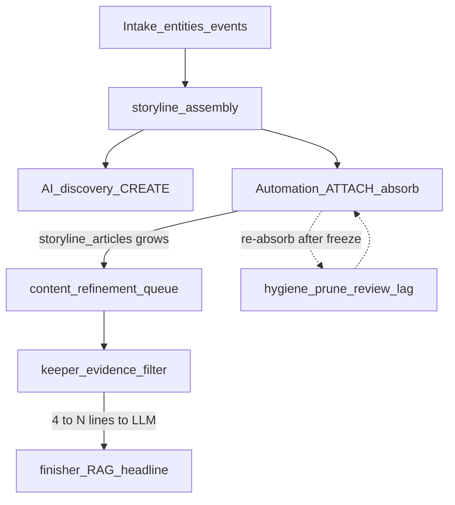

# Storyline connection & assembly logic (review SSOT)

**Audience:** Stronger reviewing agent.  
**Scope:** How articles join storylines and how editorial/Global summaries pick evidence.  
**Out of scope:** Fixing any specific storyline; pipeline ops beyond assembly attach/summarize.

**Snapshot date:** 2026-07-24 (Widow `news_intel`, post storyline flush / rebuild — few politics rows; medicine/legal bags already large).

---

## Symptom (operator)

> Good titles, weak supporting evidence: hundreds of articles connected, only four or five incorporated into the editorial summary. Unrelated co-membership (e.g. outbreak RSS on a foreign-policy / oil geopolitics storyline).

**Structural explanation (not a one-off bug):** attach path optimizes **recall**; summarize path optimizes **thin keeper evidence**. Membership `article_count` and summary evidence sets are **intentionally asymmetric**.

---

## Ordered call-graph

1. **Intake** — entities / events / topics (feeds later ILIKE + SEI glue).
2. **Post-spine assembly conductor** (`ASSEMBLY_PIPELINE_MODE=ordered`) — see `api/shared/assembly_phase_order.py`.
3. **`storyline_assembly`** (`run_storyline_assembly_for_domain`):
   - **CREATE:** `AIStorylineDiscovery.discover_storylines(..., save_to_db=True)` after coherence gate.
   - **ATTACH:** `StorylineAutomationService.discover_articles_for_storyline` → `_auto_add_articles` when mode is `auto_approve`.
4. **Parallel chemistry bonds** (graph proposals, not the main bag path): embedding links → `inference_stage` → stimulus_rag → protein_harden.
5. **Refine / summarize:** `content_refinement_queue` → optional core_prune → narrative finisher / comprehensive RAG / headline refiner — all funnel through **keeper evidence**.
6. **Cleanup (lagging):** `storyline_hygiene`, `storyline_membership_review` (often disabled), core prune unlink caps.

---

## Attach / membership (why bags grow)

| Mechanism | Location | Behavior |
|-----------|----------|----------|
| Domain blend score | `domain_synthesis_config.combined_attach_score` | Weighted relevance / semantic / keyword / quality / temporal / canonical from `link_score_profile` |
| Per-article score | `StorylineAutomationService._final_score` | Uses combined attach score |
| Auto-add floor | `effective_auto_add_threshold()` | `max(min_relevance, auto_approve_combined)`; rises slowly with size; magnets +0.08; cap 0.95 |
| Politics / finance profile | `domain_synthesis_config.yaml` | `aggressive_membership: true`, typical `auto_approve_combined ≈ 0.75` |
| Medicine / AI profile | same YAML | Higher thresholds + `max_member_articles` (chemistry) — **intended** to stay small |
| Absorb discovery | `_entity_based_article_search` (ILIKE) → canonical AE → context → RAG supplement | **Primary baggy path** |
| Absorb gate | `candidate_passes_absorb_gate` | Multi-entity / canonical required only after ~`STORYLINE_MULTI_ENTITY_ABSORB_AT` (default **80**) or shell/kitchen-sink |
| Subject specificity | `_subject_specificity_blocks_attach` | Documented for outbreak-vs-geopolitics; only on some auto-add paths |
| HITL / hard caps | `api/shared/storyline_attach_caps.py` | Narrative HITL **`STORYLINE_ATTACH_HITL_CAP` default 150**; chemistry **48** (`STORYLINE_CHEMISTRY_MEMBER_CAP` / profile `max_member_articles`) |
| Shell titles | `is_shell_title` | `Ongoing:`, LIVE UPDATES, Global Update, etc. → suggest-only / block silent add |
| SEI widening | `_merge_article_entities_to_storyline` on add | Each add expands future ILIKE hits |
| Graph `inference_stage` | `connection_inference.py` | On **graph proposals**, not `storyline_articles` rows |

**Important:** DB examples show many mega-bags with `relevance_score` clustered at **0.75–0.95** and `relationship_type='related'` for *all* members — scores do **not** separate on-theme vs off-theme in observed rebuild data; `added_by` often null.

---

## Summarize / editorial evidence (why summaries stay thin)

Evidence is **not** “all members.”

| Path | Cap / filter | File |
|------|----------------|------|
| Narrative finisher | Load up to ~50 newest → **keeper filter** → prompt truncated (~24k chars) | `storyline_narrative_finisher_service` |
| Headline refiner | SQL LIMIT ~20 → keeper | `content_refinement_queue_service` |
| RAG context | SQL LIMIT ~30 → keeper; wiki entities limit 5 | `storyline_rag_context_service` |
| Comprehensive RAG | Members chronologically → keeper; related storylines titles LIMIT 5 | `rag_analysis_service` |
| Keeper-only trigger | mega/shell title, polluted summary, kitchen_sink, `prefer_regenerate_from_keepers` | `should_use_keeper_only_evidence` in `storyline_core_prune_service` |
| Keeper qualify | `relationship_type=core` / protect, title-anchor, or fit ≥ demote floor (~0.35) | `member_qualifies_as_keeper_evidence` |

So “4–5 articles in the editorial summary” usually means: **keeper mode + LLM used a thin evidence set**, while `storyline_articles` remains huge.

**Compound failure:** When *no* true core exists (all `related`), keeper/fit heuristics still pick a handful of rows; the LLM then **narrates the title** over that thin sample — inventing thematic coherence (see medicine/3758 in `DB_EXAMPLES.md`).

---

## Hygiene / prune (why bags persist)

| Service | Intent | Gap |
|---------|--------|-----|
| `storyline_core_prune_service` | Unlink dissimilar; set `prefer_regenerate_from_keepers` | Max unlinks (~40), min remaining (~3) |
| `storyline_hygiene_service` | Freeze → prune → near-dup title merge | Freeze ends → absorb can refill |
| `storyline_membership_review_service` | Fit thresholds keep/demote/unlink | Often **disabled** (`STORYLINE_MEMBERSHIP_REVIEW_ENABLED`); starts at large N |
| Membership freeze | Blocks attach during regen | Temporary only |

---

## Key config knobs

**YAML:** `api/config/domain_synthesis_config.yaml` — `link_score_profile`, `storyline_development.automation` (`automation_batch_per_assembly`, `unlinked_article_threshold`, `default_mode`).

**Env (attach / assembly):**  
`STORYLINE_ATTACH_HITL_CAP`, `STORYLINE_CHEMISTRY_MEMBER_CAP`, `STORYLINE_MULTI_ENTITY_ABSORB_AT`, `STORYLINE_ASSEMBLY_*`, `STORYLINE_DEFAULT_AUTOMATION_MODE`, `ASSEMBLY_PIPELINE_MODE`

**Env (prune / keeper / review):**  
`STORYLINE_MEMBERSHIP_*`, `STORYLINE_CORE_PRUNE_*`, `STORYLINE_HYGIENE_*`, `STORYLINE_MEMBERSHIP_DEMOTE_SCORE`

**Env (graph bonds):**  
`EMBEDDING_LINK_MIN_COSINE`, `EMBEDDING_LINK_MERGE_BAND`, `NARRATIVE_FIRST_LINK_MIN_SCORE`

---

## Failure modes matching the symptom

1. **Entity/ILIKE absorb** glues shared tokens (FDA, CDC, country, oil, “Trump”, hospital names) across unrelated wires.
2. **HITL at 150** — 100+ member narrative bags stay auto-approve.
3. **Chemistry cap not respected in practice** — medicine examples ≫ 48 (see DB pack); investigate whether creates/merges bypass attach caps.
4. **Keeper filter after pollution / mega title** — summary collapses to thin core; membership unchanged.
5. **Hygiene lag / re-absorb** after freeze.
6. **Aggressive politics/finance** profile favors recall.
7. **SEI glue inflation** widens future absorbs.
8. **Score inflation / uniform `related`** — relevance looks “high” while titles are orthogonal.

---

## Complexity note for the reviewer

Layers that interact on a single membership decision: domain `link_score_profile`, absorb gates, subject specificity, shell detection, HITL vs chemistry caps, membership freeze, kitchen-sink / coherence guards, graph `inference_stage` (parallel), then a **second** stack for evidence (keeper, demote score, prune flags, finisher truncation). A reviewing agent should ask whether **one precision gate at attach time** would obsolete several post-hoc summary filters — without proposing a fix here.
